# Rational functions

<!-- Cambridge International AS  A Level Further Mathematics Coursebook (Lee Mckelvey Martin Crozier) .pdf p28-56 -->

<!-- page 28 -->

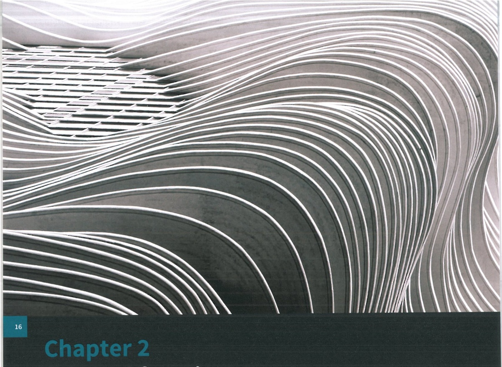

# Chapter 2 Rational functions

## In this chapter you will learn how to:

sketch graphs of simple rational functions, including the determination of oblique asymptotes, in cases where the degree of the numerator and the denominator are, at most, 2

understand and use relationships between the graphs of  $ y = f(x) $,  $ y^2 = f(x) $,  $ y = \frac{1}{f(x)} $,  $ y = |f(x)| $ and  $ y = f(|x|) $.

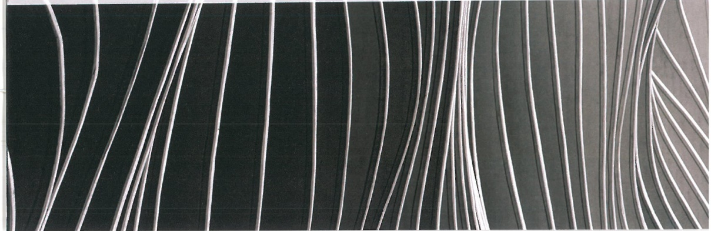

<!-- page 29 -->

## PREREQUISITE KNOWLEDGE

<table border=1 style='margin: auto; word-wrap: break-word;'><tr><td style='text-align: center; word-wrap: break-word;'>Where it comes from</td><td style='text-align: center; word-wrap: break-word;'>What you should be able to do</td><td style='text-align: center; word-wrap: break-word;'>Check your skills</td></tr><tr><td style='text-align: center; word-wrap: break-word;'>AS &amp; A Level Mathematics Pure Mathematics 2 &amp; 3, Chapter 7</td><td style='text-align: center; word-wrap: break-word;'>Split functions into partial fractions.</td><td style='text-align: center; word-wrap: break-word;'>1 Split the following into partial fractions.
a  $ \frac{x^{2}+1}{x-3} $
b  $ \frac{1}{(x-1)(x-2)} $
c  $ \frac{x^{2}}{x^{2}-1} $</td></tr><tr><td style='text-align: center; word-wrap: break-word;'>AS &amp; A Level Mathematics Pure Mathematics 1, Chapter 5</td><td style='text-align: center; word-wrap: break-word;'>Know about asymptotes and how to determine horizontal and linear cases.</td><td style='text-align: center; word-wrap: break-word;'>2 Write down the asymptotes for:
a  $ y=\frac{1}{x-1} $
b  $ y=\frac{2x-3}{x+1} $
c  $ y=\frac{1}{x^{2}-4} $</td></tr><tr><td style='text-align: center; word-wrap: break-word;'>AS &amp; A Level Mathematics Pure Mathematics 1, Chapter 5 Pure Mathematics 2 &amp; 3, Chapter 1</td><td style='text-align: center; word-wrap: break-word;'>Work with the modulus function in the forms  $ y=|f(x)| $ and  $ y=f(|x|) $.</td><td style='text-align: center; word-wrap: break-word;'>3 Make sketches of the functions:
a  $ y=|\sin x| $
b  $ y=\sin |x| $
c  $ y=\left|\frac{1}{x}\right| $</td></tr></table>

## What are rational functions?

A rational function is any function that can be defined as an algebraic fraction with polynomials as numerator and denominator. Rational functions are used to predict outcomes, from international trade balances in Economics to the amount of anaesthetic a patient will need for surgery.

You are already familiar with plotting graphs as functions and identifying simple asymptotes. You should already have the algebraic skills to use partial fractions to rearrange and simplify functions.

In this chapter, you will sketch several different types of function, including  $ y = f(x) $,  $ y^2 = f(x) $,  $ y = \frac{1}{f(x)} $,  $ y = |f(x)| $ and  $ y = f(|x|) $. You will also work with asymptotes (horizontal, vertical and oblique); identify symmetries of curves and similarities between curves; and determine ranges, turning points and x-intercepts and y-intercepts.

### 2.1 Vertical asymptotes

An asymptote is generally a line that a curve approaches but does not touch.

### KEY POINT 2.1

An asymptote is generally a line that a curve approaches but does not touch. We can say the curve converges to an asymptote.

<!-- page 30 -->

Consider the graph of the function $y=\frac{1}{x}$ (see the diagram). We can see that this curve tends towards both the coordinate axes. This is because there are two asymptotes: their equations are $x=0$ and $y=0$. These asymptotes are straight lines and come from the condition that $x\neq0$ and $y\neq0$.

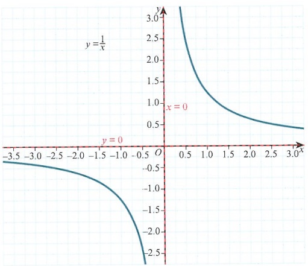

If we then consider the graph of the function  $ y = \frac{1}{x-1} $ (as seen in the following diagram), it is clear that  $ x \neq 1 $ and  $ y \neq 0 $, and these give us two asymptotes: x = 1 and y = 0. If we have any doubts about the shape of the curve, we can test either side of the line x = 1, where the curve has a discontinuity. So when x = 1.0001, the value of y is large and positive, and when x = 0.9999, the value of y is large and negative, as shown. Lastly, this curve has one intersection point with the coordinate axes, when x = 0, y = -1.

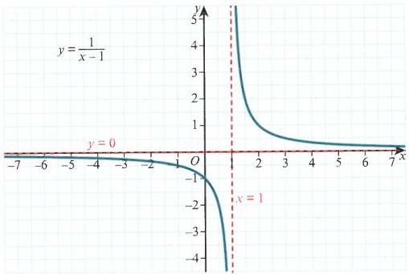

Extending this idea even further to the function  $ y=\frac{x+1}{x-1} $ (see the following diagram), we need to simplify the fraction before we can find the asymptotes. First, note that this function has a vertical asymptote at x=1, since the denominator is zero. Also note that the numerator is larger than the denominator.

<!-- page 31 -->

A top-heavy or improper fraction is a fraction where the degree of the polynomial in the numerator is greater than or equal to the degree of the denominator. Examples are  $ \frac{x}{x+3}, \frac{x^2}{x-5} $ and  $ \frac{2x^2}{x^2+7} $.

For improper fractions, the horizontal asymptote can be found in two ways. We can consider

 $ |x| \to \infty $, when the curve  $ y = \frac{x+1}{x-1} $ is close to  $ y \approx \frac{x}{x} $ and so  $ y = 1 $ is the asymptote.

Alternatively, we can split the function into smaller parts. Since the numerator of the fraction

is larger than the denominator, we can assume that  $ \frac{x+1}{x-1} = A + \frac{B}{x-1} $. Hence,

 $ x + 1 = A(x-1) + B $. We can solve this to get  $ A = 1 $,  $ B = 2 $. The equation can then be

written as  $ y = 1 + \frac{2}{x-1} $. As  $ |x| \to \infty $ we can see that  $ \frac{2}{x-1} \to 0 $, so y approaches 1. Lastly,

we consider specific values to work out the shape of the curve. When x = 0, y = -1 and

when y = 0, x = -1. Now we can sketch the curve.

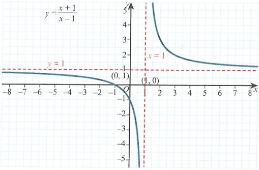

### WORKED EXAMPLE 2.1

Sketch the curve  $ y = \frac{x + 3}{x + 2} $, showing all points of intersection with the coordinate axes. State the equations of the asymptotes.

When  $ x=0, y=\frac{3}{2} $, when y=0, x=-3

## Answer

 $$ x=-2 $$ 

Determine the points of intersection.

 $$ |x|\to\infty\Rightarrow y\approx1\text{so}y=1 $$ 

State the vertical asymptote.

 $$ x=-2.0001,y<0 $$ 

 $$ x=-1.9999,y>0 $$ 

Determine the horizontal asymptote.

Note that partial fractions are not needed for the simpler cases.

Check the value of y on either side of the vertical asymptote.

<!-- page 32 -->

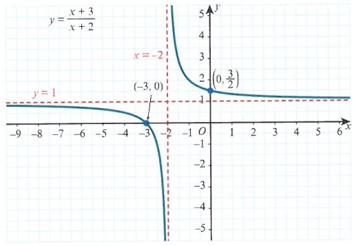

Sketch the curve, labelling all the important features. Include asymptotes, turning points and any intersections with the axes.

The examples we have looked at so far all have a linear denominator. In the next example, the denominator is a quadratic.

Consider the function  $ y = \frac{1}{(x-1)(x-2)} $ (shown in the following diagram). The first point to note is that we now have two vertical asymptotes: x = 1 and x = 2. Determine the horizontal asymptote next. If  $ |x| \to \infty $, then y = 0 is clearly our horizontal asymptote.

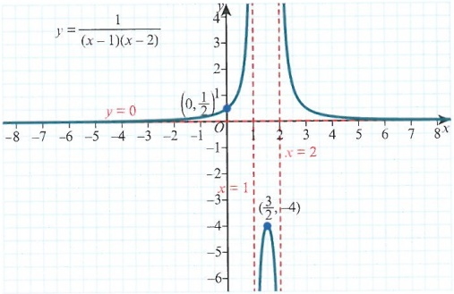

For this curve, $y \neq 0$ and when $x = 0$, $y = \frac{1}{2}$. You will notice in the diagram that there is at least one turning point. To determine the turning points we can use one of two methods.

We could just differentiate to get  $ \frac{dy}{dx}=\frac{3-2x}{(x^{2}-3x+2)^{2}} $. When  $ \frac{dy}{dx}=0 $,  $ x=\frac{3}{2} $. This value also happens to be the midpoint between 1 and 2.

The other method is to start with $y=\frac{1}{x^{2}-3x+2}$, then rearrange the equation to give $yx^{2}-3yx+(2y-1)=0$. We can consider this as a quadratic equation in $x$ and use the discriminant $b^{2}-4ac$. Use the condition that the discriminant is <0 to set up an inequality in $y$. In this way, we can find which $y$ values are invalid for the function. $b^{2}-4ac=9y^{2}-4y(2y-1)<0$ so $y(y+4)<0$ and therefore $-4<y<0$.

Remember that these are the values of $y$ that we cannot have. With the asymptote condition included, the range of values for $y$ is $y > 0$ and $y \leq -4$. We can also see that the turning point occurs when $y = -4$.

## TIP

Note that this second method is only applicable when the function does not have a full range of values. Some functions can exist for all  $ y \in \mathbb{R} $.

<!-- page 33 -->

### KEY POINT 2.2

For any curve of the form  $ y=\frac{ax^{2}+bx+c}{dx^{2}+ex+f} $, it is possible to multiply through by the denominator,

then rearrange to get  $ (dy - ay)x^{2} + (ey - by)x + (fy - cy) = 0 $. Then, for this quadratic equation in x, using the discriminant  $ b^{2} - 4ac < 0 $ will tell you what values of y your curve cannot have.

### WORKED EXAMPLE 2.2

The curve  $ y=\frac{x}{(x+1)(x-3)} $ is denoted as C. Determine the points of intersection with the coordinate axes, find all asymptotes and determine any turning points. Hence, sketch C.

## Answer

State the two vertical asymptotes.

Determine the horizontal asymptote.

 $$ \frac{\mathrm{d}y}{\mathrm{d}x}=\frac{1(x^{2}-2x-3)-x(2x-2)}{(x^{2}-2x-3)^{2}} $$ 

Find the only intersection point with the axes.

 $$ \frac{\mathrm{d}y}{\mathrm{d}x}=\frac{-x^{2}-3}{(x^{2}-2x-3)^{2}}\Rightarrow\frac{\mathrm{d}y}{\mathrm{d}x}\neq0 $$ 

Differentiate the function.

Simplify and determine that there are no turning points.

x = -1.0001, y < 0 and x = -0.9999, y > 0

x = 2.9999, y < 0 and x = 3.0001, y > 0

Test the behaviour of C either side of the discontinuities.

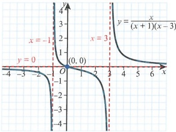

Sketch the curve. Note that, in this example, the curve actually cuts the horizontal asymptote at the point  $ (0,0) $.

### EXPLORE 2.1

Consider the two curves  $ y=\frac{a}{(bx+c)(dx+e)} $ and  $ y=\frac{ax+b}{(cx+d)(ex+f)} $, where a, b, c, d, e, f are constants.

Discuss in groups what features these two curves have. Do their asymptotes differ? Do they have the same number of turning points?

<!-- page 34 -->

So far, we have seen improper fractions where the numerator and denominator are linear functions. Now we will consider a function in which both the numerator and denominator are quadratics.

One major difference is that $y=\frac{ax^{2}+bx+c}{x^{2}+d}$ will have a horizontal asymptote at $y=a$.

Depending on the numerator, there will be 0, 1 or 2 turning points.

### WORKED EXAMPLE 2.3

Sketch the curve  $ y=\frac{(x-1)(x-2)}{(2x-1)(x+1)} $, showing all points of intersection and asymptotes and determine the number of turning points.

## Answer

 $$ x=-1,x=\frac{1}{2} $$ 

 $$ |x|\to\infty,y=\frac{1}{2} $$ 

State the vertical asymptotes.

 $$ \begin{array}{l}y=0\Rightarrow x=1,x=2\\x=0\Rightarrow y=-2\end{array} $$ 

Evaluate the horizontal asymptote.

 $$ \frac{\mathrm{d}y}{\mathrm{d}x}=\frac{7x^{2}-10x+1}{(2x^{2}+x-1)^{2}} $$ 

 $$ 7x^{2}-10x+1=0 $$ 

 $$ b^{2}-4a c=72 $$ 

Obtain the points of intersection.

Set  $ \frac{dy}{dx}=0 $.

Differentiate and simplify.

 $ x = -1.0001, y > 0 $ and  $ x = -0.9999, y < 0 $

 $ x = 0.4999, y < 0 $ and  $ x = 0.50001, y > 0 $

The discriminant is greater than 0 so there are two solutions. Hence, there are two turning points. In fact, the stationary points are  $ \left(\frac{5 - 3\sqrt{2}}{7}, -1 - \frac{2\sqrt{2}}{3}\right) $ and  $ \left(\frac{5 + 3\sqrt{2}}{7}, -1 + \frac{2\sqrt{2}}{3}\right) $.

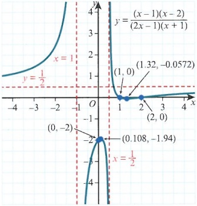

Test values either side of each vertical asymptote.

Notice that the curve has one turning point between $x=1$ and $x=2$. Recall that at both these values $y=0$.

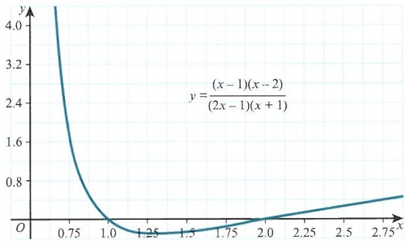

<!-- page 35 -->

When dealing with this type of function, differentiation can be rather time consuming, but there are ways of making it more efficient. For example, if we look back at Worked example 2.3 and split the function into partial fractions, we have  $ y = \frac{1}{2} + \frac{1}{2(2x-1)} - \frac{2}{x+1} $.

**Differentiate this to give**  $ \frac{dy}{dx} = -\frac{1}{(2x-1)^2} + \frac{2}{(x+1)^2} $. Solving this leads to the same quadratic as before but in fewer steps.

### WORKED EXAMPLE 2.4

A curve, $C$, is given as $y=\frac{(x-1)(x+3)}{(x-2)(x+1)}$. Find all asymptotes and points of intersection and hence sketch the curve. You are encouraged to consider turning points.

## Answer

 $$ x=-1,x=2 $$ 

 $$ |x|\to\infty,y=\frac{x^{2}+2x-3}{x^{2}-x-2}\Rightarrow y=1 $$ 

When x = 0,  $ y = \frac{3}{2} $

State the vertical asymptotes and determine the horizontal asymptote.

When y = 0, x = -3 and x = 1

x = -1.0001, y < 0 and x = -0.9999, y > 0

x = 1.9999, y < 0 and x = 2.0001, y > 0

Determine the points of intersection.

 $$ \frac{\mathrm{d}y}{\mathrm{d}x}=\frac{-3x^{2}+2x-7}{(x^{2}-x-2)^{2}}=0 $$ 

(2) $ ^{2}-4(-3)(-7)=-80 $

Describe the behaviour around each asymptote.

Differentiate and set  $ \frac{dy}{dx}=0 $.

Consider the numerator. A discriminant of less than 0 means there are no turning points.

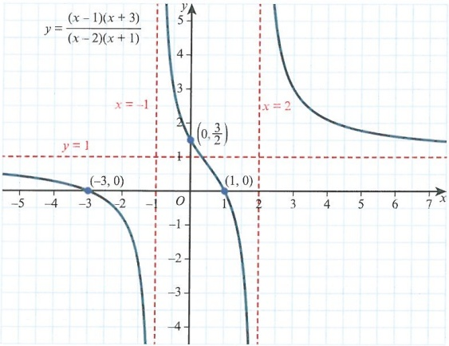

<!-- page 36 -->

1 For each of the following, determine the equations of the asymptotes of the curves.

a  $ y=\frac{2x+3}{x^{2}+3x+2} $ b  $ y=\frac{4x+3}{x-2} $ c  $ y=\frac{x^{2}-2x-3}{x^{2}-2x-8} $

2 Write $y=\frac{2x^{2}}{x^{2}-5x-6}$ in partial fractions. Hence, state the equations of the asymptotes.

PS 3 Determine the number of turning points for each of the following curves.

a  $ y=\frac{x}{(x+1)(x-3)} $ b  $ y=\frac{x^{2}+2x}{x^{2}+x+4} $

4 The curve, $C$, is given as $y=\frac{2x+4}{x-1}$. Find the equations of the asymptotes for $C$.

5 Sketch the curve  $ y=\frac{3x-1}{x+2} $, showing all points of intersection with the coordinate axes.

6 A curve is given as  $ y=\frac{x-1}{x-2} $

a Write this in the form $y = A + \frac{B}{x-2}$.

b State the equations of the asymptotes.

c Sketch the curve, showing points of intersection with the coordinate axes.

PS 7 A curve has equation  $ y=\frac{3-x}{x^{2}-1} $

a Write down the equations of the asymptotes.

b Find the x-coordinates of any stationary points.

c Sketch the curve.

P 8 The curve, C, is written as  $ y=\frac{2x}{(x-1)(x+3)} $.

a Show that C has no turning points.

b Sketch the curve C. Show on your sketch all the points of intersection with the coordinate axes.

PS 9 The curve  $ y=\frac{x^{2}-5}{(x-1)(x+3)} $ has two vertical asymptotes and one horizontal asymptote.

a Find the equations of these asymptotes.

b Determine the number of turning points.

c Sketch the curve.

### 2.2 Oblique asymptotes

In this section we will work with curves where the numerator is a quadratic and the denominator is linear. This produces an asymptote called an oblique asymptote, which is neither horizontal nor vertical. The curve will have one vertical asymptote that is easy to identify. To find the oblique asymptote, we need to write the equation of the curve in partial fraction form first.

<!-- page 37 -->

If we consider the curve  $ y = \frac{x^2}{x+1} $, the denominator indicates that the vertical asymptote is x = -1. To find the oblique asymptote, we must first consider  $ \frac{x^2}{x+1} = Ax + B + \frac{C}{x+1} $, hence  $ x^2 = (Ax + B)(x+1) + C $.

With x = -1 and x = 0 we get C = 1, B = -1 and it follows that A = 1.

This gives $y = x - 1 + \frac{1}{x+1}$ and the oblique asymptote is $y = x - 1$.

For any curve of the form  $ y = \frac{ax^2 + bx + c}{dx + e} $, split the function into the form

 $ y = Ax + B + \frac{C}{dx + e} $. The vertical asymptote is  $ x = -\frac{e}{d} $ and the oblique asymptote is

 $ y = Ax + B $, where  $ A = \frac{a}{d} $.

### KEY POINT 2.3

For any curve of the form  $ y=\frac{ax^{2}+bx+c}{dx+e} $ the vertical asymptote is  $ x=-\frac{e}{d} $ and the oblique asymptote is  $ y=Ax+B $, where  $ A=\frac{a}{d} $.

### WORKED EXAMPLE 2.5

The curve, $C$, is defined as $y = \frac{x^{2} + 1}{x - 2}$. Write down the vertical asymptote, and determine the equation of the oblique asymptote.

## Answer

Identify the vertical asymptote.

 $$ \frac{x^{2}+1}{x-2}=Ax+B+\frac{C}{x-2} $$ 

Write the function in partial fraction form.

State the value of A.

Simplify to find the coefficients.

 $ x = 2 \Rightarrow C = 5 $ and  $ x = 0 \Rightarrow B = 2 $

Determine the coefficients.

State the oblique asymptote.

Once we can find oblique asymptotes, we will be able to sketch the curve. As before, we can check x-values either side of the vertical asymptote. We can also test if a curve is above or below the oblique asymptote.

Look again at the function from Worked example 2.5. We are going to determine how the curve relates to the oblique asymptote. For $x = 100$, we can see that the $y$-value is 102.05, which is just above the asymptote where $y = 102$. For $x = -100$, the $y$-value is -98.05, which is just below the asymptote where $y = -98$.

<!-- page 38 -->

### WORKED EXAMPLE 2.6

Sketch the curve  $ y = \frac{x^{2} - 1}{2x - 3} $, stating the equations of the asymptotes and coordinates of the points of intersection.

## Answer

 $$ x=\frac{3}{2} $$ 

 $$ \frac{x^{2}-1}{2x-3}=\frac{1}{2}x+B+\frac{C}{2x-3} $$ 

 $$ x^{2}-1=\left(\frac{1}{2}x+B\right)\left(2x-3\right)+C $$ 

Using  $ x = \frac{3}{2} $,  $ C = \frac{5}{4} $ and using  $ x = 0 $,  $ B = \frac{3}{4} $

 $ y = \frac{1}{2}x + \frac{3}{4} $

 $$ x=0\Rightarrow y=\frac{1}{3}and y=0\Rightarrow x=-1,x=1 $$ 

 $$ x=1.4999,y<0and x=1.5001,y>0 $$ 

 $$ x=100,y_{c}=50.76,y_{a}=50.75 $$ 

State the value of A.

 $$ x=-100,y_{c}=-49.26,y_{a}=-49.25 $$ 

State the vertical asymptote.

Rearrange to find the coefficients.

 $$ y=\frac{x^{2}-1}{2x-3} $$ 

Find B and C.

State the oblique asymptote.

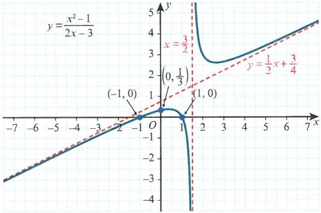

Find the points of intersection.

Examine the behaviour close to the asymptotes.

Here $y_{a}$ is the asymptote value, and $y_{c}$ is the curve value.

For large positive values of x the curve is above the oblique asymptote. For large negative values of x the curve is below the oblique asymptote.

### EXPLORE 2.2

For a curve of type $y=\frac{ax^{2}+bx+c}{dx+e}$, investigate what happens when you differentiate the equation of the curve. How many different curves can be sketched for this type of equation?

This type of curve always has two branches, which are separated by the asymptotes and lie in two of the four regions created.

<!-- page 39 -->

Consider the curve  $ y = \frac{x - 4}{x - 1} $. We will sketch this curve using differentiation. Start by stating the vertical asymptote x = 1. Next, rewrite the function as  $ \frac{x^2 - 4}{x - 1} = x + B + \frac{C}{x - 1} $, noticing that A = 1. Then, as  $ x^2 - 4 = (x + B)(x - 1) + C $, using x = 1 and x = 0 gives C = -3 and B = 1. So y = x + 1 - \frac{3}{x - 1}. Differentiating gives  $ \frac{dy}{dx} = 1 + \frac{3}{(x - 1)^2} $.

Setting  $ \frac{dy}{dx}=0 $ and rearranging this as  $ (x-1)^{2}=-3 $, it is clear that there are no turning

points. The oblique asymptote is  $ y = x + 1 $. Therefore, the curve must appear as shown in the diagram. The points of intersection  $ (-2, 0) $,  $ (2, 0) $,  $ (0, 4) $ reinforce this.

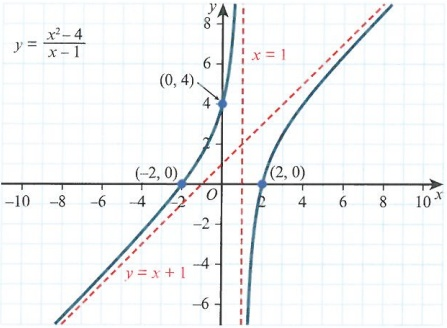

### WORKED EXAMPLE 2.7

A curve has equation  $ y = \frac{x^{2} - 9}{1 - x} $. Find the equations of the asymptotes and the coordinates of any points of intersection. Hence sketch the curve.

Answer

State the vertical asymptote.

 $$ \frac{x^{2}-9}{1-x}=-x+B+\frac{C}{1-x} $$ 

State the value of A for the partial fraction form.

 $$ y=-x-1 $$ 

Find the coefficients.

 $$ x=0\Rightarrow y=-9and y=0\Rightarrow x=-3,x=3 $$ 

State the oblique asymptote.

 $$ \frac{\mathrm{d}y}{\mathrm{d}x}=-1-\frac{8}{(1-x)^{2}}\Rightarrow\frac{\mathrm{d}y}{\mathrm{d}x}\neq0 $$ 

Determine the coordinates of the points of intersection.

Show that no turning points exist.

<!-- page 40 -->

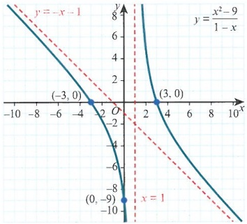

Sketch the curve.

## EXERCISE 2B

1 For each curve given, find the equations of the asymptotes.

 $$ y=\frac{3x^{2}+x+3}{x+1} $$ 

 $$ y=\frac{x^{2}+3x-31}{x-4} $$ 

2 Find the number of turning points for each of the following curves.

a  $ y=\frac{x^{2}-5}{x+3} $ b  $ y=\frac{x^{2}+5x-4}{2x-1} $

PS 3 A curve is given as  $ y=\frac{6x^{2}+x-6}{2x-1} $. Write the curve in the form  $ y=Ax+B+\frac{C}{2x-1} $ and state the equations of the asymptotes.

4 The curve, $C$, is denoted as $y=\frac{x^{2}+3}{x-2}$. Find the equations of the asymptotes and, hence, sketch $C$.

PS 5 The equation of a curve is given as  $ y=\frac{x^{2}+\lambda x}{x+1} $, where  $ \lambda $ is a constant.

a Given that one of the asymptotes is  $ y = x + 2 $, find the value of  $ \lambda $.

b State the other asymptote and sketch the curve.

PS P 6 A curve is given as  $ y=\frac{x^{2}-2x+1}{x-4} $.

a Find the equations of the asymptotes.

b Show that one of the turning points is  $ (1,0) $ and determine the other turning point.

c Sketch the curve.

PS 7 The curve, $C$, is given as $y=\frac{x^{2}+ax+b}{2x-1}$. Given that one of the asymptotes is $y=\frac{1}{2}x+\frac{5}{4}$ and that one of the points of intersection is $(0,4)$:

a find the values of a and b

b determine the number of turning points

c sketch C.

<!-- page 41 -->

P 8 An equation is given as  $ y=\frac{x^{2}-x+1}{3-x} $.

a Show that the curve can be written in the form  $ y = \alpha x + \beta + \frac{\gamma}{3 - x} $, stating the values of  $ \alpha, \beta $ and  $ \gamma $.

b Show that there are two turning points.

c Sketch the curve.

### 2.3 Inequalities

Consider the curve  $ y=\frac{2x^{2}}{2x+3} $, and how we could find x for  $ \frac{2x^{2}}{2x+3}<2 $.

Rearrange this to get  $ x^{2}-2x-3<0 $ and then solve, which gives -1<x<3.

To confirm that this is true we sketch the curve, as shown here.

We must be very careful to choose intervals that correctly satisfy the inequality. Sketching the curve is a very reliable method. We can see from the sketch that, when $y < 2$, there is a second interval to consider: $x < -\frac{3}{2}$.

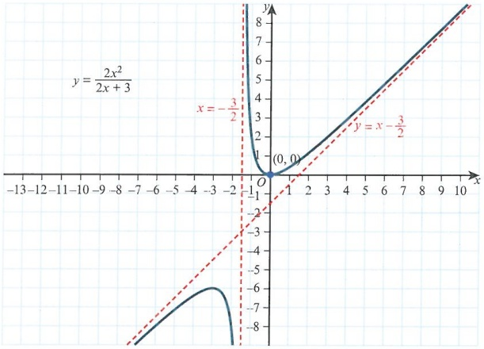

Using the curve  $ y=\frac{x^{2}+4x-9}{3x-1} $, we can see from the following diagram that, for y>0, there are two distinct intervals to consider.

<!-- page 42 -->

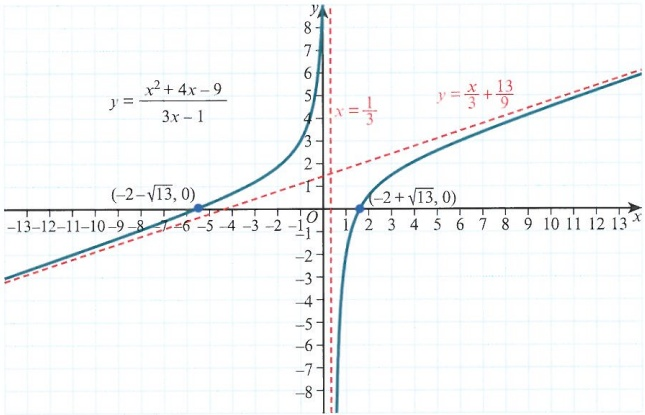

So  $ -2 - \sqrt{13} < x < \frac{1}{3} $ and  $ x > -2 + \sqrt{13} $ are the two intervals required.

### WORKED EXAMPLE 2.8

For the equation  $ y = \frac{x + 4}{(2x + 3)(x + 1)} $, determine the values of x for which y > 1.

## Answer

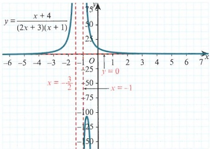

 $$ x=-\frac{3}{2},x=-1and y=0 $$ 

 $$  Let\frac{x+4}{(2x+3)(x+1)}=1\Rightarrow2x^{2}+4x-1=0 $$ 

 $$ x=-1\pm\frac{1}{2}\sqrt{6} $$ 

First sketch the curve.

Identify the asymptotes.

 $$ -1-\frac{1}{2}\sqrt{6}<x<-\frac{3}{2},-1<x<-1+\frac{1}{2}\sqrt{6} $$ 

Set up an equation to find the critical values.

Solve the equation.

Based on the sketch, determine which intervals are required.

## TIP

Always remember to sketch the curve to ensure you don’t miss any vital information. Most curves will have an interval that includes an asymptote. The asymptote will cut the interval into smaller regions.

<!-- page 43 -->

As well as determining intervals above or below $y=k$, we can also consider the range of the functions themselves. For example, if we want to determine the range of the curve $y=\frac{x^{2}+2x-1}{2x-1}$, there are two approaches we can take.

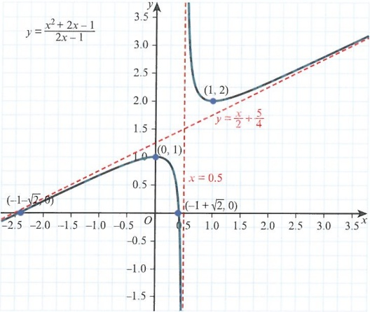

For the first method, we write the function in a simpler form and differentiate. So  $ y = \frac{1}{2}x + \frac{5}{4} + \frac{1}{4(2x-1)} $, which gives  $ \frac{dy}{dx} = \frac{1}{2} - \frac{1}{2(2x-1)^2} $. If this is equal to zero then x = 0, x = 1. From these values we find that y = 1, y = 2.

Using the shape of the curve from the sketch, we can see that the range of the curve is  $ y \leq 1 $ or  $ y \geq 2 $.

Note that we do not need the sketch to determine the range. Remember that curves of the type  $ y = \frac{ax^2 + bx + c}{dx + e} $ have either 0 or 2 turning points. If they have 2 turning points, the y value for the minimum for the top branch is always greater than the y value for the maximum for the bottom branch. Both branches must converge to the oblique asymptote. This means the minimum must always have a greater y value than the maximum.

The second method is one that we have met previously. Start with  $ y=\frac{x^{2}+2x-1}{2x-1} $, then cross multiply and simplify to get  $ x^{2}+(2-2y)x+(y-1)=0 $. Use the condition that the discriminant is <0 to set up an inequality in y and solve it. This will give us the values of y that do not exist for our curve.

4(1 - y)^{2} - 4(y - 1) < 0 leads to y^{2} - 3y + 2 < 0, so the result is 1 < y < 2. Hence, the values we can have are y ≤ 1 or y ≥ 2, just as before.

<!-- page 44 -->

### WORKED EXAMPLE 2.9

Determine the range of the curve  $ y=\frac{x^{2}-5}{3x+4} $

## Answer

## Method 1:

 $$ 3yx+4y=x^{2}-5 $$ 

Cross multiply.

 $$ x^{2}-3yx-(4y+5)=0 $$ 

Create a quadratic equation in x.

 $$ (-3y)^{2}+4(4y+5)<0 $$ 

Use  $ b^{2} - 4ac < 0 $.

 $$ 9\left(y+\frac{8}{9}\right)^{2}+\frac{116}{9}<0 $$ 

Complete the square or use the quadratic formula to conclude there are no solutions we can't have. Hence, $y \in \mathbb{R}$.

## Method 2:

 $$ \frac{x^{2}-5}{3x+4}=\frac{x}{3}-\frac{4}{9}-\frac{29}{9(3x+4)} $$ 

Change into partial fractions.

 $$ \frac{\mathrm{d}y}{\mathrm{d}x}=\frac{1}{3}+\frac{29}{3(3x+4)^{2}} $$ 

 $$ \frac{\mathrm{d}y}{\mathrm{d}x}\neq0 $$ 

Differentiate.

Conclude that the gradient is always positive. This leads to the same conclusion.

The next type of curve we will look at is different. Consider the curve  $ y = \frac{1}{x^{2} + 3x + 6} $.

 $ x^{2} + 3x + 6 = 0 $ clearly has no solutions, which implies that this curve can have no vertical asymptotes. More importantly, it also tells us that the curve must have a finite range. We should also note that as  $ |x| $ becomes large, y tends to 0, so there is a horizontal asymptote at y = 0.

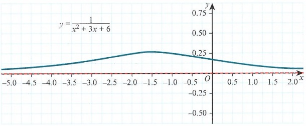

Writing the equation as  $ yx^{2} + 3yx + (6y - 1) = 0 $ and then using  $ b^{2} - 4ac < 0 $ gives the quadratic inequality  $ -15y^{2} + 4y < 0 $. This leads to  $ y < 0 $ or  $ y > \frac{4}{15} $, and these are the values we cannot have. And so our range is  $ 0 < y \leq \frac{4}{15} $.

<!-- page 45 -->

Using differentiation, we could determine the coordinates of the maximum point, and hence the range.

### WORKED EXAMPLE 2.10

The curve, $C$, is given as $y=\frac{x^{2}-x-2}{x^{2}-x+5}$. State any asymptotes, find the range of $y$ and hence sketch the curve showing points of intersection.

## Answer

<table border=1 style='margin: auto; word-wrap: break-word;'><tr><td style='text-align: center; word-wrap: break-word;'>$ x^{2} - x + 5 \neq 0 $</td><td style='text-align: center; word-wrap: break-word;'>There are no vertical asymptotes.</td></tr><tr><td style='text-align: center; word-wrap: break-word;'>$ y = \frac{x^{2} - x - 2}{x^{2} - x + 5} \Rightarrow y = 1 $</td><td style='text-align: center; word-wrap: break-word;'>This is the horizontal asymptote. As  $ |x| $ gets large,  $ y $ tends to 1.</td></tr><tr><td style='text-align: center; word-wrap: break-word;'>$ yx^{2} - yx + 5y = x^{2} - x - 2 $</td><td style='text-align: center; word-wrap: break-word;'>Cross multiply.</td></tr><tr><td style='text-align: center; word-wrap: break-word;'>$ (y - 1)x^{2} + (1 - y)x + (5y + 2) = 0 $</td><td style='text-align: center; word-wrap: break-word;'>Create a quadratic equation in  $ x $.</td></tr><tr><td style='text-align: center; word-wrap: break-word;'>$ 19y^{2} - 10y - 9 &gt; 0 $</td><td style='text-align: center; word-wrap: break-word;'>Use  $ b^{2} - 4ac &lt; 0 $.</td></tr><tr><td style='text-align: center; word-wrap: break-word;'>$ y &gt; 1, y &lt; -\frac{9}{19} $</td><td style='text-align: center; word-wrap: break-word;'>State the  $ y $ values that cannot be obtained.</td></tr><tr><td style='text-align: center; word-wrap: break-word;'>$ -\frac{9}{19} \leq y &lt; 1 $</td><td style='text-align: center; word-wrap: break-word;'>State the correct range.</td></tr><tr><td style='text-align: center; word-wrap: break-word;'>$ x = 0 \Rightarrow y = -\frac{2}{5} $ and  $ y = 0 \Rightarrow x = -1, x = 2 $</td><td style='text-align: center; word-wrap: break-word;'>Find the points of intersection.</td></tr></table>

Sketch the curve.

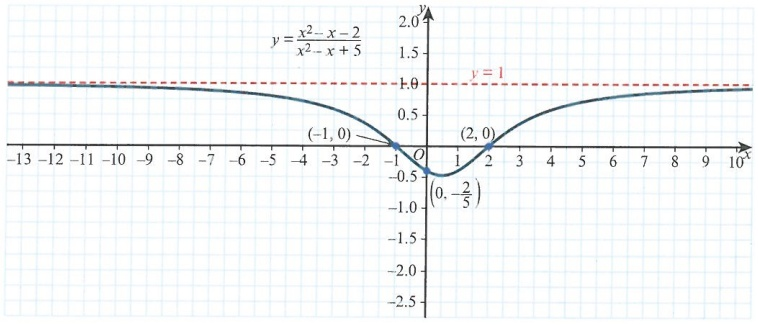

## TIP

If the numerator = 0 has no solutions, the curve never meets the x-axis.

If the denominator = 0 has no solutions, then there are no vertical asymptotes.

## EXERCISE 2C

PS 1 For the curve  $ y=\frac{2x-3}{x+2} $, determine the values of x such that y>3.

2 For the curve  $ y=\frac{x^{2}}{x+3} $, find the range of values that y can have.

<!-- page 46 -->

PS 3 Given that  $ y=\frac{x^{2}-2x-4}{3x-2} $, show that the range of the curve is  $ y\in R $.

PS 4 For the curve  $ y=\frac{x-2}{x+1} $, determine the values of x that satisfy y<5.

PS 5 The curve, C, is given as  $ y=\frac{x^{2}+x-3}{x-3} $.

a Find the range of values of y that the curve cannot have.

b Determine the exact coordinates of the turning points.

P PS 6 The curve  $ y=\frac{3x-2-4x^{2}}{x-2-3x^{2}} $ has a horizontal asymptote at y=k.

a State the value of k.

b Show that there are no vertical asymptotes.

c Determine the range for y.

P PS 7 The equation of a curve is  $ y=\frac{x}{x^{2}+x-2} $.

a Write down the equations of the asymptotes.

b Show that  $ y \in \mathbb{R} $.

c Determine the values of x that satisfy y > 1.

PS 8 The curve, C, is given as  $ y=\frac{1-3x}{x^{2}+3x-10} $. Determine the values of x that satisfy y<2.

### 2.4 Relationships between curves

From a known curve, we can determine the shapes of other related curves. For example, if we know the curve  $ f(x) = x^{2} - 3x + 2 $, then we can use this curve to determine the curve  $ \frac{1}{f(x)} $.

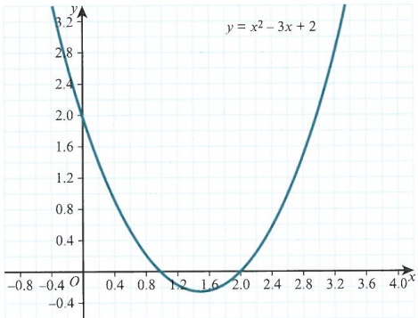

First, consider where the curve crosses the x-axis. These are the locations of the asymptotes. So when x=1, x=2 the curve will be infinite and discontinuities will exist at these points.

<!-- page 47 -->

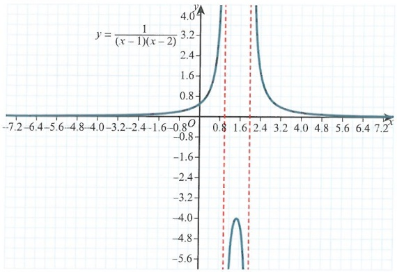

You first saw this curve in Section 2.1. We can see that, as  $ |x| $ tends to infinity, the original curve tends to infinity, and this new function tends to zero. The original curve crosses the y-axis at y = 2, and so our new curve crosses the y-axis at y =  $ \frac{1}{2} $. If there are solutions to the equation for  $ f(x) = 0 $ for the original curve then we have asymptotes for the new curve. Consider, instead, the curve  $ y = x^2 + x + 2 $. For y = 0 there are no solutions and, hence, y =  $ \frac{1}{x^2 + x + 2} $ has no discontinuities. The curve has a finite range.

You should now be familiar with both types of asymptotic curve as you have seen examples earlier in this book.

### WORKED EXAMPLE 2.11

Given the curves  $ f(x)=x^{2}+x-2 $ and  $ g(x)=x^{2}+2x+7 $, sketch  $ \frac{1}{f(x)} $ and  $ \frac{1}{g(x)} $.

Answer

 $$ \mathrm{f}(x)=(x+2)(x-1) $$ 

Hence, discontinuities at x = -2, x = 1.

Factorise the function.

Determine the vertical asymptotes for  $ \frac{1}{f(x)} $.

Horizontal asymptote at y = 0.

State the horizontal asymptote for  $ \frac{1}{f(x)} $

<!-- page 48 -->

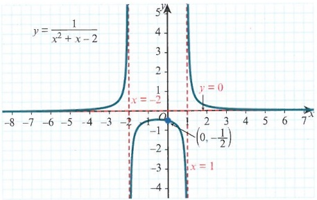

Point of intersection at  $ (0, -\frac{1}{2}) $

 $ x^{2}+2x+7=0 $ has no real solutions, therefore there are no vertical asymptotes for our graph.

Solve  $ yx^{2} + 2yx + 7y - 1 = 0 $.

Sketch the curve.

Then  $ -24y^{2} + 4y = 0 $ yields y = 0 and  $ y = \frac{1}{6} $.

Use  $ b^{2}-4ac=0 $.

Hence, the range of the function is  $ 0 < y < \frac{1}{6} $.

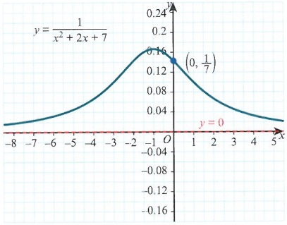

Point of intersection at  $ (0,\frac{1}{7}) $

Horizontal asymptote at y = 0.

From a known curve, it is also possible to determine the graphs of the forms  $ y = |f(x)| $ and  $ y = f|x| $. We will look at the form  $ y = |f(x)| $ first.

Consider the curve  $ y = \frac{1}{x^2 - 1} $. This curve has two positive branches  $ (y > 0) $ and one negative branch  $ (y < 0) $.

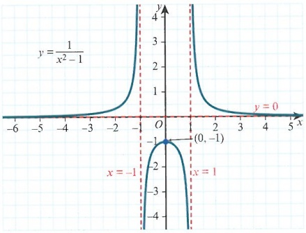

<!-- page 49 -->

If we then consider the curve  $ y = \left| \frac{1}{x^{2} - 1} \right| $, we need to make the negative y-values positive.

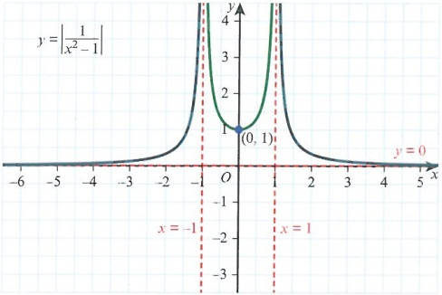

Notice that the green part of the curve has been reflected in the x-axis. This is true for all curves of the form  $ y = |f(x)| $.

Now we will look at curves in the form  $ y = f|x| $.

Consider the curve  $ y = \frac{x^{2} + 4}{x - 1} $, shown below. We can see that there are two distinct branches.

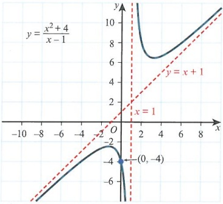

Consider the function  $ y = \frac{|x|^2 + 4}{|x| - 1} $. We can first note that  $ |x|^2 = x^2 $. Next, we can see that  $ x = \pm a $ will have the same  $ y $-values so we can sketch the curve. This is shown in the following diagram.

<!-- page 50 -->

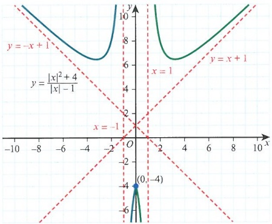

Notice that the curve is symmetrical about the y-axis. All parts of the curve that exist for x > 0 have been reflected to the other side of the y-axis. There are now four asymptotes, since the asymptotes are also reflected in the y-axis.

All curves that are of the form  $ y = f|x| $ consist of the original curve for  $ x \geq 0 $. This region is reflected in the y-axis to form the other half of the curve.

### WORKED EXAMPLE 2.12

Given that  $ f(x) = \frac{x^2}{x - 3} $, sketch the curves  $ y = |f(x)| $ and  $ y = f(|x|) $.

## Answer

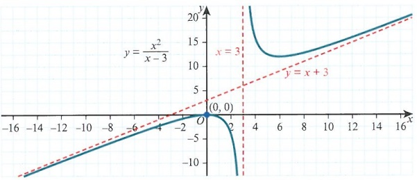

Sketch the original curve.

 $$ y=\left|\frac{x^{2}}{x-3}\right| $$ 

Note that the asymptotes are x = 3 and y = x + 3.

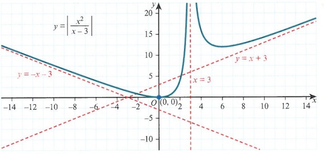

One branch should be below the x-axis.

Ensure that the negative branch has now been reflected in the x-axis.

Note that there is now another asymptote that governs the curve: y = -x - 3.

<!-- page 51 -->

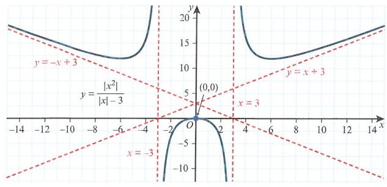

For the last sketch, note that the parts of the curve in the positive x region are reflected in the y-axis to form the other side of the curve.

Now there are four asymptotes. As well as the original ones, we have x = -3 and y = -x - 3.

Finally, we shall look at graphs of the form  $ y^2 = f(x) $. Consider the curve  $ y^2 = x $. This is parabolic in shape. To sketch this type of graph, we use a systematic approach.

First, ensure that  $ f(x) \geq 0 $ and then sketch both  $ y = \sqrt{x} $ and  $ y = -\sqrt{x} $. Note that the domain for this function is  $ x \geq 0 $.

When sketching this curve, notice that it is symmetrical about the x-axis. This is the case with all functions of the form  $ y^{2} = f(x) $.

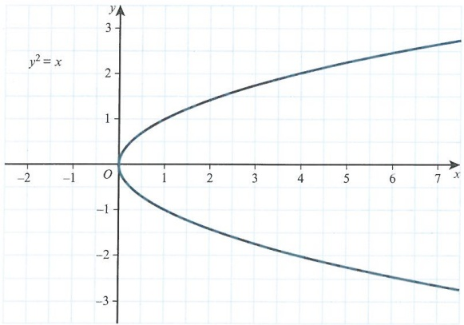

Next consider the curve  $ y^2 = 2x + 3 $. The right-hand side is  $ \geq 0 $ provided that  $ x \geq -\frac{3}{2} $.

We just need to sketch  $ y = \sqrt{2x + 3} $ and reflect this curve in the x-axis.

In this example, we should also notice that when  $ x = -\frac{3}{2} $,  $ y = 0 $ and  $ y^2 = 0 $, and when  $ x = -1 $,  $ y = \pm 1 $.

<!-- page 52 -->

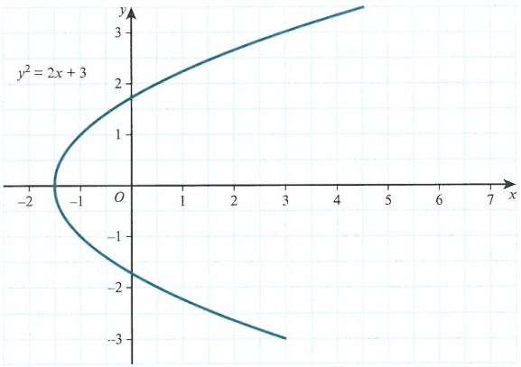

### WORKED EXAMPLE 2.13

By considering  $ y = \sqrt{5 - 4x} $, sketch the curve  $ y^{2} = 5 - 4x $, stating any points of intersection with the coordinate axes. Answer

For  $ y^2 \geq 0 $ we need  $ x \leq \frac{5}{4} $.

when  $ x = 0, y = \pm\sqrt{5} $ and when  $ y = 0, x = \frac{5}{4} $

State the domain of the function.

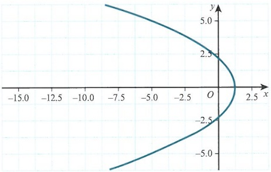

Determine the points of intersection.

Sketch $y=\sqrt{5-4x}$ and then reflect the curve in the $x$-axis.

## DID YOU KNOW?

The term asymptote was introduced by Apollonius of Perga more than 2200 years ago, when he was working on conic sections. The term asymptote is derived from the Greek word  $ asumpt\tilde{o}tos $, which means 'not falling together'.

<!-- page 53 -->

The curve C has equation

 $$ y=\frac{x^{2}}{x+\lambda}, $$ 

where  $ \lambda $ is a non-zero constant. Obtain the equation of each of the asymptotes of C.

In separate diagrams, sketch C for the cases  $ \lambda > 0 $ and  $ \lambda < 0 $. In both cases the coordinates of the turning points must be included.

Cambridge International AS & A Level Further Mathematics 9231 Paper 1 Q10 June 2009

## Answer

Let  $ \frac{x^{2}}{x+\lambda}=Ax+B+\frac{C}{x+\lambda} $, where A=1.

So  $ x^{2}=x(x+\lambda)+B(x+\lambda)+C $.

 $ x = -\lambda $ leads to  $ C = \lambda^2 $, and  $ x = 0 $ leads to  $ B = -\lambda $.

So  $ y = x - \lambda + \frac{\lambda^2}{x + \lambda} $ and the asymptotes are  $ y = x - \lambda $ and  $ x = -\lambda $.

$$\frac{\mathrm{d}y}{\mathrm{d}x}=1-\frac{\lambda^{2}}{(x+\lambda)^{2}},\text{and if}\ \frac{\mathrm{d}y}{\mathrm{d}x}=0\text{then}1=\frac{\lambda^{2}}{(x+\lambda)^{2}}.$$ Simplifying this gives $x^{2}+2\lambda x=0$.

Hence, there are always two turning points, located at $x=0$, $y=0$ and $x=-2\lambda$, $y=-4\lambda$.

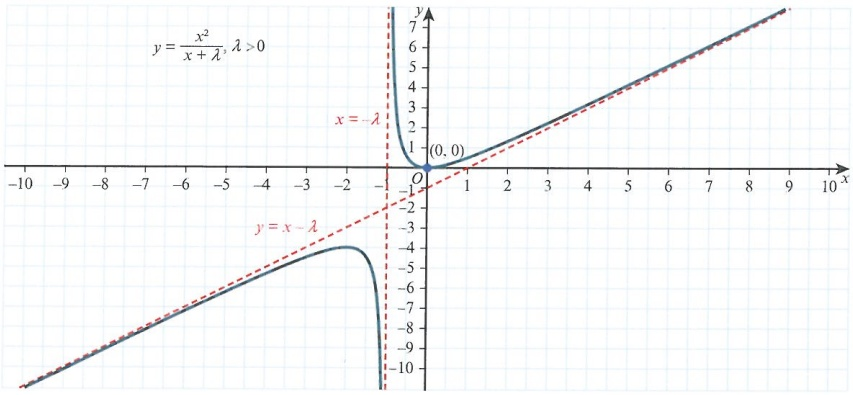

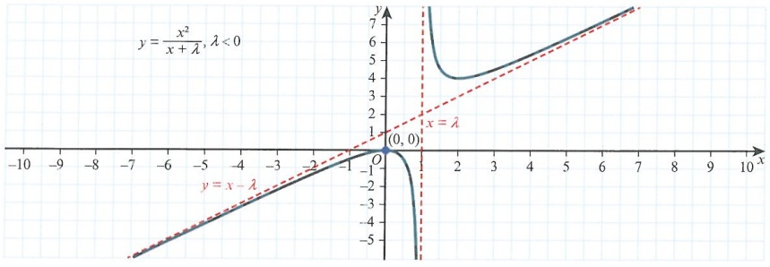

<!-- page 54 -->

## EXERCISE 2D

## Do not use a calculator in this exercise

1 Determine the number of solutions for each of the following equations.

a  $ \frac{|x|^2 - 2|x| - 3}{|x| - 2} = 0 $ b  $ \frac{|x|^2 - 3|x| + 2}{|x| - 1} = 0 $

2 Find the number of vertical asymptotes for the following curves.

a  $ y=\frac{1}{x^{2}-5x-6} $ b  $ y=\frac{1}{x^{2}+2x+3} $

3 Determine the equations of the asymptotes of the curve in the following cases.

a  $ y=\frac{1}{x^{2}-4} $

b  $ y=\frac{1}{x^{2}+2x+5} $

PS 4 Given that  $ f(x)=x^{2}-x-6 $, sketch the curve  $ y=\frac{1}{f(x)} $, showing all the asymptotes and points of intersection.

5 Sketch the curve  $ y^{2}=7-3x $, showing any points of intersection with the coordinate axes.

6 Given that  $ f(x)=\frac{x}{x^{2}-x-2} $, sketch the following curves. Show any asymptotes in each case.

a  $ y = |f(x)| $ b  $ y = f(|x|) $

42 P PS 7 You are given that  $ f(x)=\frac{x^{2}+2x-5}{x+3} $.

a Show that  $ f(x) $ has no turning points.

b Show also that the asymptotes are y = x - 1 and x = -3.

c Sketch the curve  $ |f(x)| $, showing all the asymptotes and points of intersection.

<!-- page 55 -->

## Checklist of learning and understanding

## Graph types:

For the form  $ y = \frac{ax + b}{cx + d} $ the horizontal asymptote is  $ y = \frac{a}{c} $ and the vertical asymptote is  $ x = -\frac{d}{c} $

The points of intersection are  $ \left(0,\frac{b}{d}\right) $ and  $ \left(-\frac{b}{a},0\right) $.

For the form  $ y=\frac{ax+b}{(cx+d)(ex+f)} $ the horizontal asymptote is y=0 and the vertical asymptote are  $ x=-\frac{d}{c} $ and  $ x=-\frac{f}{e} $.

The points of intersection are  $ \left(0,\frac{b}{df}\right) $ and  $ \left(-\frac{b}{a},0\right) $.

For the form  $ y = \frac{(ax + b)(cx + d)}{(ex + f)(gx + h)} $ the horizontal asymptote is  $ y = \frac{ac}{eg} $ and the vertical asymptote are  $ x = -\frac{f}{e} $ and  $ x = -\frac{h}{g} $.

The points of intersection are  $ \left(0,\frac{bd}{fh}\right),\left(-\frac{b}{a},0\right) $ and  $ \left(-\frac{d}{c},0\right) $.

For the form  $ y=\frac{(ax+b)(cx+d)}{ex^{2}+fx+g} $, where  $ ex^{2}+fx+g $ gives no real solutions, the horizontal asymptote is  $ y=\frac{ac}{e} $.

The points of intersection are  $ \left(0,\frac{bd}{g}\right),\left(-\frac{b}{a},0\right) $ and  $ \left(-\frac{d}{c},0\right) $.

For the form  $ y = \frac{(ax + b)(cx + d)}{ex + f} $, the vertical asymptote is  $ x = -\frac{f}{e} $ and the oblique asymptote, determined by using partial fractions, is  $ y = \frac{ac}{e}x + B $, where B is to be determined.

The points of intersection are  $ \left(0,\frac{bd}{f}\right) $,  $ \left(-\frac{b}{a},0\right) $ and  $ \left(-\frac{d}{c},0\right) $.

## For special curve types:

For $y = \frac{1}{f(x)}$, consider all points where $f(x) = 0$, $f(x) = \infty$ and also $f(0) = k$. All of these values can be used to construct the new graph.

For $y = |f(x)|$, consider the original curve $y = f(x)$ and then reflect all negative parts $(y < 0)$ in the x-axis.

For $y = f(|x|)$, consider the original curve for $x \geq 0$, draw this section and then reflect this in the y-axis for the complete curve.

For  $ y^2 = f(x) $, consider the domain such that  $ f(x) \geq 0 $, sketch  $ \sqrt{f(x)} $ and then reflect this part of the curve in the x-axis.

In all of these cases, make sure you consider the effect on the asymptotes.

<!-- page 56 -->

1 A curve is given as  $ f(x)=\frac{x^{2}-x-5}{x-3} $.

Find the equations of the asymptotes of the curve.

Sketch the curve.

Hence, or otherwise, sketch the curve  $ \frac{1}{f(x)} $. State the equations of the vertical asymptotes.

## 2 The curve C has equation  $ y=\frac{2x^{2}+5x-1}{x+2} $

Find the equations of the asymptotes of C.

Show that  $ \frac{\mathrm{d}y}{\mathrm{d}x}>2 $ at all points on C.

Sketch C.

Cambridge International AS & A Level Further Mathematics 9231 Paper 13 Q7 November 2013

3 The curve C has equation  $ y=\frac{2x^{2}-3x-2}{x^{2}-2x+1} $. State the equations of the asymptotes of C.

Show that  $ y \leq \frac{25}{12} $ at all points of C.

Find the coordinates of any stationary points of C.

Sketch C, stating the coordinates of any intersections of C with the coordinate axes and the asymptotes. Cambridge International AS & A Level Further Mathematics 9231 Paper 11 Q10 June 2013

