# Matrices 1

<!-- Cambridge International AS  A Level Further Mathematics Coursebook (Lee Mckelvey Martin Crozier) .pdf p70-104 -->

<!-- page 70 -->

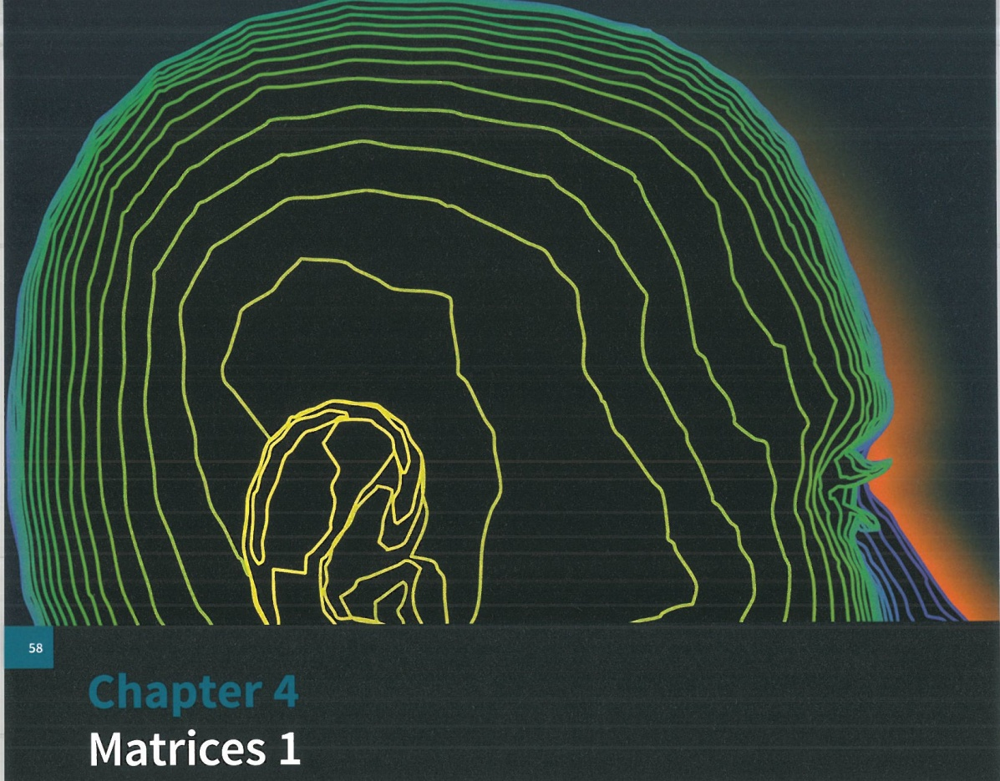

# Chapter 4 Matrices 1

## In this chapter you will learn how to:

carry out matrix operations such as addition, subtraction and multiplication

recognise the terms zero matrix, identity matrix, singular and non-singular

evaluate determinants, find inverse matrices and know to use identities such as  $ (\mathbf{A}\mathbf{B})^{-1} = \mathbf{B}^{-1}\mathbf{A}^{-1} $

apply geometric transformations, such as rotations and enlargements, as well as being aware of the relation between scale factor and determinants.

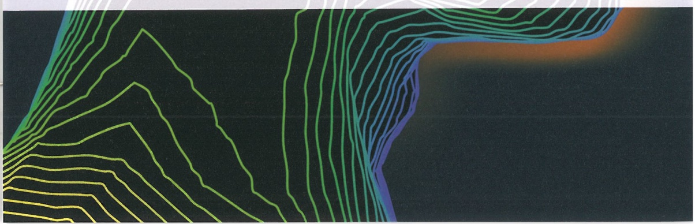

<!-- page 71 -->

<table border=1 style='margin: auto; word-wrap: break-word;'><tr><td style='text-align: center; word-wrap: break-word;'>Where it comes from</td><td style='text-align: center; word-wrap: break-word;'>What you should be able to do</td><td style='text-align: center; word-wrap: break-word;'>Check your skills</td></tr><tr><td style='text-align: center; word-wrap: break-word;'>AS &amp; A Level Mathematics\nPure Mathematics 2 &amp; 3, Chapter 9</td><td style='text-align: center; word-wrap: break-word;'>Find the scalar product of 2- and 3-dimensional vectors.</td><td style='text-align: center; word-wrap: break-word;'>1 Find the scalar product of the following.\na  $ (2i + j) \cdot (3i - 4j) $\nb  $ (-i + 4j + 5k) \cdot (-6j + 2k) $</td></tr></table>

## What are matrices?

Matrices (singular, matrix) are rectangular arrays of numbers, variables or expressions arranged in rows and columns. They are widely used in computing processes, for instance reflection and refraction in computer graphics or computer modelling of probabilities for weather forecasting.

Matrices can be used to represent information such as the coordinates of an object in 3-dimensional space. You might have a basic understanding of how matrices work from your IGCSE $ ^{®} $ course.

In this chapter we will focus on matrix operations, inverse matrices, special types of matrices and matrix transformations.

### 4.1 Matrix operations

The size of a matrix is defined by its rows, m, and columns, n. We refer to matrices by their order or size,  $ m \times n $.

For a general matrix of order  $ m \times n $ we have  $ \begin{pmatrix} a_{11} & a_{12} & a_{13} & \cdots \\ a_{21} & a_{22} & a_{23} & \cdots \\ a_{31} & a_{32} & a_{33} & \cdots \\ \vdots & \vdots & \vdots & \ddots \end{pmatrix} $.

Each $a_{mn}$ inside represents an element of the matrix.

For example, the column vector  $ \begin{pmatrix} 2 \\ 5 \\ 6 \end{pmatrix} $ is a  $ 3 \times 1 $ matrix and  $ \begin{pmatrix} 2 & 4 & -1 \\ 3 & 0 & 1 \end{pmatrix} $ is a  $ 2 \times 3 $ matrix. The size of a matrix is important when considering addition, subtraction and multiplication.

A matrix that has the same number of rows and columns is called a square matrix.

Addition and subtraction of matrices

For matrices  $ \mathbf{A} = \begin{pmatrix} 3 & 2 \\ 4 & 6 \end{pmatrix} $ and  $ \mathbf{B} = \begin{pmatrix} 5 & -4 \\ 1 & 3 \end{pmatrix} $, adding gives  $ \mathbf{A} + \mathbf{B} = \begin{pmatrix} 8 & -2 \\ 5 & 9 \end{pmatrix} $ and subtracting gives  $ \mathbf{A} - \mathbf{B} = \begin{pmatrix} -2 & 6 \\ 3 & 3 \end{pmatrix} $.

We cannot add matrices  $ \mathbf{C} = \begin{pmatrix} 1 & 0 & 3 \\ 5 & -4 & 6 \end{pmatrix} $ and  $ \mathbf{D} = \begin{pmatrix} 1 & 2 \\ 3 & 1 \end{pmatrix} $ together because there are elements in the first matrix that have no corresponding elements to add to in the second matrix. Matrices can be added (or subtracted) only when the number of columns and rows is the same in both matrices.

<!-- page 72 -->

To add two matrices, each element of the first matrix is added to the corresponding element of the second matrix. Subtraction uses the same method, but elements are subtracted. To add or subtract two general  $ 2 \times 2 $ matrices together, we use the formula shown in Key point 4.1.

### KEY POINT 4.1

To add or subtract two general  $ 2 \times 2 $ matrices together, use:

 $$ \begin{pmatrix}\boldsymbol{a}&\boldsymbol{b}\\ \boldsymbol{c}&\boldsymbol{d}\end{pmatrix}\pm\begin{pmatrix}\boldsymbol{e}&\boldsymbol{f}\\ \boldsymbol{g}&\boldsymbol{h}\end{pmatrix}=\begin{pmatrix}\boldsymbol{a}\pm\boldsymbol{e}&\boldsymbol{b}\pm\boldsymbol{f}\\ \boldsymbol{c}\pm\boldsymbol{g}&\boldsymbol{d}\pm\boldsymbol{h}\end{pmatrix} $$ 

Matrices may be added or subtracted only when they have the same order. The result will be a matrix of the same order.

## Multiplication of matrices

To multiply a matrix by a scalar, multiply each element of the matrix by the scalar.

For example, if  $ \mathbf{A} = \begin{pmatrix} a & b \\ c & d \end{pmatrix} $, then  $ k\mathbf{A} = k\begin{pmatrix} a & b \\ c & d \end{pmatrix} $, which is  $ \begin{pmatrix} ka & kb \\ kc & kd \end{pmatrix} $.

Consider two matrices  $ \mathbf{A} = \begin{pmatrix} a & b \\ c & d \end{pmatrix} $ and  $ \mathbf{B} = \begin{pmatrix} e & f \\ g & h \end{pmatrix} $. The product of these matrices is

given as  $ \mathbf{AB} = \begin{pmatrix} ae + bg & af + bh \\ ce + dg & cf + dh \end{pmatrix} $.

 $$ \left(\stackrel{\longrightarrow}{\times}\right)\times\left(\stackrel{\downarrow}{\downarrow}\quad\right)=\left(\bullet\quad\right) $$ 

The elements of the first row of the first matrix are multiplied by the elements of the first column of the second matrix. For each row  $ \times $ column, sum the products. This produces new element  $ a_{11} $ for the solution matrix.

 $$ \left(\stackrel{\longrightarrow}{\times}\right)\times\left(\quad\downarrow\right)=\left(\quad\bullet\right) $$ 

Multiplying the first row of the first matrix and the second column of the second matrix produces the element $a_{12}$ and so on.

So if  $ \mathbf{E} = \begin{pmatrix} 1 & 2 \\ 3 & 4 \end{pmatrix} $ and  $ \mathbf{F} = \begin{pmatrix} 5 & 6 \\ 7 & 8 \end{pmatrix} $, then  $ \mathbf{E}\mathbf{F} = \begin{pmatrix} 1 \times 5 + 2 \times 7 & 1 \times 6 + 2 \times 8 \\ 3 \times 5 + 4 \times 7 & 3 \times 6 + 4 \times 8 \end{pmatrix} = \begin{pmatrix} 19 & 22 \\ 43 & 50 \end{pmatrix} $

To multiply matrices, the number of columns in the first matrix must be the same as the number of rows in the second matrix.

It is important to understand the process of matrix multiplication before we move on to any more examples.

<!-- page 73 -->

Given that  $ \mathbf{A} = \begin{pmatrix} 4 & 3 \\ 2 & 1 \end{pmatrix} $ and  $ \mathbf{B} = \begin{pmatrix} 8 & 7 \\ 6 & 5 \end{pmatrix} $, determine the solution matrix for:

a  $ \mathbf{A} + 3\mathbf{B} $ b  $ \mathbf{B} - 4\mathbf{A} $ c  $ \mathbf{A}^{2} $ d  $ \mathbf{AB} $ e  $ \mathbf{BA} $

## Answer

 $$ \begin{aligned}\mathbf{A}+3\mathbf{B}&=\binom{4\quad3}{2\quad1}+3\binom{8\quad7}{6\quad5}\\&=\binom{4\quad3}{2\quad1}+\binom{24\quad21}{18\quad15}\\&=\binom{28\quad24}{20\quad16}\end{aligned} $$ 

Multiply the matrix by the scalar first, then add the two matrices.

 $$ \begin{aligned}\mathbf{B}-4\mathbf{A}&=\begin{pmatrix}8&7\\ 6&5\end{pmatrix}-4\begin{pmatrix}4&3\\ 2&1\end{pmatrix}\\&=\begin{pmatrix}-8&-5\\ -2&1\end{pmatrix}\end{aligned} $$ 

Multiply the matrix by the scalar first, then subtract.

 $$ \begin{aligned}\mathbf{A}^{2}&=\begin{pmatrix}4&3\\ 2&1\end{pmatrix}\begin{pmatrix}4&3\\ 2&1\end{pmatrix}\\&=\begin{pmatrix}22&15\\ 10&7\end{pmatrix}\end{aligned} $$ 

The square of a matrix is the result of multiplying the matrix by itself.

 $$ \begin{aligned}d\quad AB&=\begin{pmatrix}4&3\\ 2&1\end{pmatrix}\begin{pmatrix}8&7\\ 6&5\end{pmatrix}\\&=\begin{pmatrix}50&43\\ 22&19\end{pmatrix}\end{aligned} $$ 

 $$ \begin{aligned}\textbf{e}\quad\mathbf{B}\mathbf{A}&=\begin{pmatrix}8&7\\ 6&5\end{pmatrix}\begin{pmatrix}4&3\\ 2&1\end{pmatrix}\\&=\begin{pmatrix}46&31\\ 34&23\end{pmatrix}\end{aligned} $$ 

In general, AB  $ \neq $ BA. The order in which matrices are multiplied is very important.

In general, matrix multiplication is non-commutative, as shown in Key point 4.2.

### KEY POINT 4.2

For two matrices A and B, AB  $ \neq $ BA.

To multiply  $ 3 \times 3 $ matrices, we use the same method as before. However, there will be more elements in each calculation.

In general,

 $$ \begin{align*}\begin{pmatrix}a&b&c\\ *&*&*\\ *&*&*\end{pmatrix}\times\begin{pmatrix}d&*&*\\ e&*&*\\ f&*&*\end{pmatrix}=\begin{pmatrix}ad+be+cf&*&*\\ *&*&*\\ *&*&*\end{pmatrix}.\end{align*} $$ 

For example, if  $ A = \begin{pmatrix} 1 & 2 & 5 \\ 0 & -2 & 3 \\ 2 & 0 & 4 \end{pmatrix} $ and  $ B = \begin{pmatrix} 3 & 4 & -1 \\ 5 & 2 & 1 \\ -2 & 1 & 4 \end{pmatrix} $, then

 $$ \mathbf{A}\mathbf{B}=\begin{pmatrix}1&2&5\\0&-2&3\\2&0&4\end{pmatrix}\begin{pmatrix}3&4&-1\\5&2&1\\-2&1&4\end{pmatrix}=\begin{pmatrix}3&13&21\\-16&-1&10\\-2&12&14\end{pmatrix}. $$

<!-- page 74 -->

Note that $\mathbf{B}\mathbf{A}$ gives $\begin{pmatrix}3 & 4 & -1 \\ 5 & 2 & 1 \\ -2 & 1 & 4\end{pmatrix}\begin{pmatrix}1 & 2 & 5 \\ 0 & -2 & 3 \\ 2 & 0 & 4\end{pmatrix}=\begin{pmatrix}1 & -2 & 23 \\ 7 & 6 & 35 \\ 6 & -6 & 9\end{pmatrix}$. So $\mathbf{A}\mathbf{B}\neq\mathbf{B}\mathbf{A}$.

### WORKED EXAMPLE 4.2

Given that  $ \mathbf{A} = \begin{pmatrix} 0 & 3 & -2 \\ 1 & 1 & 1 \\ -5 & 1 & 0 \end{pmatrix} $,  $ \mathbf{B} = \begin{pmatrix} 4 & 8 & 3 \\ 6 & 2 & 1 \\ 3 & 2 & 5 \end{pmatrix} $ and  $ \mathbf{C} = \begin{pmatrix} -1 & 0 & 2 \\ 2 & -1 & -1 \\ 1 & -1 & 3 \end{pmatrix} $, find the values of AB, CA and BC.

Answer

 $$ \mathbf{A}\mathbf{B}=\begin{pmatrix}{{{0}}}&{{{3}}}&{{{-2}}} \\{{{1}}}&{{{1}}}&{{{1}}} \\{{{-5}}}&{{{1}}}&{{{0}}}\end{pmatrix}\begin{pmatrix}{{{4}}}&{{{8}}}&{{{3}}} \\{{{6}}}&{{{2}}}&{{{1}}} \\{{{3}}}&{{{2}}}&{{{5}}}\end{pmatrix}=\begin{pmatrix}{{{12}}}&{{{2}}}&{{{-7}}} \\{{{13}}}&{{{12}}}&{{{9}}} \\{{{-14}}}&{{{-38}}}&{{{-14}}}\end{pmatrix} $$ 

Remember to multiply elements in rows by elements in columns.

 $$ \mathbf{C A}=\begin{pmatrix}{{{-1}}}&{{{0}}}&{{{2}}} \\{{{2}}}&{{{-1}}}&{{{-1}}} \\{{{1}}}&{{{-1}}}&{{{3}}}\end{pmatrix}\begin{pmatrix}{{{0}}}&{{{3}}}&{{{-2}}} \\{{{1}}}&{{{1}}}&{{{1}}} \\{{{-5}}}&{{{1}}}&{{{0}}}\end{pmatrix}=\begin{pmatrix}{{{-10}}}&{{{-1}}}&{{{2}}} \\{{{4}}}&{{{4}}}&{{{-5}}} \\{{{-16}}}&{{{5}}}&{{{-3}}}\end{pmatrix} $$ 

Where the row and column intersect, this shows which element is being calculated.

 $$ \mathbf{B}\mathbf{C}=\begin{pmatrix}{{{4}}}&{{{8}}}&{{{3}}} \\{{{6}}}&{{{2}}}&{{{1}}} \\{{{3}}}&{{{2}}}&{{{5}}}\end{pmatrix}\begin{pmatrix}{{{-1}}}&{{{0}}}&{{{2}}} \\{{{2}}}&{{{-1}}}&{{{-1}}} \\{{{1}}}&{{{-1}}}&{{{3}}}\end{pmatrix}=\begin{pmatrix}{{{15}}}&{{{-11}}}&{{{9}}} \\{{{-1}}}&{{{-3}}}&{{{13}}} \\{{{6}}}&{{{-7}}}&{{{19}}}\end{pmatrix} $$ 

Multiply the matrices in the correct order.

### EXPLORE 4.1

Investigate the multiplication of non-square matrices.

How is the size of the resulting matrix related to the matrices being multiplied together?

We have stated previously that, in general,  $ \mathbf{AB} \neq \mathbf{BA} $. There are a few exceptions to this rule.

Any matrix in which all the elements are zero is known as the zero matrix. This matrix can

be any size and is represented by  $ 0_{mn}=\begin{pmatrix}0&0&0&\cdots\\0&0&0&\cdots\\0&0&0&\cdots\\\vdots&\vdots&\vdots&\ddots\end{pmatrix} $.

If $\mathbf{A} = \begin{pmatrix} a & b \\ c & d \end{pmatrix}$ and $\mathbf{B} = \begin{pmatrix} 0 & 0 \\ 0 & 0 \end{pmatrix}$, then we can see that $\mathbf{AB} = \begin{pmatrix} 0 & 0 \\ 0 & 0 \end{pmatrix}$ and $\mathbf{BA} = \begin{pmatrix} 0 & 0 \\ 0 & 0 \end{pmatrix}$. So $\mathbf{AB} = \mathbf{BA}$ when one of the matrices is a zero matrix.

Now consider the matrix  $ \mathbf{A} = \begin{pmatrix} 2 & 5 \\ 1 & 2 \end{pmatrix} $, and let  $ \mathbf{B} = \mathbf{A}^2 = \begin{pmatrix} 9 & 20 \\ 4 & 9 \end{pmatrix} $.

Then  $ \mathbf{A}\mathbf{B} = \mathbf{A}\mathbf{A}^2 = \begin{pmatrix} 2 & 5 \\ 1 & 2 \end{pmatrix} \begin{pmatrix} 9 & 20 \\ 4 & 9 \end{pmatrix} = \begin{pmatrix} 38 & 85 \\ 17 & 38 \end{pmatrix} $

and  $ \mathbf{B}\mathbf{A}=\mathbf{A}^{2}\mathbf{A}=\begin{pmatrix}9&20\\4&9\end{pmatrix}\begin{pmatrix}2&5\\1&2\end{pmatrix}=\begin{pmatrix}38&85\\17&38\end{pmatrix}. $

<!-- page 75 -->

It can then be shown that  $ \mathbf{A}\mathbf{A}^3 = \mathbf{A}^3\mathbf{A} = \mathbf{A}^4 $ and, in general,  $ \mathbf{A}^m\mathbf{A}^n = \mathbf{A}^n\mathbf{A}^m = \mathbf{A}^{m+n} $, as shown in Key point 4.3. This result shows that matrix multiplication does not depend on order when the matrices are both powers of the same base matrix, in this case A.

 $$ \mathbf{A}^{m}\mathbf{A}^{n}=\mathbf{A}^{n}\mathbf{A}^{m}=\mathbf{A}^{m+n} $$ 

There is another special matrix to look at. Consider matrix  $ \mathbf{A} = \begin{pmatrix} a & b \\ c & d \end{pmatrix} $ and multiply it by  $ \begin{pmatrix} 1 & 0 \\ 0 & 1 \end{pmatrix} $

 $ \begin{pmatrix} a & b \\ c & d \end{pmatrix} \begin{pmatrix} 1 & 0 \\ 0 & 1 \end{pmatrix} = \begin{pmatrix} a & b \\ c & d \end{pmatrix} $ and  $ \begin{pmatrix} 1 & 0 \\ 0 & 1 \end{pmatrix} \begin{pmatrix} a & b \\ c & d \end{pmatrix} = \begin{pmatrix} a & b \\ c & d \end{pmatrix} $.

The matrix  $ \begin{pmatrix}1&0\\0&1\end{pmatrix} $ is known as the identity matrix. We denote this matrix as I.

The identity matrix is a square matrix of the form  $ I = \left( \begin{array}{ccccc} 1 & 0 & 0 & \cdots & 0 \\ 0 & 1 & 0 & \cdots & 0 \\ 0 & 0 & 1 & \cdots & 0 \\ \vdots & \vdots & \vdots & \ddots & \vdots \\ 0 & 0 & 0 & \cdots & 1 \end{array} \right) $.

This matrix behaves in a special way. When any matrix is multiplied by I it is unchanged. It is just like multiplying any number by 1.

In general, we can say that $\mathbf{A}\mathbf{I}=\mathbf{I}\mathbf{A}=\mathbf{A}$, provided that the matrix multiplication is allowed.

### WORKED EXAMPLE 4.3

Given matrix $\mathbf{A} = \begin{pmatrix} -2 & 5 \\ 1 & -3 \end{pmatrix}$ and matrix $\mathbf{B} = \begin{pmatrix} a & b \\ c & d \end{pmatrix}$, prove that if $\mathbf{A}\mathbf{B} = \mathbf{A}$ then the matrix $\mathbf{B}$ must be of the form $\begin{pmatrix} 1 & 0 \\ 0 & 1 \end{pmatrix}$.

Answer

 $$ \begin{pmatrix}-2&5\\1&-3\end{pmatrix}\times\begin{pmatrix}a&b\\c&d\end{pmatrix} $$ 

Multiply the matrices together.

Obtain four simultaneous equations.

Solve the equations to find the elements.

Confirm this is the correct matrix.

<!-- page 76 -->

Let us look at the order of matrix multiplication in slightly more detail. Consider the three matrices  $ \mathbf{A} = \begin{pmatrix} 3 & 0 & 0 \\ 1 & 2 & 6 \\ 6 & 4 & -1 \end{pmatrix} $,  $ \mathbf{B} = \begin{pmatrix} 4 & 9 & 12 \\ -1 & -1 & 1 \\ 3 & 1 & 4 \end{pmatrix} $ and  $ \mathbf{C} = \begin{pmatrix} 2 & 5 & 0 \\ 8 & 1 & 7 \\ 0 & 4 & 0 \end{pmatrix} $. If we want to determine the result  $ \mathbf{ABC} $, we can do this in two ways.

First, find  $ \mathbf{AB} = \begin{pmatrix} 12 & 27 & 36 \\ 20 & 13 & 38 \\ 17 & 49 & 72 \end{pmatrix} $ and then  $ (\mathbf{AB})\mathbf{C} = \begin{pmatrix} 240 & 231 & 189 \\ 144 & 265 & 91 \\ 426 & 422 & 343 \end{pmatrix} $.

Alternatively, calculate  $ \mathbf{BC}=\left(\begin{array}{ccc}80&77&63\\-10&-2&-7\\14&32&7\end{array}\right) $, and then  $ \mathbf{A}(\mathbf{BC})=\left(\begin{array}{ccc}240&231&189\\144&265&91\\426&422&343\end{array}\right) $.

So, in general,  $ (\mathbf{AB})\mathbf{CD} = \mathbf{A}(\mathbf{BC})\mathbf{D} = \mathbf{AB}(\mathbf{CD}) = (\mathbf{AB})(\mathbf{CD}) $. We get the same result when we multiply matrices in different ways, provided the matrices stay in the same sequences, in this case ABCD.

## EXERCISE 4A

1 Verify that  $ \mathbf{AB} \neq \mathbf{BA} $, where  $ \mathbf{A} = \begin{pmatrix} 2 & 7 \\ -9 & 4 \end{pmatrix} $ and  $ \mathbf{B} = \begin{pmatrix} 3 & -5 \\ 4 & 12 \end{pmatrix} $.

2 Given that  $ A = \begin{pmatrix} 6 & 7 \\ 1 & 2 \end{pmatrix} $ and  $ B = \begin{pmatrix} 2 & 0 \\ 1 & -4 \end{pmatrix} $, evaluate the following:

a  $ A^{2}+2AB $ b  $ B^{2}A $ c  $ A^{3}-BA $

3 Given that  $ A = \begin{pmatrix} 2 & -5 & 1 \\ 6 & 1 & 0 \\ 3 & 0 & -2 \end{pmatrix} $ and  $ B = \begin{pmatrix} 1 & -2 & 1 \\ 0 & 4 & 2 \\ 0 & 0 & 2 \end{pmatrix} $, find:

a  $ AB^{2} $ b  $ A^{2}-AB $

4 State which of the following pairs of matrices can be multiplied together, and if they can, determine the result.

a  $ \begin{pmatrix} 2 & 3 \\ 1 & 5 \end{pmatrix} \times \begin{pmatrix} 0 \\ 4 \end{pmatrix} $

b  $ \begin{pmatrix} 5 \\ 6 \end{pmatrix} \times \begin{pmatrix} 7 & 8 \\ 10 & -2 \end{pmatrix} $

c (5 2 1)  $ \times \begin{pmatrix} 2 & 6 \\ 4 & 0 \\ 3 & 8 \end{pmatrix} $

d  $ \begin{pmatrix} 2 & 7 & 5 & -1 \\ 4 & -4 & 0 & 3 \end{pmatrix} \times \begin{pmatrix} 12 & 3 \\ 2 & 5 \end{pmatrix} $

5 Given that  $ A = \begin{pmatrix} 1 & 2 & -5 \\ 0 & 9 & 3 \\ -1 & -5 & 10 \end{pmatrix} $ and  $ B = \begin{pmatrix} 3 & 1 & -2 \\ 0 & 0 & 4 \\ 5 & -3 & -6 \end{pmatrix} $, calculate the matrices:

a  $ 2A + 5B $ b  $ AB^{2} $ c  $ BA^{2} $ d  $ 2A + 3A^{2} $

P 6 If $\mathbf{A} = \begin{pmatrix} 1 & -1 \\ 0 & 1 \end{pmatrix}$, show that $\mathbf{A}^n = \begin{pmatrix} 1 & -n \\ 0 & 1 \end{pmatrix}$.

7 You are given the matrices  $ \mathbf{A} = \begin{pmatrix} 2 & 1 & 3 \\ 4 & 6 & 0 \\ 0 & -1 & 0 \end{pmatrix} $,  $ \mathbf{B} = \begin{pmatrix} 0 & -3 & 0 \\ 1 & 0 & -1 \\ 3 & 0 & 1 \end{pmatrix} $ and  $ \mathbf{C} = \begin{pmatrix} 5 & 9 & -3 \\ -2 & 1 & 7 \\ 1 & 8 & 4 \end{pmatrix} $. Evaluate BICIA, where I is the identity matrix.

<!-- page 77 -->

PS 8 The matrix A is given as  $ A = \begin{pmatrix} 2 & 0 & 0 \\ -1 & 0 & -1 \\ 1 & 0 & 1 \end{pmatrix} $.

a Find  $ A^{2} $ and  $ A^{3} $.

b Determine  $ A^{n} $. (You do not need to prove your result.)

### 4.2 The inverse matrix

In Section 4.1 we looked at how to add, subtract and multiply matrices. We did not look at division because matrices cannot be divided.

Consider the matrix equation  $ \mathbf{A}\mathbf{B} = \mathbf{I} $, in which  $ \mathbf{A} = \begin{pmatrix} 2 & 5 \\ 2 & 1 \end{pmatrix} $. To determine the matrix  $ \mathbf{B} $, we consider what is known as an augmented matrix.

An augmented matrix is created by combining the columns of two matrices. We use an augmented matrix so that we can observe the row operations acting on both the original matrix and the identity matrix.

Row operations are used to change the elements of matrices. There are three types of row operation:

row switching, where  $ r_i \leftrightarrow r_j $

row multiplication, where  $ r_i \to kr_i $

row addition, where  $ r_i \to r_i + kr_j $

We will use a combination of addition and multiplication.

In this example, we shall use the matrix  $ \begin{pmatrix} 2 & 5 & \vdots & 1 & 0 \\ 2 & 1 & \vdots & 0 & 1 \end{pmatrix} $. On the left side of the dotted lines we have the elements of  $ \mathbf{A} $; on the right side we have the elements of the identity matrix.

By changing the left side to the identity matrix, the right side will become the inverse matrix of A, or  $ A^{-1} $.

Use row operations on the augmented matrix, to change the elements of matrix A into the identity matrix.

Our first operation is  $ r_2 \to r_2 - r_1 $, which changes the matrix to  $ \begin{pmatrix} 2 & 5 & \vdots & 1 & 0 \\ 0 & -4 & \vdots & -1 & 1 \end{pmatrix} $.

Then  $ r_1 \to 4r_1 + 5r_2 $ gives  $ \begin{pmatrix} 8 & 0 & \vdots & -1 & 5 \\ 0 & -4 & \vdots & -1 & 1 \end{pmatrix} $. Next, use  $ r_1 \to \frac{1}{8}r_1 $ and  $ r_2 \to -\frac{1}{4}r_2 $ to get  $ \begin{pmatrix} 1 & 0 & \vdots & -\frac{1}{8} & \frac{5}{8} \\ 0 & 1 & \vdots & \frac{1}{4} & -\frac{1}{4} \end{pmatrix} $.

Hence,  $ A^{-1} = \begin{pmatrix} -\frac{1}{8} & \frac{5}{8} \\ \frac{1}{4} & -\frac{1}{4} \end{pmatrix} $, or we can write  $ A^{-1} = -\frac{1}{8} \begin{pmatrix} 1 & -5 \\ -2 & 2 \end{pmatrix} $.

In general, for a $2\times2$ square matrix $\mathbf{A}=\begin{pmatrix}a&b\\c&d\end{pmatrix}$, the inverse is given by

$\mathbf{A}^{-1}=\frac{1}{ad-bc}\begin{pmatrix}d&-b\\-c&a\end{pmatrix}$, as shown in Key point 4.4. The determinant, $ad-bc=\det(\mathbf{A})$, helps to determine whether or not an inverse matrix exists.

## FAST FORWARD

This will be explained in more detail in Section 4.3.

<!-- page 78 -->

The inverse matrix now behaves just like a reciprocal in the sense that  $ \mathbf{A}^{-1}\mathbf{A}=\mathbf{I} $ and  $ \mathbf{A}\mathbf{A}^{-1}=\mathbf{I} $. This is similar to  $ 5\times\frac{1}{5}=1 $. This is a useful alternative to division in matrix algebra since matrices cannot be divided.

Let us go back to our original question where  $ \mathbf{A}\mathbf{B} = \mathbf{I} $. Multiply both sides by the inverse matrix  $ \mathbf{A}^{-1} $ to give  $ \mathbf{A}^{-1}\mathbf{A}\mathbf{B} = \mathbf{A}^{-1}\mathbf{I} $. Since  $ \mathbf{A}^{-1}\mathbf{A} = \mathbf{I} $ and  $ \mathbf{A}^{-1}\mathbf{I} = \mathbf{A}^{-1} $, then  $ \mathbf{B} = \mathbf{A}^{-1} $.

### WORKED EXAMPLE 4.4

Find the matrices  $ \mathbf{B} $ and  $ \mathbf{C} $, where  $ \mathbf{AB} = \mathbf{I} $ and  $ \mathbf{BC} = \mathbf{A} $, and  $ \mathbf{A} = \begin{pmatrix} 1 & 0 \\ 2 & 7 \end{pmatrix} $.

Answer

 $ \mathbf{A}^{-1} \mathbf{AB} = \mathbf{A}^{-1} \mathbf{I} $

 $ \mathbf{B} = \mathbf{A}^{-1} = \frac{1}{1} \begin{pmatrix} 7 & -3 \\ -2 & 1 \end{pmatrix} = \begin{pmatrix} 7 & -3 \\ -2 & 1 \end{pmatrix} $

Hence,  $ \mathbf{B} = \begin{pmatrix} 7 & -3 \\ -2 & 1 \end{pmatrix} $.

 $ \mathbf{BC} = \mathbf{A} \Rightarrow \mathbf{B}^{-1} \mathbf{BC} = \mathbf{B}^{-1} \mathbf{A} \Rightarrow \mathbf{C} = \mathbf{B}^{-1} \mathbf{A} $

 $ \mathbf{B}^{-1} = \frac{1}{1} \begin{pmatrix} 1 & 3 \\ 2 & 7 \end{pmatrix} = \mathbf{A} $

 $ \therefore \mathbf{C} = \mathbf{B}^{-1} \mathbf{A} = \mathbf{A}^2 = \begin{pmatrix} 1 & 3 \\ 2 & 7 \end{pmatrix} \begin{pmatrix} 1 & 3 \\ 2 & 7 \end{pmatrix} $

Hence,  $ \mathbf{C} = \begin{pmatrix} 7 & 24 \\ 16 & 55 \end{pmatrix} $.

### KEY POINT 4.4

The inverse of any  $ 2 \times 2 $ matrix  $ \mathbf{A} = \begin{pmatrix} a & b \\ c & d \end{pmatrix} $ is given as  $ \mathbf{A}^{-1} = \frac{1}{ad - bc} \begin{pmatrix} d & -b \\ -c & a \end{pmatrix} $.

Let us try to determine the inverse for a  $ 3 \times 3 $ matrix, too.

Starting with the matrix  $ \mathbf{A} = \begin{pmatrix} 1 & 2 & 1 \\ 0 & -1 & 2 \\ 2 & 3 & 1 \end{pmatrix} $, we then use  $ \begin{pmatrix} 1 & 2 & 1 & \vdots & 1 & 0 & 0 \\ 0 & -1 & 2 & \vdots & 0 & 1 & 0 \\ 2 & 3 & 1 & \vdots & 0 & 0 & 1 \end{pmatrix} $ as our augmented matrix. Again, our purpose will be to convert the left side of the dotted line so that it becomes the identity matrix and the right side will become the inverse.

Again, we will be using row operations to reduce elements to 0.

Start with the row operation  $ r_{3} \rightarrow r_{3} - 2r_{1} $ to get  $ \begin{pmatrix} 1 & 2 & 1 & \vdots & 1 & 0 & 0 \\ 0 & -1 & 2 & \vdots & 0 & 1 & 0 \\ 0 & -1 & -1 & \vdots & -2 & 0 & 1 \end{pmatrix} $.

<!-- page 79 -->

Then apply  $ r_{3} \rightarrow r_{3} - r_{2} $ to get  $ \begin{pmatrix} 1 & 2 & 1 & \vdots & 1 & 0 & 0 \\ 0 & -1 & 2 & \vdots & 0 & 1 & 0 \\ 0 & 0 & -3 & \vdots & -2 & -1 & 1 \end{pmatrix} $.

Notice that there is now a lower triangle of zeros. This is known as row echelon form.

Then apply  $ r_{1} \to r_{1} + 2r_{2} $ to give the matrix  $ \begin{pmatrix} 1 & 0 & 5 & \vdots & 1 & 2 & 0 \\ 0 & -1 & 2 & \vdots & 0 & 1 & 0 \\ 0 & 0 & -3 & \vdots & -2 & -1 & 1 \end{pmatrix} $.

Follow this with  $ r_1 \to 3r_1 + 5r_3 $ and  $ r_2 \to 3r_2 + 2r_3 $ to get  $ \begin{pmatrix} 3 & 0 & 0 & \vdots & -7 & 1 & 5 \\ 0 & -3 & 0 & \vdots & -4 & 1 & 2 \\ 0 & 0 & -3 & \vdots & -2 & -1 & 1 \end{pmatrix} $.

Lastly, apply  $ r_{1} \rightarrow \frac{1}{3} r_{1} $,  $ r_{2} \rightarrow -\frac{1}{3} r_{2} $ and  $ r_{3} \rightarrow -\frac{1}{3} r_{3} $ to get the augmented matrix

 $$ \begin{pmatrix}1&0&0&\vdots&-\frac{7}{3}&\frac{1}{3}&\frac{5}{3}\\0&1&0&\vdots&\frac{4}{3}&-\frac{1}{3}&-\frac{2}{3}\\0&0&1&\vdots&\frac{2}{3}&\frac{1}{3}&-\frac{1}{3}\end{pmatrix}. $$ 

The right-hand side is the inverse matrix,  $ \mathbf{A}^{-1} = \begin{pmatrix} -\frac{7}{3} & \frac{1}{3} & \frac{5}{3} \\ \frac{4}{3} & -\frac{1}{3} & -\frac{2}{3} \\ \frac{2}{3} & \frac{1}{3} & -\frac{1}{3} \end{pmatrix} $.

We can also write this as  $ A^{-1} = \frac{1}{3} \begin{pmatrix} -7 & 1 & 5 \\ 4 & -1 & -2 \\ 2 & 1 & -1 \end{pmatrix} $. It is generally better to take out the fraction as this makes calculations simpler.

The left side is now in reduced row echelon form with ones in the leading diagonal and zeros everywhere else.

### WORKED EXAMPLE 4.5

Find the inverse matrix for $\mathbf{B} = \begin{pmatrix} 4 & 1 & -1 \\ 2 & 0 & 1 \\ 3 & -2 & 4 \end{pmatrix}$.

Answer

Using the six operations below:

 $$ r_{3}\rightarrow4r_{3}-3r_{1} $$ 

 $$ r_{2}\rightarrow2r_{2}-r_{1} $$ 

 $$ r_{3}\rightarrow r_{3}-11r_{2} $$ 

Apply operations to rows to create lower and upper triangles of 0s on the left side of the matrix.

 $$ r_{1}\to14r_{1}-r_{3} $$ 

 $$ r_{1}\rightarrow r_{1}+r_{2} $$ 

leads to:

 $ \begin{pmatrix}

56 & 0 & 0 & \vdots & 16 & -16 & 8 \\

0 & -14 & 0 & \vdots & 10 & -38 & 12 \\

0 & 0 & -14 & \vdots & 8 & -22 & 4

\end{pmatrix} $

This should not take more than six operations for a  $ 3 \times 3 $ matrix.

<!-- page 80 -->

Then:

 $$ \begin{pmatrix}1&0&0&\vdots&\frac{2}{7}&\frac{2}{7}&\frac{1}{7}\\0&1&0&\vdots&-\frac{5}{7}&\frac{19}{7}&-\frac{6}{7}\\0&0&1&\vdots&-\frac{4}{7}&\frac{11}{7}&-\frac{2}{7}\end{pmatrix} $$ 

Once in this form, turn the elements on the left into 1s by dividing by 56, -14 and -14 respectively for each row.

The left side is now in reduced row echelon form, the identity matrix. This then gives the inverse matrix on the right side.

So  $ \mathbf{B}^{-1} = \frac{1}{7} \begin{pmatrix} 2 & -2 & 1 \\ -5 & 19 & -6 \\ -4 & 11 & -2 \end{pmatrix} $.

Factor out the $\frac{1}{7}$ and write the elements as integers.

## TIP

Remember that there are six elements in a  $ 3 \times 3 $ matrix that must be converted to 0 to determine the inverse. This means that, at most, we will need to perform six row operations.

Consider the matrix  $ \mathbf{C} = \begin{pmatrix} 2 & 1 & 4 \\ 5 & 4 & 7 \\ 9 & 6 & 15 \end{pmatrix} $. By performing the operations  $ r_2 \to 2r_2 - 5r_1 $ and  $ r_3 \to 2r_3 - 9r_1 $ the matrix becomes  $ \begin{pmatrix} 2 & 1 & 4 \\ 0 & 3 & -6 \\ 0 & 3 & -6 \end{pmatrix} $. It is not possible to turn this matrix into the identity matrix. Any  $ n \times n $ matrix with a repeated row cannot have an inverse, since one row combined with another will always create a row of zeros. This means that the matrix  $ \mathbf{C} $ has no inverse. Any matrix with no inverse is known as a singular matrix. Conversely, any matrix that does have an inverse is known as a non-singular matrix.

### WORKED EXAMPLE 4.6

Determine which of the following matrices are singular.

a

 $$ \mathbf{A}=\begin{pmatrix}1&2&-4\\6&1&2\\2&37&-86\end{pmatrix} $$ 

b

 $$ \mathbf{B}=\begin{pmatrix}{{{1}}}&{{{2}}}&{{{3}}} \\{{{4}}}&{{{1}}}&{{{2}}} \\{{{0}}}&{{{6}}}&{{{3}}}\end{pmatrix} $$ 

 $$ \begin{array}{r l}{\textbf{\textup{c}}}&{\textbf{\textup{C}}=\left(\begin{array}{l l l}{1}&{4}&{7}\\ {2}&{5}&{8}\\ {3}&{6}&{9}\end{array}\right)}\end{array} $$ 

Answer

a  $ r_{2} \rightarrow r_{2} - 6r_{1} $ and  $ r_{3} \rightarrow r_{3} - 2r_{1} $ lead to  $ \begin{pmatrix}1 & 2 & -4\\0 & -11 & 26\\0 & 33 & -78\end{pmatrix} $.

Then  $ r_{3} \to -\frac{1}{3} r_{3} $ to give  $ \begin{pmatrix} 1 & 2 & -4 \\ 0 & -11 & 26 \\ 0 & -11 & 26 \end{pmatrix} $.

Perform row operations until you can see if rows 2 and 3 are related or not.

The repeated row shows us that there is no inverse.

This means A is singular.

b  $ r_{2}\rightarrow r_{2}-4r_{1} $ and  $ r_{3}\rightarrow7r_{3}+6r_{2} $ lead to  $ \begin{pmatrix}1&2&3\\0&-7&-10\\0&0&-39\end{pmatrix} $ and so this matrix is non-singular.

So B is invertible.

If a matrix can be written in the form  $ \begin{pmatrix} a & b & c \\ 0 & d & e \\ 0 & 0 & f \end{pmatrix} $ then it must be invertible,

provided all values present are

non-zero.

<!-- page 81 -->

c  $ r_{2}\rightarrow r_{2}-2r_{1} $ and  $ r_{3}\rightarrow r_{3}-3r_{1} $ lead to  $ \begin{pmatrix}1 & 4 & 7 \\ 0 & -3 & -6 \\ 0 & -6 & -12\end{pmatrix} $.

When the first element is 1, row operations are more straightforward.

Then  $ r_{3}\rightarrow\frac{1}{2}r_{3} $ to give  $ \begin{pmatrix}1 & 4 & 7 \\ 0 & -3 & -6 \\ 0 & -3 & -6\end{pmatrix} $.

So C is also singular.

### EXPLORE 4.2

What would happen if you performed column operations instead of row operations? Would the same results be observed? Can column operations work on augmented matrices?

Consider the matrices  $ \mathbf{A} = \begin{pmatrix} 1 & 2 \\ 3 & 4 \end{pmatrix} $ and  $ \mathbf{B} = \begin{pmatrix} 5 & 6 \\ 7 & 8 \end{pmatrix} $.

We first determine the inverses to be  $ \mathbf{A}^{-1} = -\frac{1}{2}\begin{pmatrix} 4 & -2 \\ -3 & 1 \end{pmatrix} $ and  $ \mathbf{B}^{-1} = -\frac{1}{2}\begin{pmatrix} 8 & -6 \\ -7 & 5 \end{pmatrix} $

If we consider the matrix AB which is  $ \begin{pmatrix} 19 & 22 \\ 43 & 50 \end{pmatrix} $, then its inverse is

 $ (AB)^{-1}=\frac{1}{4}\begin{pmatrix}50&-22\\-43&19\end{pmatrix} $

By considering  $ \mathbf{B}^{-1}\mathbf{A}^{-1} = -\frac{1}{2} \times -\frac{1}{2}\begin{pmatrix} 8 & -6 \\ -7 & 5 \end{pmatrix}\begin{pmatrix} 4 & -2 \\ -3 & 1 \end{pmatrix} $, we get  $ \frac{1}{4}\begin{pmatrix} 50 & -22 \\ -43 & 19 \end{pmatrix} $.

In general,  $ (\mathbf{A}\mathbf{B})^{-1} = \mathbf{B}^{-1}\mathbf{A}^{-1} $.

The order in which the matrices occur in the calculation is important. Note that  $ (\mathbf{AB})^{-1} \neq \mathbf{A}^{-1} \mathbf{B}^{-1} $.

### EXPLORE 4.3

With the matrices  $ \mathbf{A}=\begin{pmatrix}2&1\\0&3\end{pmatrix} $,  $ \mathbf{B}=\begin{pmatrix}4&-2\\1&3\end{pmatrix} $ and  $ \mathbf{C}=\begin{pmatrix}0&-1\\5&2\end{pmatrix} $, investigate the relationship between the matrices  $ \mathbf{A}^{-1} $,  $ \mathbf{B}^{-1} $ and  $ \mathbf{C}^{-1} $, and the matrices  $ (\mathbf{C}\mathbf{A}\mathbf{B})^{-1} $ and  $ (\mathbf{B}\mathbf{A}\mathbf{C})^{-1} $.

The same principles apply to any $n \times n$ matrix. So, given $\mathbf{A} = \begin{pmatrix} 1 & 2 & 0 \\ 0 & 2 & 1 \\ 3 & 0 & 2 \end{pmatrix}$ and $\mathbf{B} = \begin{pmatrix} 1 & -1 & 2 \\ 0 & 0 & 3 \\ 1 & 4 & 2 \end{pmatrix}$, we can determine the result of $(\mathbf{A}\mathbf{B})^{-1}$ as $\mathbf{B}^{-1}\mathbf{A}^{-1}$. However, to save time, it

In this example,  $ \mathbf{A}^{-1} = \frac{1}{10} \begin{pmatrix} 4 & -4 & 2 \\ 3 & 2 & -1 \\ -6 & 6 & 2 \end{pmatrix} $,  $ \mathbf{B}^{-1} = \frac{1}{15} \begin{pmatrix} 12 & -10 & 3 \\ -3 & 0 & 3 \\ 0 & 5 & 0 \end{pmatrix} $ and the product,  $ \mathbf{B}^{-1} \mathbf{A}^{-1} $, works out to be  $ \frac{1}{150} \begin{pmatrix} 0 & -50 & 40 \\ -30 & 30 & 0 \\ 15 & 10 & -5 \end{pmatrix} $.

<!-- page 82 -->

Working out AB gives the result  $ \begin{pmatrix} 1 & -1 & 8 \\ 1 & 4 & 8 \\ 5 & 5 & 10 \end{pmatrix} $.

Following the method shown earlier, with six row operations we will arrive at

 $$ (AB)^{-1}=\frac{1}{150}\begin{pmatrix}0&-50&40\\ -30&30&0\\ 15&10&-5\end{pmatrix}. $$ 

The advantage of using AB followed by  $ (\mathbf{AB})^{-1} $ is that this requires, at most, only six row operations to find the inverse matrix. The alternative method can take up to 12 row operations to complete.

### WORKED EXAMPLE 4.7

Given that  $ \mathbf{A} = \begin{pmatrix} 1 & 0 & 1 \\ 0 & 1 & 1 \\ 1 & 1 & 0 \end{pmatrix} $ and  $ \mathbf{B} = \begin{pmatrix} -1 & 1 & 0 \\ 1 & 0 & 1 \\ 0 & 0 & -1 \end{pmatrix} $, determine the result of C, where  $ \mathbf{ABC} = \mathbf{I} $.

Answer

 $ \mathbf{A}^{-1} \mathbf{ABC} = \mathbf{A}^{-1} \mathbf{I} \Rightarrow \mathbf{BC} = \mathbf{A}^{-1} $

Use matrix algebra to determine the matrix C.

 $ \mathbf{B}^{-1} \mathbf{BC} = \mathbf{B}^{-1} \mathbf{A}^{-1} \Rightarrow \mathbf{C} = \mathbf{B}^{-1} \mathbf{A}^{-1} $

Use the result  $ (\mathbf{AB})^{-1} = \mathbf{B}^{-1} \mathbf{A}^{-1} $.

Hence,  $ \mathbf{C} = (\mathbf{AB})^{-1} $.

 $ \mathbf{AB} = \begin{pmatrix} 1 & 0 & 1 \\ 0 & 1 & 1 \\ 1 & 1 & 0 \end{pmatrix} \begin{pmatrix} -1 & 1 & 0 \\ 1 & 0 & 1 \\ 0 & 0 & -1 \end{pmatrix} $

Determine the matrix  $ \mathbf{AB} $.

 $ \mathbf{B} = \begin{pmatrix} -1 & 1 & -1 \\ 1 & 0 & 0 \\ 0 & 1 & 1 \end{pmatrix} $

Using the following row operations:

 $ r_2 \rightarrow r_2 + r_1 $

 $ r_3 \rightarrow r_3 - r_2 $

 $ r_1 \rightarrow r_1 - r_2 $

 $ r_2 \rightarrow 2r_2 + r_3 $

gives  $ \begin{pmatrix} -1 & 0 & 0 \\ 0 & 2 & 0 \\ 0 & 0 & 2 \end{pmatrix} : \begin{pmatrix} 0 & -1 & 0 \\ 1 & 1 & 1 \\ -1 & -1 & 1 \end{pmatrix} $.

Factor out values to change the left side into I.

Hence,  $ (\mathbf{AB})^{-1} = \frac{1}{2} \begin{pmatrix} 0 & 2 & 0 \\ 1 & 1 & 1 \\ -1 & -1 & 1 \end{pmatrix} $.

State the result.

Finally, consider the matrix  $ \mathbf{A} = \begin{pmatrix} 0 & 0 & 1 \\ 1 & 2 & 0 \\ 1 & 3 & 1 \end{pmatrix} $. If we were to find the inverse of this matrix, we may notice that the top row should really be at the bottom. This can be fixed by switching the rows.

So, first, let our augmented matrix be  $ \begin{pmatrix}0&0&1&\vdots&1&0&0\\1&2&0&\vdots&0&1&0\\1&3&1&\vdots&0&0&1\end{pmatrix} $.

Apply the following row operations, $r_{1} \leftrightarrow r_{3}$, $r_{2} \rightarrow r_{2} - r_{1}$, $r_{1} \rightarrow r_{1} + 3r_{2} + 2r_{3}$ and $r_{2} \rightarrow r_{2} + r_{3}$ to get the augmented matrix $\begin{pmatrix} 1 & 0 & 0 & \vdots & 2 & 3 & -2 \\ 0 & -1 & 0 & \vdots & 1 & 1 & -1 \\ 0 & 0 & 1 & \vdots & 1 & 0 & 0 \end{pmatrix}$.

<!-- page 83 -->

Then  $ A^{-1} = \begin{pmatrix} 2 & 3 & -2 \\ -1 & -1 & 1 \\ 1 & 0 & 0 \end{pmatrix} $.

Notice that switching the two rows saved two row operations since the bottom row needs to be in 0 0 1 form anyway. In this example, we were also a little adventurous. The row operation  $ r_1 \rightarrow r_1 + 3r_2 + 2r_3 $ saved a little time, too. Since the numbers in the example were very simple, the row operations were more straightforward.

## EXERCISE 4B

PS 1 Given that  $ A = \begin{pmatrix} 3 & 1 \\ 0 & 5 \end{pmatrix} $ and  $ B = \begin{pmatrix} 2 & 1 \\ 3 & 1 \end{pmatrix} $, find C such that  $ ACB = I $.

PS 2 a Determine the value of k such that  $ A=\begin{pmatrix}2 & 3 \\ 5 & k\end{pmatrix} $ has no inverse.

b Given that k = 8, determine  $ \mathbf{B} $ where  $ \mathbf{B}\mathbf{A}^2 = \mathbf{I} $.

3 Find the inverse of the matrix  $  \mathbf{A} = \begin{pmatrix} 1 & 3 & -2 \\ 0 & 4 & 1 \\ 1 & 1 & 2 \end{pmatrix}  $.

4 Find the inverse matrix of the following matrices.

 $$ \begin{array}{l}a\left(\begin{array}{cc}1&7\\-2&-5\end{array}\right)\\c\left(\begin{array}{cc}4&5\\3&-4\end{array}\right)\end{array} $$ 

 $$ \begin{array}{l} \text{b} \quad \left(\begin{array}{cc} 3 & 2 \\ -8 & 12  \end{array}\right) \\  \text{d} & \left(\begin{array}{cc} 0 & 3 \\ 8 & 11  \end{array}\right) \end{array} $$ 

P PS 5 Given that  $ \mathbf{A} = \begin{pmatrix} 1 & 2 \\ 3 & 4 \end{pmatrix} $, find the matrix  $ \mathbf{A}^2 $ and, hence, show that  $ \mathbf{A}(\mathbf{A} - 5\mathbf{I}) = 2\mathbf{I} $, where  $ \mathbf{I} $ is the identity matrix. From this equation show that the inverse matrix  $ \mathbf{A}^{-1} = -\frac{1}{2}\begin{pmatrix} 4 & -2 \\ -3 & 1 \end{pmatrix} $.

6 Determine if the following matrices are singular or non-singular.

 $$ \begin{pmatrix}{{{1}}}&{{{2}}}&{{{3}}} \\{{{2}}}&{{{8}}}&{{{7}}} \\{{{1}}}&{{{10}}}&{{{11}}}\end{pmatrix} $$ 

b

 $$ \begin{pmatrix}1&2&1\\-1&-2&0\\3&6&6\end{pmatrix} $$ 

PS 7 You are given the matrix  $ A = \begin{pmatrix} 1 & 0 & 2 \\ 2 & 1 & 1 \\ 0 & 1 & 1 \end{pmatrix} $.

a Find  $ A^{2} $ and  $ A^{3} $.

b Find the value of k such that  $ A^{3} - kA^{2} + 2A - 4I = 0 $.

c Hence, determine  $ A^{-1} $

8 Given that  $ A = \begin{pmatrix} 1 & 0 & 2 \\ 0 & 2 & 1 \\ -1 & -1 & 0 \end{pmatrix} $ and that  $ B = \begin{pmatrix} 0 & 1 & 0 \\ -1 & 0 & 2 \\ 2 & 0 & 0 \end{pmatrix} $, determine C, where  $ ACB = I $.

9 If  $ A = \begin{pmatrix} 1 & 1 & 2 & 1 \\ 2 & 3 & 6 & 8 \\ 1 & 2 & 6 & 10 \\ 3 & 3 & 8 & 7 \end{pmatrix} $, find B such that AB = I.

<!-- page 84 -->

### 4.3 Determinants

In Section 4.2 we looked at the inverse of a matrix. This was briefly linked to the determinant of the matrix.

Consider the matrix  $  \mathbf{A} = \begin{pmatrix} 1 & 2 \\ 3 & 6 \end{pmatrix}  $.

If we attempt the row operation  $ r_2 \to r_2 - 3r_1 $ this gives the result  $ \begin{pmatrix} 1 & 2 \\ 0 & 0 \end{pmatrix} $. Now we will try to find its inverse. Using  $ \mathbf{A} = \begin{pmatrix} a & b \\ c & d \end{pmatrix} $ we know that  $ \mathbf{A}^{-1} = \frac{1}{ad - bc} \begin{pmatrix} d & -b \\ -c & a \end{pmatrix} $, then  $ \mathbf{A}^{-1} = \frac{1}{1 \times 6 - 2 \times 3} \begin{pmatrix} 6 & -2 \\ -3 & 1 \end{pmatrix} $, or  $ \mathbf{A}^{-1} = \frac{1}{0} \begin{pmatrix} 6 & -2 \\ -3 & 1 \end{pmatrix} $.

Now, using  $ r_2 \to r_2 - 3r_1 $ with the matrix  $ \mathbf{B} = \begin{pmatrix} 2 & -5 \\ 6 & 7 \end{pmatrix} $, we have  $ \begin{pmatrix} 2 & -5 \\ 0 & 22 \end{pmatrix} $, which looks as if it should lead to an inverse matrix. To confirm, we look at  $ \det(\mathbf{B}) = 2 \times 7 - (-5 \times 6) = 44 $. This is, of course, non-zero, which confirms that  $ \mathbf{B}^{-1} $ exists.

We can see that the determinant,  $ \det(\mathbf{A}) = 0 $ and the matrix  $ \mathbf{A} $ has no inverse.

So for any  $ 2 \times 2 $ matrix of the form  $ \begin{pmatrix} a & b \\ ka & kb \end{pmatrix} $, where a, b are both non-zero, the determinant will always be  $ kab - kab = 0 $. This can also be confirmed with a row operation that leads to  $ \begin{pmatrix} a & b \\ 0 & 0 \end{pmatrix} $.

Any matrix that is not of the form  $ \begin{pmatrix} a & b \\ ka & kb \end{pmatrix} $, where a, b are both non-zero, will have a determinant that is non-zero and it will also have an inverse matrix.

Another way of writing the determinant is  $ \begin{vmatrix} a & b \\ c & d \end{vmatrix} = ad - bc $, as shown in Key point 4.5.

### KEY POINT 4.5

 $$  If\mathbf{A}=\begin{pmatrix}{{{a}}}&{{{b}}} \\{{{c}}}&{{{d}}}\end{pmatrix},det(\mathbf{A})=\begin{vmatrix}{{{a}}}&{{{b}}} \\{{{c}}}&{{{d}}}\end{vmatrix}=ad-bc. $$ 

We have not yet looked at the determinant for a  $ 3 \times 3 $ matrix, so consider the

matrix  $ \mathbf{A} = \begin{pmatrix} 1 & 6 & 3 \\ 1 & 4 & 8 \\ 5 & 20 & 4 \end{pmatrix} $. The determinant is  $ \begin{vmatrix} 1 & 6 & 3 \\ 1 & 4 & 8 \\ 5 & 20 & 4 \end{vmatrix} $ and this can be solved

by multiplying each top element by a corresponding  $ 2 \times 2 $ determinant. The overall determinant is made of three smaller determinants called minors such that

 $ \det(\mathbf{A}) = 1 \left| \begin{matrix} 4 & 8 \\ 20 & 4 \end{matrix} \right| - 6 \left| \begin{matrix} 1 & 8 \\ 5 & 4 \end{matrix} \right| + 3 \left| \begin{matrix} 1 & 4 \\ 5 & 20 \end{matrix} \right| $, which works out to be 72. Here, the scalar

multiples are the elements in the top row of matrix A.

The reason that there is a -6 is that, for a  $ 3 \times 3 $ determinant, the signs are  $ \left|\begin{array}{ccc} + & - & + \\ - & + & - \\ + & - & + \end{array}\right| $

These signs when multiplied by their minors are called cofactors, and they are determined by considering  $ (-1)^{m+n} $ for each element.

<!-- page 85 -->

For the matrix  $ \mathbf{B} = \begin{pmatrix} 1 & 2 & -1 \\ 2 & 1 & 4 \\ 3 & -2 & 2 \end{pmatrix} $ the determinant is  $ \det(\mathbf{B}) = \begin{vmatrix} 1 & 4 & \\ -2 & 2 & \end{vmatrix} - 2\begin{vmatrix} 2 & 4 & \\ 3 & 2 & \end{vmatrix} - \begin{vmatrix} 2 & 1 & \\ 3 & -2 & \end{vmatrix} $.

This works out to be 33.

### WORKED EXAMPLE 4.8

Find the determinants of the following matrices.

a

 $$ \begin{pmatrix}{{{1}}}&{{{1}}}&{{{0}}} \\{{{2}}}&{{{1}}}&{{{0}}} \\{{{3}}}&{{{1}}}&{{{2}}}\end{pmatrix} $$ 

b

 $$ \begin{pmatrix}{2}&{4}&{5}\\ {0}&{1}&{2}\\ {1}&{-1}&{3}\end{pmatrix} $$ 

 $$ \begin{array}{r}{\texttt{c}\left(\begin{array}{l l l}{1}&{2}&{3}\\ {0}&{2}&{4}\\ {0}&{0}&{-1}\end{array}\right)}\end{array} $$ 

## Answer

a

 $$ \begin{array}{l l l}{1}&{1}&{0}\\ {2}&{1}&{0}\\ {3}&{1}&{2}\end{array}=\left|\begin{matrix}{1}&{0}\\ {1}&{2}\end{matrix}\right|-\left|\begin{matrix}{2}&{0}\\ {3}&{2}\end{matrix}\right|=-2 $$ 

Don't forget the negative sign for the second minor-determinant.

b

 $$ \begin{vmatrix}{{{2}}}&{{{4}}}&{{{5}}} \\{{{0}}}&{{{1}}}&{{{2}}} \\{{{1}}}&{{{-1}}}&{{{3}}}\end{vmatrix}=2\begin{vmatrix}{{{1}}}&{{{2}}} \\{{{-1}}}&{{{3}}}\end{vmatrix}-4\begin{vmatrix}{{{0}}}&{{{2}}} \\{{{1}}}&{{{3}}}\end{vmatrix}+5\begin{vmatrix}{{{0}}}&{{{1}}} \\{{{1}}}&{{{-1}}}\end{vmatrix}=13 $$ 

Remember that each minor-determinant is ad - bc.

 $$ \begin{aligned}c\quad\left|\begin{array}{rrr}{{{1}}}&{{{2}}}&{{{3}}} \\{{{0}}}&{{{2}}}&{{{4}}} \\{{{0}}}&{{{0}}}&{{{-1}}} \\\end{array}\right|&=\left|\begin{matrix}{{{2}}}&{{{4}}} \\{{{0}}}&{{{-1}}} \\\end{matrix}\right|-2\left|\begin{matrix}{{{0}}}&{{{4}}} \\{{{0}}}&{{{-1}}} \\\end{matrix}\right|+3\left|\begin{matrix}{{{0}}}&{{{2}}} \\{{{0}}}&{{{0}}} \\\end{matrix}\right|=-2\end{aligned} $$ 

In this case, two of the minor-determinants are zero so only one of them contributes to the answer.

Consider the matrix  $ \begin{pmatrix} 1 & 1 & 0 \\ 1 & 3 & 1 \\ 2 & 1 & 4 \end{pmatrix} $. Its determinant is  $ \begin{vmatrix} 3 & 1 \\ 1 & 4 \end{vmatrix} - \begin{vmatrix} 1 & 1 \\ 2 & 4 \end{vmatrix} = 9 $.

If we then use the operation  $ r_2 \to r_2 - r_1 $ we get  $ \begin{pmatrix} 1 & 1 & 0 \\ 0 & 2 & 1 \\ 2 & 1 & 4 \end{pmatrix} $. The determinant works out to be  $ \begin{vmatrix} 2 & 1 \\ 1 & 4 \end{vmatrix} - \begin{vmatrix} 0 & 1 \\ 2 & 4 \end{vmatrix} = 9 $. So this row operation has no effect on the determinant.

Next, if we use  $ r_3 \to r_3 - 2r_1 $ to get  $ \begin{pmatrix} 1 & 1 & 0 \\ 0 & 2 & 1 \\ 0 & -1 & 4 \end{pmatrix} $, then  $ \begin{vmatrix} 2 & 1 \\ -1 & 4 \end{vmatrix} - \begin{vmatrix} 0 & 1 \\ 0 & 4 \end{vmatrix} = 9 $, so still no change.

Next, use  $ r_{3} \rightarrow 2r_{3} + r_{2} $ to get  $ \begin{pmatrix} 1 & 1 & 0 \\ 0 & 2 & 1 \\ 0 & 0 & 9 \end{pmatrix} $, then  $ \begin{vmatrix} 2 & 1 \\ 0 & 9 \end{vmatrix} - \begin{vmatrix} 0 & 1 \\ 0 & 9 \end{vmatrix} = 18 $, or  $ 9 \times 2 $.

So this last operation doubles the value of the determinant.

One last operation, using  $ r_1 \to 3r_1 + r_2 $ gives us  $ \begin{pmatrix} 3 & 5 & 1 \\ 0 & 2 & 1 \\ 0 & 0 & 9 \end{pmatrix} $. The determinant of this matrix is  $ 3 \begin{vmatrix} 2 & 1 \\ 0 & 9 \end{vmatrix} - 5 \begin{vmatrix} 0 & 1 \\ 0 & 9 \end{vmatrix} + \begin{vmatrix} 0 & 2 \\ 0 & 0 \end{vmatrix} = 54 $, or  $ 18 \times 3 $, or even  $ 9 \times 2 \times 3 $.

So it appears that any row operation that multiplies the row being changed by a factor k scales the value of the determinant by this same factor k.

<!-- page 86 -->

Take, for example,  $ \begin{pmatrix} a & b \\ c & d \end{pmatrix} $ whose determinant is  $ ad - bc $, and apply the row operation  $ r_{2} \to r_{2} - kr_{1} $. This gives us  $ \begin{pmatrix} a & b \\ c - ka & d - kb \end{pmatrix} $, for which the determinant is  $ ad - kab - bc + kab = ad - bc $, so there is no change in the determinant.

But if we apply $r_{2}\rightarrow kr_{2}-r_{1}$, then our matrix is $\begin{pmatrix}a&b\\ kc-a&kd-b\end{pmatrix}$. The determinant works out to be $akd-ab-bkc+ab=k(ad-bc)$, which is $k$ times bigger than before.

### EXPLORE 4.4

Investigate the effect on the value of the determinant of switching two rows in a matrix.

How can we make this useful? Consider the matrix  $ \begin{pmatrix} 2 & 3 & 1 \\ 0 & 3 & 5 \\ 0 & 0 & -4 \end{pmatrix} $. Its determinant is the product of the elements in the leading diagonal, which is  $ 2 \times 3 \times (-4) = -24 $.

So if a matrix can be reduced to row echelon form, then the calculation of a determinant is straightforward.

Take the matrix  $ \mathbf{B} = \begin{pmatrix} 4 & 1 & -1 \\ 2 & 4 & 0 \\ 1 & -1 & 5 \end{pmatrix} $. Using the row operations  $ r_3 \to 4r_3 - r_1 $ and  $ r_2 \to 2r_2 - r_1 $ gives us  $ \begin{pmatrix} 4 & 1 & -1 \\ 0 & 7 & 1 \\ 0 & -5 & 21 \end{pmatrix} $, then  $ r_3 \to 7r_3 + 5r_2 $ leads to  $ \begin{pmatrix} 4 & 1 & -1 \\ 0 & 7 & 1 \\ 0 & 0 & 152 \end{pmatrix} $.

The determinant of this new matrix is  $ 4 \times 7 \times 152 = 4256 $, but our row operations have row multiples of 4, 2 and 7, so the actual size of  $ \det(\mathbf{B}) = \frac{4256}{4 \times 2 \times 7} = 76 $.

Checking:  $ \left|\begin{array}{ccc}4 & 1 & -1 \\ 2 & 4 & 0 \\ 1 & -1 & 5\end{array}\right| = 4\left|\begin{array}{cc}4 & 0 \\ -1 & 5\end{array}\right| - \left|\begin{array}{cc}2 & 0 \\ 1 & 5\end{array}\right| - \left|\begin{array}{cc}2 & 4 \\ 1 & -1\end{array}\right| = 80 - 10 + 6 = 76 $

### WORKED EXAMPLE 4.9

Find, using row operations, the size of the determinants of the following matrices.

a

 $$ \begin{pmatrix}{2}&{0}&{5}\\ {1}&{-1}&{4}\\ {3}&{1}&{2}\end{pmatrix} $$ 

b

 $$ \begin{pmatrix}3&-1&-3\\0&4&1\\1&-1&2\end{pmatrix} $$ 

## Answer

a Operations  $ r_{3}\to2r_{3}-3r_{1}, r_{2}\to2r_{2}-r_{1} $ and  $ r_{3}\to r_{3}+r_{2} $ reduce the matrix to  $ \begin{pmatrix}2&0&5\\0&-2&3\\0&0&-8\end{pmatrix} $.

So the determinant is  $ \frac{2 \times (-2) \times (-8)}{2 \times 2} = 8 $.

The values from  $ 2r_{3} $ and  $ 2r_{2} $ make the

determinant 4 times bigger. We need to scale

this down by a factor of  $ 2 \times 2 $ to find the value

of the determinant. (The third operation does

not affect the size.)

<!-- page 87 -->

b Operations $r_{3}\rightarrow3r_{3}-r_{1}$ and $r_{3}\rightarrow2r_{3}+r_{2}$ reduce the matrix to $\begin{pmatrix}3 & -1 & -3 \\ 0 & 4 & 1 \\ 0 & 0 & 19\end{pmatrix}$.

The two values $3r_{3}$ and $2r_{3}$ increase the determinant size by 3 and 2, respectively. Therefore, we need to scale this down by a factor of $3 \times 2$ to find the value of the original determinant.

So the determinant is  $ \frac{3 \times 4 \times 19}{3 \times 2} = 38 $.

Given two matrices  $ \mathbf{A} = \begin{pmatrix} 2 & 5 \\ 1 & 8 \end{pmatrix} $ and  $ \mathbf{B} = \begin{pmatrix} 3 & 4 \\ -1 & 6 \end{pmatrix} $, we can find their determinants to be

 $ \det(\mathbf{A}) = 11 $ and  $ \det(\mathbf{B}) = 22 $. If we then consider  $ \mathbf{AB} = \begin{pmatrix} 1 & 38 \\ -5 & 52 \end{pmatrix} $, its determinant works

out to be  $ 52 + 190 = 242 $. Now 242 also happens to be  $ 11 \times 22 $.

 $ \mathbf{B}\mathbf{A} = \begin{pmatrix} 10 & 47 \\ 4 & 43 \end{pmatrix} $ and its determinant is also 242.

Using another example with  $ \mathbf{A} = \begin{pmatrix} 1 & 2 & 1 \\ 0 & 1 & 3 \\ 1 & -1 & 0 \end{pmatrix} $ and  $ \mathbf{B} = \begin{pmatrix} 2 & 1 & 0 \\ 1 & -1 & 1 \\ 3 & 0 & 2 \end{pmatrix} $, working out their determinants, we get  $ \det(\mathbf{A}) = 8 $ and  $ \det(\mathbf{B}) = -3 $.

Then  $ \mathbf{A}\mathbf{B} = \begin{pmatrix} 1 & 2 & 1 \\ 0 & 1 & 3 \\ 1 & -1 & 0 \end{pmatrix} \begin{pmatrix} 2 & 1 & 0 \\ 1 & -1 & 1 \\ 3 & 0 & 2 \end{pmatrix} = \begin{pmatrix} 7 & -1 & 4 \\ 10 & -1 & 7 \\ 1 & 2 & -1 \end{pmatrix} $, and its determinant works out to be

 $$ 7\left|\begin{matrix}-1&7\\ 2&-1\end{matrix}\right|+\left|\begin{matrix}10&7\\ 1&-1\end{matrix}\right|+4\left|\begin{matrix}10&-1\\ 1&2\end{matrix}\right|=-91-17+84=-24. $$ 

Also,  $ \mathbf{B}\mathbf{A} = \begin{pmatrix} 2 & 1 & 0 \\ 1 & -1 & 1 \\ 3 & 0 & 2 \end{pmatrix} \begin{pmatrix} 1 & 2 & 1 \\ 0 & 1 & 3 \\ 1 & -1 & 0 \end{pmatrix} = \begin{pmatrix} 2 & 5 & 5 \\ 2 & 0 & -2 \\ 5 & 4 & 3 \end{pmatrix} $, and its determinant is also -24.

So, for determinants of size  $ n \times n $,  $ \det(\mathbf{A}\mathbf{B}) = \det(\mathbf{B}\mathbf{A}) = \det(\mathbf{A})\det(\mathbf{B}) $.

### EXPLORE 4.5

Discuss in groups, with the aid of your teacher, the process for finding the determinant of the matrix  $ \mathbf{A} = \begin{pmatrix} 1 & 2 & -1 & 4 \\ 2 & 3 & 0 & 1 \\ 5 & -1 & 1 & 1 \\ 0 & 2 & 1 & 3 \end{pmatrix} $. Does the row reduction method speed up the process now?

## EXERCISE 4C

1 Given that  $ A = \begin{pmatrix} 3 & 4 \\ 1 & 5 \end{pmatrix} $ and  $ B = \begin{pmatrix} -1 & 2 \\ 6 & -3 \end{pmatrix} $, confirm that  $ \det(AB) = \det(A) \times \det(B) $ and  $ \det(BA) = \det(A) \times \det(B) $.

PS 2 The matrix A is such that  $ A = \begin{pmatrix} x & 4 \\ 1 & x - 3 \end{pmatrix} $. Find the values of x such that A is singular.

PS P 3 Show that  $ \mathbf{B} = \begin{pmatrix} x & -2 \\ 5 & x + 1 \end{pmatrix} $ can always be inverted for all values of x.

<!-- page 88 -->

4 State which of the following matrices are invertible.

a  $ \begin{pmatrix} 5 & 8 \\ 4 & 2 \end{pmatrix} $ b  $ \begin{pmatrix} 3 & 7 \\ -6 & -14 \end{pmatrix} $

 $$ \left(\begin{array}{cc}1&4\\ -1&0\end{array}\right) $$ 

5 Find the determinant of each of the following matrices.

 $$ \begin{pmatrix}{{{3}}}&{{{3}}}&{{{5}}} \\{{{3}}}&{{{1}}}&{{{4}}} \\{{{3}}}&{{{-5}}}&{{{3}}}\end{pmatrix} $$ 

 $$ \begin{pmatrix}{{{1}}}&{{{2}}}&{{{7}}} \\{{{-3}}}&{{{0}}}&{{{-13}}} \\{{{4}}}&{{{11}}}&{{{32}}}\end{pmatrix} $$ 

 $$ \begin{pmatrix}{{{1}}}&{{{8}}}&{{{6}}} \\{{{0}}}&{{{-8}}}&{{{4}}} \\{{{0}}}&{{{0}}}&{{{12}}}\end{pmatrix} $$ 

P 6 You are given the matrix  $  \mathbf{A} = \begin{pmatrix} a & d & g \\ b & e & h \\ c & f & i \end{pmatrix}  $.

Show that the row operation  $ r_{1} \rightarrow cr_{1} - ar_{3} $ changes the determinant by a factor of c.

PS 7 Given that  $ \left|\begin{array}{ccc}a & a & 2a \\ 3a & -a & 0 \\ 4a & 2a & a\end{array}\right|=2 $, find the value of the constant a.

8 Given that  $ \mathbf{A} = \begin{pmatrix} 1 & 2 & 3 \\ 0 & 1 & 4 \\ 1 & 2 & 0 \end{pmatrix} $ and  $ \mathbf{B} = \begin{pmatrix} 1 & 5 & 2 \\ 2 & 3 & 0 \\ 1 & -1 & 0 \end{pmatrix} $, find the determinant of the matrix  $ \mathbf{A}\mathbf{B} $.

### 4.4 Matrix transformations

Matrices can be used to represent certain transformations. For example, if we consider the rectangle  $ A(1,1) $,  $ B(1,3) $,  $ C(5,3) $ and  $ D(5,1) $, we can put these coordinates into a matrix to get  $ \begin{pmatrix}1&1&5&5\\1&3&3&1\end{pmatrix} $. This is formed by considering each vertex of the rectangle as a position vector.

If we multiply this matrix by a  $ 2 \times 2 $ matrix to produce a transformation, we need to multiply in the correct order. For example  $ \begin{pmatrix} 1 & 0 \\ 0 & 1 \end{pmatrix} \begin{pmatrix} 1 & 1 & 5 & 5 \\ 1 & 3 & 3 & 1 \end{pmatrix} = \begin{pmatrix} 1 & 1 & 5 & 5 \\ 1 & 3 & 3 & 1 \end{pmatrix} $. There is no change when multiplying by the identity matrix.

Consider the transformation  $ \begin{pmatrix} 1 & 0 \\ 0 & 2 \end{pmatrix} \begin{pmatrix} 1 & 1 & 5 & 5 \\ 1 & 3 & 3 & 1 \end{pmatrix} $. Multiplying these matrices gives  $ \begin{pmatrix} 1 & 1 & 5 & 5 \\ 2 & 6 & 6 & 2 \end{pmatrix} $. Each y value has now doubled. This stretches the shape based on the distance of each vertex from the x-axis. The original shape is in red and the transformed image is in blue.

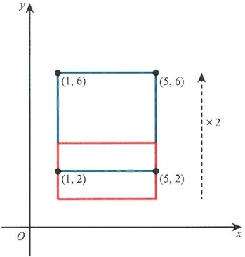

<!-- page 89 -->

Next, consider the rectangle with vertices  $ (1,1) $,  $ (1,3) $,  $ (4,3) $ and  $ (4,1) $.

As a matrix this can be written as  $ \begin{pmatrix}1&1&4&4\\1&3&3&1\end{pmatrix} $.

If we multiply it by the matrix  $ \begin{pmatrix}2 & 0 \\ 0 & 1\end{pmatrix} $, we get  $ \begin{pmatrix}2 & 2 & 8 & 8 \\ 1 & 3 & 3 & 1\end{pmatrix} $ and each x value has doubled.

This is a stretch of scale factor 2 in the x-direction: the distance relative to the y-axis has been doubled.

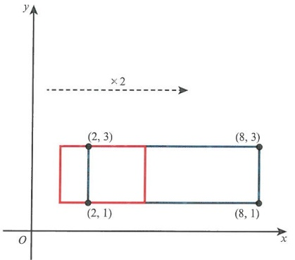

Combining the previous two examples, we can see that the matrix  $ \begin{pmatrix} 2 & 0 \\ 0 & 2 \end{pmatrix} $ has the effect of an enlargement of scale factor 2. Here we can see the matrix  $ \begin{pmatrix} 2 & 0 \\ 0 & 2 \end{pmatrix} $ applied to  $ \begin{pmatrix} 1 & 1 & 4 & 4 \\ 1 & 3 & 3 & 1 \end{pmatrix} $ to produce the matrix  $ \begin{pmatrix} 2 & 2 & 8 & 8 \\ 2 & 6 & 6 & 2 \end{pmatrix} $. This time the enlargement is measured from the origin, so we can say the origin is the centre of the enlargement.

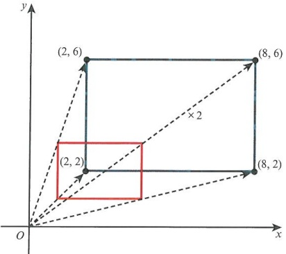

In each of these three examples we can see an invariant line or point. In the first example, any point on the line y = 0 will not change its y value. It is, therefore, invariant.

In the second example, any point on the line $x=0$ will not change its $x$ value. It is also, therefore, invariant. In the third example, both $x=0$ and $y=0$ are invariant lines. The point where they meet, in this case the origin, is known as an invariant point. The matrices for stretches are shown in Key point 4.6.

<!-- page 90 -->

### KEY POINT 4.6

For a stretch in the x-direction of scale factor k, the matrix is represented by  $ \begin{pmatrix} k & 0 \\ 0 & 1 \end{pmatrix} $

For a stretch in the y-direction of scale factor k, the matrix is represented by  $ \begin{pmatrix} 1 & 0 \\ 0 & k \end{pmatrix} $.

For an enlargement relative to the point $(0,0)$ of scale factor $k$, the matrix is represented by $\begin{pmatrix} k & 0 \\ 0 & k \end{pmatrix}$. Any point that is unchanged by a transformation is known as an invariant point. If that point is not the origin, then it must lie on an invariant line.

The origin is always invariant for matrix transformations.

Now consider the matrix  $ \begin{pmatrix} 2 & 2 & 8 & 8 \\ 2 & 6 & 6 & 2 \end{pmatrix} $ and apply the transformation  $ \begin{pmatrix} \frac{1}{2} & 0 \\ 0 & \frac{1}{2} \end{pmatrix} $ to it. The result is  $ \begin{pmatrix} 1 & 1 & 4 & 4 \\ 1 & 3 & 3 & 1 \end{pmatrix} $. We have a scale factor again, but this time it is a reducing factor. What is more interesting is if  $ \mathbf{A} = \begin{pmatrix} 2 & 0 \\ 0 & 2 \end{pmatrix} $, then  $ \mathbf{A}^{-1} = \frac{1}{4} \begin{pmatrix} 2 & 0 \\ 0 & 2 \end{pmatrix} = \begin{pmatrix} \frac{1}{2} & 0 \\ 0 & \frac{1}{2} \end{pmatrix} $. Applying an inverse

matrix will revert any transformation to its original state since  $ \mathbf{A}^{-1}\mathbf{A} = \mathbf{I} $.

In all of the previous cases the area of the shape is increased by a factor that is equal to the size of the determinant that is transforming the shape. Take, for example, the matrix  $ \mathbf{A} = \begin{pmatrix} 3 & 0 \\ 0 & 2 \end{pmatrix} $. This stretches by factors 3 and 2, so the area of the new shape is six times as large since  $ |\det(\mathbf{A})| = 6 $.

### EXPLORE 4.6

Apply the matrix  $ \begin{pmatrix} 4 & 3 \\ 1 & 1 \end{pmatrix} $ to the triangle represented by the points  $ (1,1) $,  $ (4,1) $ and  $ (4,5) $.

What do you notice about the area of the image of the triangle?

How does this relate to the determinant of the matrix being applied?

As well as stretching and enlarging, we can also consider rotations and reflections as transformations.

Consider the triangle represented by the points  $ (1,1) $,  $ (1,4) $,  $ (4,1) $. As always, we write these coordinates in matrix form  $ \begin{pmatrix} 1 & 1 & 4 \\ 1 & 4 & 1 \end{pmatrix} $.

<!-- page 91 -->

If we apply the transformation matrix  $ \begin{pmatrix} -1 & 0 \\ 0 & 1 \end{pmatrix} $ to our triangle, we get

 $ \begin{pmatrix} -1 & 0 \\ 0 & 1 \end{pmatrix} \begin{pmatrix} 1 & 1 & 4 \\ 1 & 4 & 1 \end{pmatrix} = \begin{pmatrix} -1 & -1 & -4 \\ 1 & 4 & 1 \end{pmatrix} $. The effect of this is a reflection in the y-axis; that is,

the effect of this matrix is to change the sign of each x value but not to change the y values.

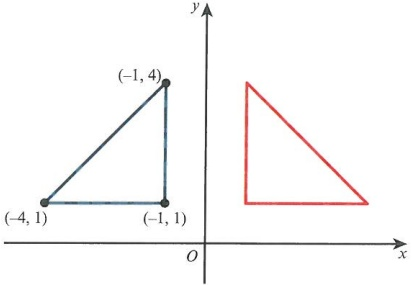

If we apply the matrix  $ \begin{pmatrix} 1 & 0 \\ 0 & -1 \end{pmatrix} $, this gives  $ \begin{pmatrix} 1 & 1 & 4 \\ -1 & -4 & -1 \end{pmatrix} $ which represents a reflection in the x-axis.

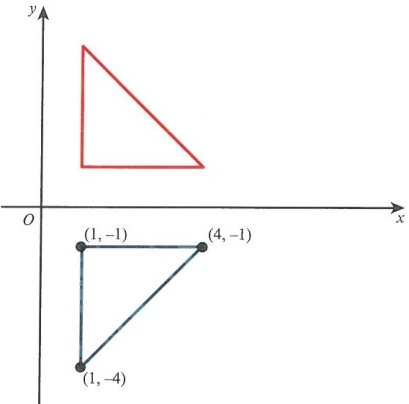

So these two matrices are responsible for reflections in axes.

Let  $ T_{1} $ be the transformation  $ \begin{pmatrix} -1 & 0 \\ 0 & 1 \end{pmatrix} $ and let  $ T_{2} $ be the transformation  $ \begin{pmatrix} 1 & 0 \\ 0 & -1 \end{pmatrix} $.

When we apply both of these transformations, in either order, to the triangle  $ \left( \begin{array}{ccc} 1 & 1 & 4 \\ 1 & 4 & 1 \end{array} \right) $

then the result is  $ \begin{pmatrix}1 & 0 \\ 0 & -1\end{pmatrix}\begin{pmatrix}-1 & 0 \\ 0 & 1\end{pmatrix}\begin{pmatrix}1 & 1 & 4 \\ 1 & 4 & 1\end{pmatrix}=\begin{pmatrix}-1 & -1 & -4 \\ -1 & -4 & -1\end{pmatrix} $.

This effect is a rotation about the origin by  $ 180^{\circ} $.

<!-- page 92 -->

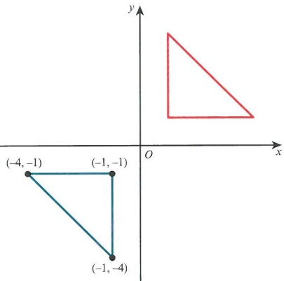

If we multiply the matrices represented by  $ T_1 $ and  $ T_2 $, in either order, we get the matrix  $ \begin{pmatrix} -1 & 0 \\ 0 & -1 \end{pmatrix} $. This rotation of  $ 180^\circ $ can be considered to be clockwise or anticlockwise. This example leads nicely to a generalised matrix that produces a rotation.

Consider the point $(x,0)$ lying on the $x$-axis. Then apply the matrix $\begin{pmatrix} a & b \\ c & d \end{pmatrix}$ so that

$\begin{pmatrix} a & b \\ c & d \end{pmatrix}\begin{pmatrix} x \\ 0 \end{pmatrix} = \begin{pmatrix} x \cos \theta \\ x \sin \theta \end{pmatrix}$, where $\theta$ represents an anticlockwise rotation about the origin; hence, $a = \cos \theta$ and $c = \sin \theta$. Next, consider the fact that the magnitude of this position vector does not change, so we know that the determinant must be 1. Then we have another equation $ad - bc = 1$, or $d \cos \theta - b \sin \theta = 1$.

Making use of  $ \cos^{2}\theta+\sin^{2}\theta=1 $ we can find solutions to the equation:  $ b=-\sin\theta $ and  $ d=\cos\theta $. The matrix for any anticlockwise rotation about the origin is  $ \begin{pmatrix}\cos\theta&-\sin\theta\\\sin\theta&\cos\theta\end{pmatrix} $.

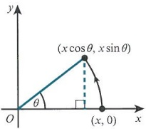

So for a  $ 90^{\circ} $ rotation anticlockwise about the origin, the corresponding matrix is  $ \begin{pmatrix} 0 & -1 \\ 1 & 0 \end{pmatrix} $

and the matrix  $ \begin{pmatrix}-\frac{\sqrt{2}}{2}&\frac{\sqrt{2}}{2}\\-\frac{\sqrt{2}}{2}&-\frac{\sqrt{2}}{2}\end{pmatrix} $ would result in a rotation of  $ 135^{\circ} $ clockwise about the origin.

### WORKED EXAMPLE 4.10

Describe the effect of the following matrices on the triangle given by (1, 1), (3, 1) and (1, 3). Illustrate your findings.

a  $ \begin{pmatrix}-2&0\\0&1\end{pmatrix} $ b  $ \begin{pmatrix}1&0\\0&-2\end{pmatrix} $ c  $ \begin{pmatrix}-2&0\\0&-2\end{pmatrix} $

<!-- page 93 -->

## Answer

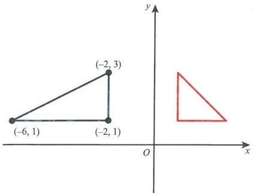

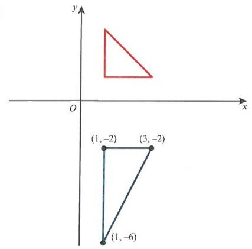

Shape is reflected in the y-axis.

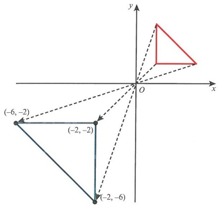

Shape is stretched by a scale factor of 2 in the x-direction.

Area is doubled since the magnitude of the determinant is 2.

Stretch is related to the distance between the y-axis and each point.

Area is doubled since the magnitude of the determinant is 2.

Shape is reflected in the x-axis.

Shape is stretched by a scale factor of 2 in the y-direction.

Stretch is related to distance between the x-axis and each point.

Shape is rotated  $ 180^{\circ} $ clockwise or anticlockwise about the origin.

Shape is enlarged relative to the origin by a scale factor of 2.

<!-- page 94 -->

For $2 \times 2$ matrices there is one more important transformation, which is known as shearing. Consider the matrix $\begin{pmatrix} 1 & 1 \\ 0 & 1 \end{pmatrix}$. If we apply it to the rectangle $(1,1), (3,1), (5,1), (1,5)$, then each point is translated parallel to the $x$-axis since the new $x$-coordinates are based on $x + y$. This effect is called a shear. The distance through which points are displaced depends on their distance from the line $x = 0$.

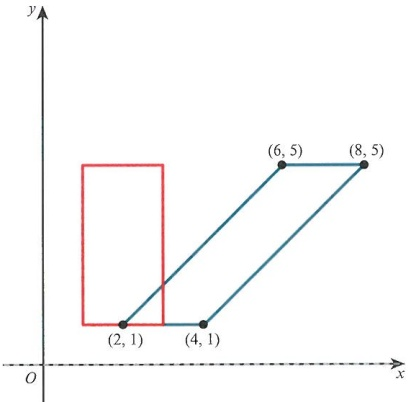

A shape being sheared in the x-direction.

Consider the rectangle  $ (1,0) $,  $ (3,0) $,  $ (3,4) $,  $ (1,4) $. If we apply the same matrix to these points, we get a different shear. This time only the top points move since the two bottom vertices lie on an invariant line, y=0.

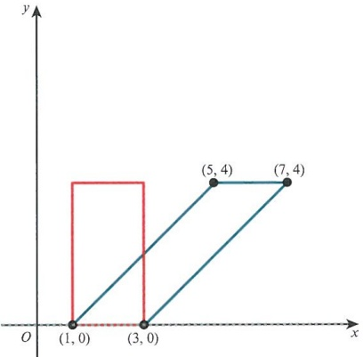

Another shear in the x-direction where the bottom vertices lie on the invariant line.

<!-- page 95 -->

As we can see in this diagram, the top points have a $y$ value that is unchanged by the shearing factor. So a matrix of the form $\begin{pmatrix} 1 & k \\ 0 & 1 \end{pmatrix}$ will produce a shear in the $x$-direction, and the distance each point is moved is equal to $ky_0$, where $y_0$ is the original $y$ value.

A matrix of the form $\begin{pmatrix} 1 & 0 \\ 2 & 1 \end{pmatrix}$ should give a shearing effect in the $y$-direction instead. Apply this matrix to the rectangle with vertices $(0,0),(0,3),(2,3)$ and $(2,0)$.

This gives $\begin{pmatrix} 1 & 0 \\ 2 & 1 \end{pmatrix}\begin{pmatrix} 0 & 0 & 2 & 2 \\ 0 & 3 & 3 & 0 \end{pmatrix} = \begin{pmatrix} 0 & 0 & 2 & 2 \\ 0 & 3 & 7 & 4 \end{pmatrix}$.

We can see that the line x = 0 is invariant and any point on this line does not change.

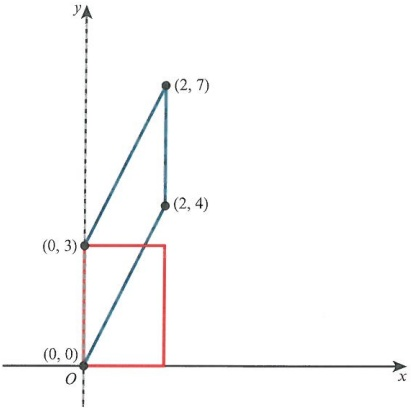

So any matrix of the form  $ \begin{pmatrix}1&0\\k&1\end{pmatrix} $ will produce a shear in the y-direction.

Apply the matrix  $ \begin{pmatrix} 1 & k \\ 0 & 1 \end{pmatrix} $ to sets of points and investigate with different values of k.

What happens in the cases where 0 < k < 1 or k < 0?

### EXPLORE 4.7

Some shears are not obvious to spot. For example, if we take the matrix  $ \begin{pmatrix} 4 & 3 \\ -3 & -2 \end{pmatrix} $ and apply it to the point  $ (1, 1) $ we get the image  $ \begin{pmatrix} 7 \\ -5 \end{pmatrix} $. It is not obvious that there is a shear or what the invariant line could be. Instead, consider the square  $ (0, 0) $,  $ (1, 1) $,  $ (2, 0) $,  $ (1, -1) $. Apply our matrix to these points to get  $ (0, 0) $,  $ (7, -5) $,  $ (8, -6) $,  $ (1, -1) $.

<!-- page 96 -->

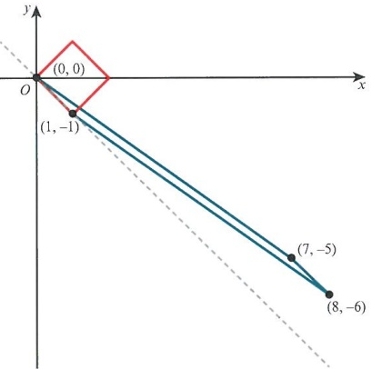

We can see from the diagram that there is an invariant line and it appears to be $y = -x$. But how can we be sure? First, since $(0,0)$ will always be unchanged by any matrix, we can say that all invariant lines must pass through the origin. Second, if points on the invariant line are unchanged, we can say that $\begin{pmatrix} 4 & 3 \\ -3 & -2 \end{pmatrix} \begin{pmatrix} x \\ y \end{pmatrix} = \begin{pmatrix} x \\ y \end{pmatrix}$. Multiplying out gives $4x + 3y = x$, $-3x - 2y = y$. Both equations simplify to $y = -x$, which confirms the equation of the line.

Consider the matrix  $ \begin{pmatrix} 1 & -2 \\ -2 & 1 \end{pmatrix} $. If we try the same method as before, then

 $ \begin{pmatrix} 1 & -2 \\ -2 & 1 \end{pmatrix}\begin{pmatrix} x \\ y \end{pmatrix} = \begin{pmatrix} x \\ y \end{pmatrix} $ leads to x - 2y = x, -2x + y = y. This simplifies to x = 0, y = 0, which tells us that there is an invariant point. To find the invariant lines we must adopt a different approach.

Consider  $ \begin{pmatrix} 1 & -2 \\ -2 & 1 \end{pmatrix} \begin{pmatrix} t \\ mt \end{pmatrix} = \begin{pmatrix} T \\ mT \end{pmatrix} $. This is the same as before, where the line is of the form y = mx.

The two equations are  $ t - 2mt = T $ and  $ -2t + mt = mT $. Divide the first of these equations by the second to get  $ \frac{1 - 2m}{-2 + m} = \frac{1}{m} $. Solve this equation to give  $ m^2 = 1 $, or  $ m = \pm1 $. Remember the invariant line is of the form y = mx. This means there are two invariant lines,  $ y = \pm x $. They meet at the origin, which is always an invariant point.

Let us use  $ \begin{pmatrix} 4 & 3 \\ -3 & -2 \end{pmatrix}\begin{pmatrix} t \\ mt \end{pmatrix} = \begin{pmatrix} T \\ mT \end{pmatrix} $ as another example. This gives equations

 $ 4t + 3mt = T $ and  $ -3t - 2mt = mt $. Dividing gives  $ \frac{4 + 3m}{-3 - 2m} = \frac{1}{m} $, then solving gives  $ (m+1)^2 = 0 $. The only solution is m = -1, so the line is y = -x.

<!-- page 97 -->

Find any invariant lines for the following matrices.

 $$ \begin{pmatrix}{{{-3}}}&{{{2}}} \\{{{-8}}}&{{{5}}}\end{pmatrix} $$ 

 $$ \mathbf{b}\quad\begin{pmatrix}4&-2\\ -1&4\end{pmatrix} $$ 

## Answer

<table border=1 style='margin: auto; word-wrap: break-word;'><tr><td rowspan="5">a</td><td style='text-align: center; word-wrap: break-word;'>Start with  $ \binom{-3}{-8} \frac{2}{5} \binom{t}{mt} = \binom{T}{mT} $.</td><td style='text-align: center; word-wrap: break-word;'>State the correct form.</td></tr><tr><td style='text-align: center; word-wrap: break-word;'>Then  $ -3t + 2mt = T $ and  $ -8t + 5mt = mT $.</td><td style='text-align: center; word-wrap: break-word;'>Obtain two equations.</td></tr><tr><td style='text-align: center; word-wrap: break-word;'>Dividing gives  $ \frac{-3 + 2m}{-8} + \frac{1}{m} $, then  $ 2m^{2} - 3m = 5m - 8 $.</td><td style='text-align: center; word-wrap: break-word;'>Divide, then multiply through.</td></tr><tr><td style='text-align: center; word-wrap: break-word;'>So  $ 2m^{2} - 8m + 8 = 0 $, hence  $ (m - 2)^{2} = 0 $.</td><td style='text-align: center; word-wrap: break-word;'>Solve the quadratic.</td></tr><tr><td style='text-align: center; word-wrap: break-word;'>$ \therefore m = 2 $, hence  $ y = 2x $.</td><td style='text-align: center; word-wrap: break-word;'>State the correct form.</td></tr><tr><td rowspan="5">b</td><td style='text-align: center; word-wrap: break-word;'>Start with  $ \binom{4}{-1} \frac{-2}{4} \binom{t}{mt} = \binom{T}{mT} $.</td><td style='text-align: center; word-wrap: break-word;'></td></tr><tr><td style='text-align: center; word-wrap: break-word;'>Then  $ 4t - 2mt = T $ and  $ -t + 4mt = mT $.</td><td style='text-align: center; word-wrap: break-word;'>Obtain two equations.</td></tr><tr><td style='text-align: center; word-wrap: break-word;'>Dividing gives  $ \frac{4 - 2m}{-1} + \frac{1}{m} $, then  $ 4m - 2m^{2} = -1 + 4m $.</td><td style='text-align: center; word-wrap: break-word;'>Obtain a quadratic.</td></tr><tr><td style='text-align: center; word-wrap: break-word;'>So  $ 2m^{2} = 1 $, hence  $ m = \pm \frac{\sqrt{2}}{2} $.</td><td style='text-align: center; word-wrap: break-word;'></td></tr><tr><td style='text-align: center; word-wrap: break-word;'>So  $ y = \pm \frac{\sqrt{2}}{2}x $.</td><td style='text-align: center; word-wrap: break-word;'>Solve to give two values for y.</td></tr></table>

## For 3-dimensional space, we will focus on enlargement, rotation and reflection

Consider the matrix  $ \begin{pmatrix}2&0&0\\0&1&0\\0&0&1\end{pmatrix} $. This matrix will multiply all the x values by 2, and therefore represents a stretch by a scale factor of 2 in the x-direction.

therefore represents a stretch by a scale factor of 2 in the x-direction.

Similarly,  $ \begin{pmatrix} 1 & 0 & 0 \\ 0 & 3 & 0 \\ 0 & 0 & 1 \end{pmatrix} $ and  $ \begin{pmatrix} 1 & 0 & 0 \\ 0 & 1 & 0 \\ 0 & 0 & 4 \end{pmatrix} $ represent stretches in the y-direction by a scale factor of 3 and in the z-direction, respectively, by a scale factor of 4.

Hence, the matrix  $ \begin{pmatrix} k & 0 & 0 \\ 0 & k & 0 \\ 0 & 0 & k \end{pmatrix} $ represents an enlargement of scale factor k with the origin as the centre of enlargement.

For rotations, let us consider the matrix we saw previously:  $ \begin{pmatrix} \cos\theta & -\sin\theta \\ \sin\theta & \cos\theta \end{pmatrix} $. This is an anticlockwise rotation of angle  $ \theta $ about the origin. Consider the case where we wish to rotate a shape about the x-axis. The diagram is drawn so that this axis comes out of the page. Hence, the shape rotates on the page.

<!-- page 98 -->

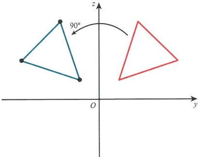

So the triangle represented by  $ \begin{pmatrix} x & x & x \\ 1 & 4 & 2 \\ 1 & 2 & 4 \end{pmatrix} $ is to be rotated to form the image

 $ \begin{pmatrix} x & x & x \\ -1 & -2 & -4 \\ 1 & 4 & 2 \end{pmatrix} $. The x values do not change. We simply represent them by x. This means our matrix must be of the form  $ \begin{pmatrix} 1 & 0 & 0 \\ 0 & \cdot & \cdot \\ 0 & \cdot & \cdot \end{pmatrix} $. The first column must contain zeros to avoid any elements for y and z being added to the value of x.

To ensure that only y and z are rotated, we therefore use the matrix  $ \begin{pmatrix} 1 & 0 & 0 \\ 0 & \cos\theta & -\sin\theta \\ 0 & \sin\theta & \cos\theta \end{pmatrix} $ for anticlockwise rotations about the x-axis.

Similarly, anticlockwise rotations about the y- and z-axes require matrices  $ \begin{pmatrix} \cos\theta & 0 & \sin\theta \\ 0 & 1 & 0 \\ -\sin\theta & 0 & \cos\theta \end{pmatrix} $ and  $ \begin{pmatrix} \cos\theta & -\sin\theta & 0 \\ \sin\theta & \cos\theta & 0 \\ 0 & 0 & 1 \end{pmatrix} $, respectively.

### WORKED EXAMPLE 4.12

Rotate the following matrices about the axis and by the angle given.

a  $ \begin{pmatrix} 1 & 0 & 2 \\ -1 & 1 & 3 \\ 4 & 1 & 1 \end{pmatrix} $, rotated about the z-axis by  $ 45^{\circ} $ anticlockwise

b  $ \begin{pmatrix}0&0&2\\1&1&-2\\-1&0&0\end{pmatrix} $, rotated about the x-axis by  $ 90^{\circ} $ clockwise

Answer

a Rotation matrix is  $ \begin{pmatrix}\cos45^{\circ}&-\sin45^{\circ}&0\\\sin45^{\circ}&\cos45^{\circ}&0\\0&0&1\end{pmatrix} $

Multiplying,  $ \left(\frac{\sqrt{2}}{2}, -\frac{\sqrt{2}}{2}, 0\right) \times \left(\begin{array}{rrr}1 & 0 & 2 \\ -1 & 1 & 3 \\ 4 & 1 & 1\end{array}\right) $

Write down the rotation matrix with the correct angle.

Determine the elements of the rotation matrix.

<!-- page 99 -->

gives the result  $ \left(\begin{array}{ccc}\sqrt{2}&-\frac{\sqrt{2}}{2}&\frac{\sqrt{2}}{2}\\0&\frac{\sqrt{2}}{2}&\frac{5\sqrt{2}}{2}\\4&1&1\end{array}\right) $.

Determine the result.

b Rotation matrix is  $ \begin{pmatrix} 1 & 0 & 0 \\ 0 & \cos(-90^\circ) & -\sin(-90^\circ) \\ 0 & \sin(-90^\circ) & \cos(-90^\circ) \end{pmatrix} $.

Write down the rotation matrix, noting that the angle is negative this time. Alternatively we could use an angle of  $ 270^{\circ} $ anticlockwise.

Multiplying,  $ \begin{pmatrix} 1 & 0 & 0 \\ 0 & 0 & 1 \\ 0 & -1 & 0 \end{pmatrix} \begin{pmatrix} 0 & 0 & 2 \\ 1 & 1 & -2 \\ -1 & 0 & 0 \end{pmatrix} $

Recall that the elements in the first row should be unchanged.

gives the result  $ \begin{pmatrix} 0 & 0 & 2 \\ -1 & 0 & 0 \\ -1 & -1 & 2 \end{pmatrix} $.

Determine the result.

For reflections in 3-dimensional space we will consider reflections in planes, rather than lines.

So, for example, the matrix  $ \begin{pmatrix} 1 & 0 & 0 \\ 0 & 1 & 0 \\ 0 & 0 & -1 \end{pmatrix} $ would make all z values change sign. This is a reflection in the x-y plane.

Similarly, the matrices  $ \begin{pmatrix}-1&0&0\\0&1&0\\0&0&1\end{pmatrix} $ and  $ \begin{pmatrix}1&0&0\\0&-1&0\\0&0&1\end{pmatrix} $ are reflections in the y-z plane and x-z plane respectively.

### EXPLORE 4.8

What matrices can produce reflections in the planes x - y = 0, x - z = 0 and y - z = 0?

Can you think of any other reflections in planes?

### WORKED EXAMPLE 4.13

Find a matrix that produces a reflection in the plane x + y = 0.

Answer

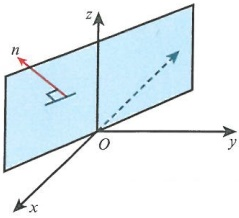

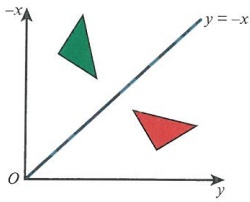

The plane has normal  $ \begin{pmatrix}1\\1\\0\end{pmatrix} $ or  $ \begin{pmatrix}-1\\-1\\0\end{pmatrix} $, so the plane can be visualised.

Looking down the z-axis shows the line y = -x.

<!-- page 100 -->

z value unchanged, hence bottom row is 0 0 1.

-x and y switch places.

Note that the z value will be unchanged by the reflection.

Hence,  $ \begin{pmatrix} 0 & -1 & 0 \\ -1 & 0 & 0 \\ 0 & 0 & 1 \end{pmatrix} $.

Determine the matrix.

## EXERCISE 4D

1 Find the matrix represented by each of the following transformations.

a A reflection in the x-axis followed by an enlargement of scale factor 2 centered at the origin.

b A rotation of  $ 90^{\circ} $ anticlockwise about the origin followed by a reflection in the line y = x.

c An enlargement of scale factor 3 centered at the origin, followed by a reflection in the line y = -x.

2 a You are given the matrix  $ A = \begin{pmatrix} 1 & 2 \\ 4 & -1 \end{pmatrix} $. Show that  $ A\begin{pmatrix} 1 \\ -2 \end{pmatrix} = k\begin{pmatrix} 1 \\ -2 \end{pmatrix} $ and state the value of k.

b Given also that  $ \mathbf{A}\begin{pmatrix} b \\ 2 \end{pmatrix} = m\begin{pmatrix} 2 \\ 2 \end{pmatrix} $, find the values of b and m.

PS 3 The following transformations are given.

 $ T_{1} $ is a rotation of  $ 90^{\circ} $ clockwise about the origin.

$T_{2}$ is a reflection in the line $y = -x$

 $ T_{3} $ is an enlargement of factor 2 centered at the origin.

Given that  $ \mathbf{A} = \begin{pmatrix} 1 & 5 \\ 6 & -3 \end{pmatrix} $, find the image of A using transformations  $ T_2 $ followed by  $ T_3 $ followed by  $ T_1 $.

4 For the matrix  $ \begin{pmatrix}1&5&6\\2&2&4\end{pmatrix} $, determine the transformation matrix that produces the following image.

 $$ \begin{pmatrix}{{{2}}}&{{{2}}}&{{{4}}} \\{{{1}}}&{{{5}}}&{{{6}}}\end{pmatrix} $$ 

b

 $$ \begin{pmatrix}-1&-5&-6\\4&4&8\end{pmatrix} $$ 

 $$ \begin{array}{r} \left[\begin{array}{cc} -6 & -6 & -12 \\ 2 & 10 & 12  \end{array}\right] \\  \displaystyle \quad \mathrm{c}  \quad \left(\begin{array}{ccc} -6 & -6 & -12 \\ 2 & 10 & 12 \end{array}\right) \end{array} $$ 

5 Determine the area of the image produced in each case.

a triangle  $ A(1,3) $,  $ B(1,7) $,  $ C(4,3) $ transformed by  $ \begin{pmatrix}2 & 0 \\ 0 & 2\end{pmatrix} $

b square  $ A(1,1) $,  $ B(7,2) $,  $ C(6,8) $,  $ D(0,7) $ transformed by  $ \begin{pmatrix} 4 & 1 \\ 5 & 2 \end{pmatrix} $

c trapezium represented by  $ \begin{pmatrix} 2 & 2 & 4 & 8 \\ 1 & 5 & 5 & 1 \end{pmatrix} $ transformed by  $ \begin{pmatrix} 1 & 4 \\ 3 & 9 \end{pmatrix} $

6 Find the invariant lines for each of the following shearing matrices.

a  $ \begin{pmatrix}1&4\\3&1\end{pmatrix} $

 $$ \mathbf{b}\quad\begin{pmatrix}4&-1\\ 2&1\end{pmatrix} $$ 

c  $ \begin{pmatrix}6&5\\2&3\end{pmatrix} $

<!-- page 101 -->

7 Find the single matrix that is a combination of $90^{\circ}$ anticlockwise rotation about the origin, followed by an enlargement of factor 2 with centre of enlargement origin, followed by a reflection in the y-axis. Show this effect on the triangle with vertices $(1,1),(4,2),(3,4)$.

M 8 Determine the single matrix required for each of the following transformation combinations.

a Rotation about the z-axis by  $ 90^{\circ} $ clockwise, followed by a stretch of factor 2 in the x-direction, followed by a reflection in the x-z plane.

b Reflection in the plane $x-y=0$, followed by an enlargement of factor $\frac{1}{2}$ with centre of enlargement origin, followed by a rotation of $45^{\circ}$ anticlockwise about the y-axis.

## WORKED EXAM-STYLE QUESTION

a Given that  $ T = \begin{pmatrix} 2 & 3 \\ 1 & 2 \end{pmatrix} $, find the two invariant lines under the transformation represented by this matrix and show that the angle between them is  $ \frac{\pi}{3} $.

b The triangle $ABC$ has vertices $A(1,1)$, $B(5,1)$, $C(4,3)$. Determine the image when this triangle is transformed by T.

c Determine the inverse of the matrix T and state the difference in area between the original triangle and the image created.

## Answer

a Start with  $ \binom{2\quad3}{1\quad2}\binom{t}{mt} = \binom{T}{mT} $, giving equations  $ 2t + 3mt = T $ and  $ t + 2mt = mT $.

Divide the first equation by the second equation to get  $ \frac{2+3m}{1+2m}=\frac{1}{m} $, then solving gives  $ 2m+3m^{2}=1+2m $ or  $ 3m^{2}=1 $.

So  $ m = \pm \frac{1}{\sqrt{3}} $ and so the invariant lines are  $ y = -\frac{1}{\sqrt{3}}x $ and  $ y = \frac{1}{\sqrt{3}}x $.

Since  $ m = \tan\theta $, the angle between the invariant lines is  $ 2 \times \tan^{-1} \frac{1}{\sqrt{3}} = \frac{\pi}{3} $.

b For the transformation,  $ \begin{pmatrix} 2 & 3 \\ 1 & 2 \end{pmatrix} \begin{pmatrix} 1 & 5 & 4 \\ 1 & 1 & 3 \end{pmatrix} = \begin{pmatrix} 5 & 13 & 17 \\ 3 & 7 & 10 \end{pmatrix} $. The image of  $ ABC $ has vertices at  $ (5, 3) $,  $ (13, 7) $ and  $ (17, 10) $.

c The inverse matrix of T is  $ T^{-1} = \frac{1}{4-3}\begin{pmatrix}2 & -3 \\ -1 & 2\end{pmatrix} $. Since the determinant of T is 1 there is no difference in the area of the triangles.

<!-- page 102 -->

## Checklist of learning and understanding

## Standard operations:

 $ \begin{pmatrix} a & b \\ c & d \end{pmatrix} \pm \begin{pmatrix} e & f \\ g & h \end{pmatrix} = \begin{pmatrix} a \pm e & b \pm f \\ c \pm g & d \pm h \end{pmatrix} $

 $ \begin{pmatrix} a & b \\ c & d \end{pmatrix} \begin{pmatrix} e & f \\ g & h \end{pmatrix} = \begin{pmatrix} ae + bg & af + bh \\ ce + dg & cf + dh \end{pmatrix} $

In general, AB  $ \neq $ BA.

For square matrices  $ A \times A \times A \times \ldots \times A = A^n $.

The identity matrix is a square matrix of the form  $  \mathbf{I} = \begin{pmatrix} 1 & 0 & 0 & \cdots & 0 \\ 0 & 1 & 0 & \cdots & 0 \\ 0 & 0 & 1 & \cdots & 0 \\ \vdots & \vdots & \vdots & \ddots & \vdots \\ 0 & 0 & 0 & \cdots & 1 \end{pmatrix}  $, and it has the property such that  $  \mathbf{A} \times \mathbf{A}^{-1} = \mathbf{I}  $ or  $  \mathbf{A}^{-1} \times \mathbf{A} = \mathbf{I}  $.

## Inverse matrices:

For  $ 2 \times 2 $ matrices if  $ \mathbf{A} = \begin{pmatrix} a & b \\ c & d \end{pmatrix} $ then  $ \mathbf{A}^{-1} = \frac{1}{ad - bc} \begin{pmatrix} d & -b \\ -c & a \end{pmatrix} $.

For  $ n \times n $ matrices we can use row operations on an augmented matrix of the form  $ \begin{pmatrix} a & b & c \\ d & e & f \\ g & h & i \end{pmatrix} : : \begin{pmatrix} 1 & 0 & 0 \\ 0 & 1 & 0 \\ 0 & 0 & 1 \end{pmatrix} $.

For any two square matrices  $ \mathbf{A} $ and  $ \mathbf{B} $,  $ (\mathbf{A}\mathbf{B})^{-1} = \mathbf{B}^{-1}\mathbf{A}^{-1} $.

A matrix with an inverse is non-singular.

A matrix without an inverse is known as singular.

## Determinants:

The determinant of a  $ 3 \times 3 $ matrix  $ \mathbf{A} = \begin{pmatrix} a & b & c \\ d & e & f \\ g & h & i \end{pmatrix} $ is calculated as

 $ \det(A) = a \begin{vmatrix} e & f \\ h & i \end{vmatrix} - b \begin{vmatrix} d & f \\ g & i \end{vmatrix} + c \begin{vmatrix} d & e \\ g & h \end{vmatrix} $.

When the determinant of a matrix is 0, the matrix will be singular.

The value of the determinant changes by factor k when row operations of the form  $ r_i \to kr_i + mr_j $ are used.

The value of the determinant is also the factor increase of the area, or volume, when the matrix is used as a transformation.

For two matrices A and B,  $ \det(\mathbf{A}\mathbf{B}) = \det(\mathbf{B}\mathbf{A}) = \det(\mathbf{A}) \times \det(\mathbf{B}) $.

<!-- page 103 -->

## Transformations:

The following transformations are for  $ 2 \times 2 $ matrices.

<table border=1 style='margin: auto; word-wrap: break-word;'><tr><td style='text-align: center; word-wrap: break-word;'>Transformation</td><td style='text-align: center; word-wrap: break-word;'>Matrix</td></tr><tr><td style='text-align: center; word-wrap: break-word;'>Stretch by a scale factor of factor k in the x-direction</td><td style='text-align: center; word-wrap: break-word;'>$ \begin{pmatrix} k &amp; 0 \\ 0 &amp; 1 \end{pmatrix} $</td></tr><tr><td style='text-align: center; word-wrap: break-word;'>Stretch by a scale factor of factor k in the y-direction</td><td style='text-align: center; word-wrap: break-word;'>$ \begin{pmatrix} 1 &amp; 0 \\ 0 &amp; k \end{pmatrix} $</td></tr><tr><td style='text-align: center; word-wrap: break-word;'>Enlargement with centre of enlargement the origin by a scale factor of factor k</td><td style='text-align: center; word-wrap: break-word;'>$ \begin{pmatrix} k &amp; 0 \\ 0 &amp; k \end{pmatrix} $</td></tr><tr><td style='text-align: center; word-wrap: break-word;'>Reflection in the x-axis</td><td style='text-align: center; word-wrap: break-word;'>$ \begin{pmatrix} 1 &amp; 0 \\ 0 &amp; -1 \end{pmatrix} $</td></tr><tr><td style='text-align: center; word-wrap: break-word;'>Reflection in the y-axis</td><td style='text-align: center; word-wrap: break-word;'>$ \begin{pmatrix} -1 &amp; 0 \\ 0 &amp; 1 \end{pmatrix} $</td></tr><tr><td style='text-align: center; word-wrap: break-word;'>Reflection in the line y = x</td><td style='text-align: center; word-wrap: break-word;'>$ \begin{pmatrix} 0 &amp; 1 \\ 1 &amp; 0 \end{pmatrix} $</td></tr><tr><td style='text-align: center; word-wrap: break-word;'>Rotation about the origin by  $ \theta $ in the anticlockwise direction</td><td style='text-align: center; word-wrap: break-word;'>$ \begin{pmatrix} \cos\theta &amp; -\sin\theta \\ \sin\theta &amp; \cos\theta \end{pmatrix} $</td></tr></table>

The following transformations are for  $ 3 \times 3 $ matrices.

<table border=1 style='margin: auto; word-wrap: break-word;'><tr><td style='text-align: center; word-wrap: break-word;'>Transformation</td><td style='text-align: center; word-wrap: break-word;'>Matrix</td></tr><tr><td style='text-align: center; word-wrap: break-word;'>Rotation about the x-axis by angle  $ \theta $ in the anticlockwise direction</td><td style='text-align: center; word-wrap: break-word;'>$ \begin{pmatrix} 1 &amp; 0 &amp; 0 \\ 0 &amp; \cos\theta &amp; -\sin\theta \\ 0 &amp; \sin\theta &amp; \cos\theta \end{pmatrix} $</td></tr><tr><td style='text-align: center; word-wrap: break-word;'>Rotation about the y-axis by angle  $ \theta $ in the anticlockwise direction</td><td style='text-align: center; word-wrap: break-word;'>$ \begin{pmatrix} \cos\theta &amp; 0 &amp; \sin\theta \\ 0 &amp; 1 &amp; 0 \\ -\sin\theta &amp; 0 &amp; \cos\theta \end{pmatrix} $</td></tr><tr><td style='text-align: center; word-wrap: break-word;'>Rotation about the z-axis by angle  $ \theta $ in the anticlockwise direction</td><td style='text-align: center; word-wrap: break-word;'>$ \begin{pmatrix} \cos\theta &amp; -\sin\theta &amp; 0 \\ \sin\theta &amp; \cos\theta &amp; 0 \\ 0 &amp; 0 &amp; 1 \end{pmatrix} $</td></tr><tr><td style='text-align: center; word-wrap: break-word;'>Enlargement with centre of enlargement the origin by a scale factor of factor  $ k $</td><td style='text-align: center; word-wrap: break-word;'>$ \begin{pmatrix} k &amp; 0 &amp; 0 \\ 0 &amp; k &amp; 0 \\ 0 &amp; 0 &amp; k \end{pmatrix} $</td></tr></table>

## Invariant lines:

For 2-dimensional cases, use  $ \binom{a\ b}{c\ d} \binom{t}{mt} = \binom{T}{mT} $ to determine two equations of the form  $ at + bmt = T $,  $ ct + dmt = mT $. Divide to get  $ \frac{a + bm}{c + dm} = \frac{1}{m} $, then solve for value(s) of m to find the invariant line(s) of the transformation in the form y = mx.

<!-- page 104 -->

1 Given that  $ A = \begin{pmatrix} 6 & 5 \\ 2 & 3 \end{pmatrix} $ and  $ B = \begin{pmatrix} -1 & 2 \\ 1 & -4 \end{pmatrix} $:

a find C such that $\mathbf{B}\mathbf{C}=\mathbf{A}+\mathbf{A}^{2}$

b determine D, where ADB = I.

2 You are given the matrix  $ A = \begin{pmatrix} 1 & 2 & a \\ 0 & 2 & a - 3 \\ 1 & 0 & a + 4 \end{pmatrix} $.

a If the matrix is singular, find the value of the constant a.

b If a = 4, find  $ A^{-1} $.

3 The matrix A is given as  $ A = \begin{pmatrix} 3 & 4 \\ 2 & 5 \end{pmatrix} $.

a Find the invariant lines for this matrix.

b The matrix A is applied to the vertices of the triangle PQR, and the resulting image has vertices at the points (11, 12), (19, 15) and (40, 43). Find the coordinates of the vertices of the original triangle.

