# Polar coordinates

<!-- Cambridge International AS  A Level Further Mathematics Coursebook (Lee Mckelvey Martin Crozier) .pdf p105-129 -->

<!-- page 105 -->

# Chapter 5 Polar coordinates

## In this chapter, you will learn how to:

understand the relations between Cartesian and polar coordinates, and convert equations of curves from Cartesian to polar and vice versa

sketch simple polar curves, for  $ 0 \leq \theta \leq 2\pi $ or  $ -\pi < \theta \leq \pi $ or a subset of either of these intervals

recall the formula  $ \frac{1}{2}\int r^{2}d\theta $ for the area of a sector, and use this formula in simple cases.

<!-- page 106 -->

## PREREQUISITE KNOWLEDGE

<table border=1 style='margin: auto; word-wrap: break-word;'><tr><td style='text-align: center; word-wrap: break-word;'>Where it comes from</td><td style='text-align: center; word-wrap: break-word;'>What you should be able to do</td><td style='text-align: center; word-wrap: break-word;'>Check your skills</td></tr><tr><td style='text-align: center; word-wrap: break-word;'>AS &amp; A Level Mathematics Pure Mathematics 2 &amp; 3, Chapter 4</td><td style='text-align: center; word-wrap: break-word;'>Work with parametric curves.</td><td style='text-align: center; word-wrap: break-word;'>1 a Given that  $ x = 2\cos\theta $ and  $ y = \sin2\theta $, find  $ y = f(x) $. b If  $ x = t + \frac{1}{t} $ and  $ y = t - \frac{1}{t} $, find an equation relating x and y.</td></tr><tr><td style='text-align: center; word-wrap: break-word;'>AS &amp; A Level Mathematics Pure Mathematics 2 &amp; 3, Chapters 5 &amp; 8</td><td style='text-align: center; word-wrap: break-word;'>Recall how to integrate.</td><td style='text-align: center; word-wrap: break-word;'>2 Evaluate the following. a  $ \int_{x=0}^{x=\frac{\pi}{4}}\cos^{2}x\ dx $ b  $ \int_{x=1}^{x=2}e^{2x}\ dx $</td></tr></table>

## What are polar coordinates?

In AS & A Level Mathematics you met Cartesian equations and parametric equations. Now you will learn about another type of 2-dimensional coordinate system, polar coordinates. In this system, a point on a plane is identified by an angle and a distance rather than two linear dimensions. Polar curves are described by the distance from the origin, r, and the angle formed with the positive x-axis,  $ \theta $.

Polar coordinates are used for applications involving circular geometry or radial movement, where rectangular (Cartesian) coordinates would be awkward to use. Engineers use polar coordinates in the design and manufacture of gears. Polar coordinates also help scientists to understand electric and magnetic fields.

Polar curves can be used to create some beautiful graphs, including cardioids and rose petals.

### 5.1 The polar system

Rather than using Cartesian coordinates $(x, y)$ to describe the position of a point we use polar coordinates $(r, \theta)$. We define an origin $O$ called the pole, and a line in a fixed direction, conventionally the $x$-axis, called the initial line.

The point, $P$, shown on the graph has polar coordinates $(r,\theta)$. $r$ is defined as the distance of $P$ from the pole. The angle $OP$ makes with the initial line is $\theta$. Note that if $\theta$ is measured anticlockwise from the initial line the convention is for $\theta$ to be positive. If $\theta$ is measured clockwise from the initial line the convention is for $\theta$ to be negative.

The initial line, which is the x-axis when using Cartesian coordinates, is where  $ \theta = 0 $. The y-axis for Cartesian coordinates is where  $ \theta = \frac{\pi}{2} $ for polar coordinates. Instead of writing functions in the form  $ y = f(x) $, we work with functions in the form  $ r = f(\theta) $.

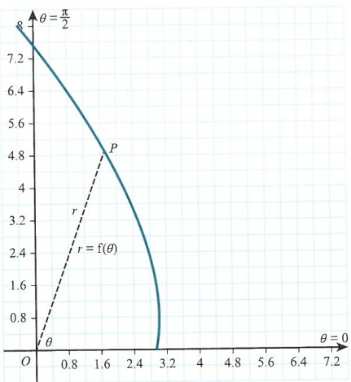

<!-- page 107 -->

Using this right-angled triangle, and some trigonometry, we can deduce that  $ x = r \cos \theta $ and  $ y = r \sin \theta $. We can combine these using the identity (or use Pythagoras on the right-angled triangle) to deduce  $ x^2 + y^2 = r^2 $. These equations are useful when converting between polar and Cartesian coordinates. Note that this equation does not imply that the graph is a circle. It merely describes a geometrical relationship between the x and y values at every point on the curve. The correct way to write this is  $ x = f(\theta) \cos \theta $,  $ y = f(\theta) \sin \theta $. Remember that  $ r = f(\theta) $. This is shown in Key point 5.1.

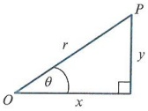

We would only have a circle in the case where  $ f(\theta) $ is a constant.

### KEY POINT 5.1

For all polar curves $x = r\cos\theta$, $y = r\sin\theta$ and $x^2 + y^2 = r^2 \Rightarrow r \geqslant 0$. The function is given in the form $r = f(\theta)$.

Changing from polar to Cartesian form is quite straightforward.

For example, if r = 2 then using  $ x^2 + y^2 = r^2 $ we get  $ x^2 + y^2 = 4 $. This is a circle with radius 2 and centre  $ (0, 0) $.

Consider a different example: start with  $ y = r \sin \theta $ and multiply both sides by r.

Using  $ r^2 = x^2 + y^2 $ and  $ y = r\sin\theta $ we get  $ x^2 + y^2 = y $, or  $ x^2 + y^2 - y = 0 $.

By completing the square on the $y$ terms we find $x^{2}+\left(y-\frac{1}{2}\right)^{2}=\frac{1}{4}$.

This is also a circle, centre  $ (0,\frac{1}{2}) $ and radius  $ \frac{1}{2} $. We will look at this curve again in Worked example 5.4.

### WORKED EXAMPLE 5.1

Convert the following polar curves into Cartesian form.

 $$ r^{2}\cos2\theta=4 $$ 

 $$ r=\frac{1}{\cos\theta} $$ 

Change sec$\theta$ to $\frac{1}{\cos\theta}$.

Multiply across.

Change  $ r \cos \theta $ to x.

 $$ r^{2}(\cos^{2}\theta-\sin^{2}\theta)=4 $$ 

Use the double angle formula.

 $$ x^{2}-y^{2}=4 $$ 

Use  $ x = r\cos\theta $,  $ y = r\sin\theta $.

Changing from Cartesian to polar form is also relatively straightforward.

For example, if $y=1$ then $r\sin\theta=1$, the polar curve is $r=\frac{1}{\sin\theta}$ or $r=\mathrm{cosec}\theta$

<!-- page 108 -->

### WORKED EXAMPLE 5.2

<table border=1 style='margin: auto; word-wrap: break-word;'><tr><td colspan="2">Find the polar form for the following equations.</td></tr><tr><td style='text-align: center; word-wrap: break-word;'>a  $ y^{4} = x^{2} + y^{2} $</td><td style='text-align: center; word-wrap: break-word;'>b  $ x^{2} = \frac{y^{4}}{1 - y^{2}} $</td></tr><tr><td colspan="2">Answer</td></tr><tr><td style='text-align: center; word-wrap: break-word;'>a  $ r^{4}\sin^{4}\theta = r^{2} $\n $ r^{2}(r^{2}\sin^{4}\theta) = r^{2} $\n $ r^{2}(r^{2}\sin^{4}\theta - 1) = 0 $\n $ r^{2}\sin^{4}\theta = 1 $\nb  $ r^{2} = \frac{1}{\sin^{4}\theta} = \cos\epsilon^{4} $</td><td style='text-align: center; word-wrap: break-word;'>Use  $ y = r\sin\theta $ for the left side, and  $ x^{2} + y^{2} = r^{2} $ for the right side.\n $ r = 0 $ is not our curve, so divide by  $ r^{2} $ (or factorise out).\nFind the equation of the curve.</td></tr><tr><td style='text-align: center; word-wrap: break-word;'>b  $ r^{2}\cos^{2}\theta = \frac{r^{4}\sin^{4}\theta}{1 - r^{2}\sin^{2}\theta} $\n $ r^{2}\cos^{2}\theta - r^{4}\sin^{2}\theta\cos^{2}\theta = r^{4}\sin^{4}\theta $\n $ r^{2}\cos^{2}\theta - r^{4}\sin^{2}\theta(1 - \sin^{2}\theta) = r^{4}\sin^{4}\theta $\n $ r^{2}\cos^{2}\theta - r^{4}\sin^{2}\theta = 0 $\n $ r^{2}(\cos^{2}\theta - r^{2}\sin^{2}\theta) = 0 $\n $ \cos^{2}\theta = r^{2}\sin^{2}\theta $\n $ r^{2} = \frac{\cos^{2}\theta}{\sin^{2}\theta} $\n $ r^{2} = \cot^{2}\theta $</td><td style='text-align: center; word-wrap: break-word;'>Use  $ x = r\cos\theta $ for the left side and  $ y = r\sin\theta $ for the right side.\nUse  $ \cos^{2}\theta = 1 - \sin^{2}\theta $ to simplify the expression.\nFactorise out the  $ r^{2} $ term.</td></tr><tr><td style='text-align: center; word-wrap: break-word;'></td><td style='text-align: center; word-wrap: break-word;'>State the equation of the curve.</td></tr></table>

Now we shall look at sketching polar curves. The simplest type is the curve r = a which is a circle. The distance of each point from the origin is a.

If we look at the curve  $ r = \theta $, this is slightly different. As  $ \theta $ changes, the distance also changes so the curve formed is a spiral.

Note that the curve tends to the initial line as  $ \theta \to 0 $.

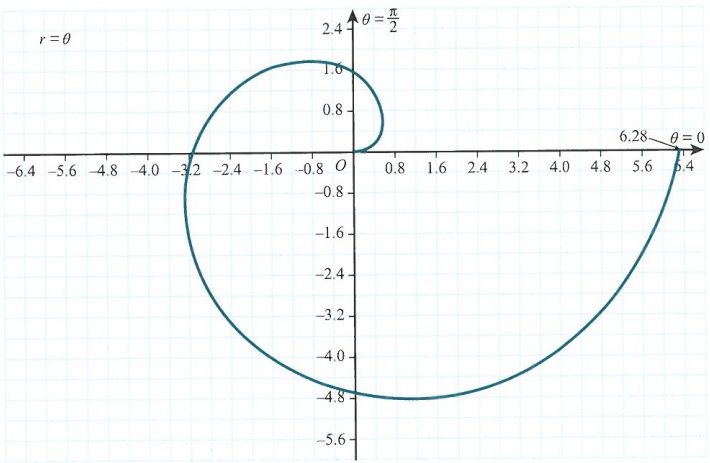

<!-- page 109 -->

<table border=1 style='margin: auto; word-wrap: break-word;'><tr><td style='text-align: center; word-wrap: break-word;'>$ \theta $</td><td style='text-align: center; word-wrap: break-word;'>$ \frac{\pi}{2} $</td><td style='text-align: center; word-wrap: break-word;'>$ \pi $</td><td style='text-align: center; word-wrap: break-word;'>$ \frac{3\pi}{2} $</td><td style='text-align: center; word-wrap: break-word;'>$ 2\pi $</td></tr><tr><td style='text-align: center; word-wrap: break-word;'>r</td><td style='text-align: center; word-wrap: break-word;'>1.57</td><td style='text-align: center; word-wrap: break-word;'>3.14</td><td style='text-align: center; word-wrap: break-word;'>4.71</td><td style='text-align: center; word-wrap: break-word;'>6.28</td></tr></table>

One very useful tool when sketching polar curves is a table of values for  $ (r,\theta) $. From the table we can see that the sketch matches the values.

### WORKED EXAMPLE 5.3

Sketch the curve  $ r\theta = 1 $, for  $ 0 < \theta \leq 2\pi $, noting any special features of the curve.

## Answer

<table border=1 style='margin: auto; word-wrap: break-word;'><tr><td style='text-align: center; word-wrap: break-word;'>r= $ \frac{1}{\theta} $</td><td style='text-align: center; word-wrap: break-word;'>...</td></tr></table>

<table border=1 style='margin: auto; word-wrap: break-word;'><tr><td style='text-align: center; word-wrap: break-word;'>$ \theta $</td><td style='text-align: center; word-wrap: break-word;'>$ \frac{\pi}{2} $</td><td style='text-align: center; word-wrap: break-word;'>$ \pi $</td><td style='text-align: center; word-wrap: break-word;'>$ \frac{3\pi}{2} $</td><td style='text-align: center; word-wrap: break-word;'>$ 2\pi $</td></tr><tr><td style='text-align: center; word-wrap: break-word;'>r</td><td style='text-align: center; word-wrap: break-word;'>0.637</td><td style='text-align: center; word-wrap: break-word;'>0.318</td><td style='text-align: center; word-wrap: break-word;'>0.212</td><td style='text-align: center; word-wrap: break-word;'>0.159</td></tr></table>

 $ \theta \neq 0 $, therefore consider  $ \theta \to 0 $.

For small angles  $ \sin\theta \approx \theta $ so  $ r \approx \frac{1}{\sin\theta} $.

Therefore,  $ r\sin\theta \approx 1 \Rightarrow y \approx 1 $.

Hence, there is an asymptote at y = 1.

Rearrange.

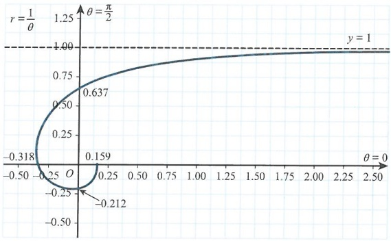

Use specific values to form the general shape of the curve.

Use small angles such that  $ \sin\delta\theta\approx\delta\theta $.

Determine the equation of the asymptote as  $ \theta $ tends to 0.

Note the issue as  $ \theta \to 0 $.

Ensure points of intersection are noted and labelled.

Since polar curves are defined with  $ r \geq 0 $, we need to consider some restrictions for certain curves.

For example, if we attempted to sketch  $ r = \ln \theta $, the domain for  $ \theta $ would have to exclude  $ \theta < 1 $. For the domain  $ 1 \leqslant \theta \leqslant 2\pi $ we would have another spiral curve. The red dashed line represents the section of the curve that we can't sketch. The solid blue line is for  $ \theta > 1 $.

<!-- page 110 -->

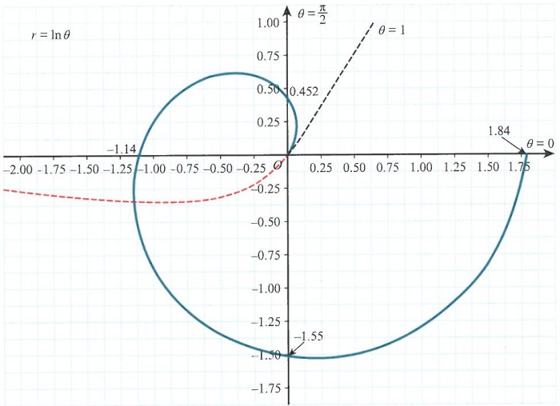

Consider the curve  $ r = \cos\theta $. This curve can be completed over an interval of  $ \pi $. But if we try to use  $ 0 \leq \theta \leq \pi $, this will produce negative values for r for the interval  $ \left[\frac{\pi}{2}, \pi\right] $. You can see this in the following diagram.

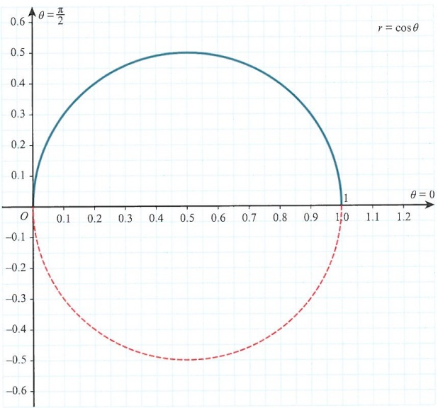

<!-- page 111 -->

So in order to sketch  $ r = \cos\theta $ correctly, we must use the interval  $ \left[-\frac{\pi}{2}, \frac{\pi}{2}\right] $ since this interval is non-negative for  $ \cos\theta $. If you are not convinced that this is a circle, start with  $ r = \cos\theta $ and then multiply both sides by r to get  $ r^2 = r\cos\theta $, or  $ x^2 + y^2 = x $.

This simplifies to  $ \left(x - \frac{1}{2}\right)^{2} + y^{2} = \frac{1}{4} $. This is a circle with centre  $ \left(\frac{1}{2}, 0\right) $ and radius  $ \frac{1}{2} $.

### WORKED EXAMPLE 5.4

Sketch the curve  $ r = \sin\theta $ using a table of values. State the domain for  $ \theta $ that ensures  $ r \geq 0 $.

## Answer

<table border=1 style='margin: auto; word-wrap: break-word;'><tr><td style='text-align: center; word-wrap: break-word;'>$ \theta $</td><td style='text-align: center; word-wrap: break-word;'>0</td><td style='text-align: center; word-wrap: break-word;'>$ \frac{\pi}{6} $</td><td style='text-align: center; word-wrap: break-word;'>$ \frac{\pi}{4} $</td><td style='text-align: center; word-wrap: break-word;'>$ \frac{\pi}{3} $</td><td style='text-align: center; word-wrap: break-word;'>$ \frac{\pi}{2} $</td><td style='text-align: center; word-wrap: break-word;'>$ \frac{2\pi}{3} $</td><td style='text-align: center; word-wrap: break-word;'>$ \frac{3\pi}{4} $</td><td style='text-align: center; word-wrap: break-word;'>$ \frac{5\pi}{6} $</td><td style='text-align: center; word-wrap: break-word;'>$ \pi $</td></tr><tr><td style='text-align: center; word-wrap: break-word;'>r</td><td style='text-align: center; word-wrap: break-word;'>0</td><td style='text-align: center; word-wrap: break-word;'>0.5</td><td style='text-align: center; word-wrap: break-word;'>0.707</td><td style='text-align: center; word-wrap: break-word;'>0.866</td><td style='text-align: center; word-wrap: break-word;'>1</td><td style='text-align: center; word-wrap: break-word;'>0.866</td><td style='text-align: center; word-wrap: break-word;'>0.707</td><td style='text-align: center; word-wrap: break-word;'>0.5</td><td style='text-align: center; word-wrap: break-word;'>0</td></tr></table>

Work out the key values.

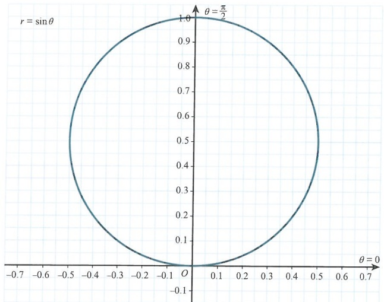

Recognise that this is a closed loop, since it starts and finishes at 0.

Valid for  $ 0 \leq \theta \leq \pi $.

State the correct domain to avoid negative $r$ values.

Earlier we converted $r=\sin\theta$ into $x^{2}+\left(y-\frac{1}{2}\right)^{2}=\frac{1}{4}$, reinforcing the fact that this is a circle. One very convincing additional fact is that the two curves $r=\cos\theta$ and $r=\sin\theta$ are $\frac{\pi}{2}$ radians apart.

<!-- page 112 -->

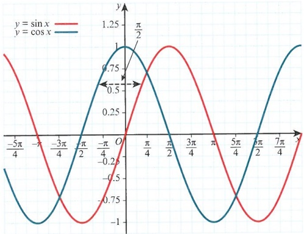

In Cartesian form, this is a translation but in polar form it is a rotation. We can see from the previous graphs that rotating  $ r = \cos\theta $ by  $ \frac{\pi}{2} $ anticlockwise about the pole gives the curve  $ r = \sin\theta $.

Let us now consider the curve $r=1+\cos\theta$. At first this looks like it could be a larger circle, perhaps a circle of radius 1.

To be sure, it is best to construct a table of values, as shown.

<table border=1 style='margin: auto; word-wrap: break-word;'><tr><td style='text-align: center; word-wrap: break-word;'>$ \theta $</td><td style='text-align: center; word-wrap: break-word;'>0</td><td style='text-align: center; word-wrap: break-word;'>$ \frac{\pi}{4} $</td><td style='text-align: center; word-wrap: break-word;'>$ \frac{\pi}{2} $</td><td style='text-align: center; word-wrap: break-word;'>$ \frac{3\pi}{4} $</td><td style='text-align: center; word-wrap: break-word;'>$ \pi $</td><td style='text-align: center; word-wrap: break-word;'>$ \frac{5\pi}{4} $</td><td style='text-align: center; word-wrap: break-word;'>$ \frac{3\pi}{2} $</td><td style='text-align: center; word-wrap: break-word;'>$ \frac{7\pi}{4} $</td></tr><tr><td style='text-align: center; word-wrap: break-word;'>r</td><td style='text-align: center; word-wrap: break-word;'>2</td><td style='text-align: center; word-wrap: break-word;'>1.71</td><td style='text-align: center; word-wrap: break-word;'>1</td><td style='text-align: center; word-wrap: break-word;'>0.293</td><td style='text-align: center; word-wrap: break-word;'>0</td><td style='text-align: center; word-wrap: break-word;'>0.293</td><td style='text-align: center; word-wrap: break-word;'>1</td><td style='text-align: center; word-wrap: break-word;'>1.71</td></tr></table>

From this table, it is possible to construct the curve, noting that there are no negative values of r. The smallest value r can take is 0, and at this point a cusp is created. This curve is known as a cardioid, or heart-shaped curve.

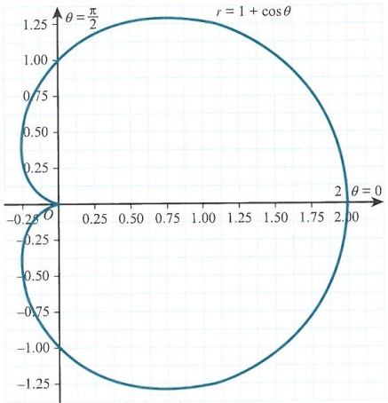

## TIP

A cusp is a point where two branches of a curve meet, such that the two tangents of the curve are equal.

<!-- page 113 -->

Notice that this curve, just like the function  $ y = \cos x $, has a line of symmetry at  $ \theta = 0 $. This is generally the case with polar curves that contain factors of  $ \cos\theta $.

The curve  $ r = 1 + \sin\theta $ is the same shape as the curve  $ r = 1 + \cos\theta $. However, it is symmetrical about the line  $ \theta = \frac{\pi}{2} $ in the same way as the curve  $ y = \sin x $ is. If the angle is  $ 2\theta $ rather than  $ \theta $ then the relationship between the  $ \sin $ and  $ \cos $ curves still holds, but now the angle between them is  $ 2\theta = \frac{\pi}{2} $, or rather  $ \theta = \frac{\pi}{4} $.

We can see in the following diagram the relationship between the curves  $ r = \cos 2\theta $ and  $ r = \sin 2\theta $. Note that there are no negative regions.

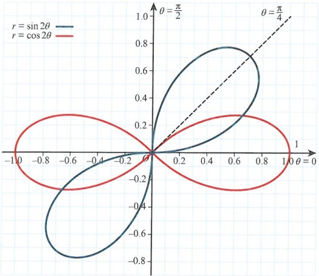

### WORKED EXAMPLE 5.5

Sketch the curve  $ r = \sin 3\theta $ using a table of values. State the domains for  $ \theta $ where  $ r \geqslant 0 $.

## Answer

<table border=1 style='margin: auto; word-wrap: break-word;'><tr><td style='text-align: center; word-wrap: break-word;'>$ \theta $</td><td style='text-align: center; word-wrap: break-word;'>0</td><td style='text-align: center; word-wrap: break-word;'>$ \frac{\pi}{6} $</td><td style='text-align: center; word-wrap: break-word;'>$ \frac{\pi}{4} $</td><td style='text-align: center; word-wrap: break-word;'>$ \frac{\pi}{3} $</td><td style='text-align: center; word-wrap: break-word;'>$ \frac{2\pi}{3} $</td><td style='text-align: center; word-wrap: break-word;'>$ \frac{3\pi}{4} $</td><td style='text-align: center; word-wrap: break-word;'>$ \frac{5\pi}{6} $</td><td style='text-align: center; word-wrap: break-word;'>$ \pi $</td><td style='text-align: center; word-wrap: break-word;'>$ \frac{4\pi}{3} $</td></tr><tr><td style='text-align: center; word-wrap: break-word;'>r</td><td style='text-align: center; word-wrap: break-word;'>0</td><td style='text-align: center; word-wrap: break-word;'>1</td><td style='text-align: center; word-wrap: break-word;'>0.707</td><td style='text-align: center; word-wrap: break-word;'>0</td><td style='text-align: center; word-wrap: break-word;'>0</td><td style='text-align: center; word-wrap: break-word;'>0.707</td><td style='text-align: center; word-wrap: break-word;'>1</td><td style='text-align: center; word-wrap: break-word;'>0</td><td style='text-align: center; word-wrap: break-word;'>0</td></tr></table>

<table border=1 style='margin: auto; word-wrap: break-word;'><tr><td style='text-align: center; word-wrap: break-word;'>$ \theta $</td><td style='text-align: center; word-wrap: break-word;'>$ \frac{3\pi}{2} $</td><td style='text-align: center; word-wrap: break-word;'>$ \frac{5\pi}{3} $</td></tr><tr><td style='text-align: center; word-wrap: break-word;'>r</td><td style='text-align: center; word-wrap: break-word;'>1</td><td style='text-align: center; word-wrap: break-word;'>0</td></tr></table>

Work out the key values.

Determine where r = 0 to find the values that are allowed.

<!-- page 114 -->

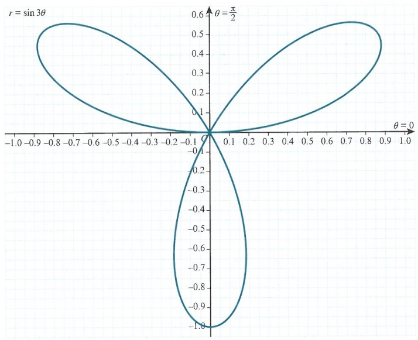

The curve has three petals, or leaves.

Note that the domains we can use are  $ \left[0,\frac{\pi}{3}\right],\left[\frac{2\pi}{3},\pi\right],\left[\frac{4\pi}{3},\frac{5\pi}{3}\right] $.

### EXPLORE 5.1

Investigate curves of the form  $ r = \cos k\theta $ and  $ r = \sin k\theta $ for odd and even values of k.

You must consider the points of intersection of polar curves with the initial line and show them on your graph. The initial line will not always be when  $ \theta = 0 $, as you have seen with both  $ r = \frac{1}{\theta} $ and  $ r = \ln \theta $.

If your function does not permit the use of  $ \theta = 0 $ then use the value  $ \theta = 2\pi $, provided that your domain allows this value.

## EXERCISE 5A

Do not use a calculator in this exercise.

1 Find the Cartesian form for the polar equation  $ r = \sin\theta $.

2 Find the coordinates of all the points where the curve  $ r = \cos\theta + 2 $ meets the coordinates axes.

3 A curve, C, has polar equation  $ r = 2 - \sin\theta $, for  $ 0 \leq \theta \leq 2\pi $. Sketch C.

PS 4 A Cartesian equation is given as  $ x^{3}-y+y^{2}x=0 $. Find the polar equivalent.

<!-- page 115 -->

5 Sketch the curve  $ r = 1 - 2\sin\theta $ for the interval  $ [0, 2\pi] $. Sketch also the inner loop and state its domain.

6 Sketch the curve  $ r = \sec^2 \theta $ for the interval  $ 0 \leq \theta \leq 2\pi $.

7 A polar curve is given as  $ r = \cos 2\theta $. Show that the Cartesian form is  $ (x^2 + y^2)^{\frac{3}{2}} = x^2 - y^2 $.

8 Sketch the curve  $ r = \cos^2 \theta $, for  $ -\frac{\pi}{2} \leq \theta \leq \frac{\pi}{2} $.

9 Sketch the curve  $ r = \sec\left(\theta - \frac{\pi}{4}\right) $, showing the coordinates of all points of intersection with the coordinate axes.

10 The curve, C, is defined as  $ r = \cos 3\theta $, for  $ 0 \leq \theta \leq 2\pi $. Sketch C.

11 Sketch the curve in question 4.

### 5.2 Applications of polar coordinates

When polar curves intersect, we find these points of intersection in the same way as for Cartesian equations. Consider, for example, the two curves  $ r = \cos\theta $ and  $ r = \cos2\theta $.

When these two curves meet,  $ \cos 2\theta = \cos\theta $, or  $ 2\cos^{2}\theta - 1 = \cos\theta $. Hence,

 $ (2\cos\theta+1)(\cos\theta-1)=0 $. We can see in the following diagram that the only point of intersection is when  $ \theta=0 $. So our point is  $ (1,0) $.

Note that these are polar coordinates and not $(x,y)$ coordinates. Although $\cos\frac{\pi}{2}=0$ for the circle $r=\cos\theta$, the value $\theta=\frac{\pi}{2}$ is not defined on $r=\cos2\theta$.

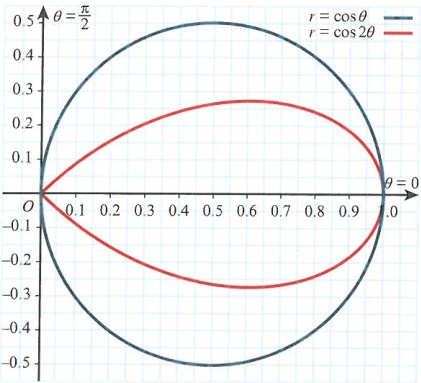

It is advisable to sketch the curves you are given so that you can be clear how the two curves interact in polar coordinates. This is stated in Key point 5.2.

### KEY POINT 5.2

Always sketch the curves you are given, to make it clear how the two curves interact in polar coordinates.

<!-- page 116 -->

### WORKED EXAMPLE 5.6

Determine the points of intersection of the curves  $ r = \tan\theta $ and  $ r = \sin2\theta $.

<table border=1 style='margin: auto; word-wrap: break-word;'><tr><td colspan="2">Answer</td></tr><tr><td style='text-align: center; word-wrap: break-word;'>$ \tan \theta = \sin 2\theta $</td><td style='text-align: center; word-wrap: break-word;'>Form an equation.</td></tr><tr><td style='text-align: center; word-wrap: break-word;'>$ \frac{\sin \theta}{\cos \theta} = 2 \sin \theta \cos \theta $</td><td style='text-align: center; word-wrap: break-word;'>Use trigonometric identities.</td></tr><tr><td style='text-align: center; word-wrap: break-word;'>$ \sin \theta (1 - 2 \cos^2 \theta) = 0 $</td><td style='text-align: center; word-wrap: break-word;'></td></tr><tr><td style='text-align: center; word-wrap: break-word;'>$ \theta = 0, \frac{\pi}{4}, \frac{3\pi}{4}, \pi, \frac{5\pi}{4}, \frac{7\pi}{4} $</td><td style='text-align: center; word-wrap: break-word;'>Do not divide by  $ \sin \theta $ or you will lose solutions.</td></tr><tr><td style='text-align: center; word-wrap: break-word;'>Hence,  $ (0, 0) $,  $ (0, \pi) $,  $ (1, \frac{\pi}{4}) $,  $ (1, \frac{5\pi}{4}) $.</td><td style='text-align: center; word-wrap: break-word;'>Write down all the possible values in polar coordinates, checking where r is non-negative.</td></tr></table>

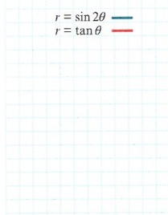

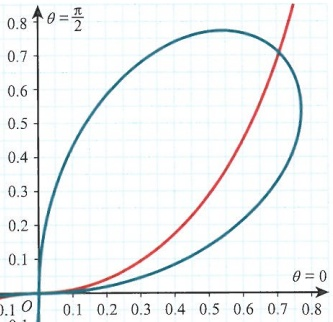

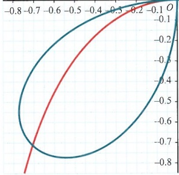

Next we will consider the area contained inside a polar curve. The concept is very similar to the area under the curve for Cartesian equations.

We have two points, $P(r,\theta)$ and $Q(r+\delta r,\theta+\delta\theta)$, on a polar curve, such that the area $OPQ$ is $\delta A$.

<!-- page 117 -->

Then as $\delta\theta\to0$ we can say that $\delta r\to0$. So we will assume that the area $OPQ$ is a sector with area $\frac{1}{2}r^{2}\delta\theta$. Once we have set a limit, we can use $\mathrm{d}\theta$ instead of $\delta\theta$.

Adding these small areas over an interval  $ \alpha \leqslant \theta \leqslant \beta $, we can write  $ A = \frac{1}{2} \int_{\alpha}^{\beta} r^{2} \, \mathrm{d}\theta $.

This is the area inside a polar curve over the specified interval.

For example, let us look at the area inside the polar curve  $ r = 1 + \cos\theta $ over  $ 0 \leqslant \theta \leqslant \pi $.

Start with  $ A = \frac{1}{2}\int_{0}^{2} r^2 \, \mathrm{d}\theta $, which leads to  $ A = \frac{1}{2}\int_{0}^{\pi} (1 + \cos\theta)^2 \, \mathrm{d}\theta $.

Expanding leads to  $ \frac{1}{2}\int_{0}^{\pi} (1 + 2\cos\theta + \cos^2\theta) \, \mathrm{d}\theta $ and simplifying leads to  $ A = \frac{1}{2}\int_{0}^{\pi} \left( \frac{3}{2} + 2\cos\theta + \frac{1}{2}\cos 2\theta \right) \, \mathrm{d}\theta $. (Note the use of  $ \cos^2\theta = \frac{1}{2} + \frac{1}{2}\cos 2\theta $.)

So  $ A = \left[ \frac{3\theta}{4} + \sin\theta + \frac{1}{8}\sin 2\theta \right]^\pi $, which is  $ \frac{3\pi}{4} $.

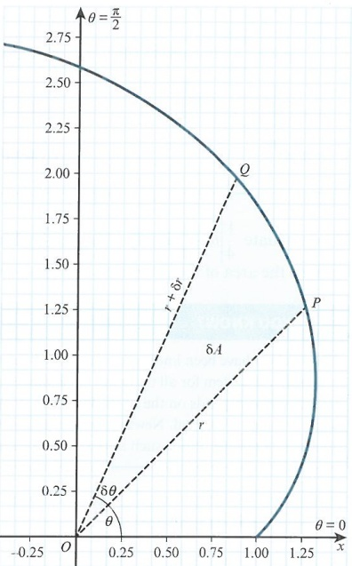

### WORKED EXAMPLE 5.7

Find the area enclosed by the curve  $ r = \cos 2\theta $ over the interval  $ [0, 2\pi] $.

## Answer

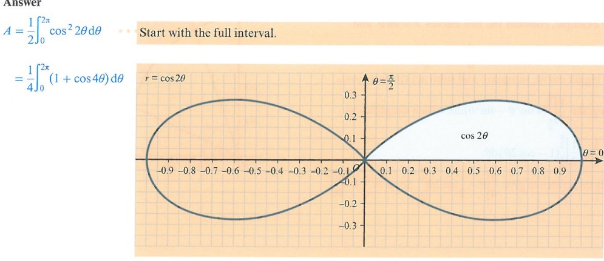

<!-- page 118 -->

$$=4\times\frac{1}{4}\int_{0}^{\frac{\pi}{4}}(1+\cos4\theta)\,\mathrm{d}\theta$$

If we evaluate  $ \frac{1}{4}\left[\theta + \frac{1}{4}\sin 4\theta\right]_{0}^{2\pi} $ we get  $ \frac{\pi}{2} $, which is twice as large as the true answer. This is because the area of the curve for the regions with  $ r < 0 $ has also been included.

## DID YOU KNOW?

Polar curves have been known for about 2200 years, although they have not been used formally as a coordinate system for all this time. Archimedes described his Archimedean spiral as a function whose radius depends on the angle. However, it was not until the 17th century that mathematicians such as Cavalieri, Pascal, Newton and Bernoulli started to write functions in polar form and use them to determine results such as the area inside an Archimedean spiral.

## TIP

Always use the symmetry of curves to help you work out the area of a polar curve.

Finding the area between polar curves is similar to finding the area between Cartesian curves.

Consider two curves,  $ r_{1} $ and  $ r_{2} $, as shown in the diagram

The area between them can be found using  $ A = \frac{1}{2} \int_{\alpha}^{\beta} (r_2^2 - r_1^2) \, \mathrm{d}\theta $.

(Note that this is not the same as $A=\frac{1}{2}\int_{\alpha}^{\beta}(r_{2}-r_{1})^{2}\mathrm{d}\theta$; that is a very different integral.)

For example, consider the two curves  $ r = \sin\theta $ and

$r = 2\sin\theta$ over the interval $\frac{\pi}{6} \leqslant \theta \leqslant \frac{\pi}{2}$. Note that $2\sin\theta$ is the bigger curve, so square and subtract the functions.

Integrate $\frac{1}{2}\int_{\frac{\pi}{6}}^{\frac{\pi}{2}}(4\sin^{2}\theta-\sin^{2}\theta)\mathrm{d}\theta$, which simplifies to $3\times\frac{1}{2}\times\frac{1}{2}\int_{\frac{\pi}{6}}^{\frac{\pi}{2}}(1-\cos2\theta)\mathrm{d}\theta$.

This integrates to give  $ \frac{3}{4}\left[\theta - \frac{1}{2}\sin 2\theta\right]^{\frac{\pi}{6}}_{\frac{\pi}{2}}. $ So  $ A = \frac{\pi}{4} + \frac{3\sqrt{3}}{16}. $

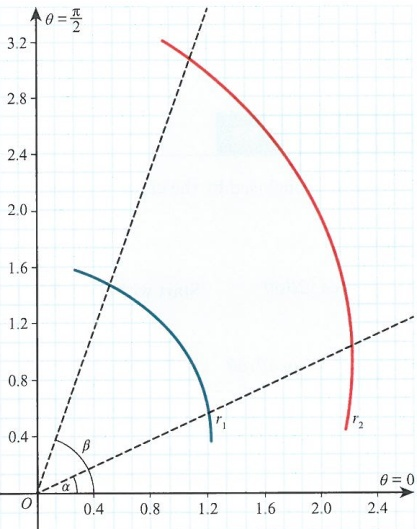

<!-- page 119 -->

Find the area contained between the curves  $ r = \theta $ and  $ r = e^{\theta} $ and the lines  $ \theta = 1, \theta = 1.2 $.

Answer

 $$ A=\frac{1}{2}\int_{1}^{1.2}(\mathrm{e}^{2\theta}-\theta^{2})\mathrm{d}\theta $$ 

Write the integral. Note that the exponential has a larger area.

 $$ =\frac{1}{2}\bigg[\frac{1}{2}\mathrm{e}^{2\theta}-\frac{1}{3}\theta^{3}\bigg]_{1}^{1.2} $$ 

Integrate and determine the area.

If we want to find the area between $r = \cos\theta$ and $r = \sin\theta$, we can see that the curves meet twice. However, these two points are Cartesian points of intersection. The only true point of intersection in polar coordinates is $\left(\frac{\sqrt{2}}{2}, \frac{\pi}{4}\right)$. As the two curves have different $\theta$ values when $r = 0$, we must take care when integrating.

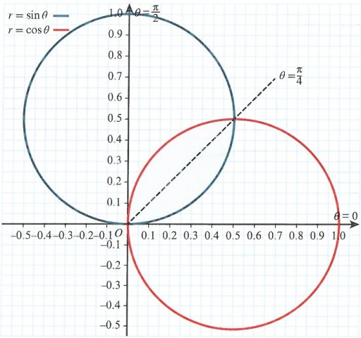

To find the area between them we must consider the limits of both each curves separately.

So  $ A = \frac{1}{2} \int_0^{\frac{\pi}{4}} \sin^2 \theta \, \mathrm{d}\theta + \frac{1}{2} \int_{\frac{\pi}{4}}^{\frac{\pi}{2}} \cos^2 \theta \, \mathrm{d}\theta $. We cannot combine these two integrals

because the limits are different. Use the double angle formula for  $ \cos 2\theta $, to give

 $ A = \frac{1}{4} \int_0^{\frac{\pi}{4}} (1 - \cos 2\theta) \, \mathrm{d}\theta + \frac{1}{4} \int_{\frac{\pi}{4}}^{\frac{\pi}{2}} (1 + \cos 2\theta) \, \mathrm{d}\theta $.

Integrate to give $A = \frac{1}{4}\left[\theta - \frac{1}{2}\sin 2\theta\right]_{0}^{\frac{\pi}{4}} + \frac{1}{4}\left[\theta + \frac{1}{2}\sin 2\theta\right]_{\frac{\pi}{4}}^{\frac{\pi}{2}}$. Evaluate this to give $A = \frac{\pi}{8} - \frac{1}{4}$. Because of the geometry of the two curves, we can obtain the same area by considering $2 \times \frac{1}{2}\int_{0}^{\frac{\pi}{4}}\sin^2\theta\,d\theta$.

## TIP

Pay close attention to the limits of both the curves in your integral. If they differ, you cannot combine the integrals and must keep them separate. Also pay special attention to the polar points of intersection. The Cartesian points of intersection may not be actual points of intersection.

<!-- page 120 -->

### WORKED EXAMPLE 5.9

Find the area enclosed between the curves  $ r=\sin\theta $ and  $ r=1-\sin\theta $.

## Answer

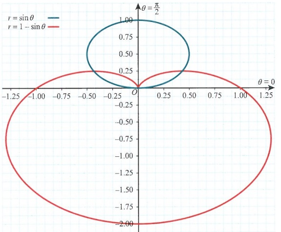

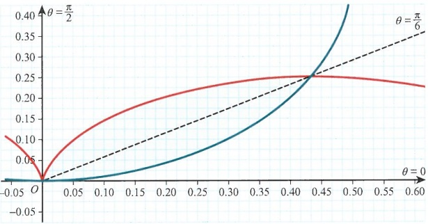

Make a sketch of the curves to identify the enclosed area.

 $$ \begin{aligned}&A=2\times\frac{1}{2}\Biggl(\int_{0}^{\frac{\pi}{6}}\sin^{2}\theta\mathrm{d}\theta+\int_{\frac{\pi}{6}}^{\frac{\pi}{2}}(1-\sin\theta)^{2}\mathrm{d}\theta\Biggr)\\ &\\&=\frac{1}{2}\int_{0}^{\frac{\pi}{6}}(1-\cos2\theta)\mathrm{d}\theta+\int_{\frac{\pi}{6}}^{\frac{\pi}{2}}\biggl(\frac{3}{2}-2\sin\theta-\frac{1}{2}\cos2\theta\biggr)\mathrm{d}\theta\\ &\\&=\left[\frac{\theta}{2}-\frac{1}{4}\sin2\theta\right]_{0}^{\frac{\pi}{6}}+\left[\frac{3\theta}{2}+2\cos\theta-\frac{1}{4}\sin2\theta\right]_{\frac{\pi}{6}}^{\frac{\pi}{2}}\\ &\\&A=\frac{7\pi}{12}-\sqrt{3}\\ \end{aligned} $$ 

Recognise that the two areas on each side of the line  $ \theta = \frac{\pi}{2} $ are equal, so you only need to consider one of them.

Use different limits for each part of the area.

Use the double angle formula for $\cos2\theta$ twice.

Integrate the parts separately.

Evaluate the area.

<!-- page 121 -->

Polar curves that are looped usually contain  $ \sin(f(\theta)) $ or  $ \cos(f(\theta)) $. Looped regions have a maximum distance from the origin. To find this maximum distance we can look very carefully at the curve: at the point P the curve is at its greatest distance, but on either side of this point the curve gets closer to the origin.

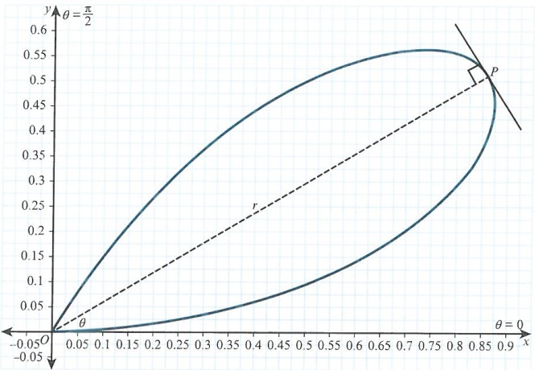

So it must be true that  $ \frac{dr}{d\theta}=0 $ at P. That is, r is greatest at this point. Also at this point the line OP is perpendicular to the tangent to the curve.

Consider the curve  $ r = e^{\theta} \sin \theta $, which is a closed loop over the interval  $ [0, \pi] $.

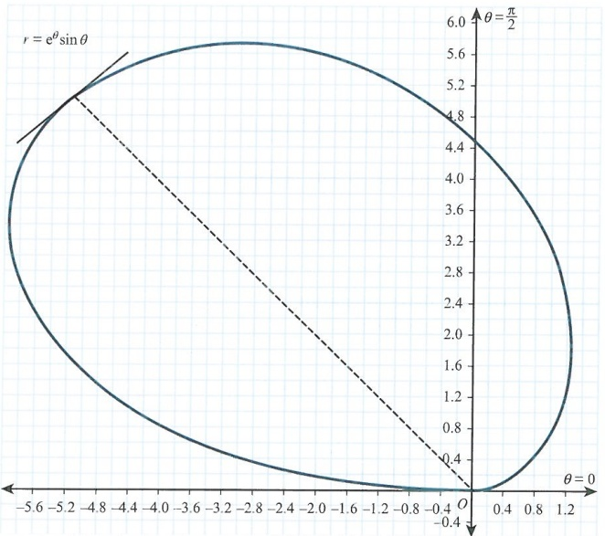

<!-- page 122 -->

To find the maximum value for r we find  $ \frac{dr}{d\theta} $, which is  $ e^{\theta}\sin\theta + e^{\theta}\cos\theta $.

Then  $  \mathrm{e}^{\theta} \sin \theta + \mathrm{e}^{\theta} \cos \theta = 0  $. So  $  \mathrm{e}^{\theta} (\sin \theta + \cos \theta) = 0  $. Since  $  \mathrm{e}^{\theta} \neq 0  $, we know  $  \sin \theta = -\cos \theta  $.

This means  $ \tan\theta = -1 $, and  $ \theta = \frac{3\pi}{4} $.

Hence,  $ r_{\max} = e^{\frac{3\pi}{4}} \sin \frac{3\pi}{4} $, or  $ \frac{\sqrt{2} e^{\frac{3\pi}{4}}}{2} \approx 7.46 $.

Note that not all curves will give a useful result for $\frac{\mathrm{d}r}{\mathrm{d}\theta}$. The curve $r=\theta$ has $\frac{\mathrm{d}r}{\mathrm{d}\theta}=1$, which implies the distance of the curve from the origin is always increasing.

### WORKED EXAMPLE 5.10

Determine the maximum distance of the curve  $ r = \theta e^{-\theta} $ from the origin.

## Answer

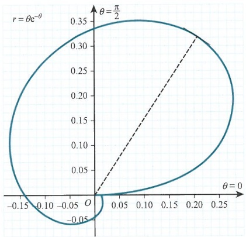

Sketch the curve first to see the approximate location of the maximum value.

(A sketch is not always necessary.)

Note: This curve is not looped but does have a maximum distance.

 $$ \frac{\mathrm{d}r}{\mathrm{d}\theta}=\mathrm{e}^{-\theta}-\theta\mathrm{e}^{-\theta} $$ 

Differentiate the function.

 $$ \mathrm{e}^{-\theta}(1-\theta)=0\Rightarrow\theta=1 $$ 

Set equal to zero, noting that  $ e^{-\theta} \neq 0 $.

 $$ r_{max}=e^{-1}=\frac{1}{e}\approx0.368 $$ 

Determine the maximum distance.

Since these curves also lie in the Cartesian plane, we can consider the maximum and minimum values of x and y. To do this, we must go back to the original parametric equations for polar curves.

Recall from Section 5.1 that  $ x = f(\theta) \cos \theta $ and  $ y = f(\theta) \sin \theta $. To determine maxima and minima we simply need to find  $ \frac{dx}{d\theta} $ or  $ \frac{dy}{d\theta} $.

Let us look at a curve that we have seen before:  $ r = 1 + \cos\theta $. We want to determine the maximum value for y.

<!-- page 123 -->

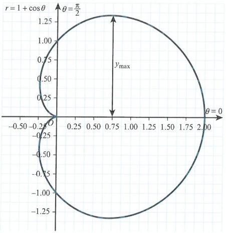

So if  $  y = (1 + \cos\theta)\sin\theta  $, then  $  \frac{dy}{d\theta} = \cos\theta - \sin^{2}\theta + \cos^{2}\theta = \cos\theta - 1 + \cos^{2}\theta + \cos^{2}\theta = 2\cos^{2}\theta + \cos\theta - 1  $. This simplifies to  $  (2\cos\theta - 1)(\cos\theta + 1) = 0  $.

From the derivative, it seems that  $ \theta = \frac{\pi}{3}, \pi, \frac{5\pi}{3} $. So for the maximum y value we use  $ \theta = \frac{\pi}{3} $. So  $ y_{\max} = \left(1 + \frac{1}{2}\right)\frac{\sqrt{3}}{2} = \frac{3\sqrt{3}}{4} $.

Note that using  $ \theta = \frac{5\pi}{3} $ gives  $ y_{\min} = -\frac{3\sqrt{3}}{4} $. Using  $ \theta = \pi $ we get  $ y = 0 $, since at  $ \theta = \pi $ we are at the cusp of the curve.

### WORKED EXAMPLE 5.11

Find the minimum y value for r = 1 +  $ \sin\theta $.

Answer

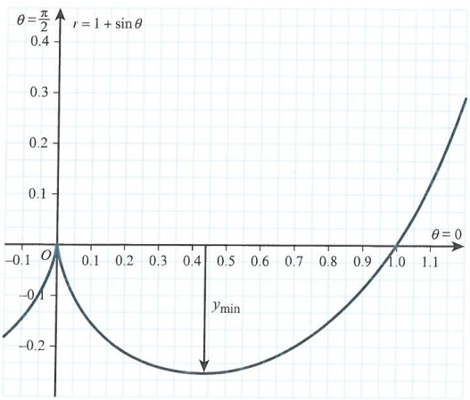

Sketch the graph first.

Note: This graph is a zoomed in portion of the curve showing the minimum y value.

<!-- page 124 -->

$$ \begin{aligned}y&=\left(1+\sin\theta\right)\sin\theta\\&=\sin\theta+\sin^{2}\theta\end{aligned} $$ 

Write y in a simplified form.

 $$ \begin{aligned}\frac{\mathrm{d}y}{\mathrm{d}\theta}&=\cos\theta+2\sin\theta\cos\theta\\&\Rightarrow\cos\theta(1+2\sin\theta)=0\end{aligned} $$ 

Differentiate and put equal to 0.

 $$ \theta=\frac{\pi}{2},\frac{7\pi}{6},\frac{3\pi}{2},\frac{11\pi}{6} $$ 

Identify all possible values.

 $$ \theta=\frac{11\pi}{6}\Rightarrow y=\left(1-\frac{1}{2}\right)\times\left(-\frac{1}{2}\right)=-\frac{1}{4} $$ 

Determine the correct value for minimum y.

Finally, consider the curve  $ r = \sin 2\theta $ for which we want to maximise  $ x $.

Starting with  $ x = \sin 2\theta \cos\theta $, this gives  $ \frac{dx}{d\theta} = 2\cos 2\theta \cos\theta - \sin 2\theta \sin\theta $.

Using double angle formulae will lead to  $ \frac{dx}{d\theta}=6\cos^{3}\theta-4\cos\theta $. Then factorise to get  $ 2\cos\theta(3\cos^{2}\theta-2)=0 $.

If $\cos\theta=0$ then $\theta=\frac{\pi}{2},\frac{3\pi}{2}$, and we do not want these values. But if $\cos^{2}\theta=\frac{2}{3}$, we can see from the diagram that $\cos\theta=\sqrt{\frac{2}{3}}$ is the value we need.

If  $ \cos\theta = \sqrt{\frac{2}{3}} $, then  $ \sin\theta = \frac{1}{\sqrt{3}} $. Hence,  $ x_{\max} = 2 \times \frac{1}{\sqrt{3}} \times \left( \sqrt{\frac{2}{3}} \right)^2 = \frac{4\sqrt{3}}{9} $.

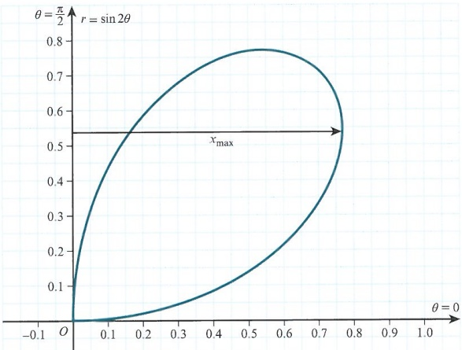

## TIP

Even a basic sketch of a curve can be very helpful when you are attempting to work out maximum and minimum values.

<!-- page 125 -->

1 Find the area contained in the curve  $ r = \theta $ between  $ \theta = \frac{\pi}{4} $ and  $ \theta = \frac{\pi}{2} $.

2 Find the maximum distance of the curve  $ r = \cos\theta - \sin\theta $ from the origin, and the coordinates at which this happens.

P PS 3 Given that  $ r=1+\cos\theta $, show that the maximum value of y is  $ \frac{3\sqrt{3}}{4} $.

4 Without using a calculator, find the area bounded by the curve  $ r = e^{\theta} $ and the lines  $ \theta = 1 $ and  $ \theta = 2 $.

5 The curve  $ r = \sqrt{(\ln \theta)} $ is defined for  $ \frac{\pi}{2} \leqslant \theta \leqslant \pi $. Find the area bounded by the curve over this interval, giving your answer correct to 3 significant figures.

PS 6 Find the maximum distance of the curve  $ r = e^{\theta} \cos\left(\theta - \frac{\pi}{6}\right) $ from the origin for the interval  $ 0 \leq \theta \leq \frac{\pi}{2} $.

7 The diagram shows the curves  $ r=1+\cos\theta $ and  $ r=1+\sin\theta $. Without using a calculator, find the area of the shaded region, giving your answer in an exact form.

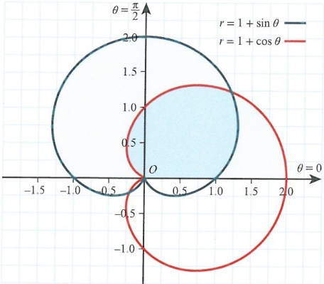

P PS 8 A polar curve is given as  $ r = \cos 2\theta + \cos \theta $.

a Show that  $ x = \cos\theta + \cos^{2}\theta - 2\cos^{3}\theta $.

b Differentiate the result in part a and show that for stationary points  $ \sin\theta(6\cos^{2}\theta+\cos\theta-1)=0 $.

c Deduce the minimum value of x.

PS 9 Without using a calculator, find the area enclosed by the curve  $ r = \theta e^{\theta} $ and the lines  $ \theta = 1 $ and  $ \theta = 2 $.

<!-- page 126 -->

## WORKED PAST PAPER QUESTION

Draw a sketch of the curve $C$ whose polar equation is $r = \theta$, for $0 \leqslant \theta \leqslant \frac{1}{2}\pi$.

On the same diagram draw the line  $ \theta = \alpha $, where  $ 0 < \alpha < \frac{1}{2}\pi $.

The region bounded by C and the line  $ \theta=\frac{1}{2}\pi $ is denoted by R. Find the exact value of  $ \alpha $ for which the line  $ \theta=\alpha $ divides R into two regions of equal area.

Cambridge International AS & A Level Further Mathematics 9231 Paper 1 Q5 June 2009

## Answer

Sketch of  $ r = \theta $ and  $ \theta = \alpha $.

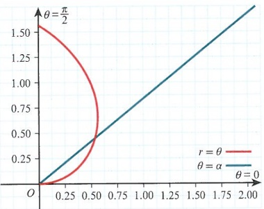

Start with  $ \int_{0}^{\alpha}\frac{1}{2}\theta^{2}d\theta=\int_{\alpha}^{\frac{\pi}{2}}\frac{1}{2}\theta^{2}d\theta $

Then

 $$ \left[\frac{1}{6}\theta^{3}\right]_{0}^{\alpha}=\left[\frac{1}{6}\theta^{3}\right]_{\alpha}^{\frac{\pi}{2}} $$ 

 $$ \frac{1}{6}\alpha^{3}=\frac{1}{6}\times\frac{\pi^{3}}{8}-\frac{1}{6}\alpha^{3} $$ 

Therefore,  $ 2\alpha^{3}=\frac{\pi^{3}}{8}\Rightarrow\alpha=\frac{\pi}{2^{\frac{4}{3}}} $

<!-- page 127 -->

## Checklist of learning and understanding

## Notation:

Written as  $ r = f(\theta) $, where r represents the distance from the origin and  $ \theta $ is the angle measured from the initial line in an anticlockwise direction.

All polar curves are such that  $ x = r \cos \theta $,  $ y = r \sin \theta $ and  $ x^{2} + y^{2} = r^{2} $.

Parametric polar form is  $ x = f(\theta) \cos \theta $ and  $ y = f(\theta) \sin \theta $.

## Curve sketching:

Use a small table to work out the key values of r and  $ \theta $ to get a general idea of the shape.

Determine, if any, the values of  $ \theta $ when r = 0.

- Make full use of curve symmetry and lines of symmetry; for example, cosine-based curves have symmetry about the line  $ \theta = 0 $.

## Example curves:

Spirals

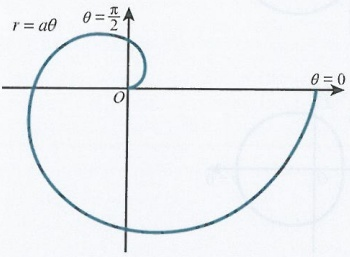

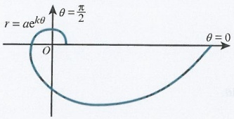

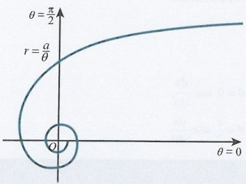

<!-- page 128 -->

Cardioids  $  (r = a + b \cos \theta)  $

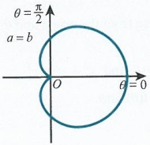

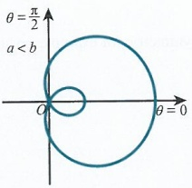

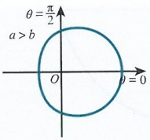

Area of a polar curve:

The formula for area is  $ A = \frac{1}{2} \int_{\alpha}^{\beta} r^{2} \, \mathrm{d}\theta $.

For the area between two curves, use  $ A = \frac{1}{2} \int_{\alpha}^{\beta} \left( r_2^2 - r_1^2 \right) \mathrm{d}\theta $.

If the limits for two curves differ, their integrals cannot be combined.

## Maxima/minima:

For the greatest distance from the origin use  $ \frac{dr}{d\theta} $

For the maximum or minimum distance from the line  $ \theta = 0 $ use  $ \frac{dy}{d\theta} $

For the maximum or minimum distance from the line  $ \theta = \frac{\pi}{2} $ use  $ \frac{dx}{d\theta} $.

<!-- page 129 -->

1 The curve $C$ has polar equation $r = a(1 - e^{-\theta})$, where $a$ is a positive constant and $0 \leq \theta < 2\pi$.

i Draw a sketch of C.

ii Show that the area of the region bounded by C and the lines  $ \theta = \ln 2 $ and  $ \theta = \ln 4 $ is  $ \frac{1}{2}a^2\left(\ln 2 - \frac{13}{32}\right) $.

Cambridge International AS & A Level Further Mathematics 9231 Paper 11 Q2 June 2010

2 The curve C has polar equation  $ r = 3 + 2\cos\theta $, for  $ -\pi < \theta \leq \pi $. The straight line l has polar equation  $ r\cos\theta = 2 $. Sketch both C and l on a single diagram.

Find the polar coordinates of the points of intersection of C and l.

The region R is enclosed by C and l, and contains the pole. Find the area of R.

Cambridge International AS & A Level Further Mathematics 9231 Paper 11 Q10 November 2011

3 The curve $C$ has polar equation $r=2\sin\theta(1-\cos\theta)$, for $0\leq\theta\leq\pi$.

Find  $ \frac{dr}{d\theta} $ and hence find the polar coordinates of the point of C that is furthest from the pole.

Sketch C.

Find the exact area of the sector from  $ \theta = 0 $ to  $ \theta = \frac{1}{4}\pi $.

Cambridge International AS & A Level Further Mathematics 9231 Paper 13 Q10 November 2013

