# Vectors

<!-- Cambridge International AS  A Level Further Mathematics Coursebook (Lee Mckelvey Martin Crozier) .pdf p130-150 -->

<!-- page 130 -->

In this chapter you will learn how to:

use the equation of a plane in any form

use the vector product to determine a common perpendicular, as well as understanding its applications

use the equations of lines and planes together with scalar and vector products to solve problems concerning distances, angles and intersections.

<!-- page 131 -->

<table border=1 style='margin: auto; word-wrap: break-word;'><tr><td style='text-align: center; word-wrap: break-word;'>Where it comes from</td><td style='text-align: center; word-wrap: break-word;'>What you should be able to do</td><td style='text-align: center; word-wrap: break-word;'>Check your skills</td></tr><tr><td style='text-align: center; word-wrap: break-word;'>AS &amp; A Level Mathematics Pure Mathematics 2 &amp; 3, Chapter 9</td><td style='text-align: center; word-wrap: break-word;'>Find the vector equation of a line.</td><td style='text-align: center; word-wrap: break-word;'>1 Use the points given to determine the vector equation of the line passing through them.\na  $ A(2,3,1) $,  $ B(4,5,-3) $b  $ A(3,0,1) $,  $ B(5,6,2) $</td></tr><tr><td style='text-align: center; word-wrap: break-word;'>AS &amp; A Level Mathematics Pure Mathematics 2 &amp; 3, Chapter 9</td><td style='text-align: center; word-wrap: break-word;'>Apply the scalar product to help to determine the angle between two vectors.</td><td style='text-align: center; word-wrap: break-word;'>2 Find the angle between the following pairs of vectors.\na  $ u=i+3j+k $,  $ v=-j+3k $b  $ u=2i+5j-k $,  $ v=4i-2j+4k $</td></tr></table>

## Why do we need vectors?

Vectors describe anything that has both magnitude and direction. You may not realise it but we use vectors when we consider how to kick a football into a goal, and how to create high-resolution, believable graphics in a computer game.

You have already learned about vectors in AS & A Level Mathematics Pure Mathematics 3, including work on vector equations of lines and the scalar product. This chapter extends these ideas to planes, links planes to systems of linear equations and matrices, and introduces the vector product and some of its applications.

KEY POINT 6.1

The scalar product is  $ \mathbf{a} \cdot \mathbf{b} = |\mathbf{a}||\mathbf{b}|\cos\theta $, where  $ \theta $ is the angle between the directions of vectors  $ \mathbf{a} $ and  $ \mathbf{b} $.

### 6.1 The vector product rule

You have already met the scalar product (as shown in Key point 6.1) in the AS & A Level Mathematics course. Now we will examine the relationship between two non-parallel vectors and a common perpendicular. This rule is known as the cross product or vector product.

This is written as  $ \mathbf{a} \times \mathbf{b} = |\mathbf{a}||\mathbf{b}|\sin\theta\,\hat{\mathbf{n}} $, where  $ \hat{\mathbf{n}} $ is a unit vector that is a common perpendicular to  $ \mathbf{a} $ and  $ \mathbf{b} $. We will concentrate on the left-hand side first.

If two vectors,  $ \mathbf{a} = a_1\mathbf{i} + a_2\mathbf{j} + a_3\mathbf{k} $ and  $ \mathbf{b} = b_1\mathbf{i} + b_2\mathbf{j} + b_3\mathbf{k} $, both have a common perpendicular  $ \mathbf{x}\mathbf{i} + y\mathbf{j} + z\mathbf{k} $, we can use the scalar product twice to produce  $ a_1x + a_2y + a_3z = 0 $ and  $ b_1x + b_2y + b_3z = 0 $. Solving these (you do not need to solve these) gives  $ x = a_2b_3 - a_3b_2 $,  $ y = a_3b_1 - a_1b_3 $,  $ z = a_1b_2 - a_2b_1 $.

So our common perpendicular is  $ \begin{pmatrix}a_{2}b_{3}-a_{3}b_{2}\\a_{3}b_{1}-a_{1}b_{3}\\a_{1}b_{2}-a_{2}b_{1}\end{pmatrix} $.

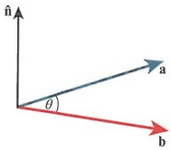

<!-- page 132 -->

Another way of getting the same result is to consider the vector determinant  $ \begin{vmatrix} \mathbf{i} & \mathbf{j} & \mathbf{k} \\ a_1 & a_2 & a_3 \\ b_1 & b_2 & b_3 \end{vmatrix} $, then write this as  $ \begin{vmatrix} a_2 & a_3 \\ b_2 & b_3 \end{vmatrix} \mathbf{i} - \begin{vmatrix} a_1 & a_3 \\ b_1 & b_3 \end{vmatrix} \mathbf{j} + \begin{vmatrix} a_1 & a_2 \\ b_1 & b_2 \end{vmatrix} $ k. Simplifying each minor determinant will lead to the same result as before.

We have seen this method in Chapter 4. We will use the determinant method throughout this text.

Consider the two vectors  $ 3\mathbf{i} - \mathbf{j} + 5\mathbf{k} $ and  $ 2\mathbf{i} + 7\mathbf{j} - \mathbf{k} $. Denote a normal vector as  $ \mathbf{n} $, so

 $$ \mathbf{n}=\left|\begin{array}{c c c}{\mathbf{i}}&{\mathbf{j}}&{\mathbf{k}}\\ {3}&{-1}&{5}\\ {2}&{7}&{-1}\end{array}\right|=(1-35)\mathbf{i}-(-3-10)\mathbf{j}+(21-(-2))\mathbf{k}=-34\mathbf{i}+13\mathbf{j}+23\mathbf{k}. $$ 

## REWIND

We saw in Chapter 4 that for the  $ 3 \times 3 $ matrix  $ \begin{pmatrix} a & b & c \\ d & e & f \\ g & h & i \end{pmatrix} $, the determinant is given by  $ a \begin{vmatrix} e & f \\ h & i \end{vmatrix} - b \begin{vmatrix} d & f \\ g & i \end{vmatrix} + c \begin{vmatrix} d & e \\ g & h \end{vmatrix} $.

So  $ \mathbf{n} = -34\mathbf{i} + 13\mathbf{j} + 23\mathbf{k} $ is a vector perpendicular to both of the given vectors.

### WORKED EXAMPLE 6.1

In each case, find a vector perpendicular to each pair of vectors given.

a -4i + 2j + k and 3i - 7k
b -2i + 12j - 9k and 4j + 5k
c i + j + 2k and 2i + 7j - 6k

Answer

 $$ \begin{aligned}\mathbf{a}\quad&\mathbf{n}=\left|\begin{array}{ccc}\mathbf{i}&\mathbf{j}&\mathbf{k}\\-4&2&1\\3&0&-7\end{array}\right|=(-14-0)\mathbf{i}-(28-3)\mathbf{j}+(0-6)\mathbf{k}\\&=-14\mathbf{i}-25\mathbf{j}-6\mathbf{k}or\mathbf{n}=14\mathbf{i}+25\mathbf{j}+6\mathbf{k}\\&Note~that~a~multiple~of~the~normal~vector~found~is\\&still~normal~to~the~given~vectors.\end{aligned} $$ 

Find the cross product of the vectors.

Take out the factor -1.

 $$ \begin{array}{l l l}{\mathbf{b}}&{\mathbf{n}=\left|\begin{array}{c c c}{\mathbf{i}}&{\mathbf{j}}&{\mathbf{k}}\\ {-2}&{12}&{-9}\\ {0}&{4}&{5}\end{array}\right|=(60-(-36))\mathbf{i}-(-10-0)\mathbf{j}+(-8-0)\mathbf{k}}\\ {}&{=96\mathbf{i}+10\mathbf{j}-8\mathbf{k}{\mathrm{~o r~}}\mathbf{n}=48\mathbf{i}+5\mathbf{j}-4\mathbf{k}}\\ \end{array} $$ 

Find the cross product of the vectors.

Take out the factor 2.

 $$ \begin{array}{l}\mathbf{c}\quad\mathbf{n}=\left|\begin{array}{ccc}\mathbf{i}&\mathbf{j}&\mathbf{k}\\1&1&2\\2&7&-6\end{array}\right|=(-6-14)\mathbf{i}-(-6-4)\mathbf{j}+(7-2)\mathbf{k}\\=-20\mathbf{i}+10\mathbf{j}+5\mathbf{k}\text{or}\mathbf{n}=-4\mathbf{i}+2\mathbf{j}+\mathbf{k}\end{array} $$ 

Find the cross product of the vectors.

Take out the factor 5.

Recall the vector product  $ \mathbf{a} \times \mathbf{b} = |\mathbf{a}||\mathbf{b}|\sin\theta\,\hat{\mathbf{n}} $. Next, let us focus on the right side of the equation for the vector product,  $ |\mathbf{a}||\mathbf{b}|\sin\theta\,\hat{\mathbf{n}} $.

Work out the magnitude of this. As the unit vector is magnitude 1, this expression reduces to the area of a parallelogram as shown in the diagram. This means that the area of a parallelogram can also be written as  $ |a \times b| $.

So the magnitude of the vector normal to both a and b is actually the area of a parallelogram.

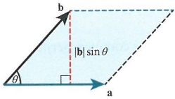

<!-- page 133 -->

Look at the magnitude of the right side of the vector product again and halve this result. This gives  $ \frac{1}{2}|\mathbf{a}||\mathbf{b}|\sin\theta $ which is the area of a triangle. It implies that the area of a triangle can be written as  $ \frac{1}{2}|\mathbf{a} \times \mathbf{b}| $.

Consider the three points  $ O(0, 0, 0) $,  $ A(-2, 3, 6) $ and  $ B(2, 2, 1) $. We will find the area of the triangle OAB, using both the vector product and scalar product methods. Here the vectors are  $ \overrightarrow{OA} = -2\mathbf{i} + 3\mathbf{j} + 6\mathbf{k} $ and  $ \overrightarrow{OB} = 2\mathbf{i} + 2\mathbf{j} + \mathbf{k} $.

## Vector (cross) product:

 $$ \begin{array}{l l l}{\text{Let}\mathbf{n}=\left|\begin{array}{c c c}{\mathbf{i}}&{\mathbf{j}}&{\mathbf{k}}\\ {-2}&{3}&{6}\\ {2}&{2}&{1}\end{array}\right|=-9\mathbf{i}+14\mathbf{j}-10\mathbf{k},\mathrm{s o}|\mathbf{n}|=|\mathbf{a}\times\mathbf{b}|=\sqrt{9^{2}+14^{2}+10^{2}}=\sqrt{377}.}\end{array} $$ 

Hence, the area is  $ \frac{1}{2}|\mathbf{a}\times\mathbf{b}|=\frac{1}{2}\sqrt{377} $.

Scalar (dot) product:

 $$ \begin{array}{r}{\vert\overrightarrow{O A}\vert=\sqrt{2^{2}+3^{2}+6^{2}}=7\mathrm{~a n d~}\vert\overrightarrow{O B}\vert=\sqrt{2^{2}+2^{2}+1^{2}}=3.}\end{array} $$ 

 $$ \cos\theta=\frac{\overrightarrow{OA}\cdot\overrightarrow{OB}}{|\overrightarrow{OA}||\overrightarrow{OB}|}=\frac{-4+6+6}{21}=\frac{8}{21},so\sin\theta=\sqrt{\left(1-\frac{64}{441}\right)}=\frac{\sqrt{377}}{21}. $$ 

So the area of the triangle is  $ \frac{1}{2}|\mathbf{a}||\mathbf{b}|\sin\theta = \frac{1}{2} \times 7 \times 3 \times \frac{\sqrt{377}}{21} = \frac{1}{2}\sqrt{377} $.

We can see that the area is the same in both cases. The vector product method is more convenient as we do not need to find the angle to determine the area of the triangle.

### WORKED EXAMPLE 6.2

Find the area of the triangle ABC, given that the vertices are  $ A(4,1,-2) $,  $ B(5,5,6) $ and  $ C(0,3,7) $.

Answer

 $$ \overrightarrow{AB}=\mathbf{i}+4\mathbf{j}+8\mathbf{k} $$ 

 $$ \overrightarrow{B C}=-5\mathbf{i}-2\mathbf{j}+\mathbf{k} $$ 

Find any two sides in vector form.

 $$ \left| \begin{array}{ccc} \mathbf{i} & \mathbf{j} & \mathbf{k} \\ 1 & 4 & 8 \\ -5 & -2 & 1 \end{array}\right|=20\mathbf{i}-41\mathbf{j}+18\mathbf{k} $$ 

Find the cross product of the two vectors to get a common perpendicular.

 $$ \begin{aligned}|20\mathbf{i}-41\mathbf{j}+18\mathbf{k}|&=\sqrt{20^{2}+41^{2}+18^{2}}\\&=\sqrt{2405}\end{aligned} $$ 

 $$ \left|a\times b\right| $$ 

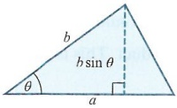

 $$ \therefore\operatorname{Area}=\frac{1}{2}\sqrt{2405} $$ 

Divide by 2 to get the area.

An extension of this is the calculation of the volume of a tetrahedron. The volume of any tetrahedron is given as  $ \frac{1}{3} \times $ base area  $ \times $ perpendicular height. From the diagram, we can say this is  $ \frac{1}{3} \times \frac{1}{2} | \mathbf{a} \times \mathbf{b} | \times h $.

Now the height, $h$, is the projection of $\mathbf{c}$ in the direction of $\mathbf{n}$, where $\mathbf{n} = \mathbf{a} \times \mathbf{b}$.

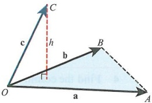

<!-- page 134 -->

The volume can be written as  $ \frac{1}{6}|(\mathbf{a} \times \mathbf{b}) \cdot \mathbf{c}| $. The part  $ (\mathbf{a} \times \mathbf{b}) \cdot \mathbf{c} $ is known as the scalar triple product. This is not part of the syllabus, but is interesting to know.

For example, consider the three points  $ A(2,-1,1) $,  $ B(-3,2,2) $ and  $ C(4,2,-7) $, all relative to an origin at  $ O(0,0,0) $.

So $\overrightarrow{OA} = 2\mathbf{i} - \mathbf{j} + \mathbf{k}$, $\overrightarrow{OB} = -3\mathbf{i} + 2\mathbf{j} + 2\mathbf{k}$ and $\overrightarrow{OC} = 4\mathbf{i} + 2\mathbf{j} - 7\mathbf{k}$. Then find the vector product of any two of these, such as $\overrightarrow{OA} \times \overrightarrow{OB} = \begin{vmatrix} \mathbf{i} & \mathbf{j} & \mathbf{k} \\ 2 & -1 & 1 \\ -3 & 2 & 2 \end{vmatrix} = -4\mathbf{i} - 7\mathbf{j} + \mathbf{k}$. Then $(\overrightarrow{OA} \times \overrightarrow{OB}) \cdot \overrightarrow{OC} = -16 - 14 - 7 = -37$.

The last step to find  $ \frac{1}{6}|(\mathbf{a} \times \mathbf{b}) \cdot \mathbf{c}| $ is to take the positive value of -37 and divide by 6 to get  $ \frac{37}{6} $.

### WORKED EXAMPLE 6.3

Find the volume of the tetrahedron $OABC$, where $\overrightarrow{OA} = \mathbf{i} + 2\mathbf{j} + 2\mathbf{k}$, $\overrightarrow{OB} = 3\mathbf{i} - 4\mathbf{j} + \mathbf{k}$ and $\overrightarrow{OC} = 6\mathbf{i} - 2\mathbf{j} - \mathbf{k}$. Answer

 $$ \overrightarrow{OA}\times\overrightarrow{OB}=\left|\begin{array}{ccc}\mathbf{i}&\mathbf{j}&\mathbf{k}\\1&2&2\\3&-4&1\end{array}\right|=10\mathbf{i}+5\mathbf{j}-10\mathbf{k} $$ 

Find the cross product of any two directions to get a normal.

 $$ (\overrightarrow{OA}\times\overrightarrow{OB})\cdot\overrightarrow{OC}=60-10+10=60 $$ 

Dot this normal with the other vector.

 $$ \therefore\quad V=\frac{1}{6}\times60=10 $$ 

Take the magnitude and divide by 6.

### EXPLORE 6.1

Using the four points $A(0,5,2)$, $B(3,-3,1)$, $C(2,7,-1)$, $D(3,0,-2)$ and working in groups, confirm that no matter what vectors are used, you will always get the same volume for the tetrahedron $ABCD$.

## EXERCISE 6A

1 In each case, find the value of $p$ such that the vectors given are perpendicular.

a pi + 2j + 3k and 4i + j + 2k

 $$ 3\mathbf{i}+5\mathbf{j}+2\mathbf{k}\mathrm{a n d}\mathbf{i}+p\mathbf{j}-4\mathbf{k} $$ 

PS 2 The cross product of  $ \mathbf{i} + \alpha \mathbf{j} + \mathbf{k} $ and  $ 3\mathbf{i} + 4\mathbf{k} $ is  $ 8\mathbf{i} - \mathbf{j} - 6\mathbf{k} $. What is the value of  $ \alpha $?

PS 3 Given that the cross product of  $ 2i + \alpha j - k $ and  $ \beta i + 4j + 2k $ is  $ 10i - 5j + 5k $, find the values of  $ \alpha $ and  $ \beta $.

4 Find the common perpendicular to the two vectors given in each case.

 $$ \mathbf{a}\ \mathbf{a}=5\mathbf{i}-8\mathbf{j}+2\mathbf{k},\mathbf{b}=3\mathbf{i}-4\mathbf{j}-\mathbf{k} $$ 

 $$ \mathbf{b}\mathbf{a}=2\mathbf{i}-10\mathbf{j}+3\mathbf{k},\mathbf{b}=5\mathbf{i}-7\mathbf{j}+4\mathbf{k} $$ 

 $$ \mathbf{c} \quad \mathbf{a}=12\mathbf{j}+7\mathbf{k},\mathbf{b}=-6\mathbf{i}+\mathbf{j}+9\mathbf{k} $$ 

 $$ \mathbf{d}\mathbf{a}=2\mathbf{i}+17\mathbf{j},\mathbf{b}=4\mathbf{i}+8\mathbf{j}-13\mathbf{k} $$

<!-- page 135 -->

5 Find the area of the triangle in each of the following cases.

a Triangle OAB with  $ A(6,-7,21) $ and  $ B(3,2,-5) $.

b Triangle ABC with  $ A(0,0,2) $,  $ B(-4,9,3) $ and  $ C(2,0,7) $.

c Triangle  $ ABQ $ with  $ A(5,1,2) $,  $ B(6,-9,0) $ and  $ \overrightarrow{OB} = 3\overrightarrow{OQ} $.

d Triangle BPQ with  $ A(1,3,4) $,  $ B(3,7,8) $,  $ C(7,0,16) $,  $ \overrightarrow{AP} = \frac{1}{2}\overrightarrow{AB} $ and  $ 3\overrightarrow{PC} = 5\overrightarrow{PQ} $.

PS 6 Two points are given as $A(2,1,3)$ and $B(5,k,7)$. Given that the triangle $OAB$ has area $\frac{\sqrt{3}}{2}$, determine the possible values of $k$.

7 In each of the following cases, determine the volume of the tetrahedron.

a Tetrahedron OABC with  $ A(-2,4,1) $,  $ B(8,1,0) $ and  $ C(5,6,-7) $.

b Tetrahedron ABCD with  $ A(1,1,-1) $,  $ B(0,4,0) $,  $ C(0,6,7) $ and  $ D(3,-7,7) $.

c Tetrahedron ABCP with  $ A(2,5,0) $,  $ B(3,-1,4) $,  $ C(0,6,7) $ and  $ \overrightarrow{OP}=3\overrightarrow{OA} $.

PS 8 The tetrahedron $A(2,5,m),B(1,7,2),C(1,8,3)$ and $D(9,8,-1)$ has volume 2. Determine the value of $m$.

### 6.2 Vector equation of a line

You have met the vector equation of a line in the AS & A Level Mathematics course. This section will build on what you have learned and extend these ideas.

The vector equation of a line is  $ \mathbf{r} = \mathbf{a} + \mathbf{b}t $, where  $ \mathbf{a} $ is a position vector that goes from the origin to the line, and  $ \mathbf{b} $ is the direction vector of the line.  $ t $ is a variable scalar, and different values of  $ t $ can be used to find different points that are on the line.

Consider two points $P$ and $Q$ with coordinates $P(1,2,4)$ and $Q(2,-1,3)$. The direction $\mathbf{b}=\overrightarrow{PQ}$ is $\mathbf{i}-3\mathbf{j}-\mathbf{k}$. Then, using either point for the vector $\mathbf{a}$, $\mathbf{r}=\mathbf{i}+2\mathbf{j}+4\mathbf{k}+(\mathbf{i}-3\mathbf{j}-\mathbf{k})t$. This represents the vector equation of a line which passes through $P$ and $Q$. Making $t=0$ in this equation gives the position vector of point $P$ and making $t=1$ gives the position vector of $Q$.

### WORKED EXAMPLE 6.4

Find the vector equation of the line in each case.

a  $ A(2,3,5) $,  $ B(1,1,2) $. The line through A and B.

b  $ A(-1,4,1) $,  $ B(0,2,-3) $,  $ C(1,1,5) $. The line through C parallel to the line through A and B.

 $$ \overrightarrow{AB}=-\mathbf{i}-2\mathbf{j}-3\mathbf{k} $$ 

 $$ \mathbf{r}=2\mathbf{i}+3\mathbf{j}+5\mathbf{k}+(-\mathbf{i}-2\mathbf{j}-3\mathbf{k})t $$ 

Find the vector between the two points.

 $$ \overrightarrow{AB}=\mathbf{i}-2\mathbf{j}-4\mathbf{k} $$ 

State the equation of the line.

 $$ \mathbf{r}=\mathbf{i}+\mathbf{j}+5\mathbf{k}+(\mathbf{i}-2\mathbf{j}-4\mathbf{k})t $$ 

Find the direction vector  $ \overrightarrow{AB} $.

State the equation of the line. We use the position vector of C and the direction vector  $ \overrightarrow{AB} $ since the line is parallel to the line through A and B.

<!-- page 136 -->

One application that you may have met before is the shortest distance between a point and a line. The diagram shows a line with direction vector b where the distance from P to the line is to be minimised.

Note that, for some point $Q$, the vector $\overrightarrow{PQ}$ is perpendicular to $\mathbf{b}$, or $\overrightarrow{PQ}\cdot\mathbf{b}=0$. Since $Q$ is on the line, it follows that $\overrightarrow{OQ}=\mathbf{r}$. If we know $\overrightarrow{OQ}$ in terms of $t$ and we know $\overrightarrow{OP}$ in terms of $t$, we can find $\overrightarrow{PQ}$ which is $\overrightarrow{OQ}-\overrightarrow{OP}$.

Using  $ \overrightarrow{PQ} \cdot \mathbf{b} = 0 $, we can determine the  $ t $ value for  $ Q $ and the vector  $ \overrightarrow{PQ} $. We can now find  $ |\overrightarrow{PQ}| $ which is the shortest distance from  $ P $ to the line.

For example, consider a line with equation  $ \mathbf{r} = \mathbf{i} + \mathbf{j} + 5\mathbf{k} + (2\mathbf{i} - 2\mathbf{j} + \mathbf{k})t $ and let the point be  $ P(1, 1, 2) $. To find the shortest distance from  $ P $ to the line, first state that  $ \overrightarrow{OP} = \mathbf{i} + \mathbf{j} + 2\mathbf{k} $ and  $ \overrightarrow{OQ} = (1 + 2t)\mathbf{i} + (1 - 2t)\mathbf{j} + (5 + t)\mathbf{k} $.

Then  $ \overrightarrow{PQ} = 2ti - 2tj + (3 + t)k $.

We use the component form of  $ \overrightarrow{PQ} \cdot \mathbf{b} = 0 $ to get  $ 4t + 4t + 3 + t = 0 \Rightarrow t = -\frac{1}{3} $. Hence,  $ \overrightarrow{PQ} = -\frac{2}{3} \mathbf{i} + \frac{2}{3} \mathbf{j} + \frac{8}{3} \mathbf{k} $.

Therefore, the shortest distance from P to the line is  $ \sqrt{\frac{4}{9}+\frac{4}{9}+\frac{64}{9}}=2\sqrt{2} $.

### WORKED EXAMPLE 6.5

Find the shortest distance between the point  $ P(2,1,4) $ and the line  $ r = 4i + 4j + 5k + (i + j + k)t $.

## Answer

 $$ \overrightarrow{OP}=2\mathbf{i}+\mathbf{j}+4\mathbf{k} $$ 

 $$ \overrightarrow{OQ}=(4+t)\mathbf{i}+(4+t)\mathbf{j}+(5+t)\mathbf{k} $$ 

 $$ \Rightarrow\overrightarrow{PQ}=(2+t)\mathbf{i}+(3+t)\mathbf{j}+(1+t)\mathbf{k} $$ 

 $$ \overrightarrow{PQ} $$ 

 $$ \overrightarrow{PQ}.\mathbf{b}=0\Rightarrow6+3t=0 $$ 

 $$ \therefore t=-2 $$ 

 $$ \therefore\overrightarrow{PQ}=\mathbf{j}-\mathbf{k} $$ 

Find  $ \overrightarrow{PQ} $ and hence the shortest distance.

 $$ \Rightarrow|\overrightarrow{PQ}|=\sqrt{2} $$ 

An alternative method to the one shown in Worked example 6.5 is to make use of the vector product. If we first consider the vector  $ \overrightarrow{AP} $, then the shortest distance from P to the line is  $ |\overrightarrow{AP}|\sin\theta $. Next, multiply by the magnitude of the unit vector  $ |\mathbf{u}| $. This does not change the distance.

Now the distance is  $ |\overrightarrow{AP}|\left|\mathbf{u}\right|\sin\theta $ or  $ |\overrightarrow{AP}\times\mathbf{u}| $, using the vector product. So, in this example, the unit vector is  $ \mathbf{u} = \frac{1}{\sqrt{3}}(\mathbf{i} + \mathbf{j} + \mathbf{k}) $. The magnitude of  $ \mathbf{i} + \mathbf{j} + \mathbf{k} $ is  $ \sqrt{1^2 + 1^2 + 1^2} = \sqrt{3} $. Given  $ A(4, 5) $ and  $ P(2, 1, 4) $,  $ \overrightarrow{AP} = -2\mathbf{i} - 3\mathbf{j} - \mathbf{k} $.

Make a sketch of this type of problem. Draw any vector through a point  $ P $, then construct a vector triangle from an origin.

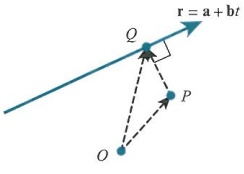

## TIP

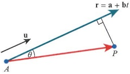

<!-- page 137 -->

Then  $ \overrightarrow{AP} \times \mathbf{u} = \frac{1}{\sqrt{3}} \begin{vmatrix} \mathbf{i} & \mathbf{j} & \mathbf{k} \\ -2 & -3 & -1 \\ 1 & 1 & 1 \end{vmatrix} = \frac{1}{\sqrt{3}} (-2\mathbf{i} + \mathbf{j} + \mathbf{k}) $. Hence,  $ |\overrightarrow{AP} \times \mathbf{u}| = \frac{1}{\sqrt{3}} \times \sqrt{6} = \sqrt{2} $.

This is the same result but takes much less work. Remember that the vector u is the unit vector of the line's direction b.

### WORKED EXAMPLE 6.6

Find the shortest distance between the point  $ P(3,2,-1) $ and the line  $ \mathbf{r}=3\mathbf{j}-4\mathbf{k}+(-\mathbf{i}+2\mathbf{j}-\mathbf{k})t $. Answer

 $$ A(0,3,-4)\Rightarrow\overrightarrow{AP}=3\mathbf{i}-\mathbf{j}+3\mathbf{k} $$ 

State the vector  $ \overrightarrow{AP} $.

 $$ \mathbf{b}=-\mathbf{i}+2\mathbf{j}-\mathbf{k}\Rightarrow\mathbf{u}=\frac{1}{\sqrt{6}}(-\mathbf{i}+2\mathbf{j}-\mathbf{k}) $$ 

Determine the unit vector in the direction b.

 $$ \therefore\overrightarrow{AP}\times\mathbf{u}=\frac{1}{\sqrt{6}}\left|\begin{array}{ccc}\mathbf{i}&\mathbf{j}&\mathbf{k}\\3&-1&3\\-1&2&-1\end{array}\right|=\frac{1}{\sqrt{6}}(-5\mathbf{i}+5\mathbf{k}) $$ 

Find the cross product of the two vectors.

 $$ \begin{aligned}Hence|\overrightarrow{AP}\times\mathbf{u}|&=\frac{1}{\sqrt{6}}\times\sqrt{(-5)^{2}+5^{2}}=\frac{1}{\sqrt{6}}\times\sqrt{50}\\&=\frac{1}{\sqrt{6}}\times5\sqrt{2}=\frac{5\sqrt{3}}{3}\end{aligned} $$ 

Find the shortest distance.

This leads us to another useful result. Finding the shortest distance between two straight lines uses a similar approach.

Imagine two lines,  $ \mathbf{r}_1 = \mathbf{a}_1 + \mathbf{b}_1t $ and  $ \mathbf{r}_2 = \mathbf{a}_2 + \mathbf{b}_2t $, passing through points  $ P $ and  $ Q $, respectively. These lines are also such that  $ \mathbf{a}_1 = \overrightarrow{OS} $ and  $ \mathbf{a}_2 = \overrightarrow{OT} $, and the direction  $ \overrightarrow{PQ} $ is parallel to  $ \mathbf{b}_1 \times \mathbf{b}_2 $. We are looking for the distance  $ |\overrightarrow{PQ}| $. This is equal to  $ |\overrightarrow{ST}|\cos\theta $. Remember that  $ |\overrightarrow{ST}| $ must be greater than  $ |\overrightarrow{PQ}| $ since  $ |\overrightarrow{PQ}| $ is the shortest distance between the two lines.

So if the distance is  $ |\overrightarrow{ST}|\cos\theta $, note that  $ \cos\theta=\frac{\overrightarrow{ST}\cdot\overrightarrow{PQ}}{|\overrightarrow{ST}||\overrightarrow{PQ}|}=\frac{\overrightarrow{ST}\cdot(\mathbf{b}_{1}\times\mathbf{b}_{2})}{|\overrightarrow{ST}|\cdot|\mathbf{b}_{1}\times\mathbf{b}_{2}|} $.

Substituting this new form for $\cos \theta$ and noting that $\overrightarrow{ST} = \mathbf{a}_2 - \mathbf{a}_1$, the distance is $\left| \frac{(\mathbf{a}_2 - \mathbf{a}_1) \cdot (\mathbf{b}_1 \times \mathbf{b}_2)}{|\mathbf{b}_1 \times \mathbf{b}_2|} \right|$.

The outer modulus signs are used to ensure that the distance is positive.

For example, let  $ \mathbf{r}_1 = 2\mathbf{i} + \mathbf{j} + \mathbf{k} + (\mathbf{i} + 2\mathbf{j} + 3\mathbf{k})\mathbf{s} $ and  $ \mathbf{r}_2 = 3\mathbf{i} + 4\mathbf{k} + (-2\mathbf{i} - \mathbf{j} + 5\mathbf{k})\mathbf{t} $. We will find the shortest distance between them. For the distance, we have  $ |\overrightarrow{PQ}| = \left| \frac{(\mathbf{a}_2 - \mathbf{a}_1) \cdot (\mathbf{b}_1 \times \mathbf{b}_2)}{|\mathbf{b}_1 \times \mathbf{b}_2|} \right| $.

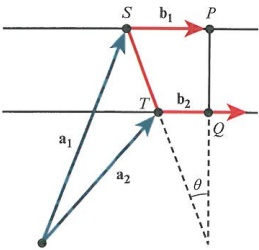

Calculate each part in turn. First,  $ \mathbf{a}_2 - \mathbf{a}_1 = \mathbf{i} - \mathbf{j} + 3\mathbf{k} $.

Then  $ \mathbf{b}_1 \times \mathbf{b}_2 = \begin{vmatrix} \mathbf{i} & \mathbf{j} & \mathbf{k} \\ 1 & 2 & 3 \\ -2 & -1 & 5 \end{vmatrix} = 13\mathbf{i} - 11\mathbf{j} + 3\mathbf{k} $, and  $ |\mathbf{b}_1 \times \mathbf{b}_2| = \sqrt{299} $.

<!-- page 138 -->

Hence,  $ |\overrightarrow{PQ}| = \left| \frac{(\mathbf{i} - \mathbf{j} + 3\mathbf{k}) \cdot (13\mathbf{i} - 11\mathbf{j} + 3\mathbf{k})}{\sqrt{299}} \right| = \frac{33\sqrt{299}}{299} $.

### WORKED EXAMPLE 6.7

Find the shortest distance between the lines  $ \mathbf{r}_1 = 2\mathbf{i} + 3\mathbf{k} + (-\mathbf{i} - \mathbf{j} + \mathbf{k})s $ and  $ \mathbf{r}_2 = \mathbf{i} - \mathbf{j} + 2\mathbf{k} + 2\mathbf{k}t $.

## Answer

 $$ \mathbf{a}_{2}-\mathbf{a}_{1}=-\mathbf{i}-\mathbf{j}-\mathbf{k} $$ 

Find the vector  $ \overrightarrow{ST} $.

 $$ \begin{aligned}\mathbf{b}_{1}\times\mathbf{b}_{2}&=\left|\begin{array}{ccc}{{{\mathbf{i}}}}&{{{\mathbf{j}}}}&{{{\mathbf{k}}}} \\{{{-1}}}&{{{-1}}}&{{{1}}} \\{{{0}}}&{{{0}}}&{{{2}}} \\\end{array}\right|=-2\mathbf{i}+2\mathbf{j}\\&\Rightarrow|\mathbf{b}_{1}\times\mathbf{b}_{2}|=2\sqrt{2}\end{aligned} $$ 

Find the cross product of the directions of the two lines.

Find the modulus of the normal vector.

 $$ \left(-\mathbf{i}-\mathbf{j}-\mathbf{k}\right)\cdot\left(-2\mathbf{i}+2\mathbf{j}\right)=0 $$ 

Determine the value of  $ (\mathbf{a}_2 - \mathbf{a}_1) \cdot (\mathbf{b}_1 \times \mathbf{b}_2) $.

 $$ \therefore\left|\overrightarrow{PQ}\right|=0 $$ 

State the distance between the two lines.

You may need to find the position vectors of the points P and Q rather than the distance between them.

Consider the two lines  $ \mathbf{r}_1 = \mathbf{i} + \mathbf{j} + 2\mathbf{k} + (\mathbf{i} - \mathbf{j} + \mathbf{k})s $ and  $ \mathbf{r}_2 = 2\mathbf{i} + \mathbf{k} + (\mathbf{i} + \mathbf{j} - \mathbf{k})t $.

Let $P$ be on $\mathbf{r}_1$ such that $\overrightarrow{OP} = (1 + s)\mathbf{j} + (1 - s)\mathbf{j} + (2 + s)\mathbf{k}$, and let $Q$ be on $\mathbf{r}_2$ such that $\overrightarrow{OQ} = (2 + t)\mathbf{i} + t\mathbf{j} + (1 - t)\mathbf{k}$. Then $\overrightarrow{PQ} = (1 - s + t)\mathbf{i} + (-1 + s + t)\mathbf{j} - (1 + s + t)\mathbf{k}$. This direction is perpendicular to both direction vectors so $\overrightarrow{PQ} \cdot (\mathbf{i} - \mathbf{j} + \mathbf{k}) = 0$ and $\overrightarrow{PQ} \cdot (\mathbf{i} + \mathbf{j} - \mathbf{k}) = 0$.

From these two scalar products we have $3s + t = 1$ and $s + 3t = -1$. Solving the equations gives $s = \frac{1}{2}$, $t = -\frac{1}{2}$. Hence, $\overrightarrow{OP} = \frac{3}{2}\mathbf{i} + \frac{1}{2}\mathbf{j} + \frac{5}{2}\mathbf{k}$, $\overrightarrow{OQ} = \frac{3}{2}\mathbf{i} - \frac{1}{2}\mathbf{j} + \frac{3}{2}\mathbf{k}$.

### WORKED EXAMPLE 6.8

The points $P$ and $Q$ lie on the lines $\mathbf{r}_1 = 2\mathbf{i} + 3\mathbf{j} + (-\mathbf{i} + 2\mathbf{j} + \mathbf{k})s$ and $\mathbf{r}_2 = 3\mathbf{i} + \mathbf{j} + (-\mathbf{i} + \mathbf{j})t$, respectively, such that $\overrightarrow{PQ}$ is perpendicular to both lines. Find the coordinates of $P$ and $Q$, and find the distance between them.

<table border=1 style='margin: auto; word-wrap: break-word;'><tr><td rowspan="5">Answer\n $ \overrightarrow{OP} = (2 - s)i + (3 + 2s)j + s\mathbf{k} $\n $ \overrightarrow{OQ} = (3 - t)i + (1 + t)j $\n $ \therefore \overrightarrow{PQ} = (1 + s - t)i + (-2 - 2s + t)j - s\mathbf{k} $\n $ \overrightarrow{PQ} \cdot (-i + 2j + k) = 0 $,  $ \overrightarrow{PQ} \cdot (-i + j) = 0 $\n-1 - s + t - 4 - 4s + 2t - s = 0 and\n-1 - s + t - 2 - 2s + t = 0\n $ \Rightarrow -6s + 3t = 5 $, -3s + 2t = 3\n $ \therefore s = -\frac{1}{3} $, t = 1.</td><td style='text-align: center; word-wrap: break-word;'>State the position vectors of P and Q.</td></tr><tr><td style='text-align: center; word-wrap: break-word;'>Form the perpendicular vector  $ \overrightarrow{PQ} $.</td></tr><tr><td style='text-align: center; word-wrap: break-word;'>Find the scalar product of  $ \overrightarrow{PQ} $ with the two direction vectors.</td></tr><tr><td style='text-align: center; word-wrap: break-word;'>Form equations in s and t.</td></tr><tr><td style='text-align: center; word-wrap: break-word;'>Solve the equations to find s and t.</td></tr></table>

<!-- page 139 -->

$$ \Rightarrow P\left(\frac{7}{3},\frac{7}{3},-\frac{1}{3}\right),Q(2,2,0) $$ 

Find the coordinates of $P$ and $Q$, and hence the distance between them.

 $$ \begin{aligned}\therefore\left|\overrightarrow{PQ}\right|&=\sqrt{\left(2-\frac{7}{3}\right)^{2}+\left(2-\frac{7}{3}\right)^{2}+\left(0-\frac{-1}{3}\right)^{2}}\\&=\sqrt{\left(-\frac{1}{3}\right)^{2}+\left(-\frac{1}{3}\right)^{2}+\left(\frac{1}{3}\right)^{2}}=\frac{\sqrt{3}}{3}\end{aligned} $$ 

## EXERCISE 6B

1 For each case, find the vector equation of the line through the points given. Give your answer in the form  $ \mathbf{r} = \mathbf{a} + \mathbf{b}t $.

a (2, 3, 5) and  $ (-7, 1, 6) $

b (4, 1, 1) and (-5, 6, 1)

c (0, 2, 4) and (1, 1, -1)

2 Determine the equation of the line that passes through (1, 7, -2) and is perpendicular to both  $ 2i - 3j + 5k $ and  $ 4i - j + 2k $.

3 Determine the equation of the line that passes through (3, -5, 1) and is perpendicular to both  $ -i + 2j - 4k $ and  $ 3i + 2j $.

M 4 Three points are given as $A(2,2,1)$, $B(1,0,4)$ and $C(2,-3,1)$. Find the shortest distance between the point $C$ and the line through $A$ and $B$. Give your answer in the form $\frac{a\sqrt{b}}{c}$.

PS 5 The points $P$ and $Q$ are on the lines $\mathbf{r} = \mathbf{k} + (2\mathbf{i} + 3\mathbf{j} + \mathbf{k})$ and $\mathbf{r} = \mathbf{i} + \mathbf{j} + 4\mathbf{k} + 4\mathbf{j}t$, respectively. Given that $\overrightarrow{PQ}$ is perpendicular to both lines, find the position vectors $\overrightarrow{OP}$ and $\overrightarrow{OQ}$.

P PS 6 The lines  $ \mathbf{r} = \mathbf{i} - 2\mathbf{j} + 3\mathbf{k} + (4\mathbf{i} - \mathbf{j})s $ and  $ \mathbf{r} = 3\mathbf{i} - 5\mathbf{k} + (\mathbf{i} + 4\mathbf{j} + 3\mathbf{k})t $ are skew.

a Show that the lines do not intersect.

b Find the angle between the lines.

c Find the shortest distance between the lines.

7 The lines  $ L_1 $  $ \mathbf{r} = \mathbf{i} - \mathbf{k} + (\mathbf{i} - \mathbf{j} - 2\mathbf{k})t $ and  $ L_2 $  $ \mathbf{r} = 2\mathbf{i} + \mathbf{j} + (3\mathbf{i} + \cos\theta\mathbf{j} + \mathbf{k}) $s, where  $ 0 \leq \theta < 2\pi $, are skew.

a Show that these lines do not intersect regardless of the value of  $ \theta $.

b Determine the shortest distance between them.

PS 8 In both of the following cases, determine the value(s) of the unknown constants for which the two lines intersect.

a  $ \mathbf{r} = ai + 4\mathbf{j} + 2\mathbf{k} + (\mathbf{i} - \mathbf{j} - 3\mathbf{k})s $ and  $ \mathbf{r} = 4i + 3\mathbf{j} - \mathbf{k} + (2i + 2\mathbf{j} - \mathbf{k})t $

b  $ \mathbf{r} = 2\mathbf{j} + 5\mathbf{k} + (\mathbf{i} + 2\mathbf{j} + b\mathbf{k})s $ and  $ \mathbf{r} = 3\mathbf{i} - 2\mathbf{j} + 4\mathbf{k} + (\mathbf{i} + \mathbf{j})t $

<!-- page 140 -->

### 6.3 Planes

In Mathematics, a plane is an infinite two-dimensional surface. It can be represented in different ways, but one property about planes is very important. Inside a plane it is clear that there are many direction vectors, but for each individual plane there is one direction that is important, the direction normal to the plane.

Suppose the normal to a plane is given as  $ \mathbf{n} = a\mathbf{i} + b\mathbf{j} + c\mathbf{k} $ and we know one point  $ \overrightarrow{A(p, q, r)} $ in the plane. Using a general point  $ R(x, y, z) $ in the plane we can generate a vector  $ \overrightarrow{AR} $ in the plane, so it is perpendicular to the normal.

With  $ \overrightarrow{AR} = \mathbf{r} - \mathbf{a} $ it is clear that  $ \overrightarrow{AR} \cdot \mathbf{n} = 0 $. Then  $ (\mathbf{r} - \mathbf{a}) \cdot \mathbf{n} = 0 $, which leads to the scalar equation of a plane,  $ \mathbf{r} \cdot \mathbf{n} = \mathbf{a} \cdot \mathbf{n} $.

Using the scalar product leads to  $ ax + by + cz = d $, the Cartesian equation of a plane.

For example, if we consider a plane with  $ \mathbf{n} = \mathbf{i} - 3\mathbf{j} + \mathbf{k} $, and we know the point  $ (3, -5, 4) $ is in the plane, then  $ (\mathbf{i} - 3\mathbf{j} + \mathbf{k}) \cdot (3\mathbf{i} - 5\mathbf{j} + 4\mathbf{k}) = 22 $ such that  $ \mathbf{r} \cdot (\mathbf{i} - 3\mathbf{j} + \mathbf{k}) = 22 $ is the scalar form and  $ x - 3y + z = 22 $ is the Cartesian form.

The last form is the vector equation of a plane. Consider, relative to an origin, a position vector  $ \mathbf{a} $ of a point in a plane. Then consider two non-parallel vectors  $ \mathbf{b} $ and  $ \mathbf{c} $ in the plane with appropriate scalars  $ s $ and  $ t $. Any point in the plane can then be defined by  $ \mathbf{r} = \mathbf{a} + \mathbf{b}s + \mathbf{c}t $.

This is an extension of the idea of the vector equation of a line. We can define a point on a line in vector form using a point on the line plus the direction of the line (its direction vector). Similarly, we can define a plane in vector form using a point in the plane plus two direction vectors in the plane.

Finding the vector product of the two direction vectors produces a common perpendicular, a vector that is normal to the plane. From this we can find the Cartesian equation of the plane,  $ ax + by + cz = d $.

For example, suppose we want to find the equation of the plane passing through the points  $ A(2,1,2) $,  $ B(3,0,-1) $ and  $ C(4,5,1) $. We can write  $ \overrightarrow{AB} = \mathbf{i} - \mathbf{j} - 3\mathbf{k} $ and  $ \overrightarrow{AC} = 2\mathbf{i} + 4\mathbf{j} - \mathbf{k} $, so the vector equation of the plane is  $ \mathbf{r} = 2\mathbf{i} + \mathbf{j} + 2\mathbf{k} + (\mathbf{i} - \mathbf{j} - 3\mathbf{k})s + (2\mathbf{i} + 4\mathbf{j} - \mathbf{k})t $.

To determine the other two forms of the equation, we need to find the normal.

 $  \mathbf{n} = \left| \begin{array}{ccc} i & j & k \\ 1 & -1 & -3 \\ 2 & 4 & -1 \end{array} \right|  $. Using the cross product gives  $  \mathbf{n} = 13\mathbf{i} - 5\mathbf{j} + 6\mathbf{k}  $. Next

 $ \mathbf{a}\cdot\mathbf{n}=(2\times13)+(1\times(-5))+(2\times6)=33 $, and so  $ \mathbf{r}\cdot(13\mathbf{i}-5\mathbf{j}+6\mathbf{k})=33 $ is the scalar form. The equivalent Cartesian form is  $ 13x-5y+6z=33 $.

## DID YOU KNOW?

Vectors came about from the work on the geometric representation of complex numbers in the first two decades of the 19th century. Mathematicians such as Caspar Wessel, Jean Robert Argand and Carl Friedrich Gauss were major contributors.

Isaac Newton worked with quantities such as force and velocity, which are vector quantities, much earlier. However, Newton never mentioned the concept of a vector.

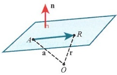

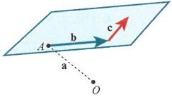

<!-- page 141 -->

Given that the plane $\Pi$ contains the points $A(2,-5,1)$, $B(0,3,2)$ and $C(-4,1,1)$, find the equation of the plane in both vector and Cartesian form.

<table border=1 style='margin: auto; word-wrap: break-word;'><tr><td colspan="2">Answer</td></tr><tr><td style='text-align: center; word-wrap: break-word;'>$ \overrightarrow{BA} = 2\text{i} - 8\text{j} - k $</td><td style='text-align: center; word-wrap: break-word;'>Find two directions in the plane that are non-parallel.</td></tr><tr><td style='text-align: center; word-wrap: break-word;'>$ \overrightarrow{CA} = 6\text{i} - 6\text{j} $</td><td style='text-align: center; word-wrap: break-word;'></td></tr><tr><td style='text-align: center; word-wrap: break-word;'>$ \therefore \mathbf{r} = 3\mathbf{j} + 2\mathbf{k} + (2\mathbf{i} - 8\mathbf{j} - \mathbf{k})\mathbf{s} + (6\mathbf{i} - 6\mathbf{j})\mathbf{t} $</td><td style='text-align: center; word-wrap: break-word;'>Write down the vector equation of the plane.</td></tr><tr><td style='text-align: center; word-wrap: break-word;'>$ \text{So } \mathbf{n} = \left| \begin{array}{ccc} \mathbf{i} &amp; \mathbf{j} &amp; \mathbf{k} \\ 2 &amp; -8 &amp; -1 \\ 6 &amp; -6 &amp; 0 \end{array} \right| = -6\mathbf{i} - 6\mathbf{j} + 36\mathbf{k} $ or dividing by -6 we get  $ \mathbf{i} + \mathbf{j} - 6\mathbf{k} $.</td><td style='text-align: center; word-wrap: break-word;'>Find the cross product of the directions to get the normal direction.</td></tr><tr><td style='text-align: center; word-wrap: break-word;'>$ \mathbf{r} \cdot \mathbf{n} = \mathbf{a} \cdot \mathbf{n} $, where  $ \mathbf{a} \cdot \mathbf{n} = (2 \times 1) +((-5) \times 1) + (1 \times (-6)) = -9 $.</td><td style='text-align: center; word-wrap: break-word;'>Use the scalar product to find the scalar form. Finally, determine the Cartesian form.</td></tr><tr><td style='text-align: center; word-wrap: break-word;'>This leads to  $ x + y - 6z = -9 $.</td><td style='text-align: center; word-wrap: break-word;'></td></tr></table>

Two planes in space can interact in one of two ways: either they meet or they don't meet. When two planes meet there is a line of intersection rather than a point.

Clearly, when two planes meet there will be an angle between them. In fact, there are two angles, as you can see in the diagram on the right.

Using the scalar product,  $ \cos \theta = \frac{\mathbf{n}_1 \cdot \mathbf{n}_2}{|\mathbf{n}_1||\mathbf{n}_2|} $. This angle  $ \theta $ is also one of the angles between the planes. If each normal is at right angles to the plane, we have  $ \theta + \alpha = 180^\circ $, which means that, for example, we either find the acute angle straight away or use  $ \theta = 180^\circ - \alpha $.

Another way of viewing this is shown in the following diagram. A kite is formed between the normals and the planes to show the link between the angles. A question will usually ask for the acute angle or the obtuse angle, rather than asking simply for ‘the angle’.

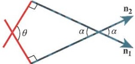

For example, consider the two planes x - y + 3z = 4 and 2x + y - 5z = 12. We are going to find the acute angle between them.

Start with  $ \cos\alpha=\frac{(i-j+3k)\cdot(2i+j-5k)}{\sqrt{11}\sqrt{30}} $. Then using the scalar product gives  $ \cos\alpha=\frac{-14}{\sqrt{11}\sqrt{30}} $, which leads to  $ \alpha=140.4^{\circ} $. This is not the acute angle, so  $ \theta=180^{\circ}-140.4^{\circ}=39.6^{\circ} $.

Note that if  $ \mathbf{n}_1 \cdot \mathbf{n}_2 > 0 $ then  $ \alpha $ is acute. If  $ \mathbf{n}_1 \cdot \mathbf{n}_2 < 0 $ then  $ \alpha $ is obtuse. If  $ \mathbf{n}_1 \cdot \mathbf{n}_2 = 0 $ then the normals are at right angles. This implies the planes are also at right angles.

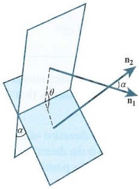

<!-- page 142 -->

### WORKED EXAMPLE 6.10

Four points are given as $A(2,3,1)$, $B(-4,-2,5)$, $C(3,3,2)$ and $D(0,0,4)$. Find the acute angle between the planes $ABC$ and $ACD$.

## Answer

 $$ \overrightarrow{AB}=-6\mathbf{i}-5\mathbf{j}+4\mathbf{k} $$ 

Find the three directions related to the two planes.

 $$ \overrightarrow{AC}=\mathbf{i}+\mathbf{k} $$ 

 $$ \overrightarrow{AD}=-2\mathbf{i}-3\mathbf{j}+3\mathbf{k} $$ 

 $$ \mathbf{n}_{1}=\left|\begin{array}{ccc}\mathbf{i}&\mathbf{j}&\mathbf{k}\\ -6&-5&4\\ 1&0&1\end{array}\right|=-5\mathbf{i}+10\mathbf{j}+5\mathbf{k} $$ 

 $$ \mathrm{Find}\ \mathbf{n}_{1}=\overrightarrow{AB}\times\overrightarrow{AC}. $$ 

 $$ \mathbf{n}_{2}=\left|\begin{array}{ccc}\mathbf{i}&\mathbf{j}&\mathbf{k}\\1&0&1\\-2&-3&3\end{array}\right|=3\mathbf{i}-5\mathbf{j}-3\mathbf{k} $$ 

 $$ \mathrm{Find}\ \mathbf{n}_{2}=\overrightarrow{AC}\times\overrightarrow{AD}. $$ 

 $$ \cos\alpha=\frac{(-5\mathbf{i}+10\mathbf{j}+5\mathbf{k})\cdot(3\mathbf{i}-5\mathbf{j}-3\mathbf{k})}{\sqrt{150}\sqrt{43}} $$ 

Use the scalar product.

 $$ \cos\alpha=-\frac{80}{\sqrt{150}\sqrt{43}}\Rightarrow\alpha=174.95^{\circ} $$ 

Find the obtuse angle.

 $$ \therefore\theta=5.05^{\circ} $$ 

State the acute angle.

When two planes intersect, their line of intersection is a line that is parallel to both of the planes. This means that the line of intersection is also perpendicular to both of the normals.

Since the direction of the line is perpendicular to both normals, then  $ \mathbf{b} = \mathbf{n}_1 \times \mathbf{n}_2 $, where  $ \mathbf{b} $ is the direction vector of the line. To find the vector equation of the line, we still need the position vector of a point on the line.

So, using the example $3x + y - z = 2$ and $x - y + 5z = 2$, we know the two normals are $\mathbf{n}_1 = 3\mathbf{i} + \mathbf{j} - \mathbf{k}$ and $\mathbf{n}_2 = \mathbf{i} - \mathbf{j} + 5\mathbf{k}$. From these, the direction vector

of the line is  $ \mathbf{b} = \begin{vmatrix} \mathbf{i} & \mathbf{j} & \mathbf{k} \\ 3 & 1 & -1 \\ 1 & -1 & 5 \end{vmatrix} = 4\mathbf{i} - 16\mathbf{j} - 4\mathbf{k} $.

First, take  $ 3x + y - z = 2 $ and  $ x - y + 5z = 2 $ and let  $ z = 0 $. This gives  $ 3x + y = 2 $ and  $ x - y = 2 $. Solving these gives  $ x = 1 $ and  $ y = -1 $. Hence, the position vector of a point on the line of intersection is  $ \mathbf{i} - \mathbf{j} $, so the line of intersection is given as  $ \mathbf{r} = \mathbf{i} - \mathbf{j} + (\mathbf{i} - 4\mathbf{j} - \mathbf{k})t $. Note we have divided  $ \mathbf{b} $ by 4 to get the direction vector of the line of intersection in a simpler form.

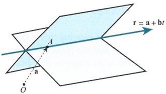

For the position vector a there are two methods that we can use.

The reason for choosing, for example $z=0$, is that it simplifies the algebra and it makes us aware of the fact that somewhere on the line there must be a point where $z$ actually is 0. This is, of course, assuming that neither plane is parallel to the xy-plane.

<!-- page 143 -->

Find the vector equation of the line of intersection of the planes  $ x + 3y - z = 1 $ and  $ 2x + 4y + z = 6 $.

## Answer

<table border=1 style='margin: auto; word-wrap: break-word;'><tr><td style='text-align: center; word-wrap: break-word;'>$ \mathbf{b} = \left| \begin{array}{cccc} \mathbf{i} &amp; \mathbf{j} &amp; \mathbf{k} \\ 1 &amp; 3 &amp; -1 \\ 2 &amp; 4 &amp; 1 \end{array} \right| = 7\mathbf{i} - 3\mathbf{j} - 2\mathbf{k} $</td><td style='text-align: center; word-wrap: break-word;'>Find the direction of the line by finding the cross product of the normals.</td></tr><tr><td style='text-align: center; word-wrap: break-word;'>Let  $ x = 0 \Rightarrow 3y - z = 1, 4y + z = 6 $</td><td rowspan="2">Let x = 0 to determine the values of y and z of a point on the line of intersection.</td></tr><tr><td style='text-align: center; word-wrap: break-word;'>$ \mathbf{S} = x, y = 1, z = 2 $</td></tr><tr><td style='text-align: center; word-wrap: break-word;'>$ \therefore \mathbf{r} = \mathbf{j} + 2\mathbf{k} + (7\mathbf{i} - 3\mathbf{j} - 2\mathbf{k})t $</td><td style='text-align: center; word-wrap: break-word;'>Write down the vector equation of the line of intersection.</td></tr></table>

For the second method, start by adding the equations of the two planes  $ 3x + y - z = 2 $ and  $ x - y + 5z = 2 $ together to eliminate one variable. This gives  $ 4x + 4z = 4 $, and so  $ x = 1 - z $. Substituting this into the equation for the second plane gives  $ 1 - z - y + 5z = 2 $ or  $ y = -1 + 4z $. Next, let  $ z = t $ such that  $ x = 1 - t $ and  $ y = -1 + 4t $ so we have  $ \begin{pmatrix} x \\ y \\ z \end{pmatrix} = \begin{pmatrix} 1 \\ -1 \\ 0 \end{pmatrix} + \begin{pmatrix} -1 \\ 4 \\ 1 \end{pmatrix} t $, which is now the equation of the line of intersection of the two planes.

Note that  $ \begin{pmatrix}-1\\4\\1\end{pmatrix}=-\begin{pmatrix}1\\-4\\-1\end{pmatrix} $, so this is parallel to the same direction vector as before.

This method allows us to create a free variable, in this case z, which can be changed to any value and hence behaves as a parameter.

### WORKED EXAMPLE 6.12

By setting y as a free variable, determine the equation of the line of intersection of the planes $3x - y + 2z = 3$ and $x + 3y - z = 6$.

<table border=1 style='margin: auto; word-wrap: break-word;'><tr><td style='text-align: center; word-wrap: break-word;'>Answer</td></tr><tr><td style='text-align: center; word-wrap: break-word;'>3x - y + 2z = 3\n2x + 6y - 2z = 12\nHence, 5x + 5y = 15  $ \Rightarrow $ x + y = 3\nSo x = 3 - y</td></tr><tr><td style='text-align: center; word-wrap: break-word;'>Add the first equation to twice the second equation to eliminate z.</td></tr><tr><td style='text-align: center; word-wrap: break-word;'>Determine x in terms of y.</td></tr><tr><td style='text-align: center; word-wrap: break-word;'>Find z in terms of y by substituting 3 - y into the equation of the second plane.</td></tr><tr><td style='text-align: center; word-wrap: break-word;'>Let y = t.</td></tr><tr><td style='text-align: center; word-wrap: break-word;'>So  $ \begin{pmatrix} x \\ y \\ z \end{pmatrix} = \begin{pmatrix} 3 \\ 0 \\ -3 \end{pmatrix} + \begin{pmatrix} -1 \\ 1 \\ 2 \end{pmatrix} t $.</td></tr><tr><td style='text-align: center; word-wrap: break-word;'>Write x and z in terms of t to form the equation of the line.</td></tr></table>

As well as planes intersecting planes, we can also have lines intersecting planes. Lines are either parallel to planes or they will intersect them.

<!-- page 144 -->

To determine where a line and a plane meet, write the equation of the line in parametric form first. Substitute this into the plane's equation to determine the value of $t$. This will allow you to find the point, if it exists, where the line and plane meet.

For example, let the plane $P$ be $3x + 4y - 5z = 22$ and the line be $\mathbf{r} = 2\mathbf{i} + \mathbf{j} + 4\mathbf{k} + (-\mathbf{i} + \mathbf{j} - 3\mathbf{k})t$. Write the equation of the line in parametric form $(2 - t)\mathbf{i} + (1 + t)\mathbf{j} + (4 - 3t)\mathbf{k}$. Substitute this into the equation of the plane to give $3(2 - t) + 4(1 + t) - 5(4 - 3t) = 22$, or $6 - 3t + 4 + 4t - 20 + 15t = 22$. Solving for $t$ gives $t = 2$.

If we substitute this value for $t$ into the equation of the line, it tells us where the line and the plane meet. In this case, that point is $\mathbf{r} = 3\mathbf{j} - 2\mathbf{k}$ when given as a position vector.

If a line and a plane are parallel, there are two more cases to consider. Either the line really is parallel to the plane and never meets the plane, or the line is wholly contained in the plane.

First consider the plane  $ 3x + y + 2z = 6 $ and the line  $ \mathbf{r} = \mathbf{i} - \mathbf{j} + 2\mathbf{k} + (4\mathbf{i} - 2\mathbf{j} - 5\mathbf{k})t $. If we find the scalar product of the direction of the normal and the direction vector of the line we get  $ (3 \times 4) + (1 \times (-2)) + (2 \times (-5)) = 12 - 2 - 10 $. The result is 0, meaning the line and the normal to the plane are perpendicular. This confirms that the line is either in the plane or parallel to the plane.

If we substitute the parametric form of the equation of the line into the equation of the plane, this gives  $ 3(1+4t)-1-2t+2(2-5t)=6 $. Simplifying to  $ 3+12t-1-2t+4-10t=6 $ then solving gives us 6=6. What does this solution mean? It tells us that the line meets the plane for all values of t or, simply put, the line lies in the plane.

Suppose we want to find the relationship between the line  $ \mathbf{r} = 2\mathbf{i} + \mathbf{j} + 3\mathbf{k} + (4\mathbf{i} - 2\mathbf{j} - 5\mathbf{k})t $ and the plane. Substituting the parametric form of the equation of the line into the equation of the plane we get  $ 3(2 + 4t) + 1 - 2t + 2(3 - 5t) = 6 $. This simplifies to  $ 6 + 12t + 1 - 2t + 6 - 10t = 6 $, and we get the result  $ 13 = 6 $. This is not possible, it suggests that the line is parallel to the plane but never meets the plane.

### WORKED EXAMPLE 6.13

<table border=1 style='margin: auto; word-wrap: break-word;'><tr><td colspan="2">Show that the line  $  \mathbf{r} = \mathbf{i} - \mathbf{j} + 8\mathbf{k} + (2\mathbf{i} - \mathbf{k}) $ lies in the plane  $ x + 5y + 2z = 12 $.</td></tr><tr><td style='text-align: center; word-wrap: break-word;'>Answer\nMethod 1:\n $ \begin{pmatrix} x \\ y \\ z \end{pmatrix} = \begin{pmatrix} 1 + 2t \\ -1 \\ 8 - t \end{pmatrix} $\n $ \therefore (1 + 2t) + 5(-1) + 2(8 - t) = 12 $  $ \Rightarrow 12 = 12 $</td><td style='text-align: center; word-wrap: break-word;'>Write the parametric form of the equation of the line.\nSubstitute the parametric form into the equation of the plane. Therefore, all t values work.</td></tr><tr><td style='text-align: center; word-wrap: break-word;'>Method 2:\nt = 0:  $  \mathbf{r} = \mathbf{i} - \mathbf{j} + 8\mathbf{k}  $. Substituting this into the plane&#x27;s equation gives 1 - 5 + 16 = 12\nt = 1:  $  \mathbf{r} = 3\mathbf{i} - \mathbf{j} + 7\mathbf{k}  $. Substituting this into the plane&#x27;s equation gives 3 - 5 + 14 = 12</td><td style='text-align: center; word-wrap: break-word;'>Choose any two values of t to find two points on the line, then show both points on the line lie in the plane also.</td></tr><tr><td colspan="2">Hence, in both cases, the line lies wholly in the plane.</td></tr></table>

<!-- page 145 -->

If a plane and a line meet only once, there must be an angle between the line and the plane. This angle can be determined from the scalar product of the normal of the plane and the direction vector of the line.

Using $\cos \alpha = \frac{\mathbf{b} \cdot \mathbf{n}}{|\mathbf{b}||\mathbf{n}|}$ will give $\alpha$ and then using either $\theta = 90^\circ - \alpha$ or $\theta = \alpha - 90^\circ$ will give the desired angle. Note that if $\mathbf{b} \cdot \mathbf{n} > 0$ then $\alpha$ will be acute, and if $\mathbf{b} \cdot \mathbf{n} < 0$ then $\alpha$ is obtuse.

Of course, when $\mathbf{b} \cdot \mathbf{n} = 0$ the line is perpendicular to the normal, or parallel to the plane. For example, consider the line $\mathbf{r} = \mathbf{i} + 4\mathbf{j} - 3\mathbf{k} + (\mathbf{i} + 2\mathbf{j} - 6\mathbf{k})t$ and the plane $x + 2y + z = 5$. First, use $\cos \alpha = \frac{\mathbf{b} \cdot \mathbf{n}}{|\mathbf{b}||\mathbf{n}|}$ to get $\cos \alpha = \frac{(\mathbf{i} + 2\mathbf{j} - 6\mathbf{k}) \cdot (\mathbf{i} + 2\mathbf{j} + \mathbf{k})}{\sqrt{41}\sqrt{6}}$, which simplifies to $\cos \alpha = \frac{-1}{\sqrt{41}\sqrt{6}}$. So $\alpha = 93.66^\circ$, which implies that the angle between the line and the plane is $3.66^\circ$ (3 sf).

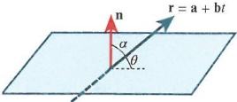

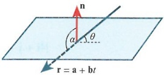

### WORKED EXAMPLE 6.14

Find the angle between the line  $ \mathbf{r} = 8\mathbf{i} - 3\mathbf{j} + \mathbf{k} + (2\mathbf{i} + 2\mathbf{j} - \mathbf{k})t $ and the plane  $ 3x - y = 2 $.

 $$ \cos\alpha=\frac{(2\mathbf{i}+2\mathbf{j}-\mathbf{k})\cdot(3\mathbf{i}-\mathbf{j})}{\sqrt{9}\sqrt{10}} $$ 

 $$ \therefore\cos\alpha=\frac{4}{3\sqrt{10}}\Rightarrow\alpha=65.06^{\circ} $$ 

Find the scalar product of the line's direction vector and the normal to the plane. Divide by the moduli.

Substitute into the scalar product rule.

 $$ \theta=24.9^{\circ} $$ 

Use  $ 90^{\circ} - \alpha $ to get the desired angle.

We will now look at two ways of finding the shortest distance between a point and a plane. The first method is very similar to the one we used to find when lines are parallel to planes. First, form a new line that is parallel to the normal of the plane, passing through the point P. Then write the equation of the line in parametric form and find where the line meets the plane. This gives us a position vector of the point, labelled R. We can now determine the distance PR.

For example, consider the plane  $ 2x - 3y + 6z = -14 $ and the point  $ P(4, -5, 2) $. To find the distance between them, we first create the line  $ \mathbf{r} = 4\mathbf{i} - 5\mathbf{j} + 2\mathbf{k} + (2\mathbf{i} - 3\mathbf{j} + 6\mathbf{k})t $.

Now let the line intersect our plane, giving  $ 2(4+2t)-3(-5-3t)+6(2+6t)=-14 $, giving  $ 8+4t+15+9t+12+36t=-14 $, which leads to t=-1. Therefore, the point where the line meets the plane is  $ R(2,-2,-4) $.

There are two ways to determine the distance  $ PR $. We can find  $ \overrightarrow{PR} = (2 - 4)\mathbf{i} + ((-2) - (-5))\mathbf{j} + (-4 - 2)\mathbf{k} = -2\mathbf{i} + 3\mathbf{j} - 6\mathbf{k} $ and show the distance is 7. Alternatively, we can see that the distance is actually  $ | -1 \times \mathbf{n}| $ as  $ \overrightarrow{PR} = -\mathbf{n} $ in this particular case and  $ t = -1 $. Since  $ |\mathbf{n}| = \sqrt{4 + 9 + 36} = 7 $ we get the same result.

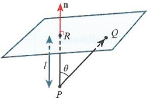

<!-- page 146 -->

### WORKED EXAMPLE 6.15

Find the shortest distance between the point (1,2,3) and the plane  $ 4x + y - z = 12 $.

## Answer

Let  $ \mathbf{r} = \mathbf{i} + 2\mathbf{j} + 3\mathbf{k} + (4\mathbf{i} + \mathbf{j} - \mathbf{k})t $

State the equation of the line through the point in the direction of the normal.

 $$ \begin{aligned}\therefore4(1+4t)+(2+t)-(3-t)&=12\\4+16t+2+t-3+t&=12\\\Rightarrow t&=\frac{1}{2}\end{aligned} $$ 

Substitute the parametric form of the equation of the line into the equation of the plane to get the value of $t$.

 $$ \left|4\mathbf{i}+\mathbf{j}-\mathbf{k}\right|=\sqrt{18} $$ 

Find the magnitude of the normal.

Hence, the shortest distance of the point from the plane is  $ \frac{1}{2} \times \sqrt{18} = \frac{3\sqrt{2}}{2} $.

Multiply the magnitude of the normal by  $ \frac{1}{2} $ as in this case  $ t = \frac{1}{2} $.

The second way to determine the shortest distance between a point and a plane is using the scalar product. In the previous diagram, the distance  $ \vert\overrightarrow{PQ}\vert\cos\theta $ represents the shortest distance.

From the scalar product,  $ \cos \theta = \frac{\overrightarrow{PQ} \cdot \mathbf{n}}{|\overrightarrow{PQ}||\mathbf{n}|} $. Substituting this into the previous result gives the distance as  $ \left| \frac{\overrightarrow{PQ} \cdot \mathbf{n}}{|\mathbf{n}|} \right| $. Notice that there are modulus signs on the outside since  $ \overrightarrow{PQ} \cdot \mathbf{n} $ can be positive or negative.

For example, consider the point  $ P(2,0,4) $ and the plane  $ -x+4y+5z=2 $.

To determine the point $Q$ we just need to find any point in the plane, such as $(-2, 0, 0)$. This gives $\overrightarrow{PQ} = -4\mathbf{i} - 4\mathbf{k}$.

Then the distance is  $ \left|\frac{(-4\mathbf{i}-4\mathbf{k})\cdot(-\mathbf{i}+4\mathbf{j}+5\mathbf{k})}{|\mathbf{-i}+4\mathbf{j}+5\mathbf{k}|}\right| $, which is  $ \left|\frac{-16}{\sqrt{42}}\right| $, or  $ \frac{8\sqrt{42}}{21} $.

Choosing a different point for $Q$, such as $\left(0,\frac{1}{2},0\right)$, we find $\overrightarrow{PQ}=-2\mathbf{i}+\frac{1}{2}\mathbf{j}-4\mathbf{k}$. Therefore, the distance is $\left|\frac{\left(-2\mathbf{i}+\frac{1}{2}\mathbf{j}-4\mathbf{k}\right)\cdot\left(-\mathbf{i}+4\mathbf{j}+5\mathbf{k}\right)}{\left|-\mathbf{i}+4\mathbf{j}+5\mathbf{k}\right|}\right)$, which is also $\left|\frac{-16}{\sqrt{42}}\right)$, as before. In fact any point in the plane will work.

### WORKED EXAMPLE 6.16

Find the shortest distance between the point  $ P(4,1,-5) $ and the plane  $ 2x+7y-6z=14 $.

## Answer

Let Q be (7,0,0).

Choose any point in the plane.

 $$ \therefore\overrightarrow{PQ}=3\mathbf{i}-\mathbf{j}+5\mathbf{k} $$ 

Form  $ \overrightarrow{PQ} $.

<!-- page 147 -->

n = 2i + 7j - 6k
State the normal of the plane.

Distance =  $ \left| \frac{(3i - j + 5k) \cdot (2i + 7j - 6k)}{\sqrt{89}} \right| $

Substitute into the distance formula.

Hence, distance =  $ \frac{31\sqrt{89}}{89} $.

Determine the distance.

## EXERCISE 6C

1 Find the equation of the plane passing through the points given in each case.

a $A(2,4,1)$, $B(3,0,-1)$, $C(8,1,1)$

b  $ A(3,-2,3) $,  $ B(1,-8,9) $,  $ C(1,0,2) $

c  $ A(1,-3,0) $,  $ B(5,2,-4) $,  $ C(3,-2,6) $

2 Find the equation of the plane that contains the line  $ \mathbf{r} = 2\mathbf{i} - \mathbf{j} + 3\mathbf{k} + (-\mathbf{i} + 4\mathbf{j} - 5\mathbf{k})t $ and the point  $ (2, 6, 3) $.

3 Find the equation of the plane that is perpendicular to the planes $2x-4y+z=10$ and $x-4z=2$ and that contains the point $(2,3,1)$.

4 Find, in Cartesian form, the equation of the plane containing the points  $ A(1,-1,1) $,  $ B(0,0,5) $ and  $ C(2,3,7) $.

5 Find the shortest distance between the point  $ (5,2,6) $ and the plane that passes through the point  $ (2,-3,2) $ and is perpendicular to the direction  $ \mathbf{i}+\mathbf{j} $.

6 Find the acute angle between the planes  $ \Pi_1 $:  $ 2x - y + 4z = 13 $ and  $ \Pi_2 $:  $ 3y - 2z = 4 $.

7 The plane $P$ is given as $x + 2y - 5z = 7$ and the line $l$ as $\mathbf{r} = -3\mathbf{i} + 4\mathbf{j} + 6\mathbf{k} + (11\mathbf{i} + \mathbf{j} + 8\mathbf{k})t$.

a Find the angle between the line and the plane.

b Find the equation of the plane that contains the line l and is perpendicular to the plane P.

8 Find the line of intersection of the planes $\Pi_{1}\colon3x-y+z=4$ and $\Pi_{2}\colon5x+y-3z=6$. Hence, find the equation of the plane that contains this line of intersection and is perpendicular to $\Pi_{1}$.

9 Find the distance of the point $(p, q, r)$ from the plane $ax + by + cz = d$, giving your answer in a simplified form.

10 Four points are given as $A(-1,-2,3)$, $B(0,0,9)$, $C(-2,4,-1)$ and $D(2,7,1)$.

Find the shortest distance between the plane through $ABD$ and the point $C$, giving your answer to 3 significant figures.

<!-- page 148 -->

## WORKED PAST PAPER QUESTION

The plane  $ \Pi_1 $ has equation  $ \mathbf{r} = \mathbf{i} + 2\mathbf{j} + \mathbf{k} + \theta(2\mathbf{j} - \mathbf{k}) + \phi(3\mathbf{i} + 2\mathbf{j} - 2\mathbf{k}) $.

Find a vector normal to  $ \Pi_1 $ and hence show that the equation of  $ \Pi_1 $ can be written as  $ 2x + 3y + 6z = 14 $.

The line  $ l $ has equation  $ \mathbf{r} = 3\mathbf{i} + 8\mathbf{j} + 2\mathbf{k} + t(4\mathbf{i} + 6\mathbf{j} + 5\mathbf{k}) $.

The point on  $ l $ where  $ t = \lambda $ is denoted by  $ P $. Find the set of values of  $ \lambda $ for which the perpendicular distance of  $ P $ from  $ \Pi_1 $ is not greater than 4.

The plane  $ \Pi_2 $ contains  $ l $ and the point with position vector  $ \mathbf{i} + 2\mathbf{j} + \mathbf{k} $. Find the acute angle between  $ \Pi_1 $ and  $ \Pi_2 $.

Cambridge International AS & A Level Further Mathematics 9231 Paper 1 Q11 November 2008

Answer

Finding the cross product of the direction vectors in the plane gives  $ \begin{vmatrix} \mathbf{i} & \mathbf{j} & \mathbf{k} \\ 0 & 2 & -1 \\ 3 & 2 & -2 \end{vmatrix} = -2\mathbf{i} - 3\mathbf{j} - 6\mathbf{k} $, the normal vector.

Use  $ \mathbf{r} \cdot \mathbf{n} = \mathbf{a} \cdot \mathbf{n} $ to find  $ \mathbf{a} \cdot \mathbf{n} = (1 \times 2) + (2 \times 3) + (1 \times 6) = 14 $ so  $ \Pi_1: 2x + 3y + 6z = 14 $, hence  $ \mathbf{n} = 2\mathbf{i} + 3\mathbf{j} + 6\mathbf{k} $.

Be sure to show all working since the answer is given in the question.

Let  $ \overrightarrow{OP} = (3 + 4\lambda)\mathbf{i} + (8 + 6\lambda)\mathbf{j} + (2 + 5\lambda)\mathbf{k} $ and  $ \overrightarrow{OQ} = 7\mathbf{i} $, where  $ Q $ is a point on the plane.

Then  $ \overrightarrow{PQ} = (7 - 3 - 4\lambda)\mathbf{i} + (-8 - 6\lambda)\mathbf{j} + (-2 - 5\lambda)\mathbf{k} $.

 $ \overrightarrow{PQ} \cdot \mathbf{n} = 8 - 8\lambda - 24 - 18\lambda - 12 - 30\lambda = -28 - 56\lambda $ and  $ |\mathbf{n}| = \sqrt{2^2 + 3^2 + 6^2} = \sqrt{49} = 7 $.

So  $ \left| \frac{-28 - 56\lambda}{7} \right| \leq 4 $, so  $ -28 \leq 28 + 56\lambda \leq 28 $, or  $ -56 \leq 56\lambda \leq 0 $, which gives  $ -1 \leq \lambda \leq 0 $.

To find the acute angle between the planes, first find vector equations of two lines parallel to the second plane so you can find a normal to this plane.  $ (3\mathbf{i} + 8\mathbf{j} + 2\mathbf{k}) - (\mathbf{i} + 2\mathbf{j} + \mathbf{k}) = 2\mathbf{i} + 6\mathbf{j} + \mathbf{k} $,

then  $ \begin{vmatrix} \mathbf{i} & \mathbf{j} & \mathbf{k} \\ 4 & 6 & 5 \\ 2 & 6 & 1 \end{vmatrix} = -24\mathbf{i} + 6\mathbf{j} + 12\mathbf{k} $, which is  $ \mathbf{n}_2 $.

Then use the scalar product to find the angle between the planes,  $ \cos \alpha = \frac{\mathbf{n}_1 \cdot \mathbf{n}_2}{|\mathbf{n}_1||\mathbf{n}_2|} $, so

 $ \cos \alpha = \frac{(2\mathbf{i} + 3\mathbf{j} + 6\mathbf{k}) \cdot (-24\mathbf{i} + 6\mathbf{j} + 12\mathbf{k})}{\sqrt{49}\sqrt{756}} = \frac{42}{7\sqrt{756}} = \frac{42}{42\sqrt{21}} = \frac{1}{\sqrt{21}} $.

Hence,  $ \alpha = 77.4^\circ $.

<!-- page 149 -->

## Checklist of learning and understanding

## The vector product:

The vector product is  $ |\mathbf{a} \times \mathbf{b}| = |\mathbf{a}||\mathbf{b}|\hat{\mathbf{n}} \sin \theta $.

The result  $ a \times b $ produces a vector perpendicular to the plane that is parallel to both a and b.

The area of the triangle OAB is given as  $ \frac{1}{2}|\mathbf{a} \times \mathbf{b}| $.

The volume of a tetrahedron is given as  $ \frac{1}{6}|(\mathbf{a} \times \mathbf{b}) \cdot \mathbf{c}| $.

## Vector equation of a line:

The vector equation of a line is  $ \mathbf{r} = \mathbf{a} + \mathbf{b}t $, where  $ \mathbf{a} $ is a position vector of a point on the line and  $ \mathbf{b} $ is the direction vector of the line.

The shortest distance between a point and a line is derived from  $ \overrightarrow{PQ} \cdot \mathbf{b} = 0 $, where  $ P $ is the point and  $ Q $ is a point on the line.

The shortest distance between the skew lines  $ \mathbf{r}_1 = \mathbf{a}_1 + \mathbf{b}_1 s $ and  $ \mathbf{r}_2 = \mathbf{a}_2 + \mathbf{b}_2 t $ is given by the formula  $ \left| \frac{(\mathbf{a}_2 - \mathbf{a}_1) \cdot (\mathbf{b}_1 \times \mathbf{b}_2)}{|\mathbf{b}_1 \times \mathbf{b}_2|} \right| $.

Planes:

The scalar equation of a plane is  $ \mathbf{r} \cdot \mathbf{n} = \mathbf{a} \cdot \mathbf{n} $.

The Cartesian equation of a plane is ax + by + cz = d.

The vector equation of a plane is  $ \mathbf{r} = \mathbf{a} + \mathbf{b}s + \mathbf{c}t $.

For the angle between the planes  $ \mathbf{r} \cdot \mathbf{n}_1 = d_1 $ and  $ \mathbf{r} \cdot \mathbf{n}_2 = d_2 $, use  $ \cos \alpha = \frac{\mathbf{n}_1 \cdot \mathbf{n}_2}{|\mathbf{n}_1||\mathbf{n}_2|} $. The two possible angles are  $ \alpha $ and  $ 180^\circ - \alpha $.

For the line of intersection of two planes, set one variable as a free variable (e.g. z) and then obtain a set of equations such as:

 $$ x=a+bt $$ 

 $$ y=c+dt $$ 

 $$ z=e+f t $$ 

The equation of the line of intersection is then  $ \mathbf{r} = a\mathbf{i} + c\mathbf{j} + e\mathbf{k} + (b\mathbf{i} + d\mathbf{j} + f\mathbf{k})t $.

For a line meeting a plane, substitute the parametric form of the equation of the line into the equation of the plane to determine the position vector of their point of intersection.

For the angle $\theta$ between the line $\mathbf{r} = \mathbf{a} + \mathbf{b}t$ and the plane with normal $\mathbf{n}$, use $\cos \alpha = \frac{\mathbf{n} \cdot \mathbf{b}}{|\mathbf{n}||\mathbf{b}|}$.

Depending on the size of  $ \alpha $, use either  $ \theta = 90^\circ - \alpha $ or  $ \theta = \alpha - 90^\circ $.

For the shortest distance between the point $P$ and the plane $\mathbf{r}\cdot\mathbf{n}=d$ use $\left|\frac{\overrightarrow{PQ}\cdot\mathbf{n}}{|\mathbf{n}|}\right|$ where $Q$ can be any point in the plane.

<!-- page 150 -->

## END-OF-CHAPTER REVIEW EXERCISE 6

1 The lines $l_1$ and $l_2$ have equations $\mathbf{r} = 8\mathbf{i} + 2\mathbf{j} + 3\mathbf{k} + \lambda(\mathbf{i} - 2\mathbf{j})$ and $\mathbf{r} = 5\mathbf{i} + 3\mathbf{j} - 14\mathbf{k} + \mu(2\mathbf{j} - 3\mathbf{k})$ respectively. The point $P$ on $l_1$ and the point $Q$ on $l_2$ are such that $PQ$ is perpendicular to both $l_1$ and $l_2$. Find the position vector of the point $P$ and the position vector of the point $Q$.

The points with position vectors  $ 8\mathbf{i} + 2\mathbf{j} + 3\mathbf{k} $ and  $ 5\mathbf{i} + 3\mathbf{j} - 14\mathbf{k} $ are denoted by  $ A $ and  $ B $ respectively. Find

i  $ \overrightarrow{AP} \times \overrightarrow{AQ} $ and hence the area of the triangle  $ APQ $,

ii the volume of the tetrahedron APQB. (You are given that the volume of a tetrahedron is  $ \frac{1}{3} \times $ area of base  $ \times $ perpendicular height.)

Cambridge International AS & A Level Further Mathematics 9231 Paper 11 Q11 June 2015

2 Find a Cartesian equation of the plane $\Pi_{1}$ passing through the points with coordinates $(2,-1,3)$, $(4,2,-5)$ and $(-1,3,-2)$.

The plane $\Pi_{2}$ has Cartesian equation $3x - y + 2z = 5$. Find the acute angle between $\Pi_{1}$ and $\Pi_{2}$. Find a vector equation of the line of intersection of the planes $\Pi_{1}$ and $\Pi_{2}$.

Cambridge International AS & A Level Further Mathematics 9231 Paper 11 Q8 June 2016

3 The points $A, B, C$ have position vectors $4\mathbf{i} + 5\mathbf{j} + 6\mathbf{k}, 5\mathbf{i} + 7\mathbf{j} + 8\mathbf{k}, 2\mathbf{i} + 6\mathbf{j} + 4\mathbf{k}$, respectively, relative to the origin $O$. Find a Cartesian equation of the plane $ABC$.

The point $D$ has position vector $6i + 3j + 6k$. Find the coordinates of $E$, the point of intersection of the line $OD$ with the plane $ABC$.

Find the acute angle between the line ED and the plane ABC.

Cambridge International AS & A Level Further Mathematics 9231 Paper 13 Q8 November 2013

