# Continuous random variables

<!-- Cambridge International AS  A Level Further Mathematics Coursebook (Lee Mckelvey Martin Crozier) .pdf p166-200 -->

<!-- page 166 -->

# Chapter 8 Continuous random variables

## In this chapter you will learn how to:

use a probability density function that may be defined as a piecewise function

use the general result  $ \mathrm{E}(g(X)) = \int f(x) g(x) \, dx $, where  $ f(x) $ is the probability density function of the continuous random variable  $ X $, and  $ g(X) $ is a function of  $ X $

understand and use the relationship between the probability density function (PDF) and the cumulative distribution function (CDF), and use either to evaluate probabilities or percentiles

use cumulative distribution functions of related variables in simple cases.

<!-- page 167 -->

PREREQUISITE KNOWLEDGE

<table border=1 style='margin: auto; word-wrap: break-word;'><tr><td style='text-align: center; word-wrap: break-word;'>Where it comes from</td><td style='text-align: center; word-wrap: break-word;'>What you should be able to do</td><td colspan="5">Check your skills</td></tr><tr><td rowspan="3">AS &amp; A Level Mathematics Probability &amp; Statistics 1, Chapter 4</td><td rowspan="3">Calculate  $ E(X) $ and  $ \operatorname{Var}(X) $.</td><td style='text-align: center; word-wrap: break-word;'>1</td><td style='text-align: center; word-wrap: break-word;'>x</td><td style='text-align: center; word-wrap: break-word;'>1</td><td style='text-align: center; word-wrap: break-word;'>2</td><td style='text-align: center; word-wrap: break-word;'>3</td></tr><tr><td style='text-align: center; word-wrap: break-word;'>$ P(X=x) $</td><td style='text-align: center; word-wrap: break-word;'>0.2</td><td style='text-align: center; word-wrap: break-word;'>0.4</td><td style='text-align: center; word-wrap: break-word;'>0.3</td><td style='text-align: center; word-wrap: break-word;'>0.1</td></tr><tr><td colspan="5">Find  $ E(X) $ and  $ \operatorname{Var}(X) $.</td></tr><tr><td style='text-align: center; word-wrap: break-word;'>AS &amp; A Level Mathematics Pure Mathematics 1, Chapter 9</td><td style='text-align: center; word-wrap: break-word;'>Integrate and evaluate simple functions in a given interval.</td><td style='text-align: center; word-wrap: break-word;'>2</td><td colspan="4">Evaluate  $ \int_{3}^{5} x^{2} dx $.</td></tr></table>

## What are continuous random variables?

A continuous random variable is a random variable that can take all values in an interval. It can be used to model quantities we measure, such as time or length.

A random variable could be a set of possible values from a random experiment. If the data can take any value within a given range then we say it is a continuous random variable. Suppose we measure the times people spend waiting for a bus at a bus stop. We know that a bus arrives every 13 minutes, but we do not know when the last bus arrived. Here, the waiting time is continuous and so we can model this situation with a continuous random variable. We can calculate mean waiting times, for example, the probability we will need to wait more than eight minutes.

In this chapter we shall study continuous random variables as well as their expectation and variance.

We shall use the probability density function (PDF) and cumulative distribution function (CDF) to calculate percentiles and probabilities. There are similarities with the work you did on discrete random variables and the normal distribution in AS & A Level Mathematics Probability & Statistics 1, Chapter 4 and Chapter 8. This work will help you to understand how the normal distribution is created.

We shall link related variables to find the PDF and CDF of functions of a variable.

### 8.1 The probability density function

A probability density function describes the probability of a continuous random variable in a similar way that a probability distribution table describes the probability of a discrete random variable.

The probability that a continuous random variable is equal to a particular value is always zero. This means we cannot use a table to describe the probability, so we use a function instead.

We need to know the conditions for a function on a given interval to represent a probability density function. Probability cannot be negative, and so a probability density function can never be negative, as shown in Key point 8.1.

### KEY POINT 8.1

The function that defines the probability density function is always positive.

<!-- page 168 -->

Condition 1: For  $ f(x) $ to represent a probability density function,  $ f(x) \geq 0 $ for all values of x.

As the random variable is continuous, instead of adding values to evaluate probabilities over an interval, we must integrate the probability density function. Remember that integration can be used to evaluate the area bounded by a curve and the x-axis between particular limits. The area between the function and the x-axis defines the probability over an interval. The total area between the function and the x-axis must equal 1, as it represents the total probability of the probability density function, as shown in Key point 8.2.

### KEY POINT 8.2

The area under the probability density function must equal 1.

This statement is equivalent to saying that the sum of all probabilities must equal 1.

Condition 2: For  $ f(x) $ to represent a probability density function,  $ \int f(x) \, dx = 1 $ for all values of x.

Conditions 1 and 2 must both be true for  $ f(x) $ to represent a probability density function.

Consider the following grouped continuous data.

<table border=1 style='margin: auto; word-wrap: break-word;'><tr><td style='text-align: center; word-wrap: break-word;'></td><td style='text-align: center; word-wrap: break-word;'>Frequency</td><td style='text-align: center; word-wrap: break-word;'>Relative frequency</td><td style='text-align: center; word-wrap: break-word;'>Relative frequency density</td></tr><tr><td style='text-align: center; word-wrap: break-word;'>0 ≤ x &lt; 10</td><td style='text-align: center; word-wrap: break-word;'>40</td><td style='text-align: center; word-wrap: break-word;'>0.26</td><td style='text-align: center; word-wrap: break-word;'>0.026</td></tr><tr><td style='text-align: center; word-wrap: break-word;'>10 ≤ x &lt; 15</td><td style='text-align: center; word-wrap: break-word;'>30</td><td style='text-align: center; word-wrap: break-word;'>0.2</td><td style='text-align: center; word-wrap: break-word;'>0.04</td></tr><tr><td style='text-align: center; word-wrap: break-word;'>15 ≤ x &lt; 20</td><td style='text-align: center; word-wrap: break-word;'>20</td><td style='text-align: center; word-wrap: break-word;'>0.13</td><td style='text-align: center; word-wrap: break-word;'>0.026</td></tr><tr><td style='text-align: center; word-wrap: break-word;'>20 ≤ x &lt; 30</td><td style='text-align: center; word-wrap: break-word;'>10</td><td style='text-align: center; word-wrap: break-word;'>0.06</td><td style='text-align: center; word-wrap: break-word;'>0.006</td></tr><tr><td style='text-align: center; word-wrap: break-word;'>30 ≤ x &lt; 40</td><td style='text-align: center; word-wrap: break-word;'>20</td><td style='text-align: center; word-wrap: break-word;'>0.26</td><td style='text-align: center; word-wrap: break-word;'>0.026</td></tr><tr><td style='text-align: center; word-wrap: break-word;'>40 ≤ x ≤ 50</td><td style='text-align: center; word-wrap: break-word;'>30</td><td style='text-align: center; word-wrap: break-word;'>0.2</td><td style='text-align: center; word-wrap: break-word;'>0.02</td></tr></table>

If we were to draw a histogram of the continuous random variable, allowing the frequency to equal the area, we would have a histogram whose total area equals the frequency. If, instead, we considered the relative frequencies, then the area of the histogram would be 1. We know that relative frequency can represent probabilities.

The data are displayed in a histogram with a total area of 1.

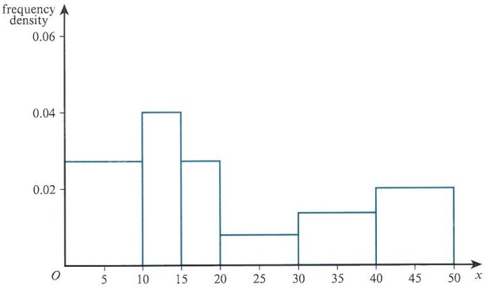

<!-- page 169 -->

In fact, this continuous data can be modelled using the following curve.

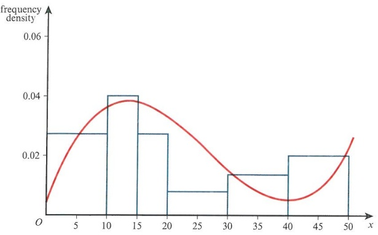

The area under this curve is also equal to 1.

### WORKED EXAMPLE 8.1

 $$  f(x)=kx^{2} $$ 

 $$ 1\leq x\leq3. $$ 

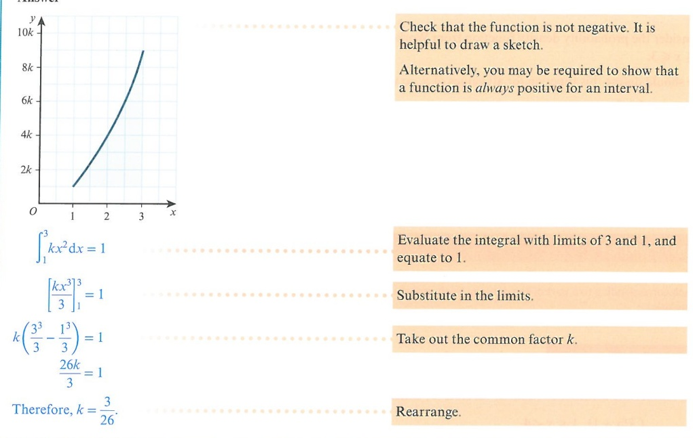

To find the probability between two values of the continuous random variable, integrate the PDF,  $ f(x) $, between those values, as shown in Key point 8.3. Note that, as  $ \mathrm{P}(X=a)=0 $,  $ \mathrm{P}(X<a) $ and  $ \mathrm{P}(X\leq a) $ have the same value.

<!-- page 170 -->

### KEY POINT 8.3

The probability between two values of the continuous random variable is:

 $$ \mathrm{P}(a<X<b)=\int_{a}^{b}\mathrm{f}(x)\mathrm{d}x=\mathrm{F}(b)-\mathrm{F}(a) $$ 

## DID YOU KNOW?

In calculus, if we differentiate $f(x)$, we label it $f'(x)$ and call it the derivative.

If we integrate $f(x)$, we get $F(x)$ and call it the primitive.

We will learn more about this later but, in simple terms, when we integrate a probability density function $f(x)$ we find the cumulative distribution function $F(x)$. We can use cumulative distribution functions to calculate percentiles of distributions and probabilities. For example, $P(a \leq X \leq b) = F(b) - F(a)$.

When dealing with the normal distribution, we use $\Phi(z)$ to represent the cumulative distribution function. $\Phi$ is upper case phi in Greek. Its Latin equivalent is F. The probabilities are calculated in the same way from tables:

 $$ \mathrm{P}\left(a\leqslant X\leqslant b\right)=\Phi\left(b\right)-\Phi\left(a\right) $$ 

It is important to define fully the probability density function for all values of x. We must state for which values the PDF is valid, and for which values it is 0.

Consider the probability density function from Worked example 8.1:  $ f(x) = \frac{3x^2}{26} $ for  $ 1 \leq x \leq 3 $.

We should define this function for all values of x, so we write it as:

 $$ \mathrm{f}(x)=\begin{cases}\dfrac{3x^{2}}{26}&1\leqslant x\leqslant3\\ 0&otherwise\end{cases} $$ 

Now the function is defined for all values of x.

This notation can be used when dealing with probability density functions that are piecewise functions, as shown in Key point 8.4.

### KEY POINT 8.4

Sometimes, probability density functions are represented by a combination of different functions, each corresponding to a part of the domain. Such probability density functions are called piecewise functions.

### WORKED EXAMPLE 8.2

## REWIND

Consider the continuous random variable X, which has probability density function:

 $$ \mathrm{f}(x)=\begin{cases}k(x+1)&1\leq x<4\\k&4\leq x\leq8\\0&otherwise\end{cases} $$ 

This is why, when dealing with discrete random variables in AS & A Level Probability & Statistics 1, Chapter 6, we used the following to represent the cumulative probability.

 $$ \mathrm{F}(x_{0})=\mathrm{P}(X\leq x_{0}) $$ 

a Find the value of k.

 $$ \texttt{b\quad Calculate\quad P}(2\leq X<6). $$

<!-- page 171 -->

## Answer

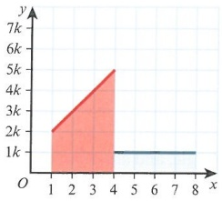

The function does not need to be piecewise continuous.

 $$ \int_{1}^{4}k(x+1)\mathrm{d}x+\int_{4}^{8}k\mathrm{d}x=1 $$ 

 $$ k\left[\frac{x^{2}}{2}+x\right]_{1}^{4}+k[x]_{4}^{8}=1 $$ 

The total area must be 1.

 $$ k\left(12-\frac{3}{2}\right)+k(8-4)=1 $$ 

Take out $k$ as a common factor to make the integration and algebra easier. Integrate and solve for $k$.

 $$ \frac{29k}{2}=1 $$ 

 $$ k=\frac{2}{29} $$ 

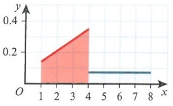

Ensure that the probabilities correspond to the domains of the PDF.

It is easy to make a numerical mistake, so show all of your working.

 $$ \mathrm{P}(2\leq X<6)=\mathrm{P}(2\leq X<4)+\mathrm{P}(4\leq X<6) $$ 

 $$ \begin{aligned}&\int_{2}^{4}\frac{2}{29}(x+1)\mathrm{d}x+\int_{4}^{6}\frac{2}{29}\mathrm{d}x\\ &=\frac{2}{29}\bigg(\left[\frac{x^{2}}{2}+x\right]_{2}^{4}+\left[x\right]_{4}^{6}\bigg)\\ &=\frac{2}{29}\big((12-4)+(6-4))\\ \end{aligned} $$ 

 $$ P(2\leq X<6)=\frac{20}{29} $$ 

Alternatively:

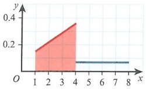

Work out the area of the trapezium and the rectangle instead of using integration.

 $$ \mathrm{P}(2\leq X<6)=\mathrm{P}(2\leq X<4)+\mathrm{P}(4\leq X<6) $$

<!-- page 172 -->

For the trapezium:

Find the area of the trapezium.

 $$ f(2)=\frac{6}{29},f(4)=\frac{10}{29} $$ 

 $$ \mathrm{P}(2\leqslant X<4)=\frac{2\left(\frac{6}{29}+\frac{10}{29}\right)}{2}=\frac{16}{29} $$ 

For the rectangle:

 $$ \mathrm{P}(4\leq\mathrm{X}<6)=2\times\frac{2}{29}=\frac{4}{29} $$ 

Find the area of the rectangle, and add this to the area of the trapezium.

Total area =  $ \frac{16}{29} + \frac{4}{29} = \frac{20}{29} $ as before.

## EXERCISE 8A

1 For each of the following, state whether or not it is a valid probability density function, giving a reason.

 $$ \mathrm{f}(x)=\left\{\begin{aligned}&\frac{1}{10}(x+3)&1\leqslant x\leqslant3\\ &0&otherwise\end{aligned}\right. $$ 

 $$ \mathrm{f}(x)=\left\{\begin{aligned}&-3x^{2}+\frac{9}{2}x&&0\leqslant x\leqslant2\\ &0&&otherwise\end{aligned}\right. $$ 

 $$ \mathrm{f}(x)=\begin{cases}x&0\leqslant x<1\\2-x&1\leqslant x\leqslant2\\0&otherwise\end{cases} $$ 

 $$ \mathrm{f}(x)=\begin{cases}x^{2}&-1\leq x\leq2\\ 0&otherwise\end{cases} $$ 

2 Sketch the following probability density functions.

 $$ \mathbf{a}\quad\mathrm{f}(x)=\begin{cases}\dfrac{1}{12}(x^{2}+3)&-1\leq x\leq2\\ 0&otherwise\end{cases} $$ 

 $$ \mathrm{f}(x)=\left\{\begin{array}{l}\frac{x}{4}\quad0\leq x<2\\ \frac{1}{2}\quad2\leq x\leq3\\ 0\quad otherwise\end{array}\right. $$ 

c  $ \mathrm{f}(x)=\left\{\begin{aligned}&\frac{1}{20}&0\leqslant x<5\\&\frac{1}{96}(x-5)&5\leqslant x\leqslant17\\&0&\text{otherwise}\end{aligned}\right. $

3 Find the value of k for which $f(x)=\left\{\begin{array}{ll}kx(3-x)&0\leq x\leq3\\0&\text{otherwise}\end{array}\right.$ represents a probability density function.

4 Find the exact value of k for which  $ f(x) = \begin{cases} k e^{2(x-5)} & 3 \leq x \leq 4 \\ 0 & \text{otherwise} \end{cases} $ represents a probability density function.

<!-- page 173 -->

5 For the given probability density function  $ f(x)=\left\{\begin{array}{ll}k(x+1) & 5 \leq x \leq 9 \\ 0 & \text{otherwise}, \end{array}\right. $, find:

a the value of k b  $ \mathrm{P}(X=7) $

c  $ \mathrm{P}(X<8) $ d  $ \mathrm{P}(X>6) $

6 For the given probability density function  $ f(x)=\left\{\begin{array}{ll}k(x^{2}-2x+3)&1\leq x\leq4 \\ 0&\text{otherwise},\end{array}\right. $, find:

a the value of k b  $ \mathrm{P}(X<2) $ c  $ \mathrm{P}(1.5\leq X<3.5) $

7 Find the value of $k$ for which $f(x)=\left\{\begin{array}{ll}kx & 0\leq x<6 \\ \frac{k}{2}(9-x) & 6\leq x<9 \\ 0 & \text{otherwise}\end{array}\right.$ represents a probability density function.

8 Find the value of k for which $f(x)=\left\{\begin{array}{ll}\frac{k}{2}(x+1)&-1\leq x<3\\2k&3\leq x<4\\-\frac{2k}{3}(x+7)&4\leq x\leq7\\0&\text{otherwise}\end{array}\right.$

9 For the given probability density function  $ f(x)=\begin{cases}4k & 5\leq x<7 \\ k(11-x) & 7\leq x<11, \text{ find: } 0 \end{cases} $ otherwise

a the value of k

c P(X>8)

10 For the given probability density function  $ f(x)=\begin{cases}k(6x-x^{2})&0\leq x<3\\9k(5-x)&3\leq x\leq5,\\0&\text{otherwise}\end{cases} $, find:

a the value of k b  $ \mathrm{P}(X<3) $ c  $ \mathrm{P}(X<4.5) $

### 8.2 The cumulative distribution function

In this section, we shall see how to find a cumulative distribution function (CDF) from a probability density function (PDF), and vice versa.

We know from Section 8.1 that the area between the graph of a probability density function and the x-axis represents the probability. This area is found by integrating the PDF between suitable limits. If we integrate the PDF between the smallest value in the domain and use a variable as the upper limit, it will create a function that we can use to find the cumulative probability. We will not need to integrate the PDF every time. This is called the cumulative distribution function. We must define this for all values of x, as shown in Key point 8.5.

<!-- page 174 -->

### KEY POINT 8.5

Let the continuous random variable $X$ have a probability density function $f(x)$. Then the cumulative distribution function is defined as:

 $$ \mathrm{F}(x)=\mathrm{P}(X\leqslant x)=\int_{-\infty}^{x}\mathrm{f}(t)\mathrm{d}t $$ 

Note that in Key point 8.5, since the limit is the variable x, we should not use x as the variable in the PDF. We simply choose a different letter here, known as a dummy variable.

Alternatively, instead of using limits, we could perform an indefinite integration. Then we would use the fact that the cumulative value at the right-hand end of the domain is 1 to find the constant of integration.

In Worked example 8.3, the probability density function consists of a single function. The first method shows the use of limits. The second method shows how we can use indefinite integration.

### WORKED EXAMPLE 8.3

The continuous random variable $X$ has probability density function $f(x)=\begin{cases}\dfrac{1}{12}x&1\leq x\leq5\\0&\text{otherwise}\end{cases}$.

Find the cumulative distribution function.

## Answer

## Method 1: Using the limits

 $$ \mathrm{F}(x)=\int_{1}^{x}\frac{1}{12}t\mathrm{d}t $$ 

Set up the integral. The lower limit is now 1. This is the smallest value in the domain.

 $$ \mathrm{F}(x)=\left[\frac{t^{2}}{24}\right]_{1}^{x} $$ 

Use $t$ within the integral since $x$ is within the limit.

 $$ \mathrm{F}(x)=\frac{x^{2}-1}{24} $$ 

Integrate and substitute in the limits.

It is worth checking that  $ F(5) = 1 $ and  $ F(1) = 0 $.

## Method 2: Using indefinite integration

 $$ \mathrm{F}(x)=\int\frac{x}{12}\mathrm{d}x $$ 

 $$ \mathrm{F}(x)=\frac{x^{2}}{24}+c $$ 

Since we are not using limits here, we can still use x as our variable.

Using  $ F(1) = 0 $

 $$ 0=\frac{1^{2}}{24}+c $$ 

We can use either $F(1) = 0$ or $F(5) = 1$ to find $c$:

$F(1) = 0$ since no probabilities have yet been added;

$F(5) = 1$ since all probabilities have been added.

 $$ c=-\frac{1}{24} $$

<!-- page 175 -->

$$ \mathrm{F}(x)=\frac{x^{2}}{24}-\frac{1}{24} $$ 

 $$ \mathrm{F}(x)=\left\{\begin{aligned}&0&&x<1\\ &\frac{x^{2}-1}{24}&&1\leqslant x\leqslant5\\ &1&&x>5\end{aligned}\right. $$ 

For both methods, define the cumulative distribution fully.

In Worked example 8.3, the probability density function has only one function. If the probability density function is a piecewise function, we need to find the cumulative distribution function for each piece of the function. We need to ensure that the cumulative probability from previous parts of the function is added. Worked example 8.4 shows two parts to the piecewise function.

Notice that in Worked example 8.4, the probability density function is not continuous. However, the cumulative distribution function must be continuous.

### WORKED EXAMPLE 8.4

The continuous random variable $X$ has probability density function $f(x)=\left\{\begin{aligned}&\frac{2}{29}(x+1)&&1\leq x<4\\ &\frac{2}{29}&&4\leq x\leq8\\ &0&&otherwise.\end{aligned}\right.$

a Find the cumulative distribution function.

b Find P(2 < X < 5).

c Find the value of $a$ for which $P(X > a) = 0.1$.

## Answer

a Method 1

If  $ 1 \leq x < 4 $:

Take each function in turn. A sketch graph is useful.

 $$ \begin{aligned}F(x)&=\int_{1}^{x}\frac{2}{29}(t+1)\mathrm{d}t&\text{Find the cumulative distribution function for the first function.}\\ &=\left[\frac{2}{29}\left(\frac{t^{2}}{2}+t\right)\right]_{1}^{x}\\ &=\frac{2}{29}\left(\frac{x^{2}}{2}+x\right)-\frac{2}{29}\left(\frac{1}{2}+1\right)\\ \end{aligned} $$ 

 $$ \mathrm{F}(x)=\frac{x^{2}}{29}+\frac{2x}{29}-\frac{3}{29} $$ 

 $$  And~when\ x=4,~F(4)=\frac{21}{29}. $$

<!-- page 176 -->

If  $ 4 \leq x \leq 8 $:

 $$ \begin{align*} F(x)&=F(4)+\int_{4}^{x}\frac{2}{29}\mathrm{d}t \\&=\frac{21}{29}+\left[\frac{2t}{29}\right]_{4}^{x}\\&=\frac{21}{29}+\left(\frac{2x}{29}-\frac{8}{29}\right)\\&=\frac{13}{29}+\frac{2x}{29}\end{align*} $$ 

Since the cumulative distribution is continuous, the second domain starts at 4.

Check that  $ F(8) = 1 $.

## Method 2

If  $ 1 \leq x < 4 $:

Treat each part separately.

 $$ \begin{align*} F(x)&=\int\frac{2}{29}(x+1)\mathrm{d}x\\&=\frac{x^{2}}{29}+\frac{2x}{29}+c\end{align*} $$ 

Since  $ F(1) = 0 $:

 $$ 0=\frac{1}{29}+\frac{2}{29}+c $$ 

Leading to  $ c = -\frac{3}{29} $.

Use the condition  $ F(1) = 0 $.

Therefore, for this domain:

 $$ \mathrm{F}(x)=\frac{x^{2}}{29}+\frac{2x}{29}-\frac{3}{29} $$ 

 $$ \begin{aligned} If4\leqslant x\leqslant8:F(x)&=\int\frac{2}{29}\mathrm{d}x\\&=\frac{2}{29}x+k\end{aligned} $$ 

Here there is no need to add F(4) since it becomes absorbed into the constant of integration.

Since  $ F(8) = 1 $:

 $$ 1=\frac{16}{29}+k $$ 

There are two values we can use to calculate k.

 $ F(4)=\frac{21}{29} $ and  $ F(8)=1 $. It is best to use  $ F(8)=1 $,

since we may have calculated  $ F(4) $ incorrectly.

 $$ k=\frac{13}{29} $$ 

And therefore for  $ 4 \leq x < 8 $:

 $$ \mathrm{F}(x)=\frac{2x}{29}+\frac{13}{29} $$

<!-- page 177 -->

$$ \mathrm{F}(x)=\begin{cases}0&x<1\\\dfrac{x^{2}}{29}+\dfrac{2x}{29}-\dfrac{3}{29}&1\leqslant x<4\\\dfrac{2x}{29}+\dfrac{13}{29}&4\leqslant x\leqslant8\\1&x>8\end{cases} $$ 

Define  $ F(x) $.

b Find P(2 < X < 5).

These can be factorised.

Make sure that you use the correct part of F(x) when evaluating the probability.

 $$ \begin{aligned}P(2<X<5)&=P(X<5)-P(X<2)\\&=F(5)-F(2)\\&=\frac{2\times5+13}{29}-\frac{2^{2}+2\times2-3}{29}\\&=\frac{23}{29}-\frac{5}{29}\end{aligned} $$ 

 $$ \mathrm{P}(2<X<5)=\frac{18}{29} $$ 

 $$  F(a)=0.9 $$ 

Consider carefully in which domain the value of a will lie.

But since  $ F(4)=\frac{21}{29} $ and  $ F(8)=1 $ then

 $$ \mathrm{F}(4)<\mathrm{F}(a)<\mathrm{F}(8). $$ 

This implies 4 < a < 8:

Check that your answer is in the correct domain.

 $$ \mathrm{F}(a)=\frac{(2a+13)}{29}=0.9 $$ 

 $$ a=6.55 $$ 

## Percentiles

A percentile is a value that has a cumulative probability equal to a given probability.

For example, the 90th percentile,  $ \alpha $, of a continuous random variable,  $ X $, is such that  $ P(X \leq \alpha) = 0.9 $. Part c of Worked example 8.4 demonstrates how we find percentiles using the cumulative distribution function.  $ a $ is the value below which 90% of the area lies. It is known as the 90th percentile. We need to be able to find a percentile, or show it correct to a given accuracy.

More generally, the $n$th percentile, $\alpha$, of a continuous random variable, $X$, is $\mathrm{P}(X \leq \alpha) = \frac{n}{100}$, as shown in Key point 8.6.

<!-- page 178 -->

### KEY POINT 8.6

The $n$th percentile, $\alpha$, of a continuous random variable, $X$, is $\mathrm{P}(X \leq \alpha) = \frac{n}{100}$.

For the cumulative distribution function,  $ F(\alpha) = \frac{n}{100} $, as shown in Key point 8.7.

### KEY POINT 8.7

For the cumulative distribution function,  $ F(\alpha) = \frac{n}{100} $ where  $ \alpha $ is the  $ n $th percentile.

The important percentiles are shown in Key point 8.8.

### KEY POINT 8.8

<table border=1 style='margin: auto; word-wrap: break-word;'><tr><td style='text-align: center; word-wrap: break-word;'>The median</td><td style='text-align: center; word-wrap: break-word;'>F(m) = 0.5</td></tr><tr><td style='text-align: center; word-wrap: break-word;'>The lower quartile</td><td style='text-align: center; word-wrap: break-word;'>F(q_1) = 0.25</td></tr><tr><td style='text-align: center; word-wrap: break-word;'>The upper quartile</td><td style='text-align: center; word-wrap: break-word;'>F(q_3) = 0.75</td></tr></table>

### WORKED EXAMPLE 8.5

Let $X$ be a random variable with cumulative distribution function $F(x)=\begin{cases}0&x<0\\\dfrac{\mathrm{e}^{x}-1}{\mathrm{e}^{3}-1}&0\leqslant x\leqslant3\\1&x>3.\end{cases}$

a Calculate the median.

b Calculate the lower and upper quartiles.

c Calculate the 40th percentile.

## Answer

 $$ \mathrm{F}(m)=\frac{\mathrm{e}^{m}-1}{\mathrm{e}^{3}-1}=\frac{1}{2} $$ 

Set the cumulative distribution function equal to  $ \frac{1}{2} $.

 $$ \mathrm{e}^{m}=\frac{\mathrm{e}^{3}-1}{2}+1 $$ 

Rearrange and solve.

 $$ m=\ln\left(\frac{\mathrm{e}^{3}-1}{2}+1\right) $$ 

 $$ m=2.355 $$ 

 $$ \mathrm{F}(q_{1})=\frac{\mathrm{e}^{q_{1}}-1}{\mathrm{e}^{3}-1}=\frac{1}{4} $$ 

Set the cumulative distribution function equal to  $ \frac{1}{4} $.

 $$ \mathrm{e}^{q_{1}}=\frac{\mathrm{e}^{3}-1}{4}+1 $$ 

Rearrange and solve.

<!-- page 179 -->

$$ q_{1}=\ln\left(\frac{\mathrm{e}^{3}-1}{4}+1\right) $$ 

 $$ q_{1}=1.753 $$ 

 $$ \mathrm{F}(q_{3})=\frac{\mathrm{e}^{q_{3}}-1}{\mathrm{e}^{3}-1}=\frac{3}{4} $$ 

Set the cumulative distribution function equal to  $ \frac{3}{4} $.

 $$ \mathrm{e}^{q_{3}}=\frac{3(\mathrm{e}^{3}-1)}{4}+1 $$ 

Rearrange and solve.

 $$ q_{3}=\ln\left(\frac{3(\mathrm{e}^{3}-1)}{4}+1\right) $$ 

 $$ q_{3}=2.729 $$ 

 $$ c\quad F(\alpha)=\frac{\mathrm{e}^{\alpha}-1}{\mathrm{e}^{3}-1}=0.4 $$ 

 $$ \mathrm{e}^{\alpha}=0.4(\mathrm{e}^{3}-1)+1 $$ 

Rearrange and solve.

 $$ \alpha=\ln\left[0.4(e^{3}-1)+1\right] $$ 

 $$ \alpha=2.156 $$ 

In Worked example 8.5, we were given the cumulative distribution function to start with. Sometimes we may need to find the CDF before calculating the median. Also, we may need to use some numerical methods to show that the value of a median, or in fact any percentile, is correct to a given level of accuracy.

### WORKED EXAMPLE 8.6

Let $X$ be a continuous random variable with probability density function $f(x)=\begin{cases}\dfrac{3}{10}\left(x^{2}+\dfrac{1}{3}\right)&0\leq x\leq2\\0&\text{otherwise}.\end{cases}$

Show that the median is 1.52, correct to 3 significant figures.

## Answer

There are two methods we can use to solve this. First, we can find  $ F(x) $ and equate it to 0.5. Second, we could build this value into the limits for integration.

## Method 1: Evaluating the integral directly

 $$ \mathrm{F}(m)=\mathrm{P}(X\leqslant m)=\int_{0}^{m}\frac{3}{10}\bigg(t^{2}+\frac{1}{3}\bigg)\mathrm{d}t=0.5 $$ 

 $$ \frac{3}{10}\left[\frac{t^{3}}{3}+\frac{t}{3}\right]_{0}^{m}=0.5 $$ 

 $$ \frac{1}{10}(m^{3}+m)=0.5 $$

<!-- page 180 -->

This leads to:
 $ g(m) = m^3 + m - 5 = 0 $

This is a cubic that does not factorise.

You should not use a calculator to solve this as the question asks you to show that the median is 1.52 correct to 3 significant figures.

Since  $ m = 1.52 $ (3 significant figures)
 $ m \in (1.515, 1.525) $.

 $ g(1.515) = 1.515^3 + 1.515 - 5 = -0.0077\ldots $ negative
 $ g(1.525) = 1.525^3 + 1.525 - 5 = 0.0715\ldots $ positive

Since  $ g(m) $ is continuous and there is a change in sign,  $ m $ must be within the interval.

So  $ m = 1.52 $ (3 significant figures).

Method 2
 $ F(x) = \int_{0}^{x} \frac{3}{10} \left( t^2 + \frac{1}{3} \right) dt $
 $ F(x) = \begin{cases} 0 & x < 0 \\ \frac{1}{10}(x^3 + x) & 0 \leq x \leq 2 \\ 1 & x > 2 \end{cases} $

If  $ 1.515 \leq m < 1.525 $,
then  $ F(1.515) \leq 0.5 < F(1.525) $ and vice versa.

The advantage of finding the cumulative distribution function  $ F(x) $ rather than the probability directly is that it is possible to use this for other percentiles as well.

The principle here is the same. Instead of looking for a change in sign, we look for the values being either side of 0.5.

 $ F(1.515) = \frac{1}{10}(1.515^3 + 1.515) = 0.499\ldots < 0.5 $
 $ F(1.525) = \frac{1}{10}(1.525^3 + 1.525) = 0.507\ldots > 0.5 $

Therefore  $ m = 1.52 $ (3 significant figures).

Method 2 of Worked example 8.6 can be used to show any percentile to a given level of accuracy. We may not always be able to calculate the exact value.

We can find a cumulative distribution function from a probability density function by integrating. We may also need to find the PDF from a given CDF. This helps us calculate the mean or variance for a continuous random variable, as we cannot find this directly from the cumulative distribution function. We differentiate  $ F(x) $ to find  $ f(x) $, since differentiation is the inverse operation to integration. This is shown in Key point 8.9.

<!-- page 181 -->

### KEY POINT 8.9

Let the continuous random variable X have a cumulative distribution function F(x). The probability density function is defined as:

 $$  f(x)=\frac{\mathrm{d}F(x)}{\mathrm{d}x} $$ 

If the function is piecewise, then, as in Worked example 8.7, make sure that all parts are differentiated.

WORKED EXAMPLE 8.7

 $$ A{\mathrm{~c o n t i n u o u s~r a n d o m~v a r i a b l e}},X,{\mathrm{h e s~c u m u l a t i v e~d i s t r i b u t i o n~f u n c t i o n~}}F(x)=\left\{\begin{aligned}&0&&x<0\\ &\frac{x^{2}}{108}&&0\leq x<6\\ &\frac{1}{54}\bigg(9x-\frac{x^{2}}{4}-27\bigg)&&6\leq x\leq18\\ &1&&{\mathrm{o t h e r w i s e.}}\end{aligned}\right. $$ 

Find $f(x)$, the probability density function.

## Answer

 $$  If\ 0\leq x<6; $$ 

 $$ \frac{\mathrm{d}F(x)}{\mathrm{d}x}=\frac{x}{54} $$ 

Differentiate $F(x)$ to find $f(x)$.

If 6 < x ≤ 18:

 $$ \frac{\mathrm{d}F(x)}{\mathrm{d}x}=\frac{1}{54}\left(9-\frac{x}{2}\right) $$ 

 $$ \mathrm{f}(x)=\begin{cases}\dfrac{x}{54}&0\leqslant x<6\\\dfrac{1}{54}\left(9-\dfrac{x}{2}\right)&6\leqslant x\leqslant18\\0&otherwise\end{cases} $$ 

In the regions $x<0$ and $x>18$ we differentiate to 0. This is reflected in the ‘otherwise’ comment.

We can use the probability density function to find the mode of a function, as shown in Key point 8.10.

<!-- page 182 -->

### KEY POINT 8.10

The mode is the highest point on a probability density function and so is either a stationary point or at the end points of the domain.

Given $f(x)$ defined as $0$ for $a \leq x \leq b$, then the mode is at $\frac{\mathrm{d}}{\mathrm{d}x} f(x) = 0 \left[ \frac{\mathrm{d}^2}{\mathrm{d}x^2} f(x) < 0 \right]$ or $a$ or $b$.

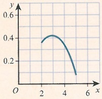

Here the mode is at the stationary point and is found at  $ \frac{\mathrm{d}f(x)}{\mathrm{d}x}=0 $. It is also a maximum  $ \left[\frac{\mathrm{d}^{2}f(x)}{\mathrm{d}x^{2}}<0\right] $.

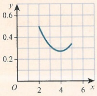

Here, we have a stationary point, but it is a minimum. We can see that the maximum value is at the start of the function.

The mode is a useful measure of central tendency, particularly if the data are highly skewed. We can also use the mode to discuss whether a dataset is positively or negatively skewed.

### WORKED EXAMPLE 8.8

For each of the following probability density functions, find the mode.

 $$ \mathrm{f}(x)=\begin{cases}\dfrac{1}{72}(8x-x^{2})&0\leqslant x\leqslant6\\ 0&otherwise\end{cases} $$ 

 $$ \mathrm{f}(x)=\begin{cases}\dfrac{1}{60}(2x+3)&2\leqslant x\leqslant7\\ 0&otherwise\end{cases} $$ 

 $$ \mathbf{c}\quad\mathrm{f}(x)=\left\{\begin{aligned}&\frac{1}{48}(x^{2}-10x+29)&1\leq x\leq7\\ &0&otherwise\end{aligned}\right. $$ 

Answer

 $$ \mathrm{f}(x)=\begin{cases}\dfrac{1}{72}(8x-x^{2})&0\leqslant x\leqslant6\\ 0&otherwise\end{cases} $$ 

We know that the stationary point is a maximum.

<!-- page 183 -->

Stationary point:

 $$ \frac{\mathrm{d}}{\mathrm{d}x}(\mathrm{f}(x))=\frac{1}{72}(8-2x)=0 $$ 

Maximum where x = 4:

We need to work out the values of potential maxima.

 $$ f(0)=0 $$ 

 $$ \mathrm{f}(4)=\frac{2}{9} $$ 

 $$ \mathrm{f}(6)=\frac{1}{6} $$ 

The mode is therefore when x = 4.

 $$ \mathrm{f}(x)=\begin{cases}\dfrac{1}{60}(2x+3)&2\leqslant x\leqslant7\\ 0&otherwise\end{cases} $$ 

Choose the greatest value.

 $$ \mathrm{f}(2)=\frac{7}{60} $$ 

Since the function is linear, it has no stationary points.

 $$ \mathrm{f}(7)=\frac{17}{60} $$ 

The mode is therefore when x = 7.

Choose the greater value.

Alternatively, since the function is linear and always increasing, we can deduce the maximum value will be at x = 7.

c  $ \mathrm{f}(x)=\left\{\begin{aligned}&\frac{1}{48}(x^{2}-10x+29)&&1\leq x\leq7\\ &0&& \text{otherwise}\end{aligned}\right. $

Find the stationary point.

Stationary point:

 $$ \frac{\mathrm{d}}{\mathrm{d}x}(\mathrm{f}(x))=\frac{1}{48}(2x-10)=0 $$ 

Maximum where x = 5:

 $$ f(1)=\frac{5}{12} $$ 

Work out the values of potential maxima.

 $$ \mathrm{f}(5)=\frac{1}{12} $$ 

 $$ f(7)=\frac{1}{6} $$ 

The mode is therefore when x = 1.

Choose the greatest value.

If the functions are more complicated, use a graph to help you, as shown in Worked example 8.9.

<!-- page 184 -->

### WORKED EXAMPLE 8.9

Given  $ f(x)=\begin{cases}\dfrac{1}{128}x&0\leq x<8\\\dfrac{5}{24}-\dfrac{x}{96}&8\leq x\leq20\\0&\text{otherwise}\end{cases} $, find the mode.

## Answer

Mode = 8

It is easy to see where the mode is from the graph.

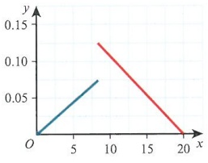

## EXERCISE 8B

1 Find  $ F(x) $, the cumulative distribution function for:

 $$ \mathrm{f}(x)=\begin{cases}\dfrac{2}{95}(5-3x)&-4\leqslant x\leqslant1\\ 0&otherwise\end{cases} $$ 

2 Find  $ F(x) $, the cumulative distribution function for:

 $$ \mathrm{f}(x)=\begin{cases}\dfrac{1}{9}(x^{2}-8x+18)&2\leqslant x\leqslant5\\ 0&otherwise\end{cases} $$ 

3 Find  $ F(x) $, the cumulative distribution function for:

 $$ \mathrm{f}(x)=\begin{cases}\dfrac{1}{16}&3\leqslant x<7\\\dfrac{1}{8}&7\leqslant x\leqslant13\\0&otherwise\end{cases} $$ 

4 Find  $ F(x) $, the cumulative distribution function for:

 $$ \mathrm{f}(x)=\begin{cases}\dfrac{4}{27}(x-1)&1\leqslant x<4\\\dfrac{4}{27}(11-2x)&4\leqslant x\leqslant\dfrac{11}{2}\\0&otherwise\end{cases} $$

<!-- page 185 -->

5 Find  $ F(x) $, the cumulative distribution function for:

 $$ \mathrm{f}(x)=\begin{cases}\dfrac{1}{24}&0\leqslant x<5\\\dfrac{1}{24}(x-4)&5\leqslant x<7\\\dfrac{1}{8}&7\leqslant x<12\\0&otherwise\end{cases} $$ 

6 For the given probability density function:  $ f(x)=\begin{cases}\frac{1}{28}(12-x)&3\leq x\leq7\\0&\text{otherwise}\end{cases} $

a find F(x)

b calculate F(5)

c find P(4 \leq x < 6)

d find $m$ such that $F(m)=0.5$. Give your answer to 2 decimal places.

7 For the given probability density function:  $ f(x) = \begin{cases} \frac{3}{100}(x-2)(8-x) & 2 \leq x \leq 7 \\ 0 & \text{otherwise} \end{cases} $

a find F(x), writing your answer in the form  $ \frac{-a}{100}(x-b)(x-c)^{2} $, where a, b, c are positive integers

b find P(X \leqslant 4)

c find P(X>5).

8 For the given probability density function:  $ f(x) = \begin{cases} \dfrac{1}{90}(13 - x) & 4 \leq x < 7 \\ \dfrac{1}{270}(x + 11) & 7 \leq x \leq 16 \\ 0 & \text{otherwise} \end{cases} $

a find F(x)

b find P(X \leq 6)

c find P(X \leq 11)

d find a such that  $ \mathrm{P}(X \geqslant a) = 0.75 $

e find $m$ such that $F(m)=0.5$, giving your answer to 3 significant figures.

9 For the given probability density function: $f(x)=\left\{\begin{aligned}&\frac{1}{99}(x^{2}-18x+83)&&6\leq x\leq15\\ &0&& \text{otherwise}\end{aligned}\right.$

a find F(x)

b find P(X > 8)

c show that the upper quartile is 14.3, to 1 decimal place.

PS 10 For the given probability density function:  $ f(x)=\begin{cases}\frac{12}{335}(x^{3}+4x^{2}+1)&-4\leq x\leq1\\0&\text{otherwise}\end{cases} $

a find the mode

b show that the 40th percentile is -2.56, correct to 2 decimal places.

<!-- page 186 -->

### 8.3 Calculating  $ \mathrm{E}(\mathrm{g}(X)) $ for a continuous random variable

## REWIND

In AS & A Level Mathematics Probability & Statistics 2, Chapter 2, we found both  $ E(aX + b) $ and  $ \operatorname{Var}(aX + b) $ for discrete random variables. Also, in Chapter 4, we found  $ E(X) $ and  $ \operatorname{Var}(X) $ for continuous random variables.

For discrete random variables we could simply recalculate the expectation and variance by redefining the variable, for example:

<table border=1 style='margin: auto; word-wrap: break-word;'><tr><td style='text-align: center; word-wrap: break-word;'>x</td><td style='text-align: center; word-wrap: break-word;'>1</td><td style='text-align: center; word-wrap: break-word;'>2</td><td style='text-align: center; word-wrap: break-word;'>3</td></tr><tr><td style='text-align: center; word-wrap: break-word;'>P(X=x)</td><td style='text-align: center; word-wrap: break-word;'>$ \frac{1}{3} $</td><td style='text-align: center; word-wrap: break-word;'>$ \frac{1}{6} $</td><td style='text-align: center; word-wrap: break-word;'>$ \frac{1}{2} $</td></tr></table>

When  $ Y = 3X + 7 $, we can write the probability distribution of Y as:

<table border=1 style='margin: auto; word-wrap: break-word;'><tr><td style='text-align: center; word-wrap: break-word;'>y</td><td style='text-align: center; word-wrap: break-word;'>10</td><td style='text-align: center; word-wrap: break-word;'>13</td><td style='text-align: center; word-wrap: break-word;'>16</td></tr><tr><td style='text-align: center; word-wrap: break-word;'>P(Y=y)</td><td style='text-align: center; word-wrap: break-word;'>$ \frac{1}{3} $</td><td style='text-align: center; word-wrap: break-word;'>$ \frac{1}{6} $</td><td style='text-align: center; word-wrap: break-word;'>$ \frac{1}{2} $</td></tr></table>

We can calculate  $ \mathrm{E}(3X+7) $ and  $ \mathrm{Var}(3X+7) $ from this table.

For continuous random variables we cannot use this method. We need to be able to find  $ \mathrm{E}(g(X)) $ and  $ \mathrm{Var}(g(X)) $ from their probability density function, as shown in Key point 8.11.

### KEY POINT 8.11

Let X be a continuous random variable with probability density function  $ f(x) $. Then:

 $$ \mathrm{E}(X)=\int_{\forall x}x\mathrm{f}(x)\mathrm{d}x\mathrm{~a n d~}\mathrm{E}(\mathrm{g}(X))=\int_{\forall x}\mathrm{g}(x)\mathrm{f}(x)\mathrm{d}x $$ 

## TIP

$\forall x$ means 'for all $x$'.

This notation allows us

to find the area when

there are many domains

for the continuous

random variable.

There are similar integrals in AS & A Level Mathematics Probability & Statistics 2.

You may have used these to calculate  $ \mathrm{E}(X^2) $ to find  $ \mathrm{Var}(X) $:  $ \mathrm{E}(X^2) = \int_{\forall x} x^2 \mathrm{f}(x) \, \mathrm{d}x $ and  $ \mathrm{Var}(X) = \mathrm{E}(X^2) - [\mathrm{E}(X)]^2 $.

### WORKED EXAMPLE 8.10

A continuous random variable, $X$, has probability density function $f(x)=\begin{cases}\dfrac{1}{5}\left(\dfrac{6x}{5}+\dfrac{1}{2}\right)&0\leq x\leq2.5\\0&\text{otherwise}.\end{cases}$

a Find E(X).

b Find  $ \mathrm{E}(X(X+1)) $.

Answer

a  $ \mathrm{E}(X)=\int_{\forall x}x\mathrm{f}(x)\mathrm{d}x $

From the definition.

<!-- page 187 -->

$$ \begin{aligned}\mathrm{E}(X)&=\int_{0}^{2.5}x\times\frac{1}{5}\left(\frac{6x}{5}+\frac{1}{2}\right)\mathrm{d}x&\\&=\frac{1}{5}\int_{0}^{2.5}\frac{6x^{2}}{5}+\frac{x}{2}\mathrm{d}x\\ &\\&=\frac{1}{5}\left[\frac{2x^{3}}{5}+\frac{x^{2}}{4}\right]_{0}^{2.5}\\ &\\&=\frac{1}{5}\left(\left(\frac{2(2.5)^{3}}{5}+\frac{2.5^{2}}{4}\right)-0\right)\\ &\\&=1.5625\\ \end{aligned} $$ 

Multiply and simplify.

Substitute in limits.

Always check to see if the answer makes sense. It must be between 0 and 2.5.

b

 $$ \mathrm{E}(\mathrm{g}(X))=\int_{\forall x}\mathrm{g}(x)\mathrm{f}(x)\mathrm{d}x $$ 

From the definition.

 $$ \begin{aligned}E(X(X+1))&=\int_{0}^{2.5}x(x+1)\times\frac{1}{5}\bigg(\frac{6x}{5}+\frac{1}{2}\bigg)\mathrm{d}x\\&=\frac{1}{5}\int_{0}^{2.5}\frac{6x^{3}}{5}+\frac{17x^{2}}{10}+\frac{x}{2}\mathrm{d}x\\&=\frac{1}{5}\bigg[\frac{3x^{4}}{10}+\frac{17x^{3}}{30}+\frac{x^{2}}{4}\bigg]_{0}^{2.5}\\&=\frac{1}{5}\bigg(\left(\frac{3(2.5)^{4}}{10}+\frac{17(2.5)^{3}}{30}+\frac{2.5^{2}}{4}\right)-0\bigg)\\ \end{aligned} $$ 

Multiply out and collect like terms.

Substitute in limits.

 $$ \begin{aligned}\mathrm{E}(X(X+1))&=4.427083\ldots\\&=4.43\text{(to}3\text{significant figures)}\end{aligned} $$ 

Evaluate.

### WORKED EXAMPLE 8.11

 $$ \begin{aligned}&A~continuous~random~variable,X,has~probability~density~function~f(x)=\begin{cases}\dfrac{x}{12}&0\leq x<3\\ \dfrac{1}{8}&3\leq x<8\\ 0&otherwise\end{cases}\\&Find~E\left(\dfrac{1}{X}\right).\\ \end{aligned} $$ 

Answer

 $$ \mathrm{E}(g(X))=\int_{\forall x}g(x)f(x)\mathrm{d}x $$

<!-- page 188 -->

$$E\left(\frac{1}{X}\right)=\int_{0}^{3}\frac{1}{x}\left(\frac{x}{12}\right)\mathrm{d}x+\int_{3}^{8}\frac{1}{x}\left(\frac{1}{8}\right)\mathrm{d}x$$

$$=\int_{0}^{3}\frac{1}{12}\mathrm{d}x+\int_{3}^{8}\frac{1}{8x}\mathrm{d}x$$

$$=\left[\frac{x}{12}\right]_{0}^{3}+\left[\frac{1}{8}\ln x\right]_{3}^{8}$$

$$=\left(\frac{1}{4}-0\right)+\left(\frac{1}{8}\ln8-\frac{1}{8}\ln3\right)$$

$$=\frac{1}{8}\left(2+\ln\left(\frac{8}{3}\right)\right)$$

$$=0.3726036...$$

$$=0.373\text{ (to 3 significant figures)}$$

Since there are two domains, integrate over all values of x. Split the integral into sections to do this using the given domains.

Integrate.

Evaluate.

Simplify.

Make sure you read the question carefully. You may be required to leave your answer in exact form.

## DID YOU KNOW?

Another name for $\mathrm{E}(X)$ is the first moment of the distribution of $X$ and, using this, we can find a measure of centrality. It links to finding a centre of mass, using moments, in Mechanics.

 $ E(X^{2}) $ is called the second moment and links to measures of dispersion.

E(X^{n}) is called the nth moment of the distribution of X. When n=3, we can calculate some measures of skewness and, when n=4, we are able to analyse kurtosis, a measure of how 'flat' a distribution is.

## EXERCISE 8C

1.  $ f(x)=\begin{cases}\frac{x}{200}&0\leq x\leq20\\0&\text{otherwise}.\end{cases} $

a Find E(X). b Find E(X^{2}). c Find Var(X).

2 The continuous random variable $X$ has probability density function given by $f(x)=\begin{cases}\dfrac{2}{21}(7-x)&2\leq x\leq5\\0&\text{otherwise}.\end{cases}$

a Find $E(X)$. b Find $E(X^{2})$. c Find $\mathrm{Var}(X)$.

3 The continuous random variable $X$ has probability density function given by $f(x) = \begin{cases} \frac{1}{5} & 5 \leq x < 8 \\ \frac{1}{15} & 8 \leq x \leq 14 \\ 0 & \text{otherwise.} \end{cases}$

a Find $\mathrm{E}(X)$. b Find $\mathrm{E}(X^2)$. c Find $\mathrm{Var}(X)$. d Find $\mathrm{SD}(X)$

<!-- page 189 -->

4 The continuous random variable $X$ has probability density function given by $f(x)=\begin{cases}\dfrac{3}{20}&1\leq x\leq6\\ \dfrac{1}{200}(16-x)&6<x\leq16\\ 0&\text{otherwise.}\end{cases}$

a Find $\mathrm{E}(X)$. b Find $\mathrm{E}(X^{2})$. c Find $\mathrm{Var}(X)$.

5 The continuous random variable $X$ has probability density function given by $f(x)=\begin{cases}\dfrac{5}{64}\left(3+\dfrac{1}{x^{2}}\right)&1\leq x\leq5\\0&\text{otherwise.}\end{cases}$

Find $\mathrm{E}(X)$, giving your answer in the form $a(b+\ln c)$.

6 The continuous random variable $X$ has probability density function given by $f(x)=\begin{cases}\frac{1}{56}(23-x)&\text{7\leq}x\leq11\\0&\text{otherwise}.\end{cases}$

Find $\mathrm{E}(X(X-1)).$

7 The continuous random variable $X$ has probability density function given by $f(x)=\begin{cases}1-\frac{x}{4}&1\leq x\leq3\\0& \text{otherwise}.\end{cases}$

Find the exact value of $\mathrm{E}(\mathrm{e}^{X})$.

8 The continuous random variable X has probability density function given by

 $ f(x)=\begin{cases}-\frac{3}{16}(x^{2}-10x+22)&4\leq x\leq6\\0&\text{otherwise.}\end{cases} $

Find  $ \mathrm{E}\left(\frac{1}{X^{2}}\right) $. Give your answer in the form  $ a\ln b+c $.

9 The continuous random variable $X$ has probability density function given by $f(x) = \left\{ \begin{array}{ll} \frac{4}{15} & 0 \leq x \leq 3 \\ \frac{1}{10} & 3 < x \leq 5 \\ 0 & \text{otherwise.} \end{array} \right.$

Find $F((X-2)^2)$

10 The continuous random variable $X$ has probability density function given by $f(x)=\left\{\begin{array}{ll}\frac{1}{8}(5-x)&1\leq x<3\\ \frac{1}{32}(x-3)&3\leq x\leq7\\ 0&\text{otherwise.}\end{array}\right.$

Find $\mathrm{E}\left(\frac{1}{X}\right)$.

PS 11 For the given cumulative distribution function: F(x) =  $ \begin{cases} 0 & x < 1 \\ \frac{1}{36}(x^3 + 5x - 6) & 1 \leq x \leq 3 \\ 1 & x > 3 \end{cases} $

a show that the median is 2.32, correct to 3 significant figures

b find the mode

c find E(X)

d use your answers to parts a, b and c to comment on the skewness of the distribution.

<!-- page 190 -->

### 8.4 Finding the probability density function and cumulative distribution function of  $ \mathbf{Y} = \mathbf{g}(\mathbf{X}) $

In Section 8.3 we saw how to find  $ E(Y) $, where  $ Y = g(X) $. We now need to calculate the probability density function and the cumulative distribution function for the continuous random variable  $ Y = g(X) $. This will allow us to calculate percentiles and probabilities for these functions. With a discrete random variable, we can simply recalculate the probability distribution and cumulative distribution. We will work with a discrete random variable with the following probability distribution. This will help us to develop some ideas that we can use later with continuous random variables.

<table border=1 style='margin: auto; word-wrap: break-word;'><tr><td style='text-align: center; word-wrap: break-word;'>x</td><td style='text-align: center; word-wrap: break-word;'>1</td><td style='text-align: center; word-wrap: break-word;'>2</td><td style='text-align: center; word-wrap: break-word;'>3</td></tr><tr><td style='text-align: center; word-wrap: break-word;'>P(X=x)</td><td style='text-align: center; word-wrap: break-word;'>$ \frac{1}{2} $</td><td style='text-align: center; word-wrap: break-word;'>$ \frac{1}{8} $</td><td style='text-align: center; word-wrap: break-word;'>$ \frac{3}{8} $</td></tr></table>

And cumulative distribution:

<table border=1 style='margin: auto; word-wrap: break-word;'><tr><td style='text-align: center; word-wrap: break-word;'>x</td><td style='text-align: center; word-wrap: break-word;'>1</td><td style='text-align: center; word-wrap: break-word;'>2</td><td style='text-align: center; word-wrap: break-word;'>3</td></tr><tr><td style='text-align: center; word-wrap: break-word;'>F(x)</td><td style='text-align: center; word-wrap: break-word;'>$ \frac{1}{2} $</td><td style='text-align: center; word-wrap: break-word;'>$ \frac{5}{8} $</td><td style='text-align: center; word-wrap: break-word;'>1</td></tr></table>

Consider  $ Y = X^{2} $. The probability distribution is:

<table border=1 style='margin: auto; word-wrap: break-word;'><tr><td style='text-align: center; word-wrap: break-word;'>y</td><td style='text-align: center; word-wrap: break-word;'>1</td><td style='text-align: center; word-wrap: break-word;'>4</td><td style='text-align: center; word-wrap: break-word;'>9</td></tr><tr><td style='text-align: center; word-wrap: break-word;'>P(Y=y)</td><td style='text-align: center; word-wrap: break-word;'>$ \frac{1}{2} $</td><td style='text-align: center; word-wrap: break-word;'>$ \frac{1}{8} $</td><td style='text-align: center; word-wrap: break-word;'>$ \frac{3}{8} $</td></tr></table>

Or, equivalently, using $X$:

<table border=1 style='margin: auto; word-wrap: break-word;'><tr><td style='text-align: center; word-wrap: break-word;'>x</td><td style='text-align: center; word-wrap: break-word;'>1</td><td style='text-align: center; word-wrap: break-word;'>2</td><td style='text-align: center; word-wrap: break-word;'>3</td></tr><tr><td style='text-align: center; word-wrap: break-word;'>$ \mathrm{P}(X=\sqrt{y}) $</td><td style='text-align: center; word-wrap: break-word;'>$ \frac{1}{2} $</td><td style='text-align: center; word-wrap: break-word;'>$ \frac{1}{8} $</td><td style='text-align: center; word-wrap: break-word;'>$ \frac{3}{8} $</td></tr></table>

And cumulative distribution G(y):

<table border=1 style='margin: auto; word-wrap: break-word;'><tr><td style='text-align: center; word-wrap: break-word;'>y</td><td style='text-align: center; word-wrap: break-word;'>1</td><td style='text-align: center; word-wrap: break-word;'>4</td><td style='text-align: center; word-wrap: break-word;'>9</td></tr><tr><td style='text-align: center; word-wrap: break-word;'>G(y) P(Y  $ \leq $ y)</td><td style='text-align: center; word-wrap: break-word;'>$ \frac{1}{2} $</td><td style='text-align: center; word-wrap: break-word;'>$ \frac{5}{8} $</td><td style='text-align: center; word-wrap: break-word;'>1</td></tr></table>

Or, equivalently, using X:

<table border=1 style='margin: auto; word-wrap: break-word;'><tr><td style='text-align: center; word-wrap: break-word;'>x</td><td style='text-align: center; word-wrap: break-word;'>1</td><td style='text-align: center; word-wrap: break-word;'>2</td><td style='text-align: center; word-wrap: break-word;'>3</td></tr><tr><td style='text-align: center; word-wrap: break-word;'>F(  $ \sqrt{y} $ ) P(X ≤  $ \sqrt{y} $)</td><td style='text-align: center; word-wrap: break-word;'>$ \frac{1}{2} $</td><td style='text-align: center; word-wrap: break-word;'>$ \frac{5}{8} $</td><td style='text-align: center; word-wrap: break-word;'>1</td></tr></table>

If  $ Y = \mathrm{h}(X) $, then  $ G(y) = \mathrm{P}(X \leq \mathrm{h}^{-1}(y)) $.

Consider Y = -X. The probability distribution is:

<table border=1 style='margin: auto; word-wrap: break-word;'><tr><td style='text-align: center; word-wrap: break-word;'>y</td><td style='text-align: center; word-wrap: break-word;'>-3</td><td style='text-align: center; word-wrap: break-word;'>-2</td><td style='text-align: center; word-wrap: break-word;'>-1</td></tr><tr><td style='text-align: center; word-wrap: break-word;'>P(Y=y)</td><td style='text-align: center; word-wrap: break-word;'>$ \frac{3}{8} $</td><td style='text-align: center; word-wrap: break-word;'>$ \frac{1}{8} $</td><td style='text-align: center; word-wrap: break-word;'>$ \frac{1}{2} $</td></tr></table>

<!-- page 191 -->

And cumulative distribution G(y):

<table border=1 style='margin: auto; word-wrap: break-word;'><tr><td style='text-align: center; word-wrap: break-word;'>y</td><td style='text-align: center; word-wrap: break-word;'>-3</td><td style='text-align: center; word-wrap: break-word;'>-2</td><td style='text-align: center; word-wrap: break-word;'>-1</td></tr><tr><td style='text-align: center; word-wrap: break-word;'>G(y)=P(Y\leq y)</td><td style='text-align: center; word-wrap: break-word;'>$ \frac{3}{8} $</td><td style='text-align: center; word-wrap: break-word;'>$ \frac{1}{2} $</td><td style='text-align: center; word-wrap: break-word;'>1</td></tr></table>

Or equivalently, using $X$:

<table border=1 style='margin: auto; word-wrap: break-word;'><tr><td style='text-align: center; word-wrap: break-word;'>x</td><td style='text-align: center; word-wrap: break-word;'>1</td><td style='text-align: center; word-wrap: break-word;'>2</td><td style='text-align: center; word-wrap: break-word;'>3</td></tr><tr><td style='text-align: center; word-wrap: break-word;'>F(-y) P(X≥y)=1-P(X≤-y)</td><td style='text-align: center; word-wrap: break-word;'>1/2</td><td style='text-align: center; word-wrap: break-word;'>5/8</td><td style='text-align: center; word-wrap: break-word;'>1</td></tr></table>

Here, we can see that if  $ Y = \mathrm{h}(X) $, then  $ G(y) = 1 - \mathrm{P}(X \leqslant \mathrm{h}^{-1}(y)) $.

Consider  $ Y = \frac{1}{X} $. The probability distribution is:

<table border=1 style='margin: auto; word-wrap: break-word;'><tr><td style='text-align: center; word-wrap: break-word;'>y</td><td style='text-align: center; word-wrap: break-word;'>$ \frac{1}{3} $</td><td style='text-align: center; word-wrap: break-word;'>$ \frac{1}{2} $</td><td style='text-align: center; word-wrap: break-word;'>1</td></tr><tr><td style='text-align: center; word-wrap: break-word;'>P(Y=y)</td><td style='text-align: center; word-wrap: break-word;'>$ \frac{3}{8} $</td><td style='text-align: center; word-wrap: break-word;'>$ \frac{1}{8} $</td><td style='text-align: center; word-wrap: break-word;'>$ \frac{1}{2} $</td></tr></table>

And cumulative distribution G(y):

<table border=1 style='margin: auto; word-wrap: break-word;'><tr><td style='text-align: center; word-wrap: break-word;'>y</td><td style='text-align: center; word-wrap: break-word;'>$ \frac{1}{3} $</td><td style='text-align: center; word-wrap: break-word;'>$ \frac{1}{2} $</td><td style='text-align: center; word-wrap: break-word;'>1</td></tr><tr><td style='text-align: center; word-wrap: break-word;'>G(y) = P(Y ≤ y)</td><td style='text-align: center; word-wrap: break-word;'>$ \frac{3}{8} $</td><td style='text-align: center; word-wrap: break-word;'>$ \frac{1}{2} $</td><td style='text-align: center; word-wrap: break-word;'>1</td></tr></table>

Or, equivalently, using X:

<table border=1 style='margin: auto; word-wrap: break-word;'><tr><td style='text-align: center; word-wrap: break-word;'>x</td><td style='text-align: center; word-wrap: break-word;'>1</td><td style='text-align: center; word-wrap: break-word;'>2</td><td style='text-align: center; word-wrap: break-word;'>3</td></tr><tr><td style='text-align: center; word-wrap: break-word;'>$ \mathrm{F}\left(\frac{1}{y}\right) $  $ \mathrm{P}\left(X\geqslant\frac{1}{y}\right)=1-\mathrm{P}\left(X\leqslant\frac{1}{y}\right) $</td><td style='text-align: center; word-wrap: break-word;'>$ \frac{1}{2} $</td><td style='text-align: center; word-wrap: break-word;'>$ \frac{5}{8} $</td><td style='text-align: center; word-wrap: break-word;'>1</td></tr></table>

Here, we can see also that if  $ Y = \mathrm{h}(X) $, then  $ G(y) = 1 - \mathrm{P}(X \leq \mathrm{h}^{-1}(y)) $ for a discrete random variable.

For continuous variables we cannot do this. Instead, we use a similar idea with the cumulative distribution function of  $ Y = g(X) $, as shown in Key point 8.12.

For a continuous random variable, $X$, with cumulative distribution function $F(x)$ and a function $Y = h(X)$, we find the cumulative distribution function $G(y)$ by:

### KEY POINT 8.12

 $$ \mathrm{G}(y)=\mathrm{P}(Y\leqslant y)=\left\{\begin{aligned}&\mathrm{P}(X\leqslant\mathrm{h}^{-1}(y))=\mathrm{F}(\mathrm{h}^{-1}(y))\\&\text{or}\\&\mathrm{P}(X\geqslant\mathrm{h}^{-1}(y))=1-\mathrm{F}(\mathrm{h}^{-1}(y))\end{aligned}\right. $$

<!-- page 192 -->

Consider the continuous random variable $X$ with cumulative distribution function $F(x)=\begin{cases}0&x<0\\\dfrac{x^{2}}{16}&0\leqslant x\leqslant4\\1&x>4.\end{cases}$

Find the cumulative distribution function of $Y=X^{2}$.

## Answer

 $$ \mathrm{F}(x)=\left\{\begin{aligned}&0&x<0\\ &\frac{x^{2}}{16}&0\leqslant x\leqslant4\\ &1&x>4\end{aligned}\right. $$ 

 $$ Y=X^{2} $$ 

 $$ G(y)=P(Y\leq y) $$ 

Apply this now to the CDF.

 $$ \mathrm{P}(X\leqslant\sqrt{y})=\mathrm{F}(\sqrt{y}) $$ 

 $$ \mathrm{F}(\sqrt{y})=\left\{\begin{aligned}&0&&\sqrt{y}<0\\ &\frac{(\sqrt{y})^{2}}{16}&&0\leqslant\sqrt{y}\leqslant4\\ &1&&\sqrt{y}>4\end{aligned}\right. $$ 

This is the same as $F(x)$ with the function applied.

 $$ \mathrm{G}(y)=\begin{cases}0&y<0\\\dfrac{y}{16}&0\leqslant y\leqslant16\\1&y>16\end{cases} $$ 

Write in terms of y.

This is the full description of the cumulative distribution function for $X^{2}$.

In Worked example 8.12 we saw how to find the CDF of a function of X from the CDF of the continuous random variable X.

What if we start with the probability density function of $X$ and need to find the PDF of $Y = g(X)?$

We cannot do this directly, but there is a way, using the material covered so far:

f(x) the PDF of X → F(x) the CDF of X → G(y) the CDF of Y → g(y) the PDF of Y

### WORKED EXAMPLE 8.13

A continuous random variable, $X$, has probability density function $f(x) = \begin{cases} \dfrac{8}{3x^3} & 1 \leq x \leq 2 \\ 0 & \text{otherwise} \end{cases}$. Find the probability density function of $Y = \dfrac{X^2}{4}$.

<!-- page 193 -->

<table border=1 style='margin: auto; word-wrap: break-word;'><tr><td colspan="2">Answer</td></tr><tr><td style='text-align: center; word-wrap: break-word;'>Find F(x) first:</td><td style='text-align: center; word-wrap: break-word;'>Always calculate the cumulative distribution function first.</td></tr><tr><td style='text-align: center; word-wrap: break-word;'>F(x)= $ \int_{1}^{x}\frac{8}{3t^{3}} $dt</td><td style='text-align: center; word-wrap: break-word;'></td></tr><tr><td style='text-align: center; word-wrap: break-word;'>$$  = \left[ -\frac{4}{3t^{2}} \right]_{1}^{x}  $$</td><td style='text-align: center; word-wrap: break-word;'></td></tr><tr><td style='text-align: center; word-wrap: break-word;'>$$  = -\frac{4}{3x^{2}} - \left( -\frac{4}{3} \right)  $$</td><td style='text-align: center; word-wrap: break-word;'></td></tr><tr><td style='text-align: center; word-wrap: break-word;'>$$  = \frac{4}{3} \left( 1 - \frac{1}{x^{2}} \right)  $$</td><td style='text-align: center; word-wrap: break-word;'></td></tr><tr><td style='text-align: center; word-wrap: break-word;'>Therefore, F(x)= $ \begin{cases} 0 &amp; x &lt; 1 \\ \frac{4}{3} \left( 1 - \frac{1}{x^{2}} \right) &amp; 1 \leq x \leq 2 \\ 1 &amp; x &gt; 2 \end{cases} $</td><td style='text-align: center; word-wrap: break-word;'></td></tr><tr><td style='text-align: center; word-wrap: break-word;'>Now consider the function Y= $ \frac{X^{2}}{4} $. X=2 $ \sqrt{Y} $</td><td style='text-align: center; word-wrap: break-word;'>Make X the subject.</td></tr><tr><td style='text-align: center; word-wrap: break-word;'>G(y)=P(Y≤y)=P(X≤2 $ \sqrt{y} $)</td><td style='text-align: center; word-wrap: break-word;'>Apply this to the cumulative function.</td></tr><tr><td style='text-align: center; word-wrap: break-word;'>G(y)=F(2 $ \sqrt{y} $)</td><td style='text-align: center; word-wrap: break-word;'></td></tr><tr><td style='text-align: center; word-wrap: break-word;'>F(2 $ \sqrt{y} $)= $ \frac{4}{3} \left( 1 - \frac{1}{(2 $ \sqrt{y} $)^{2}} \right) $</td><td style='text-align: center; word-wrap: break-word;'></td></tr><tr><td style='text-align: center; word-wrap: break-word;'>G(y)= $ \frac{4}{3} - \frac{1}{3y} $</td><td style='text-align: center; word-wrap: break-word;'></td></tr><tr><td style='text-align: center; word-wrap: break-word;'>The domain of F(x) is 1≤x≤2.</td><td style='text-align: center; word-wrap: break-word;'>Now consider the domain.</td></tr><tr><td style='text-align: center; word-wrap: break-word;'>And of F(2 $ \sqrt{y} $): 1≤2 $ \sqrt{y} $≤2</td><td style='text-align: center; word-wrap: break-word;'>Apply the function, rearranging to make y the subject.</td></tr><tr><td style='text-align: center; word-wrap: break-word;'>1≤4y≤4</td><td style='text-align: center; word-wrap: break-word;'></td></tr><tr><td style='text-align: center; word-wrap: break-word;'>$ \frac{1}{4} $≤y≤1</td><td style='text-align: center; word-wrap: break-word;'></td></tr><tr><td style='text-align: center; word-wrap: break-word;'>Therefore, G(y)= $ \begin{cases} 0 &amp; y &lt; \frac{1}{4} \\ \frac{4}{3} - \frac{1}{3y} &amp; \frac{1}{4} \leq y \leq 1 \\ 1 &amp; y &gt; 1 \end{cases} $</td><td style='text-align: center; word-wrap: break-word;'>It is useful to check: G $ \left( \frac{1}{4} \right) $= $ \frac{4}{3} - \frac{1}{3\left( \frac{1}{4} \right)} $=0 G(1)= $ \frac{4}{2} - \frac{1}{2\sqrt{y}} $=1</td></tr></table>

<!-- page 194 -->

$$ \mathrm{g}(y)=\frac{\mathrm{d}\mathrm{G}(y)}{\mathrm{d}y} $$ 

Differentiate.

 $$ \mathrm{g}(y)=\frac{1}{3y^{2}} $$ 

 $$  And~g(y)=\begin{cases}\dfrac{1}{3y^{2}}&\dfrac{1}{4}\leq y\leq1\\ 0&otherwise\end{cases} $$ 

As required. Remember to define fully the probability density function.

When we deal with reciprocal or negative functions, we need to be very careful about how we define the cumulative distribution function. For example, as in Worked example 8.14, if the function is  $ Y = \frac{1}{X} $, ensure that you define the correct domain.

### WORKED EXAMPLE 8.14

Let the continuous random variable X have probability density function

 $$ \mathrm{f}(x)=\begin{cases}\dfrac{8}{3x^{3}}&1\leq x\leq2\\ 0&otherwise.\end{cases} $$ 

Find the probability density function of $Y=\frac{1}{X}$.

## Answer

<table border=1 style='margin: auto; word-wrap: break-word;'><tr><td style='text-align: center; word-wrap: break-word;'>$ F(x) = \int \frac{8}{3x^{3}} \mathrm{d}x $</td><td style='text-align: center; word-wrap: break-word;'>Find F(x).</td></tr><tr><td style='text-align: center; word-wrap: break-word;'>$ = -\frac{4}{3x^{2}} + c $</td><td style='text-align: center; word-wrap: break-word;'>Find the constant of integration instead of using limits.</td></tr><tr><td style='text-align: center; word-wrap: break-word;'>$ -\frac{4}{3(2)^{2}} + c = 1 $</td><td style='text-align: center; word-wrap: break-word;'>Use F(2) = 1.</td></tr><tr><td style='text-align: center; word-wrap: break-word;'>Therefore,  $ c = \frac{4}{3} $.</td><td style='text-align: center; word-wrap: break-word;'></td></tr><tr><td style='text-align: center; word-wrap: break-word;'>And  $ F(x) = \frac{4}{3} \left( 1 - \frac{1}{x^{2}} \right) $.</td><td style='text-align: center; word-wrap: break-word;'></td></tr><tr><td style='text-align: center; word-wrap: break-word;'>Now consider the function  $ Y = \frac{1}{X} $.</td><td style='text-align: center; word-wrap: break-word;'>Since we are taking the reciprocal, change the inequality. Think about why the inequality switches over in this example.</td></tr><tr><td style='text-align: center; word-wrap: break-word;'>$ G(y) = \mathrm{P}(Y \leqslant y) = \mathrm{P}\left(X \geqslant \frac{1}{y}\right) = 1 - \mathrm{P}\left(X \leqslant \frac{1}{y}\right) $</td><td style='text-align: center; word-wrap: break-word;'></td></tr><tr><td style='text-align: center; word-wrap: break-word;'>$ G(y) = 1 - \mathrm{F}\left(\frac{1}{y}\right) $</td><td style='text-align: center; word-wrap: break-word;'></td></tr><tr><td style='text-align: center; word-wrap: break-word;'>$ = 1 - \frac{4}{3}(1 - y^{2}) $</td><td style='text-align: center; word-wrap: break-word;'></td></tr><tr><td style='text-align: center; word-wrap: break-word;'>$ \frac{1}{3}(4y^{2} - 1) $</td><td style='text-align: center; word-wrap: break-word;'></td></tr></table>

<!-- page 195 -->

The domain for F(x) is $1 \leq x \leq 2$.

$1 \leq \frac{1}{y} \leq 2$

The same care is required for the domain.

The domain for $G(y)$ is therefore $\frac{1}{2} \leq y \leq 1$.

Check the domain for the reciprocal function.

Therefore,  $ G(y) = \begin{cases} 0 & y < \frac{1}{2} \\ \frac{1}{3}(4y^2 - 1) & \frac{1}{2} \leq y \leq 1 \\ 1 & y > 1 \end{cases} $

Check:

$$G\left(\frac{1}{2}\right)=\frac{1}{3}\left(4\left(\frac{1}{2}\right)^2-1\right)=0$$

$$G(1)=\frac{1}{3}(4(1)^2-1)=1$$

 $$ \mathrm{g}(y)=\frac{\mathrm{d}G(y)}{\mathrm{d}y} $$ 

Differentiate to find g(y).

 $$ \mathrm{g}(y)=\frac{8y}{3} $$ 

 $$ g(y)=\begin{cases}\dfrac{8y}{3}&\dfrac{1}{2}\leq y\leq1\\ 0&\text{otherwise}\end{cases} $$ 

Define fully g(y).

## TIP

Always take your time when finding the CDF of a function of X, and notice when you need to change the inequality.

## EXERCISE 8D

1 F(x) =  $ \begin{cases} 0 & x < 0 \\ \dfrac{x^{2}}{400} & 0 \leqslant x \leqslant 20. \end{cases} $ Find the cumulative distribution function of A =  $ X^{2} $.

1 x > 20

2  $ F(x)=\left\{\begin{array}{ll}0 & x<0 \\ \frac{1}{10}(x^{3}+x) & 0 \leq x \leq 2.\text{Find the cumulative distribution function of } A=X^{3}. \\ 1 & x>2\end{array}\right. $

3 $F(x)=\left\{\begin{array}{ll}0 & x<-4 \\ \frac{1}{95}(-3x^{2}+10x+88)&-4\leqslant x\leqslant1.\text{Find the cumulative distribution function }A=3X-22. \\ 1 & \text{otherwise}\end{array}\right.$

4 The continuous random variable X has cumulative distribution function given by

$$F(x)=\begin{cases}0&x<1\\\dfrac{1}{3}(x^2-1)&1\leqslant x\leqslant2.\\1&x>2\end{cases}$$

 $$ A=X^{2} $$ 

 $$ B=\sqrt{X} $$

<!-- page 196 -->

5 The continuous random variable X has cumulative distribution function given by

 $$ \begin{aligned}&F(x)=\left\{\begin{aligned}\\ &0x<0\\&\frac{1}{300}(x^{2}+20x)&0\leqslant&x\leqslant10\\&1x&>10\\ &\end{aligned}\right.\\ \end{aligned} $$ 

Find the cumulative distribution function of Y = 100X^{2}.

6 The continuous random variable $X$ has probability density function given by $f(x)=\begin{cases}\frac{1}{8}(4-x)&0\leq x\leq4\\0&\text{otherwise}.\end{cases}$

a Find F(x).

b Find the cumulative distribution function of Y = 3X - 2.

c Find the probability density function of Y.

7 The continuous random variable $X$ has probability density function given by $f(x)=\begin{cases}\dfrac{2}{x^{2}}&1\leq x\leq2\\0&\text{otherwise}.\end{cases}$

a Find F(x).

b Find the cumulative distribution of  $ Y = \frac{X^{2}}{4} $.

c Find the probability density function of Y.

8 The continuous random variable X has cumulative distribution function given by

 $$ \mathrm{F}(x)=\begin{cases}0&x<1\\-\frac{25}{24}\bigg(\frac{1}{x^{2}}-1\bigg)&1\leq x\leq5\\1&otherwise.\end{cases} $$ 

a Find the cumulative distribution function of  $ Y = \frac{1}{X} $.

b Find the probability density function of Y.

9 The continuous random variable $X$ has probability density function given by $f(x)=\begin{cases}\dfrac{2}{25}(5-x)&0\leq x\leq5\\0&\text{otherwise}.\end{cases}$

a Find F(x).

b Find the cumulative distribution of Y = 5 - 2X.

c Find P(Y<2).

d Find P $ (-2 < Y < 2) $.

e Find the probability density function of Y.

<!-- page 197 -->

10 A circular ink blot has radius r, described by the probability distribution  $ f(r) = \begin{cases} \dfrac{2}{25}(6 - r) & 1 \leq r \leq 6 \\ 0 & \text{otherwise} \end{cases} $

a Find $F(r)$, the cumulative density function.

b Find $G(A)$, the cumulative distribution function for the area of the ink blot.

c Find the probability density function for the area of the ink blot.

## WORKED PAST PAPER QUESTION

The continuous random variable X has probability density function f given by

 $$ \mathrm{f}(x)=\begin{cases}\dfrac{1}{6}x&2\leq x\leq4\\ 0&otherwise\end{cases} $$ 

i Find the cumulative distribution function of X.

The continuous random variable Y is defined by  $ Y = X^{3} $. Find

ii the probability density function of Y

ii the value of $k$ for which $P(Y \geq k) = \frac{7}{12}$

Cambridge International AS & A Level Further Mathematics 9231 Paper 21 Q7 November 2016

Answer

i \quad f(x) = \begin{cases} \frac{1}{6}x & 2 \leq x \leq 4 \\ 0 & \text{otherwise} \end{cases}

For  $ 2 \leq x \leq 4 $:

Integrate to find  $ F(x) $.

 $$ \begin{align*} F(x)&=\int_{2}^{x}\frac{1}{6}t\mathrm{d}t=\left[\frac{t^{2}}{12}\right]_{2}^{x}\\&=\frac{x^{2}}{12}-\frac{2^{2}}{12}\end{align*} $$ 

Use a dummy variable.

Evaluate.

 $$ \mathrm{F}(x)=\frac{x^{2}}{12}-\frac{1}{3} $$ 

 $$ \mathrm{F}(x)=\left\{\begin{aligned}&0&&x<2\\ &\frac{x^{2}}{12}-\frac{1}{3}&&2\leq x\leq4\\ &1&&x>4\end{aligned}\right. $$ 

Define fully.

<!-- page 198 -->

State $G(y)$ in terms of $X$.

 $$ \begin{aligned}G(y)&=P(Y<y)=P(X^{3}<y)\\&=P\left(X<y^{\frac{1}{3}}\right)=F\left(y^{\frac{1}{3}}\right)\end{aligned} $$ 

 $$ \mathrm{G}(y)=\frac{y^{\frac{2}{3}}}{12}-\frac{1}{3} $$ 

Define  $ G(y) $.

 $$ g(y)=\frac{1}{18}y^{-\frac{1}{3}} $$ 

Differentiate to get g(y).

 $$ 2\leq y^{\frac{1}{3}}\leq4 $$ 

 $$ \mathrm{g}(y)=\begin{cases}\dfrac{1}{18}y^{-\frac{1}{3}}&8\leqslant y\leqslant64\\ 0&otherwise\end{cases} $$ 

 $$ 8\leq y\leq64 $$ 

Define  $ g(y) $ fully.

 $$ \begin{aligned}P(Y\geqslant k)&=1-P(Y\leqslant k)\\&=1-G(k)\end{aligned} $$ 

Consider the cumulative probability.

 $$ 1-\frac{k^{\frac{2}{3}}}{12}+\frac{1}{3}=\frac{7}{12} $$ 

 $$ \frac{16}{12}-\frac{k^{\frac{2}{3}}}{12}=\frac{7}{12} $$ 

 $$ k^{\frac{2}{3}}=9 $$ 

 $$ k=9^{\frac{3}{2}} $$ 

 $$ k=27 $$ 

Solve for $k$.

<!-- page 199 -->

## Checklist of learning and understanding

Probability density functions:

For  $ f(x) $ to represent a probability density function,  $ f(x) \geq 0 $ for all values of x.

$$\int_{\forall x}f(x)dx=1$$

Cumulative distribution functions:

$$\mathrm{F}(x)=\int_{-\infty}^{x}\mathrm{f}(t)\mathrm{d}t$$

 $ \frac{\mathrm{d}F(x)}{\mathrm{d}x} = f(x) $

Expectation of functions of X:

$$\mathrm{E}[\mathrm{g}(X)]=\int_{\forall x}\mathrm{g}(x)\mathrm{f}(x)\mathrm{d}x$$

Finding the cumulative distribution function of a function of X:

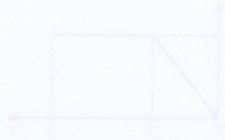

 $$ \bullet \quad \mathrm{G}(y)=\mathrm{P}(Y\leqslant y)=\left\{\begin{array}{l}\mathrm{P}(X\leqslant\mathrm{h}^{-1}(y))=\mathrm{F}(\mathrm{h}^{-1}(y))\\\quad\mathrm{or}\\\mathrm{P}(X\geqslant\mathrm{h}^{-1}(y))=1-\mathrm{F}(\mathrm{h}^{-1}(y))\end{array}\right. $$

<!-- page 200 -->

1 The time, $T$ seconds, between successive cars passing a particular checkpoint on a wide road has probability density function $f$ given by $f(t)=\left\{\begin{array}{ll}\frac{1}{100}e^{-0.01t}, & t \geqslant 0 \\ 0 & \text{otherwise}.\end{array}\right.$

i State the expected value of $T$.

ii Find the median value of $T$.

ii Sally wishes to cross the road at this checkpoint and she needs 20 seconds to complete the crossing. She decides to start out immediately after a car passes. Find the probability that she will complete the crossing before the next car passes.

Cambridge International AS & A Level Further Mathematics 9231 Paper 21 Q7 November 2014

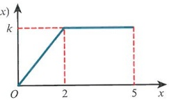

The continuous random variable $X$ takes values in the interval $0 \leqslant x \leqslant 5$ only. For $0 \leqslant x \leqslant 5$ the graph of its probability density function $f$ consists of two straight line segments, as shown in the diagram.

a Find $k$ and show that $f$ is given by $f(x)=\left\{\begin{array}{ll}\frac{1}{8}x & 0 \leq x \leq 2 \\ \frac{1}{4} & 2 \leq x \leq 5 \\ 0 & \text{otherwise}.\end{array}\right.$

b The random variable Y is given by Y = X^{2}.

i Find the probability density function of Y.

ii Show that  $ \mathrm{E}(Y)=10.25 $.

iii Show that the median of Y is the square of the median of X.

Cambridge International AS & A Level Further Mathematics 9231 Paper 23 Q11 November 2012

3 The lifetime, in years, of an electrical component is the random variable T, with probability density function f given by

 $$ \mathrm{f}(t)=\begin{cases}A\mathrm{e}^{-\lambda t}&t\geqslant0,\\0&otherwise,\end{cases} $$ 

where $A$ and $\lambda$ are positive constants.

i Show that  $ A = \lambda $.

It is known that out of 100 randomly chosen components, 16 failed within the first year.

ii Find an estimate for the value of $\lambda$, and hence find an estimate for the median value of $T$.

Cambridge International AS & A Level Further Mathematics 9231 Paper 22 Q8 November 2013

