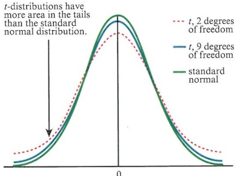
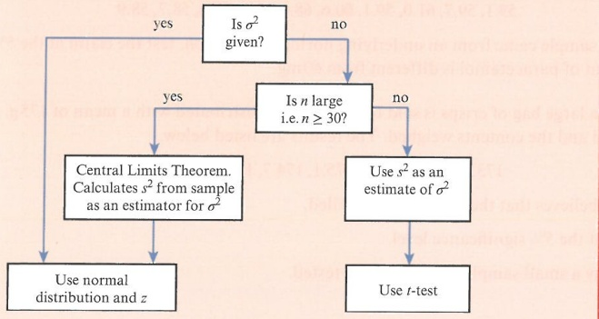

# Inferential statistics

<!-- Cambridge International AS  A Level Further Mathematics Coursebook (Lee Mckelvey Martin Crozier) .pdf p201-231 -->

<!-- page 201 -->

## Chapter 9 Inferential statistics

In this chapter you will learn how to:

formulate and carry out a hypothesis test concerning the mean for a small sample, using the t-test

calculate a pooled estimate of a population variance from two samples

formulate and carry out a hypothesis test concerning the difference in means, using:

- a two-sample t-test

• a paired sample t-test

- a test using the normal distribution

determine a confidence interval for a population mean based on a small sample, using the t-distribution

determine a confidence interval for the difference in population means.

<!-- page 202 -->

## PREREQUISITE KNOWLEDGE

<table border=1 style='margin: auto; word-wrap: break-word;'><tr><td style='text-align: center; word-wrap: break-word;'>Where it comes from</td><td style='text-align: center; word-wrap: break-word;'>What you should be able to do</td><td style='text-align: center; word-wrap: break-word;'>Check your skills</td></tr><tr><td style='text-align: center; word-wrap: break-word;'>AS &amp; A Level Mathematics Probability &amp; Statistics 1, Chapter 8 AS &amp; A Level Mathematics Probability &amp; Statistics 2, Chapter 3</td><td style='text-align: center; word-wrap: break-word;'>Standardise and find critical values from a cumulative normal distribution table.</td><td style='text-align: center; word-wrap: break-word;'>1 Let  $ X \sim N(24, 2^{2}) $. Find  $ P(X \leq 26.34) $.</td></tr><tr><td style='text-align: center; word-wrap: break-word;'>AS &amp; A Level Mathematics Probability &amp; Statistics 2, Chapter 6</td><td style='text-align: center; word-wrap: break-word;'>Find an unbiased estimator of the variance.</td><td style='text-align: center; word-wrap: break-word;'>2 Given that  $ \sum x = 126 $,  $ \sum x^{2} = 514 $ and  $ n = 37 $, find the unbiased estimator of the variance.</td></tr></table>

## Hypothesis testing and making inferences

This chapter builds on work covered in AS & A Level Mathematics Probability & Statistics 2, to develop techniques based on the mean of a distribution. We shall consider situations that have small samples or populations for which the variance is unknown. We shall then carry out hypothesis tests concerning the mean. Being able to test the mean is very important in industry and medicine, for example, to test if the amount of effective drug in a headache tablet is correct. If not enough of the active drug is present, the medicine may not have the desired effect. We can also use this type of test to see whether the machine that is making the tablets is putting enough of the effective drug into the tablets.

### 9.1 t-distribution

When we collect a sample from a normal distribution to carry out a hypothesis test concerning the mean, we need to make some assumptions in order to use the normal distribution. We assume that the population variance is known, or that the sample size is sufficiently large that we can use $s^{2}$, the unbiased estimator of the variance, instead of the population variance, $\sigma^{2}$.

If the sample size is small, and we do not know what the variance is, then it is no longer appropriate to use the unbiased estimator. The $t$-distribution was developed so that the unbiased estimator could be used. It is a better model in this situation. The diagram shows that the $t$-distribution is different from the normal distribution because the density in the tails is greater than the density in the tails of the standard normal distribution. This means that the $t$-distribution has greater probability in the tails and less probability in the centre compared to the standard normal distribution. The $t$-distribution is a family of distributions with $(n-1)$ degrees of freedom. The number of degrees of freedom refers to the number of independent observations in a set of data. The number of degrees of freedom of the $t$-distribution relate to the sample size, $n$, and as the sample size increases, the $t$-distribution looks more like the normal distribution.

Hence, the distribution of the $t$ statistic from samples of size 8 would be described by a $t$-distribution having $8-1$ or $7$ degrees of freedom. Similarly, a $t$-distribution having $15$ degrees of freedom would be used

<!-- page 203 -->

with a sample of size 16. As the degrees of freedom tend to infinity, the distribution becomes more like the normal distribution.

### KEY POINT 9.1

Given $n$ data points, the unbiased estimator of the variance, $s^{2}$, is calculated using:

 $$ s^{2}=\frac{1}{n-1}\sum(x-\overline{x})^{2} $$ 

or

 $$ s^{2}=\frac{1}{n-1}\Biggl(\sum x^{2}-\frac{\left(\sum x\right)^{2}}{n}\Biggr)=\frac{1}{n-1}\Biggl(\sum x^{2}-n\overline{x}^{2}\Biggr) $$ 

This can be written as  $ s^{2}=\frac{S_{xx}}{n-1} $.

## TIP

The unbiased estimator of the variance is also sometimes written as  $ \hat{\sigma}^{2} $. Generally, if  $ \theta $ is a parameter, then  $ \hat{\theta} $ is an estimator. In this book, we will use  $ s^{2} $.

Key point 9.1 gives a convenient way of calculating the unbiased estimator of the variance,  $ s^{2} $.

### WORKED EXAMPLE 9.1

The wingspans of six Monarch butterflies are measured (in cm) and recorded as: 8.8, 9.6, 9.2, 9.1, 9.9, 8.7

Calculate the unbiased estimator for the variance of these data.

## Answer

## Method 1

 $$ \sum x=55.3 $$ 

 $$ \overline{x}=\frac{55.3}{6}=9.2166\ldots $$ 

First calculate the estimator of the mean,  $ \overline{x} $, using  $ \overline{x} = \frac{\sum x}{n} $.

<table border=1 style='margin: auto; word-wrap: break-word;'><tr><td style='text-align: center; word-wrap: break-word;'>$ x-\bar{x} $</td><td style='text-align: center; word-wrap: break-word;'>$ (x-\bar{x})^{2} $</td></tr><tr><td style='text-align: center; word-wrap: break-word;'>-0.41667</td><td style='text-align: center; word-wrap: break-word;'>0.173611</td></tr><tr><td style='text-align: center; word-wrap: break-word;'>0.383333</td><td style='text-align: center; word-wrap: break-word;'>0.146944</td></tr><tr><td style='text-align: center; word-wrap: break-word;'>-0.01667</td><td style='text-align: center; word-wrap: break-word;'>0.000278</td></tr><tr><td style='text-align: center; word-wrap: break-word;'>-0.11667</td><td style='text-align: center; word-wrap: break-word;'>0.013611</td></tr><tr><td style='text-align: center; word-wrap: break-word;'>0.683333</td><td style='text-align: center; word-wrap: break-word;'>0.466944</td></tr><tr><td style='text-align: center; word-wrap: break-word;'>-0.51667</td><td style='text-align: center; word-wrap: break-word;'>0.266944</td></tr></table>

Use the most accurate values when working to avoid rounding errors.

 $$ \sum(x-\overline{x})^{2}=1.068333 $$ 

So  $ s^{2} = \frac{1.068333}{6 - 1} = 0.214 $ (to 3 significant figures)

Use  $ s^{2}=\frac{1}{n-1}\sum(x-\bar{x})^{2} $

## Method 2: Using summative data

 $$ \sum x=55.3 $$ 

 $$ \sum x^{2}=510.75 $$ 

This method helps with analysis of variance (ANOVA) which is studied at degree level.

<!-- page 204 -->

$$S_{xx} = \sum x^2 - \frac{(\Sigma x)^2}{n}$$
$$= 510.75 - \frac{55.3^2}{6}$$
$$= 1.068333$$
$$S_0 s^2 = \frac{1.068333}{6 - 1} = 0.214 \, (\text{to } 3 \, \text{significant figures})$$

There are several important steps when performing a hypothesis test for significance. First, we define the null hypothesis  $ H_0 $. When dealing with a parametric test,  $ H_0 $ is the assumed value of the parameter. It is this assumption that we are testing. Then we propose an alternative hypothesis  $ H_1 $. There could be many different versions of this but, for the purposes of this course, it depends on whether we are looking at a one-tailed or a two-tailed test. Consequently, we refer only to  $ H_0 $ and state whether we reject or do not reject it. Does rejecting  $ H_0 $ mean that  $ H_1 $ is accepted?

We now have the tools to perform a hypothesis test concerning the population mean. This is where a small sample is taken from an underlying normal distribution with unknown variance. In other words, we assume the population is normally distributed.

For an underlying normal distribution with unknown variance, a small sample of size $n$ is taken. To carry out a hypothesis test on the mean, the $t$-distribution with $(n-1)$ degrees of freedom is used to find the critical value. In fact, $\overline{X}\sim t_{n-1}$. We state the null and alternative hypotheses as shown in Key point 9.2.

### KEY POINT 9.2

For an underlying population that is normally distributed, with unknown variance, the null and alternative hypotheses will be:
 $ H_{0} $:  $ \mu = k $, where k is the assumed value of the mean that we are testing
 $ H_{1} $:  $ \left\{\begin{aligned}&\mu<k\\&\mu>k\\&\mu\neq k\end{aligned}\right. $ depending on whether we are performing a one-tailed or two-tailed test
The test statistic =  $ \frac{\overline{x} - \mu}{s/\sqrt{n}} $, where  $ \overline{x} $ is the sample mean and  $ s = \sqrt{\frac{S_{xx}}{n-1}} $ is the unbiased estimator of the standard deviation.

The critical value for a significance level 100(1 -  $ \alpha $% is:

 $$ t_{\alpha,n-1} $$ 

 $$ t_{\frac{\alpha}{2},n-1} $$

<!-- page 205 -->

Monarch butterflies are bred at a butterfly farm. Monarch butterflies should grow to have a mean wingspan of 9.4 cm. The breeders are concerned that their butterflies are not growing as well as they could be, so a sample of six Monarch butterflies is taken and their wingspans measured (in cm). These are recorded as: 8.8, 9.6, 9.2, 9.1, 9.9, 8.7. Assuming that the wingspans are normally distributed and using a 10% significance level, investigate whether the wingspans of the butterflies are less than 9.4 cm.

## Answer

<table border=1 style='margin: auto; word-wrap: break-word;'><tr><td style='text-align: center; word-wrap: break-word;'>Important facts:
• assume underlying normal distribution
• variance is unknown
• sample size is small.</td><td style='text-align: center; word-wrap: break-word;'>This suggests that we need a t-test.</td></tr><tr><td style='text-align: center; word-wrap: break-word;'>We are testing whether the population mean is below 9.4.
This is a one-tailed test.
The significance level is 10%.</td><td style='text-align: center; word-wrap: break-word;'>Make sure that you state whether you have a one- or two-tailed test.</td></tr><tr><td style='text-align: center; word-wrap: break-word;'>$ H_{0} $:  $ \mu = 9.4 $,  $ H_{1} $:  $ \mu &lt; 9.4 $
Test statistics:
 $ \bar{x} = 9.22 $ (3 significant figures) as found in Worked example 9.1
s = 0.462 (3 significant figures) as found in Worked example 9.1</td><td style='text-align: center; word-wrap: break-word;'>Define the null and alternative hypotheses. We must use parameters in the hypothesis test. This is the assumed value for  $ \mu $ when calculating the test statistic.
Note  $ s^{2} = 0.214 $ was found earlier, so s = 0.462</td></tr><tr><td style='text-align: center; word-wrap: break-word;'>Test statistic =  $ \frac{\bar{x} - \mu}{s/\sqrt{n}} $
=  $ \frac{9.22 - 9.4}{0.462/\sqrt{6}} $
= -0.9715</td><td style='text-align: center; word-wrap: break-word;'>Use  $ \frac{\bar{x} - \mu}{s/\sqrt{n}} $ and make the critical value positive or negative accordingly.</td></tr></table>

The critical value for this test is  $ t_{0.9,5} = -1.476 $.

<table border=1 style='margin: auto; word-wrap: break-word;'><tr><td style='text-align: center; word-wrap: break-word;'>p</td><td style='text-align: center; word-wrap: break-word;'>0.75</td><td style='text-align: center; word-wrap: break-word;'>0.90</td><td style='text-align: center; word-wrap: break-word;'>0.95</td></tr><tr><td style='text-align: center; word-wrap: break-word;'>v=1</td><td style='text-align: center; word-wrap: break-word;'>1.000</td><td style='text-align: center; word-wrap: break-word;'>3.078</td><td style='text-align: center; word-wrap: break-word;'>6.314</td></tr><tr><td style='text-align: center; word-wrap: break-word;'>2</td><td style='text-align: center; word-wrap: break-word;'>0.816</td><td style='text-align: center; word-wrap: break-word;'>1.886</td><td style='text-align: center; word-wrap: break-word;'>2.920</td></tr><tr><td style='text-align: center; word-wrap: break-word;'>3</td><td style='text-align: center; word-wrap: break-word;'>0.765</td><td style='text-align: center; word-wrap: break-word;'>1.638</td><td style='text-align: center; word-wrap: break-word;'>2.353</td></tr><tr><td style='text-align: center; word-wrap: break-word;'>4</td><td style='text-align: center; word-wrap: break-word;'>0.741</td><td style='text-align: center; word-wrap: break-word;'>1.533</td><td style='text-align: center; word-wrap: break-word;'>2.132</td></tr><tr><td style='text-align: center; word-wrap: break-word;'>5</td><td style='text-align: center; word-wrap: break-word;'>0.727</td><td style='text-align: center; word-wrap: break-word;'>1.476</td><td style='text-align: center; word-wrap: break-word;'>2.015</td></tr><tr><td style='text-align: center; word-wrap: break-word;'>6</td><td style='text-align: center; word-wrap: break-word;'>0.718</td><td style='text-align: center; word-wrap: break-word;'>1.440</td><td style='text-align: center; word-wrap: break-word;'>1.943</td></tr><tr><td style='text-align: center; word-wrap: break-word;'>7</td><td style='text-align: center; word-wrap: break-word;'>0.711</td><td style='text-align: center; word-wrap: break-word;'>1.415</td><td style='text-align: center; word-wrap: break-word;'>1.895</td></tr><tr><td style='text-align: center; word-wrap: break-word;'>8</td><td style='text-align: center; word-wrap: break-word;'>0.706</td><td style='text-align: center; word-wrap: break-word;'>1.397</td><td style='text-align: center; word-wrap: break-word;'>1.860</td></tr></table>

Now we need to decide whether to reject $H_{0}$ or not.

Since -0.9715 > -1.476 this means the test statistic is not in the critical region, so we do not reject  $ H_{0} $.

There is insufficient evidence to suggest that the mean wingspan of the Monarch butterflies is less than 9.4 cm.

We look at the $t$-distribution table. Since the test is one-tailed, at the 10% significance level we need the 90th percentile with 5 degrees of freedom.

Our test statistic is negative, so we need to consider the negative value for $t$ too.

Consider $H_{0}$, the assumption we made. Note we do not state we accept $H_{1}$ but instead state we do not reject $H_{0}$.

Write a conclusion in context.

<!-- page 206 -->

Worked example 9.3 demonstrates a two-tailed test.

### WORKED EXAMPLE 9.3

A random sample of 12 workers from a mobile phone assembly line is selected from a large number of workers. A manager asks each of these workers to assemble a phone at their normal working speed. The times taken, in minutes, to complete these tasks are recorded below.

43.2, 41.6, 49.3, 48.2, 44.2, 40.6, 39.7, 43.4, 44.9, 45.1, 46.2, 43.2

Assuming that this sample comes from an underlying normal population, investigate the claim that the population mean is 45 minutes. Use a 5% significance level.

<table border=1 style='margin: auto; word-wrap: break-word;'><tr><td rowspan="2">Answer\nImportant facts:\n• underlying normal distribution assumed\n• variance is unknown\n• sample size is small.\nTest whether the population mean is different from 45.\nThis is a two-tailed test.\nThe significance level is 5%.</td><td style='text-align: center; word-wrap: break-word;'>This suggests that we need a t-test.</td></tr><tr><td style='text-align: center; word-wrap: break-word;'>Decide whether this is a one- or two-tailed test.</td></tr><tr><td style='text-align: center; word-wrap: break-word;'>$ H_{{0}} $:  $ \mu = 45 $\n $ H_{{1}} $:  $ \mu \neq 45 $</td><td style='text-align: center; word-wrap: break-word;'>Define the null and alternative hypotheses.\nUse parameters in the hypothesis test. This is the assumed value for  $ \mu $ when calculating the test statistic.</td></tr><tr><td rowspan="2">Test statistic:\n $ \Sigma x = 529.6 $\n $ \Sigma x^{{2}} = 23462.88 $\n $ S_{{xx}} = \Sigma x^{{2}} - \frac{(\Sigma x)^{{2}}}{n} $\n $ S_{{xx}} = 23462.88 - \frac{529.6^{{2}}}{12} = 89.8666... $</td><td style='text-align: center; word-wrap: break-word;'>$ S_{{xx}} = \Sigma x^{{2}} - \frac{(\Sigma x)^{{2}}}{n} - 1 $</td></tr><tr><td style='text-align: center; word-wrap: break-word;'>Use  $ s^{{2}} = \frac{S_{{xx}}}{n - 1} $, where  $ S_{{xx}} = \Sigma x^{{2}} - \frac{(\Sigma x)^{{2}}}{n} $.</td></tr><tr><td style='text-align: center; word-wrap: break-word;'>$ s = \sqrt{\frac{89.8666...}{11}} = 2.858268... $</td><td style='text-align: center; word-wrap: break-word;'>$ S_{{xx}} = \Sigma x^{{2}} - \frac{(\Sigma x)^{{2}}}{n} - 1 $</td></tr><tr><td style='text-align: center; word-wrap: break-word;'>$ \overline{{x}} = \frac{\Sigma x}{n} = \frac{529.6}{12} = 44.133... $</td><td style='text-align: center; word-wrap: break-word;'>$ S_{{xx}} = \Sigma x^{{2}} - \frac{(\Sigma x)^{{2}}}{n} - 1 $</td></tr><tr><td style='text-align: center; word-wrap: break-word;'>$ s = 2.86 $ (to 3 significant figures)</td><td style='text-align: center; word-wrap: break-word;'></td></tr><tr><td style='text-align: center; word-wrap: break-word;'>$ \overline{{x}} = 44.1 $ (to 3 significant figures)</td><td style='text-align: center; word-wrap: break-word;'></td></tr><tr><td style='text-align: center; word-wrap: break-word;'>Test statistic =  $ \frac{\overline{{x}} - \mu}{s/\sqrt{n}} = \frac{44.1 - 45}{2.86/\sqrt{12}} = -1.05 $</td><td style='text-align: center; word-wrap: break-word;'>Always use  $ \frac{\overline{{x}} - \mu}{s/\sqrt{n}} $ and make the critical value positive or negative accordingly.</td></tr></table>

<!-- page 207 -->

The critical value for this test is  $ t_{0.975,11} = -2.201 $.

<table border=1 style='margin: auto; word-wrap: break-word;'><tr><td style='text-align: center; word-wrap: break-word;'>p</td><td style='text-align: center; word-wrap: break-word;'>0.75</td><td style='text-align: center; word-wrap: break-word;'>0.90</td><td style='text-align: center; word-wrap: break-word;'>0.95</td><td style='text-align: center; word-wrap: break-word;'>0.975</td></tr><tr><td style='text-align: center; word-wrap: break-word;'>$ \nu = 1 $</td><td style='text-align: center; word-wrap: break-word;'>1.000</td><td style='text-align: center; word-wrap: break-word;'>3.078</td><td style='text-align: center; word-wrap: break-word;'>6.314</td><td style='text-align: center; word-wrap: break-word;'>12.71</td></tr><tr><td style='text-align: center; word-wrap: break-word;'>2</td><td style='text-align: center; word-wrap: break-word;'>0.186</td><td style='text-align: center; word-wrap: break-word;'>1.886</td><td style='text-align: center; word-wrap: break-word;'>2.920</td><td style='text-align: center; word-wrap: break-word;'>4.303</td></tr><tr><td style='text-align: center; word-wrap: break-word;'>3</td><td style='text-align: center; word-wrap: break-word;'>0.765</td><td style='text-align: center; word-wrap: break-word;'>1.638</td><td style='text-align: center; word-wrap: break-word;'>2.353</td><td style='text-align: center; word-wrap: break-word;'>3.182</td></tr><tr><td style='text-align: center; word-wrap: break-word;'>4</td><td style='text-align: center; word-wrap: break-word;'>0.741</td><td style='text-align: center; word-wrap: break-word;'>1.533</td><td style='text-align: center; word-wrap: break-word;'>2.132</td><td style='text-align: center; word-wrap: break-word;'>2.776</td></tr><tr><td style='text-align: center; word-wrap: break-word;'>5</td><td style='text-align: center; word-wrap: break-word;'>0.727</td><td style='text-align: center; word-wrap: break-word;'>1.476</td><td style='text-align: center; word-wrap: break-word;'>2.015</td><td style='text-align: center; word-wrap: break-word;'>2.571</td></tr><tr><td style='text-align: center; word-wrap: break-word;'>6</td><td style='text-align: center; word-wrap: break-word;'>0.718</td><td style='text-align: center; word-wrap: break-word;'>1.440</td><td style='text-align: center; word-wrap: break-word;'>1.943</td><td style='text-align: center; word-wrap: break-word;'>2.447</td></tr><tr><td style='text-align: center; word-wrap: break-word;'>7</td><td style='text-align: center; word-wrap: break-word;'>0.711</td><td style='text-align: center; word-wrap: break-word;'>1.415</td><td style='text-align: center; word-wrap: break-word;'>1.895</td><td style='text-align: center; word-wrap: break-word;'>2.365</td></tr><tr><td style='text-align: center; word-wrap: break-word;'>8</td><td style='text-align: center; word-wrap: break-word;'>0.706</td><td style='text-align: center; word-wrap: break-word;'>1.397</td><td style='text-align: center; word-wrap: break-word;'>1.860</td><td style='text-align: center; word-wrap: break-word;'>2.306</td></tr><tr><td style='text-align: center; word-wrap: break-word;'>9</td><td style='text-align: center; word-wrap: break-word;'>0.703</td><td style='text-align: center; word-wrap: break-word;'>1.383</td><td style='text-align: center; word-wrap: break-word;'>1.833</td><td style='text-align: center; word-wrap: break-word;'>2.262</td></tr><tr><td style='text-align: center; word-wrap: break-word;'>10</td><td style='text-align: center; word-wrap: break-word;'>0.700</td><td style='text-align: center; word-wrap: break-word;'>1.372</td><td style='text-align: center; word-wrap: break-word;'>1.812</td><td style='text-align: center; word-wrap: break-word;'>2.228</td></tr><tr><td style='text-align: center; word-wrap: break-word;'>11</td><td style='text-align: center; word-wrap: break-word;'>0.697</td><td style='text-align: center; word-wrap: break-word;'>1.363</td><td style='text-align: center; word-wrap: break-word;'>1.796</td><td style='text-align: center; word-wrap: break-word;'>2.201</td></tr><tr><td style='text-align: center; word-wrap: break-word;'>12</td><td style='text-align: center; word-wrap: break-word;'>0.695</td><td style='text-align: center; word-wrap: break-word;'>1.356</td><td style='text-align: center; word-wrap: break-word;'>1.782</td><td style='text-align: center; word-wrap: break-word;'>2.179</td></tr></table>

Since -1.05 > -2.201, the test statistic is not in the critical region and hence we do not reject  $ H_{0} $.

See if the test statistic is in the critical region. In this case, this will be when the test statistic is less than the critical value, if negative, or greater than the critical value, if positive. Since the test statistic is negative, we will need to compare it with the negative critical value.

Since this is a two-tailed test at the 5% significance level, look at the 97.5th percentile with 11 degrees of freedom, in the t-distribution table.

It is best to refer to  $ H_{0} $

There is insufficient evidence to claim that the population mean is not 45 minutes.

We should always write full conclusions in context. Note we should not state there is sufficient evidence the population mean is 45 minutes, but instead state there is insufficient evidence the population mean is not 45 minutes.

It is very important to know which test to perform when testing the mean. In AS & A Level Mathematics Probability & Statistics 2, Chapter 5, you carried out a hypothesis test concerning the mean. In that case, the underlying distribution was known to be normal, or the sample size was large enough to use the central limit theorem. You were also given the population variance. In this chapter, you have carried out hypothesis tests for small samples or where the population variance was unknown. It is very important that you choose the most appropriate test to carry out.

The flowchart shown in Key point 9.3 can help you to decide which is the most appropriate test to use.

### KEY POINT 9.3

## FAST FORWARD

If the underlying distribution is not normal, and the sample size is small, we can use non-parametric tests, as shown in Chapter 11.

<!-- page 208 -->

## EXERCISE 9A

1 For the given data, find unbiased estimates for the mean and variance.
a 12, 16, 17, 19, 13, 14, 11, 16, 19, 21, 14, 15
b 143, 154, 156, 145, 144, 132, 135, 148, 171, 124
2 In each case, state the magnitude of the test statistic for the given value of n and stated significance level.
a n = 11, one-tailed 5%
b n = 21, one-tailed 2.5%
c n = 15, two-tailed 5%
d n = 25, two-tailed 1%
e n = 8, one-tailed 10%
f n = 18, two-tailed 10%

3 State the null and alternative hypotheses for the following tests.
a The population mean differs from 41.
b The population mean is greater than 7.3.
c The population mean has decreased from 54.2.
d The population mean has not changed from 6.5.

4 For the given test statistic, sample sizes and significance levels, state whether you would reject or not reject the null hypothesis.
a Test statistic = 1.96, n = 10, 5% one-tailed
b Test statistic = -2.764, n = 8, 1% one-tailed
c Test statistic = 1.451, n = 15, 10% two-tailed
d Test statistic = -2.341, n = 11, 5% two-tailed

5 In a given week, 12 babies are born in hospital. Assume that this sample came from an underlying normal population. The length of each baby is routinely measured and is listed below (in cm):
49, 50, 45, 51, 47, 49, 48, 54, 53, 55, 45, 50
a Find unbiased estimators for the mean and variance.
The average length of babies is thought to be 50.5 cm. There is a concern that this is an overestimate.
b Test this claim at the 5% significance level based on this sample.

6 A drugs manufacturer claims that the amount of paracetamol in tablets is 60 mg. A sample of ten tablets is taken and the amount of paracetamol in each is recorded:
59.1, 59.7, 61.0, 59.1, 60.6, 68.9, 60.2, 58.6, 58.7, 58.9
Assuming that this sample came from an underlying normal population, test the claim at the 5% significance level that the amount of paracetamol is different from 60 mg.

7 The weight, Xg, of a large bag of crisps is said to be normally distributed with a mean of 175 g. A sample of eight bags is opened and the contents weighed. The results are listed below.
173.2, 171.5, 176.3, 175.1, 174.7, 174.2, 176, 174.5
A consumer group believes that the bags are underfilled.
a Test this claim at the 5% significance level.

b Suggest why only a small sample of packets was tested.

<!-- page 209 -->

8 At a petrol station, the manager thinks that one of the pumps is not working properly and is giving out more petrol than it should. She decides to test this claim by filling up ten buckets with 5 litres, according to the pump. The results, in  $ cm^3 $, are given below (1 litre = 1000  $ cm^3 $).

It is assumed that the amounts given are from a normal distribution.

5001, 5002, 5009, 4996, 4997, 5001, 5003, 5006, 5013, 5013

Using this sample, test at the 5% significance level whether or not the petrol pump is giving out too much petrol.

### 9.2 Hypothesis tests concerning the difference in means

We may test whether two populations have equal population means. In Section 9.1 we learned that the type of test we need to perform depends on a number of factors. These factors include: whether or not we know the population variances; whether the underlying distribution is normal, or the means approximate to a normal distribution by the application of the central limit theorem; and the size of the sample.

To start with, we will assume three things:

the underlying distributions are normal

the populations are independent

the population variance of the two populations is the same (but may be unknown).

From AS & A Level Mathematics Probability & Statistics 2, Chapter 4:

 $$ \mathrm{If}X\sim\mathrm{N}(\mu,\sigma^{2}),\mathrm{then}\overline{X}\sim\mathrm{N}\left(\mu,\frac{\sigma^{2}}{n}\right). $$ 

If $X \sim \mathrm{N}(\mu_x, \sigma_x^2)$ is independent of $Y \sim \mathrm{N}(\mu_y, \sigma_y^2)$, then $X - Y \sim \mathrm{N}(\mu_x - \mu_y, \sigma_x^2 + \sigma_y^2)$ and $\overline{X} - \overline{Y} \sim \mathrm{N}\left(\mu_x - \mu_y, \frac{\sigma_x^2}{n_x} + \frac{\sigma_y^2}{n_y}\right)$.

We standardise to find a z-value, as shown in Key point 9.4. This acts as the test statistic for the difference in means.

### KEY POINT 9.4

$z$-value is given by $Z=\frac{(\overline{X}-\overline{Y})-(\mu_x-\mu_y)}{\sqrt{\frac{\sigma_x^2}{n_x}+\frac{\sigma_y^2}{n_y}}}\sim\mathrm{N}(0,1)$.

### WORKED EXAMPLE 9.4

A group of 50 children and 70 adults participate in a maths activity. The mean time taken for the children to complete the activity is 45.3 seconds, with a standard deviation of 3.2 seconds. For the adults, the mean time is 46.1 seconds with a standard deviation of 2.8 seconds. Assuming the completion times are normally distributed with equal variances, test at the 5% significance level whether or not the children are faster at completing the activity.

## TIP

The second assumption can be tested using an F-test, but this is beyond the scope of this course.

<!-- page 210 -->

<table border=1 style='margin: auto; word-wrap: break-word;'><tr><td colspan="2">Answer</td></tr><tr><td style='text-align: center; word-wrap: break-word;'>First consider the conditions and assumptions:\n• n is large for both populations\n• both have an underlying mean\n• the variances are equal but unknown.</td><td style='text-align: center; word-wrap: break-word;'>Estimate  $ \sigma^{2} $ with  $ s_{x}^{2} $ and  $ s_{y}^{2} $.</td></tr><tr><td style='text-align: center; word-wrap: break-word;'>Let  $ C \sim \mathrm{N}(45.3, 3.2^{2}) $ represent the population of children.\nLet  $ A \sim \mathrm{N}(46.1, 2.8^{2}) $ represent the population of adults.\nIf the children are faster than the adults, then  $ \mu_{A} &gt; \mu_{C} $.\n $ H_{0}: \mu_{A} - \mu_{C} = 0 $\n $ H_{1}: \mu_{A} - \mu_{C} &gt; 0 $</td><td style='text-align: center; word-wrap: break-word;'>Rewrite this as  $ \mu_{A} - \mu_{C} &gt; 0 $.</td></tr><tr><td style='text-align: center; word-wrap: break-word;'>Test statistic =  $ \frac{(\overline{A} - \overline{C}) - (\mu_{A} - \mu_{C})}{\sqrt{\frac{s_{A}^{2}}{n_{A}} + \frac{s_{C}^{2}}{n_{C}}}} $</td><td style='text-align: center; word-wrap: break-word;'>You could have this the other way round, but a positive value for  $ H_{1} $ will reduce errors in interpretation.</td></tr><tr><td colspan="2">=  $ \frac{(46.1 - 45.3) - 0}{\sqrt{\frac{2.8^{2}}{70} + \frac{3.2^{2}}{50}}} = 1.4213... $</td></tr><tr><td colspan="2">This is a one-tailed test at the 5% significance level so the critical value is 1.96.\nSince 1.4213 &lt; 1.96, the test statistic is not in the critical region and we should not reject  $ H_{0} $.</td></tr><tr><td style='text-align: center; word-wrap: break-word;'>There is insufficient evidence to suggest that the children perform the maths activity faster than the adults.</td><td style='text-align: center; word-wrap: break-word;'>Always discuss  $ H_{0} $, the assumption you made.</td></tr><tr><td style='text-align: center; word-wrap: break-word;'></td><td style='text-align: center; word-wrap: break-word;'>Always write full contextualised conclusions.</td></tr></table>

Sometimes we need to carry out two-sample tests, such as comparing the mean of two distributions of unknown but equal variances. If the sample sizes are too small to allow us to use  $ s_{x}^{2} $ and  $ s_{y}^{2} $ as estimators, we need to pool these variances (combine them).

 $$ s_{p}^{2}=\frac{\displaystyle\sum(x-\overline{x})^{2}+\sum(y-\overline{y})^{2}}{n_{x}+n_{y}-2} $$ 

Consider two samples of size $n_{x}$ and $n_{y}$. From underlying normal distributions the pooled estimate of the population variance is:

However, if you are given the unbiased estimators of the variance for each sample,

 $$ s_{x}^{2}=\frac{\displaystyle\sum(x-\overline{x})^{2}}{n_{x}-1}\text{and}s_{y}^{2}=\frac{\displaystyle\sum(y-\overline{y})^{2}}{n_{y}-1}, $$ 

 $$ \mathrm{t h e n}\sum(x-\overline{x})^{2}+\sum(y-\overline{y})^{2}=(n_{x}-1)s_{x}^{2}+(n_{y}-1)s_{y}^{2}. $$ 

## FAST FORWARD

In Worked example 9.4, we are given data that is normally distributed. We are given large samples and can therefore use  $ s^{2} $ in place of  $ \sigma^{2} $. In other situations we must use different techniques, as shown in Section 9.3.

<!-- page 211 -->

Then the pooled estimate of the population variance, as shown in Key point 9.5, is

 $$ s_{p}^{2}=\frac{(n_{x}-1)s_{x}^{2}+(n_{y}-1)s_{y}^{2}}{n_{x}+n_{y}-2}. $$ 

But how small should n be? Generally, we would need n < 15.

### KEY POINT 9.5

For two samples of size  $ n_{x} $ and  $ n_{y} $ the pooled estimate of the population variance is:

 $$ s_{p}^{2}=\frac{\displaystyle\sum(x-\bar{x})^{2}+\sum(y-\bar{y})^{2}}{n_{x}+n_{y}-2} $$ 

If you know the unbiased estimators of the variance for each sample,  $ s_{x}^{2} = \frac{\sum(x - \overline{x})^{2}}{n_{x} - 1} $ and

 $$ s_{y}^{2}=\frac{\sum(y-\bar{y})^{2}}{n_{y}-1},\quad then\sum(x-\bar{x})^{2}+\sum(y-\bar{y})^{2}=(n_{x}-1)s_{x}^{2}+(n_{y}-1)s_{y}^{2} $$ 

So the pooled estimate of the population variance is  $ s_{p}^{2}=\frac{(n_{x}-1)s_{x}^{2}+(n_{y}-1)s_{y}^{2}}{n_{x}+n_{y}-2} $

Let's consider how Key point 9.5 affects the test statistic:

 $$ \frac{(\overline{X}-\overline{Y})-(\mu_{x}-\mu_{y})}{\sqrt{\frac{\sigma_{x}^{2}}{n_{x}}+\frac{\sigma_{y}^{2}}{n_{y}}}} $$ 

If we make the assumption that the variances are equal and that the pooled estimator can be used,  $ \sigma_{x}^{2} = \sigma_{y}^{2} = s_{p}^{2} $, we have:

 $$ \frac{\sigma_{x}^{2}}{n_{x}}+\frac{\sigma_{y}^{2}}{n_{y}}=s_{p}^{2}\left(\frac{1}{n_{x}}+\frac{1}{n_{y}}\right) $$ 

Since n is small, we know that this will be modelled as a t-distribution, as shown in Key point 9.6.

### KEY POINT 9.6

 $$ T=\frac{(\overline{X}-\overline{Y})-(\mu_{x}-\mu_{y})}{\sqrt{s_{p}^{2}\left(\frac{1}{n_{x}}+\frac{1}{n_{y}}\right)}}\sim t_{n_{x}+n_{y}-2} $$ 

t-distribution:

<!-- page 212 -->

### WORKED EXAMPLE 9.5

A shopkeeper believes that playing music in his shop encourages customers to spend more money. To test this belief, he records how much money is collected for a ten-day period while music is playing and then for an eight-day period without music. The sales, in thousands of dollars, are summarised as follows.

<table border=1 style='margin: auto; word-wrap: break-word;'><tr><td style='text-align: center; word-wrap: break-word;'>With music</td><td style='text-align: center; word-wrap: break-word;'>$ \sum x = 960.1 $</td><td style='text-align: center; word-wrap: break-word;'>$ \sum x^{2} = 92274.44 $</td></tr><tr><td style='text-align: center; word-wrap: break-word;'>Without music</td><td style='text-align: center; word-wrap: break-word;'>$ \sum y = 748.2 $</td><td style='text-align: center; word-wrap: break-word;'>$ \sum y^{2} = 70041.16 $</td></tr></table>

Assuming these data are randomly sampled from normal distributions with the same variance, test the shopkeeper's claim, using a 5% significance level.

<table border=1 style='margin: auto; word-wrap: break-word;'><tr><td colspan="2">Answer</td></tr><tr><td style='text-align: center; word-wrap: break-word;'>First consider the assumptions and conditions:\n• n is small for both populations\n• both have an underlying mean\n• the variances are equal but unknown.</td><td style='text-align: center; word-wrap: break-word;'>Since n is small and the variances are unknown, we must use a t-test and hence the pooled estimator.</td></tr><tr><td style='text-align: center; word-wrap: break-word;'>Let X represent the sales with music and Y represent the sales without music.</td><td style='text-align: center; word-wrap: break-word;'>Define the variables to be used.</td></tr><tr><td style='text-align: center; word-wrap: break-word;'>If the sales with music are greater than without, then  $ \mu_x &gt; \mu_y $.\n $ H_0 $:  $ \mu_x - \mu_y = 0 $\n $ H_1 $:  $ \mu_x - \mu_y &gt; 0 $</td><td style='text-align: center; word-wrap: break-word;'>Rewrite this as  $ \mu_x - \mu_y &gt; 0 $.</td></tr><tr><td style='text-align: center; word-wrap: break-word;'>The test statistic is:\n $ \frac{(\bar{X} - \bar{Y}) - (\mu_x - \mu_y)}{\sqrt{s_p^2(n_x + \frac{1}{n_y})}} $</td><td style='text-align: center; word-wrap: break-word;'>If the sample variances are given, then  $ s_p^2 = \frac{(n_x - 1)s_x^2 + (n_y - 1)s_y^2}{n_x + n_y - 2} $ is used.</td></tr><tr><td style='text-align: center; word-wrap: break-word;'>$ S_{xx} = \sum x^2 - \frac{(\sum x)^2}{n_x} = 92274.44 - \frac{960.1^2}{10} = 95.239 $</td><td style='text-align: center; word-wrap: break-word;'>Calculate  $ s_p^2 $.\nWe can use the form:\n $ s_p^2 = \frac{S_{xx} + S_{yy}}{n_x + n_y - 2} $</td></tr><tr><td style='text-align: center; word-wrap: break-word;'>$ S_{yy} = \sum y^2 - \frac{(\sum y)^2}{n_y} = 70041.16 - \frac{748.2^2}{8} = 65.755 $</td><td style='text-align: center; word-wrap: break-word;'>Calculate  $ \bar{x} $ and  $ \bar{y} $.</td></tr><tr><td style='text-align: center; word-wrap: break-word;'>$ s_p^2 = \frac{S_{xx} + S_{yy}}{n_x + n_y - 2} = \frac{95.239 + 65.755}{10 + 8 - 2} = 10.062125 $</td><td style='text-align: center; word-wrap: break-word;'></td></tr><tr><td style='text-align: center; word-wrap: break-word;'>$ \bar{x} = \frac{\sum x}{n_x} = \frac{960.1}{10} = 96.01 $</td><td style='text-align: center; word-wrap: break-word;'></td></tr><tr><td style='text-align: center; word-wrap: break-word;'>$ \bar{y} = \frac{\sum y}{n_y} = \frac{748.2}{8} = 93.525 $</td><td style='text-align: center; word-wrap: break-word;'></td></tr><tr><td style='text-align: center; word-wrap: break-word;'>Test statistic:\n $ \frac{(96.01 - 93.525) - 0}{\sqrt{10.062125(10 + \frac{1}{8})}} = 1.65154 $</td><td style='text-align: center; word-wrap: break-word;'></td></tr></table>

<!-- page 213 -->

The critical value is  $ t_{0.95, 16} = 1.746 $.

<table border=1 style='margin: auto; word-wrap: break-word;'><tr><td style='text-align: center; word-wrap: break-word;'>p</td><td style='text-align: center; word-wrap: break-word;'>0.75</td><td style='text-align: center; word-wrap: break-word;'>0.90</td><td style='text-align: center; word-wrap: break-word;'>0.95</td></tr><tr><td style='text-align: center; word-wrap: break-word;'>10</td><td style='text-align: center; word-wrap: break-word;'>0.700</td><td style='text-align: center; word-wrap: break-word;'>1.372</td><td style='text-align: center; word-wrap: break-word;'>1.812</td></tr><tr><td style='text-align: center; word-wrap: break-word;'>11</td><td style='text-align: center; word-wrap: break-word;'>0.697</td><td style='text-align: center; word-wrap: break-word;'>1.363</td><td style='text-align: center; word-wrap: break-word;'>1.796</td></tr><tr><td style='text-align: center; word-wrap: break-word;'>12</td><td style='text-align: center; word-wrap: break-word;'>0.695</td><td style='text-align: center; word-wrap: break-word;'>1.356</td><td style='text-align: center; word-wrap: break-word;'>1.782</td></tr><tr><td style='text-align: center; word-wrap: break-word;'>13</td><td style='text-align: center; word-wrap: break-word;'>0.694</td><td style='text-align: center; word-wrap: break-word;'>1.350</td><td style='text-align: center; word-wrap: break-word;'>1.771</td></tr><tr><td style='text-align: center; word-wrap: break-word;'>14</td><td style='text-align: center; word-wrap: break-word;'>0.692</td><td style='text-align: center; word-wrap: break-word;'>1.345</td><td style='text-align: center; word-wrap: break-word;'>1.761</td></tr><tr><td style='text-align: center; word-wrap: break-word;'>15</td><td style='text-align: center; word-wrap: break-word;'>0.691</td><td style='text-align: center; word-wrap: break-word;'>1.341</td><td style='text-align: center; word-wrap: break-word;'>1.753</td></tr><tr><td style='text-align: center; word-wrap: break-word;'>16</td><td style='text-align: center; word-wrap: break-word;'>0.690</td><td style='text-align: center; word-wrap: break-word;'>1.337</td><td style='text-align: center; word-wrap: break-word;'>1.746</td></tr><tr><td style='text-align: center; word-wrap: break-word;'>17</td><td style='text-align: center; word-wrap: break-word;'>0.689</td><td style='text-align: center; word-wrap: break-word;'>1.333</td><td style='text-align: center; word-wrap: break-word;'>1.740</td></tr></table>

We have  $ 10 + 8 - 2 = 16 $ degrees of freedom here.

 $$ 1.65154<1.746 $$ 

 $$ \mathrm{H}_{0} $$ 

 $$ \mathrm{H}_{0} $$ 

## EXERCISE 9B

1 Given the sample variance and sample size of each set of data, find the pooled estimate of variance.

a

 $$ s_{x}^{2}=13.2 鵝 n_{x}=15 $$ 

 $$ s_{y}^{2}=11.9\quad n_{y}=13 $$ 

b

 $$ s_{x}^{2}=161.2\quad n_{x}=21 $$ 

 $$ s_{y}^{2}=158.7\quad n_{y}=24 $$ 

C

 $$ s_{x}^{2}=32.1 鵝 n_{x}=60 $$ 

 $$ s_{y}^{2}=48.6 勁 n_{y}=40 $$ 

2 For the following pairs of data sets, find an estimate for the pooled variance.

a

<table border=1 style='margin: auto; word-wrap: break-word;'><tr><td rowspan="2">X</td><td style='text-align: center; word-wrap: break-word;'>27</td><td style='text-align: center; word-wrap: break-word;'>19</td><td style='text-align: center; word-wrap: break-word;'>15</td><td style='text-align: center; word-wrap: break-word;'>19</td><td style='text-align: center; word-wrap: break-word;'>21</td></tr><tr><td style='text-align: center; word-wrap: break-word;'>18</td><td style='text-align: center; word-wrap: break-word;'>17</td><td style='text-align: center; word-wrap: break-word;'>16</td><td style='text-align: center; word-wrap: break-word;'>20</td><td style='text-align: center; word-wrap: break-word;'>28</td></tr></table>

<table border=1 style='margin: auto; word-wrap: break-word;'><tr><td rowspan="2">y</td><td style='text-align: center; word-wrap: break-word;'>32</td><td style='text-align: center; word-wrap: break-word;'>31</td><td style='text-align: center; word-wrap: break-word;'>27</td><td style='text-align: center; word-wrap: break-word;'>26</td></tr><tr><td style='text-align: center; word-wrap: break-word;'>29</td><td style='text-align: center; word-wrap: break-word;'>30</td><td style='text-align: center; word-wrap: break-word;'>28</td><td style='text-align: center; word-wrap: break-word;'>14</td></tr></table>

b

<table border=1 style='margin: auto; word-wrap: break-word;'><tr><td rowspan="2">x</td><td style='text-align: center; word-wrap: break-word;'>23</td><td style='text-align: center; word-wrap: break-word;'>25</td><td style='text-align: center; word-wrap: break-word;'>26</td><td style='text-align: center; word-wrap: break-word;'>19</td><td style='text-align: center; word-wrap: break-word;'>22</td><td style='text-align: center; word-wrap: break-word;'>21</td></tr><tr><td style='text-align: center; word-wrap: break-word;'>28</td><td style='text-align: center; word-wrap: break-word;'>25</td><td style='text-align: center; word-wrap: break-word;'>26</td><td style='text-align: center; word-wrap: break-word;'>19</td><td style='text-align: center; word-wrap: break-word;'>23</td><td style='text-align: center; word-wrap: break-word;'></td></tr></table>

<table border=1 style='margin: auto; word-wrap: break-word;'><tr><td rowspan="2">Y</td><td style='text-align: center; word-wrap: break-word;'>14</td><td style='text-align: center; word-wrap: break-word;'>19</td><td style='text-align: center; word-wrap: break-word;'>21</td><td style='text-align: center; word-wrap: break-word;'>20</td><td style='text-align: center; word-wrap: break-word;'>17</td></tr><tr><td style='text-align: center; word-wrap: break-word;'>16</td><td style='text-align: center; word-wrap: break-word;'>18</td><td style='text-align: center; word-wrap: break-word;'>15</td><td style='text-align: center; word-wrap: break-word;'>21</td><td style='text-align: center; word-wrap: break-word;'></td></tr></table>

3 For each question, state the magnitude of the test statistic for the given values of $n_{x}$ and $n_{y}$ and stated significance level.

a  $ n_{x}=8, n_{y}=6 $, one-tailed 5%

c  $ n_{x}=8, n_{y}=7 $, two-tailed 5%

 $$ \textbf{b}~n_{x}=14,n_{y}=10,one-tailed~2.5\% $$ 

e  $ n_{x}=11, n_{y}=14 $, one-tailed 10%

 $$ \texttt{d}\ n_{x}=20,n_{y}=12,\texttt{two-tailed}1\% $$ 

 $$ \textcircled{f}\quad n_{x}=17,n_{y}=12,\mathrm{t w o-t a i l e d~}10\% $$

<!-- page 214 -->

4 For each of the following, state the null and alternate hypotheses.

a The difference in population means is not 0.

b The population mean for X is greater than the population mean for Y.

c The population mean for X is five units greater than the population mean for Y.

d The difference in the population means is not six units.

M 5 Two examiners are marking an examination paper, and it is believed that examiner A is more strict than examiner B. The results from several papers are added together for each examiner, and presented in the following table.

<table border=1 style='margin: auto; word-wrap: break-word;'><tr><td style='text-align: center; word-wrap: break-word;'></td><td style='text-align: center; word-wrap: break-word;'>Sample size</td><td style='text-align: center; word-wrap: break-word;'>Sum of marks</td></tr><tr><td style='text-align: center; word-wrap: break-word;'>Examiner A</td><td style='text-align: center; word-wrap: break-word;'>16</td><td style='text-align: center; word-wrap: break-word;'>689</td></tr><tr><td style='text-align: center; word-wrap: break-word;'>Examiner B</td><td style='text-align: center; word-wrap: break-word;'>12</td><td style='text-align: center; word-wrap: break-word;'>636</td></tr></table>

Test the claim at the 5% significance level, assuming that the marks are normally distributed with a standard deviation of 15.

6 Takahē birds are native to New Zealand and are very rare. The male birds and female birds look very similar. The only way of differentiating males from females is to measure their weights. It is known that the female bird is slightly smaller than the male, and so weighing them could be a way of identifying the gender of an adult Takahē bird.

The weights of ten male and eight female Takahē birds are measured, and the summative statistics are presented in the following table.

<table border=1 style='margin: auto; word-wrap: break-word;'><tr><td style='text-align: center; word-wrap: break-word;'></td><td style='text-align: center; word-wrap: break-word;'>Sample size</td><td style='text-align: center; word-wrap: break-word;'>Sum</td><td style='text-align: center; word-wrap: break-word;'>Sum of squares</td></tr><tr><td style='text-align: center; word-wrap: break-word;'>Male</td><td style='text-align: center; word-wrap: break-word;'>10</td><td style='text-align: center; word-wrap: break-word;'>28.1</td><td style='text-align: center; word-wrap: break-word;'>79.4</td></tr><tr><td style='text-align: center; word-wrap: break-word;'>Female</td><td style='text-align: center; word-wrap: break-word;'>8</td><td style='text-align: center; word-wrap: break-word;'>21.5</td><td style='text-align: center; word-wrap: break-word;'>58.3</td></tr></table>

a Find  $ s_{p}^{2} $, the pooled estimator of the population variance.

b Test, at the 5% significance level, whether male Takahē birds are heavier than female Takahē birds assuming the weights are normally distributed.

7 A company that makes computers must transport them from its warehouse to the delivery centre, with one lorry delivery per day. In three weeks' time, the usual route will have roadworks stopping the traffic for six weeks. The local council says that the alternative route will add not more than ten minutes to the route. The manager of the company does not think that this is true and so, for the next 14 days, he asks eight of the company's lorry drivers to travel the new route, and six to travel the old route.

<table border=1 style='margin: auto; word-wrap: break-word;'><tr><td style='text-align: center; word-wrap: break-word;'>Old</td><td style='text-align: center; word-wrap: break-word;'>34</td><td style='text-align: center; word-wrap: break-word;'>45</td><td style='text-align: center; word-wrap: break-word;'>36</td><td style='text-align: center; word-wrap: break-word;'>47</td><td style='text-align: center; word-wrap: break-word;'>42</td><td style='text-align: center; word-wrap: break-word;'>43</td><td style='text-align: center; word-wrap: break-word;'></td><td style='text-align: center; word-wrap: break-word;'></td></tr><tr><td style='text-align: center; word-wrap: break-word;'>New</td><td style='text-align: center; word-wrap: break-word;'>47</td><td style='text-align: center; word-wrap: break-word;'>51</td><td style='text-align: center; word-wrap: break-word;'>47</td><td style='text-align: center; word-wrap: break-word;'>50</td><td style='text-align: center; word-wrap: break-word;'>53</td><td style='text-align: center; word-wrap: break-word;'>51</td><td style='text-align: center; word-wrap: break-word;'>50</td><td style='text-align: center; word-wrap: break-word;'>45</td></tr></table>

a Find  $ s_{p}^{2} $, the pooled estimate of the population variance.

b Test, at the 5% significance level, whether the manager is justified in his complaint assuming the times are normally distributed.

M 8 Samples are taken from two different types of honey and the viscosity (i.e. how ‘runny’ the honey is) is measured.

<table border=1 style='margin: auto; word-wrap: break-word;'><tr><td style='text-align: center; word-wrap: break-word;'>Honey</td><td style='text-align: center; word-wrap: break-word;'>Mean</td><td style='text-align: center; word-wrap: break-word;'>Standard deviation</td><td style='text-align: center; word-wrap: break-word;'>Sample size</td></tr><tr><td style='text-align: center; word-wrap: break-word;'>A</td><td style='text-align: center; word-wrap: break-word;'>114.44</td><td style='text-align: center; word-wrap: break-word;'>0.62</td><td style='text-align: center; word-wrap: break-word;'>4</td></tr><tr><td style='text-align: center; word-wrap: break-word;'>B</td><td style='text-align: center; word-wrap: break-word;'>114.93</td><td style='text-align: center; word-wrap: break-word;'>0.94</td><td style='text-align: center; word-wrap: break-word;'>6</td></tr></table>

Assuming normal distributions, test at the 5% significance level whether there is a difference in the viscosity of the two types of honey.

<!-- page 215 -->

### 9.3 Paired t-tests

In Section 9.2, we looked at whether or not two samples with the same variances have the same mean. We looked at the difference in means, sometimes referred to as an ‘unpaired test’, since there is no mechanism to ‘pair’ the data values.

If we need to measure the effect of a variable on a set of data, then we measure twice: before the change in variable, and after. This repeated measures design allows us to pair the points in the two datasets. In this situation, a paired t-test would be the most appropriate test to perform. Instead of measuring the difference in the means, we measure the mean of the differences, as shown in Key point 9.7.

### KEY POINT 9.7

For a paired t-test, with n pairs of data, and \mathrm{H}_{0}:\mu_{d}=k (typically \mu_{d}=0)
the test statistic =  $ \frac{\overline{d}-k}{\frac{s_{d}}{\sqrt{n}}} $
where  $ d_{i}=x_{i}-y_{i} $, and  $ \overline{d} $ and  $ s_{d} $ are the sample mean and standard deviation of  $ D\sim\mathrm{N}\left(\mu_{d},\frac{s_{d}^{2}}{n}\right) $.
We test using a t-distribution with  $ (n-1) $ degrees of freedom.

The only assumption for this test is that the difference is approximately normally distributed. As a consequence, if your dataset has outliers, this test is not appropriate. Worked example 9.6 works through a paired t-test.

### WORKED EXAMPLE 9.6

<table border=1 style='margin: auto; word-wrap: break-word;'><tr><td style='text-align: center; word-wrap: break-word;'>Student</td><td style='text-align: center; word-wrap: break-word;'>A</td><td style='text-align: center; word-wrap: break-word;'>B</td><td style='text-align: center; word-wrap: break-word;'>C</td><td style='text-align: center; word-wrap: break-word;'>D</td><td style='text-align: center; word-wrap: break-word;'>E</td><td style='text-align: center; word-wrap: break-word;'>F</td><td style='text-align: center; word-wrap: break-word;'>G</td><td style='text-align: center; word-wrap: break-word;'>H</td><td style='text-align: center; word-wrap: break-word;'>I</td><td style='text-align: center; word-wrap: break-word;'>J</td></tr><tr><td style='text-align: center; word-wrap: break-word;'>Before</td><td style='text-align: center; word-wrap: break-word;'>45</td><td style='text-align: center; word-wrap: break-word;'>54</td><td style='text-align: center; word-wrap: break-word;'>49</td><td style='text-align: center; word-wrap: break-word;'>51</td><td style='text-align: center; word-wrap: break-word;'>53</td><td style='text-align: center; word-wrap: break-word;'>64</td><td style='text-align: center; word-wrap: break-word;'>71</td><td style='text-align: center; word-wrap: break-word;'>55</td><td style='text-align: center; word-wrap: break-word;'>78</td><td style='text-align: center; word-wrap: break-word;'>43</td></tr><tr><td style='text-align: center; word-wrap: break-word;'>After</td><td style='text-align: center; word-wrap: break-word;'>49</td><td style='text-align: center; word-wrap: break-word;'>56</td><td style='text-align: center; word-wrap: break-word;'>56</td><td style='text-align: center; word-wrap: break-word;'>54</td><td style='text-align: center; word-wrap: break-word;'>61</td><td style='text-align: center; word-wrap: break-word;'>70</td><td style='text-align: center; word-wrap: break-word;'>72</td><td style='text-align: center; word-wrap: break-word;'>60</td><td style='text-align: center; word-wrap: break-word;'>82</td><td style='text-align: center; word-wrap: break-word;'>51</td></tr></table>

A diagnostic test is taken by ten students before a revision session, and then again after completing the revision session. Their scores are presented in the following table.

In Social Sciences, the unpaired test is also known as an independent samples design.

## Answer

Using a paired t-test, and assuming the differences in scores are normally distributed, test at the 5% significance level whether the revision was effective.

## TIP

<table border=1 style='margin: auto; word-wrap: break-word;'><tr><td style='text-align: center; word-wrap: break-word;'></td><td style='text-align: center; word-wrap: break-word;'>Before</td><td style='text-align: center; word-wrap: break-word;'>After</td><td style='text-align: center; word-wrap: break-word;'>Difference</td></tr><tr><td style='text-align: center; word-wrap: break-word;'>A</td><td style='text-align: center; word-wrap: break-word;'>45</td><td style='text-align: center; word-wrap: break-word;'>49</td><td style='text-align: center; word-wrap: break-word;'>4</td></tr><tr><td style='text-align: center; word-wrap: break-word;'>B</td><td style='text-align: center; word-wrap: break-word;'>54</td><td style='text-align: center; word-wrap: break-word;'>56</td><td style='text-align: center; word-wrap: break-word;'>2</td></tr><tr><td style='text-align: center; word-wrap: break-word;'>C</td><td style='text-align: center; word-wrap: break-word;'>49</td><td style='text-align: center; word-wrap: break-word;'>56</td><td style='text-align: center; word-wrap: break-word;'>7</td></tr><tr><td style='text-align: center; word-wrap: break-word;'>D</td><td style='text-align: center; word-wrap: break-word;'>51</td><td style='text-align: center; word-wrap: break-word;'>54</td><td style='text-align: center; word-wrap: break-word;'>3</td></tr><tr><td style='text-align: center; word-wrap: break-word;'>E</td><td style='text-align: center; word-wrap: break-word;'>53</td><td style='text-align: center; word-wrap: break-word;'>61</td><td style='text-align: center; word-wrap: break-word;'>8</td></tr><tr><td style='text-align: center; word-wrap: break-word;'>F</td><td style='text-align: center; word-wrap: break-word;'>64</td><td style='text-align: center; word-wrap: break-word;'>70</td><td style='text-align: center; word-wrap: break-word;'>6</td></tr><tr><td style='text-align: center; word-wrap: break-word;'>G</td><td style='text-align: center; word-wrap: break-word;'>71</td><td style='text-align: center; word-wrap: break-word;'>72</td><td style='text-align: center; word-wrap: break-word;'>1</td></tr><tr><td style='text-align: center; word-wrap: break-word;'>H</td><td style='text-align: center; word-wrap: break-word;'>55</td><td style='text-align: center; word-wrap: break-word;'>60</td><td style='text-align: center; word-wrap: break-word;'>5</td></tr><tr><td style='text-align: center; word-wrap: break-word;'>I</td><td style='text-align: center; word-wrap: break-word;'>78</td><td style='text-align: center; word-wrap: break-word;'>82</td><td style='text-align: center; word-wrap: break-word;'>4</td></tr><tr><td style='text-align: center; word-wrap: break-word;'>J</td><td style='text-align: center; word-wrap: break-word;'>43</td><td style='text-align: center; word-wrap: break-word;'>51</td><td style='text-align: center; word-wrap: break-word;'>8</td></tr></table>

First, calculate all of the differences so we can calculate $s_{d}$ and $\overline{d}$.

<!-- page 216 -->

<table border=1 style='margin: auto; word-wrap: break-word;'><tr><td rowspan="5">$ \Sigma d = 48 $\n $ \Sigma d^{2} = 284 $\n $ \overline{d} = \frac{\Sigma d}{n} = \frac{48}{10} = 4.8 $\n $ S_{dd} = \Sigma d^{2} - \frac{(\Sigma d)^{2}}{n} $\n $ S_{dd} = 284 - \frac{48^{2}}{10} = 53.6 $\n $ s_{d}^{2} = \frac{S_{dd}}{n-1} = \frac{53.6}{9} = 5.96 $ (to 3 significant figures)\n $ \overline{d} = 4.8 $\n $ s_{d}^{2} = 5.96 $ (to 3 significant figures)\nCarrying out the test, let  $ \overline{D} \approx \mathrm{N}\left(\mu_{d}, \frac{s_{d}^{2}}{n}\right) $.\n $ H_{0}: \mu_{d} = 0 $\n $ H_{1}: \mu_{d} &gt; 0 $\nTest statistic =  $ \frac{\overline{d}}{s_{d}} = \frac{4.8}{\sqrt{n}} = 6.22 $\nThe critical value is  $ t_{0.95,9} = 1.833 $.</td><td style='text-align: center; word-wrap: break-word;'>Find the summative values.</td></tr><tr><td style='text-align: center; word-wrap: break-word;'>Now find the unbiased estimates.</td></tr><tr><td style='text-align: center; word-wrap: break-word;'>We can now perform our hypothesis test. We require an approximately normal distribution.</td></tr><tr><td style='text-align: center; word-wrap: break-word;'>If the revision has been effective, then we would anticipate the difference to increase, and so the test is one-tailed test.</td></tr><tr><td style='text-align: center; word-wrap: break-word;'>The critical value at the 5% significance level must be found.</td></tr><tr><td style='text-align: center; word-wrap: break-word;'>Since the test statistic is greater than the critical value, the test statistic is in the critical region. So we reject  $ H_{0} $ as there is sufficient evidence to suggest that the difference in scores has increased and so the revision has been effective.</td><td style='text-align: center; word-wrap: break-word;'>A well-formed conclusion is required. We reject the null hypothesis and state there is sufficient evidence to suggest the revision has been effective.</td></tr></table>

In Worked example 9.6 we are measuring whether there is a difference in the mean. Worked example 9.7 considers whether the difference in the mean is greater than, or less than, a certain value.

### WORKED EXAMPLE 9.7

This uses the same scenario as in Worked example 9.6.

<table border=1 style='margin: auto; word-wrap: break-word;'><tr><td style='text-align: center; word-wrap: break-word;'>Student</td><td style='text-align: center; word-wrap: break-word;'>A</td><td style='text-align: center; word-wrap: break-word;'>B</td><td style='text-align: center; word-wrap: break-word;'>C</td><td style='text-align: center; word-wrap: break-word;'>D</td><td style='text-align: center; word-wrap: break-word;'>E</td><td style='text-align: center; word-wrap: break-word;'>F</td><td style='text-align: center; word-wrap: break-word;'>G</td><td style='text-align: center; word-wrap: break-word;'>H</td><td style='text-align: center; word-wrap: break-word;'>I</td><td style='text-align: center; word-wrap: break-word;'>J</td></tr><tr><td style='text-align: center; word-wrap: break-word;'>Before</td><td style='text-align: center; word-wrap: break-word;'>45</td><td style='text-align: center; word-wrap: break-word;'>54</td><td style='text-align: center; word-wrap: break-word;'>49</td><td style='text-align: center; word-wrap: break-word;'>51</td><td style='text-align: center; word-wrap: break-word;'>53</td><td style='text-align: center; word-wrap: break-word;'>64</td><td style='text-align: center; word-wrap: break-word;'>71</td><td style='text-align: center; word-wrap: break-word;'>55</td><td style='text-align: center; word-wrap: break-word;'>78</td><td style='text-align: center; word-wrap: break-word;'>43</td></tr><tr><td style='text-align: center; word-wrap: break-word;'>After</td><td style='text-align: center; word-wrap: break-word;'>49</td><td style='text-align: center; word-wrap: break-word;'>56</td><td style='text-align: center; word-wrap: break-word;'>56</td><td style='text-align: center; word-wrap: break-word;'>54</td><td style='text-align: center; word-wrap: break-word;'>61</td><td style='text-align: center; word-wrap: break-word;'>70</td><td style='text-align: center; word-wrap: break-word;'>72</td><td style='text-align: center; word-wrap: break-word;'>60</td><td style='text-align: center; word-wrap: break-word;'>82</td><td style='text-align: center; word-wrap: break-word;'>51</td></tr></table>

Using a paired t-test, and assuming the differences in scores are normally distributed, test at the 5% significance level whether students have increased their scores by four marks or more.

<!-- page 217 -->

<table border=1 style='margin: auto; word-wrap: break-word;'><tr><td style='text-align: center; word-wrap: break-word;'>Answer\n $ \bar{d} = 4.8 $\n $ s_{d}^{2} = 5.96 $ (to 3 significant figures)</td><td style='text-align: center; word-wrap: break-word;'>Use the same estimators as before.</td></tr><tr><td style='text-align: center; word-wrap: break-word;'>Let  $ \overline{D} \approx \mathrm{N}\left( \mu_d, \frac{s_d^2}{n} \right) $.\n $ \mathrm{H}_0: \mu_d = 4 $\n $ \mathrm{H}_1: \mu_d &gt; 4 $</td><td style='text-align: center; word-wrap: break-word;'>Carry out the test.</td></tr><tr><td colspan="2">Test statistic =  $ \frac{\bar{d} - 4}{s_d} = \frac{0.8}{\sqrt{\frac{5.96}{10}}} = 1.04 $</td></tr><tr><td style='text-align: center; word-wrap: break-word;'>The critical value is  $ t_{0.95,9} = 1.833 $.</td><td style='text-align: center; word-wrap: break-word;'>We need the critical value at the 5% significance level.</td></tr><tr><td style='text-align: center; word-wrap: break-word;'>Since the test statistic is less than the critical value, the test statistic is not in the critical region. We do not reject  $ \mathrm{H}_0 $. There is insufficient evidence to suggest that the difference in scores has increased by four or more.</td><td style='text-align: center; word-wrap: break-word;'>A well-formed conclusion is required.</td></tr></table>

## EXERCISE 9C

1 For each of the following pairs of data, find the sample mean of the difference,  $ \overline{d} $, and the unbiased estimator of the variance of the distance,  $ s_{d}^{2} $.

<table border=1 style='margin: auto; word-wrap: break-word;'><tr><td style='text-align: center; word-wrap: break-word;'>X</td><td style='text-align: center; word-wrap: break-word;'>124</td><td style='text-align: center; word-wrap: break-word;'>139</td><td style='text-align: center; word-wrap: break-word;'>128</td><td style='text-align: center; word-wrap: break-word;'>119</td><td style='text-align: center; word-wrap: break-word;'>119</td><td style='text-align: center; word-wrap: break-word;'>112</td><td style='text-align: center; word-wrap: break-word;'>113</td><td style='text-align: center; word-wrap: break-word;'>128</td><td style='text-align: center; word-wrap: break-word;'>113</td></tr><tr><td style='text-align: center; word-wrap: break-word;'>Y</td><td style='text-align: center; word-wrap: break-word;'>127</td><td style='text-align: center; word-wrap: break-word;'>117</td><td style='text-align: center; word-wrap: break-word;'>121</td><td style='text-align: center; word-wrap: break-word;'>126</td><td style='text-align: center; word-wrap: break-word;'>119</td><td style='text-align: center; word-wrap: break-word;'>125</td><td style='text-align: center; word-wrap: break-word;'>118</td><td style='text-align: center; word-wrap: break-word;'>118</td><td style='text-align: center; word-wrap: break-word;'>127</td></tr></table>

<table border=1 style='margin: auto; word-wrap: break-word;'><tr><td style='text-align: center; word-wrap: break-word;'>X</td><td style='text-align: center; word-wrap: break-word;'>34.3</td><td style='text-align: center; word-wrap: break-word;'>30.8</td><td style='text-align: center; word-wrap: break-word;'>32.8</td><td style='text-align: center; word-wrap: break-word;'>27.5</td><td style='text-align: center; word-wrap: break-word;'>26.3</td><td style='text-align: center; word-wrap: break-word;'>27.8</td><td style='text-align: center; word-wrap: break-word;'>35.1</td><td style='text-align: center; word-wrap: break-word;'>31.1</td></tr><tr><td style='text-align: center; word-wrap: break-word;'>Y</td><td style='text-align: center; word-wrap: break-word;'>27.3</td><td style='text-align: center; word-wrap: break-word;'>28.5</td><td style='text-align: center; word-wrap: break-word;'>30.5</td><td style='text-align: center; word-wrap: break-word;'>29</td><td style='text-align: center; word-wrap: break-word;'>28</td><td rowspan="3">33</td><td rowspan="3">31.6</td><td rowspan="3">28</td></tr><tr><td style='text-align: center; word-wrap: break-word;'>X</td><td style='text-align: center; word-wrap: break-word;'>28.5</td><td style='text-align: center; word-wrap: break-word;'>31.5</td><td style='text-align: center; word-wrap: break-word;'>30.7</td><td style='text-align: center; word-wrap: break-word;'>29.5</td><td rowspan="2" colspan="4"></td></tr><tr><td style='text-align: center; word-wrap: break-word;'>Y</td><td style='text-align: center; word-wrap: break-word;'>32.8</td><td style='text-align: center; word-wrap: break-word;'>28.1</td><td style='text-align: center; word-wrap: break-word;'>30.9</td><td colspan="5">30</td></tr></table>

<table border=1 style='margin: auto; word-wrap: break-word;'><tr><td style='text-align: center; word-wrap: break-word;'>X</td><td style='text-align: center; word-wrap: break-word;'>75</td><td style='text-align: center; word-wrap: break-word;'>84</td><td style='text-align: center; word-wrap: break-word;'>80</td><td style='text-align: center; word-wrap: break-word;'>66</td><td style='text-align: center; word-wrap: break-word;'>78</td><td style='text-align: center; word-wrap: break-word;'>97</td><td style='text-align: center; word-wrap: break-word;'>68</td><td style='text-align: center; word-wrap: break-word;'>86</td></tr><tr><td style='text-align: center; word-wrap: break-word;'>Y</td><td style='text-align: center; word-wrap: break-word;'>81</td><td style='text-align: center; word-wrap: break-word;'>81</td><td style='text-align: center; word-wrap: break-word;'>86</td><td style='text-align: center; word-wrap: break-word;'>90</td><td style='text-align: center; word-wrap: break-word;'>87</td><td style='text-align: center; word-wrap: break-word;'>76</td><td style='text-align: center; word-wrap: break-word;'>88</td><td style='text-align: center; word-wrap: break-word;'>89</td></tr><tr><td style='text-align: center; word-wrap: break-word;'>X</td><td style='text-align: center; word-wrap: break-word;'>86</td><td style='text-align: center; word-wrap: break-word;'>73</td><td style='text-align: center; word-wrap: break-word;'>97</td><td style='text-align: center; word-wrap: break-word;'>70</td><td style='text-align: center; word-wrap: break-word;'>72</td><td colspan="3"></td></tr><tr><td style='text-align: center; word-wrap: break-word;'>Y</td><td style='text-align: center; word-wrap: break-word;'>84</td><td style='text-align: center; word-wrap: break-word;'>92</td><td style='text-align: center; word-wrap: break-word;'>85</td><td style='text-align: center; word-wrap: break-word;'>90</td><td style='text-align: center; word-wrap: break-word;'>91</td><td colspan="3"></td></tr></table>

2 For the given null hypotheses, find the test statistic of the following summative data.

a  $ H_{0} $:  $ \mu_{d} = 0 $

 $$ \mu_{\mathrm{d}}=0.344,s_{d}^{2}=121,n=11 $$ 

b  $ H_{0} $:  $ \mu_{d} = 0 $

 $$ \mu_{d}=-0.688,s_{d}^{2}=11.62,n=10 $$ 

c  $ H_{0} $:  $ \mu_{d} = -5 $

 $$ \mu_{d}=-5.82,s_{d}^{2}=182.3,n=12 $$

<!-- page 218 -->

3 For the data in question 2a–c, state the magnitude of critical value, given the following alternate hypothesis and significance level.

a H $ _{1} $:  $ \mu_d \neq 0 $, significance level 5%

b H $ _{1} $:  $ \mu_d > 0 $, significance level 5%

c H $ _{1} $:  $ \mu_{d} < -5 $, significance level 2.5%

M 4 A biologist investigates the effect of a new food on Takahē male birds. Eight birds are weighed (in kg). They are then fed the new food for 14 days and weighed again.

Let us assume that the weight gains are normally distributed.

Test, at the 2.5% significance level, to investigate whether there has been a significant increase in the weight of the Takahē male birds.

<table border=1 style='margin: auto; word-wrap: break-word;'><tr><td style='text-align: center; word-wrap: break-word;'>Initial weight (kg)</td><td style='text-align: center; word-wrap: break-word;'>2.67</td><td style='text-align: center; word-wrap: break-word;'>2.93</td><td style='text-align: center; word-wrap: break-word;'>3.12</td><td style='text-align: center; word-wrap: break-word;'>3.21</td><td style='text-align: center; word-wrap: break-word;'>2.64</td><td style='text-align: center; word-wrap: break-word;'>2.73</td><td style='text-align: center; word-wrap: break-word;'>2.86</td><td style='text-align: center; word-wrap: break-word;'>2.91</td></tr><tr><td style='text-align: center; word-wrap: break-word;'>Weight after 14 days (kg)</td><td style='text-align: center; word-wrap: break-word;'>2.71</td><td style='text-align: center; word-wrap: break-word;'>3.01</td><td style='text-align: center; word-wrap: break-word;'>3.19</td><td style='text-align: center; word-wrap: break-word;'>3.24</td><td style='text-align: center; word-wrap: break-word;'>2.6</td><td style='text-align: center; word-wrap: break-word;'>2.78</td><td style='text-align: center; word-wrap: break-word;'>2.84</td><td style='text-align: center; word-wrap: break-word;'>2.97</td></tr></table>

5 A diet programme aims at trying to help people lose at least 2 kg in weight within five weeks of starting the programme. A sample of eight participants are asked to volunteer to take part in the experiment and their weight at the beginning of the programme and after five weeks is measured and recorded. The following estimators were calculated:  $ \bar{d}=2.225 $;  $ s_{d}^{2}=0.931589 $. Test, at the 5% significance level, the claim that participants will lose at least 2 kg of weight within the first five weeks of the programme, assuming the weight losses are normally distributed.

6 Police trainees are given a test to assess how good their memory is. After seeing ten car plates for 15 seconds each, they must write down as many as they can remember. The trainees then attend a memory improvement course. After this week-long course, they are retested. The results of the tests for eight police trainees are presented in the following table.

<table border=1 style='margin: auto; word-wrap: break-word;'><tr><td style='text-align: center; word-wrap: break-word;'>Number correct before course</td><td style='text-align: center; word-wrap: break-word;'>6</td><td style='text-align: center; word-wrap: break-word;'>5</td><td style='text-align: center; word-wrap: break-word;'>6</td><td style='text-align: center; word-wrap: break-word;'>5</td><td style='text-align: center; word-wrap: break-word;'>7</td><td style='text-align: center; word-wrap: break-word;'>5</td><td style='text-align: center; word-wrap: break-word;'>4</td><td style='text-align: center; word-wrap: break-word;'>6</td></tr><tr><td style='text-align: center; word-wrap: break-word;'>Number correct after course</td><td style='text-align: center; word-wrap: break-word;'>6</td><td style='text-align: center; word-wrap: break-word;'>8</td><td style='text-align: center; word-wrap: break-word;'>6</td><td style='text-align: center; word-wrap: break-word;'>7</td><td style='text-align: center; word-wrap: break-word;'>9</td><td style='text-align: center; word-wrap: break-word;'>8</td><td style='text-align: center; word-wrap: break-word;'>9</td><td style='text-align: center; word-wrap: break-word;'>6</td></tr></table>

Test, at the 5% significance level, whether the course has made a difference to the trainees' scores, assuming the differences in scores are normally distributed.

M 7 A company sends its employees to a psychologist to try to improve their sales productivity. The following table shows the sales figures, in thousands of dollars, of six employees before and after seeing the psychologist.

<table border=1 style='margin: auto; word-wrap: break-word;'><tr><td style='text-align: center; word-wrap: break-word;'></td><td style='text-align: center; word-wrap: break-word;'>A</td><td style='text-align: center; word-wrap: break-word;'>B</td><td style='text-align: center; word-wrap: break-word;'>C</td><td style='text-align: center; word-wrap: break-word;'>D</td><td style='text-align: center; word-wrap: break-word;'>E</td><td style='text-align: center; word-wrap: break-word;'>F</td></tr><tr><td style='text-align: center; word-wrap: break-word;'>Before</td><td style='text-align: center; word-wrap: break-word;'>10</td><td style='text-align: center; word-wrap: break-word;'>8</td><td style='text-align: center; word-wrap: break-word;'>15</td><td style='text-align: center; word-wrap: break-word;'>38</td><td style='text-align: center; word-wrap: break-word;'>60</td><td style='text-align: center; word-wrap: break-word;'>90</td></tr><tr><td style='text-align: center; word-wrap: break-word;'>After</td><td style='text-align: center; word-wrap: break-word;'>14</td><td style='text-align: center; word-wrap: break-word;'>9</td><td style='text-align: center; word-wrap: break-word;'>16</td><td style='text-align: center; word-wrap: break-word;'>42</td><td style='text-align: center; word-wrap: break-word;'>80</td><td style='text-align: center; word-wrap: break-word;'>83</td></tr></table>

Test, at the 5% significance level, whether the visits to the psychologist have improved sales productivity, assuming the increases in sales are normally distributed.

<!-- page 219 -->

### 9.4 Confidence intervals for the mean of a small sample

Confidence intervals are another useful tool in statistical inference.

In a hypothesis test, we are interested in finding the critical region for the test. A confidence interval can be thought of as the acceptance region instead.

Confidence intervals are commonly misinterpreted so it is important to know the following concepts:

A confidence interval is created from a sample taken.

If another sample is taken, then a different confidence interval will be found.

The population mean, although unknown, is fixed and so we assess whether the confidence interval contains the population mean.

If  $ \overline{x} $ is the mean of a random sample of size n from a normal distribution with population mean  $ \mu $, and unbiased estimator of the variance  $ s^2 $, a  $ 100(\alpha - 1)\% $ confidence interval for  $ \mu $ is as shown in Key point 9.8.

### KEY POINT 9.8

A 100( $ \alpha - 1 $% confidence interval for  $ \mu $ is given by:

 $$ \overline{x}\pm t_{\frac{\alpha}{2}},n-1\frac{S}{\sqrt{n}} $$ 

Consider that  $ \overline{X}\sim N(\mu,\sigma^{2}) $ and that  $ \overline{x} $, the sample mean and  $ s^{2} $ the unbiased estimator of the variance are calculated with a small sample size.

Let us consider performing a hypothesis test at the 90% significance level. The critical values for this test would be  $ \pm t_{0.95, n-1} $.

We could now unstandardise the critical values to calculate the limits for  $ \mu $ which would lead us to not reject the null hypothesis.

 $$ \pm t_{0.95,n-1}=\frac{\overline{x}-\mu}{\frac{s}{\sqrt{n}}} $$ 

 $$ \pm t_{0.95,n-1}\frac{s}{\sqrt{n}}=\overline{x}-\mu $$ 

 $$ \mu=\overline{x}\pm t_{0.95,n-1}\frac{S}{\sqrt{n}} $$ 

And so

 $$ \overline{x}-t_{0.95,n-1}\frac{s}{\sqrt{n}}\leqslant\mu\leqslant\overline{x}+t_{0.95,n-1}\frac{s}{\sqrt{n}} $$ 

is the acceptance region for this hypothesis test. We can also call this the 90% confidence interval for  $ \mu $.

It is written as:

 $$ \left(\overline{x}-t_{0.95,n-1}\frac{s}{\sqrt{n}},\overline{x}+t_{0.95,n-1}\frac{s}{\sqrt{n}}\right) $$

<!-- page 220 -->

More generally,

Let us consider performing a hypothesis test at the $100(\alpha-1)\%$ significance level. The critical values for this test would be $\pm t_{\frac{\alpha}{2},n-1}$.

We could now unstandardise the critical values to calculate the limits for $\mu$ which would lead us to not reject the null hypothesis.

 $$ \pm t_{\frac{\alpha}{2},n-1}=\frac{\overline{x}-\mu}{\frac{s}{\sqrt{n}}} $$ 

 $$ \mu=\overline{x}\pm t_{\frac{\alpha}{2},n-1}\frac{S}{\sqrt{n}} $$ 

 $$ \pm t_{\frac{\alpha}{2},n-1}\frac{s}{\sqrt{n}}=\overline{x}-\mu $$ 

And so

 $$ \overline{x}-t_{\frac{\alpha}{2},n-1}\frac{s}{\sqrt{n}}\leqslant\mu\leqslant\overline{x}+t_{\frac{\alpha}{2},n-1}\frac{s}{\sqrt{n}} $$ 

is the acceptance region for this hypothesis test. We can also call this the $100(\alpha-1)\%$ confidence interval for $\mu$.

It is written as:

 $$ \left(\overline{x}-t_{\frac{\alpha}{2},n-1}\frac{S}{\sqrt{n}},\overline{x}+t_{\frac{\alpha}{2},n-1}\frac{S}{\sqrt{n}}\right) $$ 

### WORKED EXAMPLE 9.8

A random sample of people queueing for a train ticket are asked how long they have been waiting in the queue before buying their ticket. Their replies, in minutes, are 12, 17, 21, 9, 14, 19.

a Assuming a normal distribution, calculate a 90% confidence interval for the mean stated waiting time.

b Comment on the train company's claim that the mean waiting time is ten minutes.

## Answer

a Since we have a small sample, and the population

variance is unknown, we must consider a $t$-distribution.

 $$ \Sigma_{x}=92 $$ 

 $$ \Sigma x^{2}=1512 $$ 

Calculate the unbiased estimators of the mean and variance.

 $$ \overline{x}=\frac{\sum x}{n}=\frac{92}{6}=15.333 $$ 

 $$ S_{xx}=\Sigma x^{2}-\frac{(\Sigma x)^{2}}{n}=1512-\frac{92^{2}}{6}=101.333\ldots $$ 

 $$ s^{2}=\frac{S_{xx}}{n-1}=\frac{101.33\ldots}{5}=20.267 $$

<!-- page 221 -->

We are creating a 90% confidence interval, so:

 $ 100(\alpha - 1)\% = 90\% $

Therefore,  $ \frac{\alpha}{2}=0.95 $

The confidence interval required is:

 $$ \overline{x}\pm t_{0.95,5}\frac{s_{x}}{\sqrt{n}} $$ 

The interval can be stated each time – it does not need to be derived.

From tables,  $ t_{0.95,5}=2.015 $.

And so the confidence interval is:

Use the correct p-value when reading from the t-tables.

 $$ 15.33\pm2.015\frac{\sqrt{20.267}}{\sqrt{6}} $$ 

And the 90% confidence interval is (11.627, 19.033). Write the confidence interval like this.

b The confidence interval (CI) does not contain the claimed value of ten minutes. In fact, the confidence interval is wholly above the claimed value.

This means that the train company is underestimating the waiting time in the queue.

## EXERCISE 9D

1 For the following confidence intervals, find the value from the t-distribution that must be used.

a 90% confidence interval, $n=6$

b 90% confidence interval, $n=8$

c 95% confidence interval, $n=12$

d 80% confidence interval, $n=7$

2 For the given sample sizes and values of  $ s_{x}^{2} $, find the value of the standard error  $ \left(\frac{s}{\sqrt{n}}\right) $

a n = 8  $ s_{x}^{2} = 9 $ b n = 6  $ s_{x}^{2} = 12 $ c n = 9  $ s_{x}^{2} = 22 $ d n = 5  $ s_{x}^{2} = 4.2 $

3 Given that the data comes from an underlying normal distribution, and that  $ \bar{x} = 13.2 $,  $ s_{x}^{2} = 18 $, find confidence interval for the sample size stated.

a 90% confidence interval, n = 8

b 90% confidence interval, n = 6

c 90% confidence interval, n = 9

d 95% confidence interval, n = 7

e 99% confidence interval, n = 9

f 80% confidence interval, n = 10

4 For the following dataset, find a 95% confidence interval.

12, 15, 16, 18, 17, 15

Write each end of the interval to 2 decimal places.

<!-- page 222 -->

M 5 A car rental company claims that, on average, its class C-type car will use 7.1 litres of fuel per 100km when travelling at 60km/h. Seven class C cars are tested on a test track and their fuel use over 100km is measured.

<table border=1 style='margin: auto; word-wrap: break-word;'><tr><td style='text-align: center; word-wrap: break-word;'>Fuel usage</td><td style='text-align: center; word-wrap: break-word;'>7.236</td><td style='text-align: center; word-wrap: break-word;'>7.113</td><td style='text-align: center; word-wrap: break-word;'>7.098</td><td style='text-align: center; word-wrap: break-word;'>7.198</td><td style='text-align: center; word-wrap: break-word;'>7.143</td><td style='text-align: center; word-wrap: break-word;'>7.151</td><td style='text-align: center; word-wrap: break-word;'>7.132</td></tr></table>

a Assuming a normal distribution, find a 95% confidence interval for the mean amount of fuel used.

b Comment on the claim by the car rental company that its class C cars use 7.1 litres of fuel per 100km.

6 While on holiday, Yushan likes to stay in youth hostels. The company that owns the hostels claims that the average price of a night's stay is $43. Yushan spends one night each in six different hostels. The prices that she pays are:

$46, $46, $48, $42, $40, $38

Calculate a 90% confidence interval for these data, assuming a normal distribution for the prices paid.

7 The contents of jars of beans may be assumed to be normally distributed. The contents, in grams, of a random sample of nine jars are as follows.

460,449,458,455,461,456,459,457,453

a Calculate a 95% confidence interval for these data.

b The jar has ‘Contains 454g’ written on the label. Comment on this claim based on your calculated confidence interval.

8 The waiting time for a particular train that runs daily is measured over 36 days. The average waiting time is found to be 37.2 minutes, with a standard deviation of 3.2 minutes. Find a 99% confidence interval for the waiting times for the train, assuming the waiting times are normally distributed.

### 9.5 Confidence intervals for the difference in means

In Section 9.2, we considered setting up a hypothesis test for the difference in means with the following assumptions:

the underlying distributions are normal

the populations are independent

the population variance of the two populations is the same (but may be unknown)

n is large.

For this, we modelled the difference on the means as a normal distribution as:

 $$ \overline{X}-\overline{Y}\sim\mathrm{N}\left(\mu_{x}-\mu_{y},\frac{\sigma_{x}^{2}}{n_{x}}+\frac{\sigma_{y}^{2}}{n_{y}}\right) $$ 

Upon standardising, this creates a z-value of:

 $$ z=\frac{(\overline{X}-\overline{Y})-(\mu_{x}-\mu_{y})}{\sqrt{\frac{\sigma_{x}^{2}}{n_{x}}+\frac{\sigma_{y}^{2}}{n_{y}}}}\sim\mathrm{N}(0,1) $$ 

The confidence interval can be derived from this test statistic. Consider using the value of z for a known percentage value. In Section 9.4, we used the t-statistic, but this time we will use the z-statistic. Depending on the assumptions and types of distribution, it is possible to create confidence intervals for many mean calculations. For example, an estimated confidence interval for the mean of a Poisson distribution can be calculated by approximating it to a normal distribution. Let  $ \bar{x} $ be the mean of a random sample of size

<!-- page 223 -->

$n_x$ from a normal distribution with population mean $\mu_x$ and unbiased estimator of the variance $s_x^2$, and let $\bar{y}$ be the mean of a random sample of size $n_y$ from a normal distribution with population mean $\mu_y$ and unbiased estimator of the variance $s_y^2$, with the conditions:

X and Y are independent populations

the population variance of the two populations is the same (but may be unknown)

n is large.

Then a 100( $ \alpha - 1 $% confidence interval for the difference in means can be calculated as shown in Key point 9.9.

### KEY POINT 9.9

A 100( $ \alpha - 1 $% confidence interval for the difference in means is:

 $$ \overline{x}-\overline{y}\pm z_{\frac{\alpha}{2}}\sqrt{\frac{s_{x}^{2}}{n_{x}}+\frac{s_{y}^{2}}{n_{y}}} $$ 

We also need to consider small samples, for which $n < 30$. Here, we pool the variances to get the best estimate, and then model the difference as a $t$-distribution.

When we pool the variances like this, the hypothesis yields the following test statistic where  $ s_{p}^{2} $ is the pooled estimate of the population variance.

 $$ t_{\frac{\alpha}{2},n_{x}+n_{y}-2}=\frac{(X-Y)-(\mu_{x}-\mu_{y})}{\sqrt{s_{p}^{2}\left(\frac{1}{n_{x}}+\frac{1}{n_{y}}\right)}} $$ 

A 100( $ \alpha - 1 $% confidence interval for the difference in means for small samples can be calculated as shown in Key point 9.10.

### KEY POINT 9.10

The 100( $ \alpha - 1\})\% $ confidence interval for the difference in means for small samples is:

 $$ \left(\overline{x}-\overline{y}\right)\pm t_{\frac{\alpha}{2},n_{x}+n_{y}-2}\times s_{p}\sqrt{\frac{1}{n_{x}}+\frac{1}{n_{y}}} $$ 

where  $ s_{p}^{2}=\frac{\displaystyle\sum(x-\bar{x})^{2}+\sum(y-\bar{y})^{2}}{n_{x}+n_{y}-2} $

We can calculate  $ s_{p}^{2} $ using  $ \frac{(n_{x}-1)s_{x}^{2}+(n_{y}-1)s_{y}^{2}}{n_{x}+n_{y}-2} $ if we know the unbiased estimators  $ s_{x}^{2} $ and  $ s_{y}^{2} $.

It is very important to use the correct test based on the sample size.

<!-- page 224 -->

### WORKED EXAMPLE 9.9

A group of 60 men and 70 women participate in a maths activity. The mean time taken for the men to complete the activity is 45.3 seconds, with a standard deviation of 3.2 seconds. For the women, the mean time is 46.1 seconds with a standard deviation of 2.8 seconds. Assuming the completion times are normally distributed with equal variances, find a 90% confidence interval for the difference in the means.

## Answer

 $ \overline{x} - \overline{y} \pm \frac{z_a}{2} \sqrt{\frac{s_x^2}{n_x} + \frac{s_y^2}{n_y}} $

Since  $ n_x $ and  $ n_y $ are large in this case, we can use a normal distribution.

Let X represent the completion times for women and Y the completion times for men.

 $ \overline{x} = 46.1, s_x = 2.8, n_x = 70 $

 $ \overline{y} = 45.3, s_y = 3.2, n_y = 60 $

46.1 - 45.3  $ \pm $ 1.6449  $ \sqrt{\frac{2.8^2}{70} + \frac{3.2^2}{60}} $

Since we are looking for a 90% confidence interval, we consider  $ z_{0.95} = 1.6449 $.

 $ = 0.8 \pm 0.874534\ldots $

 $ (-0.0745, 1.6745) $

Given one confidence interval, it is possible to calculate a different confidence interval for the same sample.

### WORKED EXAMPLE 9.10

Given that a 90% confidence interval is  $ (-0.0745, 1.6745) $, calculate a 99% confidence interval.

Answer
We currently know the following.
 $ \bar{x} - 1.6449 \times \frac{s}{\sqrt{n}} = -0.0745 $

and  $ \bar{x} + 1.6449 \times \frac{s}{\sqrt{n}} = 1.6745 $

 $ 2\bar{x} = 1.6 $

 $ \bar{x} = 0.8 $

 $ \frac{3.2898s}{\sqrt{n}} = 1.749 $

Therefore:
 $ \frac{2.576s}{\sqrt{n}} = 1.749 \times \frac{2.576}{3.2898} = 1.370 $

And the 99% confidence interval becomes:
(0.8 - 1.370, 0.8 + 1.370)

(-0.570, 2.170)

In Worked example 9.11, we shall find the pooled estimate of the population variance and construct the confidence interval, as shown in Key point 9.11.

<!-- page 225 -->

### KEY POINT 9.11

A 100( $ \alpha - 1 $% confidence interval for the difference in means is:

 $$ (\overline{x}-\overline{y})\pm t_{\frac{\alpha}{2},n_{x}+n_{y}-2}\times s_{p}\sqrt{\frac{1}{n_{x}}+\frac{1}{n_{y}}} $$ 

### WORKED EXAMPLE 9.11

A shopkeeper believes that playing music in his shop encourages customers to spend more money in his shop. To test this, he records how much money was collected for a ten-day period while music was playing and then an eight-day period when it wasn't. The sales, in thousands of dollars, are summarised as follows.

<table border=1 style='margin: auto; word-wrap: break-word;'><tr><td style='text-align: center; word-wrap: break-word;'>With music</td><td style='text-align: center; word-wrap: break-word;'>$ \sum x = 960.1 $</td><td style='text-align: center; word-wrap: break-word;'>$ \sum x^2 = 92274.44 $</td></tr><tr><td style='text-align: center; word-wrap: break-word;'>Without music</td><td style='text-align: center; word-wrap: break-word;'>$ \sum y = 748.2 $</td><td style='text-align: center; word-wrap: break-word;'>$ \sum y^2 = 70041.16 $</td></tr></table>

Assuming these data are randomly sampled from normal distributions with the same variance, find the 90% confidence interval for the difference in means.

## Answer

 $$ \overline{x}=96.01 $$ 

 $$ \overline{y}=93.525 $$ 

 $$ s_{p}^{2}=10.062125 $$ 

We saw this in Worked example 9.5, and so we can state the statistics calculated.

The confidence interval can be calculated by:

 $$ \left(\overline{x}-\overline{y}\right)\pm t_{\frac{\alpha}{2},n_{x}+n_{y}-2}\times s_{p}\sqrt{\frac{1}{n_{x}}+\frac{1}{n_{y}}} $$ 

 $$ =\left(96.01-93.525\right)\pm1.746\times\sqrt{10.062125}\ \sqrt{\frac{1}{10}+\frac{1}{8}} $$ 

 $$ =2.485\pm1.746\times1.5047 $$ 

So the 90% confidence interval is:

 $$ \left(-0.142,5.112\right) $$ 

### WORKED EXAMPLE 9.12

A chemist has developed a fuel additive and claims that it reduces the fuel consumption of cars. Eight randomly selected cars were each filled with 20 litres of fuel and driven around a race circuit. Each car was tested twice, once with the additive and once without it. The distances in miles that each car travelled before running out of fuel are given in the table below.

<table border=1 style='margin: auto; word-wrap: break-word;'><tr><td style='text-align: center; word-wrap: break-word;'>Car</td><td style='text-align: center; word-wrap: break-word;'>1</td><td style='text-align: center; word-wrap: break-word;'>2</td><td style='text-align: center; word-wrap: break-word;'>3</td><td style='text-align: center; word-wrap: break-word;'>4</td><td style='text-align: center; word-wrap: break-word;'>5</td><td style='text-align: center; word-wrap: break-word;'>6</td><td style='text-align: center; word-wrap: break-word;'>7</td><td style='text-align: center; word-wrap: break-word;'>8</td></tr><tr><td style='text-align: center; word-wrap: break-word;'>Distance without additive</td><td style='text-align: center; word-wrap: break-word;'>163</td><td style='text-align: center; word-wrap: break-word;'>172</td><td style='text-align: center; word-wrap: break-word;'>195</td><td style='text-align: center; word-wrap: break-word;'>170</td><td style='text-align: center; word-wrap: break-word;'>183</td><td style='text-align: center; word-wrap: break-word;'>185</td><td style='text-align: center; word-wrap: break-word;'>161</td><td style='text-align: center; word-wrap: break-word;'>176</td></tr><tr><td style='text-align: center; word-wrap: break-word;'>Distance with additive</td><td style='text-align: center; word-wrap: break-word;'>168</td><td style='text-align: center; word-wrap: break-word;'>185</td><td style='text-align: center; word-wrap: break-word;'>187</td><td style='text-align: center; word-wrap: break-word;'>172</td><td style='text-align: center; word-wrap: break-word;'>180</td><td style='text-align: center; word-wrap: break-word;'>189</td><td style='text-align: center; word-wrap: break-word;'>172</td><td style='text-align: center; word-wrap: break-word;'>175</td></tr></table>

Assuming a normal distribution, find a 90% confidence interval for the difference in the distances travelled.

<!-- page 226 -->

## Answer

Since this is a matched pairs design, we are repeating the experiment on each car then we consider the difference between each pair of data points.

<table border=1 style='margin: auto; word-wrap: break-word;'><tr><td style='text-align: center; word-wrap: break-word;'>With additive</td><td style='text-align: center; word-wrap: break-word;'>Without additive</td><td style='text-align: center; word-wrap: break-word;'>Difference</td></tr><tr><td style='text-align: center; word-wrap: break-word;'>168</td><td style='text-align: center; word-wrap: break-word;'>163</td><td style='text-align: center; word-wrap: break-word;'>5</td></tr><tr><td style='text-align: center; word-wrap: break-word;'>185</td><td style='text-align: center; word-wrap: break-word;'>172</td><td style='text-align: center; word-wrap: break-word;'>13</td></tr><tr><td style='text-align: center; word-wrap: break-word;'>187</td><td style='text-align: center; word-wrap: break-word;'>195</td><td style='text-align: center; word-wrap: break-word;'>-8</td></tr><tr><td style='text-align: center; word-wrap: break-word;'>172</td><td style='text-align: center; word-wrap: break-word;'>170</td><td style='text-align: center; word-wrap: break-word;'>2</td></tr><tr><td style='text-align: center; word-wrap: break-word;'>180</td><td style='text-align: center; word-wrap: break-word;'>183</td><td style='text-align: center; word-wrap: break-word;'>-3</td></tr><tr><td style='text-align: center; word-wrap: break-word;'>189</td><td style='text-align: center; word-wrap: break-word;'>185</td><td style='text-align: center; word-wrap: break-word;'>4</td></tr><tr><td style='text-align: center; word-wrap: break-word;'>172</td><td style='text-align: center; word-wrap: break-word;'>161</td><td style='text-align: center; word-wrap: break-word;'>11</td></tr><tr><td style='text-align: center; word-wrap: break-word;'>175</td><td style='text-align: center; word-wrap: break-word;'>176</td><td style='text-align: center; word-wrap: break-word;'>-1</td></tr></table>

First, find the differences.

 $$ \sum d=23,\ \sum d^{2}=409 $$ 

Calculate  $ \overline{d} $ and  $ s_{d}^{2} $

 $$ \overline{d}=\frac{23}{8}=2.875 $$ 

 $$ S_{dd}=409-\frac{23^{2}}{8}=\frac{2743}{8}=342.875 $$ 

 $$ s_{d}=\sqrt{\frac{342.875}{7}}=6.999 $$ 

 $$ \overline{d}\pm t_{0.95,7}\times\frac{s_{d}}{\sqrt{8}} $$ 

We use:  $ s_{d}^{2} = \frac{S_{dd}}{7} $

 $$ 2.875\pm1.895\times\frac{6.999}{\sqrt{8}} $$ 

Calculate the confidence interval.

2.875-4.68855=-1.814

 $$ 2.875+4.68855=7.564 $$ 

 $ t_{0.95,7} = 1.895 $ from tables.

 $$ \left(-1.814,7.564\right) $$ 

## EXERCISE 9E

1 For the following confidence intervals, find the value that must be used from the z-distribution.

a 90% confidence interval,  $ n_{x}=40 $,  $ n_{y}=60 $

c 99% confidence interval, $n_{x}=40$, $n_{y}=35$

b 95% confidence interval,  $ n_{x}=30 $,  $ n_{y}=40 $

d 80% confidence interval,  $ n_{x}=80 $,  $ n_{y}=100 $

2 For the following confidence intervals, find the value that must be used from the t-distribution.

a 90% confidence interval,  $ n_{x}=8 $,  $ n_{y}=6 $

c 99% confidence interval,  $ n_{x}=15 $,  $ n_{y}=15 $

b 95% confidence interval,  $ n_{x}=14 $,  $ n_{y}=9 $

d 80% confidence interval,  $ n_{x}=8 $,  $ n_{y}=12 $

<!-- page 227 -->

3 By first calculating either  $ \sqrt{\frac{s_{x}^{2}}{n_{x}}+\frac{s_{y}^{2}}{n_{y}}} $ or  $ s_{p}\sqrt{\frac{1}{n_{x}}+\frac{1}{n_{y}}} $, as appropriate, find the stated confidence interval for  $ \mu_{x}-\mu_{y} $. You may assume that the data has come from an underlying normal distribution.

<table border=1 style='margin: auto; word-wrap: break-word;'><tr><td style='text-align: center; word-wrap: break-word;'>$ s_{x}^{2}=13.2 $</td><td style='text-align: center; word-wrap: break-word;'>$ n_{x}=40 $</td><td style='text-align: center; word-wrap: break-word;'>$ \overline{x}=8.31 $</td></tr><tr><td style='text-align: center; word-wrap: break-word;'>$ s_{y}^{2}=14.6 $</td><td style='text-align: center; word-wrap: break-word;'>$ n_{y}=50 $</td><td style='text-align: center; word-wrap: break-word;'>$ \overline{y}=7.92 $</td></tr></table>

90% confidence interval

<table border=1 style='margin: auto; word-wrap: break-word;'><tr><td style='text-align: center; word-wrap: break-word;'>$ s_{x}^{2}=11.356 $</td><td style='text-align: center; word-wrap: break-word;'>$ n_{x}=12 $</td><td style='text-align: center; word-wrap: break-word;'>$ \bar{x}=36.08 $</td></tr><tr><td style='text-align: center; word-wrap: break-word;'>$ s_{y}^{2}=11.643 $</td><td style='text-align: center; word-wrap: break-word;'>$ n_{y}=8 $</td><td style='text-align: center; word-wrap: break-word;'>$ \bar{y}=36.75 $</td></tr></table>

90% confidence interval

<table border=1 style='margin: auto; word-wrap: break-word;'><tr><td style='text-align: center; word-wrap: break-word;'>$ s_{x}^{2}=433.9 $</td><td style='text-align: center; word-wrap: break-word;'>$ n_{x}=8 $</td><td style='text-align: center; word-wrap: break-word;'>$ \overline{x}=127.25 $</td></tr><tr><td style='text-align: center; word-wrap: break-word;'>$ s_{y}^{2}=292.9 $</td><td style='text-align: center; word-wrap: break-word;'>$ n_{y}=7 $</td><td style='text-align: center; word-wrap: break-word;'>$ \overline{y}=124.42 $</td></tr></table>

95% confidence interval

4 A 95% confidence interval using z values is (9.642, 14.558).

a Calculate a 90% confidence interval.

b Calculate a 99% confidence interval.

5 Two newly discovered trees, X and Y, are thought to belong to the same species. Leaf measurements are made on each tree and the estimators tabulated.

<table border=1 style='margin: auto; word-wrap: break-word;'><tr><td style='text-align: center; word-wrap: break-word;'>Tree</td><td style='text-align: center; word-wrap: break-word;'>Number of leaves sampled</td><td style='text-align: center; word-wrap: break-word;'>Mean length (cm)</td><td style='text-align: center; word-wrap: break-word;'>Variance ( $ cm^{2} $)</td></tr><tr><td style='text-align: center; word-wrap: break-word;'>X</td><td style='text-align: center; word-wrap: break-word;'>10</td><td style='text-align: center; word-wrap: break-word;'>14.3</td><td style='text-align: center; word-wrap: break-word;'>0.50</td></tr><tr><td style='text-align: center; word-wrap: break-word;'>Y</td><td style='text-align: center; word-wrap: break-word;'>12</td><td style='text-align: center; word-wrap: break-word;'>15.1</td><td style='text-align: center; word-wrap: break-word;'>1.52</td></tr></table>

a Calculate a pooled estimate for the population variance.

b Find the 90% confidence interval for the difference in the means of the leaf lengths.

6 A psychologist wishes to investigate the effect of sleep deprivation on reaction times. Eight students volunteer to take a test, which measures their reaction time, and then re-take the test after being awake for 36 hours. Their reaction times, in milliseconds, are recorded.

<table border=1 style='margin: auto; word-wrap: break-word;'><tr><td style='text-align: center; word-wrap: break-word;'></td><td style='text-align: center; word-wrap: break-word;'>A</td><td style='text-align: center; word-wrap: break-word;'>B</td><td style='text-align: center; word-wrap: break-word;'>C</td><td style='text-align: center; word-wrap: break-word;'>D</td><td style='text-align: center; word-wrap: break-word;'>E</td><td style='text-align: center; word-wrap: break-word;'>F</td><td style='text-align: center; word-wrap: break-word;'>G</td><td style='text-align: center; word-wrap: break-word;'>H</td></tr><tr><td style='text-align: center; word-wrap: break-word;'>Before</td><td style='text-align: center; word-wrap: break-word;'>19.3</td><td style='text-align: center; word-wrap: break-word;'>11.1</td><td style='text-align: center; word-wrap: break-word;'>10.3</td><td style='text-align: center; word-wrap: break-word;'>12.4</td><td style='text-align: center; word-wrap: break-word;'>13.6</td><td style='text-align: center; word-wrap: break-word;'>13.2</td><td style='text-align: center; word-wrap: break-word;'>14.6</td><td style='text-align: center; word-wrap: break-word;'>15.2</td></tr><tr><td style='text-align: center; word-wrap: break-word;'>After</td><td style='text-align: center; word-wrap: break-word;'>20.5</td><td style='text-align: center; word-wrap: break-word;'>13.5</td><td style='text-align: center; word-wrap: break-word;'>14.2</td><td style='text-align: center; word-wrap: break-word;'>12.9</td><td style='text-align: center; word-wrap: break-word;'>15.3</td><td style='text-align: center; word-wrap: break-word;'>15.2</td><td style='text-align: center; word-wrap: break-word;'>16.2</td><td style='text-align: center; word-wrap: break-word;'>15.9</td></tr></table>

a Calculate the 99% confidence interval for the difference in reaction times.

b Interpret your confidence interval regarding the effect of sleep deprivation on reaction times.

M 7 In a large school, a sample of 50 boys and 60 girls complete a 100m race. The estimators of the data are given.

<table border=1 style='margin: auto; word-wrap: break-word;'><tr><td style='text-align: center; word-wrap: break-word;'></td><td style='text-align: center; word-wrap: break-word;'>Sample size</td><td style='text-align: center; word-wrap: break-word;'>Mean time taken (s)</td><td style='text-align: center; word-wrap: break-word;'>Variance (s $ ^{2} $)</td></tr><tr><td style='text-align: center; word-wrap: break-word;'>Boys</td><td style='text-align: center; word-wrap: break-word;'>50</td><td style='text-align: center; word-wrap: break-word;'>13.7</td><td style='text-align: center; word-wrap: break-word;'>2.56</td></tr><tr><td style='text-align: center; word-wrap: break-word;'>Girls</td><td style='text-align: center; word-wrap: break-word;'>60</td><td style='text-align: center; word-wrap: break-word;'>14.9</td><td style='text-align: center; word-wrap: break-word;'>3.43</td></tr></table>

Find the 95% confidence interval for the difference in times between the boys and girls to complete the 100m race.

<!-- page 228 -->

### M 8 An economist believes that a typical basket of weekly food, bought by a family of four, costs more in Eastville than in Weston. Seven stores are randomly selected in each of these two towns and the cost of the basket recorded (in $)

<table border=1 style='margin: auto; word-wrap: break-word;'><tr><td style='text-align: center; word-wrap: break-word;'>Eastville</td><td style='text-align: center; word-wrap: break-word;'>13.21</td><td style='text-align: center; word-wrap: break-word;'>13.97</td><td style='text-align: center; word-wrap: break-word;'>13.76</td><td style='text-align: center; word-wrap: break-word;'>13.11</td><td style='text-align: center; word-wrap: break-word;'>13.25</td><td style='text-align: center; word-wrap: break-word;'>13.98</td><td style='text-align: center; word-wrap: break-word;'>13.03</td></tr><tr><td style='text-align: center; word-wrap: break-word;'>Weston</td><td style='text-align: center; word-wrap: break-word;'>12.93</td><td style='text-align: center; word-wrap: break-word;'>13.13</td><td style='text-align: center; word-wrap: break-word;'>12.98</td><td style='text-align: center; word-wrap: break-word;'>13.01</td><td style='text-align: center; word-wrap: break-word;'>12.99</td><td style='text-align: center; word-wrap: break-word;'>13.21</td><td style='text-align: center; word-wrap: break-word;'>13.01</td></tr></table>

Calculate the 95% confidence interval for the difference in means, assuming the costs are normally distributed.

## WORKED PAST PAPER QUESTION

A company decides that its employees should follow an exercise programme for 30 minutes each day, with the aim that they lose weight and increase productivity. The weights, in kg, of a random sample of 8 employees at the start of the programme and after following the programme for 6 weeks are shown in the table.

<table border=1 style='margin: auto; word-wrap: break-word;'><tr><td style='text-align: center; word-wrap: break-word;'>Employee</td><td style='text-align: center; word-wrap: break-word;'>A</td><td style='text-align: center; word-wrap: break-word;'>B</td><td style='text-align: center; word-wrap: break-word;'>C</td><td style='text-align: center; word-wrap: break-word;'>D</td><td style='text-align: center; word-wrap: break-word;'>E</td><td style='text-align: center; word-wrap: break-word;'>F</td><td style='text-align: center; word-wrap: break-word;'>G</td><td style='text-align: center; word-wrap: break-word;'>H</td></tr><tr><td style='text-align: center; word-wrap: break-word;'>Weight before (kg)</td><td style='text-align: center; word-wrap: break-word;'>98.6</td><td style='text-align: center; word-wrap: break-word;'>87.3</td><td style='text-align: center; word-wrap: break-word;'>90.4</td><td style='text-align: center; word-wrap: break-word;'>85.2</td><td style='text-align: center; word-wrap: break-word;'>100.5</td><td style='text-align: center; word-wrap: break-word;'>92.4</td><td style='text-align: center; word-wrap: break-word;'>89.9</td><td style='text-align: center; word-wrap: break-word;'>91.3</td></tr><tr><td style='text-align: center; word-wrap: break-word;'>Weight after (kg)</td><td style='text-align: center; word-wrap: break-word;'>93.5</td><td style='text-align: center; word-wrap: break-word;'>85.2</td><td style='text-align: center; word-wrap: break-word;'>88.2</td><td style='text-align: center; word-wrap: break-word;'>84.6</td><td style='text-align: center; word-wrap: break-word;'>95.4</td><td style='text-align: center; word-wrap: break-word;'>89.3</td><td style='text-align: center; word-wrap: break-word;'>86.0</td><td style='text-align: center; word-wrap: break-word;'>87.6</td></tr></table>

a Assuming that loss in weight is normally distributed, find a 95% confidence interval for the mean loss in weight of the company's employees.

b Test at the 5% significance level whether, after the exercise programme, there is a reduction of more than 2.5kg in the population mean weight.

Cambridge International AS & A Level Further Mathematics 9231 Paper 23 Q8 June 2011

## Answer

<table border=1 style='margin: auto; word-wrap: break-word;'><tr><td style='text-align: center; word-wrap: break-word;'>a</td><td style='text-align: center; word-wrap: break-word;'>Difference</td><td style='text-align: center; word-wrap: break-word;'>5.1</td><td style='text-align: center; word-wrap: break-word;'>2.1</td><td style='text-align: center; word-wrap: break-word;'>2.2</td><td style='text-align: center; word-wrap: break-word;'>0.6</td><td style='text-align: center; word-wrap: break-word;'>5.1</td><td style='text-align: center; word-wrap: break-word;'>3.1</td><td style='text-align: center; word-wrap: break-word;'>3.9</td><td style='text-align: center; word-wrap: break-word;'>3.7</td></tr><tr><td colspan="10">$ \sum d=25.8 $,  $ \sum d^{2}=100.14 $</td></tr><tr><td colspan="10">$ \bar{d}=\frac{25.8}{8}=3.225 $</td></tr><tr><td colspan="10">$ s_{d}^{2}=\frac{1}{8-1}\left(100.14-\frac{25.8^{2}}{8}\right)=1.555^{2} $</td></tr><tr><td colspan="10">95% confidence interval</td></tr><tr><td colspan="10">$ \bar{d} \pm t_{0.975,7} \times \frac{s}{\sqrt{n}} $</td></tr><tr><td colspan="10">= 3.225 \pm 2.365 \times \frac{1.555}{\sqrt{8}}</td></tr><tr><td colspan="10">[1.92, 4.53]</td></tr><tr><td style='text-align: center; word-wrap: break-word;'>b</td><td colspan="9">$ H_{0} $:  $ \mu_{b}-\mu_{a}=2.5 $,  $ H_{1} $:  $ \mu_{b}-\mu_{a}&gt;2.5 $</td></tr><tr><td colspan="10">$ \bar{d}=3.225 $</td></tr><tr><td colspan="10">$ s_{d}^{2}=1.555^{2} $</td></tr></table>

<!-- page 229 -->

$$ t=\frac{\overline{d}-\left(\mu_{b}-\mu_{a}\right)}{\frac{s}{\sqrt{n}}}=\frac{3.225-2.5}{\frac{1.555}{\sqrt{8}}}=1.32 $$ 

Calculate the test statistic.

 $$ t_{0.95,7}=1.89 $$ 

We are assuming an underlying normal distribution. We have a small sample size with unknown variance. We need to use the t-distribution for our critical value.

Since 1.32 < 1.89, we do not reject  $ H_{0} $. There is insufficient evidence that the difference in the means is greater than 2.5.

## Checklist of learning and understanding

## Hypothesis test for the mean, with a small sample:

The test statistic is  $ \frac{\overline{X} - \mu}{\frac{\sigma}{\sqrt{n}}} \sim t_{n-1} $.

s can be used in place of  $ \sigma $ when the population variance is unknown.

Pooled estimate of a population variance from two samples:

The pooled estimate of the population variance,  $ s_{p}^{2} $ can be found from  $ s_{p}^{2} = \frac{\sum (x - \bar{x})^{2} + \sum (y - \bar{y})^{2}}{n_{x} + n_{y} - 2} $.

Difference in means: two-sample t-test:

Assume:

underlying distributions are normal

populations are independent

• population variance of the two populations is the same (but may be unknown).

The test statistic is  $ T = \frac{(\overline{X} - \overline{Y}) - (\mu_x - \mu_y)}{\sqrt{s_p^2 \left( \frac{1}{n_x} + \frac{1}{n_y} \right)}} \sim t_{n_x + n_y - 2} $

## Difference in means: paired sample t-test:

Assume:

differences are normally distributed

• population variance of the two populations is the same (but may be unknown)

• data are matched pairs (repeated measures design).

The test statistic is  $ \frac{\overline{d}-k}{\frac{S_{d}}{\sqrt{n}}} $

Difference in means: normal distribution:

Assume:

underlying distributions are normal

large sample sizes

populations are independent

• population variance of the two populations is the same (but may be unknown).

<!-- page 230 -->

The test statistic is  $  Z = \frac{(\overline{X} - \overline{Y}) - (\mu_x - \mu_y)}{\sqrt{\frac{\sigma_x^2}{n_x} + \frac{\sigma_y^2}{n_y}}} \sim \mathrm{N}(0, 1)  $.

## Confidence interval for a mean from a small sample:

If  $ \overline{x} $ is the mean of a random sample of size n from a normal distribution with population mean  $ \mu $, a 100 $ (\alpha - 1)\% $ confidence interval for  $ \mu $ is given by  $ \overline{x} \pm t_{\frac{u}{2}, n-1} \frac{S}{\sqrt{n}} $.

## Confidence interval for the difference in population means:

A 100 ($\alpha-1$)% confidence interval for the difference in means for small samples is given as: $(\overline{x}-\overline{y})\pm t_{\frac{\alpha}{2},n_x+n_y-2}\times s_p\sqrt{\frac{1}{n_x}+\frac{1}{n_y}}$

A 100 $ (\alpha-1)\% $ confidence interval for the difference in means (for large n) is given as:

 $ (\overline{x}-\overline{y})\pm\frac{z^{\alpha}}{2}\sqrt{\frac{s_{x}^{2}}{n_{x}}+\frac{s_{y}^{2}}{n_{y}}} $

A 100 $ (\alpha-1)\% $ confidence interval for the difference in means for matched pairs is given as:  $ \overline{d}\pm t\left(\frac{\alpha}{2},n-1\right)\times\frac{S_{d}}{\sqrt{n}} $

<!-- page 231 -->

1 a A gardener P claims that a new type of fruit tree produces a higher annual mass of fruit than the type that he has previously grown. The old type of tree produced 5.2 kg of fruit per tree, on average. A random sample of 10 trees of the new type is chosen. The masses, x kg, of fruit produced are summarised as follows.

 $$ \sum x=61.0 $$ 

 $$ \sum x^{2}=384.0 $$ 

Test, at the 5% significance level, whether gardener P's claim is justified, assuming a normal distribution.

b Another gardener Q has his own type of fruit tree. The masses, y kg, of fruit produced by a random sample of 10 trees grown by gardener Q are summarised as follows.

 $$ \sum y=70.0 $$ 

 $$ \sum y^{2}=500.6 $$ 

Test, at the 5% significance level, whether the mean mass of fruit produced by gardener Q's trees is greater than the mean mass of fruit produced by gardener P's trees. You may assume that both distributions are normal and you should state any additional assumption.

Cambridge International AS & A Level Further Mathematics 9231 Paper 21 Q9 June 2013

2 A random sample of 10 observations of a normally distributed random variable X gave the following summarised data, where  $ \bar{x} $ denotes the sample mean.

 $$ \sum x=70.4,\sum(x-\overline{x})^{2}=8.48 $$ 

Test, at the 10% significance level, whether the population mean of X is less than 7.5.

## Cambridge International AS & A Level Further Mathematics 9231 Paper 22 Q7 November 2013

3 A random sample of 50 observations of a random variable X and a random sample of 60 observations of a random variable Y are taken. The results for the sample means,  $ \overline{x} $ and  $ \overline{y} $, and the unbiased estimates for the population variances,  $ s_{x}^{2} $ and  $ s_{y}^{2} $, respectively, are as follows.

 $$ \overline{x}=25.4\quad\overline{y}=23.6\quad s_{x}^{2}=23.2\quad s_{y}^{2}=27.8 $$ 

A test at the  $ \alpha\% $ significance level, of the null hypothesis that the population means of X and Y are equal, against the alternative hypothesis that they are not equal, is carried out. Given that the null hypothesis is not rejected, find the set of possible values of  $ \alpha $.

