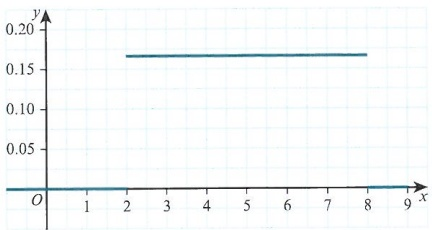

# Chi-squared tests

<!-- Cambridge International AS  A Level Further Mathematics Coursebook (Lee Mckelvey Martin Crozier) .pdf p232-260 -->

<!-- page 232 -->

# Chapter 10 Chi-squared tests

## In this chapter you will learn how to:

fit a theoretical distribution, as prescribed by a given hypothesis, to given data

use a  $ \chi^{2} $-test, with the appropriate number of degrees of freedom, to carry out the corresponding goodness of fit analysis

use a $\chi^{2}$-test, with the appropriate number of degrees of freedom, for independence in a contingency table.

<!-- page 233 -->

PREREQUISITE KNOWLEDGE

<table border=1 style='margin: auto; word-wrap: break-word;'><tr><td style='text-align: center; word-wrap: break-word;'>Where it comes from</td><td style='text-align: center; word-wrap: break-word;'>What you should be able to do</td><td style='text-align: center; word-wrap: break-word;'>Check your skills</td></tr><tr><td style='text-align: center; word-wrap: break-word;'>AS &amp; A Level MathematicsProbability &amp; Statistics 1,Chapters 6 &amp; 7AS &amp; A Level MathematicsProbability &amp; Statistics 2,Chapter 2</td><td style='text-align: center; word-wrap: break-word;'>Calculate probabilities from discrete random variables such as binomial, Poisson and geometric.</td><td style='text-align: center; word-wrap: break-word;'>1 Let  $ X \sim \text{Bin}(10, 0.2) $. Find  $ P(X \leq 3) $.2 Let  $ Y \sim \text{Po}(2.2) $. Find  $ P(Y &gt; 3) $.3 Let  $ G \sim \text{Geo}(0.3) $. Find  $ P(G \leq 4) $.</td></tr><tr><td style='text-align: center; word-wrap: break-word;'>AS &amp; A Level MathematicsProbability &amp; Statistics 2,Chapter 5</td><td style='text-align: center; word-wrap: break-word;'>Calculate probabilities from the normal distribution.</td><td style='text-align: center; word-wrap: break-word;'>4 Let  $ X \sim \text{N}(42, 6) $. Find  $ P(X \geq 40.2) $.</td></tr><tr><td style='text-align: center; word-wrap: break-word;'>Chapter 8</td><td style='text-align: center; word-wrap: break-word;'>Calculate probabilities from any continuous random variable.</td><td style='text-align: center; word-wrap: break-word;'>5 Let X represent a continuous random variable with a probability density function f given by:  $ f(x) = \begin{cases} \frac{3}{80}(x^2 + 3) &amp; -2 \leq x \leq 3 \\ 0 &amp; \text{otherwise} \end{cases} $ Find  $ P(-1 \leq X &lt; 2) $.</td></tr></table>

## Testing statistical models

In this chapter, we shall test whether the data provided fit a particular distribution. Sometimes the parameters will be given, but sometimes they will not.

We shall also test how closely categorical data are associated. For example, we could test if there is an association between hair colour and eye colour, or between colour blindness and gender.

These statistical tests are vital in social sciences: Psychology and Sociology, in particular. Most of the data collected in these subjects are categorical. This allows researchers to analyse any associations between these types of data.

### 10.1 Forming hypotheses

We shall test how well the observed data from an experiment fits the expected values from a distribution. For example, consider rolling a die. We may wish to test if the values on the die have an equal chance of being selected, that is the die is not biased. This means that we are looking to see if the data fit a discrete uniform distribution. A discrete uniform distribution occurs when each outcome is equally likely so it has the same probability.

To perform a hypothesis test, we need to define a null hypothesis as in Chapter 9.

For the die, we could set up these hypotheses:

 $ H_{0} $: There is no difference between the observed data and the expected values.

 $ H_{1} $: There is a difference between the observed data and the expected values.

<!-- page 234 -->

This is vague, but it shows the fundamental premise behind the test. We need to ensure that our hypotheses are related to the situation we are testing, as shown in Key point 10.1.

We could have written these hypotheses:

 $ H_{0} $: A discrete uniform distribution is a good-fit model.

 $ H_{1} $: A discrete uniform distribution is not a good-fit model.

It is very important that the hypotheses are well written and that our conclusions refer to the initial problem.

### KEY POINT 10.1

When defining your null and alternative hypotheses, make sure you refer to the distribution that you are using to model your observed data.

In your conclusion, make sure you address the initial problem. You will see this in the examples regarding rolling die.

Let us continue with the idea of rolling a die. In an experiment, we roll a die 180 times and collect the following data.

<table border=1 style='margin: auto; word-wrap: break-word;'><tr><td style='text-align: center; word-wrap: break-word;'>Number,  $ n $</td><td style='text-align: center; word-wrap: break-word;'>1</td><td style='text-align: center; word-wrap: break-word;'>2</td><td style='text-align: center; word-wrap: break-word;'>3</td><td style='text-align: center; word-wrap: break-word;'>4</td><td style='text-align: center; word-wrap: break-word;'>5</td><td style='text-align: center; word-wrap: break-word;'>6</td></tr><tr><td style='text-align: center; word-wrap: break-word;'>Observed frequency</td><td style='text-align: center; word-wrap: break-word;'>29</td><td style='text-align: center; word-wrap: break-word;'>31</td><td style='text-align: center; word-wrap: break-word;'>34</td><td style='text-align: center; word-wrap: break-word;'>39</td><td style='text-align: center; word-wrap: break-word;'>23</td><td style='text-align: center; word-wrap: break-word;'>24</td></tr></table>

We will use $N$ to denote $\sum O_{i}$, the sum of the observed frequencies.

To test whether the die is biased or not, we need to consider how well this data set fits a discrete uniform distribution.

The discrete uniform distribution will have the following probability distribution.

 $$ \mathrm{P}(X=x)=\begin{cases}\dfrac{1}{6}&x=1,2,3,4,5,6\\0&otherwise\end{cases} $$ 

The expected frequencies from this distribution (and, in fact, any discrete distribution we choose to use) can be calculated using the formula  $ N \times \mathrm{P}(X = x) $.

<table border=1 style='margin: auto; word-wrap: break-word;'><tr><td style='text-align: center; word-wrap: break-word;'>Number,  $ n $</td><td style='text-align: center; word-wrap: break-word;'>1</td><td style='text-align: center; word-wrap: break-word;'>2</td><td style='text-align: center; word-wrap: break-word;'>3</td><td style='text-align: center; word-wrap: break-word;'>4</td><td style='text-align: center; word-wrap: break-word;'>5</td><td style='text-align: center; word-wrap: break-word;'>6</td></tr><tr><td style='text-align: center; word-wrap: break-word;'>Expected frequency</td><td style='text-align: center; word-wrap: break-word;'>30</td><td style='text-align: center; word-wrap: break-word;'>30</td><td style='text-align: center; word-wrap: break-word;'>30</td><td style='text-align: center; word-wrap: break-word;'>30</td><td style='text-align: center; word-wrap: break-word;'>30</td><td style='text-align: center; word-wrap: break-word;'>30</td></tr></table>

The last cell is coloured red for a reason. Since we know the total is 180, and we know the sum of the other expected values is 150, the last value is predetermined. It is not calculated from the probability distribution. This seems trivial at the moment, but will become very important when calculating the test statistic and modelling its distribution.

The first five expected values (these can be any five) are free, independent variables. The final expected value is predetermined and is not independent of the others. It is calculated from the others rather than from the probability distribution.

This is called a constraint and reduces the free variables in the system by one. We call these degrees of freedom.

We will need to refine how we find degrees of freedom, but we can make use of the formula shown in Key point 10.2.

<!-- page 235 -->

### KEY POINT 10.2

For a goodness-of-fit test, the number of degrees of freedom,  $ \nu $ (the Greek letter  $ \nu $), in the system is found using:

 $ \nu $ = number of expected values - 1 - number of parameters estimated

In the case of rolling a die, we have six expected values. We subtract 1 because of the constraint on the system and we have no parameters to estimate. (This will be developed further through the following examples.)

Let's look back at our die:

<table border=1 style='margin: auto; word-wrap: break-word;'><tr><td style='text-align: center; word-wrap: break-word;'>Number, n</td><td style='text-align: center; word-wrap: break-word;'>1</td><td style='text-align: center; word-wrap: break-word;'>2</td><td style='text-align: center; word-wrap: break-word;'>3</td><td style='text-align: center; word-wrap: break-word;'>4</td><td style='text-align: center; word-wrap: break-word;'>5</td><td style='text-align: center; word-wrap: break-word;'>6</td></tr><tr><td style='text-align: center; word-wrap: break-word;'>Observed frequency</td><td style='text-align: center; word-wrap: break-word;'>29</td><td style='text-align: center; word-wrap: break-word;'>31</td><td style='text-align: center; word-wrap: break-word;'>34</td><td style='text-align: center; word-wrap: break-word;'>39</td><td style='text-align: center; word-wrap: break-word;'>23</td><td style='text-align: center; word-wrap: break-word;'>24</td></tr><tr><td style='text-align: center; word-wrap: break-word;'>Expected frequency</td><td style='text-align: center; word-wrap: break-word;'>30</td><td style='text-align: center; word-wrap: break-word;'>30</td><td style='text-align: center; word-wrap: break-word;'>30</td><td style='text-align: center; word-wrap: break-word;'>30</td><td style='text-align: center; word-wrap: break-word;'>30</td><td style='text-align: center; word-wrap: break-word;'>30</td></tr></table>

We need to calculate a test statistic to be able to carry out the test.

We want to calculate the difference relative to the expected value  $ (E_{i}) $ and the corresponding observed value  $ (O_{i}) $. We want this test statistic to be equal to 0 if the observed and expected frequencies are the same.

The construction is very similar to finding the sample variance.

We first calculate  $ \frac{(O_{i}-E_{i})^{2}}{E_{i}} $ for each pair of values and then we add these up:

 $$ X^{2}=\sum\left(\frac{(O_{i}-E_{i})^{2}}{E_{i}}\right) $$ 

This is the test statistic that we will use.

Which distribution can we use to model the test statistic? If we meet the following necessary conditions then  $ X^2 \sim \chi^2(\nu) $, where  $ \nu $ is the number of degrees of freedom required:

each  $ O_{i} $ represents a frequency

all  $ E_{i} $ are greater than five

the classes all form a sample space; that is, each observation taken fits uniquely into a single category.

This is shown in Key point 10.3. Note that  $ \chi^{2} $ is a chi-squared (from the Greek letter chi; pronounced ‘kye-squared’) statistic.

### KEY POINT 10.3

Given the condition that all  $ E_i \geq 5 $, then  $ \sum\left(\frac{(O_i - E_i)^2}{E_i}\right) \sim \chi^2(\nu) $ is a good approximation.

## DID YOU KNOW?

The  $ \chi^{2}(\nu) $ distribution is the sum of  $ \nu $ independent values from squared standardised normal distributions:

 $$ \chi^{2}(\nu)=\sum_{1}^{\nu}Z_{i}^{2},where Z_{i}\sim N(0,1^{2}) $$ 

In the case of the die discussed previously, we have five independent variables (the final $E$ was a constraint on the system), and so we can model the $X^2$ statistic, the sum of the squared normal distributions, as $Z_1^2 + Z_2^2 + Z_3^2 + Z_4^2 + Z_5^2 = \chi^2(5)$.

<!-- page 236 -->

The condition that $E_{i} \geq 5$ is linked to the similar condition that the frequency of the bars of a histogram must also be greater than five. It is useful to research this yourself. It has something to do with the effect of outlying data on the test statistic. As the sample size grows, this condition can be relaxed as the approximations to the squared normal distributions improve. However, in this course we must use the condition that each $E_{i} \geq 5$.

### WORKED EXAMPLE 10.1

Let us return to the experiment with the die.

An experiment is carried out to test whether a die is biased or not. A die is rolled 180 times and the following observations are tabulated.

<table border=1 style='margin: auto; word-wrap: break-word;'><tr><td style='text-align: center; word-wrap: break-word;'>Number,  $ n $</td><td style='text-align: center; word-wrap: break-word;'>1</td><td style='text-align: center; word-wrap: break-word;'>2</td><td style='text-align: center; word-wrap: break-word;'>3</td><td style='text-align: center; word-wrap: break-word;'>4</td><td style='text-align: center; word-wrap: break-word;'>5</td><td style='text-align: center; word-wrap: break-word;'>6</td></tr><tr><td style='text-align: center; word-wrap: break-word;'>Observed frequency</td><td style='text-align: center; word-wrap: break-word;'>29</td><td style='text-align: center; word-wrap: break-word;'>31</td><td style='text-align: center; word-wrap: break-word;'>34</td><td style='text-align: center; word-wrap: break-word;'>39</td><td style='text-align: center; word-wrap: break-word;'>23</td><td style='text-align: center; word-wrap: break-word;'>24</td></tr></table>

Test, at the 5% significance level, whether the die is biased.

## Answer

If the die is biased, then we cannot fit the data to a discrete uniform distribution. If the die is unbiased, then a discrete uniform distribution would be a good fit.

H₀: A discrete uniform distribution is a good fit.

H₁: A discrete uniform distribution is not a good fit.

The assumed probability distribution is:

 $$ \mathrm{P}(X=x)=\begin{cases}\dfrac{1}{6}&x=1,2,3,4,5,6\\ 0&otherwise\end{cases} $$ 

Expected frequencies are calculated using  $ N \times P(X = x) $.

So we can calculate the expected frequencies and, hence, the value of each  $ \frac{(O_{i}-E_{i})^{2}}{E_{i}} $.

<table border=1 style='margin: auto; word-wrap: break-word;'><tr><td style='text-align: center; word-wrap: break-word;'>Number</td><td style='text-align: center; word-wrap: break-word;'>Observed</td><td style='text-align: center; word-wrap: break-word;'>Expected</td><td style='text-align: center; word-wrap: break-word;'>$ \frac{(O_{i}-E_{i})^{2}}{E_{i}} $</td></tr><tr><td style='text-align: center; word-wrap: break-word;'>1</td><td style='text-align: center; word-wrap: break-word;'>29</td><td style='text-align: center; word-wrap: break-word;'>30</td><td style='text-align: center; word-wrap: break-word;'>0.0333</td></tr><tr><td style='text-align: center; word-wrap: break-word;'>2</td><td style='text-align: center; word-wrap: break-word;'>31</td><td style='text-align: center; word-wrap: break-word;'>30</td><td style='text-align: center; word-wrap: break-word;'>0.0333</td></tr><tr><td style='text-align: center; word-wrap: break-word;'>3</td><td style='text-align: center; word-wrap: break-word;'>34</td><td style='text-align: center; word-wrap: break-word;'>30</td><td style='text-align: center; word-wrap: break-word;'>0.5333</td></tr><tr><td style='text-align: center; word-wrap: break-word;'>4</td><td style='text-align: center; word-wrap: break-word;'>39</td><td style='text-align: center; word-wrap: break-word;'>30</td><td style='text-align: center; word-wrap: break-word;'>2.7</td></tr><tr><td style='text-align: center; word-wrap: break-word;'>5</td><td style='text-align: center; word-wrap: break-word;'>23</td><td style='text-align: center; word-wrap: break-word;'>30</td><td style='text-align: center; word-wrap: break-word;'>1.6333</td></tr><tr><td style='text-align: center; word-wrap: break-word;'>6</td><td style='text-align: center; word-wrap: break-word;'>24</td><td style='text-align: center; word-wrap: break-word;'>30</td><td style='text-align: center; word-wrap: break-word;'>1.2</td></tr></table>

 $$ \chi^{2}=\sum\left(\frac{(O_{i}-E_{i})^{2}}{E_{i}}\right)=6.1333 $$ 

 $$ \begin{array}{l}\nu=6-1-0\\ \nu=5\end{array} $$ 

Calculate the degrees of freedom. Since we have not estimated any parameters, we have five degrees of freedom.

<!-- page 237 -->

The critical value will be:

Find the critical value from the $\chi^{2}$-distribution table.

<table border=1 style='margin: auto; word-wrap: break-word;'><tr><td style='text-align: center; word-wrap: break-word;'>p</td><td style='text-align: center; word-wrap: break-word;'>0.95</td></tr><tr><td style='text-align: center; word-wrap: break-word;'>$ \nu=1 $</td><td style='text-align: center; word-wrap: break-word;'>3.841</td></tr><tr><td style='text-align: center; word-wrap: break-word;'>2</td><td style='text-align: center; word-wrap: break-word;'>5.991</td></tr><tr><td style='text-align: center; word-wrap: break-word;'>3</td><td style='text-align: center; word-wrap: break-word;'>7.815</td></tr><tr><td style='text-align: center; word-wrap: break-word;'>4</td><td style='text-align: center; word-wrap: break-word;'>9.488</td></tr><tr><td style='text-align: center; word-wrap: break-word;'>5</td><td style='text-align: center; word-wrap: break-word;'>11.07</td></tr><tr><td style='text-align: center; word-wrap: break-word;'>6</td><td style='text-align: center; word-wrap: break-word;'>12.59</td></tr></table>

Even though the hypothesis is two-tailed, we consider only the upper tail for goodness of fit since we are measuring how much the test statistic exceeds a specific value.

 $$ \chi_{5}^{2}(0.95)=11.07 $$ 

Since 6.1333 < 11.07, there is insufficient evidence to reject  $ H_0 $.

Always refer to  $ H_0 $.

There is insufficient evidence to state that a discrete uniform distribution is not a good fit.

Refer back to the question when writing the conclusion.

There is insufficient evidence to suggest that the die is biased.

## TIP

There is another way of calculating this test statistic.

 $$ \sum\left(\frac{(O_{i}-E_{i})^{2}}{E_{i}}\right) $$ 

 $$ =\sum\left(\frac{O_{i}^{2}-2O_{i}E_{i}+E_{i}^{2}}{E_{i}}\right) $$ 

Multiply out.

$$=\sum\left(\frac{O_{i}^{2}}{E_{i}}\right)-2\Sigma(O_{i})+\Sigma(E_{i})\quad\text{Simplify.}$$

 $$ =\sum\left(\frac{O_{i}^{2}}{E_{i}}\right)-2N+N $$ 

Now we have established that  $ \Sigma O_{i}=N $.

 $$ \chi^{2}=\sum\left(\frac{O_{i}^{2}}{E_{i}}\right)-N $$ 

 $$ \Sigma E_{i}=N. $$ 

This is a convenient form to use, but some information that may be useful for further analysis may be lost. We will mention this when we consider contingency tables in Section 10.4.

## EXERCISE 10A

1 Find the values of:

a

 $$ \chi_{8}^{2}(0.9) $$ 

 $$ \chi_{11}^{2}(0.95) $$ 

 $$ \chi_{4}^{2}(0.99) $$ 

d  $ \chi_{21}^{2}(0.995) $

2 For the following distributions and sample sizes, write the table of expected values.

a

 $$ \mathrm{P}(X=x)=\begin{cases}\dfrac{x^{2}}{30}&x=1,2,3,4\\ 0&otherwise\end{cases} $$ 

 $$ n=150 $$

<!-- page 238 -->

b Data values $a,b,c,d$ are in the ratio 4:4:2:2; $n=240$

c  $ \mathrm{P}(X=x)=\left\{\begin{array}{ll}\frac{1}{7}&x=2,3,4,5,6,7,8\\ 0&\text{otherwise}\end{array}\right. $

n=280

3 For the following sets of observed (O) and expected (E) data, calculate the value of  $ \chi^{2} $, the test statistic.

<table border=1 style='margin: auto; word-wrap: break-word;'><tr><td style='text-align: center; word-wrap: break-word;'>O</td><td style='text-align: center; word-wrap: break-word;'>32</td><td style='text-align: center; word-wrap: break-word;'>59</td><td style='text-align: center; word-wrap: break-word;'>12</td><td style='text-align: center; word-wrap: break-word;'>14</td><td style='text-align: center; word-wrap: break-word;'>41</td><td style='text-align: center; word-wrap: break-word;'>32</td></tr><tr><td style='text-align: center; word-wrap: break-word;'>E</td><td style='text-align: center; word-wrap: break-word;'>40</td><td style='text-align: center; word-wrap: break-word;'>50</td><td style='text-align: center; word-wrap: break-word;'>20</td><td style='text-align: center; word-wrap: break-word;'>15</td><td style='text-align: center; word-wrap: break-word;'>40</td><td style='text-align: center; word-wrap: break-word;'>25</td></tr></table>

<table border=1 style='margin: auto; word-wrap: break-word;'><tr><td style='text-align: center; word-wrap: break-word;'>O</td><td style='text-align: center; word-wrap: break-word;'>8</td><td style='text-align: center; word-wrap: break-word;'>23</td><td style='text-align: center; word-wrap: break-word;'>39</td><td style='text-align: center; word-wrap: break-word;'>42</td><td style='text-align: center; word-wrap: break-word;'>42</td><td style='text-align: center; word-wrap: break-word;'>41</td><td style='text-align: center; word-wrap: break-word;'>36</td><td style='text-align: center; word-wrap: break-word;'>22</td><td style='text-align: center; word-wrap: break-word;'>11</td></tr><tr><td style='text-align: center; word-wrap: break-word;'>E</td><td style='text-align: center; word-wrap: break-word;'>11</td><td style='text-align: center; word-wrap: break-word;'>24</td><td style='text-align: center; word-wrap: break-word;'>35</td><td style='text-align: center; word-wrap: break-word;'>40</td><td style='text-align: center; word-wrap: break-word;'>45</td><td style='text-align: center; word-wrap: break-word;'>40</td><td style='text-align: center; word-wrap: break-word;'>35</td><td style='text-align: center; word-wrap: break-word;'>24</td><td style='text-align: center; word-wrap: break-word;'>11</td></tr></table>

<table border=1 style='margin: auto; word-wrap: break-word;'><tr><td style='text-align: center; word-wrap: break-word;'>$ O $</td><td style='text-align: center; word-wrap: break-word;'>35</td><td style='text-align: center; word-wrap: break-word;'>61</td><td style='text-align: center; word-wrap: break-word;'>70</td><td style='text-align: center; word-wrap: break-word;'>55</td><td style='text-align: center; word-wrap: break-word;'>39</td></tr><tr><td style='text-align: center; word-wrap: break-word;'>$ E $</td><td style='text-align: center; word-wrap: break-word;'>30</td><td style='text-align: center; word-wrap: break-word;'>60</td><td style='text-align: center; word-wrap: break-word;'>90</td><td style='text-align: center; word-wrap: break-word;'>50</td><td style='text-align: center; word-wrap: break-word;'>30</td></tr></table>

4 The following dataset shows values for what is thought to have come from the probability distribution.

 $$ \mathrm{P}(X=x)=\begin{cases}\dfrac{5-x}{10}&x=1,2,3,4\\ 0&otherwise\end{cases} $$ 

<table border=1 style='margin: auto; word-wrap: break-word;'><tr><td style='text-align: center; word-wrap: break-word;'>n</td><td style='text-align: center; word-wrap: break-word;'>1</td><td style='text-align: center; word-wrap: break-word;'>2</td><td style='text-align: center; word-wrap: break-word;'>3</td><td style='text-align: center; word-wrap: break-word;'>4</td></tr><tr><td style='text-align: center; word-wrap: break-word;'>Observed frequency</td><td style='text-align: center; word-wrap: break-word;'>35</td><td style='text-align: center; word-wrap: break-word;'>29</td><td style='text-align: center; word-wrap: break-word;'>12</td><td style='text-align: center; word-wrap: break-word;'>4</td></tr></table>

A test at the 5% significance level will be carried out.

a Find the expected values.

b State the hypotheses.

c Find the value of the test statistic.

d State the degrees of freedom.

e Write down the critical value.

f Conclude the hypothesis test.

5 The population of a country is known to have blood groups O, A, B and AB in the ratio 5:3:2:1. 220 people are randomly selected from the population of a neighbouring country. Their blood group is assessed and the results tabulated.

<table border=1 style='margin: auto; word-wrap: break-word;'><tr><td style='text-align: center; word-wrap: break-word;'>Blood type</td><td style='text-align: center; word-wrap: break-word;'>O</td><td style='text-align: center; word-wrap: break-word;'>A</td><td style='text-align: center; word-wrap: break-word;'>B</td><td style='text-align: center; word-wrap: break-word;'>AB</td></tr><tr><td style='text-align: center; word-wrap: break-word;'>Frequency</td><td style='text-align: center; word-wrap: break-word;'>87</td><td style='text-align: center; word-wrap: break-word;'>73</td><td style='text-align: center; word-wrap: break-word;'>49</td><td style='text-align: center; word-wrap: break-word;'>11</td></tr></table>

Test at the 5% significance level whether or not the neighbouring country's population has the same proportions of blood groups.

M 6 A company is preparing invoices to send to their customers. Before they are sent, they are checked and the daily number of mistakes found over a two-week period are recorded.

<table border=1 style='margin: auto; word-wrap: break-word;'><tr><td rowspan="2"></td><td colspan="5">Week 1</td><td colspan="5">Week 2</td></tr><tr><td style='text-align: center; word-wrap: break-word;'>M</td><td style='text-align: center; word-wrap: break-word;'>Tu</td><td style='text-align: center; word-wrap: break-word;'>W</td><td style='text-align: center; word-wrap: break-word;'>Th</td><td style='text-align: center; word-wrap: break-word;'>F</td><td style='text-align: center; word-wrap: break-word;'>M</td><td style='text-align: center; word-wrap: break-word;'>Tu</td><td style='text-align: center; word-wrap: break-word;'>W</td><td style='text-align: center; word-wrap: break-word;'>Th</td><td style='text-align: center; word-wrap: break-word;'>F</td></tr><tr><td style='text-align: center; word-wrap: break-word;'>Errors</td><td style='text-align: center; word-wrap: break-word;'>29</td><td style='text-align: center; word-wrap: break-word;'>17</td><td style='text-align: center; word-wrap: break-word;'>13</td><td style='text-align: center; word-wrap: break-word;'>15</td><td style='text-align: center; word-wrap: break-word;'>22</td><td style='text-align: center; word-wrap: break-word;'>26</td><td style='text-align: center; word-wrap: break-word;'>16</td><td style='text-align: center; word-wrap: break-word;'>25</td><td style='text-align: center; word-wrap: break-word;'>18</td><td style='text-align: center; word-wrap: break-word;'>19</td></tr></table>

Test, at the 5% level of significance, whether a uniform distribution is a good-fit model.

<!-- page 239 -->

### 10.2 Goodness of fit for discrete distributions

## Testing a binomial distribution as a model

We can now apply these general principles to known parametric distributions. With the binomial distribution, we may be asked to see whether the dataset fits a binomial distribution with a given probability of success (p), or we may be asked whether it fits a binomial distribution without the parameter stated. In this case, we would need to estimate the parameter. This will affect the degrees of freedom, as stated in the formula:

 $ \nu = \text{number of expected values} - 1 - \text{number of estimated parameters} $

The parameter is $p$. This can be estimated by knowing that $E(X) = np$. So the estimate of $p$ is:

 $ \hat{p} = \frac{\overline{x}}{n} $, where  $ \overline{x} = \frac{\sum r_i \times O_i}{N} $, where  $ r_i = 0, 1, 2 \ldots, n $, the mean from the observed dataset.

## TIP

Be careful not to confuse $n$ (the number of trials in the binomial distribution) with $N$ (the number of times the experiment is repeated).

### WORKED EXAMPLE 10.2

The data in the table are thought to be binomially distributed.

<table border=1 style='margin: auto; word-wrap: break-word;'><tr><td style='text-align: center; word-wrap: break-word;'>x</td><td style='text-align: center; word-wrap: break-word;'>0</td><td style='text-align: center; word-wrap: break-word;'>1</td><td style='text-align: center; word-wrap: break-word;'>2</td><td style='text-align: center; word-wrap: break-word;'>3</td><td style='text-align: center; word-wrap: break-word;'>4</td><td style='text-align: center; word-wrap: break-word;'>5</td><td style='text-align: center; word-wrap: break-word;'>6</td><td style='text-align: center; word-wrap: break-word;'>7</td></tr><tr><td style='text-align: center; word-wrap: break-word;'>Frequency</td><td style='text-align: center; word-wrap: break-word;'>10</td><td style='text-align: center; word-wrap: break-word;'>34</td><td style='text-align: center; word-wrap: break-word;'>63</td><td style='text-align: center; word-wrap: break-word;'>48</td><td style='text-align: center; word-wrap: break-word;'>29</td><td style='text-align: center; word-wrap: break-word;'>10</td><td style='text-align: center; word-wrap: break-word;'>4</td><td style='text-align: center; word-wrap: break-word;'>2</td></tr></table>

Test, at the 5% significance level, the claim that the data are binomially distributed.

## Answer

<table border=1 style='margin: auto; word-wrap: break-word;'><tr><td style='text-align: center; word-wrap: break-word;'>x</td><td style='text-align: center; word-wrap: break-word;'>Observed</td><td style='text-align: center; word-wrap: break-word;'>Expected</td></tr><tr><td style='text-align: center; word-wrap: break-word;'>0</td><td style='text-align: center; word-wrap: break-word;'>10</td><td style='text-align: center; word-wrap: break-word;'>8.525</td></tr><tr><td style='text-align: center; word-wrap: break-word;'>1</td><td style='text-align: center; word-wrap: break-word;'>34</td><td style='text-align: center; word-wrap: break-word;'>33.985</td></tr><tr><td style='text-align: center; word-wrap: break-word;'>2</td><td style='text-align: center; word-wrap: break-word;'>63</td><td style='text-align: center; word-wrap: break-word;'>58.064</td></tr><tr><td style='text-align: center; word-wrap: break-word;'>3</td><td style='text-align: center; word-wrap: break-word;'>48</td><td style='text-align: center; word-wrap: break-word;'>55.113</td></tr><tr><td style='text-align: center; word-wrap: break-word;'>4</td><td style='text-align: center; word-wrap: break-word;'>29</td><td style='text-align: center; word-wrap: break-word;'>31.387</td></tr><tr><td style='text-align: center; word-wrap: break-word;'>5</td><td style='text-align: center; word-wrap: break-word;'>10</td><td style='text-align: center; word-wrap: break-word;'>10.725</td></tr><tr><td style='text-align: center; word-wrap: break-word;'>6</td><td style='text-align: center; word-wrap: break-word;'>4</td><td style='text-align: center; word-wrap: break-word;'>2.036</td></tr><tr><td style='text-align: center; word-wrap: break-word;'>7</td><td style='text-align: center; word-wrap: break-word;'>2</td><td style='text-align: center; word-wrap: break-word;'>0.166</td></tr></table>

## TIP

All values should be written to 3 decimal places. However, more accurate values should be used in calculations.

<!-- page 240 -->

<table border=1 style='margin: auto; word-wrap: break-word;'><tr><td style='text-align: center; word-wrap: break-word;'>$ x $</td><td style='text-align: center; word-wrap: break-word;'>Observed</td><td style='text-align: center; word-wrap: break-word;'>Expected</td><td style='text-align: center; word-wrap: break-word;'>$ \frac{(O_{{i}}-E_{{i}})^{2}}{E_{{i}}} $</td><td style='text-align: center; word-wrap: break-word;'>As some  $ E_{{i}} &lt; 5 $ we need to combine the cells for when  $ x = 5, 6 $ and 7.</td></tr><tr><td style='text-align: center; word-wrap: break-word;'>0</td><td style='text-align: center; word-wrap: break-word;'>10</td><td style='text-align: center; word-wrap: break-word;'>8.525</td><td style='text-align: center; word-wrap: break-word;'>0.255</td><td rowspan="6">After combining we have six expected values.</td></tr><tr><td style='text-align: center; word-wrap: break-word;'>1</td><td style='text-align: center; word-wrap: break-word;'>34</td><td style='text-align: center; word-wrap: break-word;'>33.985</td><td style='text-align: center; word-wrap: break-word;'>0.000</td></tr><tr><td style='text-align: center; word-wrap: break-word;'>2</td><td style='text-align: center; word-wrap: break-word;'>63</td><td style='text-align: center; word-wrap: break-word;'>58.064</td><td style='text-align: center; word-wrap: break-word;'>0.420</td></tr><tr><td style='text-align: center; word-wrap: break-word;'>3</td><td style='text-align: center; word-wrap: break-word;'>48</td><td style='text-align: center; word-wrap: break-word;'>55.113</td><td style='text-align: center; word-wrap: break-word;'>0.918</td></tr><tr><td style='text-align: center; word-wrap: break-word;'>4</td><td style='text-align: center; word-wrap: break-word;'>29</td><td style='text-align: center; word-wrap: break-word;'>31.387</td><td style='text-align: center; word-wrap: break-word;'>0.182</td></tr><tr><td style='text-align: center; word-wrap: break-word;'>5-7</td><td style='text-align: center; word-wrap: break-word;'>16</td><td style='text-align: center; word-wrap: break-word;'>12.927</td><td style='text-align: center; word-wrap: break-word;'>0.731</td></tr><tr><td colspan="4">$ \chi^{{2}} = \sum \left( \frac{(O_{{i}}-E_{{i}})^{2}}{E_{{i}}} \right) = 2.506 $</td><td rowspan="2">Consider the number of degrees of freedom: we need the extra -1 because we are now required to estimate a parameter.</td></tr><tr><td colspan="4">$ \nu = 6-1-1=4 $</td></tr><tr><td colspan="4">The critical value is  $ \chi_{{4}}^{{2}}(0.95) = 9.488 $.</td><td rowspan="2">Note, throughout the question, no reference has been made to the population proportion. This is because it is unknown.</td></tr><tr><td colspan="4">Since 2.506 &lt; 9.488, there is insufficient evidence to reject  $ H_{{0}} $. There is insufficient evidence to state that a binomial distribution is not a good fit.</td></tr></table>

## Testing a Poisson distribution as a model

With the Poisson distribution, we need to see whether the dataset fits a Poisson distribution with a given rate (the parameter here is $\lambda$). Alternatively, we may need to estimate the parameter.

The parameter is  $ \lambda $. This can be estimated using:

 $$ \hat{\lambda}=\frac{\sum r_{i}\times O_{i}}{N} $$ 

### WORKED EXAMPLE 10.3

The data in the table are thought to be modelled as a Poisson distribution with a mean of 2.5.

<table border=1 style='margin: auto; word-wrap: break-word;'><tr><td style='text-align: center; word-wrap: break-word;'>Number, n</td><td style='text-align: center; word-wrap: break-word;'>0</td><td style='text-align: center; word-wrap: break-word;'>1</td><td style='text-align: center; word-wrap: break-word;'>2</td><td style='text-align: center; word-wrap: break-word;'>3</td><td style='text-align: center; word-wrap: break-word;'>4</td><td style='text-align: center; word-wrap: break-word;'>5</td><td style='text-align: center; word-wrap: break-word;'>6</td><td style='text-align: center; word-wrap: break-word;'>7-</td></tr><tr><td style='text-align: center; word-wrap: break-word;'>Frequency</td><td style='text-align: center; word-wrap: break-word;'>8</td><td style='text-align: center; word-wrap: break-word;'>34</td><td style='text-align: center; word-wrap: break-word;'>42</td><td style='text-align: center; word-wrap: break-word;'>28</td><td style='text-align: center; word-wrap: break-word;'>26</td><td style='text-align: center; word-wrap: break-word;'>5</td><td style='text-align: center; word-wrap: break-word;'>5</td><td style='text-align: center; word-wrap: break-word;'>2</td></tr></table>

Test the claim, at the 5% level of significance, that the data can be modelled as a Poisson distribution with mean 2.5.

## Answer

In this case, the parameter is given and so it does not need to be estimated.

H $ _{0} $: The Poisson (2.5) model is a good fit.

H $ _{1} $: The Poisson (2.5) model is not a good fit.

Define the hypotheses.

Here we can refer to the population parameter in the hypotheses, as it is a known value.

<!-- page 241 -->

We calculate the expected values here by:

 $$ 150\times e^{-2.5}\times\frac{2.5^{r}}{r!} $$ 

<table border=1 style='margin: auto; word-wrap: break-word;'><tr><td style='text-align: center; word-wrap: break-word;'>x</td><td style='text-align: center; word-wrap: break-word;'>Observed</td><td style='text-align: center; word-wrap: break-word;'>Expected</td></tr><tr><td style='text-align: center; word-wrap: break-word;'>0</td><td style='text-align: center; word-wrap: break-word;'>8</td><td style='text-align: center; word-wrap: break-word;'>12.313</td></tr><tr><td style='text-align: center; word-wrap: break-word;'>1</td><td style='text-align: center; word-wrap: break-word;'>34</td><td style='text-align: center; word-wrap: break-word;'>30.782</td></tr><tr><td style='text-align: center; word-wrap: break-word;'>2</td><td style='text-align: center; word-wrap: break-word;'>42</td><td style='text-align: center; word-wrap: break-word;'>38.477</td></tr><tr><td style='text-align: center; word-wrap: break-word;'>3</td><td style='text-align: center; word-wrap: break-word;'>28</td><td style='text-align: center; word-wrap: break-word;'>32.064</td></tr><tr><td style='text-align: center; word-wrap: break-word;'>4</td><td style='text-align: center; word-wrap: break-word;'>26</td><td style='text-align: center; word-wrap: break-word;'>20.040</td></tr><tr><td style='text-align: center; word-wrap: break-word;'>5</td><td style='text-align: center; word-wrap: break-word;'>5</td><td style='text-align: center; word-wrap: break-word;'>10.020</td></tr><tr><td style='text-align: center; word-wrap: break-word;'>6</td><td style='text-align: center; word-wrap: break-word;'>5</td><td style='text-align: center; word-wrap: break-word;'>4.175</td></tr><tr><td style='text-align: center; word-wrap: break-word;'>7-</td><td style='text-align: center; word-wrap: break-word;'>2</td><td style='text-align: center; word-wrap: break-word;'>2.129</td></tr></table>

 $$ \mathrm{P}(X=r)=\frac{e^{-\lambda}\lambda^{r}}{r!}. $$ 

The final $E$ value is calculated as $150 - (\\sum of the others).

<table border=1 style='margin: auto; word-wrap: break-word;'><tr><td style='text-align: center; word-wrap: break-word;'>x</td><td style='text-align: center; word-wrap: break-word;'>Observed</td><td style='text-align: center; word-wrap: break-word;'>Expected</td><td style='text-align: center; word-wrap: break-word;'>$ \frac{(O_{i}-E_{i})^{2}}{E_{i}} $</td></tr><tr><td style='text-align: center; word-wrap: break-word;'>0</td><td style='text-align: center; word-wrap: break-word;'>8</td><td style='text-align: center; word-wrap: break-word;'>12.313</td><td style='text-align: center; word-wrap: break-word;'>1.511</td></tr><tr><td style='text-align: center; word-wrap: break-word;'>1</td><td style='text-align: center; word-wrap: break-word;'>34</td><td style='text-align: center; word-wrap: break-word;'>30.782</td><td style='text-align: center; word-wrap: break-word;'>0.336</td></tr><tr><td style='text-align: center; word-wrap: break-word;'>2</td><td style='text-align: center; word-wrap: break-word;'>42</td><td style='text-align: center; word-wrap: break-word;'>38.477</td><td style='text-align: center; word-wrap: break-word;'>0.323</td></tr><tr><td style='text-align: center; word-wrap: break-word;'>3</td><td style='text-align: center; word-wrap: break-word;'>28</td><td style='text-align: center; word-wrap: break-word;'>32.064</td><td style='text-align: center; word-wrap: break-word;'>0.515</td></tr><tr><td style='text-align: center; word-wrap: break-word;'>4</td><td style='text-align: center; word-wrap: break-word;'>26</td><td style='text-align: center; word-wrap: break-word;'>20.040</td><td style='text-align: center; word-wrap: break-word;'>1.772</td></tr><tr><td style='text-align: center; word-wrap: break-word;'>5</td><td style='text-align: center; word-wrap: break-word;'>5</td><td style='text-align: center; word-wrap: break-word;'>10.020</td><td style='text-align: center; word-wrap: break-word;'>2.515</td></tr><tr><td style='text-align: center; word-wrap: break-word;'>6-</td><td style='text-align: center; word-wrap: break-word;'>7</td><td style='text-align: center; word-wrap: break-word;'>6.304</td><td style='text-align: center; word-wrap: break-word;'>0.077</td></tr></table>

For the Poisson distribution.

Since $E < 5$ for some values, we need to combine the final two categories.

 $$ \chi^{2}=\sum\left(\frac{(O_{i}-E_{i})^{2}}{E_{i}}\right)=7.049 $$ 

 $$ \nu=7-1=6 $$ 

Calculate the test statistic.

We now consider the degrees of freedom.

No parameters were estimated.

The critical value is  $ \chi_{6}^{2}(0.95) = 12.59 $.

Since 7.049 < 12.59, there is insufficient evidence to reject  $ H_{0} $.

There is insufficient evidence to state that a Poisson (2.5) model is not a good fit.

## EXERCISE 10B

1 It is believed that some data, $N=80$, can be modelled by $X\sim\mathrm{Bin}(6,0.3)$. The table of expected values is:

<table border=1 style='margin: auto; word-wrap: break-word;'><tr><td style='text-align: center; word-wrap: break-word;'>$ x_{i} $</td><td style='text-align: center; word-wrap: break-word;'>0</td><td style='text-align: center; word-wrap: break-word;'>1</td><td style='text-align: center; word-wrap: break-word;'>2</td><td style='text-align: center; word-wrap: break-word;'>3</td><td style='text-align: center; word-wrap: break-word;'>46</td></tr><tr><td style='text-align: center; word-wrap: break-word;'>$ E_{i} $</td><td style='text-align: center; word-wrap: break-word;'>9.412</td><td style='text-align: center; word-wrap: break-word;'>24.202</td><td style='text-align: center; word-wrap: break-word;'>r</td><td style='text-align: center; word-wrap: break-word;'>s</td><td style='text-align: center; word-wrap: break-word;'>5.638</td></tr></table>

a Find r.

b Find s.

Write your answers to 3 decimal places.

<!-- page 242 -->

2 It is believed that some data, $N=100$, can be modelled by $X\sim\mathrm{Po}(2.9)$. The table of expected values is:

<table border=1 style='margin: auto; word-wrap: break-word;'><tr><td style='text-align: center; word-wrap: break-word;'>$ x_{i} $</td><td style='text-align: center; word-wrap: break-word;'>0</td><td style='text-align: center; word-wrap: break-word;'>1</td><td style='text-align: center; word-wrap: break-word;'>2</td><td style='text-align: center; word-wrap: break-word;'>3</td><td style='text-align: center; word-wrap: break-word;'>4</td><td style='text-align: center; word-wrap: break-word;'>5</td><td style='text-align: center; word-wrap: break-word;'>6-</td></tr><tr><td style='text-align: center; word-wrap: break-word;'>$ E_{i} $</td><td style='text-align: center; word-wrap: break-word;'>5.502</td><td style='text-align: center; word-wrap: break-word;'>15.957</td><td style='text-align: center; word-wrap: break-word;'>r</td><td style='text-align: center; word-wrap: break-word;'>22.367</td><td style='text-align: center; word-wrap: break-word;'>s</td><td style='text-align: center; word-wrap: break-word;'>9.405</td><td style='text-align: center; word-wrap: break-word;'>7.417</td></tr></table>

a Find r.

b Find s.

Write your answers to 3 decimal places.

3 It is believed that the following observed data follow a binomial distribution.

<table border=1 style='margin: auto; word-wrap: break-word;'><tr><td style='text-align: center; word-wrap: break-word;'>$ x_{i} $</td><td style='text-align: center; word-wrap: break-word;'>0</td><td style='text-align: center; word-wrap: break-word;'>1</td><td style='text-align: center; word-wrap: break-word;'>2</td><td style='text-align: center; word-wrap: break-word;'>3</td><td style='text-align: center; word-wrap: break-word;'>4</td><td style='text-align: center; word-wrap: break-word;'>5</td><td style='text-align: center; word-wrap: break-word;'>6</td><td style='text-align: center; word-wrap: break-word;'>7</td></tr><tr><td style='text-align: center; word-wrap: break-word;'>$ O_{i} $</td><td style='text-align: center; word-wrap: break-word;'>3</td><td style='text-align: center; word-wrap: break-word;'>10</td><td style='text-align: center; word-wrap: break-word;'>15</td><td style='text-align: center; word-wrap: break-word;'>16</td><td style='text-align: center; word-wrap: break-word;'>9</td><td style='text-align: center; word-wrap: break-word;'>3</td><td style='text-align: center; word-wrap: break-word;'>2</td><td style='text-align: center; word-wrap: break-word;'>2</td></tr></table>

Let  $ \hat{p} $ be the unbiased estimator for the proportion, p.

a Show that  $ \hat{p}=0.393 $ to 3 significant figures.

b Using the value found in a, find the values of r and s in the following table of expected data.

<table border=1 style='margin: auto; word-wrap: break-word;'><tr><td style='text-align: center; word-wrap: break-word;'>$ x_{i} $</td><td style='text-align: center; word-wrap: break-word;'>0-1</td><td style='text-align: center; word-wrap: break-word;'>2</td><td style='text-align: center; word-wrap: break-word;'>3</td><td style='text-align: center; word-wrap: break-word;'>4</td><td style='text-align: center; word-wrap: break-word;'>5-7</td></tr><tr><td style='text-align: center; word-wrap: break-word;'>$ E_{i} $</td><td style='text-align: center; word-wrap: break-word;'>10.078</td><td style='text-align: center; word-wrap: break-word;'>r</td><td style='text-align: center; word-wrap: break-word;'>17.304</td><td style='text-align: center; word-wrap: break-word;'>s</td><td style='text-align: center; word-wrap: break-word;'>5.378</td></tr></table>

c Explain why it was necessary to combine some of the columns together.

4 For the data below, calculate the test statistic and state how many degrees of freedom are required, assuming no parameters need to be estimated.

<table border=1 style='margin: auto; word-wrap: break-word;'><tr><td style='text-align: center; word-wrap: break-word;'>$ O $</td><td style='text-align: center; word-wrap: break-word;'>20</td><td style='text-align: center; word-wrap: break-word;'>31</td><td style='text-align: center; word-wrap: break-word;'>15</td><td style='text-align: center; word-wrap: break-word;'>12</td><td style='text-align: center; word-wrap: break-word;'>10</td><td style='text-align: center; word-wrap: break-word;'>2</td></tr><tr><td style='text-align: center; word-wrap: break-word;'>$ E $</td><td style='text-align: center; word-wrap: break-word;'>24</td><td style='text-align: center; word-wrap: break-word;'>35</td><td style='text-align: center; word-wrap: break-word;'>14</td><td style='text-align: center; word-wrap: break-word;'>7</td><td style='text-align: center; word-wrap: break-word;'>6</td><td style='text-align: center; word-wrap: break-word;'>4</td></tr></table>

For each following question, clearly state:

your hypotheses

the value of your test statistic

the degrees of freedom required

the critical value

your conclusion.

M 5 150 students take a multiple-choice test consisting of six questions. The numbers of correct answers are tabulated.

<table border=1 style='margin: auto; word-wrap: break-word;'><tr><td style='text-align: center; word-wrap: break-word;'>x</td><td style='text-align: center; word-wrap: break-word;'>0</td><td style='text-align: center; word-wrap: break-word;'>1</td><td style='text-align: center; word-wrap: break-word;'>2</td><td style='text-align: center; word-wrap: break-word;'>3</td><td style='text-align: center; word-wrap: break-word;'>4</td><td style='text-align: center; word-wrap: break-word;'>5</td><td style='text-align: center; word-wrap: break-word;'>6</td></tr><tr><td style='text-align: center; word-wrap: break-word;'>Observed</td><td style='text-align: center; word-wrap: break-word;'>2</td><td style='text-align: center; word-wrap: break-word;'>10</td><td style='text-align: center; word-wrap: break-word;'>30</td><td style='text-align: center; word-wrap: break-word;'>36</td><td style='text-align: center; word-wrap: break-word;'>44</td><td style='text-align: center; word-wrap: break-word;'>22</td><td style='text-align: center; word-wrap: break-word;'>6</td></tr></table>

Test, at the 5% significance level, whether a binomial distribution is a good model for the data.

M 6 The number of accidents on a road per day is recorded for 80 days, giving the following results.

<table border=1 style='margin: auto; word-wrap: break-word;'><tr><td style='text-align: center; word-wrap: break-word;'>No. accidents</td><td style='text-align: center; word-wrap: break-word;'>0</td><td style='text-align: center; word-wrap: break-word;'>1</td><td style='text-align: center; word-wrap: break-word;'>2</td><td style='text-align: center; word-wrap: break-word;'>3</td><td style='text-align: center; word-wrap: break-word;'>4</td><td style='text-align: center; word-wrap: break-word;'>5</td></tr><tr><td style='text-align: center; word-wrap: break-word;'>Frequency</td><td style='text-align: center; word-wrap: break-word;'>13</td><td style='text-align: center; word-wrap: break-word;'>21</td><td style='text-align: center; word-wrap: break-word;'>23</td><td style='text-align: center; word-wrap: break-word;'>11</td><td style='text-align: center; word-wrap: break-word;'>7</td><td style='text-align: center; word-wrap: break-word;'>5</td></tr></table>

It is thought that the dataset models a Poisson distribution with a rate of 2.5 accidents per day. Test this claim at the 5% significance level.

<!-- page 243 -->

M 7 The owner of a small ski hostel records the demand for rooms during high season.

<table border=1 style='margin: auto; word-wrap: break-word;'><tr><td style='text-align: center; word-wrap: break-word;'>Rooms required</td><td style='text-align: center; word-wrap: break-word;'>0</td><td style='text-align: center; word-wrap: break-word;'>1</td><td style='text-align: center; word-wrap: break-word;'>2</td><td style='text-align: center; word-wrap: break-word;'>3</td><td style='text-align: center; word-wrap: break-word;'>4</td></tr><tr><td style='text-align: center; word-wrap: break-word;'>No. nights</td><td style='text-align: center; word-wrap: break-word;'>13</td><td style='text-align: center; word-wrap: break-word;'>27</td><td style='text-align: center; word-wrap: break-word;'>41</td><td style='text-align: center; word-wrap: break-word;'>13</td><td style='text-align: center; word-wrap: break-word;'>6</td></tr></table>

a Show that the mean demand for rooms per night is 1.72.

A test is to be carried out at the 1% significance level to show that a Poisson distribution is a good model. The expected values are:

<table border=1 style='margin: auto; word-wrap: break-word;'><tr><td style='text-align: center; word-wrap: break-word;'>Rooms required</td><td style='text-align: center; word-wrap: break-word;'>0</td><td style='text-align: center; word-wrap: break-word;'>1</td><td style='text-align: center; word-wrap: break-word;'>2</td><td style='text-align: center; word-wrap: break-word;'>3</td><td style='text-align: center; word-wrap: break-word;'>4</td></tr><tr><td style='text-align: center; word-wrap: break-word;'>Expected values</td><td style='text-align: center; word-wrap: break-word;'>17.91</td><td style='text-align: center; word-wrap: break-word;'>p</td><td style='text-align: center; word-wrap: break-word;'>26.49</td><td style='text-align: center; word-wrap: break-word;'>q</td><td style='text-align: center; word-wrap: break-word;'>9.62</td></tr></table>

b Find the value of $p$, and hence $q$.

c Carry out the hypothesis test.

### 10.3 Goodness of fit for continuous distributions

Testing a normal distribution as a model

With the normal distribution, as with all continuous distributions, we need to note carefully how the data are grouped so that we calculate the expected values correctly. Worked examples 10.4 and 10.5 highlight this point. We also need to be aware that two parameters may now need to be estimated: $\mu$ and $\sigma^{2}$.

If required, $\mu$ can be estimated by $\overline{x}$, and $\sigma^{2}$ can be estimated by $s^{2}$. This will affect the number of degrees of freedom, as shown in Key point 10.4.

### KEY POINT 10.4

When fitting a normal distribution, the number of degrees of freedom are:

 $ \nu = n - 1 $ if no parameters are estimated

 $ \nu = n - 1 - 1 $ if one parameter is estimated

 $ \nu = n - 1 - 2 $ if two parameters are estimated.

### WORKED EXAMPLE 10.4

During observations on the weights of 150 newborn babies, the following data are observed and recorded to 1 decimal place.

<table border=1 style='margin: auto; word-wrap: break-word;'><tr><td style='text-align: center; word-wrap: break-word;'>Weight (kg)</td><td style='text-align: center; word-wrap: break-word;'>2.0–2.4</td><td style='text-align: center; word-wrap: break-word;'>2.5–2.9</td><td style='text-align: center; word-wrap: break-word;'>3.0–3.4</td><td style='text-align: center; word-wrap: break-word;'>3.5–3.9</td><td style='text-align: center; word-wrap: break-word;'>4.0–4.4</td><td style='text-align: center; word-wrap: break-word;'>4.5–4.9</td></tr><tr><td style='text-align: center; word-wrap: break-word;'>Frequency</td><td style='text-align: center; word-wrap: break-word;'>8</td><td style='text-align: center; word-wrap: break-word;'>14</td><td style='text-align: center; word-wrap: break-word;'>54</td><td style='text-align: center; word-wrap: break-word;'>43</td><td style='text-align: center; word-wrap: break-word;'>22</td><td style='text-align: center; word-wrap: break-word;'>9</td></tr></table>

It is believed that the data follow a normal distribution, with variance 0.4. Test this belief at the 10% significance level.

## Answer

Here, we are given the population variance, but we need to estimate the mean. We also need to set out the data in a way that will enable us to calculate the expected values.

 $$ \sum fx=522 $$ 

 $$ n=150 $$ 

To estimate the mean, use the midpoints of the groups in the usual calculation.

 $$ \hat{\mu}=\frac{522}{150}=3.48 $$

<!-- page 244 -->

H_{0}: A normal distribution with variance 0.4 is a good fit.

H_{1}: A normal distribution with variance 0.4 is not a good fit.

<table border=1 style='margin: auto; word-wrap: break-word;'><tr><td colspan="7">$ H_{1} $: A normal distribution with variance 0.4 is not a good fit.</td></tr><tr><td style='text-align: center; word-wrap: break-word;'>$ a $</td><td style='text-align: center; word-wrap: break-word;'>$ b $</td><td style='text-align: center; word-wrap: break-word;'>Probability of interval</td><td style='text-align: center; word-wrap: break-word;'>Observed value</td><td style='text-align: center; word-wrap: break-word;'>Expected value</td><td style='text-align: center; word-wrap: break-word;'>$ \frac{(O_{i} - E_{i}^{2})}{E_{i}} $</td><td style='text-align: center; word-wrap: break-word;'>Show the information correctly so you can calculate the expected values. It is very important that the expected values add up correctly to the total of observed data. For this to happen, we must consider the entire probability distribution and ensure that the probabilities add up to 1.</td></tr><tr><td style='text-align: center; word-wrap: break-word;'></td><td style='text-align: center; word-wrap: break-word;'>2.45</td><td style='text-align: center; word-wrap: break-word;'>0.0517</td><td style='text-align: center; word-wrap: break-word;'>8</td><td style='text-align: center; word-wrap: break-word;'>7.755</td><td style='text-align: center; word-wrap: break-word;'>0.008</td><td style='text-align: center; word-wrap: break-word;'>We must use the probability at the lower tail and the upper tail to include all values. This means that the lower group should be  $ X &lt; 2.45 $ rather than  $ 1.95 ≤ X &lt; 2.45 $. Similarly, for the upper tail, we should consider  $ X ≥ 4.45 $ rather than  $ 4.45 ≤ X &lt; 4.95 $.</td></tr><tr><td style='text-align: center; word-wrap: break-word;'></td><td style='text-align: center; word-wrap: break-word;'>2.95</td><td style='text-align: center; word-wrap: break-word;'>0.1493</td><td style='text-align: center; word-wrap: break-word;'>14</td><td style='text-align: center; word-wrap: break-word;'>22.397</td><td style='text-align: center; word-wrap: break-word;'>3.148</td><td style='text-align: center; word-wrap: break-word;'>Standardise  $ X \sim N(3.48, 0.4) $ to calculate the probabilities.</td></tr><tr><td style='text-align: center; word-wrap: break-word;'></td><td style='text-align: center; word-wrap: break-word;'>2.95</td><td style='text-align: center; word-wrap: break-word;'>0.2801</td><td style='text-align: center; word-wrap: break-word;'>54</td><td style='text-align: center; word-wrap: break-word;'>42.010</td><td style='text-align: center; word-wrap: break-word;'>3.422</td><td style='text-align: center; word-wrap: break-word;'>For example:  $ P(X &lt; 2.45) = P\left(Z &lt; \frac{2.45 - 3.48}{\sqrt{0.4}}\right) = 0.0517 $</td></tr><tr><td style='text-align: center; word-wrap: break-word;'></td><td style='text-align: center; word-wrap: break-word;'>3.45</td><td style='text-align: center; word-wrap: break-word;'>0.2902</td><td style='text-align: center; word-wrap: break-word;'>43</td><td style='text-align: center; word-wrap: break-word;'>43.532</td><td style='text-align: center; word-wrap: break-word;'>0.007</td><td style='text-align: center; word-wrap: break-word;'>We have estimated one parameter,  $ \mu = 3.48 $, and so we have  $ \nu = n - 1 - 1 $ degrees of freedom.</td></tr><tr><td style='text-align: center; word-wrap: break-word;'></td><td style='text-align: center; word-wrap: break-word;'>3.95</td><td style='text-align: center; word-wrap: break-word;'>0.1661</td><td style='text-align: center; word-wrap: break-word;'>22</td><td style='text-align: center; word-wrap: break-word;'>24.922</td><td style='text-align: center; word-wrap: break-word;'>0.343</td><td style='text-align: center; word-wrap: break-word;'>Find the critical value.</td></tr><tr><td style='text-align: center; word-wrap: break-word;'></td><td style='text-align: center; word-wrap: break-word;'>4.45</td><td style='text-align: center; word-wrap: break-word;'>0.0626</td><td style='text-align: center; word-wrap: break-word;'>9</td><td style='text-align: center; word-wrap: break-word;'>9.383</td><td style='text-align: center; word-wrap: break-word;'>0.016</td><td style='text-align: center; word-wrap: break-word;'>Find the critical value.</td></tr></table>

Worked example 10.5 introduces a continuous uniform distribution and fits it to the data. The grouped data are described in a different way. It is very important that you are aware of how the data are presented, as this can affect the accuracy of the estimators required.

A continuous uniform distribution is sometimes referred to as a rectangular distribution due to the shape of its probability density function. The distribution over an interval has the same probability density for all values.

Let $X\sim U[a,b]$.

Then  $ f(x)=\begin{cases}\dfrac{1}{b-a}&a\leqslant x\leqslant b\\0&\text{otherwise}.\end{cases} $

For example, consider  $ X \sim U[2,8] $:

 $$ \mathrm{f}(x)=\begin{cases}\dfrac{1}{6}&2\leqslant x\leqslant8\\ 0&otherwise\end{cases} $$ 

<!-- page 245 -->

The waiting times for a bus are observed over 120 days and the results are noted.

<table border=1 style='margin: auto; word-wrap: break-word;'><tr><td style='text-align: center; word-wrap: break-word;'>Time,  $ t $ (min)</td><td style='text-align: center; word-wrap: break-word;'>0–</td><td style='text-align: center; word-wrap: break-word;'>10–</td><td style='text-align: center; word-wrap: break-word;'>20–</td><td style='text-align: center; word-wrap: break-word;'>30–</td><td style='text-align: center; word-wrap: break-word;'>40–</td><td style='text-align: center; word-wrap: break-word;'>50–60</td></tr><tr><td style='text-align: center; word-wrap: break-word;'>Frequency</td><td style='text-align: center; word-wrap: break-word;'>14</td><td style='text-align: center; word-wrap: break-word;'>25</td><td style='text-align: center; word-wrap: break-word;'>27</td><td style='text-align: center; word-wrap: break-word;'>25</td><td style='text-align: center; word-wrap: break-word;'>15</td><td style='text-align: center; word-wrap: break-word;'>14</td></tr></table>

The departure time of the previous bus is unknown in each case. It is believed that the waiting times are uniformly distributed over one hour. Test this claim at the 10% level of significance.

## Answer

Define the hypotheses.

H_{0}: U[0,60] is a good model.

H $ _{1} $: U [0, 60] is not a good model.

<table border=1 style='margin: auto; word-wrap: break-word;'><tr><td style='text-align: center; word-wrap: break-word;'>t (min)</td><td style='text-align: center; word-wrap: break-word;'>Observed</td><td style='text-align: center; word-wrap: break-word;'>Expected</td><td style='text-align: center; word-wrap: break-word;'>$ \frac{(O_{i}-E_{i}^{2})}{E_{i}} $</td></tr><tr><td style='text-align: center; word-wrap: break-word;'>0 \leq t &lt; 10</td><td style='text-align: center; word-wrap: break-word;'>14</td><td style='text-align: center; word-wrap: break-word;'>20</td><td style='text-align: center; word-wrap: break-word;'>1.8</td></tr><tr><td style='text-align: center; word-wrap: break-word;'>10 \leq t &lt; 20</td><td style='text-align: center; word-wrap: break-word;'>25</td><td style='text-align: center; word-wrap: break-word;'>20</td><td style='text-align: center; word-wrap: break-word;'>1.25</td></tr><tr><td style='text-align: center; word-wrap: break-word;'>20 \leq t &lt; 30</td><td style='text-align: center; word-wrap: break-word;'>27</td><td style='text-align: center; word-wrap: break-word;'>20</td><td style='text-align: center; word-wrap: break-word;'>2.45</td></tr><tr><td style='text-align: center; word-wrap: break-word;'>30 \leq t &lt; 40</td><td style='text-align: center; word-wrap: break-word;'>25</td><td style='text-align: center; word-wrap: break-word;'>20</td><td style='text-align: center; word-wrap: break-word;'>1.25</td></tr><tr><td style='text-align: center; word-wrap: break-word;'>40 \leq t &lt; 50</td><td style='text-align: center; word-wrap: break-word;'>15</td><td style='text-align: center; word-wrap: break-word;'>20</td><td style='text-align: center; word-wrap: break-word;'>1.25</td></tr><tr><td style='text-align: center; word-wrap: break-word;'>50 \leq t &lt; 60</td><td style='text-align: center; word-wrap: break-word;'>14</td><td style='text-align: center; word-wrap: break-word;'>20</td><td style='text-align: center; word-wrap: break-word;'>1.8</td></tr></table>

The probability function for $U[a,b]$ is

 $$ \mathrm{P}(X=x)=\begin{cases}\dfrac{1}{b-a}&a\leq x\leq b\\ 0&otherwise.\end{cases} $$ 

 $$ \chi^{2}=\sum\left(\frac{(O_{i}-E_{i})^{2}}{E_{i}}\right)=9.8 $$ 

 $$ \nu=6-1=5 $$ 

 $$ \chi_{5}^{2}(0.9)=9.236 $$ 

Calculate the number of degrees of freedom.

Find the critical value.

Since 9.8 > 9.236, there is sufficient evidence to reject  $ H_{0} $.

There is sufficient evidence to suggest that $U$ [0, 60] does not fit the data.

## EXERCISE 10C

1 For each of the following distributions, write the table of expected values.

a  $ \mathrm{P}(X=x)=\left\{\begin{array}{ll}\frac{1}{5}&2\leq x\leq7\\ 0&\text{otherwise}\end{array}\right. $

<table border=1 style='margin: auto; word-wrap: break-word;'><tr><td style='text-align: center; word-wrap: break-word;'>x</td><td style='text-align: center; word-wrap: break-word;'>$ O_{i} $</td></tr><tr><td style='text-align: center; word-wrap: break-word;'>2\leq x&lt;3</td><td style='text-align: center; word-wrap: break-word;'>18</td></tr><tr><td style='text-align: center; word-wrap: break-word;'>3\leq x&lt;4</td><td style='text-align: center; word-wrap: break-word;'>10</td></tr><tr><td style='text-align: center; word-wrap: break-word;'>4\leq x&lt;4.5</td><td style='text-align: center; word-wrap: break-word;'>10</td></tr><tr><td style='text-align: center; word-wrap: break-word;'>4.5\leq x&lt;5</td><td style='text-align: center; word-wrap: break-word;'>11</td></tr><tr><td style='text-align: center; word-wrap: break-word;'>5\leq x\leq 7</td><td style='text-align: center; word-wrap: break-word;'>31</td></tr></table>

<!-- page 246 -->

b  $ P(X=x)=\begin{cases}\frac{2}{9}&6.5\leq x\leq11\\0&\text{otherwise}\end{cases} $

<table border=1 style='margin: auto; word-wrap: break-word;'><tr><td style='text-align: center; word-wrap: break-word;'>x</td><td style='text-align: center; word-wrap: break-word;'>$ O_{i} $</td></tr><tr><td style='text-align: center; word-wrap: break-word;'>6.5 \leq x &lt; 7.5</td><td style='text-align: center; word-wrap: break-word;'>20</td></tr><tr><td style='text-align: center; word-wrap: break-word;'>7.5 \leq x &lt; 8</td><td style='text-align: center; word-wrap: break-word;'>8</td></tr><tr><td style='text-align: center; word-wrap: break-word;'>8 \leq x &lt; 8.5</td><td style='text-align: center; word-wrap: break-word;'>11</td></tr><tr><td style='text-align: center; word-wrap: break-word;'>8.5 \leq x &lt; 9</td><td style='text-align: center; word-wrap: break-word;'>6</td></tr><tr><td style='text-align: center; word-wrap: break-word;'>9 \leq x &lt; 10</td><td style='text-align: center; word-wrap: break-word;'>21</td></tr><tr><td style='text-align: center; word-wrap: break-word;'>10 \leq x &lt; 11</td><td style='text-align: center; word-wrap: break-word;'>15</td></tr></table>

c  $ \mathrm{P}(X=x)=\left\{\begin{array}{ll}\frac{x^{2}-1}{228}&3\leq x\leq9\\0&\text{otherwise}\end{array}\right. $

<table border=1 style='margin: auto; word-wrap: break-word;'><tr><td style='text-align: center; word-wrap: break-word;'>x</td><td style='text-align: center; word-wrap: break-word;'>$ O_{i} $</td></tr><tr><td style='text-align: center; word-wrap: break-word;'>3\leq x&lt;6</td><td style='text-align: center; word-wrap: break-word;'>127</td></tr><tr><td style='text-align: center; word-wrap: break-word;'>6\leq x&lt;7</td><td style='text-align: center; word-wrap: break-word;'>86</td></tr><tr><td style='text-align: center; word-wrap: break-word;'>7\leq x&lt;8</td><td style='text-align: center; word-wrap: break-word;'>119</td></tr><tr><td style='text-align: center; word-wrap: break-word;'>8\leq x&lt;8.5</td><td style='text-align: center; word-wrap: break-word;'>79</td></tr><tr><td style='text-align: center; word-wrap: break-word;'>8.5\leq x\leq 9</td><td style='text-align: center; word-wrap: break-word;'>89</td></tr></table>

2 For each distribution in question 1a–c, calculate the value of the test statistic,  $ \chi^{2} $.

a

<table border=1 style='margin: auto; word-wrap: break-word;'><tr><td style='text-align: center; word-wrap: break-word;'>x</td><td style='text-align: center; word-wrap: break-word;'>$ O_{i} $</td></tr><tr><td style='text-align: center; word-wrap: break-word;'>2\leq x&lt;3</td><td style='text-align: center; word-wrap: break-word;'>18</td></tr><tr><td style='text-align: center; word-wrap: break-word;'>3\leq x&lt;4</td><td style='text-align: center; word-wrap: break-word;'>10</td></tr><tr><td style='text-align: center; word-wrap: break-word;'>4\leq x&lt;4.5</td><td style='text-align: center; word-wrap: break-word;'>10</td></tr><tr><td style='text-align: center; word-wrap: break-word;'>4.5\leq x&lt;5</td><td style='text-align: center; word-wrap: break-word;'>11</td></tr><tr><td style='text-align: center; word-wrap: break-word;'>5\leq x\leq 7</td><td style='text-align: center; word-wrap: break-word;'>31</td></tr></table>

b

<table border=1 style='margin: auto; word-wrap: break-word;'><tr><td style='text-align: center; word-wrap: break-word;'>x</td><td style='text-align: center; word-wrap: break-word;'>$ O_{i} $</td></tr><tr><td style='text-align: center; word-wrap: break-word;'>6.5\leq x&lt;7.5</td><td style='text-align: center; word-wrap: break-word;'>20</td></tr><tr><td style='text-align: center; word-wrap: break-word;'>7.5\leq x&lt;8</td><td style='text-align: center; word-wrap: break-word;'>8</td></tr><tr><td style='text-align: center; word-wrap: break-word;'>8\leq x&lt;8.5</td><td style='text-align: center; word-wrap: break-word;'>11</td></tr><tr><td style='text-align: center; word-wrap: break-word;'>8.5\leq x&lt;9</td><td style='text-align: center; word-wrap: break-word;'>6</td></tr><tr><td style='text-align: center; word-wrap: break-word;'>9\leq x&lt;10</td><td style='text-align: center; word-wrap: break-word;'>21</td></tr><tr><td style='text-align: center; word-wrap: break-word;'>10\leq x&lt;11</td><td style='text-align: center; word-wrap: break-word;'>15</td></tr></table>

C

<table border=1 style='margin: auto; word-wrap: break-word;'><tr><td style='text-align: center; word-wrap: break-word;'>x</td><td style='text-align: center; word-wrap: break-word;'>$ O_{i} $</td></tr><tr><td style='text-align: center; word-wrap: break-word;'>3\leq x&lt;6</td><td style='text-align: center; word-wrap: break-word;'>127</td></tr><tr><td style='text-align: center; word-wrap: break-word;'>6\leq x&lt;7</td><td style='text-align: center; word-wrap: break-word;'>86</td></tr><tr><td style='text-align: center; word-wrap: break-word;'>7\leq x&lt;8</td><td style='text-align: center; word-wrap: break-word;'>119</td></tr><tr><td style='text-align: center; word-wrap: break-word;'>8\leq x&lt;8.5</td><td style='text-align: center; word-wrap: break-word;'>79</td></tr><tr><td style='text-align: center; word-wrap: break-word;'>8.5\leq x\leq 9</td><td style='text-align: center; word-wrap: break-word;'>89</td></tr></table>

3 For each of the following sets of information, find:

i the number of degrees of freedom

ii the critical value.

a Number of  $ E_{i} $ cells after combining = 9. The data are believed to fit a normal distribution with mean 6. Test at 5% significance.

<!-- page 247 -->

b Number of  $ E_{i} $ cells after combining = 7. The data are believed to fit a normal distribution.

c Number of $E_{i}$ cells after combining = 11. The data are believed to fit a normal distribution with mean 6 and variance 4.

Test at 2.5% significance.

d Number of  $ E_{i} $ cells after combining = 15. The data are believed to fit a normal distribution with variance 5. Test at 5% significance.

4 Let $X \sim N(35, 4^{2})$. Find:

 $$ \textcircled{a}\quad\mathrm{P}(X<30.5)\quad\textcircled{b}\quad\mathrm{P}(30.5\leqslant X<40.5)\quad\textcircled{c}\quad\mathrm{P}(40.5\leqslant X<46.5) $$ 

For each following question, clearly state:

your hypotheses

the value of the test statistic

the number of degrees of freedom required

the critical value

your conclusion.

5 A machine is designed to cut metal into strips of length 25m, to the nearest metre. The lengths of 100 cut pieces are grouped and recorded.

<table border=1 style='margin: auto; word-wrap: break-word;'><tr><td style='text-align: center; word-wrap: break-word;'>Length cut (m)</td><td style='text-align: center; word-wrap: break-word;'>Frequency</td></tr><tr><td style='text-align: center; word-wrap: break-word;'>24.5 ≤ l &lt; 24.75</td><td style='text-align: center; word-wrap: break-word;'>21</td></tr><tr><td style='text-align: center; word-wrap: break-word;'>24.75 ≤ l &lt; 25</td><td style='text-align: center; word-wrap: break-word;'>29</td></tr><tr><td style='text-align: center; word-wrap: break-word;'>25 ≤ l &lt; 25.25</td><td style='text-align: center; word-wrap: break-word;'>27</td></tr><tr><td style='text-align: center; word-wrap: break-word;'>25.25 ≤ l &lt; 25.5</td><td style='text-align: center; word-wrap: break-word;'>23</td></tr></table>

It is believed that the machine is equally likely to cut the metal to any length between 24.5 and 25.5 m. Test this claim at the 5% level of significance.

M 6 A company makes climbing rope, which is cut to lengths of 50m with a standard deviation of 1.5m. A sample of 150 pieces of rope is measured and the results are recorded.

<table border=1 style='margin: auto; word-wrap: break-word;'><tr><td style='text-align: center; word-wrap: break-word;'>Length (m)</td><td style='text-align: center; word-wrap: break-word;'>Frequency</td></tr><tr><td style='text-align: center; word-wrap: break-word;'>$ l &lt; 48 $</td><td style='text-align: center; word-wrap: break-word;'>0</td></tr><tr><td style='text-align: center; word-wrap: break-word;'>$ 48 ≤ l &lt; 49 $</td><td style='text-align: center; word-wrap: break-word;'>2</td></tr><tr><td style='text-align: center; word-wrap: break-word;'>$ 49 ≤ l &lt; 50 $</td><td style='text-align: center; word-wrap: break-word;'>22</td></tr><tr><td style='text-align: center; word-wrap: break-word;'>$ 50 ≤ l &lt; 51 $</td><td style='text-align: center; word-wrap: break-word;'>30</td></tr><tr><td style='text-align: center; word-wrap: break-word;'>$ 51 ≤ l &lt; 52 $</td><td style='text-align: center; word-wrap: break-word;'>33</td></tr><tr><td style='text-align: center; word-wrap: break-word;'>$ 52 ≤ l &lt; 53 $</td><td style='text-align: center; word-wrap: break-word;'>30</td></tr><tr><td style='text-align: center; word-wrap: break-word;'>$ 53 ≤ l &lt; 54 $</td><td style='text-align: center; word-wrap: break-word;'>25</td></tr><tr><td style='text-align: center; word-wrap: break-word;'>$ 54 ≤ l &lt; 55 $</td><td style='text-align: center; word-wrap: break-word;'>8</td></tr></table>

Test, at the 5% significance level, whether the lengths of pieces of rope can be modelled as a normal distribution according to the parameters suggested.

<!-- page 248 -->

M 7 At the end of a statistics course, 110 students sit an examination. The marks are grouped into classes, as shown in the following table.

<table border=1 style='margin: auto; word-wrap: break-word;'><tr><td style='text-align: center; word-wrap: break-word;'>Marks (X)</td><td style='text-align: center; word-wrap: break-word;'>Number of students</td></tr><tr><td style='text-align: center; word-wrap: break-word;'>0-29</td><td style='text-align: center; word-wrap: break-word;'>22</td></tr><tr><td style='text-align: center; word-wrap: break-word;'>30-34</td><td style='text-align: center; word-wrap: break-word;'>8</td></tr><tr><td style='text-align: center; word-wrap: break-word;'>35-39</td><td style='text-align: center; word-wrap: break-word;'>8</td></tr><tr><td style='text-align: center; word-wrap: break-word;'>40-49</td><td style='text-align: center; word-wrap: break-word;'>16</td></tr><tr><td style='text-align: center; word-wrap: break-word;'>50-59</td><td style='text-align: center; word-wrap: break-word;'>20</td></tr><tr><td style='text-align: center; word-wrap: break-word;'>60-69</td><td style='text-align: center; word-wrap: break-word;'>16</td></tr><tr><td style='text-align: center; word-wrap: break-word;'>70-90</td><td style='text-align: center; word-wrap: break-word;'>20</td></tr></table>

 $$ \sum x=5305,\sum x^{2}=392247.5 $$ 

It is believed that the mean for the population is 47.5.

a Show that the unbiased estimator for the standard deviation of these data is 35.38.

b Test, at the 0.5% significance level, whether the data fit a normal distribution with mean 47.5.

8 It is believed that the following data fit the model  $ f(x)=\left\{\begin{aligned}&\frac{1}{40}e^{-\left(\frac{x}{4}\right)}&0<x\\ &0&\text{otherwise}.\end{aligned}\right. $

<table border=1 style='margin: auto; word-wrap: break-word;'><tr><td style='text-align: center; word-wrap: break-word;'>x</td><td style='text-align: center; word-wrap: break-word;'>0-</td><td style='text-align: center; word-wrap: break-word;'>20-</td><td style='text-align: center; word-wrap: break-word;'>40-</td><td style='text-align: center; word-wrap: break-word;'>60-</td><td style='text-align: center; word-wrap: break-word;'>90-</td><td style='text-align: center; word-wrap: break-word;'>120-</td></tr><tr><td style='text-align: center; word-wrap: break-word;'>Frequency</td><td style='text-align: center; word-wrap: break-word;'>40</td><td style='text-align: center; word-wrap: break-word;'>20</td><td style='text-align: center; word-wrap: break-word;'>15</td><td style='text-align: center; word-wrap: break-word;'>14</td><td style='text-align: center; word-wrap: break-word;'>8</td><td style='text-align: center; word-wrap: break-word;'>3</td></tr></table>

Test this claim at the 5% significance level.

### EXPLORE 10.1

Sometimes, statistics can be manipulated to ensure that the outcome of a test supports a person's claim.

Consider a tree nursery. It has recently reduced its spending on the amount and quality of the fertiliser used to help the trees to grow. The expected heights of the trees after six months should be:

<table border=1 style='margin: auto; word-wrap: break-word;'><tr><td style='text-align: center; word-wrap: break-word;'>Height (cm)</td><td style='text-align: center; word-wrap: break-word;'>0-10</td><td style='text-align: center; word-wrap: break-word;'>11-20</td><td style='text-align: center; word-wrap: break-word;'>21-30</td><td style='text-align: center; word-wrap: break-word;'>31-40</td><td style='text-align: center; word-wrap: break-word;'>41-50</td><td style='text-align: center; word-wrap: break-word;'>51-60</td><td style='text-align: center; word-wrap: break-word;'>61-70</td><td style='text-align: center; word-wrap: break-word;'>71-80</td><td style='text-align: center; word-wrap: break-word;'>81-90</td></tr><tr><td style='text-align: center; word-wrap: break-word;'>Expected frequencies</td><td style='text-align: center; word-wrap: break-word;'>2</td><td style='text-align: center; word-wrap: break-word;'>2</td><td style='text-align: center; word-wrap: break-word;'>5</td><td style='text-align: center; word-wrap: break-word;'>4</td><td style='text-align: center; word-wrap: break-word;'>9</td><td style='text-align: center; word-wrap: break-word;'>11</td><td style='text-align: center; word-wrap: break-word;'>2</td><td style='text-align: center; word-wrap: break-word;'>3</td><td style='text-align: center; word-wrap: break-word;'>2</td></tr></table>

The nursery manager has been told that the fertiliser is not good enough and the trees are not growing as they should be. For non-scientific reasons, the nursery manager wishes to show that this is not true. He carries out a 2.5% significance level  $ \chi^{2} $-test to show that the observed data and expected data have the same distribution. The observed heights of the trees after six months were:

<table border=1 style='margin: auto; word-wrap: break-word;'><tr><td style='text-align: center; word-wrap: break-word;'>Height (cm)</td><td style='text-align: center; word-wrap: break-word;'>0-10</td><td style='text-align: center; word-wrap: break-word;'>11-20</td><td style='text-align: center; word-wrap: break-word;'>21-30</td><td style='text-align: center; word-wrap: break-word;'>31-40</td><td style='text-align: center; word-wrap: break-word;'>41-50</td><td style='text-align: center; word-wrap: break-word;'>51-60</td><td style='text-align: center; word-wrap: break-word;'>61-70</td><td style='text-align: center; word-wrap: break-word;'>71-80</td><td style='text-align: center; word-wrap: break-word;'>81-90</td></tr><tr><td style='text-align: center; word-wrap: break-word;'>Observed frequencies</td><td style='text-align: center; word-wrap: break-word;'>4</td><td style='text-align: center; word-wrap: break-word;'>4</td><td style='text-align: center; word-wrap: break-word;'>5</td><td style='text-align: center; word-wrap: break-word;'>11</td><td style='text-align: center; word-wrap: break-word;'>6</td><td style='text-align: center; word-wrap: break-word;'>4</td><td style='text-align: center; word-wrap: break-word;'>3</td><td style='text-align: center; word-wrap: break-word;'>2</td><td style='text-align: center; word-wrap: break-word;'>1</td></tr></table>

How can the nursery manager perform a  $ \chi^{2} $-test to show that the observed and expected data come from the same distribution and, hence, the trees are growing as they should? Think about how to group categories.

<!-- page 249 -->

### 10.4 Testing association through contingency tables

Another application of the  $ \chi^{2} $-distribution is to look for an association between two criteria. We describe this as testing whether two criteria are independent. This is a particularly powerful test as it allows us to deal with data in categories, such as the association between eye colour and hair colour. Again, we need to be very specific and careful with the language that we use. As long as the two criteria we want to test can be split into distinct categories, we can create a contingency table and then use  $ \chi^{2} $ to test for an association between the criteria.

It is important to include row totals, column totals and the grand total when using contingency tables.

The total of each row is called  $ R_{i} $.

The total of each column is called  $ C_{j} $.

<table border=1 style='margin: auto; word-wrap: break-word;'><tr><td rowspan="5">Eye colour</td><td rowspan="2">Brown</td><td colspan="3">Hair colour</td><td rowspan="2">Row totals</td></tr><tr><td style='text-align: center; word-wrap: break-word;'>Brown</td><td style='text-align: center; word-wrap: break-word;'>Blonde</td><td style='text-align: center; word-wrap: break-word;'>Red</td></tr><tr><td style='text-align: center; word-wrap: break-word;'>Blue</td><td style='text-align: center; word-wrap: break-word;'>63</td><td style='text-align: center; word-wrap: break-word;'>31</td><td style='text-align: center; word-wrap: break-word;'>6</td><td style='text-align: center; word-wrap: break-word;'>100 =  $ R_{{1}} $</td></tr><tr><td rowspan="2">Green</td><td style='text-align: center; word-wrap: break-word;'>26</td><td style='text-align: center; word-wrap: break-word;'>20</td><td style='text-align: center; word-wrap: break-word;'>14</td><td style='text-align: center; word-wrap: break-word;'>60 =  $ R_{{2}} $</td></tr><tr><td style='text-align: center; word-wrap: break-word;'>11</td><td style='text-align: center; word-wrap: break-word;'>19</td><td style='text-align: center; word-wrap: break-word;'>10</td><td style='text-align: center; word-wrap: break-word;'>40 =  $ R_{{3}} $</td></tr><tr><td colspan="2">Column totals</td><td style='text-align: center; word-wrap: break-word;'>100 =  $ C_{{1}} $</td><td style='text-align: center; word-wrap: break-word;'>70 =  $ C_{{2}} $</td><td style='text-align: center; word-wrap: break-word;'>30 =  $ C_{{3}} $</td><td style='text-align: center; word-wrap: break-word;'>200 =  $ T $</td></tr></table>

This is a contingency table. Notice that each data point will be placed uniquely into one of the nine categories, thus satisfying one of the conditions for using a  $ \chi^{2} $-distribution.

This contingency table shows the observed data.

We can see that the eye colours are in the ratio 5:3:2 and the hair colours are in the ratio 10:7:3. However, no individual row or column matches these ratios.

If there is no association between the criteria, the ratios between the totals should also be reflected in each row and in each column. We use the ratios to find each expected value, as shown in Key point 10.5.

### KEY POINT 10.5

To calculate each expected value in a contingency table:

 $$ E_{ij}=\frac{R_{i}\times C_{j}}{T} $$ 

This will guarantee that the ratios between the totals are reflected in each row and each column, and will give us a table that assumes there is no association between eye colour and hair colour. We can now set up our hypotheses.

<!-- page 250 -->

### WORKED EXAMPLE 10.6

Consider the previous contingency table. Find the expected values.

## Answer

<table border=1 style='margin: auto; word-wrap: break-word;'><tr><td rowspan="2" colspan="2"></td><td colspan="3">Hair colour</td><td rowspan="2">Row totals</td></tr><tr><td style='text-align: center; word-wrap: break-word;'>Brown</td><td style='text-align: center; word-wrap: break-word;'>Blonde</td><td style='text-align: center; word-wrap: break-word;'>Red</td></tr><tr><td rowspan="6">Eye colour</td><td rowspan="2">Brown</td><td style='text-align: center; word-wrap: break-word;'>$ \underline{\text{100 × 100}} $</td><td style='text-align: center; word-wrap: break-word;'>$ \underline{\text{100 × 70}} $</td><td style='text-align: center; word-wrap: break-word;'>$ \underline{\text{100 × 30}} $</td><td rowspan="2">100</td></tr><tr><td style='text-align: center; word-wrap: break-word;'>200</td><td style='text-align: center; word-wrap: break-word;'>200</td><td style='text-align: center; word-wrap: break-word;'>200</td></tr><tr><td rowspan="2">Blue</td><td style='text-align: center; word-wrap: break-word;'>$ \underline{\text{60 × 100}} $</td><td style='text-align: center; word-wrap: break-word;'>$ \underline{\text{60 × 70}} $</td><td style='text-align: center; word-wrap: break-word;'>$ \underline{\text{60 × 30}} $</td><td rowspan="2">60</td></tr><tr><td style='text-align: center; word-wrap: break-word;'>200</td><td style='text-align: center; word-wrap: break-word;'>200</td><td style='text-align: center; word-wrap: break-word;'>200</td></tr><tr><td rowspan="2">Green</td><td style='text-align: center; word-wrap: break-word;'>$ \underline{\text{40 × 100}} $</td><td style='text-align: center; word-wrap: break-word;'>$ \underline{\text{40 × 70}} $</td><td style='text-align: center; word-wrap: break-word;'>$ \underline{\text{40 × 30}} $</td><td rowspan="2">40</td></tr><tr><td style='text-align: center; word-wrap: break-word;'>200</td><td style='text-align: center; word-wrap: break-word;'>200</td><td style='text-align: center; word-wrap: break-word;'>200</td></tr><tr><td colspan="2">Column totals</td><td style='text-align: center; word-wrap: break-word;'>100</td><td style='text-align: center; word-wrap: break-word;'>70</td><td style='text-align: center; word-wrap: break-word;'>30</td><td style='text-align: center; word-wrap: break-word;'>200</td></tr></table>

We use the formula  $ E_{ij} = \frac{R_i \times C_j}{T} $ for each cell.

<table border=1 style='margin: auto; word-wrap: break-word;'><tr><td rowspan="2" colspan="2"></td><td colspan="3">Hair colour</td><td rowspan="2">Row totals</td></tr><tr><td style='text-align: center; word-wrap: break-word;'>Brown</td><td style='text-align: center; word-wrap: break-word;'>Blonde</td><td style='text-align: center; word-wrap: break-word;'>Red</td></tr><tr><td rowspan="3">Eye colour</td><td style='text-align: center; word-wrap: break-word;'>Brown</td><td style='text-align: center; word-wrap: break-word;'>50</td><td style='text-align: center; word-wrap: break-word;'>35</td><td style='text-align: center; word-wrap: break-word;'>15</td><td style='text-align: center; word-wrap: break-word;'>100</td></tr><tr><td style='text-align: center; word-wrap: break-word;'>Blue</td><td style='text-align: center; word-wrap: break-word;'>30</td><td style='text-align: center; word-wrap: break-word;'>21</td><td style='text-align: center; word-wrap: break-word;'>9</td><td style='text-align: center; word-wrap: break-word;'>60</td></tr><tr><td style='text-align: center; word-wrap: break-word;'>Green</td><td style='text-align: center; word-wrap: break-word;'>20</td><td style='text-align: center; word-wrap: break-word;'>14</td><td style='text-align: center; word-wrap: break-word;'>6</td><td style='text-align: center; word-wrap: break-word;'>40</td></tr><tr><td colspan="2">Column totals</td><td style='text-align: center; word-wrap: break-word;'>100</td><td style='text-align: center; word-wrap: break-word;'>70</td><td style='text-align: center; word-wrap: break-word;'>30</td><td style='text-align: center; word-wrap: break-word;'>200</td></tr></table>

Notice that in the table of expected values, each row is now in the ratio 10:7:3 and each column is in the ratio 5:3:2, as required.

To perform a  $ \chi^{2} $-test, we also need to consider how many degrees of freedom there are in the system.

Consider the previous table (expected values):

<table border=1 style='margin: auto; word-wrap: break-word;'><tr><td rowspan="2" colspan="2"></td><td colspan="3">Hair colour</td><td rowspan="2">Row totals</td></tr><tr><td style='text-align: center; word-wrap: break-word;'>Brown</td><td style='text-align: center; word-wrap: break-word;'>Blonde</td><td style='text-align: center; word-wrap: break-word;'>Red</td></tr><tr><td rowspan="3">Eye colour</td><td style='text-align: center; word-wrap: break-word;'>Brown</td><td style='text-align: center; word-wrap: break-word;'>50</td><td style='text-align: center; word-wrap: break-word;'></td><td style='text-align: center; word-wrap: break-word;'></td><td style='text-align: center; word-wrap: break-word;'>100</td></tr><tr><td style='text-align: center; word-wrap: break-word;'>Blue</td><td style='text-align: center; word-wrap: break-word;'></td><td style='text-align: center; word-wrap: break-word;'></td><td style='text-align: center; word-wrap: break-word;'>9</td><td style='text-align: center; word-wrap: break-word;'>60</td></tr><tr><td style='text-align: center; word-wrap: break-word;'>Green</td><td style='text-align: center; word-wrap: break-word;'>20</td><td style='text-align: center; word-wrap: break-word;'>14</td><td style='text-align: center; word-wrap: break-word;'></td><td style='text-align: center; word-wrap: break-word;'>40</td></tr><tr><td colspan="2">Column totals</td><td style='text-align: center; word-wrap: break-word;'>100</td><td style='text-align: center; word-wrap: break-word;'>70</td><td style='text-align: center; word-wrap: break-word;'>30</td><td style='text-align: center; word-wrap: break-word;'>200</td></tr></table>

Since we are given the totals, we have sufficient information (and the necessary information) to be able to generate the whole table. The four data values shown in red are the only free independent variables that exist. We can calculate the remaining five values from these four. Note that these are not the only four values that could be used. Some combinations of four values will not work as they will not allow us to calculate the rest of the values. The minimum number of expected values that must be calculated independently is four in this case. We can calculate the number of degrees of freedom as (number of rows - 1)(number of columns - 1) = (3 - 1)(3 - 1) = 4 as shown in Key point 10.6.

### KEY POINT 10.6

The number of degrees of freedom of an  $ r \times c $ contingency table is:

 $$ \nu=(r-1)(c-1) $$

<!-- page 251 -->

It is now possible to perform a hypothesis test to see whether there is an association between two criteria (provided the criteria are independent).

### WORKED EXAMPLE 10.7

Given the data below, conduct a hypothesis test, at the 5% significance level, to see whether there is an association between eye colour and hair colour.

<table border=1 style='margin: auto; word-wrap: break-word;'><tr><td rowspan="2" colspan="2">Observed values</td><td colspan="3">Hair colour</td><td rowspan="2">Row totals</td></tr><tr><td style='text-align: center; word-wrap: break-word;'>Brown</td><td style='text-align: center; word-wrap: break-word;'>Blonde</td><td style='text-align: center; word-wrap: break-word;'>Red</td></tr><tr><td rowspan="3">Eye colour</td><td style='text-align: center; word-wrap: break-word;'>Brown</td><td style='text-align: center; word-wrap: break-word;'>63</td><td style='text-align: center; word-wrap: break-word;'>31</td><td style='text-align: center; word-wrap: break-word;'>6</td><td style='text-align: center; word-wrap: break-word;'>100</td></tr><tr><td style='text-align: center; word-wrap: break-word;'>Blue</td><td style='text-align: center; word-wrap: break-word;'>26</td><td style='text-align: center; word-wrap: break-word;'>20</td><td style='text-align: center; word-wrap: break-word;'>14</td><td style='text-align: center; word-wrap: break-word;'>60</td></tr><tr><td style='text-align: center; word-wrap: break-word;'>Green</td><td style='text-align: center; word-wrap: break-word;'>11</td><td style='text-align: center; word-wrap: break-word;'>19</td><td style='text-align: center; word-wrap: break-word;'>10</td><td style='text-align: center; word-wrap: break-word;'>40</td></tr><tr><td colspan="2">Column totals</td><td style='text-align: center; word-wrap: break-word;'>100</td><td style='text-align: center; word-wrap: break-word;'>70</td><td style='text-align: center; word-wrap: break-word;'>30</td><td style='text-align: center; word-wrap: break-word;'>200</td></tr></table>

## Answer

 $ H_{0} $: There is no association between eye colour and hair colour.

 $ H_{1} $: There is an association between eye colour and hair colour.

<table border=1 style='margin: auto; word-wrap: break-word;'><tr><td rowspan="2" colspan="2">Expected values</td><td colspan="3">Hair colour</td><td rowspan="2">Row totals</td></tr><tr><td style='text-align: center; word-wrap: break-word;'>Brown</td><td style='text-align: center; word-wrap: break-word;'>Blonde</td><td style='text-align: center; word-wrap: break-word;'>Red</td></tr><tr><td rowspan="3">Eye colour</td><td style='text-align: center; word-wrap: break-word;'>Brown</td><td style='text-align: center; word-wrap: break-word;'>50</td><td style='text-align: center; word-wrap: break-word;'>35</td><td style='text-align: center; word-wrap: break-word;'>15</td><td style='text-align: center; word-wrap: break-word;'>100</td></tr><tr><td style='text-align: center; word-wrap: break-word;'>Blue</td><td style='text-align: center; word-wrap: break-word;'>30</td><td style='text-align: center; word-wrap: break-word;'>21</td><td style='text-align: center; word-wrap: break-word;'>9</td><td style='text-align: center; word-wrap: break-word;'>60</td></tr><tr><td style='text-align: center; word-wrap: break-word;'>Green</td><td style='text-align: center; word-wrap: break-word;'>20</td><td style='text-align: center; word-wrap: break-word;'>14</td><td style='text-align: center; word-wrap: break-word;'>6</td><td style='text-align: center; word-wrap: break-word;'>40</td></tr><tr><td colspan="2">Column totals</td><td style='text-align: center; word-wrap: break-word;'>100</td><td style='text-align: center; word-wrap: break-word;'>70</td><td style='text-align: center; word-wrap: break-word;'>30</td><td style='text-align: center; word-wrap: break-word;'>200</td></tr></table>

<table border=1 style='margin: auto; word-wrap: break-word;'><tr><td style='text-align: center; word-wrap: break-word;'>Observed</td><td style='text-align: center; word-wrap: break-word;'>Expected</td><td style='text-align: center; word-wrap: break-word;'>$ \frac{(O_{ij}-E_{ij})^{2}}{E_{ij}} $</td></tr><tr><td style='text-align: center; word-wrap: break-word;'>63</td><td style='text-align: center; word-wrap: break-word;'>50</td><td style='text-align: center; word-wrap: break-word;'>3.38</td></tr><tr><td style='text-align: center; word-wrap: break-word;'>26</td><td style='text-align: center; word-wrap: break-word;'>30</td><td style='text-align: center; word-wrap: break-word;'>0.533</td></tr><tr><td style='text-align: center; word-wrap: break-word;'>11</td><td style='text-align: center; word-wrap: break-word;'>20</td><td style='text-align: center; word-wrap: break-word;'>4.05</td></tr><tr><td style='text-align: center; word-wrap: break-word;'>31</td><td style='text-align: center; word-wrap: break-word;'>35</td><td style='text-align: center; word-wrap: break-word;'>0.457</td></tr><tr><td style='text-align: center; word-wrap: break-word;'>20</td><td style='text-align: center; word-wrap: break-word;'>21</td><td style='text-align: center; word-wrap: break-word;'>0.048</td></tr><tr><td style='text-align: center; word-wrap: break-word;'>19</td><td style='text-align: center; word-wrap: break-word;'>14</td><td style='text-align: center; word-wrap: break-word;'>1.786</td></tr><tr><td style='text-align: center; word-wrap: break-word;'>6</td><td style='text-align: center; word-wrap: break-word;'>15</td><td style='text-align: center; word-wrap: break-word;'>5.4</td></tr><tr><td style='text-align: center; word-wrap: break-word;'>14</td><td style='text-align: center; word-wrap: break-word;'>9</td><td style='text-align: center; word-wrap: break-word;'>2.778</td></tr><tr><td style='text-align: center; word-wrap: break-word;'>10</td><td style='text-align: center; word-wrap: break-word;'>6</td><td style='text-align: center; word-wrap: break-word;'>2.667</td></tr></table>

 $$ \chi^{2}=\sum\left(\frac{(O_{ij}-E_{ij})^{2}}{E_{ij}}\right)=21.098 $$ 

Degrees of freedom:

 $$ \nu=(r-1)(c-1)=4 $$ 

Since 21.098 > 9.488, there is sufficient evidence to reject  $ H_{0} $.

 $$ \chi_{4}^{2}(0.95)=9.488 $$ 

We calculate  $ \frac{(O_{ij}-E_{ij})^{2}}{E_{ij}} $ for each pair. In this case, this is called the contribution.

There is sufficient evidence to suggest an association between eye colour and hair colour.

First define the hypotheses.

We could have stated the hypotheses as:

 $ H_{0} $: Eye colour and hair colour are independent.

 $ H_{1} $: Eye colour and hair colour are not independent.

We can now calculate the expected values.

Calculate the test statistic.

Calculate the number of degrees of freedom.

Find the critical value.

Write your conclusion to the hypothesis test.

A different way of saying this would be:

There is sufficient evidence to suggest that eye

colour and hair colour are not independent.

<!-- page 252 -->

In Worked example 10.7, each individual  $ \frac{(O_{ij}-E_{ij})^{2}}{E_{ij}} $ was referred to as a contribution.

This is an appropriate name since each value contributes to the test statistic. In fact, the relative size of this can give us more information when we reject the null hypothesis. It shows the major contributing factor that causes us to reject the null hypothesis.

We could use the form  $ \sum\left(\frac{O_{ij}^{2}}{E_{ij}}\right)-N $, but then we would not be able to deduce this information.

### WORKED EXAMPLE 10.8

A research student collects information regarding the age of adults and the amount of debt that they have accumulated. The information collected is presented in the following table.

<table border=1 style='margin: auto; word-wrap: break-word;'><tr><td rowspan="2" colspan="2"></td><td colspan="2">Amount of debt</td></tr><tr><td style='text-align: center; word-wrap: break-word;'>$ \le \7500 $</td><td style='text-align: center; word-wrap: break-word;'>$ &gt; \7500 $</td></tr><tr><td rowspan="2">Age (years)</td><td style='text-align: center; word-wrap: break-word;'>$ \le 35 $</td><td style='text-align: center; word-wrap: break-word;'>45</td><td style='text-align: center; word-wrap: break-word;'>68</td></tr><tr><td style='text-align: center; word-wrap: break-word;'>$ &gt; 35 $</td><td style='text-align: center; word-wrap: break-word;'>15</td><td style='text-align: center; word-wrap: break-word;'>32</td></tr></table>

Test, at the 5% level of significance, to decide whether there is an association between age and amount of debt.

## Answer

H $ _{0} $: There is no association between age and amount of debt.

H_{1}: There is an association between age and amount of debt.

Define the hypotheses.

<table border=1 style='margin: auto; word-wrap: break-word;'><tr><td rowspan="2" colspan="2">Observed</td><td colspan="2">Amount of debt</td><td rowspan="2"></td></tr><tr><td style='text-align: center; word-wrap: break-word;'>≤$7500</td><td style='text-align: center; word-wrap: break-word;'>&gt;$7500</td></tr><tr><td rowspan="2">Age (years)</td><td style='text-align: center; word-wrap: break-word;'>≤35</td><td style='text-align: center; word-wrap: break-word;'>45</td><td style='text-align: center; word-wrap: break-word;'>68</td><td style='text-align: center; word-wrap: break-word;'>113</td></tr><tr><td style='text-align: center; word-wrap: break-word;'>&gt;35</td><td style='text-align: center; word-wrap: break-word;'>15</td><td style='text-align: center; word-wrap: break-word;'>32</td><td style='text-align: center; word-wrap: break-word;'>47</td></tr><tr><td colspan="2"></td><td style='text-align: center; word-wrap: break-word;'>60</td><td style='text-align: center; word-wrap: break-word;'>100</td><td style='text-align: center; word-wrap: break-word;'>160</td></tr></table>

<table border=1 style='margin: auto; word-wrap: break-word;'><tr><td rowspan="2" colspan="2">Expected</td><td colspan="2">Amount of debt</td></tr><tr><td style='text-align: center; word-wrap: break-word;'>$ \leq $ 7500</td><td style='text-align: center; word-wrap: break-word;'>$ &gt; $ 7500</td></tr><tr><td rowspan="2">Age (years)</td><td style='text-align: center; word-wrap: break-word;'>$ \leq $ 35</td><td style='text-align: center; word-wrap: break-word;'>42.375</td><td style='text-align: center; word-wrap: break-word;'>70.625</td></tr><tr><td style='text-align: center; word-wrap: break-word;'>$ &gt; $ 35</td><td style='text-align: center; word-wrap: break-word;'>17.625</td><td style='text-align: center; word-wrap: break-word;'>29.375</td></tr></table>

Calculate the totals for each row and column.

Calculate the expected values using  $ E_{ij} = \frac{R_i \times C_j}{T} $.

There is no $E_{ij}<5$, so we do not need to consider combining categories.

<table border=1 style='margin: auto; word-wrap: break-word;'><tr><td style='text-align: center; word-wrap: break-word;'>Observed</td><td style='text-align: center; word-wrap: break-word;'>Expected</td><td style='text-align: center; word-wrap: break-word;'>$ \frac{(O_{ij}-E_{ij})^{2}}{E_{ij}} $</td></tr><tr><td style='text-align: center; word-wrap: break-word;'>45</td><td style='text-align: center; word-wrap: break-word;'>42.375</td><td style='text-align: center; word-wrap: break-word;'>0.163</td></tr><tr><td style='text-align: center; word-wrap: break-word;'>15</td><td style='text-align: center; word-wrap: break-word;'>17.625</td><td style='text-align: center; word-wrap: break-word;'>0.391</td></tr><tr><td style='text-align: center; word-wrap: break-word;'>68</td><td style='text-align: center; word-wrap: break-word;'>70.625</td><td style='text-align: center; word-wrap: break-word;'>0.098</td></tr><tr><td style='text-align: center; word-wrap: break-word;'>32</td><td style='text-align: center; word-wrap: break-word;'>29.375</td><td style='text-align: center; word-wrap: break-word;'>0.235</td></tr></table>

 $$ \chi^{2}=\sum\left(\frac{(O_{ij}-E_{ij})^{2}}{E_{ij}}\right)=0.886 $$ 

Calculate the test statistic.

<!-- page 253 -->

Degrees of freedom:

Calculate the number of degrees of freedom.

 $$ \nu=(2-1)(2-1) $$ 

Find the critical value.

Since  $ 0.886 < 3.841 $, there is insufficient evidence to reject  $ H_{0} $. There is insufficient evidence to state there is an association between age and amount of debt.

In Worked example 10.8, the number of categories is very small and so does not yield good results. Using a $2 \times 2$ contingency table in this case means that the $\chi^{2}$-distribution does not approximate the test statistic particularly well. In this case it would have been

better to use Yates' correction, where each contribution is calculated as  $ \frac{(|O_{ij}-E_{ij}|-0.5)^2}{E_{ij}} $.

For AS & A Level Further Mathematics, we are not required to use this, but it is important for further study.

### WORKED EXAMPLE 10.9

In a school, the IGCSE results of 380 students are compared to see if there is an association between the grade gained in Mathematics and the grade gained in English. The results are shown in the table.

<table border=1 style='margin: auto; word-wrap: break-word;'><tr><td rowspan="2" colspan="2"></td><td colspan="5">Mathematics grade</td></tr><tr><td style='text-align: center; word-wrap: break-word;'>A</td><td style='text-align: center; word-wrap: break-word;'>B</td><td style='text-align: center; word-wrap: break-word;'>C</td><td style='text-align: center; word-wrap: break-word;'>D</td><td style='text-align: center; word-wrap: break-word;'>E</td></tr><tr><td rowspan="5">English grade</td><td style='text-align: center; word-wrap: break-word;'>A</td><td style='text-align: center; word-wrap: break-word;'>33</td><td style='text-align: center; word-wrap: break-word;'>23</td><td style='text-align: center; word-wrap: break-word;'>9</td><td style='text-align: center; word-wrap: break-word;'>4</td><td style='text-align: center; word-wrap: break-word;'>1</td></tr><tr><td style='text-align: center; word-wrap: break-word;'>B</td><td style='text-align: center; word-wrap: break-word;'>23</td><td style='text-align: center; word-wrap: break-word;'>44</td><td style='text-align: center; word-wrap: break-word;'>24</td><td style='text-align: center; word-wrap: break-word;'>8</td><td style='text-align: center; word-wrap: break-word;'>1</td></tr><tr><td style='text-align: center; word-wrap: break-word;'>C</td><td style='text-align: center; word-wrap: break-word;'>14</td><td style='text-align: center; word-wrap: break-word;'>30</td><td style='text-align: center; word-wrap: break-word;'>28</td><td style='text-align: center; word-wrap: break-word;'>11</td><td style='text-align: center; word-wrap: break-word;'>2</td></tr><tr><td style='text-align: center; word-wrap: break-word;'>D</td><td style='text-align: center; word-wrap: break-word;'>7</td><td style='text-align: center; word-wrap: break-word;'>17</td><td style='text-align: center; word-wrap: break-word;'>25</td><td style='text-align: center; word-wrap: break-word;'>17</td><td style='text-align: center; word-wrap: break-word;'>4</td></tr><tr><td style='text-align: center; word-wrap: break-word;'>E</td><td style='text-align: center; word-wrap: break-word;'>1</td><td style='text-align: center; word-wrap: break-word;'>6</td><td style='text-align: center; word-wrap: break-word;'>19</td><td style='text-align: center; word-wrap: break-word;'>22</td><td style='text-align: center; word-wrap: break-word;'>7</td></tr></table>

a Calculate a table of expected values.

b Which columns would you combine and why?

c Which rows might you consider combining? State the advantages and disadvantages of combining these rows.

d Combining both rows and columns as suggested, perform a test, at the 1% significance level, to see whether there is an association between grades achieved in English and in Maths.

## Answer

<table border=1 style='margin: auto; word-wrap: break-word;'><tr><td rowspan="2" colspan="2">Observed values</td><td colspan="6">Mathematics grade</td></tr><tr><td style='text-align: center; word-wrap: break-word;'>A</td><td style='text-align: center; word-wrap: break-word;'>B</td><td style='text-align: center; word-wrap: break-word;'>C</td><td style='text-align: center; word-wrap: break-word;'>D</td><td style='text-align: center; word-wrap: break-word;'>E</td><td style='text-align: center; word-wrap: break-word;'></td></tr><tr><td rowspan="5">English grade</td><td style='text-align: center; word-wrap: break-word;'>A</td><td style='text-align: center; word-wrap: break-word;'>33</td><td style='text-align: center; word-wrap: break-word;'>23</td><td style='text-align: center; word-wrap: break-word;'>9</td><td style='text-align: center; word-wrap: break-word;'>4</td><td style='text-align: center; word-wrap: break-word;'>1</td><td style='text-align: center; word-wrap: break-word;'>70</td></tr><tr><td style='text-align: center; word-wrap: break-word;'>B</td><td style='text-align: center; word-wrap: break-word;'>23</td><td style='text-align: center; word-wrap: break-word;'>44</td><td style='text-align: center; word-wrap: break-word;'>24</td><td style='text-align: center; word-wrap: break-word;'>8</td><td style='text-align: center; word-wrap: break-word;'>1</td><td style='text-align: center; word-wrap: break-word;'>100</td></tr><tr><td style='text-align: center; word-wrap: break-word;'>C</td><td style='text-align: center; word-wrap: break-word;'>14</td><td style='text-align: center; word-wrap: break-word;'>30</td><td style='text-align: center; word-wrap: break-word;'>28</td><td style='text-align: center; word-wrap: break-word;'>11</td><td style='text-align: center; word-wrap: break-word;'>2</td><td style='text-align: center; word-wrap: break-word;'>85</td></tr><tr><td style='text-align: center; word-wrap: break-word;'>D</td><td style='text-align: center; word-wrap: break-word;'>7</td><td style='text-align: center; word-wrap: break-word;'>17</td><td style='text-align: center; word-wrap: break-word;'>25</td><td style='text-align: center; word-wrap: break-word;'>17</td><td style='text-align: center; word-wrap: break-word;'>4</td><td style='text-align: center; word-wrap: break-word;'>70</td></tr><tr><td style='text-align: center; word-wrap: break-word;'>E</td><td style='text-align: center; word-wrap: break-word;'>1</td><td style='text-align: center; word-wrap: break-word;'>6</td><td style='text-align: center; word-wrap: break-word;'>19</td><td style='text-align: center; word-wrap: break-word;'>22</td><td style='text-align: center; word-wrap: break-word;'>7</td><td style='text-align: center; word-wrap: break-word;'>55</td></tr><tr><td colspan="2"></td><td style='text-align: center; word-wrap: break-word;'>78</td><td style='text-align: center; word-wrap: break-word;'>120</td><td style='text-align: center; word-wrap: break-word;'>105</td><td style='text-align: center; word-wrap: break-word;'>62</td><td style='text-align: center; word-wrap: break-word;'>15</td><td style='text-align: center; word-wrap: break-word;'>380</td></tr></table>

Calculate the totals for each row and column.

<!-- page 254 -->

<table border=1 style='margin: auto; word-wrap: break-word;'><tr><td rowspan="2" colspan="2">Expected values</td><td colspan="5">Mathematics grade</td></tr><tr><td style='text-align: center; word-wrap: break-word;'>A</td><td style='text-align: center; word-wrap: break-word;'>B</td><td style='text-align: center; word-wrap: break-word;'>C</td><td style='text-align: center; word-wrap: break-word;'>D</td><td style='text-align: center; word-wrap: break-word;'>E</td></tr><tr><td rowspan="5">English grade</td><td style='text-align: center; word-wrap: break-word;'>A</td><td style='text-align: center; word-wrap: break-word;'>14.368</td><td style='text-align: center; word-wrap: break-word;'>22.105</td><td style='text-align: center; word-wrap: break-word;'>19.342</td><td style='text-align: center; word-wrap: break-word;'>11.421</td><td style='text-align: center; word-wrap: break-word;'>2.763</td></tr><tr><td style='text-align: center; word-wrap: break-word;'>B</td><td style='text-align: center; word-wrap: break-word;'>20.526</td><td style='text-align: center; word-wrap: break-word;'>31.579</td><td style='text-align: center; word-wrap: break-word;'>27.632</td><td style='text-align: center; word-wrap: break-word;'>16.316</td><td style='text-align: center; word-wrap: break-word;'>3.947</td></tr><tr><td style='text-align: center; word-wrap: break-word;'>C</td><td style='text-align: center; word-wrap: break-word;'>17.447</td><td style='text-align: center; word-wrap: break-word;'>26.842</td><td style='text-align: center; word-wrap: break-word;'>23.487</td><td style='text-align: center; word-wrap: break-word;'>13.868</td><td style='text-align: center; word-wrap: break-word;'>3.355</td></tr><tr><td style='text-align: center; word-wrap: break-word;'>D</td><td style='text-align: center; word-wrap: break-word;'>14.368</td><td style='text-align: center; word-wrap: break-word;'>22.105</td><td style='text-align: center; word-wrap: break-word;'>19.342</td><td style='text-align: center; word-wrap: break-word;'>11.421</td><td style='text-align: center; word-wrap: break-word;'>2.763</td></tr><tr><td style='text-align: center; word-wrap: break-word;'>E</td><td style='text-align: center; word-wrap: break-word;'>11.289</td><td style='text-align: center; word-wrap: break-word;'>17.368</td><td style='text-align: center; word-wrap: break-word;'>15.197</td><td style='text-align: center; word-wrap: break-word;'>8.974</td><td style='text-align: center; word-wrap: break-word;'>2.171</td></tr></table>

b Combining the last two columns will ensure that all  $ E_{ij} \geq 5 $.

c We could also combine the D and E rows. An advantage of this is that we are able to compare grade groupings in the same way: A, B, C, D/E is the same for each subject. The disadvantage of this is that we have lost information and also the critical value is reduced.

d  $ H_{0} $: There is no association between grades achieved in Maths and in English.

H $ _{1} $: There is an association between grades achieved in Maths and in English.

Observed data table with totals for each row and column:

<table border=1 style='margin: auto; word-wrap: break-word;'><tr><td rowspan="2" colspan="2"></td><td colspan="5">Mathematics grade</td></tr><tr><td style='text-align: center; word-wrap: break-word;'>A</td><td style='text-align: center; word-wrap: break-word;'>B</td><td style='text-align: center; word-wrap: break-word;'>C</td><td style='text-align: center; word-wrap: break-word;'>D/E</td><td style='text-align: center; word-wrap: break-word;'></td></tr><tr><td rowspan="5">English grade</td><td style='text-align: center; word-wrap: break-word;'>A</td><td style='text-align: center; word-wrap: break-word;'>33</td><td style='text-align: center; word-wrap: break-word;'>23</td><td style='text-align: center; word-wrap: break-word;'>9</td><td style='text-align: center; word-wrap: break-word;'>5</td><td style='text-align: center; word-wrap: break-word;'>70</td></tr><tr><td style='text-align: center; word-wrap: break-word;'>B</td><td style='text-align: center; word-wrap: break-word;'>23</td><td style='text-align: center; word-wrap: break-word;'>44</td><td style='text-align: center; word-wrap: break-word;'>24</td><td style='text-align: center; word-wrap: break-word;'>9</td><td style='text-align: center; word-wrap: break-word;'>100</td></tr><tr><td style='text-align: center; word-wrap: break-word;'>C</td><td style='text-align: center; word-wrap: break-word;'>14</td><td style='text-align: center; word-wrap: break-word;'>30</td><td style='text-align: center; word-wrap: break-word;'>28</td><td style='text-align: center; word-wrap: break-word;'>13</td><td style='text-align: center; word-wrap: break-word;'>85</td></tr><tr><td style='text-align: center; word-wrap: break-word;'>D/E</td><td style='text-align: center; word-wrap: break-word;'>8</td><td style='text-align: center; word-wrap: break-word;'>23</td><td style='text-align: center; word-wrap: break-word;'>44</td><td style='text-align: center; word-wrap: break-word;'>50</td><td style='text-align: center; word-wrap: break-word;'>125</td></tr><tr><td style='text-align: center; word-wrap: break-word;'></td><td style='text-align: center; word-wrap: break-word;'>78</td><td style='text-align: center; word-wrap: break-word;'>120</td><td style='text-align: center; word-wrap: break-word;'>105</td><td style='text-align: center; word-wrap: break-word;'>77</td><td style='text-align: center; word-wrap: break-word;'>380</td></tr></table>

Expected value table:

<table border=1 style='margin: auto; word-wrap: break-word;'><tr><td rowspan="2" colspan="2"></td><td colspan="4">Mathematics grade</td></tr><tr><td style='text-align: center; word-wrap: break-word;'>A</td><td style='text-align: center; word-wrap: break-word;'>B</td><td style='text-align: center; word-wrap: break-word;'>C</td><td style='text-align: center; word-wrap: break-word;'>D/E</td></tr><tr><td rowspan="4">English grade</td><td style='text-align: center; word-wrap: break-word;'>A</td><td style='text-align: center; word-wrap: break-word;'>14.37</td><td style='text-align: center; word-wrap: break-word;'>22.11</td><td style='text-align: center; word-wrap: break-word;'>19.34</td><td style='text-align: center; word-wrap: break-word;'>14.18</td></tr><tr><td style='text-align: center; word-wrap: break-word;'>B</td><td style='text-align: center; word-wrap: break-word;'>20.53</td><td style='text-align: center; word-wrap: break-word;'>31.58</td><td style='text-align: center; word-wrap: break-word;'>27.63</td><td style='text-align: center; word-wrap: break-word;'>20.26</td></tr><tr><td style='text-align: center; word-wrap: break-word;'>C</td><td style='text-align: center; word-wrap: break-word;'>17.45</td><td style='text-align: center; word-wrap: break-word;'>26.84</td><td style='text-align: center; word-wrap: break-word;'>23.49</td><td style='text-align: center; word-wrap: break-word;'>17.22</td></tr><tr><td style='text-align: center; word-wrap: break-word;'>D/E</td><td style='text-align: center; word-wrap: break-word;'>25.66</td><td style='text-align: center; word-wrap: break-word;'>39.47</td><td style='text-align: center; word-wrap: break-word;'>34.54</td><td style='text-align: center; word-wrap: break-word;'>25.33</td></tr></table>

Calculate each expected value using  $ E_{ij} = \frac{R_i \times C_j}{T} $.

We need to combine columns if any  $ E_{ij} < 5 $.

Define the hypotheses.

Combine the necessary columns/rows.

<!-- page 255 -->

<table border=1 style='margin: auto; word-wrap: break-word;'><tr><td style='text-align: center; word-wrap: break-word;'>$ O_{ij} $</td><td style='text-align: center; word-wrap: break-word;'>$ E_{ij} $</td><td style='text-align: center; word-wrap: break-word;'>$ \frac{(O_{ij} - E_{ij})^{2}}{E_{ij}} $</td></tr><tr><td style='text-align: center; word-wrap: break-word;'>33</td><td style='text-align: center; word-wrap: break-word;'>14.37</td><td style='text-align: center; word-wrap: break-word;'>24.16</td></tr><tr><td style='text-align: center; word-wrap: break-word;'>23</td><td style='text-align: center; word-wrap: break-word;'>20.53</td><td style='text-align: center; word-wrap: break-word;'>0.30</td></tr><tr><td style='text-align: center; word-wrap: break-word;'>14</td><td style='text-align: center; word-wrap: break-word;'>17.45</td><td style='text-align: center; word-wrap: break-word;'>0.68</td></tr><tr><td style='text-align: center; word-wrap: break-word;'>8</td><td style='text-align: center; word-wrap: break-word;'>25.66</td><td style='text-align: center; word-wrap: break-word;'>12.15</td></tr><tr><td style='text-align: center; word-wrap: break-word;'>23</td><td style='text-align: center; word-wrap: break-word;'>22.11</td><td style='text-align: center; word-wrap: break-word;'>0.04</td></tr><tr><td style='text-align: center; word-wrap: break-word;'>44</td><td style='text-align: center; word-wrap: break-word;'>31.58</td><td style='text-align: center; word-wrap: break-word;'>4.89</td></tr><tr><td style='text-align: center; word-wrap: break-word;'>30</td><td style='text-align: center; word-wrap: break-word;'>26.84</td><td style='text-align: center; word-wrap: break-word;'>0.37</td></tr><tr><td style='text-align: center; word-wrap: break-word;'>23</td><td style='text-align: center; word-wrap: break-word;'>39.47</td><td style='text-align: center; word-wrap: break-word;'>6.88</td></tr><tr><td style='text-align: center; word-wrap: break-word;'>9</td><td style='text-align: center; word-wrap: break-word;'>19.34</td><td style='text-align: center; word-wrap: break-word;'>5.53</td></tr><tr><td style='text-align: center; word-wrap: break-word;'>24</td><td style='text-align: center; word-wrap: break-word;'>27.63</td><td style='text-align: center; word-wrap: break-word;'>0.48</td></tr><tr><td style='text-align: center; word-wrap: break-word;'>28</td><td style='text-align: center; word-wrap: break-word;'>23.49</td><td style='text-align: center; word-wrap: break-word;'>0.87</td></tr><tr><td style='text-align: center; word-wrap: break-word;'>44</td><td style='text-align: center; word-wrap: break-word;'>34.54</td><td style='text-align: center; word-wrap: break-word;'>2.59</td></tr><tr><td style='text-align: center; word-wrap: break-word;'>5</td><td style='text-align: center; word-wrap: break-word;'>14.18</td><td style='text-align: center; word-wrap: break-word;'>5.95</td></tr><tr><td style='text-align: center; word-wrap: break-word;'>9</td><td style='text-align: center; word-wrap: break-word;'>20.26</td><td style='text-align: center; word-wrap: break-word;'>6.26</td></tr><tr><td style='text-align: center; word-wrap: break-word;'>13</td><td style='text-align: center; word-wrap: break-word;'>17.22</td><td style='text-align: center; word-wrap: break-word;'>1.04</td></tr><tr><td style='text-align: center; word-wrap: break-word;'>50</td><td style='text-align: center; word-wrap: break-word;'>25.33</td><td style='text-align: center; word-wrap: break-word;'>24.03</td></tr><tr><td style='text-align: center; word-wrap: break-word;'></td><td style='text-align: center; word-wrap: break-word;'>Sum</td><td style='text-align: center; word-wrap: break-word;'>96.20</td></tr><tr><td colspan="3">$ \chi^{2} = 96.20 $</td></tr><tr><td colspan="3">$ \nu = (4 - 1)(4 - 1) = 9 $</td></tr><tr><td colspan="3">$ \chi_{\eta}^{2}(0.99) = 21.67 $</td></tr><tr><td colspan="3">Since 96.20 &gt; 21.67 there is sufficient evidence to reject  $ H_{0} $.</td></tr><tr><td colspan="3">There is an association between the grades achieved in Maths and in English.</td></tr></table>

## EXERCISE 10D

1 a For the following table of observed data, calculate the expected values  $ E_{11} $,  $ E_{31} $ and  $ E_{33} $.

<table border=1 style='margin: auto; word-wrap: break-word;'><tr><td style='text-align: center; word-wrap: break-word;'>20</td><td style='text-align: center; word-wrap: break-word;'>30</td><td style='text-align: center; word-wrap: break-word;'>10</td></tr><tr><td style='text-align: center; word-wrap: break-word;'>30</td><td style='text-align: center; word-wrap: break-word;'>50</td><td style='text-align: center; word-wrap: break-word;'>20</td></tr><tr><td style='text-align: center; word-wrap: break-word;'>10</td><td style='text-align: center; word-wrap: break-word;'>20</td><td style='text-align: center; word-wrap: break-word;'>10</td></tr></table>

b For the following table of observed data, calculate the expected values  $ E_{12} $,  $ E_{24} $ and  $ E_{13} $.

<table border=1 style='margin: auto; word-wrap: break-word;'><tr><td style='text-align: center; word-wrap: break-word;'>14</td><td style='text-align: center; word-wrap: break-word;'>20</td><td style='text-align: center; word-wrap: break-word;'>24</td><td style='text-align: center; word-wrap: break-word;'>22</td></tr><tr><td style='text-align: center; word-wrap: break-word;'>8</td><td style='text-align: center; word-wrap: break-word;'>8</td><td style='text-align: center; word-wrap: break-word;'>13</td><td style='text-align: center; word-wrap: break-word;'>11</td></tr></table>

Write your expected values to 2 decimal places where required.

c For the following table of observed data, calculate the table of expected data

<table border=1 style='margin: auto; word-wrap: break-word;'><tr><td style='text-align: center; word-wrap: break-word;'>8</td><td style='text-align: center; word-wrap: break-word;'>12</td><td style='text-align: center; word-wrap: break-word;'>7</td></tr><tr><td style='text-align: center; word-wrap: break-word;'>12</td><td style='text-align: center; word-wrap: break-word;'>11</td><td style='text-align: center; word-wrap: break-word;'>8</td></tr><tr><td style='text-align: center; word-wrap: break-word;'>16</td><td style='text-align: center; word-wrap: break-word;'>23</td><td style='text-align: center; word-wrap: break-word;'>9</td></tr><tr><td style='text-align: center; word-wrap: break-word;'>18</td><td style='text-align: center; word-wrap: break-word;'>12</td><td style='text-align: center; word-wrap: break-word;'>4</td></tr></table>

Write your values to 2 decimal places, where required.

<!-- page 256 -->

2 For the following observed data, write the table of expected data and calculate the test statistic.

a

<table border=1 style='margin: auto; word-wrap: break-word;'><tr><td style='text-align: center; word-wrap: break-word;'>10</td><td style='text-align: center; word-wrap: break-word;'>30</td></tr><tr><td style='text-align: center; word-wrap: break-word;'>20</td><td style='text-align: center; word-wrap: break-word;'>40</td></tr></table>

h

<table border=1 style='margin: auto; word-wrap: break-word;'><tr><td style='text-align: center; word-wrap: break-word;'>36</td><td style='text-align: center; word-wrap: break-word;'>30</td></tr><tr><td style='text-align: center; word-wrap: break-word;'>58</td><td style='text-align: center; word-wrap: break-word;'>76</td></tr></table>

C

<table border=1 style='margin: auto; word-wrap: break-word;'><tr><td style='text-align: center; word-wrap: break-word;'>36</td><td style='text-align: center; word-wrap: break-word;'>30</td></tr><tr><td style='text-align: center; word-wrap: break-word;'>24</td><td style='text-align: center; word-wrap: break-word;'>30</td></tr><tr><td style='text-align: center; word-wrap: break-word;'>58</td><td style='text-align: center; word-wrap: break-word;'>76</td></tr></table>

d

<table border=1 style='margin: auto; word-wrap: break-word;'><tr><td style='text-align: center; word-wrap: break-word;'>16</td><td style='text-align: center; word-wrap: break-word;'>4</td><td style='text-align: center; word-wrap: break-word;'>10</td></tr><tr><td style='text-align: center; word-wrap: break-word;'>14</td><td style='text-align: center; word-wrap: break-word;'>4</td><td style='text-align: center; word-wrap: break-word;'>20</td></tr><tr><td style='text-align: center; word-wrap: break-word;'>18</td><td style='text-align: center; word-wrap: break-word;'>5</td><td style='text-align: center; word-wrap: break-word;'>23</td></tr></table>

3 For each given table of expected data, state how many degrees of freedom would be required.

<table border=1 style='margin: auto; word-wrap: break-word;'><tr><td style='text-align: center; word-wrap: break-word;'>13.44</td><td style='text-align: center; word-wrap: break-word;'>14.84</td><td style='text-align: center; word-wrap: break-word;'>13.72</td></tr><tr><td style='text-align: center; word-wrap: break-word;'>16.64</td><td style='text-align: center; word-wrap: break-word;'>18.37</td><td style='text-align: center; word-wrap: break-word;'>16.99</td></tr><tr><td style='text-align: center; word-wrap: break-word;'>17.92</td><td style='text-align: center; word-wrap: break-word;'>19.79</td><td style='text-align: center; word-wrap: break-word;'>18.29</td></tr></table>

b

<table border=1 style='margin: auto; word-wrap: break-word;'><tr><td style='text-align: center; word-wrap: break-word;'>10</td><td style='text-align: center; word-wrap: break-word;'>20</td><td style='text-align: center; word-wrap: break-word;'>30</td></tr><tr><td style='text-align: center; word-wrap: break-word;'>21.67</td><td style='text-align: center; word-wrap: break-word;'>43.33</td><td style='text-align: center; word-wrap: break-word;'>65</td></tr><tr><td style='text-align: center; word-wrap: break-word;'>28.33</td><td style='text-align: center; word-wrap: break-word;'>56.67</td><td style='text-align: center; word-wrap: break-word;'>85</td></tr><tr><td style='text-align: center; word-wrap: break-word;'>40</td><td style='text-align: center; word-wrap: break-word;'>80</td><td style='text-align: center; word-wrap: break-word;'>120</td></tr></table>

<table border=1 style='margin: auto; word-wrap: break-word;'><tr><td style='text-align: center; word-wrap: break-word;'>10.52</td><td style='text-align: center; word-wrap: break-word;'>21.03</td><td style='text-align: center; word-wrap: break-word;'>31.55</td><td style='text-align: center; word-wrap: break-word;'>1.90</td></tr><tr><td style='text-align: center; word-wrap: break-word;'>21.68</td><td style='text-align: center; word-wrap: break-word;'>43.37</td><td style='text-align: center; word-wrap: break-word;'>65.05</td><td style='text-align: center; word-wrap: break-word;'>3.90</td></tr><tr><td style='text-align: center; word-wrap: break-word;'>28.48</td><td style='text-align: center; word-wrap: break-word;'>56.96</td><td style='text-align: center; word-wrap: break-word;'>85.44</td><td style='text-align: center; word-wrap: break-word;'>5.12</td></tr><tr><td style='text-align: center; word-wrap: break-word;'>39.32</td><td style='text-align: center; word-wrap: break-word;'>78.64</td><td style='text-align: center; word-wrap: break-word;'>117.96</td><td style='text-align: center; word-wrap: break-word;'>7.08</td></tr></table>

4 Two categories X and Y are thought to be associated. The table of observed data is:

<table border=1 style='margin: auto; word-wrap: break-word;'><tr><td style='text-align: center; word-wrap: break-word;'></td><td style='text-align: center; word-wrap: break-word;'>$ Y_{1} $</td><td style='text-align: center; word-wrap: break-word;'>$ Y_{2} $</td></tr><tr><td style='text-align: center; word-wrap: break-word;'>$ X_{1} $</td><td style='text-align: center; word-wrap: break-word;'>23</td><td style='text-align: center; word-wrap: break-word;'>36</td></tr><tr><td style='text-align: center; word-wrap: break-word;'>$ X_{2} $</td><td style='text-align: center; word-wrap: break-word;'>42</td><td style='text-align: center; word-wrap: break-word;'>136</td></tr></table>

a Give the table of expected values, to 2 decimal places.

b Calculate the test statistic.

c Test, at the 5% significance level, whether there is an association between category X and category Y. Clearly state your hypotheses.

For each following question, clearly state:

your hypotheses

the value of the test statistic

the degrees of freedom required

the critical value

your conclusion.

M 5 A bank manager obtains information on 150 randomly selected loans made by the bank in the previous year. The loans are classified as either good or toxic. The manager also looks at the age groups of the people provided with the loan.

<table border=1 style='margin: auto; word-wrap: break-word;'><tr><td rowspan="2" colspan="2"></td><td colspan="3">Age group (years)</td><td rowspan="2">Total</td></tr><tr><td style='text-align: center; word-wrap: break-word;'>18-25</td><td style='text-align: center; word-wrap: break-word;'>Over 25-35</td><td style='text-align: center; word-wrap: break-word;'>Over 35</td></tr><tr><td rowspan="3">Loan type</td><td style='text-align: center; word-wrap: break-word;'>Good</td><td style='text-align: center; word-wrap: break-word;'>41</td><td style='text-align: center; word-wrap: break-word;'>32</td><td style='text-align: center; word-wrap: break-word;'>27</td><td style='text-align: center; word-wrap: break-word;'>100</td></tr><tr><td style='text-align: center; word-wrap: break-word;'>Toxic</td><td style='text-align: center; word-wrap: break-word;'>23</td><td style='text-align: center; word-wrap: break-word;'>17</td><td style='text-align: center; word-wrap: break-word;'>10</td><td style='text-align: center; word-wrap: break-word;'>50</td></tr><tr><td style='text-align: center; word-wrap: break-word;'>Total</td><td style='text-align: center; word-wrap: break-word;'>64</td><td style='text-align: center; word-wrap: break-word;'>49</td><td style='text-align: center; word-wrap: break-word;'>37</td><td style='text-align: center; word-wrap: break-word;'>150</td></tr></table>

Carry out a test, at the 10% significance level, to see if the loan type is independent of age group.

6 Last year, 500 students in England entered a poetry competition. Eighty of the entries were published in a book. Each student was required to state which region of England they lived in: north, south, east or west. 140 students indicated they were from the north, 120 from the south and 90 from the east. 15% of students from the north had their poems published, 10% from the south were published and 20% from the east were published.

<!-- page 257 -->

a Complete the following contingency table.

<table border=1 style='margin: auto; word-wrap: break-word;'><tr><td style='text-align: center; word-wrap: break-word;'></td><td style='text-align: center; word-wrap: break-word;'>N</td><td style='text-align: center; word-wrap: break-word;'>S</td><td style='text-align: center; word-wrap: break-word;'>E</td><td style='text-align: center; word-wrap: break-word;'>W</td><td style='text-align: center; word-wrap: break-word;'>Total</td></tr><tr><td style='text-align: center; word-wrap: break-word;'>Selected</td><td style='text-align: center; word-wrap: break-word;'>21</td><td style='text-align: center; word-wrap: break-word;'></td><td style='text-align: center; word-wrap: break-word;'></td><td style='text-align: center; word-wrap: break-word;'></td><td style='text-align: center; word-wrap: break-word;'></td></tr><tr><td style='text-align: center; word-wrap: break-word;'>Rejected</td><td style='text-align: center; word-wrap: break-word;'></td><td style='text-align: center; word-wrap: break-word;'></td><td style='text-align: center; word-wrap: break-word;'></td><td style='text-align: center; word-wrap: break-word;'></td><td style='text-align: center; word-wrap: break-word;'></td></tr><tr><td style='text-align: center; word-wrap: break-word;'>Total</td><td style='text-align: center; word-wrap: break-word;'>140</td><td style='text-align: center; word-wrap: break-word;'></td><td style='text-align: center; word-wrap: break-word;'></td><td style='text-align: center; word-wrap: break-word;'></td><td style='text-align: center; word-wrap: break-word;'>500</td></tr></table>

b Test, at the 5% significance level, whether there is an association between being published and the region in which the students lived.

7 Residents of three towns, A, B and C, are surveyed on how good their mobile phone reception is while at home, choosing from good, satisfactory or poor. A random sample of responses are gathered from each town and tabulated.

<table border=1 style='margin: auto; word-wrap: break-word;'><tr><td style='text-align: center; word-wrap: break-word;'></td><td style='text-align: center; word-wrap: break-word;'>Good</td><td style='text-align: center; word-wrap: break-word;'>Satisfactory</td><td style='text-align: center; word-wrap: break-word;'>Poor</td></tr><tr><td style='text-align: center; word-wrap: break-word;'>A</td><td style='text-align: center; word-wrap: break-word;'>32</td><td style='text-align: center; word-wrap: break-word;'>42</td><td style='text-align: center; word-wrap: break-word;'>16</td></tr><tr><td style='text-align: center; word-wrap: break-word;'>B</td><td style='text-align: center; word-wrap: break-word;'>27</td><td style='text-align: center; word-wrap: break-word;'>24</td><td style='text-align: center; word-wrap: break-word;'>24</td></tr><tr><td style='text-align: center; word-wrap: break-word;'>C</td><td style='text-align: center; word-wrap: break-word;'>16</td><td style='text-align: center; word-wrap: break-word;'>9</td><td style='text-align: center; word-wrap: break-word;'>10</td></tr></table>

Test, at the 5% significance level, whether there is an association between the town and the quality of mobile phone reception.

## WORKED PAST PAPER QUESTION

Random samples of employees are taken from two companies, A and B. Each employee is asked which of three types of coffee (cappuccino, latte, and ground) they prefer. The results are shown in the following table.

<table border=1 style='margin: auto; word-wrap: break-word;'><tr><td style='text-align: center; word-wrap: break-word;'></td><td style='text-align: center; word-wrap: break-word;'>Cappuccino</td><td style='text-align: center; word-wrap: break-word;'>Latte</td><td style='text-align: center; word-wrap: break-word;'>Ground</td></tr><tr><td style='text-align: center; word-wrap: break-word;'>Company A</td><td style='text-align: center; word-wrap: break-word;'>60</td><td style='text-align: center; word-wrap: break-word;'>52</td><td style='text-align: center; word-wrap: break-word;'>32</td></tr><tr><td style='text-align: center; word-wrap: break-word;'>Company B</td><td style='text-align: center; word-wrap: break-word;'>35</td><td style='text-align: center; word-wrap: break-word;'>40</td><td style='text-align: center; word-wrap: break-word;'>31</td></tr></table>

a Test, at the 5% significance level, whether coffee preferences of employees are independent of their company.

Larger random samples, consisting of N times as many employees from each company, are taken. In each company, the proportions of employees preferring the three types of coffee remain unchanged.

b Find the least possible value of N that would lead to the conclusion, at the 1% significance level, that coffee preferences of employees are not independent of their company.

Cambridge International AS & A Level Further Mathematics 9231 Paper 21 Q10 June 2012

## Answer

a Calculate the totals for each row and column.

<table border=1 style='margin: auto; word-wrap: break-word;'><tr><td style='text-align: center; word-wrap: break-word;'></td><td style='text-align: center; word-wrap: break-word;'>Cappuccino</td><td style='text-align: center; word-wrap: break-word;'>Latte</td><td style='text-align: center; word-wrap: break-word;'>Ground</td></tr><tr><td style='text-align: center; word-wrap: break-word;'>Company A</td><td style='text-align: center; word-wrap: break-word;'>$ \underline{\text{144}} $  $ \times $ $ \underline{\text{95}} $ 250</td><td style='text-align: center; word-wrap: break-word;'>$ \underline{\text{144}} $  $ \times $ $ \underline{\text{92}} $ 250</td><td style='text-align: center; word-wrap: break-word;'>$ \underline{\text{144}} $  $ \times $ $ \underline{\text{63}} $ 250</td></tr><tr><td style='text-align: center; word-wrap: break-word;'>Company B</td><td style='text-align: center; word-wrap: break-word;'>$ \underline{\text{106}} $  $ \times $ $ \underline{\text{95}} $ 250</td><td style='text-align: center; word-wrap: break-word;'>$ \underline{\text{106}} $  $ \times $ $ \underline{\text{92}} $ 250</td><td style='text-align: center; word-wrap: break-word;'>$ \underline{\text{106}} $  $ \times $ $ \underline{\text{63}} $ 250</td></tr></table>

First we need to find the expected values. Remember:

 $$ E_{ij}=\frac{R_{i}\times C_{j}}{T} $$

<!-- page 258 -->

<table border=1 style='margin: auto; word-wrap: break-word;'><tr><td style='text-align: center; word-wrap: break-word;'></td><td style='text-align: center; word-wrap: break-word;'>Cappuccino</td><td style='text-align: center; word-wrap: break-word;'>Latte</td><td style='text-align: center; word-wrap: break-word;'>Ground</td></tr><tr><td style='text-align: center; word-wrap: break-word;'>Company A</td><td style='text-align: center; word-wrap: break-word;'>54.72</td><td style='text-align: center; word-wrap: break-word;'>52.992</td><td style='text-align: center; word-wrap: break-word;'>36.288</td></tr><tr><td style='text-align: center; word-wrap: break-word;'>Company B</td><td style='text-align: center; word-wrap: break-word;'>40.28</td><td style='text-align: center; word-wrap: break-word;'>39.008</td><td style='text-align: center; word-wrap: break-word;'>26.712</td></tr><tr><td colspan="4">$ H_{0} $: There is no association between the company and coffee preference\n $ H_{1} $: There is an association between the company and coffee preference</td></tr><tr><td style='text-align: center; word-wrap: break-word;'>O</td><td style='text-align: center; word-wrap: break-word;'>E</td><td style='text-align: center; word-wrap: break-word;'>$ \frac{(O_{ij} - E_{ij})^{2}}{E_{ij}} $</td><td style='text-align: center; word-wrap: break-word;'></td></tr><tr><td style='text-align: center; word-wrap: break-word;'>60</td><td style='text-align: center; word-wrap: break-word;'>54.72</td><td style='text-align: center; word-wrap: break-word;'>0.509474</td><td style='text-align: center; word-wrap: break-word;'></td></tr><tr><td style='text-align: center; word-wrap: break-word;'>52</td><td style='text-align: center; word-wrap: break-word;'>52.992</td><td style='text-align: center; word-wrap: break-word;'>0.01857</td><td style='text-align: center; word-wrap: break-word;'></td></tr><tr><td style='text-align: center; word-wrap: break-word;'>32</td><td style='text-align: center; word-wrap: break-word;'>36.288</td><td style='text-align: center; word-wrap: break-word;'>0.506695</td><td style='text-align: center; word-wrap: break-word;'></td></tr><tr><td style='text-align: center; word-wrap: break-word;'>35</td><td style='text-align: center; word-wrap: break-word;'>40.28</td><td style='text-align: center; word-wrap: break-word;'>0.692115</td><td style='text-align: center; word-wrap: break-word;'></td></tr><tr><td style='text-align: center; word-wrap: break-word;'>40</td><td style='text-align: center; word-wrap: break-word;'>39.008</td><td style='text-align: center; word-wrap: break-word;'>0.025227</td><td style='text-align: center; word-wrap: break-word;'></td></tr><tr><td style='text-align: center; word-wrap: break-word;'>31</td><td style='text-align: center; word-wrap: break-word;'>26.712</td><td style='text-align: center; word-wrap: break-word;'>0.68834</td><td style='text-align: center; word-wrap: break-word;'></td></tr><tr><td colspan="4">$ \chi^{2} = 2.44 $</td></tr><tr><td colspan="4">$ \nu = (2 - 1)(3 - 1) = 2 $</td></tr><tr><td colspan="4">$ \chi_{2}^{2}(0.95) = 5.991 $</td></tr><tr><td colspan="4">Since 2.44 &lt; 5.991, we do not reject  $ H_{0} $. There is insufficient evidence to suggest there is an association between the company and the coffee type.</td></tr><tr><td colspan="4">b Since the proportions of data are the same, just N times bigger, the test statistic  $ X^{2} = N \times 2.44 $.</td></tr><tr><td colspan="4">$ \chi_{2}^{2}(0.99) = 9.21 $</td></tr><tr><td colspan="4">To reject the test, we require  $ N \times 2.44 &gt; 9.21 $.</td></tr><tr><td colspan="4">N &gt; 3.77</td></tr><tr><td colspan="4">Hence,  $ N_{\min} = 4 $.</td></tr></table>

<!-- page 259 -->

## Checklist of learning and understanding

## Goodness of fit:

When fitting data to a distribution, we combine cells to ensure that  $ E_{i} \geq 5 $.

Then the test statistic is calculated by  $ \chi^{2}=\sum\left(\frac{(O_{i}-E_{i})^{2}}{E_{i}}\right)\sim\chi^{2}(\nu) $ and will have

 $ \nu $ = number of expected values - 1 - number of estimated parameters.

## Known distributions:

<table border=1 style='margin: auto; word-wrap: break-word;'><tr><td style='text-align: center; word-wrap: break-word;'>Distribution</td><td style='text-align: center; word-wrap: break-word;'>Degrees of freedom</td></tr><tr><td style='text-align: center; word-wrap: break-word;'>Binomial</td><td style='text-align: center; word-wrap: break-word;'>$ \nu = n - 1 $ if  $ p $ not estimated\n $ \nu = n - 2 $ if  $ p $ estimated</td></tr><tr><td style='text-align: center; word-wrap: break-word;'>Poisson</td><td style='text-align: center; word-wrap: break-word;'>$ \nu = n - 1 $ if  $ \lambda $ not estimated\n $ \nu = n - 2 $ if  $ \lambda $ estimated</td></tr><tr><td style='text-align: center; word-wrap: break-word;'>Normal</td><td style='text-align: center; word-wrap: break-word;'>$ \nu = n - 1 $ if  $ \mu $ and  $ \sigma^{2} $ not estimated\n $ \nu = n - 2 $ if  $ \mu $ or  $ \sigma^{2} $ estimated\n $ \nu = n - 3 $ if  $ \mu $ and  $ \sigma^{2} $ estimated</td></tr></table>

## Contingency tables:

These are used to look for an association between two criteria or independence.

Each expected value can be found from $E_{ij}=\frac{R_{i}\times C_{j}}{T}$, where $R_{i}$ is the ith row total and $C_{j}$ is the jth column total.

Rows or columns can be combined to ensure that each  $ E_{ij} \geq 5 $.

The test statistic is then calculated by  $ \chi^{2}=\sum\left(\frac{(O_{ij}-E_{ij})^{2}}{E_{ij}}\right) $.

The number of degrees of freedom is  $ \nu = (r - 1)(c - 1) $ where r is the number of rows and c is the number of columns in the table.

<!-- page 260 -->

## END-OF-CHAPTER REVIEW EXERCISE 10

### 1 A family was asked to record the number of letters delivered to their house on each of 200 randomly chosen weekdays. The results are summarised below:

<table border=1 style='margin: auto; word-wrap: break-word;'><tr><td style='text-align: center; word-wrap: break-word;'>Number of letters</td><td style='text-align: center; word-wrap: break-word;'>0</td><td style='text-align: center; word-wrap: break-word;'>1</td><td style='text-align: center; word-wrap: break-word;'>2</td><td style='text-align: center; word-wrap: break-word;'>3</td><td style='text-align: center; word-wrap: break-word;'>4</td><td style='text-align: center; word-wrap: break-word;'>5</td><td style='text-align: center; word-wrap: break-word;'>≥6</td></tr><tr><td style='text-align: center; word-wrap: break-word;'>Number of days</td><td style='text-align: center; word-wrap: break-word;'>57</td><td style='text-align: center; word-wrap: break-word;'>60</td><td style='text-align: center; word-wrap: break-word;'>53</td><td style='text-align: center; word-wrap: break-word;'>25</td><td style='text-align: center; word-wrap: break-word;'>4</td><td style='text-align: center; word-wrap: break-word;'>1</td><td style='text-align: center; word-wrap: break-word;'>0</td></tr></table>

a It is suggested that the number of letters delivered each weekday has a Poisson distribution. By finding the mean and variance for this sample, comment on the appropriateness of this suggestion.

The following table includes some of the expected values, correct to 3 decimal places, using a Poisson distribution with mean equal to the sample mean for the above data.

<table border=1 style='margin: auto; word-wrap: break-word;'><tr><td style='text-align: center; word-wrap: break-word;'>Number of letters</td><td style='text-align: center; word-wrap: break-word;'>0</td><td style='text-align: center; word-wrap: break-word;'>1</td><td style='text-align: center; word-wrap: break-word;'>2</td><td style='text-align: center; word-wrap: break-word;'>3</td><td style='text-align: center; word-wrap: break-word;'>4</td><td style='text-align: center; word-wrap: break-word;'>5</td><td style='text-align: center; word-wrap: break-word;'>$ \geq 6 $</td></tr><tr><td style='text-align: center; word-wrap: break-word;'>Expected number of days</td><td style='text-align: center; word-wrap: break-word;'>53.964</td><td style='text-align: center; word-wrap: break-word;'>70.693</td><td style='text-align: center; word-wrap: break-word;'>p</td><td style='text-align: center; word-wrap: break-word;'>q</td><td style='text-align: center; word-wrap: break-word;'>6.622</td><td style='text-align: center; word-wrap: break-word;'>1.735</td><td style='text-align: center; word-wrap: break-word;'>0.463</td></tr></table>

b i Show that p = 46.304, correct to 3 decimal places, and find q.

ii Carry out a goodness of fit test at the 10% significance level.

Cambridge International AS & A Level Further Mathematics 9231 Paper 23 Q10 June 2011

2 A random sample of 200 is taken from the adult population of a town and classified by age group and preferred type of car. The results are given in the following table.

<table border=1 style='margin: auto; word-wrap: break-word;'><tr><td style='text-align: center; word-wrap: break-word;'></td><td style='text-align: center; word-wrap: break-word;'>Hatchback</td><td style='text-align: center; word-wrap: break-word;'>Estate</td><td style='text-align: center; word-wrap: break-word;'>Convertible</td></tr><tr><td style='text-align: center; word-wrap: break-word;'>Under 25 years</td><td style='text-align: center; word-wrap: break-word;'>32</td><td style='text-align: center; word-wrap: break-word;'>11</td><td style='text-align: center; word-wrap: break-word;'>17</td></tr><tr><td style='text-align: center; word-wrap: break-word;'>Between 25 and 50 years</td><td style='text-align: center; word-wrap: break-word;'>45</td><td style='text-align: center; word-wrap: break-word;'>24</td><td style='text-align: center; word-wrap: break-word;'>6</td></tr><tr><td style='text-align: center; word-wrap: break-word;'>Over 50 years</td><td style='text-align: center; word-wrap: break-word;'>31</td><td style='text-align: center; word-wrap: break-word;'>16</td><td style='text-align: center; word-wrap: break-word;'>18</td></tr></table>

Test, at the 5% significance level, whether preferred type of car is independent of age group.

Cambridge International AS & A Level Further Mathematics 9231 Paper 23 Q8 June 2014

## 3 A random sample of 80 observations of the continuous random variable X was taken and the values are summarised in the following table

<table border=1 style='margin: auto; word-wrap: break-word;'><tr><td style='text-align: center; word-wrap: break-word;'>Interval</td><td style='text-align: center; word-wrap: break-word;'>2  $ \leq x &lt; $ 3</td><td style='text-align: center; word-wrap: break-word;'>3  $ \leq x &lt; $ 4</td><td style='text-align: center; word-wrap: break-word;'>4  $ \leq x &lt; $ 5</td><td style='text-align: center; word-wrap: break-word;'>5  $ \leq x &lt; $ 6</td></tr><tr><td style='text-align: center; word-wrap: break-word;'>Observed frequency</td><td style='text-align: center; word-wrap: break-word;'>36</td><td style='text-align: center; word-wrap: break-word;'>29</td><td style='text-align: center; word-wrap: break-word;'>9</td><td style='text-align: center; word-wrap: break-word;'>6</td></tr></table>

It is required to test the goodness of fit of the distribution having probability density function f given by

 $$ \mathrm{f}(x)=\begin{cases}\dfrac{3}{x^{2}}2\leq x<6,\\ 0\text{otherwise}.\end{cases} $$ 

a Show that the expected frequency for the interval $2 \leq x < 3$ is 40 and calculate the remaining expected frequencies.

b Carry out a goodness of fit test, at the 10% significance level.

