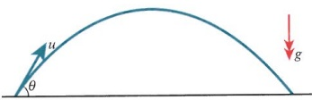
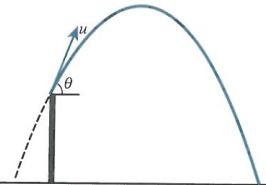
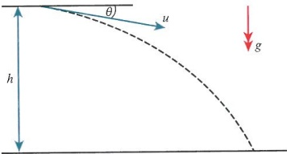
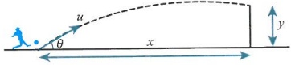
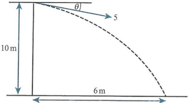
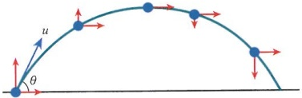
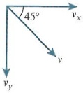
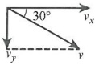
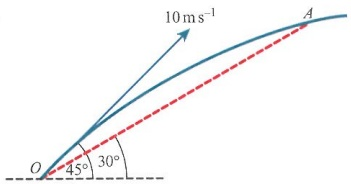

# Projectiles

<!-- Cambridge International AS  A Level Further Mathematics Coursebook (Lee Mckelvey Martin Crozier) .pdf p320-332 -->

<!-- page 320 -->

# Chapter 13 Projectiles

## In this chapter, you will learn how to:

use Newton's equations of motion to determine results related to projectile motion

use these results to solve problems involving projectiles from both ground level and raised platforms

make use of the components of the motion to understand and solve more complicated problems.

<!-- page 321 -->

<table border=1 style='margin: auto; word-wrap: break-word;'><tr><td style='text-align: center; word-wrap: break-word;'>Where it comes from</td><td style='text-align: center; word-wrap: break-word;'>What you should be able to do</td><td style='text-align: center; word-wrap: break-word;'>Check your skills</td></tr><tr><td style='text-align: center; word-wrap: break-word;'>AS &amp; A Level Mathematics Mechanics, Chapter 1</td><td style='text-align: center; word-wrap: break-word;'>Remember and use Newton&#x27;s equations of motion.</td><td style='text-align: center; word-wrap: break-word;'>1 A cyclist is travelling along a straight horizontal road at  $ 6\mathrm{~m}s^{-1} $ when he sees a red traffic light 50 m ahead. He stops pedalling and applies his brakes to decelerate uniformly until he stops. Find the magnitude of his deceleration.</td></tr><tr><td style='text-align: center; word-wrap: break-word;'>AS &amp; A Level Mathematics Mechanics, Chapters 1 &amp; 3
Pure Mathematics 2 &amp; 3, Chapter 9</td><td style='text-align: center; word-wrap: break-word;'>Work with basic vectors, such as the components in both horizontal and vertical directions.</td><td style='text-align: center; word-wrap: break-word;'>2 A particle is projected from the top of a cliff with initial speed  $ 20\mathrm{~m}s^{-1} $ vertically upwards. The particle lands at the bottom of the cliff, 50 m below the point from which it was projected. Find the time taken for the particle to reach the bottom of the cliff and the velocity of the particle at that time.</td></tr></table>

## What are projectiles?

A projectile is any object that, once it has been thrown, propelled or dropped, continues to move under its own inertia and the force of gravity. We are most likely to encounter projectiles when we play sports, when we drop things, or when we observe objects after a collision. The apple that (allegedly) fell on Isaac Newton's head was a projectile.

In this chapter, you will look at the motion of particles that are projected at an oblique angle to the horizontal and/or vertical directions. The paths of these particles will be analysed as horizontal and vertical components. Each direction can be dealt with separately or together.

### 13.1 Motion in the vertical plane

In this chapter, we use the symbols $a$ for acceleration, $u$ for initial velocity, $v$ for final velocity, $t$ for time, and $x$ for displacement. Unless stated otherwise, $g = 10\,\mathrm{m\,s^{-2}}$.

You will have met Newton's equations of motion in your earlier study of Mechanics. These equations are valid only if the acceleration of the object is constant, usually due to the mass of the object.

We use the same equations to derive some standard results for the motion of a projectile.

These equations are:

 $ s = ut + \frac{1}{2}at^{2} $

 $ v = u + at $

 $ v^{2}=u^{2}+2as $

 $ s = \frac{(u + v)t}{2} $

 $$ s=vt-\frac{1}{2}at^{2} $$ 

For projectile questions, we use a simplified model of reality. This means we usually assume there are no resisting forces such as air resistance. We model the projectile as a particle so we can assume there are no rotational forces (spin). We also assume that the force due to gravity is constant. The path travelled by the projectile is known as a parabolic trajectory.

<!-- page 322 -->

The displacement of the particle at any time is given by $s = ut + \frac{1}{2}at^{2}$, a quadratic function whose graph is a parabola.

Let us use Newton's equations for a projectile. Consider a particle thrown with initial velocity $u$ at an angle $\theta$ above the horizontal direction, as shown in the diagram. The initial velocity of the particle can be described in terms of two components: $u \cos \theta$ in the horizontal direction, and $u \sin \theta$ in the vertical direction. These directions are normally referred to in Cartesian form as $x$- and $y$-directions.

Using $v = u + at$ in the $y$-direction gives $v_y = u \sin \theta - gt$, and in the $x$-direction we can see that $v_x = u \cos \theta$. Remember that the acceleration due to gravity acts vertically downwards. Taking upwards as positive, in the vertical direction, $a = -g$ and in the horizontal direction, $a = 0$.

When the particle reaches its highest point  $ v_{y}=0 $, then  $ u\sin\theta=gt $, or  $ t=\frac{u\sin\theta}{g} $. Since we can ignore air resistance, the time it takes the particle to travel from the ground to the top of its path must be the same as the time it takes to return to the ground. This means that the total flight time is  $ t=\frac{2u\sin\theta}{g} $.

We will focus on the distance travelled horizontally and vertically. Let x represent the horizontal displacement travelled, and y represent the vertical displacement travelled.

Then, using $s = ut + \frac{1}{2}at^{2}$:

 $ x = u \cos \theta t $

 $$ y=u\sin\theta t-\frac{1}{2}g t^{2} $$ 

Now use the value we found earlier for total flight time, to give:

 $ x = u\cos\theta \times \frac{2u\sin\theta}{g} = \frac{2u^2\sin\theta\cos\theta}{g} $ and here we can use  $ 2\sin\theta\cos\theta \equiv 2\sin2\theta $

This result is known as the range, and it represents the horizontal distance covered. This value is a maximum when  $ \theta = 45^{\circ} $ and  $ \sin 2\theta = 1 $. The angle at which the object is projected is known as the angle of elevation, and is measured upwards from the horizontal. Please note that the above results for the range and total flight time have been derived from the displacement and velocity components of a projectile, which are not in the formula booklet. It is therefore suggested that you know how to quickly derive these results when needed.

Hence,  $ x = \frac{u^{2}\sin2\theta}{g} $.

## TIP

Differentiating these two results gives

 $ v_{x} = u \cos \theta $,

 $ v_{y} = u \sin \theta - gt $.

These are the same values we have already established.

### WORKED EXAMPLE 13.1

A particle is projected from a point on a horizontal surface with initial speed  $ 20\,m\,s^{-1} $ at an angle of elevation of  $ 25^{\circ} $. Find:

a the range of the particle

b the time taken to reach the highest point

c the speed of the particle when t = 0.5.

## Answer

a Using  $ x = \frac{u^{2}\sin 2\theta}{g} $,  $ x = \frac{20^{2}\sin 50^{\circ}}{10} $

Hence, x = 30.6 m.

Substitute the values into the formula for the horizontal range.

b At the highest point  $ v_y = 0 $, so  $ t = \frac{u \sin \theta}{g} = \frac{20 \sin 25}{10} $

 $ t = 0.845 \, s $

Using  $ v_y = u \sin \theta - gt $ leads to the time taken.

<!-- page 323 -->

c  $ \nu_{x}=20\cos25=18.126 $

Determine both components of the speed at the given time.

 $$ v_{y}=20\sin25-10\times0.5=3.452 $$ 

So the speed is  $ \sqrt{18.126^2 + 3.452^2} = 18.5 \, \text{m s}^{-1} $.

Find the magnitude of the resultant speed.

Particles that are projected from raised platforms can be viewed as following part of a parabolic path.

This diagram shows a particle's trajectory from a raised point. Trace the path backwards to see where it would have started if it had been launched from ground level.

Consider an example where $u=15, \theta=60^{\circ}$, and the platform is 10 m above the ground. How would you go about finding the final speed of the projectile when it reaches ground level?

Start with $v^{2}=u^{2}+2as$ vertically, so $v_{y}^{2}=(15\sin60)^{2}-2\times10\times(-10)$. This gives us $v_{y}=\frac{5\sqrt{59}}{2}$, which is the vertical component of the speed when the particle hits the ground.

Next use $v_{x}=15\cos60=7.5$, leading to $v=\sqrt{v_{x}^{2}+v_{y}^{2}}$, which is equal to $5\sqrt{17}\,\mathrm{m}\,\mathrm{s}^{-1}$.

### WORKED EXAMPLE 13.2

A particle is projected from the top of a platform 15m above the horizontal floor below. The angle of projection is  $ 45^{\circ} $ and the initial speed is  $ 25 \, \text{m s}^{-1} $. Find:

a the exact time taken to reach the horizontal floor below

b the exact speed of the particle as it hits the floor.

## Answer

<table border=1 style='margin: auto; word-wrap: break-word;'><tr><td style='text-align: center; word-wrap: break-word;'>a  $ s = ut + \frac{1}{2}at^{2} $Vertically, this gives: -15 = 25t sin 45 - 5t^{2}.\nRearranging we get:\n $ 5t^{2} - \frac{25\sqrt{2}}{2}t - 15 = 0 $ or $ t^{2} - \frac{5\sqrt{2}}{2}t - 3 = 0. $\nThis is a quadratic equation, so using the quadratic formula we get: $ t = \frac{2.5\sqrt{2} \pm 3.5\sqrt{2}}{2} $.\nSo  $ t = 3\sqrt{2}s $.</td><td style='text-align: center; word-wrap: break-word;'>Model the vertical motion. Remember that the floor is 15m below the starting position.Calculate the two times; one is invalid as it is before the start of motion.\nNote: The negative value for time represents the time when the particle would have started if it had been projected from ground level.This answer is given in exact form as required by the question.</td></tr></table>

## TIP

When a particle is projected upwards, any position below the starting point is a negative displacement. Pay close attention to negative values in your calculations.

## TIP

The question usually states if the angle is above the horizontal (angle of elevation) or measured from the vertical. When the angle is  $ 45^{\circ} $, this is not necessary.

<!-- page 324 -->

b Using $v=u+at$ horizontally and vertically gives:

Find both components of the speed at the required time.

 $$ \nu_{x}=25\cos45=12.5\sqrt{2} $$ 

 $$ v_{y}=25\sin45-10\times3\sqrt{2} $$ 

 $$ =-17.5\sqrt{2} $$ 

Hence,  $ v = \sqrt{v_x^2 + v_y^2} = 5\sqrt{37} $ m s $ ^{-1} $.

Projectiles can, instead, be launched at an angle below the horizontal (angle of depression).

Calculate the resultant in exact form.

Let us consider a particle thrown with initial speed $40\mathrm{~m}s^{-1}$, at an angle of depression of $10^{\circ}$. Initially, it is at a height of 20m above horizontal ground. To determine how far the particle travels in the horizontal direction, we must first find the time it takes to reach ground level, then apply this value of $t$ to the horizontal displacement.

Using $s = ut + \frac{1}{2}at^{2}$ vertically, we have $20 = 40t\sin10 + 5t^{2}$. Notice here we have taken the downwards direction as positive, so $s = 20$ and $a = 10$. This reduces the use of negatives so can make the work easier when working with an angle of depression.

This gives  $ 5t^{2} + 40t\sin10 - 20 = 0 $ so  $ t = \frac{-40\sin10 \pm \sqrt{(-40\sin10)^{2} - 4(5)(-20)}}{2(5)} $

Solving this equation gives two values for $t$. The value we want is positive (the projectile starts at $t=0$) so $t=1.423$ s. Use $x=ut\cos\theta=40\cos10\times1.423$, which gives a distance of 56.0 m.

### WORKED EXAMPLE 13.3

An aircraft is on a scientific data collection mission over an ocean. The aircraft is travelling horizontally at a speed of  $ 50 \, \text{m} \, \text{s}^{-1} $ when it launches a sensor at an angle of  $ 25^\circ $ below the horizontal with an initial speed of  $ 10 \, \text{m} \, \text{s}^{-1} $. Given that the plane is 1 km above the ocean, and assuming that the ocean surface is flat, find the speed of the sensor when it is 100 m from the surface of the ocean.

Assume that air resistance is negligible.

## Answer

Using  $ s = ut + \frac{1}{2}at^{2} $ vertically and taking downwards as

positive:

 $$ 900=10t\sin25+5t^{2}. $$ 

Determine the time taken to fall 900m.

Then  $ t^{2} + 2t \sin 25 - 180 = 0 \Rightarrow t = 13 $

Find the time taken.

<!-- page 325 -->

<table border=1 style='margin: auto; word-wrap: break-word;'><tr><td style='text-align: center; word-wrap: break-word;'>So  $ v_y = 10 \sin 25 + 10 \times 13 = 134.23 $.</td><td style='text-align: center; word-wrap: break-word;'>Calculate the vertical component of speed using\n $ \nu = u + at $ vertically.</td></tr><tr><td colspan="2">The plane is moving at the time of launch:</td></tr><tr><td style='text-align: center; word-wrap: break-word;'>So  $ v_x = 50 + 10 \cos 25 = 59.06 $.</td><td style='text-align: center; word-wrap: break-word;'>Find the horizontal component of speed using the initial\nspeed of the plane and  $ v = u + at $ horizontally.</td></tr><tr><td style='text-align: center; word-wrap: break-word;'>Hence,  $ \nu = \sqrt{v_x^2 + v_y^2} = 147 \text{m s}^{-1} $.</td><td style='text-align: center; word-wrap: break-word;'>Find the resultant speed.</td></tr></table>

### KEY POINT 13.1

When an object is projected with an angle of depression, choose downwards as the positive direction. This means your vertical displacement is positive and the value of $a$ is also positive.

## EXERCISE 13A

1 A projectile is launched from point O on horizontal ground, landing at the point A.

a $OA = 205\,m, \theta = 40^{\circ}$. Find the speed $u$.

 $  \mathbf{b} \quad \theta = 30^\circ, u = 32 \, \text{m} \, \text{s}^{-1}  $. Find the range  $  OA  $.

c  $ OA = 130\,m, u = 40\,m\,s^{-1} $. Find the possible angles of projection  $ \theta $.

2 A projectile is launched from a point on horizontal ground with speed $U$. Given that the horizontal distance travelled before hitting the ground again is 140 m, and that the angle of projection is $25^{\circ}$ above the horizontal, find $U$.

3 In a game a ball is kicked from the point O on horizontal ground, so that it lands on a scoring area which extends from 20m to 25m from O. If the angle of elevation when kicked is  $ 35^{\circ} $, find the initial speed required for the ball to land in the scoring area.

4 A particle is projected from point A on horizontal ground with initial speed $25\mathrm{~m s}^{-1}$ and angle of elevation $\theta$. Given that the range of the particle is 60m, find the value of the angle $\theta$.

5 A football player kicks a football from a point on the ground with an angle of elevation of  $ 15^{\circ} $. The ball must land on horizontal ground level between 10m and 20m from the player's feet. Find the possible range of values of the initial speed of the football.

PS 6 A basketball is thrown with speed  $ 10 \, \text{m} \, \text{s}^{-1} $ from a point 2m above the ground, at an angle of  $ 45^\circ $ above the horizontal. Find the speed of the basketball when it is at a height of 4m for the second time during its motion.

7 A particle of mass 2kg is fired up a smooth slope of length 4m, with initial speed  $ 10\, \text{m s}^{-1} $, which is inclined at  $ 30^\circ $ above the horizontal.

The bottom of the slope is at the same level as horizontal ground.

a Find the speed of the particle at the top of the slope.

b The particle now flies off the slope and travels as a projectile. Find the greatest height achieved above the ground level.

<!-- page 326 -->

M 8 A particle is projected horizontally from a point that is 12m above a horizontal surface, with a speed of  $ 15\, \text{m} \cdot \text{s}^{-1} $. Find the horizontal distance travelled before the particle hits the surface below.

PS 9 A particle is projected across a horizontal area of land, with initial speed  $ 30 \, \text{m s}^{-1} $ and inclined at an angle of  $ 40^{\circ} $. Find the duration of time for which the particle is at least 10 m above the ground.

PS 10 A small stone is thrown from the top of a building that is 30m tall. The stone is given an initial speed of  $ 5\, \text{m} \cdot \text{s}^{-1} $, and it is directed downwards with an angle of depression of  $ 15^{\circ} $.

b Find the speed of the stone as it hits the ground.

a Find the time taken for the stone to reach the ground.

### 13.2 The Cartesian equation of the trajectory

In Section 13.1 we saw that the general motion of a projectile launched from ground level is governed by its initial speed and the angle at which it is projected.

Consider the horizontal part of the motion. We know that  $ x = ut \cos \theta $. This means that, at any time, the value of t is given by  $ t = \frac{x}{u \cos \theta} $.

Now consider the vertical part of the motion. We know that  $ y = ut \sin \theta - \frac{1}{2}gt^{2} $. Substituting the expression found for t into this result gives  $ y = u \sin \theta \left( \frac{x}{u \cos \theta} \right) - \frac{1}{2} g \left( \frac{x}{u \cos \theta} \right)^{2} $.

Simplifying this, we get  $ y = x \tan \theta - \frac{gx^{2}}{2u^{2}} \sec^{2} \theta $.

This is essentially a quadratic equation in the form of an inverted parabola. The value of $\theta$, once chosen, is constant and so only x and y vary. The equation is known as the Cartesian equation of the trajectory of a projectile.

Consider a ball that is to be kicked over a wall. The wall is 5m tall and is 20m from the starting position of the ball.

If the ball is kicked at an angle of  $ 30^{\circ} $ above the horizontal, how can we find the minimum speed required so that the ball just passes over the wall?

Begin with  $ y = x \tan \theta - \frac{gx^{2}}{2u^{2}} \sec^{2} \theta $. At the top of the wall, x = 20, y = 5.

So $5 = 20\tan 30 - \frac{g \times 20^2}{2u^2} \sec^2 30$. This can be written as $5 = \frac{20\sqrt{3}}{3} - \frac{8000}{3u^2}$, from which we find $u = 20.2 \, \text{ms}^{-1}$.

When a particle is at ground level during its motion, y = 0. This means  $ x \tan \theta - \frac{gx^{2}}{2u^{2}} \sec^{2} \theta = 0 $ or  $ x \left( \tan \theta - \frac{g}{2u^{2}} x \sec^{2} \theta \right) = 0 $. This gives x = 0 and  $ x = \frac{2u^{2} \tan \theta}{g \sec^{2} \theta} = \frac{2u^{2} \sin \theta \cos \theta}{g} = \frac{u^{2} \sin 2\theta}{g} $, the start and finish points of the motion, as shown in Key point 13.2.

<!-- page 327 -->

### KEY POINT 13.2

When  $ y = 0 $,  $ x \tan \theta - \frac{gx^{2}}{2u^{2}} \sec^{2} \theta = 0 $ or  $ x \left( \tan \theta - \frac{g}{2u^{2}} x \sec^{2} \theta \right) = 0 $.

So the start and finish points of the motion are $x=0$ and $x=\frac{u^{2}\sin2\theta}{g}$.

### WORKED EXAMPLE 13.4

A projectile is launched from a point $O$, 1 m above horizontal ground level. It is given an initial speed of $20\,\mathrm{m\,s}^{-1}$ and an angle of elevation of $25^{\circ}$. Find the horizontal distance from $O$ when the particle is 2 m above the ground and descending.

<table border=1 style='margin: auto; word-wrap: break-word;'><tr><td style='text-align: center; word-wrap: break-word;'>Answer\nStart with y = 1. Use  $ y = x \tan \theta - \frac{gx^{2}}{2u^{2}} \sec^{2} \theta $.</td><td style='text-align: center; word-wrap: break-word;'>The projectile starts at 1 m above the ground, so y = 1 for the particle to be 2 m above the ground.</td></tr><tr><td style='text-align: center; word-wrap: break-word;'>Then  $ 1 = x \tan 25 - \frac{10x^{2}}{2 \times 20^{2}} \sec^{2} 25 $ or  $ \frac{\sec^{2} 25}{80} x^{2} - x \tan 25 + 1 = 0 $ leads to two results.</td><td style='text-align: center; word-wrap: break-word;'>Input the known values into the trajectory equation.</td></tr><tr><td style='text-align: center; word-wrap: break-word;'>These are 2.32 and 28.3.</td><td style='text-align: center; word-wrap: break-word;'>Obtain two results for x. One value is when the projectile is ascending and the other value is when it is descending.</td></tr><tr><td style='text-align: center; word-wrap: break-word;'>Hence, x = 28.3 m.</td><td style='text-align: center; word-wrap: break-word;'>Choose the larger value of x for when the projectile is descending.</td></tr></table>

Consider a particle being projected downwards instead. Remember that gravity assists when particles are descending, so it is a good idea to make the downward acceleration positive.

For example, consider a particle projected from a point 10m above horizontal ground, with initial speed  $ 5 \, \text{m} \, \text{s}^{-1} $ and an angle of depression  $ \theta $. Can we determine the angle if the horizontal distance travelled before hitting the ground is  $ 6 \, \text{m} $?

Start with the equation  $ y = x \tan \theta + \frac{gx^2}{2u^2} \sec^2 \theta $, giving  $ 10 = 6 \tan \theta + \frac{10 \times 6^2}{2 \times 5^2}(1 + \tan^2 \theta) $, which leads to  $ 7.2 \tan^2 \theta + 6 \tan \theta - 2.8 = 0 $. From here,  $ \tan \theta = \frac{1}{3} $ or  $ \tan \theta = -\frac{7}{6} $. However,  $ \tan \theta = -\frac{7}{6} $ would give a negative value for  $ \theta $. The magnitude of this angle would represent

<!-- page 328 -->

the angle of elevation that would cause the particle to travel 6m horizontally before hitting the ground. Hence we require  $ \tan\theta = \frac{1}{3} \Rightarrow \theta = 18.4^\circ $.

### WORKED EXAMPLE 13.5

A ball is thrown from the top of a building of height 20m. The ball is thrown such that the initial speed is  $ U_{ms}^{-1} $ and the angle of depression of the throw is  $ 30^{\circ} $. Find:

a the horizontal distance travelled in terms of U

b the horizontal distance when U = 5.

## Answer

 $$ y=x\tan\theta+\frac{g x^{2}}{2u^{2}}\sec^{2}\theta. $$ 

Use the Cartesian equation of the trajectory.

 $$ 20=\frac{x\sqrt{3}}{3}+\frac{20x^{2}}{3U^{2}}. $$ 

Substitute the values for the angle and height.

 $$ 20x^{2}+\sqrt{3}U^{2}x-60U^{2}=0. $$ 

Rearrange to get a quadratic in x.

Then  $ x = \frac{1}{40} \sqrt{3}(-U^{2} + \sqrt{U^{2}(1600 + U^{2})}) \, \text{m} $.

Solve for x. (Ignore the negative solution.)

b When U = 5, x = 7.65 m.

Find the solution when U = 5.

Consider a particle that follows a parabolic path, such as $y=0.5x-0.01x^{2}$. When we compare this equation with the trajectory, $y=x\tan\theta-\frac{gx^{2}}{2u^{2}}\sec^{2}\theta$, it is clear that $\tan\theta=0.5$ and also that $\frac{10}{2u^{2}}\sec^{2}\theta=0.01$.

To solve these we must first find $\theta=26.57^{\circ}$ then, using $\sec^{2}\theta=1+\tan^{2}\theta$, we obtain

To solve these we must first find  $ \theta = 26.57^\circ $ then, using  $ \sec^2\theta = 1 + \tan^2\theta $, we obtain  $ \sec\theta = \frac{\sqrt{5}}{2} $ and  $ u = 25\text{m}\text{s}^{-1} $.

### WORKED EXAMPLE 13.6

<table border=1 style='margin: auto; word-wrap: break-word;'><tr><td style='text-align: center; word-wrap: break-word;'>A projectile follows the path y = 0.3x - 0.1x^{2}. Find the initial speed and the angle of elevation of the particle.\nAnswer\n $ \tan \theta = 0.3 $, so  $ \theta = 16.70^{\circ} $.</td><td style='text-align: center; word-wrap: break-word;'>Compare the coefficients for the linear term.</td></tr><tr><td rowspan="2">$ \frac{g}{2u^{2}}\sec^{2} \theta = 0.1 $\nSince  $ \sec^{2} \theta = 1 + 0.3^{2} $, it follows that  $ u^{2} = \frac{10 \times 1.09}{2} \times 10 $.\nSo u = 7.38 ms^{-1}.</td><td style='text-align: center; word-wrap: break-word;'>Compare the coefficients for the quadratic term and use  $ \sec^{2} \theta = 1 + \tan^{2} \theta $ to find the value of sec  $ \theta $.</td></tr><tr><td style='text-align: center; word-wrap: break-word;'>Find the speed.</td></tr></table>

We will now look at the direction of motion of a projectile at certain points in its path.

<!-- page 329 -->

As the object follows its path the horizontal component of velocity is unchanged. However, the vertical component goes from its greatest positive value initially to zero at the highest point of the trajectory to its greatest negative value when it reaches the ground again.

This implies that the direction of motion of the particle is related to its velocity at that time. To find the direction we just need to know the components of velocity. We already know the horizontal component since it is constant throughout the motion. So we only need to find the vertical component.

Consider a particle with initial speed  $ 20 \, \text{m} \, \text{s}^{-1} $, projected at an angle of elevation of  $ 50^\circ $ from horizontal ground. Is it possible to find the height of the particle when it is travelling in a direction of  $ 45^\circ $ below the horizontal?

When the angle is $45^{\circ}$ below the horizontal, from the diagram we see that $\nu_{x} = -\nu_{y}$, and so $20\cos50 = -(20\sin50 - gt)$. This means we can work out the time at this point and use this time to find the height. So $t = \frac{20}{g}(\cos50 + \sin50) = 2.818$ s. Then, using $y = 20t\sin50 - 5t^{2}$ gives a height of 3.47 m.

### WORKED EXAMPLE 13.7

A particle is projected from the top of a tower that is 50 m tall. The initial speed is  $ 25 \, m s^{-1} $ and the angle of depression is  $ 10^{\circ} $. Find the height of the particle above the ground when the downward angle of the direction of the particle is  $ 30^{\circ} $.

<table border=1 style='margin: auto; word-wrap: break-word;'><tr><td style='text-align: center; word-wrap: break-word;'>Answer\n</td><td style='text-align: center; word-wrap: break-word;'>The tangent of the angle is  $ \frac{\nu_y}{\nu_x} $.</td></tr><tr><td style='text-align: center; word-wrap: break-word;'>Note that  $ \tan 30 = \frac{\nu_y}{\nu_x} $. Then we have  $ \nu_y = \frac{\sqrt{3}}{3} \nu_x $.</td><td style='text-align: center; word-wrap: break-word;'>Recognise the relationship between the tangent and the components.</td></tr><tr><td style='text-align: center; word-wrap: break-word;'>So  $ 25 \sin 10 + gt = \frac{\sqrt{3}}{3} (25 \cos 10) $.</td><td style='text-align: center; word-wrap: break-word;'>Use this relationship with  $ \nu_y = 25 \sin 10 + gt $ and  $ \nu_x = 25 \cos 10 $. Note that this time  $ \nu_y $ is positive since the motion is downwards throughout.</td></tr><tr><td style='text-align: center; word-wrap: break-word;'>From this  $ t = 0.9873 $ s.</td><td style='text-align: center; word-wrap: break-word;'>Solve to find the time.</td></tr><tr><td style='text-align: center; word-wrap: break-word;'>Then  $ y = 25t \sin 10 + 5t^2 $ gives  $ y = 9.1603 $.</td><td style='text-align: center; word-wrap: break-word;'>Work out the vertical distance travelled from the point of release.</td></tr><tr><td style='text-align: center; word-wrap: break-word;'>Hence, 50 - y = 40.8 m above the ground.</td><td style='text-align: center; word-wrap: break-word;'>Determine the height.</td></tr></table>

## DID YOU KNOW?

Galileo rolled inked bronze balls down an inclined plane to determine where a projectile would land. This experiment allowed Galileo to determine that the path of a projectile is very close to being parabolic.

<!-- page 330 -->

## EXERCISE 13B

1 A particle is projected from horizontal ground with initial speed $15\mathrm{~m s}^{-1}$ and angle of elevation $60^{\circ}$. Find the horizontal distance travelled when the particle is first at a height of 8 m above ground level.

2 A ball is thrown from a point 2m above horizontal ground. The initial speed is  $ 20 \, m \, s^{-1} $ and the angle of elevation is  $ 45^{\circ} $. Find the horizontal distance covered when the ball is 12m above the ground.

3 A particle is projected from ground level with initial speed 30m s $ ^{-1} $ at an angle of elevation of  $ 25^{\circ} $. Find the horizontal distance travelled from the starting point when the height is 4m for the first time.

4 A particle is projected from a point 5m above a horizontal plane. The angle of elevation is  $ 10^{\circ} $. Given that the particle travels 75m before hitting the ground, find the initial speed.

5 A particle is projected from a platform 4m above horizontal ground, with an initial speed of  $ 20 \, m s^{-1} $ and an angle of elevation of  $ 20^{\circ} $. Find the direction of the particle as it lands on the ground.

6 A ball is kicked at a house window. The window is 4 m up a vertical wall from a horizontal floor. The ball is kicked from a position that is 12 m distance from the foot of the wall. If the ball enters the window at an angle that is  $ 30^{\circ} $ below the horizontal, find:

a the time taken to reach the window

b the initial speed of the ball.

7 A particle is projected from the top of an office building that is 35 m tall. The initial speed is  $ 14 \, m \, s^{-1} $ and the angle of depression is  $ 20^{\circ} $. Find the height of the particle above the ground when the downward angle of the direction of the particle is  $ 45^{\circ} $.

8 A particle is projected from a point on a horizontal surface with initial speed $u$ and angle of elevation $\beta$. At any time during its motion, the particle is at the position $(x, y)$, where $x$ is the horizontal distance travelled and $y$ is the vertical distance travelled.

Show that  $ y = x \tan \beta - \frac{gx^{2}}{2u^{2}} (1 + \tan^{2}\beta) $.

9 A particle is projected from a point on a horizontal plane with speed  $ 20 \, m \, s^{-1} $ at an angle of elevation of  $ \theta $. Given that the particle passes through the point x = 20, y = 10, find the possible angles of elevation.

10 A particle is projected from a point on horizontal ground with initial speed u and angle of elevation  $ \alpha $. Show that  $ x^{2} + y^{2} = u^{2}t^{2} - 10yt^{2} - 25t^{4} $, where  $ (x, y) $ is the particle's position at time t.

## TIP

Consider

 $ \cos^{2}\theta + \sin^{2}\theta $

<!-- page 331 -->

A small stone is projected from a point $O$ on horizontal ground, with speed $V_{ms}^{-1}$ at an angle $\theta^{\circ}$ above the horizontal. The horizontal and upward vertical displacements of the particle from $O$ at time $t$ seconds after projection are $x$ and $y$ respectively. The equation of the stone's trajectory is $y = 0.75x - 0.02x^{2}$, where $x$ and $y$ are in metres. Find:

a the values of  $ \theta $ and V

b the distance from O of the point where the stone hits the ground

c the greatest height reached by the stone.

## Answer

a Comparing  $ y = x \tan \theta - \frac{gx^2}{2V^2} \sec^2 \theta $ with  $ y = 0.75x - 0.02x^2 $, it is clear that  $ \tan \theta = \frac{3}{4} $. Hence,  $ \theta = 36.9^\circ $.

Then  $ \frac{g}{2V^2} \sec^2 \theta = 0.02 $, and since  $ \cos \theta = \frac{4}{5} $,  $ \sec^2 \theta = \frac{25}{16} $. Hence,  $ V = \frac{25\sqrt{10}}{4} = 19.8 \, \text{ms}^{-1} $.

b Letting $y=0$, $0.75x-0.02x^{2}=0$. So $x=0$ or $0.02x=0.75$. Hence, $x=37.5$m.

c At the highest point  $ x=\frac{37.5}{2}=18.75 $, so  $ y=0.75\times18.75-0.02\times18.75^{2}=7.03 $ m.

## Checklist of learning and understanding

## Governing equations:

For displacement:  $ x = ut \cos \theta $ and  $ y = ut \sin \theta - \frac{1}{2} gt^{2} $

For velocity:  $ v_{x}=u\cos\theta $ and  $ v_{y}=u\sin\theta-gt $

For the range:  $ x_{\max} = \frac{u^{2}\sin2\theta}{g} $

Total flight time:  $ t = \frac{2u \sin \theta}{g} $

 $ y = x \tan \theta - \frac{gx^2}{2u^2} \sec^2 \theta $

## Cartesian equation of the trajectory:

If given as $y = ax - bx^{2}$, then $a = \tan \theta$ and $b = \frac{g}{2u^{2}} \sec^{2} \theta$.

## Direction of motion:

• Particles projected upwards are subject to $-g$, so $y = ut \sin \theta - \frac{1}{2}gt^{2}$ and $v_{y} = u \sin \theta - gt$.

The formulae for range

and total flight time

apply only to particles

that start and finish

their motion on the

same horizontal level.

Particles projected downwards have +g, and so  $ y = ut \sin \theta + \frac{1}{2} gt^{2} $ and  $ v_{y} = u \sin \theta + gt $.

For the angle of projection use  $ \tan\theta=\frac{v_{y}}{v_{x}} $

<!-- page 332 -->

## END-OF-CHAPTER REVIEW EXERCISE 13

1 A particle is projected from a point O on horizontal ground. The velocity of projection has magnitude  $ 20 \, m \, s^{-1} $ and direction upwards at an angle  $ \theta $ to the horizontal. The particle passes through the point, which is 7m above the ground and 16m horizontally from O, and hits the ground at the point A.

i Using the equation of the particle's trajectory and the identity  $ \sec^{2}\theta = 1 + \tan^{2}\theta $, show that the possible values of  $ \tan\theta $ are  $ \frac{3}{4} $ and  $ \frac{17}{4} $.

ii Find the distance OA for each of the two possible values of  $ \tan\theta $.

iii Sketch in the same diagram the two possible trajectories.

Cambridge International AS & A Level Mathematics 9709 Paper 51 Q5 June 2010

2 A particle $P$ is projected from a point $O$ with initial speed $10\mathrm{~m s}^{-1}$ at an angle of $45^{\circ}$ above the horizontal. $P$ subsequently passes through the point $A$, which is at an angle of elevation of $30^{\circ}$ from $O$ (see diagram). At time $t$s after projection the horizontal and vertically upward displacements of $P$ from $O$ are $x$m and $y$m, respectively.

i Write down expressions for x and y in terms of $t$, and hence obtain the equation of the trajectory of $P$.

ii Calculate the value of x when P is at A.

iii Find the angle the trajectory makes with the horizontal when P is at A.

Cambridge International AS & A Level Mathematics 9709 Paper 51 Q7 November 2010

3 A particle $P$ is projected with speed $35\mathrm{m}\mathrm{s}^{-1}$ from a point $O$ on a horizontal plane. In the subsequent motion, the horizontal and vertically upwards displacements of $P$ from $O$ are $x$ m and $y$ m, respectively. The equation of the trajectory is $y=kx-\frac{(1+k^{2})x^{2}}{245}$, where $k$ is a constant. $P$ passes through the points $A(14,a)$ and $B(42,2a)$, where $a$ is a constant.

i Calculate the two possible values of k and hence, show that the larger of the two possible angles of projection is  $ 63.435^{\circ} $, correct to 3 decimal places.

For the larger angle of projection, calculate

ii The time after projection when $P$ passes through $A$,

iii The speed and direction of motion of P when it passes through B.

Cambridge International AS & A Level Mathematics 9709 Paper 51 Q7 November 2016

