# Equilibrium of a rigid body

<!-- Cambridge International AS  A Level Further Mathematics Coursebook (Lee Mckelvey Martin Crozier) .pdf p333-364 -->

<!-- page 333 -->

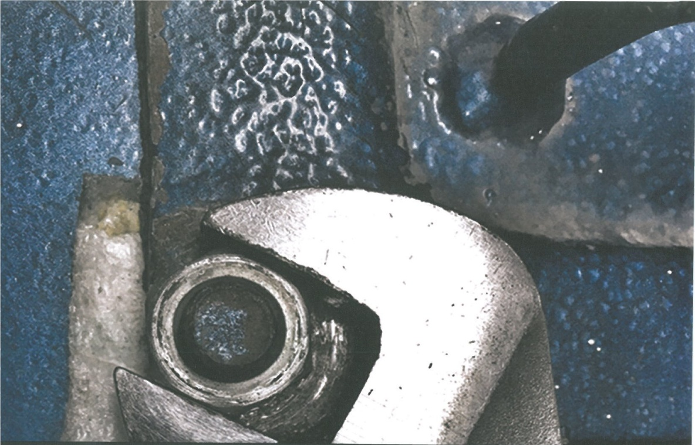

## Chapter 14 Equilibrium of a rigid body

## In this chapter you will learn how to:

find the moment of a force and use it to determine the centre of mass of 2- and 3-dimensional shapes

determine the centre of mass of a composite body, made up of standard shapes

make use of the fact that the vector sum of forces is zero when objects are in equilibrium

solve problems with coplanar forces, including objects on the point of sliding or toppling.

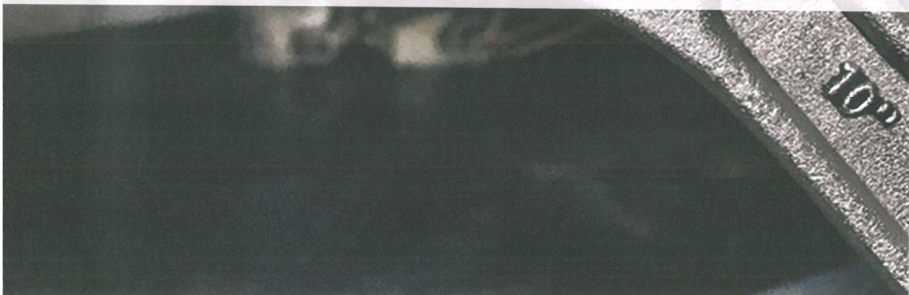

<!-- page 334 -->

## PREREQUISITE KNOWLEDGE

<table border=1 style='margin: auto; word-wrap: break-word;'><tr><td style='text-align: center; word-wrap: break-word;'>Where it comes from</td><td style='text-align: center; word-wrap: break-word;'>What you should be able to do</td><td style='text-align: center; word-wrap: break-word;'>Check your skills</td></tr><tr><td style='text-align: center; word-wrap: break-word;'>AS &amp; A LevelMathematics Mechanics, Chapter 2</td><td style='text-align: center; word-wrap: break-word;'>Resolve forces in two perpendicular directions.</td><td style='text-align: center; word-wrap: break-word;'>1 An object of mass m is sliding down a smooth slope inclined at an angle  $ \theta $ to the horizontal. Find the components of the weight of the object parallel and perpendicular to the slope.</td></tr><tr><td style='text-align: center; word-wrap: break-word;'>AS &amp; A LevelMathematics Mechanics, Chapter 4</td><td style='text-align: center; word-wrap: break-word;'>Be able to determine or make use of the coefficient of friction of an object on the point of moving.</td><td style='text-align: center; word-wrap: break-word;'>2 A particle of mass 2kg is resting on a rough slope inclined at an angle  $ \theta $ to the horizontal. The maximum force that the frictional force can produce is 10N. Find the value of  $ \theta $ for which the particle is on the point of slipping.</td></tr></table>

## What is equilibrium?

When all forces acting on an object are balanced and the vector sum of the forces is zero, we say the object is in a state of equilibrium. Equilibrium is one of the most important concepts in engineering analysis. It allows you to check whether systems are stable and to calculate otherwise unknown forces.

In this chapter, we shall find the moment, or turning effect of a force, produced when we apply a force at a perpendicular distance to an object. For moments to be applied, the object must have length, so we cannot model it as a particle. Instead, we use a rigid body, a larger version of a particle. This is assumed to be inflexible so it does not bend when forces are applied.

We shall use this to find the centre of mass of standard shapes and composite bodies. Finally, these bodies will be placed in positions such that they are on the point of breaking equilibrium by sliding or toppling. To tackle the problems, we will resolve forces and take moments. The symbols we use are shown in Key point 14.1.

### KEY POINT 14.1

In this chapter, you will use the symbols $a$ for acceleration, $v$ for velocity, and $x$ for displacement. Unless stated otherwise, $g = 10\, \text{m s}^{-2}$.

### 14.1 The moment of a force

Imagine trying to loosen a nut with a spanner (wrench). Applying the force with a short spanner would make it difficult to loosen the nut. But applying the same force with a longer spanner will result in a greater turning effect. This turning effect is known as a moment.

Moments are calculated by multiplying a force by a perpendicular distance, as shown in Key point 14.2. This means that moments are to be measured in newton metres (Nm). When we talk about moments, we refer to the moment of that particular force.

### KEY POINT 14.2

The moment of a force, $F$, about a point $O$ is $F \times d$, where $d$ is the perpendicular distance from the point $O$ to the line of action of the force $F$. If the distance between the force and the point $O$ is zero, there is no turning effect.

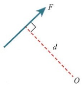

<!-- page 335 -->

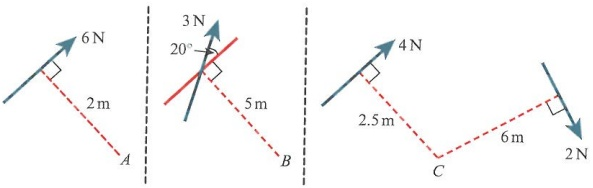

From the diagram, the moment of the 6N force about the point A can be calculated as  $ 6 \times 2 = 12 \, N \cdot m $.

For the moment of the force about $B$, we first need to find the component of the force that is perpendicular to the line through $B$. So the moment is $3\cos 20 \times 5 = 14.1$ Nm.

The other component of the force, $3\sin20$, passes through $B$, so its moment is zero.

For the moment of the forces about the point C, we add the turning effects since they both act in the same direction, which is clockwise. So the moment is  $ 4 \times 2.5 + 2 \times 6 = 22 $ Nm.

### WORKED EXAMPLE 14.1

For each of the following cases, work out the moment and state whether it is a clockwise or anticlockwise turning effect.

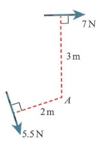

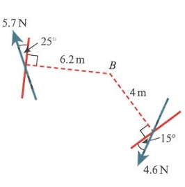

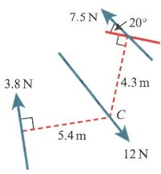

## Answer

For $A \supset: 7 \times 3 - 5.5 \times 2 = 10$ Nm clockwise

Choose clockwise or anticlockwise as your positive direction.

For $B \circ: 5.7\cos 25 \times 6.2 + 4.6\cos 15 \times 4 = 49.8$ Nm clockwise

Determine the components of forces.

For $C \cup: 3.8 \times 5.4 - 7.5\cos 20 \times 4.3 = -9.79$, therefore $9.79\text{Nm}$ anticlockwise.

It is better to state a positive moment ‘anticlockwise’, rather than a negative moment clockwise.

<!-- page 336 -->

If we take a rod and apply a series of forces to it, we can observe the turning effect on the rod. We generally model it as a ‘light’ rod, so we can ignore the mass, and a rigid body, so it does not bend when forces are applied.

So taking moments about the point $A$, $\Omega$: $3 \times 2 + 5 \times 1 - 8 \times 2 = 5$ Nm anticlockwise. The $5$ N force and the $3$ N force turn the same way about the point $A$, whereas the $8$ N is in the opposite direction. This means that the rod will turn about $A$ as it is not in equilibrium.

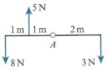

### WORKED EXAMPLE 14.2

In each case, a light rod is pivoted at a fixed point, A. Find the unknown values such that the rod will have a zero moment about A.

a

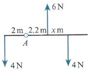

b

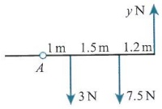

C

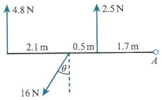

Answer

a About  $ A \cup: 4 \times (x + 2.2) - 6 \times 2.2 - 4 \times 2 = 0 $

So  $ 4x + 8.8 = 21.2 $, giving x = 3.1 m.

Note the distance of  $ x + 2.2 $ between the clockwise force and A.

b About $A\ O:3\times1+7.5\times2.5-y\times3.7=0$

So 3.7y = 21.75, giving y = 5.88N.

Make sure the total moment is zero in order to determine y.

c About  $ A \circ: 4.8 \times 4.3 + 2.5 \times 1.7 - 16\cos\theta \times 2.2 = 0 $

So  $ 35.2\cos\theta=24.89 $, giving  $ \theta=45.0^{\circ} $.

Remember to use only the component of the force perpendicular to the rod.

Consider a uniform rod of length 2m and mass 2kg resting in equilibrium over the edge of a table. The edge of the table is the point A. The mass B at the end of the rod is 3kg.

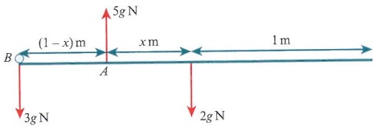

This time we consider the weight of the rod. Because the rod is modelled as uniform, its weight acts at the centre of the rod.

If we ignore the small mass at the point $B$, taking moments about $A$ gives $2g \times x = 20x\text{ N m}$. This means the rod would not be in equilibrium and would turn about the point $A$.

So we include the mass 3g and take moments again, now  $ 2gx = 3g(1 - x) $, and so  $ x = \frac{3}{5}m $. The reaction force has a moment of zero about the point A.

<!-- page 337 -->

A uniform rod, AB, of length 5 m and mass 10 kg, is placed over the edge of a cliff such that B is 4 m from the edge of the cliff and hanging over the edge. A man, of mass 80 kg, stands on the cliff side of the rod, a distance of x m from the edge of the cliff.

a Find the value of x so that the rod is on the point of tipping over the cliff.

The man now stands at A and a boy of mass 35kg walks across the rod towards B.

b Can the boy walk all the way to the end of the rod?

## Answer

a

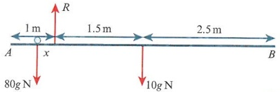

About edge  $ \supset: 10g \times 1.5 = 80g \times x $, so  $ x = \frac{3}{16}m $.

b

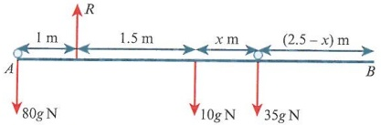

Sketch the first case, labelling your diagram fully.

About edge  $ \supset: 10g \times 1.5 + 35g \times (1.5 + x) = 80g \times 1 $

 $$ 1.5+x=\frac{80g-15g}{35g}. $$ 

Taking moments about the edge gives x.

 $$ x=\frac{5}{14}m. $$ 

So the boy cannot reach the end of the rod at $B$.

Redraw diagram with the boy included and the man now at point A.

Taking moments about the edge shows that the distance is less than 2.5m, so the boy can never reach $B$.

## EXERCISE 14A

1 A rod AB of length 3.1 m and mass 8 kg is balancing on a pivot at a point C, where AC is 1.2 m. It is kept balanced by masses being placed at A and B. If the mass at A is 4 kg, determine the mass at B.

2 A rod AB of length 1.4m and mass 6kg is balancing on a pivot at a point C, where AC is 0.5m. It is kept balanced by masses being placed at A and B. If the mass at A is 3kg, determine the mass at B.

3 A rod AB, of length 1.1 m and mass 4 kg, is resting on a horizontal table with part of the rod hanging over the edge of the table. The rod is perpendicular to the edge of the table. Point A is in contact with the table and is 0.3 m from the edge. A mass k kg is placed on the rod at the point A to stop the rod from toppling. Find the minimum value of k.

4 Find the moment about O of the forces shown, stating if it is clockwise or anticlockwise.

a

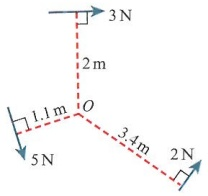

b

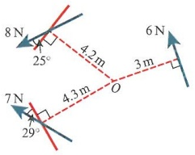

C

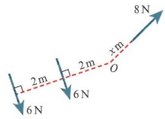

<!-- page 338 -->

5 For each of the following rods, find the moment about the point P.

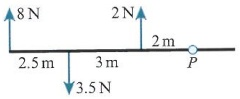

b

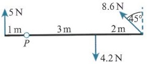

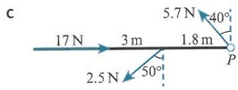

PS 6 A rod, AB, of length 0.4m and mass 5kg, is resting such that part of the rod is hanging over the edge of a horizontal table. The rod is positioned so that it is perpendicular to the edge of the table, and with the point A in contact with the table and 0.15m from the edge.

a A mass of 8 kg is placed on the rod to stop the rod from falling off the table. Find its distance from the point A.

b The 8kg mass is now placed at the point A. A second mass is added at the point B. Find the maximum mass that can be added without the rod toppling.

PS 7 A rod, AB, of length 5m and mass 12kg is hanging over the edge of a cliff. The end A is 1.2m from the edge of the cliff, and the rod is assumed to be perpendicular to the cliff. A woman, of mass M, stands at the point A, and a girl, of mass m, stands at the point B. Given that the rod is on the point of tipping, find m in terms of M.

PS M 8 In each case, find the unknown such that the total moment about O is zero.

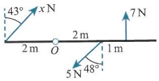

b

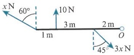

C

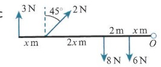

### 14.2 Centres of mass of rods and laminas

We can use moments in finding the centre of mass of an object. All the weight of an object acts through its centre of mass.

For example, consider a rod of length 2m and mass 5kg. We add a mass of 3kg to one end.

If we take moments about $O\ \mathcal{O}\colon 5g\times1+3g\times2=11g\mathrm{Nm}$.

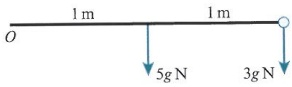

Now consider this turning effect as coming from one force positioned where  $ 8g \times \overline{x} = 11g $, then  $ \overline{x} = \frac{11}{8}m $ from the point O.

We have created a single force a distance of  $ \frac{11}{8} $ m from O. This force multiplied by the distance  $ \bar{x} $ represents the sum of all the turning effects of the system.

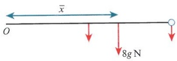

the distance  $ \overline{x} $ represents the sum of all the turning effects of the system.

### WORKED EXAMPLE 14.4

Find the distance,  $ \overline{x} $, of the single force that represents all other forces from the point O.

a

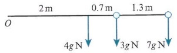

b

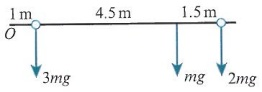

Answer

a About $O$ $\mathcal{O}$: $4g \times 2 + 3g \times 2.7 + 7g \times 4 = 44.1g = 14g \times \overline{x}$

Hence, $\overline{x} = 3.15\mathrm{m}$.

Take moments about $O$, then compare this to the sum of the forces $\times \overline{x}$.

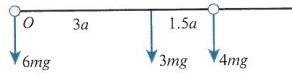

<!-- page 339 -->

b About  $ O $ ☾:  $ 3mg \times 1 + mg \times 5.5 + 2mg \times 7 $

= 22.5mg = 6mg ×  $ \overline{x} $

Hence,  $ \overline{x} = 3.75 \, \text{m} $.

c About  $ O\Omega $:  $ 3mg \times 3a + 4mg \times 4.5a $

= 27mga = 13mg ×  $ \overline{x} $

Although the moment of the 6mg force at O is zero, you must remember to include the weight when finding  $ \overline{x} $.

Hence,  $ \overline{x} = \frac{27}{13}a $.

### KEY POINT 14.3

The distance of the centre of mass  $ \overline{x} $ from the point of reference is equal to  $ \frac{m_{1}x_{1}+m_{2}x_{2}+m_{3}x_{3}+\cdots}{m_{1}+m_{2}+m_{3}+\cdots} $, where  $ m_{i} $ is the mass of each element of the object, and  $ x_{i} $ is the distance of each element from a point of reference about which moments are taken.

Let us look at a 2-dimensional case such as a framework with masses added.

We can now work out the centre of mass in two dimensions. This will give us coordinates relative to two perpendicular axes of reference. In this framework, we shall assume each rod is light but there are masses attached at each corner.

To take moments about a point, we assume the framework is horizontal and the weights have a turning effect on the framework.

Taking moments about $Ox\ \mathcal{O}$: $5g\times2+4g\times2=15g\times\overline{y}$, so $\overline{y}=1.2\mathrm{m}$. Remember that the masses that lie along $Ox$ will not contribute to the turning effect.

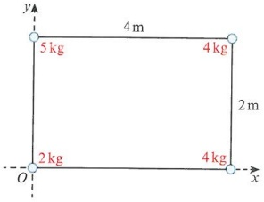

Then moments about $Oy \supseteq:4g\times4+4g\times4=15g\times\overline{x}$, so $\overline{x}=\frac{32}{15}\mathrm{m}$.

So the centre of mass G has position  $ \left(\frac{32}{15},1.2\right) $ relative to the point O.

### WORKED EXAMPLE 14.5

A rectangular framework, ABCD, is made of four light rods. There are masses on the rods at the given points.

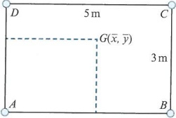

In each case, determine the coordinates of the centre of mass. Use AB and AD as your axes, with A as your origin.

a 2kg at A, 4kg at B, 7kg at C, 2.5kg at D

b 5kg at the midpoint of $AD$, 6kg at $B$, 4kg at $E$, where $CE = \frac{1}{3}CB$

c 6kg at $A$, 3kg at the midpoint of $AB$, 8kg at $B$, 10kg at point $F$, where $DF = \frac{3}{5}DC$

<!-- page 340 -->

Answer
a About  $ AB \cup: 7g \times 3 + 2.5g \times 3 = 15.5 \times \bar{y} $ Ignore the masses at A and B for this part.

So  $ \bar{y} = \frac{57}{31} $.

About  $ AD \cup: 4g \times 5 + 7g \times 5 = 15.5 \times \bar{x} $ Ignore the masses at A and D.

So  $ \bar{x} = \frac{110}{31} $.

Hence, centre of mass is  $ G\left(\frac{110}{31}, \frac{57}{31}\right) $.

b About  $ AB \cup: 5g \times 1.5 + 4g \times 2 = 15g \times \bar{y} $ Note that the mass at A is zero.

So  $ \bar{y} = \frac{31}{30} $.

About  $ AD \cup: 6g \times 5 + 4g \times 5 = 15g \times \bar{x} $

So  $ \bar{x} = \frac{10}{3} $.

Hence, centre of mass is  $ G\left(\frac{10}{3}, \frac{31}{30}\right) $.

c About  $ AB \cup: 10g \times 3 = 27g \times \bar{y} $

So  $ \bar{y} = \frac{10}{9} $.

About  $ AD \cup: 3g \times 2.5 + 8g \times 5 + 10g \times 3 = 27g \times \bar{x} $ Remember that  $ DF = 3 $ m.

So  $ \bar{x} = \frac{155}{54} $.

Hence, centre of mass is  $ G\left(\frac{155}{54}, \frac{10}{9}\right) $.

We shall now consider a thin, 2-dimensional shape known as a lamina. If a lamina is described as uniform, then we assume that its mass is spread evenly across its area.

The standard shapes you will encounter are the rectangle, circle, triangle and sector of a circle.

For a rectangle the centre of mass is in the centre, where the lines of symmetry meet.

For triangles, consider the scalene triangle $ABC$, with $L, M, N$ at the midpoints of $BC, AC$ and $AB$, respectively.

Now, relative to an origin $O$, we have $\overrightarrow{OA} = \mathbf{a}$, $\overrightarrow{OB} = \mathbf{b}$ and $\overrightarrow{OC} = \mathbf{c}$. We want to find $\overrightarrow{OG}$.

First, state that  $ \overrightarrow{OG} = \overrightarrow{OA} + \alpha\overrightarrow{AL} $, or  $ \overrightarrow{OG} = \overrightarrow{OB} + \beta\overrightarrow{BM} $, or  $ \overrightarrow{OG} = \overrightarrow{OC} + \gamma\overrightarrow{CN} $.

The scalars  $ \alpha, \beta, \gamma $ are all between 0 and 1.

Next, with  $ \overrightarrow{AL} = (\mathbf{b} - \mathbf{a}) + \frac{1}{2}(\mathbf{c} - \mathbf{b}) $,  $ \overrightarrow{BM} = (\mathbf{c} - \mathbf{b}) + \frac{1}{2}(\mathbf{a} - \mathbf{c}) $,  $ \overrightarrow{CN} = (\mathbf{a} - \mathbf{c}) + \frac{1}{2}(\mathbf{b} - \mathbf{a}) $, we

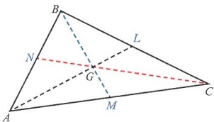

 $$ \mathrm{have}\overrightarrow{\mathrm{OG}}=(1-\alpha)\mathbf{a}+\frac{\alpha}{2}(\mathbf{b}+\mathbf{c}),\\\overrightarrow{\mathrm{OG}}=(1-\beta)\mathbf{b}+\frac{\beta}{2}(\mathbf{a}+\mathbf{c})\mathrm{\ and\ }\overrightarrow{\mathrm{OG}}=(1-\gamma)\mathbf{c}+\frac{\gamma}{2}(\mathbf{a}+\mathbf{b}). $$

<!-- page 341 -->

This means that each result must have the same coefficients for $\mathbf{a}$, $\mathbf{b}$, $\mathbf{c}$. For example, we see that $1 - \alpha = \frac{\beta}{2} = \frac{\gamma}{2}$ and $1 - \beta = \frac{\alpha}{2} = \frac{\gamma}{2}$. So $1 - \alpha = \frac{\alpha}{2}$, which leads to $\alpha = \beta = \gamma = \frac{2}{3}$. Hence, $\overrightarrow{OG} = \frac{1}{3}(\mathbf{a} + \mathbf{b} + \mathbf{c})$.

Next, consider the triangle $ABC$ with $AB = 6a$ and $AC = 3a$. The centre of mass $G$ can be found using $A$ as the origin and then moving one-third of the distance along each edge to get $G(2a, a)$.

Note that this is relative to the edges AB and AC. An alternative way of doing this is to use the result $G\left(\frac{x_{1}+x_{2}+x_{3}}{3},\frac{y_{1}+y_{2}+y_{3}}{3}\right)$, as shown in Key point 14.4, where the $x_{i}$ and $y_{i}$ terms are the vertices measured from an origin. In our case we used $A$ as the origin, so $G\left(\frac{0+6a+0}{3},\frac{0+0+3a}{3}\right)$ leads to the same result as before.

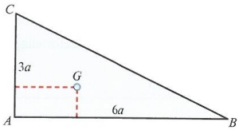

### KEY POINT 14.4

The centre of mass of any triangular lamina is given by  $ \left(\frac{x_{1}+x_{2}+x_{3}}{3},\frac{y_{1}+y_{2}+y_{3}}{3}\right) $, where the three vertices of the triangle are at  $ (x_{1},y_{1}),(x_{2},y_{2}),(x_{3},y_{3}) $.

### WORKED EXAMPLE 14.6

For each case, work out the centre of mass of the triangle, stating your point of reference.

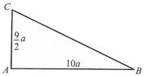

Answer

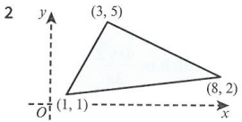

a Using $AB$ and $AC$ as axes, $\frac{1}{3} \times 10a$ and $\frac{1}{3} \times \frac{9}{2}a$ gives $G\left(\frac{10}{3}a, \frac{3}{2}a\right)$.

b Using $O$ as the origin, $\left(\frac{1+3+8}{3}, \frac{1+5+2}{3}\right)$ gives $G\left(4, \frac{8}{3}\right)$.

Set the axes. Then take one-third of each length from $A$.

Take the mean of $x$ and $y$.

Consider a lamina in the shape of a sector of a circle with an angle  $ 2\alpha $ at the centre, a radius r and a centre O. Then a smaller sector is chosen. Its angle is  $ d\theta $, which is so small that the sector is almost a triangle, meaning we can use our results from above to find the position of the centre of mass of this small sector.

For that small sector, $OG = \frac{2}{3}r$, which means that the length $OA = \frac{2}{3}r\cos\left(\theta + \frac{1}{2}\mathrm{d}\theta\right) \approx \frac{2}{3}r\cos\theta$. The total mass of the large sector, represented by the area of the sector $\times$ the mass per unit area, is $\frac{1}{2}r^{2} \times 2\alpha \times \rho = r^{2}\alpha\rho$, where $\rho$, the Greek letter rho, is the mass per unit area. The mass of each small sector is $\frac{1}{2}r^{2}\rho\mathrm{d}\theta$, so summing each moment contribution, $r^{2}\alpha\rho\overline{x} = \int_{-\alpha}^{\alpha}\frac{2}{3}r\cos\theta \times \frac{1}{2}r^{2}\rho\mathrm{d}\theta$.

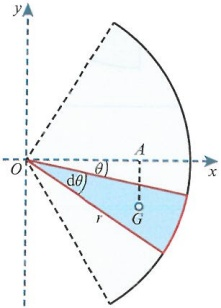

<!-- page 342 -->

So  $ r^{2}\alpha\rho\overline{x}=\frac{1}{3}\rho r^{3}[\sin\theta]_{-\alpha}^{\alpha} $, leading to  $ \overline{x}=\frac{r(\sin\alpha-\sin(-\alpha))}{3\alpha}=\frac{2r\sin\alpha}{3\alpha} $, as shown in Key point 14.5. This result can be used for any sector, giving the distance  $ OG $, where  $ OG $ bisects the angle  $ 2\alpha $ subtended at the centre of the circle. The angle must be given in radians, not degrees.

### KEY POINT 14.5

The centre of mass of a sector-shaped lamina with an angle of $2\alpha$ subtended at the centre is given as $\frac{2r\sin\alpha}{3\alpha}$.

### WORKED EXAMPLE 14.7

Determine the centre of mass from the centre $O$ of a sector of radius $r$ with angle:

a $\frac{\pi}{2}$

## Answer

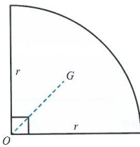

 $$ OG=\frac{2r\sin\alpha}{3\alpha}, $$ 

Quote the result.

here  $ \alpha = \frac{\pi}{4} $

Take half the angle subtended at the centre.

Hence,  $ OG = \frac{2r\sin\frac{\pi}{4}}{\frac{3\pi}{4}} $

Determine the distance  $ OG $.

which is  $ \frac{4r\sqrt{2}}{3\pi} $.

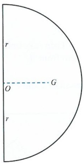

Again, using

 $$ OG=\frac{2r\sin\alpha}{3\alpha}with $$ 

 $ \alpha = \frac{\pi}{2} $ gives the result

Since a semi-circle is a sector the result for the sector can be used with  $ a = \frac{\pi}{2} $.

 $$ OG=\frac{2r\sin\frac{\pi}{2}}{\frac{3\pi}{2}}, $$ 

Don't forget that the angle must be in radians for this to work.

which is  $ \frac{4r}{3\pi} $.

<!-- page 343 -->

Now that we have seen some standard lamina, we can look at combining these shapes to form composite bodies. In this example we have a composite lamina made of two uniform rectangular laminae. Using $\rho$ as the mass per unit area, one rectangle has mass $3a^2\rho$ and the other has mass $2a^2\rho$, so the whole body has mass $5a^2\rho$.

Taking moments about the y-axis $\mathcal{O}\colon3a^{2}\rho\times\frac{3}{2}a+2a^{2}\rho\left(3a+\frac{a}{2}\right)=5a^{2}\rho\overline{x}$, and so $\overline{x}=2.3a$.

Then taking moments about the x-axis  $ \mathcal{O} $:  $ 3a^2\rho \times \frac{a}{2} + 2a^2\rho \times a = 5a^2\rho\bar{y} $, and so  $ \bar{y} = 0.7a $.

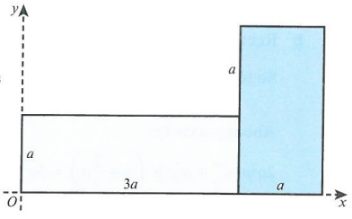

So the centre of mass is  $ G(2.3a, 0.7a) $.

### WORKED EXAMPLE 14.8

For each composite shape, determine the centre of mass relative to the axes shown.

a

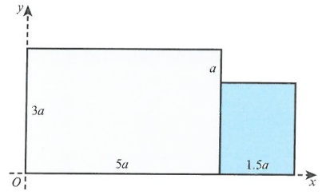

C

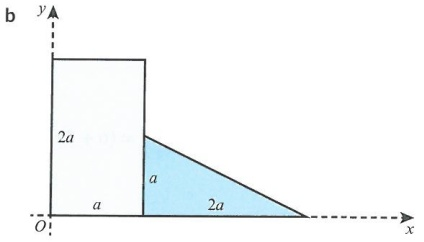

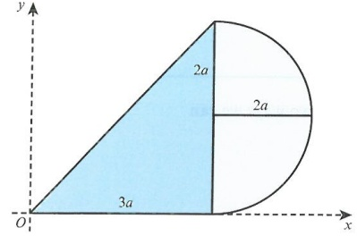

## Answer

a Large rectangle has mass  $ 15a^2\rho $, small rectangle has mass  $ 3a^2\rho $

So total mass is  $ 18a^{2}\rho $.

About the y-axis:

 $$ 5a^{2}\rho\times\frac{5}{2}a+3a^{2}\rho\left(5a+\frac{3}{4}a\right)=18a^{2}\rho\overline{x} $$ 

So  $ \overline{x} = \frac{73}{24}a $.

About the x-axis:

 $$ 15a^{2}\rho\times\frac{3}{2}a+3a^{2}\rho\times a=18a^{2}\rho\overline{y} $$ 

So  $ \bar{y} = \frac{17}{12}a $.

Work out the mass of each part first. Use $\rho$ as the mass per unit area. You can then find the total mass.

Take moments about each axis to determine the coordinates of the centre of mass. The height of the smaller rectangle must be 2a.

<!-- page 344 -->

b Rectangle mass is  $ 2a^2\rho $, triangle mass is  $ a^2\rho $

So total mass is  $ 3a^2\rho $.

For the triangular lamina the centre of mass is  $ \frac{1}{3} $ of the distance from the bottom left corner of the triangle.

About y-axis ∅:
 $ 2a^2\rho \times \frac{a}{2} + a^2\rho \times (a + \frac{2}{3}a) = 3a^2\rho\bar{x} $

This gives  $ \bar{x} = \frac{8}{9}a $.

About x-axis ∅:  $ 2a^2\rho \times a + a^2\rho \times \frac{a}{3} = 3a^2\rho\bar{y} $

This gives  $ \bar{y} = \frac{7}{9}a $.

c Triangle mass is  $ 6a^2\rho $, semicircle mass is  $ 2\pi a^2\rho $

So total mass is  $ (6 + 2\pi)a^2\rho $.

Centre of mass of semicircle from the vertical diameter shown is  $ \frac{4 \times 2a}{3\pi} = \frac{8a}{3\pi} $.

The height of the triangle is twice the radius of the semicircle.

For the semicircle we know that  $ OG = \frac{4r}{3\pi} $. We can quote this result and use it.

About y-axis ∅:
 $ 6a^2\rho \times 2a + 2\pi a^2\rho \times (3a + \frac{8a}{3\pi}) = (6 + 2\pi)a^2\rho\bar{x} $

So  $ \bar{x} = 2.95a $.

About x-axis ∅:
 $ 6a^2\rho \times \frac{4}{3}a + 2\pi a^2\rho \times 2a = (6 + 2\pi)a^2\rho\bar{y} $

This leads to  $ \bar{y} = 1.67a $.

What if the lamina is a shape such as the lamina shown here? There are two ways we can deal with this.

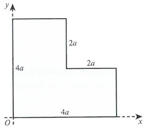

We could split the shape into a rectangle and a square, adding the moment of each shape to determine the total moment.

Alternatively, we could consider the larger square and its moment then subtract the moment of a smaller square to get the moment of the remaining shape.

 $$ \Box + \Box=\Box $$ 

For this example, we are going to use the second method. In this example it is rather trivial, but for harder examples it is better to use this method. Note that the large square has mass  $ 16a^2\rho $ and the small square has mass  $ 4a^2\rho $, so our lamina has mass  $ 12a^2\rho $.

 $$ \Box - \Box = \Box $$

<!-- page 345 -->

Taking moments about $Oy \supset: 16a^2\rho \times 2a - 4a^2\rho \times 3a = 12a^2\rho\overline{x}$, giving $\overline{x} = \frac{5}{3}a$.

Taking moments about $Ox\ \mathcal{Q}$: $16a^2\rho \times 2a - 4a^2\rho \times 3a = 12a^2\rho\overline{y}$, giving $\overline{y} = \frac{5}{3}a$.

Note that the results for  $ \overline{x} $ and  $ \overline{y} $ are the same due to symmetry.

If we look at a more complicated example, such as in the diagram on the right, then we see that a large rectangle, of dimensions $4.5 \times 6.5$, has a $3.5 \times 1.5$ rectangle removed, a $2 \times 2$ square removed, and a $1 \times 1$ square removed.

The mass of the complete rectangle is  $ 29.25\rho $. The removed parts are  $ 5.25\rho $,  $ 4\rho $ and  $ \rho $, respectively, so the lamina has mass  $ 19\rho $. We can now take moments about both axes to find the centre of mass.

About Oy ☺: 29.25ρ × 2.25 – 5.25ρ × 1.75 – 4ρ × 3.5 – ρ × 0.5 = 19ρx, so  $ \overline{x} = 2.22 $.

About $Ox\supseteq:29.25\rho\times3.25-\rho\times0.5-4\rho\times2-5.25\rho\times4.75=19\rho\overline{y}$, so $\overline{y}=3.24$.

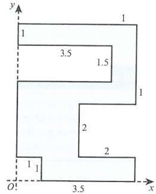

### WORKED EXAMPLE 14.9

The diagram shows a large circular-shaped lamina that is constructed by removing smaller circular areas from a circle of radius 15 cm.

The circle centred at the point  $ A(-6,7) $ has radius 4 cm, the circle centred at  $ B(10,3) $ has radius 2 cm, and the circle centred at  $ C(-3,-6) $ has radius 5 cm. Relative to the point O, find the centre of mass of the lamina. You may assume the lamina is uniform.

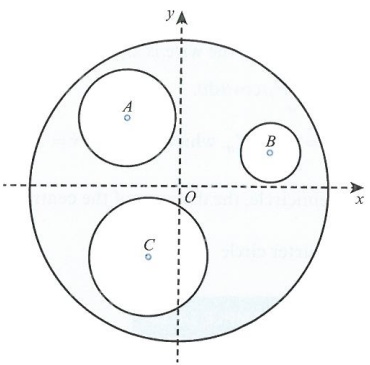

## Answer

Large circle mass:  $ 225\pi\rho $

Circle A mass:  $ 16\pi\rho $

Circle B mass:  $ 4\pi\rho $

Circle C mass:  $ 25\pi\rho $

Determine the mass of each smaller circle to obtain the lamina's mass.

So lamina mass is  $ 180\pi\rho $.

Taking moments:

About Oy:

$$225\pi\rho\times0+25\pi\rho\times3+16\pi\rho\times6-4\pi\rho\times10=180\pi\rho\overline{x}$$

$$\mathrm{So}\quad\overline{x}=0.728\,\mathrm{cm}.$$

Take moments; notice that some contributions are added.

This is actually  $ -(mass \times (-length)) $, so still subtracted but with negative displacement.

<!-- page 346 -->

About Ox:

Repeat for  $ \bar{y} $.

225 $ \pi\rho \times 0 $ + 25 $ \pi\rho \times 6 $ - 16 $ \pi\rho \times 7 $ - 4 $ \pi\rho \times 3 $ = 180 $ \pi\rho\overline{y} $

So  $ \bar{y}=0.144 $ cm.

## DID YOU KNOW?

Centres of mass are very important for understanding planetary motion. The centre of mass between two objects is known as the barycentre. This is the point at which the two objects balance each other. For example, the barycentre between the Earth and the Moon is offset from the centre of the Earth by approximately 4700 km.

Now we will look at shapes formed from wire. For example, a piece of uniform wire could be bent into an arc of a circle with radius r, and angle  $ 2\alpha $ radians subtended at the centre.

So each small arc of wire has mass  $ r\rho d\theta $, and its distance from Oy is  $ r\cos\left(\theta+\frac{d\theta}{2}\right)\approx r\cos\theta $.

The total mass of the wire is  $ 2r\rho\alpha $, so the moment of the wire about Oy is  $ 2r\rho\alpha\overline{x} = \int_{-\alpha}^{\alpha} r^{2}\rho\cos\theta\,d\theta $.

So  $ 2\alpha\overline{x}=r[\sin\theta]_{-\alpha}^{\alpha} $, which leads to  $ \overline{x}=\frac{r\sin\alpha}{\alpha} $.

For a semicircle, the distance of the centre of mass from O is  $ \frac{r\sin\frac{\pi}{2}}{2\sqrt{2}\pi}=\frac{2r}{\pi} $.

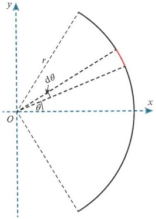

For a quarter circle  $ \overline{x} = \frac{2\sqrt{2}r}{\pi} $.

### WORKED EXAMPLE 14.10

The letter P is constructed using a uniform straight piece of wire of length 4a joined to another piece of uniform wire that is bent into a semicircle of radius a. Given that the semicircular piece of wire is three times as dense as the straight wire, find the position of the centre of mass $G(\overline{x},\overline{y})$ relative to the point $O$.

## Answer

Mass of straight wire: 4a $ \rho $

Mass of semicircle:  $ \pi a \times 3\rho = 3\pi a\rho $

For  $ \overline{x} $ ☑:  $ 4a\rho \times 0 + 3\pi a\rho \times \frac{2a}{\pi} = (4a\rho + 3\pi a\rho)\overline{x} $

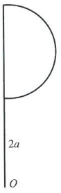

Hence,  $ \overline{x} = \frac{6a}{4 + 3\pi} $.

For  $ \overline{y} \supset: 4a\rho \times 2a + 3\pi a\rho \times 3a = (4a\rho + 3\pi a\rho) \overline{y} $

Hence,  $ \overline{y} = \frac{(8 + 9\pi)a}{4 + 3\pi} $.

<!-- page 347 -->

1 The diagram shows a lamina that is formed by removing a small rectangle from a larger rectangle. Find the distance of the centre of mass from AB and from AC.

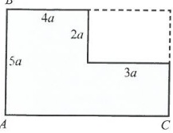

2 The diagram shows a uniform lamina in the shape of a trapezium. Find the distance of the centre of mass from edge AB and from edge AC.

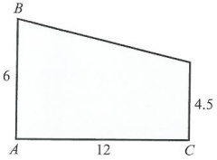

3 The diagram shows two uniform laminas, each a right-angled triangle, that are joined together at one edge, AB. The smaller triangle is twice as dense as the larger triangle. Find the distance of the centre of mass from the edge AB.

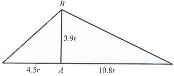

4 The image shows a uniform lamina that is formed by removing a square from a right-angled triangle. Find the coordinates of the centre of mass, as measured from the point O.

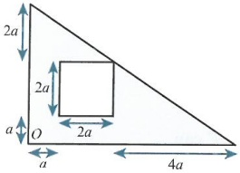

5 The diagram shows a uniform square lamina of side $4r$ and density $2\rho$ attached to a uniform lamina in the shape of a quarter circle of radius $4r$ and density $\rho$. Find the distance of the centre of mass from the edges OA and OB.

6 A piece of uniform wire is bent to form the letter D. This letter D consists of a straight edge of length 2m, and a semicircle of radius 1m. The letter D is held upright with the straight edge in the vertical plane. The bottom corner is denoted as O. Find the centre of mass from the corner O.

<!-- page 348 -->

7 A uniform lamina is made from a square of side 2a joined to a semicircle of radius 2a. This semicircle is then joined to another semicircle of radius 2a, which is in turn joined to a smaller semicircle of radius a, as shown in the diagram. Find the centre of mass from the edges AB and AC.

P 8 Show that the centre of mass of this uniform lamina, in the shape of a trapezium, is given by:

 $$ G\left(\frac{ah+2bh}{3a+3b},\frac{a^{2}+ab+b^{2}}{3a+3b}\right) $$ 

### 14.3 Centres of mass of solids

Moving on from 2-dimensional shapes, we shall now consider 3-dimensional solids. We shall look mainly at the cone and the hemisphere.

Consider rotating the line  $ y=\frac{r}{h}x $ about the x-axis from x=0 to x=h, as shown in the diagram. The shape formed is a cone with height h and base radius r. It is symmetrical about the x-axis, and so  $ \overline{y} $ is zero.

To determine the centre of mass of the solid formed, we must consider a single ‘slice’ through the cone. A general slice will have radius y, thickness dx, and its volume dV can be written as  $ \pi y^{2}dx $.

Each slice will have mass $\rho\pi y^{2}dx$ and is a distance $x$ from the $y$-axis, so each slice contributes to the moment.

The mass of the cone is then  $ \frac{1}{3}\rho\pi r^2h $, so  $ V\overline{x} = \int_0^h\pi xy^2 \, dx $ will give us the distance of the centre of mass from  $ (0, 0) $.

So,  $ \frac{1}{3}\rho\pi r^{2}h\overline{x}=\int_{0}^{h}\rho\pi x\left(\frac{r}{h}x\right)^{2}\mathrm{d}x $, which becomes  $ \frac{1}{3}h\overline{x}=\frac{1}{h^{2}}\left[\frac{1}{4}x^{4}\right]_{0}^{h} $. Hence,  $ \overline{x}=\frac{3}{4}h $.

<!-- page 349 -->

### KEY POINT 14.6

The centre of mass of a right circular cone, of height $h$ and base radius $r$, is given as $G\left(\frac{3}{4}h,0\right)$ when measured from the vertex.

### WORKED EXAMPLE 14.11

A solid uniform cone of height 3a and base radius a has a smaller similar cone removed from it. The smaller cone has height a. The resulting shape is known as a frustum. Find the centre of mass of the frustum when measured from the smaller of its two plane faces.

## Answer

<table border=1 style='margin: auto; word-wrap: break-word;'><tr><td colspan="2"></td></tr><tr><td style='text-align: center; word-wrap: break-word;'>Large cone mass is  $ \frac{1}{3}\pi a^{2}\rho \times 3a = \pi a^{3}\rho $.</td><td style='text-align: center; word-wrap: break-word;'>First, find the mass of the frustum from the difference in the masses of the two cones.</td></tr><tr><td style='text-align: center; word-wrap: break-word;'>Small cone mass is  $ \frac{1}{3}\pi\left(\frac{a}{3}\right)^{2}\rho \times a = \frac{1}{27}\pi a^{3}\rho $.</td><td style='text-align: center; word-wrap: break-word;'></td></tr><tr><td style='text-align: center; word-wrap: break-word;'>So the mass of the frustum is  $ \frac{26}{27}\pi a^{3}\rho $.</td><td style='text-align: center; word-wrap: break-word;'>Use the vertex of the larger cone to take moments.</td></tr><tr><td style='text-align: center; word-wrap: break-word;'>From O U:</td><td style='text-align: center; word-wrap: break-word;'></td></tr><tr><td style='text-align: center; word-wrap: break-word;'>$ \pi a^{3}\rho \times \frac{3}{4} \times 3a - \frac{1}{27}\pi a^{3}\rho \times \frac{3}{4} \times a = \frac{26}{27}\pi a^{3}\rho \overline{x} $</td><td style='text-align: center; word-wrap: break-word;'></td></tr><tr><td style='text-align: center; word-wrap: break-word;'>So  $ \overline{x} = \frac{30}{13}a $.</td><td rowspan="2">Subtract a from this result to get the distance from the smaller plane face.</td></tr><tr><td style='text-align: center; word-wrap: break-word;'>So from the smaller plane face  $ \frac{30}{13}a - a = \frac{17}{13}a $.</td></tr></table>

### WORKED EXAMPLE 14.12

A solid uniform cylinder, of radius 2a and length 6a, has a cone of height 3a and base radius a removed from it. The cone removed has its axis of symmetry coinciding with that of the cylinder, and the plane face of the cone lies in the same plane as one end of the cylinder. Find the centre of mass of the remaining solid when measured from the opposite plane face of the cylinder.

Answer

Visualising the solid makes the question much easier.

<!-- page 350 -->

Mass of cylinder is  $ 4\pi a^2 \times 6a\rho = 24\pi a^3\rho $.

Mass of cone is  $ \frac{1}{3}\pi a^{2} \times 3a\rho = \pi a^{3}\rho $.

Find the mass of each part, subtracting the mass of the cone to get the mass of the remaining solid.

Mass of remaining solid is  $ 23\pi a^{3}\rho $.

About the opposite face:

 $$ 24\pi a^{3}\rho\times3a-\pi a^{3}\rho\times\left(3a+\frac{9}{4}a\right)=23\pi a^{3}\rho\overline{x} $$ 

Take moments about the opposite end. Remember the vertex of the cone is a distance of 3a from that face.

So  $ \overline{x}=2.90a $

For a solid uniform hemisphere, consider a quarter circle of radius $r$ that is rotated about the $x$-axis to form a solid. The hemisphere is made up of slices, and each slice has radius $y$ and thickness $dx$. As we calculated with the cone earlier, each slice has volume $\mathrm{d}V = \pi y^{2} \mathrm{dx}$.

The equation of the circle is  $ x^{2} + y^{2} = r^{2} $.

Each slice is a distance of x from the y-axis, and so each slice is contributing to the moment of the whole hemisphere.

Let the mass of each slice be  $ \rho\pi y^2dx $, and let the mass of the hemisphere be  $ \frac{2}{3}\rho\pi r^3 $.

Then, taking moments about $Oy$ for each slice, $\frac{2}{3}\rho\pi r^{3}\overline{x}=\int_{0}^{r}\rho\pi x(r^{2}-x^{2})\mathrm{d}x$, then integrating gives $\frac{2}{3}\pi r^{3}\overline{x}=\pi\left[\frac{1}{2}r^{2}x^{2}-\frac{1}{4}x^{4}\right]_{0}^{r}$, then with the limits, $\frac{2}{3}\pi r^{3}\overline{x}=\pi\left(\frac{1}{4}r^{4}\right)$. Hence, $\overline{x}=\frac{3}{8}r$.

### KEY POINT 14.7

For a solid hemisphere with radius $r$, the centre of mass is along the line of symmetry $\frac{3}{8}r$ from the centre of the plane face.

### EXPLORE 14.1

Consider a solid uniform hemisphere, having centre $O$ and radius $r$, with a smaller hemisphere, also with centre $O$ but with radius $x$, removed from it. In groups, investigate what happens to the centre of mass of the remaining body as $x \to r$.

### WORKED EXAMPLE 14.13

A solid uniform cylinder of radius 3r and length 6r is connected by one of its plane faces to a solid uniform hemisphere of radius 2r. Their lines of symmetry coincide and the density of the hemisphere is twice that of the cylinder. Find the distance of the centre of mass of the solid from the plane face that is at the opposite end from where the hemisphere is connected.

<!-- page 351 -->

Answer

This diagram shows the situation described in the question.

Mass of cylinder:  $ \pi \times (3r)^2 \times 6r \times \rho = 54\pi r^3\rho $

Mass of hemisphere:  $ \frac{2}{3}\pi \times (2r)^{3} \times 2\rho = \frac{32}{3}\pi r^{3}\rho $

You could also draw this as separate, smaller diagrams of the cylinder and the hemisphere.

Mass of shape:  $ \frac{194}{3}\pi r^{3}\rho $

Determine the mass of each part, remembering that the hemisphere has twice the density of the cylinder.

About opposite face ☐:

Add the results together.

$$

\begin{aligned}

54\pi r^3\rho \times 3r + \frac{32}{3}\pi r^3\rho \times \left(6r + \frac{3}{8} \times 2r\right) \\

= \frac{194}{3}\pi r^3\rho \overline{x} \\

\text{So } \overline{x} &= \frac{351}{97}r.

\end{aligned}

$$

Take moments about the opposite face to determine $\overline{x}$.

Consider that you are making a toy that is to be formed by attaching a hemisphere to a cone, as shown in the diagram.

This shape will be placed with the point A on the ground, where A is a point on the rim of the hemisphere. The toy starts with OA vertical. We would like the toy to return to a stable position, that is when the apex (point) of the cone is vertically above O and OA is horizontal. We assume that the cone and the hemisphere are made from the same uniform material.

The mass of the hemisphere is  $ \frac{2}{3}\pi r^{3}\rho $ and the mass of the cone is  $ \frac{1}{3}\pi r^{2}h\rho $.

Taking moments about  $ OA \supset \frac{2}{3}\pi r^3\rho \times \frac{3}{8}r = \frac{1}{3}\pi r^2h\rho \times \frac{1}{4}h $

Here we assume that the toy balances when  $ OA $ is vertical, so we consider  $ h < f(r) $.

Solving gives  $ r^{2}=\frac{1}{3}h^{2} $, which simplifies to  $ h=\sqrt{3}r $. Since we want the toy to return to its upright position, this means that  $ h<\sqrt{3}r $.

### WORKED EXAMPLE 14.14

A solid uniform hemisphere of radius $2r$ is joined to a solid uniform cone of height $h$ and base radius $r$. The cone and hemisphere have their plane faces joined together. At the join, their lines of symmetry also coincide. If the cone is twice as dense as the hemisphere, find a relationship between $h$ and $r$ so that the shape can balance when both the plane faces are vertical.

<!-- page 352 -->

<table border=1 style='margin: auto; word-wrap: break-word;'><tr><td style='text-align: center; word-wrap: break-word;'>Answer\n</td><td style='text-align: center; word-wrap: break-word;'>Remember that the cone is twice as dense as the hemisphere. This object has its centre of mass at the join of the two plane faces.</td></tr><tr><td style='text-align: center; word-wrap: break-word;'>Mass of hemisphere:  $ \frac{2}{3}\pi \times (2r)^{3}\rho = \frac{16}{3}\pi r^{3}\rho $</td><td style='text-align: center; word-wrap: break-word;'>Find the mass of each part. Notice that you do not need the total mass since the moments of the two parts must be equal for equilibrium.</td></tr><tr><td style='text-align: center; word-wrap: break-word;'>Mass of cone:  $ \frac{1}{3}\pi r^{2}h \times 2\rho = \frac{2}{3}\pi r^{2}h\rho $</td><td style='text-align: center; word-wrap: break-word;'>Balance the turning effects and determine  $ h = f(r) $.</td></tr><tr><td style='text-align: center; word-wrap: break-word;'>Moments about the plane face:  $ \frac{16}{3}\pi r^{3}\rho \times \frac{3}{8} \times 2r = \frac{2}{3}\pi r^{2}h\rho \times \frac{1}{4}h $</td><td style='text-align: center; word-wrap: break-word;'>So  $ 4r^{2} = \frac{1}{6}h^{2} $, which means  $ h = \sqrt{24}r $.</td></tr></table>

## EXERCISE 14C

PS 1 A uniform solid cylinder, of radius r and length $4r$, has a uniform solid hemisphere of radius r, of the same material, attached to one of its plane faces. The plane faces of each solid coincide with each other. Find the distance of the centre of mass from the opposite plane face of the cylinder.

PS 2 Two uniform cones with base radius r are joined together by their plane faces. Their lines of symmetry are aligned. The height of one cone is 6r and the height of the other cone is 2r.

Given that the smaller cone is 50% denser than the larger cone, find the distance of the centre of mass from their joint plane face.

PS 3 Find, by using integration, the centre of mass of a solid hemisphere of radius 2r, measured from its plane face.

4 A uniform solid cylinder has length $4a$ and radius $2a$ at each end. Centred on the plane faces are points $A$ and $B$, respectively, such that $AB$ is $4a$. At the plane face $B$, a hemisphere, of radius $2a$ and centre $B$, is removed from the cylinder. Find the centre of mass of the remaining solid from the point $A$.

5 A uniform solid cone, $C_{1}$, of base radius $1.5r$ and height $4r$, is connected to another uniform solid cone, $C_{2}$, of base radius $1.5r$ and height $r$. Given that the cones are connected by the faces of their planes, and that $C_{2}$ is three times as dense as $C_{1}$, find the centre of mass from the vertex of $C_{1}$.

6 A toy is constructed by joining a hemisphere to a cone by their plane faces. Both the hemisphere and cone have the same radius, r, and the cone has height 10r. Given that the density of the cone is  $ \rho $, and that the density of the hemisphere is  $ k\rho $, find the value of k such that the toy can balance when the joint face is vertical.

<!-- page 353 -->

PS 7 The diagram shows a cylinder with a hemisphere removed from one end, and a cone attached to the other end. Each part is solid and its mass uniformly distributed. The density of the cone is twice that of the cylinder. Find the centre of mass from the vertex of the cone.

PS 8 The diagram shows two uniform solid cylinders. The larger cylinder has density  $ \rho $ and the smaller cylinder has density  $ k\rho $. The cylinders are joined together by the faces of their planes, and their lines of symmetry coincide. Find the distance of the centre of mass from the plane face that joins the two cylinders.

### 14.4 Objects in equilibrium

Consider a uniform ladder, AB, resting against a smooth vertical wall and a rough horizontal floor. The ladder has a length of 2a and mass m. The ladder makes an angle of  $ \theta $ with the wall, where  $ \tan\theta=\frac{3}{4} $.

Can we find the range of values for the coefficient of friction that would keep the ladder from slipping?

First, we resolve forces horizontally to get  $ F = S $. Then we resolve forces vertically to get  $ R = mg $. If the ladder is to be prevented from slipping, then  $ F \leqslant \mu R $.

Next, take moments about $B\cup:S\times2a\cos\theta=mg\times a\sin\theta$

With $\sin\theta=\frac{3}{5},\cos\theta=\frac{4}{5}$, we get $S=\frac{3}{8}mg$. Since $F=S,F=\frac{3}{8}mg$, then $\frac{3}{8}mg\leq\mu mg$, which leads to $\mu\geq\frac{3}{8}$.

### WORKED EXAMPLE 14.15

A uniform ladder is placed against a smooth vertical wall and rough horizontal floor. The ladder is of length $a$ and mass $2m$. The ladder is placed such that the angle between the ladder and vertical wall is $30^{\circ}$. A painter, of mass $5m$, stands one-quarter of the way up the ladder and the ladder is on the point of slipping. Find the minimum coefficient of friction required to prevent the ladder from slipping.

<!-- page 354 -->

Answer

<table border=1 style='margin: auto; word-wrap: break-word;'><tr><td style='text-align: center; word-wrap: break-word;'>Make sure you have a fully labelled clear diagram, showing forces and angles.</td><td style='text-align: center; word-wrap: break-word;'></td></tr><tr><td style='text-align: center; word-wrap: break-word;'></td><td style='text-align: center; word-wrap: break-word;'></td></tr><tr><td style='text-align: center; word-wrap: break-word;'>$ R(\rightarrow) $:  $ S = F $ and  $ R(\uparrow) $:  $ R = 7mg $.
About  $ B \supset $:\n $ S \times a\cos{30} = 2mg \times \frac{a}{2}\sin{30} + 5mg \times \frac{a}{4}\sin{30} $
Hence,  $ S = \frac{3\sqrt{3}}{4}mg $.
Then, using  $ F \le \mu R $,  $ \frac{3\sqrt{3}}{4}mg \le \mu \times 7mg $,
 $ \text{so } \mu_{\min} = \frac{3\sqrt{3}}{28} $.</td><td style='text-align: center; word-wrap: break-word;'>Resolve forces in both directions.
Take moments about a point that eliminates the most unknown forces.
Determine  $ S $.
Recall that  $ F = S = \frac{3\sqrt{3}}{4}mg $ and use it to find  $ \mu $.</td></tr></table>

### EXPLORE 14.2

Discuss in groups the situations when  $ \mu $ is quite large and close to 1. Can the value of  $ \mu $ be greater than 1? If so, in what situations would this occur? Research online to support your discussions and findings.

### WORKED EXAMPLE 14.16

A uniform rod of mass $m$ and length $2a$ is held in equilibrium by a light, inelastic string of length $2a$, and by a frictional force due to the rod's contact with a rough vertical wall. The angle between the string and the rod is $60^{\circ}$, as shown in the diagram. The rod is on the point of slipping downwards.

By resolving forces, and taking moments at an appropriate point, find a range of values for $\mu$ so that the rod does slip down.

<!-- page 355 -->

## Answer

 $ R(\rightarrow) $:  $ R = T \cos 30 $

 $ R(\uparrow) $:  $ T \cos 60 + F = mg $

Resolve forces both horizontally and vertically.

ut $A \supseteq: mg \times a \sin 60 = T \cos 30 \times 2a \cos 60 + T \sin 30 \times 2a \sin 60$

Take moments about $A$.

This gives  $ T = \frac{1}{2}mg $. So  $ F = \frac{3}{4}mg $ and  $ R = \frac{\sqrt{3}}{4}mg $.

Evaluate $T$.

Then, using  $ F \leqslant \mu R, \frac{3}{4} \leqslant \frac{\mu \sqrt{3}}{4} $ or  $ \mu \geqslant \sqrt{3} $.

Use limiting friction to establish a range of values for $\mu$.

Since we want the rod to slip, we need  $ \mu < \sqrt{3} $.

State the correct range.

Consider a rectangular block placed on a rough, sloping plane and imagine that the coefficient of friction is large enough to prevent the block from slipping. The block has dimensions  $ a \times 2a \times 3a $, where 3a is the depth of the block.

The slope is slowly raised so that the angle increases until the object topples over. We need to find the angle at which the block is about to topple.

When the block is about to topple, its centre of mass will pass through the last point on the edge of the block that contacts the slope. In this case, the centre of mass is vertically above the point C.

Notice that there is a small triangle that contains all the information we require. So when the block is about to topple, the angle  $ \theta $ can be found by considering  $ \tan\theta=\frac{a}{2a}=\frac{1}{2} $.

So the block topples when  $ \theta = 26.6^{\circ} $.

### WORKED EXAMPLE 14.17

A solid uniform hemisphere is placed on a rough slope, with its plane face against the slope. Assume the friction force is great enough to prevent the hemisphere from slipping.

If the slope is inclined at an angle of  $ 65^{\circ} $, state whether or not the hemisphere topples. Justify your answer.

If it does not topple, what is the maximum possible angle of inclination of the slope?

## Answer

Let the radius be $r$.

Then, using the standard formula for hemispheres,

the distance from the slope to the point $G$ is $\frac{3}{8}r$.

Quote the standard result for solid uniform hemispheres

(see Section 14.3).

<!-- page 356 -->

<table border=1 style='margin: auto; word-wrap: break-word;'><tr><td style='text-align: center; word-wrap: break-word;'>From the diagram we need the length d = r for the hemisphere to topple.</td><td style='text-align: center; word-wrap: break-word;'>Note that the weight passes through the lowest point only when d = r.</td></tr><tr><td style='text-align: center; word-wrap: break-word;'>Clearly  $ \tan\theta = \frac{d}{8} $, or  $ d = \frac{3}{8}r \tan\theta $.</td><td style='text-align: center; word-wrap: break-word;'></td></tr><tr><td style='text-align: center; word-wrap: break-word;'>Using  $ \theta = 65^{\circ} $,  $ d = \frac{3}{8}r \times 2.145 = 0.804r $, and since this is less than r, we can conclude that the hemisphere does not topple.</td><td style='text-align: center; word-wrap: break-word;'>Use the given angle to determine d and show it is less than r.</td></tr><tr><td style='text-align: center; word-wrap: break-word;'>The maximum angle comes from  $ r = \frac{3}{8}r \tan\theta $, or  $ \tan\theta = \frac{8}{3} $.</td><td style='text-align: center; word-wrap: break-word;'>State that it does not topple.</td></tr><tr><td style='text-align: center; word-wrap: break-word;'>So the maximum angle is 69.4°.</td><td style='text-align: center; word-wrap: break-word;'>Find the maximum angle, derived from d = r.</td></tr></table>

### WORKED EXAMPLE 14.18

A shape is formed by joining a solid uniform cylinder to a solid uniform cone. The cylinder has radius r and height r; the cone has base radius r and height 2r. The two solids are joined by a plane face, and the lines of symmetry of the two solids coincide. This shape is placed on a rough slope, as shown in the diagram.

If the slope is sufficiently rough to prevent sliding, find the angle at which the shape is about to topple.

## Answer

<table border=1 style='margin: auto; word-wrap: break-word;'><tr><td colspan="2">Answer</td></tr><tr><td colspan="2">Start with the centre of mass:\nMass of cylinder is  $ \pi r^3\rho $.\nMass of cone is  $ \frac{2}{3}\pi r^3\rho $.\nSo total mass of solid is  $ \frac{5}{3}\pi r^3\rho $.</td></tr><tr><td colspan="2">About base  $ \mathcal{Q} $:  $ \pi r^3\rho \times \frac{r}{2} + \frac{2}{3}\pi r^3\rho \times (r + \frac{r}{2}) = \frac{5}{3}\pi r^3\rho \overline{y} $</td></tr><tr><td colspan="2">So  $ \overline{y} = \frac{9}{10}r $.</td></tr></table>

<!-- page 357 -->

Observe from the diagram that the required angle is $\theta$, and $\tan\theta=\frac{r}{\frac{9}{10}r}$.

Next, work out the angle when the shape is about to topple. Use the centre of mass along with the cylinder's radius to determine the angle required.

Therefore,  $ \theta = 48.0^{\circ} $.

Until now, we have been working with objects on a surface. We shall also consider objects that are suspended by a given point.

For example, consider a letter D made from uniform wire. We shall model the D as a rod of length 2a, and a semicircle of radius a.

If we hang the letter D from one of its corners, can we find the angle between the rod and the vertical?

We must first find the centre of mass for the D (see Section 14.2). To do this we need to know the masses. The mass of the rod is  $ 2a\rho $, the mass of the curved part is  $ \pi a\rho $, and the total is  $ (\pi+2)a\rho $.

Take moments about the rod $\mathcal{Q}:2a\rho\times0+\pi a\rho\times\frac{2a}{\pi}=(\pi+2)a\rho\overline{x}$, then $\overline{x}=\frac{2a}{\pi+2}$.

From the lower part of the diagram we can see that $\tan\theta=\frac{\overline{x}}{a}$, which gives $\tan\theta=\frac{2}{\pi+2}$. So the angle between the rod and the vertical is $\theta=21.3^{\circ}$.

### WORKED EXAMPLE 14.19

An L-shaped uniform lamina is formed by joining two rectangles together, as shown in the diagram.

a Find the centre of mass of the lamina from the edges AB and AC.

The shape is then suspended from the point A.

b Find the angle between AB and the vertical.

<table border=1 style='margin: auto; word-wrap: break-word;'><tr><td style='text-align: center; word-wrap: break-word;'>a Split into  $ 2r \times 5r $ and  $ 2r \times 2r $.</td><td style='text-align: center; word-wrap: break-word;'>Separate the lamina into smaller parts.</td></tr><tr><td style='text-align: center; word-wrap: break-word;'>About AC ☑:</td><td style='text-align: center; word-wrap: break-word;'>Take moments about two perpendicular edges to determine the centre of mass.</td></tr><tr><td style='text-align: center; word-wrap: break-word;'>$ 10r^{{2}}\rho \times r + 4r^{{2}}\rho \times 3r = 14r^{{2}}\rho \overline{x} $, so  $ \overline{x} = \frac{{11}}{{7}}r $.</td><td style='text-align: center; word-wrap: break-word;'></td></tr><tr><td style='text-align: center; word-wrap: break-word;'>About AB ☑:</td><td style='text-align: center; word-wrap: break-word;'></td></tr><tr><td style='text-align: center; word-wrap: break-word;'>$ 10r^{{2}}\rho \times \frac{{5}}{{2}}r + 4r^{{2}}\rho \times r = 14r^{{2}}\rho \overline{y} $, so  $ \overline{y} = \frac{{29}}{{14}}r $.</td><td style='text-align: center; word-wrap: break-word;'></td></tr><tr><td style='text-align: center; word-wrap: break-word;'>b Using  $ \tan\theta = \frac{{\overline{y}}}{{\overline{x}}} $ leads to  $ \tan\theta = \frac{{29}}{{22}} $.</td><td style='text-align: center; word-wrap: break-word;'>Write down the tangent of the angle in terms of  $ \overline{x} $,  $ \overline{y} $.</td></tr><tr><td style='text-align: center; word-wrap: break-word;'>And so  $ \theta = 52.8^{\circ} $.</td><td style='text-align: center; word-wrap: break-word;'></td></tr></table>

<!-- page 358 -->

### WORKED EXAMPLE 14.20

The diagram shows a solid uniform cone joined to a solid uniform hemisphere. The cone has base radius r and height 3r, and the hemisphere has radius r. The two shapes are joined by their plane faces, and AB is a diameter on that plane face.

If the density of the cone is four times that of the hemisphere, find the position of the centre of mass relative to the line AB. The shape is then suspended from point A. Find the angle AB makes with the vertical.

## Answer

<table border=1 style='margin: auto; word-wrap: break-word;'><tr><td colspan="2">Answer</td></tr><tr><td style='text-align: center; word-wrap: break-word;'>Mass of cone is  $ \frac{1}{3}\pi r^{2} \times 3r \times 4\rho = 4\pi r^{3}\rho $.</td><td style='text-align: center; word-wrap: break-word;'>Determine the mass of each part first.</td></tr><tr><td style='text-align: center; word-wrap: break-word;'>Mass of hemisphere is  $ \frac{2}{3}\pi r^{3}\rho $.</td><td style='text-align: center; word-wrap: break-word;'></td></tr><tr><td style='text-align: center; word-wrap: break-word;'>Total mass is  $ \frac{14}{3}\pi r^{3}\rho $.</td><td style='text-align: center; word-wrap: break-word;'>Total mass for the whole solid.</td></tr><tr><td style='text-align: center; word-wrap: break-word;'>About AB O:</td><td style='text-align: center; word-wrap: break-word;'>Take moments about the diameter AB.</td></tr><tr><td style='text-align: center; word-wrap: break-word;'>$ 4\pi r^{3}\rho \times \frac{3}{4}r - \frac{2}{3}\pi r^{3}\rho \times \frac{3}{8}r = \frac{14}{3}\pi r^{3}\rho \overline{x} $</td><td style='text-align: center; word-wrap: break-word;'></td></tr><tr><td style='text-align: center; word-wrap: break-word;'>Simplify:  $ \overline{x} = \frac{33}{56}r $</td><td style='text-align: center; word-wrap: break-word;'>Obtain  $ \overline{x} $.</td></tr><tr><td style='text-align: center; word-wrap: break-word;'>For the angle,  $ \tan\theta = \frac{\frac{33}{56}r}{r} $, which gives  $ \theta = 30.5^{\circ} $.</td><td style='text-align: center; word-wrap: break-word;'>Use this in a triangle with adjacent side equal to the radius r.</td></tr></table>

Lastly, we shall look at objects sliding versus toppling. Consider a cuboid of dimensions  $ 2a \times 2a \times 4a $ and mass m resting on rough, horizontal ground. We are going to apply a force X at the top edge of the cuboid. This force will either make the cuboid slide along the ground or make it topple about O.

As the force X increases, the reaction force gets closer and closer to the point O, and unless the cuboid slides it will topple over.

So resolving and taking moments,  $ R(\rightarrow) $:  $ X = F $,  $ R(\uparrow) $:  $ R = mg $.

Then taking moments about $O\cup:X\times4a+R\times d=mg\times a$

So  $ X = \frac{mga - mgd}{4a} $.

If $X=0, d=a$, so the reaction force is midway along the edge that touches the ground.

If  $ X = \frac{1}{4}mg $ then  $ mga = mga - mgd $, which gives d = 0. This means

the cuboid is on the point of toppling. Now we consider the possibility of sliding. If $X = F = \mu R$, then if $\mu > \frac{1}{4}$, the cuboid will topple before sliding.

If $X = \frac{1}{6}mg$ and $\mu = \frac{1}{8}$, we note that $X = \frac{mga - mgd}{4a}$ gives $d = \frac{1}{3}a$, which means the shape will not topple. Then, noting that $F_{\max} = \frac{1}{8}mg$ means that $X > F$, and we can see that the cuboid slides.

<!-- page 359 -->

A uniform right-angled triangular prism, of mass $m$, is resting on a rough horizontal surface, as shown in the diagram. The triangle has sides $a$, $2a$, $\sqrt{5}a$ and the depth of the prism is $a$. A force, $X$, is applied to the top edge, as shown.

Determine in each case whether or not the prism breaks equilibrium. If it does, determine if it slides or topples.

 $$ X=\frac{1}{5}mg,\mu=\frac{3}{4} $$ 

 $$ X=\frac{1}{4}mg,\mu=\frac{1}{5} $$ 

 $$ X=\frac{1}{3}mg,\mu=\frac{1}{2} $$ 

## Answer

a Resolving $R(\rightarrow)$: $X = F$ and $R(\uparrow)$: $R = mg$.

Moments about $O$ $\mathcal{O}$: $X \times 2a + R \times d = mg \times \frac{2}{3}a$

So $X = \frac{\frac{2}{3}mga - mgd}{2a}$.

So $X = \frac{1}{5}mg \Rightarrow d = \frac{4}{15}a$ so it will not topple.

Using $F = \mu R$ we get $F = \frac{3}{4}mg > \frac{1}{5}mg$ so it will not slide.

Eauilibrium is not broken.

Always resolve forces, then take moments to set up your system.

d > 0 so it will not topple.

b With  $ X = \frac{1}{4}mg \Rightarrow d = \frac{1}{6}a $ so it will not topple.

 $ F = \frac{1}{5}mg < \frac{1}{4}mg $ so the prism breaks

equilibrium by sliding.

 $ F > X $ so it will not slide.

 $$ d>0 $$ 

 $$ X=\frac{1}{3}mg\Rightarrow d=0 $$ 

 $$ F=\frac{1}{2}mg>\frac{1}{3}mg $$ 

 $$ d=0 $$ 

### WORKED EXAMPLE 14.22

A solid uniform cone, of base radius r and height 4r, is placed on a rough plane inclined at an angle  $ \theta $, as shown in the diagram.

The coefficient of friction between the cone and the plane is 0.5. The plane is hinged at the bottom, and it is slowly rotated so that  $ \theta $ increases. Giving a justification for your answer, determine whether or not the cone topples before it slides.

<!-- page 360 -->

<table border=1 style='margin: auto; word-wrap: break-word;'><tr><td style='text-align: center; word-wrap: break-word;'>Answer\nResolving  $ R(\nearrow) $:  $ F = mg\sin\theta $ and  $ R(\searrow) $:  $ R = mg\cos\theta $.</td><td style='text-align: center; word-wrap: break-word;'>Resolve forces parallel to the plane and perpendicular to the plane.</td></tr><tr><td style='text-align: center; word-wrap: break-word;'>Taking moments about  $ O \circ $:  $ R \times d + mg\sin\theta \times \frac{1}{4} \times 4r $ =  $ mg\cos\theta \times r $</td><td style='text-align: center; word-wrap: break-word;'>Split mg into components and take moments about the bottom point of contact,  $ O $.</td></tr><tr><td style='text-align: center; word-wrap: break-word;'>Rearranging gives  $ d = \frac{mgr\cos\theta - mgr\sin\theta}{mg\cos\theta} $.</td><td style='text-align: center; word-wrap: break-word;'>Determine the limit for toppling.</td></tr><tr><td style='text-align: center; word-wrap: break-word;'>So if  $ d = 0 $ then  $ \cos\theta = \sin\theta \Rightarrow \theta = 45^{\circ} $. So the cone will be on the point of toppling if this angle is reached.</td><td rowspan="3">Use the resolved results to find the sliding limit.</td></tr><tr><td style='text-align: center; word-wrap: break-word;'>Assuming the cone is on the point of sliding,  $ mg\sin\theta = \mu mg\cos\theta $, hence  $ \mu = \tan\theta $.</td></tr><tr><td style='text-align: center; word-wrap: break-word;'>Since  $ \mu = 0.5 $,  $ \theta = 26.6 $.</td></tr><tr><td style='text-align: center; word-wrap: break-word;'>So the cone will slide before it topples, when  $ \theta $ is  $ 26.6^{\circ} $.</td><td style='text-align: center; word-wrap: break-word;'>State how equilibrium is broken.</td></tr></table>

## EXERCISE 14D

1 A uniform solid cylinder, of radius r and height 5r, is suspended from a point on the rim of its plane face. It is allowed to rest in equilibrium. Find the angle between the plane face of the cylinder and the downwards vertical.

2 A uniform solid cylinder, of radius 2r and height 7r, is resting on a sufficiently rough slope. The slope is inclined at an angle $\alpha$. Find the maximum value of $\alpha$ such that the cylinder is on the point of toppling.

3 A ladder of length $4a$ is placed such that it rests against a smooth vertical wall and stands upon a rough horizontal floor. The angle between the ladder and the wall is $30^{\circ}$. The ladder has mass $2m$. Find the range of values of the coefficient of friction, $\mu$, so that the ladder does not slip.

4 A solid uniform cone, of base radius 2a and height 5a, is suspended by a point, B, on the rim of its circular base. The centre of the circular base is denoted by C. Find the angle BC makes with the vertical.

5 The diagram shows a uniform lamina in the shape of a trapezium. The lamina is suspended from the point A. Find the angle between the vertical and the edge AB.

## PS M

6 A uniform ladder, of length 2a and mass m, is resting against a smooth vertical wall and a rough horizontal floor. The ladder is making an angle of  $ 30^{\circ} $ with the wall, and the coefficient of friction between the ladder and the floor is  $ \frac{1}{2\sqrt{3}} $. An electrician, of mass 8m, is trying to ascend the ladder. Determine how far they can walk up the ladder before it slips.

<!-- page 361 -->

7 The diagram shows a uniform rod, of mass m and length 2a, smoothly hinged to a vertical wall. A light, inelastic string connects the rod to a point on the wall above the hinge. Find the magnitude and direction of the force on the rod from the hinge.

8 A solid uniform cone, of base radius r and height 6r, has a similar smaller cone of height 2r removed from the top to form a frustum. This frustum is placed, with its larger plane face, on a rough surface that is hinged to the floor at one edge. The surface is slowly rotated so that the incline angle increases. Given that the coefficient of friction is 0.85, find whether the frustum breaks equilibrium by toppling or sliding.

9 A solid uniform hemisphere, of radius $r$, is placed onto a rough plane inclined at $45^{\circ}$ to the horizontal. A force, $P$, parallel to and up the plane, is applied to the hemisphere at a point that is $\frac{r}{2}$ above the surface of the plane. The highest point on the rim of the hemisphere that touches the plane is denoted by $A$.

a Assuming that the friction is great enough to prevent slipping, find the value of P required to make the hemisphere topple up the plane. Give your answer in terms of m and g.

b Let  $ \mu=\frac{3}{4} $ and let the hemisphere be on the point of slipping up the plane. Find the distance between the reaction force and the point A.

## WORKED PAST PAPER QUESTION

Uniform rods AB, AC and BC have lengths 3 m, 4 m and 5 m respectively, and weights 15 N, 20 N and 25 N respectively. The rods are rigidly joined to form a right-angled triangular frame ABC. The frame is hinged at B to a fixed point and is held in equilibrium, with AC horizontal, by means of an inextensible string attached at C. The string is at right angles to BC and the tension in the string is T N (see diagram).

i Find the value of T.

A uniform triangular lamina PQR, of weight 60N, has the same size and shape as the frame ABC. The lamina is now attached to the frame with P, Q and R at A, B and C respectively. The composite body is held in equilibrium with A, B and C in the same positions as before. Find

ii the new value of $T$.

iii the magnitude of the vertical component of the force acting on the composite body at $B$.

<!-- page 362 -->

## Answer

i

Moments about  $ B \cup: 20 \times 2 + 25 \times 2 = 5T $. Hence,  $ T = 18\text{N} $.

ii

Moments about $B\odot:20\times2+25\times2+60\times\frac{1}{3}\times4=5T$. Hence, $T=34\mathrm{N}$.

iii Let the force be $Y$, then $R(\uparrow):Y + T \times \frac{4}{5} = 15 + 20 + 25 + 60$. Hence, $Y = 92.8\,\text{N}$.

<!-- page 363 -->

## Checklist of learning and understanding

## Moment of a force:

A force $F$ with perpendicular distance $d$ from a point $O$ has moment $Fd$ about the point $O$.

## Centres of mass, 2D lamina and frameworks:

For a composite body made up of masses $m_{1}, m_{2}, \ldots$ with distances $x_{1}, x_{2}, \ldots$, from a reference point respectively, the distance of the centre of mass from the reference point is $\overline{x} = \frac{\sum x_{i} m_{i}}{\sum m_{i}}$.

For a triangular lamina the centre of mass is  $ \left(\frac{x_{1}+x_{2}+x_{3}}{3},\frac{y_{1}+y_{2}+y_{3}}{3}\right) $, where  $ (x_{1},y_{1}),(x_{2},y_{2}) $ and  $ (x_{3},x_{3}) $ are the coordinates of the vertices of the triangle.

For a lamina of a sector of angle  $ 2\alpha $ radians from a circle centre  $ O $, with radius  $ r $, the centre of mass is  $ \frac{2r\sin\alpha}{3\alpha} $ from the centre of the circle.

For an arc of a circle of angle  $ 2\alpha $ radians from a circle centre  $ O $, with radius  $ r $, the centre of mass is  $ \frac{r\sin\alpha}{\alpha} $ from the centre of the circle.

## Centres of mass, 3D solids:

For a right circular cone, with height $h$, the centre of mass is along the line of symmetry through the vertex, at a distance $\frac{3}{4}h$ from the vertex of the cone.

For a solid hemisphere with radius $r$, the centre of mass is along the line of symmetry $\frac{3}{8}r$ from the centre of the plane face.

<!-- page 364 -->

## END-OF-CHAPTER REVIEW EXERCISE 14

1 A uniform beam AB has length 2m and weight 70N. The beam is hinged at A to a fixed point on a vertical wall, and is held in equilibrium by a light inextensible rope. One end of the rope is attached to the wall at a point 1.7m vertically above the hinge. The other end of the rope is attached to the beam at a point 0.8m from A. The rope is at right angles to AB. The beam carries a load of weight 220N at B (see diagram).

i Find the tension in the rope.

ii Find the direction of the force exerted on the beam at A.

Cambridge International AS & A Level Mathematics 9709 Paper 51 Q4 November 2010

2 A uniform rod AB has weight 6N and length 0.8m. The rod rests in limiting equilibrium with B in contact with a rough horizontal surface and AB inclined at  $ 60^{\circ} $ to the horizontal. Equilibrium is maintained by a force, in the vertical plane containing AB, acting at A at an angle of  $ 45^{\circ} $ to AB (see diagram). Calculate

i the magnitude of the force applied at A.

ii the least possible value of the coefficient of friction at B.

Cambridge International AS & A Level Mathematics 9709 Paper 51 Q2 November 2012

3 The diagram shows the cross-section $OABCDE$ through the centre of mass of a uniform prism on a rough inclined plane. The portion $ADEO$ is a rectangle in which $AD = OE = 0.6$m and $DE = AO = 0.8$m; the portion $BCD$ is an isosceles triangle in which angle $BCD$ is a right angle, and $A$ is the mid-point of $BD$. The plane is inclined at $45^{\circ}$ to the horizontal, $BC$ lies along a line of greatest slope of the plane and $DE$ is horizontal.

i Calculate the distance of the centre of mass of the prism from BD.

The weight of the prism is 21 N, and it is held in equilibrium by a horizontal force of magnitude P N acting along ED.

ii a Find the smallest value of $P$ for which the prism does not topple.

It is given that the prism is about to slip for this smallest value of $P$. Calculate the coefficient of friction between the prism and the plane.

The value of P is gradually increased until the prism ceases to be in equilibrium.

iii Show that the prism topples before it begins to slide, stating the value of P at which equilibrium is broken.

