# Circular motion

<!-- Cambridge International AS  A Level Further Mathematics Coursebook (Lee Mckelvey Martin Crozier) .pdf p365-390 -->

<!-- page 365 -->

## Chapter 15 Circular motion

## In this chapter you will learn how to:

relate angular speed (measured in rad s $ ^{-1} $) and linear speed

apply the formula $r\omega^{2}$ or $\frac{v^{2}}{r}$ (for the acceleration towards the centre of a circle) to problems involving horizontal circles and conical pendulums with constant angular speed and to problems involving vertical circles without any loss in energy.

<!-- page 366 -->

## PREREQUISITE KNOWLEDGE

<table border=1 style='margin: auto; word-wrap: break-word;'><tr><td style='text-align: center; word-wrap: break-word;'>Where it comes from</td><td style='text-align: center; word-wrap: break-word;'>What you should be able to do</td><td style='text-align: center; word-wrap: break-word;'>Check your skills</td></tr><tr><td style='text-align: center; word-wrap: break-word;'>AS &amp; A Level Mathematics Mechanics, Chapter 3</td><td style='text-align: center; word-wrap: break-word;'>Resolve forces in two perpendicular directions.</td><td style='text-align: center; word-wrap: break-word;'>1 Find the magnitude and direction of the resultant of the forces shown.\n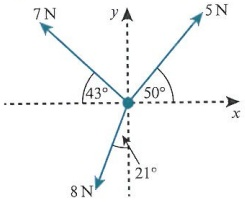</td></tr><tr><td style='text-align: center; word-wrap: break-word;'>AS &amp; A Level Mathematics Mechanics, Chapters 2 &amp; 3</td><td style='text-align: center; word-wrap: break-word;'>Apply Newton&#x27;s second law with multiple forces.</td><td style='text-align: center; word-wrap: break-word;'>2 A block on rough horizontal ground is subject to three forces: a pulling force of magnitude 17.8 N acting at  $ 20^{\circ} $ above the horizontal; a horizontal pushing force, in the same direction as the pulling force, of magnitude 8.9 N; and a resisting force of magnitude 22.3 N. If the block has mass 4 kg, find the acceleration of the block.</td></tr><tr><td style='text-align: center; word-wrap: break-word;'>AS &amp; A Level Mathematics Mechanics, Chapters 8 &amp; 9</td><td style='text-align: center; word-wrap: break-word;'>Calculate the potential energy and kinetic energy of a system at any point during its motion.</td><td style='text-align: center; word-wrap: break-word;'>3 A particle of mass 1.5 kg is projected up a smooth slope inclined at  $ 25^{\circ} $. The particle has initial speed  $ 22 m s^{-1} $. If the particle travels 5 m up the slope, what is its speed at that point?</td></tr></table>

## What is circular motion?

Circular motion is the motion of a particle around part or all of a circular path. The circle may be horizontal or vertical.

Examples of circular motion are all around us in real life, but some are more obvious than others. The pendulum on an old clock and a conker on a string both move with circular motion, but have you ever thought of cars racing in the Indianapolis 500 in the same way? Because the track is banked, the cars are moving in the same way as a steel ball around the inside of a circular bearing.

In this chapter we shall look at two types of circular motion: horizontal and vertical. We shall discover that the acceleration of a particle moving in a circle is directed towards the centre of the circle. We shall often use conservation of energy and Newton's second law to solve problems of circular motion.

In this chapter we shall use the symbols  $ \nu $ for linear speed,  $ \omega $ for angular speed, r for radius, and a for acceleration. We shall use the abbreviations KE for kinetic energy and PE for potential energy.

Unless stated otherwise,  $ g = 10 \, \text{m} \, \text{s}^{-2} $

<!-- page 367 -->

### 15.1 Horizontal circles

Consider a particle moving in a horizontal circular path with constant speed.

The path is an arc of a circle, measured as $r\theta$. The rate of change of this distance $\frac{\mathrm{d}}{\mathrm{d}t}(r\theta)$ is equal to $r\frac{\mathrm{d}\theta}{\mathrm{d}t}$. So we have the relation $v=r\frac{\mathrm{d}\theta}{\mathrm{d}t}$ or $v=r\omega$, as shown in Key point 15.1. The quantity $\omega=\frac{\mathrm{d}\theta}{\mathrm{d}t}$ is known as the angular speed and is constant.

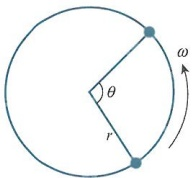

### KEY POINT 15.1

To calculate the speed of a particle moving with circular motion, use:

 $$ \nu=r\frac{\mathrm{d}\theta}{\mathrm{d}t}\mathrm{o r}\nu=r\omega $$ 

The formulae in Key point 15.1 imply that, the larger the circle, the greater the speed must be. The angular speed is the same whatever the size of the radius because it measures the angle of travel over time, as shown in Key point 15.2.

### KEY POINT 15.2

The angular speed $\omega$ is measured in radians per second, denoted as $\mathrm{rad s}^{-1}$. One complete cycle is $2\pi$ radians, so the frequency, the number of revolutions per second, is $\frac{2\pi}{\omega}$.

### WORKED EXAMPLE 15.1

In each case, convert either angular speed to linear speed or linear speed to angular speed, or calculate both quantities, as appropriate:

a a particle travelling in a circular path of radius 5m with angular speed  $ 4\operatorname{rad}s^{-1} $

b a particle travelling along a circular path of radius 2.5m, with speed 4m s $ ^{-1} $

c a particle travelling on a circular path with radius 2m, where the time to cover one complete circle is 6s

d the Earth travelling around the Sun, where the path is assumed to be circular and of radius  $ 1.496 \times 10^{11} $ m.

## Answer

a Using  $ v = r\omega $,  $ v = 5 \times 4 = 20 \, \text{m} \, \text{s}^{-1} $.

b Using $v = r\omega$, $4 = 2.5\omega$. Hence, $\omega = 1.6\mathrm{rad}\mathrm{s}^{-1}$. The first two examples just require you to substitute values into the formula.

c Since  $ 2\pi $ is covered in  $ 6s $,  $ \omega = \frac{2\pi}{6} = \frac{\pi}{3} $ rad s $ ^{-1} $.

Then  $ \nu = 2 \times \frac{\pi}{3} = \frac{2\pi}{3} $ m s $ ^{-1} $.

First determine the angular speed.

d First, consider that 365 days is 31 536 000 seconds. Then find the linear speed.

Determine the number of seconds per year.

<!-- page 368 -->

Then for a complete revolution:

Note the angular speed is very small.

 $$ \omega=\frac{2\pi}{31~536000} $$ 

Use  $ v = r\omega $:

 $$ \approx1.99\times10^{-7}\mathrm{r a d s^{-1}} $$ 

Calculate the linear speed.

 $$ v=1.496\times10^{11}\times1.992\times10^{-7} $$ 

 $$ =29800\mathrm{m s}^{-1} $$ 

As an object travels in a circular path, its direction of motion constantly changes.

Because of this, the linear speed of the object is not actually constant. Consider two points on the path of a circle, P and Q. Let the angle  $ POQ $ be very small,  $ \delta\theta $. At the point P we assume the speed is v. Then, since Q is very close to P, we can also assume that the speed at Q has the components  $ v\cos\delta\theta $ and  $ v\sin\delta\theta $, where these components are parallel and perpendicular to the tangent at P. Since  $ \sin\delta\theta \approx \delta\theta $ and  $ \cos\delta\theta \approx 1 $, we can focus on the acceleration parallel and perpendicular to the tangent at P.

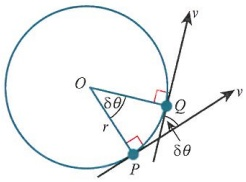

Since acceleration =  $ \frac{\text{change in speed}}{\text{change in time}} $, the parallel acceleration component is  $ \frac{\nu \cos \delta \theta - \nu}{\delta t} \approx 0 $, and the perpendicular acceleration component, acting towards the centre, is  $ \frac{\nu \sin \delta \theta - 0}{\delta t} $. Hence, the acceleration acts towards the centre and is of magnitude  $ \nu \frac{\mathrm{d}\theta}{\mathrm{d}t} $. This is commonly written as  $ r \omega^2 $ or  $ \frac{\nu^2}{r} $, as shown in Key point 15.3.

### KEY POINT 15.3

The acceleration towards the centre for an object moving in circular motion is  $ a = \frac{v^{2}}{r} $ or  $ a = r\omega^{2} $. The link between v and  $ \omega $ is  $ v = r\omega $.

Consider a particle travelling on a circular path of radius 1.2m. Its speed is  $ 3 \, m s^{-1} $. If the mass of the particle is 2 kg, can we find the force towards the centre?

We begin with $F = ma = m\frac{v^{2}}{r}$.

Substituting the mass, radius and speed provided:  $ F = 2 \times \frac{3^{2}}{1.2} $

Hence, F = 15N.

### WORKED EXAMPLE 15.2

In each case, find the force towards the centre:

a a particle of mass 1.5kg, travelling with angular speed 4rad s $ ^{-1} $, where the radius is 0.5m

b a particle of mass 4kg, travelling with speed  $ 5\mathrm{~m}s^{-1} $, where the radius is 2.4m

c a particle of mass 0.5kg, travelling around a circle of radius 20m in 12s.

<!-- page 369 -->

## Answer

a Using $F = ma$, we have $F = m r \omega^{2}$.

So $F = 1.5 \times 0.5 \times 4^{2}$

= 12N

Note the type of speed and use the corresponding formula.

b Using $F = m \frac{v^{2}}{r}$, we have $4 \times \frac{5^{2}}{2.4}$.

So  $ F = \frac{125}{3} N $

c First find  $ \omega = \frac{2\pi}{12} = \frac{\pi}{6} $.

Determine the angular speed before applying  $ F = ma $.

Then using  $ F = m r \omega^2 $ gives  $ 0.5 \times 20 \times \left( \frac{\pi}{6} \right)^2 = \frac{5\pi^2}{18} = 2.74 \, \text{N} $.

Now that we understand the idea of acceleration towards the centre of the circle, let us look at an example in context. Consider a particle that is attached to one end of a light, inextensible string of length 2m. The other end of the string is attached to a point on a smooth, horizontal table. The particle has mass 1.5kg and it describes horizontal circles on the surface of the table with angular speed  $ 4\rad s^{-1} $. We want to find the tension in the string.

Start with  $ F = ma = m\omega^2 $, then  $ T = 1.5 \times 2 \times 4^2 $, so the tension in the string is 48 N.

### WORKED EXAMPLE 15.3

A particle is describing circles on a smooth, horizontal table. The particle is attached to a light, inelastic string that is attached to a point, $O$, where the radius of the circles is 1.2m. Given that the tension in the string is 40N, and that the particle can complete one circle in $\frac{5\pi}{3}$ s, find the mass of the particle.

Answer

First use  $ \omega = \frac{2\pi}{3\pi} = 1.2 \, \text{rad} \, \text{s}^{-1} $.

Find the angular speed.

Then $F = ma$ gives $40 = m \times 1.2 \times (1.2)^2$.

Apply F = ma.

So m = 23.1 kg.

### WORKED EXAMPLE 15.4

A particle is placed on a rough horizontal disc 4m from the centre of the disc. The particle has mass 2 kg and the coefficient of friction between the particle and the disc is 0.6. The disc begins to spin around slowly until the particle slips. Find the frictional force on the particle when the disc is spinning at  $ 2 \, m \, s^{-1} $. Find also the angular speed of the disc when the particle is on the point of slipping.

<!-- page 370 -->

## Answer

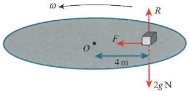

Using $F = ma$, we have $F = 2 \times \frac{2^{2}}{4} = 2N$

At the slipping point,

 $ F_{\mathrm{lim}} = \mu R = 0.6 \times 2g = 12\,\mathrm{N} $.

This helps you to see what is happening.

Draw a fully labelled, clear diagram.

So  $ 12 = 2 \times 4 \times \omega^{2} $

Use $F = m \frac{v^{2}}{r}$ to obtain the result.

Hence,  $ \omega = \frac{\sqrt{6}}{2} \text{rad s}^{-1} $.

State the maximum frictional force (see Rewind).

Use  $ F = m r \omega^{2} $ to find the angular speed.

## REWIND

Recall from Chapter 14 that when an object is on the point of slipping on a rough surface,  $ F_{\max} = \mu R $. We can also write  $ F_{\max} $ as  $ F_{\lim} $, which refers to limiting friction.

### WORKED EXAMPLE 15.5

Two particles are attached to a light, inelastic string of length 4a. One particle, P, of mass m, is placed on a large, smooth disc. The string is then threaded through a smooth hole in the centre of the disc. At the other end of the string is the particle Q, of mass 2m. The disc is spinning such that particle Q does not move and is 1.5a below the centre of the disc. Find the tension in the string, and also find the angular speed of the particle P in terms of a as it moves in circles.

## Answer

<table border=1 style='margin: auto; word-wrap: break-word;'><tr><td rowspan="4">Q does not move, so  $ T = 2mg $ N\nSo  $ T = m r\omega^{2} $ gives  $ 2mg = m \times 2.5a \times \omega^{2} $\nHence,  $ \omega = \sqrt{\frac{4g}{5a}} $  $ rad s^{-1} $.</td><td style='text-align: center; word-wrap: break-word;'>Since the string is of length 4a it is clear that the radius of the circle described is 2.5a.</td></tr><tr><td style='text-align: center; word-wrap: break-word;'>Balance forces vertically for Q.</td></tr><tr><td style='text-align: center; word-wrap: break-word;'>Use F = ma with angular speed form for particle Q.</td></tr><tr><td style='text-align: center; word-wrap: break-word;'>Find  $ \omega $.</td></tr></table>

<!-- page 371 -->

A particle $P$, is placed on a large, rough, horizontal disc. $P$ is of mass 3 kg. $P$ is then attached to a light, inextensible string of length 2.4 m. The string passes through a smooth hole in the centre of the disc, and at the other end is a particle, $Q$, of mass 6 kg. The coefficient of friction between $P$ and the disc is 0.5. $Q$ is hanging freely under the hole in the disc. The disc begins to spin with $P$ at a distance of 1.6 m from the centre of the disc. If $Q$ does not move at any point during the motion, find the range of angular speeds possible.

## Answer

<table border=1 style='margin: auto; word-wrap: break-word;'><tr><td style='text-align: center; word-wrap: break-word;'>First,  $ F_{lim} = 0.5 \times 3g = 15 \text{N} $, and if  $ Q $ doesn&#x27;t move  $ T = 60 \text{N} $.</td><td style='text-align: center; word-wrap: break-word;'>The friction force will be used in conjunction with the force towards the centre.</td></tr><tr><td style='text-align: center; word-wrap: break-word;'>Slipping inwards:  $ 60 = F + m r\omega^{2} $\nThen  $ 60 = 15 + 3 \times 1.6\omega^{2} $\n $ \omega = \frac{5\sqrt{6}}{4} \text{rad} s^{-1} $</td><td style='text-align: center; word-wrap: break-word;'>Determine the limiting friction and state the tension in the string.</td></tr><tr><td style='text-align: center; word-wrap: break-word;'>Slipping outwards:  $ 60 + F = m r\omega^{2} $\nThen  $ 75 = 4.8 \omega^{2} $\n $ \omega = \frac{5\sqrt{10}}{4} \text{rad} s^{-1} $</td><td style='text-align: center; word-wrap: break-word;'>For slipping inwards,  $ \omega $ has a minimum value.</td></tr><tr><td style='text-align: center; word-wrap: break-word;'>Hence,  $ \frac{5\sqrt{6}}{4} \le \omega \le \frac{5\sqrt{10}}{4} $</td><td style='text-align: center; word-wrap: break-word;'>For slipping outwards,  $ \omega $ has a maximum value.</td></tr><tr><td style='text-align: center; word-wrap: break-word;'></td><td style='text-align: center; word-wrap: break-word;'>State the range of allowed values.</td></tr></table>

## DID YOU KNOW?

Rollercoaster loops are never circular. They are actually constructed to form what is known as a clothoid loop. On a circular track, the speed would decrease as you travelled around the loop with constant acceleration and the roller coaster may not complete the loop. On a clothoid loop, the radius is smaller at the top to keep the speed high enough.

## EXERCISE 15A

1 In each of the following, use the relation  $ v = r\omega $ to determine the unknown value.

a  $ v = 4, r = 6 $. Find  $ \omega $.

b  $ v = 6, \omega = 3 $. Find r.

c r = 5,  $ \omega = 0.8 $. Find v.

<!-- page 372 -->

2 A particle of mass 0.2kg is attached to a light inextensible string of length 1.5m. The particle is moving in horizontal circles. Find the tension in the string if the speed of the particle is  $ 5 \, m \, s^{-1} $.

3 A particle of mass 0.8 kg is attached to a light inextensible string of length 1.2 m. The particle is moving in horizontal circles. Find the angular speed of the particle if the tension in the string is 10 N.

4 A particle is describing horizontal circles on a smooth, horizontal table. The particle is fixed to its circular path by an inelastic string of length 1.5 m. Given that the tension in the string is 45 N, and that the mass of the particle is 5 kg, find the angular speed of the particle.

State also how many seconds the particle takes to describe one complete circle.

PS 5 A particle is placed on a rough horizontal disc, 2a from the centre of the disc. The particle is of mass 3m.

The disc then starts to spin at an angular speed of  $ \sqrt{\frac{g}{4a}} $. Given that the particle is on the point of slipping, find a range of values of  $ \mu $ such that equilibrium is not broken.

M 6 A car is driving on a horizontal circular section of road that has radius 50m. The car is of mass 800kg and the coefficient of friction between the tyres and the road is 0.8. Find the maximum speed that the car can drive around the road without slipping.

7 A particle of mass 1.5 kg is resting on a smooth horizontal table. The particle is attached to a light, inextensible string of length 2.5 m. This string is passed through a smooth hole in the table. At the other end of the string is a particle of mass 4 kg. The particle on the table is set in motion and describes circles with radius 1.5 m. Find the speed of the particle on the table. Assume that the particle that is freely hanging does not move during the motion.

PS 8 A particle is describing horizontal circles of radius $a$; the mass of the particle is $m$. Given that the particle can complete one circle in $\tau$ seconds, and that the particle is held in its path by means of a light, inextensible string with tension $T$, find an expression for the mass $m$.

PS 9 A particle is placed on the inside of a rough, hollow cylinder of radius 2a. The cylinder is placed upright and can rotate about an axis through its centre. The particle has mass m and the coefficient of friction is  $ \frac{3}{4} $. Given the particle does not slip as the cylinder rotates, find the speed at which the cylinder rotates.

10 A particle, P, is placed on a large, rough, horizontal disc. P is of mass 2.4kg. The particle is then attached to a light, inextensible string of length 4m. The string passes through a smooth hole in the centre of the disc, and at the other end is a particle, Q, of mass 3kg. The coefficient of friction between P and the disc is 0.2. Q is hanging freely under the hole in the disc. The disc is set spinning with P at a distance of 1.2m from the centre of the disc. If Q does not move at any point during the motion, find the range of speeds possible.

### 15.2 The 3-dimensional case

Consider a particle on the end of a light, inelastic string with the other end of the string attached to a fixed point O. The particle is set in motion to describe small horizontal circles. This is a conical pendulum model.

<!-- page 373 -->

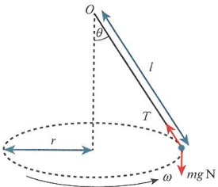

The string describes the curved surface of a cone as the particle moves in a circle below the fixed point at O. The force towards the centre is now a component of the tension in the string. The vertical component of the tension links to the weight of the particle. With this kind of problem we must resolve into horizontal and vertical components first.

 $ R(\uparrow) $:  $ T\cos\theta = mg $; hence,  $ T = \frac{mg}{\cos\theta} $.

Then  $ R(\leftarrow) $:  $ T\sin\theta = m r\omega^2 $.

Since  $ \frac{r}{l} = \sin\theta $, it follows that  $ T\sin\theta = m l \sin\theta \omega^{2} $, or  $ T = m l \omega^{2} $.

Equating these two results gives  $ \omega = \sqrt{\frac{g}{l\cos\theta}} $.

Assigning some values, let the mass of the particle be 2kg, the angle  $ 30^{\circ} $ and the string length 2.5m.

Then the tension is  $ \frac{40\sqrt{3}}{3} $N and the angular speed is  $ \sqrt{\frac{8\sqrt{3}}{3}} $rad s $ ^{-1} $.

### WORKED EXAMPLE 15.7

A particle of mass 1.5kg is attached to one end of a light, inelastic string of length 1.8m. The string is attached to a fixed point, O, at its other end. The particle is set in motion and describes horizontal circles with the string taut and at  $ 20^{\circ} $ to the downward vertical through the point O. Find the tension in the string and the angular speed of the particle.

Answer

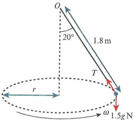

A large, well-labelled diagram is essential for mechanics problems.

Draw a diagram so you can resolve both vertically and horizontally.

 $ R(\uparrow) $:  $ T\cos{20} = 1.5g $; hence,  $ T = \frac{15}{\cos{20}} = 16.0\ N $.

 $ R(\leftarrow) $:  $ T\sin 20 = 1.5 \times r \times \omega^2 $, where  $ r = 1.8\sin 20 $.

Resolve vertically to find $T$.

 $$ \frac{15}{\cos20}\sin20=1.5\times1.8\sin20\times\omega^{2} $$ 

Resolve horizontally using $F = ma$

 $$ \mathrm{S o}\omega=2.43\mathrm{r a d s}^{-1}. $$ 

Solve to find $\omega$.

<!-- page 374 -->

If you are asked to find the speed of a particle instead of the angular speed, you need to be careful when cancelling terms.

For the general case in the diagram at the start of Section 15.2,  $ T = \frac{mg}{\cos\theta} $ is unchanged, but towards the centre,  $ T\sin\theta = m\frac{v^{2}}{l\sin\theta} $.

Notice that the $\sin\theta$ term does not cancel here. Keep in mind this term cancels only for angular speed.

### WORKED EXAMPLE 15.8

A particle of mass 3m is attached to a light, inextensible string of length 5a. The other end of the string is attached to a fixed point, O. The particle is moving in horizontal circles about a centre that is 4a vertically below the point O. By resolving vertically and horizontally, find the tension in the string and the speed of the particle.

## Answer

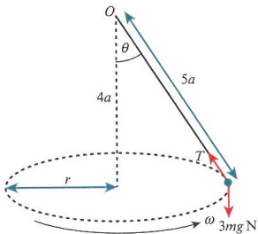

$$\cos\theta=\frac{4}{5}\text{ and }\sin\theta=\frac{3}{5}.$$

 $ R(\uparrow) $:  $ T\cos\theta = 3mg $, and so  $ T = \frac{15}{4}mg $.

First note the sides of the triangle formed.

 $ R(\leftarrow) $:  $ T\sin\theta = 3m\frac{v^2}{3a} $, then  $ \frac{15}{4}mg \times \frac{3}{5} = \frac{m}{a}v^2 $.

Resolve vertically to find the tension.

Resolve horizontally with this tension to get $v^{2}$ and substitute the earlier expression found for $T$.

Hence,  $ v = \frac{3}{2}\sqrt{ga} $.

State the value of v.

Consider an object on a sloped surface, sometimes called a banked surface. Here, there is a reaction force rather than tension in a string.

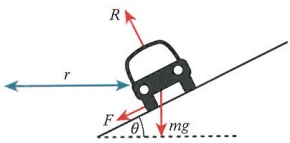

First consider the case when the surface is smooth. We shall have the same situation as that of the conical pendulum. When there is friction, it is usually considered to act down the slope. This is because the car is likely to slip up the slope due to excess speed.

Resolving vertically:  $ R\cos\theta = mg + F\sin\theta $

Then considering the forces towards the centre:  $ F\cos\theta + R\sin\theta = m\frac{v^{2}}{r} $

<!-- page 375 -->

If the car is on the point of slipping,  $ F = \mu R $.

Resolving vertically,  $ R\cos\theta - \mu R\sin\theta = mg $, so  $ R = \frac{mg}{\cos\theta - \mu\sin\theta} $.

Then from the force towards the centre,  $ R(\mu\cos\theta + \sin\theta) = m\frac{v^2}{r} $, so  $ \frac{\mu\cos\theta + \sin\theta}{\cos\theta - \mu\sin\theta}mg = m\frac{v^2}{r} $.

If we then divide top and bottom by  $ \cos\theta $, this gives  $ \frac{\nu^{2}}{r}=g\frac{\mu+\tan\theta}{1-\mu\tan\theta} $.

You do not have to memorise this result, but you should be able to derive it.

### WORKED EXAMPLE 15.9

A car of mass 1000kg is turning on a banked road of radius 80m. The incline of the road is  $ 15^{\circ} $ and the car is travelling at  $ 25\,m\,s^{-1} $. The car is about to slip up the road.

a Resolve vertically and find an expression for the reaction force between the car and the road, in terms of the frictional force.

b Resolve towards the centre of the circle.

c Find the coefficient of friction between the car and the road.

<table border=1 style='margin: auto; word-wrap: break-word;'><tr><td style='text-align: center; word-wrap: break-word;'>a</td><td style='text-align: center; word-wrap: break-word;'>$ R(\uparrow) $:  $ R\cos 15 = 1000g + F\sin 15 $</td><td style='text-align: center; word-wrap: break-word;'>Resolve vertically. There are three forces.</td></tr><tr><td style='text-align: center; word-wrap: break-word;'></td><td style='text-align: center; word-wrap: break-word;'>$ So\ R = \frac{10000 + F\sin 15}{\cos 15} $.</td><td style='text-align: center; word-wrap: break-word;'>Determine  $ R $.</td></tr><tr><td style='text-align: center; word-wrap: break-word;'>b</td><td style='text-align: center; word-wrap: break-word;'>$ R\sin 15 + F\cos 15 = 1000 \times \frac{25^{2}}{80} $</td><td style='text-align: center; word-wrap: break-word;'>Resolve horizontally towards the centre.</td></tr><tr><td style='text-align: center; word-wrap: break-word;'>c</td><td style='text-align: center; word-wrap: break-word;'>Equating:\n $ (10000 + F\sin 15)\tan 15 + F\cos 15 = \frac{15625}{2} $\n $ F(\sin 15\tan 15 + \cos 15) = \frac{15625}{2} - 10000\tan 15 $</td><td style='text-align: center; word-wrap: break-word;'>Form an equation in terms of F only.</td></tr><tr><td style='text-align: center; word-wrap: break-word;'></td><td style='text-align: center; word-wrap: break-word;'>This gives  $ F = 4958.105N $, then  $ R = 11681.28N $</td><td style='text-align: center; word-wrap: break-word;'>Determine a numerical result for F and then for  $ R $.</td></tr><tr><td style='text-align: center; word-wrap: break-word;'></td><td style='text-align: center; word-wrap: break-word;'>Hence,  $ \mu = 0.424 $.</td><td style='text-align: center; word-wrap: break-word;'>Make use of  $ F = \mu R $.</td></tr></table>

We shall also encounter problems where there is more than one force acting towards the centre, for example, a particle with two strings attached. In Worked example 15.10, we assume that a single string with a particle attached to the centre of the string can be treated as two separate strings with different tensions.

<!-- page 376 -->

### WORKED EXAMPLE 15.10

A light, inelastic string of length $2a$ is tied to a fixed, vertical pole at two points, $A$ and $B$. $A$ is a distance $a$ vertically above $B$. $A$ particle of mass $2m$ is attached to the midpoint of the string. The particle is then set in motion to describe horizontal circles. Both parts of the string are taut at all times during the motion. Given that the speed of the particle is $\sqrt{\frac{9}{4}ga}$, find the tension in both parts of the string.

<table border=1 style='margin: auto; word-wrap: break-word;'><tr><td style='text-align: center; word-wrap: break-word;'>Answer\n\n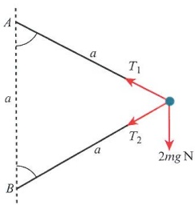</td><td style='text-align: center; word-wrap: break-word;'>By sketching a suitable diagram, we can see that we have an equilateral triangle. The particle at the midpoint of the string splits it into two equal parts. Note that their tensions are different. Using a sketch shows that the upper string must have a larger tension than the lower string. This information will help you when checking for errors.</td></tr><tr><td style='text-align: center; word-wrap: break-word;'>$ R(\uparrow) $:  $ T_1 \cos 60 = T_2 \cos 60 + 2mg $</td><td style='text-align: center; word-wrap: break-word;'>Note angles are all 60°, and resolve.</td></tr><tr><td style='text-align: center; word-wrap: break-word;'>$ R(\leftarrow) $:  $ T_1 \sin 60 + T_2 \sin 60 = \frac{2m \times \frac{9}{4}ga}{a\sqrt{3}} $</td><td style='text-align: center; word-wrap: break-word;'>Use Pythagoras or trigonometry to find the radius of the circular motion. The force acts towards the centre.</td></tr><tr><td style='text-align: center; word-wrap: break-word;'>So  $ (T_1 + T_2) \times \frac{\sqrt{3}}{2} = \frac{9mg}{\sqrt{3}} $, then  $ T_1 + T_2 = 6mg $.</td><td style='text-align: center; word-wrap: break-word;'>Simplify the second equation.</td></tr><tr><td style='text-align: center; word-wrap: break-word;'>Solving  $ T_1 = T_2 + 4mg $ gives  $ T_1 - T_2 = 4mg $.</td><td style='text-align: center; word-wrap: break-word;'>Simplify the first equation and combine.</td></tr><tr><td style='text-align: center; word-wrap: break-word;'>Gives  $ T_2 = mg $ and  $ T_1 = 5mg $.</td><td style='text-align: center; word-wrap: break-word;'>Obtain both tensions.</td></tr></table>

## EXERCISE 15B

1 A particle of mass 0.9kg is attached to a light inextensible string of length 2.4m. The other end of the string is attached to a fixed point on the ceiling. The particle is describing horizontal circles with the string taut and making an angle of  $ 25^{\circ} $ with the downward vertical. Find the speed of the particle.

2 A particle of mass 1.6kg is attached to a light inextensible string of length 1.4m. The other end of the string is attached to a fixed point on the ceiling. The particle is describing horizontal circles with the string taut and making an angle of  $ 35^{\circ} $ with the downward vertical. Find the angular speed of the particle.

3 A particle of mass 2kg is attached to a light, inextensible string of length 3m. The other end of the string is attached to a fixed point on the ceiling. The particle is describing horizontal circles with the string taut and making an angle of  $ 30^{\circ} $ with the downward vertical. Find the angular speed of the particle.

<!-- page 377 -->

4 A car is driving around a banked road inclined at  $ 15^{\circ} $ to the horizontal. The car has mass 1200 kg and the radius of the circular part of the road is 60 m. The coefficient of friction between the road and the tyres is 0.75, and the car is on the point of slipping up the road. Find the speed of the car.

5 A particle, P, of mass 3 kg is attached to two light, inextensible strings. One string is attached at its other end to a point, A. The other string has its other end attached to a point, B. A is 4 m above B. The particle makes horizontal circles such that angle  $ P_{AB} $ is  $ 30^{\circ} $ and angle  $ P_{BA} $ is  $ 60^{\circ} $. Given that the speed of the particle is  $ 3.6 m s^{-1} $, find the tension in each string.

M 6 A hemispherical bowl of radius $a$ is resting in a fixed position where its rim is horizontal. A small ball of mass $2m$ is moving around the inside of the bowl such that the circle described by the ball is $\frac{a}{2}$ vertically below the rim of the bowl. Find the speed of the ball.

7 A light, inextensible string of length 4m is threaded through a smooth ring at the point O. One end of the string has a particle, P, of mass 4kg, which is 1.2m vertically below O. Particle Q, of mass 1.6kg, is attached to the other end of the string. Particle Q is describing horizontal circles, with the string  $ OQ $ making an angle of  $ 20^{\circ} $ with the downward vertical.

a If particle $P$ does not move during the motion, find the angular speed of $Q$.

b Find the number of complete circles described per minute.

8 A car is moving on a circular section of road where the road is banked at  $ 25^{\circ} $ to the horizontal. The radius of this section of road is 100m. The car has mass 1400kg and is travelling at  $ 30\,m\,s^{-1} $. Given that the car is about to slip up the road, find the value of  $ \mu $.

M 9 A toy plane of mass 0.4kg is attached to one end of a light, inextensible string of length 6m. The other end of the string is attached to the point O. The string is taut and makes an angle of  $ 45^{\circ} $ with the upward vertical. Find:

a the tension in the string

b the speed of the toy plane.

### 15.3 Vertical circles

The problems we have looked at so far involved motion in a horizontal circle but particles can also describe vertical circles.

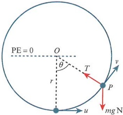

As the object moves around the circular path, it will gain potential energy due to the gain in height. This gain in potential energy comes about when the kinetic energy reduces, so in these situations the angular speed of the particle varies. This is the main reason we use the linear speed for this type of problem.

<!-- page 378 -->

Consider a particle of mass $m$ that is attached to a light, inelastic string of length $r$. The particle is at rest in equilibrium before being projected with speed $u$ from the lowest point. Assuming there are no resisting forces, we can use the principle of conservation of energy.

Considering zero potential energy when the particle is at a height level with the centre of the circle, as seen in the diagram:

Initially, PE = -mgr and KE =  $ \frac{1}{2}mu^{2} $. Generally, PE = -mgr  $ \cos\theta $ and KE =  $ \frac{1}{2}mv^{2} $.

For the particle to complete full circles, at the top of the circle it must have KE > 0. This means that the particle continues to move after reaching the top. This idea is also reinforced by the need to have tension in the string at the very top. If there was no tension in the string, then the particle would no longer be travelling along a circular path.

So considering $F = ma$ towards the centre at a general point, $T - mg\cos\theta = \frac{mv^2}{r}$.

Then from the principle of conservation of energy, $\frac{1}{2}mu^2 - mgr = \frac{1}{2}mv^2 - mgr\cos\theta$,

or $\frac{mv^2}{r} = \frac{mu^2}{r} - 2mg + 2mg\cos\theta$. Combining these two equations gives

$T - mg\cos\theta = \frac{mu^2}{r} - 2mg + 2mg\cos\theta$, and if the tension is such that $T \geqslant 0$, then $\frac{mu^2}{r} \geqslant 2mg - 3mg\cos\theta$.

At the top point $\theta = 180^\circ$, and so $\frac{u^2}{r} \geq 5g$, giving $u \geq \sqrt{5gr}$. This is the condition for complete vertical circles for a circle of radius $r$, as shown in Key point 15.4.

### KEY POINT 15.4

For a particle to complete vertical circles of radius $r$, starting from the lowest point, the speed $u$ must satisfy the condition $u \geq \sqrt{5gr}$

### WORKED EXAMPLE 15.11

A particle of mass $m$ is attached to a light, inelastic string of length $2a$. The other end of the string is attached to a fixed point, $O$. When the particle is resting in equilibrium below the point $O$, it is given a horizontal speed, $u$.

a Write down the minimum value of u required to complete a full circle.

b Given that  $ u^{2}=16ga $, find the greatest and least tension in the string.

<!-- page 379 -->

## Answer

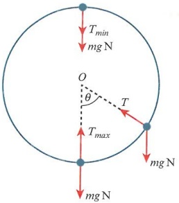

a Require  $ u_{\min} = \sqrt{5g(2a)} = \sqrt{10ga} $.

At a general point

 $ T - mg \cos \theta = \frac{mv^{2}}{2a}. $

Initially:

PE = -2mga, KE =  $ \frac{1}{2}mu^{2} $

Generally: PE = -2mga  $ \cos\theta $, KE =  $ \frac{1}{2}mv^{2} $

By CoE:

 $ \frac{1}{2}mu^{2}-2mga=\frac{1}{2}mv^{2}-2mga\cos\theta $

At the lowest point:  $ \theta=0 $,  $ u^{2}=16ga $

 $ \therefore T_{max}=9mgN $

 $$ \theta=180^{\circ} $$ 

So  $ \left(\frac{1}{2}m\right)(16ga)-2mga=\frac{1}{2}mv^{2}+2mga, $

giving  $ v^{2}=8ga $.

Then  $ T + mg = \frac{8mg a}{2a} $, so  $ T_{\min} = 3mg N $

Note that the greatest tension will always be when the particle is at the bottom of the circle.

The weight component plus the tendency of the particle to 'escape' the circular path means this is where the tension is maximum.

Similarly, at the top the tension is minimum since the speed is at a minimum and both tension and weight act downwards.

Use  $ u \geq \sqrt{5gr} $, with new radius.

Use F = ma generally.

Determine the energy of the system at the start and at a general point.

Assume conservation of energy (CoE).

Find maximum tension at the lowest point.

Use the angle at the top to find the speed.

Determine the minimum tension.

Consider a small ball placed on the inside of a smooth, hollow ring. We can model this in exactly the same way as the particle on a string.

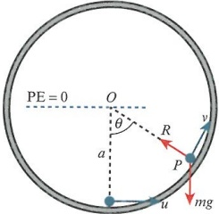

## TIP

If a particle lacks the energy to complete a full circle it can behave in two ways. If the particle has enough energy to travel beyond the horizontal midline of the circle, it will leave the surface of the ring and become a projectile. If it does not have enough energy to reach the midline, it will behave like a pendulum and eventually come to rest at the lowest point of the circle.

<!-- page 380 -->

In the absence of a string, the ball keeping contact with the inner surface of the ring produces a reaction force towards the centre of the ring. Just as with the particle on a string, if the particle does not have enough energy it will simply leave the circular path. The particle still travels, but it is no longer in contact with the inner surface of the ring.

### WORKED EXAMPLE 15.12

A particle, $P$, of mass $m$ is resting on the inside of a smooth, circular ring, with centre $O$ and radius $a$. The particle is projected from the lowest point with a horizontal speed of $u^{2}=\frac{5}{2}ga$. Find the angle between the line $OP$ and the downward vertical at the point where the particle leaves the surface of the ring.

## Answer

<table border=1 style='margin: auto; word-wrap: break-word;'><tr><td rowspan="4">Initially: PE = -mga, KE =  $ \left(\frac{1}{2}m\right)\left(\frac{5}{2}ga\right) = \frac{5}{4}mga $\nGenerally: PE = -mga cos \theta, KE =  $ \frac{1}{2}mv^{2} $\nBy CoE:  $ \frac{1}{4}mga + mga \cos\theta = \frac{1}{2}mv^{2} $ (1)\nUsing F = ma, R - mg cos \theta =  $ \frac{mv^{2}}{a} $. (2)\nSo R - mg cos \theta =  $ \frac{1}{2}mg + 2mg \cos\theta $.</td><td style='text-align: center; word-wrap: break-word;'>Determine the energy at the start and at a general point.</td></tr><tr><td style='text-align: center; word-wrap: break-word;'>Use conservation of energy.</td></tr><tr><td style='text-align: center; word-wrap: break-word;'>Resolve horizontally, towards the centre.</td></tr><tr><td style='text-align: center; word-wrap: break-word;'>Combine the equations.</td></tr><tr><td style='text-align: center; word-wrap: break-word;'>Hence,  $ R = \frac{1}{2}mg + 3mg \cos\theta $.</td><td style='text-align: center; word-wrap: break-word;'></td></tr><tr><td style='text-align: center; word-wrap: break-word;'>When the particle leaves its circular path:</td><td style='text-align: center; word-wrap: break-word;'></td></tr><tr><td style='text-align: center; word-wrap: break-word;'>$ R = 0 \Rightarrow \cos\theta = -\frac{1}{6} $</td><td style='text-align: center; word-wrap: break-word;'>Let the reaction be zero to find the point where the particle leaves the surface.</td></tr><tr><td style='text-align: center; word-wrap: break-word;'>$ \theta = 99.6^{\circ} $</td><td style='text-align: center; word-wrap: break-word;'>Determine the angle at that point.</td></tr></table>

### WORKED EXAMPLE 15.13

A particle, $P$, of mass $m$ is resting on the inside of a smooth, circular ring, with centre $O$ and radius $a$. The particle is projected from the lowest point with a horizontal speed of $u^{2} = 3ga$. Find the greatest height above $O$ achieved by the particle.

Answer

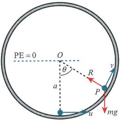

Label your diagram with the same notation and references as in the question.

<!-- page 381 -->

<table border=1 style='margin: auto; word-wrap: break-word;'><tr><td style='text-align: center; word-wrap: break-word;'>Initially:  $ KE = \frac{3}{2}mga $, PE = -mga</td><td style='text-align: center; word-wrap: break-word;'>Find the energy at the start.</td></tr><tr><td style='text-align: center; word-wrap: break-word;'>Generally:  $ KE = \frac{1}{2}mv^{2} $, PE = -mga  $ \cos\theta $</td><td style='text-align: center; word-wrap: break-word;'>Find the energy at a general point.</td></tr><tr><td style='text-align: center; word-wrap: break-word;'>By CoE:  $ mg + 2mg\cos\theta = \frac{mv^{2}}{a} $</td><td style='text-align: center; word-wrap: break-word;'>Use conservation of energy and multiply through by  $ \frac{2}{a} $</td></tr><tr><td style='text-align: center; word-wrap: break-word;'>Using F = ma, R - mg  $ \cos\theta = \frac{mv^{2}}{a} $.</td><td style='text-align: center; word-wrap: break-word;'>Resolve towards the centre.</td></tr><tr><td style='text-align: center; word-wrap: break-word;'>So R - mg  $ \cos\theta $ = mg + 2mg  $ \cos\theta $.</td><td style='text-align: center; word-wrap: break-word;'></td></tr><tr><td style='text-align: center; word-wrap: break-word;'>R = 0 gives  $ \cos\theta = -\frac{1}{3} $. With this angle  $ v = \sqrt{\frac{1}{3}ga} $.</td><td style='text-align: center; word-wrap: break-word;'>Let the reaction force be zero to determine the angle and speed at the point when the particle leaves the surface of the ring.</td></tr><tr><td style='text-align: center; word-wrap: break-word;'>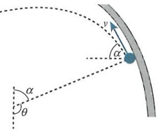</td><td style='text-align: center; word-wrap: break-word;'>As the particle leaves the inner surface, note that the angle  $ \alpha $ is important for the height of the particle at that point, as well as the component form of the speed.</td></tr><tr><td style='text-align: center; word-wrap: break-word;'>Since  $ \cos\alpha = \frac{1}{3} $, we can split the speed into components.</td><td style='text-align: center; word-wrap: break-word;'>Although it looks as if the particle is still moving around the circle, its path is a tangent to the circle. After this point, the particle will fall off the ring and travel as a projectile under gravity.</td></tr><tr><td style='text-align: center; word-wrap: break-word;'>$ v_{y} = \sqrt{\frac{1}{3}ga} $  $ \sin\alpha = \frac{2\sqrt{2}}{3} $  $ \sqrt{\frac{1}{3}ga} $ (Only need  $ \uparrow $).</td><td style='text-align: center; word-wrap: break-word;'>State  $ \cos\alpha $ and use it to find  $ \sin\alpha $.</td></tr><tr><td style='text-align: center; word-wrap: break-word;'>Using  $ v^{2} = u^{2} + 2as $, so 0 =  $ \frac{8}{27}ga - 2gs $,</td><td style='text-align: center; word-wrap: break-word;'>Determine the vertical speed component.</td></tr><tr><td style='text-align: center; word-wrap: break-word;'>giving  $ s = \frac{4}{27}a $.</td><td style='text-align: center; word-wrap: break-word;'>Speed at the highest point is zero.</td></tr><tr><td style='text-align: center; word-wrap: break-word;'>So the total height above O is a  $ \cos\alpha + s = \frac{13}{27}a $.</td><td style='text-align: center; word-wrap: break-word;'>State the greatest height achieved above O.</td></tr></table>

Instead of travelling on the inside or a circular surface, particles can travel on the outside. Consider a hemispherical shell resting on a horizontal surface with its plane face at the bottom. The hemisphere is smooth and has radius r. At the top of the hemisphere is a particle of mass m. The particle is given a very slight push, to produce enough speed to get the particle moving. Let us look at the situation where the particle leaves the surface of the hemisphere.

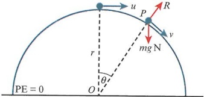

<!-- page 382 -->

Initially, KE =  $ \frac{1}{2}mu^{2} $ and PE = mgr. Generally, KE =  $ \frac{1}{2}mv^{2} $ and PE = mgr  $ \cos\theta $.

Using conservation of energy:  $ \frac{1}{2}mv^{2} = \frac{1}{2}mu^{2} + mgr - mgr \cos\theta $

If we multiply through by  $ \frac{2}{r} $, we get  $ \frac{mv^{2}}{r} = \frac{mu^{2}}{r} + 2mg - 2mg \cos\theta $.

Next use $F = ma$ towards the centre of the hemisphere to get $mg\cos\theta - R = \frac{mv^{2}}{r}$ or $-R = \frac{mu^{2}}{r} + 2mg - 3mg\cos\theta$.

When the particle leaves the surface, $R=0$ and so $\cos\theta=\frac{\frac{mu^{2}}{r}+2mg}{3mg}$.

This result is quite useful. If  $ u \approx 0 $ then  $ \cos\theta \approx \frac{2}{3} $, so even with the slightest push the particle will leave the surface of the hemisphere after  $ 48.2^\circ $.

It also shows that when  $ u^2 = gr $,  $ \cos\theta = 1 $, and so  $ \theta = 0 $, implying the particle leaves the surface immediately after being given an initial speed of  $ \sqrt{gr} $, as shown in Key point 15.5.

### KEY POINT 15.5

When a particle is projected from the top of a hemisphere, provided the initial speed is  $ 0 < u < \sqrt{gr} $, the particle will turn through an angle  $ \theta $, where  $ 0 < \theta < \cos^{-1}\left(\frac{2}{3}\right) $.

### WORKED EXAMPLE 15.14

A particle of mass $m$ is projected from the top of a hemisphere of radius $a$. The hemisphere has its plane face in contact with the horizontal surface below it, and the hemisphere is to be considered smooth. If the initial speed at the top is $\sqrt{\frac{1}{4}ga}$, find the speed of the particle at the moment it loses contact with the hemisphere.

## Answer

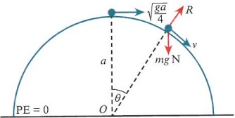

Initially:  $ \mathrm{KE}=\frac{1}{8}m g a $,  $ \mathrm{PE}=m g a $

It is usually easier to consider the zero potential energy line at the centre of the 'circle'. This reduces the number of combinations of distances in your calculations.

Generally:  $ \mathrm{KE}=\frac{1}{2}mv^{2} $,  $ \mathrm{PE}=mga\cos\theta $

CoE:  $ \frac{mv^{2}}{a}=\frac{9}{4}mg-2mg\cos\theta $

Find the energy at the top.

Determine the energy at a general point.

Use conservation of energy and combine this with the force towards the centre.

<!-- page 383 -->

Using $F = ma$, $mg \cos \theta - R = \frac{mv^2}{a}$. Combine this with the energy

result to get mg cos $ \theta - R = \frac{9}{4}mg - 2mg \cos\theta $.

Obtain a result in R and cos$\theta$.

When  $ R = 0 $,  $ \cos\theta = \frac{3}{4} $ and so  $ v = \sqrt{\frac{3}{4}ga} $.

Find the speed at the point of loss of contact.

### WORKED EXAMPLE 15.15

A smooth hemisphere of radius 2a is fixed with its plane face against a horizontal surface. The centre of the plane face is denoted as O. A particle of mass m is placed at the top of the hemisphere. The particle is then projected horizontally with speed  $ \sqrt{\frac{2}{3}ga} $. The particle first lands on the horizontal surface at the point B. Determine the distance OB.

## Answer

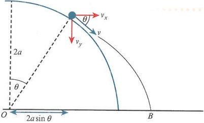

Initially: $\mathrm{KE}=\frac{1}{3}mga$, $\mathrm{PE}=2mga$

Generally: $\mathrm{KE}=\frac{1}{2}mv^{2}$, $\mathrm{PE}=2mga\cos\theta$

You can draw two diagrams: one for the initial calculations and one for when the particle leaves the surface.

CoE:  $ \frac{mv^{2}}{2a}=\frac{7}{3}mg-2mg\cos\theta $

The particle will lose contact with the hemisphere at some point.

Using $F = ma$, $mg \cos \theta - R = \frac{mv^{2}}{2a}$

or $mg \cos \theta - R = \frac{7}{3}mg - 2mg \cos \theta$.

So  $ R = 0 \Rightarrow \cos\theta = \frac{7}{9} $. We also have  $ \sin\theta = \frac{4\sqrt{2}}{9} $.

Speed at leaving point is  $ \nu = \sqrt{\frac{14}{9}ga} $.

For forces towards the centre, remember that the component of the weight is greater than the reaction force.

Determine the energy at the two points, as for similar problems.

So  $ v_y = v \sin \theta = \frac{4\sqrt{2}}{9} \sqrt{\frac{14}{9} g a} $.

Conservation of energy

Let the reaction force be zero to find the angle at separation.

Determine the speed at that point.

<!-- page 384 -->

<table border=1 style='margin: auto; word-wrap: break-word;'><tr><td style='text-align: center; word-wrap: break-word;'>Use  $ s = ut + \frac{1}{2}at^{2} $ vertically to find the time taken to reach the ground, so  $ \frac{14}{9}a = \sqrt{\frac{448}{729}gat} + \frac{1}{2}gt^{2} $. Solving this leads to  $ t = 1.146\sqrt{\frac{a}{g}} $, so  $ v_{x} = v\cos\theta = \frac{7}{9}\sqrt{\frac{14}{9}ga} $. Use s = ut to give s = 1.146 $ \sqrt{\frac{a}{g}}\sqrt{\frac{686}{729}ga} = 1.112a $. So OB is  $ 2a \times \frac{4\sqrt{2}}{9} + 1.112a = 2.37a $.</td><td style='text-align: center; word-wrap: break-word;'>Determine the time to reach the ground, where  $ s_{y} = 2a\cos\theta $. Substitute into s = ut for the horizontal distance covered. Add this distance to the initial distance covered ( $ 2a\sin\theta $) before losing contact.</td></tr></table>

### WORKED EXAMPLE 15.16

A particle, P, of mass m, is at rest on the lowest part of a semicircular piece of metal. The semicircle has radius a and it is completely smooth. The particle is projected with a horizontal speed of  $ \sqrt{8ga} $.

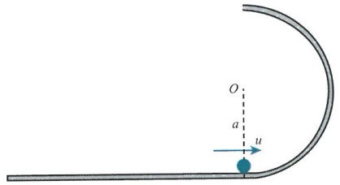

a Find the speed of the particle when it is just about to lose contact with the semicircle.

The particle then travels as a projectile until it hits the ground.

b Find the horizontal distance between O and the point where the particle hits the ground.

## Answer

a Initially: PE = -mga, KE = 4mga

Generally: PE = -mga cosθ, KE =  $ \frac{1}{2}mv^{2} $

 $$  CoE:\frac{mv^{2}}{a}=6mg+2mg\cos\theta $$ 

Determine the energy at the start and at a general point, using O as the level of zero potential energy.

From here,  $ \theta = 180^\circ $ leads to  $ v = 2\sqrt{ga} $.

Use conservation of energy.

Use the angle at the top to find the speed.

<!-- page 385 -->

b Distance to the ground is 2a, so  $ 2a = 0 + \frac{1}{2}gt^{2} $.

So  $ t = \sqrt{\frac{4a}{g}} $.

Find the time to reach the ground below, noting that  $ v_{y} = 0 $ at this point.

Then using  $ s = ut, s = 2\sqrt{ga} \times \sqrt{\frac{4a}{g}} = 4a $.

Use that value of the time to determine the horizontal distance travelled.

Hence, particle lands a horizontal distance of 4a from O.

We next need to look at special cases of the motion on the outer surface of an arc of a circle. Consider a track that consists of two circular arcs, as shown in the following diagram.

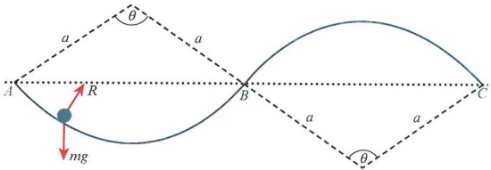

Imagine a particle starts at A and moves along the track to the point B, which is at the same horizontal level as A. The particle cannot lose contact with the track between A and B. The particle can, however, leave the track between B and C, providing it has enough energy to do so.

Let's look more closely at point B.

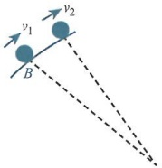

As the particle reaches $B$ it has speed $v_{1}$, and as it climbs the arc $BC$ the speed will reduce to $v_{2}$. This loss in kinetic energy will inhibit the particle's chance to escape from the surface. So if the particle does not escape the arc $BC$ at the point $B$, it will never escape.

### EXPLORE 15.1

For the previous example, discuss the different ways in which a particle could be projected from A and reach C.

<!-- page 386 -->

### WORKED EXAMPLE 15.17

A particle is projected from the point O with speed U along a track that is made up of two identical quarter circles, as shown in the diagram. Find the range of values of U such that the particle reaches B without losing contact with the track.

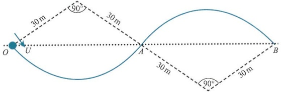

## Answer

<table border=1 style='margin: auto; word-wrap: break-word;'><tr><td style='text-align: center; word-wrap: break-word;'>First note that  $ U_O = U_A $.</td><td style='text-align: center; word-wrap: break-word;'>Since these are at the same level, the speeds are the same.</td></tr><tr><td style='text-align: center; word-wrap: break-word;'>At A:  $ KE = \frac{1}{2} mU^2 $, PE = mg × 30 cos45 = 15√2mg\nTo just reach the top of arc AB,  $ KE = \frac{1}{2} mv^2 $, PE = 30mg.\n $ \text{CoE}: \frac{1}{2}mv^2 = \frac{1}{2}mU^2 + 15\sqrt{2}mg - 30mg $\nNeed  $ \nu &gt; 0 $,  $ \frac{1}{2}mU^2 &gt; 30mg - 15\sqrt{2}mg $; hence,  $ U &gt; 13.3m s^{-1} $.\nUsing F = ma, mg cosθ - R =  $ \frac{mU^2}{30} $; let θ = 45° and assume the particle will leave the track (R = 0).\nSo mg cos45 =  $ \frac{mU^2}{30} $, and so  $ U^2 = 212.13 $.\nTherefore, 13.3m s $ ^{-1} $ &lt; U &lt; 14.6m s $ ^{-1} $.</td><td style='text-align: center; word-wrap: break-word;'>Determine the energy at A and at the top of the arc, using the centre of the circle that forms arc AB as the level of zero potential energy.\nIf the particle just reaches the top of the arc, it can continue down to B.\nUse conservation of energy and let the speed be positive only at the top of the arc.\nThis is the minimum speed required to reach B.\nResolve towards the centre. Assume the particle leaves the track at A.</td></tr><tr><td style='text-align: center; word-wrap: break-word;'>Therefore,  $ 13.3m s^{-1} $ &lt; U &lt; 14.6m s $ ^{-1} $.</td><td style='text-align: center; word-wrap: break-word;'>Determine the speed required to leave the track.</td></tr></table>

## EXERCISE 15C

1 A particle of mass $m$ is attached to the end of a light inelastic string of length $1.5a$. The other end of the string is attached to a fixed point $O$. When the particle is resting in equilibrium, it is given a horizontal speed of $\sqrt{ga}$. Find the angle turned through when the particle comes to instantaneous rest.

2 A particle of mass $m$ is attached to the end of a light inelastic string of length $1.2a$. The other end of the string is attached to a fixed point $O$. When the particle is resting in equilibrium, it is given a horizontal speed of $\sqrt{5ga}$. Find the angle turned through when the tension in the string is zero.

<!-- page 387 -->

3 A smooth hemisphere of radius 1.6a is placed plane face down and fixed onto a horizontal plane. A particle of mass 2m is placed on the top of the hemisphere and projected with speed $\sqrt{\frac{1}{4}ga}$. As the particle travels down the curved surface of the hemisphere it turns through an angle $\theta$, where $\theta$ is measured from the vertical through the centre of the hemisphere. Find the value of $\theta$ when the particle loses contact with the hemisphere.

4 A particle of mass $2m$ is attached to the end of a light, inelastic string of length $a$. The other end of the string is attached to a fixed point, $O$. When the particle is resting in equilibrium, it is given a horizontal speed of $\sqrt{7ga}$ and consequently describes vertical circles. Find the greatest and least tension in the string.

## M PS

5 A particle of mass $m$ is attached to a light, inextensible string of length $a$. With the other end of the string attached to a fixed point, $A$, the particle rests in equilibrium. The particle is then given an initial horizontal speed $u$. Find the condition on $u$ such that the particle never leaves the circular path, but never completes full circles.

6 A particle of mass 3 kg is resting on the inside of a smooth, circular hoop of radius 2 m. From the bottom position, the particle is projected horizontally with speed 8 m s $ ^{-1} $. Find the greatest height achieved by the particle from the point where it is projected.

PS 7 A smooth hemisphere, of radius 1.5a, is placed plane face down and fixed onto a horizontal plane. A particle, of mass m, is placed on the top of the hemisphere and projected with speed  $ \sqrt{\frac{3}{4}ga} $. As the particle travels down the curved surface of the hemisphere the particle turns through an angle  $ \theta $. Find the value of  $ \theta $ when the particle loses contact with the hemisphere.

## M PS

8 A particle of mass $m$ is resting on the inside of a smooth, circular hoop of radius $3a$. The particle is then projected from the lowest point, with horizontal speed $u$.

a State the minimum speed required to complete vertical circles.

b The particle is projected with speed  $ \sqrt{12ga} $. Find the speed when the particle has turned through  $ 120^{\circ} $.

c Find also the reaction force exerted on the particle when the angle is  $ 120^{\circ} $.

9 A particle is held at rest on a smooth, circular track, which is an arc of radius $a$. The track is standing in a vertical plane, and it is fixed to a horizontal surface. The points $O$ and $A$ are such that $OA$ is horizontal, as shown in the diagram. The particle is released from rest and proceeds to slide down the track.

a Find the speed of the particle at the point where it is just about to lose contact with the track.

b Find the greatest reaction force on the particle while it is in contact with the track.

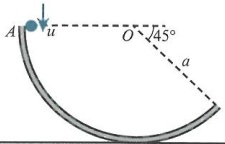

## M PS

10 A string of length 2a is attached to a point O and has a particle of mass 3m attached to the other end. The particle is resting in equilibrium. The particle is then projected with horizontal speed  $ \sqrt{15}ga $.

a Find the speed of the particle at the highest point of its circular path.

b Find the difference between the greatest and least tension in the string.

<!-- page 388 -->

## WORKED PAST PAPER QUESTION

A small bead $(B)$ of mass $m$ is threaded on a smooth wire fixed in a vertical plane. The wire forms a circle of radius $a$ and centre $O$. The highest point of the circle is $A$. The bead is slightly displaced from rest at $A$. When angle $AOB = \theta$, where $\theta < \cos^{-1}\left(\frac{2}{3}\right)$, the force exerted on the bead by the wire has magnitude $R_{1}$. When angle $AOB = \pi + \theta$, the force exerted on the bead by the wire has magnitude $R_{2}$. Show that $R_{2} - R_{1} = 4mg$.

Cambridge International AS & A Level Further Mathematics 9231 Paper 2 Q2 November 2008

## Answer

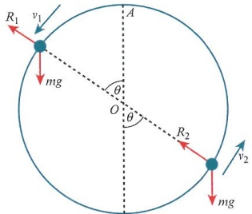

Consider the potential energy equal to zero at the level of O.

At the higher point:  $ mg\cos\theta - R_{1} = \frac{mv_{1}^{2}}{a} $

PE = mg a  $ \cos\theta $, KE =  $ \frac{1}{2}mv_{1}^{2} $

At the lower point:  $ R_{2} - mg\cos\theta = \frac{mv_{2}^{2}}{a} $

PE = -mga $ \cos\theta $, KE =  $ \frac{1}{2}mv_{2}^{2} $

Adding the force equations gives  $ R_2 - R_1 = \frac{m}{a}(v_1^2 + v_2^2) $.

Now at $A$: $\mathrm{KE}=0$, $\mathrm{PE}=mga$, so by conservation of energy, $mga=mg\cos\theta+\frac{1}{2}mv_{1}^{2}$, leading to $v_{1}^{2}=2ga(1-\cos\theta)$.

Also by conservation of energy,  $ mga = -mga \cos \theta + \frac{1}{2} mv_{2}^{2} $, so  $ v_{2}^{2} = 2ga(1 + \cos \theta) $.

Hence,  $ R_2 - R_1 = \frac{m}{a}(2ga - 2ga\cos\theta + 2ga + 2ga\cos\theta) $, which leads to  $ R_2 - R_1 = 4mg $.

<!-- page 389 -->

## Checklist of learning and understanding

## Governing equations for horizontal and vertical circles:

For particles moving in circular paths of radius  $ r, v = r\omega $, where v is the linear speed and  $ \omega $ is the angular speed.

For the acceleration towards the centre,  $ a = r\omega^2 $ or  $ a = \frac{v^2}{r} $.

The time for each complete circle is given by  $ \frac{2\pi}{\omega} $.

## For vertical circles:

Using $F = ma$ towards the centre is generally of the form $T - mg\cos\theta = \frac{mv^{2}}{r}$ for strings and $R - mg\cos\theta = \frac{mv^{2}}{r}$ for particles travelling on the inside of a circular path.

Using $F = ma$ towards the centre for motion on a hemisphere, $mg\cos\theta - R = \frac{mv^{2}}{r}$.

If the tension or reaction force is zero during motion, then the object has left the circular path and is now a projectile.

Providing there are no resisting forces, the principle of conservation of energy states that  $ \frac{1}{2}mu^{2} + PE_{A} = \frac{1}{2}mv^{2} + PE_{B} $, where A and B are usually the starting point and a general point of the motion.

<!-- page 390 -->

## END-OF-CHAPTER REVIEW EXERCISE 15

1 One end of a light inextensible string is attached to a fixed point A and the other end of the string is attached to a particle P. The particle P moves with constant angular speed 5 rad s $ ^{-1} $ in a horizontal circle which has its centre O vertically below A. The string makes an angle  $ \theta $ with the vertical (see diagram). The tension in the string is three times the weight of P.

5 rad s^{-1}

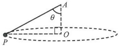

i Show that the length of the string is 1.2m.

ii Find the speed of P.

## Cambridge International AS & A Level Mathematics 9709 Paper 51 Q3 June 2015

2 A smooth bead $B$ of mass 0.3kg is threaded on a light inextensible string of length 0.9m. One end of the string is attached to a fixed point $A$, and the other end of the string is attached to a fixed point $C$ which is vertically below $A$. The tension in the string is $TN$, and the bead rotates with angular speed $\omega\operatorname{rad}s^{-1}$ in a horizontal circle about the vertical axis through $A$ and $C$.

Given that $B$ moves in a circle with centre $C$ and radius 0.2m, calculate $\omega$, and hence find the kinetic energy of $B$.

ii Given instead that angle $ABC = 90^{\circ}$, and that $AB$ makes an angle $\tan^{-1}\left(\frac{1}{2}\right)$ with the vertical, calculate $T$ and $\omega$.

Cambridge International AS & A Level Mathematics 9709 Paper 52 Q6 November 2011

3 A particle $P$ of mass $m$ is projected horizontally with speed $\sqrt{\frac{7}{2}ga}$ from the lowest point of the inside of a fixed hollow smooth sphere of internal radius $a$ and centre $O$. The angle between $OP$ and the downward vertical at $O$ is denoted by $\theta$. Show that, as long as $P$ remains in contact with the inner surface of the sphere, the magnitude of the reaction between the sphere and the particle is $\frac{3}{2}mg(1+2\cos\theta)$.

Find the speed of $P$

i when it loses contact with the sphere,

ii when, in the subsequent motion, it passes through the horizontal plane containing $O$. (You may assume that this happens before $P$ comes into contact with the sphere again.)

Cambridge International AS & A Level Mathematics 9231 Paper 21 Q3 June 2012

