# Hooke's law

<!-- Cambridge International AS  A Level Further Mathematics Coursebook (Lee Mckelvey Martin Crozier) .pdf p391-408 -->

<!-- page 391 -->

# Chapter 16 Hooke's law

## In this chapter, you will learn how to:

use Hooke's law as a model to relate the force in an elastic string or spring with the extension or compression

use the formula to calculate the elastic potential energy stored in a string or spring and to solve problems involving forces due to elastic strings or springs.

<!-- page 392 -->

## PREREQUISITE KNOWLEDGE

<table border=1 style='margin: auto; word-wrap: break-word;'><tr><td style='text-align: center; word-wrap: break-word;'>Where it comes from</td><td style='text-align: center; word-wrap: break-word;'>What you should be able to do</td><td style='text-align: center; word-wrap: break-word;'>Check your skills</td></tr><tr><td style='text-align: center; word-wrap: break-word;'>AS &amp; A Level Mathematics Mechanics, Chapter 2</td><td style='text-align: center; word-wrap: break-word;'>Find the net force acting on a body.</td><td style='text-align: center; word-wrap: break-word;'>1 Two opposing, pulling forces act on a body. Their magnitudes are 7N and 4N. If the mass of the body is 2.5kg, and the body starts from rest, find the distance travelled by the body in six seconds.</td></tr><tr><td style='text-align: center; word-wrap: break-word;'>AS &amp; A Level Mathematics Mechanics, Chapters 8 &amp; 9</td><td style='text-align: center; word-wrap: break-word;'>Determine the kinetic energy and potential energy of a system, and be able to make use of the conservation of energy.</td><td style='text-align: center; word-wrap: break-word;'>2 A particle slides down a smooth plane inclined at 30° to the horizontal. The initial speed of the particle is  $ 3m/s^{-1} $. Find the speed of the particle after sliding for 14m down the plane.</td></tr></table>

## What is Hooke's law?

In the 17th century, physicist Robert Hooke discovered that, for part of the deformation of springs, the extension of the spring is directly proportional to the force used to deform it. We know this relationship as Hooke's law. It applies to the deformation of more than just springs. It can be used for a range of applications, from inflating balloons for a birthday party to calculating the amount of sway in a skyscraper in high winds.

In this chapter, we will look at questions in which strings are no longer inextensible. The force required to stretch a string or spring will relate directly to its extension, that is how much it lengthens. We shall also solve problems about more complicated systems, by considering the energy stored in a spring. We shall use the symbols explained in Key point 16.1.

### KEY POINT 16.1

In this chapter, we shall use the symbols $T$ for tension, $x$ for the length of the extension, $l$ for the natural length of a spring, and $\lambda$ for the modulus of elasticity. Note that $\lambda$ is measured in N.

Unless stated otherwise,  $ g = 10 \, \text{m} \, \text{s}^{-2} $

### 16.1 Hooke's law

In previous work we have worked on problems involving connected particles or particles suspended by strings. The length of these strings did not change: they were considered inelastic, or inextensible.

For elastic strings, the force required to stretch the string is directly proportional to the length by which the string is extended. This gives us the relationship  $ T \propto x $, usually written as T = kx. The constant k varies between different materials and it also depends on the natural length of the string. We therefore use the form  $ T = \frac{\lambda x}{l} $. Here,  $ \lambda $ is the modulus of elasticity, which tells us how stretchable the material is, and l is the natural length of the spring. This relationship is known as Hooke's law. We tend to use the constant  $ \frac{\lambda}{l} $, as shown in Key point 16.2.

<!-- page 393 -->

### KEY POINT 16.2

It is better to use the constant  $ \frac{\lambda}{l} $ than k as  $ \lambda $ has the same value whatever the length of the string.

Consider a light, elastic string of length 1 m. One end of the string is attached to a ceiling, and the other end is attached to a particle of mass 2 kg. If the system is at rest in equilibrium, and the string has modulus of elasticity 50 N, find the length of the extended string.

For this example, first we resolve vertically so that  $ T = 2gN $. Then using Hooke's law,  $ \frac{\lambda x}{l} = 2g $. Substituting the given values gives  $ \frac{50 \times x}{1} = 2g $; hence,  $ x = 0.4m $. This means the length of the extended string is  $ 1 + 0.4 = 1.4m $.

In mechanics, a good diagram is the best way to start a question. You are strongly advised to try to sketch a diagram for every question you attempt.

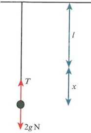

### WORKED EXAMPLE 16.1

A block of 3 kg is attached to one end of a light, elastic string of natural length 2m. The other end of the string is attached to a ceiling, and the string and block are at rest in equilibrium. Given that the extension in the string is 0.8m, find the value of  $ \lambda $.

## Answer

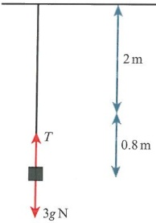

 $$ \frac{\lambda\times0.8}{2}=3g $$ 

 $$ \therefore\lambda=7.5g=75N $$ 

Use Hooke's law.

Determine  $ \lambda $.

We shall also encounter problems involving elastic springs.

Springs can be stretched and are modelled in exactly the same way as elastic strings but with one major difference. A spring can also be compressed.

Consider a light spring of natural length 1.2m that is fixed to a horizontal floor so that the spring stands vertically. A mass of 4kg is placed on top of the spring so that the spring compresses by a distance x.

Given that the modulus of elasticity is 45N, can we find the value of x?

Instead of tension, there is a force known as thrust, due to the spring resisting compression.

Using Hooke’s law,  $ 4g = \frac{45 \times x}{1.2} $. Hence, x = 1.07 m.

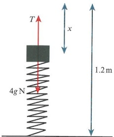

<!-- page 394 -->

Let us consider stretching a spring. A light spring of unknown natural length is fixed to a ceiling at one end, with a mass of 0.5kg attached to the other end. The spring is allowed to hang in equilibrium such that the length of the spring is now 12cm.

If the modulus of elasticity is 10N, find the natural length of the spring.

Since $l$ and $x$ are unknown, it is best to write first that $l + x = 0.12$. Using Hooke's law we know that $0.5g = \frac{10 \times x}{l}$, or $x = 0.5l$. Then $1.5l = 0.12$, which gives $l = 0.08\,\mathrm{m}$.

### WORKED EXAMPLE 16.2

A light spring, of natural length 1.6m and modulus of elasticity 40N, is attached to a floor at point A. The other end of the spring is attached to a block, C, of mass 2kg. The same block is attached to a second light spring, of natural length 1.2m and modulus of elasticity 25N, which is then attached to a ceiling at point B.

Both springs are vertical. A and C are vertically below B.

Given that AB is 4.5m, find the distance AC.

## Answer

<table border=1 style='margin: auto; word-wrap: break-word;'><tr><td colspan="2">Answer</td></tr><tr><td style='text-align: center; word-wrap: break-word;'>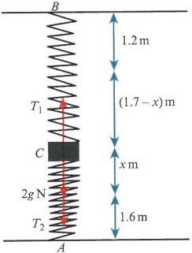</td><td style='text-align: center; word-wrap: break-word;'>Draw a diagram. Label all forces and lengths. Take care that you label the extension of the top spring and the compression of the bottom spring.</td></tr><tr><td style='text-align: center; word-wrap: break-word;'>$ R(\uparrow) $:  $ T_1 = T_2 + 2g $</td><td style='text-align: center; word-wrap: break-word;'>Resolve the forces vertically.</td></tr><tr><td style='text-align: center; word-wrap: break-word;'>$ T_1 = \frac{25 \times (1.7 - x)}{1.2} $\n $ T_2 + 2g = \frac{40 \times x}{1.6} + 20 $</td><td style='text-align: center; word-wrap: break-word;'>Determine the upper force.</td></tr><tr><td style='text-align: center; word-wrap: break-word;'>$ \text{So} \frac{25 \times 1.7}{1.2} - 20 = \frac{40x}{1.6} + \frac{25x}{1.2} $</td><td style='text-align: center; word-wrap: break-word;'>Determine the lower force.</td></tr><tr><td style='text-align: center; word-wrap: break-word;'>Hence,  $ x = 0.336m $ and  $ AC $ is 1.94m.</td><td style='text-align: center; word-wrap: break-word;'>Equate the forces.</td></tr><tr><td style='text-align: center; word-wrap: break-word;'></td><td style='text-align: center; word-wrap: break-word;'>Determine x and, hence,  $ AC $.</td></tr></table>

### WORKED EXAMPLE 16.3

A light, elastic string, of natural length 2a, has a mass of 2m attached to one end. The string is in a vertical plane and the system rests in equilibrium with the aid of a horizontal force of magnitude mg.

If the string is stretched to a length of 2.5a, find the tension in the string and the modulus of elasticity.

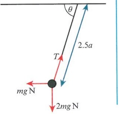

<!-- page 395 -->

<table border=1 style='margin: auto; word-wrap: break-word;'><tr><td colspan="2">Answer</td></tr><tr><td style='text-align: center; word-wrap: break-word;'>$ R(\uparrow) $:  $ T\sin\theta = 2mg $</td><td style='text-align: center; word-wrap: break-word;'>Resolve forces vertically.</td></tr><tr><td style='text-align: center; word-wrap: break-word;'>$ R(\rightarrow) $:  $ T\cos\theta = mg $</td><td style='text-align: center; word-wrap: break-word;'>Resolve forces horizontally.</td></tr><tr><td style='text-align: center; word-wrap: break-word;'>Hence,  $ \tan\theta = \frac{2mg}{mg} = 2 $, therefore  $ \sin\theta = \frac{2}{\sqrt{5}} $.</td><td style='text-align: center; word-wrap: break-word;'>Divide the equations to get  $ \tan\theta $. Use the triangle with sides of 1, 2,  $ \sqrt{5} $ to get  $ \sin\theta $.</td></tr><tr><td style='text-align: center; word-wrap: break-word;'>Therefore,  $ T \times \frac{2}{\sqrt{5}} = 2mg \Rightarrow T = \sqrt{5}mg $ N.</td><td style='text-align: center; word-wrap: break-word;'>Determine the tension.</td></tr><tr><td style='text-align: center; word-wrap: break-word;'>$ T = \frac{\lambda x}{l} \Rightarrow \sqrt{5}mg = \frac{\lambda \times 0.5a}{2a} $</td><td style='text-align: center; word-wrap: break-word;'>Use Hooke&#x27;s law.</td></tr><tr><td style='text-align: center; word-wrap: break-word;'>Therefore,  $ \lambda = 4\sqrt{5}mg $ N.</td><td style='text-align: center; word-wrap: break-word;'>Substitute to get  $ \lambda $.</td></tr></table>

### WORKED EXAMPLE 16.4

A light, elastic string of natural length 1.5m is stretched between the points A and B. A particle, P, of mass 3kg, is attached to the midpoint of the string. The string rests in equilibrium with the parts of the string making an angle of  $ 40^{\circ} $ to the horizontal, as shown in the diagram. Find the value of the modulus of elasticity.

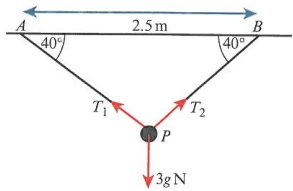

## Answer

Particle at midpoint of string  $ \Rightarrow T_{1}=T_{2}=T $.

R(↑): 2Tsin 40 = 3g

 $$ T=23.336N $$ 

Note that the tensions are equal.

Resolve forces vertically.

Use the tension for one half of the string.

23.336 =  $ \frac{\lambda x}{0.75} $

Since  $ \cos 40=\frac{1.25}{AP} $, AP=1.632.

So $x = 1.632 - 0.75 = 0.8818$ m.

Determine the new length for one half of the string.

Hence,  $ \lambda = \frac{23.336 \times 0.75}{0.8818} = 19.8\text{N} $.

Find the extension for one half of the string.

Determine the modulus of elasticity.

## EXERCISE 16A

1 A light elastic string of natural length $l$ and modulus of elasticity $\lambda$ is stretched by a force $T$, causing the string to extend. In each of the following cases, work out the unknown value.

a  $ T = 15\,N, \lambda = 40\,N, l = 1.2\,m $. Find the extension.

b  $ T = 25N, l = 1.5m, x = 0.5m $. Find the modulus of elasticity.

c  $ T = (3\lambda - 11)\,\mathrm{N},\, l = 2\,\mathrm{m},\, x = 0.5\,\mathrm{m} $. Find the tension in the string.

## TIP

It is better to use the constant  $ \frac{\lambda}{l} $ than k as  $ \lambda $ has the same value whatever the length of the string.

<!-- page 396 -->

2 A light string of unknown natural length is fixed to a ceiling at one end, with a mass of 0.4kg attached to the other end. The string is allowed to hang in equilibrium such that the length of the string is now 15cm. If the modulus of elasticity is 20N, find the natural length of the string.

M 3 A light string is attached to a ceiling at the point A. The natural length of the string is 1.3 m and the string has a mass of 3 m attached to the free end. The string is allowed to rest in equilibrium. Given that the string is stretched by an extra 20% in length, find the value of the modulus of elasticity.

4 A light, elastic string is attached to a ceiling at the point A. The natural length of the string is 1.6m and the string has a mass of 2m attached to the other end. The string is allowed to rest in equilibrium. Given that the string is stretched by 40% of its length, find the value of the modulus of elasticity.

PS 5 Two points, A and B, lie 3 m apart on a smooth horizontal surface. A light, elastic string, of natural length 0.8 m and modulus of elasticity 70 N, is attached to A. Its other end is attached to a particle, P, of mass m. A second light, elastic string, of natural length 1.3 m and modulus of elasticity 50 N, is attached to the point B. Its other end is also attached to the particle P. The particle is allowed to rest in equilibrium. Find the distance BP.

PS 6 Two fixed points, A and B, are such that A is 4m vertically above B. A light spring of natural length 1.5m is attached to A, and at the other end it has a particle of mass 6kg attached. A second light spring of natural length 1m is attached to the point B. Its other end is attached to the same particle. Both springs are in the same vertical plane. Given that the modulus of elasticity of the lower spring is one-third of that of the upper spring, and that the extension of one spring is six times the compression of the other spring, find the modulus of elasticity of the lower spring.

## P PS

7 A particle, $P$, of mass 3.5kg is attached to one end of a light, elastic string, of natural length 1.2m. The other end of the string is attached to a fixed point, $O$. The particle is allowed to rest in equilibrium with $P$ 1.8m below $O$.

a Show that the modulus of elasticity  $ \lambda $ is 7gN.

b The particle is now pulled horizontally to the side by a force of magnitude $X$ N so that the angle between the string and the downward vertical is $60^{\circ}$. Given that the particle is at the same vertical level as it was before, find the value of $X$.

## M PS

8 A particle, $P$, of mass 4kg is resting on a rough, horizontal table. A light, elastic string, of natural length 2m and modulus of elasticity 50N, is attached to $P$. It is then passed over a smooth pulley to a second particle, $Q$, of mass 3kg. $Q$ is hanging freely below the table and the system is on the point of slipping. Determine the coefficient of friction and find the extension of the string.

9 A particle of mass 2kg is being held in equilibrium on a smooth slope by a horizontal force, P, and a light, elastic spring. The spring has modulus of elasticity 10N and is attached to the particle and also to the slope 1.5m up the slope from the particle. If the slope is inclined at  $ 25^{\circ} $, and the force P is of magnitude 5N, find the two possible natural lengths of the spring.

<!-- page 397 -->

10 A particle of mass km is placed on top of a light, vertical spring of natural length 2a. The modulus of elasticity of the spring is 3mg and the spring is standing upright so that it lies in a vertical plane.

a Find the compression in the spring in terms of k and a.

b Find the value of k such that the length of the spring is halved due to the weight of the particle.

### 16.2 Elastic potential energy

When an elastic string or spring is stretched, or when a spring is compressed, elastic potential energy (EPE) is stored in the system. This is the energy stored in strings and springs as they are stretched or compressed.

For example, if an elastic string is stretched, then the work required to stretch the string is related to the force applied and the length of the extension, x.

Since work done is equal to force multiplied by distance, we can state that  $ W = \int_{x_1}^{x_2} F \, dx $.

Here the force being applied is considered over a distance  $ x_2 - x_1 $. If we use  $ \frac{\lambda x}{l} $ as the force, then the work done in stretching the string is  $ \int_0^x \frac{\lambda x}{l} \, dx = \left[ \frac{\lambda x^2}{2l} \right]_0^x $. So the work required, the elastic potential energy, can be written as  $ \text{EPE} = \frac{\lambda x^2}{2l} $. The units are joules, as shown in Key point 16.3.

### KEY POINT 16.3

Work-energy principle: If a constant force acts on a body over a given distance, then the work done by the force is equal to the energy gain of the object.

For example, a light elastic string, of natural length 1.5m and modulus of elasticity 50N, is stretched to 1.75m. To find the energy stored in the string use  $ \frac{\lambda x^{2}}{2l} $.

So $\mathrm{EPE}=\frac{50\times0.25^{2}}{2\times1.5}=1.04\mathrm{J}$

### WORKED EXAMPLE 16.5

a A light, elastic string of natural length 2m and modulus of elasticity 100N, is stretched by 1.2m.

b A light, elastic spring, of natural length 1.8 m and modulus of elasticity 50 N, is compressed by one-third of its original length.

c A light spring, of natural length 3a and modulus of elasticity 4mg, is stretched to 5a.

## Answer

a  $ \mathrm{EPE}=\frac{100\times1.2^{2}}{2\times2} $

=36J

Input all values into the formula.

Include the units for energy.

<!-- page 398 -->

b EPE= $ \frac{50\times x^{2}}{2\times1.8} $

Substitute in the values.

One-third of length: $x = 0.6$

Therefore, EPE = 5J.

Determine the compression distance.

c EPE =  $ \frac{4mg \times (5a - 3a)^2}{2 \times 3a} $

= $ \frac{8}{3}mgaJ $

Make a note of the extension in the spring.

State the result.

As mentioned in Section 16.1, we may encounter questions that are more complicated. Let us consider an example where a particle of mass 4kg is tied to two light, elastic strings.

The top string has natural length 1 m and modulus of elasticity 3gN. The bottom string has natural length 1.2 m and modulus of elasticity 2gN.

To determine the elastic energy stored in the system we must find the extension of each string. Given that AB is 4m, we can work out the middle part and then determine x.

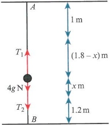

 $ R(\uparrow) $:  $ T_{1}=T_{2}+4g $, then using Hooke's law on each string and equating the forces we get  $ \frac{3g(1.8-x)}{1}=\frac{2gx}{1.2}+4g $. This leads to x=0.3m.

Then add the elastic potential energy stored in each string to get

 $$ \mathrm{EPE}=\frac{3g\times1.5^{2}}{2\times1}+\frac{2g\times0.3^{2}}{2\times1.2}=34.5\mathrm{J}. $$ 

### WORKED EXAMPLE 16.6

Two points, A and B, lie on a smooth horizontal surface a distance 5a apart. A light, elastic string, of natural length 2a and modulus of elasticity 3mg, is attached to A and then attached to a particle, P, of mass m. A second light, elastic string, of natural length 1.5a and modulus of elasticity 7mg, is attached to B and then attached to the same particle P. Determine the amount of EPE stored in the system.

Answer

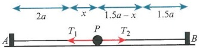

<table border=1 style='margin: auto; word-wrap: break-word;'><tr><td colspan="2">2a  $ \xrightarrow{x} $ 1.5a - x 1.5a</td><td style='text-align: center; word-wrap: break-word;'>Sketch a diagram showing the forces and appropriate lengths.</td></tr><tr><td colspan="2">A  $ \xrightarrow{T_1} $ P  $ \xrightarrow{T_2} $ B</td><td style='text-align: center; word-wrap: break-word;'></td></tr><tr><td colspan="2">$ R(\rightarrow) $:  $ T_1 = T_2 $</td><td style='text-align: center; word-wrap: break-word;'>Resolve horizontally.</td></tr><tr><td colspan="2">So  $ \frac{3mg \times x}{2a} = \frac{7mg(1.5a - x)}{1.5a} $.</td><td style='text-align: center; word-wrap: break-word;'></td></tr><tr><td colspan="2">Then  $ 4.5mg x = 21mg a - 14mg x $.</td><td style='text-align: center; word-wrap: break-word;'>Simplify the equation.</td></tr><tr><td colspan="2">Hence,  $ x = \frac{42}{37}a \approx 1.135a $.</td><td style='text-align: center; word-wrap: break-word;'>Determine the extension for each string.</td></tr><tr><td colspan="2">Then  $ EPE = \frac{3mg \times (1.135a)^2}{2 \times 2a} + \frac{7mg \times (0.3649a)^2}{2 \times 1.5a} $</td><td style='text-align: center; word-wrap: break-word;'>Sum the EPE for each string.</td></tr><tr><td colspan="2">= 1.28mgaJ</td><td style='text-align: center; word-wrap: break-word;'>Work out the result.</td></tr></table>

<!-- page 399 -->

A light, elastic string of length 2.5m has modulus of elasticity 65N. Find the work done when stretching the string from 3m to 6m.

## Answer

For 0.5m extension:  $  \text{EPE} = \frac{65 \times 0.5^2}{2 \times 2.5} = 3.25  $

Find the smaller extension EPE.

For 3.5 m extension:  $  \text{EPE} = \frac{65 \times 3.5^2}{2 \times 2.5} = 159.25  $

Find the larger extension EPE.

Deduce that the energy required is the difference between the two.

### WORKED EXAMPLE 16.8

A light, elastic string, of natural length 2a and modulus of elasticity 7mg, has one end tied to a point on a ceiling. The other end of the string is attached to a particle, P, of mass m. A second light, elastic string, of natural length 3a and modulus of elasticity 5mg, is tied to P. Its other end is attached to a second particle, Q, of mass 3m. Q is vertically below P.

With the system resting in equilibrium, both strings are taut. Find the elastic potential energy stored in the system.

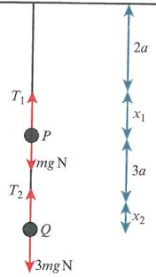

## Answer

For the upper string:  $ 4mg = \frac{7mg \times x_1}{2a} $, so  $ x_1 = \frac{8}{7}a $.

Upper string holds two particles.

For lower string:  $ 3mg = \frac{5mg \times x_2}{3a} $, so  $ x_2 = \frac{9}{5}a $.

Lower string holds only the lower particle.

Total EPE =  $ \frac{7mg \times \frac{64}{49}a^{2}}{2 \times 2a} + \frac{5mg \times \frac{81}{25}a^{2}}{2 \times 3a} = \frac{349}{70}mgaJ $

Add the two EPEs together.

## DID YOU KNOW?

Most materials, including many metals and even glass, follow Hooke's law for part of their movement in tension or compression.

Any material that, when stretched or compressed, does not return to its original form is said to be plastic.

<!-- page 400 -->

## EXERCISE 16B

1 A light elastic string of natural length $l$ and modulus of elasticity $\lambda$ is stretched by an extension $x$, by means of a force $T$, causing the string to gain elastic potential energy (EPE). Find the unknown value in each case.

 $ \lambda = 50\,\text{N} $,  $ x = 0.5\,\text{m} $,  $ l = 1.5\,\text{m} $. Find the energy stored in the string.

b EPE = 100 J,  $ \lambda = 60 $ N, l = 1.2 m. Find the extension of the string.

c EPE = 50 J, x = 0.8 m, l = 1.6 m. Find the modulus of elasticity.

P 2 Prove, using integration, that the elastic potential energy stored in a string of natural length l and modulus of elasticity  $ \lambda $ is  $ \frac{\lambda x^{2}}{2l} $, where x is the extension of the string.

M 3 A particle of mass 5 kg is attached to one end of a light elastic string of natural length 0.8 m. The other end of the string is attached to a fixed ceiling and the particle is allowed to rest, hanging in equilibrium. If the string is stretched by an additional 80%, determine the modulus of elasticity. Hence find the elastic potential energy stored in the string.

4 A particle of mass 3 kg is attached to one end of a light, elastic string of natural length 1.2m. The other end of the string is attached to a fixed ceiling and the particle is allowed to rest, hanging in equilibrium. If the string is stretched by an additional 50%, determine the modulus of elasticity and, hence, find the elastic potential energy stored in the string.

5 The points A and B are 4.5 m apart, with A vertically above B. Particle P, of mass 2 kg, is connected to A and B by means of two light, elastic springs. The spring attached to point A has natural length 1 m and modulus of elasticity 50 N; the spring attached to B has natural length 1.4 m and modulus of elasticity 80 N. The system rests in equilibrium. Find the EPE stored in the system.

PS 6 A light elastic string has one end attached to a ceiling. The other end is attached to a particle of mass 3m. The string has natural length 2a and modulus of elasticity 6mg. The particle rests in equilibrium.

a Show that the extension in the string is a.

b A smaller particle of mass km is attached to the existing particle. If the EPE increase is  $ \frac{8}{3}mgaJ $, find the value of k.

7 A light, elastic string of natural length 2.4 m is stretched between two points, A and B, on a horizontal ceiling. The distance AB is 4 m. The modulus of elasticity of the string is 60 N. A particle of mass 3.5 kg is attached to the midpoint of the string. The system rests in equilibrium, with both parts of the string making an angle of  $ 30^{\circ} $ with the ceiling.

a Find the extension of the string.

b Determine the amount of elastic potential energy stored in the string.

PS 8 A light, elastic string, of natural length $\frac{3}{2}a$ and modulus of elasticity $2mg$, is attached to a ceiling at the point $A$. The other end is attached to a particle, $P$, of mass $5m$. A second light, elastic string, of natural length $\frac{5}{2}a$ and modulus of elasticity $8mg$, is attached to $P$. The other end of this string has a particle, $Q$, attached to it. The system is allowed to rest in equilibrium. Given that the mass of $Q$ is $3m$, find:

a the distance AQ

b the amount of elastic potential energy stored in the system.

<!-- page 401 -->

### 16.3 The work-energy principle

We can also model the motion of a system that is no longer in equilibrium. For example, if a particle hanging on an elastic string is pulled down further and released, what happens next? We assume motion will happen. So in this section we look at acceleration and forces at certain points in the motion. We use kinetic energy (KE), potential energy (PE), workلاست (E) to analyze the motion of objects.

Consider a particle of mass 2kg that is attached to a light, elastic string, of natural length 1.5m and modulus of elasticity 4gN. The string is attached to a ceiling at its other end. The particle is allowed to rest in equilibrium before being pulled down a further 0.5m and then released.

Suppose we want to work out the speed of the particle after it has travelled 0.4m upwards. We need to determine PE, KE and EPE at the start and finish. To do this, we must find the initial extension e of the string. We use Hooke's law to get  $ 2g = \frac{4g \times e}{1.5} $, and so e = 0.75m. Assign a zero potential point, then measure all potential energy relative to this point.

Initially, KE = 0, PE = 0, EPE =  $ \frac{4g \times (0.75 + 0.5)^2}{2 \times 1.5} = \frac{25}{12} g $J, and then finally

KE =  $ \frac{1}{2} \times 2v^2 $, PE = 2g  $ \times $ 0.4 and EPE =  $ \frac{4g \times (1.25 - 0.4)^2}{2 \times 1.5} = \frac{289}{300} g $J. By the conservation of energy,  $ \frac{25}{12} g = v^2 + 0.8g + \frac{289}{300} g $, hence  $ v^2 = \frac{8}{25} g $, and so  $ v = \frac{2\sqrt{2g}}{5} m s^{-1} $. This is about  $ 1.79 m s^{-1} $.

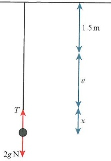

### WORKED EXAMPLE 16.9

A light, elastic string, of natural length 2m and modulus of elasticity 60N, has one end attached to a point, A, on a rough horizontal surface. The other end is attached to a particle P of mass 3kg that is on the table. The particle is pulled to the side so that the distance AP is 4m.

a If the coefficient of friction between the table and the particle is 0.4, find the speed as the particle passes through the point A.

b Find the initial acceleration.

## Answer

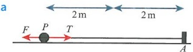

Initially: KE = 0, EPE =  $ \frac{60 \times 2^2}{2 \times 2} = 60 $

 $$  At A:KE=\frac{1}{2}\times3v^{2},EPE=0 $$ 

Sketch a suitable diagram.

 $$ F_{max}=\frac{2}{5}\times3g=12 $$ 

Energy lost to friction:  $ W_{F} = 12 \times 4 = 48 $

Label the forces and add distances.

Determine the initial energy.

Don't balance the energy levels yet.

Determine the maximum frictional force.

Find the work done against friction.

<!-- page 402 -->

<table border=1 style='margin: auto; word-wrap: break-word;'><tr><td rowspan="2">Conservation of energy:  $ 60 = \frac{3}{2}v^{2} + 48 $   $ v = 2\sqrt{2} \text{ ms}^{-1} $</td><td style='text-align: center; word-wrap: break-word;'>Now balance the energy.</td></tr><tr><td style='text-align: center; word-wrap: break-word;'>Determine the speed.</td></tr><tr><td style='text-align: center; word-wrap: break-word;'>b  $ F = ma $, so  $ T - F = 3a $.</td><td style='text-align: center; word-wrap: break-word;'>Use Newton&#x27;s second law horizontally, followed by Hooke&#x27;s law to find  $ T $.</td></tr><tr><td style='text-align: center; word-wrap: break-word;'>So  $ \frac{60 \times 2}{2} - 12 = 3a $   $ a = 16 \text{ ms}^{-2} $</td><td style='text-align: center; word-wrap: break-word;'>Determine the initial acceleration.</td></tr></table>

Consider a smooth, horizontal disc of radius 5a, which has its centre at the point O. A light, elastic string, of natural length 2a and modulus of elasticity 3mg, is attached to the point O. The other end of the string is attached to a particle of mass m resting on the surface of the disc. The particle remains at rest relative to the surface of the disc when the disc is rotating about the point O with angular speed  $ \omega $.

If the particle is describing circles of radius 3a, how can we determine the angular speed?

## REWIND

First, use Hooke's law, so  $ T = \frac{3mg \times a}{2a} = \frac{3}{2}mg $.

Recall from Chapter 15 that, for particles travelling in horizontal circles, the tension component is directed towards the centre.

Next, use Newton's second law towards the centre of the circle to get  $ T = m r \omega^{2} $, and then  $ \frac{3}{2} mg = m \times 3a \times \omega^{2} $.

So  $ \omega = \sqrt{\frac{g}{2a}} \text{rad s}^{-1} $.

### WORKED EXAMPLE 16.10

A smooth disc of radius 1.2 m is fixed to a horizontal plane. The centre of the disc is O. A light, elastic string, of natural length 0.8 m and modulus of elasticity 100 N, is attached to the centre O, and the other end of the string is attached to a particle of mass 0.5 kg. The particle is describing horizontal circles with constant angular speed. Given that the particle is on the point of falling off the edge of the disc, find the angular speed of the particle and the total energy in the system.

## Answer

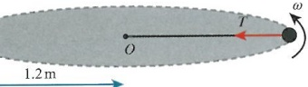

 $ T = \frac{\lambda x}{l}, \text{ so } T = \frac{100 \times 0.4}{0.8} = 50. $

 $$ R(\leftarrow)\colon T=m r\omega^{2} $$ 

If the particle is about to fall off the edge of the disc, the radius of its circular path must be 1.2 m.

 $$  Then50=0.5\times1.2\times\omega^{2}\Rightarrow\omega=\frac{5\sqrt{30}}{3}rad s^{-1}. $$ 

For the string:  $  \text{EPE} = \frac{100 \times 0.4^2}{2 \times 0.8} = 10  $

Use Hooke's law to find the tension.

Resolve towards the centre. Obtain the angular speed.

Find the EPE in the string.

<!-- page 403 -->

For the particle:

Determine the linear speed of the particle.

 $$ v=r\omega=1.2\times\frac{5\sqrt{30}}{3}=2\sqrt{30} $$ 

 $$  KE=\frac{1}{2}\times\frac{1}{2}\times120=30 $$ 

Find the KE of the particle.

Hence, the total energy is 40 J.

Add the energies together.

### WORKED EXAMPLE 16.11

A rough slope is inclined at an angle of  $ 15^{\circ} $ to the horizontal. A light, elastic string is attached to the top of the slope at the point A. The string has natural length 2.4m and modulus of elasticity 150N. A particle of mass 1kg is attached to the other end of the string. The particle is allowed to rest in equilibrium on the slope with the string taut.

a Find the extension of the string.

b The particle is pulled down a further 0.5m and released. Given that the coefficient of friction between the particle and slope is 0.4, find the distance of the particle from A when the particle first comes to instantaneous rest.

## Answer

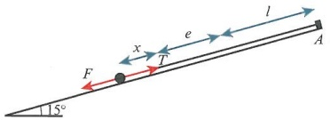

Resolving up the plane:  $ T = g \sin 15 = \frac{150e}{2.4} $

So e = 0.0414 m.

b At the low point: KE = 0, PE = 0 and

 $$ \begin{aligned}EPE&=\frac{150\times0.5414^{2}}{2\times2.4}\\&=9.16\end{aligned} $$ 

At the high point: KE = 0, EPE = 0 and PE =  $ d \times g \sin 15 $

= 2.588d

Since there are two stages for the string extension, it is best to label them e and x.

Friction:  $ F = 0.4 \times g \cos 15 = 3.864 $

 $ W_{F} = 3.864 \times d $; hence, 9.16 = 6.452d.

So  $ d = 1.42 $.

Hence, distance = 2.4 + 0.0414 + 0.5 - 1.42

= 1.52m from A

Find the extension in the string.

Determine the energy before release.

Find the work done against gravity.

Determine the frictional force.

Find the work done against friction.

Total string length minus distance travelled.

## TIP

If a particle is travelling along a rough surface, then the frictional force will be at its maximum while the motion continues.

<!-- page 404 -->

### WORKED EXAMPLE 16.12

A particle, of mass 2kg, is attached to one end of a light, elastic string of natural length 1.5m and modulus of elasticity $50\sqrt{3}$ N. The other end of the string is attached to a point, $O$, on the ceiling. The particle describes horizontal circles with the string taut and $30^{\circ}$ to the vertical. Find the angular speed of the particle.

<table border=1 style='margin: auto; word-wrap: break-word;'><tr><td style='text-align: center; word-wrap: break-word;'>Answer\n $ R(\uparrow) $:  $ T\cos{30} = 2g $; hence,  $ T = \frac{40}{\sqrt{3}} $.</td><td style='text-align: center; word-wrap: break-word;'>Resolve vertically to get the tension.</td></tr><tr><td rowspan="3">Using Hooke&#x27;s law,  $ T = \frac{\lambda x}{l} $, which gives:\n $ \frac{40}{\sqrt{3}} = \frac{50\sqrt{3} \times x}{1.5} $\nHence,  $ x = 0.4m $\n $ R(\rightarrow) $:  $ T\sin{30} = 2 \times 1.9\sin{30} \times \omega^{2} $\n $ \frac{40}{\sqrt{3}} = 3.8 \times \omega^{2} $\nSo  $ \omega = 2.47rad s^{-1} $</td><td style='text-align: center; word-wrap: break-word;'>Use the tension to determine the extension in the string.</td></tr><tr><td style='text-align: center; word-wrap: break-word;'>Resolve towards the centre, noting the radius of the circle is 1.9sin{30}.</td></tr><tr><td style='text-align: center; word-wrap: break-word;'>Equate results to find  $ \omega $.</td></tr></table>

### WORKED EXAMPLE 16.13

A particle, $P$, of mass $3m$, is attached to one end of a light, elastic string of natural length $5a$ and modulus of elasticity $8mg$. The other end of the string is threaded through a small, smooth ring, $S$, and a second particle, $Q$, of mass $5m$ is attached to this end. The particle $P$ describes horizontal circles with angular speed $\omega$. Particle $Q$ remains stationary at a distance of $2a$ below the ring.

Find the extension in the string and the angular speed of $Q$.

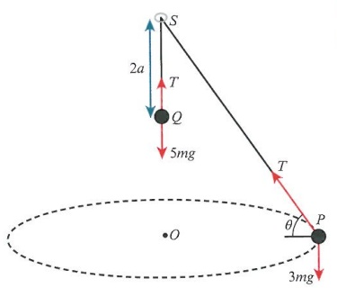

## Answer

<table border=1 style='margin: auto; word-wrap: break-word;'><tr><td style='text-align: center; word-wrap: break-word;'>For Q:  $ R(\uparrow)T = 5mg $</td><td style='text-align: center; word-wrap: break-word;'>Particle Q is in equilibrium.</td></tr><tr><td style='text-align: center; word-wrap: break-word;'>For P:  $ R(\uparrow)T\sin\theta = 3mg $, so  $ \sin\theta = \frac{3}{5} $.</td><td style='text-align: center; word-wrap: break-word;'>The same string so the tensions are the same.</td></tr><tr><td style='text-align: center; word-wrap: break-word;'>Hooke&#x27;s law:  $ 5mg = \frac{8mg \times e}{5a} \Rightarrow e = \frac{25}{8}a m $</td><td style='text-align: center; word-wrap: break-word;'>Use Hooke&#x27;s law to find the extension.</td></tr><tr><td style='text-align: center; word-wrap: break-word;'>For P:  $ R(\rightarrow)T\cos\theta = 3m \times \left(3a + \frac{25}{8}a\right)\cos\theta \times \omega^{2} $</td><td style='text-align: center; word-wrap: break-word;'>Resolve towards the centre noting the radius of the circular motion is  $ (3a + e)\cos\theta $.</td></tr><tr><td style='text-align: center; word-wrap: break-word;'>$ \cos\theta = \frac{4}{5} $, so this becomes  $ 5mg \times \frac{4}{5} = 3m \times \frac{49}{8}a \times \frac{4}{5}\omega^{2} $</td><td style='text-align: center; word-wrap: break-word;'>Note that  $ \cos\theta $ cancels.</td></tr><tr><td style='text-align: center; word-wrap: break-word;'>Hence,  $ \omega = \sqrt{\frac{400}{147a}} $rad  $ s^{-1} $.</td><td style='text-align: center; word-wrap: break-word;'>Evaluate the angular speed.</td></tr></table>

<!-- page 405 -->

1 A particle of mass 0.4kg is hanging from a light elastic string. The string has natural length 2m and modulus of elasticity 100N. It is held at rest with the string extended by a total of 1.2m. If the particle is released, find the kinetic energy after it has risen by 0.6m.

2 A particle of mass 2 kg is attached to one end of a light elastic string of natural length 1.5 m and modulus of elasticity 50 N. The other end of the string is attached to a fixed ceiling and the particle is allowed to rest, hanging in equilibrium. The particle is then pulled down 0.3 m and released. Find the speed of the particle after it has travelled 0.4 m upwards.

3 A particle, $P$, of mass 3 kg is attached to one end of a light, elastic spring. The other end of the spring is attached to a ceiling at the point $A$. The spring has natural length 1.6 m and modulus of elasticity 45 N. The system rests in equilibrium with the spring vertical.

a Find the extension in the spring.

b The particle is pulled down a further 0.6m and released. Find the distance of the particle below the point A when it first comes to instantaneous rest.

4 A light, elastic string, of natural length 2m and modulus of elasticity 50N, is attached to two points, A and B, by its opposite ends. The points A and B are at the same horizontal level and they are 3.5m apart. A particle of mass 2kg is attached to the midpoint of the string. The particle is then projected downwards with speed u. Given that the particle comes to instantaneous rest 2m below the level of AB, find the value of u.

5 One end of a light, elastic string, of natural length 1.2m and modulus of elasticity 32N, is attached to a fixed point, B. A particle, P, of mass 1.5kg, is then attached to the other end of the string. The particle P is held 2m vertically above the point B and then released.

a Find the acceleration of P when it is 1.5m above B.

b Find the kinetic energy of P when it is at the same horizontal level as B.

c Find the distance below B when the particle first comes to instantaneous rest.

6 A rough, inclined plane has a string attached to it at the point C. The string has natural length 1.4m and modulus of elasticity 80N. The string is then attached to a particle, P, of mass 4kg. P is farther down the plane than C. The particle P is then pulled down the plane so that it is 4m from C and released. Given that the coefficient of friction between the particle and the plane is 0.5, and the plane has a  $ 30^{\circ} $ incline, find the speed of the particle as it reaches the point C for the first time.

7 A light, elastic string, of natural length 1.8 m and modulus of elasticity 45 N, is attached to a ceiling at point G. The lower end of the string is attached to a particle, P, of mass 1.8 kg. A second light, elastic string, of natural length 0.9 m and modulus of elasticity 35 N, is attached to the particle and then to the point H, where H is 4 m vertically below G. The particle rests in equilibrium with both parts of the string taut.

a Find the distance of P above H.

b P is then pulled down a further 1 m and released. Find the speed when the particle is 1.5 m above H.

## TIP

Always draw a fully labelled diagram. Include forces, lengths, angles and points.

<!-- page 406 -->

PS 8 A particle, $P$, of mass $m$, is moving in a horizontal circle, having centre $O$, with angular speed $\sqrt{\frac{g}{4a}}$. The particle is attached to one end of a light, elastic string of natural length $3a$ and modulus of elasticity $\frac{15}{8}mg$. The other end is attached to a fixed point, $C$, which is vertically above $O$. The string makes an angle, $\theta$, with the downward vertical, where $\tan\theta=\frac{3}{4}$. Find the elastic potential energy in the string and the kinetic energy of the particle $P$.

M 9 A particle, $P$, of mass 3 kg, rests on a rough, horizontal table, where $\mu = \frac{2}{3}$. $P$ is attached to a light, elastic string of natural length 2 m and modulus of elasticity 49 N. The string passes over a smooth, fixed pulley at the edge of the table and is then attached to a particle, $Q$, of mass 1 kg. $Q$ is held at the same level as the pulley and released. Given that $P$ is initially 1 m from the pulley, find the speed of $Q$ at the instant $P$ begins to move.

## WORKED PAST PAPER QUESTION

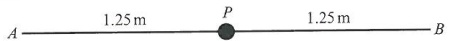

A and B are fixed points on a smooth horizontal table. The distance AB is 2.5m. An elastic string of natural length 0.6m and modulus of elasticity 24N has one end attached to the table at A, and the other end attached to a particle P of mass 0.95kg. Another elastic string of natural length 0.9m and modulus of elasticity 18N has one end attached to the table at B, and the other end attached to P. The particle P is held at rest at the mid-point of AB (see diagram).

i Find the tensions in the strings.

The particle is released from rest.

ii Find the acceleration of P immediately after its release.

iii P reaches its maximum speed at the point C. Find the distance AC.

Cambridge International AS & A Level Mathematics 9709 Paper 5 Q6 June 2007

## Answer

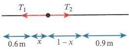

i For the string AP:  $ T_{1}=\frac{24\times0.65}{0.6}=26\text{N} $

For the string BP:  $ T_2 = \frac{18 \times 0.35}{0.9} = 7\text{N} $

ii Using  $ F = ma $, 26 - 7 = 0.95a. So  $ a = 20 \, \text{m} \, \text{s}^{-2} $.

iii When the maximum speed occurs, acceleration is zero, hence  $ T_{1}=T_{2} $, so  $ \frac{24x}{0.6}=\frac{18(1-x)}{0.9} $.

Solving, $21.6x = 10.8 - 10.8x \Rightarrow x = \frac{1}{3}$; hence, $AC = 0.6 + \frac{1}{3} = \frac{14}{15}$ m.

<!-- page 407 -->

## Checklist of learning and understanding

## Hooke's law:

 $ T = \frac{\lambda x}{l} $, where  $ \lambda $ is the modulus of elasticity, l is the natural length of an elastic string, and x is the extension of the string.

Also applies to elastic springs, in which the value of x is either an extension or compression of the spring.

When a system is resting in equilibrium, the tension is constant and proportional to the extension.

## Elastic potential energy:

Derived from the work done to extend or compress a spring or string over a certain distance.

This work is given by  $ \int_{0}^{x}\frac{\lambda x}{l}dx $.

Given as  $ \frac{\lambda x^{2}}{2l} $ and measured in joules.

Used in conjunction with kinetic and potential energy (the work-energy principle).

<!-- page 408 -->

1 A particle P of mass 0.28 kg is attached to the mid-point of a light elastic string of natural length 4m. The ends of the string are attached to fixed points A and B which are at the same horizontal level and 4.8 m apart. P is released from rest at the mid-point of AB. In the subsequent motion, the acceleration of P is zero when P is at a distance 0.7 m below AB.

i Show that the modulus of elasticity of the string is 20N.

ii Calculate the maximum speed of $P$.

Cambridge International AS & A Level Mathematics 9709 Paper 51 Q5 November 2010

## 昆2

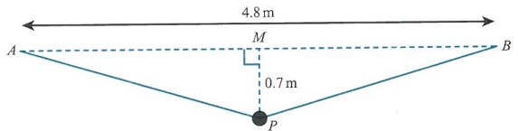

A particle P of mass 0.35kg is attached to the mid-point of a light elastic string of natural length 4m. The ends of the string are attached to fixed points A and B which are 4.8m apart at the same horizontal level. P hangs in equilibrium at a point 0.7m vertically below the mid-point M of AB (see diagram).

Find the tension in the string and hence show that the modulus of elasticity of the string is 25N.

P is now held at rest at a point 1.8m vertically below M, and is then released.

ii Find the speed with which P passes through M.

Cambridge International AS & A Level Mathematics 9709 Paper 51 Q6 June 2010

3 The ends of a light elastic string of natural length 0.8m and modulus of elasticity  $ \lambda $N are attached to fixed points A and B which are 1.2m apart at the same horizontal level. A particle of mass 0.3kg is attached to the centre of the string, and released from rest at the mid-point of AB. The particle descends 0.32m vertically before coming to instantaneous rest.

i Calculate  $ \lambda $.

ii Calculate the speed of the particle when it is 0.25 m below AB.

Cambridge International AS & A Level Mathematics 9709 Paper 53 Q4 June 2011

