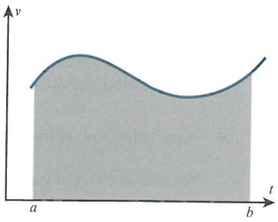

# Linear motion under a variable force

<!-- Cambridge International AS  A Level Further Mathematics Coursebook (Lee Mckelvey Martin Crozier) .pdf p409-421 -->

<!-- page 409 -->

## Chapter 17 Linear motion under a variable force

## In this chapter you will learn how to:

differentiate and integrate functions in terms of the time t or the displacement x

set up and solve separable first order differential equations, using variable forces

determine displacement, velocity or acceleration.

<!-- page 410 -->

## PREREQUISITE KNOWLEDGE

<table border=1 style='margin: auto; word-wrap: break-word;'><tr><td style='text-align: center; word-wrap: break-word;'>Where it comes from</td><td style='text-align: center; word-wrap: break-word;'>What you should be able to do</td><td style='text-align: center; word-wrap: break-word;'>Check your skills</td></tr><tr><td style='text-align: center; word-wrap: break-word;'>AS &amp; A Level Mathematics Pure Mathematics 2 &amp; 3, Chapters 4 &amp; 5</td><td style='text-align: center; word-wrap: break-word;'>Discrete and integrate functions such as  $ t^{3} $,  $ (2t-5)^{4} $ and cos 2t.</td><td style='text-align: center; word-wrap: break-word;'>1 a Find the derivative of  $ 3t^{4} $. b Integrate sin 4t. c Discrete  $ e^{t} $ cos t.</td></tr><tr><td style='text-align: center; word-wrap: break-word;'>AS &amp; A Level Mathematics Pure Mathematics 2 &amp; 3, Chapter 10</td><td style='text-align: center; word-wrap: break-word;'>Separate the variables of a first order differential equation.</td><td style='text-align: center; word-wrap: break-word;'>2 a Separate and then integrate  $ \frac{dv}{dt} = \frac{t^{2}}{v} $ to find  $ v = f(t) $. b Solve  $ e^{x}\frac{dv}{dx} = -2v $ to get  $ v = f(x) $.</td></tr></table>

## When do variable forces affect linear motion?

If an object falls through the air we like to assume that the air resistance is either negligible or constant. In fact, air resistance is a variable force that changes as the speed of an object changes. This type of variable force causes the acceleration of the object to vary, too.

Linear motion deals only with objects travelling in straight lines. When these objects experience forces that do not change, the object will either be:

at rest or moving with a constant velocity; see Newton's first law, or

moving with a constant acceleration, if the net force is a non-zero constant; see Newton's second law.

If the net force is non-zero, and it varies with time or distance, linear motion will be affected. This concept is the basis for motion as simple as standing up from a chair, and as complex as designing supersonic planes.

In this chapter, you will look at objects that are travelling under the influence of a variable force. This, in turn, will produce an acceleration that is variable. These systems will be:

either set up first as differential equations such as  $ \frac{dv}{dt} = f(t) $ or  $ v\frac{dv}{dx} = g(x) $, before being solved with initial conditions or

described in terms of displacement or velocity as functions of time.

### KEY POINT 17.1

In this chapter, we shall use the symbols $F$ for force, $a$ for acceleration, $v$ for velocity, $x$ for displacement and $t$ for time.

Unless stated otherwise, $g = 10\, \mathrm{m\,s^{-2}$.}$

### 17.1 Acceleration with respect to time

In AS & A Level Mechanics, you saw Newton's equations of motion as well as models that involve motion with variable acceleration for basic cases.

Let us remind ourselves what we have learned previously. Acceleration is the rate of change of velocity over time. This means acceleration can be written in the form  $ \frac{dv}{dt} $. Another way

<!-- page 411 -->

of confirming this result is to start with displacement, differentiate once to get  $ \frac{dx}{dt} $, which is velocity, then differentiate again to get  $ \frac{d^2x}{dt^2} $. Now, since  $ \frac{d^2x}{dt^2} = \frac{d}{dt}\left(\frac{dx}{dt}\right) $, we can see that acceleration can also be written as  $ \frac{dv}{dt} $.

Consider a particle that is travelling in a straight line with variable acceleration  $ a = -2t \, \text{m} \, \text{s}^{-2} $. If the initial velocity is  $ 4 \, \text{m} \, \text{s}^{-1} $, can we find the velocity function in terms of time?

Start with  $ a = \frac{\mathrm{d}\nu}{\mathrm{d}t} = -2t $. Integrating both sides with respect to time gives  $ \int \frac{\mathrm{d}\nu}{\mathrm{d}t} \, \mathrm{d}t = -2\int t \, \mathrm{d}t $, or  $ \int \mathrm{d}\nu = -2\int t \, \mathrm{d}t $. Integrating, we get,  $ \nu = -t^{2} + c $, and with an initial velocity of 4, this means when  $ \nu = 4 $,  $ t = 0 $ and so  $ c = 4 $.

So, the velocity function in terms of time is,  $ v = 4 - t^{2} \, \text{m} \, \text{s}^{-1} $.

### WORKED EXAMPLE 17.1

A particle is travelling in a straight line with  $ a = \sin 2t \, \text{m} \, \text{s}^{-2} $. It passes through the point O with speed  $ \nu = \frac{9}{2} \, \text{m} \, \text{s}^{-1} $ at time t = 0 s. Find:

b the displacement, x, in terms of t, relative to the point O.

<table border=1 style='margin: auto; word-wrap: break-word;'><tr><td rowspan="4">a</td><td style='text-align: center; word-wrap: break-word;'>Let  $ a=\frac{dv}{dt}=\sin 2t $, then  $ \int dv=\int \sin 2t dt $.</td><td style='text-align: center; word-wrap: break-word;'>Write down the differential equation and separate the variables.</td></tr><tr><td style='text-align: center; word-wrap: break-word;'>So  $ v=-\frac{1}{2}\cos 2t+c $.</td><td style='text-align: center; word-wrap: break-word;'>Integrate both sides.</td></tr><tr><td style='text-align: center; word-wrap: break-word;'>When  $ v=\frac{9}{2} $,  $ t=0 $; hence, c=5.</td><td style='text-align: center; word-wrap: break-word;'>Use the initial conditions.</td></tr><tr><td style='text-align: center; word-wrap: break-word;'>Hence,  $ v=5-\frac{1}{2}\cos 2t ms^{-1} $.</td><td style='text-align: center; word-wrap: break-word;'></td></tr><tr><td rowspan="5">b</td><td style='text-align: center; word-wrap: break-word;'>Let  $ v=\frac{dx}{dt}=5-\frac{1}{2}\cos 2t $.</td><td style='text-align: center; word-wrap: break-word;'>Write down the differential equation and separate the variables.</td></tr><tr><td style='text-align: center; word-wrap: break-word;'>Then  $ \int dx=\int\left(5-\frac{1}{2}\cos 2t\right) dt $.</td><td style='text-align: center; word-wrap: break-word;'></td></tr><tr><td style='text-align: center; word-wrap: break-word;'>Hence,  $ x=5t-\frac{1}{4}\sin 2t+k $.</td><td style='text-align: center; word-wrap: break-word;'>Integrate both sides.</td></tr><tr><td style='text-align: center; word-wrap: break-word;'>When x=0, t=0; hence, k=0.</td><td style='text-align: center; word-wrap: break-word;'>Use the initial conditions.</td></tr><tr><td style='text-align: center; word-wrap: break-word;'>So  $ x=5t-\frac{1}{4}\sin 2t m $.</td><td style='text-align: center; word-wrap: break-word;'></td></tr></table>

Now we shall consider where this variable acceleration comes from. Consider a particle that has a force of  $ 2t^{2} $ N acting in the direction of motion of the particle. If the particle has a mass of 2 kg, we can work out the velocity as a function of time t.

Starting with $F = ma$, we have $2t^{2} = 2\frac{dv}{dt}$, then $\frac{dv}{dt} = t^{2}$. So $\int dv = \int t^{2}dt$, then $v = \frac{1}{3}t^{3} + c$. If we know the initial conditions, we can determine the value of the constant $c$.

<!-- page 412 -->

### WORKED EXAMPLE 17.2

A particle of mass 4kg is travelling in a straight line under the influence of a single opposing force. This force has magnitude  $ e^{0.5t} $ N. If the particle passes through a point, O, at time t = 0s with velocity  $ 2ms^{-1} $, find expressions for both velocity and displacement in terms of t.

<table border=1 style='margin: auto; word-wrap: break-word;'><tr><td style='text-align: center; word-wrap: break-word;'>Answer\nUse  $ F = ma $ to get  $ -e^{0.5t} = 4 \frac{dy}{dt} $.</td><td style='text-align: center; word-wrap: break-word;'>Note that the force is opposing, so it is a negative force.</td></tr><tr><td style='text-align: center; word-wrap: break-word;'>Then  $ \frac{dy}{dt} = -\frac{1}{4} e^{0.5t} $.</td><td style='text-align: center; word-wrap: break-word;'>Set up the differential equation.</td></tr><tr><td style='text-align: center; word-wrap: break-word;'>So  $ \int dv = -\frac{1}{4} e^{0.5t} dt $.</td><td style='text-align: center; word-wrap: break-word;'></td></tr><tr><td style='text-align: center; word-wrap: break-word;'>Therefore,  $ v = -\frac{1}{2} e^{0.5t} + c $.</td><td style='text-align: center; word-wrap: break-word;'>Solve for  $ v $.</td></tr><tr><td style='text-align: center; word-wrap: break-word;'>Using  $ v = 2, t = 0 $ gives  $ c = \frac{5}{2} $.</td><td style='text-align: center; word-wrap: break-word;'>Use the initial conditions.</td></tr><tr><td style='text-align: center; word-wrap: break-word;'>Hence,  $ v = \frac{5}{2} - \frac{1}{2} e^{0.5t} ms^{-1} $.</td><td style='text-align: center; word-wrap: break-word;'>Find the first expression.</td></tr><tr><td style='text-align: center; word-wrap: break-word;'>Next, let  $ \frac{dx}{dt} = \frac{5}{2} - \frac{1}{2} e^{0.5t} $,</td><td style='text-align: center; word-wrap: break-word;'>Set up the second equation.</td></tr><tr><td style='text-align: center; word-wrap: break-word;'>then  $ \int dx = \frac{1}{2} \int (5 - e^{0.5t}) dt $.</td><td style='text-align: center; word-wrap: break-word;'></td></tr><tr><td style='text-align: center; word-wrap: break-word;'>So  $ x = \frac{5}{2} t - e^{0.5t} + k $, when measuring from  $ O $.</td><td style='text-align: center; word-wrap: break-word;'></td></tr><tr><td style='text-align: center; word-wrap: break-word;'>When  $ x = 0, t = 0 $:</td><td style='text-align: center; word-wrap: break-word;'>Use the initial conditions.</td></tr><tr><td style='text-align: center; word-wrap: break-word;'>And so  $ 0 = 0 - 1 + k \Rightarrow k = 1 $.</td><td style='text-align: center; word-wrap: break-word;'>Note the constant is not always 0.</td></tr><tr><td style='text-align: center; word-wrap: break-word;'>Hence,  $ x = \frac{5}{2} t - e^{0.5t} + 1 m $.</td><td style='text-align: center; word-wrap: break-word;'>Find the second expression.</td></tr></table>

If you are given a velocity function such as  $ v=(2-3t)^2-4ms^{-1} $ and asked to find the acceleration, you can differentiate this expression using the chain rule to give  $ \frac{dv}{dt}=-3\times2\times(2-3t) $. Hence, the acceleration is  $ a=-6(2-3t)ms^{-2} $.

Similarly, if you are given  $ x = t e^{t} $ and you are asked for  $ v = f(t) $ or  $ a = g(t) $,

then, for this example using the product rule,  $ \nu = \frac{dx}{dt} = 1 \times e^{t} + t \times e^{t} = e^{t}(t + 1) $.

Then  $ a = \frac{\mathrm{d}^{2}x}{\mathrm{d}t^{2}} = \frac{\mathrm{d}\nu}{\mathrm{d}t} = 1 \times \mathrm{e}^{t} + (t+1) \times \mathrm{e}^{t} = \mathrm{e}^{t}(t+2) $.

So  $ v = e^t (t + 1) \, \text{m} \, \text{s}^{-1} $ and  $ a = e^t (t + 2) \, \text{m} \, \text{s}^{-2} $.

<!-- page 413 -->

A particle is travelling along a straight path such that its displacement at time $t$ is given by the expression $x=2\ln(t^{2}+1)-2m$. Find the time when the velocity is at a maximum.

## Answer

From $x = 2\ln(t^2 + 1) - 2$, $\frac{\mathrm{d}x}{\mathrm{d}t} = \frac{2 \times 2t}{t^2 + 1}$. So $v = \frac{4t}{t^2 + 1}$.

Then using the quotient rule $\frac{\mathrm{d}v}{\mathrm{d}t} = \frac{(t^2 + 1) \times 4 - 4t \times 2t}{(t^2 + 1)^2}$, so $a = \frac{4(1 - t^2)}{(t^2 + 1)^2}$.

$v_{\max}$ occurs when $a = 0$, so $1 - t^2 = 0$ means $t = 1$ s.

Differentiate to get $v$.

Differentiate again to get $a$ to find when the velocity is at a maximum.

Let $a=0$ to find time. Notice we discard the negative value for time.

You will have learned in AS & A Level Mechanics that the area under a velocity-time graph represents the displacement. So, to determine the area we consider the integral  $ \int_{a}^{b} \nu \, dt $, where the values of a and b are times during the motion. So  $ x = \int_{t_1}^{t_2} \nu \, dt $ gives the desired result.

For example, if we are told that a particle is such that the velocity at time t is given as  $ \nu = t^2 + 2t $, then to find the displacement of the particle after four seconds, let  $ x = \int_0^4 (t^2 + 2t) \, dt $.

$$\mathrm{So}\ x=\left[\frac{1}{3}t^{3}+t^{2}\right]_{0}^{4}=\frac{112}{3}\,\mathrm{m}.$$

### WORKED EXAMPLE 17.4

A particle is travelling along a straight line such that  $ v = t^{3} - t^{2} + 2\, \text{m s}^{-1} $. Find:

a the acceleration when t = 2

b the distance travelled during the third second.

## Answer

a  $ \frac{dv}{dt} = 3t^{2} - 2t $, so a = 3t^{2} - 2t.

When t = 2: a = 12 - 4 = 8 m s^{-2}

b For the third second, we need $t=2$ to $t=3$.

Differentiate to get $a$.

Determine the value.

$$\mathrm{So}\ x=\int_{2}^{3}(t^{3}-t^{2}+2)\mathrm{d}t=\left[\frac{1}{4}t^{4}-\frac{1}{3}t^{3}+2t\right]_{2}^{3}.$$

Note what 'third' second actually represents.

This is  $ \left(\frac{1}{4} \times 81 - \frac{1}{3} \times 27 + 6\right) - \left(\frac{1}{4} \times 16 - \frac{1}{3} \times 8 + 4\right) $.

So  $ x = \frac{143}{12} $ m.

Integrate to get x.

Substitute in limits to find the value.

## TIP

If a particle changes its direction during its motion, then the distance travelled will not be the same as the displacement.

<!-- page 414 -->

### EXPLORE 17.1

Explore functions such as  $ v = t^2 - t \text{ms}^{-1} $ for  $ 0 \leq t \leq \frac{3}{2} $, and  $ v = t^3 - 3t^2 + 2t \text{ms}^{-1} $ for  $ 0 \leq t \leq 2 $. How would you approach this type of problem?

## EXERCISE 17A

1 In each case you are given the displacement function of a particle. Find the velocity and acceleration at the time given.

 $$ x=3t^{2}+5t^{3},t=2 $$ 

 $$ x=e^{2t}-5t,t=0 $$ 

 $$ \begin{array}{r l}{\texttt{c}}&{{}x=5\ln(t+1)+t^{2},t=3}\end{array} $$ 

2 A force of magnitude  $ t^{2} $ N is applied to a particle of mass 0.3 kg, resting on a smooth horizontal surface, for two seconds. Find the speed of the particle after the two seconds.

PS 3 A particle of mass 0.5kg is travelling on a smooth horizontal surface with a constant speed of  $ 4ms^{-1} $. A force of magnitude kt N is applied to the particle to slow it down. Given that the particle comes to rest after three seconds, find the value of k.

PS 4 A particle is travelling with velocity function  $ v = \frac{1}{t^2} \text{m} \text{s}^{-1} $. Given that  $ x = 2\text{m} $ when  $ t = 1\text{s} $, find  $ x = f(t) $. What does this tell you about the displacement of the particle?

5 A force of magnitude $(4t+3)N$ is applied in the direction of motion of a particle of mass 5kg. The particle travels in a straight line. Given that the particle is already travelling at $5\mathrm{~m}s^{-1}$ when the force is initially applied, find the velocity after a further two seconds.

PS 6 An opposing force of magnitude $2t^{2}N$ is applied to an object of mass 2kg. At the time when the force begins to act, the object is already travelling at $3\,m\,s^{-1}$ and is passing through the point $O$. Find expressions for the velocity of the object, and the displacement relative to the point $O$.

PS M 7 A particle is travelling in a straight line with displacement function  $ x = te^{-t}m $. Determine the time when the velocity is at a maximum.

8 A truck of mass 12000kg is driving at a constant speed of 15ms^{-1}. The truck driver sees a red traffic light 100m ahead and applies the brakes. This produces a braking force of magnitude 300t^{2}N. Will the truck stop before reaching the traffic lights?

M 9 A particle travels in a straight line with velocity  $ v = 2 + \sin t \, \text{ms}^{-1} $. It passes through the point O when t = 0 s. Find the displacement from O after four seconds.

10 A ball of mass  $ m \kappa g $ is dropped from a very high tower. Due to air resistance the ball is subject to an opposing force of magnitude  $ mk\nu N $, where  $ k $ is a constant and  $ \nu $ is the velocity of the ball. Show that  $ \nu = \frac{g}{k}(1 - e^{-kt}) $ and state the terminal speed of the ball, assuming that it does not hit the ground first.

M 11 A particle passes a point, $O$, with speed $12\mathrm{~m s}^{-1}$, travelling in a straight line. The acceleration of the particle is $-4\mathrm{t m s}^{-2}$. Find:

a the time taken for the particle to be at instantaneous rest

b the distance travelled during this time.

<!-- page 415 -->

## P PS

12 A toy rocket, of mass 1 kg, is modelled as a particle. It is launched from rest using its engines, which produce a force of size  $ (20 - t)N $ and have enough fuel for five seconds. After five seconds the rocket will be subject to one force only: its weight.

a Show that, for  $ 0 \leqslant t \leqslant 5, \frac{dv}{dt} = 2(5 - t) $.

b Find the velocity when t = 5s.

c Find the maximum height achieved, to the nearest metre.

### 17.2 Acceleration with respect to displacement

As well as measuring the motion of objects with time, we can also measure using displacement.

As well as measuring the motion of objects with time, we can also measure using d.

Consider a particle moving such that the acceleration is given as  $ a = -\frac{2}{x^2} \, \text{m} \, \text{s}^{-2} $. Suppose we need to find  $ \nu = f(x) $, given that  $ \nu = 2 \, \text{m} \, \text{s}^{-1} $ when x = 1 m. To solve this, we must set up a differential equation.

We cannot use  $ \frac{\mathrm{d}\nu}{\mathrm{d}t} = -\frac{2}{x^2} $ since the variables do not match. But if we use the chain rule on  $ \frac{\mathrm{d}\nu}{\mathrm{d}t} = \frac{\mathrm{d}\nu}{\mathrm{d}x} \times \frac{\mathrm{d}x}{\mathrm{d}t} $, then  $ \nu \frac{\mathrm{d}\nu}{\mathrm{d}x} = -\frac{2}{x^2} $, as shown in Key point 17.2. Separating the variables gives  $ \int \nu \mathrm{d}\nu = -\int \frac{2}{x^2} \mathrm{d}x $. Then integrating gives  $ \frac{1}{2}\nu^2 = \frac{2}{x} + c $, and using the initial conditions we find  $ c = 0 $ and  $ \nu = \frac{2}{\sqrt{x}} \mathrm{m} \mathrm{s}^{-1} $.

### KEY POINT 17.2

In order to solve differential equations involving acceleration and displacement, use the acceleration form  $ a = v \frac{dv}{dx} $.

## DID YOU KNOW?

By considering an object with initial velocity $u$, general velocity $v$ and constant acceleration $k$, you can use $\frac{dv}{dt}=k$ and $v\frac{dv}{dx}=k$ to obtain Newton's equations of motion. These are also known as SUVAT equations since they involve the variables $s$, $u$, $v$, $a$ and $t$.

### WORKED EXAMPLE 17.5

A particle is travelling in the direction Ox away from the point O with acceleration  $ a = 2(x - 1)^2 \, \text{m} \, \text{s}^{-2} $. Given that the velocity is  $ 4 \, \text{m} \, \text{s}^{-1} $ when x = 1 m, find the velocity when x = 4 m.

<table border=1 style='margin: auto; word-wrap: break-word;'><tr><td style='text-align: center; word-wrap: break-word;'>Let  $ \nu \frac{\mathrm{d}\nu}{\mathrm{d}x} = 2(x-1)^{2} $, then  $ \int \nu \mathrm{d}\nu = \int 2(x-1)^{2} \mathrm{d}x $.</td><td style='text-align: center; word-wrap: break-word;'>Start with the differential equation and separate the variables.</td></tr><tr><td style='text-align: center; word-wrap: break-word;'>So  $ \frac{1}{2}\nu^{2} = \frac{2}{3}(x-1)^{3} + c $.</td><td style='text-align: center; word-wrap: break-word;'>Integrate both sides.</td></tr><tr><td style='text-align: center; word-wrap: break-word;'>When  $ \nu = 4 $,  $ x = 1 \Rightarrow c = 8 $, so  $ \frac{1}{2}\nu^{2} = \frac{2}{3}(x-1)^{3} + 8 $.</td><td style='text-align: center; word-wrap: break-word;'>Use the initial conditions.</td></tr><tr><td style='text-align: center; word-wrap: break-word;'>When  $ x = 4 $,  $ \frac{1}{2}\nu^{2} = \frac{2}{3} \times 27 + 8 $, so  $ \nu = 2\sqrt{13} $ ms $ ^{-1} $.</td><td style='text-align: center; word-wrap: break-word;'>Determine the velocity at the given point.</td></tr></table>

<!-- page 416 -->

### WORKED EXAMPLE 17.6

A particle is subject to forces that produce an acceleration of  $ a = -\tan x \, \text{m s}^{-2} $, where  $ 0 \leq x \leq \frac{\pi}{3} $. The particle travels in a straight line, and when  $ x = 0 \, \text{m} $ it passes through the point  $ O $ with velocity  $ 4 \, \text{m s}^{-1} $.

a Describe what happens to the particle after passing through O.

b Find the velocity of the particle in terms of the displacement.

c Find v when  $ x = \frac{\pi}{3} $ m.

<table border=1 style='margin: auto; word-wrap: break-word;'><tr><td rowspan="4">Answer\na The particle slows down as the acceleration becomes more negative.\nb  $ \nu \frac{dv}{dx} = -\tan x $, then  $ \int \nu dv = \int \frac{-\sin x}{\cos x} dx $.\nSo  $ \frac{1}{2} \nu^2 = \ln |\cos x| + c $.\nx = 0, \nu = 4, so c = 8.\nThen  $ \frac{1}{2} \nu^2 = \ln |\cos x| + 8 $.\nHence, \nu =  $ \sqrt{2 \ln |\cos x| + 16} ms^{-1} $.\nc  $ \nu = \sqrt{2 \ln \left| \cos \frac{\pi}{3} \right| + 16} \approx 3.82 ms^{-1} $.</td><td style='text-align: center; word-wrap: break-word;'>a &lt; 0, so the particle must decelerate.\nSeparate the variables and move the negative sign inside the integral.</td></tr><tr><td style='text-align: center; word-wrap: break-word;'>Integrate both sides.\nUse the initial conditions.</td></tr><tr><td style='text-align: center; word-wrap: break-word;'>State the expression.</td></tr><tr><td style='text-align: center; word-wrap: break-word;'>Substitute in the values.</td></tr></table>

### WORKED EXAMPLE 17.7

A particle is moving along the x-axis such that its acceleration is of magnitude  $ 2x\mathrm{m}\mathrm{s}^{-2} $ for  $ 0 \leqslant x \leqslant k $. The particle passes through the point O when x = 0m, and at this point  $ \nu = 12\mathrm{m}\mathrm{s}^{-1} $. Given that the acceleration is directed towards O, find:

a the velocity of the particle when x = 4m

b the value of k.

## Answer

<table border=1 style='margin: auto; word-wrap: break-word;'><tr><td style='text-align: center; word-wrap: break-word;'>a</td><td style='text-align: center; word-wrap: break-word;'>Let  $ \nu \frac{\mathrm{d}\nu}{\mathrm{d}x} = -2x $. Then  $ \int \nu \mathrm{d}\nu = -2 \int x \mathrm{d}x $. Hence,  $ \frac{1}{2} \nu^{2} = -x^{2} + c $. When  $ x = 0 $,  $ \nu = 12 $, so  $ c = 72 $, so  $ \frac{1}{2} \nu^{2} = 72 - x^{2} $. Leading to  $ \nu = \sqrt{144 - 2x^{2}} \mathrm{~m} \mathrm{s}^{-1} $. When  $ x = 4 $,  $ \nu = 4\sqrt{7} \mathrm{~m} \mathrm{s}^{-1} $.</td><td style='text-align: center; word-wrap: break-word;'>State the differential equation and separate the variables. Integrate both sides and use the values to find  $ \nu = f(x) $. Find the velocity at the required point.</td></tr></table>

<!-- page 417 -->

b Velocity function fails to work when  $ v^{2}<0 $.

Note the condition for the function to work.

Hence, the limit of the velocity function working is when  $ 144 = 2x^2 \Rightarrow x = \sqrt{72} $; hence,  $ k = \sqrt{72} $.

Determine k.

Suppose we apply a force of magnitude  $ \sin x $ to a particle of mass 3 kg, where x is displacement and the force is valid for  $ 0 \leqslant x \leqslant \pi $.

If the particle passes through the point $O$ with velocity $2\mathrm{~m}\mathrm{s}^{-1}$, and the force applied is in the direction of motion, we should be able to determine the velocity when the displacement is $\frac{\pi}{2}\mathrm{m}$.

We start with $F = ma$, then $\sin x = 3v \frac{dv}{dx}$.

So $\int3vdv=\int\sin xdx$, which means $\frac{3}{2}v^{2}=-\cos x+c$.

Next, with $x=0, v=2$, we get $c=7$. Then $\frac{3}{2}v^{2}=7-\cos x$.

When  $ x = \frac{\pi}{2} $ we see that  $ \frac{3}{2}v^2 = 7 $, or  $ v = \sqrt{\frac{14}{3}}m s^{-1} $.

### WORKED EXAMPLE 17.8

A toy car, of mass 0.5kg, is travelling in a straight line and passes through the point O with velocity  $ 8m s^{-1} $. Then an opposing force of magnitude  $ \frac{4}{x+1} $ N acts on the car, where x is measured from the point O. Find:

a the velocity of the particle as a function of x

b the exact distance travelled when the velocity is  $ 6\,m\,s^{-1} $.

## Answer

a From $F = ma$, $-\frac{4}{x+1} = 0.5v\frac{dv}{dx}$.

Then  $ \int\nu\,dv = -8\int\frac{1}{x+1}\,dx $.

Form the differential equation. Note the opposing force is negative.

So  $ \frac{1}{2}\nu^{2} = -8\ln|x + 1| + c $.

When v = 8, x = 0  $ \Rightarrow $ c = 32

So  $ v = \sqrt{64 - 16\ln|x + 1|} $ m s $ ^{-1} $.

Integrate both sides and use the given values to find  $ v = f(x) $.

b Let  $ 6 = \sqrt{64 - 16\ln|x + 1|} $.

Then  $ 36 = 64 - 16\ln|x + 1| $,

Substitute in v = 6 and solve for x.

so  $ \frac{7}{4} = \ln|x + 1| $.

Hence,  $ x = e^{\frac{7}{4}} - 1 $ m.

<!-- page 418 -->

## EXERCISE 17B

1 In each of the following cases, integrate the acceleration expression using  $ a = v \frac{dv}{dx} $ to obtain an expression for  $ v $.

a  $ a = x^{2} + 3 $ b  $ a = e^{2x} - x $ c  $ a = 3 - \frac{1}{x^{2}} $

2 A particle of mass 2kg is resting on a smooth horizontal surface. A force of magnitude 4xN is applied to the particle. Find the speed of the particle after it has travelled 6m.

3 A particle is travelling in a straight line such that its acceleration is  $ 3x \, m s^{-2} $. Find  $ \nu = f(x) $, given that when  $ \nu = 5 \, m s^{-2} $, x = 0 m.

4 A force of magnitude  $ \frac{x}{x+3} $ N is used to drive a car of mass 1200kg. The car starts from rest. Find the velocity of the car when x=6m.

5 A particle moves along the x-axis with acceleration  $ 3e^{-2x}ms^{-2} $ directed towards the origin, O. Given that P passes through O with speed  $ 5ms^{-1} $, find an expression for the velocity in terms of x and, hence, find the terminal speed of the particle.

6 A particle of mass 0.25kg is travelling in a straight line at 6m s $ ^{-1} $ when it passes through a point, O. An opposing force of magnitude  $ \frac{x}{x^{2}+1} $ N is then applied to the particle. Find the speed of the particle when x=10m.

PS 7 A particle is travelling in a straight line with acceleration  $ (3 + 2x)\,\mathrm{m s}^{-2} $. As it passes through a point, O, its velocity is  $ 2\,\mathrm{m s}^{-1} $. Find  $ v^{2} $ in terms of x.

8 A particle has velocity  $ v = kx\sin x \, \text{m} \, \text{s}^{-1} $, where x is the distance from the point O. The particle travels in a straight line. Given that the particle has velocity  $ v = 2 \, \text{m} \, \text{s}^{-1} $ when  $ x = \frac{3\pi}{2} \, \text{m} $, find the acceleration of the particle when  $ x = \frac{5\pi}{2} \, \text{m} $.

PS 9 A particle is travelling along a straight line with acceleration  $ 4 \cos \frac{x}{4} \, \text{m s}^{-2} $. As it passes through the point where x = 0 m its velocity is  $ v = 7 \, \text{m s}^{-1} $.

a Find an expression for the velocity in terms of the displacement x.m.

b Write down the exact value of the minimum velocity of the particle.

PS 10 A particle of mass 2 kg experiences a force of magnitude  $ \left(3x - \frac{1}{x^2}\right) $ N being applied in the same direction as the particle's motion. When  $ x = 1 $ m,  $ \nu = 4 $ m s $ ^{-1} $. Find  $ \nu = f(x) $.

<!-- page 419 -->

## WORKED PAST PAPER QUESTION

A particle $P$ of mass 0.5 kg moves on a horizontal surface along the straight line $OA$, in the direction from $O$ to $A$. The coefficient of friction between $P$ and the surface is 0.08. Air resistance of magnitude $0.2\nu$ N opposes the motion, where $\nu m s^{-1}$ is the speed of $P$ at time $t$s. The particle passes through $O$ with speed $4m s^{-1}$ when $t = 0$.

i Show that  $ 2.5\frac{\mathrm{d}\nu}{\mathrm{d}t}=-(\nu+2) $ and hence find the value of t when  $ \nu=0 $.

ii Show that  $ \frac{dx}{dt}=6e^{-0.4t}-2 $, where x m is the displacement of P from O at time t s, and hence find the distance OP when v=0.

Cambridge International AS & A Level Mathematics 9709 Paper 5 Q7 June 2008

## Answer

i Start with $F = ma$, then $-F_{Fr} - 0.2v = 0.5\frac{dv}{dt}$.

Since  $ -F_{Fr} = 0.08 \times 0.5g $, -0.4 - 0.2v = 0.5  $ \frac{dv}{dt} $.

Multiplying by 5 gives  $ 2.5\frac{\mathrm{d}v}{\mathrm{d}t}=-(\nu+2) $.

Separating the variables gives  $ \int\frac{1}{\nu+2}d\nu=-\int0.4dt $, which leads to  $ \ln(\nu+2)=-0.4t+c $.

When $t=0$, $v=4$ and so $c=\ln 6$. So $\ln(v+2)=-0.4t+\ln 6$.

When  $ t = 0 $,  $ \ln 2 - \ln 6 = -0.4t $; hence,  $ t = \frac{5}{2} \ln 3 = 2.75s $.

ii Starting from  $ \ln(v+2)-\ln6=-0.4t,\frac{v+2}{6}=\mathrm{e}^{-0.4t} $, then  $ v=6\mathrm{e}^{-0.4t}-2 $.

Since  $ v = \frac{dx}{dt}, \frac{dx}{dt} = 6e^{-0.4t} - 2 $.

Integrating,  $ x = \int_0^{\frac{5}{2} \ln 3} (6e^{-0.4t} - 2) dt $, which leads to  $ x = [-15e^{-0.4t} - 2t]_{-0}^{\frac{5}{2} \ln 3} $.

So the distance is 4.51 m.

<!-- page 420 -->

## Checklist of learning and understanding

## Terminology:

Velocity is the rate of change of displacement with respect to time.

Acceleration is the rate of change of velocity with respect to time.

## Notation:

 $ a=\frac{\mathrm{d}^{2}x}{\mathrm{d}t^{2}} $, the second derivative of displacement with respect to time.

 $ a=\frac{dv}{dt} $, the derivative of velocity with respect to time.

 $ a = v \frac{dv}{dx} $, derived from  $ \frac{dv}{dt} $, is the acceleration in terms of displacement.

 $ v = \frac{dx}{dt} $, the first derivative of displacement.

 $ \bullet x = \int v \, dt $

 $ \bullet v = \int a \, dt $

<!-- page 421 -->

1 A particle P starts from rest at a point O and travels in a straight line. The acceleration of P is  $ (15 - 6x) $ m s $ ^{-2} $, where x m is the displacement of P from O.

i Find the value of x for which P reaches its maximum velocity, and calculate this maximum velocity.

ii Calculate the acceleration of P when it is at instantaneous rest and x>0.

Cambridge International AS & A Level Mathematics 9709 Paper 51 Q4 June 2011

2 A cyclist and his bicycle have a total mass of 81 kg. The cyclist starts from rest and rides in a straight line. The cyclist exerts a constant force of 135 N and the motion is opposed by a resistance of magnitude  $ 9\mathrm{vN} $, where  $ v\mathrm{ms}^{-1} $ is the cyclist's speed at time t s after starting.

i Show that  $ \frac{9}{15 - \nu} \frac{dv}{dt} = 1 $.

ii Solve this differential equation to show that  $ v = 15\left(1 - e^{-\frac{1}{9}t}\right) $.

iii Find the distance travelled by the cyclist in the first 9s of the motion.

Cambridge International AS & A Level Mathematics 9709 Paper 51 Q6 November 2010

3 A particle P of mass 0.25kg moves in a straight line on a smooth horizontal surface. P starts at the point O with speed  $ 10\, \text{m s}^{-1} $ and moves towards a fixed point A on the line.

At time $t$s the displacement of $P$ from $O$ is $x$m and the velocity of $P$ is $\nu m s^{-1}$. A resistive force of magnitude $(5-x)\mathrm{N}$ acts on $P$ in the direction towards $O$.

i Form a differential equation in v and x. By solving this differential equation, show that  $ v = 10 - 2x $.

ii Find x in terms of t, and hence show that the particle is always less than 5m from O.

Cambridge International AS & A Level Mathematics 9709 Paper 51 Q7 June 2010

