# Momentum

<!-- Cambridge International AS  A Level Further Mathematics Coursebook (Lee Mckelvey Martin Crozier) .pdf p422-442 -->

<!-- page 422 -->

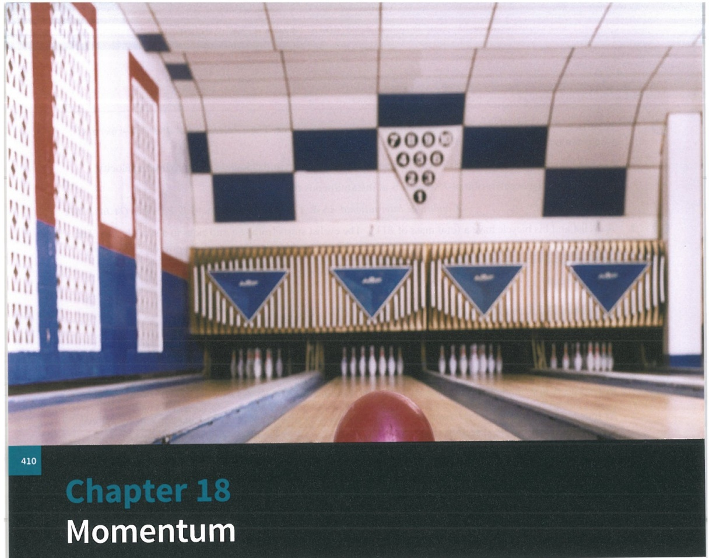

## In this chapter you will learn how to:

E recall and use the definition of the impulse of a constant force, and relate the impulse acting on a particle to the change in its momentum

recall Newton's experimental law, also known as the law of restitution, and the definition of the coefficient of restitution

understand and make use of the terms elastic and inelastic

use Newton's experimental law to solve problems involving the direct and oblique impact of a smooth sphere with a smooth surface.

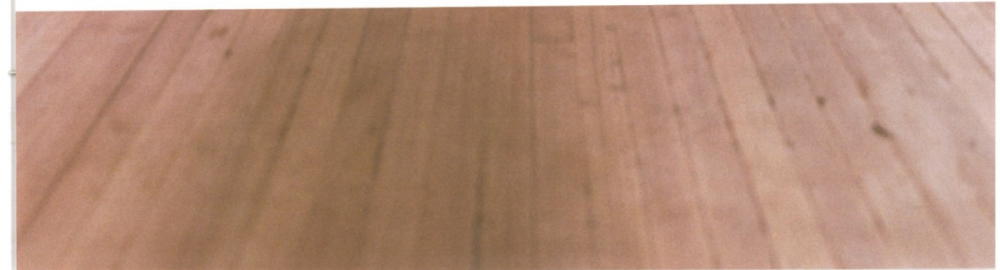

<!-- page 423 -->

PREREQUISITE KNOWLEDGE

<table border=1 style='margin: auto; word-wrap: break-word;'><tr><td style='text-align: center; word-wrap: break-word;'>Where it comes from</td><td style='text-align: center; word-wrap: break-word;'>What you should be able to do</td><td style='text-align: center; word-wrap: break-word;'>Check your skills</td></tr><tr><td style='text-align: center; word-wrap: break-word;'>AS &amp; A Level Mathematics Mechanics, Chapter 3 Pure Mathematics 2 &amp; 3, Chapter 9</td><td style='text-align: center; word-wrap: break-word;'>Write velocity in component form.</td><td style='text-align: center; word-wrap: break-word;'>1 A particle is moving in a straight line with velocity  $ 12\, \text{m s}^{-1} $ such that the angle its path makes with the x-axis is  $ 30^{\circ} $ anticlockwise. Find the components of the velocity in the x and y directions.</td></tr><tr><td style='text-align: center; word-wrap: break-word;'>AS &amp; A Level Mathematics Mechanics, Chapter 8</td><td style='text-align: center; word-wrap: break-word;'>Find the kinetic energy of an object that is in motion.</td><td style='text-align: center; word-wrap: break-word;'>2 A particle of mass 2 kg is travelling with speed  $ 4\, \text{m s}^{-1} $. Later in the motion it is travelling with speed  $ 11\, \text{m s}^{-1} $. Find the change in kinetic energy.</td></tr></table>

## What is momentum?

Any object that has mass and is in motion has momentum. If two objects are moving at the same velocity, the heavier object will have greater momentum.

In this chapter, we shall work with the quantities momentum and impulse, understand how the formulae are derived, and understand the units used for these quantities. We shall also look at collisions between bodies, especially elastic and inelastic collisions where momentum is always conserved, using the symbols defined in Key point 18.1.

### KEY POINT 18.1

In this chapter, we shall use the symbols $m$ for mass, $u$ for velocity before the collision, $v$ for velocity after the collision, $P$ for momentum, $e$ for coefficient of restitution, $I$ for impulse and KE for kinetic energy. Impulse will not be examined in this course.

Newton's experimental law and the coefficient of restitution have many real-world applications. There are strict performance rules for equipment used in sports, such as golf and tennis. Manufacturers use Newton's experimental law to ensure that their sports equipment adheres to the required elastic properties and stays within the rules.

### 18.1 Impulse and the conservation of momentum

Consider an object of mass $m$, moving with velocity $v$. The momentum, $P$, of this object is defined as being the product of its mass and velocity. Hence, $P = mv$. This quantity is a vector: it can be either positive or negative.

For an object to change its momentum, a force must be applied. If that force is applied over time, then  $ \frac{\mathrm{d}}{\mathrm{d}t}(P)=\frac{\mathrm{d}}{\mathrm{d}t}(mv) $, then  $ \frac{\mathrm{d}P}{\mathrm{d}t}=m\frac{\mathrm{d}v}{\mathrm{d}t}+\nu\frac{\mathrm{d}m}{\mathrm{d}t} $. If you assume that the mass does not change over time, then  $ \frac{\mathrm{d}P}{\mathrm{d}t}=m\frac{\mathrm{d}v}{\mathrm{d}t} $.

Changing an object's momentum requires a force. We have seen how to use the equation from Newton's second law, F = ma.

Reversing this process by integrating should give a result that relates to momentum.

<!-- page 424 -->

$$\mathrm{So}\int_{0}^{t}F\mathrm{dt}=\int_{0}^{t}m\mathrm{ad}t.\mathrm{Noting~that~}a=\frac{\mathrm{d}v}{\mathrm{d}t},\mathrm{and~that~the~velocities~at~the~times~given~are}u$$

$$\mathrm{and}v,\int_{0}^{t}F\mathrm{dt}=\int_{0}^{t}m\frac{\mathrm{d}v}{\mathrm{d}t}\mathrm{dt}\text{ becomes } \int_{0}^{t}F\mathrm{dt}=\int_{u}^{v}m\mathrm{d}v.$$

Then $Ft = mv - mu$. This is clearly a change in momentum, which we call impulse.

Common practice is to let $I = Ft$ so that $I = m(v - u)$. The units of impulse are given in Key point 18.2.

### KEY POINT 18.2

Impulse I is measured in newton seconds (Ns).

### WORKED EXAMPLE 18.1

A particle of mass 4kg is travelling in a straight line on a smooth, horizontal surface. The particle is moving at a constant velocity of  $ 3\,m\,s^{-1} $ when a force of magnitude  $ 5\,N $ is applied for 0.4s. Find the impulse applied to the particle and its velocity after 0.4s. The particle does not change direction during its motion.

Answer

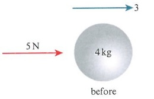

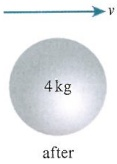

A simple clear diagram shows the before and after states of the particle.

Use $I = Ft$, $I = 5 \times 0.4 = 2\,\text{Ns}$.

Using $I = m(v - u)$, $2 = 4(v - 3)$.

Use force and time to find the impulse.

Hence,  $ v = 3.5 \, \text{m} \, \text{s}^{-1} $.

Apply impulse to the right.

Determine the final velocity.

### WORKED EXAMPLE 18.2

A particle of mass 10kg travels in a straight line. When the particle is travelling with velocity  $ 12\,m\,s^{-1} $, a force of magnitude 18N is applied to the particle for 12s. Given that the particle's direction is reversed, find the velocity of the particle after 12s.

Answer

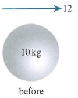

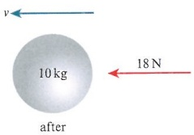

First take positive momentum to the left.

Note that the particle changes direction. This implies that the momentum of the particle before the force is applied and the momentum afterwards must be in different directions.

Choose a sensible positive direction.

<!-- page 425 -->

<table border=1 style='margin: auto; word-wrap: break-word;'><tr><td style='text-align: center; word-wrap: break-word;'>Using  $ Ft = m(v - u), 18 \times 12 = 10(v - (-12)) $.</td><td style='text-align: center; word-wrap: break-word;'>Use the impulse formula.</td></tr><tr><td style='text-align: center; word-wrap: break-word;'>Then  $ \frac{18 \times 12}{10} - 12 = v $; hence,  $ v = 9.6 ms^{-1} $.</td><td style='text-align: center; word-wrap: break-word;'>Determine the final velocity.</td></tr></table>

### WORKED EXAMPLE 18.3

A particle of mass 5kg is travelling along a smooth, horizontal surface with velocity  $ 15 \, \text{m} \, \text{s}^{-1} $. Given that the force, F, applied over 4s reduces the velocity by  $ 8 \, \text{m} \, \text{s}^{-1} $, and that the particle still travels in the same direction, find the force F.

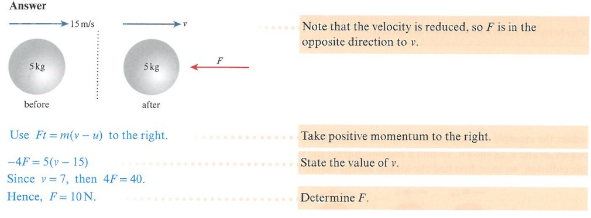

When two particles collide, whether they remain separate after impact or combine to make a single object, the law of conservation of momentum states that  $ m_1u_1 + m_2u_2 = m_1v_1 + m_2v_2 $, as shown in Key point 18.3.  $ m_1 $,  $ m_2 $ are the masses of the particles;  $ u_1 $,  $ u_2 $ are the velocities before the collision, and  $ v_1 $,  $ v_2 $ are the velocities after the collision.

### KEY POINT 18.3

The law of conservation of momentum:

 $$ m_{1}u_{1}+m_{2}u_{2}=m_{1}v_{1}+m_{2}v_{2} $$ 

Consider a particle, $P$, of mass 2kg travelling on a smooth, horizontal surface with velocity $5\mathrm{~m}s^{-1}$. This particle collides with a second particle, $Q$, of mass 1kg, which is at rest. The particles stick together when they collide. The particles are said to coalesce.

If we draw a diagram to explain what happens, then we can attempt to find the velocity of the particle afterwards.

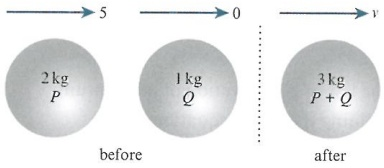

<!-- page 426 -->

So using conservation of momentum in the direction of motion,  $ 2 \times 5 + 0 = (2 + 1)v $.

Hence the velocity of the combined particles afterwards is  $ v=\frac{10}{3}m s^{-1} $.

This method comes from the equation  $ m_{1}u_{1} + m_{2}u_{2} = m_{1}v_{1} + m_{2}v_{2} $, as shown in Key point 18.3. Here, each particle has its own momentum and, since momentum is conserved, both sides must balance.

In this simple case, the particles coalesce and the right side becomes:

 $$ m_{1}v+m_{2}v=(m_{1}+m_{2})v $$ 

### KEY POINT 18.4

When two particles collide, the amount of kinetic energy (KE) lost can be found by comparing the KE before and after the collision. If the collision is perfectly elastic, we can use conservation of energy to equate KE before and after the collision.

When two particles collide and coalesce, or stick together, they are said to be inelastic. That means there is no bounce between them. If two particles collide and there is no loss in kinetic energy, the collision is said to be perfectly elastic. We can use conservation of energy, as shown in Key point 18.4.

Consider the example of two particles that are both of mass $m$. They are travelling with velocities $2u$ and $u$, as shown. To find a relationship for the velocities after a perfectly elastic collision, we must first find the kinetic energy before they collide.

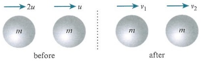

 $$ \mathrm{KE}_{\mathrm{before}}=\frac{1}{2}m(2u)^{2}+\frac{1}{2}mu^{2}=\frac{5}{2}mu^{2},\mathrm{and}\mathrm{KE}_{\mathrm{after}}=\frac{1}{2}m(v_{1}^{2}+v_{2}^{2}). $$ 

Using conservation of energy means  $ 5u^2 = v_1^2 + v_2^2 $ is the equation we need to solve. There are many solutions to this, so we shall not be able to solve this at present.

To help us deal with this, we are going to use Newton's experimental law, which is also known as Newton's law of restitution.

This law states that the constant  $ e = \frac{\text{speed of separation}}{\text{speed of approach}} $, where  $ 0 \leq e \leq 1 $.  $ e $ is called the coefficient of restitution. When  $ e = 0 $ the objects colliding have no elasticity. This means that they will coalesce.

When e = 1, the objects are said to be perfectly elastic, as in this example.

To determine $v_{1}$ and $v_{2}$, let $e=\frac{v_{2}-v_{1}}{2u-u}$. In this expression, $v_{2}-v_{1}$ shows how quickly the second particle escapes the first one and $2u-u$ shows how quickly the particles approach each other.

So $1 = \frac{\nu_2 - \nu_1}{u}$, which means $\nu_2 - \nu_1 = u$. Then from the law of conservation of momentum we have $2mu + mu = mv_1 + mv_2$, or $3u = \nu_1 + \nu_2$. Combining these two equations gives $\nu_1 = u$ and $\nu_2 = 2u$.

<!-- page 427 -->

Two particles, P and Q, are travelling on a smooth, horizontal plane. P has mass 3 kg and Q has mass 1 kg. P has velocity 3u and Q velocity u. P then collides with Q, such that the collision is perfectly elastic. Find the velocity of each particle after the collision. Confirm that the kinetic energy is the same before and after the collision.

## Answer

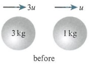

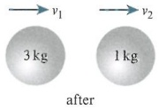

Using conservation of momentum:  $ 9u + u = 3v_1 + v_2 $ -----(1)

Using Newton's experimental law:  $ 1 = \frac{v_2 - v_1}{3u - u} $, so  $ v_2 - v_1 = 2u $. (2)

Use conservation of momentum.

Use Newton's experimental law (NEL) with $e=1$ as we have a perfectly elastic collision.

Combining (1) and (2) gives  $ v_{1} = 2u m s^{-1} $,  $ v_{2} = 4u m s^{-1} $

Before:  $  \text{KE} = \frac{1}{2} \times 3 \times 9u^2 + \frac{1}{2} \times 1 \times u^2 = 14u^2\text{J}  $

Solve the simultaneous equations.

After:  $ \mathrm{KE}=\frac{1}{2}\times3\times4u^{2}+\frac{1}{2}\times1\times16u^{2}=14u^{2}\mathrm{J} $

Find the KE before the collision.

Confirm that the KE after the collision is the same.

When collisions are neither inelastic nor perfectly elastic, we have a coefficient of restitution that reduces the energy of the system. In most cases  $ 0 < e < 1 $.

### EXPLORE 18.1

Table tennis balls are made to have the value  $ e \approx 0.95 $. Carry out some online research into different types of sporting equipment, such as footballs and tennis balls, and find out their coefficients of restitution.

### WORKED EXAMPLE 18.5

Two smooth spheres of equal radius are resting on a smooth surface. Sphere A has mass 2m and sphere B has mass 3m. The coefficient of restitution between the spheres is  $ \frac{2}{3} $. Sphere A is projected towards B with velocity 2u and sphere B is projected towards A with velocity u. Find the velocity of each sphere after the collision.

Find also the loss in kinetic energy.

## Answer

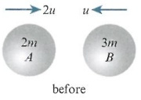

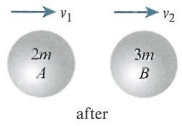

It is best to make no assumptions about the directions of particles after a collision. The solutions will tell you what is happening.

<!-- page 428 -->

Conservation of momentum:  $ 4mu - 3mu = 2mv_1 + 3mv_2 $, so  $ 2v_1 + 3v_2 = u $.

Newton's experimental law:  $ \frac{2}{3} = \frac{v_2 - v_1}{2u + u} $, so  $ 3v_2 - 3v_1 = 6u $.

Combining gives  $ v_1 = -u m s^{-1} $,  $ v_2 = u m s^{-1} $.

Use conservation of momentum and law

of restitution equations.

Before:  $ KE = \frac{1}{2} \times 2m \times 4u^{2} + \frac{1}{2} \times 3m \times u^{2} = \frac{11}{2}mu^{2} $

After:  $ KE = \frac{1}{2} \times 2m \times u^{2} + \frac{1}{2} \times 3m \times u^{2} = \frac{5}{2}mu^{2} $

Hence, the energy loss is  $ 3mu^{2}J $.

Since  $ v_{1}<0 $, A changes direction. B also changes direction.

Find the energy before and after the collision to determine the loss in kinetic energy.

### WORKED EXAMPLE 18.6

Two smooth spheres of equal radius are resting on a smooth surface. Sphere $P$ has mass $m$ and sphere $Q$ has mass $2m$. The coefficient of restitution between the spheres is $e$. Sphere $P$ is projected towards $Q$ with velocity $u$. Find a condition on $e$ such that $P$'s direction is changed.

## Answer

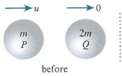

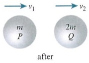

Conservation of momentum:  $ mu = mv_{1} + 2mv_{2} $, so  $ v_{1} + 2v_{2} = u $. ⋯⋯

Conservation of momentum: $mu = mv_{1} + 2mv_{2}$, so $v_{1} + 2v_{2} = u$.

Newton's experimental law: $e = \frac{v_{2} - v_{1}}{u}$, so $v_{2} - v_{1} = eu$.

Write down the two standard equations.

Combining gives  $ v_2 = \frac{u}{3}(1 + e) $, and so  $ v_1 = \frac{u}{3}(1 - 2e) $.

Equate to get  $ v_1 $ and  $ v_2 $ in terms of  $ e $.

Consider  $ \nu_1 < 0 $, and so 1 - 2e < 0  $ \Rightarrow $  $ e > \frac{1}{2} $.

Note $P$'s change in direction.

$v_{1}<0$ leads to the result.

## DID YOU KNOW?

Newton's cradle was first demonstrated by a French physicist known as Abbe Mariotte in the 17th century. An English actor saw a toy version in 1967 and gave it the name Newton's cradle.

<!-- page 429 -->

1 Two particles, P and Q, are resting on a smooth, horizontal surface. P is projected towards Q with velocity 2u and they collide directly. Given that the masses of P and Q are 2m and m, respectively, and that the collision is perfectly elastic, find the velocity of P and Q afterwards.

2 Two particles, P and Q, are resting on a smooth surface. They are connected by a light string of length 4m. The particles are of mass 2m and 3m, respectively, and are resting 2m apart. Q is projected directly away from P with velocity u. Given that the string is inextensible, find the velocity of the particles when the string becomes taut.

3 Two identical, 1 kg, smooth spheres, A and B, of equal radius, are travelling on a smooth surface. The velocity of A is  $ 3 \, m \, s^{-1} $ and the velocity of B is  $ 2 \, m \, s^{-1} $. Given that the spheres are moving in opposite directions, and that the coefficient of restitution is 0.7, find the loss in kinetic energy due to the collision.

4 A particle, $P$, of mass $4m$, is projected with velocity $2u$ towards another particle, $Q$, of mass $5m$, which is at rest. Both particles are on a smooth, horizontal surface. The coefficient of restitution between the particles is $e$. Find the condition on $e$ so that both particles are travelling in the same direction after the collision.

PS 5 Two particles, P and Q, are resting on a smooth, horizontal surface. Their masses are 2kg and 3kg, respectively. Particle P is projected towards Q with velocity  $ 5\,m\,s^{-1} $. It subsequently strikes Q and Q moves off with velocity  $ 2.5\,m\,s^{-1} $. Find the value of e, and also find the loss in kinetic energy due to the collision.

PS 6 Two particles, P and Q, are resting on a smooth, horizontal surface. P has mass 2m and Q has mass m. P is projected towards Q with velocity u and Q is projected towards P with velocity 3u. Given that Q has velocity  $ \frac{5}{9}u $, and has its direction changed due to the collision, find the value of e.

P PS 7 Two smooth spheres of equal size are resting on a smooth, horizontal surface. Particle $P$, of mass $m$, is projected towards particle $Q$, of mass $2m$, with velocity $3u$. Particle $Q$ is initially at rest. The coefficient of restitution between the spheres is $e$.

a Show that particle $P$ has its direction changed provided $e > \frac{1}{2}$.

Given that the kinetic energy after the collision is half the initial kinetic energy, find the value of e and state the velocity of P.

### 18.2 Oblique collisions and other examples

Consider a particle travelling towards a wall with velocity $u$ at an angle of $\theta$. If we split the velocity into component form we have $u_{y}$ parallel to the wall, and $u_{x}$ perpendicular to the wall.

When the particle bounces off the wall, the component  $ u_{y} $ is unaffected by the collision, but the component  $ u_{x} $ will be subject to the conservation of momentum.

After bouncing off the wall, the component  $ u_x $ will become  $ eu_x $. Note that the angles  $ \alpha $ and  $ \theta $ are not the same, unless  $ e = 1 $.

When an object collides with a wall at an angle other than  $ 90^{\circ} $, this is known as an oblique collision.

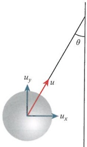

<!-- page 430 -->

As an example, consider a particle travelling with velocity $2u$, directed at an angle of $30^{\circ}$ to a wall, with coefficient of restitution $\frac{1}{2}$ between the particle and the wall. Find the velocity of the particle after the collision.

We have  $ u_{y}=2u\cos30=u\sqrt{3} $, and  $ u_{x}=2u\sin30=u $.

The particle bounces off the wall so  $ eu_x = \frac{u}{2} $. Then for the velocity afterwards, we have  $ \sqrt{(u\sqrt{3})^2 + \left(\frac{u}{2}\right)^2} $, which is  $ \frac{u\sqrt{13}}{2} $ m s $ ^{-1} $. We can also find the angle that the particle makes with the wall afterwards, using  $ \tan\alpha = \frac{eu_x}{u_y} = \frac{\frac{u}{2}}{u\sqrt{3}} $, which gives  $ \alpha = 16.1^\circ $.

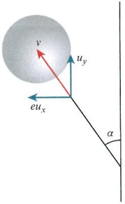

### WORKED EXAMPLE 18.7

A particle is projected along a smooth, horizontal surface with velocity u. The particle collides with a smooth, vertical wall at an angle of  $ 60^{\circ} $. Given that the coefficient of restitution between the particle and the wall is 0.3, find the angle between the wall and the path of the particle after the collision.

Answer

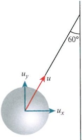

First:  $ u_{y} = u \cos 60 = \frac{u}{2} $

Then  $ u_x = u \sin 60 = \frac{u \sqrt{3}}{2} $.

Split the velocity into its components.

Then after bouncing,  $ eu_x = \frac{3}{10} \times \frac{u\sqrt{3}}{2} = \frac{3\sqrt{3}u}{20} $.

Then  $ \tan\alpha = \frac{3\sqrt{3}}{20} \times \frac{2}{1} $.

So  $ \alpha = 27.5^\circ $.

Find the component that is perpendicular to the wall after colliding.

Use components to find the tangent of the angle.

Determine $a$.

<!-- page 431 -->

A particle of mass 3 kg is travelling on a smooth, horizontal surface with velocity  $ 4 \, \text{m} \, \text{s}^{-1} $. The particle collides obliquely with a smooth, vertical wall where the coefficient of restitution is  $ \frac{1}{3} $. Given that the angle between the path of the particle and the wall before the collision is  $ 40^\circ $, find the loss in kinetic energy due to the collision.

## Answer

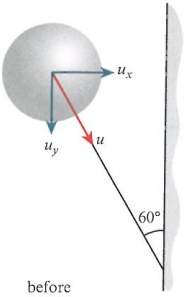

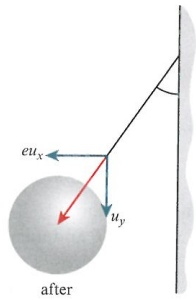

Parallel to wall:  $ u_{y} = 4 \cos 40 = 3.0642 $

Perpendicular to wall:  $ u_x = 4 \sin 40 = 2.5712 $

Find both components before the collision.

After collision,  $ eu_{x}=0.8571 $.

Before:  $ KE = \frac{1}{2} \times 3 \times 4^{2} = 24 $

Find the perpendicular component after the collision.

After:  $ KE = \frac{1}{2} \times 3 \times (3.0642^2 + 0.8571^2) = 15.186 $

Determine the KE before and after the collision.

Hence, the energy loss is 8.81 J.

Determine the difference in kinetic energy.

### WORKED EXAMPLE 18.9

When a smooth sphere travelling on smooth horizontal ground collides obliquely with a smooth vertical wall, it rebounds off the wall at right angles to its original direction. If the sphere is travelling with velocity u and its path makes an angle of  $ 60^{\circ} $ with the wall before the collision, find e, the coefficient of restitution.

## Answer

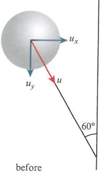

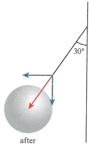

after

Draw a clear diagram showing the situation before and after the collision.

<!-- page 432 -->

<table border=1 style='margin: auto; word-wrap: break-word;'><tr><td style='text-align: center; word-wrap: break-word;'>Parallel:  $ u_y = u \cos 60 = \frac{u}{2} $</td><td style='text-align: center; word-wrap: break-word;'>Find the velocity components before the collision.</td></tr><tr><td style='text-align: center; word-wrap: break-word;'>This is unchanged after the collision.</td><td style='text-align: center; word-wrap: break-word;'></td></tr><tr><td style='text-align: center; word-wrap: break-word;'>Perpendicular:  $ u_x = u \sin 60 = \frac{\sqrt{3}}{2} u $</td><td style='text-align: center; word-wrap: break-word;'>State the perpendicular component.</td></tr><tr><td style='text-align: center; word-wrap: break-word;'>After the collision,  $ eu_x = \frac{\sqrt{3}}{2} eu $.</td><td style='text-align: center; word-wrap: break-word;'></td></tr><tr><td style='text-align: center; word-wrap: break-word;'>Since the angle after is  $ 30^\circ $,  $ \tan 30 = \frac{\sqrt{3}}{2} eu \times \frac{2}{u} $.</td><td style='text-align: center; word-wrap: break-word;'>Use the tangent of the angle to relate the components.</td></tr><tr><td style='text-align: center; word-wrap: break-word;'>So  $ \frac{1}{\sqrt{3}} = \sqrt{3} e \Rightarrow e = \frac{1}{3} $.</td><td style='text-align: center; word-wrap: break-word;'>Determine e.</td></tr></table>

## Particles can also rebound off walls at  $ 90^{\circ} $

Consider two particles, $A$ and $B$, of masses $m$ and $2m$. They are resting on a smooth horizontal surface. Particle $A$ is projected towards $B$ with velocity $u$. $A$ strikes $B$ and then $B$ will go on to strike a smooth vertical wall, rebounding off at $90^{\circ}$. If the coefficient of restitution between the particles is $\frac{7}{8}$, and the coefficient of restitution between $B$ and the wall is $\frac{1}{3}$, can we show that there are no further collisions?

To start with, we need to draw two diagrams: one for the $A-B$ collision, and one for $B$ and the wall.

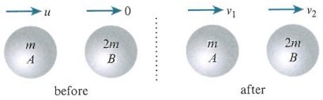

First we use conservation of momentum:  $ mu = mv_{1} + 2mv_{2} $ to get  $ u = v_{1} + 2v_{2} $.

Then use Newton's experimental law:  $ \frac{7}{8} = \frac{v_2 - v_1}{u} $, or  $ v_2 - v_1 = \frac{7}{8}u $

Adding these two gives  $ v_{2} = \frac{5}{8} u $ and  $ v_{1} = -\frac{1}{4} u $. So we know that  $ A $ travels in the opposite direction away from the wall.

 $ B $ hits the wall and bounces off with velocity  $ \frac{1}{3} \times \frac{5}{8} u = \frac{5}{24} u $. It is now travelling in the same direction as  $ A $.

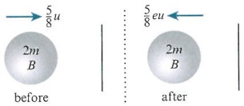

Since  $ \frac{1}{4}u > \frac{5}{24}u $, B will never catch up with A, and so there will be no more collisions.

<!-- page 433 -->

Two smooth spheres, P and Q, of masses 2m and 3m, respectively, are resting on a smooth, horizontal surface. Sphere P is projected towards Q with velocity 2u. P strikes Q and Q begins to travel towards a smooth, vertical wall. The coefficient of restitution between the spheres is e. Q strikes the wall at right angles and rebounds off the wall, where the coefficient of restitution between Q and the wall is  $ \frac{1}{8} $. Given that P's direction is reversed, and that Q strikes P again, find the range of values of e.

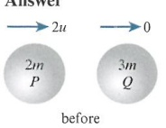

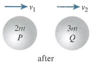

Conservation of momentum: $4mu = 2mv_1 + 3mv_2$, so $2v_1 + 3v_2 = 4u$.

Newton's experimental law: $e = \frac{v_2 - v_1}{2u}$, so $2v_2 - 2v_1 = 4eu$.

Adding gives $5v_2 = 4u + 4eu$, or $v_2 = \frac{4}{5}u(1 + e)$.

Write down the two standard equations.

Equate them to find both velocities in terms of e.

Hence,  $ v_{1} = \frac{2}{5} u(2 - 3e) $

 $ v_{1} $ result to be used later.

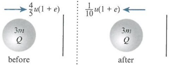

 $$ e_{wall}=\frac{1}{8}, $$ 

 $$ \frac{1}{10}u(1+e) $$ 

Allow Q to bounce off the wall.

 $$ 2-3e<0, $$ 

 $$ e>\frac{2}{3}. $$ 

State how $P$ changing direction affects the value of $e$.

 $$ \frac{1}{10}u(1+e)>\frac{2}{5}u(3e-2). $$ 

Assume $P$ is moving to the left, and allow $Q$ to travel faster than $P$.

 $$ e<\frac{9}{11}. $$ 

 $$ \frac{2}{3}<e<\frac{9}{11}. $$ 

State the final range of values.

Let us now look at multiple objects colliding. We shall consider three smooth spheres, A, B and C, all of equal size, resting on a smooth, horizontal surface.

Let $A$ have mass $m$, $B$ have mass $2m$ and $C$ have mass $m$. The coefficient of restitution between $A$ and $B$ is $\frac{1}{3}$, and the coefficient of restitution between $B$ and $C$ is $\frac{2}{3}$. So, assuming $A$, $B$ and $C$ are collinear (arranged in a straight line), let us project $A$ towards $B$ with velocity $u$.

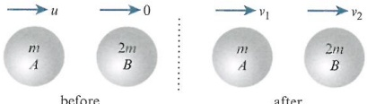

before

after

<!-- page 434 -->

Conservation of momentum:  $ mu = mv_1 + 2mv_2 $, so  $ u = v_1 + 2v_2 $.

Newton's experimental law:  $ \frac{1}{3} = \frac{v_2 - v_1}{u} $, which leads to  $ v_2 - v_1 = \frac{1}{3}u $.

Equating gives  $ v_1 = \frac{1}{9}u $ and  $ v_2 = \frac{4}{9}u $.

Next, we observe B and C colliding.

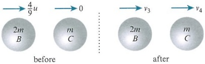

So conservation of momentum:  $ \frac{8}{9}mu = 2mv_3 + mv_4 $, so  $ 2v_3 + v_4 = \frac{8}{9}u $.

Using Newton's experimental law:  $ \frac{2}{3} = \frac{\nu_4 - \nu_3}{\frac{4}{0}u} $, leading to  $ \nu_4 - \nu_3 = \frac{8}{27}u $.

Equating gives  $ v_{3}=\frac{16}{81}u $ and  $ v_{4}=\frac{40}{81}u $.

Also, according to the velocity of $B$, $A$ will not collide with $B$ again. There are no further collisions.

We can then work out the loss in kinetic energy at this point. So, initially  $ \mathrm{KE}=\frac{1}{2}mu^{2} $, then finally we have  $ \mathrm{KE}=\frac{1}{2}m\left(\frac{1}{9}u\right)^{2}+\frac{1}{2}\times2m\left(\frac{16}{81}u\right)^{2}+\frac{1}{2}m\left(\frac{40}{81}u\right)^{2}=\frac{731}{4374}mu^{2} $. So the loss in kinetic energy is  $ \frac{728}{2187}mu^{2}\mathrm{J} $.

## TIP

### WORKED EXAMPLE 18.11

You are unlikely to encounter an example with more than three particles colliding.

Three particles, $P$, $Q$ and $R$, are of masses 2kg, 3kg and 1kg, respectively. They are all at rest on a smooth, horizontal surface. $P$ is projected towards $Q$ with velocity $5\mathrm{~m}s^{-1}$. At the same time, $Q$ is projected towards $P$ with velocity $1\mathrm{~m}s^{-1}$. Given that $P$, $Q$ and $R$ are all in the same line, and that the coefficient of restitution between all spheres is 0.6, find the speed of $R$ after it is hit by $Q$.

## Answer

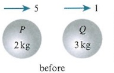

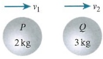

 $ P-Q $ conservation of momentum:  $ 2 \times 5 - 3 \times 1 = 2v_1 + 3v_2 $, so  $ 2v_1 + 3v_2 = 7 $.

Newton's experimental law:  $ \frac{3}{5} = \frac{\nu_2 - \nu_1}{6} $, and thus  $ \nu_2 - \nu_1 = 3.6 $.

Consider the collision of  $ P $ and  $ Q $ first. Make sure you draw a diagram as the problems will be easier to solve.

<!-- page 435 -->

Combining these two equations gives  $ \nu_2 = 2.84 $ and  $ \nu_1 = -0.76 $ (to the left).

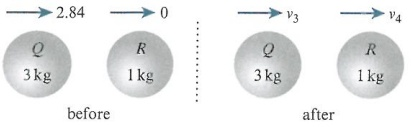

Solve to find the velocities after the first collision.

 $$ 3\times2.84=3\nu_{3}+\nu_{4}, $$ 

 $$ 3\nu_{3}+\nu_{4}=8.52 $$ 

Consider the $Q$ and $R$ collision. Create the necessary equations.

Newton's experimental law:  $ \frac{3}{5} = \frac{\nu_4 - \nu_3}{2.84} $ giving  $ \nu_4 - \nu_3 = 1.704 $.

Combine to solve.

Then  $ v_3 = 1.704 \, \text{m} \, \text{s}^{-1} $ and  $ v_4 = 3.408 \, \text{m} \, \text{s}^{-1} $.

Calculate the velocity of R.

Finally, we look at oblique collisions between two spheres or particles. It is important to note the line of centres between the two objects. When the two particles meet, we consider the conservation of momentum in two directions: along the line of centres and perpendicular to the line of centres. The general case is shown in the diagram.

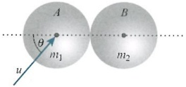

Consider two spheres, $A$ and $B$, of equal radii, on a smooth horizontal surface, and with masses $2m$ and $m$, respectively. Initially, sphere $B$ is at rest and sphere $A$ is projected with speed $u$ towards $B$. When the spheres collide, the direction of $A$ is at $45^{\circ}$ to the line through the centres of $A$ and $B$. Given that the coefficient of restitution between the spheres is $\frac{1}{2}$, find the speeds of the particles after colliding.

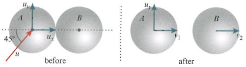

Begin by considering the components of the speed of $A$. We notice that the only component affecting the collision is $u_x$. Note that $u_x = u \cos 45$, $u_y = u \sin 45$.

Using conservation of momentum, we find the vertical components will cancel to give:  $ 2m\mu\cos45=2mv_1+mv_2 $, which we write as  $ u\sqrt{2}=2v_1+v_2 $.

Using Newton’s experimental law:  $ \frac{1}{2} = \frac{v_2 - v_1}{u\cos 45} $ which can be written as  $ \frac{u\sqrt{2}}{4} = v_2 - v_1 $. Combining these leads to  $ v_1 = \frac{u\sqrt{2}}{4} $ and  $ v_2 = \frac{u\sqrt{2}}{2} $. So the speed of sphere  $ B $ after the collision is  $ \frac{u\sqrt{2}}{2} \, \text{m} \, \text{s}^{-1} $.

<!-- page 436 -->

For sphere $A$ the final speed is given by $\sqrt{u_{y}^{2}+v_{1}^{2}}=\sqrt{\left(\frac{u\sqrt{2}}{2}\right)^{2}+\left(\frac{u\sqrt{2}}{4}\right)^{2}}$. Hence, the speed is $\frac{u\sqrt{5}}{2\sqrt{2}}\mathrm{m}\mathrm{s}^{-1}$.

We can also determine the angle of deflection caused by the collision. This is the angle that shows the change in direction travelled before and after the collision. The direction relative to the line through the centres is  $ 45^{\circ} $, then after the collision the angle is  $ \tan^{-1}\left(\frac{u_{y}}{\nu_{1}}\right) $. This gives an angle of  $ \tan^{-1}2=63.4^{\circ} $. So the angle of deflection is  $ 63.4^{\circ}-45^{\circ}=18.4^{\circ} $.

### WORKED EXAMPLE 18.12

Two smooth spheres of equal radii, P and Q, are at rest on a smooth horizontal surface. The coefficient of restitution between them is  $ \frac{1}{4} $ Sphere P has mass m and sphere Q has mass 3m. Sphere P is given an initial speed of 4u and is projected in a direction such that it will collide with Q. Given that the angle between the direction of P and the line through the centres of P and Q at the point of impact is  $ 60^{\circ} $, find the angle of deflection for P.

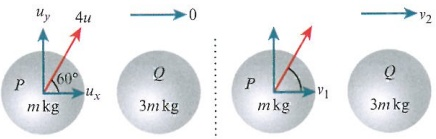

## Answer

For  $ P: u_x = 4u \cos 60 = 2u $,  $ u_y = 4u \sin 60 = 2\sqrt{3}u $

Then, along the line  $ PQ $:

conservation of momentum:  $ 4u\cos60=mv_{1}+3mv_{2} $,

or  $ 2u=v_{1}+3v_{2} $.

Work out the two components for P.

Along the line of centres we consider conservation of momentum and Newton's experimental law.

Newton's experimental law:  $ \frac{1}{4} = \frac{\nu_2 - \nu_1}{2u} $, or  $ \nu_2 - \nu_1 = \frac{u}{2} $. Adding these two gives  $ \frac{5u}{2} = 4\nu_2 $, and so  $ \nu_2 = \frac{5}{8}u $. Hence,  $ \nu_1 = \frac{1}{8}u $.

Before the collision, the angle between $P^{\prime}$s direction and the line through the centres is $60^{\circ}$. Combine the equations to find the speeds of both spheres.

After, it is  $ \tan^{-1}\left(\frac{u_{y}}{\nu_{1}}\right)=\tan^{-1}(16\sqrt{3}) $, which is  $ 87.9^{\circ} $.

Hence, the angle of deflection is  $ 27.9^{\circ} $.

Note the angle before the collision.

Determine the angle of $P$ relative to the line of centres after the collision.

State the angle of deflection.

<!-- page 437 -->

1 A small smooth ball of mass $m$ is travelling on a smooth horizontal floor with speed $u$. The ball then goes on to strike a fixed smooth vertical wall at an angle $\theta = 30^{\circ}$ to the wall. The coefficient of restitution between the ball and the wall is 0.5. Find the speed of the ball after bouncing off the wall.

PS 2 A small smooth ball of mass 3m is travelling on a smooth horizontal floor with speed 2u. The ball then goes on to strike a fixed smooth vertical wall at an angle  $ \theta = 60^{\circ} $ to the wall. The coefficient of restitution between the ball and the wall is 0.25. Find the loss in kinetic energy due to the collision with the wall.

3 Three rail carriages are on a smooth, horizontal rail track. They are equally spaced apart. The carriages are labelled A, B and C, and their masses are 2m, 6m and 3m, respectively. Carriage A is projected towards carriage B with speed u, where B is in between A and C. Given that the coefficient of restitution between each carriage is 0, find the velocity of the carriages after B collides with C.

4 A particle is travelling on a smooth, horizontal surface with velocity 3u. The particle collides with a smooth, vertical wall at an oblique angle of  $ 30^{\circ} $ to the wall. Find the angle between the path of the particle and the wall after the collision, given that  $ e = \frac{1}{8} $.

## P PS

5 Two smooth, identical spheres, P and Q, are resting on a smooth, horizontal surface. The masses of the spheres are 3m and m, respectively. P is projected towards Q with velocity u.

a Given that the coefficient of restitution between P and Q is e, show that, no matter the value of e, P will travel in the same direction as Q after the collision.

b Given that  $ e = \frac{2}{5} $, find the loss in kinetic energy due to the collision.

6 Three particles are lying in a straight line on a smooth, horizontal surface. The particles are labelled A, B and C, with B between A and C. The masses of the particles are 5 kg, 3 kg and 2 kg, respectively. The coefficient of restitution between A and B is  $ \frac{1}{2} $, and the collision between B and C is perfectly elastic. Particle C is projected towards particle B with velocity  $ 8 \, m s^{-1} $. Find the velocity of each particle after the second collision, stating whether or not there will be any further collisions.

7 The diagram shows a smooth sphere, travelling horizontally, that is colliding with two smooth vertical walls at a corner point. The sphere has an initial velocity $u$, and given that the coefficient of restitution between the sphere and wall is $e$, find a relationship between the initial velocity and the final velocity after two collisions.

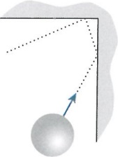

<!-- page 438 -->

8 Particles P and Q are resting on a smooth, horizontal surface. A smooth, vertical wall is at a distance 2r from Q, and the wall is perpendicular to the line through P and Q. The masses of P and Q are 2m and m, respectively. The coefficient of restitution between P and Q is  $ \frac{2}{3} $, and the coefficient of restitution between Q and the wall is  $ \frac{2}{5} $. P is projected towards Q with velocity u. Find the distance of the particles from the wall when they collide for a second time.

9 Three identical smooth spheres, $A$, $B$ and $C$, of masses $2m$, $M$ and $m$, respectively, are resting on a smooth, horizontal surface. The coefficient of restitution between $A$ and $B$ is $\frac{4}{5}$, and the coefficient of restitution between $B$ and $C$ is $\frac{1}{2}$. Sphere $A$ is projected towards $B$ with velocity $2u$. Given that $A$, $B$ and $C$ are collinear, and that the velocity of $B$ is zero after it collides with $C$, find the loss in kinetic energy after the second collision.

PS 10 Two spheres, $P$ and $Q$, which are of equal radii, are placed on a smooth, horizontal surface. Their masses are $m$ and $2m$, respectively. Initially, sphere $Q$ is at rest and sphere $P$ is projected with speed $u$ towards $Q$. When the spheres collide, the direction of $P$ is $30^{\circ}$ to the line through the centres of $P$ and $Q$. Given that the coefficient of restitution between the spheres is $\frac{4}{5}$, find the loss in kinetic energy due to the collision.

<!-- page 439 -->

## WORKED PAST PAPER QUESTION

Two smooth spheres $A$ and $B$, of equal radii, have masses 0.1 kg and $m$ kg respectively. They are moving towards each other in a straight line on a smooth horizontal table and collide directly. Immediately before the collision the speed of $A$ is $5\mathrm{~m}s^{-1}$ and the speed of $B$ is $2\mathrm{~m}s^{-1}$.

i Assume that in the collision $A$ does not change direction. The speeds of $A$ and $B$ after the collision are $v_{A} \mathrm{m} \mathrm{s}^{-1}$ and $v_{B} \mathrm{m} \mathrm{s}^{-1}$ respectively. Express $m$ in terms of $v_{A}$ and $v_{B}$, and hence show that $m < 0.25$.

Cambridge International AS & A Level Further Mathematics 9231 Paper 2 Q4 November 2008

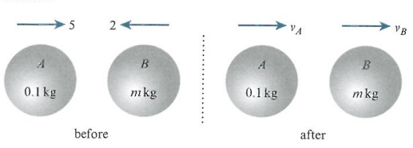

i Conservation of momentum:  $ 0.1 \times 5 - m \times 2 = 0.1v_A + mv_B $, then  $ m = \frac{0.5 - 0.1v_A}{2 + v_B} $. Since  $ v_A > 0 $ and  $ v_B > 0 $,  $ 0.5 - 0.1v_A < 0.5 $ and  $ 2 + v_B > 2 $. So m < 0.25.

<!-- page 440 -->

## Checklist of learning and understanding

## Momentum and impulse:

Momentum is the product of mass and velocity such that P = mv.

The rate of change of momentum is a force such that  $ F = \frac{dP}{dt} $.

Impulse is given as  $ I = m(v - u) $, measured in newton seconds, Ns.

Impulse is a force applied over time, so  $ I = Ft $, or  $ Ft = mv - mu $.

## Collisions:

For the conservation of momentum,  $ m_1u_1 + m_2u_2 = m_1v_1 + m_2v_2 $.

For particles that coalesce (e=0),  $ m_{1}u_{1} + m_{2}u_{2} = (m_{1} + m_{2})v $.

For perfectly elastic collisions, e = 1.

Newton's experimental law states that  $ e=\frac{\text{speed of separation}}{\text{speed of approach}} $, where e is known as the coefficient of restitution and can take values  $ 0 \leq e \leq 1 $.

When two objects collide directly, conservation of momentum is considered along the line through their centres.

When an object collides obliquely with a wall, only the component of the velocity that is perpendicular to the wall is considered for conservation of momentum.

<!-- page 441 -->

1 Two smooth spheres $A$ and $B$, of equal radius, are moving in the same direction in the same straight line on a smooth horizontal table. Sphere $A$ has mass $m$ and speed $u$ and sphere $B$ has mass $\alpha m$ and speed $\frac{1}{4}u$. The spheres collide and $A$ is brought to rest by the collision. Find the coefficient of restitution in terms of $\alpha$.

Deduce that $\alpha \geqslant 2$.

Cambridge International AS & A Level Further Mathematics 9231 Paper 2 Q3 November 2010

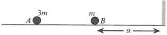

Two perfectly elastic small smooth spheres $A$ and $B$ have masses $3m$ and $m$ respectively. They lie at rest on a smooth horizontal plane with $B$ at a distance $a$ from a smooth vertical barrier. The line of centres of the spheres is perpendicular to the barrier, and $B$ is between $A$ and the barrier (see diagram). Sphere $A$ is projected towards sphere $B$ with speed $u$ and, after the collision between the spheres, $B$ hits the barrier. The coefficient of restitution between $B$ and the barrier is $\frac{1}{2}$. Find the speeds of $A$ and $B$ immediately after they first collide, and the distance from the barrier of the point where they collide for the second time.

Cambridge International AS & A Level Further Mathematics 9231 Paper 21 Q3 June 2010

3 Three small spheres, A, B and C, of masses m, km and 6m respectively, have the same radius. They are at rest on a smooth horizontal surface, in a straight line with B between A and C. The coefficient of restitution between A and B is  $ \frac{1}{2} $ and the coefficient of restitution between B and C is e. Sphere A is projected towards B with speed u and is brought to rest by the subsequent collision.

Show that k=2.

Given that there are no further collisions after $B$ has collided with $C$, show that $e \leqslant \frac{1}{3}$.

Cambridge International AS & A Level Further Mathematics 9231 Paper 23 Q1 June 2011

<!-- page 442 -->

## CROSS-TOPIC REVIEW EXERCISE 3

A light, elastic string, of natural length 2m and modulus of elasticity 40N, has one end attached to a ceiling at the point O. A particle of mass 0.5kg is attached to the other end of the string, and the system is allowed to rest in equilibrium with the string taut.

a Find the extension in the string.

The particle is then pulled down a further 0.75m and released.

b Find the shortest distance between the particle and O in the subsequent motion.

c Show that while the string is taut the particle performs simple harmonic motion.

2 The diagram shows a lamina that consists of a uniform semicircular plate of radius $a$ attached to a uniform rectangular plate of dimensions $a$ and $2a$.

The density of the rectangular section is twice the density of the semicircular section.

a Find the centre of mass of the combined lamina from the edges AB and BC.

b The lamina is suspended from the point A and allowed to hang in equilibrium.

Find the angle between AB and the vertical.

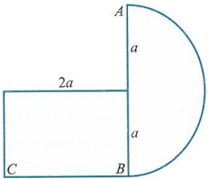

3 A particle of mass $m$ is dropped from a great height. The air resistance on the particle is given as $mkv$ N.

a Show that  $ \frac{\mathrm{d}v}{\mathrm{d}t} = g - kv $.

b Hence, show that  $ v = \frac{g}{k}(1 - e^{-kt}) $.

c State the speed of the particle after a very long time.

4 A smooth hemisphere, of radius 2a, is placed with its plane face on a horizontal surface. A particle, of mass 3m, is placed on the highest point of the hemisphere. The particle is then projected horizontally with speed  $ \sqrt{\frac{1}{4}ga} $.

a Find the height of the particle above the horizontal surface when it leaves the surface of the hemisphere.

b Find the speed of the particle when it strikes the horizontal surface.

A particle is projected from the top of a cliff that is 25m above the sea below. The speed of the projection is  $ 40\, \text{m s}^{-1} $ and the angle of elevation is  $ 15^{\circ} $. The particle travels as a projectile and lands in the sea.

a Find the horizontal distance the particle travels before landing in the sea.

b Find the duration of time for which the particle is 30m above the sea below.

c Find the direction of the particle just before it hits the water.

Two particles, P and Q, of masses $2m$ and $3m$, respectively, are resting on a smooth, horizontal surface. Particle P is projected towards Q with speed $u$. It strikes Q directly and the coefficient of restitution between the particles is $e$.

a Find the velocity of P and Q after the collision, in terms of e and u.

b Find the range of values of e such that P's direction does not change due to the collision.

c Find the loss in kinetic energy due to the collision, giving your answer in terms of e, m and u.

