# Hyperbolic functions

<!-- Cambridge International AS  A Level Further Mathematics Coursebook (Lee Mckelvey Martin Crozier) .pdf p443-458 -->

<!-- page 443 -->

## Chapter 19 Hyperbolic functions

## In this chapter you will learn how to:

relate the hyperbolic functions to the exponential function

sketch graphs of the hyperbolic functions

prove and use identities involving hyperbolic functions

use the definitions of the inverse hyperbolic functions and use the logarithmic forms.

<!-- page 444 -->

## PREREQUISITE KNOWLEDGE

<table border=1 style='margin: auto; word-wrap: break-word;'><tr><td style='text-align: center; word-wrap: break-word;'>Where it comes from</td><td style='text-align: center; word-wrap: break-word;'>What you should be able to do</td><td style='text-align: center; word-wrap: break-word;'>Check your skills</td></tr><tr><td style='text-align: center; word-wrap: break-word;'>AS &amp; A Level Mathematics Pure Mathematics 2 &amp; 3, Chapter 3</td><td style='text-align: center; word-wrap: break-word;'>Use the trigonometric identities.</td><td style='text-align: center; word-wrap: break-word;'>1 Prove:  $ \frac{\cos A}{\sin B} - \frac{\sin A}{\cos B} \equiv \frac{\cos(A+B)}{\sin B\cos B} $</td></tr><tr><td style='text-align: center; word-wrap: break-word;'>AS &amp; A Level Mathematics Pure Mathematics 2 &amp; 3, Chapter 2</td><td style='text-align: center; word-wrap: break-word;'>Manipulate equations involving the natural logarithm and exponential functions.</td><td style='text-align: center; word-wrap: break-word;'>2 Solve:  $ e^{2x} - e^{x} - 6 = 0 $</td></tr></table>

## What are hyperbolic functions?

In the Pure Mathematics 2 & 3 Coursebook, Chapter 4, you learned uses for trigonometric functions other than solving problems based on a triangle. In fact, trigonometric functions are also called \textit{circular functions}, as they all have geometric meaning and derivations from the equation of the unit circle. There are similar relationships between the structure of circles, hyperbolas, parabolas and ellipses. These shapes are all called \textit{conic sections}, because they are shapes produced when we slice a cone. Horizontal slices produce circles; oblique slices produce ellipses; slices parallel to the slope of the cone produce parabolas; steeper slices than this produce hyperbolas.

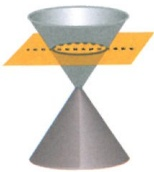

circle

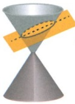

ellipse

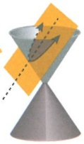

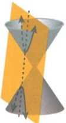

parabola

hyperbola

Hyperbolic functions are a class of functions that are derived from the unit hyperbola,  $ x^{2}-y^{2}=1 $. They are a significant tool in an engineer's toolkit. They also allow us to find highly elegant solutions to differential equations.

### 19.1 Exponential forms of hyperbolic functions

In the introduction, we discussed the relationships between hyperbolic functions and trigonometric functions. Hyperbolics link to apparently vastly different function types, but as you read this chapter and do subsequent work on complex numbers, you will start to see the connections.

We shall start by relating hyperbolic functions to exponentials. It is not clear from the ideas and development of hyperbolics whether the exponential definitions came first or the relationships with trigonometry came first. We shall use the exponential forms to develop the idea. Let us begin with the hyperbolic sine function:

 $$ y=\sinh x $$

<!-- page 445 -->

The first challenge is the pronunciation of the hyperbolic functions. The hyperbolic sine is pronounced 'shine' and its exponential definition is:

 $$ \sinh x=\frac{\mathrm{e}^{x}-\mathrm{e}^{-x}}{2} $$ 

Based on this, we can define the domain, find the range and draw the function. It is helpful to consider this graph as the average of  $ y = e^x $ and  $ y = -e^{-x} $.

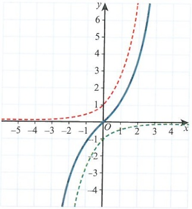

From this, we can see that the function is a one-one mapping. The domain is  $ x \in \mathbb{R} $. The range is  $ f(x) \in \mathbb{R} $. It is also an odd function.

 $$ y=\cosh x $$ 

The hyperbolic cosine is pronounced ‘cosh’ and its exponential definition is:

 $$ \cosh x=\frac{\mathrm{e}^{x}+\mathrm{e}^{-x}}{2} $$ 

We consider this graph as the average of  $ y = e^{x} $ and  $ y = e^{-x} $.

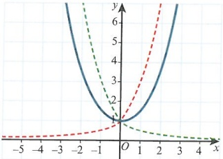

From this, we can see that the function is not a one-one mapping. However, it can be evaluated with both positive and negative values for x.

The domain is  $ x \in \mathbb{R} $. The range is  $ f(x) \geq 1 $. It is an even function.

For the function to be one-one, we need to restrict the domain to $x \geq 0$. This will be very important later.

<!-- page 446 -->

## DID YOU KNOW?

The hyperbolic cosine is a very special curve and has many occurrences in nature. It is called a catenary, and is the shape of a hanging chain.

### EXPLORE 19.1

Based on the exponential definitions of  $ \sinh x $ and  $ \cosh x $, find:

 $$ \frac{\mathrm{d}}{\mathrm{d}x}(\sinh x)\text{and}\frac{\mathrm{d}}{\mathrm{d}x}(\cosh x) $$ 

The exponential forms of  $ \sinh x $ and  $ \cosh x $ are shown in Key point 19.1.

### KEY POINT 19.1

The exponential forms of  $ \sinh x $ and  $ \cosh x $:

 $$ \sinh x=\frac{\mathrm{e}^{x}-\mathrm{e}^{-x}}{2},~x\in\mathbb{R},~f(x)\in\mathbb{R} $$ 

 $$ \cosh x=\frac{\mathrm{e}^{x}+\mathrm{e}^{-x}}{2},x\in\mathbb{R},f(x)\geqslant1 $$ 

From this, we can deduce that  $ e^{x} = \cosh x + \sinh x $.

We can now derive further hyperbolic functions:

<table border=1 style='margin: auto; word-wrap: break-word;'><tr><td style='text-align: center; word-wrap: break-word;'>Hyperbolic function</td><td style='text-align: center; word-wrap: break-word;'>Pronunciation</td><td style='text-align: center; word-wrap: break-word;'>Exponential form</td></tr><tr><td style='text-align: center; word-wrap: break-word;'>tanh x</td><td style='text-align: center; word-wrap: break-word;'>‘tanch’(preferred)\n‘than’ (a long thhhhh as in ‘thank you’)\n‘tank’</td><td style='text-align: center; word-wrap: break-word;'>tanh.x =  $ e^{x} - e^{-x} $\n $ e^{x} + e^{-x} $</td></tr><tr><td rowspan="3" colspan="2">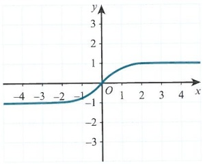</td><td style='text-align: center; word-wrap: break-word;'>Domain:  $ x \in \mathbb{R} $</td></tr><tr><td style='text-align: center; word-wrap: break-word;'>Range: -1 &lt; f(x) &lt; 1</td></tr><tr><td style='text-align: center; word-wrap: break-word;'>Odd function</td></tr></table>

<!-- page 447 -->

<table border=1 style='margin: auto; word-wrap: break-word;'><tr><td style='text-align: center; word-wrap: break-word;'>Hyperbolic function</td><td style='text-align: center; word-wrap: break-word;'>Pronunciation</td><td style='text-align: center; word-wrap: break-word;'>Exponential form</td></tr><tr><td style='text-align: center; word-wrap: break-word;'>sech.x</td><td style='text-align: center; word-wrap: break-word;'>&#x27;setch&#x27;</td><td style='text-align: center; word-wrap: break-word;'>$ \operatorname{sech} x = \frac{2}{e^{x} + e^{-x}} $</td></tr><tr><td rowspan="3" colspan="2">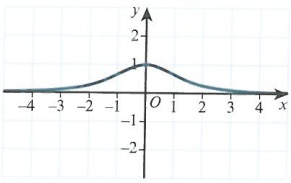</td><td style='text-align: center; word-wrap: break-word;'>Domain:  $ x \in \mathbb{R} $</td></tr><tr><td style='text-align: center; word-wrap: break-word;'>Range:  $ 0 &lt; f(x) \leq 1 $</td></tr><tr><td style='text-align: center; word-wrap: break-word;'>Even function</td></tr></table>

## DID YOU KNOW?

The graph of $y = \mathrm{sech}^{2}x$ is a very important curve. It is used to model tsunamis and to model wavelets in wave-particle duality. We call this type of wave a soliton. It is a very special type of wave that does not lose energy as it travels. Its velocity is proportional to the amplitude of the wave. This is why tsunamis have such a destructive force. You might study more about solitons at university level.

<table border=1 style='margin: auto; word-wrap: break-word;'><tr><td style='text-align: center; word-wrap: break-word;'>Hyperbolic function</td><td style='text-align: center; word-wrap: break-word;'>Pronunciation</td><td style='text-align: center; word-wrap: break-word;'>Exponential form</td></tr><tr><td style='text-align: center; word-wrap: break-word;'>cosech x</td><td style='text-align: center; word-wrap: break-word;'>‘cosetch’</td><td style='text-align: center; word-wrap: break-word;'>cosech x =  $ \frac{2}{e^x - e^{-x}} $</td></tr><tr><td rowspan="3" colspan="2">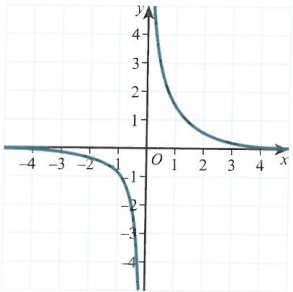</td><td style='text-align: center; word-wrap: break-word;'>Domain: x \neq 0</td></tr><tr><td style='text-align: center; word-wrap: break-word;'>Range: f(x) \neq 0</td></tr><tr><td style='text-align: center; word-wrap: break-word;'>Odd function</td></tr><tr><td style='text-align: center; word-wrap: break-word;'>coth x</td><td style='text-align: center; word-wrap: break-word;'>‘coth’</td><td style='text-align: center; word-wrap: break-word;'>coth x =  $ \frac{e^x + e^{-x}}{e^x - e^{-x}} $</td></tr><tr><td rowspan="3" colspan="2">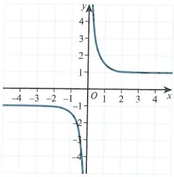</td><td style='text-align: center; word-wrap: break-word;'>Domain: x \neq 0</td></tr><tr><td style='text-align: center; word-wrap: break-word;'>Range: f(x) &gt; 1, f(x) &lt; -1</td></tr><tr><td style='text-align: center; word-wrap: break-word;'>Odd function</td></tr></table>

## TIP

To help us remember the reciprocal functions of sech x, cosech x and coth x, we can apply the third letter rule as with trigonometric reciprocal functions:

 $ \operatorname{sech} x = \frac{1}{\cosh x} $

 $ \operatorname{cosech} x = \frac{1}{\sinh x} $

 $ \coth x = \frac{1}{\tanh x} $

<!-- page 448 -->

### WORKED EXAMPLE 19.1

Sketch the graph of $y = |3\cosh(x + 1) - 4|$.

Answer

Given that  $ f(x) = \cosh x $:

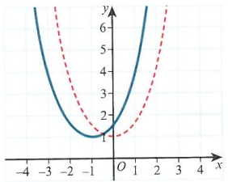

Consider each transformation in turn.

 $$ y=f(x+1) $$ 

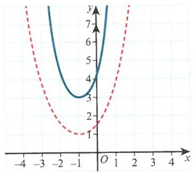

 $$ y=3\mathrm{f}(x+1) $$ 

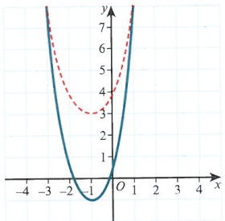

 $$ y=3\mathrm{f}(x+1)-4 $$ 

This is the graph of  $ |3\cosh(x+1)-4| $.

 $$ y=\left|3\mathrm{f}(x+1)-4\right| $$ 

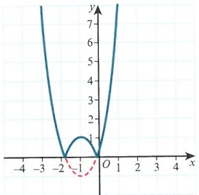

<!-- page 449 -->

These functions can all be evaluated using a calculator, in the same way as for trigonometric functions. However, generally you will be required to write in exact form, unless told otherwise. We can use the previous definitions to solve equations involving hyperbolic forms.

### WORKED EXAMPLE 19.2

Leaving your answer in exact form, solve  $ 4\cosh x - 3\sinh x = 4 $.

Answer

 $ 4\cosh x - 3\sinh x = 4 $

 $ 4\left(\frac{e^{x} + e^{-x}}{2}\right) - 3\left(\frac{e^{x} - e^{-x}}{2}\right) = 4 $

First, use the exponential definitions:
 $ \sinh x = \frac{e^{x} - e^{-x}}{2} $
 $ \cosh x = \frac{e^{x} + e^{-x}}{2} $

 $ 4e^{2x} + 4 - 3e^{2x} + 3 = 8e^{x} $

Now multiply up by  $ 2e^{x} $.

 $ e^{2x} - 8e^{x} + 7 = 0 $

This is now a quadratic in terms of
 $ e^{x} $ and so can be solved.

 $ (e^{x} - 7)(e^{x} - 1) = 0 $

Leading to two solutions:  $ x = \ln 7 $,  $ x = \ln 1 = 0 $

We are usually asked to give our
solutions in exact form.

It is possible to approach this problem using a similar technique as that for trigonometric equations using hyperbolic forms. However, this rarely gives such elegant solutions. We need to understand both inverse hyperbolic functions and their logarithmic forms.

### WORKED EXAMPLE 19.3

Solve  $ 3\tanh^{2}x - 4\tanh x = 4 $.

Answer

 $ 3\tanh^{2}x - 4\tanh x - 4 = 0 $

First, recognise that this is a quadratic equation in terms of  $ \tanh x $.

 $ 3T^{2} - 4T - 4 = 0 $

To make it simpler, replace  $ \tanh x $ with  $ T $.

 $ 3T^{2} - 6T + 2T - 4 = 0 $

Solve the equation.

 $ 3T(T - 2) + 2(T - 2) = 0 $

 $ (T - 2)(3T + 2) = 0 $

 $ T = 2 $

 $ \text{Or } T = -\frac{2}{3} $

We are left then to solve:

Remember: since the range of  $ \tanh x $ cannot exceed 1,  $ T = 2 $ will not lead to any solutions.

 $ x = \tanh^{-1}\left(-\frac{2}{3}\right) $

<!-- page 450 -->

## EXERCISE 19A

Write all solutions in exact form unless otherwise stated.

1 Solve  $ 19\sinh x + 16\cosh x = 8 $.
2 Solve  $ 29\cosh x = 11\sinh x + 27 $.
3 Solve  $ 17\sinh x + 16\cosh x = 8 $.
4 Solve  $ 7 = 17\tanh x + 28\operatorname{sech} x $.
5 Solve  $ \operatorname{cosech} x - 2\coth x = 2 $.
6 Sketch the graph of  $ y = |3\cosh x - 5| $.
7 Sketch the graph of  $ y = 4 - \operatorname{cosech}(x - 2) $.
8 Sketch the graph of  $ y = |2 + \frac{1}{2}\coth(x + 1)| $.
9 Solve  $ 4\cosh x + \sinh x = 8 $. Write your answers in the form  $ b\ln a $, where a and b are integers.
10 Solve  $ 10\cosh x + 2\sinh x = 11 $, giving your answers in the form  $ \ln a $, where a is a rational number.
11 Given that  $ \operatorname{sech}^{-1} x = \ln\left(\frac{1 + \sqrt{1 - x^2}}{x}\right) $, solve  $ 4\operatorname{sech} x - 3\tanh^2 x = 1 $.

### 19.2 Hyperbolic identities

### WORKED EXAMPLE 19.4

If we consider that hyperbolic functions are similar to trigonometric functions, it is reasonable to consider that hyperbolic identities exist in the same way. We can use the exponential forms to prove that they are true.

<table border=1 style='margin: auto; word-wrap: break-word;'><tr><td style='text-align: center; word-wrap: break-word;'>Prove that  $ \cosh^{2}x - \sinh^{2}x \equiv 1 $.
Answer
 $ \cosh^{2}x - \sinh^{2}x $
 $ \equiv \left( \frac{e^{x} + e^{-x}}{2} \right)^{2} - \left( \frac{e^{x} - e^{-x}}{2} \right)^{2} $
First, convert to exponential form and consider the left-hand side.
Expand and take out a factor of  $  \frac{1}{4}  $.
This is the right-hand side.
Therefore, the left-hand side becomes the right-hand side.</td></tr><tr><td style='text-align: center; word-wrap: break-word;'>$ \equiv \frac{1}{4} ( (e^{2x} + 2 + e^{-2x}) - (e^{2x} - 2 + e^{-2x})) ) $
 $ \equiv \frac{1}{4} (e^{2x} + 2 + e^{-2x} - e^{2x} + 2 - e^{-2x}) $
 $ \equiv \frac{1}{4}(4) \equiv 1 $
Therefore,  $ \cosh^{2}x - \sinh^{2}x \equiv 1 $.
Therefore, the left-hand side becomes the right-hand side.</td></tr></table>

## TIP

When forming a proof, it is very important to either start at the left-hand side and show it is the same as the right-hand side, or start at the right-hand side to show it is the same as the left-hand side. Starting from both ends until you get a common expression will not make a formal proof. You can use this to help you see how to formulate your proof, but the final written answer must be in the correct order. Make sure that you state every algebraic step: tell the whole story!

<!-- page 451 -->

Prove that  $ \sinh(A+B)\equiv\sinh A\cosh B+\sinh B\cosh A $.
Answer
 $ \sinh A\cosh B + \sinh B\cosh A $
 $ \equiv\left(\frac{\mathrm{e}^{A}-\mathrm{e}^{-A}}{2}\right)\left(\frac{\mathrm{e}^{B}+\mathrm{e}^{-B}}{2}\right)+\left(\frac{\mathrm{e}^{B}-\mathrm{e}^{-B}}{2}\right)\left(\frac{\mathrm{e}^{A}+\mathrm{e}^{-A}}{2}\right) $
Consider the right-hand side and convert it to exponential form.
 $ \equiv\frac{1}{4}(\mathrm{e}^{A}\mathrm{e}^{B}-\mathrm{e}^{-A}\mathrm{e}^{B}+\mathrm{e}^{A}\mathrm{e}^{-B}-\mathrm{e}^{-A}\mathrm{e}^{-B}+\mathrm{e}^{B}\mathrm{e}^{A}-\mathrm{e}^{-B}\mathrm{e}^{A}+\mathrm{e}^{B}\mathrm{e}^{-A}-\mathrm{e}^{-B}\mathrm{e}^{-A}) $
Expand and take out a factor of  $ \frac{1}{4} $.
 $ \equiv\frac{1}{4}(2\mathrm{e}^{A+B}-2\mathrm{e}^{-(A+B)}) $
Use  $ \mathrm{e}^{A}\mathrm{e}^{B}=\mathrm{e}^{A+B} $ and  $ \mathrm{e}^{-A}\mathrm{e}^{-B}=\mathrm{e}^{-(A+B)} $.
 $ \equiv\frac{\mathrm{e}^{(A+B)}-\mathrm{e}^{-(A+B)}}{2}\equiv\sinh(A+B) $
This proof works from right-hand side to left-hand side.

You should have noticed that these two proofs are similar to trigonometric identities. It is possible to use Osborne's rule, as shown in Key point 19.2, to move from a trigonometric identity to a hyperbolic identity. Nevertheless, this does not constitute a proof!

### KEY POINT 19.2

## Osborne's rule

To move from a trigonometric identity to a hyperbolic identity: change a cos to a cosh and change the sign of a product of sinhs.

We can use Osborne's rule when we are required to use a hyperbolic identity without needing its proof.

### WORKED EXAMPLE 19.6

Using Osborne's rule, state the angle addition formula for  $ \tanh(A+B) $.

## Answer

Start by considering the trigonometric identity:

 $$ \tan(A+B)\equiv\frac{\tan A+\tan B}{1-\tan A\tan B} $$ 

We consider replacing  $ \tan $ with  $ \tanh $.

 $$ \begin{array}{l}\tanh(A+B)\equiv\frac{\tanh A+\tanh B}{1+\tanh A\tanh B}\\ as~required.\end{array} $$ 

sinh is the numerator of tanh. Applying Osborne's rule, we notice that  $ \tanh A \tanh B $ will require a sign change since it includes a product of  $ \sinh $.

<!-- page 452 -->

## EXERCISE 19B

1 Prove that  $ \cosh^{2}x\equiv\frac{\cosh^{2}x+1}{\coth^{2}x-1} $

P 2 Prove that  $ \cosh3x \equiv 4\cosh^{3}x - 3\cosh x $.

P 3 Prove that  $ \coth 2x - \coth x \equiv \frac{1}{2}(\tanh x - \coth x) $.

P 4 Prove the following hyperbolic identities.

a  $ \cosh(A - B) \equiv \cosh A \cosh B - \sinh A \sinh B $

b  $ \sinh3x \equiv 3\sinh x + 4\sinh^{3}x $

 $$ \sinh A-\sinh B\equiv2\cosh\left(\frac{A+B}{2}\right)\sinh\left(\frac{A-B}{2}\right) $$ 

P 5 Given that  $ \tanh\left(\frac{x}{2}\right)=t $, prove that  $ \sinh x=\frac{2t}{1-t^{2}} $.

### 19.3 Inverse hyperbolic functions

As with trigonometric functions, the hyperbolic inverse functions must exist and be well defined. As with any function, the inverse function will be a reflection in the line $y=x$ for the one-one aspect of the function (otherwise the inverse will not be well defined).

Take care to use the correct notation.

You may have noticed by now that the notation for inverse trigonometric functions is a little ambiguous and it can be easily confused with reciprocal functions. There is another commonly used notation for them:

 $$ \sin^{-1}x=\arcsin x $$ 

 $$ \cos^{-1}x=arccos x $$ 

 $$ \tan^{-1}x=arctan x $$ 

## DID YOU KNOW?

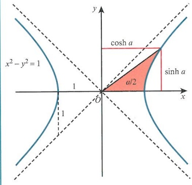

The origin of the prefix arc- comes from the unit circle, and the fact that the arc length is equal to the angle $(l=r\theta$, where $r=1)$. Finding the angle $\theta$ is then equivalent to finding the arc length. So finding the angle, which requires inverting the sine function, is equivalent to finding the arcsine.

There is a similar idea with hyperbolics, although beyond the scope of this course. Finding the hyperbolic angle is equivalent to finding twice the area of the hyperbolic sector of  $ x^{2}-y^{2}=1 $, the unit hyperbola.

<!-- page 453 -->

### KEY POINT 19.3

The inverse hyperbolic functions are:

<table border=1 style='margin: auto; word-wrap: break-word;'><tr><td style='text-align: center; word-wrap: break-word;'>Function (green)</td><td style='text-align: center; word-wrap: break-word;'>Inverse function (red)</td><td style='text-align: center; word-wrap: break-word;'>Graph</td><td style='text-align: center; word-wrap: break-word;'>Domain and range of the inverse function</td></tr><tr><td style='text-align: center; word-wrap: break-word;'>sinh x</td><td style='text-align: center; word-wrap: break-word;'>$ \sinh^{-1}x $</td><td style='text-align: center; word-wrap: break-word;'>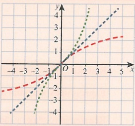</td><td style='text-align: center; word-wrap: break-word;'>$ x \in \mathbb{R} $\n $ f(x) \in \mathbb{R} $</td></tr><tr><td style='text-align: center; word-wrap: break-word;'>cosh x</td><td style='text-align: center; word-wrap: break-word;'>$ \cosh^{-1}x $</td><td style='text-align: center; word-wrap: break-word;'>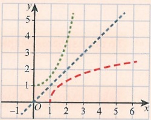</td><td style='text-align: center; word-wrap: break-word;'>$ x \geq 1 $\n $ f(x) \geq 0 $</td></tr><tr><td style='text-align: center; word-wrap: break-word;'>tanh x</td><td style='text-align: center; word-wrap: break-word;'>$ \tanh^{-1}x $</td><td style='text-align: center; word-wrap: break-word;'>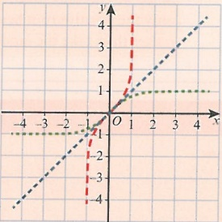</td><td style='text-align: center; word-wrap: break-word;'>$ -1 &lt; x &lt; 1 $\n $ f(x) \in \mathbb{R} $</td></tr></table>

### WORKED EXAMPLE 19.7

<table border=1 style='margin: auto; word-wrap: break-word;'><tr><td style='text-align: center; word-wrap: break-word;'>Solve the equation  $ \sinh^{2}x - 5\sinh x + 4 = 0 $. Give your answers to 3 significant figures.</td></tr><tr><td style='text-align: center; word-wrap: break-word;'>Answer</td></tr><tr><td style='text-align: center; word-wrap: break-word;'>$ \sinh^{2}x - 5\sinh x + 4 = 0 $First, notice that this is a quadratic equation in terms of  $ \sinh x $, and it will factorise.</td></tr><tr><td style='text-align: center; word-wrap: break-word;'>$ (sinh x - 4)(\sinh x - 1) = 0 $</td></tr><tr><td style='text-align: center; word-wrap: break-word;'>When  $ \sinh x = 4 $,  $ x = \sinh^{-1}4 $:Make sure solutions are written to the required level of accuracy.</td></tr><tr><td style='text-align: center; word-wrap: break-word;'>$ x = 2.09 $</td></tr><tr><td style='text-align: center; word-wrap: break-word;'>When  $ \sinh x = 1 $,  $ x = \sinh^{-1}1 $:</td></tr><tr><td style='text-align: center; word-wrap: break-word;'>$ x = 0.881 $</td></tr></table>

<!-- page 454 -->

### 19.4 Logarithmic form for inverse hyperbolic functions

If hyperbolic functions can be described in terms of exponential functions, then it is reasonable to assume that inverse hyperbolic functions can be described using the natural logarithm function. This is indeed the case and is shown in Key point 19.4.

### WORKED EXAMPLE 19.8

Find the logarithmic form of  $ \sinh^{-1}x $.

## Answer

 $$ y=\sinh^{-1}x $$ 

 $$ y=x $$ 

 $$ \frac{\mathrm{e}^{y}-\mathrm{e}^{-y}}{2}=x $$ 

Rewrite x in terms of  $ \sinh y $.

Express in exponential form.

 $$ \mathrm{e}^{2y}-1=2\mathrm{e}^{y}x $$ 

 $$ \mathrm{e}^{2y}-2\mathrm{e}^{y}x-1=0 $$ 

Rearrange to make y the subject.

 $$ (e^{y}-x)^{2}-x^{2}-1=0 $$ 

 $$ (\mathrm{e}^{y}-x)^{2}=x^{2}+1 $$ 

To do that here, complete the square.

 $$ \mathrm{e}^{y}=x\pm\sqrt{x^{2}+1} $$ 

 $$ y=\ln(x+\sqrt{x^{2}+1}) $$ 

Therefore,  $ \sinh^{-1} x = \ln(x + \sqrt{x^2 + 1}) $.

Take logs to make y the subject.

Since we can only take logs of positive numbers, take only the positive root here. Consider why we do this rather than take the modulus.

### KEY POINT 19.4

The logarithmic forms of the inverse hyperbolic functions are:

 $$ \sinh^{-1}x $$ 

 $$ \ln(x+\sqrt{x^{2}+1}) $$ 

 $$ \cosh^{-1}x $$ 

 $$ \ln(x+\sqrt{x^{2}-1}) $$ 

 $$ \operatorname{t a n h}^{-1}x $$ 

 $$ \frac{1}{2}\ln\left(\frac{1+x}{1-x}\right) $$ 

 $$ \coth^{-1}x $$ 

 $$ \frac{1}{2}\ln\left(\frac{x+1}{x-1}\right) $$ 

 $$ \operatorname{sech}^{-1}x $$ 

 $$ \ln\left(\frac{1+\sqrt{1-x^{2}}}{x}\right) $$ 

 $$ \mathrm{c o s e c h}^{-1}x $$ 

 $$ \ln\left(\frac{1+\sqrt{1+x^{2}}}{x}\right) $$ 

You need to be able to derive the logarithmic form for inverse hyperbolics.

## TIP

Why do we consider only the positive root here?

You are now equipped to give your answers in exact form. In the next example, we will solve the equation we had in Worked example 19.7 but this time we will give our answers in exact form.

<!-- page 455 -->

Solve the equation  $ \sinh^{2}x - 5\sinh x + 4 = 0 $. Give your answers in exact logarithmic form.

## Answer

 $$ x-4)(\sinh x-1)=0 $$ 

Notice that this is a quadratic equation in terms of  $ \sinh x $, and it will factorise.

 $$ x=4,x=\sinh^{-1}4; $$ 

 $$ \sinh^{-1}4=\ln(4+\sqrt{4^{2}+1}) $$ 

 $$ x=\ln(4+\sqrt{17}) $$ 

 $$ x=1,x=\sinh^{-1}1; $$ 

 $$ \sinh^{-1}1=\ln(1+\sqrt{1^{2}+1}) $$ 

 $$ x=\ln(1+\sqrt{2}) $$ 

Note the answer has been requested in exact logarithmic form.

### WORKED EXAMPLE 19.10

Prove that  $ \sinh^{-1}A + \sinh^{-1}B \equiv \sinh^{-1}(A\sqrt{1+B^2} + B\sqrt{1+A^2}) $.

## Answer

$$
\begin{aligned}
& 1 + (A\sqrt{1+B^2} + B\sqrt{1+A^2})^2 \\
&\equiv 1 + 2A^2B^2 + 2AB\sqrt{A^2 + 1}\sqrt{B^2 + 1} + A^2 + B^2 \\
&\equiv A^2B^2 + 2AB\sqrt{A^2 + 1}\sqrt{B^2 + 1} + (A^2 + 1)(B^2 + 1) \\
&\equiv (AB + \sqrt{A^2 + 1}\sqrt{B^2 + 1})^2 \\
&\sinh^{-1}(A\sqrt{1+B^2} + B\sqrt{1+A^2}) \\
&\equiv\ln(A\sqrt{1+B^2} + B\sqrt{1+A^2}) \\
&+\sqrt{1+(A\sqrt{1+B^2} + B\sqrt{1+A^2})^2}) \\
&\equiv\ln(A\sqrt{1+B^2} + B\sqrt{1+A^2} + AB + \sqrt{A^2 + 1}\sqrt{B^2 + 1}) \\
&\equiv\ln((A + \sqrt{1+A^2})(B + \sqrt{1+B^2})) \\
&\equiv\ln(A + \sqrt{1+A^2}) + \ln(B + \sqrt{1+B^2}) \\
&\equiv\sinh^{-1}A + \sinh^{-1}B \\
&\text{as required.}
\end{aligned}
\quad \text{Consider } 1 + (A\sqrt{1+B^2} + B\sqrt{1+A^2})^2.

\quad (1+A^2)(1+B^2)\equiv 1+A^2+B^2+A^2B^2 \\
\quad \text{Call this result (1).} \\
\quad \text{Use result (1).} \\
\quad \text{This is of the form } AC+BD+AB+CD. \\
\quad \text{It will factorise to } (A+D)(B+C).

\quad Rewrite, using the laws of logarithms.

\begin{aligned}
& A^2B^2 + 2AB\sqrt{A^2 + 1}\sqrt{B^2 + 1} + A^2 + B^2 \\
&\equiv A^2B^2 + 2AB\sqrt{A^2 + 1}\sqrt{B^2 + 1} + (A^2 + 1)(B^2 + 1) \\
&\equiv (AB + \sqrt{A^2 + 1}\sqrt{B^2 + 1})^2 \\
&\sinh^{-1}(A\sqrt{1+B^2} + B\sqrt{1+A^2}) \\
&\equiv\ln(A\sqrt{1+B^2} + B\sqrt{1+A^2}) \\
&\quad+\sqrt{1+(A\sqrt{1+B^2} + B\sqrt{1+A^2})^2}) \\
&\equiv\ln(A\sqrt{1+B^2} + B\sqrt{1+A^2} + AB + \sqrt{A^2 + 1}\sqrt{B^2 + 1}) \\
&\equiv\ln((A + \sqrt{1+A^2})(B + \sqrt{1+B^2})) \\
&\equiv\ln(A + \sqrt{1+A^2}) + \ln(B + \sqrt{1+B^2}) \\
&\equiv\sinh^{-1}A + \sinh^{-1}B
\end{aligned}

There are some very interesting relationships between the inverse hyperbolic functions. We do not need to know these but they will help with some of the hyperbolic and trigonometric integration later. For example:

 $$ \sinh(\cosh^{-1}x)=\sqrt{x^{2}-1} $$ 

 $$ \ln x=\tanh^{-1}\left(\frac{x^{2}-1}{x^{2}+1}\right) $$

<!-- page 456 -->

## EXERCISE 19C

1 Find the exact value of:

 $$ \sinh^{-1}3 $$ 

 $$  \tanh^{-1}\frac{2}{3} $$ 

c  $ \cosh^{-1}\frac{5}{4} $

2 Solve, giving your answers as logarithms.

a  $ 3\cosh^{2}x = -10\sinh x $

b  $ \tanh^{2}x + 5\operatorname{sech} x - 5 = 0 $

c  $ \sinh2x = \cosh x $

P 3 Prove that  $ \cosh^{-1}x \equiv \ln(x + \sqrt{x^{2} - 1}) $.

P 4 Prove that  $ \tanh^{-1}x\equiv\frac{1}{2}\ln\left(\frac{1+x}{1-x}\right) $.

5 Prove that  $ \operatorname{sech}^{-1}x\equiv\ln\left(\frac{1+\sqrt{1-x^{2}}}{x}\right) $.

6 Prove that  $ \tanh^{-1}A + \tanh^{-1}B \equiv \tanh^{-1}\left(\frac{A+B}{1+AB}\right) $.

P 7 a Prove that  $ 4\cosh^{3}x - 3\cosh x \equiv \cosh 3x $.

b Hence, solve  $ \cosh3x = 5\cosh x $.

## WORKED EXAM-STYLE QUESTION

Given that  $ \sinh y = x $, show that:

 $$ y=\ln(x+\sqrt{1+x^{2}}) $$ 

By differentiating this result, show that:

b  $ \frac{\mathrm{d}y}{\mathrm{d}x}=\frac{1}{\sqrt{1+x^{2}}} $

Answer

a

 $$ \sinh y=x $$ 

Use the exponential definition.

 $$ \frac{\mathrm{e}^{y}-\mathrm{e}^{-y}}{x}=x $$ 

 $$ \mathrm{e}^{2y^{2}}-1=2\mathrm{e}^{y}x $$ 

 $$ \mathrm{e}^{2y}-2\mathrm{e}^{y}x-1=0 $$ 

 $$ (e^{y}-x)^{2}-x^{2}-1=0 $$ 

Complete the square.

 $$ (e^{y}-x)^{2}=x^{2}+1 $$ 

 $$ \mathrm{e}^{y}=x\pm\sqrt{x^{2}+1} $$ 

 $$ y=\ln(x+\sqrt{x^{2}+1}) $$ 

Rearrange and take the positive root.

<!-- page 457 -->

b Let  $ y = \ln u $.

Therefore,  $ \frac{\mathrm{d}y}{\mathrm{d}u} = \frac{1}{u} $.

 $$ u=x+(1+x^{2})^{\frac{1}{2}} $$ 

Therefore,  $ \frac{du}{dx}=1+\left(\frac{1}{2}\right)2x(1+x^2)^{-\frac{1}{2}} $. Simplify.

 $ =1+\frac{x}{\sqrt{1+x^2}} $

 $ =\frac{\sqrt{1+x^2}+x}{\sqrt{1+x^2}} $

 $$ \frac{\mathrm{d}y}{\mathrm{d}x}=\frac{\mathrm{d}y}{\mathrm{d}u}\times\frac{\mathrm{d}u}{\mathrm{d}x} $$ 

Use the chain rule.

 $$ \frac{\mathrm{d}y}{\mathrm{d}x}=\frac{1}{x+(1+x^{2})^{\frac{1}{2}}}\times\frac{\sqrt{1+x^{2}}+x}{\sqrt{1+x^{2}}} $$ 

Use  $ u = x + (1 + x^2)^{\frac{1}{2}} $

$$\frac{\mathrm{d}y}{\mathrm{d}x}=\frac{1}{\sqrt{1+x^{2}}}\text{ as required.}$$

## Checklist of learning and understanding

## For hyperbolic functions:

 $ \sinh x = \frac{e^x - e^{-x}}{2} $

 $ \cosh x = \frac{e^x + e^{-x}}{2} $

 $ \tanh x = \frac{e^x - e^{-x}}{e^x + e^{-x}} = \frac{e^{2x} - 1}{e^{2x} + 1} $

## For inverse functions:

 $ \arcsin h x = \sinh^{-1} x = \ln(x + \sqrt{x^2 + 1}) $

 $ \operatorname{arccosh} x = \cosh^{-1} x = \ln(x + \sqrt{x^2 - 1}) $

$$\arctan h x = \tanh^{-1} x = \frac{1}{2} \ln \left( \frac{1 + x}{1 - x} \right)$$

<!-- page 458 -->

## END-OF-CHAPTER REVIEW EXERCISE 19

P 1 Solve $5\cosh x - \cosh 2x = 3$. Leave your answer in exact logarithmic form.

P 2 Starting from the definitions of  $ \sinh x $ and  $ \cosh x $ in terms of exponentials, prove that:

a  $ 1 + 2\sinh^{2}x \equiv \cosh 2x $

b $2\cosh2x+\sinh x\equiv5$

P 3 a Show, by using exponential form, that the curve with equation  $ y = \cosh 2x + \sinh x $ has exactly one stationary point.

b Determine, in exact logarithmic form, the x-coordinate of the turning point.

