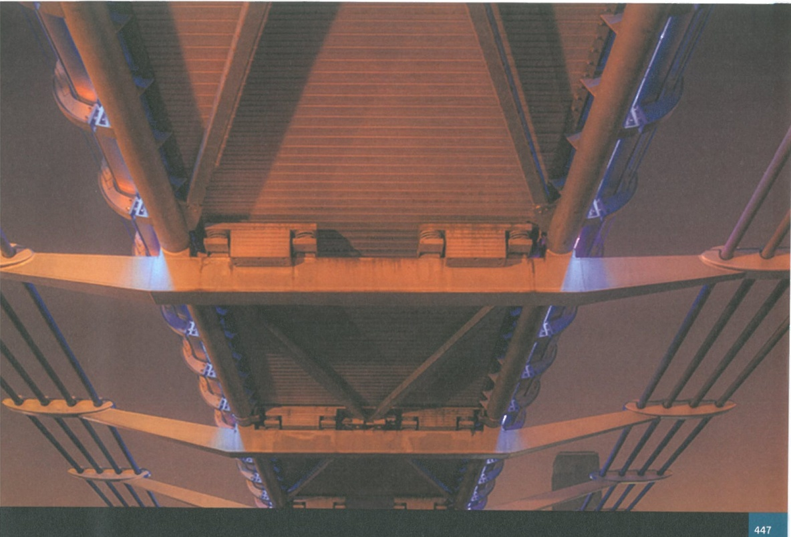
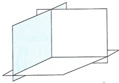
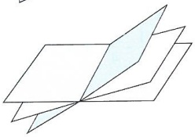
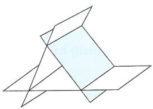

# Matrices 2

<!-- Cambridge International AS  A Level Further Mathematics Coursebook (Lee Mckelvey Martin Crozier) .pdf p459-483 -->

<!-- page 459 -->

# Chapter 20 Matrices 2

## In this chapter you will learn how to:

formulate and solve systems of three simultaneous equations with three unknowns

relate solutions of matrices geometrically to lines and planes

understand the terms eigenvalue and eigenvector, and be able to find them

diagonalise matrices and use them to find matrices of the form  $ A^{n} $

<!-- page 460 -->

## PREREQUISITE KNOWLEDGE

<table border=1 style='margin: auto; word-wrap: break-word;'><tr><td style='text-align: center; word-wrap: break-word;'>Where it comes from</td><td style='text-align: center; word-wrap: break-word;'>What you should be able to do</td><td style='text-align: center; word-wrap: break-word;'>Check your skills</td></tr><tr><td style='text-align: center; word-wrap: break-word;'>Chapter 4</td><td style='text-align: center; word-wrap: break-word;'>Find determinants of matrices up to  $ 3 \times 3 $.</td><td style='text-align: center; word-wrap: break-word;'>1 Find the determinant of each of the following matrices:\na  $ \begin{vmatrix} 2 &amp; 3 \\ 5 &amp; 1 \end{vmatrix} $\nb  $ \begin{vmatrix} 1 &amp; 2 &amp; 1 \\ 3 &amp; 2 &amp; 0 \\ 4 &amp; -1 &amp; -1 \end{vmatrix} $</td></tr><tr><td style='text-align: center; word-wrap: break-word;'>Chapter 4</td><td style='text-align: center; word-wrap: break-word;'>Multiply matrices.</td><td style='text-align: center; word-wrap: break-word;'>2 Work out the following calculations:\na  $ \begin{pmatrix} -1 &amp; 2 \\ 3 &amp; 6 \end{pmatrix} \begin{pmatrix} 0 &amp; 4 \\ -2 &amp; 1 \end{pmatrix} $\nb  $ \begin{pmatrix} 1 &amp; -2 &amp; 3 \\ 2 &amp; 0 &amp; 1 \\ 4 &amp; 3 &amp; 3 \end{pmatrix} \begin{pmatrix} 0 &amp; 2 &amp; 3 \\ -1 &amp; 2 &amp; 1 \\ 0 &amp; 0 &amp; 4 \end{pmatrix} $</td></tr><tr><td style='text-align: center; word-wrap: break-word;'>Chapter 6</td><td style='text-align: center; word-wrap: break-word;'>Find the normal of a plane.</td><td style='text-align: center; word-wrap: break-word;'>3 Write down the normal of each of the following planes:\na  $ 3x + 2y - z = 5 $\nb  $ -2x + 5z = 6 $\nc  $ 3y = -11 $</td></tr></table>

## What else can we do with matrices?

In this chapter we shall look at a special type of vector called an eigenvector.

Eigenvectors are widely used. Applications include vibration models for bridge and building design and the page-ranking algorithm that is used to prioritise the results from search engines.

We shall also develop our knowledge of matrices that we studied in Chapter 4.

### 20.1 Eigenvalues and eigenvectors

To begin, let us consider the matrix  $ \mathbf{A} = \begin{pmatrix} 1 & 2 \\ 3 & 0 \end{pmatrix} $. If we multiply this matrix by the vectors  $ \begin{pmatrix} 1 \\ 2 \end{pmatrix} $,  $ \begin{pmatrix} -3 \\ 4 \end{pmatrix} $ and  $ \begin{pmatrix} 1 \\ 1 \end{pmatrix} $, then the results are  $ \begin{pmatrix} 5 \\ 3 \end{pmatrix} $,  $ \begin{pmatrix} 5 \\ -9 \end{pmatrix} $ and  $ \begin{pmatrix} 3 \\ 3 \end{pmatrix} $. Notice that the magnitude of the third vector increased, but its direction remained the same.

So why do some vectors not change direction?

To answer this question, first consider the statement  $ \mathbf{Ax} = \lambda \mathbf{x} $. This says that a matrix  $ \mathbf{A} $ applied to a non-zero vector  $ \mathbf{x} $ results in a vector  $ \lambda \mathbf{x} $. Since  $ \lambda $ is a scalar quantity, the direction of the original vector is unchanged.

<!-- page 461 -->

Now multiply both sides of the equation by the identity matrix to get  $ \mathbf{I}\mathbf{A}\mathbf{x} = \mathbf{I}\lambda\mathbf{x} $. Then  $ \mathbf{A}\mathbf{x} = \lambda\mathbf{I}\mathbf{x} $,

which can be written as  $ (\mathbf{A} - \lambda \mathbf{I})\mathbf{x} = 0 $. Note that here  $ \lambda \mathbf{I} = \left( \begin{array}{ccccc} \lambda & 0 & 0 & \cdots & 0 \\ 0 & \lambda & 0 & \cdots & 0 \\ 0 & 0 & \lambda & \cdots & 0 \\ \vdots & \vdots & \vdots & \ddots & \vdots \\ 0 & 0 & 0 & \cdots & \lambda \end{array} \right) $.

If $(\mathbf{A} - \lambda\mathbf{I})^{-1}$ were to exist, then $\mathbf{x}$ would always be the zero vector, which is not the case. This means that the inverse cannot exist. The only way the inverse cannot exist is if $\det(\mathbf{A} - \lambda\mathbf{I}) = 0$.

We shall use this result to help determine the values of $\lambda$. This will enable us to determine the eigenvectors of a matrix.

Look again at the previous example, this time with  $ \mathbf{A} = \begin{pmatrix} 1 & 2 \\ 3 & 0 \end{pmatrix} $.

We first find $\det(\mathbf{A}-\lambda\mathbf{I})=\left|\begin{matrix}1-\lambda&2\\ 3&-\lambda\end{matrix}\right|=0$, and from here $-\lambda(1-\lambda)-6=0$, or

$\lambda^{2}-\lambda-6=0$. This equation is known as the characteristic equation, and the $\lambda$ values which satisfy this equation are known as eigenvalues. The word eigen is German for 'self'.

Solving the equation gives $\lambda = -2, 3$. We can use these values in the original statement: $\mathbf{A}\mathbf{x} = \lambda\mathbf{x}$, or $\begin{pmatrix} 1 & 2 \\ 3 & 0 \end{pmatrix}\begin{pmatrix} x \\ y \end{pmatrix} = \lambda\begin{pmatrix} x \\ y \end{pmatrix}$, which is then written as $x + 2y = \lambda x$ $3x = \lambda y$.

For the case when $\lambda = -2$, $x + 2y = -2x$, both equations give $y = -\frac{3}{2}x$. This result implies that any vector of the form $\begin{pmatrix} 2 \\ -3 \end{pmatrix}$ will not change direction when $\mathbf{A}$ is applied to it.

If we test this,  $ \begin{pmatrix} 1 & 2 \\ 3 & 0 \end{pmatrix} \begin{pmatrix} 2 \\ -3 \end{pmatrix} = \begin{pmatrix} -4 \\ 6 \end{pmatrix} $, which is parallel to the original vector.

For the case when  $ \lambda = 3 $,  $ x + 2y = 3x $ and so  $ y = x $. This is the vector  $ \begin{pmatrix} 1 \\ 1 \end{pmatrix} $, which we already know has an unchanged direction. The vectors we have just found,  $ \begin{pmatrix} 2 \\ -3 \end{pmatrix} $ and  $ \begin{pmatrix} 1 \\ 1 \end{pmatrix} $, are known as eigenvectors. Their directions are unchanged when the matrix A is applied to them. The use of the word eigen is appropriate here, since the vectors map to a scalar multiple of themselves.

### WORKED EXAMPLE 20.1

Find the eigenvalues and eigenvectors of the matrix  $ \mathbf{B} = \begin{pmatrix} -2 & 1 \\ 6 & 3 \end{pmatrix} $.

Answer

Let  $ \det(\mathbf{B} - \lambda \mathbf{I}) = 0 $, so  $ \begin{vmatrix} -2 - \lambda & 1 \\ 6 & 3 - \lambda \end{vmatrix} = 0 $.

Hence,  $ -6 - \lambda + \lambda^2 - 6 = 0 $, or  $ \lambda^2 - \lambda - 12 = 0 $.

Solving:  $ \lambda = -3, 4 $

Use the determinant to find the characteristic equation.

From  $ \mathbf{B}\mathbf{x} = \lambda\mathbf{x} $,  $ \begin{pmatrix} -2 & 1 \\ 6 & 3 \end{pmatrix}\begin{pmatrix} x \\ y \end{pmatrix} = \lambda\begin{pmatrix} x \\ y \end{pmatrix} $, or  $ -2x + y = \lambda x $.

Solve the equation to get the eigenvalues.

For  $ \lambda = -3 $:  $ \begin{array}{l}-2x + y = -3x \\ 6x + 3y = -3y\end{array} $, from which y = -x.

<!-- page 462 -->

So when $\lambda = -3$, an eigenvector is $\begin{pmatrix} 1 \\ -1 \end{pmatrix}$.

For $\lambda = 4$: $\begin{array}{c} -2x + y = 4x \\ 6x + 3y = 4y \end{array}$, from which $y = 6x$.

So when $\lambda = 4$, an eigenvector is $\begin{pmatrix} 1 \\ 6 \end{pmatrix}$.

Use each eigenvalue to produce a corresponding eigenvector. Remember any scalar product of an eigenvector is also an eigenvector for the matrix.

With  $ 2 \times 2 $ matrices, the eigenvectors can be determined by considering a linear function. This function is the gradient of the line passing through the origin that has been converted to a vector.

For  $ 3 \times 3 $ matrices, this is not the same. Since we cannot represent lines correctly in 3-dimensional space, we must find an alternative approach.

Consider the matrix  $ \mathbf{A} = \begin{pmatrix} 1 & 2 & 4 \\ 0 & 2 & 2 \\ 0 & 0 & 3 \end{pmatrix} $, which is already conveniently in row echelon form.

Then using  $ \det(\mathbf{A} - \lambda \mathbf{I}) = 0 $ leads to  $ \begin{vmatrix} 1 - \lambda & 2 & 4 \\ 0 & 2 - \lambda & 2 \\ 0 & 0 & 3 - \lambda \end{vmatrix} = 0 $.

Then  $ (1-\lambda)\begin{vmatrix}2-\lambda&2\\ 0&3-\lambda\end{vmatrix}-2\begin{vmatrix}0&2\\ 0&3-\lambda\end{vmatrix}+4\begin{vmatrix}0&2-\lambda\\ 0&0\end{vmatrix}=0 $.

Use the determinant to find the characteristic equation  $ (1-\lambda)(2-\lambda)(3-\lambda)=0 $.

Now, our expression $\mathbf{A}\mathbf{x}=\lambda\mathbf{x}$ gives us $\begin{pmatrix}1&2&4\\0&2&2\\0&0&3\end{pmatrix}\begin{pmatrix}x\\y\\z\end{pmatrix}=\lambda\begin{pmatrix}x&x+2y+4z=\lambda x\\y&2y+2z=\lambda y\\z&=3z=\lambda z\end{pmatrix}$

Use the characteristic equation to select values for  $ \lambda $.

When $\lambda=1$: $x+2y+4z=x$

When $\lambda=1$: $2y+2z=y$, which shows $z=0, y=0$ and $x=x$. This means that $x$ can be any value, so an eigenvector corresponding to $\lambda=1$ is $\begin{pmatrix}1\\0\\0\end{pmatrix}$.

When $\lambda=2$: $x+2y+4z=2x$

When $\lambda=2$: $2y+2z=2y$, which shows that $z=0, y=y$ and $x=2y$. So this time $y=3z=2z$

can be any value, and $x$ will be twice the value of $y$. Hence, an eigenvector corresponding

to $\lambda=2$ is $\begin{pmatrix}2\\1\\0\end{pmatrix}$.

When $\lambda=3$: $x+2y+4z=3x$

$2y+2z=3y$, which shows $z=z, y=2z$ and $x=4z$. So $x$ and $y$ both depend on $z$. Hence, an eigenvector corresponding to $\lambda=3$ is $\begin{pmatrix} 4 \\ 2 \\ 1 \end{pmatrix}$.

<!-- page 463 -->

Find the eigenvalues and corresponding eigenvectors for $\mathbf{B}=\begin{pmatrix}3&2&4\\1&2&0\\1&-2&1\end{pmatrix}$.

## Answer

 $$ \left|\begin{array}{c c c}{3-\lambda}&{2}&{4}\\ {1}&{2-\lambda}&{0}\\ {1}&{-2}&{1-\lambda}\end{array}\right|=0. $$ 

 $$ \left(3-\lambda\right)\left|\begin{matrix}{{{2-\lambda}}}&{{{0}}} \\{{{-2}}}&{{{1-\lambda}}}\end{matrix}\right|-2\left|\begin{matrix}{{{1}}}&{{{0}}} \\{{{1}}}&{{{1-\lambda}}}\end{matrix}\right|+4\left|\begin{matrix}{{{1}}}&{{{2-\lambda}}} \\{{{1}}}&{{{-2}}}\end{matrix}\right|=0. $$ 

Then  $ (3-\lambda)(2-\lambda)(1-\lambda)-2(1-\lambda)+4(-4+\lambda)=0 $.

This leads to $\lambda^{3}-6\lambda^{2}+5\lambda+12=0$.

One solution is $\lambda = -1$, which means $\lambda + 1$ is a factor.

So factorising gives  $ (\lambda + 1)(\lambda - 3)(\lambda - 4) = 0 $, and  $ \lambda = -1, 3, 4 $.

 $$ \begin{pmatrix}{{{3}}}&{{{2}}}&{{{4}}} \\{{{1}}}&{{{2}}}&{{{0}}} \\{{{1}}}&{{{-2}}}&{{{1}}}\end{pmatrix}\begin{pmatrix}{{{x}}} \\{{{y}}} \\{{{z}}}\end{pmatrix}=\lambda\begin{pmatrix}{{{x}}} \\{{{y}}} \\{{{z}}}\end{pmatrix} $$ 

 $$ \begin{align*}3x+2y+4z&=-x\\x+2y&=-y.\\x-2y+z&=-z\end{align*} $$ 

From here $x = -3y$ and then $z = \frac{5}{2}y$, so they both depend

 $$ \left(\begin{array}{c}{-6}\\ {2}\\ {5} \end{array}\right) $$ 

 $$ \begin{array}{c}x+2y=3y.\\x-2y+z=3z\end{array} $$ 

 $$ \begin{pmatrix}-2\\ -2\\ 1\end{pmatrix} $$ 

 $$ \lambda=4:\begin{aligned}3x+2y+4z&=4x\\\quad x+2y&=4y,\\x-2y+z&=4z\end{aligned} $$ 

The second equation gives $x = -3y$, which goes into the third equation to give the result for $z$.

The second equation gives $x = y$. Substituting this into the third equation gives $y = -2z$.

Use this equation to determine each eigenvector.

So an eigenvector is  $ \begin{pmatrix}2\\1\\0\end{pmatrix} $.

Fully factorise to determine the eigenvalues.

The degree of the characteristic equation (polynomial) will be the same as the dimension of the square matrix.

Use the determinant to find the characteristic equation.

Eigenvectors are normally written without fractions.

Can also be  $ \begin{pmatrix}2\\2\\-1\end{pmatrix} $.

The second equation gives $x=2y$, which goes into the third equation to show that $z=0$.

<!-- page 464 -->

### WORKED EXAMPLE 20.3

Find the eigenvalues and corresponding eigenvectors of  $ \mathbf{C} = \begin{pmatrix} 2 & 1 & 1 \\ -1 & 1 & 2 \\ 1 & 2 & 1 \end{pmatrix} $.

Answer

Start with  $ \det(\mathbf{C} - \lambda \mathbf{I}) = 0 $, so  $ \begin{vmatrix} 2 - \lambda & 1 & 1 \\ -1 & 1 - \lambda & 2 \\ 1 & 2 & 1 - \lambda \end{vmatrix} = 0 $.

Set the determinant of the matrix equal to zero.

Then  $ (2 - \lambda) \begin{vmatrix} 1 - \lambda & 2 & 1 \\ 2 & 1 - \lambda & 1 - \lambda \end{vmatrix} - \begin{vmatrix} -1 & 2 & 1 - \lambda \\ 1 & 1 - \lambda & 1 - \lambda \end{vmatrix} = 0 $,

Then  $ (2 - \lambda) [ (1 - \lambda)^2 - 4 ] - (\lambda - 3) - 3 + \lambda = 0 $

Or  $ (2 - \lambda) (\lambda^2 - 2\lambda - 3) = 0 $ which gives the characteristic equation  $ (\lambda + 1)(\lambda - 2)(\lambda - 3) = 0 $.

So the eigenvalues are  $ \lambda = -1, 2, 3 $.

State the eigenvalues.

From  $ \mathbf{C}\mathbf{x} = \lambda\mathbf{x} $ we get  $ -x + y + 2z = \lambda y $.

 $ x + 2y + z = \lambda z $

 $ 2x + y + z = -x $

For  $ \lambda = -1 $:  $ -x + y + 2z = -y $.

 $ x + 2y + z = -z $

So  $ -x + 2y + 2z = 0 $ and  $ x + 2y + 2z = 0 $.

Adding these gives  $ y = -z $ and x = 0.

So an eigenvector is  $ \begin{pmatrix} 0 \\ 1 \\ -1 \end{pmatrix} $.

 $ 2x + y + z = 2x $

For  $ \lambda = 2 $:  $ -x + y + 2z = 2y $, then y = -z and x = 3z.

 $ x + 2y + z = 2z $

So a corresponding eigenvector is  $ \begin{pmatrix} 3 \\ -1 \\ 1 \end{pmatrix} $.

 $ 2x + y + z = 3x $

For  $ \lambda = 3 $:  $ -x + y + 2z = 3y $.

 $ x + 2y + z = 3z $

So  $ -x + y + z = 0 $ and also  $ -x - 2y + 2z = 0 $.

Subtracting gives z = 3y and x = 4y.

An eigenvector is therefore  $ \begin{pmatrix} 4 \\ 1 \\ 3 \end{pmatrix} $.

State an eigenvector.

We now know that $\mathbf{A}\mathbf{x} = \lambda\mathbf{x}$ for a square matrix $\mathbf{A}$, its eigenvectors $\mathbf{x}$ and corresponding eigenvalues $\lambda$. It follows that knowing an eigenvector and applying the matrix to it will give us

<!-- page 465 -->

an eigenvalue, as shown in Key point 20.1. For example, if we let  $ \mathbf{A} = \begin{pmatrix} 2 & 1 \\ 7 & -4 \end{pmatrix} $ and  $ \begin{pmatrix} 1 \\ 1 \end{pmatrix} $ is an eigenvector, then  $ \begin{pmatrix} 2 & 1 \\ 7 & -4 \end{pmatrix} \begin{pmatrix} 1 \\ 1 \end{pmatrix} = \begin{pmatrix} 3 \\ 3 \end{pmatrix} = 3 \begin{pmatrix} 1 \\ 1 \end{pmatrix} $, which means the eigenvalue is 3.

### KEY POINT 20.1

If a matrix, $A$, has eigenvalue $\lambda$ and corresponding eigenvector $e$, then $Ae = \lambda e$.

Suppose $\mathbf{B} = \begin{pmatrix} 0 & -1 & 0 \\ k & -9 & -6 \\ 5 & 11 & 7 \end{pmatrix}$ has a known eigenvector $\begin{pmatrix} 1 \\ 2 \\ -3 \end{pmatrix}$. We will find the corresponding eigenvalue and the value of $k$.

We start with $\begin{pmatrix}0&-1&0\\k&-9&-6\\5&11&7\end{pmatrix}\begin{pmatrix}1\\2\\-3\end{pmatrix}=\begin{pmatrix}-2\\k\\6\end{pmatrix}$. By comparing the third elements of the eigenvectors we can see that $\lambda=-2$, leading to $k=-4$.

## EXERCISE 20A

1 In each case, state whether or not the given vectors are eigenvectors of the matrix. If they are eigenvectors write down their corresponding eigenvalues.

a  $ \mathbf{A} = \begin{pmatrix} 1 & 2 \\ 4 & 3 \end{pmatrix} $,  $ \mathbf{e}_1 = \begin{pmatrix} 1 \\ 2 \end{pmatrix} $ and  $ \mathbf{e}_2 = \begin{pmatrix} 1 \\ -2 \end{pmatrix} $

b  $ \mathbf{B} = \begin{pmatrix} 1 & 0 \\ 6 & -5 \end{pmatrix} $,  $ \mathbf{e}_1 = \begin{pmatrix} 3 \\ 2 \end{pmatrix} $ and  $ \mathbf{e}_2 = \begin{pmatrix} 1 \\ 1 \end{pmatrix} $

c  $ \mathbf{C} = \begin{pmatrix} 2 & 3 \\ 7 & -2 \end{pmatrix} $,  $ \mathbf{e}_1 = \begin{pmatrix} 3 & 0 \\ -7 & 0 \end{pmatrix} $ and  $ \mathbf{e}_2 = \begin{pmatrix} 1 & 0 \\ 4 & 0 \end{pmatrix} $

2 Given that  $ \mathbf{A} = \begin{pmatrix} 1 & 2 & 4 \\ 0 & 1 & 0 \\ 3 & 1 & 2 \end{pmatrix} $, show that the following vectors are eigenvectors, and determine their eigenvalues:

 $ \mathbf{e}_1 = \begin{pmatrix} 4 \\ 0 \\ -3 \end{pmatrix} $,  $ \mathbf{e}_2 = \begin{pmatrix} 1 \\ 0 \\ 1 \end{pmatrix} $,  $ \mathbf{e}_3 = \begin{pmatrix} 1 \\ -6 \\ 3 \end{pmatrix} $

PS 3 Given that $\mathbf{M} = \begin{pmatrix} 7 & 0 \\ 4 & -1 \end{pmatrix}$ has eigenvectors $\mathbf{e}_1 = \begin{pmatrix} 0 \\ 1 \end{pmatrix}$, $\mathbf{e}_2 = \begin{pmatrix} 2 \\ 1 \end{pmatrix}$, determine the corresponding eigenvalues.

By considering $\mathbf{M}^2\mathbf{e}_1$ and $\mathbf{M}\mathbf{e}_1$, find the eigenvalues for $\mathbf{M}^2$.

Hence determine the eigenvalues and corresponding eigenvectors of $\mathbf{M}^5$.

4 Find the eigenvalues and corresponding eigenvectors for the following matrices.

a  $ \begin{pmatrix} 3 & 4 \\ 1 & 0 \end{pmatrix} $ b  $ \begin{pmatrix} 1 & 3 \\ 5 & -1 \end{pmatrix} $

PS 5 The matrix  $ \mathbf{G} = \left( \begin{array}{ccc} -11 & 3 & -6 \\ 8 & -2 & 4 \\ r & -6 & 9 \end{array} \right) $ has eigenvector  $ \left( \begin{array}{c} 9 \\ -8 \\ -16 \end{array} \right) $. Find the value of r.

6 Given that  $ A = \begin{pmatrix} p & -3 & 0 \\ 1 & 2 & 1 \\ -1 & q & 4 \end{pmatrix} $ has eigenvectors  $ \begin{pmatrix} 1 \\ 1 \\ -1 \end{pmatrix}, \begin{pmatrix} 3 \\ 1 \\ -1 \end{pmatrix}, \begin{pmatrix} 1 \\ 0 \\ -1 \end{pmatrix} $, find the values of the corresponding eigenvalues, as well as p and q.

P 7 Show that the characteristic equation for the matrix  $ \begin{pmatrix} 5 & 4 & 1 \\ -6 & -2 & 3 \\ 8 & 8 & 3 \end{pmatrix} $ is  $ \lambda^{3} - 6\lambda^{2} - 9\lambda + 14 = 0 $.

<!-- page 466 -->

PS 8 Find the eigenvalues and corresponding eigenvectors for the matrix  $ \begin{pmatrix} -3 & a & 2 \\ -2b & 2 & b \\ 0 & 2a & 1 \end{pmatrix} $.

### 20.2 Matrix algebra

Consider the matrix  $ \mathbf{A} = \begin{pmatrix} 2 & 5 \\ 1 & 6 \end{pmatrix} $, which has eigenvalues  $ \lambda = 1, 7 $ and corresponding eigenvectors  $ \begin{pmatrix} -5 \\ 1 \end{pmatrix} $ and  $ \begin{pmatrix} 1 \\ 1 \end{pmatrix} $. Let  $ \mathbf{B} = \mathbf{A} + 2\mathbf{I} $ such that  $ \mathbf{B} = \begin{pmatrix} 4 & 5 \\ 1 & 8 \end{pmatrix} $.  $ \mathbf{B} $ should have the same eigenvectors as  $ \mathbf{A} $.

Let one eigenvector be  $ \mathbf{e}_1 $. Then  $ \mathbf{B}\mathbf{e}_1 = \mathbf{A}\mathbf{e}_1 + 2\mathbf{I}\mathbf{e}_1 $. Since  $ \mathbf{A} $ and  $ \mathbf{I} $ do not change the direction of  $ \mathbf{e}_1 $, then it follows that  $ \mathbf{B} $ does not change its direction either. Hence,  $ \mathbf{B} $ must have the same eigenvectors as  $ \mathbf{A} $.

So  $ \begin{pmatrix} 4 & 5 \\ 1 & 8 \end{pmatrix} \begin{pmatrix} -5 \\ 1 \end{pmatrix} = \begin{pmatrix} -15 \\ 3 \end{pmatrix} = 3 \begin{pmatrix} -5 \\ 1 \end{pmatrix} $. Notice that the eigenvalue is not the same as it was for A.

Then  $ \begin{pmatrix} 4 & 5 \\ 1 & 8 \end{pmatrix} \begin{pmatrix} 1 \\ 1 \end{pmatrix} = 9 \begin{pmatrix} 1 \\ 1 \end{pmatrix} $, which also has a different eigenvalue. Notice that each eigenvalue for B is two more than the eigenvalue for A.

It appears that adding  $ kI $ to a matrix increases the eigenvalues by  $ k $.

We will check this with another example. Let  $ \mathbf{C} = \begin{pmatrix} 1 & 2 & 0 \\ 0 & 5 & 3 \\ 0 & 2 & 4 \end{pmatrix} $ with eigenvalues 1, 2, 7 and corresponding eigenvectors  $ \begin{pmatrix} 1 \\ 0 \\ 0 \end{pmatrix}, \begin{pmatrix} 2 \\ 1 \\ -1 \end{pmatrix}, \begin{pmatrix} 1 \\ 3 \\ 2 \end{pmatrix} $.

Then let  $ \mathbf{D} = \mathbf{C} - 4\mathbf{I} $, so that  $ \mathbf{D} = \begin{pmatrix} -3 & 2 & 0 \\ 0 & 1 & 3 \\ 0 & 2 & 0 \end{pmatrix} $.

Now  $ \begin{pmatrix}-3&2&0\\0&1&3\\0&2&0\end{pmatrix}\begin{pmatrix}1\\0\\0\end{pmatrix}=\begin{pmatrix}-3\\0\\0\end{pmatrix} $ gives an eigenvalue of -3.

 $ \begin{pmatrix}-3&2&0\\0&1&3\\0&2&0\end{pmatrix}\begin{pmatrix}2\\1\\-1\end{pmatrix}=\begin{pmatrix}-4\\-2\\2\end{pmatrix} $ gives an eigenvalue of -2.

Lastly,  $ \begin{pmatrix}-3&2&0\\0&1&3\\0&2&0\end{pmatrix}\begin{pmatrix}1\\3\\2\end{pmatrix}=\begin{pmatrix}3\\9\\6\end{pmatrix} $ gives an eigenvalue of 3.

So the eigenvalues of D are -3, -2, 3. These are all four less than the eigenvalues of C.

Again, adding  $ kI $ to the matrix has increased the eigenvalues by  $ k $, since  $ k $ was negative in this example.

If matrix $\mathbf{A}$ has eigenvalue $\lambda$ and corresponding eigenvector $\mathbf{e}$, and matrix $\mathbf{B}$ has eigenvalue $\mu$ and corresponding eigenvector $\mathbf{e}$, then $(\mathbf{A}+\mathbf{B})\mathbf{e}$ is equal to $\mathbf{A}\mathbf{e}+\mathbf{B}\mathbf{e}=\lambda\mathbf{e}+\mu\mathbf{e}$.

So $(\mathbf{A}+\mathbf{B})\mathbf{e}=(\lambda+\mu)\mathbf{e}$, as shown in Key point 20.2.

### KEY POINT 20.2

If matrix A has eigenvalue  $ \lambda $ and corresponding eigenvector  $ \mathbf{e} $, and matrix B has eigenvalue  $ \mu $ and corresponding eigenvector  $ \mathbf{e} $, then  $ (\mathbf{A} + \mathbf{B})\mathbf{e} = (\lambda + \mu)\mathbf{e} $.

<!-- page 467 -->

The matrix  $ \mathbf{A} = \begin{pmatrix} -1 & 12 & 1 \\ 1 & 3 & 3 \\ 0 & 0 & -4 \end{pmatrix} $ has eigenvalues  $ \lambda = -3, -4, 5 $. For each of the following cases, write down the corresponding eigenvalues and write down the relationship between each matrix and A.

 $$ \mathbf{B}=\begin{pmatrix}{{{1}}}&{{{12}}}&{{{1}}} \\{{{1}}}&{{{5}}}&{{{3}}} \\{{{0}}}&{{{0}}}&{{{-2}}}\end{pmatrix} $$ 

 $$ \mathbf{C}=\begin{pmatrix}{{{-2}}}&{{{12}}}&{{{1}}} \\{{{1}}}&{{{2}}}&{{{3}}} \\{{{0}}}&{{{0}}}&{{{-5}}}\end{pmatrix} $$ 

 $$ \mathbf{D}=\begin{pmatrix}{{{3}}}&{{{12}}}&{{{1}}} \\{{{1}}}&{{{7}}}&{{{3}}} \\{{{0}}}&{{{0}}}&{{{0}}}\end{pmatrix} $$ 

## Answer

a For  $ \mathbf{B} $:  $ \lambda = -1, -2, 7 $; relationship is  $ \mathbf{B} = \mathbf{A} + 2\mathbf{I} $.

b For C:  $ \lambda = -4, -5, 4 $; relationship is C = A - I.

c For D: $\lambda = 1, 0, 9$; relationship is $D = A + 4I$.

Relate each case to the original matrix. The difference in the leading diagonal leads to the new eigenvalues.

### WORKED EXAMPLE 20.5

The matrix A is given by  $ \begin{pmatrix} -6 & 2 & 3 \\ -14 & 3 & 10 \\ -4 & 2 & 1 \end{pmatrix} $. The matrix B is given by  $ A + 3I $.

Two eigenvalues of A are  $ \lambda = -2 $, 1 and their corresponding eigenvectors are  $ \begin{pmatrix} 5 \\ -2 \\ 8 \end{pmatrix} $,  $ \begin{pmatrix} 1 \\ 2 \\ 1 \end{pmatrix} $.

Find the eigenvalues and corresponding eigenvectors for B.

## Answer

With $\det(\mathbf{A}-\lambda\mathbf{I})=0$, $\begin{vmatrix} -6-\lambda & 2 & 3 \\ -14 & 3-\lambda & 10 \\ -4 & 2 & 1-\lambda \end{vmatrix}=0$.

Find the characteristic equation first.

So  $ (-6 - \lambda) \left| \begin{matrix} 3 - \lambda & 10 \\ 2 & 1 - \lambda \end{matrix} \right| - 2 \left| \begin{matrix} -14 & 10 \\ -4 & 1 - \lambda \end{matrix} \right| + 3 \left| \begin{matrix} -14 & 3 - \lambda \\ -4 & 2 \end{matrix} \right| = 0 $,

which simplifies to  $ (-6 - \lambda)(\lambda^{2} - 4\lambda - 17) - 40\lambda - 100 = 0 $

and then finally  $ \lambda^{3}+2\lambda^{2}-\lambda-2=0 $.

Since we have been told  $ \lambda = -2, 1 $ then  $ (\lambda + 2)(\lambda - 1)(\lambda + 1) = 0 $. So the last eigenvalue is -1.

 $$ -6x+2y+3z=-x $$ 

Then determine the last eigenvalue.

From  $ \mathbf{A}\mathbf{x} = \lambda\mathbf{x} $,  $ -14x + 3y + 10z = -y $, and so  $ x = z $ and  $ y = z $.

 $ -4x + 2y + z = -z $

Use the value found to produce the final eigenvector.

So an eigenvector is  $ \begin{pmatrix}1\\1\\1\end{pmatrix} $.

For $\mathbf{B}$ the eigenvectors are clearly $\begin{pmatrix}5\\ -2\\ 8\end{pmatrix},\begin{pmatrix}1\\ 2\\ 1\end{pmatrix},\begin{pmatrix}1\\ 1\\ 1\end{pmatrix}$.

Determine the last eigenvector.

The eigenvalues are 1, 4, 2, respectively.

State that the eigenvectors are the same for B as for A.

Write down each eigenvalue for B by adding 3 to the eigenvalues for A.

<!-- page 468 -->

Consider the matrix  $ \mathbf{A} = \begin{pmatrix} 2 & 2 \\ 5 & -1 \end{pmatrix} $, with eigenvalues -3, 4 and corresponding eigenvectors  $ \begin{pmatrix} 2 \\ -5 \end{pmatrix} $ and  $ \begin{pmatrix} 1 \\ 1 \end{pmatrix} $. Let  $ \mathbf{B} = \mathbf{A} + 2\mathbf{I} $ such that  $ \mathbf{B} = \begin{pmatrix} 4 & 2 \\ 5 & 1 \end{pmatrix} $, with eigenvalues -1, 6 and the same eigenvectors as  $ \mathbf{A} $.

We find  $ \mathbf{AB} = \begin{pmatrix} 2 & 2 \\ 5 & -1 \end{pmatrix} \begin{pmatrix} 4 & 2 \\ 5 & 1 \end{pmatrix} = \begin{pmatrix} 18 & 6 \\ 15 & 9 \end{pmatrix} $ and then multiply this matrix by the eigenvectors:  $ \begin{pmatrix} 18 & 6 \\ 15 & 9 \end{pmatrix} \begin{pmatrix} 2 & -5 \\ -5 & 2 \end{pmatrix} = 3 \begin{pmatrix} 2 & -5 \\ -5 & 2 \end{pmatrix} $ and  $ \begin{pmatrix} 18 & 6 \\ 15 & 9 \end{pmatrix} \begin{pmatrix} 1 & 1 \end{pmatrix} = 24 \begin{pmatrix} 1 & 1 \\ 1 & 1 \end{pmatrix} $.

So it looks as if the eigenvalues of AB are the product of the eigenvalues of A and I

So it looks as if the eigenvalues of AB are the product of the eigenvalues of A and B.

Let us try another example:  $ \mathbf{C} = \begin{pmatrix} 2 & 1 & 1 \\ -1 & 1 & 2 \\ 1 & 2 & 1 \end{pmatrix} $ has eigenvalues -1, 2, 3 and eigenvectors  $ \begin{pmatrix} 0 \\ 1 \\ -1 \end{pmatrix} $,  $ \begin{pmatrix} 3 \\ -1 \\ 1 \end{pmatrix} $,  $ \begin{pmatrix} 4 \\ 1 \\ 3 \end{pmatrix} $. Let  $ \mathbf{D} = \mathbf{C} - 4\mathbf{I} $ where  $ \mathbf{D} = \begin{pmatrix} -2 & 1 & 1 \\ -1 & -3 & 2 \\ 1 & 2 & -3 \end{pmatrix} $. Matrix  $ \mathbf{D} $ has eigenvalues -5, -2, -1 and the same eigenvectors as  $ \mathbf{C} $.

We find CD:  $ \begin{pmatrix}-4&1&1\\3&0&-5\\-3&-3&2\end{pmatrix} $.

So  $ \begin{pmatrix}-4&1&1\\3&0&-5\\-3&-3&2\end{pmatrix}\begin{pmatrix}0\\1\\-1\end{pmatrix}=\begin{pmatrix}0\\5\\-5\end{pmatrix} $ gives an eigenvalue of 5.

 $ \begin{pmatrix}-4&1&1\\3&0&-5\\-3&-3&2\end{pmatrix}\begin{pmatrix}3\\-1\\1\end{pmatrix}=\begin{pmatrix}-12\\4\\-4\end{pmatrix} $ gives an eigenvalue of -4.

 $ \begin{pmatrix}-4&1&1\\3&0&-5\\-3&-3&2\end{pmatrix}\begin{pmatrix}4\\1\\3\end{pmatrix}=\begin{pmatrix}-12\\-3\\-9\end{pmatrix} $ gives an eigenvalue of -3.

Again, the eigenvalues of CD are the product of the eigenvalues of C and D, as shown in Key point 20.3.

### KEY POINT 20.3

If matrix A has eigenvalue $\lambda$ and corresponding eigenvector $\mathbf{e}$, and matrix B has eigenvalue $\mu$ and corresponding eigenvector $\mathbf{e}$, then $\mathbf{ABe} = \mathbf{A}(\mu\mathbf{e})$. We can write this as $\mu\mathbf{Ae} = \mu\lambda\mathbf{e}$. Hence, the matrix AB with eigenvector $\mathbf{e}$ has eigenvalue $\mu\lambda$.

Consider the matrix  $ \mathbf{A} = \begin{pmatrix} 2 & 6 \\ 5 & 3 \end{pmatrix} $ with eigenvalues -3, 8 and corresponding

eigenvectors  $ \begin{pmatrix} 6 \\ -5 \end{pmatrix} $ and  $ \begin{pmatrix} 1 \\ 1 \end{pmatrix} $. Then  $ \mathbf{A}^{2} $ should have eigenvalues of 9 and 64. To

confirm this, we find  $ \mathbf{A}^{2} = \begin{pmatrix} 34 & 30 \\ 25 & 39 \end{pmatrix} $. Then  $ \begin{pmatrix} 34 & 30 \\ 25 & 39 \end{pmatrix} \begin{pmatrix} 6 \\ -5 \end{pmatrix} = \begin{pmatrix} 54 \\ -45 \end{pmatrix} = 9 \begin{pmatrix} 6 \\ -5 \end{pmatrix} $, and

 $ \begin{pmatrix} 34 & 30 \\ 25 & 39 \end{pmatrix} \begin{pmatrix} 1 \\ 1 \end{pmatrix} = \begin{pmatrix} 64 \\ 64 \end{pmatrix} = 64 \begin{pmatrix} 1 \\ 1 \end{pmatrix} $.

This follows the statement in Key point 20.3. It also suggests that $\mathbf{A}^{3}$, which is $\mathbf{A}^{2}\mathbf{A}$, will have eigenvalues $-27, 512$.

<!-- page 469 -->

Given that the matrix  $ \mathbf{A} $ has eigenvalue  $ \lambda $ and corresponding eigenvector  $ \mathbf{e} $, the result of  $ \mathbf{A}^n\mathbf{e} $ is given as  $ \mathbf{A}^{n-1}\mathbf{A}\mathbf{e} = \lambda\mathbf{A}^{n-1}\mathbf{e} $. This leads to  $ \lambda\mathbf{A}^{n-2}\mathbf{A}\mathbf{e} = \lambda^2\mathbf{A}^{n-2}\mathbf{e} $ and so on.

The result is that  $ A^n e $ has eigenvalue  $ \lambda^n $.

The matrix A is given as  $ \begin{pmatrix} -3 & 0 \\ 5 & 2 \end{pmatrix} $. Determine the eigenvalues and corresponding eigenvectors of the matrix  $ A^6 $.

Answer

With  $ \det(A - \lambda I) = 0 $,  $ \begin{vmatrix} -3 - \lambda & 0 \\ 5 & 2 - \lambda \end{vmatrix} = 0 $.

So  $ (-3 - \lambda)(2 - \lambda) = 0 $, giving  $ \lambda = -3, 2 $.

Find the determinant of  $ A - \lambda I $ to get the characteristic equation.

Note we do not always need to expand the determinant fully to find the eigenvalues.

Then  $ Ax = \lambda x $ gives  $ -3x = \lambda x $
 $ 5x + 2y = \lambda y $.

Determine the eigenvalues.

For  $ \lambda = -3 $:  $ \begin{vmatrix} -3x = -3x \\ 5x + 2y = -3y \end{vmatrix} $, giving  $ x = x, y = -x $ so an
eigenvector is  $ \begin{pmatrix} -1 \end{pmatrix} $.

Find each eigenvector for its respective eigenvalue.

For  $ \lambda = 2 $:  $ \begin{vmatrix} -3x = 2x \\ 5x + 2y = 2y \end{vmatrix} $, giving  $ x = 0, y = y $ so an eigenvector is  $ \begin{pmatrix} 0 \\ 1 \end{pmatrix} $.

Hence for  $ A^6 $ the eigenvalues are 729, 64 with corresponding
eigenvectors  $ \begin{pmatrix} 1 \\ -1 \end{pmatrix} $ and  $ \begin{pmatrix} 0 \\ 1 \end{pmatrix} $.

Use  $ (-3)^6 $ and  $ 2^6 $ to get the eigenvalues. State the eigenvectors.

An interesting property of matrices is that the sum of powers of a matrix still has the same eigenvectors. For example, let  $ \mathbf{B} = \begin{pmatrix} 1 & 3 \\ 7 & 5 \end{pmatrix} $, which has eigenvalues  $ \lambda = -2, 8 $ and corresponding eigenvectors  $ \begin{pmatrix} 1 \\ -1 \end{pmatrix} $ and  $ \begin{pmatrix} 3 \\ 7 \end{pmatrix} $.

Then  $ \mathbf{B}^{2}=\begin{pmatrix}22&18\\42&46\end{pmatrix} $ has eigenvalues 4, 64 for the same eigenvectors.  $ \mathbf{B}^{3}=\begin{pmatrix}148&156\\364&356\end{pmatrix} $ has eigenvalues -8, 512 and again has the same eigenvectors.

If we let  $ \mathbf{C} = \mathbf{B} + \mathbf{B}^2 + \mathbf{B}^3 $, we find that  $ \mathbf{C} = \begin{pmatrix} 171 & 177 \\ 413 & 407 \end{pmatrix} $. So  $ \begin{pmatrix} 171 & 177 \\ 413 & 407 \end{pmatrix} \begin{pmatrix} 1 \\ -1 \end{pmatrix} = \begin{pmatrix} -6 \\ 6 \end{pmatrix} $, which is  $ -6 \begin{pmatrix} 1 \\ -1 \end{pmatrix} $. Also  $ \begin{pmatrix} 171 & 177 \\ 413 & 407 \end{pmatrix} \begin{pmatrix} 3 \\ 7 \end{pmatrix} = \begin{pmatrix} 1752 \\ 4088 \end{pmatrix} = 584 \begin{pmatrix} 3 \\ 7 \end{pmatrix} $.

These eigenvalues are actually the sum of the eigenvalues of  $ \mathbf{B}, \mathbf{B}^{2}, \mathbf{B}^{3} $.

If we consider $\mathbf{Ce} = (\mathbf{B} + \mathbf{B}^2 + \mathbf{B}^3)\mathbf{e}$, which is $(\lambda + \lambda^2 + \lambda^3)\mathbf{e}$, we can see why the previous example works.

<!-- page 470 -->

### WORKED EXAMPLE 20.7

<table border=1 style='margin: auto; word-wrap: break-word;'><tr><td style='text-align: center; word-wrap: break-word;'>Given that  $ \mathbf{A} = \left(\begin{array}{cccc}{-7}&amp;{k}&amp;{-8}\\ {2}&amp;{l}&amp;{m}\\ {5}&amp;{4}&amp;{6}\\ \end{array}\right) $, and that two eigenvectors are  $ \left(\begin{array}{c}{0}\\ {2}\\ {-1}\\ \end{array}\right) $,  $ \left(\begin{array}{c}{2}\\ {1}\\ {-2}\\ \end{array}\right) $, find the values of  $ k $,  $ l $,  $ m $, the eigenvalues and the last eigenvector.</td></tr><tr><td style='text-align: center; word-wrap: break-word;'>Hence, determine the eigenvalues and eigenvectors of  $ \mathbf{B} = \mathbf{A} + 2\mathbf{A}^{3} $.</td></tr><tr><td style='text-align: center; word-wrap: break-word;'>Answer</td></tr><tr><td style='text-align: center; word-wrap: break-word;'>Start with  $ \left(\begin{array}{ccc}{-7}&amp;{k}&amp;{-8}\\ {2}&amp;{l}&amp;{m}\\ {5}&amp;{4}&amp;{6}\\ \end{array}\right)\left(\begin{array}{c}{0}\\ {2}\\ {-1}\\ \end{array}\right) = \left(\begin{array}{c}{2k+8}\\ {2l-m}\\ {2}\\ \end{array}\right) $.</td></tr><tr><td style='text-align: center; word-wrap: break-word;'>Hence, by comparing the first elements of the eigenvectors we can find  $ k = -4 $ and by comparing the third elements of the eigenvectors we have  $ \lambda_{1} = -2 $. We also have  $ 2l - m = -4 $ by using the eigenvalue of -2 and the second elements of the eigenvectors.</td></tr><tr><td style='text-align: center; word-wrap: break-word;'>Then  $ \left(\begin{array}{ccc}{-7}&amp;{k}&amp;{-8}\\ {2}&amp;{l}&amp;{m}\\ {5}&amp;{4}&amp;{6}\\ \end{array}\right)\left(\begin{array}{c}{2}\\ {1}\\ {-2}\\ \end{array}\right) = \left(\begin{array}{c}{k+2}\\ {4+l-2m}\\ {2}\\ \end{array}\right) $.</td></tr><tr><td style='text-align: center; word-wrap: break-word;'>Hence,  $ \lambda_{2} = -1 $, and  $ 4+l-2m = -1 $.</td></tr><tr><td style='text-align: center; word-wrap: break-word;'>Solving the two equations for l and m gives  $ l = -1 $,  $ m = 2 $.</td></tr><tr><td style='text-align: center; word-wrap: break-word;'>So  $ \det(\mathbf{A} - \lambda\mathbf{I}) = 0 $ gives  $ \left|\begin{array}{ccc}{-7-\lambda}&amp;{-4}&amp;{-8}\\ {2}&amp;{-1-\lambda}&amp;{2}\\ {5}&amp;{4}&amp;{6-\lambda}\\ \end{array}\right| = 0 $.</td></tr><tr><td style='text-align: center; word-wrap: break-word;'>So  $ (-7-\lambda)\left|\begin{array}{ccc}{-1-\lambda}&amp;{2}&amp;{2}\\ {4}&amp;{6-\lambda}&amp;{+4}\\ \end{array}\right|+4\left|\begin{array}{ccc}{2}&amp;{2}&amp;{-8}\\ {5}&amp;{6-\lambda}&amp;{-8}\\ \end{array}\right|=\frac{2}{5}\left|\begin{array}{ccc}{2}&amp;{-1-\lambda}&amp;{2}\\ {4}&amp;{4}&amp;{5}\\ \end{array}\right|=0 $.</td></tr><tr><td style='text-align: center; word-wrap: break-word;'>Then  $ -(7+\lambda)(\lambda^{2}-5\lambda-14)+4(2-2\lambda)-8(13+5\lambda)=0 $,</td></tr><tr><td style='text-align: center; word-wrap: break-word;'>which simplifies to  $ \lambda^{3} + 2\lambda^{2} - \lambda - 2 = 0 $.</td></tr><tr><td style='text-align: center; word-wrap: break-word;'>Since we know two eigenvalues already, then</td></tr><tr><td style='text-align: center; word-wrap: break-word;'>$ (\lambda+2)(\lambda+1)(\lambda-1) = 0 $. So  $ \lambda_{3} = 1 $.</td></tr><tr><td style='text-align: center; word-wrap: break-word;'>$ -7x - 4y - 8z = \lambda x $</td></tr><tr><td style='text-align: center; word-wrap: break-word;'>Using  $ \mathbf{A}x = \lambda x $:  $ \begin{array}{l}2x - y + 2z = \lambda y\\5x + 4y + 6z = \lambda z\end{array} $</td></tr><tr><td style='text-align: center; word-wrap: break-word;'>With  $ \lambda = 1 $ we have  $ -8x - 4y - 8z = 0 $ and  $ 2x - 2y + 2z = 0 $,</td></tr><tr><td style='text-align: center; word-wrap: break-word;'>which leads to y = 0 and z = -x. So the last eigenvector is  $ \left(\begin{array}{c}{1}\\ {0}\\ {-1}\\ \end{array}\right) $.</td></tr><tr><td style='text-align: center; word-wrap: break-word;'>For  $ \mathbf{B} $, the eigenvalues are -2 + 2(-8), -1 + 2(-1), 1 + 2.</td></tr><tr><td style='text-align: center; word-wrap: break-word;'>which become -18, -3, 3.</td></tr><tr><td style='text-align: center; word-wrap: break-word;'>The eigenvectors are  $ \left(\begin{array}{c}{0}\\ {2}\\ {-1}\\ \end{array}\right) $,  $ \left(\begin{array}{c}{2}\\ {1}\\ {-2}\\ \end{array}\right) $,  $ \left(\begin{array}{c}{1}\\ {0}\\ {-1}\\ \end{array}\right) $.</td></tr></table>

<!-- page 471 -->

## DID YOU KNOW?

The terms eigenvalue and eigenvector were referred to as 'proper' until David Hilbert from Germany used the term eigen, meaning 'own' or 'self'. This led to the terminology we use today.

A very quick and effective way to determine the inverse of a matrix is to make use of the Cayley-Hamilton theorem.

For a square matrix  $ \mathbf{A} $, assume that the characteristic equation is  $ \mathrm{P}_{A}(\lambda) = \det(\mathbf{A} - \lambda\mathbf{I}) $.

The Cayley–Hamilton theorem states that  $ \mathrm{P}_{A}(\mathbf{A})=0 $.

So for the characteristic equation  $ a\lambda^3 + b\lambda^2 + c\lambda + d = 0 $, it is also true that  $ a\mathbf{A}^3 + b\mathbf{A}^2 + c\mathbf{A} + d\mathbf{I} = 0 $.

Note that our equation is now a matrix equation. This requires us to change $d$, which is just a number, into matrix form, $dI$.

To find the inverse let  $ a\mathbf{A}^3 + b\mathbf{A}^2 + c\mathbf{A} = -d\mathbf{I} $.

This can be factorised to be  $ \mathbf{A}(a\mathbf{A}^2 + b\mathbf{A} + c\mathbf{I}) = -d\mathbf{I} $.

Finally,  $ \frac{a\mathbf{A}^{2}+b\mathbf{A}+c\mathbf{I}}{-d}=\mathbf{A}^{-1}\mathbf{I} $. Since  $ \mathbf{A}^{-1}\mathbf{I}=\mathbf{A}^{-1} $ we have  $ \frac{a\mathbf{A}^{2}+b\mathbf{A}+c\mathbf{I}}{-d}=\mathbf{A}^{-1} $.

For example, the matrix  $ A = \begin{pmatrix} -2 & -4 & 2 \\ -2 & 1 & 2 \\ 4 & 2 & 5 \end{pmatrix} $ has the characteristic equation

 $ \lambda^3 - 4\lambda^2 - 27\lambda + 90 = 0 $. By the Cayley–Hamilton theorem,  $ \mathbf{A}^3 - 4\mathbf{A}^2 - 27\mathbf{A} + 90\mathbf{I} = 0 $. Then  $ \mathbf{A}(\mathbf{A}^2 - 4\mathbf{A} - 27\mathbf{I}) = -90\mathbf{I} $. Multiplying both sides by the inverse  $ \mathbf{A}^{-1} $ gives  $ \mathbf{A}^2 - 4\mathbf{A} - 27\mathbf{I} = -90\mathbf{A}^{-1} $, as shown in Key point 20.4.

Then

 $$ \mathbf{A}^{-1}=-\frac{1}{90}\left[\begin{pmatrix}{{{20}}}&{{{8}}}&{{{-2}}} \\{{{10}}}&{{{13}}}&{{{8}}} \\{{{8}}}&{{{-4}}}&{{{37}}}\end{pmatrix}-4\begin{pmatrix}{{{-2}}}&{{{-4}}}&{{{2}}} \\{{{-2}}}&{{{1}}}&{{{2}}} \\{{{4}}}&{{{2}}}&{{{5}}}\end{pmatrix}-\begin{pmatrix}{{{27}}}&{{{0}}}&{{{0}}} \\{{{0}}}&{{{27}}}&{{{0}}} \\{{{0}}}&{{{0}}}&{{{27}}}\end{pmatrix}\right]=\left(\begin{array}{r r r}{{{-\frac{1}{90}}}}&{{{-\frac{4}{15}}}}&{{{\frac{1}{9}}}} \\{{{-\frac{1}{5}}}}&{{{\frac{1}{5}}}}&{{{0}}} \\{{{\frac{4}{45}}}}&{{{\frac{2}{15}}}}&{{{\frac{1}{9}}}}\end{array}\right) $$ 

If matrix A has characteristic equation  $ P_{A}(\lambda) $, then the Cayley–Hamilton theorem states that  $ P_{A}(\mathbf{A}) = 0 $.

### KEY POINT 20.4

The characteristic equation  $ \lambda^n + a_{n-1}\lambda^{n-1} + a_{n-2}\lambda^{n-2} + \cdots + a_1\lambda + a_0 = 0 $ can be converted to  $ \mathbf{A}^n + a_{n-1}\mathbf{A}^{n-1} + a_{n-2}\mathbf{A}^{n-2} + \cdots + a_1\mathbf{A} + a_0\mathbf{I} = 0 $. From this we can determine the inverse matrix.

### WORKED EXAMPLE 20.8

The matrix A is given as  $ \begin{pmatrix} 1 & 2 & -1 \\ 0 & 2 & 4 \\ 0 & 0 & -3 \end{pmatrix} $. Determine the characteristic equation of A and use it to determine the matrix  $ A^{-1} $.

<!-- page 472 -->

<table border=1 style='margin: auto; word-wrap: break-word;'><tr><td style='text-align: center; word-wrap: break-word;'>Answer\nSince the matrix is in row echelon form, the eigenvalues are  $ \lambda = 1, 2, -3 $.</td><td style='text-align: center; word-wrap: break-word;'>With a lower triangle of zeroes, the eigenvalues are the elements of the leading diagonal.\nThis is from  $ (\lambda - 1)(\lambda - 2)(\lambda + 3) = 0 $.</td></tr><tr><td style='text-align: center; word-wrap: break-word;'>The characteristic equation:\n $ P_A(\lambda) = \lambda^3 - 7\lambda + 6 = 0 $\nBy the Cayley-Hamilton theorem  $ A^3 - 7A + 6I = 0 $.</td><td style='text-align: center; word-wrap: break-word;'>State  $ P_A(A) = 0 $.</td></tr><tr><td style='text-align: center; word-wrap: break-word;'>Then  $ A(A^2 - 7I) = -6I $, and so  $ A^2 - 7I = -6A^{-1} $.</td><td style='text-align: center; word-wrap: break-word;'>Factorise and multiply by  $ A^{-1} $.</td></tr><tr><td style='text-align: center; word-wrap: break-word;'>So  $ A^{-1} = -\frac{1}{6}[A^2 - 7I] $, where  $ A^2 = \begin{pmatrix} 1 &amp; 6 &amp; 10 \\ 0 &amp; 4 &amp; -4 \\ 0 &amp; 0 &amp; 9 \end{pmatrix} $.</td><td style='text-align: center; word-wrap: break-word;'>Find the value of  $ A^2 $.</td></tr><tr><td style='text-align: center; word-wrap: break-word;'>Thus  $ A^{-1} = -\frac{1}{6}\left[\begin{pmatrix} 1 &amp; 6 &amp; 10 \\ 0 &amp; 4 &amp; -4 \\ 0 &amp; 0 &amp; 9 \end{pmatrix} - \begin{pmatrix} 7 &amp; 0 &amp; 0 \\ 0 &amp; 7 &amp; 0 \\ 0 &amp; 0 &amp; 7 \end{pmatrix}\right] $ and  $ A^{-1} = \begin{pmatrix} 1 &amp; -1 &amp; -\frac{5}{3} \\ 0 &amp; \frac{1}{2} &amp; \frac{2}{3} \\ 0 &amp; 0 &amp; -\frac{1}{3} \end{pmatrix} $.</td><td style='text-align: center; word-wrap: break-word;'>Evaluate the inverse and simplify the result.</td></tr></table>

## EXERCISE 20B

PS 1 Given that the matrix A has eigenvalue  $ \lambda $ and corresponding eigenvector e, find the eigenvalue for  $ A^{2} $.

P 2 The matrix A has eigenvalue $\lambda$ and corresponding eigenvector $e$, and the matrix B has eigenvalue $\mu$ and corresponding eigenvector $e$. Show that the matrices AB and BA have the same eigenvalues and corresponding eigenvectors.

PS 3 The matrix A has eigenvalue $\lambda$ and corresponding eigenvector $\mathbf{e}$, and the matrix B has eigenvalue $\mu$ and corresponding eigenvector $\mathbf{e}$. Find the eigenvalue and corresponding eigenvector of $\mathbf{A} - 2\mathbf{B}$.

4 Find the eigenvalues and eigenvectors for each of the following matrices.

a  $ \begin{pmatrix} 4 & -2 \\ -6 & 5 \end{pmatrix} $

b  $ \begin{pmatrix} 3 & 8 \\ 0 & 2 \end{pmatrix} $

5 For each of the following matrices, find its eigenvalues and eigenvectors. Find also the eigenvalues of  $ \mathbf{B} = \mathbf{A}^2 - 3\mathbf{I} $.

 $ \mathbf{a}\quad\mathbf{A} = \begin{pmatrix}2&1&-2\\0&1&0\\1&2&5\end{pmatrix} $ \quad \mathbf{b}\quad\mathbf{A} = \begin{pmatrix}1&0&0\\4&2&0\\0&0&5\end{pmatrix} $

PS 6 The matrix  $ A = \begin{pmatrix} 4 & 0 & 1 \\ 0 & 5 & 0 \\ 0 & 3 & -6 \end{pmatrix} $ has eigenvectors  $ \begin{pmatrix} 1 \\ 0 \\ -10 \end{pmatrix}, \begin{pmatrix} 1 \\ 0 \\ 0 \end{pmatrix}, \begin{pmatrix} 3 \\ 11 \\ 3 \end{pmatrix} $.

a Find the eigenvalues of  $ A^{3} $.

b The matrix  $ \mathbf{B} = \mathbf{A} - \mathbf{A}^2 $. Find the eigenvalues and eigenvectors of  $ \mathbf{B} $.

<!-- page 473 -->

PS 7 Given that $A = \begin{pmatrix} 1 & 5 & 7 \\ 1 & 3 & -1 \\ a & 1 & 5 \end{pmatrix}$ has eigenvector $\begin{pmatrix} 1 \\ -1 \\ 1 \end{pmatrix}$, find the corresponding eigenvalue and the value of $a$. Hence, find the remaining eigenvalues and eigenvectors.

P 8 If a matrix, A, has eigenvalue  $ \lambda $ and corresponding eigenvector e, show the following.

a  $ \mathbf{A}\mathbf{e} + \mathbf{A}^2\mathbf{e} = (\lambda + \lambda^2)\mathbf{e} $

 $$ \mathbf{A}\mathbf{e}+\mathbf{A}^{-1}\mathbf{e}=\left(\lambda+\frac{1}{\lambda}\right)\mathbf{e} $$ 

9 Using the Cayley–Hamilton theorem, find the inverse of the matrix  $  \mathbf{A} = \begin{pmatrix} 0 & -4 & -6 \\ -1 & 0 & -3 \\ 1 & 2 & 5 \end{pmatrix}  $.

### 20.3 Diagonalisation

Consider the matrix  $ \mathbf{A} = \begin{pmatrix} -3 & -1 \\ 8 & 6 \end{pmatrix} $. Finding  $ \mathbf{A}^{2} $ is simple but finding  $ \mathbf{A}^{25} $ would take a great deal of calculation. For a  $ 3 \times 3 $ matrix it would take even longer.

Fortunately, there is a more efficient way of doing this.

For  $ \mathbf{A} = \begin{pmatrix} -3 & -1 \\ 8 & 6 \end{pmatrix} $ we can determine that the eigenvalues are  $ \lambda = -2, 5 $ and the corresponding eigenvectors work out to be  $ \begin{pmatrix} 1 \\ -1 \end{pmatrix}, \begin{pmatrix} 1 \\ -8 \end{pmatrix} $.

Next we shall form two new matrices:

$$\mathbf{P}=\begin{pmatrix}1&1\\ -1&-8\end{pmatrix}$$ which is made up of the eigenvectors

$\mathbf{D} = \begin{pmatrix} -2 & 0 \\ 0 & 5 \end{pmatrix}$ which has a leading diagonal consisting of the eigenvalues that correspond to the eigenvectors in $\mathbf{P}$. Now, we can calculate $\mathbf{AP} = \begin{pmatrix} -3 & -1 \\ 8 & 6 \end{pmatrix} \begin{pmatrix} 1 & 1 \\ -1 & -8 \end{pmatrix} = \begin{pmatrix} -2 & 5 \\ 2 & -40 \end{pmatrix}$. This new matrix shows the effect of each eigenvalue on its respective eigenvector.

Next we calculate $\mathbf{PD}$, to get $\binom{1-1}{-1-8}\binom{-2-0}{0-5}=\binom{-2-5}{2-40}$. Here each eigenvector is multiplied by its own eigenvalue. So, for this example, $\mathbf{AP}=\mathbf{PD}$.

Now consider  $ \mathbf{B}=\begin{pmatrix}1&0&2\\1&3&0\\0&0&4\end{pmatrix} $. This matrix has eigenvalues  $ \lambda=1,3,4 $, with corresponding eigenvectors  $ \begin{pmatrix}2\\-1\\0\end{pmatrix},\begin{pmatrix}0\\1\\0\end{pmatrix},\begin{pmatrix}2\\2\\3\end{pmatrix} $.

Let  $ \mathbf{P} = \left( \begin{array}{ccc} 2 & 0 & 2 \\ -1 & 1 & 2 \\ 0 & 0 & 3 \end{array} \right) $ where, again, the eigenvectors form the matrix.

Let  $ \mathbf{D} = \begin{pmatrix} 1 & 0 & 0 \\ 0 & 3 & 0 \\ 0 & 0 & 4 \end{pmatrix} $ where, again, the leading diagonal consists of the eigenvalues corresponding to their respective eigenvectors.

<!-- page 474 -->

$$ \begin{array}{l}{\mathbf{B}\mathbf{P}=\left(\begin{matrix}{1}&{0}&{2}\\ {1}&{3}&{0}\\ {0}&{0}&{4}\\ \end{matrix}\right)\left(\begin{matrix}{2}&{0}&{2}\\ {-1}&{1}&{2}\\ {0}&{0}&{3}\\ \end{matrix}\right)=\left(\begin{matrix}{2}&{0}&{8}\\ {-1}&{3}&{8}\\ {0}&{0}&{12}\\ \end{matrix}\right)\mathrm{~a n d~}\mathbf{P}\mathbf{D}=\left(\begin{matrix}{2}&{0}&{2}\\ {-1}&{1}&{2}\\ {0}&{0}&{3}\\ \end{matrix}\right)\left(\begin{matrix}{1}&{0}&{0}\\ {0}&{3}&{0}\\ {0}&{0}&{4}\\ \end{matrix}\right)=}\\ {\left(\begin{matrix}{2}&{0}&{8}\\ {-1}&{3}&{8}\\ {0}&{0}&{12}\\ \end{matrix}\right).\mathrm{S o,a g a i n,}\mathbf{B}\mathbf{P}=\mathbf{P}\mathbf{D}.}\\ \end{array} $$ 

### EXPLORE 20.1

Let  $ \mathbf{A} = \begin{pmatrix} a & b \\ c & d \end{pmatrix} $, where the eigenvalues are  $ \lambda_1 $,  $ \lambda_2 $ and the eigenvectors are  $ \begin{pmatrix} x_1 \\ x_2 \end{pmatrix} $,  $ \begin{pmatrix} y_1 \\ y_2 \end{pmatrix} $.

Investigate, with this general case, whether or not AP = PD. This can be extended as shown in Key point 20.5.

### KEY POINT 20.5

If matrix A has eigenvalues  $ \lambda_{1}, \lambda_{2}, \lambda_{3}, \ldots \lambda_{n} $ and corresponding eigenvectors

 $$ \begin{align*}\begin{pmatrix}x_{1}\\x_{2}\\x_{3}\\\vdots\\x_{n}\end{pmatrix},&\begin{pmatrix}y_{1}\\y_{2}\\y_{3}\\\vdots\\y_{n}\end{pmatrix},\begin{pmatrix}z_{1}\\z_{2}\\z_{3}\\\vdots\\z_{n}\end{pmatrix},\ldots\\P&=\begin{pmatrix}x_{1}&y_{1}&z_{1}&\cdots&\cdots\\x_{2}&y_{2}&z_{2}&\cdots&\cdots\\x_{3}&y_{3}&z_{3}&\cdots&\cdots\\\vdots&\vdots&\vdots&\ddots&\vdots\\x_{n}&y_{n}&z_{n}&\cdots&\ddots\end{pmatrix}\end{align*}\text{are such that}\mathbf{AP}=\mathbf{PD}.\text{Hence,}\mathbf{A}=\mathbf{PDP}^{-1}.\text{Note that}\\\mathbf{D}^{m}&=\begin{pmatrix}\lambda_{1}&0&0&\cdots&0\\0&\lambda_{2}&0&\cdots&0\\0&0&\lambda_{3}&\cdots&0\\\vdots&\vdots&\vdots&\ddots&\vdots\\0&0&0&\cdots&\lambda_{n}\end{pmatrix}^{m}=\begin{pmatrix}\lambda_{1}^{m}&0&0&\cdots&0\\0&\lambda_{2}^{m}&0&\cdots&0\\0&0&\lambda_{3}^{m}&\cdots&0\\\vdots&\vdots&\vdots&\ddots&\vdots\\0&0&0&\cdots&\lambda_{n}^{m}\end{pmatrix}\text{so it is easy to find powers of}\mathbf{D}.\end{align*} $$ 

Any matrix that can be written in the form  $  \mathbf{A} = \mathbf{P} \mathbf{D} \mathbf{P}^{-1}  $ is said to be diagonalisable.

To make use of this relationship, consider the matrix  $ \mathbf{A} = \begin{pmatrix} 1 & -2 \\ 0 & -1 \end{pmatrix} $. Consider, for example that we wish to determine  $ \mathbf{A}^{20} $. If we use the form  $ \mathbf{A} = \mathbf{PDP}^{-1} $ then  $ \mathbf{A}^{20} = (\mathbf{PDP}^{-1})^{20} $, which can be written as  $ \mathbf{PDP}^{-1} \times \mathbf{PDP}^{-1} \times \ldots \times \mathbf{PDP}^{-1} $. Note that all internal products of the form  $ \mathbf{P}^{-1}\mathbf{P} $ are equal to I. So  $ \mathbf{A}^{20} = \mathbf{PDD} \ldots \mathbf{DDP}^{-1} \Rightarrow \mathbf{A}^{20} = \mathbf{PD}^{20}\mathbf{P}^{-1} $.

 $$ \binom{1}{1},\binom{1}{0} $$ 

 $$ \lambda=-1 $$ 

The matrix A has eigenvalues  $ \alpha = -1 $, I and corresponding eigenvectors  $ (1) $,  $ (0) $.

So  $ \mathbf{D} = \begin{pmatrix} -1 & 0 \\ 0 & 1 \end{pmatrix} $ and  $ \mathbf{P} = \begin{pmatrix} 1 & 1 \\ 1 & 0 \end{pmatrix} $. We also need the inverse of the matrix  $ \mathbf{P} $, so  $ \mathbf{P}^{-1} = \begin{pmatrix} 0 & 1 \\ 1 & -1 \end{pmatrix} $.

Hence,  $ \mathbf{A}^{20} = \begin{pmatrix} 1 & 1 \\ 1 & 0 \end{pmatrix} \begin{pmatrix} -1 & 0 \\ 0 & 1 \end{pmatrix}^{20} \begin{pmatrix} 0 & 1 \\ 1 & -1 \end{pmatrix} = \begin{pmatrix} 1 & 1 \\ 1 & 0 \end{pmatrix} \begin{pmatrix} 1 & 0 \\ 0 & 1 \end{pmatrix} \begin{pmatrix} 0 & 1 \\ 1 & -1 \end{pmatrix} $. Matrix multiplication yields  $ \mathbf{A}^{20} = \begin{pmatrix} 1 & 0 \\ 0 & 1 \end{pmatrix} $.

You can review basic matrix operations in Chapter 4 of this book.

## REWIND

<!-- page 475 -->

A matrix is given as  $ \mathbf{B} = \begin{pmatrix} 1 & 2 & 0 \\ 0 & 3 & 1 \\ 0 & 0 & 2 \end{pmatrix} $. It is known to have eigenvalues  $ \lambda = 1, 2, 3 $ and corresponding eigenvectors  $ \begin{pmatrix} 1 \\ 0 \\ 0 \end{pmatrix}, \begin{pmatrix} 2 \\ 1 \\ -1 \end{pmatrix}, \begin{pmatrix} 1 \\ 1 \\ 0 \end{pmatrix} $. Find  $ \mathbf{B}^6 $.

## Answer

Let  $ \mathbf{D} = \begin{pmatrix} 1 & 0 & 0 \\ 0 & 2 & 0 \\ 0 & 0 & 3 \end{pmatrix} $ and  $ \mathbf{P} = \begin{pmatrix} 1 & 2 & 1 \\ 0 & 1 & 1 \\ 0 & -1 & 0 \end{pmatrix} $.

Then performing the row operations  $ r_{3} \rightarrow r_{3} + r_{2} $,

## State matrices D and P

r_1 \rightarrow r_1 - 2r_2, r_1 \rightarrow r_1 + r_3, r_2 \rightarrow r_2 - r_3 on the augmented matrix

 $ \begin{pmatrix}1&2&1&\vdots&1&0&0\\0&1&1&\vdots&0&1&0\\0&-1&0&\vdots&0&0&1\end{pmatrix} $ leads to the matrix  $ \mathbf{P}^{-1}=\begin{pmatrix}1&-1&1\\0&0&-1\\0&1&1\end{pmatrix} $.

Use row operations on an augmented matrix for P to change the right-hand side into the inverse of the matrix P.

So with  $ \mathbf{P}^{-1} $ and  $ \mathbf{D}^{6}=\begin{pmatrix}1&0&0\\0&64&0\\0&0&729\end{pmatrix} $

State the matrix  $ D^{6} $ using Key point 20.5.

we can now say that  $ \mathbf{B}^6 = \begin{pmatrix} 1 & 2 & 1 \\ 0 & 1 & 1 \\ 0 & -1 & 0 \end{pmatrix} \begin{pmatrix} 1 & 0 & 0 \\ 0 & 64 & 0 \\ 0 & 0 & 729 \end{pmatrix} \begin{pmatrix} 1 & -1 & 1 \\ 0 & 0 & -1 \\ 0 & 1 & 1 \end{pmatrix} $.

which works out to be  $ \begin{pmatrix}1&728&602\\0&729&665\\0&0&64\end{pmatrix} $

Calculate  $ \mathbf{B}^{6} $

### WORKED EXAMPLE 20.10

Given that one of the eigenvectors of the matrix  $ \mathbf{A} = \begin{pmatrix} 2 & -5 & 0 \\ 1 & a & 3 \\ 0 & 0 & 5 \end{pmatrix} $ is  $ \begin{pmatrix} 5 \\ 1 \\ 0 \end{pmatrix} $, find matrices  $ \mathbf{P} $ and  $ \mathbf{E} $ such that  $ \mathbf{A}^5 = \mathbf{PEP}^{-1} $. (You are not required to find  $ \mathbf{P}^{-1} $.)

## Answer

Start with  $ \begin{pmatrix} 2 & -5 & 0 \\ 1 & a & 3 \\ 0 & 0 & 5 \end{pmatrix}\begin{pmatrix} 5 \\ 1 \\ 0 \end{pmatrix} = \begin{pmatrix} 5 \\ 5 + a \\ 0 \end{pmatrix} $.

Hence,  $ \lambda_{1}=1 $ and a=-4.

Then  $ \begin{vmatrix} 2 - \lambda & -5 & 0 \\ 1 & -4 - \lambda & 3 \\ 0 & 0 & 5 - \lambda \end{vmatrix} = 0 $ gives the characteristic

Use the first eigenvector to determine the corresponding eigenvalue and the value of a.

equation  $ (2 - \lambda)(-4 - \lambda)(5 - \lambda) + 5(5 - \lambda) = 0 $.

 $$ (5-\lambda)[(2-\lambda)(-4-\lambda)+5]=0. $$ 

Simplifying gives the equation $(5 - \lambda)(\lambda + 3)(\lambda - 1) = 0$. Hence, $\lambda_2 = -3, \lambda_3 = 5$

Use $\det(\mathbf{A} - \lambda\mathbf{I}) = 0$ to determine the other eigenvalues.

 $$ 2x-5y=\lambda x $$ 

Then  $ Ax = \lambda x \Rightarrow x - 4y + 3z = \lambda y $

 $$ 5z=\lambda z $$ 

Let $Ax = \lambda x$ so that the other eigenvectors can be determined.

<!-- page 476 -->

When  $ \lambda = -3 $, x - 4y + 3z = -3y,
 $ 5z = -3z $

2x - 5y = -3x

Look for the one equation that explicitly determines one of your values.

giving z = 0, y = x, and so an eigenvector is  $ \begin{pmatrix} 1 \\ 1 \\ 0 \end{pmatrix} $.

Combine results if necessary to obtain the eigenvectors.

2x - 5y = 5x

When  $ \lambda = 5 $, x - 4y + 3z = 5y, giving y = - $ \frac{3}{5} $x and
 $ 5z = 5z $

z = - $ \frac{32}{15} $x. Hence, an eigenvector is  $ \begin{pmatrix} 15 \\ -9 \\ -32 \end{pmatrix} $.

So now  $ \mathbf{P} = \begin{pmatrix} 1 & 5 & 15 \\ 1 & 1 & -9 \\ 0 & 0 & -32 \end{pmatrix} $ and then with  $ \mathbf{E} = \mathbf{D}^{5} $ we

State  $ \mathbf{P} $ formed by the three eigenvectors.

have  $ \mathbf{E} = \begin{pmatrix} -243 & 0 & 0 \\ 0 & 1 & 0 \\ 0 & 0 & 3125 \end{pmatrix} $.

Note that  $ \mathbf{A}^{5} $ requires  $ \mathbf{D}^{5} $, which is denoted by  $ \mathbf{E} $.

It was stated earlier that a matrix written in the form  $ \mathbf{A} = \mathbf{P}\mathbf{D}\mathbf{P}^{-1} $ is diagonalable. From this expression, the only matrix that might cause a problem is  $ \mathbf{P}^{-1} $. If  $ \mathbf{P}^{-1} $ does not exist, then our relationship does not exist: A can be diagonalised only if  $ \mathbf{P}^{-1} $ exists.

Consider the matrix  $ A = \begin{pmatrix} 2 & 3 & 1 \\ 0 & 2 & 4 \\ 0 & 0 & 1 \end{pmatrix} $. It has characteristic equation  $ (\lambda - 2)^2(\lambda - 1) = 0 $.

Since there are only two eigenvalues, there are only two different independent eigenvectors.

These are  $ \begin{pmatrix}1\\0\\0\end{pmatrix} $ and  $ \begin{pmatrix}11\\-4\\1\end{pmatrix} $. So now  $ \mathbf{P}=\begin{pmatrix}1&0&11\\0&0&-4\\0&0&1\end{pmatrix} $, which cannot possibly have an

inverse. So the matrix A is not diagonalable.

## TIP

Any matrix that is non-square does not have an inverse. This implies that non-square matrices cannot be diagonalised.

### WORKED EXAMPLE 20.11

<table border=1 style='margin: auto; word-wrap: break-word;'><tr><td colspan="2">Show that the matrix  $ A = \begin{pmatrix} 2 &amp; -3 \\ 3 &amp; -4 \end{pmatrix} $ is not diagonalizable.</td></tr><tr><td style='text-align: center; word-wrap: break-word;'>Answer\nUsing  $ \det(A - \lambda I) = 0 $,  $ \begin{vmatrix} 2 - \lambda &amp; -3 \\ 3 &amp; -4 - \lambda \end{vmatrix} = 0 $, and so the characteristic equation is  $ \lambda^{2} + 2\lambda + 1 = 0 $, or  $ (\lambda + 1)^{2} = 0 $. So  $ \lambda = -1 $.</td><td rowspan="2">Use the determinant to find the characteristic equation.\nNote that only one value of  $ \lambda $ exists.\nOnly one eigenvector means P is not an  $ n \times n $ matrix.\nHence, we cannot form  $ A = PDP^{-1} $.</td></tr><tr><td style='text-align: center; word-wrap: break-word;'>Hence, there is only one distinct eigenvector. So P is not a square matrix, which means it has no inverse.\nTherefore, A is not diagonalizable.</td></tr></table>

<!-- page 477 -->

1 State whether or not the following matrices are diagonalisable.

a  $ \begin{pmatrix} 3 & -2 \\ 2 & -1 \end{pmatrix} $ b  $ \begin{pmatrix} 1 & 1 \\ 8 & 2 \end{pmatrix} $ c  $ \begin{pmatrix} -10 & -9 \\ 4 & 2 \end{pmatrix} $

## E PS

2 Given that the matrix  $ \begin{pmatrix}-1&k\\-7&-3\end{pmatrix} $ is not diagonalisable over reals, find the values of k.

3 Given that the matrix  $ \begin{pmatrix}-7 & -10 \\ k & 4\end{pmatrix} $ is diagonalisable, find the smallest positive value of k, where k is an integer, that gives integer eigenvalues.

M 4 Find the values of the following matrices.

a  $ \begin{pmatrix} -3 & 4 \\ 0 & 2 \end{pmatrix}^{6} $

b  $ \begin{pmatrix} -5 & 7 \\ -4 & 6 \end{pmatrix}^{7} $

## E PS

5 Find which of the following matrices are diagonalisable.

a  $ \begin{pmatrix} 1 & 0 & 2 \\ 0 & 3 & 2 \\ 2 & 0 & 1 \end{pmatrix} $ b  $ \begin{pmatrix} 1 & -1 & 0 \\ 1 & 3 & 0 \\ 0 & 0 & 2 \end{pmatrix} $ c  $ \begin{pmatrix} 3 & 0 & -1 \\ 0 & 1 & 0 \\ 2 & 0 & 0 \end{pmatrix} $

PS 6 The matrix  $ \mathbf{A} = \begin{pmatrix} 3 & 3 & 2 \\ 1 & 5 & 0 \\ 0 & 0 & 4 \end{pmatrix} $ has eigenvectors  $ \begin{pmatrix} 3 \\ -1 \\ 0 \end{pmatrix}, \begin{pmatrix} 1 \\ -1 \\ 2 \end{pmatrix}, \begin{pmatrix} 1 \\ 1 \\ 0 \end{pmatrix} $. Find the matrices  $ \mathbf{P} $ and  $ \mathbf{H} $ such that  $ \mathbf{B}^4 = \mathbf{P}\mathbf{H}\mathbf{P}^{-1} $, where  $ \mathbf{B} = \mathbf{A} - 3\mathbf{I} $.

## E M

7 For the matrix  $ A = \begin{pmatrix} k & 1 & 2 \\ 0 & 2 & 3 \\ 0 & 0 & 1 \end{pmatrix} $, find the eigenvalues and eigenvectors for the cases when k = 0 and k = 2. Explain why the matrix A cannot be diagonalised when k = 2.

8 You are given the matrix  $ A = \begin{pmatrix} 1 & 0 & 3 & 2 \\ 0 & 2 & 1 & 1 \\ 0 & 0 & -1 & 5 \\ 0 & 0 & 0 & -2 \end{pmatrix} $, where the eigenvalues are  $ \lambda_{1}, \lambda_{2}, \lambda_{3}, \lambda_{4} $.

a Write down the values of  $ \lambda_{1}, \lambda_{2}, \lambda_{3}, \lambda_{4} $.

b If  $ \mathbf{P}^{-1} = \frac{1}{6} \begin{pmatrix} 6 & 0 & 9 & 19 \\ 0 & 6 & 2 & 4 \\ 6 & 0 & -1 & -5 \\ 0 & 0 & 0 & 2 \end{pmatrix} $, determine the value of  $ \mathbf{A}^6 $.

### 20.4 Systems of equations

Consider the system of equations  $ 3x + 2y + 8z = 13 $. We want to find a solution for x, y, z.

First, rewrite this system as  $ \begin{pmatrix}2&-1&3\\3&2&8\\4&2&11\end{pmatrix}\begin{pmatrix}x\\y\\z\end{pmatrix}=\begin{pmatrix}4\\13\\16\end{pmatrix} $.

There is a very good way of approaching this using row reduction methods.

## TIP

Use the leading diagonal.

<!-- page 478 -->

For the augmented matrix  $ \begin{pmatrix}2&-1&3&\vdots&4\\3&2&8&\vdots&13\\4&2&11&\vdots&16\end{pmatrix} $, the operations  $ r_{3}\rightarrow r_{3}-2r_{1}, r_{2}\rightarrow 2r_{2}-3r_{1} $ and  $ r_{3}\rightarrow 7r_{3}-4r_{2} $ will give  $ \begin{pmatrix}2&-1&3&\vdots&4\\0&7&7&\vdots&14\\0&0&7&\vdots&0\end{pmatrix} $. From here we have  $ \begin{array}{c}2x-y+3z=4\\7y+7z=14\\7z=0\end{array} $ and, hence, z=0, y=2, x=3.

So the system has a unique solution  $ (3,2,0) $.

### WORKED EXAMPLE 20.12

Find the unique solution for the system of equations  $ \begin{array}{r}2x+5z=-3\\x+y+2z=0\\x-y+4z=-4\end{array} $.

## Answer

Let  $ \begin{pmatrix} 2 & 0 & 5 \\ 1 & 1 & 2 \\ 1 & -1 & 4 \end{pmatrix} \begin{pmatrix} x \\ y \\ z \end{pmatrix} = \begin{pmatrix} -3 \\ 0 \\ -4 \end{pmatrix} $.

Write down the matrix form.

Then for the augmented matrix  $ \begin{pmatrix}2&0&5&\vdots&-3\\1&1&2&\vdots&0\\1&-1&4&\vdots&-4\end{pmatrix} $

Create the augmented matrix.

apply the row operations  $ r_2 \to 2r_2 - r_1, r_3 \to 2r_3 - r_1, r_3 \to r_3 + r_2 $ to

get the matrix $\begin{pmatrix}2&0&5&\vdots&-3\\0&2&-1&\vdots&3\\0&0&2&\vdots&-2\end{pmatrix}$.

Apply operations to get row echelon form.

Hence, z = -1, y = 1, x = 1.

Solve for a unique solution.

What happens if there is no unique solution? Consider the system  $ \begin{array}{r}x+2y+3z=1\\3x+4y+\gamma=\varepsilon\end{array} $.

 $$ \begin{array}{c}x+2y+3z=1\\3x+4y+13z=5\\4x+7y+14z=5\end{array} $$ 

First, write this as  $ \begin{pmatrix}1&2&3\\3&4&13\\4&7&14\end{pmatrix}\begin{pmatrix}x\\y\\z\end{pmatrix}=\begin{pmatrix}1\\5\\5\end{pmatrix} $, so the augmented matrix is

(1 2 3 : 1)

3 4 13 : 5

4 7 14 : 5

Perform operations  $ r_{2} \rightarrow r_{2} - 3r_{1}, r_{3} \rightarrow r_{3} - 4r_{1} $ and  $ r_{3} \rightarrow 2r_{3} - r_{2} $, giving

(0 2 3 : 1)

0 -2 4 : 2

0 0 0 : 0

In Ax = b form, this is  $ \begin{pmatrix}1&2&3\\0&-2&4\\0&0&0\end{pmatrix}\begin{pmatrix}x\\y\\z\end{pmatrix} = \begin{pmatrix}1\\2\\0\end{pmatrix} $, which gives

 $$ x+2y+3z=1,-2y+4z=2. $$ 

Simplify these equations to give $y = -1 + 2z$ and $x = 3 - 7z$.

Now let z be a free variable t. We can write the equations as  $ \begin{pmatrix} x \\ y \\ z \end{pmatrix} = \begin{pmatrix} 3 \\ -1 \\ 0 \end{pmatrix} + \begin{pmatrix} -7 \\ 2 \\ 1 \end{pmatrix} t $.

Note that, since both x and y depend on z, we can introduce this parameter into our system. As z is a free variable, it is free to change in value. This means that there is an infinite number of solutions.

<!-- page 479 -->

Find a solution set for the system of equations  $ 4x + 10y + 5z = 3 $.

 $ 2x + 11y + 7z = 3 $

## Answer

The augmented matrix is  $ \begin{pmatrix}2&3&1&\vdots&1\\4&10&5&\vdots&3\\2&11&7&\vdots&3\end{pmatrix} $.

Write all the coefficients in an augmented matrix.

The row operations  $ r_2 \to r_2 - 2r_1, r_3 \to r_3 - r_1, r_3 \to r_3 - 2r_2 $ give  $ \begin{pmatrix} 2 & 3 & 1 & \vdots & 1 \\ 0 & 4 & 3 & \vdots & 1 \\ 0 & 0 & 0 & \vdots & 0 \end{pmatrix} $.

Apply row operations until the last row cannot be altered any further.

So  $ 2x + 3y + z = 1 $,  $ 4y + 3z = 1 $ can be simplified to  $ y = \frac{1}{4} - \frac{3}{4}z $ and  $ x = \frac{1}{8} + \frac{5}{8}z $.

Write down the equations that relate two variables against the free variable.

Then letting  $ \frac{z}{8}=t $ gives  $ \begin{pmatrix} x \\ y \\ z \end{pmatrix} = \begin{pmatrix} \frac{1}{8} \\ \frac{1}{4} \\ 0 \end{pmatrix} + \begin{pmatrix} 5 \\ -6 \\ 8 \end{pmatrix} t $.

State the solution.

If a system of equations is given as  $ \begin{array}{r}5x-y+4z=1\\3x+y+3z=2, \text{ can we determine whether or not the } 6x-4y+9z=3\end{array} $

system actually has any solutions?

Starting with  $ \begin{pmatrix}3&-1&4\\3&1&3\\6&-4&9\end{pmatrix}\begin{pmatrix}x\\y\\z\end{pmatrix}=\begin{pmatrix}1\\2\\3\end{pmatrix} $ we have the augmented matrix

 $$ \begin{pmatrix}3&-1&4&\vdots&1\\3&1&3&\vdots&2\\6&-4&9&\vdots&3\end{pmatrix}. $$ 

With the row operations  $ r_3 \to r_3 - 2r_2, r_2 \to r_2 - r_1, r_3 \to r_3 + 3r_2 $ the augmented matrix becomes  $ \begin{pmatrix} 3 & -1 & 4 & \vdots & 1 \\ 0 & 2 & -1 & \vdots & 1 \\ 0 & 0 & 0 & \vdots & 2 \end{pmatrix} $. Notice that the last row states that 0 = 2. Of course, this cannot be true so this system has no solutions.

### WORKED EXAMPLE 20.14

Show that the system of equations

 $$ \begin{array}{r} x+4y-2z=1 \\ x+5y=2 \\ 3x+13y-4z=3 \end{array} $$ 

Answer

Start with  $ \begin{pmatrix}1&4&-2&\vdots&1\\1&5&0&\vdots&2\\3&13&-4&\vdots&3\end{pmatrix} $, then use the row

Use the augmented matrix with row operations to get to row echelon form.

<!-- page 480 -->

operations $r_{2}\rightarrow r_{2}-r_{1}, r_{3}\rightarrow r_{3}-3r_{1}, r_{3}\rightarrow r_{3}-r_{2}$ to give

$\begin{pmatrix}1&4&-2&\vdots&1\\0&1&2&\vdots&1\\0&0&0&\vdots&-1\end{pmatrix}$.

Inconsistent values mean no solutions.

The last row states that 0 = -1, so there are no solutions.

If we have the system  $ 2x + 5y + z = 9 $ and we are to interpret these systems of equations,  $ x + 3y + 3z = 10 $

performing row operations will reduce the augmented matrix to  $ \begin{pmatrix}1&2&-1&\vdots&1\\0&1&3&\vdots&7\\0&0&1&\vdots&2\end{pmatrix} $.

Since the bottom row has a distinct solution for z, we can see that there is just one unique answer. The three equations can be modelled as planes, and the unique solution is the one point where the planes meet.

For the system  $ 2x + 4y + 3z = 3 $ we perform row operations until our augmented  $ x + 7y + 4z = -1 $

matrix is of the form  $ \begin{pmatrix}1&3&2&\vdots&1\\0&-2&-1&\vdots&1\\0&0&0&\vdots&0\end{pmatrix} $. This system has an infinite number of solutions, so all three planes meet on a line of intersection.

Finally, consider the system  $ \begin{array}{l}x+4y-3z=1\\x+3y-2z=2.\\2x+9y-7z=3\end{array} $. When we perform row operations on the

augmented matrix we get the result  $ \begin{pmatrix}1&4&-3&\vdots&1\\0&-1&1&\vdots&1\\0&0&0&\vdots&2\end{pmatrix} $, which has no solutions.

The diagram on the right shows one example of three planes without a solution.

## EXERCISE 20D

M 1 Using matrix algebra, determine whether each of the following has unique solutions and, if so, state those solutions.

a  $ 3x - y = 6 $ b  $ 2x + y = 4 $ c  $ 5x - 4y = 2 $

 $ -6x + 2y = -13 $  $ 3x - y = 7 $  $ 10x - 8y = 4 $

PS 2 Matrix  $ A = \begin{pmatrix} 2 & \alpha \\ 3 & -2 \end{pmatrix} $ and matrix  $ B = \begin{pmatrix} 3 \\ \beta \end{pmatrix} $. By considering AX = B, where  $ X = \begin{pmatrix} x \\ y \end{pmatrix} $, find:

a  $ \alpha $ and  $ \beta $ such that there are no solutions

b  $ \alpha $ and  $ \beta $ such that there are an infinite number of solutions

c  $ \alpha $ and  $ \beta $ such that there is a unique solution.

<!-- page 481 -->

3 Determine if the following systems of equations have a unique solution, an infinite number of solutions or no solution. If there is a unique solution or an infinite number of solutions, calculate the solutions.

 $$ \begin{array}{c}x+4y-2z=2\\ a\quad-2x-10y-6z=3\\ 3x+14y+4z=7\end{array} Ⅱ \begin{array}{c} 2x+y+z=1\\ b\quad2x+3y+10z=3\\ 4x-z=1 \end{array} \quad \begin{array}{c} x+5y-z=1\\ c\quad2x+7y-4z=0\\ 4x+11y-10z=-2 \end{array} $$ 

4 For the system of equations  $ 2x - y + 5z = 4 $, find the value of k such that there is an infinite number of solutions.  $ x + 2y + 15z = k $

M 5 Three planes are given:

 $$ \begin{array}{l}x-4y+4z=3\\x-7y+11z=4\\2x-5y+3z=5\end{array} $$ 

Find the unique point where all planes intersect.

6 For the three planes  $ 2x + 4y - 17z = 4 $, find the point of intersection.  $ 3x + 12y - 33z = 6 $

7 For the system of equations  $ x + y + 3z = 1 $, state the number of solutions when:

 $ 3x + 6y + az = b $

a  $ a = 5, b = 5 $ b  $ a = 10, b = 10 $ c  $ a = 10, b = 5 $

## WORKED PAST PAPER QUESTION

Show that if $\lambda$ is an eigenvalue of the square matrix $\mathbf{A}$ with $\mathbf{e}$ as a corresponding eigenvector, and $\mu$ is an eigenvalue of the square matrix $\mathbf{B}$ for which $\mathbf{e}$ is also a corresponding eigenvector, then $\lambda + \mu$ is an eigenvalue of the matrix $\mathbf{A} + \mathbf{B}$ with $\mathbf{e}$ as a corresponding eigenvector.

 $$ \mathbf{A}=\begin{pmatrix}{{{3}}}&{{{-1}}}&{{{0}}} \\{{{-4}}}&{{{-6}}}&{{{-6}}} \\{{{5}}}&{{{11}}}&{{{10}}}\end{pmatrix} $$ 

has  $ \begin{pmatrix} 1 \\ -1 \\ 1 \end{pmatrix} $ as an eigenvector. Find the corresponding eigenvalue.

The other two eigenvalues of A are 1 and 2, with corresponding eigenvectors  $ \begin{pmatrix}1\\2\\-3\end{pmatrix} $ and  $ \begin{pmatrix}1\\1\\-2\end{pmatrix} $ respectively.

The matrix B has eigenvalues 2, 3, 1 with corresponding eigenvectors  $ \begin{pmatrix} 1 \\ -1 \\ 1 \end{pmatrix} $,  $ \begin{pmatrix} 1 \\ 2 \\ -3 \end{pmatrix} $ and  $ \begin{pmatrix} 1 \\ 1 \\ -2 \end{pmatrix} $ respectively.

Find a matrix  $ \mathbf{P} $ and a diagonal matrix  $ \mathbf{D} $ such that  $ (\mathbf{A} + \mathbf{B})^{4} = \mathbf{P}\mathbf{D}\mathbf{P}^{-1} $.

Cambridge International AS & A Level Further Mathematics 9231 Paper 1 Q3 June 2008

## Answer

Start with  $ (\mathbf{A} + \mathbf{B})\mathbf{e} = \mathbf{A}\mathbf{e} + \mathbf{B}\mathbf{e} $, which is  $ \lambda\mathbf{e} + \mu\mathbf{e} = (\lambda + \mu)\mathbf{e} $.

$$\mathbf{A}\binom{1}{-1}=\binom{3\quad-1\quad0}{-4\quad-6\quad-6}\binom{1}{-1}=4\binom{1}{-1}$$ gives an eigenvalue of 4.

<!-- page 482 -->

By adding the eigenvalues of $\mathbf{A}$ and $\mathbf{B}$, we find the eigenvalues of $\mathbf{A}+\mathbf{B}$ are 6, 4, 3, so $\mathbf{D}=\begin{pmatrix}1296&0&0\\0&256&0\\0&0&81\end{pmatrix}$ and $\mathbf{P}=\begin{pmatrix}1&1&1\\-1&2&1\\1&-3&-2\end{pmatrix}$. Note the columns of $\mathbf{D}$ and $\mathbf{P}$ may be swapped but the columns of eigenvectors must correspond to the columns of eigenvalues.

## Checklist of learning and understanding

For eigenvalues and eigenvectors:

To determine a characteristic equation, use  $ \det(\mathbf{A} - \lambda\mathbf{I}) = 0 $.

To find the eigenvectors, use the relation  $ Ax = \lambda x $.

Eigenvectors do not change direction when a matrix is applied to them.

For matrix algebra: Given that  $ A e = \lambda e $ and  $ B e = \mu e $:

The matrix  $ A + B $ has eigenvalue  $ \lambda + \mu $ and corresponding eigenvector e.

Jor e.

The matrix  $ A + kI $ has eigenvalue  $ \lambda + k $ and corresponding eigenvector e.

The matrix  $ A^{p} + A^{q} + \ldots $ has eigenvalue  $ \lambda^{p} + \lambda^{q} + \ldots $ and corresponding eigenvector e.

## For diagonalisation:

A matrix, A, that can be written in the form  $ A = \text{PDP}^{-1} $

The diagonal matrix  $ \mathbf{D} = \begin{pmatrix} \lambda_{1} & 0 & 0 & \cdots & 0 \\ 0 & \lambda_{2} & 0 & \cdots & 0 \\ 0 & 0 & \lambda_{3} & \cdots & 0 \\ \vdots & \vdots & \vdots & \ddots & \vdots \\ 0 & 0 & 0 & \cdots & \lambda_{n} \end{pmatrix} $, where each eigenvalue is placed in the leading diagonal of a square matrix.

The matrix P has its columns made up of eigenvectors that correspond to the eigenvalues in D.

If there are fewer eigenvalues than the dimension of the matrix, then there will be insufficient distinct eigenvectors. This means that, in general, the matrix P cannot have an inverse, and so the matrix A cannot be diagonalised. There are exceptions to this but they are not covered in this course.

## For systems of linear equations:

For a system of equations, where the reduced augmented matrix is of the form

 $ (0, 0, \alpha, \beta) $, there are three cases to consider.

If  $ \alpha=0 $ and  $ \beta=0 $, then there is an infinite number of solutions.

If  $ \alpha = 0 $ and  $ \beta \neq 0 $, then there are no solutions.

If  $ \alpha \neq 0 $, then for all  $ \beta \in \mathbb{R} $ there will be a unique solution.

## For inverse matrices:

For a matrix, A, with characteristic equation  $ P_{A}(\lambda) = a\lambda^{3} + b\lambda^{2} + c\lambda + d = 0 $, the equation  $ aA^{3} + bA^{2} + cA + dI = 0 $ is also true.

<!-- page 483 -->

1 Find the eigenvalues and corresponding eigenvectors of the matrix  $ A = \begin{pmatrix} 3 & -1 & 0 \\ -1 & 2 & -1 \\ 0 & -1 & 3 \end{pmatrix} $.

Find a non-singular matrix  $ \mathbf{M} $ and a diagonal matrix  $ \mathbf{D} $ such that  $ (\mathbf{A} - 2\mathbf{I})^3 = \text{MDM}^{-1} $, where  $ \mathbf{I} $ is the  $ 3 \times 3 $ identity matrix.

Cambridge International AS & A Level Further Mathematics 9231 Paper 1 Q9 November 2010

2 You are given the matrix  $ A = \begin{pmatrix} 1 & 0 & 2 \\ 0 & 2 & 0 \\ 0 & 1 & -1 \end{pmatrix} $.

Find the characteristic equation of A.

Hence, or otherwise, determine the unknown constants for  $ \mathbf{A}^3 + \alpha\mathbf{A}^2 + \beta\mathbf{A} + \gamma\mathbf{I} = 0 $.

Hence, or otherwise, find  $ A^{-1} $

3 A  $ 3 \times 3 $ matrix A has eigenvalues -1, 1, 2, with corresponding eigenvectors  $ \begin{pmatrix} 0 \\ 1 \\ -1 \end{pmatrix} $,  $ \begin{pmatrix} -1 \\ 0 \\ 1 \end{pmatrix} $,  $ \begin{pmatrix} 1 \\ 1 \\ 0 \end{pmatrix} $, respectively. Find

i the matrix A,

ii A^{2n}, where n is a positive integer.

Cambridge International AS & A Level Further Mathematics 9231 Paper 13 Q11a June 2011

