# Differentiation

<!-- Cambridge International AS  A Level Further Mathematics Coursebook (Lee Mckelvey Martin Crozier) .pdf p484-508 -->

<!-- page 484 -->

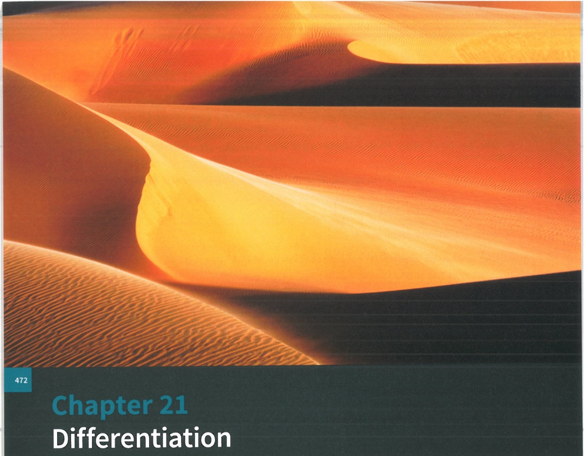

# Chapter 21 Differentiation

## In this chapter you will learn how to:

obtain expressions for  $ \frac{d^{2}y}{dx^{2}} $ in cases where the relation between x and y is defined both implicitly and parametrically

differentiate hyperbolic functions, inverse hyperbolic functions and inverse trigonometric functions

derive and use the first few terms of Maclaurin's series for a function.

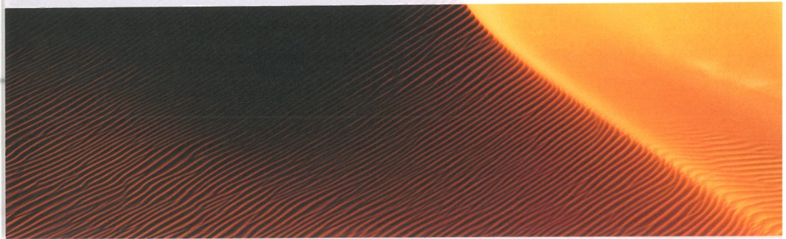

<!-- page 485 -->

<table border=1 style='margin: auto; word-wrap: break-word;'><tr><td style='text-align: center; word-wrap: break-word;'>Where it comes from</td><td style='text-align: center; word-wrap: break-word;'>What you should be able to do</td><td style='text-align: center; word-wrap: break-word;'>Check your skills</td></tr><tr><td style='text-align: center; word-wrap: break-word;'>AS &amp; A Level Mathematics Pure Mathematics 2 &amp; 3, Chapter 4</td><td style='text-align: center; word-wrap: break-word;'>Discrete functions such as  $ e^{f(x)} $,  $ a \cos(f(x)) $ and  $ a \ln f(x) $.</td><td style='text-align: center; word-wrap: break-word;'>1 Discrete the following functions.\na  $ x e^{2x} $b  $ 2 \sin(x^{2}+1) $c  $ \ln \left(\frac{x^{3}}{x-1}\right) $</td></tr><tr><td style='text-align: center; word-wrap: break-word;'>AS &amp; A Level Mathematics Pure Mathematics 2 &amp; 3, Chapter 4</td><td style='text-align: center; word-wrap: break-word;'>Discrete functions implicitly.</td><td style='text-align: center; word-wrap: break-word;'>2 Find  $ \frac{dy}{dx} $ for the expression  $ x^{2}y - y^{3} = 2y + x $.</td></tr><tr><td style='text-align: center; word-wrap: break-word;'>AS &amp; A Level Mathematics Pure Mathematics 2 &amp; 3, Chapter 4</td><td style='text-align: center; word-wrap: break-word;'>Discrete functions defined parametrically.</td><td style='text-align: center; word-wrap: break-word;'>3 Find  $ \frac{dy}{dx} $ for the set of parametric equations  $ x = t^{2} - t $,  $ y = t^{3} $.</td></tr></table>

## What else can we do with differentiation?

In this chapter we shall look at the differentiation of some new functions, such as hyperbolic functions and inverse functions. We shall extend the implicit and parametric differentiation techniques you learned in your A Level Mathematics Pure Mathematics 2 & 3 course.

We shall also study Maclaurin's series for a variety of functions. This will allow us to approximate functions with a polynomial.

Differentiation is the section of calculus that looks at rates of change of variables. It is used in many different areas, such as Physics, Chemistry, Engineering, Medicine and Economics. Calculus was developed by both Isaac Newton and Gottfried Leibniz. It has become a pivotal part of modern science and engineering.

### 21.1 Implicit functions

You will have met implicit functions within A Level Mathematics Pure Mathematics 2 & 3, Chapter 4, where you will have found only the first derivative. In this section we shall be extending this to incorporate the second derivative.

Implicit differentiation allows us to differentiate functions that are not explicitly written as $y = f(x)$. For example, consider the function $y^2 = x$. Differentiating both sides with respect to $x$, we can write $2y \frac{dy}{dx} = 1$, and so $\frac{dy}{dx} = \frac{1}{2y}$.

When differentiating $y$, think of this as $\frac{\mathrm{d}}{\mathrm{d}x}(y)$, as shown in Key point 21.1. This is the same as $\frac{\mathrm{d}y}{\mathrm{d}x}$. If your function is, for example, $y^{2}x + y = \ln y$, do not start with $\frac{\mathrm{d}y}{\mathrm{d}x} =$. Instead, start with $\frac{\mathrm{d}}{\mathrm{d}x}(y^{2}x + y) = \frac{\mathrm{d}}{\mathrm{d}x}(\ln y)$ and then differentiate. This is also an application of the chain rule.

<!-- page 486 -->

### KEY POINT 21.1

To differentiate, start with $\frac{\mathrm{d}}{\mathrm{d}x}( \ldots ) = \text{instead of } \frac{\mathrm{d}y}{\mathrm{d}x} = \text{and then differentiate.}$

Consider $x^{3}+y^{2}=2y$. Suppose we want to find the first and second derivatives with respect to $x$. We write $\frac{\mathrm{d}}{\mathrm{d}x}(x^{3}+y^{2})=\frac{\mathrm{d}}{\mathrm{d}x}(2y)$ and so $3x^{2}+2y\frac{\mathrm{d}y}{\mathrm{d}x}=2\frac{\mathrm{d}y}{\mathrm{d}x}\ldots(1)$. Rearranging gives us $\frac{\mathrm{d}y}{\mathrm{d}x}=\frac{3x^{2}}{2-2y}\ldots(2)$. To determine the second derivative, it is generally not a good idea to consider (2), since differentiating this result would mean having to deal with a quotient.

Instead, we differentiate (1), the original form of the first derivative:

$$\frac{\mathrm{d}}{\mathrm{d}x}\left(3x^{2}+2y\frac{\mathrm{d}y}{\mathrm{d}x}\right)=\frac{\mathrm{d}}{\mathrm{d}x}\left(2\frac{\mathrm{d}y}{\mathrm{d}x}\right)\text{and so}6x+2\left(\frac{\mathrm{d}y}{\mathrm{d}x}\right)^{2}+2y\frac{\mathrm{d}^{2}y}{\mathrm{d}x^{2}}=2\frac{\mathrm{d}^{2}y}{\mathrm{d}x^{2}},\text{then}$$

$$\frac{\mathrm{d}^{2}y}{\mathrm{d}x^{2}}=\frac{6x+2\left(\frac{\mathrm{d}y}{\mathrm{d}x}\right)^{2}}{2-2y}.$$

Using the previous result,  $ \frac{d^2y}{dx^2} = \frac{6x + 2\left(\frac{3x^2}{2 - 2y}\right)^2}{2 - 2y} $, which simplifies to  $ \frac{d^2y}{dx^2} = \frac{6x(2 - 2y)^2 + 18x^4}{(2 - 2y)^3} $.

### WORKED EXAMPLE 21.1

Given that  $ e^{x} + e^{2y} = \ln y $, find the first and second derivatives with respect to x.

## Answer

First,  $ e^x + 2e^{2y}\frac{dy}{dx} = \frac{1}{y}\frac{dy}{dx} $.

Then  $  \mathrm{e}^{x} + 4\mathrm{e}^{2y}\left(\frac{\mathrm{d}y}{\mathrm{d}x}\right)^{2} + 2\mathrm{e}^{2y}\frac{\mathrm{d}^{2}y}{\mathrm{d}x^{2}} = -\frac{1}{y^{2}}\left(\frac{\mathrm{d}y}{\mathrm{d}x}\right)^{2} + \frac{1}{y}\frac{\mathrm{d}^{2}y}{\mathrm{d}x^{2}}  $.

 $$ \mathrm{So}\ \frac{\mathrm{d}y}{\mathrm{d}x}=\frac{y\mathrm{e}^{x}}{1-2y\mathrm{e}^{2y}},\mathrm{and}\ \frac{\mathrm{d}^{2}y}{\mathrm{d}x^{2}}=\frac{y^{2}\mathrm{e}^{x}+(1+4y^{2}\mathrm{e}^{2y})\left(\frac{\mathrm{d}y}{\mathrm{d}x}\right)^{2}}{y-2y^{2}\mathrm{e}^{2y}}. $$ 

Find the first derivative.

Differentiate the first derivative in its current form to get the second derivative.

Using the result for  $ \frac{dy}{dx} $, rewrite the second derivative as

Rearrange both results.

 $$ \frac{\mathrm{d}^{2}y}{\mathrm{d}x^{2}}=\frac{y^{2}\mathrm{e}^{x}+(1+4y^{2}\mathrm{e}^{2y})\left(\frac{y\mathrm{e}^{x}}{1-2y\mathrm{e}^{2y}}\right)^{2}}{y(1-2y\mathrm{e}^{2y})}. $$ 

Substitute  $ \frac{dy}{dx} $ into the result for the second derivative.

 $$  Then\ \frac{\mathrm{d}^{2}y}{\mathrm{d}x^{2}}=\frac{y\mathrm{e}^{x}[(1-2y\mathrm{e}^{2y})^{2}+\mathrm{e}^{x}(1+4y^{2}\mathrm{e}^{2y})]}{(1-2y\mathrm{e}^{2y})^{3}}. $$ 

Simplify as required.

Obtain the result, or any equivalent form.

<!-- page 487 -->

We shall now look at a slightly more complicated example:  $ x^3y^2 + y = \sin x $.

Differentiating,  $ 3x^{2}y^{2} + 2x^{3}y\frac{dy}{dx} + \frac{dy}{dx} = \cos x $. Notice that we now have a triple product,

2x^{3}y\frac{dy}{dx}. In order to deal with this we need to see how to differentiate a triple product.

If $y = uvw$, where $u = f(x)$, $v = g(x)$, $w = h(x)$, then $y + \delta y = (u + \delta u)(v + \delta v)(w + \delta w)$. Multiplying out the brackets leads to:

 $$ y+\delta y=u v w+u\delta v\delta w+\nu\delta u\delta w+w\delta u\delta v+u v\delta w+u w\delta v+\nu w\delta u+\delta u\delta v\delta w $$ 

Notice that $y = uvw$ will now cancel. We then divide through by $\delta x$ to get:

$$\frac{\delta\gamma}{\delta x}=\frac{u\delta v\delta w}{\delta x}+\frac{v\delta u\delta w}{\delta x}+\frac{w\delta u\delta v}{\delta x}+\frac{u v\delta w}{\delta x}+\frac{u w\delta v}{\delta x}+\frac{v w\delta u}{\delta x}+\frac{\delta u\delta v\delta w}{\delta x},\text{ and then let }\delta x\text{ tend to }0.$$ This means that the terms $\frac{u\delta v\delta w}{\delta x},\frac{v\delta u\delta w}{\delta x},\frac{w\delta u\delta v}{\delta x}$ and $\frac{\delta u\delta v\delta w}{\delta x}$ are all small enough to be ignored.

So $\frac{\mathrm{d}y}{\mathrm{d}x}=uv\frac{\mathrm{d}w}{\mathrm{d}x}+uw\frac{\mathrm{d}v}{\mathrm{d}x}+vw\frac{\mathrm{d}u}{\mathrm{d}x}$, as shown in Key point 21.2.

### KEY POINT 21.2

If a function is of the form $y = u v w$, where each factor is a function of $x$, then the triple product differentiates to give $\frac{\mathrm{d}y}{\mathrm{d}x} = u v \frac{\mathrm{d}w}{\mathrm{d}x} + u w \frac{\mathrm{d}v}{\mathrm{d}x} + r w \frac{\mathrm{d}u}{\mathrm{d}x}$.

In our example, we got to the point where  $ 3x^2y^2 + 2x^3y\frac{dy}{dx} + \frac{dy}{dx} = \cos x $.

Differentiating again gives  $ 6xy^{2} + 6x^{2}y\frac{\mathrm{d}y}{\mathrm{d}x} + 6x^{2}y\frac{\mathrm{d}y}{\mathrm{d}x} + 2x^{3}\left(\frac{\mathrm{d}y}{\mathrm{d}x}\right)^{2} + 2x^{3}y\frac{\mathrm{d}^{2}y}{\mathrm{d}x^{2}} + \frac{\mathrm{d}^{2}y}{\mathrm{d}x^{2}} = -\sin x $.

We could rearrange the algebra to find expressions for  $ \frac{dy}{dx} $ and  $ \frac{d^{2}y}{dx^{2}} $.

### WORKED EXAMPLE 21.2

An implicit equation is given as  $ x e^{x+y} = (x+1)^2 $. Find the first and second derivatives with respect to x.

Answer

Begin with  $  \mathrm{e}^{x+y} + x\left(1 + \frac{\mathrm{d}y}{\mathrm{d}x}\right)\mathrm{e}^{x+y} = 2(x+1).  $

Then  $ \left(1+\frac{\mathrm{d}y}{\mathrm{d}x}\right)\mathrm{e}^{x+y}+\left(1+\frac{\mathrm{d}y}{\mathrm{d}x}\right)\mathrm{e}^{x+y}+x\mathrm{e}^{x+y}\frac{\mathrm{d}^{2}y}{\mathrm{d}x^{2}}+ $

 $ x\left(1+\frac{\mathrm{d}y}{\mathrm{d}x}\right)^{2}\mathrm{e}^{x+y}=2. $

Differentiate once.

Note the triple product when differentiating a second time.

So  $ \frac{dy}{dx}=\frac{2(x+1)-e^{x+y}-xe^{x+y}}{xe^{x+y}} $ is the first derivative.

And  $ \frac{\mathrm{d}^{2}y}{\mathrm{d}x^{2}}=\frac{2\mathrm{e}^{-(x+y)}}{x}-\frac{2}{x}\left(1+\frac{\mathrm{d}y}{\mathrm{d}x}\right)-\left(1+\frac{\mathrm{d}y}{\mathrm{d}x}\right)^{2} $ is the second derivative.

State the first derivative.

The algebra has become too complicated to write the second derivative just in terms of $x$ and $y$.

<!-- page 488 -->

### EXPLORE 21.1

Discuss in groups how you could attempt to differentiate the functions  $ y = x^x $ and  $ y = x^{x^x} $.

Looking at Worked example 21.2, there is a good reason why we did not simplify the second derivative. If we only need to find numerical values for the first and second derivatives, we do not need to simplify the expressions.

Consider the function  $ x^{2} + xy^{2} = (y+1)^{3} $, where it is known that when x = 1, y = -1. To find numerical values for  $ \frac{dy}{dx} $ and  $ \frac{d^{2}y}{dx^{2}} $, we start with the first derivative.

So $2x + 2xy \frac{dy}{dx} + y^{2} = 3(y + 1)^{2} \frac{dy}{dx}$. Then with $x = 1$, $y = -1$, $2 - 2 \frac{dy}{dx} + 1 = 0$, which gives us $\frac{dy}{dx} = \frac{3}{2}$. We do not need to find $\frac{dy}{dx}$ explicitly as we only need its numerical value.

Differentiating again,  $ 2 + 4y \frac{\mathrm{d}y}{\mathrm{d}x} + 2x \left( \frac{\mathrm{d}y}{\mathrm{d}x} \right)^2 + 2xy \frac{\mathrm{d}^2y}{\mathrm{d}x^2} = 3 \frac{\mathrm{d}^2y}{\mathrm{d}x^2} (y + 1)^2 + 6 \left( \frac{\mathrm{d}y}{\mathrm{d}x} \right)^2 (y + 1) $.

Using the values $x=1$, $y=-1$ and $\frac{\mathrm{d}y}{\mathrm{d}x}=\frac{3}{2}$ we have $2-6+\frac{9}{2}-2\frac{\mathrm{d}^{2}y}{\mathrm{d}x^{2}}=0$.

Hence,  $ \frac{\mathrm{d}^{2}y}{\mathrm{d}x^{2}}=\frac{1}{4} $

### WORKED EXAMPLE 21.3

<table border=1 style='margin: auto; word-wrap: break-word;'><tr><td style='text-align: center; word-wrap: break-word;'>Given that  $ y^{3} + yx^{2} = e^{x} $ passes through the point  $ A(0,1) $, find the values of the first and second derivatives at the point  $ A $.AnswerFirst,  $ 3y^{2}\frac{dy}{dx} + x^{2}\frac{dy}{dx} + 2yx = e^{x} $.Using x = 0 and y = 1 we get  $ 3\frac{dy}{dx} = 1 $. So  $ \frac{dy}{dx} = \frac{1}{3} $.Then  $ 6y\left(\frac{dy}{dx}\right)^{2} + 3y^{2}\frac{d^{2}y}{dx^{2}} + x^{2}\frac{d^{2}y}{dx^{2}} + 2x\frac{dy}{dx} + 2x\frac{dy}{dx} + 2y = e^{x} $.Using x = 0, y = 1 and  $ \frac{dy}{dx} = \frac{1}{3} $ we get  $ \frac{2}{3} + 3\frac{d^{2}y}{dx^{2}} + 2 = 1 $.Hence,  $ \frac{d^{2}y}{dx^{2}} = -\frac{5}{9} $.</td><td style='text-align: center; word-wrap: break-word;'>Differentiate once.Use the given values. There is no need to rearrange to find  $ \frac{dy}{dx} $ explicitly.Differentiate again.Use the given values and the result for  $ \frac{dy}{dx} $.Determine the value of the second derivative.</td></tr></table>

## TIP

Deal with $y = x^{x}$ first.

<!-- page 489 -->

1 For each case, find the first derivative  $ \frac{dy}{dx} $.

a  $ xy = e^{x} $ b  $ y^{2}x = e^{y} $ c  $ \tan(x + y) = y $

2 Find the value of the second derivative  $ \frac{\mathrm{d}^{2}y}{\mathrm{d}x^{2}} $ of  $ x^{2}=ye^{x}+y^{2} $ at the point  $ (0,0) $.

3 Find the value of the first and second derivatives of  $ \ln(x+y)=2y $ at the point  $ (1,0) $.

4 Given that $xy = \sin(x + y)$, find the first and second derivatives with respect to $x$.

5 An implicit curve, $C$, is defined as $y^{2} = \ln x + e^{y} - 1$. Given that $C$ passes through the point $(1,0)$, find the values of $\frac{\mathrm{d}y}{\mathrm{d}x}$ and $\frac{\mathrm{d}^{2}y}{\mathrm{d}x^{2}}$ at this point.

P 6 A curve is given as  $ xy^{\alpha}=\beta $, where  $ \alpha,\beta $ are constants.

a Find  $ \frac{dy}{dx} $. b Show that  $ \frac{d^2y}{dx^2} = \frac{y(1+\alpha)}{\alpha^2x^2} $.

7 The curve C is given as  $ (x+y)^{6}=x $. Given that the curve also passes through the point  $ (1,0) $, determine the values of  $ \frac{dy}{dx} $ and  $ \frac{d^{2}y}{dx^{2}} $ at this point.

M 8 An implicit curve is defined as  $ \sin 2x \cos 2y = \frac{\sqrt{3}}{4} $. It is known that the curve passes through the point  $ P\left(\frac{\pi}{3}, \frac{\pi}{6}\right) $. Find, at the point  $ P $:

a  $ \frac{dy}{dx} $ b  $ \frac{d^2y}{dx^2} $

## DID YOU KNOW?

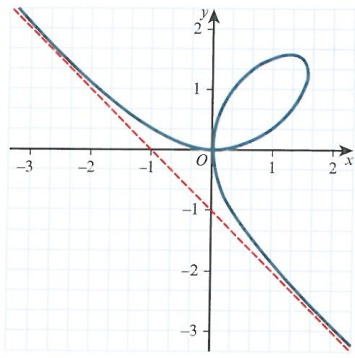

The French mathematician René Descartes worked on the now famous curve  $ x^{3} + y^{3} = 3axy $. In 1638 Descartes challenged Fermat to determine the tangent line to the curve. Fermat did this without any knowledge of calculus! Once calculus was discovered, differentiating this function was a much easier way to find the tangent.

<!-- page 490 -->

### 21.2 Parametric equations

You have met parametric equations in your A Level Mathematics course: two functions are dependent on a common parameter, for example, $x = f(t)$ and $y = g(t)$, where $t$ is the parameter.

To determine the gradient of a curve represented by a set of parametric equations, we must

first determine  $ \frac{dx}{dt} $ and  $ \frac{dy}{dt} $. Then, using the chain rule,  $ \frac{dy}{dx} = \frac{dy}{dt} \times \frac{dt}{dx} $, or  $ \frac{dy}{dx} = \frac{\frac{dy}{dt}}{\frac{dx}{dt}} $.

Another way of writing this is  $ \frac{dy}{dx}=\frac{d}{dt}(y)\times\frac{dt}{dx} $, where y is differentiated with respect to t and then multiplied by  $ \frac{dt}{dx} $.

For example, if $x = t^{2}$ and $y = t + 1$, then $\frac{\mathrm{d}y}{\mathrm{d}t} = 1$ and $\frac{\mathrm{d}x}{\mathrm{d}t} = 2t$. This means $\frac{\mathrm{d}y}{\mathrm{d}x} = \frac{1}{2t}$.

Notice that the first derivative is a function of $t$, so to determine the second derivative we must differentiate $\frac{\mathrm{d}y}{\mathrm{d}x}$ with respect to $t$.

Thus  $ \frac{\mathrm{d}^{2}y}{\mathrm{d}x^{2}}=\frac{\mathrm{d}}{\mathrm{d}t}\left(\frac{\mathrm{d}y}{\mathrm{d}x}\right)\times\frac{\mathrm{d}t}{\mathrm{d}x} $, as shown in Key point 21.3. Notice that the first and second derivatives are obtained using a very similar approach.

### KEY POINT 21.3

For the parametric equations  $ x = f(t), y = g(t) $, the first and second derivatives are given by:

 $$ \frac{\mathrm{d}y}{\mathrm{d}x}=\frac{\mathrm{d}}{\mathrm{d}t}(y)\times\frac{\mathrm{d}t}{\mathrm{d}x} $$ 

 $$ \frac{\mathrm{d}^{2}y}{\mathrm{d}x^{2}}=\frac{\mathrm{d}}{\mathrm{d}t}\left(\frac{\mathrm{d}y}{\mathrm{d}x}\right)\times\frac{\mathrm{d}t}{\mathrm{d}x} $$ 

Going back to our example with  $ x = t^{2}, y = t + 1 $, we have already found that

$$\frac{\mathrm{d}y}{\mathrm{d}x}=\frac{1}{2t}.\text{For the second derivative,first find}\frac{\mathrm{d}}{\mathrm{d}t}\left(\frac{1}{2t}\right)=\frac{1}{2}\frac{\mathrm{d}}{\mathrm{d}t}\left(\frac{1}{t}\right)=-\frac{1}{2t^{2}}.\text{Then using}$$

$$\frac{\mathrm{d}^{2}y}{\mathrm{d}x^{2}}=\frac{\mathrm{d}}{\mathrm{d}t}\left(\frac{\mathrm{d}y}{\mathrm{d}x}\right)\times\frac{\mathrm{d}t}{\mathrm{d}x}\text{our second derivative is}\frac{\mathrm{d}^{2}y}{\mathrm{d}x^{2}}=-\frac{1}{2t^{2}}\times\frac{1}{2t}=-\frac{1}{4t^{3}}.$$

<!-- page 491 -->

Given that $x = \frac{1}{t+1}$ and $y = t^{2}$, find the first and second derivatives of $y$ with respect to $x$.

## Answer

Start with  $ \frac{dx}{dt} = -\frac{1}{(t+1)^2} $ and  $ \frac{dy}{dt} = 2t $.

Differentiate both equations.

Then  $ \frac{\mathrm{d}y}{\mathrm{d}x}=2t\times-(t+1)^{2}=-2t(1+t)^{2} $.

Use the chain rule to determine  $ \frac{dy}{dx} $

Then  $ \frac{\mathrm{d}}{\mathrm{d}t}\left(\frac{\mathrm{d}y}{\mathrm{d}x}\right)=-2(1+t)^{2}-4t(1+t) $.

This simplifies to -2(t + 1)(3t + 1).

Then  $ \frac{\mathrm{d}^{2}y}{\mathrm{d}x^{2}}=\frac{\mathrm{d}}{\mathrm{d}t}\left(\frac{\mathrm{d}y}{\mathrm{d}x}\right)\times\frac{\mathrm{d}t}{\mathrm{d}x}=-2(t+1)(3t+1)\times-(t+1)^{2} $.

Differentiate the first derivative with respect to  $ t $.

Hence,  $ \frac{\mathrm{d}^{2}y}{\mathrm{d}x^{2}}=2(3t+1)(t+1)^{3} $.

Use the form of the second derivative with your result from above.

Simplify to give the final answer.

### WORKED EXAMPLE 21.5

If $x = t\mathrm{e}^{t}, y = t^{3} - t$ determine the functions $\frac{\mathrm{d}y}{\mathrm{d}x}$ and $\frac{\mathrm{d}^{2}y}{\mathrm{d}x^{2}}$.

## Answer

First,  $ \frac{dy}{dt}=3t^{2}-1 $ and  $ \frac{dx}{dt}=e^{t}+te^{t}=e^{t}(1+t) $

Differentiate x and y with respect to t.

Then  $ \frac{\mathrm{d}y}{\mathrm{d}x}=\frac{3t^{2}-1}{\mathrm{e}^{t}(1+t)}. $

Divide  $ \frac{dy}{dt} $ by  $ \frac{dx}{dt} $.

Next,  $ \frac{\mathrm{d}}{\mathrm{d}t}\left(\frac{3t^{2}-1}{\mathrm{e}^{t}(1+t)}\right)=\frac{\mathrm{e}^{t}(1+t)6t-(3t^{2}-1)(\mathrm{e}^{t}+\mathrm{e}^{t}+t\mathrm{e}^{t})}{\mathrm{e}^{2t}(1+t)^{2}}=\frac{7t+2-3t^{3}}{\mathrm{e}^{t}(1+t)^{2}}. $

Differentiate  $ \frac{\mathrm{d}y}{\mathrm{d}x} $ with respect to  $ t $.

So with  $ \frac{\mathrm{d}^{2}y}{\mathrm{d}x^{2}}=\frac{\mathrm{d}}{\mathrm{d}t}\left(\frac{\mathrm{d}y}{\mathrm{d}x}\right)\times\frac{\mathrm{d}t}{\mathrm{d}x} $,  $ \frac{\mathrm{d}^{2}y}{\mathrm{d}x^{2}}=\frac{7t+2-3t^{3}}{\mathrm{e}^{2t}(1+t)^{3}} $.

Multiply the result by  $ \frac{dt}{dx} $, or  $ \frac{1}{\frac{dx}{dx}} $.

Consider the curve represented by  $ x = \cos t $,  $ y = \sin 2t $ for  $ 0 \leq t \leq \pi $. Suppose we want to find the coordinates of all the stationary points, and to determine their nature.

The first step is to obtain  $ \frac{dx}{dt} = -\sin t $,  $ \frac{dy}{dt} = 2\cos 2t $ and, hence,  $ \frac{dy}{dx} = -\frac{2\cos 2t}{\sin t} $.

Then for turning points we need  $ \frac{dy}{dx}=0 $, or for parametric-based derivatives, we just need  $ \frac{dy}{dt}=0 $.

So let  $ 2\cos2t=0 $. This leads to  $ t=\frac{\pi}{4} $,  $ \frac{3\pi}{4} $.

When  $ t = \frac{\pi}{4} $:  $ x = \frac{\sqrt{2}}{2} $, y = 1. When  $ t = \frac{3\pi}{4} $:  $ x = -\frac{\sqrt{2}}{2} $, y = -1.

<!-- page 492 -->

## To determine the nature of the stationary points, first find

$$\frac{\mathrm{d}}{\mathrm{d}t}\left(\frac{\mathrm{d}y}{\mathrm{d}x}\right)=-\frac{\sin t(-4\sin2t)-2\cos2t(\cos t)}{\sin^{2}t}\text{, then multiplying by }-\frac{1}{\sin t}\text{ leads to }$$

$$\frac{\mathrm{d}^{2}y}{\mathrm{d}x^{2}}=-\frac{2(\cos2t\cos t+2\sin2t\sin t)}{\sin^{3}t}.$$

When  $ t = \frac{\pi}{4} $:  $ \frac{d^2y}{dx^2} = -\frac{4\frac{\sqrt{2}}{2}}{\frac{1}{2\sqrt{2}}} = -8 < 0 $. Hence, we have a maximum at  $ \left(\frac{\sqrt{2}}{2}, 1\right) $.

When  $ t = \frac{3\pi}{4} $:  $ \frac{d^2y}{dx^2} = -\frac{-4\frac{\sqrt{2}}{2}}{\frac{1}{2\sqrt{2}}} = 8 > 0 $. Hence, we have a minimum at  $ \left(-\frac{\sqrt{2}}{2}, -1\right) $.

### WORKED EXAMPLE 21.6

A parametric curve is represented by the pair of equations $x=t^{4}+t, y=t^{3}-3t^{2}$. Find the coordinates of any stationary points, and determine their nature.

## Answer

Begin with  $ \frac{dx}{dt}=4t^{3}+1 $,  $ \frac{dy}{dt}=3t^{2}-6t $. Hence,  $ \frac{dy}{dx}=\frac{3t^{2}-6t}{4t^{3}+1} $.

For turning points we need  $ \frac{dy}{dt}=0 $, so  $ 3t^{2}-6t=0 $, giving t=0,2.

Find the derivatives of each variable with respect to t and determine  $ \frac{dy}{dx} $.

For turning points let  $ \frac{dy}{dt}=0 $.

Differentiate  $ \frac{dy}{dx} $ with respect to t.

$$\mathrm{Determine}\,\frac{\mathrm{d}}{\mathrm{d}t}\left(\frac{\mathrm{d}y}{\mathrm{d}x}\right)=\frac{(4t^{3}+1)(6t-6)-(3t^{2}-6t)(12t^{2})}{(4t^{3}+1)^{2}}=\frac{48t^{3}-12t^{4}+6t-6}{(4t^{3}+1)^{2}}.$$

 $$ \mathrm{Io}\frac{\mathrm{d}^{2}y}{\mathrm{d}x^{2}}=\frac{\mathrm{d}}{\mathrm{d}t}\left(\frac{\mathrm{d}y}{\mathrm{d}x}\right)\times\frac{\mathrm{d}t}{\mathrm{d}x}=\frac{48t^{3}-12t^{4}+6t-6}{(4t^{3}+1)^{3}} $$ 

When  $ t = 0 $,  $ \frac{d^2y}{dx^2} = -6 < 0 $. Hence we have a maximum point when  $ t = 0 $.

Since  $ \frac{d^2y}{dx^2} < 0 $ we have a

When  $ t=2 $,  $ \frac{d^2y}{dx^2}=\frac{2}{363}>0 $. Hence we have a minimum point when  $ t=2 $.

Since  $ \frac{d^2y}{dx^2}>0 $ we have a

minimum.

So at (0, 0) we have a maximum point, and at (18, -4) we have a minimum point.

Determine the coordinates of both stationary points.

Write down the coordinates of each stationary point and state whether it is a maximum or minimum.

<!-- page 493 -->

1 For each case, differentiate the set of parametric equations to obtain the second derivative  $ \frac{d^{2}y}{dx^{2}} $

a  $ x = t^{2}, y = 3t + 1 $

b  $ x = e^{t}, y = t^{2} $

2 Find the value of the second derivative  $ \frac{dy}{dx^2} $ of the parametric equations  $ x = t^3 $,  $ y = \frac{4}{t} $, at the point where  $ t = 2 $.

3 Find the values of  $ \frac{dy}{dx} $ and  $ \frac{d^2y}{dx^2} $ of the parametric equations  $ x = e^{3t}, y = e^t $, at the point where t = 1.

4 Given that  $ x = t^{3} $,  $ y = 3t^{2} $, find the value of  $ \frac{\mathrm{d}^{2}y}{\mathrm{d}x^{2}} $ when t = 2.

## P PS

5 A parametric curve is defined as  $ x = \ln(t + 1) $ and  $ y = e^{t} $, where t > 0.

a Find  $ \frac{dy}{dx} $ in terms of t.

b Show that the second derivative with respect to x is always positive.

P 6 The parametric curve  $ x = t^{2} + t, y = \ln t $ is valid for t > 0.

a Show that there are no turning points.

b Show that the second derivative with respect to $x$ is $-\frac{4t+1}{t^{2}(2t+1)^{3}}$.

PS 7 If  $ x=\sin^{2}t $,  $ y=\cos^{3}t $ is valid for  $ 0\leq t\leq2\pi $, find the second derivative with respect to x in terms of t.

PS 8 Given that  $ x = t^{2} - \frac{1}{t} $,  $ y = t^{2} + \frac{1}{t} $, find:

a the value(s) of $t$ for any stationary point(s)

b the nature of any turning point(s).

P PS 9 The parametric curve represented by  $ x = e^{2t} + e^{-2t} $,  $ y = e^{2t} - e^{-2t} $ is valid for all t.

a Find  $ \frac{dy}{dx} $ and state the number of turning points.

b Show that the second derivative with respect to $x$ is $-\frac{4\mathrm{e}^{6t}}{(\mathrm{e}^{4t}-1)^{3}}$.

### 21.3 Hyperbolic and inverse functions

The hyperbolic functions were introduced in Chapter 19:

 $ \sinh x = \frac{e^x - e^{-x}}{2} $

 $ \cosh x = \frac{e^{x} + e^{-x}}{2} $

 $ \tanh x = \frac{e^x - e^{-x}}{e^x + e^{-x}} $

<!-- page 494 -->

Starting with  $ y = \sinh x = \frac{e^x - e^{-x}}{2} $,  $ \frac{dy}{dx} = \frac{e^x + e^{-x}}{2} $. Hence  $ \frac{dy}{dx} = \cosh x $.

Differentiating $y = \cosh x = \frac{e^x + e^{-x}}{2}$ gives $\frac{e^x - e^{-x}}{2}$. So $\frac{dy}{dx} = \sinh x$. These relationships are shown in Key point 21.4.

KEY POINT 21.4

 $$  If y=\sinh x,then\frac{\mathrm{d}y}{\mathrm{d}x}=\cosh x. $$ 

 $$  If y=\cosh x,then\frac{\mathrm{d}y}{\mathrm{d}x}=\sinh x. $$ 

### WORKED EXAMPLE 21.7

<table border=1 style='margin: auto; word-wrap: break-word;'><tr><td style='text-align: center; word-wrap: break-word;'>Find the derivatives of the following functions.\na  $ y = \sinh 2x $</td><td style='text-align: center; word-wrap: break-word;'>b  $ y = \cosh x^{2} $</td><td style='text-align: center; word-wrap: break-word;'>c  $ y = \sinh^{2}x $</td><td style='text-align: center; word-wrap: break-word;'>d  $ y = \cosh 3x \sinh 4x $</td></tr><tr><td style='text-align: center; word-wrap: break-word;'>Answer\na Let  $ u = 2x $, then  $ y = \sinh u $.\nSo  $ \frac{dy}{du} = \cosh u $ and  $ \frac{du}{dx} = 2 $.\nSo  $ \frac{dy}{dx} = \frac{dy}{du} \times \frac{du}{dx} = 2\cosh 2x $.\nb Let  $ u = x^{2} $, then  $ y = \cosh u $.\nSo  $ \frac{dy}{du} = \sinh u $ and  $ \frac{du}{dx} = 2x $.\nSo  $ \frac{dy}{dx} = 2x \sinh x^{2} $.\nc  $ y = (\sinh x)^{2} $\nSo  $ \frac{dy}{dx} = 2\sinh x \cosh x $, or  $ \sinh 2x $.d  $ \frac{dy}{dx} = 3\sinh 3x \sinh 4x + 4\cosh 3x \cosh 4x $.</td><td colspan="3">Use a substitution to simplify the function.\nUse the chain rule to get  $ \frac{dy}{dx} $.\nAgain, make use of a substitution.\nFrom the chain rule we get the result.\nTreat this as [f(x)] $ ^{n} $, finishing with  $ \frac{dy}{dx} = n f&#x27;(x) [f(x)]^{n-1} $ and use  $ \sinh 2A = 2 \sinh A \cosh A $.\nDifferentiate using the product rule and chain rule.</td></tr></table>

Notice that hyperbolic functions behave in a very similar way to trigonometric functions.

Let us consider the derivatives of  $ \tanh x $,  $ \operatorname{sech} x $,  $ \operatorname{cosech} x $ and  $ \coth x $.

<!-- page 495 -->

If  $ y = \tanh x = \frac{\sinh x}{\cosh x} $ then, using the quotient rule,  $ \frac{dy}{dx} = \frac{\cosh x \cosh x - \sinh x \sinh x}{\cosh^2 x} $.

 $$  Using\ \cosh^{2}x-\sinh^{2}x=1,\ \frac{\mathrm{d}y}{\mathrm{d}x}=\frac{1}{\cosh^{2}x}=\operatorname{sech}^{2}x. $$ 

 $$  If y=sech x=\frac{1}{\cosh x},\frac{\mathrm{d}y}{\mathrm{d}x}=\frac{\cosh x\times0-1\times\sinh x}{\cosh^{2}x}=-sech x\tanh x. $$ 

 $$  If y=cosech x=\frac{1}{\sinh x},\frac{\mathrm{d}y}{\mathrm{d}x}=\frac{\sinh x\times0-1\times\cosh x}{\sinh^{2}x}=-cosech x\coth x. $$ 

 $$ \mathrm{If}y=\coth x=\frac{\cosh x}{\sinh x},\frac{\mathrm{d}y}{\mathrm{d}x}=\frac{\sinh x\sinh x-\cosh x\cosh x}{\sinh^{2}x}.\mathrm{Again},\mathrm{using}\cosh^{2}x-\sinh^{2}x=1, $$ 

 $$ \frac{\mathrm{d}y}{\mathrm{d}x}=-\mathrm{cosech}^{2}x. $$ 

These results are shown in Key point 21.5.

### KEY POINT 21.5

 $$  If y=\tanh x,then\frac{\mathrm{d}y}{\mathrm{d}x}=\operatorname{sech}^{2}x. $$ 

 $$  If y=sech x,then\frac{\mathrm{d}y}{\mathrm{d}x}=-sech x\tanh x. $$ 

 $$ y=\operatorname{cosech} x,\operatorname{then}\frac{\mathrm{d}y}{\mathrm{d}x}=-\operatorname{cosech} x\coth x. $$ 

 $$  If y=coth x,then\frac{\mathrm{d}y}{\mathrm{d}x}=-cosech^{2}x. $$ 

### WORKED EXAMPLE 21.8

Find  $ \frac{dy}{dx} $ for each of the following functions.

a  $ y = 2x\operatorname{sech}(3x - 1) $

 $$ y=x^{2}\mathrm{e}^{\coth x} $$ 

 $$ \textsf{d}\sinh(x+y)=y^{2}x^{3} $$ 

## Answer

a  $ \frac{dy}{dx}=2\times\operatorname{sech}(3x-1)+2x\times(-)3\operatorname{sech}(3x-1)\tanh(3x-1) $

 $$ \mathrm{~T h i s~s i m p l i f i e s~t o~}2\mathrm{s e c h}(3x-1)[1-3x\mathrm{t a n h}(3x-1)]. $$ 

b Using the chain rule we have

 $$ \frac{\mathrm{d}y}{\mathrm{d}x}=\frac{\operatorname{sech}^{2}x}{\tanh x}=\frac{1}{\cosh x\sinh x},\text{or}\frac{\mathrm{d}y}{\mathrm{d}x}=\frac{2}{\sinh2x}. $$ 

Differentiate and take out the common factors.

Recall the method for differentiating logarithms from your A level Mathematics course.

Also make use of the double angle formula for  $ \sinh 2A $.

<!-- page 496 -->

c Using the chain rule:

Using the product rule and chain rule.

 $$ \frac{\mathrm{d}y}{\mathrm{d}x}=2x\times\mathrm{e}^{\coth x}+x^{2}\times(-\mathrm{cosech}^{2}x)\mathrm{e}^{\coth x}. $$ 

This can be simplified to  $ x e^{\coth x}(2 - x \cosh^2 x) $.

Take out common factors.

 $$ \left(1+\frac{\mathrm{d}y}{\mathrm{d}x}\right)\cosh(x+y)=2yx^{3}\frac{\mathrm{d}y}{\mathrm{d}x}+3x^{2}y^{2} $$ 

Differentiate implicitly.

 $$ \frac{\mathrm{d}y}{\mathrm{d}x}=\frac{3x^{2}y^{2}-\cosh(x+y)}{\cosh(x+y)-2yx^{3}}. $$ 

Rearrange and state  $ \frac{dy}{dx} $

We shall move on to the inverse functions of trigonometric and hyperbolic functions.

Consider, for example, the function  $ y = \sin^{-1} x $. This is also known as  $ y = \arcsin x $. We want to be able to determine the derivative of this function, as shown in Key point 21.6. How do we begin? Since we have already met implicit differentiation, and we know how to differentiate the sine function, let us first take the sine of both sides.

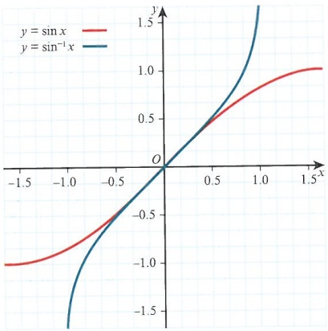

So  $ \sin y = x $, then  $ \cos y \frac{dy}{dx} = 1 $, and so  $ \frac{dy}{dx} = \frac{1}{\cos y} $. Since  $ \cos y = \pm \sqrt{1 - \sin^2 y} $ we can say that  $ \cos y = \pm \sqrt{1 - x^2} $. Then from the diagram we see that the curve of  $ y = \sin^{-1} x $ is always increasing. Hence we take the positive root and  $ \frac{dy}{dx} = \frac{1}{\sqrt{1 - x^2}} $.

<!-- page 497 -->

Similarly, for $y=\cos^{-1}x$, we start with $\cos y=x$, then $-\sin y\frac{\mathrm{d}y}{\mathrm{d}x}=1$.

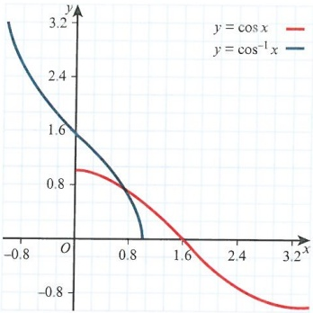

So with  $ \frac{dy}{dx} = -\frac{1}{\sin y} $ we look at the denominator. Since  $ \sin y = \pm\sqrt{1 - \cos^2 y} $ it follows that

 $ \sin y = \pm\sqrt{1 - x^2} $. From the graph we can confirm that  $ \frac{dy}{dx} = -\frac{1}{\sqrt{1 - x^2}} $, as shown in Key

point 21.6.

### WORKED EXAMPLE 21.9

Given that  $ y = \tan^{-1} x $, find  $ \frac{dy}{dx} $.

Answer

From  $ y = \tan^{-1} x $ let  $ \tan y = x $.

Then  $ \sec^{2}y\frac{\mathrm{d}y}{\mathrm{d}x}=1 $.

Take  $ \tan $ of both sides.

Given that  $ 1 + \tan^{2} y = \sec^{2} y $:

Differentiate implicitly and use trigonometric identities.

 $$ \frac{\mathrm{d}y}{\mathrm{d}x}=\frac{1}{1+\tan^{2}y} $$ 

 $$  So\frac{\mathrm{d}y}{\mathrm{d}x}=\frac{1}{1+x^{2}}. $$ 

State  $ \frac{dy}{dx} $

### KEY POINT 21.6

 $$ y=\sin^{-1}x,\text{then}\frac{\mathrm{d}y}{\mathrm{d}x}=\frac{1}{\sqrt{1-x^{2}}}. $$ 

If  $ y = \cos^{-1} x $, then  $ \frac{dy}{dx} = -\frac{1}{\sqrt{1 - x^2}} $.

If  $ y = \tan^{-1} x $, then  $ \frac{dy}{dx} = \frac{1}{1 + x^2} $.

<!-- page 498 -->

### WORKED EXAMPLE 21.10

Find the derivatives of the following functions.

a  $ y = x \cos^{-1} x $

 $$ y=\tan^{-1}3x $$ 

 $$ xy=\sin^{-1}2x $$ 

<table border=1 style='margin: auto; word-wrap: break-word;'><tr><td style='text-align: center; word-wrap: break-word;'>a  $ \frac{dy}{dx} = 1 \times \cos^{-1} x - x \times \frac{1}{\sqrt{1-x^{2}}} = \cos^{-1} x - \frac{x}{\sqrt{1-x^{2}}} $</td><td style='text-align: center; word-wrap: break-word;'>Differentiate as a product and quote the standard result for  $ \cos^{-1} x $.</td></tr><tr><td style='text-align: center; word-wrap: break-word;'>b We have a slightly different form, so  $ \tan y = 3x $, and then  $ \sec^{2} y \frac{dy}{dx} = 3 $.</td><td style='text-align: center; word-wrap: break-word;'>Since we have 3x it is best to take  $ \tan $ of both sides.</td></tr><tr><td style='text-align: center; word-wrap: break-word;'>c  $ \frac{dy}{dx} = \frac{3}{\sec^{2} y} = \frac{3}{1 + \tan^{2} y} = \frac{3}{1 + 9x^{2}} $.</td><td style='text-align: center; word-wrap: break-word;'>State the result.</td></tr><tr><td style='text-align: center; word-wrap: break-word;'>c  $ \sin x y = 2x $, then  $ \left( x \frac{dy}{dx} + y \right) \cos x y = 2 $.</td><td style='text-align: center; word-wrap: break-word;'>After taking  $ \sin $ of both sides, differentiate implicitly.</td></tr><tr><td style='text-align: center; word-wrap: break-word;'>Then  $ \frac{dy}{dx} = \frac{2 - y \cos x y}{x \cos x y} $.</td><td style='text-align: center; word-wrap: break-word;'>Simplify the result.</td></tr></table>

We have seen how to differentiate inverse trigonometric functions. Now we will differentiate inverse hyperbolic functions.

Starting with $y = \sinh^{-1}x$, we write $\sinh y = x$. Then $\cosh y \frac{dy}{dx} = 1$ so $\frac{dy}{dx} = \frac{1}{\cosh y}$. Using the result $\cosh^2 y - \sinh^2 y = 1$, we have $\cosh y = \pm\sqrt{1 + x^2}$.

From the following graph it is clear that the gradient of  $ \sinh^{-1}x $ is always positive. So  $ \frac{dy}{dx} = \frac{1}{\sqrt{1 + x^2}} $, as shown in Key point 21.7.

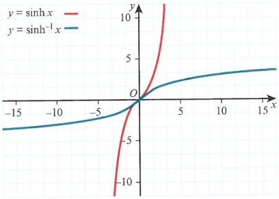

Next consider $y = \cosh^{-1} x$. Writing it as $\cosh y = x$ gives us $\sinh y \frac{dy}{dx} = 1$.

Again we use the identity  $ \cosh^{2}y - \sinh^{2}y = 1 $, giving  $ \sinh y = \pm\sqrt{x^{2}-1} $.

<!-- page 499 -->

From the graph, we see that the function  $ \cosh^{-1}x $ has a positive gradient for all values of x in its domain. So  $ \frac{dy}{dx} = \frac{1}{\sqrt{x^2 - 1}} $.

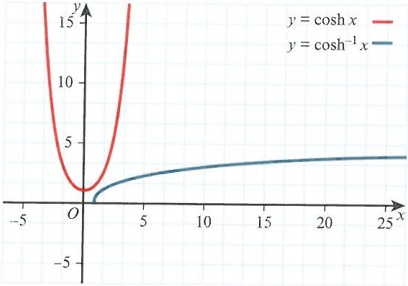

### WORKED EXAMPLE 21.11

Find the gradient of the curve  $ y = \tanh^{-1} x $.

## Answer

Start with  $ \tanh y = x $.

$$\mathrm{sech}^{2}y\frac{\mathrm{d}y}{\mathrm{d}x}=1$$

Then using  $ \operatorname{sech}^{2}y = 1 - \tanh^{2}y $,

Use implicit differentiation.

we can say that  $ \frac{\mathrm{d}y}{\mathrm{d}x}=\frac{1}{1-x^{2}} $.

Then use the identity to rearrange the result.

State the derivative.

### KEY POINT 21.7

If  $ y = \sinh^{-1} x $, then  $ \frac{dy}{dx} = \frac{1}{\sqrt{1 + x^2}} $.

If  $ y = \cosh^{-1} x $, then  $ \frac{dy}{dx} = \frac{1}{\sqrt{x^2 - 1}} $.

If $y = \tanh^{-1} x$, then $\frac{\mathrm{d}y}{\mathrm{d}x} = \frac{1}{1 - x^{2}}$.

## EXERCISE 21C

1 By differentiating  $ y = \frac{1}{2} e^{2x} + \frac{1}{2} e^{-2x} $, show that  $ \frac{dy}{dx} = 2 \sinh 2x $.

M 2 Given that  $ y = \tanh^{-1}(2x + 3) $, find  $ \frac{dy}{dx} $.

M 3 Find the first derivative of  $ y = \sin^{-1}(x^{3}) $.

<!-- page 500 -->

M 4 Differentiate the following functions with respect to x. Simplify your answer where possible.

a $y=\ln\cosh4x$

b  $ y = x^{2} \sinh(2x^{2} - 1) $

c  $ y = x \cosh^{-1} 5x $

 $$ y=\tan^{-1}\left(x+y\right) $$ 

M 5 Given that  $ y = x \sinh^{-1} 2x $, find  $ \frac{d^2 y}{dx^2} $.

PS 6 A curve is defined as  $ y = \cosh^{3}x^{2} $.

a Find the first derivative with respect to x, stating the number of turning points.

b Find the second derivative with respect to x.

PS 7 Establish a result for the first derivative with respect to x for the following functions.

a  $ ay = \sin^{-1} bx $

 $$ ay=\tan^{-1}bx $$ 

 $$ ay=\sinh^{-1}bx $$ 

d  $ ay = \cosh^{-1} bx $

e ay =  $ \tanh^{-1} bx $

M 8 A curve, C, is defined as being  $ x = 3 \tanh^{-1} t $,  $ y = \sin 2t $, where  $ -1 \leqslant t \leqslant 1 $.

a Find the values of t where the gradient is zero.

b Find the second derivative with respect to x when t = 0.

### 21.4 Maclaurin series

You have already met binomial expansions in your A Level Mathematics course. The expansions that are particularly important involve approximating a function using a polynomial.

Consider, for example, the function  $ \frac{1}{1-x}=1+x+x^{2}+x^{3}+\ldots $. Provided  $ |x|<1 $ this approximation is valid. To get a better approximation we want x to be as close to zero as possible.

But what if the function we want to approximate is not of the form  $ (a + bx)^{n} $? For example, we might want to approximate  $ y = e^{x} $.

To do this we are going to use a special case of Taylor series.

The Taylor series of a function  $ f(x) $ is given as:

 $$ \mathrm{f}(a)+\mathrm{f}^{\prime}(a)(x-a)+\frac{\mathrm{f}^{\prime \prime}(a)(x-a)^{2}}{2!}+\frac{\mathrm{f}^{\prime \prime \prime}(a)(x-a)^{3}}{3!}+\cdots $$ 

where $f(x)$ is differentiable an infinite number of times, and the constant $a$ denotes the point $x=a$ at which we evaluate the function.

We shall work with a special case of Taylor series, where a = 0. This is known as a

Maclaurin series, where  $ f(x) = f(0) + f'(0)x + \frac{f''(0)x^2}{2!} + \frac{f'''(0)x^3}{3!} + \cdots $

The Maclaurin series can also be represented in summation form, as  $ \sum_{n=0}^{\infty}\frac{\mathrm{f}^{(n)}(0)}{n!}x^{n} $, as shown in Key point 21.8, where  $ \mathrm{f}^{(n)}(0) $ is the  $ n $th derivative evaluated at the point  $ x=0 $

<!-- page 501 -->

### KEY POINT 21.8

The Maclaurin series for an infinitely differentiable function  $ f(x) $ about the point x = 0, is given by

 $$ \mathrm{f}(x)=\mathrm{f}(0)+\mathrm{f}^{\prime}(0)x+\frac{\mathrm{f}^{\prime \prime}(0)x^{2}}{2!}+\frac{\mathrm{f}^{\prime \prime \prime}(0)x^{3}}{3!}+\cdots $$ 

In summation form this is written as  $ \sum_{n=0}^{\infty}\frac{f^{(n)}(0)}{n!}x^{n} $

How does this work? Consider the function  $ f(x) = \frac{1}{1 - x} $, for which we have already found the expansion.

Then  $ f(x)=(1-x)^{-1} $ gives  $ f(0)=1 $.

 $$ \mathrm{f}^{\prime}(x)=(-1)(-1)(1-x)^{-2}=(1-x)^{-2}\mathrm{g i v e s}\mathrm{f}^{\prime}(0)=1. $$ 

 $$ \mathrm{f}^{\prime \prime}(x)=(-2)(-1)(1-x)^{-3}=2(1-x)^{-3}\mathrm{g i v e s}\mathrm{f}^{\prime \prime}(0)=2. $$ 

 $$ \mathrm{f}^{\prime \prime \prime}(x)=2(-3)(-1)(1-x)^{-4}=6(1-x)^{-4}\mathrm{g i v e s}\mathrm{f}^{\prime \prime \prime}(0)=6. $$ 

 $$ \mathrm{f}^{(4)}(x)=6(-4)(-1)(1-x)^{-5}=24(1-x)^{-5}\mathrm{g i v e s}\mathrm{f}^{(4)}(0)=24. $$ 

So  $ f(x) \approx 1 + x + \frac{2x^2}{2!} + \frac{6x^3}{3!} + \frac{24x^4}{4!} $, which is  $ 1 + x + x^2 + x^3 + x^4 $ as before.

Note that this is the same as the binomially expanded result.

Let us find the Maclaurin series for  $ f(x) = \mathrm{e}^{x} $ about the point x = 0.

 $$  f(x)=e^{x},giving f(0)=1. $$ 

 $$  f^{\prime}(x)=e^{x},giving f^{\prime}(0)=1. $$ 

 $$  f^{\prime \prime}(x)=e^{x},giving f^{\prime \prime}(0)=1. $$ 

 $$  f^{\prime \prime \prime}(x)=e^{x},giving f^{\prime \prime \prime}(0)=1. $$ 

 $$ \mathrm{f}^{(4)}(x)=\mathrm{e}^{x},\mathrm{g i v i n g}\mathrm{f}^{(4)}(0)=1. $$ 

 $$ \mathrm{f}^{(5)}(x)=\mathrm{e}^{x},\mathrm{g i v i n g}\mathrm{f}^{(5)}(0)=1. $$ 

 $$  So e^{x}=1+x+\frac{x^{2}}{2!}+\frac{x^{3}}{3!}+\frac{x^{4}}{4!}+\frac{x^{5}}{5!}\ldots $$ 

The following diagrams show the Maclaurin series for  $ e^x $ fitting more closely to the curve  $ f(x) = e^x $ as we add more terms.

In the summation form  $ \sum_{n=0}^{\infty}\frac{f^{(n)}(0)x^{n}}{n!} $, we are considering what happens as n increases.

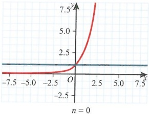

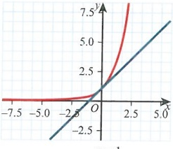

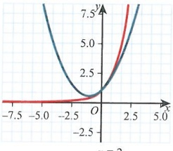

<!-- page 502 -->

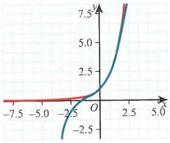

n=3

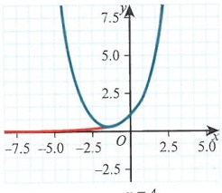

n=4

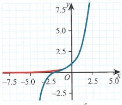

n=5

If $x=0$ we have $f(0)=\mathrm{e}^{0}=1$ for the original curve, and this is also true for our Maclaurin series.

If x = 0.01, then  $ e^{0.01} = 1.010050167084168 $, and from our series we have

1.01005016708417. These are remarkably close with only six terms, but our value of x is close to zero.

If $x=1$, then $e^{1}=2.718281828459045$, and from our series we get $2.71666666666667$, which is not as accurate as the previous approximation.

Since this series is centred on x = 0, the further away from zero we try to approximate, the more terms we need.

### WORKED EXAMPLE 21.12

Find the Maclaurin series for  $ f(x) = \sin x $ about x = 0, giving the first four non-zero terms.

<table border=1 style='margin: auto; word-wrap: break-word;'><tr><td style='text-align: center; word-wrap: break-word;'>Answer\nf(0) = 0</td><td style='text-align: center; word-wrap: break-word;'>Substitute zero into the function.</td></tr><tr><td style='text-align: center; word-wrap: break-word;'>$ f&#x27;(x) = \cos x $, giving  $ f&#x27;(0) = 1 $.</td><td style='text-align: center; word-wrap: break-word;'>Differentiate the function sufficient times to obtain four non-zero terms.</td></tr><tr><td style='text-align: center; word-wrap: break-word;'>$ f&#x27;&#x27;(x) = -\sin x $, giving  $ f&#x27;&#x27;(0) = 0 $.</td><td rowspan="3">Notice that, due to the cyclic nature of sine and cosine, we get a non-zero term every other term.</td></tr><tr><td style='text-align: center; word-wrap: break-word;'>$ f&#x27;&#x27;&#x27;(x) = -\cos x $, giving  $ f&#x27;&#x27;&#x27;(0) = -1 $.</td></tr><tr><td style='text-align: center; word-wrap: break-word;'>$ f^{(4)}(x) = \sin x $, giving  $ f^{(4)}(0) = 0 $.</td></tr><tr><td style='text-align: center; word-wrap: break-word;'>$ f^{(5)}(x) = \cos x $, giving  $ f^{(5)}(0) = 1 $.</td><td rowspan="3">Remember to use  $ \frac{f^{(n)}(0)}{n!}x^n $ for each term in the series.</td></tr><tr><td style='text-align: center; word-wrap: break-word;'>$ f^{(6)}(x) = -\sin x $, giving  $ f^{(6)}(0) = 0 $.</td></tr><tr><td style='text-align: center; word-wrap: break-word;'>$ f^{(7)}(x) = -\cos x $, giving  $ f^{(7)}(0) = -1 $.</td></tr><tr><td style='text-align: center; word-wrap: break-word;'>Hence,  $ \sin x \approx x - \frac{x^3}{3!} + \frac{x^5}{5!} - \frac{x^7}{7!} $.</td><td style='text-align: center; word-wrap: break-word;'>State the result.</td></tr></table>

Suppose we want to find the Maclaurin series for  $ \cos x $, there are two ways to do this. We can either differentiate the function enough times to find sufficient non-zero terms, or we can simply differentiate the Maclaurin series for  $ \sin x $.

 $$  So\cos x\approx\frac{d}{d x}\bigg(x-\frac{x^{3}}{3!}+\frac{x^{5}}{5!}-\frac{x^{7}}{7!}\bigg)=1-\frac{x^{2}}{2!}+\frac{x^{4}}{4!}-\frac{x^{6}}{6!}. $$

<!-- page 503 -->

Investigate the link between the Maclaurin series for  $ e^{x} $,  $ \sin x $ and  $ \cos x $.

### WORKED EXAMPLE 21.13

If  $ f(x) = \sin^{-1} x $, find the first three non-zero terms of the Maclaurin series for this function. Find also an estimate, to 9 decimal places, for  $ \sin^{-1} 0.1 $.

Answer

f(0) = 0

Find the first term.

 $ f'(x) = (1 - x^2)^{-\frac{1}{2}} $, giving  $ f'(0) = 1 $.

Find the first term.

Differentiate using Key point 21.6.

 $ f''(x) = \left(-\frac{1}{2}\right)(-2x)(1 - x^2)^{-\frac{3}{2}} = x(1 - x^2)^{-\frac{3}{2}} $,

giving  $ f''(0) = 0 $.

 $ f'''(x) = (1 - x^2)^{-\frac{3}{2}} + x\left(-\frac{3}{2}\right)(-2x)(1 - x^2)^{-\frac{5}{2}} $,

Use the product rule for the third derivative onwards.

which simplifies to  $ (1 - x^2)^{-\frac{3}{2}} + 3x^2(1 - x^2)^{-\frac{5}{2}} $.

So  $ f''(0) = 1 $.

 $ f^{(4)}(x) = \left(-\frac{3}{2}\right)(-2x)(1 - x^2)^{\frac{5}{2}} + 6x(1 - x^2)^{\frac{5}{2}} + 3x^2\left(-\frac{5}{2}\right)(-2x)(1 - x^2)^{\frac{7}{2}} $,

which simplifies to  $ 9x(1 - x^2)^{-\frac{5}{2}} + 15x^3(1 - x^2)^{-\frac{7}{2}} $.

This gives  $ f^{(4)}(0) = 0 $.

 $ f^{(5)}(x) = 9(1 - x^2)^{\frac{5}{2}} + 9x\left(-\frac{5}{2}\right)(-2x)(1 - x^2)^{\frac{7}{2}} + 45x^2(1 - x^2)^{\frac{7}{2}} + 15x^3\left(-\frac{7}{2}\right)(-2x)(1 - x^2)^{\frac{9}{2}} $.

This simplifies to  $ 9(1 - x^2)^{\frac{5}{2}} + 90x^2(1 - x^2)^{\frac{7}{2}} + 105x^4(1 - x^2)^{\frac{9}{2}} $.

Hence,  $ f^{(5)}(0) = 9 $.

Write out each expression before simplifying to avoid errors.

So  $ \sin^{-1}x \approx x + \frac{x^3}{6} + \frac{3x^5}{40} $.

Now,  $ \sin^{-1}0.1 = 0.1 + \frac{0.001}{6} + \frac{3(0.00001)}{40} = 0.100167417 $.

State the correct series.

You have found an approximation without using the  $ \sin^{-1} $ button on your calculator.

Another way to determine a series for a function is to link it to a known series. Take, for example,

 $ y = \sin 2x $. Since we know that  $ \sin x = x - \frac{x^3}{3!} + \frac{x^5}{5!} - \frac{x^7}{7!} + \ldots $ we have

$$\sin 2x = 2x - \frac{(2x)^3}{3!} + \frac{(2x)^5}{5!} - \frac{(2x)^7}{7!} + \ldots$$ , which simplifies to $\sin 2x = 2x - \frac{4x^3}{3} + \frac{4x^5}{15} - \frac{8x^7}{315} + \ldots$

<!-- page 504 -->

### WORKED EXAMPLE 21.14

Using calculus, find the Maclaurin series for  $ \tan x $, giving the first three from the order.

Use your result to determine  $ \tan\left(\frac{1}{2}x\right) $ and  $ \ln(\sec x) $.

Answer

 $ f(x) = \tan x $ gives  $ f(0) = 0 $.

State the first term.

 $ f'(x) = \sec^2 x $ gives  $ f'(0) = 1 $.

 $ f''(x) = \frac{\mathrm{d}}{\mathrm{d}x}\left(\frac{1}{\cos^2 x}\right) = \frac{\mathrm{d}}{\mathrm{d}x}(\cos x)^{-2} = -2(\cos x)^{-3} \times -\sin x $

 $ = 2\sec^2 x \tan x $ gives  $ f''(0) = 0 $.

 $ f'''(x) = 4\sec^2 x \tan^2 x + 2\sec^4 x $ gives  $ f'''(0) = 2 $.

 $ f^{(4)}(x) = 8\sec^2 x \tan^3 x + 8\sec^4 x \tan x + 8\sec^4 x \tan x $,

which simplifies to  $ f^{(4)}(x) = 8\sec^2 x \tan^3 x + 16\sec^4 x \tan x $,

giving  $ f^{(4)}(0) = 0 $.

 $ f^{(5)}(x) = 16\sec^2 x \tan^4 x + 24\sec^4 x \tan^2 x + 64\sec^4 x \tan^2 x + 16\sec^6 x $

This simplifies to:

 $ 16\sec^2 x \tan^4 x + 88\sec^4 x \tan^2 x + 16\sec^6 x $

which then leads to  $ f^{(5)}(0) = 16 $.

So  $ \tan x \approx x + \frac{x^3}{3} + \frac{2x^5}{15} $.

Hence,  $ \tan\left(\frac{x}{2}\right) \approx \frac{x}{2} + \frac{1}{3}\left(\frac{x}{2}\right)^3 + \frac{2}{15}\left(\frac{x}{2}\right)^5 $.

This can then be simplified to give  $ \tan\left(\frac{x}{2}\right) \approx \frac{x}{2} + \frac{x^3}{24} + \frac{x^5}{240} $.

For  $ \ln(\sec x) $, differentiating gives  $ \frac{\sec x \tan x}{\sec x} = \tan x $.

This means  $ \ln(\sec x) \approx \int\left(x + \frac{x^3}{3} + \frac{2x^5}{15}\right)dx $.

This integrates to give  $ \ln(\sec x) \approx \frac{x^2}{2} + \frac{x^4}{12} + \frac{x^6}{45} + c $.

Differentiate  $ \sec^2 x $ as  $ (\cos x)^{-2} $ or use the quotient rule to differentiate  $ \frac{1}{\cos^2 x} $.

Combine like terms before finding the next derivative.

Look for terms that are only in the form  $ \sec^n x $ as these lead to the coefficients.

State the Maclaurin series.

Replace each x with  $ \frac{x}{2} $ and then simplify the terms.

Note that  $ \frac{\mathrm{d}}{\mathrm{d}x}(\ln(\sec x)) = \tan x $ or  $ \ln(\sec x) = \int \tan x \, dx $.

Integrate and add a constant of integration.

Notice that Worked example 21.14 took a lot of work for only three non-zero terms. Let us look at an alternative approach.

Consider $y=\tan x$, then $y'=sec^{2}x$. But using $1+\tan^{2}x=\sec^{2}x$ we have $y'=1+y^{2}$. We can differentiate this to get $y''=2yy',$ which can then be written as $y''=2y(1+y^{2})=2y+2y^{3}$.

<!-- page 505 -->

Then  $ y''' = 2y' + 6y^2y' = 2(1 + y^2) + 6y^2(1 + y^2) = 2 + 8y^2 + 6y^4 $. If we continue doing this we should notice that each derivative can be written in terms of  $ y = \tan x $. Since  $ \tan 0 = 0 $, we only need to consider terms that are independent of y, and these give us the values of our coefficients.

For example,  $ y' = 1 + y^2 $, so when x = 0,  $ \frac{dy}{dx} = 1 $, and with  $ \frac{d^2y}{dx^2} = 2y + 2y^3 $, x = 0 means  $ \frac{d^2y}{dx^2} = 0 $.

Instead of  $ f(x) $,  $ f'(x) $,  $ f''(x) $, ... we now have  $ y, y', y'' $, ...

### KEY POINT 21.9

For derivatives of a function, the shorthand notation for each successive derivative can be written as:

 $$ y^{\prime}=\frac{\mathrm{d}y}{\mathrm{d}x},\ y^{\prime \prime}=\frac{\mathrm{d}^{2}y}{\mathrm{d}x^{2}},\ y^{\prime \prime \prime}=\frac{\mathrm{d}^{3}y}{\mathrm{d}x^{3}},\ \ldots,\ y^{(n)}=\frac{\mathrm{d}^{n} y}{\mathrm{d}x^{n}} $$ 

Note that this is the same as the binomially expanded result.

### WORKED EXAMPLE 21.15

Using shorthand notation, find the Maclaurin series for $y=\ln(1+x)$, giving four non-zero terms. Use your result to estimate $\ln 1.1$, to 6 decimal places.

## Answer

<table border=1 style='margin: auto; word-wrap: break-word;'><tr><td style='text-align: center; word-wrap: break-word;'>$ y = \ln(1 + x) $, so  $ e^y = 1 + x $ and  $ e^{-y} = \frac{1}{1 + x} $.\nAlso note that  $ e^{-ny} = \left(\frac{1}{1 + x}\right)^n $.\nSo when  $ x = 0 $,  $ y = 0 $.</td><td style='text-align: center; word-wrap: break-word;'>Rearrange since the differentiated log function can be expressed as an exponential.</td></tr><tr><td style='text-align: center; word-wrap: break-word;'>Then  $ y&#x27; = \frac{1}{1 + x} = e^{-y} $, when  $ x = 0 $,  $ y&#x27;&#x27; = -1 $.\nNext  $ y&#x27;&#x27; = -y&#x27; e^{-y} = -e^{-2y} $. When  $ x = 0 $,  $ y&#x27;&#x27; = -1 $.</td><td style='text-align: center; word-wrap: break-word;'>Use this relation for each term when  $ x = 0 $.</td></tr><tr><td style='text-align: center; word-wrap: break-word;'>Then  $ y&#x27;&#x27;&#x27; = 2y&#x27; e^{-2y} = 2e^{-3y} $ and when  $ x = 0 $,  $ y&#x27;&#x27;&#x27; = 2 $.</td><td style='text-align: center; word-wrap: break-word;'>Change each derivative so that it is expressed as  $ ke^{-ny} $ since this is always equal to k when  $ x = 0 $.</td></tr><tr><td style='text-align: center; word-wrap: break-word;'>Then  $ y^{(4)} = -6y&#x27; e^{-3y} = -6e^{-4y} $ and when  $ x = 0 $,  $ y^{(4)} = -6 $.</td><td style='text-align: center; word-wrap: break-word;'>Use the coefficients to state the result.</td></tr><tr><td style='text-align: center; word-wrap: break-word;'>So  $ \ln(1 + x) \approx x - \frac{x^2}{2} + \frac{x^3}{3} - \frac{x^4}{4} $.</td><td style='text-align: center; word-wrap: break-word;'></td></tr><tr><td style='text-align: center; word-wrap: break-word;'>When  $ x = 0.1 $,  $ \ln(1.1) = 0.1 - \frac{0.01}{2} + \frac{0.001}{3} - \frac{0.0001}{4} $.</td><td style='text-align: center; word-wrap: break-word;'>Use  $ x = 0.1 $ to estimate the result. Note this is not the same as the actual value.</td></tr><tr><td style='text-align: center; word-wrap: break-word;'>This is approximately 0.095308.</td><td style='text-align: center; word-wrap: break-word;'></td></tr></table>

## EXERCISE 21D

1 Find the fourth derivative of each of the following functions.

b  $ y = x \cos x $

 $$ y=e^{x^{2}} $$ 

2 Find the first three non-zero terms of the Maclaurin series for  $ f(x) = \frac{2}{(2x^2 + 1)^{\frac{3}{2}}} $.

M 3 By considering the expansion of  $ y = \ln(2x + 4) $, find an approximation, using five terms, to  $ \ln 4.02 $. Give your answer to 7 decimal places.

<!-- page 506 -->

4 Find the Maclaurin series for the following functions, in each case giving the first four non-zero terms.

a  $ f(x) = \sec x $ b  $ f(x) = \tan^{-1} x $ c  $ f(x) = \sinh x $

PS 5 You are given the function  $ f(x) = \cot^{-1} x $.

a Find the Maclaurin series for $f(x)$, giving the first four non-zero terms.

b Use your result from part a to find the series for  $ \frac{1}{1+x^{2}} $, also giving the first four non-zero terms.

6 Using standard results, or otherwise, find the Maclaurin series, giving the first four non-zero terms, for the following functions.

a  $ f(x)=\cos 3x $ b  $ f(x)=\frac{x^{2}}{1-3x} $ c  $ f(x)=\cosh\left(\frac{3x}{2}\right) $

PS 7 By first finding a four-term Maclaurin series for  $ f(x) = \sinh^{-1} x $, determine an approximation with respect to x for  $ \sinh^{-1} 0.2 $. Give your answer to 8 decimal places.

P PS 8 Consider the function y = \tanh x.

a By differentiating twice, show that  $ y'' = -2y + 2y^3 $.

b Differentiate with respect to $x$ up to $y^{(5)}$ and use this to determine the Maclaurin series of $y = \tanh x$.

## WORKED PAST PAPER QUESTION

A curve has parametric equations  $ x = 2\theta - \sin 2\theta $,  $ y = 1 - \cos 2\theta $, for  $ -3\pi \leq \theta \leq 3\pi $.

Show that  $ \frac{dy}{dx} = \cot\theta $, except for certain values of  $ \theta $, which should be stated.

Find the value of  $ \frac{\mathrm{d}^{2}y}{\mathrm{d}x^{2}} $ when  $ \theta=\frac{1}{4}\pi $.

## Cambridge International AS & A Level Further Mathematics 9231 Paper 13 Q4 November 2013

## Answer

Start with  $ \frac{dy}{d\theta}=2\sin2\theta $ and  $ \frac{dx}{d\theta}=2-2\cos2\theta $. Then  $ \frac{dy}{dx}=\frac{\sin2\theta}{1-\cos2\theta} $.

Using $\sin 2\theta = 2\sin\theta\cos\theta$ and $\cos 2\theta = 1 - 2\sin^{2}\theta$, we have $\frac{\mathrm{d}y}{\mathrm{d}x} = \frac{2\sin\theta\cos\theta}{2\sin^{2}\theta}$.

This simplifies to  $ \frac{dy}{dx} = \cot\theta $.

Values of $\theta$ not permitted are $-3\pi, -2\pi, -\pi, 0, \pi, 2\pi, 3\pi$.

For the second derivative:  $ \frac{\mathrm{d}^2y}{\mathrm{d}x^2} = \frac{\mathrm{d}}{\mathrm{d}\theta} (\cot\theta) \times \frac{\mathrm{d}\theta}{\mathrm{d}x} $, which is  $ -\csc^2\theta \times \frac{1}{2(1 - \cos2\theta)} $.

When  $ \theta = \frac{\pi}{4} $, we have  $ -(\sqrt{2})^2 \times \frac{1}{2(1-0)} = -1 $.

<!-- page 507 -->

## Checklist of learning and understanding

## For general differentiation:

• If  $ y = [f(x)]^n $, then  $ \frac{dy}{dx} = n f'(x)[f(x)]^{n-1} $.

If  $ y = \ln [f(x)] $, then  $ \frac{dy}{dx} = \frac{f'(x)}{f(x)} $.

If  $ y = e^{f(x)} $, then  $ \frac{dy}{dx} = f'(x)e^{f(x)} $

If $y = uvw$, where $u, v, w$ are all functions of $x$, then $\frac{\mathrm{d}y}{\mathrm{d}x} = uv\frac{\mathrm{d}w}{\mathrm{d}x} + uw\frac{\mathrm{d}v}{\mathrm{d}x} + vw\frac{\mathrm{d}u}{\mathrm{d}x}$.

## For parametric differentiation:

If  $ x = f(t) $ and  $ y = g(t) $, then  $ \frac{dy}{dx} = \frac{dy}{dt} \times \frac{dt}{dx} $ and  $ \frac{d^2 y}{dx^2} = \frac{d}{dt} \left( \frac{dy}{dx} \right) \times \frac{dt}{dx} $.

## For the derivatives of standard functions:

 $  y = \sinh x, \frac{dy}{dx} = \cosh x  $

 $$ y=\coth x,\frac{\mathrm{d}y}{\mathrm{d}x}=-\mathrm{cosech}^{2}x $$ 

 $ y = \cosh x, \frac{dy}{dx} = \sinh x $

 $$ y=\operatorname{sech} x,\frac{\mathrm{d}y}{\mathrm{d}x}=-\operatorname{sech} x\tanh x $$ 

 $ y = \tanh x, \frac{dy}{dx} = \mathrm{sech}^2 x $

 $$ y=\operatorname{cosech} x,\frac{\mathrm{d}y}{\mathrm{d}x}=-\operatorname{cosech} x\coth x $$ 

 $ y = \sin^{-1} x, \frac{dy}{dx} = \frac{1}{\sqrt{1 - x^2}} $

 $$ y=\cos^{-1}x,\frac{\mathrm{d}y}{\mathrm{d}x}=-\frac{1}{\sqrt{1-x^{2}}} $$ 

 $ y = \tan^{-1} x, \frac{dy}{dx} = \frac{1}{1 + x^2} $

 $$ y=\sinh^{-1}x,\frac{\mathrm{d}y}{\mathrm{d}x}=\frac{1}{\sqrt{x^{2}+1}} $$ 

$$\begin{aligned}y&=\cosh^{-1}x,\frac{dy}{dx}=\frac{1}{\sqrt{x^{2}-1}}\end{aligned}$$

 $$ y=\tanh^{-1}x,\frac{\mathrm{d}y}{\mathrm{d}x}=\frac{1}{1-x^{2}} $$ 

## For Maclaurin series:

For an infinitely differentiable function  $ f(x) $ about the point  $ x = 0 $, the Maclaurin series is given by  $ f(x) = f(0) + f'(0)x + \frac{f''(0)x^2}{2!} + \frac{f'''(0)x^3}{3!} + \ldots $.

In summation form the Maclaurin series can be represented by  $ \sum_{n=0}^{\infty}\frac{f^{(n)}(0)}{n!}x^{n} $

$$\sin x = x - \frac{x^{3}}{3!} + \frac{x^{5}}{5!} - \frac{x^{7}}{7!} + \ldots$$

$$\cos x = 1 - \frac{x^{2}}{2!} + \frac{x^{4}}{4!} - \frac{x^{6}}{6!} + \cdots$$

 $ e^x = 1 + x + \frac{x^2}{2!} + \frac{x^3}{3!} + \ldots $

$$\ln(1+x)=x-\frac{x^{2}}{2}+\frac{x^{3}}{3}-\frac{x^{4}}{4}+\cdots$$

 $ \sinh x = x + \frac{x^3}{3!} + \frac{x^5}{5!} + \frac{x^7}{7!} + \ldots $

 $ \cosh x = 1 + \frac{x^2}{2!} + \frac{x^4}{4!} + \frac{x^6}{6!} + \ldots $

<!-- page 508 -->

## 1 The point  $ P(2,1) $ lies on the curve with equation  $ x^{3}-2y^{3}=3xy $

i the value of  $ \frac{dy}{dx} $ at P,

ii the value of  $ \frac{\mathrm{d}^{2}y}{\mathrm{d}x^{2}} $ at P.

Cambridge International AS & A Level Further Mathematics 9231 Paper 11 Q5 November 2011

2 A curve has equation  $ x^{2}-6xy+25y^{2}=16 $. Show that  $ \frac{dy}{dx}=0 $ at the point (3, 1).

By finding the value of  $ \frac{\mathrm{d}^{2}y}{\mathrm{d}x^{2}} $ at the point (3,1), determine the nature of this turning point.

Cambridge International AS & A Level Further Mathematics 9231 Paper 11 Q6 June 2015

3 Given that  $ y = \cos^{-1}\left(\frac{1}{2}x\right) $, find  $ \frac{dy}{dx} $ and  $ \frac{d^2y}{dx^2} $.

Hence, determine the Maclaurin expansion of  $ y = \cos^{-1}\left(\frac{1}{2}x\right) $, giving the first three non-zero terms.

