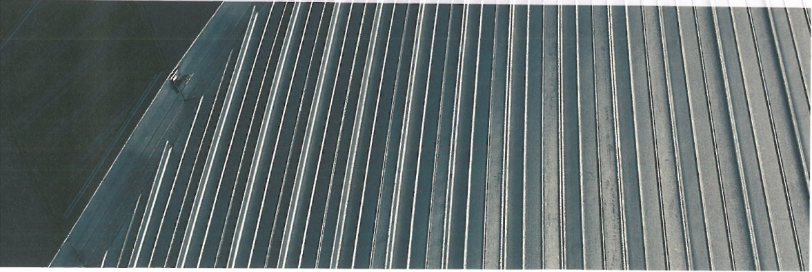
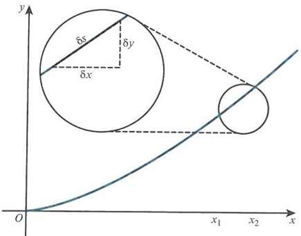
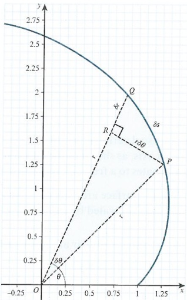
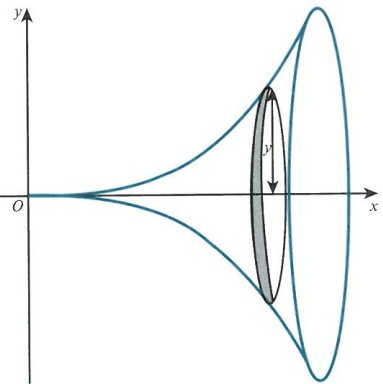
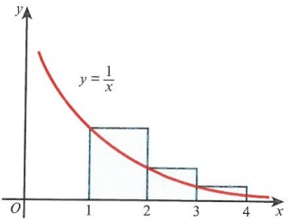
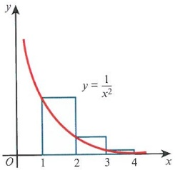
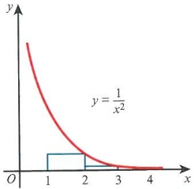
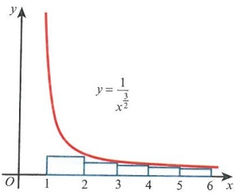
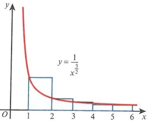
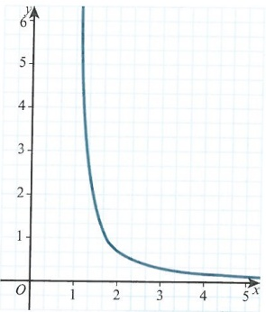

# Integration

<!-- Cambridge International AS  A Level Further Mathematics Coursebook (Lee Mckelvey Martin Crozier) .pdf p509-535 -->

<!-- page 509 -->

# Chapter 22 Integration

## In this chapter you will learn how to:

integrate hyperbolic functions and recognise integrals of the form  $ \frac{1}{\sqrt{a^{2}-x^{2}}},\frac{1}{\sqrt{a^{2}+x^{2}}} $

define and use reduction formulae for evaluation of definite integrals

use rectangles to estimate or set bounds for the area under a curve

use integration to find arc lengths and surface areas of revolution.

<!-- page 510 -->

## PREREQUISITE KNOWLEDGE

<table border=1 style='margin: auto; word-wrap: break-word;'><tr><td style='text-align: center; word-wrap: break-word;'>Where it comes from</td><td style='text-align: center; word-wrap: break-word;'>What you should be able to do</td><td style='text-align: center; word-wrap: break-word;'>Check your skills</td></tr><tr><td style='text-align: center; word-wrap: break-word;'>AS &amp; A Level Mathematics Pure Mathematics 2 &amp; 3, Chapter 8</td><td style='text-align: center; word-wrap: break-word;'>Use integration by parts.</td><td style='text-align: center; word-wrap: break-word;'>1 Evaluate  $ \int_{0}^{1} xe^{2x}dx $.</td></tr><tr><td style='text-align: center; word-wrap: break-word;'>AS &amp; A Level Mathematics Pure Mathematics 2 &amp; 3, Chapter 8</td><td style='text-align: center; word-wrap: break-word;'>Work with trigonometric identities.</td><td style='text-align: center; word-wrap: break-word;'>2 Using a suitable trigonometric identity, determine  $ \int\sqrt{1-\cos x}dx $.</td></tr></table>

## What is integration?

We can consider integration as the reverse of differentiation. It is also the process of combining smaller parts to find the whole, for example, when finding lengths, areas and volumes.

In this chapter we shall integrate a variety of functions, including functions that lead to hyperbolic solutions. We shall learn new techniques, such as constructing reduction formulae, to solve more complicated integrals involving high powers. We shall use these new skills to find the length of an arc and the area of a surface of revolution. Finally, we shall set up boundaries, and use summation techniques to calculate the area under a curve between the boundaries.

### 22.1 Integration techniques

You will have met several integration techniques in your A Level Mathematics Pure Mathematics 3 course, such as integration by parts and integration by substitution.

Consider the integral  $ I=\int\frac{1}{\sqrt{1-x^{2}}}dx $. The denominator is the square root of two terms. If we can change this to the square root of one term, then the integration will be much easier.

Thinking about the trigonometric identity  $ \cos^{2}u = 1 - \sin^{2}u $, if we try  $ x = \sin u $ as a substitution, then  $ \frac{dx}{du} = \cos u $.

Next replace $x$ with $\sin u$ and $dx$ with $\frac{dx}{du}$du. We get $I=\int\frac{\cos u}{\sqrt{1-\sin^{2}u}}du$, which is $\int1du=u+c$. Then $I=u+c$, but since $u=\sin^{-1}x$ we have $I=\sin^{-1}x+c$.

### WORKED EXAMPLE 22.1

Determine the indefinite integral  $ I = \int \frac{4}{4 + x^{2}} \, dx $.

## Answer

Let  $ x = 2 \tan u $.

Then  $ \frac{dx}{du}=2sec^{2}u $, giving  $ dx=2sec^{2}u du $.

Choose a substitution that replaces two terms with one term, so here we can use the trigonometric identity  $ 1 + \tan^{2} u = \sec^{2} u $.

<!-- page 511 -->

<table border=1 style='margin: auto; word-wrap: break-word;'><tr><td style='text-align: center; word-wrap: break-word;'>So  $ I = 4\int \frac{8\sec^{2}u}{4 + 4\tan^{2}u} du $, which is  $ \int 2du $.</td><td style='text-align: center; word-wrap: break-word;'>Differentiate the substitution and simplify the integral.</td></tr><tr><td style='text-align: center; word-wrap: break-word;'>Integrating then gives  $ I = 2u + c $, or  $ I = 2\tan^{-1}\left(\frac{x}{2}\right) + c $.</td><td style='text-align: center; word-wrap: break-word;'>Integrate and change back to the original variable which is x.</td></tr></table>

### WORKED EXAMPLE 22.2

<table border=1 style='margin: auto; word-wrap: break-word;'><tr><td style='text-align: center; word-wrap: break-word;'>Find the exact value of the integral  $ \int_{0}^{1.5} \sqrt{9 - x^{2}} \, dx $.</td></tr><tr><td style='text-align: center; word-wrap: break-word;'>Answer</td></tr><tr><td style='text-align: center; word-wrap: break-word;'>Let  $ x = 3 \sin u $, so  $ \frac{dx}{du} = 3 \cos u $. Choose a substitution, and differentiate it. Considering the integral, the trigonometric identity  $ \cos^{2}u = 1 - \sin^{2}u $ will again be useful.</td></tr><tr><td style='text-align: center; word-wrap: break-word;'>Also when  $ x = 0 $,  $ u = 0 $ and when  $ x = 1.5 $,  $ u = \frac{\pi}{6} $. Using the substitution, work out the new limits, remembering to work in radians.</td></tr><tr><td style='text-align: center; word-wrap: break-word;'>Let  $ \int_{0}^{\frac{\pi}{6}} \sqrt{9 - 9 \sin^{2}u} \times 3 \cos u \, du $. Substitute all values and results into the integral.</td></tr><tr><td style='text-align: center; word-wrap: break-word;'>Simplify this integral to  $ \int_{0}^{\frac{\pi}{6}} \cos^{2}u \, du $.</td></tr><tr><td style='text-align: center; word-wrap: break-word;'>Next use  $ \cos^{2}u = \frac{1}{2} + \frac{1}{2} \cos 2u $. Make use of the double angle formula.</td></tr><tr><td style='text-align: center; word-wrap: break-word;'>So  $ \int_{0}^{\frac{\pi}{6}} (1 + \cos 2u)du $.</td></tr><tr><td style='text-align: center; word-wrap: break-word;'>Integrating gives  $ \int = \frac{9}{2} \left[ u + \frac{1}{2} \sin 2u \right]_{0}^{\frac{\pi}{6}} = \frac{9 \sqrt{3}}{8} + \frac{3\pi}{4} $. Integrate and evaluate.</td></tr></table>

Consider the integral  $ I = \int \frac{1}{\sqrt{x^2 - 1}} \, dx $. We could substitute  $ x = \sec u $, since  $ \tan^2 u = \sec^2 u - 1 $.

Then  $ \frac{dx}{du} = sec\tan u $, giving  $ dx = sec\tan u\,du $.

So $I=\int\frac{\sec u\tan u}{\sqrt{\sec^{2}u-1}}\,\mathrm{d}u$ becomes $I=\int\sec u\,\mathrm{d}u$. Multiplying top and bottom by $\sec u+\tan u$ gives $I=\int\frac{\sec^{2}u+\sec u\tan u}{\sec u+\tan u}\,\mathrm{d}u$, which is now of the form $\frac{\mathrm{f}^{\prime}(x)}{\mathrm{f}(x)}.$

Integrating gives  $ I = \ln |\sec u + \tan u| + c $. Since  $ x = \sec u $ and  $ \tan u = \sqrt{x^2 - 1} $, the answer is  $ I = \ln |x + \sqrt{x^2 - 1}| + c $.

An alternative substitution is $x = \cosh u$. Since $\cosh^2 u - \sinh^2 u = 1$, then $\frac{dx}{du} = \sinh u$. So $I = \int \frac{\sinh u}{\sinh u} \, du = u + c$. This integration is much easier than the previous one.

Hyperbolic substitutions can make some integrals extremely simple. The last step is to write  $ I = \cosh^{-1} x + c $. We could write the answer in terms of logs as in the first method, using the identity for  $ \cosh^{-1} x $ from Chapter 19.

<!-- page 512 -->

### WORKED EXAMPLE 22.3

Using an appropriate substitution, determine the result of  $ \int\frac{3}{\sqrt{x^{2}+4}}dx $.

## Answer

 $$ \frac{\mathrm{d}x}{\mathrm{d}u}=2\cosh u $$ 

Use $x = 2\sinh u$ as the substitution.

So  $ I = 3 \int \frac{2 \cosh u}{\sqrt{4 \sinh^2 u + 4}} \, \mathrm{d}u = 3u + c $.

Substitute all values and simplify the integral to just a constant.

Therefore,  $ I = 3 \sinh^{-1} \left( \frac{x}{2} \right) + c $.

Integrate and convert $u$ back to the original variable, $x$.

In Worked example 22.4 it is important to know when hyperbolic substitutions are appropriate.

### WORKED EXAMPLE 22.4

Using an appropriate substitution, determine the result of  $ \int \frac{1}{\sqrt{9-4x^{2}}} \, dx $. Discuss your findings.

<table border=1 style='margin: auto; word-wrap: break-word;'><tr><td style='text-align: center; word-wrap: break-word;'>Answer\nLet  $ 2x = 3\tanh u $, then  $ 2\frac{dx}{du} = 3\operatorname{sech}^{2}u $.\nSo  $ I = \frac{3}{2}\int\frac{\operatorname{sech}^{2}u}{\sqrt{9 - 9\tanh^{2}u}}du = \frac{1}{2}\int\operatorname{sech} u du $.\nSince  $ \operatorname{sech} u = \frac{1}{\cosh u} $, then  $ \operatorname{sech} u = \frac{2}{e^{u} + e^{-u}} $.\nSo  $ I = \frac{1}{2}\int\frac{2e^{u}}{e^{2u} + 1}du $. Let  $ t = e^{u} $ so that  $ \frac{dt}{du} = e^{u} $.\nThen  $ I = \int\frac{1}{t^{2} + 1}dt $, which is  $ \tan^{-1} t + c $.\nSo, working backwards,  $ I = \tan^{-1}(e^{u}) + c $ then  $ I = \tan^{-1}\left(e^{\tanh\frac{-2x}{3}}\right) + c $.\nThis result is much more complicated.\nUsing  $ 2x = 3\sin u $ instead gives  $ 2\frac{dx}{du} = 3\cos u $ and so  $ \frac{3}{2}\int\frac{\cos u}{\sqrt{9 - 9\sin^{2}u}}du = \frac{1}{2}\int du $ which leads to  $ \frac{1}{2}\sin^{-1}\left(\frac{2x}{3}\right) + c $.</td><td style='text-align: center; word-wrap: break-word;'>This substitution requires much more work.\nThis is not as simple as integrating  $ secu $.\nA second substitution is required at this point.\nThis is a standard result.\nThe result is not in a very suitable format.\nThis substitution is more suitable, and the result is found more quickly.</td></tr></table>

Consider $I=\int\frac{1}{x^{2}+2x+2}dx$. If you try a trigonometric substitution, you will have rather

a complicated expression in the denominator.

Instead, we are going to complete the square:  $ x^{2}+2x+2=(x+1)^{2}+1 $.

Now  $ I=\int\frac{1}{(x+1)^2+1}dx $.

<!-- page 513 -->

Let $x + 1 = \tan u$ so $dx = \sec^2 u du$ and $I = \int \frac{1}{1 + \tan^2 u} \sec^2 u du = \int du$.

Integrating gives us $I = u + c$, then since $u = \tan^{-1}(x + 1)$ we have $I = \tan^{-1}(x + 1) + c$.

### WORKED EXAMPLE 22.5

<table border=1 style='margin: auto; word-wrap: break-word;'><tr><td style='text-align: center; word-wrap: break-word;'>Using an appropriate substitution, determine the result of  $ \int \frac{1}{x^2 - 4x + 7} dx $.</td></tr><tr><td style='text-align: center; word-wrap: break-word;'>Answer</td></tr><tr><td style='text-align: center; word-wrap: break-word;'>First  $ x^2 - 4x + 7 = (x - 2)^2 + 3 $. Complete the square.</td></tr><tr><td style='text-align: center; word-wrap: break-word;'>Then  $ I = \int \frac{1}{(x - 2)^2 + 3} dx $. Rewrite the integral.</td></tr><tr><td style='text-align: center; word-wrap: break-word;'>Using  $ \sqrt{3} \tan u = x - 2 $, we have  $ dx = \sqrt{3} sec^2 u du $. Recognise that you have a tan substitution.</td></tr><tr><td style='text-align: center; word-wrap: break-word;'>So  $ I = \int \frac{\sqrt{3} sec^2 u}{3 + 3 \tan^2 u} du = \int \frac{1}{\sqrt{3}} du $. Substitute in.</td></tr><tr><td style='text-align: center; word-wrap: break-word;'>Integrating gives  $ I = \frac{1}{\sqrt{3}} u + c $. Integrate.</td></tr><tr><td style='text-align: center; word-wrap: break-word;'>Substituting back leads to  $ I = \frac{1}{\sqrt{3}} \tan^{-1} \left( \frac{x - 2}{\sqrt{3}} \right) + c $. Rewrite solution in terms of the original variable.</td></tr></table>

### WORKED EXAMPLE 22.6

Using a hyperbolic substitution, determine the result of  $ \int\frac{1}{x^{2}+4x}dx $.

## Answer

First  $ x^{2} + 4x = (x + 2)^{2} - 4 $.

Then  $ I=\int\frac{1}{(x+2)^2-4}dx $.

Let  $ x + 2 = 2\tanh u $, then  $ dx = 2\operatorname{sech}^{2}u \, du $.

 $$ I=\int\frac{1}{4\tanh^{2}u-4}2\mathrm{sech}^{2}u\mathrm{d}u. $$ 

Complete the square.

Rewrite the integral.

 $$ \operatorname{sech}^{2}u=1-\tanh^{2}u. $$ 

Recognise that you have a tanh substitution.

 $$ I=-\frac{1}{2}\int\mathrm{d}u. $$ 

 $$ I=-\frac{1}{2}u+c. $$ 

Finally $I = -\frac{1}{2}\tanh^{-1}\left(\frac{x+2}{2}\right) + c$.

Use the identity to simplify.

Rewrite integral.

Integrate to get a solution.

Use  $ u = \tanh^{-1}\left(\frac{x + 2}{2}\right) $.

<!-- page 514 -->

The work we did with derivatives of hyperbolic functions will help us to integrate them.

So  $ \int \sinh x \, dx = \cosh x + c $ and  $ \int \cosh x \, dx = \sinh x + c $ are two standard results.

Integrating  $ \tanh x $ takes a little more thought:  $ \int \tanh x \, dx = \int \frac{\sinh x}{\cosh x} \, dx = \ln|\cosh x| + c $.

Similarly, we can shown that  $ \int \cosh x \, dx = \int \frac{\cosh x}{\sinh x} \, dx = \ln|\sinh x| + c $.

### WORKED EXAMPLE 22.7

Find a solution for the following integrals.

a  $ \int 2\sinh 3x dx $

b  $ \int\frac{1}{\sinh x}dx $

c  $ \int_{\ln2}^{\ln3}3\cosh4x\,dx $

## Answer

a From the standard result,  $ I = \frac{2}{3} \cosh 3x + c $.

Divide by 3.

b  $ I=\int\frac{2}{\mathrm{e}^{x}-\mathrm{e}^{-x}}\mathrm{d}x $, then  $ I=2\int\frac{\mathrm{e}^{x}}{\mathrm{e}^{2x}-1}\mathrm{d}x $.

Rewrite as exponentials.

Then let  $ u = e^{x} $, so  $ \frac{du}{dx} = e^{x} $

Substitute to remove the exponentials.

Our integral becomes  $ I = 2 \int_{\frac{u}{u^2} - 1}^{u} \frac{1}{u} \, du = 2 \int_{\frac{u}{u^2} - 1}^{1} du $.

Then let  $ u = \coth t $ so  $ \frac{du}{dt} = -\text{cosech}^2 t $ so that

Substitute again with  $ u = \coth t $.

our integral becomes  $ I = 2\int\frac{-\mathrm{cosech}^{2}t}{\mathrm{cosech}^{2}t}\,\mathrm{d}t $, which is  $ -2t + c $.

Then  $ I = -2\coth^{-1}u + c = -2\coth^{-1}(e^{x}) + c $.

State the result in the original variable.

 $$ I=\int_{\ln2}^{\ln3}3\cosh4x\mathrm{d}x=\frac{3}{4}\left[\sinh4x\right]_{\ln2}^{\ln3} $$ 

Integrate using the standard result.

This is then  $ \frac{3}{8}\left[\mathrm{e}^{4x}-\mathrm{e}^{-4x}\right]_{\ln 2}^{\ln 3} $, which is 24.4.

Evaluate, using the exponential form for  $ \sinh 4x $.

We saw how to differentiate inverse hyperbolic functions in Chapter 21.

To integrate inverse hyperbolic functions, let us consider  $ \int \cosh^{-1} x \, dx $. To integrate this by parts, re-write this as  $ \cosh^{-1} x \times 1 $ and let  $ u = \cosh^{-1} x $, so  $ \frac{du}{dx} = \frac{1}{\sqrt{x^2 - 1}} $, and  $ \frac{dv}{dx} = 1 $, so  $ v = x $. Then  $ I = x \cosh^{-1} x - \int \frac{x}{\sqrt{x^2 - 1}} \, dx $ and integrating the second term leads to  $ I = x \cosh^{-1} x - \sqrt{x^2 - 1} + c $.

<!-- page 515 -->

Determine the result of the integral  $ \int \tanh^{-1} x \, dx $.

## Answer

Let  $ u = \tanh^{-1} x $, so  $ \frac{du}{dx} = \frac{1}{1 - x^2} $.

Differentiate  $ \tanh^{-1}x $.

Then  $ \frac{dv}{dx}=1 $ and v=x.

Include a 'l' to be able to integrate by parts.

So  $ I = x \tanh^{-1} x - \int \frac{x}{1 - x^{2}} \, dx $.

Note the second term is of the form  $ \int\frac{kf'(x)}{f(x)}dx $.

Integrating the second term leads to  $ I = x \tanh^{-1} x + \frac{1}{2} \ln |1 - x^2| + c $.

Determine the final result.

## EXERCISE 22A

1 Determine the integral  $ \int\frac{-2}{\sqrt{25-9x^{2}}}dx $.

2 Evaluate the integral  $ \int_{0}^{\frac{\pi}{4}}\tan^{-1}x\,dx $, giving your answer in an exact form.

3 Find the area under the curve  $ y = \sinh 2x $ from x =  $ \ln 3 $ to x =  $ \ln 5 $.

4 Determine the integral  $ \int\frac{2}{\sqrt{2+x^{2}}}\mathrm{d}x $.

5 Evaluate  $ \int_{2}^{3}\frac{1}{\sqrt{x^{2}-4}}dx $.

## M PS

6 Find the volume generated when  $ y = \frac{6}{\sqrt{0 - \sqrt{2}}} $ is rotated about the x-axis from x = 1 to x = 2.

7 Evaluate $\int_{0.75}^{1}\coth2x\mathrm{d}x$.

8 Determine the integral  $ \int\frac{6}{\sqrt{4-9x^{2}}}\mathrm{d}x $.

9 Integrate x  $ \cosh x $.

10 The curve  $ y = \sinh x $ is rotated about the x-axis from x = 0 to x = 1. Determine the volume generated.

11 Determine  $ \int \sinh^{-1} x \, dx $.

### 22.2 Reduction formulae

Beginning with  $ \int \cos^{2} x \, dx $, we have already seen that using the double angle formulae can make this integral straightforward. We are now going to solve this integral using integration by parts.

<!-- page 516 -->

Start with  $ I = \int \cos^2 x \, dx = \int \cos x \times \cos x \, dx $. Let  $ u = \cos x $,  $ \frac{du}{dx} = -\sin x $ and  $ \frac{dv}{dx} = \cos x $,  $ v = \sin x $. So  $ I = \cos x \sin x + \int \sin^2 x \, dx $.

Then with $\sin^{2}x = 1 - \cos^{2}x$ we have $I = \cos x \sin x + \int (1 - \cos^{2}x) \mathrm{d}x$. Split the integral into $\int 1 \, \mathrm{d}x - \int \cos^{2}x \, \mathrm{d}x$. Notice that the integral of $\cos^{2}x$ is $I$, so $2I = \cos x \sin x + x + c$.

Hence,  $ I = \frac{1}{2}(\cos x \sin x + x) + c $.

### WORKED EXAMPLE 22.9

Given that  $ I_{3}=\int\cos^{3}x\,dx $, find the result for  $ I_{3} $, using integration by parts.
Answer
Let  $ I_{3}=\int\cos^{2}x\cos x\,dx $.
Then  $ u=\cos^{2}x,\frac{du}{dx}=-2\cos x\sin x, $ and  $ \frac{dv}{dx}=\cos x,\quad v=\sin x. $

So  $ I_{3}=\cos^{2}x\sin x+2\int\cos x\sin^{2}x\,dx. $
After replacing the  $ \sin^{2}x $ with  $ 1-\cos^{2}x $, the integral becomes  $ I_{3}=\cos^{2}x\sin x+2\int\cos xdx-2\int\cos^{3}xdx $.
Then we have  $ 3I_{3}=\cos^{2}x\sin x+2\sin x+c $.
Hence,  $ I_{3}=\frac{1}{3}(\cos^{2}x\sin x+2\sin x)+c. $

Rewrite  $ \cos^{3}x $ as  $ \cos^{2}x\cos x $ and differentiate the higher power for integration by parts.

Integrate the single powered term.

Use the identity  $ \cos^{2}x+\sin^{2}x=1 $ to replace the sine part.

Add  $ 2I_{3} $ to both sides of the equation.

Divide by 3 to find  $ I_{3} $.

We should now be able to attempt  $ I_{n} = \int \cos^{n} x \, dx $. First split this function into two functions, so  $ I_{n} = \int \cos^{n-1} x \cos x \, dx $.

 $$ u=\cos^{n-1}x,\frac{\mathrm{d}u}{\mathrm{d}x}=-(n-1)\cos^{n-2}x\sin x,\mathrm{a n d}\frac{\mathrm{d}\nu}{\mathrm{d}x}=\cos x,\nu=\sin x. $$ 

$$\mathrm{So}\ I_{n}=\cos^{n-1}x\sin x+(n-1)\int\cos^{n-2}x\sin^{2}x\,\mathrm{d}x.$$ Again, using $\sin^{2}x=1-\cos^{2}x$ we have $I_{n}=\cos^{n-1}x\sin x+(n-1)\int\cos^{n-2}x\,\mathrm{d}x-(n-1)\int\cos^{n}x\,\mathrm{d}x$.

Now, if  $ I_{n}=\int\cos^{n}x\,dx $, then using the same notation,  $ I_{n-2}=\int\cos^{n-2}x\,dx $, and we then have:

 $ I_{n}=\cos^{n-1}x\sin x+(n-1)I_{n-2}-(n-1)I_{n} $

Hence,  $ I_n = \frac{1}{n} [\cos^{n-1} x \sin x] + \frac{n-1}{n} I_{n-2} $. This is only valid for  $ n \geq 2 $. This is known as a reduction formula. It allows us to integrate a function, and with each iteration the power reduces by 2. It is called a reduction formula because each time we integrate there is a loss in power.

Using this reduction formula is simple enough. Consider  $ \int \cos^4 x \, dx $, which we shall denote as  $ I_4 $.

<!-- page 517 -->

From our formula, $I_{4}=\frac{1}{4}(\cos^{3}x\sin x)+\frac{3}{4}I_{2}$, and $I_{2}=\frac{1}{2}(\cos x\sin x)+\frac{1}{2}I_{0}$. The last part of our expression is $I_{0}=\int\mathrm{d}x=x$, so $I_{4}=\frac{1}{4}(\cos^{3}x\sin x)+\frac{3}{8}(\cos x\sin x+x)+c$.

### WORKED EXAMPLE 22.10

If  $ I_n = \int \sin^n x \, dx $, show, using integration by parts, that  $ I_n = \frac{1}{n} [-\cos x \sin^{n-1} x] + \frac{n-1}{n} I_{n-2} $ for  $ n \geq 2 $.

Answer

Let  $ I_n = \int \sin^{n-1} x \sin x \, dx $, so  $ u = \sin^{n-1} x $,  $ \frac{dy}{dx} = \sin x $ such that  $ \frac{du}{dx} = (n-1)\sin^{n-2} x \cos x $,  $ v = -\cos x $.

So  $ I_n = [-\cos x \sin^{n-1} x] + (n-1) \int \sin^{n-2} x \cos^2 x \, dx $.

Using  $ \cos^2 x = 1 - \sin^2 x $, we get the expression:

 $ I_n = [-\cos x \sin^{n-1} x] + (n-1) \int \sin^{n-2} x \, dx - (n-1) \int \sin^n x \, dx $

This gives  $ I_n = \frac{1}{n} [-\cos x \sin^{n-1} x] + \frac{n-1}{n} I_{n-2} $.

This is valid for  $ n \geq 2 $.

We can also split hyperbolic functions such as  $ I_{n}=\int \cosh^{n}2x \, \mathrm{d}x $ in a similar way:

 $$ I_{n}=\int\cosh^{n-1}2x\cosh2x\mathrm{d}x. $$ 

Let  $ u = \cosh^{n-1}2x $,  $ \frac{du}{dx} = 2(n-1)\cosh^{n-2}2x \sinh 2x $ and  $ \frac{dv}{dx} = \cosh 2x $,  $ v = \frac{1}{2}\sinh 2x $. Then

 $$ I_{n}=\frac{1}{2}\sinh2x\cosh^{n-1}2x-(n-1)\int\cosh^{n-2}2x\sinh^{2}2x\mathrm{d}x.Since\sinh^{2}2x=\cosh^{2}2x-1, $$ 

can say that  $ I_{n}=\frac{1}{2}\sinh 2x\cosh^{n-1}2x-(n-1)\int\cosh^{n}2x\,dx+(n-1)\int\cosh^{n-2}2x\,dx $.

Then  $ I_{n}=\frac{1}{2}\sinh2x\cosh^{n-1}2x-(n-1)I_{n}+(n-1)I_{n-2} $. This can be simplified to the form  $ I_{n}=\frac{1}{2n}(\sinh2x\cosh^{n-1}2x)+\frac{n-1}{n}I_{n-2} $ for  $ n\geqslant2 $.

### WORKED EXAMPLE 22.11

If  $ I_n = \int \coth^n x \, dx $, show that the reduction formula is  $ I_n = \frac{1}{n-1}(-\coth^{n-1}x) + I_{n-2} $ for  $ n \geq 2 $.

## Answer

Let  $ I_n = \int \coth^{n-2}x \coth^2 x \, dx $. Using  $ \coth^2 x = 1 + \cosh e^{2x} $, we have  $ I_n = \int \coth^{n-2}x \, dx + \int \coth^{n-2}x \cosh e^{2x} \, dx $.

Remite  $ \coth^n x $ as  $ \coth^{n-2}x \coth^2 x $ and make use of the result  $ \coth^2 x = 1 + \cosh e^{2x} $.

<!-- page 518 -->

<table border=1 style='margin: auto; word-wrap: break-word;'><tr><td style='text-align: center; word-wrap: break-word;'>Let  $ u = \coth^{n-2}x $,  $ \frac{du}{dx} = -(n-2)\coth^{n-3}x \cosech^{2}x $ and also  $ \frac{dv}{dx} = \cosech^{2}x $,  $ v = -\coth x $.</td><td style='text-align: center; word-wrap: break-word;'>Use integration by parts on the second integral and note that the first integral does not need integrating, as we can write this as  $ I_{n-2} $.</td></tr><tr><td style='text-align: center; word-wrap: break-word;'>Then noting that  $ \int \coth^{n-2}x \, dx = I_{n-2} $ we have:\n $ I_n = I_{n-2} + -\coth^{n-1}x - (n-2) \int \coth^{n-2}x \cosech^{2}x \, dx $</td><td style='text-align: center; word-wrap: break-word;'></td></tr><tr><td style='text-align: center; word-wrap: break-word;'>Use  $ \coth^{2}x = 1 + \cosesh^{2}x $ to simplify the integral term.\nSo  $ I_n = I_{n-2} - \coth^{n-1}x - (n-2)I_n + (n-2)I_{n-2} $.</td><td style='text-align: center; word-wrap: break-word;'>Use the same identity again to simplify and collect terms.</td></tr><tr><td style='text-align: center; word-wrap: break-word;'>Hence,  $ I_n = \frac{1}{n-1}(-\coth^{n-1}x) + I_{n-2} $.</td><td style='text-align: center; word-wrap: break-word;'>State the result.</td></tr></table>

We can also deal with non-trigonometric functions. For example, consider  $ I_n = \int x^n e^x \, dx $. Using integration by parts, let  $ u = x^n $,  $ \frac{du}{dx} = nx^{n-1} $ and  $ \frac{dv}{dx} = e^x $,  $ v = e^x $.

Then  $ I_n = x^n e^x - n \int x^{n-1} e^x \, \mathrm{d}x $. So with  $ I_{n-1} = \int x^{n-1} e^x \, \mathrm{d}x $,  $ I_n = x^n e^x - n I_{n-1} $ for  $ n \geq 1 $.

So if we have the integral $\int x^{4}e^{x}dx$, $I_{4}=x^{4}e^{x}-4I_{3}$, $I_{3}=x^{3}e^{x}-3I_{2}$, $I_{2}=x^{2}e^{x}-2I_{1}$ and $I_{1}=xe^{x}-I_{0}$, where $I_{0}=e^{x}$.

Hence,  $ I_4 = x^4 e^x - 4x^3 e^x + 12x^2 e^x - 24x e^x + 24e^x + c $.

Another example is  $ I_{n} = \int x^{2}(1 + x^{6})^{n} \, dx $. Using integration by parts,  $ u = (1 + x^{6})^{n} $,  $ \frac{du}{dx} = 6nx^{5}(1 + x^{6})^{n-1} $,  $ \frac{dv}{dx} = x^{2} $, and  $ \nu = \frac{1}{3}x^{3} $.

So $I_{n}=\frac{1}{3}x^{3}(1+x^{6})^{n}-2n\int x^{8}(1+x^{6})^{n-1}\mathrm{d}x$, but this looks as if the second part could never relate to $I_{n}$. We can do the algebra to rewrite $x^{8}=x^{2}(1+x^{6}-1)$. Substituting this into the expression gives $I_{n}=\frac{1}{3}x^{3}(1+x^{6})^{n}-2n\int x^{2}(1+x^{6}-1)(1+x^{6})^{n-1}\mathrm{d}x$.

$$I_{n}=\frac{1}{3}x^{3}(1+x^{6})^{n}-2n\int x^{2}(1+x^{6})^{n}\mathrm{d}x+2n\int x^{2}(1+x^{6})^{n-1}\mathrm{d}x.\mathrm{As}\ I_{n}=\int x^{2}(1+x^{6})^{n}\mathrm{d}x\mathrm{~and~}$$

$$I_{n-1}=\int x^{2}(1+x^{6})^{n-1}\mathrm{d}x,\mathrm{the~expression~becomes}\ I_{n}=\frac{1}{3}x^{3}(1+x^{6})^{n}-2nI_{n}+2nI_{n-1}.$$

So  $ I_{n}=\frac{x^{3}(1+x^{6})^{n}}{3(2n+1)}+\frac{2n}{2n+1}I_{n-1} $ for  $ n\geqslant1 $.

<!-- page 519 -->

<table border=1 style='margin: auto; word-wrap: break-word;'><tr><td style='text-align: center; word-wrap: break-word;'>If  $ I_n = \int x^n (x^2 - 1)^9 \, dx $, show, using integration by parts, that  $ I_n = \frac{x^{n-1} (x^2 - 1)^{10}}{n + 19} + \frac{n - 1}{n + 19} I_{n-2} $ for  $ n \geq 2 $.</td></tr><tr><td style='text-align: center; word-wrap: break-word;'>Answer</td></tr><tr><td style='text-align: center; word-wrap: break-word;'>Let  $ I_n = \int x^{n-1} x (x^2 - 1)^9 \, dx $ then let  $ u = x^{n-1} $,  $ \frac{du}{dx} = (n - 1)x^{n-2} $ and  $ \frac{dv}{dx} = x (x^2 - 1)^9 $,  $ v = \frac{1}{20} (x^2 - 1)^{10} $. Then  $ I_n = \frac{x^{n-1}}{20} (x^2 - 1)^{10} - \frac{n - 1}{20} \int x^{n-2} (x^2 - 1)^{10} \, dx $. Let  $ (x^2 - 1)^{10} = (x^2 - 1)(x^2 - 1)^9 $. Then  $ I_n = \frac{x^{n-1}}{20} (x^2 - 1)^{10} - \frac{n - 1}{20} \int x^n (x^2 - 1)^9 \, dx $.</td></tr><tr><td style='text-align: center; word-wrap: break-word;'>Then  $ I_n = \frac{x^{n-1}}{20} (x^2 - 1)^{10} - \frac{n - 1}{20} \int x^n (x^2 - 1)^9 \, dx $. So  $ I_n = \frac{x^{n-1}}{20} (x^2 - 1)^{10} - \frac{n - 1}{20} I_n + \frac{n - 1}{20} I_{n-2} $.</td></tr><tr><td style='text-align: center; word-wrap: break-word;'>Rearranging gives  $ I_n = \frac{x^{n-1} (x^2 - 1)^{10}}{n + 19} + \frac{n - 1}{n + 19} I_{n-2} $.</td></tr></table>

If we have a definite integral (with limits) such as $I_{4}=\int_{0}^{\frac{\pi}{6}}\tan^{4}x\,dx$, it is best to find a reduction formula before substituting the limits.

Let  $ I_{n}=\int_{0}^{\frac{\pi}{6}}\tan^{n}x\mathrm{d}x=\int_{0}^{\frac{\pi}{6}}\tan^{2}x\tan^{n-2}x\mathrm{d}x $. We choose  $ \tan^{2}x $ because we can change this to  $ \sec^{2}x-1 $ which we can integrate.

 $$ I_{n}=\int_{0}^{\frac{\pi}{6}}\sec^{2}x\tan^{n-2}x\mathrm{d}x-\int_{0}^{\frac{\pi}{6}}\tan^{n-2}x\mathrm{d}x $$ 

The first term integrates to give  $ \frac{1}{n-1}\tan^{n-1}x $ so  $ I_{n}=\left[\frac{1}{n-1}\tan^{n-1}x\right]_{0}^{\frac{\pi}{6}}-I_{n-2} $. This is valid for  $ n\geq2 $.

Using limits in the integrated expression leads to  $ I_{n}=\frac{1}{n-1}\left(\frac{\sqrt{3}}{3}\right)^{n-1}-I_{n-2} $.

Look back at the original problem,  $ I_{4}=\int_{0}^{\frac{\pi}{6}}\tan^{4}x\,dx $.

 $ I_4 = \frac{1}{3} \times \frac{3\sqrt{3}}{27} - I_2 $ and  $ I_2 = \frac{\sqrt{3}}{3} - I_0 $ and  $ I_0 = \int_0^{\frac{\pi}{6}} 1 \, dx = \frac{\pi}{6} $.

We find  $ I_{2}=\frac{\sqrt{3}}{3}-\frac{\pi}{6} $. This leads to  $ I_{4}=\frac{\pi}{6}-\frac{8\sqrt{3}}{27} $.

<!-- page 520 -->

Show that  $ I_{n}=\int_{0}^{\frac{\pi}{2}}x^{n}\cos xdx $ has the reduction formula  $ I_{n}=\left(\frac{\pi}{2}\right)^{n}-n(n-1)I_{n-2} $ for  $ n\geq2 $. Hence, find the exact value of  $ \int_{0}^{\frac{\pi}{2}}x^{3}\cos xdx $.

<table border=1 style='margin: auto; word-wrap: break-word;'><tr><td style='text-align: center; word-wrap: break-word;'>AnswerLet  $ u = x^{n} $,  $ \frac{\mathrm{d}v}{\mathrm{d}x} = \cos x $, so that  $ \frac{\mathrm{d}u}{\mathrm{d}x} = nx^{n-1} $,  $ v = \sin x $.Then  $ I_{n} = [x^{n}\sin x]_{0}^{\frac{\pi}{2}} - n\int_{0}^{\frac{\pi}{2}}x^{n-1}\sin x\mathrm{d}x $.Using integration by parts a second time, let  $ u = x^{n-1} $,  $ \frac{\mathrm{d}v}{\mathrm{d}x} = \sin x $ such that  $ \frac{\mathrm{d}u}{\mathrm{d}x} = (n-1)x^{n-2} $,  $ v = -\cos x $.Now  $ I_{n} = [x^{n}\sin x]_{0}^{\frac{\pi}{2}} - n([-x^{n-1}\cos x]_{0}^{\frac{\pi}{2}} + (n-1)\int_{0}^{\frac{\pi}{2}}x^{n-2}\cos x\mathrm{d}x $,giving  $ I_{n} = [x^{n}\sin x + nx^{n-1}\cos x]_{0}^{\frac{\pi}{2}} - n(n-1)I_{n-2} $.Thus  $ I_{n} = \left(\frac{\pi}{2}\right)^{n} - n(n-1)I_{n-2} $ for  $ n \geq 2 $.So  $ I_{3} = \left(\frac{\pi}{2}\right)^{3} - 3 \times 2I_{1} $, and  $ I_{1} = \int_{0}^{\frac{\pi}{2}}x\cos x\mathrm{d}x $.Let  $ u = x $,  $ \frac{\mathrm{d}v}{\mathrm{d}x} = \cos x $, then  $ \frac{\mathrm{d}u}{\mathrm{d}x} = 1 $,  $ v = \sin x $.So  $ I_{1} = [x\sin x]_{0}^{\frac{\pi}{2}} - \int_{0}^{\frac{\pi}{2}}\sin x\mathrm{d}x = [x\sin x + \cos x]_{0}^{\frac{\pi}{2}} = \frac{\pi}{2} - 1 $.Hence,  $ I_{3} = \frac{\pi^{3}}{8} - 3\pi + 6 $.</td><td style='text-align: center; word-wrap: break-word;'>State  $ u $ and  $ \frac{\mathrm{d}v}{\mathrm{d}x} $ for integration by parts.\nNotice that integration by parts will be needed twice.\nUse integration by parts again and note that the last integral is  $ kI_{n-2} $.Simplify and show the result given.\nUse the reduction formula, then evaluate  $ I_{1} $.Determine the value of  $ I_{1} $.Substitute  $ I_{1} $ into the reduction formula to find  $ I_{3} $.</td></tr></table>

## EXERCISE 22B

PS 1 You are given that  $ I_5 = \int_0^{\frac{\pi}{4}} \tan^5 x \, dx $. Find, without using a reduction formula, a relationship between  $ I_5 $ and  $ I_3 $.

[Hint: Use  $ \tan^2 x \equiv \sec^2 x - 1 $]

PS 2 Given that  $ I_{6}=\int_{0}^{1}x^{6}e^{x}dx $, find a relationship between  $ I_{6} $ and  $ I_{4} $.

PS 3 Given that  $ I_{4}=\int_{0}^{1}x^{6}(1+x^{3})^{4}dx $, find a relationship between  $ I_{4} $ and  $ I_{3} $.

PS 4 Find a reduction formula for  $ I_{n} = \int_{0}^{\frac{\pi}{4}} \sin^{n} 2x \, dx $, stating the values of n for which it is valid.

5 Given that  $ I_{n}=\int_{0}^{\frac{\pi}{4}}\sec^{n}x\,dx $, show that  $ I_{n}=\frac{(\sqrt{2})^{n-2}}{n-1}+\frac{n-2}{n-1}I_{n-2} $ for  $ n\geqslant2 $. Hence, determine the exact value of  $ I_{6} $.

<!-- page 521 -->

P 6 You are given that  $ I_{n}=\int_{0}^{1}x(1-2x^{4})^{n}dx $.

a Show that  $ I_{n}=\frac{(-1)^{n}}{4n+2}+\frac{2n}{2n+1}I_{n-1} $ for  $ n\geqslant1 $.

b Find the exact value of  $ I_{4} $

7 Show that the reduction formula for  $ I_{n} = \int_{0}^{1} x^{n} e^{3x} \, dx $ is  $ I_{n} = \frac{1}{3} e^{3} - \frac{n}{3} I_{n-1} $ for  $ n \geq 1 $. Hence, find  $ I_{3} $, giving your answer in terms of e.

P 8 You are given that  $ I_{n}=\int_{1}^{2}(\ln x)^{n}dx $. Show that  $ I_{n}=2(\ln 2)^{n}-nI_{n-1} $ for  $ n\geq1 $. Hence, determine the value of  $ I_{5} $, giving your answer correct to 4 decimal places.

9 Find the exact volume generated when  $ \sin^{3}x $ is rotated about the x-axis from x=0 to  $ x=\frac{\pi}{2} $.

### 22.3 Arc lengths and surface areas

Consider the curve  $ y=\frac{1}{4}x^{\frac{3}{2}} $. We would like to know the length of this curve from  $ x=x_{1} $ to  $ x=x_{2} $.

To find the length, let us first call it s. So a small part of the curve is of length  $ \delta s $.

If we zoom in far enough, as in the diagram, that small section of curve now looks like a line segment. We can approximate its length with $(\delta s)^2 = (\delta x)^2 + (\delta y)^2$.

Next, divide all terms by $(\delta x)^2$ to get the relationship $\left(\frac{\delta s}{\delta x}\right)^2 = 1 + \left(\frac{\delta y}{\delta x}\right)^2$. Finding the square root gives $\frac{\delta s}{\delta x} = \sqrt{1 + \left(\frac{\delta y}{\delta x}\right)^2}$. Then we let $\delta x \to 0$, and integrate the expression to get $\int_{x_1}^{x_2} \frac{\mathrm{d}s}{\mathrm{d}x} \mathrm{d}x = \int_{x_1}^{x_2} \sqrt{1 + \left(\frac{\mathrm{d}y}{\mathrm{d}x}\right)^2} \mathrm{d}x$. Hence, $s = \int_{x_1}^{x_2} \sqrt{1 + \left(\frac{\mathrm{d}y}{\mathrm{d}x}\right)^2} \mathrm{d}x$. This is the Cartesian form for arc length, as shown in Key point 22.1.

Going back to the previous curve  $ y = \frac{1}{4}x^{\frac{5}{2}} $, to find the length of the curve from x = 0 to x = 1, we first differentiate to get  $ \frac{dy}{dx} = \frac{3}{8}x^{\frac{1}{2}} $, then  $ s = \int_{0}^{1} \sqrt{1 + \frac{9}{64}}x \, dx $.

Integrating gives  $  s = \left[ \frac{128}{27} \left( 1 + \frac{9}{64} x \right)^{\frac{3}{2}} \right]_{0}^{1}  $. This gives s = 1.03.

<!-- page 522 -->

### KEY POINT 22.1

The length of an arc in Cartesian form is given by  $ s=\int_{x_{1}}^{x_{2}}\sqrt{1+\left(\frac{\mathrm{d}y}{\mathrm{d}x}\right)^{2}}\mathrm{d}x $.

## DID YOU KNOW?

There is evidence of forms of calculus as far back as the 18th century BCE. Although this work does not have the rigour of calculus, it certainly tackled some applications of the calculus we know and use today.

### WORKED EXAMPLE 22.14

<table border=1 style='margin: auto; word-wrap: break-word;'><tr><td style='text-align: center; word-wrap: break-word;'>Find the length of the curve y =  $ \cosh x $ from x = 0 to x =  $ \ln 2 $.</td><td style='text-align: center; word-wrap: break-word;'></td></tr><tr><td style='text-align: center; word-wrap: break-word;'>Answer</td><td style='text-align: center; word-wrap: break-word;'></td></tr><tr><td style='text-align: center; word-wrap: break-word;'>If y =  $ \cosh x $, then  $ \frac{dy}{dx} = \sinh x $.</td><td style='text-align: center; word-wrap: break-word;'>Differentiate y with respect to x.</td></tr><tr><td style='text-align: center; word-wrap: break-word;'>So  $ s = \int_{0}^{\ln 2} \sqrt{1 + \sinh^{2}x} \, dx $.</td><td style='text-align: center; word-wrap: break-word;'>Put the result into the formula.</td></tr><tr><td style='text-align: center; word-wrap: break-word;'>Use the identity  $ \cosh^{2}x - \sinh^{2}x = 1 $.  $ s = \int_{0}^{\ln 2} \sqrt{\cosh^{2}x} \, dx $</td><td style='text-align: center; word-wrap: break-word;'>Use the identity to simplify the integral.</td></tr><tr><td style='text-align: center; word-wrap: break-word;'>$ s = [\sinh x]_{0}^{\ln 2} = \frac{3}{4} $</td><td style='text-align: center; word-wrap: break-word;'>Integrate and evaluate.</td></tr></table>

### EXPLORE 22.1

One of the hyperbolic functions has the property that, over a finite interval, its arc length is always equal to the area under the curve. Investigate the hyperbolic functions and determine which one it is.

If a curve is given in parametric form, such as  $ x = t^{2} $,  $ y = t^{3} $, we need a different way of working out arc length.

It is still true that $(\delta s)^2 = (\delta x)^2 + (\delta y)^2$, but since our curve is parametric, we shall now divide by $(\delta t)^2$ instead. This gives $\left(\frac{\delta s}{\delta t}\right)^2 = \left(\frac{\delta x}{\delta t}\right)^2 + \left(\frac{\delta y}{\delta t}\right)^2$.

Taking the square root and letting  $ \delta t \to 0 $ gives  $ \frac{\mathrm{d}s}{\mathrm{d}t} = \sqrt{\left(\frac{\mathrm{d}x}{\mathrm{d}t}\right)^2 + \left(\frac{\mathrm{d}y}{\mathrm{d}t}\right)^2} $.

Finally, integrating over the interval  $ t_1 \leqslant t \leqslant t_2 $ gives  $ s = \int_{t_1}^{t_2} \sqrt{\left(\frac{dx}{dt}\right)^2 + \left(\frac{dy}{dt}\right)^2} \, dt $.

This is the parametric form for arc length, as shown in Key point 22.2.

For example, if $x = t^{2}$, $y = t^{3}$, we first differentiate both functions with respect to $t$. This gives $\frac{\mathrm{d}x}{\mathrm{d}t} = 2t$ and $\frac{\mathrm{d}y}{\mathrm{d}t} = 3t^{2}$. Let the limits be, for example, $t = 1$ and $t = 2$.

<!-- page 523 -->

So $s=\int_{1}^{2}\sqrt{4t^{2}+9t^{4}}\,\mathrm{d}t$, which is $s=\int_{1}^{2}t\sqrt{4+9t^{2}}\,\mathrm{d}t$. This simple integral is $\left[\frac{1}{27}(4+9t^{2})^{\frac{3}{2}}\right]_{1}^{2}$, and when it is evaluated the result is $s=7.63$.

### KEY POINT 22.2

The length of an arc in parametric form is given by  $ s=\int_{t_{1}}^{t_{2}}\sqrt{\left(\frac{\mathrm{d}x}{\mathrm{d}t}\right)^{2}+\left(\frac{\mathrm{d}y}{\mathrm{d}t}\right)^{2}}\,\mathrm{d}t $.

### WORKED EXAMPLE 22.15

<table border=1 style='margin: auto; word-wrap: break-word;'><tr><td style='text-align: center; word-wrap: break-word;'>If  $ x = \cos^{{2}} t $ and  $ y = \sin^{{2}} t $, determine the length of the parametric curve from t = 0 to  $ t = \frac{\pi}{4} $.</td></tr><tr><td style='text-align: center; word-wrap: break-word;'>Answer</td></tr><tr><td style='text-align: center; word-wrap: break-word;'>$ \frac{{dx}}{{dt}} = -2\sin t\cos t $ and  $ \frac{{dy}}{{dt}} = 2\sin t\cos t $. Differentiate both parametric functions with respect to t.</td></tr><tr><td style='text-align: center; word-wrap: break-word;'>Then  $ s = \int_{0}^{\frac{\pi}{4}} \sqrt{8\sin^{{2}} t\cos^{{2}} t} dt = \int_{0}^{\frac{\pi}{4}} \sqrt{2\sin^{{2}} 2t} dt $</td></tr><tr><td style='text-align: center; word-wrap: break-word;'>Using the double angle formula for  $ \sin 2t $. Recognise that when squared the differentiated expressions are the same. Use the sine double angle formula and simplify the result.</td></tr><tr><td style='text-align: center; word-wrap: break-word;'>So  $ s = \int_{0}^{\frac{\pi}{4}} \sqrt{2} \sin 2t dt $. Integrating gives  $ \left[-\frac{\sqrt{2}}{2}\cos 2t\right]_{0}^{\frac{\pi}{4}} $. Integrate.</td></tr><tr><td style='text-align: center; word-wrap: break-word;'>This evaluates to  $ \frac{\sqrt{2}}{2} $. Evaluate to get the result.</td></tr></table>

If a curve is given in polar form, such as  $ r = e^{\theta} $, we need a different way of working out arc length.

Begin with a general curve as shown. We can think of a small part of the curve  $ PQ $ as our small length  $ \delta s $.

Then we have  $ RQ = \delta r $. If we consider OPR as a sector, as  $ \delta\theta \to 0 $,  $ RP \approx r\delta\theta $, and also the angle at  $ R $ approaches a right angle.

As this happens, we can say that  $ PQ^{2} = (\delta r)^{2} + (r\delta\theta)^{2} $.

Letting  $ PQ = \delta s $,  $ \left(\frac{\delta s}{\delta\theta}\right)^2 = \left(\frac{\delta r}{\delta\theta}\right)^2 + r^2 $

so  $ \frac{\delta s}{\delta\theta} = \sqrt{r^2 + \left(\frac{\delta r}{\delta\theta}\right)^2} $. If we consider  $ \delta\theta \to 0 $ and integrate this gives us the result  $ s = \int_{\theta_1}^{\theta_2} \sqrt{r^2 + \left(\frac{\mathrm{d}r}{\mathrm{d}\theta}\right)^2} \, \mathrm{d}\theta $.

Returning to our example of  $ r = e^{\theta} $, let us try to find the arc length over the interval 0 to  $ \frac{\pi}{2} $.

$$\frac{\mathrm{d}r}{\mathrm{d}\theta}=e^{\theta},\text{then }s=\int_{0}^{\frac{\pi}{2}}\sqrt{e^{2\theta}+e^{2\theta}}\mathrm{d}\theta\text{which simplifies to }s=\int_{0}^{\frac{\pi}{2}}\sqrt{2}e^{\theta}\mathrm{d}\theta.$$

Integrating,  $ s = \sqrt{2}[e^{\theta}]_{0}^{\frac{\pi}{2}} $, which gives  $ s = \sqrt{2}(e^{\frac{\pi}{2}} - 1) $.

<!-- page 524 -->

### KEY POINT 22.3

The length of an arc in polar form is given by  $ s=\int_{\theta_1}^{\theta_2}\sqrt{r^2+\left(\frac{\mathrm{d}r}{\mathrm{d}\theta}\right)^2}\,\mathrm{d}\theta $.

### WORKED EXAMPLE 22.16

If  $ r = \sin \theta $, determine the length of the polar curve over the interval  $ \left[0, \frac{\pi}{4}\right] $.

## Answer

Differentiating,  $ \frac{dr}{d\theta} = \cos \theta $.

Then  $ s = \int_{0}^{\frac{\pi}{4}} \sqrt{\sin^{2}\theta + \cos^{2}\theta} \, \mathrm{d}\theta = \int_{0}^{\frac{\pi}{4}} 1 \, \mathrm{d}\theta $

using  $ \sin^{2}\theta+\cos^{2}\theta=1 $

Differentiate the polar function.

Substitute into the formula and simplify.

Integrating gives  $ [\theta]_{0}^{\frac{n}{4}} $ which evaluates to be  $ \frac{\pi}{4} $.

Integrate and substitute in limits to get the result.

We can also determine the surface area generated when an arc of a curve is rotated about an axis, as shown in the diagram. We can imagine a strip generating a solid which approximates to a frustum. Its curved surface area is what we are trying to find.

Let $S$ be the surface area when the curve is rotated about the $x$-axis. The small piece of surface area generated by a small arc $\delta s$ is approximately $\delta S = 2\pi y \delta s$.

As  $ \delta\theta\to0 $, using a similar argument as for arc length, we obtain these two results:

$$S=\int_{x_{1}}^{x_{2}}2\pi y\sqrt{1+\left(\frac{\mathrm{d}y}{\mathrm{d}x}\right)^{2}}\,\mathrm{d}x\text{ for Cartesian curves, and }S=\int_{t_{1}}^{t_{2}}2\pi y\sqrt{\left(\frac{\mathrm{d}x}{\mathrm{d}t}\right)^{2}+\left(\frac{\mathrm{d}y}{\mathrm{d}t}\right)^{2}}\,\mathrm{d}t\text{ for parametric curves. The radius, }y,\text{ appears in both formulae and the expression under the square root sign in both cases is }\frac{\mathrm{d}s}{\mathrm{d}t}.$$

<!-- page 525 -->

Consider the curve  $ y = \frac{1}{3}x^{3} $. We would like to determine the surface area generated when the curve is rotated about the x-axis from x = 0 to x = 1.

Differentiate with respect to $x$ to get $\frac{\mathrm{d}y}{\mathrm{d}x}=x^{2}$. Then

 $$ S=\int_{0}^{1}2\pi\frac{1}{3}x^{3}\sqrt{1+(x^{2})^{2}}\mathrm{d}x=\frac{2}{3}\pi\int_{0}^{1}x^{3}\sqrt{1+x^{4}}\mathrm{d}x. $$ 

Integrating gives  $ S = \frac{2}{3}\pi\left[\frac{1}{6}(1 + x^{4})^{\frac{3}{2}}\right]_{0}^{1} $. So the surface area generated is  $ S = \frac{\pi}{9}(2\sqrt{2} - 1) $.

### WORKED EXAMPLE 22.17

Given that $y = x^{\frac{1}{2}}$, determine the surface area generated when the curve is rotated about the x-axis from $x = 2$ to $x = 12$.

## Answer

Since  $ y = x^{\frac{1}{2}} $, then  $ \frac{dy}{dx} = \frac{1}{2\sqrt{x}} $.

Differentiate the curve with respect to x.

So  $ S = \int_{2}^{12} 2\pi \sqrt{x} \sqrt{1 + \frac{1}{4x}} \, dx. $

 $$ S=\int_{2}^{12}2\pi\sqrt{x}\frac{\sqrt{4x+1}}{2\sqrt{x}}\mathrm{d}x, $$ 

Take the 4x out of the square root.

 $$ S=\int_{2}^{12}\pi\sqrt{4x+1}\mathrm{d}x. $$ 

Cancel terms to simplify the integral.

Integrating,  $  S = \pi \left[ \frac{1}{6} (4x + 1)^{\frac{3}{2}} \right]^{\frac{1}{2}}  $.

Integrate and evaluate.

This gives the surface area  $ S=\frac{158}{3}\pi $.

### WORKED EXAMPLE 22.18

The equation for the movement of an asteroid is given by  $ x = a \cos^3 t $,  $ y = a \sin^3 t $, where  $ a $ is a constant. Determine the surface area formed when the curve is rotated about the  $ x $-axis from  $ t = 0 $ to  $ t = \frac{\pi}{2} $.

## Answer

 $$ \frac{\mathrm{d}x}{\mathrm{d}t}=-3a\cos^{2}t\sin t,\frac{\mathrm{d}y}{\mathrm{d}t}=3a\sin^{2}t\cos t $$ 

Differentiate both parametric functions with respect to $t$.

 $$ S=2\pi\int_{0}^{\frac{\pi}{2}}a\sin^{3}t\sqrt{9a^{2}\cos^{4}t\sin^{2}t+9a^{2}\sin^{4}t\cos^{2}t}\mathrm{d}t $$ 

Simplify by taking out the common terms from under the square root.

Substitute into the formula.

## TIP

For an integral of the form  $ \int\sqrt{a^{2}+b^{2}x^{2}}dx $ it is best to use a hyperbolic substitution of the form

 $ bx = a\sinh\theta $. This

gives  $ \int\frac{a^{2}}{b}\cosh^{2}\theta\,d\theta $.

The alternative is to use  $ bx = a\tan\theta $.

This transforms the

integral to  $ \int\frac{a^{2}}{b}\sec^{3}\theta\,d\theta $ which is a little more

difficult.

Note that  $ 9a^{2} $,  $ \cos^{2}t $,  $ \sin^{2}t $ are common terms.

<!-- page 526 -->

This gives  $  S = 2\pi \int_{0}^{\frac{\pi}{2}} 3a^{2} \cos t \sin^{4} t \sqrt{\cos^{2} t + \sin^{2} t} \, dt  $.

Use  $ \cos^{2}t+\sin^{2}t=1 $.

$$\mathrm{So}~S=6\pi a^{2}\int_{0}^{\frac{\pi}{2}}\cos t\sin^{4}t\,\mathrm{d}t$$

Next integrate to get  $ S = 6\pi a^2\left[\frac{1}{5}\sin^5 t\right]_{0}^{\frac{\pi}{2}} $.

Note that

 $ \frac{d}{dt}(\sin^{5}t)=5\cos t\sin^{4}t $

This gives a result of  $ \frac{6\pi a^{2}}{5} $.

Evaluate with limits given.

Instead of rotating the curve about the x-axis, we can rotate it about the y-axis. The difference between these two rotations is that the radius x appears in our formulae rather than y.

The result for the surface area is  $  S = \int_{x_1}^{x_2} 2\pi x\sqrt{1 + \left(\frac{\mathrm{d}y}{\mathrm{d}x}\right)^2} \, \mathrm{d}x  $ in Cartesian form, and  $  S = \int_{t_1}^{t_2} 2\pi x\sqrt{\left(\frac{\mathrm{d}x}{\mathrm{d}t}\right)^2 + \left(\frac{\mathrm{d}y}{\mathrm{d}t}\right)^2} \, \mathrm{d}t  $ in parametric form.

Consider rotating the curve  $ y = x^2 $ about the y-axis between  $ x = 1 $ and  $ x = 2 $. First find  $ \frac{dy}{dx} = 2x $. Next substitute into  $ S = \int_{x_1}^{x_2} 2\pi x\sqrt{1 + \left(\frac{dy}{dx}\right)^2} \, dx $ to get  $ S = \int_1^2 2\pi x\sqrt{1 + 4x^2} \, dx $.

This integrates to give  $  S = \left[ \frac{\pi}{6}(1 + 4x^2)^{\frac{3}{2}} \right]^2_1  $.

Evaluating leads to the answer $S=\frac{\pi}{6}(17\sqrt{17}-5\sqrt{5})$.

### WORKED EXAMPLE 22.19

A curve is defined parametrically as  $ x = \cos^{2}2t $,  $ y = \sin^{2}2t $ for  $ 0 \leq t \leq \frac{\pi}{4} $. Determine the surface area generated when this curve is rotated about the y-axis.

## Answer

<table border=1 style='margin: auto; word-wrap: break-word;'><tr><td style='text-align: center; word-wrap: break-word;'>Answer</td></tr><tr><td style='text-align: center; word-wrap: break-word;'>$ \frac{\mathrm{d}x}{\mathrm{d}t} = -4\sin 2t\cos 2t $ and  $ \frac{\mathrm{d}y}{\mathrm{d}t} = 4\sin 2t\cos 2t $.</td></tr><tr><td style='text-align: center; word-wrap: break-word;'>$ \frac{\mathrm{d}s}{\mathrm{d}t} = \sqrt{32\cos^{2}2t\sin^{2}2t} $</td></tr><tr><td style='text-align: center; word-wrap: break-word;'>$ \mathrm{So} $  $ S = \int_{0}^{\frac{\pi}{4}}2\pi\cos^{2}2t \times 4\sqrt{2}\cos 2t\sin 2t\mathrm{d}t $,</td></tr><tr><td style='text-align: center; word-wrap: break-word;'>which simplifies to  $ S = 8\pi\sqrt{2}\int_{0}^{\frac{\pi}{4}}\cos^{3}2t\sin 2t\mathrm{d}t $.</td></tr><tr><td style='text-align: center; word-wrap: break-word;'>Integrating gives  $ S = 8\pi\sqrt{2}\left[-\frac{1}{8}\cos^{4}2t\right]_{0}^{\frac{\pi}{4}} $, giving  $ S = \pi\sqrt{2} $.</td></tr></table>

<!-- page 527 -->

1 Find the length of the curve  $ y = 4x^{\frac{3}{2}} $ from x = 1 to x = 2. Give your answer to 3 decimal places.

2 Find the surface area of revolution formed when the curve represented by $x=\sin t, y=\cos t$, for $t=0,t=\frac{\pi}{2}$, is rotated about the $x$-axis by $2\pi$ radians.

3 The curve $C$ is given as $y = \frac{1}{3}(x - 4)^{\frac{3}{2}}$. Find the length of the curve from $x = 4$ to $x = 9$.

4 Find the length of the curve  $ y=\frac{1}{2}e^{x}+\frac{1}{2}e^{-x} $ from  $ x=\ln 2 $ to  $ x=\ln 3 $.

5 Find, to 1 decimal place, the surface area of revolution formed when  $ y=(x-2)^{3} $ is rotated about the x-axis from x=3 to x=4.

6 Given that  $ x = \frac{1}{3}t^3 $,  $ y = \frac{1}{2}t^2 $, show that the arc length of the curve can be represented as  $ s = \int_{t_1}^{t_2} (t^2 + t^4)^{\frac{1}{2}} dt $. Hence, determine, to 3 significant figures, the length of the curve for  $ 1 \leq t \leq 2 $.

7 The curve C is given as  $ y=\frac{1}{2}x^{2} $.

a Show that the surface area of revolution of the curve about the x-axis from x = 0 to x = 1 is  $ S = \int_{0}^{1} \pi x^{2} (1 + x^{2})^{\frac{1}{2}} \, dx $.

b Using the substitution  $ x = \tan\theta $, or otherwise, show that the surface area of revolution can then be written as  $ S = \pi\int_{0}^{\frac{\pi}{4}}(\sec^{5}\theta - \sec^{3}\theta)\,\mathrm{d}\theta $.

c Hence, find the surface area of revolution.

M 8 The polar curve C is given as  $ r = \theta $. Find, to three decimal places, the length of the curve from  $ \theta = 0.1 $ to  $ \theta = 0.3 $.

### 22.4 Limits of areas

Imagine we wish to determine the result of an infinite summation such as  $ \sum_{n=1}^{\infty} f(n) $. We can consider that each unit step is a rectangle of height  $ f(n) $, and then draw the analogy between the sum of these areas and an integral of the form  $ \int_{1}^{\infty} f(x) \, dx $. In this way, we can determine whether the summation converges or diverges.

A very famous series is the harmonic series, given as  $ \sum_{n=1}^{\infty}\frac{1}{n}=1+\frac{1}{2}+\frac{1}{3}+\frac{1}{4}+\cdots $.

This series actually diverges, and to confirm this, we consider the result of  $ \int_{1}^{n}\frac{1}{x}dx $.

Integrating,  $ \int_{1}^{n}\frac{1}{x}dx = [\ln x]_{1}^{n} = \ln n $. Then as  $ n \to \infty $ our area is infinite. Looking at the diagram it is clear that the area between the curve and the x-axis is less

<!-- page 528 -->

than the area of the rectangles. However, we just determined that the area under the curve is infinite, which implies that the series  $ \sum_{n=1}^{\infty}\frac{1}{n}=1+\frac{1}{2}+\frac{1}{3}+\frac{1}{4}+\cdots $ must also tend to infinity. This is known as the integral test.

Consider this again with  $ \sum_{n=1}^{\infty}\frac{1}{n^{2}} $. We do not know whether this series converges. Let us consider calculating an upper bound using the integral. See the graph of  $ y=\frac{1}{x^{2}} $ above. The first graph shows the area between the curve and the x-axis estimated using rectangles of unit width where the top left corner of each rectangle determines each rectangle's height. With this method the curve acts as a lower bound.

If instead we use the top right corner of each rectangle to determine each rectangle's height, as in the second graph, we can see that the curve can act as an upper bound. In fact, the curve is an upper bound for  $ \frac{1}{2^2} + \frac{1}{3^2} + \frac{1}{4^2} + \cdots + \frac{1}{n^2} = \sum_{r=2}^{n} \frac{1}{r^2} $ so to find an upper bound for  $ \sum_{r=1}^{n} \frac{1}{r^2} $ we require the area under the curve plus one.

Therefore,  $ \sum_{r=1}^{n}\frac{1}{r^{2}}<1+\int_{1}^{n}\frac{1}{x^{2}}dx $

 $$ \sum_{r=1}^{n}\frac{1}{r^{2}}<1+\left[-\frac{1}{x}\right]_{1}^{n} $$ 

 $$ \sum_{r=1}^{n}\frac{1}{r^{2}}<2-\frac{1}{n} $$ 

As $n \to \infty$, this tends to 2. We see that $\sum_{r=1}^{n}\frac{1}{r^{2}}$ must also converge since the right side summation converges.

We can also calculate a lower bound for the sum by considering the first graph. Here, the curve underestimates the summation so makes a lower bound.

Note that we are finding the area of rectangles with the left-hand edge of the first rectangle at 1. The last rectangle will end at  $ n+1 $ and so we can state that:

 $$ \sum_{r=1}^{n}\frac{1}{r^{2}}>\int_{1}^{n+1}\frac{1}{x^{2}}\mathrm{d}x $$ 

 $$ \sum_{r=1}^{n}\frac{1}{r^{2}}>\left[-\frac{1}{x}\right]_{1}^{n+1} $$ 

 $$ \sum_{r=1}^{n}\frac{1}{r^{2}}>1-\frac{1}{n+1} $$ 

So we can deduce the limit as  $ n \to \infty $ is 1.

<!-- page 529 -->

a Find the upper and lower bounds for  $ \sum_{r=1}^{n}\frac{1}{r\sqrt{r}}. $

b Evaluate the infinite sum  $ \sum_{n=1}^{\infty}\frac{1}{n\sqrt{n}} $. If the summation converges, give an estimate for the upper bound.

Answer

a We need to recognise that  $ \sum_{r=2}^{n}\frac{1}{r\sqrt{r}}<\int_{1}^{n}x^{-\frac{3}{2}}\mathrm{d}x $.

Therefore  $ \sum_{r=1}^{n}\frac{1}{r\sqrt{r}}<1+\int_{1}^{n}x^{-\frac{3}{2}}dx $

 $$ \sum_{r=1}^{n}\frac{1}{r\sqrt{r}}<1+[-2x^{-\frac{1}{2}}]_{1}^{n} $$ 

 $$ \sum_{r=1}^{n}\frac{1}{r\sqrt{r}}<1+\left(2-\frac{2}{\sqrt{n}}\right) $$ 

 $$ \sum_{r=1}^{n}\frac{1}{r\sqrt{r}}<3-\frac{2}{\sqrt{n}} $$ 

Relate the integral to those terms we are evaluating and adjust accordingly (by adding 1 in this case).

So the upper bound is $3-\frac{2}{\sqrt{n}}$.

Now for the lower bound:

Integrate.

<!-- page 530 -->

$$ \sum_{r=1}^{n}\frac{1}{r\sqrt{r}}>\int_{1}^{n+1}x^{-\frac{3}{2}}\mathrm{d}x $$ 

Make sure that the upper value on the integral covers all of the rectangles to be summed.

 $$ \sum_{r=1}^{n}\frac{1}{r\sqrt{r}}>\left[-2x^{-\frac{1}{2}}\right]_{1}^{n+1} $$ 

 $$ \sum_{r=1}^{n}\frac{1}{r\sqrt{r}}>2-\frac{2}{\sqrt{n+1}} $$ 

So the lower bound is  $ 2 - \frac{2}{\sqrt{n+1}} $.

b The upper bound is  $ 3 - \frac{2}{\sqrt{n}} $.

We consider  $ n \to \infty $, then  $ \sum_{r=1}^{\infty} \frac{1}{r \sqrt{r}} < 3 $ since  $ \frac{1}{\sqrt{n}} \to 0 $,

so the upper bound is 3.

Let the area under a curve be denoted R and the area of a summation of rectangles be denoted by S.

If $R>S$ and $R$ converges, then $S$ also converges.

If R < S and R diverges, then S also diverges.

If R > S and R diverges, this does not imply anything about S.

If R < S and R converges, this does not imply anything about S.

In either of the last two cases, we need to approach the problem in a different way.

### EXPLORE 22.2

Investigate the summation  $ \sum_{n=1}^{\infty}\frac{1}{n^{p}} $ with varying powers of p. When does it converge and when does it diverge? Can you devise a proof to confirm your findings?

So if we are asked to determine whether  $ \sum_{n=1}^{\infty}\frac{n}{n^{2}+1} $ converges or diverges, we first relate this to the integral  $ \int_{1}^{\infty}\frac{x}{x^{2}+1}dx $. This has a smaller area than the summation of rectangles for  $ \sum_{n=1}^{\infty}\frac{n}{n^{2}+1} $.

Integrating, we get  $ \left[\frac{1}{2}\ln|x^{2}+1|\right]_{1}^{\infty} $, which diverges. Hence,  $ \sum_{n=1}^{\infty}\frac{n}{n^{2}+1} $ also diverges.

<!-- page 531 -->

Find the upper bound for  $ \sum_{r=2}^{n}\frac{1}{r\ln r} $. Hence, show that  $ \sum_{n=2}^{\infty}\frac{1}{n\ln n} $ diverges.

## Answer

Consider the integral that will be the upper bound and summation it will relate to.

Relate the summation to an integral.

 $$ \sum_{r=3}^{n}\frac{1}{r\ln r}<\int_{2}^{n}\frac{1}{x\ln x}\mathrm{d}x $$ 

 $$ \sum_{r=2}^{n}\frac{1}{r\ln r}<2\ln2+\int_{2}^{n}\frac{1}{x\ln x}\mathrm{d}x $$ 

Recognise that the integral, when considered as  $ \int_{2}^{n}\frac{1/x}{\ln x} $ is of the form  $ \int_{2}^{\infty}\frac{f'(x)}{f(x)}dx $.

 $$ \sum_{r=2}^{n}\frac{1}{r\ln r}<2\ln2+[\ln\left|\ln x\right|]_{2}^{n} $$ 

Integrate.

 $$ \sum_{r=2}^{\infty}\frac{1}{r\ln r}<2\ln2+\left.\ln\left|\ln n\right|-\ln\left|\ln2\right|\right. $$ 

If we consider  $ n \to \infty $, this upper bound diverges.

Evaluate.

State that the summation diverges.

Another way to determine convergence or divergence is to compare summations with known integrals. For example:

$$\sum_{n=2}^{\infty}\frac{1}{n^{2}}\text{ can be replaced by }\int_{2}^{\infty}\frac{1}{x^{2}-1}\mathrm{d}x,\text{ which is larger than }\int_{2}^{\infty}\frac{1}{x^{2}}\mathrm{d}x.$$

Integrating $\int_{2}^{\infty}\frac{1}{x^{2}-1}dx$ leads to $\left[\frac{1}{2}\ln\left(\frac{x-1}{x+1}\right)\right]_{2}^{\infty}$.

$$\left[\frac{1}{2}\ln\left(\frac{x-1}{x+1}\right)\right]_{2}^{\infty}$$ then evaluates to be $\frac{1}{2}\ln3$, which is finite in size.

Hence, if  $ \int_{2}^{\infty}\frac{1}{x^{2}-1}dx $ is finite and larger than  $ \int_{2}^{\infty}\frac{1}{x^{2}}dx $, this tells us that  $ \int_{2}^{\infty}\frac{1}{x^{2}}dx $ must also be finite. Hence  $ \sum_{n=2}^{\infty}\frac{1}{n^{2}} $ must converge.

<!-- page 532 -->

### WORKED EXAMPLE 22.22

Show that  $ \sum_{n=1}^{\infty}\frac{1}{\sqrt{n}} $ diverges by using a comparison.

Answer

Since  $ \frac{1}{\sqrt{n}} > \frac{1}{\sqrt{n+1}} $, the integral  $ \int_{1}^{\infty} \frac{1}{\sqrt{x+1}} dx $ can be used.

State a function that is known to be smaller than  $ \frac{1}{\sqrt{n}} $.

$$\mathrm{So} \ \int_{1}^{\infty}\frac{1}{\sqrt{x+1}}\mathrm{d}x=\int_{1}^{\infty}(x+1)^{-\frac{1}{2}}\mathrm{d}x,\ \mathrm{which}\ \mathrm{is}\ \left[2(x+1)^{\frac{1}{2}}\right]_{1}^{\infty}.$$

So if  $ \int_{1}^{\infty}\frac{1}{\sqrt{x+1}}dx $ diverges,  $ \sum_{n=1}^{\infty}\frac{1}{\sqrt{n}} $ also diverges.

Integrate.

Evaluate to show that the value tends to infinity.

State the comparison that leads to the conclusion that the original summation diverges.

### WORKED EXAMPLE 22.23

Using a similar function, show that  $ \sum_{n=2}^{\infty}\frac{1}{\sqrt{n^{2}-3}} $ diverges.

Answer

Start with  $ \frac{1}{\sqrt{n^{2}-3}}>\frac{1}{\sqrt{n^{2}}}=\frac{1}{n} $.

State a function that is both smaller and easier to integrate.

As we saw earlier,  $ \sum_{n=2}^{\infty}\frac{1}{n} $ diverges.

So  $ \sum_{n=2}^{\infty}\frac{1}{\sqrt{n^{2}-3}} $ must also diverge.

Recall that the harmonic series diverges.

State the result.

When an alternative expression is used to evaluate a sum, it is known as a comparison test.

## EXERCISE 22D

PS 1 By using the integral test or otherwise, determine whether  $ \sum_{n=1}^{\infty}\frac{1}{n+2}  $ converges or diverges.

2 Show that  $ \sum_{n=1}^{\infty}\frac{\ln n}{n+4} $ diverges.

PS 3 Using the integral test or otherwise, determine whether  $ \sum_{n=1}^{\infty}\frac{1}{n^{2}+1} $ converges or diverges.

P 4 Show that  $ \sum_{n=1}^{\infty}\frac{\ln n}{n^{2}} $ converges.

PS 5 Determine whether  $ \sum_{n=1}^{\infty}\frac{1}{e^{n}} $ converges or diverges.

<!-- page 533 -->

P 6 Using the comparison test, or otherwise, show that  $ \sum_{n=1}^{\infty}\frac{1}{\sqrt{n^{2}+3}} $ diverges.

PS 7 Determine whether  $ \sum_{n=1}^{\infty}\frac{\ln n}{n^{3}} $ converges or diverges.

PS 8 Does  $ \sum_{n=1}^{\infty}\frac{3n^{2}+4}{2n^{2}+3n+5} $ converge or diverge?

PS 9 Evaluate whether  $ \sum_{n=1}^{\infty}\frac{3^{n}}{2^{n}+5^{n}} $ converges or diverges.

## WORKED PAST PAPER QUESTION

a The curve $C_{1}$ has equation $y = -\ln(\cos x)$. Show that the length of the arc of $C_{1}$ from the point where $x = 0$ to the point where $x = \frac{1}{3}\pi$ is $\ln(2 + \sqrt{3})$.

b The curve $C_{2}$ has equation $y=2\sqrt{(x+3)}$. The arc of $C_{2}$ joining the point where $x=0$ to the point where $x=1$ is rotated through one complete revolution about the $x$-axis. Show that the area of the surface generated is $\frac{8}{3}\pi(5\sqrt{5}-8)$.

## Cambridge International AS and A Level Further Mathematics 9231 Paper 1 Q8 November 2009

## Answer

a Since $y = -\ln\cos x$, we can write $y = \ln\sec x$. Then $\frac{\mathrm{d}y}{\mathrm{d}x} = \frac{\sec x \tan x}{\sec x} = \tan x$.

Then  $ s = \int_0^{\frac{\pi}{3}} [1 + \tan^2 x]^{\frac{1}{2}} \, dx $, which simplifies to  $ s = \int_0^{\frac{\pi}{3}} \sec x \, dx $.

Integrating leads to  $ s = [\ln|(\sec x + \tan x)|]^{\frac{n}{3}} $ =  $ \ln|2 + \sqrt{3}| - \ln1 $, which leads to  $ s = \ln(2 + \sqrt{3}) $.

b From $y=2\sqrt{x+3}$ we have $\frac{\mathrm{d}y}{\mathrm{d}x}=\frac{1}{\sqrt{x+3}}$.

Then  $ ds = \left[1 + \frac{1}{x + 3}\right]^{\frac{1}{2}}dx $, which is  $ \left[\frac{x + 4}{x + 3}\right]^{\frac{1}{2}}dx $.

As the answer is given in the question, we must show all steps in the working.

Next,  $ S = 2\pi\int_{0}^{1}2\sqrt{x+3}\frac{\sqrt{x+4}}{\sqrt{x+3}}\mathrm{d}x = 4\pi\int_{0}^{1}\sqrt{x+4}\mathrm{d}x $.

So  $ S = 4\pi\left[\frac{2}{3}(x + 4)^{\frac{3}{2}}\right]_{0}^{1} $, which leads to  $ \frac{8}{3}\pi(5\sqrt{5} - 8) $.

<!-- page 534 -->

## Checklist of learning and understanding

## For some standard integrals:

$$\int\frac{1}{a^{2}+x^{2}}\mathrm{d}x\text{ can be solved with }x=a\tan\theta\text{ to give }\frac{1}{a}\tan^{-1}\frac{x}{a}+c.$$

$$\int\frac{1}{\sqrt{a^{2}-x^{2}}}\mathrm{d}x,\text{ can be solved with }x=a\sin\theta\text{ to give }\sin^{-1}\frac{x}{a}+c.$$

 $ \int_{-1} $

 $ ^{4}\theta $ to give  $ \frac{1}{a}\tanh^{-1}\frac{x}{a} + c $.

## For inverse functions such as  $ \cosh^{-1}x $, to integrate:

Consider  $ \left\{1 \times \cosh^{-1} x \, dx \text{ to use integration by parts}\right. $

Differentiate the inverse function; integrate the '1'.

Use integration by parts to obtain the result.

For reduction formulae with an integral such as  $ I_{n} = \int \sec^{n} x \, dx $:

Split the power such that the lower power can be integrated, and the higher power can be differentiated.

Look for the original form in your solution, such as  $ \int \sec^{n-2} x \, dx $ represented as  $ I_{n-2} $.

## For arc length and surface area of a revolution:

For arc length in Cartesian form,  $ s = \int_{x_1}^{x_2} \left[ 1 + \left( \frac{dy}{dx} \right)^2 \right]^{\frac{1}{2}} dx $.

For arc length in parametric form,  $ s = \int_{t_1}^{t_2} \left[ \left( \frac{\mathrm{d}x}{\mathrm{d}t} \right)^2 + \left( \frac{\mathrm{d}y}{\mathrm{d}t} \right)^2 \right]^{\frac{1}{2}} \, \mathrm{d}t $.

For arc length in polar form,  $ s = \int_{\theta_1}^{\theta_2} \sqrt{r^2 + \left(\frac{\mathrm{d}r}{\mathrm{d}\theta}\right)^2} \, \mathrm{d}\theta $.

For surface area of a revolution about the x-axis,  $ S = \int_{a}^{b} 2\pi y \, ds $, where  $ ds = \left[1 + \left(\frac{dy}{dx}\right)^{2}\right]^{\frac{1}{2}} \, dx $ or  $ ds = \left[\left(\frac{dx}{dt}\right)^{2} + \left(\frac{dy}{dt}\right)^{2}\right]^{\frac{1}{2}} \, dt $.

For surface area of a revolution about the y-axis,  $ S=\int_{a}^{b}2\pi x \, \mathrm{d}s $.

## For evaluating summations:

A summation  $ \sum_{n=1}^{\infty} f(n) $ can be replaced by  $ \int_{1}^{\infty} f(x) \, dx $.

If the integral area is less than the summation area, and the integral area diverges, then the summation area also diverges.

If the integral area is greater than the summation area, and the integral area converges, then the summation area also converges.

For summations such as  $ \sum_{n=2}^{\infty}\frac{1}{n^{2}\ln n} $, compare this to  $ \sum_{n=2}^{\infty}\frac{1}{n^{2}} $.

<!-- page 535 -->

## P 1 A curve has equation  $ y=\frac{1}{3}x^{3}+1 $

The length of the arc of the curve joining the point where x = 0 to the point where x = 1 is denoted by s.

Show that  $ s = \int_{0}^{1} \sqrt{1 + x^{4}} \, dx $.

The surface area generated when this arc is rotated through one complete revolution about the x-axis is denoted by S. Show that  $ S = \frac{1}{9}\pi(18s + 2\sqrt{2} - 1) $.

[Do not attempt to evaluate s or S.]

Cambridge International AS & A Level Further Mathematics 9231 Paper 1 Q4 June 2009

P 2 Let  $ I_n = \int_0^1 x^n (1 - x)^{\frac{1}{2}} \, dx $, for  $ n \geq 0 $.

Show that, for  $ n \geqslant 1 $,  $ (3 + 2n)I_n = 2nI_{n-1} $.

Hence find the exact value of $I_{3}$.

Cambridge International AS & A Level Further Mathematics 9231 Paper 11 Q6 November 2011

3 Determine  $ \int \cosh^{-1} 2x \, dx $.

Hence, determine the value of  $ \int_{0.5}^{1} \cosh^{-1} 2x \, dx $, giving the exact solution.

