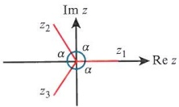
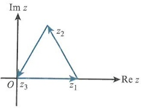
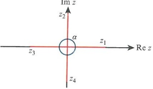
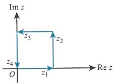
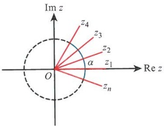
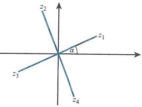
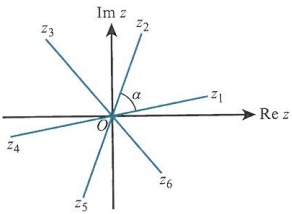
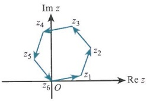

# Complex numbers

<!-- Cambridge International AS  A Level Further Mathematics Coursebook (Lee Mckelvey Martin Crozier) .pdf p536-555 -->

<!-- page 536 -->

# Chapter 23 Complex numbers

In this chapter you will learn how to:

prove, understand and use de Moivre's theorem for positive exponents, and also work with negative and rational exponents

express trigonometric ratios of multiple angles in terms of powers, and express powers of $\cos\theta$ and $\sin\theta$ in terms of multiple angles

use summation notation in conjunction with de Moivre's theorem to simplify and manipulate series of trigonometric terms

interpret the multiplication and division of complex numbers geometrically

determine the nth roots of unity and of complex expressions.

<!-- page 537 -->

<table border=1 style='margin: auto; word-wrap: break-word;'><tr><td style='text-align: center; word-wrap: break-word;'>Where it comes from</td><td style='text-align: center; word-wrap: break-word;'>What you should be able to do</td><td style='text-align: center; word-wrap: break-word;'>Check your skills</td></tr><tr><td style='text-align: center; word-wrap: break-word;'>AS &amp; A Level Mathematics Pure Mathematics 3, Chapter 11</td><td style='text-align: center; word-wrap: break-word;'>Perform basic operations on complex numbers.</td><td style='text-align: center; word-wrap: break-word;'>1 If  $ z_1 = 2 + 3i $ and  $ z_2 = 3 - 4i $, find:a  $ z_1 + 2z_2 $bb  $ z_1z_2 $c  $ \frac{z_1}{z_2} $</td></tr><tr><td style='text-align: center; word-wrap: break-word;'>AS &amp; A Level Mathematics Pure Mathematics 1, Chapter 6</td><td style='text-align: center; word-wrap: break-word;'>Use the binomial expansion.</td><td style='text-align: center; word-wrap: break-word;'>2 Expand  $ (x^2 + \frac{1}{x^2})^{10} $ in descending order, giving the first four terms.</td></tr></table>

## What are complex numbers?

Complex numbers consist of two parts: a real number and an imaginary number. They enable us to work with numbers such as the square root of a negative number.

In this chapter we shall look at de Moivre's theorem for complex numbers. We shall use de Moivre's theorem to express multiple angles in terms of powers of sine and cosine. We will use summations of series to find the sum of trigonometric expressions. We shall also look at the nth roots of unity, and interpret our results geometrically.

### 23.1 de Moivre's theorem

From AS & A Level Pure Mathematics 3 you have seen that complex numbers can be represented in the form  $ z = r \cos \theta + i r \sin \theta $. This is called the modulus argument form.

$z^2$ is equal to $r^2(\cos^2\theta + 2i\sin\theta\cos\theta + i^2\sin^2\theta)$. This simplifies to $r^2(\cos^2\theta - \sin^2\theta + i\sin2\theta)$ and so $z^2 = r^2(\cos2\theta + i\sin2\theta)$.

Following the same logic, $z^{3}=z^{2}z$ can be written as $r^{3}(\cos2\theta+\mathrm{i}\sin2\theta)(\cos\theta+\mathrm{i}\sin\theta)$, which is $r^{3}(\cos2\theta\cos\theta+\mathrm{i}^{2}\sin2\theta\sin\theta+\mathrm{i}(\sin2\theta\cos\theta+\cos2\theta\sin\theta))$, and so we have $z^{3}=r^{3}(\cos3\theta+\mathrm{i}\sin3\theta)$. So it looks as if $(\cos\theta+\mathrm{i}\sin\theta)^{n}=\cos n\theta+\mathrm{i}\sin n\theta$. Let us confirm this using proof by induction.

### PROOF 23.1

Let  $ P_k $ be the statement that, for some value of  $ k $,  $ (\cos\theta + i\sin\theta)^k = \cos k\theta + i\sin k\theta $.

Show the statement works for $n=1:(\cos\theta+\mathrm{i}\sin\theta)^{1}=\cos1\theta+\mathrm{i}\sin1\theta$, which clearly works.

Then considering that  $ (\cos\theta + i\sin\theta)^{k}(\cos\theta + i\sin\theta) = (\cos k\theta + i\sin k\theta)(\cos\theta + i\sin\theta) $, this leads to  $ \cos k\theta\cos\theta + i^{2}\sin k\theta\sin\theta + i(\sin k\theta\cos\theta + \cos k\theta\sin\theta) $.

Using the compound angle formulae, this simplifies to  $ \cos(k+1)\theta + i\sin(k+1)\theta $. Hence,  $ P_k \Rightarrow P_{k+1} $.

Since $P_{1}$ is true and $P_{k} \Rightarrow P_{k+1}$, by mathematical induction, we can then say that for all $n \geqslant 1$, $(\cos \theta + i \sin \theta)^{n} = \cos n\theta + i \sin n\theta$. The result is shown in Key point 23.1.

<!-- page 538 -->

This is known as de Moivre's theorem, which can be used for all integers $n$, both positive and negative.

For example,  $ (\cos\theta+\mathrm{i}\sin\theta)^{6}=\cos6\theta+\mathrm{i}\sin6\theta $ and  $ \frac{1}{(\cos\theta+\mathrm{i}\sin\theta)^{3}}=(\cos\theta+\mathrm{i}\sin\theta)^{-3} $ can be written as  $ \cos(-3\theta)+\mathrm{i}\sin(-3\theta)=\cos3\theta-\mathrm{i}\sin3\theta $.

### KEY POINT 23.1

de Moivre's theorem:

If $z=\cos\theta+\mathrm{i}\sin\theta$, then $z^{n}=(\cos\theta+\mathrm{i}\sin\theta)^{n}=\cos n\theta+\mathrm{i}\sin n\theta$. It then also follows that if $z=r(\cos\theta+\mathrm{i}\sin\theta)$, then $z^{n}=r^{n}(\cos\theta+\mathrm{i}\sin\theta)^{n}=r^{n}(\cos n\theta+\mathrm{i}\sin n\theta)$.

### WORKED EXAMPLE 23.1

Determine the value of each of the following complex numbers.

 $$ \left(\cos\frac{\pi}{4}+\mathrm{i}\sin\frac{\pi}{4}\right)^{8} $$ 

 $$ \left(\cos\left(-\frac{3\pi}{4}\right)+\mathrm{i}\sin\left(-\frac{3\pi}{4}\right)\right)^{6} $$ 

 $$ (4\sqrt{3}+4\mathrm{i})^{6} $$ 

 $$ (\sqrt{3}-\mathrm{i})^{18} $$ 

## Answer

 $$ \left(\cos\frac{\pi}{4}+\mathrm{i}\sin\frac{\pi}{4}\right)^{8}=\left(\cos2\pi+\mathrm{i}\sin2\pi\right)=1 $$ 

Using de Moivre's theorem we can multiply each $\frac{\pi}{4}$ by 8.

 $$ \left(\cos\left(-\frac{3\pi}{4}\right)+\mathrm{i}\sin\left(-\frac{3\pi}{4}\right)\right)^{6} $$ 

 $$ =\left(\cos\left(-\frac{3\pi}{4}\right)+\mathrm{i}\sin\left(-\frac{3\pi}{4}\right)\right)^{-6}, $$ 

Rewrite with a negative power first.

 $$  which~is~\cos\left(\frac{9\pi}{2}\right)+i\sin\left(\frac{9\pi}{2}\right)=i. $$ 

Then determine the result.

 $$ (4\sqrt{3}+4\mathrm{i})^{6}=\left(8\cos\frac{\pi}{6}+8\mathrm{i}\sin\frac{\pi}{6}\right)^{6}. $$ 

Write  $ 4\sqrt{3} + 4i $ in modulus argument form. It has modulus 8 and argument  $ \frac{\pi}{6} $.

 $$ 8^{6}(\cos\pi+\mathrm{i}\sin\pi)=-262\;144. $$ 

 $$ (\sqrt{3}-\mathrm{i})^{18}=\left(2\cos\left(-\frac{\pi}{6}\right)+2\mathrm{i}\sin\left(-\frac{\pi}{6}\right)\right)^{18} $$ 

Modulus is 2, argument is  $ -\frac{\pi}{6} $.

 $$ \mathrm{S o}~2^{8}(\cos\left(-3\pi\right)+\mathrm{i}\sin\left(-3\pi\right))=-262~144. $$ 

Consider the identity  $ \cos(A+B)=\cos A\cos B-\sin A\sin B $. This identity can be used to determine  $ \cos k\theta $, but this can be time consuming. For example,  $ \cos3\theta=\cos(2\theta+\theta) $ can be written as  $ \cos2\theta\cos\theta-\sin2\theta\sin\theta=(2\cos^2\theta-1)\cos\theta-2\sin^2\theta\cos\theta $. Finally, we get the result  $ \cos3\theta=4\cos^3\theta-3\cos\theta $, but there is a quicker way.

From de Moivre's theorem,  $ \cos 3\theta + i\sin 3\theta = (\cos\theta + i\sin\theta)^3 $. Since  $ \mathrm{Re}(\cos 3\theta + i\sin 3\theta) $ is  $ \cos 3\theta $, it follows that  $ \cos 3\theta = \mathrm{Re}[(\cos\theta + i\sin\theta)^3] $.

Now, $(\cos\theta+\mathrm{i}\sin\theta)^{3}=\cos^{3}\theta+3\mathrm{i}\cos^{2}\theta\sin\theta-3\cos\theta\sin^{2}\theta-\mathrm{i}\sin^{3}\theta$. Equating real parts gives $\cos3\theta=\cos^{3}\theta-3\cos\theta\sin^{2}\theta=\cos^{3}\theta-3\cos\theta(1-\cos^{2}\theta)=4\cos^{3}\theta-3\cos\theta$.

<!-- page 539 -->

This method may not seem faster for lower powers, but it is significantly faster for higher powers.

### WORKED EXAMPLE 23.2

<table border=1 style='margin: auto; word-wrap: break-word;'><tr><td style='text-align: center; word-wrap: break-word;'>Find an expression for  $ \cos 5\theta $ in terms of  $ \cos \theta $.</td><td style='text-align: center; word-wrap: break-word;'></td></tr><tr><td style='text-align: center; word-wrap: break-word;'>Answer\nStart with  $ (\cos \theta + i \sin \theta)^{5} $ expanded as</td><td rowspan="2">Use the binomial expansion.</td></tr><tr><td style='text-align: center; word-wrap: break-word;'>$ \cos^{5}\theta + 5 i \cos^{4}\theta \sin\theta - 10 \cos^{3}\theta \sin^{2}\theta - 10 i \cos^{2}\theta \sin^{3}\theta + 5 \cos \theta \sin^{4}\theta + i \sin^{5}\theta $</td></tr><tr><td style='text-align: center; word-wrap: break-word;'>Since  $ \text{Re}(\cos 5\theta + i \sin 5\theta) = \text{Re}(\cos \theta + i \sin \theta)^{5} $, we have  $ \cos 5\theta = \cos^{5}\theta - 10 \cos^{3}\theta \sin^{2}\theta + 5 \cos \theta \sin^{4}\theta $.</td><td style='text-align: center; word-wrap: break-word;'>Equate the real part of each expression.</td></tr><tr><td style='text-align: center; word-wrap: break-word;'>Using  $ \sin^{2}\theta = 1 - \cos^{2}\theta $ and  $ \sin^{4}\theta = (1 - \cos^{2}\theta)^{2} $ we get  $ \cos 5\theta = 16 \cos^{5}\theta - 20 \cos^{3}\theta + 5 \cos \theta $.</td><td style='text-align: center; word-wrap: break-word;'>Replace the powers of sine with the powers of cosine.</td></tr><tr><td style='text-align: center; word-wrap: break-word;'></td><td style='text-align: center; word-wrap: break-word;'>State the final answer.</td></tr></table>

## TIP

Since these trigonometric expressions are so complicated, it is normally accepted that $\cos\theta + i\sin\theta$ can be written as $C+iS$. This saves both space and time.

### WORKED EXAMPLE 23.3

<table border=1 style='margin: auto; word-wrap: break-word;'><tr><td style='text-align: center; word-wrap: break-word;'>Find  $ \sin 3\theta $ in terms of  $ \sin\theta $.</td><td style='text-align: center; word-wrap: break-word;'></td></tr><tr><td style='text-align: center; word-wrap: break-word;'>Answer</td><td style='text-align: center; word-wrap: break-word;'></td></tr><tr><td style='text-align: center; word-wrap: break-word;'>Start with  $ (\cos\theta + i\sin\theta)^{3} $. Expanding gives  $ \cos^{3}\theta + 3i\cos^{2}\theta\sin\theta - 3\cos\theta\sin^{2}\theta - i\sin^{3}\theta $.</td><td style='text-align: center; word-wrap: break-word;'>Use the binomial expansion.</td></tr><tr><td style='text-align: center; word-wrap: break-word;'>Note that  $ \text{Im}(\cos3\theta + i\sin3\theta) = \text{Im}[(\cos\theta + i\sin\theta)^{3}] $.</td><td style='text-align: center; word-wrap: break-word;'>Collect the imaginary terms only.</td></tr><tr><td style='text-align: center; word-wrap: break-word;'>This leads to  $ \sin3\theta = 3\cos^{2}\theta\sin\theta - \sin^{3}\theta $.</td><td style='text-align: center; word-wrap: break-word;'>Equate.</td></tr><tr><td style='text-align: center; word-wrap: break-word;'>Then with  $ \cos^{2}\theta = 1 - \sin^{2}\theta $, we get  $ \sin3\theta = 3\sin\theta - 4\sin^{3}\theta $.</td><td style='text-align: center; word-wrap: break-word;'>Simplify to get an expression in sine terms only.</td></tr></table>

As well as representing  $ \cos k\theta $ in terms of  $ \cos\theta $, or  $ \sin k\theta $ in terms of  $ \sin\theta $, we can also represent  $ \tan k\theta $ in terms of  $ \tan\theta $.

Let us consider  $ \tan 5\theta $ to be represented in terms of  $ \tan\theta $. We will start with  $ (\cos\theta + i\sin\theta)^5 $ which is  $ \cos^5\theta + 5i\cos^4\theta\sin\theta - 10\cos^3\theta\sin^2\theta - 10i\cos^2\theta\sin^3\theta + 5\cos\theta\sin^4\theta + i\sin^5\theta $.

Since  $ \tan5\theta=\frac{\sin5\theta}{\cos5\theta} $, we can say that  $ \tan5\theta=\frac{\mathrm{Im}[(\cos\theta+\mathrm{i}\sin\theta)^{5}]}{\mathrm{Re}[(\cos\theta+\mathrm{i}\sin\theta)^{5}]} $.

Hence, we can state that  $ \tan5\theta=\frac{5\cos^{4}\theta\sin\theta-10\cos^{2}\theta\sin^{3}\theta+\sin^{5}\theta}{\cos^{5}\theta-10\cos^{3}\theta\sin^{2}\theta+5\cos\theta\sin^{4}\theta} $.

The next step is to divide the numerator and denominator by the highest power in $\cos\theta$, so $\tan5\theta=\frac{5\tan\theta-10\tan^{3}\theta+\tan^{5}\theta}{1-10\tan^{2}\theta+5\tan^{4}\theta}$.

<!-- page 540 -->

### WORKED EXAMPLE 23.4

Find  $ \tan4\theta $ in terms of  $ \tan\theta $.

Answer

 $ (\cos\theta + i\sin\theta)^4 $ expands to give

 $ \cos^4\theta + 4i\cos^3\theta\sin\theta - 6\cos^2\theta\sin^2\theta - 4i\cos\theta\sin^3\theta + \sin^4\theta $.

Use the binomial expansion.

Then  $ \tan4\theta = \frac{\sin4\theta}{\cos4\theta} $

 $ = \frac{4\cos^3\theta\sin\theta - 4\cos\theta\sin^3\theta}{\cos^4\theta - 6\cos^2\theta\sin^2\theta + \sin^4\theta} $

 $ = -1, i^3 = -1, i^4 = 1 $.

Recall that  $ i^2 = -1, i^3 = -1 $ and  $ i^4 = 1 $.

Write  $ \tan4\theta = \frac{\text{Im}[(\cos\theta + i\sin\theta)^4]}{\text{Re}[(\cos\theta + i\sin\theta)^4]} $.

Dividing by  $ \cos^4\theta $:  $ \tan4\theta = \frac{4\tan\theta - 4\tan^3\theta}{1 - 6\tan^2\theta + \tan^4\theta} $

Divide by the highest power of the cosine.

A very useful application of $\tan k\theta$ is to solve polynomials. Consider the quartic equation $x^{4}+4x^{3}-6x^{2}-4x+1=0$. Rewrite it as $x^{4}-6x^{2}+1=4x-4x^{3}$, and then $1=\frac{4x-4x^{3}}{x^{4}-6x^{2}+1}$. This is similar in structure to the trigonometric equation in Worked example 23.4.

We can substitute  $ x = \tan \theta $ and  $ \tan 4\theta = 1 $. To solve this we first consider that  $ \tan 4\theta = 1 $, then  $ 4\theta = \frac{\pi}{4} $,  $ \frac{5\pi}{4} $,  $ \frac{9\pi}{4} $,  $ \frac{13\pi}{4} $. So  $ \theta = \frac{\pi}{16} $,  $ \frac{5\pi}{16} $,  $ \frac{9\pi}{16} $,  $ \frac{13\pi}{16} $, and after substituting into  $ x = \tan \theta $ gives the solutions  $ x = 0.199 $, 1.50, -5.03, -0.668.

Note that there are only four solutions since our equation is a quartic. Also, if you take the next value of  $ \theta = \frac{17\pi}{16} $ it gives the same result as  $ \theta = \frac{\pi}{16} $.

### WORKED EXAMPLE 23.5

<table border=1 style='margin: auto; word-wrap: break-word;'><tr><td style='text-align: center; word-wrap: break-word;'>Answer\nStart with the expansion of  $ (\cos\theta + i\sin\theta)^{3} $, which is  $  \cos^{3}\theta + 3i\cos^{2}\theta\sin\theta - 3\cos\theta\sin^{2}\theta - i\sin^{3}\theta  $.</td><td style='text-align: center; word-wrap: break-word;'>3\theta tells us this is a cubic expansion.</td></tr><tr><td style='text-align: center; word-wrap: break-word;'>Then  $  \tan3\theta = \frac{\sin3\theta}{\cos3\theta} = \frac{3\cos^{2}\theta\sin\theta - \sin^{3}\theta}{\cos^{3}\theta - 3\cos\theta\sin^{2}\theta}  $.</td><td style='text-align: center; word-wrap: break-word;'>Collect real and imaginary terms.</td></tr><tr><td style='text-align: center; word-wrap: break-word;'>Next, divide top and bottom by  $  \cos^{3}\theta  $, giving</td><td style='text-align: center; word-wrap: break-word;'></td></tr><tr><td style='text-align: center; word-wrap: break-word;'>$  \tan3\theta = \frac{3\tan\theta - \tan^{3}\theta}{1 - 3\tan^{2}\theta}  $.</td><td style='text-align: center; word-wrap: break-word;'>Deduce the result.</td></tr><tr><td style='text-align: center; word-wrap: break-word;'>Next, rearrange  $  3t^{3} + 6t^{2} - 9t - 2 = 0  $ to  $  -2 + 6t^{2} = 9t - 3t^{3}  $.</td><td style='text-align: center; word-wrap: break-word;'>Change the polynomial to match the form of tan 3\theta.</td></tr><tr><td style='text-align: center; word-wrap: break-word;'>which is  $  -2(1 - 3t^{2}) = 3(3t - t^{3})  $, so  $  -\frac{2}{3} = \frac{3t - t^{3}}{1 - 3t^{2}}  $.</td><td style='text-align: center; word-wrap: break-word;'></td></tr></table>

<!-- page 541 -->

$$ t=\tan\theta $$ 

 $$ 3\theta=-\frac{2}{3}. $$ 

State the  $ \tan 3\theta $ value.

 $$ 3\theta=-0.5880,2.5536,5.6952, $$ 

Solve for three sequential solutions.

which gives  $ \theta = -0.196, 0.8512, 1.898 $.

Hence, t = -0.199, 1.14, -2.94

Use the $\theta$ values to obtain the three $t$ values.

## EXERCISE 23A

1 Find the values of the following complex numbers.

a  $ (-\sqrt{3}-\mathrm{i})^{14} $

 $$ (-1+\mathrm{i})^{9} $$ 

M 2 Write  $ \cos4x\cos x $ in terms of powers of  $ \cos x $.

3 Find the values of the following expressions giving your answer as an exact value.

a  $ \left(\cos\frac{\pi}{12}+\mathrm{i}\sin\frac{\pi}{12}\right)^{8} $

b  $ (\sqrt{3} + \mathrm{i})^{12} $

 $$ \left(\frac{1}{1+i}\right)^{6} $$ 

4 Using de Moivre's theorem, or otherwise, find  $ \cos7\theta $ in terms of  $ \cos\theta $.

PS 5 Find  $ \tan 3\theta $ in terms of  $ \tan\theta $ and, hence, solve the equation  $ 2x^{3}+9x^{2}-3=6x $.

P 6 Show that  $ \frac{(\cos\theta+\mathrm{i}\sin\theta)^{6}}{(\cos\theta+\mathrm{i}\sin\theta)^{8}} $ can be written as  $ \cos\theta(2\cos\theta-\sec\theta-2\mathrm{i}\sin\theta) $.

7 Find  $ \frac{\sin6\theta}{\cos\theta} $ in terms of  $ \sin\theta $.

P PS 8 Show that  $ \tan4\theta=\frac{4\tan\theta-4\tan^{3}\theta}{1-6\tan^{2}\theta+\tan^{4}\theta} $. Hence, determine the solutions to the equation  $ x^{4}-4x^{3}-6x^{2}+4x=-1 $.

PS 9 By considering that  $ \tan5\theta=\frac{5\tan\theta-10\tan^{3}\theta+\tan^{5}\theta}{1-10\tan^{2}\theta+5\tan^{4}\theta} $, find all solutions for the polynomial  $ 2x^{5}-5x^{4}-20x^{3}+10x^{2}+10x=1 $.

### 23.2 Powers of sine and cosine

Consider the complex number  $ z = \cos\theta + i\sin\theta $. Then by de Moivre's theorem, or

otherwise,  $ \frac{1}{z} $ can be written as  $ (\cos\theta + i\sin\theta)^{-1} $, and so  $ \frac{1}{z} = \cos\theta - i\sin\theta $.

So  $ z + \frac{1}{z} = 2\cos\theta $ and  $ z - \frac{1}{z} = 2i\sin\theta $.

Next we consider  $ z^n = (\cos\theta + i\sin\theta)^n $ and  $ \frac{1}{z^n} = (\cos\theta + i\sin\theta)^{-n} $. So it should be clear that  $ z^n + \frac{1}{z^n} = 2\cos n\theta $ and  $ z^n - \frac{1}{z^n} = 2i\sin n\theta $.

From Euler's formula $\mathrm{e}^{\mathrm{i}\theta}=\cos\theta+\mathrm{i}\sin\theta$. So if $z=\mathrm{e}^{\mathrm{i}\theta}$ and $\frac{1}{z}=\mathrm{e}^{-\mathrm{i}\theta}$, then $\mathrm{e}^{\mathrm{i}\theta}+\mathrm{e}^{-\mathrm{i}\theta}=2\cos\theta$ and $\mathrm{e}^{\mathrm{i}\theta}-\mathrm{e}^{-\mathrm{i}\theta}=2\mathrm{i}\sin\theta$. We also have $\mathrm{e}^{\mathrm{ni}\theta}+\mathrm{e}^{-\mathrm{ni}\theta}=2\cos n\theta$ and $\mathrm{e}^{\mathrm{ni}\theta}-\mathrm{e}^{-\mathrm{ni}\theta}=2\mathrm{i}\sin n\theta$, as shown in Key point 23.2.

<!-- page 542 -->

### KEY POINT 23.2

Given that  $ z = \cos\theta + i\sin\theta $ and  $ \frac{1}{z} = \cos\theta - i\sin\theta $, then:

 $ z + \frac{1}{z} = 2\cos\theta $

 $ z - \frac{1}{z} = 2i \sin \theta $

 $ z^{n} + \frac{1}{z^{n}} = 2\cos n\theta $

•  $ z^{n} - \frac{1}{z^{n}} = 2i \sin n\theta $

To make use of these results, we first look at  $ \int \cos^4 \theta \, d\theta $, which is quite a tricky integral to deal with.

Using $2\cos\theta = z + \frac{1}{z}$ we need to obtain $\cos^{4}\theta$, so let $16\cos^{4}\theta = \left(z + \frac{1}{z}\right)^{4}$.

Next, expand the right-hand side:  $ \left(z+\frac{1}{z}\right)^{4}=z^{4}+4z^{2}+6+\frac{4}{z^{2}}+\frac{1}{z^{4}} $. Then use

 $ z^{n}+\frac{1}{z^{n}}=2\cos n\theta $ and pair off the terms. So  $ 16\cos^{4}\theta=2\cos4\theta+8\cos2\theta+6 $, which

means we are now going to use the integral  $ \int\cos^{4}\theta\,\mathrm{d}\theta=\frac{1}{16}\int(2\cos4\theta+8\cos2\theta+6)\mathrm{d}\theta $

 $ =\frac{1}{32}\sin4\theta+\frac{1}{4}\sin2\theta+\frac{3}{8}\theta+c. $

### WORKED EXAMPLE 23.6

Using complex numbers, evaluate  $ \int_{0}^{\frac{\pi}{2}}\sin^{4}\theta d\theta $.

Start with  $ (2i\sin\theta)^{4}=\left(z-\frac{1}{z}\right)^{4} $.

Choose the appropriate identity.

Expand the right side to get:

 $$ z^{4}-4z^{2}+6-\frac{4}{z^{2}}+\frac{1}{z^{4}}=2\cos4\theta-8\cos2\theta+6. $$ 

Expand the right side using the binomial expansion.

 $$ 16\sin^{4}\theta=2\cos4\theta-8\cos2\theta+6. $$ 

 $$ \frac{1}{16}\int_{0}^{\frac{\pi}{2}}(2\cos4\theta-8\cos2\theta+6)\mathrm{d}\theta $$ 

Note that  $ i^{4}=1 $.

Divide by the 16 from the left-hand side.

 $$ =\left[\frac{1}{32}\sin4\theta-\frac{1}{4}\sin2\theta+\frac{3}{8}\theta\right]_{0}^{\frac{\pi}{2}} $$ 

 $$ \frac{3\pi}{16}. $$ 

Integrate.

Evaluate.

<!-- page 543 -->

Explore the results of  $ \left(z+\frac{1}{z}\right)^{n} $ and  $ \left(z-\frac{1}{z}\right)^{n} $ for odd and even values of n. What do you notice? Is there a pattern? How does it affect the number of pairs of terms?

### WORKED EXAMPLE 23.7

Determine the integral  $ \int\sin^{5}\theta\,d\theta $, using complex numbers.
Answer
Start with  $ (2i\sin\theta)^{5}=\left(z-\frac{1}{z}\right)^{5} $. Choose the form involving sine.
Expand the right side to get  $ z^{5}-5z^{3}+10z-\frac{10}{z}+\frac{5}{z^{3}}-\frac{1}{z^{5}} $. Expand.
This is then paired up to give: Pair up terms.
 $ z^{5}-\frac{1}{z^{5}}-5\left(z^{3}-\frac{1}{z^{3}}\right)+10\left(z-\frac{1}{z}\right) $
Hence,  $ 32i\sin^{5}\theta = 2i\sin5\theta - 10i\sin3\theta + 20i\sin\theta $. Note the presence of i in every term: this will cancel.
So $ \int\sin^{5}\theta d\theta=\int\left(\frac{1}{16}\sin5\theta-\frac{5}{16}\sin3\theta+\frac{5}{8}\sin\theta\right)d\theta $ Write the new integral.
Hence  $ \int\sin^{5}\theta d\theta=-\frac{1}{80}\cos5\theta+\frac{5}{48}\cos3\theta-\frac{5}{8}\cos\theta+c $ Integrate, taking care with negatives.

### WORKED EXAMPLE 23.8

Find  $ \cos^{6}\theta - \sin^{6}\theta $ in the form  $ p\cos q\theta + r\cos s\theta $, where p, q, r, s are constants to be determined.

## Answer

Let  $ (2\cos\theta)^6 = \left(z + \frac{1}{z}\right)^6 $.

Expand the right side to get:

 $ 64\cos^{6}\theta = z^{6} + 6z^{4} + 15z^{2} + 20 + \frac{15}{z^{2}} + \frac{6}{z^{4}} + \frac{1}{z^{6}} $

Then:  $ 64\cos^{6}\theta = 2\cos6\theta + 12\cos4\theta + 30\cos2\theta + 20 $

Notice that each power of z is 2 less than the one before.

So (2i\sin\theta)^{6}=\left(z-\frac{1}{z}\right)^{6}, and expanding the right side: -64\sin^{6}\theta=z^{6}-6z^{4}+15z^{2}-20+\frac{15}{z^{2}}-\frac{6}{z^{4}}+\frac{1}{z^{6}}

So -64\sin^{6}\theta=2\cos6\theta-12\cos4\theta+30\cos2\theta-20.

Pair up terms and replace with multiple angles using  $ z^{n}+\frac{1}{z^{n}}=2\cos n\theta $.

Similarly for sine, but due to the even power there is no i in the resulting expansion.

The right-hand sides are similar except alternate terms are negative.

<!-- page 544 -->

So  $ \cos^{6}\theta - \sin^{6}\theta = \frac{1}{64}(4\cos6\theta + 60\cos2\theta) $, ___ Add together.

which gives  $ \cos^{6}\theta - \sin^{6}\theta = \frac{1}{16}\cos6\theta + \frac{15}{16}\cos2\theta $. Simplify.

### WORKED EXAMPLE 23.9

<table border=1 style='margin: auto; word-wrap: break-word;'><tr><td style='text-align: center; word-wrap: break-word;'>Find  $ \cos^{4}\theta - \sin^{4}\theta $ in terms of exponentials.
Answer
Since  $ 2\cos n\theta = e^{ni\theta} + e^{-ni\theta} $ and using the previous result  $ 16\cos^{4}\theta = 2\cos4\theta + 8\cos2\theta + 6 $, we have  $ \cos^{4}\theta = \frac{1}{16}(e^{4i\theta} + e^{-4i\theta}) + \frac{1}{4}(e^{2i\theta} + e^{-2i\theta}) + 6 $.
Similarly,  $ 2\cos n\theta = e^{ni\theta} + e^{-ni\theta} $ in conjunction with the result  $ 16\sin^{4}\theta = 2\cos4\theta - 8\cos2\theta + 6 $.
So  $ \sin^{4}\theta = \frac{1}{16}(e^{4i\theta} + e^{-4i\theta}) - \frac{1}{4}(e^{2i\theta} + e^{-2i\theta}) + 6 $.
Subtracting gives  $ \cos^{4}\theta - \sin^{4}\theta = \frac{1}{2}(e^{2i\theta} + e^{-2i\theta}) $.</td><td style='text-align: center; word-wrap: break-word;'>The results for  $ \cos^{4}\theta $ and  $ \sin^{4}\theta $ have already been established.
Use the exponential form to replace the  $ \cos n\theta $ terms.
Carry out a similar procedure for the sine portion.
Subtract the results and get an unsurprising result:  $ C^{4} - S^{4} = (C^{2} + S^{2})(C^{2} - S^{2}) $, which is  $ \cos^{2}\theta - \sin^{2}\theta = \cos2\theta $.</td></tr></table>

## EXERCISE 23B

1 Find  $ \sin^{4}\theta + 4\cos^{4}\theta $ in terms of cosines of multiple angles.

2 Evaluate  $ \int_{0}^{\frac{\pi}{4}}\cos^{5}\theta\,d\theta $.

3 Find the value of  $ \int_{0}^{\frac{\pi}{2}}(\cos^{3}\theta+\sin6\theta)\,\mathrm{d}\theta $.

4 Find  $ 4\cos^{5}\theta $ in terms of cosines of multiple angles.

PS 5 Find  $ \cos^{3}\theta\sin^{3}\theta $ in terms of  $ \sin6\theta $ and  $ \sin2\theta $.

PS 6 Simplify $\cos^{5}\theta + i\sin^{5}\theta$, giving your answer in an exponential form, where the terms are of the form $ae^{ki\theta}$.

PS 7 Find $\cos^{8}\theta+\sin^{8}\theta$ in the form $a\cos b\theta+c\cos d\theta+e$.

M 8 Find, using complex number methods, the value of  $ \int_{0}^{\frac{\pi}{2}}\sin^{7}\theta\,d\theta $, giving your answer as an exact value.

### 23.3 The roots of unity

Consider the equation  $ z^3 = 1 $. This equation should have three solutions. Clearly  $ z_1 = 1 $ is a solution and, by the factor theorem,  $ z^3 - 1 = 0 $ can be written as  $ (z - 1)(z^2 + z + 1) = 0 $. Solving the quadratic equation gives  $ z_2 = -\frac{1}{2} + \frac{\sqrt{3}}{2}i $ and  $ z_3 = -\frac{1}{2} - \frac{\sqrt{3}}{2}i $. These three solutions are known as the cube roots of unity.

<!-- page 545 -->

If we show these results on an Argand diagram, we see that they are spaced apart by  $ \frac{2\pi}{3} $ radians, and the modulus of each root is 1. We can use de Moivre's theorem instead to find the roots. Starting with  $ z^3 = 1 $, we have  $ z^3 = \cos(0) + i\sin(0) $. Since we know that there are three roots, we shall generalise and write the solutions as  $ z^3 = \cos(0 + 2k\pi) + i\sin(0 + 2k\pi) $. Now let k = 0, 1, 2 and take the cube root of each side such that  $ z = \cos\left(\frac{2k\pi}{3}\right) + i\sin\left(\frac{2k\pi}{3}\right) $.

So  $ z_1 = \cos(0) + i\sin(0) $,  $ z_2 = \cos\left(\frac{2\pi}{3}\right) + i\sin\left(\frac{2\pi}{3}\right) $,  $ z_3 = \cos\left(\frac{4\pi}{3}\right) + i\sin\left(\frac{4\pi}{3}\right) $. These results are the same as we found previously.

In exponential form, the solutions are  $ z_1 = e^0 $,  $ z_2 = e^{\frac{z_1}{3}} $,  $ z_3 = e^{\frac{z_2}{3}} $. In this form it appears that we have a common ratio of  $ e^{\frac{2\pi}{3}} $, which links to  $ 1 + z + z^2 $ from the algebraic result above. If we add  $ 1 + \left(-\frac{1}{2} + \frac{\sqrt{3}}{2}\right) + \left(-\frac{1}{2} - \frac{\sqrt{3}}{2}\right) $ we get 0. We saw this from  $ (z - 1)(z^2 + z + 1) = 0 $.

Since complex numbers behave like vectors, we can observe what happens when we add them. As you can see in the diagram, the three solutions add together to give zero, reinforcing  $ 1 + z + z^2 = 0 $.

### WORKED EXAMPLE 23.10

Find, in exponential form, the four roots of  $ z^{4}=1 $, using de Moivre's theorem. Show your results on an Argand diagram.

 $$ z^{4}=\cos\left(0\right)+\mathrm{i}\sin(0). $$ 

Recall that  $ \cos(0)=1 $,  $ \sin(0)=0 $.

 $$ z^{4}=\cos\left(0+2k\pi\right)+\mathrm{i}\sin(0+2k\pi) $$ 

Adding  $ 2k\pi $ does not change the solutions.

Taking the 4th root of both sides:

Then the roots are  $ z_1 = 1 $,  $ z_2 = e^{\frac{\pi}{2}i} $,  $ z_3 = e^{\pi i} $,  $ z_4 = e^{\frac{3\pi}{2}i} $.

 $$ z=\cos\left(\frac{k\pi}{2}\right)+\mathrm{i}\sin\left(\frac{k\pi}{2}\right) $$ 

Taking the 4th root means dividing the angle by 4.

Note the solutions are in geometric progression. Each root is $\frac{\pi}{2}$ radians from the next solution.

Each root has magnitude 1.

<!-- page 546 -->

Also adding the four solutions gives the following.

Again, adding all the solutions takes you back to zero. This implies that  $ 1 + z + z^{2} + z^{3} = 0 $.

We will now try to generalise with $z^n = 1$. We know this must have $n$ roots, so the next step is to write $z^n = \cos(0 + 2k\pi) + i\sin(0 + 2k\pi)$ for $k = 0,1,2,\ldots,n-1$.

Then taking the $n$th roots, $z = \cos\left(\frac{2k\pi}{n}\right) + i\sin\left(\frac{2k\pi}{n}\right)$, $k=0,1,2,\ldots,n-1$.

If we let $\omega^{k}=\cos\left(\frac{2k\pi}{n}\right)+\mathrm{i}\sin\left(\frac{2k\pi}{n}\right)$ for $k=0,1,2,\ldots,n-1$, then the roots can be denoted as $1,\omega,\omega^{2},\ldots,\omega^{n-1}$, where $\omega$ is also $\mathrm{e}^{\frac{2k\pi}{n}i}$.

If we show these roots on an Argand diagram, we see that the angle between successive roots is  $ \frac{2\pi}{n} $.

Adding all these roots together will give zero. We can also see this from  $ z^n - 1 = 0 $ and then  $ (z - 1)(1 + z + z^2 + \cdots + z^{n-1}) = 0 $.

These n roots are known as the nth roots of unity.

### KEY POINT 23.3

For the equation  $ z^n = 1 $, the  $ n $th roots of unity are  $ z = \cos\left(\frac{2k\pi}{n}\right) + i\sin\left(\frac{2k\pi}{n}\right) $,  $ k = 0, 1, 2, \ldots, n-1 $.

In exponential form these roots are  $ 1 $,  $ \mathrm{e}^{\frac{2\pi}{n_1}} $,  $ \mathrm{e}^{\frac{4\pi}{n_1}} $, ...,  $ \mathrm{e}^{\frac{2(n-1)\pi}{n_1}} $

## DID YOU KNOW?

Jean-Robert Argand was an amateur mathematician who was also the manager of a bookstore. He introduced the idea of complex numbers being represented on an Argand diagram in the complex plane. He is also credited with being the first person to propose the idea of the magnitude of vectors and complex numbers, as well as direction  $ \overrightarrow{a} $ for vectors.

## TIP

Try, where possible, to use the exponential form. It is easier to write down, easier to multiply and the geometric relationship between the roots is clear.

### WORKED EXAMPLE 23.11

Find, in exponential form, the 7th roots of unity.

## Answer

Start with  $ z^7 = 1 $, then  $ z^7 = \cos(0 + 2k\pi) + i\sin(0 + 2k\pi) $,

where k=0,1,2,3,4,5,6.

Quote the general form for the nth roots.

State the valid values of k.

<!-- page 547 -->

Then  $ z = \cos\left(\frac{2k\pi}{7}\right) + i\sin\left(\frac{2k\pi}{7}\right) $, where k = 0, 1, 2, 3, 4, 5, 6.

Hence,  $ z_1 = 1 $,  $ z_2 = e^{\frac{2\pi i}{7}} $,  $ z_3 = e^{\frac{4\pi i}{7}} $,  $ z_4 = e^{\frac{6\pi i}{7}} $,  $ z_5 = e^{\frac{8\pi i}{7}} $,  $ z_6 = e^{\frac{10\pi i}{7}} $,  $ z_7 = e^{\frac{12\pi i}{7}} $.

Write down the solutions in the correct form.

Notice the common ratio between successive terms.

### WORKED EXAMPLE 23.12

Given that  $ z^3 - 1 = 0 $, find the solutions in  $ x + iy $ form. Name them 1,  $ \omega $,  $ \omega^2 $.

<table border=1 style='margin: auto; word-wrap: break-word;'><tr><td style='text-align: center; word-wrap: break-word;'>Given that  $ z^{{s}}-1=0 $, find the solutions in  $ x+iy $ form. Name them 1,  $ \omega $,  $ \omega^{{2}} $.</td></tr><tr><td style='text-align: center; word-wrap: break-word;'>Show that the square of one complex root is the other complex root.</td></tr><tr><td style='text-align: center; word-wrap: break-word;'>Also find the value of  $ \omega^{{6}}+\omega^{{7}}+\omega^{{8}} $.</td></tr><tr><td style='text-align: center; word-wrap: break-word;'>Answer\n $ z^{{3}}=1 $, so  $ z^{{3}}=\cos(2k\pi)+\mathrm{i}\sin(2k\pi) $, then with  $ k=0,1,2 $,</td></tr><tr><td style='text-align: center; word-wrap: break-word;'>$ z_{{1}}=1 $,  $ z_{{2}}=-\frac{1}{2}+\frac{\sqrt{3}}{2}\mathrm{i} $,  $ z_{{3}}=-\frac{1}{2}-\frac{\sqrt{3}}{2}\mathrm{i} $</td></tr><tr><td style='text-align: center; word-wrap: break-word;'>Let  $ \omega=-\frac{1}{2}+\frac{\sqrt{3}}{2}\mathrm{i} $,  $ \omega^{{2}}=-\frac{1}{2}-\frac{\sqrt{3}}{2}\mathrm{i} $.</td></tr><tr><td style='text-align: center; word-wrap: break-word;'>$ \omega^{{2}}=\left(-\frac{1}{2}+\frac{\sqrt{3}}{2}\mathrm{i}\right)^{{2}}=\frac{1}{4}-\frac{\sqrt{3}}{2}\mathrm{i}-\frac{3}{4}=-\frac{1}{2}-\frac{\sqrt{3}}{2}\mathrm{i} $</td></tr><tr><td style='text-align: center; word-wrap: break-word;'>$ \omega^{{6}}+\omega^{{7}}+\omega^{{8}}=\omega^{{6}}(1+\omega+\omega^{{2}}) $</td></tr><tr><td style='text-align: center; word-wrap: break-word;'>This is zero.</td></tr></table>

There are not only roots of unity, but also nth roots of any complex number.

Consider  $ z^{4}=i $. This can be written as  $ z^{4}=\cos\frac{\pi}{2}+i\sin\frac{\pi}{2} $.

Then  $ z^{4}=\cos\left(\frac{\pi}{2}+2k\pi\right)+\mathrm{i}\sin\left(\frac{\pi}{2}+2k\pi\right) $.

Taking 4th roots,  $ z = \cos\left(\frac{\pi}{8} + \frac{k\pi}{2}\right) + i\sin\left(\frac{\pi}{8} + \frac{k\pi}{2}\right) $, where k = 0, 1, 2, 3.

Then writing down the roots, we have  $ z_1 = e^{\frac{\pi}{8}i} $,  $ z_2 = e^{\frac{5\pi}{8}i} $,  $ z_3 = e^{\frac{9\pi}{8}i} $,  $ z_4 = e^{\frac{13\pi}{8}i} $.

Notice that since we have four roots, they are still separated by an angle of  $ \frac{\pi}{2} $.

### WORKED EXAMPLE 23.13

Solve  $ z^6 = 4 + 4\sqrt{3}i $, giving all answers in the form  $ z = re^{i\theta} $. Show all your solutions on an Argand diagram.

## Answer

Since  $ |4 + 4\sqrt{3}i| = 8 $ and  $ \arg(4 + 4\sqrt{3}i) = \frac{\pi}{3} $,

Find the modulus and argument of the complex number first.

<!-- page 548 -->

we have  $ z^{6}=8\left(\cos\frac{\pi}{3}+\mathrm{i}\sin\frac{\pi}{3}\right) $

or  $ z^{6} = 8\left[\cos\left(\frac{\pi}{3} + 2k\pi\right) + i\sin\left(\frac{\pi}{3} + 2k\pi\right)\right] $,

here k = 0,1,2,3,4,5

Write the general form for the six roots.

Then  $ z = \sqrt{2} \left[ \cos \left( \frac{\pi}{18} + \frac{k\pi}{3} \right) + i \sin \left( \frac{\pi}{18} + \frac{k\pi}{3} \right) \right] $.

So the solutions are  $ z_1 = \sqrt{2} e^{\frac{\pi}{18} i} $,  $ z_2 = \sqrt{2} e^{\frac{7\pi}{18} i} $,  $ z_3 = \sqrt{2} e^{\frac{13\pi}{18} i} $,  $ z_4 = \sqrt{2} e^{\frac{19\pi}{18} i} $,  $ z_5 = \sqrt{2} e^{\frac{25\pi}{18} i} $,  $ z_6 = \sqrt{2} e^{\frac{31\pi}{18} i} $

Take the sixth root to get  $ z $.

Write down the six solutions. Note the difference in angle between successive roots.

Here  $ \alpha=\frac{\pi}{3} $, which is of course  $ \frac{2\pi}{6} $.

Here are all the complex numbers added, still giving zero.

The small angle between $z_{1}$ and the real axis is $\frac{\pi}{18}$.

As we saw with the roots of unity, the complex solutions can still be added together to give a sum of zero.

## EXERCISE 23C

1 Find the 6th roots of unity. Give your answers in integer or exponential form.

PS 2 The roots of  $ z^{3}-1=0 $ are 1,  $ \omega $,  $ \omega^{2} $. Determine the value of  $ \omega^{3}+\omega^{4}+\omega^{5} $. Otherwise,  $ \omega^{3}=1 $,  $ \omega^{4}=\omega $ and  $ \omega^{5}=\omega^{2} $.

3 Find the roots of the equation  $ z^{4}=8+8\sqrt{3}i $, giving your answers in exponential form.

4 Find the 4th roots of -16, giving each root in an exponential form.

P 5 A polynomial equation is given as  $ z^{5}-1=0 $.

a Show that 1 is one root, then factorise your polynomial into the form  $ (z-1)f(z)=0 $, where  $ f(z) $ is to be stated.

b Using the four complex solutions, show that  $ \cos\frac{2\pi}{5}+\cos\frac{4\pi}{5}=-\frac{1}{2} $.

6 Solve the equation  $ z^{8} = -8\sqrt{3} + 8i $. Show all these solutions on an Argand diagram.

7 Find the roots of  $ z^{12} = -1 $. Give your answers in exponential form.

<!-- page 549 -->

P 8 Show that  $ (z - e^{\mathrm{i}\theta})(z - e^{-\mathrm{i}\theta}) \equiv z^{2} - 2z\cos\theta + 1 $.

P 9 a Write down the sixth roots of unity in exponential form.

b State the two real roots.

c The polynomial  $ z^{6}-1=0 $ can be written as the product of two linear factors and two quadratic factors. Show that one of the quadratic factors is  $ z^{2}-z+1 $ and find the other one.

PS 10 The polynomial P is given by  $ (z + 2 - 3i)^3 = 2 + 2i $. Given that  $ \omega = z + 2 - 3i $, find the roots  $ \omega, \omega^2, \omega^3 $ and state, in terms of the z-plane, the value of  $ \omega + \omega^2 + \omega^3 $. Sketch the three solutions on an Argand diagram.

### 23.4 Complex summations

Suppose we need to determine the value of  $ \sum_{n=0}^{N-1} \cos n\theta $. How could we begin? We could write down a few terms to get  $ \sum_{n=0}^{N-1} \cos n\theta = 1 + \cos\theta + \cos2\theta + \ldots $ but this doesn't seem to help.

Recall from previous work that  $ \mathrm{Re}(z) = \cos\theta $, so instead consider  $ \sum_{n=0}^{N-1} z^n $, which is  $ 1 + z + z^2 + \ldots $. Now this might not seem any better, but it is a geometric sum, so  $ \sum_{n=0}^{N-1} z^n = \frac{z^N - 1}{z - 1} $.

Next we use  $ z = e^{i\theta} $ to give  $ \sum_{n=0}^{N-1} z^n = \frac{e^{Ni\theta} - 1}{e^{i\theta} - 1} $. Then multiplying top and bottom by  $ e^{-\frac{1}{2}i\theta} $

gives us  $ \sum_{n=0}^{N-1} z^n = \frac{\mathrm{e}^{\left(N-\frac{1}{2}\right)\mathrm{i}\theta} - \mathrm{e}^{-\frac{1}{2}\mathrm{i}\theta}}{\mathrm{e}^{\frac{1}{2}\mathrm{i}\theta} - \mathrm{e}^{-\frac{1}{2}\mathrm{i}\theta}} $. The denominator can now be written as a single term,  $ 2i\sin\frac{1}{2}\theta $, which means we can split the result into real and imaginary parts. We, need the real part.

So with  $ \sum_{n=0}^{N-1}z^{n}=\frac{\cos\left(N-\frac{1}{2}\right)\theta+\mathrm{i}\sin\left(N-\frac{1}{2}\right)\theta-\cos\frac{1}{2}\theta+\mathrm{i}\sin\frac{1}{2}\theta}{2\mathrm{i}\sin\frac{1}{2}\theta} $,

 $ \sum_{n=0}^{N-1} \cos n\theta $ is just the real part of the previous summation.

## TIP

Remember that if

 $ z = \cos\theta + i\sin\theta $, then

 $ \mathrm{Re}(z) = \cos\theta $ and

 $ \mathrm{Im}(z) = \sin\theta $

So  $ \sum_{n=0}^{N-1}\cos n\theta=\frac{\sin\left(N-\frac{1}{2}\right)\theta+\sin\frac{1}{2}\theta}{2\sin\frac{1}{2}\theta} $ or, in another form,  $ \frac{1}{2}\left[\sin\left(N-\frac{1}{2}\right)\theta\cos\sec\frac{1}{2}\theta+1\right] $.

### WORKED EXAMPLE 23.14

By considering the expansion of  $ \sum_{n=1}^{N}z^{2n-1} $, show that  $ \sum_{n=1}^{N}\cos(2n-1)\theta=\frac{\sin2N\theta}{2\sin\theta} $.

Answer

Start with  $ \sum_{n=1}^{N} z^{2n-1} = z + z^3 + z^5 + \ldots = \frac{z(z^{2N} - 1)}{z^2 - 1} $.

<!-- page 550 -->

Then, with  $ z = e^{\mathrm{i}\theta} $,  $ \sum_{n=1}^{N} z^{2n-1} = \frac{e^{\mathrm{i}\theta}(e^{2N\mathrm{i}\theta}-1)}{e^{2\mathrm{i}\theta}-1} $

to give  $ \frac{e^{2Ni\theta}-1}{e^{i\theta}-e^{-i\theta}} $

Multiply top and bottom by  $ e^{-i\theta} $.

So now  $ \sum_{n=1}^{N} z^{2n-1} = \frac{\cos 2N\theta + i\sin 2N\theta - 1}{2i\sin\theta} $.

Since $\cos(2n-1)\theta$ is the real part of $z^{2n-1}$, we can now write

 $$ \sum_{n=1}^{N}\cos\left(2n-1\right)\theta=\frac{\mathrm{i}\sin2N\theta}{2\mathrm{i}\sin\theta}, $$ 

which of course is equal to  $ \frac{\sin 2N\theta}{2\sin\theta} $

As well as summation forms such as  $ \sum_{n=0}^{N-1} z^n $, we could also deal with a summation such as  $ \sum_{n=0}^{N-1} (3z)^n $. To tackle this we write down a few terms first, so  $ \sum_{n=0}^{N-1} (3z)^n = 1 + 3z + (3z)^2 + \cdots $ shows us that the first term is 1 and the common ratio is 3z.

$$\mathrm{So}\sum_{n=0}^{N-1}(3z)^{n}=\frac{(3z)^{N}-1}{3z-1},\text{and if }z=\mathrm{e}^{\mathrm{i}\theta}\text{then}\sum_{n=0}^{N-1}(3z)^{n}=\frac{3^{N}\mathrm{e}^{N\mathrm{i}\theta}-1}{3\mathrm{e}^{\mathrm{i}\theta}-1}.$$

The problem we have is that the previous method of multiplying, in this case by  $ e^{-\frac{1}{2}i\theta} $, won't work. It gives us  $ \frac{3^{N}e^{\left(N-\frac{1}{2}\right)i\theta}-e^{-\frac{1}{2}i\theta}}{3e^{\frac{1}{2}i\theta}-e^{-\frac{1}{2}i\theta}} $ but the denominator cannot be converted to only real numbers. So instead, multiply ton and bottom by  $ 3e^{-i\theta}-1 $.

or only imaginary numbers. So, instead, multiply top and bottom by  $ 3e^{-i\theta}-1 $,

giving $\sum_{n=0}^{N-1}(3z)^{n}=\frac{(3^{N}\mathrm{e}^{N\mathrm{i}\theta}-1)(3\mathrm{e}^{-\mathrm{i}\theta}-1)}{(3\mathrm{e}^{\mathrm{i}\theta}-1)(3\mathrm{e}^{-\mathrm{i}\theta}-1)}.$ Then the denominator becomes $10-6\cos\theta$,

which is definitely real. So  $ \sum_{n=0}^{N-1}(3z)^n=\frac{3^{N+1}e^{(N-1)\mathrm{i}\theta}-3^N e^{\mathrm{i}N\theta}-3e^{-\mathrm{i}\theta}+1}{10-6\cos\theta} $, and from this both real and imaginary summations can be stated.

### WORKED EXAMPLE 23.15

Find, in any form, the result of  $ \sum_{n=1}^{N}2^{n}\sin n\theta $.

## Answer

Start with  $ \sum_{n=1}^{N}2^n z^n = 2z + 4z^2 + 8z^3 + \ldots $

This summation is equal to  $ \frac{2z[(2z)^{N}-1]}{2z-1} $.

Write down a general complex form for the summation.

<!-- page 551 -->

Then with $z = e^{i\theta}$ we can write the summation as $\frac{2e^{i\theta}(2^N e^{N i\theta} - 1)}{2e^{i\theta} - 1}$.

Next we multiply top and bottom by  $ 2e^{-i\theta} - 1 $, so the summation is  $ \frac{2e^{i\theta}(2^N e^{N i\theta} - 1)(2e^{-i\theta} - 1)}{(2e^{i\theta} - 1)(2e^{-i\theta} - 1)} $.

Use the exponential form to show the required expression.

Multiply by an expression that reduces the denominator to a real expression.

This is then written in the form  $ \frac{2^{N+2}e^{Ni\theta}-2^{N+1}e^{(N+1)i\theta}-4+2e^{i\theta}}{5-4\cos\theta} $.

So, as our summation contains $\sin n\theta$, we need the imaginary part of this expression. The result is

Multiply out in a form so the real or imaginary part can be found.

 $$ \sum_{n=1}^{N}2^{n}\sin n\theta=\frac{2^{N+2}\sin N\theta-2^{N+1}\sin\left(N+1\right)\theta+2\sin\theta}{5-4\cos\theta}. $$ 

State the correct result, ignoring any real terms from the numerator.

Consider the summation  $ \sum_{n=0}^{\infty}4^{-n}\cos\left(\frac{n\pi}{3}\right) $. Writing down a few terms will not help, so

instead we consider the summation  $ \sum_{n=0}^{\infty}\left(\frac{z}{4}\right)^{n} $.

This summation looks like  $ 1 + \frac{z}{4} + \frac{z^2}{16} + \cdots $. It is a sum to infinity of the form  $ \frac{1}{1 - \frac{z}{4}} = \frac{4}{4 - z} $.

Let  $ z = e^{i\theta} $, so our sum is  $ \frac{4}{4 - e^{i\theta}} $.

Multiplying top and bottom by  $ 4 - e^{-i\theta} $ changes our sum to

 $$ \frac{16-4\mathrm{e}^{-\mathrm{i}\theta}}{(4-\mathrm{e}^{\mathrm{i}\theta})(4-\mathrm{e}^{-\mathrm{i}\theta})}=\frac{16-4\mathrm{e}^{-\mathrm{i}\theta}}{16-4\mathrm{e}^{\mathrm{i}\theta}+1-4\mathrm{e}^{-\mathrm{i}\theta}}=\frac{16-4\mathrm{e}^{-\mathrm{i}\theta}}{17-8\cos\theta}. $$ 

So we need  $ \mathrm{Re}\left(\frac{16-4\mathrm{e}^{-\mathrm{i}\theta}}{17-8\cos\theta}\right)=\frac{16-4\cos\theta}{17-8\cos\theta} $, hence

$$\sum_{n=0}^{\infty}4^{-n}\cos\left(\frac{n\pi}{3}\right)=\frac{16-4\cos\frac{\pi}{3}}{17-8\cos\frac{\pi}{2}}.\text{ This evaluates to }\frac{14}{13}.$$

### WORKED EXAMPLE 23.16

Determine the value of  $ \sum_{n=0}^{\infty}2^{-n}\sin\left(\frac{n\pi}{2}\right) $.

## Answer

Start with  $ \sum_{n=0}^{\infty}\left(\frac{z}{2}\right)^{n}=1+\frac{z}{2}+\frac{z^{2}}{4}+\cdots=\frac{1}{1-\frac{z}{2}}=\frac{2}{2-z} $.

Then we let  $ z = e^{i\theta} $, so our sum is  $ \frac{2}{2 - e^{i\theta}} $.

Multiply top and bottom by $2 - e^{-i\theta}$ to give a sum of $\frac{4 - 2e^{-i\theta}}{5 - 4\cos\theta}$.

<!-- page 552 -->

We need  $ \text{Im}\left(\frac{4-2e^{-\text{i}\theta}}{5-4\cos\theta}\right)=\frac{2\sin\theta}{5-4\cos\theta} $, hence

 $ \sum_{n=0}^{\infty}2^{-n}\sin\left(\frac{n\pi}{2}\right)=\frac{2\sin\frac{\pi}{2}}{5-4\cos\frac{\pi}{2}} $, hence our sum works out to  $ \frac{2}{5} $.

## EXERCISE 23D

PS 1 Given that  $ z = e^{i\theta} $, determine an expression for  $ \sum_{n=1}^{N} z^{n} $ in terms of exponentials.

P 2 Show that  $ \sum_{n=1}^{N}3^{n}z^{n} $ can be written as:

 $ \frac{(3^{N}\mathrm{e}^{N\mathrm{i}\theta}-1)(9-3\mathrm{e}^{\mathrm{i}\theta})}{10-3(\mathrm{e}^{\mathrm{i}\theta}-\mathrm{e}^{-\mathrm{i}\theta})} $

PS 3 Expand  $ \sum_{n=1}^{N} z^{2n-1} $, giving your answer in trigonometric form.

PS 4 a Determine  $ \sum_{n=1}^{10}4\sin(2n-1)\theta $ in terms of multiple angles of  $ \theta $.

b State the value of  $ \sum_{n=1}^{10}4\sin\left[\frac{(2n-1)\pi}{4}\right] $.

P 5 Show that, when $N$ is even, the real part of $\sum_{n=1}^{N}(1-\sec\theta e^{i\theta})^{n}$ is equal to $k\sin^{2}\theta(\tan^{N}\theta-1)$, where $k=\pm1$.

P 6 By first expanding  $ \sum_{n=0}^{N-1}\left(\frac{z}{3}\right)^{n} $, show that:

 $$ \sum_{n=0}^{N}3^{-n}\cos n\theta=\frac{3^{-N+1}\cos\left(N-1\right)\theta-3^{-N+2}\cos N\theta-3\cos\theta+9}{10-6\cos\theta} $$ 

PS 7 Determine the value of  $ \sum_{n=1}^{\infty}\left(\frac{2}{3}\right)^{n}\cos\left(\frac{n\pi}{3}\right) $, giving your answer in an exact form.

P 8 By considering  $ \sum_{n=1}^{N} z^{2n-1} $ and then using only the imaginary part of your result, show that:

 $ \sum_{n=1}^{N}(2n-1)\cos\left[\frac{(2n-1)\pi}{4N}\right]=N\cos\mathrm{c}\left(\frac{\pi}{4N}\right)-\cos\mathrm{c}\left(\frac{\pi}{4N}\right)\cot\left(\frac{\pi}{4N}\right) $

<!-- page 553 -->

By considering  $ \sum_{n=1}^{N} z^{2n-1} $, where  $ z = e^{\mathrm{i}\theta} $, show that

 $$ \sum_{n=1}^{N}\cos\left(2n-1\right)\theta=\frac{\sin\left(2N\theta\right)}{2\sin\theta}, $$ 

where  $ \sin\theta\neq0 $.

Deduce that

 $$ \sum_{n=1}^{N}(2n-1)\sin\left[\frac{(2n-1)\pi}{N}\right]=-N\mathrm{c o s e c}\frac{\pi}{N}. $$ 

Cambridge International AS & A Level Further Mathematics 9231 Paper 1 Q10 June 2008

## Answer

$$\sum_{n=1}^{N}z^{2n-1}=z+z^{3}+z^{5}+\cdots=\frac{z(z^{2N}-1)}{z^{2}-1}\), then let $z=\mathrm{e}^{\mathrm{i}\theta}$ so the sum is $\frac{\mathrm{e}^{\mathrm{i}\theta}(\mathrm{e}^{2\mathrm{N}\theta}-1)}{\mathrm{e}^{2\mathrm{i}\theta}-1}.$$

Multiplying top and bottom by  $  \mathrm{e}^{-\mathrm{i}\theta}  $ gives  $  \frac{(\mathrm{e}^{2\mathrm{Ni}\theta}-1)}{\mathrm{e}^{\mathrm{i}\theta}-\mathrm{e}^{-\mathrm{i}\theta}}  $, so the denominator is  $  2\mathrm{isin}\theta  $.

Hence,  $ \sum_{n=1}^{N}z^{2n-1}=\frac{\cos2N\theta+\mathrm{i}\sin2N\theta-1}{2\mathrm{i}\sin\theta} $, and so  $ \sum_{n=1}^{N}\cos(2n-1)\theta=\mathrm{Re}\left(\frac{\cos2N\theta+\mathrm{i}\sin2N\theta-1}{2\mathrm{i}\sin\theta}\right) $, which is  $ \frac{\sin(2N\theta)}{2\sin\theta} $.

Differentiating,  $ \left(\frac{\sin(2N\theta)}{2\sin\theta}\right)' = \frac{2N\cos(2N\theta) \times 2\sin\theta - 2\cos\theta \times \sin(2N\theta)}{4\sin^2\theta} $, which simplifies to

 $$ N\mathrm{c o s}(2N\theta)\mathrm{c o s e c}\theta-\frac{1}{2}\mathrm{s i n}(2N\theta)\mathrm{c o s e c}\theta\mathrm{c o t}\theta. $$ 

Differentiating  $ \cos(2n-1)\theta $ gives  $ -(2n-1)\sin(2n-1)\theta $.

Then if $\theta = \frac{\pi}{N}$ we have $-\sum_{n=1}^{N}(2n-1)\sin\left[\frac{(2n-1)\pi}{N}\right] = N\mathrm{cosec}\,\frac{\pi}{N}\cos2\pi - \frac{1}{2}\sin2\pi\mathrm{cosec}\,\frac{\pi}{N}\cot\frac{\pi}{N}$. Since the second term is equal to zero, $\sum_{n=1}^{N}(2n-1)\sin\left[\frac{(2n-1)\pi}{N}\right] = -N\mathrm{cosec}\,\frac{\pi}{N}$.

<!-- page 554 -->

## Checklist of learning and understanding

## de Moivre's theorem:

 $ (\cos\theta + i\sin\theta)^n = \cos n\theta + i\sin n\theta $ is de Moivre's theorem.

Re(coskθ + i sinkθ) = coskθ

Im(coskθ + i sinkθ) = sinkθ

## Powers of sine and cosine:

 $ z + \frac{1}{z} = 2\cos\theta $ and  $ e^{\mathrm{i}\theta} + e^{-\mathrm{i}\theta} = 2\cos\theta $

 $ z - \frac{1}{z} = 2i \sin \theta $ and  $ e^{i\theta} - e^{-i\theta} = 2i \sin \theta $

 $ z^n + \frac{1}{z^n} = 2\cos n\theta $ and  $ e^{ni\theta} + e^{-ni\theta} = 2\cos n\theta $

 $ z^n - \frac{1}{z^n} = 2i \sin n\theta $ and  $ e^{ni\theta} - e^{-ni\theta} = 2i \sin n\theta $

## For roots of unity:

 $$ \mathrm{f}z^{n}=1,then z=\cos\left(\frac{2k\pi}{n}\right)+\mathrm{i}\sin\left(\frac{2k\pi}{n}\right),where k=0,1,2,\ldots,n-1. $$ 

When  $ z^{n}-1=0 $,  $ \mathrm{f}(z)=(z-1)(1+z+z^{2}+\cdots+z^{n-1}) $.

The angle between successive roots is  $ \frac{2\pi}{n} $.

The value of  $ 1 + z + z^{2} + \ldots + z^{n-1} $ is 0.

## For complex summations:

For  $ \sum_{n=0}^{N-1} z^n = 1 + z + z^2 + \cdots $ this can be considered as a geometric sum, where z is the common ratio.

The denominator is of two types, $e^{ai\theta} - e^{bi\theta}$ or $\alpha e^{ai\theta} - \beta$; multiply by a suitable exponential expression to make the denominator all real or all imaginary.

<!-- page 555 -->

1 Let  $ z = \cos\theta + i\sin\theta $. Show that  $ 1 + z = 2\cos\frac{1}{2}\theta\left(\cos\frac{1}{2}\theta + i\sin\frac{1}{2}\theta\right) $.

By considering  $ (1 + z)^{n} $, where n is a positive integer, deduce the sum of the series

 $$ {\binom{n}{1}}\sin\theta+{\binom{n}{2}}\sin2\theta+\cdots+{\binom{n}{n}}\sin n\theta. $$ 

Cambridge International AS & A Level Further Mathematics 9231 Paper 13 Q8 November 2012

## 2 Use de Moivre's theorem to express cot  $ 7\theta $ in terms of cot  $ \theta $

Use the equation  $ \cot 7\theta = 0 $ to show that the roots of the equation  $ x^6 - 21x^4 + 35x^2 - 7 = 0 $ are  $ \cot\left(\frac{1}{14}k\pi\right) $ for  $ k = 1, 3, 5, 9, 11, 13 $ and deduce that  $ \cot^2\left(\frac{1}{14}\pi\right)\cot^2\left(\frac{3}{14}\pi\right)\cot^2\left(\frac{5}{14}\pi\right) = 7 $.

Cambridge International AS & A Level Further Mathematics 9231 Paper 11 Q6 June 2016

3 Let  $ \omega = \cos\frac{1}{5}\pi + i\sin\frac{1}{5}\pi $. Show that  $ \omega^{5} + 1 = 0 $ and deduce that  $ \omega^{4} - \omega^{3} + \omega^{2} - \omega = -1 $.

Show further that $\omega - \omega^{4} = 2\cos\frac{1}{5}\pi$ and $\omega^{3} - \omega^{2} = 2\cos\frac{3}{5}\pi$.

Hence find the values of $\cos\frac{1}{5}\pi+\cos\frac{3}{5}\pi$ and $\cos\frac{1}{5}\pi\cos\frac{3}{5}\pi$.

Find a quadratic equation having roots  $ \cos\frac{1}{5}\pi $ and  $ \cos\frac{3}{5}\pi $ and deduce the exact value of  $ \cos\frac{1}{5}\pi $.

Cambridge International AS & A Level Further Mathematics 9231 Paper 11 Q11a November 2011

