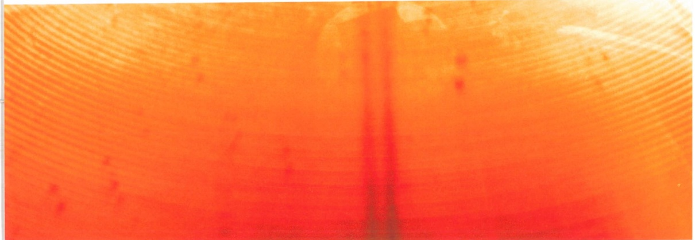
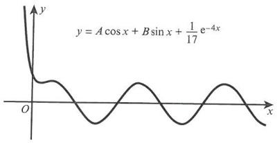

# Differential equations

<!-- Cambridge International AS  A Level Further Mathematics Coursebook (Lee Mckelvey Martin Crozier) .pdf p556-586 -->

<!-- page 556 -->

## Chapter 24 Differential equations

In this chapter you will learn how to:

determine integrating factors and solve first order differential equations

find characteristic equations and solve second order differential equations

use substitutions to solve first and second order differential equations.

<!-- page 557 -->

# PREREQUISITE KNOWLEDGE

<table border=1 style='margin: auto; word-wrap: break-word;'><tr><td style='text-align: center; word-wrap: break-word;'>Where it comes from</td><td style='text-align: center; word-wrap: break-word;'>What you should be able to do</td><td style='text-align: center; word-wrap: break-word;'>Check your skills</td></tr><tr><td style='text-align: center; word-wrap: break-word;'>AS &amp; A Level Mathematics Pure Mathematics 2 &amp; 3, Chapter 10</td><td style='text-align: center; word-wrap: break-word;'>Solve separable first order differential equations.</td><td style='text-align: center; word-wrap: break-word;'>1 Find the general solution of:  $ \frac{dy}{dx} = \frac{y^2}{x^3} $</td></tr><tr><td style='text-align: center; word-wrap: break-word;'>AS &amp; A Level Mathematics Pure Mathematics 2 &amp; 3, Chapter 8 Chapter 19</td><td style='text-align: center; word-wrap: break-word;'>Integrate a variety of functions.</td><td style='text-align: center; word-wrap: break-word;'>2 Integrate the following expressions. a  $ \int \sin^2 x \, dx $ b  $ \int x^3 \ln x \, dx $ c  $ \int \cosh 2x \, dx $</td></tr><tr><td style='text-align: center; word-wrap: break-word;'>AS &amp; A Level Mathematics Pure Mathematics 2 &amp; 3, Chapter 4 Chapter 21</td><td style='text-align: center; word-wrap: break-word;'>Differentiate implicitly and parametrically.</td><td style='text-align: center; word-wrap: break-word;'>3 a Given that  $ y = zx $, where  $ z $ is a function of  $ x $, find  $ \frac{d^2y}{dx^2} $. b If  $ x = t^2 $ and  $ y = t^3 $, use parametric differentiation to find  $ \frac{d^2y}{dx^2} $.</td></tr></table>

## What are differential equations?

In this chapter we shall look at first and second order linear differential equations. Differential equations relate a function to one or more of its derivatives.

Differential equations are used in a vast number of areas, including financial modelling, fluid mechanics, medicine, population growth and decay models, predator-prey models, and classical mechanics.

We shall try to understand and solve first order differential equations that are not separable, using an integrating factor. We shall then solve second order differential equations, using a trial solution that leads to an auxiliary equation. Finally, we shall use substitution methods to solve non-linear first and second order differential equations.

### 24.1 First order differential equations

You will have met differential equations of the form  $ \frac{dy}{dx} = x $ or  $ \frac{dy}{dx} = y^2 $ in your A Level Mathematics course. These are known as first order differential equations with separable variables. It is straightforward to write them as  $ \int dy = \int x \, dx $ and  $ \int \frac{1}{y^2} \, dy = \int dx $, respectively. But can the differential equation  $ x \frac{dy}{dx} + y = x $ be separated? The answer is no. No matter how we rewrite this equation, we cannot get x with dx and y with dy.

<!-- page 558 -->

If we look closely at the left-hand side, it is actually  $ \frac{\mathrm{d}}{\mathrm{d}x}(xy) $, so now  $ \frac{\mathrm{d}}{\mathrm{d}x}(xy)=x $. Next we write  $ xy=\int x \, \mathrm{d}x $ and then  $ xy=\frac{1}{2}x^2 + c $. So the general solution is  $ y=\frac{1}{2}x + \frac{c}{x} $.

Looking at another example, we have  $ -\frac{x}{y^2} \frac{dy}{dx} + \frac{1}{y} = x^2 $. This differential equation is not separable either, but the left side can be recognised as  $ \frac{d}{dx}\left(\frac{x}{y}\right) $. So we now have  $ \frac{d}{dx}\left(\frac{x}{y}\right) = x^2 $, which integrates to give  $ \frac{x}{y} = \frac{1}{3}x^3 + c $ and, hence,  $ y = \frac{3x}{x^3 + 3c} $.

### WORKED EXAMPLE 24.1

Determine the general solution for the differential equation  $ \frac{x}{y} \frac{dy}{dx} + \ln y = x + 1 $.

## Answer

Note that the left-hand side is  $ \frac{\mathrm{d}}{\mathrm{d}x}(x \ln y) $.

Recognise left-hand side as  $ \frac{\mathrm{d}}{\mathrm{d}x}(x \ln y) $.

Then  $ \frac{\mathrm{d}}{\mathrm{d}x}(x\ln y)=x+1 $, and  $ x\ln y=\int(x+1)\mathrm{d}x $.

Write the right-hand side in integral form.

Hence,  $ x \ln y = \frac{1}{2} x^{2} + x + c $.

Integrate.

Finally,  $  y = \mathrm{e}^{\frac{1}{2}x + 1 + \frac{c}{x}}  $.

Rearrange to find the general solution.

What do we do if the left-hand side is not quite in the right form? Consider the differential equation  $ \frac{dy}{dx} + 3y = e^{-3x} $. The left-hand side is not quite  $ \frac{d}{dx}(3xy) $, as this would be  $ 3y + 3x\frac{dy}{dx} $. We need a different approach.

We shall look at a general first order differential equation in the form  $ \frac{dy}{dx} + Fy = G $, where F and G are functions of x.

We require the left side to be of the form  $ u\frac{dv}{dx} + \nu\frac{du}{dx} $, so we are going to multiply through by the function  $ I(x) $ so that  $ I\frac{dy}{dx} + FIy = GI $. Then we are going to match the terms with  $ u\frac{dv}{dx} + \nu\frac{du}{dx} $.

Letting $u = I$, we then find that $v = y$, $\frac{dy}{dx} = \frac{dy}{dx}$ and $\frac{du}{dx} = FI$. Now our aim is to find the function $I(x)$. Since $\frac{du}{dx} = \frac{dI}{dx}$ it follows that $\frac{dI}{dx} = FI$.

Separating variables,  $ \int \frac{1}{I} dI = \int F dx $, then  $ \ln I = \int F dx $, which means  $ I(x) = e^{\int F dx} $. This is known as the integrating factor.

<!-- page 559 -->

If your differential equation is written in the form  $ \frac{dy}{dx} + Fy = G $, then  $ F(x) $ is easy to spot.

We now go back to the example of  $ \frac{dy}{dx} + 3y = e^{-3x} $ and note that  $ F = 3 $. Hence,  $ I = e^{\int_{3}^{3} dx} $,

and so the integrating factor is  $ e^{3x} $.

Next we multiply through by I(x), so  $ \mathrm{e}^{3x}\frac{\mathrm{d}y}{\mathrm{d}x}+3\mathrm{e}^{3x}y=1 $. The left-hand side can now be written as  $ \frac{\mathrm{d}}{\mathrm{d}x}(\mathrm{e}^{3x}y) $, so  $ \frac{\mathrm{d}}{\mathrm{d}x}(\mathrm{e}^{3x}y)=1 $. Solving this equation leads to  $ \mathrm{e}^{3x}y=x+c $, or  $ y=x\mathrm{e}^{-3x}+c\mathrm{e}^{-3x} $.

### WORKED EXAMPLE 24.2

<table border=1 style='margin: auto; word-wrap: break-word;'><tr><td colspan="2">Confirm that the differential equation  $ x \frac{dy}{dx} + y = x $ can be solved using the integrating factor method.</td></tr><tr><td colspan="2">Answer</td></tr><tr><td style='text-align: center; word-wrap: break-word;'>For  $ x \frac{dy}{dx} + y = x $, let  $ \frac{dy}{dx} + \frac{y}{x} = 1 $, then  $ F = \frac{1}{x} $.</td><td style='text-align: center; word-wrap: break-word;'>Rewrite the equation in the form  $ \frac{dy}{dx} + Fy = G $.</td></tr><tr><td style='text-align: center; word-wrap: break-word;'>So  $ \int \frac{1}{x} dx = \ln x $, then  $ I = e^{\ln x} = x $</td><td style='text-align: center; word-wrap: break-word;'>Integrate  $ F(x) $, and state  $ I(x) $.</td></tr><tr><td style='text-align: center; word-wrap: break-word;'>and so  $ x \frac{dy}{dx} + y = x $.</td><td style='text-align: center; word-wrap: break-word;'>Multiply the rewritten equation by x.</td></tr><tr><td style='text-align: center; word-wrap: break-word;'>Also we know that  $ \frac{d}{dx}(xy) = x $ leads to the result we saw earlier.</td><td style='text-align: center; word-wrap: break-word;'>Show the left side can be reduced to  $ \frac{d}{dx}(I y) $.</td></tr></table>

Note that in more complicated first order equations, it is generally just the functions F and G that are more complicated.

For example, if we are to solve  $ \frac{\mathrm{d}y}{\mathrm{d}x} + y\cot x = 2\cos x $, we first need to focus on F =  $ \cot x $.

Then  $ \int\cot x\,dx = \int\frac{\cos x}{\sin x}\,dx $. This integrates to give  $ \ln(\sin x) $, so then  $ I = e^{\ln\sin x} = \sin x $.

Next, we multiply through by  $ \sin x $ to get  $ \sin x\frac{dy}{dx}+y\cos x=2\sin x\cos x $. This

simplifies to give  $ \frac{\mathrm{d}}{\mathrm{d}x}(y\sin x)=\sin2x $. Integrating both sides with respect to x leads to  $ y\sin x=-\frac{1}{2}\cos2x+c $, and so the general solution is  $ y=-\frac{\cos2x}{2\sin x}+c\cos\sec x $.

### WORKED EXAMPLE 24.3

Find the general solution of $\cot t\frac{\mathrm{d}y}{\mathrm{d}t}+y=\mathrm{cosec}t-\sin t$.

## Answer

Start with  $ \frac{\cos t}{\sin t}\frac{\mathrm{d}y}{\mathrm{d}t}+y=\frac{1}{\sin t}-\sin t $.

Rewrite the equation in the form  $ \frac{dy}{dt} + Fy = G $.

<!-- page 560 -->

<table border=1 style='margin: auto; word-wrap: break-word;'><tr><td style='text-align: center; word-wrap: break-word;'>Multiply through by  $ \tan t $\n $ \frac{dy}{dt} + y\tan t = \frac{1}{\cos t} - \frac{\sin^{2}t}{\cos t} $.</td><td style='text-align: center; word-wrap: break-word;'></td></tr><tr><td style='text-align: center; word-wrap: break-word;'>Simplify to get  $ \frac{dy}{dt} + y\frac{\sin t}{\cos t} = \cos t $.</td><td style='text-align: center; word-wrap: break-word;'></td></tr><tr><td rowspan="2">Note  $ F = \frac{\sin t}{\cos t} $\n $ \text{so } I = e^{\int_{\cos t}^{\sin t} dt} = e^{-\ln\cos t} = \sec t $.</td><td style='text-align: center; word-wrap: break-word;'>Simplify the right-hand side and state the function F.</td></tr><tr><td style='text-align: center; word-wrap: break-word;'>Integrate F in order to determine I.</td></tr><tr><td style='text-align: center; word-wrap: break-word;'>Multiplying through by I leads to\n $ \sec t\frac{dy}{dt} + y\sec t\tan t = 1 $.</td><td style='text-align: center; word-wrap: break-word;'>Multiply through by I.</td></tr><tr><td style='text-align: center; word-wrap: break-word;'>Then  $ \frac{d}{dt}(y\sec t) = 1 $.</td><td style='text-align: center; word-wrap: break-word;'>Simplify the left-hand side.</td></tr><tr><td style='text-align: center; word-wrap: break-word;'>Integrating gives  $ y\sec t = t + c $.</td><td style='text-align: center; word-wrap: break-word;'>Integrate with respect to t.</td></tr><tr><td style='text-align: center; word-wrap: break-word;'>This leads to the general solution\n $ y = t\cos t + c\cos t $.</td><td style='text-align: center; word-wrap: break-word;'>Obtain the general solution.</td></tr></table>

### KEY POINT 24.1

For the differential equation  $ \frac{dy}{dx} + Fy = G $, the left-hand side will always reduce to  $ \frac{d}{dx}(Iy) $, where I is the integrating factor.

In order to find the constant of integration we need to know some initial conditions.

Consider the differential equation  $ \frac{dy}{dx} - 4y = x $ with initial conditions y = 2 when x = 0.

To solve this we shall first find the general solution, as shown in Key point 24.1.

Since F = -4, we can see that  $ I = e^{\int -4dx} = e^{-4x} $. Then  $ e^{-4x} \frac{dy}{dx} - 4e^{-4x} y = xe^{-4x} $, which simplifies to  $ \frac{d}{dx}(ye^{-4x}) = xe^{-4x} $.

For the right-hand side, we use integration by parts. Let  $ u = x $,  $ \frac{du}{dx} = 1 $ and  $ \frac{dv}{dx} = e^{-4x} $,  $ \nu = -\frac{1}{4}e^{-4x} $.

Then  $ ye^{-4x} = -\frac{x}{4}e^{-4x} + \frac{1}{4}\int e^{-4x}dx. $

Completing the integration, $y\mathrm{e}^{-4x} = -\frac{x}{4}\mathrm{e}^{-4x} - \frac{1}{16}\mathrm{e}^{-4x} + c$. With the initial conditions $y=2$, $x=0$, we have $2 = -\frac{1}{16} + c$, and so $c = \frac{33}{16}$. Hence, the solution is $y = -\frac{x}{4} - \frac{1}{16} + \frac{33}{16}\mathrm{e}^{4x}$. When initial conditions are used the solution is known as a particular solution.

<!-- page 561 -->

<table border=1 style='margin: auto; word-wrap: break-word;'><tr><td style='text-align: center; word-wrap: break-word;'>Find the particular solution for the differential equation  $ t \frac{dx}{dt} + 3x = t^{2} + 1 $, with initial conditions x = 1, t = 1.
Answer
Let  $ \frac{dx}{dt} + \frac{3}{t}x = t + \frac{1}{t} $, then  $ F = \frac{3}{t} $.
Divide through by t.
So  $ \int \frac{3}{t} dt = 3 \ln t $, hence  $ I = e^{3 \ln t} = e^{\ln t^{3}} = t^{3} $.
Use the integral of F to determine I.
Then  $ t^{3} \frac{dx}{dt} + 3t^{2}x = t^{4} + t^{2} $.
Multiply through by I.
Left side is then  $ \frac{d}{dt}(xt^{3}) = t^{4} + t^{2} $.
Simplify the left side.
Integrating both sides leads to:
Integrate both sides with respect to t.
 $ xt^{3} = \frac{1}{5}t^{5} + \frac{1}{3}t^{3} + c $
Using x = 1, t = 1 leads to  $ c = \frac{7}{15} $.
Use the initial conditions to find c.
Hence,  $ x = \frac{1}{5}t^{2} + \frac{1}{3} + \frac{7}{15t^{3}} $.
Divide through by  $ t^{3} $ to get the particular solution.</td></tr></table>

### WORKED EXAMPLE 24.5

<table border=1 style='margin: auto; word-wrap: break-word;'><tr><td colspan="2">Solve the differential equation  $ \frac{dy}{dt} + y \coth t = 2e^{3t} $ that has initial conditions y = 0, t = 0.</td></tr><tr><td colspan="2">Answer</td></tr><tr><td style='text-align: center; word-wrap: break-word;'>Let F = coth t, then:</td><td style='text-align: center; word-wrap: break-word;'>State the function F and integrate it.</td></tr><tr><td style='text-align: center; word-wrap: break-word;'>$ \int \coth t \, dt = \int \frac{\cosh t}{\sinh t} dt = \ln \sinh t $</td><td style='text-align: center; word-wrap: break-word;'></td></tr><tr><td style='text-align: center; word-wrap: break-word;'>Then  $ I = e^{\int_{t}^{dr}} = \sinh t $,</td><td style='text-align: center; word-wrap: break-word;'>Use  $ I = e^{\int_{t}^{dr}} $ to get  $ I = \sinh t $.</td></tr><tr><td style='text-align: center; word-wrap: break-word;'>so  $ \sinh t\frac{dy}{dt} + y \cosh t = 2e^{3t}\left(\frac{e^{t} - e^{-t}}{2}\right) $.</td><td style='text-align: center; word-wrap: break-word;'>Multiply through by  $ \sinh t $ and make use of  $ \sinh t = \frac{e^{t} - e^{-t}}{2} $.</td></tr><tr><td style='text-align: center; word-wrap: break-word;'>This simplifies to give  $ \frac{d}{dt}(y \sinh t) = e^{4t} - e^{2t} $.</td><td style='text-align: center; word-wrap: break-word;'>Simplify the expression.</td></tr><tr><td style='text-align: center; word-wrap: break-word;'>Integrating,  $ y \sinh t = \frac{1}{4}e^{4t} - \frac{1}{2}e^{2t} + c $.</td><td style='text-align: center; word-wrap: break-word;'>Integrate with respect to t.</td></tr><tr><td style='text-align: center; word-wrap: break-word;'>Using the initial conditions, t = 0, y = 0, leads to  $ c = \frac{1}{4} $.</td><td style='text-align: center; word-wrap: break-word;'>Use the initial conditions to determine c.</td></tr></table>

<!-- page 562 -->

Hence,  $ y \sinh t = \frac{1}{4} e^{4t} - \frac{1}{2} e^{2t} + \frac{1}{4} $ or

 $$ y=\frac{1}{4\sinh t}(\mathrm{e}^{4t}-2\mathrm{e}^{2t}+1). $$ 

Determine the particular solution.

## EXERCISE 24A

1 Solve the differential equation  $ \frac{dy}{dx} + \frac{2}{x}y = \frac{\sin x}{x^{2}} $ to find the general solution.

2 Solve the differential equation  $ \frac{dy}{dx} + 2y = x^{3}e^{-2x} $ to find the general solution.

3 Solve the differential equation  $ \frac{dy}{dx} - 7y = e^{2x} $ to find the general solution.

4 The differential equation  $ 2\frac{dx}{dt}-4x=t $ has initial conditions x=1, t=0. Find the particular solution.

PS 5 Solve the differential equation  $ (x-2)\frac{dy}{dx}-2y=(x-2)^4 $ and find the particular solution, given that  $ y=4 $ when x=0.

PS 6 A differential equation is such that the rate of change of y with respect to x is equal to the sum of x and y.

a Write down the differential equation.

b Find the general solution.

7 Find the general solution for the differential equation  $ \frac{dy}{dx} + y \tanh x = 4x $.

M 8 Given that the differential equation  $ \sec t\frac{dy}{dt} + y\cos e t = \sin^{2}t\sec t $ has initial conditions  $ y = 0 $,  $ t = \frac{\pi}{2} $, find the particular solution.

PS 9 A substance, $X$, is decaying such that the rate of change of the mass, $x$, is proportional to four times its mass. Another substance, $Y$, is such that the rate of change of the mass, $y$, is equal to $x - 2y$. Initially the values of $x$ and $y$ are 20 and 0, respectively.

a Find x as a function of t.

b Find y as a function of t.

c Determine the maximum value of y, giving your answer in an exact form.

### 24.2 Second order differential equations: The homogeneous case

Consider the first order differential equation  $ \frac{dy}{dx} = y $. From previous encounters with separable differential equations, our first instinct is to write  $ \int \frac{1}{y} dy = \int dx $ and then find the general solution.

We shall look at a different approach which can be extended to solve second order differential equations. If, instead, we consider that a function is equal to the derivative of itself, we can then assume that the solution must be of the form $y = A e^{\lambda x}$, where $A$ and $\lambda$ are constants.

<!-- page 563 -->

Next, we write the equation as  $ \frac{dy}{dx} - y = 0 $, and if  $ y = A e^{\lambda x} $ then  $ \frac{dy}{dx} = A \lambda e^{\lambda x} $. So our homogeneous differential equation becomes  $ A \lambda e^{\lambda x} - A e^{\lambda x} = 0 $, or  $ \lambda - 1 = 0 $. This equation with  $ \lambda $ is called the auxiliary equation.

Hence, since the only solution is  $ \lambda = 1 $, the general solution is  $ y = A e^x $, as shown in Key point 24.2.

### KEY POINT 24.2

If the trial solution is  $ y = A e^{\lambda x} $, then  $ A \neq 0 $.

This allows us to divide the auxiliary equation by $Ae^{\lambda x}$.

### WORKED EXAMPLE 24.6

<table border=1 style='margin: auto; word-wrap: break-word;'><tr><td style='text-align: center; word-wrap: break-word;'>Find the general solution of the differential equation  $  \frac{dy}{dx} + 3y = 0  $.</td><td style='text-align: center; word-wrap: break-word;'></td></tr><tr><td style='text-align: center; word-wrap: break-word;'>Answer\nLet  $  y = A e^{\lambda x}  $.</td><td style='text-align: center; word-wrap: break-word;'>State the ‘trial’ solution.</td></tr><tr><td style='text-align: center; word-wrap: break-word;'>Then  $  \frac{dy}{dx} = A \lambda e^{\lambda x}  $.</td><td style='text-align: center; word-wrap: break-word;'>Differentiate the trial solution with respect to x.</td></tr><tr><td style='text-align: center; word-wrap: break-word;'>Then  $  A \lambda e^{\lambda x} + 3A e^{\lambda x} = 0  $, so our auxiliary equation is  $  \lambda + 3 = 0  $ since  $  A e^{\lambda x} \neq 0  $.</td><td style='text-align: center; word-wrap: break-word;'>Divide by  $  A e^{\lambda x}  $ and determine the auxiliary equation.</td></tr><tr><td style='text-align: center; word-wrap: break-word;'>Hence,  $  \lambda = -3  $.</td><td style='text-align: center; word-wrap: break-word;'>State the  $  \lambda  $ value.</td></tr><tr><td style='text-align: center; word-wrap: break-word;'>Then the general solution is  $  y = A e^{-3x}  $.</td><td style='text-align: center; word-wrap: break-word;'>Write down the general solution.</td></tr></table>

Extending this idea to second order differential equations, consider  $ \frac{\mathrm{d}^{2}y}{\mathrm{d}x^{2}}-3\frac{\mathrm{d}y}{\mathrm{d}x}+2y=0 $.

Again, we can see that the second derivative of a function, combined with multiples of the first derivative and the function itself, leads to zero. This can happen only with an exponential function with base e.

So we try  $ y = A e^{\lambda x} $, then  $ \frac{dy}{dx} = A \lambda e^{\lambda x} $ and  $ \frac{d^2 y}{dx^2} = A \lambda^2 e^{\lambda x} $. So  $ A \lambda^2 e^{\lambda x} - 3 A \lambda e^{\lambda x} + 2 A e^{\lambda x} = 0 $.

Since  $ A\,e^{\lambda x} \neq 0 $, the auxiliary equation is  $ \lambda^{2} - 3\lambda + 2 = 0 $.

Then  $ \lambda_{1}=1,\lambda_{2}=2 $, so the general solution is either  $ y=Ae^{x} $ or  $ y=Be^{2x} $.

If we start with $y = A e^{x}$, then $\frac{\mathrm{d}y}{\mathrm{d}x} = A e^{x}$, $\frac{\mathrm{d}^{2}y}{\mathrm{d}x^{2}} = A e^{x}$. Substituting into the differential equation gives $A \mathrm{e}^{x} - 3A \mathrm{e}^{x} + 2A \mathrm{e}^{x} = 0$, and so this solution satisfies the equation.

Next try $y = Be^{2x}$, then $\frac{\mathrm{d}y}{\mathrm{d}x} = 2Be^{2x}$, $\frac{\mathrm{d}^{2}y}{\mathrm{d}x^{2}} = 4Be^{2x}$. Substituting into the differential equation gives $4Be^{2x} - 3 \times 2Be^{2x} + 2 \times Be^{2x} = 0$, and so this solution also satisfies the equation.

<!-- page 564 -->

As both solutions are valid, we can combine them and write  $ y = A e^x + B e^{2x} $ as the solution. This is known as the complementary function.

For example, if we consider the differential equation  $ \frac{d^2y}{dx^2} + 5\frac{dy}{dx} + 4y = 0 $, then the first step to solving is to try  $ y = A e^{\lambda x} $. Then  $ \frac{dy}{dx} = A \lambda e^{\lambda x} $,  $ \frac{d^2y}{dx^2} = A \lambda^2 e^{\lambda x} $. The auxiliary equation is then  $ \lambda^2 + 5\lambda + 4 = 0 $. This gives two solutions,  $ \lambda_1 = -1 $,  $ \lambda_2 = -4 $.

Hence, the complementary function is  $ y = A e^{-x} + B e^{-4x} $, using the formula shown in Key point 24.3. This is only possible since the differential equation is linear in y and in its derivatives.

### KEY POINT 24.3

If $a\frac{\mathrm{d}^{2}y}{\mathrm{d}x^{2}}+b\frac{\mathrm{d}y}{\mathrm{d}x}+cy=0$ has roots of auxiliary equation $\lambda_{1},\lambda_{2}$, where $\lambda_{1}\neq\lambda_{2}$, then the complementary function is $y=Ae^{\lambda_{1}x}+Be^{\lambda_{2}x}$.

### WORKED EXAMPLE 24.7

<table border=1 style='margin: auto; word-wrap: break-word;'><tr><td style='text-align: center; word-wrap: break-word;'>Find the complementary function for the differential equation  $ \frac{d^2x}{dt^2} + 3\frac{dx}{dt} - 10x = 0 $.</td></tr><tr><td style='text-align: center; word-wrap: break-word;'>Answer</td></tr><tr><td style='text-align: center; word-wrap: break-word;'>Try  $ x = A\mathrm{e}^{\lambda t} $, then  $ \frac{dx}{dt} = A\lambda\mathrm{e}^{\lambda t} $,  $ \frac{d^2x}{dt^2} = A\lambda^2\mathrm{e}^{\lambda t} $.</td></tr><tr><td style='text-align: center; word-wrap: break-word;'>Differentiate the trial solution twice with respect to t.</td></tr><tr><td style='text-align: center; word-wrap: break-word;'>So  $ A\lambda^2\mathrm{e}^{\lambda t} + 3A\lambda\mathrm{e}^{\lambda t} - 10A\mathrm{e}^{\lambda t} = 0 $. Substitute into the differential equation and divide by  $ A\mathrm{e}^{\lambda t} $.</td></tr><tr><td style='text-align: center; word-wrap: break-word;'>Then the auxiliary equation is  $ \lambda^2 + 3\lambda - 10 = 0 $.</td></tr><tr><td style='text-align: center; word-wrap: break-word;'>The values are  $ \lambda_1 = -5, \lambda_2 = 2 $. State the two values of  $ \lambda $.</td></tr><tr><td style='text-align: center; word-wrap: break-word;'>Hence, the complementary function is Write down the complementary function.</td></tr><tr><td style='text-align: center; word-wrap: break-word;'>$ x = A\mathrm{e}^{-5t} + B\mathrm{e}^{2t} $.</td></tr></table>

Consider the differential equation  $ \frac{\mathrm{d}^{2}y}{\mathrm{d}x^{2}}+2\frac{\mathrm{d}y}{\mathrm{d}x}+y=0 $. If we try  $ y=Ae^{\lambda x} $ as the solution, then  $ \frac{\mathrm{d}y}{\mathrm{d}x}=A\lambda e^{\lambda x} $ and  $ \frac{\mathrm{d}^{2}y}{\mathrm{d}x^{2}}=A\lambda^{2}e^{\lambda x} $.

So the auxiliary equation would be  $ \lambda^2 + 2\lambda + 1 = 0 $, or  $ (\lambda + 1)^2 = 0 $. This means we have a repeated value of  $ \lambda = -1 $, so can our complementary function be  $ y = A e^{-x} + B e^{-x} $? No, since this is the same as  $ y = C e^{-x} $. So it appears that we have ‘lost’ a solution somewhere.

Instead of using $y = Ce^{-x}$ we are going to try $y = F(x)e^{-x}$

So  $ \frac{dy}{dx} = F'(x)e^{-x} - F(x)e^{-x} $ and  $ \frac{d^2y}{dx^2} = F''(x)e^{-x} - F'(x)e^{-x} - F'(x)e^{-x} + F(x)e^{-x} $. We can substitute these results into the differential equation.

<!-- page 565 -->

Thus $\mathrm{F}^{\prime\prime}(x)\mathrm{e}^{-x}-2\mathrm{F}^{\prime}(x)\mathrm{e}^{-x}+\mathrm{F}(x)\mathrm{e}^{-x}+2(\mathrm{F}^{\prime}(x)\mathrm{e}^{-x}-\mathrm{F}(x)\mathrm{e}^{-x})+\mathrm{F}(x)\mathrm{e}^{-x}=0$. Almost all terms cancel, so we are left with $\mathrm{F}^{\prime\prime}(x)=0$, and the only function that satisfies this condition is $\mathrm{F}(x)=Ax+B$. So the complementary function is $y=(Ax+B)\mathrm{e}^{-x}$, as shown in Key point 24.4.

To confirm that this works in our earlier problem, we get  $ \frac{dy}{dx}=Ae^{-x}-Axe^{-x}-Be^{-x} $,

 $$ \frac{\mathrm{d}^{2}y}{\mathrm{d}x^{2}}=-2A\mathrm{e}^{-x}+A x\mathrm{e}^{-x}+B\mathrm{e}^{-x}. $$ 

Then  $ -2Ae^{-x} + Axe^{-x} + Be^{-x} + 2(Ae^{-x} - Axe^{-x} - Be^{-x}) + Axe^{-x} + Be^{-x} = 0 $ is satisfied.

### KEY POINT 24.4

If $a\frac{\mathrm{d}^{2}y}{\mathrm{d}x^{2}}+b\frac{\mathrm{d}y}{\mathrm{d}x}+cy=0$ has roots of auxiliary equation $\lambda_{1},\lambda_{2}$, where $\lambda_{1}=\lambda_{2}=\lambda$, then the complementary function is $y=(Ax+B)\mathrm{e}^{\lambda x}$.

### WORKED EXAMPLE 24.8

<table border=1 style='margin: auto; word-wrap: break-word;'><tr><td style='text-align: center; word-wrap: break-word;'>For the differential equation  $ \frac{\mathrm{d}^{2}r}{\mathrm{d}t^{2}} - 4\frac{\mathrm{d}r}{\mathrm{d}t} + 4r = 0 $, find the complementary function.</td></tr><tr><td style='text-align: center; word-wrap: break-word;'>Answer</td></tr><tr><td style='text-align: center; word-wrap: break-word;'>Try  $ r = A\mathrm{e}^{\lambda t} $, then  $ \frac{\mathrm{d}r}{\mathrm{d}t} = A\lambda\mathrm{e}^{\lambda t} $,  $ \frac{\mathrm{d}^{2}r}{\mathrm{d}t^{2}} = A\lambda^{2}\mathrm{e}^{\lambda t} $. Differentiate the trial function twice with respect to  $ t $.</td></tr><tr><td style='text-align: center; word-wrap: break-word;'>Substitute into the equation, giving:  $ A\lambda^{2}\mathrm{e}^{\lambda t} - 4A\lambda\mathrm{e}^{\lambda t} + 4A\mathrm{e}^{\lambda t} = 0 $ Substitute the results into the differential equation and cancel the  $ A\mathrm{e}^{\lambda t} $ terms.</td></tr><tr><td style='text-align: center; word-wrap: break-word;'>Then  $ \lambda^{2} - 4\lambda + 4 = 0 $ leads to  $ \lambda = 2 $. Determine the repeated solution.</td></tr><tr><td style='text-align: center; word-wrap: break-word;'>So the complementary function is  $ r = (At + B)\mathrm{e}^{2t} $. State the complementary function.</td></tr></table>

Next we shall consider a special case, the differential equation  $ \frac{\mathrm{d}^{2}y}{\mathrm{d}x^{2}}+2\frac{\mathrm{d}y}{\mathrm{d}x}+5y=0 $. This

has an auxiliary equation  $ \lambda^{2}+2\lambda+5=0 $.

When solving this quadratic we get  $ \lambda_1 = -1 + 2i $,  $ \lambda_2 = -1 - 2i $. So the complementary function is  $ y = A e^{(-1 + 2i)x} + B e^{(-1 - 2i)x} $, which can be written as  $ y = e^{-x} (A e^{2ix} + B e^{-2ix}) $.

This equation is not in a suitable form, so we shall use Euler's formula,  $ e^{ix} = \cos x + i \sin x $, to simplify our result.

Using Euler's formula,  $ y = e^{-x} (A \cos 2x + A \sin 2x + B \cos 2x - B \sin 2x) $, then using  $ C = A + B $ and  $ D = A \mathrm{i} - B \mathrm{i} $ leads to  $ y = e^{-x} (C \cos 2x + D \sin 2x) $.

For example, if the differential equation is  $ \frac{\mathrm{d}^2x}{\mathrm{d}t^2} + 4\frac{\mathrm{d}x}{\mathrm{d}t} + 8x = 0 $, then we first try  $ x = A\mathrm{e}^{\lambda t} $, and from this we have the usual  $ \frac{\mathrm{d}x}{\mathrm{d}t} = A\lambda\mathrm{e}^{\lambda t} $,  $ \frac{\mathrm{d}^2x}{\mathrm{d}t^2} = A\lambda^2\mathrm{e}^{\lambda t} $.

<!-- page 566 -->

Then the auxiliary equation is  $ \lambda^{2} + 4\lambda + 8 = 0 $, so  $ \lambda = -2 \pm 2i $. This means that the complementary function is  $ x = e^{-2t}(A \cos 2t + B \sin 2t) $, as shown in Key point 24.5.

### KEY POINT 24.5

If $a\frac{\mathrm{d}^{2}y}{\mathrm{d}x^{2}}+b\frac{\mathrm{d}y}{\mathrm{d}x}+cy=0$ has roots of auxiliary equation $\lambda_{1}=m+ni,\lambda_{2}=m-ni$, then the complementary function is given by $y=\mathrm{e}^{mx}(A\cos nx+B\sin nx)$.

### WORKED EXAMPLE 24.9

Find the complementary function for the differential equation  $ 8\frac{\mathrm{d}^{2}y}{\mathrm{d}x^{2}}+12\frac{\mathrm{d}y}{\mathrm{d}x}+17y=0 $.
Answer
Let  $ y = A e^{\lambda x} $, giving  $ \frac{\mathrm{d}y}{\mathrm{d}x} = A \lambda e^{\lambda x} $,  $ \frac{\mathrm{d}^{2}y}{\mathrm{d}x^{2}} = A \lambda^{2} e^{\lambda x} $.
Determine the first and second derivatives.
Then the auxiliary equation is  $ 8\lambda^{2} + 12\lambda + 17 = 0 $ and
Solve the auxiliary equation to obtain the  $ \lambda $ values.
the solutions are  $ \lambda_{1} = -\frac{3}{4} + \frac{5}{4}\mathrm{i} $,  $ \lambda_{2} = -\frac{3}{4} - \frac{5}{4}\mathrm{i} $.
So  $ y = e^{-\frac{3}{4}x}\left(A\cos\frac{5}{4}x + B\sin\frac{5}{4}x\right) $.
State the complementary function.

### EXPLORE 24.1

Investigate what the complementary function would look like for  $ \frac{\mathrm{d}^{3}y}{\mathrm{d}x^{3}}+2\frac{\mathrm{d}^{2}y}{\mathrm{d}x^{2}}-\frac{\mathrm{d}y}{\mathrm{d}x}-2=0 $ and  $ 3\frac{\mathrm{d}^{3}y}{\mathrm{d}x^{3}}-8\frac{\mathrm{d}^{2}y}{\mathrm{d}x^{2}}+55\frac{\mathrm{d}y}{\mathrm{d}x}-34=0 $.

To determine the constants $A$ and $B$, we need to know a set of conditions.

For example, consider the differential equation  $ \frac{\mathrm{d}^{2}x}{\mathrm{d}t^{2}}+25x=0 $ and the initial conditions  $ x=0 $,  $ \frac{\mathrm{d}x}{\mathrm{d}t}=2 $ when t=0.

Start with  $ x = A e^{\lambda t} $ to get  $ \frac{\mathrm{d}^{2}x}{\mathrm{d}t^{2}} = A \lambda^{2} e^{\lambda t} $, then the auxiliary equation  $ \lambda^{2} + 25 = 0 $ has solutions  $ \lambda = \pm 5i $. This leads to the complementary function  $ x = A \cos 5t + B \sin 5t $. Then x = 0, t = 0 leads to A = 0, giving  $ x = B \sin 5t $. Differentiating gives  $ \frac{\mathrm{d}x}{\mathrm{d}t} = 5B \cos 5t $. When  $ \frac{\mathrm{d}x}{\mathrm{d}t} = 2 $, t = 0 so  $ B = \frac{2}{5} $. Hence,  $ x = \frac{2}{5} \sin 5t $. This is known as a particular solution.

The other type of conditions are known as boundary conditions. These differ from initial conditions in that there are two extreme values defined for the independent variable.

For example, when x = 0, y = 1 and when x = 1, y = 2.

<!-- page 567 -->

<table border=1 style='margin: auto; word-wrap: break-word;'><tr><td style='text-align: center; word-wrap: break-word;'>The second order differential equation  $ 2\frac{d^2y}{dx^2}+7\frac{dy}{dx}+3y=0 $ has initial conditions y=0 and  $ \frac{dy}{dx}=\frac{5}{2} $ when x=0. Find the particular solution.</td></tr><tr><td style='text-align: center; word-wrap: break-word;'>Answer\nStart with  $ y = A\mathrm{e}^{\lambda x} $, then  $ \frac{dy}{dx} = A\lambda\mathrm{e}^{\lambda x} $,  $ \frac{d^2y}{dx^2} = A\lambda^2\mathrm{e}^{\lambda x} $. The auxiliary equation is  $ 2\lambda^2 + 7\lambda + 3 = 0 $. Using the trial solution, obtain the auxiliary equation.</td></tr><tr><td style='text-align: center; word-wrap: break-word;'>This leads to the solutions  $ \lambda_1 = -3 $,  $ \lambda_2 = -\frac{1}{2} $. Determine the solutions to the equation.</td></tr><tr><td style='text-align: center; word-wrap: break-word;'>So  $ y = A\mathrm{e}^{-3x} + B\mathrm{e}^{-\frac{1}{2}x} $. State the complementary function.</td></tr><tr><td style='text-align: center; word-wrap: break-word;'>When x=0, y=0 so A+B=0. Use one initial condition.</td></tr><tr><td style='text-align: center; word-wrap: break-word;'>Then differentiating gives  $ \frac{dy}{dx} = -3A\mathrm{e}^{-3x} - \frac{1}{2}B\mathrm{e}^{-\frac{1}{2}x} $. Differentiate and use the second initial condition.</td></tr><tr><td style='text-align: center; word-wrap: break-word;'>When x=0,  $ \frac{dy}{dx} = \frac{5}{2} $ gives -3A -  $ \frac{1}{2} $B =  $ \frac{5}{2} $.</td></tr><tr><td style='text-align: center; word-wrap: break-word;'>Solving the simultaneous equations gives A = -1, B = 1. State the solutions of the equations.</td></tr><tr><td style='text-align: center; word-wrap: break-word;'>So the particular solution is y =  $ \mathrm{e}^{-\frac{1}{2}x} - \mathrm{e}^{-3x} $. State the particular solution.</td></tr></table>

### WORKED EXAMPLE 24.11

Given that the boundary conditions for the differential equation  $ \frac{d^2y}{dx^2} + 8\frac{dy}{dx} + 16y = 0 $ are when x = 0, y = 1 and when x = 1, y = 0, find the particular solution.

## Answer

Start with  $ y = A e^{\lambda x} $, then  $ \frac{dy}{dx} = A \lambda e^{\lambda x} $,  $ \frac{d^2 y}{dx^2} = A \lambda^2 e^{\lambda x} $.

Then the auxiliary equation is  $ \lambda^{2} + 8\lambda + 16 = 0 $, from which we obtain the repeated value  $ \lambda = -4 $.

Determine the first and second derivatives.

Solve the auxiliary equation to obtain $\lambda$.

<!-- page 568 -->

This leads to the complementary function  $  y = (Ax + B)e^{-4x}  $.

State the complementary function.

When $x=0, y=1$ gives $B=1$, and $x=1, y=0$ leads to $A=-1$.

The boundary conditions enable us to find $B$ and then $A$.

So  $  y = (1 - x)e^{-4x}  $.

State the complementary function.

## DID YOU KNOW?

The Black–Scholes equation in Financial Mathematics is related to the differential equation for modelling heat transfer in materials.

## EXERCISE 24B

1 Find the general solution for the differential equation  $ \frac{\mathrm{d}^{2}y}{\mathrm{d}x^{2}}-3\frac{\mathrm{d}y}{\mathrm{d}x}-18y=0 $.

2 Find the general solution for the differential equation  $ \frac{\mathrm{d}^{2}y}{\mathrm{d}x^{2}}-6\frac{\mathrm{d}y}{\mathrm{d}x}-34y=0 $.

3 Find the general solution for the differential equation  $ \frac{d^{2}y}{dx^{2}}+16\frac{dy}{dx}+64y=0 $.

4 For the second order differential equation  $ a\frac{d^2y}{dx^2}+b\frac{dy}{dx}+cy=0 $, write the complementary functions for each of the following cases.

a  $ \lambda_1=2,\lambda_2=-5 $ b  $ \lambda_1=-2+3i,\lambda_2=-2-3i $ c  $ \lambda=4 $

5 For the differential equation  $ \frac{d^{2}x}{dt^{2}}-4x=0 $, determine the particular solution, given that the initial conditions are x=1 and  $ \frac{dx}{dt}=4 $ when t=0.

6 Find the particular solution for the second order differential equation  $ 9\frac{d^{2}r}{dt^{2}}-12\frac{dr}{dt}+4r=0 $, given that the initial conditions are r=2 and  $ \frac{dr}{dt}=3 $ when t=0.

P M 7 A differential equation is given as  $ \frac{\mathrm{d}^{2}y}{\mathrm{d}x^{2}}+4y=0 $.

a Find the complementary function.

b Using the boundary conditions $x=0, y=1$ and $x=\frac{\pi}{2}, \frac{\mathrm{d}y}{\mathrm{d}x}=-1$, show that the particular solution is of the form $y=R\cos(2x-\alpha)$, stating the exact value of $R$ and $\alpha$, in radians, correct to 3 significant figures.

8 Given that  $ \frac{\mathrm{d}^{2}s}{\mathrm{d}\theta^{2}}+7\frac{\mathrm{d}s}{\mathrm{d}\theta}+6s=0 $ has initial conditions s=1,  $ \frac{\mathrm{d}s}{\mathrm{d}\theta}=-1 $ when  $ \theta=0 $, show that  $ s\to0 $ for large values of  $ \theta $, and sketch the curve representing the particular solution.

<!-- page 569 -->

### 24.3 Second order differential equations: The inhomogeneous case

So far we have looked at cases where the right-hand side of the equation is equal to zero. Now we shall consider differential equations of the form  $ a\frac{d^2y}{dx^2}+b\frac{dy}{dx}+cy=f(x) $. These are known as inhomogeneous differential equations.

First we consider  $ \frac{\mathrm{d}^2y}{\mathrm{d}x^2} + 3\frac{\mathrm{d}y}{\mathrm{d}x} + 2y = 1 $. If the right-hand side is equal to zero, then the auxiliary equation is  $ \lambda^2 + 3\lambda + 2 = 0 $ leading to solutions  $ \lambda_1 = -1 $,  $ \lambda_2 = -2 $. The complementary function is  $ y = A\mathrm{e}^{-x} + B\mathrm{e}^{-2x} $. But if we were to substitute the complementary function into the differential equation, we get 0 = 1. So we need a function that deals with the 1 on the right side.

If we try $y = \frac{1}{2}$, then with $\frac{\mathrm{d}y}{\mathrm{d}x} = 0$, $\frac{\mathrm{d}^2y}{\mathrm{d}x^2} = 0$ this is actually a solution. So the next step is to try $y = A e^{-x} + B e^{-2x} + \frac{1}{2}$ as the solution. Then $\frac{\mathrm{d}y}{\mathrm{d}x} = -A e^{-x} - 2B e^{-2x}$ and $\frac{\mathrm{d}^2y}{\mathrm{d}x^2} = A e^{-x} + 4B e^{-2x}$. Substituting into our equation, $A e^{-x} + 4B e^{-2x} - 3A e^{-x} - 6B e^{-2x} + 2A e^{-x} + 2B e^{-2x} + 1 = 1$, and simplifying gives us $1 = 1$. Hence, the solution is $y = A e^{-x} + B e^{-2x} + \frac{1}{2}$.

How does this solution actually work? The additional term is known as the particular integral (PI). The particular integral is a solution of the differential equation that deals with the right-hand side being  $ f(x) $. It is of a similar form to  $ f(x) $. Once we have the particular integral, the complementary function (CF) will satisfy the remaining part of the differential equation.

The result is known as a general solution (GS), which is normally represented by GS = CF + PI.

If the differential equation is  $ \frac{d^2y}{dx^2} + 3\frac{dy}{dx} + 2y = 4 $ and we are not sure what is the particular integral, then we could try  $ y = \alpha $. With  $ \frac{dy}{dx} = 0 $,  $ \frac{d^2y}{dx^2} = 0 $ it follows that  $ 2\alpha = 4 $ and so  $ \alpha = 2 $. As before, the complementary function is  $ Ae^{-x} + Be^{-2x} $. Hence, the general solution would be  $ y = Ae^{-x} + Be^{-2x} + 2 $.

Another example is the differential equation  $ \frac{\mathrm{d}^2y}{\mathrm{d}x^2} + 3\frac{\mathrm{d}y}{\mathrm{d}x} + 2y = x $. Since the right-hand side is now a linear function, it is best to try  $ y = \alpha x + \beta $, then  $ \frac{\mathrm{d}y}{\mathrm{d}x} = \alpha, \frac{\mathrm{d}^2y}{\mathrm{d}x^2} = 0 $.

Substituting this into the differential equation gives  $ 3\alpha + 2\alpha x + 2\beta = x $. So  $ 2\alpha x = x \Rightarrow \alpha = \frac{1}{2} $ and  $ 3\alpha + 2\beta = 0 $. This leads to  $ \beta = -\frac{3}{4} $ and so the particular integral is  $ y = \frac{1}{2}x - \frac{3}{4} $. Hence, the general solution is  $ y = A e^{-x} + B e^{-2x} + \frac{1}{2}x - \frac{3}{4} $, as shown in Key point 24.6.

<!-- page 570 -->

### KEY POINT 24.6

When the right-hand side of a differential equation is a polynomial function of degree $n$, let the particular integral be $y = \alpha x^{n} + \beta x^{n-1} + \ldots\). Ensure that there are $n+1$ terms in your polynomial.

### WORKED EXAMPLE 24.12

For  $ \frac{d^2y}{dx^2} + 4\frac{dy}{dx} + 4y = 2 + x^2 $ determine both the complementary function and the particular integral. Hence, write the general solution.

## Answer

Assume the right-hand side is zero, then let  $ y = A e^{\lambda x} $

so that:  $ \frac{dy}{dx}=A\lambda e^{\lambda x} $,  $ \frac{d^2y}{dx^2}=A\lambda^2 e^{\lambda x} $.

The auxiliary equation will be  $ \lambda^{2} + 4\lambda + 4 = 0 $. This has a repeated root of  $ \lambda = -2 $, and so the complementary function is  $ y = (Ax + B)e^{-2x} $.

For the particular integral, let  $ y = \alpha x^{2} + \beta x + \gamma $.

Let the right-hand side = 0 and find the complementary function in the normal way.

From the auxiliary equation state the complementary function.

 $$ \frac{\mathrm{d}y}{\mathrm{d}x}=2\alpha x+\beta,\frac{\mathrm{d}^{2}y}{\mathrm{d}x^{2}}=2\alpha $$ 

For the particular integral, try a function that is in the same general form as the right-hand side.

So $2\alpha + 8\alpha x + 4\beta + 4\alpha x^{2} + 4\beta x + 4\gamma = 2 + x^{2}$.

Differentiate twice with respect to $x$, and substitute into the differential equation.

This means the particular integral is:

 $ y=\frac{1}{4}x^{2}-\frac{1}{2}x+\frac{7}{8} $

So  $ \alpha = \frac{1}{4}, \beta = -\frac{1}{2}, \gamma = \frac{7}{8} $.

Equate like terms and determine the values of the coefficients.

Then using GS = CF + PI:

State the particular integral.

 $$ y=(Ax+B)\mathrm{e}^{-2x}+\frac{1}{4}x^{2}-\frac{1}{2}x+\frac{7}{8} $$ 

State the general solution.

As well as polynomials, the right-hand side can also be an exponential function. Let us look at the differential equation  $ \frac{\mathrm{d}^2y}{\mathrm{d}x^2} + 3\frac{\mathrm{d}y}{\mathrm{d}x} + 2y = \mathrm{e}^{3x} $, which has the complementary function  $ y = A\mathrm{e}^{-x} + B\mathrm{e}^{-2x} $ as before. For the particular integral we try  $ y = \alpha\mathrm{e}^{3x} $, then  $ \frac{\mathrm{d}y}{\mathrm{d}x} = 3\alpha\mathrm{e}^{3x} $,  $ \frac{\mathrm{d}^2y}{\mathrm{d}x^2} = 9\alpha\mathrm{e}^{3x} $.

If we substitute these results into the differential equation,  $ 20\alpha e^{3x} = e^{3x} \Rightarrow \alpha = \frac{1}{20} $.

So $y = \frac{1}{20} \mathrm{e}^{3x}$ is our particular integral, as shown in Key point 24.7. The general solution is $y = A \mathrm{e}^{-x} + B \mathrm{e}^{-2x} + \frac{1}{20} \mathrm{e}^{3x}$.

<!-- page 571 -->

### KEY POINT 24.7

When the right-hand side of a differential equation is an exponential function of the form  $ ke^{\lambda x} $, try  $ y = \alpha e^{\lambda x} $ as the particular integral.

### WORKED EXAMPLE 24.13

Given that $\frac{\mathrm{d}^{2}y}{\mathrm{d}x^{2}}+3\frac{\mathrm{d}y}{\mathrm{d}x}+2y=\mathrm{e}^{\frac{1}{2}x}+2x+5$, determine the general solution.

## Answer

<table border=1 style='margin: auto; word-wrap: break-word;'><tr><td style='text-align: center; word-wrap: break-word;'>As with previous examples, the complementary function is  $ y = A e^{-x} + B e^{-2x} $.</td><td style='text-align: center; word-wrap: break-word;'></td></tr><tr><td rowspan="4">For the particular integral, try  $ y = \alpha e^{\frac{1}{2}x} + \beta x + \gamma $, then  $ \frac{dy}{dx} = \frac{1}{2}\alpha e^{\frac{1}{2}x} + \beta $ and  $ \frac{d^2y}{dx^2} = \frac{1}{4}\alpha e^{\frac{1}{2}x} $. Substituting gives:  $ \frac{1}{4}\alpha e^{\frac{1}{2}x} + \frac{3}{2}\alpha e^{\frac{1}{2}x} + 3\beta + 2\alpha e^{\frac{1}{2}x} + 2\beta x + 2\gamma = e^{\frac{1}{2}x} + 2x + 5 $</td><td style='text-align: center; word-wrap: break-word;'>For this particular integral we need to match the exponential function as well as the polynomial.</td></tr><tr><td style='text-align: center; word-wrap: break-word;'>For this particular integral we need to match the exponential function as well as the polynomial.</td></tr><tr><td style='text-align: center; word-wrap: break-word;'>Differentiate the particular integral twice.</td></tr><tr><td style='text-align: center; word-wrap: break-word;'>Substitute into the differential equation.</td></tr><tr><td style='text-align: center; word-wrap: break-word;'>Solving leads to  $ \alpha = \frac{4}{15} $,  $ \beta = 1 $,  $ \gamma = 1 $.</td><td style='text-align: center; word-wrap: break-word;'>Equate the coefficients to determine  $ \alpha $,  $ \beta $ and  $ \gamma $.</td></tr><tr><td style='text-align: center; word-wrap: break-word;'>Hence, the particular solution is  $ \frac{4}{15}e^{\frac{1}{2}x} + x + 1 $,</td><td style='text-align: center; word-wrap: break-word;'>State the particular solution.</td></tr><tr><td style='text-align: center; word-wrap: break-word;'>giving  $ y = A e^{-x} + B e^{-2x} + \frac{4}{15}e^{\frac{1}{2}x} + x + 1 $.</td><td style='text-align: center; word-wrap: break-word;'>Use GS = CF + PI to write down the general solution.</td></tr></table>

So far we have seen cases where the right-hand side of a differential equation is either a polynomial or an exponential function. Now we are going to look at cases where the right side is a trigonometric function.

Consider the differential equation  $ \frac{\mathrm{d}^{2}y}{\mathrm{d}x^{2}}+3\frac{\mathrm{d}y}{\mathrm{d}x}+2y=\cos2x $, with the complementary function being  $ y=Ae^{-x}+Be^{-2x} $.

For the particular integral we will try  $ y = \alpha \cos 2x $, with  $ \frac{dy}{dx} = -2\alpha \sin 2x $,  $ \frac{d^2 y}{dx^2} = -4\alpha \cos 2x $, and then substitute this into the differential equation.

So $-4\alpha\cos2x - 6\alpha\sin2x + 2\alpha\cos2x = \cos2x$. Equating coefficients of $\cos2x$ gives $\alpha = -\frac{1}{2}$, and equating coefficients of $\sin2x$ we get $\alpha = 0$. As the system is inconsistent, we must now adopt a new approach.

For the particular integral we are going to try  $ y = \alpha \cos 2x + \beta \sin 2x $. This alternative form is required due to the cyclic nature of sine and cosine.

<!-- page 572 -->

So  $ \frac{dy}{dx} = -2\alpha\sin2x + 2\beta\cos2x $ and  $ \frac{d^2y}{dx^2} = -4\alpha\cos2x - 4\beta\sin2x $. Substituting into the differential equation leads to  $ -4\alpha\cos2x - 4\beta\sin2x - 6\alpha\sin2x + 6\beta\cos2x + 2\alpha\cos2x + 2\beta\sin2x = \cos2x $.

Equating coefficients of  $ \cos 2x $:  $ -2\alpha + 6\beta = 1 $, and equating coefficients of  $ \sin 2x $:  $ -2\beta - 6\alpha = 0 $. From these equations we obtain  $ \alpha = -\frac{1}{20} $,  $ \beta = \frac{3}{20} $, so the general solution is  $ y = A e^{-x} + B e^{-2x} - \frac{1}{20} \cos 2x + \frac{3}{20} \sin 2x $.

### WORKED EXAMPLE 24.14

Find the general solution for  $ \frac{\mathrm{d}^{2}h}{\mathrm{d}t^{2}}-2\frac{\mathrm{d}h}{\mathrm{d}t}+h=3\sin t $.

Answer
Let the right-hand side be zero, then try  $ h=A\mathrm{e}^{\lambda t} $.

So  $ \frac{\mathrm{d}h}{\mathrm{d}t}=A\lambda\mathrm{e}^{\lambda t} $ and  $ \frac{\mathrm{d}^{2}h}{\mathrm{d}t^{2}}=A\lambda^{2}\mathrm{e}^{\lambda t} $.

The auxiliary equation is  $ \lambda^{2}-2\lambda+1=0 $.

Leading to the CF:  $ h=(At+B)\mathrm{e}^{t} $.

For the PI try  $ h=\alpha\cos t+\beta\sin t $.

Differentiating twice:
 $ \frac{\mathrm{d}h}{\mathrm{d}t}=-\alpha\sin t+\beta\cos t $,  $ \frac{\mathrm{d}^{2}h}{\mathrm{d}t^{2}}=-\alpha\cos t-\beta\sin t $.

Substituting into the differential equation gives
 $ -\alpha\cos t-\beta\sin t+2\alpha\sin t-2\beta\cos t+\alpha\cos t+\beta\sin t=3\sin t $.

Then for  $ \cos t:-\alpha-2\beta+\alpha=0 $ and for
 $ \sin t:-\beta+2\alpha+\beta=3 $, and so  $ \alpha=\frac{3}{2},\beta=0 $.

So for the GS:  $ h=(At+B)\mathrm{e}^{t}+\frac{3}{2}\cos t $.

Differentiate the trial function twice.

Determine the auxiliary equation.

State the complementary function.

Remember the particular integral must contain both sine and cosine.

Solve the simultaneous equations for  $ \alpha $ and  $ \beta $.

State the general solution.

When solving a second order differential equation, it is important to determine the complementary function first. There is a reason for this.

Consider the differential equation  $ \frac{\mathrm{d}^{2}y}{\mathrm{d}x^{2}}-3\frac{\mathrm{d}y}{\mathrm{d}x}+2y=\mathrm{e}^{x} $. By first considering that the right-hand side is zero, we have the auxiliary equation  $ \lambda^{2}-3\lambda+2=0 $. This means the complementary function is  $ y=Ae^{x}+Be^{2x} $.

For the particular integral, we let  $ y = \alpha e^x $, then  $ \frac{dy}{dx} = \alpha e^x $,  $ \frac{d^2 y}{dx^2} = \alpha e^x $.

So  $ \alpha e^x - 3 \alpha e^x + 2 \alpha e^x = e^x $, or  $ 0 = e^x $.

<!-- page 573 -->

This has happened because, apart from the constant, the particular integral is the same function as one of the complementary function terms. The way to deal with this is to treat it in a similar way to the repeated root case. We shall now try  $ y = \alpha x e^x $ as the particular integral.

So  $ \frac{dy}{dx} = \alpha e^x + \alpha x e^x $ and  $ \frac{d^2 y}{dx^2} = 2 \alpha e^x + \alpha x e^x $.

Now this time when we substitute into our differential equation we have  $ 2\alpha\mathrm{e}^x + \alpha x\mathrm{e}^x - 3\alpha\mathrm{e}^x - 3\alpha x\mathrm{e}^x + 2\alpha x\mathrm{e}^x = \mathrm{e}^x $. This gives  $ \alpha = -1 $.

So our general solution is  $ y = A e^{x} + B e^{2x} - x e^{x} $.

### WORKED EXAMPLE 24.15

<table border=1 style='margin: auto; word-wrap: break-word;'><tr><td style='text-align: center; word-wrap: break-word;'>Determine the general solution for the differential equation  $  \frac{d^2y}{dx^2} + 5 \frac{dy}{dx} + 4y = 3e^{-x}  $.</td></tr><tr><td style='text-align: center; word-wrap: break-word;'>Answer\nLet  $  y = A e^{\lambda x}  $\nWhen differentiated twice, the resulting auxiliary equation is  $  \lambda^2 + 5\lambda + 4 = 0  $.</td></tr><tr><td style='text-align: center; word-wrap: break-word;'>So the complementary function is  $  y = A e^{-x} + B e^{-4x}  $.</td></tr><tr><td style='text-align: center; word-wrap: break-word;'>For the particular integral try  $  y = \alpha x e^{-x}  $.</td></tr><tr><td style='text-align: center; word-wrap: break-word;'>Then  $  \frac{dy}{dx} = \alpha e^{-x} - \alpha x e^{-x}  $ and  $  \frac{d^2y}{dx^2} = -2\alpha e^{-x} + \alpha x e^{-x}  $. Substituting into the differential equation gives  $  -2\alpha e^{-x} + \alpha x e^{-x} + 5\alpha e^{-x} - 5\alpha x e^{-x} + 4x\alpha e^{-x} = 3e^{-x}  $. From this  $  \alpha = 1  $.</td></tr><tr><td style='text-align: center; word-wrap: break-word;'>So the particular integral is given as  $  y = x e^{-x}  $. Hence, the general solution is  $  y = A e^{-x} + B e^{-4x} + x e^{-x}  $.</td></tr></table>

### EXPLORE 24.2

In groups or pairs, experiment with a particular integral that will work for the second order differential equation  $ \frac{\mathrm{d}^{2}x}{\mathrm{d}t^{2}}+4x=5\cos2t $.

Let us look at the differential equation  $ \frac{\mathrm{d}^{2}y}{\mathrm{d}x^{2}}-2\frac{\mathrm{d}y}{\mathrm{d}x}+y=\mathrm{e}^{x} $. This example can pose quite a problem when trying to determine the particular integral.

First, the complementary function, obtained from  $ \lambda^2 - 2\lambda + 1 = 0 $, is  $ y = (Ax + B)e^x $. We need to decide which particular integral to use:  $ y = \alpha e^x $ will match one term of the

<!-- page 574 -->

complementary function, as will $y = \alpha x \mathrm{e}^{x}$. So we must try $y = \alpha x^{2} \mathrm{e}^{x}$. Differentiating, $\frac{\mathrm{d}y}{\mathrm{d}x} = 2\alpha x \mathrm{e}^{x} + \alpha x^{2} \mathrm{e}^{x}, \frac{\mathrm{d}^{2}y}{\mathrm{d}x^{2}} = 2\alpha \mathrm{e}^{x} + 4\alpha x \mathrm{e}^{x} + \alpha x^{2} \mathrm{e}^{x}$, and then substituting into the differential equation gives $2\alpha \mathrm{e}^{x} + 4\alpha x \mathrm{e}^{x} + \alpha x^{2} \mathrm{e}^{x} - 4\alpha x \mathrm{e}^{x} - 2\alpha x^{2} \mathrm{e}^{x} + \alpha x^{2} \mathrm{e}^{x} = \mathrm{e}^{x}$. This leads to $\alpha = \frac{1}{2}$. The particular integral is $y = \frac{1}{2} x^{2} \mathrm{e}^{x}$.

Hence, the general solution is $y = B\mathrm{e}^{x} + A x\mathrm{e}^{x} + \frac{1}{2}x^{2}\mathrm{e}^{x}$.

### WORKED EXAMPLE 24.16

<table border=1 style='margin: auto; word-wrap: break-word;'><tr><td colspan="2">The differential equation  $ \frac{\mathrm{d}^{2}y}{\mathrm{d}t^{2}}+8\frac{\mathrm{d}y}{\mathrm{d}t}+16y=2\mathrm{e}^{-4t}+t $ has initial conditions  $ y=1 $,  $ \frac{\mathrm{d}y}{\mathrm{d}t}=2 $ when t=0. Find the particular solution.</td></tr><tr><td colspan="2">Answer</td></tr><tr><td style='text-align: center; word-wrap: break-word;'>Let the right-hand side be zero, then try  $ y=A\mathrm{e}^{\lambda t} $.</td><td style='text-align: center; word-wrap: break-word;'>Let the right-hand side = 0 and use a trial solution to find the auxiliary equation.</td></tr><tr><td colspan="2">$ \frac{\mathrm{d}y}{\mathrm{d}t}=A\lambda\mathrm{e}^{\lambda t} $ and  $ \frac{\mathrm{d}^{2}y}{\mathrm{d}t^{2}}=A\lambda^{2}\mathrm{e}^{\lambda t} $. The auxiliary equation is  $ (\lambda+4)^{2}=0 $.</td></tr><tr><td style='text-align: center; word-wrap: break-word;'>This leads to complementary function of  $ y=A t\mathrm{e}^{-4t}+B\mathrm{e}^{-4t} $.</td><td style='text-align: center; word-wrap: break-word;'>Determine  $ \lambda $ and state the complementary function.</td></tr><tr><td style='text-align: center; word-wrap: break-word;'>For the particular integral, try  $ y=\alpha t^{2}\mathrm{e}^{-4t}+\beta t+\gamma $.</td><td style='text-align: center; word-wrap: break-word;'>Use  $ t^{2}\mathrm{e}^{-4t} $ within the PI since  $ t\mathrm{e}^{-4t} $ and  $ e^{-4t} $ are both present in the complementary function.</td></tr><tr><td colspan="2">Differentiating gives  $ \frac{\mathrm{d}y}{\mathrm{d}t}=2\alpha t\mathrm{e}^{-4t}-4\alpha t^{2}\mathrm{e}^{-4t}+\beta $ and  $ \frac{\mathrm{d}^{2}y}{\mathrm{d}t^{2}}=2\alpha\mathrm{e}^{-4t}-16\alpha t\mathrm{e}^{-4t}+16\alpha t^{2}\mathrm{e}^{-4t} $. Substituting into the differential equation gives  $ 2\alpha\mathrm{e}^{-4t}-16\alpha t\mathrm{e}^{-4t}+16\alpha t^{2}\mathrm{e}^{-4t}+16\alpha t\mathrm{e}^{-4t}-32\alpha t^{2}\mathrm{e}^{-4t}+8\beta+16\alpha t^{2}\mathrm{e}^{-4t}+16\beta t+16\gamma=2\mathrm{e}^{-4t}+t $.</td></tr><tr><td style='text-align: center; word-wrap: break-word;'>From these results we get  $ \alpha=1 $,  $ \beta=\frac{1}{16} $,  $ \gamma=-\frac{1}{32} $.</td><td style='text-align: center; word-wrap: break-word;'>Use this to find the unknown constants.</td></tr><tr><td style='text-align: center; word-wrap: break-word;'>So the GS is  $ y=A t\mathrm{e}^{-4t}+B\mathrm{e}^{-4t}+t^{2}\mathrm{e}^{-4t}+\frac{1}{16}t-\frac{1}{32} $.</td><td style='text-align: center; word-wrap: break-word;'>State the general solution.</td></tr><tr><td style='text-align: center; word-wrap: break-word;'>With t=0, y=1 we get  $ B=\frac{33}{32} $.</td><td style='text-align: center; word-wrap: break-word;'>Use initial values to find B.</td></tr><tr><td style='text-align: center; word-wrap: break-word;'>Then</td><td style='text-align: center; word-wrap: break-word;'>Differentiate, then use the other initial values to find A.</td></tr><tr><td colspan="2">$ \frac{\mathrm{d}y}{\mathrm{d}t}=A\mathrm{e}^{-4t}-4A t\mathrm{e}^{-4t}-\frac{33}{8}\mathrm{e}^{-4t}+2t\mathrm{e}^{-4t}-4t^{2}\mathrm{e}^{-4t}+\frac{1}{16} $.</td></tr><tr><td colspan="2">Combined with t=0,  $ \frac{\mathrm{d}y}{\mathrm{d}t}=2 $ leads to  $ A=\frac{97}{16} $.</td></tr><tr><td style='text-align: center; word-wrap: break-word;'>So  $ y=\left(\frac{97}{16}t+\frac{33}{32}\right)\mathrm{e}^{-4t}+t^{2}\mathrm{e}^{-4t}+\frac{1}{16}t-\frac{1}{32} $ is the particular solution.</td><td style='text-align: center; word-wrap: break-word;'>Write down the particular solution.</td></tr></table>

<!-- page 575 -->

Suppose a differential equation is given as  $ \frac{\mathrm{d}^{2}y}{\mathrm{d}x^{2}}+3\frac{\mathrm{d}y}{\mathrm{d}x}+2y=x+1 $. We wish to know what happens to the solution as x becomes very large. First, we need to find the general solution.

When the right-hand side is zero, the complementary function is  $ y = A e^{-x} + B e^{-2x} $. For the particular integral, we try  $ y = \alpha x + \beta $. After differentiating twice, and substituting into the differential equation we get  $ 3\alpha + 2\alpha x + 2\beta = x + 1 $. This leads to  $ \alpha = \frac{1}{2} $ and  $ \beta = -\frac{1}{4} $, so the particular integral is  $ y = \frac{1}{2}x - \frac{1}{4} $.

Now that we have established the general solution is $y = A e^{-x} + B e^{-2x} + \frac{1}{2} x - \frac{1}{4}$, note that, when $x \to \infty$, the negative exponentials tend to zero. Hence, $y \to \frac{1}{2} x$.

### WORKED EXAMPLE 24.17

<table border=1 style='margin: auto; word-wrap: break-word;'><tr><td colspan="2">Determine the general solution for  $ \frac{d^2y}{dx^2} + y = e^{-4x} $, and explain what happens to this solution as  $ x \to \infty $.</td></tr><tr><td colspan="2">Answer</td></tr><tr><td style='text-align: center; word-wrap: break-word;'>Let the right-hand side be zero and try  $ y = A e^{\lambda x} $. This leads to the auxiliary equation  $ \lambda^2 + 1 = 0 $.</td><td style='text-align: center; word-wrap: break-word;'>Let the right-hand side = 0.</td></tr><tr><td style='text-align: center; word-wrap: break-word;'>From this  $ y = A \cos x + B \sin x $ is the complementary function.</td><td style='text-align: center; word-wrap: break-word;'>Determine the complementary function.</td></tr><tr><td colspan="2">For the particular integral, try  $ y = \alpha e^{-4x} $.</td></tr><tr><td colspan="2">Then  $ \frac{d^2y}{dx^2} = 16 \alpha e^{-4x} $, which on substituting into the differential equation gives  $ 16 \alpha e^{-4x} + \alpha e^{-4x} = e^{-4x} $, which leads to  $ \alpha = \frac{1}{17} $.</td></tr><tr><td style='text-align: center; word-wrap: break-word;'>Hence, the particular integral is  $ \frac{1}{17} e^{-4x} $.</td><td style='text-align: center; word-wrap: break-word;'>Find the particular integral.</td></tr><tr><td style='text-align: center; word-wrap: break-word;'>So the general solution is  $ y = A \cos x + B \sin x + \frac{1}{17} e^{-4x} $.</td><td style='text-align: center; word-wrap: break-word;'>Use CF + PI to state the general solution.</td></tr><tr><td style='text-align: center; word-wrap: break-word;'>Now if  $ x \to \infty $,  $ e^{-4x} \to 0 $ then  $ y \approx A \cos x + B \sin x $.</td><td style='text-align: center; word-wrap: break-word;'>Show the  $ e^{-4x} $ term tends to zero.</td></tr><tr><td style='text-align: center; word-wrap: break-word;'>This can also be written as  $ y = R \cos(x - \theta) $, where the constant  $ R = \sqrt{A^2 + B^2} $.</td><td style='text-align: center; word-wrap: break-word;'>The addition formulae can be used to write a single trigonometric function.</td></tr><tr><td style='text-align: center; word-wrap: break-word;'>So as  $ x \to \infty $ the function will oscillate between -R and R and will have a mean value of zero.</td><td style='text-align: center; word-wrap: break-word;'>The function clearly has a max and min value. The mean is zero because the function oscillates between its max and min values.</td></tr><tr><td style='text-align: center; word-wrap: break-word;'>$ y = A \cos x + B \sin x + \frac{1}{17} e^{-4x} $</td><td style='text-align: center; word-wrap: break-word;'>The graph shows how the function would tend towards an oscillating function.</td></tr><tr><td style='text-align: center; word-wrap: break-word;'>0</td><td style='text-align: center; word-wrap: break-word;'></td></tr></table>

<!-- page 576 -->

## EXERCISE 24C

1 Find the general solution for  $ \frac{\mathrm{d}^{2}y}{\mathrm{d}x^{2}}+5\frac{\mathrm{d}y}{\mathrm{d}x}+6y=-2x^{2} $.

PS 2 The second order differential equation  $ \frac{\mathrm{d}^{2}r}{\mathrm{d}t^{2}}-4r=3\cos t $ has initial conditions r=1,  $ \frac{dr}{dt}=1 $ when t=0.

a Find the complementary function and the particular integral.

b Hence, using the initial conditions, find the particular solution.

3 Given that  $ \frac{\mathrm{d}^{2}x}{\mathrm{d}t^{2}}+2\frac{\mathrm{d}x}{\mathrm{d}t}+5x=\mathrm{e}^{t}+2 $ has initial conditions x=-2,  $ \frac{\mathrm{d}x}{\mathrm{d}t}=0 $ when t=0, find the particular solution.

PS 4 Find the general solution of  $ \frac{\mathrm{d}^{2}y}{\mathrm{d}x^{2}}+6\frac{\mathrm{d}y}{\mathrm{d}x}+9y=x+\mathrm{e}^{2x} $, stating  $ \lim_{x\to\infty}y $.

5 State, without evaluating, the correct form for the particular integral in the following cases.

a  $ \frac{\mathrm{d}^{2}y}{\mathrm{d}x^{2}}+3\frac{\mathrm{d}y}{\mathrm{d}x}-4y=5\mathrm{e}^{x} $

$$\mathbf{b}\ \frac{\mathrm{d}^{2}y}{\mathrm{d}x^{2}}+4\frac{\mathrm{d}y}{\mathrm{d}x}+4y=\mathrm{e}^{-2x}+\mathrm{e}^{x}$$

c  $ \frac{\mathrm{d}^{2}y}{\mathrm{d}x^{2}}+2\frac{\mathrm{d}y}{\mathrm{d}x}+2y=4\mathrm{e}^{-x}\sin x $

6 Given that  $ \frac{\mathrm{d}^{2}x}{\mathrm{d}t^{2}}+5\frac{\mathrm{d}x}{\mathrm{d}t}+4x=\mathrm{e}^{-t} $, find the general solution.

## P PS

7 The initial conditions for the differential equation  $ 4\frac{\mathrm{d}^{2}h}{\mathrm{d}t^{2}}-4\frac{\mathrm{d}h}{\mathrm{d}t}+h=4\mathrm{e}^{\frac{1}{2}t} $ are  $ h=0 $,  $ \frac{\mathrm{d}h}{\mathrm{d}t}=0 $ when t=0.

a Show that the particular integral must be of the form  $ h = \alpha t^{2} \mathrm{e}^{\frac{1}{2}t} $ and find the value of  $ \alpha $.

b Hence, determine the particular solution.

8 Find the general solution for the differential equation  $ \frac{\mathrm{d}^{2}y}{\mathrm{d}x^{2}}+y=x-\cos x $. Given that the initial conditions are y=1,  $ \frac{\mathrm{d}y}{\mathrm{d}x}=1 $ when x=0, find the particular solution.

PS 9 Find the general solution for the differential equation  $ \frac{\mathrm{d}^{2}r}{\mathrm{d}\theta^{2}}+4\frac{\mathrm{d}r}{\mathrm{d}\theta}+3r=2\mathrm{e}^{-\theta}+\mathrm{e}^{-3\theta} $

## PS P

10 A particle, of mass 2 kg, is dropped from rest and falls towards the ground. The resistance to motion is modelled by  $ 5\nu N $, where  $ \nu $ is the velocity of the particle at any given time. The displacement of the particle, measured from the height where it is dropped, is denoted by x.

a Show that the equation of motion is given by  $ 2g - 5\frac{dx}{dt} = 2\frac{d^2x}{dt^2} $, where  $ g $ is the acceleration due to gravity.

b Hence, using the initial conditions, find the particular solution of this differential equation, giving your answer in terms of g.

<!-- page 577 -->

### 24.4 Substitution methods for differential equations

Consider the differential equation  $ \frac{dy}{dx} = \frac{x + y}{x} $. This differential equation cannot be represented in the form  $ \frac{dy}{dx} + Fy = G $, so we need an alternative method.

First, let  $ \frac{dy}{dx}=1+\frac{y}{x} $ and then let  $ u=\frac{y}{x} $, or y=ux. The next step is to differentiate the substitution with respect to x, so  $ \frac{dy}{dx}=u+x\frac{du}{dx} $. The reason we differentiate is so that we can completely remove the terms  $ \frac{y}{x} $ and  $ \frac{dy}{dx} $ in the original differential equation.

Then  $ u + x \frac{du}{dx} = 1 + u $, which simplifies to  $ x \frac{du}{dx} = 1 $. Then  $ \int du = \int \frac{1}{x} dx $, which integrates to give  $ u = \ln x + c $. But the solution should be  $ y = f(x) $, so substituting for  $ u $ gives  $ \frac{y}{x} = \ln x + c $, or  $ y = x \ln x + cx $.

The original differential equation is of the form  $ \frac{dy}{dx} = F\left(\frac{y}{x}\right) $. To solve this type of differential equation, the substitution  $ u = \frac{y}{x} $ will reduce the equation to a separable form. Then we can solve it and find the general solution. We should always give the general solution using the original variables.

### WORKED EXAMPLE 24.18

Using a suitable substitution, solve the differential equation  $ \frac{dy}{dx} = \frac{x - y}{x + y} $, giving your answer in an appropriate form.

## Answer

First, write the differential equation as:

 $ \frac{dy}{dx}=\frac{1-\frac{y}{x}}{1+\frac{y}{x}}. $

Note that  $ u=\frac{y}{x} $ and then with

 $ y = ux, \frac{\mathrm{d}y}{\mathrm{d}x} = x \frac{\mathrm{d}u}{\mathrm{d}x} + u. $

So  $ x\frac{\mathrm{d}u}{\mathrm{d}x} + u = \frac{1 - u}{1 + u} $, or

 $ x\frac{\mathrm{d}u}{\mathrm{d}x} = \frac{1 - u}{1 + u} - u = \frac{1 - 2u - u^{2}}{1 + u} $

Write in the form  $ \frac{\mathrm{d}y}{\mathrm{d}x}=\mathrm{F}\left(\frac{y}{x}\right) $.

Differentiate the substitution with respect to x.

Input the substitution and its derivative into the differential equation.

 $$ \int\frac{1+u}{1-2u-u^{2}}\mathrm{d}u=\int\frac{1}{x}\mathrm{d}x. $$ 

Separate the variables.

<!-- page 578 -->

<table border=1 style='margin: auto; word-wrap: break-word;'><tr><td style='text-align: center; word-wrap: break-word;'>Next, multiplying top and bottom by -2 gives  $ -\frac{1}{2}\int\frac{-2-2u}{1-2u-u^{2}}du=\int\frac{1}{x}dx $, which means that the left-hand side results in a logarithm.</td><td style='text-align: center; word-wrap: break-word;'>Recognise the left-hand side as being of the form  $ \int\frac{kf&#x27;(u)}{f(u)}du $.</td></tr><tr><td style='text-align: center; word-wrap: break-word;'>So  $ -\frac{1}{2}\ln|1-2u-u^{2}|=\ln x+\ln A $.</td><td style='text-align: center; word-wrap: break-word;'>Integrate both sides. It is better to write +c as + $ \ln A $ to assist the combining of logs.</td></tr><tr><td style='text-align: center; word-wrap: break-word;'>$ \ln\left(\frac{1}{|1-2u-u^{2}|}\right)^{\frac{1}{2}}=\ln x+\ln A $</td><td style='text-align: center; word-wrap: break-word;'>Use log laws  $ \ln A+\ln B=\ln AB $ and  $ n\ln A=\ln A^{n} $.</td></tr><tr><td style='text-align: center; word-wrap: break-word;'>Then  $ \frac{1}{\sqrt{1-2u-u^{2}}}=Ax $, or  $ \frac{1}{1-2u-u^{2}}=A^{2}x^{2} $.</td><td style='text-align: center; word-wrap: break-word;'>Equate logs then square both sides.</td></tr><tr><td style='text-align: center; word-wrap: break-word;'>$ 1=A^{2}x^{2}\left(1-2\frac{y}{x}-\frac{y^{2}}{x^{2}}\right) $</td><td style='text-align: center; word-wrap: break-word;'>Change back to the original variables with  $ u=\frac{y}{x} $.</td></tr><tr><td style='text-align: center; word-wrap: break-word;'>We can simplify this further to:
 $ 1=A^{2}(x^{2}-2xy-y^{2}) $
This rearranges to give the general solution
 $ y=\pm\sqrt{c+2x^{2}}-x $.</td><td style='text-align: center; word-wrap: break-word;'>Simplify to get a general solution.</td></tr></table>

Another type of differential equation that needs substitution is the type  $ \frac{dy}{dx} = (x + y)^2 $. We shall try the substitution  $ u = x + y $, then differentiate it with respect to x to get  $ \frac{du}{dx} = 1 + \frac{dy}{dx} $. So  $ \frac{du}{dx} - 1 = u^2 $, or  $ \frac{du}{dx} = 1 + u^2 $. The next step is to write  $ \int \frac{1}{1 + u^2} du = \int dx $. Recognising the standard integral on the left-hand side, we integrate to give  $ \tan^{-1} u = x + c $.

So  $ u = \tan(x + c) $, or  $ y = \tan(x + c) - x $.

The original differential equation is of the form  $ \frac{dy}{dx} = F(ax + by) $. For this case we shall generally use the substitution  $ u = ax + by $.

### WORKED EXAMPLE 24.19

Using the substitution $u=3y+2x$, find a general solution for the differential equation $\frac{dy}{dx}=e^{3y+2x}$.

## Answer

 $$ \frac{\mathrm{d}u}{\mathrm{d}x}=3\frac{\mathrm{d}y}{\mathrm{d}x}+2, $$ 

 $$ \frac{1}{3}\left(\frac{\mathrm{d}u}{\mathrm{d}x}-2\right)=\mathrm{e}^{u}. $$ 

Substitute into the original differential equation.

Rearrange to get  $ \frac{\mathrm{d}u}{\mathrm{d}x}=3\mathrm{e}^{u}+2 $.

Then separate variables to give  $ \int\frac{1}{3e^{u}+2}du=\int dx $.

<!-- page 579 -->

<table border=1 style='margin: auto; word-wrap: break-word;'><tr><td style='text-align: center; word-wrap: break-word;'>To solve the integral on the left-hand side, multiply top and bottom by  $ e^{-u} $, and so  $ \int \frac{e^{-u}}{3 + 2e^{-u}} du = \int dx $.</td><td style='text-align: center; word-wrap: break-word;'>Recognise that, by multiplying the top and bottom by  $ e^{-u} $, we get an integral of the form  $ \int \frac{kf&#x27;(u)}{f(u)} du $.</td></tr><tr><td style='text-align: center; word-wrap: break-word;'>Then  $ -\frac{1}{2} \ln(3 + 2e^{-u}) = x + c $.</td><td style='text-align: center; word-wrap: break-word;'>Integrate.</td></tr><tr><td style='text-align: center; word-wrap: break-word;'>Rearranging gives  $ \ln(3 + 2e^{-u}) = -2(x + c) $.</td><td style='text-align: center; word-wrap: break-word;'>Rearrange.</td></tr><tr><td style='text-align: center; word-wrap: break-word;'>Then  $ e^{-u} = \frac{e^{-2(x+c)} - 3}{2} $,</td><td style='text-align: center; word-wrap: break-word;'>Rewrite in exponential form.</td></tr><tr><td style='text-align: center; word-wrap: break-word;'>so  $ e^{u} = \frac{2}{e^{-2(x+c)} - 3} $.</td><td style='text-align: center; word-wrap: break-word;'></td></tr><tr><td rowspan="2">Next,  $ u = \ln\left(\frac{2}{e^{-2(x+c)} - 3}\right) $, and with  $ u = 3y + 2x $ we finally get the general solution  $ y = \frac{1}{3} \left[\ln\left(\frac{2}{e^{-2(x+c)} - 3}\right) - 2x\right] $.</td><td style='text-align: center; word-wrap: break-word;'>Take the reciprocal of both sides and take logs to get  $ u = f(x) $.</td></tr><tr><td style='text-align: center; word-wrap: break-word;'>Use substitution again, with  $ y = \frac{1}{3}(u - 2x) $ as the general solution.</td></tr></table>

Worked example 24.20 looks at a general first order differential equation with initial conditions. We can either use the conditions x = a, y = b or use x = a, u = c. Whichever values we use, we must still have the particular solution in the form y = f(x).

### WORKED EXAMPLE 24.20

Find the particular solution for the differential equation  $ y \frac{dy}{dx} = x - y^2 $, using the substitution  $ u = x - y^2 $ and the initial conditions  $ x = 0, y = \frac{1}{2} $.

 $$ \frac{\mathrm{d}u}{\mathrm{d}x}=1-2y\frac{\mathrm{d}y}{\mathrm{d}x}. $$ 

Differentiate the substitution.

 $$ 2y\frac{\mathrm{d}y}{\mathrm{d}x}=2x-2y^{2} $$ 

Substitute into the equation and rearrange.

simplifies to  $ 1 - \frac{du}{dx} = 2u $, or  $ \frac{du}{dx} = 1 - 2u $.

 $$ \int\frac{1}{1-2u}\mathrm{d}u=\int\mathrm{d}x\ \text{leads to} $$ 

Separate the variables and integrate.

 $$ -\frac{1}{2}\ln|1-2u|=x+c. $$ 

 $$ x=0,y=\frac{1}{2} $$ 

 $$ u=-\frac{1}{4}, $$ 

Use initial conditions to find the constant of integration.

 $$ c=-\frac{1}{2}\ln\frac{3}{2}. $$

<!-- page 580 -->

<table border=1 style='margin: auto; word-wrap: break-word;'><tr><td style='text-align: center; word-wrap: break-word;'>So  $ \frac{1}{2}\ln|1-2u|-\frac{1}{2}\ln\frac{3}{2}=-x $, then $ \ln\left|\frac{1-2u}{\frac{3}{2}}\right|=-2x. $</td><td style='text-align: center; word-wrap: break-word;'>Rearrange and combine the logs.</td></tr><tr><td style='text-align: center; word-wrap: break-word;'>Next we have  $ 1-2u=\frac{3}{2}e^{-2x} $.</td><td style='text-align: center; word-wrap: break-word;'>Remove the logarithm and use the substitution to change back into the form  $ y=f(x) $.</td></tr><tr><td style='text-align: center; word-wrap: break-word;'>Then substituting gives  $ 1-2(x-y^{2})=\frac{3}{2}e^{-2x} $, which can be rearranged to give $ y^{2}=x-\frac{1}{2}+\frac{3}{4}e^{-2x} $, or  $ y=\pm\sqrt{x-\frac{1}{2}+\frac{3}{4}e^{-2x}} $.</td><td style='text-align: center; word-wrap: break-word;'>State the general solution.</td></tr></table>

For second order differential equations we have only dealt with  $ a\frac{\mathrm{d}^{2}y}{\mathrm{d}x^{2}}+b\frac{\mathrm{d}y}{\mathrm{d}x}+cy=f(x) $.

If we have the differential equation  $ x\frac{\mathrm{d}^{2}y}{\mathrm{d}x^{2}}+2(1-x)\frac{\mathrm{d}y}{\mathrm{d}x}-(2+3x)y=e^{2x} $, where  $ x\neq0 $,

trying the standard method will not work. We need to try a substitution in order to

simplify the differential equation into a more suitable form.

The suggested substitution is $u = yx$, where $u$ is a function of $x$. Differentiating implicitly, twice with respect to $x$ will give $\frac{\mathrm{d}u}{\mathrm{d}x} = y + x \frac{\mathrm{d}y}{\mathrm{d}x}$ and $\frac{\mathrm{d}^2 u}{\mathrm{d}x^2} = 2 \frac{\mathrm{d} y}{\mathrm{d}x} + x \frac{\mathrm{d}^2 y}{\mathrm{d}x^2}$.

Rearranging these two leads to  $ x\frac{dy}{dx}=\frac{du}{dx}-y $ and  $ x\frac{d^2y}{dx^2}=\frac{d^2u}{dx^2}-2\frac{dy}{dx} $. Substituting into the original differential equation gives  $ \frac{d^2u}{dx^2}-2\frac{dy}{dx}+2\frac{dy}{dx}-2\left(\frac{du}{dx}-y\right)-2y-3u=e^{2x} $.

Cancelling terms and simplifying leads to  $ \frac{\mathrm{d}^{2}u}{\mathrm{d}x^{2}}-2\frac{\mathrm{d}u}{\mathrm{d}x}-3u=\mathrm{e}^{2x} $.

To solve this simpler differential equation, let the right-hand side be zero and try  $ u = A e^{\lambda x} $. Then differentiate to get  $ \frac{du}{dx} = A \lambda e^{\lambda x} $ and  $ \frac{d^2 u}{dx^2} = A \lambda^2 e^{\lambda x} $. This leads to the auxiliary equation  $ \lambda^2 - 2\lambda - 3 = 0 $ and with  $ \lambda = -1 $, 3 the complementary function is  $ u = A e^{-x} + B e^{3x} $.

For the particular integral, try  $ u = \alpha e^{2x} $, and with  $ \frac{du}{dx} = 2\alpha e^{2x} $ and  $ \frac{d^2u}{dx^2} = 4\alpha e^{2x} $ the constant works out to be  $ \alpha = -\frac{1}{3} $. Hence, the general solution is  $ u = A e^{-x} + B e^{3x} - \frac{1}{3} e^{2x} $.

Now, since $u = yx$, the general solution is $y = \frac{A}{x} \mathrm{e}^{-x} + \frac{B}{x} \mathrm{e}^{3x} - \frac{1}{3x} \mathrm{e}^{2x}$.

<!-- page 581 -->

<table border=1 style='margin: auto; word-wrap: break-word;'><tr><td colspan="2">Using the substitution y = ux, show that the differential equation  $ x^{2}\frac{d^{2}y}{dx^{2}} + (3x^{2} - 2x)\frac{dy}{dx} + (2x^{2} - 3x + 2)y = x^{3}e^{x} $ can be simplified to the differential equation  $ \frac{d^{2}u}{dx^{2}} + 3\frac{du}{dx} + 2u = e^{x} $.</td></tr><tr><td colspan="2">Answer</td></tr><tr><td style='text-align: center; word-wrap: break-word;'>Start with y = ux, then  $ \frac{dy}{dx} = u + x\frac{du}{dx} $ and  $ \frac{d^{2}y}{dx^{2}} = 2\frac{du}{dx} + x\frac{d^{2}u}{dx^{2}} $.</td><td style='text-align: center; word-wrap: break-word;'>Differentiate the substitution twice with respect to x.</td></tr><tr><td style='text-align: center; word-wrap: break-word;'>Then:</td><td style='text-align: center; word-wrap: break-word;'>Substitute into the original differential equation.</td></tr><tr><td colspan="2">$ x^{2}\left(2\frac{du}{dx} + x\frac{d^{2}u}{dx^{2}}\right) + (3x^{2} - 2x)\left(u + x\frac{du}{dx}\right) + (2x^{2} - 3x + 2)ux = x^{3}e^{x} $.</td></tr><tr><td style='text-align: center; word-wrap: break-word;'>Cancelling terms leads to  $ x^{3}\frac{d^{2}u}{dx^{2}} + 3x^{3}\frac{du}{dx} + 2ux^{3} = x^{3}e^{x} $.</td><td style='text-align: center; word-wrap: break-word;'>Cancel terms and simplify.</td></tr><tr><td style='text-align: center; word-wrap: break-word;'>Then dividing by  $ x^{3} $ yields  $ \frac{d^{2}u}{dx^{2}} + 3\frac{du}{dx} + 2u = e^{x} $.</td><td style='text-align: center; word-wrap: break-word;'>Finally, divide by  $ x^{3} $ to get the new differential equation.</td></tr></table>

The next type of substitution method revolves around a direct link between two variables.

For example, consider the differential equation  $ 2y\frac{\mathrm{d}^{2}y}{\mathrm{d}x^{2}}+2\left(\frac{\mathrm{d}y}{\mathrm{d}x}\right)^{2}+4y\frac{\mathrm{d}y}{\mathrm{d}x}+y^{2}=x+2 $.

This is a non-linear differential equation, and we are given that  $ u = y^{2} $ is the substitution.

First, differentiate twice with respect to x to get  $ \frac{du}{dx}=2y\frac{dy}{dx} $ and  $ \frac{d^2u}{dx^2}=2\left(\frac{dy}{dx}\right)^2+2y\frac{d^2y}{dx^2} $. Then substitute into the original differential equation to get  $ \frac{d^2u}{dx^2}+2\frac{du}{dx}+u=x+2 $.

Using $u = A e^{\lambda x}$ leads to the auxiliary equation $(\lambda + 1)^2 = 0$. So $u = (Ax + B) e^{-x}$ is the complementary function. If we try $u = \alpha x + \beta$, this leads to $u = x$ as the particular integral.

Hence, the general solution is  $  u = (Ax + B)e^{-x} + x  $, so  $  y = [(Ax + B)e^{-x} + x]^{\frac{1}{2}}  $.

Looking at another example, consider  $ 3y^2\frac{\mathrm{d}^2y}{\mathrm{d}x^2} + 6y\left(\frac{\mathrm{d}y}{\mathrm{d}x}\right)^2 + 6y^2\frac{\mathrm{d}y}{\mathrm{d}x} + 5y^3 = e^x $ for which we shall use the substitution  $ w = y^3 $.

First, we differentiate with respect to x to get  $ \frac{dw}{dx} = 3y^2 \frac{dy}{dx} $ and  $ \frac{d^2w}{dx^2} = 6y \left( \frac{dy}{dx} \right)^2 + 3y^2 \frac{d^2y}{dx^2} $.

Substitute these two results into the original differential equation to get  $ \frac{d^2w}{dx^2} + 2 \frac{dw}{dx} + 5w = e^x $.

Let the right-hand side be zero, and with $w = A e^{\lambda x}$ we get the auxiliary equation $\lambda^{2} + 2\lambda + 5 = 0$. This has roots $\lambda_{1} = -1 + 2i$ and $\lambda_{2} = -1 - 2i$ so we can state that $w = e^{-x}(A \cos 2x + B \sin 2x)$ is the complementary function.

<!-- page 582 -->

For the particular integral, we try $w = \alpha e^{x}$ and this leads to $\alpha = \frac{1}{8}$. Hence, the general solution is $w = e^{-x}(A\cos 2x + B\sin 2x) + \frac{1}{8}e^{x}$. So, finally, $y = \left[e^{-x}(A\cos 2x + B\sin 2x) + \frac{1}{8}e^{x}\right]^{\frac{1}{3}}$.

### WORKED EXAMPLE 24.22

The initial conditions for the differential equation  $ 2y\frac{\mathrm{d}^{2}y}{\mathrm{d}t^{2}}-\left(\frac{\mathrm{d}y}{\mathrm{d}t}\right)^{2}+8y\frac{\mathrm{d}y}{\mathrm{d}t}+16y^{2}=12y^{\frac{3}{2}}t^{2} $ are y=1 and  $ \frac{dy}{dt}=4 $, when t=0. Given that y>0, and using the substitution  $ z=y^{\frac{1}{2}} $, find the particular solution of the differential equation in the form y=f(t).

<table border=1 style='margin: auto; word-wrap: break-word;'><tr><td style='text-align: center; word-wrap: break-word;'>Answer\nSince  $ z = y^{\frac{1}{2}} $, we have  $ \frac{\mathrm{d}z}{\mathrm{d}t} = \frac{1}{2}y^{-\frac{1}{2}} \frac{\mathrm{d}y}{\mathrm{d}t} $ as the first derivative and  $ \frac{\mathrm{d}^2 z}{\mathrm{d}t^2} = -\frac{1}{4}y^{-\frac{3}{2}} \left( \frac{\mathrm{d}y}{\mathrm{d}t} \right)^2 + \frac{1}{2} y^{-\frac{1}{2}} \frac{\mathrm{d}^2 y}{\mathrm{d}t^2} $ as the second derivative.\nDividing the original differential equation by  $ 4y^{\frac{3}{2}} $ gives:\n $ \frac{1}{2}y^{-\frac{1}{2}} \frac{\mathrm{d}^2 y}{\mathrm{d}t^2} - \frac{1}{4}y^{-\frac{3}{2}} \left( \frac{\mathrm{d}y}{\mathrm{d}t} \right)^2 + 2y^{-\frac{1}{2}} \frac{\mathrm{d}y}{\mathrm{d}t} + 4y^{\frac{1}{2}} = 3t^2 $.\nHence,  $ \frac{\mathrm{d}^2 z}{\mathrm{d}t^2} + 4 \frac{\mathrm{d}z}{\mathrm{d}t} + 4z = 3t^2 $.\nLet the right-hand side be zero, and try  $ z = A e^{\lambda t} $.\nThis gives  $ \lambda^2 + 4\lambda + 4 = 0 $ as the auxiliary equation.\nHence, the complementary function is:  $ z = (A t + B) e^{-2t} $.\nFor the particular integral,  $ \operatorname{try} z = \alpha t^2 + \beta t + \gamma $.\nThen with  $ \frac{\mathrm{d}z}{\mathrm{d}t} = 2\alpha t + \beta $ and  $ \frac{\mathrm{d}^2 z}{\mathrm{d}t^2} = 2\alpha $, substitute into the differential equation to give  $ \alpha = \frac{3}{4}, \beta = -\frac{3}{2} $ and  $ \gamma = \frac{9}{8} $.\nSo the particular solution is  $ z = \frac{3}{4} t^2 - \frac{3}{2} t + \frac{9}{8} $.\nHence,  $ z = (A t + B) e^{-2t} + \frac{3}{4} t^2 - \frac{3}{2} t + \frac{9}{8} $.\nWhen y = 1, z = 1 and when  $ \frac{\mathrm{d}y}{\mathrm{d}t} = 4 $,  $ \frac{\mathrm{d}z}{\mathrm{d}t} = \frac{1}{2} \times 1 \times 4 = 2 $.</td><td style='text-align: center; word-wrap: break-word;'>Differentiate the substitution implicitly with respect to t, to get both first and second derivatives.\nNote the link between the derivatives and the original equation.\nDivide through and substitute in the first and second derivatives.</td></tr><tr><td style='text-align: center; word-wrap: break-word;'>State the new differential equation.\nDetermine the auxiliary equation.</td><td style='text-align: center; word-wrap: break-word;'></td></tr><tr><td style='text-align: center; word-wrap: break-word;'>Determine the complementary function.</td><td style='text-align: center; word-wrap: break-word;'></td></tr><tr><td style='text-align: center; word-wrap: break-word;'>Since the right-hand side is a quadratic, try  $ \alpha t^2 + \beta t + \gamma $.</td><td style='text-align: center; word-wrap: break-word;'></td></tr><tr><td style='text-align: center; word-wrap: break-word;'>Differentiate twice and substitute into the original differential equation to determine the unknown constants.</td><td style='text-align: center; word-wrap: break-word;'></td></tr><tr><td style='text-align: center; word-wrap: break-word;'>State the particular solution.</td><td style='text-align: center; word-wrap: break-word;'></td></tr><tr><td style='text-align: center; word-wrap: break-word;'>State the general solution, noting this is  $ z = f(t) $.</td><td style='text-align: center; word-wrap: break-word;'></td></tr><tr><td style='text-align: center; word-wrap: break-word;'>Find the initial conditions based on z. This makes use of the first derivative of the substitution.</td><td style='text-align: center; word-wrap: break-word;'></td></tr></table>

<!-- page 583 -->

So  $ z = 1 $,  $ t = 0 $ gives  $ 1 = B + \frac{9}{8} $. Thus  $ B = -\frac{1}{8} $. Use the initial conditions to evaluate the constants A and B.

 $$ \frac{\mathrm{d}z}{\mathrm{d}t}=A\mathrm{e}^{-2t}-2A t\mathrm{e}^{-2t}-2B\mathrm{e}^{-2t}+\frac{3}{2}t-\frac{3}{2}, $$ 

and with  $ \frac{dz}{dt}=2 $,

when $t=0$, we have $2=A-2B-\frac{3}{2}$.

Hence,  $ A = \frac{13}{4} $.

So  $ z = \left( \frac{13}{4}t - \frac{1}{8} \right) e^{-2t} + \frac{3}{4}t^2 - \frac{3}{2}t + \frac{9}{8} $.

State the particular solution in the form  $ z = f(t) $.

Since y = z^{2}, the particular solution is:

 $ y = \left[\left(\frac{13}{4}t - \frac{1}{8}\right)\mathrm{e}^{-2t} + \frac{3}{4}t^{2} - \frac{3}{2}t + \frac{9}{8}\right]^{2} $.

Then use z=y^{\frac{1}{2}} to determine the particular solution in the form y=f(t).

Lastly, consider the differential equation  $ x^2 \frac{\mathrm{d}^2 y}{\mathrm{d}x^2} + 4x \frac{\mathrm{d} y}{\mathrm{d}x} + 2y = \ln x $. For this differential equation we are asked to use the substitution  $ x = e^t $ to generate a differential equation of the form  $ a \frac{\mathrm{d}^2 y}{\mathrm{d}t^2} + b \frac{\mathrm{d} y}{\mathrm{d}t} + cy = g(t) $. The problem here is linking  $ x $ and  $ y $, so we shall use the chain rule.

Begin with  $ x = e^{t} $, then  $ \frac{dx}{dt} = e^{t} $, and then from  $ \frac{dy}{dx} = \frac{dy}{dt} \times \frac{dt}{dx} $ we have  $ \frac{dy}{dx} = e^{-t} \frac{dy}{dt} $.

Differentiating again gives  $ \frac{\mathrm{d}^{2}y}{\mathrm{d}x^{2}}=\mathrm{e}^{-2t}\frac{\mathrm{d}^{2}y}{\mathrm{d}t^{2}}-\mathrm{e}^{-2t}\frac{\mathrm{d}y}{\mathrm{d}t} $. Recall from Chapter 21 that

$$\frac{\mathrm{d}^{2}y}{\mathrm{d}x^{2}}=\frac{\mathrm{d}}{\mathrm{d}t}\left(\frac{\mathrm{d}y}{\mathrm{d}x}\right)\frac{\mathrm{d}t}{\mathrm{d}x}.\text{We can rearrange the derivatives}\frac{\mathrm{d}y}{\mathrm{d}x}=\mathrm{e}^{-t}\frac{\mathrm{d}y}{\mathrm{d}t}\text{into a better form:}\frac{\mathrm{d}y}{\mathrm{d}x}=\frac{1}{x}\frac{\mathrm{d}y}{\mathrm{d}t},$$ or $x\frac{\mathrm{d}y}{\mathrm{d}x}=\frac{\mathrm{d}y}{\mathrm{d}t}$. The second derivative $\frac{\mathrm{d}^{2}y}{\mathrm{d}x^{2}}=\mathrm{e}^{-2t}\frac{\mathrm{d}^{2}y}{\mathrm{d}t^{2}}-\mathrm{e}^{-2t}\frac{\mathrm{d}y}{\mathrm{d}t}$ becomes $x^{2}\frac{\mathrm{d}^{2}y}{\mathrm{d}x^{2}}=\frac{\mathrm{d}^{2}y}{\mathrm{d}t^{2}}-\frac{\mathrm{d}y}{\mathrm{d}t}$.

Then from the original differential equation,  $ \frac{\mathrm{d}^{2}y}{\mathrm{d}t^{2}} - \frac{\mathrm{d}y}{\mathrm{d}t} + 4\frac{\mathrm{d}y}{\mathrm{d}t} + 2y = \ln e^{t} $, or  $ \frac{\mathrm{d}^{2}y}{\mathrm{d}t^{2}} + 3\frac{\mathrm{d}y}{\mathrm{d}t} + 2y = t $. We can now solve this differential equation.

### WORKED EXAMPLE 24.23

Using the substitution  $ x = \frac{1}{t^2} $, show that the equation  $ 4x^3 \frac{\mathrm{d}^2 y}{\mathrm{d}x^2} + (6x^2 + 10x^{\frac{3}{2}}) \frac{\mathrm{d} y}{\mathrm{d}x} + 4y = \frac{1}{x} $ reduces to the equation  $ \frac{\mathrm{d}^2 y}{\mathrm{d}t^2} - 5 \frac{\mathrm{d} y}{\mathrm{d}t} + 4y = t^2 $.

<!-- page 584 -->

## Answer

<table border=1 style='margin: auto; word-wrap: break-word;'><tr><td style='text-align: center; word-wrap: break-word;'>Start with  $ x=\frac{1}{t^{2}} $, then  $ \frac{dx}{dt}=-\frac{2}{t^{3}} $ and with  $ \frac{dy}{dx}=\frac{dy}{dt} \times \frac{dt}{dx} $ we get  $ \frac{dy}{dx}=-\frac{t^{3}}{2}\frac{dy}{dt} $.</td><td style='text-align: center; word-wrap: break-word;'>Differentiate twice, making use of the chain rule.</td></tr><tr><td style='text-align: center; word-wrap: break-word;'>Then  $ \frac{d^{2}y}{dx^{2}}=\frac{d}{dt}\left(\frac{dy}{dx}\right)\frac{dt}{dx} $ leads to  $ \frac{d^{2}y}{dx^{2}}=\frac{t^{6}}{4}\frac{d^{2}y}{dt^{2}}+\frac{3}{4}t^{5}\frac{dy}{dt} $.</td><td style='text-align: center; word-wrap: break-word;'>Make use of your knowledge of both implicit and parametric differentiation.</td></tr><tr><td style='text-align: center; word-wrap: break-word;'>The first derivative can be written as  $ \frac{dy}{dx}=-\frac{1}{2x^{\frac{3}{2}}}\frac{dy}{dt} $, and the second derivative as  $ 4x^{3}\frac{d^{2}y}{dx^{2}}=\frac{d^{2}y}{dt^{2}}+3x^{\frac{1}{2}}\frac{dy}{dt} $.</td><td style='text-align: center; word-wrap: break-word;'>Rewrite the results to match the terms in the original equation.</td></tr><tr><td style='text-align: center; word-wrap: break-word;'>Hence  $ \left(\frac{d^{2}y}{dt^{2}}+3x^{\frac{1}{2}}\frac{dy}{dt}\right)+(6x^{2}+10x^{\frac{3}{2}})\left(-\frac{1}{2x^{\frac{3}{2}}}\frac{dy}{dt}\right)+4y=\frac{1}{x} $ becomes  $ \frac{d^{2}y}{dt^{2}}-5\frac{dy}{dt}+4y=t^{2} $.</td><td style='text-align: center; word-wrap: break-word;'>Substitute in the results, cancel terms and simplify to get the given result.</td></tr></table>

## EXERCISE 24D

PS 1 Using the substitution  $ u = e^{-y} $, solve the differential equation  $ \frac{dy}{dx} = -(1 - e^{-y}) $.

PS 2 Find the general solution for the differential equation  $ \frac{dy}{dx}=\frac{y^{2}-x^{2}}{yx} $, using the substitution  $ u=\frac{y}{x} $.

PS 3 Solve the differential equation  $ \frac{dy}{dx} = \cos(x + y) $ using the substitution  $ u = x + y $, giving your answer as a general solution.

4 In each of the following cases, determine the first and second derivatives for y.

a $y=2x w$, where $w$ is a function of $x$

b  $ y = z^{5} $, where both y and z are functions of x

c  $ x=\frac{1}{t^{2}} $, where the variable y depends on x

P PS 5 Given that  $ \frac{1}{x^2} \frac{d^2z}{dx^2} + \left(\frac{3}{x^2} - \frac{4}{x^3}\right)\frac{dz}{dx} + \left(\frac{6}{x^4} - \frac{6}{x^3} - \frac{4}{x^2}\right)z = 5x - 6 $, show that  $ y = \frac{z}{x^2} $ reduces this differential equation to  $ \frac{d^2y}{dx^2} + 3\frac{dy}{dx} - 4y = 5x - 6 $. Hence find the general solution  $ z = f(x) $

Hence, find the general solution  $ z = f(x) $.

P PS 6 The variable y depends on x, and x and t are related by  $ x = e^{2t} $.

a Show that $2x\frac{\mathrm{d}y}{\mathrm{d}x}=\frac{\mathrm{d}y}{\mathrm{d}t}$ and find $\frac{\mathrm{d}^{2}y}{\mathrm{d}x^{2}}$.

b Find the general solution for  $ 4x^{2}\frac{d^{2}y}{dx^{2}}+8x\frac{dy}{dx}+y=3x $.

<!-- page 585 -->

PS 7 The variables z and x are related such that  $ z^{2}\frac{\mathrm{d}^{2}z}{\mathrm{d}x^{2}}+2z\left(\frac{\mathrm{d}z}{\mathrm{d}x}\right)^{2}+z^{2}\frac{\mathrm{d}z}{\mathrm{d}x}-2z^{3}=4x $.

Given that y=2z^{3}, find a differential equation relating y and x.

Hence, determine the general solution in the form z=f(x).

P PS 8 The variables x and u are related by  $ ux=2 $. The variable y is dependent on x.

a Show that $-2\frac{\mathrm{d}y}{\mathrm{d}u}=x^{2}\frac{\mathrm{d}y}{\mathrm{d}x}$ and $4\frac{\mathrm{d}^{2}y}{\mathrm{d}u^{2}}=x^{4}\frac{\mathrm{d}^{2}y}{\mathrm{d}x^{2}}+2x^{3}\frac{\mathrm{d}y}{\mathrm{d}x}$.

b Show also that  $ 4x^{4}\frac{\mathrm{d}^{2}y}{\mathrm{d}x^{2}}+(8x^{3}+4x^{2})\frac{\mathrm{d}y}{\mathrm{d}x}+y=\frac{2}{x} $ reduces to  $ 16\frac{\mathrm{d}^{2}y}{\mathrm{d}u^{2}}-8\frac{\mathrm{d}y}{\mathrm{d}u}+y=u $ and find the general solution in the form  $ y=\mathrm{f}(u) $.

c Given that y = 4 and  $ \frac{dy}{du} = 2 $ when u = 0, find the particular solution in the form y = g(x).

## WORKED PAST PAPER QUESTION

Find $y$ in terms of $t$, given that $5\frac{\mathrm{d}^{2}y}{\mathrm{d}t^{2}}+6\frac{\mathrm{d}y}{\mathrm{d}t}+5y=15+12t+5t^{2}$ and that $y=\frac{\mathrm{d}y}{\mathrm{d}t}=0$ when $t=0$.

Cambridge International AS & A Level Further Mathematics 9231 Paper 1 Q8 November 2008

Answer

Let the right-hand side be equal to zero. Try $y = A\mathrm{e}^{\lambda t}$, then $\frac{\mathrm{d}y}{\mathrm{d}t} = A\lambda\mathrm{e}^{\lambda t}$, $\frac{\mathrm{d}^{2}y}{\mathrm{d}t^{2}} = A\lambda^{2}\mathrm{e}^{\lambda t}$.

The auxiliary equation is $5\lambda^{2}+6\lambda+5=0$. From this, $\lambda=-\frac{3}{5}\pm\frac{4}{5}$i.

So the complementary function is $y=\mathrm{e}^{-\frac{3}{5}t}\left(A\cos\frac{4}{5}t+B\sin\frac{4}{5}t\right)$.

For the particular integral, try $y=\alpha t^{2}+\beta t+\gamma$, then $\frac{\mathrm{d}y}{\mathrm{d}t}=2\alpha t+\beta$, $\frac{\mathrm{d}^{2}y}{\mathrm{d}t^{2}}=2\alpha$.

Then $10\alpha+12\alpha t+6\beta+5\alpha t^{2}+5\beta t+5\gamma=15+12t+5t^{2}$.

Hence, $\alpha=1$, then $\beta=0$, then $\gamma=1$.

So the general solution is $y=\mathrm{e}^{-\frac{3}{5}t}\left(A\cos\frac{4}{5}t+B\sin\frac{4}{5}t\right)+t^{2}+1$.

Using $y=0,t=0$ leads to $0=A+1$, so $A=-1$.

Then $\frac{\mathrm{d}y}{\mathrm{d}t}=-\frac{3}{5}\mathrm{e}^{-\frac{3}{5}t}\left(A\cos\frac{4}{5}t+B\sin\frac{4}{5}t\right)+\mathrm{e}^{-\frac{3}{5}t}\left(-\frac{4}{5}A\sin\frac{4}{5}t+\frac{4}{5}B\cos\frac{4}{5}t\right)+2t$, and with $\frac{\mathrm{d}y}{\mathrm{d}t}=0$ when $t=0,0=-\frac{3}{5}A+\frac{4}{5}B$, leading to $B=-\frac{3}{4}$.

Hence, the particular solution is $y=\mathrm{e}^{-\frac{3}{5}t}\left(-\cos\frac{4}{5}t-\frac{3}{4}\sin\frac{4}{5}t\right)+t^{2}+1$.

<!-- page 586 -->

## Checklist of learning and understanding

Make sure the equation is in the form  $ \frac{dy}{dx} + Fy = G $.

To determine the integrating factor, use  $ I = e^{\int F \, dx} $.

Always multiply through by the integrating factor to get  $ I\frac{dy}{dx} + IFy = GI $. This equation will reduce to  $ \frac{d}{dx}(Iy) = GI $.

## For second order differential equations of the form  $ a\frac{d^{2}y}{dx^{2}}+b\frac{dy}{dx}+cy=f(x) $:

From the auxiliary equation  $ a\lambda^{2}+b\lambda+c=0 $:

If  $ \lambda_{1}=\alpha, \lambda_{2}=\beta $ then the complementary function is  $ y=A\mathrm{e}^{\alpha x}+B\mathrm{e}^{\beta x} $.

If  $ \lambda_{1}=\lambda_{2}=\alpha $ then the complementary function is  $ y=(Ax+B)e^{\alpha x} $.

If $\lambda_{1}=\alpha+\beta i,\lambda_{2}=\alpha-\beta i$ then the complementary function is $y=\mathrm{e}^{\alpha x}(A\cos\beta x+B\sin\beta x)$.

## For the particular integral:

If  $ f(x) = kx^{2} + mx + n $ then try  $ y = ax^{2} + bx + \gamma $.

If  $ f(x) = k e^{mx} $ then try  $ y = \alpha e^{mx} $.

If  $ f(x) = k \cos mx $ or  $ f(x) = k \sin mx $, or a combination of both, then try:

 $$ y=\alpha\cos mx+\beta\sin mx $$ 

## For the failure case:

If a term in your complementary function is $Af(x)$ and the right side is $pf(x)$, then try:

 $$ y=\alpha xf(x) $$ 

If terms in your complementary function are $Axf(x) + Bf(x)$ and the right side is $pf(x)$, then try:

 $$ y=ax^{2}f(x) $$ 

## For differential equations requiring substitutions:

For first order differential equations:

The differential equations will be of the form  $ \frac{dy}{dx} = F(x, y) $ or  $ \frac{dy}{dx} = F\left(\frac{y}{x}\right) $.

Use the substitution given and differentiate once to reduce the differential equation to a separable form.

## For second order differential equations:

Use the substitution given and differentiate twice to reduce the differential equation to a form such as  $ a\frac{\mathrm{d}^{2}u}{\mathrm{d}x^{2}}+b\frac{\mathrm{d}u}{\mathrm{d}x}+cu=f(u) $.

For first and second order differential equations, the general solution or particular solution must be in the form of the original variables.

