# 1 Information representation and multimedia

<!-- Cambridge International AS and a Level Computer Science (David Watson, Helen Williams).pdf p17-42 -->

<!-- page 17 -->

## 1 

## Information representation and multimedia

## In this chapter, you will learn about

★ binary magnitudes, binary prefixes and decimal prefixes

binary, denary and hexadecimal number systems

 $ ^{*} $ how to carry out binary addition and subtraction

 $ ^{*} $ the use of hexadecimal and binary coded decimal (BCD) number systems

 $ ^{*} $ the representation of character sets (such as ASCII and Unicode)

how data for a bit-mapped image is encoded

how to estimate the file size for a bit-map image

image resolution and colour depth

encoding of vector graphics

 $ ^{*} $ the representation of sound in a computer

 $ ^{*} $ the effects of changing sampling rate and resolution on sound quality

 $ ^{*} $ the need for file compression methods (such as lossy and lossless formats)

how to compress common file formats (such as text files, bit-map images, vector graphics, sound files and video files).

## WHAT YOU SHOULD ALREADY KNOW

Try these four questions before you read this chapter.

1 What are the column weightings for the binary number system?

2 Carry out these binary additions. Convert your answers to denary.

 $$ \mathbf{a})00110101+01001000 $$ 

 $$ \mathbf{b})~0~1~0~0~1~1~0~1~+~0~1~1~0~1~1~1~0 $$ 

 $$ \left(010111111+000111110\right. $$ 

 $$ \mathrm{d})~0~1~0~0~0~1~1~1~+~0~1~1~0~1~1~1~1 $$ 

 $$ \mathbf{e})10000001+01110111 $$ 

 $$ \left\| \mathbf{f} \right\| \left\| \mathbf{0} \right\| \left\| \mathbf{0} \right\| \left\| \mathbf{0} \right\| \left\| \mathbf{0} \right\|+ \left\| \mathbf{0} \right\| \left\| \mathbf{0} \right\| \left\| \mathbf{0} \right\| \left\| \mathbf{0} \right\| $$ 

3 What are the column weightings for the hexadecimal (base 16) number system?

4 Carry out these hexadecimal additions.

Convert your answers to denary.

a) 107 + 257

b) 208 + A17

c) AAA + 777

d) 1FF + 7F7

e) 149 + F0F

f) 1251 + 2567

g) 34AB + C00A

h) A001 + D77F

i) 1009 + 9FF1

j) 2777 + ACF1

<!-- page 18 -->

### 1.1 Data representation

## Key terms

<table border=1 style='margin: auto; word-wrap: break-word;'><tr><td style='text-align: center; word-wrap: break-word;'>Binary – base two number system based on the values 0 and 1 only.</td><td style='text-align: center; word-wrap: break-word;'>Memory dump – contents of a computer memory output to screen or printer.</td></tr><tr><td style='text-align: center; word-wrap: break-word;'>Bit – abbreviation for binary digit.</td><td style='text-align: center; word-wrap: break-word;'>Binary-coded decimal (BCD) – number system that uses 4 bits to represent each denary digit.</td></tr><tr><td style='text-align: center; word-wrap: break-word;'>One’s complement – each binary digit in a number is reversed to allow both negative and positive numbers to be represented.</td><td style='text-align: center; word-wrap: break-word;'>ASCII code – coding system for all the characters on a keyboard and control codes.</td></tr><tr><td style='text-align: center; word-wrap: break-word;'>Two’s complement – each binary digit is reversed and 1 is added in right-most position to produce another method of representing positive and negative numbers.</td><td style='text-align: center; word-wrap: break-word;'>Character set – a list of characters that have been defined by computer hardware and software. It is necessary to have a method of coding, so that the computer can understand human characters.</td></tr><tr><td style='text-align: center; word-wrap: break-word;'>Sign and magnitude – binary number system where left-most bit is used to represent the sign (0 = + and 1 = -); the remaining bits represent the binary value.</td><td style='text-align: center; word-wrap: break-word;'>Unicode – coding system which represents all the languages of the world (first 128 characters are the same as ASCII code).</td></tr><tr><td style='text-align: center; word-wrap: break-word;'>Hexadecimal – a number system based on the value 16 (uses the denary digits 0 to 9 and the letters A to F).</td><td style='text-align: center; word-wrap: break-word;'></td></tr></table>

#### 1.1.1 Number systems

Every one of us is used to the decimal or denary (base 10) number system. This uses the digits 0 to 9 which are placed in ‘weighted’ columns.

<table border=1 style='margin: auto; word-wrap: break-word;'><tr><td style='text-align: center; word-wrap: break-word;'>10000</td><td style='text-align: center; word-wrap: break-word;'>1000</td><td style='text-align: center; word-wrap: break-word;'>100</td><td style='text-align: center; word-wrap: break-word;'>10</td><td style='text-align: center; word-wrap: break-word;'>units</td></tr><tr><td style='text-align: center; word-wrap: break-word;'>3</td><td style='text-align: center; word-wrap: break-word;'>1</td><td style='text-align: center; word-wrap: break-word;'>4</td><td style='text-align: center; word-wrap: break-word;'>2</td><td style='text-align: center; word-wrap: break-word;'>1</td></tr></table>

The denary number represented above is thirty-one thousand, four hundred and twenty-one.

(Note that dealing with decimal fractions is covered in Chapter 13 since this is slightly more complex.)

Designers of computer systems adopted the binary (base 2) number system since this allows only two values, 0 and 1. No matter how complex the system, the basic building block in all computers is the binary number system. Since computers contain millions and millions of tiny ‘switches’, which must be in the ON or OFF position, this lends itself logically to the binary system. A switch in the ON position can be represented by 1; a switch in the OFF position can be represented by 0. Each of the binary digits are known as bits.

#### 1.1.2 Binary number system

The binary system uses 1s and 0s only which gives these corresponding weightings:

<table border=1 style='margin: auto; word-wrap: break-word;'><tr><td style='text-align: center; word-wrap: break-word;'>128</td><td style='text-align: center; word-wrap: break-word;'>64</td><td style='text-align: center; word-wrap: break-word;'>32</td><td style='text-align: center; word-wrap: break-word;'>16</td><td style='text-align: center; word-wrap: break-word;'>8</td><td style='text-align: center; word-wrap: break-word;'>4</td><td style='text-align: center; word-wrap: break-word;'>2</td><td style='text-align: center; word-wrap: break-word;'>1</td></tr><tr><td style='text-align: center; word-wrap: break-word;'>$ (2^{7}) $</td><td style='text-align: center; word-wrap: break-word;'>$ (2^{6}) $</td><td style='text-align: center; word-wrap: break-word;'>$ (2^{5}) $</td><td style='text-align: center; word-wrap: break-word;'>$ (2^{4}) $</td><td style='text-align: center; word-wrap: break-word;'>$ (2^{3}) $</td><td style='text-align: center; word-wrap: break-word;'>$ (2^{2}) $</td><td style='text-align: center; word-wrap: break-word;'>$ (2^{1}) $</td><td style='text-align: center; word-wrap: break-word;'>$ (2^{0}) $</td></tr></table>

A typical binary number would be:

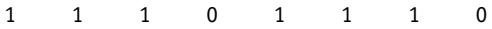

Converting from binary to denary and from denary to binary

It is fairly straightforward to change a binary number into a denary number. Each time a 1 appears in a column, the column value is added to the total. For example, the binary number above is:

 $$ 128+64+32+8+4+2=238(denary) $$

<!-- page 19 -->

## ACTIVITY 1A

Convert these binary numbers into denary.

<table border=1 style='margin: auto; word-wrap: break-word;'><tr><td style='text-align: center; word-wrap: break-word;'>a)</td><td style='text-align: center; word-wrap: break-word;'>0 0 1 1 0 0 1 1</td></tr><tr><td style='text-align: center; word-wrap: break-word;'>b)</td><td style='text-align: center; word-wrap: break-word;'>0 1 1 1 1 1 1 1</td></tr><tr><td style='text-align: center; word-wrap: break-word;'>c)</td><td style='text-align: center; word-wrap: break-word;'>1 0 0 1 1 0 0 1</td></tr><tr><td style='text-align: center; word-wrap: break-word;'>d)</td><td style='text-align: center; word-wrap: break-word;'>0 1 1 1 0 1 0 0</td></tr><tr><td style='text-align: center; word-wrap: break-word;'>e)</td><td style='text-align: center; word-wrap: break-word;'>1 1 1 1 1 1 1 1</td></tr><tr><td style='text-align: center; word-wrap: break-word;'>f)</td><td style='text-align: center; word-wrap: break-word;'>0 0 0 0 1 1 1 1</td></tr><tr><td style='text-align: center; word-wrap: break-word;'>g)</td><td style='text-align: center; word-wrap: break-word;'>1 0 0 0 1 1 1 1</td></tr><tr><td style='text-align: center; word-wrap: break-word;'>h)</td><td style='text-align: center; word-wrap: break-word;'>0 0 1 1 0 0 1 1</td></tr><tr><td style='text-align: center; word-wrap: break-word;'>i)</td><td style='text-align: center; word-wrap: break-word;'>0 1 1 1 0 0 0 0</td></tr><tr><td style='text-align: center; word-wrap: break-word;'>j)</td><td style='text-align: center; word-wrap: break-word;'>1 1 1 0 1 1 1 0</td></tr></table>

## ACTIVITY 1B

Convert these denary numbers into binary (using either method).
a) 41
b) 67
c) 86
d) 100
e) 111
f) 127
g) 144
h) 189
i) 200
j) 255

The 0 values are simply ignored when calculating the total.

The reverse operation – converting from denary to binary – is slightly more complex. There are two basic ways of doing this.

Consider the conversion of the denary number, 107, into binary ...

Method 1

This method involves placing 1s in the appropriate position so that the total equates to 107.

<table border=1 style='margin: auto; word-wrap: break-word;'><tr><td style='text-align: center; word-wrap: break-word;'>128</td><td style='text-align: center; word-wrap: break-word;'>64</td><td style='text-align: center; word-wrap: break-word;'>32</td><td style='text-align: center; word-wrap: break-word;'>16</td><td style='text-align: center; word-wrap: break-word;'>8</td><td style='text-align: center; word-wrap: break-word;'>4</td><td style='text-align: center; word-wrap: break-word;'>2</td><td style='text-align: center; word-wrap: break-word;'>1</td></tr><tr><td style='text-align: center; word-wrap: break-word;'>0</td><td style='text-align: center; word-wrap: break-word;'>1</td><td style='text-align: center; word-wrap: break-word;'>1</td><td style='text-align: center; word-wrap: break-word;'>0</td><td style='text-align: center; word-wrap: break-word;'>1</td><td style='text-align: center; word-wrap: break-word;'>0</td><td style='text-align: center; word-wrap: break-word;'>1</td><td style='text-align: center; word-wrap: break-word;'>1</td></tr></table>

Method 2

This method involves successive division by 2; the remainders are then written from bottom to top to give the binary value.

2 107
2 53 remainder: 1
2 26 remainder: 1
2 13 remainder: 0
2 6 remainder: 1
2 3 remainder: 0
2 1 remainder: 1
2 0 remainder: 1
0 remainder: 0

Write the remainder from bottom to top to get the binary number:

Binary addition and subtraction

Up until now we have assumed all binary numbers have positive values. There are a number of methods to represent both positive and negative numbers. We will consider:

one's complement

two's complement.

In one's complement, each digit in the binary number is inverted (in other words, 0 becomes 1 and 1 becomes 0). For example, 0 1 0 1 1 0 1 0 (denary value 90) becomes 1 0 1 0 0 1 0 1 (denary value -90).

In two's complement, each digit in the binary number is inverted and a '1' is added to the right-most bit. For example, 0 1 0 1 1 0 1 0 (denary value 90) becomes:

1 0 1 0 0 1 0 1
+
1
= 1 0 1 0 0 1 1 0

Throughout the remainder of this chapter, we will use the two's complement method to avoid confusion. Also, two's complement makes binary addition and subtraction more straightforward. The reader is left to investigate one's complement and the sign and magnitude method in binary arithmetic.

Now that we are introducing negative numbers, we need a way to represent these in binary. The two's complement uses these weightings for an 8-bit number representation:

<table border=1 style='margin: auto; word-wrap: break-word;'><tr><td style='text-align: center; word-wrap: break-word;'>-128</td><td style='text-align: center; word-wrap: break-word;'>64</td><td style='text-align: center; word-wrap: break-word;'>32</td><td style='text-align: center; word-wrap: break-word;'>16</td><td style='text-align: center; word-wrap: break-word;'>8</td><td style='text-align: center; word-wrap: break-word;'>4</td><td style='text-align: center; word-wrap: break-word;'>2</td><td style='text-align: center; word-wrap: break-word;'>1</td></tr></table>

<!-- page 20 -->

## EXTENSION ACTIVITY 1A

Show the column headings for a system that uses 16 bits to represent a binary number.

## This means:

<table border=1 style='margin: auto; word-wrap: break-word;'><tr><td style='text-align: center; word-wrap: break-word;'>-128</td><td style='text-align: center; word-wrap: break-word;'>64</td><td style='text-align: center; word-wrap: break-word;'>32</td><td style='text-align: center; word-wrap: break-word;'>16</td><td style='text-align: center; word-wrap: break-word;'>8</td><td style='text-align: center; word-wrap: break-word;'>4</td><td style='text-align: center; word-wrap: break-word;'>2</td><td style='text-align: center; word-wrap: break-word;'>1</td></tr><tr><td style='text-align: center; word-wrap: break-word;'>1</td><td style='text-align: center; word-wrap: break-word;'>1</td><td style='text-align: center; word-wrap: break-word;'>0</td><td style='text-align: center; word-wrap: break-word;'>1</td><td style='text-align: center; word-wrap: break-word;'>1</td><td style='text-align: center; word-wrap: break-word;'>0</td><td style='text-align: center; word-wrap: break-word;'>1</td><td style='text-align: center; word-wrap: break-word;'>0</td></tr><tr><td style='text-align: center; word-wrap: break-word;'>0</td><td style='text-align: center; word-wrap: break-word;'>0</td><td style='text-align: center; word-wrap: break-word;'>1</td><td style='text-align: center; word-wrap: break-word;'>0</td><td style='text-align: center; word-wrap: break-word;'>0</td><td style='text-align: center; word-wrap: break-word;'>1</td><td style='text-align: center; word-wrap: break-word;'>1</td><td style='text-align: center; word-wrap: break-word;'>0</td></tr></table>

The first example is: -128 + 64 + 16 + 8 + 2 = -38

The second example is:  $ 32 + 4 + 2 = 38 $

The easiest way to convert a number into its negative equivalent is to use two's complement. For example, 104 in binary is 01101000.

To find the binary value for -104 using two's complement:

<table border=1 style='margin: auto; word-wrap: break-word;'><tr><td style='text-align: center; word-wrap: break-word;'>invert the digits:</td><td style='text-align: center; word-wrap: break-word;'>1</td><td style='text-align: center; word-wrap: break-word;'>0</td><td style='text-align: center; word-wrap: break-word;'>0</td><td style='text-align: center; word-wrap: break-word;'>1</td><td style='text-align: center; word-wrap: break-word;'>0</td><td style='text-align: center; word-wrap: break-word;'>1</td><td style='text-align: center; word-wrap: break-word;'>1</td><td style='text-align: center; word-wrap: break-word;'>1</td><td style='text-align: center; word-wrap: break-word;'>(+104 in denary)</td></tr><tr><td style='text-align: center; word-wrap: break-word;'>add 1:</td><td style='text-align: center; word-wrap: break-word;'></td><td style='text-align: center; word-wrap: break-word;'></td><td style='text-align: center; word-wrap: break-word;'></td><td style='text-align: center; word-wrap: break-word;'></td><td style='text-align: center; word-wrap: break-word;'></td><td style='text-align: center; word-wrap: break-word;'></td><td style='text-align: center; word-wrap: break-word;'></td><td style='text-align: center; word-wrap: break-word;'>1</td><td style='text-align: center; word-wrap: break-word;'></td></tr><tr><td style='text-align: center; word-wrap: break-word;'>which gives:</td><td style='text-align: center; word-wrap: break-word;'>1</td><td style='text-align: center; word-wrap: break-word;'>0</td><td style='text-align: center; word-wrap: break-word;'>0</td><td style='text-align: center; word-wrap: break-word;'>1</td><td style='text-align: center; word-wrap: break-word;'>1</td><td style='text-align: center; word-wrap: break-word;'>0</td><td style='text-align: center; word-wrap: break-word;'>0</td><td style='text-align: center; word-wrap: break-word;'>0</td><td style='text-align: center; word-wrap: break-word;'>=-104)</td></tr></table>

## ACTIVITY 1C

Convert these denary numbers into 8-bit binary numbers using two's complement where necessary. Use these binary column weightings:

-128 64 32 16 8 4 2 1
a) +114
b) +61
c) +96
d) -14
e) -116

Binary addition

Consider Examples 1.1 and 1.2.

### Example 1.1

Add 0 0 1 0 0 1 0 1 (37 in denary) and 0 0 1 1 1 0 1 0 (58 in denary).

<table border=1 style='margin: auto; word-wrap: break-word;'><tr><td style='text-align: center; word-wrap: break-word;'>-128</td><td style='text-align: center; word-wrap: break-word;'>64</td><td style='text-align: center; word-wrap: break-word;'>32</td><td style='text-align: center; word-wrap: break-word;'>16</td><td style='text-align: center; word-wrap: break-word;'>8</td><td style='text-align: center; word-wrap: break-word;'>4</td><td style='text-align: center; word-wrap: break-word;'>2</td><td style='text-align: center; word-wrap: break-word;'>1</td></tr><tr><td style='text-align: center; word-wrap: break-word;'>0</td><td style='text-align: center; word-wrap: break-word;'>0</td><td style='text-align: center; word-wrap: break-word;'>1</td><td style='text-align: center; word-wrap: break-word;'>0</td><td style='text-align: center; word-wrap: break-word;'>0</td><td style='text-align: center; word-wrap: break-word;'>1</td><td style='text-align: center; word-wrap: break-word;'>0</td><td style='text-align: center; word-wrap: break-word;'>1</td></tr><tr><td style='text-align: center; word-wrap: break-word;'>0</td><td style='text-align: center; word-wrap: break-word;'>0</td><td style='text-align: center; word-wrap: break-word;'>1</td><td style='text-align: center; word-wrap: break-word;'>1</td><td style='text-align: center; word-wrap: break-word;'>1</td><td style='text-align: center; word-wrap: break-word;'>0</td><td style='text-align: center; word-wrap: break-word;'>1</td><td style='text-align: center; word-wrap: break-word;'>0</td></tr><tr><td style='text-align: center; word-wrap: break-word;'>0</td><td style='text-align: center; word-wrap: break-word;'>1</td><td style='text-align: center; word-wrap: break-word;'>0</td><td style='text-align: center; word-wrap: break-word;'>1</td><td style='text-align: center; word-wrap: break-word;'>1</td><td style='text-align: center; word-wrap: break-word;'>1</td><td style='text-align: center; word-wrap: break-word;'>1</td><td style='text-align: center; word-wrap: break-word;'>1</td></tr></table>

<!-- page 21 -->

Add 0 1 0 1 0 0 1 0 (82 in denary) and 0 1 0 0 0 1 0 1 (69 in denary).

## Solution

<table border=1 style='margin: auto; word-wrap: break-word;'><tr><td style='text-align: center; word-wrap: break-word;'>-128</td><td style='text-align: center; word-wrap: break-word;'>64</td><td style='text-align: center; word-wrap: break-word;'>32</td><td style='text-align: center; word-wrap: break-word;'>16</td><td style='text-align: center; word-wrap: break-word;'>8</td><td style='text-align: center; word-wrap: break-word;'>4</td><td style='text-align: center; word-wrap: break-word;'>2</td><td style='text-align: center; word-wrap: break-word;'>1</td></tr><tr><td style='text-align: center; word-wrap: break-word;'>0</td><td style='text-align: center; word-wrap: break-word;'>1</td><td style='text-align: center; word-wrap: break-word;'>0</td><td style='text-align: center; word-wrap: break-word;'>1</td><td style='text-align: center; word-wrap: break-word;'>0</td><td style='text-align: center; word-wrap: break-word;'>0</td><td style='text-align: center; word-wrap: break-word;'>1</td><td style='text-align: center; word-wrap: break-word;'>0</td></tr><tr><td style='text-align: center; word-wrap: break-word;'></td><td style='text-align: center; word-wrap: break-word;'></td><td style='text-align: center; word-wrap: break-word;'></td><td style='text-align: center; word-wrap: break-word;'>+</td><td style='text-align: center; word-wrap: break-word;'></td><td style='text-align: center; word-wrap: break-word;'></td><td style='text-align: center; word-wrap: break-word;'></td><td style='text-align: center; word-wrap: break-word;'></td></tr><tr><td style='text-align: center; word-wrap: break-word;'>0</td><td style='text-align: center; word-wrap: break-word;'>1</td><td style='text-align: center; word-wrap: break-word;'>0</td><td style='text-align: center; word-wrap: break-word;'>0</td><td style='text-align: center; word-wrap: break-word;'>0</td><td style='text-align: center; word-wrap: break-word;'>1</td><td style='text-align: center; word-wrap: break-word;'>0</td><td style='text-align: center; word-wrap: break-word;'>1</td></tr><tr><td style='text-align: center; word-wrap: break-word;'></td><td style='text-align: center; word-wrap: break-word;'></td><td style='text-align: center; word-wrap: break-word;'></td><td style='text-align: center; word-wrap: break-word;'>=</td><td style='text-align: center; word-wrap: break-word;'></td><td style='text-align: center; word-wrap: break-word;'></td><td style='text-align: center; word-wrap: break-word;'></td><td style='text-align: center; word-wrap: break-word;'></td></tr><tr><td style='text-align: center; word-wrap: break-word;'>1</td><td style='text-align: center; word-wrap: break-word;'>0</td><td style='text-align: center; word-wrap: break-word;'>0</td><td style='text-align: center; word-wrap: break-word;'>1</td><td style='text-align: center; word-wrap: break-word;'>0</td><td style='text-align: center; word-wrap: break-word;'>1</td><td style='text-align: center; word-wrap: break-word;'>1</td><td style='text-align: center; word-wrap: break-word;'>1</td></tr></table>

This gives us 1 0 0 1 0 1 1 1, which is -105 in denary (which is clearly nonsense). When adding two positive numbers, the result should always be positive (likewise, when adding two negative numbers, the result should always be negative). Here, the addition of two positive numbers has resulted in a negative answer. This is due to the result of the addition producing a number which is outside the range of values which can be represented by the 8 bits being used (in this case +127 is the largest value which can be represented, and the calculation produces the value 151, which is larger than 127 and, therefore, out of range). This causes overflow; it is considered in more detail in Chapter 13.

## Binary subtraction

To carry out subtraction in binary, we convert the number being subtracted into its negative equivalent using two's complement, and then add the two numbers.

Example 1.3

Carry out the subtraction 95 – 68 in binary.

## Solution

1 Convert the two numbers into binary:
95 = 0 1 0 1 1 1 1 1
68 = 0 1 0 0 0 1 0 0

2 Find the two's complement of 68:

invert the digits: 1 0 1 1 1 0 1 1
add 1: 1
which gives: 1 0 1 1 1 1 0 0 = -68

3 Add 95 and -68:

<table border=1 style='margin: auto; word-wrap: break-word;'><tr><td style='text-align: center; word-wrap: break-word;'></td><td style='text-align: center; word-wrap: break-word;'>-128</td><td style='text-align: center; word-wrap: break-word;'>64</td><td style='text-align: center; word-wrap: break-word;'>32</td><td style='text-align: center; word-wrap: break-word;'>16</td><td style='text-align: center; word-wrap: break-word;'>8</td><td style='text-align: center; word-wrap: break-word;'>4</td><td style='text-align: center; word-wrap: break-word;'>2</td><td style='text-align: center; word-wrap: break-word;'>1</td></tr><tr><td style='text-align: center; word-wrap: break-word;'></td><td style='text-align: center; word-wrap: break-word;'>0</td><td style='text-align: center; word-wrap: break-word;'>1</td><td style='text-align: center; word-wrap: break-word;'>0</td><td style='text-align: center; word-wrap: break-word;'>1</td><td style='text-align: center; word-wrap: break-word;'>1</td><td style='text-align: center; word-wrap: break-word;'>1</td><td style='text-align: center; word-wrap: break-word;'>1</td><td style='text-align: center; word-wrap: break-word;'>1</td></tr><tr><td style='text-align: center; word-wrap: break-word;'></td><td style='text-align: center; word-wrap: break-word;'></td><td style='text-align: center; word-wrap: break-word;'></td><td style='text-align: center; word-wrap: break-word;'></td><td style='text-align: center; word-wrap: break-word;'>+</td><td style='text-align: center; word-wrap: break-word;'></td><td style='text-align: center; word-wrap: break-word;'></td><td style='text-align: center; word-wrap: break-word;'></td><td style='text-align: center; word-wrap: break-word;'></td></tr><tr><td style='text-align: center; word-wrap: break-word;'></td><td style='text-align: center; word-wrap: break-word;'>1</td><td style='text-align: center; word-wrap: break-word;'>0</td><td style='text-align: center; word-wrap: break-word;'>1</td><td style='text-align: center; word-wrap: break-word;'>1</td><td style='text-align: center; word-wrap: break-word;'>1</td><td style='text-align: center; word-wrap: break-word;'>1</td><td style='text-align: center; word-wrap: break-word;'>0</td><td style='text-align: center; word-wrap: break-word;'>0</td></tr><tr><td style='text-align: center; word-wrap: break-word;'></td><td style='text-align: center; word-wrap: break-word;'></td><td style='text-align: center; word-wrap: break-word;'></td><td style='text-align: center; word-wrap: break-word;'></td><td style='text-align: center; word-wrap: break-word;'>=</td><td style='text-align: center; word-wrap: break-word;'></td><td style='text-align: center; word-wrap: break-word;'></td><td style='text-align: center; word-wrap: break-word;'></td><td style='text-align: center; word-wrap: break-word;'></td></tr><tr><td style='text-align: center; word-wrap: break-word;'>1</td><td style='text-align: center; word-wrap: break-word;'>0</td><td style='text-align: center; word-wrap: break-word;'>0</td><td style='text-align: center; word-wrap: break-word;'>0</td><td style='text-align: center; word-wrap: break-word;'>1</td><td style='text-align: center; word-wrap: break-word;'>1</td><td style='text-align: center; word-wrap: break-word;'>0</td><td style='text-align: center; word-wrap: break-word;'>1</td><td style='text-align: center; word-wrap: break-word;'>1</td></tr></table>

The additional ninth bit is simply ignored leaving the binary number 0 0 0 1 1 0 1 1 (denary equivalent of 27, which is the correct result of the subtraction).

<!-- page 22 -->

Carry out the subtraction 49 – 80 in binary.

Solution
1 Convert the two numbers into binary:
49 = 0 0 1 1 0 0 0 1
80 = 0 1 0 1 0 0 0 0
2 Find the two's complement of 80:
invert the digits: 1 0 1 0 1 1 1 1
add 1: 1
which gives: 1 0 1 1 0 0 0 0 = -80
3 Add 49 and -80:
-128 64 32 16 8 4 2 1
0 0 1 1 0 0 0 0 0
+
1 0 1 1 1 0 0 0
=
1 1 1 0 0 0 0 0 0 0 0 1
This gives us 1 1 1 0 0 0 0 1, which is -31 in denary; the correct answer

## ACTIVITY 1D

Carry out these binary additions and subtractions using these 8-bit column weightings:

-128 64 32 16 8
a) 0 0 1 1 1 0 0 1 + 0 0 1 0 1 0 0 1
b) 0 1 0 0 1 0 1 1 + 0 0 1 0 0 0 1 1
c) 0 1 0 1 1 0 0 0 + 0 0 1 0 1 0 0 0
d) 0 1 1 1 0 0 1 1 + 0 0 1 1 1 1 1 0
e) 0 0 0 0 1 1 1 1 + 0 0 0 1 1 1 0 0
f) 0 1 1 0 0 0 1 1 - 0 0 1 1 0 0 0 0
g) 0 1 1 1 1 1 1 1 - 0 1 0 1 1 0 1 0
h) 0 0 1 1 0 1 0 0 - 0 1 0 0 0 1 0 0
i) 0 0 0 0 0 0 1 1 - 0 1 1 0 0 1 0 0
j) 1 1 0 1 1 1 1 1 - 1 1 0 0 0 0 1 1

## Measurement of the size of computer memories

The byte is the smallest unit of memory in a computer. Some computers use larger bytes, such as 16-bit systems and 32-bit systems, but they are always multiples of 8. 1 byte of memory wouldn't allow you to store very much information; so memory size is measured in these multiples. See Table 1.1.

<!-- page 23 -->

<table border=1 style='margin: auto; word-wrap: break-word;'><tr><td style='text-align: center; word-wrap: break-word;'>Name of memory size</td><td style='text-align: center; word-wrap: break-word;'>Equivalent denary value (bytes)</td></tr><tr><td style='text-align: center; word-wrap: break-word;'>1 kilobyte (1 KB)</td><td style='text-align: center; word-wrap: break-word;'>1000</td></tr><tr><td style='text-align: center; word-wrap: break-word;'>1 megabyte (1 MB)</td><td style='text-align: center; word-wrap: break-word;'>1000000</td></tr><tr><td style='text-align: center; word-wrap: break-word;'>1 gigabyte (1 GB)</td><td style='text-align: center; word-wrap: break-word;'>1000000000</td></tr><tr><td style='text-align: center; word-wrap: break-word;'>1 terabyte (1 TB)</td><td style='text-align: center; word-wrap: break-word;'>1000000000000</td></tr><tr><td style='text-align: center; word-wrap: break-word;'>1 petabyte (1 PB)</td><td style='text-align: center; word-wrap: break-word;'>100000000000000</td></tr></table>

Table 1.1 Memory size and denary values

The system of numbering shown in Table 1.1 only refers to some storage devices, but is technically inaccurate. It is based on the SI (base 10) system of units where 1 kilo is equal to 1000. A 1TB hard disk drive would allow the storage of  $ 1 \times 10^{12} $ bytes according to this system. However, since memory size is actually measured in terms of powers of 2, another system has been proposed by the International Electrotechnical Commission (IEC); it is based on the binary system. See Table 1.2.

<table border=1 style='margin: auto; word-wrap: break-word;'><tr><td style='text-align: center; word-wrap: break-word;'>Name of memory size</td><td style='text-align: center; word-wrap: break-word;'>Number of bytes</td><td style='text-align: center; word-wrap: break-word;'>Equivalent denary value (bytes)</td></tr><tr><td style='text-align: center; word-wrap: break-word;'>1 kibibyte (1 KiB)</td><td style='text-align: center; word-wrap: break-word;'>$ 2^{10} $</td><td style='text-align: center; word-wrap: break-word;'>1024</td></tr><tr><td style='text-align: center; word-wrap: break-word;'>1 mebibyte (1 MiB)</td><td style='text-align: center; word-wrap: break-word;'>$ 2^{20} $</td><td style='text-align: center; word-wrap: break-word;'>1048576</td></tr><tr><td style='text-align: center; word-wrap: break-word;'>1 gibibyte (1 GiB)</td><td style='text-align: center; word-wrap: break-word;'>$ 2^{30} $</td><td style='text-align: center; word-wrap: break-word;'>1073741824</td></tr><tr><td style='text-align: center; word-wrap: break-word;'>1 tebibyte (1 TiB)</td><td style='text-align: center; word-wrap: break-word;'>$ 2^{40} $</td><td style='text-align: center; word-wrap: break-word;'>1099511627776</td></tr><tr><td style='text-align: center; word-wrap: break-word;'>1 peibyte (1 PiB)</td><td style='text-align: center; word-wrap: break-word;'>$ 2^{50} $</td><td style='text-align: center; word-wrap: break-word;'>1125899906842624</td></tr></table>

Table 1.2 IEC memory size system

This system is more accurate. Internal memories (such as RAM) should be measured using the IEC system. A 64 GiB RAM could, therefore, store  $ 64 \times 2^{30} $ bytes of data (68 719 476 736 bytes).

See Section 1.2 for examples of how to calculate the size of a file.

#### 1.1.3 Hexadecimal number system

The hexadecimal system is very closely related to the binary system. Hexadecimal (sometimes referred to as simply hex) is a base 16 system with the weightings:

1048576 (165) 65536 (164) 4096 (163) 256 (162) 16 (161) 1 (160)

Because it is a system based on 16 different digits, the numbers 0 to 9 and the letters A to F are used to represent hexadecimal digits.

A = 10, B = 11, C = 12, D = 13, E = 14 and F = 15.

Since  $ 16 = 2^{4} $, four binary digits are equivalent to each hexadecimal digit. Table 1.3 summarises the link between binary, hexadecimal and denary.

<!-- page 24 -->

<table border=1 style='margin: auto; word-wrap: break-word;'><tr><td style='text-align: center; word-wrap: break-word;'>Binary value</td><td style='text-align: center; word-wrap: break-word;'>Hexadecimal value</td><td style='text-align: center; word-wrap: break-word;'>Denary value</td></tr><tr><td style='text-align: center; word-wrap: break-word;'>0 0 0 0</td><td style='text-align: center; word-wrap: break-word;'>0</td><td style='text-align: center; word-wrap: break-word;'>0</td></tr><tr><td style='text-align: center; word-wrap: break-word;'>0 0 0 1</td><td style='text-align: center; word-wrap: break-word;'>1</td><td style='text-align: center; word-wrap: break-word;'>1</td></tr><tr><td style='text-align: center; word-wrap: break-word;'>0 0 1 0</td><td style='text-align: center; word-wrap: break-word;'>2</td><td style='text-align: center; word-wrap: break-word;'>2</td></tr><tr><td style='text-align: center; word-wrap: break-word;'>0 0 1 1</td><td style='text-align: center; word-wrap: break-word;'>3</td><td style='text-align: center; word-wrap: break-word;'>3</td></tr><tr><td style='text-align: center; word-wrap: break-word;'>0 1 0 0</td><td style='text-align: center; word-wrap: break-word;'>4</td><td style='text-align: center; word-wrap: break-word;'>4</td></tr><tr><td style='text-align: center; word-wrap: break-word;'>0 1 0 1</td><td style='text-align: center; word-wrap: break-word;'>5</td><td style='text-align: center; word-wrap: break-word;'>5</td></tr><tr><td style='text-align: center; word-wrap: break-word;'>0 1 1 0</td><td style='text-align: center; word-wrap: break-word;'>6</td><td style='text-align: center; word-wrap: break-word;'>6</td></tr><tr><td style='text-align: center; word-wrap: break-word;'>0 1 1 1</td><td style='text-align: center; word-wrap: break-word;'>7</td><td style='text-align: center; word-wrap: break-word;'>7</td></tr><tr><td style='text-align: center; word-wrap: break-word;'>1 0 0 0</td><td style='text-align: center; word-wrap: break-word;'>8</td><td style='text-align: center; word-wrap: break-word;'>8</td></tr><tr><td style='text-align: center; word-wrap: break-word;'>1 0 0 1</td><td style='text-align: center; word-wrap: break-word;'>9</td><td style='text-align: center; word-wrap: break-word;'>9</td></tr><tr><td style='text-align: center; word-wrap: break-word;'>1 0 1 0</td><td style='text-align: center; word-wrap: break-word;'>A</td><td style='text-align: center; word-wrap: break-word;'>10</td></tr><tr><td style='text-align: center; word-wrap: break-word;'>1 0 1 1</td><td style='text-align: center; word-wrap: break-word;'>B</td><td style='text-align: center; word-wrap: break-word;'>11</td></tr><tr><td style='text-align: center; word-wrap: break-word;'>1 1 0 0</td><td style='text-align: center; word-wrap: break-word;'>C</td><td style='text-align: center; word-wrap: break-word;'>12</td></tr><tr><td style='text-align: center; word-wrap: break-word;'>1 1 0 1</td><td style='text-align: center; word-wrap: break-word;'>D</td><td style='text-align: center; word-wrap: break-word;'>13</td></tr><tr><td style='text-align: center; word-wrap: break-word;'>1 1 1 0</td><td style='text-align: center; word-wrap: break-word;'>E</td><td style='text-align: center; word-wrap: break-word;'>14</td></tr><tr><td style='text-align: center; word-wrap: break-word;'>1 1 1 1</td><td style='text-align: center; word-wrap: break-word;'>F</td><td style='text-align: center; word-wrap: break-word;'>15</td></tr></table>

Table 1.3 The link between binary, hexadecimal and denary

Converting from binary to hexadecimal and from hexadecimal to binary

Converting from binary to hexadecimal is a fairly easy process. Starting from the right and moving left, split the binary number into groups of 4 bits. If the last group has less than 4 bits, then simply fill in with 0s from the left. Take each group of 4 bits and convert it into the equivalent hexadecimal digit using Table 1.3.

Examples 1.5 and 1.6 show you how this works.

### Example 1.5

Convert 1 0 1 1 1 1 1 0 0 0 0 1 from binary to hexadecimal.

Solution

First split it into groups of 4bits:

1 0 1 1 1 1 1 0 0 0 0 1

Then find the equivalent hexadecimal digits:

B E 1

### Example 1.6

## Convert 1 0 0 0 0 1 1 1 1 1 1 1 1 0 1 from binary to hexadecimal

## Solution

First split it into groups of 4 bits:

10 0001 1111 1101

The left group only contains 2bits, so add in two 0s to the left: 0010 0001 1111 1101

Now find the equivalent hexadecimal digits:

2 1 F D

<!-- page 25 -->

## ACTIVITY 1E

Convert these binary numbers into hexadecimal.
a) 1 1 0 0 0 0 1 1
b) 1 1 1 1 0 1 1 1
c) 1 0 0 1 1 1 1 1 1 1
d) 1 0 0 1 1 1 0 1 1 1 0
e) 0 0 0 1 1 1 1 0 0 0 0 1
f) 1 0 0 0 1 0 0 1 1 1 1 0
g) 0 0 1 0 0 1 1 1 1 1 1 0
h) 0 1 1 1 0 1 0 0 1 1 1 0 0
i) 1 1 1 1 1 1 1 1 0 1 1 1 1 0 1
j) 0 0 1 1 0 0 1 1 1 1 0 1 0 1 1 1 0

Converting from hexadecimal to binary is also straightforward. Using the data from Table 1.3, simply take each hexadecimal digit and write down the 4 bit code which corresponds to the digit.

### Example 1.7

Convert this hexadecimal number to its binary equivalent.

## 45 A

Solution
Using Table 1.3, find the 4-bit code for each digit:
0 1 0 0 0 1 0 1 1 0 1 0
Put the groups together to form the binary number:
0 1 0 0 0 1 0 1 1 0 1 0

### Example 1.8

## Convert this hexadecimal number to its binary equivalent

Solution
Using Table 1.3:
1 0 1 1 1 1 1 1 0 0 0 0 1 0 0 0
Then put all the digits together:
1 0 1 1 1 1 1 0 0 0 0 1 0 0 0

## Use of the hexadecimal system

This section reviews two uses of the hexadecimal system.

Memory dumps

It is much easier to work with:

B 5 A 4 1 A F C

than it is to work with:

101101011010010000011010111111100

So, hexadecimal is often used when developing new software or when trying to trace errors in programs. When the memory contents are output to a printer or monitor, this is known as a memory dump.

<!-- page 26 -->

## ACTIVITY 1F

Convert these hexadecimal numbers into binary.

h) 40AA

i) DA47

i) 1AB0

<table border=1 style='margin: auto; word-wrap: break-word;'><tr><td style='text-align: center; word-wrap: break-word;'>00990F60</td><td style='text-align: center; word-wrap: break-word;'>54</td><td style='text-align: center; word-wrap: break-word;'>68</td><td style='text-align: center; word-wrap: break-word;'>69</td><td style='text-align: center; word-wrap: break-word;'>73</td><td style='text-align: center; word-wrap: break-word;'>20</td><td style='text-align: center; word-wrap: break-word;'>69</td><td style='text-align: center; word-wrap: break-word;'>73</td><td style='text-align: center; word-wrap: break-word;'>20</td><td style='text-align: center; word-wrap: break-word;'>61</td><td style='text-align: center; word-wrap: break-word;'>6E</td><td style='text-align: center; word-wrap: break-word;'>20</td><td style='text-align: center; word-wrap: break-word;'>65</td><td style='text-align: center; word-wrap: break-word;'>78</td><td style='text-align: center; word-wrap: break-word;'>61</td><td style='text-align: center; word-wrap: break-word;'>6D</td><td style='text-align: center; word-wrap: break-word;'>70</td><td style='text-align: center; word-wrap: break-word;'>6C</td><td style='text-align: center; word-wrap: break-word;'>65</td><td style='text-align: center; word-wrap: break-word;'>20</td><td style='text-align: center; word-wrap: break-word;'>6F</td><td style='text-align: center; word-wrap: break-word;'>66</td></tr><tr><td style='text-align: center; word-wrap: break-word;'>00990F77</td><td style='text-align: center; word-wrap: break-word;'>61</td><td style='text-align: center; word-wrap: break-word;'>20</td><td style='text-align: center; word-wrap: break-word;'>6D</td><td style='text-align: center; word-wrap: break-word;'>65</td><td style='text-align: center; word-wrap: break-word;'>6D</td><td style='text-align: center; word-wrap: break-word;'>6F</td><td style='text-align: center; word-wrap: break-word;'>72</td><td style='text-align: center; word-wrap: break-word;'>79</td><td style='text-align: center; word-wrap: break-word;'>20</td><td style='text-align: center; word-wrap: break-word;'>64</td><td style='text-align: center; word-wrap: break-word;'>75</td><td style='text-align: center; word-wrap: break-word;'>6D</td><td style='text-align: center; word-wrap: break-word;'>70</td><td style='text-align: center; word-wrap: break-word;'>20</td><td style='text-align: center; word-wrap: break-word;'>66</td><td style='text-align: center; word-wrap: break-word;'>72</td><td style='text-align: center; word-wrap: break-word;'>6F</td><td style='text-align: center; word-wrap: break-word;'>6D</td><td style='text-align: center; word-wrap: break-word;'>20</td><td style='text-align: center; word-wrap: break-word;'>20</td><td style='text-align: center; word-wrap: break-word;'>61</td></tr><tr><td style='text-align: center; word-wrap: break-word;'>00990E8E</td><td style='text-align: center; word-wrap: break-word;'>74</td><td style='text-align: center; word-wrap: break-word;'>79</td><td style='text-align: center; word-wrap: break-word;'>70</td><td style='text-align: center; word-wrap: break-word;'>69</td><td style='text-align: center; word-wrap: break-word;'>63</td><td style='text-align: center; word-wrap: break-word;'>61</td><td style='text-align: center; word-wrap: break-word;'>6C</td><td style='text-align: center; word-wrap: break-word;'>20</td><td style='text-align: center; word-wrap: break-word;'>20</td><td style='text-align: center; word-wrap: break-word;'>63</td><td style='text-align: center; word-wrap: break-word;'>6F</td><td style='text-align: center; word-wrap: break-word;'>6D</td><td style='text-align: center; word-wrap: break-word;'>70</td><td style='text-align: center; word-wrap: break-word;'>75</td><td style='text-align: center; word-wrap: break-word;'>74</td><td style='text-align: center; word-wrap: break-word;'>65</td><td style='text-align: center; word-wrap: break-word;'>72</td><td style='text-align: center; word-wrap: break-word;'>20</td><td style='text-align: center; word-wrap: break-word;'>20</td><td style='text-align: center; word-wrap: break-word;'>6D</td><td style='text-align: center; word-wrap: break-word;'>85</td></tr><tr><td style='text-align: center; word-wrap: break-word;'>00990EA5</td><td style='text-align: center; word-wrap: break-word;'>6D</td><td style='text-align: center; word-wrap: break-word;'>6F</td><td style='text-align: center; word-wrap: break-word;'>72</td><td style='text-align: center; word-wrap: break-word;'>79</td><td style='text-align: center; word-wrap: break-word;'>20</td><td style='text-align: center; word-wrap: break-word;'>73</td><td style='text-align: center; word-wrap: break-word;'>68</td><td style='text-align: center; word-wrap: break-word;'>6F</td><td style='text-align: center; word-wrap: break-word;'>77</td><td style='text-align: center; word-wrap: break-word;'>69</td><td style='text-align: center; word-wrap: break-word;'>6E</td><td style='text-align: center; word-wrap: break-word;'>67</td><td style='text-align: center; word-wrap: break-word;'>20</td><td style='text-align: center; word-wrap: break-word;'>74</td><td style='text-align: center; word-wrap: break-word;'>68</td><td style='text-align: center; word-wrap: break-word;'>65</td><td style='text-align: center; word-wrap: break-word;'>20</td><td style='text-align: center; word-wrap: break-word;'>20</td><td style='text-align: center; word-wrap: break-word;'>63</td><td style='text-align: center; word-wrap: break-word;'>6F</td><td style='text-align: center; word-wrap: break-word;'>6E</td></tr><tr><td style='text-align: center; word-wrap: break-word;'>00990EBC</td><td style='text-align: center; word-wrap: break-word;'>74</td><td style='text-align: center; word-wrap: break-word;'>65</td><td style='text-align: center; word-wrap: break-word;'>6E</td><td style='text-align: center; word-wrap: break-word;'>74</td><td style='text-align: center; word-wrap: break-word;'>73</td><td style='text-align: center; word-wrap: break-word;'>20</td><td style='text-align: center; word-wrap: break-word;'>6F</td><td style='text-align: center; word-wrap: break-word;'>66</td><td style='text-align: center; word-wrap: break-word;'>20</td><td style='text-align: center; word-wrap: break-word;'>61</td><td style='text-align: center; word-wrap: break-word;'>20</td><td style='text-align: center; word-wrap: break-word;'>6E</td><td style='text-align: center; word-wrap: break-word;'>75</td><td style='text-align: center; word-wrap: break-word;'>6D</td><td style='text-align: center; word-wrap: break-word;'>62</td><td style='text-align: center; word-wrap: break-word;'>65</td><td style='text-align: center; word-wrap: break-word;'>72</td><td style='text-align: center; word-wrap: break-word;'>20</td><td style='text-align: center; word-wrap: break-word;'>20</td><td style='text-align: center; word-wrap: break-word;'>6F</td><td style='text-align: center; word-wrap: break-word;'>66</td></tr><tr><td style='text-align: center; word-wrap: break-word;'>00990ED3</td><td style='text-align: center; word-wrap: break-word;'>6C</td><td style='text-align: center; word-wrap: break-word;'>6F</td><td style='text-align: center; word-wrap: break-word;'>63</td><td style='text-align: center; word-wrap: break-word;'>61</td><td style='text-align: center; word-wrap: break-word;'>74</td><td style='text-align: center; word-wrap: break-word;'>69</td><td style='text-align: center; word-wrap: break-word;'>6F</td><td style='text-align: center; word-wrap: break-word;'>6E</td><td style='text-align: center; word-wrap: break-word;'>73</td><td style='text-align: center; word-wrap: break-word;'>20</td><td style='text-align: center; word-wrap: break-word;'>20</td><td style='text-align: center; word-wrap: break-word;'>69</td><td style='text-align: center; word-wrap: break-word;'>6E</td><td style='text-align: center; word-wrap: break-word;'>20</td><td style='text-align: center; word-wrap: break-word;'>20</td><td style='text-align: center; word-wrap: break-word;'>68</td><td style='text-align: center; word-wrap: break-word;'>65</td><td style='text-align: center; word-wrap: break-word;'>78</td><td style='text-align: center; word-wrap: break-word;'>20</td><td style='text-align: center; word-wrap: break-word;'>20</td><td style='text-align: center; word-wrap: break-word;'>20</td></tr><tr><td style='text-align: center; word-wrap: break-word;'>00990EEA</td><td style='text-align: center; word-wrap: break-word;'>6E</td><td style='text-align: center; word-wrap: break-word;'>6F</td><td style='text-align: center; word-wrap: break-word;'>74</td><td style='text-align: center; word-wrap: break-word;'>61</td><td style='text-align: center; word-wrap: break-word;'>74</td><td style='text-align: center; word-wrap: break-word;'>69</td><td style='text-align: center; word-wrap: break-word;'>6F</td><td style='text-align: center; word-wrap: break-word;'>6E</td><td style='text-align: center; word-wrap: break-word;'>20</td><td style='text-align: center; word-wrap: break-word;'>20</td><td style='text-align: center; word-wrap: break-word;'>00</td><td style='text-align: center; word-wrap: break-word;'>00</td><td style='text-align: center; word-wrap: break-word;'>00</td><td style='text-align: center; word-wrap: break-word;'>00</td><td style='text-align: center; word-wrap: break-word;'>00</td><td style='text-align: center; word-wrap: break-word;'>00</td><td style='text-align: center; word-wrap: break-word;'>00</td><td style='text-align: center; word-wrap: break-word;'>00</td><td style='text-align: center; word-wrap: break-word;'>00</td><td style='text-align: center; word-wrap: break-word;'>00</td><td style='text-align: center; word-wrap: break-word;'>00</td></tr></table>

### Table 1.4 Memory dump

A program developer can look at each of the hexadecimal codes (as shown in Table 1.4) and determine where the error lies. The value on the far left shows the memory location, so it is possible to find out exactly where in memory the fault occurs. Using hexadecimal is more manageable than binary. It is a powerful fault-tracing tool, but requires considerable knowledge of computer architecture to be able to interpret the results.

#### 1.1.4 Binary-coded decimal (BCD) system

The binary-coded decimal (BCD) system uses a 4-bit code to represent each denary digit:

 $$ \begin{array}{r}{0\ 0\ 0\ 0=0}\end{array}\quad0\ 1\ 0\ 1=5 $$ 

 $$ \begin{array}{r}{0\ 0\ 0\ 1=1}\end{array}\quad0\ 1\ 1\ 0=6 $$ 

 $$ \begin{array}{r} 0\ 0\ 1\ 0=2\quad0\ 1\ 1\ 1=7 \end{array} $$ 

 $$ \begin{array}{l} 0\ 0\ 1\ 1=3\quad1\ 0\ 0\ 0=8 \end{array} $$ 

 $$ \begin{array}{l} 0\ 1\ 0\ 0=4 \quad 1\ 0\ 0\ 1=9 \end{array} $$ 

Therefore, the denary number 3165 would be 0011000101100101 in BCD format.

The 4-bit code can be stored in the computer either as half a byte or two 4-bit codes stored together to form one byte. For example, using 3 1 6 5 again ...

Method 1: four single bytes

<table border=1 style='margin: auto; word-wrap: break-word;'><tr><td style='text-align: center; word-wrap: break-word;'>0</td><td style='text-align: center; word-wrap: break-word;'>0</td><td style='text-align: center; word-wrap: break-word;'>0</td><td style='text-align: center; word-wrap: break-word;'>0</td><td style='text-align: center; word-wrap: break-word;'>0</td><td style='text-align: center; word-wrap: break-word;'>0</td><td style='text-align: center; word-wrap: break-word;'>1</td><td style='text-align: center; word-wrap: break-word;'>1</td></tr><tr><td style='text-align: center; word-wrap: break-word;'>0</td><td style='text-align: center; word-wrap: break-word;'>0</td><td style='text-align: center; word-wrap: break-word;'>0</td><td style='text-align: center; word-wrap: break-word;'>0</td><td style='text-align: center; word-wrap: break-word;'>0</td><td style='text-align: center; word-wrap: break-word;'>0</td><td style='text-align: center; word-wrap: break-word;'>0</td><td style='text-align: center; word-wrap: break-word;'>1</td></tr><tr><td style='text-align: center; word-wrap: break-word;'>0</td><td style='text-align: center; word-wrap: break-word;'>0</td><td style='text-align: center; word-wrap: break-word;'>0</td><td style='text-align: center; word-wrap: break-word;'>0</td><td style='text-align: center; word-wrap: break-word;'>0</td><td style='text-align: center; word-wrap: break-word;'>1</td><td style='text-align: center; word-wrap: break-word;'>1</td><td style='text-align: center; word-wrap: break-word;'>0</td></tr><tr><td style='text-align: center; word-wrap: break-word;'>0</td><td style='text-align: center; word-wrap: break-word;'>0</td><td style='text-align: center; word-wrap: break-word;'>0</td><td style='text-align: center; word-wrap: break-word;'>0</td><td style='text-align: center; word-wrap: break-word;'>0</td><td style='text-align: center; word-wrap: break-word;'>1</td><td style='text-align: center; word-wrap: break-word;'>0</td><td style='text-align: center; word-wrap: break-word;'>1</td></tr></table>

Method 2: two bytes

<table border=1 style='margin: auto; word-wrap: break-word;'><tr><td style='text-align: center; word-wrap: break-word;'>0</td><td style='text-align: center; word-wrap: break-word;'>0</td><td style='text-align: center; word-wrap: break-word;'>1</td><td style='text-align: center; word-wrap: break-word;'>1</td><td style='text-align: center; word-wrap: break-word;'>0</td><td style='text-align: center; word-wrap: break-word;'>0</td><td style='text-align: center; word-wrap: break-word;'>0</td><td style='text-align: center; word-wrap: break-word;'>1</td></tr><tr><td style='text-align: center; word-wrap: break-word;'>0</td><td style='text-align: center; word-wrap: break-word;'>1</td><td style='text-align: center; word-wrap: break-word;'>1</td><td style='text-align: center; word-wrap: break-word;'>0</td><td style='text-align: center; word-wrap: break-word;'>0</td><td style='text-align: center; word-wrap: break-word;'>1</td><td style='text-align: center; word-wrap: break-word;'>0</td><td style='text-align: center; word-wrap: break-word;'>1</td></tr></table>

## ACTIVITY 1G

1 Convert these denary numbers into BCD format.

a) 271 b) 5006

2 Convert these BCD numbers into denary numbers.

a) 1 0 0 1 0 0 1 1 0 1 1 1

b) 0 1 1 1 0 1 1 1 0 1 1 0 0 0 1 0

<!-- page 27 -->

## Uses of BCD

The most obvious use of BCD is in the representation of digits on a calculator or clock display.

### 180.3 

Each denary digit will have a BCD equivalent value which makes it easy to convert from computer output to denary display.

As you will learn in Chapter 13, it is nearly impossible to represent decimal values exactly in computer memories which use the binary number system. Normally this doesn't cause a major issue since the differences can be dealt with. However, when it comes to accounting and representing monetary values in computers, exact values need to be stored to prevent significant errors from accumulating. Monetary values use a fixed-point notation, for example $1.31, so one solution is to represent each denary digit as a BCD value.

Consider adding $0.37 and $0.94 together using fixed-point decimals.

<table border=1 style='margin: auto; word-wrap: break-word;'><tr><td style='text-align: center; word-wrap: break-word;'>0</td><td style='text-align: center; word-wrap: break-word;'>0</td><td style='text-align: center; word-wrap: break-word;'>0</td><td style='text-align: center; word-wrap: break-word;'>0</td><td style='text-align: center; word-wrap: break-word;'>0</td><td style='text-align: center; word-wrap: break-word;'>0</td><td style='text-align: center; word-wrap: break-word;'>0</td><td style='text-align: center; word-wrap: break-word;'>0</td><td style='text-align: center; word-wrap: break-word;'>.</td><td style='text-align: center; word-wrap: break-word;'>0</td><td style='text-align: center; word-wrap: break-word;'>0</td><td style='text-align: center; word-wrap: break-word;'>1</td><td style='text-align: center; word-wrap: break-word;'>1</td><td style='text-align: center; word-wrap: break-word;'>0</td><td style='text-align: center; word-wrap: break-word;'>1</td><td style='text-align: center; word-wrap: break-word;'>1</td><td style='text-align: center; word-wrap: break-word;'>1</td></tr><tr><td colspan="17">+</td></tr><tr><td style='text-align: center; word-wrap: break-word;'>0</td><td style='text-align: center; word-wrap: break-word;'>0</td><td style='text-align: center; word-wrap: break-word;'>0</td><td style='text-align: center; word-wrap: break-word;'>0</td><td style='text-align: center; word-wrap: break-word;'>0</td><td style='text-align: center; word-wrap: break-word;'>0</td><td style='text-align: center; word-wrap: break-word;'>0</td><td style='text-align: center; word-wrap: break-word;'>0</td><td style='text-align: center; word-wrap: break-word;'>.</td><td style='text-align: center; word-wrap: break-word;'>1</td><td style='text-align: center; word-wrap: break-word;'>0</td><td style='text-align: center; word-wrap: break-word;'>0</td><td style='text-align: center; word-wrap: break-word;'>1</td><td style='text-align: center; word-wrap: break-word;'>0</td><td style='text-align: center; word-wrap: break-word;'>1</td><td style='text-align: center; word-wrap: break-word;'>0</td><td style='text-align: center; word-wrap: break-word;'>0</td></tr></table>

Expected result = $1.31

Using binary addition, this sum will produce:

0 0 0 0 0 0 0 0.1 1 0 0 1 0 1 1 which produces 1 1 0 0 (denary 12) and 1 0 1 1 (denary 11), which is clearly incorrect. The problem was caused by 3 + 9 = 12 and 7 + 4 = 11, as neither 12 nor 11 are single denary digits. The solution to this problem, enabling the computer to store monetary values accurately, is to add 0 1 1 0 (denary 6) whenever such a problem arises. The computer can be programmed to recognise this issue and add 0 1 1 0 at each appropriate point.

If we look at the example again, we can add .07 and .04 (the two digits in the second decimal place) first.

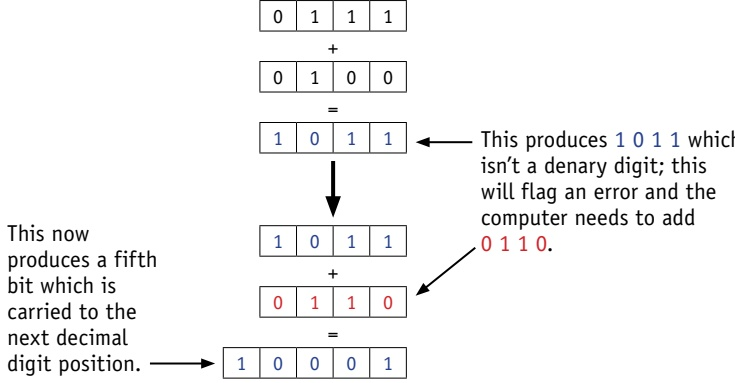

This now

produces a fifth

bit which is

carried to the

next decimal

digit position.

This produces 1011 which isn't a denary digit; this will flag an error and the computer needs to add 0110.

<!-- page 28 -->

Now we will add .3 and .9 together (the two digits in the first decimal place) remembering the carry bit from the addition above:

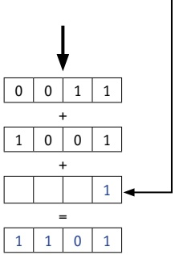

This produces 1 1 0 1 which isn't a denary digit; this will flag an error and the computer again needs to add 0 1 1 0.

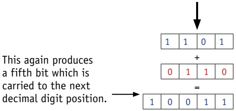

Carry out these BCD additions.

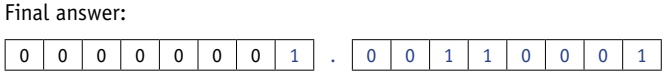

which is 1.31 in denary – the correct answer.

#### 1.1.5 ASCII codes and Unicodes

The ASCII code system (American Standard Code for Information Interchange) was set up in 1963 for use in communication systems and computer systems. The newer version of the code was published in 1986. The standard ASCII code character set consists of 7-bit codes (0 to 127 denary or 0 to 7F in hexadecimal); this represents the letters, numbers and characters found on a standard keyboard together with 32 control codes (which use up codes 0 to 31 (denary) or 0 to 19 (hexadecimal)).

Table 1.5 shows part of the standard ASCII code table (only the control codes have been removed from the table).

<!-- page 29 -->

<table border=1 style='margin: auto; word-wrap: break-word;'><tr><td style='text-align: center; word-wrap: break-word;'>Dec</td><td style='text-align: center; word-wrap: break-word;'>Hex</td><td style='text-align: center; word-wrap: break-word;'>Char</td><td style='text-align: center; word-wrap: break-word;'>Dec</td><td style='text-align: center; word-wrap: break-word;'>Hex</td><td style='text-align: center; word-wrap: break-word;'>Char</td><td style='text-align: center; word-wrap: break-word;'>Dec</td><td style='text-align: center; word-wrap: break-word;'>Hex</td><td style='text-align: center; word-wrap: break-word;'>Char</td></tr><tr><td style='text-align: center; word-wrap: break-word;'>32</td><td style='text-align: center; word-wrap: break-word;'>20</td><td style='text-align: center; word-wrap: break-word;'>&lt;SPACE&gt;</td><td style='text-align: center; word-wrap: break-word;'>64</td><td style='text-align: center; word-wrap: break-word;'>40</td><td style='text-align: center; word-wrap: break-word;'>@</td><td style='text-align: center; word-wrap: break-word;'>96</td><td style='text-align: center; word-wrap: break-word;'>60</td><td style='text-align: center; word-wrap: break-word;'>`</td></tr><tr><td style='text-align: center; word-wrap: break-word;'>33</td><td style='text-align: center; word-wrap: break-word;'>21</td><td style='text-align: center; word-wrap: break-word;'>!</td><td style='text-align: center; word-wrap: break-word;'>65</td><td style='text-align: center; word-wrap: break-word;'>41</td><td style='text-align: center; word-wrap: break-word;'>A</td><td style='text-align: center; word-wrap: break-word;'>97</td><td style='text-align: center; word-wrap: break-word;'>61</td><td style='text-align: center; word-wrap: break-word;'>a</td></tr><tr><td style='text-align: center; word-wrap: break-word;'>34</td><td style='text-align: center; word-wrap: break-word;'>22</td><td style='text-align: center; word-wrap: break-word;'>&quot;</td><td style='text-align: center; word-wrap: break-word;'>66</td><td style='text-align: center; word-wrap: break-word;'>42</td><td style='text-align: center; word-wrap: break-word;'>B</td><td style='text-align: center; word-wrap: break-word;'>98</td><td style='text-align: center; word-wrap: break-word;'>62</td><td style='text-align: center; word-wrap: break-word;'>b</td></tr><tr><td style='text-align: center; word-wrap: break-word;'>35</td><td style='text-align: center; word-wrap: break-word;'>23</td><td style='text-align: center; word-wrap: break-word;'>#</td><td style='text-align: center; word-wrap: break-word;'>67</td><td style='text-align: center; word-wrap: break-word;'>43</td><td style='text-align: center; word-wrap: break-word;'>C</td><td style='text-align: center; word-wrap: break-word;'>99</td><td style='text-align: center; word-wrap: break-word;'>63</td><td style='text-align: center; word-wrap: break-word;'>c</td></tr><tr><td style='text-align: center; word-wrap: break-word;'>36</td><td style='text-align: center; word-wrap: break-word;'>24</td><td style='text-align: center; word-wrap: break-word;'>$</td><td style='text-align: center; word-wrap: break-word;'>68</td><td style='text-align: center; word-wrap: break-word;'>44</td><td style='text-align: center; word-wrap: break-word;'>D</td><td style='text-align: center; word-wrap: break-word;'>100</td><td style='text-align: center; word-wrap: break-word;'>64</td><td style='text-align: center; word-wrap: break-word;'>d</td></tr><tr><td style='text-align: center; word-wrap: break-word;'>37</td><td style='text-align: center; word-wrap: break-word;'>25</td><td style='text-align: center; word-wrap: break-word;'>%</td><td style='text-align: center; word-wrap: break-word;'>69</td><td style='text-align: center; word-wrap: break-word;'>45</td><td style='text-align: center; word-wrap: break-word;'>E</td><td style='text-align: center; word-wrap: break-word;'>101</td><td style='text-align: center; word-wrap: break-word;'>65</td><td style='text-align: center; word-wrap: break-word;'>e</td></tr><tr><td style='text-align: center; word-wrap: break-word;'>38</td><td style='text-align: center; word-wrap: break-word;'>26</td><td style='text-align: center; word-wrap: break-word;'>&amp;</td><td style='text-align: center; word-wrap: break-word;'>70</td><td style='text-align: center; word-wrap: break-word;'>46</td><td style='text-align: center; word-wrap: break-word;'>F</td><td style='text-align: center; word-wrap: break-word;'>102</td><td style='text-align: center; word-wrap: break-word;'>66</td><td style='text-align: center; word-wrap: break-word;'>f</td></tr><tr><td style='text-align: center; word-wrap: break-word;'>39</td><td style='text-align: center; word-wrap: break-word;'>27</td><td style='text-align: center; word-wrap: break-word;'>&#x27;</td><td style='text-align: center; word-wrap: break-word;'>71</td><td style='text-align: center; word-wrap: break-word;'>47</td><td style='text-align: center; word-wrap: break-word;'>G</td><td style='text-align: center; word-wrap: break-word;'>103</td><td style='text-align: center; word-wrap: break-word;'>67</td><td style='text-align: center; word-wrap: break-word;'>g</td></tr><tr><td style='text-align: center; word-wrap: break-word;'>40</td><td style='text-align: center; word-wrap: break-word;'>28</td><td style='text-align: center; word-wrap: break-word;'>(</td><td style='text-align: center; word-wrap: break-word;'>72</td><td style='text-align: center; word-wrap: break-word;'>48</td><td style='text-align: center; word-wrap: break-word;'>H</td><td style='text-align: center; word-wrap: break-word;'>104</td><td style='text-align: center; word-wrap: break-word;'>68</td><td style='text-align: center; word-wrap: break-word;'>h</td></tr><tr><td style='text-align: center; word-wrap: break-word;'>41</td><td style='text-align: center; word-wrap: break-word;'>29</td><td style='text-align: center; word-wrap: break-word;'>)</td><td style='text-align: center; word-wrap: break-word;'>73</td><td style='text-align: center; word-wrap: break-word;'>49</td><td style='text-align: center; word-wrap: break-word;'>I</td><td style='text-align: center; word-wrap: break-word;'>105</td><td style='text-align: center; word-wrap: break-word;'>69</td><td style='text-align: center; word-wrap: break-word;'>i</td></tr><tr><td style='text-align: center; word-wrap: break-word;'>42</td><td style='text-align: center; word-wrap: break-word;'>2A</td><td style='text-align: center; word-wrap: break-word;'>*</td><td style='text-align: center; word-wrap: break-word;'>74</td><td style='text-align: center; word-wrap: break-word;'>4A</td><td style='text-align: center; word-wrap: break-word;'>J</td><td style='text-align: center; word-wrap: break-word;'>106</td><td style='text-align: center; word-wrap: break-word;'>6A</td><td style='text-align: center; word-wrap: break-word;'>j</td></tr><tr><td style='text-align: center; word-wrap: break-word;'>43</td><td style='text-align: center; word-wrap: break-word;'>2B</td><td style='text-align: center; word-wrap: break-word;'>+</td><td style='text-align: center; word-wrap: break-word;'>75</td><td style='text-align: center; word-wrap: break-word;'>4B</td><td style='text-align: center; word-wrap: break-word;'>K</td><td style='text-align: center; word-wrap: break-word;'>107</td><td style='text-align: center; word-wrap: break-word;'>6B</td><td style='text-align: center; word-wrap: break-word;'>k</td></tr><tr><td style='text-align: center; word-wrap: break-word;'>44</td><td style='text-align: center; word-wrap: break-word;'>2C</td><td style='text-align: center; word-wrap: break-word;'>,</td><td style='text-align: center; word-wrap: break-word;'>76</td><td style='text-align: center; word-wrap: break-word;'>4C</td><td style='text-align: center; word-wrap: break-word;'>L</td><td style='text-align: center; word-wrap: break-word;'>108</td><td style='text-align: center; word-wrap: break-word;'>6C</td><td style='text-align: center; word-wrap: break-word;'>l</td></tr><tr><td style='text-align: center; word-wrap: break-word;'>45</td><td style='text-align: center; word-wrap: break-word;'>2D</td><td style='text-align: center; word-wrap: break-word;'>-</td><td style='text-align: center; word-wrap: break-word;'>77</td><td style='text-align: center; word-wrap: break-word;'>4D</td><td style='text-align: center; word-wrap: break-word;'>M</td><td style='text-align: center; word-wrap: break-word;'>109</td><td style='text-align: center; word-wrap: break-word;'>6D</td><td style='text-align: center; word-wrap: break-word;'>m</td></tr><tr><td style='text-align: center; word-wrap: break-word;'>46</td><td style='text-align: center; word-wrap: break-word;'>2E</td><td style='text-align: center; word-wrap: break-word;'>.</td><td style='text-align: center; word-wrap: break-word;'>78</td><td style='text-align: center; word-wrap: break-word;'>4E</td><td style='text-align: center; word-wrap: break-word;'>N</td><td style='text-align: center; word-wrap: break-word;'>110</td><td style='text-align: center; word-wrap: break-word;'>6E</td><td style='text-align: center; word-wrap: break-word;'>n</td></tr><tr><td style='text-align: center; word-wrap: break-word;'>47</td><td style='text-align: center; word-wrap: break-word;'>2F</td><td style='text-align: center; word-wrap: break-word;'>/</td><td style='text-align: center; word-wrap: break-word;'>79</td><td style='text-align: center; word-wrap: break-word;'>4F</td><td style='text-align: center; word-wrap: break-word;'>O</td><td style='text-align: center; word-wrap: break-word;'>111</td><td style='text-align: center; word-wrap: break-word;'>6F</td><td style='text-align: center; word-wrap: break-word;'>o</td></tr><tr><td style='text-align: center; word-wrap: break-word;'>48</td><td style='text-align: center; word-wrap: break-word;'>30</td><td style='text-align: center; word-wrap: break-word;'>0</td><td style='text-align: center; word-wrap: break-word;'>80</td><td style='text-align: center; word-wrap: break-word;'>50</td><td style='text-align: center; word-wrap: break-word;'>P</td><td style='text-align: center; word-wrap: break-word;'>112</td><td style='text-align: center; word-wrap: break-word;'>70</td><td style='text-align: center; word-wrap: break-word;'>p</td></tr><tr><td style='text-align: center; word-wrap: break-word;'>49</td><td style='text-align: center; word-wrap: break-word;'>31</td><td style='text-align: center; word-wrap: break-word;'>1</td><td style='text-align: center; word-wrap: break-word;'>81</td><td style='text-align: center; word-wrap: break-word;'>51</td><td style='text-align: center; word-wrap: break-word;'>Q</td><td style='text-align: center; word-wrap: break-word;'>113</td><td style='text-align: center; word-wrap: break-word;'>71</td><td style='text-align: center; word-wrap: break-word;'>q</td></tr><tr><td style='text-align: center; word-wrap: break-word;'>50</td><td style='text-align: center; word-wrap: break-word;'>32</td><td style='text-align: center; word-wrap: break-word;'>2</td><td style='text-align: center; word-wrap: break-word;'>82</td><td style='text-align: center; word-wrap: break-word;'>52</td><td style='text-align: center; word-wrap: break-word;'>R</td><td style='text-align: center; word-wrap: break-word;'>114</td><td style='text-align: center; word-wrap: break-word;'>72</td><td style='text-align: center; word-wrap: break-word;'>r</td></tr><tr><td style='text-align: center; word-wrap: break-word;'>51</td><td style='text-align: center; word-wrap: break-word;'>33</td><td style='text-align: center; word-wrap: break-word;'>3</td><td style='text-align: center; word-wrap: break-word;'>83</td><td style='text-align: center; word-wrap: break-word;'>53</td><td style='text-align: center; word-wrap: break-word;'>S</td><td style='text-align: center; word-wrap: break-word;'>115</td><td style='text-align: center; word-wrap: break-word;'>73</td><td style='text-align: center; word-wrap: break-word;'>s</td></tr><tr><td style='text-align: center; word-wrap: break-word;'>52</td><td style='text-align: center; word-wrap: break-word;'>34</td><td style='text-align: center; word-wrap: break-word;'>4</td><td style='text-align: center; word-wrap: break-word;'>84</td><td style='text-align: center; word-wrap: break-word;'>54</td><td style='text-align: center; word-wrap: break-word;'>T</td><td style='text-align: center; word-wrap: break-word;'>116</td><td style='text-align: center; word-wrap: break-word;'>74</td><td style='text-align: center; word-wrap: break-word;'>t</td></tr><tr><td style='text-align: center; word-wrap: break-word;'>53</td><td style='text-align: center; word-wrap: break-word;'>35</td><td style='text-align: center; word-wrap: break-word;'>5</td><td style='text-align: center; word-wrap: break-word;'>85</td><td style='text-align: center; word-wrap: break-word;'>55</td><td style='text-align: center; word-wrap: break-word;'>U</td><td style='text-align: center; word-wrap: break-word;'>117</td><td style='text-align: center; word-wrap: break-word;'>75</td><td style='text-align: center; word-wrap: break-word;'>u</td></tr><tr><td style='text-align: center; word-wrap: break-word;'>54</td><td style='text-align: center; word-wrap: break-word;'>36</td><td style='text-align: center; word-wrap: break-word;'>6</td><td style='text-align: center; word-wrap: break-word;'>86</td><td style='text-align: center; word-wrap: break-word;'>56</td><td style='text-align: center; word-wrap: break-word;'>V</td><td style='text-align: center; word-wrap: break-word;'>118</td><td style='text-align: center; word-wrap: break-word;'>76</td><td style='text-align: center; word-wrap: break-word;'>v</td></tr><tr><td style='text-align: center; word-wrap: break-word;'>55</td><td style='text-align: center; word-wrap: break-word;'>37</td><td style='text-align: center; word-wrap: break-word;'>7</td><td style='text-align: center; word-wrap: break-word;'>87</td><td style='text-align: center; word-wrap: break-word;'>57</td><td style='text-align: center; word-wrap: break-word;'>W</td><td style='text-align: center; word-wrap: break-word;'>119</td><td style='text-align: center; word-wrap: break-word;'>77</td><td style='text-align: center; word-wrap: break-word;'>w</td></tr><tr><td style='text-align: center; word-wrap: break-word;'>56</td><td style='text-align: center; word-wrap: break-word;'>38</td><td style='text-align: center; word-wrap: break-word;'>8</td><td style='text-align: center; word-wrap: break-word;'>88</td><td style='text-align: center; word-wrap: break-word;'>58</td><td style='text-align: center; word-wrap: break-word;'>X</td><td style='text-align: center; word-wrap: break-word;'>120</td><td style='text-align: center; word-wrap: break-word;'>78</td><td style='text-align: center; word-wrap: break-word;'>x</td></tr><tr><td style='text-align: center; word-wrap: break-word;'>57</td><td style='text-align: center; word-wrap: break-word;'>39</td><td style='text-align: center; word-wrap: break-word;'>9</td><td style='text-align: center; word-wrap: break-word;'>89</td><td style='text-align: center; word-wrap: break-word;'>59</td><td style='text-align: center; word-wrap: break-word;'>Y</td><td style='text-align: center; word-wrap: break-word;'>121</td><td style='text-align: center; word-wrap: break-word;'>79</td><td style='text-align: center; word-wrap: break-word;'>y</td></tr><tr><td style='text-align: center; word-wrap: break-word;'>58</td><td style='text-align: center; word-wrap: break-word;'>3A</td><td style='text-align: center; word-wrap: break-word;'>:</td><td style='text-align: center; word-wrap: break-word;'>90</td><td style='text-align: center; word-wrap: break-word;'>5A</td><td style='text-align: center; word-wrap: break-word;'>Z</td><td style='text-align: center; word-wrap: break-word;'>122</td><td style='text-align: center; word-wrap: break-word;'>7A</td><td style='text-align: center; word-wrap: break-word;'>z</td></tr><tr><td style='text-align: center; word-wrap: break-word;'>59</td><td style='text-align: center; word-wrap: break-word;'>3B</td><td style='text-align: center; word-wrap: break-word;'>;</td><td style='text-align: center; word-wrap: break-word;'>91</td><td style='text-align: center; word-wrap: break-word;'>5B</td><td style='text-align: center; word-wrap: break-word;'>[</td><td style='text-align: center; word-wrap: break-word;'>123</td><td style='text-align: center; word-wrap: break-word;'>7B</td><td style='text-align: center; word-wrap: break-word;'>{</td></tr><tr><td style='text-align: center; word-wrap: break-word;'>60</td><td style='text-align: center; word-wrap: break-word;'>3C</td><td style='text-align: center; word-wrap: break-word;'>&lt;</td><td style='text-align: center; word-wrap: break-word;'>92</td><td style='text-align: center; word-wrap: break-word;'>5C</td><td style='text-align: center; word-wrap: break-word;'>\</td><td style='text-align: center; word-wrap: break-word;'>124</td><td style='text-align: center; word-wrap: break-word;'>7C</td><td style='text-align: center; word-wrap: break-word;'>|</td></tr><tr><td style='text-align: center; word-wrap: break-word;'>61</td><td style='text-align: center; word-wrap: break-word;'>3D</td><td style='text-align: center; word-wrap: break-word;'>=</td><td style='text-align: center; word-wrap: break-word;'>93</td><td style='text-align: center; word-wrap: break-word;'>5D</td><td style='text-align: center; word-wrap: break-word;'>]</td><td style='text-align: center; word-wrap: break-word;'>125</td><td style='text-align: center; word-wrap: break-word;'>7D</td><td style='text-align: center; word-wrap: break-word;'>}</td></tr><tr><td style='text-align: center; word-wrap: break-word;'>62</td><td style='text-align: center; word-wrap: break-word;'>3E</td><td style='text-align: center; word-wrap: break-word;'>&gt;</td><td style='text-align: center; word-wrap: break-word;'>94</td><td style='text-align: center; word-wrap: break-word;'>5E</td><td style='text-align: center; word-wrap: break-word;'>^</td><td style='text-align: center; word-wrap: break-word;'>126</td><td style='text-align: center; word-wrap: break-word;'>7E</td><td style='text-align: center; word-wrap: break-word;'>~</td></tr><tr><td style='text-align: center; word-wrap: break-word;'>63</td><td style='text-align: center; word-wrap: break-word;'>3F</td><td style='text-align: center; word-wrap: break-word;'>?</td><td style='text-align: center; word-wrap: break-word;'>95</td><td style='text-align: center; word-wrap: break-word;'>5F</td><td style='text-align: center; word-wrap: break-word;'>_</td><td style='text-align: center; word-wrap: break-word;'>127</td><td style='text-align: center; word-wrap: break-word;'>7F</td><td style='text-align: center; word-wrap: break-word;'>&lt;DELETE&gt;</td></tr></table>

Table 1.5 Part of the ASCII code table

Notice the storage of characters with uppercase and lowercase. For example:

<table border=1 style='margin: auto; word-wrap: break-word;'><tr><td style='text-align: center; word-wrap: break-word;'>a</td><td style='text-align: center; word-wrap: break-word;'>1</td><td style='text-align: center; word-wrap: break-word;'>1</td><td style='text-align: center; word-wrap: break-word;'>0</td><td style='text-align: center; word-wrap: break-word;'>0</td><td style='text-align: center; word-wrap: break-word;'>0</td><td style='text-align: center; word-wrap: break-word;'>0</td><td style='text-align: center; word-wrap: break-word;'>1</td><td style='text-align: center; word-wrap: break-word;'>hex 61 (lower case)</td></tr><tr><td style='text-align: center; word-wrap: break-word;'>A</td><td style='text-align: center; word-wrap: break-word;'>1</td><td style='text-align: center; word-wrap: break-word;'>0</td><td style='text-align: center; word-wrap: break-word;'>0</td><td style='text-align: center; word-wrap: break-word;'>0</td><td style='text-align: center; word-wrap: break-word;'>0</td><td style='text-align: center; word-wrap: break-word;'>0</td><td style='text-align: center; word-wrap: break-word;'>1</td><td style='text-align: center; word-wrap: break-word;'>hex 41 (upper case)</td></tr><tr><td style='text-align: center; word-wrap: break-word;'>y</td><td style='text-align: center; word-wrap: break-word;'>1</td><td style='text-align: center; word-wrap: break-word;'>1</td><td style='text-align: center; word-wrap: break-word;'>1</td><td style='text-align: center; word-wrap: break-word;'>1</td><td style='text-align: center; word-wrap: break-word;'>0</td><td style='text-align: center; word-wrap: break-word;'>0</td><td style='text-align: center; word-wrap: break-word;'>1</td><td style='text-align: center; word-wrap: break-word;'>hex 79 (lower case)</td></tr><tr><td style='text-align: center; word-wrap: break-word;'>Y</td><td style='text-align: center; word-wrap: break-word;'>1</td><td style='text-align: center; word-wrap: break-word;'>0</td><td style='text-align: center; word-wrap: break-word;'>1</td><td style='text-align: center; word-wrap: break-word;'>1</td><td style='text-align: center; word-wrap: break-word;'>0</td><td style='text-align: center; word-wrap: break-word;'>0</td><td style='text-align: center; word-wrap: break-word;'>1</td><td style='text-align: center; word-wrap: break-word;'>hex 59 (uppercase)</td></tr></table>

Notice the sixth bit changes from 1 to 0 when comparing lower and uppercase characters. This makes the conversion between the two an easy operation. It is also noticeable that the character sets (such as a to z, 0 to 9, and so on) are grouped together in sequence, which speeds up usability.

Extended ASCII uses 8-bit codes (128 to 255 in denary or 80 to FF in hex). This allows for non-English characters and for drawing characters to be included.

<!-- page 30 -->

<table border=1 style='margin: auto; word-wrap: break-word;'><tr><td style='text-align: center; word-wrap: break-word;'>Dec</td><td style='text-align: center; word-wrap: break-word;'>Hex</td><td style='text-align: center; word-wrap: break-word;'>Char</td><td style='text-align: center; word-wrap: break-word;'>Dec</td><td style='text-align: center; word-wrap: break-word;'>Hex</td><td style='text-align: center; word-wrap: break-word;'>Char</td><td style='text-align: center; word-wrap: break-word;'>Dec</td><td style='text-align: center; word-wrap: break-word;'>Hex</td><td style='text-align: center; word-wrap: break-word;'>Char</td><td style='text-align: center; word-wrap: break-word;'>Dec</td><td style='text-align: center; word-wrap: break-word;'>Hex</td><td style='text-align: center; word-wrap: break-word;'>Char</td><td style='text-align: center; word-wrap: break-word;'>Dec</td><td style='text-align: center; word-wrap: break-word;'>Hex</td><td style='text-align: center; word-wrap: break-word;'>Char</td></tr><tr><td style='text-align: center; word-wrap: break-word;'>128</td><td style='text-align: center; word-wrap: break-word;'>80</td><td style='text-align: center; word-wrap: break-word;'>C</td><td style='text-align: center; word-wrap: break-word;'>154</td><td style='text-align: center; word-wrap: break-word;'>9A</td><td style='text-align: center; word-wrap: break-word;'>Ü</td><td style='text-align: center; word-wrap: break-word;'>180</td><td style='text-align: center; word-wrap: break-word;'>B4</td><td style='text-align: center; word-wrap: break-word;'>$ \dagger $</td><td style='text-align: center; word-wrap: break-word;'>206</td><td style='text-align: center; word-wrap: break-word;'>CE</td><td style='text-align: center; word-wrap: break-word;'>$ \frac{1}{1} $</td><td style='text-align: center; word-wrap: break-word;'>232</td><td style='text-align: center; word-wrap: break-word;'>E8</td><td style='text-align: center; word-wrap: break-word;'>$ \Phi $</td></tr><tr><td style='text-align: center; word-wrap: break-word;'>129</td><td style='text-align: center; word-wrap: break-word;'>81</td><td style='text-align: center; word-wrap: break-word;'>ü</td><td style='text-align: center; word-wrap: break-word;'>155</td><td style='text-align: center; word-wrap: break-word;'>9B</td><td style='text-align: center; word-wrap: break-word;'>ç</td><td style='text-align: center; word-wrap: break-word;'>181</td><td style='text-align: center; word-wrap: break-word;'>B5</td><td style='text-align: center; word-wrap: break-word;'>$ \ddagger $</td><td style='text-align: center; word-wrap: break-word;'>207</td><td style='text-align: center; word-wrap: break-word;'>CF</td><td style='text-align: center; word-wrap: break-word;'>$ \pm $</td><td style='text-align: center; word-wrap: break-word;'>233</td><td style='text-align: center; word-wrap: break-word;'>E9</td><td style='text-align: center; word-wrap: break-word;'>$ \Theta $</td></tr><tr><td style='text-align: center; word-wrap: break-word;'>130</td><td style='text-align: center; word-wrap: break-word;'>82</td><td style='text-align: center; word-wrap: break-word;'>é</td><td style='text-align: center; word-wrap: break-word;'>156</td><td style='text-align: center; word-wrap: break-word;'>9C</td><td style='text-align: center; word-wrap: break-word;'>£</td><td style='text-align: center; word-wrap: break-word;'>182</td><td style='text-align: center; word-wrap: break-word;'>B6</td><td style='text-align: center; word-wrap: break-word;'>$ \| $</td><td style='text-align: center; word-wrap: break-word;'>208</td><td style='text-align: center; word-wrap: break-word;'>D0</td><td style='text-align: center; word-wrap: break-word;'>$ \perp $</td><td style='text-align: center; word-wrap: break-word;'>234</td><td style='text-align: center; word-wrap: break-word;'>EA</td><td style='text-align: center; word-wrap: break-word;'>$ \Omega $</td></tr><tr><td style='text-align: center; word-wrap: break-word;'>131</td><td style='text-align: center; word-wrap: break-word;'>83</td><td style='text-align: center; word-wrap: break-word;'>â</td><td style='text-align: center; word-wrap: break-word;'>157</td><td style='text-align: center; word-wrap: break-word;'>9D</td><td style='text-align: center; word-wrap: break-word;'>¥</td><td style='text-align: center; word-wrap: break-word;'>183</td><td style='text-align: center; word-wrap: break-word;'>B7</td><td style='text-align: center; word-wrap: break-word;'>$ \pi $</td><td style='text-align: center; word-wrap: break-word;'>209</td><td style='text-align: center; word-wrap: break-word;'>D1</td><td style='text-align: center; word-wrap: break-word;'>$ \mp $</td><td style='text-align: center; word-wrap: break-word;'>235</td><td style='text-align: center; word-wrap: break-word;'>EB</td><td style='text-align: center; word-wrap: break-word;'>$ \delta $</td></tr><tr><td style='text-align: center; word-wrap: break-word;'>132</td><td style='text-align: center; word-wrap: break-word;'>84</td><td style='text-align: center; word-wrap: break-word;'>ä</td><td style='text-align: center; word-wrap: break-word;'>158</td><td style='text-align: center; word-wrap: break-word;'>9E</td><td style='text-align: center; word-wrap: break-word;'>Pts</td><td style='text-align: center; word-wrap: break-word;'>184</td><td style='text-align: center; word-wrap: break-word;'>B8</td><td style='text-align: center; word-wrap: break-word;'>$ \dagger $</td><td style='text-align: center; word-wrap: break-word;'>210</td><td style='text-align: center; word-wrap: break-word;'>D2</td><td style='text-align: center; word-wrap: break-word;'>$ \pi $</td><td style='text-align: center; word-wrap: break-word;'>236</td><td style='text-align: center; word-wrap: break-word;'>EC</td><td style='text-align: center; word-wrap: break-word;'>$ \infty $</td></tr><tr><td style='text-align: center; word-wrap: break-word;'>133</td><td style='text-align: center; word-wrap: break-word;'>85</td><td style='text-align: center; word-wrap: break-word;'>à</td><td style='text-align: center; word-wrap: break-word;'>159</td><td style='text-align: center; word-wrap: break-word;'>9F</td><td style='text-align: center; word-wrap: break-word;'>f</td><td style='text-align: center; word-wrap: break-word;'>185</td><td style='text-align: center; word-wrap: break-word;'>B9</td><td style='text-align: center; word-wrap: break-word;'>$ \| $</td><td style='text-align: center; word-wrap: break-word;'>211</td><td style='text-align: center; word-wrap: break-word;'>D3</td><td style='text-align: center; word-wrap: break-word;'>$ \perp $</td><td style='text-align: center; word-wrap: break-word;'>237</td><td style='text-align: center; word-wrap: break-word;'>ED</td><td style='text-align: center; word-wrap: break-word;'>$ \sigma $</td></tr><tr><td style='text-align: center; word-wrap: break-word;'>134</td><td style='text-align: center; word-wrap: break-word;'>86</td><td style='text-align: center; word-wrap: break-word;'>å</td><td style='text-align: center; word-wrap: break-word;'>160</td><td style='text-align: center; word-wrap: break-word;'>A0</td><td style='text-align: center; word-wrap: break-word;'>á</td><td style='text-align: center; word-wrap: break-word;'>186</td><td style='text-align: center; word-wrap: break-word;'>BA</td><td style='text-align: center; word-wrap: break-word;'>$ \| $</td><td style='text-align: center; word-wrap: break-word;'>212</td><td style='text-align: center; word-wrap: break-word;'>D4</td><td style='text-align: center; word-wrap: break-word;'>$ \perp $</td><td style='text-align: center; word-wrap: break-word;'>238</td><td style='text-align: center; word-wrap: break-word;'>EE</td><td style='text-align: center; word-wrap: break-word;'>$ \varepsilon $</td></tr><tr><td style='text-align: center; word-wrap: break-word;'>135</td><td style='text-align: center; word-wrap: break-word;'>87</td><td style='text-align: center; word-wrap: break-word;'>ç</td><td style='text-align: center; word-wrap: break-word;'>161</td><td style='text-align: center; word-wrap: break-word;'>A1</td><td style='text-align: center; word-wrap: break-word;'>í</td><td style='text-align: center; word-wrap: break-word;'>187</td><td style='text-align: center; word-wrap: break-word;'>BB</td><td style='text-align: center; word-wrap: break-word;'>$ \pi $</td><td style='text-align: center; word-wrap: break-word;'>213</td><td style='text-align: center; word-wrap: break-word;'>D5</td><td style='text-align: center; word-wrap: break-word;'>$ \mp $</td><td style='text-align: center; word-wrap: break-word;'>239</td><td style='text-align: center; word-wrap: break-word;'>EF</td><td style='text-align: center; word-wrap: break-word;'>$ \cap $</td></tr><tr><td style='text-align: center; word-wrap: break-word;'>136</td><td style='text-align: center; word-wrap: break-word;'>88</td><td style='text-align: center; word-wrap: break-word;'>ê</td><td style='text-align: center; word-wrap: break-word;'>162</td><td style='text-align: center; word-wrap: break-word;'>A2</td><td style='text-align: center; word-wrap: break-word;'>ó</td><td style='text-align: center; word-wrap: break-word;'>188</td><td style='text-align: center; word-wrap: break-word;'>BC</td><td style='text-align: center; word-wrap: break-word;'>$ \parallel $</td><td style='text-align: center; word-wrap: break-word;'>214</td><td style='text-align: center; word-wrap: break-word;'>D6</td><td style='text-align: center; word-wrap: break-word;'>$ \pi $</td><td style='text-align: center; word-wrap: break-word;'>240</td><td style='text-align: center; word-wrap: break-word;'>F0</td><td style='text-align: center; word-wrap: break-word;'>$ \equiv $</td></tr><tr><td style='text-align: center; word-wrap: break-word;'>137</td><td style='text-align: center; word-wrap: break-word;'>89</td><td style='text-align: center; word-wrap: break-word;'>ë</td><td style='text-align: center; word-wrap: break-word;'>163</td><td style='text-align: center; word-wrap: break-word;'>A3</td><td style='text-align: center; word-wrap: break-word;'>ú</td><td style='text-align: center; word-wrap: break-word;'>189</td><td style='text-align: center; word-wrap: break-word;'>BD</td><td style='text-align: center; word-wrap: break-word;'>$ \parallel $</td><td style='text-align: center; word-wrap: break-word;'>215</td><td style='text-align: center; word-wrap: break-word;'>D7</td><td style='text-align: center; word-wrap: break-word;'>$ \parallel $</td><td style='text-align: center; word-wrap: break-word;'>241</td><td style='text-align: center; word-wrap: break-word;'>F1</td><td style='text-align: center; word-wrap: break-word;'>$ \pm $</td></tr><tr><td style='text-align: center; word-wrap: break-word;'>138</td><td style='text-align: center; word-wrap: break-word;'>8A</td><td style='text-align: center; word-wrap: break-word;'>è</td><td style='text-align: center; word-wrap: break-word;'>164</td><td style='text-align: center; word-wrap: break-word;'>A4</td><td style='text-align: center; word-wrap: break-word;'>n</td><td style='text-align: center; word-wrap: break-word;'>190</td><td style='text-align: center; word-wrap: break-word;'>BE</td><td style='text-align: center; word-wrap: break-word;'>$ \parallel $</td><td style='text-align: center; word-wrap: break-word;'>216</td><td style='text-align: center; word-wrap: break-word;'>D8</td><td style='text-align: center; word-wrap: break-word;'>$ \neq $</td><td style='text-align: center; word-wrap: break-word;'>242</td><td style='text-align: center; word-wrap: break-word;'>F2</td><td style='text-align: center; word-wrap: break-word;'>≥</td></tr><tr><td style='text-align: center; word-wrap: break-word;'>139</td><td style='text-align: center; word-wrap: break-word;'>8B</td><td style='text-align: center; word-wrap: break-word;'>ï</td><td style='text-align: center; word-wrap: break-word;'>165</td><td style='text-align: center; word-wrap: break-word;'>A5</td><td style='text-align: center; word-wrap: break-word;'>Ŏ</td><td style='text-align: center; word-wrap: break-word;'>191</td><td style='text-align: center; word-wrap: break-word;'>BF</td><td style='text-align: center; word-wrap: break-word;'>$ \gamma $</td><td style='text-align: center; word-wrap: break-word;'>217</td><td style='text-align: center; word-wrap: break-word;'>D9</td><td style='text-align: center; word-wrap: break-word;'>$ \checkmark $</td><td style='text-align: center; word-wrap: break-word;'>243</td><td style='text-align: center; word-wrap: break-word;'>F3</td><td style='text-align: center; word-wrap: break-word;'>≤</td></tr><tr><td style='text-align: center; word-wrap: break-word;'>140</td><td style='text-align: center; word-wrap: break-word;'>8C</td><td style='text-align: center; word-wrap: break-word;'>î</td><td style='text-align: center; word-wrap: break-word;'>166</td><td style='text-align: center; word-wrap: break-word;'>A6</td><td style='text-align: center; word-wrap: break-word;'>a</td><td style='text-align: center; word-wrap: break-word;'>192</td><td style='text-align: center; word-wrap: break-word;'>C0</td><td style='text-align: center; word-wrap: break-word;'>$ \perp $</td><td style='text-align: center; word-wrap: break-word;'>218</td><td style='text-align: center; word-wrap: break-word;'>DA</td><td style='text-align: center; word-wrap: break-word;'>$ \Gamma $</td><td style='text-align: center; word-wrap: break-word;'>244</td><td style='text-align: center; word-wrap: break-word;'>F4</td><td style='text-align: center; word-wrap: break-word;'>$ \dagger $</td></tr><tr><td style='text-align: center; word-wrap: break-word;'>141</td><td style='text-align: center; word-wrap: break-word;'>8D</td><td style='text-align: center; word-wrap: break-word;'>i</td><td style='text-align: center; word-wrap: break-word;'>167</td><td style='text-align: center; word-wrap: break-word;'>A7</td><td style='text-align: center; word-wrap: break-word;'>°</td><td style='text-align: center; word-wrap: break-word;'>193</td><td style='text-align: center; word-wrap: break-word;'>C1</td><td style='text-align: center; word-wrap: break-word;'>$ \perp $</td><td style='text-align: center; word-wrap: break-word;'>219</td><td style='text-align: center; word-wrap: break-word;'>DB</td><td style='text-align: center; word-wrap: break-word;'>$ \blacksquare $</td><td style='text-align: center; word-wrap: break-word;'>245</td><td style='text-align: center; word-wrap: break-word;'>F5</td><td style='text-align: center; word-wrap: break-word;'>$ \checkmark $</td></tr><tr><td style='text-align: center; word-wrap: break-word;'>142</td><td style='text-align: center; word-wrap: break-word;'>8E</td><td style='text-align: center; word-wrap: break-word;'>Ä</td><td style='text-align: center; word-wrap: break-word;'>168</td><td style='text-align: center; word-wrap: break-word;'>A8</td><td style='text-align: center; word-wrap: break-word;'>¿</td><td style='text-align: center; word-wrap: break-word;'>194</td><td style='text-align: center; word-wrap: break-word;'>C2</td><td style='text-align: center; word-wrap: break-word;'>T</td><td style='text-align: center; word-wrap: break-word;'>220</td><td style='text-align: center; word-wrap: break-word;'>DC</td><td style='text-align: center; word-wrap: break-word;'>$ \blacksquare $</td><td style='text-align: center; word-wrap: break-word;'>246</td><td style='text-align: center; word-wrap: break-word;'>F6</td><td style='text-align: center; word-wrap: break-word;'>÷</td></tr><tr><td style='text-align: center; word-wrap: break-word;'>143</td><td style='text-align: center; word-wrap: break-word;'>8F</td><td style='text-align: center; word-wrap: break-word;'>Ä</td><td style='text-align: center; word-wrap: break-word;'>169</td><td style='text-align: center; word-wrap: break-word;'>A9</td><td style='text-align: center; word-wrap: break-word;'>$ \sim $</td><td style='text-align: center; word-wrap: break-word;'>195</td><td style='text-align: center; word-wrap: break-word;'>C3</td><td style='text-align: center; word-wrap: break-word;'>$ \dagger $</td><td style='text-align: center; word-wrap: break-word;'>221</td><td style='text-align: center; word-wrap: break-word;'>DD</td><td style='text-align: center; word-wrap: break-word;'>$ \blacksquare $</td><td style='text-align: center; word-wrap: break-word;'>247</td><td style='text-align: center; word-wrap: break-word;'>F7</td><td style='text-align: center; word-wrap: break-word;'>$ \approx $</td></tr><tr><td style='text-align: center; word-wrap: break-word;'>144</td><td style='text-align: center; word-wrap: break-word;'>90</td><td style='text-align: center; word-wrap: break-word;'>É</td><td style='text-align: center; word-wrap: break-word;'>170</td><td style='text-align: center; word-wrap: break-word;'>AA</td><td style='text-align: center; word-wrap: break-word;'>$ \neg $</td><td style='text-align: center; word-wrap: break-word;'>196</td><td style='text-align: center; word-wrap: break-word;'>C4</td><td style='text-align: center; word-wrap: break-word;'>$ \neg $</td><td style='text-align: center; word-wrap: break-word;'>222</td><td style='text-align: center; word-wrap: break-word;'>DE</td><td style='text-align: center; word-wrap: break-word;'>$ \blacksquare $</td><td style='text-align: center; word-wrap: break-word;'>248</td><td style='text-align: center; word-wrap: break-word;'>F8</td><td style='text-align: center; word-wrap: break-word;'>°</td></tr><tr><td style='text-align: center; word-wrap: break-word;'>145</td><td style='text-align: center; word-wrap: break-word;'>91</td><td style='text-align: center; word-wrap: break-word;'>æ</td><td style='text-align: center; word-wrap: break-word;'>171</td><td style='text-align: center; word-wrap: break-word;'>AB</td><td style='text-align: center; word-wrap: break-word;'>$ \frac{1}{2} $</td><td style='text-align: center; word-wrap: break-word;'>197</td><td style='text-align: center; word-wrap: break-word;'>C5</td><td style='text-align: center; word-wrap: break-word;'>$ \dagger $</td><td style='text-align: center; word-wrap: break-word;'>223</td><td style='text-align: center; word-wrap: break-word;'>DF</td><td style='text-align: center; word-wrap: break-word;'>$ \blacksquare $</td><td style='text-align: center; word-wrap: break-word;'>249</td><td style='text-align: center; word-wrap: break-word;'>F9</td><td style='text-align: center; word-wrap: break-word;'>$ \bullet $</td></tr><tr><td style='text-align: center; word-wrap: break-word;'>146</td><td style='text-align: center; word-wrap: break-word;'>92</td><td style='text-align: center; word-wrap: break-word;'>ÄE</td><td style='text-align: center; word-wrap: break-word;'>172</td><td style='text-align: center; word-wrap: break-word;'>AC</td><td style='text-align: center; word-wrap: break-word;'>$ \frac{1}{4} $</td><td style='text-align: center; word-wrap: break-word;'>198</td><td style='text-align: center; word-wrap: break-word;'>C6</td><td style='text-align: center; word-wrap: break-word;'>$ \models $</td><td style='text-align: center; word-wrap: break-word;'>224</td><td style='text-align: center; word-wrap: break-word;'>E0</td><td style='text-align: center; word-wrap: break-word;'>$ \alpha $</td><td style='text-align: center; word-wrap: break-word;'>250</td><td style='text-align: center; word-wrap: break-word;'>FA</td><td style='text-align: center; word-wrap: break-word;'>$ \bullet $</td></tr><tr><td style='text-align: center; word-wrap: break-word;'>147</td><td style='text-align: center; word-wrap: break-word;'>93</td><td style='text-align: center; word-wrap: break-word;'>ö</td><td style='text-align: center; word-wrap: break-word;'>173</td><td style='text-align: center; word-wrap: break-word;'>AD</td><td style='text-align: center; word-wrap: break-word;'>$ \dagger $</td><td style='text-align: center; word-wrap: break-word;'>199</td><td style='text-align: center; word-wrap: break-word;'>C7</td><td style='text-align: center; word-wrap: break-word;'>$ \parallel $</td><td style='text-align: center; word-wrap: break-word;'>225</td><td style='text-align: center; word-wrap: break-word;'>E1</td><td style='text-align: center; word-wrap: break-word;'>$ \beta $</td><td style='text-align: center; word-wrap: break-word;'>251</td><td style='text-align: center; word-wrap: break-word;'>FB</td><td style='text-align: center; word-wrap: break-word;'>$ \checkmark $</td></tr><tr><td style='text-align: center; word-wrap: break-word;'>148</td><td style='text-align: center; word-wrap: break-word;'>94</td><td style='text-align: center; word-wrap: break-word;'>ö</td><td style='text-align: center; word-wrap: break-word;'>174</td><td style='text-align: center; word-wrap: break-word;'>AE</td><td style='text-align: center; word-wrap: break-word;'>«</td><td style='text-align: center; word-wrap: break-word;'>200</td><td style='text-align: center; word-wrap: break-word;'>C8</td><td style='text-align: center; word-wrap: break-word;'>$ \parallel $</td><td style='text-align: center; word-wrap: break-word;'>226</td><td style='text-align: center; word-wrap: break-word;'>E2</td><td style='text-align: center; word-wrap: break-word;'>$ \Gamma $</td><td style='text-align: center; word-wrap: break-word;'>252</td><td style='text-align: center; word-wrap: break-word;'>FC</td><td style='text-align: center; word-wrap: break-word;'>$ ^{3} $</td></tr><tr><td style='text-align: center; word-wrap: break-word;'>149</td><td style='text-align: center; word-wrap: break-word;'>95</td><td style='text-align: center; word-wrap: break-word;'>ö</td><td style='text-align: center; word-wrap: break-word;'>175</td><td style='text-align: center; word-wrap: break-word;'>AF</td><td style='text-align: center; word-wrap: break-word;'>»</td><td style='text-align: center; word-wrap: break-word;'>201</td><td style='text-align: center; word-wrap: break-word;'>C9</td><td style='text-align: center; word-wrap: break-word;'>$ \| $</td><td style='text-align: center; word-wrap: break-word;'>227</td><td style='text-align: center; word-wrap: break-word;'>E3</td><td style='text-align: center; word-wrap: break-word;'>$ \pi $</td><td style='text-align: center; word-wrap: break-word;'>253</td><td style='text-align: center; word-wrap: break-word;'>FD</td><td style='text-align: center; word-wrap: break-word;'>$ ^{2} $</td></tr><tr><td style='text-align: center; word-wrap: break-word;'>150</td><td style='text-align: center; word-wrap: break-word;'>96</td><td style='text-align: center; word-wrap: break-word;'>ü</td><td style='text-align: center; word-wrap: break-word;'>176</td><td style='text-align: center; word-wrap: break-word;'>B0</td><td style='text-align: center; word-wrap: break-word;'>$ \blacksquare $</td><td style='text-align: center; word-wrap: break-word;'>202</td><td style='text-align: center; word-wrap: break-word;'>CA</td><td style='text-align: center; word-wrap: break-word;'>$ \perp $</td><td style='text-align: center; word-wrap: break-word;'>228</td><td style='text-align: center; word-wrap: break-word;'>E4</td><td style='text-align: center; word-wrap: break-word;'>$ \Sigma $</td><td style='text-align: center; word-wrap: break-word;'>254</td><td style='text-align: center; word-wrap: break-word;'>FE</td><td style='text-align: center; word-wrap: break-word;'>$ \blacksquare $</td></tr><tr><td style='text-align: center; word-wrap: break-word;'>151</td><td style='text-align: center; word-wrap: break-word;'>97</td><td style='text-align: center; word-wrap: break-word;'>ù</td><td style='text-align: center; word-wrap: break-word;'>177</td><td style='text-align: center; word-wrap: break-word;'>B1</td><td style='text-align: center; word-wrap: break-word;'>$ \blacksquare $</td><td style='text-align: center; word-wrap: break-word;'>203</td><td style='text-align: center; word-wrap: break-word;'>CB</td><td style='text-align: center; word-wrap: break-word;'>$ \pi $</td><td style='text-align: center; word-wrap: break-word;'>229</td><td style='text-align: center; word-wrap: break-word;'>E5</td><td style='text-align: center; word-wrap: break-word;'>$ \sigma $</td><td style='text-align: center; word-wrap: break-word;'>255</td><td style='text-align: center; word-wrap: break-word;'>FF</td><td style='text-align: center; word-wrap: break-word;'>$ \square $</td></tr><tr><td style='text-align: center; word-wrap: break-word;'>152</td><td style='text-align: center; word-wrap: break-word;'>98</td><td style='text-align: center; word-wrap: break-word;'>ý</td><td style='text-align: center; word-wrap: break-word;'>178</td><td style='text-align: center; word-wrap: break-word;'>B2</td><td style='text-align: center; word-wrap: break-word;'>$ \blacksquare $</td><td style='text-align: center; word-wrap: break-word;'>204</td><td style='text-align: center; word-wrap: break-word;'>CC</td><td style='text-align: center; word-wrap: break-word;'>$ \parallel $</td><td style='text-align: center; word-wrap: break-word;'>230</td><td style='text-align: center; word-wrap: break-word;'>E6</td><td style='text-align: center; word-wrap: break-word;'>$ \mu $</td><td style='text-align: center; word-wrap: break-word;'></td><td style='text-align: center; word-wrap: break-word;'></td><td style='text-align: center; word-wrap: break-word;'></td></tr><tr><td style='text-align: center; word-wrap: break-word;'>153</td><td style='text-align: center; word-wrap: break-word;'>99</td><td style='text-align: center; word-wrap: break-word;'>Ö</td><td style='text-align: center; word-wrap: break-word;'>179</td><td style='text-align: center; word-wrap: break-word;'>B3</td><td style='text-align: center; word-wrap: break-word;'>$ \| $</td><td style='text-align: center; word-wrap: break-word;'>205</td><td style='text-align: center; word-wrap: break-word;'>CD</td><td style='text-align: center; word-wrap: break-word;'>$ \equiv $</td><td style='text-align: center; word-wrap: break-word;'>231</td><td style='text-align: center; word-wrap: break-word;'>E7</td><td style='text-align: center; word-wrap: break-word;'>$ \tau $</td><td style='text-align: center; word-wrap: break-word;'></td><td style='text-align: center; word-wrap: break-word;'></td><td style='text-align: center; word-wrap: break-word;'></td></tr></table>

Table 1.6 Extended ASCII code table

Since ASCII code has a number of disadvantages and is unsuitable for some purposes, different methods of coding have been developed over the years. One coding system is called Unicode. Unicode allows characters in a code form to represent all languages of the world, thus supporting many operating systems, search engines and internet browsers used globally. There is overlap with standard ASCII code, since the first 128 (English) characters are the same, but Unicode can support several thousand different characters in total. As can be seen in Tables 1.5 and 1.6, ASCII uses one byte to represent a character, whereas Unicode will support up to four bytes per character.

The Unicode consortium was set up in 1991. Version 1.0 was published with five goals, these were to

» create a universal standard that covered all languages and all writing systems

» produce a more efficient coding system than ASCII

adopt uniform encoding where each character is encoded as 16-bit or 32-bit code

» create unambiguous encoding where each 16-bit or 32-bit value always represents the same character (it is worth pointing out here that the ASCII code tables are not standardised and versions other than the ones shown in tables 1.5 and 1.6 exist)

reserve part of the code for private use to enable a user to assign codes for their own characters and symbols (useful for Chinese and Japanese character sets).

A sample of Unicode characters are shown in Table 1.7. As can be seen from the table, characters used in languages such as Russian, Greek, Romanian and Croatian can now be represented in a computer).

<!-- page 31 -->

<table border=1 style='margin: auto; word-wrap: break-word;'><tr><td style='text-align: center; word-wrap: break-word;'></td><td style='text-align: center; word-wrap: break-word;'>0</td><td style='text-align: center; word-wrap: break-word;'>1</td><td style='text-align: center; word-wrap: break-word;'>2</td><td style='text-align: center; word-wrap: break-word;'>3</td><td style='text-align: center; word-wrap: break-word;'>4</td><td style='text-align: center; word-wrap: break-word;'>5</td><td style='text-align: center; word-wrap: break-word;'>6</td><td style='text-align: center; word-wrap: break-word;'>7</td><td style='text-align: center; word-wrap: break-word;'>8</td><td style='text-align: center; word-wrap: break-word;'>9</td><td style='text-align: center; word-wrap: break-word;'>A</td><td style='text-align: center; word-wrap: break-word;'>B</td><td style='text-align: center; word-wrap: break-word;'>C</td><td style='text-align: center; word-wrap: break-word;'>D</td><td style='text-align: center; word-wrap: break-word;'>E</td><td style='text-align: center; word-wrap: break-word;'>F</td></tr><tr><td style='text-align: center; word-wrap: break-word;'>01A0</td><td style='text-align: center; word-wrap: break-word;'>O</td><td style='text-align: center; word-wrap: break-word;'>$ \sigma $</td><td style='text-align: center; word-wrap: break-word;'>QJ</td><td style='text-align: center; word-wrap: break-word;'>$ \sigma q $</td><td style='text-align: center; word-wrap: break-word;'>P</td><td style='text-align: center; word-wrap: break-word;'>$ \beta $</td><td style='text-align: center; word-wrap: break-word;'>R</td><td style='text-align: center; word-wrap: break-word;'>2</td><td style='text-align: center; word-wrap: break-word;'>2</td><td style='text-align: center; word-wrap: break-word;'>$ \Sigma $</td><td style='text-align: center; word-wrap: break-word;'>$ \downarrow $</td><td style='text-align: center; word-wrap: break-word;'>$ \tau $</td><td style='text-align: center; word-wrap: break-word;'>T</td><td style='text-align: center; word-wrap: break-word;'>f</td><td style='text-align: center; word-wrap: break-word;'>T</td><td style='text-align: center; word-wrap: break-word;'>U&#x27;</td></tr><tr><td style='text-align: center; word-wrap: break-word;'>01B0</td><td style='text-align: center; word-wrap: break-word;'>u</td><td style='text-align: center; word-wrap: break-word;'>U</td><td style='text-align: center; word-wrap: break-word;'>U</td><td style='text-align: center; word-wrap: break-word;'>Y</td><td style='text-align: center; word-wrap: break-word;'>y</td><td style='text-align: center; word-wrap: break-word;'>Z</td><td style='text-align: center; word-wrap: break-word;'>z</td><td style='text-align: center; word-wrap: break-word;'>3</td><td style='text-align: center; word-wrap: break-word;'>$ \Sigma $</td><td style='text-align: center; word-wrap: break-word;'>$ \varepsilon $</td><td style='text-align: center; word-wrap: break-word;'>$ \varepsilon $</td><td style='text-align: center; word-wrap: break-word;'>2</td><td style='text-align: center; word-wrap: break-word;'>5</td><td style='text-align: center; word-wrap: break-word;'>s</td><td style='text-align: center; word-wrap: break-word;'>s</td><td style='text-align: center; word-wrap: break-word;'>p</td></tr><tr><td style='text-align: center; word-wrap: break-word;'>01C0</td><td style='text-align: center; word-wrap: break-word;'>|</td><td style='text-align: center; word-wrap: break-word;'>|</td><td style='text-align: center; word-wrap: break-word;'>$ \dagger $</td><td style='text-align: center; word-wrap: break-word;'>!</td><td style='text-align: center; word-wrap: break-word;'>DZ</td><td style='text-align: center; word-wrap: break-word;'>DZ</td><td style='text-align: center; word-wrap: break-word;'>dz</td><td style='text-align: center; word-wrap: break-word;'>LJ</td><td style='text-align: center; word-wrap: break-word;'>Lj</td><td style='text-align: center; word-wrap: break-word;'>lj</td><td style='text-align: center; word-wrap: break-word;'>NJ</td><td style='text-align: center; word-wrap: break-word;'>Nj</td><td style='text-align: center; word-wrap: break-word;'>nj</td><td style='text-align: center; word-wrap: break-word;'>$ \mathring{A} $</td><td style='text-align: center; word-wrap: break-word;'>$ \ddot{a} $</td><td style='text-align: center; word-wrap: break-word;'>$ \ddagger $</td></tr><tr><td style='text-align: center; word-wrap: break-word;'>01D0</td><td style='text-align: center; word-wrap: break-word;'>i</td><td style='text-align: center; word-wrap: break-word;'>O</td><td style='text-align: center; word-wrap: break-word;'>$ \ddot{o} $</td><td style='text-align: center; word-wrap: break-word;'>U</td><td style='text-align: center; word-wrap: break-word;'>u</td><td style='text-align: center; word-wrap: break-word;'>U</td><td style='text-align: center; word-wrap: break-word;'>u</td><td style='text-align: center; word-wrap: break-word;'>U</td><td style='text-align: center; word-wrap: break-word;'>u</td><td style='text-align: center; word-wrap: break-word;'>U</td><td style='text-align: center; word-wrap: break-word;'>u</td><td style='text-align: center; word-wrap: break-word;'>U</td><td style='text-align: center; word-wrap: break-word;'>u</td><td style='text-align: center; word-wrap: break-word;'>$ \partial $</td><td style='text-align: center; word-wrap: break-word;'>$ \mathring{A} $</td><td style='text-align: center; word-wrap: break-word;'>$ \ddot{a} $</td></tr><tr><td style='text-align: center; word-wrap: break-word;'>01E0</td><td style='text-align: center; word-wrap: break-word;'>$ \mathring{A} $</td><td style='text-align: center; word-wrap: break-word;'>$ \ddot{a} $</td><td style='text-align: center; word-wrap: break-word;'>$ \mathring{A} $</td><td style='text-align: center; word-wrap: break-word;'>$ \bar{a} $</td><td style='text-align: center; word-wrap: break-word;'>G</td><td style='text-align: center; word-wrap: break-word;'>g</td><td style='text-align: center; word-wrap: break-word;'>G</td><td style='text-align: center; word-wrap: break-word;'>g</td><td style='text-align: center; word-wrap: break-word;'>K</td><td style='text-align: center; word-wrap: break-word;'>k</td><td style='text-align: center; word-wrap: break-word;'>Q</td><td style='text-align: center; word-wrap: break-word;'>q</td><td style='text-align: center; word-wrap: break-word;'>Q</td><td style='text-align: center; word-wrap: break-word;'>q</td><td style='text-align: center; word-wrap: break-word;'>$ \ddot{z} $</td><td style='text-align: center; word-wrap: break-word;'>$ \ddot{z} $</td></tr><tr><td style='text-align: center; word-wrap: break-word;'>01F0</td><td style='text-align: center; word-wrap: break-word;'>j</td><td style='text-align: center; word-wrap: break-word;'>DZ</td><td style='text-align: center; word-wrap: break-word;'>Dz</td><td style='text-align: center; word-wrap: break-word;'>dz</td><td style='text-align: center; word-wrap: break-word;'>G</td><td style='text-align: center; word-wrap: break-word;'>g</td><td style='text-align: center; word-wrap: break-word;'>H</td><td style='text-align: center; word-wrap: break-word;'>p</td><td style='text-align: center; word-wrap: break-word;'>N</td><td style='text-align: center; word-wrap: break-word;'>n</td><td style='text-align: center; word-wrap: break-word;'>\mathring{A}</td><td style='text-align: center; word-wrap: break-word;'>$ \mathring{A} $</td><td style='text-align: center; word-wrap: break-word;'>\mathring{A}</td><td style='text-align: center; word-wrap: break-word;'>$ \dot{e} $</td><td style='text-align: center; word-wrap: break-word;'>O</td><td style='text-align: center; word-wrap: break-word;'>o</td></tr><tr><td style='text-align: center; word-wrap: break-word;'>0200</td><td style='text-align: center; word-wrap: break-word;'>$ \mathring{A} $</td><td style='text-align: center; word-wrap: break-word;'>$ \ddot{a} $</td><td style='text-align: center; word-wrap: break-word;'>$ \mathring{A} $</td><td style='text-align: center; word-wrap: break-word;'>$ \bar{a} $</td><td style='text-align: center; word-wrap: break-word;'>$ \ddot{e} $</td><td style='text-align: center; word-wrap: break-word;'>$ \ddot{e} $</td><td style='text-align: center; word-wrap: break-word;'>$ \bar{E} $</td><td style='text-align: center; word-wrap: break-word;'>$ \bar{e} $</td><td style='text-align: center; word-wrap: break-word;'>$ \ddot{I} $</td><td style='text-align: center; word-wrap: break-word;'>$ \ddot{i} $</td><td style='text-align: center; word-wrap: break-word;'>$ \bar{I} $</td><td style='text-align: center; word-wrap: break-word;'>$ \bar{i} $</td><td style='text-align: center; word-wrap: break-word;'>O</td><td style='text-align: center; word-wrap: break-word;'>$ \ddot{o} $</td><td style='text-align: center; word-wrap: break-word;'>O</td><td style='text-align: center; word-wrap: break-word;'>o</td></tr><tr><td style='text-align: center; word-wrap: break-word;'>0210</td><td style='text-align: center; word-wrap: break-word;'>$ \ddot{R} $</td><td style='text-align: center; word-wrap: break-word;'>$ \ddot{r} $</td><td style='text-align: center; word-wrap: break-word;'>$ \ddot{R} $</td><td style='text-align: center; word-wrap: break-word;'>$ \ddot{r} $</td><td style='text-align: center; word-wrap: break-word;'>U</td><td style='text-align: center; word-wrap: break-word;'>u</td><td style='text-align: center; word-wrap: break-word;'>U</td><td style='text-align: center; word-wrap: break-word;'>u</td><td style='text-align: center; word-wrap: break-word;'>S</td><td style='text-align: center; word-wrap: break-word;'>s</td><td style='text-align: center; word-wrap: break-word;'>T</td><td style='text-align: center; word-wrap: break-word;'>$ \dagger $</td><td style='text-align: center; word-wrap: break-word;'>3</td><td style='text-align: center; word-wrap: break-word;'>3</td><td style='text-align: center; word-wrap: break-word;'>H</td><td style='text-align: center; word-wrap: break-word;'>h</td></tr><tr><td style='text-align: center; word-wrap: break-word;'>0220</td><td style='text-align: center; word-wrap: break-word;'>$ \eta $</td><td style='text-align: center; word-wrap: break-word;'>q</td><td style='text-align: center; word-wrap: break-word;'>8</td><td style='text-align: center; word-wrap: break-word;'>8</td><td style='text-align: center; word-wrap: break-word;'>Z</td><td style='text-align: center; word-wrap: break-word;'>z</td><td style='text-align: center; word-wrap: break-word;'>\mathring{A}</td><td style='text-align: center; word-wrap: break-word;'>$ \dot{a} $</td><td style='text-align: center; word-wrap: break-word;'>E</td><td style='text-align: center; word-wrap: break-word;'>$ \varphi $</td><td style='text-align: center; word-wrap: break-word;'>O</td><td style='text-align: center; word-wrap: break-word;'>$ \bar{O} $</td><td style='text-align: center; word-wrap: break-word;'>O</td><td style='text-align: center; word-wrap: break-word;'>$ \bar{O} $</td><td style='text-align: center; word-wrap: break-word;'>O</td><td style='text-align: center; word-wrap: break-word;'>o</td></tr><tr><td style='text-align: center; word-wrap: break-word;'>0230</td><td style='text-align: center; word-wrap: break-word;'>O</td><td style='text-align: center; word-wrap: break-word;'>$ \bar{O} $</td><td style='text-align: center; word-wrap: break-word;'>Y</td><td style='text-align: center; word-wrap: break-word;'>y</td><td style='text-align: center; word-wrap: break-word;'>l</td><td style='text-align: center; word-wrap: break-word;'>n</td><td style='text-align: center; word-wrap: break-word;'>t</td><td style='text-align: center; word-wrap: break-word;'>J</td><td style='text-align: center; word-wrap: break-word;'>db</td><td style='text-align: center; word-wrap: break-word;'>$ \varphi $</td><td style='text-align: center; word-wrap: break-word;'>A</td><td style='text-align: center; word-wrap: break-word;'>C</td><td style='text-align: center; word-wrap: break-word;'>$ \psi $</td><td style='text-align: center; word-wrap: break-word;'>L</td><td style='text-align: center; word-wrap: break-word;'>T</td><td style='text-align: center; word-wrap: break-word;'>s</td></tr><tr><td style='text-align: center; word-wrap: break-word;'>0240</td><td style='text-align: center; word-wrap: break-word;'>$ \gamma $</td><td style='text-align: center; word-wrap: break-word;'>?</td><td style='text-align: center; word-wrap: break-word;'>?</td><td style='text-align: center; word-wrap: break-word;'>B</td><td style='text-align: center; word-wrap: break-word;'>U</td><td style='text-align: center; word-wrap: break-word;'>\Lambda</td><td style='text-align: center; word-wrap: break-word;'>E</td><td style='text-align: center; word-wrap: break-word;'>$ \psi $</td><td style='text-align: center; word-wrap: break-word;'>J</td><td style='text-align: center; word-wrap: break-word;'>j</td><td style='text-align: center; word-wrap: break-word;'>Q</td><td style='text-align: center; word-wrap: break-word;'>q</td><td style='text-align: center; word-wrap: break-word;'>R</td><td style='text-align: center; word-wrap: break-word;'>r</td><td style='text-align: center; word-wrap: break-word;'>Y</td><td style='text-align: center; word-wrap: break-word;'>y</td></tr><tr><td style='text-align: center; word-wrap: break-word;'>0250</td><td style='text-align: center; word-wrap: break-word;'>v</td><td style='text-align: center; word-wrap: break-word;'>a</td><td style='text-align: center; word-wrap: break-word;'>v</td><td style='text-align: center; word-wrap: break-word;'>6</td><td style='text-align: center; word-wrap: break-word;'>c</td><td style='text-align: center; word-wrap: break-word;'>c</td><td style='text-align: center; word-wrap: break-word;'>d</td><td style='text-align: center; word-wrap: break-word;'>d</td><td style='text-align: center; word-wrap: break-word;'>$ \partial $</td><td style='text-align: center; word-wrap: break-word;'>$ \partial $</td><td style='text-align: center; word-wrap: break-word;'>$ \partial $</td><td style='text-align: center; word-wrap: break-word;'>$ \varepsilon $</td><td style='text-align: center; word-wrap: break-word;'>3</td><td style='text-align: center; word-wrap: break-word;'>3</td><td style='text-align: center; word-wrap: break-word;'>c</td><td style='text-align: center; word-wrap: break-word;'>J</td></tr><tr><td style='text-align: center; word-wrap: break-word;'>0260</td><td style='text-align: center; word-wrap: break-word;'>g</td><td style='text-align: center; word-wrap: break-word;'>g</td><td style='text-align: center; word-wrap: break-word;'>G</td><td style='text-align: center; word-wrap: break-word;'>Y</td><td style='text-align: center; word-wrap: break-word;'>x</td><td style='text-align: center; word-wrap: break-word;'>y</td><td style='text-align: center; word-wrap: break-word;'>h</td><td style='text-align: center; word-wrap: break-word;'>f</td><td style='text-align: center; word-wrap: break-word;'>i</td><td style='text-align: center; word-wrap: break-word;'>$ \iota $</td><td style='text-align: center; word-wrap: break-word;'>$ \iota $</td><td style='text-align: center; word-wrap: break-word;'>$ \dagger $</td><td style='text-align: center; word-wrap: break-word;'>$ \dagger $</td><td style='text-align: center; word-wrap: break-word;'>L</td><td style='text-align: center; word-wrap: break-word;'>b</td><td style='text-align: center; word-wrap: break-word;'>w</td></tr><tr><td style='text-align: center; word-wrap: break-word;'>0270</td><td style='text-align: center; word-wrap: break-word;'>$ \eta $</td><td style='text-align: center; word-wrap: break-word;'>m</td><td style='text-align: center; word-wrap: break-word;'>n</td><td style='text-align: center; word-wrap: break-word;'>n</td><td style='text-align: center; word-wrap: break-word;'>N</td><td style='text-align: center; word-wrap: break-word;'>$ \theta $</td><td style='text-align: center; word-wrap: break-word;'>$ \epsilon $</td><td style='text-align: center; word-wrap: break-word;'>$ \omega $</td><td style='text-align: center; word-wrap: break-word;'>$ \phi $</td><td style='text-align: center; word-wrap: break-word;'>$ \tau $</td><td style='text-align: center; word-wrap: break-word;'>$ \Gamma $</td><td style='text-align: center; word-wrap: break-word;'>$ \iota $</td><td style='text-align: center; word-wrap: break-word;'>\Gamma</td><td style='text-align: center; word-wrap: break-word;'>\Gamma</td><td style='text-align: center; word-wrap: break-word;'>r</td><td style='text-align: center; word-wrap: break-word;'>$ \gamma $</td></tr><tr><td style='text-align: center; word-wrap: break-word;'>0280</td><td style='text-align: center; word-wrap: break-word;'>R</td><td style='text-align: center; word-wrap: break-word;'>\kappa</td><td style='text-align: center; word-wrap: break-word;'>\xi</td><td style='text-align: center; word-wrap: break-word;'>J</td><td style='text-align: center; word-wrap: break-word;'>J</td><td style='text-align: center; word-wrap: break-word;'>L</td><td style='text-align: center; word-wrap: break-word;'>J</td><td style='text-align: center; word-wrap: break-word;'>$ \tau $</td><td style='text-align: center; word-wrap: break-word;'>$ \tau $</td><td style='text-align: center; word-wrap: break-word;'>u</td><td style='text-align: center; word-wrap: break-word;'>$ \upsilon $</td><td style='text-align: center; word-wrap: break-word;'>U</td><td style='text-align: center; word-wrap: break-word;'>\Lambda</td><td style='text-align: center; word-wrap: break-word;'>M</td><td style='text-align: center; word-wrap: break-word;'>A</td><td style='text-align: center; word-wrap: break-word;'>Y</td></tr><tr><td style='text-align: center; word-wrap: break-word;'>0290</td><td style='text-align: center; word-wrap: break-word;'>$ \gamma $</td><td style='text-align: center; word-wrap: break-word;'>z</td><td style='text-align: center; word-wrap: break-word;'>3</td><td style='text-align: center; word-wrap: break-word;'>3</td><td style='text-align: center; word-wrap: break-word;'>?</td><td style='text-align: center; word-wrap: break-word;'>C</td><td style='text-align: center; word-wrap: break-word;'>J</td><td style='text-align: center; word-wrap: break-word;'>C</td><td style='text-align: center; word-wrap: break-word;'>O</td><td style='text-align: center; word-wrap: break-word;'>B</td><td style='text-align: center; word-wrap: break-word;'>$ \sigma $</td><td style='text-align: center; word-wrap: break-word;'>G</td><td style='text-align: center; word-wrap: break-word;'>H</td><td style='text-align: center; word-wrap: break-word;'>j</td><td style='text-align: center; word-wrap: break-word;'>k</td><td style='text-align: center; word-wrap: break-word;'>L</td></tr><tr><td style='text-align: center; word-wrap: break-word;'>02A0</td><td style='text-align: center; word-wrap: break-word;'>q</td><td style='text-align: center; word-wrap: break-word;'>?</td><td style='text-align: center; word-wrap: break-word;'>C</td><td style='text-align: center; word-wrap: break-word;'>dz</td><td style='text-align: center; word-wrap: break-word;'>d $ \zeta $</td><td style='text-align: center; word-wrap: break-word;'>dz</td><td style='text-align: center; word-wrap: break-word;'>ts</td><td style='text-align: center; word-wrap: break-word;'>$ \gamma $</td><td style='text-align: center; word-wrap: break-word;'>tc</td><td style='text-align: center; word-wrap: break-word;'>fn</td><td style='text-align: center; word-wrap: break-word;'>ls</td><td style='text-align: center; word-wrap: break-word;'>$ \Sigma $</td><td style='text-align: center; word-wrap: break-word;'>W</td><td style='text-align: center; word-wrap: break-word;'>$ \Sigma $</td><td style='text-align: center; word-wrap: break-word;'>u</td><td style='text-align: center; word-wrap: break-word;'>u</td></tr><tr><td style='text-align: center; word-wrap: break-word;'>02B0</td><td style='text-align: center; word-wrap: break-word;'>h</td><td style='text-align: center; word-wrap: break-word;'>h</td><td style='text-align: center; word-wrap: break-word;'>j</td><td style='text-align: center; word-wrap: break-word;'>r</td><td style='text-align: center; word-wrap: break-word;'>r</td><td style='text-align: center; word-wrap: break-word;'>L</td><td style='text-align: center; word-wrap: break-word;'>$ \tau $</td><td style='text-align: center; word-wrap: break-word;'>$ \kappa $</td><td style='text-align: center; word-wrap: break-word;'>w</td><td style='text-align: center; word-wrap: break-word;'>y</td><td style='text-align: center; word-wrap: break-word;'>&quot;</td><td style='text-align: center; word-wrap: break-word;'>&quot;</td><td style='text-align: center; word-wrap: break-word;'>&quot;</td><td style='text-align: center; word-wrap: break-word;'>&quot;</td><td style='text-align: center; word-wrap: break-word;'>&quot;</td><td style='text-align: center; word-wrap: break-word;'>&quot;</td></tr></table>

Table 1.7 Sample of Unicode characters

### 1.2 Multimedia

<table border=1 style='margin: auto; word-wrap: break-word;'><tr><td colspan="2">Key terms</td></tr><tr><td style='text-align: center; word-wrap: break-word;'>Bit-map image – system that uses pixels to make up an image.
Pixel – smallest picture element that makes up an image.
Colour depth – number of bits used to represent the colours in a pixel, e.g. 8 bit colour depth can represent  $ 2^{8} $ = 256 colours.
Bit depth – number of bits used to represent the smallest unit in, for example, a sound or image file – the larger the bit depth, the better the quality of the sound or colour image.
Image resolution – number of pixels that make up an image, for example, an image could contain 4096  $ \times $ 3192 pixels (12738656 pixels in total).
Screen resolution – number of horizontal and vertical pixels that make up a screen display. If the screen</td><td style='text-align: center; word-wrap: break-word;'>resolution is smaller than the image resolution, the whole image cannot be shown on the screen, or the original image will become lower quality.
Resolution – number of pixels per column and per row on a monitor or television screen.
Pixel density – number of pixels per square centimetre.
Vector graphics – images that use 2D points to describe lines and curves and their properties that are grouped to form geometric shapes.
Sampling resolution – number of bits used to represent sound amplitude (also known as bit depth).
Sampling rate – number of sound samples taken per second.
Frame rate – number of video frames that make up a video per second.</td></tr></table>

Images can be stored in a computer in two common formats: bit-map image and vector graphic.

#### 1.2.1 Bit-map images

Bit-map images are made up of pixels (picture elements); the image is stored in a two-dimensional matrix of pixels.

Pixels can take different shapes, such as

<!-- page 32 -->

## EXTENSION ACTIVITY 1B

Find out how HTML is used to control the colour of each pixel on a screen. How is HTML used in the design stage of a web page screen layout?

Figure 1.2 Image cropped and rotated through  $ 90^{\circ} $

When storing images as pixels, we have to consider

at least 8 bits (1 byte) per pixel are needed to code a coloured image (this gives 256 possible colours by varying the intensity of the blue, green and red elements)

true colour requires 3 bytes per pixel (24 bits), which gives more than one million colours

the number of bits used to represent a pixel is called the colour depth.

In terms of images, we need to distinguish between bit depth and colour depth; for example, the number of bits that are used to represent a single pixel (bit depth) will determine the colour depth of that pixel. As the bit depth increases, the number of possible colours which can be represented also increases. For example, a bit depth of 8 bits per pixel allows 256 (28) different colours (the colour depth) to be represented, whereas using a bit depth of 32 bits per pixel results in 4294967296 (232) different colours. The impact of bit depth and colour depth is considered later.

We will now consider the actual image itself and how it can be displayed on a screen. There are two important definitions here:

» Image resolution refers to the number of pixels that make up an image; for example, an image could contain 4096 × 3192 pixels (12738656 pixels in total).

» Screen resolution refers to the number of horizontal pixels and the number of vertical pixels that make up a screen display (for example, if the screen resolution is smaller than the image resolution then the whole image cannot be shown on the screen or the original image will now be a lower quality).

We will try to clarify the difference by using an example.

Figure 1.1 has been taken by a digital camera using an image resolution of  $ 4096 \times 3192 $ pixels:

Figure 1.1 Image taken by a digital camera

Suppose we wish to display Figure 1.1 on a screen with screen resolution of  $ 1920 \times 1080 $. To display this image the web browser (or other software) would need to re-size Figure 1.1 so that it now fits the screen. This could be done by removing pixels so that it could now be displayed, or part of the image could be cropped (and, in this case, rotated through  $ 90^{\circ} $) as shown in Figure 1.2.

<!-- page 33 -->

However, a lower resolution copy of Figure 1.1 (for example,  $ 1024 \times 798 $) would now fit on the screen without any modification to the image. We could simply zoom in to enlarge it to full screen size; however, the image could now become pixelated (in other words, the number of pixels per square inch (known as the pixel density) is smaller, causing deterioration in the image quality).

We will now consider a calculation which shows how pixel density can be calculated for a given screen. Imagine we are using an Apple iPhone 8 which has 5.5-inch screen size and screen resolution of 1920 pixels  $ \times $ 1080 pixels:

1 add together the squares of the resolution size  $ ((1920^{2} + 1080^{2}) = (3686400 + 16640) = 4852800) $

2 find the square root  $ (\sqrt{4852800}=2202.907) $

3 divide by screen size (2202.907 ÷ 5.5 = 401)

This gives us the pixel density of 401 pixels per square inch (ppi) (which is the same as the published figure from the manufacturer).

A pixel-generated image can be scaled up or scaled down; it is important to understand that this can be done when deciding on the resolution. The resolution can be varied on many cameras before taking, for example, a digital photograph. When magnifying an image, the number of pixels that makes up the image remains the same but the area they cover is now increased. This means some of the sharpness could be lost. This is known as the pixel density and is key when scaling up photographs. For example, look at Figure 1.3.

A

B

C

D

E

Figure 1.3 Five images of the same car wheel

Image A is the original. By the time it has been scaled up to make image E it has become pixelated ('fuzzy'). This is because images A and E have different pixel densities.

The main drawback of using high resolution images is the increase in file size. As the number of pixels used to represent the image is increased, the size of the file will also increase. This impacts on how many images can be stored on, for example, a hard drive. It also impacts on the time to download an image from the internet or the time to transfer images from device to device. Bit-map images rely on certain properties of the human eye and, up to a point, the amount of file compression used (see Section 1.3 File compression). The eye can tolerate a certain amount of resolution reduction before the loss of quality becomes significant.

## EXTENSION ACTIVITY 1C

## Calculating bit-map image file sizes

Calculate the file size needed to store the screen image on a UHD television.

It is possible to estimate the file size needed to store a bit-map image. The file size will need to take into account the image resolution and bit depth.

For example, a full screen with a resolution of  $ 1920 \times 1080 $ pixels and a bit depth of 24 requires  $ 1920 \times 1080 \times 24 $ bits = 49766400 bits for the full screen image.

Dividing by 8 gives us 6 220 800 bytes (equivalent to 6.222 MB using the SI units or 5.933 MiB using IEE units). An image which does not occupy the full screen will obviously result in a smaller file size.

<!-- page 34 -->

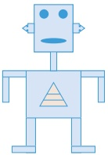

Figure 1.4 Drawing of a robot made up of a number of geometric shapes

Note: when saving a bit-map image, it is important to include a file header; this will contain items such as file type (.bmp or .jpeg), file size, image resolution, bit depth (usually 1, 8, 16, 24 or 32), any type of data compression employed and so on.

#### 1.2.2 Vector graphics

Vector graphics are images that use 2D points to describe lines and curves and their properties that are grouped to form geometric shapes. Vector graphics can be designed using computer aided design (CAD) software or using an application which uses a drawing canvas on the screen. See Figure 1.4.

A vector graphic will contain a drawing list (included in a file header) that is made up of

the command used for each object that makes up the graphic image

the attributes that define the properties that make up each object (for example consider the ellipse of the robot's mouth – this will need the position of the two centres, the radius from centres, the thickness and style of each line, the line colour and any fill colour used)

the relative position of each object will also need to be included

the dimensions of each object are not defined, but the relative positions of objects to each other in the final graphic need to be defined; this means that scaling up the vector graphic image will result in no loss of quality.

When printing out vector graphics it is usually necessary to first convert it into a bit-map image to match the format of most printers.

Comparison between vector graphics and bit-map images

<table border=1 style='margin: auto; word-wrap: break-word;'><tr><td style='text-align: center; word-wrap: break-word;'>Vector graphic images</td><td style='text-align: center; word-wrap: break-word;'>Bit-map images</td></tr><tr><td style='text-align: center; word-wrap: break-word;'>made up of geometric shapes which require definition/attributes</td><td style='text-align: center; word-wrap: break-word;'>made up of tiny pixels of different colours</td></tr><tr><td style='text-align: center; word-wrap: break-word;'>to alter/edit the design, it is necessary to change each of the geometric shapes</td><td style='text-align: center; word-wrap: break-word;'>possible to alter/edit each of the pixels to change the design of the image</td></tr><tr><td style='text-align: center; word-wrap: break-word;'>they do not require large file size since it is made up of simple geometric shapes</td><td style='text-align: center; word-wrap: break-word;'>because of the use of pixels (which give very accurate designs), the file size is very large</td></tr><tr><td style='text-align: center; word-wrap: break-word;'>because the number of geometric shapes is limited, vector graphics are not usually very realistic</td><td style='text-align: center; word-wrap: break-word;'>since images are built up pixel by pixel, the final image is usually very realistic</td></tr><tr><td style='text-align: center; word-wrap: break-word;'>file formats are usually .svg, .cgm, .odg</td><td style='text-align: center; word-wrap: break-word;'>file formats are usually .jpeg, .bmp, .png</td></tr></table>

### ▲ Table 1.8 Comparison between vector graphics and bit-map images

It is now worth considering whether a vector graphic or a bit-map image would be the best choice for a given application. When deciding which is the better method, we should consider the following:

» Does the image need to be resized? If so, a vector graphic could be the best option.

» Does the image need to be drawn to scale? Again, a vector graphic is probably the best option.

» Does the image need to look real? Usually bit-map images look more realistic than vector graphics.

Are there file restrictions? If so, it is important to consider whether vector graphic images can be used; if not, it would be necessary to consider the image resolution of a bit-map image to ensure the file size is not too large.

<!-- page 35 -->

For example, when designing a logo for a company or composing an 'exploded diagram' of a car engine, vector graphics are the best choice.

However, when modifying photographs using photo software, the best method is to use bit-map images.

#### 1.2.3 Sound files

Sound requires a medium in which to travel through (it cannot travel in a vacuum). This is because it is transmitted by causing oscillations of particles within the medium. The human ear picks up these oscillations (changes in air pressure) and interprets them as sound. Each sound wave has a frequency and wavelength; the amplitude specifies the loudness of the sound.

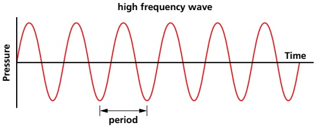

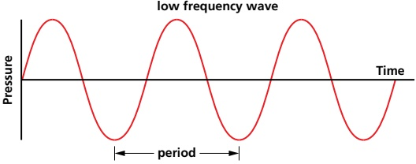

Figure 1.5 High and low frequency wave signals

Sound is an analogue value; this needs to be digitised in order to store sound in a computer. This is done using an analogue to digital converter (ADC). If the sound is to be used as a music file, it is often filtered first to remove higher frequencies and lower frequencies which are outside the range of human hearing. To convert the analogue data to digital, the sound waves are sampled at a given time rate. The amplitude of the sound cannot be measured precisely, so approximate values are stored.

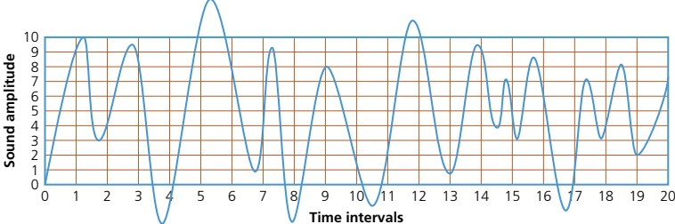

Figure 1.6 A sound wave

<!-- page 36 -->

Figure 1.6 shows a sound wave. The x-axis shows the time intervals when the sound was sampled (0 to 20), and the y-axis shows the amplitude of the sampled sound (the amplitudes above 10 and below 0 are filtered out in this example).

At time interval 1, the approximate amplitude is 9; at time interval 2, the approximate amplitude is 4, and so on for all 20 time intervals. Because the amplitude range in Figure 1.6 is 0 to 10, then 4 binary bits can be used to represent each amplitude value (for example, 9 would be represented by the binary value 1001). Increasing the number of possible values used to represent sound amplitude also increases the accuracy of the sampled sound (for example, using a range of 0 to 127 gives a much more accurate representation of the sound sample than using a range of, for example, 0 to 10). This is known as the sampling resolution (also known as the bit depth).

Sampling rate is the number of sound samples taken per second. The higher the sampling rate and/or sampling resolution, the greater the file size. For example, a 16-bit sampling resolution is used when recording CDs to give better sound quality.

So, how is sampling used to record a sound clip?

The amplitude of the sound wave is first determined at set time intervals (the sampling rate).

» This gives an approximate representation of the sound wave.

The sound wave is then encoded as a series of binary digits.

Using a higher sampling rate or larger resolution will result in a more faithful representation of the original sound source.

<table border=1 style='margin: auto; word-wrap: break-word;'><tr><td style='text-align: center; word-wrap: break-word;'>Pros</td><td style='text-align: center; word-wrap: break-word;'>Cons</td></tr><tr><td style='text-align: center; word-wrap: break-word;'>larger dynamic range</td><td style='text-align: center; word-wrap: break-word;'>produces larger file size</td></tr><tr><td style='text-align: center; word-wrap: break-word;'>better sound quality</td><td style='text-align: center; word-wrap: break-word;'>takes longer to transmit/download sound files</td></tr><tr><td style='text-align: center; word-wrap: break-word;'>less sound distortion</td><td style='text-align: center; word-wrap: break-word;'>requires greater processing power</td></tr></table>

▲ Table 1.9 The pros and cons of using a larger sampling resolution when recording sound

Recorded sound is often edited using software. Common features of such software include the ability to

Edit the start/stop times and duration of a sample

extract and save (or delete) part of a sample

alter the frequency and amplitude of a sample

fade in and fade out

mix and/or merge multiple sound tracks or sources

combine various sound sources together and alter their properties

remove 'noise' to enhance one sound wave in a multiple of waves (for example, to identify and extract one person's voice out of a group of people)

▶️ convert between different audio formats.

#### 1.2.4 Video

This section considers the use of video and extends beyond the syllabus. While this is not specifically mentioned in the syllabus, it has been included here for completeness. Many specialist video cameras exist. However, most digital cameras, smart phones and tablets are also capable of taking moving images by 'stitching' a number of still photos (frames) together. They are often referred to as DV (digital video) cameras; they store compressed photo frames at a speed of 25 MB per second – this is known as motion JPEG.

<!-- page 37 -->

In both single frame and video versions, the camera picks up the light from the image and turns it into an electronic signal using light-sensitive sensors. In the case of the DV cameras, these signals are automatically converted into a compressed digital file format.

When recording video, the frame rate refers to the number of frames recorded per second.

### 1.3 File compression

## Key terms

<table border=1 style='margin: auto; word-wrap: break-word;'><tr><td style='text-align: center; word-wrap: break-word;'>Lossless file compression – file compression method where the original file can be restored following decompression.</td><td style='text-align: center; word-wrap: break-word;'>Audio compression – method used to reduce the size of a sound file using perceptual music shaping.</td></tr><tr><td style='text-align: center; word-wrap: break-word;'>Lossy file compression – file compression method where parts of the original file cannot be recovered during decompression, so some of the original detail is lost.</td><td style='text-align: center; word-wrap: break-word;'>Perceptual music shaping – method where sounds outside the normal range of hearing of humans, for example, are eliminated from the music file during compression.</td></tr><tr><td style='text-align: center; word-wrap: break-word;'>JPEG – Joint Photographic Expert Group – a form of lossy file compression based on the inability of the eye to spot certain colour changes and hues.</td><td style='text-align: center; word-wrap: break-word;'>Bit rate – number of bits per second that can be transmitted over a network. It is a measure of the data transfer rate over a digital telecoms network.</td></tr><tr><td style='text-align: center; word-wrap: break-word;'>MP3/MP4 files – file compression method used for music and multimedia files.</td><td style='text-align: center; word-wrap: break-word;'>Run length encoding (RLE) – a lossless file compression technique used to reduce text and photo files in particular.</td></tr></table>

It is often necessary to reduce the file size of a file to either save storage space or to reduce the time taken to stream or transmit data from one device to another (see Chapter 2). The two most common forms of file compression are lossless file compression and lossy file compression.

## Lossless file compression

With this technique, all the data from the original file can be reconstructed when the file is uncompressed again. This is particularly important for files where loss of any data would be disastrous (such as a spreadsheet file of important results).

## Lossy file compression

With this technique, the file compression algorithm eliminates unnecessary data (as with MP3 and JPEG formats, for example).

Lossless file compression is designed to lose none of the original detail from the file (such as Run-Length Encoding (RLE) which is covered later in this chapter). Lossy file compression usually results in some loss of detail when compared to the original; it is usually impossible to reconstruct the original file. The algorithms used in the lossy technique have to decide which parts of the file are important (and need to be kept) and which parts can be discarded.

We will now consider file compression techniques applied to multimedia files.

#### 1.3.1 File compression applications

## MPEG-3 (MP3) and MPEG-4 (MP4)

MPEG-3 (MP3) uses technology known as audio compression to convert music and other sounds into an MP3 file format. Essentially, this compression technology will reduce the size of a normal music file by about 90%. For example, an 80MB music file on a CD can be reduced to 8MB using MP3 technology.

<!-- page 38 -->

## EXTENSION ACTIVITY 1D

Find out how file compression can be applied to a photograph without noticeably reducing its quality. Compare this to run-length encoding (RLE), described below.

MP3 files are used in MP3 players, computers or mobile phones. Music files can be downloaded or streamed from the internet in a compressed format, or CD files can be converted to MP3 format. While streamed or MP3 music quality can never match the ‘full’ version found on a CD, the quality is satisfactory for most purposes.

But how can the original music file be reduced by 90% while still retaining most of the music quality? This is done using file compression algorithms that use perceptual music shaping.

Perceptual music shaping removes certain sounds. For example

frequencies that are outside the human hearing range

» if two sounds are played at the same time, only the louder one can be heard by the ear, so the softer sound is eliminated.

This means that certain parts of the music can be removed without affecting the quality too much. MP3 files use what is known as a lossy format, since part of the original file is lost following the compression algorithm. This means that the original file cannot be put back together again. However, even the quality of MP3 files can be different, since it depends on the bit rate – this refers to the number of bits per second used when creating the file. Bit rates are between 80 and 320 kilobits per second; usually 200 kilobits or higher gives a sound quality close to a normal CD.

MPEG-4 (MP4) files are slightly different to MP3 files. This format allows the storage of multimedia files rather than just sound. Music, videos, photos and animation can all be stored in the MP4 format. Videos, for example, could be streamed over the internet using the MP4 format without losing any real discernible quality (see Chapter 2 for notes on video streaming).

## Photographic (bit-map) images

When a photographic file is compressed, both the file size and quality of image are reduced. A common file format for images is JPEG, which uses lossy file compression. Once the image is subjected to the JPEG compression algorithm, a new file is formed and the original file can no longer be constructed. A JPEG will reduce the raw bit-map image by a factor of between 5 and 15, depending on the quality of the original.

Vector graphics can also undergo some form of file compression. Scalable vector graphics (.svg) are defined in XML text files which, therefore, allows them to be compressed.

## Run-length encoding (RLE)

Run-length encoding (RLE) can be used to compress a number of different file formats.

It is a form of lossless/reversible file compression that reduces the size of a string of adjacent, identical data (such as repeated colours in an image).

A repeating string is encoded into two values.

The first value represents the number of identical data items (such as characters) in the run. The second value represents the code of the data item (such as ASCII code if it is a keyboard character).

RLE is only effective where there is a long run of repeated units/bits.

<!-- page 39 -->

## Using RLE on text data

Consider the text string ‘aaaaabbbbccddddd’.

Assuming each character requires 1 byte, then this string needs 16 bytes. If we assume ASCII code is being used, then the string can be coded as follows:

<table border=1 style='margin: auto; word-wrap: break-word;'><tr><td style='text-align: center; word-wrap: break-word;'>a</td><td style='text-align: center; word-wrap: break-word;'>a</td><td style='text-align: center; word-wrap: break-word;'>a</td><td style='text-align: center; word-wrap: break-word;'>a</td><td style='text-align: center; word-wrap: break-word;'>a</td><td style='text-align: center; word-wrap: break-word;'>b</td><td style='text-align: center; word-wrap: break-word;'>b</td><td style='text-align: center; word-wrap: break-word;'>b</td><td style='text-align: center; word-wrap: break-word;'>b</td><td style='text-align: center; word-wrap: break-word;'>c</td><td style='text-align: center; word-wrap: break-word;'>c</td><td style='text-align: center; word-wrap: break-word;'>d</td><td style='text-align: center; word-wrap: break-word;'>d</td><td style='text-align: center; word-wrap: break-word;'>d</td><td style='text-align: center; word-wrap: break-word;'>d</td><td style='text-align: center; word-wrap: break-word;'>d</td></tr><tr><td colspan="5">05 97</td><td colspan="4">04 98</td><td colspan="2">02 99</td><td colspan="5">05 100</td></tr></table>

This means we have five characters with ASCII code 97, four characters with ASCII code 98, two characters with ASCII code 99, and five characters with ASCII code 100. Assuming each number in the second row requires 1 byte of memory, the RLE code will need 8 bytes. This is half the original file size.

One issue occurs with a string such as ‘cdcdcdcdcd’, where compression is not very effective. To cope with this we use a flag. A flag preceding data indicates that what follows are the number of repeating units (for example, 255 05 97 where 255 is the flag and the other two numbers indicate that there are five items with ASCII code 97). When a flag is not used, the next byte(s) are taken with their face value and a run of 1 (for example, 01 99 means one character with ASCII code 99 follows).

Consider this example:

<table border=1 style='margin: auto; word-wrap: break-word;'><tr><td style='text-align: center; word-wrap: break-word;'>String</td><td style='text-align: center; word-wrap: break-word;'>aaaaaaaa</td><td style='text-align: center; word-wrap: break-word;'>bbbbbbbbb</td><td style='text-align: center; word-wrap: break-word;'>c</td><td style='text-align: center; word-wrap: break-word;'>d</td><td style='text-align: center; word-wrap: break-word;'>c</td><td style='text-align: center; word-wrap: break-word;'>d</td><td style='text-align: center; word-wrap: break-word;'>c</td><td style='text-align: center; word-wrap: break-word;'>d</td><td style='text-align: center; word-wrap: break-word;'>eeeeeeee</td></tr><tr><td style='text-align: center; word-wrap: break-word;'>Code</td><td style='text-align: center; word-wrap: break-word;'>08 97</td><td style='text-align: center; word-wrap: break-word;'>10 98</td><td style='text-align: center; word-wrap: break-word;'>01 99</td><td style='text-align: center; word-wrap: break-word;'>01 100</td><td style='text-align: center; word-wrap: break-word;'>01 99</td><td style='text-align: center; word-wrap: break-word;'>01 100</td><td style='text-align: center; word-wrap: break-word;'>01 99</td><td style='text-align: center; word-wrap: break-word;'>01 100</td><td style='text-align: center; word-wrap: break-word;'>08 101</td></tr></table>

The original string contains 32 characters and would occupy 32 bytes of storage.

The coded version contains 18 values and would require 18 bytes of storage.

Introducing a flag (255 in this case) produces:

255 08 97 255 10 98 99 100 99 100 99 100 255 08 101

This has 15 values and would, therefore, require 15 bytes of storage. This is a reduction in file size of about 53%.

Using RLE with images

Black and white images

Figure 1.7 shows the letter F in a grid where each square requires 1 byte of storage. A white square has a value 1 and a black square is a value of 0.

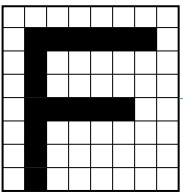

 $$ \begin{array}{c}1\quad1\quad1\quad1\quad1\quad1\quad1\quad1\\1\quad0\quad0\quad0\quad0\quad0\quad0\quad1\\1\quad0\quad1\quad1\quad1\quad1\quad1\quad1\\1\quad0\quad1\quad1\quad1\quad1\quad1\quad1\\1\quad0\quad0\quad0\quad0\quad0\quad1\quad1\\1\quad0\quad1\quad1\quad1\quad1\quad1\quad1\\1\quad0\quad1\quad1\quad1\quad1\quad1\quad1\quad1\\1\quad0\quad1\quad1\quad1\quad1\quad1\quad1\quad1\end{array} $$ 

In compressed RLE format this becomes:

9W 6B 2W 1B 7W 1B 7W 5B 3W 1B 7W 1B 7W 1B 6W

Using W = 1 and B = 0 we get:

91 60 21 10 71 10 71 50 31 10 71 10 71 10 61

Figure 1.7 Using RLE with a black and white image

The  $ 8 \times 8 $ grid would need 64 bytes; the compressed RLE format has 30 values, and therefore needs only 30 bytes to store the image.

<!-- page 40 -->

## Coloured images

Figure 1.8 shows an object in four colours. Each colour is made up of red, green and blue (RGB) according to the code on the right.

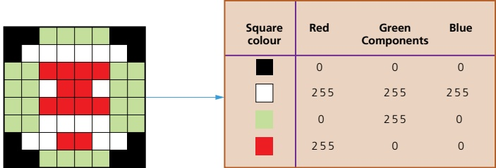

Figure 1.8 Using RLE with a coloured image

This produces the following data:

2 0 0 0 4 0 255 0 3 0 0 0 6 255 255 255 1 0 0 0 2 0 255 0 4 255 0 0 4 0 255 0 1

255 255 255 2 255 0 0 1 255 255 255 4 0 255 0 4 255 0 0 4 0 255 0 4 255 255 255

2 0 255 0 1 0 0 0 2 255 255 255 2 255 0 0 2 255 255 255 3 0 0 0 4 0 255 0 2 0 0 0

The original image  $ (8 \times 8\ \text{square}) $ would need 3 bytes per square (to include all three RGB values). Therefore, the uncompressed file for this image is  $ 8 \times 8 \times 3 = 192 $ bytes.

The RLE code has 92 values, which means the compressed file will be 92 bytes in size. This gives a file reduction of about 52%. It should be noted that the file reductions in reality will not be as large as this due to other data which needs to be stored with the compressed file (such as a file header).

#### 1.3.2 General methods of compressing files

All the above file compression techniques are excellent for very specific types of file. However, it is also worth considering some general methods to reduce the size of a file without the need to use lossy or lossless file compression:

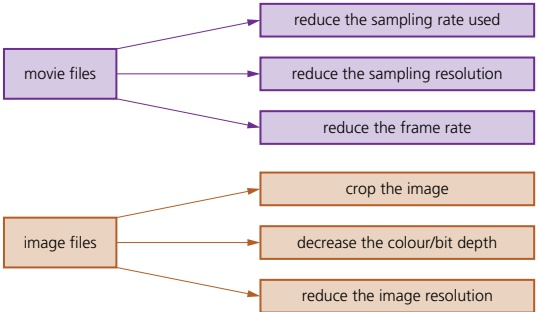

Figure 1.9 General methods of compressing files

<!-- page 41 -->

## ACTIVITY 11

1 a) What is meant by lossless and lossy file compression?

b) Give an example of a lossless file format and an example of a lossless file format.

2 a) Describe how music picked up by a microphone is turned into a digitised music file in a computer.

b) Explain why it is often necessary to compress stored music files. Describe how the music quality is essentially retained.

3 a) What is meant by run length encoding?

b) Describe how RLE compresses a file. Give an example in your description.

4 a) Describe the differences between bit-map images and vector graphics.

b) A software designer needs to incorporate images into her software to add realism.

## End of chapter questions

1 a) The following bytes represent binary integers using the two's complement form. State the equivalent denary values.

010011111[1]

)10011010[1]

iii) Write the integer -53 in two's complement form. [1]

iv) Write the maximum possible range of numbers using the two's complement form of an 8-bit binary number.

Give your answers in denary.

b) i) Write the denary integer 798 in binary-coded decimal (BCD) format. [1]

ii) Write the denary number that is represented by the following BCD number.

<table border=1 style='margin: auto; word-wrap: break-word;'><tr><td style='text-align: center; word-wrap: break-word;'>1</td><td style='text-align: center; word-wrap: break-word;'>0</td><td style='text-align: center; word-wrap: break-word;'>0</td><td style='text-align: center; word-wrap: break-word;'>1</td><td style='text-align: center; word-wrap: break-word;'>0</td><td style='text-align: center; word-wrap: break-word;'>1</td><td style='text-align: center; word-wrap: break-word;'>1</td><td style='text-align: center; word-wrap: break-word;'>1</td><td style='text-align: center; word-wrap: break-word;'>0</td><td style='text-align: center; word-wrap: break-word;'>1</td><td style='text-align: center; word-wrap: break-word;'>1</td><td style='text-align: center; word-wrap: break-word;'>1</td><td style='text-align: center; word-wrap: break-word;'>0</td><td style='text-align: center; word-wrap: break-word;'>1</td><td style='text-align: center; word-wrap: break-word;'>1</td><td style='text-align: center; word-wrap: break-word;'>0</td></tr></table>

c) Give one use of binary-coded decimal system.

2 A software developer is using a microphone and a sound editing app to collect and edit sounds for his new game.

When collecting sounds, the software developer can decide on the sampling resolution he wishes to use.

a) i) State what is meant by sampling resolution. [1]

ii) Describe how sampling resolution will affect how accurate the stored digitised sound will be. [2]

b) The software developer will include images in his new game.

i) Explain the term image resolution. [1]

ii) The software developer is using 16-colour bit-map images.

State the number of bits required to encode data for one pixel of his image. [1]

iii) One of the images is 16 384 pixels wide and 512 pixels high.

The developer decides to save it as a 256-colour bit-map image.

Calculate the size of the image file in gibbytes.

<!-- page 42 -->

iv) The bit-map image will contain a header.  
State two items you would expect to see in the header. [2]  
v) Give three features you would expect to see in the sound editing app. [3]  
The editor of a movie is finalising the music score. They will send the final version of the score to the movie producer by email attachment.  
a) Describe how sampling is used to record the music sound clips. [3]  
b) The music sound clips need to undergo some form of data compression before the music editor can send them via email.  
Identify the type of compression, lossy or lossless, they should use.  
Give a justification for your answer. [3]  
c) One method of data compression is known as run length encoding (RLE).  
i) Explain what is meant by RLE. [3]  
ii) Show how RLE would be used to produce a compressed file for the image below.  
Write down the data you would expect to see in the RLE compressed format (you may assume that the grey squares have a code value of 85 and the white squares have a code value of 255). [4]

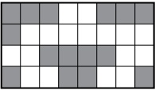

4 a) Write the denary numbers 60, 27 and -27 in 8-bit binary two's complement form.  
  
b) Show the result of the addition  $ 60 + 27 $ using 8-bit binary two's complement form. Show all of your working.  
  
c) Show the result of the subtraction  $ 60 - 27 $ using 8-bit binary two's complement form.  
  
d) Give the result of the following addition.  
  
01011001  
+  
01100001  
Explain why the expected result is not obtained.  
  
5 a) Carry out  $ 0.52 + 0.83 $ using binary-coded decimal (BCD). Show all of your working.  
  
b) i) Define the term hexadecimal.  
  
ii) Give two uses of the hexadecimal system.  
  
iii) Convert the following binary number into hexadecimal.  
  
01111101110010  
  
6 a) Convert the denary number 95 into binary coded decimal (BCD).  
  
b) Using two's complement, carry out the binary subtraction:  
  
00100011-01000100  
  
and convert your answer into denary.  
  
c) Convert the denary number 506 into hexadecimal.

