# 3 Hardware

<!-- Cambridge International AS and a Level Computer Science (David Watson, Helen Williams).pdf p84-122 -->

<!-- page 84 -->

## 3 

## Hardware

In this chapter, you will learn about

primary storage/memory devices

★ secondary storage (including removable devices)

 $ ^{*} $ the benefits and drawbacks of embedded systems

 $ ^{*} $ hardware devices used as input, output and storage

 $ ^{*} $ the differences between RAM, ROM, SRAM, DRAM, PROM and EPROM

 $ ^{*} $ the use of RAM, ROM, SRAM and DRAM in a range of devices

monitoring and control systems

 $ ^{*} $ the use of logic gates: NOT, AND, OR, NAND, NOR and XOR

 $ ^{*} $ the construction and use of truth tables

 $ ^{*} $ the construction of logic circuits, truth tables and logic expressions from a variety of logic information.

## WHAT YOU SHOULD ALREADY KNOW

Try these five questions before you read this chapter.

1 What is the difference between memory and storage?

2 Why is it necessary to have both internal and external memory/storage devices?

3 Can you recognise the memory/storage devices on the right?

4 What is the difference between online and offline storage?

5 What is the difference between data access time and data transfer rate when using memory and storage devices?

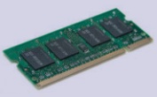

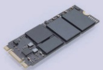

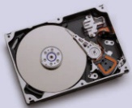

Figure 3.1 Memory/storage devices

### 3.1 Computers and their components

## Key terms

Memory cache – high speed memory external to processor which stores data which the processor will need again.

Random access memory (RAM) – primary memory unit that can be written to and read from.

Read-only memory (ROM) – primary memory unit that can only be read from.

Dynamic RAM (DRAM) – type of RAM chip that needs to be constantly refreshed.

Static RAM (SRAM) – type of RAM chip that uses flip-flops and does not need refreshing.

Refreshed – requirement to charge a component to retain its electronic state.

<!-- page 85 -->

<table border=1 style='margin: auto; word-wrap: break-word;'><tr><td style='text-align: center; word-wrap: break-word;'>Programmable ROM (PROM) – type of ROM chip that can be programmed once.</td><td style='text-align: center; word-wrap: break-word;'>Direct 3D printing – 3D printing technique where print head moves in the x, y and z directions. Layers of melted material are built up using nozzles like an inkjet printer.</td></tr><tr><td style='text-align: center; word-wrap: break-word;'>Erasable PROM (EPROM) – type of ROM that can be programmed more than once using ultraviolet (UV) light.</td><td style='text-align: center; word-wrap: break-word;'>Digital to analogue converter (DAC) – needed to convert digital data into electric currents that can drive motors, actuators and relays, for example.</td></tr><tr><td style='text-align: center; word-wrap: break-word;'>Hard disk drive (HDD) – type of magnetic storage device that uses spinning disks.</td><td style='text-align: center; word-wrap: break-word;'>Analogue to digital converter (ADC) – needed to convert analogue data (read from sensors, for example) into a form understood by a computer.</td></tr><tr><td style='text-align: center; word-wrap: break-word;'>Latency – the lag in a system; for example, the time to find a track on a hard disk, which depends on the time taken for the disk to rotate around to its read-write head.</td><td style='text-align: center; word-wrap: break-word;'>Organic LED (OLED) – uses movement of electrons between cathode and anode to produce an on-screen image. It generates its own light so no back lighting required.</td></tr><tr><td style='text-align: center; word-wrap: break-word;'>Fragmented – storage of data in non-consecutive sectors; for example, due to editing and deletion of old data.</td><td style='text-align: center; word-wrap: break-word;'>Screen resolution – number of pixels in the horizontal and vertical directions on a television/computer screen.</td></tr><tr><td style='text-align: center; word-wrap: break-word;'>Removable hard disk drive – portable hard disk drive that is external to the computer; it can be connected via a USB part when required; often used as a device to back up files and data.</td><td style='text-align: center; word-wrap: break-word;'>Touch screen – screen on which the touch of a finger or stylus allows selection or manipulation of a screen image; they usually use capacitive or resistive technology.</td></tr><tr><td style='text-align: center; word-wrap: break-word;'>Solid state drive (SSD) – storage media with no moving parts that relies on movement of electrons.</td><td style='text-align: center; word-wrap: break-word;'>Capacitive – type of touch screen technology based on glass layers forming a capacitor, where fingers touching the screen cause a change in the electric field.</td></tr><tr><td style='text-align: center; word-wrap: break-word;'>Electronically erasable programmable read-only memory (EEPROM) – read-only (ROM) chip that can be modified by the user, which can then be erased and written to repeatedly using pulsed voltages.</td><td style='text-align: center; word-wrap: break-word;'>Resistive – type of touch screen technology. When a finger touches the screen, the glass layer touches the plastic layer, completing the circuit and causing a current to flow at that point.</td></tr><tr><td style='text-align: center; word-wrap: break-word;'>Flash memory – a type of EEPROM, particularly suited to use in drives such as SSDs, memory cards and memory sticks.</td><td style='text-align: center; word-wrap: break-word;'>Virtual reality headset – apparatus worn on the head that covers the eyes like a pair of goggles. It gives the user the ‘feeling of being there’ by immersing them totally in the virtual reality experience.</td></tr><tr><td style='text-align: center; word-wrap: break-word;'>Optical storage – CDs, DVDs and Blu-ray™ discs that use laser light to read and write data.</td><td style='text-align: center; word-wrap: break-word;'>Sensor – input device that reads physical data from its surroundings.</td></tr><tr><td style='text-align: center; word-wrap: break-word;'>Dual layering – used in DVDs; uses two recording layers.</td><td style='text-align: center; word-wrap: break-word;'>Sensor – input device that reads physical data from its surroundings.</td></tr><tr><td style='text-align: center; word-wrap: break-word;'>Birefringence – a reading problem with DVDs caused by refraction of laser light into two beams.</td><td style='text-align: center; word-wrap: break-word;'></td></tr><tr><td style='text-align: center; word-wrap: break-word;'>Binder 3D printing – 3D printing method that uses a two-stage pass; the first stage uses dry powder and the second stage uses a binding agent.</td><td style='text-align: center; word-wrap: break-word;'></td></tr></table>

#### 3.1.1 Types of memory and storage

Computers require some form of memory and storage.

Memory is usually referred to as the internal devices which the computer can access directly. This memory can be the user's workspace, temporary data or data that is key to running the computer.

Storage devices allow users to store applications, data and files. The user's data is stored permanently and they can change it or read it as they wish. Storage needs to be larger than internal memory since the user may wish to store large files (such as music files or photographic images).

Storage devices can also be removable to allow data, for example, to be transferred between computers. Removable devices allow a user to store important data in a different building in case of data loss.

However, all of this has become a lot less important with the advent of technology such as 'data drop' (which uses Bluetooth) and cloud storage.

Internal memory includes components such as registers (which are part of the processor). There is also memory cache (which is external to the processor); this is used to store data which the processor will probably need to use again.

<!-- page 86 -->

Figure 3.2 summarises the types of memory and storage devices covered in this chapter.

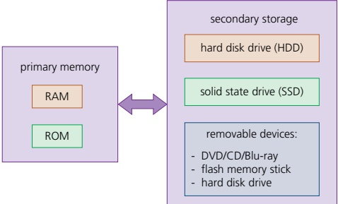

Figure 3.2 Memory and storage devices

## Primary memory

Primary memory is the part of computer memory which can be accessed directly from the CPU and, as Figure 3.2 shows, contains the random access memory (RAM) and read-only memory (ROM) memory chips. Primary memory allows the processor to access applications and services temporarily stored in memory locations. The structure of primary memory is shown in Figure 3.3.

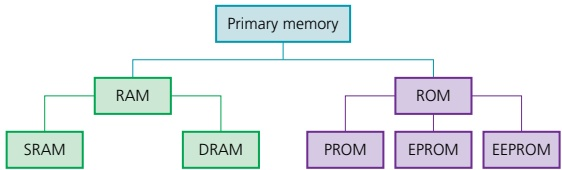

Figure 3.3 Structure of primary memory

All computer systems come with some form of RAM. These memory devices are not really random, it refers to the fact that any memory location can be accessed independent of which memory location was last used. Access time to locate data is much faster in RAM than in secondary devices. RAM can also be

» written to or read from, and the data stored can be changed by the user or by the computer

used to store data, files, part of an application or part of the operating system currently in use

» volatile (memory contents are lost on powering off the computer).

In general, the larger the RAM, the faster the computer will operate. In reality, RAM never runs out of memory, it continues to operate but just becomes slower and slower as more data is stored. As RAM becomes 'full', the processor has to continually access the secondary data storage devices to overwrite old data on RAM with new data. By increasing the RAM size, the number of times this has to be done is considerably reduced, thus making the computer operate more quickly.

There are currently two types of RAM technology, dynamic RAM (DRAM) and static RAM (SRAM).

<!-- page 87 -->

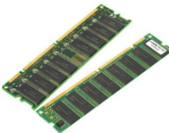

Figure 3.4 Two pieces of dynamic random access memory (DRAM)

Figure 3.5 Static RAM

## Dynamic RAM (DRAM)

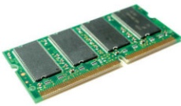

Each DRAM chip consists of a number of transistors and capacitors. Each of these parts is tiny since a single RAM chip will contain millions of capacitors and transistors.

» Capacitors hold the bits of information (0 or 1).

» Transistors act like switches; they allow the chip control circuitry to read the capacitor or change the capacitor's value.

This type of RAM needs to be constantly refreshed (that is, the capacitor needs to be re-charged every 15 microseconds otherwise it would lose its value). If it is not refreshed, the capacitor's charge will leak away very quickly, leaving every capacitor with the value 0.

DRAMs have a number of advantages over SRAMs. They:

are much less expensive to manufacture than SRAMs

consume less power than SRAMs

» have a higher memory capacity than SRAMs.

## Static RAM (SRAM)

A major difference between SRAM and DRAM is that SRAM does not need to be constantly refreshed.

It makes use of flip flops (see Chapter 15) which hold each bit of memory.

SRAM is much faster than DRAM when it comes to data access (typically, access time for SRAM is 25 nanoseconds and for DRAM is 60 nanoseconds).

DRAM is the most common type of RAM used in computers, but where absolute speed is essential, for example in the processor's memory cache, SRAM is the preferred technology. Memory cache is a high speed portion of the memory. It is effective because most programs access the same data or instructions many times. By keeping as much of this information as possible in SRAM, the computer avoids having to access the slower DRAM.

Table 3.1 summarises the differences between DRAM and SRAM.

<table border=1 style='margin: auto; word-wrap: break-word;'><tr><td style='text-align: center; word-wrap: break-word;'>DRAM</td><td style='text-align: center; word-wrap: break-word;'>SRAM</td></tr><tr><td style='text-align: center; word-wrap: break-word;'>■ consists of a number of transistors and capacitors\n■ needs to be constantly refreshed\n■ less expensive to manufacture than SRAM\n■ has a higher memory capacity than SRAM\n■ main memory is constructed from DRAM\n■ consumes more power than SRAM under reasonable levels of access, as it needs to be constantly refreshed</td><td style='text-align: center; word-wrap: break-word;'>■ uses flip-flops to hold each bit of memory\n■ does not need to be constantly refreshed\n■ has a faster data access time than DRAM\n■ processor memory cache makes use of SRAM\n■ if accessed at a high frequency, power usage can exceed that of DRAM</td></tr></table>

Table 3.1 Differences between DRAM and SRAM

Another form of primary memory is the read-only memory (ROM). This is similar to RAM in that it shares the same random access properties, but it cannot be written to or changed. As the name suggests, ROM is a read-only memory device.

ROMs are

non-volatile (the contents are not lost after powering off the computer)

permanent memory devices (the contents cannot be changed)

<!-- page 88 -->

» often used to store data which the computer needs to access when powering up for the first time for example, the basic input/output system (BIOS).

Table 3.2 summarises the main differences between RAM and ROM.

<table border=1 style='margin: auto; word-wrap: break-word;'><tr><td style='text-align: center; word-wrap: break-word;'>RAM</td><td style='text-align: center; word-wrap: break-word;'>ROM</td></tr><tr><td style='text-align: center; word-wrap: break-word;'>☑ temporary memory device\n☑ volatile memory\n☑ can be written to and read from\n☑ used to store data, files, programs, part of OS currently in use\n☑ can be increased in size to improve operational speed of a computer</td><td style='text-align: center; word-wrap: break-word;'>☑ permanent memory device\n☑ non-volatile memory device\n☑ data stored cannot be altered\n☑ sometimes used to store BIOS and other data needed at start up</td></tr></table>

Table 3.2 Differences between RAM and ROM

## PROM and EPROM

A programmable read-only memory (PROM) is a type of ROM chip that can be altered once. A PROM is made up of a matrix of fuses. Programming a PROM requires the use of a PROM writer which uses an electric current to alter specific cells by ‘burning’ fuses in the matrix. Due to the method of programming (writing), a PROM can only be written to once. They are often used in mobile phones and in RFID tags.

An erasable programmable read-only memory (EPROM) is different to a PROM because they use floating gate transistors and capacitors rather than fuses. Ultra violet (UV) light is used to program an EPROM through a quartz window. They are used in applications which are under development, such as the programming of new games consoles.

## Embedded systems

Embedded systems involve installing microprocessors into devices to enable operations to be controlled in a more efficient way. Devices such as cookers, refrigerators and central heating systems can now all be activated by a web-enabled device (such as a mobile phone or tablet). The time a central heating system switches on or off and the temperature can all be set from an app on a mobile phone from anywhere in the world.

There are pros and cons of devices being controlled in this manner, as shown in Table 3.3.

<table border=1 style='margin: auto; word-wrap: break-word;'><tr><td style='text-align: center; word-wrap: break-word;'>Pros of embedded systems</td><td style='text-align: center; word-wrap: break-word;'>Cons of embedded systems</td></tr><tr><td style='text-align: center; word-wrap: break-word;'>■ small in size and therefore easy to fit into devices\n■ relatively low cost to make\n■ usually dedicated to one task, making for simple interfaces and often no requirement of an operating system\n■ consume very little power\n■ very fast reaction to changing input (operate in real time)\n■ with mass production comes reliability</td><td style='text-align: center; word-wrap: break-word;'>■ difficult to upgrade devices to take advantage of new technology\n■ troubleshooting faults in the device becomes a specialist task\n■ although the interface can appear to be simple, in reality it can be more confusing (changing the time on a cooker clock can require several steps, for example)\n■ any device that can be accessed over the internet is also open to hackers, viruses, and so on\n■ due to the difficulty in upgrading and fault finding, devices are often just thrown away rather than being repaired (wasteful)</td></tr></table>

Table 3.3 Pros and cons of controlling devices with embedded systems

<!-- page 89 -->

## EXTENSION ACTIVITY 3A

Describe how ROM and RAM chips could be used in:

a) a microwave oven

b) a refrigerator

c) a remote-controlled model aeroplane (the movement of the aeroplane is controlled by a hand-held device).

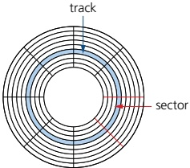

## Secondary storage devices

Figure 3.6 Tracks and sectors on a hard disk drive

Secondary storage includes storage devices that are not directly accessible by the CPU. They are non-volatile devices which allow data to be stored as long as required by the user. This type of storage is much larger than primary memory, but data access time is considerably slower than RAM and ROM. All applications, the operating system, device drivers and general files (for example, documents, photos and music) are stored on secondary storage. The following section discusses the various types of secondary storage that can be found on the majority of computers. Secondary storage devices fall into three categories: magnetic, solid state and optical.

## Hard disk drives (HDD)

Hard disk drives (HDD) are still one of the most common methods used to store data on a computer.

Data is stored in a digital format on the magnetic surfaces of the disks (or platters, as they are frequently called). The hard disk drive will have a number of platters which can spin at about 7000 times a second. A number of read-write heads can access all of the surfaces in the disk drive. Normally each platter will have two surfaces which can be used to store the data. These read-write heads can move very quickly – typically they can move from the centre of the disk to the edge of the disk (and back again) 50 times a second.

Data is stored on the surface in sectors and tracks.

A sector on a given track will contain a fixed number of bytes.

Unfortunately, hard disk drives have very slow data access when compared to, for example, RAM. Many applications require the read-write heads to constantly seek for the correct blocks of data; this means a large number of head movements. The effects of latency then become very significant. Latency is defined as the time it takes for a specific block of data on a data track to rotate around to the read-write head.

Users will sometimes notice the effect of latency when they see messages such as, 'Please wait' or, at its worst, 'not responding'.

When a file or data is stored on an HDD, the required number of sectors needed to store the data will be allocated. However, the sectors allocated may not be adjacent to each other. Through time, the HDD will undergo numerous deletions and editing, which leads to sectors becoming increasingly fragmented, resulting in a gradual deterioration of the HDD performance (in other words, it takes longer and longer to access data). Defragmentation software can improve on this situation by ‘tidying up’ the disk sectors.

An HDD is a direct access device; however, data in a given sector will be read sequentially.

<!-- page 90 -->

Removable hard disk drives are essentially HDDs that are external to the computer and can be connected to the computer using one of the USB ports. In this way, they can be used as back-up devices or as another way of transferring files between computers.

## EXTENSION ACTIVITY 3B

The length of a track on each disk in an HDD disk pack becomes much shorter towards the centre of the disk. Find out how manufacturers have overcome this issue with regards to disk data capacity and data access time.

## Solid state drives (SSD)

Latency is an issue in HDDs, as discussed earlier. Solid state drives (SSD) reduce this issue considerably. They have no moving parts and all data is retrieved at the same rate. They do not rely on magnetic properties. The most common type of solid state storage devices store data by controlling the movement of electrons within NAND chips. The data is stored as Os and 1s in millions of tiny transistors (at each junction one transistor is called a floating gate and the other is called a control gate) within the chip. This effectively produces a non-volatile rewritable memory.

However, a number of solid state storage devices sometimes use electronically erasable PROM (EEPROM) technology. The main difference is the use of NOR chips rather than NAND. This makes them faster in operation but devices using EEPROM are considerably more expensive than those that use NAND technology. EEPROM also allows data to be read or erased in single bytes at a time. Use of NAND only allows blocks of data to be read or erased. This makes EEPROM technology more useful in certain applications where data needs to be accessed or erased in byte-size chunks.

Because of the cost implications, the majority of solid state storage devices use NAND technology. The two are usually distinguished by the terms flash memory (use NAND) and EEPROM (use NOR).

So, what are the main benefits of using an SSD rather than an HDD?

Solid state drives

» are more reliable (no moving parts to go wrong)

» are considerably lighter (which makes them suitable for laptops)

do not have to 'get up to speed' before they work properly

» have a lower power consumption

run much cooler than HDDs (both these points again make them very suitable for laptop computers)

are very thin (because they have no moving parts)

access data considerably faster.

The main drawback of SSD is the still unknown longevity of the technology. Most solid state storage devices are conservatively rated at only 20GB write operations per day over a three year period – this is known as SSD endurance. For this reason, SSD technology is not commonly used in servers, for example, where a huge number of write operations take place every day. However, this issue is being addressed by a number of manufacturers to improve the durability of these solid state systems and they are rapidly becoming more common in applications such as servers and cloud storage devices.

Note that it is also not possible to over-write existing data on a flash memory device; it is necessary to first erase the old data and then write the new data at the same location.

<!-- page 91 -->

Memory sticks/flash memories (also known as pen drives) use solid state technology. They usually connect to the computer through the USB port. Their main advantage is that they are very small, lightweight devices which make them suitable for transferring files between computers. They can also be used as small back-up devices for music or photo files, for example.

Complex or expensive software, such as an expert system, will often use a memory stick as a dongle. The dongle contains additional files which are needed to run the software. Without this dongle, the software will not work properly. It therefore prevents illegal or unauthorised use of the software, and also prevents copying of the software since, without the dongle, it is useless.

## Optical media: CDs, DVDs and Blu-ray discs

CDs and DVDs are described as optical storage devices. Laser light is used to read data from, and write data onto, the surface of a disk.

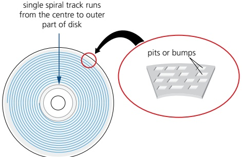

Figure 3.7 CDs and DVDs use a single, spiral track

Both CDs and DVDs use a thin layer of metal alloy or light-sensitive organic dye to store the data. As shown in Figure 3.7, both systems use a single, spiral track which runs from the centre of the disk to the edge. When a disk spins, the optical head moves to the point where the laser beam 'contacts' the disk surface and follows the spiral track from the centre outwards. As with an HDD, a CD/DVD is divided into sectors allowing direct access of data. Also, as in the case of an HDD, the outer part of the disk runs faster than the inner part of the disk.

## EXTENSION ACTIVITY 3C

The outer part of an optical disk runs faster than the inner part of the disk. Find out how manufacturers have overcome this issue with regards to disk data capacity and data access time.

The data is stored in ‘pits’ and ‘bumps’ on the spiral track. A red laser is used to read and write the data. CDs and DVDs can be designated R (write once only) or RW (can be written to or read from many times).

DVD technology is slightly different to that used in CDs. One of the main differences is the use of dual layering which considerably increases the storage capacity. This means that there are two individual recording layers. Two layers of a standard DVD are joined together with a transparent (polycarbonate) spacer, and a very thin reflector is sandwiched between the two layers. Reading and writing of the second layer is done by a red laser focusing at a fraction of a millimetre difference compared to the first layer.

<!-- page 92 -->

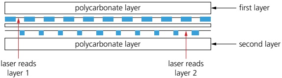

Figure 3.8 Dual layering in a DVD

Standard, single layer DVDs still have a larger storage capacity than CDs because the ‘pit’ size and track width are both smaller. This means that more data can be stored on the DVD surface. DVDs use lasers with a wavelength of 650 nanometres; CDs use lasers with a wavelength of 780 nanometres. The shorter the wavelength of the laser light, the greater the storage capacity of the medium.

Blu-ray discs are another example of optical storage media. However, they are fundamentally different to DVDs in their construction and in the way they carry out read-write operations.

Blu-ray uses a blue laser, rather than a red laser, to carry out read and write operations; the wavelength of blue light is only 405 nanometres (compared to 650 nm for red light).

» Using blue laser light means that the ‘pits’ and ‘bumps’ can be much smaller; consequently, a Blu-ray can store up to five times more data than a DVD.

Blu-ray uses a single 1.1mm thick polycarbonate disk; DVDs use a sandwich of two 0.6 mm thick disks.

» Using two sandwiched layers can cause birefringence (light is refracted into two separate beams causing reading errors); because Blu-ray uses only one layer, the discs do not suffer from birefringence.

Blu-ray discs automatically come with a secure encryption system which helps to prevent piracy and copyright infringement.

Table 3.4 summarises the main differences between CDs, DVDs and Blu-ray.

<table border=1 style='margin: auto; word-wrap: break-word;'><tr><td style='text-align: center; word-wrap: break-word;'>disk type</td><td style='text-align: center; word-wrap: break-word;'>laser colour</td><td style='text-align: center; word-wrap: break-word;'>wavelength of laser light</td><td style='text-align: center; word-wrap: break-word;'>disk construction</td><td style='text-align: center; word-wrap: break-word;'>track pitch (distance between tracks)</td></tr><tr><td style='text-align: center; word-wrap: break-word;'>CD</td><td style='text-align: center; word-wrap: break-word;'>red</td><td style='text-align: center; word-wrap: break-word;'>780 nm</td><td style='text-align: center; word-wrap: break-word;'>single 1.2mm polycarbonate layer</td><td style='text-align: center; word-wrap: break-word;'>1.60  $ \mu m $</td></tr><tr><td style='text-align: center; word-wrap: break-word;'>DVD</td><td style='text-align: center; word-wrap: break-word;'>red</td><td style='text-align: center; word-wrap: break-word;'>650 nm</td><td style='text-align: center; word-wrap: break-word;'>two 0.6mm polycarbonate layers</td><td style='text-align: center; word-wrap: break-word;'>0.74  $ \mu m $</td></tr><tr><td style='text-align: center; word-wrap: break-word;'>Blu-ray</td><td style='text-align: center; word-wrap: break-word;'>blue</td><td style='text-align: center; word-wrap: break-word;'>405 nm</td><td style='text-align: center; word-wrap: break-word;'>single 1.1mm polycarbonate layer</td><td style='text-align: center; word-wrap: break-word;'>0.30  $ \mu m $</td></tr><tr><td style='text-align: center; word-wrap: break-word;'>nm = 10 $ ^{-9} $ metres $ \mu m $ = 10 $ ^{-6} $ metres</td><td colspan="4"></td></tr></table>

Table 3.4 Main differences between CDs, DVDs and Blu-ray

All these optical storage media are used as back-up systems (for photos, music and multimedia files). This also means that CDs and DVDs can be used to transfer files between computers. Manufacturers sometimes supply their software (such as printer drivers) on CDs and DVDs. When the software is supplied in this way, the disk is usually in a read-only format.

The most common use of DVD and Blu-ray is the supply of movies or games. The memory capacity of CDs is not big enough to store most movies.

<!-- page 93 -->

Figure 3.9 A laser printer

## EXTENSION ACTIVITY 3D

A recent development is PRAM (parameter RAM) or PCRAM (phase-change RAM) which utilises chalogenide glass. This is glass containing elements such as sulphur, antimony, selenium, germanium or tellurium. Chalogenide compounds used in PRAMs/PCRAMs can be changed between the amorphous (glass-like) state and crystalline state, which changes the optical and electrical properties allowing the storage of data when used as a film on the surface of optical media.

Find out more about this technology and determine whether this could result in the demise of the current solid state removable devices.

#### 3.1.2 Input and output devices

This section will consider laser printers, inkjet printers, 3D printers, speakers, microphones, screens and sensors.

## Laser printers

Laser printers use dry powder ink rather than liquid ink and make use of the properties of static electricity to produce the text and images. Unlike inkjet printers, for example, laser printers print the whole page in one go. Colour laser printers use four toner cartridges – blue, cyan, magenta and black. Although the actual technology is different to monochrome printers, the printing method is similar, but colour dots are used to build up the text and images.

When a user wishes to print a document using a laser printer, the following sequence of events takes place.

<table border=1 style='margin: auto; word-wrap: break-word;'><tr><td style='text-align: center; word-wrap: break-word;'>Stage</td><td style='text-align: center; word-wrap: break-word;'>Description of what happens</td></tr><tr><td style='text-align: center; word-wrap: break-word;'>1</td><td style='text-align: center; word-wrap: break-word;'>data from the document is sent to a printer driver</td></tr><tr><td style='text-align: center; word-wrap: break-word;'>2</td><td style='text-align: center; word-wrap: break-word;'>printer driver ensures that the data is in a format that the chosen printer can understand</td></tr><tr><td style='text-align: center; word-wrap: break-word;'>3</td><td style='text-align: center; word-wrap: break-word;'>check is made by the printer driver to ensure that the chosen printer is available to print (is it busy? is it off-line? is it out of ink? and so on)</td></tr><tr><td style='text-align: center; word-wrap: break-word;'>4</td><td style='text-align: center; word-wrap: break-word;'>data is sent to the printer and stored in a temporary memory known as a printer buffer</td></tr><tr><td style='text-align: center; word-wrap: break-word;'>5</td><td style='text-align: center; word-wrap: break-word;'>printing drum given a positive charge. As this drum rotates, a laser beam scans across it removing the positive charge in certain areas, leaving negatively charged areas which exactly match the text/images of the page to be printed</td></tr><tr><td style='text-align: center; word-wrap: break-word;'>6</td><td style='text-align: center; word-wrap: break-word;'>drum is coated with positively charged toner (powdered ink). Since the toner is positively charged, it only sticks to the negatively charged parts of the drum</td></tr><tr><td style='text-align: center; word-wrap: break-word;'>7</td><td style='text-align: center; word-wrap: break-word;'>negatively charged sheet of paper is rolled over the drum</td></tr><tr><td style='text-align: center; word-wrap: break-word;'>8</td><td style='text-align: center; word-wrap: break-word;'>toner on the drum sticks to the paper to produce an exact copy of the page sent to the printer</td></tr><tr><td style='text-align: center; word-wrap: break-word;'>9</td><td style='text-align: center; word-wrap: break-word;'>to prevent the paper sticking to the drum, the electric charge on the paper is removed after one rotation of the drum</td></tr><tr><td style='text-align: center; word-wrap: break-word;'>10</td><td style='text-align: center; word-wrap: break-word;'>the paper goes through a fuser (a set of heated rollers), where the heat melts the ink so that it fixes permanently to the paper</td></tr><tr><td style='text-align: center; word-wrap: break-word;'>11</td><td style='text-align: center; word-wrap: break-word;'>a discharge lamp removes all the electric charge from the drum so it is ready to print the next page</td></tr></table>

Table 3.5 Sequence to print using a laser printer

<!-- page 94 -->

Figure 3.10 An inkjet printer

## Inkjet printers

Inkjet printers are made up of

a print head consisting of nozzles that spray droplets of ink onto the paper to form characters

» an ink cartridge or cartridges; either one cartridge for each colour (blue, yellow and magenta) and a black cartridge, or one single cartridge containing all three colours and black (note: some systems use six colours)

a stepper motor and belt which moves the print head assembly across the page from side to side

» a paper feed which automatically feeds the printer with pages as they are required.

The ink droplets are currently produced using one of two technologies: thermal bubble or piezoelectric.

Thermal bubble - tiny resistors create localised heat which makes the ink vaporise. This causes the ink to form a tiny bubble, as the bubble expands some of the ink is ejected from the print head onto the paper. When the bubble collapses, a small vacuum is created which allows fresh ink to be drawn into the print head. This continues until the printing cycle is completed.

Piezoelectric – a crystal is located at the back of the ink reservoir for each nozzle. The crystal is given a tiny electric charge which makes it vibrate. This vibration forces ink to be ejected onto the paper and at the same time more ink is drawn in for further printing.

When a user wishes to print a document using an inkjet printer, the following sequence of events takes place. Whatever technology is used, the basic steps in the printing process are the same.

<table border=1 style='margin: auto; word-wrap: break-word;'><tr><td style='text-align: center; word-wrap: break-word;'>Stage</td><td style='text-align: center; word-wrap: break-word;'>Description of what happens</td></tr><tr><td style='text-align: center; word-wrap: break-word;'>1</td><td style='text-align: center; word-wrap: break-word;'>data from the document is sent to a printer driver</td></tr><tr><td style='text-align: center; word-wrap: break-word;'>2</td><td style='text-align: center; word-wrap: break-word;'>printer driver ensures that the data is in a format that the chosen printer can understand</td></tr><tr><td style='text-align: center; word-wrap: break-word;'>3</td><td style='text-align: center; word-wrap: break-word;'>check is made by the printer driver to ensure that the chosen printer is available to print (is it busy? is it off-line? is it out of ink? and so on)</td></tr><tr><td style='text-align: center; word-wrap: break-word;'>4</td><td style='text-align: center; word-wrap: break-word;'>data is sent to the printer and stored in a temporary memory known as a printer buffer</td></tr><tr><td style='text-align: center; word-wrap: break-word;'>5</td><td style='text-align: center; word-wrap: break-word;'>a sheet of paper is fed into the main body of the printer. A sensor detects whether paper is available in the paper feed tray – if it is out of paper (or the paper is jammed), an error message is sent back to the computer</td></tr><tr><td style='text-align: center; word-wrap: break-word;'>6</td><td style='text-align: center; word-wrap: break-word;'>as the sheet of paper is fed through the printer, the print head moves from side to side across the paper printing the text or image. The four ink colours are sprayed in their exact amounts to produce the desired final colour</td></tr><tr><td style='text-align: center; word-wrap: break-word;'>7</td><td style='text-align: center; word-wrap: break-word;'>at the end of each full pass of the print head, the paper is advanced very slightly to allow the next line to be printed. This continues until the whole page has been printed</td></tr><tr><td style='text-align: center; word-wrap: break-word;'>8</td><td style='text-align: center; word-wrap: break-word;'>if there is more data in the printer buffer, then the whole process from stage 5 is repeated until the buffer is empty</td></tr><tr><td style='text-align: center; word-wrap: break-word;'>9</td><td style='text-align: center; word-wrap: break-word;'>once the printer buffer is empty, the printer sends an interrupt to the processor in the computer, which is a request for more data to be sent to the printer. The process continues until the whole of the document has been printed</td></tr></table>

Table 3.6 Sequence to print using a laser printer

<!-- page 95 -->

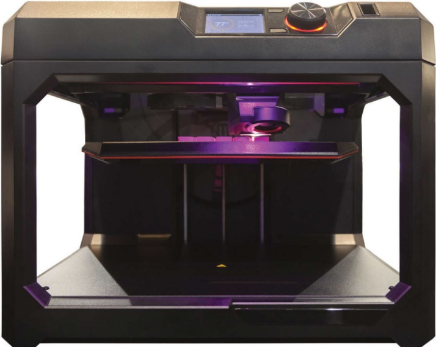

Figure 3.11 A 3D printer

▲ Figure 3.12 Artificial bone framework made using an industrial 3D printer

3D printers are used to produce working, solid objects. They are primarily based on inkjet and laser printer technology. The solid object is built up layer by layer using materials such as powdered resin, powdered metal, paper or ceramic.

The artificial bone framework in Figure 3.12 was made from many layers (100  $ \mu $m thick) of powered metal using a technology known as binder 3D printing.

Various types of 3D printers exist; they range from the size of a microwave oven up to the size of a small car.

3D printers use additive manufacturing (the object is built up layer by layer); this is in contrast to the more traditional method of subtractive manufacturing (removal of material to make the object). For example, making a statue using a 3D printer would involve building it up layer by layer using powdered stone until the final object was formed. The subtractive method would involve carving the statue out of solid stone (removing the stone not required) until the final item was produced. Similarly, CNC machining removes metal to form an object; 3D printing would produce the same item by building up the object from layers of powdered metal.

Direct 3D printing uses inkjet technology; a print head can move left to right as in a normal printer. However, the print head can also move up and down to build up the layers of an object.

Binder 3D printing is similar to direct 3D printing. However, this method uses two passes for each of the layers; the first pass sprays dry powder and then on the second pass a binder (a type of glue) is sprayed to form a solid layer.

Newer technologies use lasers and UV light to harden liquid polymers; this further increases the diversity of products which can be made.

<!-- page 96 -->

## Speakers and microphones

## Speakers

Digitised sound stored in a file on a computer can be converted into sound as follows:

The digital data is first passed through a digital to analogue converter (DAC) where it is converted into an electric current.

This is then passed through an amplifier (since the current generated by the DAC will be small) to create a current large enough to drive a loudspeaker.

» This electric current is then fed to a loudspeaker where it is converted into sound.

The following schematic shows how this is done.

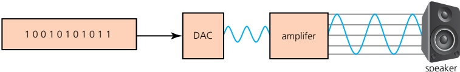

Figure 3.13 Digital to analogue conversion

As Figure 3.13 shows, if the sound is stored in a computer file, it must first pass through a digital to analogue converter (DAC) to convert the digital data into an electric current which can be used to drive the loudspeaker. Figure 3.14 shows how a loudspeaker can convert electric signals into sound waves.

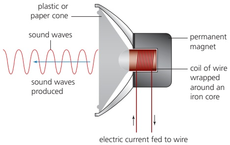

Figure 3.14 Diagram showing how a loudspeaker works

» When an electric current flows through a coil of wire that is wrapped around an iron core, the core becomes a temporary electromagnet; a permanent magnet is also positioned very close to this electromagnet.

As the electric current through the coil of wire varies, the induced magnetic field in the iron core also varies. This causes the iron core to be attracted towards the permanent magnet and as the current varies this will cause the iron core to vibrate.

Since the iron core is attached to a cone (made from paper or thin synthetic material), this causes the cone to vibrate, producing sound.

The rate at which the DAC can translate the digital output into analogue voltages is known as the sampling rate. If the DAC is a 16-bit device, then it

<!-- page 97 -->

can accept numbers between +32 767 ( $ 2^{16} - 1 $) and -32 768 ( $ 2^{16} $); the digital value containing all zeros is ignored.

## Microphones

Microphones are either built into the computer or are external devices connected through the USB port or through wireless connectivity.

Figure 3.15 shows how a microphone can convert sound waves into an electric current. The current produced can either be stored as sound (on, for example, a CD), amplified and sent to a loudspeaker, or sent to a computer for storage.

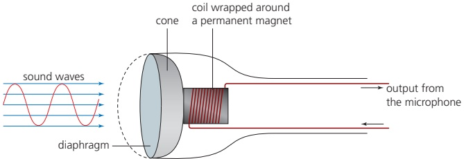

Figure 3.15 Diagram of how a microphone works

» When sound is created, it causes the air to vibrate.

» When a diaphragm in the microphone picks up the air vibrations, the diaphragm also begins to vibrate.

» A copper coil is wrapped around a permanent magnet and the coil is connected to the diaphragm using a cone. As the diaphragm vibrates, the cone moves in and out causing the copper coil to move backwards and forwards.

This forwards and backwards motion causes the magnetic field around the permanent magnet to be disturbed, inducing an electric current.

The electric current is then either amplified or sent to a recording device. The electric current is analogue in nature.

The electric current output from the microphone can also be sent to a computer where a sound card converts the current into a digital signal which can then be stored in the computer. The following diagram shows what happens when the word 'hut' is picked up by a microphone and is converted into digital values:

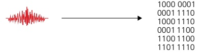

sound wave for 'HUT'

digital value after conversion

Figure 3.16 Analogue to digital conversion

Look at Figure 3.16. The word ‘hut’ (in the form of a sound wave) has been picked up by a microphone; this is then converted using an analogue to digital converter (ADC) into digital values which can then be stored in a computer or manipulated as required using appropriate software.

## Screens

Screens are used to show the output from a computer. Modern screens use an LCD, backlit with LEDs or the newer organic light emitting diode (OLED) technology.

<!-- page 98 -->

Figure 3.17 shows a simplified form of how OLED technology works.

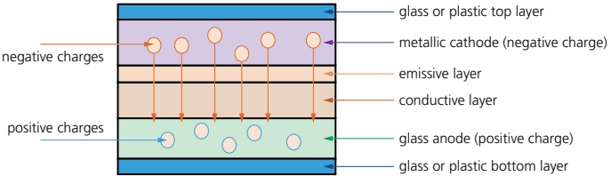

Figure 3.17 Simplified form of how OLED technology works

OLEDs use organic materials (made up of carbon compounds) to create flexible semiconductors. Organic films are sandwiched between two charged electrodes (one is a metallic cathode and the other a glass anode). When an electric field is applied to the electrodes, they give off light. This means that no form of back lighting is required. This allows for very thin screens. It also means that there is no longer a need to use LCD technology, since OLED is a self-contained system.

Screen displays are based on the pixel (the smallest picture element) concept where each screen pixel is made up of three sub-pixels, which are red, green and blue. By varying the intensity of the three sub-pixels, it is possible to generate millions of colours. The greater the number of pixels on a screen, the greater is the screen resolution (the number of pixels which can be viewed horizontally and vertically on screen; for example,  $ 1680 \times 1080 $ pixels). LCD and OLED screens use this type of pixel matrix to make up the picture.

The 'purple' pixel is made up of a combination of three sub-pixels, which are red, green and blue, in the required intensity, to 'fool' the eye into seeing a purple dot on the screen. The whole screen is filled with thousands of these tiny pixels.

Figure 3.18 The pixel matrix

Touch screens (which act as both input and output devices) also make use of LCD and OLED technology. They are particularly used in mobile phones and tablets.

We shall now consider LCD capacitive and resistive touch screen technologies.

Capacitive

Made up of many layers of glass that act like a capacitor creating electric fields between the glass plates in layers.

» When the top glass layer is touched, the electric current changes and the coordinates where the screen was touched are determined by an on board microprocessor.

## Benefits

» Medium cost technology.

» Screen visibility is good even in strong sunlight.

Permits multi-touch capability.

» Screen is very durable; it takes a major impact to break the glass.

<!-- page 99 -->

## Drawbacks

Only allows use of bare fingers as the form of input; although the latest screens permit the use of a special stylus to be used.

## Resistive

» Makes use of an upper layer of polyester (a form of plastic) and a bottom layer of glass.

» When the top polyester layer is touched, the top layer and bottom layer complete a circuit.

» Signals are then sent out, which are interpreted by a microprocessor and the calculations determine the coordinates of where the screen was touched.

## Benefits

》 Relatively inexpensive technology.

» Possible to use bare fingers, gloved fingers or stylus to carry out an input operation.

## Drawbacks

» Screen visibility is poor in strong sunlight.

Does not permit multi-touch capability.

» Screen durability is only fair; it is vulnerable to scratches and the screen wears out through time.

## Virtual headsets

Virtual reality has now been around for many years and has many applications. For example, it is possible to 'walk around' inside dangerous areas – such as a nuclear power plant – without actually being there.

It allows engineers to plan modifications or repairs to a plant in complete safety and to try out different scenarios first before implementing them. One of the devices used is a virtual reality headset which gives the engineer the feeling of being there. We will now describe how these devices work.

Video is sent from a computer to the headset (either using an HDMI cable or a smartphone fitted into the headset).

Two feeds are sent to an LCD/OLED display (sometimes two screens are used, one for the left side of the image and one for the right side of the image); lenses placed between the eyes and the screen allow for focusing and reshaping of the image/video for each eye, thus giving a 3D effect and adding to the realism.

» Most headsets use  $ 110^{\circ} $ field of view which is enough to give a pseudo  $ 360^{\circ} $ surround image/video.

A frame rate of 60 to 120 images per second is used to give a true/realistic image.

As the user moves their head (up and down or left to right), a series of sensors and/or LEDs measure this movement, which allows the image/video on the screen to react to the user's head movements (sensors are usually gyroscopic or accelerometers; LEDs are used in conjunction with mini cameras to further monitor head movements).

Headsets also use binaural sound (surround sound) so that the speaker output appears to come from behind, from the side or from a distance, giving very realistic 3D sound.

<!-- page 100 -->

Some headsets also use infrared sensors to monitor eye movement (in addition to head movement), which allows the depth of field on the screen to be more realistic; an example of this is to make objects in the foreground appear fuzzy when the user's eyes indicate they are looking into the distance (and vice versa).

## Sensors

Sensors are input devices which read or measure physical properties, such as temperature, pressure, acidity, and so on.

Real data is analogue in nature – this means it is constantly changing and does not have a discrete value. Analogue data usually requires some form of interpretation, for example, the temperature shown on a mercury thermometer requires the user to look at the height of the mercury to work out the temperature. The temperature, therefore, can have an infinite number of values depending on the precision of how the height of the mercury is measured. Equally, an analogue clock requires the user to look at the hands on the clock face. The area swept out by the hands allows the number of hours and minutes to be interpreted. There are many other examples.

Computers cannot make any sense of these physical quantities and the data needs to be converted into a digital format. This is usually achieved by an analogue to digital converter (ADC). This device converts physical values into discrete digital values.

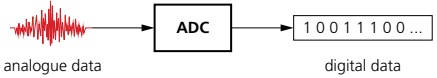

Figure 3.19 Converting analogue data into digital data

When a computer is used to control devices, such as a motor or a valve, it is often necessary to use a digital to analogue converter (DAC), since these devices need analogue data to operate in many cases. Frequently, an actuator is used in these control applications. Although these are technically output devices, they are mentioned here since they are an integral part of the control system. An actuator is an electromechanical device such as a relay, solenoid or motor. Note that a solenoid is an example of a digital actuator as part of the device is connected to a computer which opens and closes a circuit as required. When energized, the solenoid may operate a plunger or armature to control, for example, a fuel injection system. Other actuators, such as motors and valves, may require a DAC so that they receive an electric current rather than a simple digital signal direct from the computer.

Notice the importance of (positive) feedback, which is where the output from the system can affect the next input. This is due to the fact that sensor readings may cause the microprocessor to alter a valve or a motor, for example, which will then change the next reading taken by the sensor. So the output from the microprocessor will impact on the next input received as it attempts to bring the system within the desired parameters.

<!-- page 101 -->

Table 3.7 shows a number of common sensors and examples of their applications.

<table border=1 style='margin: auto; word-wrap: break-word;'><tr><td style='text-align: center; word-wrap: break-word;'>Sensor</td><td style='text-align: center; word-wrap: break-word;'>Example applications</td></tr><tr><td style='text-align: center; word-wrap: break-word;'>temperature</td><td style='text-align: center; word-wrap: break-word;'>■ control a central heating system\n■ control/monitor a chemical process\n■ control/monitor temperature in a greenhouse</td></tr><tr><td style='text-align: center; word-wrap: break-word;'>moisture/humidity</td><td style='text-align: center; word-wrap: break-word;'>■ control/monitor moisture/humidity levels in soil/air in a greenhouse\n■ monitor dampness levels in an industrial application (for example, monitor moisture in a paint spray booth in a car factory)</td></tr><tr><td style='text-align: center; word-wrap: break-word;'>light</td><td style='text-align: center; word-wrap: break-word;'>■ switch street lighting on at night and off during the day\n■ monitor/control light levels in a greenhouse\n■ switch on car headlights when it gets dark</td></tr><tr><td style='text-align: center; word-wrap: break-word;'>infrared/motion</td><td style='text-align: center; word-wrap: break-word;'>■ turn on windscreen wipers on a car when it rains\n■ detect an intruder in a burglar alarm system\n■ count people entering or leaving a building</td></tr><tr><td style='text-align: center; word-wrap: break-word;'>pressure</td><td style='text-align: center; word-wrap: break-word;'>■ detect intruders in a burglar alarm system\n■ check weight (such as the weight of a vehicle)\n■ monitor/control a process where gas pressure is important</td></tr><tr><td style='text-align: center; word-wrap: break-word;'>acoustic/sound</td><td style='text-align: center; word-wrap: break-word;'>■ pick up noise levels (such as footsteps or breaking glass) in a burglar alarm system\n■ detect noise of liquids dripping from a pipe</td></tr><tr><td style='text-align: center; word-wrap: break-word;'>gas (such as  $ O_{{2}} $ or  $ CO_{{2}} $)</td><td style='text-align: center; word-wrap: break-word;'>■ monitor pollution levels in a river or air\n■ measure  $ O_{{2}} $ and  $ CO_{{2}} $ levels in a greenhouse\n■ check for  $ CO_{{2}} $ or  $ NO_{{2}} $ leaks in a power station</td></tr><tr><td style='text-align: center; word-wrap: break-word;'>pH</td><td style='text-align: center; word-wrap: break-word;'>■ monitor/control acidity/alkalinity levels in soil\n■ monitor pollution in rivers</td></tr><tr><td style='text-align: center; word-wrap: break-word;'>magnetic field</td><td style='text-align: center; word-wrap: break-word;'>■ detect changes in in cell phones, CD players, and so on\n■ used in anti-lock braking systems in motor vehicles</td></tr></table>

▲ Table 3.7 Common sensors and examples of applications

Sensors are used in both monitoring and control applications. There is a subtle difference between how these two methods work. The flowchart (Figure 3.21 overleaf) shows a simplification of the process.

<!-- page 102 -->

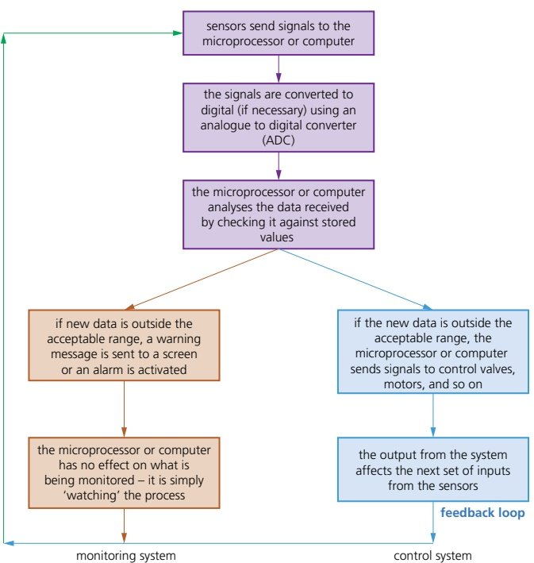

Figure 3.20 Sensors for monitoring and controlling systems

Table 3.8 shows some examples of monitoring and control applications of sensors.

<table border=1 style='margin: auto; word-wrap: break-word;'><tr><td style='text-align: center; word-wrap: break-word;'>Examples of monitoring</td><td style='text-align: center; word-wrap: break-word;'>Examples of control</td></tr><tr><td style='text-align: center; word-wrap: break-word;'>■ monitoring a patient in a hospital for vital signs such as heart rate, temperature, and so on\n■ checking for intruders in a burglar alarm system\n■ checking the temperature levels in a car engine\n■ monitoring pollution levels in a river</td><td style='text-align: center; word-wrap: break-word;'>■ turning street lights on at night and turning them off again during daylight\n■ controlling the temperature in a central heating/air conditioning system\n■ controlling the traffic lights at a road junction\n■ operating anti-lock brakes on a car when necessary\n■ controlling the environment in a greenhouse</td></tr></table>

▲ Table 3.8 Examples of monitoring and control applications of sensors

One of the most common uses of sensors in modern times is in the monitoring and control of a number of functions in motor vehicles and aeroplanes. Look at Figure 3.21 showing a typical modern car and its many sensors used to control or monitor several functions.

<!-- page 103 -->

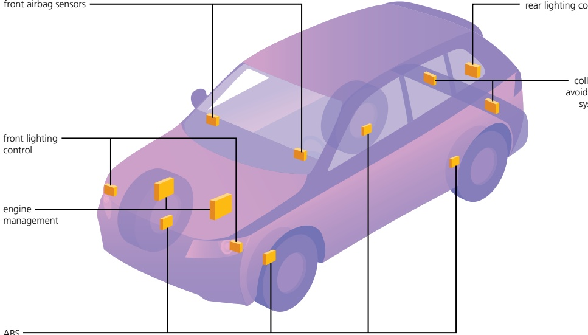

Figure 3.21 Sensors on a typical modern car

Below is an in-depth look at just one of the sensor systems labelled on Figure 3.21.

Anti-lock braking systems (on cars)

Anti-lock braking systems (ABS) on cars use magnetic field sensors to stop the wheels locking up on the car if the brakes have been applied too sharply.

» When one of the car wheels rotates too slowly (it is locking up), a magnetic field sensor sends data to a microprocessor.

The microprocessor checks the rotation speed of the other three wheels.

» If they are different (rotating faster), the microprocessor sends a signal to the braking system and the braking pressure to the affected wheel is reduced.

The wheel's rotational speed is then increased to match the other wheels.

The checking of the rotational speed using these magnetic field sensors is done several times a second and the braking pressure to all the wheels can be constantly changing to prevent any of the wheels locking up under heavy braking.

This is felt as a ‘judder’ on the brake pedal as the braking system is constantly switched off and on to equalise the rotational speed of all four wheels.

» If one of the wheels is rotating too quickly, braking pressure is increased to that wheel until it matches the other three.

## ACTIVITY 3A

1 a) i) Describe three differences between RAM and ROM.

ii) Compare the relative advantages and disadvantages of SRAM and DRAM.

Include examples of where each type of memory would be used in a computer.

<!-- page 104 -->

b) Secondary storage can be magnetic, optical or solid state.

Describe two features of each type of storage which differentiates it from the other two types.

2 a) Explain the main differences in operation of a laser printer compared with an inkjet printer.

b) i) Name one application of a laser printer and one application of an inkjet printer.

ii) For each of your named applications in part b) i), give a reason why the chosen printer is the most suitable.

3 An art gallery took several photographs of a valuable, fragile painting. The images were sent to a computer where they were processed by a 3D printing application. A 3D printout of the painting was produced showing the texture of the oil paint, canvas and any flaws in the painting.

Give reasons why the art gallery would wish to make this 3D replica.

4 The following diagram shows a schematic of a microprocessor-controlled street lighting system.

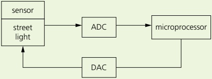

The microprocessor is used to control the operation of the street lamp. The lamp is fitted with a light sensor which constantly sends data to the microprocessor. The data value from the sensor changes according to whether it is sunny, cloudy, raining, night time, and so on.

Describe how the microprocessor would be used to automatically switch on the light at night and switch it off again when it becomes light. Include a feature to stop the light constantly flickering on and off when it becomes overcast or cars go past with full headlights at night.

## EXTENSION ACTIVITY 3E

1 Look at this simplified diagram of a keyboard; the letter H has been pressed. Explain:

a) how pressing the letter H has been recognised by the computer

b) how the computer manages the very slow process of inputting data from a keyboard.

2 a) Describe how these types of pointing devices work.

i) Mechanical mouse

ii) Optical mouse

b) Connectivity between mouse and computer can be through USB cable or wireless. Explain these two types of connectivity.

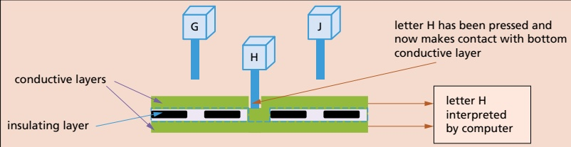

<!-- page 105 -->

## EXTENSION ACTIVITY 3F

Another new screen technology is known as quantum LED (QLED), which is in direct competition with organic (LED). Look at this statement:

'QLED televisions are simply LED televisions that use quantum dots to enhance their overall performance in key picture quality areas.'

Find out the main differences between QLED and OLED technologies.

### 3.2 Logic gates and logic circuits

## Key terms

<table border=1 style='margin: auto; word-wrap: break-word;'><tr><td style='text-align: center; word-wrap: break-word;'>Logic gates – electronic circuits which rely on ‘on/off’ logic. The most common ones are NOT, AND, OR, NAND, NOR and XOR.</td><td style='text-align: center; word-wrap: break-word;'>Truth table – a method of checking the output from a logic circuit. They use all the possible binary input combinations depending on the number of inputs; for example, two inputs have  $ 2^{2} $ (4) possible binary combinations, three inputs will have  $ 2^{3} $ (8) possible binary combinations, and so on.</td></tr><tr><td style='text-align: center; word-wrap: break-word;'>Logic circuit – formed from a combination of logic gates and designed to carry out a particular task. The output from a logic circuit will be 0 or 1.</td><td style='text-align: center; word-wrap: break-word;'>Boolean algebra – a form of algebra linked to logic circuits and based on TRUE and FALSE.</td></tr></table>

#### 3.2.1 Logic gates

Electronic circuits in computers, many memories and controlling devices are made up of thousands of logic gates. Logic gates take binary inputs and produce a binary output. Several logic gates combined together form a logic circuit and these circuits are designed to carry out a specific function. The checking of the output from a logic gate or logic circuit can be done using a truth table.

This section will consider the function and role of logic gates, logic circuits and truth tables. A number of possible applications of logic circuits will also be considered. A reference to Boolean algebra will be made throughout this section, although this is covered in more depth in Chapter 15.

Six different logic gates will be considered in this section.

<table border=1 style='margin: auto; word-wrap: break-word;'><tr><td style='text-align: center; word-wrap: break-word;'>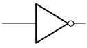 NOT gate</td><td style='text-align: center; word-wrap: break-word;'>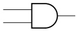 AND gate</td><td style='text-align: center; word-wrap: break-word;'>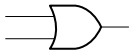 OR gate</td></tr><tr><td style='text-align: center; word-wrap: break-word;'>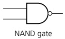</td><td style='text-align: center; word-wrap: break-word;'>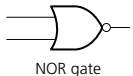</td><td style='text-align: center; word-wrap: break-word;'>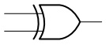 XOR gate</td></tr></table>

Figure 3.22 Six types of logic gate

<!-- page 106 -->

#### 3.2.2 Truth tables

Truth tables are used to trace the output from a logic gate or logic circuit. The NOT gate is the only logic gate with one input; the other five gates have two inputs. When constructing truth tables, all possible combinations of 1s and 0s which can be input are considered. For the NOT gate (one input) there are only  $ 2^1 $ (2) possible binary combinations. For all other gates (two inputs), there are  $ 2^2 $ (4) possible binary combinations.

For logic circuits, the number of inputs can be more than 2; for example, three inputs give a possible  $ 2^{3} $ (8) binary combinations. And for four inputs, the number of possible binary combinations is  $ 2^{4} $ (16). It is clear that the number of possible binary combinations is a multiple of the number 2 in every case. Table 3.9 summarises this.

<table border=1 style='margin: auto; word-wrap: break-word;'><tr><td colspan="2">Inputs</td></tr><tr><td style='text-align: center; word-wrap: break-word;'>A</td><td style='text-align: center; word-wrap: break-word;'>B</td></tr><tr><td style='text-align: center; word-wrap: break-word;'>0</td><td style='text-align: center; word-wrap: break-word;'>0</td></tr><tr><td style='text-align: center; word-wrap: break-word;'>0</td><td style='text-align: center; word-wrap: break-word;'>1</td></tr><tr><td style='text-align: center; word-wrap: break-word;'>1</td><td style='text-align: center; word-wrap: break-word;'>0</td></tr><tr><td style='text-align: center; word-wrap: break-word;'>1</td><td style='text-align: center; word-wrap: break-word;'>1</td></tr></table>

<table border=1 style='margin: auto; word-wrap: break-word;'><tr><td colspan="3">Inputs</td></tr><tr><td style='text-align: center; word-wrap: break-word;'>A</td><td style='text-align: center; word-wrap: break-word;'>B</td><td style='text-align: center; word-wrap: break-word;'>C</td></tr><tr><td style='text-align: center; word-wrap: break-word;'>0</td><td style='text-align: center; word-wrap: break-word;'>0</td><td style='text-align: center; word-wrap: break-word;'>0</td></tr><tr><td style='text-align: center; word-wrap: break-word;'>0</td><td style='text-align: center; word-wrap: break-word;'>0</td><td style='text-align: center; word-wrap: break-word;'>1</td></tr><tr><td style='text-align: center; word-wrap: break-word;'>0</td><td style='text-align: center; word-wrap: break-word;'>1</td><td style='text-align: center; word-wrap: break-word;'>0</td></tr><tr><td style='text-align: center; word-wrap: break-word;'>0</td><td style='text-align: center; word-wrap: break-word;'>1</td><td style='text-align: center; word-wrap: break-word;'>1</td></tr><tr><td style='text-align: center; word-wrap: break-word;'>1</td><td style='text-align: center; word-wrap: break-word;'>0</td><td style='text-align: center; word-wrap: break-word;'>0</td></tr><tr><td style='text-align: center; word-wrap: break-word;'>1</td><td style='text-align: center; word-wrap: break-word;'>0</td><td style='text-align: center; word-wrap: break-word;'>1</td></tr><tr><td style='text-align: center; word-wrap: break-word;'>1</td><td style='text-align: center; word-wrap: break-word;'>1</td><td style='text-align: center; word-wrap: break-word;'>0</td></tr><tr><td style='text-align: center; word-wrap: break-word;'>1</td><td style='text-align: center; word-wrap: break-word;'>1</td><td style='text-align: center; word-wrap: break-word;'>1</td></tr></table>

<table border=1 style='margin: auto; word-wrap: break-word;'><tr><td colspan="4">Inputs</td></tr><tr><td style='text-align: center; word-wrap: break-word;'>A</td><td style='text-align: center; word-wrap: break-word;'>B</td><td style='text-align: center; word-wrap: break-word;'>C</td><td style='text-align: center; word-wrap: break-word;'>D</td></tr><tr><td style='text-align: center; word-wrap: break-word;'>0</td><td style='text-align: center; word-wrap: break-word;'>0</td><td style='text-align: center; word-wrap: break-word;'>0</td><td style='text-align: center; word-wrap: break-word;'>0</td></tr><tr><td style='text-align: center; word-wrap: break-word;'>0</td><td style='text-align: center; word-wrap: break-word;'>0</td><td style='text-align: center; word-wrap: break-word;'>0</td><td style='text-align: center; word-wrap: break-word;'>1</td></tr><tr><td style='text-align: center; word-wrap: break-word;'>0</td><td style='text-align: center; word-wrap: break-word;'>0</td><td style='text-align: center; word-wrap: break-word;'>1</td><td style='text-align: center; word-wrap: break-word;'>0</td></tr><tr><td style='text-align: center; word-wrap: break-word;'>0</td><td style='text-align: center; word-wrap: break-word;'>0</td><td style='text-align: center; word-wrap: break-word;'>1</td><td style='text-align: center; word-wrap: break-word;'>1</td></tr><tr><td style='text-align: center; word-wrap: break-word;'>0</td><td style='text-align: center; word-wrap: break-word;'>1</td><td style='text-align: center; word-wrap: break-word;'>0</td><td style='text-align: center; word-wrap: break-word;'>0</td></tr><tr><td style='text-align: center; word-wrap: break-word;'>0</td><td style='text-align: center; word-wrap: break-word;'>1</td><td style='text-align: center; word-wrap: break-word;'>0</td><td style='text-align: center; word-wrap: break-word;'>1</td></tr><tr><td style='text-align: center; word-wrap: break-word;'>0</td><td style='text-align: center; word-wrap: break-word;'>1</td><td style='text-align: center; word-wrap: break-word;'>1</td><td style='text-align: center; word-wrap: break-word;'>0</td></tr><tr><td style='text-align: center; word-wrap: break-word;'>0</td><td style='text-align: center; word-wrap: break-word;'>1</td><td style='text-align: center; word-wrap: break-word;'>1</td><td style='text-align: center; word-wrap: break-word;'>1</td></tr><tr><td style='text-align: center; word-wrap: break-word;'>1</td><td style='text-align: center; word-wrap: break-word;'>0</td><td style='text-align: center; word-wrap: break-word;'>0</td><td style='text-align: center; word-wrap: break-word;'>0</td></tr><tr><td style='text-align: center; word-wrap: break-word;'>1</td><td style='text-align: center; word-wrap: break-word;'>0</td><td style='text-align: center; word-wrap: break-word;'>0</td><td style='text-align: center; word-wrap: break-word;'>1</td></tr><tr><td style='text-align: center; word-wrap: break-word;'>1</td><td style='text-align: center; word-wrap: break-word;'>0</td><td style='text-align: center; word-wrap: break-word;'>1</td><td style='text-align: center; word-wrap: break-word;'>0</td></tr><tr><td style='text-align: center; word-wrap: break-word;'>1</td><td style='text-align: center; word-wrap: break-word;'>0</td><td style='text-align: center; word-wrap: break-word;'>1</td><td style='text-align: center; word-wrap: break-word;'>1</td></tr><tr><td style='text-align: center; word-wrap: break-word;'>1</td><td style='text-align: center; word-wrap: break-word;'>1</td><td style='text-align: center; word-wrap: break-word;'>0</td><td style='text-align: center; word-wrap: break-word;'>0</td></tr><tr><td style='text-align: center; word-wrap: break-word;'>1</td><td style='text-align: center; word-wrap: break-word;'>1</td><td style='text-align: center; word-wrap: break-word;'>0</td><td style='text-align: center; word-wrap: break-word;'>1</td></tr><tr><td style='text-align: center; word-wrap: break-word;'>1</td><td style='text-align: center; word-wrap: break-word;'>1</td><td style='text-align: center; word-wrap: break-word;'>1</td><td style='text-align: center; word-wrap: break-word;'>0</td></tr><tr><td style='text-align: center; word-wrap: break-word;'>1</td><td style='text-align: center; word-wrap: break-word;'>1</td><td style='text-align: center; word-wrap: break-word;'>1</td><td style='text-align: center; word-wrap: break-word;'>1</td></tr></table>

Table 3.9

## Description

#### 3.2.3 The function of the six logic gates

How to write this

NOT gate

X = NOT A (logic notation)

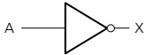

X =  $ \overline{A} $ (Boolean algebra)

The output, X, is 1 if the input A is NOT 1

Figure 3.23 NOT gate

Truth table

<table border=1 style='margin: auto; word-wrap: break-word;'><tr><td style='text-align: center; word-wrap: break-word;'>Input</td><td style='text-align: center; word-wrap: break-word;'>Output</td></tr><tr><td style='text-align: center; word-wrap: break-word;'>A</td><td style='text-align: center; word-wrap: break-word;'>X</td></tr><tr><td style='text-align: center; word-wrap: break-word;'>0</td><td style='text-align: center; word-wrap: break-word;'>1</td></tr><tr><td style='text-align: center; word-wrap: break-word;'>1</td><td style='text-align: center; word-wrap: break-word;'>0</td></tr></table>

Table 3.10

<!-- page 107 -->

## AND gate

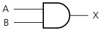

### Figure 3.24 AND gate

## Description

The output, X, is 1 if input A is 1 and input B is 1

## How to write this

X = A AND B (logic notation)

X = A.B (Boolean algebra)

OR gate

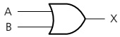

Figure 3.25 OR gate

## Description

The output, X, is 1 if input A is 1 or input B is 1

## How to write this

X = A OR B (logic notation)

X = A + B (Boolean algebra)

NAND gate (NOT AND)

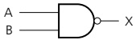

Figure 3.26 NAND gate

## Description

The output, X, is 1 if input A is NOT 1 or input B is NOT 1

## How to write this

X = A NAND B (logic notation)

X =  $ \overline{A.B} $ (Boolean algebra)

NOR gate (NOT OR)

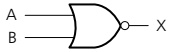

Figure 3.27 NOR gate

## Description

The output, X, is 1 if:

input A is NOT 1 and input B is NOT 1

## How to write this

X = A NOR B (logic notation)

X =  $ \overline{A + B} $ (Boolean algebra)

## Truth table

<table border=1 style='margin: auto; word-wrap: break-word;'><tr><td colspan="2">Inputs</td><td style='text-align: center; word-wrap: break-word;'>Output</td></tr><tr><td style='text-align: center; word-wrap: break-word;'>A</td><td style='text-align: center; word-wrap: break-word;'>B</td><td style='text-align: center; word-wrap: break-word;'>X</td></tr><tr><td style='text-align: center; word-wrap: break-word;'>0</td><td style='text-align: center; word-wrap: break-word;'>0</td><td style='text-align: center; word-wrap: break-word;'>0</td></tr><tr><td style='text-align: center; word-wrap: break-word;'>0</td><td style='text-align: center; word-wrap: break-word;'>1</td><td style='text-align: center; word-wrap: break-word;'>0</td></tr><tr><td style='text-align: center; word-wrap: break-word;'>1</td><td style='text-align: center; word-wrap: break-word;'>0</td><td style='text-align: center; word-wrap: break-word;'>0</td></tr><tr><td style='text-align: center; word-wrap: break-word;'>1</td><td style='text-align: center; word-wrap: break-word;'>1</td><td style='text-align: center; word-wrap: break-word;'>1</td></tr></table>

Table 3.11

Truth table

<table border=1 style='margin: auto; word-wrap: break-word;'><tr><td colspan="2">Inputs</td><td style='text-align: center; word-wrap: break-word;'>Output</td></tr><tr><td style='text-align: center; word-wrap: break-word;'>A</td><td style='text-align: center; word-wrap: break-word;'>B</td><td style='text-align: center; word-wrap: break-word;'>X</td></tr><tr><td style='text-align: center; word-wrap: break-word;'>0</td><td style='text-align: center; word-wrap: break-word;'>0</td><td style='text-align: center; word-wrap: break-word;'>0</td></tr><tr><td style='text-align: center; word-wrap: break-word;'>0</td><td style='text-align: center; word-wrap: break-word;'>1</td><td style='text-align: center; word-wrap: break-word;'>1</td></tr><tr><td style='text-align: center; word-wrap: break-word;'>1</td><td style='text-align: center; word-wrap: break-word;'>0</td><td style='text-align: center; word-wrap: break-word;'>1</td></tr><tr><td style='text-align: center; word-wrap: break-word;'>1</td><td style='text-align: center; word-wrap: break-word;'>1</td><td style='text-align: center; word-wrap: break-word;'>1</td></tr></table>

Table 3.12

Truth table

<table border=1 style='margin: auto; word-wrap: break-word;'><tr><td colspan="2">Inputs</td><td style='text-align: center; word-wrap: break-word;'>Output</td></tr><tr><td style='text-align: center; word-wrap: break-word;'>A</td><td style='text-align: center; word-wrap: break-word;'>B</td><td style='text-align: center; word-wrap: break-word;'>X</td></tr><tr><td style='text-align: center; word-wrap: break-word;'>0</td><td style='text-align: center; word-wrap: break-word;'>0</td><td style='text-align: center; word-wrap: break-word;'>1</td></tr><tr><td style='text-align: center; word-wrap: break-word;'>0</td><td style='text-align: center; word-wrap: break-word;'>1</td><td style='text-align: center; word-wrap: break-word;'>1</td></tr><tr><td style='text-align: center; word-wrap: break-word;'>1</td><td style='text-align: center; word-wrap: break-word;'>0</td><td style='text-align: center; word-wrap: break-word;'>1</td></tr><tr><td style='text-align: center; word-wrap: break-word;'>1</td><td style='text-align: center; word-wrap: break-word;'>1</td><td style='text-align: center; word-wrap: break-word;'>0</td></tr></table>

Table 3.13

Truth table

<table border=1 style='margin: auto; word-wrap: break-word;'><tr><td colspan="2">Inputs</td><td style='text-align: center; word-wrap: break-word;'>Output</td></tr><tr><td style='text-align: center; word-wrap: break-word;'>A</td><td style='text-align: center; word-wrap: break-word;'>B</td><td style='text-align: center; word-wrap: break-word;'>X</td></tr><tr><td style='text-align: center; word-wrap: break-word;'>0</td><td style='text-align: center; word-wrap: break-word;'>0</td><td style='text-align: center; word-wrap: break-word;'>1</td></tr><tr><td style='text-align: center; word-wrap: break-word;'>0</td><td style='text-align: center; word-wrap: break-word;'>1</td><td style='text-align: center; word-wrap: break-word;'>0</td></tr><tr><td style='text-align: center; word-wrap: break-word;'>1</td><td style='text-align: center; word-wrap: break-word;'>0</td><td style='text-align: center; word-wrap: break-word;'>0</td></tr><tr><td style='text-align: center; word-wrap: break-word;'>1</td><td style='text-align: center; word-wrap: break-word;'>1</td><td style='text-align: center; word-wrap: break-word;'>0</td></tr></table>

Table 3.14

<!-- page 108 -->

XOR gate

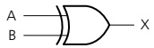

### Figure 3.28 XOR gate

## Description

The output, X, is 1 if (input A is 1 AND input B is NOT 1) OR (input A is NOT 1 AND input B is 1)

## How to write this

X = A XOR B (logic notation)

X = (A.  $ \overline{B} $) + ( $ \overline{A} $. B) (Boolean algebra)

(Note: this is sometimes written as:

<table border=1 style='margin: auto; word-wrap: break-word;'><tr><td colspan="2">Inputs</td><td style='text-align: center; word-wrap: break-word;'>Output</td></tr><tr><td style='text-align: center; word-wrap: break-word;'>A</td><td style='text-align: center; word-wrap: break-word;'>B</td><td style='text-align: center; word-wrap: break-word;'>X</td></tr><tr><td style='text-align: center; word-wrap: break-word;'>0</td><td style='text-align: center; word-wrap: break-word;'>0</td><td style='text-align: center; word-wrap: break-word;'>0</td></tr><tr><td style='text-align: center; word-wrap: break-word;'>0</td><td style='text-align: center; word-wrap: break-word;'>1</td><td style='text-align: center; word-wrap: break-word;'>1</td></tr><tr><td style='text-align: center; word-wrap: break-word;'>1</td><td style='text-align: center; word-wrap: break-word;'>0</td><td style='text-align: center; word-wrap: break-word;'>1</td></tr><tr><td style='text-align: center; word-wrap: break-word;'>1</td><td style='text-align: center; word-wrap: break-word;'>1</td><td style='text-align: center; word-wrap: break-word;'>0</td></tr></table>

Truth table

(A + B) .  $ \overline{A}.\overline{B} $

Table 3.15

## EXTENSION ACTIVITY 3G

Using truth tables show that  $ X = \{A, \overline{B}\} + \{\overline{A}, B\} $ and  $ X = \{A + B\} $.  $ \overline{A, B} $ both represent the XOR logic gate.

You will notice, in the Boolean algebra, three new symbols.

» A dot (.) represents the AND operation (it can be written as ^).

» A plus sign (+) represents the OR operation (it can be written as ∨).

» A dash above a letter (for example, A) represents the NOT operation.

#### 3.2.4 Logic circuits

When logic gates are combined to carry out a particular function, such as controlling a robot, they form a logic circuit.

The output from the logic circuit is checked using a truth table. The following three examples show how to:

produce a truth table

» design a logic circuit from a given logic statement/Boolean algebra

» design a logic circuit to carry out an actual safety function.

### Example 3.1

Produce a truth table for the following logic circuit (note the use of ● at junctions):

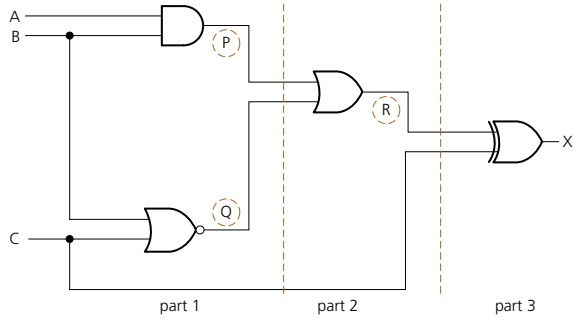

<!-- page 109 -->

## Solution

There are three inputs to this logic circuit; therefore, there will be eight possible binary values which can be input.

To show step-wise how the truth table is produced, the logic circuit has been split up into three parts and intermediate values are shown as P, Q and R.

## Part 1

This is the first part of the logic circuit; the first task is to find the intermediate values P and Q.

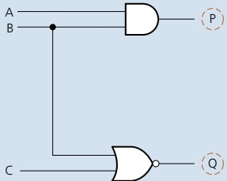

The value of P is found from the AND gate where the inputs are A and B. The value of Q is found from the NOR gate where the inputs are B and C. An intermediate truth table is produced:

<table border=1 style='margin: auto; word-wrap: break-word;'><tr><td colspan="3">Inputs</td><td colspan="2">Outputs</td></tr><tr><td style='text-align: center; word-wrap: break-word;'>A</td><td style='text-align: center; word-wrap: break-word;'>B</td><td style='text-align: center; word-wrap: break-word;'>C</td><td style='text-align: center; word-wrap: break-word;'>P</td><td style='text-align: center; word-wrap: break-word;'>Q</td></tr><tr><td style='text-align: center; word-wrap: break-word;'>0</td><td style='text-align: center; word-wrap: break-word;'>0</td><td style='text-align: center; word-wrap: break-word;'>0</td><td style='text-align: center; word-wrap: break-word;'>0</td><td style='text-align: center; word-wrap: break-word;'>1</td></tr><tr><td style='text-align: center; word-wrap: break-word;'>0</td><td style='text-align: center; word-wrap: break-word;'>0</td><td style='text-align: center; word-wrap: break-word;'>1</td><td style='text-align: center; word-wrap: break-word;'>0</td><td style='text-align: center; word-wrap: break-word;'>0</td></tr><tr><td style='text-align: center; word-wrap: break-word;'>0</td><td style='text-align: center; word-wrap: break-word;'>1</td><td style='text-align: center; word-wrap: break-word;'>0</td><td style='text-align: center; word-wrap: break-word;'>0</td><td style='text-align: center; word-wrap: break-word;'>0</td></tr><tr><td style='text-align: center; word-wrap: break-word;'>0</td><td style='text-align: center; word-wrap: break-word;'>1</td><td style='text-align: center; word-wrap: break-word;'>1</td><td style='text-align: center; word-wrap: break-word;'>0</td><td style='text-align: center; word-wrap: break-word;'>0</td></tr><tr><td style='text-align: center; word-wrap: break-word;'>1</td><td style='text-align: center; word-wrap: break-word;'>0</td><td style='text-align: center; word-wrap: break-word;'>0</td><td style='text-align: center; word-wrap: break-word;'>0</td><td style='text-align: center; word-wrap: break-word;'>1</td></tr><tr><td style='text-align: center; word-wrap: break-word;'>1</td><td style='text-align: center; word-wrap: break-word;'>0</td><td style='text-align: center; word-wrap: break-word;'>1</td><td style='text-align: center; word-wrap: break-word;'>0</td><td style='text-align: center; word-wrap: break-word;'>0</td></tr><tr><td style='text-align: center; word-wrap: break-word;'>1</td><td style='text-align: center; word-wrap: break-word;'>1</td><td style='text-align: center; word-wrap: break-word;'>0</td><td style='text-align: center; word-wrap: break-word;'>1</td><td style='text-align: center; word-wrap: break-word;'>0</td></tr><tr><td style='text-align: center; word-wrap: break-word;'>1</td><td style='text-align: center; word-wrap: break-word;'>1</td><td style='text-align: center; word-wrap: break-word;'>1</td><td style='text-align: center; word-wrap: break-word;'>1</td><td style='text-align: center; word-wrap: break-word;'>0</td></tr></table>

Part 2

The second part of the logic circuit has P and Q as inputs and the intermediate output, R.

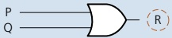

This produces the following intermediate truth table (Note: even though there are only two inputs to the logic gate, we have generated eight binary values in Part 1 and these must all be used in this second truth table).

<table border=1 style='margin: auto; word-wrap: break-word;'><tr><td colspan="2">Inputs</td><td style='text-align: center; word-wrap: break-word;'>Output</td></tr><tr><td style='text-align: center; word-wrap: break-word;'>P</td><td style='text-align: center; word-wrap: break-word;'>Q</td><td style='text-align: center; word-wrap: break-word;'>R</td></tr><tr><td style='text-align: center; word-wrap: break-word;'>0</td><td style='text-align: center; word-wrap: break-word;'>1</td><td style='text-align: center; word-wrap: break-word;'>1</td></tr><tr><td style='text-align: center; word-wrap: break-word;'>0</td><td style='text-align: center; word-wrap: break-word;'>0</td><td style='text-align: center; word-wrap: break-word;'>0</td></tr><tr><td style='text-align: center; word-wrap: break-word;'>0</td><td style='text-align: center; word-wrap: break-word;'>0</td><td style='text-align: center; word-wrap: break-word;'>0</td></tr><tr><td style='text-align: center; word-wrap: break-word;'>0</td><td style='text-align: center; word-wrap: break-word;'>0</td><td style='text-align: center; word-wrap: break-word;'>0</td></tr><tr><td style='text-align: center; word-wrap: break-word;'>0</td><td style='text-align: center; word-wrap: break-word;'>1</td><td style='text-align: center; word-wrap: break-word;'>1</td></tr><tr><td style='text-align: center; word-wrap: break-word;'>0</td><td style='text-align: center; word-wrap: break-word;'>0</td><td style='text-align: center; word-wrap: break-word;'>0</td></tr><tr><td style='text-align: center; word-wrap: break-word;'>1</td><td style='text-align: center; word-wrap: break-word;'>0</td><td style='text-align: center; word-wrap: break-word;'>1</td></tr><tr><td style='text-align: center; word-wrap: break-word;'>1</td><td style='text-align: center; word-wrap: break-word;'>0</td><td style='text-align: center; word-wrap: break-word;'>1</td></tr></table>

<!-- page 110 -->

## Part 3

The final part of the logic circuit has R and C as inputs and the final output, X.

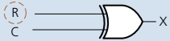

This gives the third intermediate truth table.

Putting all three intermediate truth tables together produces the final truth table which represents the original logic circuit.

<table border=1 style='margin: auto; word-wrap: break-word;'><tr><td colspan="2">Inputs</td><td style='text-align: center; word-wrap: break-word;'>Output</td></tr><tr><td style='text-align: center; word-wrap: break-word;'>R</td><td style='text-align: center; word-wrap: break-word;'>C</td><td style='text-align: center; word-wrap: break-word;'>X</td></tr><tr><td style='text-align: center; word-wrap: break-word;'>1</td><td style='text-align: center; word-wrap: break-word;'>0</td><td style='text-align: center; word-wrap: break-word;'>1</td></tr><tr><td style='text-align: center; word-wrap: break-word;'>0</td><td style='text-align: center; word-wrap: break-word;'>1</td><td style='text-align: center; word-wrap: break-word;'>1</td></tr><tr><td style='text-align: center; word-wrap: break-word;'>0</td><td style='text-align: center; word-wrap: break-word;'>0</td><td style='text-align: center; word-wrap: break-word;'>0</td></tr><tr><td style='text-align: center; word-wrap: break-word;'>0</td><td style='text-align: center; word-wrap: break-word;'>1</td><td style='text-align: center; word-wrap: break-word;'>1</td></tr><tr><td style='text-align: center; word-wrap: break-word;'>1</td><td style='text-align: center; word-wrap: break-word;'>0</td><td style='text-align: center; word-wrap: break-word;'>1</td></tr><tr><td style='text-align: center; word-wrap: break-word;'>0</td><td style='text-align: center; word-wrap: break-word;'>1</td><td style='text-align: center; word-wrap: break-word;'>1</td></tr><tr><td style='text-align: center; word-wrap: break-word;'>1</td><td style='text-align: center; word-wrap: break-word;'>0</td><td style='text-align: center; word-wrap: break-word;'>1</td></tr><tr><td style='text-align: center; word-wrap: break-word;'>1</td><td style='text-align: center; word-wrap: break-word;'>1</td><td style='text-align: center; word-wrap: break-word;'>0</td></tr></table>

<table border=1 style='margin: auto; word-wrap: break-word;'><tr><td colspan="3">Inputs</td><td colspan="3">Intermediate values</td><td style='text-align: center; word-wrap: break-word;'>Output</td></tr><tr><td style='text-align: center; word-wrap: break-word;'>A</td><td style='text-align: center; word-wrap: break-word;'>B</td><td style='text-align: center; word-wrap: break-word;'>C</td><td style='text-align: center; word-wrap: break-word;'>P</td><td style='text-align: center; word-wrap: break-word;'>Q</td><td style='text-align: center; word-wrap: break-word;'>R</td><td style='text-align: center; word-wrap: break-word;'>X</td></tr><tr><td style='text-align: center; word-wrap: break-word;'>0</td><td style='text-align: center; word-wrap: break-word;'>0</td><td style='text-align: center; word-wrap: break-word;'>0</td><td style='text-align: center; word-wrap: break-word;'>0</td><td style='text-align: center; word-wrap: break-word;'>1</td><td style='text-align: center; word-wrap: break-word;'>1</td><td style='text-align: center; word-wrap: break-word;'>1</td></tr><tr><td style='text-align: center; word-wrap: break-word;'>0</td><td style='text-align: center; word-wrap: break-word;'>0</td><td style='text-align: center; word-wrap: break-word;'>1</td><td style='text-align: center; word-wrap: break-word;'>0</td><td style='text-align: center; word-wrap: break-word;'>0</td><td style='text-align: center; word-wrap: break-word;'>0</td><td style='text-align: center; word-wrap: break-word;'>1</td></tr><tr><td style='text-align: center; word-wrap: break-word;'>0</td><td style='text-align: center; word-wrap: break-word;'>1</td><td style='text-align: center; word-wrap: break-word;'>0</td><td style='text-align: center; word-wrap: break-word;'>0</td><td style='text-align: center; word-wrap: break-word;'>0</td><td style='text-align: center; word-wrap: break-word;'>0</td><td style='text-align: center; word-wrap: break-word;'>0</td></tr><tr><td style='text-align: center; word-wrap: break-word;'>0</td><td style='text-align: center; word-wrap: break-word;'>1</td><td style='text-align: center; word-wrap: break-word;'>1</td><td style='text-align: center; word-wrap: break-word;'>0</td><td style='text-align: center; word-wrap: break-word;'>0</td><td style='text-align: center; word-wrap: break-word;'>0</td><td style='text-align: center; word-wrap: break-word;'>1</td></tr><tr><td style='text-align: center; word-wrap: break-word;'>1</td><td style='text-align: center; word-wrap: break-word;'>0</td><td style='text-align: center; word-wrap: break-word;'>0</td><td style='text-align: center; word-wrap: break-word;'>0</td><td style='text-align: center; word-wrap: break-word;'>1</td><td style='text-align: center; word-wrap: break-word;'>1</td><td style='text-align: center; word-wrap: break-word;'>1</td></tr><tr><td style='text-align: center; word-wrap: break-word;'>1</td><td style='text-align: center; word-wrap: break-word;'>0</td><td style='text-align: center; word-wrap: break-word;'>1</td><td style='text-align: center; word-wrap: break-word;'>0</td><td style='text-align: center; word-wrap: break-word;'>0</td><td style='text-align: center; word-wrap: break-word;'>0</td><td style='text-align: center; word-wrap: break-word;'>1</td></tr><tr><td style='text-align: center; word-wrap: break-word;'>1</td><td style='text-align: center; word-wrap: break-word;'>1</td><td style='text-align: center; word-wrap: break-word;'>0</td><td style='text-align: center; word-wrap: break-word;'>1</td><td style='text-align: center; word-wrap: break-word;'>0</td><td style='text-align: center; word-wrap: break-word;'>1</td><td style='text-align: center; word-wrap: break-word;'>1</td></tr><tr><td style='text-align: center; word-wrap: break-word;'>1</td><td style='text-align: center; word-wrap: break-word;'>1</td><td style='text-align: center; word-wrap: break-word;'>1</td><td style='text-align: center; word-wrap: break-word;'>1</td><td style='text-align: center; word-wrap: break-word;'>0</td><td style='text-align: center; word-wrap: break-word;'>1</td><td style='text-align: center; word-wrap: break-word;'>0</td></tr></table>

## ACTIVITY 3B

Produce truth tables for each of the following logic circuits. You are advised to split them up into intermediate parts to help eliminate errors.

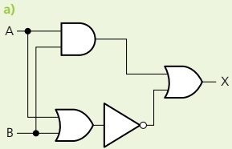

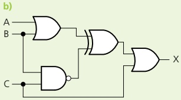

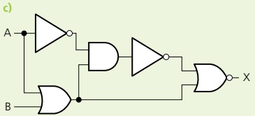

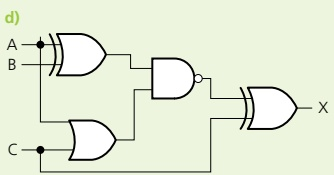

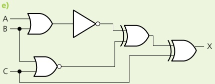

<!-- page 111 -->

A safety system uses three inputs to a logic circuit. An alarm, X, sounds if input A represents ON and input B represents OFF, or if input B represents ON and input C represents OFF.

Produce a logic circuit and truth table to show the conditions which cause the output X to be 1.

## Solution

The first thing to do is to write down the logic statement representing the scenario in this example. To do this, it is necessary to recall that ON = 1 and OFF = 0 and also that 0 is considered to be NOT 1.

So, we get the following logic statement:

 $$ \begin{array}{r l r}{\mathrm{X}=1\mathrm{~i f~}\quad}&{(\mathrm{A}=1\mathrm{~A N D~}\quad\mathrm{O R}\quad}&{(\mathrm{B}=1\mathrm{~A N D~})}\\ &{\mathrm{B}=\mathrm{N O T}~{}1)}&{\mathrm{C}=\mathrm{N O T}~{}1)}\end{array} $$ 

this equates to the two parts are this equates to A is ON and B is ON AND

is OFF OR gate C is OFF

Part 1 Part 2 Part 3

This statement can also be written in Boolean algebra as:

 $$ (A.\overline{B})+(B.\overline{C}) $$ 

The logic circuit is made up of three parts as shown in the logic statement. We will produce the logic gate for the Part 1 and Part 3, then join both parts together with the OR gate.

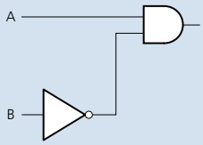

Part 1

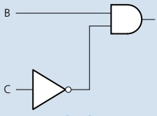

Part 3

Now, combining both parts with Part 2 (the OR gate) gives us:

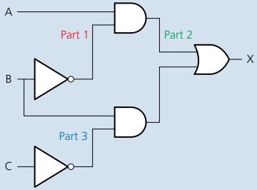

There are two ways to produce the truth table.

Trace through the logic circuit using the method described in Example 3.1.

Use the original logic statement; this allows you to check that your logic circuit is correct.

<!-- page 112 -->

We will use the second method in this example.

<table border=1 style='margin: auto; word-wrap: break-word;'><tr><td colspan="3">Inputs</td><td colspan="2">Intermediate values</td><td style='text-align: center; word-wrap: break-word;'>Output</td></tr><tr><td style='text-align: center; word-wrap: break-word;'>A</td><td style='text-align: center; word-wrap: break-word;'>B</td><td style='text-align: center; word-wrap: break-word;'>C</td><td style='text-align: center; word-wrap: break-word;'>(A=1 AND B=NOT 1)</td><td style='text-align: center; word-wrap: break-word;'>(B=1 AND C=NOT 1)</td><td style='text-align: center; word-wrap: break-word;'>X</td></tr><tr><td style='text-align: center; word-wrap: break-word;'>0</td><td style='text-align: center; word-wrap: break-word;'>0</td><td style='text-align: center; word-wrap: break-word;'>0</td><td style='text-align: center; word-wrap: break-word;'>0</td><td style='text-align: center; word-wrap: break-word;'>0</td><td style='text-align: center; word-wrap: break-word;'>0</td></tr><tr><td style='text-align: center; word-wrap: break-word;'>0</td><td style='text-align: center; word-wrap: break-word;'>0</td><td style='text-align: center; word-wrap: break-word;'>1</td><td style='text-align: center; word-wrap: break-word;'>0</td><td style='text-align: center; word-wrap: break-word;'>0</td><td style='text-align: center; word-wrap: break-word;'>0</td></tr><tr><td style='text-align: center; word-wrap: break-word;'>0</td><td style='text-align: center; word-wrap: break-word;'>1</td><td style='text-align: center; word-wrap: break-word;'>0</td><td style='text-align: center; word-wrap: break-word;'>0</td><td style='text-align: center; word-wrap: break-word;'>1</td><td style='text-align: center; word-wrap: break-word;'>1</td></tr><tr><td style='text-align: center; word-wrap: break-word;'>0</td><td style='text-align: center; word-wrap: break-word;'>1</td><td style='text-align: center; word-wrap: break-word;'>1</td><td style='text-align: center; word-wrap: break-word;'>0</td><td style='text-align: center; word-wrap: break-word;'>0</td><td style='text-align: center; word-wrap: break-word;'>0</td></tr><tr><td style='text-align: center; word-wrap: break-word;'>1</td><td style='text-align: center; word-wrap: break-word;'>0</td><td style='text-align: center; word-wrap: break-word;'>0</td><td style='text-align: center; word-wrap: break-word;'>1</td><td style='text-align: center; word-wrap: break-word;'>0</td><td style='text-align: center; word-wrap: break-word;'>1</td></tr><tr><td style='text-align: center; word-wrap: break-word;'>1</td><td style='text-align: center; word-wrap: break-word;'>0</td><td style='text-align: center; word-wrap: break-word;'>1</td><td style='text-align: center; word-wrap: break-word;'>1</td><td style='text-align: center; word-wrap: break-word;'>0</td><td style='text-align: center; word-wrap: break-word;'>1</td></tr><tr><td style='text-align: center; word-wrap: break-word;'>1</td><td style='text-align: center; word-wrap: break-word;'>1</td><td style='text-align: center; word-wrap: break-word;'>0</td><td style='text-align: center; word-wrap: break-word;'>0</td><td style='text-align: center; word-wrap: break-word;'>1</td><td style='text-align: center; word-wrap: break-word;'>1</td></tr><tr><td style='text-align: center; word-wrap: break-word;'>1</td><td style='text-align: center; word-wrap: break-word;'>1</td><td style='text-align: center; word-wrap: break-word;'>1</td><td style='text-align: center; word-wrap: break-word;'>0</td><td style='text-align: center; word-wrap: break-word;'>0</td><td style='text-align: center; word-wrap: break-word;'>0</td></tr></table>

## ACTIVITY 3C

Draw the logic circuits and complete the truth tables for these logic statements and Boolean algebra statements.

a) X = 1 if {A = 1 OR B = 1} OR {A = 0 AND B = 1}

b) Y = 1 if  $ (A = 0 \text{ AND } B = 0) $ AND  $ (B = 0 \text{ OR } C = 1) $

c) T = 1 if (switch K is ON or switch L is ON) OR (switch K is ON and switch M is OFF) OR (switch M is ON)

d)  $ X = \{A, B\} + \{B, C\} $

e) R = 1 if (switch A is ON and switch B is ON) AND (switch B is ON or switch C is OFF)

Example 3.3

A wind turbine has a safety system which uses three inputs to a logic circuit. A certain combination of conditions results in an output, X, from the logic circuit being equal to 1. When the value of X = 1, the wind turbine is shut down.

The following table shows which parameters are being monitored and form the three inputs to the logic circuit.

<table border=1 style='margin: auto; word-wrap: break-word;'><tr><td style='text-align: center; word-wrap: break-word;'>Parameter description</td><td style='text-align: center; word-wrap: break-word;'>Parameter</td><td style='text-align: center; word-wrap: break-word;'>Binary value</td><td style='text-align: center; word-wrap: break-word;'>Description of condition</td></tr><tr><td rowspan="2">turbine speed</td><td rowspan="2">S</td><td style='text-align: center; word-wrap: break-word;'>0</td><td style='text-align: center; word-wrap: break-word;'>turbine speed ≤ 1000 rpm</td></tr><tr><td style='text-align: center; word-wrap: break-word;'>1</td><td style='text-align: center; word-wrap: break-word;'>turbine speed &gt; 1000 rpm</td></tr><tr><td rowspan="2">bearing temperature</td><td rowspan="2">T</td><td style='text-align: center; word-wrap: break-word;'>0</td><td style='text-align: center; word-wrap: break-word;'>bearing temperature ≤ 80 °C</td></tr><tr><td style='text-align: center; word-wrap: break-word;'>1</td><td style='text-align: center; word-wrap: break-word;'>bearing temperature &gt; 80 °C</td></tr><tr><td rowspan="2">wind velocity</td><td rowspan="2">W</td><td style='text-align: center; word-wrap: break-word;'>0</td><td style='text-align: center; word-wrap: break-word;'>wind velocity ≤ 120 kph</td></tr><tr><td style='text-align: center; word-wrap: break-word;'>1</td><td style='text-align: center; word-wrap: break-word;'>wind velocity &gt; 120 kph</td></tr></table>

The output, X, will have a value of 1 if any of the following combination of conditions occur:

either turbine speed ≤ 1000rpm and bearing temperature > 80°C

• or turbine speed > 1000 rpm and wind velocity > 120 kph

● or bearing temperature ≤ 80°C and wind velocity > 120kph

<!-- page 113 -->

Design the logic circuit and complete the truth table to produce a value of X = 1 when either of the three conditions occur.

## Solution

This is a different type of problem to those covered in Examples 3.1 and 3.2. This time, a real situation is given and it is necessary to convert the information into a logic statement and then produce the logic circuit and truth table. It is advisable in problems as complex as this to produce the logic circuit and truth table separately (based on the conditions given) and then check them against each other to see if there are any errors.

## Stage 1

The first thing to do is to convert each of the three statements into logic statements. Use the information given in the table and the three condition statements to find how the three parameters S, T and W, are linked. We usually look for the key words AND, OR and NOT when converting actual statements into logic.

We end up with these three logic statements:

① turbine speed ≤ 1000 rpm and bearing temperature > 80°C logic statement: (S = NOT 1 AND T = 1)

② turbine speed > 1000 rpm and wind velocity > 120 kph logic statement: (S = 1 AND W = 1)

③ bearing temperature ≤ 80°C and wind velocity > 120kph logic statement: (T = NOT 1 AND W = 1)

## Stage 2

This produces three intermediate logic circuits:

①

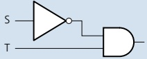

②

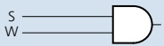

③

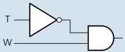

Each of the three original statements were joined together by the word OR. So, we need to join all of the three intermediate logic circuits by two OR gates to get the final logic circuit.

We will start by joining  $ \textcircled{1} $ and  $ \textcircled{2} $ together using an OR gate.

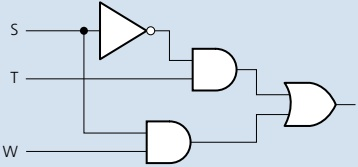

<!-- page 114 -->

Now, we connect this to logic circuit  $ \textcircled{3} $ to obtain the final logic circuit.

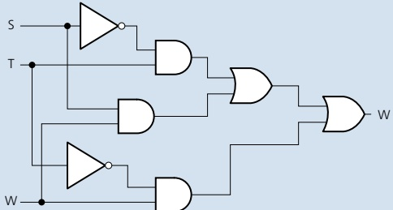

The final part is to produce the truth table. We will do this using the original logic statement, since this method allows an extra check to be made on the final logic circuit.

There were three parts to the problem, so the truth table will first evaluate each part. Then, by applying OR gates, as shown below, the final value, X, is obtained:

 $$ \textcircled{1}\quad(\mathrm{S}=\mathrm{N O T}\mathrm{~1~A N D~T}=1) $$ 

 $$ \textcircled{2}\quad(\mathrm{S=1\ A N D\ W=1}) $$ 

 $$ \textcircled{3}\quad(\mathrm{T}=\mathrm{N O T}\mathrm{~1~A N D~W}=1) $$ 

We find the outputs from ① and ② and then OR these two outputs to obtain a new intermediate, which we will label part ④.

We then OR parts ③ and ④ together to get the value of X.

<table border=1 style='margin: auto; word-wrap: break-word;'><tr><td colspan="3">Inputs</td><td colspan="4">Intermediate values</td><td style='text-align: center; word-wrap: break-word;'>Output</td></tr><tr><td style='text-align: center; word-wrap: break-word;'>A</td><td style='text-align: center; word-wrap: break-word;'>B</td><td style='text-align: center; word-wrap: break-word;'>C</td><td style='text-align: center; word-wrap: break-word;'>①\n(S=NOT 1 AND T=1)</td><td style='text-align: center; word-wrap: break-word;'>②\n(S=1 AND W=1)</td><td style='text-align: center; word-wrap: break-word;'>③\n(T=NOT 1 AND W=1)</td><td style='text-align: center; word-wrap: break-word;'>④</td><td style='text-align: center; word-wrap: break-word;'>X</td></tr><tr><td style='text-align: center; word-wrap: break-word;'>0</td><td style='text-align: center; word-wrap: break-word;'>0</td><td style='text-align: center; word-wrap: break-word;'>0</td><td style='text-align: center; word-wrap: break-word;'>0</td><td style='text-align: center; word-wrap: break-word;'>0</td><td style='text-align: center; word-wrap: break-word;'>0</td><td style='text-align: center; word-wrap: break-word;'>0</td><td style='text-align: center; word-wrap: break-word;'>0</td></tr><tr><td style='text-align: center; word-wrap: break-word;'>0</td><td style='text-align: center; word-wrap: break-word;'>0</td><td style='text-align: center; word-wrap: break-word;'>1</td><td style='text-align: center; word-wrap: break-word;'>0</td><td style='text-align: center; word-wrap: break-word;'>0</td><td style='text-align: center; word-wrap: break-word;'>1</td><td style='text-align: center; word-wrap: break-word;'>0</td><td style='text-align: center; word-wrap: break-word;'>1</td></tr><tr><td style='text-align: center; word-wrap: break-word;'>0</td><td style='text-align: center; word-wrap: break-word;'>1</td><td style='text-align: center; word-wrap: break-word;'>0</td><td style='text-align: center; word-wrap: break-word;'>1</td><td style='text-align: center; word-wrap: break-word;'>0</td><td style='text-align: center; word-wrap: break-word;'>0</td><td style='text-align: center; word-wrap: break-word;'>1</td><td style='text-align: center; word-wrap: break-word;'>1</td></tr><tr><td style='text-align: center; word-wrap: break-word;'>0</td><td style='text-align: center; word-wrap: break-word;'>1</td><td style='text-align: center; word-wrap: break-word;'>1</td><td style='text-align: center; word-wrap: break-word;'>1</td><td style='text-align: center; word-wrap: break-word;'>0</td><td style='text-align: center; word-wrap: break-word;'>0</td><td style='text-align: center; word-wrap: break-word;'>1</td><td style='text-align: center; word-wrap: break-word;'>1</td></tr><tr><td style='text-align: center; word-wrap: break-word;'>1</td><td style='text-align: center; word-wrap: break-word;'>0</td><td style='text-align: center; word-wrap: break-word;'>0</td><td style='text-align: center; word-wrap: break-word;'>0</td><td style='text-align: center; word-wrap: break-word;'>0</td><td style='text-align: center; word-wrap: break-word;'>0</td><td style='text-align: center; word-wrap: break-word;'>0</td><td style='text-align: center; word-wrap: break-word;'>0</td></tr><tr><td style='text-align: center; word-wrap: break-word;'>1</td><td style='text-align: center; word-wrap: break-word;'>0</td><td style='text-align: center; word-wrap: break-word;'>1</td><td style='text-align: center; word-wrap: break-word;'>0</td><td style='text-align: center; word-wrap: break-word;'>1</td><td style='text-align: center; word-wrap: break-word;'>1</td><td style='text-align: center; word-wrap: break-word;'>1</td><td style='text-align: center; word-wrap: break-word;'>1</td></tr><tr><td style='text-align: center; word-wrap: break-word;'>1</td><td style='text-align: center; word-wrap: break-word;'>1</td><td style='text-align: center; word-wrap: break-word;'>0</td><td style='text-align: center; word-wrap: break-word;'>0</td><td style='text-align: center; word-wrap: break-word;'>0</td><td style='text-align: center; word-wrap: break-word;'>0</td><td style='text-align: center; word-wrap: break-word;'>0</td><td style='text-align: center; word-wrap: break-word;'>0</td></tr><tr><td style='text-align: center; word-wrap: break-word;'>1</td><td style='text-align: center; word-wrap: break-word;'>1</td><td style='text-align: center; word-wrap: break-word;'>1</td><td style='text-align: center; word-wrap: break-word;'>0</td><td style='text-align: center; word-wrap: break-word;'>1</td><td style='text-align: center; word-wrap: break-word;'>0</td><td style='text-align: center; word-wrap: break-word;'>1</td><td style='text-align: center; word-wrap: break-word;'>1</td></tr></table>

## ACTIVITY 3D

There are two scenarios described below. In each case, produce the logic circuit and complete a truth table to represent the scenario.

a) A chemical process is protected by a logic circuit. There are three inputs to the logic circuit representing key parameters in the chemical process.

An alarm, X, will give an output value of 1 depending on certain conditions in the chemical process.

<!-- page 115 -->

This table describes the process conditions being monitored.

<table border=1 style='margin: auto; word-wrap: break-word;'><tr><td style='text-align: center; word-wrap: break-word;'>Parameter description</td><td style='text-align: center; word-wrap: break-word;'>Parameter</td><td style='text-align: center; word-wrap: break-word;'>Binary value</td><td style='text-align: center; word-wrap: break-word;'>Description of condition</td></tr><tr><td rowspan="2">chemical reaction rate</td><td rowspan="2">R</td><td style='text-align: center; word-wrap: break-word;'>0</td><td style='text-align: center; word-wrap: break-word;'>reaction rate &lt; 40 mol/l/sec</td></tr><tr><td style='text-align: center; word-wrap: break-word;'>1</td><td style='text-align: center; word-wrap: break-word;'>reaction rate ≥ 40 mol/l/sec</td></tr><tr><td rowspan="2">process temperature</td><td rowspan="2">T</td><td style='text-align: center; word-wrap: break-word;'>0</td><td style='text-align: center; word-wrap: break-word;'>temperature &gt; 115 °C</td></tr><tr><td style='text-align: center; word-wrap: break-word;'>1</td><td style='text-align: center; word-wrap: break-word;'>temperature ≤ 115 °C</td></tr><tr><td rowspan="2">concentration of chemicals</td><td rowspan="2">C</td><td style='text-align: center; word-wrap: break-word;'>0</td><td style='text-align: center; word-wrap: break-word;'>concentration = 4 mol</td></tr><tr><td style='text-align: center; word-wrap: break-word;'>1</td><td style='text-align: center; word-wrap: break-word;'>concentration &gt; 4 mol</td></tr></table>

An alarm, X, will generate the value 1 if:

 $$ >115^{\circ}\mathrm{C} $$ 

 $$ >115^{\circ}\mathrm{C} $$ 

b) A power station has a safety system controlled by a logic circuit. Three inputs to the logic circuit determine whether the output, S, is 1.

When S = 1 the power station shuts down.

The following table describes the conditions being monitored.

<table border=1 style='margin: auto; word-wrap: break-word;'><tr><td style='text-align: center; word-wrap: break-word;'>Parameter description</td><td style='text-align: center; word-wrap: break-word;'>Parameter</td><td style='text-align: center; word-wrap: break-word;'>Binary value</td><td style='text-align: center; word-wrap: break-word;'>Description of condition</td></tr><tr><td rowspan="2">gas temperature</td><td rowspan="2">G</td><td style='text-align: center; word-wrap: break-word;'>0</td><td style='text-align: center; word-wrap: break-word;'>gas temperature ≤ 160 °C</td></tr><tr><td style='text-align: center; word-wrap: break-word;'>1</td><td style='text-align: center; word-wrap: break-word;'>gas temperature &gt; 160 °C</td></tr><tr><td rowspan="2">reactor pressure</td><td rowspan="2">R</td><td style='text-align: center; word-wrap: break-word;'>0</td><td style='text-align: center; word-wrap: break-word;'>reactor pressure ≤ 10 bar</td></tr><tr><td style='text-align: center; word-wrap: break-word;'>1</td><td style='text-align: center; word-wrap: break-word;'>reactor pressure &gt; 10 bar</td></tr><tr><td rowspan="2">water temperature</td><td rowspan="2">W</td><td style='text-align: center; word-wrap: break-word;'>0</td><td style='text-align: center; word-wrap: break-word;'>water temperature ≤ 120 °C</td></tr><tr><td style='text-align: center; word-wrap: break-word;'>1</td><td style='text-align: center; word-wrap: break-word;'>water temperature &gt; 120 °C</td></tr></table>

Output, S, will generate a value of 1, if:

 $$ >160^{\circ}\mathrm{C} $$ 

 $$ \leq120^{\circ}\mathrm{C} $$ 

 $$ \leq160^{\circ}\mathrm{C} $$ 

 $$ >120^{\circ}\mathrm{C} $$ 

#### 3.2.5 Logic circuits in the real world

The design of logic circuits is considerably more complex than has, so far, been described. We have discussed some of the fundamental theories, providing sufficient coverage of the Cambridge International A Level syllabus. However, it is worth discussing some of the more advanced aspects of logic circuit design, to strengthen understanding.

Electronics companies need to consider the cost of components, ease of fabrication and time constraints when designing and building logic circuits.

Ways electronics companies review logic circuit design include:

» using ‘off-the-shelf’ logic units and building up the logic circuit as a number of ‘building blocks’

» simplifying the logic circuit as far as possible; this may be necessary where room is at a premium (for example, building circuit boards for use in satellites for space exploration).

<!-- page 116 -->

## Using logic 'building blocks'

One common ‘building block’ is the NAND gate. It is possible to build up any logic gate, and therefore any logic circuit, by simply linking together a number of NAND gates, such as:

the AND gate

Figure 3.29 AND gate made from NAND gates

the OR gate

Figure 3.30 OR gate made from NAND gates

the NOT gate

Figure 3.31 NOT gate made from NAND gates

## ACTIVITY 3E

1 By drawing the truth tables, show that the three logic circuits shown above can be used to represent AND, OR and NOT gates.

2 a) Show how the following logic circuit could be built using NAND gates only. Complete truth tables for both logic circuits to show that they produce identical outputs.

b) Show how the XOR gate could be built from NAND gates only.

Complete a truth table for your final design to show that it produces the same output as a single XOR gate.

3 By drawing a truth table, discover which single logic gate has the same function as the following logic circuit made up of NAND gates only.

<!-- page 117 -->

## Simplification of logic circuits

The second method involves the simplification of logic circuits. By reducing the number of components, the cost of production can be less. This can also improve reliability and make it easier to trace faults if they occur. This is covered in more depth in Chapter 15.

## EXTENSION ACTIVITY 3H

By drawing a truth table, show which single logic gate has the same function as the logic circuit drawn below.

#### 3.2.6 Multi-input logic gates

This section looks at logic gates with more than two inputs (apart from the NOT gate). Students are not expected to answer questions about multi-input logic gates at Cambridge International AS Level, but this information is included here for completeness and for those with an electronics background. This is intended to complete the picture for interested students who may have seen multi-input gates in other textbooks, or online, and it leads neatly into topics covered in Chapter 15.

Logic gates (apart from the NOT gate) can have more than two inputs. While it is still acceptable to use two-input logic gates, it is worth considering the multi-input option when designing logic circuits; they can simplify the overall result.

Multi-input AND gates

Figure 3.32 Multi-input AND gate

Both sets of AND gates have the output A.B.C and they share identical truth tables.

<table border=1 style='margin: auto; word-wrap: break-word;'><tr><td colspan="3">Inputs</td><td style='text-align: center; word-wrap: break-word;'>Output</td></tr><tr><td style='text-align: center; word-wrap: break-word;'>A</td><td style='text-align: center; word-wrap: break-word;'>B</td><td style='text-align: center; word-wrap: break-word;'>C</td><td style='text-align: center; word-wrap: break-word;'>A.B.C</td></tr><tr><td style='text-align: center; word-wrap: break-word;'>0</td><td style='text-align: center; word-wrap: break-word;'>0</td><td style='text-align: center; word-wrap: break-word;'>0</td><td style='text-align: center; word-wrap: break-word;'>0</td></tr><tr><td style='text-align: center; word-wrap: break-word;'>0</td><td style='text-align: center; word-wrap: break-word;'>0</td><td style='text-align: center; word-wrap: break-word;'>1</td><td style='text-align: center; word-wrap: break-word;'>0</td></tr><tr><td style='text-align: center; word-wrap: break-word;'>0</td><td style='text-align: center; word-wrap: break-word;'>1</td><td style='text-align: center; word-wrap: break-word;'>0</td><td style='text-align: center; word-wrap: break-word;'>0</td></tr><tr><td style='text-align: center; word-wrap: break-word;'>0</td><td style='text-align: center; word-wrap: break-word;'>1</td><td style='text-align: center; word-wrap: break-word;'>1</td><td style='text-align: center; word-wrap: break-word;'>0</td></tr><tr><td style='text-align: center; word-wrap: break-word;'>1</td><td style='text-align: center; word-wrap: break-word;'>0</td><td style='text-align: center; word-wrap: break-word;'>0</td><td style='text-align: center; word-wrap: break-word;'>0</td></tr><tr><td style='text-align: center; word-wrap: break-word;'>1</td><td style='text-align: center; word-wrap: break-word;'>0</td><td style='text-align: center; word-wrap: break-word;'>1</td><td style='text-align: center; word-wrap: break-word;'>0</td></tr><tr><td style='text-align: center; word-wrap: break-word;'>1</td><td style='text-align: center; word-wrap: break-word;'>1</td><td style='text-align: center; word-wrap: break-word;'>0</td><td style='text-align: center; word-wrap: break-word;'>0</td></tr><tr><td style='text-align: center; word-wrap: break-word;'>1</td><td style='text-align: center; word-wrap: break-word;'>1</td><td style='text-align: center; word-wrap: break-word;'>1</td><td style='text-align: center; word-wrap: break-word;'>1</td></tr></table>

<!-- page 118 -->

Now consider the following:

Figure 3.33 4-input AND gate

Both sets of AND gates have the output A.B.C.D and they share identical truth tables.

<table border=1 style='margin: auto; word-wrap: break-word;'><tr><td colspan="4">Inputs</td><td style='text-align: center; word-wrap: break-word;'>Output</td></tr><tr><td style='text-align: center; word-wrap: break-word;'>A</td><td style='text-align: center; word-wrap: break-word;'>B</td><td style='text-align: center; word-wrap: break-word;'>C</td><td style='text-align: center; word-wrap: break-word;'>D</td><td style='text-align: center; word-wrap: break-word;'>A.B.C.D</td></tr><tr><td style='text-align: center; word-wrap: break-word;'>0</td><td style='text-align: center; word-wrap: break-word;'>0</td><td style='text-align: center; word-wrap: break-word;'>0</td><td style='text-align: center; word-wrap: break-word;'>0</td><td style='text-align: center; word-wrap: break-word;'>0</td></tr><tr><td style='text-align: center; word-wrap: break-word;'>0</td><td style='text-align: center; word-wrap: break-word;'>0</td><td style='text-align: center; word-wrap: break-word;'>0</td><td style='text-align: center; word-wrap: break-word;'>1</td><td style='text-align: center; word-wrap: break-word;'>0</td></tr><tr><td style='text-align: center; word-wrap: break-word;'>0</td><td style='text-align: center; word-wrap: break-word;'>0</td><td style='text-align: center; word-wrap: break-word;'>1</td><td style='text-align: center; word-wrap: break-word;'>0</td><td style='text-align: center; word-wrap: break-word;'>0</td></tr><tr><td style='text-align: center; word-wrap: break-word;'>0</td><td style='text-align: center; word-wrap: break-word;'>0</td><td style='text-align: center; word-wrap: break-word;'>1</td><td style='text-align: center; word-wrap: break-word;'>1</td><td style='text-align: center; word-wrap: break-word;'>0</td></tr><tr><td style='text-align: center; word-wrap: break-word;'>0</td><td style='text-align: center; word-wrap: break-word;'>1</td><td style='text-align: center; word-wrap: break-word;'>0</td><td style='text-align: center; word-wrap: break-word;'>0</td><td style='text-align: center; word-wrap: break-word;'>0</td></tr><tr><td style='text-align: center; word-wrap: break-word;'>0</td><td style='text-align: center; word-wrap: break-word;'>1</td><td style='text-align: center; word-wrap: break-word;'>0</td><td style='text-align: center; word-wrap: break-word;'>1</td><td style='text-align: center; word-wrap: break-word;'>0</td></tr><tr><td style='text-align: center; word-wrap: break-word;'>0</td><td style='text-align: center; word-wrap: break-word;'>1</td><td style='text-align: center; word-wrap: break-word;'>1</td><td style='text-align: center; word-wrap: break-word;'>0</td><td style='text-align: center; word-wrap: break-word;'>0</td></tr><tr><td style='text-align: center; word-wrap: break-word;'>0</td><td style='text-align: center; word-wrap: break-word;'>1</td><td style='text-align: center; word-wrap: break-word;'>1</td><td style='text-align: center; word-wrap: break-word;'>1</td><td style='text-align: center; word-wrap: break-word;'>0</td></tr><tr><td style='text-align: center; word-wrap: break-word;'>1</td><td style='text-align: center; word-wrap: break-word;'>0</td><td style='text-align: center; word-wrap: break-word;'>0</td><td style='text-align: center; word-wrap: break-word;'>0</td><td style='text-align: center; word-wrap: break-word;'>0</td></tr><tr><td style='text-align: center; word-wrap: break-word;'>1</td><td style='text-align: center; word-wrap: break-word;'>0</td><td style='text-align: center; word-wrap: break-word;'>0</td><td style='text-align: center; word-wrap: break-word;'>1</td><td style='text-align: center; word-wrap: break-word;'>0</td></tr><tr><td style='text-align: center; word-wrap: break-word;'>1</td><td style='text-align: center; word-wrap: break-word;'>0</td><td style='text-align: center; word-wrap: break-word;'>1</td><td style='text-align: center; word-wrap: break-word;'>0</td><td style='text-align: center; word-wrap: break-word;'>0</td></tr><tr><td style='text-align: center; word-wrap: break-word;'>1</td><td style='text-align: center; word-wrap: break-word;'>0</td><td style='text-align: center; word-wrap: break-word;'>1</td><td style='text-align: center; word-wrap: break-word;'>1</td><td style='text-align: center; word-wrap: break-word;'>0</td></tr><tr><td style='text-align: center; word-wrap: break-word;'>1</td><td style='text-align: center; word-wrap: break-word;'>1</td><td style='text-align: center; word-wrap: break-word;'>0</td><td style='text-align: center; word-wrap: break-word;'>0</td><td style='text-align: center; word-wrap: break-word;'>0</td></tr><tr><td style='text-align: center; word-wrap: break-word;'>1</td><td style='text-align: center; word-wrap: break-word;'>1</td><td style='text-align: center; word-wrap: break-word;'>0</td><td style='text-align: center; word-wrap: break-word;'>1</td><td style='text-align: center; word-wrap: break-word;'>0</td></tr><tr><td style='text-align: center; word-wrap: break-word;'>1</td><td style='text-align: center; word-wrap: break-word;'>1</td><td style='text-align: center; word-wrap: break-word;'>1</td><td style='text-align: center; word-wrap: break-word;'>0</td><td style='text-align: center; word-wrap: break-word;'>0</td></tr><tr><td style='text-align: center; word-wrap: break-word;'>1</td><td style='text-align: center; word-wrap: break-word;'>1</td><td style='text-align: center; word-wrap: break-word;'>1</td><td style='text-align: center; word-wrap: break-word;'>1</td><td style='text-align: center; word-wrap: break-word;'>1</td></tr></table>

Table 3.17

Multi-input OR gates

Figure 3.34 Multi-input OR gate

Both sets of OR gates have the output A + B + C and they share identical truth tables.

<table border=1 style='margin: auto; word-wrap: break-word;'><tr><td colspan="3">Inputs</td><td style='text-align: center; word-wrap: break-word;'>Output</td></tr><tr><td style='text-align: center; word-wrap: break-word;'>A</td><td style='text-align: center; word-wrap: break-word;'>B</td><td style='text-align: center; word-wrap: break-word;'>C</td><td style='text-align: center; word-wrap: break-word;'>A + B + C</td></tr><tr><td style='text-align: center; word-wrap: break-word;'>0</td><td style='text-align: center; word-wrap: break-word;'>0</td><td style='text-align: center; word-wrap: break-word;'>0</td><td style='text-align: center; word-wrap: break-word;'>0</td></tr><tr><td style='text-align: center; word-wrap: break-word;'>0</td><td style='text-align: center; word-wrap: break-word;'>0</td><td style='text-align: center; word-wrap: break-word;'>1</td><td style='text-align: center; word-wrap: break-word;'>1</td></tr><tr><td style='text-align: center; word-wrap: break-word;'>0</td><td style='text-align: center; word-wrap: break-word;'>1</td><td style='text-align: center; word-wrap: break-word;'>0</td><td style='text-align: center; word-wrap: break-word;'>1</td></tr><tr><td style='text-align: center; word-wrap: break-word;'>0</td><td style='text-align: center; word-wrap: break-word;'>1</td><td style='text-align: center; word-wrap: break-word;'>1</td><td style='text-align: center; word-wrap: break-word;'>1</td></tr><tr><td style='text-align: center; word-wrap: break-word;'>1</td><td style='text-align: center; word-wrap: break-word;'>0</td><td style='text-align: center; word-wrap: break-word;'>0</td><td style='text-align: center; word-wrap: break-word;'>1</td></tr><tr><td style='text-align: center; word-wrap: break-word;'>1</td><td style='text-align: center; word-wrap: break-word;'>0</td><td style='text-align: center; word-wrap: break-word;'>1</td><td style='text-align: center; word-wrap: break-word;'>1</td></tr><tr><td style='text-align: center; word-wrap: break-word;'>1</td><td style='text-align: center; word-wrap: break-word;'>1</td><td style='text-align: center; word-wrap: break-word;'>0</td><td style='text-align: center; word-wrap: break-word;'>1</td></tr><tr><td style='text-align: center; word-wrap: break-word;'>1</td><td style='text-align: center; word-wrap: break-word;'>1</td><td style='text-align: center; word-wrap: break-word;'>1</td><td style='text-align: center; word-wrap: break-word;'>1</td></tr></table>

<!-- page 119 -->

Now consider the following:

Figure 3.35 4-input OR gate

Both sets of OR gates have the output A + B + C + D and they share identical truth tables.

<table border=1 style='margin: auto; word-wrap: break-word;'><tr><td colspan="4">Inputs</td><td style='text-align: center; word-wrap: break-word;'>Output</td></tr><tr><td style='text-align: center; word-wrap: break-word;'>A</td><td style='text-align: center; word-wrap: break-word;'>B</td><td style='text-align: center; word-wrap: break-word;'>C</td><td style='text-align: center; word-wrap: break-word;'>D</td><td style='text-align: center; word-wrap: break-word;'>A + B + C + D</td></tr><tr><td style='text-align: center; word-wrap: break-word;'>0</td><td style='text-align: center; word-wrap: break-word;'>0</td><td style='text-align: center; word-wrap: break-word;'>0</td><td style='text-align: center; word-wrap: break-word;'>0</td><td style='text-align: center; word-wrap: break-word;'>0</td></tr><tr><td style='text-align: center; word-wrap: break-word;'>0</td><td style='text-align: center; word-wrap: break-word;'>0</td><td style='text-align: center; word-wrap: break-word;'>0</td><td style='text-align: center; word-wrap: break-word;'>1</td><td style='text-align: center; word-wrap: break-word;'>1</td></tr><tr><td style='text-align: center; word-wrap: break-word;'>0</td><td style='text-align: center; word-wrap: break-word;'>0</td><td style='text-align: center; word-wrap: break-word;'>1</td><td style='text-align: center; word-wrap: break-word;'>0</td><td style='text-align: center; word-wrap: break-word;'>1</td></tr><tr><td style='text-align: center; word-wrap: break-word;'>0</td><td style='text-align: center; word-wrap: break-word;'>0</td><td style='text-align: center; word-wrap: break-word;'>1</td><td style='text-align: center; word-wrap: break-word;'>1</td><td style='text-align: center; word-wrap: break-word;'>1</td></tr><tr><td style='text-align: center; word-wrap: break-word;'>0</td><td style='text-align: center; word-wrap: break-word;'>1</td><td style='text-align: center; word-wrap: break-word;'>0</td><td style='text-align: center; word-wrap: break-word;'>0</td><td style='text-align: center; word-wrap: break-word;'>1</td></tr><tr><td style='text-align: center; word-wrap: break-word;'>0</td><td style='text-align: center; word-wrap: break-word;'>1</td><td style='text-align: center; word-wrap: break-word;'>0</td><td style='text-align: center; word-wrap: break-word;'>1</td><td style='text-align: center; word-wrap: break-word;'>1</td></tr><tr><td style='text-align: center; word-wrap: break-word;'>0</td><td style='text-align: center; word-wrap: break-word;'>1</td><td style='text-align: center; word-wrap: break-word;'>1</td><td style='text-align: center; word-wrap: break-word;'>0</td><td style='text-align: center; word-wrap: break-word;'>1</td></tr><tr><td style='text-align: center; word-wrap: break-word;'>0</td><td style='text-align: center; word-wrap: break-word;'>1</td><td style='text-align: center; word-wrap: break-word;'>1</td><td style='text-align: center; word-wrap: break-word;'>1</td><td style='text-align: center; word-wrap: break-word;'>1</td></tr><tr><td style='text-align: center; word-wrap: break-word;'>1</td><td style='text-align: center; word-wrap: break-word;'>0</td><td style='text-align: center; word-wrap: break-word;'>0</td><td style='text-align: center; word-wrap: break-word;'>0</td><td style='text-align: center; word-wrap: break-word;'>1</td></tr><tr><td style='text-align: center; word-wrap: break-word;'>1</td><td style='text-align: center; word-wrap: break-word;'>0</td><td style='text-align: center; word-wrap: break-word;'>0</td><td style='text-align: center; word-wrap: break-word;'>1</td><td style='text-align: center; word-wrap: break-word;'>1</td></tr><tr><td style='text-align: center; word-wrap: break-word;'>1</td><td style='text-align: center; word-wrap: break-word;'>0</td><td style='text-align: center; word-wrap: break-word;'>1</td><td style='text-align: center; word-wrap: break-word;'>0</td><td style='text-align: center; word-wrap: break-word;'>1</td></tr><tr><td style='text-align: center; word-wrap: break-word;'>1</td><td style='text-align: center; word-wrap: break-word;'>0</td><td style='text-align: center; word-wrap: break-word;'>1</td><td style='text-align: center; word-wrap: break-word;'>1</td><td style='text-align: center; word-wrap: break-word;'>1</td></tr><tr><td style='text-align: center; word-wrap: break-word;'>1</td><td style='text-align: center; word-wrap: break-word;'>1</td><td style='text-align: center; word-wrap: break-word;'>0</td><td style='text-align: center; word-wrap: break-word;'>0</td><td style='text-align: center; word-wrap: break-word;'>1</td></tr><tr><td style='text-align: center; word-wrap: break-word;'>1</td><td style='text-align: center; word-wrap: break-word;'>1</td><td style='text-align: center; word-wrap: break-word;'>0</td><td style='text-align: center; word-wrap: break-word;'>1</td><td style='text-align: center; word-wrap: break-word;'>1</td></tr><tr><td style='text-align: center; word-wrap: break-word;'>1</td><td style='text-align: center; word-wrap: break-word;'>1</td><td style='text-align: center; word-wrap: break-word;'>1</td><td style='text-align: center; word-wrap: break-word;'>0</td><td style='text-align: center; word-wrap: break-word;'>1</td></tr><tr><td style='text-align: center; word-wrap: break-word;'>1</td><td style='text-align: center; word-wrap: break-word;'>1</td><td style='text-align: center; word-wrap: break-word;'>1</td><td style='text-align: center; word-wrap: break-word;'>1</td><td style='text-align: center; word-wrap: break-word;'>1</td></tr></table>

### Table 3.19

## ACTIVITY 3F

1 a) Draw the following multi-input NAND gate using two-input NAND gates only:

b) Construct the truth tables for the above 4-input NAND gate and for your circuit drawn in part a). Confirm that they are identical.

2 a) Draw the following multi-input NOR gates using two-input NOR gates only.

b) Construct the truth tables for the above 3-input NOR gate and for your equivalent circuit drawn in part a).

Confirm they are identical.

<!-- page 120 -->

c) Construct the truth tables for the above 4-input NOR gate and for your equivalent circuit drawn in part a).

Confirm they are identical.

3 Confirm that the following two logic circuits are identical by constructing the truth tables for each circuit.

End of chapter questions

1 a) Many mobile phone and tablet manufacturers are moving to OLED screen technology.

Give three reasons why this is happening. [3]

b) A television manufacturer makes the following advertising claim:

‘Our OLED screens allow the user to enjoy over one million vivid colours in true-to-life vision.’

Comment on the validity of this claim.

2 a) A company is developing a new games console. The game will be stored on a ROM chip once the program to run the new game has been fully tested and developed.

i) Give two advantages of putting the game's program on a ROM chip. [2]

ii) Explain why the manufacturers would use an EPROM chip during development.

iii) The manufacturers are also using RAM chips on the internal circuit board.

Explain why they are doing this. [2]

iv) The games console will have four USB ports.

Apart from the need to attach games controllers, give reasons why USB ports are incorporated. [2]

b) During development of the games console the plastic parts are being made by a 3D printer.

Give  $ \underline{two} $ reasons why the manufacturer would use 3D printers.

3 An air conditioning unit in a car is being controlled by a microprocessor and a number of sensors.

a) Describe the main differences between control and monitoring of a process.

b) Describe how the sensors and microprocessor would be used to control the air conditioning unit in the car.

Name at least two different sensors that might be used and explain the role of positive feedback in your description.

<!-- page 121 -->

4 The nine stages in printing a page using an inkjet printer are shown below. They are not in the correct order.

Write the letters A to I so that the stages are in the correct order.

[9]

<table border=1 style='margin: auto; word-wrap: break-word;'><tr><td style='text-align: center; word-wrap: break-word;'>A</td><td style='text-align: center; word-wrap: break-word;'>The data is then sent to the printer and it is stored in a temporary memory known as a printer buffer.</td></tr><tr><td style='text-align: center; word-wrap: break-word;'>B</td><td style='text-align: center; word-wrap: break-word;'>As the sheet of paper is fed through the printer, the print head moves from side to side across the paper printing the text or image. The four ink colours are sprayed in their exact amounts to produce the desired final colour.</td></tr><tr><td style='text-align: center; word-wrap: break-word;'>C</td><td style='text-align: center; word-wrap: break-word;'>The data from the document is sent to a printer driver.</td></tr><tr><td style='text-align: center; word-wrap: break-word;'>D</td><td style='text-align: center; word-wrap: break-word;'>Once the printer buffer is empty, the printer sends an interrupt to the processor in the computer, which is a request for more data to be sent to the printer. The whole process continues until the whole of the document has been printed.</td></tr><tr><td style='text-align: center; word-wrap: break-word;'>E</td><td style='text-align: center; word-wrap: break-word;'>The printer driver ensures that the data is in a format that the chosen printer can understand.</td></tr><tr><td style='text-align: center; word-wrap: break-word;'>F</td><td style='text-align: center; word-wrap: break-word;'>At the end of each full pass of the print head, the paper is advanced very slightly to allow the next line to be printed. This continues until the whole page has been printed.</td></tr><tr><td style='text-align: center; word-wrap: break-word;'>G</td><td style='text-align: center; word-wrap: break-word;'>A check is made by the printer driver to ensure that the chosen printer is available to print (is it busy? is it off line? is it out of ink? and so on).</td></tr><tr><td style='text-align: center; word-wrap: break-word;'>H</td><td style='text-align: center; word-wrap: break-word;'>If there is more data in the printer buffer, then the whole process from stage 5 is repeated until the buffer is finally empty.</td></tr><tr><td style='text-align: center; word-wrap: break-word;'>I</td><td style='text-align: center; word-wrap: break-word;'>A sheet of paper is then fed into the main body of the printer, where a sensor detects whether paper is available in the paper feed tray – if it is out of paper (or the paper is jammed) then an error message is sent back to the computer.</td></tr></table>

5 a) There are two types of RAM: dynamic RAM (DRAM) and static RAM (SRAM). Five statements about DRAM and RAM are shown below. Copy the diagram below and connect each statement to the appropriate type of RAM. [5]

Statement

requires the data to be refreshed periodically in order to retain data

has more complex circuitry

does not need to be refreshed as the circuit holds the data as long as the power supply is on

requires higher power consumption which is significant when used in battery-powered devices

used predominantly in cache memory of processors where speed is important

b) Give three differences between RAM and ROM.

Type of RAM

DRAM

SRAM

<!-- page 122 -->

c) DVD-RAM and flash memory are two examples of storage devices.

Describe two differences in how they operate.

Cambridge International AS & A Level Computer Science 9608

Paper 13 Q4 June 2015

6 a) Three digital sensors, A, B and C, are used to monitor a process. The outputs from the sensors are used as the inputs to a logic circuit. A signal, X, is output from the logic circuit:

Output, X, has a value of 1 if either of the following two conditions occur:

- Sensor A outputs the value 1 OR sensor B outputs the value 0.

- Sensor B outputs the value 1 AND sensor C outputs the value 0.

Draw a logic circuit to represent these conditions. [5]

b) Copy and complete the truth table for the logic circuit described in part a). [4]

<table border=1 style='margin: auto; word-wrap: break-word;'><tr><td style='text-align: center; word-wrap: break-word;'>A</td><td style='text-align: center; word-wrap: break-word;'>B</td><td style='text-align: center; word-wrap: break-word;'>C</td><td style='text-align: center; word-wrap: break-word;'>working space</td><td style='text-align: center; word-wrap: break-word;'>X</td></tr><tr><td style='text-align: center; word-wrap: break-word;'>0</td><td style='text-align: center; word-wrap: break-word;'>0</td><td style='text-align: center; word-wrap: break-word;'>0</td><td style='text-align: center; word-wrap: break-word;'></td><td style='text-align: center; word-wrap: break-word;'></td></tr><tr><td style='text-align: center; word-wrap: break-word;'>0</td><td style='text-align: center; word-wrap: break-word;'>0</td><td style='text-align: center; word-wrap: break-word;'>1</td><td style='text-align: center; word-wrap: break-word;'></td><td style='text-align: center; word-wrap: break-word;'></td></tr><tr><td style='text-align: center; word-wrap: break-word;'>0</td><td style='text-align: center; word-wrap: break-word;'>1</td><td style='text-align: center; word-wrap: break-word;'>0</td><td style='text-align: center; word-wrap: break-word;'></td><td style='text-align: center; word-wrap: break-word;'></td></tr><tr><td style='text-align: center; word-wrap: break-word;'>0</td><td style='text-align: center; word-wrap: break-word;'>1</td><td style='text-align: center; word-wrap: break-word;'>1</td><td style='text-align: center; word-wrap: break-word;'></td><td style='text-align: center; word-wrap: break-word;'></td></tr><tr><td style='text-align: center; word-wrap: break-word;'>1</td><td style='text-align: center; word-wrap: break-word;'>0</td><td style='text-align: center; word-wrap: break-word;'>0</td><td style='text-align: center; word-wrap: break-word;'></td><td style='text-align: center; word-wrap: break-word;'></td></tr><tr><td style='text-align: center; word-wrap: break-word;'>1</td><td style='text-align: center; word-wrap: break-word;'>0</td><td style='text-align: center; word-wrap: break-word;'>1</td><td style='text-align: center; word-wrap: break-word;'></td><td style='text-align: center; word-wrap: break-word;'></td></tr><tr><td style='text-align: center; word-wrap: break-word;'>1</td><td style='text-align: center; word-wrap: break-word;'>1</td><td style='text-align: center; word-wrap: break-word;'>0</td><td style='text-align: center; word-wrap: break-word;'></td><td style='text-align: center; word-wrap: break-word;'></td></tr><tr><td style='text-align: center; word-wrap: break-word;'>1</td><td style='text-align: center; word-wrap: break-word;'>1</td><td style='text-align: center; word-wrap: break-word;'>1</td><td style='text-align: center; word-wrap: break-word;'></td><td style='text-align: center; word-wrap: break-word;'></td></tr></table>

c) Write a logic statement that describes the following logic circuit.

