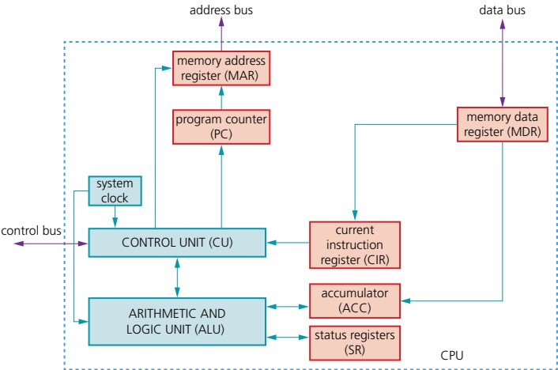
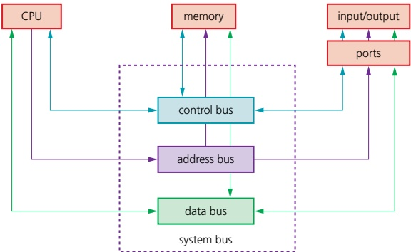
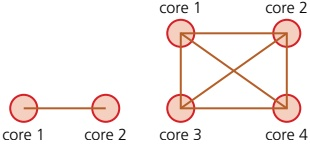
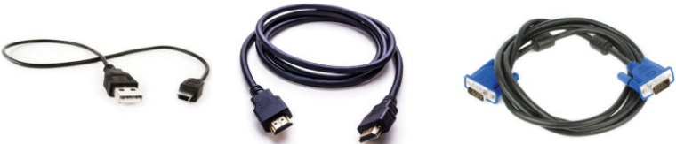
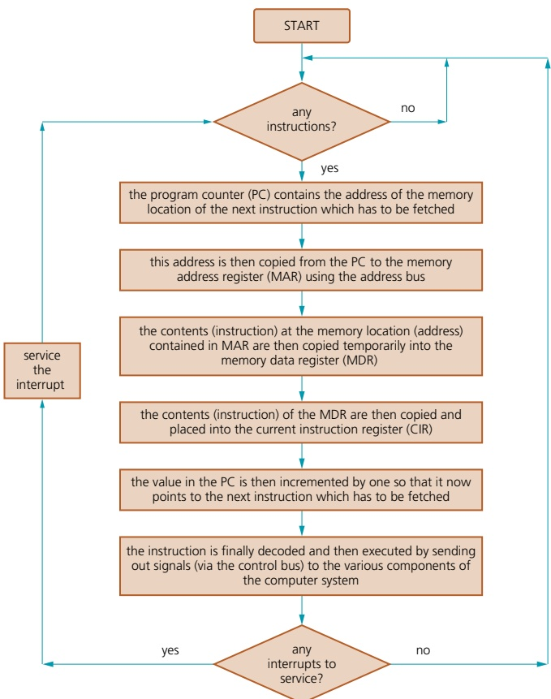
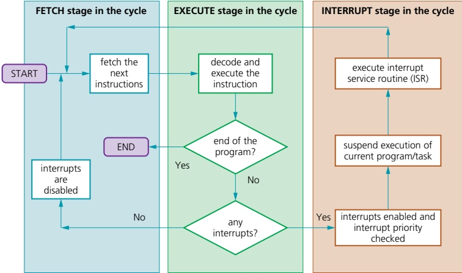
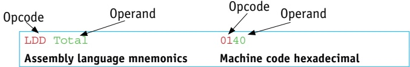
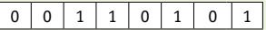
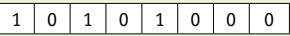

# 4 Processor fundamentals

<!-- Cambridge International AS and a Level Computer Science (David Watson, Helen Williams).pdf p123-151 -->

<!-- page 123 -->

## 4 

## Processor fundamentals

In this chapter, you will learn about

 $ ^{*} $ the basic Von Neumann model of a computer system

 $ ^{*} $ the purpose and role of the registers PC, MDR, MAR, ACC, IX, CIR, and the status registers

 $ ^{*} $ the purpose and role of the arithmetic logic unit (ALU), control unit (CU), system clock and immediate access store (IAS)

★ functions of the address bus, data bus and con

★ factors affecting computer performance (such as processor type, bus width, clock speeds, cache memory and use of core processors)

★ the connection of computers to peripheral devices such as Universal Serial Bus (USB), high definition multimedia interface (HDMI) and Video Graphics Array (VGA)

 $ ^{*} $ the fetch-execute cycle and register transfers

 $ ^{★} $ the purpose of interrupts

 $ ^{*} $ the relationship between assembly language and machine code (such as symbolic, absolute and relative addressing)

different stages for a two-pass assembler

★ tracing sample assembly language programming code

assembly language instruction groups (such as data movement, I/O operations, arithmetic operations, comparisons, and so on)

☑ addressing modes (immediate, direct, indirect, indexed and relative)

how to perform binary shifts (including logical, arithmetic, cyclic, left shift and right shift)

★ how bit manipulation is used to monitor/control a device.

### 4.1 Central processing unit (CPU) architecture

## WHAT YOU SHOULD ALREADY KNOW

Try these four questions before you read the first part of this chapter.

1 a) Name the main components that make up a typical computer system.

b) Tablets and smart phones carry out many of the functions of a desktop or laptop computer. Describe the main differences between the operations of a desktop or laptop computer and a tablet or phone.

2 When deciding on which computer, tablet or phone to buy, which are the main factors that determine your final choice?

3 Look at a number of computers, laptops and phones and list (and name) the types of input and output ports found on each device.

4 At the centre of all of the above electronic devices is the microprocessor. How has the development of the microprocessor changed over the last ten years?

<!-- page 124 -->

## Key terms

Von Neumann architecture – computer architecture which introduced the concept of the stored program in the 1940s.

Arithmetic logic unit (ALU) – component in the processor which carries out all arithmetic and logical operations.

Control unit – ensures synchronisation of data flow and programs throughout the computer by sending out control signals along the control bus.

System clock – produces timing signals on the control bus to ensure synchronisation takes place.

Immediate access store (IAS) – holds all data and programs needed to be accessed by the control unit.

Accumulator – temporary general purpose register which stores numerical values at any part of a given operation.

Register – temporary component in the processor which can be general or specific in its use that holds data or instructions as part of the fetch-execute cycle.

Status register – used when an instruction requires some form of arithmetic or logical processing.

Address bus – carries the addresses throughout the computer system.

Flag – indicates the status of a bit in the status register, for example, N = 1 indicates the result of an addition gives a negative value.

Data bus – allows data to be carried from processor to memory (and vice versa) or to and from input/output devices.

Control bus – carries signals from control unit to all other computer components.

Unidirectional – used to describe a bus in which bits can travel in one direction only.

Bidirectional – used to describe a bus in which bits can travel in both directions.

Word – group of bits used by a computer to represent a single unit.

Core – a unit made up of ALU, control unit and registers which is part of a CPU. A CPU may contain a number of cores.

Clock cycle – clock speeds are measured in terms of GHz; this is the vibrational frequency of the clock which sends out pulses along the control bus – a 3.5GHz clock cycle means 3.5 billion clock cycles a second.

Dual core – a CPU containing two cores.

Quad core – a CPU containing four cores.

Overclocking – changing the clock speed of a system clock to a value higher than the factory/recommended setting.

BIOS – basic input/output system.

Cache memory – a high speed auxiliary memory which permits high speed data transfer and retrieval.

Port – external connection to a computer which allows it to communicate with various peripheral devices. A number of different port technologies exist.

Universal Serial Bus (USB) – a type of port connecting devices to a computer.

Asynchronous serial data transmission – serial refers to a single wire being used to transmit bits of data one after the other. Asynchronous refers to a sender using its own clock/timer device rather sharing the same clock/timer with the recipient device.

High-definition multimedia interface (HDMI) – type of port connecting devices to a computer.

Video Graphics Array (VGA) – type of port connecting devices to a computer.

High-bandwidth digital copy protection (HDCP) – part of HDMI technology which reduces risk of piracy of software and multimedia.

Fetch-execute cycle – a cycle in which instructions and data are fetched from memory and then decoded and finally executed.

Program counter (PC) – a register used in a computer to store the address of the instruction which is currently being executed.

Current instruction register – a register used to contain the instruction which is currently being executed or decoded.

Register Transfer Notation (RTN) – short hand notation to show movement of data and instructions in a processor, can be used to represent the operation of the fetch-execute cycle.

Interrupt – signal sent from a device or software to a processor requesting its attention; the processor suspends all operations until the interrupt has been serviced.

Interrupt priority – all interrupts are given a priority so that the processor knows which need to be serviced first and which interrupts are to be dealt with quickly.

Interrupt service routine (ISR) or interrupt handler – software which handles interrupt requests (such as 'printer out of paper') and sends the request to the CPU for processing.

<!-- page 125 -->

#### 4.1.1 Von Neumann model

Early computers were fed data while the machines were running. It was not possible to store programs or data; that meant they could not operate without considerable human intervention.

In the mid-1940s, John Von Neumann developed the concept of the stored program computer. It has been the basis of computer architecture for many years. The main, previously unavailable, features of the Von Neumann architecture were

a central processing unit (CPU or processor)

» a processor able to access the memory directly

» computer memories that could store programs as well as data

stored programs made up of instructions that could be executed in sequential order.

Figure 4.1 shows a simple representation of Von Neumann architecture.

Figure 4.1 Representation of Von Neumann architecture

#### 4.1.2 Components of the processor (CPU)

The main components of the processor are the arithmetic logic unit (ALU), the control unit (CU), the system clock and the immediate access store (IAS).

## Arithmetic logic unit (ALU)

The ALU allows the required arithmetic or logic operations to be carried out while a program is being run. It is possible for a computer to have more than one ALU – one will perform fixed point operations and the other floating-point operations (see Chapter 13).

Multiplication and division are carried out by a sequence of addition, subtraction and left/right shifting operations (for example, shifting 0 0 1 1 0 1 1 1 two places to the left gives 1 1 0 1 1 1 0 0, which is equivalent to multiplying by a factor of 4).

<!-- page 126 -->

The accumulator (ACC) is a temporary register used when carrying out ALU calculations.

## Control unit (CU)

The CU reads an instruction from memory (the address of the location where the instruction can be found is stored in the program counter (PC)). This instruction is then interpreted. During that process, signals are generated along the control bus to tell the other components in the computer what to do. The CU ensures synchronisation of data flow and program instructions throughout the computer.

## System clock

A system clock is used to produce timing signals on the control bus to ensure this vital synchronisation takes place – without the clock the computer would simply crash. (See Section 4.1.4 System buses.)

## Immediate access store (IAS)

The IAS holds all the data and programs that the processor (CPU) needs to access. The CPU takes data and programs held in backing store and puts them into the IAS temporarily. This is done because read/write operations carried out using the IAS are considerably faster than read/write operations to backing store. Consequently, any key data needed by an application will be stored temporarily in IAS to speed up operations. The IAS is another name for primary (RAM) memory.

#### 4.1.3 Registers

One of the most fundamental components of the Von Neumann system is the register. Registers can be general purpose or special purpose. General purpose registers hold data that is frequently used by the CPU or can be used by the programmer when addressing the CPU directly. The accumulator is a good example of a general purpose register and will be used as such throughout this book. Special purpose registers have a specific function within the CPU and hold the program state.

The most common special registers referred to in this book are shown in Table 4.1. The use of many of these registers is explained more fully in Section 4.1.6 (fetch-execute cycle) and in Section 4.2 (tracing of assembly code programs).

<table border=1 style='margin: auto; word-wrap: break-word;'><tr><td style='text-align: center; word-wrap: break-word;'>Register</td><td style='text-align: center; word-wrap: break-word;'>Abbreviation</td><td style='text-align: center; word-wrap: break-word;'>Function/purpose of register</td></tr><tr><td style='text-align: center; word-wrap: break-word;'>current instruction register</td><td style='text-align: center; word-wrap: break-word;'>CIR</td><td style='text-align: center; word-wrap: break-word;'>stores the current instruction being decoded and executed</td></tr><tr><td style='text-align: center; word-wrap: break-word;'>index register</td><td style='text-align: center; word-wrap: break-word;'>IX</td><td style='text-align: center; word-wrap: break-word;'>used when carrying out index addressing operations (assembly code)</td></tr><tr><td style='text-align: center; word-wrap: break-word;'>memory address register</td><td style='text-align: center; word-wrap: break-word;'>MAR</td><td style='text-align: center; word-wrap: break-word;'>stores the address of the memory location currently being read from or written to</td></tr><tr><td style='text-align: center; word-wrap: break-word;'>memory data/ buffer register</td><td style='text-align: center; word-wrap: break-word;'>MDR/MBR</td><td style='text-align: center; word-wrap: break-word;'>stores data which has just been read from memory or data which is about to be written to memory (sometimes referred to as MBR)</td></tr><tr><td style='text-align: center; word-wrap: break-word;'>program counter</td><td style='text-align: center; word-wrap: break-word;'>PC</td><td style='text-align: center; word-wrap: break-word;'>stores the address where the next instruction to be read can be found</td></tr><tr><td style='text-align: center; word-wrap: break-word;'>status register</td><td style='text-align: center; word-wrap: break-word;'>SR</td><td style='text-align: center; word-wrap: break-word;'>contain bits which can be set or cleared depending on the operation (for example, to indicate overflow in a calculation)</td></tr></table>

Table 4.1 Common registers

<!-- page 127 -->

All of the registers listed in Table 4.1 (apart from status and index registers) are used in the fetch-execute cycle, which is covered later in this chapter.

Index registers are best explained when looking at addressing techniques in assembly code (again, this is covered later in the chapter).

A status register is used when an instruction requires some form of arithmetic or logic processing. Each bit is known as a flag. Most systems have the following four flags.

» Carry flag (C) is set to 1 if there is a CARRY following an addition operation (refer to Chapter 1).

» Negative flag (N) is set to 1 if the result of a calculation yields a NEGATIVE value.

» Overflow flag (V) is set to 1 if an arithmetic operation results in an OVERFLOW being produced.

Zero flag (Z) is set to 1 if the result of an arithmetic or logic operation is ZERO.

Consider this arithmetic operation:

 $$ \begin{aligned}&+&\frac{0\ 1\ 1\ 1\ 0\ 1\ 1\ 1}{0\ 0\ 1\ 1\ 1\ 0\ 0\ 0}\\&1\ 0\ 1\ 0\ 1\ 1\ 1\ 1\end{aligned} $$ 

Flags:
NVCZ
1100

Since we have two positive numbers being added, the answer should not be negative. The flags indicate two errors: a negative result, and an overflow occurred.

Now consider this operation:

10001000
11000111
101001111

<table border=1 style='margin: auto; word-wrap: break-word;'><tr><td style='text-align: center; word-wrap: break-word;'>Flags:</td></tr><tr><td style='text-align: center; word-wrap: break-word;'>NVCZ</td></tr><tr><td style='text-align: center; word-wrap: break-word;'>0110</td></tr></table>

Since we have two negative numbers being added, the answer should be negative. The flags indicate that two errors have occurred: a carry has been generated, and a ninth bit overflow has occurred.

Other flags can be generated, such as a parity flag, an interrupt flag or a half-carry flag.

## EXTENSION ACTIVITY 4A

Find out what conditions could cause:

a) a parity flag (P) being set to 1

b) an interrupt flag (1) being set to 1

c) a zero flag (Z) being set to 1

d) a half-carry flag (H) being set to 1.

<!-- page 128 -->

#### 4.1.4 System buses

Figure 4.2 System buses

(System) buses are used in computers as a parallel transmission component; each wire in the bus transmits one bit of data. There are three common buses used in the Von Neumann architecture known as address bus, data bus and control bus.

## Address bus

As the name suggests, the address bus carries addresses throughout the computer system. Between the CPU and memory the address bus is unidirectional (in other words, bits can travel in one direction only). This prevents addresses being carried back to the CPU, which would be undesirable.

The width of a bus is important. The wider the bus, the more memory locations which can be directly addressed at any given time; for example, a bus of width 16 bits can address  $ 2^{16} $ (65536) memory locations, whereas a bus width of 32 bits allows 4294967296 memory locations to be simultaneously addressed. Even this is not large enough for modern computers, but the technology behind even wider buses is outside the scope of this book.

## Data bus

The data bus is bidirectional (in other words, it allows data to be sent in both directions along the bus). This means data can be carried from CPU to memory (and vice versa) as well as to and from input/output devices. It is important to point out that data can be an address, an instruction or a numerical value. As with the address bus, the width of the data bus is important: the wider the bus, the larger the word length that can be transported. (A word is a group of bits which can be regarded as a single unit, for example, 16-bit, 32-bit or 64-bit word lengths are the most common). Larger word lengths can improve the computer's overall performance.

## Control bus

The control bus is also bidirectional. It carries signals from the CU to all the other computer components. It is usually 8-bits wide since it only carries control signals.

<!-- page 129 -->

It is worth mentioning here the role of the system clock. The clock defines the clock cycle which synchronises all computer operations. As mentioned earlier, the control bus transmits timing signals, ensuring everything is fully synchronised. By increasing clock speed, the processing speed of the computer is also increased (a typical current value is 3.5 GHz – which means 3.5 billion clock cycles a second). Although the speed of the computer may have been increased, it is not possible to say that a computer's overall performance is necessarily increased by using a higher clock speed. Four other factors need to be considered.

1 Width of the address bus and data bus can affect computer performance.

2 Overclocking: the clock speed can be changed by accessing the basic input/output system (BIOS) and altering the settings. However, using a clock speed higher than the computer was designed for can lead to problems, such as

- execution of instructions outside design limits, which can lead to seriously unsynchronised operations (in other words, an instruction is unable to complete in time before the next one is due to be executed) and the computer would frequently crash and become unstable

- serious overheating of the CPU leading to unreliable performance.

3 The use of cache memory can also improve processor performance. It is similar to RAM in that its contents are lost when the power is turned off. Cache uses SRAM (see Chapter 3) whereas most computers use DRAM for main memory. Therefore, cache memories will have faster access times, since there is no need to keep refreshing, which slows down access time. When a processor reads memory, it first checks out cache and then moves on to main memory if the required data is not there. Cache memory stores frequently used instructions and data that need to be accessed faster. This improves processor performance.

4 The use of a different number of cores (one core is made up of an ALU, a CU and the registers) can improve computer performance. Many computers are dual core (the CPU is made up of two cores) or quad core (the CPU is made up of four cores). The idea of using more cores alleviates the need to continually increase clock speeds. However, doubling the number of cores does not necessarily double the computer's performance since we have to take into account the need for the CPU to communicate with each core; this will reduce overall performance. For example

- dual core has one channel and needs the CPU to communicate with both cores, reducing some of the potential increase in its performance

- quad core has six channels and needs the CPU to communicate with all four cores, considerably reducing potential performance.

▲ Figure 4.3 Two cores, one channel (left) and four cores, six channels (right)

All of these factors need to be taken into account when considering computer performance.

<!-- page 130 -->

## In summary

» increasing bus width (data and address buses) increases the performance and speed of a computer system

» increasing clock speed usually increases the speed of a computer

» a computer's performance can be changed by altering bus width, clock speed and use of multi-core CPUs

》 use of cache memories can also speed up a processor's performance.

#### 4.1.5 Computer ports

Input and output devices are connected to a computer via ports. The interaction of the ports with connected input and output is controlled by the control unit. Here we will summarise some of the more common types of ports found on modern computers.

▲ Figure 4.4 (from left to right) USB cable, HDMI cable, VGA cable

## USB ports

The Universal Serial Bus (USB) is an asynchronous serial data transmission method. It has quickly become the standard method for transferring data between a computer and a number of devices.

The USB cable consists of a four-wired shielded cable, with two wires for power and the earth, and two wires used for data transmission. When a device is plugged into a computer using one of the USB ports

» the device is automatically recognised, and the appropriate device driver is loaded up so that computer and device can communicate effectively

» the computer automatically detects that a device is present (this is due to a small change in the voltage level on the data signal wires in the cable)

» if a new device is detected, the computer will look for the device driver which matches the device. If this is not available, the user is prompted to download the appropriate software.

<!-- page 131 -->

The USB system has become the industry standard, but there are still pros and cons to using this system, as summarised in Table 4.2.

<table border=1 style='margin: auto; word-wrap: break-word;'><tr><td style='text-align: center; word-wrap: break-word;'>Pros of USB system</td><td style='text-align: center; word-wrap: break-word;'>Cons of USB system</td></tr><tr><td style='text-align: center; word-wrap: break-word;'>devices plugged into the computer are automatically detected and device drivers are automatically loaded up the connectors can only fit one way, which prevents incorrect connections being made this has become the industry standard, which means that considerable support is available to users several different data transmission rates are supported newer USB standards are backward compatible with older USB standards</td><td style='text-align: center; word-wrap: break-word;'>the present transmission rate is limited to less than 500 megabits per second the maximum cable length is presently about five metres the older USB standard (such as 1.1) may not be supported in the near future</td></tr></table>

Table 4.2 Pros and cons of the USB system

## High-definition multimedia interface (HDMI)

High-definition multimedia interface (HDMI) ports allow output (both audio and visual) from a computer to an HDMI-enabled device. They support high-definition signals (enhanced or standard). HDMI was introduced as a digital replacement for the older Video Graphics Array (VGA) analogue system. Modern HD (high definition) televisions have the following features, which are making VGA a redundant technology:

They use a widescreen format (16:9 aspect ratio).

The screens use a greater number of pixels (typically  $ 1920 \times 1080 $).

The screens have a faster refresh rate (such as 120 Hz or 120 frames a second).

The range of colours is extremely large (some companies claim up to four million different colour variations).

This means that modern HD televisions require more data, which has to be received at a much faster rate than with older televisions (around 10 gigabits per second). HDMI increases the bandwidth, making it possible to supply the necessary data for high quality sound and visual effects.

HDMI can also afford some protection against piracy since it uses high-bandwidth digital copy protection (HDCP). HDCP uses a type of authentication protocol (see Chapters 6 and 17). For example, a Blu-ray player will check the authentication key of the device it is sending data to (such as an HD television). If the key can be authenticated, then handshaking takes place and the Blu-ray can start to transmit data to the connected device.

## Video Graphics Array (VGA)

VGA was introduced at the end of the 1980s. VGA supports  $ 640 \times 480 $ pixel resolution on a television or monitor screen. It can also handle a refresh rate of up to 60 Hz (60 frames a second) provided there are only 16 different colours being used. If the pixel density is reduced to  $ 200 \times 320 $, then it can support up to 256 colours.

<!-- page 132 -->

The technology is analogue and, as mentioned in the previous section, is being phased out.

Table 4.3 summarises the pros and cons of HDMI and VGA.

<table border=1 style='margin: auto; word-wrap: break-word;'><tr><td style='text-align: center; word-wrap: break-word;'>Pros of HDMI</td><td style='text-align: center; word-wrap: break-word;'>Cons of HDMI</td></tr><tr><td style='text-align: center; word-wrap: break-word;'>■ the current standard for modern televisions and monitors\n■ allows for a very fast data transfer rate\n■ improved security (helps prevent piracy)\n■ supports modern digital systems</td><td style='text-align: center; word-wrap: break-word;'>■ not a very robust connection (easy to break connection when simply moving device)\n■ limited cable length to retain good signal\n■ there are currently five cable/connection standards</td></tr><tr><td style='text-align: center; word-wrap: break-word;'>Pros of VGA</td><td style='text-align: center; word-wrap: break-word;'>Cons of VGA</td></tr><tr><td style='text-align: center; word-wrap: break-word;'>■ simpler technology\n■ only one standard available\n■ it is easy to split the signal and connect a number of devices from one source\n■ the connection is very secure</td><td style='text-align: center; word-wrap: break-word;'>■ old out-dated analogue technology\n■ it is easy to bend the pins when making connections\n■ the cables must be of a very high grade to ensure good undistorted signal</td></tr></table>

Table 4.3 Pros and cons of HDMI and VGA

#### 4.1.6 Fetch-execute cycle

We have already considered the role of buses and registers in the processor. This next section shows how an instruction is decoded and executed in the fetch-execute cycle using various components in the processor.

To execute a set of instructions, the processor first fetches data and instructions from memory and stores them in suitable registers. Both the address bus and data bus are used in this process. Once this is done, each instruction needs to be decoded before being executed.

## Fetch

The next instruction is fetched from the memory address currently stored in the program counter (PC) and is then stored in the current instruction register (CIR). The PC is then incremented (increased by 1) so that the next instruction can be processed. This is decoded so that each instruction can be interpreted in the next part of the cycle.

## Execute

The processor passes the decoded instruction as a set of control signals to the appropriate components within the computer system. This allows each instruction to be carried out in its logical sequence.

Figure 4.5 shows how the fetch-execute cycle is carried out in the Von Neumann computer model.

<!-- page 133 -->

▲ Figure 4.5 How the fetch-execute cycle is carried out in the Von Neumann computer model

When registers are involved, it is possible to describe what is happening by using Register Transfer Notation (RTN). In its simplest form:

MAR ← [PC] contents of PC copied into MAR
PC ← [PC] + 1 PC is incremented by 1
MDR ← [[MAR]] data stored at address shown in MAR is copied into MDR
CIR ← [MDR] contents of MDR copied into CIR

Double brackets are used in the third line because it is not MAR contents being copied into MDR but it is the data stored at the address shown in MAR that is being copied to MDR.

Compare the above instructions to those shown in Figure 4.5. Inspection should show the register transfer notation is carrying out the same function.

<!-- page 134 -->

RTN can be abstract (generic notation – as shown on page 117) or concrete (specific to a particular machine – example shown below). For example, on a RISC computer:

instruction _ interpretation := (-Run/Start ->
Run ← 1; instruction _ interpretation):
Run → (CIR ← M[PC]:PC ← PC + 4; instruction _ execution)

## Use of interrupts in the fetch-execute cycle

Section 4.1.7 gives a general overview of how a computer uses interrupts to allow a computer to operate efficiently and to allow it, for example, to carry out multi-tasking functions. Just before we discuss interrupts in this general fashion, the following notes explain how interrupts are specifically used in the fetch-execute cycle.

A special register called the interrupt register is used in the fetch-execute cycle. While the CPU is in the middle of carrying out this cycle, an interrupt could occur, which will cause one of the bits in the interrupt register to change its status. For example, the initial status might be 0000 0000 and a fault might occur while writing data to the hard drive; this would cause the register to change to 0000 1000. The following sequence now takes place.

» At the next fetch-execute cycle, the interrupt register is checked bit bv bit.

The contents 0000 1000 would indicate an interrupt occurred during a previous cycle and it still needs servicing. The CPU would now service this interrupt or ignore it for now, depending on its priority.

Once the interrupt is serviced by the CPU, it stops its current task and stores the contents of its registers (see Section 4.1.7 for more details about how this is done).

» Control is now transferred to the interrupt handler (or interrupt service routine, ISR).

Once the interrupt is fully serviced, the register is reset and the contents of registers are restored.

Figure 4.6 summarises the interrupt process during the fetch-execute cycle.

Figure 4.6 The interrupt process during the fetch-execute cycle

<!-- page 135 -->

#### 4.1.7 Interrupts

An interrupt is a signal sent from a device or from software to the processor. This will cause the processor to temporarily stop what it is doing and service the interrupt. Interrupts can be caused by, for example

» a timing signal

input/output processes (a disk drive is ready to receive more data, for example)

a hardware fault (an error has occurred such as a paper jam in a printer, for example)

user interaction (the user pressed a key to interrupt the current process, such as <CTRL><ALT><BREAK>, for example)

» a software error that cannot be ignored (if an .exe file could not be found to initiate the execution of a program OR an attempt to divide by zero, for example).

Once the interrupt signal is received, the processor either carries on with what it was doing or stops to service the device/program that generated the interrupt. The computer needs to identify the interrupt type and also establish the level of interrupt priority.

Interrupts allow computers to carry out many tasks or to have several windows open at the same time. An example would be downloading a file from the internet at the same time as listening to some music from the computer library. Whenever an interrupt is serviced, the status of the current task being run is saved. The contents of the program counter and other registers are saved. Then, the interrupt service routine (ISR) is executed by loading the start address into the program counter. Once the interrupt has been fully serviced, the status of the interrupted task is reinstated (contents of saved registers retrieved) and it continues from the point prior to the interrupt being sent.

## ACTIVITY 4A

1 a) Describe the functions of the following registers.

i) Current instruction register

ii) Memory address register

iii) Program counter

b) Status registers contain flags. Three such flags are named N, C and V.

i) What does each of the three flags represent?

ii) Give an example of the use of each of the three flags.

2 a) Name three buses used in the Von Neumann architecture.

b) Describe the function of each named bus.

c) Describe how bus width and clock speed can affect computer performance.

<!-- page 136 -->

3 Copy the diagram below and connect each feature to the correct port, HDMI or VGA.

Type of port

Feature

analogue interface

HDMI

can handle maximum refresh rate of 60 GHz

digital interface

VGA

can give additional protection from piracy

easier to split the signal

can support refresh rate up to 120GHz

4 a) What is meant by the fetch-execute cycle?

b) Using register transfer notation, show the main stages in a typical fetch-execute cycle.

5 Copy and complete this paragraph by using terms from this chapter.

The processor ___ data and instructions required for an application and temporarily stores them in the ___ until they can be processed.

The _____ is used to hold the address of the next instruction to be executed. This address is copied to the _____ using the ____.

The contents at this address are stored in the ___.

Each instruction is then ___ and finally

___ sending out ___ using the

. Any calculations carried out are done using the

___. During any calculations, data is temporarily held

in a special register known as the ___.

<!-- page 137 -->

### 4.2 Assembly language

## WHAT YOU SHOULD ALREADY KNOW

Try these three questions before you start the second part of this chapter.

1 a) Name two types of low-level programming language.

b) Name the only type of programming language that a CPU recognises.

c) Why do programmers find writing in this type of programming language difficult?

2 Find at least two different types of CPU and the language they use.

3 Look at your computer and/or laptop and/or phone and list the programming language(s) they use.

## Key terms

Machine code – the programming language that the CPU uses.

Instruction – a single operation performed by a CPU.

Assembly language – a low-level chip/machine specific programming language that uses mnemonics.

Opcode – short for operation code, the part of a machine code instruction that identifies the action the CPU will perform.

Operand – the part of a machine code instruction that identifies the data to be used by the CPU.

Assembler – a computer program that translates programming code written in assembly language into machine code. Assemblers can be one pass or two pass.

Instruction set – the complete set of machine code instructions used by a CPU.

Object code – a computer program after translation into machine code.

Addressing modes – different methods of using the operand part of a machine code instruction as a memory address.

Absolute addressing – mode of addressing in which the contents of the memory location in the operand are used.

Direct addressing – mode of addressing in which the contents of the memory location in the operand are used, which is the same as absolute addressing.

Indirect addressing – mode of addressing in which the contents of the contents of the memory location in the operand are used.

Indexed addressing – mode of addressing in which the contents of the memory location found by adding the contents of the index register (IR) to the address of the memory location in the operand are used.

Immediate addressing – mode of addressing in which the value of the operand only is used.

Relative addressing – mode of addressing in which the memory address used is the current memory address added to the operand.

Symbolic addressing – mode of addressing used in assembly language programming, where a label is used instead of a value.

#### 4.2.1 Assembly language and machine code

The only programming language that a CPU can use is machine code. Every different type of computer/chip has its own set of machine code instructions. A computer program stored in main memory is a series of machine code instructions that the CPU can automatically carry out during the fetch-execute cycle. Each machine code instruction performs one simple task, for example, storing a value in a memory location at a specified address. Machine code is binary, it is sometimes displayed on a screen as hexadecimal so that human programmers can understand machine code instructions more easily.

<!-- page 138 -->

Writing programs in machine code is a specialised task that is very time consuming and often error prone, as the only way to test a program written in machine code is to run it and see what happens. In order to shorten the development time for writing computer programs, other programming languages were developed, where the instructions were easier to learn and understand. Any program not written in machine code needs to be translated before the CPU can carry out the instructions, so language translators were developed.

The first programming language to be developed was assembly language, this is closely related to machine code and uses mnemonics instead of binary.

<table border=1 style='margin: auto; word-wrap: break-word;'><tr><td style='text-align: center; word-wrap: break-word;'>LDD Total</td><td style='text-align: center; word-wrap: break-word;'>0140</td><td style='text-align: center; word-wrap: break-word;'>00000000110000000</td></tr><tr><td style='text-align: center; word-wrap: break-word;'>ADD 20</td><td style='text-align: center; word-wrap: break-word;'>0214</td><td style='text-align: center; word-wrap: break-word;'>00000001000011000</td></tr><tr><td style='text-align: center; word-wrap: break-word;'>STO Total</td><td style='text-align: center; word-wrap: break-word;'>0340</td><td style='text-align: center; word-wrap: break-word;'>00000001110000000</td></tr><tr><td style='text-align: center; word-wrap: break-word;'>Assembly language mnemonics</td><td style='text-align: center; word-wrap: break-word;'>Machine code hexadecimal</td><td style='text-align: center; word-wrap: break-word;'>Machine code binary</td></tr></table>

The structure of assembly language and machine code instructions is the same. Each instruction has an opcode that identifies the operation to be carried out by the CPU. Most instructions also have an operand that identifies the data to be used by the opcode.

#### 4.2.2 Stages of assembly

Before a program written in assembly language (source code) can be executed, it needs to be translated into machine code. The translation is performed by a program called an assembler. An assembler translates each assembly language instruction into a machine code instruction. An assembler also checks the syntax of the assembly language program to ensure that only opcodes from the appropriate machine code instruction set are used. This speeds up the development time, as some errors are identified during translation before the program is executed.

There are two types of assembler: single pass assemblers and two pass assemblers. A single pass assembler puts the machine code instructions straight into the computer memory to be executed. A two pass assembler produces an object program in machine code that can be stored, loaded then executed at a later stage. This requires the use of another program called a loader. Two pass assemblers need to scan the source program twice, so they can replace labels in the assembly program with memory addresses in the machine code program.

<table border=1 style='margin: auto; word-wrap: break-word;'><tr><td style='text-align: center; word-wrap: break-word;'>Label</td><td style='text-align: center; word-wrap: break-word;'>Memory address</td></tr><tr><td style='text-align: center; word-wrap: break-word;'>LDD Total</td><td style='text-align: center; word-wrap: break-word;'>0140</td></tr><tr><td style='text-align: center; word-wrap: break-word;'>Assembly language mnemonics</td><td style='text-align: center; word-wrap: break-word;'>Machine code hexadecimal</td></tr></table>

<!-- page 139 -->

## Pass 1

» Read the assembly language program one line at a time.

Ignore anything not required, such as comments.

》 Allocate a memory address for the line of code.

» Check the opcode is in the instruction set.

» Add any new labels to the symbol table with the address, if known.

» Place address of labelled instruction in the symbol table.

## Pass 2

» Read the assembly language program one line at a time.

» Generate object code, including opcode and operand, from the symbol table generated in Pass 1.

» Save or execute the program.

The second pass is required as some labels may be referred to before their address is known. For example, Found is a forward reference for the JPN instruction.

<table border=1 style='margin: auto; word-wrap: break-word;'><tr><td style='text-align: center; word-wrap: break-word;'>Label</td><td style='text-align: center; word-wrap: break-word;'>Opcode</td><td style='text-align: center; word-wrap: break-word;'>Operand</td></tr><tr><td rowspan="4">Notfound:</td><td style='text-align: center; word-wrap: break-word;'>LDD</td><td style='text-align: center; word-wrap: break-word;'>200</td></tr><tr><td style='text-align: center; word-wrap: break-word;'>CMP</td><td style='text-align: center; word-wrap: break-word;'>#0</td></tr><tr><td style='text-align: center; word-wrap: break-word;'>JPN</td><td style='text-align: center; word-wrap: break-word;'>Found</td></tr><tr><td style='text-align: center; word-wrap: break-word;'>JPE</td><td style='text-align: center; word-wrap: break-word;'>Notfound</td></tr><tr><td style='text-align: center; word-wrap: break-word;'>Found:</td><td style='text-align: center; word-wrap: break-word;'>OUT</td><td style='text-align: center; word-wrap: break-word;'></td></tr></table>

If the program is to be loaded at memory address 100, and each memory location contains 16 bits, the symbol table for this small section of program would look like this:

<table border=1 style='margin: auto; word-wrap: break-word;'><tr><td style='text-align: center; word-wrap: break-word;'>Label</td><td style='text-align: center; word-wrap: break-word;'>Address</td></tr><tr><td style='text-align: center; word-wrap: break-word;'>Notfound</td><td style='text-align: center; word-wrap: break-word;'>100</td></tr><tr><td style='text-align: center; word-wrap: break-word;'>Found</td><td style='text-align: center; word-wrap: break-word;'>104</td></tr></table>

#### 4.2.3 Assembly language instructions

There are different types of assembly language instructions. Examples of each type are given below.

## Data movement instructions

These instructions allow data stored at one location to be copied into the accumulator. This data can then be stored at another location, used in a calculation, used for a comparison or output.

<!-- page 140 -->

<table border=1 style='margin: auto; word-wrap: break-word;'><tr><td colspan="2">Instruction</td><td style='text-align: center; word-wrap: break-word;'>Explanation</td></tr><tr><td style='text-align: center; word-wrap: break-word;'>Opcode</td><td style='text-align: center; word-wrap: break-word;'>Operand</td><td style='text-align: center; word-wrap: break-word;'></td></tr><tr><td style='text-align: center; word-wrap: break-word;'>LDM</td><td style='text-align: center; word-wrap: break-word;'>#n</td><td style='text-align: center; word-wrap: break-word;'>Load the number into ACC (immediate addressing is used)</td></tr><tr><td style='text-align: center; word-wrap: break-word;'>LDD</td><td style='text-align: center; word-wrap: break-word;'>&lt;address&gt;</td><td style='text-align: center; word-wrap: break-word;'>Load the contents of the specified address into ACC (direct or absolute addressing is used)</td></tr><tr><td style='text-align: center; word-wrap: break-word;'>LDI</td><td style='text-align: center; word-wrap: break-word;'>&lt;address&gt;</td><td style='text-align: center; word-wrap: break-word;'>The address to be used is the contents of the specified address. Load the contents of the contents of the given address into ACC (indirect addressing is used)</td></tr><tr><td style='text-align: center; word-wrap: break-word;'>LDX</td><td style='text-align: center; word-wrap: break-word;'>&lt;address&gt;</td><td style='text-align: center; word-wrap: break-word;'>The address to be used is the specified address plus the contents of the index register. Load the contents of this calculated address into ACC (indexed addressing is used)</td></tr><tr><td style='text-align: center; word-wrap: break-word;'>LDR</td><td style='text-align: center; word-wrap: break-word;'>#n</td><td style='text-align: center; word-wrap: break-word;'>Load the number n into IX (immediate addressing is used)</td></tr><tr><td style='text-align: center; word-wrap: break-word;'>LDR</td><td style='text-align: center; word-wrap: break-word;'>ACC</td><td style='text-align: center; word-wrap: break-word;'>Load the number in the accumulator into IX</td></tr><tr><td style='text-align: center; word-wrap: break-word;'>MOV</td><td style='text-align: center; word-wrap: break-word;'>&lt;register&gt;</td><td style='text-align: center; word-wrap: break-word;'>Move the contents of the accumulator to the register (IX)</td></tr><tr><td style='text-align: center; word-wrap: break-word;'>STO</td><td style='text-align: center; word-wrap: break-word;'>&lt;address&gt;</td><td style='text-align: center; word-wrap: break-word;'>Store the contents of ACC into the specified address (direct or absolute addressing is used)</td></tr><tr><td style='text-align: center; word-wrap: break-word;'>END</td><td style='text-align: center; word-wrap: break-word;'></td><td style='text-align: center; word-wrap: break-word;'>Return control to the operating system</td></tr><tr><td colspan="3">ACC is the single accumulator\nIX is the Index Register\nAll numbers are denary unless identified as binary or hexadecimal\nB is a binary number, for example B01000011\n&amp; is a hexadecimal number, for example &amp;7B\n# is a denary number</td></tr></table>

Table 4.4 Data movement instructions

## Input and output of data instructions

These instructions allow data to be read from the keyboard or output to the screen.

<table border=1 style='margin: auto; word-wrap: break-word;'><tr><td colspan="2">Instruction</td><td rowspan="2">Explanation</td></tr><tr><td style='text-align: center; word-wrap: break-word;'>Opcode</td><td style='text-align: center; word-wrap: break-word;'>Operand</td></tr><tr><td style='text-align: center; word-wrap: break-word;'>IN</td><td style='text-align: center; word-wrap: break-word;'></td><td style='text-align: center; word-wrap: break-word;'>Key in a character and store its ASCII value in ACC</td></tr><tr><td style='text-align: center; word-wrap: break-word;'>OUT</td><td style='text-align: center; word-wrap: break-word;'></td><td style='text-align: center; word-wrap: break-word;'>Output to the screen the character whose ASCII value is stored in ACC</td></tr><tr><td colspan="3">No opcode is required as a single character is either input to the accumulator or output from the accumulator</td></tr></table>

Table 4.5 Input and output of data instructions

## Arithmetic operation instructions

These instructions perform simple calculations on data stored in the accumulator and store the answer in the accumulator, overwriting the original data.

<table border=1 style='margin: auto; word-wrap: break-word;'><tr><td colspan="2">Instruction</td><td rowspan="2">Explanation</td></tr><tr><td style='text-align: center; word-wrap: break-word;'>Opcode</td><td style='text-align: center; word-wrap: break-word;'>Operand</td></tr><tr><td style='text-align: center; word-wrap: break-word;'>ADD</td><td style='text-align: center; word-wrap: break-word;'>&lt;address&gt;</td><td style='text-align: center; word-wrap: break-word;'>Add the contents of the specified address to the ACC (direct or absolute addressing is used)</td></tr><tr><td style='text-align: center; word-wrap: break-word;'>ADD</td><td style='text-align: center; word-wrap: break-word;'>#n</td><td style='text-align: center; word-wrap: break-word;'>Add the denary number n to the ACC</td></tr><tr><td style='text-align: center; word-wrap: break-word;'>SUB</td><td style='text-align: center; word-wrap: break-word;'>&lt;address&gt;</td><td style='text-align: center; word-wrap: break-word;'>Subtract the contents of the specified address from the ACC</td></tr><tr><td style='text-align: center; word-wrap: break-word;'>SUB</td><td style='text-align: center; word-wrap: break-word;'>#n</td><td style='text-align: center; word-wrap: break-word;'>Subtract the number n from the ACC</td></tr><tr><td style='text-align: center; word-wrap: break-word;'>INC</td><td style='text-align: center; word-wrap: break-word;'>&lt;register&gt;</td><td style='text-align: center; word-wrap: break-word;'>Add 1 to the contents of the register (ACC or IX)</td></tr><tr><td style='text-align: center; word-wrap: break-word;'>DEC</td><td style='text-align: center; word-wrap: break-word;'>&lt;register&gt;</td><td style='text-align: center; word-wrap: break-word;'>Subtract 1 from the contents of the register (ACC or IX)</td></tr><tr><td colspan="3">Answers to calculations are always stored in the accumulator</td></tr></table>

Table 4.6 Arithmetic operation instructions

<!-- page 141 -->

Unconditional and conditional instructions

<table border=1 style='margin: auto; word-wrap: break-word;'><tr><td colspan="2">Instruction</td><td rowspan="2">Explanation</td></tr><tr><td style='text-align: center; word-wrap: break-word;'>Opcode</td><td style='text-align: center; word-wrap: break-word;'>Operand</td></tr><tr><td style='text-align: center; word-wrap: break-word;'>JMP</td><td style='text-align: center; word-wrap: break-word;'>&lt;address&gt;</td><td style='text-align: center; word-wrap: break-word;'>Jump to the specified address</td></tr><tr><td style='text-align: center; word-wrap: break-word;'>JPE</td><td style='text-align: center; word-wrap: break-word;'>&lt;address&gt;</td><td style='text-align: center; word-wrap: break-word;'>Following a compare instruction, jump to the specified address if the comparison is True</td></tr><tr><td style='text-align: center; word-wrap: break-word;'>JPN</td><td style='text-align: center; word-wrap: break-word;'>&lt;address&gt;</td><td style='text-align: center; word-wrap: break-word;'>Following a compare instruction, jump to the specified address if the comparison is False</td></tr><tr><td style='text-align: center; word-wrap: break-word;'>END</td><td style='text-align: center; word-wrap: break-word;'></td><td style='text-align: center; word-wrap: break-word;'>Returns control to the operating system</td></tr><tr><td colspan="3">Jump means change the PC to the address specified, so the next instruction to be executed is the one stored at the specified address, not the one stored at the next location in memory</td></tr></table>

Table 4.7 Unconditional and conditional instructions

Compare instructions

<table border=1 style='margin: auto; word-wrap: break-word;'><tr><td colspan="2">Instruction</td><td rowspan="2">Explanation</td></tr><tr><td style='text-align: center; word-wrap: break-word;'>Opcode</td><td style='text-align: center; word-wrap: break-word;'>Operand</td></tr><tr><td style='text-align: center; word-wrap: break-word;'>CMP</td><td style='text-align: center; word-wrap: break-word;'>&lt;address&gt;</td><td style='text-align: center; word-wrap: break-word;'>Compare the contents of ACC with the contents of the specified address (direct or absolute addressing is used)</td></tr><tr><td style='text-align: center; word-wrap: break-word;'>CMP</td><td style='text-align: center; word-wrap: break-word;'>#n</td><td style='text-align: center; word-wrap: break-word;'>Compare the contents of ACC with the number n</td></tr><tr><td style='text-align: center; word-wrap: break-word;'>CMI</td><td style='text-align: center; word-wrap: break-word;'>&lt;address&gt;</td><td style='text-align: center; word-wrap: break-word;'>The address to be used is the contents of the specified address; compare the contents of the contents of the given address with ACC (indirect addressing is used)</td></tr><tr><td colspan="3">The contents of the accumulator are always compared</td></tr></table>

Table 4.8 Compare instructions

#### 4.2.4 Addressing modes

Assembly language and machine code programs use different addressing modes depending on the requirements of the program.

Absolute addressing – the contents of the memory location in the operand are used. For example, if the memory location with address 200 contained the value 20, the assembly language instruction LDD 200 would store 20 in the accumulator.

Direct addressing – the contents of the memory location in the operand are used. For example, if the memory location with address 200 contained the value 20, the assembly language instruction LDD 200 would store 20 in the accumulator. Absolute and direct addressing are the same.

Indirect addressing – the contents of the contents of the memory location in the operand are used. For example, if the memory location with address 200 contained the value 20 and the memory location with address 20 contained the value 5, the assembly language instruction LDI 200 would store 5 in the accumulator.

Indexed addressing – the contents of the memory location found by adding the contents of the index register (IR) to the address of the memory location in the operand are used. For example, if IR contained the value 4 and memory location with address 204 contained the value 17, the assembly language instruction LDX 200 would store 17 in the accumulator.

<!-- page 142 -->

Immediate addressing – the value of the operand only is used. For example, the assembly language instruction LDM #200 would store 200 in the accumulator.

Relative addressing – the memory address used is the current memory address added to the operand. For example, JMR #5 would transfer control to the instruction 5 locations after the current instruction.

Symbolic addressing – only used in assembly language programming. A label is used instead of a value. For example, if the memory location with address labelled MyStore contained the value 20, the assembly language instruction LDD MyStore would store 20 in the accumulator.

Labels make it easier to alter assembly language programs because when absolute addresses are used every reference to that address needs to be edited if an extra instruction is added, for example.

<table border=1 style='margin: auto; word-wrap: break-word;'><tr><td rowspan="2">Label</td><td colspan="2">Instruction</td><td rowspan="2">Explanation</td></tr><tr><td style='text-align: center; word-wrap: break-word;'>Opcode</td><td style='text-align: center; word-wrap: break-word;'>Operand</td></tr><tr><td style='text-align: center; word-wrap: break-word;'>&lt;label&gt;:</td><td style='text-align: center; word-wrap: break-word;'>&lt;opcode&gt;</td><td style='text-align: center; word-wrap: break-word;'>&lt;operand&gt;</td><td style='text-align: center; word-wrap: break-word;'>Labels an instruction</td></tr><tr><td style='text-align: center; word-wrap: break-word;'>&lt;label&gt;:</td><td colspan="2">n</td><td style='text-align: center; word-wrap: break-word;'>Gives a symbolic address &lt;label&gt; to the memory location with the contents n</td></tr></table>

Table 4.9 Labels

#### 4.2.5 Simple assembly language programs

A program written in assembly language will need many more instructions than a program written in a high-level language to perform the same task.

In a high-level language, adding three numbers together and storing the answer would typically be written as a single instruction:

total = first + second + third

The same task written in assembly language could look like this:

<table border=1 style='margin: auto; word-wrap: break-word;'><tr><td style='text-align: center; word-wrap: break-word;'>Label</td><td style='text-align: center; word-wrap: break-word;'>Opcode</td><td style='text-align: center; word-wrap: break-word;'>Operand</td></tr><tr><td rowspan="5">start:</td><td style='text-align: center; word-wrap: break-word;'>LDD</td><td style='text-align: center; word-wrap: break-word;'>first</td></tr><tr><td style='text-align: center; word-wrap: break-word;'>ADD</td><td style='text-align: center; word-wrap: break-word;'>second</td></tr><tr><td style='text-align: center; word-wrap: break-word;'>ADD</td><td style='text-align: center; word-wrap: break-word;'>third</td></tr><tr><td style='text-align: center; word-wrap: break-word;'>STO</td><td style='text-align: center; word-wrap: break-word;'>total</td></tr><tr><td style='text-align: center; word-wrap: break-word;'>END</td><td style='text-align: center; word-wrap: break-word;'></td></tr><tr><td style='text-align: center; word-wrap: break-word;'>first:</td><td style='text-align: center; word-wrap: break-word;'>#20</td><td style='text-align: center; word-wrap: break-word;'></td></tr><tr><td style='text-align: center; word-wrap: break-word;'>second:</td><td style='text-align: center; word-wrap: break-word;'>#30</td><td style='text-align: center; word-wrap: break-word;'></td></tr><tr><td style='text-align: center; word-wrap: break-word;'>third:</td><td style='text-align: center; word-wrap: break-word;'>#40</td><td style='text-align: center; word-wrap: break-word;'></td></tr><tr><td style='text-align: center; word-wrap: break-word;'>total:</td><td style='text-align: center; word-wrap: break-word;'>#0</td><td style='text-align: center; word-wrap: break-word;'></td></tr></table>

If the program is to be loaded at memory address 100 after translation and each memory location contains 16 bits, the symbol table for this small section of program would look like this:

<!-- page 143 -->

<table border=1 style='margin: auto; word-wrap: break-word;'><tr><td style='text-align: center; word-wrap: break-word;'>Label</td><td style='text-align: center; word-wrap: break-word;'>Address</td></tr><tr><td style='text-align: center; word-wrap: break-word;'>start</td><td style='text-align: center; word-wrap: break-word;'>100</td></tr><tr><td style='text-align: center; word-wrap: break-word;'>first</td><td style='text-align: center; word-wrap: break-word;'>106</td></tr><tr><td style='text-align: center; word-wrap: break-word;'>second</td><td style='text-align: center; word-wrap: break-word;'>107</td></tr><tr><td style='text-align: center; word-wrap: break-word;'>third</td><td style='text-align: center; word-wrap: break-word;'>108</td></tr><tr><td style='text-align: center; word-wrap: break-word;'>total</td><td style='text-align: center; word-wrap: break-word;'>109</td></tr></table>

When this section of code is executed, the contents of ACC, CIR and the variables used can be traced using a trace table.

<table border=1 style='margin: auto; word-wrap: break-word;'><tr><td style='text-align: center; word-wrap: break-word;'>CIR</td><td style='text-align: center; word-wrap: break-word;'>Opcode</td><td style='text-align: center; word-wrap: break-word;'>Operand</td><td style='text-align: center; word-wrap: break-word;'>ACC</td><td style='text-align: center; word-wrap: break-word;'>first 106</td><td style='text-align: center; word-wrap: break-word;'>second 107</td><td style='text-align: center; word-wrap: break-word;'>third 108</td><td style='text-align: center; word-wrap: break-word;'>total 109</td></tr><tr><td style='text-align: center; word-wrap: break-word;'>100</td><td style='text-align: center; word-wrap: break-word;'>LDD</td><td style='text-align: center; word-wrap: break-word;'>first</td><td style='text-align: center; word-wrap: break-word;'>20</td><td style='text-align: center; word-wrap: break-word;'>20</td><td style='text-align: center; word-wrap: break-word;'>30</td><td style='text-align: center; word-wrap: break-word;'>40</td><td style='text-align: center; word-wrap: break-word;'>0</td></tr><tr><td style='text-align: center; word-wrap: break-word;'>101</td><td style='text-align: center; word-wrap: break-word;'>ADD</td><td style='text-align: center; word-wrap: break-word;'>second</td><td style='text-align: center; word-wrap: break-word;'>50</td><td style='text-align: center; word-wrap: break-word;'>20</td><td style='text-align: center; word-wrap: break-word;'>30</td><td style='text-align: center; word-wrap: break-word;'>40</td><td style='text-align: center; word-wrap: break-word;'>0</td></tr><tr><td style='text-align: center; word-wrap: break-word;'>102</td><td style='text-align: center; word-wrap: break-word;'>ADD</td><td style='text-align: center; word-wrap: break-word;'>third</td><td style='text-align: center; word-wrap: break-word;'>90</td><td style='text-align: center; word-wrap: break-word;'>20</td><td style='text-align: center; word-wrap: break-word;'>30</td><td style='text-align: center; word-wrap: break-word;'>40</td><td style='text-align: center; word-wrap: break-word;'>0</td></tr><tr><td style='text-align: center; word-wrap: break-word;'>103</td><td style='text-align: center; word-wrap: break-word;'>STO</td><td style='text-align: center; word-wrap: break-word;'>total</td><td style='text-align: center; word-wrap: break-word;'>90</td><td style='text-align: center; word-wrap: break-word;'>20</td><td style='text-align: center; word-wrap: break-word;'>30</td><td style='text-align: center; word-wrap: break-word;'>40</td><td style='text-align: center; word-wrap: break-word;'>90</td></tr><tr><td style='text-align: center; word-wrap: break-word;'>104</td><td style='text-align: center; word-wrap: break-word;'>END</td><td style='text-align: center; word-wrap: break-word;'></td><td style='text-align: center; word-wrap: break-word;'></td><td style='text-align: center; word-wrap: break-word;'></td><td style='text-align: center; word-wrap: break-word;'></td><td style='text-align: center; word-wrap: break-word;'></td><td style='text-align: center; word-wrap: break-word;'></td></tr></table>

In a high-level language, adding a list of numbers together and storing the answer would typically be written using a loop.

FOR counter = 1 TO 3

total = total + number[counter]

NEXT counter

The same task written in assembly language would require the use of the index register (IX). The assembly language program could look like this:

<table border=1 style='margin: auto; word-wrap: break-word;'><tr><td style='text-align: center; word-wrap: break-word;'>Label</td><td style='text-align: center; word-wrap: break-word;'>Opcode</td><td style='text-align: center; word-wrap: break-word;'>Operand</td><td style='text-align: center; word-wrap: break-word;'>Comment</td></tr><tr><td rowspan="13">loop:</td><td style='text-align: center; word-wrap: break-word;'>LDM</td><td style='text-align: center; word-wrap: break-word;'>#0</td><td style='text-align: center; word-wrap: break-word;'>Load 0 into ACC</td></tr><tr><td style='text-align: center; word-wrap: break-word;'>STO</td><td style='text-align: center; word-wrap: break-word;'>total</td><td style='text-align: center; word-wrap: break-word;'>Store 0 in total</td></tr><tr><td style='text-align: center; word-wrap: break-word;'>STO</td><td style='text-align: center; word-wrap: break-word;'>counter</td><td style='text-align: center; word-wrap: break-word;'>Store 0 in counter</td></tr><tr><td style='text-align: center; word-wrap: break-word;'>LDR</td><td style='text-align: center; word-wrap: break-word;'>#0</td><td style='text-align: center; word-wrap: break-word;'>Set IX to 0</td></tr><tr><td style='text-align: center; word-wrap: break-word;'>LDX</td><td style='text-align: center; word-wrap: break-word;'>number</td><td style='text-align: center; word-wrap: break-word;'>Load the number indexed by IX into ACC</td></tr><tr><td style='text-align: center; word-wrap: break-word;'>ADD</td><td style='text-align: center; word-wrap: break-word;'>total</td><td style='text-align: center; word-wrap: break-word;'>Add total to ACC</td></tr><tr><td style='text-align: center; word-wrap: break-word;'>STO</td><td style='text-align: center; word-wrap: break-word;'>total</td><td style='text-align: center; word-wrap: break-word;'>Store result in total</td></tr><tr><td style='text-align: center; word-wrap: break-word;'>INC</td><td style='text-align: center; word-wrap: break-word;'>IX</td><td style='text-align: center; word-wrap: break-word;'>Add 1 to the contents of IX</td></tr><tr><td style='text-align: center; word-wrap: break-word;'>LDD</td><td style='text-align: center; word-wrap: break-word;'>counter</td><td style='text-align: center; word-wrap: break-word;'>Load counter into ACC</td></tr><tr><td style='text-align: center; word-wrap: break-word;'>INC</td><td style='text-align: center; word-wrap: break-word;'>ACC</td><td style='text-align: center; word-wrap: break-word;'>Add 1 to ACC</td></tr><tr><td style='text-align: center; word-wrap: break-word;'>STO</td><td style='text-align: center; word-wrap: break-word;'>counter</td><td style='text-align: center; word-wrap: break-word;'>Store result in counter</td></tr><tr><td style='text-align: center; word-wrap: break-word;'>CMP</td><td style='text-align: center; word-wrap: break-word;'>#3</td><td style='text-align: center; word-wrap: break-word;'>Compare with 3</td></tr><tr><td style='text-align: center; word-wrap: break-word;'>JPN</td><td style='text-align: center; word-wrap: break-word;'>loop</td><td style='text-align: center; word-wrap: break-word;'>If ACC not equal to 3 then return to start of loop</td></tr><tr><td rowspan="4">number:</td><td style='text-align: center; word-wrap: break-word;'>END</td><td style='text-align: center; word-wrap: break-word;'></td><td style='text-align: center; word-wrap: break-word;'></td></tr><tr><td style='text-align: center; word-wrap: break-word;'>#5</td><td style='text-align: center; word-wrap: break-word;'></td><td style='text-align: center; word-wrap: break-word;'>List of three numbers</td></tr><tr><td style='text-align: center; word-wrap: break-word;'>#7</td><td style='text-align: center; word-wrap: break-word;'></td><td style='text-align: center; word-wrap: break-word;'></td></tr><tr><td style='text-align: center; word-wrap: break-word;'>#3</td><td style='text-align: center; word-wrap: break-word;'></td><td style='text-align: center; word-wrap: break-word;'></td></tr><tr><td style='text-align: center; word-wrap: break-word;'>counter:</td><td style='text-align: center; word-wrap: break-word;'></td><td style='text-align: center; word-wrap: break-word;'></td><td style='text-align: center; word-wrap: break-word;'>counter for loop</td></tr><tr><td style='text-align: center; word-wrap: break-word;'>total:</td><td style='text-align: center; word-wrap: break-word;'></td><td style='text-align: center; word-wrap: break-word;'></td><td style='text-align: center; word-wrap: break-word;'>Storage space for total</td></tr></table>

<!-- page 144 -->

If the program is to be loaded at memory address 100 after translation and each memory location contains 16 bits, the symbol table for this small section of program would look like this:

<table border=1 style='margin: auto; word-wrap: break-word;'><tr><td style='text-align: center; word-wrap: break-word;'>Label</td><td style='text-align: center; word-wrap: break-word;'>Address</td></tr><tr><td style='text-align: center; word-wrap: break-word;'>loop</td><td style='text-align: center; word-wrap: break-word;'>104</td></tr><tr><td style='text-align: center; word-wrap: break-word;'>number</td><td style='text-align: center; word-wrap: break-word;'>115</td></tr><tr><td style='text-align: center; word-wrap: break-word;'>counter</td><td style='text-align: center; word-wrap: break-word;'>118</td></tr><tr><td style='text-align: center; word-wrap: break-word;'>total</td><td style='text-align: center; word-wrap: break-word;'>119</td></tr></table>

When this section of code is executed the contents of ACC, CIR, IX and the variables used can be traced using a trace table:

<table border=1 style='margin: auto; word-wrap: break-word;'><tr><td style='text-align: center; word-wrap: break-word;'>CIR</td><td style='text-align: center; word-wrap: break-word;'>Opcode</td><td style='text-align: center; word-wrap: break-word;'>Operand</td><td style='text-align: center; word-wrap: break-word;'>ACC</td><td style='text-align: center; word-wrap: break-word;'>IX</td><td style='text-align: center; word-wrap: break-word;'>Counter 118</td><td style='text-align: center; word-wrap: break-word;'>Total 119</td></tr><tr><td style='text-align: center; word-wrap: break-word;'>100</td><td style='text-align: center; word-wrap: break-word;'>LDM</td><td style='text-align: center; word-wrap: break-word;'>#0</td><td style='text-align: center; word-wrap: break-word;'>0</td><td style='text-align: center; word-wrap: break-word;'></td><td style='text-align: center; word-wrap: break-word;'></td><td style='text-align: center; word-wrap: break-word;'></td></tr><tr><td style='text-align: center; word-wrap: break-word;'>101</td><td style='text-align: center; word-wrap: break-word;'>STO</td><td style='text-align: center; word-wrap: break-word;'>total</td><td style='text-align: center; word-wrap: break-word;'>0</td><td style='text-align: center; word-wrap: break-word;'></td><td style='text-align: center; word-wrap: break-word;'></td><td style='text-align: center; word-wrap: break-word;'>0</td></tr><tr><td style='text-align: center; word-wrap: break-word;'>102</td><td style='text-align: center; word-wrap: break-word;'>STO</td><td style='text-align: center; word-wrap: break-word;'>counter</td><td style='text-align: center; word-wrap: break-word;'>0</td><td style='text-align: center; word-wrap: break-word;'></td><td style='text-align: center; word-wrap: break-word;'>0</td><td style='text-align: center; word-wrap: break-word;'>0</td></tr><tr><td style='text-align: center; word-wrap: break-word;'>103</td><td style='text-align: center; word-wrap: break-word;'>LDR</td><td style='text-align: center; word-wrap: break-word;'>#0</td><td style='text-align: center; word-wrap: break-word;'>0</td><td style='text-align: center; word-wrap: break-word;'>0</td><td style='text-align: center; word-wrap: break-word;'>0</td><td style='text-align: center; word-wrap: break-word;'>0</td></tr><tr><td style='text-align: center; word-wrap: break-word;'>104</td><td style='text-align: center; word-wrap: break-word;'>LDX</td><td style='text-align: center; word-wrap: break-word;'>number</td><td style='text-align: center; word-wrap: break-word;'>5</td><td style='text-align: center; word-wrap: break-word;'>0</td><td style='text-align: center; word-wrap: break-word;'>0</td><td style='text-align: center; word-wrap: break-word;'>0</td></tr><tr><td style='text-align: center; word-wrap: break-word;'>105</td><td style='text-align: center; word-wrap: break-word;'>ADD</td><td style='text-align: center; word-wrap: break-word;'>total</td><td style='text-align: center; word-wrap: break-word;'>5</td><td style='text-align: center; word-wrap: break-word;'>0</td><td style='text-align: center; word-wrap: break-word;'>0</td><td style='text-align: center; word-wrap: break-word;'>0</td></tr><tr><td style='text-align: center; word-wrap: break-word;'>106</td><td style='text-align: center; word-wrap: break-word;'>STO</td><td style='text-align: center; word-wrap: break-word;'>total</td><td style='text-align: center; word-wrap: break-word;'>5</td><td style='text-align: center; word-wrap: break-word;'>0</td><td style='text-align: center; word-wrap: break-word;'>0</td><td style='text-align: center; word-wrap: break-word;'>5</td></tr><tr><td style='text-align: center; word-wrap: break-word;'>107</td><td style='text-align: center; word-wrap: break-word;'>INC</td><td style='text-align: center; word-wrap: break-word;'>IX</td><td style='text-align: center; word-wrap: break-word;'>5</td><td style='text-align: center; word-wrap: break-word;'>1</td><td style='text-align: center; word-wrap: break-word;'>0</td><td style='text-align: center; word-wrap: break-word;'>5</td></tr><tr><td style='text-align: center; word-wrap: break-word;'>108</td><td style='text-align: center; word-wrap: break-word;'>LDD</td><td style='text-align: center; word-wrap: break-word;'>counter</td><td style='text-align: center; word-wrap: break-word;'>0</td><td style='text-align: center; word-wrap: break-word;'>1</td><td style='text-align: center; word-wrap: break-word;'>0</td><td style='text-align: center; word-wrap: break-word;'>5</td></tr><tr><td style='text-align: center; word-wrap: break-word;'>109</td><td style='text-align: center; word-wrap: break-word;'>INC</td><td style='text-align: center; word-wrap: break-word;'>ACC</td><td style='text-align: center; word-wrap: break-word;'>1</td><td style='text-align: center; word-wrap: break-word;'>1</td><td style='text-align: center; word-wrap: break-word;'>0</td><td style='text-align: center; word-wrap: break-word;'>5</td></tr><tr><td style='text-align: center; word-wrap: break-word;'>110</td><td style='text-align: center; word-wrap: break-word;'>STO</td><td style='text-align: center; word-wrap: break-word;'>counter</td><td style='text-align: center; word-wrap: break-word;'>1</td><td style='text-align: center; word-wrap: break-word;'>1</td><td style='text-align: center; word-wrap: break-word;'>1</td><td style='text-align: center; word-wrap: break-word;'>5</td></tr><tr><td style='text-align: center; word-wrap: break-word;'>111</td><td style='text-align: center; word-wrap: break-word;'>CMP</td><td style='text-align: center; word-wrap: break-word;'>#3</td><td style='text-align: center; word-wrap: break-word;'>1</td><td style='text-align: center; word-wrap: break-word;'>1</td><td style='text-align: center; word-wrap: break-word;'>1</td><td style='text-align: center; word-wrap: break-word;'>5</td></tr><tr><td style='text-align: center; word-wrap: break-word;'>112</td><td style='text-align: center; word-wrap: break-word;'>JPN</td><td style='text-align: center; word-wrap: break-word;'>loop</td><td style='text-align: center; word-wrap: break-word;'>1</td><td style='text-align: center; word-wrap: break-word;'>1</td><td style='text-align: center; word-wrap: break-word;'>1</td><td style='text-align: center; word-wrap: break-word;'>5</td></tr><tr><td style='text-align: center; word-wrap: break-word;'>104</td><td style='text-align: center; word-wrap: break-word;'>LDX</td><td style='text-align: center; word-wrap: break-word;'>number</td><td style='text-align: center; word-wrap: break-word;'>7</td><td style='text-align: center; word-wrap: break-word;'>1</td><td style='text-align: center; word-wrap: break-word;'>1</td><td style='text-align: center; word-wrap: break-word;'>5</td></tr><tr><td style='text-align: center; word-wrap: break-word;'>105</td><td style='text-align: center; word-wrap: break-word;'>ADD</td><td style='text-align: center; word-wrap: break-word;'>total</td><td style='text-align: center; word-wrap: break-word;'>12</td><td style='text-align: center; word-wrap: break-word;'>1</td><td style='text-align: center; word-wrap: break-word;'>1</td><td style='text-align: center; word-wrap: break-word;'>5</td></tr><tr><td style='text-align: center; word-wrap: break-word;'>106</td><td style='text-align: center; word-wrap: break-word;'>STO</td><td style='text-align: center; word-wrap: break-word;'>total</td><td style='text-align: center; word-wrap: break-word;'>12</td><td style='text-align: center; word-wrap: break-word;'>1</td><td style='text-align: center; word-wrap: break-word;'>1</td><td style='text-align: center; word-wrap: break-word;'>12</td></tr><tr><td style='text-align: center; word-wrap: break-word;'>107</td><td style='text-align: center; word-wrap: break-word;'>INC</td><td style='text-align: center; word-wrap: break-word;'>IX</td><td style='text-align: center; word-wrap: break-word;'>12</td><td style='text-align: center; word-wrap: break-word;'>2</td><td style='text-align: center; word-wrap: break-word;'>1</td><td style='text-align: center; word-wrap: break-word;'>12</td></tr><tr><td style='text-align: center; word-wrap: break-word;'>108</td><td style='text-align: center; word-wrap: break-word;'>LDD</td><td style='text-align: center; word-wrap: break-word;'>counter</td><td style='text-align: center; word-wrap: break-word;'>1</td><td style='text-align: center; word-wrap: break-word;'>2</td><td style='text-align: center; word-wrap: break-word;'>1</td><td style='text-align: center; word-wrap: break-word;'>12</td></tr><tr><td style='text-align: center; word-wrap: break-word;'>109</td><td style='text-align: center; word-wrap: break-word;'>INC</td><td style='text-align: center; word-wrap: break-word;'>ACC</td><td style='text-align: center; word-wrap: break-word;'>2</td><td style='text-align: center; word-wrap: break-word;'>2</td><td style='text-align: center; word-wrap: break-word;'>1</td><td style='text-align: center; word-wrap: break-word;'>12</td></tr><tr><td style='text-align: center; word-wrap: break-word;'>110</td><td style='text-align: center; word-wrap: break-word;'>STO</td><td style='text-align: center; word-wrap: break-word;'>counter</td><td style='text-align: center; word-wrap: break-word;'>2</td><td style='text-align: center; word-wrap: break-word;'>2</td><td style='text-align: center; word-wrap: break-word;'>2</td><td style='text-align: center; word-wrap: break-word;'>12</td></tr><tr><td style='text-align: center; word-wrap: break-word;'>111</td><td style='text-align: center; word-wrap: break-word;'>CMP</td><td style='text-align: center; word-wrap: break-word;'>#3</td><td style='text-align: center; word-wrap: break-word;'>2</td><td style='text-align: center; word-wrap: break-word;'>2</td><td style='text-align: center; word-wrap: break-word;'>2</td><td style='text-align: center; word-wrap: break-word;'>12</td></tr><tr><td style='text-align: center; word-wrap: break-word;'>112</td><td style='text-align: center; word-wrap: break-word;'>JPN</td><td style='text-align: center; word-wrap: break-word;'>loop</td><td style='text-align: center; word-wrap: break-word;'>2</td><td style='text-align: center; word-wrap: break-word;'>2</td><td style='text-align: center; word-wrap: break-word;'>2</td><td style='text-align: center; word-wrap: break-word;'>12</td></tr><tr><td style='text-align: center; word-wrap: break-word;'>104</td><td style='text-align: center; word-wrap: break-word;'>LDX</td><td style='text-align: center; word-wrap: break-word;'>number</td><td style='text-align: center; word-wrap: break-word;'>3</td><td style='text-align: center; word-wrap: break-word;'>2</td><td style='text-align: center; word-wrap: break-word;'>2</td><td style='text-align: center; word-wrap: break-word;'>12</td></tr><tr><td style='text-align: center; word-wrap: break-word;'>105</td><td style='text-align: center; word-wrap: break-word;'>ADD</td><td style='text-align: center; word-wrap: break-word;'>total</td><td style='text-align: center; word-wrap: break-word;'>15</td><td style='text-align: center; word-wrap: break-word;'>2</td><td style='text-align: center; word-wrap: break-word;'>2</td><td style='text-align: center; word-wrap: break-word;'>12</td></tr><tr><td style='text-align: center; word-wrap: break-word;'>106</td><td style='text-align: center; word-wrap: break-word;'>STO</td><td style='text-align: center; word-wrap: break-word;'>total</td><td style='text-align: center; word-wrap: break-word;'>15</td><td style='text-align: center; word-wrap: break-word;'>2</td><td style='text-align: center; word-wrap: break-word;'>2</td><td style='text-align: center; word-wrap: break-word;'>15</td></tr><tr><td style='text-align: center; word-wrap: break-word;'>107</td><td style='text-align: center; word-wrap: break-word;'>INC</td><td style='text-align: center; word-wrap: break-word;'>IX</td><td style='text-align: center; word-wrap: break-word;'>15</td><td style='text-align: center; word-wrap: break-word;'>3</td><td style='text-align: center; word-wrap: break-word;'>2</td><td style='text-align: center; word-wrap: break-word;'>15</td></tr><tr><td style='text-align: center; word-wrap: break-word;'>108</td><td style='text-align: center; word-wrap: break-word;'>LDD</td><td style='text-align: center; word-wrap: break-word;'>counter</td><td style='text-align: center; word-wrap: break-word;'>2</td><td style='text-align: center; word-wrap: break-word;'>3</td><td style='text-align: center; word-wrap: break-word;'>2</td><td style='text-align: center; word-wrap: break-word;'>15</td></tr><tr><td style='text-align: center; word-wrap: break-word;'>109</td><td style='text-align: center; word-wrap: break-word;'>INC</td><td style='text-align: center; word-wrap: break-word;'>ACC</td><td style='text-align: center; word-wrap: break-word;'>3</td><td style='text-align: center; word-wrap: break-word;'>3</td><td style='text-align: center; word-wrap: break-word;'>2</td><td style='text-align: center; word-wrap: break-word;'>15</td></tr><tr><td style='text-align: center; word-wrap: break-word;'>110</td><td style='text-align: center; word-wrap: break-word;'>STO</td><td style='text-align: center; word-wrap: break-word;'>counter</td><td style='text-align: center; word-wrap: break-word;'>3</td><td style='text-align: center; word-wrap: break-word;'>3</td><td style='text-align: center; word-wrap: break-word;'>3</td><td style='text-align: center; word-wrap: break-word;'>15</td></tr><tr><td style='text-align: center; word-wrap: break-word;'>111</td><td style='text-align: center; word-wrap: break-word;'>CMP</td><td style='text-align: center; word-wrap: break-word;'>#3</td><td style='text-align: center; word-wrap: break-word;'>3</td><td style='text-align: center; word-wrap: break-word;'>3</td><td style='text-align: center; word-wrap: break-word;'>3</td><td style='text-align: center; word-wrap: break-word;'>15</td></tr><tr><td style='text-align: center; word-wrap: break-word;'>112</td><td style='text-align: center; word-wrap: break-word;'>JPN</td><td style='text-align: center; word-wrap: break-word;'>loop</td><td style='text-align: center; word-wrap: break-word;'>3</td><td style='text-align: center; word-wrap: break-word;'>3</td><td style='text-align: center; word-wrap: break-word;'>3</td><td style='text-align: center; word-wrap: break-word;'>15</td></tr><tr><td style='text-align: center; word-wrap: break-word;'>113</td><td style='text-align: center; word-wrap: break-word;'>END</td><td style='text-align: center; word-wrap: break-word;'></td><td style='text-align: center; word-wrap: break-word;'></td><td style='text-align: center; word-wrap: break-word;'></td><td style='text-align: center; word-wrap: break-word;'></td><td style='text-align: center; word-wrap: break-word;'></td></tr></table>

<!-- page 145 -->

## ACTIVITY 4B

1 a) State the contents of the accumulator after the following instructions have been executed. The memory location with address 200 contains 300, the memory location with address 300 contains 50.

i) LDM #200

ii) LDD 200

iii) LDI 200

b) Write an assembly language instruction to:

i) compare the accumulator with 5

ii) jump to address 100 if the comparison is true.

2 a) Copy and complete the symbol table for this assembly language program. Assume that the translated program will start at memory address 100.

b) Complete a trace table to show the execution of this assembly language program.

c) State the task that this assembly language program performs.

<table border=1 style='margin: auto; word-wrap: break-word;'><tr><td style='text-align: center; word-wrap: break-word;'>Label</td><td style='text-align: center; word-wrap: break-word;'>Opcode</td><td style='text-align: center; word-wrap: break-word;'>Operand</td></tr><tr><td style='text-align: center; word-wrap: break-word;'></td><td style='text-align: center; word-wrap: break-word;'>LDD</td><td style='text-align: center; word-wrap: break-word;'>number1</td></tr><tr><td style='text-align: center; word-wrap: break-word;'></td><td style='text-align: center; word-wrap: break-word;'>SUB</td><td style='text-align: center; word-wrap: break-word;'>number2</td></tr><tr><td style='text-align: center; word-wrap: break-word;'></td><td style='text-align: center; word-wrap: break-word;'>ADD</td><td style='text-align: center; word-wrap: break-word;'>number3</td></tr><tr><td style='text-align: center; word-wrap: break-word;'></td><td style='text-align: center; word-wrap: break-word;'>CMP</td><td style='text-align: center; word-wrap: break-word;'>#10</td></tr><tr><td style='text-align: center; word-wrap: break-word;'></td><td style='text-align: center; word-wrap: break-word;'>JPE</td><td style='text-align: center; word-wrap: break-word;'>nomore</td></tr><tr><td style='text-align: center; word-wrap: break-word;'></td><td style='text-align: center; word-wrap: break-word;'>ADD</td><td style='text-align: center; word-wrap: break-word;'>number4</td></tr><tr><td style='text-align: center; word-wrap: break-word;'>nomore:</td><td style='text-align: center; word-wrap: break-word;'>STO</td><td style='text-align: center; word-wrap: break-word;'>total</td></tr><tr><td style='text-align: center; word-wrap: break-word;'></td><td style='text-align: center; word-wrap: break-word;'>END</td><td style='text-align: center; word-wrap: break-word;'></td></tr><tr><td style='text-align: center; word-wrap: break-word;'>number1:</td><td style='text-align: center; word-wrap: break-word;'>#30</td><td style='text-align: center; word-wrap: break-word;'></td></tr><tr><td style='text-align: center; word-wrap: break-word;'>number2:</td><td style='text-align: center; word-wrap: break-word;'>#40</td><td style='text-align: center; word-wrap: break-word;'></td></tr><tr><td style='text-align: center; word-wrap: break-word;'>number3:</td><td style='text-align: center; word-wrap: break-word;'>#20</td><td style='text-align: center; word-wrap: break-word;'></td></tr><tr><td style='text-align: center; word-wrap: break-word;'>number4:</td><td style='text-align: center; word-wrap: break-word;'>#50</td><td style='text-align: center; word-wrap: break-word;'></td></tr><tr><td style='text-align: center; word-wrap: break-word;'>total:</td><td style='text-align: center; word-wrap: break-word;'>#0</td><td style='text-align: center; word-wrap: break-word;'></td></tr></table>

3 a) Using the assembly language instructions given in this section, write an assembly language program to output the ASCII value of each element of an array of four elements.

b) Complete the symbol table for your assembly language program. Assume that the translated program will start at memory address 100.

c) Complete a trace table to show the execution of your assembly language program.

<!-- page 146 -->

### 4.3 Bit manipulation

## WHAT YOU SHOULD ALREADY KNOW

Try these two questions before you start the third part of this chapter.

1) Copy and complete the truth table for AND, OR and XOR.

<table border=1 style='margin: auto; word-wrap: break-word;'><tr><td style='text-align: center; word-wrap: break-word;'></td><td style='text-align: center; word-wrap: break-word;'></td><td style='text-align: center; word-wrap: break-word;'>AND</td><td style='text-align: center; word-wrap: break-word;'>OR</td><td style='text-align: center; word-wrap: break-word;'>XOR</td></tr><tr><td style='text-align: center; word-wrap: break-word;'>0</td><td style='text-align: center; word-wrap: break-word;'>0</td><td style='text-align: center; word-wrap: break-word;'></td><td style='text-align: center; word-wrap: break-word;'></td><td style='text-align: center; word-wrap: break-word;'></td></tr><tr><td style='text-align: center; word-wrap: break-word;'>0</td><td style='text-align: center; word-wrap: break-word;'>1</td><td style='text-align: center; word-wrap: break-word;'></td><td style='text-align: center; word-wrap: break-word;'></td><td style='text-align: center; word-wrap: break-word;'></td></tr><tr><td style='text-align: center; word-wrap: break-word;'>1</td><td style='text-align: center; word-wrap: break-word;'>0</td><td style='text-align: center; word-wrap: break-word;'></td><td style='text-align: center; word-wrap: break-word;'></td><td style='text-align: center; word-wrap: break-word;'></td></tr><tr><td style='text-align: center; word-wrap: break-word;'>1</td><td style='text-align: center; word-wrap: break-word;'>1</td><td style='text-align: center; word-wrap: break-word;'></td><td style='text-align: center; word-wrap: break-word;'></td><td style='text-align: center; word-wrap: break-word;'></td></tr></table>

2) Identify three different types of shift used in computer programming.

## Key terms

Shift – moving the bits stored in a register a given number of places within the register; there are different types of shift.

Logical shift – bits shifted out of the register are replaced with zeros.

Arithmetic shift – the sign of the number is preserved.

Cyclic shift – no bits are lost, bits shifted out of one end of the register are introduced at the other end of the register.

Left shift – bits are shifted to the left.

Right shift – bits are shifted to the right.

Monitor – to automatically take readings from a device.

Control – to automatically take readings from a device, then use the data from those readings to adjust the device.

Mask – a number that is used with the logical operators AND, OR or XOR to identify, remove or set a single bit or group of bits in an address or register.

#### 4.3.1 Binary shifts

A shift involves moving the bits stored in a register a given number of places within the register. Each bit within the register may be used for a different purpose. For example, in the IR each bit identifies a different interrupt.

There are several different types of shift.

Logical shift – bits shifted out of the register are replaced with zeros. For example, an 8-bit register containing the binary value 10101111 shifted left logically three places would become 01111000.

Arithmetic shift – the sign of the number is preserved. For example, an 8-bit register containing the binary value 10101111 shifted right arithmetically three places would become 11110101. Arithmetic shifts can be used for multiplication or division by powers of two.

Cyclic shift – no bits are lost during a shift. Bits shifted out of one end of the register are introduced at the other end of the register. For example, an 8-bit register containing the binary value 10101111 shifted left cyclically three places would become 01111101.

<!-- page 147 -->

Left shift – bits are shifted to the left; gives the direction of shift for logical, arithmetic and cyclic shifts.

Right shift – bits are shifted to the right; gives the direction of shift for logical, arithmetic and cyclic shifts.

Table 4.10 shows the logical shifts that you are expected to use in assembly language programming.

<table border=1 style='margin: auto; word-wrap: break-word;'><tr><td colspan="2">Instruction</td><td rowspan="2">Explanation</td></tr><tr><td style='text-align: center; word-wrap: break-word;'>Opcode</td><td style='text-align: center; word-wrap: break-word;'>Operand</td></tr><tr><td style='text-align: center; word-wrap: break-word;'>LSL</td><td style='text-align: center; word-wrap: break-word;'>n</td><td style='text-align: center; word-wrap: break-word;'>Bits in ACC are shifted logically n places to the left. Zeros are introduced on the right-hand end</td></tr><tr><td style='text-align: center; word-wrap: break-word;'>LSR</td><td style='text-align: center; word-wrap: break-word;'>n</td><td style='text-align: center; word-wrap: break-word;'>Bits in ACC are shifted logically n places to the right. Zeros are introduced on the left-hand end</td></tr><tr><td colspan="3">Shifts are always performed on the ACC</td></tr></table>

▲ Table 4.10 Logical shifts in assembly language programming

#### 4.3.2 Bit manipulation used in monitoring and control

In monitoring and control, each bit in a register or memory location can be used as a flag and would need to be tested, set or cleared separately.

For example, a control system with eight different sensors would need to record when the data from each sensor had been processed. This could be shown using 8 different bits in the same memory location.

AND is used to check if the bit has been set.

OR is used to set the bit.

XOR is used to clear a bit that has been set.

Table 4.11 shows the instructions used to check, set and clear a single bit or group of bits.

<table border=1 style='margin: auto; word-wrap: break-word;'><tr><td colspan="2">Instruction</td><td style='text-align: center; word-wrap: break-word;'>Explanation</td></tr><tr><td style='text-align: center; word-wrap: break-word;'>Opcode</td><td style='text-align: center; word-wrap: break-word;'>Operand</td><td style='text-align: center; word-wrap: break-word;'></td></tr><tr><td style='text-align: center; word-wrap: break-word;'>AND</td><td style='text-align: center; word-wrap: break-word;'>n</td><td style='text-align: center; word-wrap: break-word;'>Bitwise AND operation of the contents of ACC with the operand</td></tr><tr><td style='text-align: center; word-wrap: break-word;'>AND</td><td style='text-align: center; word-wrap: break-word;'>&lt;address&gt;</td><td style='text-align: center; word-wrap: break-word;'>Bitwise AND operation of the contents of ACC with the contents of &lt;address&gt;</td></tr><tr><td style='text-align: center; word-wrap: break-word;'>XOR</td><td style='text-align: center; word-wrap: break-word;'>n</td><td style='text-align: center; word-wrap: break-word;'>Bitwise XOR operation of the contents of ACC with the operand</td></tr><tr><td style='text-align: center; word-wrap: break-word;'>XOR</td><td style='text-align: center; word-wrap: break-word;'>&lt;address&gt;</td><td style='text-align: center; word-wrap: break-word;'>Bitwise XOR operation of the contents of ACC with the contents of &lt;address&gt;</td></tr><tr><td style='text-align: center; word-wrap: break-word;'>OR</td><td style='text-align: center; word-wrap: break-word;'>n</td><td style='text-align: center; word-wrap: break-word;'>Bitwise OR operation of the contents of ACC with the operand</td></tr><tr><td style='text-align: center; word-wrap: break-word;'>OR</td><td style='text-align: center; word-wrap: break-word;'>&lt;address&gt;</td><td style='text-align: center; word-wrap: break-word;'>Bitwise OR operation of the contents of ACC with the contents of &lt;address&gt;</td></tr><tr><td colspan="3">The results of logical bit manipulation are always stored in the ACC. &lt;address&gt; can be an absolute address or a symbolic address. The operand is used as the mask to set or clear bits</td></tr></table>

▲ Table 4.11 Instructions used to check, set and clear a single bit or group of bits

<!-- page 148 -->

The assembly language code to test sensor 3 could be:

<table border=1 style='margin: auto; word-wrap: break-word;'><tr><td style='text-align: center; word-wrap: break-word;'>Opcode</td><td style='text-align: center; word-wrap: break-word;'>Operand</td><td style='text-align: center; word-wrap: break-word;'>Comment</td></tr><tr><td style='text-align: center; word-wrap: break-word;'>LDD</td><td style='text-align: center; word-wrap: break-word;'>sensors</td><td style='text-align: center; word-wrap: break-word;'>Load content of sensors into ACC</td></tr><tr><td style='text-align: center; word-wrap: break-word;'>AND</td><td style='text-align: center; word-wrap: break-word;'>#B100</td><td style='text-align: center; word-wrap: break-word;'>Mask to select bit 3 only</td></tr><tr><td style='text-align: center; word-wrap: break-word;'>CMP</td><td style='text-align: center; word-wrap: break-word;'>#B100</td><td style='text-align: center; word-wrap: break-word;'>Check if bit 3 is set</td></tr><tr><td style='text-align: center; word-wrap: break-word;'>JPN</td><td style='text-align: center; word-wrap: break-word;'>process</td><td style='text-align: center; word-wrap: break-word;'>Jump to process routine if bit not set</td></tr><tr><td style='text-align: center; word-wrap: break-word;'>LDD</td><td style='text-align: center; word-wrap: break-word;'>sensors</td><td style='text-align: center; word-wrap: break-word;'>Load sensors into ACC</td></tr><tr><td style='text-align: center; word-wrap: break-word;'>XOR</td><td style='text-align: center; word-wrap: break-word;'>#B100</td><td style='text-align: center; word-wrap: break-word;'>Clear bit 3 as sensor 3 has been processed</td></tr></table>

## ACTIVITY 4C

1 a) State the contents of the accumulator after the following instructions have been executed. The accumulator contains B00011001.

i) LSL #4

ii) LSR #5

b) Write an assembly language instruction to:

i) set bit 4 in the accumulator

ii) clear bit 1 in the accumulator.

2 a) Describe the difference between arithmetic shifts and logical shifts.

b) Explain, with the aid of examples, how a cyclic shift works.

c) This register is shown before and after it has been shifted. Identify the type of shift that has taken place.

## End of chapter questions

1 a) Write these six stages of the Von Neumann fetch-execute cycle in the correct order. [6]

- instruction is copied from the MDR and is placed in the CIR

– the instruction is executed

– the instruction is decoded

– the address contained in PC is copied to the MAR

– the value in PC is incremented by 1

- instruction is copied from memory location in MAR and placed in MDR

b) Explain how the following affect the performance of a computer system.

i) Width of the data bus and address bus.

ii) The clock speed.

iii) Use of dual core or quad core processors.

c) A student accessed the BIOS on their computer. They increased the clock speed from 2.5 GHz to 3.2 GHz.

Explain the potential dangers in doing this.

<!-- page 149 -->

2 a) Explain the main differences between HDMI, VGA and USB ports when sending data to peripherals.

b) Describe how interrupts can be used to service a printer printing out a large 1000 page document. [5]

3 a) i) Name three special registers used in a typical processor. [3]

ii) Explain the purpose of the three registers named in part i). [3]

b) Explain how interrupts are used when a processor sends a document to a printer.

4 A programmer is writing a program in assembly language. They need to use shift instructions.

Describe, using examples, three types of shift instructions the programmer could use. [6]

5 An intruder detection system for a large house has four sensors. An 8-bit memory location stores the output from each sensor in its own bit position.

- 1 - the sensor has been triggered

The bit value for each sensor shows:

- 0 - the sensor has not been triggered

The bit positions are used as follows:

<table border=1 style='margin: auto; word-wrap: break-word;'><tr><td colspan="4">Not used</td><td style='text-align: center; word-wrap: break-word;'>Sensor 4</td><td style='text-align: center; word-wrap: break-word;'>Sensor 3</td><td style='text-align: center; word-wrap: break-word;'>Sensor 2</td><td style='text-align: center; word-wrap: break-word;'>Sensor 1</td></tr><tr><td style='text-align: center; word-wrap: break-word;'></td><td style='text-align: center; word-wrap: break-word;'></td><td style='text-align: center; word-wrap: break-word;'></td><td style='text-align: center; word-wrap: break-word;'></td><td style='text-align: center; word-wrap: break-word;'></td><td style='text-align: center; word-wrap: break-word;'></td><td style='text-align: center; word-wrap: break-word;'></td><td style='text-align: center; word-wrap: break-word;'></td></tr></table>

The output from the intruder detection system is a loud alarm.

a) i) State the name of the type of system to which intruder detection systems belong. [1]

ii) Justify your answer to part i). [1]

b) Name two sensors that could be used in this intruder detection system. Give a reason for your choice. [4]

c) The intruder system is set up so that the alarm will only sound if two or more sensors have been triggered. An assembly language program has been written to process the contents of the memory location.

<!-- page 150 -->

This table shows part of the instruction set for the processor used.

<table border=1 style='margin: auto; word-wrap: break-word;'><tr><td colspan="2">Instruction</td><td style='text-align: center; word-wrap: break-word;'>Explanation</td></tr><tr><td style='text-align: center; word-wrap: break-word;'>Opcode</td><td style='text-align: center; word-wrap: break-word;'>Operand</td><td style='text-align: center; word-wrap: break-word;'></td></tr><tr><td style='text-align: center; word-wrap: break-word;'>LDD</td><td style='text-align: center; word-wrap: break-word;'>&lt;address&gt;</td><td style='text-align: center; word-wrap: break-word;'>Direct addressing. Load the contents of the given address to ACC</td></tr><tr><td style='text-align: center; word-wrap: break-word;'>STO</td><td style='text-align: center; word-wrap: break-word;'>&lt;address&gt;</td><td style='text-align: center; word-wrap: break-word;'>Store the contents of ACC at the given address</td></tr><tr><td style='text-align: center; word-wrap: break-word;'>INC</td><td style='text-align: center; word-wrap: break-word;'>&lt;register&gt;</td><td style='text-align: center; word-wrap: break-word;'>Add 1 to the contents of the register (ACC or IX)</td></tr><tr><td style='text-align: center; word-wrap: break-word;'>ADD</td><td style='text-align: center; word-wrap: break-word;'>&lt;address&gt;</td><td style='text-align: center; word-wrap: break-word;'>Add the contents of the given address to the contents of ACC</td></tr><tr><td style='text-align: center; word-wrap: break-word;'>AND</td><td style='text-align: center; word-wrap: break-word;'>&lt;address&gt;</td><td style='text-align: center; word-wrap: break-word;'>Bitwise AND operation of the contents of ACC with the contents of &lt;address&gt;</td></tr><tr><td style='text-align: center; word-wrap: break-word;'>CMP</td><td style='text-align: center; word-wrap: break-word;'>#n</td><td style='text-align: center; word-wrap: break-word;'>Compare the contents of ACC with the number n</td></tr><tr><td style='text-align: center; word-wrap: break-word;'>JMP</td><td style='text-align: center; word-wrap: break-word;'>&lt;address&gt;</td><td style='text-align: center; word-wrap: break-word;'>Jump to the given address</td></tr><tr><td style='text-align: center; word-wrap: break-word;'>JPE</td><td style='text-align: center; word-wrap: break-word;'>&lt;address&gt;</td><td style='text-align: center; word-wrap: break-word;'>Following a compare instruction, jump to &lt;address&gt; if the compare was True</td></tr><tr><td style='text-align: center; word-wrap: break-word;'>JGT</td><td style='text-align: center; word-wrap: break-word;'>&lt;address&gt;</td><td style='text-align: center; word-wrap: break-word;'>Following a compare instruction, jump to &lt;address&gt; if the content of ACC is greater than the number used in the compare instruction</td></tr><tr><td style='text-align: center; word-wrap: break-word;'>END</td><td style='text-align: center; word-wrap: break-word;'></td><td style='text-align: center; word-wrap: break-word;'>End the program and return to the operating system</td></tr></table>

Part of the assembly code is:

<table border=1 style='margin: auto; word-wrap: break-word;'><tr><td style='text-align: center; word-wrap: break-word;'></td><td style='text-align: center; word-wrap: break-word;'>Opcode</td><td style='text-align: center; word-wrap: break-word;'>Operand</td></tr><tr><td style='text-align: center; word-wrap: break-word;'>SENSORS:</td><td style='text-align: center; word-wrap: break-word;'></td><td style='text-align: center; word-wrap: break-word;'>B00001010</td></tr><tr><td style='text-align: center; word-wrap: break-word;'>COUNT:</td><td style='text-align: center; word-wrap: break-word;'></td><td style='text-align: center; word-wrap: break-word;'>0</td></tr><tr><td style='text-align: center; word-wrap: break-word;'>VALUE:</td><td style='text-align: center; word-wrap: break-word;'></td><td style='text-align: center; word-wrap: break-word;'>1</td></tr><tr><td style='text-align: center; word-wrap: break-word;'>LOOP:</td><td style='text-align: center; word-wrap: break-word;'>LDD</td><td style='text-align: center; word-wrap: break-word;'>SENSORS</td></tr><tr><td style='text-align: center; word-wrap: break-word;'></td><td style='text-align: center; word-wrap: break-word;'>AND</td><td style='text-align: center; word-wrap: break-word;'>VALUE</td></tr><tr><td style='text-align: center; word-wrap: break-word;'></td><td style='text-align: center; word-wrap: break-word;'>CMP</td><td style='text-align: center; word-wrap: break-word;'>#0</td></tr><tr><td style='text-align: center; word-wrap: break-word;'></td><td style='text-align: center; word-wrap: break-word;'>JPE</td><td style='text-align: center; word-wrap: break-word;'>ZERO</td></tr><tr><td style='text-align: center; word-wrap: break-word;'></td><td style='text-align: center; word-wrap: break-word;'>LDD</td><td style='text-align: center; word-wrap: break-word;'>COUNT</td></tr><tr><td style='text-align: center; word-wrap: break-word;'></td><td style='text-align: center; word-wrap: break-word;'>INC</td><td style='text-align: center; word-wrap: break-word;'>ACC</td></tr><tr><td style='text-align: center; word-wrap: break-word;'></td><td style='text-align: center; word-wrap: break-word;'>STO</td><td style='text-align: center; word-wrap: break-word;'>COUNT</td></tr><tr><td style='text-align: center; word-wrap: break-word;'>ZERO:</td><td style='text-align: center; word-wrap: break-word;'>LDD</td><td style='text-align: center; word-wrap: break-word;'>VALUE</td></tr><tr><td style='text-align: center; word-wrap: break-word;'></td><td style='text-align: center; word-wrap: break-word;'>CMP</td><td style='text-align: center; word-wrap: break-word;'>#8</td></tr><tr><td style='text-align: center; word-wrap: break-word;'></td><td style='text-align: center; word-wrap: break-word;'>JPE</td><td style='text-align: center; word-wrap: break-word;'>EXIT</td></tr><tr><td style='text-align: center; word-wrap: break-word;'></td><td style='text-align: center; word-wrap: break-word;'>ADD</td><td style='text-align: center; word-wrap: break-word;'>VALUE</td></tr><tr><td style='text-align: center; word-wrap: break-word;'></td><td style='text-align: center; word-wrap: break-word;'>STO</td><td style='text-align: center; word-wrap: break-word;'>VALUE</td></tr><tr><td style='text-align: center; word-wrap: break-word;'></td><td style='text-align: center; word-wrap: break-word;'>JMP</td><td style='text-align: center; word-wrap: break-word;'>LOOP</td></tr><tr><td style='text-align: center; word-wrap: break-word;'>EXIT:</td><td style='text-align: center; word-wrap: break-word;'>LDD</td><td style='text-align: center; word-wrap: break-word;'>COUNT</td></tr><tr><td style='text-align: center; word-wrap: break-word;'>TEST:</td><td style='text-align: center; word-wrap: break-word;'>CMP</td><td style='text-align: center; word-wrap: break-word;'>...</td></tr><tr><td style='text-align: center; word-wrap: break-word;'></td><td style='text-align: center; word-wrap: break-word;'>JGT</td><td style='text-align: center; word-wrap: break-word;'>ALARM</td></tr></table>

<!-- page 151 -->

i) Copy the table below and dry run the assembly language code.

Start at LOOP and finish when EXIT is reached.

<table border=1 style='margin: auto; word-wrap: break-word;'><tr><td style='text-align: center; word-wrap: break-word;'>BITREG</td><td style='text-align: center; word-wrap: break-word;'>COUNT</td><td style='text-align: center; word-wrap: break-word;'>VALUE</td><td style='text-align: center; word-wrap: break-word;'>ACC</td></tr><tr><td style='text-align: center; word-wrap: break-word;'>B00001010</td><td style='text-align: center; word-wrap: break-word;'>0</td><td style='text-align: center; word-wrap: break-word;'>1</td><td style='text-align: center; word-wrap: break-word;'></td></tr><tr><td style='text-align: center; word-wrap: break-word;'></td><td style='text-align: center; word-wrap: break-word;'></td><td style='text-align: center; word-wrap: break-word;'></td><td style='text-align: center; word-wrap: break-word;'></td></tr><tr><td style='text-align: center; word-wrap: break-word;'></td><td style='text-align: center; word-wrap: break-word;'></td><td style='text-align: center; word-wrap: break-word;'></td><td style='text-align: center; word-wrap: break-word;'></td></tr><tr><td style='text-align: center; word-wrap: break-word;'></td><td style='text-align: center; word-wrap: break-word;'></td><td style='text-align: center; word-wrap: break-word;'></td><td style='text-align: center; word-wrap: break-word;'></td></tr><tr><td style='text-align: center; word-wrap: break-word;'></td><td style='text-align: center; word-wrap: break-word;'></td><td style='text-align: center; word-wrap: break-word;'></td><td style='text-align: center; word-wrap: break-word;'></td></tr><tr><td style='text-align: center; word-wrap: break-word;'></td><td style='text-align: center; word-wrap: break-word;'></td><td style='text-align: center; word-wrap: break-word;'></td><td style='text-align: center; word-wrap: break-word;'></td></tr><tr><td style='text-align: center; word-wrap: break-word;'></td><td style='text-align: center; word-wrap: break-word;'></td><td style='text-align: center; word-wrap: break-word;'></td><td style='text-align: center; word-wrap: break-word;'></td></tr><tr><td style='text-align: center; word-wrap: break-word;'></td><td style='text-align: center; word-wrap: break-word;'></td><td style='text-align: center; word-wrap: break-word;'></td><td style='text-align: center; word-wrap: break-word;'></td></tr><tr><td style='text-align: center; word-wrap: break-word;'></td><td style='text-align: center; word-wrap: break-word;'></td><td style='text-align: center; word-wrap: break-word;'></td><td style='text-align: center; word-wrap: break-word;'></td></tr><tr><td style='text-align: center; word-wrap: break-word;'></td><td style='text-align: center; word-wrap: break-word;'></td><td style='text-align: center; word-wrap: break-word;'></td><td style='text-align: center; word-wrap: break-word;'></td></tr><tr><td style='text-align: center; word-wrap: break-word;'></td><td style='text-align: center; word-wrap: break-word;'></td><td style='text-align: center; word-wrap: break-word;'></td><td style='text-align: center; word-wrap: break-word;'></td></tr><tr><td style='text-align: center; word-wrap: break-word;'></td><td style='text-align: center; word-wrap: break-word;'></td><td style='text-align: center; word-wrap: break-word;'></td><td style='text-align: center; word-wrap: break-word;'></td></tr><tr><td style='text-align: center; word-wrap: break-word;'></td><td style='text-align: center; word-wrap: break-word;'></td><td style='text-align: center; word-wrap: break-word;'></td><td style='text-align: center; word-wrap: break-word;'></td></tr><tr><td style='text-align: center; word-wrap: break-word;'></td><td style='text-align: center; word-wrap: break-word;'></td><td style='text-align: center; word-wrap: break-word;'></td><td style='text-align: center; word-wrap: break-word;'></td></tr><tr><td style='text-align: center; word-wrap: break-word;'></td><td style='text-align: center; word-wrap: break-word;'></td><td style='text-align: center; word-wrap: break-word;'></td><td style='text-align: center; word-wrap: break-word;'></td></tr><tr><td style='text-align: center; word-wrap: break-word;'></td><td style='text-align: center; word-wrap: break-word;'></td><td style='text-align: center; word-wrap: break-word;'></td><td style='text-align: center; word-wrap: break-word;'></td></tr><tr><td style='text-align: center; word-wrap: break-word;'></td><td style='text-align: center; word-wrap: break-word;'></td><td style='text-align: center; word-wrap: break-word;'></td><td style='text-align: center; word-wrap: break-word;'></td></tr><tr><td style='text-align: center; word-wrap: break-word;'></td><td style='text-align: center; word-wrap: break-word;'></td><td style='text-align: center; word-wrap: break-word;'></td><td style='text-align: center; word-wrap: break-word;'></td></tr><tr><td style='text-align: center; word-wrap: break-word;'></td><td style='text-align: center; word-wrap: break-word;'></td><td style='text-align: center; word-wrap: break-word;'></td><td style='text-align: center; word-wrap: break-word;'></td></tr><tr><td style='text-align: center; word-wrap: break-word;'></td><td style='text-align: center; word-wrap: break-word;'></td><td style='text-align: center; word-wrap: break-word;'></td><td style='text-align: center; word-wrap: break-word;'></td></tr><tr><td style='text-align: center; word-wrap: break-word;'></td><td style='text-align: center; word-wrap: break-word;'></td><td style='text-align: center; word-wrap: break-word;'></td><td style='text-align: center; word-wrap: break-word;'></td></tr><tr><td style='text-align: center; word-wrap: break-word;'></td><td style='text-align: center; word-wrap: break-word;'></td><td style='text-align: center; word-wrap: break-word;'></td><td style='text-align: center; word-wrap: break-word;'></td></tr><tr><td style='text-align: center; word-wrap: break-word;'></td><td style='text-align: center; word-wrap: break-word;'></td><td style='text-align: center; word-wrap: break-word;'></td><td style='text-align: center; word-wrap: break-word;'></td></tr><tr><td style='text-align: center; word-wrap: break-word;'></td><td style='text-align: center; word-wrap: break-word;'></td><td style='text-align: center; word-wrap: break-word;'></td><td style='text-align: center; word-wrap: break-word;'></td></tr><tr><td style='text-align: center; word-wrap: break-word;'></td><td style='text-align: center; word-wrap: break-word;'></td><td style='text-align: center; word-wrap: break-word;'></td><td style='text-align: center; word-wrap: break-word;'></td></tr></table>

ii) The operand for the instruction labelled TEST is missing.

State the missing operand. [1]

iii) The intruder detection system is improved and now has eight sensors. One instruction in the assembly language code will need to be amended.

Identify this instruction. Write the amended instruction. [2]

Cambridge International AS & A Level Computer Science 9608

Paper 32 Q6 June 2016

