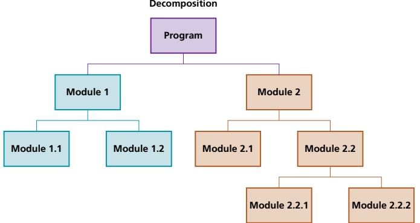
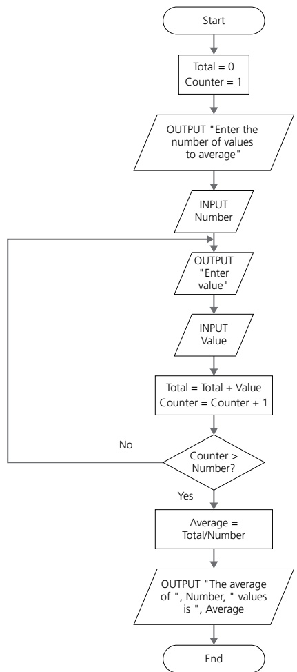
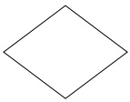
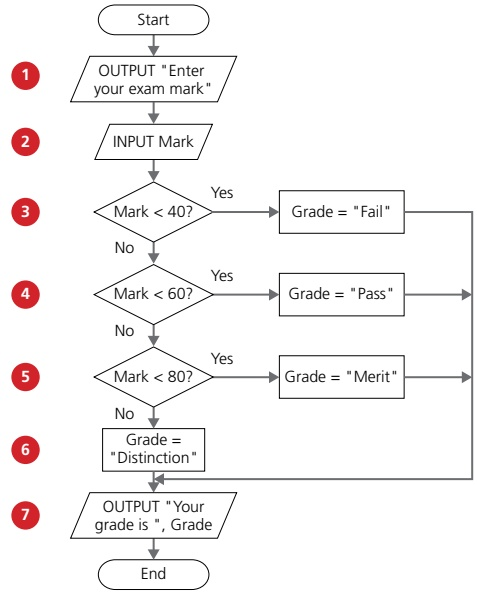
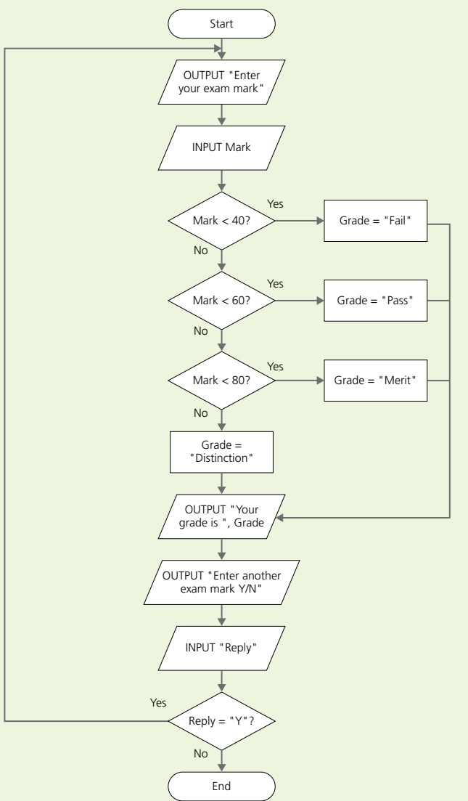

# 9 Algorithm design and problem solving

<!-- Cambridge International AS and a Level Computer Science (David Watson, Helen Williams).pdf p233-253 -->

<!-- page 233 -->

# Algorithm design and problem solving

In this chapter, you will learn about

 $ ^{*} $ computational thinking skills (abstraction and decomposition)

★ how to write algorithms that provide solutions to problems using structured English, flowcharts and pseudocode

 $ ^{★} $ the process of stepwise refinement.

In order to design a computer system that performs a specific task, or solves a given problem, the task or problem has to be rigorously defined and set out, showing what is going to be computed and how it is going to be computed.

This chapter introduces tools and techniques that can be used to design a software solution to work with associated computer hardware to form a computer system.

Practice is essential to develop skills in computational thinking. Designs shown with pseudocode or flowcharts can be traced to check if the proposed solution works, but the best way to actually test that a computer system works is to code it and use it or, even better, get somebody else to use it. Therefore, practical programming activities, alongside other activities, will be suggested at every stage to help reinforce the skills being learnt and develop the skill of programming.

The programming languages to use are:

» Java

» Python

VB.NET.

## WHAT YOU SHOULD ALREADY KNOW

<table border=1 style='margin: auto; word-wrap: break-word;'><tr><td style='text-align: center; word-wrap: break-word;'>Can you answer these six questions and complete the following activity?\n1 What is a procedure?\n2 What is a function?\n3 What is an algorithm?\n4 What is structured English?\n5 What is a flowchart?\n6 What is pseudocode?</td><td style='text-align: center; word-wrap: break-word;'>Write an algorithm using a flowchart to find the average of a number of integers. Both the number of values and each integer are to be input, and the average is to be output. Use the flowchart of your algorithm to write the algorithm in pseudocode.\nUse your pseudocode to write and test a program that includes a function to solve the problem.</td></tr></table>

### 9.1 Computational thinking skills

## Key terms

<table border=1 style='margin: auto; word-wrap: break-word;'><tr><td style='text-align: center; word-wrap: break-word;'>Abstraction – the process of extracting information that is essential, while ignoring what is not relevant, for the provision of a solution.</td><td style='text-align: center; word-wrap: break-word;'>Decomposition – the process of breaking a complex problem into smaller parts.\nPattern recognition – the identification of parts of a problem that are similar and could use the same solution.</td></tr></table>

<!-- page 234 -->

Computational thinking is used to study a problem and formulate an effective solution that can be provided using a computer. There are several techniques used in computational thinking, including abstraction, decomposition, algorithms and pattern recognition.

#### 9.1.1 Using abstraction

Abstraction is an essential part of computational thinking. It enables computer scientists to develop clear models for the solution to complex problems. Abstraction involves extracting information that is essential while ignoring what is not relevant for the provision of a solution, only including what is necessary to solve that problem.

Abstraction encourages the development of simplified models that are suited to a specific purpose by eliminating any unnecessary characteristics from that model. Many everyday items use abstraction, such as maps, calendars and timetables.

Maps use abstraction to show what is required for a specific purpose, for example, a road map should only show the necessary detail required to drive from one place to another. The road map in Figure 9.1 has reduced the complexity by only showing the essential details needed, such as roads, road numbers and towns, and removing other information about the terrain that would not be helpful (as shown in the satellite view).

The benefits of eliminating any unnecessary characteristics from the model include

the time required to develop the program is reduced so the program can be delivered to the customer more quickly

the program is smaller in size so takes up less space in memory and download times are shortened

customer satisfaction is greater as their requirements are met without any extraneous features.

Map Data © 2018 Google, Imagery © 2018 Landsat/Copernicus

Figure 9.1 Road map and satellite view

The first stage of abstraction is to identify the purpose of the model of the situation that is to be built. The situation could be one that occurs in real life, an imaginary one, or a future event such as modeling the route of a deep space probe.

Once the purpose has been identified, sources of information need to be identified. These can include observations, views of potential users, and evidence from other existing models.

The next stage is to use the information gathered from appropriate sources to identify what details need to be included in the model, how these details should be presented and what details are extraneous and need to be removed from the model.

For example, maps are used for many different purposes and can take different forms depending on the identified use. The purpose of the road map model in Figure 9.1 is to allow a driver to plan a journey, therefore, it includes towns and

<!-- page 235 -->

roads with their numbers. The roads depicted are a scaled down version of the actual road to help the driver visualise the route.

A rail map model has another purpose and, therefore, looks very different, only showing rail lines, stations and perhaps details about accessibility for wheelchair users at different stations. A train passenger has no need to visualise the route, so the rail lines are simplified for clarity.

#### 9.1.2 Using decomposition

Decomposition is also an essential part of computational thinking. It enables computer scientists to break a complex problem into smaller parts that can be further subdivided into even smaller parts until each part is easy to examine and understand, and a solution can be developed for it. When a rigorous decomposition is undertaken, many simple problems are found to be more complex than at first sight.

Pattern recognition is used to identify those parts that are similar and could use the same solution. This leads to the development of reusable program code in the form of subroutines, procedures and functions. When writing a computer program, each final part is defined as a separate program module that can be written and tested as a separate procedure or function, as shown in Figure 9.2. Program modules already written and tested can also be identified and reused, thus saving development time. See Chapter 12 for further details.

Figure 9.2 Decomposition of a program into modules

### 9.2 Algorithms

## Key terms

Structured English – a method of showing the logical steps in an algorithm, using an agreed subset of straightforward English words for commands and mathematical operations.

Flowchart – a diagrammatic representation of an algorithm.

Algorithm – an ordered set of steps to be followed in the completion of a task.

Pseudocode – a method of showing the detailed logical steps in an algorithm, using keywords, identifiers with meaningful names, and mathematical operators.

Stepwise refinement – the practice of subdividing each part of a larger problem into a series of smaller parts, and so on, as required.

<!-- page 236 -->

## ACTIVITY 9A

There are several methods of writing algorithms before attempting to program a solution. Here are three frequently used methods.

#### 9.2.1 Writing algorithms that provide solutions to problems

You have been asked to write an algorithm for drawing regular polygons of any size.

In pairs, divide the problem into smaller parts, identifying those parts that are similar.

» Structured English is a method of showing the logical steps in an algorithm, using an agreed subset of straightforward English words for commands and mathematical operations to represent the solution. These steps can be numbered.

Write down your solution as an algorithm in structured English.

Swap your algorithm with another pair.

Test their algorithm by following their instructions to draw a regular polygon. Discuss any similarities and differences between your solutions.

» A flowchart shows diagrammatically, using a set of symbols linked together with flow lines, the steps required for a task and the order in which they are to be performed. These steps, together with the order, are called an algorithm. Flowcharts are an effective way to show the structure of an algorithm.

» Pseudocode is a method of showing the detailed logical steps in an algorithm, using keywords, identifiers with meaningful names and mathematical operators to represent a solution. Pseudocode does not need to follow the syntax of a specific programming language, but it should provide sufficient detail to allow a program to be written in a high-level language.

Below, you will see the algorithm from the What you should already know section on page 217 written using each of these three methods.

## Structured English

1 Ask for the number of values
2 Loop that number of times
3 Enter a value in loop
4 Add the value to the Total in loop
5 Calculate and output average

## Pseudocode

Total ← 0
PRINT "Enter the number of values to average"
INPUT Number
FOR Counter ← 1 TO Number
    PRINT "Enter value"
    INPUT Value
    Total ← Total + Value
NEXT Counter
Average ← Total / Number
PRINT "The average of ", Number, " values is ", Average

<!-- page 237 -->

Figure 9.3

#### 9.2.2 Writing simple algorithms using pseudocode

Each line of pseudocode is usually a single step in an algorithm. The pseudocode used in this book follows the rules in the Cambridge International AS & A Level Computer Science Pseudocode Guide for Teachers and is set out using a fixed width font and indentation, where required, of four spaces, except for THEN, ELSE and CASE clauses that are only indented by two spaces.

All identifier names used in pseudocode should be meaningful; for example, the name of a person could be stored in the variable identified by Name. They should also follow some basic rules: they should only contain the characters A-Z, a-z and 0-9, and should start with a letter. Pseudocode identifiers are usually considered to be case insensitive, unlike identifiers used in a programming language.

<!-- page 238 -->

<table border=1 style='margin: auto; word-wrap: break-word;'><tr><td style='text-align: center; word-wrap: break-word;'>Identifier name</td><td style='text-align: center; word-wrap: break-word;'>Description</td></tr><tr><td style='text-align: center; word-wrap: break-word;'>StudentName</td><td style='text-align: center; word-wrap: break-word;'>Store a student name</td></tr><tr><td style='text-align: center; word-wrap: break-word;'>Counter</td><td style='text-align: center; word-wrap: break-word;'>Store a loop counter</td></tr><tr><td style='text-align: center; word-wrap: break-word;'>StudentMark</td><td style='text-align: center; word-wrap: break-word;'>Store a student mark</td></tr></table>

It is good practice to keep track of any identifiers used in an identifier table, such as Table 9.1.

### Table 9.1

Pseudocode statements to use for writing algorithms.

To input a value:

<table border=1 style='margin: auto; word-wrap: break-word;'><tr><td style='text-align: center; word-wrap: break-word;'>INPUT</td><td style='text-align: center; word-wrap: break-word;'>StudentName</td></tr></table>

To output a message or a value or a combination:

OUTPUT "You have made an error"
OUTPUT StudentName
OUTPUT "Student name is ", StudentName

To assign a value to a variable (the value can be the result of a process or a calculation):

Counter ← 1
Counter ← Counter + 1
MyChar ← "A"
LetterValue ← ASC(MyChar)
StudentMark ← 40
Percentage ← (StudentMark / 80) * 100
Oldstring ← "Your mark is"
NewString ← OldString & " ninety-seven"

Identify the values stored in the variables when the assignment statements in the example above have all been completed. The function ASC returns the ASCII value of a character.

## ACTIVITY 9B

Operators used in pseudocode assignment statements:

+ Addition
- Subtraction
* Multiplication
/ Division
& String concatenation
← Assignment

To perform a selection using IF statements for a single choice or a choice and an alternative, and CASE statements when there are multiple choices or multiple choices and an alternative:

<!-- page 239 -->

## IF - single choice

IF MyValue > YourValue
THEN
OUTPUT "I win"
ENDIF

## IF - single choice with alternative

IF MyValue > YourValue
THEN
OUTPUT "I win"
ELSE
OUTPUT "You win"
ENDIF

## CASE – multiple choices

CASE OF Direction
"N": Y ← Y + 1
"S": Y ← Y - 1
"E": X ← X + 1
"W": X ← X - 1
ENDCASE

## CASE – multiple choices with alternative

CASE OF Direction
"N": Y ← Y + 1
"S": Y ← Y - 1
"E": X ← X + 1
"W": X ← X - 1
OTHERWISE : OUTPUT "Error"
ENDCASE

Relational operators used in pseudocode selection statements:

= Equal to

< > Not equal to

> Greater than

> Less than

>= Greater than or equal to

<= Less than or equal to

Programming languages may not always have the same selection constructs as pseudocode, so it is important to be able to write a program that performs the same task as a solution given in pseudocode.

Here are three programs, one in each of the three prescribed programming languages, to demonstrate the single choice IF statement. Note the construction of the IF statement, as it is different from the pseudocode.

While the Cambridge International AS Level syllabus does not require you to be able to write program code, the ability to do so will increase your understanding, and will be particularly beneficial if you are studying the full Cambridge International A Level course.

<!-- page 240 -->

## Python

# IF - single choice Python
myValue = int(input("Please enter my value "))
yourValue = int(input("Please enter your value "))
if myValue > yourValue:
    print ("I win")
    The colon indicates the start of the THEN clause. All statements in the THEN clause are indented as shown

VB

'IF - single choice VB
Module Module1

Sub Main()

Dim myValue, yourValue As Integer

Console.Write("Please enter my value ")

myValue = Integer.Parse(Console.ReadLine())

Console.Write("Please enter your value ")

yourValue = Integer.Parse(Console.ReadLine())

If myValue > yourValue Then
Use of THEN and END IF

Console.WriteLine("I win")

Console.ReadKey() 'wait for keypress

End If

End Sub

End Module

//IF - single choice Java
import java.util.Scanner;
class IFProgram
{
    public static void main(String args[])
    {
        Scanner myObj = new Scanner(System.in);
        System.out.println("Please enter my value");
        int myValue = myObj.nextInt();
        System.out.println("Please enter your value");
        int yourValue = myObj.nextInt();
        if (myValue > yourValue)
        {
            System.out.println("I win");
        }
        }
    }
}

<!-- page 241 -->

## ACTIVITY 9C

In the programming language you have chosen to use, write a short program to input MyValue and YourValue and complete the single choice with an alternative IF statement shown on page 224. Note any differences in the command words you need to use and the construction of your programming statements compared with the pseudocode.

2 In the programming language you have chosen to use, write a short program to set X and Y to zero, input Direction and complete the multiple choice with an alternative CASE statement shown on page 224 and output X and Y. Note any differences in the command words you need to use and the construction of your programming statements compared to the pseudocode.

To perform iteration using FOR, REPEAT-UNTIL and WHILE loops:

Total ← 0
FOR Counter ← 1 TO 10
OUTPUT "Enter a number "
INPUT Number
Total ← Total + Number
NEXT Counter
OUTPUT "The total is ", Total

FOR Counter ← 1 TO 10 STEP 2
OUTPUT Counter
NEXT Counter

A FOR loop has a fixed number of repeats, the STEP increment is an optional expression that must be a whole number.

REPEAT
OUTPUT "Please enter a positive number "
INPUT Number
UNTIL Number > 0

Statements in a REPEAT loop are always executed at least once.

Number ← 0
WHILE Number >= 0 DO
    OUTPUT "Please enter a negative number "
    INPUT Number
ENDWHILE

Statements in a WHILE loop may sometimes not be executed.

Programming languages may not always use the same iteration constructs as pseudocode, so it is important to be able to write a program that performs the same task as a solution given in pseudocode.

<!-- page 242 -->

## ACTIVITY 9D

In the programming language you have chosen to use, write a short program to perform the same tasks as the other three loops shown in pseudocode. Note any differences in the command words you need to use, and the construction of your programming statements compared to the pseudocode.

Here are three programs to demonstrate a simple FOR loop, one in each of the three prescribed programming languages. Note the construction of the FOR statement, as it is different from the pseudocode.

{ } are used to show the start and end of the FOR loop

## Python

# FOR - simple loop Python
for Counter in range (1,10,2):
    print(Counter)
The colon indicates the start of the FOR loop. All statements in the FOR loop are indented as shown

## VB

'FOR - simple loop VB
Module Module1
Sub Main()

Dim Counter As Integer
For Counter = 1 To 10 Step 2
Console.WriteLine(Counter)

Use of STEP and NEXT

Next
Console.ReadKey() 'wait for keypress
End Sub

End Module

## Java

//FOR - simple loop Java
class FORProgram
{
    public static void main(String args[])
    {
        for (int Counter = 1; Counter <= 10; Counter = Counter + 2)
        {
            System.out.println(Counter);
        }
    }
}

WHILE and REPEAT loops and IF statements make use of comparisons to decide whether statements within a loop are repeated or a statement or group of statements are executed. The comparisons make use of relational operators and the logic operators AND, OR and NOT. The outcome of these comparisons is always either true or false.

<!-- page 243 -->

REPEAT
OUTPUT "Please enter a positive number less than fifty"
INPUT Number
UNTIL (Number > 0) AND (Number < 50)

A simple algorithm can be clearly documented using these statements. A more realistic algorithm to find the average of a number of integers input would include checks that all the values input are whole numbers and that the number input to determine how many integers are input is also positive.

This can be written in pseudocode by making use of the function  $ \text{INT}(x) $ that returns the integer part of x:

## ACTIVITY 9E

In pseudocode, write statements to check that a number input is between 10 and 20 or over 100. Make use of brackets to ensure that the order of the comparisons is clear.

Total ← 0
REPEAT
    PRINT "Enter the number of values to average"
    INPUT Number
UNTIL (Number > 0) AND (Number = INT(Number))
FOR Counter ← 1 TO Number
    REPEAT
        PRINT "Enter an integer value "
        INPUT Value
    UNTIL Value = INT(Value)
    Total ← Total + Value
NEXT Counter
Average ← Total / Number
PRINT "The average of ", Number, " values is ", Average

The identifier table for this algorithm is presented in Table 9.2.

<table border=1 style='margin: auto; word-wrap: break-word;'><tr><td style='text-align: center; word-wrap: break-word;'>Identifier name</td><td style='text-align: center; word-wrap: break-word;'>Description</td></tr><tr><td style='text-align: center; word-wrap: break-word;'>Total</td><td style='text-align: center; word-wrap: break-word;'>Running total of integer values entered</td></tr><tr><td style='text-align: center; word-wrap: break-word;'>Number</td><td style='text-align: center; word-wrap: break-word;'>Number of integer values to enter</td></tr><tr><td style='text-align: center; word-wrap: break-word;'>Value</td><td style='text-align: center; word-wrap: break-word;'>Integer value input</td></tr><tr><td style='text-align: center; word-wrap: break-word;'>Average</td><td style='text-align: center; word-wrap: break-word;'>Average of all the integer values entered</td></tr></table>

### Table 9.2

Here are three programs to find the average of a number of integers input, one in each of the three prescribed programming languages. Note the construction of the loops, as they are different from the pseudocode. All the programming languages check for an integer value.

<!-- page 244 -->

## Python

# Find the average of a number of integers input Python
Total = 0

Number = int(input("Enter the number of values to average "))

while Number <= 0:
    Number = int(input("Enter the number of values to average "))
    for Counter in range (1, Number + 1):
        Value = int(input("Enter an integer value "))
        Total = Total + Value

Average = Total / Number

print("The average of ", Number, " values is ", Average)

VB

'Find the average of a number of integers input VB
Module Module1

Public Sub Main()

Dim Total, Number, Counter, Value As Integer

Dim Average As Decimal

Do

Console.Write("Enter the number of values to average")

Number = Integer.Parse(Console.ReadLine())

Loop Until Number > 0

Use of DO and LOOP UNTIL

For Counter = 1 To Number

Console.Write("Enter an integer value")

Value = Integer.Parse(Console.ReadLine())

Total = Total + Value

Next

Average = Total / Number

Console.WriteLine("The average of " & Number & " values is " & Average)

Console.ReadKey()

End Sub

End Module

<!-- page 245 -->

Java

//Find the average of a number of integers input Java
import java.util.Scanner;
class AverageAlg
{
    public static void main(String args[])
    {
        Scanner myObj = new Scanner(System.in);
        int Number;
        int Total = 0;

        do
        {
            Use of DO WHILE loop
            System.out.println("Enter the number of values to average");
            Number = myObj.nextInt();
        }

        while (Number < 0);
        for (int Counter = 1; Counter <= Number; Counter++)
        {
            System.out.println("Enter an integer value");
            int Value = myObj.nextInt();
            Total = Total + Value;
        }

        float Average = (float)Total / Number;

        Java automatically performs integer division when two integers are used

        System.out.println("The average of " + Number + " values is " + Average);
    }
}

## ACTIVITY 9F

In pseudocode, write an algorithm to set a password for a user when they have to input the same word twice. Then allow the user three attempts to enter the correct password. Complete an identifier table for your algorithm. Finally, check your pseudocode algorithm works by writing a short program from your pseudocode statements using the same names for your identifiers.

#### 9.2.3 Writing pseudocode from a structured English description

There are no set rules for writing structured English – the wording just needs to be unambiguous and easily understandable. Pseudocode is more precise and usually follows an agreed set of rules.

From a structured English description, the following things need to be possible:

Any variables that need to be used can be identified and put in an identifier table – these can be items input or output as the results of calculations.

<!-- page 246 -->

» Input and output can be identified from the wording used, for example, Enter, Read, Print, Write.

Selection can be identified from the wording used, for example, If, Then, Choose.

Any iteration required can be identified from the wording used, for example, Loop, Repeat.

Any processes needed can be identified from the wording used, for example, Set, Calculate.

When the identifier table is complete, each structured English statement can be used to write one or more pseudocode statements, keeping the same order as the structured English.

Here is an example of an algorithm to calculate a runner's marathon time in seconds, using structured English.

<table border=1 style='margin: auto; word-wrap: break-word;'><tr><td style='text-align: center; word-wrap: break-word;'>1</td><td style='text-align: center; word-wrap: break-word;'>Enter time taken to run marathon in hours, minutes and seconds</td></tr><tr><td style='text-align: center; word-wrap: break-word;'>2</td><td style='text-align: center; word-wrap: break-word;'>Calculate and store marathon time in seconds</td></tr><tr><td style='text-align: center; word-wrap: break-word;'>3</td><td style='text-align: center; word-wrap: break-word;'>Output marathon time in seconds</td></tr></table>

This can be used to identify the variables required and complete the identifier table (Table 9.3).

<table border=1 style='margin: auto; word-wrap: break-word;'><tr><td style='text-align: center; word-wrap: break-word;'>Identifier name</td><td style='text-align: center; word-wrap: break-word;'>Description</td></tr><tr><td style='text-align: center; word-wrap: break-word;'>MarathonHours</td><td style='text-align: center; word-wrap: break-word;'>The hours part of the marathon time</td></tr><tr><td style='text-align: center; word-wrap: break-word;'>MarathonMinutes</td><td style='text-align: center; word-wrap: break-word;'>The minutes part of the marathon time</td></tr><tr><td style='text-align: center; word-wrap: break-word;'>MarathonSeconds</td><td style='text-align: center; word-wrap: break-word;'>The seconds part of the marathon time</td></tr><tr><td style='text-align: center; word-wrap: break-word;'>TotalMarathonTimeSeconds</td><td style='text-align: center; word-wrap: break-word;'>Total marathon time in seconds</td></tr></table>

### Table 9.3

Using these identifiers, each step of the structured English algorithm can be converted to pseudocode, as demonstrated below.

1 Enter time taken to run marathon in hours, minutes and seconds

There are three variables used: MarathonHours, MarathonMinutes and MarathonSeconds. This is explicitly input and implicitly output as the user needs to understand what input is required. The pseudocode required is as follows.

<table border=1 style='margin: auto; word-wrap: break-word;'><tr><td style='text-align: center; word-wrap: break-word;'>OUTPUT &quot;Enter the time you took to run the marathon&quot;</td></tr><tr><td style='text-align: center; word-wrap: break-word;'>OUTPUT &quot;Enter hours&quot;</td></tr><tr><td style='text-align: center; word-wrap: break-word;'>INPUT MarathonHours</td></tr><tr><td style='text-align: center; word-wrap: break-word;'>OUTPUT &quot;Enter minutes&quot;</td></tr><tr><td style='text-align: center; word-wrap: break-word;'>INPUT MarathonMinutes</td></tr><tr><td style='text-align: center; word-wrap: break-word;'>OUTPUT &quot;Enter seconds&quot;</td></tr><tr><td style='text-align: center; word-wrap: break-word;'>INPUT MarathonSeconds</td></tr></table>

<!-- page 247 -->

2 Calculate and store marathon time in seconds

This is a process using the variables MarathonHours, MarathonMinutes and MarathonSeconds and using an assignment statement to store the result in TotalMarathonTimeSeconds. The pseudocode required is as follows.

TotalMarathonTimeSeconds ← (MarathonHours * 3600 + MarathonMinutes) * 60 + MarathonSeconds

3 Output marathon time in seconds

This is output using the variable TotalMarathonTimeSeconds. The pseudocode required is as follows.

OUTPUT "Time for marathon in seconds",

TotalMarathonTimeSeconds

## ACTIVITY 9G

The structured English description has been extended below to check the runner's time against their personal best.

1 Enter time taken to run marathon in hours, minutes and seconds

2 Calculate and store marathon time in seconds

3 Output marathon time in seconds

4 Enter personal best time in seconds

5 If marathon time in seconds is shorter than the personal best time then

6 Reset personal best time in seconds

7 Output the personal best time

Extend the identifier table and write the extra pseudocode to complete the algorithm. Then check your algorithm works by writing a short program from your pseudocode statements using the same names for your identifiers.

#### 9.2.4 Writing pseudocode from a flowchart

Flowcharts are diagrams showing the structure of an algorithm using an agreed set of symbols, as shown in Table 9.4.

<!-- page 248 -->

<table border=1 style='margin: auto; word-wrap: break-word;'><tr><td style='text-align: center; word-wrap: break-word;'>Pseudocode</td><td style='text-align: center; word-wrap: break-word;'>Flowchart symbol</td></tr><tr><td style='text-align: center; word-wrap: break-word;'>INPUT or OUTPUT</td><td style='text-align: center; word-wrap: break-word;'></td></tr><tr><td style='text-align: center; word-wrap: break-word;'>IF or CASE\nPart of FOR, REPEAT and WHILE</td><td style='text-align: center; word-wrap: break-word;'></td></tr><tr><td style='text-align: center; word-wrap: break-word;'>FOR, REPEAT and WHILE</td><td style='text-align: center; word-wrap: break-word;'>$ \uparrow $\nReturning flow line</td></tr><tr><td style='text-align: center; word-wrap: break-word;'>Assignment ← using a calculation or a pre-defined process, for example, INT</td><td style='text-align: center; word-wrap: break-word;'></td></tr></table>

### Table 9.4

Flowcharts can be used to identify any variables required and you can then complete an identifier table. Each flowchart symbol can be used to identify and write one or more pseudocode statements.

Here is an example of a flowchart of an algorithm that can be used to check an exam grade:

Figure 9.4

<!-- page 249 -->

OUTPUT "Enter your exam mark"
INPUT Mark
IF Mark < 40
THEN
Grade ← "Fail"
ELSE
IF Mark < 60
THEN
Grade ← "Pass"
ELSE
IF Mark < 80
THEN
Grade ← "Merit"
ELSE
Grade ← "Distinction"
ENDIF
ENDIF
ENDIF
OUTPUT "Your grade is ", Grade

The same algorithm is presented in pseudocode on the left. Below is the identifier table:

<table border=1 style='margin: auto; word-wrap: break-word;'><tr><td style='text-align: center; word-wrap: break-word;'>Identifier name</td><td style='text-align: center; word-wrap: break-word;'>Description</td></tr><tr><td style='text-align: center; word-wrap: break-word;'>Mark</td><td style='text-align: center; word-wrap: break-word;'>Exam mark</td></tr><tr><td style='text-align: center; word-wrap: break-word;'>Grade</td><td style='text-align: center; word-wrap: break-word;'>Exam grade</td></tr></table>

### Table 9.5

3 4 5 and 6 form a nested selection (IF) structure, as each following statement is part of the ELSE clause. It is only at 7 that the selection is complete. The flowchart shows this clearly and the pseudocode uses indentation to show the nesting.

#### 9.2.5 Stepwise refinement

The algorithms looked at so far have been short and simple. When an algorithm is written to solve a more complex problem, decomposition is used to break the problem down into smaller and more manageable parts. These parts then need to be written as a series of steps where each step can be written as a statement in a high-level programming language, this process is called stepwise refinement.

Many problems are more complex than they seem if a robust solution is to be developed. Look at the first step of the structured English to calculate a time in seconds.

1 Enter time taken to run marathon in hours, minutes and seconds
2 Calculate and store marathon time in seconds
3 Output marathon time in seconds

The first step can be further broken down, as follows:

<table border=1 style='margin: auto; word-wrap: break-word;'><tr><td style='text-align: center; word-wrap: break-word;'>1.1</td><td style='text-align: center; word-wrap: break-word;'>Enter the hours</td></tr><tr><td style='text-align: center; word-wrap: break-word;'>1.2</td><td style='text-align: center; word-wrap: break-word;'>Enter the minutes</td></tr><tr><td style='text-align: center; word-wrap: break-word;'>1.3</td><td style='text-align: center; word-wrap: break-word;'>Enter the seconds</td></tr></table>

<!-- page 250 -->

## ACTIVITY 9H

The flowchart on page 232 has been extended to allow more than one mark to be input.

Extend the identifier table and write the extra pseudocode to complete the algorithm. Then check your algorithm works by writing a short program from your pseudocode statements using the same names for your identifiers.

<!-- page 251 -->

Each of these steps can be broken down further:

1.1.1 Input value for hours
1.1.2 Check input in the range 2 to 8
1.1.3 Reject if out of range or not a whole number and re-input value step 1.1.1
1.1.4 Accept and store value in hours
1.2.1 Input value for minutes
1.2.2 Check input in the range 0 to 59
1.2.3 Reject if out of range or not a whole number and re-input value step 1.2.1
1.2.4 Accept and store value in minutes
1.3.1 Input value for seconds
1.3.2 Check input in the range 0 to 59
1.3.3 Reject if out of range or not a whole number and re-input value step 1.3.1
1.3.4 Accept and store value in seconds

These steps can now be written in pseudocode. For example, the input routine for the seconds:

REPEAT
OUTPUT "Enter seconds"
INPUT Value
UNTIL (Value >= 0) AND (Value <= 59) AND (Value = INT(Value))
MarathonSeconds ← Value

## ACTIVITY 91

Look at the algorithm to calculate the area of a chosen shape written in structured English below. Use stepwise refinement to break each step into more manageable parts then rewrite the algorithm using pseudocode.
1 Choose the shape (square, triangle, circle)
2 Enter the length(s)
3 Calculate the area
4 Output the area
Then check your pseudocode algorithm works by writing a short program from your pseudocode statements using the same names for your identifiers.

<!-- page 252 -->

1 Algorithms can be shown as structured English, flowcharts and pseudocode.

Explain what is meant by

a) structured English [2]

b) a flowchart [2]

c) pseudocode. [2]

2 Several techniques are used in computational thinking.

Explain what is meant by

a) abstraction [2]

b) decomposition [2]

c) pattern recognition. [2]

3 Describe, using an example, the process of stepwise refinement.

4 Computer programs have to evaluate expressions.

– Study the sequence of pseudocode statements.

– Write down the value assigned to each variable.

Cambridge International AS & A Level Computer Science 9608

Paper 21 Q1 November 2015

<!-- page 253 -->

5 Study the pseudocode and answer the following questions. Line numbers have been added to help you.

01 REPEAT
02 OUTPUT "Menu Temperature Conversion"
03 OUTPUT "Celsius to Fahrenheit 1"
04 OUTPUT "Fahrenheit to Celsius 2"
05 OUTPUT "Exit 3"
06 OUTPUT "Enter choice"
07 IF Choice = 1 OR Choice = 2
08 THEN
09 OUTPUT "Enter temperature"
10 INPUT Temperature
11 IF Choice = 1
12 THEN
13 ConvertedTemperature ← 1.8*Temperature + 32
14 ELSE
15 ConvertedTemperature ← (Temperature - 32) * 5 / 9
16 ENDIF
17 OUTPUT "Converted temperature is ", ConvertedTemperature
18 ELSE
19 IF Choice <> 3
20 THEN
21 OUTPUT "Error in choice"
22 ENDIF
23 ENDIF
24 UNTIL Choice = 3

a) Give the line number of:  
i) an assignment statement [1]  
ii) a selection [1]  
iii) an iteration. [1]  
b) Complete an identifier table for the algorithm. [3]  
c) Extend the algorithm to only allow four tries for a correct choice. [3]

