# 10 Data types and structures

<!-- Cambridge International AS and a Level Computer Science (David Watson, Helen Williams).pdf p254-279 -->

<!-- page 254 -->

## 10 

## Data types and structures

In this chapter, you will learn about

basic data types, and how to select and use them

two different data structures: records and arrays

★ how to handle text files consisting of many lines, using pseudocode

★ three different abstract data types (ADTs): stacks, queues and linked lists.

## WHAT YOU SHOULD ALREADY KNOW

Try this activity to see if you can use one-dimensional arrays before you read the first part of this chapter.

Write an algorithm, using pseudocode, to find the largest and smallest of five numbers.

The numbers are to be input with appropriate prompts, stored in an array, and the largest and smallest are to be output with appropriate messages. If you haven't used an array before store the values in five separate variables.

## Key terms

Data type – a classification attributed to an item of data, which determines the types of value it can take and how it can be used.

Identifier - a unique name applied to an item of data.

Record (data type) – a composite data type comprising several related items that may be of different data types.

Composite data type – a data type constructed using several of the basic data types available in a particular programming language.

Array - a data structure containing several elements of the same data type.

Index (array) – a numerical indicator of an item of data's position in an array.

Lower bound – the index of the first element in an array, usually 0 or 1.

Upper bound – the index of the last element in an array. Linear search – a method of searching in which each element of an array is checked in order.

Bubble sort – a method of sorting data in an array into alphabetical or numerical order by comparing adjacent items and swapping them if they are in the wrong order.

File – a collection of data stored by a computer program to be used again.

Abstract data type (ADT) – a collection of data and a set of operations on that data.

Stack – a list containing several items operating on the last in, first out (LIFO) principle.

Queue – a list containing several items operating on the first in, first out (FIFO) principle.

Linked list – a list containing several items in which each item in the list points to the next item in the list.

### 10.1 Data types and records

Any computer system that is reusable needs to store data in a structured way so that it can be reused in the future. One of the most powerful tools in computer science is the ability to search large amounts of data and obtain results very quickly. This chapter introduces data structures that enable effective and efficient computer-based storage and searching to take place.

<!-- page 255 -->

#### 10.1.1 Data types

Data types allow programming languages to provide different classifications for items of data, so they can be used for different purposes. For example, integers are discrete whole numbers used for counting and indexing, whereas real numbers can be used to provide accurate measurements.

You need to be able to understand and make appropriate use of data types when writing pseudocode or programs to provide a solution to a problem.

Programming languages have a number of built in data types. Table 10.1 lists the basic data types that you need to know and how they are referred to in pseudocode and different programming languages.

<table border=1 style='margin: auto; word-wrap: break-word;'><tr><td style='text-align: center; word-wrap: break-word;'>Data type</td><td style='text-align: center; word-wrap: break-word;'>Description</td><td style='text-align: center; word-wrap: break-word;'>Pseudocode</td><td style='text-align: center; word-wrap: break-word;'>Python</td><td style='text-align: center; word-wrap: break-word;'>Java</td><td style='text-align: center; word-wrap: break-word;'>VB.NET</td></tr><tr><td style='text-align: center; word-wrap: break-word;'>Boolean</td><td style='text-align: center; word-wrap: break-word;'>Logical values, True (1) and False (2)</td><td style='text-align: center; word-wrap: break-word;'>BOOLEAN</td><td style='text-align: center; word-wrap: break-word;'>bool</td><td style='text-align: center; word-wrap: break-word;'>boolean</td><td style='text-align: center; word-wrap: break-word;'>Boolean</td></tr><tr><td style='text-align: center; word-wrap: break-word;'>char</td><td style='text-align: center; word-wrap: break-word;'>Single alphanumerical character</td><td style='text-align: center; word-wrap: break-word;'>CHAR</td><td style='text-align: center; word-wrap: break-word;'>Not used</td><td style='text-align: center; word-wrap: break-word;'>char</td><td style='text-align: center; word-wrap: break-word;'>Char</td></tr><tr><td style='text-align: center; word-wrap: break-word;'>date</td><td style='text-align: center; word-wrap: break-word;'>Value to represent a date</td><td style='text-align: center; word-wrap: break-word;'>DATE</td><td style='text-align: center; word-wrap: break-word;'>class datetime</td><td style='text-align: center; word-wrap: break-word;'>class Date</td><td style='text-align: center; word-wrap: break-word;'>Date</td></tr><tr><td style='text-align: center; word-wrap: break-word;'>integer</td><td style='text-align: center; word-wrap: break-word;'>Whole number, positive or negative</td><td style='text-align: center; word-wrap: break-word;'>INTEGER</td><td style='text-align: center; word-wrap: break-word;'>int</td><td style='text-align: center; word-wrap: break-word;'>byte\nshort\nint\nlong</td><td style='text-align: center; word-wrap: break-word;'>Integer</td></tr><tr><td style='text-align: center; word-wrap: break-word;'>real</td><td style='text-align: center; word-wrap: break-word;'>Positive or negative number with a decimal point</td><td style='text-align: center; word-wrap: break-word;'>REAL</td><td style='text-align: center; word-wrap: break-word;'>float</td><td style='text-align: center; word-wrap: break-word;'>float\ndouble</td><td style='text-align: center; word-wrap: break-word;'>single</td></tr><tr><td style='text-align: center; word-wrap: break-word;'>string</td><td style='text-align: center; word-wrap: break-word;'>Sequence of alphanumerical characters</td><td style='text-align: center; word-wrap: break-word;'>STRING</td><td style='text-align: center; word-wrap: break-word;'>str</td><td style='text-align: center; word-wrap: break-word;'>class\nString</td><td style='text-align: center; word-wrap: break-word;'>String</td></tr></table>

### Table 10.1 Basic data types

## ACTIVITY 10A

Decide which data type would be the best one to use for each item.

a) Your name

b) The number of children in a class

c) The time taken to run a race

d) Whether a door is open or closed

e) My birthday

In pseudocode and some programming languages, before data can be used, the type needs to be decided. This is done by declaring the data type for each item to be used. Each data item is identified by a unique name, called an identifier.

In pseudocode a declaration statement takes this form:

DECLARE <identifier> : <data type>

## For example:

DECLARE myBirthday : DATE

<!-- page 256 -->

## ACTIVITY 10B

Write declaration statements in pseudocode for each item.
a) Your name
b) The number of children in a class
c) The time taken to run a race
d) Whether a door is open or closed
Write these declaration statements in your chosen programming language. If this is Python, you may need to write assignment statements.

#### 10.1.2 Records

Records are composite data types formed by the inclusion of several related items that may be of different data types. This allows a programmer to refer to these items using the same identifier, enabling a structured approach to using related items. A record will contain a fixed number of items. For example, a record for a book could include title, author, publisher, number of pages, and whether it is fiction or non-fiction.

A record data type is one example of a composite user-defined data type. A composite data type references other existing data types when it is defined. A composite data type must be defined before it can be used. Any data type not provided by a programming language must be defined before it can be used.

In pseudocode, a record data type definition takes the following form:

TYPE
<Typename>
DECLARE <identifier> : <data type>
DECLARE <identifier> : <data type>
DECLARE <identifier> : <data type>
::
::
ENDTYPE

For example, the book record data type could be defined like this:

TYPE
TbookRecord
DECLARE title : STRING
DECLARE author : STRING
DECLARE publisher : STRING
DECLARE noPages : INTEGER
DECLARE fiction : BOOLEAN
ENDTYPE

The data type, TbookRecord, is now available for use and an identifier may now be declared in the usual way:

DECLARE Book : TbookRecord

<!-- page 257 -->

Items from the record are now available for use and are identified by:

<identifier><item identifier>

For example:

Book.author ← "David Watson"

Book.fiction ← FALSE

## ACTIVITY 10C

1 Write definition statements in pseudocode for a student record type containing these items.

a) Name

b) Date of birth

c) Class

d) Gender

2 Use this record type definition to declare a record myStudent and set up and output a record for a male student Ahmad Sayed, in Class 5A, who was born on 21 March 2010.

3 In your chosen programming language, write a short program to complete this task.

### 10.2 Arrays

An array is a data structure containing several elements of the same data type; these elements can be accessed using the same identifier name. The position of each element in an array is identified using the array's index. The index of the first element in an array is the lower bound and the index of the last element is the upper bound.

The lower bound of an array is usually set as zero or one. Some programming languages can automatically set the lower bound of an array.

Arrays can be one-dimensional or multi-dimensional. In this chapter, we will look at one-dimensional (1D) and two-dimensional (2D) arrays.

#### 10.2.1 1D arrays

A 1D array can be referred to as a list. Here is an example of a list with nine elements and a lower bound of zero.

<table border=1 style='margin: auto; word-wrap: break-word;'><tr><td style='text-align: center; word-wrap: break-word;'></td><td style='text-align: center; word-wrap: break-word;'>Index</td><td style='text-align: center; word-wrap: break-word;'>myList</td></tr><tr><td rowspan="8">Lower bound  $ \rightarrow $</td><td style='text-align: center; word-wrap: break-word;'>[0]</td><td style='text-align: center; word-wrap: break-word;'>27</td></tr><tr><td style='text-align: center; word-wrap: break-word;'>[1]</td><td style='text-align: center; word-wrap: break-word;'>19</td></tr><tr><td style='text-align: center; word-wrap: break-word;'>[2]</td><td style='text-align: center; word-wrap: break-word;'>36</td></tr><tr><td style='text-align: center; word-wrap: break-word;'>[3]</td><td style='text-align: center; word-wrap: break-word;'>42</td></tr><tr><td style='text-align: center; word-wrap: break-word;'>[4]</td><td style='text-align: center; word-wrap: break-word;'>16</td></tr><tr><td style='text-align: center; word-wrap: break-word;'>[5]</td><td style='text-align: center; word-wrap: break-word;'>89</td></tr><tr><td style='text-align: center; word-wrap: break-word;'>[6]</td><td style='text-align: center; word-wrap: break-word;'>21</td></tr><tr><td style='text-align: center; word-wrap: break-word;'>[7]</td><td style='text-align: center; word-wrap: break-word;'>16</td></tr><tr><td style='text-align: center; word-wrap: break-word;'>Upper bound  $ \rightarrow $</td><td style='text-align: center; word-wrap: break-word;'>[8]</td><td style='text-align: center; word-wrap: break-word;'>55</td></tr></table>

Figure 10.1 Example of a 1D array

<!-- page 258 -->

When a 1D array is declared in pseudocode, the lower bound (LB), upper bound (UB) and data type are included:

DECLARE <identifier> : ARRAY[LB:UB] OF <data type>

For example:

DECLARE myList : ARRAY[0:8] OF INTEGER

The declared array can then be used, as follows:

myList[7] ← 16

## ACTIVITY 10D

1 Write statements in pseudocode to populate the array myList, as shown in Figure 10.1, using a FOR ... NEXT loop.

2 In your chosen programming language, write a short program to complete this task, then output the contents of the array. Before writing your program find out how your programming language sets up array bounds.

#### 10.2.2 2D arrays

A 2D array can be referred to as a table, with rows and columns. Here is an example of a table with nine rows and three columns (27 elements) and lower bounds of zero.

Row index

<table border=1 style='margin: auto; word-wrap: break-word;'><tr><td style='text-align: center; word-wrap: break-word;'>[0,c]</td><td style='text-align: center; word-wrap: break-word;'>27</td><td style='text-align: center; word-wrap: break-word;'>31</td><td style='text-align: center; word-wrap: break-word;'>17</td><td rowspan="8">← lower bound row</td></tr><tr><td style='text-align: center; word-wrap: break-word;'>[1,c]</td><td style='text-align: center; word-wrap: break-word;'>19</td><td style='text-align: center; word-wrap: break-word;'>67</td><td style='text-align: center; word-wrap: break-word;'>48</td></tr><tr><td style='text-align: center; word-wrap: break-word;'>[2,c]</td><td style='text-align: center; word-wrap: break-word;'>36</td><td style='text-align: center; word-wrap: break-word;'>98</td><td style='text-align: center; word-wrap: break-word;'>29</td></tr><tr><td style='text-align: center; word-wrap: break-word;'>[3,c]</td><td style='text-align: center; word-wrap: break-word;'>42</td><td style='text-align: center; word-wrap: break-word;'>22</td><td style='text-align: center; word-wrap: break-word;'>95</td></tr><tr><td style='text-align: center; word-wrap: break-word;'>[4,c]</td><td style='text-align: center; word-wrap: break-word;'>16</td><td style='text-align: center; word-wrap: break-word;'>35</td><td style='text-align: center; word-wrap: break-word;'>61</td></tr><tr><td style='text-align: center; word-wrap: break-word;'>[5,c]</td><td style='text-align: center; word-wrap: break-word;'>89</td><td style='text-align: center; word-wrap: break-word;'>46</td><td style='text-align: center; word-wrap: break-word;'>47</td></tr><tr><td style='text-align: center; word-wrap: break-word;'>[6,c]</td><td style='text-align: center; word-wrap: break-word;'>21</td><td style='text-align: center; word-wrap: break-word;'>71</td><td style='text-align: center; word-wrap: break-word;'>28</td></tr><tr><td style='text-align: center; word-wrap: break-word;'>[7,c]</td><td style='text-align: center; word-wrap: break-word;'>16</td><td style='text-align: center; word-wrap: break-word;'>23</td><td style='text-align: center; word-wrap: break-word;'>13</td></tr><tr><td style='text-align: center; word-wrap: break-word;'>[8,c]</td><td style='text-align: center; word-wrap: break-word;'>55</td><td style='text-align: center; word-wrap: break-word;'>11</td><td style='text-align: center; word-wrap: break-word;'>77</td><td style='text-align: center; word-wrap: break-word;'>← upper bound row</td></tr><tr><td style='text-align: center; word-wrap: break-word;'>\uparrow lower bound column</td><td style='text-align: center; word-wrap: break-word;'>\uparrow upper bound column</td><td style='text-align: center; word-wrap: break-word;'></td><td style='text-align: center; word-wrap: break-word;'></td><td style='text-align: center; word-wrap: break-word;'></td></tr></table>

Figure 10.2 Example of a 2D array

When a 2D array is declared in pseudocode, the lower bound for rows (LBR) and the upper bound for rows (UBR), the lower bound for columns (LBC) and the upper bound for columns (UBC), and data type are included:

<!-- page 259 -->

For example:

## ACTIVITY 10F

Write a program to populate a three-dimensional (3D) array.

DECLARE myArray : ARRAY[0:8,0:2] OF INTEGER

EXTENSION ACTIVITY 10A

In small groups of three or four, identify at least three uses for a 1D array and three uses for a 2D array. Compare array structures with record structures, decide if any of your uses would be better structured as records.

The declared array can then be used, as follows:

myArray[7,0] ← 16

## ACTIVITY 10E

1 Write statements in pseudocode to populate the array myArray, as shown in Figure 10.2, using a nested FOR ... NEXT loop.

2 In your chosen programming language, write a short program to complete this task, then output the contents of the array.

Arrays are used to store multiple data items in a uniformly accessible manner. All the data items use the same identifier and each data item can be accessed separately by the use of an index. In this way, lists of items can be stored, searched and put into an order. For example, a list of names can be ordered alphabetically, or a list of temperatures can be searched to find a particular value.

#### 10.2.3 Using a linear search

To find an item stored in an array, the array needs to be searched. One method of searching is a linear search. Each element of the array is checked in order, from the lower bound to the upper bound, until the item is found or the upper bound is reached.

For example, the search algorithm to find if an item is in the populated 1D array myList could be written in pseudocode as:

DECLARE myList : ARRAY[0:8] OF INTEGER
DECLARE upperBound : INTEGER
DECLARE lowerBound : INTEGER
DECLARE index : INTEGER
DECLARE item : INTEGER
DECLARE found : BOOLEAN
upperBound ← 8
lowerBound ← 0
OUTPUT "Please enter item to be found"
INPUT item
found ← FALSE
index ← lowerBound
REPEAT
IF item = myList[index]

<!-- page 260 -->

THEN
found ← TRUE
ENDIF
index ← index + 1
UNTIL (found = TRUE) OR (index > upperBound)
IF found
THEN
OUTPUT "Item found"
ELSE
OUTPUT "Item not found"
ENDIF

This algorithm uses the variables upperBound and lowerBound so that the algorithm is easier to adapt for different lengths of list. The REPEAT ... UNTIL loop makes use of two conditions, so that the algorithm is more efficient, terminating as soon as the item is found in the list.

As stated in Chapter 9, it is good practice to provide an identifier table to keep track of and explain the use of each identifier in an algorithm. This allows the programmer to keep track of the identifiers used and provides a useful summary of identifiers and their uses if the algorithm requires modification at a later date. Table 10.2 is the identifier table for the linear search algorithm.

<table border=1 style='margin: auto; word-wrap: break-word;'><tr><td style='text-align: center; word-wrap: break-word;'>Identifier</td><td style='text-align: center; word-wrap: break-word;'>Description</td></tr><tr><td style='text-align: center; word-wrap: break-word;'>item</td><td style='text-align: center; word-wrap: break-word;'>The integer to be found</td></tr><tr><td style='text-align: center; word-wrap: break-word;'>myList</td><td style='text-align: center; word-wrap: break-word;'>Array to be searched</td></tr><tr><td style='text-align: center; word-wrap: break-word;'>upperBound</td><td style='text-align: center; word-wrap: break-word;'>Upper bound of the array</td></tr><tr><td style='text-align: center; word-wrap: break-word;'>lowerBound</td><td style='text-align: center; word-wrap: break-word;'>Lower bound of the array</td></tr><tr><td style='text-align: center; word-wrap: break-word;'>index</td><td style='text-align: center; word-wrap: break-word;'>Pointer to current array element</td></tr><tr><td style='text-align: center; word-wrap: break-word;'>found</td><td style='text-align: center; word-wrap: break-word;'>Flag to show when item has been found</td></tr></table>

### Table 10.2

## ACTIVITY 10G

Extend the pseudocode algorithm to output the value of the index if the item is found. In your chosen programming language write a short program to complete this task. You will need to populate the array myList before searching for an item. Use the sample data shown in myList in Figure 10.1 and search for the values 89 and 77.

## EXTENSION ACTIVITY 10B

Extend your program created in Activity 10G to find any repeated items in a list and print out how many items were found.

<!-- page 261 -->

#### 10.2.4 Using a bubble sort

Lists can be more useful if the items are sorted in a meaningful order. For example, names could be sorted in alphabetical order, or temperatures could be sorted in ascending or descending order. There are several sorting algorithms available. One method of sorting is a bubble sort. Each element of the array is compared with the next element and swapped if the elements are in the wrong order, starting from the lower bound and finishing with the element next to the upper bound. The element at the upper bound is now in the correct position. This comparison is repeated with one less element in the list, until there is only one element left or no swaps are made.

For example, the bubble sort algorithm to sort the populated 1D array myList could be written in pseudocode as:

DECLARE myList : ARRAY[0:8] OF INTEGER
DECLARE upperBound : INTEGER
DECLARE lowerBound : INTEGER
DECLARE index : INTEGER
DECLARE swap : BOOLEAN
DECLARE temp : INTEGER
DECLARE top : INTEGER
upperBound ← 8
lowerBound ← 0
top ← upperBound
REPEAT
FOR index = lowerBound TO top - 1
Swap ← FALSE
IF myList[index] > myList[index + 1]
THEN
    temp ← myList[index]
    myList[index] ← myList[index + 1]
    myList[index + 1] ← temp
    swap ← TRUE
ENDIF
NEXT
top ← top -1
UNTIL (NOT swap) OR (top = 0)

<!-- page 262 -->

Table 10.3 is the identifier table for the bubble sort algorithm.

<table border=1 style='margin: auto; word-wrap: break-word;'><tr><td style='text-align: center; word-wrap: break-word;'>Identifier</td><td style='text-align: center; word-wrap: break-word;'>Description</td></tr><tr><td style='text-align: center; word-wrap: break-word;'>myList</td><td style='text-align: center; word-wrap: break-word;'>Array to be searched</td></tr><tr><td style='text-align: center; word-wrap: break-word;'>upperBound</td><td style='text-align: center; word-wrap: break-word;'>Upper bound of the array</td></tr><tr><td style='text-align: center; word-wrap: break-word;'>lowerBound</td><td style='text-align: center; word-wrap: break-word;'>Lower bound of the array</td></tr><tr><td style='text-align: center; word-wrap: break-word;'>index</td><td style='text-align: center; word-wrap: break-word;'>Pointer to current array element</td></tr><tr><td style='text-align: center; word-wrap: break-word;'>swap</td><td style='text-align: center; word-wrap: break-word;'>Flag to show when swaps have been made</td></tr><tr><td style='text-align: center; word-wrap: break-word;'>top</td><td style='text-align: center; word-wrap: break-word;'>Index of last element to compare</td></tr><tr><td style='text-align: center; word-wrap: break-word;'>temp</td><td style='text-align: center; word-wrap: break-word;'>Temporary storage location during swap</td></tr></table>

The following eight tables show the changes to the 1D array myList as the bubble sort is completed. After each iteration of the FOR ... NEXT loop, the highest value in the list is correctly placed and the lower values of the list are swapped and move towards the start of the list, until no more swaps are made.

First pass of bubble sort

All nine elements compared and five swaps:

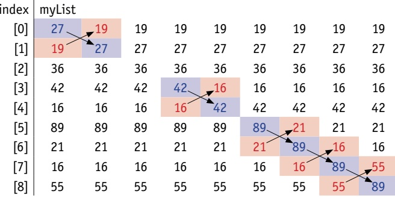

### Figure 10.3

Second pass of bubble sort

Eight elements compared and three swaps:

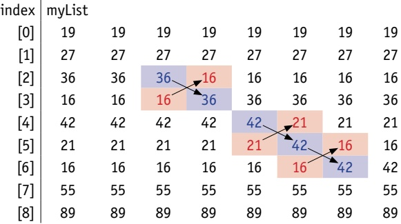

<!-- page 263 -->

Third pass of bubble sort

Seven elements compared and three swaps:

<table border=1 style='margin: auto; word-wrap: break-word;'><tr><td style='text-align: center; word-wrap: break-word;'>index</td><td colspan="7">myList</td></tr><tr><td style='text-align: center; word-wrap: break-word;'>[0]</td><td style='text-align: center; word-wrap: break-word;'>19</td><td style='text-align: center; word-wrap: break-word;'>19</td><td style='text-align: center; word-wrap: break-word;'>19</td><td style='text-align: center; word-wrap: break-word;'>19</td><td style='text-align: center; word-wrap: break-word;'>19</td><td style='text-align: center; word-wrap: break-word;'>19</td><td style='text-align: center; word-wrap: break-word;'>19</td></tr><tr><td style='text-align: center; word-wrap: break-word;'>[1]</td><td style='text-align: center; word-wrap: break-word;'>27</td><td style='text-align: center; word-wrap: break-word;'>27</td><td style='text-align: center; word-wrap: break-word;'>27</td><td style='text-align: center; word-wrap: break-word;'>27</td><td style='text-align: center; word-wrap: break-word;'>27</td><td style='text-align: center; word-wrap: break-word;'>27</td><td style='text-align: center; word-wrap: break-word;'>27</td></tr><tr><td style='text-align: center; word-wrap: break-word;'>[2]</td><td style='text-align: center; word-wrap: break-word;'>16</td><td style='text-align: center; word-wrap: break-word;'>36</td><td style='text-align: center; word-wrap: break-word;'>36</td><td style='text-align: center; word-wrap: break-word;'>16</td><td style='text-align: center; word-wrap: break-word;'>16</td><td style='text-align: center; word-wrap: break-word;'>16</td><td style='text-align: center; word-wrap: break-word;'>16</td></tr><tr><td style='text-align: center; word-wrap: break-word;'>[3]</td><td style='text-align: center; word-wrap: break-word;'>36</td><td style='text-align: center; word-wrap: break-word;'>16</td><td style='text-align: center; word-wrap: break-word;'>16</td><td style='text-align: center; word-wrap: break-word;'>36</td><td style='text-align: center; word-wrap: break-word;'>36</td><td style='text-align: center; word-wrap: break-word;'>36</td><td style='text-align: center; word-wrap: break-word;'>36</td></tr><tr><td style='text-align: center; word-wrap: break-word;'>[4]</td><td style='text-align: center; word-wrap: break-word;'>21</td><td style='text-align: center; word-wrap: break-word;'>42</td><td style='text-align: center; word-wrap: break-word;'>42</td><td style='text-align: center; word-wrap: break-word;'>42</td><td style='text-align: center; word-wrap: break-word;'>42</td><td style='text-align: center; word-wrap: break-word;'>21</td><td style='text-align: center; word-wrap: break-word;'>21</td></tr><tr><td style='text-align: center; word-wrap: break-word;'>[5]</td><td style='text-align: center; word-wrap: break-word;'>16</td><td style='text-align: center; word-wrap: break-word;'>21</td><td style='text-align: center; word-wrap: break-word;'>21</td><td style='text-align: center; word-wrap: break-word;'>21</td><td style='text-align: center; word-wrap: break-word;'>21</td><td style='text-align: center; word-wrap: break-word;'>42</td><td style='text-align: center; word-wrap: break-word;'>16</td></tr><tr><td style='text-align: center; word-wrap: break-word;'>[6]</td><td style='text-align: center; word-wrap: break-word;'>42</td><td style='text-align: center; word-wrap: break-word;'>16</td><td style='text-align: center; word-wrap: break-word;'>16</td><td style='text-align: center; word-wrap: break-word;'>16</td><td style='text-align: center; word-wrap: break-word;'>16</td><td style='text-align: center; word-wrap: break-word;'>16</td><td style='text-align: center; word-wrap: break-word;'>42</td></tr><tr><td style='text-align: center; word-wrap: break-word;'>[7]</td><td style='text-align: center; word-wrap: break-word;'>55</td><td style='text-align: center; word-wrap: break-word;'>55</td><td style='text-align: center; word-wrap: break-word;'>55</td><td style='text-align: center; word-wrap: break-word;'>55</td><td style='text-align: center; word-wrap: break-word;'>55</td><td style='text-align: center; word-wrap: break-word;'>55</td><td style='text-align: center; word-wrap: break-word;'>55</td></tr><tr><td style='text-align: center; word-wrap: break-word;'>[8]</td><td style='text-align: center; word-wrap: break-word;'>89</td><td style='text-align: center; word-wrap: break-word;'>89</td><td style='text-align: center; word-wrap: break-word;'>89</td><td style='text-align: center; word-wrap: break-word;'>89</td><td style='text-align: center; word-wrap: break-word;'>89</td><td style='text-align: center; word-wrap: break-word;'>89</td><td style='text-align: center; word-wrap: break-word;'>89</td></tr></table>

### Figure 10.5

Fourth pass of bubble sort

Six elements compared and three swaps:

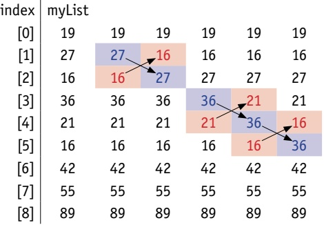

Figure 10.6

Fifth pass of bubble sort

Five elements compared and three swaps:

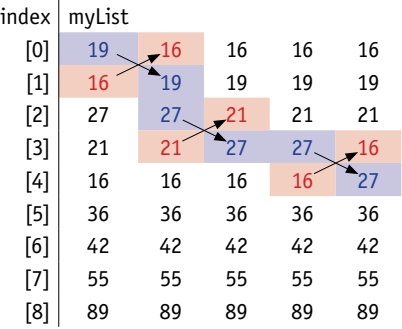

<!-- page 264 -->

## Sixth pass of bubble sort

Four elements compared and one swap:

<table border=1 style='margin: auto; word-wrap: break-word;'><tr><td style='text-align: center; word-wrap: break-word;'>index</td><td colspan="4">myList</td></tr><tr><td style='text-align: center; word-wrap: break-word;'>[0]</td><td style='text-align: center; word-wrap: break-word;'>16</td><td style='text-align: center; word-wrap: break-word;'>16</td><td style='text-align: center; word-wrap: break-word;'>16</td><td style='text-align: center; word-wrap: break-word;'>16</td></tr><tr><td style='text-align: center; word-wrap: break-word;'>[1]</td><td style='text-align: center; word-wrap: break-word;'>19</td><td style='text-align: center; word-wrap: break-word;'>19</td><td style='text-align: center; word-wrap: break-word;'>19</td><td style='text-align: center; word-wrap: break-word;'>19</td></tr><tr><td style='text-align: center; word-wrap: break-word;'>[2]</td><td style='text-align: center; word-wrap: break-word;'>21</td><td style='text-align: center; word-wrap: break-word;'>21</td><td style='text-align: center; word-wrap: break-word;'>21</td><td style='text-align: center; word-wrap: break-word;'>16</td></tr><tr><td style='text-align: center; word-wrap: break-word;'>[3]</td><td style='text-align: center; word-wrap: break-word;'>16</td><td style='text-align: center; word-wrap: break-word;'>16</td><td style='text-align: center; word-wrap: break-word;'>16</td><td style='text-align: center; word-wrap: break-word;'>21</td></tr><tr><td style='text-align: center; word-wrap: break-word;'>[4]</td><td style='text-align: center; word-wrap: break-word;'>27</td><td style='text-align: center; word-wrap: break-word;'>27</td><td style='text-align: center; word-wrap: break-word;'>27</td><td style='text-align: center; word-wrap: break-word;'>27</td></tr><tr><td style='text-align: center; word-wrap: break-word;'>[5]</td><td style='text-align: center; word-wrap: break-word;'>36</td><td style='text-align: center; word-wrap: break-word;'>36</td><td style='text-align: center; word-wrap: break-word;'>36</td><td style='text-align: center; word-wrap: break-word;'>36</td></tr><tr><td style='text-align: center; word-wrap: break-word;'>[6]</td><td style='text-align: center; word-wrap: break-word;'>42</td><td style='text-align: center; word-wrap: break-word;'>42</td><td style='text-align: center; word-wrap: break-word;'>42</td><td style='text-align: center; word-wrap: break-word;'>42</td></tr><tr><td style='text-align: center; word-wrap: break-word;'>[7]</td><td style='text-align: center; word-wrap: break-word;'>55</td><td style='text-align: center; word-wrap: break-word;'>55</td><td style='text-align: center; word-wrap: break-word;'>55</td><td style='text-align: center; word-wrap: break-word;'>55</td></tr><tr><td style='text-align: center; word-wrap: break-word;'>[8]</td><td style='text-align: center; word-wrap: break-word;'>89</td><td style='text-align: center; word-wrap: break-word;'>89</td><td style='text-align: center; word-wrap: break-word;'>89</td><td style='text-align: center; word-wrap: break-word;'>89</td></tr></table>

Figure 10.8

Seventh pass of bubble sort

Three elements compared and one swap:

<table border=1 style='margin: auto; word-wrap: break-word;'><tr><td style='text-align: center; word-wrap: break-word;'>index</td><td colspan="3">myList</td></tr><tr><td style='text-align: center; word-wrap: break-word;'>[0]</td><td style='text-align: center; word-wrap: break-word;'>16</td><td style='text-align: center; word-wrap: break-word;'>16</td><td style='text-align: center; word-wrap: break-word;'>16</td></tr><tr><td style='text-align: center; word-wrap: break-word;'>[1]</td><td style='text-align: center; word-wrap: break-word;'>19</td><td style='text-align: center; word-wrap: break-word;'>19</td><td style='text-align: center; word-wrap: break-word;'>16</td></tr><tr><td style='text-align: center; word-wrap: break-word;'>[2]</td><td style='text-align: center; word-wrap: break-word;'>16</td><td style='text-align: center; word-wrap: break-word;'>16</td><td style='text-align: center; word-wrap: break-word;'>19</td></tr><tr><td style='text-align: center; word-wrap: break-word;'>[3]</td><td style='text-align: center; word-wrap: break-word;'>21</td><td style='text-align: center; word-wrap: break-word;'>21</td><td style='text-align: center; word-wrap: break-word;'>21</td></tr><tr><td style='text-align: center; word-wrap: break-word;'>[4]</td><td style='text-align: center; word-wrap: break-word;'>27</td><td style='text-align: center; word-wrap: break-word;'>27</td><td style='text-align: center; word-wrap: break-word;'>27</td></tr><tr><td style='text-align: center; word-wrap: break-word;'>[5]</td><td style='text-align: center; word-wrap: break-word;'>36</td><td style='text-align: center; word-wrap: break-word;'>36</td><td style='text-align: center; word-wrap: break-word;'>36</td></tr><tr><td style='text-align: center; word-wrap: break-word;'>[6]</td><td style='text-align: center; word-wrap: break-word;'>42</td><td style='text-align: center; word-wrap: break-word;'>42</td><td style='text-align: center; word-wrap: break-word;'>42</td></tr><tr><td style='text-align: center; word-wrap: break-word;'>[7]</td><td style='text-align: center; word-wrap: break-word;'>55</td><td style='text-align: center; word-wrap: break-word;'>55</td><td style='text-align: center; word-wrap: break-word;'>55</td></tr><tr><td style='text-align: center; word-wrap: break-word;'>[8]</td><td style='text-align: center; word-wrap: break-word;'>89</td><td style='text-align: center; word-wrap: break-word;'>89</td><td style='text-align: center; word-wrap: break-word;'>89</td></tr></table>

## ACTIVITY 10H

In your chosen programming language, write a short program to complete a bubble sort on the array myList. Use the sample data shown in myList in Figure 10.1 to populate the array before sorting. Output the sorted list once the bubble sort is completed.

Figure 10.9

Eighth pass of bubble sort

Two elements compared and no swaps:

<table border=1 style='margin: auto; word-wrap: break-word;'><tr><td style='text-align: center; word-wrap: break-word;'></td><td style='text-align: center; word-wrap: break-word;'>index</td><td colspan="2">myList</td></tr><tr><td style='text-align: center; word-wrap: break-word;'></td><td style='text-align: center; word-wrap: break-word;'>[0]</td><td style='text-align: center; word-wrap: break-word;'>16</td><td style='text-align: center; word-wrap: break-word;'>16</td></tr><tr><td style='text-align: center; word-wrap: break-word;'>top  $ \rightarrow $</td><td style='text-align: center; word-wrap: break-word;'>[1]</td><td style='text-align: center; word-wrap: break-word;'>16</td><td style='text-align: center; word-wrap: break-word;'>16</td></tr><tr><td style='text-align: center; word-wrap: break-word;'></td><td style='text-align: center; word-wrap: break-word;'>[2]</td><td style='text-align: center; word-wrap: break-word;'>19</td><td style='text-align: center; word-wrap: break-word;'>19</td></tr><tr><td style='text-align: center; word-wrap: break-word;'></td><td style='text-align: center; word-wrap: break-word;'>[3]</td><td style='text-align: center; word-wrap: break-word;'>21</td><td style='text-align: center; word-wrap: break-word;'>21</td></tr><tr><td style='text-align: center; word-wrap: break-word;'></td><td style='text-align: center; word-wrap: break-word;'>[4]</td><td style='text-align: center; word-wrap: break-word;'>27</td><td style='text-align: center; word-wrap: break-word;'>27</td></tr><tr><td style='text-align: center; word-wrap: break-word;'></td><td style='text-align: center; word-wrap: break-word;'>[5]</td><td style='text-align: center; word-wrap: break-word;'>36</td><td style='text-align: center; word-wrap: break-word;'>36</td></tr><tr><td style='text-align: center; word-wrap: break-word;'></td><td style='text-align: center; word-wrap: break-word;'>[6]</td><td style='text-align: center; word-wrap: break-word;'>42</td><td style='text-align: center; word-wrap: break-word;'>42</td></tr><tr><td style='text-align: center; word-wrap: break-word;'></td><td style='text-align: center; word-wrap: break-word;'>[7]</td><td style='text-align: center; word-wrap: break-word;'>55</td><td style='text-align: center; word-wrap: break-word;'>55</td></tr><tr><td style='text-align: center; word-wrap: break-word;'></td><td style='text-align: center; word-wrap: break-word;'>[8]</td><td style='text-align: center; word-wrap: break-word;'>89</td><td style='text-align: center; word-wrap: break-word;'>89</td></tr></table>

<!-- page 265 -->

### 10.3 Files

Computer programs store data that will be required again in a file. Every file is identified by its filename. In this chapter, we are going to look at how to use text files. Text files contain a sequence of characters. Text files can include an end of line character that enables the file to be read from and written to as lines of characters.

In pseudocode, text files are handled using the following statements.

To open a file before reading from it or writing to it:

OPEN <file identifier> FOR <file mode>

Files can be opened in one of the following modes:

READ reads data from the file
WRITE writes data to the file, any existing data stored in the file will be overwritten

APPEND adds data to the end of the file

Once the file is opened in READ mode, it can be read from a line at a time:

READFILE <file identifier>, <variable>

Once the file is opened in WRITE or APPEND mode, it can be written to a line at a time:

WRITEFILE <file identifier>, <variable>

In both cases, the variable must be of data type STRING.

The function EOF is used to test for the end of a file. It returns a value TRUE if the end of a file has been reached and FALSE otherwise.

EOF(<file identifier>)

When a file is no longer being used it should be closed:

CLOSEFILE <file identifier>

This pseudocode shows how the file myText.txt could be written to and read from:

DECLARE textLn : STRING
DECLARE myFile : STRING
myFile ← "myText.txt"
OPEN myFile FOR WRITE
REPEAT
OUTPUT "Please enter a line of text"
INPUT textLn

<!-- page 266 -->

Extend this pseudocode to append further lines to the end of myFile. In your chosen programming language write a short program to complete this file handling routine.

IF textLn <> ""
    THEN
        WRITEFILE, textLn
        ELSE
        CLOSEFILE(myFile)
ENDIF

UNTIL textLn = ""
OUTPUT "The file contains these lines of text:"
OPEN myFile FOR READ
REPEAT
READFILE, textLn
OUTPUT textLn
UNTIL EOF(myFile)
CLOSEFILE(myFile)

<table border=1 style='margin: auto; word-wrap: break-word;'><tr><td style='text-align: center; word-wrap: break-word;'>Identifier name</td><td style='text-align: center; word-wrap: break-word;'>Description</td></tr><tr><td style='text-align: center; word-wrap: break-word;'>textLn</td><td style='text-align: center; word-wrap: break-word;'>Line of text</td></tr><tr><td style='text-align: center; word-wrap: break-word;'>myFile</td><td style='text-align: center; word-wrap: break-word;'>File name</td></tr></table>

Table 10.4

### 10.4 Abstract data types (ADTs)

An abstract data type (ADT) is a collection of data and a set of operations on that data. For example, a stack includes the items held on the stack and the operations to add an item to the stack (push) or remove an item from the stack (pop). In this chapter we are going to look at three ADTs: stack, queue and linked list.

Table 10.5 lists some of the uses of stacks, queues and linked lists mentioned in this book.

<table border=1 style='margin: auto; word-wrap: break-word;'><tr><td style='text-align: center; word-wrap: break-word;'>Stacks</td><td style='text-align: center; word-wrap: break-word;'>Queues</td><td style='text-align: center; word-wrap: break-word;'>Linked lists</td></tr><tr><td style='text-align: center; word-wrap: break-word;'>Memory management (see Section 16.1)</td><td style='text-align: center; word-wrap: break-word;'>Management of files sent to a printer (see Section 5.1)</td><td style='text-align: center; word-wrap: break-word;'>Using arrays to implement a stack (see Section 19.1)</td></tr><tr><td style='text-align: center; word-wrap: break-word;'>Expression evaluation (see Section 16.3)</td><td style='text-align: center; word-wrap: break-word;'>Buffers used with keyboards (see Section 5.1)</td><td style='text-align: center; word-wrap: break-word;'>Using arrays to implement a queue (see Section 19.1)</td></tr><tr><td style='text-align: center; word-wrap: break-word;'>Backtracking in recursion (see Section 19.2)</td><td style='text-align: center; word-wrap: break-word;'>Scheduling (see Section 16.1)</td><td style='text-align: center; word-wrap: break-word;'>Using arrays to implement a binary tree (see Section 19.1)</td></tr></table>

### ▲ Table 10.5 Uses of stacks, queues and linked lists

» Stack – a list containing several items operating on the last in, first out (LIFO) principle. Items can be added to the stack (push) and removed from the stack (pop). The first item added to a stack is the last item to be removed from the stack.

» Queue – a list containing several items operating on the first in, first out (FIFO) principle. Items can be added to the queue (enqueue) and removed from the queue (dequeue). The first item added to a queue is the first item to be removed from the queue.

» Linked list – a list containing several items in which each item in the list points to the next item in the list. In a linked list a new item is always added to the start of the list.

<!-- page 267 -->

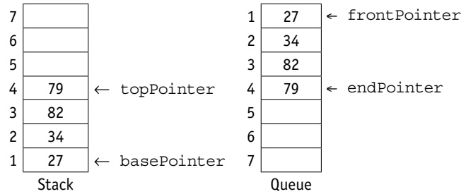

Figure 10.11 Stack and queue

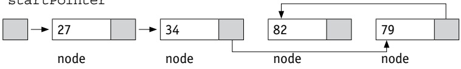

Figure 10.12 Linked list

Stacks, queues and linked lists all make use of pointers to manage their operations. Items stored in stacks and queues are always added at the end. Linked lists make use of an ordering algorithm for the items, often ascending or descending.

A stack uses two pointers: a base pointer points to the first item in the stack and a top pointer points to the last item in the stack. When they are equal there is only one item in the stack.

A queue uses two pointers: a front pointer points to the first item in the queue and a rear pointer points to the last item in the queue. When they are equal there is only one item in the queue.

A linked list uses a start pointer that points to the first item in the linked list. Every item in a linked list is stored together with a pointer to the next item. This is called a node. The last item in a linked list has a null pointer.

#### 10.4.1 Stack operations

The value of the basePointer always remains the same during stack operations:

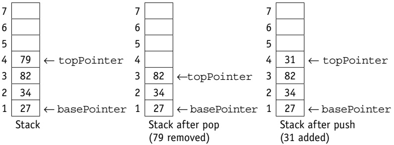

Figure 10.13

A stack can be implemented using an array and a set of pointers. As an array has a finite size, the stack may become full and this condition must be allowed for.

<!-- page 268 -->

In pseudocode, stack operations are handled using the following statements. Please note that you are not expected to be able to write the pseudocode statements included in this section at Cambridge AS Level. However, you may find them useful to refer back to if you are studying the full Cambridge A Level syllabus.

To set up a stack

DECLARE stack ARRAY[1:10] OF INTEGER
DECLARE topPointer : INTEGER
DECLARE basePointer : INTEGER
DECLARE stackful : INTEGER
basePointer ← 1
topPointer ← 0
stackful ← 10

To push an item, stored in item, onto a stack

IF topPointer < stackful
THEN
    topPointer ← topPointer + 1
    stack[topPointer] ← item
ELSE
OUTPUT "Stack is full, cannot push"
ENDIF

To pop an item, stored in item, from the stack

IF topPointer = basePointer - 1
THEN
OUTPUT "Stack is empty, cannot pop"
ELSE
Item ← stack[topPointer]
topPointer ← topPointer - 1
ENDIF

## ACTIVITY 10J

Look at this stack.

9
8
7
6
5
4
3
2
1
Stack

Show the stack and the value of topPointer and basePointer when an item has been popped off the stack and 67 followed by 92 have been pushed onto the stack.

<!-- page 269 -->

#### 10.4.2 Queue operations

The value of the frontPointer changes after dequeue but the value of the rearPointer changes after enqueue:

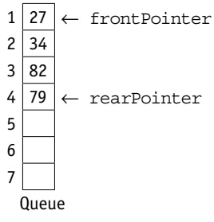

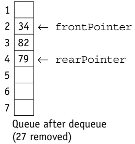

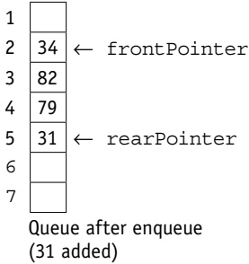

Figure 10.14

A queue can be implemented using an array and a set of pointers. As an array has a finite size, the queue may become full and this condition must be allowed for. Also, as items are removed from the front and added to the end of a queue, the position of the queue in the array changes. Therefore, the queue should be managed as a circular queue to avoid moving the position of the items in the array every time an item is removed.

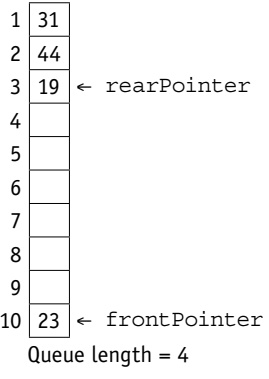

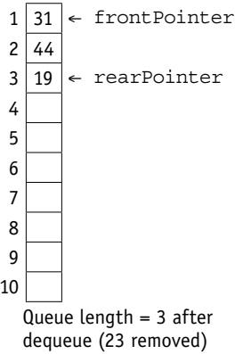

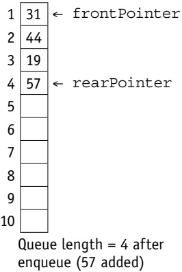

Figure 10.15 Circular queue operation

When a queue is implemented using an array with a finite number of elements, it is managed as a circular queue. Both pointers, frontPointer and rearPointer, are updated to point to the first element in the array (lower bound) after an operation where that pointer was originally pointing to the last element of the array (upper bound), providing the length of the queue does not exceed the size of the array.

<!-- page 270 -->

In pseudocode, queue operations are handled using the following statements.

To set up a queue

DECLARE queue ARRAY[1:10] OF INTEGER
DECLARE rearPointer : INTEGER
DECLARE frontPointer : INTEGER
DECLARE queueful : INTEGER
DECLARE queueLength : INTEGER
frontPointer ← 1
endPointer ← 0
upperBound ← 10
queueful ← 10
queueLength ← 0

To add an item, stored in item, onto a queue

IF queueLength < queueful
    THEN
        IF rearPointer < upperBound
            THEN
                rearPointer ← rearPointer + 1
                ELSE
                rearPointer ← 1
    ENDIF
    queueLength ← queueLength + 1
    queue[rearPointer] ← item
ELSE
OUTPUT "Queue is full, cannot enqueue"
ENDIF

To remove an item from the queue and store in item

IF queueLength = 0
THEN
OUTPUT "Queue is empty, cannot dequeue"
ELSE
Item ← queue[frontPointer]
IF frontPointer = upperBound
THEN
    frontPointer ← 1
ELSE
    frontPointer ← frontPointer + 1
ENDIF
queueLength ← queueLength - 1
ENDIF

<!-- page 271 -->

## ACTIVITY 10K

Look at this queue.

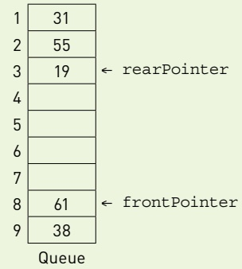

Show the circular queue and the value of the length of the queue, frontPointer and rearPointer when three items have been removed from the queue and 25 followed by 75 have been added to the queue.

#### 10.4.3 Linked list operations

A linked list can be implemented using two 1D arrays, one for the items in the linked list and another for the pointers to the next item in the list, and a set of pointers. As an array has a finite size, the linked list may become full and this condition must be allowed for. Also, as items can be removed from any position in the linked list, the empty positions in the array must be managed as an empty linked list, usually called the heap.

The following diagrams demonstrate the operations of linked lists.

The startPointer = -1, as the list has no elements. The heap is set up as a linked list ready for use.

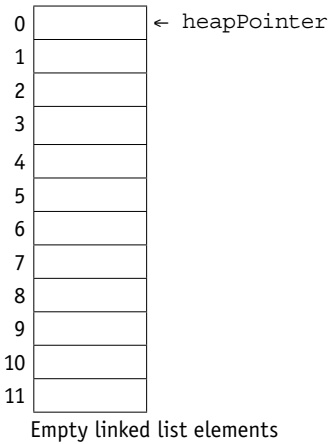

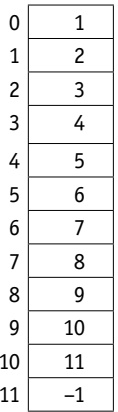

Empty linked list pointers

<!-- page 272 -->

The startPointer is set to the element pointed to by the heapPointer where 37 is inserted. The heapPointer is set to point to the next element in the heap by using the value stored in the element with the same index in the pointer list. Since this is also the last element in the list the node pointer for it is reset to -1.

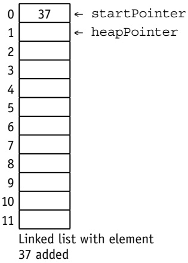

Figure 10.17

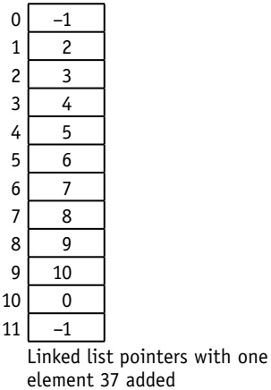

The startPointer is changed to the heapPointer and 45 is stored in the element indexed by the heapPointer. The node pointer for this element is set to the old startPointer. The node pointer for the heapPointer is reset to point to the next element in the heap by using the value stored in the element with the same index in the pointer list.

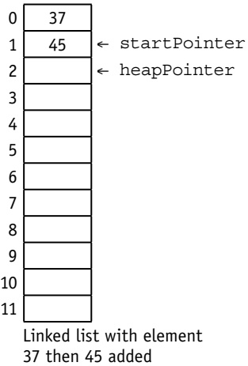

Figure 10.18

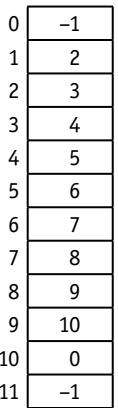

Linked list pointers with element 37 then 45 added

<!-- page 273 -->

The process is repeated when 12 is added to the list.

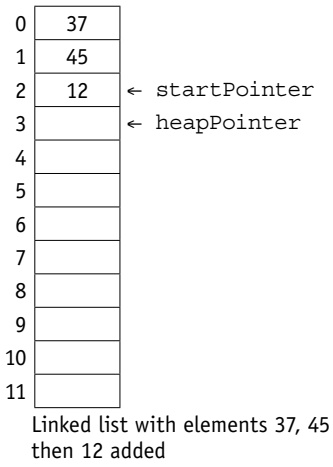

<table border=1 style='margin: auto; word-wrap: break-word;'><tr><td style='text-align: center; word-wrap: break-word;'>0</td><td style='text-align: center; word-wrap: break-word;'>-1</td></tr><tr><td style='text-align: center; word-wrap: break-word;'>1</td><td style='text-align: center; word-wrap: break-word;'>2</td></tr><tr><td style='text-align: center; word-wrap: break-word;'>2</td><td style='text-align: center; word-wrap: break-word;'>3</td></tr><tr><td style='text-align: center; word-wrap: break-word;'>3</td><td style='text-align: center; word-wrap: break-word;'>4</td></tr><tr><td style='text-align: center; word-wrap: break-word;'>4</td><td style='text-align: center; word-wrap: break-word;'>5</td></tr><tr><td style='text-align: center; word-wrap: break-word;'>5</td><td style='text-align: center; word-wrap: break-word;'>6</td></tr><tr><td style='text-align: center; word-wrap: break-word;'>6</td><td style='text-align: center; word-wrap: break-word;'>7</td></tr><tr><td style='text-align: center; word-wrap: break-word;'>7</td><td style='text-align: center; word-wrap: break-word;'>8</td></tr><tr><td style='text-align: center; word-wrap: break-word;'>8</td><td style='text-align: center; word-wrap: break-word;'>9</td></tr><tr><td style='text-align: center; word-wrap: break-word;'>9</td><td style='text-align: center; word-wrap: break-word;'>10</td></tr><tr><td style='text-align: center; word-wrap: break-word;'>10</td><td style='text-align: center; word-wrap: break-word;'>0</td></tr><tr><td style='text-align: center; word-wrap: break-word;'>11</td><td style='text-align: center; word-wrap: break-word;'>-1</td></tr></table>

Linked list pointers with elements 37, 45 then 12 added

### Figure 10.19

## To set up a linked list

DECLARE mylinkedList ARRAY[0:11] OF INTEGER
DECLARE myLinkedListPointers ARRAY[0:11] OF INTEGER
DECLARE startPointer : INTEGER
DECLARE heapStartPointer : INTEGER
DECLARE index : INTEGER
heapStartPointer ← 0
startPointer ← -1 // list empty
FOR index ← 0 TO 11
    myLinkedListPointers[index] ← index + 1
NEXT index
// the linked list heap is a linked list of all the spaces in the linked list, this is set up when the linked list is initialised
myLinkedListPointers[11] ← -1
// the final heap pointer is set to -1 to show no further links

<!-- page 274 -->

The above code sets up a linked list ready for use. Below is the identifier table.

<table border=1 style='margin: auto; word-wrap: break-word;'><tr><td style='text-align: center; word-wrap: break-word;'>Identifier</td><td style='text-align: center; word-wrap: break-word;'>Description</td></tr><tr><td style='text-align: center; word-wrap: break-word;'>myLinkedList</td><td style='text-align: center; word-wrap: break-word;'>Linked list to be searched</td></tr><tr><td style='text-align: center; word-wrap: break-word;'>myLinkedListPointers</td><td style='text-align: center; word-wrap: break-word;'>Pointers for linked list</td></tr><tr><td style='text-align: center; word-wrap: break-word;'>startPointer</td><td style='text-align: center; word-wrap: break-word;'>Start of the linked list</td></tr><tr><td style='text-align: center; word-wrap: break-word;'>heapStartPointer</td><td style='text-align: center; word-wrap: break-word;'>Start of the heap</td></tr><tr><td style='text-align: center; word-wrap: break-word;'>index</td><td style='text-align: center; word-wrap: break-word;'>Pointer to current element in the linked list</td></tr></table>

### Table 10.6

The table below shows an empty linked list and its corresponding pointers.

heapstartPointer

<table border=1 style='margin: auto; word-wrap: break-word;'><tr><td style='text-align: center; word-wrap: break-word;'></td><td style='text-align: center; word-wrap: break-word;'>myLinkedList</td><td style='text-align: center; word-wrap: break-word;'>myListedListPointers</td></tr><tr><td style='text-align: center; word-wrap: break-word;'>[0]</td><td style='text-align: center; word-wrap: break-word;'></td><td style='text-align: center; word-wrap: break-word;'>1</td></tr><tr><td style='text-align: center; word-wrap: break-word;'>[1]</td><td style='text-align: center; word-wrap: break-word;'></td><td style='text-align: center; word-wrap: break-word;'>2</td></tr><tr><td style='text-align: center; word-wrap: break-word;'>[2]</td><td style='text-align: center; word-wrap: break-word;'></td><td style='text-align: center; word-wrap: break-word;'>3</td></tr><tr><td style='text-align: center; word-wrap: break-word;'>[3]</td><td style='text-align: center; word-wrap: break-word;'></td><td style='text-align: center; word-wrap: break-word;'>4</td></tr><tr><td style='text-align: center; word-wrap: break-word;'>[4]</td><td style='text-align: center; word-wrap: break-word;'></td><td style='text-align: center; word-wrap: break-word;'>5</td></tr><tr><td style='text-align: center; word-wrap: break-word;'>[5]</td><td style='text-align: center; word-wrap: break-word;'></td><td style='text-align: center; word-wrap: break-word;'>6</td></tr><tr><td style='text-align: center; word-wrap: break-word;'>[6]</td><td style='text-align: center; word-wrap: break-word;'></td><td style='text-align: center; word-wrap: break-word;'>7</td></tr><tr><td style='text-align: center; word-wrap: break-word;'>[7]</td><td style='text-align: center; word-wrap: break-word;'></td><td style='text-align: center; word-wrap: break-word;'>8</td></tr><tr><td style='text-align: center; word-wrap: break-word;'>[8]</td><td style='text-align: center; word-wrap: break-word;'></td><td style='text-align: center; word-wrap: break-word;'>9</td></tr><tr><td style='text-align: center; word-wrap: break-word;'>[9]</td><td style='text-align: center; word-wrap: break-word;'></td><td style='text-align: center; word-wrap: break-word;'>10</td></tr><tr><td style='text-align: center; word-wrap: break-word;'>[10]</td><td style='text-align: center; word-wrap: break-word;'></td><td style='text-align: center; word-wrap: break-word;'>11</td></tr><tr><td style='text-align: center; word-wrap: break-word;'>[11]</td><td style='text-align: center; word-wrap: break-word;'></td><td style='text-align: center; word-wrap: break-word;'>-1</td></tr></table>

startPointer = -1

▲ Table 10.7 Empty myLinkedList and myLinkedListPointers

You will not be expected to write pseudocode to implement and use these structures, but you will need to be able to show how data can be added to and deleted from these ADTs.

## ACTIVITY 10L

Look at this linked list.

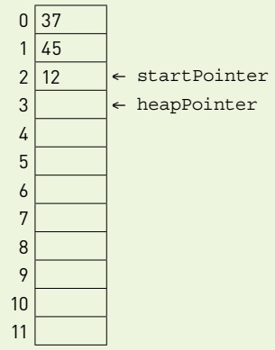

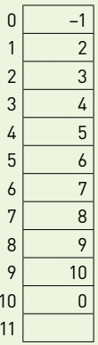

Show the linked list and the value of startPointer and heapPointer when 37 has been removed from the linked list and 18 followed by 75 have been added to the linked list.

<!-- page 275 -->

## EXTENSION ACTIVITY 10C

End of chapter questions

1 Abstract data types (ADTs) are collections of data and the operations used on that data.

2 Explain, using an example, what is meant by a composite data type. [2]

3 Explain, using diagrams, the process of reversing a queue using a stack. [4]

4 a) Write pseudocode to set up a text file to store records like this, with one record on every line. [4]

TYPE
TstudentRecord
DECLARE name : STRING
DECLARE address : STRING
DECLARE className : STRING
ENDTYPE

5 Data is stored in the array NameList[1:10]. This data is to be sorted using a bubble sort:

FOR ThisPointer ← 1 TO 9

FOR Pointer ← 1 TO 9

IF NameList[Pointer] > NameList[Pointer + 1]

THEN

Temp ← NameList[Pointer]

NameList[Pointer] ← NameList[Pointer + 1]

NameList[Pointer + 1] ← Temp

ENDIF

NEXT

NEXT

a) A special case is when NameList is already in order. The algorithm above is applied to this special case.

Explain how many iterations are carried out for each of the loops.

<!-- page 276 -->

b) Rewrite the algorithm using pseudocode, to reduce the number of unnecessary comparisons.

Use the same variable names where appropriate.

Adapted from Cambridge International AS & A Level Computer Science 9608 Paper 41 Q5 part (b) June 2015

6 A queue Abstract Data Type (ADT) has these associated operations:

create queue

add item to queue

- remove item from queue

The queue ADT is to be implemented as a linked list of nodes.

Each node consists of data and a pointer to the next node.

a) The following operations are carried out:

<table border=1 style='margin: auto; word-wrap: break-word;'><tr><td style='text-align: center; word-wrap: break-word;'>CreateQueue</td></tr><tr><td style='text-align: center; word-wrap: break-word;'>AddName(&quot;Ali&quot;)</td></tr><tr><td style='text-align: center; word-wrap: break-word;'>AddName(&quot;Jack&quot;)</td></tr><tr><td style='text-align: center; word-wrap: break-word;'>AddName(&quot;Ben&quot;)</td></tr><tr><td style='text-align: center; word-wrap: break-word;'>AddName(&quot;Ahmed&quot;)</td></tr><tr><td style='text-align: center; word-wrap: break-word;'>RemoveName</td></tr><tr><td style='text-align: center; word-wrap: break-word;'>AddName(&quot;Jatinder&quot;)</td></tr><tr><td style='text-align: center; word-wrap: break-word;'>RemoveName</td></tr></table>

Copy the diagram below and add appropriate labels to show the final state of the queue.

Use the space on the left as a workspace.

Show your final answer in the node shapes on the right:

b) Using pseudocode, a record type, Node, is declared as follows:

TYPE Node
DECLARE Name    : STRING
DECLARE Pointer : INTEGER
ENDTYPE

<!-- page 277 -->

## The statement

DECLARE Queue : ARRAY[1:10] OF Node

reserves space for 10 nodes in array Queue.

i) The CreateQueue operation links all nodes and initialises the three pointers that need to be used: HeadPointer, TailPointer and FreePointer.

Copy and complete the diagram to show the value of all pointers after CreateQueue has been executed.

HeadPointer

TailPointer

<table border=1 style='margin: auto; word-wrap: break-word;'><tr><td style='text-align: center; word-wrap: break-word;'>Name</td><td style='text-align: center; word-wrap: break-word;'>Pointer</td></tr><tr><td style='text-align: center; word-wrap: break-word;'></td><td style='text-align: center; word-wrap: break-word;'></td></tr><tr><td style='text-align: center; word-wrap: break-word;'>[1]</td><td style='text-align: center; word-wrap: break-word;'></td></tr><tr><td style='text-align: center; word-wrap: break-word;'>[2]</td><td style='text-align: center; word-wrap: break-word;'></td></tr><tr><td style='text-align: center; word-wrap: break-word;'>[3]</td><td style='text-align: center; word-wrap: break-word;'></td></tr><tr><td style='text-align: center; word-wrap: break-word;'>[4]</td><td style='text-align: center; word-wrap: break-word;'></td></tr><tr><td style='text-align: center; word-wrap: break-word;'>[5]</td><td style='text-align: center; word-wrap: break-word;'></td></tr><tr><td style='text-align: center; word-wrap: break-word;'>[6]</td><td style='text-align: center; word-wrap: break-word;'></td></tr><tr><td style='text-align: center; word-wrap: break-word;'>[7]</td><td style='text-align: center; word-wrap: break-word;'></td></tr><tr><td style='text-align: center; word-wrap: break-word;'>[8]</td><td style='text-align: center; word-wrap: break-word;'></td></tr><tr><td style='text-align: center; word-wrap: break-word;'>[9]</td><td style='text-align: center; word-wrap: break-word;'></td></tr><tr><td style='text-align: center; word-wrap: break-word;'>[10]</td><td style='text-align: center; word-wrap: break-word;'></td></tr></table>

ii) The algorithm for adding a name to the queue is written, using pseudocode, as a procedure with the header:

PROCEDURE AddName(NewName)

where NewName is the new name to be added to the queue.

The procedure uses the variables as shown in the identifier table.

<table border=1 style='margin: auto; word-wrap: break-word;'><tr><td style='text-align: center; word-wrap: break-word;'>Identifier</td><td style='text-align: center; word-wrap: break-word;'>Data type</td><td style='text-align: center; word-wrap: break-word;'>Description</td></tr><tr><td style='text-align: center; word-wrap: break-word;'>Queue</td><td style='text-align: center; word-wrap: break-word;'>Array[1:10] OF Node</td><td style='text-align: center; word-wrap: break-word;'>Array to store node data</td></tr><tr><td style='text-align: center; word-wrap: break-word;'>NewName</td><td style='text-align: center; word-wrap: break-word;'>STRING</td><td style='text-align: center; word-wrap: break-word;'>Name to be added</td></tr><tr><td style='text-align: center; word-wrap: break-word;'>FreePointer</td><td style='text-align: center; word-wrap: break-word;'>INTEGER</td><td style='text-align: center; word-wrap: break-word;'>Pointer to next free node in array</td></tr><tr><td style='text-align: center; word-wrap: break-word;'>HeadPointer</td><td style='text-align: center; word-wrap: break-word;'>INTEGER</td><td style='text-align: center; word-wrap: break-word;'>Pointer to first node in queue</td></tr><tr><td style='text-align: center; word-wrap: break-word;'>TailPointer</td><td style='text-align: center; word-wrap: break-word;'>INTEGER</td><td style='text-align: center; word-wrap: break-word;'>Pointer to last node in queue</td></tr><tr><td style='text-align: center; word-wrap: break-word;'>CurrentPointer</td><td style='text-align: center; word-wrap: break-word;'>INTEGER</td><td style='text-align: center; word-wrap: break-word;'>Pointer to current node</td></tr></table>

<!-- page 278 -->

PROCEDURE AddName(BYVALUE NewName : STRING)
// Report error if no free nodes remaining
IF FreePointer = 0
    THEN
        Report Error
        ELSE
        // new name placed in node at head of free list
        CurrentPointer ← FreePointer
        Queue[CurrentPointer].Name ← NewName
        // adjust free pointer
        FreePointer ← Queue[CurrentPointer].Pointer
        // if first name in queue then adjust head pointer
        IF HeadPointer = 0
            THEN
                HeadPointer ← CurrentPointer
        ENDIF
    // current node is new end of queue
        Queue[CurrentPointer].Pointer ← 0
        TailPointer ← CurrentPointer
ENDIF
ENDPROCEDURE

Copy and complete the pseudocode for the procedure RemoveName. Use the variables listed in the identifier table.

PROCEDURE RemoveName()
// Report error if Queue is empty
.....
.....
.....
.....
.....
OUTPUT Queue[.....].Name
// current node is head of queue
.....
// update head pointer
.....

<!-- page 279 -->

// if only one element in queue then update tail pointer  
  
// link released node to free list  
  
ENDPROCEDURE

Cambridge International AS & A Level Computer Science 9608

Paper 41 Q6 June 2015

