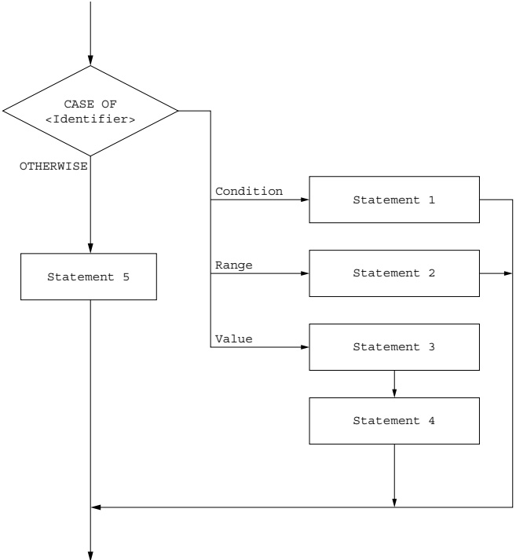

# 11 Programming

<!-- Cambridge International AS and a Level Computer Science (David Watson, Helen Williams).pdf p280-298 -->

<!-- page 280 -->

## 11 

## Programming

In this chapter, you will learn about

☑ declaring and assigning values to variables and constants

★ using programming constructs, including iteration with IF and CASE structures

★ using programming constructs, including selection with three different types of loop: count controlled, post-condition and pre-condition

writing structured programs defining and using procedures and functions.

## WHAT YOU SHOULD ALREADY KNOW

Try this activity before you read the first part of this chapter.

Write an algorithm, using pseudocode, to sort a list of ten numbers. The numbers are to be input with appropriate prompts, stored in an array, sorted in ascending order and then searched for the number.

27. The sorted list is to be output, as well as a message stating whether 27 was found or not.

Write and test your algorithm using your chosen programming language. Ensure that you test your program with test data that includes 27 and test data without 27.

### 11.1 Programming basics

## Key terms

Constant – a named value that cannot change during the execution of a program.

Variable – a named value that can change during the execution of a program.

Function – a set of statements that can be grouped together and easily called in a program whenever required, rather than repeating all of the statements each time. Unlike a procedure, a function always returns a value.

Library routine – a tested and ready-to-use routine available in the development system of a programming language that can be incorporated into a program.

Procedure – a set of statements that can be grouped together and easily called in a program whenever required, rather than repeating all of the statements each time.

<!-- page 281 -->

In order to write a program that performs a specific task or solves a given problem, the solution to the task or problem needs to be designed and then coded. This chapter demonstrates the programming tools used when coding a solution, including basic statements, constructs and structures.

#### 11.1.1 Constants and variables

A constant is a named value that cannot change during the execution of a program. A variable is a named value that can change during the execution of a program. All variables and constants should be declared before use. Constants will always be assigned a value when declared. It is good practice to assign a value to any variables that are used, so that the programmer is certain of the starting value.

It is good practice to create an identifier list and check that every variable on that list has been declared and a value assigned before any data manipulation is programmed.

Note that some programming languages (for example, Python) do not support the declaration of variables and the concept of a constant; in such cases, the assignment of a value at the start of a program will ensure that a variable of the correct data type can be used. An identifier that is to be used as a constant can also be assigned a value. However, it is important that the programming concepts of data declaration and the difference between variables and constants are clearly understood and can be demonstrated using pseudocode.

Example 11.1

Write an algorithm using pseudocode to calculate and output the volume and surface area of a sphere for any radius that is input.

## Solution

First create an identifier table.

<table border=1 style='margin: auto; word-wrap: break-word;'><tr><td style='text-align: center; word-wrap: break-word;'>Identifier name</td><td style='text-align: center; word-wrap: break-word;'>Description</td></tr><tr><td style='text-align: center; word-wrap: break-word;'>radius</td><td style='text-align: center; word-wrap: break-word;'>Stores radius input</td></tr><tr><td style='text-align: center; word-wrap: break-word;'>volume</td><td style='text-align: center; word-wrap: break-word;'>Stores result of volume calculation</td></tr><tr><td style='text-align: center; word-wrap: break-word;'>surfaceArea</td><td style='text-align: center; word-wrap: break-word;'>Stores result of surface area calculation</td></tr><tr><td style='text-align: center; word-wrap: break-word;'>pi</td><td style='text-align: center; word-wrap: break-word;'>Constant set to 3.142</td></tr></table>

Then declare constants and variables in pseudocode.

DECLARE radius : REAL

DECLARE volume : REAL

DECLARE surfaceArea : REAL

CONSTANT pi ← 3.142

Provide pseudocode for input, process and output.

Input usually includes some output in the form of prompts stating what should be input.

<!-- page 282 -->

OUTPUT "Please enter the radius of the sphere"
INPUT radius
Check the value of the radius, to ensure that it is suitable.
WHILE radius <= 0 DO
    OUTPUT "Please enter a positive number"
    INPUT radius
ENDWHILE
Calculate the volume and the surface area; this is the processing part of the algorithm.
volume ← (4 / 3) * pi * radius * radius * radius
surfaceArea ← 4 * pi * radius * radius
Finally, the results of the calculations need to be output.
OUTPUT "Volume is ", volume
OUTPUT "Surface area is ", surfaceArea

Table 11.1 shows the declaration of some of the constants and variables from Example 11.1 in the three prescribed programming languages.

While the Cambridge International AS Level syllabus does not require you to be able to write program code, the ability to do so will increase your understanding, and will be particularly beneficial if you are studying the full Cambridge International A Level course.

<table border=1 style='margin: auto; word-wrap: break-word;'><tr><td style='text-align: center; word-wrap: break-word;'>Declarations of constants and variables</td><td style='text-align: center; word-wrap: break-word;'>Language</td></tr><tr><td style='text-align: center; word-wrap: break-word;'>pi = 3.142</td><td style='text-align: center; word-wrap: break-word;'>Python does not require any separate declarations and makes no difference between constants and variables</td></tr><tr><td style='text-align: center; word-wrap: break-word;'>Dim radius As Decimal\nDim volume As Decimal\nDim surfaceArea As Decimal\nConst pi As Decimal = 3.142\nOr\nDim radius, volume, surfaceArea As Decimal\nPublic Const pi As Decimal = 3.142</td><td style='text-align: center; word-wrap: break-word;'>In VB, constants and variables are declared before use. Declarations can be single statements or can contain multiple declarations in a single statement. Constants can be explicitly typed as shown or implicitly typed, for example:\nConst pi = 3.142</td></tr><tr><td style='text-align: center; word-wrap: break-word;'>final double PI = 3.142;\n:...\ndouble volume = (4 / 3) * PI * radius * radius * radius;</td><td style='text-align: center; word-wrap: break-word;'>In Java, constant values are declared as variables with a final value so no changes can be made. These final variable names are usually capitalised to show they cannot be changed. Variables are often declared as they are used rather than at the start of the code</td></tr></table>

Table 11.1

<!-- page 283 -->

Table 11.2 below gives examples of the input statements in the three prescribed programming languages.

Input statements
radius = float(input("Please enter the radius of the sphere "))
Python combines the prompt with the input statement and the type of the input
Console.Write("Please enter the radius of the sphere")
radius = Decimal.Parse(Console.ReadLine())
import java.util.Scanner;
Scanner myObj = new Scanner(System.in);
System.out.println("Please enter the radius of the sphere");
double radius = myObj.nextDouble();
VB uses a separate prompt and input. The input specifies the type
In Java, the input library has to be imported at the start of the program and an input object is set up. Java uses a separate prompt and input. The input specifies the type and declares the variable of the same type

Table 11.2

Table 11.3 below shows how to check the value of the radius in each of the three programming languages.

<table border=1 style='margin: auto; word-wrap: break-word;'><tr><td style='text-align: center; word-wrap: break-word;'>Check that the value of the radius is a positive number</td><td style='text-align: center; word-wrap: break-word;'>Language</td></tr><tr><td style='text-align: center; word-wrap: break-word;'>while radius &lt;= 0:\nDo\n:Loop Until radius &gt; 0</td><td style='text-align: center; word-wrap: break-word;'>Python uses a check at the start of the loop</td></tr><tr><td style='text-align: center; word-wrap: break-word;'>do\n{\n:}\nwhile (radius &lt;= 0);</td><td style='text-align: center; word-wrap: break-word;'>Java uses a check at the end of the loop</td></tr></table>

Table 11.3

Table 11.4 below shows how to calculate the volume and the surface area in each of the three programming languages.

<table border=1 style='margin: auto; word-wrap: break-word;'><tr><td style='text-align: center; word-wrap: break-word;'>Calculate the volume and the surface area</td><td style='text-align: center; word-wrap: break-word;'>Language</td></tr><tr><td style='text-align: center; word-wrap: break-word;'>volume = (4 / 3) * pi * radius * radius * radius\nsurfaceArea = 4 * pi * radius * radius</td><td style='text-align: center; word-wrap: break-word;'>Python</td></tr><tr><td style='text-align: center; word-wrap: break-word;'>volume = (4 / 3) * pi * radius * radius * radius\nsurfaceArea = 4 * pi * radius * radius</td><td style='text-align: center; word-wrap: break-word;'>VB</td></tr><tr><td style='text-align: center; word-wrap: break-word;'>double volume = (4 / 3) * PI * radius * radius; double surfaceArea = 4 * PI * radius * radius;</td><td style='text-align: center; word-wrap: break-word;'>Java (variables declared as used)</td></tr></table>

Table 11.4

<!-- page 284 -->

Table 11.5 below shows how to output the results in each of the three programming languages.

Output the results
print("Volume is ", volume)
print("Surface area is ", surfaceArea)
Console.WriteLine("Volume is " & volume)
Console.WriteLine("Surface area is " & surfaceArea)
System.out.println("Volume is " + volume);
System.out.println("Surface area is " + surfaceArea);
Language
Python uses a comma
VB uses &
Java uses +

### Table 11.5

The complete programs are shown below:

pi = 3.142
radius = float(input("Please enter the radius of the sphere "))
while radius <= 0:
    radius = float(input("Please enter the radius of the sphere "))
volume = (4 / 3) * pi * radius * radius * radius
surfaceArea = 4 * pi * radius * radius
print("Volume is ", volume)
print("Surface area is ", surfaceArea)

Every console program in VB must contain a main module. These statements are shown in red

## VB

Module Module1

Public Sub Main()

Dim radius As Decimal

Dim volume As Decimal

Dim surfaceArea As Decimal

Const pi As Decimal = 3.142

Do

Console.Write("Please enter the radius of the sphere")
radius = Decimal.Parse(Console.ReadLine())

Loop Until radius > 0

volume = (4 / 3) * pi * radius * radius * radius
surfaceArea = 4 * pi * radius * radius
Console.WriteLine("Volume is " & volume)
Console.WriteLine("Surface area is " & surfaceArea)
Console.ReadKey()

End Sub

End Module

<!-- page 285 -->

Every console program in Java must contain a class with the file name and a main procedure. These statements are shown in red

## Java

import java.util.Scanner;
class Activity11A
{
    public static void main(String args[])
    {
        Scanner myObj = new Scanner(System.in);
        final double PI = 3.142;
        double radius;
        do
        {
            System.out.println("Please enter the radius of the sphere");
            radius = myObj.nextDouble();
        }
        while (radius <= 0);
        double volume = (4 / 3) * PI * radius * radius * radius;
        double surfaceArea = 3 * PI * radius * radius;
        System.out.println("Volume is " + volume);
        System.out.println("Surface area is " + surfaceArea);
    }
}

## ACTIVITY 11A

Write and test the algorithm in your chosen programming language. Extend the algorithm to allow for more than one calculation, ending when -1 is input, and test it with this test data: 4.7, 34, -11, 0 and -1.

Many programming languages contain built-in \textit{functions} ready to be used. For example, DIV returns the integer part of a division and MOD returns the remainder. For example, \textit{DIV}(10,3) will return 3, and \textit{MOD}(10,3) will return 1. See Section 11.3.2 for guidance on how to define a function.

Functions are used for string manipulation. Strings are one of the best ways of storing data. The comparison of data stored in a string has many uses, for example, checking passwords, usernames and other memorable data.

<!-- page 286 -->

Write an algorithm using pseudocode to check that the length of a password and the first and last letter of a password input is correct.

You can use these string manipulation functions:

LENGTH(anyString : STRING) RETURNS INTEGER returns the integer value representing the length of anyString.
RIGHT(anyString: STRING, x : INTEGER) RETURNS STRING returns
rightmost x characters from anyString.
LEFT(anyString: STRING, x : INTEGER) RETURNS STRING returns
leftmost x characters from anyString.
MID(anyString: STRING, x : INTEGER, y : INTEGER) RETURNS STRING returns y characters starting at position x from anyString.

Solution
First create an identifier table.

<table border=1 style='margin: auto; word-wrap: break-word;'><tr><td style='text-align: center; word-wrap: break-word;'>Identifier name</td><td style='text-align: center; word-wrap: break-word;'>Description</td></tr><tr><td style='text-align: center; word-wrap: break-word;'>storedPassword</td><td style='text-align: center; word-wrap: break-word;'>Stores password</td></tr><tr><td style='text-align: center; word-wrap: break-word;'>inputPassword</td><td style='text-align: center; word-wrap: break-word;'>Stores password to be checked</td></tr><tr><td style='text-align: center; word-wrap: break-word;'>size</td><td style='text-align: center; word-wrap: break-word;'>Stores length of password to be checked</td></tr></table>

CONSTANT storedPassword ← "Secret"
DECLARE inputPassword : STRING
DECLARE size : INTEGER
OUTPUT "Please enter your password "
INPUT inputPassword
size ← LENGTH(inputPassword)
IF size = LENGTH(storedPassword)
    THEN
IF (LEFT(inputPassword, 1) = LEFT(storedPassword, 1)) AND
        (RIGHT(inputPassword, 1) = RIGHT(storedPassword, 1))
    THEN
    OUTPUT "Password entered has correct first and last letters"
    ELSE
    OUTPUT "Password entered is incorrect"
ENDIF
ELSE
OUTPUT "Password entered is incorrect"
ENDIF

<!-- page 287 -->

## ACTIVITY 11B

Write the algorithm in Example 11.2 in your chosen programming language and test it with this test data: "Sad", "Cheese", "Secret" and "secret". Find out how you could extend your program to match upper or lower-case letters.

Table 11.6 below shows the string manipulation functions for Example 11.2 in the three prescribed programming languages.

<table border=1 style='margin: auto; word-wrap: break-word;'><tr><td style='text-align: center; word-wrap: break-word;'>String manipulation functions</td><td style='text-align: center; word-wrap: break-word;'>Language</td></tr><tr><td style='text-align: center; word-wrap: break-word;'>len(inputPassword)\ninputPassword[0]\ninputPassword[-1:]</td><td style='text-align: center; word-wrap: break-word;'>Python\nfirst character of string\nlast character of string</td></tr><tr><td style='text-align: center; word-wrap: break-word;'>Len(inputPassword)\nLeft(inputPassword, 1)\nRight(inputPassword, 1)</td><td style='text-align: center; word-wrap: break-word;'>VB\nfirst character of string\nlast character of string</td></tr><tr><td style='text-align: center; word-wrap: break-word;'>int size =inputPassword.length();\ninputPassword.charAt(0)\ninputPassword.charAt(size - 1)</td><td style='text-align: center; word-wrap: break-word;'>Java\nfirst character of string\nlast character of string</td></tr></table>

Table 11.6

#### 11.1.2 Library routines

Many programming language development systems include library routines that are ready to incorporate into a program. These routines are fully tested and ready for use. A programming language IDE usually includes a standard library of functions and procedures as well as an interpreter and/or a compiler. These standard library routines perform tasks such as input/output that are required by most programs.

## ACTIVITY 11C

Find out about the standard libraries that are included with the programming language you use. Identify at least six routines included in the library.

### 11.2 Programming constructs

#### 11.2.1 CASE and IF

The algorithm in Example 11.2 uses a nested IF statement, as there are two different choices to be made. Where there are several different choices to be made, a CASE statement should be used for clarity.

Figure 11.1 shows that choices can be made using a condition based on

the value of the identifier being considered, for example < 10

a range of values that the identifier can take, for example 1:10

the exact value that the identifier can take, for example 10.

And a final catch all for an identifier that met none of the conditions given OTHERWISE.

<!-- page 288 -->

For each criterion there can be one or many statements to execute.

### Figure 11.1

For example, choices from a menu can be managed by the use of a CASE statement.

Menu DECLARE choice : INTEGER
1 Routine 1 OUTPUT "Please enter your choice "
2 Routine 2 INPUT choice
3 Routine 3 CASE choice OF
4 Routine not written 1 : OUTPUT "Routine 1 "
5 Routine not written 2 : OUTPUT "Routine 2 "
6 Routine not written 3 : OUTPUT "Routine 3 "
7 Routine not written 4 ... 6 : OUTPUT "Routine not written"
10 Exit 10 : Exit
OTHERWISE OUTPUT "Incorrect choice"

<!-- page 289 -->

Table 11.7 below shows the case statements in VB and Java. Python does not use this construct.

<table border=1 style='margin: auto; word-wrap: break-word;'><tr><td style='text-align: center; word-wrap: break-word;'>Case statements for menu choices</td><td style='text-align: center; word-wrap: break-word;'>Case statements for menu choices</td></tr><tr><td style='text-align: center; word-wrap: break-word;'>Select choice\nCase 1\nConsole.Writeline (&quot;Routine 1&quot;)\nCase 2\nConsole.Writeline (&quot;Routine 2&quot;)\nCase 1\nConsole.Writeline (&quot;Routine 3&quot;)\nCase 4, 5, 6\nConsole.Writeline (&quot;Routine not written&quot;)\nCase 10\nConsole.Writeline (&quot;Exit&quot;)\nCase Else\nConsole.Writeline (&quot;Incorrect choice&quot;)\nEnd Select</td><td style='text-align: center; word-wrap: break-word;'>VB uses Else instead of OTHERWISE</td></tr><tr><td style='text-align: center; word-wrap: break-word;'>switch (choice)\n{\ncase 1:\nSystem.out.println(&quot;Routine 1&quot;);\nbreak;\ncase 2:\nSystem.out.println(&quot;Routine 2&quot;);\nbreak;\ncase 3:\nSystem.out.println(&quot;Routine 3&quot;);\nbreak;\ncase 4:\ncase 5:\ncase 6:\nSystem.out.println(&quot;Routine not written&quot;);\nbreak;\ncase 10:\nSystem.out.println(&quot;Exit&quot;);\nbreak;\ndefault:\nSystem.out.println(&quot;Incorrect choice&quot;);\n}</td><td style='text-align: center; word-wrap: break-word;'>Java uses default instead of OTHERWISE and uses break to pass control to the end of the code block when a section is finished</td></tr></table>

<!-- page 290 -->

## ACTIVITY 11D

1 Write an algorithm using pseudocode to either add, subtract, multiply or divide two numbers and output the answer. The two numbers are to be input with appropriate prompts followed by +, -, * or /. Any other character is to be rejected.

2 Check that your pseudocode algorithm works by writing a short program in your chosen programming language from your pseudocode statements using the same names for your identifiers.

#### 11.2.2 Loops

Loops enable sections of code to be repeated as required. They can be constructed in different ways to meet the requirements of an algorithm.

1 a count-controlled loop FOR ... NEXT

2 a post-condition loop REPEAT ... UNTIL

3 a pre-condition loop WHILE ... DO ... ENDWHILE

In order to program efficiently, it is important to select the appropriate loop structure to efficiently solve the problem. For example, it is better to use a REPEAT ... UNTIL loop rather than a WHILE ... DO ... ENDWHILE loop for a validation check. The statements inside the loop must always be executed at least once and there is no need for a second input statement.

For example, to check that a value is between 0 and 10 inclusive.

REPEAT ... UNTIL
REPEAT
OUTPUT "Enter value "
INPUT value
UNTIL value < 0 OR value > 10

WHILE ... DO ... ENDWHILE
OUTPUT "Enter value "
INPUT value
WHILE value < 0 OR value > 10 DO
OUTPUT "Enter value "
INPUT value
ENDWHILE

Table 11.8 below shows post-condition loops in VB and Java. Python only uses pre-condition loops.

<table border=1 style='margin: auto; word-wrap: break-word;'><tr><td style='text-align: center; word-wrap: break-word;'>Post condition loops</td><td style='text-align: center; word-wrap: break-word;'>Language</td></tr><tr><td style='text-align: center; word-wrap: break-word;'>Do\n&lt;statements&gt;\nLoop Until &lt;condition&gt;</td><td style='text-align: center; word-wrap: break-word;'>VB</td></tr><tr><td style='text-align: center; word-wrap: break-word;'>Do\n{\n&lt;statements&gt;;\n} while (&lt;condition&gt;);</td><td style='text-align: center; word-wrap: break-word;'>Java</td></tr></table>

Table 11.8

<!-- page 291 -->

## ACTIVITY 11E

Write and test a short program in your chosen programming language to check that an input value is between 0 and 10 inclusive.

Table 11.9 below shows pre-condition loops in each of the three programming languages.

<table border=1 style='margin: auto; word-wrap: break-word;'><tr><td style='text-align: center; word-wrap: break-word;'>Pre-condition loops</td><td style='text-align: center; word-wrap: break-word;'>Language</td></tr><tr><td style='text-align: center; word-wrap: break-word;'>while &lt;condition&gt;: &lt;statements&gt;</td><td style='text-align: center; word-wrap: break-word;'>Python</td></tr><tr><td style='text-align: center; word-wrap: break-word;'>While &lt;condition&gt; &lt;statements&gt; End While</td><td style='text-align: center; word-wrap: break-word;'>VB</td></tr><tr><td style='text-align: center; word-wrap: break-word;'>while (&lt;condition&gt;) { &lt;statements&gt;; }</td><td style='text-align: center; word-wrap: break-word;'>Java</td></tr></table>

Table 11.9

Where the number of repetitions is known, a FOR ... NEXT loop is the best choice, as the loop counter does not have to be managed by the programmer.

### 11.3 Structured programming

## Key terms

Parameter – a variable applied to a procedure or function that allows one to pass in a value for the procedure to use.

By value – a method of passing a parameter to a procedure in which the value of the variable cannot be changed by the procedure.

Header (procedure or function) – the first statement in the definition of a procedure or function, which contains its name, any parameters passed to it, and, for a function, the type of the return value.

By reference – a method of passing a parameter to a procedure in which the value of the variable can be changed by the procedure.

Argument – the value passed to a procedure or function.

#### 11.3.1 Procedures

When writing an algorithm, there are often similar tasks to perform that make use of the same groups of statements. Instead of repeating these statements every time they are required, many programming languages make use of subroutines or named procedures. A procedure is defined once and can be called many times within a program.

Different terminology is used by some programming languages. Procedures are

» void functions in Python

» subroutines in VB

» methods in Java.

To be consistent, we will use the term procedure - you will need to check what to do in your chosen programming language.

A procedure can be defined in pseudocode, as follows:

PROCEDURE <identifier>
<statements>
ENDPROCEDURE

<!-- page 292 -->

The procedure can then be called many times:

CALL <identifier>

For example, a procedure to print a line of stars would be defined as follows:

PROCEDURE stars (Number : INTEGER)
FOR Counter 1 TO Number
OUTPUT"*"
NEXT Counter
ENDPROCEDURE

Using the procedure definition and call given for your chosen programming language, write a short program to define and call a procedure to write a line of stars.

And used like this:

<table border=1 style='margin: auto; word-wrap: break-word;'><tr><td style='text-align: center; word-wrap: break-word;'>CALL stars</td></tr></table>

Table 11.10 below shows how to define this procedure in each of the three prescribed programming languages.

## ACTIVITY 11F

Procedure – definition
    Language

def stars():
    print("*****")

Sub stars()
    Console.WriteLine("*****")
End Sub

static void stars()
{
    System.out.println("*****");
}

Table 11.10

Table 11.11 shows how it can be used.

<table border=1 style='margin: auto; word-wrap: break-word;'><tr><td style='text-align: center; word-wrap: break-word;'>Procedure – call</td><td style='text-align: center; word-wrap: break-word;'>Language</td></tr><tr><td style='text-align: center; word-wrap: break-word;'>stars()</td><td style='text-align: center; word-wrap: break-word;'>Python</td></tr><tr><td style='text-align: center; word-wrap: break-word;'>stars()</td><td style='text-align: center; word-wrap: break-word;'>VB</td></tr><tr><td style='text-align: center; word-wrap: break-word;'>stars();</td><td style='text-align: center; word-wrap: break-word;'>Java</td></tr></table>

Table 11.11

It is often useful to pass a value to a procedure that can be used to modify the action(s) taken. For example, to decide how many stars would be output. This is done by passing a parameter when the procedure is called.

A procedure with parameters can be defined in pseudocode, as follows:

PROCEDURE <identifier>(<parameter1>:<datatype>, <parameter2>:<datatype>...)
<statements>
ENDPROCEDURE

The procedure can then be called many times:

CALL <identifier> (Value1, Value2...)

<!-- page 293 -->

The procedure to print a line with a given number stars would be defined as follows:

PROCEDURE stars (Number : INTEGER)
OUTPUT "*****" ENDPROCEDURE

And used like this, to print seven stars:

CALL stars (7)

or

myNumber ← 7
CALL stars (myNumber)

The interface between a procedure and a program must match the procedure definition. When a procedure is defined with parameters, the parameters in the procedure call must match those in the procedure definition.

Table 11.12 below shows how to define a procedure with a parameter in each of the three programming languages.

<table border=1 style='margin: auto; word-wrap: break-word;'><tr><td style='text-align: center; word-wrap: break-word;'>Procedure with parameter – definition</td><td style='text-align: center; word-wrap: break-word;'>Language</td></tr><tr><td style='text-align: center; word-wrap: break-word;'>def stars(number):\n    for counter in range (number):\n        print(&quot;*, end = &#x27;&#x27;)</td><td style='text-align: center; word-wrap: break-word;'>Python\nNote: end = &#x27;&#x27; ensures that the stars are printed on one line without spaces between them</td></tr><tr><td style='text-align: center; word-wrap: break-word;'>Sub stars(number As Integer)\n    Dim counter As Integer\n    For counter = 1 To number\n        Console.Write(&quot;*&quot;)\n\nNext\nEnd Sub</td><td style='text-align: center; word-wrap: break-word;'>VB</td></tr><tr><td style='text-align: center; word-wrap: break-word;'>static void stars(int number)\n{\n    for (int counter = 1; counter &lt;= number; counter++)\n    {\n        System.out.print(&quot;*&quot;);\n    }</td><td style='text-align: center; word-wrap: break-word;'>Java</td></tr><tr><td style='text-align: center; word-wrap: break-word;'>}</td><td style='text-align: center; word-wrap: break-word;'>}</td></tr></table>

Table 11.12

## ACTIVITY 11G

Extend your short program in your chosen programming language to define and use a procedure that accepts a parameter to write a line with a given number of stars.

There are two methods of passing a parameter to a procedure: by value and by reference. When a parameter is passed by value, if a variable is used, the value of that variable cannot be changed within the procedure. When a parameter is passed by reference the value of the variable passed as the parameter can be changed by the procedure.

<!-- page 294 -->

A procedure with parameters passed by reference can be defined in pseudocode as follows:

PROCEDURE <identifier> (BYREF <parameter1>:<datatype>, <parameter2>:<datatype>...)
<statements>
ENDPROCEDURE

For example, a procedure to convert a temperature from Fahrenheit to Celsius could be defined as follows:

PROCEDURE celsius(BYREF temperature : REAL)
temperature ← (temperature - 32) / 1.8
ENDPROCEDURE

And used as follows:

<table border=1 style='margin: auto; word-wrap: break-word;'><tr><td style='text-align: center; word-wrap: break-word;'>CALL celsius(myTemp)</td></tr></table>

Table 11.13 below shows how to pass parameters in the three programming languages.

<table border=1 style='margin: auto; word-wrap: break-word;'><tr><td style='text-align: center; word-wrap: break-word;'>Passing parameters</td><td style='text-align: center; word-wrap: break-word;'>Language</td></tr><tr><td style='text-align: center; word-wrap: break-word;'>Def celsius(temperature):</td><td style='text-align: center; word-wrap: break-word;'>Python\nall data is passed by value</td></tr><tr><td style='text-align: center; word-wrap: break-word;'>Sub celsius(temperature As Decimal)\nSub celsius(ByVal temperature As Decimal)\nSub celsius(ByRef temperature As Decimal)</td><td style='text-align: center; word-wrap: break-word;'>VB\nparameter passed implicitly\nby value\nparameter passed by value\nparameter passed by reference</td></tr><tr><td style='text-align: center; word-wrap: break-word;'>static void celsius(double temperature)</td><td style='text-align: center; word-wrap: break-word;'>Java\nall data is passed by value</td></tr></table>

Table 11.13

## ACTIVITY 11H

Write an algorithm in pseudocode to use a procedure, with a parameter passed by reference, to convert a temperature from Celsius to Fahrenheit.

#### 11.3.2 Functions

When writing an algorithm, there are often similar calculations or tasks to perform that make use of the same groups of statements and always produce an answer. Instead of repeating these statements every time they are required, many programming languages make use of subroutines or named functions. A function always returns a value; it is defined once and can be called many times within a program. Functions can be used on the right-hand side of an expression.

Different terminology is used by some programming languages. Functions are

fruitful functions in Python

methods with returns in Java.

》 functions in VB

<!-- page 295 -->

A function without parameters is defined in pseudocode as follows:

FUNCTION <identifier> RETURNS <data type>
<statements>
ENDFUNCTION

A function with parameters is defined in pseudocode as follows:

FUNCTION <identifier>(<parameter1>:<datatype>, <parameter2>:<datatype>...)
RETURNS <data type>
<statements>
ENDFUNCTION

The keyword RETURN is used as one of the statements in a function to specify the value to be returned. This is usually the last statement in the function definition. There can be more than one RETURN used in a function if there are different paths through its statements. This technique needs to be used with great care. For example, a function to find a substring of a given length starting at a given place in a string that returns a null string rather than an error could be:

FUNCTION substring (myString : STRING, start : INTEGER, length : INTEGER)
RETURNS STRING
IF LENGTH (myString) >= length + start
THEN
    RETURN MID (myString, start, length)
ELSE
    RETURN ""
ENDIF
ENDFUNCTION

Functions are used as part of an expression. The value returned by the function is used in the expression.

For example, the procedure used previously to convert a temperature from Fahrenheit to Celsius could be written as a function:

FUNCTION celsius (temperature : REAL) RETURNS REAL
RETURN (temperature - 32) / 1.8
ENDFUNCTION

And used as follows:

myTemp ← celsius(myTemp)

The interface between a function and a program must match the function definition. When a function is defined with parameters, the parameters in the function call must match those in the function definition.

<!-- page 296 -->

Table 11.14 below shows how to write this function in each of the three programming languages.

<table border=1 style='margin: auto; word-wrap: break-word;'><tr><td style='text-align: center; word-wrap: break-word;'>Function example</td><td style='text-align: center; word-wrap: break-word;'>Language</td></tr><tr><td style='text-align: center; word-wrap: break-word;'>def celsius(temperature):    return (temperature - 32) / 1.8</td><td style='text-align: center; word-wrap: break-word;'>Python</td></tr><tr><td style='text-align: center; word-wrap: break-word;'>Function celsius(ByVal temperature As Decimal) As Decimal    Return (temperature - 32) / 1.8</td><td style='text-align: center; word-wrap: break-word;'>VB</td></tr><tr><td style='text-align: center; word-wrap: break-word;'>End Function</td><td style='text-align: center; word-wrap: break-word;'></td></tr><tr><td style='text-align: center; word-wrap: break-word;'>static double celsius(double temperature) {    return (temperature - 32) / 1.8;}</td><td style='text-align: center; word-wrap: break-word;'>Java</td></tr></table>

### Table 11.14

## ACTIVITY 111

Re-write the algorithm you wrote in Activity 11H as a function, with a parameter, to convert a temperature from Celsius to Fahrenheit. Test your algorithm by writing a short program in your chosen programming language to define and use this function. Note the differences in your programs and state, with reasons, which is the better structure to use for this algorithm: a procedure or a function.

When procedures and functions are defined, the first statement in the definition is a header, which contains

the name of the procedure or function

» any parameters passed to the procedure or function

the type of the return value for a function.

When procedures or functions are called, the parameters or arguments (the values passed to the procedure or function) must be in the same order as the parameters in the declaration header and each argument must be of the same type as the parameter given in the header. Procedure calls are single stand-alone statements and function calls form part of an expression on the right-hand side.

End of chapter questions

1 Use pseudocode to declare these variables and constants.

You will need to decide which identifiers are variables and which are constants.

[6]

<table border=1 style='margin: auto; word-wrap: break-word;'><tr><td style='text-align: center; word-wrap: break-word;'>Identifier name</td><td style='text-align: center; word-wrap: break-word;'>Description</td></tr><tr><td style='text-align: center; word-wrap: break-word;'>height</td><td style='text-align: center; word-wrap: break-word;'>Stores value input for length of height</td></tr><tr><td style='text-align: center; word-wrap: break-word;'>maxHeight</td><td style='text-align: center; word-wrap: break-word;'>Maximum height, 25</td></tr><tr><td style='text-align: center; word-wrap: break-word;'>width</td><td style='text-align: center; word-wrap: break-word;'>Stores value input for length of width</td></tr><tr><td style='text-align: center; word-wrap: break-word;'>maxWidth</td><td style='text-align: center; word-wrap: break-word;'>Maximum width, 30</td></tr><tr><td style='text-align: center; word-wrap: break-word;'>hypotenuse</td><td style='text-align: center; word-wrap: break-word;'>Stores calculated value of hypotenuse</td></tr><tr><td style='text-align: center; word-wrap: break-word;'>area</td><td style='text-align: center; word-wrap: break-word;'>Stores calculated value of area</td></tr></table>

<!-- page 297 -->

2 Write a pseudocode algorithm to input the height and width of a right-angled triangle and check that these values are positive and less than the maximum values given in question 1. [4]

3 a) For this question, you will need to use this function, which returns the real value of the square root of anyPosVal:

SQUAREROOT(anyPosVal : REAL) RETURNS REAL

Extend your algorithm for Question 2 to  
i) calculate the hypotenuse [2]  
ii) calculate the area [2]  
iii) calculate the perimeter. [2]  
b) Provide a menu to choose which calculation to perform. [3]  
c) Check that all the above work by writing and testing a program in your chosen programming language. [6]  
4 Explain what is meant by the term library routine.  
Give two examples of uses of library routines. [4]  
5 Procedures and functions are subroutines.  
Explain what is meant by  
a) a procedure [2]  
b) a function [2]  
c) a parameter [2]  
d) a procedure or function header. [2]  
6 Explain the difference between  
a) a procedure and a function [2]  
b) passing parameters by value and by reference [2]  
c) defining a procedure and calling a procedure. [2]  
7 A driver buys a new car.  
The value of the car reduces each year by a percentage of its current value.  
The percentage reduction is:  
– in the first year, 40%  
– in each following year, 20%  
The driver writes a program to predict the value of the car in future years.  
The program requirements are:  
– enter the cost of the new car (to nearest $)  
– calculate and output the value of the car at the end of each year  
– the program will end when either the car is nine years old, or when the value is less than $1000.  
a) Study the incomplete pseudocode which follows in part b) and copy and

a) Study the incomplete pseudocode which follows in part b) and copy and complete this identifier table. [3]

<table border=1 style='margin: auto; word-wrap: break-word;'><tr><td style='text-align: center; word-wrap: break-word;'>Identifier</td><td style='text-align: center; word-wrap: break-word;'>Data type</td><td style='text-align: center; word-wrap: break-word;'>Description</td></tr><tr><td style='text-align: center; word-wrap: break-word;'></td><td style='text-align: center; word-wrap: break-word;'></td><td style='text-align: center; word-wrap: break-word;'></td></tr><tr><td style='text-align: center; word-wrap: break-word;'></td><td style='text-align: center; word-wrap: break-word;'></td><td style='text-align: center; word-wrap: break-word;'></td></tr><tr><td style='text-align: center; word-wrap: break-word;'></td><td style='text-align: center; word-wrap: break-word;'></td><td style='text-align: center; word-wrap: break-word;'></td></tr></table>

<!-- page 298 -->

b) Copy and complete the pseudocode for this design.

OUTPUT "Enter purchase price"
INPUT PurchasePrice
CurrentValue ← .....
YearCount ← 1
WHILE ..... AND .....
IF .....
    THEN
        CurrentValue ← CurrentValue * (1 - 40 / 100)
    ELSE
        CurrentValue ← .....
    ENDIF
OUTPUT YearCount, CurrentValue
.....
ENDWHILE

Cambridge International AS & A Level Computer Science 9608

Paper 21 Q5 November 2015

