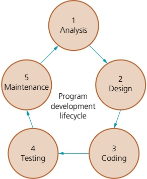
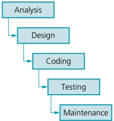
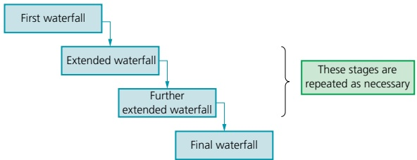
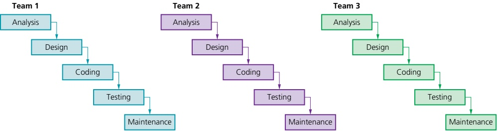
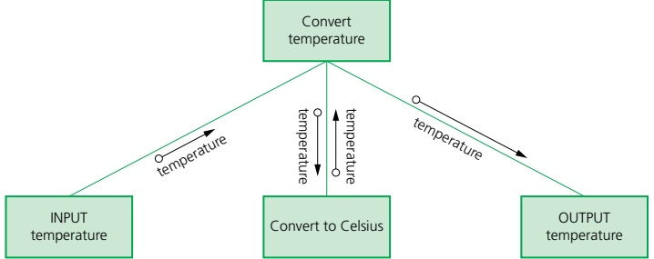
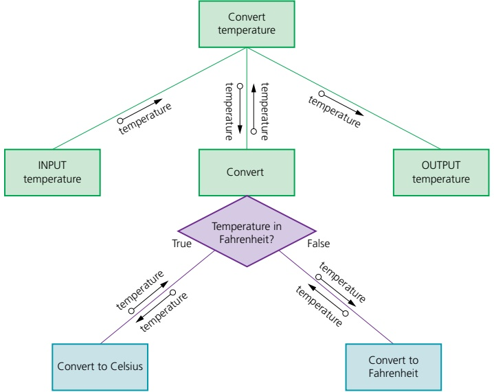
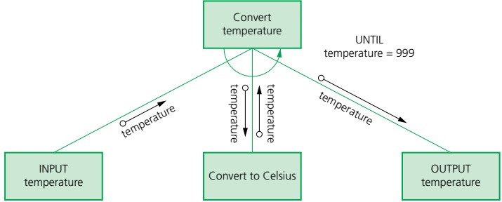
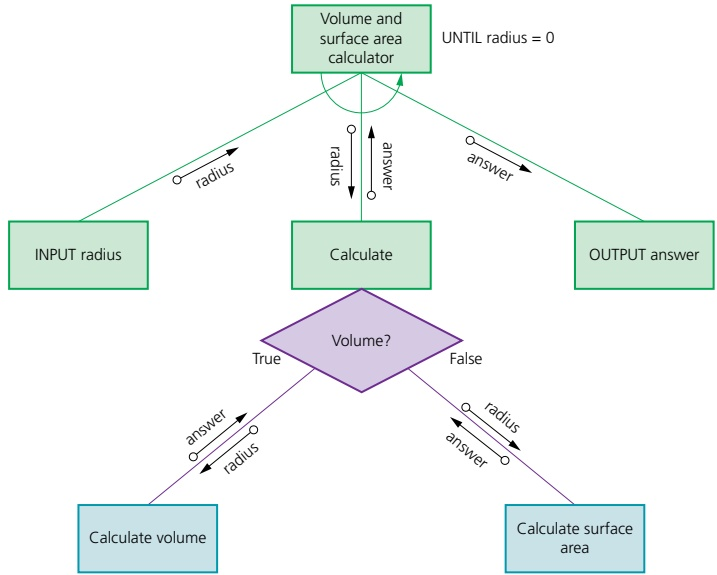
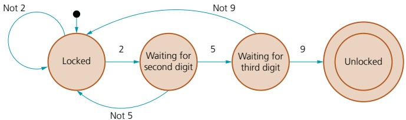
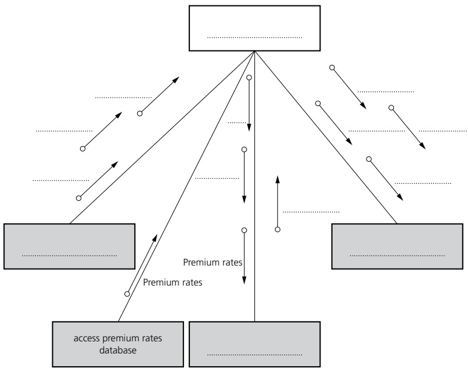

# 12 Software development

<!-- Cambridge International AS and a Level Computer Science (David Watson, Helen Williams).pdf p299-319 -->

<!-- page 299 -->

## 12 

## Software development

In this chapter, you will learn about

 $ ^{*} $ the purpose, types and stages of the program development lifecycle

how to document program design using structure charts and state-transition diagrams

★ avoiding syntax, logic and run-time errors in programs

★ different methods of testing programs to identify and correct such errors

 $ ^{*} $ the types of maintenance used as part of the program development lifecycle.

### 12.1 Program development lifecycle

## WHAT YOU SHOULD ALREADY KNOW

You may have studied or heard about the systems (or program) development lifecycle.

Try this activity before you read the first part of this chapter. A program development lifecycle goes through the same stages for a program.

Name and describe the stages of the program/systems development lifecycle. There are different development lifecycles used depending upon the system and the type of program being developed. Identify at least four of these. Work in small groups to research one of these and share your findings with the other groups.

## Key terms

Program development lifecycle – the process of developing a program set out in five stages: analysis, design, coding, testing and maintenance.

Analysis – part of the program development lifecycle; a process of investigation, leading to the specification of what a program is required to do.

Design – part of the program development lifecycle; it uses the program specification from the analysis stage to show how the program should be developed.

Coding – part of the program development lifecycle; the writing of the program or suite of programs.

Testing – part of the program development lifecycle; the testing of the program to make sure that it works under all conditions.

Maintenance – part of the program development lifecycle; the process of making sure that the program continues to work during use.

Waterfall model – a linear sequential program development cycle, in which each stage is completed before the next is begun.

Iterative model – a type of program development cycle in which a simple subset of the requirements is developed, then expanded or enhanced, with the development cycle being repeated until the full system has been developed.

Rapid application development (RAD) – a type of program development cycle in which different parts of the requirements are developed in parallel, using prototyping to provide early user involvement in testing.

<!-- page 300 -->

#### 12.1.1 The purpose of a program development lifecycle

In order to develop a successful program or suite of programs that is going to be used by others to perform a specific task or solve a given problem, the development needs to be well ordered and clearly documented, so that it can be understood and used by other developers.

This chapter introduces the formal stages of software (program) development that are set out in the program development lifecycle.

A program that has been developed may require alterations at any time in order to deal with new circumstances or new errors that have been found, so the stages are referred to as a lifecycle as this continues until the program is no longer used.

#### 12.1.2 Stages in the program development lifecycle

The stages of development in the program development lifecycle are shown in this chapter. The coding, testing and maintenance stages are looked at in depth and include appropriate tools and techniques to be used at each stage. Therefore, practical activities will be suggested for these stages to help reinforce the skills being learnt.

Here is a brief overview of the program development lifecycle, divided into the five stages, as shown in Figure 12.1.

Figure 12.1 The program development lifecycle

## Analysis

Before any problem can be solved, it needs to be clearly defined and set out so everyone working on the solution understands what is needed. This is called the requirements specification. The analysis stage often starts with a feasibility study, followed by investigation and fact finding to identify exactly what is required from the program.

## Design

The program specification from the analysis stage is used to show how the program should be developed. When the design stage is complete, the programmer should know what is to be done, all the tasks that need to be completed, how each task is to be performed and how the tasks work together. This can be formally documented using structure charts, state-transition diagrams and pseudocode.

<!-- page 301 -->

## Coding

The program or set of programs is written using a suitable programming language.

Figure 12.2 The waterfall model

## Testing

The program is run many times with different sets of test data, to test that it does everything it is supposed to do in the way set out in the program design.

## Maintenance

The program is maintained throughout its life, to ensure it continues to work effectively. This involves dealing with any problems that arise during use, including correcting any errors that come to light, improving the functionality of the program, or adapting the program to meet new requirements.

#### 12.1.3 Different development lifecycles

Each program development methodology has its own strength. Different models have been developed based on the lifecycle for developers to use in practice. The models we will consider will be divided into the five stages set out above: analysis, design, coding, testing and maintenance.

In this section of the chapter, we will look at three models: The waterfall model, the iterative model, and rapid application development (RAD).

## The waterfall model

This linear sequential development cycle is one of the earliest models used, where each stage is completed and signed off before the next stage is begun. This model is suitable for smaller projects with a short timescale, for which the requirements are well known and unlikely to change.

<table border=1 style='margin: auto; word-wrap: break-word;'><tr><td rowspan="3">Principles</td><td style='text-align: center; word-wrap: break-word;'>linear, as each stage is completed before the next is begun</td></tr><tr><td style='text-align: center; word-wrap: break-word;'>well documented as full documentation is completed at every stage</td></tr><tr><td style='text-align: center; word-wrap: break-word;'>low customer involvement; only involved at the start and end of the process</td></tr><tr><td rowspan="4">Benefits</td><td style='text-align: center; word-wrap: break-word;'>easy to manage, understand and use</td></tr><tr><td style='text-align: center; word-wrap: break-word;'>stages do not overlap and are completed one at a time</td></tr><tr><td style='text-align: center; word-wrap: break-word;'>each stage has specific deliverables</td></tr><tr><td style='text-align: center; word-wrap: break-word;'>works well for smaller programs where requirements are known and understood</td></tr><tr><td rowspan="4">Drawbacks</td><td style='text-align: center; word-wrap: break-word;'>difficult to change the requirements at a later stage</td></tr><tr><td style='text-align: center; word-wrap: break-word;'>not suitable for programs where the requirements could be subject to change</td></tr><tr><td style='text-align: center; word-wrap: break-word;'>working program is produced late in the lifecycle</td></tr><tr><td style='text-align: center; word-wrap: break-word;'>not suitable for long, complex projects</td></tr></table>

Table 12.1 Principles, benefits and drawbacks to the waterfall model

<!-- page 302 -->

The iterative model

Figure 12.3 The iterative model

This development cycle first develops a simple subset of the requirements, then expands or enhances the model and runs the development cycle again. These program development cycles are repeated until the full system has been developed. This model is suitable for projects for which the major requirements are known but some details are likely to change or evolve with time.

<table border=1 style='margin: auto; word-wrap: break-word;'><tr><td rowspan="3">Principles</td><td style='text-align: center; word-wrap: break-word;'>incremental development as the program development lifecycle is repeated</td></tr><tr><td style='text-align: center; word-wrap: break-word;'>working programs are produced for part of the system at every iteration</td></tr><tr><td style='text-align: center; word-wrap: break-word;'>high customer involvement, as part of the system can be shown to the customer after every iteration</td></tr><tr><td rowspan="4">Benefits</td><td style='text-align: center; word-wrap: break-word;'>some working programs developed quickly at an early stage in the lifecycle</td></tr><tr><td style='text-align: center; word-wrap: break-word;'>easier to test and debug smaller programs</td></tr><tr><td style='text-align: center; word-wrap: break-word;'>more flexible as easier to alter requirements</td></tr><tr><td style='text-align: center; word-wrap: break-word;'>customers involved at each iteration therefore no surprises when final system delivered</td></tr><tr><td rowspan="3">Drawbacks</td><td style='text-align: center; word-wrap: break-word;'>whole system needs to be defined at start, so it can be broken down into pieces to be developed at each iteration</td></tr><tr><td style='text-align: center; word-wrap: break-word;'>needs good planning overall and for every stage</td></tr><tr><td style='text-align: center; word-wrap: break-word;'>not suitable for short simple projects</td></tr></table>

Table 12.2 Principles, benefits and drawbacks to the iterative model

Rapid application development (RAD)

Figure 12.4 Rapid application development (RAD)

<!-- page 303 -->

This development cycle develops different parts of the requirements in parallel, using prototyping to provide early user involvement in testing. Program development cycles are run in parallel for each part of the requirement, using a number of different teams. Prototyping is often used to show initial versions to customers to obtain early feedback. This model is suitable for complicated projects that need developing in a short timeframe to meet the evolving needs of a business.

<table border=1 style='margin: auto; word-wrap: break-word;'><tr><td rowspan="3">Principles</td><td style='text-align: center; word-wrap: break-word;'>minimal planning</td></tr><tr><td style='text-align: center; word-wrap: break-word;'>reuses previously written code where possible, makes use of automated code generation where possible</td></tr><tr><td style='text-align: center; word-wrap: break-word;'>high customer involvement, as customers can use the prototypes during development</td></tr><tr><td rowspan="4">Benefits</td><td style='text-align: center; word-wrap: break-word;'>reduced overall development time</td></tr><tr><td style='text-align: center; word-wrap: break-word;'>rapid frequent customer feedback informs the development</td></tr><tr><td style='text-align: center; word-wrap: break-word;'>very flexible as requirements evolve from feedback during development</td></tr><tr><td style='text-align: center; word-wrap: break-word;'>as parts of the system are developed side by side, modification is easier because each part must work independently</td></tr><tr><td rowspan="3">Drawbacks</td><td style='text-align: center; word-wrap: break-word;'>system under development needs to be modular</td></tr><tr><td style='text-align: center; word-wrap: break-word;'>needs strong teams of skilled developers</td></tr><tr><td style='text-align: center; word-wrap: break-word;'>not suitable for short simple projects</td></tr></table>

Table 12.3 Principles, benefits and drawbacks to rapid application development (RAD)

## EXTENSION ACTIVITY 12A

Find out about four more program development methodologies.

### 12.2 Program design

## WHAT YOU SHOULD ALREADY KNOW

In this chapter, you will need to be able to write more complicated pseudocode, as described by a structure chart. It is essential that you consolidate your knowledge before you attempt to do this.

Make sure that you have read and understood Chapter 11 and you are able to write pseudocode that passes parameters to procedures and functions.

## Key terms

Structure chart – a modelling tool used to decompose a problem into a set of sub-tasks. It shows the hierarchy or structure of the different modules and how they connect and interact with each other.

Finite state machine (FSM) – a mathematical model of a machine that can be in one state of a fixed set of possible states; one state is changed to another by an external input; this is known as a transition.

State-transition diagram – a diagram showing the behaviour of a finite state machine (FSM).

State-transition table – a table showing every state of a finite state machine (FSM), each possible input and the state after the input.

<!-- page 304 -->

#### 12.2.1 Purpose and use of structure charts

## ACTIVITY 12A

A structure chart is a modelling tool used in program design to decompose a problem into a set of sub-tasks. The structure chart shows the hierarchy or structure of the different modules and how they connect and interact with each other. Each module is represented by a box and the parameters passed to and from the modules are shown by arrows pointing towards the module receiving the parameter. Each level of the structure chart is a refinement of the level above.

Draw a structure chart to input the height and width of a right-angled triangle, calculate output and output the length of the hypotenuse.

Figure 12.5 shows a structure chart for converting a temperature from Fahrenheit to Celsius. The top level shows the name for the whole task that is refined into three sub-tasks or modules shown on the next level.

Figure 12.5 A structure chart for converting a temperature from Fahrenheit to Celsius

Structure charts can also show selection. The temperature conversion task above could be extended to either convert from Fahrenheit to Celsius or Celsius to Fahrenheit using the diamond shaped box to show a condition that could be true or false, as shown in Figure 12.6.

Figure 12.6

<!-- page 305 -->

## ACTIVITY 12B

Draw a structure chart to input the radius of a sphere, calculate output and output either the volume or the surface area.

## ACTIVITY 12C

Amend your structure chart to input the radius of a sphere, calculate and output either the volume or the surface area. The algorithm should repeat until a radius of zero is entered.

Structure charts can also show repetition. The temperature conversion task above could be extended to repeat the conversion until the number 999 is input. The repetition is shown by adding a labelled semi-circular arrow above the modules to be completed (Figure 12.7).

### Figure 12.7

Once a structure chart has been completed, it can be used to derive a pseudocode algorithm.

Figure 12.8 shows a possible structure chart for Activity 12C.

Figure 12.8

<!-- page 306 -->

To derive the pseudo code first, you will need to create an identifier table.

<table border=1 style='margin: auto; word-wrap: break-word;'><tr><td style='text-align: center; word-wrap: break-word;'>Identifier name</td><td style='text-align: center; word-wrap: break-word;'>Description</td></tr><tr><td style='text-align: center; word-wrap: break-word;'>radius</td><td style='text-align: center; word-wrap: break-word;'>Stores radius input</td></tr><tr><td style='text-align: center; word-wrap: break-word;'>answer</td><td style='text-align: center; word-wrap: break-word;'>Stores result of calculation</td></tr><tr><td style='text-align: center; word-wrap: break-word;'>pi</td><td style='text-align: center; word-wrap: break-word;'>Constant set to 3.142</td></tr></table>

### Table 12.4

Then declare constants and variables in pseudocode. You can identify two of the variables required from the parameters shown in the structure diagram.

DECLARE radius : REAL
DECLARE answer : REAL
CONSTANT pi \leftarrow 3.142

Provide pseudocode for the modules shown in the structure diagram. As Calculate volume and Calculate surface area provide the answer to a calculation, these can be defined as functions.

FUNCTION calculateVolume (radius:real) RETURNS real
RETURN (4 / 3) * pi * radius * radius * radius
ENDFUNCTION
FUNCTION calculateSurfaceArea (radius:real) RETURNS real
RETURN 4 * pi * radius * radius
ENDFUNCTION

The input and output modules could be defined as procedures.

PROCEDURE inputRadius
OUTPUT "Please enter the radius of the sphere"
INPUT radius
WHILE radius < 0 DO
OUTPUT "Please enter a positive number"
INPUT radius
ENDWHILE
ENDPROCEDURE
PROCEDURE outputAnswer
OUTPUT answer
ENDPROCEDURE

<!-- page 307 -->

The pseudocode for the whole algorithm, including the selection and repetition, would be as follows.

DECLARE radius : REAL
DECLARE answer : REAL
CONSTANT pi ← 3.142
FUNCTION calculateVolume (radius:real) RETURNS real
    RETURN (4 / 3) * pi * radius * radius * radius
ENDFUNCTION
FUNCTION calculateSurfaceArea (radius:real) RETURNS real
RETURN 4 * pi * radius * radius
ENDFUNCTION
PROCEDURE inputRadius
    OUTPUT "Please enter the radius of the sphere "
    INPUT radius
    WHILE radius < 0 DO
        OUTPUT "Please enter a positive number "
        INPUT radius
    ENDWHILE
ENDPROCEDURE
PROCEDURE outputAnswer
    OUTPUT answer
ENDPROCEDURE
CALL inputRadius
WHILE radius <> 0
    OUTPUT "Do you want to calculate the Volume (V) or Surface Area (S)"
    INPUT reply
    IF reply = "V"
        THEN
            answer ← calculateVolume(radius)
                OUTPUT "Volume "
                ELSE
                answer ← calculateSurfaceArea(radius)
                OUTPUT "Surface Area "
    ENDIF
CALL outputAnswer
CALL inputRadius
ENDWHILE

<!-- page 308 -->

## ACTIVITY 12D

Draw a structure chart to extend the temperature conversion algorithm to both convert from Fahrenheit to Celsius and Celsius to Fahrenheit, and repeat until a temperature of 999 is input.

Use your structure chart to create an identifier table and write the pseudocode for this algorithm.

#### 12.2.2 Purpose and use of state-transition diagrams to document algorithms

A finite state machine (FSM) is a mathematical model of a machine that can be in one of a fixed set of possible states. One state is changed to another by an external input, this is called a transition. A diagram showing the behaviour of an FSM is called a state-transition diagram.

State-transition diagrams show the conditions needed for an event or events that will cause a transition to occur, and the outputs or actions carried out as the result of that transition.

State-transition diagrams can be constructed as follows:

States are represented as nodes (circles).

》 Transitions are represented as interconnecting arrows.

Events are represented as labels on the arrows.

Conditions can be specified in square brackets after the event label.

The initial state is indicated by an arrow with a black dot.

» A stopped state is indicated by a double circle.

The algorithm for unlocking a door using a three-digit entry code can be represented by a state-transition diagram. If the door is unlocked with a three-digit entry code, the lock can be in four states

locked and waiting for the input of the first digit

waiting for the input of the second digit

» waiting for the input of the third digit

unlocked.

If an incorrect digit is input, then the door returns to the locked state. The algorithm halts when the door is unlocked. A state-transition table shows every state, each possible input and the state after the input. The state-transition table for a door with the entry code 259 is shown below.

<table border=1 style='margin: auto; word-wrap: break-word;'><tr><td style='text-align: center; word-wrap: break-word;'>Current state</td><td style='text-align: center; word-wrap: break-word;'>Event</td><td style='text-align: center; word-wrap: break-word;'>Next state</td></tr><tr><td style='text-align: center; word-wrap: break-word;'>locked</td><td style='text-align: center; word-wrap: break-word;'>2 input</td><td style='text-align: center; word-wrap: break-word;'>waiting for input of 2nd digit</td></tr><tr><td style='text-align: center; word-wrap: break-word;'>locked</td><td style='text-align: center; word-wrap: break-word;'>not 2 input</td><td style='text-align: center; word-wrap: break-word;'>locked</td></tr><tr><td style='text-align: center; word-wrap: break-word;'>waiting for input of 2nd digit</td><td style='text-align: center; word-wrap: break-word;'>5 input</td><td style='text-align: center; word-wrap: break-word;'>waiting for input of 3rd digit</td></tr><tr><td style='text-align: center; word-wrap: break-word;'>waiting for input of 2nd digit</td><td style='text-align: center; word-wrap: break-word;'>not 5 input</td><td style='text-align: center; word-wrap: break-word;'>locked</td></tr><tr><td style='text-align: center; word-wrap: break-word;'>waiting for input of 3rd digit</td><td style='text-align: center; word-wrap: break-word;'>9 input</td><td style='text-align: center; word-wrap: break-word;'>unlocked and stopped</td></tr><tr><td style='text-align: center; word-wrap: break-word;'>waiting for input of 3rd digit</td><td style='text-align: center; word-wrap: break-word;'>not 9 input</td><td style='text-align: center; word-wrap: break-word;'>locked</td></tr></table>

▲ Table 12.5 The state-transition table for a door with the entry code 259

<!-- page 309 -->

The state-transition diagram for a door with the entry code 259 is shown in Figure 12.9.

Figure 12.9 State-transition diagram for a door with the entry code 259

## ACTIVITY 12E

Draw a state-transition diagram for the operation of a television with a single on/off button. The television can be in three states: on, off and standby. If the button is pressed once (single press) in standby or off, the television switches on; if the button is pressed once (single press) when the television is on, the television goes to standby; if the button is pressed twice (double press) when the television is on, the television goes to off. Double presses in standby or off are ignored.

Copy and complete the state-transition table and draw the state-transition diagram for the television operation.

<table border=1 style='margin: auto; word-wrap: break-word;'><tr><td style='text-align: center; word-wrap: break-word;'>Current state</td><td style='text-align: center; word-wrap: break-word;'>Event</td><td style='text-align: center; word-wrap: break-word;'>Next state</td></tr><tr><td style='text-align: center; word-wrap: break-word;'>Off</td><td style='text-align: center; word-wrap: break-word;'>Single press</td><td style='text-align: center; word-wrap: break-word;'></td></tr><tr><td style='text-align: center; word-wrap: break-word;'>Off</td><td style='text-align: center; word-wrap: break-word;'>Double press</td><td style='text-align: center; word-wrap: break-word;'></td></tr><tr><td style='text-align: center; word-wrap: break-word;'>Standby</td><td style='text-align: center; word-wrap: break-word;'>Single press</td><td style='text-align: center; word-wrap: break-word;'></td></tr><tr><td style='text-align: center; word-wrap: break-word;'>Standby</td><td style='text-align: center; word-wrap: break-word;'>Double press</td><td style='text-align: center; word-wrap: break-word;'></td></tr><tr><td style='text-align: center; word-wrap: break-word;'>On</td><td style='text-align: center; word-wrap: break-word;'>Single press</td><td style='text-align: center; word-wrap: break-word;'></td></tr><tr><td style='text-align: center; word-wrap: break-word;'>On</td><td style='text-align: center; word-wrap: break-word;'>Double press</td><td style='text-align: center; word-wrap: break-word;'></td></tr></table>

### 12.3 Program testing and maintenance

## WHAT YOU SHOULD ALREADY KNOW

You will need to be able to know how to thoroughly test any programs that you write. Have a go at the activity below.

Take a program that you have written recently and explain to another student how you tested the program and which data sets you chose for your testing.

<!-- page 310 -->

<table border=1 style='margin: auto; word-wrap: break-word;'><tr><td colspan="2">Key terms</td></tr><tr><td style='text-align: center; word-wrap: break-word;'>Trace table – a table showing the process of dry-running a program with columns showing the values of each variable as it changes.</td><td style='text-align: center; word-wrap: break-word;'>White-box testing – a method of testing a program that tests the structure and logic of every path through a program module.</td></tr><tr><td style='text-align: center; word-wrap: break-word;'>Run-time error – an error found in a program when it is executed; the program may halt unexpectedly.</td><td style='text-align: center; word-wrap: break-word;'>Black-box testing – a method of testing a program that tests a module&#x27;s inputs and outputs.</td></tr><tr><td style='text-align: center; word-wrap: break-word;'>Test strategy – an overview of the testing required to meet the requirements specified for a particular program; it shows how and when the program is to be tested.</td><td style='text-align: center; word-wrap: break-word;'>Integration testing – a method of testing a program that tests combinations of program modules that work together.</td></tr><tr><td style='text-align: center; word-wrap: break-word;'>Test plan – a detailed list showing all the stages of testing and every test that will be performed for a particular program.</td><td style='text-align: center; word-wrap: break-word;'>Stub testing – the use of dummy modules for testing purposes.</td></tr><tr><td style='text-align: center; word-wrap: break-word;'>Dry run – a method of testing a program that involves working through a program or module from a program manually.</td><td style='text-align: center; word-wrap: break-word;'>Alpha testing – the testing of a completed or nearly completed program in-house by the development team.</td></tr><tr><td style='text-align: center; word-wrap: break-word;'>Walkthrough – a method of testing a program. A formal version of a dry run using pre-defined test cases.</td><td style='text-align: center; word-wrap: break-word;'>Beta testing – the testing of a completed program by a small group of users before it is released.</td></tr><tr><td style='text-align: center; word-wrap: break-word;'>Normal test data – test data that should be accepted by a program.</td><td style='text-align: center; word-wrap: break-word;'>Acceptance testing – the testing of a completed program to prove to the customer that it works as required.</td></tr><tr><td style='text-align: center; word-wrap: break-word;'>Abnormal test data – test data that should be rejected by a program.</td><td style='text-align: center; word-wrap: break-word;'>Corrective maintenance – the correction of any errors that appear during use.</td></tr><tr><td style='text-align: center; word-wrap: break-word;'>Extreme test data – test data that is on the limit of that accepted by a program.</td><td style='text-align: center; word-wrap: break-word;'>Perfective maintenance – the process of making improvements to the performance of a program.</td></tr><tr><td style='text-align: center; word-wrap: break-word;'>Boundary test data – test data that is on the limit of that accepted by a program or data that is just outside the limit of that rejected by a program.</td><td style='text-align: center; word-wrap: break-word;'>Adaptive maintenance – the alteration of a program to perform new tasks.</td></tr></table>

#### 12.3.1 Ways of avoiding and exposing faults in programs

Most programs written to perform a real task will contain errors, as programmers are human and do make mistakes. The aim is to avoid making as many mistakes as possible and then find as many mistakes as possible before the program goes live. Unfortunately, this does not always happen and many spectacular failures have occurred. More than one large bank has found that its customers were locked out of their accounts for some time when new software was installed. Major airlines have had to cancel flights because of programming errors. One prison service released prisoners many days earlier than required for about 15 years because of a faulty program.

Faults in an executable program are frequently faults in the design of the program. Fault avoidance starts with the provision of a comprehensive and rigorous program specification at the end of the analysis phase of the program development lifecycle, followed by the use of formal methods such as structure charts, state-transition diagrams and pseudocode at the design stage. At the coding stage, the use of programming disciplines such as information hiding, encapsulation and exception handling, as described in Chapter 20, all help to prevent faults.

Faults or bugs in a program are then exposed at the testing stage. Testing will show the presence of faults to be corrected, but cannot guarantee that large,

<!-- page 311 -->

complex programs are fault free under all circumstances. Faults can appear during the lifetime of a program and may be exposed during live running. The faults are then corrected as part of the maintenance stage of the program lifecycle.

## EXTENSION ACTIVITY 12B

In small groups, research recent spectacular software failures. Choose one failure per group and find out what went wrong and how it affected the organisation and their customers. Summarise and present your group's findings to the rest of the class.

#### 12.3.2 Location, identification and correction of errors

Syntax errors are errors in the grammar of a source program. In the coding phase of the program development lifecycle, programs are either compiled or interpreted so they can be executed. During this operation, the syntax of the program is checked, and errors need to be corrected before the program can be executed. Figure 12.10 shows an example of a syntax error being found, and the IDE offering a possible reason for the error.

value1 = 20
value2 = 30
total = value1 + vvalue2

Typo: in word 'value' more... (Ctrl+F1)

### Figure 12.10

Many IDEs will offer suggestions about what syntax errors are and how to correct them.

Logic errors are errors in the logic of a program, meaning the program does not do what it is supposed to do. These errors are usually found when the program is being tested. For example, the program in Figure 12.11 will run, but the results will not be as expected.

if Direction == "N":
    Y=X+1
elif Direction == "S":
    Y=Y-1
elif Direction == "E":
    X=X+1
elif Direction == "W":
    X=X-1
else :
    print("Error")

### Figure 12.11

Many IDEs will allow you to single step through a program to find errors (see Chapter 5, Section 5.2.4). You can also manually work through a program to check that it works as it should, using tools such as a trace table. Trace tables show the process of dry-running a program with columns showing the values of each variable as it changes.

<!-- page 312 -->

Run-time errors happen when the program is executed. The program may halt unexpectedly or go into an infinite loop and need to be stopped by brute force. If a program is being tested in an IDE, then this type of error may be managed, and a suitable error message given, as shown below.

Program with divide by zero error
1 value1 = 10
2 value2 = 0
3 value3 = value1 + value2
4 value4 = value1 / value2
Traceback (most recent call last):
    File "ErrorTest.py", line 4, in <module>
        value4 = value1 /value2
ZeroDivisionError: division by zero
Process finished with exit code 1

If the program has already been released for use and a run-time error occurs, the developer should be informed so that the program can be updated and re-released or a patch can be sent out to all customers to solve the problem. A patch is a small program, released by the developers, to run with an existing program to correct an error or provide extra functionality. The Windows operating system is frequently patched and the process of downloading patches and updating the program has been automated.

#### 12.3.3 Program testing

Programs need to be rigorously tested before they are released. Tests begin from the moment they are written; they should be documented to show that the program is robust and ready for general use.

There needs to be a test strategy set out in the analysis stage of the program development lifecycle showing an overview of the testing required to meet the requirements specified. This shows how and when the program is to be tested.

In order to clarify what tests need to be performed, a test plan is drawn up showing all the stages of testing and every test that will be performed. As the testing is carried out, the results of the tests can be added to the plan showing that the program has met its requirements.

There are several formal methods of testing used to ensure that a program is robust and works to the standard required. Although there is a testing stage in the program development lifecycle, testing in some form occurs at every stage, from design to maintenance.

During the program design stage, pseudocode is written. This can be tested using a dry run, in which the developer works through a program or module from a program manually and documents the results using a trace table.

<!-- page 313 -->

For example, a procedure to perform a calculation could be tested as follows.

PROCEDURE calculation(number1, number2, sign)
CASE sign OF
'+' : answer ← number1 + number2
'-' : answer ← number1 + number2
'*' : answer ← number1 * number2
'/' : answer ← number1 / number2
OTHERWISE answer ← 0

ENDCASE
IF answer <> 0
THEN
OUTPUT answer

ENDIF

ENDPROCEDURE

The test data used could include 20 10 +, 20 10 −, 20 10 *, 20 10 /, 20 10 ? and 20 0 /.

The trace table below shows the value of each variable and any output.

<table border=1 style='margin: auto; word-wrap: break-word;'><tr><td style='text-align: center; word-wrap: break-word;'>number1</td><td style='text-align: center; word-wrap: break-word;'>number2</td><td style='text-align: center; word-wrap: break-word;'>sign</td><td style='text-align: center; word-wrap: break-word;'>answer</td><td style='text-align: center; word-wrap: break-word;'>OUTPUT</td></tr><tr><td style='text-align: center; word-wrap: break-word;'>20</td><td style='text-align: center; word-wrap: break-word;'>10</td><td style='text-align: center; word-wrap: break-word;'>+</td><td style='text-align: center; word-wrap: break-word;'>30</td><td style='text-align: center; word-wrap: break-word;'>30</td></tr><tr><td style='text-align: center; word-wrap: break-word;'>20</td><td style='text-align: center; word-wrap: break-word;'>10</td><td style='text-align: center; word-wrap: break-word;'>-</td><td style='text-align: center; word-wrap: break-word;'>30</td><td style='text-align: center; word-wrap: break-word;'>30</td></tr><tr><td style='text-align: center; word-wrap: break-word;'>20</td><td style='text-align: center; word-wrap: break-word;'>10</td><td style='text-align: center; word-wrap: break-word;'>*</td><td style='text-align: center; word-wrap: break-word;'>200</td><td style='text-align: center; word-wrap: break-word;'>200</td></tr><tr><td style='text-align: center; word-wrap: break-word;'>20</td><td style='text-align: center; word-wrap: break-word;'>10</td><td style='text-align: center; word-wrap: break-word;'>/</td><td style='text-align: center; word-wrap: break-word;'>2</td><td style='text-align: center; word-wrap: break-word;'>2</td></tr><tr><td style='text-align: center; word-wrap: break-word;'>20</td><td style='text-align: center; word-wrap: break-word;'>10</td><td style='text-align: center; word-wrap: break-word;'>?</td><td style='text-align: center; word-wrap: break-word;'>0</td><td style='text-align: center; word-wrap: break-word;'></td></tr><tr><td style='text-align: center; word-wrap: break-word;'>20</td><td style='text-align: center; word-wrap: break-word;'>0</td><td style='text-align: center; word-wrap: break-word;'>/</td><td style='text-align: center; word-wrap: break-word;'>undefined</td><td style='text-align: center; word-wrap: break-word;'></td></tr></table>

Table 12.6

The errors found in the routine by performing the dry run have been highlighted in red. These can now be corrected before this routine is coded.

## ACTIVITY 12F

Correct the pseudocode and perform the dry run again to ensure that your corrections work.

## ACTIVITY 12G

Using the pseudocode algorithm for the volume and surface area of a sphere in Section 12.2.1, devise some test data and a trace table to test the algorithm.

Swap your test data and trace table with another student then perform the dry run and complete the trace table.

Discuss any differences or problems you find.

<!-- page 314 -->

A walkthrough is a formalised version of a dry run using pre-defined test cases. This is where another member of the development team independently dry runs the pseudocode, or the developer takes the team members through the dry run process. This is often done as a demonstration.

During the program development and testing, each module is tested as set out in the test plan. Test plans are often set out as a table; an example for the calculation procedure is shown below.

<table border=1 style='margin: auto; word-wrap: break-word;'><tr><td style='text-align: center; word-wrap: break-word;'>Test</td><td style='text-align: center; word-wrap: break-word;'>Purpose</td><td style='text-align: center; word-wrap: break-word;'>Test data</td><td style='text-align: center; word-wrap: break-word;'>Expected outcome</td><td style='text-align: center; word-wrap: break-word;'>Actual outcome</td></tr><tr><td rowspan="2">to test the + calculation</td><td rowspan="2">to ensure that the + calculation works as expected</td><td style='text-align: center; word-wrap: break-word;'>normal data\n20 10 +</td><td style='text-align: center; word-wrap: break-word;'>30</td><td style='text-align: center; word-wrap: break-word;'>30</td></tr><tr><td style='text-align: center; word-wrap: break-word;'>abnormal data twenty ten +</td><td style='text-align: center; word-wrap: break-word;'>error message</td><td style='text-align: center; word-wrap: break-word;'>incorrect calculation</td></tr><tr><td rowspan="2">to test the – calculation</td><td rowspan="2">to ensure that the – calculation works as expected</td><td style='text-align: center; word-wrap: break-word;'>normal data\n20 10 –</td><td style='text-align: center; word-wrap: break-word;'>10</td><td style='text-align: center; word-wrap: break-word;'>30</td></tr><tr><td style='text-align: center; word-wrap: break-word;'>abnormal data twenty ten –</td><td style='text-align: center; word-wrap: break-word;'>error message</td><td style='text-align: center; word-wrap: break-word;'>incorrect calculation</td></tr></table>

▲ Table 12.7 An example of a calculation procedure set out as a table

The results from this testing show that the error in the subtraction calculation has not been fixed and the routine is not trapping any abnormal data in the variables used by the calculation. These errors will need correcting and then the routine will need to be retested.

## EXTENSION ACTIVITY 12C

In the programming language you have chosen to use, write the procedure for calculations and any other code necessary. Use and extend the test plan above to ensure that the calculation module works as it should.

Several types of test data need to be used during testing:

» Normal test data that is to be accepted by a program and is used to show that the program is working as expected.

» Abnormal test data that should be rejected by a program as it is unsuitable or could cause problems.

Extreme test data that is on the limit of that accepted by a program; for example, when testing a validation rule such as number >= 12 AND number <= 32 the extreme test data would be 12 at the lower limit and 32 at the upper limit; both these values should be accepted.

» Boundary test data that is on the limit of that accepted by a program or data that is just outside the limit of that rejected by a program; for example, when testing a validation rule such as number >= 12 AND number <= 32 the boundary test data would be 12 and 11 at the lower limit and 32 and 33 at the upper limit; 12 and 32 should be accepted, 11 and 33 should be rejected.

<!-- page 315 -->

## ACTIVITY 12H

An algorithm is to be written to test whether a password is eight characters or more and 15 characters or less in length. The password must contain at least one digit, at least one capital letter and no characters other than letters or digits.

Devise a set of test data to be used to test the password checking algorithm.

Discuss any problems there may be in devising a complete set of test data.

## EXTENSION ACTIVITY 12D

In the programming language you have chosen to use, write a procedure to check that the password conforms to the rules in Activity 12H. Use your test data from the previous activity to write a test plan and test that your procedure works as it should.

As the program is being developed the following types of testing are used:

White-box testing is the detailed testing of how each procedure works. This involves testing the structure and logic of every path through a program module.

Black-box testing tests a module's inputs and outputs.

» Integration testing is the testing of any separately written modules to ensure that they work together, during the testing phase of the program development lifecycle. If any of the modules have not been written yet, this can include stub testing, which makes use of dummy modules for testing purposes.

When the program has been completed, it is tested as a whole:

Alpha testing is used first. The completed, or nearly completed, program is tested in-house by the development team.

Beta testing is then used. The completed program is tested by a small group of users before it is generally released.

Acceptance testing is then used for the completed program to prove to the customer that it works as required in the environment in which it will be used.

#### 12.3.4 Program maintenance

Program maintenance is not like maintaining a piece of equipment by replacing worn out parts. Programs do not wear out, but they might not work correctly in unforeseen circumstances. Logic or run-time errors that require correction may occur from time to time, or users may want to use the program in a different way.

Program maintenance can usually be divided into three categories:

Corrective maintenance is used to correct any errors that appear during use, for example trapping a run-time error that had been missed during testing.

Perfective maintenance is used to improve the performance of a program during its use, for example improving the speed of response.

» Adaptive maintenance is used to alter a program so it can perform any new tasks required by the customer, for example working with voice commands as well as keyboard entry.

<!-- page 316 -->

## ACTIVITY 121

Analyse the pseudocode algorithm for the volume and surface area of the sphere in Section 12.2.1 and identify at least three improvements you could make to the functionality of this algorithm.

## ACTIVITY 12J

1 Explain, using examples, the difference between syntax and logic errors.

2 A programmer wants to test that a range check for values over 10 and under 100 works.

Identify three types of test data that should be used. Provide an example of each type of test data and describe how the program should react to the data.

3 Identify three types of program maintenance and describe the role of each type of maintenance.

End of chapter questions

When the guarantee on a computer runs out, the owner can take out insurance to cover breakdown and repairs.

The price of the insurance is calculated from:

- the model of the computer

- the age of the computer

- the current insurance rates

Following an enquiry to the insurance company, the customer receives a quotation letter with the price of the insurance. A program is to be produced.

The structure chart below shows the modular design for this process.

<!-- page 317 -->

a) Copy the chart above and, using the letters A to D, add the labelling to the chart boxes.

<table border=1 style='margin: auto; word-wrap: break-word;'><tr><td colspan="2">Modules</td></tr><tr><td style='text-align: center; word-wrap: break-word;'>A</td><td style='text-align: center; word-wrap: break-word;'>Send quotation letter</td></tr><tr><td style='text-align: center; word-wrap: break-word;'>B</td><td style='text-align: center; word-wrap: break-word;'>Calculate price</td></tr><tr><td style='text-align: center; word-wrap: break-word;'>C</td><td style='text-align: center; word-wrap: break-word;'>Produce insurance quotation</td></tr><tr><td style='text-align: center; word-wrap: break-word;'>D</td><td style='text-align: center; word-wrap: break-word;'>Input computer details</td></tr></table>

b) Using the letters E to J, complete the labelling on the chart.

Some of these letters will be used more than once.

<table border=1 style='margin: auto; word-wrap: break-word;'><tr><td colspan="2">Data items</td></tr><tr><td style='text-align: center; word-wrap: break-word;'>E</td><td style='text-align: center; word-wrap: break-word;'>CustomerName</td></tr><tr><td style='text-align: center; word-wrap: break-word;'>F</td><td style='text-align: center; word-wrap: break-word;'>CustomerEmail</td></tr><tr><td style='text-align: center; word-wrap: break-word;'>G</td><td style='text-align: center; word-wrap: break-word;'>Model</td></tr><tr><td style='text-align: center; word-wrap: break-word;'>H</td><td style='text-align: center; word-wrap: break-word;'>Age</td></tr><tr><td style='text-align: center; word-wrap: break-word;'>I</td><td style='text-align: center; word-wrap: break-word;'>PolicyCharge</td></tr><tr><td style='text-align: center; word-wrap: break-word;'>J</td><td style='text-align: center; word-wrap: break-word;'>PolicyNumber</td></tr></table>

Cambridge International AS & A Level Computer Science 9608

Paper 22 Q3 June 2015

2 A 1D array, Product, of type STRING is used to store information about a range of products in a shop. There are 100 elements in the array. Each element stores one data item.

The format of each data item is as follows:

<ProductID><ProductName>

ProductID is a four-character string of numerals

ProductName is a variable-length string

The following pseudocode is an initial attempt at defining a procedure, ArraySort, which will perform a bubble sort on Product. The array is to be sorted in ascending order of ProductID. Line numbers have been added for identification purposes only.

01 PROCEDURE SortArray
02 DECLARE Temp : CHAR
03 DECLARE FirstID, SecondID : INTEGER
04 FOR I  $ \leftarrow $ 1 TO 100
05 FOR J  $ \leftarrow $ 2 TO 99
06 FirstID  $ \leftarrow $ MODULUS(LEFT(Product[J], 6))
07 SecondID  $ \leftarrow $ MODULUS(LEFT(Product[J + 1], 6))
08 IF FirstID > SecondID

[2]

<!-- page 318 -->

<table border=1 style='margin: auto; word-wrap: break-word;'><tr><td style='text-align: center; word-wrap: break-word;'>09</td><td style='text-align: center; word-wrap: break-word;'>THEN</td></tr><tr><td style='text-align: center; word-wrap: break-word;'>10</td><td style='text-align: center; word-wrap: break-word;'>Temp ← Product[I]</td></tr><tr><td style='text-align: center; word-wrap: break-word;'>11</td><td style='text-align: center; word-wrap: break-word;'>Product[I] Product[J + 1]</td></tr><tr><td style='text-align: center; word-wrap: break-word;'>12</td><td style='text-align: center; word-wrap: break-word;'>Product[J + 1] Temp</td></tr><tr><td style='text-align: center; word-wrap: break-word;'>13</td><td style='text-align: center; word-wrap: break-word;'>ENDFOR</td></tr><tr><td style='text-align: center; word-wrap: break-word;'>14</td><td style='text-align: center; word-wrap: break-word;'>ENDIF</td></tr><tr><td style='text-align: center; word-wrap: break-word;'>15</td><td style='text-align: center; word-wrap: break-word;'>ENDFOR</td></tr><tr><td style='text-align: center; word-wrap: break-word;'>16</td><td style='text-align: center; word-wrap: break-word;'>ENDPROCEDURE</td></tr></table>

The pseudocode contains a number of errors.

Copy and complete the following table to show:

- the line number of the error

- the error itself

- the correction that is required.

## Note:

- If the same error occurs on more than one line, you should only refer to it ONCE.

- Lack of optimisation should not be regarded as an error.

<table border=1 style='margin: auto; word-wrap: break-word;'><tr><td style='text-align: center; word-wrap: break-word;'>Line number</td><td style='text-align: center; word-wrap: break-word;'>Error</td><td style='text-align: center; word-wrap: break-word;'>Correction</td></tr><tr><td style='text-align: center; word-wrap: break-word;'>01</td><td style='text-align: center; word-wrap: break-word;'>Wrong procedure name - &quot;SortArray&quot;</td><td style='text-align: center; word-wrap: break-word;'>PROCEDURE ArraySort</td></tr><tr><td style='text-align: center; word-wrap: break-word;'></td><td style='text-align: center; word-wrap: break-word;'></td><td style='text-align: center; word-wrap: break-word;'></td></tr><tr><td style='text-align: center; word-wrap: break-word;'></td><td style='text-align: center; word-wrap: break-word;'></td><td style='text-align: center; word-wrap: break-word;'></td></tr><tr><td style='text-align: center; word-wrap: break-word;'></td><td style='text-align: center; word-wrap: break-word;'></td><td style='text-align: center; word-wrap: break-word;'></td></tr><tr><td style='text-align: center; word-wrap: break-word;'></td><td style='text-align: center; word-wrap: break-word;'></td><td style='text-align: center; word-wrap: break-word;'></td></tr><tr><td style='text-align: center; word-wrap: break-word;'></td><td style='text-align: center; word-wrap: break-word;'></td><td style='text-align: center; word-wrap: break-word;'></td></tr><tr><td style='text-align: center; word-wrap: break-word;'></td><td style='text-align: center; word-wrap: break-word;'></td><td style='text-align: center; word-wrap: break-word;'></td></tr><tr><td style='text-align: center; word-wrap: break-word;'></td><td style='text-align: center; word-wrap: break-word;'></td><td style='text-align: center; word-wrap: break-word;'></td></tr></table>

Cambridge International AS & A Level Computer Science 9608

Paper 22 Q3 November 2017

3 A company creates two new websites, Site X and Site Y, for selling bicycles.

Various programs are to be written to process the sales data.

These programs will use data about daily sales made from Site X (using variable SalesX) and Site Y (using variable SalesY).

<!-- page 319 -->

Data for the first 28 days is shown below.

SalesDate
03/06/2015
04/06/2015
05/06/2015
06/06/2015
07/06/2015
08/06/2015
09/06/2015
10/06/2015
11/06/2015
01/07/2015
SalesX
0
1
2
8
0
6
4
9
9
1
8

a) Name the data structure to be used in a program for SalesX.

b) The programmer writes a program from the following pseudocode design.

x ← 0
FOR DayNumber ← 1 to 7
IF SalesX[DayNumber] + SalesY[DayNumber] >= 10
THEN
    x ← x + 1
    OUTPUT SalesDate[DayNumber]
ENDIF
ENDFOR
OUTPUT x

i) Trace the execution of this pseudocode by copying and completing this trace table. [4]

<table border=1 style='margin: auto; word-wrap: break-word;'><tr><td style='text-align: center; word-wrap: break-word;'>x</td><td style='text-align: center; word-wrap: break-word;'>DayNumber</td><td style='text-align: center; word-wrap: break-word;'>OUTPUT</td></tr><tr><td style='text-align: center; word-wrap: break-word;'>0</td><td style='text-align: center; word-wrap: break-word;'></td><td style='text-align: center; word-wrap: break-word;'></td></tr><tr><td style='text-align: center; word-wrap: break-word;'></td><td style='text-align: center; word-wrap: break-word;'></td><td style='text-align: center; word-wrap: break-word;'></td></tr><tr><td style='text-align: center; word-wrap: break-word;'></td><td style='text-align: center; word-wrap: break-word;'></td><td style='text-align: center; word-wrap: break-word;'></td></tr><tr><td style='text-align: center; word-wrap: break-word;'></td><td style='text-align: center; word-wrap: break-word;'></td><td style='text-align: center; word-wrap: break-word;'></td></tr><tr><td style='text-align: center; word-wrap: break-word;'></td><td style='text-align: center; word-wrap: break-word;'></td><td style='text-align: center; word-wrap: break-word;'></td></tr><tr><td style='text-align: center; word-wrap: break-word;'></td><td style='text-align: center; word-wrap: break-word;'></td><td style='text-align: center; word-wrap: break-word;'></td></tr><tr><td style='text-align: center; word-wrap: break-word;'></td><td style='text-align: center; word-wrap: break-word;'></td><td style='text-align: center; word-wrap: break-word;'></td></tr><tr><td style='text-align: center; word-wrap: break-word;'></td><td style='text-align: center; word-wrap: break-word;'></td><td style='text-align: center; word-wrap: break-word;'></td></tr><tr><td style='text-align: center; word-wrap: break-word;'></td><td style='text-align: center; word-wrap: break-word;'></td><td style='text-align: center; word-wrap: break-word;'></td></tr><tr><td style='text-align: center; word-wrap: break-word;'></td><td style='text-align: center; word-wrap: break-word;'></td><td style='text-align: center; word-wrap: break-word;'></td></tr></table>

ii) Describe, in detail, what this algorithm does.

