# 13 Data representation

<!-- Cambridge International AS and a Level Computer Science (David Watson, Helen Williams).pdf p320-343 -->

<!-- page 320 -->

## 13 

## Data representation

In this chapter, you will learn about

 $ ^{★} $ user-defined data types

 $ ^{*} $ the definition and use of non-composite and composite data types

 $ ^{*} $ the choice and design of an appropriate user-defined data type for a given problem

methods of file organisation, such as serial, sequential and random

methods of file access, such as sequential and direct access

 $ ^{★} $ hashing algorithms

binary floating-point real numbers

converting binary floating-point real numbers into denary numbers

converting denary numbers into binary floating-point real numbers

 $ ^{*} $ the normalisation of binary floating-point numbers

how underflow and overflow can occur

how binary representation can lead to rounding errors.

### 13.1 User-defined data types

## WHAT YOU SHOULD ALREADY KNOW

Try these two questions before you read the first part of this chapter.

1 Select an appropriate data type for each of the following.

a) A name

b) A student's mark

c) A recorded temperature

d) The start date for a job

e) Whether an item is sold or not

2 Write pseudocode to define a record structure to store the following data for an animal in a zoo.

□ Name

☐ Species

Date of birth

Location

☐ Whether the animal was born in the zoo or not

☐ Notes

<!-- page 321 -->

## Key terms

User-defined data type

– a data type based on an existing data type or other data types that have been defined by a programmer.

Non-composite data type – a data type that does not reference any other data types.

## Enumerated data

type – a non-composite data type defined by a given list of all possible values that has an implied order.

Pointer data type - a non-composite data type that uses the memory address of where the data is stored.

Set - a given list of unordered elements that can use set theory operations such as intersection and union.

Programmers use specific data types that exactly match a program's requirements. They define their own data types based on primitive data types provided by a programming language, or data types that they have defined previously in a program. These are called user-defined data types. User-defined data types can be divided into non-composite and composite data types.

#### 13.1.1 Non-composite data types

A non-composite data type can be defined without referencing another data type. It can be a primitive type available in a programming language or a user-defined data type. Non-composite user-defined data types are usually used for a special purpose.

We will consider enumerated data types for lists of items and pointers to data in a computer's memory.

Enumerated data type

An enumerated data type contains no references to other data types when it is defined. In pseudocode, the type definition for an enumerated data type has this structure:

TYPE <identifier> = (value1, value2, value3, ...)

For example, a data type for months of the year could be defined as:

Type names usually begin with T to aid the programmer

TYPE Tmonth = (January, February, March, April, May, June, July, August, September, October, November, December)

The values are not strings so are not enclosed in quotation marks

Then the variables thisMonth and nextMonth of type Tmonth could be defined as:

DECLARE thisMonth : Tmonth

nextMonth is now set to February DECLARE nextMonth: Tmonth

thisMonth ← January

nextMonth ← thisMonth + 1

## ACTIVITY 13A

Using pseudocode, declare an enumerated data type for the days of the week. Then declare two variables today and yesterday, assign a value of Wednesday to today, and write a suitable assignment statement for tomorrow.

<!-- page 322 -->

## Pointer data type

A pointer data type is used to reference a memory location. This data type needs to have information about the type of data that will be stored in the memory location. In pseudocode the type definition has the following structure, in which ^ shows that the type being declared is a pointer and <typename> is the type of data to be found in the memory location, for example INTEGER or REAL, or any user-defined data type.

TYPE <pointer> = ^<typename>

For example, a pointer for months of the year could be defined as follows:

TYPE TmonthPointer = ^Tmonth ___
DECLARE monthPointer : TmonthPointer

Tmonth is the data type in the memory location that this pointer can be used to point to

It could then be used as follows:

monthPointer ← thisMonth

If the contents of the memory location are required rather than the address of the memory location, then the pointer can be dereferenced. For example, myMonth can be set to the value stored at the address monthPointer is pointing to:

DECLARE myMonth : Tmonth
myMonth ← monthPointer^monthPointer has been dereferenced

Using pseudocode for the enumerated data type for days of the week, declare a suitable pointer to use. Set your pointer to point at today. Remember, you will need to set up the pointer data type and the pointer variable.

#### 13.1.2 Composite data types

A data type that refers to any other data type in its type definition is a composite data type. In Chapter 10, the data type for record was introduced as a composite data type because it refers to other data types.

<!-- page 323 -->

TYPE
TbookRecord
DECLARE title : STRING
DECLARE author : STRING
DECLARE publisher : STRING
DECLARE noPages : STRING
DECLARE fiction : STRING
Other data types
ENDTYPE

Other composite data types include sets and classes.

## Sets

A set is a given list of unordered elements that can use set theory operations such as intersection and union. A set data type includes the type of data in the set. In pseudocode, the type definition has this structure:

TYPE <set-identifier> = SET OF <Basetype>

The variable definition for a set includes the elements of the set.

DEFINE <identifier> (value1, value2, value3, ...):
<set-identifier>

A set of vowels could be declared as follows:

TYPE Sletter = SET OF CHAR
DEFINE vowel ('a', 'e', 'i', 'o', 'u') : letters

## EXTENSION ACTIVITY 13A

Many programming languages offer a set data type. Find out about how set operations are implemented in the programming language you are using.

## Classes

A class is a composite data type that includes variables of given data types and methods (code routines that can be run by an object in that class). An object is defined from a given class; several objects can be defined from the same class. Classes and objects will be considered in more depth in Chapter 20.

## ACTIVITY 13C

1 Explain, using examples, the difference between composite and non-composite data types.

2 Explain why programmers need to define user-defined data types. Use examples to illustrate your answers.

3 Choose an appropriate data type for the following situations.

Give the reason for your choice in each case.

a) A fixed number of colours to choose from.

b) Data about each house that an estate agent has for sale.

c) The addresses of integer data held in main memory.

<!-- page 324 -->

### 13.2 File organisation and access

## WHAT YOU SHOULD ALREADY KNOW

Try these three questions before you read the second part of this chapter.

1 Describe three different modes that files can be opened in.

2 Write pseudocode to carry out the following operations on a text file.

a) Create a text file.

b) Write several lines of text to the file.

c) Read the text that you have written to the file.

d) Append a line of text at the end of the file.

3 Write a program to test your pseudocode.

## Key terms

Serial file organisation – a method of file organisation in which records of data are physically stored in a file, one after another, in the order they were added to the file.

Sequential file organisation – a method of file organisation in which records of data are physically stored in a file, one after another, in a given order.

Random file organisation – a method of file organisation in which records of data are physically stored in a file in any available position; the location of any record in the file is found by using a hashing algorithm on the key field of a record.

Hashing algorithm (file access) – a mathematical formula used to perform a calculation on the key field

of the record; the result of the calculation gives the address where the record should be found.

File access – the method used to physically find a record in the file.

Sequential access – a method of file access in which records are searched one after another from the physical start of the file until the required record is found.

Direct access – a method of file access in which a record can be physically found in a file without physically reading other records.

#### 13.2.1 File organisation and file access

## File organisation

Computers are used to access vast amounts of data and to present it as useful information. Millions of people expect to be able to retrieve the information they need in a useful form when they ask for it. This information is all stored as data in files, everything from bank statements to movie collections. In order to be able to find data efficiently it needs to be organised. Data of all types is stored as records in files. These files can be organised using different methods.

## Serial file organisation

The serial file organisation method physically stores records of data in a file, one after another, in the order they were added to the file.

<table border=1 style='margin: auto; word-wrap: break-word;'><tr><td style='text-align: center; word-wrap: break-word;'>First record</td><td style='text-align: center; word-wrap: break-word;'>Second record</td><td style='text-align: center; word-wrap: break-word;'>Third record</td><td style='text-align: center; word-wrap: break-word;'>Fourth record</td><td style='text-align: center; word-wrap: break-word;'>Fifth record</td><td style='text-align: center; word-wrap: break-word;'>Sixth record</td><td style='text-align: center; word-wrap: break-word;'>and so on</td></tr></table>

Start of file

### Figure 13.1

New records are appended to the end of the file. Serial file organisation is often used for temporary files storing transactions to be made to more permanent files. For example, storing customer meter readings for gas or electricity before they are used to send the bills to all customers. As each transaction is added to the file in the order of arrival, these records will be in chronological order.

<!-- page 325 -->

## Sequential file organisation

The sequential file organisation method physically stores records of data in a file, one after another, in a given order. The order is usually based on the key field of the records as this is a unique identifier. For example, a file could be used by a supplier to store customer records for gas or electricity in order to send regular bills to each customer. All records are stored in ascending customer number order, where the customer number is the key field that uniquely identifies each record.

<table border=1 style='margin: auto; word-wrap: break-word;'><tr><td style='text-align: center; word-wrap: break-word;'>Customer 1 record</td><td style='text-align: center; word-wrap: break-word;'>Customer 2 record</td><td style='text-align: center; word-wrap: break-word;'>Customer 3 record</td><td style='text-align: center; word-wrap: break-word;'>Customer 4 record</td><td style='text-align: center; word-wrap: break-word;'>Customer 7 record</td><td style='text-align: center; word-wrap: break-word;'>Customer 8 record</td><td style='text-align: center; word-wrap: break-word;'>and so on</td></tr></table>

Start of file

Figure 13.2

New records must be added to the file in the correct place; for example, if Customer 5 is added to the file, the structure becomes:

<table border=1 style='margin: auto; word-wrap: break-word;'><tr><td style='text-align: center; word-wrap: break-word;'>Customer 1 record</td><td style='text-align: center; word-wrap: break-word;'>Customer 2 record</td><td style='text-align: center; word-wrap: break-word;'>Customer 3 record</td><td style='text-align: center; word-wrap: break-word;'>Customer 4 record</td><td style='text-align: center; word-wrap: break-word;'>Customer 5 record</td><td style='text-align: center; word-wrap: break-word;'>Customer 7 record</td><td style='text-align: center; word-wrap: break-word;'>Customer 8 record</td><td style='text-align: center; word-wrap: break-word;'>and so on</td></tr></table>

Start of file

### Figure 13.3

Random file organisation

The random file organisation method physically stores records of data in a file in any available position. The location of any record in the file is found by using a hashing algorithm (see Section 13.2.2) on the key field of a record.

<table border=1 style='margin: auto; word-wrap: break-word;'><tr><td style='text-align: center; word-wrap: break-word;'>Customer 8 record</td><td style='text-align: center; word-wrap: break-word;'>Customer 2 record</td><td style='text-align: center; word-wrap: break-word;'>Customer 4 record</td><td style='text-align: center; word-wrap: break-word;'>Customer 7 record</td><td style='text-align: center; word-wrap: break-word;'>Customer 3 record</td><td style='text-align: center; word-wrap: break-word;'>Customer 1 record</td><td style='text-align: center; word-wrap: break-word;'>and so on</td></tr></table>

## Start of file

### Figure 13.4

Records can be added at any empty position.

## File access

There are different methods of file access (the method used to physically find a record in the file). We will consider two of them: sequential access and direct access.

## Sequential access

The sequential access method searches for records one after another from the physical start of the file until the required record is found, or a new record can be added to the file. This method is used for serial and sequential files.

For a serial file, if a particular record is being searched for, every record needs to be checked until that record is found or the whole file has been searched and that record has not been found. Any new records are appended to the end of the file.

For a sequential file, if a particular record is being searched for, every record needs to be checked until the record is found or the key field of the current record being checked is greater than the key field of the record being searched.

<!-- page 326 -->

for. The rest of the file does not need to be searched as the records are sorted on ascending key field values. Any new records to be stored are inserted in the correct place in the file. For example, if the record for Customer 6 was requested, each record would be read from the file until Customer 7 was reached. Then it would be assumed that the record for Customer 6 was not stored in the file.

<table border=1 style='margin: auto; word-wrap: break-word;'><tr><td style='text-align: center; word-wrap: break-word;'>Customer 1 record</td><td style='text-align: center; word-wrap: break-word;'>Customer 2 record</td><td style='text-align: center; word-wrap: break-word;'>Customer 3 record</td><td style='text-align: center; word-wrap: break-word;'>Customer 4 record</td><td style='text-align: center; word-wrap: break-word;'>Customer 5 record</td><td style='text-align: center; word-wrap: break-word;'>Customer 7 record</td><td style='text-align: center; word-wrap: break-word;'>Customer 8 record</td><td style='text-align: center; word-wrap: break-word;'>and so on</td></tr></table>

Customer 6 record not found

### Figure 13.5

Sequential access is efficient when every record in the file needs to be processed, for example, a monthly billing or payroll system. These files have a high hit rate during the processing as nearly every record is used when the program is run.

## Direct access

The direct access method can physically find a record in a file without other records being physically read. Both sequential and random files can use direct access. This allows specific records to be found more quickly than using sequential access.

Direct access is required when an individual record from a file needs to be processed. For example, when a single customer record needs to be updated when the customer's phone number is changed. Here, the file being processed has a low hit rate as only one of the records in the file is used.

For a sequential file, an index of all the key fields is kept and used to look up the address of the file location where a given record is stored. For large files, searching the index takes less time than searching the whole file.

For a random access file, a hashing algorithm is used on the key field to calculate the address of the file location where a given record is stored.

#### 13.2.2 Hashing algorithms

In the context of storing and accessing data in a file, a hashing algorithm is a mathematical formula used to perform a calculation on the key field of the record. The result of the calculation gives the address where the record should be found. More complex hashing algorithms are used in the encryption of data.

Here is an example of a simple hashing algorithm:

If a file has space for 2000 records and the key field can take any value between 1 and 9999, then the hashing algorithm could use the remainder when the value of key field is divided by 2000, together with the start address of the file and the size of the space allocated to each record.

In the simplest case, where the start address is 0 and each record is stored in one location.

To store a record identified by a key field with value 3024, the hashing algorithm would give address 1024 as the location to store the record.

<table border=1 style='margin: auto; word-wrap: break-word;'><tr><td style='text-align: center; word-wrap: break-word;'>Key field</td><td style='text-align: center; word-wrap: break-word;'>Remainder</td><td style='text-align: center; word-wrap: break-word;'>Address</td></tr><tr><td style='text-align: center; word-wrap: break-word;'>3024</td><td style='text-align: center; word-wrap: break-word;'>1024</td><td style='text-align: center; word-wrap: break-word;'>1024 = 0 + 1 * 1024</td></tr></table>

Table 13.1

<!-- page 327 -->

1 Explain, using examples, the difference between serial and sequential files.

2 Explain the process of direct access to a record in a file using a hashing algorithm.

3 Choose an appropriate file type for the following situations.

Give the reason for your choice in each case.

b) Providing an annual tax statement for employees at the end of the year.

a) Borrowing books from a library.

## ACTIVITY 13E

Unfortunately, storing another record with a key field 5024 would result in trying to use the same file location and a collision would occur.

c) Recording daily rainfall readings at a remote weather station to be collected every month.

<table border=1 style='margin: auto; word-wrap: break-word;'><tr><td style='text-align: center; word-wrap: break-word;'>Key field</td><td style='text-align: center; word-wrap: break-word;'>Same remainder</td><td style='text-align: center; word-wrap: break-word;'>Same address</td></tr><tr><td style='text-align: center; word-wrap: break-word;'>5024</td><td style='text-align: center; word-wrap: break-word;'>1024</td><td style='text-align: center; word-wrap: break-word;'>1024 = 0 + 1 * 1024</td></tr></table>

Table 13.2

This often happens with hashing algorithms for direct access to records in a file.

There are two ways of dealing with this:

1 An open hash where the record is stored in the next free space.

2 A closed hash where an overflow area is set up and the record is stored in the next free space in the overflow area.

When reading a record from a file using direct access, the address of the location to read from is calculated using the hashing algorithm and the key field of the record stored there is read. But, before using that record, the key field must be checked against the original key field to ensure that they match. If the key fields do not match, then the following records need to be read until a match is found (open hash) or the overflow area needs to be searched for a match (closed hash).

## ACTIVITY 13D

A file of records is stored at address 500. Each record takes up five locations and there is space for 1000 records. The key field for each record can take the value 1 to 9999.

The hashing algorithm used to calculate the address of each record is the remainder when the value of key field is divided by 1000 together with the start address of the file and the size of the space allocated to each record.

Calculate the address to store the record with key field 9354.

If this location has already been used to store a record and an open hash is used, what is the address of the next location to be checked?

Hashing algorithms can also be used to calculate addresses from names. For example, adding up the ASCII values for every character in a name and dividing this by the number of locations in the file could be used as the basis for a hashing algorithm.

## EXTENSION ACTIVITY 13B

Write a program to

find the ASCII value for each character in a name of up to 10 characters

add the values together

divide by 1000 and find the remainder

multiply this value by 20 and add it to 2000

display the result.

If this program simulates a hashing algorithm for a file, what is the start address of the file and the size of each record?

<!-- page 328 -->

### 13.3 Floating-point numbers, representation and manipulation

## WHAT YOU SHOULD ALREADY KNOW

Try these six questions before you read the third part of this chapter.

1 Convert these denary numbers into binary.

a) +48

b) +122

c) -100

d) -55

e) -2

2 Convert these binary numbers into denary.

a) 00110011

b) 01111110

c) 10110011

d) 11110010

e) 11111111

3 Use two's complement to find the negative values of these binary numbers.

a) 00110100

b) 00011101

c) 01001100

d) 00111111

e) 01111110

Carry out these binary additions, showing all your working.

a) 00110001 + 00011110

b) 01000001 + 00111111

c) 00111100 + 01000101

d) 01111101 + 01011100

e) 11101100 + 01100000

f) 10001111 + 10011111

g) 01000101 + 10111100

h) 01111110 + 01111110

i) 11111100 + 11100011

j) 11001100 + 00011111

5 Write the following numbers in standard form

a) 123000000

b) 2505000000000000

c) -1200

d) 0.000000002341

e) -0.0000124005

6 a) Standard form is sometimes used to put denary imprope fractions into proper fractions. For example, $\frac{14}{5}$ can be written as $\frac{14}{5} \times 10^{1}$, and $\frac{112}{3}$ can be written as $\frac{1.12}{3} \times 10^{2}$.

Change the following improper fractions into proper fractions using this format:

i) $\frac{21}{5}$

ii) $\frac{117}{4}$

iii) $\frac{558}{20}$

b) When using binary, we can convert improper binary fractions into proper fractions. For example,  $ \frac{7}{2} $ can be written as  $ \frac{7}{8} \times 4 $ (where  $ 4 \equiv 2^{2} $), and  $ \frac{23}{32} \times 16 $ (where  $ 16 \equiv 2^{4} $).

Change the following improper binary fractions into proper binary fractions using this format.

ii)  $ \frac{11}{2} $

ii)  $ \frac{41}{4} $

 $$ \begin{array}{r} 52 \\ 4 \overline{) 4 } \quad 4 \end{array} $$

<!-- page 329 -->

<table border=1 style='margin: auto; word-wrap: break-word;'><tr><td colspan="2">Key terms</td></tr><tr><td style='text-align: center; word-wrap: break-word;'>Mantissa – the fractional part of a floating point number.\nExponent – the power of 2 that the mantissa (fractional part) is raised to in a floating-point number.\nBinary floating-point number – a binary number written in the form  $ M \times 2^{E} $ (where M is the mantissa and E is the exponent).\nNormalisation (floating-point) – a method to improve the precision of binary floating-point numbers; positive</td><td style='text-align: center; word-wrap: break-word;'>numbers should be in the format 0.1 and negative numbers in the format 1.0.\nOverflow – the result of carrying out a calculation which produces a value too large for the computer’s allocated word size.\nUnderflow – the result of carrying out a calculation which produces a value too small for the computer’s allocated word size.</td></tr></table>

#### 13.3.1 Floating-point number representation

In Chapter 1, we learnt about how binary numbers can be stored in a fixed-point representation. The magnitude of the numbers stored depends on the number of bits used. For example, 8 bits allowed a range of  $ -128 $ to  $ +127 $ (using two's complement representation) whereas 16 bits increased this range to  $ -16384 $ to  $ +16383 $.

However, this type of representation limits the range of numbers and does not allow for fractional values. To increase the range, and to allow for fractions, we can look to the method used in the denary number system.

For example, 312 110 000 000 000 000 000 000 can be written as  $ 3.1211 \times 10^{23} $ using scientific notation. If we adopt this system in binary, we get:

 $$ M\times2^{\mathbb{E}} $$ 

M is the mantissa and E is the exponent.

This is known as binary floating-point representation.

In our examples, we will assume a computer is using 8 bits to represent the mantissa and 8 bits to store the exponent (a binary point is assumed to exist between the first and second bits of the mantissa). Again, using denary as our example, a number such as  $ 0.31211 \times 10^{24} $ means:

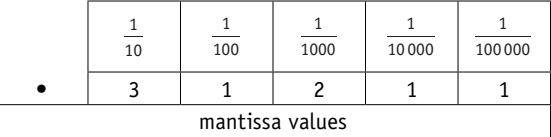

Figure 13.6

<table border=1 style='margin: auto; word-wrap: break-word;'><tr><td style='text-align: center; word-wrap: break-word;'>10</td><td style='text-align: center; word-wrap: break-word;'>1</td></tr><tr><td style='text-align: center; word-wrap: break-word;'>2</td><td style='text-align: center; word-wrap: break-word;'>4</td></tr><tr><td colspan="2">exponent</td></tr></table>

We thus get the binary floating-point equivalent (using 8 bits for the mantissa and 8 bits for the exponent with the assumed binary point between -1 and  $ \frac{1}{2} $ in the mantissa):

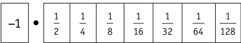

Figure 13.7

<table border=1 style='margin: auto; word-wrap: break-word;'><tr><td style='text-align: center; word-wrap: break-word;'>-128</td><td style='text-align: center; word-wrap: break-word;'>64</td><td style='text-align: center; word-wrap: break-word;'>32</td><td style='text-align: center; word-wrap: break-word;'>16</td><td style='text-align: center; word-wrap: break-word;'>8</td><td style='text-align: center; word-wrap: break-word;'>4</td><td style='text-align: center; word-wrap: break-word;'>2</td><td style='text-align: center; word-wrap: break-word;'>1</td></tr></table>

<!-- page 330 -->

Example 13.1

Convert this binary floating-point number into denary.

<table border=1 style='margin: auto; word-wrap: break-word;'><tr><td style='text-align: center; word-wrap: break-word;'>-1</td><td style='text-align: center; word-wrap: break-word;'>$ \frac{1}{2} $</td><td style='text-align: center; word-wrap: break-word;'>$ \frac{1}{4} $</td><td style='text-align: center; word-wrap: break-word;'>$ \frac{1}{8} $</td><td style='text-align: center; word-wrap: break-word;'>$ \frac{1}{16} $</td><td style='text-align: center; word-wrap: break-word;'>$ \frac{1}{32} $</td><td style='text-align: center; word-wrap: break-word;'>$ \frac{1}{64} $</td><td style='text-align: center; word-wrap: break-word;'>$ \frac{1}{128} $</td></tr><tr><td style='text-align: center; word-wrap: break-word;'>0</td><td style='text-align: center; word-wrap: break-word;'>1</td><td style='text-align: center; word-wrap: break-word;'>0</td><td style='text-align: center; word-wrap: break-word;'>1</td><td style='text-align: center; word-wrap: break-word;'>1</td><td style='text-align: center; word-wrap: break-word;'>0</td><td style='text-align: center; word-wrap: break-word;'>1</td><td style='text-align: center; word-wrap: break-word;'>0</td></tr></table>

<table border=1 style='margin: auto; word-wrap: break-word;'><tr><td style='text-align: center; word-wrap: break-word;'>-128</td><td style='text-align: center; word-wrap: break-word;'>64</td><td style='text-align: center; word-wrap: break-word;'>32</td><td style='text-align: center; word-wrap: break-word;'>16</td><td style='text-align: center; word-wrap: break-word;'>8</td><td style='text-align: center; word-wrap: break-word;'>4</td><td style='text-align: center; word-wrap: break-word;'>2</td><td style='text-align: center; word-wrap: break-word;'>1</td></tr><tr><td style='text-align: center; word-wrap: break-word;'>0</td><td style='text-align: center; word-wrap: break-word;'>0</td><td style='text-align: center; word-wrap: break-word;'>0</td><td style='text-align: center; word-wrap: break-word;'>0</td><td style='text-align: center; word-wrap: break-word;'>0</td><td style='text-align: center; word-wrap: break-word;'>1</td><td style='text-align: center; word-wrap: break-word;'>0</td><td style='text-align: center; word-wrap: break-word;'>0</td></tr></table>

## Solution

## Method 1

Add up the mantissa values where a 1 bit appears:

 $$ \mathrm{M}=\frac{1}{2}+\frac{1}{8}+\frac{1}{16}+\frac{1}{64}\equiv\frac{32}{64}+\frac{8}{64}+\frac{4}{64}+\frac{1}{64}=\frac{45}{64} $$ 

Add up the exponent values where a 1 bit appears:

 $$  E=4 $$ 

Use M  $ \times $ 2 $ ^{E} $:

 $$ \begin{aligned}\frac{45}{64}\times2^{4}&=\frac{45}{64}\times16\\&=0.703125\times16\\&=11.25(the~denary~value)\end{aligned} $$ 

## Method 2

Write the mantissa as 0.1011010.

The exponent is 4, so move the binary point four places to the right (to match the exponent value). This gives 01011.010.

 $$ \begin{aligned}&whole~number~part\quad\\ &-16\quad&8\quad&4\quad&2\quad&1\quad&\bullet\quad&\frac{1}{2}\quad&\frac{1}{4}\quad&\frac{1}{8}\\&0\quad&1\quad&0\quad&1\quad&1\quad&&\quad&0\quad&1\quad&0\end{aligned} $$ 

This gives 11.25 (the same result as method 1).

### Example 13.2

Convert this binary floating-point number into denary.

 $$ \begin{aligned}-1&\quad\bullet\quad\begin{array}{c|ccccc}\hline&\hline&\hline&\frac{1}{4}&\frac{1}{8}&\frac{1}{16}&\frac{1}{32}&\frac{1}{64}&\frac{1}{128}\\\hline\end{array}\\0&\quad0&\quad1&\quad0&\quad1&\quad0&\quad0&\quad0\end{aligned} $$ 

<table border=1 style='margin: auto; word-wrap: break-word;'><tr><td style='text-align: center; word-wrap: break-word;'>-128</td><td style='text-align: center; word-wrap: break-word;'>64</td><td style='text-align: center; word-wrap: break-word;'>32</td><td style='text-align: center; word-wrap: break-word;'>16</td><td style='text-align: center; word-wrap: break-word;'>8</td><td style='text-align: center; word-wrap: break-word;'>4</td><td style='text-align: center; word-wrap: break-word;'>2</td><td style='text-align: center; word-wrap: break-word;'>1</td></tr><tr><td style='text-align: center; word-wrap: break-word;'>0</td><td style='text-align: center; word-wrap: break-word;'>0</td><td style='text-align: center; word-wrap: break-word;'>0</td><td style='text-align: center; word-wrap: break-word;'>0</td><td style='text-align: center; word-wrap: break-word;'>0</td><td style='text-align: center; word-wrap: break-word;'>0</td><td style='text-align: center; word-wrap: break-word;'>1</td><td style='text-align: center; word-wrap: break-word;'>1</td></tr></table>

<!-- page 331 -->

## Solution

## Method 1

Add up the mantissa values where a 1 bit appears:

 $$ \mathbf{M}=\frac{1}{4}\cdot+\frac{1}{16}\equiv\frac{4}{16}+\frac{1}{16}=\frac{5}{16} $$ 

Add up the exponent values where a 1 bit appears:

 $$  E=2+1=3 $$ 

Use M  $ \times $ 2 $ ^{E} $:

 $$ \begin{aligned}\frac{5}{16}\times2^{3}&=\frac{5}{16}\times8\\&=0.3125\times8\\&=2.5(the~denary~value)\end{aligned} $$ 

## Method 2

Write the mantissa as 0.0101000.

The exponent is 3, so move the binary point three places to the right (to match the exponent value). This gives 0010.1000.

 $$ \begin{array}{ccccccc} \text{whole number part } & & & & \text{fraction part } & \\ -8 &4 &2 &1 & \bullet & \frac{1}{2} & \frac{1}{4} & \frac{1}{8} & \frac{1}{16} \\ 0 &0 &1 &0 & &1 & 0 & 0 & 0 \end{array} $$ 

This gives 2.5 (the same result as method 1).

Now we shall consider negative values.

### Example 13.3

Convert this binary floating-point number into denary.

<table border=1 style='margin: auto; word-wrap: break-word;'><tr><td style='text-align: center; word-wrap: break-word;'>-1</td><td style='text-align: center; word-wrap: break-word;'>$ \frac{1}{2} $</td><td style='text-align: center; word-wrap: break-word;'>$ \frac{1}{4} $</td><td style='text-align: center; word-wrap: break-word;'>$ \frac{1}{8} $</td><td style='text-align: center; word-wrap: break-word;'>$ \frac{1}{16} $</td><td style='text-align: center; word-wrap: break-word;'>$ \frac{1}{32} $</td><td style='text-align: center; word-wrap: break-word;'>$ \frac{1}{64} $</td><td style='text-align: center; word-wrap: break-word;'>$ \frac{1}{128} $</td></tr><tr><td style='text-align: center; word-wrap: break-word;'>1</td><td style='text-align: center; word-wrap: break-word;'>1</td><td style='text-align: center; word-wrap: break-word;'>0</td><td style='text-align: center; word-wrap: break-word;'>0</td><td style='text-align: center; word-wrap: break-word;'>1</td><td style='text-align: center; word-wrap: break-word;'>1</td><td style='text-align: center; word-wrap: break-word;'>0</td><td style='text-align: center; word-wrap: break-word;'>0</td></tr></table>

<table border=1 style='margin: auto; word-wrap: break-word;'><tr><td style='text-align: center; word-wrap: break-word;'>-128</td><td style='text-align: center; word-wrap: break-word;'>64</td><td style='text-align: center; word-wrap: break-word;'>32</td><td style='text-align: center; word-wrap: break-word;'>16</td><td style='text-align: center; word-wrap: break-word;'>8</td><td style='text-align: center; word-wrap: break-word;'>4</td><td style='text-align: center; word-wrap: break-word;'>2</td><td style='text-align: center; word-wrap: break-word;'>1</td></tr><tr><td style='text-align: center; word-wrap: break-word;'>0</td><td style='text-align: center; word-wrap: break-word;'>0</td><td style='text-align: center; word-wrap: break-word;'>0</td><td style='text-align: center; word-wrap: break-word;'>0</td><td style='text-align: center; word-wrap: break-word;'>1</td><td style='text-align: center; word-wrap: break-word;'>1</td><td style='text-align: center; word-wrap: break-word;'>0</td><td style='text-align: center; word-wrap: break-word;'>0</td></tr></table>

## Solution

## Method 1

Add up the mantissa values where a 1 bit appears:

 $$ \mathbf{M}=-1+\frac{1}{2}+\frac{1}{16}+\frac{1}{32}\equiv-1+\frac{16}{32}+\frac{2}{32}+\frac{1}{32}\equiv-1+\frac{19}{32}\equiv-\frac{32}{32}+\frac{19}{32}=-\frac{13}{32} $$ 

Add up the exponent values where a 1 bit appears:

 $$ \mathrm{E}=8+4=12 $$ 

Use M  $ \times $ 2 $ ^{E} $:

 $$ \begin{aligned}-\frac{13}{32}\times2^{12}&=-\frac{13}{32}\times4096\\&=-0.40625\times4096\\&=-1664(the~denary~value)\end{aligned} $$

<!-- page 332 -->

## Method 2

Since the mantissa is negative, first convert the value using two's complement.

So, write the mantissa as 00110011 + 1 = 00110100.

This gives -0.0110100.

The exponent is 12, so move the binary point 12 places to the right (to match the exponent value). This gives -0.011010000000.

<table border=1 style='margin: auto; word-wrap: break-word;'><tr><td colspan="13">whole number part</td><td style='text-align: center; word-wrap: break-word;'>fraction part</td><td style='text-align: center; word-wrap: break-word;'></td></tr><tr><td style='text-align: center; word-wrap: break-word;'>-4096</td><td style='text-align: center; word-wrap: break-word;'>2048</td><td style='text-align: center; word-wrap: break-word;'>1024</td><td style='text-align: center; word-wrap: break-word;'>512</td><td style='text-align: center; word-wrap: break-word;'>256</td><td style='text-align: center; word-wrap: break-word;'>128</td><td style='text-align: center; word-wrap: break-word;'>64</td><td style='text-align: center; word-wrap: break-word;'>32</td><td style='text-align: center; word-wrap: break-word;'>6</td><td style='text-align: center; word-wrap: break-word;'>8</td><td style='text-align: center; word-wrap: break-word;'>4</td><td style='text-align: center; word-wrap: break-word;'>2</td><td style='text-align: center; word-wrap: break-word;'>1</td><td style='text-align: center; word-wrap: break-word;'>$ \bullet $</td><td style='text-align: center; word-wrap: break-word;'>$ \frac{1}{2} $</td></tr><tr><td style='text-align: center; word-wrap: break-word;'>0</td><td style='text-align: center; word-wrap: break-word;'>0</td><td style='text-align: center; word-wrap: break-word;'>1</td><td style='text-align: center; word-wrap: break-word;'>1</td><td style='text-align: center; word-wrap: break-word;'>0</td><td style='text-align: center; word-wrap: break-word;'>1</td><td style='text-align: center; word-wrap: break-word;'>0</td><td style='text-align: center; word-wrap: break-word;'>0</td><td style='text-align: center; word-wrap: break-word;'>0</td><td style='text-align: center; word-wrap: break-word;'>0</td><td style='text-align: center; word-wrap: break-word;'>0</td><td style='text-align: center; word-wrap: break-word;'>0</td><td style='text-align: center; word-wrap: break-word;'>0</td><td style='text-align: center; word-wrap: break-word;'>0</td><td style='text-align: center; word-wrap: break-word;'></td></tr><tr><td colspan="15">This gives  $ -(1024 + 512 + 128) = -1664 $ (the same result as method 1).</td></tr></table>

Example 13.4

## Convert this binary floating-point number into denary

<table border=1 style='margin: auto; word-wrap: break-word;'><tr><td style='text-align: center; word-wrap: break-word;'>-1</td><td style='text-align: center; word-wrap: break-word;'>$ \frac{1}{2} $</td><td style='text-align: center; word-wrap: break-word;'>$ \frac{1}{4} $</td><td style='text-align: center; word-wrap: break-word;'>$ \frac{1}{8} $</td><td style='text-align: center; word-wrap: break-word;'>$ \frac{1}{16} $</td><td style='text-align: center; word-wrap: break-word;'>$ \frac{1}{32} $</td><td style='text-align: center; word-wrap: break-word;'>$ \frac{1}{64} $</td><td style='text-align: center; word-wrap: break-word;'>$ \frac{1}{128} $</td></tr><tr><td style='text-align: center; word-wrap: break-word;'>1</td><td style='text-align: center; word-wrap: break-word;'>1</td><td style='text-align: center; word-wrap: break-word;'>0</td><td style='text-align: center; word-wrap: break-word;'>0</td><td style='text-align: center; word-wrap: break-word;'>1</td><td style='text-align: center; word-wrap: break-word;'>1</td><td style='text-align: center; word-wrap: break-word;'>0</td><td style='text-align: center; word-wrap: break-word;'>0</td></tr></table>

<table border=1 style='margin: auto; word-wrap: break-word;'><tr><td style='text-align: center; word-wrap: break-word;'>-128</td><td style='text-align: center; word-wrap: break-word;'>64</td><td style='text-align: center; word-wrap: break-word;'>32</td><td style='text-align: center; word-wrap: break-word;'>16</td><td style='text-align: center; word-wrap: break-word;'>8</td><td style='text-align: center; word-wrap: break-word;'>4</td><td style='text-align: center; word-wrap: break-word;'>2</td><td style='text-align: center; word-wrap: break-word;'>1</td></tr><tr><td style='text-align: center; word-wrap: break-word;'>1</td><td style='text-align: center; word-wrap: break-word;'>1</td><td style='text-align: center; word-wrap: break-word;'>1</td><td style='text-align: center; word-wrap: break-word;'>1</td><td style='text-align: center; word-wrap: break-word;'>1</td><td style='text-align: center; word-wrap: break-word;'>1</td><td style='text-align: center; word-wrap: break-word;'>0</td><td style='text-align: center; word-wrap: break-word;'>0</td></tr></table>

Solution
Method 1
Add up the mantissa values where a 1 bit appears:
M = -1 +  $ \frac{1}{2} $ +  $ \frac{1}{16} $ +  $ \frac{1}{32} $ ≡ -1 +  $ \frac{16}{32} $ +  $ \frac{2}{32} $ +  $ \frac{1}{32} $ ≡ -1 +  $ \frac{19}{32} $ ≡ -  $ \frac{32}{32} $ +  $ \frac{19}{32} $ = -  $ \frac{13}{32} $
Add up the exponent values where a 1 bit appears:
E = -128 + 64 + 32 + 16 + 8 + 4 = -4
Use M × 2E:
 $ -\frac{13}{32} \times 2^{-4} = -\frac{13}{32} \times 0.0625 $
= -0.40625 × 0.0625
= -0.025390625 (the denary value)
Method 2
Since the mantissa is negative, first convert the value using two's complement.
So, write the mantissa as 00110011 + 1 = 00110100.
This gives -0.0110100.
The exponent is -4, so move the binary point four places to the left (to match the negative exponent value). This gives -0.00000110100.

<!-- page 333 -->

<table border=1 style='margin: auto; word-wrap: break-word;'><tr><td style='text-align: center; word-wrap: break-word;'>whole number part</td><td style='text-align: center; word-wrap: break-word;'>fraction part</td></tr><tr><td style='text-align: center; word-wrap: break-word;'>-1  $ \bullet $  $ \frac{1}{2} $  $ \frac{1}{4} $  $ \frac{1}{8} $  $ \frac{1}{16} $  $ \frac{1}{32} $  $ \frac{1}{64} $  $ \frac{1}{128} $  $ \frac{1}{256} $  $ \frac{1}{512} $  $ \frac{1}{1024} $  $ \frac{1}{2048} $</td><td style='text-align: center; word-wrap: break-word;'></td></tr><tr><td style='text-align: center; word-wrap: break-word;'>0 0 0 0 0 0 1 1 0 1 0 0</td><td style='text-align: center; word-wrap: break-word;'></td></tr><tr><td style='text-align: center; word-wrap: break-word;'>This gives  $ -\left(\frac{1}{64}+\frac{1}{128}+\frac{1}{512}\right)=-\frac{13}{512} $</td><td style='text-align: center; word-wrap: break-word;'>=-0.025390625 (the same result as method 1).</td></tr></table>

## ACTIVITY 13F

Convert these binary floating-point numbers into denary numbers (the mantissa is 8 bits and the exponent is 8 bits in all cases).

<table border=1 style='margin: auto; word-wrap: break-word;'><tr><td style='text-align: center; word-wrap: break-word;'>a)</td><td style='text-align: center; word-wrap: break-word;'>0</td><td style='text-align: center; word-wrap: break-word;'>1</td><td style='text-align: center; word-wrap: break-word;'>0</td><td style='text-align: center; word-wrap: break-word;'>0</td><td style='text-align: center; word-wrap: break-word;'>1</td><td style='text-align: center; word-wrap: break-word;'>1</td><td style='text-align: center; word-wrap: break-word;'>1</td><td style='text-align: center; word-wrap: break-word;'>0</td></tr><tr><td style='text-align: center; word-wrap: break-word;'>b)</td><td style='text-align: center; word-wrap: break-word;'>0</td><td style='text-align: center; word-wrap: break-word;'>0</td><td style='text-align: center; word-wrap: break-word;'>1</td><td style='text-align: center; word-wrap: break-word;'>0</td><td style='text-align: center; word-wrap: break-word;'>1</td><td style='text-align: center; word-wrap: break-word;'>0</td><td style='text-align: center; word-wrap: break-word;'>0</td><td style='text-align: center; word-wrap: break-word;'>1</td></tr><tr><td style='text-align: center; word-wrap: break-word;'>c)</td><td style='text-align: center; word-wrap: break-word;'>0</td><td style='text-align: center; word-wrap: break-word;'>1</td><td style='text-align: center; word-wrap: break-word;'>1</td><td style='text-align: center; word-wrap: break-word;'>1</td><td style='text-align: center; word-wrap: break-word;'>0</td><td style='text-align: center; word-wrap: break-word;'>0</td><td style='text-align: center; word-wrap: break-word;'>0</td><td style='text-align: center; word-wrap: break-word;'>0</td></tr><tr><td style='text-align: center; word-wrap: break-word;'>d)</td><td style='text-align: center; word-wrap: break-word;'>0</td><td style='text-align: center; word-wrap: break-word;'>0</td><td style='text-align: center; word-wrap: break-word;'>0</td><td style='text-align: center; word-wrap: break-word;'>1</td><td style='text-align: center; word-wrap: break-word;'>1</td><td style='text-align: center; word-wrap: break-word;'>1</td><td style='text-align: center; word-wrap: break-word;'>1</td><td style='text-align: center; word-wrap: break-word;'>0</td></tr><tr><td style='text-align: center; word-wrap: break-word;'>e)</td><td style='text-align: center; word-wrap: break-word;'>0</td><td style='text-align: center; word-wrap: break-word;'>1</td><td style='text-align: center; word-wrap: break-word;'>1</td><td style='text-align: center; word-wrap: break-word;'>1</td><td style='text-align: center; word-wrap: break-word;'>0</td><td style='text-align: center; word-wrap: break-word;'>0</td><td style='text-align: center; word-wrap: break-word;'>0</td><td style='text-align: center; word-wrap: break-word;'>0</td></tr><tr><td style='text-align: center; word-wrap: break-word;'>f)</td><td style='text-align: center; word-wrap: break-word;'>1</td><td style='text-align: center; word-wrap: break-word;'>0</td><td style='text-align: center; word-wrap: break-word;'>0</td><td style='text-align: center; word-wrap: break-word;'>1</td><td style='text-align: center; word-wrap: break-word;'>1</td><td style='text-align: center; word-wrap: break-word;'>0</td><td style='text-align: center; word-wrap: break-word;'>0</td><td style='text-align: center; word-wrap: break-word;'>0</td></tr><tr><td style='text-align: center; word-wrap: break-word;'>g)</td><td style='text-align: center; word-wrap: break-word;'>1</td><td style='text-align: center; word-wrap: break-word;'>1</td><td style='text-align: center; word-wrap: break-word;'>1</td><td style='text-align: center; word-wrap: break-word;'>1</td><td style='text-align: center; word-wrap: break-word;'>0</td><td style='text-align: center; word-wrap: break-word;'>1</td><td style='text-align: center; word-wrap: break-word;'>0</td><td style='text-align: center; word-wrap: break-word;'>0</td></tr><tr><td style='text-align: center; word-wrap: break-word;'>h)</td><td style='text-align: center; word-wrap: break-word;'>1</td><td style='text-align: center; word-wrap: break-word;'>0</td><td style='text-align: center; word-wrap: break-word;'>1</td><td style='text-align: center; word-wrap: break-word;'>1</td><td style='text-align: center; word-wrap: break-word;'>0</td><td style='text-align: center; word-wrap: break-word;'>0</td><td style='text-align: center; word-wrap: break-word;'>0</td><td style='text-align: center; word-wrap: break-word;'>0</td></tr><tr><td style='text-align: center; word-wrap: break-word;'>i)</td><td style='text-align: center; word-wrap: break-word;'>1</td><td style='text-align: center; word-wrap: break-word;'>0</td><td style='text-align: center; word-wrap: break-word;'>1</td><td style='text-align: center; word-wrap: break-word;'>1</td><td style='text-align: center; word-wrap: break-word;'>0</td><td style='text-align: center; word-wrap: break-word;'>0</td><td style='text-align: center; word-wrap: break-word;'>0</td><td style='text-align: center; word-wrap: break-word;'>0</td></tr><tr><td style='text-align: center; word-wrap: break-word;'>j)</td><td style='text-align: center; word-wrap: break-word;'>1</td><td style='text-align: center; word-wrap: break-word;'>1</td><td style='text-align: center; word-wrap: break-word;'>1</td><td style='text-align: center; word-wrap: break-word;'>0</td><td style='text-align: center; word-wrap: break-word;'>0</td><td style='text-align: center; word-wrap: break-word;'>0</td><td style='text-align: center; word-wrap: break-word;'>0</td><td style='text-align: center; word-wrap: break-word;'>0</td></tr></table>

<table border=1 style='margin: auto; word-wrap: break-word;'><tr><td style='text-align: center; word-wrap: break-word;'>0</td><td style='text-align: center; word-wrap: break-word;'>0</td><td style='text-align: center; word-wrap: break-word;'>0</td><td style='text-align: center; word-wrap: break-word;'>0</td><td style='text-align: center; word-wrap: break-word;'>0</td><td style='text-align: center; word-wrap: break-word;'>1</td><td style='text-align: center; word-wrap: break-word;'>0</td><td style='text-align: center; word-wrap: break-word;'>1</td></tr><tr><td style='text-align: center; word-wrap: break-word;'>0</td><td style='text-align: center; word-wrap: break-word;'>0</td><td style='text-align: center; word-wrap: break-word;'>0</td><td style='text-align: center; word-wrap: break-word;'>0</td><td style='text-align: center; word-wrap: break-word;'>0</td><td style='text-align: center; word-wrap: break-word;'>1</td><td style='text-align: center; word-wrap: break-word;'>1</td><td style='text-align: center; word-wrap: break-word;'>1</td></tr><tr><td style='text-align: center; word-wrap: break-word;'>1</td><td style='text-align: center; word-wrap: break-word;'>1</td><td style='text-align: center; word-wrap: break-word;'>1</td><td style='text-align: center; word-wrap: break-word;'>1</td><td style='text-align: center; word-wrap: break-word;'>1</td><td style='text-align: center; word-wrap: break-word;'>0</td><td style='text-align: center; word-wrap: break-word;'>1</td><td style='text-align: center; word-wrap: break-word;'>1</td></tr><tr><td style='text-align: center; word-wrap: break-word;'>1</td><td style='text-align: center; word-wrap: break-word;'>1</td><td style='text-align: center; word-wrap: break-word;'>1</td><td style='text-align: center; word-wrap: break-word;'>1</td><td style='text-align: center; word-wrap: break-word;'>1</td><td style='text-align: center; word-wrap: break-word;'>1</td><td style='text-align: center; word-wrap: break-word;'>0</td><td style='text-align: center; word-wrap: break-word;'>0</td></tr><tr><td style='text-align: center; word-wrap: break-word;'>0</td><td style='text-align: center; word-wrap: break-word;'>0</td><td style='text-align: center; word-wrap: break-word;'>0</td><td style='text-align: center; word-wrap: break-word;'>0</td><td style='text-align: center; word-wrap: break-word;'>0</td><td style='text-align: center; word-wrap: break-word;'>0</td><td style='text-align: center; word-wrap: break-word;'>1</td><td style='text-align: center; word-wrap: break-word;'>1</td></tr><tr><td style='text-align: center; word-wrap: break-word;'>0</td><td style='text-align: center; word-wrap: break-word;'>0</td><td style='text-align: center; word-wrap: break-word;'>0</td><td style='text-align: center; word-wrap: break-word;'>0</td><td style='text-align: center; word-wrap: break-word;'>0</td><td style='text-align: center; word-wrap: break-word;'>0</td><td style='text-align: center; word-wrap: break-word;'>1</td><td style='text-align: center; word-wrap: break-word;'>0</td></tr><tr><td style='text-align: center; word-wrap: break-word;'>0</td><td style='text-align: center; word-wrap: break-word;'>0</td><td style='text-align: center; word-wrap: break-word;'>0</td><td style='text-align: center; word-wrap: break-word;'>0</td><td style='text-align: center; word-wrap: break-word;'>0</td><td style='text-align: center; word-wrap: break-word;'>1</td><td style='text-align: center; word-wrap: break-word;'>0</td><td style='text-align: center; word-wrap: break-word;'>0</td></tr><tr><td style='text-align: center; word-wrap: break-word;'>0</td><td style='text-align: center; word-wrap: break-word;'>0</td><td style='text-align: center; word-wrap: break-word;'>0</td><td style='text-align: center; word-wrap: break-word;'>0</td><td style='text-align: center; word-wrap: break-word;'>0</td><td style='text-align: center; word-wrap: break-word;'>1</td><td style='text-align: center; word-wrap: break-word;'>0</td><td style='text-align: center; word-wrap: break-word;'>1</td></tr><tr><td style='text-align: center; word-wrap: break-word;'>1</td><td style='text-align: center; word-wrap: break-word;'>1</td><td style='text-align: center; word-wrap: break-word;'>1</td><td style='text-align: center; word-wrap: break-word;'>1</td><td style='text-align: center; word-wrap: break-word;'>1</td><td style='text-align: center; word-wrap: break-word;'>1</td><td style='text-align: center; word-wrap: break-word;'>0</td><td style='text-align: center; word-wrap: break-word;'>1</td></tr><tr><td style='text-align: center; word-wrap: break-word;'>1</td><td style='text-align: center; word-wrap: break-word;'>1</td><td style='text-align: center; word-wrap: break-word;'>1</td><td style='text-align: center; word-wrap: break-word;'>1</td><td style='text-align: center; word-wrap: break-word;'>1</td><td style='text-align: center; word-wrap: break-word;'>0</td><td style='text-align: center; word-wrap: break-word;'>1</td><td style='text-align: center; word-wrap: break-word;'>0</td></tr></table>

## Converting denary numbers into binary floating-point numbers

### Example 13.5

Convert +4.5 into a binary floating-point number.

## Solution

## Method 1

Turn the number into an improper fraction:

 $$ 4.5=\frac{9}{2} $$ 

The fraction needs to be < 1, which means the numerator < denominator; we can do this by dividing successively by 2 until the denominator > numerator.

 $ \frac{9}{2} \to \frac{9}{4} \to \frac{9}{8} \to \frac{9}{16} $ The numerator (9) is now <denominator (16).

<!-- page 334 -->

So,  $ \frac{9}{2} $ can be written as  $ \frac{9}{16} \times 8 \equiv \frac{9}{16} \times 2^3 $ and the original fraction is now written in the correct format,  $ M \times 2^E $.

 $ \frac{9}{16} = \frac{1}{2} + \frac{1}{16} $, which gives the mantissa as 0.1001.

And the exponent is  $ 2^3 $, which is represented as 11 in our binary floating point format.

Filling in the gaps with Os gives:

<table border=1 style='margin: auto; word-wrap: break-word;'><tr><td style='text-align: center; word-wrap: break-word;'>0</td><td style='text-align: center; word-wrap: break-word;'>1</td><td style='text-align: center; word-wrap: break-word;'>0</td><td style='text-align: center; word-wrap: break-word;'>0</td><td style='text-align: center; word-wrap: break-word;'>1</td><td style='text-align: center; word-wrap: break-word;'>0</td><td style='text-align: center; word-wrap: break-word;'>0</td><td style='text-align: center; word-wrap: break-word;'>0</td></tr></table>

## Method 2

4 = 0100 and .5 = .1 which gives: 0100.1

Now move the binary point as far as possible until 0.1 can be formed:

0100.1 becomes 0.1001 by moving the binary point three places left.

So, the exponent must increase by three:

0.1001  $ \times $ 11

Filling in the gaps with Os gives:

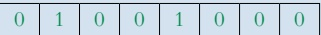

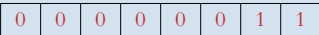

This is the same result as method 1.

Example 13.6

Convert +0.171875 into a binary floating-point number.

## Solution

## Method 1

Remember, the fraction needs to be < 1, which means the numerator < denominator.

 $ 0.171875 \equiv \frac{171875}{1000000} \equiv \frac{11}{64} $, so this fraction is already in the correct form.

 $ \frac{11}{64} = \frac{1}{8} + \frac{1}{32} + \frac{1}{64} $, which gives the mantissa as 0.0010110 and exponent as 0.

Filling in the gaps with 0s gives:

<table border=1 style='margin: auto; word-wrap: break-word;'><tr><td style='text-align: center; word-wrap: break-word;'>0</td><td style='text-align: center; word-wrap: break-word;'>0</td><td style='text-align: center; word-wrap: break-word;'>0</td><td style='text-align: center; word-wrap: break-word;'>1</td><td style='text-align: center; word-wrap: break-word;'>0</td><td style='text-align: center; word-wrap: break-word;'>1</td><td style='text-align: center; word-wrap: break-word;'>1</td><td style='text-align: center; word-wrap: break-word;'>0</td></tr></table>

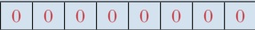

## Method 2

0 = 0 and .171875 = .001011  $ \left(\frac{1}{8}+\frac{1}{32}+\frac{1}{64}\right) $, which gives: 0.001011.

Now move the binary point as far as possible until 0.1 can be formed:

0.001011 becomes 0.1011 by moving the binary point two places right.

So, the exponent must  $ \text{increase} $ by two (in other words, -2).

The number 2, using eight bits is 00000010.

<!-- page 335 -->

Applying two's complement gives us 11111101 + 1 = 11111110

Thus, we have:

0.1011 × 11111110

Filling in the gaps with 0s gives:

<table border=1 style='margin: auto; word-wrap: break-word;'><tr><td style='text-align: center; word-wrap: break-word;'>0</td><td style='text-align: center; word-wrap: break-word;'>1</td><td style='text-align: center; word-wrap: break-word;'>0</td><td style='text-align: center; word-wrap: break-word;'>1</td><td style='text-align: center; word-wrap: break-word;'>1</td><td style='text-align: center; word-wrap: break-word;'>0</td><td style='text-align: center; word-wrap: break-word;'>0</td><td style='text-align: center; word-wrap: break-word;'>0</td></tr></table>

<table border=1 style='margin: auto; word-wrap: break-word;'><tr><td style='text-align: center; word-wrap: break-word;'>1</td><td style='text-align: center; word-wrap: break-word;'>1</td><td style='text-align: center; word-wrap: break-word;'>1</td><td style='text-align: center; word-wrap: break-word;'>1</td><td style='text-align: center; word-wrap: break-word;'>1</td><td style='text-align: center; word-wrap: break-word;'>1</td><td style='text-align: center; word-wrap: break-word;'>1</td><td style='text-align: center; word-wrap: break-word;'>0</td></tr></table>

This is exactly the same result as method 1.

## EXTENSION ACTIVITY 13C

Show why:

<table border=1 style='margin: auto; word-wrap: break-word;'><tr><td style='text-align: center; word-wrap: break-word;'>0</td><td style='text-align: center; word-wrap: break-word;'>0</td><td style='text-align: center; word-wrap: break-word;'>0</td><td style='text-align: center; word-wrap: break-word;'>1</td><td style='text-align: center; word-wrap: break-word;'>0</td><td style='text-align: center; word-wrap: break-word;'>1</td><td style='text-align: center; word-wrap: break-word;'>1</td><td style='text-align: center; word-wrap: break-word;'>0</td></tr></table>

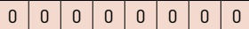

is the same as:

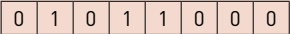

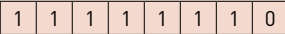

Example 13.7

### Convert -10.375 into a binary floating-point number

## Solution

## Method 1

Turn the number into an improper fraction:

0.375 ≡  $ \frac{3}{8} $, so -10.375 = - $ \frac{83}{8} $

Now make the fraction < 1.

 $$ -\frac{83}{8}\equiv-\frac{83}{128}\times16\equiv-\frac{83}{128}\times2^{4} $$ 

 $$ -\frac{83}{128}=-1+\frac{45}{128}, $$ 

 $$ \left(\frac{45}{128}=\frac{1}{4}+\frac{1}{16}+\frac{1}{32}+\frac{1}{128}\right). $$ 

And the exponent is  $ 2^{4} $, which is represented as 100 in our binary floating point format.

Filling in the gaps with Os gives:

<table border=1 style='margin: auto; word-wrap: break-word;'><tr><td style='text-align: center; word-wrap: break-word;'>1</td><td style='text-align: center; word-wrap: break-word;'>0</td><td style='text-align: center; word-wrap: break-word;'>1</td><td style='text-align: center; word-wrap: break-word;'>0</td><td style='text-align: center; word-wrap: break-word;'>1</td><td style='text-align: center; word-wrap: break-word;'>1</td><td style='text-align: center; word-wrap: break-word;'>0</td><td style='text-align: center; word-wrap: break-word;'>1</td></tr></table>

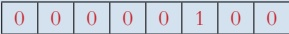

## Method 2

-10 = -01010 and  $ \frac{1}{4} + \frac{1}{8} \equiv .375 = .011 $, which gives: -01010.011.

Using two's complement (on 01010011) we get: 10101100 + 1 = 10101101 (= 10101.101).

Now move the binary point as far as possible until 1.0 can be formed:

<!-- page 336 -->

10101.101 becomes 1.0101101 by moving the binary point four places left.

So, the exponent must increase by four.

1.0101101 × 100

Filling in the gaps with 0s gives:

<table border=1 style='margin: auto; word-wrap: break-word;'><tr><td style='text-align: center; word-wrap: break-word;'>1</td><td style='text-align: center; word-wrap: break-word;'>0</td><td style='text-align: center; word-wrap: break-word;'>1</td><td style='text-align: center; word-wrap: break-word;'>0</td><td style='text-align: center; word-wrap: break-word;'>1</td><td style='text-align: center; word-wrap: break-word;'>1</td><td style='text-align: center; word-wrap: break-word;'>0</td><td style='text-align: center; word-wrap: break-word;'>1</td></tr></table>

<table border=1 style='margin: auto; word-wrap: break-word;'><tr><td style='text-align: center; word-wrap: break-word;'>0</td><td style='text-align: center; word-wrap: break-word;'>0</td><td style='text-align: center; word-wrap: break-word;'>0</td><td style='text-align: center; word-wrap: break-word;'>0</td><td style='text-align: center; word-wrap: break-word;'>0</td><td style='text-align: center; word-wrap: break-word;'>1</td><td style='text-align: center; word-wrap: break-word;'>0</td><td style='text-align: center; word-wrap: break-word;'>0</td></tr></table>

This is the same result as method 1.

## ACTIVITY 13G

1 Write these into binary floating-point format using an 8-bit mantissa and 8-bit exponent.

a)  $ \frac{11}{32} \times 2^7 $

f)  $ -\frac{11}{64} \times 2^4 $

b)  $ \frac{19}{64} \times 2^3 $

g)  $ -\frac{9}{16} \times 2^{-1} $

c)  $ \frac{21}{128} \times 2^{-5} $

h)  $ -\frac{5}{16} \times 2^5 $

d)  $ \frac{15}{16} \times 2^{-3} $

i)  $ -\frac{1}{4} \times 2^{-6} $

e)  $ \frac{21}{8} \times 2^3 $

j)  $ -\frac{5}{8} \times 2^{-2} $

2 Convert these denary numbers into binary floating-point numbers using an 8-bit mantissa and 8-bit exponent.

a) +3.5

b) 0.3125

c) 15.375

d)  $ \frac{41}{64} $

e) 9.125

f)  $ -\frac{15}{32} $

g) -3.5

h) -10.25

i) -1.046875  $ \left(\equiv-1\frac{3}{64}\right) $

j)  $ -3\frac{11}{32} $

## Potential rounding errors and approximations

All the problems up to this point have involved fractions which are linked somehow to the number 2 (such as  $ \frac{15}{64} $). We will now consider numbers which can only be represented as an approximate value (the accuracy of which will depend on the number of bits that make up the mantissa).

The representation of the following example (denary number 5.88), using an 8-bit mantissa and 8-bit exponent, will lead to an inevitable rounding error since it is impossible to convert the denary number into an exact binary equivalent.

This error could be reduced by increasing the size of the mantissa; for example, a 16-bit mantissa would allow the number 5.88 to be represented as 5.875, which is a better approximation.

<!-- page 337 -->

We will consider how to represent the denary number 5.88 using an 8-bit mantissa and 8-bit exponent.

To convert this into binary, we will use a method similar to that used in Chapter 1.

 $ .88 \times 2 = 1.76 $ so we will use the 1 value to give 0.1

 $ .76 \times 2 = 1.52 $ so we will use the 1 value to give 0.11

 $ .52 \times 2 = 1.04 $ so we will use the 1 value to give 0.111

 $ .04 \times 2 = 0.08 $ so we will use the 0 value to give 0.1110

 $ .08 \times 2 = 0.16 $ so we will use the 0 value to give 0.11100

 $ .16 \times 2 = 0.32 $ so we will use the 0 value to give 0.111000

 $ .32 \times 2 = 0.64 $ so we will use the 0 value to give 0.1110000

 $ .64 \times 2 = 1.28 $ so we will use the 1 value to give 0.11100001

We have to stop here since our system uses a maximum of 8 bits. Now the value of 5 (in binary) is 0101; this gives:

 $ 5.88 \equiv 0101.11100001 $

Moving the binary point as far to the left as possible gives:

 $ 0.1011100 \times 2^3 (2^3 \text{ since the binary point was moved three places}) $.

Thus, we get 0.1011100 00000011 (mantissa) (exponent)

 $ \frac{23}{32} \times 2^3 = \frac{23}{4} = 5.75 $

So, 5.88 is stored as 5.75 in our floating-point system.

## EXTENSION ACTIVITY 13D

Using 8-bit mantissa and exponent, show how the following numbers would be approximated
a) 1.63
b) 8.13
c) 12.32
d) 5.90
e) 7.40.

Now consider this set of numbers.

<table border=1 style='margin: auto; word-wrap: break-word;'><tr><td style='text-align: center; word-wrap: break-word;'>0.1000000 00000010</td><td style='text-align: center; word-wrap: break-word;'>$ \equiv \frac{1}{2} \times 2^{2} $</td><td style='text-align: center; word-wrap: break-word;'>=2</td></tr><tr><td style='text-align: center; word-wrap: break-word;'>0.0100000 00000011</td><td style='text-align: center; word-wrap: break-word;'>$ \equiv \frac{1}{4} \times 2^{3} $</td><td style='text-align: center; word-wrap: break-word;'>=2</td></tr><tr><td style='text-align: center; word-wrap: break-word;'>0.0010000 00000100</td><td style='text-align: center; word-wrap: break-word;'>$ \equiv \frac{1}{8} \times 2^{4} $</td><td style='text-align: center; word-wrap: break-word;'>=2</td></tr><tr><td style='text-align: center; word-wrap: break-word;'>0.0001000 00000101</td><td style='text-align: center; word-wrap: break-word;'>$ \equiv \frac{1}{16} \times 2^{5} $</td><td style='text-align: center; word-wrap: break-word;'>=2</td></tr></table>

<!-- page 338 -->

As shown, there are several ways of representing the number 2. Using this sequence, if we kept shifting to the right, we would end up with:

0.0000000 00001001 =2

### Figure 13.9

This could lead to problems. To overcome this, we use a method called normalisation.

With this method, for a positive number, the mantissa must start with 0.1 (as in our first representation of 2 above). The bits in the mantissa are shifted to the left until we arrive at 0.1; for each shift left, the exponent is reduced by 1. Look at the examples above to see how this works (starting with 0.0001000 we shift the bits 3 places to the left to get to 0.100000 and we reduce the exponent by 3 to now give 00000010, so we end up with the first representation!).

For a negative number the mantissa must start with 1.0. The bits in the mantissa are shifted until we arrive at 1.0; again, the exponent must be changed to reflect the number of shifts.

### Example 13.8

Normalise 0.0011100 00000101  $ \left(\equiv\frac{7}{32}\times2^{5}=7\right) $.

Solution

Shift the bits left to get 0.1110000.

Since the bits were shifted two places left, the exponent must reduce by two to give 00000011.

This gives 0.1110000 00000011, which is now normalised.

Note: 0.1110000 00000011  $ \equiv \frac{7}{8} \times 2^{3} = 7 $, so the normalised form still represents the correct value.

### Example 13.9

### Normalise 1.1101100 00001010  $ \left(\equiv-\frac{5}{32}\times2^{10}=-160\right) $

Since the bits were shifted two places left, the exponent must reduce by two to give 00001000.

 $$ 000\equiv-\frac{5}{8}\times2^{8}=-5\times32=-160. $$

<!-- page 339 -->

## ACTIVITY 13H

<table border=1 style='margin: auto; word-wrap: break-word;'><tr><td colspan="2">Normalise these binary floating-point numbers.</td></tr><tr><td style='text-align: center; word-wrap: break-word;'>a)</td><td style='text-align: center; word-wrap: break-word;'>0.0001101</td></tr><tr><td style='text-align: center; word-wrap: break-word;'>b)</td><td style='text-align: center; word-wrap: break-word;'>0.0011000</td></tr><tr><td style='text-align: center; word-wrap: break-word;'>c)</td><td style='text-align: center; word-wrap: break-word;'>0.0000111</td></tr><tr><td style='text-align: center; word-wrap: break-word;'>d)</td><td style='text-align: center; word-wrap: break-word;'>0.0010001</td></tr><tr><td style='text-align: center; word-wrap: break-word;'>e)</td><td style='text-align: center; word-wrap: break-word;'>0.0011100</td></tr><tr><td style='text-align: center; word-wrap: break-word;'>f)</td><td style='text-align: center; word-wrap: break-word;'>1.1111000</td></tr><tr><td style='text-align: center; word-wrap: break-word;'>g)</td><td style='text-align: center; word-wrap: break-word;'>1.1100100</td></tr><tr><td style='text-align: center; word-wrap: break-word;'>h)</td><td style='text-align: center; word-wrap: break-word;'>1.1110110</td></tr><tr><td style='text-align: center; word-wrap: break-word;'>i)</td><td style='text-align: center; word-wrap: break-word;'>0.0001111</td></tr><tr><td style='text-align: center; word-wrap: break-word;'>j)</td><td style='text-align: center; word-wrap: break-word;'>1.1111000</td></tr></table>

## Precision versus range

The following values relate to an 8-bit mantissa and an 8-bit exponent (using two's complement):

The maximum positive number which can be stored is:

<table border=1 style='margin: auto; word-wrap: break-word;'><tr><td style='text-align: center; word-wrap: break-word;'>0</td><td style='text-align: center; word-wrap: break-word;'>1</td><td style='text-align: center; word-wrap: break-word;'>1</td><td style='text-align: center; word-wrap: break-word;'>1</td><td style='text-align: center; word-wrap: break-word;'>1</td><td style='text-align: center; word-wrap: break-word;'>1</td><td style='text-align: center; word-wrap: break-word;'>1</td><td style='text-align: center; word-wrap: break-word;'>1</td></tr></table>

<table border=1 style='margin: auto; word-wrap: break-word;'><tr><td style='text-align: center; word-wrap: break-word;'>0</td><td style='text-align: center; word-wrap: break-word;'>1</td><td style='text-align: center; word-wrap: break-word;'>1</td><td style='text-align: center; word-wrap: break-word;'>1</td><td style='text-align: center; word-wrap: break-word;'>1</td><td style='text-align: center; word-wrap: break-word;'>1</td><td style='text-align: center; word-wrap: break-word;'>1</td><td style='text-align: center; word-wrap: break-word;'>1</td></tr></table>

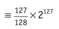

Figure 13.10

The smallest positive number which can be stored is:

<table border=1 style='margin: auto; word-wrap: break-word;'><tr><td style='text-align: center; word-wrap: break-word;'>0</td><td style='text-align: center; word-wrap: break-word;'>1</td><td style='text-align: center; word-wrap: break-word;'>0</td><td style='text-align: center; word-wrap: break-word;'>0</td><td style='text-align: center; word-wrap: break-word;'>0</td><td style='text-align: center; word-wrap: break-word;'>0</td><td style='text-align: center; word-wrap: break-word;'>0</td><td style='text-align: center; word-wrap: break-word;'>0</td></tr></table>

<table border=1 style='margin: auto; word-wrap: break-word;'><tr><td style='text-align: center; word-wrap: break-word;'>1</td><td style='text-align: center; word-wrap: break-word;'>0</td><td style='text-align: center; word-wrap: break-word;'>0</td><td style='text-align: center; word-wrap: break-word;'>0</td><td style='text-align: center; word-wrap: break-word;'>0</td><td style='text-align: center; word-wrap: break-word;'>0</td><td style='text-align: center; word-wrap: break-word;'>0</td><td style='text-align: center; word-wrap: break-word;'>0</td></tr></table>

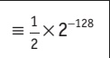

Figure 13.11

The smallest magnitude negative number which can be stored is:

<table border=1 style='margin: auto; word-wrap: break-word;'><tr><td style='text-align: center; word-wrap: break-word;'>1</td><td style='text-align: center; word-wrap: break-word;'>0</td><td style='text-align: center; word-wrap: break-word;'>1</td><td style='text-align: center; word-wrap: break-word;'>1</td><td style='text-align: center; word-wrap: break-word;'>1</td><td style='text-align: center; word-wrap: break-word;'>1</td><td style='text-align: center; word-wrap: break-word;'>1</td><td style='text-align: center; word-wrap: break-word;'>1</td></tr></table>

<table border=1 style='margin: auto; word-wrap: break-word;'><tr><td style='text-align: center; word-wrap: break-word;'>1</td><td style='text-align: center; word-wrap: break-word;'>0</td><td style='text-align: center; word-wrap: break-word;'>0</td><td style='text-align: center; word-wrap: break-word;'>0</td><td style='text-align: center; word-wrap: break-word;'>0</td><td style='text-align: center; word-wrap: break-word;'>0</td><td style='text-align: center; word-wrap: break-word;'>0</td><td style='text-align: center; word-wrap: break-word;'>0</td></tr></table>

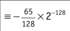

### Figure 13.12

The largest magnitude negative number which can be stored is:

<table border=1 style='margin: auto; word-wrap: break-word;'><tr><td style='text-align: center; word-wrap: break-word;'>1</td><td style='text-align: center; word-wrap: break-word;'>0</td><td style='text-align: center; word-wrap: break-word;'>0</td><td style='text-align: center; word-wrap: break-word;'>0</td><td style='text-align: center; word-wrap: break-word;'>0</td><td style='text-align: center; word-wrap: break-word;'>0</td><td style='text-align: center; word-wrap: break-word;'>0</td><td style='text-align: center; word-wrap: break-word;'>0</td></tr></table>

<table border=1 style='margin: auto; word-wrap: break-word;'><tr><td style='text-align: center; word-wrap: break-word;'>0</td><td style='text-align: center; word-wrap: break-word;'>1</td><td style='text-align: center; word-wrap: break-word;'>1</td><td style='text-align: center; word-wrap: break-word;'>1</td><td style='text-align: center; word-wrap: break-word;'>1</td><td style='text-align: center; word-wrap: break-word;'>1</td><td style='text-align: center; word-wrap: break-word;'>1</td><td style='text-align: center; word-wrap: break-word;'>1</td></tr></table>

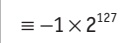

### Figure 13.13

The accuracy of a number can be increased by increasing the number of bits used in the mantissa.

The range of numbers can be increased by increasing the number of bits used in the exponent.

Accuracy and range will always be a trade-off between mantissa and exponent size.

<!-- page 340 -->

Consider the following three cases.

<table border=1 style='margin: auto; word-wrap: break-word;'><tr><td style='text-align: center; word-wrap: break-word;'>1</td><td style='text-align: center; word-wrap: break-word;'>0</td><td style='text-align: center; word-wrap: break-word;'>1</td><td style='text-align: center; word-wrap: break-word;'>1</td><td style='text-align: center; word-wrap: break-word;'>1</td><td style='text-align: center; word-wrap: break-word;'>1</td><td style='text-align: center; word-wrap: break-word;'>1</td><td style='text-align: center; word-wrap: break-word;'>1</td><td style='text-align: center; word-wrap: break-word;'>1</td><td style='text-align: center; word-wrap: break-word;'>1</td><td style='text-align: center; word-wrap: break-word;'>1</td><td style='text-align: center; word-wrap: break-word;'>1</td><td style='text-align: center; word-wrap: break-word;'>1</td><td style='text-align: center; word-wrap: break-word;'>1</td><td style='text-align: center; word-wrap: break-word;'>1</td></tr></table>

<table border=1 style='margin: auto; word-wrap: break-word;'><tr><td style='text-align: center; word-wrap: break-word;'>0</td><td style='text-align: center; word-wrap: break-word;'>1</td><td style='text-align: center; word-wrap: break-word;'>1</td><td style='text-align: center; word-wrap: break-word;'>1</td></tr></table>

### Figure 13.14

The mantissa is 12 bits and the exponent is 4 bits.

This gives a largest positive value of  $ \frac{2047}{2048} \times 2^7 $; which gives high accuracy but small range.

<table border=1 style='margin: auto; word-wrap: break-word;'><tr><td style='text-align: center; word-wrap: break-word;'>2</td><td style='text-align: center; word-wrap: break-word;'>0</td><td style='text-align: center; word-wrap: break-word;'>1</td><td style='text-align: center; word-wrap: break-word;'>1</td><td style='text-align: center; word-wrap: break-word;'>1</td><td style='text-align: center; word-wrap: break-word;'>1</td><td style='text-align: center; word-wrap: break-word;'>1</td><td style='text-align: center; word-wrap: break-word;'>1</td><td style='text-align: center; word-wrap: break-word;'>1</td><td style='text-align: center; word-wrap: break-word;'>1</td></tr></table>

<table border=1 style='margin: auto; word-wrap: break-word;'><tr><td style='text-align: center; word-wrap: break-word;'>0</td><td style='text-align: center; word-wrap: break-word;'>1</td><td style='text-align: center; word-wrap: break-word;'>1</td><td style='text-align: center; word-wrap: break-word;'>1</td><td style='text-align: center; word-wrap: break-word;'>1</td><td style='text-align: center; word-wrap: break-word;'>1</td><td style='text-align: center; word-wrap: break-word;'>1</td><td style='text-align: center; word-wrap: break-word;'>1</td></tr></table>

Figure 13.15

The mantissa is 8bits and the exponent is 8bits.

This gives a largest positive value of  $ \frac{127}{128} \times 2^{127} $, which gives reduced accuracy but increased range.

<table border=1 style='margin: auto; word-wrap: break-word;'><tr><td style='text-align: center; word-wrap: break-word;'>3</td><td style='text-align: center; word-wrap: break-word;'>0</td><td style='text-align: center; word-wrap: break-word;'>1</td><td style='text-align: center; word-wrap: break-word;'>1</td><td style='text-align: center; word-wrap: break-word;'>1</td></tr></table>

<table border=1 style='margin: auto; word-wrap: break-word;'><tr><td style='text-align: center; word-wrap: break-word;'>0</td><td style='text-align: center; word-wrap: break-word;'>1</td><td style='text-align: center; word-wrap: break-word;'>1</td><td style='text-align: center; word-wrap: break-word;'>1</td><td style='text-align: center; word-wrap: break-word;'>1</td><td style='text-align: center; word-wrap: break-word;'>1</td><td style='text-align: center; word-wrap: break-word;'>1</td><td style='text-align: center; word-wrap: break-word;'>1</td><td style='text-align: center; word-wrap: break-word;'>1</td><td style='text-align: center; word-wrap: break-word;'>1</td><td style='text-align: center; word-wrap: break-word;'>1</td><td style='text-align: center; word-wrap: break-word;'>1</td><td style='text-align: center; word-wrap: break-word;'>1</td></tr></table>

Figure 13.16

The mantissa is 4bits and the exponent is 12bits.

This gives a largest possible value of  $ \frac{7}{8} \times 2^{2047} $, which gives poor accuracy but extremely high range.

## Floating-point problems

The storage of certain numbers is an approximation, due to limitations in the size of the mantissa. This problem can be minimised when using programming languages that allow for double precision and quadruple precision.

## EXTENSION ACTIVITY 13E

Look at this coding, written in pseudocode.
number ← 0.0
FOR loop ← 0 TO 50
    number ← number + 0.1
    OUTPUT number

ENDFOR
a) When running this program the expected output would be 0.1, 0.2, 0.3, ..., 5.0.
Explain why the output from this program gave values such as 0.399999 rather than 0.4.
b) Run the program on your own computer using a language such as Pascal. Does it confirm the above statement?
c) Discuss ways of overcoming the error(s) described in your answer to part a).

<!-- page 341 -->

## EXTENSION ACTIVITY 13F

Find out how computer systems deal with the value 0 when using normalised binary floating-point numbers.

There are additional problems:

» When dividing by a very large number this can lead to a result which is less than the smallest number that can be stored. This would lead to an underflow error.

» One of the issues of using normalised binary floating-point numbers is the inability to store the number zero. This is because the mantissa must be 0.1 or 1.0 which does not allow for a zero value.

» If a calculation produces a number which exceeds the maximum possible value that can be stored in the mantissa and exponent, an overflow error will be produced. This could occur when trying to divide by a very small number or even 0.

## ACTIVITY 131

1 What is the largest positive and smallest magnitude number which can be stored in a computer using 10-bit mantissa and 6-bit exponent.

2 A computer uses 32 bits to store the mantissa and exponent.

Discuss the precision and range of numbers which can be stored in this computer.

3 a) A calculation carried out on a computer produced the result  $ 1.21 \times 10^{100} $

The computer's largest possible value which can be stored is  $ 10^{99} $. Discuss the problems this result would cause.

b) A calculation involving  $ \frac{x}{y} $ is being carried out on a computer.

One of the potential values of y is 0.

Discuss the problems this might cause for the computer.

4 A computer uses a 10-bit mantissa and a 6-bit exponent.

What approximate values would be stored for the following numbers?

a) 2.88 b) -5.38

## End of chapter questions

1 A computer holds binary floating-point numbers in two's complement form with the binary point immediately after the left-most bit.

A 24-bit word is used as follows:

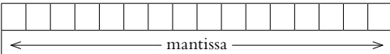

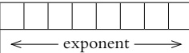

a) Three words are held in floating-point representations:

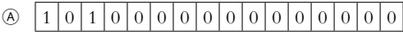

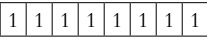

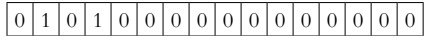

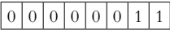

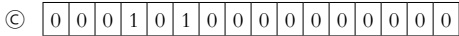

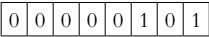

i) State the values being represented by A, B and C.

ii) Identify the value that is not normalised.

iii) Explain why it is normal for floating-point numbers to be normalised.

<!-- page 342 -->

b) Comment on the accuracy and range of numbers stored in this computer. [3]

c) Discuss the problems of representing the number zero in normalised floating-point format. [2]

2 A computer uses 12bits for the mantissa and 6bits for the exponent.

a) Convert these binary floating-point numbers into denary.

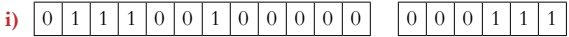

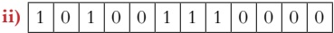

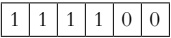

b) Convert these denary numbers into binary floating-point numbers.

i) +4.75 [3]

ii) -8.375 [3]

3 In a particular computer system, real numbers are stored using floating-point representation with:

- 8 bits for the mantissa

- 8 bits for the exponent

- two's complement form for both mantissa and exponent.

a) Calculate the floating-point representation of +3.5 in this system. Show your working.

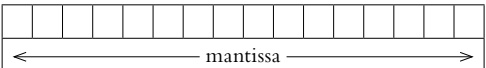

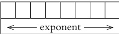

b) Calculate the floating-point representation of -3.5 in this system. Show your working.

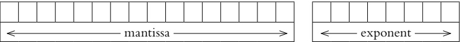

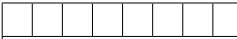

←—exponent →

Paper 32 Q1 parts (a) and (b) November 2016

4 a) Using the pseudocode declarations below, identify

i) an enumerated data type [1]

ii) a composite data type [1]

iii) a non-composite data type [1]

iv) a user-defined data type. [1]

TYPE Tseason = (Spring, Summer, Autumn, Winter)
TYPE
TJournalRecord
DECLARE title : STRING
DECLARE author : STRING
DECLARE publisher : STRING
DECLARE noPages : INTEGER
DECLARE season : Tseason
ENDTYPE

<!-- page 343 -->

b) Write pseudocode to declare a variable Journal of type TJournalRecord and assign the following values to the variable. [3]

Title – Spring Flowers

Author – H Williams

Publisher – XYZ Press

Number of pages – 40

Season – Spring

5 a) Three file organisation methods and two file access methods are shown below. Copy the diagram below and connect each file organisation method to its appropriate file access method(s). [4]

File organisation method

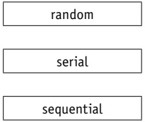

File access method

sequential

direct

b) An energy company supplies electricity to a large number of customers. Each customer has a meter that records the amount of electricity used. Customers submit meter readings using their online account.

The company's computer system stores data about its customers.

This data includes:

account number

- personal data (name, address, telephone number)

- meter readings

- username and encrypted password.

The computer system uses three files:

<table border=1 style='margin: auto; word-wrap: break-word;'><tr><td style='text-align: center; word-wrap: break-word;'>File</td><td style='text-align: center; word-wrap: break-word;'>Content</td><td style='text-align: center; word-wrap: break-word;'>Use</td></tr><tr><td style='text-align: center; word-wrap: break-word;'>A</td><td style='text-align: center; word-wrap: break-word;'>Account number and meter readings for the current month.</td><td style='text-align: center; word-wrap: break-word;'>Each time a customer submits their reading, a new record is added to the file.</td></tr><tr><td style='text-align: center; word-wrap: break-word;'>B</td><td style='text-align: center; word-wrap: break-word;'>Customer&#x27;s personal data.</td><td style='text-align: center; word-wrap: break-word;'>At the end of the month to create a statement that shows the electricity supplied and the total cost.</td></tr><tr><td style='text-align: center; word-wrap: break-word;'>C</td><td style='text-align: center; word-wrap: break-word;'>Usernames and encrypted passwords.</td><td style='text-align: center; word-wrap: break-word;'>When customers log in to their accounts to submit meter readings.</td></tr></table>

For each of the files A, B and C, state an appropriate file organisation method for the use given in the table.

All three file organisation methods must be different.

Justify your choice.

[9]

