# 15 Hardware

<!-- Cambridge International AS and a Level Computer Science (David Watson, Helen Williams).pdf p362-387 -->

<!-- page 362 -->

## 15 

## Hardware

In this chapter, you will learn about

 $ ^{*} $ the differences between RISC (Reduced Instruction Set Computer) and CISC (Complex Instruction Set Computer) processors

 $ ^{*} $ the importance and use of pipelining and registers in RISC processors

★ SISD, SIMD, MISD and MIMD basic computer architectures

 $ ^{*} $ the characteristics of massively parallel computers

★ interrupt handling on CISC and RISC computers

★ Boolean algebra including De Morgan's Laws

★ the simplification of logic circuits and expressions using Boolean algebra

★ producing truth tables from common logic circuits

★ half adder and full adder logic circuits

 $ ^{*} $ the construction and role of SR and JK flip-flop circuits

★ using Karnaugh maps in the solution of logic problems.

### 15.1 Processors and parallel processing

## WHAT YOU SHOULD ALREADY KNOW

In Chapter 4, you learnt about processor fundamentals. Try the following three questions to refresh your memory before you start to read the first part of this chapter.

1 A computer uses the following status registers when carrying out the addition of two binary numbers

☐ a carry flag (C)

an overflow flag (V)

☐ a negative flag (N).

Describe what happens to the above status registers when the following pairs of 8-bit binary numbers are added together and explain the significance of the flag values in both sets of calculation

a) 00111100 and 01000110

b) 1 1 0 0 0 1 0 0 and 1 0 1 1 1 0 1 0.

2 Describe the stages in the fetch-execute cycle.

3 a) A processor contains three buses: data bus, address bus and control bus.

i) What factors determine the width of a bus?

ii) Which of the three buses will have the smallest width?

iii) An address bus is increased from 16-bit to 64-bit. What would be the result of this upgrade to the processor?

b) Explain the role of

i) the clock

ii) interrupts in a typical processor.

<!-- page 363 -->

## Key terms

<table border=1 style='margin: auto; word-wrap: break-word;'><tr><td style='text-align: center; word-wrap: break-word;'>CISC – complex instruction set computer.</td><td rowspan="2">MISD – multiple instruction single data, computer architecture which uses many processors but the same shared data source.</td></tr><tr><td style='text-align: center; word-wrap: break-word;'>RISC – reduced instruction set computer.</td></tr><tr><td style='text-align: center; word-wrap: break-word;'>Pipelining – allows several instructions to be processed simultaneously without having to wait for previous instructions to finish.</td><td style='text-align: center; word-wrap: break-word;'>MIMD – multiple instruction multiple data, computer architecture which uses many processors, each of which can use a separate data source.</td></tr><tr><td style='text-align: center; word-wrap: break-word;'>Parallel processing – operation which allows a process to be split up and for each part to be executed by a different processor at the same time.</td><td style='text-align: center; word-wrap: break-word;'>Cluster – a number of computers (containing SIMD processors) networked together.</td></tr><tr><td style='text-align: center; word-wrap: break-word;'>SISD – single instruction single data, computer architecture which uses a single processor and one data source.</td><td style='text-align: center; word-wrap: break-word;'>Super computer – a powerful mainframe computer.</td></tr><tr><td style='text-align: center; word-wrap: break-word;'>SIMD – single instruction multiple data, computer architecture which uses many processors and different data inputs.</td><td style='text-align: center; word-wrap: break-word;'>Massively parallel computers – the linking together of several computers effectively forming one machine with thousands of processors.</td></tr></table>

#### 15.1.1 RISC and CISC processors

Early computers made use of the Von Neumann architecture (see Chapter 4). Modern advances in computer technology have led to much more complex processor design. Two basic philosophies have emerged over the last few years.

developers who want the emphasis to be on the hardware used: the hardware should be chosen to suit the high-level language development

developers who want the emphasis to be on the software/instruction sets to be used: this philosophy is driven by ever faster execution times.

The first philosophy is part of a group of processor architectures known as CISC (complex instruction set computer). The second philosophy is part of a group of processor architectures known as RISC (reduced instruction set computer).

## CISC processors

CISC processor architecture makes use of more internal instruction formats than RISC. The design philosophy is to carry out a given task with as few lines of assembly code as possible. Processor hardware must therefore be capable of handling more complex assembly code instructions. Essentially, CISC architecture is based on single complex instructions which need to be converted by the processor into a number of sub-instructions to carry out the required operation.

For example, suppose we wish to add the two numbers A and B together, we could write the following assembly instruction:

ADD A, B – this is a single instruction that requires several sub-instructions (multi-cycle) to carry out the ADDition operation

This methodology leads to shorter coding (than RISC) but may actually lead to more work being carried out by the processor.

## RISC processors

RISC processors have fewer built-in instruction formats than CISC. This can lead to higher processor performance. The RISC design philosophy is built on the

<!-- page 364 -->

use of less complex instructions, which is done by breaking up the assembly code instructions into a number of simpler single-cycle instructions. Ultimately, this means there is a smaller, but more optimised set of instructions than CISC. Using the same example as above to carry out the addition of two numbers A and B (this is the equivalent operation to ADD A, B):

LOAD X, A – this loads the value of A into a register X

LOAD Y, B – this loads the value of B into a register Y

ADD A, B – this takes the values for A and B from X and Y and adds them

STORE Z – the result of the addition is stored in register Z

Each instruction requires one clock cycle (see Chapter 4). Separating commands such as LOAD and STORE reduces the amount of work done by the processor. This leads to faster processor performance since there are ultimately a smaller number of instructions than CISC. It is worth noting here that the optimisation of each of these simpler instructions is done through the use of pipelining (see below).

Table 15.1 shows the main differences between CISC and RISC processors.

<table border=1 style='margin: auto; word-wrap: break-word;'><tr><td style='text-align: center; word-wrap: break-word;'>CISC features</td><td style='text-align: center; word-wrap: break-word;'>RISC features</td></tr><tr><td style='text-align: center; word-wrap: break-word;'>Many instruction formats are possible</td><td style='text-align: center; word-wrap: break-word;'>Uses fewer instruction formats/sets</td></tr><tr><td style='text-align: center; word-wrap: break-word;'>There are more addressing modes</td><td style='text-align: center; word-wrap: break-word;'>Uses fewer addressing modes</td></tr><tr><td style='text-align: center; word-wrap: break-word;'>Makes use of multi-cycle instructions</td><td style='text-align: center; word-wrap: break-word;'>Makes use of single-cycle instructions</td></tr><tr><td style='text-align: center; word-wrap: break-word;'>Instructions can be of a variable length</td><td style='text-align: center; word-wrap: break-word;'>Instructions are of a fixed length</td></tr><tr><td style='text-align: center; word-wrap: break-word;'>Longer execution time for instructions</td><td style='text-align: center; word-wrap: break-word;'>Faster execution time for instructions</td></tr><tr><td style='text-align: center; word-wrap: break-word;'>Decoding of instructions is more complex</td><td style='text-align: center; word-wrap: break-word;'>Makes use of general multi-purpose registers</td></tr><tr><td style='text-align: center; word-wrap: break-word;'>It is more difficult to make pipelining work</td><td style='text-align: center; word-wrap: break-word;'>Easier to make pipelining function correctly</td></tr><tr><td style='text-align: center; word-wrap: break-word;'>The design emphasis is on the hardware</td><td style='text-align: center; word-wrap: break-word;'>The design emphasis is on the software</td></tr><tr><td style='text-align: center; word-wrap: break-word;'>Uses the memory unit to allow complex instructions to be carried out</td><td style='text-align: center; word-wrap: break-word;'>Processor chips require fewer transistors</td></tr></table>

Table 15.1 The differences between CISC and RISC processors

## EXTENSION ACTIVITY 15A

Find out how some of the newer technologies, such as EPIC (Explicitly Parallel Instruction Computing) and VLIW (Very Long Instruction Word) processor architectures, are used in computer systems.

## Pipelining

One of the major developments resulting from RISC architecture is pipelining. This is one of the less complex ways of improving computer performance. Pipelining allows several instructions to be processed simultaneously without having to wait for previous instructions to be completed. To understand how this works, we need to split up the execution of a given instruction into its five stages.

1 instruction fetch cycle (IF)

2 instruction decode cycle (ID)

3 operand fetch cycle (OF)

<!-- page 365 -->

4 instruction execution cycle (IE)

5 writeback result process (WB).

To demonstrate how pipelining works, we will consider a program which has six instructions (A, B, C, D, E and F). Figure 15.1 shows the relationship between processor stages and the number of required clock cycles when using pipelining. It shows how pipelining would be implemented with each stage requiring one clock cycle to complete.

Clock cycles

<table border=1 style='margin: auto; word-wrap: break-word;'><tr><td style='text-align: center; word-wrap: break-word;'></td><td style='text-align: center; word-wrap: break-word;'>1</td><td style='text-align: center; word-wrap: break-word;'>2</td><td style='text-align: center; word-wrap: break-word;'>3</td><td style='text-align: center; word-wrap: break-word;'>4</td><td style='text-align: center; word-wrap: break-word;'>5</td><td style='text-align: center; word-wrap: break-word;'>6</td><td style='text-align: center; word-wrap: break-word;'>7</td><td style='text-align: center; word-wrap: break-word;'>8</td><td style='text-align: center; word-wrap: break-word;'>9</td><td style='text-align: center; word-wrap: break-word;'>10</td></tr><tr><td style='text-align: center; word-wrap: break-word;'>IF</td><td style='text-align: center; word-wrap: break-word;'>A</td><td style='text-align: center; word-wrap: break-word;'>B</td><td style='text-align: center; word-wrap: break-word;'>C</td><td style='text-align: center; word-wrap: break-word;'>D</td><td style='text-align: center; word-wrap: break-word;'>E</td><td style='text-align: center; word-wrap: break-word;'>F</td><td style='text-align: center; word-wrap: break-word;'></td><td style='text-align: center; word-wrap: break-word;'></td><td style='text-align: center; word-wrap: break-word;'></td><td style='text-align: center; word-wrap: break-word;'></td></tr><tr><td style='text-align: center; word-wrap: break-word;'>ID</td><td style='text-align: center; word-wrap: break-word;'></td><td style='text-align: center; word-wrap: break-word;'>A</td><td style='text-align: center; word-wrap: break-word;'>B</td><td style='text-align: center; word-wrap: break-word;'>C</td><td style='text-align: center; word-wrap: break-word;'>D</td><td style='text-align: center; word-wrap: break-word;'>E</td><td style='text-align: center; word-wrap: break-word;'>F</td><td style='text-align: center; word-wrap: break-word;'></td><td style='text-align: center; word-wrap: break-word;'></td><td style='text-align: center; word-wrap: break-word;'></td></tr><tr><td style='text-align: center; word-wrap: break-word;'>OF</td><td style='text-align: center; word-wrap: break-word;'></td><td style='text-align: center; word-wrap: break-word;'></td><td style='text-align: center; word-wrap: break-word;'>A</td><td style='text-align: center; word-wrap: break-word;'>B</td><td style='text-align: center; word-wrap: break-word;'>C</td><td style='text-align: center; word-wrap: break-word;'>D</td><td style='text-align: center; word-wrap: break-word;'>E</td><td style='text-align: center; word-wrap: break-word;'>F</td><td style='text-align: center; word-wrap: break-word;'></td><td style='text-align: center; word-wrap: break-word;'></td></tr><tr><td style='text-align: center; word-wrap: break-word;'>IE</td><td style='text-align: center; word-wrap: break-word;'></td><td style='text-align: center; word-wrap: break-word;'></td><td style='text-align: center; word-wrap: break-word;'></td><td style='text-align: center; word-wrap: break-word;'>A</td><td style='text-align: center; word-wrap: break-word;'>B</td><td style='text-align: center; word-wrap: break-word;'>C</td><td style='text-align: center; word-wrap: break-word;'>D</td><td style='text-align: center; word-wrap: break-word;'>E</td><td style='text-align: center; word-wrap: break-word;'>F</td><td style='text-align: center; word-wrap: break-word;'></td></tr><tr><td style='text-align: center; word-wrap: break-word;'>WB</td><td style='text-align: center; word-wrap: break-word;'></td><td style='text-align: center; word-wrap: break-word;'></td><td style='text-align: center; word-wrap: break-word;'></td><td style='text-align: center; word-wrap: break-word;'></td><td style='text-align: center; word-wrap: break-word;'>A</td><td style='text-align: center; word-wrap: break-word;'>B</td><td style='text-align: center; word-wrap: break-word;'>C</td><td style='text-align: center; word-wrap: break-word;'>D</td><td style='text-align: center; word-wrap: break-word;'>E</td><td style='text-align: center; word-wrap: break-word;'>F</td></tr></table>

### Figure 15.1

This functionality clearly requires processors with several registers to store each of the stages.

Execution of an instruction is split into a number of stages. During clock cycle 1, the first stage of instruction 1 is implemented. During clock cycle 2, the second stage of instruction 1 and the first stage in instruction 2 are implemented. During clock cycle 3, the third stage of instruction 1, second stage of instruction 2 and the first stage of instruction 3 are implemented. This continues until all instruction are processed.

In this example, by the time instruction ‘A’ has completed, instruction ‘F’ is at the first stage and instructions ‘B’ to ‘E’ are at various in-between stages in the process. As Figure 15.1 shows, a number of instructions can be processed at the same time, and there is no need to wait for an instruction to go through all five cycles before the next one can be implemented. In the example shown, the six instructions require 10 clock cycles to go to completion. Without pipelining, it would require 30 (6 × 5) cycles to complete (since each of the six instructions requires five stages for completion).

## Interrupts

In Chapter 4, we discussed interrupt handling in processors where each instruction is handled sequentially before the next one can start (five stages for instruction 'A', then five stages for instruction 'B', and so on).

Once the processor detects the existence of an interrupt (at the end of the fetch-execute cycle), the current program would be temporarily stopped (depending on interrupt priorities), and the status of each register stored. The processor can then be restored to its original status before the interrupt was received and serviced.

However, with pipelining, there is an added complexity; as the interrupt is received, there could be a number of instructions still in the pipeline. The usual way to deal with this is to discard all instructions in the pipeline except for the last instruction in the write-back (WB) stage.

<!-- page 366 -->

The interrupt handler routine can then be applied to this remaining instruction and, once serviced, the processor can restart with the next instruction in the sequence. Alternatively, although much less common, the contents of the five stages can be stored in registers. This allows all current data to be stored, allowing the processor to be restored to its previous status once the interrupt has been serviced.

#### 15.1.2 Parallel processing

## Parallel processor systems

There are many ways that parallel processing can be carried out. The four categories of basic computer architecture presently used are described below.

## SISD (single instruction single data)

SISD (single instruction single data) uses a single processor that can handle a single instruction and which also uses one data source at a time. Each task is processed in a sequential order. Since there is a single processor, this architecture does not allow for parallel processing. It is most commonly found in applications such as early personal computers.

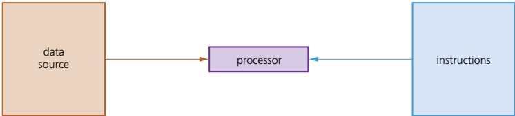

### Figure 15.2 SISD diagram

## SIMD (single instruction multiple data)

SIMD (single instruction multiple data) uses many processors. Each processor executes the same instruction but uses different data inputs – they are all doing the same calculations but on different data at the same time.

SIMD are often referred to as array processors; they have a particular application in graphics cards. For example, suppose the brightness of an image made up of 4000 pixels needs to be increased. Since SIMD can work on many data items at the same time, 4000 small processors (one per pixel) can each alter the brightness of each pixel by the same amount at the same time. This means the whole of the image will have its brightness increased consistently.

Other applications include sound sampling – or any application where a large number of items need to be altered by the same amount (since each processor is doing the same calculation on each data item).

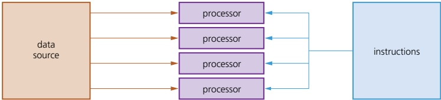

Figure 15.3 SIMD diagram

<!-- page 367 -->

## MISD (multiple instruction single data)

MISD (multiple instruction single data) uses several processors. Each processor uses different instructions but uses the same shared data source. MISD is not a commonly used architecture (MIMD tends to be used instead). However, the American Space Shuttle flight control system did make use of MISD processors.

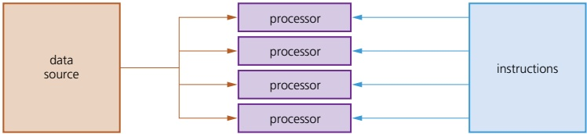

### Figure 15.4 MISD diagram

## MIMD (multiple instruction multiple data)

MIMD (multiple instruction multiple data) uses multiple processors. Each one can take its instructions independently, and each processor can use data from a separate data source (the data source may be a single memory unit which has been suitably partitioned). The MIMD architecture is used in multicore systems (for example, by super computers or in the architecture of multi-core chips).

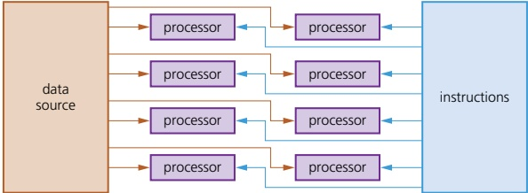

### Figure 15.5 MIMD diagram

There are a number of factors to consider when using parallel processing.

When carrying out parallel processing, processors need to be able to communicate. The data which has been processed needs to be transferred from one processor to another.

When software is being designed, or programming languages are being chosen, they must be capable of processing data from multiple processors at the same time.

It is a much faster method for handling large volumes of independent data; any data which relies on the result of a previous operation (dependent data) would not be suitable in parallel processing. Data used will go through the same processing, which requires this independence from other data.

Parallel processing overcomes the Von Neumann 'bottleneck' (in this type of architecture, data is constantly moving between memory and processor, leading to latency; as processor speeds have increased, the amount of time they remain idle has also increased since the processor's performance is limited to the internal data transfer rate along the buses). Finding a way around this issue

<!-- page 368 -->

is one of the driving forces behind parallel computers in an effort to greatly improve processor performance.

However, parallel processing requires more expensive hardware. When deciding whether or not to use this type of processor, it is important to take this factor into account.

## Parallel computer systems

SIMD and MIMD are the most commonly used processors in parallel processing. A number of computers (containing SIMD processors) can be networked together to form a cluster. The processor from each computer forms part of a larger pseudo-parallel system which can act like a super computer. Some textbooks and websites also refer to this as grid computing.

Massively parallel computers have evolved from the linking together of a number of computers, effectively forming one machine with several thousand processors. This was driven by the need to solve increasingly complex problems in the world of science and mathematics. By linking computers (processors) together in this way, it massively increases the processing power of the 'single machine'. This is subtly different to cluster computers where each computer (processor) remains largely independent. In massively parallel computers, each processor will carry out part of the processing and communication between computers is achieved via interconnected data pathways. Figure 15.6 shows this simply.

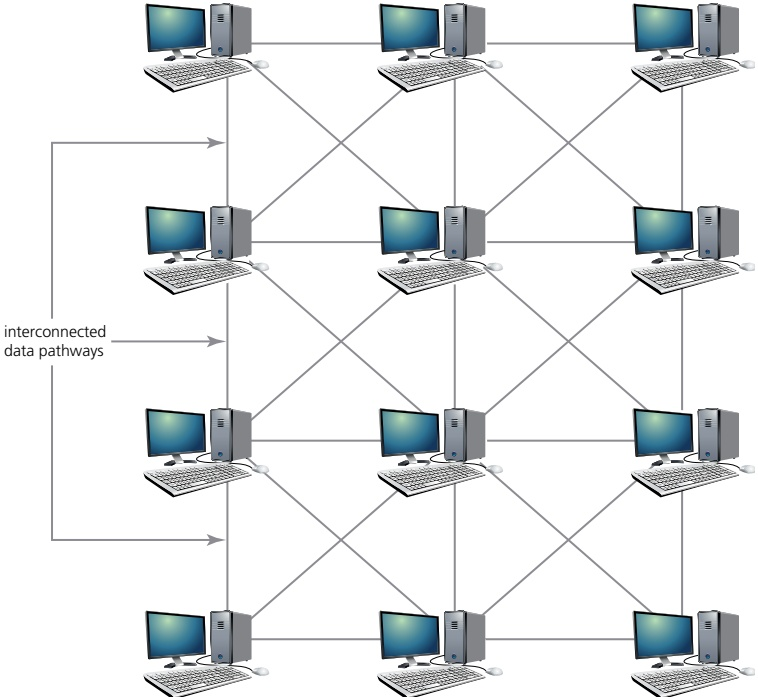

▲ Figure 15.6 Typical massively parallel computer (processor) system showing interconnected pathways

<!-- page 369 -->

## EXTENSION ACTIVITY 15B

1 Find out more about the applications of multi-computer systems (cluster and massively parallel computers). In particular, research their uses in seismology, astronomy, climate modelling, nuclear physics and weather forecasting models.

2 Look at Figure 15.7. Determine, from research, the main reasons for the almost linear expansion in the processing speed of computers over the last 25 years. The data in the graph compares Number of calculations per second against Year.

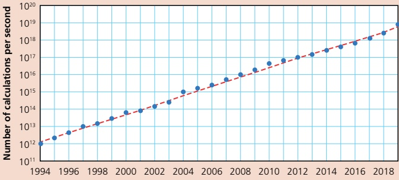

Year

Figure 15.7

## ACTIVITY 15A

1 a) Describe why RISC is an important development in processor technology.

b) Describe the main differences between RISC and CISC technologies.

2 a) What is meant by the Von Neumann bottleneck?

b) How does the Von Neumann bottleneck impact on processor performance?

3 a) What are the main differences between cluster computers and massively parallel computers?

b) Describe one application which uses massively parallel computers. Justify your choice of answer.

4 A processor uses pipelining. The following instructions are to be input

1 LOAD A

2 LOAD B

3 LOAD C

4 ADD A, B, C

5 STORE D

6 OUT D

Draw a diagram to show how many clock cycles are needed for these six instructions to be carried out. Compare your answer to the number of clock cycles needed for a processor using sequential processing.

<!-- page 370 -->

## Key terms

Half adder circuit – carries out binary addition on two bits giving sum and carry.

Full adder circuit – two half adders combined to allow the sum of several binary bits.

Combination circuit – circuit in which the output depends entirely on the input values.

Sequential circuit – circuit in which the output depends on input values produced from previous output values.

Flip-flop circuits – electronic circuits with two stable conditions using sequential circuits.

Cross-coupling – interconnection between two logic gates which make up a flip-flop.

Positive feedback – the output from a process which influences the next input value to the process.

## Sum of products

(SoP) – a Boolean expression containing AND and OR terms.

Gray codes – ordering of binary numbers such that successive numbers differ by one bit value only, for example, 00 01 11 10.

Karnaugh maps (K-maps) – a method used to simplify logic statements and logic circuits – uses Gray codes.

### 15.2 Boolean algebra and logic circuits

## WHAT YOU SHOULD ALREADY KNOW

In Chapter 3, you learnt about logic gates and logic circuits. Try the following three questions to refresh your memory before you start to read the second part of this chapter.

1 Produce a truth table for the logic circuit shown in Figure 15.8.

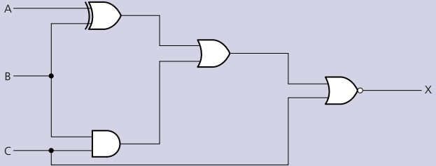

### Figure 15.8

2 Draw a simplified version of the logic circuit shown in Figure 15.9 and write the Boolean expressions to represent Figure 15.9 and your simplified version.

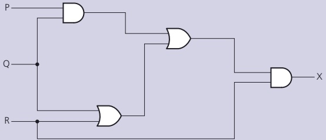

### Figure 15.9

3 The warning light on a car comes on (= 1) if either one of three conditions occur

sensor1 AND sensor2 detect a fault (give an input of 1) OR

sensor2 AND sensor3 detect a fault (give an input of 1) OR

sensor1 AND sensor3 detect a fault (give an input of 1).

a) Write a Boolean expression to represent the above problem.

b) Give the logic circuit to represent the above system.

c) Produce a truth table and check your answers to parts a) and b) agree.

#### 15.2.1 Boolean algebra

Boolean algebra is named after the mathematician George Boole. It is a form of algebra linked to logic circuits and is based on the two statements:

TRUE (1)

FALSE (0)

<!-- page 371 -->

The notation used in this book to represent these two Boolean operators is:

<table border=1 style='margin: auto; word-wrap: break-word;'><tr><td style='text-align: center; word-wrap: break-word;'>A</td><td style='text-align: center; word-wrap: break-word;'>which is also written as</td><td style='text-align: center; word-wrap: break-word;'>NOT A</td></tr><tr><td style='text-align: center; word-wrap: break-word;'>A.B</td><td style='text-align: center; word-wrap: break-word;'>which is also written as</td><td style='text-align: center; word-wrap: break-word;'>A AND B</td></tr><tr><td style='text-align: center; word-wrap: break-word;'>A + B</td><td style='text-align: center; word-wrap: break-word;'>which is also written as</td><td style='text-align: center; word-wrap: break-word;'>A OR B</td></tr></table>

Table 15.2 summarises the rules that govern Boolean algebra. It also includes De Morgan's Laws. Also note that, in Boolean algebra,  $ 1 + 1 = 1 $,  $ 1 + 0 = 1 $, and  $ \overline{A} = A $ (remember your logic gate truth tables in Chapter 3).

<table border=1 style='margin: auto; word-wrap: break-word;'><tr><td style='text-align: center; word-wrap: break-word;'>Commutative Laws</td><td style='text-align: center; word-wrap: break-word;'>A + B = B + A</td><td style='text-align: center; word-wrap: break-word;'>A,B = B,A</td></tr><tr><td style='text-align: center; word-wrap: break-word;'>Associative Laws</td><td style='text-align: center; word-wrap: break-word;'>A + (B + C) = (A + B) + C</td><td style='text-align: center; word-wrap: break-word;'>A,(B,C) = (A,B),C</td></tr><tr><td style='text-align: center; word-wrap: break-word;'>Distributive Laws</td><td style='text-align: center; word-wrap: break-word;'>A,(B + C) = (A,B) + (A,C)\n(A + B),(A + C) = A + B,C</td><td style='text-align: center; word-wrap: break-word;'>A + (B,C) = (A + B),(A + C)</td></tr><tr><td style='text-align: center; word-wrap: break-word;'>Tautology/Idempotent Laws</td><td style='text-align: center; word-wrap: break-word;'>A,A = A</td><td style='text-align: center; word-wrap: break-word;'>A + A = A</td></tr><tr><td style='text-align: center; word-wrap: break-word;'>Tautology/Identity Laws</td><td style='text-align: center; word-wrap: break-word;'>1,A = A</td><td style='text-align: center; word-wrap: break-word;'>0 + A = A</td></tr><tr><td style='text-align: center; word-wrap: break-word;'>Tautology/Null Laws</td><td style='text-align: center; word-wrap: break-word;'>0,A = 0</td><td style='text-align: center; word-wrap: break-word;'>1 + A = 1</td></tr><tr><td style='text-align: center; word-wrap: break-word;'>Tautology/Inverse Laws</td><td style='text-align: center; word-wrap: break-word;'>A, $ \overline{A} $ = 0</td><td style='text-align: center; word-wrap: break-word;'>A +  $ \overline{A} $ = 1</td></tr><tr><td style='text-align: center; word-wrap: break-word;'>Absorption Laws</td><td style='text-align: center; word-wrap: break-word;'>A,(A + B) = A\nA + A,B = A</td><td style='text-align: center; word-wrap: break-word;'>A + (A,B) = A\nA +  $ \overline{A} $,B = A + B</td></tr><tr><td style='text-align: center; word-wrap: break-word;'>De Morgan&#x27;s Laws</td><td style='text-align: center; word-wrap: break-word;'>$ (\overline{A,B}) $ =  $ \overline{A} $ +  $ \overline{B} $</td><td style='text-align: center; word-wrap: break-word;'>$ (\overline{A + B}) $ =  $ \overline{A,B} $</td></tr></table>

▲ Table 15.2 The rules that govern Boolean algebra

Table 15.3 shows proof of De Morgan's Laws. Since the last two columns in each section are identical, then the two De Morgan's Laws hold true.

<table border=1 style='margin: auto; word-wrap: break-word;'><tr><td style='text-align: center; word-wrap: break-word;'>A</td><td style='text-align: center; word-wrap: break-word;'>B</td><td style='text-align: center; word-wrap: break-word;'>$ \overline{A} $</td><td style='text-align: center; word-wrap: break-word;'>$ \overline{B} $</td><td style='text-align: center; word-wrap: break-word;'>$ \overline{A} + \overline{B} $</td><td style='text-align: center; word-wrap: break-word;'>A.B</td></tr><tr><td style='text-align: center; word-wrap: break-word;'>0</td><td style='text-align: center; word-wrap: break-word;'>0</td><td style='text-align: center; word-wrap: break-word;'>1</td><td style='text-align: center; word-wrap: break-word;'>1</td><td style='text-align: center; word-wrap: break-word;'>1</td><td style='text-align: center; word-wrap: break-word;'>1</td></tr><tr><td style='text-align: center; word-wrap: break-word;'>0</td><td style='text-align: center; word-wrap: break-word;'>1</td><td style='text-align: center; word-wrap: break-word;'>1</td><td style='text-align: center; word-wrap: break-word;'>0</td><td style='text-align: center; word-wrap: break-word;'>1</td><td style='text-align: center; word-wrap: break-word;'>1</td></tr><tr><td style='text-align: center; word-wrap: break-word;'>1</td><td style='text-align: center; word-wrap: break-word;'>0</td><td style='text-align: center; word-wrap: break-word;'>0</td><td style='text-align: center; word-wrap: break-word;'>1</td><td style='text-align: center; word-wrap: break-word;'>1</td><td style='text-align: center; word-wrap: break-word;'>1</td></tr><tr><td style='text-align: center; word-wrap: break-word;'>1</td><td style='text-align: center; word-wrap: break-word;'>1</td><td style='text-align: center; word-wrap: break-word;'>0</td><td style='text-align: center; word-wrap: break-word;'>0</td><td style='text-align: center; word-wrap: break-word;'>0</td><td style='text-align: center; word-wrap: break-word;'>0</td></tr></table>

Both columns have the same values

<table border=1 style='margin: auto; word-wrap: break-word;'><tr><td style='text-align: center; word-wrap: break-word;'>A</td><td style='text-align: center; word-wrap: break-word;'>B</td><td style='text-align: center; word-wrap: break-word;'>$ \overline{A} $</td><td style='text-align: center; word-wrap: break-word;'>$ \overline{B} $</td><td style='text-align: center; word-wrap: break-word;'>$ \overline{A}.\overline{B} $</td><td style='text-align: center; word-wrap: break-word;'>$ \overline{A}+\overline{B} $</td></tr><tr><td style='text-align: center; word-wrap: break-word;'>0</td><td style='text-align: center; word-wrap: break-word;'>0</td><td style='text-align: center; word-wrap: break-word;'>1</td><td style='text-align: center; word-wrap: break-word;'>1</td><td style='text-align: center; word-wrap: break-word;'>1</td><td style='text-align: center; word-wrap: break-word;'>1</td></tr><tr><td style='text-align: center; word-wrap: break-word;'>0</td><td style='text-align: center; word-wrap: break-word;'>1</td><td style='text-align: center; word-wrap: break-word;'>1</td><td style='text-align: center; word-wrap: break-word;'>0</td><td style='text-align: center; word-wrap: break-word;'>0</td><td style='text-align: center; word-wrap: break-word;'>0</td></tr><tr><td style='text-align: center; word-wrap: break-word;'>1</td><td style='text-align: center; word-wrap: break-word;'>0</td><td style='text-align: center; word-wrap: break-word;'>0</td><td style='text-align: center; word-wrap: break-word;'>1</td><td style='text-align: center; word-wrap: break-word;'>0</td><td style='text-align: center; word-wrap: break-word;'>0</td></tr><tr><td style='text-align: center; word-wrap: break-word;'>1</td><td style='text-align: center; word-wrap: break-word;'>1</td><td style='text-align: center; word-wrap: break-word;'>0</td><td style='text-align: center; word-wrap: break-word;'>0</td><td style='text-align: center; word-wrap: break-word;'>0</td><td style='text-align: center; word-wrap: break-word;'>0</td></tr></table>

Both columns have the same values

Table 15.3 Proof of De Morgan's Laws

Simplification using Boolean algebra

<table border=1 style='margin: auto; word-wrap: break-word;'><tr><td style='text-align: center; word-wrap: break-word;'>Example 15.1</td><td style='text-align: center; word-wrap: break-word;'>Simplify  $ A + B + \overline{A} + \overline{B} $</td></tr><tr><td style='text-align: center; word-wrap: break-word;'></td><td style='text-align: center; word-wrap: break-word;'>Solution\nUsing the associate laws we have:  $ A + B + \overline{A} + \overline{B} \Rightarrow (A + \overline{A}) + (B + \overline{B}) $\nUsing the inverse laws we have:  $ (A + \overline{A}) = 1 $ and  $ (B + \overline{B}) = 1 $\nTherefore, we have  $ 1 + 1 $, which is simply  $ 1 \Rightarrow A + B + \overline{A} + \overline{B} = 1 $</td></tr></table>

<!-- page 372 -->

Simplify A.B.C +  $ \overline{A} $.B.C + A. $ \overline{B} $.C + A.B. $ \overline{C} $

Solution

Rewrite the expression as: A.B.C + ( $ \overline{A} $.B.C + A. $ \overline{B} $.C + A.B. $ \overline{C} $)

This becomes: (A.B.C +  $ \overline{A} $.B.C) + (A.B.C + A. $ \overline{B} $.C) + (A.B.C + A.B. $ \overline{C} $)

which transforms to: B.C.(A +  $ \overline{A} $) + A.C.(B +  $ \overline{B} $) + A.B.(C +  $ \overline{C} $)

Since  $ A + \overline{A} $,  $ B + \overline{B} $ and  $ C + \overline{C} $ are all equal to 1

then we have: B.C.1 + A.C.1 + A.B.1  $ \Rightarrow $ B.C + A.C + A.B

<table border=1 style='margin: auto; word-wrap: break-word;'><tr><td colspan="2">INPUTS</td><td colspan="2">OUTPUTS</td></tr><tr><td style='text-align: center; word-wrap: break-word;'>A</td><td style='text-align: center; word-wrap: break-word;'>B</td><td style='text-align: center; word-wrap: break-word;'>S</td><td style='text-align: center; word-wrap: break-word;'>C</td></tr><tr><td style='text-align: center; word-wrap: break-word;'>0</td><td style='text-align: center; word-wrap: break-word;'>0</td><td style='text-align: center; word-wrap: break-word;'>0</td><td style='text-align: center; word-wrap: break-word;'>0</td></tr><tr><td style='text-align: center; word-wrap: break-word;'>0</td><td style='text-align: center; word-wrap: break-word;'>1</td><td style='text-align: center; word-wrap: break-word;'>1</td><td style='text-align: center; word-wrap: break-word;'>0</td></tr><tr><td style='text-align: center; word-wrap: break-word;'>1</td><td style='text-align: center; word-wrap: break-word;'>0</td><td style='text-align: center; word-wrap: break-word;'>1</td><td style='text-align: center; word-wrap: break-word;'>0</td></tr><tr><td style='text-align: center; word-wrap: break-word;'>1</td><td style='text-align: center; word-wrap: break-word;'>1</td><td style='text-align: center; word-wrap: break-word;'>0</td><td style='text-align: center; word-wrap: break-word;'>1</td></tr></table>

## ACTIVITY 15B

Simplify the following logic expressions showing all the stages in your simplification.

a) A.$\overline{C}$ + B.$\overline{C}$.D + A.$\overline{B}$.C + A.C.D

b) B + $\overline{A}$.$\overline{B}$ + A.C.D + A.$\overline{C}$

c) $\overline{A}$.B.C + A.B.$\overline{C}$ + A.B.C + $\overline{A}$.B.$\overline{C}$

d) $\overline{A}$.$(A+B)+(B+A.A).(A+B)$

e) $(A+C).(A.D+A.\overline{D})+A.C+C$

Table 15.4

#### 15.2.2 Further logic circuits

## Half adder circuit and full adder circuit

In Chapter 3, the use of logic gates to create logic circuits to carry out specific tasks was discussed in much detail. Two important logic circuits used in computers are

the half adder circuit

the full adder circuit.

Half adder

One of the basic operations in any computer is binary addition. The half adder circuit is the simplest circuit. This carries binary addition on 2 bits generating two outputs

the sum bit (S)

the carry bit (C).

Consider 1 + 1. It will give the result 10 (denary value 2). The '1' is the carry and '0' is the sum. Table 15.4 shows this as a truth table.

Figure 15.10 shows how this is often shown in graphic form (left) or as a logic circuit (right):

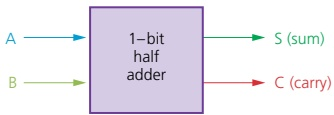

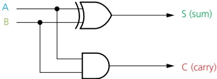

Figure 15.10

<!-- page 373 -->

Other logic gates can be used to produce the half adder (see below).

As you have probably guessed already, the half adder is unable to deal with the addition of several binary bits (for example, an 8-bit byte). To enable this, we have to consider the full adder circuit.

## Full adder

Consider the following sum using 5-bit numbers.

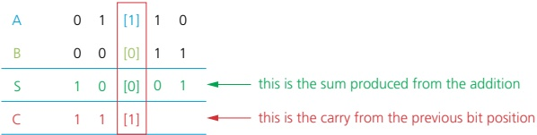

### Figure 15.11

The sum shows how we have to deal with CARRY from the previous column. There are three inputs to consider in this third column, for example, A = 1, B = 0 and C = 1 (S = 0).

This is why we need to join two half adders together to form a full adder:

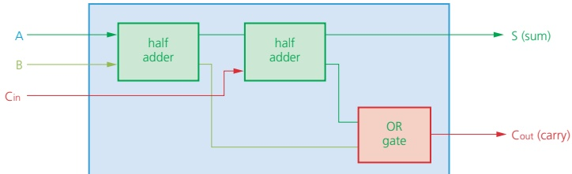

### Figure 15.12

This has an equivalent logic circuit; there are a number of ways of doing this. For example, the following logic circuit uses OR, AND and XOR logic gates.

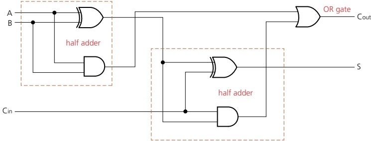

Figure 15.13

<!-- page 374 -->

## EXTENSION ACTIVITY 15C

1 Find out why NAND gates are used to produce logic circuits even though they often increase the complexity and size of the overall circuit.

2 Produce half adder and full adder circuits using NOR gates only.

Table 15.5 is the truth table for the full adder circuit.

<table border=1 style='margin: auto; word-wrap: break-word;'><tr><td colspan="3">INPUTS</td><td colspan="2">OUTPUTS</td></tr><tr><td style='text-align: center; word-wrap: break-word;'>A</td><td style='text-align: center; word-wrap: break-word;'>B</td><td style='text-align: center; word-wrap: break-word;'>Cin</td><td style='text-align: center; word-wrap: break-word;'>S</td><td style='text-align: center; word-wrap: break-word;'>Cout</td></tr><tr><td style='text-align: center; word-wrap: break-word;'>0</td><td style='text-align: center; word-wrap: break-word;'>0</td><td style='text-align: center; word-wrap: break-word;'>0</td><td style='text-align: center; word-wrap: break-word;'>0</td><td style='text-align: center; word-wrap: break-word;'>0</td></tr><tr><td style='text-align: center; word-wrap: break-word;'>0</td><td style='text-align: center; word-wrap: break-word;'>0</td><td style='text-align: center; word-wrap: break-word;'>1</td><td style='text-align: center; word-wrap: break-word;'>1</td><td style='text-align: center; word-wrap: break-word;'>0</td></tr><tr><td style='text-align: center; word-wrap: break-word;'>0</td><td style='text-align: center; word-wrap: break-word;'>1</td><td style='text-align: center; word-wrap: break-word;'>0</td><td style='text-align: center; word-wrap: break-word;'>1</td><td style='text-align: center; word-wrap: break-word;'>0</td></tr><tr><td style='text-align: center; word-wrap: break-word;'>0</td><td style='text-align: center; word-wrap: break-word;'>1</td><td style='text-align: center; word-wrap: break-word;'>1</td><td style='text-align: center; word-wrap: break-word;'>0</td><td style='text-align: center; word-wrap: break-word;'>1</td></tr><tr><td style='text-align: center; word-wrap: break-word;'>1</td><td style='text-align: center; word-wrap: break-word;'>0</td><td style='text-align: center; word-wrap: break-word;'>0</td><td style='text-align: center; word-wrap: break-word;'>1</td><td style='text-align: center; word-wrap: break-word;'>0</td></tr><tr><td style='text-align: center; word-wrap: break-word;'>1</td><td style='text-align: center; word-wrap: break-word;'>0</td><td style='text-align: center; word-wrap: break-word;'>1</td><td style='text-align: center; word-wrap: break-word;'>0</td><td style='text-align: center; word-wrap: break-word;'>1</td></tr><tr><td style='text-align: center; word-wrap: break-word;'>1</td><td style='text-align: center; word-wrap: break-word;'>1</td><td style='text-align: center; word-wrap: break-word;'>0</td><td style='text-align: center; word-wrap: break-word;'>0</td><td style='text-align: center; word-wrap: break-word;'>1</td></tr><tr><td style='text-align: center; word-wrap: break-word;'>1</td><td style='text-align: center; word-wrap: break-word;'>1</td><td style='text-align: center; word-wrap: break-word;'>1</td><td style='text-align: center; word-wrap: break-word;'>1</td><td style='text-align: center; word-wrap: break-word;'>1</td></tr></table>

As with the half adder circuits, different logic gates can be used to produce the full adder circuit.

The full adder is the basic building block for multiple binary additions. For example, Figure 15.14 shows how two 4-bit numbers can be summed using four full adder circuits.

### Table 15.5

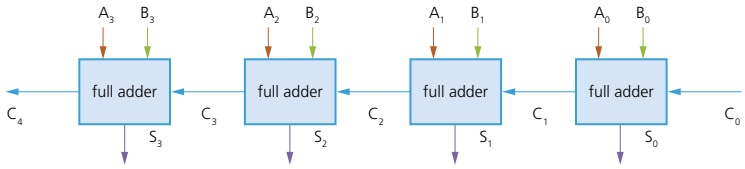

### Figure 15.14

## ACTIVITY 15C

1 a) Produce a half adder circuit using NAND gatess only.

b) Generate a truth table for your half adder circuit in part a) and confirm it matches the one shown in Section 15.2.2.

2 a) Produce a full adder circuit using NAND gates only.

b) Generate a truth table for your full adder circuit in part a) and confirm it matches the one shown in Section 15.2.2.

#### 15.2.3 Flip-flop circuits

All of the logic circuits you have encountered up to now are combination circuits (the output depends entirely on the input values).

We will now consider a second type of logic circuit, known as a sequential circuit (the output depends on the input value produced from a previous output value).

Examples of sequential circuits include flip-flop circuits. This chapter will consider two types of flip-flops: SR flip-flops and JK flip-flops.

## SR flip-flops

SR flip-flops consist of two cross-coupled NAND gates (note: they can equally well be produced from NOR gates). The two inputs are labelled 'S' and 'R', and the two outputs are labelled 'Q' and 'Q' (remember  $ \overline{Q} $ is equivalent to NOT Q).

<!-- page 375 -->

In this chapter, we will use SR flip-flop circuits constructed from NOR gates, as shown in Figure 15.15.

The output from gate 'X' is Q and the output from gate 'Y' is Q.

The inputs to gate 'X' are R and Q (shown in red on Figure 15.15); the inputs to gate 'Y' are S and Q (shown in green on Figure 15.15). The output from each NOR gate gives a form of positive feedback (known as cross-coupling, as mentioned earlier).

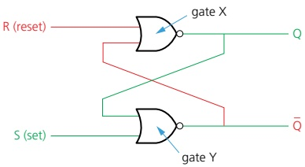

Figure 15.15 SR flip-flop circuit

We will now consider the truth table to match our SR flip-flop using the initial states of  $ R = 0 $,  $ S = 1 $ and  $ Q = 1 $. The sequence of the stages in the process is shown in Figure 15.16.

Sequence: [1]  $ \rightarrow $ [2]  $ \rightarrow $ [3]  $ \rightarrow $ [4]  $ \rightarrow $ [5]  $ \rightarrow $ [6]

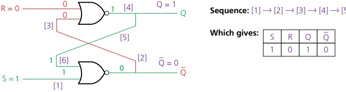

Which gives:

### Figure 15.16

Now consider what happens if we change the value of S from 1 to 0.

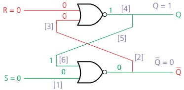

Sequence: [1] → [2] → [3] → [4] → [5] → [6]

Which gives:

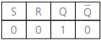

### Figure 15.17

The reader is left to consider the other options which lead to the truth table, Table 15.6, for the flip-flop circuit.

<table border=1 style='margin: auto; word-wrap: break-word;'><tr><td rowspan="2"></td><td colspan="2">INPUTS</td><td colspan="2">OUTPUTS</td><td style='text-align: center; word-wrap: break-word;'>Comment</td></tr><tr><td style='text-align: center; word-wrap: break-word;'>S</td><td style='text-align: center; word-wrap: break-word;'>R</td><td style='text-align: center; word-wrap: break-word;'>Q</td><td style='text-align: center; word-wrap: break-word;'>$ \overline{Q} $</td><td style='text-align: center; word-wrap: break-word;'></td></tr><tr><td style='text-align: center; word-wrap: break-word;'>(a)</td><td style='text-align: center; word-wrap: break-word;'>1</td><td style='text-align: center; word-wrap: break-word;'>0</td><td style='text-align: center; word-wrap: break-word;'>1</td><td style='text-align: center; word-wrap: break-word;'>0</td><td style='text-align: center; word-wrap: break-word;'></td></tr><tr><td style='text-align: center; word-wrap: break-word;'>(b)</td><td style='text-align: center; word-wrap: break-word;'>0</td><td style='text-align: center; word-wrap: break-word;'>0</td><td style='text-align: center; word-wrap: break-word;'>1</td><td style='text-align: center; word-wrap: break-word;'>0</td><td style='text-align: center; word-wrap: break-word;'>following S = 1 change</td></tr><tr><td style='text-align: center; word-wrap: break-word;'>(c)</td><td style='text-align: center; word-wrap: break-word;'>0</td><td style='text-align: center; word-wrap: break-word;'>1</td><td style='text-align: center; word-wrap: break-word;'>0</td><td style='text-align: center; word-wrap: break-word;'>1</td><td style='text-align: center; word-wrap: break-word;'></td></tr><tr><td style='text-align: center; word-wrap: break-word;'>(d)</td><td style='text-align: center; word-wrap: break-word;'>0</td><td style='text-align: center; word-wrap: break-word;'>0</td><td style='text-align: center; word-wrap: break-word;'>0</td><td style='text-align: center; word-wrap: break-word;'>1</td><td style='text-align: center; word-wrap: break-word;'>following R = 1 change</td></tr><tr><td style='text-align: center; word-wrap: break-word;'>(e)</td><td style='text-align: center; word-wrap: break-word;'>1</td><td style='text-align: center; word-wrap: break-word;'>1</td><td style='text-align: center; word-wrap: break-word;'>0</td><td style='text-align: center; word-wrap: break-word;'>0</td><td style='text-align: center; word-wrap: break-word;'></td></tr></table>

Table 15.6

<!-- page 376 -->

## Explanation

<table border=1 style='margin: auto; word-wrap: break-word;'><tr><td style='text-align: center; word-wrap: break-word;'>S = 1, R = 0, Q = 1,  $ \overline{Q} $ = 0</td><td style='text-align: center; word-wrap: break-word;'>is the set state in this example</td></tr><tr><td style='text-align: center; word-wrap: break-word;'>S = 0, R = 0, Q = 1,  $ \overline{Q} $ = 0</td><td style='text-align: center; word-wrap: break-word;'>is the reset state in this example</td></tr><tr><td style='text-align: center; word-wrap: break-word;'>S = 0, R = 1, Q = 0,  $ \overline{Q} $ = 1</td><td style='text-align: center; word-wrap: break-word;'>here the value of Q in line (b) remembers the value of Q from line (a); the value of Q in line (d) remembers the value of Q in line (c)</td></tr><tr><td style='text-align: center; word-wrap: break-word;'>S = 0, R = 0, Q = 0,  $ \overline{Q} $ = 1</td><td style='text-align: center; word-wrap: break-word;'>R changes from 1 to 0 and has no effect on outputs (these values are remembered from line (c))</td></tr><tr><td style='text-align: center; word-wrap: break-word;'>S = 1, R = 1, Q = 0,  $ \overline{Q} $ = 0</td><td style='text-align: center; word-wrap: break-word;'>this is an invalid case since  $ \overline{Q} $ should be the complement (opposite) of Q.</td></tr></table>

The truth table shows how an input value of S = 0 and R = 0 causes no change to the two output values; S = 0 and R = 1 reverses the two output values; S = 1 and R = 0 always gives Q = 1 and  $ \overline{Q} = 0 $ which is the set value.

The truth table shows that SR flip-flops can be used as a storage/memory device for one bit; because a value can be remembered but can also be changed it could be used as a component in a memory device such as a RAM chip.

It is important that the fault condition in line (e) is considered when designing and developing storage/memory devices.

## JK flip-flops

The SR flip-flop has the following problems:

Invalid S, R conditions (leading to conflicting output values) need to be avoided.

» If inputs do not arrive at the same time, the flip-flop can become unstable.

To overcome such problems, the JK flip-flop has been developed. A clock and additional gates are added, which help to synchronise the two inputs and also prevent the illegal states shown in line (e) of Table 15.6. The addition of the synchronised input gives four possible input conditions to the JK flip-flop

» 1

☑ 0

no change

》 toggle (which takes care of the invalid S, R states).

The JK flip-flop is represented as shown in Figure 15.18.

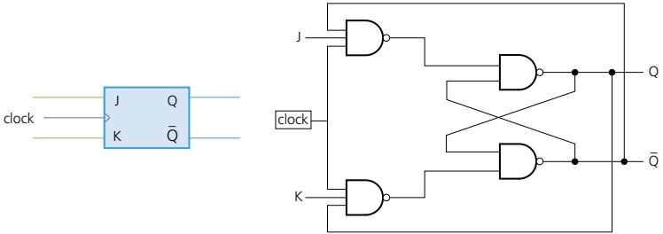

▲ Figure 15.18 JK flip-flop symbol (left) and JK flip-flop using NAND gates only (right)

<!-- page 377 -->

## EXTENSION ACTIVITY 15D

1 Find out how JK flip-flops can be used as shift registers and binary counters in a computer.

2 Where else in computer architecture are flip-flop circuits used? Find out why they are used in each case you describe.

Table 15.7 is the simplified truth table for the JK flip-flop.

<table border=1 style='margin: auto; word-wrap: break-word;'><tr><td style='text-align: center; word-wrap: break-word;'>J</td><td style='text-align: center; word-wrap: break-word;'>K</td><td style='text-align: center; word-wrap: break-word;'>Value of Q before clock pulse</td><td style='text-align: center; word-wrap: break-word;'>Value of Q after clock pulse</td><td style='text-align: center; word-wrap: break-word;'>OUTPUT</td></tr><tr><td style='text-align: center; word-wrap: break-word;'>0</td><td style='text-align: center; word-wrap: break-word;'>0</td><td style='text-align: center; word-wrap: break-word;'>0</td><td style='text-align: center; word-wrap: break-word;'>0</td><td rowspan="2">Q is unchanged after clock pulse</td></tr><tr><td style='text-align: center; word-wrap: break-word;'>0</td><td style='text-align: center; word-wrap: break-word;'>0</td><td style='text-align: center; word-wrap: break-word;'>1</td><td style='text-align: center; word-wrap: break-word;'>1</td></tr><tr><td style='text-align: center; word-wrap: break-word;'>1</td><td style='text-align: center; word-wrap: break-word;'>0</td><td style='text-align: center; word-wrap: break-word;'>0</td><td style='text-align: center; word-wrap: break-word;'>1</td><td rowspan="2">Q = 1</td></tr><tr><td style='text-align: center; word-wrap: break-word;'>1</td><td style='text-align: center; word-wrap: break-word;'>0</td><td style='text-align: center; word-wrap: break-word;'>1</td><td style='text-align: center; word-wrap: break-word;'>1</td></tr><tr><td style='text-align: center; word-wrap: break-word;'>0</td><td style='text-align: center; word-wrap: break-word;'>1</td><td style='text-align: center; word-wrap: break-word;'>0</td><td style='text-align: center; word-wrap: break-word;'>0</td><td rowspan="2">Q = 0</td></tr><tr><td style='text-align: center; word-wrap: break-word;'>0</td><td style='text-align: center; word-wrap: break-word;'>1</td><td style='text-align: center; word-wrap: break-word;'>1</td><td style='text-align: center; word-wrap: break-word;'>0</td></tr><tr><td style='text-align: center; word-wrap: break-word;'>1</td><td style='text-align: center; word-wrap: break-word;'>1</td><td style='text-align: center; word-wrap: break-word;'>0</td><td style='text-align: center; word-wrap: break-word;'>1</td><td rowspan="2">Q value toggles between 0 and 1</td></tr><tr><td style='text-align: center; word-wrap: break-word;'>1</td><td style='text-align: center; word-wrap: break-word;'>1</td><td style='text-align: center; word-wrap: break-word;'>1</td><td style='text-align: center; word-wrap: break-word;'>0</td></tr></table>

### Table 15.7

» When J = 0 and K = 0, there is no change to the output value of Q.

» If the values of J or K change, then the value of Q will be the same as the value of J ( $ \overline{Q} $ will be the value of K).

» When J = 1 and K = 1, the Q-value toggles after each clock pulse, thus preventing illegal states from occurring (in this case, toggle means the flip-flop will change from the 'Set' state to the 'Reset' state or the other way round).

## Use of JK flip-flops

Several JK flip-flops can be used to produce shift registers in a computer.

» A simple binary counter can be made by linking up several JK flip-flop circuits (this requires the toggle function).

In Section 15.2.1, the concept of Boolean algebra was introduced. One of the advantages of this method is to represent logic circuits in the form of Boolean algebra.

#### 15.2.4 Boolean algebra and logic circuits

It is possible to use the truth table and apply the sum of products (SoP), or the Boolean expression can be formed directly from the logic circuit.

### Example 15.3

Write down the Boolean expression to represent this logic circuit.

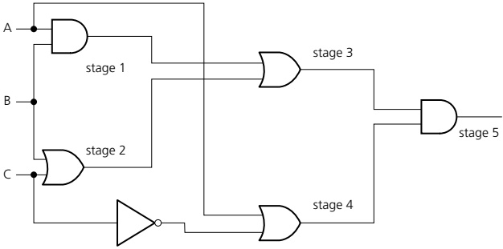

<!-- page 378 -->

Solution

Stage 1: A AND B

Stage 2: B OR C

Stage 3: stage 1 OR stage 2  $ \Rightarrow $ (A AND B) OR (B OR C)

Stage 4: A OR (NOT C)

Stage 5: stage 3 AND stage 4

 $ \Rightarrow\left(\left(\mathrm{A}\ \mathrm{AND}\ \mathrm{B}\right)\ \mathrm{OR}\ \left(\mathrm{B}\ \mathrm{OR}\ \mathrm{C}\right)\right)\ \mathrm{AND}\ (A\ \mathrm{OR}\ (\mathrm{NOT}\ \mathrm{C})\right) $

Written in Boolean algebra form: ((A.B) + (B + C)).(A +  $ \overline{C} $)

Example 15.4

Write the Boolean expression which represents this logic circuit.

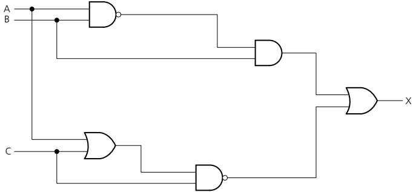

## Solution

In this example, we will first produce the truth table and then generate the Boolean expression from the truth table, Table 15.8.

<table border=1 style='margin: auto; word-wrap: break-word;'><tr><td colspan="3">INPUTS</td><td style='text-align: center; word-wrap: break-word;'>OUTPUT</td></tr><tr><td style='text-align: center; word-wrap: break-word;'>A</td><td style='text-align: center; word-wrap: break-word;'>B</td><td style='text-align: center; word-wrap: break-word;'>C</td><td style='text-align: center; word-wrap: break-word;'>X</td></tr><tr><td style='text-align: center; word-wrap: break-word;'>0</td><td style='text-align: center; word-wrap: break-word;'>0</td><td style='text-align: center; word-wrap: break-word;'>0</td><td style='text-align: center; word-wrap: break-word;'>1</td></tr><tr><td style='text-align: center; word-wrap: break-word;'>0</td><td style='text-align: center; word-wrap: break-word;'>0</td><td style='text-align: center; word-wrap: break-word;'>1</td><td style='text-align: center; word-wrap: break-word;'>0</td></tr><tr><td style='text-align: center; word-wrap: break-word;'>0</td><td style='text-align: center; word-wrap: break-word;'>1</td><td style='text-align: center; word-wrap: break-word;'>0</td><td style='text-align: center; word-wrap: break-word;'>1</td></tr><tr><td style='text-align: center; word-wrap: break-word;'>0</td><td style='text-align: center; word-wrap: break-word;'>1</td><td style='text-align: center; word-wrap: break-word;'>1</td><td style='text-align: center; word-wrap: break-word;'>1</td></tr><tr><td style='text-align: center; word-wrap: break-word;'>1</td><td style='text-align: center; word-wrap: break-word;'>0</td><td style='text-align: center; word-wrap: break-word;'>0</td><td style='text-align: center; word-wrap: break-word;'>1</td></tr><tr><td style='text-align: center; word-wrap: break-word;'>1</td><td style='text-align: center; word-wrap: break-word;'>0</td><td style='text-align: center; word-wrap: break-word;'>1</td><td style='text-align: center; word-wrap: break-word;'>0</td></tr><tr><td style='text-align: center; word-wrap: break-word;'>1</td><td style='text-align: center; word-wrap: break-word;'>1</td><td style='text-align: center; word-wrap: break-word;'>0</td><td style='text-align: center; word-wrap: break-word;'>1</td></tr><tr><td style='text-align: center; word-wrap: break-word;'>1</td><td style='text-align: center; word-wrap: break-word;'>1</td><td style='text-align: center; word-wrap: break-word;'>1</td><td style='text-align: center; word-wrap: break-word;'>0</td></tr></table>

To produce the Boolean expression from the truth table, we only consider those rows where the output (X) is 1:

 $$ (\overline{\mathrm{A}}.\overline{\mathrm{B}}.\overline{\mathrm{C}}+\overline{\mathrm{A}}.\mathrm{B}.\overline{\mathrm{C}}+\overline{\mathrm{A}}.\mathrm{B}.\mathrm{C}+\mathrm{A}.\overline{\mathrm{B}}.\overline{\mathrm{C}}+\mathrm{A}.\mathrm{B}.\overline{\mathrm{C}}) $$ 

If we apply the Boolean algebra laws, we get:

 $$ (\overline{\mathbf{A}}.\overline{\mathbf{B}}.\overline{\mathbf{C}}+\overline{\mathbf{A}}.\mathbf{B}.\overline{\mathbf{C}}+\overline{\mathbf{A}}.\mathbf{B}.\mathbf{C})+(\mathbf{A}.\overline{\mathbf{B}}.\overline{\mathbf{C}}+\mathbf{A}.\mathbf{B}.\overline{\mathbf{C}}) $$ 

 $$ \begin{aligned}&\Rightarrow((\overline{\mathrm{A}}.\overline{\mathrm{B}}.\overline{\mathrm{C}}+\overline{\mathrm{A}}.\mathrm{B}.\overline{\mathrm{C}})+(\overline{\mathrm{A}}.\overline{\mathrm{B}}.\overline{\mathrm{C}}+\mathrm{A}.\overline{\mathrm{B}}.\overline{\mathrm{C}}))+(\overline{\mathrm{A}}.\mathrm{B}.\mathrm{C}\\&\quad+\mathrm{A}.\mathrm{B}.\overline{\mathrm{C}})\end{aligned} $$ 

 $$ \Rightarrow\overline{\mathrm{A.}}\overline{\mathrm{C.}}(\overline{\mathrm{B}}+\mathrm{B})+\overline{\mathrm{B.}}\overline{\mathrm{C.}}(\overline{\mathrm{A}}+\mathrm{A})+(\overline{\mathrm{A.}}\mathrm{B.C}+\mathrm{A.B.}\overline{\mathrm{C}}) $$ 

 $$ \begin{aligned}\Rightarrow\overline{A.}\overline{C}+\overline{B.}\overline{C}+\overline{A.}\overline{B.C}+A.B.\overline{C}\end{aligned} $$ 

Therefore, written as a Boolean expression:  $ \overline{\mathrm{A.C}} + \overline{\mathrm{B.C}} + \overline{\mathrm{A.B.C}} + \mathrm{A.B.C} $

We therefore end up with a simplified Boolean expression which has the same effect as the original logic circuit. The reader is left the task of producing the truth table from the above expression to confirm they are both the same.

<!-- page 379 -->

## EXTENSION ACTIVITY 15E

Karnaugh maps make use of Gray codes. Find out the origin of Gray codes and other applications of the code.

## ACTIVITY 15D

1 Produce simplified Boolean expressions for the logic circuits in Figure 15.21 (you can do this directly from the logic circuit or produce the truth table first).

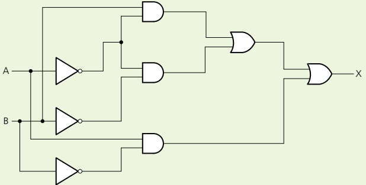

2 Produce simplified Boolean expressions for the logic circuits in Figure 15.22 (you can do this directly from the logic circuit or produce the truth table first).

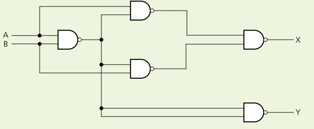

#### 15.2.5 Karnaugh maps (K-maps)

In the previous activities, it was frequently necessary to simplify Boolean expressions. Sometimes, this can be a long and complex process. Karnaugh maps were developed to help simplify logic expressions/circuits.

Example 15.5

Produce a Boolean expression for the truth table for the NAND gate.

<table border=1 style='margin: auto; word-wrap: break-word;'><tr><td colspan="2">INPUTS</td><td style='text-align: center; word-wrap: break-word;'>OUTPUT</td></tr><tr><td style='text-align: center; word-wrap: break-word;'>A</td><td style='text-align: center; word-wrap: break-word;'>B</td><td style='text-align: center; word-wrap: break-word;'>X</td></tr><tr><td style='text-align: center; word-wrap: break-word;'>0</td><td style='text-align: center; word-wrap: break-word;'>0</td><td style='text-align: center; word-wrap: break-word;'>1</td></tr><tr><td style='text-align: center; word-wrap: break-word;'>0</td><td style='text-align: center; word-wrap: break-word;'>1</td><td style='text-align: center; word-wrap: break-word;'>1</td></tr><tr><td style='text-align: center; word-wrap: break-word;'>1</td><td style='text-align: center; word-wrap: break-word;'>0</td><td style='text-align: center; word-wrap: break-word;'>1</td></tr><tr><td style='text-align: center; word-wrap: break-word;'>1</td><td style='text-align: center; word-wrap: break-word;'>1</td><td style='text-align: center; word-wrap: break-word;'>0</td></tr></table>

<!-- page 380 -->

## Solution

Using sum of products gives the following expression:

 $$ \begin{array}{l}\overline{\mathrm{A.}}\overline{\mathrm{B}}+\overline{\mathrm{A.}}\mathrm{B}+\mathrm{A.}\overline{\mathrm{B}}\end{array} $$ 

Boolean algebra rules produce the simplified expression:

 $$ \overline{\mathbf{A}}+\overline{\mathbf{B}} $$ 

Using Karnaugh maps is a much simpler way to do this.

Each group in the Karnaugh map in Figure 15.23 combines output values where X = 1.

<table border=1 style='margin: auto; word-wrap: break-word;'><tr><td style='text-align: center; word-wrap: break-word;'>$ \overline{A} $</td><td style='text-align: center; word-wrap: break-word;'>1</td><td style='text-align: center; word-wrap: break-word;'>1</td></tr><tr><td style='text-align: center; word-wrap: break-word;'>A</td><td style='text-align: center; word-wrap: break-word;'>1</td><td style='text-align: center; word-wrap: break-word;'>0</td></tr></table>

Thus,  $ \overline{A}.\overline{B}=1 $,  $ \overline{A}.B=1 $ and  $ A.\overline{B}=1 $

The red ring shows  $ \overline{A} $ as

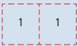

and the green ring shows  $ \overline{B} $ as

<table border=1 style='margin: auto; word-wrap: break-word;'><tr><td style='text-align: center; word-wrap: break-word;'>1</td></tr><tr><td style='text-align: center; word-wrap: break-word;'>1</td></tr></table>

giving  $ \overline{A} + \overline{B} $.

As you might expect, there are a number of rules governing Karnaugh maps.

## Karnaugh map rules

The values along the top and the bottom follow Gray code rules.

Only cells containing a 1 are taken account of.

Groups can be a row, a column or a rectangle.

Groups must contain an even number of 1s (2, 4, 6, and so on).

Groups should be as large as possible.

Groups may overlap within the above rules.

Single values can be regarded as a group even if they cannot be combined with other values to form a larger group.

The final Boolean expression can only consider those values which remain constant within the group (that is, remain a 1 or a 0 throughout the group).

<!-- page 381 -->

Produce a Boolean expression for the truth table.

<table border=1 style='margin: auto; word-wrap: break-word;'><tr><td colspan="3">INPUTS</td><td style='text-align: center; word-wrap: break-word;'>OUTPUT</td></tr><tr><td style='text-align: center; word-wrap: break-word;'>A</td><td style='text-align: center; word-wrap: break-word;'>B</td><td style='text-align: center; word-wrap: break-word;'>C</td><td style='text-align: center; word-wrap: break-word;'>X</td></tr><tr><td style='text-align: center; word-wrap: break-word;'>0</td><td style='text-align: center; word-wrap: break-word;'>0</td><td style='text-align: center; word-wrap: break-word;'>0</td><td style='text-align: center; word-wrap: break-word;'>0</td></tr><tr><td style='text-align: center; word-wrap: break-word;'>0</td><td style='text-align: center; word-wrap: break-word;'>0</td><td style='text-align: center; word-wrap: break-word;'>1</td><td style='text-align: center; word-wrap: break-word;'>0</td></tr><tr><td style='text-align: center; word-wrap: break-word;'>0</td><td style='text-align: center; word-wrap: break-word;'>1</td><td style='text-align: center; word-wrap: break-word;'>0</td><td style='text-align: center; word-wrap: break-word;'>0</td></tr><tr><td style='text-align: center; word-wrap: break-word;'>0</td><td style='text-align: center; word-wrap: break-word;'>1</td><td style='text-align: center; word-wrap: break-word;'>1</td><td style='text-align: center; word-wrap: break-word;'>1</td></tr><tr><td style='text-align: center; word-wrap: break-word;'>1</td><td style='text-align: center; word-wrap: break-word;'>0</td><td style='text-align: center; word-wrap: break-word;'>0</td><td style='text-align: center; word-wrap: break-word;'>0</td></tr><tr><td style='text-align: center; word-wrap: break-word;'>1</td><td style='text-align: center; word-wrap: break-word;'>0</td><td style='text-align: center; word-wrap: break-word;'>1</td><td style='text-align: center; word-wrap: break-word;'>1</td></tr><tr><td style='text-align: center; word-wrap: break-word;'>1</td><td style='text-align: center; word-wrap: break-word;'>1</td><td style='text-align: center; word-wrap: break-word;'>0</td><td style='text-align: center; word-wrap: break-word;'>1</td></tr><tr><td style='text-align: center; word-wrap: break-word;'>1</td><td style='text-align: center; word-wrap: break-word;'>1</td><td style='text-align: center; word-wrap: break-word;'>1</td><td style='text-align: center; word-wrap: break-word;'>1</td></tr></table>

## Solution

Sum of products gives:

 $$  A.B.C+A.B.C+A.B.C+A.B.C $$ 

We can now produce the following Karnaugh map to represent this truth table (each 1 value in the K-map represents the above sum of products; so there will be four 1-values in the K-map, where A and BC intersect, where  $ \overline{A} $ and BC intersect, where A and  $ \overline{BC} $ intersect, and where A and  $ \overline{BC} $ intersect):

<table border=1 style='margin: auto; word-wrap: break-word;'><tr><td style='text-align: center; word-wrap: break-word;'>BC\nA</td><td style='text-align: center; word-wrap: break-word;'>$ (\bar{B.C}) $\n00</td><td style='text-align: center; word-wrap: break-word;'>$ (\bar{B.C}) $\n01</td><td style='text-align: center; word-wrap: break-word;'>(B.C)\n11</td><td style='text-align: center; word-wrap: break-word;'>$ (\bar{B.C}) $\n10</td></tr><tr><td style='text-align: center; word-wrap: break-word;'>(A) 0</td><td style='text-align: center; word-wrap: break-word;'>0</td><td style='text-align: center; word-wrap: break-word;'>0</td><td style='text-align: center; word-wrap: break-word;'>1</td><td style='text-align: center; word-wrap: break-word;'>0</td></tr><tr><td style='text-align: center; word-wrap: break-word;'>(A) 1</td><td style='text-align: center; word-wrap: break-word;'>0</td><td style='text-align: center; word-wrap: break-word;'>1</td><td style='text-align: center; word-wrap: break-word;'>1</td><td style='text-align: center; word-wrap: break-word;'>1</td></tr></table>

Green ring: A remains 1, B changes from 0 to 1 and C remains  $ 1 \Rightarrow A.C $

Purple ring: A changes from 0 to 1, B remains 1 and C remains  $ 1 \Rightarrow $ B.C

Red ring: A remains 1, B remains 1 and C changes from 1 to  $ 0 \Rightarrow $ A.B

This gives the simplified Boolean expression: A.C + B.C + A.B

<!-- page 382 -->

Produce a Boolean expression for the truth table.

<table border=1 style='margin: auto; word-wrap: break-word;'><tr><td colspan="4">INPUTS</td><td style='text-align: center; word-wrap: break-word;'>OUTPUT</td></tr><tr><td style='text-align: center; word-wrap: break-word;'>A</td><td style='text-align: center; word-wrap: break-word;'>B</td><td style='text-align: center; word-wrap: break-word;'>C</td><td style='text-align: center; word-wrap: break-word;'>D</td><td style='text-align: center; word-wrap: break-word;'>X</td></tr><tr><td style='text-align: center; word-wrap: break-word;'>0</td><td style='text-align: center; word-wrap: break-word;'>0</td><td style='text-align: center; word-wrap: break-word;'>0</td><td style='text-align: center; word-wrap: break-word;'>0</td><td style='text-align: center; word-wrap: break-word;'>1</td></tr><tr><td style='text-align: center; word-wrap: break-word;'>0</td><td style='text-align: center; word-wrap: break-word;'>0</td><td style='text-align: center; word-wrap: break-word;'>0</td><td style='text-align: center; word-wrap: break-word;'>1</td><td style='text-align: center; word-wrap: break-word;'>1</td></tr><tr><td style='text-align: center; word-wrap: break-word;'>0</td><td style='text-align: center; word-wrap: break-word;'>0</td><td style='text-align: center; word-wrap: break-word;'>1</td><td style='text-align: center; word-wrap: break-word;'>0</td><td style='text-align: center; word-wrap: break-word;'>1</td></tr><tr><td style='text-align: center; word-wrap: break-word;'>0</td><td style='text-align: center; word-wrap: break-word;'>0</td><td style='text-align: center; word-wrap: break-word;'>1</td><td style='text-align: center; word-wrap: break-word;'>1</td><td style='text-align: center; word-wrap: break-word;'>1</td></tr><tr><td style='text-align: center; word-wrap: break-word;'>0</td><td style='text-align: center; word-wrap: break-word;'>1</td><td style='text-align: center; word-wrap: break-word;'>0</td><td style='text-align: center; word-wrap: break-word;'>0</td><td style='text-align: center; word-wrap: break-word;'>0</td></tr><tr><td style='text-align: center; word-wrap: break-word;'>0</td><td style='text-align: center; word-wrap: break-word;'>1</td><td style='text-align: center; word-wrap: break-word;'>0</td><td style='text-align: center; word-wrap: break-word;'>1</td><td style='text-align: center; word-wrap: break-word;'>1</td></tr><tr><td style='text-align: center; word-wrap: break-word;'>0</td><td style='text-align: center; word-wrap: break-word;'>1</td><td style='text-align: center; word-wrap: break-word;'>1</td><td style='text-align: center; word-wrap: break-word;'>0</td><td style='text-align: center; word-wrap: break-word;'>0</td></tr><tr><td style='text-align: center; word-wrap: break-word;'>0</td><td style='text-align: center; word-wrap: break-word;'>1</td><td style='text-align: center; word-wrap: break-word;'>1</td><td style='text-align: center; word-wrap: break-word;'>1</td><td style='text-align: center; word-wrap: break-word;'>0</td></tr><tr><td style='text-align: center; word-wrap: break-word;'>1</td><td style='text-align: center; word-wrap: break-word;'>0</td><td style='text-align: center; word-wrap: break-word;'>0</td><td style='text-align: center; word-wrap: break-word;'>0</td><td style='text-align: center; word-wrap: break-word;'>0</td></tr><tr><td style='text-align: center; word-wrap: break-word;'>1</td><td style='text-align: center; word-wrap: break-word;'>0</td><td style='text-align: center; word-wrap: break-word;'>0</td><td style='text-align: center; word-wrap: break-word;'>1</td><td style='text-align: center; word-wrap: break-word;'>1</td></tr><tr><td style='text-align: center; word-wrap: break-word;'>1</td><td style='text-align: center; word-wrap: break-word;'>0</td><td style='text-align: center; word-wrap: break-word;'>1</td><td style='text-align: center; word-wrap: break-word;'>0</td><td style='text-align: center; word-wrap: break-word;'>0</td></tr><tr><td style='text-align: center; word-wrap: break-word;'>1</td><td style='text-align: center; word-wrap: break-word;'>0</td><td style='text-align: center; word-wrap: break-word;'>1</td><td style='text-align: center; word-wrap: break-word;'>1</td><td style='text-align: center; word-wrap: break-word;'>0</td></tr><tr><td style='text-align: center; word-wrap: break-word;'>1</td><td style='text-align: center; word-wrap: break-word;'>1</td><td style='text-align: center; word-wrap: break-word;'>0</td><td style='text-align: center; word-wrap: break-word;'>0</td><td style='text-align: center; word-wrap: break-word;'>0</td></tr><tr><td style='text-align: center; word-wrap: break-word;'>1</td><td style='text-align: center; word-wrap: break-word;'>1</td><td style='text-align: center; word-wrap: break-word;'>0</td><td style='text-align: center; word-wrap: break-word;'>1</td><td style='text-align: center; word-wrap: break-word;'>1</td></tr><tr><td style='text-align: center; word-wrap: break-word;'>1</td><td style='text-align: center; word-wrap: break-word;'>1</td><td style='text-align: center; word-wrap: break-word;'>1</td><td style='text-align: center; word-wrap: break-word;'>0</td><td style='text-align: center; word-wrap: break-word;'>0</td></tr><tr><td style='text-align: center; word-wrap: break-word;'>1</td><td style='text-align: center; word-wrap: break-word;'>1</td><td style='text-align: center; word-wrap: break-word;'>1</td><td style='text-align: center; word-wrap: break-word;'>1</td><td style='text-align: center; word-wrap: break-word;'>0</td></tr></table>

<table border=1 style='margin: auto; word-wrap: break-word;'><tr><td style='text-align: center; word-wrap: break-word;'>Sum of products</td></tr><tr><td style='text-align: center; word-wrap: break-word;'></td></tr><tr><td style='text-align: center; word-wrap: break-word;'>$ \overline{A}.\overline{B}.\overline{C}.\overline{D} $</td></tr><tr><td style='text-align: center; word-wrap: break-word;'>$ \overline{A}.\overline{B}.\overline{C}.\overline{D} $</td></tr><tr><td style='text-align: center; word-wrap: break-word;'>$ \overline{A}.\overline{B}.\overline{C}.\overline{D} $</td></tr><tr><td style='text-align: center; word-wrap: break-word;'>$ \overline{A}.\overline{B}.\overline{C}.\overline{D} $</td></tr><tr><td style='text-align: center; word-wrap: break-word;'></td></tr><tr><td style='text-align: center; word-wrap: break-word;'>A. $ \overline{B}.\overline{C}.\overline{D} $</td></tr><tr><td style='text-align: center; word-wrap: break-word;'></td></tr><tr><td style='text-align: center; word-wrap: break-word;'>A. $ \overline{B}.\overline{C}.\overline{D} $</td></tr><tr><td style='text-align: center; word-wrap: break-word;'></td></tr></table>

## Solution

The sum of products is shown in the right-hand column. This produces the Karnaugh map shown.

<table border=1 style='margin: auto; word-wrap: break-word;'><tr><td style='text-align: center; word-wrap: break-word;'>AB\nCD</td><td style='text-align: center; word-wrap: break-word;'>(A,B)\n00</td><td style='text-align: center; word-wrap: break-word;'>(A,B)\n01</td><td style='text-align: center; word-wrap: break-word;'>(A,B)\n11</td><td style='text-align: center; word-wrap: break-word;'>(A,B)\n10</td></tr><tr><td style='text-align: center; word-wrap: break-word;'>(C,D) 00</td><td style='text-align: center; word-wrap: break-word;'>1</td><td style='text-align: center; word-wrap: break-word;'>0</td><td style='text-align: center; word-wrap: break-word;'>0</td><td style='text-align: center; word-wrap: break-word;'>0</td></tr><tr><td style='text-align: center; word-wrap: break-word;'>(C,D) 01</td><td style='text-align: center; word-wrap: break-word;'>1</td><td style='text-align: center; word-wrap: break-word;'>1</td><td style='text-align: center; word-wrap: break-word;'>1</td><td style='text-align: center; word-wrap: break-word;'>1</td></tr><tr><td style='text-align: center; word-wrap: break-word;'>(C,D) 11</td><td style='text-align: center; word-wrap: break-word;'>1</td><td style='text-align: center; word-wrap: break-word;'>0</td><td style='text-align: center; word-wrap: break-word;'>0</td><td style='text-align: center; word-wrap: break-word;'>0</td></tr><tr><td style='text-align: center; word-wrap: break-word;'>(C,D) 10</td><td style='text-align: center; word-wrap: break-word;'>1</td><td style='text-align: center; word-wrap: break-word;'>0</td><td style='text-align: center; word-wrap: break-word;'>0</td><td style='text-align: center; word-wrap: break-word;'>0</td></tr></table>

This gives  $ \overline{A}.\overline{B}+\overline{C}.\overline{D} $

<!-- page 383 -->

## Notice the following possible K-map options:

This gives the value D since the values of A and B change and the value of C changes (0 to 1); only D is constant at 1.

<table border=1 style='margin: auto; word-wrap: break-word;'><tr><td style='text-align: center; word-wrap: break-word;'>AB\nCD</td><td style='text-align: center; word-wrap: break-word;'>$ (\overline{A}.\overline{B}) $\n00</td><td style='text-align: center; word-wrap: break-word;'>$ (\overline{A}.B) $\n01</td><td style='text-align: center; word-wrap: break-word;'>(A.B)\n11</td><td style='text-align: center; word-wrap: break-word;'>(A.\overline{B})\n10</td></tr><tr><td style='text-align: center; word-wrap: break-word;'>$ (\overline{C}.\overline{D}) $ 00</td><td style='text-align: center; word-wrap: break-word;'>1</td><td style='text-align: center; word-wrap: break-word;'>0</td><td style='text-align: center; word-wrap: break-word;'>0</td><td style='text-align: center; word-wrap: break-word;'>0</td></tr><tr><td style='text-align: center; word-wrap: break-word;'>$ (\overline{C}.D) $ 01</td><td style='text-align: center; word-wrap: break-word;'>1</td><td style='text-align: center; word-wrap: break-word;'>1</td><td style='text-align: center; word-wrap: break-word;'>1</td><td style='text-align: center; word-wrap: break-word;'>1</td></tr><tr><td style='text-align: center; word-wrap: break-word;'>(C.D) 11</td><td style='text-align: center; word-wrap: break-word;'>1</td><td style='text-align: center; word-wrap: break-word;'>1</td><td style='text-align: center; word-wrap: break-word;'>1</td><td style='text-align: center; word-wrap: break-word;'>1</td></tr><tr><td style='text-align: center; word-wrap: break-word;'>(C.\overline{D}) 10</td><td style='text-align: center; word-wrap: break-word;'>0</td><td style='text-align: center; word-wrap: break-word;'>0</td><td style='text-align: center; word-wrap: break-word;'>0</td><td style='text-align: center; word-wrap: break-word;'>0</td></tr></table>

Columns 1 and 4 can be joined to form a vertical cylinder. The values of both C and D change, the value of A changes, the value of B is constant at 0 giving:  $ \overline{B} $

Figure 15.19

The two 1-values can be combined to form a horizontal cylinder; values of A and B are constant at 0 and 1 respectively; the value of D is constant at 0; values of C changes from 0 to 1; giving:  $ \overline{A}.\overline{B}.\overline{D} $

<table border=1 style='margin: auto; word-wrap: break-word;'><tr><td rowspan="2">AB\nCD</td><td style='text-align: center; word-wrap: break-word;'>$ (\bar{A},\bar{B}) $</td><td style='text-align: center; word-wrap: break-word;'>$ (\bar{A},B) $</td><td style='text-align: center; word-wrap: break-word;'>(A,B)</td><td style='text-align: center; word-wrap: break-word;'>$ (\bar{A},\bar{B}) $</td></tr><tr><td style='text-align: center; word-wrap: break-word;'>00</td><td style='text-align: center; word-wrap: break-word;'>01</td><td style='text-align: center; word-wrap: break-word;'>11</td><td style='text-align: center; word-wrap: break-word;'>10</td></tr><tr><td style='text-align: center; word-wrap: break-word;'>$ (\bar{C},\bar{D}) $ 00</td><td style='text-align: center; word-wrap: break-word;'>1</td><td style='text-align: center; word-wrap: break-word;'>0</td><td style='text-align: center; word-wrap: break-word;'>0</td><td style='text-align: center; word-wrap: break-word;'>1</td></tr><tr><td style='text-align: center; word-wrap: break-word;'>$ (\bar{C},D) $ 01</td><td style='text-align: center; word-wrap: break-word;'>1</td><td style='text-align: center; word-wrap: break-word;'>0</td><td style='text-align: center; word-wrap: break-word;'>0</td><td style='text-align: center; word-wrap: break-word;'>1</td></tr><tr><td style='text-align: center; word-wrap: break-word;'>(C,D) 11</td><td style='text-align: center; word-wrap: break-word;'>1</td><td style='text-align: center; word-wrap: break-word;'>0</td><td style='text-align: center; word-wrap: break-word;'>0</td><td style='text-align: center; word-wrap: break-word;'>1</td></tr><tr><td style='text-align: center; word-wrap: break-word;'>$ (\bar{C},D) $ 10</td><td style='text-align: center; word-wrap: break-word;'>1</td><td style='text-align: center; word-wrap: break-word;'>0</td><td style='text-align: center; word-wrap: break-word;'>0</td><td style='text-align: center; word-wrap: break-word;'>1</td></tr></table>

Figure 15.20

<table border=1 style='margin: auto; word-wrap: break-word;'><tr><td rowspan="2">AB\nCD</td><td style='text-align: center; word-wrap: break-word;'>$ (\bar{A},\bar{B}) $</td><td style='text-align: center; word-wrap: break-word;'>$ (\bar{A},B) $</td><td style='text-align: center; word-wrap: break-word;'>(A,B)</td><td style='text-align: center; word-wrap: break-word;'>$ (\bar{A},\bar{B}) $</td></tr><tr><td style='text-align: center; word-wrap: break-word;'>00</td><td style='text-align: center; word-wrap: break-word;'>01</td><td style='text-align: center; word-wrap: break-word;'>11</td><td style='text-align: center; word-wrap: break-word;'>10</td></tr><tr><td style='text-align: center; word-wrap: break-word;'>$ (\bar{C},\bar{D}) $ 00</td><td style='text-align: center; word-wrap: break-word;'>0</td><td style='text-align: center; word-wrap: break-word;'>1</td><td style='text-align: center; word-wrap: break-word;'>0</td><td style='text-align: center; word-wrap: break-word;'>0</td></tr><tr><td style='text-align: center; word-wrap: break-word;'>$ (\bar{C},D) $ 01</td><td style='text-align: center; word-wrap: break-word;'>0</td><td style='text-align: center; word-wrap: break-word;'>0</td><td style='text-align: center; word-wrap: break-word;'>0</td><td style='text-align: center; word-wrap: break-word;'>0</td></tr><tr><td style='text-align: center; word-wrap: break-word;'>(C,D) 11</td><td style='text-align: center; word-wrap: break-word;'>0</td><td style='text-align: center; word-wrap: break-word;'>0</td><td style='text-align: center; word-wrap: break-word;'>0</td><td style='text-align: center; word-wrap: break-word;'>0</td></tr><tr><td style='text-align: center; word-wrap: break-word;'>$ (\bar{C},D) $ 10</td><td style='text-align: center; word-wrap: break-word;'>0</td><td style='text-align: center; word-wrap: break-word;'>1</td><td style='text-align: center; word-wrap: break-word;'>0</td><td style='text-align: center; word-wrap: break-word;'>0</td></tr></table>

The four 1-values can be combined at the four corners; value B is constant at 0 and value D is also constant at 0, giving:  $ \overline{B}.\overline{D} $

Figure 15.21

<table border=1 style='margin: auto; word-wrap: break-word;'><tr><td style='text-align: center; word-wrap: break-word;'>AB\nCD</td><td style='text-align: center; word-wrap: break-word;'>$ (\overline{A}.\overline{B}) $\n00</td><td style='text-align: center; word-wrap: break-word;'>$ (\overline{A}.B) $\n01</td><td style='text-align: center; word-wrap: break-word;'>(A.B)\n11</td><td style='text-align: center; word-wrap: break-word;'>(A.\overline{B})\n10</td></tr><tr><td style='text-align: center; word-wrap: break-word;'>$ (\overline{C}.\overline{D}) $ 00</td><td style='text-align: center; word-wrap: break-word;'>1</td><td style='text-align: center; word-wrap: break-word;'>0</td><td style='text-align: center; word-wrap: break-word;'>0</td><td style='text-align: center; word-wrap: break-word;'>1</td></tr><tr><td style='text-align: center; word-wrap: break-word;'>$ (\overline{C}.D) $ 01</td><td style='text-align: center; word-wrap: break-word;'>0</td><td style='text-align: center; word-wrap: break-word;'>0</td><td style='text-align: center; word-wrap: break-word;'>0</td><td style='text-align: center; word-wrap: break-word;'>0</td></tr><tr><td style='text-align: center; word-wrap: break-word;'>(C.D) 11</td><td style='text-align: center; word-wrap: break-word;'>0</td><td style='text-align: center; word-wrap: break-word;'>0</td><td style='text-align: center; word-wrap: break-word;'>0</td><td style='text-align: center; word-wrap: break-word;'>0</td></tr><tr><td style='text-align: center; word-wrap: break-word;'>(C.\overline{D}) 10</td><td style='text-align: center; word-wrap: break-word;'>1</td><td style='text-align: center; word-wrap: break-word;'>0</td><td style='text-align: center; word-wrap: break-word;'>0</td><td style='text-align: center; word-wrap: break-word;'>1</td></tr></table>

Figure 15.22

<!-- page 384 -->

## ACTIVITY 15E

1 a) Draw the truth table for the Boolean expression:

 $$ \begin{array}{l}\underline{\bar{A}}\underline{\bar{B}}.C.D+\underline{\bar{A}}.B.\underline{C}.D+\underline{\bar{A}}.B.C.D+A.\underline{\bar{B}}.C.D+A.B.\underline{C}.D+A.B.C.D\end{array} $$ 

b) Draw the Karnaugh map for the Boolean expression in part a).

c) Draw a logic circuit for the simplified Boolean expression using AND or OR gates only.

2 a) Draw the truth table for the Boolean expression:

 $ \overline{A.B.C} + A.B.\overline{C} + A.B.C + \overline{A.B.C} $

b) Draw the Karnaugh map for the expression in part a) and hence write a simplified Boolean expression.

3 Four binary signals (A, B, C and D) are used to define an integer in the hexadecimal range (0 to F). The decimal digit satisfies one of the following criteria (that is, gives an output value of X = 1):

X = 1 if

A = 0

B = C, but A ≠ B and A ≠ C

B = 0, C = 0

a) Complete the truth table (with headings A, B, C, D, X) for the above criteria.

b) Construct the Karnaugh map to represent the above criteria and produce a simplified Boolean expression.

c) Hence, draw an efficient logic circuit using AND, OR and NOT gates only. Indicate which input value is not actually required by the logic circuit.

## End of chapter questions

1 a) Write down the Boolean expression to represent the logic circuit below. [3]

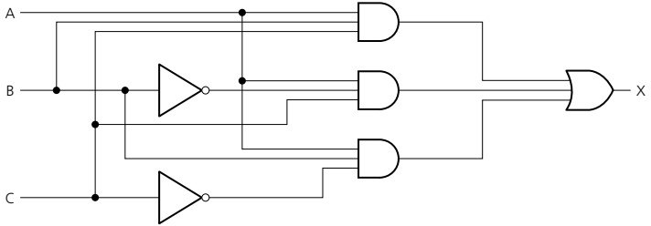

b) Produce the Karnaugh map to represent the above logic circuit and hence write down a simplified Boolean expression. [3]

c) Draw a simplified logic circuit from your Boolean expression in part b) using AND and OR gates only. [2]

<!-- page 385 -->

2 a) Consider the following truth table.

<table border=1 style='margin: auto; word-wrap: break-word;'><tr><td colspan="4">INPUTS</td><td style='text-align: center; word-wrap: break-word;'>OUTPUT</td></tr><tr><td style='text-align: center; word-wrap: break-word;'>A</td><td style='text-align: center; word-wrap: break-word;'>B</td><td style='text-align: center; word-wrap: break-word;'>C</td><td style='text-align: center; word-wrap: break-word;'>D</td><td style='text-align: center; word-wrap: break-word;'>X</td></tr><tr><td style='text-align: center; word-wrap: break-word;'>0</td><td style='text-align: center; word-wrap: break-word;'>0</td><td style='text-align: center; word-wrap: break-word;'>0</td><td style='text-align: center; word-wrap: break-word;'>0</td><td style='text-align: center; word-wrap: break-word;'>0</td></tr><tr><td style='text-align: center; word-wrap: break-word;'>0</td><td style='text-align: center; word-wrap: break-word;'>0</td><td style='text-align: center; word-wrap: break-word;'>0</td><td style='text-align: center; word-wrap: break-word;'>1</td><td style='text-align: center; word-wrap: break-word;'>0</td></tr><tr><td style='text-align: center; word-wrap: break-word;'>0</td><td style='text-align: center; word-wrap: break-word;'>0</td><td style='text-align: center; word-wrap: break-word;'>1</td><td style='text-align: center; word-wrap: break-word;'>0</td><td style='text-align: center; word-wrap: break-word;'>1</td></tr><tr><td style='text-align: center; word-wrap: break-word;'>0</td><td style='text-align: center; word-wrap: break-word;'>0</td><td style='text-align: center; word-wrap: break-word;'>1</td><td style='text-align: center; word-wrap: break-word;'>1</td><td style='text-align: center; word-wrap: break-word;'>1</td></tr><tr><td style='text-align: center; word-wrap: break-word;'>0</td><td style='text-align: center; word-wrap: break-word;'>1</td><td style='text-align: center; word-wrap: break-word;'>0</td><td style='text-align: center; word-wrap: break-word;'>0</td><td style='text-align: center; word-wrap: break-word;'>0</td></tr><tr><td style='text-align: center; word-wrap: break-word;'>0</td><td style='text-align: center; word-wrap: break-word;'>1</td><td style='text-align: center; word-wrap: break-word;'>0</td><td style='text-align: center; word-wrap: break-word;'>1</td><td style='text-align: center; word-wrap: break-word;'>1</td></tr><tr><td style='text-align: center; word-wrap: break-word;'>0</td><td style='text-align: center; word-wrap: break-word;'>1</td><td style='text-align: center; word-wrap: break-word;'>1</td><td style='text-align: center; word-wrap: break-word;'>0</td><td style='text-align: center; word-wrap: break-word;'>0</td></tr><tr><td style='text-align: center; word-wrap: break-word;'>0</td><td style='text-align: center; word-wrap: break-word;'>1</td><td style='text-align: center; word-wrap: break-word;'>1</td><td style='text-align: center; word-wrap: break-word;'>1</td><td style='text-align: center; word-wrap: break-word;'>1</td></tr><tr><td style='text-align: center; word-wrap: break-word;'>1</td><td style='text-align: center; word-wrap: break-word;'>0</td><td style='text-align: center; word-wrap: break-word;'>0</td><td style='text-align: center; word-wrap: break-word;'>0</td><td style='text-align: center; word-wrap: break-word;'>1</td></tr><tr><td style='text-align: center; word-wrap: break-word;'>1</td><td style='text-align: center; word-wrap: break-word;'>0</td><td style='text-align: center; word-wrap: break-word;'>0</td><td style='text-align: center; word-wrap: break-word;'>1</td><td style='text-align: center; word-wrap: break-word;'>1</td></tr><tr><td style='text-align: center; word-wrap: break-word;'>1</td><td style='text-align: center; word-wrap: break-word;'>0</td><td style='text-align: center; word-wrap: break-word;'>1</td><td style='text-align: center; word-wrap: break-word;'>0</td><td style='text-align: center; word-wrap: break-word;'>1</td></tr><tr><td style='text-align: center; word-wrap: break-word;'>1</td><td style='text-align: center; word-wrap: break-word;'>0</td><td style='text-align: center; word-wrap: break-word;'>1</td><td style='text-align: center; word-wrap: break-word;'>1</td><td style='text-align: center; word-wrap: break-word;'>1</td></tr><tr><td style='text-align: center; word-wrap: break-word;'>1</td><td style='text-align: center; word-wrap: break-word;'>1</td><td style='text-align: center; word-wrap: break-word;'>0</td><td style='text-align: center; word-wrap: break-word;'>0</td><td style='text-align: center; word-wrap: break-word;'>1</td></tr><tr><td style='text-align: center; word-wrap: break-word;'>1</td><td style='text-align: center; word-wrap: break-word;'>1</td><td style='text-align: center; word-wrap: break-word;'>0</td><td style='text-align: center; word-wrap: break-word;'>1</td><td style='text-align: center; word-wrap: break-word;'>1</td></tr><tr><td style='text-align: center; word-wrap: break-word;'>1</td><td style='text-align: center; word-wrap: break-word;'>1</td><td style='text-align: center; word-wrap: break-word;'>1</td><td style='text-align: center; word-wrap: break-word;'>0</td><td style='text-align: center; word-wrap: break-word;'>1</td></tr><tr><td style='text-align: center; word-wrap: break-word;'>1</td><td style='text-align: center; word-wrap: break-word;'>1</td><td style='text-align: center; word-wrap: break-word;'>1</td><td style='text-align: center; word-wrap: break-word;'>1</td><td style='text-align: center; word-wrap: break-word;'>1</td></tr></table>

in

ble.

ii) Use your Karnaugh map from part a i) to produce a Boolean expression.

b) Use the laws of Boolean algebra to simplify:

 $$ \mathbf{i})\quad(\mathrm{A}+\mathrm{C}).(\mathrm{A.D}+\mathrm{A}.\overline{\mathrm{D}})+\mathrm{A.C}+\mathrm{C} $$ 

 $$ \mathrm{ii)}\ \mathrm{A}.(\mathrm{A}+\mathrm{B})+(\mathrm{B}+\mathrm{A}.\mathrm{A}).(\mathrm{A}+\overline{\mathrm{B}}) $$ 

3 a) An SR flip-flop is constructed from NOR gates:

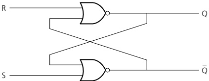

i) Complete the truth table for the SR flip-flop. [4]

ii) One of the S, R combinations in the truth table should not be allowed to occur. State the values of S and R that should not be allowed to occur. Explain your choice of values. [3]

<table border=1 style='margin: auto; word-wrap: break-word;'><tr><td colspan="2">INPUTS</td><td colspan="2">OUTPUTS</td></tr><tr><td style='text-align: center; word-wrap: break-word;'>S</td><td style='text-align: center; word-wrap: break-word;'>R</td><td style='text-align: center; word-wrap: break-word;'>Q</td><td style='text-align: center; word-wrap: break-word;'>$ \overline{Q} $</td></tr><tr><td style='text-align: center; word-wrap: break-word;'>1</td><td style='text-align: center; word-wrap: break-word;'>0</td><td style='text-align: center; word-wrap: break-word;'>1</td><td style='text-align: center; word-wrap: break-word;'>0</td></tr><tr><td style='text-align: center; word-wrap: break-word;'>0</td><td style='text-align: center; word-wrap: break-word;'>0</td><td style='text-align: center; word-wrap: break-word;'></td><td style='text-align: center; word-wrap: break-word;'></td></tr><tr><td style='text-align: center; word-wrap: break-word;'>0</td><td style='text-align: center; word-wrap: break-word;'>1</td><td style='text-align: center; word-wrap: break-word;'></td><td style='text-align: center; word-wrap: break-word;'></td></tr><tr><td style='text-align: center; word-wrap: break-word;'>0</td><td style='text-align: center; word-wrap: break-word;'>0</td><td style='text-align: center; word-wrap: break-word;'></td><td style='text-align: center; word-wrap: break-word;'></td></tr><tr><td style='text-align: center; word-wrap: break-word;'>1</td><td style='text-align: center; word-wrap: break-word;'>1</td><td style='text-align: center; word-wrap: break-word;'></td><td style='text-align: center; word-wrap: break-word;'></td></tr></table>

<!-- page 386 -->

b) JK flip-flops are another type of flip-flop.

i) State the three inputs to a JK flip-flop. [1]

ii) Give an advantage of using JK flip-flops. [1]

iii) Describe two uses of JK flip-flops in computers. [2]

4 a) Describe four types of processors used in parallel processing. [4]

b) A hardware designer decided to look into the use of parallel processing. Describe three features of parallel processing she needs to consider when designing her new system. [3]

c) A computer system uses pipelining. An assembly code program being run has eight instructions. Compare the number of clock cycles required when using pipelining compared to a sequential computer. [3]

5 a) Four descriptions and four types of computer architecture are shown below.

Draw a line to connect each description to the appropriate type of computer architecture. [4]

## Description

A computer that does not have the ability for parallel processing.

The processor has several ALUs. Each ALU executes the same instructions but on different data.

There are several processors.

Each processor executes different instructions drawn from a common pool. Each processor operates on different data drawn from a common pool.

There is only one processor executing one set of instructions on a single set of data.

## Computer architecture

SIMD

MISD

SISD

MIMD

b) In a massively parallel computer explain what is meant by:

i) Massive [1]

ii) Parallel [1]

c) There are both hardware and software issues that have to be considered for parallel processing to succeed. Describe one hardware and one software issue. [4]

<!-- page 387 -->

6 A logic circuit is shown.

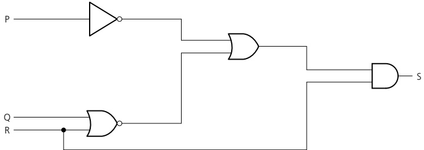

a) Write the Boolean expression corresponding to this logic circuit.

b) Copy and complete the truth table for this logic circuit.

<table border=1 style='margin: auto; word-wrap: break-word;'><tr><td style='text-align: center; word-wrap: break-word;'>P</td><td style='text-align: center; word-wrap: break-word;'>Q</td><td style='text-align: center; word-wrap: break-word;'>R</td><td style='text-align: center; word-wrap: break-word;'>Working space</td><td style='text-align: center; word-wrap: break-word;'>S</td></tr><tr><td style='text-align: center; word-wrap: break-word;'>0</td><td style='text-align: center; word-wrap: break-word;'>0</td><td style='text-align: center; word-wrap: break-word;'>0</td><td style='text-align: center; word-wrap: break-word;'></td><td style='text-align: center; word-wrap: break-word;'></td></tr><tr><td style='text-align: center; word-wrap: break-word;'>0</td><td style='text-align: center; word-wrap: break-word;'>0</td><td style='text-align: center; word-wrap: break-word;'>1</td><td style='text-align: center; word-wrap: break-word;'></td><td style='text-align: center; word-wrap: break-word;'></td></tr><tr><td style='text-align: center; word-wrap: break-word;'>0</td><td style='text-align: center; word-wrap: break-word;'>1</td><td style='text-align: center; word-wrap: break-word;'>0</td><td style='text-align: center; word-wrap: break-word;'></td><td style='text-align: center; word-wrap: break-word;'></td></tr><tr><td style='text-align: center; word-wrap: break-word;'>0</td><td style='text-align: center; word-wrap: break-word;'>1</td><td style='text-align: center; word-wrap: break-word;'>1</td><td style='text-align: center; word-wrap: break-word;'></td><td style='text-align: center; word-wrap: break-word;'></td></tr><tr><td style='text-align: center; word-wrap: break-word;'>1</td><td style='text-align: center; word-wrap: break-word;'>0</td><td style='text-align: center; word-wrap: break-word;'>0</td><td style='text-align: center; word-wrap: break-word;'></td><td style='text-align: center; word-wrap: break-word;'></td></tr><tr><td style='text-align: center; word-wrap: break-word;'>1</td><td style='text-align: center; word-wrap: break-word;'>0</td><td style='text-align: center; word-wrap: break-word;'>1</td><td style='text-align: center; word-wrap: break-word;'></td><td style='text-align: center; word-wrap: break-word;'></td></tr><tr><td style='text-align: center; word-wrap: break-word;'>1</td><td style='text-align: center; word-wrap: break-word;'>1</td><td style='text-align: center; word-wrap: break-word;'>0</td><td style='text-align: center; word-wrap: break-word;'></td><td style='text-align: center; word-wrap: break-word;'></td></tr><tr><td style='text-align: center; word-wrap: break-word;'>1</td><td style='text-align: center; word-wrap: break-word;'>1</td><td style='text-align: center; word-wrap: break-word;'>1</td><td style='text-align: center; word-wrap: break-word;'></td><td style='text-align: center; word-wrap: break-word;'></td></tr></table>

c) i) Copy and complete the Karnaugh map (K-map) for the truth table in part b).

<table border=1 style='margin: auto; word-wrap: break-word;'><tr><td rowspan="2" colspan="2"></td><td colspan="4">PQ</td></tr><tr><td style='text-align: center; word-wrap: break-word;'>00</td><td style='text-align: center; word-wrap: break-word;'>01</td><td style='text-align: center; word-wrap: break-word;'>11</td><td style='text-align: center; word-wrap: break-word;'>10</td></tr><tr><td rowspan="2">R</td><td style='text-align: center; word-wrap: break-word;'>0</td><td style='text-align: center; word-wrap: break-word;'></td><td style='text-align: center; word-wrap: break-word;'></td><td style='text-align: center; word-wrap: break-word;'></td><td style='text-align: center; word-wrap: break-word;'></td></tr><tr><td style='text-align: center; word-wrap: break-word;'>1</td><td style='text-align: center; word-wrap: break-word;'></td><td style='text-align: center; word-wrap: break-word;'></td><td style='text-align: center; word-wrap: break-word;'></td><td style='text-align: center; word-wrap: break-word;'></td></tr></table>

The K-map can be used to simplify the function in part a).

ii) Draw loops around appropriate groups to produce an optional sum-of-products. [1]

iii) Write a simplified sum-of-products expression, using your answer to part ii).

d) One Boolean identity is:

 $$ (A+B).C=A.C+B.C $$ 

Simplify the expression for S in part a) to the expression for S in part c) iii). You should use the given identity and De Morgan's Laws.

Cambridge International AS & A Level Computer Science 9608

Paper 32 Q3 June 2017

