# 18 Artificial intelligence (AI)

<!-- Cambridge International AS and a Level Computer Science (David Watson, Helen Williams).pdf p441-465 -->

<!-- page 441 -->

## 18 

## Artificial intelligence (AI)

In this chapter, you will learn about

how to use A $ ^{*} $ and Dijkstra's algorithms to find the shortest path in a graph

how artificial neural networks have helped with machine learning

deep learning, machine learning and reinforcement learning and the reasons for using these methods in AI

 $ ^{*} $ supervised learning, active learning and unsupervised learning when applied to AI

 $ ^{*} $ back propagation of errors and regression methods in machine learning.

## WHAT YOU SHOULD ALREADY KNOW

Try these three questions before you start this chapter.

1 What is meant by the term artificial intelligence (AI)?

2 Describe some of the pros and cons of using AI in everyday life.

3 Give four examples of the use of AI and briefly describe each.

### 18.1 Shortest path algorithms

## Key terms

<table border=1 style='margin: auto; word-wrap: break-word;'><tr><td style='text-align: center; word-wrap: break-word;'>Dijkstra&#x27;s algorithm – an algorithm that finds the shortest path between two nodes or vertices in a graph/network.</td><td style='text-align: center; word-wrap: break-word;'>heuristic approach to achieve better performance than Dijkstra&#x27;s algorithm.</td></tr><tr><td style='text-align: center; word-wrap: break-word;'>Node or vertex – fundamental unit from which graphs are formed (nodes and vertices are the points where edges converge).</td><td style='text-align: center; word-wrap: break-word;'>Heuristic – method that employs a practical solution (rather than a theoretical one) to a problem; when applied to algorithms this includes running tests and obtaining results by trial and error.</td></tr><tr><td style='text-align: center; word-wrap: break-word;'>A* algorithm – an algorithm that finds the shortest route between nodes or vertices but uses an additional</td><td style='text-align: center; word-wrap: break-word;'>the shortest route between nodes or vertices but uses an additional</td></tr></table>

#### 18.1.1 Dijkstra's algorithm

Dijkstra's algorithm (pronounced dyke-strah) is a method of finding the shortest path between two points on a graph. Each point on the graph is called a node or a vertex (for more information on the features and uses of graphs, see Chapter 19). It is the basis of technology such as GPS tracking and therefore, is an important part of AI.

This set of instructions briefly describes how it works.

1 Give the start vertex a final value of 0.

2 Give each vertex connected to the vertex we have just given a final value to (in the first instance, this is the start vertex) a working (temporary) value.

<!-- page 442 -->

If a vertex already has a working value, only replace it with another working value if it is a lower value.

3 Check the working value of any vertex that has not yet been assigned a final value. Assign the smallest value to this vertex; this is now its final value.

4 Repeat steps 2 and 3 until the end vertex is reached, and all vertices have been assigned a final value.

5 Trace the route back from the end vertex to the start vertex to find the shortest path between these two vertices.

Here is a step-by-step example.

Suppose we have the following graph (route map) with seven vertices labelled A to G. We want to find the shortest path between A and G. The numbers show the distance between each pair of vertices.

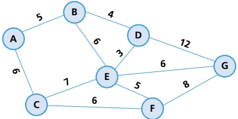

Figure 18.1

First, redraw the diagram, replacing the circled letters as per the key:

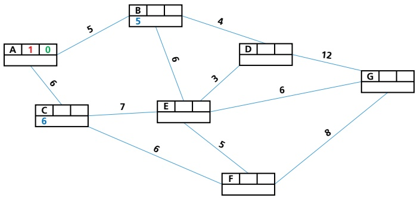

<table border=1 style='margin: auto; word-wrap: break-word;'><tr><td style='text-align: center; word-wrap: break-word;'>vertex letter</td><td style='text-align: center; word-wrap: break-word;'>order of labelling</td><td style='text-align: center; word-wrap: break-word;'>final value</td></tr><tr><td colspan="3">working values</td></tr></table>

Figure 18.2

Set the final value of the start vertex (vertex A) to 0 (as per step 1 above).

The two vertices connected to A (B and C) are given the working values 5 and 6 respectively.

Make the smallest working value (vertex B) a final value. Then give the vertices connected to B (D and E) working values based on the original distances. The working value for E is the final value of B plus the value of

<!-- page 443 -->

B to E  $ (5 + 6 = 11) $. The working value for D is the final value of B plus the value of B to D  $ (5 + 4 = 9) $.

The diagram now looks like this:

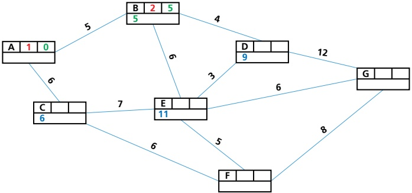

### Figure 18.3

Make the smallest working value a final value: vertex C becomes 6.

Now give working values to all vertices connected to C. Note that the working value for E remains 11 since the final value of C plus the value of C to E is 13, which is greater than 11.

Vertex D retains its working value since it is not connected to C and is not affected.

Vertex F takes the working value of C plus the value of C to  $ F(6 + 6 = 12) $.

The diagram now looks like this:

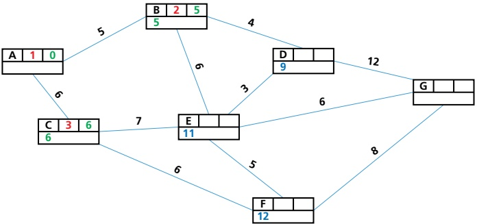

Figure 18.4

Vertex D now has the smallest working value (9), so this becomes a final value.

Vertices E and G are connected to D, so these are now assigned working values. Note that G has the working value 21 since it is the final value of D plus the value of D to G (9 + 12 = 21); E keeps the value of 11 since the final value of D plus the value of D to E is greater than 11 (9 + 11 = 20).

<!-- page 444 -->

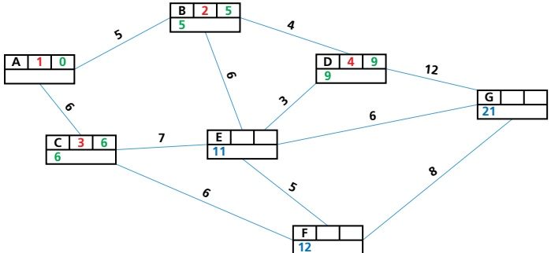

### Figure 18.5

Vertex E now has the smallest working value (11), so this becomes a final value.

Vertices D, F and G are all connected to E.

D already has a final value so it can be ignored.

F retains its value of 12 since  $ E + E $ to  $ F = 16 (> 12) $.

G changes since E + E to G = 17 (< 21).

The diagram now looks like this:

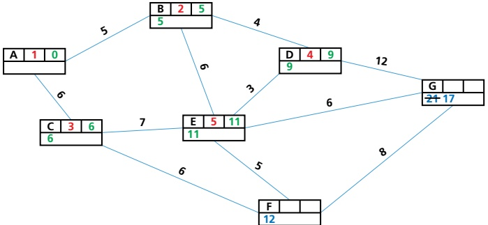

### Figure 18.6

Vertex F now has the smallest working value (12), so this becomes a final value.

G retains its value of 17 since  $ F + F $ to  $ G = 20 (> 17) $.

The final diagram now looks like this:

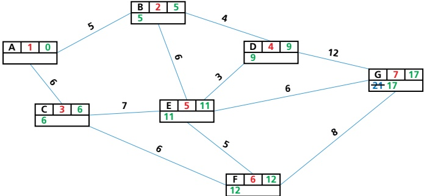

Figure 18.7

<!-- page 445 -->

The final step is to work back from G to A.

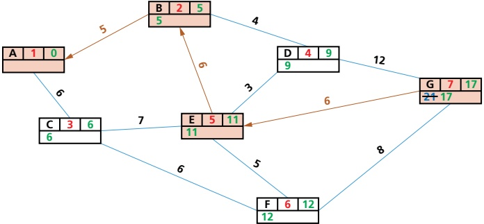

### Figure 18.8

Thus, the shortest path is:  $ A \rightarrow B \rightarrow E \rightarrow G $

The reasoning is as follows:

The difference between the final values E and G is 6, which is the same as the path length E to G.

The difference between the final values of B and E is 6, which is the same as the path length B to E.

The difference between the final value of B and A is 5, which is the same as the path length A to B.

You will know if the shortest route is correct by applying this rule:

Path length is the same as the difference between final values at either end of the path.

If the path length between two points is not the same as the difference of the final values between the same two points, then this is not a route that can be taken.

## ACTIVITY 18A

The following graph shows the routes through a large park.

Use Dijkstra's algorithm to find the shortest path from point A to point I.

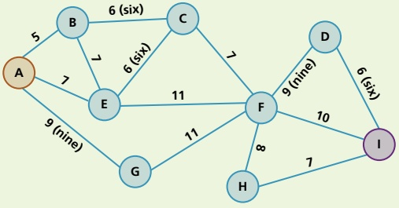

#### 18.1.2 A $ ^{*} $ algorithm

Dijkstra's algorithm simply checks each vertex looking for the shortest path, even if that takes you away from your destination – it pays no attention to direction. With larger, more complex problems, that can be a time-consuming drawback.

<!-- page 446 -->

A* algorithm is based on Dijkstra, but adds an extra heuristic (h) value – an 'intelligent guess' on how far we have to go to reach the destination most efficiently.

The A* algorithm can also find shortest path lengths for graphs similar to the type used in Section 18.1.1.

Suppose we have the following graph made up of an  $ 8 \times 6 $ matrix. White squares show permitted moves, and grey squares show blocked moves.

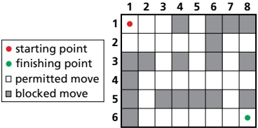

Figure 18.9

Each of the parts of the graph are called nodes (or vertices). Each node has four values

» h (the heuristic value)

» g (movement cost)

f (sum of g and h values)

» n (previous node in the path).

Note that the weight of a node usually represents movement cost, which is the distance between the two nodes.

First, find the heuristic values (distances) using the Manhattan method (named after the criss-cross street arrangement in New York). The distance from the starting square (1, 1) to the end square (8, 6) is 12 squares (follow the purple line in the diagram below). Similarly, the distance from square (2, 4) to (8, 6) is eight squares (follow the orange line in the diagram below).

Note: you can ignore the blocked moves when calculating heuristic distance from each node to the final node.

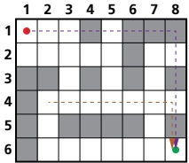

Figure 18.10

Use this method to find the heuristic distances for all permitted nodes:

h-values:

<table border=1 style='margin: auto; word-wrap: break-word;'><tr><td style='text-align: center; word-wrap: break-word;'></td><td style='text-align: center; word-wrap: break-word;'>1</td><td style='text-align: center; word-wrap: break-word;'>2</td><td style='text-align: center; word-wrap: break-word;'>3</td><td style='text-align: center; word-wrap: break-word;'>4</td><td style='text-align: center; word-wrap: break-word;'>5</td><td style='text-align: center; word-wrap: break-word;'>6</td><td style='text-align: center; word-wrap: break-word;'>7</td><td style='text-align: center; word-wrap: break-word;'>8</td></tr><tr><td style='text-align: center; word-wrap: break-word;'>1</td><td style='text-align: center; word-wrap: break-word;'>12</td><td style='text-align: center; word-wrap: break-word;'>11</td><td style='text-align: center; word-wrap: break-word;'>10</td><td style='text-align: center; word-wrap: break-word;'></td><td style='text-align: center; word-wrap: break-word;'>8</td><td style='text-align: center; word-wrap: break-word;'></td><td style='text-align: center; word-wrap: break-word;'></td><td style='text-align: center; word-wrap: break-word;'></td></tr><tr><td style='text-align: center; word-wrap: break-word;'>2</td><td style='text-align: center; word-wrap: break-word;'>11</td><td style='text-align: center; word-wrap: break-word;'>10</td><td style='text-align: center; word-wrap: break-word;'>9</td><td style='text-align: center; word-wrap: break-word;'>8</td><td style='text-align: center; word-wrap: break-word;'>7</td><td style='text-align: center; word-wrap: break-word;'></td><td style='text-align: center; word-wrap: break-word;'>5</td><td style='text-align: center; word-wrap: break-word;'>4</td></tr><tr><td style='text-align: center; word-wrap: break-word;'>3</td><td style='text-align: center; word-wrap: break-word;'></td><td style='text-align: center; word-wrap: break-word;'></td><td style='text-align: center; word-wrap: break-word;'>8</td><td style='text-align: center; word-wrap: break-word;'></td><td style='text-align: center; word-wrap: break-word;'>6</td><td style='text-align: center; word-wrap: break-word;'></td><td style='text-align: center; word-wrap: break-word;'>4</td><td style='text-align: center; word-wrap: break-word;'></td></tr><tr><td style='text-align: center; word-wrap: break-word;'>4</td><td style='text-align: center; word-wrap: break-word;'></td><td style='text-align: center; word-wrap: break-word;'>8</td><td style='text-align: center; word-wrap: break-word;'>7</td><td style='text-align: center; word-wrap: break-word;'>6</td><td style='text-align: center; word-wrap: break-word;'>5</td><td style='text-align: center; word-wrap: break-word;'>4</td><td style='text-align: center; word-wrap: break-word;'>3</td><td style='text-align: center; word-wrap: break-word;'>2</td></tr><tr><td style='text-align: center; word-wrap: break-word;'>5</td><td style='text-align: center; word-wrap: break-word;'></td><td style='text-align: center; word-wrap: break-word;'>7</td><td style='text-align: center; word-wrap: break-word;'></td><td style='text-align: center; word-wrap: break-word;'></td><td style='text-align: center; word-wrap: break-word;'></td><td style='text-align: center; word-wrap: break-word;'></td><td style='text-align: center; word-wrap: break-word;'>2</td><td style='text-align: center; word-wrap: break-word;'></td></tr><tr><td style='text-align: center; word-wrap: break-word;'>6</td><td style='text-align: center; word-wrap: break-word;'></td><td style='text-align: center; word-wrap: break-word;'>6</td><td style='text-align: center; word-wrap: break-word;'>5</td><td style='text-align: center; word-wrap: break-word;'>4</td><td style='text-align: center; word-wrap: break-word;'>3</td><td style='text-align: center; word-wrap: break-word;'>2</td><td style='text-align: center; word-wrap: break-word;'>1</td><td style='text-align: center; word-wrap: break-word;'>-</td></tr></table>

<!-- page 447 -->

Now, find the g-values (the movement costs). Since we can either move up/down, left/right or diagonally, we can choose our g-values based on a right-angled triangle. To make the maths easy we will use a triangle with sides 10, 10 and 14:

g-values:

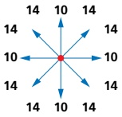

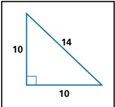

### Figure 18.12

Find the f values using  $ f(n) = g(n) + h(n) $.

Starting with square  $ (1,1) $, look at the surrounding squares:

g-values

<table border=1 style='margin: auto; word-wrap: break-word;'><tr><td style='text-align: center; word-wrap: break-word;'>10</td><td style='text-align: center; word-wrap: break-word;'>-</td></tr><tr><td style='text-align: center; word-wrap: break-word;'>10</td><td style='text-align: center; word-wrap: break-word;'>14</td></tr><tr><td style='text-align: center; word-wrap: break-word;'></td><td style='text-align: center; word-wrap: break-word;'>-</td></tr></table>

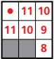

Figure 18.13

square (1,2):  $ f = 10 + 11 = 21 $

▶ square (2, 1): f = 10 + 11 = 21

square (2,2):  $ f = 14 + 10 = 24 $

Since 21 < 24, (1, 2) or (2, 1) are the possible directions.

We will choose (2, 1) as the next step:

g-values

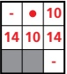

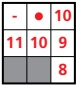

Figure 18.14

square (3, 1):  $ f = 10 + 10 = 20 $

▶ square (3,2): f = 14 + 9 = 23

square (1,2): f = 14 + 11 = 25

➢ square (2,2): f = 10 + 10 = 20

Since 20 is the smallest value, the next stage can be  $ (3,1) $ or  $ (2,2) $.

We will choose (3, 1) as the next step:

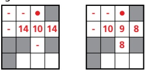

Figure 18.15

➢ square (2,2): f = 14 + 10 = 24

square (3,2):  $ f = 10 + 9 = 19 $

square (4,2): f = 14 + 8 = 22

Since square  $ (3,2) $ is the smallest value, this must be the next step.

<!-- page 448 -->

Now look at the possible routes already found to decide where to move next:

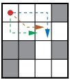

<table border=1 style='margin: auto; word-wrap: break-word;'><tr><td style='text-align: center; word-wrap: break-word;'>Route 1 has the values:</td><td style='text-align: center; word-wrap: break-word;'>remember</td></tr><tr><td style='text-align: center; word-wrap: break-word;'>21 + 20 + 19 = 60</td><td style='text-align: center; word-wrap: break-word;'>each of the values is found by adding the g-value to the h-value</td></tr><tr><td style='text-align: center; word-wrap: break-word;'>Route 2 has the values:</td><td style='text-align: center; word-wrap: break-word;'>24 + 19 = 43</td></tr><tr><td style='text-align: center; word-wrap: break-word;'>Route 3 has the values:</td><td style='text-align: center; word-wrap: break-word;'>21 + 20 + 19 = 60</td></tr></table>

### Figure 18.16

It seems route 2 is the shortest route:  $ (1,1)\to(2,2)\to(3,2) $.

When considering the next squares (3, 3) or (4, 2), and applying the above rules, it becomes clear that the next stage in the route is:

 $$ (1,1)\to(2,2)\to(3,3) $$ 

Continue throughout the matrix and produce the following shortest route from  $ (1,1) $ to  $ (8,6) $:

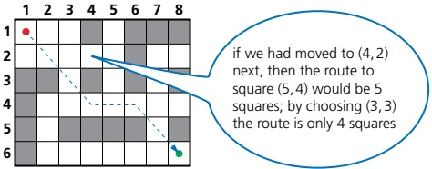

Figure 18.17

The shortest path is:

 $$ (1,1)\to(2,2)\to(3,3)\to(4,4)\to(5,4)\to(6,4)\to(7,5)\to(8,6) $$ 

Examples of applications of shortest path algorithms include

» global positioning satellites (GPS)

Google Maps

modelling the spread of infectious diseases

IP routing.

## ACTIVITY 18B

1 Find the shortest route from node A to node J using the A* algorithm. Note that you are given the heuristic values (h) in green, and the movement cost values (g), in red.

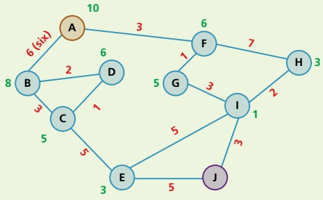

<!-- page 449 -->

2 Use the A* algorithm to find the shortest route from the starting point  $ (1,3) $ to the end point  $ (6,7) $. Note that you will need to calculate your own h-values and g-values in this question using the method shown earlier.

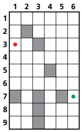

3 The following network shows 11 places of interest in a city. The times (in minutes) to walk between pairs of places of interest are shown on the vertices.

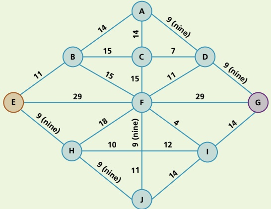

a) Using Dijkstra's algorithm, find the shortest time to walk from E to G.

b) Write down the corresponding shortest route. Total walking time is 288 minutes.

<!-- page 450 -->

4 The road network below connects a number of towns. The distances shown are in kilometres (km) between roads connecting the towns.

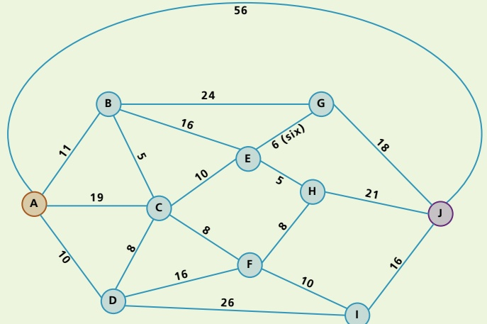

a) i) Use Dijkstra's algorithm on the road network to find the minimum distance between towns A and J.

ii) Write down the corresponding shortest route.

b) The road AJ is a dual carriageway where the speed limit is 95 kph. The speed limit on all other roads is 80 kph. Assuming Karl drives at the maximum speed limit on each road, calculate the minimum time to drive from town A to town J.

### 18.2 Artificial intelligence, machine learning and deep learning

## Key terms

Machine learning – systems that learn without being programmed to learn.

Deep learning – machines that think in a way similar to the human brain. They handle huge amounts of data using artificial neural networks.

Labelled data – data where we know the target answer and the data object is fully recognised.

Unlabelled data – data where objects are undefined and need to be manually recognised.

Supervised learning – system which is able to predict future outcomes based on past data. It requires both input and output values to be used in the training process.

Unsupervised learning – system which is able to identify hidden patterns from input data – the system is not trained on the 'right' answer.

Reinforcement learning – system which is given no training – learns on basis of 'reward and punishment'.

Semi-supervised (active) learning – system that interactively queries source data to reach the desired result. It uses both labelled and unlabelled data, but mainly unlabelled data on cost grounds.

Reward and punishment – improvements to a model based on whether feedback is positive or negative; actions are optimised to receive an increase in positive feedback.

<!-- page 451 -->

<table border=1 style='margin: auto; word-wrap: break-word;'><tr><td style='text-align: center; word-wrap: break-word;'>Web crawler – internet bot that systematically browses the world wide web to update its web page content.</td><td style='text-align: center; word-wrap: break-word;'>node/neuron weightings can be adjusted to improve the performance of the model.</td></tr><tr><td style='text-align: center; word-wrap: break-word;'>Artificial neural networks – networks of interconnected nodes based on the interconnections between neurons in the human brain. The system is able to think like a human using these neural networks, and its performance improves with more data.</td><td style='text-align: center; word-wrap: break-word;'>Chatbot – computer program set up to simulate conversational interaction between humans and a website.</td></tr><tr><td style='text-align: center; word-wrap: break-word;'>Back propagation – method used in artificial neural networks to calculate error gradients so that actual</td><td style='text-align: center; word-wrap: break-word;'>Regression – statistical measure used to make predictions from data by finding learning relationships between the inputs and outputs.</td></tr></table>

#### 18.2.1 Artificial Intelligence (AI)

Figure 18.18 shows the link between artificial intelligence (AI), machine learning and deep learning. Deep learning is a subset of machine learning, which is itself a subset of AI.

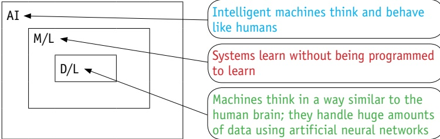

Intelligent machines think and behave like humans

Systems learn without being programmed to learn

Machines think in a way similar to the human brain; they handle huge amounts of data using artificial neural networks

### Figure 18.18

AI can be thought of as a machine with cognitive abilities such as problem solving and learning from examples. All of these can be measured against human benchmarks such as reasoning, speech and sight. AI is often split into three categories.

1 Narrow AI is when a machine has superior performance to a human when doing one specific task.

2 General AI is when a machine is similar in its performance to a human in any intellectual task.

3 Strong AI is when a machine has superior performance to a human in many tasks.

## EXTENSION ACTIVITY 18A

Carry out some research into the following AI concepts.

Knowledge representation

Automated reasoning

Computer vision

Robotics

## Examples of AI include

news generation based on live news feeds (this will involve some form of human interaction)

<!-- page 452 -->

smart home devices (such as Amazon Alexa, Google Now, Apple Siri and Microsoft Cortana); again these all involve some form of human interaction (see Figure 18.19).

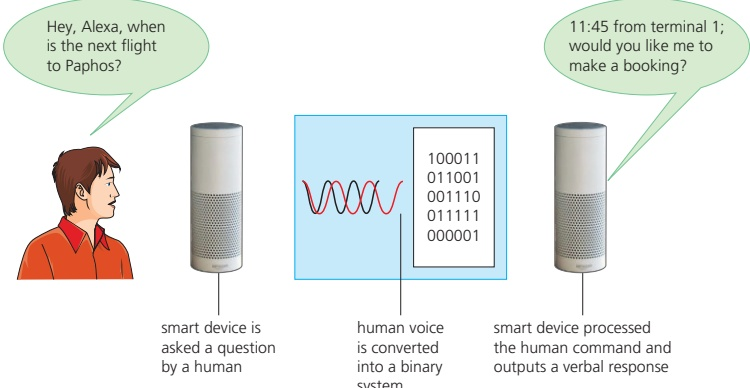

Figure 18.19

In this example, the AI device interacts with a human by recognising their verbal commands. The device will learn from its environment and the data it receives, becoming increasingly sophisticated in its responses, showing the ability to use automated repetitive learning via artificial neural networks.

#### 18.2.2 Machine learning

Machine learning is a subset of AI, in which the algorithms are 'trained' and learn from their past experiences and examples. It is possible for the system to make predictions or even take decisions based on previous scenarios. They can offer fast and accurate outcomes due to very powerful processing capability. One of the key factors is the ability to manage and analyse considerable volumes of complex data – some of the tasks would take humans years, if they were to analyse the data using traditional computing processing methods. A good example is a search engine:

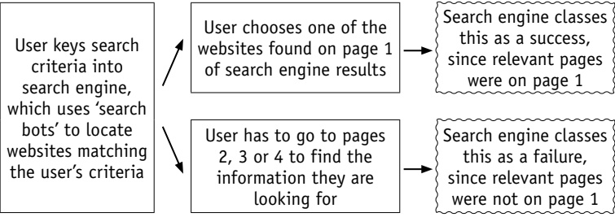

<!-- page 453 -->

The search engine will learn from its past performance, meaning its ability to carry out searches becomes more sophisticated and accurate.

Machine learning is a key part of AI and the various types of machine learning will be covered later in this chapter.

## Labelled and unlabelled data

Let us consider what is meant by labelled and unlabelled data:

Suppose a garage selling vehicles obtains them from three sources.

Vehicles from source 1 are always cars and always come fully serviced.

Vehicles from source 2 are vans and are usually unserviced.

Vehicles from source 3 are motorbikes and are usually serviced.

Vehicles less than three years old also come with a warranty. Thus, the garage has in stock

vehicle 1 - car, serviced, warranty

vehicle 2 – van, no service, no warranty

vehicle 3 - car, no service, warranty

vehicle 4 – motorbike, serviced, warranty.

Coming into stock in the next few days are

vehicle 5 – from source 1, two years old

vehicle 6 – from source 3, four years old

vehicle 7 – from source 2, one year old.

Vehicles 1, 2, 3 and 4 are all labelled data since we know

what type of vehicle they are

whether they have been serviced

whether they have a warranty.

They are fully defined and recognisable.

However, vehicles 5, 6 and 7 are unlabelled data since we do not know what type of vehicle they are and we only know their source and age.

Unlabelled data is data which is unidentified and needs to be recognised. Some processing would need to be done before they could be recognised as a car, van or motorbike.

Now, suppose you want to automatically count the types of birds seen in a bird sanctuary. The proposed system will consider bird features such as shape of beak, colour of feathers, body size, and so on. This requires the use of labelled data to allow the birds to be recognised by the system (see Figure 18.21).

<!-- page 454 -->

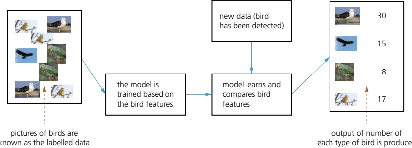

Figure 18.21

Machine learning recognises the birds as labelled data, allowing it to be trained. Once trained, it is able to recognise each type of bird from the original data set. Algorithms are used to analyse the incoming data (by comparing it to bird features already recognised by the model) and to learn from this data. Informed decisions are then made based on what it has learned. Thus, in this example, it is able to recognise new data and produce an output automatically showing how many of each type of bird was detected.

## Examples of machine learning include

» spam detection (the system learns to recognise spam emails without the need of any human interactions)

search engines refining searches based on earlier searches carried out (the system learns from its mistakes).

## Types of machine learning

There are a number of different types of machine learning, including supervised, unsupervised learning, reinforcement and semi-supervised (active).

## Supervised learning

Supervised learning makes use of regression analysis and classification analysis. It is used to predict future outcomes based on past data:

The system requires both an input and an output to be given to the model so it can be trained.

The model uses labelled data, so the desired output for a given input is known.

》 Algorithms receive a set of inputs and the correct outputs to permit the learning process.

Once trained, the model is run using labelled data.

The results are compared with the expected output; if there are any errors, the model needs further refinement.

The model is run with unlabelled data to predict the outcome.

An example of supervised learning is categorising emails as relevant or spam/junk without human intervention.

## Unsupervised learning

Systems are able to identify hidden patterns from the input data provided; they are not trained using the 'right' answer.

<!-- page 455 -->

By making data more readable and more organised, patterns, similarities and anomalies will become evident (unsupervised learning makes use of density estimation and k-mean clustering; in other words, it classifies unlabelled real data).

Algorithms evaluate the data to find any hidden patterns or structures within the data set.

An example is used in product marketing: a group of individuals with similar purchasing behaviour are regarded as a single unit for promotions.

## Reinforcement learning

The system is not trained. It learns on the basis of 'reward and punishment' when carrying out an action (in other words, it uses trial and error in algorithms to determine which action gives the highest/optimal outcome).

This type of learning helps to increase the efficiency of the system by making use of optimisation techniques.

Examples include search engines, online games and robotics.

## Semi-supervised (active) learning

Semi-supervised learning makes use of labelled and unlabelled data to train algorithms that can interactively query the source data and produce a desired output.

It makes as much use of unlabelled data as possible (this is for cost reasons, since unlabelled data is less expensive than labelled data when carrying out data categorisation).

A small amount of labelled data is used combined with large amounts of unlabelled data.

Examples of uses include the classification of web pages into sport, science, leisure, finance, and so on. A web crawler is used to look at large amounts of unlabelled web pages, which is much cheaper than going through millions of web pages and manually annotating (labelling) them.

#### 18.2.3 Deep learning

Deep learning structures algorithms in layers (input layer, output layer and hidden layer(s)) to create an artificial neural network that can learn and make intelligent decisions on its own.

Its artificial neural networks are based on the interconnections between neurons in the human brain. The system is able to think like a human using these neural networks, and its performance improves with more data.

The hidden layers are where data from the input layer is processed into something which can be sent to the output layer. Artificial neural networks are excellent at identifying patterns which would be too complex or time consuming for humans to carry out.

For example, they can be used in face recognition. The face in Figure 18.22 shows several of the positions used by the face recognition software. Each

<!-- page 456 -->

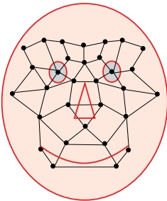

Figure 18.22 Face recognition

position is checked when the software tries to compare two facial images. A face is identified using data such as

distance between the eyes

width of the nose

shape of the cheek bones

▶ length of the jaw line

shape of the eyebrows.

Figure 18.23 shows an artificial neural network (with two hidden layers).

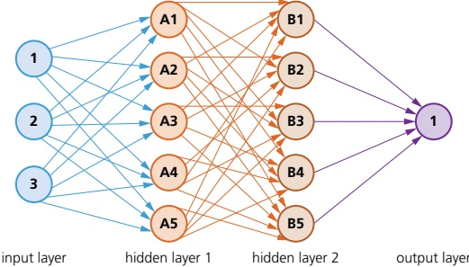

Figure 18.23 An artificial neural network

These systems are able to recognise objects, such as birds, by their shape and colour. With machine learning, the objects form labelled data which can be used in the training process.

But how is it possible to recognise a bird if the data is unlabelled? By analysing pixel densities of objects, for example, it is possible for a deep learning system to take unlabelled objects and then recognise them through a sophisticated set of algorithms.

Deep learning using artificial neural networks can be used to recognise objects by looking at the binary codes of each pixel, thus building up a picture of the object. For example, Figure 18.24 shows a close up of a face where each pixel can be assigned its binary value and, therefore, the image could be recognised by deep learning algorithms as a person's face.

Figure 18.24 Deep learning algorithms can recognise this as a person's face

<!-- page 457 -->

This summarises how deep learning works:

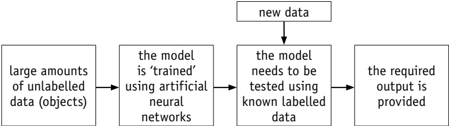

Figure 18.25

Large amounts of unlabelled data (data which is undefined and needs to be recognised) is input into the model. One of the methods of object recognition, using pixel densities, was described above. Using artificial neural networks, each of the objects is identified by the system. Labelled data (data which has already been defined and is, therefore, recognised) is then entered into the model to make sure it gives the correct responses. If the output is not sufficiently accurate, the model is refined until it gives satisfactory results (known as back propagation – see Section 18.2.6). The refinement process may take several adjustments until it provides reliable and consistent outputs.

## Text mining

Suppose a warehouse contains hundreds of books. A system is being developed to translate the text from each book and determine which genre the book belongs to, such as a car engine repair manual. Each book could then be identified by the system and placed in its correct category. How could this be done using deep learning and machine learning techniques?

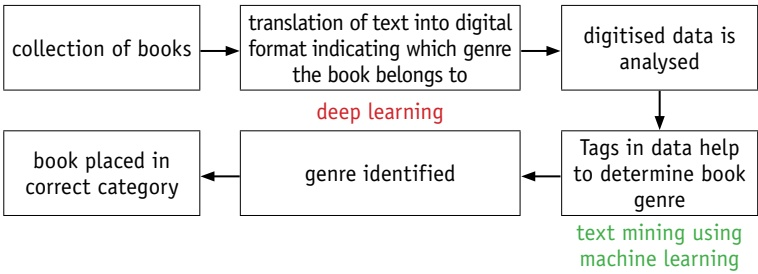

### Figure 18.26

## Computer-assisted translation (CAT)

Existing online language translators have a limited use: they often have difficulty translating words or phrases with double meanings, or idioms specific to a language. Computer-assisted translation (CAT) goes some way to overcome these issues. CAT uses deep learning algorithms to help in the translation process.

In particular, CAT uses two tools:

Terminology databases (linguistic databases that grow and 'learn' from translations being carried out).

» Translation memories (these automatically insert known translations for certain words, phrases or sentences).

<!-- page 458 -->

## Photograph enhancement

Some of the latest smartphones cameras use deep learning to give DSLR quality to the photographs. The technology was developed by taking the same photos using a smartphone and then using a DSLR camera. The deep learning system was then trained by comparing the two photographs. A large number of photographs already taken by a DSLR camera (but not by the smartphone) were then used to test the model. The results can be seen in Figure 18.27.

▲ Figure 18.27 Original photo taken by smartphone (left); enhanced photo using deep learning model (right)

## Turning monochrome photos into colour

Deep learning can be used to turn monochrome (black and white) photographs into coloured photographs. This is a sophisticated system which produces a better photograph than simply turning grey-scale values into an approximated colour. In Figure 18.28, the original monochrome image has been processed to give a very accurate coloured image.

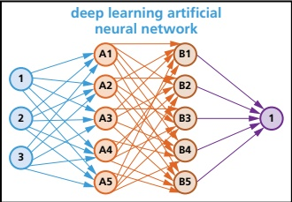

Figure 18.28 Deep learning can change black and white photographs to colour

The deep learning system is trained by searching websites for data which allows it to recognise features and then map a particular colour to a photograph/object thus producing an accurate coloured image.

## Chatbots

Chatbots interact through instant messaging, artificially replicating patterns of human interactions using machine learning. Typed messages or voice recordings make use of predefined scripts and machine learning: when a question is asked, a chatbot responds using the information known at the time.

<!-- page 459 -->

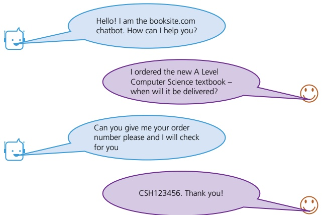

Figure 18.29

18.2.4 Comparison between machine learning and deep learning

<table border=1 style='margin: auto; word-wrap: break-word;'><tr><td style='text-align: center; word-wrap: break-word;'>machine learning</td><td style='text-align: center; word-wrap: break-word;'>deep learning</td></tr><tr><td style='text-align: center; word-wrap: break-word;'>enables machines to make decisions on their own based on past data</td><td style='text-align: center; word-wrap: break-word;'>enables machines to make decisions using an artificial neural network</td></tr><tr><td style='text-align: center; word-wrap: break-word;'>needs only a small amount of data to carry out the training</td><td style='text-align: center; word-wrap: break-word;'>the system needs large amounts of data during the training stages</td></tr><tr><td style='text-align: center; word-wrap: break-word;'>most of the features in the data used need to be identified in advance and then manually coded into the system</td><td style='text-align: center; word-wrap: break-word;'>deep learning machine learns the features of the data from the data itself and it does not need to be identified in advance</td></tr><tr><td style='text-align: center; word-wrap: break-word;'>a modular approach is taken to solve a given problem/task; each module is then combined to produce the final model</td><td style='text-align: center; word-wrap: break-word;'>the problem is solved from beginning to end as a single entity</td></tr><tr><td style='text-align: center; word-wrap: break-word;'>testing of the system takes a long time to carry out</td><td style='text-align: center; word-wrap: break-word;'>testing of the system takes much less time to carry out</td></tr><tr><td style='text-align: center; word-wrap: break-word;'>there are clear rules which explain why each stage in the model was made</td><td style='text-align: center; word-wrap: break-word;'>since the system makes decisions based on its own logic, the reasoning behind those decisions may be very difficult to understand (they are often referred to as a black box)</td></tr></table>

▲ Table 18.1 Comparison between machine learning and deep learning

#### 18.2.5 What will happen in the future?

Table 18.2 lists some artificial intelligence, machine learning and deep learning developments expected in the not too distant future.

<table border=1 style='margin: auto; word-wrap: break-word;'><tr><td rowspan="2">AI</td><td style='text-align: center; word-wrap: break-word;'>detection of crimes before they happen by looking at existing patterns</td></tr><tr><td style='text-align: center; word-wrap: break-word;'>development of humanoid AI machines which carry out human tasks (androids)</td></tr><tr><td rowspan="2">Machine learning</td><td style='text-align: center; word-wrap: break-word;'>increased efficiency in health care and diagnostics (for example, early detection of cancers, eye defects, and so on)</td></tr><tr><td style='text-align: center; word-wrap: break-word;'>better marketing techniques based on buying behaviours of target groups</td></tr><tr><td rowspan="2">Deep learning</td><td style='text-align: center; word-wrap: break-word;'>increased personalisation in various areas (such as individual cancer care which personalises treatment based on many factors)</td></tr><tr><td style='text-align: center; word-wrap: break-word;'>hyper intelligent personal assistants</td></tr></table>

▲ Table 18.2 Developments in AI, machine learning and deep learning

<!-- page 460 -->

## EXTENSION ACTIVITY 18B

Carry out some research into present day and future developments in AI, machine learning and deep learning (these will change every year and it is necessary to update yourself with all the latest developments).

#### 18.2.6 Back propagation and regression methods

## Back propagation

When designing neural networks, it is necessary to give random weightings to each of the neural connections. However, the system designer will not initially know which weight factors to use to produce the best results. It is necessary to train the neural networks during the development stage:

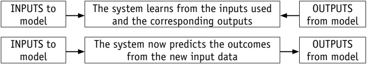

### Figure 18.30

The training program is iterative; the outputs produced from the system are compared to the expected results and any differences in the two values/results are calculated. These errors are propagated back into the neural network in order to update the initial network weightings.

This process (training) is repeated until the desired outputs are eventually obtained, or the errors in the outputs are within acceptable limits.

Here is a summary of the back propagation process:

The initial outputs from the system are compared to the expected outputs and the system weightings are adjusted to minimise the difference between actual and expected results.

» Calculus is used to find the error gradient in the obtained outputs: the results are fed back into the neural networks and the weightings on each neuron are adjusted (note: this can be used in both supervised and unsupervised networks).

Once the errors in the output have been eliminated (or reduced to acceptable limits) the neural network is functioning correctly and the model has been successfully set up.

» If the errors are still too large, the weightings are altered – the process continues until satisfactory outputs are produced.

Figure 18.31 shows the ultimate goal of the back propagation process.

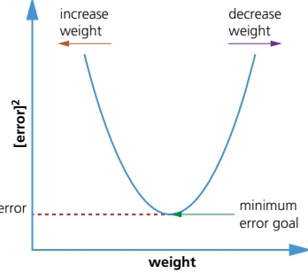

<!-- page 461 -->

There are two types of back propagation: static and recurrent:

» Static maps static inputs to a static output.

» Mapping is instantaneous in static, but this is not the case with recurrent.

» Training a network/model is more difficult with recurrent than with static.

» With recurrent, activation is fed forward until a fixed value is achieved.

## Regression

Machine learning builds heavily on statistics; for example, regression is one way of analysing data before it is input into a system or model. Regression is used to make predictions from given data by learning some relationship between the input and the output. It helps in the understanding of how the value of a dependent variable changes when the values of independent variables are also changed. This makes it a valuable tool in prediction applications, such as weather forecasting.

In machine learning, this is used to predict the outcome of an event based on any relationship between variables obtained from input data and the hidden parameters.

## ACTIVITY 18C

1 a) Explain the difference(s) between narrow AI, general AI and strong AI.

b) In machine learning, what is meant by reward and punishment? Give an example of its use.

c) Explain the term artificial neural networks. Use diagrams to help in your explanation.

2 a) Explain the difference between supervised learning, unsupervised learning, reinforcement learning and active learning.

b) i) Describe how back propagation (of errors) is used to train an AI model.

ii) Name two types of back propagation.

3 a) Give one use of each of the following.

i) supervised learning

ii) unsupervised learning

iii) reinforcement learning

iv) semi-supervised (active) learning

b) Name the ten terms, i}-x, being described.

i) Intelligent machines that think and behave like human beings.

ii) System that learns without being programmed to learn.

iii) Machines that process information in a similar way to the human brain; they

handle large amounts of data using artificial neural networks.

iv) Data where objects are undefined and need to be manually recognised.

An internet bot that systematically browses the world wide web to update its web content.

vi) A computer program which is set up to automatically simulate a conversational interaction between a human and a website.

vii) A statistical measure used in artificial neural networks to calculate error gradients so that actual neuron weightings can be adjusted to improve the performance of the model.

viii) A statistical measure used to make predictions from data by finding learning relationships between input and output values.

ix) Data where we know the target answer and data objects are fully recognised and identified.

x) Improvements made to a model based on negative and positive feedback: actions are optimised to increase the amount of positive feedback.

<!-- page 462 -->

1 a) Answer these multiple choice questions.

i) Identify the statement that best describes artificial intelligence

A putting human intelligence into a computer system

B programming a computer using a user's intelligence

C making a machine intelligent

D playing a game on a computer

E adding more memory units to a computer

ii) Identify the programming language that is not used when programming

AI systems. [1]

A Java

B JavaScript

C Lisp

D Perl

E Prolog

iii) Identify the correct description of a heuristic approach.

A trying to improve algorithms using back propagation

B searching and measuring how far away a node is from its destination

C comparison of two nodes in a graph to see which is nearer to the destination node

D an informed ‘guess’ about which node will lead to the required goal

E all the above

b) Copy the diagram below and connect each description to either machine learning or deep learning.

## Learning type

## Description

needs only a small amount of training data

problems are solved in an end to end manner

Deep learning

enables machines to make decisions with the help of artificial neural networks

has clear rules to explain how decisions were made

## Machine learning

makes use of modular approach at design and training stages

needs vast amounts of data during training and development

enables machines to make decisions on their own based on past data

makes decisions based on its own logic so the reasoning may be difficult to interpret

<!-- page 463 -->

2 a) Describe  $ \underline{\text{three}} $ features you would associate with:

i) reinforcement learning [3]

ii) supervised learning. [3]

b) Explain why these applications are regarded as artificial intelligence.

i) Chat bots [2]

ii) Search engines [2]

iii) Photographic enhancement applications [2]

3 Copy and complete the text, using words from the box. Words may be used once, more than once, or not at all. [10]

<table border=1 style='margin: auto; word-wrap: break-word;'><tr><td style='text-align: center; word-wrap: break-word;'>actual output</td><td style='text-align: center; word-wrap: break-word;'>machine learning</td><td style='text-align: center; word-wrap: break-word;'>reinforcement learning</td></tr><tr><td style='text-align: center; word-wrap: break-word;'>back propagation</td><td style='text-align: center; word-wrap: break-word;'>minimised</td><td style='text-align: center; word-wrap: break-word;'>removed</td></tr><tr><td style='text-align: center; word-wrap: break-word;'>deep learning</td><td style='text-align: center; word-wrap: break-word;'>random weighting</td><td style='text-align: center; word-wrap: break-word;'>static</td></tr><tr><td style='text-align: center; word-wrap: break-word;'>error gradients</td><td style='text-align: center; word-wrap: break-word;'>recurrent</td><td style='text-align: center; word-wrap: break-word;'>supervised learning</td></tr><tr><td style='text-align: center; word-wrap: break-word;'>expected results</td><td style='text-align: center; word-wrap: break-word;'>regression</td><td style='text-align: center; word-wrap: break-word;'>testing</td></tr></table>

When designing artificial neural networks, each neuron is given a ___

The ..... is compared to the ..... as part of the training.

..... are used to update the neural weightings.

Weightings are updated until the errors are ..... or are

This process is known as .....

There are two types: ___ and ___

Machine learning uses ..... to make predictions from data by looking at learning relationships.

<!-- page 464 -->

4 a) Explain the difference between the  $ A^{\star} $ algorithm and Dijkstra's algorithm.

b) The following graph (network) shows how long it takes (in seconds) to walk between ten hotels in a city.

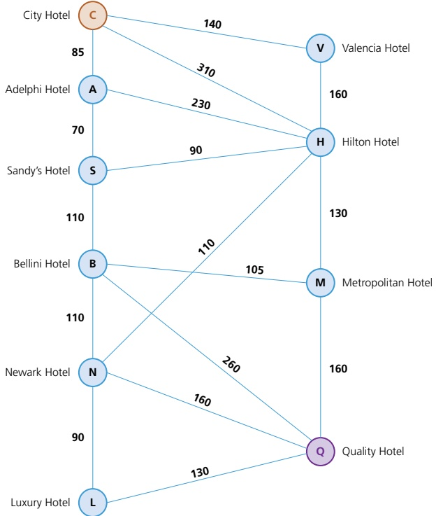

i) Using Dijkstra's algorithm, show the shortest time to walk from the City Hotel (C) to the Quality Hotel (Q).

ii) Give the route corresponding to your answer in part b)i).

5 The following graph is made up of a  $ (9 \times 8) $ matrix.

Use the A* algorithm to show the shortest route from A to B.

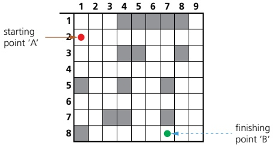

<!-- page 465 -->

6 Tom is using a GPS device to navigate from point B to point E.

Tom's GPS uses the A $ ^{*} $ algorithm to find the shortest route:

 $$  B\to C \to M \to J \to K \to E $$ 

This route is shown in orange on the diagram.

However, due to some major flooding, routes M to J and M to F have been closed, making the original path no longer possible.

Describe how the GPS system will use the A★ algorithm to find an alternative route from B to E.

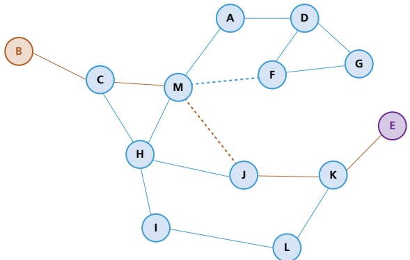

7 The following graph shows the routes connecting buildings on a university campus. The numbers represent the time taken (in minutes) to cycle from one building to another.

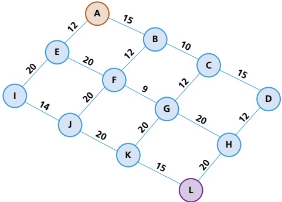

a) i) Use Dijkstra's algorithm to find the minimum time to cycle from building A to building L.

ii) Write down the corresponding shortest route.

b) It has been decided to construct a new cycle path, either from A directly to D (cycle time 30 minutes) or from A directly to I (cycle time 20 minutes).

Identify the option that would reduce the cycle time from building A to building L by the greatest amount. [4]

