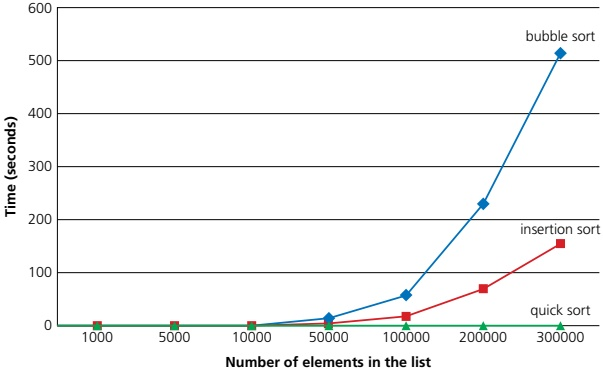
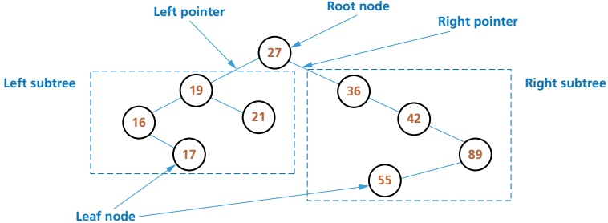
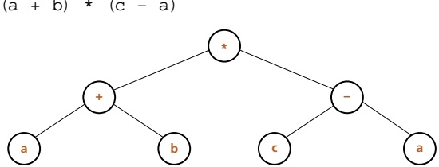
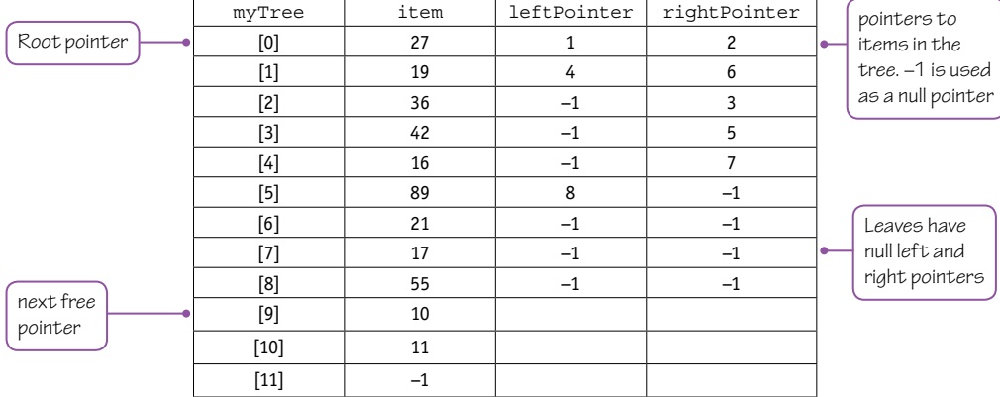
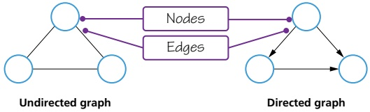
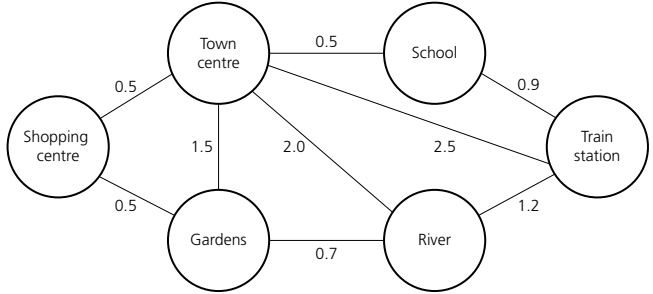
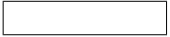
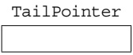

# 19 Computational thinking and problem solving

<!-- Cambridge International AS and a Level Computer Science (David Watson, Helen Williams).pdf p466-513 -->

<!-- page 466 -->

## 19 

# Computational thinking and problem solving

In this chapter, you will learn about

 $ ^{*} $ the conditions necessary for the use of a binary search

how the performance of a binary search varies according to the number of data items

how to write algorithms to implement insertion and bubble sorts

 $ ^{*} $ the use of abstract data types (ADTs) including finding, inserting and deleting items from linked lists, binary trees, stacks and queues

 $ ^{*} $ the key features of a graph and why graphs are used

 $ ^{*} $ how to implement ADTs from other ADTs

 $ ^{*} $ the comparison of algorithms including the use of Big O notation

★ how recursion is expressed in a programming language

when to use recursion

writing recursive algorithms

how a compiler implements recursion in a programming language.

### 19.1 Algorithms

## WHAT YOU SHOULD ALREADY KNOW

In Chapter 10 you learnt about Abstract Data Types (ADTs) and searching and sorting arrays. You should also have been writing programs in your chosen programming language (Python, VB or Java). Try the following five questions to refresh your memory before you start to read this chapter.

1 Explain what is meant by the terms

a) stack
b) queue
c) linked list.

b) Describe how it is possible to implement a queue using an array.

2 a) Describe how it is possible to implement a stack using an array.

c) Describe how it is possible to implement a linked list using an array.

3 Write pseudocode to search an array of twenty numbers using a linear search.

4 Write pseudocode to sort an array that contains twenty numbers using a bubble sort.

5 Make sure that you can write, compile and run a short program in your chosen programming language. The programs below show the code you need to write the same program in each of three languages.

// Java program for Hello World
public class Hello {
    public static void main(String[] args) {
        System.out.println("Hello World");
    }
}

# Python program for Hello World
print ("Hello World")

'VB program for Hello World
Module Module1
Sub Main()
    Console.WriteLine("Hello World")
    Console.ReadKey()
End Sub
End Module

<!-- page 467 -->

## Key terms

Binary search – a method of searching an ordered list by testing the value of the middle item in the list and rejecting the half of the list that does not contain the required value.
Insertion sort – a method of sorting data in an array into alphabetical or numerical order by placing each item in turn in the correct position in the sorted list.
Binary tree – a hierarchical data structure in which each parent node can have a maximum of two child nodes.
Graph – a non-linear data structure consisting of nodes and edges.
Dictionary – an abstract data type that consists of pairs, a key and a value, in which the key is used to find the value.
Big O notation – a mathematical notation used to describe the performance or complexity of an algorithm.

#### 19.1.1 Understanding linear and binary searching methods

Linear search

In Chapter 10, we looked at the linear search method of searching a list. In this method, each element of an array is checked in order, from the lower bound to the upper bound, until the item is found, or the upper bound is reached.

The pseudocode linear search algorithm and identifier table to find if an item is in the populated 1D array myList from Chapter 10 is repeated here.

DECLARE myList : ARRAY[0:9] OF INTEGER
DECLARE upperBound : INTEGER
DECLARE lowerBound : INTEGER
DECLARE index : INTEGER
DECLARE item : INTEGER
DECLARE found : BOOLER
upperBound ← 9
lowerBound ← 0
OUTPUT "Please enter item to be found"
INPUT item
found ← FALSE
index ← lowerBound
REPEAT
IF item = myList[index]
    THEN
        found ← TRUE
        ENDIF
        index ← index + 1
UNTIL (found = TRUE) OR (index > upperBound)

<!-- page 468 -->

IF found
THEN
OUTPUT "Item found"
ELSE
OUTPUT "Item not found"
ENDIF

<table border=1 style='margin: auto; word-wrap: break-word;'><tr><td style='text-align: center; word-wrap: break-word;'>Identifier</td><td style='text-align: center; word-wrap: break-word;'>Description</td></tr><tr><td style='text-align: center; word-wrap: break-word;'>myList</td><td style='text-align: center; word-wrap: break-word;'>Array to be searched</td></tr><tr><td style='text-align: center; word-wrap: break-word;'>upperBound</td><td style='text-align: center; word-wrap: break-word;'>Upper bound of the array</td></tr><tr><td style='text-align: center; word-wrap: break-word;'>lowerBound</td><td style='text-align: center; word-wrap: break-word;'>Lower bound of the array</td></tr><tr><td style='text-align: center; word-wrap: break-word;'>index</td><td style='text-align: center; word-wrap: break-word;'>Pointer to current array element</td></tr><tr><td style='text-align: center; word-wrap: break-word;'>item</td><td style='text-align: center; word-wrap: break-word;'>Item to be found</td></tr><tr><td style='text-align: center; word-wrap: break-word;'>found</td><td style='text-align: center; word-wrap: break-word;'>Flag to show when item has been found</td></tr></table>

### Table 19.1

This method works for a list in which the items can be stored in any order, but as the size of the list increases, the average time taken to retrieve an item increases correspondingly.

The Cambridge International AS & A Level Computer Science syllabus requires you to be able to write code in one of the following programming languages: Python, VB and Java. It is very important to practice writing different routines in the programming language of your choice; the more routines you write, the easier it is to write programming code that works.

Here is a simple linear search program written in Python, VB and Java using a FOR loop.

## Python

#Python program for Linear Search
#create array to store all the numbers
myList = [4, 2, 8, 17, 9, 3, 7, 12, 34, 21]
#enter item to search for
item = int(input("Please enter item to be found "))
found = False
for index in range(len(myList)):
    if(myList[index] == item):
        found = True
if(found):
    print("Item found")
else:
    print("Item not found")

<!-- page 469 -->

VB

'VB program for Linear Search
Module Module1

Public Sub Main()

Dim index As Integer

Dim item As Integer

Dim found As Boolean

'Create array to store all the numbers

Dim myList() As Integer = New Integer() {4, 2, 8, 17, 9, 3, 7, 12, 34, 21}

'enter item to search for

Console.Write("Please enter item to be found")

item = Integer.Parse(Console.ReadLine())

For index = 0 To myList.Length - 1

    If (item = myList(index)) Then

        found = True

        End If

Next

If (found) Then

        Console.WriteLine("Item found")

Else : Console.WriteLine("Item not found")

End If

Console.ReadKey()

End Sub

End Module

## Java

//Java program Linear Search
import java.util.Scanner;
public class LinearSearch
{
    public static void main(String args[])
    {
        Scanner myObj = new Scanner(System.in);
        //Create array to store the all the numbers
        int myList[] = new int[] {4, 2, 8, 17, 9, 3, 7, 12, 34, 21};
        int item, index;
        boolean found = false;
        // enter item to search for
        System.out.println("Please enter item to be found");
        item = myObj.nextInt();
        for (index = 0; index < myList.length - 1; index++)
        {

<!-- page 470 -->

{
    if (myList[index] == item)
    {
        found = true;
    }
}

if (found)
{
    System.out.println("Item found");
}

else
{
    System.out.println("Item not found");
}
}

## ACTIVITY 19A

Write the linear search in the programming language you are using, then change the code to use a similar type of loop that you used in the pseudocode at the beginning of Section 19.1.1, Linear search.

## Binary search

A binary search is more efficient if a list is already sorted. The value of the middle item in the list is first tested to see if it matches the required item, and the half of the list that does not contain the required item is discarded. Then, the next item of the list to be tested is the middle item of the half of the list that was kept. This is repeated until the required item is found or there is nothing left to test.

For example, consider a list of the letters of the alphabet.

A B C D E F G H I J K L M N O P Q R S T U V W X Y Z

To find the letter W using a linear search there would be 23 comparisons.

<table border=1 style='margin: auto; word-wrap: break-word;'><tr><td style='text-align: center; word-wrap: break-word;'>A</td><td style='text-align: center; word-wrap: break-word;'>B</td><td style='text-align: center; word-wrap: break-word;'>C</td><td style='text-align: center; word-wrap: break-word;'>D</td><td style='text-align: center; word-wrap: break-word;'>E</td><td style='text-align: center; word-wrap: break-word;'>F</td><td style='text-align: center; word-wrap: break-word;'>G</td><td style='text-align: center; word-wrap: break-word;'>H</td><td style='text-align: center; word-wrap: break-word;'>I</td><td style='text-align: center; word-wrap: break-word;'>J</td><td style='text-align: center; word-wrap: break-word;'>K</td><td style='text-align: center; word-wrap: break-word;'>L</td><td style='text-align: center; word-wrap: break-word;'>M</td><td style='text-align: center; word-wrap: break-word;'>N</td><td style='text-align: center; word-wrap: break-word;'>O</td><td style='text-align: center; word-wrap: break-word;'>P</td><td style='text-align: center; word-wrap: break-word;'>Q</td><td style='text-align: center; word-wrap: break-word;'>R</td><td style='text-align: center; word-wrap: break-word;'>S</td><td style='text-align: center; word-wrap: break-word;'>T</td><td style='text-align: center; word-wrap: break-word;'>U</td><td style='text-align: center; word-wrap: break-word;'>V</td><td style='text-align: center; word-wrap: break-word;'>W</td><td style='text-align: center; word-wrap: break-word;'>X</td><td style='text-align: center; word-wrap: break-word;'>Y</td><td style='text-align: center; word-wrap: break-word;'>Z</td></tr><tr><td style='text-align: center; word-wrap: break-word;'>=</td><td style='text-align: center; word-wrap: break-word;'>=</td><td style='text-align: center; word-wrap: break-word;'>=</td><td style='text-align: center; word-wrap: break-word;'>=</td><td style='text-align: center; word-wrap: break-word;'>=</td><td style='text-align: center; word-wrap: break-word;'>=</td><td style='text-align: center; word-wrap: break-word;'>=</td><td style='text-align: center; word-wrap: break-word;'>=</td><td style='text-align: center; word-wrap: break-word;'>=</td><td style='text-align: center; word-wrap: break-word;'>=</td><td style='text-align: center; word-wrap: break-word;'>=</td><td style='text-align: center; word-wrap: break-word;'>=</td><td style='text-align: center; word-wrap: break-word;'>=</td><td style='text-align: center; word-wrap: break-word;'>=</td><td style='text-align: center; word-wrap: break-word;'>=</td><td style='text-align: center; word-wrap: break-word;'>=</td><td style='text-align: center; word-wrap: break-word;'>=</td><td style='text-align: center; word-wrap: break-word;'>=</td><td style='text-align: center; word-wrap: break-word;'>=</td><td style='text-align: center; word-wrap: break-word;'>=</td><td style='text-align: center; word-wrap: break-word;'>=</td><td style='text-align: center; word-wrap: break-word;'>=</td><td style='text-align: center; word-wrap: break-word;'>=</td><td style='text-align: center; word-wrap: break-word;'>=</td><td style='text-align: center; word-wrap: break-word;'>=</td><td style='text-align: center; word-wrap: break-word;'>=</td></tr><tr><td style='text-align: center; word-wrap: break-word;'>W</td><td style='text-align: center; word-wrap: break-word;'>W</td><td style='text-align: center; word-wrap: break-word;'>W</td><td style='text-align: center; word-wrap: break-word;'>W</td><td style='text-align: center; word-wrap: break-word;'>W</td><td style='text-align: center; word-wrap: break-word;'>W</td><td style='text-align: center; word-wrap: break-word;'>W</td><td style='text-align: center; word-wrap: break-word;'>W</td><td style='text-align: center; word-wrap: break-word;'>W</td><td style='text-align: center; word-wrap: break-word;'>W</td><td style='text-align: center; word-wrap: break-word;'>W</td><td style='text-align: center; word-wrap: break-word;'>W</td><td style='text-align: center; word-wrap: break-word;'>W</td><td style='text-align: center; word-wrap: break-word;'>W</td><td style='text-align: center; word-wrap: break-word;'>W</td><td style='text-align: center; word-wrap: break-word;'>W</td><td style='text-align: center; word-wrap: break-word;'>W</td><td style='text-align: center; word-wrap: break-word;'>W</td><td style='text-align: center; word-wrap: break-word;'>W</td><td style='text-align: center; word-wrap: break-word;'>W</td><td style='text-align: center; word-wrap: break-word;'>W</td><td style='text-align: center; word-wrap: break-word;'>W</td><td style='text-align: center; word-wrap: break-word;'>W</td><td style='text-align: center; word-wrap: break-word;'>W</td><td style='text-align: center; word-wrap: break-word;'>W</td><td style='text-align: center; word-wrap: break-word;'>W</td></tr><tr><td style='text-align: center; word-wrap: break-word;'>1</td><td style='text-align: center; word-wrap: break-word;'>2</td><td style='text-align: center; word-wrap: break-word;'>3</td><td style='text-align: center; word-wrap: break-word;'>4</td><td style='text-align: center; word-wrap: break-word;'>5</td><td style='text-align: center; word-wrap: break-word;'>6</td><td style='text-align: center; word-wrap: break-word;'>7</td><td style='text-align: center; word-wrap: break-word;'>8</td><td style='text-align: center; word-wrap: break-word;'>9</td><td style='text-align: center; word-wrap: break-word;'>10</td><td style='text-align: center; word-wrap: break-word;'>11</td><td style='text-align: center; word-wrap: break-word;'>12</td><td style='text-align: center; word-wrap: break-word;'>13</td><td style='text-align: center; word-wrap: break-word;'>14</td><td style='text-align: center; word-wrap: break-word;'>15</td><td style='text-align: center; word-wrap: break-word;'>16</td><td style='text-align: center; word-wrap: break-word;'>17</td><td style='text-align: center; word-wrap: break-word;'>18</td><td style='text-align: center; word-wrap: break-word;'>19</td><td style='text-align: center; word-wrap: break-word;'>20</td><td style='text-align: center; word-wrap: break-word;'>21</td><td style='text-align: center; word-wrap: break-word;'>22</td><td style='text-align: center; word-wrap: break-word;'>23</td><td style='text-align: center; word-wrap: break-word;'></td><td style='text-align: center; word-wrap: break-word;'></td><td style='text-align: center; word-wrap: break-word;'></td></tr></table>

Figure 19.1 Linear search showing all the comparisons

<!-- page 471 -->

To find the letter W using a binary search there could be just three comparisons.

<table border=1 style='margin: auto; word-wrap: break-word;'><tr><td style='text-align: center; word-wrap: break-word;'>A</td><td style='text-align: center; word-wrap: break-word;'>B</td><td style='text-align: center; word-wrap: break-word;'>C</td><td style='text-align: center; word-wrap: break-word;'>D</td><td style='text-align: center; word-wrap: break-word;'>E</td><td style='text-align: center; word-wrap: break-word;'>F</td><td style='text-align: center; word-wrap: break-word;'>G</td><td style='text-align: center; word-wrap: break-word;'>H</td><td style='text-align: center; word-wrap: break-word;'>I</td><td style='text-align: center; word-wrap: break-word;'>J</td><td style='text-align: center; word-wrap: break-word;'>K</td><td style='text-align: center; word-wrap: break-word;'>L</td><td style='text-align: center; word-wrap: break-word;'>M</td><td style='text-align: center; word-wrap: break-word;'>N</td><td style='text-align: center; word-wrap: break-word;'>O</td><td style='text-align: center; word-wrap: break-word;'>P</td><td style='text-align: center; word-wrap: break-word;'>Q</td><td style='text-align: center; word-wrap: break-word;'>R</td><td style='text-align: center; word-wrap: break-word;'>S</td><td style='text-align: center; word-wrap: break-word;'>T</td><td style='text-align: center; word-wrap: break-word;'>U</td><td style='text-align: center; word-wrap: break-word;'>V</td><td style='text-align: center; word-wrap: break-word;'>W</td><td style='text-align: center; word-wrap: break-word;'>X</td><td style='text-align: center; word-wrap: break-word;'>Y</td><td style='text-align: center; word-wrap: break-word;'>Z</td></tr><tr><td style='text-align: center; word-wrap: break-word;'></td><td style='text-align: center; word-wrap: break-word;'></td><td style='text-align: center; word-wrap: break-word;'></td><td style='text-align: center; word-wrap: break-word;'></td><td style='text-align: center; word-wrap: break-word;'></td><td style='text-align: center; word-wrap: break-word;'></td><td style='text-align: center; word-wrap: break-word;'></td><td style='text-align: center; word-wrap: break-word;'></td><td style='text-align: center; word-wrap: break-word;'></td><td style='text-align: center; word-wrap: break-word;'></td><td style='text-align: center; word-wrap: break-word;'></td><td style='text-align: center; word-wrap: break-word;'></td><td style='text-align: center; word-wrap: break-word;'></td><td style='text-align: center; word-wrap: break-word;'></td><td style='text-align: center; word-wrap: break-word;'></td><td style='text-align: center; word-wrap: break-word;'></td><td style='text-align: center; word-wrap: break-word;'></td><td style='text-align: center; word-wrap: break-word;'></td><td style='text-align: center; word-wrap: break-word;'></td><td style='text-align: center; word-wrap: break-word;'></td><td style='text-align: center; word-wrap: break-word;'></td><td style='text-align: center; word-wrap: break-word;'></td><td style='text-align: center; word-wrap: break-word;'></td><td style='text-align: center; word-wrap: break-word;'></td><td style='text-align: center; word-wrap: break-word;'></td><td style='text-align: center; word-wrap: break-word;'></td></tr><tr><td style='text-align: center; word-wrap: break-word;'></td><td style='text-align: center; word-wrap: break-word;'></td><td style='text-align: center; word-wrap: break-word;'></td><td style='text-align: center; word-wrap: break-word;'></td><td style='text-align: center; word-wrap: break-word;'></td><td style='text-align: center; word-wrap: break-word;'></td><td style='text-align: center; word-wrap: break-word;'></td><td style='text-align: center; word-wrap: break-word;'></td><td style='text-align: center; word-wrap: break-word;'></td><td style='text-align: center; word-wrap: break-word;'></td><td style='text-align: center; word-wrap: break-word;'></td><td style='text-align: center; word-wrap: break-word;'></td><td style='text-align: center; word-wrap: break-word;'></td><td style='text-align: center; word-wrap: break-word;'></td><td style='text-align: center; word-wrap: break-word;'></td><td style='text-align: center; word-wrap: break-word;'></td><td style='text-align: center; word-wrap: break-word;'></td><td style='text-align: center; word-wrap: break-word;'></td><td style='text-align: center; word-wrap: break-word;'></td><td style='text-align: center; word-wrap: break-word;'>=</td><td style='text-align: center; word-wrap: break-word;'></td><td style='text-align: center; word-wrap: break-word;'></td><td style='text-align: center; word-wrap: break-word;'>=</td><td style='text-align: center; word-wrap: break-word;'></td><td style='text-align: center; word-wrap: break-word;'></td><td style='text-align: center; word-wrap: break-word;'></td></tr><tr><td style='text-align: center; word-wrap: break-word;'></td><td style='text-align: center; word-wrap: break-word;'></td><td style='text-align: center; word-wrap: break-word;'></td><td style='text-align: center; word-wrap: break-word;'></td><td style='text-align: center; word-wrap: break-word;'></td><td style='text-align: center; word-wrap: break-word;'></td><td style='text-align: center; word-wrap: break-word;'></td><td style='text-align: center; word-wrap: break-word;'></td><td style='text-align: center; word-wrap: break-word;'></td><td style='text-align: center; word-wrap: break-word;'></td><td style='text-align: center; word-wrap: break-word;'></td><td style='text-align: center; word-wrap: break-word;'></td><td style='text-align: center; word-wrap: break-word;'></td><td style='text-align: center; word-wrap: break-word;'></td><td style='text-align: center; word-wrap: break-word;'></td><td style='text-align: center; word-wrap: break-word;'></td><td style='text-align: center; word-wrap: break-word;'></td><td style='text-align: center; word-wrap: break-word;'></td><td style='text-align: center; word-wrap: break-word;'></td><td style='text-align: center; word-wrap: break-word;'>W</td><td style='text-align: center; word-wrap: break-word;'></td><td style='text-align: center; word-wrap: break-word;'></td><td style='text-align: center; word-wrap: break-word;'>W</td><td style='text-align: center; word-wrap: break-word;'></td><td style='text-align: center; word-wrap: break-word;'></td><td style='text-align: center; word-wrap: break-word;'></td></tr><tr><td style='text-align: center; word-wrap: break-word;'></td><td style='text-align: center; word-wrap: break-word;'></td><td style='text-align: center; word-wrap: break-word;'></td><td style='text-align: center; word-wrap: break-word;'></td><td style='text-align: center; word-wrap: break-word;'></td><td style='text-align: center; word-wrap: break-word;'></td><td style='text-align: center; word-wrap: break-word;'></td><td style='text-align: center; word-wrap: break-word;'></td><td style='text-align: center; word-wrap: break-word;'></td><td style='text-align: center; word-wrap: break-word;'></td><td style='text-align: center; word-wrap: break-word;'></td><td style='text-align: center; word-wrap: break-word;'></td><td style='text-align: center; word-wrap: break-word;'></td><td style='text-align: center; word-wrap: break-word;'></td><td style='text-align: center; word-wrap: break-word;'></td><td style='text-align: center; word-wrap: break-word;'></td><td style='text-align: center; word-wrap: break-word;'></td><td style='text-align: center; word-wrap: break-word;'></td><td style='text-align: center; word-wrap: break-word;'></td><td style='text-align: center; word-wrap: break-word;'>2</td><td style='text-align: center; word-wrap: break-word;'></td><td style='text-align: center; word-wrap: break-word;'></td><td style='text-align: center; word-wrap: break-word;'>3</td><td style='text-align: center; word-wrap: break-word;'></td><td style='text-align: center; word-wrap: break-word;'></td><td style='text-align: center; word-wrap: break-word;'></td></tr></table>

Figure 19.2 Binary search showing all the comparisons

## ACTIVITY 19B

Check how many comparisons for each type of search it takes to find the letter D. Find any letters where the linear search would take less comparisons than the binary search.

A binary search usually takes far fewer comparisons than a linear search to find an item in a list. For example, if a list had 1024 elements, the maximum number of comparisons for a binary search would be 16, whereas a linear search could take up to 1024 comparisons.

Here is the pseudocode for the binary search algorithm to find if an item is in the populated 1D array myList. The identifier table is the same as the one used for the linear search.

DECLARE myList : ARRAY[0:9] OF INTEGER
DECLARE upperBound : INTEGER
DECLARE lowerBound : INTEGER
DECLARE index : INTEGER
DECLARE item : INTEGER
DECLARE found : BOOLER
upperBound ← 9
lowerBound ← 0
OUTPUT "Please enter item to be found"
INPUT item
found ← FALSE
REPEAT
index ← INT ((upperBound + lowerBound) / 2)
IF item = myList[index]
    THEN
        found ← TRUE
    ENDIF
IF item > myList[index]
    THEN

<!-- page 472 -->

lowerBound ← index + 1
ENDIF
IF item < myList[index]
    THEN
    upperBound ← index - 1
ENDIF
UNTIL (found = TRUE) OR (lowerBound = upperBound)
IF found
THEN
OUTPUT "Item found"
ELSE
OUTPUT "Item not found"
ENDIF

<table border=1 style='margin: auto; word-wrap: break-word;'><tr><td style='text-align: center; word-wrap: break-word;'>Identifier</td><td style='text-align: center; word-wrap: break-word;'>Description</td></tr><tr><td style='text-align: center; word-wrap: break-word;'>myList</td><td style='text-align: center; word-wrap: break-word;'>Array to be searched</td></tr><tr><td style='text-align: center; word-wrap: break-word;'>upperBound</td><td style='text-align: center; word-wrap: break-word;'>Upper bound of the array</td></tr><tr><td style='text-align: center; word-wrap: break-word;'>lowerBound</td><td style='text-align: center; word-wrap: break-word;'>Lower bound of the array</td></tr><tr><td style='text-align: center; word-wrap: break-word;'>index</td><td style='text-align: center; word-wrap: break-word;'>Pointer to current array element</td></tr><tr><td style='text-align: center; word-wrap: break-word;'>item</td><td style='text-align: center; word-wrap: break-word;'>Item to be found</td></tr><tr><td style='text-align: center; word-wrap: break-word;'>found</td><td style='text-align: center; word-wrap: break-word;'>Flag to show when item has been found</td></tr></table>

Table 19.2

The code structure for a binary search is very similar to the linear search program shown for each of the programming languages. You will need to populate myList before searching for an item, as well as the variables found, lowerBound and upperBound.

You will need to use a conditional loop like those shown in the table below.

<table border=1 style='margin: auto; word-wrap: break-word;'><tr><td style='text-align: center; word-wrap: break-word;'>Loop</td><td style='text-align: center; word-wrap: break-word;'>Language</td></tr><tr><td style='text-align: center; word-wrap: break-word;'>while (not found) and (lowerBound != lowerBound):</td><td style='text-align: center; word-wrap: break-word;'>Python uses a condition to repeat the loop at the start of the loop</td></tr><tr><td style='text-align: center; word-wrap: break-word;'>Do:\n:\nLoop Until (found) Or (lowerBound = upperBound)</td><td style='text-align: center; word-wrap: break-word;'>VB uses a condition to stop the loop at the end of the loop</td></tr><tr><td style='text-align: center; word-wrap: break-word;'>Do {\n:\n} while ((!found) &amp;&amp; (upperBound != lowerBound));</td><td style='text-align: center; word-wrap: break-word;'>Java uses a condition to repeat the loop at the end of the loop</td></tr></table>

Table 19.3

<!-- page 473 -->

You will need to use If statements like those shown in the table below to test if the item is found, or to decide which part of myList to use next, and to update the upperBound or lowerBound accordingly.

If
index = (upperBound + lowerBound)//2)
if(myList[index] == item):
    found = True
if item > myList[index]:
    lowerBound = index + 1
if item < myList[index]:
    upperBound = index - 1
index = (upperBound + lowerBound)\2
If (item = myList[index]) Then
    found = True
End If
If item > myList(index) Then
    lowerBound = index + 1
End if
If item < myList(index) Then
    upperBound = index - 1
End if
index = (upperBound + lowerBound) / 2;
if (myList[index] == item)
{
    found = true;
}
if (item > myList[index])
{
    lowerBound = index + 1;
}
if (item < myList[index])
{
    upperBound = index - 1;
}

### Table 19.4

## ACTIVITY 19C

In your chosen programming language, write a short program to complete the binary search.

<!-- page 474 -->

#### 19.1.2 Understanding insertion and bubble sorting methods

## Bubble sort

In Chapter 10, we looked at the bubble sort method of sorting a list. This is a method of sorting data in an array into alphabetical or numerical order by comparing adjacent items and swapping them if they are in the wrong order.

The bubble sort algorithm and identifier table to sort the populated 1D array myList from Chapter 10 is repeated here.

DECLARE myList : ARRAY[0:8] OF INTEGER
DECLARE upperBound : INTEGER
DECLARE lowerBound : INTEGER
DECLARE index : INTEGER
DECLARE swap : BOOLEAN
DECLARE temp : INTEGER
DECLARE top : INTEGER
upperBound ← 8
lowerBound ← 0
top ← upperBound
REPEAT
FOR index = lowerBound TO top - 1
Swap ← FALSE
IF myList[index] > myList[index + 1]
    THEN
        temp ← myList[index]
        myList[index] ← myList[index + 1]
        myList[index + 1] ← temp
        swap ← TRUE
ENDIF
NEXT
top ← top -1
UNTIL (NOT swap) OR (top = 0)

<table border=1 style='margin: auto; word-wrap: break-word;'><tr><td style='text-align: center; word-wrap: break-word;'>Identifier</td><td style='text-align: center; word-wrap: break-word;'>Description</td></tr><tr><td style='text-align: center; word-wrap: break-word;'>myList</td><td style='text-align: center; word-wrap: break-word;'>Array to be searched</td></tr><tr><td style='text-align: center; word-wrap: break-word;'>upperBound</td><td style='text-align: center; word-wrap: break-word;'>Upper bound of the array</td></tr><tr><td style='text-align: center; word-wrap: break-word;'>lowerBound</td><td style='text-align: center; word-wrap: break-word;'>Lower bound of the array</td></tr><tr><td style='text-align: center; word-wrap: break-word;'>index</td><td style='text-align: center; word-wrap: break-word;'>Pointer to current array element</td></tr><tr><td style='text-align: center; word-wrap: break-word;'>swap</td><td style='text-align: center; word-wrap: break-word;'>Flag to show when swaps have been made</td></tr><tr><td style='text-align: center; word-wrap: break-word;'>top</td><td style='text-align: center; word-wrap: break-word;'>Index of last element to compare</td></tr><tr><td style='text-align: center; word-wrap: break-word;'>temp</td><td style='text-align: center; word-wrap: break-word;'>Temporary storage location during swap</td></tr></table>

Table 19.5

<!-- page 475 -->

Here is a simple bubble sort program written in Python, VB and Java, using a pre-condition loop and a FOR loop in Python and post-condition loops and FOR loops in VB and Java.

## Python

#Python program for Bubble Sort
myList = [70,46,43,27,57,41,45,21,14]
top = len(myList)
swap = True

Pre-condition loop
while (swap) or (top > 0):
    swap = False
    for index in range(top - 1):
        if myList[index] > myList[index + 1]:
            temp = myList[index]
            myList[index] = myList[index + 1]
            myList[index + 1] = temp
            swap = True
            top = top - 1
            #output the sorted array
            print(myList)

VB

'VB program for bubble sort
Module Module1

Sub Main()

Dim myList() As Integer = New Integer() {70, 46, 43, 27, 57, 41, 45, 21, 14}

Dim index, top, temp As Integer

Dim swap As Boolean

top = myList.Length - 1

Do

swap = False

For index = 0 To top - 1 Step 1

If myList(index) > myList(index + 1) Then

temp = myList(index)

myList(index) = myList(index + 1)

myList(index + 1) = temp

swap = True

End If

<!-- page 476 -->

Next
top = top - 1
Loop Until (Not swap) Or (top = 0) Post-condition loop
'output the sorted array
For index = 0 To myList.Length - 1
Console.Write(myList(index) & " ")
Next
Console.ReadKey() 'wait for keypress
End Sub
end Module

## Java

// Java program for Bubble Sort
class BubbleSort
{
    public static void main(String args[])
    {
        int myList[] = {70, 46, 43, 27, 57, 41, 45, 21, 14};
        int index, top, temp;
        boolean swap;
        top = myList.length;
        do {
            swap = false;
            for (index = 0; index < top - 1; index++)
            {
                if (myList[index] > myList[index + 1])
                {
                    temp = myList[index];
                    myList[index] = myList[index + 1];
                    myList[index + 1] = temp;
                    swap = true;
                }
            }
        top = top - 1;
    }
    while ((swap) || (top > 0));
    // output the sorted array
    for (index = 0; index < myList.length; index++)
        System.out.print(myList[index] + "");
        System.out.println();
    }
}

<!-- page 477 -->

## Insertion sort

The bubble sort works well for short lists and partially sorted lists. An insertion sort will also work well for these types of list. An insertion sort sorts data in a list into alphabetical or numerical order by placing each item in turn in the correct position in a sorted list. An insertion sort works well for incremental sorting, where elements are added to a list one at a time over an extended period while keeping the list sorted.

Here is the pseudocode and the identifier table for the insertion sort algorithm sorting the populated 1D array myList.

DECLARE myList : ARRAY[0:8] OF INTEGER
DECLARE upperBound : INTEGER
DECLARE lowerBound : INTEGER
DECLARE index : INTEGER
DECLARE key : BOOLEAN
DECLARE place : INTEGER
upperBound ← 8
lowerBound ← 0
FOR index ← lowerBound + 1 TO upperBound
    key ← myList[index]
    place ← index - 1
    IF myList[place] > key
        THEN
            WHILE place >= lowerBound AND myList[place] > key
                temp ← myList[place + 1]
                myList[place + 1] ← myList[place]
                myList[place] ← temp
                place ← place - 1
                ENDWHILE
    myList[place + 1] ← key
ENDIF
NEXT index

<table border=1 style='margin: auto; word-wrap: break-word;'><tr><td style='text-align: center; word-wrap: break-word;'>Identifier</td><td style='text-align: center; word-wrap: break-word;'>Description</td></tr><tr><td style='text-align: center; word-wrap: break-word;'>myList</td><td style='text-align: center; word-wrap: break-word;'>Array to be searched</td></tr><tr><td style='text-align: center; word-wrap: break-word;'>upperBound</td><td style='text-align: center; word-wrap: break-word;'>Upper bound of the array</td></tr><tr><td style='text-align: center; word-wrap: break-word;'>lowerBound</td><td style='text-align: center; word-wrap: break-word;'>Lower bound of the array</td></tr><tr><td style='text-align: center; word-wrap: break-word;'>index</td><td style='text-align: center; word-wrap: break-word;'>Pointer to current array element</td></tr><tr><td style='text-align: center; word-wrap: break-word;'>key</td><td style='text-align: center; word-wrap: break-word;'>Element being placed</td></tr><tr><td style='text-align: center; word-wrap: break-word;'>place</td><td style='text-align: center; word-wrap: break-word;'>Position in array of element being moved</td></tr></table>

<!-- page 478 -->

Figure 19.3 shows the changes to the 1D array myList as the insertion sort is completed.

<table border=1 style='margin: auto; word-wrap: break-word;'><tr><td rowspan="2">myList</td><td colspan="12">Index of element being checked</td></tr><tr><td colspan="2">1</td><td style='text-align: center; word-wrap: break-word;'>2</td><td style='text-align: center; word-wrap: break-word;'>3</td><td colspan="2">4</td><td style='text-align: center; word-wrap: break-word;'>5</td><td colspan="2">6</td><td colspan="2">7</td><td style='text-align: center; word-wrap: break-word;'>8</td></tr><tr><td style='text-align: center; word-wrap: break-word;'>[0]</td><td style='text-align: center; word-wrap: break-word;'>27</td><td style='text-align: center; word-wrap: break-word;'>19</td><td style='text-align: center; word-wrap: break-word;'>19</td><td style='text-align: center; word-wrap: break-word;'>19</td><td style='text-align: center; word-wrap: break-word;'>19</td><td style='text-align: center; word-wrap: break-word;'>16</td><td style='text-align: center; word-wrap: break-word;'>16</td><td style='text-align: center; word-wrap: break-word;'>16</td><td style='text-align: center; word-wrap: break-word;'>16</td><td style='text-align: center; word-wrap: break-word;'>16</td><td style='text-align: center; word-wrap: break-word;'>16</td><td style='text-align: center; word-wrap: break-word;'>16</td></tr><tr><td style='text-align: center; word-wrap: break-word;'>[1]</td><td style='text-align: center; word-wrap: break-word;'>19</td><td style='text-align: center; word-wrap: break-word;'>27</td><td style='text-align: center; word-wrap: break-word;'>27</td><td style='text-align: center; word-wrap: break-word;'>27</td><td style='text-align: center; word-wrap: break-word;'>27</td><td style='text-align: center; word-wrap: break-word;'>19</td><td style='text-align: center; word-wrap: break-word;'>19</td><td style='text-align: center; word-wrap: break-word;'>19</td><td style='text-align: center; word-wrap: break-word;'>19</td><td style='text-align: center; word-wrap: break-word;'>16</td><td style='text-align: center; word-wrap: break-word;'>16</td><td style='text-align: center; word-wrap: break-word;'>16</td></tr><tr><td style='text-align: center; word-wrap: break-word;'>[2]</td><td style='text-align: center; word-wrap: break-word;'>36</td><td style='text-align: center; word-wrap: break-word;'>36</td><td style='text-align: center; word-wrap: break-word;'>36</td><td style='text-align: center; word-wrap: break-word;'>36</td><td style='text-align: center; word-wrap: break-word;'>36</td><td style='text-align: center; word-wrap: break-word;'>27</td><td style='text-align: center; word-wrap: break-word;'>27</td><td style='text-align: center; word-wrap: break-word;'>27</td><td style='text-align: center; word-wrap: break-word;'>21</td><td style='text-align: center; word-wrap: break-word;'>21</td><td style='text-align: center; word-wrap: break-word;'>19</td><td style='text-align: center; word-wrap: break-word;'>19</td></tr><tr><td style='text-align: center; word-wrap: break-word;'>[3]</td><td style='text-align: center; word-wrap: break-word;'>42</td><td style='text-align: center; word-wrap: break-word;'>42</td><td style='text-align: center; word-wrap: break-word;'>42</td><td style='text-align: center; word-wrap: break-word;'>42</td><td style='text-align: center; word-wrap: break-word;'>42</td><td style='text-align: center; word-wrap: break-word;'>36</td><td style='text-align: center; word-wrap: break-word;'>36</td><td style='text-align: center; word-wrap: break-word;'>36</td><td style='text-align: center; word-wrap: break-word;'>27</td><td style='text-align: center; word-wrap: break-word;'>27</td><td style='text-align: center; word-wrap: break-word;'>21</td><td style='text-align: center; word-wrap: break-word;'>21</td></tr><tr><td style='text-align: center; word-wrap: break-word;'>[4]</td><td style='text-align: center; word-wrap: break-word;'>16</td><td style='text-align: center; word-wrap: break-word;'>16</td><td style='text-align: center; word-wrap: break-word;'>16</td><td style='text-align: center; word-wrap: break-word;'>16</td><td style='text-align: center; word-wrap: break-word;'>16</td><td style='text-align: center; word-wrap: break-word;'>42</td><td style='text-align: center; word-wrap: break-word;'>42</td><td style='text-align: center; word-wrap: break-word;'>42</td><td style='text-align: center; word-wrap: break-word;'>36</td><td style='text-align: center; word-wrap: break-word;'>36</td><td style='text-align: center; word-wrap: break-word;'>27</td><td style='text-align: center; word-wrap: break-word;'>27</td></tr><tr><td style='text-align: center; word-wrap: break-word;'>[5]</td><td style='text-align: center; word-wrap: break-word;'>89</td><td style='text-align: center; word-wrap: break-word;'>89</td><td style='text-align: center; word-wrap: break-word;'>89</td><td style='text-align: center; word-wrap: break-word;'>89</td><td style='text-align: center; word-wrap: break-word;'>89</td><td style='text-align: center; word-wrap: break-word;'>89</td><td style='text-align: center; word-wrap: break-word;'>89</td><td style='text-align: center; word-wrap: break-word;'>89</td><td style='text-align: center; word-wrap: break-word;'>42</td><td style='text-align: center; word-wrap: break-word;'>42</td><td style='text-align: center; word-wrap: break-word;'>36</td><td style='text-align: center; word-wrap: break-word;'>36</td></tr><tr><td style='text-align: center; word-wrap: break-word;'>[6]</td><td style='text-align: center; word-wrap: break-word;'>21</td><td style='text-align: center; word-wrap: break-word;'>21</td><td style='text-align: center; word-wrap: break-word;'>21</td><td style='text-align: center; word-wrap: break-word;'>21</td><td style='text-align: center; word-wrap: break-word;'>21</td><td style='text-align: center; word-wrap: break-word;'>21</td><td style='text-align: center; word-wrap: break-word;'>21</td><td style='text-align: center; word-wrap: break-word;'>21</td><td style='text-align: center; word-wrap: break-word;'>89</td><td style='text-align: center; word-wrap: break-word;'>89</td><td style='text-align: center; word-wrap: break-word;'>42</td><td style='text-align: center; word-wrap: break-word;'>42</td></tr><tr><td style='text-align: center; word-wrap: break-word;'>[7]</td><td style='text-align: center; word-wrap: break-word;'>16</td><td style='text-align: center; word-wrap: break-word;'>16</td><td style='text-align: center; word-wrap: break-word;'>16</td><td style='text-align: center; word-wrap: break-word;'>16</td><td style='text-align: center; word-wrap: break-word;'>16</td><td style='text-align: center; word-wrap: break-word;'>16</td><td style='text-align: center; word-wrap: break-word;'>16</td><td style='text-align: center; word-wrap: break-word;'>16</td><td style='text-align: center; word-wrap: break-word;'>16</td><td style='text-align: center; word-wrap: break-word;'>16</td><td style='text-align: center; word-wrap: break-word;'>89</td><td style='text-align: center; word-wrap: break-word;'>89</td></tr><tr><td style='text-align: center; word-wrap: break-word;'>[8]</td><td style='text-align: center; word-wrap: break-word;'>55</td><td style='text-align: center; word-wrap: break-word;'>55</td><td style='text-align: center; word-wrap: break-word;'>55</td><td style='text-align: center; word-wrap: break-word;'>55</td><td style='text-align: center; word-wrap: break-word;'>55</td><td style='text-align: center; word-wrap: break-word;'>55</td><td style='text-align: center; word-wrap: break-word;'>55</td><td style='text-align: center; word-wrap: break-word;'>55</td><td style='text-align: center; word-wrap: break-word;'>55</td><td style='text-align: center; word-wrap: break-word;'>55</td><td style='text-align: center; word-wrap: break-word;'>55</td><td style='text-align: center; word-wrap: break-word;'>55</td></tr></table>

### Figure 19.3

The element shaded blue is being checked and placed in the correct position. The elements shaded yellow are the other elements that also need to be moved if the element being checked is out of position. When sorting the same array, myList, the insert sort made 21 swaps and the bubble sort shown in Chapter 10 made 38 swaps. The insertion sort performs better on partially sorted lists because, when each element is found to be in the wrong order in the list, it is moved to approximately the right place in the list. The bubble sort will only swap the element in the wrong order with its neighbour.

As the number of elements in a list increases, the time taken to sort the list increases. It has been shown that, as the number of elements increases, the performance of the bubble sort deteriorates faster than the insertion sort.

Figure 19.4 Time performance of sorting algorithms

<!-- page 479 -->

The code structure for an insertion sort in each of the programming languages is very similar to the bubble sort program. You will need to assign values to lowerBound and upperBound and use a nested loop like those shown in the table below.

Nested loop
Language

for index in range(lowerBound + 1, upperBound):
    key = myList[index]
    place = index - 1
    if myList[place] > key:
        while place >= lowerBound and myList[place] > key:
            temp = myList[place + 1]
            myList[place + 1] = myList[place]
            myList[place] = temp
            place = place - 1
            myList[place + 1] = key

For index = lowerBound + 1 To upperBound
    myKey = myList(index)
    place = index - 1
    If myList(place) > myKey Then
        While (place >= lowerBound) And (myList(place) > myKey)
            temp = myList(place + 1)
            myList(place + 1) = myList(place)
            myList(place) = temp
            place = place - 1
        End While
    myList(place + 1) = myKey
End If
Next

for (index = lowerBound + 1; index < upperBound; index++)
{
    key = myList[index];
    place = index - 1;
    if (myList[place] > key)
        do
        {
            temp = myList[place + 1];
            myList[place + 1] = myList[place];
            myList[place] = temp;
            place = place - 1
        }
        while ((place >= lowerBound) || (myList[place + 1] > key));
        myList[place + 1] = key;
    }
}

<!-- page 480 -->

## EXTENSION ACTIVITY 19A

There are many other more efficient sorting algorithms. In small groups, investigate different sorting algorithms, finding out how the method works and the efficiency of that method. Share your results.

## ACTIVITY 19D

In your chosen programming language write a short program to complete the insertion sort.

#### 19.1.3 Understanding and using abstract data types (ADTs)

Abstract data types (ADTs) were introduced in Chapter 10. Remember that an ADT is a collection of data and a set of operations on that data. There are several operations that are essential when using an ADT

finding an item already stored

adding a new item

deleting an item.

We started considering the ADTs stacks, queues and linked lists in Chapter 10. If you have not already done so, read Section 10.4 to ensure that you are ready to work with these data structures. Ensure that you can write algorithms to set up then add and remove items from stacks and queues.

## Stacks

In Chapter 10, we looked at the data and the operations for a stack using pseudocode. You will need to be able to write a program to implement a stack. The data structures and operations required to implement a similar stack using a fixed length integer array and separate sub routines for the push and pop operations are set out below in each of the three prescribed programming languages. If you are unsure how the operations work, look back at Chapter 10.

<table border=1 style='margin: auto; word-wrap: break-word;'><tr><td style='text-align: center; word-wrap: break-word;'>Stack data structure</td><td style='text-align: center; word-wrap: break-word;'>Language</td></tr><tr><td style='text-align: center; word-wrap: break-word;'>stack = [None for index in range(0,10)]\nbasePointer = 0\ntopPointer = -1\nstackFull = 10\nitem = None</td><td style='text-align: center; word-wrap: break-word;'>Python\nempty stack with\nno elements</td></tr><tr><td style='text-align: center; word-wrap: break-word;'>Public Dim stack() As Integer = {Nothing, Nothing, Nothing, Nothing, Nothing, Nothing, Nothing, Nothing, Nothing, Nothing, Nothing, Nothing, Nothing, Nothing, Nothing, Nothing, Nothing, Nothing, Nothing, Nothing, Nothing, Nothing, Nothing, Nothing, Nothing, Nothing, Nothing, Nothing, Nothing, Nothing, Nothing, Nothing, Nothing, Nothing, Nothing, Nothing, Nothing, Nothing, Nothing, Nothing, Nothing, Nothing, Nothing, Nothing, Nothing, Nothing, Nothing, Nothing, Nothing, Nothing, Nothing, Nothing, Nothing, Nothing, Nothing, Nothing, Nothing, Nothing, Nothing, Nothing, Nothing, Nothing, Nothing, Nothing, Nothing, Nothing, Nothing, Nothing, Nothing, Nothing, Nothing, Nothing, Nothing, Nothing, Nothing, Nothing, Nothing, Nothing, Nothing, Nothing, Nothing, Nothing, Nothing, Nothing, Nothing, Nothing, Nothing, Nothing, Nothing, Nothing, Nothing, Nothing, Nothing, Nothing, Nothing, Nothing, Nothing, Nothing, Nothing, Nothing, Nothing, Nothing, Nothing, Nothing, Nothing, Nothing, Nothing, Nothing, Nothing, Nothing, Nothing, Nothing, Nothing, Nothing, Nothing, Nothing, Nothing, Nothing, Nothing, Nothing, Nothing, Nothing, Nothing, Nothing, Nothing, Nothing, Nothing, Nothing, Nothing, Nothing, Nothing, Nothing, Nothing, Nothing, Nothing, Nothing, Nothing, Nothing, Nothing, Nothing, Nothing, Nothing, Nothing, Nothing, Nothing, Nothing, Nothing, Nothing, Nothing, Nothing, Nothing, Nothing, Nothing, Nothing, Nothing, Nothing, Nothing, Nothing, Nothing, Nothing, Nothing, Nothing, Nothing, Nothing, Nothing, Nothing, Nothing, Nothing, Nothing, Nothing, Nothing, Nothing, Nothing, Nothing, Nothing, Nothing, Nothing, Nothing, Nothing, Nothing, Nothing, Nothing, Nothing, Nothing, Nothing, Nothing, Nothing, Nothing, Nothing, Nothing, Nothing, Nothing, Nothing, Nothing, Nothing, Nothing, Nothing, Nothing, Nothing, Nothing, Nothing, Nothing, Nothing, Nothing, Nothing, Nothing, Nothing, Nothing, Nothing, Nothing, Nothing, Nothing, Nothing, Nothing, Nothing, Nothing, Nothing, Nothing, Nothing, Nothing, Nothing, Nothing, Nothing, Nothing, Nothing, Nothing, Nothing, Nothing, Nothing, Nothing, Nothing, Nothing, Nothing, Nothing, Nothing, Nothing, Nothing, Nothing, Nothing, Nothing, Nothing, Nothing, Nothing, Nothing, Nothing, Nothing, Nothing, Nothing, Nothing, Nothing, Nothing, Nothing, Nothing, Nothing, Nothing, Nothing, Nothing, Nothing, Nothing, Nothing, Nothing, Nothing, Nothing, Nothing, Nothing, Nothing, Nothing, Nothing, Nothing, Nothing, Nothing, Nothing, Nothing, Nothing, Nothing, Nothing, Nothing, Nothing, Nothing, Nothing, Nothing, Nothing, Nothing, Nothing, Nothing, Nothing, Nothing, Nothing, Nothing, Nothing, Nothing, Nothing, Nothing, Nothing, Nothing, Nothing, Nothing, Nothing, Nothing, Nothing, Nothing, Nothing, Nothing, Nothing, Nothing, Nothing, Nothing, Nothing, Nothing, Nothing, Nothing, Nothing, Nothing, Nothing, Nothing, Nothing, Nothing, Nothing, Nothing, Nothing, Nothing, Nothing, Nothing, Nothing, Nothing, Nothing, Nothing, Nothing, Nothing, Nothing, Nothing, Nothing, Nothing, Nothing, Nothing, Nothing, Nothing, Nothing, Nothing, Nothing, Nothing, Nothing, Nothing, Nothing, Nothing, Nothing, Nothing, Nothing, Nothing, Nothing, Nothing, Nothing, Nothing, Nothing, Nothing, Nothing, Nothing, Nothing, Nothing, Nothing, Nothing, Nothing, Nothing, Nothing, Nothing, Nothing, Nothing, Nothing, Nothing, Nothing, Nothing, Nothing, Nothing, Nothing, Nothing, Nothing, Nothing, Nothing, Nothing, Nothing, Nothing, Nothing, Nothing, Nothing, Nothing, Nothing, Nothing, Nothing, Nothing, Nothing, Nothing, Nothing, Nothing, Nothing, Nothing, Nothing, Nothing, Nothing, Nothing, Nothing, Nothing, Nothing, Nothing, Nothing, Nothing, Nothing, Nothing, Nothing, Nothing, Nothing, Nothing, Nothing, Nothing, Nothing, Nothing, Nothing, Nothing, Nothing, Nothing, Nothing, Nothing, Nothing, Nothing, Nothing, Nothing, Nothing, Nothing, Nothing, Nothing, Nothing, Nothing, Nothing, Nothing, Nothing, Nothing, Nothing, Nothing, Nothing, Nothing, Nothing, Nothing, Nothing, Nothing, Nothing, Nothing, Nothing, Nothing, Nothing, Nothing, Nothing, Nothing, Nothing, Nothing, Nothing, Nothing, Nothing, Nothing, Nothing, Nothing, Nothing, Nothing, Nothing, Nothing, Nothing, Nothing, Nothing, Nothing, Nothing, Nothing, Nothing, Nothing, Nothing, Nothing, Nothing, Nothing, Nothing, Nothing, Nothing, Nothing, Nothing, Nothing, Nothing, Nothing, Nothing, Nothing, Nothing, Nothing, Nothing, Nothing, Nothing, Nothing, Nothing, Nothing, Nothing, Nothing, Nothing, Nothing, Nothing, Nothing, Nothing, Nothing, Nothing, Nothing, Nothing, Nothing, Nothing, Nothing, Nothing, Nothing, Nothing, Nothing, Nothing, Nothing, Nothing, Nothing, Nothing, Nothing, Nothing, Nothing, Nothing, Nothing, Nothing, Nothing, Nothing, Nothing, Nothing, Nothing, Nothing, Nothing, Nothing, Nothing, Nothing, Nothing, Nothing, Nothing, Nothing, Nothing, Nothing, Nothing, Nothing, Nothing, Nothing, Nothing, Nothing, Nothing, Nothing, Nothing, Nothing, Nothing, Nothing, Nothing, Nothing, Nothing, Nothing, Nothing, Nothing, Nothing, Nothing, Nothing, Nothing, Nothing, Nothing, Nothing, Nothing, Nothing, Nothing, Nothing, Nothing, Nothing, Nothing, Nothing, Nothing, Nothing, Nothing, Nothing, Nothing, Nothing, Nothing, Nothing, Nothing, Nothing, Nothing, Nothing, Nothing, Nothing, Nothing, Nothing, Nothing, Nothing, Nothing, Nothing, Nothing, Nothing, Nothing, Nothing, Nothing, Nothing, Nothing, Nothing, Nothing, Nothing, Nothing, Nothing, Nothing, Nothing, Nothing, Nothing, Nothing, Nothing, Nothing, Nothing, Nothing, Nothing, Nothing, Nothing, Nothing, Nothing, Nothing, Nothing, Nothing, Nothing, Nothing, Nothing, Nothing, Nothing, Nothing, Nothing, Nothing, Nothing, Nothing, Nothing, Nothing, Nothing, Nothing, Nothing, Nothing, Nothing, Nothing, Nothing, Nothing, Nothing, Nothing, Nothing, Nothing, Nothing, Nothing, Nothing, Nothing, Nothing, Nothing, Nothing, Nothing, Nothing, Nothing, Nothing, Nothing, Nothing, Nothing, Nothing, Nothing, Nothing, Nothing, Nothing, Nothing, Nothing, Nothing, Nothing, Nothing, Nothing, Nothing, Nothing, Nothing, Nothing, Nothing, Nothing, Nothing, Nothing, Nothing, Nothing, Nothing, Nothing, Nothing, Nothing, Nothing, Nothing, Nothing, Nothing, Nothing, Nothing, Nothing, Nothing, Nothing, Nothing, Nothing, Nothing, Nothing, Nothing, Nothing, Nothing, Nothing, Nothing, Nothing, Nothing, Nothing, Nothing, Nothing, Nothing, Nothing, Nothing, Nothing, Nothing, Nothing, Nothing, Nothing, Nothing, Nothing, Nothing, Nothing, Nothing, Nothing, Nothing, Nothing, Nothing, Nothing, Nothing, Nothing, Nothing, Nothing, Nothing, Nothing, Nothing, Nothing, Nothing, Nothing, Nothing, Nothing, Nothing, Nothing, Nothing, Nothing, Nothing, Nothing, Nothing, Nothing, Nothing, Nothing, Nothing, Nothing, Nothing, Nothing, Nothing, Nothing, Nothing, Nothing, Nothing, Nothing, Nothing, Nothing, Nothing, Nothing, Nothing, Nothing, Nothing, Nothing, Nothing, Nothing, Nothing, Nothing, Nothing, Nothing, Nothing, Nothing, Nothing, Nothing, Nothing, Nothing, Nothing, Nothing, Nothing, Nothing, Nothing, Nothing, Nothing, Nothing, Nothing, Nothing, Nothing, Nothing, Nothing, Nothing, Nothing, Nothing, Nothing, Nothing, Nothing, Nothing, Nothing, Nothing, Nothing, Nothing, Nothing, Nothing, Nothing, Nothing, Nothing, Nothing, Nothing, Nothing, Nothing, Nothing, Nothing, Nothing, Nothing, Nothing, Nothing, Nothing, Nothing, Nothing, Nothing, Nothing, Nothing, Nothing, Nothing, Nothing, Nothing, Nothing, Nothing, Nothing, Nothing, Nothing, Nothing, Nothing, Nothing, Nothing, Nothing, Nothing, Nothing, Nothing, Nothing, Nothing, Nothing, Nothing, Nothing, Nothing, Nothing, Nothing, Nothing, Nothing, Nothing, Nothing, Nothing, Nothing, Nothing, Nothing, Nothing, Nothing, Nothing, Nothing, Nothing, Nothing, Nothing, Nothing, Nothing, Nothing, Nothing, Nothing, Nothing, Nothing, Nothing, Nothing, Nothing, Nothing, Nothing, Nothing, Nothing, Nothing, Nothing, Nothing, Nothing, Nothing, Nothing, Nothing, Nothing, Nothing, Nothing, Nothing, Nothing, Nothing, Nothing, Nothing, Nothing, Nothing, Nothing, Nothing, Nothing, Nothing, Nothing, Nothing, Nothing, Nothing, Nothing, Nothing, Nothing, Nothing, Nothing, Nothing, Nothing, Nothing, Nothing, Nothing, Nothing, Nothing, Nothing, Nothing, Nothing, Nothing, Nothing, Nothing, Nothing, Nothing, Nothing, Nothing, Nothing, Nothing, Nothing, Nothing, Nothing, Nothing, Nothing, Nothing, Nothing, Nothing, Nothing, Nothing, Nothing, Nothing, Nothing, Nothing, Nothing, Nothing, Nothing, Nothing, Nothing, Nothing, Nothing, Nothing, Nothing, Nothing, Nothing, Nothing, Nothing, Nothing, Nothing, Nothing, Nothing, Nothing, Nothing, Nothing, Nothing, Nothing, Nothing, Nothing, Nothing, Nothing, Nothing, Nothing, Nothing, Nothing, Nothing, Nothing, Nothing, Nothing, Nothing, Nothing, Nothing, Nothing, Nothing, Nothing, Nothing, Nothing, Nothing, Nothing, Nothing, Nothing, Nothing, Nothing, Nothing, Nothing, Nothing, Nothing, Nothing, Nothing, Nothing, Nothing, Nothing, Nothing, Nothing, Nothing, Nothing, Nothing, Nothing, Nothing, Nothing, Nothing, Nothing, Nothing, Nothing, Nothing, Nothing, Nothing, Nothing, Nothing, Nothing, Nothing, Nothing, Nothing, Nothing, Nothing, Nothing, Nothing, Nothing, Nothing, Nothing, Nothing, Nothing, Nothing, Nothing, Nothing, Nothing, Nothing, Nothing, Nothing, Nothing, Nothing, Nothing, Nothing, Nothing, Nothing, Nothing, Nothing, Nothing, Nothing, Nothing, Nothing, Nothing, Nothing, Nothing, Nothing, Nothing, Nothing, Nothing, Nothing, Nothing, Nothing, Nothing, Nothing, Nothing, Nothing, Nothing, Nothing, Nothing, Nothing, Nothing, Nothing, Nothing, Nothing, Nothing, Nothing, Nothing, Nothing, Nothing, Nothing, Nothing, Nothing, Nothing, Nothing, Nothing, Nothing, Nothing, Nothing, Nothing, Nothing, Nothing, Nothing, Nothing, Nothing, Nothing, Nothing, Nothing, Nothing, Nothing, Nothing, Nothing, Nothing, Nothing, Nothing, Nothing, Nothing, Nothing, Nothing, Nothing, Nothing, Nothing, Nothing, Nothing, Nothing, Nothing, Nothing, Nothing, Nothing, Nothing, Nothing, Nothing, Nothing, Nothing, Nothing, Nothing, Nothing, Nothing, Nothing, Nothing, Nothing, Nothing, Nothing, Nothing, Nothing, Nothing, Nothing, Nothing, Nothing, Nothing, Nothing, Nothing, Nothing, Nothing, Nothing, Nothing, Nothing, Nothing, Nothing, Nothing, Nothing, Nothing, Nothing, Nothing, Nothing, Nothing, Nothing, Nothing, Nothing, Nothing, Nothing, Nothing, Nothing, Nothing, Nothing, Nothing, Nothing, Nothing, Nothing, Nothing, Nothing, Nothing, Nothing, Nothing, Nothing, Nothing, Nothing, Nothing, Nothing, Nothing, Nothing, Nothing, Nothing, Nothing, Nothing, Nothing, Nothing, Nothing, Nothing, Nothing, Nothing, Nothing, Nothing, Nothing, Nothing, Nothing, Nothing, Nothing, Nothing, Nothing, Nothing, Nothing, Nothing, Nothing, Nothing, Nothing, Nothing, Nothing, Nothing, Nothing, Nothing, Nothing, Nothing, Nothing, Nothing, Nothing, Nothing, Nothing, Nothing, Nothing, Nothing, Nothing, Nothing, Nothing, Nothing, Nothing, Nothing, Nothing, Nothing, Nothing, Nothing, Nothing, Nothing, Nothing, Nothing, Nothing, Nothing, Nothing, Nothing, Nothing, Nothing, Nothing, Nothing, Nothing, Nothing, Nothing, Nothing, Nothing, Nothing, Nothing, Nothing, Nothing, Nothing, Nothing, Nothing, Nothing, Nothing, Nothing, Nothing, Nothing, Nothing, Nothing, Nothing, Nothing, Nothing, Nothing, Nothing, Nothing, Nothing, Nothing, Nothing, Nothing, Nothing, Nothing, Nothing, Nothing, Nothing, Nothing, Nothing, Nothing, Nothing, Nothing, Nothing, Nothing, Nothing, Nothing, Nothing, Nothing, Nothing, Nothing, Nothing, Nothing, Nothing, Nothing, Nothing, Nothing, Nothing, Nothing, Nothing, Nothing, Nothing, Nothing, Nothing, Nothing, Nothing, Nothing, Nothing, Nothing, Nothing, Nothing, Nothing, Nothing, Nothing, Nothing, Nothing, Nothing, Nothing, Nothing, Nothing, Nothing, Nothing, Nothing, Nothing, Nothing, Nothing, Nothing, Nothing, Nothing, Nothing, Nothing, Nothing, Nothing, Nothing, Nothing, Nothing, Nothing, Nothing, Nothing, Nothing, Nothing, Nothing, Nothing, Nothing, Nothing, Nothing, Nothing, Nothing, Nothing, Nothing, Nothing, Nothing, Nothing, Nothing, Nothing, Nothing, Nothing, Nothing, Nothing, Nothing, Nothing, Nothing, Nothing, Nothing, Nothing, Nothing, Nothing, Nothing, Nothing, Nothing, Nothing, Nothing, Nothing, Nothing, Nothing, Nothing, Nothing, Nothing, Nothing, Nothing, Nothing, Nothing, Nothing, Nothing, Nothing, Nothing, Nothing, Nothing, Nothing, Nothing, Nothing, Nothing, Nothing, Nothing, Nothing, Nothing, Nothing, Nothing, Nothing, Nothing, Nothing, Nothing, Nothing, Nothing, Nothing, Nothing, Nothing, Nothing, Nothing, Nothing, Nothing, Nothing, Nothing, Nothing, Nothing, Nothing, Nothing, Nothing, Nothing, Nothing, Nothing, Nothing, Nothing, Nothing, Nothing, Nothing, Nothing, Nothing, Nothing, Nothing, Nothing, Nothing, Nothing, Nothing, Nothing, Nothing, Nothing, Nothing, Nothing, Nothing, Nothing, Nothing, Nothing, Nothing, Nothing, Nothing, Nothing, Nothing, Nothing, Nothing, Nothing, Nothing, Nothing, Nothing, Nothing, Nothing, Nothing, Nothing, Nothing, Nothing, Nothing, Nothing, Nothing, Nothing, Nothing, Nothing, Nothing, Nothing, Nothing, Nothing, Nothing, Nothing, Nothing, Nothing, Nothing, Nothing, Nothing, Nothing, Nothing, Nothing, Nothing, Nothing, Nothing, Nothing, Nothing, Nothing, Nothing, Nothing, Nothing, Nothing, Nothing, Nothing, Nothing, Nothing, Nothing, Nothing, Nothing, Nothing, Nothing, Nothing, Nothing, Nothing, Nothing, Nothing, Nothing, Nothing, Nothing, Nothing, Nothing, Nothing, Nothing, Nothing, Nothing, Nothing, Nothing, Nothing, Nothing, Nothing, Nothing, Nothing, Nothing, Nothing, Nothing, Nothing, Nothing, Nothing, Nothing, Nothing, Nothing, Nothing, Nothing, Nothing, Nothing, Nothing, Nothing, Nothing, Nothing, Nothing, Nothing, Nothing, Nothing, Nothing, Nothing, Nothing, Nothing, Nothing, Nothing, Nothing, Nothing, Nothing, Nothing, Nothing, Nothing, Nothing, Nothing, Nothing, Nothing, Nothing, Nothing, Nothing, Nothing, Nothing, Nothing, Nothing, Nothing, Nothing, Nothing, Nothing, Nothing, Nothing, Nothing, Nothing, Nothing, Nothing, Nothing, Nothing, Nothing, Nothing, Nothing, Nothing, Nothing, Nothing, Nothing, Nothing, Nothing, Nothing, Nothing, Nothing, Nothing, Nothing, Nothing, Nothing, Nothing, Nothing, Nothing, Nothing</td><td style='text-align: center; word-wrap: break-word;'>VB\nempty stack with\nno elements\nand variables\nset to public for\nsubroutine access</td></tr></table>

<!-- page 481 -->

Stack pop operation
def pop():
    global topPointer, basePointer, item
        if topPointer == basePointer -1:
            print("Stack is empty, cannot pop")
        else:
            item = stack[topPointer]
            topPointer = topPointer -1

Sub pop()
    If topPointer = basePointer -1 Then
        Console.WriteLine("Stack is empty, cannot pop")
    Else
        item = stack(topPointer)
        topPointer = topPointer -1
    End If
End Sub

static void pop()
{
    if (topPointer == basePointer -1)
        System.out.println("Stack is empty, cannot pop");
    else
    {
        item = stack[topPointer -1];
        topPointer = topPointer -1;
    }
}

### Table 19.9

Stack push operation
def push(item):
    global topPointer
        if topPointer < stackFull - 1:
            topPointer = topPointer + 1
            stack[topPointer] = item
        else:
            print("Stack is full, cannot push")

Sub push(ByVal item)
    If topPointer < stackFull - 1 Then
        topPointer = topPointer + 1
        stack(topPointer) = item
    Else
        Console.WriteLine("Stack is full, cannot push")
    End if
End Sub

Language

<!-- page 482 -->

Table 19.10

static void push(int item)
{
    if (topPointer < stackFull - 1)
    {
        topPointer = topPointer + 1;
        stack[topPointer] = item;
    }
    else
        System.out.println("Stack is full, cannot push");
}

## ACTIVITY 19E

In your chosen programming language, write a program using subroutines to implement a stack with 10 elements. Test your program by pushing two integers 7 and 32 onto the stack, popping these integers off the stack, then trying to remove a third integer, and by pushing the integers 1, 2, 3, 4, 5, 6, 7, 8, 9 and 10 onto the stack, then trying to push 11 on to the stack.

## Queues

In Chapter 10, we looked at the data and the operations for a circular queue using pseudocode. You will need to be able to write a program to implement a queue. The data structures and operations required to implement a similar queue using a fixed length integer array and separate sub routines for the enqueue and dequeue operations are set out below in each of the three programming languages. If you are unsure how the operations work, look back at Chapter 10.

<table border=1 style='margin: auto; word-wrap: break-word;'><tr><td style='text-align: center; word-wrap: break-word;'>Queue data structure</td><td style='text-align: center; word-wrap: break-word;'>Language</td></tr><tr><td style='text-align: center; word-wrap: break-word;'>queue = [None for index in range(0,10)]
frontPointer = 0
rearPointer = -1
queueFull = 10
queueLength = 0</td><td style='text-align: center; word-wrap: break-word;'>Python
empty queue with
no items</td></tr><tr><td style='text-align: center; word-wrap: break-word;'>Public Dim queue() As Integer = {Nothing, Nothing, Nothing, Nothing, Nothing, Nothing, Nothing, Nothing, Nothing, Nothing, Nothing, Nothing, Nothing, Nothing, Nothing, Nothing, Nothing, Nothing, Nothing, Nothing, Nothing, Nothing, Nothing, Nothing, Nothing, Nothing, Nothing, Nothing, Nothing, Nothing, Nothing, Nothing, Nothing, Nothing, Nothing, Nothing, Nothing, Nothing, Nothing, Nothing, Nothing, Nothing, Nothing, Nothing, Nothing, Nothing, Nothing, Nothing, Nothing, Nothing, Nothing, Nothing, Nothing, Nothing, Nothing, Nothing, Nothing, Nothing, Nothing, Nothing, Nothing, Nothing, Nothing, Nothing, Nothing, Nothing, Nothing, Nothing, Nothing, Nothing, Nothing, Nothing, Nothing, Nothing, Nothing, Nothing, Nothing, Nothing, Nothing, Nothing, Nothing, Nothing, Nothing, Nothing, Nothing, Nothing, Nothing, Nothing, Nothing, Nothing, Nothing, Nothing, Nothing, Nothing, Nothing, Nothing, Nothing, Nothing, Nothing, Nothing, Nothing, Nothing, Nothing, Nothing, Nothing, Nothing, Nothing, Nothing, Nothing, Nothing, Nothing, Nothing, Nothing, Nothing, Nothing, Nothing, Nothing, Nothing, Nothing, Nothing, Nothing, Nothing, Nothing, Nothing, Nothing, Nothing, Nothing, Nothing, Nothing, Nothing, Nothing, Nothing, Nothing, Nothing, Nothing, Nothing, Nothing, Nothing, Nothing, Nothing, Nothing, Nothing, Nothing, Nothing, Nothing, Nothing, Nothing, Nothing, Nothing, Nothing, Nothing, Nothing, Nothing, Nothing, Nothing, Nothing, Nothing, Nothing, Nothing, Nothing, Nothing, Nothing, Nothing, Nothing, Nothing, Nothing, Nothing, Nothing, Nothing, Nothing, Nothing, Nothing, Nothing, Nothing, Nothing, Nothing, Nothing, Nothing, Nothing, Nothing, Nothing, Nothing, Nothing, Nothing, Nothing, Nothing, Nothing, Nothing, Nothing, Nothing, Nothing, Nothing, Nothing, Nothing, Nothing, Nothing, Nothing, Nothing, Nothing, Nothing, Nothing, Nothing, Nothing, Nothing, Nothing, Nothing, Nothing, Nothing, Nothing, Nothing, Nothing, Nothing, Nothing, Nothing, Nothing, Nothing, Nothing, Nothing, Nothing, Nothing, Nothing, Nothing, Nothing, Nothing, Nothing, Nothing, Nothing, Nothing, Nothing, Nothing, Nothing, Nothing, Nothing, Nothing, Nothing, Nothing, Nothing, Nothing, Nothing, Nothing, Nothing, Nothing, Nothing, Nothing, Nothing, Nothing, Nothing, Nothing, Nothing, Nothing, Nothing, Nothing, Nothing, Nothing, Nothing, Nothing, Nothing, Nothing, Nothing, Nothing, Nothing, Nothing, Nothing, Nothing, Nothing, Nothing, Nothing, Nothing, Nothing, Nothing, Nothing, Nothing, Nothing, Nothing, Nothing, Nothing, Nothing, Nothing, Nothing, Nothing, Nothing, Nothing, Nothing, Nothing, Nothing, Nothing, Nothing, Nothing, Nothing, Nothing, Nothing, Nothing, Nothing, Nothing, Nothing, Nothing, Nothing, Nothing, Nothing, Nothing, Nothing, Nothing, Nothing, Nothing, Nothing, Nothing, Nothing, Nothing, Nothing, Nothing, Nothing, Nothing, Nothing, Nothing, Nothing, Nothing, Nothing, Nothing, Nothing, Nothing, Nothing, Nothing, Nothing, Nothing, Nothing, Nothing, Nothing, Nothing, Nothing, Nothing, Nothing, Nothing, Nothing, Nothing, Nothing, Nothing, Nothing, Nothing, Nothing, Nothing, Nothing, Nothing, Nothing, Nothing, Nothing, Nothing, Nothing, Nothing, Nothing, Nothing, Nothing, Nothing, Nothing, Nothing, Nothing, Nothing, Nothing, Nothing, Nothing, Nothing, Nothing, Nothing, Nothing, Nothing, Nothing, Nothing, Nothing, Nothing, Nothing, Nothing, Nothing, Nothing, Nothing, Nothing, Nothing, Nothing, Nothing, Nothing, Nothing, Nothing, Nothing, Nothing, Nothing, Nothing, Nothing, Nothing, Nothing, Nothing, Nothing, Nothing, Nothing, Nothing, Nothing, Nothing, Nothing, Nothing, Nothing, Nothing, Nothing, Nothing, Nothing, Nothing, Nothing, Nothing, Nothing, Nothing, Nothing, Nothing, Nothing, Nothing, Nothing, Nothing, Nothing, Nothing, Nothing, Nothing, Nothing, Nothing, Nothing, Nothing, Nothing, Nothing, Nothing, Nothing, Nothing, Nothing, Nothing, Nothing, Nothing, Nothing, Nothing, Nothing, Nothing, Nothing, Nothing, Nothing, Nothing, Nothing, Nothing, Nothing, Nothing, Nothing, Nothing, Nothing, Nothing, Nothing, Nothing, Nothing, Nothing, Nothing, Nothing, Nothing, Nothing, Nothing, Nothing, Nothing, Nothing, Nothing, Nothing, Nothing, Nothing, Nothing, Nothing, Nothing, Nothing, Nothing, Nothing, Nothing, Nothing, Nothing, Nothing, Nothing, Nothing, Nothing, Nothing, Nothing, Nothing, Nothing, Nothing, Nothing, Nothing, Nothing, Nothing, Nothing, Nothing, Nothing, Nothing, Nothing, Nothing, Nothing, Nothing, Nothing, Nothing, Nothing, Nothing, Nothing, Nothing, Nothing, Nothing, Nothing, Nothing, Nothing, Nothing, Nothing, Nothing, Nothing, Nothing, Nothing, Nothing, Nothing, Nothing, Nothing, Nothing, Nothing, Nothing, Nothing, Nothing, Nothing, Nothing, Nothing, Nothing, Nothing, Nothing, Nothing, Nothing, Nothing, Nothing, Nothing, Nothing, Nothing, Nothing, Nothing, Nothing, Nothing, Nothing, Nothing, Nothing, Nothing, Nothing, Nothing, Nothing, Nothing, Nothing, Nothing, Nothing, Nothing, Nothing, Nothing, Nothing, Nothing, Nothing, Nothing, Nothing, Nothing, Nothing, Nothing, Nothing, Nothing, Nothing, Nothing, Nothing, Nothing, Nothing, Nothing, Nothing, Nothing, Nothing, Nothing, Nothing, Nothing, Nothing, Nothing, Nothing, Nothing, Nothing, Nothing, Nothing, Nothing, Nothing, Nothing, Nothing, Nothing, Nothing, Nothing, Nothing, Nothing, Nothing, Nothing, Nothing, Nothing, Nothing, Nothing, Nothing, Nothing, Nothing, Nothing, Nothing, Nothing, Nothing, Nothing, Nothing, Nothing, Nothing, Nothing, Nothing, Nothing, Nothing, Nothing, Nothing, Nothing, Nothing, Nothing, Nothing, Nothing, Nothing, Nothing, Nothing, Nothing, Nothing, Nothing, Nothing, Nothing, Nothing, Nothing, Nothing, Nothing, Nothing, Nothing, Nothing, Nothing, Nothing, Nothing, Nothing, Nothing, Nothing, Nothing, Nothing, Nothing, Nothing, Nothing, Nothing, Nothing, Nothing, Nothing, Nothing, Nothing, Nothing, Nothing, Nothing, Nothing, Nothing, Nothing, Nothing, Nothing, Nothing, Nothing, Nothing, Nothing, Nothing, Nothing, Nothing, Nothing, Nothing, Nothing, Nothing, Nothing, Nothing, Nothing, Nothing, Nothing, Nothing, Nothing, Nothing, Nothing, Nothing, Nothing, Nothing, Nothing, Nothing, Nothing, Nothing, Nothing, Nothing, Nothing, Nothing, Nothing, Nothing, Nothing, Nothing, Nothing, Nothing, Nothing, Nothing, Nothing, Nothing, Nothing, Nothing, Nothing, Nothing, Nothing, Nothing, Nothing, Nothing, Nothing, Nothing, Nothing, Nothing, Nothing, Nothing, Nothing, Nothing, Nothing, Nothing, Nothing, Nothing, Nothing, Nothing, Nothing, Nothing, Nothing, Nothing, Nothing, Nothing, Nothing, Nothing, Nothing, Nothing, Nothing, Nothing, Nothing, Nothing, Nothing, Nothing, Nothing, Nothing, Nothing, Nothing, Nothing, Nothing, Nothing, Nothing, Nothing, Nothing, Nothing, Nothing, Nothing, Nothing, Nothing, Nothing, Nothing, Nothing, Nothing, Nothing, Nothing, Nothing, Nothing, Nothing, Nothing, Nothing, Nothing, Nothing, Nothing, Nothing, Nothing, Nothing, Nothing, Nothing, Nothing, Nothing, Nothing, Nothing, Nothing, Nothing, Nothing, Nothing, Nothing, Nothing, Nothing, Nothing, Nothing, Nothing, Nothing, Nothing, Nothing, Nothing, Nothing, Nothing, Nothing, Nothing, Nothing, Nothing, Nothing, Nothing, Nothing, Nothing, Nothing, Nothing, Nothing, Nothing, Nothing, Nothing, Nothing, Nothing, Nothing, Nothing, Nothing, Nothing, Nothing, Nothing, Nothing, Nothing, Nothing, Nothing, Nothing, Nothing, Nothing, Nothing, Nothing, Nothing, Nothing, Nothing, Nothing, Nothing, Nothing, Nothing, Nothing, Nothing, Nothing, Nothing, Nothing, Nothing, Nothing, Nothing, Nothing, Nothing, Nothing, Nothing, Nothing, Nothing, Nothing, Nothing, Nothing, Nothing, Nothing, Nothing, Nothing, Nothing, Nothing, Nothing, Nothing, Nothing, Nothing, Nothing, Nothing, Nothing, Nothing, Nothing, Nothing, Nothing, Nothing, Nothing, Nothing, Nothing, Nothing, Nothing, Nothing, Nothing, Nothing, Nothing, Nothing, Nothing, Nothing, Nothing, Nothing, Nothing, Nothing, Nothing, Nothing, Nothing, Nothing, Nothing, Nothing, Nothing, Nothing, Nothing, Nothing, Nothing, Nothing, Nothing, Nothing, Nothing, Nothing, Nothing, Nothing, Nothing, Nothing, Nothing, Nothing, Nothing, Nothing, Nothing, Nothing, Nothing, Nothing, Nothing, Nothing, Nothing, Nothing, Nothing, Nothing, Nothing, Nothing, Nothing, Nothing, Nothing, Nothing, Nothing, Nothing, Nothing, Nothing, Nothing, Nothing, Nothing, Nothing, Nothing, Nothing, Nothing, Nothing, Nothing, Nothing, Nothing, Nothing, Nothing, Nothing, Nothing, Nothing, Nothing, Nothing, Nothing, Nothing, Nothing, Nothing, Nothing, Nothing, Nothing, Nothing, Nothing, Nothing, Nothing, Nothing, Nothing, Nothing, Nothing, Nothing, Nothing, Nothing, Nothing, Nothing, Nothing, Nothing, Nothing, Nothing, Nothing, Nothing, Nothing, Nothing, Nothing, Nothing, Nothing, Nothing, Nothing, Nothing, Nothing, Nothing, Nothing, Nothing, Nothing, Nothing, Nothing, Nothing, Nothing, Nothing, Nothing, Nothing, Nothing, Nothing, Nothing, Nothing, Nothing, Nothing, Nothing, Nothing, Nothing, Nothing, Nothing, Nothing, Nothing, Nothing, Nothing, Nothing, Nothing, Nothing, Nothing, Nothing, Nothing, Nothing, Nothing, Nothing, Nothing, Nothing, Nothing, Nothing, Nothing, Nothing, Nothing, Nothing, Nothing, Nothing, Nothing, Nothing, Nothing, Nothing, Nothing, Nothing, Nothing, Nothing, Nothing, Nothing, Nothing, Nothing, Nothing, Nothing, Nothing, Nothing, Nothing, Nothing, Nothing, Nothing, Nothing, Nothing, Nothing, Nothing, Nothing, Nothing, Nothing, Nothing, Nothing, Nothing, Nothing, Nothing, Nothing, Nothing, Nothing, Nothing, Nothing, Nothing, Nothing, Nothing, Nothing, Nothing, Nothing, Nothing, Nothing, Nothing, Nothing, Nothing, Nothing, Nothing, Nothing, Nothing, Nothing, Nothing, Nothing, Nothing, Nothing, Nothing, Nothing, Nothing, Nothing, Nothing, Nothing, Nothing, Nothing, Nothing, Nothing, Nothing, Nothing, Nothing, Nothing, Nothing, Nothing, Nothing, Nothing, Nothing, Nothing, Nothing, Nothing, Nothing, Nothing, Nothing, Nothing, Nothing, Nothing, Nothing, Nothing, Nothing, Nothing, Nothing, Nothing, Nothing, Nothing, Nothing, Nothing, Nothing, Nothing, Nothing, Nothing, Nothing, Nothing, Nothing, Nothing, Nothing, Nothing, Nothing, Nothing, Nothing, Nothing, Nothing, Nothing, Nothing, Nothing, Nothing, Nothing, Nothing, Nothing, Nothing, Nothing, Nothing, Nothing, Nothing, Nothing, Nothing, Nothing, Nothing, Nothing, Nothing, Nothing, Nothing, Nothing, Nothing, Nothing, Nothing, Nothing, Nothing, Nothing, Nothing, Nothing, Nothing, Nothing, Nothing, Nothing, Nothing, Nothing, Nothing, Nothing, Nothing, Nothing, Nothing, Nothing, Nothing, Nothing, Nothing, Nothing, Nothing, Nothing, Nothing, Nothing, Nothing, Nothing, Nothing, Nothing, Nothing, Nothing, Nothing, Nothing, Nothing, Nothing, Nothing, Nothing, Nothing, Nothing, Nothing, Nothing, Nothing, Nothing, Nothing, Nothing, Nothing, Nothing, Nothing, Nothing, Nothing, Nothing, Nothing, Nothing, Nothing, Nothing, Nothing, Nothing, Nothing, Nothing, Nothing, Nothing, Nothing, Nothing, Nothing, Nothing, Nothing, Nothing, Nothing, Nothing, Nothing, Nothing, Nothing, Nothing, Nothing, Nothing, Nothing, Nothing, Nothing, Nothing, Nothing, Nothing, Nothing, Nothing, Nothing, Nothing, Nothing, Nothing, Nothing, Nothing, Nothing, Nothing, Nothing, Nothing, Nothing, Nothing, Nothing, Nothing, Nothing, Nothing, Nothing, Nothing, Nothing, Nothing, Nothing, Nothing, Nothing, Nothing, Nothing, Nothing, Nothing, Nothing, Nothing, Nothing, Nothing, Nothing, Nothing, Nothing, Nothing, Nothing, Nothing, Nothing, Nothing, Nothing, Nothing, Nothing, Nothing, Nothing, Nothing, Nothing, Nothing, Nothing, Nothing, Nothing, Nothing, Nothing, Nothing, Nothing, Nothing, Nothing, Nothing, Nothing, Nothing, Nothing, Nothing, Nothing, Nothing, Nothing, Nothing, Nothing, Nothing, Nothing, Nothing, Nothing, Nothing, Nothing, Nothing, Nothing, Nothing, Nothing, Nothing, Nothing, Nothing, Nothing, Nothing, Nothing, Nothing, Nothing, Nothing, Nothing, Nothing, Nothing, Nothing, Nothing, Nothing, Nothing, Nothing, Nothing, Nothing, Nothing, Nothing, Nothing, Nothing, Nothing, Nothing, Nothing, Nothing, Nothing, Nothing, Nothing, Nothing, Nothing, Nothing, Nothing, Nothing, Nothing, Nothing, Nothing, Nothing, Nothing, Nothing, Nothing, Nothing, Nothing, Nothing, Nothing, Nothing, Nothing, Nothing, Nothing, Nothing, Nothing, Nothing, Nothing, Nothing, Nothing, Nothing, Nothing, Nothing, Nothing, Nothing, Nothing, Nothing, Nothing, Nothing, Nothing, Nothing, Nothing, Nothing, Nothing, Nothing, Nothing, Nothing, Nothing, Nothing, Nothing, Nothing, Nothing, Nothing, Nothing, Nothing, Nothing, Nothing, Nothing, Nothing, Nothing, Nothing, Nothing, Nothing, Nothing, Nothing, Nothing, Nothing, Nothing, Nothing, Nothing, Nothing, Nothing, Nothing, Nothing, Nothing, Nothing, Nothing, Nothing, Nothing, Nothing, Nothing, Nothing, Nothing, Nothing, Nothing, Nothing, Nothing, Nothing, Nothing, Nothing, Nothing, Nothing, Nothing, Nothing, Nothing, Nothing, Nothing, Nothing, Nothing, Nothing, Nothing, Nothing, Nothing, Nothing, Nothing, Nothing, Nothing, Nothing, Nothing, Nothing, Nothing, Nothing, Nothing, Nothing, Nothing, Nothing, Nothing, Nothing, Nothing, Nothing, Nothing, Nothing, Nothing, Nothing, Nothing, Nothing, Nothing, Nothing, Nothing, Nothing, Nothing, Nothing, Nothing, Nothing, Nothing, Nothing, Nothing, Nothing, Nothing, Nothing, Nothing, Nothing, Nothing, Nothing, Nothing, Nothing, Nothing, Nothing, Nothing, Nothing, Nothing, Nothing, Nothing, Nothing, Nothing, Nothing, Nothing, Nothing, Nothing, Nothing, Nothing, Nothing, Nothing, Nothing, Nothing, Nothing, Nothing, Nothing, Nothing, Nothing, Nothing, Nothing, Nothing, Nothing, Nothing, Nothing, Nothing, Nothing, Nothing, Nothing, Nothing, Nothing, Nothing, Nothing, Nothing, Nothing, Nothing, Nothing, Nothing, Nothing, Nothing, Nothing, Nothing, Nothing, Nothing, Nothing, Nothing, Nothing, Nothing, Nothing, Nothing, Nothing, Nothing, Nothing, Nothing, Nothing, Nothing, Nothing, Nothing, Nothing, Nothing, Nothing, Nothing, Nothing, Nothing, Nothing, Nothing, Nothing, Nothing, Nothing, Nothing, Nothing, Nothing, Nothing, Nothing</td><td style='text-align: center; word-wrap: break-word;'>VB
empty queue
with no items
and variables,
set to public for
public</td></tr></table>

<!-- page 483 -->

Queue enqueue (add item to queue) operation

def enQueue(item):
    global queueLength, rearPointer
    if queueLength < queueFull:
        if rearPointer < len(queue) - 1:
            rearPointer = rearPointer + 1
        else:
            rearPointer = 0
        queueLength = queueLength + 1
        queue[rearPointer] = item
    else:
        print("Queue is full, cannot enqueue")

Sub enQueue(ByVal item)
    If queueLength < queueFull Then
        If rearPointer < queue.length - 1 Then
            rearPointer = rearPointer + 1
        Else
            rearPointer = 0
        End If
        queueLength = queueLength + 1
        queue(rearPointer) = item
    Else
        Console.WriteLine("Queue is full, cannot enqueue")
    End If
End Sub

static void enQueue(int item)
{
    if (queueLength < queueFull)
    {
        if (rearPointer < queue.length - 1)
            rearPointer = rearPointer + 1;
        else
            rearPointer = 0;
        queueLength = queueLength + 1;
        queue[rearPointer] = item;
    }
    else
    System.out.println("Queue is full, cannot enqueue");
};

Table 19.12

<!-- page 484 -->

Queue dequeue (remove item from queue) operation

def deQueue():
    global queueLength, frontPointer, item
        if queueLength == 0:
            print("Queue is empty, cannot dequeue")
        else:
            item = queue[frontPointer]
            if frontPointer == len(queue) - 1:
                frontPointer = 0
            else:
                frontPointer = frontPointer + 1
        queueLength = queueLength - 1

Sub deQueue()
    If queueLength = 0 Then
        Console.WriteLine("Queue is empty, cannot dequeue")
    Else
        item = queue(frontPointer)
        If frontPointer = queue.length - 1 Then
            frontPointer = 0
        Else
            frontPointer = frontPointer + 1
        End if
    end if

End Sub

static void deQueue()
{
    if (queueLength == 0)
        System.out.println("Queue is empty, cannot dequeue");
    else
    {
        item = queue[frontPointer];
        if (frontPointer == queue.length - 1)
            frontPointer = 0;
        else
            frontPointer = frontPointer + 1;
        queueLength = queueLength - 1;
    }
}

Language

Table 19.13

<!-- page 485 -->

## ACTIVITY 19F

In your chosen programming language, write a program using subroutines to implement a queue with 10 elements. Test your program by adding two integers 7 and 32 to the queue, removing these integers from the queue, then trying to remove a third integer, and by adding the integers 1, 2, 3, 4, 5, 6, 7, 8, 9 and 10 to the queue then trying to add 11 to the queue.

## Linked lists

Finding an item in a linked list

In Chapter 10, we looked at defining a linked list as an ADT; now we need to consider writing algorithms using a linked list. Here is the declaration algorithm and the identifier table from Chapter 10.

DECLARE mylinkedList ARRAY[0:11] OF INTEGER
DECLARE myLinkedListPointers ARRAY[0:11] OF INTEGER
DECLARE startPointer : INTEGER
DECLARE heapStartPointer : INTEGER
DECLARE index : INTEGER
heapStartPointer ← 0
startPointer ← -1 // list empty
FOR index ← 0 TO 11
    myLinkedListPointers[index] ← index + 1
NEXT index
// the linked list heap is a linked list of all the spaces in the linked list, this is set up when the linked list is initialised
myLinkedListPointers[11] ← -1
// the final heap pointer is set to -1 to show no further links

The above code sets up a linked list ready for use. The identifier table is below.

<table border=1 style='margin: auto; word-wrap: break-word;'><tr><td style='text-align: center; word-wrap: break-word;'>Identifier</td><td style='text-align: center; word-wrap: break-word;'>Description</td></tr><tr><td style='text-align: center; word-wrap: break-word;'>myLinkedList</td><td style='text-align: center; word-wrap: break-word;'>Linked list to be searched</td></tr><tr><td style='text-align: center; word-wrap: break-word;'>myListListPointers</td><td style='text-align: center; word-wrap: break-word;'>Pointers for linked list</td></tr><tr><td style='text-align: center; word-wrap: break-word;'>startPointer</td><td style='text-align: center; word-wrap: break-word;'>Start of the linked list</td></tr><tr><td style='text-align: center; word-wrap: break-word;'>heapStartPointer</td><td style='text-align: center; word-wrap: break-word;'>Start of the heap</td></tr><tr><td style='text-align: center; word-wrap: break-word;'>index</td><td style='text-align: center; word-wrap: break-word;'>Pointer to current element in the linked list</td></tr></table>

Table 19.14

<!-- page 486 -->

Figure 19.5 below shows an empty linked list and its corresponding pointers.

<table border=1 style='margin: auto; word-wrap: break-word;'><tr><td style='text-align: center; word-wrap: break-word;'></td><td style='text-align: center; word-wrap: break-word;'>myLinkedList</td><td style='text-align: center; word-wrap: break-word;'>myListListPointers</td></tr><tr><td style='text-align: center; word-wrap: break-word;'>[0]</td><td style='text-align: center; word-wrap: break-word;'></td><td style='text-align: center; word-wrap: break-word;'>1</td></tr><tr><td style='text-align: center; word-wrap: break-word;'>[1]</td><td style='text-align: center; word-wrap: break-word;'></td><td style='text-align: center; word-wrap: break-word;'>2</td></tr><tr><td style='text-align: center; word-wrap: break-word;'>[2]</td><td style='text-align: center; word-wrap: break-word;'></td><td style='text-align: center; word-wrap: break-word;'>3</td></tr><tr><td style='text-align: center; word-wrap: break-word;'>[3]</td><td style='text-align: center; word-wrap: break-word;'></td><td style='text-align: center; word-wrap: break-word;'>4</td></tr><tr><td style='text-align: center; word-wrap: break-word;'>[4]</td><td style='text-align: center; word-wrap: break-word;'></td><td style='text-align: center; word-wrap: break-word;'>5</td></tr><tr><td style='text-align: center; word-wrap: break-word;'>[5]</td><td style='text-align: center; word-wrap: break-word;'></td><td style='text-align: center; word-wrap: break-word;'>6</td></tr><tr><td style='text-align: center; word-wrap: break-word;'>[6]</td><td style='text-align: center; word-wrap: break-word;'></td><td style='text-align: center; word-wrap: break-word;'>7</td></tr><tr><td style='text-align: center; word-wrap: break-word;'>[7]</td><td style='text-align: center; word-wrap: break-word;'></td><td style='text-align: center; word-wrap: break-word;'>8</td></tr><tr><td style='text-align: center; word-wrap: break-word;'>[8]</td><td style='text-align: center; word-wrap: break-word;'></td><td style='text-align: center; word-wrap: break-word;'>9</td></tr><tr><td style='text-align: center; word-wrap: break-word;'>[9]</td><td style='text-align: center; word-wrap: break-word;'></td><td style='text-align: center; word-wrap: break-word;'>10</td></tr><tr><td style='text-align: center; word-wrap: break-word;'>[10]</td><td style='text-align: center; word-wrap: break-word;'></td><td style='text-align: center; word-wrap: break-word;'>11</td></tr><tr><td style='text-align: center; word-wrap: break-word;'>[11]</td><td style='text-align: center; word-wrap: break-word;'></td><td style='text-align: center; word-wrap: break-word;'>-1</td></tr></table>

Figure 19.5

Figure 19.6 below shows a populated linked list and its corresponding pointers.

<table border=1 style='margin: auto; word-wrap: break-word;'><tr><td style='text-align: center; word-wrap: break-word;'></td><td style='text-align: center; word-wrap: break-word;'>myLinkedList</td><td style='text-align: center; word-wrap: break-word;'>myListListPointers</td></tr><tr><td style='text-align: center; word-wrap: break-word;'>[0]</td><td style='text-align: center; word-wrap: break-word;'>27</td><td style='text-align: center; word-wrap: break-word;'>-1</td></tr><tr><td style='text-align: center; word-wrap: break-word;'>[1]</td><td style='text-align: center; word-wrap: break-word;'>19</td><td style='text-align: center; word-wrap: break-word;'>0</td></tr><tr><td style='text-align: center; word-wrap: break-word;'>[2]</td><td style='text-align: center; word-wrap: break-word;'>36</td><td style='text-align: center; word-wrap: break-word;'>1</td></tr><tr><td style='text-align: center; word-wrap: break-word;'>[3]</td><td style='text-align: center; word-wrap: break-word;'>42</td><td style='text-align: center; word-wrap: break-word;'>2</td></tr><tr><td style='text-align: center; word-wrap: break-word;'>[4]</td><td style='text-align: center; word-wrap: break-word;'>16</td><td style='text-align: center; word-wrap: break-word;'>3</td></tr><tr><td style='text-align: center; word-wrap: break-word;'>[5]</td><td style='text-align: center; word-wrap: break-word;'></td><td style='text-align: center; word-wrap: break-word;'>6</td></tr><tr><td style='text-align: center; word-wrap: break-word;'>[6]</td><td style='text-align: center; word-wrap: break-word;'></td><td style='text-align: center; word-wrap: break-word;'>7</td></tr><tr><td style='text-align: center; word-wrap: break-word;'>[7]</td><td style='text-align: center; word-wrap: break-word;'></td><td style='text-align: center; word-wrap: break-word;'>8</td></tr><tr><td style='text-align: center; word-wrap: break-word;'>[8]</td><td style='text-align: center; word-wrap: break-word;'></td><td style='text-align: center; word-wrap: break-word;'>9</td></tr><tr><td style='text-align: center; word-wrap: break-word;'>[9]</td><td style='text-align: center; word-wrap: break-word;'></td><td style='text-align: center; word-wrap: break-word;'>10</td></tr><tr><td style='text-align: center; word-wrap: break-word;'>[10]</td><td style='text-align: center; word-wrap: break-word;'></td><td style='text-align: center; word-wrap: break-word;'>11</td></tr><tr><td style='text-align: center; word-wrap: break-word;'>[11]</td><td style='text-align: center; word-wrap: break-word;'></td><td style='text-align: center; word-wrap: break-word;'>-1</td></tr></table>

Figure 19.6

The algorithm to find if an item is in the linked list myLinkedList and return the pointer to the item if found or a null pointer if not found, could be written as a function in pseudocode as shown below.

DECLARE itemSearch : INTEGER
DECLARE itemPointer : INTEGER
CONSTANT nullPointer = -1
FUNCTION find(itemSearch) RETURNS INTEGER
DECLARE found : BOOLEAN
itemPointer ← startPointer

<!-- page 487 -->

found ← FALSE

WHILE (itemPointer <> nullPointer) AND NOT found DO

IF myLinkedList[itemPointer] = itemSearch

THEN

found ← TRUE

ELSE

itemPointer ← myLinkedListPointers[itemPointer]

ENDIF

ENDWHILE

RETURN itemPointer

// this function returns the item pointer of the value found or -1 if the item is not found

The following programs use a function to search for an item in a populated linked list.

## Python

#Python program for finding an item in a linked list

myLinkedList = [27, 19, 36, 42, 16, None, None, None, None, None, None]

myLinkedListPointers = [-1, 0, 1, 2, 3, 6, 7, 8, 9, 10, 11, -1]

startPointer = 4

nullPointer = -1

def find(itemSearch):
    found = False
    itemPointer = startPointer
    while itemPointer != nullPointer and not found:
        if myLinkedList[itemPointer] == itemSearch:
            found = True
        else:
            itemPointer = myLinkedListPointers[itemPointer]
        return itemPointer

#enter item to search for

item = int(input("Please enter item to be found "))
result = find(item)    Calling the find function
if result != -1:
    print("Item found")
else:
    print("Item not found")

<!-- page 488 -->

'VB program for finding an item in a linked list
Module Module1

Public Dim startPointer As Integer = 4
Public Const nullPointer As Integer = -1
Public Dim item As Integer
Public Dim itemPointer As Integer
Public Dim result As Integer
Public Dim myLinkedList() As Integer = {27, 19, 36, 42, 16, Nothing, Nothing, Nothing, Nothing, Nothing, Nothing, Nothing}

Public Dim myLinkedListPointers() As Integer = {-1, 0, 1, 2, 3, 6, 7, 8, 9, 10, 11, -1}

Public Sub Main()
    'enter item to search for
        Console.Write("Please enter item to be found")
        item = Integer.Parse(Console.ReadLine())
        result = find(item)
        If result <> -1 Then
            Console.WriteLine("Item found")
        Else
            Console.WriteLine("Item not found")
        End If
        Console.ReadKey()

End Sub

Function find(ByVal itemSearch As Integer) As Integer
    Dim found As Boolean = False
    itemPointer = startPointer
    While (itemPointer� <> nullPointer) And Not found
        If itemSearch = myLinkedList(itemPointer) Then
            found = True
        Else
            itemPointer = myLinkedListPointers(itemPointer)
        End If
    End While
    Return itemPointer

End Function

End Module

<!-- page 489 -->

Java

//Java program for finding an item in a linked list
import java.util.Scanner;
class LinkedListAll
{
    public static int myLinkedList[] = new int[] {27, 19, 36, 42, 16, 0, 0, 0, 0, 0, 0, 0};
    public static int myLinkedListPointers[] = new int[] {-1, 0, 1, 2, 3, 6, 7, 8, 9, 10, 11, -1};
    public static int startPointer = 4;
    public static final int nullPointer = -1;
    static int find(int itemSearch)
    {
        boolean found = false;
        int itemPointer = startPointer;
        do
        {
            if (itemSearch == myLinkedList[itemPointer])
            {
                found = true;
            }
            else
            {
                itemPointer = myLinkedListPointers[itemPointer];
            }
        }
        while ((itemPointer != nullPointer) && !found);
        return itemPointer;
    }
    public static void main(String args[])
    {
        Scanner input = new Scanner(System.in);
        System.out.println("Please enter item to be found");
        int item = input.nextInt();
        int result = find(item);
        if (result != -1)
        {
            System.out.println("Item found");
        }
        else
        {
            System.out.println("Item not found");
        }
    }
}

<!-- page 490 -->

## ACTIVITY 19G

In the programming language of your choice, use the code given to write a program to set up the populated linked list and find an item stored in it.

The trace table below shows the algorithm being used to search for 42 in myLinkedList.

<table border=1 style='margin: auto; word-wrap: break-word;'><tr><td style='text-align: center; word-wrap: break-word;'>startPointer</td><td style='text-align: center; word-wrap: break-word;'>itemPointer</td><td style='text-align: center; word-wrap: break-word;'>searchItem</td></tr><tr><td style='text-align: center; word-wrap: break-word;'>Already set to 4</td><td style='text-align: center; word-wrap: break-word;'>4</td><td style='text-align: center; word-wrap: break-word;'>42</td></tr><tr><td style='text-align: center; word-wrap: break-word;'></td><td style='text-align: center; word-wrap: break-word;'>3</td><td style='text-align: center; word-wrap: break-word;'></td></tr></table>

### Table 19.15 Trace table

Inserting items into a linked list

The algorithm to insert an item in the linked list myLinkedList could be written as a procedure in pseudocode as shown below.

DECLARE itemAdd : INTEGER
DECLARE startPointer : INTEGER
DECLARE heapstartPointer : INTEGER
DECLARE tempPointer : INTEGER
CONSTANT nullPointer = -1
PROCEDURE linkedListAdd(itemAdd)
// check for list full
IF heapStartPointer = nullPointer
    THEN
    OUTPUT "Linked list full"
ELSE
// get next place in list from the heap
    tempPointer ← startPointer // keep old start pointer
    startPointer ← heapStartPointer // set start pointer to next position in heap
    heapStartPointer ← myLinkedListPointers[heapStartPointer] // reset heap start pointer
    myLinkedList[startPointer] ← itemAdd // put item in list
    myLinkedListPointers[startPointer] ← tempPointer // update linked list pointer
ENDIF
ENDPROCEDURE

Here is the identifier table.

<table border=1 style='margin: auto; word-wrap: break-word;'><tr><td style='text-align: center; word-wrap: break-word;'>Identifier</td><td style='text-align: center; word-wrap: break-word;'>Description</td></tr><tr><td style='text-align: center; word-wrap: break-word;'>startPointer</td><td style='text-align: center; word-wrap: break-word;'>Start of the linked list</td></tr><tr><td style='text-align: center; word-wrap: break-word;'>heapStartPointer</td><td style='text-align: center; word-wrap: break-word;'>Start of the heap</td></tr><tr><td style='text-align: center; word-wrap: break-word;'>nullPointer</td><td style='text-align: center; word-wrap: break-word;'>Null pointer set to -1</td></tr><tr><td style='text-align: center; word-wrap: break-word;'>itemAdd</td><td style='text-align: center; word-wrap: break-word;'>Item to add to the list</td></tr><tr><td style='text-align: center; word-wrap: break-word;'>tempPointer</td><td style='text-align: center; word-wrap: break-word;'>Temporary pointer</td></tr></table>

Table 19.16

<!-- page 491 -->

Figure 19.7 below shows the populated linked list and its corresponding pointers again.

<table border=1 style='margin: auto; word-wrap: break-word;'><tr><td style='text-align: center; word-wrap: break-word;'></td><td style='text-align: center; word-wrap: break-word;'>myLinkedList</td><td style='text-align: center; word-wrap: break-word;'>myLinkedListPointers</td></tr><tr><td style='text-align: center; word-wrap: break-word;'>[0]</td><td style='text-align: center; word-wrap: break-word;'>27</td><td style='text-align: center; word-wrap: break-word;'>-1</td></tr><tr><td style='text-align: center; word-wrap: break-word;'>[1]</td><td style='text-align: center; word-wrap: break-word;'>19</td><td style='text-align: center; word-wrap: break-word;'>0</td></tr><tr><td style='text-align: center; word-wrap: break-word;'>[2]</td><td style='text-align: center; word-wrap: break-word;'>36</td><td style='text-align: center; word-wrap: break-word;'>1</td></tr><tr><td style='text-align: center; word-wrap: break-word;'>[3]</td><td style='text-align: center; word-wrap: break-word;'>42</td><td style='text-align: center; word-wrap: break-word;'>2</td></tr><tr><td style='text-align: center; word-wrap: break-word;'>[4]</td><td style='text-align: center; word-wrap: break-word;'>16</td><td style='text-align: center; word-wrap: break-word;'>3</td></tr><tr><td style='text-align: center; word-wrap: break-word;'>[5]</td><td style='text-align: center; word-wrap: break-word;'></td><td style='text-align: center; word-wrap: break-word;'>6</td></tr><tr><td style='text-align: center; word-wrap: break-word;'>[6]</td><td style='text-align: center; word-wrap: break-word;'></td><td style='text-align: center; word-wrap: break-word;'>7</td></tr><tr><td style='text-align: center; word-wrap: break-word;'>[7]</td><td style='text-align: center; word-wrap: break-word;'></td><td style='text-align: center; word-wrap: break-word;'>8</td></tr><tr><td style='text-align: center; word-wrap: break-word;'>[8]</td><td style='text-align: center; word-wrap: break-word;'></td><td style='text-align: center; word-wrap: break-word;'>9</td></tr><tr><td style='text-align: center; word-wrap: break-word;'>[9]</td><td style='text-align: center; word-wrap: break-word;'></td><td style='text-align: center; word-wrap: break-word;'>10</td></tr><tr><td style='text-align: center; word-wrap: break-word;'>[10]</td><td style='text-align: center; word-wrap: break-word;'></td><td style='text-align: center; word-wrap: break-word;'>11</td></tr><tr><td style='text-align: center; word-wrap: break-word;'>[11]</td><td style='text-align: center; word-wrap: break-word;'></td><td style='text-align: center; word-wrap: break-word;'>-1</td></tr></table>

Figure 19.7

The trace table below shows the algorithm being used to add 18 to myLinkedList.

<table border=1 style='margin: auto; word-wrap: break-word;'><tr><td style='text-align: center; word-wrap: break-word;'>startPointer</td><td style='text-align: center; word-wrap: break-word;'>heapStartPointer</td><td style='text-align: center; word-wrap: break-word;'>itemAdd</td><td style='text-align: center; word-wrap: break-word;'>tempPointer</td></tr><tr><td style='text-align: center; word-wrap: break-word;'>Already set to 4</td><td style='text-align: center; word-wrap: break-word;'>Already set to 5</td><td style='text-align: center; word-wrap: break-word;'>18</td><td style='text-align: center; word-wrap: break-word;'></td></tr><tr><td style='text-align: center; word-wrap: break-word;'>5</td><td style='text-align: center; word-wrap: break-word;'>6</td><td style='text-align: center; word-wrap: break-word;'></td><td style='text-align: center; word-wrap: break-word;'>4</td></tr><tr><td style='text-align: center; word-wrap: break-word;'></td><td style='text-align: center; word-wrap: break-word;'></td><td style='text-align: center; word-wrap: break-word;'></td><td style='text-align: center; word-wrap: break-word;'></td></tr></table>

Table 19.17 Trace table

The linked list, myLinkedList, will now be as shown below.

<table border=1 style='margin: auto; word-wrap: break-word;'><tr><td style='text-align: center; word-wrap: break-word;'></td><td style='text-align: center; word-wrap: break-word;'>myLinkedList</td><td style='text-align: center; word-wrap: break-word;'>myLinkedListPointers</td></tr><tr><td style='text-align: center; word-wrap: break-word;'>[0]</td><td style='text-align: center; word-wrap: break-word;'>27</td><td style='text-align: center; word-wrap: break-word;'>-1</td></tr><tr><td style='text-align: center; word-wrap: break-word;'>[1]</td><td style='text-align: center; word-wrap: break-word;'>19</td><td style='text-align: center; word-wrap: break-word;'>0</td></tr><tr><td style='text-align: center; word-wrap: break-word;'>[2]</td><td style='text-align: center; word-wrap: break-word;'>36</td><td style='text-align: center; word-wrap: break-word;'>1</td></tr><tr><td style='text-align: center; word-wrap: break-word;'>[3]</td><td style='text-align: center; word-wrap: break-word;'>42</td><td style='text-align: center; word-wrap: break-word;'>2</td></tr><tr><td style='text-align: center; word-wrap: break-word;'>[4]</td><td style='text-align: center; word-wrap: break-word;'>16</td><td style='text-align: center; word-wrap: break-word;'>3</td></tr><tr><td style='text-align: center; word-wrap: break-word;'>[5]</td><td style='text-align: center; word-wrap: break-word;'>18</td><td style='text-align: center; word-wrap: break-word;'>4</td></tr><tr><td style='text-align: center; word-wrap: break-word;'>[6]</td><td style='text-align: center; word-wrap: break-word;'></td><td style='text-align: center; word-wrap: break-word;'>7</td></tr><tr><td style='text-align: center; word-wrap: break-word;'>[7]</td><td style='text-align: center; word-wrap: break-word;'></td><td style='text-align: center; word-wrap: break-word;'>8</td></tr><tr><td style='text-align: center; word-wrap: break-word;'>[8]</td><td style='text-align: center; word-wrap: break-word;'></td><td style='text-align: center; word-wrap: break-word;'>9</td></tr><tr><td style='text-align: center; word-wrap: break-word;'>[9]</td><td style='text-align: center; word-wrap: break-word;'></td><td style='text-align: center; word-wrap: break-word;'>10</td></tr><tr><td style='text-align: center; word-wrap: break-word;'>[10]</td><td style='text-align: center; word-wrap: break-word;'></td><td style='text-align: center; word-wrap: break-word;'>11</td></tr><tr><td style='text-align: center; word-wrap: break-word;'>[11]</td><td style='text-align: center; word-wrap: break-word;'></td><td style='text-align: center; word-wrap: break-word;'>-1</td></tr></table>

<!-- page 492 -->

19

The following procedure adds an item to a linked list.
Python

def insert(itemAdd):
    global startPointer
    if heapStartPointer == nullPointer:
        print("Linked List full")
    else:
        tempPointer = startPointer
        startPointer = heapStartPointer
    heapStartPointer = myLinkedListPointers[heapStartPointer]
        myLinkedList[startPointer] = itemAdd
        myLinkedListPointers[startPointer] = tempPointer

VB

Sub insert (ByVal itemAdd)
    Dim tempPointer As Integer
    If heapStartPointer = nullPointer Then
        Console.WriteLine("Linked List full")
    Else
        tempPointer = startPointer
        startPointer = heapStartPointer
        heapStartPointer = myLinkedListPointers(heapStartPointer)
        myLinkedList(startPointer) = itemAdd
        myLinkedListPointers(startPointer) = tempPointer
    End if
End Sub

Java

static void insert(int itemAdd)
{
    if (heapStartPointer == nullPointer)
        System.out.println("Linked List is full");
    else
    {
        int tempPointer = startPointer;
        startPointer = heapStartPointer;
        heapStartPointer = myLinkedListPointers[heapStartPointer];
        myLinkedList[startPointer] = itemAdd;
        myLinkedListPointers[startPointer] = tempPointer;
}

<!-- page 493 -->

## ACTIVITY 19H

Use the algorithm to add 25 to myLinkedList. Show this in a trace table and show myLinkedList once 25 has been added. Add the insert procedure to your program, add code to input an item, add this item to the linked list then print out the list and the pointers before and after the item was added.

## Deleting items from a linked list

The algorithm to delete an item from the linked list myLinkedList could be written as a procedure in pseudocode as shown below.

DECLARE itemDelete : INTEGER
DECLARE oldIndex : INTEGER
DECLARE index : INTEGER
DECLARE startPointer : INTEGER
DECLARE heapStartPointer : INTEGER
DECLARE tempPointer : INTEGER
CONSTANT nullPointer = -1
PROCEDURE linkedListDelete(itemDelete)
// check for list empty
IF startPointer = nullPointer
    THEN
    OUTPUT "Linked list empty"
ELSE
    // find item to delete in linked list
    index ← startPointer
    WHILE myLinkedList[index] <> itemDelete AND
        (index <> nullPointer) DO
        oldIndex ← index
        index ← myLinkedListPointers[index]
ENDWHILE
IF index = nullPointer
    THEN
        OUTPUT "Item ", itemDelete, " not found"
ELSE
    // delete the pointer and the item
        tempPointer ← myLinkedListPointers[index]
        myLinkedListPointers[index] ← heapStartPointer
        heapStartPointer ← index
        myLinkedListPointers[oldIndex] ← tempPointer
ENDIF
ENDIF
ENDPROCEDURE

<!-- page 494 -->

Here is the identifier table.

<table border=1 style='margin: auto; word-wrap: break-word;'><tr><td style='text-align: center; word-wrap: break-word;'>Identifier</td><td style='text-align: center; word-wrap: break-word;'>Description</td></tr><tr><td style='text-align: center; word-wrap: break-word;'>startPointer</td><td style='text-align: center; word-wrap: break-word;'>Start of the linked list</td></tr><tr><td style='text-align: center; word-wrap: break-word;'>heapStartPointer</td><td style='text-align: center; word-wrap: break-word;'>Start of the heap</td></tr><tr><td style='text-align: center; word-wrap: break-word;'>nullPointer</td><td style='text-align: center; word-wrap: break-word;'>Null pointer set to -1</td></tr><tr><td style='text-align: center; word-wrap: break-word;'>index</td><td style='text-align: center; word-wrap: break-word;'>Pointer to current list element</td></tr><tr><td style='text-align: center; word-wrap: break-word;'>oldIndex</td><td style='text-align: center; word-wrap: break-word;'>Pointer to previous list element</td></tr><tr><td style='text-align: center; word-wrap: break-word;'>itemDelete</td><td style='text-align: center; word-wrap: break-word;'>Item to delete from the list</td></tr><tr><td style='text-align: center; word-wrap: break-word;'>tempPointer</td><td style='text-align: center; word-wrap: break-word;'>Temporary pointer</td></tr></table>

Figure 19.18

The trace table below shows the algorithm being used to delete 36 from myLinkedList.

<table border=1 style='margin: auto; word-wrap: break-word;'><tr><td style='text-align: center; word-wrap: break-word;'>startPointer</td><td style='text-align: center; word-wrap: break-word;'>heapStartPointer</td><td style='text-align: center; word-wrap: break-word;'>itemDelete</td><td style='text-align: center; word-wrap: break-word;'>index</td><td style='text-align: center; word-wrap: break-word;'>oldIndex</td><td style='text-align: center; word-wrap: break-word;'>tempPointer</td></tr><tr><td style='text-align: center; word-wrap: break-word;'>Already set to 4</td><td style='text-align: center; word-wrap: break-word;'>Already set to 5</td><td style='text-align: center; word-wrap: break-word;'>36</td><td style='text-align: center; word-wrap: break-word;'>4</td><td style='text-align: center; word-wrap: break-word;'>4</td><td style='text-align: center; word-wrap: break-word;'></td></tr><tr><td style='text-align: center; word-wrap: break-word;'></td><td style='text-align: center; word-wrap: break-word;'></td><td style='text-align: center; word-wrap: break-word;'></td><td style='text-align: center; word-wrap: break-word;'>3</td><td style='text-align: center; word-wrap: break-word;'>3</td><td style='text-align: center; word-wrap: break-word;'></td></tr><tr><td style='text-align: center; word-wrap: break-word;'></td><td style='text-align: center; word-wrap: break-word;'></td><td style='text-align: center; word-wrap: break-word;'></td><td style='text-align: center; word-wrap: break-word;'>2</td><td style='text-align: center; word-wrap: break-word;'></td><td style='text-align: center; word-wrap: break-word;'></td></tr><tr><td style='text-align: center; word-wrap: break-word;'></td><td style='text-align: center; word-wrap: break-word;'>2</td><td style='text-align: center; word-wrap: break-word;'></td><td style='text-align: center; word-wrap: break-word;'></td><td style='text-align: center; word-wrap: break-word;'></td><td style='text-align: center; word-wrap: break-word;'>1</td></tr></table>

Table 19.19 Trace table

The linked list, myLinkedList, will now be as follows.

<table border=1 style='margin: auto; word-wrap: break-word;'><tr><td style='text-align: center; word-wrap: break-word;'></td><td style='text-align: center; word-wrap: break-word;'>myLinkedList</td><td style='text-align: center; word-wrap: break-word;'>myListListPointers</td></tr><tr><td style='text-align: center; word-wrap: break-word;'>[0]</td><td style='text-align: center; word-wrap: break-word;'>27</td><td style='text-align: center; word-wrap: break-word;'>-1</td></tr><tr><td style='text-align: center; word-wrap: break-word;'>[1]</td><td style='text-align: center; word-wrap: break-word;'>19</td><td style='text-align: center; word-wrap: break-word;'>0</td></tr><tr><td style='text-align: center; word-wrap: break-word;'>[2]</td><td style='text-align: center; word-wrap: break-word;'>36</td><td style='text-align: center; word-wrap: break-word;'>6</td></tr><tr><td style='text-align: center; word-wrap: break-word;'>[3]</td><td style='text-align: center; word-wrap: break-word;'>42</td><td style='text-align: center; word-wrap: break-word;'>1</td></tr><tr><td style='text-align: center; word-wrap: break-word;'>[4]</td><td style='text-align: center; word-wrap: break-word;'>16</td><td style='text-align: center; word-wrap: break-word;'>3</td></tr><tr><td style='text-align: center; word-wrap: break-word;'>[5]</td><td style='text-align: center; word-wrap: break-word;'>18</td><td style='text-align: center; word-wrap: break-word;'>4</td></tr><tr><td style='text-align: center; word-wrap: break-word;'>[6]</td><td style='text-align: center; word-wrap: break-word;'></td><td style='text-align: center; word-wrap: break-word;'>7</td></tr><tr><td style='text-align: center; word-wrap: break-word;'>[7]</td><td style='text-align: center; word-wrap: break-word;'></td><td style='text-align: center; word-wrap: break-word;'>8</td></tr><tr><td style='text-align: center; word-wrap: break-word;'>[8]</td><td style='text-align: center; word-wrap: break-word;'></td><td style='text-align: center; word-wrap: break-word;'>9</td></tr><tr><td style='text-align: center; word-wrap: break-word;'>[9]</td><td style='text-align: center; word-wrap: break-word;'></td><td style='text-align: center; word-wrap: break-word;'>10</td></tr><tr><td style='text-align: center; word-wrap: break-word;'>[10]</td><td style='text-align: center; word-wrap: break-word;'></td><td style='text-align: center; word-wrap: break-word;'>11</td></tr><tr><td style='text-align: center; word-wrap: break-word;'>[11]</td><td style='text-align: center; word-wrap: break-word;'></td><td style='text-align: center; word-wrap: break-word;'>-1</td></tr></table>

Figure 19.9

<!-- page 495 -->

The following procedure deletes an item from a linked list.

Python

def delete(itemDelete):
    global startPointer, heapStartPointer
    if startPointer == nullPointer:
        print("Linked List empty")
    else:
        index = startPointer
        while myLinkedList[index] != itemDelete and index != nullPointer:
            oldindex = index
            index = myLinkedListPointers[index]
        if index == nullPointer:
            print("Item ", itemDelete, " not found")
    else:
        myLinkedList[index] = None
        tempPointer = myLinkedListPointers[index]
        myLinkedListPointers[index] = heapStartPointer
        heapStartPointer = index
        myLinkedListPointers[oldindex] = tempPointer

VB

Sub delete (ByVal itemDelete)

Dim tempPointer, index, oldIndex As Integer

If startPointer = nullPointer Then

Console.WriteLine("Linked List empty")

Else

index = startPointer

While myLinkedList(index) <> itemDelete And index <> nullPointer

Console.WriteLine(myLinkedList(index) & " " & index)

Console.ReadKey()

oldIndex = index

index = myLinkedListPointers(index)

End While

if index = nullPointer Then

Console.WriteLine("Item " & itemDelete & " not found")

<!-- page 496 -->

Else
    myLinkedList(index) = nothing
    tempPointer = myLinkedListPointers(index)
    myLinkedListPointers(index) = heapStartPointer
    heapStartPointer = index
    myLinkedListPointers(oldIndex) = tempPointer
End If
End If
End Sub

Java

static void delete(int itemDelete)
{
    int oldIndex = -1;
    if (startPointer == nullPointer)
        System.out.println("Linked List is empty");
    else
    {
        int index = startPointer;
        while (myLinkedList[index] != itemDelete && index != nullPointer)
        {
            oldIndex = index;
            index = myLinkedListPointers[index];
        }
        if (index == nullPointer)
            System.out.println("Item " + itemDelete + " not found");
        else
        {
            myLinkedList[index] = 0;
            int tempPointer = myLinkedListPointers[index];
            myLinkedListPointers[index] = heapStartPointer;
            heapStartPointer = index;
            myLinkedListPointers[oldIndex] = tempPointer;
        }
    }
}

<!-- page 497 -->

## ACTIVITY 191

Use the algorithm to remove 16 from myLinkedList. Show this in a trace table and show myLinkedList once 16 has been removed. Add the delete procedure to your program, add code to input an item, delete this item to the linked list, then print out the list and the pointers before and after the item was deleted.

## ACTIVITY 19J

Draw the binary tree for the expression  $ (x - y) / (x * y + z) $.

## Binary trees

A binary tree is another frequently used ADT. It is a hierarchical data structure in which each parent node can have a maximum of two child nodes. There are many uses for binary trees; for example, they are used in syntax analysis, compression algorithms and 3D video games.

Figure 19.10 shows the binary tree for the data stored in myList sorted in ascending order. Each item is stored at a node and each node can have up to two branches with the rule if the value to be added is less than the current node branch left, if the value to be added is greater than or equal to the current node branch right.

Figure 19.10 Example of an ordered binary tree

A binary tree can also be used to represent an arithmetic expression. Consider

Figure 19.11 Example of an expression as a binary tree

## EXTENSION ACTIVITY 19B

Find out about different tree traversals and how they are used to convert an expression into reverse Polish.

<!-- page 498 -->

The data structure for an ordered binary tree can be created in pseudocode as follows:

TYPE node
DECLARE item : INTEGER
DECLARE leftPointer : INTEGER
DECLARE rightPointer : INTEGER
ENDTYPE
DECLARE myTree[0 : 8] OF node
DECLARE rootPointer : INTEGER
DECLARE nextFreePointer : INTEGER

## ACTIVITY 19K

Create the data structure in pseudocode for a binary tree to store a list of names. Your list must be able to store at least 50 names.

The populated contents of the data structure myTree is shown below.

## Root pointer

<table border=1 style='margin: auto; word-wrap: break-word;'><tr><td style='text-align: center; word-wrap: break-word;'>myTree</td><td style='text-align: center; word-wrap: break-word;'>item</td><td style='text-align: center; word-wrap: break-word;'>leftPointer</td><td style='text-align: center; word-wrap: break-word;'>rightPointer</td></tr><tr><td style='text-align: center; word-wrap: break-word;'>[0]</td><td style='text-align: center; word-wrap: break-word;'>27</td><td style='text-align: center; word-wrap: break-word;'>1</td><td style='text-align: center; word-wrap: break-word;'>2</td></tr><tr><td style='text-align: center; word-wrap: break-word;'>[1]</td><td style='text-align: center; word-wrap: break-word;'>19</td><td style='text-align: center; word-wrap: break-word;'>4</td><td style='text-align: center; word-wrap: break-word;'>6</td></tr><tr><td style='text-align: center; word-wrap: break-word;'>[2]</td><td style='text-align: center; word-wrap: break-word;'>36</td><td style='text-align: center; word-wrap: break-word;'>-1</td><td style='text-align: center; word-wrap: break-word;'>3</td></tr><tr><td style='text-align: center; word-wrap: break-word;'>[3]</td><td style='text-align: center; word-wrap: break-word;'>42</td><td style='text-align: center; word-wrap: break-word;'>-1</td><td style='text-align: center; word-wrap: break-word;'>5</td></tr><tr><td style='text-align: center; word-wrap: break-word;'>[4]</td><td style='text-align: center; word-wrap: break-word;'>16</td><td style='text-align: center; word-wrap: break-word;'>-1</td><td style='text-align: center; word-wrap: break-word;'>7</td></tr><tr><td style='text-align: center; word-wrap: break-word;'>[5]</td><td style='text-align: center; word-wrap: break-word;'>89</td><td style='text-align: center; word-wrap: break-word;'>8</td><td style='text-align: center; word-wrap: break-word;'>-1</td></tr><tr><td style='text-align: center; word-wrap: break-word;'>[6]</td><td style='text-align: center; word-wrap: break-word;'>21</td><td style='text-align: center; word-wrap: break-word;'>-1</td><td style='text-align: center; word-wrap: break-word;'>-1</td></tr><tr><td style='text-align: center; word-wrap: break-word;'>[7]</td><td style='text-align: center; word-wrap: break-word;'>17</td><td style='text-align: center; word-wrap: break-word;'>-1</td><td style='text-align: center; word-wrap: break-word;'>-1</td></tr><tr><td style='text-align: center; word-wrap: break-word;'>[8]</td><td style='text-align: center; word-wrap: break-word;'>55</td><td style='text-align: center; word-wrap: break-word;'>-1</td><td style='text-align: center; word-wrap: break-word;'>-1</td></tr></table>

Pointers to items in the tree. -1 is used as a null pointer

### Figure 19.12

The root pointer points to the first node in a binary tree. A null pointer is a value stored in the left or right pointer in a binary tree to indicate that there are no nodes below this node on the left or right.

## Finding an item in a binary tree

The algorithm to find if an item is in the binary tree myTree and return the pointer to its node if found or a null pointer if not found, could be written as a function in pseudocode, as shown.

<!-- page 499 -->

DECLARE rootPointer : INTEGER
DECLARE itemPointer : INTEGER
DECLARE itemSearch : INTEGER
CONSTANT nullPointer = -1
rootPointer ← 0
FUNCTION find(itemSearch) RETURNS INTEGER
itemPointer ← rootPointer
WHILE myTree[itemPointer].item <> itemSearch AND
(itemPointer <> nullPointer) DO
IF myTree[itemPointer].item > itemSearch
THEN
itemPointer ← myTree[itemPointer].leftPointer
ELSE
itemPointer ← myTree[itemPointer].rightPointer
ENDIF
ENDWHILE
RETURN itemPointer

Here is the identifier table for the binary tree search algorithm shown above.

<table border=1 style='margin: auto; word-wrap: break-word;'><tr><td style='text-align: center; word-wrap: break-word;'>Identifier</td><td style='text-align: center; word-wrap: break-word;'>Description</td></tr><tr><td style='text-align: center; word-wrap: break-word;'>myTree</td><td style='text-align: center; word-wrap: break-word;'>Tree to be searched</td></tr><tr><td style='text-align: center; word-wrap: break-word;'>node</td><td style='text-align: center; word-wrap: break-word;'>ADT for tree</td></tr><tr><td style='text-align: center; word-wrap: break-word;'>rootPointer</td><td style='text-align: center; word-wrap: break-word;'>Pointer to the start of the tree</td></tr><tr><td style='text-align: center; word-wrap: break-word;'>leftPointer</td><td style='text-align: center; word-wrap: break-word;'>Pointer to the left branch</td></tr><tr><td style='text-align: center; word-wrap: break-word;'>rightPointer</td><td style='text-align: center; word-wrap: break-word;'>Pointer to the right branch</td></tr><tr><td style='text-align: center; word-wrap: break-word;'>nullPointer</td><td style='text-align: center; word-wrap: break-word;'>Null pointer set to -1</td></tr><tr><td style='text-align: center; word-wrap: break-word;'>itemPointer</td><td style='text-align: center; word-wrap: break-word;'>Pointer to current item</td></tr><tr><td style='text-align: center; word-wrap: break-word;'>itemSearch</td><td style='text-align: center; word-wrap: break-word;'>Item being searched for</td></tr></table>

## ACTIVITY 19L

### Table 19.20

Use the algorithm to search for 55 and 75 in myTree. Show the results of each search in a trace table.

The trace table below shows the algorithm being used to search for 42 in myTree.

<table border=1 style='margin: auto; word-wrap: break-word;'><tr><td style='text-align: center; word-wrap: break-word;'>rootPointer</td><td style='text-align: center; word-wrap: break-word;'>itemPointer</td><td style='text-align: center; word-wrap: break-word;'>itemSearch</td></tr><tr><td style='text-align: center; word-wrap: break-word;'>0</td><td style='text-align: center; word-wrap: break-word;'>0</td><td style='text-align: center; word-wrap: break-word;'>42</td></tr><tr><td style='text-align: center; word-wrap: break-word;'></td><td style='text-align: center; word-wrap: break-word;'>2</td><td style='text-align: center; word-wrap: break-word;'></td></tr><tr><td style='text-align: center; word-wrap: break-word;'></td><td style='text-align: center; word-wrap: break-word;'>3</td><td style='text-align: center; word-wrap: break-word;'></td></tr></table>

Table 19.21 Trace table

<!-- page 500 -->

## Inserting items into a binary tree

The binary tree needs free nodes to add new items. For example, myTree, shown in Figure 19.13 below, now has room for 12 items. The last three nodes have not been filled yet, there is a pointer to the next free node and the free nodes are set up like a heap in a linked list, using the left pointer.

pointers to

items in the

tree. -1 is used

as a null pointer

Leaves have

null left and

right pointers

Figure 19.13

The algorithm to insert an item at a new node in the binary tree myTree could be written as a procedure in pseudocode as shown below.

TYPE node
DECLARE item : INTEGER
DECLARE leftPointer : INTEGER
DECLARE rightPointer : INTEGER
DECLARE oldPointer : INTEGER
DECLARE leftBranch : BOOLER
ENDTYPE
DECLARE myTree[0 : 11] OF node
// binary tree now has extra spaces
DECLARE rootPointer : INTEGER
DECLARE nextFreePointer : INTEGER
DECLARE itemPointer : INTEGER
DECLARE itemAdd : INTEGER
DECLARE itemAddPointer : Integer
CONSTANT nullPointer = -1
// needed to use the binary tree
PROCEDURE nodeAdd(itemAdd)
// check for full tree
IF nextFreePointer = nullPointer
THEN
OUTPUT "No nodes free"

<!-- page 501 -->

ELSE

//use next free node
itemAddPointer ← nextFreePointer
nextFreePointer ← myTree[nextFreePointer].leftPointer
itemPointer ← rootPointer
// check for empty tree
IF itemPointer = nullPointer
THEN
    rootPointer ← itemAddPointer
ELSE
    // find where to insert a new leaf
WHILE (itemPointer <> nullPointer) DO
    oldPointer ← itemPointer
    IF myTree[itemPointer].item > itemAdd
        THEN // choose left branch
        leftBranch ← TRUE
        itemPointer ← myTree[itemPointer].leftPointer
        ELSE // choose right branch
        leftBranch ← FALSE
        itemPointer ← myTree[itemPointer].rightPointer
ENDIF
ENDWHILE
IF leftBranch //use left or right branch
THEN
    myTree[oldPointer].leftPointer ← itemAddPointer
ELSE
    myTree[oldPointer].rightPointer ← itemAddPointer
ENDIF
ENDIF
// store item to be added in the new node
myTree[itemAddPointer].leftPointer ← nullPointer
myTree[itemAddPointer].rightPointer ← nullPointer
myTree[itemAddPointer].item ← itemAdd
ENDIF

<!-- page 502 -->

Here is the identifier table.

<table border=1 style='margin: auto; word-wrap: break-word;'><tr><td style='text-align: center; word-wrap: break-word;'>Identifier</td><td style='text-align: center; word-wrap: break-word;'>Description</td></tr><tr><td style='text-align: center; word-wrap: break-word;'>myTree</td><td style='text-align: center; word-wrap: break-word;'>Tree to be searched</td></tr><tr><td style='text-align: center; word-wrap: break-word;'>node</td><td style='text-align: center; word-wrap: break-word;'>ADT for tree</td></tr><tr><td style='text-align: center; word-wrap: break-word;'>rootPointer</td><td style='text-align: center; word-wrap: break-word;'>Pointer to the start of the tree</td></tr><tr><td style='text-align: center; word-wrap: break-word;'>leftPointer</td><td style='text-align: center; word-wrap: break-word;'>Pointer to the left branch</td></tr><tr><td style='text-align: center; word-wrap: break-word;'>rightPointer</td><td style='text-align: center; word-wrap: break-word;'>Pointer to the right branch</td></tr><tr><td style='text-align: center; word-wrap: break-word;'>nullPointer</td><td style='text-align: center; word-wrap: break-word;'>Null pointer set to -1</td></tr><tr><td style='text-align: center; word-wrap: break-word;'>itemPointer</td><td style='text-align: center; word-wrap: break-word;'>Pointer to current item in tree</td></tr><tr><td style='text-align: center; word-wrap: break-word;'>itemAdd</td><td style='text-align: center; word-wrap: break-word;'>Item to add to tree</td></tr><tr><td style='text-align: center; word-wrap: break-word;'>nextFreePointer</td><td style='text-align: center; word-wrap: break-word;'>Pointer to next free node</td></tr><tr><td style='text-align: center; word-wrap: break-word;'>itemAddPointer</td><td style='text-align: center; word-wrap: break-word;'>Pointer to position in tree to store item to be added</td></tr><tr><td style='text-align: center; word-wrap: break-word;'>oldPointer</td><td style='text-align: center; word-wrap: break-word;'>Pointer to leaf node that is going to point to item added</td></tr><tr><td style='text-align: center; word-wrap: break-word;'>leftBranch</td><td style='text-align: center; word-wrap: break-word;'>Flag to identify whether to go down the left branch or the right branch</td></tr></table>

Table 19.22

The trace table below shows the algorithm being used to add 18 to myTree.

<table border=1 style='margin: auto; word-wrap: break-word;'><tr><td style='text-align: center; word-wrap: break-word;'>leftBranch</td><td style='text-align: center; word-wrap: break-word;'>nextFreePointer</td><td style='text-align: center; word-wrap: break-word;'>itemAddPointer</td><td style='text-align: center; word-wrap: break-word;'>rootPointer</td><td style='text-align: center; word-wrap: break-word;'>itemAdd</td><td style='text-align: center; word-wrap: break-word;'>itemPointer</td><td style='text-align: center; word-wrap: break-word;'>oldPointer</td></tr><tr><td style='text-align: center; word-wrap: break-word;'></td><td style='text-align: center; word-wrap: break-word;'>Already set to 9</td><td style='text-align: center; word-wrap: break-word;'>9</td><td style='text-align: center; word-wrap: break-word;'>Already set to 0</td><td style='text-align: center; word-wrap: break-word;'>18</td><td style='text-align: center; word-wrap: break-word;'></td><td style='text-align: center; word-wrap: break-word;'></td></tr><tr><td style='text-align: center; word-wrap: break-word;'></td><td style='text-align: center; word-wrap: break-word;'>10</td><td style='text-align: center; word-wrap: break-word;'></td><td style='text-align: center; word-wrap: break-word;'></td><td style='text-align: center; word-wrap: break-word;'></td><td style='text-align: center; word-wrap: break-word;'>0</td><td style='text-align: center; word-wrap: break-word;'>0</td></tr><tr><td style='text-align: center; word-wrap: break-word;'>TRUE</td><td style='text-align: center; word-wrap: break-word;'></td><td style='text-align: center; word-wrap: break-word;'></td><td style='text-align: center; word-wrap: break-word;'></td><td style='text-align: center; word-wrap: break-word;'></td><td style='text-align: center; word-wrap: break-word;'>1</td><td style='text-align: center; word-wrap: break-word;'>1</td></tr><tr><td style='text-align: center; word-wrap: break-word;'>TRUE</td><td style='text-align: center; word-wrap: break-word;'></td><td style='text-align: center; word-wrap: break-word;'></td><td style='text-align: center; word-wrap: break-word;'></td><td style='text-align: center; word-wrap: break-word;'></td><td style='text-align: center; word-wrap: break-word;'>4</td><td style='text-align: center; word-wrap: break-word;'>4</td></tr><tr><td style='text-align: center; word-wrap: break-word;'>FALSE</td><td style='text-align: center; word-wrap: break-word;'></td><td style='text-align: center; word-wrap: break-word;'></td><td style='text-align: center; word-wrap: break-word;'></td><td style='text-align: center; word-wrap: break-word;'></td><td style='text-align: center; word-wrap: break-word;'>7</td><td style='text-align: center; word-wrap: break-word;'>7</td></tr><tr><td style='text-align: center; word-wrap: break-word;'></td><td style='text-align: center; word-wrap: break-word;'></td><td style='text-align: center; word-wrap: break-word;'></td><td style='text-align: center; word-wrap: break-word;'></td><td style='text-align: center; word-wrap: break-word;'></td><td style='text-align: center; word-wrap: break-word;'>-1</td><td style='text-align: center; word-wrap: break-word;'></td></tr></table>

Table 19.23

The tree, myTree will now be as shown below.

<table border=1 style='margin: auto; word-wrap: break-word;'><tr><td style='text-align: center; word-wrap: break-word;'>myTree</td><td style='text-align: center; word-wrap: break-word;'>item</td><td style='text-align: center; word-wrap: break-word;'>leftPointer</td><td style='text-align: center; word-wrap: break-word;'>rightPointer</td></tr><tr><td style='text-align: center; word-wrap: break-word;'>[0]</td><td style='text-align: center; word-wrap: break-word;'>27</td><td style='text-align: center; word-wrap: break-word;'>1</td><td style='text-align: center; word-wrap: break-word;'>2</td></tr><tr><td style='text-align: center; word-wrap: break-word;'>[1]</td><td style='text-align: center; word-wrap: break-word;'>19</td><td style='text-align: center; word-wrap: break-word;'>4</td><td style='text-align: center; word-wrap: break-word;'>6</td></tr><tr><td style='text-align: center; word-wrap: break-word;'>[2]</td><td style='text-align: center; word-wrap: break-word;'>36</td><td style='text-align: center; word-wrap: break-word;'>-1</td><td style='text-align: center; word-wrap: break-word;'>3</td></tr><tr><td style='text-align: center; word-wrap: break-word;'>[3]</td><td style='text-align: center; word-wrap: break-word;'>42</td><td style='text-align: center; word-wrap: break-word;'>-1</td><td style='text-align: center; word-wrap: break-word;'>5</td></tr><tr><td style='text-align: center; word-wrap: break-word;'>[4]</td><td style='text-align: center; word-wrap: break-word;'>16</td><td style='text-align: center; word-wrap: break-word;'>-1</td><td style='text-align: center; word-wrap: break-word;'>7</td></tr><tr><td style='text-align: center; word-wrap: break-word;'>[5]</td><td style='text-align: center; word-wrap: break-word;'>89</td><td style='text-align: center; word-wrap: break-word;'>8</td><td style='text-align: center; word-wrap: break-word;'>-1</td></tr><tr><td style='text-align: center; word-wrap: break-word;'>[6]</td><td style='text-align: center; word-wrap: break-word;'>21</td><td style='text-align: center; word-wrap: break-word;'>-1</td><td style='text-align: center; word-wrap: break-word;'>-1</td></tr><tr><td style='text-align: center; word-wrap: break-word;'>[7]</td><td style='text-align: center; word-wrap: break-word;'>17</td><td style='text-align: center; word-wrap: break-word;'>-1</td><td style='text-align: center; word-wrap: break-word;'>9</td></tr><tr><td style='text-align: center; word-wrap: break-word;'>[8]</td><td style='text-align: center; word-wrap: break-word;'>55</td><td style='text-align: center; word-wrap: break-word;'>-1</td><td style='text-align: center; word-wrap: break-word;'>-1</td></tr><tr><td style='text-align: center; word-wrap: break-word;'>[9]</td><td style='text-align: center; word-wrap: break-word;'>18</td><td style='text-align: center; word-wrap: break-word;'>-1</td><td style='text-align: center; word-wrap: break-word;'>-1</td></tr><tr><td style='text-align: center; word-wrap: break-word;'>[10]</td><td style='text-align: center; word-wrap: break-word;'>11</td><td style='text-align: center; word-wrap: break-word;'></td><td style='text-align: center; word-wrap: break-word;'></td></tr><tr><td style='text-align: center; word-wrap: break-word;'>[11]</td><td style='text-align: center; word-wrap: break-word;'>-1</td><td style='text-align: center; word-wrap: break-word;'></td><td style='text-align: center; word-wrap: break-word;'></td></tr></table>

next free

pointer now 10

pointer to

new node

in correct

position

new leaf node

<!-- page 503 -->

## ACTIVITY 19M

Use the algorithm to add 25 to myTree. Show this in a trace table and show myTree once 25 has been added.

Implementing binary trees in Python, VB.NET or Java requires the use of objects and recursion. An example will be given in Chapter 20.

## Graphs

A graph is a non-linear data structure consisting of nodes and edges. This is an ADT used to implement directed and undirected graphs. A graph consists of a set of nodes and edges that join a pair of nodes. If the edges have a direction from one node to the other it is a directed graph.

## ACTIVITY 19N

### Figure 19.15

websites, where each web page is a node and the edges show the links between each web page

bus routes, where the nodes are bus stops and the edges connect two stops next to each other

As we saw in Chapter 18, graphs are used to represent real life networks, such as

Find another path from School to Gardens. Find the shortest path from Town centre to Train station. Find the shortest cycle from the Town centre.

social media networks, where each node contains information about a person and the edges connect people who are friends.

Each edge may have a weight; for example, in the bus route, the weight could be the distance between bus stops or the cost of the bus fare.

A path is the list of nodes connected by edges between two given nodes and a cycle is a list of nodes that return to the same node.

For example, a graph of the bus routes in a town could be as follows. The distance between each bus stop in kilometres is shown on the graph.

Figure 19.16

A path from School to Gardens could be Path = (School, Train station, River, Gardens).

<!-- page 504 -->

#### 19.1.4 Implementing one ADT from another ADT

Every ADT is a collection of data and the methods used on the data. When an ADT is defined, the definition can refer to other data types. For example, myLinkedList refers to the data type INTEGER in its data definition.

A linked list type could be defined as follows.

TYPE linkedList
DECLARE item : INTEGER
DECLARE Pointer : INTEGER
ENDTYPE
// a linked list to store integers

And then used as follows.

DECLARE myLinkedList : ARRAY [0:11] OF linkedList
DECLARE heapStartPointer : INTEGER
DECLARE startPointer : INTEGER
DECLARE index : INTEGER

## ACTIVITY 190

Write pseudocode to declare a linked list to store names. Use this to write pseudocode to set up a linked list that will store 30 names. Write a program to store and display names in this linked list.

The data types for a stack, queue and a binary tree have been defined using existing data types.

Another data type is a dictionary, which is an ADT that consists of pairs consisting of a key and a value, where the key is used to find the value. Each key can only appear once. Keys in a dictionary are unordered. A value is retrieved from a dictionary by specifying its corresponding key. The same value may appear more than once. A dictionary differs from a set because the values can be duplicated. As a dictionary is not an ordered list, it can be declared using a linked list as part of the definition.

A dictionary type could be defined in pseudocode as follows.

TYPE linkedList
DECLARE item : STRING
DECLARE pointer : INTEGER
ENDTYPE
TYPE dictionary
DECLARE key : myLinkedList : ARRAY [0:19] OF
linkedList
DECLARE value : ARRAY [0:19] OF STRING
ENDTYPE

<!-- page 505 -->

And then used as follows.

## ACTIVITY 19P

In the programming language of your choice, write a program to use a dictionary to store the names of students as their keys and their examination scores as their values. Then find a student's examination score, add a student and score and delete a student and score.

DECLARE myDictionary : linkedList
DECLARE heapStartPointer : INTEGER
DECLARE startPointer : INTEGER
DECLARE index : INTEGER

Each of the programming languages used in Cambridge International A Level Computer Science provide a dictionary data type, as shown in the table below.

<table border=1 style='margin: auto; word-wrap: break-word;'><tr><td style='text-align: center; word-wrap: break-word;'>Dictionary data type example</td><td style='text-align: center; word-wrap: break-word;'>Language</td></tr><tr><td style='text-align: center; word-wrap: break-word;'>studentdict = {
  &quot;Leon&quot;: 27,
  &quot;Ahmad&quot;: 78,
  &quot;Susie&quot;: 64
}</td><td style='text-align: center; word-wrap: break-word;'>Python</td></tr><tr><td style='text-align: center; word-wrap: break-word;'>Dim studentdict As New Dictionary(Of String, Integer)
  studentdict.Add(&quot;Leon&quot;, 27)
  studentdict.Add(&quot;Ahmad&quot;, 78)
  studentdict.Add(&quot;Susie&quot;, 64)</td><td style='text-align: center; word-wrap: break-word;'>VB</td></tr><tr><td style='text-align: center; word-wrap: break-word;'>studentdict = dict([{&quot;Leon&quot;, 27}, (&quot;Ahmad&quot;, 78), (&quot;Susie&quot;, 64)])
Or
Dictionary&lt;Integer, String&gt; studentdict = new Hashtable&lt;Integer, String&gt;();
studentdict.put(27,&quot;Leon&quot;);
studentdict.put(78,&quot;Ahmad&quot;);
studentdict.put(64,&quot;Susie&quot;);</td><td style='text-align: center; word-wrap: break-word;'>Java
Dictionary
is no longer
used in Java
but can be
implemented
using a hash
table</td></tr></table>

Table 19.24

#### 19.1.5 Comparing algorithms

Big 0 notation is a mathematical notation used to describe the performance or complexity of an algorithm in relation to the time taken or the memory used for the task. It is used to describe the worst-case scenario; for example, how the maximum number of comparisons required to find a value in a list using a particular search algorithm increases with the number of values in the list.

Big 0 order of time complexity

<table border=1 style='margin: auto; word-wrap: break-word;'><tr><td style='text-align: center; word-wrap: break-word;'></td><td style='text-align: center; word-wrap: break-word;'>Description</td><td style='text-align: center; word-wrap: break-word;'>Example</td></tr><tr><td style='text-align: center; word-wrap: break-word;'>O(1)</td><td style='text-align: center; word-wrap: break-word;'>describes an algorithm that always takes the same time to perform the task</td><td style='text-align: center; word-wrap: break-word;'>deciding if a number is even or odd</td></tr><tr><td style='text-align: center; word-wrap: break-word;'>O(N)</td><td style='text-align: center; word-wrap: break-word;'>describes an algorithm where the time to perform the task will grow linearly in direct proportion to N, the number of items of data the algorithm is using</td><td style='text-align: center; word-wrap: break-word;'>a linear search</td></tr><tr><td style='text-align: center; word-wrap: break-word;'>O(N^{2})</td><td style='text-align: center; word-wrap: break-word;'>describes an algorithm where the time to perform the task will grow linearly in direct proportion to the square of N, the number of items of data the algorithm is using</td><td style='text-align: center; word-wrap: break-word;'>bubble sort, insertion sort</td></tr><tr><td style='text-align: center; word-wrap: break-word;'>O(2^{N})</td><td style='text-align: center; word-wrap: break-word;'>describes an algorithm where the time to perform the task doubles every time the algorithm uses an extra item of data</td><td style='text-align: center; word-wrap: break-word;'>calculation of Fibonacci numbers using recursion (see Section 19.2)</td></tr><tr><td style='text-align: center; word-wrap: break-word;'>O(Log N)</td><td style='text-align: center; word-wrap: break-word;'>describes an algorithm where the time to perform the task goes up linearly as the number of items goes up exponentially</td><td style='text-align: center; word-wrap: break-word;'>binary search</td></tr></table>

Table 19.25 Big 0 order of time complexity

<!-- page 506 -->

<table border=1 style='margin: auto; word-wrap: break-word;'><tr><td style='text-align: center; word-wrap: break-word;'></td><td style='text-align: center; word-wrap: break-word;'>Description</td><td style='text-align: center; word-wrap: break-word;'>Example</td></tr><tr><td style='text-align: center; word-wrap: break-word;'>0(1)</td><td style='text-align: center; word-wrap: break-word;'>describes an algorithm that always uses the same space to perform the task</td><td style='text-align: center; word-wrap: break-word;'>any algorithm that just uses variables, for example  $ d = a + b + c $</td></tr><tr><td style='text-align: center; word-wrap: break-word;'>0(N)</td><td style='text-align: center; word-wrap: break-word;'>describes an algorithm where the space to perform the task will grow linearly in direct proportion to N, the number of items of data the algorithm is using</td><td style='text-align: center; word-wrap: break-word;'>any algorithm that uses arrays, for example a loop to calculate a running total of values input to an array of N elements</td></tr></table>

Big 0 order of space complexity

Winding – process which occurs when a recursive function or procedure is called until the base case is found.

solution to a process that is recursively defined.

Unwinding – process which occurs when a recursive function finds the base case and the function returns the values.

Table 19.26 Big 0 order of space complexity

## ACTIVITY 19Q

1 Using diagrams, describe the structure of

a) a binary tree

## Key terms

## General case - a

b) a linked list.

b) Show how a dictionary data type can be constructed from a linked list.

2 a) Explain what is meant by a dictionary data type.

Recursion – a process using a function or procedure that is defined in terms of itself and calls itself.

## Base case - a

terminating solution

to a process that is not

recursive.

3 Compare the performance of a linear search and a binary search using Big O notation.

### 19.2 Recursion

## WHAT YOU SHOULD ALREADY KNOW

Remind yourself of the definitions of the following mathematical functions, which many of you will be familiar with, and see how they are constructed.

Factorials

Arithmetic sequences

Fibonacci numbers

Compound interest

#### 19.2.1 Understanding recursion

Recursion is a process using a function or procedure that is defined in terms of itself and calls itself. The process is defined using a base case, a terminating solution to a process that is not recursive, and a general case, a solution to a process that is recursively defined.

For example, a function to calculate a factorial for any positive whole number n! is recursive. The definition for the function uses:

a base case of 0! = 1

a general case of  $ n! = n \times (n-1)! $

<!-- page 507 -->

This can be written in pseudocode as a recursive function.

FUNCTION factorial (number : INTEGER) RETURNS INTEGER
IF number = 0
    THEN
        answer ← 1 // base case
    ELSE
        answer ← number * factorial (number - 1)
        // recursive call with general case
ENDIF
RETURN answer
ENDFUNCTION

With recursive functions, the statements after the recursive function call are not executed until the base case is reached; this is called winding. After the base case is reached and can be used in the recursive process, the function is unwinding.

In order to understand how the winding and unwinding processes in recursion work, we can use a trace table for a specific example: 3!

<table border=1 style='margin: auto; word-wrap: break-word;'><tr><td style='text-align: center; word-wrap: break-word;'>Call number</td><td style='text-align: center; word-wrap: break-word;'>Function call</td><td style='text-align: center; word-wrap: break-word;'>number</td><td style='text-align: center; word-wrap: break-word;'>answer</td><td style='text-align: center; word-wrap: break-word;'>RETURN</td></tr><tr><td style='text-align: center; word-wrap: break-word;'>1</td><td style='text-align: center; word-wrap: break-word;'>Factorial (3)</td><td style='text-align: center; word-wrap: break-word;'>3</td><td style='text-align: center; word-wrap: break-word;'>3 * factorial (2)</td><td style='text-align: center; word-wrap: break-word;'></td></tr><tr><td style='text-align: center; word-wrap: break-word;'>2</td><td style='text-align: center; word-wrap: break-word;'>Factorial (2)</td><td style='text-align: center; word-wrap: break-word;'>2</td><td style='text-align: center; word-wrap: break-word;'>2 * factorial (1)</td><td style='text-align: center; word-wrap: break-word;'></td></tr><tr><td style='text-align: center; word-wrap: break-word;'>3</td><td style='text-align: center; word-wrap: break-word;'>Factorial (1)</td><td style='text-align: center; word-wrap: break-word;'>1</td><td style='text-align: center; word-wrap: break-word;'>1 * factorial (0)</td><td style='text-align: center; word-wrap: break-word;'></td></tr><tr><td style='text-align: center; word-wrap: break-word;'>4</td><td style='text-align: center; word-wrap: break-word;'>Factorial (0)</td><td style='text-align: center; word-wrap: break-word;'>0</td><td style='text-align: center; word-wrap: break-word;'>1</td><td style='text-align: center; word-wrap: break-word;'>1\nbase case</td></tr><tr><td style='text-align: center; word-wrap: break-word;'>3 continued</td><td style='text-align: center; word-wrap: break-word;'>Factorial (1)</td><td style='text-align: center; word-wrap: break-word;'>1</td><td style='text-align: center; word-wrap: break-word;'>1 * 1</td><td style='text-align: center; word-wrap: break-word;'>1\nbase case</td></tr><tr><td style='text-align: center; word-wrap: break-word;'>2 continued</td><td style='text-align: center; word-wrap: break-word;'>Factorial (2)</td><td style='text-align: center; word-wrap: break-word;'>2</td><td style='text-align: center; word-wrap: break-word;'>2 * 1</td><td style='text-align: center; word-wrap: break-word;'>2\nbase case</td></tr><tr><td style='text-align: center; word-wrap: break-word;'>1 continued</td><td style='text-align: center; word-wrap: break-word;'>Factorial (3)</td><td style='text-align: center; word-wrap: break-word;'>3</td><td style='text-align: center; word-wrap: break-word;'>3 * 2</td><td style='text-align: center; word-wrap: break-word;'>6\nbase case</td></tr></table>

### Table 19.27

Here is a simple recursive factorial program written in Python, VB and Java using a function.

Python

#Python program recursive factorial function
def factorial(number):
    if number == 0:
        answer = 1
    else:
        answer = number * factorial(number - 1)
    return answer
print(factorial(0))
print(factorial(5))

<!-- page 508 -->

VB

'VB program recursive factorial function
Module Module1

Sub Main()
    Console.WriteLine(factorial(0))
    Console.WriteLine(factorial(5))
    Console.ReadKey()

End Sub

Function factorial(ByVal number As Integer) As Integer
    Dim answer As Integer
    If number = 0 Then
        answer = 1
    Else
        answer = number * factorial(number - 1)
    End If
    return answer

End Function

End Module

Java

// Java program recursive factorial function
public class Factorial {
    public static void main(String[] args) {
        System.out.println(factorial(0));
        System.out.println(factorial(5));
    }
    public static int factorial(int number)
    {
        int answer;
        if (number == 0)
            answer = 1;
        else
            answer = number * factorial(number - 1);
        return answer;
    }
}

## ACTIVITY 19R

Write the recursive factorial function in the programming language of your choice. Test your program with 0! and 5!

Complete trace tables for 0! and 5! using the recursive factorial function written in pseudocode and compare the results from your program with the trace tables.

<!-- page 509 -->

Compound interest can be calculated using a recursive function. Where the principal is the amount of money invested, rate is the rate of interest and years is the number of years the money has been invested.

The base case is total0 = principal where years = 0
The general case is totaln = totaln-1 * rate

Table 19.28

DEFINE FUNCTION compoundInt(principal, rate, years : REAL) RETURNS REAL
IF years = 0
THEN
    total ← principal
ELSE
    total ← compoundInt(principal * rate, rate, years - 1)
ENDIF
RETURN total
ENDFUNCTION

This function can be traced for a principal of 100 over three years at 1.05 (5% interest).

<table border=1 style='margin: auto; word-wrap: break-word;'><tr><td style='text-align: center; word-wrap: break-word;'>Call number</td><td style='text-align: center; word-wrap: break-word;'>Function call</td><td style='text-align: center; word-wrap: break-word;'>years</td><td style='text-align: center; word-wrap: break-word;'>total</td><td style='text-align: center; word-wrap: break-word;'>RETURN</td></tr><tr><td style='text-align: center; word-wrap: break-word;'>1</td><td style='text-align: center; word-wrap: break-word;'>compoundInt(100, 1.05, 3)</td><td style='text-align: center; word-wrap: break-word;'>3</td><td style='text-align: center; word-wrap: break-word;'>compoundInt(105, 1.05, 2)</td><td style='text-align: center; word-wrap: break-word;'></td></tr><tr><td style='text-align: center; word-wrap: break-word;'>2</td><td style='text-align: center; word-wrap: break-word;'>compoundInt(105, 1.05, 2)</td><td style='text-align: center; word-wrap: break-word;'>2</td><td style='text-align: center; word-wrap: break-word;'>compoundInt(105, 1.05, 1)</td><td style='text-align: center; word-wrap: break-word;'></td></tr><tr><td style='text-align: center; word-wrap: break-word;'>3</td><td style='text-align: center; word-wrap: break-word;'>compoundInt(105, 1.05, 1)</td><td style='text-align: center; word-wrap: break-word;'>1</td><td style='text-align: center; word-wrap: break-word;'>compoundInt(105, 1.05, 0)</td><td style='text-align: center; word-wrap: break-word;'></td></tr><tr><td style='text-align: center; word-wrap: break-word;'>4</td><td style='text-align: center; word-wrap: break-word;'>compoundInt(105, 1.05, 0)</td><td style='text-align: center; word-wrap: break-word;'>0</td><td style='text-align: center; word-wrap: break-word;'>100</td><td style='text-align: center; word-wrap: break-word;'>100</td></tr><tr><td style='text-align: center; word-wrap: break-word;'>3 cont</td><td style='text-align: center; word-wrap: break-word;'>compoundInt(105, 1.05, 1)</td><td style='text-align: center; word-wrap: break-word;'>1</td><td style='text-align: center; word-wrap: break-word;'>105</td><td style='text-align: center; word-wrap: break-word;'>105</td></tr><tr><td style='text-align: center; word-wrap: break-word;'>2 cont</td><td style='text-align: center; word-wrap: break-word;'>compoundInt(105, 1.05, 2)</td><td style='text-align: center; word-wrap: break-word;'>2</td><td style='text-align: center; word-wrap: break-word;'>110.25</td><td style='text-align: center; word-wrap: break-word;'>110.25</td></tr><tr><td style='text-align: center; word-wrap: break-word;'>1 cont</td><td style='text-align: center; word-wrap: break-word;'>compoundInt(105, 1.05, 3)</td><td style='text-align: center; word-wrap: break-word;'>3</td><td style='text-align: center; word-wrap: break-word;'>115.76</td><td style='text-align: center; word-wrap: break-word;'>115.76</td></tr></table>

Table 19.29

## EXTENSION ACTIVITY 19C

Write your function from Activity 19S in the high-level programming language of your choice. Test this with the 5th and 27th terms.

## ACTIVITY 19S

The Fibonacci series is defined as a sequence of numbers in which the first two numbers are 0 and 1, depending on the selected beginning point of the sequence, and each subsequent number is the sum of the previous two.

Identify the base case and the general case for this series. Write a pseudocode algorithm to find and output the nth term. Test your algorithm by drawing a trace table for the fourth term.

## Benefits of recursion

Recursive solutions can contain fewer programming statements than an iterative solution. The solutions can solve complex problems in a simpler way than an iterative solution. However, if recursive calls to procedures and functions are very repetitive, there is a very heavy use of the stack, which can lead to stack overflow. For example, factorial(100) would require 100 function calls to be placed on the stack before the function unwinds.

<!-- page 510 -->

#### 19.2.2 How a compiler implements recursion

Recursive code needs to make use of the stack; therefore, in order to implement recursive procedures and functions in a high-level programming language, a compiler must produce object code that pushes return addresses and values of local variables onto the stack with each recursive call, winding. The object code then pops the return addresses and values of local variables off the stack, unwinding.

## ACTIVITY 19T

Explain what is meant by recursion and give the benefits of using recursion in programming.

2 Explain why a compiler needs to produce object code that uses the stack for a recursive procedure.

End of chapter questions

1 Data is stored in the array NameList[1:10]. This data is to be sorted.

a) i) Copy and complete this pseudocode algorithm for an insertion sort.

FOR ThisPointer ← 2 TO .....
// use a temporary variable to store item which is to
// be inserted into its correct location
Temp ← NameList[ThisPointer]
Pointer ← ThisPointer - 1
WHILE (NameList[Pointer] > Temp) AND .....
// move list item to next location
NameList[.....] ← NameList[.....]
Pointer ← .....
ENDWHILE
// insert value of Temp in correct location
NameList[.....] ← .....
ENDFOR

ii) A special case is when NameList is already in order. The algorithm in part a) i) is applied to this special case.

Explain how many iterations are carried out for each of the loops.

b) An alternative sort algorithm is a bubble sort:

FOR ThisPointer ← 1 TO 9
FOR Pointer ← 1 TO 9
IF NameList[Pointer] > NameList[Pointer + 1]
THEN
Temp ← NameList[Pointer]
NameList[Pointer] ← NameList[Pointer + 1]
NameList[Pointer + 1] ← Temp
ENDIF
ENDFOR
ENDFOR

<!-- page 511 -->

i) As in part a) ii), a special case is when NameList is already in order. The algorithm in part b) is applied to this special case.

Explain how many iterations are carried out for each of the loops. [2]

ii) Rewrite the algorithm in part b), using pseudocode, to reduce the number of unnecessary comparisons.

Use the same variable names where appropriate.

Cambridge International AS & A Level Computer Science 9608 Paper 41 Q5 June 2015

2 A Queue Abstract Data type (ADT) has these associated operations:

- create queue

add item to queue

remove item from queue

The queue ADT is to be implemented as a linked list of nodes.

Each node consists of data and a pointer to the next node.

a) The following operations are carried out:

CreateQueue
AddName("Ali")
AddName("Jack")
AddName("Ben")
AddName("Ahmed")
RemoveName
AddName("Jatinder")
RemoveName

Copy the diagram and add appropriate labels to show the final state of the queue. Use the space on the left as a workspace.

Show your final answer in the node shapes on the right.

b) Using pseudocode, a record type, Node, is declared as follows:

TYPE Node
DECLARE Name : STRING
DECLARE Pointer : INTEGER
ENDTYPE

The statement

DECLARE Queue : ARRAY[1:10] OF Node

reserves space for 10 nodes in array Queue.

<!-- page 512 -->

i) The CreateQueue operation links all nodes and initialises the three pointers that need to be used: HeadPointer, TailPointer and FreePointer.

Copy and complete the diagram to show the value of all pointers after CreateQueue has been executed.

HeadPointer

<table border=1 style='margin: auto; word-wrap: break-word;'><tr><td style='text-align: center; word-wrap: break-word;'>Name</td><td style='text-align: center; word-wrap: break-word;'>Pointer</td></tr><tr><td style='text-align: center; word-wrap: break-word;'></td><td style='text-align: center; word-wrap: break-word;'></td></tr><tr><td style='text-align: center; word-wrap: break-word;'></td><td style='text-align: center; word-wrap: break-word;'></td></tr><tr><td style='text-align: center; word-wrap: break-word;'></td><td style='text-align: center; word-wrap: break-word;'></td></tr><tr><td style='text-align: center; word-wrap: break-word;'></td><td style='text-align: center; word-wrap: break-word;'></td></tr><tr><td style='text-align: center; word-wrap: break-word;'></td><td style='text-align: center; word-wrap: break-word;'></td></tr><tr><td style='text-align: center; word-wrap: break-word;'></td><td style='text-align: center; word-wrap: break-word;'></td></tr><tr><td style='text-align: center; word-wrap: break-word;'></td><td style='text-align: center; word-wrap: break-word;'></td></tr><tr><td style='text-align: center; word-wrap: break-word;'></td><td style='text-align: center; word-wrap: break-word;'></td></tr></table>

ii) The algorithm for adding a name to the queue is written, using pseudocode, as a procedure with the header:

<table border=1 style='margin: auto; word-wrap: break-word;'><tr><td style='text-align: center; word-wrap: break-word;'>PROCEDURE</td><td style='text-align: center; word-wrap: break-word;'>AddName (NewName)</td></tr></table>

where NewName is the new name to be added to the queue.

The procedure uses the variables as shown in the identifier table.

<table border=1 style='margin: auto; word-wrap: break-word;'><tr><td style='text-align: center; word-wrap: break-word;'>Identifier</td><td style='text-align: center; word-wrap: break-word;'>Data type</td><td style='text-align: center; word-wrap: break-word;'>Description</td></tr><tr><td style='text-align: center; word-wrap: break-word;'>Queue</td><td style='text-align: center; word-wrap: break-word;'>Array[1:10] OF Node</td><td style='text-align: center; word-wrap: break-word;'>Array to store node data</td></tr><tr><td style='text-align: center; word-wrap: break-word;'>NewName</td><td style='text-align: center; word-wrap: break-word;'>STRING</td><td style='text-align: center; word-wrap: break-word;'>Name to be added</td></tr><tr><td style='text-align: center; word-wrap: break-word;'>FreePointer</td><td style='text-align: center; word-wrap: break-word;'>INTEGER</td><td style='text-align: center; word-wrap: break-word;'>Pointer to next free node in array</td></tr><tr><td style='text-align: center; word-wrap: break-word;'>HeadPointer</td><td style='text-align: center; word-wrap: break-word;'>INTEGER</td><td style='text-align: center; word-wrap: break-word;'>Pointer to first node in queue</td></tr><tr><td style='text-align: center; word-wrap: break-word;'>TailPointer</td><td style='text-align: center; word-wrap: break-word;'>INTEGER</td><td style='text-align: center; word-wrap: break-word;'>Pointer to last node in queue</td></tr><tr><td style='text-align: center; word-wrap: break-word;'>CurrentPointer</td><td style='text-align: center; word-wrap: break-word;'>INTEGER</td><td style='text-align: center; word-wrap: break-word;'>Pointer to current node</td></tr></table>

PROCEDURE AddName(BYVALUE NewName : STRING)
// Report error if no free nodes remaining
IF FreePointer = 0
    THEN
        Report Error
    ELSE
    // new name placed in node at head of
    free list
        CurrentPointer ← FreePointer
        Queue[CurrentPointer].Name ← NewName
    // adjust free pointer

<!-- page 513 -->

FreePointer ← Queue[CurrentPointer].
Pointer
// if first name in queue then adjust
head pointer
IF HeadPointer = 0
THEN
HeadPointer ← CurrentPointer
ENDIF
// current node is new end of queue
Queue[CurrentPointer].Pointer ← 0
TailPointer ← CurrentPointer
ENDIF
ENDPROCEDURE

Copy and complete the pseudocode for the procedure RemoveName. Use the variables listed in the identifier table. [6]

PROCEDURE RemoveName()
// Report error if Queue is empty
OUTPUT Queue[.....].Name
// current node is head of queue
// update head pointer
// if only one element in queue then update tail pointer
// link released node to free list
ENDPROCEDURE

