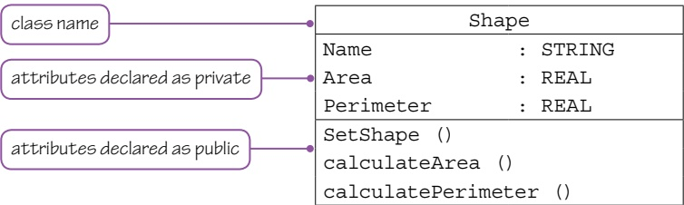
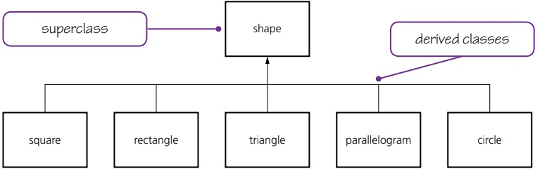
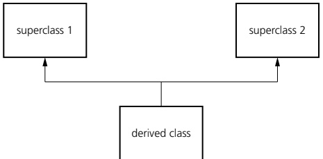
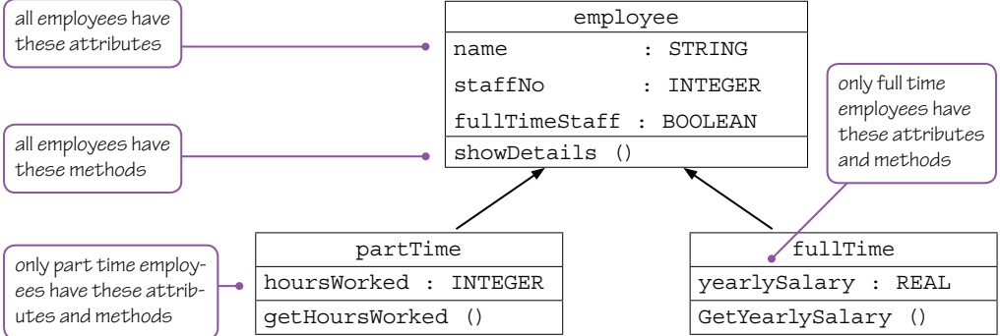
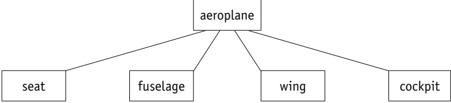
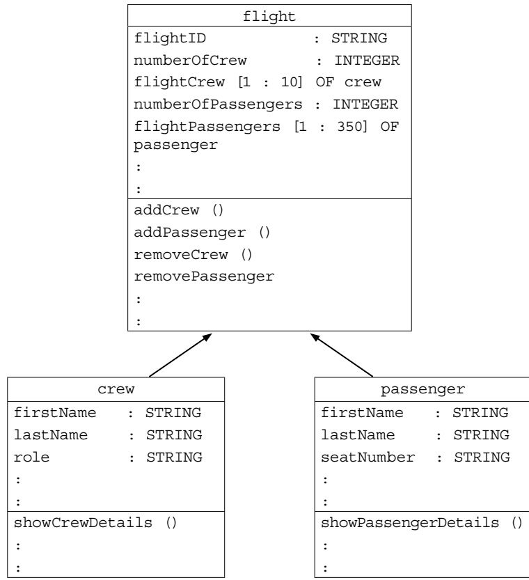
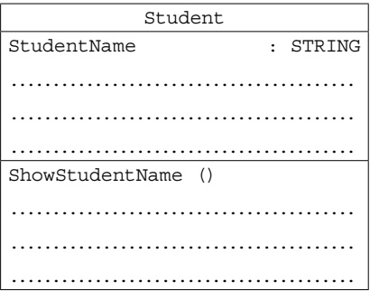
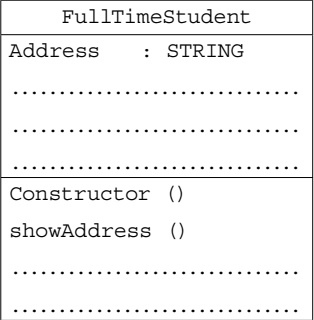
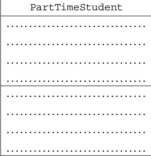

# 20 Further programming

<!-- Cambridge International AS and a Level Computer Science (David Watson, Helen Williams).pdf p514-556 -->

<!-- page 514 -->

## 20 

## Further programming

In this chapter, you will learn about

★ the characteristics of a number of programming paradigms, including low-level programming, imperative (procedural) programming, object-oriented programming and declarative programming

how to write code to perform file-processing operations on serial, sequential and random files

 $ ^{*} $ exceptions and the importance of exception handling.

### 20.1 Programming paradigms

## WHAT YOU SHOULD ALREADY KNOW

In Chapter 4, Section 4.2, you learnt about assembly language, and in Chapter 11, Section 11.3, you learnt about structured programming. Review these sections then try these three questions before you read the first part of this chapter.

1 Describe four modes of addressing in assembly language.

2 Write an assembly language program to add the numbers 7 and 5 together and store the result in the accumulator.

3 a) Explain the difference between a procedure and a function.

b) Describe how to pass parameters.

c) Describe the difference between a procedure definition and a procedure call.

4 Write a short program that uses a procedure.

Throughout this section, you will be prompted to refer to previous chapters to review related content.

## Key terms

Programming paradigm – a set of programming concepts.

Low-level programming – programming instructions that use the computer's basic instruction set.

Imperative programming – programming paradigm in which the steps required to execute a program are set out in the order they need to be carried out.

Object-oriented programming (OOP) – a programming methodology that uses self-contained objects, which contain programming statements (methods) and data, and which communicate with each other.

Class – a template defining the methods and data of a certain type of object.

Method – a programmed procedure that is defined as part of a class.

Attributes (class) – the data items in a class.

Encapsulation – process of putting data and methods together as a single unit, a class.

Object – an instance of a class that is self-contained and includes data and methods.

Property – data and methods within an object that perform a named action.

Instance – An occurrence of an object during the execution of a program.

Data hiding – technique which protects the integrity of an object by restricting access to the data and methods within that object.

<!-- page 515 -->

<table border=1 style='margin: auto; word-wrap: break-word;'><tr><td style='text-align: center; word-wrap: break-word;'>Getter – a method that gets the value of a property.</td></tr><tr><td style='text-align: center; word-wrap: break-word;'>Setter – a method used to control changes to a variable.</td></tr><tr><td style='text-align: center; word-wrap: break-word;'>Constructor – a method used to initialise a new object.</td></tr><tr><td style='text-align: center; word-wrap: break-word;'>Destructor – a method that is automatically invoked when an object is destroyed.</td></tr><tr><td style='text-align: center; word-wrap: break-word;'>Declarative programming – statements of facts and rules together with a mechanism for setting goals in the form of a query.</td></tr><tr><td style='text-align: center; word-wrap: break-word;'>Fact – a ‘thing’ that is known.</td></tr><tr><td style='text-align: center; word-wrap: break-word;'>Rules – relationships between facts.</td></tr></table>

Inheritance – process in which the methods and data from one class, a superclass or base class, are copied to another class, a derived class.

Polymorphism – feature of object-oriented programming that allows methods to be redefined for derived classes.

Overloading – feature of object-oriented programming that allows a method to be defined more than once in a class, so it can be used in different situations.

Containment (aggregation) – process by which one class can contain other classes.

A programming paradigm is a set of programming concepts. We have already considered two different programming paradigms: low-level and imperative (procedural) programming.

The style and capability of any programming language is defined by its paradigm. Some programming languages, for example JavaScript, only follow one paradigm; others, for example Python, support multiple paradigms. Most programming languages are multi-paradigm. In this section of the chapter, we will consider four programming paradigms: low-level, imperative, object-oriented and declarative.

#### 20.1.1 Low-level programming

Low-level programming uses instructions from the computer's basic instruction set. Assembly language and machine code both use low-level instructions. This type of programming is used when the program needs to make use of specific addresses and registers in a computer, for example when writing a printer driver.

In Chapter 4, Section 4.2.4, we looked at addressing modes. These are also covered by the Cambridge International A Level syllabus. Review Section 4.2.4 before completing Activity 20A.

20

<!-- page 516 -->

## ACTIVITY 20A

A section of memory in a computer contains these denary values:

<table border=1 style='margin: auto; word-wrap: break-word;'><tr><td style='text-align: center; word-wrap: break-word;'>Address</td><td style='text-align: center; word-wrap: break-word;'>Denary value</td></tr><tr><td style='text-align: center; word-wrap: break-word;'>230</td><td style='text-align: center; word-wrap: break-word;'>231</td></tr><tr><td style='text-align: center; word-wrap: break-word;'>231</td><td style='text-align: center; word-wrap: break-word;'>5</td></tr><tr><td style='text-align: center; word-wrap: break-word;'>232</td><td style='text-align: center; word-wrap: break-word;'>7</td></tr><tr><td style='text-align: center; word-wrap: break-word;'>233</td><td style='text-align: center; word-wrap: break-word;'>9</td></tr><tr><td style='text-align: center; word-wrap: break-word;'>234</td><td style='text-align: center; word-wrap: break-word;'>11</td></tr><tr><td style='text-align: center; word-wrap: break-word;'>235</td><td style='text-align: center; word-wrap: break-word;'>0</td></tr></table>

Give the value stored in the accumulator (ACC) and the index register (IX) after each of these instructions have been executed and state the mode of addressing used.

<table border=1 style='margin: auto; word-wrap: break-word;'><tr><td style='text-align: center; word-wrap: break-word;'>Address</td><td style='text-align: center; word-wrap: break-word;'>Opcode</td><td style='text-align: center; word-wrap: break-word;'>Operand</td></tr><tr><td style='text-align: center; word-wrap: break-word;'>500</td><td style='text-align: center; word-wrap: break-word;'>LDM</td><td style='text-align: center; word-wrap: break-word;'>#230</td></tr><tr><td style='text-align: center; word-wrap: break-word;'>501</td><td style='text-align: center; word-wrap: break-word;'>LDD</td><td style='text-align: center; word-wrap: break-word;'>230</td></tr><tr><td style='text-align: center; word-wrap: break-word;'>502</td><td style='text-align: center; word-wrap: break-word;'>LDI</td><td style='text-align: center; word-wrap: break-word;'>230</td></tr><tr><td style='text-align: center; word-wrap: break-word;'>503</td><td style='text-align: center; word-wrap: break-word;'>LDR</td><td style='text-align: center; word-wrap: break-word;'>#1</td></tr><tr><td style='text-align: center; word-wrap: break-word;'>504</td><td style='text-align: center; word-wrap: break-word;'>LDX</td><td style='text-align: center; word-wrap: break-word;'>230</td></tr><tr><td style='text-align: center; word-wrap: break-word;'>505</td><td style='text-align: center; word-wrap: break-word;'>CMP</td><td style='text-align: center; word-wrap: break-word;'>#0</td></tr><tr><td style='text-align: center; word-wrap: break-word;'>506</td><td style='text-align: center; word-wrap: break-word;'>JPE</td><td style='text-align: center; word-wrap: break-word;'>509</td></tr><tr><td style='text-align: center; word-wrap: break-word;'>507</td><td style='text-align: center; word-wrap: break-word;'>INC</td><td style='text-align: center; word-wrap: break-word;'>IX</td></tr><tr><td style='text-align: center; word-wrap: break-word;'>508</td><td style='text-align: center; word-wrap: break-word;'>JMP</td><td style='text-align: center; word-wrap: break-word;'>504</td></tr><tr><td style='text-align: center; word-wrap: break-word;'>509</td><td style='text-align: center; word-wrap: break-word;'>JMP</td><td style='text-align: center; word-wrap: break-word;'>509</td></tr><tr><td colspan="3">// this stops the program, it executes the same instruction until the computer is turned off!</td></tr></table>

#### 20.1.2 Imperative programming

In imperative programming, the steps required to execute a program are set out in the order they need to be carried out. This programming paradigm is often used in the early stages of teaching programming. Imperative programming is often developed into structured programming, which has a more logical structure and makes use of procedures and functions, together with local and global variables. Imperative programming is also known as procedural programming.

Programs written using the imperative paradigm may be smaller and take less time to execute than programs written using the object-oriented or declarative paradigms. This is because there are fewer instructions and less data storage is required for the compiled object code. Imperative programming works well for small, simple programs. Programs written using this methodology can be easier for others to read and understand.

In Chapter 11, Section 11.3, we looked at structured programming. This is also covered by the Cambridge International A Level syllabus. Review Section 11.3 then complete Activity 20B.

<!-- page 517 -->

## ACTIVITY 20B

Write a pseudocode algorithm to calculate the areas of five different shapes (square, rectangle, triangle, parallelogram and circle) using the basic imperative programming paradigm (no procedures or functions, and using only global variables).

Rewrite the pseudocode algorithm in a more structured way using the procedural programming paradigm (make sure you use procedures, functions, and local and global variables).

Write and test both algorithms using the programming language of your choice.

#### 20.1.3 Object-oriented programming (OOP)

Object-oriented programming (OOP) is a programming methodology that uses self-contained objects, which contain programming statements (methods) and data, and which communicate with each other. This programming paradigm is often used to solve more complex problems as it enables programmers to work with real life things. Many procedural programming languages have been developed to support OOP. For example, Java, Python and Visual Basic all allow programmers to use either procedural programming or OOP.

Object-oriented programming uses its own terminology, which we will explore here.

## Class

A class is a template defining the methods and data of a certain type of object. The attributes are the data items in a class. A method is a programmed procedure that is defined as part of a class. Putting the data and methods together as a single unit, a class, is called encapsulation. To ensure that only the methods declared can be used to access the data within a class, attributes need to be declared as private and the methods need to be declared as public.

For example, a shape can have name, area and perimeter as attributes and the methods set shape, calculate area, calculate perimeter. This information can be shown in a class diagram (Figure 20.1).

Figure 20.1 Shape class diagram

20

<!-- page 518 -->

## 20 

## Object

When writing a program, an object needs to be declared using a class type that has already been defined. An object is an instance of a class that is self-contained and includes data and methods. Properties of an object are the data and methods within an object that perform named actions. An occurrence of an object during the execution of a program is called an instance.

For example, a class employee is defined and the object myStaff is instanced in these programs using Python, VB and Java.

class employee:
    def __init__(self, name, staffno):
        self.name = name
        self.staffno = staffno
    def showDetails(self):
        print("Employee Name " + self.name)
        print("Employee Number ", self.staffno)
myStaff = employee("Eric Jones", 72)
myStaff.showDetails()

Module Module1
Public Sub Main()

object
- Dim myStaff As New employee("Eric Jones", 72)
- myStaff.showDetails()

End Sub

class employee:
- Dim name As String
- Dim staffno As Integer
- Public Sub New (ByVal n As String, ByVal s As Integer)
    name = n
    staffno = s
- End Sub

Public Sub showDetails()
- Console.Writeline("Employee Name " & name)
- Console.Writeline("Employee Number " & staffno)
- Console.ReadKey()
- End Sub

End Class

End Module

<!-- page 519 -->

Class definition

Java

attributes are private
method is public
use of __ denotes
private in Python

class employee {
    String name;
    int staffno;
    employee(String n, int s){
        name = n;
        staffno = s;
    }
    void showDetails () {
        System.out.println("Employee Name " + name);
        System.out.println("Employee Number " + staffno);
    }
    public static void main(String[] args) {
        Dim myStaff As New employee("Eric Jones", 72)
        myStaff.showDetails();
    }
}

Data hiding protects the integrity of an object by restricting access to the data and methods within that object. One way of achieving data hiding in OOP is to use encapsulation. Data hiding reduces the complexity of programming and increases data protection and the security of data.

Here is an example of a definition of a class with private attributes in Python, VB and Java.

## Python

class employee:
    def __init__(self, name, staffno):
        self._name = name
        self._staffno = staffno
    def showDetails(self):
        print("Employee Name " + self._name)
        print("Employee Number ", self._staffno)

20

<!-- page 520 -->

## 20 

VB

0 Attributes are private

class employee:
    Private name As String
    Private staffno As Integer
    Public Sub New (ByVal n As String, ByVal s As Integer)
        name = n
        staffno = s
    End Sub
    Public Sub showDetails()
        Console.Writeline("Employee Name " & name)
        Console.Writeline("Employee Number " & staffno)
        Console.ReadKey()
    End Sub
End Class

Java
// Java employee OOP program
class employee {
    private String name;
    private int staffno;
    employee(String n, int s) {
        name = n;
        staffno = s;
    }
    public void showDetails () {
        System.out.println("Employee Name " + name);
        System.out.println("Employee Number " + staffno);
    }
}

public class MainObject {
    public static void main(String[] args) {
        employee myStaff = new employee("Eric Jones", 72);
        myStaff.showDetails();
    }
}

<!-- page 521 -->

## ACTIVITY 20C

Write a short program to declare a class, student, with the private attributes name, dateOfBirth and examMark, and the public method displayExamMark. Declare an object myStudent, with a name and exam mark of your choice, and use your method to display the exam mark.

## Inheritance

Inheritance is the process by which the methods and data from one class, a superclass or base class, are copied to another class, a derived class.

Figure 20.2 shows single inheritance, in which a derived class inherits from a single superclass.

Figure 20.2 Inheritance diagram – single inheritance

Multiple inheritance is where a derived class inherits from more than one superclass (Figure 20.3).

Figure 20.3 Inheritance diagram – multiple inheritance

## EXTENSION ACTIVITY 20A

Not all programming languages support multiple inheritance. Check if the language you are using does.

Here is an example that shows the use of inheritance.

A base class employee and the derived classes partTime and fullTime are defined. The objects permanentStaff and temporaryStaff are instanced in these examples and use the method showDetails.

<!-- page 522 -->

## Python

base class employee class employee:
def __init__(self, name, staffno):
    self.__name = name
    self.__staffno = staffno
    self.__fullTimeStaff = True

def showDetails(self):
    print("Employee Name " + self.__name)
    print("Employee Number ", self.__staffno)

class partTime(employee):
def __init__(self, name, staffno):
    employee.__init__(self, name, staffno)
    self.__fullTimeStaff = False
    self.__hoursWorked = 0

def getHoursWorked (self):
    return(self.__hoursWorked)

class fullTime(employee):
def __init__(self, name, staffno):
    employee.__init__(self, name, staffno)
    self.__fullTimeStaff = True
    self.__yearlySalary = 0

def getYearlySalary (self):
    return(self.__yearlySalary)

permanentStaff = fullTime("Eric Jones", 72)
permanentStaff.showDetails()
temporaryStaff = partTime ("Alice Hue", 1017)
temporaryStaff.showDetails ()

## VB

'VB Employee OOP program with inheritance
Module Module1
Public Sub Main()
    Dim permanentStaff As New fullTime("Eric Jones", 72, 50000.00)
    permanentStaff.showDetails()
    Dim temporaryStaff As New partTime("Alice Hu", 1017, 45)
    temporaryStaff.showDetails()
End Sub

<!-- page 523 -->

class employee  base class employee
Protected name As String
Protected staffno As Integer
Private fullTimeStaff As Boolean
Public Sub New (ByVal n As String, ByVal s As Integer)
    name = n
    staffno = s
End Sub
Public Sub showDetails()
    Console.Writeline("Employee Name " & name)
    Console.Writeline("Employee Number " & staffno)
    Console.ReadKey()
End Sub
End Class
class partTime : inherits employee  derived class partTime
Private ReadOnly fullTimeStaff = false
Private hoursWorked As Integer
Public Sub New (ByVal n As String, ByVal s As Integer, ByVal h As Integer)
    MyBase.new (n, s)
    hoursWorked = h
End Sub
Public Function getHoursWorked () As Integer
    Return (hoursWorked)
End Function
End Class
class fullTime : inherits employee  derived class fullTime
Private ReadOnly fullTimeStaff = true
Private yearlySalary As Decimal
Public Sub New (ByVal n As String, ByVal s As Integer, ByVal y As Decimal)
    MyBase.new (n, s)
    yearlySalary = y
End Sub
Public Function getYearlySalary () As Decimal
    Return (yearlySalary)
End Function
End Class
Module

<!-- page 524 -->

20

Java

// Java employee OOP program with inheritance
class employee {
    base class employee
    private String name;
    private int staffno;
    private boolean fullTimeStaff;
    employee(String n, int s){
        name = n;
        staffno = s;
    }
    public void showDetails () {
        System.out.println("Employee Name " + name);
        System.out.println("Employee Number " + staffno);
    }
}

class partTime extends employee {
    derived class partTime
    private boolean fullTimeStaff = false;
    private int hoursWorked;
    partTime (String n, int s, int h){
        super (n, s);
        hoursWorked = h;
    }
    public int getHoursWorked () {
        return hoursWorked;
    }
}

class fullTime extends employee {
    derived class fullTime
    private boolean fullTimeStaff = true;
    private double yearlySalary;
    fullTime (String n, int s, double y){
        super (n, s);
        yearlySalary = y;
    }
    public double getYearlySalary () {
        return yearlySalary;
    }
}

<!-- page 525 -->

public class MainInherit{
    public static void main(String[] args) {
        fullTime permanentStaff = new fullTime("Eric Jones", 72, 50000.00);
        permanentStaff.showDetails();
        partTime temporaryStaff = new partTime("Alice Hu", 1017, 45);
        temporaryStaff.showDetails();
    }
}

Figure 20.4 shows the inheritance diagram for the base class employee and the derived classes partTime and fullTime.

▲ Figure 20.4 Inheritance diagram for employee, partTime and fullTime

ACTIVITY 20D
Write a short program to declare a class, student, with the private attributes name, dateOfBirth and examMark, and the public method displayExamMark.
Declare the derived classes fullTimeStudent and partTimeStudent.
Declare objects for each derived class, with a name and exam mark of your choice, and use your method to display the exam marks for these students.

## Polymorphism and overloading

Polymorphism is when methods are redefined for derived classes. Overloading is when a method is defined more than once in a class so it can be used in different situations.

## Example of polymorphism

A base class shape is defined, and the derived classes rectangle and circle are defined. The method area is redefined for both the rectangle class and the circle class. The objects myRectangle and myCircle are instanced in these programs.

20

<!-- page 526 -->

class shape:
    def __init__(self):
        self._areaValue = 0
        self._perimeterValue = 0
    def area(self):
        print("Area ", self._areaValue)
    def perimeter(self):
        print("Perimeter ", self._areaValue)

class rectangle(shape):
    def __init__(self, length, breadth):
        shape._init_(self)
        self._length = length
        self._breadth = breadth
    def area(self):
        self._areaValue = self._length * self._breadth
        print("Area ", self._areaValue)

class circle(shape):
    def __init__(self, radius):
        shape._init_(self)
        self._radius = radius
    def area(self):
        self._areaValue = self._radius * self._radius * 3.142
        print("Area ", self._areaValue)

myCircle = circle(20)

myCircle.area()

myRectangle = rectangle(10,17)

myRectangle.area()

## VB

'VB shape OOP program with polymorphism
Module Module1
Public Sub Main()
    Dim myCircle As New circle(20)
    myCircle.area()
    Dim myRectangle As New rectangle(10,17)

<!-- page 527 -->

myRectangle.area()
Console.ReadKey()
End Sub
class shape
    Protected areaValue As Decimal
    Protected perimeterValue As Decimal
    Overridable Sub area()
        original method in shape class
        Console.Writeline("Area" & areaValue)
    End Sub
    Overridable Sub perimeter()
        Console.Writeline("Perimeter" & perimeterValue)
    End Sub
End Class
class rectangle : inherits shape
    Private length As Decimal
    Private breadth As Decimal
    Public Sub New (ByVal l As Decimal, ByVal b As Decimal)
        length = l
        breadth = b
    End Sub
    Overrides Sub Area ()
        redefined method in rectangle class
        areaValue = length * breadth
        Console.Writeline("Area" & areaValue)
    End Sub
End Class
class circle : inherits shape
    Private radius As Decimal
    Public Sub New (ByVal r As Decimal)
        radius = r
    End Sub
    Overrides Sub Area ()
        redefined method in circle class
        areaValue = radius * radius * 3.142
        Console.Writeline("Area" & areaValue)
    End Sub
End Class
Module

20

<!-- page 528 -->

Java

// Java shape OOP program with polymorphism
class shape {
    original method in shape class
    protected double areaValue;
    protected double perimeterValue;
    public void area () {
        System.out.println("Area " + areaValue);
    }
}

class rectangle extends shape {
    private double length;
    private double breadth;
    rectangle(double l, double b) {
        length = l;
        breadth = b;
    }
    public void area () {
        redefined method in rectangle class
        areaValue = length * breadth;
        System.out.println("Area " + areaValue);
    }
}

class circle extends shape {
    private double radius;
    circle (double r) {
        radius = r;
    }
    public void area () {
        redefined method in circle class
        areaValue = radius * radius * 3.142;
        System.out.println("Area " + areaValue);
    }
}

public class MainShape {
    public static void main(String[] args) {
        circle myCircle = new circle(20);
        myCircle.area();
        rectangle myRectangle = new rectangle(10, 17);
        myRectangle.area();
    }
}

<!-- page 529 -->

## ACTIVITY 20E

Write a short program to declare the class shape with the public method area. Declare the derived classes circle, rectangle and square. Use polymorphism to redefine the method area for these derived classes. Declare objects for each derived class and instance them with suitable data. Use your methods to display the areas for these shapes.

## Example of overloading

One way of overloading a method is to use the method with a different number of parameters. For example, a class greeting is defined with the method hello. The object myGreeting is instanced and uses this method with no parameters or one parameter in this Python program. This is how Python, VB and Java manage overloading.

## Python

class greeting:
def hello(self, name = None):
    if name is not None:
        print ("Hello " + name)
    else:
        print ("Hello")
myGreeting = greeting()
myGreeting.hello()
myGreeting.hello("Christopher") method used with one parameter

## VB

Module Module1
Public Sub Main()
    Dim myGreeting As New greeting
    myGreeting.hello() method used with no parameters
    myGreeting.hello("Christopher")
    Console.ReadKey() method used with one parameter
End Sub
Class greeting
Public Overloads Sub hello()
    Console.WriteLine("Hello")
End Sub
Public Overloads Sub hello(ByVal name As String)
    Console.WriteLine("Hello " & name)

20

<!-- page 530 -->

End Sub
End Class
End Module

Java

class greeting{
    public void hello(){
        System.out.println("Hello");
    }
    public void hello(String name){
        System.out.println("Hello " + name);
    }
}
class mainOverload{
    public static void main(String args[]){
        greeting myGreeting = new greeting();
        myGreeting.hello(); method used with no parameters
        myGreeting.hello("Christopher");
    }
}.

## ACTIVITY 20F

Write a short program to declare the class greeting, with the public method hello, which can be used without a name, with one name or with a first name and last name.
Declare an object and use the method to display each type of greeting.

## Containment

Containment, or aggregation, is the process by which one class can contain other classes. This can be presented in a class diagram.

When the class 'aeroplane' is defined, and the definition contains references to the classes – seat, fuselage, wing, cockpit – this is an example of containment.

### Figure 20.5

When deciding whether to use inheritance or containment, it is useful to think about how the classes used would be related in the real world.

<!-- page 531 -->

## For example

» when looking at shapes, a circle is a shape – so inheritance would be used

» when looking at the aeroplane, an aeroplane contains wings – so

containment would be used.

Consider the people on board an aeroplane for a flight. The containment diagram could look like this if there can be up to 10 crew and 350 passengers on board:

### Figure 20.6

## ACTIVITY 20G

Draw a containment diagram for a course at university where there are up to 50 lectures, three examinations and the final mark is the average of the marks for the three examinations.

## Object methods

In OOP, the basic methods used during the life of an object can be divided into these types: constructors, setters, getters, and destructors.

A constructor is the method used to initialise a new object. Each object is initialised when a new instance is declared. When an object is initialised, memory is allocated.

20

<!-- page 532 -->

For example, in the first program in Chapter 20, this is the method used to construct a new employee object.

<table border=1 style='margin: auto; word-wrap: break-word;'><tr><td style='text-align: center; word-wrap: break-word;'>Constructor</td><td style='text-align: center; word-wrap: break-word;'>Language</td></tr><tr><td style='text-align: center; word-wrap: break-word;'>def __init__(self, name, staffno): self.__name = name self.__staffno = staffno</td><td style='text-align: center; word-wrap: break-word;'>Python</td></tr><tr><td style='text-align: center; word-wrap: break-word;'>Public Sub New (ByVal n As String, ByVal s As Integer) name = n staffno = s End Sub</td><td style='text-align: center; word-wrap: break-word;'>VB</td></tr></table>

### Table 20.1

<table border=1 style='margin: auto; word-wrap: break-word;'><tr><td style='text-align: center; word-wrap: break-word;'>Constructing an object</td><td style='text-align: center; word-wrap: break-word;'>Language</td></tr><tr><td style='text-align: center; word-wrap: break-word;'>myStaff = employee(&quot;Eric Jones&quot;,72)</td><td style='text-align: center; word-wrap: break-word;'>Python</td></tr><tr><td style='text-align: center; word-wrap: break-word;'>Dim myStaff As New employee(&quot;Eric Jones&quot;, 72)</td><td style='text-align: center; word-wrap: break-word;'>VB</td></tr><tr><td style='text-align: center; word-wrap: break-word;'>employee myStaff = new employee(&quot;Eric Jones&quot;, 72);</td><td style='text-align: center; word-wrap: break-word;'>Java</td></tr></table>

### Table 20.2

A setter is a method used to control changes to any variable that is declared within an object. When a variable is declared as private, only the setters declared within the object's class can be used to make changes to the variable within the object, thus making the program more robust.

For example, in the employee base class, this code is a setter:

<table border=1 style='margin: auto; word-wrap: break-word;'><tr><td style='text-align: center; word-wrap: break-word;'>Setter</td><td style='text-align: center; word-wrap: break-word;'>Language</td></tr><tr><td style='text-align: center; word-wrap: break-word;'>def setName(self, n):\nself. __ name = n</td><td style='text-align: center; word-wrap: break-word;'>Python</td></tr><tr><td style='text-align: center; word-wrap: break-word;'>Public Sub setName (ByVal n As String)\nname = n\nEnd Sub</td><td style='text-align: center; word-wrap: break-word;'>VB</td></tr><tr><td style='text-align: center; word-wrap: break-word;'>public void setName(String n)\nthis.name = n;\n}</td><td style='text-align: center; word-wrap: break-word;'>Java</td></tr></table>

### Table 20.3

A getter is a method that gets the value of a property of an object.

For example, in the partTimeStaff derived class, this method is a getter:

<table border=1 style='margin: auto; word-wrap: break-word;'><tr><td style='text-align: center; word-wrap: break-word;'>Getter</td><td style='text-align: center; word-wrap: break-word;'>Language</td></tr><tr><td style='text-align: center; word-wrap: break-word;'>def getHoursWorked (self): return(self. __ hoursWorked)</td><td style='text-align: center; word-wrap: break-word;'>Python</td></tr><tr><td style='text-align: center; word-wrap: break-word;'>Public Function getHoursWorked () As Integer Return (hoursWorked)</td><td style='text-align: center; word-wrap: break-word;'>VB</td></tr><tr><td style='text-align: center; word-wrap: break-word;'>public int getHoursWorked () { return hoursWorked;}</td><td style='text-align: center; word-wrap: break-word;'>Java</td></tr></table>

### Table 20.4

<!-- page 533 -->

A destructor is a method that is invoked to destroy an object. When an object is destroyed the memory is released so that it can be reused. Both Java and VB use garbage collection to automatically destroy objects that are no longer used so that the memory used can be released. In VB garbage collection can be invoked as a method if required but it is not usually needed.

For example, in any of the Python programs above, this could be used as a destructor:

def __del__(self)

Here is an example of a destructor being used in a Python program:

class shape:
    def __init__(self):
        self._areaValue = 0
        self._perimeterValue = 0
    def __del__(self):
        print("Shape deleted")
    def area(self):
        print("Area ", self._areaValue)
    def perimeter(self):
    print("Perimeter ", self._areaValue)
del myCircle = object destroyed

Here are examples of destructors in Python and VB.

<table border=1 style='margin: auto; word-wrap: break-word;'><tr><td style='text-align: center; word-wrap: break-word;'>Destructor</td><td style='text-align: center; word-wrap: break-word;'>Language</td></tr><tr><td style='text-align: center; word-wrap: break-word;'>def __del __(self):\n    print (&quot;Object deleted&quot;)</td><td style='text-align: center; word-wrap: break-word;'>Python</td></tr><tr><td style='text-align: center; word-wrap: break-word;'>Protected Overrides Sub Finalize()\n    Console.WriteLine(&quot;Object deleted&quot;)\n    Console.ReadKey()</td><td style='text-align: center; word-wrap: break-word;'>VB – only if required,\nautomatically called at\nend of program</td></tr><tr><td style='text-align: center; word-wrap: break-word;'></td><td style='text-align: center; word-wrap: break-word;'>Java – not used</td></tr></table>

### Table 20.5

## Writing a program for a binary tree

In Chapter 19, we looked at the data structure and some of the operations for a binary tree using fixed length arrays in pseudocode. You will need to be able to write a program to implement a binary tree, search for an item in the binary tree and store an item in a binary tree. Binary trees are best implemented using objects, constructors, containment, functions, procedures and recursion.

Objects - tree and node

» Constructor – adding a new node to the tree

» Containment – the tree contains nodes

» Function - search the binary tree for an item

» Procedure – insert a new item in the binary tree

20

<!-- page 534 -->

The data structures and operations to implement a binary tree for integer values in ascending order are set out in Tables 20.6–9 below. If you are unsure how the binary tree works, review Chapter 19.

Binary tree data structure - Class node
Language

class Node:
    def __init__(self, item):
        self.left = None
        self.right = None
        self.item = item

Python - the values for new nodes are set here. Python uses None for null pointers

Public Class Node
    Public item As Integer
    Public left As Node
    Public right As Node
    Public Function GetNodeItem()
        Return item
    End Function
End Class

class Node
{
    int item;
    Node left;
    Node right;
    GetNodeItem(int item)
        {
            this.item = item;
        }
}

Table 20.6

Binary tree data structure - Class tree
| | Language
| --- | ---
tree = Node(27)
| Python - the root of the tree is set as an instance of Node

Public Class BinaryTree
| Public root As Node
| Public Sub New()
| root = Nothing
| End Sub

End Class
| class BinaryTree
| {
| Node root;
| BinaryTree(int item)
| {
| this.item = item;
| }
|
| Java uses null for null pointers
}

Table 20.7

<!-- page 535 -->

Add integer to binary tree

def insert(self, item):
    if self.item:
        if item < self.item:
            if self.left is None:
                self.left = Node(item)
                else:
                self.left.insert(item)
                elif item > self.item:
                if self.right is None:
                self.right = Node(item)
                else:
                self.right.insert(item)
        else:
        self.item = item

Public Sub insert(ByVal item As Integer)
    Dim newNode As New Node()
    if root Is Nothing Then
        root = newNode
    Else
        Dim CurrentNode As Node = root
    If item < current.item Then
        If current.left Is Nothing Then
            current.left = Node(item)
        Else
            current.left.insert(item)
    End If
    Else If
    If item > current.item Then
        If current.right Is Nothing Then
            current.right = Node(item)
        Else
            current.right.insert(item)
    End If
    Else If
    current.item = item
    End If
End If
End Sub

20

<!-- page 536 -->

Add integer to binary tree
Language

void insert(tree node, int item)
{
    if (item < node.item)
    {
        if (node.left != null)
            insert(node.left, item);
        else
            node.left = new tree(item);
    }
    else if (item > node.item)
    {
        if (node.right != null)
            insert(node.right, item);
        else
            node.right = new tree(item);
    }
}

Table 20.8

Search for integer in binary tree
def search(self, item):
    while self.item != item:
        if item < self.item:
            self.item = self.left
        else:
            self.item = self.right
        if self.item is None:
            return None
    return self.item
Public Function search(ByVal item As Integer) As Integer
    Dim current As Node = root
    While current.item <> item
        If item < current.item Then
            current = current.left
        Else
            current = current.right
        End If
    If current Is Nothing Then
        Return Nothing
    End If
End While
Return current.item
End Function

<!-- page 537 -->

Search for integer in binary tree
Language
tree search(int item, tree node)
{
    while (item <> node.item)
    {
        if(item < node.item)
            node = node.left;
        else
            node = node.right;
        if (node = null)
            return null;
    }
    return node;
}

Table 20.9

## ACTIVITY 20H

In your chosen programming language, write a program using objects and recursion to implement a binary tree. Test your program by setting the root of the tree to 27, then adding the integers 19, 36, 42 and 16 in that order.

## EXTENSION ACTIVITY 20B

Complete a pre-order and post-order traverse of your binary tree and print the results.

#### 20.1.4 Declarative programming

Declarative programming is used to extract knowledge by the use of queries from a situation with known facts and rules. In Chapter 8, Section 8.3 we looked at the use of SQL scripts to query relational databases. It can be argued that SQL uses declarative programming. Review Section 8.3 to remind yourself how SQL performs queries.

Here is an example of an SQL query from Chapter 8:

SELECT FirstName, SecondName
FROM Student
WHERE ClassID = '7A'
ORDER BY SecondName

Declarative programming uses statements of facts and rules together with a mechanism for setting goals in the form of a query. A fact is a ‘thing’ that is known, and rules are relationships between facts. Writing declarative programs is very different to writing imperative programs. In imperative programming, the programmer writes a list of statements in the order that they will be performed. But in declarative programming, the programmer can state the facts and rules in any order before writing the query.

20

<!-- page 538 -->

Prolog is a declarative programming language that uses predicate logic to write facts and rules. For example, the fact that France is a country would be written in predicate logic as:

country(france).

Note that all facts in Prolog use lower-case letters and end with a full stop. Another fact about France – the language spoken in France is French – could be written as:

language(france, french).

country(france).
country(germany).
country(japan).
country(newZealand).
country(england).
country(switzerland).
language(france, french).
language(germany, german).
language(japan, japanese).
language(newZealand, english).
language(england, english).
language(switzerland, french).
language(switzerland, german).
language(switzerland, italian).

These facts are used to set up a knowledge base. This knowledge base can be consulted using queries.

For example, a query about countries that speak a certain language, English, could look like this:

language(Country,english)

Note that a variable in Prolog – Country, in this example – begins with an uppercase-letter.

This would give the following results:

newZealand ;
england.

The results are usually shown in the order the facts are stored in the knowledge base. A query about the languages spoken in a country, Switzerland, could look like this:

language(switzerland,Language).

And these are the results:

french, german, italian.

<!-- page 539 -->

When a query is written as a statement, this statement is called a goal and the result is found when the goal is satisfied using the facts and rules available.

## ACTIVITY 201

Use the facts above to write queries to find out which language is spoken in England and which country speaks Japanese. Take care with the use of capital letters.

## EXTENSION ACTIVITY 20C

prompt

Download SWI-Prolog and write a short program to provide facts about other countries and languages and save the file. Then consult the file to find out which languages are spoken in some of the countries. Note that SWI-prolog is available as a free download.

The results for the country Switzerland query would look like this in SWI-Prolog:

?- language(switzerland,Language).
Language = french ; press; to get the next result
Language = german ;
Language = italian.

Most knowledge bases also make use of rules, which are also written using predicate logic.

Here is a knowledge base for the interest paid on bank accounts. The facts about each account include the name of the account holder, the type of account (current or savings), and the amount of money in the account. The facts about the interest rates are the percentage rate, the type of account and the amount of money needed in the account for that interest rate to be paid.

bankAccount(laila, current, 500.00).
bankAccount(stefan, savings, 50).
bankAccount(paul, current, 45.00).
bankAccount(tasha, savings, 5000.00).
interest(twoPercent, current, 500.00).
interest(onePercent, current, 0).
interest(tenPercent, savings, 5000.00).
interest(fivePercent, savings, 0).
savingsRate(Name, Rate) :-
bankAccount(Name, Type, Amount), rule for the rate of interest to be used
interest(Rate, Type, Base),
Amount >= Base.

20

<!-- page 540 -->

Here is an example of a query using the above rule:

savingsRate(stefan,X).

And here is the result:

fivePercent

Here are examples of queries to find bank account details:

bankAccount(laila,X,Y). bankAccount(victor,X,Y)

And here are the results:

current, 500.0 false

## ACTIVITY 20J

Carry out the following activities using the information above.
1 Write a query to find out the interest rate for Laila's bank account.
2 Write a query to find who has savings accounts.
3 a) Set up a savings account for Robert with 300.00.
b) Set up a new fact about savings accounts allowing for an interest rate of 7% if there is 2000.00 or more in a savings account.

## EXTENSION ACTIVITY 20D

Use SWI-Prolog to check your answers to the previous activity.

## ACTIVITY 20K

Explain the difference between the four modes of addressing in a low-level programming language. Illustrate your answer with assembly language code for each mode of addressing.

2 Compare and contrast the use of imperative (procedural) programming with OOP. Use the shape programs you developed in Activities 20B and 20E to illustrate your answer with examples to show the difference in the paradigms.

3 Use the knowledge base below to answer the following questions:

language(fortran,highLevel).
language(cobol,highLevel).
language(visualBasic,highLevel).
language(visualBasic,oop).
language(python,highLevel).
language(python,oop).
language(assembly,lowLevel).
language(masm,lowLevel).

translator(assembler,lowLevel).
translator(compiler,highLevel).

<!-- page 541 -->

teaching(X):

language(X,oop),

language(X, highLevel).

a) Write two new facts about Java, showing that it is a high-level language and uses OOP.

b) Show the results from these queries

i) teaching(X).

ii) teaching(masm).

c) Write a query to show all programming languages translated by an assembler.

### 20.2 File processing and exception handling

## WHAT YOU SHOULD ALREADY KNOW

In Chapter 10, Section 10.3, you learnt about text files, and in Chapter 13, Section 13.2, you learnt about file organisation and access. Review these sections, then try these three questions before you read the second part of this chapter.

1 a) Write a program to set up a text file to store records like this, with one record on every line.

TYPE

TstudentRecord

DECLARE name : STRING

DECLARE address : STRING

DECLARE className : STRING

ENDTYPE

b) Write a procedure to append a record.

c) Write a procedure to find and delete a record.

d) Write a procedure to output all the records.

2 Describe three types of file organisation

3 Describe two types of file access and explain which type of files each one is used for.

## Key terms

Read – file access mode in which data can be read from a file.

Write – file access mode in which data can be written to a file; any existing data stored in the file will be overwritten.

Append – file access mode in which data can be added to the end of a file.

Open-file-processing operation; opens a file ready to be used in a program.

Close-file-processing operation; closes a file so it can no longer be used by a program.

Exception - an unexpected event that disrupts the execution of a program.

Exception handling - the process of responding to an

exception within the program so that the program does

not halt unexpectedly.

20

<!-- page 542 -->

#### 20.2.1 File processing operations

Files are frequently used to store records that include data types other than string. Also, many programs need to handle random access files so that a record can be found quickly without reading through all the preceding records.

A typical record to be stored in a file could be declared like this in pseudocode:

TYPE
TstudentRecord
DECLARE name : STRING
DECLARE registerNumber : INTEGER
DECLARE dateOfBirth : DATE
DECLARE fullTime : BOOLEAN
ENDTYPE

## Storing records in a serial or sequential file

The algorithm to store records sequentially in a serial (unordered) or sequential (ordered on a key field) file is very similar to the algorithm for storing lines of text in a text file. The algorithm written in pseudocode below stores the student records sequentially in a serial file as they are input.

Note that PUTRECORD is the pseudocode to write a record to a data file and GETRECORD is the pseudocode to read a record from a data file.

DECLARE studentRecord : ARRAY[1:50] OF TstudentRecord
DECLARE studentFile : STRING
DECLARE counter : INTEGER
counter ← 1
studentFile ← "studentFile.dat"
OPEN studentFile FOR WRITE
REPEAT
OUTPUT "Please enter student details"
OUTPUT "Please enter student name"
INPUT studentRecord.name[counter]
IF studentRecord.name <> ""
THEN
OUTPUT "Please enter student's register number"
INPUT studentRecord.registerNumber[counter]
OUTPUT "Please enter student's date of birth"
INPUT studentRecord.dateOfBirth[counter]
OUTPUT "Please enter True for fulltime or False for part-time"
INPUT studentRecord.fullTime[counter]
PUTRECORD, studentRecord[counter]
counter ← counter + 1

<!-- page 543 -->

ELSE
CLOSEFILE(studentFile)
ENDIF
UNTIL studentRecord.name = ""
OUTPUT "The file contains these records: "
OPEN studentFile FOR READ
counter ← 1
REPEAT
GETRECORD, studentRecord[counter]
OUTPUT studentRecord[counter]
counter ← counter + 1
UNTIL EOF(studentFile)
CLOSEFILE(studentFile)

<table border=1 style='margin: auto; word-wrap: break-word;'><tr><td style='text-align: center; word-wrap: break-word;'>Identifier name</td><td style='text-align: center; word-wrap: break-word;'>Description</td></tr><tr><td style='text-align: center; word-wrap: break-word;'>studentRecord</td><td style='text-align: center; word-wrap: break-word;'>Array of records to be written to the file</td></tr><tr><td style='text-align: center; word-wrap: break-word;'>studentFile</td><td style='text-align: center; word-wrap: break-word;'>File name</td></tr><tr><td style='text-align: center; word-wrap: break-word;'>counter</td><td style='text-align: center; word-wrap: break-word;'>Counter for records</td></tr></table>

### Table 20.10

If a sequential file was required, then the student records would need to be input into an array of records first, then sorted on the key field registerNumber, before the array of records was written to the file.

Here are programs in Python, VB and Java to write a single record to a file.

Python

import pickle

class student:
    def __init__(self):
        self.name = ""
        self.registerNumber = 0
        self.dateOfBirth = datetime.datetime.now()
        self.fullTime = True

studentRecord = student()

studentFile = open('students.DAT','w+b')

print("Please enter student details")

studentRecord.name = input("Please enter student name ")

studentRecord.registerNumber = int(input("Please enter student's register number "))

year = int(input("Please enter student's year of birth YYYY "))

month = int(input("Please enter student's month of birth MM "))

day = int(input("Please enter student's day of birth DD "))

<!-- page 544 -->

studentRecord.dateOfBirth = datetime.datetime(year, month, day)
studentRecord.fullTime = bool(input("Please enter True for full-time or False for part-time "))

pickle.dump (studentRecord, studentFile) Write record to file
print(studentRecord.name, studentRecord.registerNumber, studentRecord.dateOfBirth, studentRecord.fullTime)
studentFile.close() Open binary file to read from
studentFile = open('students.DAT','rb') Read record from file
studentRecord = pickle.load(studentFile) Read record from file
print(studentRecord.name, studentRecord.registerNumber, studentRecord.dateOfBirth, studentRecord.fullTime)
studentFile.close()

Option Explicit On
Imports System.IO Library to use Input and Output
Module Module1

Public Sub Main()
    Dim studentFileWriter As BinaryWriter
    Dim studentFileReader As BinaryReader
    Dim studentFile As FileStream
    Dim year, month, day As Integer
    Dim studentRecord As New student()
    studentFile = New FileStream("studentFile.DAT", FileMode.Create)
    studentFileWriter = New BinaryWriter(studentFile)

Console.Write("Please enter student name ")
    studentRecord.name = Console.ReadLine()
    Console.Write("Please enter student's register number ")
    studentRecord.registerNumber = Integer.Parse(Console.ReadLine())
    Console.Write("Please enter student's year of birth YYYY ")
    year = Integer.Parse(Console.ReadLine())
    Console.Write("Please enter student's month of birth MM ")
    month = Integer.Parse(Console.ReadLine())
    Console.Write("Please enter student's day of birth DD ")
    day = Integer.Parse(Console.ReadLine())
    studentRecord.dateOfBirth = DateSerial(year, month, day)
    Console.Write("Please enter True for full-time or False for part-time")
    studentRecord.fullTime = Boolean.Parse(Console.ReadLine())

<!-- page 545 -->

studentFileWriter.Write(studentRecord.name)
studentFileWriter.Write(studentRecord.registerNumber)
studentFileWriter.Write(studentRecord.dateOfBirth)
studentFileWriter.Write(studentRecord.fullTime)
studentFileWriter.Close()
studentFile.Close()
studentFile = New FileStream("studentFile.DAT", FileMode.Open)
studentFileReader = New BinaryReader(studentFile)
studentRecord.name = studentFileReader.ReadString()
studentRecord.registerNumber = studentFileReader.ReadInt32()
studentRecord.dateOfBirth = studentFileReader.ReadString()
studentRecord.fullTime = studentFileReader.ReadBoolean()
studentFileReader.Close()
studentFile.Close()
Console.WriteLine (studentRecord.name & " " & studentRecord.registerNumber & " " & studentRecord.dateOfBirth & " " & studentRecord.fullTime)
Console.ReadKey()

End Sub

class student:

Public name As String

Public registerNumber As Integer

Public dateOfBirth As Date

Public fullTime As Boolean

End Class

end Module

Java
(Java programs using files need to include exception handling – see Section 20.2.2 later in this chapter.)

import java.io.File;
import java.io.FileWriter;
import java.util.Scanner;
import java.util.Date;
import java.text.SimpleDateFormat;
class Student {
    private String name;
    private int registerNumber;
    private Date dateOfBirth;

<!-- page 546 -->

private boolean fullTime;

Student(String name, int registerNumber, Date dateOfBirth, boolean fullTime) {
    this.name = name;
    this.registerNumber = registerNumber;
    this.dateOfBirth = dateOfBirth;
    this.fullTime = fullTime;
}

public String toString() {
    return name + " " + registerNumber + " " + dateOfBirth + " " + fullTime;
}

public class StudentRecordFile {
    public static void main(String[] args) throws Exception {
        Scanner input = new Scanner(System.in);
        System.out.println("Please student details");
        System.out.println("Please enter Student name");
        String nameIn = input.next();
        System.out.println("Please enter Student's register number");
        int registerNumberIn = input.nextInt();
        System.out.println("Please enter Student's date of birth as YYYY-MM-DD");
        String DOBIn = input.next();
        SimpleDateFormat format = new SimpleDateFormat("yyyy-MM-dd");
        Date dateOfBirthIn = format.parse(DOBIN);
        System.out.println("Please enter true for full-time or false for part-time");
        boolean fullTimeIn = input.nextBoolean();
        Student studentRecord = new Student(nameIn, registerNumberIn, dateOfBirthIn, fullTimeIn);
        System.out.println(studentRecord.toString());
        // This is the file that we are going to write to and then read from File studentFile = new File("Student.txt");
        // Write the record to the student file
        // Note - this try-with-resources syntax only works with Java 7 and later
        try (FileWriter studentFileWriter = new FileWriter(studentFile)) {
            studentFileWriter.write(studentRecord.toString());
        }
        // Print all the lines of text in the student file
        try (Scanner studentReader = new Scanner(studentFile)) {
        }
    }
}

<!-- page 547 -->

while (studentReader.hasNextLine()) {
    String data = studentReader.nextLine();
    System.out.println(data);
}
}

## ACTIVITY 20L

In the programming language of your choice, write a program to input a student record and save it to a new serial file read a student record from that file extend your program to work for more than one record.

## EXTENSION ACTIVITY 20E

In the programming language of your choice, extend your program to sort the records on registerNumber before storing in the file.

## Adding a record to a sequential file

Records can be appended to the end of a serial file by opening the file in append mode. If records need to be added to a sequential file, then the whole file needs to be recreated and the record stored in the correct place.

The algorithm written in pseudocode below inserts a student record into the correct place in a sequential file.

DECLARE studentRecord : TstudentRecord
DECLARE newStudentRecord : TstudentRecord
DECLARE studentFile : STRING
DECLARE newStudentFile : STRING
DECLARE recordAddedFlag : BOOLEAN
recordAddedFlag ← FALSE
studentFile ← "studentFile.dat"
newStudentFile ← "newStudentFile.dat"
CREATE newStudentFile // creates a new file to write to OPEN newStudentFile FOR WRITE
OPEN studentFile FOR READ
OUTPUT "Please enter student details"
OUTPUT "Please enter student name"
INPUT newStudentRecord.name
OUTPUT "Please enter student's register number"

<!-- page 548 -->

INPUT newStudentRecord.registerNumber
OUTPUT "Please enter student's date of birth"
INPUT newStudentRecord.dateOfBirth
OUTPUT "Please enter True for full-time or False for part-time"
INPUT newStudentRecord.fullTime
REPEAT
WHILE NOT recordAddedFlag OR EOF(studentFile)
GETRECORD, studentRecord // gets record from existing file
IF newStudentRecord.registerNumber > studentRecord.registerNumber
THEN
PUTRECORD studentRecord
// writes record from existing file to new file
ELSE
PUTRECORD newStudentRecord
// or writes new record to new file in the correct place
recordAddedFlag ← TRUE
ENDIF
ENDWHILE
IF EOF (studentFile)
THEN
PUTRECORD newStudentRecord
// add new record at end of the new file
ELSE
REPEAT
GETRECORD, studentRecord
PUTRECORD studentRecord
//transfers all remaining records to the new file
ENDIF UNTIL EOF(studentRecord)
CLOSEFILE(studentFile)
CLOSEFILE(newStudentFile)
DELETE(studentFile)
// deletes old file of student records
RENAME newStudentfile, studentfile
// renames new file to be the student record file

<!-- page 549 -->

<table border=1 style='margin: auto; word-wrap: break-word;'><tr><td style='text-align: center; word-wrap: break-word;'>Identifier name</td><td style='text-align: center; word-wrap: break-word;'>Description</td></tr><tr><td style='text-align: center; word-wrap: break-word;'>studentRecord</td><td style='text-align: center; word-wrap: break-word;'>record from student file</td></tr><tr><td style='text-align: center; word-wrap: break-word;'>newStudentRecord</td><td style='text-align: center; word-wrap: break-word;'>new record to be written to the file</td></tr><tr><td style='text-align: center; word-wrap: break-word;'>studentFile</td><td style='text-align: center; word-wrap: break-word;'>student file name</td></tr><tr><td style='text-align: center; word-wrap: break-word;'>newStudentFile</td><td style='text-align: center; word-wrap: break-word;'>temporary file name</td></tr></table>

### Table 20.11

Note that you can directly  $ \underline{\text{append}} $ a record to the end of a file in a programming language by opening the file in append mode, as shown in the table below.

<table border=1 style='margin: auto; word-wrap: break-word;'><tr><td style='text-align: center; word-wrap: break-word;'>Opening a file in append mode</td><td style='text-align: center; word-wrap: break-word;'>Language</td></tr><tr><td style='text-align: center; word-wrap: break-word;'>myFile = open(&quot;fileName&quot;, &quot;a&quot;)</td><td style='text-align: center; word-wrap: break-word;'>Opens the file with the name名称名称名称in Python</td></tr><tr><td style='text-align: center; word-wrap: break-word;'>myFile = New FileStream(&quot;fileName&quot;, FileMode.Append)</td><td style='text-align: center; word-wrap: break-word;'>Opens the file with the name名称名称名称in VB.NET</td></tr><tr><td style='text-align: center; word-wrap: break-word;'>FileWriter myFile = new FileWriter(&quot;fileName&quot;, true);</td><td style='text-align: center; word-wrap: break-word;'>Opens the file with the name名称名称名称in Java</td></tr></table>

### Table 20.12

## ACTIVITY 20M

In the programming language of your choice, write a program to

input a student record and append it to the end of a sequential file

find and output a student record from a sequential file using the key field to identify the record

extend your program to check for record not found (if required).

## EXTENSION ACTIVITY 20F

Extend your program to input a student record and save it to in the correct place in the sequential file created in Extension Activity 20E.

## Adding a record to a random file

Records can be added to a random file by using a hashing function on the key field of the record to be added. The hashing function returns a pointer to the address where the record is to be added.

20

<!-- page 550 -->

In pseudocode, the address in the file can be found using the command:

SEEK <filename>,<address>

The record can be stored in the file using the command:

PUTRECORD <filename>,<recordname>

Or it can be retrieved using:

GETRECORD <filename>,<recordname>

The file needs to be opened as random:

OPEN studentFile FOR RANDOM

The algorithm written in pseudocode below inserts a student record into a random file.

DECLARE studentRecord : TstudentRecord
DECLARE studentFile : STRING
DECLARE Address : INTEGER
studentFile ← "studentFile.dat"
OPEN studentFile FOR RANDOM
// opens file for random access both read and write
OUTPUT "Please enter student details"
OUTPUT "Please enter student name"
INPUT StudentRecord.name
OUTPUT "Please enter student's register number"
INPUT studentRecord.registerNumber
OUTPUT "Please enter student's date of birth"
INPUT studentRecord.dateOfBirth
OUTPUT "Please enter True for full-time or False for part-time"
INPUT studentRecord.fullTime
address ← hash(studentRecord,registerNumber)
// uses function hash to find pointer to address
SEEK studentFile,address
// finds address in file
PUTRECORD studentFile,studentRecord
//writes record to the file
CLOSEFILE(studentFile)

<!-- page 551 -->

## EXTENSION ACTIVITY 20G

In the programming language of your choice, write a program to input a student record and save it to a random file.

## Finding a record in a random file

Records can be found in a random file by using a hashing function on the key field of the record to be found. The hashing function returns a pointer to the address where the record is to be found, as shown in the example pseudocode below.

DECLARE studentRecord : TstudentRecord
DECLARE studentFile : STRING
DECLARE Address : INTEGER
studentFile ← "studentFile.dat"
OPEN studentFile FOR RANDOM
// opens file for random access both read and write
OUTPUT "Please enter student's register number"
INPUT studentRecord.registerNumber
address ← hash(studentRecord.registerNumber)
// uses function hash to find pointer to address
SEEK studentFile, address
// finds address in file
GETRECORD studentFile, studentRecord
//reads record from the file
OUTPUT studentRecord
CLOSEFILE(studentFile)

## EXTENSION ACTIVITY 20H

In the programming language of your choice, write a program to find and output a student record from a random file using the key field to identify the record.

#### 20.2.2 Exception handling

An exception is an unexpected event that disrupts the execution of a program. Exception handling is the process of responding to an exception within the program so that the program does not halt unexpectedly. Exception handling makes a program more robust as the exception routine traps the error then outputs an error message, which is followed by either an orderly shutdown of the program or recovery if possible.

An exception may occur in many different ways, for example

dividing by zero during a calculation

» reaching the end of a file unexpectedly when trying to read a record from a file

» trying to open a file that has not been created

» losing a connection to another device, such as a printer.

20

<!-- page 552 -->

Exceptions can be caused by
» programming errors
» user errors
» hardware failure.

Error handling is one of the most important aspects of writing robust programs that are to be used every day, as users frequently make errors without realising, and hardware can fail at any time. Frequently, error handling routines can take a programmer as long, or even longer, to write and test as the program to perform the task itself.

The structure for error handling can be shown in pseudocode as:

TRY
<statements>
EXCEPT
<statements>
ENDTRY

Here are programs in Python, VB and Java to catch an integer division by zero exception.

## Python

def division(firstNumber, secondNumber):
    try:
        myAnswer = firstNumber // secondNumber
        print('Answer ', myAnswer)
    except:
        print('Divide by zero')
division(12, 3)
division(10, 0)

VB

Module Module1

Public Sub Main()
    division(12, 3)
    division(10, 0)
    Console.ReadKey()

End Sub

Sub division(ByVal firstNumber As Integer, ByVal secondNumber As Integer)
    Dim myAnswer As Integer
    Try
        myAnswer = firstNumber \ secondNumber
        Console.WriteLine("Answer " & myAnswer)
    }
}

<!-- page 553 -->

Catch e As DivideByZeroException
Console.WriteLine("Divide by zero")
End Try
End Sub
End Module

Java

public class Division {
    public static void main(String[] args) {
        division(12, 3);
        division(10, 0);
    }

    public static void division(int firstNumber, int secondNumber){
        int myAnswer;
        try {
            myAnswer = firstNumber / secondNumber;
            System.out.println("Answer " + myAnswer);
        }
        catch (ArithmeticException e){
            System.out.println("Divide by zero");
        }
    }
}

## ACTIVITY 20N

In the programming language of your choice, write a program to check that a value input is an integer.

## ACTIVITY 200

In the programming language of your choice, extend the file handling programs you wrote in Section 20.2.1 to use exception handling to ensure that the files used exist and allow for the condition unexpected end of file.

<!-- page 554 -->

1 A declarative programming language is used to represent the following facts and rules:

01 male(ahmed).
02 male(raul).
03 male(ali).
04 male(philippe).
05 female(aisha).
06 female(gina).
07 female(meena).
08 parent(ahmed, raul).
09 parent(aisha, raul).
10 parent(ahmed, philippe).
11 parent(aisha, philippe).
12 parent(ahmed, gina).
13 parent(aisha, gina).
14 mother(A, B) IF female(A) AND parent(A, B).

These clauses have the following meaning:

<table border=1 style='margin: auto; word-wrap: break-word;'><tr><td style='text-align: center; word-wrap: break-word;'>Clause</td><td style='text-align: center; word-wrap: break-word;'>Explanation</td></tr><tr><td style='text-align: center; word-wrap: break-word;'>01</td><td style='text-align: center; word-wrap: break-word;'>Ahmed is male</td></tr><tr><td style='text-align: center; word-wrap: break-word;'>05</td><td style='text-align: center; word-wrap: break-word;'>Aisha is female</td></tr><tr><td style='text-align: center; word-wrap: break-word;'>08</td><td style='text-align: center; word-wrap: break-word;'>Ahmed is a parent of Raul</td></tr><tr><td style='text-align: center; word-wrap: break-word;'>14</td><td style='text-align: center; word-wrap: break-word;'>A is the mother of B if A is female and A is a parent of B</td></tr></table>

a) More facts are to be included.

Ali and Meena are the parents of Ahmed.

Write the additional clauses to record this. [2]

15 .....

16 .....

## b) Using the variable C, the goal

parent(ahmed, C)

returns

C = raul, philippe, gina

Write the result returned by the goal

parent(P, gina)

c) Use the variable M to write the goal to find the mother of Gina.

<!-- page 555 -->

d) Write the rule to show that F is the father of C.

<table border=1 style='margin: auto; word-wrap: break-word;'><tr><td style='text-align: center; word-wrap: break-word;'>father(F, C)</td></tr><tr><td style='text-align: center; word-wrap: break-word;'>IF................................................................................</td></tr></table>

<table border=1 style='margin: auto; word-wrap: break-word;'><tr><td style='text-align: center; word-wrap: break-word;'>e) Write the rule to show that X is a brother of Y.</td><td style='text-align: center; word-wrap: break-word;'>[4]</td></tr><tr><td style='text-align: center; word-wrap: break-word;'>brother(X, Y)</td><td style='text-align: center; word-wrap: break-word;'></td></tr><tr><td style='text-align: center; word-wrap: break-word;'>IF................................................................................</td><td style='text-align: center; word-wrap: break-word;'></td></tr></table>

Cambridge International AS & A Level Computer Science 9608

Paper 42 Q2 November 2015

2 A college has two types of students: full-time and part-time.

All students have their name and date of birth recorded.

A full-time student has their address and telephone number recorded.

A part-time student attends one or more courses. A fee is charged for each course. The number of courses a part-time student attends is recorded, along with the total fee and whether or not the fee has been paid.

The college needs a program to process data about its students. The program will use an object-oriented programming language.

a) Copy and complete the class diagram showing the appropriate properties and methods. [7]

b) Write program code:

i) for the class definition for the superclass Student.

<!-- page 556 -->

ii) for the class definition for the subclass FullTimeStudent. [3]
iii) to create a new instance of FullTimeStudent with:
   - identifier: NewStudent
   - name: A. Nyone
   - date of birth: 12/11/1990
   - telephone number: 099111 [3]
    Cambridge International AS & A Level Computer Science 9608
    Paper 42 Q3 November 2015

3 a) When designing and writing program code, explain what is meant by:

- an exception

- exception handling.

b) A program is to be written to read a list of exam marks from an existing text file into a 1D array.

Each line of the file stores the mark for one student.

State three exceptions that a programmer should anticipate for this program. [3]

c) The following pseudocode is to read two numbers.

01 DECLARE Num1 : INTEGER
02 DECLARE Num2 : INTEGER
03 DECLARE Answer : INTEGER
04 TRY
05 OUTPUT "First number..."
06 INPUT Num1
07 OUTPUT "Second number..."
08 INPUT Num2
09 Answer ← Num1 / (Num2 - 6)
10 OUTPUT Answer
11 EXCEPT ThisException : EXCEPTION
12 OUTPUT ThisException.Message
13 FINALLY
14 // remainder of the program follows
29
30 ENDTRY

The programmer writes the corresponding program code.

A user inputs the number 53 followed by 6. The following output is produced:

First number...53
Second number...6
Arithmetic operation resulted in an overflow

i) State the pseudocode line number which causes the exception to be raised. [1]

ii) Explain the purpose of the pseudocode on lines 11 and 12.

