# 1 Quadratics

<!-- Cambridge International AS A Level Mathematics Pure Mathematics 1.pdf p13-44 -->

<!-- page 13 -->

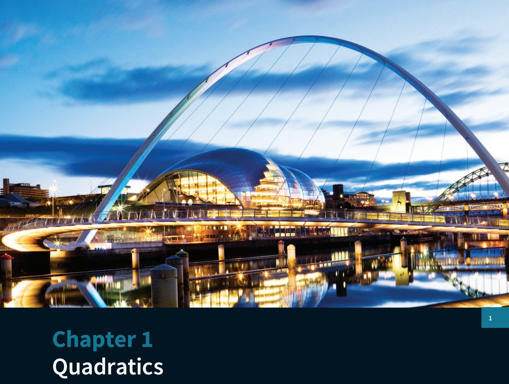

## In this chapter you will learn how to:

carry out the process of completing the square for a quadratic polynomial  $ ax^{2} + bx + c $ and use a completed square form

find the discriminant of a quadratic polynomial  $ ax^{2} + bx + c $ and use the discriminant

solve quadratic equations, and quadratic inequalities, in one unknown

solve by substitution a pair of simultaneous equations of which one is linear and one is quadratic

recognise and solve equations in x that are quadratic in some function of x

understand the relationship between a graph of a quadratic function and its associated algebraic equation, and use the relationship between points of intersection of graphs and solutions of equations.

<!-- page 14 -->

PREREQUISITE KNOWLEDGE

<table border=1 style='margin: auto; word-wrap: break-word;'><tr><td style='text-align: center; word-wrap: break-word;'>Where it comes from</td><td style='text-align: center; word-wrap: break-word;'>What you should be able to do</td><td style='text-align: center; word-wrap: break-word;'>Check your skills</td></tr><tr><td style='text-align: center; word-wrap: break-word;'>IGCSE $ ^{®} $ / O Level Mathematics</td><td style='text-align: center; word-wrap: break-word;'>Solve quadratic equations by factorising.</td><td style='text-align: center; word-wrap: break-word;'>1 Solve:\na  $ x^{2} + x - 12 = 0 $\nb  $ x^{2} - 6x + 9 = 0 $\nc  $ 3x^{2} - 17x - 6 = 0 $</td></tr><tr><td style='text-align: center; word-wrap: break-word;'>IGCSE / O Level Mathematics</td><td style='text-align: center; word-wrap: break-word;'>Solve linear inequalities.</td><td style='text-align: center; word-wrap: break-word;'>2 Solve:\na 5x - 8 &gt; 2\nb 3 - 2x ≤ 7</td></tr><tr><td style='text-align: center; word-wrap: break-word;'>IGCSE / O Level Mathematics</td><td style='text-align: center; word-wrap: break-word;'>Solve simultaneous linear equations.</td><td style='text-align: center; word-wrap: break-word;'>3 Solve:\na 2x + 3y = 13\n7x - 5y = -1\nb 2x - 7y = 31\n3x + 5y = -31</td></tr><tr><td style='text-align: center; word-wrap: break-word;'>IGCSE / O Level Additional Mathematics</td><td style='text-align: center; word-wrap: break-word;'>Carry out simple manipulation of surds.</td><td style='text-align: center; word-wrap: break-word;'>4 Simplify:\na  $ \sqrt{20} $\nb  $ (\sqrt{5})^{2} $\nc  $ \frac{8}{\sqrt{2}} $</td></tr></table>

## Why do we study quadratics?

At IGCSE / O Level, you will have learnt about straight-line graphs and their properties. They arise in the world around you. For example, a cell phone contract might involve a fixed monthly charge and then a certain cost per minute for calls: the monthly cost, y, is then given as  $ y = mx + c $, where c is the fixed monthly charge, m is the cost per minute and x is the number of minutes used.

Quadratic functions are of the form  $ y = ax^2 + bx + c $ (where  $ a \ne 0 $) and they have interesting properties that make them behave very differently from linear functions. A quadratic function has a maximum or a minimum value, and its graph has interesting symmetry. Studying quadratics offers a route into thinking about more complicated functions such as  $ y = 7x^5 - 4x^4 + x^2 + x + 3 $.

You will have plotted graphs of quadratics such as  $ y = 10 - x^2 $ before starting your A Level course. These are most familiar as the shape of the path of a ball as it travels through the air (called its trajectory). Discovering that the trajectory is a quadratic was one of Galileo's major successes in the early 17th century. He also discovered that the vertical motion of a ball thrown straight upwards can be modelled by a quadratic, as you will learn if you go on to study the Mechanics component.

## WEB LINK

Try the Quadratics resource on the Underground Mathematics website (www.underground mathematics.org).

<!-- page 15 -->

### 1.1 Solving quadratic equations by factorisation

You already know the factorisation method and the quadratic formula method to solve quadratic equations algebraically.

This section consolidates and builds on your previous work on solving quadratic equations by factorisation.

### EXPLORE 1.1

 $$ 2x^{2}+3x-5=(x-1)(x-2) $$ 

This is Rosa's solution to the previous equation:

Factorise the left-hand side:

 $$ (x-1)(2x+5)=(x-1)(x-2) $$ 

Divide both sides by (x-1):

 $$ 2x+5=x-2 $$ 

Rearrange:

 $$ x=-7 $$ 

Discuss her solution with your classmates and explain why her solution is not fully correct.

Now solve the equation correctly.

### WORKED EXAMPLE 1.1

Solve:

a

 $$ 6x^{2}+5=17x $$ 

 $$ \begin{array}{r l}{\textbf{b}}&{{}9x^{2}-39x-30=0}\end{array} $$ 

## Answer

a

 $$ 6x^{2}+5=17x\quad\text{Write in the form}a x^{2}+b x+c=0. $$ 

 $$ 6x^{2}-17x+5=0\quad\therefore\quad Factorise. $$ 

 $ (2x-5)(3x-1)=0 $ Use the fact that if pq=0, then p=0 or q=0.

2x - 5 = 0 or 3x - 1 = 0 Solve.

 $$ x=\frac{5}{2}\quad\text{or}\quad x=\frac{1}{3} $$ 

9 $ x^{2} $ - 39x - 30 = 0 Divide both sides by the common factor of 3.

 $$ 3x^{2}-13x-10=0\quad\therefore\quad\because Factorise. $$ 

 $$ (3x+2)(x-5)=0 $$ 

 $$ 3x+2=0\quad or\quad x-5=0\quad\therefore\quad Solve. $$ 

 $$ x=-\frac{2}{3}\quad or\quad x=5 $$ 

## TIP

Divide by a common factor first, if possible.

<!-- page 16 -->

### WORKED EXAMPLE 1.2

Solve  $ \frac{21}{2x}-\frac{2}{x+3}=1 $.

## Answer

 $$ \frac{21}{2x}-\frac{2}{x+3}=1 $$ 

Multiply both sides by $2x(x+3)$.

 $$ 21(x+3)-4x=2x(x+3) $$ 

Expand brackets and rearrange.

 $$ 2x^{2}-11x-63=0 $$ 

Factorise.

 $$ (2x+7)(x-9)=0 $$ 

 $$ 2x+7=0\text{or}x-9=0 $$ 

Solve.

 $$ x=-\frac{7}{2}\quad or\quad x=9 $$ 

### WORKED EXAMPLE 1.3

Solve  $ \frac{3x^{2}+26x+35}{x^{2}+8}=0 $.

## Answer

 $$ \frac{3x^{2}+26x+35}{x^{2}+8}=0 $$ 

Multiply both sides by  $ x^{2}+8 $.

 $$ 3x^{2}+26x+35=0 $$ 

Factorise.

 $$ (3x+5)(x+7)=0 $$ 

 $$ \begin{array}{l}3x+5=0\text{or}x+7=0\end{array} $$ 

 $$ x=-\frac{5}{3}\quad or\quad x=-7 $$ 

Solve.

<!-- page 17 -->

### WORKED EXAMPLE 1.4

A rectangle has sides of length x cm and  $ (6x - 7) $ cm.

The area of the rectangle is  $ 90 \, cm^{2} $.

Find the lengths of the sides of the rectangle.

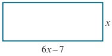

## Answer

 $ \begin{array}{l} \text{Area} = x(6x - 7) = 6x^{2} - 7x = 90 \end{array} $

Rearrange.

 $$ 6x^{2}-7x-90=0 $$ 

Factorise.

 $$ (2x-9)(3x+10)=0 $$ 

 $$ 2x-9=0or3x+10=0 $$ 

Solve.

 $$ x=\frac{9}{2}\qquad\text{or}\qquad x=-\frac{10}{3} $$ 

Length is a positive quantity, so  $ x = 4\frac{1}{2} $.

When  $ x = 4\frac{1}{2} $,  $ 6x - 7 = 20 $.

The rectangle has sides of length $4\frac{1}{2}$ cm and 20 cm.

### EXPLORE 1.2

A

 $$ 4^{(2x^{2}+x-6)}=1 $$ 

 $$ (x^{2}-3x+1)^{6}=1 $$ 

 $$ (x^{2}-3x+1)^{(2x^{2}+x-6)}=1 $$ 

1 Discuss with your classmates how you would solve each of these equations.

2 Solve:

a equation A

b equation B

c equation C

3 State how many values of x satisfy:

a equation A

b equation B

c equation C

4 Discuss your results.

## TIP

Remember to check each of your answers.

<!-- page 18 -->

1 Solve by factorisation.

 $$ x^{2}+3x-10=0 $$ 

 $$ x^{2}-7x+12=0 $$ 

c  $ x^{2}-6x-16=0 $

d  $ 5x^{2}+19x+12=0 $

 $$ 20-7x=6x^{2} $$ 

f $x(10x-13)=3$

2 Solve:

a  $ x - \frac{6}{x - 5} = 0 $

$$\mathbf{b} \quad \frac{2}{x}+\frac{3}{x+2}=1$$

$$\mathbf{d} \quad \frac{5}{x+3}+\frac{3x}{x+4}=2$$

$$\mathbf{f} \quad \frac{3}{x+2}+\frac{1}{x-1}=\frac{1}{(x+1)(x+2)}$$

 $ \frac{5x+1}{4}-\frac{2x-1}{2}=x^{2} $

e  $ \frac{3}{x+1}+\frac{1}{x(x+1)}=2 $

3 Solve:

a  $ \frac{3x^{2}+x-10}{x^{2}-7x+6}=0 $

 $ \mathbf{b} \quad \frac{x^{2} + x - 6}{x^{2} + 5} = 0 $

c  $ \frac{x^{2}-9}{7x+10}=0 $

d  $ \frac{x^{2}-2x-8}{x^{2}+7x+10}=0 $

 $  \mathbf{e} \quad \frac{6x^{2} + x - 2}{x^{2} + 7x + 4} = 0  $

 $ f \quad \frac{2x^2 + 9x - 5}{x^4 + 1} = 0 $

4 Find the real solutions of the following equations.

 $$ 8^{({x^{2}}+2x-15)}=1 $$ 

 $$ 4^{(2x^{2}-11x+15)}=1 $$ 

c  $ 2^{(x^{2}-4x+6)}=8 $

d  $ 3^{(2x^{2}+9x+2)}=\frac{1}{9} $

 $ \mathbf{e} \quad (x^{2} + 2x - 14)^{5} = 1 $

 $$ \textbf{f} (x^{2}-7x+11)^{8}=1 $$ 

5 The diagram shows a right-angled triangle with sides 2x cm,  $ (2x + 1) $ cm and 29 cm.

a Show that  $ 2x^{2} + x - 210 = 0 $.

b Find the lengths of the sides of the triangle.

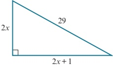

6 The area of the trapezium is 35.75 cm². Find the value of x.

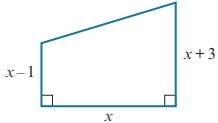

## TIP

Check that your answers satisfy the original equation.

## WEB LINK

7 Solve  $ (x^{2}-11x+29)^{(6x^{2}+x-2)}=1 $.

### 1.2 Completing the square

Try the Factorisable quadratics resource on the Underground Mathematics website.

Another method we can use for solving quadratic equations is completing the square.

The method of completing the square aims to rewrite a quadratic expression using only one occurrence of the variable, making it an easier expression to work with.

If we expand the expressions  $ (x+d)^{2} $ and  $ (x-d)^{2} $, we obtain the results:

 $$ (x+d)^{2}=x^{2}+2dx+d^{2}\quad and\quad(x-d)^{2}=x^{2}-2dx+d^{2} $$

<!-- page 19 -->

Rearranging these gives the following important results:

### KEY POINT 1.1

 $$ x^{2}+2dx=(x+d)^{2}-d^{2}\quad and\quad x^{2}-2dx=(x-d)^{2}-d^{2} $$ 

To complete the square for  $ x^{2} + 10x $, we can use the first of the previous results as follows:

 $$ \begin{array}{r} 10\div2=5 \\ \downarrow \end{array} $$ 

 $$ x^{2}+10x=(x+5)^{2}-5^{2} $$ 

 $$ x^{2}+10x=(x+5)^{2}-25 $$ 

To complete the square for  $ x^2 + 8x - 7 $, we again use the first result applied to the  $ x^2 + 8x $ part, as follows:

 $$ 8\div2=4 $$ 

 $$ x^{2}+8x-7=(x+4)^{2}-4^{2}-7 $$ 

 $$ x^{2}+8x-7=(x+4)^{2}-23 $$ 

To complete the square for  $ 2x^{2}-12x+5 $, we must first take a factor of 2 out of the first two terms, so:

 $$ 2x^{2}-12x+5=2(x^{2}-6x)+5 $$ 

 $$ \begin{array}{l}6\div2=3\\\downarrow\end{array} $$ 

 $$ x^{2}-6x=(x-3)^{2}-3^{2},giving $$ 

 $$ 2x^{2}-12x+5=2\left[(x-3)^{2}-9\right]+5=2(x-3)^{2}-13 $$ 

We can also use an algebraic method for completing the square, as shown in Worked example 1.5.

### WORKED EXAMPLE 1.5

Express  $ 2x^{2}-12x+3 $ in the form  $ p(x-q)^{2}+r $, where p, q and r are constants to be found.

## Answer

 $$ 2x^{2}-12x+3=p(x-q)^{2}+r $$ 

Expanding the brackets and simplifying gives:

 $$ 2x^{2}-12x+3=px^{2}-2pqx+pq^{2}+r $$ 

Comparing coefficients of  $ x^{2} $, coefficients of x and the constant gives

 $$ 2=p\cdots\cdots\cdots\cdots(1) $$ 

 $$ -12=-2\,pq\cdots\cdots\cdots\cdots\cdots  (2) $$ 

 $$ 3=p q^{2}+r\cdots\cdots\cdots(3) $$ 

Substituting $p=2$ in equation (2) gives $q=3$

Substituting $p=2$ and $q=3$ in equation (3) therefore gives $r = -15$

 $$ 2x^{2}-12x+3=2(x-3)^{2}-15 $$

<!-- page 20 -->

### WORKED EXAMPLE 1.6

Express  $ 4x^{2} + 20x + 5 $ in the form  $ (ax + b)^{2} + c $, where a, b and c are constants to be found.

Answer
 $ 4x^{2} + 20x + 5 = (ax + b)^{2} + c $

Expanding the brackets and simplifying gives:
 $ 4x^{2} + 20x + 5 = a^{2}x^{2} + 2abx + b^{2} + c $

Comparing coefficients of  $ x^{2} $, coefficients of x and the constant gives
 $ 4 = a^{2} - 2ab - 20 = 2ab - 20 = 2 - b^{2} + c $

Equation (1) gives  $ a = \pm 2 $.

Substituting a = 2 into equation (2) gives b = 5.

Substituting b = 5 into equation (3) gives c = -20.
 $ 4x^{2} + 20x + 5 = (2x + 5)^{2} - 20 $

Alternatively:

Substituting a = -2 into equation (2) gives b = -5.

Substituting b = -5 into equation (3) gives c = -20.
 $ 4x^{2} + 20x + 5 = (-2x - 5)^{2} - 20 = (2x + 5)^{2} - 20 $

### WORKED EXAMPLE 1.7

Use completing the square to solve the equation  $ \frac{5}{x+2} + \frac{3}{x-5} = 1 $. Leave your answers in such form.

 $$ \begin{array}{l}x- \quad + \quad \left\lfloor\begin{array}{c}2+\\ + \end{array}\right\rfloor  \equiv  4+ \end{array} $$ 

Multiply both sides by  $ (x+2)(x-5) $.

Expand brackets and collect terms.

 $$ \begin{array}{r} \begin{array}{r} 85 \\ 4 \quad 85 \\ 2 \quad 85 \\ 2 \quad 2 \end{array} \\ - \quad 11 \\ \hline 2 \\ x \quad - \quad 2 \\ = \quad 11 \\ + \quad 85 \end{array} $$ 

Complete the square.

 $$ \begin{array}{ll} x&-\quad\sqrt{\text{□}}\\ &x\quad-\quad\sqrt{\text{□}}\\ &x\quad\frac{1}{2}(11\quad\sqrt{85})\end{array} $$

<!-- page 21 -->

1 Express each of the following in the form  $ (x+a)^{2}+b $.

a  $ x^{2}-6x $ b  $ x^{2}+8x $ c  $ x^{2}-3x $ d  $ x^{2}+15x $ e  $ x^{2}+4x+8 $ f  $ x^{2}-4x-8 $ g  $ x^{2}+7x+1 $ h  $ x^{2}-3x+4 $

2 Express each of the following in the form  $ a(x+b)^{2}+c $.

a  $ 2x^{2}-12x+19 $ b  $ 3x^{2}-12x-1 $ c  $ 2x^{2}+5x-1 $ d  $ 2x^{2}+7x+5 $

3 Express each of the following in the form  $ a-(x+b)^2 $.

a  $ 4x - x^2 $ b  $ 8x - x^2 $ c  $ 4 - 3x - x^2 $ d  $ 9 + 5x - x^2 $

4 Express each of the following in the form  $ p - q(x + r)^2 $.

a  $ 7 - 8x - 2x^2 $ b  $ 3 - 12x - 2x^2 $ c  $ 13 + 4x - 2x^2 $ d  $ 2 + 5x - 3x^2 $

5 Express each of the following in the form  $ (ax + b)^2 + c $.

a  $ 9x^2 - 6x - 3 $ b  $ 4x^2 + 20x + 30 $ c  $ 25x^2 + 40x - 4 $ d  $ 9x^2 - 42x + 61 $

6 Solve by completing the square.

a  $ x^{2}+8x-9=0 $ b  $ x^{2}+4x-12=0 $ c  $ x^{2}-2x-35=0 $ d  $ x^{2}-9x+14=0 $ e  $ x^{2}+3x-18=0 $ f  $ x^{2}+9x-10=0 $

7 Solve by completing the square. Leave your answers in surd form.

a  $ x^{2} + 4x - 7 = 0 $ b  $ x^{2} - 10x + 2 = 0 $ c  $ x^{2} + 8x - 1 = 0 $ d  $ 2x^{2} - 4x - 5 = 0 $ e  $ 2x^{2} + 6x + 3 = 0 $ f  $ 2x^{2} - 8x - 3 = 0 $

8 Solve  $ \frac{5}{x+2}+\frac{3}{x-4}=2 $. Leave your answers in surd form.

9 The diagram shows a right-angled triangle with sides x m,  $ (2x + 5) $ m and 10 m.

Find the value of x. Leave your answer in surd form.

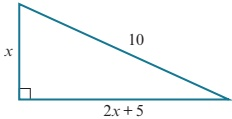

PS 10 Find the real solutions of the equation  $ (3x^{2}+5x-7)^{4}=1 $.

11 The path of a projectile is given by the equation  $ y = (\sqrt{3})x - \frac{49x^{2}}{9000} $, where x and y are measured in metres.

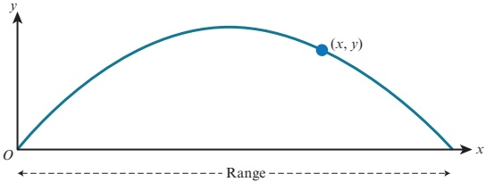

a Find the range of this projectile.

b Find the maximum height reached by this projectile.

## TIP

You will learn how to derive formulae such as this if you go on to study Further Mathematics.

<!-- page 22 -->

### 1.3 The quadratic formula

We can solve quadratic equations using the quadratic formula.

If  $ ax^{2} + bx + c = 0 $, where a, b and c are constants and  $ a \neq 0 $, then

### KEY POINT 1.2

 $$ x=\frac{-b\pm\sqrt{b^{2}-4ac}}{2a} $$ 

The quadratic formula can be proved by completing the square for the equation  $ ax^{2} + bx + c = 0 $:

 $$ ax^{2}+bx+c=0 $$ 

Divide both sides by $a$.

 $$ x^{2}+{\frac{b}{a}}{\left\vert x\right\vert}+{\frac{\left\lceil c-b\right\rceil}{a}}=0 $$ 

Complete the square.

 $$ \left(x+\frac{b}{2a}\right)^{2}-\left|\begin{matrix}\frac{b}{2a}+12\\ \frac{b}{2a}\end{matrix}\right|-\frac{c}{a}\quad0 $$ 

Rearrange the equation.

 $$ x\quad\frac{b}{2a}\quad^{2}\quad\frac{b^{2}}{4a^{2}}\quad\frac{c}{a} $$ 

Write the right-hand side as a single fraction.

 $$ \left(\begin{array}{cc}x&\displaystyle\frac{b}{2a}\end{array}\right)^{2}=\frac{b^{2}-4ac}{4a^{2}} $$ 

Find the square root of both sides.

 $$ x+\frac{b}{2a}=\pm\frac{\sqrt{b^{2}-4ac}}{2a} $$ 

Subtract  $ \frac{b}{2a} $ from both sides.

 $$ x=-\frac{b}{2a}\pm\frac{\sqrt{b^{2}-4ac}}{2a} $$ 

Write the right-hand side as a single fraction.

 $$ x=\frac{-b\pm\sqrt{b^{2}-4ac}}{2a} $$ 

### WORKED EXAMPLE 1.8

Solve the equation  $ 6x^{2}-3x-2=0 $.

Write your answers correct to 3 significant figures.

## Answer

Using $a = 6, b = -3$ and $c = -2$ in the quadratic formula gives:

 $$ x=\frac{-(-3)\pm\sqrt{(-3)^{2}-4\times6\times(-2)}}{2\times6} $$ 

 $$ x=\frac{3+\sqrt{57}}{12}or x=\frac{3-\sqrt{57}}{12} $$ 

x = 0.879 or x = -0.379 (to 3 significant figures)

<!-- page 23 -->

1 Solve using the quadratic formula. Give your answer correct to 2 decimal places.

a  $ x^{2}-10x-3=0 $ b  $ x^{2}+6x+4=0 $ c  $ x^{2}+3x-5=0 $ d  $ 2x^{2}+5x-6=0 $ e  $ 4x^{2}+7x+2=0 $ f  $ 5x^{2}+7x-2=0 $

2 A rectangle has sides of length  $ x \, \text{cm} $ and  $ (3x - 2) \, \text{cm} $.

The area of the rectangle is  $ 63 \, cm^2 $.

Find the value of x, correct to 3 significant figures.

3 Rectangle A has sides of length x cm and (2x - 4) cm.

Rectangle B has sides of length  $ (x + 1) $ cm and  $ (5 - x) $ cm.

Rectangle A and rectangle B have the same area.

Find the value of x, correct to 3 significant figures.

4 Solve the equation  $ \frac{5}{x-3}+\frac{2}{x+1}=1 $.

Give your answers correct to 3 significant figures.

5 Solve the quadratic equation  $ ax^{2} - bx + c = 0 $, giving your answers in terms of a, b and c.

How do the solutions of this equation relate to the solutions of the equation  $ ax^{2} + bx + c = 0 $

### 1.4 Solving simultaneous equations (one linear and one quadratic)

WEB LINK

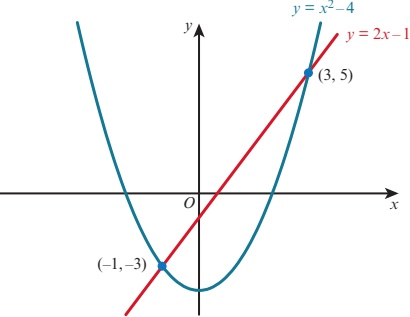

In this section, we shall learn how to solve simultaneous equations where one equation is linear and the second equation is quadratic.

Try the Quadratic solving sorter resource on the Underground Mathematics website.

The diagram shows the graphs of  $ y = x^{2} - 4 $ and y = 2x - 1.

The coordinates of the points of intersection of the two graphs are  $ (-1, -3) $ and  $ (3, 5) $. It follows that x = -1, y = -3 and x = 3, y = 5 are the solutions of the simultaneous equations  $ y = x^{2} - 4 $ and y = 2x - 1.

<!-- page 24 -->

The solutions can also be found algebraically:
 $ y = x^{2} - 4 $  $ \cdots\cdots\cdots $ (1)
 $ y = 2x - 1 $  $ \cdots\cdots\cdots $ (2)

Substitute for y from equation (2) into equation (1):

 $ 2x - 1 = x^{2} - 4 $ Rearrange.
 $ x^{2} - 2x - 3 = 0 $ Factorise.
 $ (x+1)(x-3)=0 $
x = -1 or x = 3

Substituting $x = -1$ into equation (2) gives $y = -2 - 1 = -3$.

Substituting $x=3$ into equation (2) gives $y=6-1=5$.

The solutions are: x = -1, y = -3 and x = 3, y = 5.

In general, an equation in x and y is called quadratic if it has the form  $ ax^{2} + bxy + cy^{2} + dx + ey + f = 0 $, where at least one of a, b and c is non-zero.

Our technique for solving one linear and one quadratic equation will work for these more general quadratics, too. (The graph of a general quadratic function such as this is called a conic.)

Solve the simultaneous equations.

 $ 2x + 2y = 7 $

 $ x^2 - 4y^2 = 8 $

Answer

 $ 2x + 2y = 7 $ ----- (1)

 $ x^2 - 4y^2 = 8 $ ----- (2)

From equation (1),  $ x = \frac{7 - 2y}{2} $.

Substitute for x in equation (2):

 $ \left( \frac{7 - 2y}{2} \right)^2 - 4y^2 = 8 $

Expand brackets.

 $ \frac{49 - 28y + 4y^2}{4} - 4y^2 = 8 $

Multiply both sides by 4.

 $ 49 - 28y + 4y^2 - 16y^2 = 32 $

Rearrange.

 $ 12y^2 + 28y - 17 = 0 $

Factorise.

 $ (6y + 17)(2y - 1) = 0 $

 $ y = -\frac{17}{6} $ or  $ y = \frac{1}{2} $

Substituting  $ y = -\frac{17}{6} $ in equation (1) gives  $ x = \frac{19}{3} $.

<!-- page 25 -->

Substituting  $  y = \frac{1}{2}  $ into equation (1) gives x = 3.

The solutions are:  $ x = \frac{19}{3} $,  $ y = -\frac{17}{6} $ and  $ x = 3 $,  $ y = \frac{1}{2} $.

## Alternative method:

From equation (1), 2y = 7 - 2x.

Substitute for 2y in equation (2):

 $$ x^{2}-(7-2x)^{2}=8 $$ 

Expand brackets.

 $$ x^{2}-49+28x-4x^{2}=8 $$ 

Rearrange.

 $$ 3x^{2}-28x+57=0 $$ 

Factorise.

 $$ (3x-19)(x-3)=0 $$ 

 $$ x=\frac{19}{3}\text{or}x=3 $$ 

The solutions are:  $ x = \frac{19}{3} $,  $ y = -\frac{17}{6} $ and  $ x = 3 $,  $ y = \frac{1}{2} $.

## EXERCISE 1D

## 1 Solve the simultaneous equations

a

 $$ y=6-x $$ 

b

 $$ x+4y=6 $$ 

 $$ y=x^{2} $$ 

c 3y = x + 10

d

 $$ x^{2}+2xy=8 $$ 

 $$ y=3x-1 $$ 

e

 $$ x^{2}+y^{2}=100 $$ 

f

x-2y=6

 $ x^{2}-4xy=20 $

 $$ 8x^{2}-2xy=4 $$ 

 $ 4x - 3y = 5 $

 $ x^{2} + 3xy = 10 $

 $ g\quad 2x+y=8 $

xy=8

h

 $ 2y - x = 5 $

 $ 2x^2 - 3y^2 = 15 $

i  $ x+2y=6 $

 $ x^{2}+y^{2}+4xy=24 $

j $5x - 2y = 23$

k x - 4 y = 2

 $$ x^{2}-5xy+y^{2}=1 $$ 

12x-y=14

 $$ xy=12 $$ 

m

 $$ y^{2}=8x+4 $$ 

 $$ 2x+3y+19=0 $$ 

n  $ x+2y=5 $

o x - 12y = 30

 $$ 2x^{2}+3y=5 $$ 

 $$ x^{2}+y^{2}=10 $$ 

 $$ 2y^{2}-xy=20 $$ 

2 The sum of two numbers is 26. The product of the two numbers is 153.

a What are the two numbers?

b If instead the product is 150 (and the sum is still 26), what would the two numbers now be?

3 The perimeter of a rectangle is 15.8 cm and its area is 13.5 cm². Find the length of the sides of the rectangle.

<!-- page 26 -->

4 The sum of the perimeters of two squares is 50 cm and the sum of the areas is  $ 93.25 \, cm^2 $.

Find the side length of each square.

5 The sum of the circumference of two circles is  $ 36\pi $ cm and the sum of the areas is  $ 170\pi $ cm $ ^2 $.

Find the radius of each circle.

6 A cuboid has sides of length 5 cm, x cm and y cm. Given that  $ x + y = 20.5 $ and the volume of the cuboid is  $ 360 \, cm^3 $, find the value of x and the value of y.

7 The diagram shows a solid formed by joining a

hemisphere, of radius r cm, to a cylinder, of radius r cm

and height h cm.

The total height of the solid is 18 cm and the surface area is  $ 205\pi cm^{2} $.

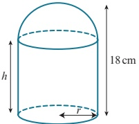

Find the value of r and the value of h.

## TIP

The surface area, A, of a sphere with radius r is  $ A = 4\pi r^{2} $.

8 The line y = 2 - x cuts the curve  $ 5x^{2} - y^{2} = 20 $ at the points A and B.

a Find the coordinates of the points A and B.

b Find the length of the line AB.

9 The line  $ 2x + 5y = 1 $ meets the curve  $ x^{2} + 5xy - 4y^{2} + 10 = 0 $ at the points A and B.

a Find the coordinates of the points A and B.

b Find the midpoint of the line AB.

10 The line  $ 7x + 2y = -20 $ intersects the curve  $ x^2 + y^2 + 4x + 6y - 40 = 0 $ at the points  $ A $ and  $ B $. Find the length of the line  $ AB $.

11 The line 7y - x = 25 cuts the curve  $ x^{2} + y^{2} = 25 $ at the points A and B. Find the equation of the perpendicular bisector of the line AB.

12 The straight line $y = x + 1$ intersects the curve $x^2 - y = 5$ at the points $A$ and $B$. Given that $A$ lies below the $x$-axis and the point $P$ lies on $AB$ such that $AP : PB = 4 : 1$, find the coordinates of $P$.

13 The line $x-2y=1$ intersects the curve $x+y^{2}=9$ at two points, $A$ and $B$.

Find the equation of the perpendicular bisector of the line $AB$.

14 a Split 10 into two parts so that the difference between the squares of the parts is 60.

b Split N into two parts so that the difference between the squares of the parts is D.

WEB LINK

Try the Elliptical crossings resource on the Underground Mathematics website.

<!-- page 27 -->

### 1.5 Solving more complex quadratic equations

You may be asked to solve an equation that is quadratic in some function of x.

### WORKED EXAMPLE 1.10

Solve the equation  $ 4x^{4}-37x^{2}+9=0 $.

Answer

Method 1: Substitution method
 $ 4x_{4}-37x_{2}+9=0 $
Let  $ y=x_{2} $.
 $ 4y_{2}-37y+9=0 $
 $ (4y-1)(y-9)=0 $
 $ y=\frac{1}{4} $ or  $ y=9 $
 $ x^{2}=\frac{1}{4} $ or  $ x^{2}=\frac{9}{3} $
 $ x=\pm\frac{1}{2} $ or  $ x=\pm\frac{3}{3} $
Method 2: Factorise directly
 $ 4x^{4}-37x^{2}+9=0 $
 $ (4x^{2}-1)(x^{2}-9)=0 $
 $ x^{2}=\frac{1}{4} $ or  $ x^{2}=9 $
 $ x=\pm\frac{1}{2} $ or  $ x=\pm3 $

### WORKED EXAMPLE 1.11

Solve the equation  $ x - 4\sqrt{x} - 12 = 0 $.

Answer

 $ x - 4\sqrt{x} - 12 = 0 $

Let  $ y = \sqrt{x} $.

 $ y^2 - 4y - 12 = 0 $

 $ (y - 6)(y + 2) = 0 $

 $ y = 6 $ or  $ y = -2 $

 $ \sqrt{x} = 6 $ or  $ \sqrt{x} = -2 $

 $ \therefore x = 36 $

Substitute  $ \sqrt{x} $ for  $ y $.

 $ \sqrt{x} = -2 $ has no solutions as  $ \sqrt{x} $ is never negative.

<!-- page 28 -->

### WORKED EXAMPLE 1.12

Solve the equation  $ 3(9^{x}) - 28(3^{x}) + 9 = 0 $.

## Answer

 $$ 3(3^{x})^{2}-28(3^{x})+9=0 $$ 

Let y = 3^{x}.

 $$ 3y^{2}-28y+9=0 $$ 

 $$ (3y-1)(y-9)=0 $$ 

 $$ y=\frac{1}{3}\text{or}y=9 $$ 

Substitute $3^{x}$ for $y$.

 $$ 3^{x}=\frac{3}{1}\quad\begin{array}{l}\text{or}\\3^{x}=9\end{array} $$ 

 $$ \frac{1}{3}=3^{-1}and9=3^{2}. $$ 

 $$ x=-1\text{or}x=2 $$ 

## EXERCISE 1E

1 Find the real values of x that satisfy the following equations.

a

 $$ x^{4}-13x^{2}+36=0 $$ 

b

 $$ x^{6}-7x^{3}-8=0 $$ 

c

 $$ x^{4}-6x^{2}+5=0 $$ 

d

 $$ 2x^{4}-11x^{2}+5=0 $$ 

e

 $$ 3x^{4}+x^{2}-4=0 $$ 

 $ f \quad 8x^6 - 9x^3 + 1 = 0 $

g

 $$ x^{4}+2x^{2}-15=0 $$ 

h

 $$ x^{4}+9x^{2}+14=0 $$ 

i  $ x^{8}-15x^{4}-16=0 $

j

 $$ 32x^{10}-31x^{5}-1=0 $$ 

k

 $$ \frac{9}{x^{4}}+\frac{5}{x^{2}}=4 $$ 

l

 $$ \frac{8}{x^{6}}+\frac{7}{x^{3}}=1 $$ 

2 Solve:

a

 $$ 2x-9\sqrt{x}+10=0 $$ 

b

 $$ \sqrt{x}(\sqrt{x}+1)=6 $$ 

C

 $$ 6x-17\sqrt{x}+5=0 $$ 

d

 $$ 10x+\sqrt{x}-2=0 $$ 

e

 $$ 8x+5=14\sqrt{x} $$ 

 $$ 3\sqrt{x}+\frac{5}{\sqrt{x}}=16 $$ 

3 The curve  $ y = 2\sqrt{x} $ and the line 3y = x + 8 intersect at the points A and B.

a Write down an equation satisfied by the x-coordinates of A and B.

b Solve your equation in part a and, hence, find the coordinates of A and B.

c Find the length of the line AB.

4 The graph shows $y = ax + b\sqrt{x}$ and it meets the graph crosses the $x$-axis at the points $(1, 0)$ and $\left(\frac{49}{4}, 0\right)$.

Find the value of $a$, the value of $b$ and the value of $c$.

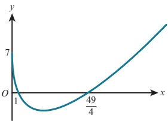

<!-- page 29 -->

## PS 5 The graph shows  $ y = a(2^{2x}) + b(2^x) + c $

The graph crosses the axes at the points  $ (2,0) $,  $ (4,0) $ and  $ (0,90) $. Find the value of a, the value of b and the value of c.

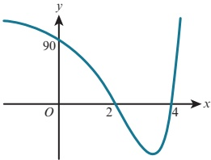

### 1.6 Maximum and minimum values of a quadratic function

The general form of a quadratic function is  $ f(x) = ax^2 + bx + c $, where  $ a, b $ and  $ c $ are constants and  $ a \ne 0 $.

The shape of the graph of the function  $ f(x) = ax^2 + bx + c $ is called a parabola.

The orientation of the parabola depends on the value of a, the coefficient of  $ x^{2} $.

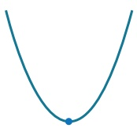

If $a>0$, the curve has a minimum point that occurs at the lowest point of the curve.

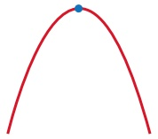

If $a < 0$, the curve has a maximum point that occurs at the highest point of the curve.

the coordinates of the vertex.

Depending on the context we should show some or all of these.

The skills you developed earlier in this chapter should enable you to draw a clear sketch graph for any quadratic function.

the axis intercepts

A point where the gradient is zero is called a stationary point or a turning point.

In the case of a parabola, we also call this point the vertex of the parabola.

Every parabola has a line of symmetry that passes through the vertex.

One important skill that we will develop during this course is ‘graph sketching’.

A sketch graph needs to show the key features and behaviour of a function.

When we sketch the graph of a quadratic function, the key features are:

the general shape of the graph

## WEB LINK

Try the Quadratic symmetry resource on the Underground Mathematics website for a further explanation of this.

<!-- page 30 -->

## DID YOU KNOW?

If we rotate a parabola about its axis of symmetry, we obtain a three-dimensional shape called a paraboloid. Satellite dishes are paraboloid shapes. They have the special property that light rays are reflected to meet at a single point, if they are parallel to the axis of symmetry of the dish. This single point is called the focus of the satellite dish. A receiver at the focus of the paraboloid then picks up all the information entering the dish.

### WORKED EXAMPLE 1.13

For the function  $ f(x) = x^{2} - 3x - 4 $:

a Find the axes crossing points for the graph of y = f(x).

b Sketch the graph of $y = f(x)$ and find the coordinates of the vertex.

## Answer

 $ y = x^{2} - 3x - 4 $
When x = 0, y = -4
When y = 0,  $ x^{2} - 3x - 4 = 0 $
 $ (x+1)(x-4)=0 $
x = -1 or x = 4
Axes crossing points are: (0, -4

Axes crossing points are:  $ (0, -4) $,  $ (-1, 0) $ and  $ (4, 0) $.

b The line of symmetry cuts the x-axis midway between the axis intercepts of -1 and 4.

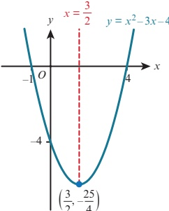

Hence, the line of  $ \overline{symme}\underline{try} $ is  $ x^{\prime} = \frac{3}{2} $.

 $ \begin{array}{l} \textbf{Since}  \\ \text{When } x = \frac{3}{2}, y = \left( \frac{3}{2}, \frac{3}{2} \right)  \end{array} $

 $$ \begin{array}{l} y \quad \frac{25}{4} \end{array} $$ 

a>0, the curve is U-shaped.

 $$ \text{Minimum point}=\left(\frac{3}{2},-\frac{25}{4}\right) $$ 

## TIP

Write your answer in fraction form.

<!-- page 31 -->

Completing the square is an alternative method that can be used to help sketch the graph of a quadratic function.  $ \left\{\begin{array}{l} - \\ \end{array}\right\} $

Completing the square for  $ x^{2}-3x-4 $ gives:

The minimum  $ \overline{\text{value}} $ of  $ \cdot -1 $

 $$ x^{2}-3x-4=\left(x-\frac{3}{2}\right\}^{2}\quad\frac{3}{2}\quad^{2}\quad4 $$ 

 $$ x\quad\frac{3}{2}^{2}\quad\frac{25}{4} $$ 

This part of the expression is a square so it will be at least zero. The smallest value it can be is 0. This occurs when  $ x = \frac{3}{2} $.

 $ \left(x-\frac{3}{2}\right)^2 \quad \frac{25}{4} \quad -\frac{25}{4} $ and this minimum occurs when  $ x=\frac{3}{2} $.

So the function  $ f(x)=x^2-3x-4 $ has a minimum point at  $ \left(\frac{3}{2}, -\frac{25}{4}\right) $.

The line of symmetry is  $ x=\frac{3}{2} $.

### KEY POINT 1.3

If  $ f(x) = ax^2 + bx + c $ is written in the form  $ f(x) = a(x - h)^2 + k $, then:

the line of symmetry is  $ x = h = -\frac{b}{2a} $

if $a>0$, there is a minimum point at $(h,k)$

if $a < 0$, there is a maximum point at $(h, k)$.

### WORKED EXAMPLE 1.14

Sketch the graph of y = 16x - 7 - 4x^{2}.

## Answer

Completing the square gives:

 $ 16x - 7 - 4x^2 = 9 - 4(x - 2)^2 $

The maximum value of 9 - 4(x - 2)^{2} is 9 and this maximum occurs when x = 2.

So the function  $ f(x) = 16x - 7 - 4x^{2} $ has a maximum point at (2, 9).

The line of symmetry is x = 2.

When x = 0, y = -7

This part of the expression is a square so  $ (x-2)^2 \geq 0 $.

The smallest value it can be is 0. This occurs when  $ x = 2 $.

Since this is being subtracted from 9, the whole expression is greatest when  $ x = 2 $.

When y = 0, 9 - 4(x - 2)^{2} = 0

 $$ (x-2)^{2}=\frac{9}{4} $$ 

 $$ x-2=\pm\frac{3}{2} $$ 

 $$ x=3\tfrac{1}{2}\text{or}x=\tfrac{1}{2} $$ 

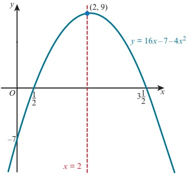

<!-- page 32 -->

## EXERCISE 1F

1 Use the symmetry of each quadratic function to find the maximum or minimum points.

Sketch each graph, showing all axes crossing points.

 $$ \mathbf{a}\quad y=x^{2}-6x+8\quad\mathbf{b}\quad y=x^{2}+5x-14\quad\mathbf{c}\quad y=2x^{2}+7x-15\quad\mathbf{d}\quad y=12+x-x^{2} $$ 

2 a Express  $ 2x^{2}-8x+5 $ in the form  $ a(x+b)^{2}+c $, where a, b and c are integers.

b Write down the equation of the line of symmetry for the graph of  $ y = 2x^{2} - 8x + 1 $.

3 a Express  $ 7 + 5x - x^{2} $ in the form  $ a - (x + b)^{2} $, where a, and b are constants.

b Find the coordinates of the turning point of the curve  $ y = 7 + 5x - x^2 $, stating whether it is a maximum or a minimum point.

4 a Express  $ 2x^{2}+9x+4 $ in the form  $ a(x+b)^{2}+c $, where a, b and c are constants.

b Write down the coordinates of the vertex of the curve  $ y = 2x^{2} + 9x + 4 $, and state whether this is a maximum or a minimum point.

5 Find the minimum value of  $ x^{2}-7x+8 $ and the corresponding value of x.

6 a Write  $ 1 + x - 2x^{2} $ in the form  $ p - 2(x - q)^{2} $.

b Sketch the graph of y = 1 + x - 2x^{2}.

7 Prove that the graph of  $ y = 4x^{2} + 2x + 5 $ does not intersect the x-axis.

PS 8 Find the equations of parabolas A, B and C.

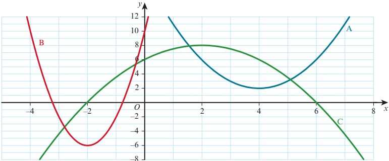

<!-- page 33 -->

PS 9 The diagram shows eight parabolas.

The equations of two of the parabolas are  $ y = x^2 - 6x + 13 $ and  $ y = -x^2 - 6x - 5 $.

a Identify these two parabolas and find the equation of each of the other parabolas.

b Use graphing software to create your own parabola pattern.

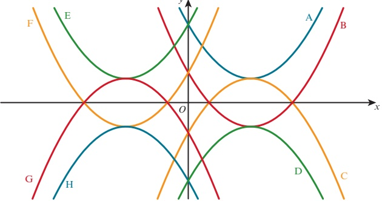

[This question is an adaptation of Which parabola? on the Underground Mathematics website and was developed from an original idea from NRICH.]

PS 10 A parabola passes through the points  $ (0, -24) $,  $ (-2, 0) $ and  $ (4, 0) $. Find the equation of the parabola.

PS 11 A parabola passes through the points  $ (-2, -3) $,  $ (2, 9) $ and  $ (6, 5) $. Find the equation of the parabola.

12 Prove that any quadratic that has its vertex at $(p, q)$ has an equation of the form $y = ax^{2} - 2apx + ap^{2} + q$ for some non-zero real number $a$.

### 1.7 Solving quadratic inequalities

We already know how to solve linear inequalities.

The following text shows two examples.

Solve  $ 2(x+7) < -4 $.

 $$ 2x+14<-4 $$ 

Expand brackets.

Subtract 14 from both sides.

 $$ 2x<-18 $$ 

Divide both sides by 2.

 $$ x<-9 $$ 

Solve  $ 11 - 2x \geq 5 $.

 $$ -2x\geqslant-6 $$ 

Subtract 11 from both sides.

Divide both sides by -2.

 $ x \leq 3 $

<!-- page 34 -->

The second of the previous examples uses the important rule that:

### KEY POINT 1.4

If we multiply or divide both sides of an inequality by a negative number, then the inequality sign must be reversed.

Quadratic inequalities can be solved by sketching a graph and considering when the graph is above or below the x-axis.

### WORKED EXAMPLE 1.15

Solve  $ x^{2}-5x-14>0 $.

## Answer

Sketch the graph of y = x^{2} - 5x - 14.

When y = 0,  $ x^2 - 5x - 14 = 0 $

So the x-axis crossing points are -2 and 7.

For  $ x^{2} - 5x - 14 > 0 $ we need to find the range of values of x for which the curve is positive (above the x-axis).

The solution is x < -2 or x > 7.

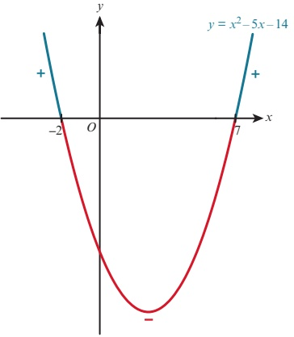

## TIP

For the sketch graph, you only need to identify which way up the graph is and where the x-intercepts are: you do not need to find the vertex or the y-intercept.

### WORKED EXAMPLE 1.16

Solve  $ 2x^{2} + 3x \leq 27 $.

## Answer

Rearranging:  $ 2x^{2} + 3x - 27 \leq 0 $

Sketch the graph of  $ y = 2x^{2} + 3x - 27 $.

 $ \textbf{When} \quad y = 0, 2x^{2} + 3x - 27 = 0 $

 $$ (2x+9)(x-3)=0 $$ 

 $$ x=-4\frac{1}{2}or x=3 $$ 

So the x-axis intercepts are  $ -4\frac{1}{2} $ and 3.

For  $ 2x^2 + 3x - 27 \leq 0 $ we need to find the range of values of  $ x $ for which the curve is either zero or negative (below the  $ x $-axis).

The solution is $ -4\frac{1}{2} \leq x \leq 3 $.

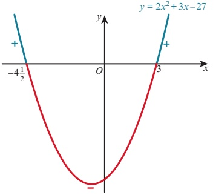

<!-- page 35 -->

### EXPLORE 1.3

Ivan is asked to solve the inequality  $ \frac{2x-4}{x} \geq 7 $.

This is his solution:

Multiply both sides by x:

 $$ 2x-4\geq7x $$ 

Subtract 2x from both sides:

 $$ -4\geqslant5x $$ 

Divide both sides by 5:

 $$ x\leq-\frac{4}{5} $$ 

Anika checks to see if x = -1 satisfies the original inequality.

## She writes:

When x = -1:  $ (2(-1) - 4) \div (-1) = 6 $

Hence, x = -1 is a value of x that does not satisfy the original inequality.

So Ivan's solution must be incorrect!

Discuss Ivan's solution with your classmates and explain Ivan's error.

How could Ivan have approached this problem to obtain a correct solution?

## EXERCISE 1G

1 Solve:

a  $ x(x-3)\leq0 $

b  $ (x-3)(x+2)>0 $

c  $ (x-6)(x-4)\leq0 $

d  $ (2x+3)(x-2)<0 $

e  $ (5 - x)(x + 6) \geq 0 $

f  $ (1-3x)(2x+1)<0 $

2 Solve:

a  $ x^{2}-25 \geqslant 0 $

b  $ x^{2}+7x+10\leq0 $

c  $ x^{2} + 6x - 7 > 0 $

d

 $$ 14x^{2}+17x-6\leq0 $$ 

e

 $$ 6x^{2}-23x+20<0 $$ 

f 4-7x-2x^{2}<0

3 Solve:

a x^{2} < 36 - 5x

b

 $$ 15x<x^{2}+56 $$ 

c  $ x(x+10) \leq 12 - x $

d

 $$ x^{2}+4x<3(x+2) $$ 

 $  (x+3)(1-x) < x - 1  $

f  $ (4x+3)(3x-1)<2x(x+3) $

 $ \mathbf{g}\quad(x+4)^{2}\geqslant25 $

 $$ \begin{array}{r l}{\mathfrak{h}}&{{}(x-2)^{2}>14-x}\end{array} $$ 

i 6x(x+1)<5(7-x)

4 Find the range of values of x for which  $ \frac{5}{2x^{2}+x-15}<0 $.

5 Find the set of values of x for which:

 $ x^{2} - 3x \geqslant 10 $ and  $ (x - 5)^{2} < 4 $

b  $ x^{2} + 4x - 21 \leq 0 $ and  $ x^{2} - 9x + 8 > 0 $

 $ c \quad x^2 + x - 2 > 0 \quad \text{and} \quad x^2 - 2x - 3 \geq 0 $

6 Find the range of values of x for which  $ 2^{x^2 - 3x - 40} > 1 $.

<!-- page 36 -->

7 Solve:

a  $ \frac{x}{x-1} \geq 3 $

b  $ \frac{x(x-1)}{x+1} > x $

c  $ \frac{x^{2}-9}{x-1}\geq4 $

d  $ \frac{x^{2}-2x-15}{x-2}\geq0 $

e  $ \frac{x^{2}+4x-5}{x^{2}-4}\leq0 $

f  $ \frac{x-3}{x+4} \geq \frac{x+2}{x-5} $

### 1.8 The number of roots of a quadratic equation

If  $ f(x) $ is a function, then we call the solutions to the equation  $ f(x) = 0 $ the roots of  $ f(x) $.

Consider solving the following three quadratic equations of the form  $ ax^{2} + bx + c = 0 $

ing the formula  $ x = \frac{-b \pm \sqrt{b^2 - 4ac}}{2a} $.

<table border=1 style='margin: auto; word-wrap: break-word;'><tr><td style='text-align: center; word-wrap: break-word;'>$ x^{2} + 2x - 8 = 0 $
 $ x = \frac{-2 \pm \sqrt{2^{2} - 4 \times 1 \times (-8)}}{2 \times 1} $
 $ x = \frac{-2 \pm \sqrt{36}}{2} $
x = 2 or x = -4
two distinct real roots</td><td style='text-align: center; word-wrap: break-word;'>$ x^{2} + 6x + 9 = 0 $
 $ x = \frac{-6 \pm \sqrt{6^{2} - 4 \times 1 \times 9}}{2 \times 1} $
 $ x = \frac{-6 \pm \sqrt{0}}{2} $
x = -3 or x = -3
two equal real roots</td><td style='text-align: center; word-wrap: break-word;'>$ x^{2} + 2x + 6 = 0 $
 $ x = \frac{-2 \pm \sqrt{2^{2} - 4 \times 1 \times 6}}{2 \times 1} $
x =  $ \frac{-2 \pm \sqrt{-20}}{2} $
no real solution no real roots</td></tr></table>

The part of the quadratic formula underneath the square root sign is called the discriminant.

### KEY POINT 1.5

The discriminant of  $ ax^{2} + bx + c = 0 $ is  $ b^{2} - 4ac $.

The sign (positive, zero or negative) of the discriminant tells us how many roots there are for a particular quadratic equation.

<table border=1 style='margin: auto; word-wrap: break-word;'><tr><td style='text-align: center; word-wrap: break-word;'>$ b^{2} - 4ac $</td><td style='text-align: center; word-wrap: break-word;'>Nature of roots</td></tr><tr><td style='text-align: center; word-wrap: break-word;'>&gt; 0</td><td style='text-align: center; word-wrap: break-word;'>two distinct real roots</td></tr><tr><td style='text-align: center; word-wrap: break-word;'>= 0</td><td style='text-align: center; word-wrap: break-word;'>two equal real roots (or 1 repeated real root)</td></tr><tr><td style='text-align: center; word-wrap: break-word;'>&lt; 0</td><td style='text-align: center; word-wrap: break-word;'>no real roots</td></tr></table>

There is a connection between the roots of the quadratic equation  $ ax^{2} + bx + c = 0 $ and the corresponding curve  $ y = ax^{2} + bx + c $.

<table border=1 style='margin: auto; word-wrap: break-word;'><tr><td style='text-align: center; word-wrap: break-word;'>$ b^{{2}} - 4ac $</td><td style='text-align: center; word-wrap: break-word;'>Nature of roots of  $ ax^{{2}} + bx + c = 0 $</td><td style='text-align: center; word-wrap: break-word;'>Shape of curve  $ y = ax^{{2}} + bx + c $</td></tr><tr><td style='text-align: center; word-wrap: break-word;'>&gt; 0</td><td style='text-align: center; word-wrap: break-word;'>two distinct real roots</td><td style='text-align: center; word-wrap: break-word;'>The curve cuts the x-axis at two distinct points.\n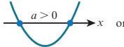 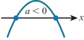</td></tr><tr><td style='text-align: center; word-wrap: break-word;'>= 0</td><td style='text-align: center; word-wrap: break-word;'>two equal real roots (or 1 repeated real root)</td><td style='text-align: center; word-wrap: break-word;'>The curve touches the x-axis at one point.\n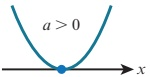 or 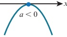</td></tr><tr><td style='text-align: center; word-wrap: break-word;'>&lt; 0</td><td style='text-align: center; word-wrap: break-word;'>no real roots</td><td style='text-align: center; word-wrap: break-word;'>The curve is entirely above or entirely below the x-axis.\n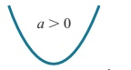 or 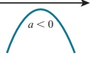</td></tr></table>

<!-- page 37 -->

### WORKED EXAMPLE 1.17

Find the values of k for which the equation  $ 4x^{2} + kx + 1 = 0 $ has two equal roots.

## Answer

For two equal roots:

 $$ b^{2}-4a c=0 $$ 

 $$ k^{2}-4\times4\times1=0 $$ 

 $$ k^{2}=16 $$ 

 $$ k=-4\text{or}k=4 $$ 

### WORKED EXAMPLE 1.18

Find the values of k for which  $ x^{2}-5x+9=k(5-x) $ has two equal roots.

## Answer

 $$ x^{2}-5x+9=k(5-x) $$ 

 $$ x^{2}-5x+9-5k+kx=0 $$ 

Rearrange the equation into the form  $ ax^{2} + bx + c = 0 $.

 $$ x^{2}+(k-5)x+9-5k=0 $$ 

For two equal roots:  $ b^{2}-4ac=0 $

 $$ (k-5)^{2}-4\times1\times(9-5k)=0 $$ 

 $$ k^{2}-10k+25-36+20k=0 $$ 

 $$ k^{2}+10k-11=0 $$ 

 $ (k+11)(k-1)=0 $

k = -11 or k = 1

### WORKED EXAMPLE 1.19

Find the values of k for which  $ kx^{2}-2kx+8=0 $ has two distinct roots.

## Answer

 $$ kx^{2}-2kx+8=0 $$ 

For two distinct roots:

 $$ b^{2}-4a c>0 $$ 

 $$ (-2k)^{2}-4\times k\times8>0 $$ 

 $$ 4k^{2}-32k>0 $$ 

 $$ 4k(k-8)>0 $$ 

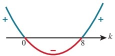

Critical values are 0 and 8.

Note that the critical values are where  $ 4k(k-8)=0 $.

Hence, k < 0 or k > 8.

<!-- page 38 -->

## EXERCISE 1H

1 Find the discriminant for each equation and, hence, decide if the equation has two distinct roots, two equal roots or no real roots.

 $ a x^{2}-12x+36=0 $ b  $ x^{2}+5x-36=0 $ c  $ x^{2}+9x+2=0 $ d  $ 4x^{2}-4x+1=0 $ e  $ 2x^{2}-7x+8=0 $ f  $ 3x^{2}+10x-2=0 $

2 Use the discriminant to determine the nature of the roots of  $ 2 - 5x = \frac{4}{x} $

3 The equation  $ x^{2} + bx + c = 0 $ has roots -5 and 7.

Find the value of b and the value of c.

4 Find the values of k for which the following equations have two equal roots

a  $ x^{2}+kx+4=0 $ b  $ 4x^{2}+4(k-2)x+k=0 $

c  $ (k+2)x^{2}+4k=(4k+2)x $ d  $ x^{2}-2x+1=2k(k-2) $

e  $ (k+1)x^{2}+kx-2k=0 $ f  $ 4x^{2}-(k-2)x+9=0 $

5 Find the values of k for which the following equations have two distinct roots:

a  $ x^{2}+8x+3=k $

b  $ 2x^{2}-5x=4-k $

c  $ kx^{2}-4x+2=0 $

d  $ kx^{2}+2(k-1)x+k=0 $

e  $ 2x^{2}=2(x-1)+k $

f  $ kx^{2}+(2k-5)x=1-k $

6 Find the values of k for which the following equations have no real roots.

6 Find the values of k for which the following equations have no real roots

a  $ kx^{2}-4x+8=0 $ b  $ 3x^{2}+5x+k+1=0 $

c  $ 2x^{2}+8x-5=kx^{2} $ d  $ 2x^{2}+k=3(x-2) $

e  $ kx^{2}+2kx=4x-6 $ f  $ kx^{2}+kx=3x-2 $

7 The equation  $ kx^{2} + px + 5 = 0 $ has repeated real roots. Find k in terms of p.

8 Find the range of values of k for which the equation  $ kx^{2}-5x+2=0 $ has real roots.

9 Prove that the roots of the equation  $ 2kx^{2} + 5x - k = 0 $ are real and distinct for all real values of k.

10 Prove that the roots of the equation  $ x^{2}+(k-2)x-2k=0 $ are real and distinct for all real values of k.

P 11 Prove that  $ x^{2} + kx + 2 = 0 $ has real roots if  $ k \geqslant 2\sqrt{2} $.

For which other values of k does the equation have real roots?

## WEB LINK

Try the Discriminating resource on the Underground Mathematics website.

<!-- page 39 -->

### 1.9 Intersection of a line and a quadratic curve

When considering the intersection of a straight line and a parabola, there are three possible situations.

<table border=1 style='margin: auto; word-wrap: break-word;'><tr><td style='text-align: center; word-wrap: break-word;'>Situation 1</td><td style='text-align: center; word-wrap: break-word;'>Situation 2</td><td style='text-align: center; word-wrap: break-word;'>Situation 3</td></tr><tr><td style='text-align: center; word-wrap: break-word;'>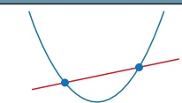</td><td style='text-align: center; word-wrap: break-word;'>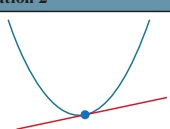</td><td style='text-align: center; word-wrap: break-word;'>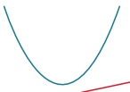</td></tr><tr><td style='text-align: center; word-wrap: break-word;'>two points of intersection</td><td style='text-align: center; word-wrap: break-word;'>one point of intersection</td><td style='text-align: center; word-wrap: break-word;'>no points of intersection</td></tr><tr><td style='text-align: center; word-wrap: break-word;'>The line cuts the curve at two distinct points.</td><td style='text-align: center; word-wrap: break-word;'>The line touches the curve at one point. This means that the line is a tangent to the curve.</td><td style='text-align: center; word-wrap: break-word;'>The line does not intersect the curve.</td></tr></table>

We have already learnt that to find the points of intersection of a straight line and a quadratic curve, we solve their equations simultaneously.

The discriminant of the resulting equation then enables us to say how many points of intersection there are. The three possible situations are shown in the following table.

<table border=1 style='margin: auto; word-wrap: break-word;'><tr><td style='text-align: center; word-wrap: break-word;'>$ b^{2} $ - 4ac</td><td style='text-align: center; word-wrap: break-word;'>Nature of roots</td><td style='text-align: center; word-wrap: break-word;'>Line and curve</td></tr><tr><td style='text-align: center; word-wrap: break-word;'>&gt; 0</td><td style='text-align: center; word-wrap: break-word;'>two distinct real roots</td><td style='text-align: center; word-wrap: break-word;'>two distinct points of intersection</td></tr><tr><td style='text-align: center; word-wrap: break-word;'>= 0</td><td style='text-align: center; word-wrap: break-word;'>two equal real roots (repeated roots)</td><td style='text-align: center; word-wrap: break-word;'>one point of intersection (line is a tangent)</td></tr><tr><td style='text-align: center; word-wrap: break-word;'>&lt; 0</td><td style='text-align: center; word-wrap: break-word;'>no real roots</td><td style='text-align: center; word-wrap: break-word;'>no points of intersection</td></tr></table>

### WORKED EXAMPLE 1.20

Find the value of k for which y = x + k is a tangent to the curve  $ y = x^{2} + 5x + 2 $.

Answer

 $$ x^{2}+5x+2=x+k $$ 

 $$ x^{2}+4x+(2-k)=0 $$ 

Since the line is a tangent to the curve, the discriminant of the quadratic must be zero, so:

 $$ b^{2}-4a c=0 $$ 

 $$ 4^{2}-4\times1\times(2-k)=0 $$ 

 $$ 16-8+4k=0 $$ 

 $$ 4k=-8 $$ 

 $$ k=-2 $$

<!-- page 40 -->

### WORKED EXAMPLE 1.21

Find the set of values of k for which y = kx - 1 intersects the curve  $ y = x^2 - 2x $ at two distinct points.

Answer

 $ x^2 - 2x = kx - 1 $

 $ x^2 - (k + 2)x + 1 = 0 $

Since the line intersects the curve at two distinct points, we must have discriminant > 0.

 $ b^2 - 4ac > 0 $

 $ (k + 2)^2 - 4 \times 1 \times 1 > 0 $

 $ k^2 + 4k > 0 $

 $ k(k + 4) > 0 $

Critical values are -4 and 0.

Hence, k < -4 or k > 0.

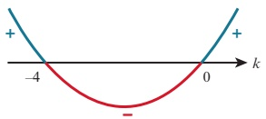

This next example involves a more general quadratic equation. Our techniques for finding the conditions for intersection of a straight line and a quadratic equation will work for this more general quadratic equation too.

### WORKED EXAMPLE 1.22

Find the set of values of k for which the line  $ 2x + y = k $ does not intersect the curve xy = 8.

## Answer

Substituting y = k - 2x into xy = 8 gives:
 $ x(k - 2x) = 8 $
 $ 2x^2 - kx + 8 = 0 $
Since the line and curve do not intersect, we
 $ b^2 - 4ac < 0 $
 $ (-k)^2 - 4 \times 2 \times 8 < 0 $
 $ k^2 - 64 < 0 $
 $ (k + 8)(k - 8) < 0 $
Critical values are -8 and 8.
Hence, -8 < k < 8.

Since the line and curve do not intersect, we must have discriminant < 0.

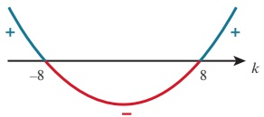

<!-- page 41 -->

1 Find the values of k for which the line  $ y = kx + 1 $ is a tangent to the curve  $ y = x^{2} - 7x + 2 $.

2 Find the values of k for which the x-axis is a tangent to the curve  $ y = x^{2} - (k + 3)x + (3k + 4) $.

3 Find the value of k for which the line  $ x + ky = 12 $ is a tangent to the curve  $ y = \frac{5}{x - 2} $.

Can you explain graphically why there is only one such value of k? (You may want to use graph-drawing software to help with this.)

4 The line y = k - 3x is a tangent to the curve  $ x^{2} + 2xy - 20 = 0 $.

a Find the possible values of k.

b For each of these values of k, find the coordinates of the point of contact of the tangent with the curve.

5 Find the values of $m$ for which the line $y = mx + 6$ is a tangent to the curve $y = x^{2} - 4x + 7$. For each of these values of $m$, find the coordinates of the point where the line touches the curve.

6 Find the set of values of $k$ for which the line $y = 2x - 1$ intersects the curve $y = x^{2} + kx + 3$ at two distinct points.

7 Find the set of values of k for which the line  $ x + 2y = k $ intersects the curve xy = 6 at two distinct points.

8 Find the set of values of k for which the line y = k - x cuts the curve y = 5 - 3x - x^{2} at two distinct points.

9 Find the set of values of $m$ for which the line $y = mx + 5$ does not meet the curve $y = x^{2} - x + 6$.

10 Find the set of values of k for which the line y = 2x - 10 does not meet the curve  $ y = x^{2} - 6x + k $.

11 Find the value of k for which the line  $ y = kx + 6 $ is a tangent to the curve  $ x^{2} + y^{2} - 10x + 8y = 84 $.

12 The line $y = mx + c$ is a tangent to the curve $y = x^{2} - 4x + 4$. Prove that $m^{2} + 8m + 4c = 0$.

13 The line  $ y = mx + c $ is a tangent to the curve  $ ax^2 + by^2 = c $, where  $ a, b, c $ and  $ m $ are constants.

Prove that  $ m^2 = \frac{abc - a}{b} $.

<!-- page 42 -->

## Checklist of learning and understanding

## Quadratic equations can be solved by:

factorisation

completing the square

using the quadratic formula  $ x = \frac{-b \pm \sqrt{b^2 - 4ac}}{2a} $.

Solving simultaneous equations where one is linear and one is quadratic

Rearrange the linear equation to make either x or y the subject.

Substitute this for x or y in the quadratic equation and then solve.

## Maximum and minimum points and lines of symmetry

For a quadratic function  $ f(x) = ax^2 + bx + c $ that is written in the form  $ f(x) = a(x - h)^2 + k $:

the line of symmetry is  $ x = h = -\frac{b}{2a} $

if $a>0$, there is a minimum point at $(h,k)$

if $a < 0$, there is a maximum point at $(h, k)$.

Quadratic equation  $ ax^{2} + bx + c = 0 $ and corresponding curve  $ y = ax^{2} + bx + c $

Discriminant =  $ b^{2} - 4ac $

If  $ b^{2}-4ac>0 $, then the equation  $ ax^{2}+bx+c=0 $ has two distinct real roots.

If  $ b^{2}-4ac=0 $, then the equation  $ ax^{2}+bx+c=0 $ has two equal real roots.

If  $ b^{2}-4ac<0 $, then the equation  $ ax^{2}+bx+c=0 $ has no real roots.

The condition for a quadratic equation to have real roots is  $ b^{2}-4ac \geqslant 0 $.

## Intersection of a line and a general quadratic curve

If a line and a general quadratic curve intersect at one point, then the line is a tangent to the curve at that point.

Solving simultaneously the equations for the line and the curve gives an equation of the form  $ ax^{2} + bx + c = 0 $.

 $ b^{2} - 4ac $ gives information about the intersection of the line and the curve.

<table border=1 style='margin: auto; word-wrap: break-word;'><tr><td style='text-align: center; word-wrap: break-word;'>$ b^{2} $ - 4ac</td><td style='text-align: center; word-wrap: break-word;'>Nature of roots</td><td style='text-align: center; word-wrap: break-word;'>Line and parabola</td></tr><tr><td style='text-align: center; word-wrap: break-word;'>&gt; 0</td><td style='text-align: center; word-wrap: break-word;'>two distinct real roots</td><td style='text-align: center; word-wrap: break-word;'>two distinct points of intersection</td></tr><tr><td style='text-align: center; word-wrap: break-word;'>= 0</td><td style='text-align: center; word-wrap: break-word;'>two equal real roots</td><td style='text-align: center; word-wrap: break-word;'>one point of intersection (line is a tangent)</td></tr><tr><td style='text-align: center; word-wrap: break-word;'>&lt; 0</td><td style='text-align: center; word-wrap: break-word;'>no real roots</td><td style='text-align: center; word-wrap: break-word;'>no points of intersection</td></tr></table>

<!-- page 43 -->

1 A curve has equation  $ y = 2xy + 5 $ and a line has equation  $ 2x + 5y = 1 $.  
  
The curve and the line intersect at the points A and B. Find the coordinates of the midpoint of the line AB.  
  
2 a Express  $ 9x^2 - 15x $ in the form  $ (3x - a)^2 - b $.  
  
b Find the set of values of x that satisfy the inequality  $ 9x^2 - 15x < 6 $.  
  
3 Find the real roots of the equation  $ \frac{36}{x^4} + 4 = \frac{25}{x^2} $.  
  
4 Find the set of values of k for which the line y = kx - 3 intersects the curve y = x^2 - 9x at two distinct points.  
  
5 Find the set of values of the constant k for which the line y = 2x + k meets the curve y = 1 + 2kx - x^2 at two distinct points.  
  
6 a Find the coordinates of the vertex of the parabola y = 4x^2 - 12x + 7.  
  
b Find the values of the constant k for which the line y = kx + 3 is a tangent to the curve y = 4x^2 - 12x + 7.  
  
7 A curve has equation y = 5 - 2x + x^2 and a line has equation y = 2x + k, where k is a constant.  
  
a Show that the x-coordinates of the points of intersection of the curve and the line are given by the equation x^2 - 4x + (5 - k) = 0.  
  
b For one value of k, the line intersects the curve at two distinct points, A and B, where the coordinates of A are  $ (-2, 13) $. Find the coordinates of B.  
  
c For the case where the line is a tangent to the curve at a point C, find the value of k and the coordinates of C.  
  
8 A curve has equation y = x^2 - 5x + 7 and a line has equation y = 2x - 3.  
  
a Show that the curve lies above the x-axis.  
  
b Find the coordinates of the points of intersection of the line and the curve.  
  
c Write down the set of values of x that satisfy the inequality x^2 - 5x + 7 < 2x - 3.  
  
9 A curve has equation y = 10x - x^2.  
  
a Express  $ 10x - x^2 $ in the form  $ a - (x + b)^2 $.  
  
b Write down the coordinates of the vertex of the curve.  
  
c Find the set of values of x for which y ≤ 9.  
  
10 A line has equation y = kx + 6 and a curve has equation y = x^2 + 3x + 2k, where k is a constant.  
  
i For the case where k = 2, the line and the curve intersect at points A and B.  
  
Find the distance AB and the coordinates of the mid-point of AB.  
  
ii Find the two values of k for which the line is a tangent to the curve.  
  
Cambridge International AS & A Level Mathematics 9709 Paper 11 Q9 November 2011

<!-- page 44 -->

11 A curve has equation $y = x^{2} - 4x + 4$ and a line has the equation $y = mx$, where $m$ is a constant.  
  
i For the case where $m = 1$, the curve and the line intersect at the points $A$ and $B$.  
  
Find the coordinates of the mid-point of $AB$.  
  
ii Find the non-zero value of $m$ for which the line is a tangent to the curve, and find the coordinates of the point where the tangent touches the curve.  
  
[4]  
  
[5]  
  
Cambridge International AS & A Level Mathematics 9709 Paper 11 Q7 June 2013  
  
12 i Express $2x^{2} - 4x + 1$ in the form $a(x + b)^{2} + c$ and hence state the coordinates of the minimum point, $A$, on the curve $y = 2x^{2} - 4x + 1$.  
  
[4]  
  
The line $x - y + 4 = 0$ intersects the curve $y = 2x^{2} - 4x + 1$ at the points $P$ and $Q$.  
  
It is given that the coordinates of $P$ are $(3, 7)$.  
  
ii Find the coordinates of $Q$.  
  
iii Find the equation of the line joining $Q$ to the mid-point of $AP$.  
  
[3]  
  
[3]  
  
Cambridge International AS & A Level Mathematics 9709 Paper 11 Q10 June 2011

