# 2 Functions

<!-- Cambridge International AS A Level Mathematics Pure Mathematics 1.pdf p45-81 -->

<!-- page 45 -->

# Chapter 2 Functions

## In this chapter you will learn how to:

understand the terms function, domain, range, one-one function, inverse function and composition of functions

identify the range of a given function in simple cases, and find the composition of two given functions

determine whether or not a given function is one-one, and find the inverse of a one-one function in simple cases

illustrate in graphical terms the relation between a one-one function and its inverse

understand and use the transformations of the graph $y = f(x)$ given by $y = f(x) + a$, $y = f(x + a)$, $y = af(x)$, $y = f(ax)$ and simple combinations of these.

<!-- page 46 -->

## PREREQUISITE KNOWLEDGE

<table border=1 style='margin: auto; word-wrap: break-word;'><tr><td style='text-align: center; word-wrap: break-word;'>Where it comes from</td><td style='text-align: center; word-wrap: break-word;'>What you should be able to do</td><td style='text-align: center; word-wrap: break-word;'>Check your skills</td></tr><tr><td style='text-align: center; word-wrap: break-word;'>IGCSE / O Level Mathematics</td><td style='text-align: center; word-wrap: break-word;'>Find an output for a given function.</td><td style='text-align: center; word-wrap: break-word;'>1 If  $ f(x) = 3x - 2 $, find  $ f(4) $.</td></tr><tr><td style='text-align: center; word-wrap: break-word;'>IGCSE / O Level Mathematics</td><td style='text-align: center; word-wrap: break-word;'>Find a composite function.</td><td style='text-align: center; word-wrap: break-word;'>2 If  $ f(x) = 2x + 1 $ and  $ g(x) = 1 - x $, find  $ fg(x) $.</td></tr><tr><td style='text-align: center; word-wrap: break-word;'>IGCSE / O Level Mathematics</td><td style='text-align: center; word-wrap: break-word;'>Find the inverse of a simple function.</td><td style='text-align: center; word-wrap: break-word;'>3 If  $ f(x) = 5x + 4 $, find  $ f^{-1}(x) $.</td></tr><tr><td style='text-align: center; word-wrap: break-word;'>Chapter 1</td><td style='text-align: center; word-wrap: break-word;'>Complete the square.</td><td style='text-align: center; word-wrap: break-word;'>4 Express  $ 2x^{2} - 12x + 5 $ in the form  $ a(x + b)^{2} + c $.</td></tr></table>

## Why do we study functions?

At IGCSE / O Level, you learnt how to interpret expressions as functions with inputs and outputs and find simple composite functions and simple inverse functions.

There are many situations in the real world that can be modelled as functions. Some examples are:

the temperature of a hot drink as it cools over time

the height of a valve on a bicycle tyre as the bicycle travels along a horizontal road

the depth of water in a conical container as it is filled from a tap

the number of bacteria present after the start of an experiment.

Modelling these situations using appropriate functions enables us to make predictions about real-life situations, such as: How long will it take for the number of bacteria to exceed 5 billion?

In this chapter we will develop a deeper understanding of functions and their special properties.

### 2.1 Definition of a function

A function is a relation that uniquely associates members of one set with members of another set.

A function can be either a one-one function or a many-one function.

An alternative name for a function is a  $ \underline{\text{mapping}} $.

The function  $ x \mapsto x + 2 $, where  $ x \in \mathbb{R} $ is an example of a one-one function.

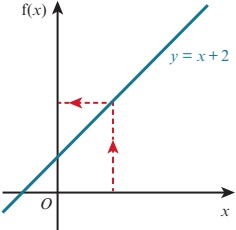

## WEB LINK

Try the Thinking about functions and Combining functions resources on the Underground Mathematics website.

## TIP

 $ x \in \mathbb{R} $ means that  $ x $ belongs to the set of real numbers.

<!-- page 47 -->

A one-one function has one output value for each input value. Equally important is the fact that for each output value appearing there is only one input value resulting in this output value.

We can write this function as  $ f: x \mapsto x + 2 $ for  $ x \in \mathbb{R} $ or  $ f(x) = x + 2 $ for  $ x \in \mathbb{R} $.

f :  $ x \mapsto x + 2 $ is read as ‘the function f is such that x is mapped to  $ x + 2 $’ or ‘f maps x to x + 2’.

f(x) is the output value of the function f when the input value is x. For example, when

 $ f(x) = x + 2 $,  $ f(5) = 5 + 2 = 7 $.

The function  $ x \mapsto x^2 $, where  $ x \in \mathbb{R} $ is a many-one function.

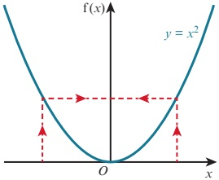

A many-one function has one output value for each input value but each output value can have more than one input value.

We can write this function as  $ f: x \mapsto x^2 $ for  $ x \in \mathbb{R} $ or  $ f(x) = x^2 $ for  $ x \in \mathbb{R} $.

f :  $ x \mapsto x^{2} $ is read as ‘the function f is such that x is mapped to  $ x^{2} $, or ‘f maps x to  $ x^{2} $’.

If we now consider the graph of  $ y^{2}=x $:

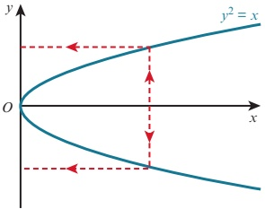

We can see that the input value shown has two output values. This means that this relation is not a function.

The set of input values for a function is called the domain of the function.

When defining a function, it is important to also specify its domain.

The set of output values for a function is called the range (or codomain) of the function.

<!-- page 48 -->

### WORKED EXAMPLE 2.1

f(x) = 5 - 2x \text{ for } x \in \mathbb{R}, -4 \leq x \leq 5.

a Write down the domain of the function f.

b Sketch the graph of the function f.

c Write down the range of the function f.

## Answer

a The domain is  $ -4 \leq x \leq 5 $.

b The graph of y = 5 - 2x is a straight line with gradient -2 and y-intercept 5.

When x = -4, y = 5 - 2(-4) = 13

When x = 5, y = 5 - 2(5) = -5

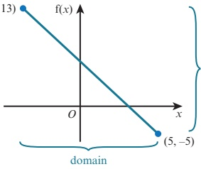

c The range is $-5 \leq f(x) \leq 13$.

### WORKED EXAMPLE 2.2

The function f is defined by  $ f(x) = (x - 3)^2 + 8 $ for  $ -1 \leq x \leq 9 $.

Sketch the graph of the function.

Find the range of f.

## Answer

 $ f(x) = (x - 3)^2 + 8 $ is a positive quadratic function so the graph will be of the form  $ \bigcup $.

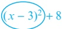

The minimum value of the expression is  $ 0 + 8 = 8 $ and this minimum occurs when x = 3.

So the function  $ f(x) = (x - 3)^2 + 8 $ will have a minimum point at the point  $ (3, 8) $.

The circled part of the expression is a square so it will always be  $ \geq 0 $.

The smallest value it can be is 0.

This occurs when  $ x = 3 $.

When x = -1,  $ y = (-1 - 3)^{2} + 8 = 24 $

When x = 9,  $ y = (9 - 3)^{2} + 8 = 44 $

<!-- page 49 -->

(-1,24)

(9,44)

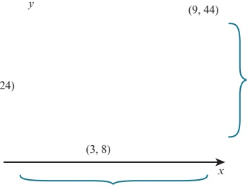

## EXERCISE 2A

1 Which of these graphs represent functions? If the graph represents a function, state whether it is a one-one function or a many-one function.

a  $ y = 2x - 3 $ for  $ x \in \mathbb{R} $

c  $ y = 2x^{3} - 1 $ for  $ x \in \mathbb{R} $

e  $ y = \frac{10}{x} $ for  $ x \in \mathbb{R} $,  $ x > 0 $

 $$ y=3x^{2}+4 $$ 

 $  \mathbf{g} \quad y = \sqrt{x} \quad \text{for} \quad x \in \mathbb{R}, \quad x \geq 0  $

 $$ y^{2}=4x $$ 

 $$ x\in\mathbb{R} $$ 

2 a Represent on a graph the function:

$$x\mapsto\begin{cases}9-x^2\text{for}x\in\mathbb{R},-3\leq x\leq2\\2x+1\text{for}x\in\mathbb{R},2\leq x\leq4\end{cases}$$

b State the nature of the function.

 $$ y=\left\{\begin{aligned}&x^{2}+1&for&0\leq x\leq2\\ &2x-3&for&2\leq x\leq4\end{aligned}\right. $$ 

3 a Represent on a graph the relation:

b Explain why this relation is not a function.

4 State the domain and range for the functions represented by these two graphs.

## TIP

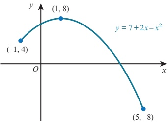

 $ x \in \mathbb{R}, \, x \geq 0 \text{ is} $

sometimes shortened

to just  $ x \geq 0 $.

b

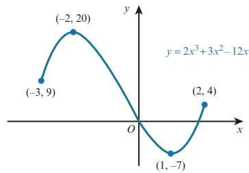

<!-- page 50 -->

5 Find the range for each of these functions.

a  $ f(x)=x+4 $ for x>8 b  $ f(x)=2x-7 $ for -3≤x≤2 c  $ f(x)=7-2x $ for -1≤x≤4 d  $ f:x\mapsto2x^{2} $ for 1≤x≤4 e  $ f(x)=2^{x} $ for -5≤x≤4 f  $ f(x)=\frac{12}{x} $ for 1≤x≤8

6 Find the range for each of these functions.

a  $ f(x) = x^2 - 2 $ for  $ x \in \mathbb{R} $

 $$ \mathbf{b}\quad\mathrm{f}:x\mapsto x^{2}+3\mathrm{f o r}-2\leq x\leq5 $$ 

 $$  f(x)=3-2x^{2} $$ 

 $$ x\leq2 $$ 

 $$ \text{d}\quad f(x)=7-3x^{2}\quad for-1\leq x\leq2 $$ 

7 Find the range for each of these functions.

a  $ \mathrm{f}(x)=(x-2)^{2}+5 $ for  $ x\geqslant2 $ b  $ \mathrm{f}(x)=(2x-1)^{2}-7 $ for  $ x\geqslant\frac{1}{2} $ c  $ \mathrm{f}:x\mapsto8-(x-5)^{2} $ for  $ 4\leqslant x\leqslant10 $ d  $ \mathrm{f}(x)=1+\sqrt{x-4} $ for  $ x\geqslant4 $

8 Express each function in the form  $ a(x+b)^{2}+c $, where a, b and c are constants and, hence, state the range of each function.

 $$ \mathrm{f}(x)=x^{2}+6x-11\mathrm{~for~}x\in\mathbb{R} $$ 

 $$  f(x)=3x^{2}-10x+2 $$ 

 $$ x\in\mathbb{R} $$ 

9 Express each function in the form  $ a - b(x + c)^2 $, where  $ a, b $ and  $ c $ are constants and, hence, state the range of each function.

a  $ f(x) = 7 - 8x - x^2 $ for  $ x \in \mathbb{R} $    b  $ f(x) = 2 - 6x - 3x^2 $ for  $ x \in \mathbb{R} $

10 a Represent, on a graph, the function:

 $ f(x)=\left\{\begin{array}{ll}3-x^{2}&\text{for}\quad0\leq x\leq2 \\ 3x-7&\text{for}\quad2\leq x\leq4\end{array}\right. $

b Find the range of the function.

11 The function  $ f: x \mapsto x^2 + 6x + k $, where  $ k $ is a constant, is defined for  $ x \in \mathbb{R} $. Find the range of  $ f $ in terms of  $ k $.

12 The function  $ g: x \mapsto 5 - ax - 2x^2 $, where  $ a $ is a constant, is defined for  $ x \in \mathbb{R} $. Find the range of  $ g $ in terms of  $ a $.

13  $ f(x) = x^2 - 2x - 3 $ for  $ x \in \mathbb{R} $,  $ -a \leq x \leq a $

If the range of the function  $ f $ is  $ -4 \leq f(x) \leq 5 $, find the value of  $ a $.

14  $ f(x) = x^2 + x - 4 $ for  $ x \in \mathbb{R} $,  $ a \leq x \leq a + 3 $

If the range of the function  $ f $ is  $ -2 \leq f(x) \leq 16 $, find the possible values of  $ a $.

15  $ f(x) = 2x^2 - 8x + 5 $ for  $ x \in \mathbb{R} $,  $ 0 \leq x \leq k $

a Express  $ f(x) $ in the form  $ a(x+b)^{2}+c $.

b State the value of k for which the graph of  $ y = f(x) $ has a line of symmetry.

c For your value of k from part b, find the range of f.

16 Find the largest possible domain for each function and state the corresponding range.

a  $ \mathrm{f}(x)=3x-1 $ b  $ \mathrm{f}(x)=x^{2}+2 $ c  $ \mathrm{f}(x)=2^{x} $ d  $ \mathrm{f}(x)=\frac{1}{x} $ e  $ \mathrm{f}(x)=\frac{1}{x-2} $ f  $ \mathrm{f}(x)=\sqrt{x-3}-2 $

<!-- page 51 -->

### 2.2 Composite functions

Most functions that we meet can be described as combinations of two or more functions.

For example, the function  $ x \mapsto 3x - 7 $ is the function ‘multiply by 3 and then subtract 7’. It is a combination of the two functions g and f, where:

 $$ g:x \to 3x $$ 

(the function ‘multiply by 3’)

f : x  $ \mapsto $ x - 7 (the function ‘subtract 7’)

So,  $ x \mapsto 3x - 7 $ can be described as the function ‘first do g, then do f’.

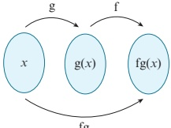

fg

When one function is followed by another function, the resulting function is called a composite function.

### KEY POINT 2.1

fg(x) means the function g acts on x first, then f acts on the result.

There are three important points to remember about composite functions:

### KEY POINT 2.2

fg only exists if the range of g is contained within the domain of f.

In general,  $ \mathrm{fg}(x) \neq \mathrm{gf}(x) $.

ff(x) means you apply the function f twice.

### EXPLORE 2.1

 $$ \mathrm{f}(x)=2x-5\mathrm{f o r}x\in\mathbb{R} $$ 

 $$ \operatorname{g}(x)=3x-1\mathrm{f o r}x\in\mathbb{R} $$ 

Three students are asked to find the composite function  $ \mathrm{gf}(x) $

Here are their solutions.

Student A

Student B

 $$ \begin{aligned}gf(x)&=(3x-1)(2x-5)\\&=6x^{2}-17x+5\end{aligned} $$ 

Student C

 $$ \begin{aligned}gf(x)&=2(3x-1)-5\\&=6x-7\end{aligned} $$ 

 $$ \begin{aligned}gf(x)&=3(2x-5)-1\\&=6x-16\end{aligned} $$ 

Discuss these solutions with your classmates.

Which student is correct? What error has each of the other students made?

<!-- page 52 -->

### WORKED EXAMPLE 2.3

$$f(x)=(x-4)^2-1\text{ for }x\in\mathbb{R}$$

$$f g(4)f$$

$$f(4).2$$

 $$ \mathrm{g}(x)=\frac{2x+3}{x-2}for x\in\mathbb{R},x>2 $$ 

Answer

 $$ \begin{array}{c} ver\quad11\\\equiv\left|\left(-\right)\right|\quad-\\-\quad4\quad2\\1\frac{1}{4}\quad1\end{array} $$ 

g acts on 4 first and  $ g(4)=\frac{2(4)+3}{4-2}=\frac{11}{2} $.

f is the function 'subtract 4, square and then subtract 1'.

### WORKED EXAMPLE 2.4

 $ f(x) = 2x + 3 $ for  $ x \in \mathbb{R} $

 $$ \mathbf{g}(x)=x^{2}-1\ \mathrm{f o r}\ x\in\mathbb{R} $$ 

Find: a fg(x)

b gf(x)

c ff(x)

## Answer

a  $ \mathrm{fg}(x)=\mathrm{f}(x^{2}-1) $

 $ =2(x^{2}-1)+3 $

 $ =2x^{2}+1 $

g acts on x first and  $ \mathrm{g}(x)=x^{2}-1 $.

f is the function 'double and add 3'.

$$\begin{aligned} \mathbf{b} \quad \operatorname{gf}(x) &= \operatorname{g}(2x + 3) \\ & = (2x + 3)^2 - 1 \\ & = 4x^2 + 12x + 9 - 1 \\ & = 4x^2 + 12x + 8 \end{aligned}$$

f acts on x first and  $ f(x) = 2x + 3 $.

g is the function 'square and subtract 1'.

 $ f(x) = f(2x + 3) = 2(2x + 3) + 3 = 4x + 9 $

f is the function 'double and add 3'.

### WORKED EXAMPLE 2.5

f :  $ x \mapsto \frac{5}{x-2} $ for  $ x \in \mathbb{R}, x \neq 2 $ \quad \quad \quad \quad \quad g(x) = 3 - x^2 $ for  $ x \in \mathbb{R} $

Find: a fg(x)

b ff(x)

## Answer

 $$ \begin{aligned}fg(x)&=f(3-x^{2})\\&=\frac{5}{(3-x^{2})-2}\\&=\frac{5}{1-x^{2}}\end{aligned} $$ 

g acts on x first and  $ g(x) = 3 - x^{2} $.

f is the function 'subtract 2 and then divide into 5'.

<!-- page 53 -->

$$ \begin{aligned}ff(x)&\equiv f\left(\frac{5}{x-2}\right)\\&=\frac{\frac{-5}{5}}{x-2}-2\\&=\frac{5(x-2)}{5-2(x-2)}\\&=\frac{5x-10}{9-2x}\end{aligned} $$ 

Multiply numerator and denominator by  $ (x - 2) $.

### WORKED EXAMPLE 2.6

 $$ \mathrm{f}(x)=x^{2}+4x\mathrm{f o r}x\in\mathbb{R} $$ 

 $$ \mathbf{g}(x)=3x-1\mathrm{f o r}x\in\mathbb{R} $$ 

Find the values of k for which the equation  $ \mathrm{fg}(x) = k $ has real solutions.

## Answer

 $ fg(x) = (3x - 1)^2 + 4(3x - 1) $

 $ = 9x^2 + 6x - 3 $

Expand brackets and simplify.

When  $ \mathrm{fg}(x)=k $,

 $$ 9x^{2}+6x-3=k $$ 

 $$ 9x^{2}+6x+(-3-k)=0 $$ 

Rearrange and simplify.

 $$ b^{2}-4a c\geq0 $$ 

 $$ 6^{2}-4\times9\times(-3-k)\geqslant0 $$ 

## EXERCISE 2B

1 f(x) = x^2 + 6 for x \in \mathbb{R} \quad g(x) = \sqrt{x + 3} - 2 \text{ for } x \in \mathbb{R}, x \geq -3

Find: a fg(6) b gf(4) c ff(-3)

2 h:  $ x \mapsto x + 5 $ for  $ x \in \mathbb{R}, x > 0 $ k:  $ x \mapsto \sqrt{x} $ for  $ x \in \mathbb{R}, x > 0 $

Express each of the following in terms of h and/or k.

a  $ x \mapsto \sqrt{x} + 5 $ b  $ x \mapsto \sqrt{x + 5} $ c  $ x \mapsto x + 10 $

3 $f(x) = ax + b$ for $x \in \mathbb{R}$

Given that $f(5) = 3$ and $f(3) = -3$:

a find the value of $a$ and the value of $b$

b solve the equation $ff(x) = 4$.

4 f :  $ x \mapsto 2x + 3 $ for  $ x \in \mathbb{R} $ g :  $ x \mapsto \frac{12}{1 - x} $ for  $ x \in \mathbb{R} $,  $ x \neq 1 $

a Find  $ gf(x) $.

b Solve the equation  $ gf(x) = 2 $.

<!-- page 54 -->

5  $  \mathrm{g}(x) = x^{2} - 2  $ for  $  x \in \mathbb{R}  $

 $$ \mathrm{h}(x)=2x+5\mathrm{f o r}x\in\mathbb{R} $$ 

a Find gh(x).

b Solve the equation  $ \mathrm{gh}(x)=14 $.

6  $ f(x) = x^2 + 1 $ for  $ x \in \mathbb{R} $

Solve the equation  $ fg(x) = 5 $.

 $$ \mathrm{g}(x)=\frac{3}{x-2}for x\in\mathbb{R},x\neq2 $$ 

7  $ \mathrm{g}(x) = \frac{2}{x+1} $ for  $ x \in \mathbb{R} $,  $ x \neq -1 $

Solve the equation  $ \mathrm{hg}(x) = 11 $.

 $$ \mathrm{h}(x)=(x+2)^{2}-5\mathrm{f o r}x\in\mathbb{R} $$ 

8 f :  $ x \mapsto \frac{x+1}{2} $ for  $ x \in \mathbb{R} $

Solve the equation  $ gf(x) = 1 $.

 $$ \mathrm{g}:x\mapsto\frac{2x+3}{x-1}\text{for}x\in\mathbb{R},x\neq1 $$ 

9  $ \mathrm{f}(x) = \frac{x+1}{2x+5} $ for  $ x \in \mathbb{R}, x > 0 $

Find an expression for  $ \mathrm{ff}(x) $, giving your answer as a single fraction in its simplest form.

 $$ f:x\mapsto x^{2}\mathrm{f o r}x\in\mathbb{R} $$ 

 $$ {\mathrm{g}:x\mapsto x+1~f o r\quad}x\in\mathbb{R} $$ 

Express each of the following as a composite function, using only f and/or g.

 $$ x\mapsto(x+1)^{2} $$ 

 $$ x\mapsto x^{2}+1 $$ 

c x  $ \rightarrow $ x + 2

 $$ x\mapsto x^{4} $$ 

 $$ \textsf{e}\quad x\mapsto x^{2}+2x+2 $$ 

 $$ \textsf{f}\quad x\mapsto x^{4}+2x^{2}+1 $$ 

11  $ f(x) = x^2 - 3x $ for  $ x \in \mathbb{R} $   $ g(x) = 2x + 5 $ for  $ x \in \mathbb{R} $

Show that the equation  $ g f(x) = 0 $ has no real solutions.

12  $ f(x) = k - 2x $ for  $ x \in \mathbb{R} $  $ g(x) = \frac{2}{x} $ for  $ x \in \mathbb{R}, x \neq 0 $

Find the values of  $ k $ for which the equation  $ fg(x) = x $ has two equal roots.

13  $ f(x) = x^2 - 3x $ for  $ x \in \mathbb{R} $   $ g(x) = 2x - 5 $ for  $ x \in \mathbb{R} $

Find the values of  $ k $ for which the equation  $ gf(x) = k $ has real solutions.

14  $ f(x) = \frac{x + 5}{2x - 1} $ for  $ x \in \mathbb{R}, x \neq \frac{1}{2} $

Show that  $ ff(x) = x $.

15  $ f(x) = 2x^2 + 4x - 8 $ for  $ x \in \mathbb{R}, x \geq k $

a Express  $ 2x^{2} + 4x - 8 $ in the form  $ a(x + b)^{2} + c $.

b Find the least value of k for which the function is one-one.

16  $ f(x) = x^2 - 2x + 4 $ for  $ x \in \mathbb{R} $

a Find the set of values of x for which  $ f(x) \geqslant 7 $.

b Express  $ x^{2}-2x+4 $ in the form  $ (x-a)^{2}+b $.

c Write down the range of f.

17  $ f(x) = x^2 - 5x $ for  $ x \in \mathbb{R} $

 $  \mathbf{g}(x) = 2x + 3  $ for  $  x \in \mathbb{R}  $

a Find  $ \mathrm{fg}(x) $.

b Find the range of the function  $ \mathrm{fg}(x) $.

<!-- page 55 -->

18  $ f(x) = \frac{2}{x+1} $ for  $ x \in \mathbb{R} $,  $ x \neq -1 $

a Find  $ ff(x) $ and state the domain of this function.

b Show that if  $ f(x) = ff(x) $ then  $ x^{2} + x - 2 = 0 $.

c Find the values of x for which  $ f(x) = ff(x) $.

PS 19

 $$ \mathrm{P}(x)=x^{2}-1\mathrm{f o r}x\in\mathbb{R} $$ 

 $$ Q(x)=x+2\mathrm{f o r}x\in\mathbb{R} $$ 

 $$ \mathrm{R}(x)=\frac{1}{x}for x\in\mathbb{R},x\neq0 $$ 

 $$ \mathrm{S}(x)=\sqrt{x+1}-1\mathrm{~f o r~}x\in\mathbb{R},x\geqslant-1 $$ 

Functions P, Q, R and S are composed in some way to make a new function,  $ f(x) $.

For each of the following, write  $ f(x) $ in terms of the functions P, Q, R and/or S, and state the domain and range for each composite function.

 $$  f(x)=x^{2}+4x+3 $$ 

 $$  f(x)=x^{2}+1 $$ 

c  $ f(x)=x $

d

 $$  f(x)=\frac{1}{x+4} $$ 

 $$ \begin{array}{r l}{\mathbf{f}}&{{}\quad\mathrm{f}(x)=x-2\sqrt{x+1}+1}\end{array} $$ 

 $$  f(x)=\frac{1}{x^{2}}+1 $$ 

 $$ \mathbf{g}\quad f(x)=x-1 $$ 

### 2.3 Inverse functions

The inverse of a function  $ f(x) $ is the function that undoes what  $ f(x) $ has done.

We write the inverse of the function  $ f(x) $ as  $ f^{-1}(x) $.

### KEY POINT 2.3

 $ ff^{-1}(x) = f^{-1}f(x) = x $

The domain of  $ f^{-1}(x) $ is the range of  $ f(x) $.

The range of  $ f^{-1}(x) $ is the domain of  $ f(x) $.

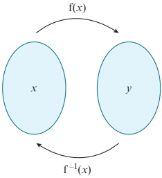

It is important to remember that not every function has an inverse.

### KEY POINT 2.4

An inverse function  $ f^{-1}(x) $ exists if, and only if, the function  $ f(x) $ is a one-one mapping.

You should already know how to find the inverse function of some simple one-one mappings.

We want to find the function  $ f^{-1}(x) $, so if we write  $ y = f^{-1}(x) $, then  $ f(y) = f(f^{-1}(x)) = x $, because f and  $ f^{-1} $ are inverse functions. So if we write  $ x = f(y) $ and then rearrange it to get  $ y = \ldots $, then the right-hand side will be  $ f^{-1}(x) $.

<!-- page 56 -->

We find the inverse of the function  $ f(x) = 3x - 1 $ by following these steps:

Step 1: Write the function as y =  $ \longrightarrow $ y = 3x - 1

Step 2: Interchange the x and y variables.  $ \longrightarrow $ x = 3y - 1

Step 3: Rearrange to make $y$ the subject. $\longrightarrow y = \frac{x+1}{3}$

Hence, if  $ f(x) = 3x - 1 $, then  $ f^{-1}(x) = \frac{x + 1}{3} $.

If f and  $ f^{-1} $ are the same function, then f is called a self-inverse function.

For example, if  $ f(x) = \frac{1}{x} $ for  $ x \neq 0 $, then  $ f^{-1}(x) = \frac{1}{x} $ for  $ x \neq 0 $.

So  $ f(x) = \frac{1}{x} $ for  $ x \neq 0 $ is a self-inverse function.

### EXPLORE 2.2

The diagram shows the function  $ f(x) = (x - 2)^2 + 1 $ for  $ x \in \mathbb{R} $. Discuss the following questions with your classmates.

1 What type of mapping is this function?

2 What are the coordinates of the vertex of the parabola?

3 What is the domain of the function?

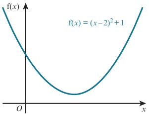

4 What is the range of the function?

5 Does this function have an inverse?

6 If f has an inverse, what is it? If not, then how could you change the domain of f so that the function does have an inverse?

### WORKED EXAMPLE 2.7

 $ f(x) = \sqrt{x + 2} - 7 $ for  $ x \in \mathbb{R} $,  $ x \geq -2 $

a Find an expression for  $ f^{-1}(x) $.

b Solve the equation  $ f^{-1}(x) = f(62) $.

Answer

a  $ \mathrm{f}(x)=\sqrt{x+2}-7 $

Step 1: Write the function as y = ___

 $$ y=\sqrt{x+2}-7 $$ 

Step 2: Interchange the x and y variables.

 $$ x=\sqrt{y+2}-7 $$ 

Step 3: Rearrange to make y the subject.

 $$ \begin{align*}x+7&=\sqrt{y+2}\ $ x+7)^{2}&=y+2\end{align*} $$ 

 $$ \mathrm{f}^{-1}(x)=(x+7)^{2}-2 $$ 

 $$ y=(x+7)^{2}-2 $$

<!-- page 57 -->

$$ \mathrm{f}(62)=\sqrt{62+2}-7=1 $$ 

 $$ (x+7)^{2}-2=1 $$ 

 $$ (x+7)^{2}=3 $$ 

 $$ x+7=\pm\sqrt{3} $$ 

 $$ x=-7\pm\sqrt{3} $$ 

 $$ x=-7-\sqrt{3}\text{or}x=-7+\sqrt{3} $$ 

The range of f is  $ f(x) \geq -7 $ so the domain of  $ f^{-1} $ is  $ x \geq -7 $.

Hence, the only solution of  $ f^{-1}(x) = f(62) $ is  $ x = -7 + \sqrt{3} $.

### WORKED EXAMPLE 2.8

 $ f(x) = 5 - (x - 2)^2 $ for  $ x \in \mathbb{R} $,  $ k \leq x \leq 6 $

a State the smallest value of k for which f has an inverse.

b For this value of k find an expression for  $ f^{-1}(x) $, and state the domain and range of  $ f^{-1} $.

## Answer

a The vertex of the graph of $y = 5 - (x - 2)^2$ is at the point (2, 5).

When $x = 6$, $y = 5 - 4^2 = -11$

For the function f to have an inverse it must be a one-one function. Hence, the smallest value of k is 2.

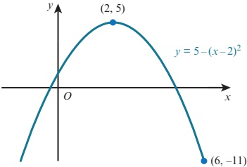

b  $ f(x) = 5 - (x - 2)^{2} $

Step 1: Write the function as y = ___

 $$ y=5-(x-2)^{2} $$ 

Step 2: Interchange the x and y variables.

 $$ x=5-(y-2)^{2} $$ 

Step 3: Rearrange to make y the subject. →

 $$ (y-2)^{2}=5-x $$ 

 $$ y-2=\sqrt{5-x} $$ 

 $$ y=2+\sqrt{5-x} $$ 

Hence,  $ f^{-1}(x) = 2 + \sqrt{5 - x} $.

The domain of  $ f^{-1} $ is the same as the range of f.

Hence, the domain of  $ f^{-1} $ is -11  $ \leq x \leq 5 $.

The range of  $ f^{-1} $ is the same as the domain of f.

Hence, the range of  $ f^{-1} $ is  $ 2 \leq f^{-1}(x) \leq 6 $.

<!-- page 58 -->

1 Find an expression for  $ f^{-1}(x) $ for each of the following functions.

a  $ f(x) = 5x - 8 $ for  $ x \in \mathbb{R} $

b  $ f(x) = x^2 + 3 $ for  $ x \in \mathbb{R} $,  $ x \geq 0 $

c f(x) = (x - 5)^{2} + 3 \text{ for } x \in \mathbb{R}, x \geq 5

d  $ f(x) = \frac{8}{x - 3} $ for  $ x \in \mathbb{R} $,  $ x \neq 3 $

 $  \mathbf{e} \quad \mathrm{f}(x) = \frac{x + 7}{x + 2}  $ for  $ x \in \mathbb{R} $,  $ x \neq -2  $

f  $ f(x) = (x - 2)^3 - 1 $ for  $ x \in \mathbb{R} $,  $ x \geq 2 $

2 f :  $ x \mapsto x^2 + 4x $ for  $ x \in \mathbb{R} $,  $ x \geq -2 $

a State the domain and range of  $ f^{-1} $.

b Find an expression for  $ f^{-1}(x) $.

3 f :  $ x \mapsto \frac{5}{2x + 1} $ for  $ x \in \mathbb{R}, x \geq 2 $

a Find an expression for  $ f^{-1}(x) $.

b Find the domain of  $ f^{-1} $.

4 f :  $ x \mapsto (x + 1)^3 - 4 $ for  $ x \in \mathbb{R} $,  $ x \geq 0 $

a Find an expression for  $ f^{-1}(x) $.

b Find the domain of  $ f^{-1} $.

5 g:  $ x \mapsto 2x^2 - 8x + 10 $ for  $ x \in \mathbb{R} $,  $ x \geq 3 $

a Explain why g has an inverse.

b Find an expression for  $ \mathrm{g}^{-1}(x) $.

6 f :  $ x \mapsto 2x^2 + 12x - 14 $ for  $ x \in \mathbb{R} $,  $ x \geq k $

a Find the least value of k for which f is one-one.

b Find an expression for  $ f^{-1}(x) $.

7 f:  $ x \mapsto x^2 - 6x $ for  $ x \in \mathbb{R} $

a Find the range of f.

b State, with a reason, whether f has an inverse.

8  $ f(x) = 9 - (x - 3)^2 $ for  $ x \in \mathbb{R} $,  $ k \leq x \leq 7 $

a State the smallest value of k for which f has an inverse.

b For this value of k:

i find an expression for  $ f^{-1}(x) $

ii state the domain and range of  $ f^{-1} $.

<!-- page 59 -->

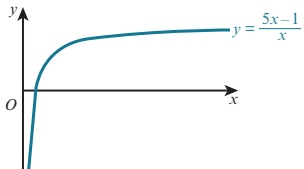

The diagram shows the graph of  $ y = \mathrm{f}^{-1}(x) $, where  $ \mathrm{f}^{-1}(x) = \frac{5x - 1}{x} $ for  $ x \in \mathbb{R} $,  $ 0 < x \leq 3 $.

The diagram shows the graph of $y = f^{-1}(x)$, where $f^{-1}(x) = \frac{x}{x}$ for $x \in \mathbb{R}$, $0 < x \leq 3$.

a Find an expression for $f(x)$.

b State the domain of $f$.

10 $f(x) = 3x + a$ for $x \in \mathbb{R}$  $g(x) = b - 5x$ for $x \in \mathbb{R}$

Given that $gf(-1) = 2$ and $g^{-1}(7) = 1$, find the value of $a$ and the value of $b$.

11 $f(x) = 3x - 1$ for $x \in \mathbb{R}$  $g(x) = \frac{3}{2x - 4}$ for $x \in \mathbb{R}$, $x \neq 2$

a Find expressions for $f^{-1}(x)$ and $g^{-1}(x)$.

b Show that the equation $f^{-1}(x) = g^{-1}(x)$ has two real roots.

12 $f: x \mapsto (2x - 1)^3 - 3$ for $x \in \mathbb{R}$, $1 \leq x \leq 3$

a Find an expression for $f^{-1}(x)$.

b Find the domain of $f^{-1}$.

13 $f: x \mapsto x^2 - 10x$ for $x \in \mathbb{R}$, $x \geq 5$

a Express $f(x)$ in the form $(x - a)^2 - b$.

b Find an expression for $f^{-1}(x)$ and state the domain of $f^{-1}$.

14 $f(x) = \frac{1}{x - 1}$ for $x \in \mathbb{R}$, $x \neq 1$

a Find an expression for $f^{-1}(x)$.

b Show that if $f(x) = f^{-1}(x)$, then $x^2 - x - 1 = 0$.

c Find the values of $x$ for which $f(x) = f^{-1}(x)$.

Give your answer in surd form.

15 Determine which of the following functions are self-inverse functions.

a $f(x) = \frac{1}{3 - x}$ for $x \in \mathbb{R}$, $x \neq 3$  $b$ $f(x) = \frac{2x + 1}{x - 2}$ for $x \in \mathbb{R}$, $x \neq 2$

c $f(x) = \frac{3x + 5}{4x - 3}$ for $x \in \mathbb{R}$, $x \neq \frac{3}{4}$

16 $f: x \mapsto 3x - 5$ for $x \in \mathbb{R}$  $g: x \mapsto 4 - 2x$ for $x \in \mathbb{R}$

a Find an expression for $(fg)^{-1}(x)$.

b Find expressions for:

i $f^{-1} g^{-1}(x)$  ii $g^{-1} f^{-1}(x)$.

c Comment on your results in part b.

Investigate if this is true for other functions.

<!-- page 60 -->

### 2.4 The graph of a function and its inverse

Consider the function defined by  $ f(x) = 2x + 1 $ for  $ x \in \mathbb{R} $,  $ -4 \leq x \leq 2 $.

f(-4) = -7 and f(2) = 5.

The domain of f is  $ -4 \leq x \leq 2 $ and the range is  $ -7 \leq f(x) \leq 5 $.

The inverse of this function is  $ f^{-1}(x) = \frac{x - 1}{2} $.

The domain of  $ f^{-1} $ is the same as the range of f.

Hence, the domain of  $ f^{-1} $ is -7  $ \leq x \leq 5 $.

The range of  $ f^{-1} $ is the same as the domain of f.

Hence, the range of  $ f^{-1} $ is  $ -4 \leq f^{-1}(x) \leq 2 $.

The representation of $f$ and $f^{-1}$ on the same graph can be seen in the diagram opposite. It is important to note that the graphs of $f$ and $f^{-1}$ are reflections of each other in the line $y = x$. This is true for each one-one function and its inverse functions.

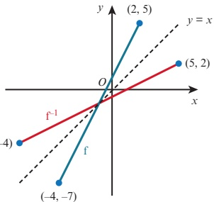

### KEY POINT 2.5

The graphs of f and  $ f^{-1} $ are reflections of each other in the line y = x.

This is because  $ ff^{-1}(x) = x = f^{-1}f(x) $

When a function f is self-inverse, the graph of f will be symmetrical about the line y = x.

### WORKED EXAMPLE 2.9

 $ f(x) = (x - 1)^2 - 2 $ for  $ x \in \mathbb{R} $,  $ 1 \leq x \leq 4 $

On the same axes, draw the graph of f and the graph of  $ f^{-1} $.

Answer

 $$ y=(x-1)^{2}-2 $$ 

When x = 4, y = 7.

The function is one-one, so the inverse function exists.

The circled part of the expression is a square so it will always be  $ \geq 0 $. The smallest value it can be is 0. This occurs when x = 1. The vertex is at the point  $ (1, -2) $.

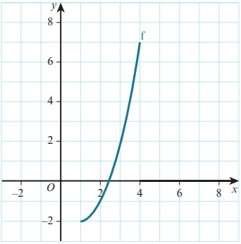

Reflect $\dot{\mathrm{f}}\dot{\mathrm{i}}\dot{\mathrm{n}}\dot{\mathrm{y}}=x$

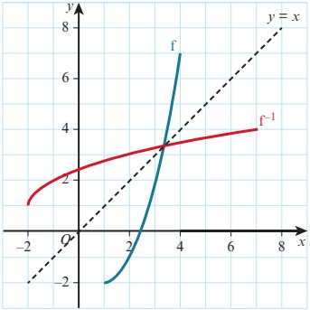

<!-- page 61 -->

f :  $ x \mapsto \frac{2x + 7}{x - 2} $ for  $ x \in \mathbb{R} $,  $ x \neq 2 $

a Find an expression for  $ f^{-1}(x) $.

b State what your answer to part a tells you about the symmetry of the graph of  $ y = f(x) $.

## Answer

a f : x  $ \mapsto $  $ \frac{2x+7}{x-2} $

Step 1: Write the function as y =

 $$ y=\frac{2x+7}{x-2} $$ 

Step 2: Interchange the x and y variables.

 $$ x=\frac{2y+7}{y-2} $$ 

Step 3: Rearrange to make y the subject.

 $$ \begin{aligned}xy-2x&=2y+7\\y(x-2)&=2x+7\end{aligned} $$ 

 $$ y=\frac{2x+7}{x-2} $$ 

Hence  $ f^{-1}(x) = \frac{2x + 7}{x - 2} $.

b  $ f^{-1}(x) = f(x) $, so the function f is self-inverse.

The graph of $y = f(x)$ is symmetrical about the line $y = x$.

### EXPLORE 2.3

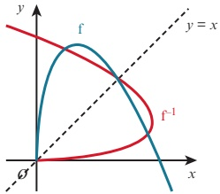

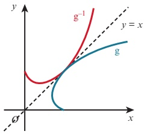

Ali states that:

The diagrams show the functions f and g, together with their inverse functions  $ f^{-1} $ and  $ g^{-1} $.

Is Ali correct?

Explain your answer.

<!-- page 62 -->

1 On a copy of each grid, draw the graph of  $ f^{-1}(x) $ if it exists.

a

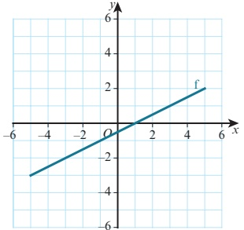

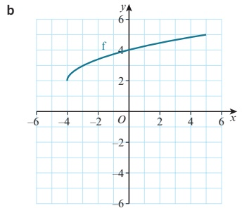

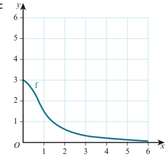

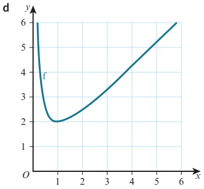

2 f :  $ x \mapsto 2x - 1 $ for  $ x \in \mathbb{R}, -1 \leq x \leq 3 $

 $$  f^{-1}(x) $$ 

b State the domain and range of  $ f^{-1} $.

Sketch, on the same diagram, the graphs of $y = f(x)$ and $y = f^{-1}(x)$, making clear the relationship between the graphs.

3 The diagram shows the graph of  $ y = f(x) $, where  $ f(x) = \frac{4}{x + 2} $ for  $ x \in \mathbb{R} $,  $ x \geq 0 $.

a State the range of f.

b Find an expression for  $ f^{-1}(x) $.

c State the domain and range of  $ f^{-1} $.

d On a copy of the diagram, sketch the graph of  $ y = f^{-1}(x) $, making clear the relationship between the graphs.

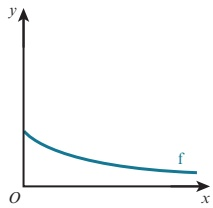

4 For each of the following functions, find an expression for  $ f^{-1}(x) $ and, hence, decide if the graph of  $ y = f(x) $ is symmetrical about the line y = x.

 $$ \textsf{a}\quad\mathrm{f}(x)=\frac{x+5}{2x-1}\textsf{for}x\in\mathbb{R},x\neq\frac{1}{2} $$ 

 $$ \mathbf{b}\quad f(x)=\frac{2x-3}{x-5}for x\in\mathbb{R},x\neq5 $$ 

 $$ \textbf{c}\quad\mathrm{f}(x)=\frac{3x-1}{2x-3}for x\in\mathbb{R},x\neq\frac{3}{2} $$ 

 $$ \mathrm{f}(x)=\frac{4x+5}{3x-4}for x\in\mathbb{R},x\neq\frac{4}{3} $$

<!-- page 63 -->

P 5 a f(x) =  $ \frac{x + a}{bx - 1} $ for  $ x \in \mathbb{R} $,  $ x \neq \frac{1}{b} $, where a and b are constants.

Prove that this function is self-inverse.

b g(x) =  $ \frac{ax + b}{cx + d} $ for  $ x \in \mathbb{R} $,  $ x \neq -\frac{d}{c} $, where a, b, c and d are constants.

Find the condition for this function to be self-inverse.

### 2.5 Transformations of functions

At IGCSE / O Level you met various transformations that can be applied to two-dimensional shapes. These included translations, reflections, rotations and enlargements. In this section you will learn how translations, reflections and stretches (and combinations of these) can be used to transform the graph of a function.

### EXPLORE 2.4

. -3.

1 a Use graphing software to draw the graphs of  $ y = x^{2} $,  $ y = x^{2} + 2 $ and  $ y = x^{2} - 3 $.

Discuss your observations with your classmates and explain how the second and third graphs could be obtained from the first graph.

b Repeat part a using the graphs  $ y = \sqrt{x} $,  $ y = \sqrt{x} + 1 $ and  $ y = \sqrt{x} - 2 $.

c Repeat part a using the graphs  $ y = \frac{12}{x} $,  $ y = \frac{12}{x} + 5 $ and  $ y = \frac{12}{x} - 4 $.

d Can you generalise your results?

2 a Use graphing software to draw the graphs of  $ y = x^{2} $,  $ y = (x + 2)^{2} $ and  $ y = (x - 5)^{2} $.

Discuss your observations with your classmates and explain how the second and third graphs could be obtained from the first graph.

b Repeat part a using the graphs  $ y = x^3 $,  $ y = (x + 1)^3 $ and  $ y = (x - 4)^3 $.

c Can you generalise your results?

3 a Use graphing software to draw the graphs of  $ y = x^{2} $ and  $ y = -x^{2} $.

Discuss your observations with your classmates and explain how the second graph could be obtained from the first graph.

b Repeat part a using the graphs  $ y = x^{3} $ and  $ y = -x^{3} $.

c Repeat part a using the graphs  $ y = 2^{x} $ and  $ y = -2^{x} $.

d Can you generalise your results?

4 a Use graphing software to draw the graphs of y = 5 + x and y = 5 - x.

Discuss your observations with your classmates and explain how the second graph could be obtained from the first graph.

b Repeat part a using the graphs  $ y = \sqrt{2 + x} $ and  $ y = \sqrt{2 - x} $.

c Can you generalise your results?

5 a Use graphing software to draw the graphs of  $ y = x^{2} $ and  $ y = 2x^{2} $ and  $ y = (2x)^{2} $.

Discuss your observations with your classmates and explain how the second graph could be obtained from the first graph.

b Repeat part a using the graphs  $ y = \sqrt{x} $,  $ y = 2\sqrt{x} $ and  $ y = \sqrt{2x} $.

c Repeat part a using the graphs  $ y = 3^{x} $,  $ y = 2 \times 3^{x} $ and  $ y = 3^{2x} $.

d Can you generalise your results?

<!-- page 64 -->

## Translations

The diagram shows the graphs of two functions that differ only by a constant.

 $$ y=x^{2}-2x+1 $$ 

 $$ y=x^{2}-2x+4 $$ 

When the x-coordinates on the two graphs are the same (x = x) the y-coordinates differ by 3 (y = y + 3).

This means that the two curves have exactly the same shape but that they are separated by 3 units in the positive y direction.

Hence, the graph of $y = x^{2} - 2x + 4$ is a translation of the graph of $y = x^{2} - 2x + 1$ by the vector $\begin{pmatrix} 0 & 3 \\ 3 & 1 \end{pmatrix}$.

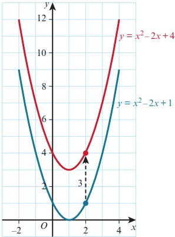

### KEY POINT 2.6

The graph of  $ y = f(x) + a $ is a translation of the graph  $ y = f(x) $ by the vector  $ \begin{pmatrix} 0 \\ a \end{pmatrix} $.

 $$ y=x^{2}-2x+1 $$ 

 $$ y=(x-3)^{2}-2(x-3)+1 $$ 

We obtain the second function by replacing x by x - 3 in the first function.

The graphs of these two functions are:

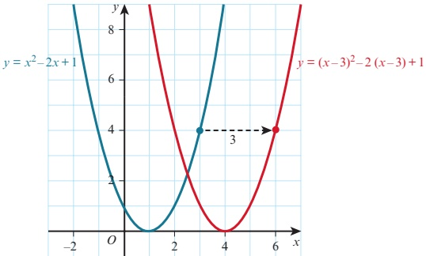

The curves have exactly the same shape but this time they are separated by 3 units in the positive x-direction.

You may be surprised that the curve has moved in the positive x-direction. Note, however, that a way of obtaining y = y is to have x = x - 3 or equivalently x = x + 3. This means that the two curves are at the same height when the red curve is 3 units to the right of the blue curve.

<!-- page 65 -->

Hence, the graph of $y = (x - 3)^2 + 2(x - 3) + 1$ is a translation of the graph of $y = x^2 - 2x + 1$ by the vector $\left(\begin{array}{c} 1 \\ 0 \end{array}\right)$

### KEY POINT 2.7

The graph of  $  y = f(x - a)  $ is a translation of the graph  $  y = f(x)  $ by the vector  $  \begin{pmatrix} a \\ 0 \end{pmatrix}  $.

Combining these two results gives:

### KEY POINT 2.8

The graph of  $ y = f(x - a) + b $ is a translation of the graph  $ y = f(x) $ by the vector  $ \begin{pmatrix} a \\ b \end{pmatrix} $.

### WORKED EXAMPLE 2.11

 $ y = x + x $ is translated 2 units to the right. Find the equation of the resulting graph. Give your answer in the form  $ y = ax^{2} + bx + c $.

Answer

 $$ y=x^{2}+5x $$ 

Replace all occurrences of x by x - 2.

 $$ y=(x-2)^{2}+5(x-2) $$ 

 $$ y=x^{2}+x-6 $$ 

Expand and simplify.

### WORKED EXAMPLE 2.12

The graph of $y = \sqrt{2x}$ is translated by the vector $\begin{pmatrix} -5 \\ 3 \end{pmatrix}$. Find the equation of the resulting graph.

Answer $\begin{pmatrix} 2(5) & 3 \\ 2 & 1 \end{pmatrix}$.

 $$ y=\sqrt{2.x} $$ 

 $$ y=\sqrt{x+}\quad+ $$ 

Replace x by  $ x + 5 $, and add 3 to the resulting function.

 $$ y=\sqrt{x+0}+3 $$

<!-- page 66 -->

1 Find the equation of each graph after the given transformation.

 $ \hat{y} $  $ y = 2x^{2} $ after translation by  $ \left(\begin{array}{c}0\\2\end{array}\right) $

c  $ y = 5\sqrt{x} $ after translation by  $ \begin{pmatrix} 0 \\ T \end{pmatrix} $

d  $ y = 7x^2 \neg 2x $ after translation by  $ \begin{pmatrix} 0 \\ 2 \end{pmatrix} $

e  $ y = x^{2}- $ after translation by  $ \left(\begin{array}{c}5\\0\end{array}\right) $

f  $ y = \frac{2}{x} $ after translation by  $ \begin{pmatrix}3\\ 0\end{pmatrix} $

g $y=\frac{x}{x+1}$ after translation by

$$y = x^2 + x\quad\text{ after translation by }\left(\begin{matrix}-1\\ 2\\ 0\\ 3\end{matrix}\right)$$

2 Find the translation after translation the graph.

a

 $$ y=x^{2}+5x-2\qquad\text{to the graph}y=x^{2}+5x+2 $$ 

 $$ \mathbf{b}\quad y=x^{3}+2x^{2}+1\qquad\mathrm{t o~t h e~g r a p h~}y=x^{3}+2x^{2}-4 $$ 

 $$ \begin{array}{r l r}{\textbf{\textup{c}}}&{{}y=x^{2}-3x}&{\quad\mathrm{t o~t h e~g r a p h~}y=(x+1)^{2}-3(x+1)}\end{array} $$ 

d  $ y = x + \frac{6}{x} $ to the graph  $ y = x - 2 + \frac{6}{x - 2} $

e  $ y=\sqrt{2x+5} $ to the graph  $ y=\sqrt{2x+3} $

 $ f \quad y = \frac{5}{x^2} - 3x \quad \text{to the graph} \quad y = \frac{5}{(x-2)^2} - 3x + 10 $

3 The diagram shows the graph of $y = f(x)$.

Sketch the graphs of each of the following functions.

a  $ y = f(x) - 4 $

b  $ y = f(x - 2) $

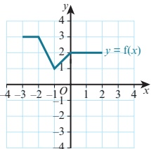

c  $ y = f(x + 1) - 5 $

4 a On the same diagram, sketch the graphs of y = 2x and  $ y = 2x + \frac{0}{a} $.

b Find the�albe tansformed to $y = 2x + 2$ by a translation of $\left(\begin{array}{c} 1 \\ b \end{array}\right)$

c Find the value of $y=2x$ can be transformed to $y=2x+2$ by a translation of $\left(\begin{array}{c}0\\ 0\end{array}\right)$

<!-- page 67 -->

5 A cubic graph has equation  $ y=(x+3)(x-2)(x-5) $.

6 Write, in a similar form, the equation of the graph after a translation of  $ \left(\begin{array}{c}1 \\ 1 \end{array}\right) $. The graph of

 $ y = x^2 - 4x + 1 $ is translated by the vector  $ \begin{pmatrix} 1 \\ 2 \end{pmatrix} $.

Find, in the form $y = ax^{2} + bx + c$, the equation of the resulting graph.

PS 7 The resulting graph is $y = ax^2 + bx + c$ is translated by the vector $\begin{pmatrix} 1 \\ - \end{pmatrix}$. $y = x^2 - 1x + 10$. Find the value of $a$, the value of $b$ and the value of $c$.

## WEB LINK

Try the Between the lines resource on the Underground Mathematics website.

### 2.6 Reflections

The diagram shows the graphs of the two functions:

 $$ y=x^{2}-2x+1 $$ 

 $$ y=-(x^{2}-2x+1) $$ 

When the x-coordinates on the two graphs are the same (x = x), the y-coordinates are negative of each other (y = -y).

This means that, when the x-coordinates are the same, the red curve is the same vertical distance from the x-axis as the blue curve but it is on the opposite side of the x-axis.

Hence, the graph of  $ y = -(x^2 - 2x + 1) $ is a reflection of the graph of  $ y = x^2 - 2x + 1 $ in the x-axis.

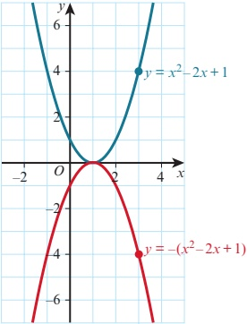

### KEY POINT 2.9

The graph of $y = -f(x)$ is a reflection of the graph $y = f(x)$ in the x-axis.

 $$ y=(-x)^{2}-2(-x)+1 $$ 

Now consider the two functions:

 $$ y=x^{2}-2x+1 $$ 

We obtain the second function by replacing x by -x in the first function.

The graphs of these two functions are demonstrated in the diagram.

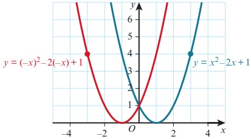

<!-- page 68 -->

The curves are at the same height (y = y) when x = -x or equivalently x = -x.

This means that the heights of the two graphs are the same when the red graph has the same horizontal displacement from the y-axis as the blue graph but is on the opposite side of the y-axis.

Hence, the graph of $y = (-x)^{2} - 2(-x) + 1$ is a reflection of the graph of $y = x^{2} - 2x + 1$ in the $y$-axis.

### KEY POINT 2.10

The graph of y = f(-x) is a reflection of the graph y = f(x) in the y-axis.

### WORKED EXAMPLE 2.13

The quadratic graph  $ y = f(x) $ has a minimum at the point  $ (5, -7) $. Find the coordinates of the vertex and state whether it is a maximum or minimum of the graph for each of the following graphs.

 $$ y=-\mathrm{f}(x) $$ 

 $$ \mathbf{b}\quad y=f(-x) $$ 

Answer

a $y = -f(x)$ is a reflection of $y = f(x)$ in the $x$-axis.

The turning point is (5, 7). It is a maximum point.

b  $ y = f(-x) $ is a reflection of  $ y = f(x) $ in the y-axis.

The turning point is  $ (-5, -7) $. It is a minimum point.

## EXERCISE 2F

1 The diagram shows the graph of  $ y = g(x) $.

Sketch the graphs of each of the following functions.

 $$ y=-\mathrm{g}(x) $$ 

 $ \mathbf{b}\quad y = \mathrm{g}(-x) $

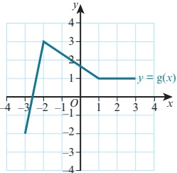

2 Find the equation of each graph after the given transformation.

a  $ y = 5x^{2} $ after reflection in the x-axis.

b  $ y = 2x^{4} $ after reflection in the y-axis.

c  $ y = 2x^{2} - 3x + 1 $ after reflection in the y-axis.

d  $ y = 5 + 2x - 3x^{2} $ after reflection in the x-axis.

<!-- page 69 -->

3 Describe the transformation that maps the graph:

a  $ y = x^{2} + 7x - 3 $ onto the graph  $ y = -x^{2} - 7x + 3 $

b  $ y = x^{2} - 3x + 4 $ onto the graph  $ y = x^{2} + 3x + 4 $

c  $ y = 2x - 5x^{2} $ onto the graph  $ y = 5x^{2} - 2x $

d  $ y = x^{3} + 2x^{2} - 3x + 1 $ onto the graph  $ y = -x^{3} - 2x^{2} + 3x - 1 $.

### 2.7 Stretches

The diagram shows the graphs of the two functions:

 $$ y=x^{2}-2x-3 $$ 

 $$ y=2(x^{2}-2x-3) $$ 

When the x-coordinates on the two graphs are the same (x = x), the y-coordinate on the red graph is double the y-coordinate on the blue graph (y = 2y).

This means that, when the x-coordinates are the same, the red curve is twice the distance of the blue graph from the x-axis.

Hence, the graph of $y = 2(x^{2} - 2x - 3)$ is a stretch of the graph of $y = x^{2} - 2x - 3$ from the $x$-axis. We say that it has been stretched with stretch factor 2 parallel to the $y$-axis.

Note: there are alternative ways of expressing this transformation:

• a stretch with scale factor 2 with the line y = 0 invariant

• a stretch with stretch factor 2 with the x-axis invariant

• a stretch with stretch factor 2 relative to the x-axis

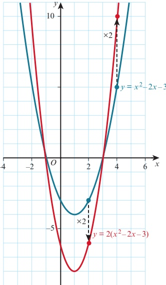

a vertical stretch with stretch factor 2.

### KEY POINT 2.11

The graph of $y = af(x)$ is a stretch of the graph $y = f(x)$ with stretch factor $a$ parallel to the $y$-axis.

Note: if $a<0$, then $y=af(x)$ can be considered to be a stretch of $y=f(x)$ with a negative scale factor or as a stretch with positive scale factor followed by a reflection in the x-axis.

<!-- page 70 -->

Now consider the two functions:

 $$ y=x^{2}-2x-3 $$ 

 $$ y=(2x)^{2}-2(2x)-3 $$ 

We obtain the second function by replacing x by 2x in the first function.

The two curves are at the same height (y = y) when x = 2x or equivalently  $ x = \frac{1}{2}x $.

This means that the heights of the two graphs are the same when the red graph has half the horizontal displacement from the y-axis as the blue graph.

 $$ y=(2x)^{2}-2(2x)-3 $$ 

 $ y = (2x) - 2(2x) - 5 $ is a stretch of the graph of  $ y = x^2 - 2x - 3 $ from the y-axis. We say that it has been stretched with stretch factor  $ \frac{1}{2} $ parallel to the x-axis.

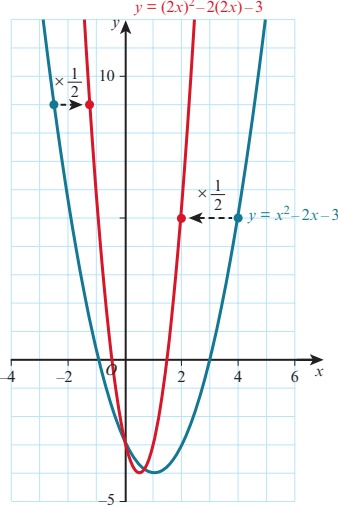

### KEY POINT 2.12

The graph of $y = f(ax)$ is a stretch of the graph $y = f(x)$ with stretch factor $\frac{1}{a}$ parallel to the $x$-axis.

### WORKED EXAMPLE 2.14

The graph of $y = 5 - \frac{1}{2}x^{2}$ is stretched with stretch factor 4 parallel to the y-axis.

Find the equation of the resulting graph.

Answer

  $ \text{Let } f(x) = 5 - \frac{1}{2} x^{2} $

 $$ 4\mathrm{f}(x)=20-2x^{2} $$ 

A stretch parallel to the y-axis, factor 4, gives the function  $ 4f(x) $.

The equation of the resulting graph is  $ y = 20 - 2x^{2} $.

### WORKED EXAMPLE 2.15

Describe the single transformation that maps the graph of  $ y = x^2 - 3x - 5 $ to the graph of  $ y = 4x^2 - 6x - 5 $.

Answer

 $$  Let f(x)=x^{2}-3x-5 $$ 

Express  $ 4x^{2}-6x-5 $ in terms of  $ f(x) $.

 $$ \begin{aligned}4x^{2}-6x-5&=(2x)^{2}-3(2x)-5\\&=\mathrm{f}(2x)\end{aligned} $$ 

The transformation is a stretch parallel to the x-axis with stretch factor  $ \frac{1}{2} $.

<!-- page 71 -->

1 The diagram shows the graph of  $ y = f(x) $.

Sketch the graphs of each of the following functions.

a  $ y = 3f(x) $

b  $ y = f(2x) $

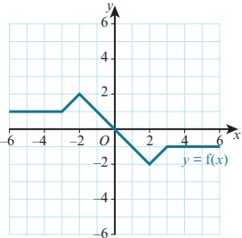

2 Find the equation of each graph after the given transformation.

a  $ y = 3x^{2} $ after a stretch parallel to the y-axis with stretch factor 2.

b  $ y = x^{3} - 1 $ after a stretch parallel to the y-axis with stretch factor 3.

c  $ y = 2^{x} + 4 $ after a stretch parallel to the y-axis with stretch factor  $ \frac{1}{2} $

d  $ y = 2x^{2} - 8x + 10 $ after a stretch parallel to the x-axis with stretch factor 2.

e  $ y = 6x^{3} - 36x $ after a stretch parallel to the x-axis with stretch factor  $ \frac{1}{3} $.

3 Describe the single transformation that maps the graph:

a  $ y = x^{2} + 2x - 5 $ onto the graph  $ y = 4x^{2} + 4x - 5 $

b  $ y = x^{2} - 3x + 2 $ onto the graph  $ y = 3x^{2} - 9x + 6 $

c  $ y = 2^{x} + 1 $ onto the graph  $ y = 2^{x+1} + 2 $

d  $ y = \sqrt{x - 6} $ onto the graph  $ y = \sqrt{3x - 6} $

### 2.8 Combined transformations

In this section you will learn how to apply simple combinations of transformations.

The transformations of the graph of $y = f(x)$ that you have studied so far can each be categorised as either vertical or horizontal transformations.

<table border=1 style='margin: auto; word-wrap: break-word;'><tr><td colspan="2">Vertical transformations</td></tr><tr><td style='text-align: center; word-wrap: break-word;'>$ y = f(x) + a $</td><td style='text-align: center; word-wrap: break-word;'>translation</td></tr><tr><td style='text-align: center; word-wrap: break-word;'>$ y = -f(x) $</td><td style='text-align: center; word-wrap: break-word;'>reflection in the x-axis</td></tr><tr><td style='text-align: center; word-wrap: break-word;'>$ y = af(x) $</td><td style='text-align: center; word-wrap: break-word;'>vertical stretch, factor a</td></tr></table>

<table border=1 style='margin: auto; word-wrap: break-word;'><tr><td colspan="2">Horizontal transformations</td></tr><tr><td style='text-align: center; word-wrap: break-word;'>$ y = f((x + y)) $</td><td style='text-align: center; word-wrap: break-word;'>translation  $ \begin{cases} - \end{cases} $</td></tr><tr><td style='text-align: center; word-wrap: break-word;'>$ y = -x $</td><td style='text-align: center; word-wrap: break-word;'>reflection in the y-axis</td></tr><tr><td style='text-align: center; word-wrap: break-word;'>$ y = f(ax) $</td><td style='text-align: center; word-wrap: break-word;'>horizontal stretch, factor  $ \frac{1}{a} $</td></tr></table>

When combining transformations care must be taken with the order in which the transformations are applied.

<!-- page 72 -->

### EXPLORE 2.5

Apply the transformations in the given order to triangle T and for each question comment on whether the final images are the same or different.

1 Combining two vertical transformations

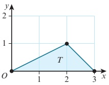

a i Translate ()

b Investigate for other pairs of vertical transformations. It Stretch vertically with factor  $ \frac{1}{2} $, then translate.

2 Combining one vertical and one horizontal transformation

a i Reflect in the

 $$ x-axis,then~translate\begin{pmatrix}-2\\ 0\end{pmatrix}. $$ 

ii Translate  $ \binom{-2}{0} $, then reflect in the x-axis.

b Investigate for other pairs of transformations where one is vertical and the other is horizontal. then stretch horizontally with factor

3 Combining two horizontal transformations

a ji Stretch horizontally with factor 2, then translate

2.

b Investigate for other pairs of horizontal transformations.

From the Explore activity, you should have found that:

### KEY POINT 2.13

When two vertical transformations or two horizontal transformations are combined, the order in which they are applied may affect the outcome.

- When one horizontal and one vertical transformation are combined, the order in which they are applied does not affect the outcome.

## Combining two vertical transformations

We will now consider how the graph of  $ y = f(x) $ is transformed to the graph  $ y = af(x) + k $.

This can be shown in a flow diagram as:

 $$ \mathsf{f}(x)\to\left(\begin{array}{l}{\begin{array}{l}{\mathrm{stretch~vertically,~factor~}a}\\ {\mathrm{multiply~function~by~}a}\end{array}}\end{array}\right)\to\mathsf{a f}(x)\to\left(\begin{array}{l}{\begin{array}{l}{\mathsf{translate}\left(\begin{array}{l}{0}\\ {k}\end{array}\right)}\\ {\mathsf{add~}k\mathrm{~t o~the~f u n c t i o n}}\end{array}\right.}\end{array}\right)\to\mathsf{a f}(x)+k $$

<!-- page 73 -->

This leads to the important result:

### KEY POINT 2.14

Vertical transformations follow the ‘normal’ order of operations, as used in arithmetic.

## Combining two horizontal transformations

Now consider how the graph of $y = f(x)$ is transformed to the graph $y = f(bx + c)$.

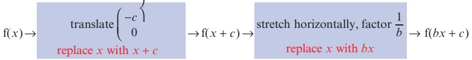

This leads to the important result:

### KEY POINT 2.15

Horizontal transformations follow the opposite order to the ‘normal’ order of operations, as used in arithmetic.

### WORKED EXAMPLE 2.16

The diagram shows the graph of $y = f(x)$.

Sketch the graph of $y = 2f(x) - 3$.

## Answer

 $ y = 2f(x) - 3 $ is a combination of two vertical transformations of  $ y = f(x) $, hence the transformations follow the ‘normal’ order of operations.

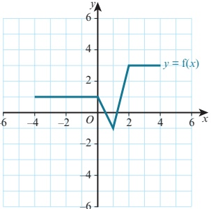

Step 1: Sketch the graph  $  y = 2f(x)  $:

Stretch  $ y = f(x) $ vertically with stretch factor 2.

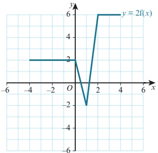

<!-- page 74 -->

Step 2: Sketch the graph  $  y = 2f(x) - \frac{0}{3}  $. Translate  $  y = 2f(x)  $ by the vector  $ \begin{pmatrix} 0 \\ - \end{pmatrix} $.

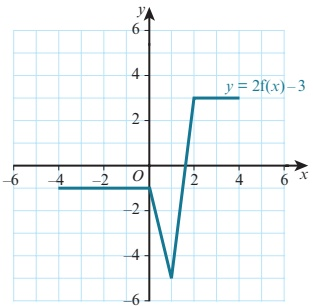

### WORKED EXAMPLE 2.17

The diagram shows the graph of $y = x^{2}$ and its image, $y = g(x)$, after a combination of transformations.

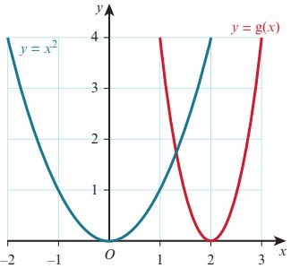

a Find two different ways of describing the combination of transformations.

b Write down the equation of the graph  $ y = g(x) $.

Answer

a Translation of  $ \left(\begin{array}{c} 4 \\ 0 \end{array}\right) $ followed by a horizontal stretch, stretch factor  $ \frac{1}{2} $.

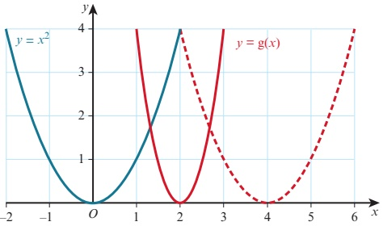

<!-- page 75 -->

OR

Horizontal stretch, factor  $ \frac{1}{2} $, followed by a translation of  $ \left\{\begin{array}{l} \frac{2}{0} \end{array}\right\} $.

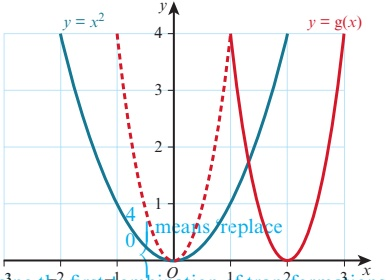

b Using the first combination of transformations:

Translation of

x by x - 4'.

 $$ y=x^{2}\qquad\text{becomes}\qquad y=(x-4)^{2} $$ 

Horizontal stretch, factor  $ \frac{1}{2} $ means ‘replace x by 2x’.

 $ y = (x - 4)^{2} $ becomes  $ y = (2x - 4)^{2} $

Hence,  $ \mathrm{g}(x)=(2x-4)^{2} $.

## EXERCISE 2H

1 The diagram shows the graph of  $ y = g(x) $.

Sketch the graph of each of the following.

a  $ y = g(x + 2) + 3 $ b  $ y = 2g(x) + 1 $ c  $ y = 2 - g(x) $ d  $ y = 2g(-x) + 1 $ e  $ y = -2g(x) - 1 $ f  $ y = g(2x) + 3 $ g  $ y = g(2x - 6) $ h  $ y = g(-x + 1) $

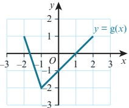

## TIP

The same answer will be obtained when using the second combination of transformations. You may wish to check this yourself.

<!-- page 76 -->

2 The diagram shows the graph of $y = f(x)$.

Write down, in terms of $f(x)$, the equation of the graph of each of the following diagrams.

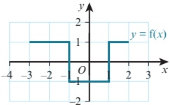

a

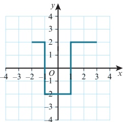

b

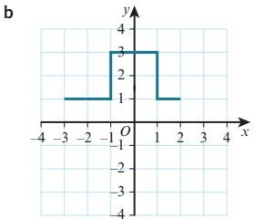

C

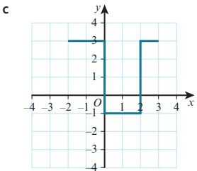

3 Given that $y = x^{2}$, find the image of the curve $y = x^{-1}$ after each of the following combinations of transformations.

a stretch in the v-direction with factor 3 followed by a translation by the vector  $ \left(\begin{array}{c} 1 \\ 0 \end{array}\right) $ a translation by the vector

 $$ \left(\begin{array}{c}1\\ 0\end{array}\right) $$ 

y-direction with

factor 3

4 Find the equation of the image of the curve $y = x^{2}$ after each of the following combinations of transformations and, in each case, sketch in the graph of the resulting curve.

a a stretch  $ \underline{0n} $ the x-direction with factor 2 followed by a translation by the

b a translation by the vector vector

x-direction with

factor 2

c On a graph show the curve  $ y = x^{2} $ and each of your answers to parts a and b.

5 Given that  $ f(x) = x^{2} + 1 $, find the image of y = f(x) after each of the following combinations of transformations.

a translation  $ \begin{pmatrix} 0 \\ 2 \\ -5 \end{pmatrix} $ followed by a stretch parallel to the y-axis with stretch factor 2 followed by a reflection in the

b translation  $ \left(\begin{array}{c} 1 \\ x-axis \end{array}\right) $

<!-- page 77 -->

6 a The graph of $y = g(x)$ is reflected in the y-axis and then stretched with stretch factor 2 parallel to the y-axis. Write down the equation of the resulting graph.

b The graph of $y = f(x)$ is translated by the vector $\begin{pmatrix} 2 \\ -3 \end{pmatrix}$ and then reflected in the $x$-axis. Write down the equation of the resulting graph.

7 Determine the sequence of transformations that maps $y = f(x)$ to each of the following functions.

a $y = \frac{1}{2}f(x) + 3$    b $y = -f(x) + 2$    c $y = f(2x - 6)$    d $y = 2f(x) - 8$

8 Determine the sequence of transformations that maps:

a the curve  $ y = x^{3} $ onto the curve  $ y = \frac{1}{2}(x + 5)^{3} $

b the curve  $ y = x^{3} $ onto the curve  $ y = -\frac{1}{2}(x+1)^{3} - 2 $

c the curve $y=\sqrt[3]{x}$ onto the curve $y=-2\sqrt[3]{x-3}+4$

9 Given that  $ f(x) = \frac{1}{x} $, write down the equation of the image of  $ f(x) $ after:

a reflection in the x-axis, followed by translation

b translation  $ \left(\begin{array}{c}0 \\ 3\end{array}\right) $, followed by a stretch parallel to the x-axis with stretch factor 2

x-axis with stretch factor 1

x-axis with stretch factor 0

Given that, followed by a reflection in the x-axis, followed by translation

 $ g(x) = x^{2} $, write down the equation of the image of  $ g(x) $ after:

a  $ \left(\begin{array}{c}0\\0\\2\\0\end{array}\right) $ followed by a  $ \left(\begin{array}{c}-4\\0\\0\end{array}\right) $ follow the parallel reflection in the y-axis, followed by translation

b  $ \left(\begin{array}{c}0\\0\\2\\0\end{array}\right) $ followed by reflection in the y-axis with stretch factor 3, followed by translation

c  $ \left(\begin{array}{c}0\\0\\2\\0\end{array}\right) $ followed by translation

y-axis, followed by translation

 $ \left(\begin{array}{c}-4\\0\\0\end{array}\right) $

11 Find two different ways of describing the combination of transformations that maps the graph of  $ f(x) = \sqrt{x} $ onto the graph  $ g(x) = \sqrt{-x - 2} $ and sketch the graphs of y = f(x) and y = g(x).

PS 12 Find two different ways of describing the sequence of transformations that maps the graph of $y = f(x)$ onto the graph of $y = f(2x + 10)$.

## WEB LINK

Try the Transformers resource on the Underground Mathematics website.

<!-- page 78 -->

## Checklist of learning and understanding

## Functions

- A function is a rule that maps each x value to just one y value for a defined set of input values.

A function can be either one-one or many-one.

The set of input values for a function is called the domain of the function.

The set of output values for a function is called the range (or image set) of the function.

fg(x) means the function g acts on x first, then f acts on the result.

## Composite functions

fg only exists if the range of g is contained within the domain of f.

In general,  $ \mathrm{fg}(x) \neq \mathrm{gf}(x) $.

## Inverse functions

The inverse of a function  $ f(x) $ is the function that undoes what  $ f(x) $ has done.  $ ff^{-1}(x) = f^{-1}f(x) = x $ or if  $ y = f(x) $ then  $ x = f^{-1}(y) $

The inverse of the function  $ f(x) $ is written as  $ f^{-1}(x) $.

The steps for finding the inverse function are:

Step 1: Write the function as y =

Step 2: Interchange the x and y variables.

Step 3: Rearrange to make y the subject.

The domain of  $ f^{-1}(x) $ is the range of  $ f(x) $.

The range of  $ f^{-1}(x) $ is the domain of  $ f(x) $.

An inverse function  $ f^{-1}(x) $ can exist if, and only if, the function  $ f(x) $ is one-one.

The graphs of f and  $ f^{-1} $ are reflections of each other in the line y = x.

If  $ f(x) = f^{-1}(x) $, then the function f is called a self-inverse function.

If f is self-inverse then  $ ff(x) = x $.

The graph of a self-inverse function has y = x as a line of symmetry.

## Transformations of functions

The graph of  $ y = f(x) + a $ is a translation of  $ y = f(x) $ by the vector  $ \left(\begin{array}{c} a \\ 0 \end{array}\right) $.

The graph of $y = f(x + a)$ is a translation of $y = f(x)$ by the vector $(-1, 0)$.

The graph of  $ y = -f(x) $ is a reflection of the graph  $ y = f(x) $ in the x-axis.

The graph of y = f(-x) is a reflection of the graph y = f(x) in the y-axis.

The graph of $y = af(x)$ is a stretch of $y = f(x)$, stretch factor $a$, parallel to the $y$-axis.

The graph of $y = f(ax)$ is a stretch of $y = f(x)$, stretch factor $\frac{1}{a}$, parallel to the x-axis.

## Combining transformations

When two vertical transformations or two horizontal transformations are combined, the order in which they are applied may affect the outcome.

When one horizontal and one vertical transformation are combined, the order in which they are applied does not affect the outcome.

Vertical transformations follow the ‘normal’ order of operations, as used in arithmetic

Horizontal transformations follow the opposite order to the ‘normal’ order of operations, as used in arithmetic.

<!-- page 79 -->

1 Functions f and g are defined for  $ x \in \mathbb{R} $ by:

f : $x \mapsto 3x - 1$

 $$ g:x\mapsto5x-x^{2} $$ 

Express  $ gf(x) $ in the form  $ a - b(x - c)^2 $, where a, b and c are constants.

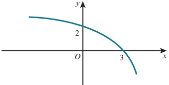

The diagram shows a sketch of the curve with equation  $ y = f(x) $.

a Sketch the graph of  $  y = -f\left( \frac{1}{2}x \right)  $.

b Describe fully a sequence of two transformations that maps the graph of  $ y = f(x) $ onto the graph of  $ y = f(3 - x) $.

3 A curve has equation  $ y = x^{2} + 6x + 8 $.

a Sketch the curve, showing the  $ \uwave{coordinates} $  $ \underline{\text{of any axes crossing}} $ points. then stretched vertically with stretch factor

b The curve is translated by the vector  $ \begin{pmatrix} 1 & & \\ & & 3. \\ & & & 1 \end{pmatrix} $.

Find the equation of the resulting curve, giving your answer in the form  $ y = ax^2 + bx $.

4 The function  $ f: x \mapsto x^2 - 2 $ is defined for the domain  $ x \geq 0 $.

a Find  $ f^{-1}(x) $ and state the domain of  $ f^{-1} $.

b On the same diagram, sketch the graphs of f and  $ f^{-1} $. [3]

5 i Express  $ -x^{2} + 6x - 5 $ in the form  $ a(x + b)^{2} + c $, where a, b and c are constants.

The function  $ f: x \mapsto -x^2 + 6x - 5 $ is defined for  $ x \geq m $, where  $ m $ is a constant.

[1]

for the case where m = 5, find an expression for  $ f^{-1}(x) $ and state the domain of  $ f^{-1} $.

Cambridge International AS & A Level Mathematics 9709 Paper 11 Q9 November 2015

6 The function  $ f: x \mapsto x^2 - 4x + k $ is defined for the domain  $ x \geq p $, where  $ k $ and  $ p $ are constants.

i Express  $ f(x) $ in the form  $ (x+a)^{2}+b+k $, where a and b are constants. [2]

ii State the range of f in terms of k. [1]

iii State the smallest value of p for which f is one-one. [1]

iv For the value of $p$ found in part iii, find an expression for $f^{-1}(x)$ and state the domain of $f^{-1}$, giving your answer in terms of $k$.

Cambridge International AS & A Level Mathematics 9709 Paper 11 Q8 June 2012

<!-- page 80 -->

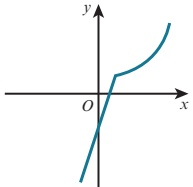

The diagram shows the function f defined for  $ -1 \leq x \leq 4 $, where

 $$  f(x)=\left\{\begin{aligned}&3x-2&\quad for\ -1\leq x\leq1,\\&\frac{4}{5-x}&\quad for\ 1<x\leq4.\end{aligned}\right. $$ 

i State the range of f.

ii Copy the diagram and on your copy sketch the graph of  $ y = f^{-1}(x) $. [2]

ii) Obtain expressions to define the function  $ f^{-1} $, giving also the set of values for which each expression is valid. [6]

Cambridge International AS & A Level Mathematics 9709 Paper 11 Q10 June 2014

8 The function f is defined by  $ f(x) = 4x^2 - 24x + 11 $, for  $ x \in \mathbb{R} $.

i Express  $ f(x) $ in the form  $ a(x-b)^{2}+c $ and hence state the coordinates of the vertex of the graph of y = f(x). [4]

The function g is defined by  $ g(x) = 4x^2 - 24x + 11 $, for  $ x \leq 1 $.

[2]

ii State the range of g.

iii Find an expression for  $ \mathrm{g}^{-1}(x) $ and state the domain of  $ \mathrm{g}^{-1} $.

Cambridge International AS & A Level Mathematics 9709 Paper 11 Q10 November 2012

9 i Express  $ 2x^{2}-12x+13 $ in the form  $ a(x+b)^{2}+c $, where a, b and c are constants. [3]

ii The function f is defined by  $ f(x) = 2x^2 - 12x + 13 $, for  $ x \geq k $, where k is a constant. It is given that f is a one-one function. State the smallest possible value of k. [1]

The value of k is now given to be 7.

iii Find the range of f. [1]

iv Find the expression for  $ f^{-1}(x) $ and state the domain of  $ f^{-1} $.

Cambridge International AS & A Level Mathematics 9709 Paper 11 Q8 June 2013

10 i Express  $ x^{2}-2x-15 $ in the form  $ (x+a)^{2}+b $. [2]

The function f is defined for  $ p \leq x \leq q $, where p and q are positive constants, by

 $$ f:x\mapsto x^{2}-2x-15. $$ 

The range of f is given by  $ c \leq f(x) \leq d $, where c and d are constants.

ii State the smallest possible value of c.

<!-- page 81 -->

iii find p and q, [4]  
iv find an expression for  $ f^{-1}(x) $. [3]  
Cambridge International AS & A Level Mathematics 9709 Paper 11 Q10 November 2014  
  
11 The function f is defined by  $ f: x \mapsto 2x^2 - 12x + 7 $ for  $ x \in \mathbb{R} $.  
i Express  $ f(x) $ in the form  $ a(x - b)^2 - c $. [3]  
ii State the range of f. [1]  
iii Find the set of values of x for which  $ f(x) < 21 $. [3]  
The function g is defined by  $ g: x \mapsto 2x + k $ for  $ x \in \mathbb{R} $.  
iv Find the value of the constant k for which the equation  $ gf(x) = 0 $ has two equal roots. [4]  
Cambridge International AS & A Level Mathematics 9709 Paper 11 Q9 June 2010  
  
12 Functions f and g are defined for  $ x \in \mathbb{R} $ by  
f:  $ x \mapsto 2x + 1 $,  
g:  $ x \mapsto x^2 - 2 $.  
i Find and simplify expressions for  $ fg(x) $ and  $ gf(x) $. [2]  
ii Hence find the value of a for which  $ fg(a) = gf(a) $. [3]  
iii Find the value of b ( $ b \neq a $) for which  $ g(b) = b $. [2]  
iv Find and simplify an expression for  $ f^{-1}g(x) $. [2]  
The function h is defined by  
h:  $ x \mapsto x^2 - 2 $, for  $ x \leq 0 $.  
v Find an expression for  $ h^{-1}(x) $. [2]  
Cambridge International AS & A Level Mathematics 9709 Paper 11 Q11 June 2011  
  
13 Functions f and g are defined by  
f:  $ x \mapsto 2x^2 - 8x + 10 $ for  $ 0 \leq x \leq 2 $,  
g:  $ x \mapsto x $ for  $ 0 \leq x \leq 10 $.  
i Express  $ f(x) $ in the form  $ a(x + b)^2 + c $, where a, b and c are constants. [3]  
ii State the range of f. [1]  
iii State the domain of  $ f^{-1} $. [1]  
iv Sketch on the same diagram the graphs of  $ y = f(x) $,  $ y = g(x) $ and  $ y = f^{-1}(x) $, making clear the relationship between the graphs. [4]  
v Find an expression for  $ f^{-1}(x) $. [3]

 $$ d=65. $$

