# 3 Coordinate geometry

<!-- Cambridge International AS A Level Mathematics Pure Mathematics 1.pdf p82-110 -->

<!-- page 82 -->

# 

# Chapter 3 Coordinate geometry

## In this chapter you will learn how to:

find the equation of a straight line when given sufficient information

interpret and use any of the forms $y = mx + c$, $y - y_{1} = m(x - x_{1})$, $ax + by + c = 0$ in solving problems

understand that the equation  $ (x-a)^{2}+(y-b)^{2}=r^{2} $ represents the circle with centre  $ (a,b) $ and radius r

use algebraic methods to solve problems involving lines and circles

understand the relationship between a graph and its associated algebraic equation, and use the relationship between points of intersection of graphs and solutions of equations.

<!-- page 83 -->

PREREQUISITE KNOWLEDGE

<table border=1 style='margin: auto; word-wrap: break-word;'><tr><td style='text-align: center; word-wrap: break-word;'>Where it comes from</td><td style='text-align: center; word-wrap: break-word;'>What you should be able to do</td><td style='text-align: center; word-wrap: break-word;'>Check your skills</td></tr><tr><td style='text-align: center; word-wrap: break-word;'>IGCSE / O Level Mathematics</td><td style='text-align: center; word-wrap: break-word;'>Find the midpoint and length of a line segment.</td><td style='text-align: center; word-wrap: break-word;'>1 Find the midpoint and length of the line segment joining (-7, 4) and (-2, -8).</td></tr><tr><td style='text-align: center; word-wrap: break-word;'>IGCSE / O Level Mathematics</td><td style='text-align: center; word-wrap: break-word;'>Find the gradient of a line and state the gradient of a line that is perpendicular to the line.</td><td style='text-align: center; word-wrap: break-word;'>2 a Find the gradient of the line joining  $ A(-1, 3) $ and  $ B(5, 2) $.\nb State the gradient of the line that is perpendicular to the line AB.</td></tr><tr><td style='text-align: center; word-wrap: break-word;'>IGCSE / O Level Mathematics</td><td style='text-align: center; word-wrap: break-word;'>Interpret and use equations of lines of the form  $ y = mx + c $.</td><td style='text-align: center; word-wrap: break-word;'>3 The equation of a line is  $ y = \frac{2}{3}x - 5 $. Write down:\na the gradient of the line\nb the  $ y $-intercept\nc the  $ x $-intercept.</td></tr><tr><td style='text-align: center; word-wrap: break-word;'>Chapter 1</td><td style='text-align: center; word-wrap: break-word;'>Complete the square and solve quadratic equations.</td><td style='text-align: center; word-wrap: break-word;'>4 a Complete the square for  $ x^{2} - 8x - 5 $.\nb Solve  $ x^{2} - 8x - 5 = 0 $.</td></tr></table>

## Why do we study coordinate geometry?

This chapter builds on the coordinate geometry work that you learnt at IGCSE / O Level. You shall also learn about the Cartesian equation of a circle. Circles are one of a collection of mathematical shapes called conics or conic sections.

A conic section is a curve obtained from the intersection of a plane with a cone. The three types of conic section are the ellipse, the parabola and the hyperbola. The circle is a special case of the ellipse. Conic sections provide a rich source of fascinating and beautiful results that mathematicians have been studying for thousands of years.

Conic sections are very important in the study of astronomy. We also use their reflective properties in the design of satellite dishes, searchlights, and optical and radio telescopes.

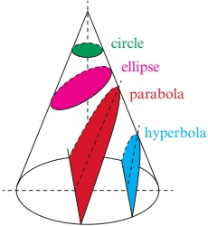

## WEB LINK

The Geometry of equations and Circles stations on the Underground Mathematics website have many useful resources for studying this topic.

<!-- page 84 -->

### 3.1 Length of a line segment and midpoint

At IGCSE / O Level you learnt how to find the midpoint, $M$, of a line segment joining the points $P(x_{1}, y_{1})$ and $Q(x_{2}, y_{2})$ and the length of the line segment, $PQ$, using the two formulae in Key point 3.1. You need to know how to apply these formulae to solve problems.

### KEY POINT 3.1

To find the midpoint, M, of the line segment PQ:  $ M = \left( \frac{2}{4}, \frac{2}{4} \right) $  $ Q(x_2, y_2) $

 $$ PQ：PQ=\sqrt{(x_{2}-x_{1})^{2}+(y_{2}-y_{1})^{2}} $$ 

## TIP

It is important to remember to show appropriate calculations in coordinate geometry questions. Answers from scale drawings are not accepted.

### WORKED EXAMPLE 3.1

The point $M\left(\frac{2}{x_{1}}, \frac{11}{y_{1}}\right)$ is the midpoint of the line segment $x_{2}-y_{1}-y_{2}$ and midpoint $3$ and the value of $a$ and the value of $b$.

 $$ P(-7,4)\mathrm{a n d}Q(a,b). $$ 

## Answer

 $$ \left.\begin{array}{c c c c}{7}&{a}&{4}&{b}\\ {2}&{,}&{2}&{}\end{array}\right.\quad\left.\begin{array}{c c}{3}&{}\\ {2,}&{11}\end{array}\right\} $$ 

## Method 1: Using algebra

Method 1: Using algebra

$(-7, 4)$ $(a, b)$ $\left\{\begin{array}{l} = \\ \end{array} \right.$ $\left\{\begin{array}{l} - \\ \end{array} \right.$ Decide which values to use for $x_1$, $y_1$, $x_2$, $y_2$.

$\uparrow \uparrow$ $\uparrow$ $\uparrow$ $\uparrow$ + + +

$(x_1, y_1)$ $(x_2, y_2)$

Equating the x-coordinates:  $ \frac{-7 + a}{2} = \frac{3}{2} $

 $ -7 + a = 3 $

Equating the y-coordinates:  $ \frac{4+b}{2} = -11 $

 $ 4 + b = -22 $

 $ b = -26 $

Hence, a = 10 and b = -26.

<!-- page 85 -->

Method 2: Using vectors

 $$ \overrightarrow{PM}=\left(\begin{array}{c}8\frac{1}{2}\\ -15\end{array}\right) $$ 

 $$ \therefore\overrightarrow{MQ}\equiv\left(\begin{array}{c}8\frac{1}{2}\\ -15\end{array}\right) $$ 

 $ a = \frac{3}{2} + 8\frac{1}{2} $ and  $ b = -11 + (-15) $

 $ \therefore a=10 $ and b=-26.

 $$ M\left(\frac{3}{2},-11\right) $$ 

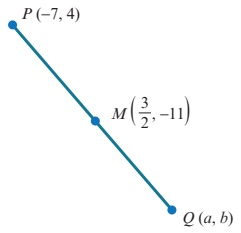

### WORKED EXAMPLE 3.2

Three of the vertices of a parallelogram, ABCD, are  $ A(-5, -1) $,  $ B(-1, -4) $ and  $ C(6, -2) $.

a Find the midpoint of AC.

b Find the coordinates of $D$.

Answer

 $ \hat{a} $ Midpoint of  $ AC = \left( \frac{-\frac{2}{1}}{1} + \frac{2}{4} - \frac{2}{1} \right) = \left( \frac{2}{1} - \frac{2}{3} \right) = 0 $

 $ D^2 \text{be } (m, \hat{n}) $.

Since $ABCD$ is a parallelogram, the midpoint $\underline{\text{of } BD}$ is the same as the midpoint of $AC$.

Midpoint of BD =  $ \left( \frac{- + m}{} - + n \right) $

Equating the x-coordinates:  $ \frac{-1+m}{2}=\frac{1}{2} $

 $ -1+m=1 $

Equating the y-coordinates:  $ \frac{-4+n}{2}=-\frac{3}{2} $

 $ -4+n=-3= $

1

D is the point (2,1).

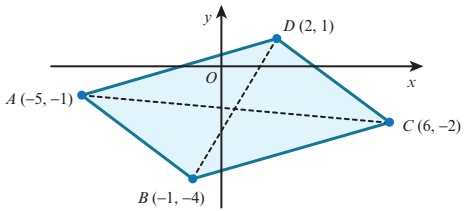

### WORKED EXAMPLE 3.3

The distance between two points  $ P(-2, a) $ and  $ Q(a - 2, -7) $ is 17.

Find the two possible values of a.

Answer

 $$ (-2,a) $$ 

 $$ \begin{array}{l}\uparrow\quad\uparrow\end{array} $$ 

 $$ (a-2,-7) $$ 

 $$ (x_{1},y_{1}) $$ 

 $$ \begin{array}{l}\uparrow\quad\uparrow\end{array} $$ 

 $$ (x_{2},y_{2}) $$ 

Decide which values to use for $x_{1}$, $y_{1}$, $x_{2}$, $y_{2}$.

<!-- page 86 -->

\begin{array}{l} \text{Using } PQ=\sqrt{(x_{2} - x_{1})^{2} + (y_{2} - y_{1})^{2}} = 17  \\ \end{array}

 $$ \sqrt{(a-2+2)^{2}+(-7-a)^{2}}=17 $$ 

Square both sides.

 $$ a^{2}+(-7-a)^{2}=289 $$ 

Expand brackets.

 $$ a^{2}+49+14a+a^{2}=289 $$ 

Collect terms on one side.

 $$ 2a^{2}+14a-240=0 $$ 

Divide both sides by 2.

 $$ a^{2}+7a-120=0 $$ 

 $$ (a-8)(a+15)=0 $$ 

Factorise.

 $$ a-8=0\quad or\quad a+15=0 $$ 

Solve.

 $$ a=8\quad\mathrm{o r}\quad a=-15 $$ 

### EXPLORE 3.1

The triangle has sides of length  $ 2\sqrt{7} $ cm,  $ 4\sqrt{3} $ cm and  $ 5\sqrt{3} $ cm.

Tamar says that this triangle is right angled.

Discuss whether he is correct.

Explain your reasoning.

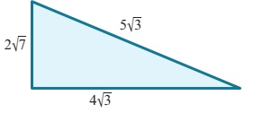

## EXERCISE 3A

1 Calculate the lengths of the sides of the triangle PQR.

Use your answers to determine whether or not the triangle is right angled.

a $P(-4,6)$, $Q(6,1)$, $R(2,9)$

b $P(-5,2)$, $Q(9,3)$, $R(-2,8)$

2  $ P(1,6) $,  $ Q(-2,1) $ and  $ R(3,-2) $.

Show that triangle  $ PQR $ is a right-angled isosceles triangle and calculate the area of the triangle.

3 The distance between two points, $P(a,-1)$ and $Q(-5,a)$, is $4\sqrt{5}$. Find the two possible values of $a$.

4 The distance between two points, $P(-3,-2)$ and $Q(b,2b)$, is 10.

Find the two possible values of $b$.

5 The point  $ (-2, -3) $ is the midpoint of the line segment joining  $ P(-6, -5) $ and  $ Q(a, b) $. Find the value of a and the value of b.

6 Three of the vertices of a parallelogram, ABCD, are  $ A(-7, 3) $,  $ B(-3, -11) $ and  $ C(3, -5) $.

a Find the midpoint of AC.

b Find the coordinates of D.

c Find the length of the diagonals AC and BD.

<!-- page 87 -->

7 The point  $ P(k, 2k) $ is equidistant from  $ A(8, 11) $ and  $ B(1, 12) $. Find the value of k.

8 Triangle  $ ABC $ has vertices at  $ A(-6, 3) $,  $ B(3, 5) $ and  $ C(1, -4) $. Show that triangle  $ ABC $ is isosceles and find the area of this triangle.

9 Triangle $ABC$ has vertices at $A(-7,8)$, $B(3,k)$ and $C(8,5)$. Given that $AB=2BC$, find the value of $k$.

10 The line  $ x + y = 4 $ meets the curve  $ y = 8 - \frac{5}{x} $ at the points A and B. Find the coordinates of the midpoint of AB.

11 The line y = x - 3 meets the curve  $ y^{2} = 4x $ at the points A and B.

a Find the coordinates of the midpoint of AB.

b Find the length of the line segment AB.

PS 12 In triangle $ABC$, the midpoints of the sides $AB$, $BC$ and $AC$ are $(1,4)$, $(2,0)$ and $(-4,1)$, respectively. Find the coordinates of points $A$, $B$ and $C$.

### 3.2 Parallel and perpendicular lines

At IGCSE / O Level you learnt how to find the gradient of the line joining the points  $ P(x_1, y_1) $ and  $ Q(x_2, y_2) $ using the formula in Key point 3.2.

### KEY POINT 3.2

Gradient of  $ PQ = \frac{y_{2} - y_{1}}{x_{2} - x_{1}} $

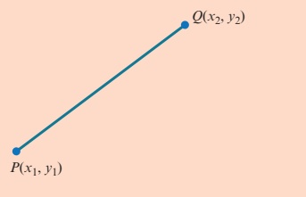

You also learnt the following rules about parallel and perpendicular lines.

<table border=1 style='margin: auto; word-wrap: break-word;'><tr><td style='text-align: center; word-wrap: break-word;'>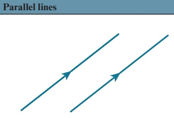</td><td style='text-align: center; word-wrap: break-word;'>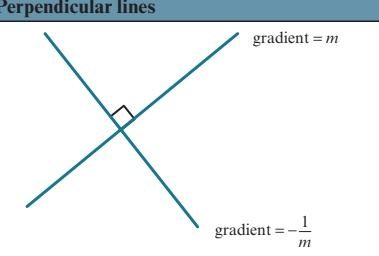</td></tr><tr><td style='text-align: center; word-wrap: break-word;'>If two lines are parallel, then their gradients are equal.</td><td style='text-align: center; word-wrap: break-word;'>If a line has gradient m, then every line perpendicular to it has gradient  $ -\frac{1}{m} $.</td></tr></table>

<!-- page 88 -->

We can also write the rule for perpendicular lines as:

### KEY POINT 3.3

If the gradients of two perpendicular lines are  $ m_1 $ and  $ m_2 $, then  $ m_1 \times m_2 = -1 $.

You need to know how to apply the rules for gradients to solve problems involving parallel and perpendicular lines.

### WORKED EXAMPLE 3.4

The coordinates of three points are  $ A(k-5,-15) $,  $ B(10,k) $ and  $ C(6,-k) $.

Find the two possible values of k if A, B and C are collinear.

## Answer

If A, B and C are collinear, then they lie on the same line.

gradient of AB = \text{gradient of } BC

 $ \frac{k - (-15)}{10 - (k - 5)} = \frac{-k - k}{6 - 10} $

Simplify.

 $ \frac{k + 15}{15 - k} = \frac{k}{2} $

Cross-multiply.

 $ 2(k + 15) = k(15 - k) $

Expand brackets.

 $ 2k + 30 = 15k - k^2 $

Collect terms on one side.

 $ k^2 - 13k + 30 = 0 $

Factorise.

 $ (k - 3)(k - 10) = 0 $

Solve.

 $ k - 3 = 0 $ or  $ k - 10 = 0 $

 $ \therefore k = 3 $ or  $ k = 10 $

### WORKED EXAMPLE 3.5

The vertices of triangle ABC are  $ A(11,3) $,  $ B(2k,k) $ and  $ C(-1,-11) $.

a Find the two possible values of k if angle ABC is  $ 90^{\circ} $.

b Draw diagrams to show the two possible triangles.

## Answer

a Since angle ABC is  $ 90^{\circ} $, gradient of  $ AB \times $ gradient of BC = -1.

 $$ \frac{k-3}{2k-11}\times\frac{-11-k}{-1-2k}=-1 $$ 

Simplify the second fraction.

<!-- page 89 -->

$$ \frac{k-3}{2k-11}\times\frac{k+11}{2k+1}=-1 $$ 

Multiply both sides by  $ (2k-11)(2k+1) $.

 $$ (k-3)(k+11)=-(2k-11)(2k+1) $$ 

 $$ k^{2}+8k-33=-4k^{2}+20k+11 $$ 

Expand brackets.

 $$ 5k^{2}-12k-44=0 $$ 

Collect terms on one side.

(5k-22)(k+2)=0

5k-22=0 or  $ k+2=0 $

Factorise.

 $ \therefore k=4.4 $ or  $ k=-2 $

b If k = 4.4, then B is the point (8.8, 4.4).

If k = -2, then B is the point  $ (-4, 2) $.

The two possible triangles are:

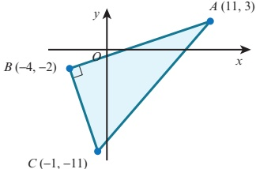

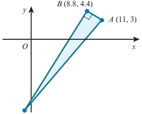

C $ (-1, -11) $

## EXERCISE 3B

1 The coordinates of three points are  $ A(-6, 4) $,  $ B(4, 6) $ and  $ C(10, 7) $.

a Find the gradient of AB and the gradient of BC.

b Use your answer to part a to decide whether or not the points A, B and C are collinear.

2 The midpoint of the line segment joining $P(-4,5)$ and $Q(6,1)$ is $M$.

The point $R$ has coordinates $(-3,-7)$.

Show that $RM$ is perpendicular to $PQ$.

3 Two vertices of a rectangle, $ABCD$, are $A(-6, -4)$ and $B(4, -8)$. Find the gradient of $CD$ and the gradient of $BC$.

4 The coordinates of three of the vertices of a trapezium, $ABCD$, are $A(3,5)$, $B(-5,4)$ and $C(1,-5)$. $AD$ is parallel to $BC$ and angle $ADC$ is $90^{\circ}$.

Find the coordinates of $D$.

5 The coordinates of three points are  $ A(5, 8) $,  $ B(k, 5) $ and  $ C(-k, 4) $. Find the value of k if A, B and C are collinear.

6 The vertices of triangle $ABC$ are $A(-9, 2k-8)$, $B(6, k)$ and $C(k, 12)$. Find the two possible values of $k$ if angle $ABC$ is $90^{\circ}$.

<!-- page 90 -->

7 A is the point (0, 8) and B is the point (8, 6).

Find the point C on the y-axis such that angle ABC is  $ 90^{\circ} $.

8 Three points have coordinates  $ A(7, 4) $,  $ B(19, 8) $ and  $ C(k, 2k) $.

Find the value of the constant k for which:

a C lies on the line that passes through the points A and B

b angle CAB is  $ 90^{\circ} $

9 The line  $ \frac{x}{a} - \frac{y}{b} = 1 $, where a and b are positive constants, meets the x-axis at P and the y-axis at Q. The gradient of the line PQ is  $ \frac{2}{5} $ and the length of the line PQ is  $ 2\sqrt{29} $.

Find the value of a and the value of b

Find the value of a and the value of b.

10 P is the point  $ (a, a - 2) $ and Q is the point  $ (4 - 3a, -a) $.

a Find the gradient of the line  $ PQ $.

b Find the gradient of a line perpendicular to  $ PQ $.

c Given that the distance  $ PQ $ is  $ 10\sqrt{5} $, find the two possible values of  $ a $.

11 The diagram shows a rhombus ABCD.

M is the midpoint of BD.

a Find the coordinates of M.

b Find the value of a, the value of b and the value of c.

c Find the perimeter of the rhombus.

d Find the area of the rhombus.

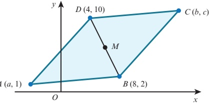

### 3.3 Equations of straight lines

At IGCSE / O Level you learnt the equation of a straight line is:

### KEY POINT 3.4

 $ y = mx + c $, where m is the gradient and c is the y-intercept, when the line is non-vertical. x = b when the line is vertical, where b is the x-intercept.

There is an alternative formula that we can use when we know the gradient of a straight line and a point on the line.

Consider a line, with gradient m, that passes through the known point  $ A(x_1, y_1) $ and whose general point is  $ P(x, y) $.

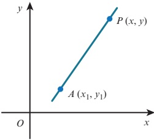

<!-- page 91 -->

Gradient of AP = m, hence  $ \frac{y - y_{1}}{x - x_{1}} = m $

Multiply both sides by  $ (x - x_1) $.

 $$ y-y_{1}=m(x-x_{1}) $$ 

### KEY POINT 3.5

The equation of a straight line, with gradient m, that passes through the point  $ (x_1, y_1) $ is:

 $ y - y_1 = m(x - x_1) $

### WORKED EXAMPLE 3.6

Find the equation of the straight line with gradient -2 that passes through the point  $ (4,1) $.

Answer

Using  $ y - y_1 = m(x - x_1) $ with m = -2,  $ x_1 = 4 $ and  $ y_1 = 1 $:

 $$ y-1=-2(x-4) $$ 

 $$ y-1=-2x+8 $$ 

 $$ 2x+y=9 $$ 

### WORKED EXAMPLE 3.7

Find the equation of the straight line passing through the points  $ (-4, 3) $ and  $ (6, -2) $.

## Answer

 $$ (6,-2) $$ 

 $$ (x_{1},y_{1})\qquad\qquad(x_{2},y_{2}) $$ 

Decide which values to use for $x_{1}$, $y_{1}$, $x_{2}$, $y_{2}$.

Gradient = m =  $ \frac{y_{2} - y_{1}}{x_{2} - x_{1}} = \frac{(-2) - 3}{6 - (-4)} = -\frac{1}{2} $

Using  $ y - y_1 = m(x - x_1) $ with  $ m = -\frac{1}{2} $,  $ x_1 = -4 $ and  $ y_1 = 3 $:

 $$ y-3=-\frac{1}{2}(x+4) $$ 

 $$ 2y-6=-x-4 $$ 

 $$ x+2y=2 $$

<!-- page 92 -->

### WORKED EXAMPLE 3.8

Find the equation of the perpendicular bisector of the line segment joining  $ A(-5,1) $ and  $ B(7,-2) $.

## Answer

Gradient of AB =  $ \frac{-2 - 1}{7 - (-5)} = \frac{-3}{12} = -\frac{1}{4} $

Use gradient =  $ \frac{y_2 - y_1}{x_2 - x_1} $.

Gradient of the perpendicular= 4 2

Use  $ m_{1} \times m_{2} = -1 $.  $ _{1} $  $ _{2} $

Midpoint of

 $$ =\left(\frac{-\frac{2}{+}}{\quad\quad}\cdot\frac{+\binom{2}{-\quad}}{}\right\}^{\prime}=\left(\frac{2}{--}\right) $$ 

 $$  Use~midpoint=\left(\frac{x\ +x}{2}\quad\frac{y_{1}+y_{2}}{2}\right). $$ 

∴ The perpendicular bisector is the line with gradient 4 passing through the point  $ \begin{array}{c} 2 \\ -- \\ \end{array} $

Using $y - y_1 = m(x - x_1)$ with $x_1 = 1$, $y_1 = -\frac{1}{2}$ and $m = 4$:

 $$ \begin{aligned}y+\frac{1}{2}&=4(x-1)\\y&=4x-4\frac{1}{2}\\2y&=8x-9\end{aligned} $$ 

Expand brackets and simplify.

Multiply both sides by 2.

## EXERCISE 3C

1 Find the equation of the line with:

a gradient 2 passing through the point (4, 9)

b gradient -3 passing through the point (1, -4)

c gradient  $ -\frac{2}{3} $ passing through the point  $ (-4, 3) $.

2 Find the equation of the line passing through each pair of points.

a (1,0) and (5,6)

b (3, -5) and (-2, 4)

c (3, -1) and (-3, -5)

3 Find the equation of the line:

a parallel to the line y = 3x - 5, passing through the point (1, 7)

b parallel to the line $x+2y=6$, passing through the point $(4,-6)$

c perpendicular to the line y = 2x - 3, passing through the point (6,1)

d perpendicular to the line 2x - 3y = 12, passing through the point (8, -3).

4 Find the equation of the perpendicular bisector of the line segment joining the points:

a (5, 2) and (-3, 6)

b  $ (-2, -5) $ and  $ (8, 1) $

c  $ (-2, -7) $ and  $ (5, -4) $.

<!-- page 93 -->

5 The line $l_{1}$ passes through the points $P(-10,1)$ and $Q(2,10)$. The line $l_{2}$ is parallel to $l_{1}$ and passes through the point $(4,-1)$. The point $R$ lies on $l_{2}$, such that $QR$ is perpendicular to $l_{2}$. Find the coordinates of $R$.

6 P is the point  $ (-4, 2) $ and Q is the point  $ (5, -4) $.

A line, $l$, is drawn through $P$ and perpendicular to $PQ$ to meet the $y$-axis at the point $R$.

a Find the equation of the line l.

b Find the coordinates of the point R.

c Find the area of triangle PQR.

7 The line  $ l_{1} $ has equation 3x - 2y = 12 and the line  $ l_{2} $ has equation y = 15 - 2x. The lines  $ l_{1} $ and  $ l_{2} $ intersect at the point A.

a Find the coordinates of A.

b Find the equation of the line through A that is perpendicular to the line  $ l_{1} $.

8 The perpendicular bisector of the line joining  $ A(-10, 5) $ and  $ B(-2, -1) $ intersects the x-axis at P and the y-axis at Q.

a Find the equation of the line  $ PQ $.

b Find the coordinates of P and Q.

c Find the length of PQ.

9 The line  $ l_{1} $ has equation  $ 2x + 5y = 10 $.

The line  $ l_{2} $ passes through the point  $ A(-9, -6) $ and is perpendicular to the line  $ l_{1} $.

a Find the equation of the line  $ l_{2} $.

b Given that the lines  $ l_{1} $ and  $ l_{2} $ intersect at the point B, find the area of triangle ABO, where O is the origin.

10 The diagram shows the points E, F and G lying on the line  $ x + 2y = 16 $. The point G lies on the x-axis and EF = FG. The line FH is perpendicular to EG. Find the coordinates of E and F.

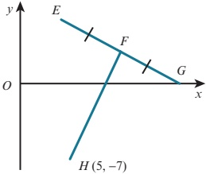

11 The coordinates of three points are  $ A(-4, -1) $,  $ B(8, -9) $ and  $ C(k, 7) $.

M is the midpoint of AB and MC is perpendicular to AB. Find the value of k.

12 The point $P$ is the reflection of the point $(-2,10)$ in the line $4x-3y=12$. Find the coordinates of $P$.

<!-- page 94 -->

13 The coordinates of triangle ABC are  $ A(-7, 3) $,  $ B(3, -7) $ and  $ C(8, 8) $. P is the foot of the perpendicular from B to AC.

a Find the equation of the line BP.

b Find the coordinates of $P$.

c Find the lengths of AC and BP.

 $ \therefore \beta C $

14 The coordinates of triangle PQR are  $ P(1,1) $,  $ Q(1,8) $ and  $ R(6,6) $.

a Find the equation of the perpendicular bisectors of:

i  $ PQ $ ii  $ PR $

b Find the coordinates of the point that is equidistant from P, Q and R.

PS 15 The equations of two of the sides of triangle $ABC$ are $x + 2y = 8$ and $2x + y = 1$. Given that $A$ is the point $(2, -3)$ and that angle $ABC = 90^{\circ}$, find:

a the equation of the third side

b the coordinates of the point $B$.

PS 16 Find two straight lines whose x-intercepts differ by 7, whose y-intercepts differ by 5 and whose gradients differ by 2.

Is your solution unique? Investigate further.

[This question is based upon Straight line pairs on the Underground Mathematics website.]

### 3.4 The equation of a circle

In this section you will learn about the equation of a circle. A circle is defined as the locus of all the points in a plane that are a fixed distance (the radius) from a given point (the centre).

### EXPLORE 3.2

1 Use graphing software to draw each of the following circles. From your graphs find the coordinates of the centre and the radius of each circle, and copy and complete the following table.

Try the following resources on the Underground

<table border=1 style='margin: auto; word-wrap: break-word;'><tr><td style='text-align: center; word-wrap: break-word;'></td><td style='text-align: center; word-wrap: break-word;'>Equation of circle</td><td style='text-align: center; word-wrap: break-word;'>Centre</td><td style='text-align: center; word-wrap: break-word;'>Radius</td></tr><tr><td style='text-align: center; word-wrap: break-word;'>a</td><td style='text-align: center; word-wrap: break-word;'>$ x^{{2}} + y^{{2}} = 25 $</td><td style='text-align: center; word-wrap: break-word;'></td><td style='text-align: center; word-wrap: break-word;'></td></tr><tr><td style='text-align: center; word-wrap: break-word;'>b</td><td style='text-align: center; word-wrap: break-word;'>$ (x - 2)^{{2}} + (y - 1)^{{2}} = 9 $</td><td style='text-align: center; word-wrap: break-word;'></td><td style='text-align: center; word-wrap: break-word;'></td></tr><tr><td style='text-align: center; word-wrap: break-word;'>c</td><td style='text-align: center; word-wrap: break-word;'>$ (x + 3)^{{2}} + (y + 5)^{{2}} = 16 $</td><td style='text-align: center; word-wrap: break-word;'></td><td style='text-align: center; word-wrap: break-word;'></td></tr><tr><td style='text-align: center; word-wrap: break-word;'>d</td><td style='text-align: center; word-wrap: break-word;'>$ (x - 8)^{{2}} + (y + 6)^{{2}} = 49 $</td><td style='text-align: center; word-wrap: break-word;'></td><td style='text-align: center; word-wrap: break-word;'></td></tr><tr><td style='text-align: center; word-wrap: break-word;'>e</td><td style='text-align: center; word-wrap: break-word;'>$ x^{{2}} + (y + 4)^{{2}} = 4 $</td><td style='text-align: center; word-wrap: break-word;'></td><td style='text-align: center; word-wrap: break-word;'></td></tr><tr><td style='text-align: center; word-wrap: break-word;'>f</td><td style='text-align: center; word-wrap: break-word;'>$ (x + 6)^{{2}} + y^{{2}} = 64 $</td><td style='text-align: center; word-wrap: break-word;'></td><td style='text-align: center; word-wrap: break-word;'></td></tr></table>

## WEB LINK

• Lots of lines!

• Straight lines

Mathematics website:

• Simultaneous squares

2 Discuss your results with your classmates and explain how you can find the coordinates of the centre of a circle and the radius of a circle just by looking at the equation of the circle.

• Straight line pairs.

<!-- page 95 -->

To find the equation of a circle, we let $P(x, y)$ be any point on the circumference of a circle with centre $C(a, b)$ and radius $r$.

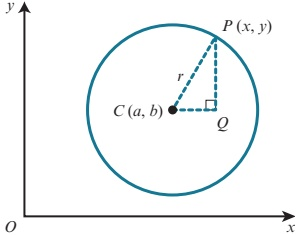

Using Pythagoras' theorem on triangle CQP gives  $ CQ^{2} + PQ^{2} = r^{2} $.

Substituting  $ CQ = x - a $ and  $ PQ = y - b $ into  $ CQ^2 + PQ^2 = r^2 $ gives:

 $$ (x-a)^{2}+(y-b)^{2}=r^{2} $$ 

### KEY POINT 3.6

The equation of a circle with centre  $ (a, b) $ and radius  $ r $ can be written in completed square form as:

 $$ (x-a)^{2}+(y-b)^{2}=r^{2} $$ 

### EXPLORE 3.3

The completed square form for the equation of a circle with centre $(a, b)$ and radius $r$ is $(x-a)^{2}+(y-b)^{2}=r^{2}$. Use graphing software to investigate the effects of:

a increasing the value of $a$ b decreasing the value of $a$

c increasing the value of $b$ d decreasing the value of $b$.

### WORKED EXAMPLE 3.9

Write down the coordinates of the centre and the radius of each of these circles.

a

 $$ x^{2}+y^{2}=4 $$ 

b  $ (x-2)^{2}+(y-4)^{2}=100 $

c  $ (x+1)^{2}+(y-8)^{2}=12 $

Answer

a Centre = (0, 0), radius =  $ \sqrt{4} = 2 $

b Centre = (2, 4), radius =  $ \sqrt{100} = 10 $

 $$ \mathrm{~\bf~c~}\quad\mathrm{C e n t r e}=(-1,8),\mathrm{r a d i u s}=\sqrt{12}=2\sqrt{3} $$ 

## DID YOU KNOW?

In the 17th century, the French philosopher and mathematician René Descartes developed the idea of using equations to represent geometrical shapes. The Cartesian coordinate system is named after this famous mathematician.

<!-- page 96 -->

### WORKED EXAMPLE 3.10

Find the equation of the circle with centre  $ (-4, 3) $ and radius 6.

## Answer

Equation of circle is  $ (x-a)^{2}+(y-b)^{2}=r^{2} $, where a=-4, b=3 and r=6.

 $$ (x-(-4))^{2}+(y-3)^{2}=6^{2} $$ 

 $$ (x+4)^{2}+(y-3)^{2}=36 $$ 

### WORKED EXAMPLE 3.11

A is the point  $ (3,0) $ and B is the point  $ (7,-4) $.

Find the equation of the circle that has AB as a diameter.

## Answer

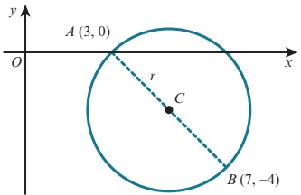

The centre of the circle, C, is the midpoint of AB.

 $$ C=\left(\frac{3+7}{2},\frac{0+(-4)}{2}\right]=(5,-2) $$ 

Radius of circle, r, is equal to AC.

 $$ r=\sqrt{(5-3)^{2}+(-2-0)^{2}}=\sqrt{8} $$ 

Equation of circle is  $ (x-a)^{2}+(y-b)^{2}=r^{2} $, where a=5, b=-2 and  $ r=\sqrt{8} $.

 $$ (x-5)^{2}+(y+2)^{2}=\left(\sqrt{8}\right)^{2} $$ 

 $$ (x-5)^{2}+(y+2)^{2}=8 $$ 

Expanding the equation  $ (x - a)^2 + (y - b)^2 = r^2 $ gives:

 $$ x^{2}-2ax+a^{2}+y^{2}-2by+b^{2}=r^{2} $$ 

Rearranging gives:

 $$ x^{2}+y^{2}-2ax-2by+(a^{2}+b^{2}-r^{2})=0 $$ 

When we write the equation of a circle in this form, we can note some important characteristics of the equation of a circle. For example:

the coefficients of  $ x^{2} $ and  $ y^{2} $ are equal

there is no xy term.

<!-- page 97 -->

We often write the expanded form of a circle as:

### KEY POINT 3.7

 $$ x^{2}+y^{2}+2g x+2f y+c=0 $$ 

where  $ (-g, -f) $ is the centre and  $ \sqrt{g^2 + f^2 - c} $ is the radius.

This is the equation of a circle in expanded general form.

## TIP

You should not try to memorise the formulae for the centre and radius of a circle in this form, but rather work them out if needed, as shown in Worked example 3.12.

### WORKED EXAMPLE 3.12

Find the centre and the radius of the circle  $ x^{2}+y^{2}+10x-8y-40=0 $.

## Answer

We answer this question by first completing the square.

 $$ x^{2}+10x+y^{2}-8y-40=0 $$ 

 $$ (x+5)^{2}-5^{2}+(y-4)^{2}-4^{2}-40=0 $$ 

Complete the square.

Collect constant terms together.

 $$ (x+5)^{2}+(y-4)^{2}=81 $$ 

Compare with  $ (x - a)^{2} + (y - b)^{2} = r^{2} $.

a = -5

b = 4

 $$ r^{2}=81 $$ 

Centre =  $ (-5, 4) $ and radius = 9.

It is useful to remember the three following right angle facts for circles.

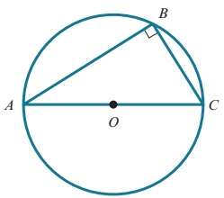

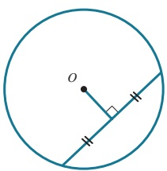

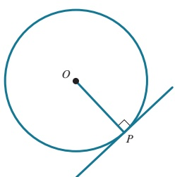

<table border=1 style='margin: auto; word-wrap: break-word;'><tr><td style='text-align: center; word-wrap: break-word;'>The angle in a semicircle is a right angle.</td><td style='text-align: center; word-wrap: break-word;'>The perpendicular from the centre of a circle to a chord bisects the chord.</td><td style='text-align: center; word-wrap: break-word;'>The tangent to a circle at a point is perpendicular to the radius at that point.</td></tr></table>

From these statements we can conclude that:

If triangle $ABC$ is right angled at $B$, then the points $A, B$ and $C$ lie on the circumference of a circle with $AC$ as diameter.

The perpendicular bisector of a chord passes through the centre of the circle.

If a radius and a line at a point, P, on the circumference are at right angles, then the line must be a tangent to the curve.

<!-- page 98 -->

A circle passes through the points  $ P(-1,4) $,  $ Q(1,6) $ and  $ R(5,4) $.

Find the equation of the circle.

## Answer

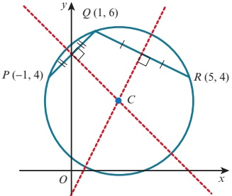

The centre of the circle lies on the perpendicular bisector of PQ and on the perpendicular bisector of QR.

Midpoint of  $ PQ = \left( \frac{-1 + 1}{2}, \frac{4 + 6}{2} \right) $ (0, 5)

Gradient of  $ PQ $  $ \frac{6\quad4}{1\quad(1)} $ 1

Gradient of perpendicular bisector of  $ PQ = -1 $

Equation of perpendicular bisector of PQ is:

 $$ (y-5)=-1(x-0) $$ 

 $$ y=-x+5\cdots\cdots\cdots\cdots\cdots  (1) $$ 

Midpoint of  $ QR = \left( \frac{1 + 5}{2}, -\frac{6 + 4}{2} \right) $ (3, 5)

Gradient of QR  $ \frac{4\quad6}{5\quad1}\quad\frac{1}{2} $

Gradient of perpendicular bisector of QR = 2

Equation of perpendicular bisector of QR is:

 $$ (y-5)=2(x-3) $$ 

 $$ y=2x-1\cdots\cdots\cdots\cdots\cdots  (2) $$ 

Solving equations (1) and (2) gives:

 $$ x=2,y=3 $$ 

Centre of circle = (2, 3)

 $ \text{Radius} = CR = \sqrt{(5-2)^2 + (4-3)^2} = \sqrt{10} $

Hence, the equation of the circle is  $ (x-2)^{2}+(y-3)^{2}=10 $.

<!-- page 99 -->

## Alternative method:

The equation of the circle is  $ (x - a)^{2} + (y - b)^{2} = r^{2} $.

The points  $ (-1, 4) $,  $ (1, 6) $ and  $ (5, 4) $ lie on the circle, so substituting gives:

 $$ (-1-a)^{2}+(4-b)^{2}=r^{2} $$ 

 $$ a^{2}+2a+b^{2}-8b+17=r^{2}\cdots\cdots\cdots(1) $$ 

and similar for the other two points, giving equations (2) and (3).

Then subtracting (1)–(3) and (2)–(3) gives two simultaneous equations for $a$ and $b$, which can then be solved. Finally, substituting into (1) gives $r^{2}$.

## EXERCISE 3D

1 Find the centre and the radius of each of the following circles.

 $$ x^{2}+y^{2}=16 $$ 

 $$ 2x^{2}+2y^{2}=9 $$ 

 $$ x^{2}+(y-2)^{2}=25 $$ 

d  $ (x-5)^{2}+(y+3)^{2}=4 $

 $$ (x+7)^{2}+y^{2}=18 $$ 

 $$ 2(x-3)^{2}+2(y+4)^{2}=45 $$ 

g

 $$ x^{2}+y^{2}-8x+20y+110=0 $$ 

h

 $$ 2x^{2}+2y^{2}-14x-10y-163=0 $$ 

2 Find the equation of each of the following circles.

a centre (0, 0), radius 8

b centre (5, -2), radius 4

c centre (-1, 3), radius  $ \sqrt{7} $

d centre  $ \left(\frac{1}{2}, -\frac{3}{2}\right) $, radius  $ \frac{5}{2} $

3 Find the equation of the circle with centre (2, 5) passing through the point (6, 8).

4 A diameter of a circle has its end points at  $ A(-6, 8) $ and  $ B(2, -4) $. Find the equation of the circle.

5 Sketch the circle  $ (x-3)^{2}+(y+2)^{2}=9 $.

6 Find the equation of the circle that touches the x-axis and whose centre is  $ (6,-5) $.

7 The points  $ P(1, -2) $ and  $ Q(7, 1) $ lie on the circumference of a circle. Show that the centre of the circle lies on the line  $ 4x + 2y = 15 $.

8 A circle passes through the points  $ (3, 2) $ and  $ (7, 2) $ and has radius  $ 2\sqrt{2} $. Find the two possible equations for this circle.

9 A circle passes through the points  $ O(0, 0) $,  $ A(8, 4) $ and  $ B(6, 6) $.

Show that  $ OA $ is a diameter of the circle and find the equation of this circle.

10 Show that  $ x^{2} + y^{2} - 6x + 2y = 6 $ can be written in the form  $ (x - a)^{2} + (y - b)^{2} = r^{2} $, where a, b and r are constants to be found. Hence, write down the coordinates of the centre of the circle and also the radius of the circle.

<!-- page 100 -->

11 The equation of a circle is  $ (x-3)^2+(y+2)^2=25 $. Show that the point  $ A(6,-6) $ lies on the circle and find the equation of the tangent to the circle at the point  $ A $.

12 The line  $ 2x + 5y = 20 $ cuts the x-axis at A and the y-axis at B. The point C is the midpoint of the line AB. Find the equation of the circle that has centre C and that passes through the points A and B. Show that this circle also passes through the point  $ O(0,0) $.

13 The points  $ P(-5, 6) $,  $ Q(-3, 8) $ and  $ R(3, 2) $ are joined to form a triangle.

a Show that angle  $ PQR $ is a right angle.

b Find the equation of the circle that passes through the points P, Q and R.

14 Find the equation of the circle that passes through the points  $ (7, 3) $ and  $ (11, -1) $ and has its centre lying on the line  $ 2x + y = 7 $.

15 A circle passes through the points  $ O(0, 0) $,  $ P(3, 9) $ and  $ Q(11, 11) $.

Find the equation of the circle.

16 A circle has radius 10 units and passes through the point  $ (5, -16) $. The x-axis is a tangent to the circle. Find the possible equations of the circle.

PS 17 a The design shown is made from four green circles and one orange circle.

i The radius of each green circle is 1 unit.

Find the radius of the orange circle.

ii Use graphing software to draw the design.

b The design in part a is extended, as shown.

i The radius of each green circle is 1 unit.

Find the radius of the blue circle.

ii Use graphing software to draw this extended design.

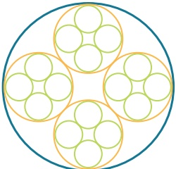

### 3.5 Problems involving intersections of lines and circles

In Chapter 1 you learnt that the points of intersection of a line and a curve can be found by solving their equations simultaneously. You also learnt that if the resulting equation is of the form  $ ax^{2} + bx + c = 0 $, then  $ b^{2} - 4ac $ gives information about the line and the curve.

## WEB LINK

<table border=1 style='margin: auto; word-wrap: break-word;'><tr><td style='text-align: center; word-wrap: break-word;'>$ b^{2} $ - 4ac</td><td style='text-align: center; word-wrap: break-word;'>Nature of roots</td><td style='text-align: center; word-wrap: break-word;'>Line and parabola</td></tr><tr><td style='text-align: center; word-wrap: break-word;'>&gt; 0</td><td style='text-align: center; word-wrap: break-word;'>two distinct real roots</td><td style='text-align: center; word-wrap: break-word;'>two distinct points of intersection</td></tr><tr><td style='text-align: center; word-wrap: break-word;'>= 0</td><td style='text-align: center; word-wrap: break-word;'>two equal real roots</td><td style='text-align: center; word-wrap: break-word;'>one point of intersection (line is a tangent)</td></tr><tr><td style='text-align: center; word-wrap: break-word;'>&lt; 0</td><td style='text-align: center; word-wrap: break-word;'>no real roots</td><td style='text-align: center; word-wrap: break-word;'>no points of intersection</td></tr></table>

• Olympic rings

Try the following resources on the Underground

• Teddy bear.

Mathematics website:

In this section you will solve problems involving the intersection of lines and circles.

## TIP

We can also describe an equation that has ‘two equal real roots’ as having ‘one repeated (real) root’.

<!-- page 101 -->

The line $x = 3y + 10$ intersects the circle $x^2 + y^2 = 20$ at the points $A$ and $B$.

a Find the coordinates of the points $A$ and $B$.

b Find the equation of the perpendicular bisector of $AB$ and show that it passes through the centre of the circle.

c The perpendicular bisector of $AB$ intersects the circle at the points $P$ and $Q$.

Find the exact coordinates of $P$ and $Q$.

Answer

a $x^2 + y^2 = 20$ Substitute $3y + 10$ for $x$.

$(3y + 10)^2 + y^2 = 20$ Expand and simplify.

$y^2 + 6y + 8 = 0$ Factorise.

$(y + 2)(y + 4) = 0$

$y = -2$ or $y = -4$

When $y = -2$, $x = 4$ and when $y = -4$, $x = -2$.

$A$ and $B$ are the points $(-4, -4)$ and $(4, -2)$.

Gradient of $AB$ $\frac{4}{2}$ $(-2)$ $3$

b So the gradient of the perpendicular bisector $-3$.

Midpoint of $AB$ $\begin{vmatrix} 2 & 4 & 4 & (2) \\ (-2) & (-2) & (-2) & (-2) \\ (-2) & (-2) & (-2) & (-2) \end{vmatrix} = (1, -3)$

$y - y_1 \equiv \frac{2}{m}(x - x_1) \quad \text{and} \quad y_1 = -3$

$y - (-3) = -3(x - 1)$ Use $m = -3$, $x_1 = 1$ and $y_1 = -3$.

Perpendicular bisector is

$y = -3x$.

When $x = 0$, $y = -3(0) = 0$.

Hence, the perpendicular bisector of $AB$ passes through the point $(0, 0)$, the centre of the circle $x^2 + y^2 = 20$.

Substitute $-3x$ for $y$.

$x^2 + y^2 = 20$

$10x^2 = 20$

$x = \pm\sqrt{2}$

When $x = -\sqrt{2}$, $y = 3\sqrt{2}$ and when $x = \sqrt{2}$, $y = -3\sqrt{2}$.

$P$ and $Q$ are the points $(-\sqrt{2}, 3\sqrt{2})$ and $(\sqrt{2}, -3\sqrt{2})$, respectively.

<!-- page 102 -->

### WORKED EXAMPLE 3.15

Show that the line $y = x - 13$ is a tangent to the circle $x^2 + y^2 - 8x + 6y + 7 = 0$.

Answer

$x^2 + y^2 - 8x + 6y + 7 = 0$

Substitute $x - 13$ for $y$.

$x^2 + (x - 13)^2 - 8x + 6(x - 13) + 7 = 0$

$x^2 - 14x + 49 = 0$

Factorise.

$(x - 7)(x - 7) = 0$

$x = 7$ or $x = 7$

The equation has one repeated root, hence $y = x - 13$ is a tangent.

## EXERCISE 3E

1 Find the points of intersection of the line y = x - 3 and the circle  $ (x - 3)^2 + (y + 2)^2 = 20 $.

2 The line 2x - y + 3 = 0 intersects the circle  $ x^2 + y^2 - 4x + 6y - 12 = 0 $ at two points, D and E. Find the length of DE.

3 Show that the line  $ 3x + y = 6 $ is a tangent to the circle  $ x^2 + y^2 + 4x + 16y + 28 = 0 $.

4 Find the set of values of $m$ for which the line $y = mx + 1$ intersects the circle $(x - 7)^2 + (y - 5)^2 = 20$ at two distinct points.

5 The line 2y - x = 12 intersects the circle  $ x^2 + y^2 - 10x - 12y + 36 = 0 $ at the points A and B.

a Find the coordinates of the points A and B.

b Find the equation of the perpendicular bisector of AB.

c The perpendicular bisector of AB intersects the circle at the points P and Q.

Find the exact coordinates of P and Q.

d Find the exact area of quadrilateral APBQ.

6 Show that the circles  $ x^{2} + y^{2} = 25 $ and  $ x^{2} + y^{2} - 24x - 18y + 125 = 0 $ touch each other.

Find the coordinates of the point where they touch.

[This question is taken from Can we show that these two circles touch? on the Underground Mathematics website.]

PS 7 Two circles have the following properties:

the x-axis is a common tangent to the circles

the point (8, 2) lies on both circles

the centre of each circle lies on the line  $ x + 2y = 22 $.

a Find the equation of each circle.

b Prove that the line  $ 4x + 3y = 88 $ is a common tangent to these circles.

[Inspired by Can we find the two circles that satisfy these three conditions? on the Underground Mathematics website.]

<!-- page 103 -->

## Checklist of learning and understanding

Midpoint, gradient and length of line segment

- Midpoint,  $ M $, of  $ PQ $ is  $ \left(\frac{x^1 + x^2}{2}, \frac{y_1 + y_2}{2}\right) $.

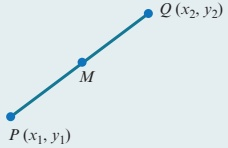

Gradient of  $ PQ $ is  $ \frac{y_2 - y_1}{x_2 - x_1} $.

Length of segment PQ is  $ \sqrt{(x_{2}-x_{1})^{2}+(y_{2}-y_{1})^{2}} $

## Parallel and perpendicular lines

If the gradients of two parallel lines are  $ m_{1} $ and  $ m_{2} $, then  $ m_{1}=m_{2} $.

If the gradients of two perpendicular lines are  $ m_1 $ and  $ m_2 $, then  $ m_1 \times m_2 = -1 $.

The equation of a straight line is:

 $ y - y_1 = m(x - x_1) $, where  $ m $ is the gradient and  $ (x_1, y_1) $ is a point on the line.

The equation of a circle is:

 $ (x-a)^2+(y-b)^2=r^2 $, where  $ (a,b) $ is the centre and  $ r $ is the radius.

 $ x^2 + y^2 + 2gx + 2fy + c = 0 $, where  $ (-g, -f) $ is the centre and  $ \sqrt{g^2 + f^2 - c} $ is the radius.

<!-- page 104 -->

1 A line has equation  $ 2x + y = 20 $ and a curve has equation  $ y = a + \frac{18}{x} $, where a is a constant.

Find the set of values of a for which the line does not intersect the curve.

[4]

## 昆2

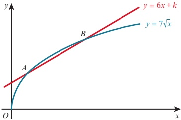

The diagram shows the curve  $ y = 7\sqrt{x} $ and the line  $ y = 6x + k $, where k is a constant.

The curve and the line intersect at the points A and B.

i For the case where k = 2, find the x-coordinates of A and B. [4]

ii Find the value of k for which y = 6x + k is a tangent to the curve  $ y = 7\sqrt{x} $.

Cambridge International AS & A Level Mathematics 9709 Paper 11 Q5 June 2012

3 A is the point  $ (a, 3) $ and B is the point  $ (4, b) $.

The length of the line segment $AB$ is $4\sqrt{5}$ units and the gradientis $-\frac{1}{2}$.

Find the possible values of $a$ and $b$.

4 The curve  $ y = 3\sqrt{x - 2} $ and the line 3x - 4y + 3 = 0 intersect at the points P and Q.

Find the length of PQ. [6]

5 The line ax - 2y = 30 passes through the points  $ A(10, 10) $ and  $ B(b, 10b) $, where a and b are constants.

a Find the values of a and b. [3]

b Find the coordinates of the midpoint of AB. [1]

c Find the equation of the perpendicular bisector of the line AB. [3]

6 The line with gradient -2 passing through the point  $ P(3t, 2t) $ intersects the x-axis at A and the y-axis at B.

i Find the area of triangle AOB in terms of t. [3]

The line through P perpendicular to AB intersects the x-axis at C.

ii Show that the mid-point of PC lies on the line y = x.

Cambridge International AS & A Level Mathematics 9709 Paper 11 Q6 June 2015

7 The point $P$ is the reflection of the point $(-7,5)$ in the line $5x-3y=18$.

Find the coordinates of P. You must show all your working.

<!-- page 105 -->

8 The curve  $ y = x + 2 - \frac{4}{x} $ and the line x - 2y + 6 = 0 intersect at the points A and B.

a Find the coordinates of these two points. [4]

b Find the perpendicular bisector of the line AB. [4]

The line $y = mx + 1$ intersects the circle $x^{2} + y^{2} - 19x - 51 = 0$ at the point $P(5, 11)$.

a Find the coordinates of the point Q where the line meets the curve again. [4]

b Find the equation of the perpendicular bisector of the line PQ. [3]

c Find the x-coordinates of the points where this perpendicular bisector intersects the circle.

Give your answers in exact form. [4]

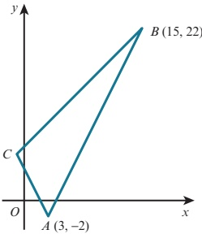

The diagram shows a triangle ABC in which A is (3, -2) and B is (15, 22). The gradients of AB,

AC and BC are 2m, -2m and m respectively, where m is a positive constant.

i Find the gradient of AB and deduce the value of m.

Find the coordinates of C.

meets BC at D.

The perpendicular bisector of AB meets BC at D.

iii Find the coordinates of D.

Cambridge International AS & A Level Mathematics 9709 Paper 11 Q8 June 2010

11 The point $A$ has coordinates $(-1,6)$ and the point $B$ has coordinates $(7,2)$.

i Find the equation of the perpendicular bisector of AB, giving your answer in the form  $ y = mx + c $. [4]

ii A point $C$ on the perpendicular bisector has coordinates $(p, q)$. The distance $OC$ is 2 units, where $O$ is the origin. Write down two equations involving $p$ and $q$ and hence find the coordinates of the possible positions of $C$. [5]

Cambridge International AS & A Level Mathematics 9709 Paper 11 Q7 November 2013

<!-- page 106 -->

12 The coordinates of A are  $ (-3, 2) $ and the coordinates of C are  $ (5, 6) $.  
  
The mid-point of AC is M and the perpendicular bisector of AC cuts the x-axis at B.  
  
i Find the equation of MB and the coordinates of B. [5]  
  
ii Show that AB is perpendicular to BC. [2]  
  
iii Given that ABCD is a square, find the coordinates of D and the length of AD. [2]  
  
Cambridge International AS & A Level Mathematics 9709 Paper 11 Q9 June 2012  
13 The points  $ A(1, -2) $ and  $ B(5, 4) $ lie on a circle with centre  $ C(6, p) $.  
  
a Find the equation of the perpendicular bisector of the line segment AB. [4]  
  
b Use your answer to part a to find the value of p. [1]  
  
c Find the equation of the circle. [4]

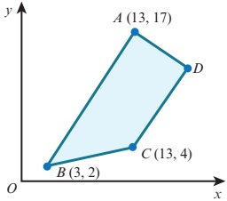

ABCD is a trapezium with AB parallel to DC and angle BAD = 90^{\circ}.  
  
a Calculate the coordinates of D. [7]  
  
b Calculate the area of trapezium ABCD. [2]  
15 The equation of a curve is  $ xy = 12 $ and the equation of a line is  $ 3x + y = k $, where k is a constant.  
  
a In the case where k = 20, the line intersects the curve at the points A and B.  
  
Find the midpoint of the line AB. [4]  
  
b Find the set of values of k for which the line  $ 3x + y = k $ intersects the curve at two distinct points. [4]  
16 A is the point (-3, 6) and B is the point (9, -10).  
  
a Find the equation of the line through A and B. [3]  
  
b Show that the perpendicular bisector of the line AB is  $ 3x - 4y = 17 $. [3]  
  
c A circle passes through A and B and has its centre on the line x = 15. Find the equation of this circle. [4]  
17 The equation of a circle is  $ x^{2} + y^{2} - 8x + 4y + 4 = 0 $.  
  
a Find the radius of the circle and the coordinates of its centre. [4]  
  
b Find the x-coordinates of the points where the circle crosses the x-axis, giving your answers in exact form. [4]  
  
c Show that the point A(6,  $ 2\sqrt{3} - 2 $) lies on the circle. [2]  
  
d Show that the equation of the tangent to the circle at A is  $ \sqrt{3}x + 3y = 12\sqrt{3} - 6 $. [4]

<!-- page 107 -->

1 Solve the equation  $ \frac{4}{x^{4}}+18=\frac{17}{x^{2}} $

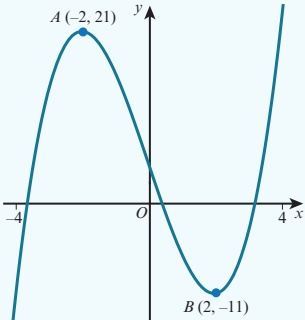

The diagram shows the graph of  $ y = f(x) $ for  $ -4 \leq x \leq 4 $.

Sketch on separate diagrams, showing the coordinates of any turning points, the graphs of:

a  $ y = f(x) + 5 $

b  $ y = -2f(x) $

3 The graph of  $ f(x) = ax + b $ is reflected in the y-axis and then translated by the vector  $ \begin{pmatrix} 0 \\ 3 \end{pmatrix} $. The resulting function is  $ g(x) = 1 - 5x $. Find the value of a and the value of b.

4 The graph of  $ y = (x + 1)^{2} $ is transformed by the composition of two transformations to the graph of  $ y = 2(x - 4)^{2} $. Find these two transformations.

The graph of $y \geq \frac{3}{x^2 + 1}$ is transformed by applying a reflection in the x-axis followed by a translation of $\left(\begin{array}{c} x \\ x \end{array}\right)$

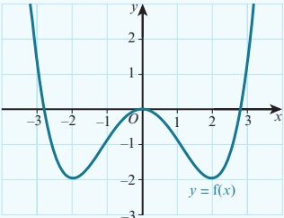

The diagram shows the graph of  $ y = f(x) $ for  $ -3 \leq x \leq 3 $.

Sketch the graph of y = 2 - f(x).

<!-- page 108 -->

7 The function f is such that  $ f(x) = x^2 - 5x + 5 $ for  $ x \in \mathbb{R} $.  
  
a Find the set of values of x for which  $ f(x) \leq x $. [3]  
  
b The line y = mx - 11 is a tangent to the curve y = f(x).  
  
Find the two possible values of m. [3]  
  
8 The line  $ x + ky + k^2 = 0 $, where k is a constant, is a tangent to the curve  $ y^2 = 4x $ at the point P.  
  
Find, in terms of k, the coordinates of P. [6]  
  
9 A is the point (4, -6) and B is the point (12, 10). The perpendicular bisector of AB intersects the x-axis at C and the y-axis at D. Find the length of CD. [6]  
  
10 The points A, B and C have coordinates  $ A(2, 8) $,  $ B(9, 7) $ and  $ C(k, k-2) $.  
  
a Given that AB = BC, show that a possible value of k is 4 and find the other possible value of k. [3]  
  
b For the case where k = 4, find the equation of the line that bisects angle ABC. [4]  
  
11 A curve has equation  $ xy = 12 + x $ and a line has equation  $ y = kx - 9 $, where k is a constant.  
  
a In the case where k = 2, find the coordinates of the points of intersection of the curve and the line. [3]  
  
b Find the set of values of k for which the line does not intersect the curve. [4]  
  
12 The function f is such that  $ f(x) = 2x - 3 $ for  $ x \geq k $, where k is a constant.  
  
The function g is such that  $ g(x) = x^2 - 4 $ for  $ x \geq -4 $.  
  
a Find the smallest value of k for which the composite function gf can be formed. [3]  
  
b Solve the inequality gf(x) > 45. [4]  
  
13 The functions f and g are defined by  
  
 $$  f(x) = \frac{4}{x} - 2 \quad \text{for} \quad x > 0,  $$   
  
 $$  g(x) = \frac{4}{5x + 2} \quad \text{for} \quad x \geq 0.  $$   
  
i Find and simplify an expression for fg(x) and state the range of fg. [3]  
  
ii Find an expression for g^{-1}(x) and find the domain of g^{-1}. [5]  
  
Cambridge International AS & A Level Mathematics 9709 Paper 11 Q8 November 2016  
  
14 The equation  $ x^2 + bx + c = 0 $ has roots -2 and 7.  
  
a Find the value of b and the value of c. [2]  
  
b Using these values of b and c, find:  
  
i the coordinates of the vertex of the curve  $ y = x^2 + bx + c $ [3]  
  
ii the set of values of x for which  $ x^2 + bx + c < 10 $. [3]

<!-- page 109 -->

15 The line $L_{1}$ passes through the points $A(-6,10)$ and $B(6,2)$. The line $L_{2}$ is perpendicular to $L_{1}$ and passes through the point $C(-7,2)$.  
  
a Find the equation of the line $L_{2}$. [4]  
  
b Find the coordinates of the point of intersection of lines $L_{1}$ and $L_{2}$. [4]  
  
16 A curve has equation $y = 12x - x^{2}$.  
  
a Express $12x - x^{2}$ in the form $a - (x + b)^{2}$, where $a$ and $b$ are constants to be determined. [3]  
  
b State the maximum value of $12x - x^{2}$. [1]  
  
The function $g$ is defined as $g: x \mapsto 12x - x^{2}$, for $x \geq 6$.  
  
c State the domain and range of $g^{-1}$. [2]  
  
d Find $g^{-1}(x)$. [3]  
  
17 a Express $3x^{2} + 12x - 1$ in the form $a(x + b)^{2} + c$, where $a, b$ and $c$ are constants. [3]  
  
b Write down the coordinates of the vertex of the curve $y = 3x^{2} + 12x - 1$. [2]  
  
c Find the set of values of $k$ for which $3x^{2} + 12x - 1 = kx - 4$ has no real solutions. [4]  
  
18 The function $f$ is such that $f(x) = 2x + 1$ for $x \in \mathbb{R}$.  
  
The function $g$ is such that $g(x) = 8 - ax - bx^{2}$ for $x \geq k$, where $a, b$ and $k$ are constants.  
  
The function $f g$ is such that $f g(x) = 17 - 24x - 4x^{2}$ for $x \geq k$.  
  
a Find the value of $a$ and the value of $b$. [3]  
  
b Find the least possible value of $k$ for which $g$ has an inverse. [4]  
  
c For the value of $k$ found in part $b$, find $g^{-1}(x)$. [2]  
  
19 A circle has centre $(8,3)$ and passes through the point $P(13,5)$.  
  
a Find the equation of the circle. [4]  
  
b Find the equation of the tangent to the circle at the point $P$.  
  
Give your answer in the form $ax + by = c$. [5]  
  
20 The function $f$ is such that $f(x) = 3x - 7$ for $x \in \mathbb{R}$.  
  
The function $g$ is such that $g(x) = \frac{18}{5 - x}$ for $x \in \mathbb{R}$, $x \neq 5$.  
  
a Find the value of $x$ for which $f g(x) = 5$. [3]  
  
b Find $f^{-1}(x)$ and $g^{-1}(x)$. [3]  
  
c Show that the equation $f^{-1}(x) = g^{-1}(x)$ has no real roots. [3]  
  
21 A curve has equation $y = 2 - 3x - x^{2}$.  
  
a Express $2 - 3x - x^{2}$ in the form $a - (x + b)^{2}$, where $a$ and $b$ are constants. [2]  
  
b Write down the coordinates of the maximum point on the curve. [1]  
  
c Find the two values of $m$ for which the line $y = mx + 3$ is a tangent to the curve $y = 2 - 3x - x^{2}$. [3]  
  
d For each value of $m$ in part $c$, find the coordinates of the point where the line touches the curve. [3]

<!-- page 110 -->

22 A circle, C, has equation  $ x^{2} + y^{2} - 16x - 36 = 0 $.  
  
a Find the coordinates of the centre of the circle. [2]  
  
b Find the radius of the circle. [2]  
  
c Find the coordinates of the points where the circle meets the x-axis. [2]  
  
d The point P lies on the circle and the line L is a tangent to C at the point P. Given that the line L has gradient  $ \frac{4}{3} $, find the equation of the perpendicular to the line L at the point P. [3]  
  
23 The function f is such that  $ f(x) = 3x - 2 $ for  $ x \geq 0 $.  
  
The function g is such that  $ g(x) = 2x^{2} - 8 $ for  $ x \leq k $, where k is a constant.  
  
a Find the greatest value of k for which the composite function fg can be formed. [3]  
  
b For the case where k = -3:  
  
i find the range of fg [2]  
  
ii find  $ (fg)^{-1}(x) $ and state the domain and range of  $ (fg)^{-1} $. [4]  
  
24 A curve has equation xy = 20 and a line has equation  $ x + 2y = k $, where k is a constant.  
  
a In the case where k = 14, the line intersects the curve at the points A and B.  
  
Find:  
  
i the coordinates of the points A and B [3]  
  
ii the equation of the perpendicular bisector of the line AB. [4]  
  
b Find the values of k for which the line is a tangent to the curve. [4]

