# 4 Circular measure

<!-- Cambridge International AS A Level Mathematics Pure Mathematics 1.pdf p111-127 -->

<!-- page 111 -->

In this section you will learn how to:

understand the definition of a radian, and use the relationship between radians and degrees

use the formulae

<!-- page 112 -->

## PREREQUISITE KNOWLEDGE

<table border=1 style='margin: auto; word-wrap: break-word;'><tr><td style='text-align: center; word-wrap: break-word;'>Where it comes from</td><td style='text-align: center; word-wrap: break-word;'>What you should be able to do</td><td style='text-align: center; word-wrap: break-word;'>Check your skills</td></tr><tr><td style='text-align: center; word-wrap: break-word;'>IGCSE / O Level Mathematics</td><td style='text-align: center; word-wrap: break-word;'>Find the perimeter and area of sectors.\nUse Pythagoras&#x27; theorem and trigonometry on right-angled triangles.</td><td style='text-align: center; word-wrap: break-word;'>1 Find the perimeter and area of a sector of a circle with radius 6cm and sector angle 30°.\n2 5cm 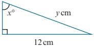\nFind the value of x and the value of y.</td></tr><tr><td style='text-align: center; word-wrap: break-word;'>IGCSE / O Level Mathematics</td><td style='text-align: center; word-wrap: break-word;'>Solve problems involving the sine and cosine rules for any triangle and the formula:\nArea of triangle  $ = \frac{1}{2}ab \sin C $</td><td style='text-align: center; word-wrap: break-word;'>3 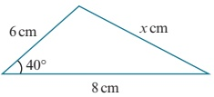\nFind the value of x and the area of the triangle.</td></tr></table>

## Another measure for angles

At IGCSE / O Level, you will have always worked with angles that were measured in degrees. Have you ever wondered why there are  $ 360^{\circ} $ in one complete revolution? The original reason for choosing the degree as a unit of angular measure is unknown but there are a number of different theories.

Ancient astronomers claimed that the Sun advanced in its path by one degree each day and that a solar year consisted of 360 days.

The ancient Babylonians divided the circle into 6 equilateral triangles and then subdivided each angle at O into 60 further parts, resulting in 360 divisions in one complete revolution.

360 has many factors that make division of the circle so much easier.

Degrees are not the only way in which we can measure angles. In this chapter you will learn how to use \textit{radian} measure. This is sometimes referred to as the natural unit of angular measure and we use it extensively in mathematics because it can simplify many formulae and calculations.

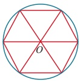

<!-- page 113 -->

### 4.1 Radians

In the diagram, the magnitude of angle AOB is 1 radian.

1 radian is sometimes written as 1 rad, but often no symbol at all is used for angles measured in radians.

### KEY POINT 4.1

An arc equal in length to the radius of a circle subtends an angle of 1 radian at the centre.

It follows that the circumference (an arc of length  $ 2\pi r $) subtends an angle of  $ 2\pi $ radians at the centre, therefore:

### KEY POINT 4.2

2π radians =  $ 360^{\circ} $

 $ \pi $ radians =  $ 180^{\circ} $

When an angle is written in terms of  $ \pi $, we usually omit the word radian (or rad).

Hence,  $ \pi = 180^{\circ} $.

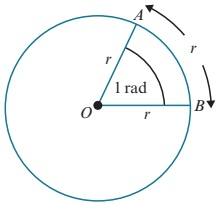

## Converting from degrees to radians

Since  $ 180^{\circ}=\pi $, then  $ 90^{\circ}=\frac{\pi}{2} $,  $ 45^{\circ}=\frac{\pi}{4} $ etc.

We can convert angles that are not simple fractions of  $ 180^{\circ} $ using the following rule.

### KEY POINT 4.3

To change from degrees to radians, multiply by  $ \frac{\pi}{180} $.

Since  $ \pi = 180^{\circ} $,  $ \frac{\pi}{6} = 30^{\circ} $,  $ \frac{\pi}{10} = 18^{\circ} $ etc.

## Converting from radians to degrees

We can convert angles that are not simple fractions of  $ \pi $ using the following rule.

### KEY POINT 4.4

To change from radians to degrees, multiply by  $ \frac{180}{\pi} $.

(It is useful to remember that 1 radian =  $ 1 \times \frac{180}{\pi} \approx 57^\circ $.)

<!-- page 114 -->

### WORKED EXAMPLE 4.1

a Change  $ 30^{\circ} $ to radians, giving your answer in terms of  $ \pi $.

b Change  $ \frac{5\pi}{9} $ radians to degrees.

## Answer

a Method 1:

 $$ 180^{\circ}=\pi\operatorname{radians} $$ 

## Method 2:

 $$ \left(\frac{180}{6}\right)^{\circ}=\frac{\pi}{6}radians $$ 

 $$ 30^{\circ}=\left(30\times\frac{\pi}{180}\right)radians $$ 

 $$ 30^{\circ}=\frac{\pi}{6}radians $$ 

 $ 30^{\circ} = \frac{\pi}{6} $ radians

b Method 1:

Method 2:

 $$ \pi\operatorname{radians}=180^{\circ} $$ 

 $$ \frac{5\pi}{9}\operatorname{radians}=\left(\frac{5\pi}{9}\times\frac{180}{\pi}\right)^{\circ} $$ 

 $$ \frac{\pi}{9}\operatorname{radians}=20^{\circ} $$ 

 $$ \frac{5\pi}{9}\operatorname{radians}=100^{\circ} $$ 

 $$ \frac{5\pi}{9}\operatorname{radians}=100^{\circ} $$ 

In Worked example 4.1, we found that  $ 30^{\circ} = \frac{\pi}{6} $ radians.

There are other angles, which you should learn, that can be written as simple multiples of  $ \pi $.

There are:

<table border=1 style='margin: auto; word-wrap: break-word;'><tr><td style='text-align: center; word-wrap: break-word;'>Degrees</td><td style='text-align: center; word-wrap: break-word;'>0°</td><td style='text-align: center; word-wrap: break-word;'>30°</td><td style='text-align: center; word-wrap: break-word;'>45°</td><td style='text-align: center; word-wrap: break-word;'>60°</td><td style='text-align: center; word-wrap: break-word;'>90°</td><td style='text-align: center; word-wrap: break-word;'>180°</td><td style='text-align: center; word-wrap: break-word;'>270°</td><td style='text-align: center; word-wrap: break-word;'>360°</td></tr><tr><td style='text-align: center; word-wrap: break-word;'>Radians</td><td style='text-align: center; word-wrap: break-word;'>0</td><td style='text-align: center; word-wrap: break-word;'>$ \frac{\pi}{6} $</td><td style='text-align: center; word-wrap: break-word;'>$ \frac{\pi}{4} $</td><td style='text-align: center; word-wrap: break-word;'>$ \frac{\pi}{3} $</td><td style='text-align: center; word-wrap: break-word;'>$ \frac{\pi}{2} $</td><td style='text-align: center; word-wrap: break-word;'>$ \pi $</td><td style='text-align: center; word-wrap: break-word;'>$ \frac{3\pi}{2} $</td><td style='text-align: center; word-wrap: break-word;'>2 $ \pi $</td></tr></table>

We can quickly find other angles, such as  $ 120^{\circ} $, using these known angles.

## EXERCISE 4A

1 Change these angles to radians, giving your answers in terms of  $ \pi $.

 $$ 20^{\circ} $$ 

 $$ 40^{\circ} $$ 

 $$ 25^{\circ} $$ 

 $$ 5^{\circ} $$ 

 $$ 150^{\circ} $$ 

 $$ 50^{\circ} $$ 

 $$ \mathrm{g}\quad135^{\circ} $$ 

 $$ 210^{\circ} $$ 

 $$ 225^{\circ} $$ 

 $$ 300^{\circ} $$ 

 $$ 65^{\circ} $$ 

 $$ 540^{\circ} $$ 

 $$ 9^{\circ} $$ 

 $$ 35^{\circ} $$ 

 $$ 600^{\circ} $$ 

2 Change these angles to degrees.

b

 $$ \frac{\pi}{2} $$ 

 $$ \frac{\pi}{3} $$ 

c

d

 $$ \frac{\pi}{6} $$ 

f

 $$ \frac{\pi}{12} $$ 

 $$ \frac{4\pi}{3} $$ 

 $$ \frac{4\pi}{9} $$ 

 $$ \frac{3\pi}{10} $$ 

h

i

 $$ \frac{7\pi}{12} $$ 

 $$ \frac{9\pi}{20} $$ 

 $$ \frac{9\pi}{2} $$ 

k

 $$ \frac{7\pi}{5} $$ 

l

 $$ \frac{4\pi}{15} $$ 

m

 $$ \frac{5\pi}{4} $$ 

n

 $$ \frac{7\pi}{3} $$ 

O

 $$ \frac{9\pi}{8} $$

<!-- page 115 -->

3 Write each of these angles in radians, correct to 3 significant figures.

a  $ 28^{\circ} $ b  $ 32^{\circ} $ c  $ 47^{\circ} $ d  $ 200^{\circ} $ e  $ 320^{\circ} $

4 Write each of these angles in degrees, correct to 1 decimal place.

a 1.2 rad b 0.8 rad c 1.34 rad d 1.52 rad e 0.79 rad

5 Copy and complete the tables, giving your answers in terms of  $ \pi $.

<table border=1 style='margin: auto; word-wrap: break-word;'><tr><td style='text-align: center; word-wrap: break-word;'>Degrees</td><td style='text-align: center; word-wrap: break-word;'>0</td><td style='text-align: center; word-wrap: break-word;'>45</td><td style='text-align: center; word-wrap: break-word;'>90</td><td style='text-align: center; word-wrap: break-word;'>135</td><td style='text-align: center; word-wrap: break-word;'>180</td><td style='text-align: center; word-wrap: break-word;'>225</td><td style='text-align: center; word-wrap: break-word;'>270</td><td style='text-align: center; word-wrap: break-word;'>315</td><td style='text-align: center; word-wrap: break-word;'>360</td></tr><tr><td style='text-align: center; word-wrap: break-word;'>Radians</td><td style='text-align: center; word-wrap: break-word;'>0</td><td style='text-align: center; word-wrap: break-word;'></td><td style='text-align: center; word-wrap: break-word;'></td><td style='text-align: center; word-wrap: break-word;'></td><td style='text-align: center; word-wrap: break-word;'>$ \pi $</td><td style='text-align: center; word-wrap: break-word;'></td><td style='text-align: center; word-wrap: break-word;'></td><td style='text-align: center; word-wrap: break-word;'></td><td style='text-align: center; word-wrap: break-word;'>$ 2\pi $</td></tr></table>

<table border=1 style='margin: auto; word-wrap: break-word;'><tr><td style='text-align: center; word-wrap: break-word;'>Degrees</td><td style='text-align: center; word-wrap: break-word;'>0</td><td style='text-align: center; word-wrap: break-word;'>30</td><td style='text-align: center; word-wrap: break-word;'>60</td><td style='text-align: center; word-wrap: break-word;'>90</td><td style='text-align: center; word-wrap: break-word;'>120</td><td style='text-align: center; word-wrap: break-word;'>150</td><td style='text-align: center; word-wrap: break-word;'>180</td><td style='text-align: center; word-wrap: break-word;'>210</td><td style='text-align: center; word-wrap: break-word;'>240</td><td style='text-align: center; word-wrap: break-word;'>270</td><td style='text-align: center; word-wrap: break-word;'>300</td><td style='text-align: center; word-wrap: break-word;'>330</td><td style='text-align: center; word-wrap: break-word;'>360</td></tr><tr><td style='text-align: center; word-wrap: break-word;'>Radians</td><td style='text-align: center; word-wrap: break-word;'>0</td><td style='text-align: center; word-wrap: break-word;'></td><td style='text-align: center; word-wrap: break-word;'></td><td style='text-align: center; word-wrap: break-word;'></td><td style='text-align: center; word-wrap: break-word;'></td><td style='text-align: center; word-wrap: break-word;'></td><td style='text-align: center; word-wrap: break-word;'>$ \pi $</td><td style='text-align: center; word-wrap: break-word;'></td><td style='text-align: center; word-wrap: break-word;'></td><td style='text-align: center; word-wrap: break-word;'></td><td style='text-align: center; word-wrap: break-word;'></td><td style='text-align: center; word-wrap: break-word;'></td><td style='text-align: center; word-wrap: break-word;'>$ 2\pi $</td></tr></table>

6 Use your calculator to find:

a  $ \sin(0.7) $ b  $ \tan(1.5) $ c  $ \cos(0.9) $ d  $ \cos\frac{\pi}{2} $ e  $ \sin\frac{\pi}{3} $ f  $ \tan\frac{\pi}{5} $

7 Calculate the length of QR.

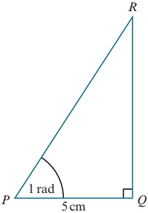

8

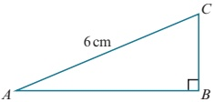

Robert is told the size of angle $BAC$ in degrees and he is then asked to calculate the length of the line $BC$. He uses his calculator but forgets that his calculator is in radian mode. Luckily he still manages to obtain the correct answer. Given that angle $BAC$ is between $10^{\circ}$ and $15^{\circ}$, use graphing software to help you find the size of angle $BAC$, correct to 2 decimal places.

## TIP

You do not need to change the angle to degrees. You should set the angle mode on your calculator to radians.

<!-- page 116 -->

### 4.2 Length of an arc

From the definition of a radian, an arc that subtends an angle of 1 radian at the centre of the circle is of length r. Hence, if an arc subtends an angle of

<!-- page 117 -->

Triangle ABC is isosceles with AC = CB = 8 cm.

CD is an arc of a circle, centre B, and angle ABC = 0.9 radians.

Find:

a the length of arc CD

b the length of AD

c the perimeter of the shaded region.

Answer

a Arc length

## EXERCISE 4B

1 Find, in terms of  $ \pi $, the arc length of a sector of:

a radius 8 cm and angle  $ \frac{\pi}{4} $

c radius 16cm and angle  $ \frac{3\pi}{8} $

b radius 7 cm and angle  $ \frac{3\pi}{7} $

d radius 24 cm and angle  $ \frac{7\pi}{6} $.

2 Find the arc length of a sector of:

a radius 10 cm and angle 1.3 radians

b radius 3.5 cm and angle 0.65 radians.

3 Find, in radians, the angle of a sector of:

a radius 10 cm and arc length 5 cm

b radius 12 cm and arc length 9.6 cm.

4 The High Roller Ferris wheel in the USA has a diameter of 158.5 metres. Calculate the distance travelled by a capsule as the wheel rotates through  $ \frac{\pi}{16} $ radians.

<!-- page 118 -->

5 Find the perimeter of each of these sectors.

a b

6 The circle has radius 6 cm and centre O.

PQ is a tangent to the circle at the point P.

QRO is a straight line. Find:

a angle POQ, in radians

b the length of QR

c the perimeter of the shaded area.

7 The circle has radius 7 cm and centre O.

AB is a chord and angle AOB = 2 radians. Find:

a the length of arc AB

b the length of chord AB

c the perimeter of the shaded segment.

8 ABCD is a rectangle with AB = 5 cm and BC = 24 cm.

O is the midpoint of BC.

OAED is a sector of a circle, centre O. Find:

a the length of AO

b angle AOD, in radians

c the perimeter of the shaded region.

9 The diagram shows a semicircle with radius 10 cm and centre O. Angle

<!-- page 119 -->

4.3 Area of a sector

To find the formula for the area of a sector, we use the ratio:

 $ \frac{\text{area of sector}}{\text{area of circle}} = \frac{\text{angle in the sector}}{\text{complete angle at the centre}} $

When

<!-- page 120 -->

The diagram shows a circle inscribed inside a square of side length 10 cm.

A quarter circle, of radius 10 cm, is drawn with the vertex of the square as centre.

Find the shaded area.

Answer

OQ = 10 cm

Radius of inscribed circle = 5cm

Pythagoras: $\frac{1}{2}$ (diagonal of square) = $\frac{1}{2}\left(\sqrt{10^{2}+10^{2}}\right) = 5\sqrt{2}$ cm

Cosine rule: cos  $ \frac{5^{2}+(5\sqrt{2})^{2}-10^{2}}{2\times5\times5\sqrt{2}} $ = 1.932 rad

Hence,  $ = 2\pi - 2 = 2.4189 \, rad $

<!-- page 121 -->

1 Find, in terms of  $ \pi $, the area of a sector of:

a radius 12 cm and angle  $ \frac{\pi}{6} $ radians

c radius 4.5 cm and angle  $ \frac{2\pi}{9} $ radians

2 Find the area of a sector of:

a radius 34 cm and angle 1.5 radian

3 Find, in radians, the angle of a sector of:

a radius 4cm and area 9cm^{2}

4 AOB is a sector of a circle, centre O, with radius 8 cm.

The length of arc AB is 10 cm. Find:

b radius 2.6cm and angle 0.9 radians.

b radius 6 cm and area 27 cm $ ^{2} $.

a angle AOB, in radians

5 The diagram shows a sector,  $ POQ $, of a circle, centre O, with radius 4 cm. The length of arc PQ is 7 cm. The lines PX and QX are tangents to the circle at P and Q, respectively.

b the area of the sector AOB.

a Find angle  $ POQ $, in radians.

b Find the length of PX.

6 The diagram shows a sector, POR, of a circle, centre O, with radius 8 cm and sector angle $\frac{\pi}{3}$ radians. The lines OR and QR are perpendicular and OPQ is a straight line.

c Find the area of the shaded region.

Find the exact area of the shaded region.

7 The diagram shows a sector, AOB, of a circle, centre O, with radius 5 cm and sector angle $\frac{\pi}{3}$ radians. The lines AP and BP are tangents to the circle at A and B, respectively.

a Find the exact length of AP.

b Find the exact area of the shaded region.

d radius 9 cm and angle  $ \frac{4\pi}{3} $ radians.

b radius 10 cm and angle  $ \frac{2\pi}{5} $ radians

PS 8 The diagram shows three touching circles with radii 6 cm, 4 cm and 2 cm. Find the area of the shaded region.

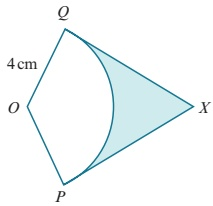

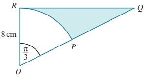

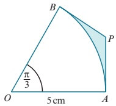

109

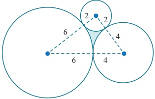

<!-- page 122 -->

9 The diagram shows a semicircle, centre O, with radius 8 cm.

FH is the arc of a circle, centre E. Find the area of:

a triangle EOF b sector FOG

c sector FEH d the shaded region.

10 The diagram shows a sector, EOG, of a circle, centre O, with radius r cm. The line GF is a tangent to the circle at G, and E is the midpoint of OF.

a The perimeter of the shaded region is $P$ cm.

Show that $P = \frac{r}{3}(3 + 3\sqrt{3} + \pi)$.

b The area of the shaded region is  $ A cm^{2} $.

Show that  $ A = \frac{r^{2}}{6} (3\sqrt{3} - \pi) $.

11 The diagram shows two circles with radius r cm.

The centre of each circle lies on the circumference of the other circle.

Find, in terms of r, the exact area of the shaded region.

## PS 12 The diagram shows a square of side length 10 cm

A quarter circle, of radius 10 cm, is drawn from each vertex of the square. Find the exact area of the shaded region.

## PS 13 The diagram shows a circle with radius 1 cm, centre O

Triangle AOB is right angled and its hypotenuse AB is a tangent to the circle at P.

Angle  $ BAO = x $ radians.

a Find an expression for the length of AB in terms of  $ \tan x $.

b Find the value of x for which the two shaded areas are equal.

P 14 The diagram shows a sector, AOB, of a circle, centre O, with radius R cm and sector angle  $ \frac{\pi}{3} $ radians.

An inner circle of radius r cm touches the three sides of the sector.

a Show that R = 3r.

b Show that  $ \frac{\text{area of inner circle}}{\text{area of sector}} = \frac{2}{3} $

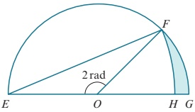

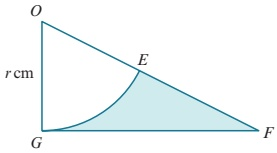

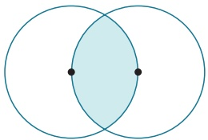

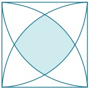

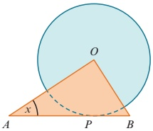

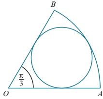

<!-- page 123 -->

# Checklist of learning and understanding

Radians and degrees

One radian is the size of the angle subtended at the centre of a circle, radius r, by an arc of length r.

 $ \pi $ radians = 180°

To change from degrees to radians, multiply by  $ \frac{\pi}{180} $.

To change from radians to degrees, multiply by  $ \frac{180}{\pi} $.

Arc length and area of a sector

When

<!-- page 124 -->

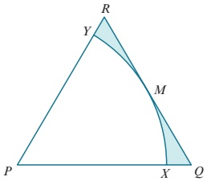

The diagram shows an equilateral triangle,  $ PQR $, with side length 5 cm.  $ M $ is the midpoint of the line  $ QR $. An arc of a circle, centre  $ P $, touches  $ \widehat{QR} $ at  $ M $ and meets  $ PQ $ at  $ X $ and  $ PR $ at  $ Y $. Find in terms of  $ \pi $ and  $ \sqrt{3} $:

a the total perimeter of the shaded region

b the total area of the shaded region.

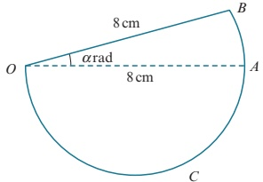

In the diagram, OAB is a sector of a circle with centre O and radius 8 cm. Angle BOA is

<!-- page 125 -->

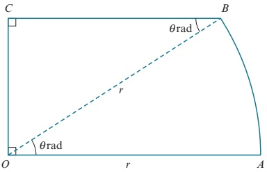

The diagram represents a metal plate OABC, consisting of a sector OAB of a circle with centre O and radius r, together with a triangle OCB which is right-angled at C. Angle

<!-- page 126 -->

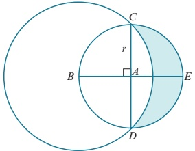

The diagram shows a circle with centre A and radius r. Diameters CAD and BAE are perpendicular to each other. A larger circle has centre B and passes through C and D.

i Show that the radius of the larger circle is  $ r\sqrt{2} $.

ii Find the area of the shaded region in terms of r.

Cambridge International AS & A Level Mathematics 9709 Paper 11 Q7 November 2015

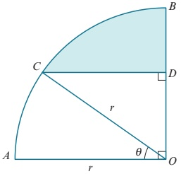

In the diagram, AOB is a quarter circle with centre O and radius r. The point C lies on the arc AB and the point D lies on OB. The line CD is parallel to AO and angle

<!-- page 127 -->

i Find an expression in terms of

