# 5 Trigonometry

<!-- Cambridge International AS A Level Mathematics Pure Mathematics 1.pdf p128-166 -->

<!-- page 128 -->

# Chapter 5 Trigonometry

## In this section you will learn how to:

sketch and use graphs of the sine, cosine and tangent functions (for angles of any size, and using either degrees or radians)

use the exact values of the sine, cosine and tangent of  $ 30^{\circ} $,  $ 45^{\circ} $,  $ 60^{\circ} $, and related angles

use the notations  $ \sin^{-1}x $,  $ \cos^{-1}x $,  $ \tan^{-1}x $ to denote the principal values of the inverse trigonometric relations

use the identities ___

<!-- page 129 -->

PREREQUISITE KNOWLEDGE

<table border=1 style='margin: auto; word-wrap: break-word;'><tr><td style='text-align: center; word-wrap: break-word;'>Where it comes from</td><td style='text-align: center; word-wrap: break-word;'>What you should be able to do</td><td style='text-align: center; word-wrap: break-word;'>Check your skills</td></tr><tr><td style='text-align: center; word-wrap: break-word;'>IGCSE / O Level Mathematics</td><td style='text-align: center; word-wrap: break-word;'>Use Pythagoras&#x27; theorem and trigonometry on right-angled triangles.\n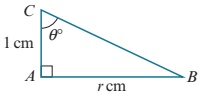\nFind each of the following in terms of  $ r $\na  $ BC $\nb</td><td style='text-align: center; word-wrap: break-word;'></td></tr><tr><td style='text-align: center; word-wrap: break-word;'></td><td style='text-align: center; word-wrap: break-word;'></td><td style='text-align: center; word-wrap: break-word;'></td></tr><tr><td style='text-align: center; word-wrap: break-word;'></td><td style='text-align: center; word-wrap: break-word;'></td><td style='text-align: center; word-wrap: break-word;'></td></tr></table>

<!-- page 130 -->

### 5.1 Angles between  $ 0^{\circ} $ and  $ 90^{\circ} $

You should already know the following trigonometric ratios.

<table border=1 style='margin: auto; word-wrap: break-word;'><tr><td style='text-align: center; word-wrap: break-word;'></td><td style='text-align: center; word-wrap: break-word;'>opposite hypotenuse</td><td style='text-align: center; word-wrap: break-word;'></td><td style='text-align: center; word-wrap: break-word;'></td><td style='text-align: center; word-wrap: break-word;'>opposite adjacent</td></tr><tr><td style='text-align: center; word-wrap: break-word;'>sin</td><td style='text-align: center; word-wrap: break-word;'>$ \frac{y}{r} $</td><td style='text-align: center; word-wrap: break-word;'>$ \frac{x}{r} $</td><td style='text-align: center; word-wrap: break-word;'>tan</td><td style='text-align: center; word-wrap: break-word;'>$ \frac{y}{x} $</td></tr></table>

 $ \frac{\sqrt{3}}{3} $, where 0 ≤ ≤ 90

<!-- page 131 -->

We can obtain exact values of the sine, cosine and tangent of  $ 30^{\circ} $,  $ 45^{\circ} $ and  $ 60^{\circ} $ (or  $ \frac{\pi}{6} $,  $ \frac{\pi}{4} $ and  $ \frac{\pi}{3} $) from the following two triangles.

## Triangle 1

Consider a right-angled isosceles triangle whose two equal sides are of length 1 unit.

We find the third side using Pythagoras' theorem:

 $$ \sqrt{1^{2}+1^{2}}=\sqrt{2} $$ 

## Triangle 2

Consider an equilateral triangle whose sides are of length 2 units.

The perpendicular bisector to the base splits the equilateral triangle into two congruent right-angled triangles.

We can find the height of the triangle using Pythagoras' theorem:

 $$ \sqrt{2^{2}-1^{2}}=\sqrt{3} $$ 

These two triangles give the important results:

<table border=1 style='margin: auto; word-wrap: break-word;'><tr><td style='text-align: center; word-wrap: break-word;'></td><td style='text-align: center; word-wrap: break-word;'></td><td style='text-align: center; word-wrap: break-word;'></td><td style='text-align: center; word-wrap: break-word;'></td></tr><tr><td style='text-align: center; word-wrap: break-word;'></td><td style='text-align: center; word-wrap: break-word;'></td><td style='text-align: center; word-wrap: break-word;'></td><td style='text-align: center; word-wrap: break-word;'></td></tr><tr><td style='text-align: center; word-wrap: break-word;'></td><td style='text-align: center; word-wrap: break-word;'></td><td style='text-align: center; word-wrap: break-word;'></td><td style='text-align: center; word-wrap: break-word;'></td></tr><tr><td style='text-align: center; word-wrap: break-word;'></td><td style='text-align: center; word-wrap: break-word;'></td><td style='text-align: center; word-wrap: break-word;'></td><td style='text-align: center; word-wrap: break-word;'></td></tr></table>

<!-- page 132 -->

1 Given that cos  $ \frac{4}{} $

<!-- page 133 -->

6 In the table,  $ 0 \leq \leq \frac{\pi}{2} $ and the missing function is from the list

<!-- page 134 -->

c  $ \frac{3\pi}{4} $ is an anticlockwise rotation.

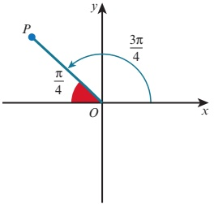

Acute angle made with x-axis =  $ \frac{\pi}{4} $

d  $ -\frac{2\pi}{3} $ is a clockwise rotation.

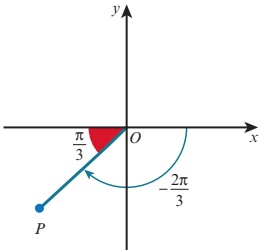

Acute angle made with x-axis =  $ \frac{\pi}{3} $

The acute angle made with the x-axis is sometimes called the basic angle or the reference angle.

## EXERCISE 5B

1 For each of the following diagrams, find the basic angle of

<!-- page 135 -->

3 In each part of this question you are given the basic angle, $b$, the quadrant in which

Where x and y are the coordinates of the point P and r is the length of OP, where  $ r = \sqrt{x^{2} + y^{2}} $. You need to know the signs of the three trigonometric ratios in each of the four quadrants.

<!-- page 136 -->

The diagram shows which trigonometric functions are positive in each quadrant.

We can memorise this diagram using a mnemonic such as 'All Students Trust Cambridge'.

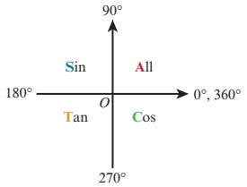

### WORKED EXAMPLE 5.4

Express in terms of trigonometric ratios of acute angles:

a sin  $ 140^{\circ} $

b  $ \cos(-130^{\circ}) $

Answer

a The acute angle made with the x-axis is  $ 40^{\circ} $.

In the second quadrant,  $ \sin $ is positive.

 $ \sin 140^{\circ} = \sin 40^{\circ} $

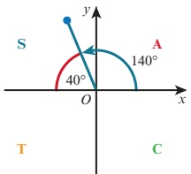

b The acute angle made with the x-axis is  $ 50^{\circ} $.

In the third quadrant only  $ \tan $ is positive, so cos is negative.

 $ \cos(-130^\circ) = -\cos 50^\circ $

Given that  $ \frac{3}{5} $ and that 180

<!-- page 137 -->

### WORKED EXAMPLE 5.6

## Without using a calculator, find the exact values of:

a sin 120°

Answer

b  $ \cos\frac{7\pi}{6} $

a  $ 120^{\circ} $ lies in the second quadrant.

 $ \therefore \sin 120^{\circ} $ is positive.

Basic acute angle =  $ 180^{\circ} - 120^{\circ} = 60^{\circ} $

 $$ \therefore\sin120^{\circ}=\sin60^{\circ}=\frac{\sqrt{3}}{2} $$ 

b  $ \frac{7\pi}{6} $ lies in the third quadrant.

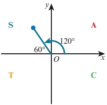

 $ \therefore \cos \frac{7\pi}{6} $ is negative.

Basic acute angle =  $ \frac{7\pi}{6} - \pi = \frac{\pi}{6} $

 $$ \therefore\cos\frac{7\pi}{6}=-\cos\frac{\pi}{6}=-\frac{\sqrt{3}}{2} $$ 

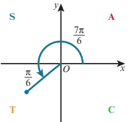

### WORKED EXAMPLE 5.7

Given that  $ \sin 50^{\circ} = b $, express each of the following in terms of b.

a sin  $ 230^{\circ} $

 $$ 50^{\circ} $$ 

c $\tan40^{\circ}$

d tan  $ 140^{\circ} $

Answer

a  $ 230^{\circ} $ lies in the third quadrant.

∴ sin 230° is negative.

Basic acute angle =  $ 230^{\circ} - 180^{\circ} = 50^{\circ} $

 $ \therefore \sin 230^{\circ} = -\sin 50^{\circ} = -b $

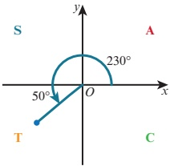

<!-- page 138 -->

1 Express the following as trigonometric ratios of acute angles.

a  $ \sin 190^{\circ} $ b  $ \cos 305^{\circ} $ c  $ \tan 125^{\circ} $ d  $ \cos(-245^{\circ}) $ e  $ \cos \frac{4\pi}{5} $ f  $ \sin \frac{9\pi}{8} $ g  $ \left(-\frac{\pi}{2}\right) $ \tan  $ \frac{11\pi}{9} $

2 Without using a calculator, find the exact values of each of the following.

a  $ \cos 120^{\circ} $ b  $ \tan 330^{\circ} $ c  $ \sin 225^{\circ} $ d  $ \tan (-300^{\circ}) $ e  $ \sin \frac{4\pi}{3} $ f  $ \cos \frac{7\pi}{3} $ g  $ \left(-\frac{\pi}{6}\right) $  $ \cos \frac{10\pi}{3} $

3 Given that

<!-- page 139 -->

8 Given that  $ \cos 77^{\circ} = b $, express each of the following in terms of b.

a  $ \sin 77^{\circ} $ b  $ \tan 13^{\circ} $ c  $ \sin 257^{\circ} $ d  $ \cos 347^{\circ} $

Given that  $ \sin A = \frac{5}{13} $ and  $ \cos B = -\frac{4}{5} $, where A and B are in the same quadrant, find the value of:

a  $ \cos A $

b  $ \tan A $

c  $ \sin B $

d  $ \tan B $

10 Given that  $ \tan A = -\frac{2}{3} $ and  $ \cos B = \frac{3}{4} $, where A and B are in the same quadrant, find the value of:

a  $ \sin A $

b  $ \cos A $

c  $ \sin B $

d  $ \tan B $

11 In the table.

<!-- page 140 -->

## The graphs of  $ y = \sin x $ and  $ y = \cos x $

Suppose that OP makes an angle of x with the positive horizontal axis and that P moves around the unit circle, through one complete revolution.

The coordinates of P will be  $ (\cos x, \sin x) $.

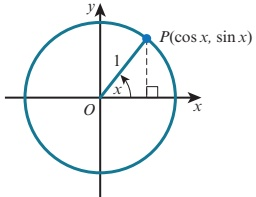

The height of P above the horizontal axis changes from  $ 0 \to 1 \to 0 \to -1 \to 0 $.

The graph of  $ \sin x $ against  $ x $ for  $ 0^\circ \leq x \leq 360^\circ $ is therefore:

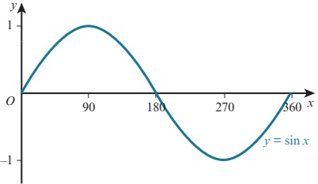

The displacement of P from the vertical axis changes from  $ 1 \rightarrow 0 \rightarrow -1 \rightarrow 0 \rightarrow 1 $.

The graph of  $ \cos x $ against  $ x $ for  $ 0^\circ \leq x \leq 360^\circ $ is therefore:

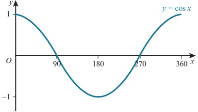

The graphs of $y = \sin x$ and $y = \cos x$ can be continued beyond $0^\circ \leq x \leq 360^\circ$.

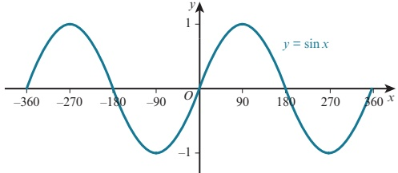

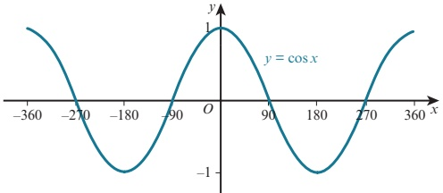

<!-- page 141 -->

The sine and cosine functions are called periodic functions because they repeat themselves over and over again.

The period of a periodic function is defined as the length of one repetition or cycle.

The sine and cosine functions repeat every  $ 360^{\circ} $.

We say they have a period of  $ 360^{\circ} $ (or  $ 2\pi $ radians).

The amplitude of a periodic function is defined as the distance between a maximum (or minimum) point and the principal axis.

The functions  $ y = \sin x $ and  $ y = \cos x $ both have amplitude 1.

The symmetry of the curve  $ y = \sin x $ shows these important relationships:

 $ \sin(-x) = -\sin x $

 $ \sin(180^\circ - x) = \sin x $

 $ \sin(180^{\circ} + x) = -\sin x $

 $ \sin(360^\circ - x) = -\sin x $

 $ \sin(360^{\circ} + x) = \sin x $

### EXPLORE 5.3

By considering the shape of the cosine curve, complete the following statements, giving your answers in terms of  $ \cos x $.

1  $ \cos(-x)= $

 $$ \cos(180^{\circ}-x)= $$ 

 $$ \cos(180^{\circ}+x)= $$ 

4  $ \cos(360^{\circ}-x)= $

5  $ \cos(360^{\circ}+x)= $

The graph of y = tan x

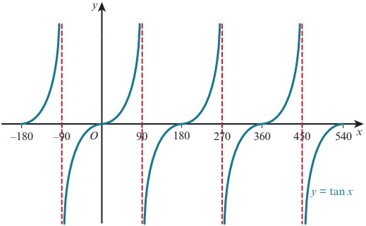

The tangent function behaves very differently to the sine and cosine functions.

The tangent function repeats its cycle every  $ 180^{\circ} $ so its period is  $ 180^{\circ} $ (or  $ \pi $ radians).

The red dashed lines at  $ x = \pm90^\circ $,  $ x = 270^\circ $ and  $ x = 450^\circ $ are called asymptotes. The branches of the graph get closer and closer to the asymptotes without ever reaching them.

The tangent function does not have an amplitude.

<!-- page 142 -->

### EXPLORE 5.4

By considering the shape of the tangent curve, complete the following statements, giving your answers in terms of  $ \tan x $.

1  $ \tan(-x)= $

 $$ \tan(180^\circ-x)= $$ 

 $$ \tan(180^{\circ}+x)= $$ 

4 \tan (360^{\circ} - x) =

5 \tan ( 360^{\circ} + x ) =

## Transformations of trigonometric functions

These rules for the transformations of the graph $y = f(x)$ can be used to transform graphs of trigonometric functions. These transformations include $y = a f(x)$, $y = f(ax)$, $y = f(x) + a$ and $y = f(x + a)$ and simple combinations of these.

The graph of y = a sin x

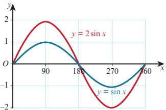

The graph of y = 2sinx is a stretch of the graph of y = sinx.

It is a stretch, stretch factor 2, parallel to the y-axis.

The amplitude of y = 2sin x is 2 and the period is  $ 360^{\circ} $.

The graph of y = sin ax

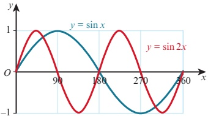

The graph of $y=\sin2x$ is a stretch of the graph of $y=\sin x$. It is a stretch, stretch factor $\frac{1}{2}$, parallel to the x-axis.

The amplitude of y =  $ \sin 2x $ is 1 and the period is  $ 180^{\circ} $.

## REWIND

In Section 2.6, you learnt some rules for the transformation of the graph $y = f(x)$. Here we will look at how these rules can be used to transform graphs of trigonometric functions.

<!-- page 143 -->

The graph of y = a +  $ \sin x $

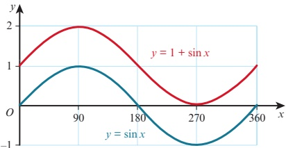

The graph of $y = 1 + \sin x$ is a translation of the graph of $y = \sin x$.

This amplitude of $\left(\begin{array}{c}1 \\ 1\end{array}\right)$ is a translation of the graph of $y = \sin x$.

$y = 1 + \sin x$ is 1 and the period is $360^{\circ}$.

The graph of  $ y = \sin(x + a) $

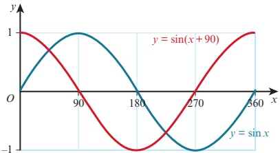

The graph of $y = \sin(x + \frac{90}{0})$ is a translation of the graph of $y = \sin x$.

This amplitude of $f = \frac{1}{2} \sin(x + \theta)$ is 1 and the period is $360^\circ$.

### WORKED EXAMPLE 5.8

On the same grid, sketch the graphs of  $ y = \sin x $ and  $ y = \sin(x - 90) $ for  $ 0^\circ \leq x \leq 360^\circ $.

Answer

 $ y = \sin(x - 90) $ is a translation of the graph  $ y = \sin x $ by the vector  $ \begin{pmatrix} 0 \\ 0 \end{pmatrix} $.

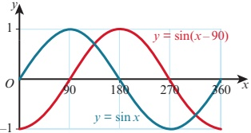

<!-- page 144 -->

To sketch the graph of a trigonometric function, such as  $ y = 2\cos(x + 90) + 1 $ for  $ 0^\circ \leq x \leq 360^\circ $, we can build up the transformation in steps.

Step 1: Start with a sketch of $y = \cos x$.
Period = $360^{\circ}$
Amplitude = 1
Step 2: Sketch the graph of $y = \cos(x + 90)$
Translate $y = \cos x$ by the vector $\left(-\frac{1}{2}, 0\right)$
Period = $360^{\circ}$
Amplitude = 1
Step 3: Sketch the graph of $y = 2\cos(x + 90)$.
Stretch $y = \cos(x + 90)$ with stretch factor 2, parallel to the y-axis.
Period = $360^{\circ}$
Amplitude = 2

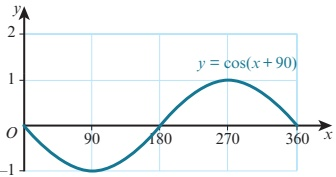

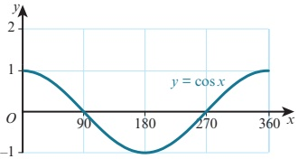

Step 4: Sketch the graph of  $ y = 2\cos(x + 90)\frac{0}{1} + 1 $.

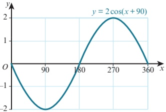

Translate y = 2cos(x + 90) by the vector  $ \left(\begin{array}{c} 1 \\ 2 \end{array}\right) $

Period = 360°

Amplitude = 2

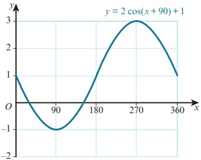

### WORKED EXAMPLE 5.9

 $ f(x) = 3\cos 2x $ for  $ 0^\circ \leq x \leq 360^\circ $.

a Write down the period and amplitude of f.

b Write down the coordinates of the maximum and minimum points on the curve  $ y = f(x) $.

Sketch the graph of  $ y = f(x) $.

d Use your answer to part c to sketch the graph of  $ y = 1 + 3\cos 2x $.

<!-- page 145 -->

Answer

a Period =  $ \frac{360^{\circ}}{2} = 180^{\circ} $

Amplitude = 3

b $y=\cos x$ has its maximum and minimum points at:

$(0^{\circ},1),(180^{\circ},-1),(360^{\circ},1),(540^{\circ},-1)$ and $(720^{\circ},1)$

Hence, $f(x)=3\cos2x$ has its maximum and minimum points at:

$(0^{\circ},3),(90^{\circ},-3),(180^{\circ},3),(270^{\circ},-3)$ and $(360^{\circ},3)$

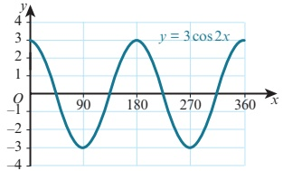

d  $ y = 1 + 3\cos 2x $ is a translation of the graph y = 3cos 2x by the vector  $ \begin{pmatrix} 0 \\ 1 \end{pmatrix} $.

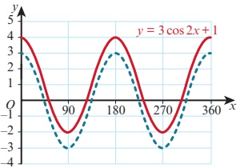

### WORKED EXAMPLE 5.10

a On the same grid, sketch the graphs of  $ y = \sin 2x $ and  $ y = 1 + 3\cos 2x $ for  $ 0^\circ \leq x \leq 360^\circ $.

b State the number of solutions of the equation  $ \sin 2x = 1 + 3\cos 2x $ for  $ 0^\circ \leq x \leq 360^\circ $.

## Answer

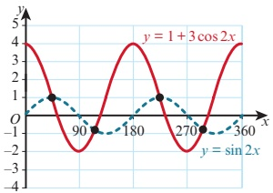

b The graphs of $y = \sin 2x$ and $y = 1 + 3\cos 2x$ intersect each other at four points in the interval. Hence, the number of solutions of the equation $\sin 2x = 1 + 3\cos 2x$ is four.

<!-- page 146 -->

## EXERCISE 5D

1 Write down the period of each of these functions.

a

 $$ y=\cos x^{\circ} $$ 

 $ \mathbf{b}\quad y=\sin2x^{\circ} $

c  $ y = 3 \tan \frac{1}{2} x^{\circ} $

d  $ y = 1 + 2\sin 3x^{\circ} $

e  $ y = \tan(x - 30)^{\circ} $

f  $ y = 5\cos(2x + 45)^{\circ} $

2 Write down the amplitude of each of these functions.

a  $ y = \sin x^{\circ} $

b  $ y = 5\cos2x^{\circ} $

c  $ y = 7 \sin \frac{1}{2} x^{\circ} $

d  $ y = 2 - 3\cos4x^{\circ} $

e  $ y = 4\sin(2x + 60)^{\circ} $

f  $ y = 2\sin(3x + 10)^{\circ} + 5 $

3 Sketch the graph of each of these functions for  $ 0^{\circ} \leq x \leq 360^{\circ} $.

a  $ y = 2\cos x $

c  $ y = \tan 3x $

 $$ y=\sin\frac{1}{2}x $$ 

d  $ y = 3\cos2x $

e  $ y = 1 + 3\cos x $

f  $ y = 2\sin 3x - 1 $

g $y=\sin(x-45)$

h $y = 2\cos(x + 60)$

i $y=\tan(x-90)$

4 a Sketch the graph of each of these functions for  $ 0 \leq x \leq 2\pi $.

iii

i  $ y = 2\sin x $

ii

 $$ y=\cos\left(x-\frac{\pi}{2}\right) $$ 

 $$ y=\sin\left(2x+\frac{\pi}{4}\right) $$ 

b Write down the coordinates of the turning points for your graph for part a iii.

5 a On the same diagram, sketch the graphs of  $ y = \sin 2x $ and  $ y = 1 + \cos 2x $ for  $ 0^\circ \leq x \leq 360^\circ $.

b State the number of solutions of the equation  $ \sin 2x = 1 + \cos 2x $ for  $ 0^\circ \leq x \leq 360^\circ $.

6 a On the same diagram, sketch the graphs of  $ y = 2\sin x $ and  $ y = 2 + \cos 3x $ for  $ 0 \leq x \leq 2\pi $.

b Hence, state the number of solutions, in the interval  $ 0 \leq x \leq 2\pi $, of the equation  $ 2\sin x = 2 + \cos 3x $.

7 a On the same diagram, sketch and label the graphs of  $ y = 3\sin x $ and  $ y = \cos 2x $ for the interval  $ 0 \leq x \leq 2\pi $.

b State the number of solutions of the equation  $ 3\sin x = \cos 2x $ in the interval  $ 0 \leq x \leq 2\pi $.

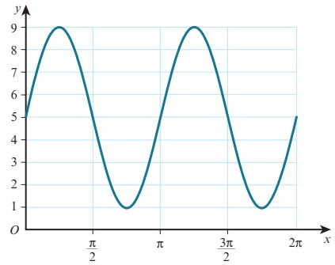

Part of the graph $y = a \sin bx + c$ is shown above.

Find the value of a, the value of b and the value of c.

<!-- page 147 -->

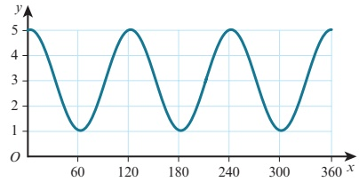

Part of the graph of $y = a + b\cos cx$ is shown above.

Write down the value of a, the value of b and the value of c.

10 a Sketch the graph of  $ y = 2\sin x $ for  $ -\pi \leq x \leq \pi $.

The straight line y = kx intersects this curve at the maximum point.

b Find the value of k. Give your answer in terms of  $ \pi $.

c State the coordinates of the other points where the line intersects the curve.

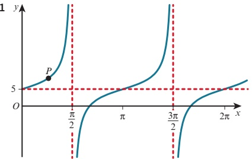

Part of the graph of $y = a \tan bx + c$ is shown above.

The graph passes through the point  $ P\left(\frac{\pi}{8}, 8\right) $.

Find the value of a, the value of b and the value of c.

12  $ f(x) = a + b \sin x $ for  $ 0 \leq x \leq 2\pi $

6  $ \operatorname{int}\operatorname{the} \operatorname{value} \delta(0) = 3 $ and that  $ \mathrm{f}\left(\frac{7\pi}{6}\right) = 2 $

a and the value of b

b the range of f.

13 f(x) = a - b \cos x \text{ for } 0^\circ \leq x \leq 360^\circ, \text{ where } a \text{ and } b \text{ are positive constants.

The maximum value of  $ f(x) $ is 8 and the minimum value is -2.

a Find the value of a and the value of b.

b Sketch the graph of y = f(x).

14  $ f(x) = a + b \sin cx $ for  $ 0^\circ \leq x \leq 360^\circ $, where  $ a $ and  $ b $ are positive constants.

The maximum value of  $ f(x) $ is 9, the minimum value of  $ f(x) $ is 1 and the period is  $ 120^\circ $.

Find the value of  $ a $, the value of  $ b $ and the value of  $ c $.

<!-- page 148 -->

15  $ f(x) = A + 5\cos Bx $ for  $ 0^\circ \leq x \leq 120^\circ $

The maximum value of  $ f(x) $ is 7 and the period is  $ 60^{\circ} $.

a Write down the value of A and the value of B.

b Write down the amplitude of  $ f(x) $.

c Sketch the graph of  $ f(x) $.

PS 16 The graph of $y=\sin x$ is reflected in the line $x=\pi$ and then in the line $y=1$. Find the equation of the resulting function.

PS 17 The graph of $y = \cos x$ is reflected in the line $x = \frac{\pi}{2}$ and then in the line $y = 3$. Find the equation of the resulting function.

### 5.5 Inverse trigonometric functions

The functions  $ y = \sin x $,  $ y = \cos x $ and  $ y = \tan x $ for  $ x \in \mathbb{R} $ are many-one functions. If, however, we suitably restrict the domain of each of these functions, it is possible to make the function one-one and hence we can define each inverse function.

The graphs of the suitably restricted functions $y=\sin x$, $y=\cos x$ and $y=\tan x$ and their inverse functions $y=\sin^{-1}x$, $y=\cos^{-1}x$ and $y=\tan^{-1}x$, together with their domains and ranges are:

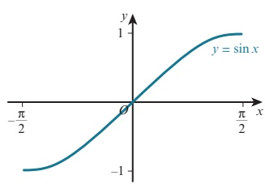

 $ y = \sin x $

domain:  $ -\frac{\pi}{2} \leq x \leq \frac{\pi}{2} $

range:  $ -1 \leq \sin x \leq 1 $

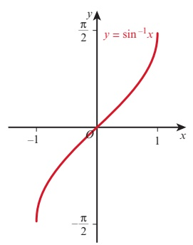

 $$ y=\sin^{-1}x $$ 

domain: -1 ≤ x ≤ 1

 $$  range:-\frac{\pi}{2}\leq\sin^{-1}x\leq\frac{\pi}{2} $$ 

## REWIND

In Section 2.5 you learnt about the inverse of a function. Here we will look at the particular case of the inverse of a trigonometric function.

## REWIND

In Chapter 2 you learnt about functions and that only one-one functions can have an inverse function. You also learnt that if $f$ and $f^{-1}$ are inverse functions, then the graph of $f^{-1}$ is a reflection of the graph of $f$ in the line $y = x$.

<!-- page 149 -->

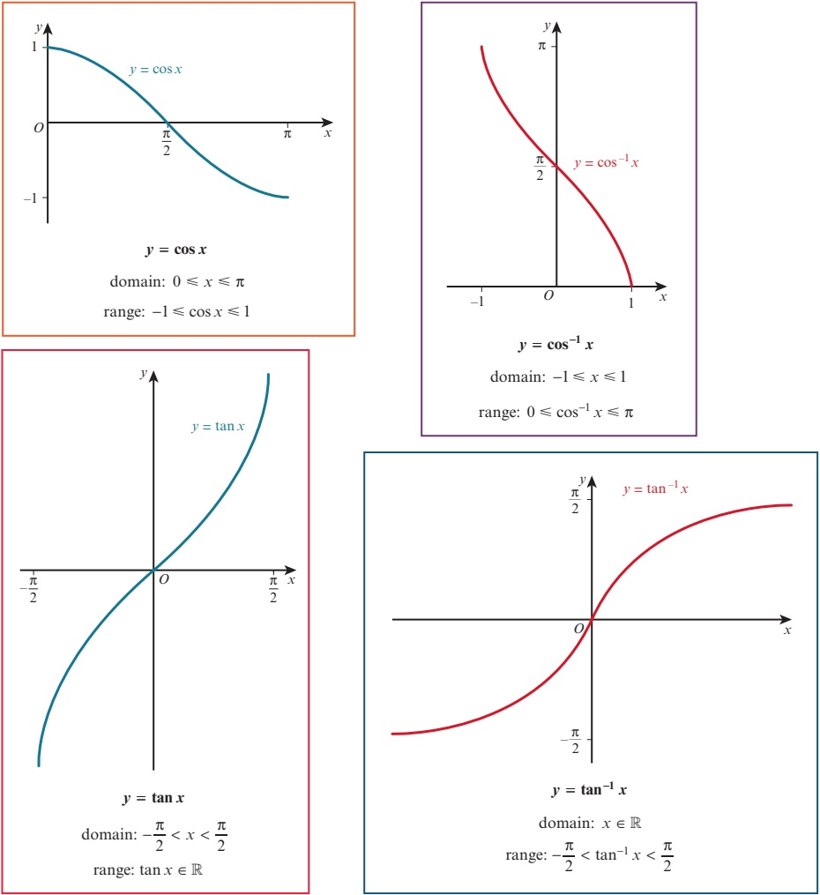

When solving the equation  $ \sin x = 0.5 $ for  $ 0 \leq x \leq \pi $, we can find one solution using the inverse functions:

 $$ x=\sin^{-1}0.5 $$ 

Using a calculator gives  $ x = \frac{\pi}{6} $.

The angle that the calculator gives is the one that lies in the range of the function  $ \sin^{-1} $.

(This is sometimes called the principal angle.)

The principal angle is the angle that lies in the range of the inverse trigonometric function.

There is a second angle,  $ x = \frac{5\pi}{6} $, that satisfies  $ \sin x = 0.5 $ with  $ 0 \leq x \leq \pi $. We can

find this second angle either by using skills learnt earlier in this chapter or by using the symmetry of the curve  $ y = \sin x $.

<!-- page 150 -->

### WORKED EXAMPLE 5.11

The output of the  $ \sin^{-1} $,  $ \cos^{-1} $ and  $ \tan^{-1} $ functions can be given in degrees if that is needed. Without using a calculator, write down, in degrees, the value of:

a  $ \sin^{-1}0 $

 $$ \mathbf{b}\quad\cos^{-1}\left(\frac{\sqrt{3}}{2}\right)\quad\mathbf{c}\quad\tan^{-1}(-1) $$ 

## Answer

a  $ \sin^{-1}0 $ means the angle whose sine is 0, where  $ -90^\circ \leq \text{angle} \leq 90^\circ $.

Hence,  $ \sin^{-1}0 = 0^{\circ} $.

b  $ \cos 1\left(\frac{\sqrt{3}}{2}\right) $ means the angle whose cosine is  $ \frac{\sqrt{3}}{2} $, where  $ 0^\circ \leq \text{angle} \leq 180^\circ $.

Hence,  $ \cos^{-1}\left(\frac{\sqrt{3}}{2}\right)=30^{\circ} $.

c  $ \tan^{-1}(-1) $ means the angle whose tangent is -1, where  $ -90^{\circ} \leq $ angle  $ \leq 90^{\circ} $. Hence,  $ \tan^{-1}(-1) = -45^{\circ} $.

### WORKED EXAMPLE 5.12

The function  $ f(x) = \begin{cases} 3\sin\left(\frac{x}{2}\right) & -1 \text{ is defined for the domain} \\ -\end{cases} $

 $ -\pi \leq x \leq \pi $

a Sketch the graph of $y = f(x)$ and explain why f has an inverse function.

b Find the range of f.

c Find  $ f^{-1}(x) $ and state its domain.

## Answer

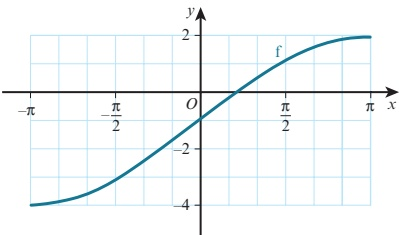

f has an inverse function because f is a one-one function with this domain.

b Range is  $ \frac{1}{3}\sin 4 \leq f(x) \leq 2 $.

 $$ \begin{array}{ccc} \text{c} & & = \quad \left( \begin{array}{c} 2 \\ - \end{array} \right) \end{array} $$

<!-- page 151 -->

1 Without using a calculator, write down, in degrees, the value of:

a  $ \cos^{-1}1 $ b  $ \sin^{-1}\frac{1}{2} $

2  $ \int\sin^{-1}(-1) $

Without using a calculator, write down, in terms of  $ -\sqrt{3} $

 $ \pi $, the value of:

a  $ \sin^{-1}0 $

b  $ \tan^{-1}1 $

d  $ \tan^{-1}\frac{1}{3} $

e  $ \cos^{-1}\frac{1}{2} $

3 Given that  $ \left(-\frac{3}{\sqrt{2}}\right) $

c  $ \tan^{-1}\sqrt{3}1 $

f  $ \cos^{-1}\left(-\frac{2}{\sqrt{3}}\right) $

c  $ \cos^{-1}\frac{1}{\left(\frac{2}{\sqrt{3}}\right)} $

f  $ \sin^{-1}\left(-\frac{2}{\sqrt{3}}\right) $

$$

- \left( - \right) \text{, find the exact value of: }

$$

$$

a \quad \sin^{2}

$$

<!-- page 152 -->

### 5.6 Trigonometric equations

Consider solving the equation  $ \sin x = 0.5 $ for  $ -360^\circ \leq x \leq 360^\circ $.

One solution is given by  $ x = \sin^{-1}(0.5) = \frac{\pi}{6} $ (or  $ 30^{\circ} $).

There are, however, many more values of x for which  $ \sin x = 0.5 $.

The graph of  $ y = \sin x $ for  $ -360^\circ \leq x \leq 360^\circ $ is:

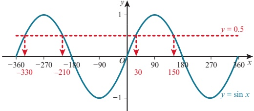

The graph shows there are four values of x, between  $ -360^{\circ} $ and  $ 360^{\circ} $, for which  $ \sin x = 0.5 $.

We can use the calculator value of  $ x = 30^{\circ} $, together with the symmetry of the curve to find the remaining answers.

Hence, the solution of  $ \sin x = 0.5 $ for  $ -360^\circ \leq x \leq 360^\circ $ is:

 $$ x=-330^{\circ},-210^{\circ},30^{\circ}or150^{\circ} $$ 

WORKED EXAMPLE 5.13

Solve  $ \cos x = -0.7 $ for  $ 0^\circ \leq x \leq 360^\circ $.

Answer

 $$ \cos x=-0.7 $$ 

One solution is x = 134.4°

Use a calculator to find  $ \cos^{-1}(-0.7) $, correct to 1 decimal place.

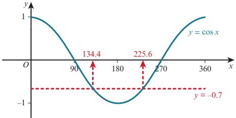

The sketch graph shows there are two values of $x$, between $-0^{\circ}$ and $360^{\circ}$, for which $\cos x = -0.7$.

Using the symmetry of the curve, the second value is  $ (360^{\circ}-134.4^{\circ})=225.6^{\circ} $.

Hence, the solution of  $ \cos x = -0.7 $ for  $ 0^\circ \leq x \leq 360^\circ $ is:

 $$ x=134.4^{\circ}\mathrm{~o r~}225.6^{\circ}\quad\mathrm{(c o r r e c t~t o~1~d e c i m a l~p l a c e)} $$

<!-- page 153 -->

Solve  $ \tan 2A = -2.1 $ for  $ 0^{\circ} \leq A \leq 180^{\circ} $.

Answer

 $ \tan 2A = -2.1 $

Let 2A = x.

 $ \tan x = -2.1 $

Use a calculator to find  $ \tan^{-1}(-2.1) $.

A solution is x = -64.54°.

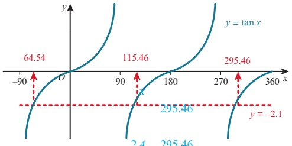

Using the symmetry of the curve:

 $$ 147.7 $$ 

 $$ x=-64.54^{\circ} $$ 

 $$ \begin{array}{ll} x=(-64.54^{\circ}+180^{\circ}) &  =\left(115.46^{\circ}+180^{\circ}\right) \\ =115.46^{\circ} &  A=\begin{array}{c} \circ\\ \end{array} \end{array} $$ 

Using 2A = x:

Hence, the solution of  $ 2A = -64.54 $

 $$ 2A=115.46^{\circ} $$ 

 $$ A=-32.3^{\circ} $$ 

 $$ A=57.7^{\circ} $$ 

tan 2A = -2.1 for  $ 0^{\circ} \leq A \leq 180^{\circ} $ is:

 $ A = 57.7^{\circ} $ or  $ 147.7^{\circ} $ (correct to 1 decimal place)

### WORKED EXAMPLE 5.15

Solve  $ \sin\left(2A+\frac{\pi}{6}\right)= $ for  $ 0\leq A\leq\pi $

Answer

 $$ \sin\left(2A+\frac{\pi}{6}\right)=\begin{aligned}0.6\end{aligned} $$ 

 $$  Let2A+\frac{\pi}{6}=x. $$ 

 $$ \begin{array}{r} \begin{array}{r l}{\sin x}&{{}=}\\ \end{array}\begin{array}{r l}{0.6}&{{}}\\ \end{array} $$ 

Use a calculator to find  $ \sin^{-1}(0.6) $.

x 0.6435 radians

<!-- page 154 -->

Consider a right-angled triangle.

Two very important rules can be found using this triangle.

Rule 1

Divide numerator and denominator by r.

<!-- page 155 -->

If we use the unit circle definition of the trigonometric functions, we discover that these two important rules are true for all valid values of

<!-- page 156 -->

$$ \cos x=\frac{1}{2}\quad\text{or}\quad\cos x=1 $$ 

 $$ x=\frac{\pi}{3}or2\pi-\frac{\pi}{3}\qquad x=0or2\pi $$ 

 $$ x=\frac{\pi}{3}or\frac{5\pi}{3} $$ 

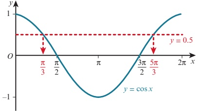

The solution of  $ 2\sin^2 x + 3\cos x - 1 = 0 $ for  $ 0 \leq x \leq 2\pi $ is:

 $$ x=0,\frac{\pi}{3},\frac{5\pi}{3}or2\pi $$ 

## EXERCISE 5F

1 Solve each of these equations for  $ 0^{\circ} \leq x \leq 360^{\circ} $.

a  $ \tan x = 1.5 $

e  $ \cos x = -0.6 $

b  $ \sin x = 0.4 $

f  $ \tan x = -2 $

c  $ \cos x = 0.7 $

 $ g $  $ 2\cos x - 1 = 0 $

d  $ \sin x = -0.3 $

h  $ 5\sin x + 3 = 0 $

2 Solve each of the these equations for  $ 0 \leq x \leq 2\pi $.

a  $ \sin x = 0.3 $

e  $ \tan x = -3 $

b  $ \cos x = 0.5 $

f  $ \cos x = -0.5 $

c  $ \tan x = 3 $

g  $ 4\sin x = 3 $

d  $ \sin x = -0.7 $

h  $ 5\tan x+7=0 $

3 Solve each of these equations for  $ 0^{\circ} \leq x \leq 180^{\circ} $.

a  $ \cos2x = 0.6 $

for  $ 0^{\circ} \leq x \leq 180^{\circ} $

b  $ \sin 3x = 0.8 $

f  $ 5\sin2x = -4 $

c  $ \tan 2x = 4 $

e  $ 3\cos2x = 2 $

d  $ \sin 2x = -0.5 $

 $ g \quad 4 + 2 \tan 2x = 0 $

h  $ 1 - 5\sin 2x = 0 $

4 c

a  $ \sin(x - 60^\circ) = 0.5 $ for  $ 0^\circ \leq x \leq 360^\circ $

$$\cos\left(\frac{6}{x+\frac{\pi}{2}}\right) = -0.5\text{ for} < < < \pi$$

c  $ \cos(2x + 45^\circ) = 0.8 $ for  $ 0^\circ \leq x \leq 180^\circ $

e  $ 2 \tan \left( \frac{x}{2} \right) \quad \sqrt{3} \quad 0 \quad \text{for } 0^{\circ} \leq x \leq 540^{\circ} $

d  $ \frac{3\sin(2x-4)}{2\sin} = 2 $ for  $ 0 \leq x \leq \pi\pi $

f  $ \sqrt{} $  $ \left(\frac{x}{2}+\frac{\pi}{}\right) $ 0 x 4

<!-- page 157 -->

5 Solve each of these equations for  $ 0^{\circ} \leq x \leq 360^{\circ} $.

a  $ 2\sin x = \cos x $

b  $ 2\sin x - 3\cos x = 0 $

c  $ 4\sin x + 7\cos x = 0 $

d  $ 3\cos2x - 4\sin2x = 0 $

6 Solve  $ 4\sin(2x + 0.3) - 5\cos(2x + 0.3) = 0 $ for  $ 0 \leq x \leq \pi $.

7 Solve each of these equations for  $ 0^\circ \leq x \leq 360^\circ $.

a  $ \sin x \cos (x - 60) = 0 $

b  $ 5\sin^{2}x-3\sin x=0 $

 $ c \quad \tan^{2} x = 5 \tan x $

d  $ \sin^{2}x + 2\sin x\cos x = 0 $

e  $ 2\sin x\cos x=\sin x $

f  $ \sin x \tan x = 4 \sin x $

8 Solve each of these equations for  $ 0^{\circ} \leq x \leq 360^{\circ} $.

a  $ 4\cos^{2}x=1 $

b  $ 4 \tan^{2} x = 9 $

9 Solve each of these equations for  $ 0^{\circ} \leq x \leq 360^{\circ} $.

a  $ 2\sin^{2}x + \sin x - 1 = 0 $

b  $ \tan^{2}x + 2\tan x - 3 = 0 $

c  $ 3\cos^{2}x-2\cos x-1=0 $

d  $ 2\sin^{2}x - \cos x - 1 = 0 $

e  $ 3\cos^{2}x-3=\sin x $

f  $ \cos x + 5 = 6\sin^{2}x $

 $ 2\cos^{2}x - \sin^{2}x - 2\sin x - 1 = 0 $

 $ h \quad 1 + \tan x \cos x = 2 \cos^{2} x $

10 Solve each of these equations for  $ 0 \leq x \leq 2\pi $.

a  $ 4\tan x = 3\cos x $

b  $ 2\cos^{2}x+5\sin x=4 $

11 Solve  $ \sin^{2}x + 3\sin x\cos x + 2\cos^{2}x = 0 $ for  $ 0 \leq x \leq 2\pi $.

### 5.7 Trigonometric identities

 $ x + x = 2x $ is called an identity because it is true for all values of x.

When writing an identity, we often replace the = symbol with a ≡ symbol to emphasise that it is an identity.

Two commonly used trigonometric identities are:

 $$ \sin^{2}x+\cos^{2}x\equiv1\quad and\quad\tan x\equiv\frac{\sin x}{\cos x} $$ 

In this section you will learn how to use these two identities to simplify expressions and to prove other more complicated identities that involve  $ \sin x $,  $ \cos x $ and  $ \tan x $.

When proving an identity, it is usual to start with the more complicated side of the identity and prove that it simplifies to the less complicated side.

<!-- page 158 -->

### WORKED EXAMPLE 5.18

Express  $ 4\cos^{2}x - 3\sin^{2}x $ in terms of  $ \cos x $.

Answer

 $$ \begin{aligned}4\cos^{2}x-3\sin^{2}x&\equiv4\cos^{2}x-3(1-\cos^{2}x)\\&\equiv4\cos^{2}x-3+3\cos^{2}x\\&\equiv7\cos^{2}x-3\end{aligned} $$ 

 $$ \mathrm{Re}  place\sin^{2}x\mathrm{~with~}1-\cos^{2}x. $$ 

### WORKED EXAMPLE 5.19

Prove the identity  $ \frac{1+\sin x}{\cos x}+\frac{\cos x}{1+\sin x}\equiv\frac{2}{\cos x} $.

## Answer

 $$ \begin{aligned}LHS&\equiv\frac{1+\sin x}{\cos x}+\frac{\cos x}{1+\sin x}&\quad&\text{Add the two fractions.}\\&&(\frac{1+\sin x)^{2}+\cos^{2}x}{\cos x(1+\sin x)}&\quad&\text{Expand the brackets in the numerator.}\\&&&\equiv\frac{1+2\sin x+\sin^{2}x+\cos^{2}x}{\cos x(1+\sin x)}&\quad&\text{Use}\sin^{2}x+\cos^{2}x\equiv1.\\&&&=\frac{2+2\sin x}{\cos x(1+\sin x)}&\quad&\text{Factorise the numerator.}\\&&&=\frac{2(1+\sin x)}{\cos x(1+\sin x)}&\quad&\text{Divide numerator and denominator by}\\&&&=\frac{2}{\cos x}&&1+\sin x.\\&&&\equiv RHS\end{aligned} $$ 

## TIP

LHS means left-hand side and RHS means right-hand side.

### WORKED EXAMPLE 5.20

1  $ \sin x $  $ \tan x $  $ \cos x $

Answer the identity  $ \frac{+}{-} \equiv \left( \begin{array}{c} + \\ \end{array} \right) $

 $$ \begin{aligned}RHS\equiv&\left(\tan x+\frac{1}{+\cos x}\right)^{\frac{1}{1+x}}\\ &\equiv\frac{\sin x}{\cos x}\quad\frac{1}{\cos x}\end{aligned} $$ 

 $$  Use\tan x=\frac{\sin x}{\cos x}. $$ 

Add the two fractions.

<!-- page 159 -->

$$ \begin{aligned}&=\frac{(1+\sin x)^{2}}{\cos^{2}x}\\&=\frac{(1+\sin x)^{2}}{1-\sin^{2}x}\\&=\frac{(1+\sin x)^{2}}{(1+\sin x)(1-\sin x)}\\&=\frac{1+\sin x}{1-\sin x}\\&=LHS\end{aligned} $$ 

Replace  $ \cos^{2}x $ with  $ 1-\sin^{2}x $ in the denominator.

 $$  Use1-\sin^{2}x=(1+\sin x)(1-\sin x). $$ 

Divide numerator and denominator by  $ 1 + \sin x $.

### EXPLORE 5.5

Equivalent trigonometric expressions:

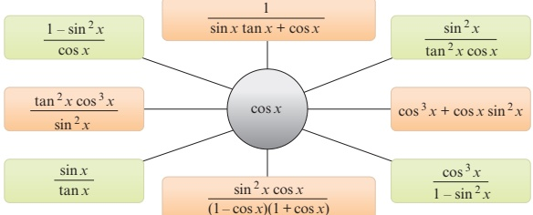

Discuss why each of the trigonometric expressions in the coloured boxes simplifies to  $ \cos x $.

Create trigonometric expressions of your own that simplify to  $ \sin x $.

(Your expressions must contain at least two different trigonometric ratios.)

Compare your answers with those of your classmates.

## EXERCISE 5G

1 Express  $ 2\sin^{2}x - 7\cos^{2}x + 4 $ in terms of  $ \sin x $.

2 Prove each of these identities.

a  $ \cos x \tan x \equiv \sin x $

 $ c \quad \frac{\cos^2 x}{1 - \sin x} \equiv 1 + \sin x $

 $ e \quad \frac{\cos^2 x - \sin^2 x}{\cos x + \sin x} + \sin x \equiv \cos x $

 $$ \frac{1-\cos^{2}x}{\sin x\cos x}\equiv\tan x $$ 

$$\mathrm{d}\quad\frac{1+\sin x-\sin^{2}x}{\cos x}\equiv\cos x+\tan x$$

 $ f \quad \cos^4 x + \sin^2 x \cos^2 x \equiv \cos^2 x $

<!-- page 160 -->

3 Prove each of these identities.

a  $ (\sin x + \cos x)^{2} \equiv 1 + 2 \sin x \cos x $

b  $ 2(1 + \cos x) - (1 + \cos x)^2 \equiv \sin^2 x $

c  $ 2 - (\sin x + \cos x)^{2} \equiv (\sin x - \cos x)^{2} $

d  $ (\cos^{2}x-2)^{2}-3\sin^{2}x\equiv\cos^{4}x+\sin^{2}x $

4 Prove each of these identities.

a  $ \cos^{2}x - \sin^{2}x \equiv 2\cos^{2}x - 1 $

 $  \mathbf{b} \quad \cos^2 x - \sin^2 x \equiv 1 - 2 \sin^2 x  $

 $  \mathbf{c} \quad \tan^{2} x - \sin^{2} x \equiv \tan^{2} x \sin^{2} x  $

 $  \mathbf{d} \quad \cos^4 x + \sin^2 x \equiv \sin^4 x + \cos^2 x  $

5 Prove each of these identities.

a  $ \frac{\cos^{2}x-\sin^{2}x}{\cos x-\sin x}\equiv\cos x+\sin x $

b  $ \sin^{4}x - \cos^{4}x \equiv 2\sin^{2}x - 1 $

$$\mathbf{c}\quad\frac{\cos^{4}x-\sin^{4}x}{\cos^{2}x}\equiv1-\tan^{2}x$$

d  $ \frac{\cos x}{\tan x(1-\sin x)} \equiv 1 + \frac{1}{\sin x} $

e  $ \frac{\sin x - \cos x}{\sin x + \cos x} = \frac{\tan x - 1}{\tan x + 1} $

 $ f\left(\frac{1}{\sin x} - \frac{1}{\tan x}\right)^2 \equiv \frac{1 - \cos x}{1 + \cos x} $

$$\mathrm{g} \quad \frac{\tan x+1}{\sin x \tan x+\cos x} \equiv \sin x+\cos x$$

$$\mathrm{h}\quad\frac{\sin^{2}x(1-\cos^{2}x)}{\cos^{2}x(1-\sin^{2}x)}\equiv\tan^{4}x$$

6 Prove each of these identities.

a  $ \frac{1}{\cos x} - \frac{\cos x}{1 + \sin x} \equiv \tan x $

b  $ \tan x + \frac{1}{\tan x} \equiv \frac{1}{\sin x \cos x} $

 $ c \quad \frac{1}{\cos x} - \cos x \equiv \sin x \tan x $

$$d \quad \frac{\sin x}{1+\cos x}+\frac{1+\cos x}{\sin x}=\frac{2}{\sin x}$$

$$e \quad \frac{\sin x}{1-\sin x}+\frac{\sin x}{1+\sin x}\equiv\frac{2\tan x}{\cos x}$$

$$

\begin{aligned}

f & \quad \frac{1 + \cos x}{1 - \cos x} - \frac{1 - \cos x}{1 + \cos x} \equiv \frac{4}{\sin x \tan x}

\end{aligned}

$$

7 Show that  $ (1 + \cos x)^2 + (1 - \cos x)^2 + 2\sin^2 x $ has a constant value for all x and state this value.

8 a Express  $ 7\sin^{2}x + 4\cos^{2}x $ in the form  $ a + b\sin^{2}x $.

b State the range of the function  $ f(x) = 7\sin^2 x + 4\cos^2 x $, for the domain  $ 0 \leq x \leq 2\pi $.

9 a Express 4 sin  $ \cos^{2} $

<!-- page 161 -->

a Prove the identity  $ \frac{1}{1} $  $ \frac{\tan}{\tan} $ 2 cos 1

<!-- page 162 -->

## 1 a Show that the equation

<!-- page 163 -->

## Checklist of learning and understanding

Exact values of trigonometric functions

<table border=1 style='margin: auto; word-wrap: break-word;'><tr><td style='text-align: center; word-wrap: break-word;'></td><td style='text-align: center; word-wrap: break-word;'></td><td style='text-align: center; word-wrap: break-word;'></td><td style='text-align: center; word-wrap: break-word;'></td></tr><tr><td style='text-align: center; word-wrap: break-word;'></td><td style='text-align: center; word-wrap: break-word;'></td><td style='text-align: center; word-wrap: break-word;'></td><td style='text-align: center; word-wrap: break-word;'></td></tr><tr><td style='text-align: center; word-wrap: break-word;'></td><td style='text-align: center; word-wrap: break-word;'></td><td style='text-align: center; word-wrap: break-word;'></td><td style='text-align: center; word-wrap: break-word;'></td></tr><tr><td style='text-align: center; word-wrap: break-word;'></td><td style='text-align: center; word-wrap: break-word;'></td><td style='text-align: center; word-wrap: break-word;'></td><td style='text-align: center; word-wrap: break-word;'></td></tr></table>

<!-- page 164 -->

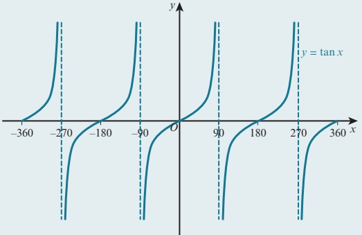

The graph of y = a sin x is a stretch of y = sin x, stretch factor a, parallel to the y-axis.

The graph of  $ y = \sin(ax) $ is a stretch of  $ y = \sin x $, stretch factor  $ \frac{1}{a} $, parallel to the x-axis.

The graph of  $ y = a + \sin x $ is a translation of y =  $ \sin x $ by the vector  $ \begin{pmatrix} 0 \\ a \end{pmatrix} $.

Inverse trigonometric functions is a translation of $y = \sin x$ by the vector $\begin{pmatrix} -a \\ 0 \end{pmatrix}$.

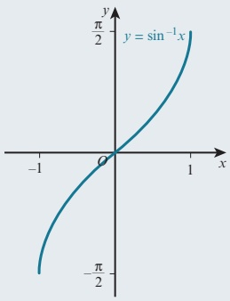

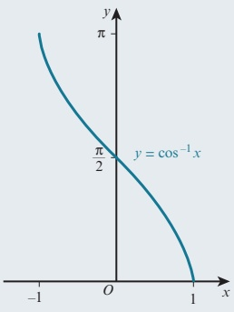

 $$ \mathrm{range}:-\frac{\pi}{2}\leq\sin^{-1}x\leq\frac{\pi}{2}\quad\mathrm{range}:0\leq\cos^{-1}x\leq\pi $$ 

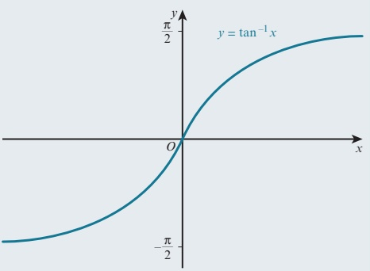

 $$  range:-\frac{\pi}{2}\leq\tan^{-1}x\leq\frac{\pi}{2} $$ 

## Trigonometric identities

 $ \tan x \equiv \frac{\sin x}{\cos x} $

 $ \sin^{2}x + \cos^{2}x \equiv 1 $

<!-- page 165 -->

The diagram shows part of the graph of y = a + b \sin x.  
State the values of the constants a and b. [2]  
Cambridge International AS & A Level Mathematics 9709 Paper 11 Q1 June 2014  
2 Find the value of x satisfying the equation  $ \sin^{-1}(x-1)=\tan^{-1}(3) $. [3]  
Cambridge International AS & A Level Mathematics 9709 Paper 11 Q2 November 2014  
3 Given that

<!-- page 166 -->

10 i Solve the equation  $ 4\sin^{2}x + 8\cos x - 7 = 0 $ for  $ 0^{\circ} \leq x \leq 360^{\circ} $.

ii Hence find the solution of the equation

