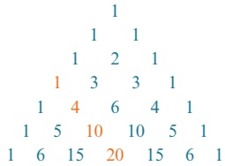
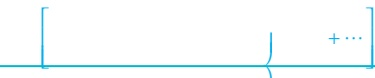
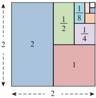
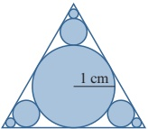
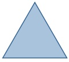
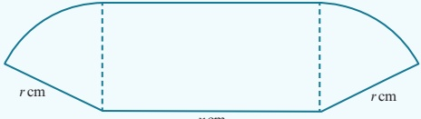
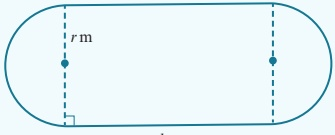
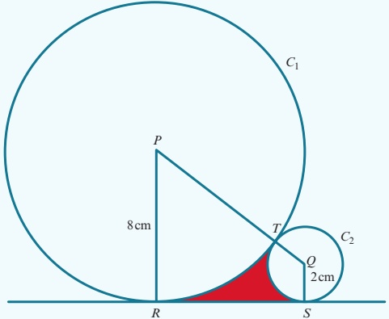
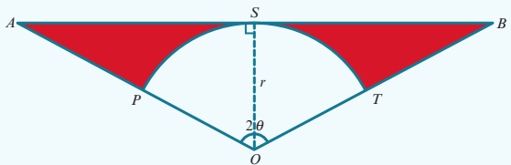

# 6 Series

<!-- Cambridge International AS A Level Mathematics Pure Mathematics 1.pdf p167-201 -->

<!-- page 167 -->

# Chapter 6 Series

## In this chapter you will learn how to:

use the expansion of  $ (a + b)^n $, where  $ n $ is a positive integer

recognise arithmetic and geometric progressions

use the formulae for the nth term and for the sum of the first n terms to solve problems involving arithmetic or geometric progressions

use the condition for the convergence of a geometric progression, and the formula for the sum to infinity of a convergent geometric progression.

<!-- page 168 -->

## PREREQUISITE KNOWLEDGE

<table border=1 style='margin: auto; word-wrap: break-word;'><tr><td style='text-align: center; word-wrap: break-word;'>Where it comes from</td><td style='text-align: center; word-wrap: break-word;'>What you should be able to do</td><td style='text-align: center; word-wrap: break-word;'>Check your skills</td></tr><tr><td style='text-align: center; word-wrap: break-word;'>IGCSE / O Level Mathematics</td><td style='text-align: center; word-wrap: break-word;'>Expand brackets.\nSimplify indices.</td><td style='text-align: center; word-wrap: break-word;'>1 Expand:\na  $ (2x + 3)^{2} $\nb  $ (1 - 3x)(1 + 2x - 3x^{2}) $</td></tr><tr><td style='text-align: center; word-wrap: break-word;'>IGCSE / O Level Mathematics</td><td style='text-align: center; word-wrap: break-word;'>Simplify indices.\nFind the  $ n $th term of a linear sequence.</td><td style='text-align: center; word-wrap: break-word;'>2 Simplify:\na  $ (5x^{2})^{3} $\nb  $ (-2x^{3})^{5} $</td></tr><tr><td style='text-align: center; word-wrap: break-word;'>IGCSE / O Level Mathematics</td><td style='text-align: center; word-wrap: break-word;'>Find the  $ n $th term of a linear sequence.</td><td style='text-align: center; word-wrap: break-word;'>3 Find the  $ n $th term of these linear sequences.\na 5, 7, 9, 11, 13,...\nb 8, 5, 2, -1, -4,...</td></tr></table>

## Why study series?

At IGCSE / O Level you learnt how to expand expressions such as  $ (1+x)^2 $. In this chapter you will learn how to expand expressions of the form  $ (1+x)^n $, where  $ n $ can be any positive integer. Expansions of this type are called binomial expansions.

This chapter also covers arithmetic and geometric progressions. Both the mathematical and the real world are full of number sequences that have particular special properties. You will learn how to find the sum of the numbers in these progressions. Some fractal patterns can generate these types of sequences.

### 6.1 Binomial expansion of  $ (a + b)^n $

Binomial means 'two terms'.

The word is used in algebra for expressions such as  $ x + 3 $ and  $ 5x - 2y $.

You should already know that  $ (a+b)^{2}=a^{2}+2ab+b^{2} $.

The expansion of  $ (a+b)^2 $ can be used to expand  $ (a+b)^3 $:

 $$ \begin{aligned}(a+b)^{3}&=(a+b)(a^{2}+2ab+b^{2})\\&=a^{3}+2a^{2}b+ab^{2}+a^{2}b+2ab^{2}+b^{3}\\&=a^{3}+3a^{2}b+3ab^{2}+b^{3}\end{aligned} $$ 

Similarly, it can be shown that  $ (a+b)^{4}=a^{4}+4a^{3}b+6a^{2}b^{2}+4ab^{3}+b^{4} $.

Writing the expansions of  $ (a+b)^{n} $ in full in order:

 $$ (a+b)^{0}= $$ 

 $$ (a+b)^{1}= $$ 

 $$ 1a+1b $$ 

 $$ (a+b)^{2}= $$ 

 $$ 1a^{2}+2a b+1b^{2} $$ 

 $$ (a+b)^{3}= $$ 

 $$ 1a^{3}+3a^{2}b+3ab^{2}+1b^{3} $$ 

 $$ (a+b)^{4}=\quad1a^{4}+4a^{3}b+6a^{2}b^{2}+4ab^{3}+1b^{4} $$ 

## FAST FORWARD

In the Pure Mathematics 2 and 3 Coursebook, Chapter 7, you will learn how to expand these expressions for any real value of n.

## FAST FORWARD

Properties of binomial expansions are also used in probability theory, which you will learn about if you go on to study the Probability and Statistics 1 Coursebook, Chapter 7.

## WEB LINK

Try the Sequences and Counting and binomials resources on the Underground Mathematics website.

<!-- page 169 -->

If you look at the expansion of  $ (a+b)^{4} $, you should notice that the powers of a and b form a pattern.

The first term is  $ a^{4} $ and then the power of a decreases by 1 while the power of b increases by 1 in each successive term.

All of the terms have a total index of 4  $ (a^{4}, a^{3}b, a^{2}b^{2}, ab^{3} $ and  $ b^{4} $).

There is a similar pattern in the other expansions.

The coefficients also form a pattern that is known as Pascal's triangle.

 $$ \begin{aligned}&n=0：\quad1\\&n=1：\quad1\quad1\\&n=2：\quad1\xrightarrow{+}2\quad1\\&n=3：\quad1\quad3\quad3\quad1\\&n=4：\quad1\quad4\quad6\quad4\quad1\end{aligned} $$ 

The next row is then:

 $$ n=5;~1\quad5\quad10\quad10\quad5\quad1 $$ 

This row can then be used to write down the expansion of  $ (a+b)^{5} $:

 $$ (a+b)^{5}=1a^{5}+5a^{4}b+10a^{3}b^{2}+10a^{2}b^{3}+5ab^{4}+1b^{5} $$ 

### EXPLORE 6.1

There are many number patterns to be found in Pascal's triangle. For example, the numbers 1, 4, 10 and 20 have been highlighted.

1

4

10

20

These numbers are called tetrahedral numbers.

1 What do you notice if you find the total of each row in Pascal's triangle? Can you explain your findings?

2 Can you find the Fibonacci sequence  $ (1, 1, 2, 3, 5, 8, 13, \ldots) $ in Pascal's triangle? You may want to add terms together.

3 Pascal's triangle has many other number patterns. Which number patterns can you find?

## TIP

Each row always starts and finishes with a 1.

Each number is the sum of the two numbers in the row above it.

## DID YOU KNOW?

Pascal's triangle is named after the French mathematician Blaise Pascal (1623–1662).

<!-- page 170 -->

### WORKED EXAMPLE 6.1

Use Pascal's triangle to find the expansion of:

a  $ (3x+2)^3 $ b  $ (5-2x)^4 $

Answer

a  $ (3x+2)^3 $

The index is 3 so use the row for  $ n = 3 $ in Pascal's triangle (1, 3, 3, 1).

 $ (3x+2)^3 = 1(3x)^3 + 3(3x)^2(2) + 3(3x)(2)^2 + 1(2)^3 $

= 27x^3 + 54x^2 + 36x + 8

b  $ (5-2x)^4 $

The index is 4 so use the row for  $ n = 4 $ in Pascal's triangle (1, 4, 6, 4, 1).

 $ (5-2x)^4 = 1(5)^4 + 4(5)^3(-2x) + 6(5)^2(-2x)^2 + 4(5)(-2x)^3 + 1(-2x)^4 $

= 625 - 1000x + 600x^2 - 160x^3 + 16x^4

### WORKED EXAMPLE 6.2

a Use Pascal's triangle to expand  $  (1 - 2x)^{5}  $.

b Find the coefficient of  $ x^{3} $ in the expansion of  $ (3+5x)(1-2x)^{5} $.

## Answer

a  $ (1-2x)^{5} $

The index is 5 so use the row for n=5 in Pascal's triangle (1, 5, 10, 10, 5, 1).

 $ (1-2x)^{5}=1(1)^{5}+5(1)^{4}(-2x)+10(1)^{3}(-2x)^{2}+10(1)^{2}(-2x)^{3}+5(1)(-2x)^{4}+1(-2x)^{5} $

 $ =1-10x+40x^{2}-80x^{3}+80x^{4}-32x^{5} $

b  $ (3+5x)(1-2x)^{5}=(3+5x)(1-10x+40x^{2}-80x^{3}+80x^{4}-32x^{5}) $

The term in x^{3} comes from the products:

 $ (3+5x)(1-10x+40x^{2}-80x^{3}+80x^{4}-32x^{5}) $

 $ 3\times(-80x^{3})=-240x^{3} $ and  $ 5x\times40x^{2}=200x^{3} $

Coefficient of x^{3}=-240+200=-40.

## EXERCISE 6A

1 Use Pascal's triangle to find the expansions of:

a

 $$ (x+2)^{3} $$ 

b

 $$ (1-x)^{4} $$ 

 $$ (x+y)^{3} $$ 

d

 $$ \mathrm{~\bf~e~}\quad(x-y)^{4} $$ 

 $$ (2-x)^{3} $$ 

 $$ \textsf{f}\quad(2x+3y)^{3} $$ 

g

 $$ (2x-3)^{4} $$ 

 $$ \left(x^{2}+\frac{3}{2x^{3}}\right)^{3} $$

<!-- page 171 -->

2 Find the coefficient of  $ x^{3} $ in the expansions of:

2 Find the coefficient of  $ x^3 $ in the expansions of:

a  $ (x+3)^4 $ \quad b  $ (1+x)^5 $ \quad c  $ (3-x)^5 $ \quad d  $ (4+x)^4 $ \quad e  $ (x-2)^5 $ \quad f  $ (2x-1)^4 $ \quad g  $ (4x+3)^4 $ \quad h  $ \left( \begin{array}{c} 2 \\ - \end{array} \right) $

 $ (3\ x)^{5}\ (3\ x)^{5}\ A+Bx^{2}+Cx^{4} $

Find the value of $A$, the value of $B$ and the value of $C$.

4 The coefficient of $x^{2}$ in the expansion of $(3 + ax)^{4}$ is 216.

Find the possible values of the constant $a$.

5 a Expand  $ (2 + x)^{4} $

b Use your answer to part a to express  $ (2 + \sqrt{3})^4 $ in the form  $ a + b\sqrt{3} $

6 a Expand  $ (1+x)^{3} $

b Use your answer to part a to express:

i  $ (1+\sqrt{5})^{3} $ in the form  $ a+b\sqrt{5} $

ii  $ (1-\sqrt{5})^{3} $ in the form  $ c+d\sqrt{5} $.

c Use your answers to part b to simplify  $ (1 + \sqrt{5})^3 + (1 - \sqrt{5})^3 $.

7 Expand  $ (1+x)(2+3x)^{4} $.

8 a Expand  $ (x^{2}-1)^{4} $

b Find the coefficient of  $ x^{6} $ in the expansion of  $ (1-2x_{1}^{2})(x^{2}-1)^{4} $.

9 Find the coefficient of  $ x^2 $ in the expansion of  $ \left( x - \frac{1}{x} \right)^4 $.

10 Find the term independent of x in the expansion of  $ \left(x^{2}-\frac{3}{x^{2}}\right)^{4} $. Find the first three terms, in ascending powers of  $ \left(x^{2}-\frac{3}{x^{2}}\right)^{4} $.

 $$ (1+y)^{4} $$ 

b By replacing $y$ with $5x - 2x^{2}$, find the coefficient of $x^{2}$ in the expansion of $(1 + 5x - 2x^{2})^{4}$.

12 The coefficient of  $ x^{2} $ in the expansion of  $ (1+ax)^{4} $ is 30 times the coefficient of x in the expansion of  $ \left(\begin{array}{r}3 \\ +\frac{ax}{3}\end{array}\right)^{3} $. Find the value of a.

13 Find the power of x that has the greatest coefficient in the expansion of  $ \left(\begin{array}{r}3x^{4} \\ x \\ +- \end{array}\right) $.

 $$ \gamma)^{5} $$ 

b Without using a calculator and using your result from part a, find the value of  $ \left(10\frac{1}{4}\right)^{5} $, correct to

5 a Given that  $ \left(x^{2}+\frac{1}{x}\right)^{4}-\left|\frac{1}{x}\right|=-2\left|2\frac{1}{2}\right|2\left|2\frac{1}{2}\right| $

 $ \left(x^{2}+\frac{1}{x}\right)^{4}-x^{2}-\frac{1}{x} $  $ x^{4}=px^{5}+\frac{q}{x} $, find the value of p and the value of q.

b Hence, without using a calculator, find the exact value of  $ \left( \begin{array}{c} + \sqrt[4]{\frac{4}{\sqrt{}}} \end{array} \right) $.

<!-- page 172 -->

PS 16 $y = x + \frac{1}{x}$

a Express $x^{3} + \frac{1}{x^{3}}$ in terms of $y$.

b Express $x^{5} + \frac{1}{x^{5}}$ in terms of $y$.

### 6.2 Binomial coefficients

Pascal's triangle can be used to expand  $ (a + b)^n $ for any positive integer  $ n $, but if  $ n $ is large it can take a long time to write out all the rows in the triangle. Hence, we need a more efficient method to find the coefficients in the expansions. The coefficients in the binomial expansion of  $ (1 + x)^n $ are known as binomial coefficients.

### EXPLORE 6.2

Consider the expansion:

 $$ (1+x)^{5}=1+5x+10x^{2}+10x^{3}+5x^{4}+x^{5} $$ 

The coefficients are: 1 5 10 10 5 1

Find the nCr function on your calculator. On some calculators this may be  $ ^nC_r $ or  $ \binom{n}{r} $.

1 Use your calculator to find the values of:

 $$ \left(\begin{array}{l}5\\ 0\end{array}\right),\left(\begin{array}{l}5\\ 1\end{array}\right),\left(\begin{array}{l}5\\ 2\end{array}\right),\left(\begin{array}{l}5\\ 3\end{array}\right),\left(\begin{array}{l}5\\ 4\end{array}\right)\mathrm{a n d}\left(\begin{array}{l}5\\ 5\end{array}\right). $$ 

2 What do you notice about your answers to question 1?

2 What do you notice about your answers to question 1?

3 Complete the following four statements.

The coefficient of  $ x^{2} $ in the expansion of  $ (1+x)^{5} $ is  $ \left(\begin{array}{c}5\\ \cdots\end{array}\right) $.

The coefficient of  $ x^{r} $ in the expansion of  $ (1+x)^{n} $ is  $ \left(\begin{array}{c}\cdots\\ \cdots\end{array}\right) $.

The coefficient of the 4th term in the expansion of  $ (1+x)^{5} $ is  $ \left(\begin{array}{c}5\\ \cdots\end{array}\right) $.

The coefficient of the  $ (r+1) $th term in the expansion of  $ (1+x)^{n} $ is  $ \left(\begin{array}{c}\cdots\\ \cdots\end{array}\right) $.

We write the binomial expansion of  $ (1+x)^n $, where  $ n \nmid  $ is a positive integer as:

### KEY POINT 6.1

If $n$ is a positive integer, then $(1+x)^{n}=\left(\begin{array}{cccc}n & n & x & x^{2} \\ 0 & 1 & x & 2\end{array}\right)$

## TIP

To find  $ \begin{pmatrix} 5 \\ 2 \end{pmatrix} $, key in

5 nCr 2.

<!-- page 173 -->

We can therefore write the expansion of $(1+x)^{n}$ using binomial coefficients; the result is known as the Binomial theorem.

(assuming that We can use the binomial theorem to expand $(a+b)^{n}$, too. We can write $(a+b)^{n} = a^{n} \left(1+\frac{b}{a}\right)^{n} a \neq 0)$.

### KEY POINT 6.2

 $$ (a+b)^{n}=\left(\begin{array}{c c c c c}n\\ 0\end{array}\right.\left.\begin{array}{c} \\ a^{n}\end{array}\right.\left.\begin{array}{c} \\ n\\ 1\end{array}\right.\left.\begin{array}{l}a^{n}\end{array}^{1}b^{1}\quad\begin{array}{c} \\ n\\ 2\end{array}\quad\left.\begin{array}{c}a^{n}\end{array}^{2}b^{2}\quad\begin{array}{c} \\ n\\ n\end{array}\quad\left.\begin{array}{c}b^{n}\\ \end{array}\right.\right.\quad $$ 

### WORKED EXAMPLE 6.3

Find, in ascending powers of x, the first four terms in the expansion of:

 $$ (1+x)^{15} $$ 

Answer

 $$ \mathbf{r}\quad\left(1+x\right)^{15}=\left(\begin{array}{c c}{15}\\ {0}\\ {1}\end{array}\right.\left.\begin{array}{c c}{1}\\ {15}\\ {1}\end{array}\right.\left.\begin{array}{c c}{1}\\ {x}\\ {1}\end{array}\right.\left\{\begin{array}{l l}{15}&{}\\ {2}&{x^{2}}\\ \end{array}\right.+\left\{\begin{array}{l l}{15}&{}\\ {3}&{}\\ \end{array}\right.\left.\begin{array}{c}{1}\\ {x^{3}}\\ \end{array}\right. $$ 

 $$ \begin{aligned}(2-3x)^{10}&=\left(\begin{array}{ccccc}10&1&10&2^{9}(&3x)^{1}&10&2^{8}(&3x)^{2}\\0&1&1&2&2&3&3\end{array}\right.\quad\left.\begin{array}{c}10\\3\\3\end{array}\right.\quad2^{7}(-3x)^{3}+\cdots\\&=1024-15360x+103680x^{2}-414720x^{3}+\cdots\end{aligned} $$ 

You should also know how to work out the binomial coefficients without using a calculator.

From Pascal's triangle, we know that  $ \left(\begin{array}{c}5\\0\end{array}\right)=1 $ and  $ \left(\begin{array}{c}5\\5\end{array}\right)=1 $.

In general, we can write this as:

### KEY POINT 6.3

 $$ \left(\begin{array}{c}n\\ 0\end{array}\right)=1\text{and}\left\{\begin{array}{ccc}n&&\\ &n&&\\ &n&&\end{array}\right.\text{，}1 $$ 

We write  $ \left(\begin{array}{l}5\\1\end{array}\right),\left(\begin{array}{l}5\\2\end{array}\right),\left(\begin{array}{l}5\\3\end{array}\right) $ and  $ \left(\begin{array}{ll}5&\\4&\\\end{array}\right) $ as:

 $$ \begin{pmatrix}5\\1\end{pmatrix}=\frac{5}{1}=5\quad\begin{pmatrix}5\\2\end{pmatrix}=\frac{5\times4}{2\times1}=10\quad\begin{pmatrix}5\\3\end{pmatrix}=\frac{5\times4\times3}{3\times2\times1}=10\quad\begin{pmatrix}5\\4\end{pmatrix}=\frac{5\times4\times3\times2}{4\times3\times2\times1}=5 $$

<!-- page 174 -->

In general, if r is a positive integer less than n, then:

### KEY POINT 6.4

 $$ \left(\begin{array}{l}n\\ r\end{array}\right)=\frac{n\times(n-1)\times(n-2)\times\cdots\times(n-r+1)}{r\times(r-1)\times(r-2)\times\cdots\times3\times2\times1} $$ 

### WORKED EXAMPLE 6.4

a Without using a calculator, find the value of  $ \left(\begin{array}{c}8 \\ 4\end{array}\right) $.

b Find an expression, in terms of $n$, for $\binom{n}{4}$.

\[\begin{array}{c}nswer\\\Re\left\{\begin{array}{l}8\\n\\4\end{array}\right\}=\frac{8}{4}\frac{7}{3}\frac{n-6}{2}\frac{5}{1}\frac{n}{2}\times\frac{n-n}{n}\times n=\begin{array}{l}n-n-\\n\end{array}-\begin{array}{l}-n-n-\\n\end{array}\times\frac{n-n

### WORKED EXAMPLE 6.5

When  $ \left(1-\frac{x}{3}\right) $ is expanded in ascending powers of x, the coefficient of  $ x^{2} $ is 4. Given that n is the positive

integer, find the value of  $ x n^{2} = n \times (n-1) \times x^{2} = n \times (n-1) \times x^{2} $

Answer

 $$ \begin{array}{c}2\quad3\left\{\begin{array}{l}2\times1\quad\times\quad9=18\quad x^{2}\\n\times(n-1)=4\\\left\{\begin{array}{l}18\\n(n-1)=72\end{array}\right.\quad\text{—}\quad\text{—}\quad\text{—}\quad n^{2}-n-72=0\\n\div9(n+8)=0\quad n=9or n=-8\end{array}\right.\end{array} $$ 

As $n$ is a positive integer, $n = 9$.

<!-- page 175 -->

When  $ (2 + kx)^{8} $ is expanded, the coefficient of  $ x^{5} $ is two times the coefficient of  $ x^{4} $. Given that k > 0, find the value of k.

## Answer

Term in  $ x^{5}=\left(\begin{array}{c}8\\5\end{array}\right)(2)^{3}(kx)^{5}=448k^{5}x^{5} $

 $$ \text{Term in }x^{4}=\left(\begin{array}{c}8\\ 4\end{array}\right)(2)^{4}(kx)^{4}=1120k^{4}x^{4} $$ 

Coefficient of  $ x^5 = 2 \times \text{coefficient of } x^4 $

 $$ 448k^{5}=2\times1120k^{4} $$ 

 $$ 448k^{5}-2240k^{4}=0 $$ 

 $$ 448k^{4}(k-5)=0 $$ 

 $$ k=0or k=5 $$ 

As k is a positive integer, k = 5.

### WORKED EXAMPLE 6.7

a Obtain the first three terms in the expansion of  $ (2 - x)(1 + 2x)^9 $.

b Use your answer to part a to estimate the value of  $ 1.99 \times 1.02^{9} $.

Answer

 $$ \begin{aligned}wer\quad&=\left\{\begin{aligned}\\ &1\\&+\\&0\\ &\end{aligned}\right\},\\ &(2-x)(1+2x)^{9}=(2-x)\quad\left\{\begin{array}{ccc}9&1&9\\0&1&(2x)^{1}\end{array}\right.\quad\left.\begin{array}{ccc}9&1&9\\2&2&(2x)^{2}\end{array}\right.\\ &\quad(2\quad x)(1\quad18x\quad144x^{2}\quad)\\ &\quad2(1\quad18x\quad144x^{2}\quad)\quad x(1\quad18x+144x^{2}+\cdots)\\&=2+(2\times18-1)x+(2\times144-18)x^{2}+\cdots\\&=2+35x+270x^{2}+\cdots\\ &\end{aligned}\right.\\ \end{aligned} $$ 

 $$ \begin{aligned}\mathbf{b}\quad&(2-x)(1+2x)^{9}=2+35x+270x^{2}+\cdots\quad\cdots\cdots\cdots\cdots\cdots  Let x=0.01.\\&1.99\times1.02^{9}\approx2+35(0.01)+270(0.01)^{2}\\&1.99\times1.02^{9}\approx2.377\end{aligned} $$ 

There is an alternative formula for calculating  $ \binom{n}{r} $. To be able to understand and apply the alternative formula, we need to first know about factorial notation.

We write 6! to mean  $ 6 \times 5 \times 4 \times 3 \times 2 \times 1 $, and call it '6 factorial'.

<!-- page 176 -->

In general, if n is a positive integer, then:

### KEY POINT 6.5

 $$ n!=n\times(n-1)\times(n-2)\times(n-3)\times\cdots\times3\times2\times1 $$ 

The formula for  $ \binom{n}{r} $ then becomes:

### KEY POINT 6.6

 $ \left( \begin{array}{c} n \\ r \end{array} \right) = \frac{n!}{r! (n - r)!} $

### WORKED EXAMPLE 6.8

Use the formula  $ \left( \begin{array}{c} n \\ r \end{array} \right)^{-} - \frac{n!}{r! (n-r)!} $ to find the value of.

 $ \mathbf{a} $  $ \mathbf{4} $

 $ \left( \begin{array}{c} n \\ r \end{array} \right) $

 $ \mathbf{b} $  $ \left( \begin{array}{c} 9 \\ 3 \end{array} \right) $

Answer

 $$ \left(\begin{array}{l}8\\ 4\end{array}\right)=\frac{8!}{4!(8-4)!}=\frac{8!}{4!4!}=70 $$ 

 $$ \mathbf{b}^{\left(n\right)\operatorname{trigh}0f}=\frac{\operatorname{int}\operatorname{int}\operatorname{pendent}0\cdot f}{3\cdot(9-3)!}=\frac{1}{3\cdot6!}=84 $$ 

### WORKED EXAMPLE 6.9

\[4\begin{array}{c}0\\\hline\end{array}+\begin{array}{c}0\\\hline\end{array}+\begin{array}{c

Find the term independent of $x$ in the expansion of $\left(x + \frac{2}{x}\right)^9$.

 $$ \begin{array}{l} \text{answer}  \begin{array}{l} \left(x+\displaystyle\frac{5}{x^{2}}\right)^{9}=\left(\begin{array}{r}9\\ 0\end{array}\right)\left|\begin{array}{r} \\ {x}^{9} \end{array}\right|+\left(\begin{array}{r} \\ \quad1 \\ \end{array}\right.\\ \left.\begin{array}{r} \\ \end{array}\right.\quad9\quad x^{8}\quad\frac{5}{x^{2}}^{-1}\quad\begin{array}{r}9\\ 2 \end{array}\quad x^{7} \quad \frac{5}{x^{2}}^{-2}\quad \begin{array}{r}9\\ 3 \end{array}\quad x^{6} \quad \frac{5}{x^{2}}^{-3}\quad \cdots \end{array} \end{array} $$ 

x is the term that when simplified does not involve x.

The x terms cancel each other out when the power of x is double the power of  $ \frac{5}{x^{2}} $.

Also, the sum of these powers must be 9.

Hence, we are looking for powers of 6 and 3, respectively, and the corresponding binomial coefficient is  $ \binom{9}{3} $. The term independent of x is:

 $$ \left(\begin{array}{c}9\\ 3\end{array}\right)x^{6}\left(\frac{5}{x^{2}}\right)^{3}\quad84\quad x^{6}\quad\frac{125}{x^{6}}\quad10500 $$

<!-- page 177 -->

1 Without using a calculator, find the value of each of the following.

a  $ \begin{pmatrix} 7 \\ 3 \end{pmatrix} $ b  $ \begin{pmatrix} 9 \\ 6 \end{pmatrix} $ c  $ \begin{pmatrix} 12 \\ 4 \end{pmatrix} $ d  $ \begin{pmatrix} 15 \\ 6 \end{pmatrix} $

2 Express each of the following in terms of $n$.

a \left(\begin{array}{c}n\\2\end{array}\right) =\begin{array}{c}b\\-\\\end{array} \left(\begin{array}{c}n\\10\end{array}\right) find the value of each of the following.

3 Use the formula \left(\begin{array}{c}n\\ r\end{array}\right) \frac{n!}{r!\left(n-r\right)!}

 $ \left(\begin{array}{c}2\\ \end{array}\right) $

b \left(\begin{array}{c}8\\ 5\end{array}\right) c \left(\begin{array}{c}14\\ 3\end{array}\right)

 $$ \left(\begin{array}{c}12\\ 7\end{array}\right) $$ 

4 Find, in ascending powers of x, the first three terms in each of the following expansions. \mathbf{d} (1+x^2)^{12}

 $ \mathbf{a} \quad (1+2x)^{87} $

 $ \mathbf{e} \quad (2-x)^3 $

 $ \mathbf{b} \quad (1-3x)^{10} $

 $ \mathbf{f} \quad (2-x)^3 $

 $ \mathbf{c} \quad (2+x^2)^8 $

 $ \mathbf{g} \quad (2+x^2)^3 $

 $ \mathbf{h} \quad (1+x^2)^{12} $

 $ \mathbf{2} \quad x^2 $

 $ \mathbf{2} \quad 2 $

 $ \mathbf{5} \quad \mathbf{Find} $ the coefficient of

 $ x^3 $ in each of the following expansions. \quad x \quad d \quad x

6 \quad \text{Find}(\text{the } x^9) \quad \text{coefficient of } \quad 4 \quad \text{b} \quad (1+3x)^{12} \quad c \quad \left(2+\frac{7}{4}\right) \quad \left(3-\frac{7}{3}\right)^{10}

x \quad \text{in the expansion of } (2x+1)^{12}.

7 Find the term in  $ x^{5} $ in the expansion of  $ (5 - 2x)^{8} $.

8 Find the coefficient of  $ x^{8}y^{5} $ in the expansion of  $ (x - 2y)^{13} $.

90 Find the term independent of $x$ in the expansion of $\left(x-\frac{3}{x^{2}}\right)^{12}$

x, the first three terms of each of the following expansions.x) 1 x 8

a  $ (1-x)(2+x)^{7} $ b  $ (1+2x)(1-3x)^{10} $ c +  $ \left(-\frac{1}{x}\right)^{8} $

11 a Find, in ascending powers of x, the first three terms in the expansion of  $ (2 + x)^{10} $.

b By replacing $x$ with $2y - 3y^{2}$, find the first three terms in the expansion of $1(2 + 2y - 3y^{2})^{10}$.

12 a Find, in ascending powers of x, the first three terms in the expansion of  $ \left(x - \frac{8x}{9}\right)^8 $.

13 Hence obtain the coefficient of  $ ux^{2} $ in the expansion of + - (

 $$ x,in the~expansion~of\;(2-3x)^{4}(1+2x)^{10}. $$ 

14 The first four terms, in ascending powers of x, in the expansion of  $ (1+ax+bx^2)^7 $ are  $ 1-14x+91x^2+px^3 $. Find the values of a, b and p. (1 x) 2 x are

PS 15 The first two terms, in ascending powers of x, in the expansion of  $ \quad + \quad \left( \quad - - \right)\quad p + qx^2 $. Find the values of n, p and q.

<!-- page 178 -->

### 6.3 Arithmetic progressions

A linear sequence such as 5, 8, 11, 14, 17, ... is also called an arithmetic progression. Each term differs from the term before by a constant. This constant is called the common difference.

At IGCSE / O Level you learnt that a number sequence is a list of numbers and that the numbers in the sequence are called the terms of the sequence.

The notation used for arithmetic progressions is:

a = first term

 $$ d=\mathrm{c o m m o n~d i f f e r e n c e}\qquad l=\mathrm{l a s t~t e r m} $$ 

The common difference is also allowed to be zero or negative. For example, 10, 6, 2, -2, ... and 5, 5, 5, 5, ... are both arithmetic progressions.

The first five terms of an arithmetic progression whose first term is a and whose common difference is d are:

a + d
term 1
term 2
term 3
term 4
term 5
a + 2d
a + 3d
a + 4d

From this pattern, you can see that the formula for the nth term is given by:

nth term =  $ a + (n-1)d $

### WORKED EXAMPLE 6.10

Find the number of terms in the arithmetic progression -3, 1, 5, 9, 13, ..., 237.

## Answer

nth term = a + (n - 1)d
237 = -3 + 4(n - 1)
n - 1 = 60
n = 61

Use $a = -3$, $d = 4$ and $n$th term = 237.

Solve.

### WORKED EXAMPLE 6.11

The fourth term of an arithmetic progression is 7 and the tenth term is 16. Find the first term and the common difference.

## Answer

4th term = 7  $ \Rightarrow $  $ a + 3d = 7 $  $ \cdots\cdots\cdots\cdots\cdots\cdots\cdots\cdots(1) $
10th term = 16  $ \Rightarrow $  $ a + 9d = 16 $  $ \cdots\cdots\cdots\cdots\cdots\cdots(2) $
(2) - (1) gives 6d = 9
d = 1.5
Substituting into (1) gives  $ a + 4.5 = 7 $
 $ a = 2.5 $
First term = 2.5, common difference = 1.5

<!-- page 179 -->

### WORKED EXAMPLE 6.12

The nth term of an arithmetic progression is 5 - 6n. Find the first term and the common difference.

## Answer

1st term = 5 - 6(1) = -1 ⋯⋯⋯⋯⋯⋯⋯⋯⋯⋯⋯⋯⋯⋯ Substitute n = 1 into nth term = 5 - 6n.
2nd term = 5 - 6(2) = -7 ⋯⋯⋯⋯⋯⋯⋯⋯⋯⋯⋯ Substitute n = 2 into nth term = 5 - 6n.
Common difference = 2nd term - 1st term = -6

## The sum of an arithmetic progression

When the terms in a sequence are added together we call the resulting sum a series.

### EXPLORE 6.3

 $$ 1+2+3+4+\cdots+97+98+99+100=? $$ 

It is said that, at the age of seven or eight, the famous mathematician Carl Gauss was asked to find the sum of the numbers from 1 to 100. His teacher expected this task to keep him occupied for some time but Gauss surprised him by writing down the correct answer almost immediately. His method involved adding the numbers in pairs:  $ 1+100=101 $,  $ 2+99=101 $,  $ 3+98=101 $, ...

1 Can you complete Gauss's method to find the answer?

2 Use Gauss's method to find the sum of:

 $$ a\quad2+4+6+8+\cdots+494+496+498+500 $$ 

 $$ \begin{array}{r l}{b}&{{}5+10+15+20+\cdots+185+190+195+200}\end{array} $$ 

 $$ \begin{array}{r} 6+9+12+15+\cdots+93+96+99+102 \end{array} $$ 

3 Use Gauss's method to find an expression, in terms of n, for the sum:  $ 1 + 2 + 3 + 4 + \cdots + (n - 3) + (n - 2) + (n - 1) + n $

The sum of an arithmetic progression,  $ S_{n} $, can be written as:

### KEY POINT 6.8

 $$ S_{n}=\frac{n}{2}\left(a+l\right)\qquad\mathrm{o r}\qquad S_{n}=\frac{n}{2}\left[2a+(n-1)d\right] $$

<!-- page 180 -->

We can prove this result as follows, by writing out the series in full.

 $$ \begin{aligned}S_{n}&=\quad a\quad+(a+d)+(a+2d)+\cdots+(l-2d)+(l-d)+&l\\S_{n}&=\quad l\quad+(l-d)+(l-2d)+\cdots+(a+2d)+(a+d)+&a\end{aligned} $$ 

Reversing:

Adding:

 $$ \begin{aligned}&2S_{n}=(a+l)+(a+l)+(a+l)\quad+\cdots+(a+l)\quad+(a+l)+(a+l)\\ &2S_{n}=n(a+l),\text{as there are}n\text{terms in the series}\\ \end{aligned} $$ 

 $$ \mathrm{S o}S_{n}=\frac{n}{2}(a+l). $$ 

Using $l = a + (n-1)d$, this can be rewritten as $S_{n} = \frac{n}{2} [2a + (n-1)d]$.

It is useful to remember the following rule that applies for all sequences.

### KEY POINT 6.9

 $ n $th term =  $ S_n - S_{n-1} $

### WORKED EXAMPLE 6.13

In an arithmetic progression, the  $ 1^{st} $ term is -12, the  $ 17^{th} $ term is 12 and the last term is 45. Find the sum of all the terms in the progression.

## Answer

We start by working out the common difference.

nth term = a + (n - 1)d

Use nth term = 12 when n = 17 and a = -12.

 $$ 12=-12+16d $$ 

Solve.

 $$ d=\frac{3}{2} $$ 

We now determine the number of terms in the whole sequence.

nth term = a + (n - 1)d

Use nth term = 45 when a = -12 and  $ d = \frac{3}{2} $.

 $$ 45=-12+\frac{3}{2}\left(n-1\right) $$ 

 $$ \begin{array}{lllll}  & &n-1=38\\ & &n=39 \end{array} $$ 

Solve.

Finally, we can work out the sum of all the terms.

 $$ S_{n}=\frac{n}{2}(a+l) $$ 

Use a = -12, l = 45 and n = 39.

 $$ \begin{aligned}S_{39}&=\frac{39}{2}\left(-12+45\right)\\&=643\frac{1}{2}\end{aligned} $$

<!-- page 181 -->

The 10th term in an arithmetic progression is 14 and the sum of the first 7 terms is 42. Find the first term of the progression and the common difference.

## Answer

nth term = $a + (n - 1)d$
14 = $a + 9d$ ---- (1)
$S_n = \frac{n}{2} [2a + (n - 1)d]$
42 = $\frac{7}{2} (2a + 6d)$
6 = $a + 3d$ ---- (2)
(1) - (2) gives $6d = 8$
$d = \frac{4}{3}$
Substituting $d = \frac{4}{3}$ into equation (1) gives $a = 2$.
First term = 2, common difference = $\frac{4}{3}$

### WORKED EXAMPLE 6.15

The sum of the first $n$ terms, $S_{n}$, of a particular arithmetic progression is given by $S_{n}=4n^{2}+n$.

a Find the first term and the common difference.

b Find an expression for the nth term.

## Answer

 $$ S_{1}=4(1)^{2}+1=5 $$ 

 $$ S_{2}=4(2)^{2}+2=18 $$ 

First term = 5

First term + second term = 18

Second term = 18 - 5 = 13

First term = 5, common difference = 8

## b Method 1:

Method 1:

nth term =  $ a + (n - 1)d $

= 5 + 8(n - 1)

= 8n - 3

Use a = 5, d = 8.

 $$ \begin{aligned}nth term&=S_{n}-S_{n-1}=4n^{2}+n-[4(n-1)^{2}+(n-1)]\\&=4n^{2}+n-(4n^{2}-8n+4+n-1)\\&=8n-3\\ \end{aligned} $$

<!-- page 182 -->

## EXERCISE 6C

1 The first term in an arithmetic progression is $a$ and the common difference is $d$.

Write down expressions, in terms of $a$ and $d$, for the seventh term and the 19th term.

2 Find the number of terms and the sum of each of these arithmetic series.

a  $ 13+17+21+\cdots+97 $

b 152+149+146+\cdots+50

3 Find the sum of each of these arithmetic series.

a  $ 5+12+19+\cdots $ (17 terms)

c  $ \frac{1}{3} + \frac{1}{2} + \frac{2}{3} + \cdots $ (20 terms)

b  $ 4+1+(-2)+\cdots $ (38 terms)

d  $ -x - 5x - 9x - \cdots $ (40 terms)

4 The first term of an arithmetic progression is 15 and the sum of the first 20 terms is 1630. Find the common difference.

5 In an arithmetic progression, the first term is -27, the 16th term is 78 and the last term is 169.

a Find the common difference and the number of terms.

b Find the sum of the terms in this progression.

6 The first two terms in an arithmetic progression are 146 and 139. The last term is -43. Find the sum of all the terms in this progression.

7 The first two terms in an arithmetic progression are 2 and 9. The last term in the progression is the only number that is greater than 150. Find the sum of all the terms in the progression.

8 The first term of an arithmetic progression is 15 and the last term is 27. The sum of the first five terms is 79. Find the number of terms in this progression.

9 Find the sum of all the integers between 100 and 300 that are multiples of 7.

10 The first term of an arithmetic progression is 2 and the 11th term is 17. The sum of all the terms in the progression is 500. Find the number of terms in the progression.

11 Robert buys a car for $8000 in total (including interest). He pays for the car by making monthly payments that are in arithmetic progression. The first payment that he makes is $200 and the debt is fully repaid after 16 payments. Find the fifth payment.

12 The sixth term of an arithmetic progression is -3 and the sum of the first ten terms is -10.

a Find the first term and the common difference.

b Given that the nth term of this progression is -59, find the value of n.

13 The sum of the first $n$ terms, $S_{n}$, of a particular arithmetic progression is given by $S_{n}=4n^{2}+3n$. Find the first term and the common difference.

14 The sum of the first $n$ terms, $S_{n}$, of a particular arithmetic progression is given by $S_{n}=12n-2n^{2}$. Find the first term and the common difference.

<!-- page 183 -->

15 The sum of the first $n$ terms, $S_n$, of a particular arithmetic progression is given by $S_n = \frac{1}{4} (5n^2 - 17n)$. Find an expression for the $n$th term.

16 A circle is divided into ten sectors. The sizes of the angles of the sectors are in arithmetic progression. The angle of the largest sector is seven times the angle of the smallest sector. Find the angle of the smallest sector.

17 An arithmetic sequence has first term $a$ and common difference $d$. The sum of the first 20 terms is seven times the sum of the first five terms.

a Find $d$ in terms of $a$. b Find the 65th term in terms of $a$.

18 The tenth term in an arithmetic progression is three times the third term. Show that the sum of the first ten terms is eight times the sum of the first three terms.

P 19 The first term of an arithmetic progression is  $ \sin^{2}x $ and the second term is 1.

a Write down an expression, in terms of  $ \sin x $, for the fifth term of this progression.

b Show that the sum of the first ten terms of this progression is  $ 10 + 35 \cos^{2} x $.

PS 20 The sum of the digits in the number 67 is 13 (as  $ 6+7=13 $).

a Show that the sum of the digits of the integers from 19 to 21 is 15.

b Find the sum of the digits of the integers from 1 to 99.

### 6.4 Geometric progressions

The sequence 2, 6, 18, 54, ... is called a geometric progression. Each term is three times the preceding term. The constant multiplier, 3, is called the common ratio.

The notation used for a geometric progression is:

a = first term    r = common ratio

The first five terms of a geometric progression whose first term is a and whose common ratio is r are:

<table border=1 style='margin: auto; word-wrap: break-word;'><tr><td style='text-align: center; word-wrap: break-word;'>a</td><td style='text-align: center; word-wrap: break-word;'>ar</td><td style='text-align: center; word-wrap: break-word;'>$ ar^{2} $</td><td style='text-align: center; word-wrap: break-word;'>$ ar^{3} $</td><td style='text-align: center; word-wrap: break-word;'>$ ar^{4} $</td></tr><tr><td style='text-align: center; word-wrap: break-word;'>term 1</td><td style='text-align: center; word-wrap: break-word;'>term 2</td><td style='text-align: center; word-wrap: break-word;'>term 3</td><td style='text-align: center; word-wrap: break-word;'>term 4</td><td style='text-align: center; word-wrap: break-word;'>term 5</td></tr></table>

This leads to the formula for the nth term of a geometric progression:

### KEY POINT 6.10

nth term = ar^{n-1}

### WORKED EXAMPLE 6.16

The fifth term of a geometric progression is 1 and the common ratio is  $ \frac{1}{2} $. Find the eighth term and an expression for the  $ n $th term.

## Answer

nth term = ar^{n-1}

Use nth term = 1 when n = 5 and  $ r = \frac{1}{2} $.

<!-- page 184 -->

## Cambridge International AS & A Level Mathematics: Pure Mathematics 1

8th term

nth term

 $$ \begin{array}{c} ar^{n-1}\left\{-\left\{\begin{array}{cc}16&1\\ \underline{\quad} &2\end{array}\right\}\right\}^{n-1}\\ \vdots\\ =\end{array} $$ 

### WORKED EXAMPLE 6.17

The second and fifth terms in a geometric progression are 12 and 40.5, respectively. Find the first term and the common ratio. Hence, write down an expression for the nth term.

## Answer

 $$ 12=a r\cdots\cdots\cdots\cdots(1) $$ 

 $$ 40.5=a r^{4}\cdots\cdots(2) $$ 

 $$ (2)\div(1)\text{gives}\frac{ar^{4}}{ar}=\frac{40.5}{12} $$ 

 $$ r^{3}=\frac{27}{8} $$ 

 $$ r=\frac{3}{2} $$ 

Substituting  $ r = \frac{3}{2} $ into equation (1) gives  $ a = 8 $.  $ 3^n - n $th term

First term = 8, common ratio =  $ \frac{3}{2} $,

 $$ =\left(\begin{array}{c}2\\ -1\end{array}\right) $$ 

### WORKED EXAMPLE 6.18

The $n$th term of a geometric progression is $9\left(-\frac{2}{3}\right)^n$. Find the first term and the common ratio.

Answer: 9 \(\begin{array}{r}2\\3\end{array}^{1}=-6 \\ 2\mathrm{nd}\ \mathrm{term}=9\left(-\frac{2}{3}\right)_{2}=4 \\ = \begin{array}{r}---\end{array}\]

 $$ Common~ratio=\frac{2nd~term}{1st~term}=\frac{4}{-6}=-\frac{2}{3} $$ 

This is also clear from the formula directly: each term is  $ \left(-\frac{2}{3}\right) $ times the previous one.

 $$  First~term=-6,common~ratio=-\frac{2}{3}. $$

<!-- page 185 -->

In this Explore activity you are not allowed to use a calculator.

1 Consider the sum of the first 10 terms,  $ S_{10} $, of a geometric progression with a = 1 and r = 3.

 $$ \mathcal{S}_{10}=1+3+3^{2}+3^{3}+\cdots+3^{7}+3^{8}+3^{9} $$ 

a Multiply both sides of the previous equation by the common ratio, 3, and complete the following statement.

 $$ 3S_{10}=3+3^{2}+3\cdots+3\cdots+\cdots+3\cdots+3\cdots+3\cdots $$ 

b How does this compare to the original expression? Can you use this to find a simpler way of expressing the sum  $ S_{10} $?

2 Use the method from question 1 to find an alternative way of expressing each of the following.

a

 $$ 1+\mu+\mu^{2}+\cdots $$ 

 $$ \mathbf{b}\quad a+a\mathbf{r}+a\mathbf{r}^{2}+\cdots $$ 

 $$ \begin{array}{r} a+a r+a r^{2}+\cdots \end{array} $$ 

(n terms)

You will have discovered in Explore 6.4 that the sum of a geometric progression,  $ S_{n} $, can be written as:

### KEY POINT 6.11

 $$ S_{n}=\frac{a(1-r^{n})}{1-r}\qquad\mathrm{o r}\qquad S_{n}=\frac{a(r^{n}-1)}{r-1} $$ 

## TIP

These formulae are not defined when r = 1.

Either formula can be used but it is usually easier to:

Use the first formula when -1 < r < 1.

Use the second formula when r > 1 or when  $ r \leq -1 $.

This is the proof of the formulae in Key point 6.11.

 $$ S_{n}=a+ar+ar^{2}+\cdots+ar^{n-3}+ar^{n-2}+ar^{n-1}\cdots\cdots\cdots\cdots\cdots  (1) $$ 

 $$ r\times(1){:}\qquad\quad r S_{n}=\qquad a r+a r^{2}+\cdots+a r^{n-3}+a r^{n-2}+a r^{n-1}+a r^{n}\cdots\cdots\cdots\cdots(2) $$ 

 $$ (2)-(1)\text{:}r S_{n}-S_{n}=a r^{n}-a $$ 

 $$ (r-1)S_{n}=a(r^{n}-1) $$ 

 $$ S_{n}=\frac{a(r^{n}-1)}{r-1} $$ 

Multiplying the numerator and the denominator by -1 gives the alternative formula

 $ S_{n} = \frac{a(1 - r^{n})}{1 - r} $.

Can you see why this formula does not work when r = 1?

<!-- page 186 -->

### WORKED EXAMPLE 6.19

Find the sum of the first 12 terms of the geometric series  $ 3 + 6 + 12 + 24 + \cdots $.

## Answer

 $$ S_{n}=\frac{a(r^{n}-1)}{r-1} $$ 

Use a = 3, r = 2 and n = 12.

 $$ \begin{aligned}S_{12}&=\frac{3(2^{12}-1)}{2-1}\\&=12285\end{aligned} $$ 

Simplify.

### WORKED EXAMPLE 6.20

The third term of a geometric progression is nine times the first term. The sum of the first six terms is k times the sum of the first two terms. Find the value of k.

## Answer

3rd term = 9  $ \times $ first term

 $$ ar^{2}=9a $$ 

Divide both sides by $a$ (which we assume is non-zero) and solve.

 $$ r=\pm3 $$ 

Use  $ S_{6} = kS_{2} $

 $$ \frac{a(r^{6}-1)}{r-1}=\frac{ka(r^{2}-1)}{r-1} $$ 

Rearrange to make k the subject.

 $$ k=\frac{r^{6}-1}{r^{2}-1} $$ 

When r = 3, k = 91 and when r = -3, k = 91. Hence, k = 91.

## EXERCISE 6D

1 Identify whether the following sequences are geometric.

If they are geometric, write down the common ratio and the eighth term.

a 2, 4, 8, 14, ...

b 7, 21, 63, 189, ...

c 81, -27, 9, -3, ...

d  $ \frac{1}{9}, \frac{2}{9}, \frac{4}{9}, \frac{7}{9}, \ldots $

e 1, 0.4, 0.16, 0.64, ...

f 1, -1, 1, -1, ...

2 The first term in a geometric progression is $a$ and the common ratio is $r$. Write down expressions, in terms of $a$ and $r$, for the sixth term and the 15th term.

3 The first term of a geometric progression is 270 and the fourth term is 80. Find the common ratio.

4 The first term of a geometric progression is 50 and the second term is -30. Find the fourth term.

5 The second term of a geometric progression is 12 and the fourth term is 27. Given that all the terms are positive, find the common ratio and the first term.

6 The sum of the second and third terms in a geometric progression is 84. The second term is 16 less than the first term. Given that all the terms in the progression are positive, find the first term.

<!-- page 187 -->

7 Three consecutive terms of a geometric progression are x, 4 and  $ x+6 $. Find the possible values of x.

8 Find the sum of the first eight terms of each of these geometric series.

a  $ 3+6+12+24+\cdots $

b $128+64+32+16+\cdots$

c 1-2+4-8+…

d  $ 243+162+108+72+\cdots $

9 The first four terms of a geometric progression are 0.5, 1, 2 and 4. Find the smallest number of terms that will give a sum greater than 1000 000.

10 A ball is thrown vertically upwards from the ground. The ball rises to a height of 8m and then falls and bounces. After each bounce it rises to  $ \frac{3}{4} $ of the height of the previous bounce.

a Write down an expression for the height that the ball rises after the nth impact with the ground.

b Find the total distance that the ball travels from the first throw to the fifth impact with the ground.

11 The second term of a geometric progression is 24 and the third term is  $ 12(x+1) $.

a Find, in terms of x, the first term of the progression.

b Given that the sum of the first three terms is 76, find the possible values of x.

12 The third term of a geometric progression is nine times the first term. The sum of the first four terms is k times the first term. Find the possible values of k.

13 A company makes a donation to charity each year. The value of the donation increases exponentially by 10% each year. The value of the donation in 2010 was $10,000.

a Find the value of the donation in 2016.

b Find the total value of the donations made during the years 2010 to 2016, inclusive.

P 14 A geometric progression has first term $a$, common ratio $r$ and sum to $n$ terms $S_n$.

Show that $\frac{S_{3n}-S_{2n}}{S_n}=r^{2n}$.

P 15 Consider the sequence 1, 1, 3,  $ \frac{1}{3} $, 9,  $ \frac{1}{9} $, 27,  $ \frac{1}{27} $, 81,  $ \frac{1}{81} $,  $ \ldots $.

Show that the sum of the first 2n terms of the sequence is  $ \frac{1}{2}(2+3^{n}-3^{1-n}) $.

P 16 Let  $ S_{n}=1+11+111+1111+11111+\cdots $ to n terms.

Show that  $ S_{n}=\frac{10^{n+1}-10-9n}{81} $.

### 6.5 Infinite geometric series

An infinite sequence is a sequence whose terms continue forever.

Consider the infinite geometric progression where $a=2$ and $r=\frac{1}{2}$, so it begins

2,1,  $ \frac{1}{2} $,  $ \frac{1}{4} $,  $ \frac{1}{8} $, …. We can work out the sum of the first n terms of this:

 $ S_1 = 2 $,  $ S_2 = 3 $,  $ S_3 = 3\frac{1}{2} $,  $ S_4 = 3\frac{3}{4} $,  $ S_5 = 3\frac{7}{8} $, and so on.

These sums are getting closer and closer to 4.

<!-- page 188 -->

The diagram of the 2 by 2 square is a visual representation of this series. If the pattern of rectangles inside the square is continued, the total area of the rectangles approximates the area of the whole square (which is 4) increasingly well as more rectangles are included.

We therefore say that the sum of the infinite geometric series  $ 2 + 1 + \frac{1}{2} + \frac{1}{4} + \frac{1}{8} + \cdots $ is 4, because the sum of the first n terms gets as close to 4 as we like as n gets larger. We write  $ 2 + 1 + \frac{1}{2} + \frac{1}{4} + \frac{1}{8} + \cdots = 4 $. We also say that the sum to infinity of this series is 4, and that the series converges to 4. A series that converges is also known as a convergent series.

You might be wondering why we can say this, as no matter how many terms we add up, the answer is always less than 4. The simplest answer is because it works. Mathematicians and philosophers have struggled with the idea of infinity for thousands of years, and whether something like  $ 2 + 1 + \frac{1}{2} + \frac{1}{4} + \frac{1}{8} + \cdots $ even makes sense. But over the past few hundred years, we have worked out that writing  $ 2 + 1 + \frac{1}{2} + \frac{1}{4} + \frac{1}{8} + \cdots = 4 $ turns out to be very useful, and gives us answers that work consistently when we try to do more mathematics with them.

You are probably also familiar with a very important example of an infinite geometric series without realising it! What do we mean by the recurring decimal 0.3333...?

We can write this as a series:  $ 0.3333... = \frac{3}{10} + \frac{3}{100} + \frac{3}{1000} + \cdots $. If we work out the sum

of the first n terms of this geometric series, we find  $ S_{1} = \frac{3}{10} = 0.3 $,  $ S_{2} = \frac{33}{100} = 0.33 $,

 $ S_{3} = \frac{333}{1000} = 0.333 $ and so on. These sums are getting as close as we like to  $ \frac{1}{3} $, so we say that

the sum of the infinite series is equal to  $ \frac{1}{3} $, and we write  $ \frac{1}{3} = 0.3333\ldots $. This justifies what

you have been writing for many years. Using the formula we will be working out shortly,

we can easily write any recurring decimal as an exact fraction.

## DID YOU KNOW?

The first person to introduce infinite decimal numbers was Simon Stevin in 1585. He was an influential mathematician who popularised the use of decimals more generally as well, through a publication called De Thiende ("The tenth").

### EXPLORE 6.5

1 Investigate whether these infinite geometric series converge or not. You could use a spreadsheet to help with the calculations. If they converge, state their sum to infinity.

a  $ a = \frac{3}{5}, r = -2 $

 $$ \mathbf{b}\quad a=3,r=-\frac{1}{5} $$ 

 $$ a=6,r=\frac{2}{3} $$ 

 $$ \textbf{d}\quad a=-\frac{1}{2},r=-2 $$ 

2 Find other convergent geometric series of your own. In each case, find the sum to infinity.

3 Can you find a condition for r for which a geometric series is convergent?

<!-- page 189 -->

Consider the geometric series  $ a + ar + ar^2 + ar^3 + \cdots + ar^{n-1} $.

The sum, $S_{n}$, is given by the formula $S_{n} = \frac{a(1 - r^{n})}{1 - r}$.

If -1 < r < 1, then as n gets larger and larger,  $ r^n $ gets closer and closer to 0.

We say that as $n$ tends to infinity, $r^n$ tends to zero, and we write ‘as $n \to \infty$, $r^n \to 0$’.

Hence, as  $ n \to \infty $,  $ \frac{a(1-r^n)}{1-r} \to \frac{a(1-0)}{1-r} = \frac{a}{1-r} $.

This gives the result:

### KEY POINT 6.12

 $ S_\infty = \frac{a}{1 - r} $ provided that -1 < r < 1.

If  $ r \geq 1 $ or  $ r \leq -1 $, then  $ r^n $ does not converge, and so the series itself does not converge. So an infinite geometric series converges when and only when -1 < r < 1.

### WORKED EXAMPLE 6.21

The first four terms of a geometric progression are 5, 4, 3.2 and 2.56.

a Write down the common ratio.

b Find the sum to infinity.

Answer

 $$ \begin{aligned}a\quad&\text{Common ratio}=\frac{\text{second term}}{\text{first term}}=\frac{4}{5}\\b\quad&S\quad=\frac{a}{1-r}\quad\text{Use}a=5\text{and}r=\frac{4}{5},\\&=\frac{5}{1-\left(\frac{4}{5}\right)}\\&\quad25\end{aligned} $$ 

### WORKED EXAMPLE 6.22

A geometric progression has a common ratio of  $ -\frac{2}{3} $ and the sum of the first three terms is 63.

a Find the first term of the progression.

b Find the sum to infinity.

Answer63

a

 $$ =\frac{1}{\left(-\left(-\frac{2}{3}\right)\right)}\Bigg\{ $$ 

Use  $ S_3 = 63 $ and  $ r = -\frac{2}{3} $.

Simplify.

<!-- page 190 -->

$$ \begin{aligned}63&=\frac{a\times\frac{35}{27}}{\frac{5}{3}}\\ S_{a}&=81\end{aligned} $$ 

Solve.

Use $a = 81$ and $r = -\frac{2}{3}$.

 $$ \begin{aligned} &=\frac{a}{1 - r}\\&=\frac{81}{1-\left(-\frac{2}{3}\right)}\\&=48\frac{3}{5} \end{aligned} $$ 

## EXERCISE 6E

1 Find the sum to infinity of each of the following geometric series.

a $2+\frac{2}{3}+\frac{2}{9}+\frac{2}{27}+\cdots$

 $$ \mathbf{b}\quad1+0.1+0.01+0.001+\cdots $$ 

 $$ \begin{array}{r l r}{\mathsf{c}}&{{}}&{40-20+10-5+\cdots}\end{array} $$ 

 $$ \textcircled{d}-64+48-36+27-\cdots $$ 

2 The first four terms of a geometric progression are  $ 1, 0.5^{2}, 0.5^{4} $ and  $ 0.5^{6} $. Find the sum to infinity.

3 The first term of a geometric progression is 8 and the second term is 6. Find the sum to infinity.

4 The first term of a geometric progression is 270 and the fourth term is 80. Find the common ratio and the sum to infinity.

5 a Write the recurring decimal 0.57 as the sum of a geometric progression.

b Use your answer to part a to show that  $ 0.5\dot{7} $ can be written as  $ \frac{19}{33} $.

6 The first term of a geometric progression is 150 and the sum to infinity is 200. Find the common ratio and the sum of the first four terms.

7 The second term of a geometric progression is 4.5 and the sum to infinity is 18. Find the common ratio and the first term.

8 Write the recurring decimal 0.315151515... as a fraction.

9 The second term of a geometric progression is 9 and the fourth term is 4. Given that the common ratio is positive, find:

a the common ratio and the first term

b the sum to infinity.

10 The third term of a geometric progression is 16 and the sixth term is  $ -\frac{1}{4} $.

a Find the common ratio and the first term.

b Find the sum to infinity.

<!-- page 191 -->

11 The first three terms of a geometric progression are 135, k and 60. Given that all the terms in the progression are positive, find:

a the value of k

b the sum to infinity.

12 The first three terms of a geometric progression are  $ k+12 $, k and k-9, respectively.

a Find the value of k.

b Find the sum to infinity.

13 The fourth term of a geometric progression is 48 and the sum to infinity is five times the first term. Find the first term.

14 A geometric progression has first term $a$ and common ratio $r$. The sum of the first three terms is 3.92 and the sum to infinity is 5. Find the value of $a$ and the value of $r$.

15 The first term of a geometric progression is 1 and the second term is  $ 2\cos x $, where  $ 0 < x < \frac{\pi}{2} $. Find the set of values of x for which this progression is convergent.

PS 16 A circle of radius 1 cm is drawn touching the three edges of an equilateral triangle.

Three smaller circles are then drawn at each corner to touch the original circle and two edges of the triangle.

This process is then repeated an infinite number of times, as shown in the diagram.

a Find the sum of the circumferences of all the circles.

b Find the sum of the areas of all the circles.

## P 17

pattern 1

pattern 2

pattern 3

pattern 4

We can construct a Koch snowflake as follows.

Starting with an equilateral triangle (pattern 1), we perform the following steps to produce pattern 2.

Step 1: Divide each line segment into three equal segments.

Step 2: Draw an equilateral triangle, pointing outwards, that has the middle segment from step 1 as its base.

Step 3: Remove the line segments that were used as the base of the equilateral triangles in step 2.

These three steps are then repeated to produce the next pattern.

a Let $p_{n}$ be the perimeter of pattern $n$. Show that the sequence $p_{1}, p_{2}, p_{3}, \ldots$ tends to infinity.

b Let $A_{n}$ be the area of pattern $n$. Show that the sequence $A_{1}, A_{2}, A_{3}, \ldots$ tends to $\frac{8}{5}$ times the area of the original triangle.

c The Koch snowflake is the limit of the patterns. It has infinite perimeter but an area of  $ \frac{8}{5} $ of the original triangle, as you have shown. This snowflake pattern is an example of a fractal. Use the internet to find out about the Sierpinski triangle fractal.

<!-- page 192 -->

### 6.6 Further arithmetic and geometric series

### EXPLORE 6.6

1 Given that a, b and c are in arithmetic progression, find an equation connecting a, b and c.

 $$ a,b,c,\ldots $$ 

2 Given that a, b and c are in geometric progression, find an equation connecting a, b and c.

### WORKED EXAMPLE 6.23

The first, second and third terms of an arithmetic series are $x$, $y$ and $x^{2}$. The first, second and third terms of a geometric series are $x$, $x^{2}$ and $y$. Given that $x < 0$, find:

a the value of x and the value of y

b the sum to infinity of the geometric series

c the sum of the first 20 terms of the arithmetic series.

Answer
a Arithmetic series is:  $ x + y + x^2 + \cdots $

Use common differences.
 $ y - x = x^2 - y $
 $ 2y = x^2 + x $
 $ Geometric series is: x + x^2 + y + \cdots $

Use common ratios.
 $ \frac{y}{x^2} = \frac{x^2}{x} $
 $ y = x^3 $
(1) and (2) give  $ 2x^3 = x^2 + x $
 $ 2x^2 - x - 1 = 0 $
 $ (2x + 1)(x - 1) = 0 $
 $ x = -\frac{1}{2} $ or  $ x = 1 $

Divide by  $ x $ (since  $ x \neq 0 $) and rearrange.
Factorise and solve.
 $ x \neq 1 $ since  $ x < 0 $.

b
 $ S_{\infty} = \frac{1}{2} - \frac{1}{2} $ and  $ y = -\frac{1}{8} $.

b
 $ S_n = \frac{\ln \frac{1}{2}}{\frac{1}{2} - \frac{1}{2}} = -\frac{1}{3} $

c
 $ S = \frac{1}{2} \left[ \frac{1}{2} + (-1)\right] - \frac{1}{20} = \frac{20}{2} - 1 + 19 \left( \frac{3}{8} \right) $

d
Use  $ n = 20 $,  $ a = -\frac{1}{2} $,  $ d = \frac{1}{8} - \frac{1}{20} = \frac{3}{8} $

<!-- page 193 -->

## DID YOU KNOW?

Georg Cantor (1845–1918) was a German mathematician who is famous for his work on set theory and for formalising many ideas about infinity. He developed the theory that there are infinite sets of different sizes. He showed that the set of natural numbers (1, 2, 3, ...) and the set of rational numbers (all fractions) are actually the same size, whereas the set of real numbers is actually larger than either of them.

## EXERCISE 6F

1 The first term of a progression is 16 and the second term is 24. Find the sum of the first eight terms given that the progression is:

a arithmetic

## b geometric

2 The first term of a progression is 20 and the second term is 16.

a Given that the progression is geometric, find the sum to infinity.

Given that the progression is arithmetic, find the number of terms in the progression if the sum of all the terms is -160.

3 The first, second and third terms of a geometric progression are the first, fourth and tenth terms, respectively, of an arithmetic progression. Given that the first term in each progression is 12 and the common ratio of the geometric progression is r, where  $ r \neq 1 $, find:

a the value of r

b the sixth term of each progression.

4 A geometric progression has eight terms. The first term is 256 and the common ratio is  $ \frac{1}{2} $.

An arithmetic progression has 51 terms and common difference  $ \frac{1}{2} $.

The sum of all the terms in the geometric progression is equal to the sum of all the terms in the arithmetic progression. Find the first term and the last term in the arithmetic progression.

5 The first, second and third terms of a geometric progression are the first, sixth and ninth terms, respectively, of an arithmetic progression. Given that the first term in each progression is 100 and the common ratio of the geometric progression is r, where  $ r \neq 1 $, find:

a the value of r

b the fifth term of each progression.

6 The first term of an arithmetic progression is 16 and the sum of the first 20 terms is 1080.

a Find the common difference of this progression.

The first, third and nth terms of this arithmetic progression are the first, second and third terms, respectively, of a geometric progression.

b Find the common ratio of the geometric progression and the value of n.

7 The first term of a progression is 2x and the second term is  $ x^{2} $.

a For the case where the progression is arithmetic with a common difference of 15, find the two possible values of x and corresponding values of the third term.

b For the case where the progression is geometric with a third term of  $ -\frac{1}{16} $, find the sum to infinity.

<!-- page 194 -->

## Checklist of learning and understanding

Binomial expansions

Binomial coefficients, denoted by  $ ^{n}C_{r}+\mathrm{or}\left(+\frac{n}{r}\right) $, can be found using:

 $$ \overline{\boldsymbol{n}}_{1}\quad\boldsymbol{q}^{n}=\boldsymbol{b}\quad\mathrm{o r}\quad\boldsymbol{n}_{2}\quad\boldsymbol{a}_{1}^{n-}\stackrel{\circ}{b}\quad\times\quad-\quad\stackrel{\circ}{b}\quad\mid\boldsymbol{b}^{n}\quad\times\cdots\times\quad\times\quad\times\quad\stackrel{\circ}{b}\quad\times\cdots\times\quad\times\quad\times $$ 

\[\stackrel{\tilde{a}^{n}}{\binom{n}{r}}\stackrel{1}{\stackrel{n}{\bigstar}}\frac{q^{n-B}}{r+(n-r)!}\quad\stackrel{2}{\binom{n}{\rbrace}}\stackrel{a^{n-B}}{\stackrel{b}{\frac{n}{r+1}}}\stackrel{a}{\stackrel{b}{\frac{n-1}{(r+1-1)}}}b^{\times}\stackrel{b}{\stackrel{n}{\frac{n-1}{(r-1)}}}b^{\times}\stackrel{b}{\stackrel{n}{\frac{n-1}{(r-1)}}}b^{\times}\stackrel{b}{\stackrel{n-1}{\frac{n-1}{(r-1)}}}b^{\times}\stackrel{b}{\stackrel{n-1}{\frac{n-1}{(r-1)}}}b^{\times}\stackrel{b}{\stackrel{n-1}{\frac{n-1}{(r-1)}}}b^{\times}\

 $$ \begin{array}{r l r l r l}{{n~i s~a~p o s i t i v e~i n t e g e n~t h e~B i n o m i a l~t h e\phi~r e m~s t a t e s~t h a t:}}&{\quad}&{r}&{\quad n\quad}&{\quad}\\ {\left(1+x\right)^{n}=\left(\begin{array}{c c c}{n}&{n}&{x}\\ {0}&{1}&{x}\end{array}\right)}&{\quad\left.\begin{array}{l l}{n}&{x^{2}}\\ {2}&{x^{4}}\end{array}\right|^{\left(\begin{array}{l l}{1}&{1}\\ {1}&{1}\end{array}\right)}}&{\quad n}&{\quad x^{n}\quad}&{\quad\left(\quad+1\right)\mathrm{t h~t e r m}=\left(\begin{array}{c}{x}\\ {r}\end{array}\right)^{\left|\begin{array}{l}\quad r\quad}\\ {r}\end{array}\right|}.}\\ &{\mathrm{W e~c a n~e x t e n d~t h i s~r a l l e~t o~g i v e:}}&{\quad}&{r}&{\quad n\quad}&{\quad}\\ {+}&{\quad=\left(\begin{array}{c c c}{1}&{1}&{1}\\ {1}&{1}&{1}\end{array}\right)}&{\quad\left.\begin{array}{l l}{2}&{2}\\ {2}&{2}\end{array}\right)}&{\quad\mathrm{,~w h e r e~t h e~(~+1)\mathrm{t h~t e r m}=\left(\begin{array}{c}{r}\\ {r}\end{array}\right)^{\left|\begin{array}{l}\quad r\quad}\\ {r}\end{array}\right|},}\\ \end{array} $$ 

We can also write the expansion of  $ (1 + x)^{n} $ as:

 $$ (1+x)^{n}=1+nx+\frac{n(n-1)}{2!}x^{2}+\frac{n(n-1)(n-2)}{3!}x^{3}+\cdots+x^{n} $$ 

## Arithmetic series

For an arithmetic progression with first term a, common difference d and n terms:

the kth term is  $ a + (k-1)d $

the last term is  $ l = a + (n - 1)d $

the sum of the terms is  $ S_{n} = \frac{n}{2}(a + l) = \frac{n}{2}[2a + (n-1)d] $.

## Geometric series

For a geometric progression with first term a, common ratio r and n terms:

the kth term is  $ ar^{k-1} $

the last term is  $ ar^{n-1} $

sum of the terms is  $ S_{n} = \frac{a(1 - r^{n})}{1 - r} = \frac{a(r^{n} - 1)}{r - 1} $.

The condition for an infinite geometric series to converge is -1 < r < 1.

When an infinite geometric series converges,  $ S_{\infty} = \frac{a}{1 - r} $.

<!-- page 195 -->

2 Find the coefficient of  $ x^{2} $ in the expansion of  $ \left(2x+\frac{3}{x^{2}}\right\}^{5} $. [3]  
  
 $ (a+2x)^{6} $, the coefficient of x is equal to the coefficient of  $ x^{2} $.  
  
Find the value of the constant a. [3]  
  
3 In the expansion of  $ \left(1-\frac{x}{a}\right)(5+x)^{6} $, the coefficient of  $ x^{2} $ is zero.  
  
Find the value of a. [3]  
  
4 Find the term independent of x in the expansion of  $ \left(x-\frac{5}{x}\right\}^{6} $. [3]  
  
5 In the expansion of  $ (2+ax)^{7} $, where a is a constant, the coefficient of x is -2240. [4]  
  
6 Find the coefficient of  $ x^{5} $ in the expansion of  $ \left(x^{3}+\frac{2}{x^{2}}\right\}^{5} $. [4]  
  
7 Find the term independent of x in the expansion of  $ \left(3x^{2}-\frac{1}{2x^{3}}\right\}^{5} $. [4]  
  
8 Find the first three terms in the expansion of  $ (x-3x^{2})^{8} $, in descending powers of x. [3]  
  
b Find the coefficient of  $ x^{15} $ in the expansion of  $ (1-x)(x-3x^{2})^{8} $. [2]  
  
9 a Find the first three terms in the expansion of  $ (1+px)^{8} $, in ascending powers of x. [3]  
  
b Given that the coefficient of  $ x^{2} $ in the expansion of  $ (1-2x)(1+px)^{8} $ is 204, find the possible values of p. [4]  
  
10 a Find the first three terms, in ascending powers of x, in the expansion of:  
  
i  $ (1+2x)^{5} $ [2]  
  
ii  $ (3-x)^{5} $ [2]  
  
b Find the coefficient of  $ x^{2} $ in the expansion of  $ [(1+2x)(3-x)]^{5} $. [3]  
  
11 The first term of an arithmetic progression is 1.75 and the second term is 1.5. The sum of the first n terms is -n. Find the value of n. [4]  
  
12 The second term of a geometric progression is -1458 and the fifth term is 432. Find:  
  
a the common ratio [3]  
  
b the first term [1]  
  
c the sum to infinity. [2]  
  
13 An arithmetic progression has first term a and common difference d. The sum of the first 100 terms is 25 times the sum of the first 20 terms. [3]  
  
a Find d in terms of a. [3]  
  
b Write down an expression, in terms of a, for the 50th term. [2]  
  
14 The tenth term of an arithmetic progression is 17 and the sum of the first five terms is 190. [4]  
  
a Find the first term of the progression and the common difference. [4]  
  
b Given that the nth term of the progression is -19, find the value of n. [2]

<!-- page 196 -->

15 a The fifth term of an arithmetic progression is18 and the sum of the first eight terms is 186. Find the first term and the common difference.

b The first term of a geometric progression is 32 and the fourth term is  $ \frac{1}{2} $. Find the sum to infinity of the progression.

16 a The seventh term of an arithmetic progression is 19 and the sum of the first twelve terms is 224. Find the fourth term.

b A geometric progression has first term 3 and common ratio r. A second geometric progression has first term 2 and common ratio  $ \frac{1}{5}r $. The two progressions have the same sum to infinity, S. Find the value of r and the value of S.

17 a A geometric progression has first term $a$, common ratio $r$ and sum to infinity S.

A second geometric progression has first term $5a$, common ratio $3r$ and sum to infinity $10S$. Find the value of $r$.

b An arithmetic progression has first term -4. The $n$th term is 8 and the $(2n)$th term is 20.8. Find the value of $n$.

18 A television quiz show takes place every day. On day 1 the prize money is $1000. If this is not won the prize money is increased for day 2. The prize money is increased in a similar way every day until it is won. The television company considered the following two different models for increasing the prize money.

Model 1: Increase the prize money by $1000 each day.

Model 2: Increase the prize money by 10% each day.

On each day that the prize money is not won the television company makes a donation to charity. The amount donated is 5% of the value of the prize on that day. After 40 days the prize money has still not been won. Calculate the total amount donated to charity.

i if Model 1 is used,

ii if Model 2 is used.

Cambridge International AS & A Level Mathematics 9709 Paper 11 Q8 June 2011

19 a The first two terms of an arithmetic progression are 1 and  $ \cos^{2}x $ respectively. Show that the sum of the first ten terms can be expressed in the form  $ a-b\sin^{2}x $, where a and b are constants to be found. [3]

b The first two terms of a geometric progression are 1 and -

<!-- page 197 -->

21 a The third and fourth terms of a geometric progression are  $ \frac{1}{3} $ and  $ \frac{2}{9} $ respectively. Find the sum to infinity of the progression. [4]  
b A circle is divided into 5 sectors in such a way that the angles of the sectors are in arithmetic progression. Given that the angle of the largest sector is 4 times the angle of the smallest sector, find the angle of the largest sector. [4]  
Cambridge International AS & A Level Mathematics 9709 Paper 11 Q7 June 2015  
22 a In an arithmetic progression the sum of the first ten terms is 400 and the sum of the next ten terms is 1000. Find the common difference and the first term. [5]  
b A geometric progression has first term a, common ratio r and sum to infinity 6. A second geometric progression has first term 2a, common ratio  $ r^{2} $ and sum to infinity 7. Find the values of a and r. [5]  
Cambridge International AS & A Level Mathematics 9709 Paper 11 Q9 November 2013

<!-- page 198 -->

## CROSS-TOPIC REVIEW EXERCISE 2

1 Find the highest power of x in the expansion of  $ \left[(5x^{4}+3)^{8}+\left(1-3x^{3}\right)^{5}(4x^{2}-5x^{5})^{6}\right]^{4} $. [3]  
2 Find the term independent of x in the expansion of  $ \left(4x-\frac{1}{2}\right)^{6} $ [6]  
3 a Find the first three terms in the expansion of  $ \left|\frac{x}{3x-\frac{2}{x^{2}}}\right|^{6} $ [6]  
4 a Find the first three terms when (1  $ \left(3x-\frac{2}{x^{2}}\right)^{6} $ x. [3]  
b Hence, find the coefficient of  $ x^{2} $ in the expansion of  $ \left(1+\frac{2}{x}\right)^{6} $ x.  $ \frac{2}{x}^{6} $  
-2x)5 is expanded, in ascending powers of x. [3]  
b In the expansion of  $ (3+ax)(1-2x)^{5} $, the coefficient of x2 is zero.  
Find the value of a. [2]  
5 The first term of a geometric progression is 50 and the second term is -40.  
a Find the fourth term. [3]  
b Find the sum to infinity. [2]  
6 The first three terms of a geometric progression are 3k+14, k+14 and k, respectively.  
All the terms in the progression are positive.  
a Find the value of k. [3]  
b Find the sum to infinity. [2]  
7 The sum of the 1st and 2nd terms of a geometric progression is 50 and the sum of the 2nd and 3rd terms is 30. Find the sum to infinity. [6]  
Cambridge International AS & A Level Mathematics 9709 Paper 11 Q5 November 2016  
8 i Show that  $ \cos^{4}x \equiv 1 - 2\sin^{2}x + \sin^{4}x $. [1]  
ii Hence, or otherwise, solve the equation  $ 8\sin^{4}x + \cos^{4}x = 2\cos^{2}x $ for  $ 0^{\circ} \leq x \leq 360^{\circ} $. [5]  
Cambridge International AS & A Level Mathematics 9709 Paper 11 Q6 November 2016  
9 A sector of a circle, radius r cm, has a perimeter of 60 cm.  
a Show that the area,  $ A cm^{2} $, of the sector is given by A = 30r - r^{2}. [2]  
b Express  $ 30r - r^{2} $ in the form  $ a-(r-b)^{2} $, where a and b are constants. [2]  
Given that r can vary:  
c find the value of r at which A is a maximum [1]  
d find this stationary value of A. [1]

<!-- page 199 -->

x cm

The diagram shows a metal plate consisting of a rectangle with sides x cm and r cm and two identical sectors of a circle of radius r cm. The perimeter of the plate is 100 cm.

a Show that the area,  $ A\,cm^2 $, of the plate is given by  $ A = 50r - r^2 $.

b Express  $ 50r - r^{2} $ in the form  $ a - (r - b)^{2} $, where a and b are constants.

Given that r can vary:

c find the value of r at which A is a maximum

2023年1月1日星期一

d find this stationary value of A.

/m

The diagram shows a running track. The track has a perimeter of 400 m and consists of two straight sections of length l m and two semicircular sections of radius r m.

a Show that the area,  $ A \, m^2 $, of the region enclosed by the track is given by  $ A = 400r - \pi r^2 $.

b Express  $ 400r - \pi r^{2} $ in the form  $ \frac{1}{\pi} - \pi\left(-\frac{1}{\pi}\right) $ a and b are constants. [3]

Given that l and r can vary:

c show that A has a maximum value when l = 0

2023年1月1日星期一

d find this stationary value of A.

<!-- page 200 -->

The diagram shows two circles,  $ C_1 $ and  $ C_2 $, touching at the point  $ T $. Circle  $ C_1 $ has centre  $ P $ and radius 8 cm; circle  $ C_2 $ has centre  $ Q $ and radius 2 cm. Points  $ R $ and  $ S $ lie on  $ C_1 $ and  $ C_2 $ respectively, and  $ RS $ is a

i Show that RS = 8 cm.

ii Find angle  $ RPQ $ in radians correct to 4 significant figures.

iii Find the area of the shaded region.

Cambridge International AS & A Level Mathematics 9709 Paper 11 Q9 November 2010

In the diagram, OAB is an isosceles triangle with OA = OB and angle

<!-- page 201 -->

i Prove the identity ___ ___ ___

