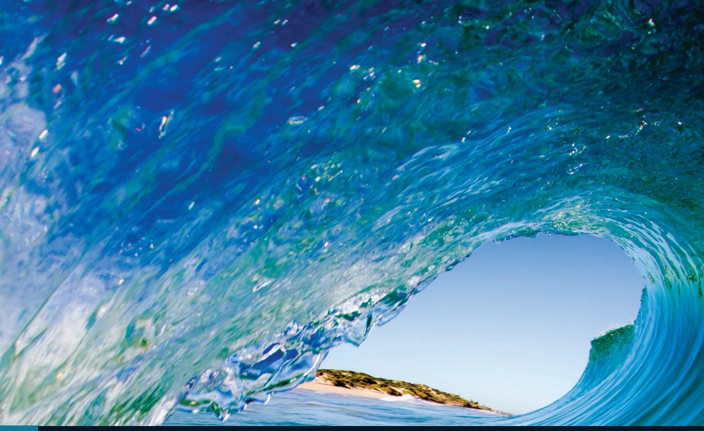
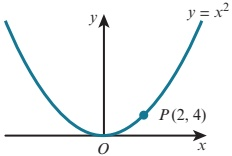
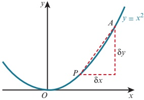
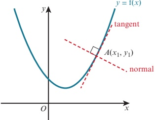
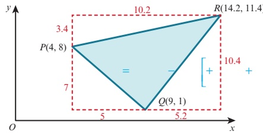
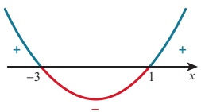
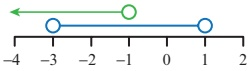
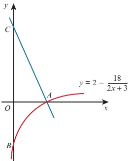
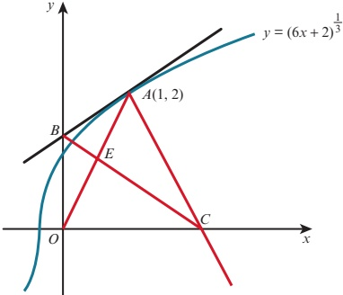

# 7 Differentiation

<!-- Cambridge International AS A Level Mathematics Pure Mathematics 1.pdf p202-222 -->

<!-- page 202 -->

# Chapter 7 Differentiation

## In this chapter you will learn how to:

understand that the gradient of a curve at a point is the limit of the gradients of a suitable sequence of chords

use the notations  $ f'(x) $,  $ f''(x) $,  $ \frac{dy}{dx} $ and  $ \frac{d^2y}{dx^2} $ for the first and second derivatives

use the derivative of  $ x^{n} $ (for any rational n), together with constant multiples, sums, differences of functions, and of composite functions using the chain rule

apply differentiation to gradients, tangents and normals.

<!-- page 203 -->

PREREQUISITE KNOWLEDGE

<table border=1 style='margin: auto; word-wrap: break-word;'><tr><td style='text-align: center; word-wrap: break-word;'>Where it comes from</td><td style='text-align: center; word-wrap: break-word;'>What you should be able to do</td><td style='text-align: center; word-wrap: break-word;'>Check your skills</td></tr><tr><td style='text-align: center; word-wrap: break-word;'>IGCSE / O Level Mathematics</td><td style='text-align: center; word-wrap: break-word;'>Use the rules of indices to simplify expressions to the form  $ ax^{n} $.</td><td style='text-align: center; word-wrap: break-word;'>1 Write in the form  $ ax^{n} $:\na  $ 3x\sqrt{x} $\nb  $ 5\sqrt[3]{x^{2}} $\nc  $ \frac{x}{2\sqrt{x}} $\nd  $ \frac{1}{2x} $\ne  $ \frac{3}{x^{2}} $\nf  $ -\frac{2x^{2}}{5\sqrt[3]{x}} $</td></tr><tr><td style='text-align: center; word-wrap: break-word;'>IGCSE / O Level Mathematics</td><td style='text-align: center; word-wrap: break-word;'>Write  $ \frac{k}{(ax+b)^{n}} $ in the form  $ k(ax+b)^{-n} $.</td><td style='text-align: center; word-wrap: break-word;'>2 Write in the form  $ k(ax+b)^{-n} $:\na  $ \frac{4}{(x-2)^{3}} $\nb  $ \frac{2}{(3x+1)^{5}} $</td></tr><tr><td style='text-align: center; word-wrap: break-word;'>Chapter 3</td><td style='text-align: center; word-wrap: break-word;'>Find the gradient of a perpendicular line.</td><td style='text-align: center; word-wrap: break-word;'>3 The gradient of a line is  $ \frac{2}{3} $.\nWrite down the gradient of a line that is perpendicular to it.</td></tr><tr><td style='text-align: center; word-wrap: break-word;'>Chapter 3</td><td style='text-align: center; word-wrap: break-word;'>Find the equation of a line with a given gradient and a given point on the line.</td><td style='text-align: center; word-wrap: break-word;'>4 Find the equation of the line with gradient 2 that passes through the point (2, 5).</td></tr></table>

## Why do we study differentiation?

Calculus is the mathematical study of change. Calculus has two basic tools, differentiation and integration, and it has widespread uses in science, medicine, engineering and economics. A few examples where calculus is used are:

designing effective aircraft wings

the study of radioactive decay

the study of population change

modelling the financial world.

In this chapter you will be studying the first of the two basic tools of calculus. You will learn the rules of differentiation and how to apply these to problems involving gradients, tangents and normals. In Chapter 8 you will then learn how to apply these rules of differentiation to more practical problems.

### 7.1 Derivatives and gradient functions

At IGCSE / O Level you learnt how to estimate the gradient of a curve at a point by drawing a suitable tangent and then calculating the gradient of the tangent. This method only gives an approximate answer (because of the inaccuracy of drawing the tangent) and it is also very time consuming.

In this chapter you will learn a method for finding the exact gradient of the graph of a function (which does not involve drawing the graph). This exact method is called differentiation.

## WEB LINK

Try the Calculus resources on the Underground Mathematics website.

<!-- page 204 -->

### EXPLORE 7.1

Consider the quadratic function  $ y = x^2 $ and a point  $ P(x, x^2) $ on the curve.

1 Let P be the point (2, 4).

The points  $ A(2.2, 4.84) $,  $ B(2.1, 4.41) $ and  $ C(2.01, 4.0401) $ also lie on the curve and are close to the point  $ P(2, 4) $.

a Calculate the gradient of:

i the chord PA

ii the chord PB

iii the chord PC.

b Discuss your results with those of your classmates and make suggestions as to what is happening.

c Suggest a value for the gradient of the curve  $ y = x^{2} $ at the point (2, 4).

2 Let P be the point (3, 9).

The points  $ A(3.2, 10.24) $,  $ B(3.1, 9.61) $ and  $ C(3.01, 9.0601) $ also lie on the curve and are close to the point  $ P(3, 9) $.

a Calculate the gradient of:

i the chord PA

ii the chord PB

iii the chord PC.

b Discuss your results with those of your classmates and make suggestions as to what is happening.

c Suggest a value for the gradient of the curve  $ y = x^{2} $ at the point (3, 9).

3 Use a spreadsheet to investigate the value of the gradient at other points on the curve  $ y = x^{2} $.

4 Can you suggest a general formula for the gradient of the curve  $ y = x^{2} $ at the point  $ (a, a^{2}) $? What would be the gradient at  $ (x, x^{2}) $?

The general formula for the gradient of the curve  $ y = x^2 $ at the point  $ (x, x^2) $ can be proved algebraically.

Take a point  $ P(x, y) $ on the curve  $ y = x^{2} $ and a point A that is close to the point P.

## WEB LINK

The coordinates of $A$ are $(x + \delta x, y + \delta y)$, where $\delta x$ is a small increase in the value of $x$ and $\delta y$ is the corresponding small increase in the value of $y$.

There are other ways of thinking about the gradient of a curve. Try the following resources on the Underground Mathematics website Zooming in and Mapping a derivative.

<!-- page 205 -->

We can also write the coordinates of P and A as  $ (x, x^2) $ and  $ \left(x + \delta x, \left(x + \delta x\right)^2\right) $.

 $$ \begin{aligned}PA&=\frac{y_{2}-y_{1}}{x_{2}-x_{1}}\\&=\frac{\left(x+\delta x\right)^{2}-x^{2}}{\left(x+\delta x\right)-x}\\&=\frac{x^{2}+2x\delta x+\left(\delta x\right)^{2}-x^{2}}{\delta x}\\&=\frac{2x\delta x+\left(\delta x\right)^{2}}{\delta x}\\&=2x+\delta x\end{aligned} $$ 

As  $ \delta x $ tends towards 0, A tends to P and the gradient of the chord PA tends to a value. We call this value the gradient of the curve at P.

In this case, therefore, the gradient of the curve at P is 2x.

This process of finding the gradient of a curve at any point is called differentiation.

Later in this chapter, you will learn some rules for differentiating functions without having to calculate the gradients of chords as we have done here. The process of calculating gradients using the limit of gradients of chords is sometimes called differentiation from first principles.

## Notation

There are three different notations that are used to describe the previous rule.

1. If  $ y = x^{2} $, then  $ \frac{dy}{dx} = 2x $.

2. If  $ f(x) = x^{2} $, then  $ f'(x) = 2x $.

3.  $ \frac{d}{dx}(x^{2})=2x $

If y is a function of x, then  $ \frac{dy}{dx} $ is called the derivative of y with respect to x.

Likewise  $ f'(x) $ is called the derivative of  $ f(x) $.

If  $ y = f(x) $ is the graph of a function, then  $ \frac{dy}{dx} $ or  $ f'(x) $ is sometimes also called the gradient function of this curve.

 $ \frac{\mathrm{d}}{\mathrm{d}x}\left(x^{2}\right)=2x $ means if we differentiate  $ x^{2} $ with respect to x, the result is  $ 2x' $.

You do not need to be able to differentiate from first principles but you are expected to understand that the gradient of a curve at a point is the limit of a suitable sequence of chords.

## TIP

We use the Greek symbol delta,  $ \delta $, to denote a very small change in a quantity.

## DID YOU KNOW?

Gottfried Wilhelm

Leibniz and Isaac

Newton are both

credited with

developing the modern

calculus that we

use today. Leibniz's

notation for derivatives

was $\frac{dy}{dx}$. Newton's

notation for $\frac{dy}{dx}$

was $y$. The notation

$f'(x)$ is known as

Lagrange's notation.

### EXPLORE 7.2

1 Use a spreadsheet to investigate the gradient of the curve  $ y = x^{3} $.

2 Can you suggest a general formula for the gradient of the curve  $ y = x^{3} $ at the point  $ (x, x^{3}) $?

3 Differentiate  $ y = x^{3} $ from first principles to confirm your answer to question 2.

<!-- page 206 -->

## Differentiation of power functions

We now know that  $ \frac{\mathrm{d}}{\mathrm{d}x}\left(x^{2}\right)=2x $ and that  $ \frac{\mathrm{d}}{\mathrm{d}x}\left(x^{3}\right)=3x^{2} $.

Investigating the gradient of the curves  $ y = x^4 $,  $ y = x^5 $ and  $ y = x^6 $ would give the results:

 $$ \frac{\mathrm{d}}{\mathrm{d}x}\left(x^{4}\right)=4x^{3}\quad\frac{\mathrm{d}}{\mathrm{d}x}\left(x^{5}\right)=5x^{4}\quad\frac{\mathrm{d}}{\mathrm{d}x}\left(x^{6}\right)=6x^{5} $$ 

This leads to the general rule for differentiating power functions:

### KEY POINT 7.1

 $$ \frac{\mathrm{d}}{\mathrm{d}x}\left(x^{n}\right)=nx^{n-1} $$ 

This is true for any real power n, not only for positive integer values of n.

You may find it easier to remember this rule as:

‘Multiply by the power n and then subtract one from the power.’

So for the earlier example where y = x^{2}.

 $$ \begin{aligned}\frac{\mathrm{d}y}{\mathrm{d}x}&=2\times x^{2-1}\\&=2x^{1}\\&=2x\end{aligned} $$ 

### WORKED EXAMPLE 7.1

Find the derivative of each of the following.

c f(x) =  $ \sqrt{x} $ d y = 2

Answer

a  $ \frac{\mathrm{d}}{\mathrm{d}x}(x^{7})=7x^{7-1} $ Multiply by the power 7 and then subtract one from the power.

 $ =7x^{6} $

$$

\begin{aligned}

b & \frac{\mathrm{d}}{\mathrm{d}x} \left( \frac{1}{x^2} \right) = \frac{\mathrm{d}}{\mathrm{d}x} (x^{-2}) & \quad \cdots \cdots \quad \text{Write } \frac{1}{x^2} \text{ as } x^{-2}. \\

& = -2x^{-2-1} & \quad \cdots \cdots \quad \text{Multiply by the power -2 and then subtract one from the power.} \\

& = -2x^{-3} \\

& = -\frac{2}{x^3}

\end{aligned}

$$

 $ f(x) = \sqrt{x} $

Write  $ \sqrt{x} $ as  $ x^{\frac{1}{2}} $.

 $ f(x) = x^{\frac{1}{2}} $

Multiply by the power  $ \frac{1}{2} $ and then subtract one from the power.

 $$ \begin{aligned}f^{\prime}(x)&=\frac{1}{2}x^{\frac{1}{2}-1}\\&=\frac{1}{2}x^{-\frac{1}{2}}\\&=\frac{1}{2\sqrt{x}}\end{aligned} $$

<!-- page 207 -->

d  $ y = 2 $ Write 2 as  $ 2x^{0} $.

 $ y = 2x^{0} $ Multiply by the power and then subtract one from the power.

 $ \frac{dy}{dx}=0x^{0-1} $

## TIP

It is worth remembering that when you differentiate a constant, the answer is always 0.

You need to know and be able to use the following two rules.

## Scalar multiple rule

If k is a constant and  $ f(x) $ is a function then:

### KEY POINT 7.2

 $$ \frac{\mathrm{d}}{\mathrm{d}x}\left[k\mathrm{f}(x)\right]=k\frac{\mathrm{d}}{\mathrm{d}x}\left[\mathrm{f}(x)\right] $$ 

## Addition/subtraction rule

If  $ f(x) $ and  $ g(x) $ are functions then

### KEY POINT 7.3

 $$ \frac{\mathrm{d}}{\mathrm{d}x}\left[\mathrm{f}(x)\pm\mathrm{g}(x)\right]=\frac{\mathrm{d}}{\mathrm{d}x}\left[\mathrm{f}(x)\right]\pm\frac{\mathrm{d}}{\mathrm{d}x}\left[\mathrm{g}(x)\right] $$ 

### WORKED EXAMPLE 7.2

Differentiate  $ 3x^{4}-\frac{1}{2x^{2}}+\frac{4}{\sqrt{x}}+5 $ with respect to x.

 $$ \begin{array}{c} Answer\\\frac{\mathrm{d}}{\mathrm{d}}\left(3\ 4-\frac{1}{2\ 2}+\frac{4}{\sqrt{\cdot}}+5\right)\begin{cases}\equiv\\ \equiv\\ \frac{\mathrm{d}}{\mathrm{d}}\end{cases}\begin{pmatrix}+-&-&+&1-&+&+&+&+&+&+\\ &-&&+&+&+&+&+&+&+&+\\ 3\ 4&\frac{1}{2}&&2&4&\frac{1}{2}&5\ 0\end{pmatrix}\end{array} $$ 

 $$ 3\frac{\mathrm{d}}{\mathrm{d}}(\quad4)\quad\frac{1}{2}\frac{\mathrm{d}}{\mathrm{d}}(\quad2)\quad4\frac{\mathrm{d}}{\mathrm{d}}\quad\frac{\frac{1}{2}}{}5\frac{\mathrm{d}}{\mathrm{d}}(\quad0) $$ 

 $$ 3(4^{3})\quad\frac{1}{2}(2^{3})\quad4\quad\frac{1}{2}x^{\frac{3}{2}}\quad5(0x^{1}) $$ 

 $$ 12x^{3}\quad x\ ^{3}\quad2x\ \frac{3}{2} $$ 

 $$ 12x^{3}\quad\frac{1}{x^{3}}\quad\frac{2}{\sqrt{x^{3}}} $$

<!-- page 208 -->

### WORKED EXAMPLE 7.3

Find the gradient of the tangent to the curve  $ y = x(2x - 1)(x + 3) $ at the point  $ (1, 4) $.

Answer

 $ y = x(2x - 1)(x + 3) $  $ \cdots $ Expand brackets and simplify.

 $ y = 2x^3 + 5x^2 - 3x $

 $ \frac{dy}{dx} = 6x^2 + 10x - 3 $

When  $ x = 1 $,  $ \frac{dy}{dx} = 6(1)^2 + 10(1) - 3 $

= 13

Gradient of curve at  $ (1, 4) $ is 13.

WORKED EXAMPLE 7.4

The curve  $ y = ax^4 + bx^2 + x $ has gradient 3 when  $ x = 1 $ and gradient -51 when  $ x = -2 $.

Find the value of  $ a $ and the value of  $ b $.

Answer

 $ y = ax^4 + bx^2 + x $

 $ \frac{dy}{dx} = 4ax^3 + 2bx + 1 $

Since  $ \frac{dy}{dx} = 3 $ when  $ x = 1 $:

 $ 4a(1)^3 + 2b(1) + 1 = 3 $

 $ 4a + 2b = 2 $

 $ 2a + b = 1 $  $ \cdots $ (1)

Since  $ \frac{dy}{dx} = -51 $ when  $ x = -2 $:

 $ 4a(-2)^3 + 2b(-2) + 1 = -51 $

 $ -32a - 4b = -52 $

 $ 8a + b = 13 $  $ \cdots $ (2)

(2) - (1) gives  $ 6a = 12 $

 $ \therefore a = 2 $

Substitute  $ a = 2 $ into (1):  $ 4 + b = 1 $

 $ \therefore b = -3 $

<!-- page 209 -->

1 The points  $ A(0,0) $,  $ B(0.5,0.75) $,  $ C(0.8,1.44) $,  $ D(0.95,1.8525) $,  $ E(0.99,1.9701) $ and  $ F(1,2) $ lie on the curve y = f(x).

a Copy and complete the table to show the gradients of the chords CF, DF and EF.

<table border=1 style='margin: auto; word-wrap: break-word;'><tr><td style='text-align: center; word-wrap: break-word;'>Chord</td><td style='text-align: center; word-wrap: break-word;'>AF</td><td style='text-align: center; word-wrap: break-word;'>BF</td><td style='text-align: center; word-wrap: break-word;'>CF</td><td style='text-align: center; word-wrap: break-word;'>DF</td><td style='text-align: center; word-wrap: break-word;'>EF</td></tr><tr><td style='text-align: center; word-wrap: break-word;'>Gradient</td><td style='text-align: center; word-wrap: break-word;'>2</td><td style='text-align: center; word-wrap: break-word;'>2.5</td><td style='text-align: center; word-wrap: break-word;'></td><td style='text-align: center; word-wrap: break-word;'></td><td style='text-align: center; word-wrap: break-word;'></td></tr></table>

b Use the values in the table to predict the value of  $ \frac{dy}{dx} $ when x = 1.

2 By considering the gradient of a suitable sequence of chords, find a value for the gradient of the curve at the given point.

a

 $$ y=x^{4}at(1,1) $$ 

b

 $$ y=x^{2}-2x+3at(0,3) $$ 

C

 $$ y=2\sqrt{x}\ at(4,4) $$ 

d

 $$ y=\frac{12}{x} $$ 

3 Differentiate with respect to x:

a

 $$ x^{5} $$ 

 $$ \textbf{b}\quad x^{9} $$ 

 $$ x^{-4} $$ 

 $$ \frac{1}{x} $$ 

e 8

 $$ \text{f}\quad\sqrt[3]{x^{2}} $$ 

g

 $$ x^{3}\times x^{2} $$ 

h

 $$ \frac{x^{5}}{x^{2}} $$ 

4 Find  $ f'(x) $ for each of the following.

a

 $$  f(x)=2x^{4} $$ 

 $$ \mathbf{b}\quad f(x)=3x^{5} $$ 

 $$  f(x)=\frac{x^{6}}{2} $$ 

 $$  f(x)=\frac{3}{x} $$ 

 $$  f(x)=\frac{5}{3x^{2}} $$ 

 $$  f(x)=-2 $$ 

 $$  f(x)=\frac{4x}{\sqrt{x}} $$ 

 $$  f(x)=\frac{2x\sqrt{x}}{3x^{3}} $$ 

5 Find  $ \frac{dy}{dx} $ for each of the following.

a

 $$ y=5x^{2}-x+1 $$ 

 $$ y=2x^{3}+8x-4 $$ 

 $$ \begin{array}{l} \text{c} \quad y=7-3x+5x^{2} \end{array} $$ 

d

 $$ y=(x+5)(x-4) $$ 

 $$ y=\left(2x^{2}-3\right)^{2} $$ 

 $$ y=\frac{2x-5}{x^{2}} $$ 

g

 $$ y=7x^{2}-\frac{3}{x}+\frac{2}{x^{2}} $$ 

 $$ y=3x+\frac{5}{x}-\frac{1}{2\sqrt{x}} $$ 

 $$ y=\frac{4x^{2}+3x-2}{\sqrt{x}} $$ 

6 Find the value of  $ \frac{dy}{dx} $ for each curve at the given point.

a  $ y = x^{2} + x - 4 $ at the point  $ (1, -2) $

b  $ y = 5 - \frac{2}{x} $ at the point (2, 4)

c  $ y = \frac{3x - 2}{x^{2}} $ at the point  $ (-2, -2) $

7 Find the gradient of the curve  $ y = (2x - 5)(x + 4) $ at the point  $ (3, 7) $.

8 Given that xy = 12, find the value of  $ \frac{\mathrm{d}y}{\mathrm{d}x} $ when x = 2.

9 Find the gradient of the curve  $ y = 5x^{2} - 8x + 3 $ at the point where the curve crosses the y-axis.

<!-- page 210 -->

10 Find the coordinates of the points on the curve  $ y = x^{3} - 3x - 8 $ where the gradient is 9.

11 Find the gradient of the curve  $ y = \frac{5x - 10}{x^2} $ at the point where the curve crosses the x-axis.

12 The curve  $ y = x^{2} - 4x - 5 $ and the line y = 1 - 3x meet at the points A and B.

a Find the coordinates of the points A and B.

b Find the gradient of the curve at each of the points A and B.

13 The gradient of the curve  $ y = ax^2 + bx $ at the point  $ (3, -3) $ is 5. Find the value of  $ a $ and the value of  $ b $.

14 The gradient of the curve  $ y = x^{3} + ax^{2} + bx + 7 $ at the point  $ (1, 5) $ is -5. Find the value of a and the value of b.

15 The curve  $ y = ax + \frac{b}{x^2} $ has gradient 16 when x = 1 and gradient -8 when x = -1. Find the value of a and the value of b.

16 Given that the gradient of the curve  $ y = x^3 + ax^2 + bx + 3 $ is zero when  $ x = 1 $ and when  $ x = 6 $, find the value of  $ a $ and the value of  $ b $.

17 Given that  $ y = 2x^3 - 3x^2 - 36x + 5 $, find the range of values of  $ x $ for which  $ \frac{dy}{dx} < 0 $.

18 Given that  $ y = 4x^{3} + 3x^{2} - 6x - 9 $, find the range of values of x for which  $ \frac{\mathrm{d}y}{\mathrm{d}x} \geqslant 0 $.

19 A curve has equation  $ y = 3x^{3} + 6x^{2} + 4x - 5 $. Show that the gradient of the curve is never negative.

## WEB LINK

Try the following resources on the Underground Mathematics website:

### 7.2 The chain rule

• Slippery slopes

To differentiate  $ y = (3x - 2)^7 $, we could expand the brackets and then differentiate each term separately. This would take a long time to do. There is a more efficient method available that allows us to find the derivative without expanding.

• Gradient match.

Let u = 3x - 2, then  $  y = (3x - 2)^7  $ becomes  $  y = u^7  $.

This means that $y$ has changed from a function in terms of $x$ to a function in terms of $u$. We can find the derivative of the composite function $y = (3x - 2)^7$ using the chain rule:

### KEY POINT 7.4

 $$ \frac{\mathrm{d}y}{\mathrm{d}x}=\frac{\mathrm{d}y}{\mathrm{d}}\times\frac{\mathrm{d}}{\mathrm{d}} $$ 

## WEB LINK

Try the Chain mapping resource on the Underground Mathematics website.

<!-- page 211 -->

Find the derivative of  $  y = (3x - 2)^7  $.

## Answer

Let

 $$ y=\left(3x-2\right)^{7} $$ 

 $$ u=3x-2 $$ 

 $$ y=u^{7} $$ 

 $$ \frac{\mathrm{d}u}{\mathrm{d}x}=3\qquad\qquad and\qquad\quad\frac{\mathrm{d}y}{\mathrm{d}u}=7u^{6} $$ 

 $$ \begin{aligned}\frac{\mathrm{d}y}{\mathrm{d}x}&=\frac{\mathrm{d}y}{\mathrm{d}u}\times\frac{\mathrm{d}u}{\mathrm{d}x}\\&=7u^{6}\times3\\&=7(3x-2)^{6}\times3\\&=21(3x-2)^{6}\end{aligned} $$ 

Use the chain rule.

With practice you will be able to do this mentally.

Consider the ‘inside’ of  $ (3x - 2)^7 $ to be 3x - 2.

To differentiate $(3x-2)^{7}$:

Step 1: Differentiate the 'outside':  $ 7(3x - 2)^{6} $

Step 2: Differentiate the 'inside': ___ 3

Step 3: Multiply these two expressions:  $ 21(3x - 2)^{6} $

### WORKED EXAMPLE 7.6

Find the derivative of  $  y = \frac{2}{(3x^2 + 1)^5}  $.

Answer ___ 2 ___ 5

 $$ y=\frac{2}{(3x\ +1)} $$ 

Let

 $$ y=2u^{-5} $$ 

 $$ \frac{\mathrm{d}u}{\mathrm{d}x}=6x\quad\begin{array}{l}\mathrm{d}u\\ \mathrm{d}u\end{array}\quad\mathrm{d}x\quad\mathrm{a n d}\quad\frac{\mathrm{d}y}{\mathrm{d}u}=-10u^{-6} $$ 

Use the chain rule.

 $$ \begin{array}{l}\frac{\mathrm{d}y}{\mathrm{d}x}=\frac{\mathrm{d}\mathfrak{j}_{0}u}{10(3x-1)}\quad6x\\ =-\quad\frac{-6}{60x}\\ =-\left(3x^{2}\dagger\right)^{-6}\times\\ =-\frac{2}{2+6}\end{array} $$

<!-- page 212 -->

Alternatively, to differentiate the expression mentally:

Write  $ \frac{2}{(3x^{2}+1)^{5}} $ as  $ 2(3x^{2}+1)^{-5} $.

Step 1: Differentiate the 'outside':  $ -10(3x^{2}+1)^{-6} $

Step 2: Differentiate the ‘inside’: 6x

Step 3: Multiply the two expressions:  $ -60x(3x^{2}+1)^{-6}=-\frac{60x}{(3x^{2}+1)^{6}} $

### WORKED EXAMPLE 7.7

The curve  $ y = \sqrt{ax + b} $ passes through the point (12, 4) and has gradient  $ \frac{1}{4} $ at this point. Find the value of a and the value of b.

## Answer

 $$ y=\sqrt{ax+b} $$ 

Substitute x = 12 and y = 4.

 $$ 4=\sqrt{12a+b}\cdots\cdots\cdots\cdots(1) $$ 

 $$ y=(ax+b)^{\frac{1}{2}} $$ 

Let u = ax + b

Write  $ \sqrt{ax + b} $ in the form  $ (ax + b)^{\frac{1}{2}} $.

 $$ y=u^{\frac{1}{2}} $$ 

 $$ \frac{\mathrm{d}u}{\mathrm{d}x}=a $$ 

and

 $$ \frac{\mathrm{d}y}{\mathrm{d}u}=\frac{1}{2}u^{-\frac{1}{2}} $$ 

 $$ \begin{aligned}\frac{\mathrm{d}y}{\mathrm{d}x}&=\frac{\mathrm{d}y}{\mathrm{d}u}\times_{1}\frac{\mathrm{d}u}{\mathrm{d}x}\\&=\frac{1}{2}u\stackrel{--}{\times}a\end{aligned} $$ 

Use the chain rule.

 $$ \begin{aligned}\frac{\mathrm{d}y}{\mathrm{d}x}&=\frac{a}{2\sqrt{ax+b}}\\\frac{1}{2}&=\frac{a}{\sqrt{2}\quad a+b}\end{aligned} $$ 

Substitute $x=12$ and $\frac{\mathrm{d}y}{\mathrm{d}x}=\frac{1}{4}$.

 $$ a=\sqrt{a+b}\cdots\cdots\cdots\cdots(2) $$ 

(1) and (2) give 2a = 4

 $$ a=2 $$ 

Substituting $a=2$ into (1) gives:

 $$ \begin{aligned}4&=\sqrt{24+b}\\16&=24+b\\b&=-8\\\therefore a&=2,\quad b=-8\end{aligned} $$

<!-- page 213 -->

1 Differentiate with respect to x:

 $$ (x+4)^{6} $$ 

c (3-4x)^{5}

 $$ (2x+3)^{8} $$ 

d  $ \left( \frac{1}{2} x + 1 \right)^9 $

 $$ \frac{(5x-2)^{8}}{4} $$ 

5(2x-1)^{5}

g  $ 2(4-7x)^{4} $

$$\mathrm{h} \quad \frac{1}{5} (3x-1)_{1}^{7}$$

 $$ (2-x^{2})^{8} $$ 

 $$ (x^{2}+4x)^{3} $$ 

1  $ \left(x^{2}-\frac{5}{x}\right)^{5} $

 $$ \frac{1}{x+2} $$ 

 $$ \frac{3}{x-5} $$ 

 $$ \frac{8}{3-2x} $$ 

 e  $ \frac{4}{(3x+1)^{6}} $

 $$ \frac{16}{x^{2}+2} $$ 

 $$ \frac{3}{2(3x+1)^{5}} $$ 

$\frac{8}{x^{2}+2x}$

 $$ \mathrm{h}\quad\frac{7}{(2x^{2}-5x)^{7}} $$ 

3 Differentiate with respect to x:

 $$ \sqrt{x-5} $$ 

 $$ \sqrt{2x+3} $$ 

 $$ \sqrt{2x^{2}-1} $$ 

 $$ \sqrt{x^{3}-5x} $$ 

 $$ \sqrt[3]{5}-2x $$ 

 $$ 2\sqrt{3x+1} $$ 

 $$ \frac{1}{\sqrt{2x-5}} $$ 

 $$ \frac{6}{\sqrt[3]{2-3x}} $$ 

4 Find the gradient of the curve  $ y = (2x - 3)^{5} $ at the point  $ (2, 1) $.

5 Find the gradient of the curve  $ y = \frac{6}{(x-1)^2} $ at the point where the curve crosses the y-axis.

6 Find the gradient of the curve  $ y = x - \frac{3}{x + 2} $ at the points where the curve crosses the x-axis.

7 Find the coordinates of the point on the curve  $ y = \sqrt{(x^2 - 10x + 26)} $ where the gradient is 0.

8 The curve  $ y = \frac{a}{bx - 1} $ passes through the point (2, 1) and has gradient  $ -\frac{3}{5} $ at this point. Find the value of a and the value of b.

### 7.3 Tangents and normals

The line perpendicular to the tangent at the point $A$ is called the normal at $A$. If the value of $\frac{dy}{dx}$ at the point $A(x_1, y_1)$ is $m$, then the equation of the tangent at $A$ is given by:

### KEY POINT 7.5

 $$ y-y_{1}=m(x-x_{1}) $$ 

## TIP

We use the numerical form for m in this formula (not the derivative formula).

<!-- page 214 -->

The normal at the point $(x_{1}, y_{1})$ is perpendicular to the tangent, so the gradient of the normal is $-\frac{1}{m}$ and the equation of the normal is given by:

### KEY POINT 7.6

 $$ y-y_{1}=-\frac{1}{m}\left(x-x_{1}\right) $$ 

This formula only makes sense when  $ m \neq 0 $. If m = 0, it means that the tangent is horizontal and the normal is vertical, so it has equation  $ x = x_1 $ instead.

### WORKED EXAMPLE 7.8

Find the equation of the tangent and the normal to the curve  $ y = 2x^2 + \frac{8}{x^2} - 9 $ at the point where  $ x = 2 $.

Answer

 $$ y=2x^{2}+8x^{-2}-9 $$ 

 $$ \frac{\mathrm{d}y}{\mathrm{d}x}=4x-16x^{-3} $$ 

When  $ x=2 $,  $ y=2(2)^{2}+8(2)^{-2}-9=1 $

 $$  and\frac{d y}{d x}=4(2)-16(2)^{-3}=6 $$ 

Tangent: passes through the point (2, 1) and gradient = 6

 $$ y-1=6(x-2) $$ 

 $$ y=6x-11 $$ 

Normal: passes through the point  $ (2, 1) $ and gradient =  $ -\frac{1}{6} $

 $$ y-1=-\frac{1}{6}\left(x-2\right) $$ 

 $$ x+6y=8 $$ 

### WORKED EXAMPLE 7.9

A curve has equation  $  y = \left( 4 - \sqrt{x} \right)^3  $.

The normal at the point  $ P(4, 8) $ and the normal at the point  $ Q(9, 1) $ intersect at the point R.

a Find the coordinates of R.

b Find the area of triangle  $ PQR $.

Answer

 $$ y 纖 4 纖 x $$ 

a

 $$ \mathrm{d}y=\left(3\pm\sqrt{x}\right)^{3}\qquad\frac{1}{2}x^{-}\quad\bigj=-\frac{3\cdot4-x}{2\cdot x}. $$ 

When $x=4$, $\frac{\mathrm{d}y}{\mathrm{d}x}=-\left(\sqrt{3}4\sqrt{4}\right)^{2}\left(-\frac{1}{2}\right)$  $\frac{\left(\sqrt{3}\sqrt{4}\right)^{2}}{\sqrt{3}}=\frac{4}{3}$

 $$ \mathrm{When}\quad x=9,\quad\frac{\mathrm{dy}}{\mathrm{dx}}=-\frac{3\left(4-\sqrt{9}\right)^{2}}{2\sqrt{9}}=-\frac{1}{2} $$

<!-- page 215 -->

Normal at P: passes through the point (4, 8) and gradient =  $ \frac{1}{3} $

 $$ y-8=\frac{1}{3}\left(x-4\right) $$ 

 $$ 3y=x+20\ \cdots\cdots\cdots(1) $$ 

Normal at Q: passes through the point  $ (9,1) $ and gradient = 2

 $$ y-1=2(x-9) $$ 

 $$ y=2x-17\ \cdots\cdots(2) $$ 

Solving equations (1) and (2) gives:

 $$ 3(2x-17)=x+20 $$ 

 $$ x=14.2 $$ 

When x = 14.2, y = 2(14.2) - 17 = 11.4

Hence, R is the point (14.2, 11.4).

 $$ \begin{aligned}Area~of~triangle\ PQR&=area~of~rectangle-sum~of~areas~of~outside~triangles\\&=10.2\times10.4-\left(\frac{1}{2}\times5\times7\begin{cases}\frac{1}{2}&,\frac{1}{2}\quad5.2\quad10.4\\\frac{1}{2}&,\frac{1}{2}\quad10.2\quad3.4\end{cases}\right.\\&\quad106.08\quad\begin{bmatrix}17.5&27.04&17.34\end{bmatrix}\\&=44.2units^{2}\end{aligned} $$ 

## EXERCISE 7C

1 Find the equation of the tangent to each curve at the given point.

a  $ y = x^{2} - 3x + 2 $ at the point  $ (3, 2) $

b  $ y = (2x - 5)^{4} $ at the point  $ (2, 1) $

 $$ \begin{array}{r l}{\textbf{c}}&{y=\frac{x^{3}-5}{x}\mathrm{~a t~t h e~p o i n t~}(-1,6)}\end{array} $$ 

d  $ y = 2\sqrt{x - 5} $ at the point (9, 4)

2 Find the equation of the normal to each curve at the given point.

a  $ y = 3x^{3} + x^{2} - 4x + 1 $ at the point  $ (0, 1) $

 $ \mathbf{b}\quad y=\frac{3}{\sqrt[3]{x+1}} $ at the point  $ (-2,-3) $

c  $ y = (5 - 2x)^{3} $ at the point  $ (3, -1) $

d  $ y = \frac{20}{x^{2} + 1} $ at the point (3, 2)

<!-- page 216 -->

3 A curve passes through the point  $ A\left(\begin{array}{c}2,1\\ -\end{array}\right) $ and has equation  $ y=\frac{8}{(x+2)^2} $.

a Find the equation of the tangent to the curve at the point A.

b Find the equation of the normal to the curve at the point A.

4 The equation of a curve is y = 5 - 3x - 2x^{2}.

a Show that the equation of the normal to the curve at the point  $ (-2, 3) $ is  $ x + 5y = 13 $.

b Find the coordinates of the point at which the normal meets the curve again.

5 The normal to the curve  $ y = x^{3} - 5x + 3 $ at the point  $ (-1, 7) $ intersects the y-axis at the point P.

Find the coordinates of P.

6 The tangents to the curve $y = 5 - 3x - x^{2}$ at the points $(-1, 7)$ and $(-4, 1)$ meet at the point $Q$.

Find the coordinates of $Q$.

7 The normal to the curve  $ y = 4 - 2\sqrt{x} $ at the point  $ P(16, -4) $ meets the x-axis at the point Q.

a Find the equation of the normal $PQ$.

b Find the coordinates of $Q$.

8 The equation of a curve is  $ y = 2x - \frac{10}{x^2} + 8 $.

a Find  $ \frac{dy}{dx} $.

4,  $ \frac{5}{8} $ meets the

b Show that the normal to the curve at the point  $ \left(-\frac{8}{--}\right) $ y-axis at the point  $ (0,-3) $.

9 The normal to the curve  $ y = \frac{6}{\sqrt{x - 2}} $ at the point (3, 6) meets the x-axis at P and the y-axis at Q.

Find the midpoint of PQ.

10 A curve has equation  $ y = x^{5} - 8x^{3} + 16x $. The normal at the point  $ P(1, 9) $ and the tangent at the point  $ Q(-1, -9) $ intersect at the point  $ R $.

Find the coordinates of R.

11 A curve has equation  $ y = 2\left(\sqrt{x} - 1\right)^3 + 2 $. The normal at the point  $ P(4, 4) $ and the normal at the point  $ Q(9, 18) $ intersect at the point  $ R $.

a Find the coordinates of R.

b Find the area of triangle  $ PQR $.

12 A curve has equation  $ y = 3x + \frac{12}{x} $ and passes through the points  $ A(2, 12) $ and  $ B(6, 20) $. At each of the points C and D on the curve, the tangent is parallel to AB.

a Find the coordinates of the points C and D. Give your answer in exact form.

b Find the equation of the perpendicular bisector of CD.

<!-- page 217 -->

13 The curve  $ y = x(x-1)(x+2) $ crosses the x-axis at the points  $ O(0,0) $,  $ A(1,0) $ and  $ B(-2,0) $. The normals to the curve at the points A and B meet at the point C. Find the coordinates of the point C.

14 A curve has equation  $ y = \frac{5}{2 - 3x} $ and passes through the points  $ P(-1, 1) $. Find the equation of the tangent to the curve at P and find the angle that this tangent makes with the x-axis.

15 The curve  $ y = \frac{12}{2x - 3} - 4 $ intersects the x-axis at P. The tangent to the curve at P intersects the y-axis at Q. Find the distance  $ PQ $.

16 The normal to the curve  $ y = 2x^{2} + kx - 3 $ at the point  $ (3, -6) $ is parallel to the line  $ x + 5y = 10 $.

a Find the value of k.

b Find the coordinates of the point where the normal meets the curve again.

### 7.4 Second derivatives

If we differentiate y with respect to x we obtain  $ \frac{dy}{dx} $

Try the Tangent or normal resource on the Underground Mathematics website.

 $ \frac{dy}{dx} $ is called the first derivative of y with respect to x.

## WEB LINK

dx

If we then differentiate  $ \frac{dy}{dx} $ with respect to x we obtain  $ \frac{d}{dx}\left(\frac{dy}{dx}\right) $, which is usually written as

 $$ \frac{\mathrm{d}^{2}y}{\mathrm{d}x^{2}}. $$ 

 $ \frac{d^2y}{dx^2} $ is called the second derivative of y with respect to x.

So for  $ y = x^{3} + 5x^{2} - 3x + 2 $ or  $ \quad f(x) = x^{3} + 5x^{2} - 3x + 2 $

 $$ \frac{\mathrm{d}y}{\mathrm{d}x}=3x^{2}+10x-3\qquad\quad\text{or}\qquad\mathrm{f}^{\prime}(x)=3x^{2}+10x-3 $$ 

 $$ \frac{\mathrm{d}^{2}y}{\mathrm{d}x^{2}}=6x+10\quad or\quad f^{\prime \prime}(x)=6x+10 $$ 

### WORKED EXAMPLE 7.10

Given that  $ y = \frac{5}{(2x - 3)^3} $, find  $ \frac{\mathrm{d}^2 y}{\mathrm{d}x^2} $.

Answer

 $$ y=5(2x-3)^{-3} $$ 

 $$ \begin{aligned}\frac{\mathrm{d}y}{\mathrm{d}x}&=-15(2x-3)^{-4}\times2\\&=-30(2x-3)^{-4}\end{aligned} $$ 

Use the chain rule.

 $$ \begin{aligned}\frac{\mathrm{d}^{2}y}{\mathrm{d}x^{2}}&=120(2x-3)^{-5}\times2\\&=\frac{240}{(2x-3)^{5}}\end{aligned} $$ 

Use the chain rule.

<!-- page 218 -->

### WORKED EXAMPLE 7.11

A curve has equation  $ y = x^{3} + 3x^{2} - 9x + 2 $.

a Find the range of values of x for which  $ \frac{dy}{dx} $ and  $ \frac{d^{2}y}{dx^{2}} $ are negative.

b Show that Answer

 $$ \underline{\mathrm{d}x^{2}}\neq\left(\underline{\mathrm{d}x}\right) $$ 

a

 $$ y=x^{3}+3x^{2}-9x+2 $$ 

 $$ \frac{\mathrm{d}y}{\mathrm{d}x}=3x^{2}+6x-9 $$ 

 $$ \frac{\mathrm{d}y}{\mathrm{d}x}<0\text{when:} $$ 

 $$ 3x^{2}+6x-9<0 $$ 

 $$ x^{2}+2x-3<0 $$ 

 $$ (x+3)(x-1)<0 $$ 

 $$ -3<x<1\ \cdots\cdots\cdots\cdots(1) $$ 

 $$ \frac{\mathrm{d}^{2}y}{\mathrm{d}x^{2}}=6x+6 $$ 

 $$ \frac{\mathrm{d}^{2}y}{\mathrm{d}x^{2}}<0\text{when} $$ 

 $$ 6x+6<0 $$ 

 $$ x<-1\quad\text{(2)} $$ 

Combining (1) and (2) on a number line:

b

 $$ \begin{array}{r} \int_{3}^{1}x\ dx+\int_{1}^{1}y\ dy+\\ \frac{\mathrm{d}x}{2}=\quad+\quad\left(\frac{\mathrm{d}x}{1}\right)^{2}=(3x+x-\\ \frac{x}{2}\quad6\quad9)^{2}. \\ \text{Hence,}\quad\frac{\mathrm{d}^{2}y}{\mathrm{d}x^{2}}\neq\left(\frac{\mathrm{d}y}{\mathrm{d}x}\right)^{2}. \end{array} $$ 

## EXERCISE 7D

1 Find  $ \frac{d^{2}y}{dx^{2}} $ for each of the following functions.

a

 $$ y=x^{2}+8x-4 $$ 

b

 $$ y=5x^{3}-7x^{2}+5 $$ 

c

 $$ y=2-\frac{6}{x^{2}} $$ 

d

 $$ y=(2x-3)^{4} $$ 

e

 $$ y=\sqrt{4x-9} $$ 

f

 $$ y=\frac{2}{\sqrt{3x+1}} $$ 

g

 $$ y=\frac{2x-5}{x^{2}} $$ 

h

 $$ y=2x^{2}(5-3x+x^{2}) $$ 

i

 $$ y=\frac{5x-4}{\sqrt{x}} $$ 

2 Find  $ f''(x) $ for each of the following functions.

a

 $$  f(x)=\frac{5}{x^{2}}-\frac{3}{2x^{5}} $$ 

b

 $$  f(x)=\frac{4x^{2}-3}{2x} $$ 

 $$  f(x)=\frac{2x-3\sqrt{x}}{x^{2}} $$ 

d

 $$  f(x)=\sqrt{1-3x} $$ 

e

 $$  f(x)=x^{2}\left(\sqrt{x}-3\right) $$ 

f

 $$  f(x)=\frac{15}{\sqrt[3]{2x+1}} $$

<!-- page 219 -->

3 Given that $y = 4x - (2x - 1)^{4}$, find $\frac{\mathrm{d}y}{\mathrm{d}x}$ and $\frac{\mathrm{d}^{2}y}{\mathrm{d}x^{2}}$.

4 Given that  $ f(x) = x^{3} + 2x^{2} - 3x - 1 $, find:

a f(1) b f'(1) c f''(1)

5 Given that  $ f'(x) = \frac{3}{(2x-1)^8} $, find  $ f''(x) $.

6 Given that  $ f(x) = \frac{2}{\sqrt{1 - 2x}} $, find the value of  $ f''(-4) $.

7 A curve has equation $y = 2x^{3} - 21x^{2} + 60x + 5$. Copy and complete the table to show whether $\frac{\mathrm{d}y}{\mathrm{d}x}$ and $\frac{\mathrm{d}^{2}y}{\mathrm{d}x^{2}}$ are positive (+), negative (-) or zero (0) for the given values of $x$.

<table border=1 style='margin: auto; word-wrap: break-word;'><tr><td style='text-align: center; word-wrap: break-word;'>x</td><td style='text-align: center; word-wrap: break-word;'>0</td><td style='text-align: center; word-wrap: break-word;'>1</td><td style='text-align: center; word-wrap: break-word;'>2</td><td style='text-align: center; word-wrap: break-word;'>3</td><td style='text-align: center; word-wrap: break-word;'>4</td><td style='text-align: center; word-wrap: break-word;'>5</td><td style='text-align: center; word-wrap: break-word;'>6</td><td style='text-align: center; word-wrap: break-word;'>7</td></tr><tr><td style='text-align: center; word-wrap: break-word;'>$ \frac{dy}{dx} $</td><td style='text-align: center; word-wrap: break-word;'></td><td style='text-align: center; word-wrap: break-word;'></td><td style='text-align: center; word-wrap: break-word;'></td><td style='text-align: center; word-wrap: break-word;'></td><td style='text-align: center; word-wrap: break-word;'></td><td style='text-align: center; word-wrap: break-word;'></td><td style='text-align: center; word-wrap: break-word;'></td><td style='text-align: center; word-wrap: break-word;'></td></tr><tr><td style='text-align: center; word-wrap: break-word;'>$ \frac{d^2y}{dx^2} $</td><td style='text-align: center; word-wrap: break-word;'></td><td style='text-align: center; word-wrap: break-word;'></td><td style='text-align: center; word-wrap: break-word;'></td><td style='text-align: center; word-wrap: break-word;'></td><td style='text-align: center; word-wrap: break-word;'></td><td style='text-align: center; word-wrap: break-word;'></td><td style='text-align: center; word-wrap: break-word;'></td><td style='text-align: center; word-wrap: break-word;'></td></tr></table>

8 A curve has equation  $ y = x^{3} - 6x^{2} - 15x - 7 $. Find the range of values of x for which both  $ \frac{dy}{dx} $ and  $ \frac{d^{2}y}{dx^{2}} $ are positive.

9 Given that  $ y = x^{2} - 2x + 5 $, show that  $ 4\frac{\mathrm{d}^{2}y}{\mathrm{d}x^{2}} + (x - 1)\frac{\mathrm{d}y}{\mathrm{d}x} = 2y $.

10 Given that  $ y = 4\sqrt{x} $, show that  $ 4x^{2}\frac{\mathrm{d}^{2}y}{\mathrm{d}x^{2}}+4x\frac{\mathrm{d}y}{\mathrm{d}x}=y $.

11 A curve has equation  $ y = x^{3} + 2x^{2} - 4x + 6 $.

a Show that  $ \frac{dy}{dx}=0 $ when x=-2 and when  $ x=\frac{2}{3} $.

b Find the value of  $ \frac{d^2y}{dx^2} $ when x = -2 and when  $ x = \frac{2}{3} $.

12 A curve has equation  $ y = \frac{ax + b}{x^2} $. Given that  $ \frac{dy}{dx} = 0 $ and  $ \frac{d^2y}{dx^2} = \frac{1}{2} $ when x = 2, find the value of a and the value of b.

## WEB LINK

Try the Gradients of gradients resource on the Underground Mathematics website.

<!-- page 220 -->

## Checklist of learning and understanding

## Gradient of a curve

 $ \frac{dy}{dx} $ represents the gradient of the curve  $ y = f(x) $.

## The four rules of differentiation

Power rule:

 $$ \frac{\mathrm{d}}{\mathrm{d}x}\left(x^{n}\right)=nx^{n-1} $$ 

Scalar multiple rule:

 $$ \frac{\mathrm{d}}{\mathrm{d}x}\left[k\mathrm{f}(x)\right]=k\frac{\mathrm{d}}{\mathrm{d}x}\left[\mathrm{f}(x)\right] $$ 

● Addition/subtraction rule:  $ \frac{\mathrm{d}}{\mathrm{d}x}\left[\mathrm{f}(x) \pm \mathrm{g}(x)\right] = \frac{\mathrm{d}}{\mathrm{d}x}\left[\mathrm{f}(x)\right] \pm \frac{\mathrm{d}}{\mathrm{d}x}\left[\mathrm{g}(x)\right] $

Chain rule:

 $$ \frac{\mathrm{d}y}{\mathrm{d}x}=\frac{\mathrm{d}y}{\mathrm{d}u}\times\frac{\mathrm{d}u}{\mathrm{d}x} $$ 

## Tangents and normals

If the value of  $ \frac{dy}{dx} $ at the point  $ (x_{1}, y_{1}) $ is m, then:

the equation of the tangent at that point is given by  $ y - y_{1} = m(x - x_{1}) $

the equation of the normal at that point is given by  $ y - y_1 = -\frac{1}{m}(x - x_1) $.

Second derivatives

 $ -(-) $

<!-- page 221 -->

1 Differentiate  $ \frac{3x^3 - 7}{4x} $ with respect to  $ x $.  
  
2 Find the gradient of the curve  $ y = \frac{8}{4x - 5} $ at the point where  $ x = 2 $.  
  
3 A curve has equation  $ y = 3x^3 - 3x^2 + x - 7 $. Show that the gradient of the curve is never negative.  
  
4 The equation of a curve is  $ y = (3 - 5x)^3 - 2x $. Find  $ \frac{dy}{dx} $ and  $ \frac{d^2y}{dx^2} $.  
  
5 Find the gradient of the curve  $ y = \frac{15}{x^2 - 2x} $ at the point where  $ x = 5 $.  
  
6 The normal to the curve  $ y = 5\sqrt{x} $ at the point  $ P(4, 10) $ meets the x-axis at the point  $ Q $.  
  
a Find the equation of the normal  $ PQ $.  
  
b Find the coordinates of  $ Q $.  
  
7 The equation of a curve is  $ y = 5x + \frac{12}{x^2} $.  
  
a Find  $ \frac{dy}{dx} $.  
  
b Show that the normal to the curve at the point (2, 13) meets the x-axis at the point (28, 0).  
  
8 The normal to the curve  $ y = \frac{12}{\sqrt{x}} $ at the point (9, 4) meets the x-axis at  $ P $ and the y-axis at  $ Q $.  
  
Find the length of  $ PQ $, correct to 3 significant figures.  
  
9 The curve  $ y = x(x - 3)(x - 5) $ crosses the x-axis at the points  $ O(0, 0) $,  $ A(3, 0) $ and  $ B(5, 0) $.  
  
The tangents to the curve at the points  $ A $ and  $ B $ meet at the point  $ C $.  
  
Find the coordinates of the point  $ C $.  
  
10 A curve passes through the point  $ A(4, 2) $ and has equation  $ y = \frac{2}{(x - 3)^2} $.  
  
a Find the equation of the tangent to the curve at the point  $ A $.  
  
b Find the equation of the normal to the curve at the point  $ A $.  
  
11 A curve passes through the point  $ P(5, 1) $ and has equation  $ y = 3 - \frac{10}{x} $.  
  
a Show that the equation of the normal to the curve at the point  $ P $ is  $ 5x + 2y = 27 $.  
  
The normal meets the curve again at the point  $ Q $.  
  
b i Find the coordinates of  $ Q $.  
  
ii Find the midpoint of  $ PQ $.  
  
12 A curve has equation  $ y = 3x - \frac{4}{x} $ and passes through the points  $ A(1, -1) $ and  $ B(4, 11) $.  
  
At each of the points  $ C $ and  $ D $ on the curve, the tangent is parallel to  $ AB $. Find the equation of the perpendicular bisector of  $ CD $.

<!-- page 222 -->

The diagram shows part of the curve  $ y = 2 - \frac{18}{2x + 3} $, which crosses the x-axis at A and the y-axis at B.

The normal to the curve at A crosses the y-axis at C.

i Show that the equation of the line AC is  $ 9x + 4y = 27 $.

ii Find the length of BC.

Cambridge International AS & A Level Mathematics 9709 Paper 11 Q7 June 2010

14 The equation of a curve is  $ y = 3 + 4x - x^{2} $.

i Show that the equation of the normal to the curve at the point  $ (3, 6) $ is  $ 2y = x + 9 $.

ii Given that the normal meets the coordinate axes at points A and B, find the coordinates of the mid-point of AB. [2]

iii Find the coordinates of the point at which the normal meets the curve again.

Cambridge International AS & A Level Mathematics 9709 Paper 11 Q10 November 2010

昆15

The diagram shows the curve  $ y = (6x + 2)^{\frac{1}{3}} $ and the point  $ A(1, 2) $ which lies on the curve. The tangent to the curve at A cuts the y-axis at B and the normal to the curve at A cuts the x-axis at C.

i Find the equation of the tangent AB and the equation of the normal AC.

ii Find the distance BC.

2023

iii Find the coordinates of the point of intersection, E, of OA and BC, and determine whether E is the mid-point of OA.

