# 8 Further differentiation

<!-- Cambridge International AS A Level Mathematics Pure Mathematics 1.pdf p223-249 -->

<!-- page 223 -->

## Chapter 8 Further differentiation

## In this chapter you will learn how to:

apply differentiation to increasing and decreasing functions and rates of change

locate stationary points and determine their nature, and use information about stationary points when sketching graphs.

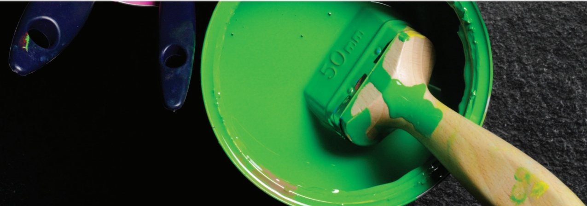

<!-- page 224 -->

## PREREQUISITE KNOWLEDGE

<table border=1 style='margin: auto; word-wrap: break-word;'><tr><td style='text-align: center; word-wrap: break-word;'>Where it comes from</td><td style='text-align: center; word-wrap: break-word;'>What you should be able to do</td><td style='text-align: center; word-wrap: break-word;'>Check your skills</td></tr><tr><td style='text-align: center; word-wrap: break-word;'>Chapter 1</td><td style='text-align: center; word-wrap: break-word;'>Solve quadratic inequalities.</td><td style='text-align: center; word-wrap: break-word;'>1 Solve:\na  $ x^{2} - 2x - 3 &gt; 0 $\nb  $ 6 + x - x^{2} &gt; 0 $</td></tr><tr><td style='text-align: center; word-wrap: break-word;'>Chapter 7</td><td style='text-align: center; word-wrap: break-word;'>Find the first and second derivatives of  $ x^{n} $.</td><td style='text-align: center; word-wrap: break-word;'>2 Find  $ \frac{dy}{dx} $ and  $ \frac{d^{2}y}{dx^{2}} $ for the following.\na  $ y = 3x^{2} - x + 2 $\nb  $ y = \frac{3}{2x^{2}} $\nc  $ y = 3x\sqrt{x} $</td></tr><tr><td style='text-align: center; word-wrap: break-word;'>Chapter 7</td><td style='text-align: center; word-wrap: break-word;'>Differentiate composite functions.</td><td style='text-align: center; word-wrap: break-word;'>3 Find  $ \frac{dy}{dx} $ for the following.\na  $ y = (2x - 1)^{5} $\nb  $ y = \frac{3}{(1 - 3x)^{2}} $</td></tr></table>

## Why do we study differentiation?

In Chapter 7, you learnt how to differentiate functions and how to use differentiation to find gradients, tangents and normals.

In this chapter you will build on this knowledge and learn how to apply differentiation to problems that involve finding when a function is increasing (or decreasing) or when a function is at a maximum (or minimum) value. You will also learn how to solve practical problems involving rates of change.

There are many situations in real life where these skills are needed. Some examples are:

manufacturers of canned food and drinks needing to minimise the cost of their manufacturing by minimising the amount of metal required to make a can for a given volume

doctors calculating the time interval when the concentration of a drug in the bloodstream is increasing

economists might use these tools to advise a company on its pricing strategy

scientists calculating the rate at which the area of an oil slick is increasing.

## FAST FORWARD

In the Mechanics Coursebook, Chapter 6 you will learn to apply these skills to problems concerning displacement, velocity and time.

## WEB LINK

Explore the Calculus meets functions station on the Underground Mathematics website.

<!-- page 225 -->

Section A: Increasing functions

Consider the graph of y = f(x).

1 Complete the following two statements about y = f(x).

'As the value of x increases the value of y\ldots

'The sign of the gradient at any point is always  $ \ldots $

2 Sketch other graphs that satisfy these statements.

These types of functions are called increasing functions.

Section B: Decreasing functions

Consider the graph of $y = g(x)$.

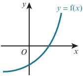

1 Complete the following two statements about $y = g(x)$.

As the value of $x$ increases the value of $y$...

The sign of the gradient at any point is always ...

2 Sketch other graphs that satisfy these statements.

These types of functions are called decreasing functions.

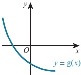

## WEB LINK

Try the Choose your families resource on the Underground Mathematics website.

### 8.1 Increasing and decreasing functions

As you probably worked out from Explore 8.1, an increasing function  $ f(x) $ is one where the  $ f(x) $ values increase whenever the x value increases. More precisely, this means that  $ f(a) < f(b) $ whenever  $ a < b $.

Likewise, a decreasing function  $ f(x) $ is one where the  $ f(x) $ values decrease whenever the x value increases, or  $ f(a) > f(b) $ whenever a < b.

Sometimes we talk about a function  $ \text{increasing} $ at a point, meaning that the function values are increasing around that point. If the gradient of the function is positive at a point, then the function is increasing there.

In the same way, we can talk about a function decreasing at a point. If the gradient of the function is negative at a point, then the function is decreasing there.

Now consider the function  $ y = h(x) $, shown on the graph.

We can divide the graph into two distinct sections:

h(x) is increasing when x > a, i.e.  $ \frac{dy}{dx} > 0 $ for x > a.

h(x) is decreasing when x < a, i.e.  $ \frac{dy}{dx} < 0 $ for x < a.

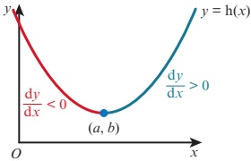

<!-- page 226 -->

### WORKED EXAMPLE 8.1

Find the set of values of x for which y = 8 - 3x - x^{2} is decreasing.
Answer
 $ y = 8 - 3x - x^{2} $
 $ \frac{\mathrm{d}y}{\mathrm{d}x} = -3 - 2x $
When  $ \frac{dy}{dx} < 0 $, y is decreasing.
-3 - 2x < 0
 $ 2x > -3 $
 $ x > -\frac{3}{2} $

### WORKED EXAMPLE 8.2

For the function  $ f(x) = 4x^3 - 15x^2 - 72x - 8 $:
a Find  $ f'(x) $.
b Find the range of values of  $ x $ for which  $ f(x) = 4x^3 - 15x^2 - 72x - 8 $ is increasing.
c Find the range of values of  $ x $ for which  $ f(x) = 4x^3 - 15x^2 - 72x - 8 $ is decreasing.

## Answer

a  $ \quad $ f(x) = 4x^{3} - 15x^{2} - 72x - 8
f'(x) = 12x^{2} - 30x - 72
b When  $ f'(x) > 0 $, f(x) is increasing.
 $ 12x^{2}-30x-72>0 $
 $ 2x^{2}-5x-12>0 $
 $ (2x+3)(x-4)>0 $
Critical values are  $ -\frac{3}{2} $ and 4.
 $ \therefore x < -\frac{3}{2} $ and  $ x > 4 $.
c When  $ f'(x) < 0 $, f(x) is decreasing.
 $ \therefore -\frac{3}{2} < x < 4 $

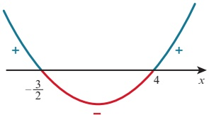

<!-- page 227 -->

A function f is defined as  $ f(x) = \frac{5}{2x - 3} $ for  $ x > \frac{3}{2} $. Find an expression for  $ f'(x) $ and determine whether f is an increasing function, a decreasing function or neither.

## Answer

 $$ \begin{aligned}f(x)&=\frac{5}{2x-3}\\&=5(2x-3)^{-1}\end{aligned} $$ 

Write in a form ready for differentiating.

Differentiate using the chain rule.

 $$ \begin{aligned}\mathrm{f}^{\prime}(x)&=-5(2x-3)^{-2}(2)\\&=-\frac{10}{(2x-3)^{2}}\end{aligned} $$ 

If  $ x > \frac{3}{2} $, then  $ (2x - 3)^{2} > 0 $ for all values of  $ x $.

Hence,  $ f'(x) < 0 $ for all values of x in the domain of f.

∴ f is a decreasing function.

## EXERCISE 8A

1 Find the set of values of x for which each of the following is increasing.

 $$  f(x)=x^{2}-8x+2 $$ 

 $$  f(x)=2x^{2}-4x+7 $$ 

 $$  f(x)=5-7x-2x^{2} $$ 

 $$ \textbf{d}\quad\mathrm{f}(x)=x^{3}-12x^{2}+2 $$ 

 $$ \mathrm{f}(x)=2x^{3}-15x^{2}+24x+6 $$ 

 $$ \begin{array}{r l}{\mathbf{f}}&{{}\quad\mathrm{f}(x)=16+16x-x^{2}-x^{3}}\end{array} $$ 

2 Find the set of values of x for which each of the following is decreasing.

 $$  f(x)=3x^{2}-8x+2 $$ 

 $$ \mathbf{b}\quad f(x)=10+9x-x^{2} $$ 

 $$ \begin{array}{r l}{\texttt{c}}&{{}\operatorname{f}(x)=2x^{3}-21x^{2}+60x-5}\end{array} $$ 

 $$ \textsf{d}\quad\mathrm{f}(x)=x^{3}-3x^{2}-9x+5 $$ 

e

 $$ \mathrm{f}(x)=-40x+13x^{2}-x^{3} $$ 

 $$ \mathrm{f}\quad\mathrm{f}(x)=11+24x-3x^{2}-x^{3} $$ 

3 Find the set of values of $x$ for which $f(x) = \frac{1}{6} \left( 5 - 2x \right)^3 + 4x$ is increasing.

4 A function f is defined as  $ f(x) = \frac{4}{1 - 2x} $ for  $ x \geq 1 $. Find an expression for  $ f'(x) $ and determine whether f is an increasing function, a decreasing function or neither.

5 A function f is defined as  $ f(x) = \frac{5}{(x+2)^2} - \frac{2}{x+2} $ for  $ x \geq 0 $. Find an expression for  $ f'(x) $ and determine whether f is an increasing function, a decreasing function or neither.

6 Show that  $ f(x) = \frac{x^{2} - 4}{x} $ is an increasing function.

7 A function f is defined as  $ f(x) = (2x + 5)^2 - 3 $ for  $ x \geq 0 $. Find an expression for  $ f'(x) $ and explain why f is an increasing function.

8 It is given that  $ f(x) = \frac{2}{x^4} - x^2 $ for  $ x > 0 $. Show that f is a decreasing function.

9 A manufacturing company produces x articles per day. The profit function,  $ P(x) $, can be modeled by the function  $ P(x) = 2x^3 - 81x^2 + 840x $. Find the range of values of x for which the profit is decreasing.

<!-- page 228 -->

### 8.2 Stationary points

Consider the following graph of the function  $ y = f(x) $.

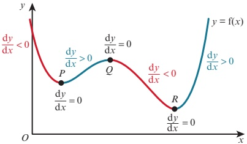

The red sections of the curve show where the gradient is negative (where  $ f(x) $ is a decreasing function) and the blue sections show where the gradient is positive (where  $ f(x) $ is an increasing function). The gradient of the curve is zero at the points P, Q and R.

A point where the gradient is zero is called a stationary point or a turning point.

## Maximum points

The stationary point Q is called a maximum point because the value of y at this point is greater than the value of y at other points close to Q.

At a maximum point:

 $ \frac{\mathrm{d}y}{\mathrm{d}x}=0 $

the gradient is positive to the left of the maximum and negative to the right.

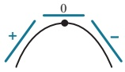

## Minimum points

The stationary points P and R are called minimum points.

At a minimum point:

 $ \frac{\mathrm{d}y}{\mathrm{d}x}=0 $

the gradient is negative to the left of the minimum and positive to the right.

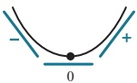

## Stationary points of inflexion

There is a third type of stationary point (turning point) called a point of inflexion.

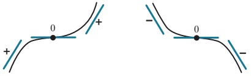

At a stationary point of inflexion:

 $ \frac{\mathrm{d}y}{\mathrm{d}x}=0 $

the gradient changes

from positive to zero and then to positive again

or

from negative to zero and then to negative again.

<!-- page 229 -->

Find the coordinates of the stationary points on the curve  $ y = x^{3} - 12x + 5 $ and determine the nature of these points. Sketch the graph of  $ y = x^{3} - 12x + 5 $.

Answer

 $$ y=x^{3}-12x+5 $$ 

 $$ \frac{\mathrm{d}y}{\mathrm{d}x}=3x^{2}-12 $$ 

For stationary points:

 $$ \frac{\mathrm{d}y}{\mathrm{d}x}=0 $$ 

 $$ 3x^{2}-12=0 $$ 

 $$ x^{2}-4=0 $$ 

 $$ (x+2)(x-2)=0 $$ 

 $$ x=-2or x=2 $$ 

 $ v = (-2)^{3} - 12(-2) + 5 = 21 $

When x = 2,  $ y = (2)^{3} - 12(2) + 5 = -11 $

The stationary points are  $ (-2, 21) $ and  $ (2, -11) $.

Now consider the gradient on either side of the points  $ (-2, 21) $ and  $ (2, -11) $:

<table border=1 style='margin: auto; word-wrap: break-word;'><tr><td style='text-align: center; word-wrap: break-word;'>x</td><td style='text-align: center; word-wrap: break-word;'>-2.1</td><td style='text-align: center; word-wrap: break-word;'>-2</td><td style='text-align: center; word-wrap: break-word;'>-1.9</td></tr><tr><td style='text-align: center; word-wrap: break-word;'>$ \frac{{dy}}{{dx}} $</td><td style='text-align: center; word-wrap: break-word;'>$ 3(-2.1)^{{2}} - 12 = \text{positive} $</td><td style='text-align: center; word-wrap: break-word;'>0</td><td style='text-align: center; word-wrap: break-word;'>$ 3(-1.9)^{{2}} - 12 = \text{negative} $</td></tr><tr><td style='text-align: center; word-wrap: break-word;'>direction of tangent</td><td style='text-align: center; word-wrap: break-word;'>/</td><td style='text-align: center; word-wrap: break-word;'>—</td><td style='text-align: center; word-wrap: break-word;'>\</td></tr><tr><td style='text-align: center; word-wrap: break-word;'>shape of curve</td><td colspan="3">$ \angle $</td></tr></table>

<table border=1 style='margin: auto; word-wrap: break-word;'><tr><td style='text-align: center; word-wrap: break-word;'>x</td><td style='text-align: center; word-wrap: break-word;'>1.9</td><td style='text-align: center; word-wrap: break-word;'>2</td><td style='text-align: center; word-wrap: break-word;'>2.1</td></tr><tr><td style='text-align: center; word-wrap: break-word;'>$ \frac{dy}{dx} $</td><td style='text-align: center; word-wrap: break-word;'>3(1.9) $ ^{2} $ - 12 = negative</td><td style='text-align: center; word-wrap: break-word;'>0</td><td style='text-align: center; word-wrap: break-word;'>3(2.1) $ ^{2} $ - 12 = positive</td></tr><tr><td style='text-align: center; word-wrap: break-word;'>direction of tangent</td><td style='text-align: center; word-wrap: break-word;'></td><td style='text-align: center; word-wrap: break-word;'>—</td><td style='text-align: center; word-wrap: break-word;'></td></tr><tr><td style='text-align: center; word-wrap: break-word;'>shape of curve</td><td colspan="3"></td></tr></table>

So  $ (-2, 21) $ is a maximum point and  $ (2, -11) $ is a minimum point.

The sketch graph of  $ y = x^{3} - 12x + 5 $ is:

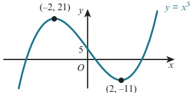

## TIP

This is called the First Derivative Test.

<!-- page 230 -->

## Second derivatives and stationary points

Consider moving from left to right along a curve, passing through a maximum point.

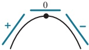

The gradient,  $ \frac{dy}{dx} $, starts as a positive value, decreases to zero at the maximum point and then decreases to a negative value.

Since  $ \frac{dy}{dx} $ decreases as x increases, then the rate of change of  $ \frac{dy}{dx} $ is negative.

The rate of change of  $ \frac{dy}{dx} $ is written as  $ \frac{d}{x}\left(\frac{d_y}{x}\right)^2 = \frac{2y}{dx^2} $.

 $ \frac{\mathrm{d}^{2}y}{\mathrm{d}x^{2}} $ is called the second derivative of y with respect x.

This leads to the rule:

### KEY POINT 8.1

If  $ \frac{dy}{dx} = 0 $ and  $ \frac{d^2y}{dx^2} < 0 $, then the point is a maximum point.

Now, consider moving from left to right along a curve, passing through a minimum point.

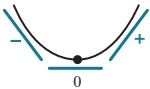

The gradient,  $ \frac{dy}{dx} $, starts as a negative value, increases to zero at the minimum point and then increases to a positive value.

Since  $ \frac{dy}{dx} $ increases as x increases, then the rate of change of  $ \frac{dy}{dx} $ is positive.

This leads to the rule:

### KEY POINT 8.2

If  $ \frac{dy}{dx} = 0 $ and  $ \frac{d^2y}{dx^2} > 0 $, then the point is a minimum point.

## REWIND

In Chapter 7, Section 7.4 we learnt how to find a second derivative. Here we will look at how second derivatives can be used to determine the nature of a stationary point.

If  $ \frac{dy}{dx} = 0 $ and  $ \frac{d^2y}{dx^2} = 0 $, then the nature of the stationary point can be found using the first derivative test.

<!-- page 231 -->

Find the coordinates of the stationary points on the curve  $ y = \frac{x^2 + 9}{x} $ and use the second derivative to determine the nature of these points.

Answer

 $$ y=\frac{x^{2}+9}{x}=x+9x^{-1} $$ 

 $$ \frac{\mathrm{d}y}{\mathrm{d}x}=1-9x^{-2}=1-\frac{9}{x^{2}} $$ 

For stationary points:

 $$ \frac{\mathrm{d}y}{\mathrm{d}x}=0 $$ 

 $$ 1-\frac{9}{x^{2}}=0 $$ 

 $$ x^{2}-9=0 $$ 

 $$ (x+3)(x-3)=0 $$ 

 $$ x=-3\text{or}x=3 $$ 

\begin{array}{l} \text{When } x = -3, \quad y = \frac{(-3)^{2} + 9}{-3} = -6  \end{array}

When x = 3,

 $$ y=\frac{3^{2}+9}{3}=6 $$ 

The stationary points are  $ (-3, -6) $ and  $ (3, 6) $.

 $$ \frac{\mathrm{d}^{2}y}{\mathrm{d}x^{2}}=18x^{-3}=\frac{18}{x^{3}} $$ 

When  $ x = -3 $,  $ \frac{d^2y}{dx^2} = \frac{18}{(-3)^3} < 0 $

When x = 3,  $ \frac{d^2 y}{d x^2} = \frac{18}{3^3} > 0 $

∴  $ (-3, -6) $ is a maximum point and  $ (3, 6) $ is a minimum point.

### EXPLORE 8.2

The graph of the function  $ y = f(x) $ passes through the point  $ (1, -35) $ and the point  $ (6, 90) $.

The following graphs show  $  y = f'(x)  $ and  $  y = f''(x)  $.

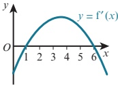

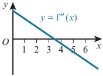

1 Discuss the properties of these two graphs and the information that can be obtained from them.

2 Without finding the equation of the function  $ y = f(x) $, determine, giving reasons:

a the coordinates of the maximum point on the curve

b the coordinates of the minimum point on the curve.

3 Sketch the graph of the function  $ y = f(x) $.

<!-- page 232 -->

## EXERCISE 8B

1 Find the coordinates of the stationary points on each of the following curves and determine the nature of each stationary point. Sketch the graph of each function and use graphing software to check your graphs.

a

 $$ y=x^{2}-4x+8 $$ 

 $$ \mathbf{b}\quad y=(3+x)(2-x) $$ 

c

 $$ y=x^{3}-12x+6 $$ 

 $$ \textbf{d}\quad y=10+9x-3x^{2}-x^{3} $$ 

e

 $$ y=x^{4}+4x-1 $$ 

 $$ \textcircled{f}\quad y=(2x-3)^{3}-6x $$ 

2 Find the coordinates of the stationary points on each of the following curves and determine the nature of each stationary point.

a

 $$ y=\sqrt{x}+\frac{9}{\sqrt{x}} $$ 

b

c

 $$ y=4x^{2}+\frac{8}{x} $$ 

 $$ y=\frac{(x-3)^{2}}{x} $$ 

d

 $$ y=x^{3}+\frac{48}{x}+4 $$ 

e

 $$ y=4\sqrt{x}-x $$ 

f

 $$ y=2x+\frac{8}{x^{2}} $$ 

3 The equation of a curve is  $ y = \frac{x^{2} - 9}{x^{2}} $.

Find  $ \frac{dy}{dx} $ and, hence, explain why the curve does not have a stationary point.

4 A curve has equation  $ y = 2x^{3} - 3x^{2} - 36x + k $.

a Find the x-coordinates of the two stationary points on the curve.

b Hence, find the two values of k for which the curve has a stationary point on the x-axis.

5 The curve  $ y = x^{3} + ax^{2} - 9x + 2 $ has a maximum point at x = -3.

a Find the value of a.

b Find the range of values of x for which the curve is a decreasing function.

6 The curve  $ y = 2x^{3} + ax^{2} + bx - 30 $ has a stationary point when x = 3. The curve passes through the point  $ (4, 2) $.

a Find the value of a and the value of b.

b Find the coordinates of the other stationary point on the curve and determine the nature of this point.

7 The curve  $ y = 2x^{3} + ax^{2} + bx - 30 $ has no stationary points.

Show that  $ a^{2} < 6b $.

8 A curve has equation  $ y = 1 + 2x + \frac{k^2}{2x - 3} $, where k is a positive constant. Find, in terms of k, the values of x for which the curve has stationary points and determine the nature of each stationary point.

9 Find the coordinates of the stationary points on the curve  $ y = x^{4} - 4x^{3} + 4x^{2} + 1 $ and determine the nature of each of these points. Sketch the graph of the curve.

10 The curve  $ y = x^{3} + ax^{2} + b $ has a stationary point at (4, -27).

a Find the value of a and the value of b.

b Determine the nature of the stationary point (4, -27).

<!-- page 233 -->

c Find the coordinates of the other stationary point on the curve and determine the nature of this stationary point.

d Find the coordinates of the point on the curve where the gradient is minimum and state the value of the minimum gradient.

11 The curve  $ y = ax + \frac{b}{x^2} $ has a stationary point at (2, 12).

a Find the value of a and the value of b.

b Determine the nature of the stationary point (2, 12).

c Find the range of values of x for which  $ ax + \frac{b}{x^2} $ is increasing.

12 The curve  $ y = x^{2} + \frac{a}{x} + b $ has a stationary point at (3, 5).

a Find the value of a and the value of b.

b Determine the nature of the stationary point (3, 5).

c Find the range of values of x for which  $ x^{2}+\frac{a}{x}+b $ is decreasing.

13 The curve  $ y = 2x^{3} + ax^{2} + bx + 7 $ has a stationary point at the point  $ (2, -13) $.

a Find the value of a and the value of b.

b Find the coordinates of the second stationary point on the curve.

c Determine the nature of the two stationary points.

d Find the coordinates of the point on the curve where the gradient is minimum and state the value of the minimum gradient.

### 8.3 Practical maximum and minimum problems

## WEB LINK

Try the following resources on the Underground

There are many problems for which we need to find the maximum or minimum value of an expression. For example, the manufacturers of canned food and drinks often need to minimise the cost of their manufacturing. To do this they need to find the minimum amount of metal required to make a container for a given volume. Other situations might involve finding the maximum area that can be enclosed within a shape.

Mathematics website:

Floppy hair

Two-way calculus

Curvy cubics

Can you find... curvy cubics edition.

### WORKED EXAMPLE 8.6

The surface area of the solid cuboid is  $ 100 \, cm^2 $ and the volume is  $ V \, cm^3 $.

a Express $h$ in terms of $x$.

b Show that $V = 25x - \frac{1}{2}x^{3}$.

c Given that x can vary, find the stationary value of V and determine whether this stationary value is a maximum or a minimum.

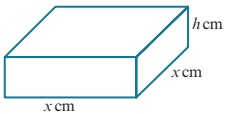

Answer

a Surface area = 2x^{2} + 4xh

 $$ 2x^{2}+4x h=100 $$ 

 $$ h=\frac{100-2x^{2}}{4x} $$ 

 $$ h=\frac{25}{x}-\frac{1}{2}x $$

<!-- page 234 -->

Substitute for h.

 $$ \begin{aligned}V&=x^{2}h\begin{array}{r}25\\ \hline2\end{array}\begin{array}{r}\quad1\\ \quad2\end{array}\\&\equiv\frac{x^{2}}{25}\left(\frac{-1}{x}--x\right)\end{aligned} $$ 

 $$ x 絶 \frac{1}{2}x^{3} $$ 

 $$ c\quad\frac{\mathrm{d}V}{\mathrm{d}x}=25-\frac{3}{2}x^{2} $$ 

Stationary values occur when  $ \frac{dV}{dx}=0 $:

 $$ \begin{array}{c}5\ 6\\3\ \end{array},\quad\begin{array}{c}25\ 5\ 6\ \mathrm{d}x\\25\ 3\ \frac{3}{2}x^{2}\geqslant0\ 3\end{array}\begin{array}{l}1\quad5\quad6\\3\end{array}\Big\rbrace=68.04\ (to\ 2\ decimal\ places $$ 

 $$ x=\frac{5\sqrt{6}}{3} $$ 

 $$ \begin{array}{r l r}{x=\underline{{\sqrt{~}}}~V=}&{{}\left(\underline{{\sqrt{~}}}\}\right.}&{{}-\underline{{\sqrt{~}}}\;^{3}}\end{array} $$ 

 $$ \frac{\mathrm{d}^{2}V}{\mathrm{d}x^{2}}=-3x $$ 

When  $ x = \frac{5\sqrt{6}}{3} $,  $ \frac{d^2V}{dx^2} = -5\sqrt{6} $, which is < 0.

The stationary value of V is 68.04 and it is a maximum value.

### WORKED EXAMPLE 8.7

The diagram shows a solid cylinder of radius  $ r $ cm and height  $ 2h $ cm cut from a solid sphere of radius  $ 5 $ cm. The volume of the cylinder is  $ C \, cm^3 $.

a Express r in terms of h.

b Show that  $ V = 50\pi h - 2\pi h^3 $.

c Find the value for h for which there is a stationary value of V.

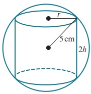

d Determine the nature of this stationary value.

Answer

 $$ \begin{aligned}r^{2}+h^{2}&=5^{2}\\r&=\sqrt{25-h^{2}}\end{aligned} $$ 

Use Pythagoras' theorem.

b  $ V = \pi r^{2}(2h) $

 $ \pi(25 - h^{2})(2h) $

 $ = 50\pi h - 2\pi h^{3} $

Substitute for r.

 $$ c\quad\frac{\mathrm{d}V}{\mathrm{d}h}=50\pi-6\pi h^{2} $$ 

Stationary values occur when  $ \frac{dV}{dh}=0 $:

 $$ 50\pi-6\pi h^{2}=0 $$ 

 $$ h^{2}=\frac{50\pi}{6\pi} $$ 

 $$ h=\frac{5\sqrt{3}}{3} $$

<!-- page 235 -->

d  $ \frac{d^2V}{dh^2} = -12\pi h $ d 12  $ 5\sqrt[3]{3} $, which i

When  $ h = \frac{5\sqrt{3}}{3} $,  $ \frac{d}{x^2} = -\pi\left(\frac{\sqrt[3]{\pi}}{\sqrt[3]{3}}\right) $, s < 0.

The stationary value is a maximum value.

### WORKED EXAMPLE 8.8

The diagram shows a hollow cone with base radius 12 cm and height 24 cm. A solid cylinder stands on the base of the cone and the upper edge touches the inside of the cone.

The cylinder has base radius  $ r \, \text{cm} $, height  $ h \, \text{cm} $ and volume  $ V \, \text{cm}^3 $.

a Express $h$ in terms of $r$.

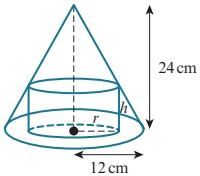

b Show that  $ V = 24\pi r^{2} - 2\pi r^{3} $.

c Find the volume of the largest cylinder that can stand inside the cone.

## Answer

 $$ \frac{r}{12}=\frac{24-h}{24} $$ 

 $$ 2r=24-h $$ 

 $$ \begin{aligned}V&=\pi r^{2}h\\&=\pi r^{2}(24-2r)\\&=24\pi r^{2}-2\pi r^{3}\end{aligned} $$ 

Substitute for h.

c  $ \frac{\mathrm{d}V}{\mathrm{d}r}=48\pi r-6\pi r^{2} $

Stationary values occur when  $ \frac{dV}{dr} = 0 $:

 $$ 48\pi r-6\pi r^{2}=0 $$ 

 $$ \begin{aligned}6\pi r(8-r)&=0\\r-8\end{aligned} $$ 

When r = 8,  $ V = 24\pi(8)^2 - 2\pi(8)^3 = 512\pi $

 $$ \frac{\mathrm{d}^{2}V}{\mathrm{d}r^{2}}=48\pi-12\pi r $$ 

When  $ r = 8 $,  $ \frac{d^2V}{dx^2} = 48\pi - 12\pi(8) $, which is < 0.

The stationary value is a maximum value.

Volume of the largest cylinder is $512\pi\text{cm}^3$.

## DID YOU KNOW?

Differentiation can be used in business to find how to maximise company profits and to find how to minimise production costs.

<!-- page 236 -->

1 The sum of two real numbers, x and y, is 9.

a Express y in terms of x.

b i Given that  $ P = x^{2}y $, write down an expression for P, in terms of x.

ii Find the maximum value of P.

c i Given that  $ Q = 3x^{2} + 2y^{2} $, write down an expression for Q, in terms of x.

ii Find the minimum value of Q.

2 A piece of wire, of length 40 cm, is bent to form a sector of a circle with radius r cm and sector angle

<!-- page 237 -->

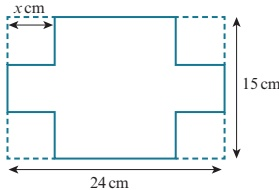

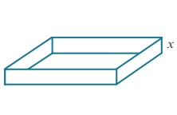

The diagram shows a 24cm by 15cm sheet of metal with a square of side x cm removed from each corner. The metal is then folded to make an open rectangular box of depth x cm and volume  $ V \, cm^3 $.

a Show that  $ V = 4x^{3} - 78x^{2} + 360x $.

b Find the stationary value of V and the value of x for which this occurs.

c Determine the nature of this stationary value.

8 The volume of the solid cuboid shown in the diagram is  $ 576 \, cm^3 $ and the surface area is  $ A \, cm^2 $.

a Express y in terms of x.

b Show that  $ A = 4x^{2} + \frac{1728}{x} $.

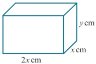

c Find the maximum value of A and state the dimensions of the cuboid for which this occurs.

9 The diagram shows a piece of wire, of length 2 m, is bent to form the shape  $ PQRST $.

PQST is a rectangle and QRS is a semicircle with diameter SQ.

PT = x m and  $ PQ = ST = y m $.

The total area enclosed by the shape is  $ A\,m^{2} $.

a Express y in terms of x.

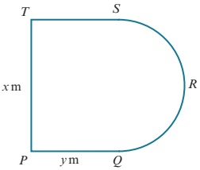

b Show that  $ A = x - \frac{1}{2}x^{2} - \frac{1}{8}\pi x^{2} $.

c Find  $ \frac{dA}{dx} $ and  $ \frac{d^{2}A}{dx^{2}} $.

d Find the value for x for which there is a stationary value of A.

e Determine the magnitude and nature of this stationary value.

10 The diagram shows a window made from a rectangle with base 2r m and height h m and a semicircle of radius r m. The perimeter of the window is 5 m and the area is  $ A m^{2} $.

a Express $h$ in terms of $r$.

b Show that  $ A = 5r - 2r^2 - \frac{1}{2}\pi r^2 $.

c Find  $ \frac{dA}{dr} $ and  $ \frac{d^{2}A}{dr^{2}} $.

d Find the value for r for which there is a stationary value of A.

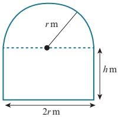

e Determine the magnitude and nature of this stationary value.

<!-- page 238 -->

11 A piece of wire, of length 100 cm, is cut into two pieces.

One piece is bent to make a square of side x cm and the other is bent to make a circle of radius r cm. The total area enclosed by the two shapes is  $ A\,cm^2 $.

a Express r in terms of x.

b Show that  $  A = \frac{(\pi + 4)x^2 - 200x + 2500}{\pi}  $.

c Find the value of x for which A has a stationary value and determine the nature and magnitude of this stationary value.

12 A solid cylinder has radius r cm and height h cm.

The volume of this cylinder is $432\pi\text{cm}^3$ and the surface area is $A\text{cm}^2$.

a Express $h$ in terms of $r$.

b Show that  $ A = 2\pi r^{2} + \frac{864\pi}{r} $.

c Find the value for r for which there is a stationary value of A.

d Determine the magnitude and nature of this stationary value.

13

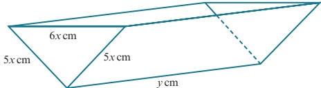

The diagram shows an open water container in the shape of a triangular prism of length  $ y \, cm $.

The vertical cross-section is an isosceles triangle with sides 5x cm, 5x cm and 6x cm.

The water container is made from 500 cm $ ^{2} $ of sheet metal and has a volume of V cm $ ^{3} $.

a Express y in terms of x.

b Show that  $ V = 600x - \frac{144}{5}x^3 $.

c Find the value of x for which V has a stationary value.

d Show that the value in part c is a maximum value.

PS 14 The diagram shows a solid formed by joining a hemisphere of radius r cm to a cylinder of radius r cm and height h cm. The surface area of the solid is  $ 320\pi cm^{2} $ and the volume is  $ V cm^{3} $.

a Express $h$ in terms of $r$.

b Show that  $ V = 160\pi r - \frac{5}{6}\pi r^3 $.

c Find the exact value of r such that V is a maximum.

PS 15 The diagram shows a right circular cone of base radius r cm and height h cm cut from a solid sphere of radius 10 cm. The volume of the cone is  $ V_{cm}^{3} $.

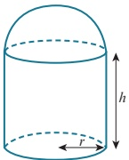

a Express $r$ in terms of $h$.

b Show that  $ V = \frac{1}{3} \pi h^2 (20 - h) $.

c Find the value for $h$ for which there is a stationary value of $V$.

d Determine the magnitude and nature of this stationary value.

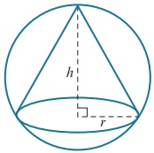

<!-- page 239 -->

### 8.4 Rates of change

EXPLORE 8.3

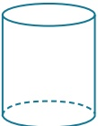

A

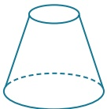

B

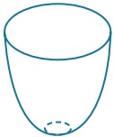

C

Consider pouring water at a constant rate of  $ 10 \, cm^3 s^{-1} $ into each of these three large containers.

1 Discuss how the height of water in container A changes with time.

2 Discuss how the height of water in container B changes with time.

3 Discuss how the height of water in container C changes with time.

4 On copies of the following axes, sketch graphs to show how the height of water in a container (hcm) varies with time (t seconds) for each container.

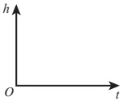

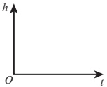

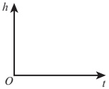

5 What can you say about the gradients?

You should have come to the conclusion that:

the height of water in container A increases at a constant rate

- the height of water in containers B and C does not increase at a constant rate.

The (constant) rate of change of the height of the water in container A can be found by finding the gradient of the straight-line graph.

The rate of change of the height of the water in containers B and C at a particular time, t seconds, can be estimated by drawing a tangent to the curve and then finding the gradient of the tangent. A more accurate method is to use differentiation if we know the equation of the graph.

### WORKED EXAMPLE 8.9

Given that  $ h = \frac{1}{5}t^2 $, find the rate of change of h with respect to t when t = 2.

Answer

 $$ h=\frac{1}{5}t^{2} $$ 

 $$ \mathrm{\frac{dh}{dt}}=\frac{2}{5}t $$ 

Differentiate to obtain  $ \frac{dh}{dt} $ (the rate of change of h with respect to t).

When  $ t = 2 $,  $ \frac{dh}{dt} = \frac{2}{5}(2) = \frac{4}{5} $

<!-- page 240 -->

### WORKED EXAMPLE 8.10

Variables V and t are connected by the equation  $ V = 2t^{2} - 3t + 8 $.

Find the rate of change of V with respect to t when t = 4.

Answer

 $$ V=2t^{2}-3t+8 $$ 

 $$ \frac{dV}{dt}=4t-3 $$ 

Differentiate to obtain  $ \frac{dV}{dt} $ (the rate of change of V with respect to t).

When  $ t = 4 $,  $ \frac{dV}{dt} = 4(4) - 3 = 13 $

## Connected rates of change

When two variables, x and y, both vary with a third variable, t, we can connect the three variables using the chain rule.

### KEY POINT 8.3

The chain rule states:

 $$ \frac{\mathrm{d}y}{\mathrm{d}t}=\frac{\mathrm{d}y}{\mathrm{d}x}\times\frac{\mathrm{d}x}{\mathrm{d}t} $$ 

We may also need to use the rule:

## REWIND

### KEY POINT 8.4

 $$ \frac{\mathrm{d}x}{\mathrm{d}y}=\frac{1}{\frac{\mathrm{d}y}{\mathrm{d}x}} $$ 

In Chapter 7, Section 7.2 we learnt how to differentiate using the chain rule. Here we will look at how the chain rule can be used for problems involving connected rates of change.

We can deduce this as: if we set t = y in the chain rule, we get

 $$ \frac{\mathrm{d}y}{\mathrm{d}y}=\frac{\mathrm{d}y}{\mathrm{d}x}\times\frac{\mathrm{d}x}{\mathrm{d}y} $$ 

Since  $ \frac{dy}{dy}=1 $, the rule follows.

### WORKED EXAMPLE 8.11

A point with coordinates $(x, y)$ moves along the curve $y = x + \sqrt{2x + 3}$ in such a way that the rate of increase of $x$ has the constant value 0.06 units per second. Find the rate of increase of $y$ at the instant when $x = 3$. State whether the $y$-coordinate is increasing or decreasing.

## Answer

 $$ y=x+(2x+3)^{\frac{1}{2}}\quad and\quad\frac{\mathrm{d}x}{\mathrm{d}t}=0.06 $$ 

 $$ \begin{aligned}\frac{\mathrm{d}y}{\mathrm{d}x}&=1+\frac{1}{2}\left(2x+3\right)^{-\frac{1}{2}}(2)\\&=1+\frac{1}{\sqrt{2x+3}}\end{aligned} $$ 

Differentiate to find  $ \frac{dy}{dx} $

<!-- page 241 -->

When $x=3$, $\frac{\mathrm{d}y}{\mathrm{d}x}=1+\frac{1}{\sqrt{2(3)+3}}=\frac{4}{3}$

Using the chain rule:  $ \frac{dy}{dt} = \frac{dy}{dx} \times \frac{dx}{dt} $

 $ = \frac{4}{3} \times 0.06 $

 $ = 0.08 $

Rate of change of y is 0.08 units per second.

The y-coordinate is increasing (since  $ \frac{dy}{dt} $ is a positive quantity).

## EXERCISE 8D

1 A point is moving along the curve $y = 3x - 2x^{3}$ in such a way that the $x$-coordinate is increasing at 0.015 units per second. Find the rate at which the $y$-coordinate is changing when $x = 2$, stating whether the $y$-coordinate is increasing or decreasing.

2 A point with coordinates $(x, y)$ moves along the curve $y = \sqrt{1 + 2x}$ in such a way that the rate of increase of $x$ has the constant value 0.01 units per second. Find the rate of increase of $y$ at the instant when $x = 4$.

3 A point is moving along the curve  $ y = \frac{8}{x^{2} - 2} $ in such a way that the x-coordinate is increasing at a constant rate of 0.005 units per second. Find the rate of change of the y-coordinate as the point passes through the point (2, 4).

4 A point is moving along the curve  $ y = 3\sqrt{x} - \frac{5}{\sqrt{x}} $ in such a way that the x-coordinate is increasing at a constant rate of 0.02 units per second. Find the rate of change of the y-coordinate when x = 1.

5 A point, P, travels along the curve  $ y = 3x + \frac{1}{\sqrt{x}} $ in such a way that the x-coordinate of P is increasing at a constant rate of 0.5 units per second. Find the rate at which the y-coordinate of P is changing when P is at the point (1, 4).

6 A point is moving along the curve  $ y = \frac{2}{x} + 5x $ in such a way that the x-coordinate is increasing at a constant rate of 0.02 units per second. Find the rate at which the y-coordinate is changing when x = 2, stating whether the y-coordinate is increasing or decreasing.

7 A point moves along the curve  $ y = \frac{8}{7 - 2x} $. As it passes through the point P, the x-coordinate is increasing at a rate of 0.125 units per second and the y-coordinate is increasing at a rate of 0.08 units per second. Find the possible x-coordinates of P.

8 A point, $P$, travels along the curve $y = \sqrt[3]{2x^2 - 3}$ in such a way that at time $t$ minutes the $x$-coordinate of $P$ is increasing at a constant rate of 0.012 units per minute. Find the rate at which the $y$-coordinate of $P$ is changing when $P$ is at the point $(1, -1)$.

9 A point,  $ P(x, y) $, travels along the curve  $ y = x^{3} - 5x^{2} + 5x $ in such a way that the rate of change of x is constant. Find the values of x at the points where the rate of change of y is double the rate of change of x.

<!-- page 242 -->

### 8.5 Practical applications of connected rates of change

### WORKED EXAMPLE 8.12

Oil is leaking from a pipeline under the sea and a circular patch is formed on the surface of the sea.

The radius of the patch increases at a rate of 2 metres per hour.

Find the rate at which the area is increasing when the radius of the patch is 25 metres.

## Answer

We need to find  $ \frac{\mathrm{d}A}{\mathrm{d}t} $ when r = 25.

Radius increasing at a rate of 2 metres per hour, so  $ \frac{dr}{dt}=2 $.

Let A = area of circular oil patch, in  $ m^{2} $.

 $$ A=\pi r^{2} $$ 

Differentiate with respect to r.

 $$ \frac{\mathrm{d}A}{\mathrm{d}r}=2\pi r $$ 

When r = 25,  $ \frac{dA}{dr} = 50\pi $

Using the chain rule,  $ \frac{dA}{dt} = \frac{dA}{dr} \times \frac{dr}{dt} = 50\pi \times 2 = 100\pi $

The area is increasing at a rate of  $ 100\pi \, m^2 $ per hour.

### WORKED EXAMPLE 8.13

A solid sphere has radius  $ r $ cm, surface area  $ A $ cm² and volume  $ V $ cm³.

The radius is increasing at a rate of  $ \frac{1}{5\pi} $ cm s $ ^{-1} $.

a Find the rate of increase of the surface area when r = 3.

b Find the rate of increase of the volume when r = 5.

## Answer

a We need to find  $ \frac{\mathrm{d}A}{\mathrm{d}t} $ when r = 3.

Radius increasing at a rate of $\frac{1}{5\pi} \mathrm{~cm} \mathrm{s}^{-1}$, so $\frac{\mathrm{d}r}{\mathrm{d}t} = \frac{1}{5\pi}$.

 $$ A=4\pi r^{2} $$ 

 $$ \frac{\mathrm{d}A}{\mathrm{d}r}=8\pi r $$ 

Differentiate with respect to r.

When  $ r = 3 $,  $ \frac{dA}{dr} = 24\pi $

Using the chain rule.

 $$ \begin{aligned}\frac{\mathrm{d}A}{\mathrm{d}t}&=\frac{\mathrm{d}A}{\mathrm{d}r}\times\frac{\mathrm{d}r}{\mathrm{d}t}\\&=24\pi\times\frac{1}{5\pi}\\&=4.8\end{aligned} $$ 

The surface area is increasing at a rate of  $ 4.8 \, \text{cm}^2 \, \text{s}^{-1} $.

<!-- page 243 -->

b We need to find  $ \frac{dV}{dt} $ when r = 5.

 $$ V=\frac{4}{3}\pi r^{3} $$ 

Differentiate with respect to r.

 $$ \frac{\mathrm{d}V}{\mathrm{d}r}=4\pi r^{2} $$ 

When  $ r = 5 $,  $ \frac{dV}{dr} = 100\pi $

Using the chain rule,  $ \frac{\mathrm{d}V}{\mathrm{d}t} = \frac{\mathrm{d}V}{\mathrm{d}r} \times \frac{\mathrm{d}r}{\mathrm{d}t} = 100\pi \times \frac{1}{5\pi} = 20 $

The volume is increasing at a rate of  $ 20 \, cm^3 s^{-2} $.

### WORKED EXAMPLE 8.14

Water is poured into the conical container shown, at a rate of  $ 2\pi cm^3 s^{-1} $.

After $t$ seconds, the volume of water in the container, $V$ cm$^3$, is given by $V = \frac{1}{12} \pi h^3$, where $h$ cm is the height of the water in the container.

a Find the rate of change of h when h = 5.

Given that the container has radius 10 cm and height 20 cm, find the rate of change of h when the container is half full. Give your answer correct to 3 significant figures.

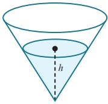

## Answer

a We need to find  $ \frac{dh}{dt} $ when h = 5.

Volume increasing at a rate of  $ 2\pi \, \text{cm}^3\text{s}^{-1} $, so  $ \frac{dV}{dt} = 2\pi $.

 $$ V=\frac{1}{12}\pi h^{3} $$ 

Differentiate with respect to h.

 $$ \frac{\mathrm{d}V}{\mathrm{d}h}=\frac{1}{4}\pi h^{2} $$ 

When  $ h = 5 $,  $ \frac{dV}{dh} = \frac{25\pi}{4} $

Using the chain rule,

 $$ \begin{aligned}\frac{\mathrm{d}h}{\mathrm{d}t}&=\frac{\mathrm{d}h}{\mathrm{d}V}\times\frac{\mathrm{d}V}{\mathrm{d}t}\\&=\frac{4}{25\pi}\times2\pi\\&=0.32\end{aligned} $$ 

The height is increasing at a rate of 0.32 cm s $ ^{-1} $.

<!-- page 244 -->

b Volume when half full =  $ \frac{1}{2}\left[\frac{1}{12}\pi h^{3}\right] = \frac{1}{2}\left[\frac{1}{12}\pi(20)^{3}\right] = \frac{1000}{3}\pi $

Using  $ V = \frac{1}{12}\pi h^{3} $,  $ \frac{1}{12}\pi h^{3} = \frac{1000}{3}\pi $

 $ h^{3} = 4000 $

h = 15.874

When h = 15.874,  $ \frac{\mathrm{d}V}{\mathrm{d}h} = \frac{1}{4}\pi(15.874)^{2} = 197.9 $

Using the chain rule,  $ \frac{\mathrm{d}h}{\mathrm{d}t} = \frac{\mathrm{d}h}{\mathrm{d}V} \times \frac{\mathrm{d}V}{\mathrm{d}t} $

 $  = \frac{1}{197.9} \times 2\pi $

 $  = 0.0317 \, \text{cm} \, \text{s}^{-1} $

## EXERCISE 8E

1 A circle has radius  $ r \, cm $ and area  $ A \, cm^2 $.

The radius is increasing at a rate of 0.1cm s $ ^{-1} $.

Find the rate of increase of A when r = 4.

2 A sphere has radius  $ r \, cm $ and volume  $ V \, cm^3 $.

The radius is increasing at a rate of  $ \frac{1}{2\pi} \, cm \, s^{-1} $.

Find the rate of increase of the volume when V = 36 $ \pi $.

3 A cone has base radius  $ r $ cm and a fixed height of 30 cm.

The radius of the base is increasing at a rate of  $ 0.01 \, \text{cm} \, \text{s}^{-1} $.

Find the rate of change of the volume when  $ r = 5 $.

4 A square has side length x cm and area  $ A \, cm^2 $.

The area is increasing at a constant rate of  $ 0.03 \, cm^2 \, s^{-1} $.

Find the rate of increase of x when A = 25.

5 A cube has sides of length x cm and volume  $ V \, cm^3 $

The volume is increasing at a rate of  $ 1.5 \, cm^3 \, s^{-1} $.

Find the rate of increase of x when V = 8.

6 A solid metal cuboid has dimensions x cm by x cm by 4x cm.

The cuboid is heated and the volume increases at a rate of  $ 0.15 \, cm^3 \, s^{-1} $.

Find the rate of increase of x when x = 2.

7 A closed circular cylinder has radius  $ r \, \text{cm} $ and surface area  $ A \, \text{cm}^2 $, where  $ A = 2\pi r^2 + \frac{400\pi}{r} $. Given that the radius of the cylinder is increasing at a rate of  $ 0.25 \, \text{cm} \, \text{s}^{-1} $, find the rate of change of  $ A $ when  $ r = 10 $.

<!-- page 245 -->

8 The diagram shows a water container in the shape of a triangular prism of length 120 cm.

The vertical cross-section is an equilateral triangle.

Water is poured into the container at a rate of  $ 24 \, cm^3 s^{-1} $.

a Show that the volume of water in the container,  $ V \, \text{cm}^3 $, is given by  $ V = 40\sqrt{3} \, \text{h}^2 $, where  $ h $ cm is the height of the water in the container.

b Find the rate of change of h when h = 12.

9 Water is poured into the hemispherical bowl of radius 5 cm at a rate of  $ 3\pi cm^3 s^{-1} $.

After $t$ seconds, the volume of water in the bowl, $V\mathrm{cm}^3$, is given by $V = 5\pi h^2 - \frac{1}{3}\pi h^3$, where $h$ cm is the height of the water in the bowl.

a Find the rate of change of h when h = 1.

b Find the rate of change of h when h = 3.

10 The diagram shows a right circular cone with radius 10 cm and height 30 cm. The cone is initially completely filled with water.

Water leaks out of the cone through a small hole at the vertex at a rate of  $ 4\,cm^3\,s^{-1} $.

a Show that the volume of water in the cone,  $ V \, cm^3 $, when the height of the water is  $ h \, cm $ is given by the formula  $ V = \frac{\pi h^3}{27} $.

b Find the rate of change of h when h = 20.

11 Oil is poured onto a flat surface and a circular patch is formed.

The radius of the patch increases at a rate of  $ 2\sqrt{r} $ cm s $ ^{-1} $.

Find the rate at which the area is increasing when the circumference is  $ 8\pi $ cm.

12 Paint is poured onto a flat surface and a circular patch is formed.

The area of the patch increases at a rate of  $ 5 \, cm^2 s^{-1} $.

a Find, in terms of  $ \pi $, the radius of the patch after 8 seconds.

b Find, in terms of  $ \pi $, the rate of increase of the radius after 8 seconds.

PS 13 A cylindrical container of radius 8 cm and height 25 cm is completely filled with water.

The water is then poured at a constant rate from the cylinder into an empty inverted cone.

The cone has radius 15 cm and height 24 cm and its axis is vertical.

It takes 40 seconds for all of the water to be transferred.

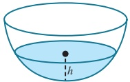

a If V represents the volume of water, in cm³, in the cone at time t seconds, find  $ \frac{dV}{dt} $ in terms of  $ \pi $.

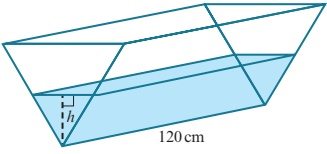

b When the depth of the water in the cone is 10 cm, find:

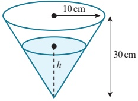

i the rate of change of the height of the water in the cone

ii the rate of change of the horizontal surface area of the water in the cone.

<!-- page 246 -->

## Checklist of learning and understanding

## Increasing and decreasing functions

 $ y = f(x) $ is increasing for a given interval of  $ x $ if  $ \frac{dy}{dx} > 0 $ throughout the interval.

 $ y = f(x) $ is decreasing for a given interval of  $ x $ if  $ \frac{dy}{dx} < 0 $ throughout the interval.

## Stationary points

Stationary points (turning points) of a function  $ y = f(x) $ occur when  $ \frac{dy}{dx} = 0 $.

## First derivative test for maximum and minimum points

At a maximum point:

 $ \frac{\mathrm{d}y}{\mathrm{d}x}=0 $

the gradient is positive to the left of the maximum and negative to the right.

At a minimum point:

 $ \frac{\mathrm{d}y}{\mathrm{d}x}=0 $

the gradient is negative to the left of the minimum and positive to the right.

## Second derivative test for maximum and minimum points

If  $ \frac{dy}{dx} = 0 $ and  $ \frac{d^2y}{dx^2} < 0 $, then the point is a maximum point.

If  $ \frac{dy}{dx} = 0 $ and  $ \frac{d^2y}{dx^2} > 0 $, then the point is a minimum point.

If  $ \frac{dy}{dx} = 0 $ and  $ \frac{d^2y}{dx^2} = 0 $, then the nature of the stationary point can be found using the first derivative test.

## Connected rates of change

When two variables, x and y, both vary with a third variable, t, the three variables can be connected using the chain rule:  $ \frac{dy}{dt} = \frac{dy}{dx} \times \frac{dx}{dt} $.

You may also need to use the rule:  $ \frac{dx}{dy} = \frac{1}{\frac{dy}{dx}} $.

<!-- page 247 -->

1 The volume of a spherical balloon is increasing at a constant rate of  $ 40 \, cm^{3} $ per second.

Find the rate of increase of the radius of the balloon when the radius is 15 cm.

[The volume, $V$, of a sphere with radius $r$ is $V = \frac{4}{3}\pi r^{3}$.]

2 An oil pipeline under the sea is leaking oil and a circular patch of oil has formed on the surface of the sea. At midday the radius of the patch of oil is 50 m and is increasing at a rate of 3 metres per hour. Find the rate at which the area of the oil is increasing at midday.

Cambridge International AS & A Level Mathematics 9709 Paper 11 Q3 November 2012

3 A curve has equation $y = 27x - \frac{4}{(x+2)^2}$. Show that the curve has a stationary point at $x = -\frac{8}{3}$ and determine its nature.

4 A watermelon is assumed to be spherical in shape while it is growing. Its mass, $M$ kg, and radius, $r$ cm, are related by the formula $M = kr^{3}$, where $k$ is a constant. It is also assumed that the radius is increasing at a constant rate of 0.1 centimetres per day. On a particular day the radius is 10 cm and the mass is 3.2 kg. Find the value of $k$ and the rate at which the mass is increasing on this day.

Cambridge International AS & A Level Mathematics 9709 Paper 11 Q4 June 2012

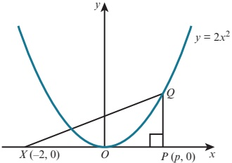

The diagram shows the curve  $ y = 2x^2 $ and the points  $ X(-2, 0) $ and  $ P(p, 0) $. The point  $ Q $ lies on the curve and  $ PQ $ is parallel to the y-axis.

i Express the area, A, of triangle XPQ in terms of p.

The point $P$ moves along the $x$-axis at a constant rate of 0.02 units per second and $Q$ moves along the curve so that $PQ$ remains parallel to the $y$-axis.

ii Find the rate at which A is increasing when p = 2.

Cambridge International AS & A Level Mathematics 9709 Paper 11 Q2 June 2015

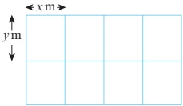

A farmer divides a rectangular piece of land into 8 equal-sized rectangular sheep pens as shown in the diagram. Each sheep pen measures x m by y m and is fully enclosed by metal fencing. The farmer uses 480 m of fencing.

i Show that the total area of land used for the sheep pens,  $ A\,m^2 $, is given by  $ A = 384x - 9.6x^2 $.

ii Given that x and y can vary, find the dimensions of each sheep pen for which the value of A is a maximum. (There is no need to verify that the value of A is a maximum.)

<!-- page 248 -->

7 The variables x, y and z can take only positive values and are such that  $ z = 3x + 2y $ and xy = 600.

i Show that  $ z = 3x + \frac{1200}{x} $. [1]

ii Find the stationary value of z and determine its nature.

## 昆8

Cambridge International AS & A Level Mathematics 9709 Paper 11 Q6 June 2011

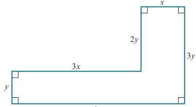

4.x

The diagram shows the dimensions in metres of an L-shaped garden. The perimeter of the garden is 48 m.

i Find an expression for y in terms of x.

ii Given that the area of the garden is  $ A\,m^2 $, show that  $ A = 48x - 8x^2 $.

Given that x can vary, find the maximum area of the garden, showing that this is a maximum value rather than a minimum value.

Cambridge International. S & A Level Mathematics 9709 Paper 11 Q7 November 2011

9 A curve has equation  $ y = \frac{8}{x} + 2x $.

i Find  $ \frac{dy}{dx} $ and  $ \frac{d^2y}{dx^2} $. [3]

ii Find the coordinates of the stationary points and state, with a reason, the nature of each stationary point.

Cambridge International AS & A Level Mathematics 9709 Paper 11 Q5 November 2015

## 目 10

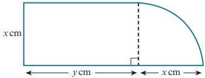

The diagram shows a metal plate consisting of a rectangle with sides x cm and y cm and a quarter-circle of radius x cm. The perimeter of the plate is 60 cm.

i Express y in terms of x. [2]

ii Show that the area of the plate,  $ A \, cm^2 $, is given by  $ A = 30x - x^2 $. [2]

Given that x can vary,

iii find the value of x at which A is stationary, [2]

iv find this stationary value of A, and determine whether it is a maximum or a minimum value. [2]

Cambridge International AS & A Level Mathematics 9709 Paper 11 Q8 November 2010

<!-- page 249 -->

11 A curve has equation  $ y = x^{3} + x^{2} - 5x + 7 $.

a Find the set of values of x for which the gradient of the curve is less than 3.

b Find the coordinates of the two stationary points on the curve and determine the nature of each stationary point.

## 昆12

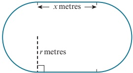

The inside lane of a school running track consists of two straight sections each of length x metres, and two semicircular sections each of radius r metres, as shown in the diagram. The straight sections are perpendicular to the diameters of the semicircular sections. The perimeter of the inside lane is 400 metres.

i Show that the area,  $ A \, m^2 $, of the region enclosed by the inside lane is given by  $ A = 400r - \pi r^2 $.

ii Given that x and r can vary, show that, when A has a stationary value, there are no straight sections in the track. Determine whether the stationary value is a maximum or a minimum. [5]

Cambridge International AS & A Level Mathematics 9709 Paper 11 Q8 November 2013

13 The equation of a curve is  $ y = x^{3} + px^{2} $, where p is a positive constant.

i Show that the origin is a stationary point on the curve and find the coordinates of the other stationary point in terms of p. [4]

ii Find the nature of each of the stationary points.

Another curve has equation  $ y = x^{3} + px^{2} + px $.

iii Find the set of values of p for which this curve has no stationary points.

Cambridge International AS & A Level Mathematics 9709 Paper 11 Q9 June 2015

