# 9 Integration

<!-- Cambridge International AS A Level Mathematics Pure Mathematics 1.pdf p250-295 -->

<!-- page 250 -->

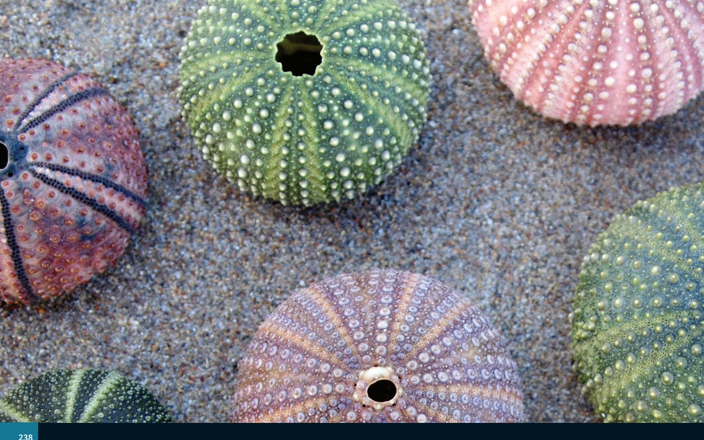

# Chapter 9 Integration

## In this chapter you will learn how to:

understand integration as the reverse process of differentiation, and integrate  $ (ax + b)^{n} $ (for any rational  $ n $ except -1), together with constant multiples, sums and differences

solve problems involving the evaluation of a constant of integration

evaluate definite integrals

use definite integration to find the:

area of a region bounded by a curve and lines parallel to the axes, or between a curve and a line, or between two curves

volume of revolution about one of the axes.

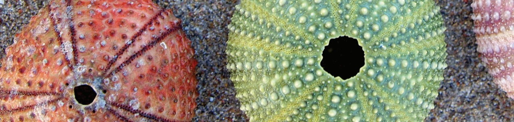

<!-- page 251 -->

<table border=1 style='margin: auto; word-wrap: break-word;'><tr><td style='text-align: center; word-wrap: break-word;'>Where it comes from</td><td style='text-align: center; word-wrap: break-word;'>What you should be able to do</td><td style='text-align: center; word-wrap: break-word;'>Check your skills</td></tr><tr><td style='text-align: center; word-wrap: break-word;'>IGCSE / O Level Mathematics</td><td style='text-align: center; word-wrap: break-word;'>Substitute values for x and y into equations of the form  $ y = f(x) + c $ and solve to find c.</td><td style='text-align: center; word-wrap: break-word;'>1 a Given that the line  $ y = 5x + c $ passes through the point (3, -4), find the value of c.\nb Given that the curve  $ y = x^{2} - 2x + c $ passes through the point (-1, 2), find the value of c.</td></tr><tr><td style='text-align: center; word-wrap: break-word;'>IGCSE / O Level Mathematics</td><td style='text-align: center; word-wrap: break-word;'>Find the x-coordinates of the points where a curve crosses the x-axis.</td><td style='text-align: center; word-wrap: break-word;'>2 Find the x-coordinates of the points where the curve crosses the x-axis.\na  $ y = 3x^{2} - 13x - 10 $b  $ y = 3\sqrt{x} - x $</td></tr><tr><td style='text-align: center; word-wrap: break-word;'>Chapter 7</td><td style='text-align: center; word-wrap: break-word;'>Differentiate constant multiples, sums and differences of expressions containing terms of the form  $ ax^{n} $.</td><td style='text-align: center; word-wrap: break-word;'>3 Find  $ \frac{dy}{dx} $.\na  $ y = 3x^{8} - 13x - 10 $b  $ y = 5x^{2} - 4x + 10\sqrt{x} $</td></tr></table>

## Why do we study integration?

In Chapters 7 and 8 you studied differentiation, which is the first basic tool of calculus. In this chapter you will learn about integration, which is the second basic tool of calculus. We often refer to integration as the reverse process of differentiation. It has many applications; for example, planning spacecraft flight paths, or modelling real-world behaviour for computer games.

Isaac Newton and Gottfried Wilhelm Leibniz formulated the principles of integration independently, in the 17th century, by thinking of an integral as an infinite sum of rectangles of infinitesimal width.

## don

In Chapter 7, you learnt about the process of obtaining  $ \frac{dy}{dx} $ when y is known. We call this process differentiation.

You learnt the rule for differentiating power functions:

### KEY POINT 9.1

If  $ y = x^n $, then  $ \frac{dy}{dx} = nx^{n-1} $.

Applying this rule to functions of the form  $ y = x^{3} + c $, we obtain:

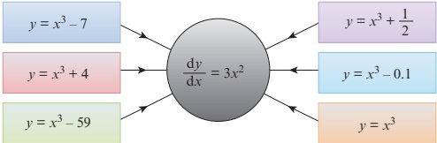

## WEB LINK

Explore the Calculus meets functions station on the Underground Mathematics website.

<!-- page 252 -->

This shows that there are an infinite number of functions that when differentiated give the answer  $ 3x^{2} $. They are all of the form  $ y = x^{3} + c $, where c is some constant.

In this chapter you will learn about the reverse process of obtaining y when  $ \frac{dy}{dx} $ is known. We can call this reverse process antidifferentiation.

There is a seemingly unrelated problem that you will study in Section 9.6: what is the area under the graph of  $ y = 3x^2 $? The process used to answer that question is known as integration. There is a remarkable theorem due to both Newton and Leibniz that says that integration is essentially the same as antidifferentiation. This is now known as the Fundamental theorem of Calculus.

Because of this theorem, we do not need to use the term antidifferentiation. So from now on, we will only talk about integration, whether we are reversing the process of differentiation or finding the area under a graph.

### EXPLORE 9.1

1 Find  $ \frac{dy}{dx} $ for each of the following functions.

a

 $$ y=\frac{1}{3}x^{3}-2 $$ 

b

 $$ y=\frac{1}{6}x^{6}+8 $$ 

 $$ y=\frac{1}{15}x^{15}+1 $$ 

d

 $$ y=-\frac{1}{2}x^{-2}+3 $$ 

e

 $$ y=-\frac{1}{7}x^{-7}+0.2 $$ 

 $$ y=\frac{2}{3}x^{\frac{3}{2}}-\frac{5}{8} $$ 

2 Discuss your results with those of your classmates and try to find a rule for obtaining y if  $ \frac{dy}{dx}=x^{n} $.

3 Describe your rule, in words.

4 Discuss with your classmates whether your rule works for finding y when  $ \frac{dy}{dx} = \frac{1}{x} $.

From the class discussion we can conclude that:

### KEY POINT 9.2

If  $ \frac{dy}{dx} = x^n $, then  $ y = \frac{1}{n+1}x^{n+1} + c $ (where c is an arbitrary constant and  $ n \ne -1 $).

You may find it easier to remember this in words:

‘Increase the power n by 1 to obtain the new power, then divide by the new power. Remember to add a constant c at the end.’

Using function notation we write this rule as:

### KEY POINT 9.3

If  $ \mathrm{f}^{\prime}(x) = x^{n} $, then  $ \mathrm{f}(x) = \frac{1}{n+1}x^{n+1} + c $ (where c is an arbitrary constant and  $ n \neq -1 $).

The special symbol  $ \bigsqcup $ is used to denote integration.

<!-- page 253 -->

When we need to integrate  $ x^{3} $, for example, we write:

 $$ \int x^{3}\mathrm{d}x=\frac{1}{4}x^{4}+c $$ 

 $ \int x^{3} \, dx $ is called the indefinite integral of  $ x^{3} $ with respect to x.

We call it 'indefinite' because it has infinitely many solutions.

Using this notation, we can write the rule for integrating powers as:

### KEY POINT 9.4

 $ \int x^n \, \mathrm{d}x = \frac{1}{n+1} x^{n+1} + c $ (where  $ c $ is a constant and  $ n \ne -1 $).

We write the rule for integrating constant multiples of a function as:

### KEY POINT 9.5

 $ \int kf(x) \, \mathrm{d}x = k\int f(x) \, \mathrm{d}x $, where  $ k $ is a constant.

We write the rule for integrating sums and differences of two functions as:

### KEY POINT 9.6

 $$ \int\big[\mathrm{f}(\boldsymbol{x})\pm\mathrm{g}(\boldsymbol{x})\big]\mathrm{d}\boldsymbol{x}=\int\mathrm{f}(\boldsymbol{x})\mathrm{d}_{\boldsymbol{x}}\pm\int\mathrm{g}(\boldsymbol{x})\mathrm{d}_{\boldsymbol{x}} $$ 

### WORKED EXAMPLE 9.1

Find y in terms of x for each of the following.

a

 $$ \frac{\mathrm{d}y}{\mathrm{d}x}=x^{3} $$ 

b

 $$ \frac{\mathrm{d}y}{\mathrm{d}x}=\frac{1}{x^{2}} $$ 

 $$ \frac{\mathrm{d}y}{\mathrm{d}x}=x\sqrt{x} $$ 

Answer

a

 $$ \frac{\mathrm{d}y}{\mathrm{d}x}=x^{3} $$ 

b

 $$ \frac{\mathrm{d}y}{\mathrm{d}x}=x^{-2} $$ 

 $$ \frac{\mathrm{d}y}{\mathrm{d}x}=x^{\frac{3}{2}} $$ 

 $$ \begin{aligned}y&=\frac{1}{3+1}x^{3+1}+c\\&=\frac{1}{4}x^{4}+c\end{aligned} $$ 

 $$ \begin{aligned}y&=\frac{1}{-2+1}x^{-2+1}+c&\\ &=-x^{-1}+c\\ &\\ &=-\frac{1}{x}+c\\ \end{aligned} $$ 

 $$ \begin{aligned}y&=\frac{1}{\frac{3}{2}+1}x^{\frac{3}{2}+1}+c\\&=\frac{1}{\left(\frac{5}{2}\right)}x^{\frac{5}{2}}+c\\&=\frac{2}{5}x^{\frac{5}{2}}+c\end{aligned} $$

<!-- page 254 -->

### WORKED EXAMPLE 9.2

Find  $ f(x) $ in terms of x for each of the following.

a

 $$ \mathrm{f}^{\prime}(x)=4x^{3}-\frac{2}{x^{2}}+4 $$ 

 $$ \mathrm{f}^{\prime}(x)=8x^{2}-\frac{1}{2x^{4}}+2x $$ 

 $$ \mathrm{f}^{\prime}(x)=\frac{(x+3)(x-1)}{\sqrt{x}} $$ 

## Answer

a

 $$ \mathrm{f}^{\prime}(x)=4x^{4}-2x^{-}+4x^{1}\quad\mathrm{i}^{1} $$ 

Write in index form ready for integration.

 $$ \begin{aligned}f(x)&=\frac{44}{4}x\quad2\frac{2}{2(-1)}\frac{4}{x^{2}}+\frac{4}{x}x+c\\&=x\quad+\quad x^{-}\frac{4}{x^{2}}+x+c\\&=x\quad+\frac{1}{x^{2}}+x+c\end{aligned} $$ 

b

 $$ \mathrm{f}^{\prime}(x)=8x^{2}-\frac{1}{2}x^{-4}+2x^{1} $$ 

Write in index form ready for integration.

 $$ \begin{aligned}f(x)&=\frac{8}{3}x^{3}-\frac{1}{2(-3)}x^{-3}+\frac{2}{2}x^{2}+c\\&=\frac{8}{3}x^{3}+\frac{1}{6}x^{-3}+x^{2}+c\\&=\frac{8}{3}x^{3}+\frac{1}{6x^{3}}+x^{2}+c\end{aligned} $$ 

c

 $$ \begin{aligned}\mathrm{f}^{\prime}(\quad)&=\frac{2+2\quad-3}{x\quad\sqrt{x}}\\x\quad&=\quad\frac{3}{2}+2^{x}\frac{1}{2}-3\quad-\frac{1}{2}\end{aligned} $$ 

Write in index form ready for integration.

 $$ \begin{aligned}\mathrm{f}(\quad)&=\frac{x}{(\frac{5}{2})}x^{\frac{5}{2}}+\frac{2}{(\frac{3}{2})}x^{\frac{3}{2}}-\frac{3}{(\frac{1}{2})}x^{\frac{1}{2}}+c\\x&=\frac{2}{5}x^{\frac{5}{}}+\frac{4}{3}x^{\frac{-}{}}}-6\sqrt{x}+c\end{aligned} $$ 

### WORKED EXAMPLE 9.3

Find:

a

 $$ \int x(2x-1)(2x+3)\mathrm{d}x $$ 

b

 $$ \int\frac{4x^{2}-3\sqrt{x}}{x}\mathrm{d}x $$ 

Answer

a

 $$ \begin{aligned}\int x(2x-1)(2x+3)\mathrm{d}x&=\int(4x^{3}+4x^{2}-3x)\mathrm{d}x\\&=\frac{4x^{4}}{4}+\frac{4x^{3}}{3}-\frac{3x^{2}}{2}+c\\&=x^{4}+\frac{4x^{3}}{3}-\frac{3x^{2}}{2}+c\end{aligned} $$

<!-- page 255 -->

$$ \begin{array}{r} \int_{4}^{4}\frac{3}{x} dx \quad 4 \quad ^{-} \cdot \left\{\begin{array}{l} x^{2} - \sqrt{x} \\ x \equiv \int \left( \begin{array}{c} x - 3x \end{array} \right) \frac{1}{2} + dx \end{array}\right\} \\  = \frac{4}{2} \cdot x^{2} - \frac{3}{(\frac{1}{2})^{7}} \cdot x^{\frac{1}{2}} \quad c \\ = \frac{1}{2} x^{2} - \frac{3}{6} \cdot \frac{1}{x^{2}} + \\ 2x^{2} - 6x^{2} - c \\ 2x^{2} - 6\sqrt{x} - c \end{array} $$ 

## EXERCISE 9A

1 Find y in terms of x for each of the following.

a  $ \frac{dy}{dx}=15x^{2} $

 $ \frac{\mathrm{d}y}{\mathrm{d}x}=14x^{6} $

 $ \frac{\mathrm{d}y}{\mathrm{d}x}=12x^{3} $

d  $ \frac{\mathrm{d}y}{\mathrm{d}x}=\frac{3}{x^{2}} $

 $ \frac{\mathrm{d}y}{\mathrm{d}x}=\frac{1}{2x^{3}} $

 $ \frac{\mathrm{d}y}{\mathrm{d}x}=\frac{4}{\sqrt{x}} $

2 Find  $ f(x) $ in terms of x for each of the following.

a  $ f'(x) = 5x^{4} - 2x^{3} + 2 $

b  $ f'(x) = 3x^{5} + x^{2} - 2x $

 $ f'(x) = \frac{2}{x^3} + \frac{8}{x^2} + 6x $

d  $ \mathrm{f}^{\prime}(x)=\frac{9}{x^{7}}-\frac{3}{x^{2}}-4 $

3 Find y in terms of x for each of the following.

a  $ \frac{dy}{dx} = x(x+5) $

 $ \mathbf{b}\quad\frac{\mathrm{d}y}{\mathrm{d}x}=2x^{2}(3x+1) $

c  $ \frac{\mathrm{d}y}{\mathrm{d}x}=x(x+2)(x-8) $

d  $ \frac{\mathrm{d}y}{\mathrm{d}x}=\frac{x^{4}-2x+5}{2x^{3}} $

 $  \mathbf{e} \quad \frac{\mathrm{d}y}{\mathrm{d}x} = \sqrt{x} (x - 3)^2  $

 $ \frac{\mathrm{d}y}{\mathrm{d}x}=\frac{5x^{2}+3x+1}{\sqrt{x}} $

4 Find each of the following.

a  $ \int 12x^{5} \, dx $

b  $ \int 20x^{3} \, dx $

c  $ \int 3x^{-2}dx $

d  $ \int \frac{4}{x^{3}} dx $

 $ \int\frac{2}{3\sqrt{x}}dx $

 $ \int\frac{5}{x\sqrt{x}}dx $

5 Find each of the following.

a  $ \int (x + 1)(x + 4) \, dx $

b  $ \int(x-3)^{2}dx $

c  $ \int (2\sqrt{x} - 1)^{2} \, dx $

d  $ \int\sqrt[3]{x}(x^{2}+1)\mathrm{d}x $

e  $ \int \frac{x^{2}-1}{2x^{2}}dx $

$$

\begin{aligned}

\text{f} & \quad \int \frac{x^3 + 6}{2x^3} dx \\

\text{i} & \quad \int \left( \sqrt{x} - \frac{x^2 - x}{\sqrt{x}} \right)^2 dx

\end{aligned}

$$

 $  \mathbf{g} \quad \int \frac{x^{2} + 2\sqrt{x}}{3x} \, dx  $

 $$ \int\frac{x^{4}-10}{x\sqrt{x}}\mathrm{d}x $$

<!-- page 256 -->

### 9.2 Finding the constant of integration

The next two examples show how we can find the equation of a curve if we know the gradient function and the coordinates of a point on the curve.

### WORKED EXAMPLE 9.4

A curve is such that  $ \frac{dy}{dx} = \frac{6x^{5} - 18}{x^{3}} $, and (1, 6) is a point on the curve.

Find the equation of the curve.

## Answer

 $$ \begin{aligned}\frac{\mathrm{d}y}{\mathrm{d}x}&=\frac{6x^{5}-18}{x^{3}}\\&=6x^{2}-18x^{-3}\\y&=2x^{3}+9x^{-2}+c\\&=2x^{3}+\frac{9}{x^{2}}+c\end{aligned} $$ 

Write in index form ready for integration.

When x = 1, y = 6.

 $$ \begin{aligned}&6=2(1)^{3}+\frac{9}{(1)^{2}}+c\\&6=2+9+c\\&c=-5\end{aligned} $$ 

The equation of the curve is  $ y = 2x^{3} + \frac{9}{x^{2}} - 5 $.

### WORKED EXAMPLE 9.5

The function f is such that  $ f'(x) = 15x^4 - 6x $ and  $ f(-1) = 1 $. Find  $ f(x) $.

## Answer

 $$ f^{\prime}(x)=15x^{4}-6x $$ 

 $$ \mathrm{f}(x)=3x^{5}-3x^{2}+c $$ 

Using  $ f(-1) = 1 $ gives:

 $$ \begin{aligned}&1=3(-1)^{5}-3(-1)^{2}+c\\&1=-3-3+c\\ \end{aligned} $$ 

 $$ \therefore f(x)=3x^{5}-3x^{2}+7 $$

<!-- page 257 -->

A curve is such that  $ \frac{dy}{dx} = 6x + k $, where  $ k $ is a constant. The gradient of the normal to the curve at the point  $ (1, -3) $ is  $ \frac{1}{k^2} $. Find the equation of the curve.

 $$ \begin{aligned}&Answer\\&\frac{\mathrm{d}}{\mathrm{d}}=6\quad+\\&\quad3\quad2\end{aligned} $$ 

Integrate.

When x = 1, y = -3.

 $$ -3=3(1)^{2}+k(1)+c $$ 

When  $ x=1 $,  $ \frac{dy}{dx}=6(1)+k=6+k $

Gradient of normal =  $ \frac{1}{2} $ so gradient of tangent = -2

Substituting for k into (1) gives c = 2.

The equation of the curve is  $ y = 3x^{2} - 8x + 2 $.

## EXERCISE 9B

1 Find the equation of the curve, given  $ \frac{dy}{dx} $ and a point P on the curve.

a  $ \frac{dy}{dx}=3x^{2}+1,\ P=(1,4) $

b  $ \frac{dy}{dx}=2x(3x-1), P=(-1,2) $

c  $ \frac{\mathrm{d}y}{\mathrm{d}x}=\frac{4}{x^{2}},\quad P=(4,9) $

$$\mathrm{d}\quad\frac{\mathrm{d}y}{\mathrm{d}x}=\frac{2x^{3}-6}{x^{2}},\quad P=(3,7)$$

 $  \mathbf{e} \quad \frac{\mathrm{d}y}{\mathrm{d}x} = \frac{2}{\sqrt{x}} - 1, \, P = (4, 6)  $

 $$ \frac{\mathrm{d}y}{\mathrm{d}x}=\frac{(1-\sqrt{x})^{2}}{\sqrt{x}},P=(9,5) $$ 

2 A curve is such that  $ \frac{dy}{dx} = -\frac{k}{x^{2}} $, where k is a constant. Given that the curve passes through the points (6, 2.5) and (-3, 1), find the equation of the curve.

3 A curve is such that  $ \frac{dy}{dx} = kx^{2} - 12x + 5 $, where k is a constant. Given that the curve passes through the points  $ (1, -3) $ and  $ (3, 11) $, find the equation of the curve.

4 A curve is such that  $ \frac{dy}{dx}=kx^{2}-\frac{6}{x^{3}} $, where k is a constant. Given that the curve passes through the point P(1, 6) and that the gradient of the curve at P is 9, find the equation of the curve.

<!-- page 258 -->

5 A curve is such that  $ \frac{dy}{dx} = 5x\sqrt{x} + 2 $. Given that the curve passes through the point  $ (1, 3) $, find:

a the equation of the curve

b the equation of the tangent to the curve when x = 4.

6 A curve is such that  $ \frac{dy}{dx} = kx + 3 $, where k is a constant. The gradient of the normal to the curve at the point  $ (1, -2) $ is  $ -\frac{1}{7} $. Find the equation of the curve.

7 A function  $ y = f(x) $ has gradient function  $ f'(x) = 8 - 2x $. The maximum value of the function is 20. Find  $ f(x) $ and sketch the graph of  $ y = f(x) $.

8 A curve is such that  $ \frac{dy}{dx} = 3x^2 + x - 10 $. Given that the curve passes through the point  $ (2, -7) $ find:

a the equation of the curve

b the set of values of x for which the gradient of the curve is positive.

PS 9 A curve is such that  $ \frac{\mathrm{d}^{2}y}{\mathrm{d}x^{2}}=12x+12 $. The gradient of the curve at the point  $ (0,4) $ is 10.

a Express y in terms of x.

b Show that the gradient of the curve is never less than 4.

10 A curve is such that  $ \frac{\mathrm{d}^{2}y}{\mathrm{d}x^{2}} = -6x - 4 $. Given that the curve has a minimum point at  $ (-2, -6) $, find the equation of the curve.

11 A curve  $ y = f(x) $ has a stationary point at  $ P(2, -13) $ and is such that  $ f'(x) = 2x^2 + 3x - k $, where k is a constant.

a Find the x-coordinate of the other stationary point, Q, on the curve  $ y = f(x) $.

b Determine the nature of each of the stationary points P and Q.

PS 12 A curve is such that  $ \frac{dy}{dx} = k + x $, where k is a constant.

a Given that the tangents to the curve at the points where x = 5 and x = 7 are perpendicular, find the value of k.

b Given also that the curve passes through the point  $ (10, -8) $, find the equation of the curve.

13 A curve  $ y = f(x) $ has a stationary point at  $ (1, -1) $ and is such that  $ f''(x) = 2 + \frac{4}{x^3} $. Find  $ f'(x) $ and  $ f(x) $.

14 A curve is such that  $ \frac{a+y}{dx^{2}} = 2x + 8 $. Given that the curve has a minimum point at (3, -49), find the coordinates of the maximum point.

15 A curve is such that  $ \frac{dy}{dx} = 3 - 2x $ and (1, 11) is a point on the curve.

a Find the equation of the curve.

b A line with gradient  $ \frac{1}{5} $ is a normal to the curve at the point (4, 5). Find the equation of this normal.

16 A curve is such that  $ \frac{dy}{dx} = 3\sqrt{x} - 6 $ and the point  $ P(1, 6) $ is a point on the curve.

a Find the equation of the curve.

b Find the coordinates of the stationary point on the curve and determine its nature.

<!-- page 259 -->

17 A curve is such that  $ \frac{\mathrm{d}^{2}y}{\mathrm{d}x^{2}}=2-\frac{12}{x^{3}} $. The curve has a stationary point at P where x=1. Given that the curve passes through the point (2,5), find the coordinates of the stationary point P and determine its nature.

18 A curve is such that  $ \frac{dy}{dx} = 2x - 5 $ and the point  $ P(3, -4) $ is a point on the curve. The normal to the curve at P meets the curve again at Q.

b Find the equation of the normal to the curve at P.

a Find the equation of the curve.

c Find the coordinates of Q.

### 9.3 Integration of expressions of the form  $ (ax + b)^{n} $

In Chapter 7 you learnt that:

 $$ \frac{\mathrm{d}}{\mathrm{d}x}\left[\frac{1}{3\times7}\left(3x-1\right)^{7}\right]=(3x-1)^{6} $$ 

Hence,  $ \int (3x - 1)^{6} \, \mathrm{d}x = \frac{1}{3 \times 7} (3x - 1)^{7} + c $

This leads to the general rule:

### KEY POINT 9.7

If  $ n \neq -1 $ and  $ a \neq 0 $, then  $ \int (ax + b)^n \, dx = \frac{1}{a(n+1)} (ax + b)^{n+1} + c $

It is very important to note that this rule only works for powers of linear functions.

For example,  $ \int (ax^{2} + b)^{6} \, dx $ is not equal to  $ \frac{1}{3a} (ax^{2} + b)^{3} + c $. (Try differentiating the latter expression to see why.)

### WORKED EXAMPLE 9.7

Find:

a

 $$ \int(2x-3)^{4}\mathrm{d}x $$ 

b

 $$ \int\frac{20}{\left(1-4x\right)^{6}}\mathrm{d}x $$ 

 $$ c\quad\int\frac{5}{\sqrt{2x+7}}\mathrm{d}x $$ 

Answer

a

 $$ \begin{aligned}\int\left(2x-3\right)^{4}\mathrm{d}x&=\frac{1}{2(4+1)}\left(2x-3\right)^{4+1}+c\\&=\frac{1}{10}\left(2x-3\right)^{5}+c\end{aligned} $$ 

b

 $$ \begin{aligned}\int\frac{20}{(1-4x)^{6}}\mathrm{d}x&=20\int(1-4x)^{-6}\mathrm{d}x\\&=\frac{20}{(-4)(-6+1)}(1-4x)^{-6+1}+c\\&=(1-4x)^{-5}+c\\&=\frac{1}{(1-4x)^{5}}+c\end{aligned} $$

<!-- page 260 -->

$$ \begin{aligned}c\quad\int\frac{5}{\sqrt{2x+7}}\mathrm{d}x&=5\int\left(2x+7\right)^{-\frac{1}{2}}\mathrm{d}x\\&=\frac{5}{2\left(-\frac{1}{2}+1\right)}\left(2x+7\right)^{-\frac{1}{2}+1}+c\\&=5\sqrt{2x+7}+c\end{aligned} $$ 

## EXERCISE 9C

1 Find:

a  $ \int (2x - 7)^{8} \, dx $

b  $ \int (3x + 1)^{5} \, dx $

c  $ \int 2(5x - 2)^{8} \mathrm{d}x $

d  $ \int 3(1 - 2x)^{5} \, dx $

e  $ \int \sqrt[3]{5 - 4x} \, dx $

 $  \mathbf{f} \quad \int \sqrt{(2x + 1)^3} \, dx  $

 $  \mathbf{g} \quad \int \frac{2}{\sqrt{3x-2}} \, dx  $

h  $ \int\left(\frac{2x}{+}1\right)^{\mathrm{dx}} $

 $$ \int\frac{5}{4(7-2x)^{5}}\mathrm{d}x $$ 

2 Find the equation of the curve, given  $ \frac{dy}{dx} $ and a point P on the curve.

a  $ \frac{\mathrm{d}y}{\mathrm{d}x} = (2x - 1)^3 $,  $ P = \left( \frac{3}{2}, 4 \right) $

b  $ \frac{\mathrm{d}y}{\mathrm{d}x}=\sqrt{2x+5},\quad P=(2,2) $

c  $ \frac{\mathrm{d}y}{\mathrm{d}x}=\frac{1}{\sqrt{x-2}}, P=(3,7) $

d  $ \frac{\mathrm{d}y}{\mathrm{d}x}=\frac{4}{\left(3-2x\right)^{2}}, P=(2,4) $

3 A curve is such that  $ \frac{dy}{dx} = k(x - 5)^3 $, where k is a constant. The gradient of the normal to the curve at the point  $ (4, 2) $ is  $ \frac{1}{12} $. Find the equation of the curve.

4 A curve is such that  $ \frac{dy}{dx} = \frac{5}{\sqrt{2x-3}} $.

Given that the curve passes through the point  $ P(2,1) $, find:

a the equation of the normal to the curve at P

b the equation of the curve.

5 A curve is such that  $ \frac{dy}{dx} = \frac{12}{\sqrt{3x+1}} - 4x - 2 $.

a Show that the curve has a stationary point when x = 1 and determine its nature.

b Given that the curve passes through the point  $ (0, 13) $, find the equation of the curve.

PS 6 A curve is such that  $ \frac{dy}{dx} = \frac{4}{\sqrt{2x + k}} $, where k is a constant. The point  $ P(3, 2) $ lies on the curve and the normal to the curve at P is  $ x + 4y = 11 $. Find the equation of the curve.

<!-- page 261 -->

### 9.4 Further indefinite integration

In this section we use the concept that integration is the reverse process of differentiation to help us integrate some more complicated expressions.

### KEY POINT 9.8

 $$ \mathrm{If}\quad\frac{\mathrm{d}}{\mathrm{d}x}\left[\mathrm{F}(x)\right]=\mathrm{f}(x),\mathrm{then}\int\mathrm{f}(x)\mathrm{d}x=\mathrm{F}(x)+c $$ 

### WORKED EXAMPLE 9.8

a Show that  $ \frac{\mathrm{d}}{\mathrm{d}x}\left[\left(3x^{2}-4\right)^{8}\right]=48x\left(3x^{2}-4\right)^{7} $.

b Hence, find  $ \int6x\left(3x^{2}-4\right)^{7} $ dx.

Answer

a Let  $  y = (3x^{2} - 4)^{8}  $

Use the chain rule.

 $$ \begin{aligned}\frac{\mathrm{d}y}{\mathrm{d}x}&=(6x)(8)(3x^{2}-4)^{8-1}\\&=48x(3x^{2}-4)^{7}\end{aligned} $$ 

$$\begin{aligned}\mathbf{b}&\quad\int6x(3x^{2}-4)^{7}\,\mathrm{d}x=\frac{1}{8}\int48x(3x^{2}-4)^{7}\,\mathrm{d}x\\&=\frac{1}{8}\left(3x^{2}-4\right)^{8}+c\end{aligned}$$

## EXERCISE 9D

1 a Differentiate  $ (x^{2}+2)^{4} $ with respect to x.

b Hence, find  $ \int x(x^{2}+2)^{3}\,dx $.

2 a Differentiate  $ (2x^{2}-1)^{5} $ with respect to x.

b Hence, find  $ \int x(2x^{2}-1)^{4}\,dx $.

3 a Given that  $ y = \frac{1}{x^2 - 5} $, show that  $ \frac{dy}{dx} = \frac{kx}{(x^2 - 5)^2} $, and state the value of k.

b Hence, find  $ \int \frac{4x}{(x^{2}-5)^{2}} \, dx $.

4 a Differentiate  $ \frac{1}{4-3x^{2}} $ with respect to x.

b Hence, find  $ \int \frac{3x}{(4 - 3x^2)^2} \, dx $.

5 a Differentiate  $ (x^{2}-3x+5)^{6} $ with respect to x.

b Hence, find  $ \int 2(2x - 3)(x^2 - 3x + 5)^5 \, dx $.

6 a Differentiate  $ (\sqrt{x} + 3)^{8} $ with respect to x.

b Hence, find  $ \int \frac{(\sqrt{x} + 3)^7}{\sqrt{x}} \, dx $.

<!-- page 262 -->

7 a Differentiate  $ (2x\sqrt{x}-1)^{5} $ with respect to x.

b Hence, find  $ \int 3\sqrt{x}(2x\sqrt{x}-1)^{4}\,dx $.

### 9.5 Definite integration

In the remaining sections of this chapter, you will be learning how to find areas and volumes of various shapes. To do this, you will be using a technique known as definite integration, which is an extension of the indefinite integrals you have been using up to now. In this section, you will learn this technique, before going on to apply it in the next section.

Recall that

 $$ \int x^{3}\mathrm{d}x=\frac{1}{4}x^{4}+c, $$ 

where $c$ is an arbitrary constant, is called the indefinite integral of $x^{3}$ with respect to $x$.

We can  $ \text{integrate a function between two specified limits} $.

We write the integral $\mathrm{d}\theta$ of the function $x^{3}$ with respect to $x$ between the limits $x=2$ and $x=4$ as: 4

 $$ \int_{2}^{4}x^{3}\mathrm{d}x\quad\begin{array}{c}1\\60_{4}\end{array}\quad4\quad\begin{array}{c}4\\1\end{array}\quad\begin{array}{c}2\\2\\\end{array} $$ 

The method for evaluating this integral is:

\[\begin{array}{r l}{\int x}&{{}x=\left\{\left.-\frac{x}{\times}+c\right.\right\}\Bigg\}^{-1}\times\quad+}\\ {\quad}&{{}=\quad\frac{4}{c}\quad-\quad\frac{4}{c}\quad\frac{4}{c}\quad\frac{4}{c}\quad\frac{4}{c}\quad\frac{4}{

Note that the 'c's cancel out, so the process can be simplified to:

 $$ \begin{aligned}\int_{2}^{4}x^{3}\mathrm{d}x=&\left\{\frac{1}{4}\left.x^{4}\right|^{4}\right\}\\&\frac{1}{4}\quad\left.4\right.^{-4}\left.-\left(\frac{4}{4}\times\right.\right.\left.^{2}\right.\left.^{4}\right\}\\&=60\end{aligned} $$ 

The limits of integration are always written either to the right of the integral sign, as printed, or directly below and above it. They should never be written to the left of the integral sign.

 $ \int_{2}^{4} x^{3} \, dx $ is called the definite integral of  $ x^{3} $ with respect to x between the limits 2 and 4.

## TIP

Hence, we can write the evaluation of a definite integral as:

### KEY POINT 9.9

 $$ \int_{a}^{b}\mathrm{f}(x)\mathrm{d}x=\left[\mathrm{F}(x)\right]_{a}^{b}=\mathrm{F}(b)-\mathrm{F}(a) $$ 

The following rules for definite integrals may also be used.

<!-- page 263 -->

### KEY POINT 9.10

 $ \int_{a}^{b} k f(x) \, \mathrm{d}x = k \int_{a}^{b} f(x) \, \mathrm{d}x $, where  $ k $ is a constant

 $$ \int_{a}^{b}\left[\mathrm{f}(x)\pm\mathrm{g}(x)\right]\mathrm{d}x=\int_{a}^{b}\mathrm{f}(x)\mathrm{d}x\pm\int_{a}^{b}\mathrm{g}(x)\mathrm{d}x $$ 

 $$ \int_{a}^{b}\mathrm{f}(x)\mathrm{d}x=-\int_{b}^{a}\mathrm{f}(x)\mathrm{d}x $$ 

### KEY POINT 9.11

 $$ \int_{a}^{b}\mathrm{f}(x)\mathrm{d}x+\int_{b}^{c}\mathrm{f}(x)\mathrm{d}x=\int_{a}^{c}\mathrm{f}(x)\mathrm{d}x $$ 

### WORKED EXAMPLE 9.9

Evaluate:

a

 $$ \int_{1}^{2}\frac{6x^{4}-1}{x^{2}}\mathrm{d}x $$ 

b

 $$ \int_{0}^{3}\sqrt{5x+1}\mathrm{d}x $$ 

 $$ \begin{array}{r l}{\mathsf{c}}&{{}\displaystyle\int_{-2}^{1}\frac{8}{\left(5-2x\right)^{2}}\mathrm{d}x}\end{array} $$ 

Answer

a

 $$ \begin{array}{r l}&{\int_{1}^{2}\frac{6x^{4}-1}{x^{2}}\mathrm{d}x=\int_{1}^{2}\left(6x^{2}-x^{2}\right)\mathrm{d}x}\\ &{\quad\equiv\left[\frac{6}{3}x^{3}\nmpdot x\right.\left.1\right]_{1}^{2}}\end{array} $$ 

 $$ \begin{array}{c c c}{_{3}}&{\left(\mathfrak{Z}(2)^{3}\quad\left\{2\mathfrak{0}^{-1}\right\}_{+}\left(2(1)^{3}+(1)^{-1}\right)\right.}&{}\\ {_{0}}&{5x-1\mathrm{d}x}&{5x-1\mathrm{d}x}\\ {}&{\equiv\binom{0}{1}16+\frac{1}{2}\quad\left\{\begin{array}{c c}{(2}&{1)}\\ {}&{_{3}}\\ \end{array}\right.}\\ {}&{13\frac{1}{2}1}&{5x-1\frac{3}{2}}\\ {}&{\left.\begin{array}{c c}{(5)}&{3}\\ {}&{2}\\ \end{array}\right.}\\ \end{array} $$ 

b

 $$ \begin{array}{r l}{\int\sqrt{~+~}}&{{}=\int_{\left[\frac{15}{2},\frac{5x^{+}}{1}\right]}^{2\left(-\frac{1}{2}\right)^{-3}\left(-\frac{1}{2}\right)^{3}}\cdot}\\ {{}}&{{}=\left[\frac{2}{15\frac{16f}{1}}\left(\begin{array}{r r r}{15}&{0}&{2}\\ {0}&{0}&{15}\\ \end{array}\right)\right]^{\frac{3}{2}}}\\ {{}}&{{}=\left[\frac{128}{15\times}\left(\begin{array}{r r r}{15}&{0}&{2}\\ {0}&{0}&{15}\\ \end{array}\right)\right]}\\ {{}}&{{}=\frac{8\frac{2}{5}\left(\begin{array}{r r r}{15}&{0}&{2}\\ {0}&{0}&{15}\\ \end{array}\right)}{\left[\frac{15}{2},\frac{16f}{1}\right]^{\frac{3}{2}}}.}\\ {{}}&{{}=\left(-\begin{array}{r}{\left\{\begin{array}{l}{15}\\ {0}\end{array}\right\}}\\ {0}\\ \end{array}\right)\left(\begin{array}{l}{15}\\ {0}\\ {0}\end{array}\right)}\\ \end{array}\right)}}\end{array} $$

<!-- page 264 -->

$$ \begin{array}{r} \left[\begin{array}{cc} c & \int_{2}^{1}\frac{4}{\left(-\ x\right)^{2}} \quad x=\int_{8}^{4}\frac{4}{3} \\ =\int\limits_{2}^{1}\left(\frac{4}{\left(-\right)^{2}}\right)\left(\frac{4}{\left(-\right)^{2}}\right)^{2}x \end{array} \right] \\  \pm  \left[\begin{array}{cc} \frac{1-1}{\left(\frac{1}{\left(-\right)}\right)\left(\frac{1}{\left(-\right)}\right)}(-\ x)^{1} \end{array} \right] \\  \pm  \left[\begin{array}{cc} \overline{x}^{1} & ^{2} \\ - & -  \end{array} \right]  \\ \succeq 0 \end{array} $$ 

## EXERCISE 9E

1 Evaluate:

a  $ \int_{1}^{2}3x^{2}dx $

2  $ \int_{0}^{3}\left(10-x^{2}\right)dx $

b  $ \int_{1}^{3}\frac{4}{x^{3}}dx $

c  $ \int_{-1}^{1}(2x-3)dx $

 $ e \quad \int_{-1}^{2}(4x^{2}-2x)dx $

a  $ \int_{1}^{2}3^{2}2\int_{2}^{1}d $  $ \int x - +\frac{x}{x} $

f  $ \int_{0}^{2} \left( \frac{x^{2}}{} - \frac{x^{2}}{} \right)^{\mathrm{dx}} $

b  $ \int^{-2}\left(\frac{-x}{x}\right)^{2}\mathrm{d}x $

d  $ \int_{0}^{1}\sqrt{x}(1-x)\mathrm{d}x $

 $ e \quad \int_{1}^{2} \frac{(3-x)(8+x)}{x^{4}} \, dx $

 $$ \int_{1}^{2}\left(x+3\right)\left(7-2x\right)\mathrm{d}x\atop3\quad\quad\quad2\quad\quad\quad1\mathrm{d} $$ 

3 Evaluate:

 $ f \int_{0}^{14} \left( \sqrt{x} + \frac{1}{\sqrt{x}} \right)^{\mathrm{d}} x $

a  $ \int_{-1}^{0}(2x+3)^{3} $ dx

b  $ \int_{0}^{4}\sqrt{2x+1}dx $

d  $ \int_{-1}^{1}\frac{6}{\left(x-2\right)^{2}}dx $

c  $ \int_{1}^{2}\sqrt{(x-1)^{3}} $ dx

e  $ \int_{2}^{3}\frac{9}{\left(2x-3\right)^{3}} $ dx

 $ f \int_{-2}^{2} \frac{4}{\sqrt{5-2x}} dx $

4 a Given that  $ y = \frac{2}{x^{2} + 5} $, find  $ \frac{dy}{dx} $.

b Hence, evaluate  $ \int_{0}^{2}\frac{2x}{\left(x^{2}+5\right)^{2}}dx $.

5 a Given that  $ y=\left(x^{3}-2\right)^{5} $, find  $ \frac{dy}{dx} $.

b Hence, evaluate  $ \int_{0}^{1} x^{2} \left( x^{3} - 2 \right)^{4} dx $.

a Given that  $ y = \frac{\left(\sqrt{x} + 1\right)^{5}}{10} $, find  $ \frac{dy}{dx} $.

b Hence, evaluate  $ \int_{1}^{4}\frac{\left(\sqrt{x}+1\right)^{4}}{\sqrt{x}}\,dx $.

<!-- page 265 -->

### 9.6 Area under a curve

Consider the area bounded by the curve  $ y = x^{2} $, the x-axis and the lines x = 2 and x = 5.

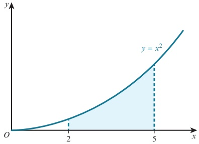

The area, $A$, of the region can be approximated by a series of rectangular strips of thickness $\delta x$ (corresponding to a small increase in $x$) and height $y$ (corresponding to the height of the function).

The approximation for $A$ is then $\sum y \delta x$.

As $\delta x \to 0$, then $A \to \int_{2}^{5} y \, dx$.

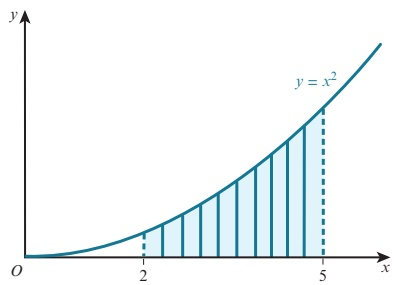

This leads to the general rule:

### KEY POINT 9.12

If  $ y = f(x) $ is a function with  $ y \geq 0 $, then the area,  $ A $, bounded by the curve  $ y = f(x) $, the x-axis and the lines  $ x = a $ and  $ x = b $ is given by the formula  $ A = \int_{a}^{b} y \, dx $.

<!-- page 266 -->

### WORKED EXAMPLE 9.10

Find the area of the shaded region.

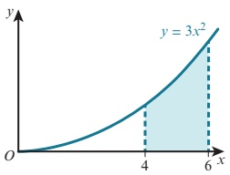

Answer

 $$ \begin{aligned}Area&=\int_{4}^{6}3x^{2}\mathrm{d}x\\&=\left\lbrack\frac{3}{3}x^{3}\right\rbrack\bigg|_{4}^{6}\\&=(216)-(64)\\&=152units^{2}\\ \end{aligned} $$ 

In Worked example 9.10, the required area is above the x-axis.

If the required area lies below the x-axis, then  $ \int_{a}^{b} f(x) \, dx $ will have a negative value. This is because the integral is summing the y values, and these are all negative.

WORKED EXAMPLE 9.11

Find the area of the shaded region.

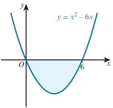

Answer

 $$ \begin{aligned}\int_{0}^{6}\left(x^{2}-6x\right)\mathrm{d}x&\equiv\left[\frac{1}{3}x^{3}-\frac{6}{2}x^{2}\right.\left.\bigg|_{0}^{6}\right.\\ &\left.\quad(72\quad108)-(0-0)\right.\\ &=-36\end{aligned} $$ 

 $$ \mathrm{~A r e a~i s~}36\mathrm{u n i t s}^{2}. $$

<!-- page 267 -->

The required region could consist of a section above the x-axis and a section below the x-axis.

If this happens we must evaluate each area separately.

This is illustrated in Worked example 9.12.

### WORKED EXAMPLE 9.12

Find the total area of the shaded regions.

 $$ \begin{array}{cccc}{{{2}}}&{{{3}}}&{{{2}}} \\{{{0}}}&{{{8}}}&{{{12}}}&{{{d}}} \\{{{2}}} \\{{{1}}}&{{{4}}}&{{{8}}}&{{{3}}} \\{{{4}}}&{{{3}}} \\{{{1}}}&{{{4}}}&{{{3}}}&{{{2}}} \\\end{array} $$ 

 $$ \begin{array}{c} \int_{1}^{x} (0)^{4} \cdot \frac{o}{3} (0) - 6 (0) \\ 4^{1} \times x - x - x \equiv \int_{44}^{64} \left( \frac{2}{x} - (0) \frac{8}{3} \left( \frac{2}{x} + \frac{6}{x} \right) \right)^{} x \\ 6 \times 6 \div \left\{ \begin{array}{l} \frac{6}{6} \\ -x \\ 3 \end{array} \right\} - \frac{1}{4} \times \frac{6 \times 2}{1} \\ 2 \quad ( \quad 2 ) ( \quad 6 ) d \\ 2 - 8 - 12 \quad d \\ \left( \frac{12}{4} \right)^{4} - \frac{8}{3} \quad 6 \quad 2 \\ \frac{2}{1} - 4 \quad 3 \quad 2 \end{array} $$ 

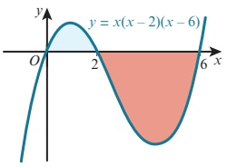

 $$ {}_{1}^{4}{}^{(2)^{4}}\quad{}_{3}^{8}{}^{(2)} $$ 

\[\begin{array}{c} \int x~x- \quad x- \quad x \equiv \int_{-4}^{6} \left( \frac{6}{x} - \frac{8}{6} \right) \frac{8}{x} + \quad \frac{6}{x} \left( \frac{6}{x} \right) \div \quad \frac{4}{1} \quad 3 \quad + \quad \left\{ \begin{array}{c} \sqrt{x} \\ \sqrt[3]{x} \end{array} \right. \\  \equiv  \left\{ \begin{array}{c} 42 \\ -x \quad - \quad x + \quad x + \end{array} \right\} - \left\{ \begin{array}{ccc} - & & + \end{array} \right.  \\  \vdots \quad & & \\  - & & \vdots \quad \ddots \\  \phantom{+} & & \vdots \quad \ddots \\  \phantom{+} & & \vdots \quad \ddots \\  \phantom{+} &

 $ \left(\frac{2}{3}\right) $

 $$ \begin{array}{r} 2 \\ 3 \overline{) 2 } \\ 3 \end{array} $$ 

Hence, the total area of the shaded regions =  $ 6\frac{2}{3} + 42\frac{2}{3} = 49\frac{1}{3} $ units $ ^{2} $.

## Area enclosed by a curve and the y-axis

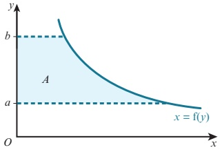

<!-- page 268 -->

### KEY POINT 9.13

If  $ x = f(y) $ is a function with  $ x \geq 0 $, then the area, A, bounded by the curve  $ x = f(y) $, the y-axis and the lines y = a and y = b is given by the formula  $ A = \int_{a}^{b} x \, \mathrm{d}y $ when  $ x \geq 0 $.

### WORKED EXAMPLE 9.13

Find the area of the shaded region.

 $$ \begin{array}{c} Answer \quad 4 \quad ^{2} \quad 1 \quad ^{3} \\=\int_{2}^{10}x \quad y \quad \frac{3}{1} \quad (4) \quad 2(0) \quad 3 \quad (0)\\ \equiv\int\left(\quad y-y\quad\right) \quad y \\ \equiv\left\{-y \quad -y \quad \mid \quad \right\}^{-1} \\ -\quad \quad \quad \quad \quad \quad \quad \quad ^{2} \quad -\quad ^{3} \\\frac{2}{3} \end{array} $$ 

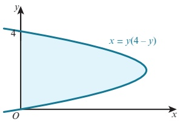

Area is $10\frac{2}{3}$ units$^{2}$.

## EXERCISE 9F

1 Find the area of each shaded region.

a

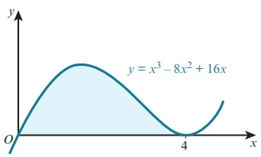

b

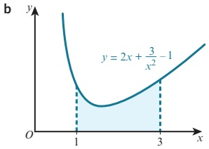

c

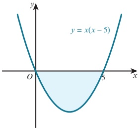

d

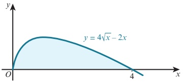

<!-- page 269 -->

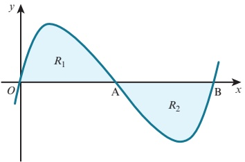

The diagram shows the curve  $ y = x(x - 2)(x - 4) $ that crosses the x-axis at the points  $ O(0, 0) $,  $ A(2, 0) $ and  $ B(4, 0) $.

Show by integration that the area of the shaded region  $ R_{1} $ is the same as the area of the shaded region  $ R_{2} $.

3 Sketch the curve and find the total area bounded by the curve and the x-axis for each of these functions.

a  $ y = x(x - 3)(x + 1) $

 $$ \mathbf{b}\quad y=x\left(x^{2}-9\right) $$ 

c  $ y = x(2x - 1)(x + 2) $

 $$ \textbf{d}\quad y=(x-1)(x+1)(x-4) $$ 

4 Sketch the curve and find the enclosed area for each of the following.

a  $ y = x^{4} - 6x^{2} + 9 $, the x-axis and the lines x = 0 and x = 1

b  $ y = 2x + \frac{5}{x^{2}} $, the x-axis and the lines x = 1 and x = 2

c  $ y = 5 + \frac{8}{x^3} $, the x-axis and the lines x = 2 and x = 5

d  $ y = 3\sqrt{x} $, the x-axis and the lines x = 1 and x = 4

e  $ y = \frac{4}{\sqrt{x}} $, the x-axis and the lines x = 1 and x = 9

f  $ y = \sqrt{2x + 3} $, the x-axis and the line x = 3

a  $ y = x^{3} $, the y-axis and the lines y = 8 and y = 27

5 Sketch the curve and find the enclosed area for each of the following.

b  $ x = y^{2} + 1 $, the y-axis and the lines y = -1 and y = 2

6

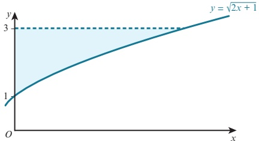

The diagram shows the curve  $ y = \sqrt{2x + 1} $. The shaded region is bounded by the curve, the y-axis and the line y = 3. Find the area of the shaded region.

<!-- page 270 -->

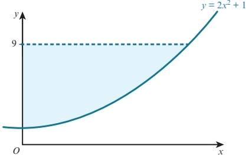

Find the area of the region bounded by the curve  $ y = 2x^{2} + 1 $, the line y = 9 and the v-axis.

a Find the area of the region enclosed by the curve  $ y = \frac{12}{x^2} $, the x-axis and the lines x = 1 and x = 4.

b The line x = p divides the region in part a into two parts of equal area. Find the value of p.

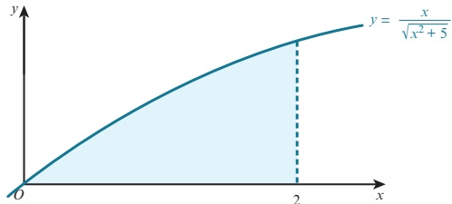

a Show that  $ \frac{\mathrm{d}}{\mathrm{d}x}\left(\sqrt{x^{2}+5}\right)=\frac{x}{\sqrt{x^{2}+5}}. $

b Use your result from part a to evaluate the area of the shaded region.

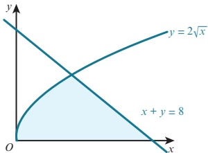

Find the shaded area enclosed by the curve  $ y = 2\sqrt{x} $, the line  $ x + y = 8 $ and the x-axis.

11 The tangent to the curve  $ y = 8x - x^{2} $ at the point  $ (2, 12) $ cuts the x-axis at the point P.

a Find the coordinates of P.

b Find the area of the shaded region.

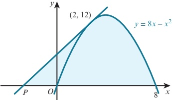

<!-- page 271 -->

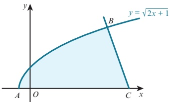

The diagram shows the curve  $ y = \sqrt{2x + 1} $ that intersects the x-axis at A.

The normal to the curve at  $ B(4, 3) $ meets the x-axis at C. Find the area of the shaded region.

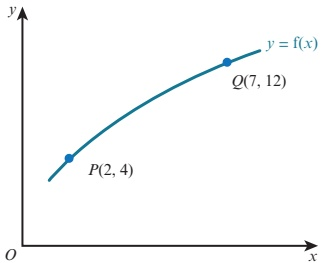

The figure shows part of the curve  $ y = f(x) $. The points  $ P(2, 4) $ and  $ Q(7, 12) $ lie on the curve. Given that  $ \int_{2}^{7} y \, dx = 42 $, find the value of  $ \int_{4}^{12} x \, dy $.

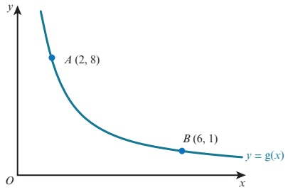

The figure shows part of the curve  $ y = g(x) $. The points  $ A(2, 8) $ and  $ B(6, 1) $ lie on the curve. Given that  $ \int_{2}^{6} y \, dx = 16 $, find the value of  $ \int_{1}^{8} x \, dy $.

## WEB

Try the following resources on the Underground

Mathematics website:

• What else do you know?

• Slippery areas.

<!-- page 272 -->

### 9.7 Area bounded by a curve and a line or by two curves

The following example shows a possible method for finding the area enclosed by a curve and a straight line.

### WORKED EXAMPLE 9.14

The diagram shows the curve  $ y = -x^2 + 8x - 5 $ and the line  $ y = x + 1 $ that intersect at the points  $ (1, 2) $ and  $ (6, 7) $.

Find the area of the shaded region.

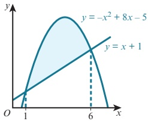

## Answer

\[\begin{array}{c} \text{Area}=\text{area under curve-area of trapezium} \\ \begin{aligned}\equiv\int_{1}^{2}\left(-x+8x-5\right)\mathrm{d}x-\frac{1}{2}\times(2+7)\times5\\ \equiv\left\{-\frac{1}{3}x^{3}+\frac{4}{5}x^{2}-5x-1\quad22\right\}^{\frac{1}{2}}-\\ \frac{1}{6}\left(\quad\right)^{2}\quad\frac{

There is an alternative method for finding the shaded area in Worked example 9.14.

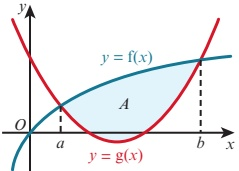

If two functions,  $ f(x) $ and  $ g(x) $, intersect at x = a and x = b, then the area, A, enclosed between the two curves is given by:

### KEY POINT 9.14

 $$ A=\int_{a}^{b}\mathrm{f}(x)\mathrm{d}x-\int_{a}^{b}\mathrm{g}(x)\mathrm{d}x $$ 

or

 $$ A=\int_{a}^{b}\left[\mathrm{f}(x)-\mathrm{g}(x)\right]\mathrm{d}x $$

<!-- page 273 -->

So for the area enclosed by  $ y = -x^{2} + 8x - 5 $ and y = x + 1:

 $$ \begin{aligned}&6\quad&6\\&1\quad&1\\&6\quad&2\\&1\quad&\end{aligned} $$ 

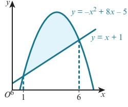

Using  $ f(x^6) = -x^2 + 8x - 5 $ and  $ g(x) = x + 1 $ gives:

 $$ \begin{aligned}Area\quad&^{1}\text{f(·)d}\quad\text{g(·)d}_{6}\\&=\int\quad\overset{x^{3}}{x}\quad\overset{x}{_{8}}-\overset{\frown}{f}\quad5\overset{x}{\text{d}}\quad\overset{x}{_{1}}x\quad(\quad1)\text{d}\\&=\int\quad\left(-x^{3}+\overset{2}{7}x-\overset{2}{6}\right)\overset{x}{_{6}}\text{d}\quad\overset{x}{f}-\int\quad x+\quad\overset{x}{x}^{3}\quad\overset{2}{f}^{(1)}\\&=\int\overset{20}{1}\overset{5}{\overset{6}{1}}\text{units}^{2}_{2}+7\overset{x}{}_{2}\text{–}\overset{x}{(6)}\quad\overset{x}{}_{6}(6)\quad\overset{3}{1}\end{aligned} $$ 

This alternative method is the easiest method to use in the next example.

\[\begin{aligned}&\begin{cases}-\frac{2}{3}x^{6}+-x&-\quad x\mid-\\-\quad+\quad-\quad&\end{cases}\quad\begin{cases}\quad\\\quad\\\quad\end{cases}\\ &= 処冇冂冂冂

### WORKED EXAMPLE 9.15

The diagram shows the curve  $ y = x^{2} - 6x - 2 $ and the line  $ y = 2x - 9 $, which intersect when x = 1 and x = 7.

Find the area of the shaded region.

Answer

 $$ \begin{array}{l} \text{Area} =\displaystyle {\int}_{7}^{7}\left({2x - 9}\right)\mathrm{d}x - \int_{1}^{7}\left({x^{2} - 6x - 2}\right)\mathrm{d}x\\  =\displaystyle {\int}_{1}^{1}\left({-x^{2} + 8x - 7}\right)\mathrm{d}x\\ \qquad = \left\lbrack-\frac{1}{-3}x^{3} + \frac{4x^{2}}{+} - \frac{7x}{2}\right\rbrack - \left\lbrack-\frac{7}{1}\quad \right\rbrack -  \left\lbrack-\frac{1}{3}\left({1}^{3}\right)^{3} + 4(1)^{2}\quad - \quad 7(1)\right\rbrack\\  =\displaystyle {\frac{1}{36}} \text{ units} - 4(7) \quad 7(7) \end{array} $$ 

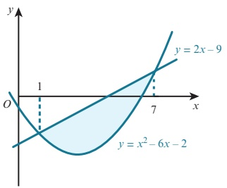

<!-- page 274 -->

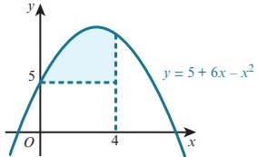

Find the area of the region bounded by the curve  $ y = 5 + 6x - x^2 $, the line x = 4 and the line y = 5.

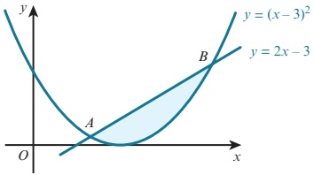

The diagram shows the curve  $ y = (x - 3)^2 $ and the line y = 2x - 3 that intersect at points A and B. Find the area of the shaded region.

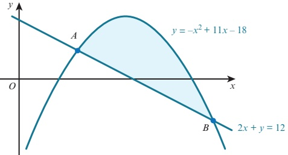

The diagram shows the curve  $ y = -x^{2} + 11x - 18 $ and the line 2x + y = 12. Find the area of the shaded region.

4 Sketch the following curves and lines and find the area enclosed between their graphs.

a  $ y = x^{2} - 3 $ and y = 6

b  $ y = -x^{2} + 12x - 20 $ and y = 2x + 1

c  $ y = x^{2} - 4x + 4 $ and  $ 2x + y = 12 $

5 Sketch the curves  $ y = x^{2} $ and  $ y = x(2 - x) $ and find the area enclosed between the two curves.

<!-- page 275 -->

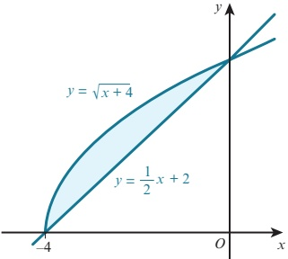

The diagram shows the curve  $ y = \sqrt{x + 4} $ and the line  $ y = \frac{1}{2}x + 2 $ meeting at the points  $ (-4, 0) $ and  $ (0, 2) $. Find the area of the shaded region.

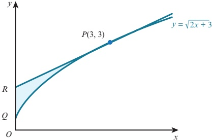

The curve  $ y = \sqrt{2x + 3} $ meets the y-axis at the point Q.

The tangent at the point  $ P(3,3) $ to this curve meets the y-axis at the point R.

a Find the equation of the tangent to the curve at P.

b Find the exact value of the area of the shaded region  $ PQR $.

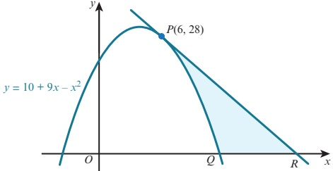

The diagram shows the curve  $ y = 10 + 9x - x^2 $. Points  $ P(6, 28) $ and  $ Q(10, 0) $ lie on the curve. The tangent at  $ P $ intersects the x-axis at  $ R $.

a Find the equation of the tangent to the curve at P.

b Find the area of the shaded region.

<!-- page 276 -->

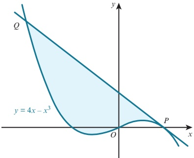

The diagram shows the curve y = 4x - x^{3}.

The point $P$ has coordinates $(2,0)$ and the point $Q$ has coordinates $(-4,48)$.

a Find the equation of the tangent to the curve at P.

b Find the area of the shaded region.

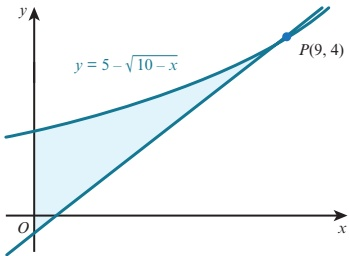

The diagram shows part of the curve  $ y = 5 - \sqrt{10 - x} $ and the tangent to the curve at  $ P(9, 4) $.

a Find the equation of the tangent to the curve at P.

b Find the area of the shaded region. Give your answer correct to 3 significant figures.

### 9.8 Improper integrals

In this section, we will consider what happens if some part of a definite integral becomes infinite. These are known as improper integrals, and we will look at two different types.

## Type 1

These are definite integrals that have either one limit infinite or both limits infinite.

Examples of these are  $ \int_{1}^{\infty}\frac{1}{x^{2}}dx $ and  $ \int_{-\infty}^{-2}\frac{1}{x^{3}}dx $.

### KEY POINT 9.15

We can evaluate integrals of the form  $ \int_{a}^{\infty} f(x) \, dx $ by replacing the infinite limit with a finite value, X, and then taking the limit as X \to \infty, provided the limit exists.

<!-- page 277 -->

### KEY POINT 9.16

We can evaluate integrals of the form  $ \int_{-\infty}^{b} f(x) \, dx $ by replacing the infinite limit with a finite value, X, and then taking the limit as X \to -\infty, provided the limit exists.

### WORKED EXAMPLE 9.16

Show that the improper integral  $ \int_{1}^{\infty}\frac{1}{x^{2}}dx $ has a finite value and find this value.

## Answer

 $$ \begin{array}{r l}{\displaystyle\int_{1}^{X}\frac{1}{x^{2}}\mathrm{d}x}&{=\displaystyle\int_{\underline{1}}^{X}x^{-2}\mathrm{d}x}\\ {\displaystyle\to\infty}&{=\displaystyle\left(\left.\overrightarrow{-}x^{-1}\right|_{1}^{X}\right)-}\\ &{=\displaystyle\left(\overrightarrow{\frac{1}{X}}\right)\frac{1}{1}}\\ &{\quad1\quad\frac{1}{2}}\end{array} $$ 

Write the integral with an upper limit $X$.

 $$ \begin{aligned}&As\ X\quad,\frac{1}{X}\quad0\\ &\therefore\int_{1}^{\infty}\frac{1}{x^{2}}\mathrm{d}x=1-0=1\\ \end{aligned} $$ 

Hence, the improper integral  $ \int_{1}^{\infty} \frac{1}{x^{2}} \, dx $ has a finite value of 1.

### WORKED EXAMPLE 9.17

The diagram shows part of the curve  $ y = \frac{1}{(1 - x)^3} $.

Show that as  $ p \to -\infty $, the shaded area tends to a finite value and find this value.

Answer

 $$ \begin{aligned}&\mathbf{e}^{r}\\ &=\int_{p}^{0}\frac{1}{1-x}\mathbf{\Sigma}^{(1-x)}\mathbf{\Sigma}_{p}^{-1}\\ &=\int_{p}^{0}(1-x)^{3}\mathbf{\Sigma}_{p}\mathbf{\Sigma}_{p}^{-1}\\ &=\left[\frac{1-x}{2(1-x)}\mathbf{\Sigma}_{p}\mathbf{\Sigma}_{p}^{-1}\right]_{p}^{0}\\ &=\left[\frac{1-x}{2(1-x)}\mathbf{\Sigma}_{p}\mathbf{\Sigma}_{p}^{-1}\right]_{p}^{0}\\ &=\frac{1-x}{p-1}\\ &=\frac{1-x}{p-1}\\ \end{aligned} $$ 

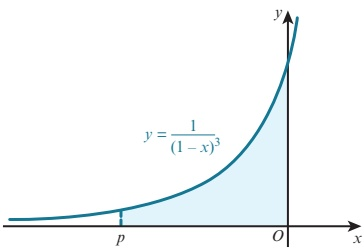

<!-- page 278 -->

$$ \mathrm{As}~p\to-\infty,~\frac{1}{2\left(1-p\right)^{2}}\to0. $$ 

Hence, as  $ p \to -\infty $, the shaded area tends to a finite value of  $ \frac{1}{2} $

## Type 2

These are integrals where the function to be integrated approaches an infinite value (or approaches  $ \pm $ infinity) at either or both end points in the interval (of integration).

For example,  $ \int_{-1}^{1}\frac{1}{x^{2}}dx $ is an invalid integral because  $ \frac{1}{x^{2}} $ is not defined when x = 0.

However, $\int_{0}^{1}\frac{1}{x^{2}}dx$ is an improper integral because $\frac{1}{x^{2}}$ tends to infinity as $x\to0$ and it is well-defined everywhere else in the interval of integration.

For this section we will consider only those improper integrals where the function is not defined at one end of the interval.

### KEY POINT 9.17

We can evaluate integrals of the form  $ \int_{a}^{b} f(x) \, \mathrm{d}x $ where  $ f(x) $ is not defined when x = a can be evaluated by replacing the limit a with an X and then taking the limit as  $ X \to a $, provided the limit exists.

### KEY POINT 9.18

We can evaluate integrals of the form  $ \int_{a}^{b} f(x) \, dx $ where  $ f(x) $ is not defined when x = b by replacing the limit b with an X and then taking the limit as  $ X \to b $, provided the limit exists.

### WORKED EXAMPLE 9.18

Find the value, if it exists, of  $ \int_{0}^{2}\frac{5}{x^{2}}dx $.

## Answer

The function  $ f(x)=\frac{5}{5} $ is not defined when x=0.

 $$ \begin{array}{r l}{\displaystyle\int_{X}^{2}\overline{{x^{2}}}}&{{}x=\displaystyle\int_{5}^{2}\overline{{x}}_{x}^{2}\overline{{x}}_{x}^{2}+\displaystyle\int_{5}^{2}\overline{{x}}_{x}^{2}\overline{{x}}_{x}^{2}+2x\displaystyle\int_{5}^{2}\overline{{x}}_{x}^{2}\overline{{x}}_{x}^{2}\overline{{x}}_{x}^{2}=x\displaystyle\int_{5}^{2}\overline{{x}}_{x}^{2}\overline{{x}}_{x}^{2}}\\ &{{}=\displaystyle\left[\overline{{\quad-x}}\right]\displaystyle\left[\overline{{\quad x}}\overline{{\quad-x}}\right]+\displaystyle\left[\overline{{\quad x}}\overline{{\quad-x}}\right]+\displaystyle\left[\overline{{\quad x}}\overline{{\quad-x}}\right]=x\displaystyle\int_{5}^{2}\overline{{x}}_{x}^{2}\overline{{x}}_{x}^{2}\overline{{x}}_{x}^{2}=x\overline{{x}}_{x}^{2}\overline{{x}}_{x}^{2}+x\overline{{x}}_{x}^{2}\overline{{x}}_{x}^{2},}\\ &{{}=\displaystyle\left(\left[\begin{array}{c}{-\quad x}\\ {-\quad x}\\ \end{array}\right]\right)\overline{{\quad x}}\overline{{\quad x}}.}\end{array} $$ 

Write the integral with a lower limit $X$.

 $$ \begin{array}{r} 2 \\ \times \quad 2 \\ \hline 2 \end{array} $$

<!-- page 279 -->

As $X \to 0$, $\frac{5}{X}$ tends to infinity.

Hence,  $ \int_{0}^{2}\frac{5}{x^{2}}dx $ is undefined.

### WORKED EXAMPLE 9.19

The diagram shows part of the curve

 $$ y=\frac{3}{\sqrt{2-x}}. $$ 

Show that as $p \to 2$ the shaded area tends to a finite value and find this value.

 $$ \begin{aligned}\operatorname{wer}&\overset{p}{\underset{0}{\longrightarrow}}\overset{3}{\underset{2}{\longrightarrow}}x\operatorname{d}x\\=&\int_{0}^{p}\frac{3\sqrt{(2-x)}^{-1}{}^{2}\operatorname{d}x}{3-\frac{1}{(2-x)^{2}}}\\=&\left[\underbrace{\frac{1}{2}\overset{(1)}{\int}_{1}^{1}x}_{}=\right]_{0}^{p}\\=&\left[\underbrace{\left(\frac{6}{7}\frac{2}{2-x}\right)^{p}}_{}=\right]_{0}^{p}\\=&\ -6\sqrt{2-p}\;-\;-6\ 2\\=&\frac{6}{7}\sqrt{2-6\ 2}\;-\;p\left(\sqrt[3]{2}\right)\end{aligned} $$ 

As

 $$ \sqrt{}\quad\sqrt{} $$ 

 $$ p\to2,\int_{0}^{p}\frac{3}{\sqrt{2-x}}\mathrm{d}x\to6\sqrt{2}. $$ 

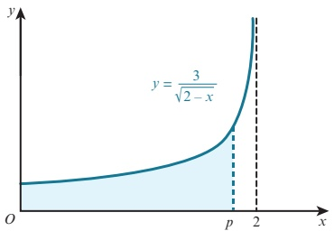

Hence, as  $ p \to 2 $ the shaded area tends to a finite value of  $ 6\sqrt{2} $.

## EXERCISE 9H

1 Show that each of the following improper integrals has a finite value and, in each case, find this value.

 $$ \int_{1}^{\infty}\frac{2}{x^{2}}\mathrm{d}x $$ 

d  $ \int_{4}^{\infty}\frac{4}{x\sqrt{x}}dx $

b  $ \int_{4}^{\infty}\frac{4}{x^{5}}dx $

e  $ \int_{0}^{25}\frac{5}{\sqrt{x}}\mathrm{d}x $

 $$ \int_{0}^{3}\frac{3}{\sqrt{3-x}}\mathrm{d}x $$ 

$$

\begin{aligned}

\mathbf{c} &= \int_{-\infty}^{-2} \frac{10}{x^3} \, dx \\

\mathbf{f} &= \int_{4}^{8} \frac{4}{\sqrt{x-4}} \, dx \\

\mathbf{i} &= \int_{1}^{2} \left( \frac{2}{x^2} + \frac{4}{(x+2)^3} \right) dx

\end{aligned}

$$

 $$ \int_{2}^{\infty}\frac{1}{\left(1-x\right)^{2}}\mathrm{d}x $$

<!-- page 280 -->

2

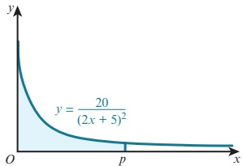

The diagram shows part of the curve  $ y = \frac{20}{(2x + 5)^2} $.

Show that as  $ p \to \infty $, the shaded area tends to the value 2.

3 Show that none of the following improper integrals exists.

a  $ \int_{4}^{\infty}\frac{6}{\sqrt{x}}dx $

b  $ \int_{0}^{\infty}\frac{4}{x\sqrt{x}}dx $

d  $ \int_{5}^{\infty}\frac{2}{\sqrt{x+4}}dx $

$$

\begin{aligned}

\mathbf{c} &= \int_{0}^{9} \frac{12}{x^2 \sqrt{x}} \, dx \\

\mathbf{f} &= \int_{0}^{25} \left( \sqrt{x} + \frac{1}{x} \right) \left| \frac{d}{x} \right| \, dx

\end{aligned}

$$

e  $ \int_{\frac{1}{2}}^{2}\frac{5}{(2x-1)^{2}}dx $

### 9.9 Volumes of revolution

Consider the area bounded by the curve  $ y = x^{2} $, the x-axis, and the lines x = 2 and x = 5.

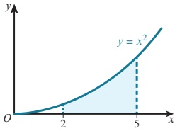

When this area is rotated about the x-axis through  $ 360^{\circ} $ a solid of revolution is formed.

The volume of this solid is called a volume of revolution.

We can approximate the volume, $V$, of the solid by a series of cylindrical discs of thickness $\delta x$ (corresponding to a small increase in $x$) and radius $y$ (corresponding to the height of the function).

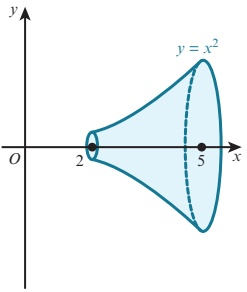

<!-- page 281 -->

The volume of each cylindrical disc is  $ \pi y^2 \delta x $. An approximation for  $ V $ is then  $ \sum \pi y^2 \delta x $.

As  $ \delta x \to 0 $, then  $ V \to \int_{2}^{5} \pi y^{2} \, dx $.

This leads to a general formula:

### KEY POINT 9.19

The volume, $V$, obtained when the function $y = \mathrm{d}f(x)$ is rotated through $360^{\circ}$ about the x-axis between the boundary values $x = a$ and $x = b$ is given by the formula $V = \int_{a}^{b} \pi y^{2} \, \mathrm{d}x$.

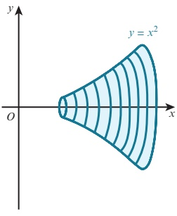

WORKED EXAMPLE 9.20 81 (3 2) $ ^{-} $

Find the volume obtained when the shaded region is rotated through  $ 360^{\circ} $ about the x-axis.

Answer

\[\begin{array}{r l r}&{}&{\left.\begin{array}{r l l}{27}&{27}\\ {8}&{5}\end{array}\right|}\\ &{}&{=\pi\int_{1}^{2}y^{2}\quad x=\frac{8\pi}{\pi}\left[\begin{array}{l}{\left.\begin{array}{l l}{2}\\ {1}\end{array}\right|_{1}^{2}}\\ {1}\end{array}\left(\frac{x+1}{x}\right)\left\{\begin{array}{l}{2}\\ {-x}\end{array}\right\}}\\ {=\pi\left[\begin{array}{l}{\left.\begin{array}{l}{2}\\ {1}\end{array}\right|_{1}^{2}}\\ {1}\end{array}\left(\begin{array}{l}{-x}\\ {+x}\end{array}\right)}\end{array}\right]}\\ &{}&{=\frac{2\pi}{\pi}\left[\begin{array}{l}{1}\\ {-x}\end{array}\right]}\\ &{}&{\quad+\quad x\quad1}\\ &{}&{=\frac{2\pi}{\pi}\left[\begin{array}{l}{1}\\ {-x}\end{array}\right]}\\ &{}&{\quad\frac{2\pi}{\pi}\left[\begin{array}{l}{1}\\ {-x}\end{array}\right]}\\ &{}&{=\pi\int_{1}^{2}y^{2}\quad x=\frac{8\pi}{\pi}\left[\begin{array}{l}{1}\\ {1}\end{array}\right]}\\ &{}&{=\frac{8\pi}{\pi}\left[\begin{array}{l}{1}\\ {-x}\end{array}\right]}\\ &{}&{=\frac{2\pi}{\pi}\left[\begin{array}{l}{1}\\ {-x}\end{array}\right]}\\ &{}&{=\frac{2\pi}{\pi}\left[\begin{array}{l}{1}\\ {-x}\end{array}\right]}\\ &{}&{=\frac{2\pi}{\pi}\left[\begin{array}{l}{1}\\ {-x}\end{array}\right]}\\ &{}&{=\frac{2\pi}{\pi

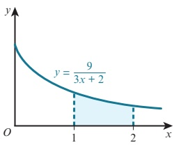

 $$ \frac{}{40}\mathrm{u n i t s}^{3} $$ 

Sometimes a curve is rotated about the y-axis. In this case the general rule is:

### KEY POINT 9.20

The volume, $V$, obtained when the function $x = f(y)$ is rotated through $360^\circ$ about the $y$-axis between the boundary values $y = a$ and $y = b$ is given by the formula $V = \int_a^b \pi x^2 \, \mathrm{d}y$.

<!-- page 282 -->

### WORKED EXAMPLE 9.21

Find the volume obtained when the shaded region is rotated through  $ 360^{\circ} $ about the y-axis.

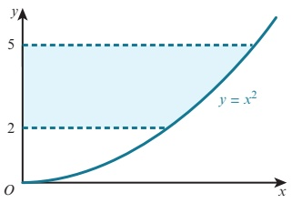

 $$ \begin{array}{l} Answer \\ Volume=\displaystyle\pi\int_{2}^{\pi}x^{2}\mathrm{d}y=\displaystyle\pi\int_{2}^{\pi}y\mathrm{d}y\\ \equiv\pi\left[\left(\frac{y^{2}}{2}\right)^{5}\right]-\left[\frac{y^{5}}{2}\right]\\ \qquad\quad\frac{25}{2}\quad\frac{4}{2}\\ \qquad\quad\frac{21}{2}\quad\operatorname{units}^{3}\end{array} $$ 

 $$ y=x^{2}. $$ 

### WORKED EXAMPLE 9.22

Find the volume of the solid obtained when the shaded region is rotated through  $ 360^{\circ} $ about the x-axis.

## Answer

When the shaded region is rotated about the x-axis, a solid with a cylindrical hole is formed.

The radius of the cylindrical hole is 1 unit and the length of the hole is 2 units.

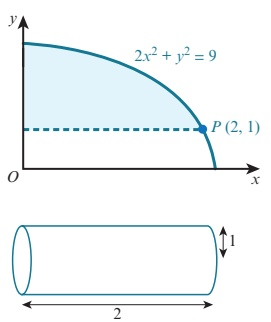

 $$ \begin{aligned}Volume~of~solid&=\pi\int_{0}^{2}y^{2}\mathrm{~d}x-volume~of~cylinder\\&=\pi\int_{0}^{2}\left(9-2x^{2}\right)\mathrm{d}x-\pi\times\left|\frac{-}{-\pi}\times\frac{\pi}{x}\times h\right.\\&=\frac{\pi}{\pi}\left[-\left.9x-\frac{2}{-3}x^{3}\right|_{0}^{2}-\quad1^{2}\quad2\right.\\&\quad18\quad\frac{16}{3}\quad\begin{array}{l}(0\quad0)\quad2\end{array}\\&\xrightarrow{32\quad units^{3}}\end{aligned} $$ 

 $$ \frac{32}{3}units^{3} $$

<!-- page 283 -->

1 Find the volume obtained when the shaded region is rotated through  $ 360^{\circ} $ about the x-axis.

a

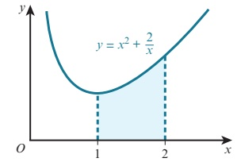

b

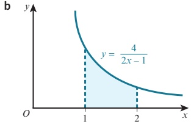

C

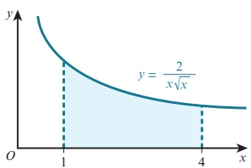

d

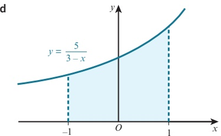

2 Find the volume obtained when the shaded region is rotated through  $ 360^{\circ} $ about the y-axis.

a

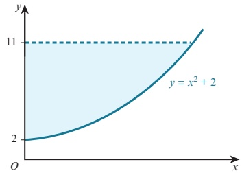

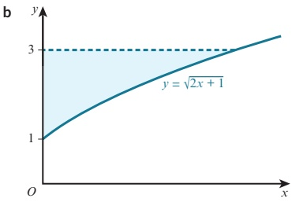

3 The diagram shows part of the curve  $ y = \frac{a}{x} $, where a > 0. The volume obtained when the shaded region is rotated through  $ 360^{\circ} $ about the x-axis is  $ 18\pi $. Find the value of a.

4 The diagram shows part of the curve  $ y = \sqrt{x^3 + 4x^2 + 3x + 2} $. Find the volume obtained when the shaded region is rotated through  $ 360^\circ $ about the x-axis.

<!-- page 284 -->

5 The diagram shows part of the line  $ 3x + 8y = 24 $. Rotating the shaded region through  $ 360^{\circ} $ about the x-axis would give a cone of base radius 3 and perpendicular height 8.

Find the volume of the cone using:

a integration

b the formula for the volume of a cone.

6 a Sketch the graph of  $  y = (x - 2)^2  $.

b Find the volume of the solid formed when the enclosed region bounded by the curve, the x-axis and the y-axis is rotated through  $ 360^{\circ} $ about the x-axis.

7 The diagram shows part of the curve  $ y = 5\sqrt{x} - x $.

The curve meets the x-axis at O and P.

a Find the coordinates of P.

b Find the volume obtained when the shaded region is rotated through  $ 360^{\circ} $ about the x-axis.

8 The diagram shows part of the curve  $ x = \frac{9}{y^2} - 1 $ that intercepts the y-axis at the point  $ P $. The shaded region is bounded by the curve, the y-axis and the line y = 1.

a Find the coordinates of P.

b Find the volume obtained when the shaded region is rotated through  $ 360^{\circ} $ about the y-axis.

9 The diagram shows part of the curve  $ y = 3x + \frac{2}{x} $.

The line y = 7 intersects the curve at the points P and Q.

a Find the coordinates of P and Q.

b Find the volume obtained when the shaded region is rotated through  $ 360^{\circ} $ about the x-axis.

10 The diagram shows part of the curve  $ y = \frac{2}{2x+1} $. The shaded area is rotated through  $ 360^\circ $ about the x-axis between x = 0 and x = p.

Show that as  $ p \to \infty $, the volume approaches the value  $ 2\pi $.

11 The diagram shows part of the curve  $ y = \sqrt{25 - x^2} $. The point  $ P(4, 3) $ lies on the curve.

a Find the volume obtained when the shaded region is rotated through  $ 360^{\circ} $ about the y-axis.

b Find the volume obtained when the shaded region is rotated through  $ 360^{\circ} $ about the x-axis.

<!-- page 285 -->

12 The diagram shows the curve  $ y = \sqrt{4 - x} $ and the line  $ x + 2y = 4 $ that intersect at the points  $ (4, 0) $ and  $ (0, 2) $.

a Find the volume obtained when the shaded region is rotated through  $ 360^{\circ} $ about the x-axis.

b Find the volume obtained when the shaded region is rotated through  $ 360^{\circ} $ about the y-axis.

13 A mathematical model for the inside of a bowl is obtained by rotating the curve  $ x^2 + y^2 = 100 $ through  $ 360^\circ $ about the y-axis between y = -8 and y = 0. Each unit of x and y represents 1 cm.

a Find the volume of the bowl.

The bowl is filled with water to a depth of 3 cm.

b Find the volume of water in the bowl.

P 14 Use integration to prove that the volume, $V\ \mathrm{cm}^3$, of a sphere with radius $r$ cm is given by the formula $V = \frac{4}{3}\pi r^3$.

## Checklist of learning and understanding

## Integration as the reverse of differentiation

If  $ \frac{\mathrm{d}}{\mathrm{d}x}\left[\mathrm{F}(x)\right]=\mathrm{f}(x) $, then  $ \int\mathrm{f}(x)\,\mathrm{d}x=\mathrm{F}(x)+c $.

## Integration formulae

$$\int x^{n}\,\mathrm{d}x=\frac{1}{n+1}\,x^{n+1}+c\text{(where }c\text{ is a constant and }n\neq-1)}$$

$$\int (ax + b)^n \, \mathrm{d}x = \frac{1}{a(n+1)} (ax + b)^{n+1} + c \quad (n \neq -1 \text{ and } a \neq 0)$$

## Rules for indefinite integration

$$\int k\,f(x)\,dx = k\int f(x)\,dx,\text{where }k\text{ is a constant}$$

$$\int[\mathrm{f}(x)\pm\mathrm{g}(x)]\,\mathrm{d}x=\int\mathrm{f}(x)\,\mathrm{d}x\pm\int\mathrm{g}(x)\,\mathrm{d}x$$

## Rules for definite integration

● If  $ \int f(x) \, \mathrm{d}x = \mathrm{F}(x) + c $, then  $ \int_{a}^{b} f(x) \, \mathrm{d}x = \left[ \mathrm{F}(x) \right]_{a}^{b} = \mathrm{F}(b) - \mathrm{F}(a) $.

$$\int_{a}^{b} k\,\mathrm{f}(x)\,\mathrm{d}x = k\int_{a}^{b}\mathrm{f}(x)\,\mathrm{d}x,\text{ where }k\text{ is a constant.}$$

<!-- page 286 -->

$$\int_{a}^{b}\left[\mathrm{f}(x)\pm\mathrm{g}(x)\right]\mathrm{d}x=\int_{a}^{b}\mathrm{f}(x)\mathrm{d}x\pm\int_{a}^{b}\mathrm{g}(x)\mathrm{d}x$$

$$\int_{a}^{b}f(x)dx=-\int_{b}^{a}f(x)dx$$

Area under a curve

The area, $A$, bounded by the curve $y = f(x)$, the $x$-axis and the lines $x = a$ and $x = b$ is given by the formula:

 $$ A=\int_{a}^{b}y\mathrm{d}x\text{when}y\geqslant0\quad(\text{or}A=\int_{a}^{b}f(x)\mathrm{d}x\text{when}f(x)\geqslant0). $$ 

The area, $A$, bounded by the curve $x = f(y)$, the $y$-axis and the lines $y = a$ and $y = b$ is given by the formula:

 $$ (or A=\int_{a}^{b}f(y)d y when f(y)\geq0). $$ 

<!-- page 287 -->

The area, $A$, enclosed between $y = f(x)$ and $y = g(x)$ is given by the formula:

 $$ A=\int_{a}^{b}\left[\mathrm{f}(x)-\mathrm{g}(x)\right]\mathrm{d}x $$ 

where a and b are the x-coordinates of the points of intersection of the functions f and g.

## Improper integrals

Integrals of the form  $ \int_{a}^{\infty} f(x) \, dx $ can be evaluated by replacing the infinite limit with a finite value, X, and then taking the limit as X \to \infty, provided the limit exists.

Integrals of the form  $ \int_{-\infty}^{b} f(x) \, dx $ can be evaluated by replacing the infinite limit with a finite value, X, and then taking the limit as X \to -\infty, provided the limit exists.

Integrals of the form  $ \int_{a}^{b} f(x) \, dx $ where  $ f(x) $ is not defined when x = a $ can be evaluated by replacing the limit a with an X and then taking the limit as  $ X \to a $, provided the limit exists.

Integrals of the form  $ \int_{a}^{b} f(x) \, dx $ where  $ f(x) $ is not defined when x = b can be evaluated by replacing the limit b with an X and then taking the limit as  $ X \to b $, provided the limit exists.

## Volume of revolution

The volume, $V$, obtained when the function $y = f(x)$ is rotated through $360^\circ$ about the $x$-axis between the boundary values $x = a$ and $x = b$ is given by the formula $V = \int_a^b \pi y^2 \, dx$.

The volume, $V$, obtained when the function $x = f(y)$ is rotated through $360^\circ$ about the $y$-axis between the boundary values $y = a$ and $y = b$ is given by the formula $V = \int_a^b \pi x^2 \, \mathrm{d}y$.

<!-- page 288 -->

1 The function f is such that  $ f^{\prime} $

Find  $ \int\binom{x}{5} - \frac{x}{2} \binom{2}{1} dx $.

A curve is such that  $ \frac{dy}{dx} = \frac{6}{x^{2}} - 5x $ and the point  $ (3, 5.5) $ lies on the curve. Find the equation of the curve. [4]

A curve has equation  $ y = f(x) $. It is given that  $ f'(x) = \frac{3}{\sqrt{x + 2}} - \frac{8}{x^3} $ and that  $ f(2) = 3 $. Find  $ f(x) $. [5]

The diagram shows part of the curve  $ x = \frac{6}{y^{2}} + 1 $. The shaded region is bounded by the curve, the y-axis, and the lines y = 1 and y = 3. Find the volume, in terms of  $ \pi $, when this shaded region is rotated through  $ 360^\circ $ about the y-axis. [5]

A function is defined for $x \in \mathbb{R}$ and is such that $f'(x) = 6x - 6$. The range of the function is given by $f(x) \geq 5$.

a State the value of x for which  $ f(x) $ has a stationary value.

b Find an expression for  $ f(x) $ in terms of x.

The diagram shows the curve  $ y = 6x - x^{2} $ and the line y = 5. Find the area of the shaded region.

Cambridge International AS & A Level Mathematics 9709 Paper 11 Q4 June 2010

a Sketch the curve  $ y = (x - 3)^{2} + 2 $.

b The region enclosed by the curve, the x-axis, the y-axis, the line x = 3 is rotated through  $ 360^{\circ} $ about the x-axis. Find the volume obtained, giving your answer in terms of  $ \pi $. [6]

<!-- page 289 -->

昆9

The diagram shows the curve  $ y^{2}=2x-1 $ and the straight line 3y=2x-1.

The curve and straight line intersect at  $ x = \frac{1}{2} $ and x = a, where a is a constant.

i Show that a = 5.

ii Find, showing all necessary working, the area of the shaded region.

Cambridge International AS & A Level Mathematics 9709 Paper 11 Q8 November 2012

The diagram shows the curve  $ y = \sqrt{1 + 2x} $ meeting the x-axis at A and the y-axis at B.

The y-coordinate of the point C on the curve is 3.

i Find the coordinates of B and C.

[2]

ii Find the equation of the normal to the curve at C. [4]

iii Find the volume obtained when the shaded region is rotated through  $ 360^{\circ} $ about the y-axis. [5]

Cambridge International AS & A Level Mathematics 9709 Paper 11 Q10 November 2011

昆11

The diagram shows the line y = 1 and part of the curve  $ y = \frac{2}{\sqrt{x+1}} $.

i Show that the equation  $ y = \frac{2}{\sqrt{x+1}} $ can be written in the form  $ x = \frac{4}{y^2} - 1 $. [1]

ii Find  $ \int_{1}^{2}\left(\frac{1}{y^{2}}-1\right)\mathrm{d}y $. Hence find the area of the shaded region. [5]

iii The shaded region is rotated through  $ 360^{\circ} $ about the y-axis. Find the exact value of the volume of revolution obtained.

<!-- page 290 -->

12 A curve has equation  $ y = f(x) $ and is such that  $ f'(x) = 3x^{\frac{1}{2}} + 3x^{-\frac{1}{2}} - 10 $.

i By using the substitution  $ u = x^{\overline{2}} $, or otherwise, find the values of x for which the curve  $ y = f(x) $ has stationary points. [4]

ii Find  $ f''(x) $ and hence, or otherwise, determine the nature of each stationary point. [3]

iii It is given that the curve  $ y = f(x) $ passes through the point  $ (4, -7) $. Find  $ f(x) $. [4]

Cambridge International AS & A Level Mathematics 9709 Paper 11 Q9 June 2013

The diagram shows part of the curve  $ y = \frac{8}{\sqrt{3}x + 4} $. The curve intersects the y-axis at  $ A(0, 4) $. The normal to the curve at  $ A $ intersects the line  $ x = 4 $ at the point  $ B $.

i Find the coordinates of B. [5]

ii Show, with all necessary working, that the areas of the regions P and Q are equal. [6]

Cambridge International AS & A Level Mathematics 9709 Paper 11 Q10 June 2015

The diagram shows the curve  $ y = (3 - 2x)^3 $ and the tangent to the curve at the point  $ \left(\frac{1}{2}, 8\right) $.

i Find the equation of this tangent, giving your answer in the form  $ y = mx + c $.

ii Find the area of the shaded region.

<!-- page 291 -->

The diagram shows parts of the curves  $ y = (4x + 1)^{\frac{1}{2}} $ and  $ y = \frac{1}{2}x^{2} + 1 $ intersecting at points  $ P(0,1) $ and  $ Q(2,3) $. The angle between the tangents to the curves at Q is

<!-- page 292 -->

1 A curve is such that  $ \frac{dy}{dx} = 2x^2 - 3 $. Given that the curve passes through the point  $ (-3, -2) $, find the equation of the curve. [4]

2 A curve is such that  $ \frac{dy}{dx} = 2 - 8(3x + 4)^{-\frac{1}{2}} $.

i A point P moves along the curve in such a way that the x-coordinate is increasing at a constant rate of 0.3 units per second. Find the rate of change of the y-coordinate as P crosses the y-axis. [2]

The curve intersects the y-axis where  $ y = \frac{4}{3} $.

ii Find the equation of the curve.

Cambridge International AS & A Level Mathematics 9709 Paper 11 Q4 June 2016

3 A curve is such that  $ \frac{dy}{dx} = 3x^{\frac{1}{2}} - 6 $ and the point (9,2) lies on the curve.

i Find the equation of the curve.

ii Find the x-coordinate of the stationary point on the curve and determine the nature of the stationary point.

Cambridge International AS & A Level Mathematics 9709 Paper 11 Q6 June 2010

4 A curve is such that  $ \frac{dy}{dx}=\frac{3}{(1+2x)^2} $ and the point  $ \left(1,\frac{1}{2}\right) $ lies on the curve.

i Find the equation of the curve.

ii Find the set of values of x for which the gradient of the curve is less than  $ \frac{1}{3} $.

Cambridge International AS & A Level Mathematics 9709 Paper 11 Q7 June 2011

昆5

The diagram shows parts of the curves  $ y = (2x - 1)^2 $ and  $ y^2 = 1 - 2x $, intersecting at points A and B.

i State the coordinates of A.

ii Find, showing all necessary working, the area of the shaded region.

<!-- page 293 -->

6 A curve has equation  $ y = f(x) $ and it is given that  $ f'(x) = 3x^{\frac{1}{2}} - 2x^{-\frac{1}{2}} $. The point  $ A $ is the only point on the curve at which the gradient is -1.

i Find the x-coordinate of A.

ii Given that the curve also passes through the point  $ (4,10) $, find the y-coordinate of A, giving your answer as a fraction. [6]

Cambridge International AS & A Level Mathematics 9709 Paper 11 Q10 November 2016

The diagram shows a metal plate. The plate has a perimeter of 50 cm and consists of a rectangle of width 2r cm and height x cm, and a semicircle of radius r cm.

a Show that the area,  $ A\,cm^2 $, of the plate is given by  $ A = 50r - 2r^2 - \frac{1}{2}\pi r^2 $. Given that  $ a $ and  $ b $ are small.

Given that x and r can vary:

b show that $A$ has a stationary value when $r = \frac{50}{4 + \pi}$

c find this stationary value of A and determine the nature of this stationary value.

8 A line has equation $y = 2x + c$ and a curve has equation $y = 8 - 2x - x^{2}$.

i For the case where the line is a tangent to the curve, find the value of the constant c.

ii For the case where c = 11, find the x-coordinates of the points of intersection of the line and the curve. Find also, by integration, the area of the region between the line and the curve. [7]

Cambridge International AS & A Level Mathematics 9709 Paper 11 Q11 June 2014

9 The equation of a curve is  $ y = \frac{9}{2 - x} $.

i Find an expression for  $ \frac{dy}{dx} $ and determine, with a reason, whether the curve has any stationary points. [3]

ii Find the volume obtained when the region bounded by the curve, the coordinate axes and the line x = 1 is rotated through  $ 360^{\circ} $ about the x-axis. [4]

iii Find the set of values of k for which the line  $ y = x + k $ intersects the curve at two distinct points. [4]

Cambridge International AS & A Level Mathematics 9709 Paper 11 Q11 November 2010

<!-- page 294 -->

10 A function f is defined as  $ f(x) = \frac{4}{2x + 1} $ for  $ x \geq 0 $.

a Find an expression, in terms of x, for  $ f'(x) $ and explain how your answer shows that f is a decreasing function. [3]

b Find an expression, in terms of x, for  $ f^{-1}(x) $ and find the domain of  $ f^{-1} $.

c On a diagram, sketch the graph of  $  y = f(x)  $ and the graph of  $  y = f^{-1}(x)  $, making clear the relationship between the two graphs. [4]

11 A curve is such that  $ \frac{dy}{dx} = x^{\frac{1}{2}} - x^{-\frac{1}{2}} $. The curve passes through the point  $ \left(4, \frac{2}{3}\right) $.

i Find the equation of the curve. [4]

ii Find  $ \frac{\mathrm{d}^{2}y}{\mathrm{d}x^{2}} $. [2]

iii Find the coordinates of the stationary point and determine its nature. [5]

## Cambridge International AS & A Level Mathematics 9709 Paper 11 Q12 June 2014

12 The function f is defined for x>0 and is such that  $ f'(x)=2x-\frac{2}{x^{2}} $. The curve  $ y=f(x) $ passes through the point  $ P(2,6) $.

i Find the equation of the normal to the curve at P. [3]

ii Find the equation of the curve. [4]

iii Find the x-coordinate of the stationary point and state with a reason whether this point is a maximum or a minimum. [4]

2014

13 The point  $ P(3,5) $ lies on the curve  $ y=\frac{1}{x-1}-\frac{9}{x-5} $.

i Find the x-coordinate of the point where the normal to the curve at P intersects the x-axis. [5]

ii Find the x-coordinate of each of the stationary points on the curve and determine the nature of each stationary point, justifying your answers. [6]

Cambridge International AS & A Level Mathematics 9709 Paper 11 Q11 November 2016

昆14

The diagram shows part of the curve  $ y = (x - 2)^4 $ and the point  $ A(1, 1) $ on the curve.

The tangent at A cuts the x-axis at B and the normal at A cuts the y-axis at C.

i Find the coordinates of B and C.

ii Find the distance AC, giving your answer in the form  $ \frac{\sqrt{a}}{b} $, where a and b are integers. [2]

iii Find the area of the shaded region. [4]

<!-- page 295 -->

## 昆15

The diagram shows part of the curve  $ y = (1 + 4x)^{\frac{1}{2}} $ and a point  $ P(6, 5) $ lying on the curve.

The line  $ PQ $ intersects the x-axis at  $ Q(8, 0) $.

i Show that  $ PQ $ is a normal to the curve.

ii Find, showing all necessary working, the exact volume of revolution obtained when the shaded region is rotated through  $ 360^{\circ} $ about the x-axis.

[In part ii you may find it useful to apply the fact that the volume, $V$, of a cone of base radius $r$ and vertical height $h$, is given by $V = \frac{1}{3} \pi r^2 h$.]

Cambridge International AS & A Level Mathematics 9709 Paper 11 Q11 November 2015

