# Chapter 1 Algebra

<!-- Pure Mathematics 2 and 3 Cambridge International AS and A Level Mathematics (Sophie Goldie, Roger Porkess) .pdf p11-31 -->

<!-- page 11 -->

## Algebra

No, it [1729] is a very interesting number. It is the smallest number expressible as the sum of two cubes in two different ways.

Srinivasa Ramanujan

A brilliant mathematician, Ramanujan was largely self-taught, being too poor to afford a university education. He left India at the age of 26 to work with G.H. Hardy in Cambridge on number theory, but fell ill in the English climate and died six years later in 1920. On one occasion when Hardy visited him in hospital, Ramanujan asked about the registration number of the taxi he came in. Hardy replied that it was 1729, an uninteresting number; Ramanujan's instant response is quoted above.

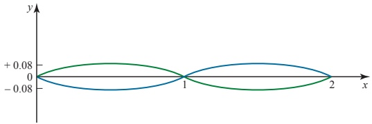

The photograph shows the Tamar Railway Bridge. The spans of this bridge, drawn to the same horizontal and vertical scales, are illustrated on the graph as two curves, one green, the other blue.

## How would you set about trying to fit equations to these two curves?

<!-- page 12 -->

You will already have met quadratic expressions, like  $ x^2 - 5x + 6 $, and solved quadratic equations, such as  $ x^2 - 5x + 6 = 0 $. Quadratic expressions have the form  $ ax^2 + bx + c $ where  $ x $ is a variable,  $ a $,  $ b $ and  $ c $ are constants and  $ a $ is not equal to zero. This work is covered in Pure Mathematics 1 Chapter 1.

An expression of the form  $ ax^{3} + bx^{2} + cx + d $, which includes a term in  $ x^{3} $, is called a cubic in x. Examples of cubic expressions are

 $$ 2x^{3}+3x^{2}-2x+11,\qquad3y^{3}-1\qquad\mathrm{and}\qquad4z^{3}-2z. $$ 

Similarly a quartic expression in x, like  $ x^4 - 4x^3 + 6x^2 - 4x + 1 $, contains a term in  $ x^4 $; a quintic expression contains a term in  $ x^5 $ and so on.

All these expressions are called polynomials. The order of a polynomial is the highest power of the variable it contains. So a quadratic is a polynomial of order 2, a cubic is a polynomial of order 3 and  $ 3x^{8} + 5x^{4} + 6x $ is a polynomial of order 8 (an octic).

Notice that a polynomial does not contain terms involving  $ \sqrt{x} $,  $ \frac{1}{x} $, etc. Apart from the constant term, all the others are multiples of x raised to a positive integer power.

## Operations with polynomials

## Addition of polynomials

Polynomials are added by adding like terms, for example, you add the coefficients of  $ x^{3} $ together (i.e. the numbers multiplying  $ x^{3} $), the coefficients of  $ x^{2} $ together, the coefficients of x together and the numbers together. You may find it easiest to set this out in columns.

### EXAMPLE 1.1

 $$ \operatorname{Add}\left(5x^{4}-3x^{3}-2x\right)\operatorname{to}\left(7x^{4}+5x^{3}+3x^{2}-2\right). $$ 

## SOLUTION

 $$ \begin{array}{r} \begin{array}{c} 5x^{4} \\ + \quad (7x^{4} \\ \hline 12x^{4} \end{array} \quad \begin{array}{l} -3x^{3} \\ +5x^{3} \\ +2x^{3} \end{array} \quad \begin{array}{l} +3x^{2} \\ +3x^{2} \\ +2x^{2} \end{array} \quad \begin{array}{l} -2x \\ -2x \\ -2 \end{array} \quad \begin{array}{l} -2 \\ -2 \end{array} $$ 

Note

This may alternatively be set out as follows:

 $$ \begin{aligned}(5x^{4}-3x^{3}-2x)+(7x^{4}+5x^{3}+3x^{2}-2)&=(5+7)x^{4}+(-3+5)x^{3}+3x^{2}-2x-2\\&=12x^{4}+2x^{3}+3x^{2}-2x-2\end{aligned} $$ 

## Subtraction of polynomials

Similarly polynomials are subtracted by subtracting like terms.

## P2

<!-- page 13 -->

### EXAMPLE 1.2

Simplify  $ (5x^{4}-3x^{3}-2x)-(7x^{4}+5x^{3}+3x^{2}-2) $.

## SOLUTION

<table border=1 style='margin: auto; word-wrap: break-word;'><tr><td style='text-align: center; word-wrap: break-word;'>$ 5x^{4} $</td><td style='text-align: center; word-wrap: break-word;'>$ -3x^{3} $</td><td style='text-align: center; word-wrap: break-word;'></td><td style='text-align: center; word-wrap: break-word;'>-2x</td><td style='text-align: center; word-wrap: break-word;'></td></tr><tr><td style='text-align: center; word-wrap: break-word;'>$ -(7x^{4} $</td><td style='text-align: center; word-wrap: break-word;'>$ +5x^{3} $</td><td style='text-align: center; word-wrap: break-word;'>$ +3x^{2} $</td><td style='text-align: center; word-wrap: break-word;'></td><td style='text-align: center; word-wrap: break-word;'>-2)</td></tr><tr><td style='text-align: center; word-wrap: break-word;'>$ -2x^{4} $</td><td style='text-align: center; word-wrap: break-word;'>$ -8x^{3} $</td><td style='text-align: center; word-wrap: break-word;'>$ -3x^{2} $</td><td style='text-align: center; word-wrap: break-word;'>-2x</td><td style='text-align: center; word-wrap: break-word;'>+2</td></tr></table>

Be careful of the signs when subtracting. You may find it easier to change the signs on the bottom line and then go on as if you were adding.

Note

This, too, may be set out alternatively, as follows:

 $$ \begin{aligned}(5x^{4}-3x^{3}-2x)-(7x^{4}+5x^{3}+3x^{2}-2)&=(5-7)x^{4}+(-3-5)x^{3}-3x^{2}-2x+2\\&=-2x^{4}-8x^{3}-3x^{2}-2x+2\end{aligned} $$ 

## b Multiplication of polynomials

When you multiply two polynomials, you multiply each term of the one by each term of the other, and all the resulting terms are added. Remember that when you multiply powers of x, you add the indices:  $ x^5 \times x^7 = x^{12} $.

### EXAMPLE 1.3

Multiply  $ (x^{3} + 3x - 2) $ by  $ (x^{2} - 2x - 4) $.

## SOLUTION

Arranging this in columns, so that it looks like an arithmetical long multiplication calculation you get:

<table border=1 style='margin: auto; word-wrap: break-word;'><tr><td style='text-align: center; word-wrap: break-word;'></td><td rowspan="2">$ \times $</td><td colspan="2">$ \times^{3} $</td><td style='text-align: center; word-wrap: break-word;'>+3x</td><td style='text-align: center; word-wrap: break-word;'>-2x</td></tr><tr><td style='text-align: center; word-wrap: break-word;'></td><td style='text-align: center; word-wrap: break-word;'></td><td style='text-align: center; word-wrap: break-word;'>$ \chi^{2} $</td><td style='text-align: center; word-wrap: break-word;'>-2x</td><td style='text-align: center; word-wrap: break-word;'>-4</td></tr><tr><td style='text-align: center; word-wrap: break-word;'>Multiply top line by  $ \chi^{2} $</td><td style='text-align: center; word-wrap: break-word;'>$ \chi^{5} $</td><td style='text-align: center; word-wrap: break-word;'>+3 $ \chi^{3} $</td><td style='text-align: center; word-wrap: break-word;'>-2 $ \chi^{2} $</td><td style='text-align: center; word-wrap: break-word;'></td><td style='text-align: center; word-wrap: break-word;'></td></tr><tr><td style='text-align: center; word-wrap: break-word;'>Multiply top line by -2x</td><td style='text-align: center; word-wrap: break-word;'></td><td style='text-align: center; word-wrap: break-word;'>-2 $ \chi^{4} $</td><td style='text-align: center; word-wrap: break-word;'>-6 $ \chi^{2} $</td><td style='text-align: center; word-wrap: break-word;'>+4x</td><td style='text-align: center; word-wrap: break-word;'></td></tr><tr><td style='text-align: center; word-wrap: break-word;'>Multiply top line by -4</td><td style='text-align: center; word-wrap: break-word;'></td><td style='text-align: center; word-wrap: break-word;'>-4 $ \chi^{3} $</td><td style='text-align: center; word-wrap: break-word;'></td><td style='text-align: center; word-wrap: break-word;'>-12x</td><td style='text-align: center; word-wrap: break-word;'>+8</td></tr><tr><td style='text-align: center; word-wrap: break-word;'>Add</td><td style='text-align: center; word-wrap: break-word;'>$ \chi^{5} $</td><td style='text-align: center; word-wrap: break-word;'>-2 $ \chi^{4} $</td><td style='text-align: center; word-wrap: break-word;'>-3 $ \chi^{3} $</td><td style='text-align: center; word-wrap: break-word;'>-8 $ \chi^{2} $</td><td style='text-align: center; word-wrap: break-word;'>-8x</td></tr></table>

Note

Alternatively:

 $$ \begin{aligned}(x^{3}+3x-2)\times(x^{2}-2x-4)&=x^{3}(x^{2}-2x-4)+3x(x^{2}-2x-4)-2(x^{2}-2x-4)\\&=x^{5}-2x^{4}-4x^{3}+3x^{3}-6x^{2}-12x-2x^{2}+4x+8\\&=x^{5}-2x^{4}+(-4+3)x^{3}+(-6-2)x^{2}+(-12+4)x+8\\&=x^{5}-2x^{4}-x^{3}-8x^{2}-8x+8\end{aligned} $$

<!-- page 14 -->

## Division of polynomials

Division of polynomials is usually set out rather like arithmetical long division.

EXAMPLE 1.4

Divide $2x^{3}-3x^{2}+x-6$ by $x-2$.

## SOLUTION

## Method 1

 $$ x^{3}+0x^{2}+2x+5. $$ 

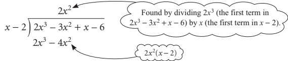

Now subtract  $ 2x^{3} - 4x^{2} $ from  $ 2x^{3} - 3x^{2} $, bring down the next term (i.e. x) and repeat the method above:

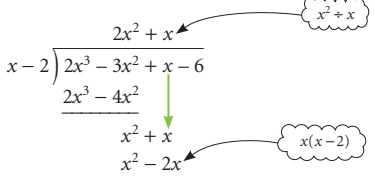

Continuing gives:

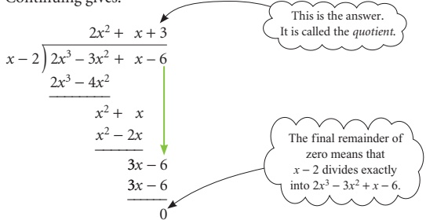

Thus  $ (2x^{3}-3x^{2}+x-6)\div(x-2)=(2x^{2}+x+3) $.

## Method 2

Alternatively this may be set out as follows if you know that there is no remainder.

 $$ \begin{aligned}Let(2x^{3}-3x^{2}+x-6)\div(x-2)=ax^{2}+bx+c\end{aligned} $$ 

Multiplying both sides by  $ (x-2) $ gives

The polynomial here must be of order 2 because  $ 2x^{3} \div x $ will give an  $ x^{2} $ term.

 $$ (2x^{3}-3x^{2}+x-6)=(ax^{2}+bx+c)(x-2) $$ 

Multiplying out the expression on the right

 $$ 2x^{3}-3x^{2}+x-6\equiv ax^{3}+(b-2a)x^{2}+(c-2b)x-2c $$ 

The identity sign is used here to emphasise that this is an identity and true for all values of x.

<!-- page 15 -->

Comparing coefficients of  $ x^{3} $

Comparing coefficients of $x^2$

$2 = a$

Comparing coefficients of $x^2$

$-3 = b - 2a$

$-3 = b - 4$

$\Rightarrow \quad b = 1$

Comparing coefficients of $x$

$1 = c - 2b$

$1 = c - 2$

$\Rightarrow \quad c = 3$

Checking the constant term

$-6 = -2c$ (which agrees with $c = 3$).

So $ax^2 + bx + c$ is $2x^2 + x + 3$

i.e. $(2x^3 - 3x^2 + x - 6) \div (x - 2) \equiv 2x^2 + x + 3$.

## Method 3

With practice you may be able to do this method 'by inspection'. The steps in this would be as follows.

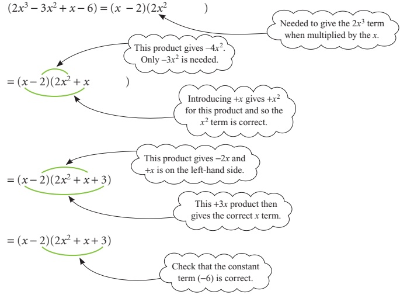

 $$  So(2x^{3}-3x^{2}+x-6)\div(x-2)\equiv2x^{2}+x+3. $$ 

A quotient is the result of a division. So, in the example above the quotient is  $ 2x^{2}+x+3 $.

<!-- page 16 -->

1 State the orders of the following polynomials.

 $$ x^{3}+3x^{2}-4x $$ 

 $$ x^{12} $$ 

 $$ 2+6x^{2}+3x^{7}-8x^{5} $$ 

2 Add  $ (x^{3}+x^{2}+3x-2) $ to  $ (x^{3}-x^{2}-3x-2) $.

 $$ \operatorname{Add}\left(x^{3}-x\right),\left(3x^{2}+2x+1\right)and\left(x^{4}+3x^{3}+3x^{2}+3x\right). $$ 

4 Subtract  $ (3x^{2}+2x+1) $ from  $ (x^{3}+5x^{2}+7x+8) $.

5 Subtract  $  (x^{3} - 4x^{2} - 8x - 9)  $ from  $  (x^{3} - 5x^{2} + 7x + 9)  $.

6 Subtract  $  (x^{5} - x^{4} - 2x^{3} - 2x^{2} + 4x - 4)  $ from  $  (x^{5} + x^{4} - 2x^{3} - 2x^{2} + 4x + 4)  $.

7 Multiply  $ (x^{3} + 3x^{2} + 3x + 1) $ by  $ (x + 1) $.

8 Multiply  $ (x^{3} + 2x^{2} - x - 2) $ by  $ (x - 2) $.

9 Multiply  $  (x^{2} + 2x - 3)  $ by  $  (x^{2} - 2x - 3)  $.

10 Multiply  $ (x^{10} + x^{9} + x^{8} + x^{7} + x^{6} + x^{5} + x^{4} + x^{3} + x^{2} + x^{1} + 1) $ by  $ (x - 1) $.

 $$ \operatorname{S i m p l i f y}(x^{2}+1)(x-1)-(x^{2}-1)(x-1). $$ 

12 Simplify  $ (x^{2}+1)(x^{2}+4)-(x^{2}-1)(x^{2}-4) $.

13 Simplify  $ (x+1)^{2}+(x+3)^{2}-2(x+1)(x+3) $.

14 Simplify  $ (x^{2}+1)(x+3)-(x^{2}+3)(x+1) $.

15 Simplify  $  (x^2 - 2x + 1)^2 - (x + 1)^4  $.

16 Divide  $  (x^{3} - 3x^{2} - x + 3)  $ by (x - 1).

17 Find the quotient when  $ (x^{3}+x^{2}-6x) $ is divided by  $ (x-2) $.

18 Divide  $ (2x^{3}-x^{2}-5x+10) $ by  $ (x+2) $.

19 Find the quotient when  $ (x^{4}+x^{2}-2) $ is divided by  $ (x-1) $.

20 Divide  $  (2x^{3} - 10x^{2} + 3x - 15)  $ by (x - 5).

21 Find the quotient when  $ (x^{4}+5x^{3}+6x^{2}+5x+15) $ is divided by  $ (x+3) $.

22 Divide  $  (2x^{4} + 5x^{3} + 4x^{2} + x)  $ by  $  (2x + 1)  $.

23 Find the quotient when  $ (4x^{4}+4x^{3}-x^{2}+7x-4) $ is divided by  $ (2x-1) $.

24 Divide  $  (2x^{4} + 2x^{3} + 5x^{2} + 2x + 3)  $ by  $  (x^{2} + 1)  $.

25 Find the quotient when  $ (x^{4}+3x^{3}-8x^{2}-27x-9) $ is divided by  $ (x^{2}-9) $.

26 Divide  $  (x^{4} + x^{3} + 4x^{2} + 4x)  $ by  $  (x^{2} + x)  $.

27 Find the quotient when  $ (2x^{4}-5x^{3}-16x^{2}-6x) $ is divided by  $ (2x^{2}+3x) $.

28 Divide  $  (x^{4} + 3x^{3} + x^{2} - 2)  $ by  $  (x^{2} + x + 1)  $.

<!-- page 17 -->

## Solution of polynomial equations

You have already met the formula

 $$ x=\frac{-b\pm\sqrt{b^{2}-4ac}}{2a} $$ 

for the solution of the quadratic equation  $ ax^{2} + bx + c = 0 $.

Unfortunately there is no such simple formula for the solution of a cubic equation, or indeed for any higher power polynomial equation. So you have to use one (or more) of three possible methods.

Spotting one or more roots.

Finding where the graph of the expression cuts the x axis.

☑ A numerical method.

### EXAMPLE 1.5

Solve the equation  $ 4x^{3}-8x^{2}-x+2=0 $.

## SOLUTION

Start by plotting the curve whose equation is  $ y = 4x^{3} - 8x^{2} - x + 2 $. (You may also find it helpful at this stage to display it on a graphic calculator or computer.)

<table border=1 style='margin: auto; word-wrap: break-word;'><tr><td style='text-align: center; word-wrap: break-word;'>x</td><td style='text-align: center; word-wrap: break-word;'>-1</td><td style='text-align: center; word-wrap: break-word;'>0</td><td style='text-align: center; word-wrap: break-word;'>1</td><td style='text-align: center; word-wrap: break-word;'>2</td><td style='text-align: center; word-wrap: break-word;'>3</td></tr><tr><td style='text-align: center; word-wrap: break-word;'>y</td><td style='text-align: center; word-wrap: break-word;'>-9</td><td style='text-align: center; word-wrap: break-word;'>+2</td><td style='text-align: center; word-wrap: break-word;'>-3</td><td style='text-align: center; word-wrap: break-word;'>0</td><td style='text-align: center; word-wrap: break-word;'>35</td></tr></table>

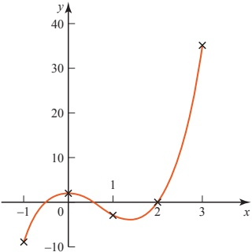

Figure 1.1

Figure 1.1 shows that one root is x=2 and that there are two others. One is between x=-1 and x=0 and the other is between x=0 and x=1.

<!-- page 18 -->

Try  $ x = -\frac{1}{2} $.

Substituting $x = -\frac{1}{2}$ in $y = 4x^3 - 8x^2 - x + 2$ gives

 $$ y=4\times\left(-\frac{1}{8}\right)-8\times\frac{1}{4}-\left(-\frac{1}{2}\right)+2 $$ 

 $$ \gamma=0 $$ 

So in fact the graph crosses the $x$ axis at $x = -\frac{1}{2}$ and this is a root also.

Similarly, substituting  $ x = +\frac{1}{2} $ in  $ y = 4x^3 - 8x^2 - x + 2 $ gives

 $$ y=4\times\frac{1}{8}-8\times\frac{1}{4}-\frac{1}{2}+2 $$ 

and so the third root is  $ x=\frac{1}{2} $.

The solution is  $ x = -\frac{1}{2} $,  $ \frac{1}{2} $ or 2

This example worked out nicely, but many equations do not have roots which are whole numbers or simple fractions. In those cases you can find an approximate answer by drawing a graph. To be more accurate, you will need to use a numerical method, which will allow you to get progressively closer to the answer, homing in on it. Such methods are covered in Chapter 6.

## The factor theorem

The equation  $ 4x^{3}-8x^{2}-x+2=0 $ has roots that are whole numbers or fractions. This means that it could, in fact, have been factorised.

 $$ 4x^{3}-8x^{2}-x+2=(2x+1)(2x-1)(x-2)=0 $$ 

Few polynomial equations can be factorised, but when one can, the solution follows immediately.

Since  $ (2x+1)(2x-1)(x-2)=0 $

it follows that either  $ 2x + 1 = 0 $  $ \Rightarrow x = -\frac{1}{2} $

 $$  or2x-1=0\quad\Longrightarrow\quad x=\frac{1}{2} $$ 

 $$  or\quad x-2=0\quad\Longrightarrow\quad x=2 $$ 

and so  $ x = -\frac{1}{2}, \frac{1}{2} $ or 2.

This illustrates an important result, known as the factor theorem, which may be stated as follows.

If $(x-a)$ is a factor of the polynomial $f(x)$, then $f(a)=0$ and $x=a$ is a root of the equation $f(x)=0$. Conversely if $f(a)=0$, then $(x-a)$ is a factor of $f(x)$.

<!-- page 19 -->

Given that  $ f(x) = x^3 - 6x^2 + 11x - 6 $:

(i) find  $ f(0) $,  $ f(1) $,  $ f(2) $,  $ f(3) $ and  $ f(4) $

(ii) factorise  $ x^{3} - 6x^{2} + 11x - 6 $

(iii) solve the equation  $ x^{3} - 6x^{2} + 11x - 6 = 0 $

(iv) sketch the curve whose equation is  $ f(x) = x^{3} - 6x^{2} + 11x - 6 $.

## SOLUTION

(i)

 $$ \mathrm{f}(0)=0^{3}-6\times0^{2}+11\times0-6=-6 $$ 

 $$ \mathrm{f}(1)=1^{3}-6\times1^{2}+11\times1-6=0 $$ 

 $$  f(2)=2^{3}-6\times2^{2}+11\times2-6=0 $$ 

 $$  f(3)=3^{3}-6\times3^{2}+11\times3-6=0 $$ 

 $$  f(4)=4^{3}-6\times4^{2}+11\times4-6=6 $$ 

(ii) Since  $ f(1) $,  $ f(2) $ and  $ f(3) $ all equal 0, it follows that  $ (x-1) $,  $ (x-2) $ and  $ (x-3) $ are all factors. This tells you that

 $$ x^{3}-6x^{2}+11x-6=(x-1)(x-2)(x-3)\times\mathrm{c o n s t a n t} $$ 

By checking the coefficient of the term in  $ x^{3} $, you can see that the constant must be 1, and so

 $$ x^{3}-6x^{2}+11x-6=(x-1)(x-2)(x-3) $$ 

(iii) x = 1, 2 or 3

(iv)

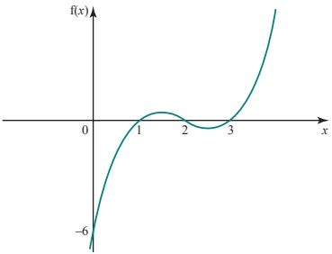

Figure 1.2

In the previous example, all three factors came out of the working, but this will not always happen. If not, it is often possible to find one factor (or more) by 'spotting' it, or by sketching the curve. You can then make the job of searching for further factors much easier by dividing the polynomial by the factor(s) you have found: you will then be dealing with a lower order polynomial.

<!-- page 20 -->

Given that  $ f(x) = x^3 - x^2 - 3x + 2 $:

(i) show that  $ (x-2) $ is a factor

(ii) solve the equation  $ f(x) = 0 $.

## SOLUTION

(i) To show that  $ (x-2) $ is a factor, it is necessary to show that  $ f(2)=0 $.

 $$ \begin{aligned}f(2)&=2^{3}-2^{2}-3\times2+2\\&=8-4-6+2\\&=0\end{aligned} $$ 

Therefore  $ (x-2) $ is a factor of  $ x^{3}-x^{2}-3x+2 $.

(ii) Since  $ (x-2) $ is a factor you divide  $ f(x) $ by  $ (x-2) $.

 $$ x-2\sqrt{\underbrace{x^{3}-2x^{2}}_{x^{2}-3x}\underbrace{x^{2}-2x}_{-x+2}}\overbrace{0}^{x^{2}+x-1} $$ 

So  $ f(x)=0 $ becomes  $ (x-2)(x^{2}+x-1)=0 $,

 $ \Rightarrow $ either x-2=0 or  $ x^{2}+x-1=0 $.

Using the quadratic formula on  $ x^{2} + x - 1 = 0 $ gives

 $$ \begin{aligned}x&=\frac{-1\pm\sqrt{1-4\times1\times(-1)}}{2}\\&=\frac{-1\pm\sqrt{5}}{2}\\&=-1.618or0.618(to3d.p.)\end{aligned} $$ 

So the complete solution is x = -1.618, 0.618 or 2.

## Spotting a root of a polynomial equation

Most polynomial equations do not have integer (or fraction) solutions. It is only a few special cases that work out nicely.

To check whether an integer root exists for any equation, look at the constant term. Decide what whole numbers divide into it and test them.

<!-- page 21 -->

### EXAMPLE 1.8

Spot an integer root of the equation  $ x^{3}-3x^{2}+2x-6=0 $.

## SOLUTION

The constant term is -6 and this is divisible by -1, +1, -2, +2, -3, +3, -6 and +6. So the only possible factors are  $ (x \pm 1) $,  $ (x \pm 2) $,  $ (x \pm 3) $ and  $ (x \pm 6) $. This limits the search somewhat.

 $$ f(1)=-6\quad\text{No};\quad f(-1)=-12\quad\text{No}; $$ 

 $$ \mathrm{f}(2)=-6\quad\mathrm{~No};\quad\mathrm{f}(-2)=-30\quad\mathrm{No}; $$ 

 $$ \mathrm{f}(3)=0\qquad\mathrm{Yes};\quad\mathrm{f}(-3)=-66\qquad\mathrm{No}; $$ 

 $$ \mathrm{f}(6)=114\quad\mathrm{No};\quad\mathrm{f}(-6)=-342\quad\mathrm{No}. $$ 

x=3 is an integer root of the equation.

### EXAMPLE 1.9

Is there an integer root of the equation  $ x^{3}-3x^{2}+2x-5=0 $?

## SOLUTION

The only possible factors are  $ (x \pm 1) $ and  $ (x \pm 5) $.

 $$ \begin{aligned}&f(1)=-5\quad&No;\quad&f(-1)=-11\quad&No;\\&f(5)=55\quad&No;\quad&f(-5)=-215\quad&No.\end{aligned} $$ 

There is no integer root.

## The remainder theorem

Using the long division method, any polynomial can be divided by another polynomial of lesser order, but sometimes there will be a remainder.

Look at  $ (x^{3} + 2x^{2} - 3x - 7) \div (x - 2) $.

 $$ \begin{array}{c}x^{2}+4x+\underline{5}\\x-2\sqrt{x^{3}+2x^{2}-3x-7}\\\underbrace{x^{3}-2x^{2}}_{\quad4x^{2}-3x}\quad\downarrow\\\underbrace{4x^{2}-8x}_{\quad5x-7}\quad\downarrow\\\quad\quad\quad\quad\underline{5x-10}\quad3\end{array} $$ 

You can write this as

 $$ x^{3}+2x^{2}-3x-7=(x-2)(x^{2}+4x+5)+3 $$ 

At this point it is convenient to call the polynomial  $ x^3 + 2x^2 - 3x - 7 = f(x) $.

<!-- page 22 -->

$$ \textcircled{S}o f(x)=(x-2)(x^{2}+4x+5)+3.\quad\textcircled{1} $$ 

Substituting x=2 into both sides of ① gives  $ f(2)=3 $.

So  $ f(2) $ is the remainder when  $ f(x) $ is divided by  $ (x-2) $.

This result can be generalised to give the remainder theorem. It states that for a polynomial,  $ f(x) $,

f(a) is the remainder when f(x) is divided by (x - a).

 $ f(x) = (x - a)g(x) + f(a) $ (the remainder theorem)

### EXAMPLE 1.10

Find the remainder when  $ 2x^{3}-3x+5 $ is divided by  $ x+1 $.

## SOLUTION

The remainder is found by substituting x = -1 in  $ 2x^{3} - 3x + 5 $.

 $$ 2\times(-1)^{3}-3\times(-1)+5 $$ 

 $$ =-2+3+5 $$ 

 $$ =6 $$ 

So the remainder is 6.

### EXAMPLE 1.11

When  $ x^{2}-6x+a $ is divided by x-3, the remainder is 2. Find the value of a.

## SOLUTION

The remainder is found by substituting x = 3 in  $ x^{2} - 6x + a $.

 $$ 3^{2}-6\times3+a=2 $$ 

 $$ 9-18+a=2 $$ 

 $$ -9+a=2 $$ 

 $$ a=11 $$ 

When you are dividing by a linear expression any remainder will be a constant; dividing by a quadratic expression may give a linear remainder.

## ? A polynomial is divided by another of degree n

What can you say about the remainder?

<!-- page 23 -->

When dividing by polynomials of order 2 or more, the remainder is usually found most easily by actually doing the long division.

### EXAMPLE 1.12

Find the remainder when  $ 2x^{4}-3x^{3}+4 $ is divided by  $ x^{2}+1 $.

## SOLUTION

 $$ \begin{array}{r} \left[\begin{array}{cc} 2x^{2}-3x-2 & x^{2}+1\Biggr)\overbrace{2x^{4}-3x^{3}}^{x^{2}}+\overbrace{2x^{2}}^{x^{4}}+\overbrace{-3x^{3}}^{x^{3}}-2x^{2}} \\ -3x^{3}-2x^{2} & -3x \end{array} \right] \\ -2x^{2}+3x+4 \\ -2x^{2}\quad-2 \\ 3x+6 \end{array} $$ 

The remainder is  $ 3x + 6 $.

In a division such as the one in Example 1.12, it is important to keep a separate column for each power of x and this means that sometimes it is necessary to leave gaps, as in the example above. In arithmetic, zeros are placed in the gaps. For example, 2 thousand and 3 is written 2003.

## EXERCISE 1B

1 Given that  $ f(x) = x^{3} + 2x^{2} - 9x - 18 $:

(i) find $f(-3)$, $f(-2)$, $f(-1)$, $f(0)$, $f(1)$, $f(2)$ and $f(3)$

(ii) factorise f(x)

(iii) solve the equation  $ f(x) = 0 $

(iv) sketch the curve with the equation  $ y = f(x) $.

2 The polynomial  $ p(x) $ is given by  $ p(x)=x^{3}-4x $.

(i) Find the values of  $ p(-3) $,  $ p(-2) $,  $ p(-1) $,  $ p(0) $,  $ p(1) $,  $ p(2) $ and  $ p(3) $.

(ii) Factorise p(x).

(iii) Solve the equation  $ p(x) = 0 $.

(iv) Sketch the curve with the equation  $ y = p(x) $.

3 You are given that  $ f(x) = x^{3} - 19x + 30 $.

(i) Calculate  $ f(0) $ and  $ f(3) $. Hence write down a factor of  $ f(x) $.

(ii) Find $p$ and $q$ such that $f(x) \equiv (x-2)(x^2 + px + q)$.

(iii) Solve the equation  $ x^{3} - 19x + 30 = 0 $.

(iv) Without further calculation draw a sketch of  $ y = f(x) $.

<!-- page 24 -->

4 (ii) Show that x - 3 is a factor of  $ x^3 - 5x^2 - 2x + 24 $.

(iii) Solve the equation  $ x^3 - 5x^2 - 2x + 24 = 0 $.

(iii) Sketch the curve with the equation  $ y = x^3 - 5x^2 - 2x + 24 $.

5 (i) Show that x = 2 is a root of the equation  $ x^{4} - 5x^{2} + 2x = 0 $ and write down another integer root.

(ii) Find the other two roots of the equation  $ x^{4}-5x^{2}+2x=0 $.

(iii) Sketch the curve with the equation  $ y = x^{4} - 5x^{2} + 2x $.

6 (i) The polynomial  $ p(x) = x^{3} - 6x^{2} + 9x + k $ has a factor x - 4. Find the value of k.

(ii) Find the other factors of the polynomial.

(iii) Sketch the curve with the equation  $ y = p(x) $.

7 The diagram shows the curve with the equation  $ y=(x+a)(x-b)^{2} $ where a and b are positive integers.

(i) Write down the values of $a$

and $b$, and also of $c$, given that

the curve crosses the $y$ axis at

$(0, c)$.

(ii) Solve the equation $(x+a)(x-b)^{2}=c$ using the values of $a$, $b$ and $c$

you found in part (i).

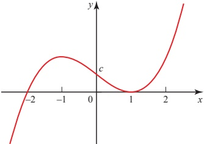

8 The function  $ f(x) $ is given by  $ f(x) = x^{4} - 3x^{2} - 4 $ for real values of x.

(i) By treating $f(x)$ as a quadratic in $x^2$, factorise it in the form $(x^2 + \ldots)(x^2 + \ldots)$.

(ii) Complete the factorisation as far as possible.

(iii) How many real roots has the equation  $ f(x) = 0 $? What are they?

9 (i) Show that x - 2 is not a factor of  $ 2x^{3} + 5x^{2} - 7x - 3 $.

(ii) Find the quotient and the remainder when  $ 2x^{3} + 5x^{2} - 7x - 3 $ is divided by x - 2.

10 The equation  $ f(x) = x^{3} - 4x^{2} + x + 6 = 0 $ has three integer roots.

(i) List the eight values of a for which it is sensible to check whether  $ f(a) = 0 $ and check each of them.

(ii) Solve  $ f(x) = 0 $.

11 Factorise, as far as possible, the following expressions.

(i)  $ x^{3}-x^{2}-4x+4 $ given that  $ (x-1) $ is a factor.

(ii)  $ x^{3} + 1 $ given that  $ (x + 1) $ is a factor.

(iii)  $ x^{3} + x - 10 $ given that  $ (x - 2) $ is a factor.

(iv)  $ x^{3} + x^{2} + x + 6 $ given that  $ (x + 2) $ is a factor.

<!-- page 25 -->

12 (i) Show that neither x = 1 nor x = -1 is a root of  $ x^4 - 2x^3 + 3x^2 - 8 = 0 $.

(ii) Find the quotient and the remainder when  $ x^4 - 2x^3 + 3x^2 - 8 $ is divided by

(a)  $ (x - 1) $

(b)  $ (x + 1) $

(c)  $ (x^2 - 1) $.

13 When  $ 2x^{3} + 3x^{2} + kx - 6 $ is divided by  $ x + 1 $ the remainder is 7. Find the value of k.

14 When  $ x^{3} + px^{2} + p^{2}x - 36 $ is divided by x - 3 the remainder is 21. Find a possible value of p.

15 When  $ x^{3} + ax^{2} + bx + 8 $ is divided by x - 3 the remainder is 2 and when it is divided by  $ x + 1 $ the remainder is -2.

Find a and b and hence obtain the remainder on dividing by x-2.

16 When  $ f(x) = 2x^{3} + ax^{2} + bx + 6 $ is divided by x - 1 there is no remainder and when  $ f(x) $ is divided by  $ x + 1 $ the remainder is 10.

Find a and b and hence solve the equation f(x)=0.

17 The cubic polynomial  $ ax^{3} + bx^{2} - 3x - 2 $, where a and b are constants, is denoted by p(x). It is given that (x - 1) and (x + 2) are factors of p(x).

(i) Find the values of a and b.

(ii) When a and b have these values, find the other linear factor of p(x).

[Cambridge International AS & A Level Mathematics 9709, Paper 2 Q4 June 2006]

18 The polynomial  $ 2x^{3} + 7x^{2} + ax + b $, where a and b are constants, is denoted by  $ p(x) $. It is given that  $ (x+1) $ is a factor of  $ p(x) $, and that when  $ p(x) $ is divided by  $ (x+2) $ the remainder is 5. Find the values of a and b.

[Cambridge International AS & A Level Mathematics 9709, Paper 2 Q4 June 2008]

19 The polynomial $2x^{3}-x^{2}+ax-6$, where $a$ is a constant, is denoted by $p(x)$. It is given that $(x+2)$ is a factor of $p(x)$.

(i) Find the value of $a$.

(ii) When $a$ has this value, factorise $p(x)$ completely.

[Cambridge International AS & A Level Mathematics 9709, Paper 2 Q2 November 2008]

20 The polynomial  $ x^{3} + ax^{2} + bx + 6 $, where a and b are constants, is denoted by p(x). It is given that  $ (x-2) $ is a factor of p(x), and that when p(x) is divided by  $ (x-1) $ the remainder is 4.

(ii) Find the values of a and b.

(ii) When a and b have these values, find the other two linear factors of p(x).

[Cambridge International AS & A Level Mathematics 9709, Paper 2 Q6 June 2009]

21 The polynomial  $ x^{3}-2x+a $, where a is a constant, is denoted by p(x). It is given that  $ (x+2) $ is a factor of p(x).

(ii) Find the value of a.

(ii) When a has this value, find the quadratic factor of  $ p(x) $.

[Cambridge International AS & A Level Mathematics 9709, Paper 3 Q2 June 2007]

<!-- page 26 -->

## The modulus function

Look at the graph of  $ y = f(x) $, where  $ f(x) = x $.

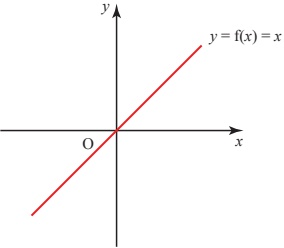

Figure 1.3

The function  $ f(x) $ is positive when x is positive and negative when x is negative.

Now look at the graph of  $ y = g(x) $, where  $ g(x) = |x| $.

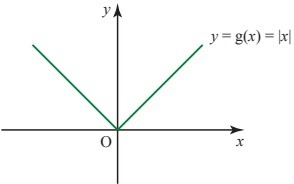

Figure 1.4

The function  $ g(x) $ is called the modulus of x.  $ g(x) $ always takes the positive numerical value of x. For example, when x = -2,  $ g(x) = 2 $, so  $ g(x) $ is always positive. The modulus is also called the magnitude of the quantity.

Another way of writing the modulus function  $ g(x) $ is

 $$ \mathrm{g}(x)=x\quad\text{for}x\geqslant0 $$ 

 $$ \mathrm{g}(x)=-x\qquad\mathrm{f o r}x<0. $$ 

## ? What is the value of g(3) and g(-3)?

What is the value of  $ |3 + 3| $,  $ |3 - 3| $,  $ |3| + |3| $ and  $ |3| + |-3| $?

The graph of $y = g(x)$ can be obtained from the graph of $y = f(x)$ by replacing values where $f(x)$ is negative by the equivalent positive values. This is the equivalent of reflecting that part of the line in the $x$ axis.

<!-- page 27 -->

Sketch the graphs of the following on separate axes.

(i) y = 1 - x

(ii)  $ y = |1 - x| $

(iii)  $ y = 2 + |1 - x| $

## SOLUTION

(i) y = 1 - x is the straight line through (0, 1) and (1, 0).

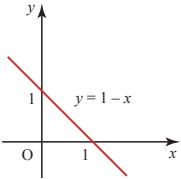

Figure 1.5

(ii) $y = |1 - x|$ is obtained by reflecting the part of the line for $x > 1$ in the $x$ axis.

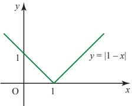

Figure 1.6

(iii) $y=2+\mid 1-x\mid$ is obtained from the previous graph by applying the translation $\begin{pmatrix}0\\2\end{pmatrix}$.

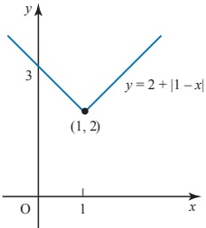

Figure 1.7

<!-- page 28 -->

## Inequalities involving the modulus sign

You will often meet inequalities involving the modulus sign.

### ? Look back at the graph of  $ y=|x| $ in figure 1.4

How does this show that  $ |x| < 2 $ is equivalent to -2 < x < 2?

Here is a summary of some useful rules.

<table border=1 style='margin: auto; word-wrap: break-word;'><tr><td style='text-align: center; word-wrap: break-word;'>Rule</td><td style='text-align: center; word-wrap: break-word;'>Example</td></tr><tr><td style='text-align: center; word-wrap: break-word;'>|x|=|-x|</td><td style='text-align: center; word-wrap: break-word;'>|3|=|-3|</td></tr><tr><td style='text-align: center; word-wrap: break-word;'>|a-b|=|b-a|</td><td style='text-align: center; word-wrap: break-word;'>|8-5|=|5-8|=+3</td></tr><tr><td style='text-align: center; word-wrap: break-word;'>|x|^{2}=x^{2}</td><td style='text-align: center; word-wrap: break-word;'>|-3|^{2}=(-3)^{2}</td></tr><tr><td style='text-align: center; word-wrap: break-word;'>|a|=|b|⇔ a^{2}=b^{2}</td><td style='text-align: center; word-wrap: break-word;'>|-3|=|3|⇔ (-3)^{2}=3^{2}</td></tr><tr><td style='text-align: center; word-wrap: break-word;'>|x|≤a⇔ -a≤x≤a</td><td style='text-align: center; word-wrap: break-word;'>|x|≤3⇔ -3≤x≤3</td></tr><tr><td style='text-align: center; word-wrap: break-word;'>|x|&gt;a⇔ x&lt;-a or x&gt;a</td><td style='text-align: center; word-wrap: break-word;'>|x|&gt;3⇔ x&lt;-3 or x&gt;3</td></tr></table>

### EXAMPLE 1.14

Solve the following.

(ii)  $ |x+3| \leq 4 $

(iii)  $ |2x-1| > 9 $

(iii)  $ 5-|x-2| > 1 $

## SOLUTION

(ii)  $ |x+3| \leq 4 $  $ \Leftrightarrow $  $ -4 \leq x+3 \leq 4 $
 $ \Leftrightarrow $  $ -7 \leq x \leq 1 $

(iii)  $ |2x-1| > 9 $  $ \Leftrightarrow $  $ 2x-1 < -9 $ or  $ 2x-1 > 9 $
 $ \Leftrightarrow $  $ 2x < -8 $ or  $ 2x > 10 $
 $ \Leftrightarrow $ x < -4 or x > 5

(iii)  $ 5-|x-2| > 1 $  $ \Leftrightarrow $  $ 4 > |x-2| $
 $ \Leftrightarrow $  $ |x-2| < 4 $
 $ \Leftrightarrow $ -4 < x - 2 < 4
 $ \Leftrightarrow $ -2 < x < 6

Note

The solution to part (ii) represents two separate intervals on the number line, so cannot be written as a single inequality.

<!-- page 29 -->

### EXAMPLE 1.15

Express the inequality -2 < x < 6 in the form  $ |x - a| < b $, where a and b are to be found.

## SOLUTION

 $$ \begin{array}{ccc}\left|x-a\right|<b&\Longleftrightarrow&-b<x-a<b\\&&\\&\Longleftrightarrow&a-b<x<a+b\end{array} $$ 

Comparing this with -2 < x < 6 gives

 $$ a-b=-2 $$ 

 $$ a+b=6. $$ 

Solving these simultaneously gives $a=2$, $b=4$, so $|x-2|<4$.

### EXAMPLE 1.16

Solve  $ 2x < |x - 3| $.

## SOLUTION

It helps to sketch a graph of $y=2x$ and $y=\left|x-3\right|$.

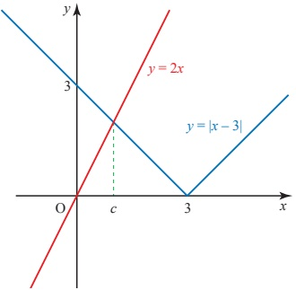

### Figure 1.8

You can see that the graph of y = 2x is below  $ y = |x - 3| $ for x < c.

You can find the critical region by solving  $ 2x < -(x - 3) $.

 $$ \begin{aligned}&2x<-(x-3)\\&2x<-x+3\\&3x<3\\&\quad x<1\end{aligned} $$ 

c is at the intersection of the lines y=2x and  $ y=-(x-3) $.

<!-- page 30 -->

(i) Solve  $ |2x - 1| = |x - 2| $.

(ii) Solve  $ |2x - 1| < |x - 2| $.

## SOLUTION

(i) Sketching a graph of  $ y = |2x - 1| $ and  $ y = |x - 2| $ shows that the equation is true for two values of x.

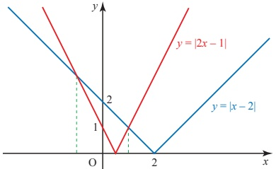

### Figure 1.9

You can find these values by solving  $ |2x - 1| = |x - 2| $. One method is to use the fact that  $ |a| = |b| \Leftrightarrow a^2 = b^2 $.

 $$ \left|2x-1\right|=\left|x-2\right| $$ 

Squaring: ___

 $$ (2x-1)^{2}=(x-2)^{2} $$ 

Expanding:

 $$ 4x^{2}-4x+1=x^{2}-4x+4 $$ 

Rearranging:

 $$ 3x^{2}-3=0 $$ 

 $$ \implies $$ 

 $$ x^{2}-1=0 $$ 

Factorising:  $ (x-1)(x+1)=0 $

So the solution is x = -1 or x = 1.

(ii) When  $ |2x-1|<|x-2| $,  $ y=|2x-1| $ (drawn in red) is below  $ y=|x-2| $ (drawn in blue) on the graph. So the solution to the inequality is  $ -1<x<1 $.

## EXERCISE 1C

1 Solve the following equations.

(ii)  $ |x-3|=4 $

(i)  $ |x+4|=5 $

(iii)  $ |3-x|=4 $

(v)  $ |2x+1|=5 $

(vii)  $ |2x+1|=|x+5| $

(ix)  $ |3x-2|=|4-x| $

(iv)  $ |4x - 1| = 7 $

(vi) | 8 - 2x = 6

(vii) | 4x - 1 | = | 9 - x |

2 Solve the following inequalities.

(i)  $ |x+3|<5 $

(ii)  $ |x-2|\leq2 $

(iii) | x-5| > 6

(iv)  $ |x+1| \geq 2 $

(v)  $ |2x - 3| < 7 $

(vi)  $ |3x - 2| \leq 4 $

<!-- page 31 -->

3 Express each of the following inequalities in the form  $ |x - a| < b $, where a and b are to be found.

(i) -1 < x < 3

(ii) 2 < x < 8

(iii) -2 < x < 4

(iv) -1 < x < 6

(v) 9.9 < x < 10.1

(vi) 0.5 < x < 7.5

4 Sketch each of the following graphs on a separate set of axes.

(i)  $  y = |x + 2|  $
(iii)  $  y = |x + 2| - 2  $
(v)  $  y = |2x + 5| - 4  $

(ii) y = | 2x - 3 |

(iv)  $ y = |x| + 1 $

(vi)  $ y = 3 + |x - 2| $

5 Solve the following inequalities.

(i)  $ |x+3|<|x-4| $

(iii)  $ |2x-1|\leq|2x+3| $

(v)  $ |2x|>|x+3| $

 $$ \left|x-5\right|>\left|x-2\right| $$ 

 $$ \left|2x\right|\leq\left|x+3\right| $$ 

(vi)  $ |2x + 5| \geqslant |x - 1| $

6 Solve the inequality  $ |x| > |3x - 2| $.

[Cambridge International AS & A Level Mathematics 9709, Paper 2 Q1 June 2005]

7 Solve the inequality $2x > |x - 1|$.

[Cambridge International AS & A Level Mathematics 9709, Paper 3 Q2 June 2006]

8 Given that $a$ is a positive constant, solve the inequality $|x-3a|>|x-a|$.

[Cambridge International AS & A Level Mathematics 9709, Paper 3 Q1 November 2005]

## KEY POINTS

1 A polynomial in x has terms in positive integer powers of x and may also have a constant term.

2 The order of a polynomial in x is the highest power of x which appears in the polynomial.

3 The factor theorem states that if $(x-a)$ is a factor of a polynomial $f(x)$ then $f(a)=0$ and $x=a$ is a root of the equation $f(x)=0$.

Conversely if $f(a)=0$, then $x-a$ is a factor of $f(x)$.

4 The remainder theorem states that  $ f(a) $ is the remainder when the polynomial  $ f(x) $ is divided by  $ (x - a) $.

5 The modulus of x, written  $ |x| $, means the positive value of x.

6 The modulus function is

 $$ \begin{aligned}\left|x\right|&=x,\quad&for x&\geqslant0\\\left|x\right|&=-x,\quad&for x&<0.\end{aligned} $$

