# Chapter 2 Logarithms and exponentials

<!-- Pure Mathematics 2 and 3 Cambridge International AS and A Level Mathematics (Sophie Goldie, Roger Porkess) .pdf p32-59 -->

<!-- page 32 -->

# Logarithms and exponentials

Normally speaking it may be said that the forces of a capitalist society, if left unchecked, tend to make the rich richer and the poor poorer and thus increase the gap between them.

Jawaharlal Nehru

This cube has volume of 500cm $ ^{3} $.

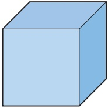

How would you calculate the length of its side, correct to the nearest millimetre, without using the cube root button on your calculator?

## Logarithms

You can think of multiplication in two ways. Look, for example, at  $ 81 \times 243 $, which is  $ 3^{4} \times 3^{5} $. You can work out the product using the numbers or you can work it out by adding the powers of a common base – in this case base 3.

Multiplying the numbers:

 $$ 81\times243=19683 $$ 

Adding the powers of the base 3:  $ 4 + 5 = 9 $ and  $ 3^9 = 19683 $

Another name for a power is a logarithm. Since $81 = 3^{4}$, you can say that the logarithm to the base 3 of 81 is 4. The word logarithm is often abbreviated to log and the statement would be written $\log_{3}81 = 4$. In general:

 $$ y=a^{x}\quad\Rightarrow\quad\log_{a}y=x $$ 

Notice that since  $ 3^4 = 81 $,  $ 3^{\log_3 81} = 81 $. This is an example of a general result:

 $$ a^{\log_{a}x}=x $$

<!-- page 33 -->

### EXAMPLE 2.1

(i) Find the logarithm to the base 2 of each of these numbers.

(a) 64 (b)  $ \frac{1}{2} $ (c) 1 (d)  $ \sqrt{2} $

(ii) Show that  $ 2^{\log_2 64} = 64 $.

## SOLUTION

(i) (a)  $ 64 = 2^{6} $ and so  $ \log_{2}64 = 6 $

 $ \frac{1}{2}=2^{-1} $ and so  $ \log_{2}\frac{1}{2}=-1 $

(c)  $ 1 = 2^{0} $ and so  $ \log_{2}1 = 0 $

(d)  $ \sqrt{2}=2^{\frac{1}{2}} $ and so  $ \log_{2}\sqrt{2}=\frac{1}{2} $

(ii)  $ 2^{\log_{2}64} = 2^{6} = 64 $ as required

## Logarithms to the base 10

Any positive number can be expressed as a power of 10. Before the days of calculators, logarithms to the base 10 were used extensively as an aid to calculation. There is no need for that nowadays but the logarithm function remains an important part of mathematics, particularly the natural logarithm which you will meet later in this chapter. Base 10 logarithms continue to be a standard feature on calculators, and occur in some specialised contexts: the pH value of a liquid, for example, is a measure of its acidity or alkalinity and is given by  $ \log_{10}(1/\text{the concentration of } H^+\text{ ions}) $.

Since $1000 = 10^{3}$, $\log_{10}1000 = 3$

Similarly

 $$ \log_{10}100=2 $$ 

 $$ \log_{10}10=1 $$ 

 $$ \log_{10}1=\quad0 $$ 

 $$ \log_{10}\left(\frac{1}{10}\right)=\log_{10}\left(10^{-1}\right)=-1 $$ 

 $$ \log_{10}\left(\frac{1}{100}\right)=\log_{10}\left(10^{-2}\right)=-2 $$ 

and so on.

## INVESTIGATION

There are several everyday situations in which quantities are measured on logarithmic scales.

What are the relationships between the following?

(i) An earthquake of intensity 7 on the Richter Scale and one of intensity 8.

(ii) The frequency of the musical note middle C and that of the C above it.

(iii) The intensity of an 85 dB noise level and one of 86 dB.

<!-- page 34 -->

## The laws of logarithms

The laws of logarithms follow from those for indices.

## Multiplication

Writing $xy = x \times y$ in the form of powers (or logarithms) to the base $a$ and using the result that $x = a^{\log_{a}x}$ gives

 $$ a^{\log_{a}xy}=a^{\log_{a}x}\times a^{\log_{a}y} $$ 

and so

 $$ a^{\log_{a}xy}=a^{\log_{a}x+\log_{a}y}. $$ 

Consequently  $ \log_{a}xy = \log_{a}x + \log_{a}y $.

## Division

Similarly  $ \log_{a}\left(\frac{x}{y}\right)=\log_{a}x-\log_{a}y $.

## Power zero

Since  $ a^{0}=1 $,  $ \log_{a}1=0 $.

However, it is more usual to state such laws without reference to the base of the logarithms except where necessary, and this convention is adopted in the key points at the end of this chapter. As well as the laws given above, others may be derived from them, as follows.

## Indices

 $$ \begin{aligned}&Since&&x^{n}=x\times x\times x\times\cdots\times x\ (n times)\\&it~follows~that&&\log x^{n}=\log x+\log x+\log x+\cdots+\log x\ (n times),\\&and~so&&\log x^{n}=n\log x.\end{aligned} $$ 

This result is also true for non-integer values of n and is particularly useful because it allows you to solve equations in which the unknown quantity is the power, as in the next example.

### EXAMPLE 2.2

Solve the equation  $ 2^{n}=1000 $.

## SOLUTION

 $$ 2^{n}=1000 $$ 

Taking logarithms to the base 10 of both sides (since these can be found on a calculator),

 $$ \begin{aligned}\log_{10}\left(2^{n}\right)&=\log_{10}1000\\n\log_{10}2&=\log_{10}1000\\n&=\frac{\log_{10}1000}{\log_{10}2}=9.97to3significant\ figures\end{aligned} $$

<!-- page 35 -->

Most calculators just have 'log' and not 'log $ _{10} $' on their keys.

### EXAMPLE 2.3

A geometric sequence begins 0.2, 1, 5, ...

The kth term is the first term in the sequence that is greater than 500000. Find the value of k.

## SOLUTION

The  $ k $th term of a geometric sequence is given by  $ a_k = a \times r^{k-1} $.

In this case a = 0.2 and r = 5, so:

 $$ 0.2\times5^{k-1}>500000 $$ 

 $$ 5^{k-1}>\frac{500000}{0.2} $$ 

 $$ 5^{k-1}>2500000 $$ 

Taking logarithms to the base 10 of both sides:

 $$ \begin{aligned}&\log_{10}5^{k-1}>\log_{10}2500000\\ \Rightarrow\quad&(k-1)\log_{10}5>\log_{10}2500000\\ \Rightarrow\quad&k-1>\frac{\log_{10}2500000}{\log_{10}5}\\ \Rightarrow\quad&k-1>9.15\\ \Rightarrow\quad&k>10.15\end{aligned} $$ 

Since k is an integer, then k = 11.

So the 11th term is the first term greater than 500000.

 $$ \begin{aligned}&Check:\quad&10th term&=0.2\times5^{10-1}=390625(<500000)\checkmark\\&&11th term&=0.2\times5^{11-1}=1953125(>500000)\checkmark\end{aligned} $$ 

## Roots

A similar line of reasoning leads to the conclusion that:

 $$ \log\sqrt[n]{x}=\frac{1}{n}\log x $$ 

The logic runs as follows:

 $$  Since\underbrace{\sqrt[n]{x}\times\sqrt[n]{x}\times\sqrt[n]{x}\times\cdots\times\sqrt[n]{x}}_{n times}=x $$ 

it follows that

 $$ n\log\sqrt[n]{x}=\log x $$ 

and so

 $$ \log\sqrt[n]{x}=\frac{1}{n}\log x $$

<!-- page 36 -->

## The logarithm of a number to its own base

Since  $ 5^{1}=5 $, it follows that  $ \log_{5}5=1 $.

Clearly the same is true for any number, and in general,

## Reciprocals

Another useful result is that, for any base,

 $$ \log\left(\frac{1}{y}\right)=-\log y $$ 

This is a direct consequence of the division law

 $$ \log_{a}\left(\frac{x}{y}\right)=\log_{a}x-\log_{a}y $$ 

with x set equal to 1:

 $$ \begin{aligned}\log\left(\frac{1}{y}\right)&=\log1-\log y\\&=0-\log y\\&=-\log y\end{aligned} $$ 

If the number $y$ is greater than 1, it follows that $\frac{1}{y}$ lies between 0 and 1 and $\log\left(\frac{1}{y}\right)$ is negative. So for any base ($>1$), the logarithm of a number between 0 and 1 is negative. You saw an example of this on page 24: $\log_{10}\left(\frac{1}{10}\right) = -1$.

The result  $ \log\left(\frac{1}{y}\right) = -\log y $ is often useful in simplifying expressions involving logarithms.

ACTIVITY 2.1 Draw the graph of  $ y = \log_{2} x $, taking values of  $ x $ like  $ \frac{1}{8} $,  $ \frac{1}{4} $,  $ \frac{1}{2} $, 1, 2, 4, 8, 16. Use your graph to estimate the value of  $ \sqrt{2} $.

## Graphs of logarithms

Whatever the value, $a$, of the base ($a>1$), the graph of $y=\log_a x$ has the same general shape (shown in figure 2.1).

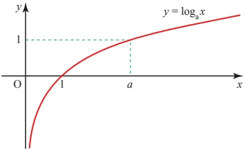

Figure 2.1

<!-- page 37 -->

The graph has the following properties.

The curve crosses the x axis at  $ (1, 0) $.

The curve only exists for positive values of x.

The line x=0 is an asymptote and for values of x between 0 and 1 the curves lie below the x axis.

There is no limit to the height of the curve for large values of x, but its gradient progressively decreases.

The curve passes through the point  $ (a, 1) $.

Each of the points above can be justified by work that you have already covered. How?

## Exponential functions

The relationship $y=\log_{a}x$ may be rewritten as $x=a^{y}$, and so the graph of $x=a^{y}$ is exactly the same as that of $y=\log_{a}x$. Interchanging $x$ and $y$ has the effect of reflecting the graph in the line $y=x$, and changing the relationship into $y=a^{x}$, as shown in figure 2.2.

Figure 2.2

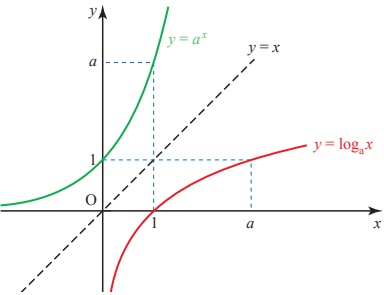

The function  $ y = a^x $,  $ x \in \mathbb{R} $ is called an exponential function. Notice that while the domain of  $ y = a^x $ is all real numbers ( $ x \in \mathbb{R} $), the range is strictly the positive real numbers.  $ y = a^x $ is the inverse of the logarithm function so the domain of the logarithm function is strictly the positive real numbers and its range is all real numbers. Remember the effect of applying a function followed by it inverse is to bring you back to where you started.

Thus  $ \log_{a}(a^{x}) = x $ and  $ a^{(\log_{a}x)} = x $.

<!-- page 38 -->

1  $ 2^{x} = 32 \iff x = \log_{2} 32 $

Write similar logarithmic equivalents of these equations. In each case find also the value of x, using your knowledge of indices and not using your calculator.

(i)  $ 3^{x}=9 $

(ii)  $ 4^{x} = 64 $

(iii)

 $$ 2^{x}=\frac{1}{4} $$ 

(iv)  $ 5^{x} = \frac{1}{5} $

(v)  $ 7^{x}=1 $

(vi)  $ 16^{x}=2 $

2 Write the equivalent of these equations in exponential form. Without using your calculator, find also the value of y in each case.

(i)  $ y = \log_{3} 9 $

(ii)  $ y = \log_{5} 125 $

(iii)  $ y = \log_{2} 16 $

(iv)  $ y = \log_{6} 1 $

(v)  $ y = \log_{64}8 $

(vi)  $ y = \log_{5}\left(\frac{1}{25}\right) $

3 Write down the values of the following without using a calculator. Use your calculator to check your answers for those questions which use base 10.

(i)  $ \log_{10} 10000 $

(ii)

 $$ \log_{10}\left(\frac{1}{10000}\right) $$ 

(iii)  $ \log_{10}\sqrt{10} $

(iv)

 $$ \log_{10}1 $$ 

(v)  $ \log_{3}81 $

(vi)

 $$ \log_{3}\left(\frac{1}{81}\right) $$ 

(vii) $ \log_{3}\sqrt{27} $

(viii)  $ \log_{3}\sqrt[4]{3} $

(ix)  $ \log_{4}2 $

(x)  $ \log_{5}\left(\frac{1}{125}\right) $

4 Write the following expressions in the form  $ \log x $ where x is a number.

(i)  $ \log 5 + \log 2 $

 $ \log 6 - \log 3 $

(iii)  $ 2 \log 6 $

(iv) - $ \log 7 $

(v)

 $ \frac{1}{2}\log 9 $

 $ \frac{1}{4}\log16+\log2 $

(vii)  $ \log 5 + 3 \log 2 - \log 10 $

(viii)  $ \log 12 - 2 \log 2 - \log 9 $

(ix)  $ \frac{1}{2}\log\sqrt{16} + 2\log\left(\frac{1}{2}\right) $

(x)  $ 2\log 4 + \log 9 - \frac{1}{2}\log 144 $

5 Express the following in terms of  $ \log x $.

(i)  $ \log x^{2} $

(ii)  $ \log x^{5}-2\log x $

(iii)  $ \log \sqrt{x} $

(iv)  $ \log x^{\frac{3}{2}} + \log \sqrt[3]{x} $

(v)  $ 3 \log x + \log x^{3} $

(vi)  $ \log\left(\sqrt{x}\right)^{5} $

6 Solve these inequalities.

(i)  $ 2^{x} < 128 $

(ii)

 $ 3^{x} + 5 \geqslant 32 $

(iii)  $ 4^{x} + 6 \geqslant 70 $

(iv)

0.6<0.8

(v)  $ 0.4^{x} - 0.1 \geq 0.3 $

(vi)  $ 0.5^x + 0.2 \leq 1 $

(vii)  $ 2 \leq 5^{x} < 8 $

(viii)  $ 1 \leq 7^{x} < 5 $

(ix)  $ \left|2^{x}-4\right|<2 $

(x)  $ |5^x - 7| < 4 $

<!-- page 39 -->

7 Express the following as a single logarithm.

 $ 2\log_{10}x - \log_{10}7 $

Hence solve

 $ 2\log_{10}x - \log_{10}7 = \log_{10}63. $

8 Use logarithms to the base 10 to solve the following equations.

(i)  $ 2^x = 1000000 $ (ii)  $ 2^x = 0.001 $

(iii)  $ 1.08^x = 2 $ (iv)  $ 1.1^x = 100 $

(v)  $ 0.99^x = 0.000001 $

9 A geometric sequence has first term 5 and common ratio 7. The  $ k $th term is 28824005.

Use logarithms to find the value of k.

10 Find how many terms there are in these geometric sequences.

(i) -1, 2, -4, 8, ..., -16777216

(ii) 0.1, 0.3, 0.9, 2.7, ..., 4304672.1

11 (i) Solve the inequality  $ \left|y-5\right|<1 $.

(ii) Hence solve the inequality  $ \left|3^{x}-5\right|<1 $, giving 3 significant figures in your answer.

[Cambridge International AS & A Level Mathematics 9709, Paper 2 Q3 November 200

12 Given that  $ x = 4(3^{-y}) $, express y in terms of x.

[Cambridge International AS & A Level Mathematics 9709, Paper 3 Q1 June 2006]

13 Using the substitution $u=3^{x}$, or otherwise, solve, correct to 3 significant figures, the equation

$3^{x}=2+3^{-x}$.

[Cambridge International AS & A Level Mathematics 9709, Paper 3 Q4 June 2007]

## Modelling curves

When you obtain experimental data, you are often hoping to establish a mathematical relationship between the variables in question. Should the data fall on a straight line, you can do this easily because you know that a straight line with gradient m and intercept c has equation  $ y = mx + c $.

<!-- page 40 -->

In an experiment the temperature  $ \theta $ (in  $ {}^{\circ} $C) was measured at different times  $ t $ (in seconds), in the early stages of a chemical reaction.

The results are shown in the table below.

<table border=1 style='margin: auto; word-wrap: break-word;'><tr><td style='text-align: center; word-wrap: break-word;'>t</td><td style='text-align: center; word-wrap: break-word;'>20</td><td style='text-align: center; word-wrap: break-word;'>40</td><td style='text-align: center; word-wrap: break-word;'>60</td><td style='text-align: center; word-wrap: break-word;'>80</td><td style='text-align: center; word-wrap: break-word;'>100</td><td style='text-align: center; word-wrap: break-word;'>120</td></tr><tr><td style='text-align: center; word-wrap: break-word;'>$ \theta $</td><td style='text-align: center; word-wrap: break-word;'>16.3</td><td style='text-align: center; word-wrap: break-word;'>20.4</td><td style='text-align: center; word-wrap: break-word;'>24.2</td><td style='text-align: center; word-wrap: break-word;'>28.5</td><td style='text-align: center; word-wrap: break-word;'>32.0</td><td style='text-align: center; word-wrap: break-word;'>36.3</td></tr></table>

(i) Plot a graph of  $ \theta $ against t.

(ii) What is the relationship between  $ \theta $ and t?

SOLUTION

(i)

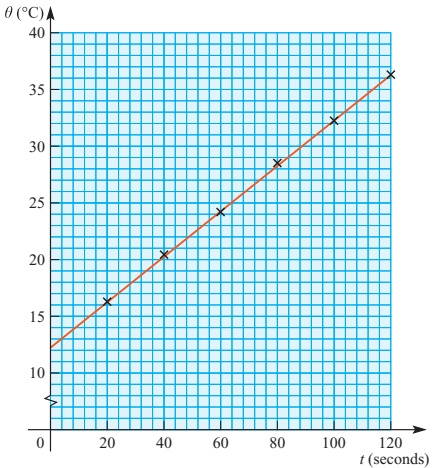

Figure 2.3

(ii) Figure 2.3 shows that the points lie reasonably close to a straight line and so it is possible to estimate its gradient and intercept.

Intercept: c=12.3

Gradient:  $ m=\frac{36.3-16.3}{120-20}=0.2 $

In this case the equation is not $y = mx + c$ but $\theta = mt + c$, and so is given by

 $$ \theta=0.2t+12.3 $$ 

It is often the case, however, that your results do not end up lying on a straight line but on a curve, so that this straightforward technique cannot be applied. The appropriate use of logarithms can convert some curved graphs into straight lines. This is the case if the relationship has one of two forms,  $ y = kx^n $ or  $ y = ka^x $.

<!-- page 41 -->

The techniques used in these two cases are illustrated in the following examples. In theory, logarithms to any base may be used, but in practice you would only use those available on your calculator: logarithms to the base 10 and natural logarithms. The base of natural logarithms is a number, 2.71828..., and is denoted by e. In the next section you will see how this apparently unnatural number arises naturally; for the moment what is important is that you can apply the techniques using base 10.

### EXAMPLE 2.5

## Relationships of the form  $ y = kx^{n} $

A water pipe is going to be laid between two points and an investigation is carried out as to how, for a given pressure difference, the rate of flow R litres per second varies with the diameter of the pipe d cm. The following data are collected.

<table border=1 style='margin: auto; word-wrap: break-word;'><tr><td style='text-align: center; word-wrap: break-word;'>d</td><td style='text-align: center; word-wrap: break-word;'>1</td><td style='text-align: center; word-wrap: break-word;'>2</td><td style='text-align: center; word-wrap: break-word;'>3</td><td style='text-align: center; word-wrap: break-word;'>5</td><td style='text-align: center; word-wrap: break-word;'>10</td></tr><tr><td style='text-align: center; word-wrap: break-word;'>R</td><td style='text-align: center; word-wrap: break-word;'>0.02</td><td style='text-align: center; word-wrap: break-word;'>0.32</td><td style='text-align: center; word-wrap: break-word;'>1.62</td><td style='text-align: center; word-wrap: break-word;'>12.53</td><td style='text-align: center; word-wrap: break-word;'>199.80</td></tr></table>

It is suspected that the relationship between R and d may be of the form  $ R = kd^{n} $ where k is a constant.

(i) Explain how a graph of  $ \log d $ against  $ \log R $ tells you whether this is a good model for the relationship.

(ii) Make out a table of values of  $ \log_{10} d $ against  $ \log_{10} R $ and plot these on a graph.

(iii) If appropriate, use your graph to estimate the values of n and k.

## SOLUTION

(i) If the relationship is of the form $R=kd^{n}$, then taking logarithms gives

 $$  g R=\log k+\log d^{n} $$ 

 $$ \log R=n\log d+\log k. $$ 

This is in the form $y = mx + c$ as $n$ and $\log k$ are constants (so can replace $m$ and $c$) and $\log R$ and $\log d$ are variables (so can replace $y$ and $x$).

 $$ \begin{array}{ccc} \log R & = & n \log d \quad + \quad \log k \\ \uparrow & & \uparrow \quad \uparrow \\ y & = & m \quad x \quad + \quad c \end{array} $$ 

So  $ \log R = n \log d + \log k $ is the equation of a straight line.

Consequently if the graph of $\log R$ against $\log d$ is a straight line, the model $R = kd^{n}$ is appropriate for the relationship and $n$ is given by the gradient of the graph. The value of $k$ is found from the intercept, $\log k$, of the graph with the vertical axis.

 $$ \log_{10}k=intercept\Longrightarrow k=10^{intercept} $$

<!-- page 42 -->

(ii) Working to 2 decimal places (you would find it hard to draw the graph to greater accuracy) the logarithmic data are as follows.

<table border=1 style='margin: auto; word-wrap: break-word;'><tr><td style='text-align: center; word-wrap: break-word;'>$ \log_{10} d $</td><td style='text-align: center; word-wrap: break-word;'>0</td><td style='text-align: center; word-wrap: break-word;'>0.30</td><td style='text-align: center; word-wrap: break-word;'>0.48</td><td style='text-align: center; word-wrap: break-word;'>0.70</td><td style='text-align: center; word-wrap: break-word;'>1.00</td></tr><tr><td style='text-align: center; word-wrap: break-word;'>$ \log_{10} R $</td><td style='text-align: center; word-wrap: break-word;'>-1.70</td><td style='text-align: center; word-wrap: break-word;'>-0.49</td><td style='text-align: center; word-wrap: break-word;'>0.21</td><td style='text-align: center; word-wrap: break-word;'>1.10</td><td style='text-align: center; word-wrap: break-word;'>2.30</td></tr></table>

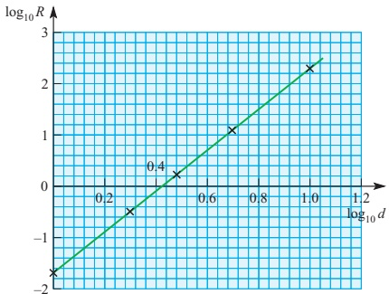

Figure 2.4

(iii) In this case the graph in figure 2.4 is indeed a straight line, with gradient 4 and intercept -1.70, so n = 4 and  $ k = 10^{-1.70} = 0.020 $ (to 2 significant figures).

The proposed equation linking R and d is a good model for their relationship, and may be written as:

 $$ R=0.02d^{4} $$ 

## Exponential relationships

### EXAMPLE 2.6

The temperature in  $ {}^{\circ} $C,  $ \theta $, of a cup of coffee at time t minutes after it is made is recorded as follows.

<table border=1 style='margin: auto; word-wrap: break-word;'><tr><td style='text-align: center; word-wrap: break-word;'>t</td><td style='text-align: center; word-wrap: break-word;'>2</td><td style='text-align: center; word-wrap: break-word;'>4</td><td style='text-align: center; word-wrap: break-word;'>6</td><td style='text-align: center; word-wrap: break-word;'>8</td><td style='text-align: center; word-wrap: break-word;'>10</td><td style='text-align: center; word-wrap: break-word;'>12</td></tr><tr><td style='text-align: center; word-wrap: break-word;'>$ \theta $</td><td style='text-align: center; word-wrap: break-word;'>81</td><td style='text-align: center; word-wrap: break-word;'>70</td><td style='text-align: center; word-wrap: break-word;'>61</td><td style='text-align: center; word-wrap: break-word;'>52</td><td style='text-align: center; word-wrap: break-word;'>45</td><td style='text-align: center; word-wrap: break-word;'>38</td></tr></table>

(i) Plot the graph of  $ \theta $ against t.

(ii) Show how it is possible, by drawing a suitable graph, to test whether the relationship between  $ \theta $ and t is of the form  $ \theta = ka^{t} $, where k and a are constants.

(iii) Carry out the procedure.

<!-- page 43 -->

(i)

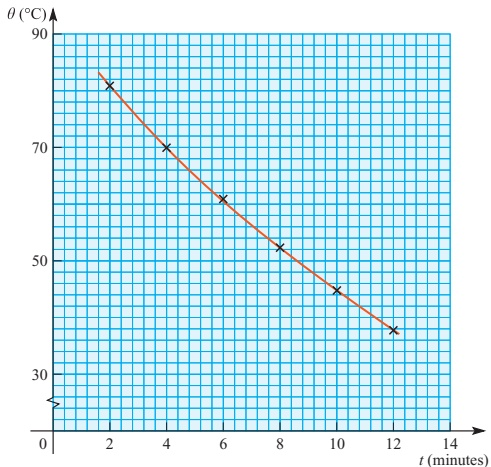

Figure 2.5

(ii) If the relationship is of the form  $ \theta = ka^{t} $, taking logarithms of both sides gives

 $$ \log\theta=\log k+\log a^{t} $$ 

or  $ \log\theta = t\log a + \log k $.

This is in the form $y = mx + c$ as $\log a$ and $\log k$ are constants (so can replace $m$ and $c$) and $\log \theta$ and $t$ are variable (so can replace $y$ and $x$).

 $$ \begin{array}{ccc} \log\theta & = & \log a \quad t \\ \downarrow & & \uparrow \quad \uparrow \\ y & = & m \quad x \quad + \quad c \end{array}  \quad \mathrm{or} \quad \begin{array}{c} \log k \\ \downarrow \end{array} $$ 

So  $ \log\theta = t\log a + \log k $ is the equation of a straight line.

Consequently if the graph of $\log \theta$ against $t$ is a straight line, the model $\theta = ka^t$ is appropriate for the relationship, and $\log a$ is given by the gradient of the graph. The value of $a$ is therefore found as $a = 10^{\text{gradient}}$. Similarly, the value of $k$ is found from the intercept, $\log_{10} k$, of the line with the vertical axis: $k = 10^{\text{intercept}}$.

(iii) The table gives values of  $ \log_{10}\theta $ for the given values of t.

<table border=1 style='margin: auto; word-wrap: break-word;'><tr><td style='text-align: center; word-wrap: break-word;'>t</td><td style='text-align: center; word-wrap: break-word;'>2</td><td style='text-align: center; word-wrap: break-word;'>4</td><td style='text-align: center; word-wrap: break-word;'>6</td><td style='text-align: center; word-wrap: break-word;'>8</td><td style='text-align: center; word-wrap: break-word;'>10</td><td style='text-align: center; word-wrap: break-word;'>12</td></tr><tr><td style='text-align: center; word-wrap: break-word;'>$ \log_{10}\theta $</td><td style='text-align: center; word-wrap: break-word;'>1.908</td><td style='text-align: center; word-wrap: break-word;'>1.845</td><td style='text-align: center; word-wrap: break-word;'>1.785</td><td style='text-align: center; word-wrap: break-word;'>1.716</td><td style='text-align: center; word-wrap: break-word;'>1.653</td><td style='text-align: center; word-wrap: break-word;'>1.580</td></tr></table>

The graph of  $ \log_{10}\theta $ against t is as shown in figure 2.6.

<!-- page 44 -->

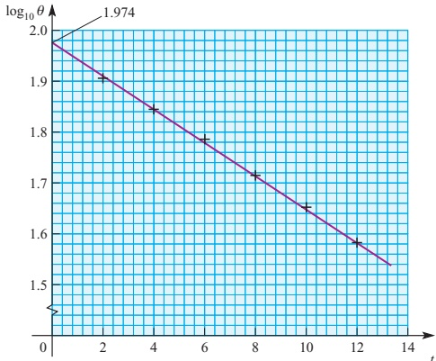

Figure 2.6

The graph is indeed a straight line so the proposed model is appropriate.

The gradient is -0.033 and so  $ a = 10^{-0.033} = 0.927 $.

The intercept is 1.974 and so k = 10^{1.974} = 94.2.

The relationship between  $ \theta $ and t is given by:

 $$ \theta=94.2\times0.927^{t} $$ 

Note

Because the base of the exponential function, 0.927, is less than 1, the function's value decreases rather than increases with t.

## EXERCISE 2B

1 The planet Saturn has many moons. The table below gives the mean radius of orbit and the time taken to complete one orbit for five of the best-known of them.

<table border=1 style='margin: auto; word-wrap: break-word;'><tr><td style='text-align: center; word-wrap: break-word;'>Moon</td><td style='text-align: center; word-wrap: break-word;'>Tethys</td><td style='text-align: center; word-wrap: break-word;'>Dione</td><td style='text-align: center; word-wrap: break-word;'>Rhea</td><td style='text-align: center; word-wrap: break-word;'>Titan</td><td style='text-align: center; word-wrap: break-word;'>Iapetus</td></tr><tr><td style='text-align: center; word-wrap: break-word;'>Radius  $ R $ ( $ \times 10^{{5}} $ km)</td><td style='text-align: center; word-wrap: break-word;'>2.9</td><td style='text-align: center; word-wrap: break-word;'>3.8</td><td style='text-align: center; word-wrap: break-word;'>5.3</td><td style='text-align: center; word-wrap: break-word;'>12.2</td><td style='text-align: center; word-wrap: break-word;'>35.6</td></tr><tr><td style='text-align: center; word-wrap: break-word;'>Period  $ T $ (days)</td><td style='text-align: center; word-wrap: break-word;'>1.9</td><td style='text-align: center; word-wrap: break-word;'>2.7</td><td style='text-align: center; word-wrap: break-word;'>4.5</td><td style='text-align: center; word-wrap: break-word;'>15.9</td><td style='text-align: center; word-wrap: break-word;'>79.3</td></tr></table>

It is believed that the relationship between R and T is of the form  $ R = kT^{n} $.

(i) How can this be tested by plotting  $ \log R $ against  $ \log T $?

(ii) Make out a table of values of  $ \log R $ and  $ \log T $ and draw the graph.

(iii) Use your graph to estimate the values of k and n.

In 1980 a Voyager spacecraft photographed several previously unknown moons of Saturn. One of these, named 1980 S.27, has a mean orbital radius of  $ 1.4 \times 10^{5} $ km.

(iv) Estimate how many days it takes this moon to orbit Saturn.

<!-- page 45 -->

2 The table below shows the area,  $ A \, cm^2 $, occupied by a patch of mould at time t days since measurements were started.

<table border=1 style='margin: auto; word-wrap: break-word;'><tr><td style='text-align: center; word-wrap: break-word;'>t</td><td style='text-align: center; word-wrap: break-word;'>0</td><td style='text-align: center; word-wrap: break-word;'>1</td><td style='text-align: center; word-wrap: break-word;'>2</td><td style='text-align: center; word-wrap: break-word;'>3</td><td style='text-align: center; word-wrap: break-word;'>4</td><td style='text-align: center; word-wrap: break-word;'>5</td></tr><tr><td style='text-align: center; word-wrap: break-word;'>A</td><td style='text-align: center; word-wrap: break-word;'>0.9</td><td style='text-align: center; word-wrap: break-word;'>1.3</td><td style='text-align: center; word-wrap: break-word;'>1.8</td><td style='text-align: center; word-wrap: break-word;'>2.5</td><td style='text-align: center; word-wrap: break-word;'>3.5</td><td style='text-align: center; word-wrap: break-word;'>5.2</td></tr></table>

It is believed that A may be modelled by a relationship of the form  $ A = kb^{t} $.

(i) Show that the model may be written as  $ \log A = \log b + \log k $.

(ii) What graph must be plotted to test this model?

(iii) Plot the graph and use it to estimate the values of b and k.

(iv) (a) Estimate the time when the area of mould was 2 cm².

(b) Estimate the area of the mould after 3.5 days.

(v) How is this sort of growth pattern described?

3 The inhabitants of an island are worried about the rate of deforestation taking place. A research worker uses records over the last 200 years to estimate the number of trees at different dates.

It is suggested that the number of trees N has been decreasing exponentially with the number of years, t, since 1930, so that N may be modelled by the equation

 $$ N=ka^{t} $$ 

where k and a are constants.

(i) Show that the model may be written as  $ \log N = \log a + \log k $.

The diagram shows the graph of  $ \log N $ against t.

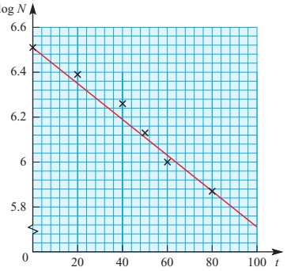

(ii) Estimate the values of k and a.

What is the significance of k?

<!-- page 46 -->

4 The time after a train leaves a station is recorded in minutes as $t$ and the distance that it has travelled in metres as $s$. It is suggested that the relationship between $s$ and $t$ is of the form $s = kt^{n}$ where $k$ and $n$ are constants.

(i) Show that the graph of $\log s$ against $\log t$ produces a straight line. The diagram shows the graph of $\log s$ against $\log t$.

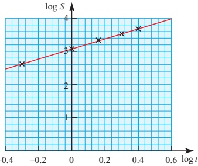

(ii) Estimate the values of k and n.

(iii) Estimate how far the train travelled in its first 100 seconds.

(iv) Explain why you would be wrong to use your results to estimate the distance the train has travelled after 10 minutes.

5 The variables $t$ and $A$ satisfy the equation $A = kb^{t}$, where $b$ and $k$ are constants.

(i) Show that the graph of $\log A$ against $t$ produces a straight line.

The graph of $\log A$ against $t$ passes through the points $(0, 0.2)$ and $(4, 0.75)$.

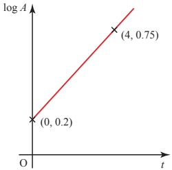

(ii) Find the values of b and k.

6 All but one of the following pairs of readings satisfy, to 3 significant figures, a formula of the type  $ y = A \times x^B $.

<table border=1 style='margin: auto; word-wrap: break-word;'><tr><td style='text-align: center; word-wrap: break-word;'>x</td><td style='text-align: center; word-wrap: break-word;'>1.51</td><td style='text-align: center; word-wrap: break-word;'>2.13</td><td style='text-align: center; word-wrap: break-word;'>3.50</td><td style='text-align: center; word-wrap: break-word;'>4.62</td><td style='text-align: center; word-wrap: break-word;'>5.07</td><td style='text-align: center; word-wrap: break-word;'>7.21</td></tr><tr><td style='text-align: center; word-wrap: break-word;'>y</td><td style='text-align: center; word-wrap: break-word;'>2.09</td><td style='text-align: center; word-wrap: break-word;'>2.75</td><td style='text-align: center; word-wrap: break-word;'>4.09</td><td style='text-align: center; word-wrap: break-word;'>5.10</td><td style='text-align: center; word-wrap: break-word;'>6.21</td><td style='text-align: center; word-wrap: break-word;'>7.28</td></tr></table>

Find the values of A and B, explaining your method. If the values of x are correct, state which value of y appears to be wrong and estimate what the value should be.

<!-- page 47 -->

7 An experimenter takes observations of a quantity $y$ for various values of a variable $x$. He wishes to test whether these observations conform to a formula $y = A \times x^B$ and, if so, to find the values of the constants $A$ and $B$.

Take logarithms of both sides of the formula. Use the result to explain what he should do, what will happen if there is no relationship, and if there is one, how to find A and B.

Carry this out accurately on graph paper for the observations in the table, and record clearly the resulting formula if there is one.

<table border=1 style='margin: auto; word-wrap: break-word;'><tr><td style='text-align: center; word-wrap: break-word;'>x</td><td style='text-align: center; word-wrap: break-word;'>4</td><td style='text-align: center; word-wrap: break-word;'>7</td><td style='text-align: center; word-wrap: break-word;'>10</td><td style='text-align: center; word-wrap: break-word;'>13</td><td style='text-align: center; word-wrap: break-word;'>20</td></tr><tr><td style='text-align: center; word-wrap: break-word;'>y</td><td style='text-align: center; word-wrap: break-word;'>3</td><td style='text-align: center; word-wrap: break-word;'>3.97</td><td style='text-align: center; word-wrap: break-word;'>4.74</td><td style='text-align: center; word-wrap: break-word;'>5.41</td><td style='text-align: center; word-wrap: break-word;'>6.71</td></tr></table>

8 It is believed that the relationship between the variables x and y is of the form  $ y = Ax^{n} $. In an experiment the data in the table are obtained.

<table border=1 style='margin: auto; word-wrap: break-word;'><tr><td style='text-align: center; word-wrap: break-word;'>x</td><td style='text-align: center; word-wrap: break-word;'>3</td><td style='text-align: center; word-wrap: break-word;'>6</td><td style='text-align: center; word-wrap: break-word;'>10</td><td style='text-align: center; word-wrap: break-word;'>15</td><td style='text-align: center; word-wrap: break-word;'>20</td></tr><tr><td style='text-align: center; word-wrap: break-word;'>y</td><td style='text-align: center; word-wrap: break-word;'>10.4</td><td style='text-align: center; word-wrap: break-word;'>29.4</td><td style='text-align: center; word-wrap: break-word;'>63.2</td><td style='text-align: center; word-wrap: break-word;'>116.2</td><td style='text-align: center; word-wrap: break-word;'>178.19</td></tr></table>

In order to estimate the constants A and n,  $ \log_{10} y $ is plotted against  $ \log_{10} x $.

(i) Draw the graph of  $ \log_{10} y $ against  $ \log_{10} x $.

(ii) Explain and justify how the shape of your graph enables you to decide whether the relationship is indeed of the form  $ y = Ax^n $.

(iii) Estimate the values of A and n.

9 In a spectacular experiment on cell growth the following data were obtained, where N is the number of cells at a time t minutes after the start of the growth.

<table border=1 style='margin: auto; word-wrap: break-word;'><tr><td style='text-align: center; word-wrap: break-word;'>t</td><td style='text-align: center; word-wrap: break-word;'>1.5</td><td style='text-align: center; word-wrap: break-word;'>2.7</td><td style='text-align: center; word-wrap: break-word;'>3.4</td><td style='text-align: center; word-wrap: break-word;'>8.1</td><td style='text-align: center; word-wrap: break-word;'>10</td></tr><tr><td style='text-align: center; word-wrap: break-word;'>N</td><td style='text-align: center; word-wrap: break-word;'>9</td><td style='text-align: center; word-wrap: break-word;'>19</td><td style='text-align: center; word-wrap: break-word;'>32</td><td style='text-align: center; word-wrap: break-word;'>820</td><td style='text-align: center; word-wrap: break-word;'>3100</td></tr></table>

At t = 10 a chemical was introduced which killed off the culture.

The relationship between N and t was thought to be modelled by  $ N = ab^{t} $, where a and b are constants.

(i) Show that the relationship is equivalent to  $ \log N = \log b + \log a $.

(ii) Plot the values of  $ \log N $ against t and say how they confirm the supposition that the relationship is of the form  $ N = ab^{t} $.

(iii) Find the values of a and b.

(iv) If the growth had not been stopped at t = 10 and had continued according to your model, how many cells would there have been after 20 minutes?

[MEI]

<!-- page 48 -->

10 It is believed that two quantities, $z$ and $d$, are connected by a relationship of the form $z = k d^{n}$, where $k$ and $n$ are constants, provided that $d$ does not exceed some fixed (but unknown) value, $D$.

An experiment produced the following data.

<table border=1 style='margin: auto; word-wrap: break-word;'><tr><td style='text-align: center; word-wrap: break-word;'>d</td><td style='text-align: center; word-wrap: break-word;'>780</td><td style='text-align: center; word-wrap: break-word;'>810</td><td style='text-align: center; word-wrap: break-word;'>870</td><td style='text-align: center; word-wrap: break-word;'>930</td><td style='text-align: center; word-wrap: break-word;'>990</td><td style='text-align: center; word-wrap: break-word;'>1050</td><td style='text-align: center; word-wrap: break-word;'>1110</td><td style='text-align: center; word-wrap: break-word;'>1170</td></tr><tr><td style='text-align: center; word-wrap: break-word;'>z</td><td style='text-align: center; word-wrap: break-word;'>2.1</td><td style='text-align: center; word-wrap: break-word;'>2.6</td><td style='text-align: center; word-wrap: break-word;'>3.2</td><td style='text-align: center; word-wrap: break-word;'>4.0</td><td style='text-align: center; word-wrap: break-word;'>4.8</td><td style='text-align: center; word-wrap: break-word;'>5.6</td><td style='text-align: center; word-wrap: break-word;'>5.9</td><td style='text-align: center; word-wrap: break-word;'>6.1</td></tr></table>

(i) Explain why, if $z = kd^{n}$, then plotting $\log_{10}z$ against $\log_{10}d$ should produce a straight-line graph.

(ii) Draw up a table and plot the values of  $ \log_{10} z $ against  $ \log_{10} d $.

(iii) Use these points to suggest a value for D.

(iv) It is known that, for $d < D$, $n$ is a whole number.

Use your graph to find the value of $n$.

Show also that $k\approx5\times10^{-9}$.

(v) Use your value for $n$ and the estimate $k=5\times10^{-9}$ to find the value of $d$ for which $z=3.0$.

11 The variables x and y satisfy the relation  $ 3^{y}=4^{x+2} $.

(i) By taking logarithms, show that the graph of y against x is a straight line. Find the exact value of the gradient of this line.

(ii) Calculate the x co-ordinate of the point of intersection of this line with the line y = 2x, giving your answer correct to 2 decimal places.

[Cambridge International AS & A Level Mathematics 9709, Paper 2 Q2 June 2007]

## The natural logarithm function

The shaded region in figure 2.7 is bounded by the x axis, the lines x=1 and x=3, and the curve  $ y=\frac{1}{x} $. The area of this region may be represented by  $ \int_{1}^{3}\frac{1}{x}dx $.

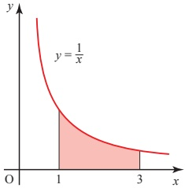

Figure 2.7

<!-- page 49 -->

## ? Explain why you cannot apply the rule

 $$ \int kx^{n}\mathrm{d}x=\frac{kx^{n+1}}{n+1}+c $$ 

to this integral.

However, the area in the diagram clearly has a definite value, and so we need to find ways to express and calculate it.

## INVESTIGATION

Estimate, using numerical integration (for example by dividing the area up into a number of strips), the areas represented by these integrals.

(ii)  $ \int_{1}^{2}\frac{1}{x}dx $

 $$ \int_{1}^{3}\frac{1}{x}\mathrm{d}x $$ 

(iii)  $ \int_{1}^{6}\frac{1}{x}dx $

What relationship can you see between your answers?

The area under the curve  $ y = \frac{1}{x} $ between x = 1 and x = a, that is  $ \int_{1}^{a} \frac{1}{x} \, dx $, depends on the value a. For every value of  $ a $ (greater than 1) there is a definite value of the area. Consequently, the area is a function of a.

To investigate this function you need to give it a name, say L, so that L(a) is the area from 1 to a and L(x) is the area from 1 to x. Then look at the properties of L(x) to see if its behaviour is like that of any other function with which you are familiar.

The investigation you have just done should have suggested to you that

 $$ \int_{1}^{3}\frac{1}{x}\mathrm{d}x+\int_{1}^{2}\frac{1}{x}\mathrm{d}x=\int_{1}^{6}\frac{1}{x}\mathrm{d}x. $$ 

This can now be written as

 $$ \mathrm{L}(3)+\mathrm{L}(2)=\mathrm{L}(6). $$ 

This suggests a possible law, that

 $$ \mathrm{L}(a)+\mathrm{L}(b)=\mathrm{L}(ab). $$ 

At this stage this is just a conjecture, based on one particular example. To prove it, you need to take the general case and this is done in the activity below. (At first reading you may prefer to leave the activity, accepting that the result can be proved.)

<!-- page 50 -->

ACTIVITY 2.2 Prove that  $ \mathrm{L}(a) + \mathrm{L}(b) = \mathrm{L}(ab) $, by following the steps below.

p (i) Explain, with the aid of a diagram, why

 $$ \mathrm{L}(a)+\int_{a}^{a b}\frac{1}{x}\mathrm{d}x=\mathrm{L}(a b). $$ 

(ii) Now call x = az, so that dx can  $ \underline{\text{be replaced}} $ by adz. Show that

 $$ \int_{a}^{a b}\frac{1}{x}\mathrm{d}x=\int_{1}^{b}\frac{1}{z}\mathrm{d}z. $$ 

Notice that the limits of the left-hand integral, $ab$ and $a$, are values for $x$ but those for the right-hand integral, $b$ and $1$, are values for $z$. So, to find the new limits for the right-hand integral, you should find $z$ when $x = a$ (the lower limit) and when $x = ab$ (the upper limit). Remember $az = x$.

Explain why $\int_{1}^{b}\frac{1}{z} \mathrm{d}z = \mathrm{L}(b)$. integral, you should find $z$ when $x = a$ (the lower limit) and when $x = ab$ (the upper limit). Remember $az = x$.

(iii) Use the results from parts (i) and (ii) to show that

 $$ \mathrm{L}(a)+\mathrm{L}(b)=\mathrm{L}(ab). $$ 

What function has this property? For all logarithms

 $$ \log(a)+\log(b)=\log(ab). $$ 

Could it be that this is a logarithmic function?

ACTIVITY 2.3 Satisfy yourself that the function has the following properties of logarithms.

(i)  $ L(1)=0 $

(ii)  $ \mathrm{L}(a)-\mathrm{L}(b)=\mathrm{L}\left(\frac{a}{b}\right) $

(iii)  $ \mathrm{L}(a^{n}) = n\mathrm{L}(a) $

## The base of the logarithm function  $ L(x) $

Having accepted that L(x) is indeed a logarithmic function (for x>0), the remaining problem is to find the base of the logarithm. By convention this is denoted by the letter e. A further property of logarithms is that for any base p

 $$ \log_{p} p=1\quad(p>1). $$ 

So to find the base e, you need to find the point such that the area L(e) under the graph is 1. See figure 2.8.

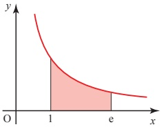

Figure 2.8

You have already estimated the value of L(2) to be about 0.7 and that of L(3) to be about 1.1 so the value of e is between 2 and 3.

<!-- page 51 -->

ACTIVITY 2.4 You will need a calculator with an area-finding facility, or other suitable technology, to do this. If you do not have this, read on.

Use the fact that  $ \int_{1}^{e}\frac{1}{x}dx=1 $ to find the value of e, knowing that it lies between 2 and 3, to 2 decimal places.

The value of e is given to 9 decimal places in the key points on page 50. Like  $ \pi $, e is a number which occurs naturally within mathematics. It is irrational: when written as a decimal, it never terminates and has no recurring pattern.

The function $L(x)$ is thus the logarithm of $x$ to the base $e$, $\log_{e}x$. This is often called the natural logarithm of $x$, and written as $\ln x$.

## Values of x between 0 and 1

So far it has been assumed that the domain of the function  $ \ln x $ is the real numbers greater than  $ 1 $ ( $ x \in \mathbb{R} $,  $ x > 1 $). However, the domain of  $ \ln x $ also includes values of  $ x $ between 0 and 1. As an example of a value of  $ x $ between 0 and 1, look at  $ \ln \frac{1}{2} $.

 $$ \mathrm{S i n c e}\qquad\ln\left(\frac{a}{b}\right)=\ln a-\ln b $$ 

 $$ \Longrightarrow\qquad\ln\left(\tfrac12\right)=\ln1-\ln2=-\ln2\ \text{(since}\ln1=0\text{)} $$ 

In the same way, you can show that for any value of x between 0 and 1, the value of  $ \ln x $ is negative.

When the value of x is very close to zero, the value of  $ \ln x $ is a large negative number.

 $$ \ln\left(\frac{1}{1000000}\right)=-\ln1000000=-13.8 $$ 

So as  $ x \to 0 $,  $ \ln x \to -\infty $ (for positive values of x).

 $$ \ln\left(\frac{1}{1000}\right)=-\ln1000=-6.9 $$ 

## The graph of the natural logarithm function

The graph of the natural logarithm function (shown in figure 2.9) has the characteristic shape of all logarithmic functions and like other such functions it is only defined for x > 0. The value of  $ \ln x $ increases without limit, but ever more slowly: it has been described as ‘the slowest way to get to infinity’.

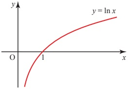

Figure 2.9

<!-- page 52 -->

Historical note

Logarithms were discovered independently by John Napier (1550–1617), who lived at Merchiston Castle in Edinburgh, and Jolst Bürgi (1552–1632) from Switzerland. It is generally believed that Napier had the idea first, and so he is credited with their discovery. Natural logarithms are also called Naperian logarithms but there is no basis for this since Napier's logarithms were definitely not the same as natural logarithms. Napier was deeply involved in the political and religious events of his day and mathematics and science were little more than hobbies for him. He was a man of remarkable ingenuity and imagination and also drew plans for war chariots that look very like modern tanks, and for submarines.

## The exponential function

Making $x$ the subject of $y = \ln x$, using the theory of logarithms you obtain $x = e^{y}$.

Interchanging x and y, which has the effect of reflecting the graph in the line y = x, gives the exponential function  $ y = e^{x} $.

The graphs of the natural logarithm function and its inverse are shown in figure 2.10.

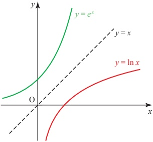

Figure 2.10

You saw in Pure Mathematics 1 Chapter 4 that reflecting in the line y=x gives an inverse function, so it follows that  $ e^x $ and  $ \ln x $ are each the inverse of the other.

Notice that  $ e^{\ln x} = x $, using the definition of logarithms, and  $ \ln(e^x) = x \ln e = x $.

Although the function  $ e^x $ is called the exponential function, in fact any function of the form  $ a^x $ is exponential. Figure 2.11 shows several exponential curves.

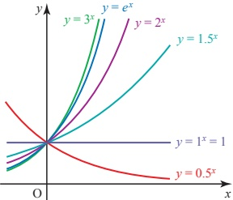

Figure 2.11

The exponential function  $ y = e^{x} $ increases at an ever-increasing rate. This is described as exponential growth.

<!-- page 53 -->

By contrast, the graph of  $ y = e^{-x} $, shown in figure 2.12, approaches the x axis ever more slowly as x increases. This is called exponential decay.

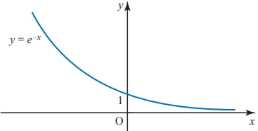

Figure 2.12

You will meet  $ e^x $ and  $ \ln x $ again later in this book. In Chapter 4 you learn how to differentiate these functions and in Chapter 5 you learn how to integrate them. In this section you focus on practical applications which require you to use the  $ \underline{\text{ln}} $ key on your calculator.

### EXAMPLE 2.7

The number, N, of insects in a colony is given by  $ N = 2000 e^{0.1t} $ where t is the number of days after observations have begun.

(i) Sketch the graph of N against t.

(ii) What is the population of the colony after 20 days?

(iii) How long does it take the colony to reach a population of 10000?

## SOLUTION

(i)

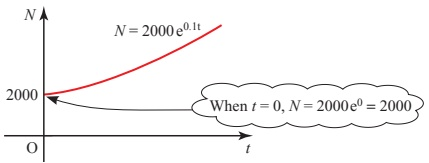

Figure 2.13

(ii) When t = 20,  $ N = 2000 e^{0.1 \times 20} = 14778 $

The population is 14778 insects.

(iii) When N = 10000,  $ 10000 = 2000 e^{0.1t} $

 $$ 5=e^{0.1t} $$ 

Taking natural logarithms of both sides,

and so

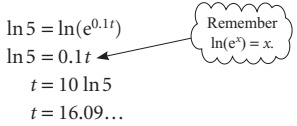

It takes just over 16 days for the population to reach 10000.

<!-- page 54 -->

The radioactive mass,  $ M_{\text{grams}} $ in a lump of material is given by  $ M = 25e^{-0.0012t} $ where  $ t $ is the time in seconds since the first observation.

(i) Sketch the graph of M against t.

(ii) What is the initial size of the mass?

(iii) What is the mass after 1 hour?

(iv) The half-life of a radioactive substance is the time it takes to decay to half of its mass. What is the half-life of this material?

## SOLUTION

(i)

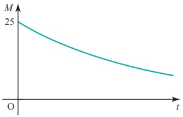

Figure 2.14

(ii) When $t=0$, $M=25\mathrm{e}^{0}$
$M=25$

The initial mass is 25g.

(iii) After 1 hour, $t=3600$
$M=25\mathrm{e}^{-0.0012\times3600}$
$M=0.3324...$

The mass after 1 hour is 0.33g (to 2 decimal places).

(iv) The initial mass is 25g, so after one half-life,
$M=\frac{1}{2}\times25=12.5\mathrm{g}$

At this point the value of $t$ is given by
$12.5=25\mathrm{e}^{-0.0012t}$
$\Rightarrow$ $0.5=\mathrm{e}^{-0.0012t}$

Taking logarithms of both sides:
$\ln 0.5=\ln\mathrm{e}^{-0.0012t}$
$\ln 0.5=-0.0012t$
$\Rightarrow$ $t=\frac{\ln 0.5}{-0.0012}$
$t=577.6$ (to 1 decimal place).

The half-life is 577.6 seconds. (This is just under 10 minutes, so the substance is highly radioactive.)

<!-- page 55 -->

### EXAMPLE 2.9

Make p the subject of  $ \ln(p)-\ln(1-p)=t $.

## SOLUTION

 $$ \ln\left(\frac{p}{1-p}\right)=t $$ 

 $$ \log\log a-\log b=\log\left(\frac{a}{b}\right) $$ 

Writing both sides as powers of e gives

 $$ \mathrm{e}^{\ln\left(\frac{p}{1-p}\right)}=\mathrm{e}^{t}\xleftarrow{\quad\mathrm{\quad\mathrm{~Remember~e^{lnx}=x}~,\quad}} $$ 

 $$ \Rightarrow\qquad\frac{p}{1-p}=\mathrm{e}^{t} $$ 

 $$ p=\mathrm{e}^{t}(1-p) $$ 

 $$ p=\mathrm{e}^{t}-p\mathrm{e}^{t} $$ 

 $$ p+p e^{t}=e^{t} $$ 

 $$ p(1+\mathrm{e}^{t})=\mathrm{e}^{t} $$ 

 $$ p=\frac{e^{t}}{1+e^{t}} $$ 

### EXAMPLE 2.10

Solve these equations.

(i)  $ \ln(x-4)=\ln x-4 $

(ii)

 $$ \mathrm{e}^{2x}+\mathrm{e}^{x}=6 $$ 

## SOLUTION

(i)

 $$ \ln\left(x-4\right)=\ln x-4 $$ 

 $$ \Rightarrow\quad x-4=\mathrm{e}^{\ln x-4} $$ 

 $$ x-4=e^{\ln x}e^{-4} $$ 

 $$ x-4=x\mathrm{e}^{-4} $$ 

Rearrange to get all the x terms on one side:

 $$ x-x\mathrm{e}^{-4}=4 $$ 

 $$ x(1-e^{-4})=4 $$ 

 $$ x=\frac{4}{1-\mathrm{e}^{-4}} $$ 

So

 $$ x=4.07 $$

<!-- page 56 -->

(ii)  $  \mathrm{e}^{2x} + \mathrm{e}^{x} = 6  $ is a quadratic equation in  $  \mathrm{e}^{x}  $.

Substituting  $ u = e^x $:

 $$ u^{2}+u=6 $$ 

So

 $$ u^{2}+u-6=0 $$ 

Factorising:  $ (u-2)(u+3)=0 $

So u = 2 or u = -3.

Since  $ u = e^{x} $ then  $ e^{x} = 2 $ or  $ e^{x} = -3 $.

 $ e^{x} = -3 $ has no solution.

## EXERCISE 2C

 $ e^x = 2 \Rightarrow x = \ln 2 $

So x=0.693

1 Make $x$ the subject of $\ln x - \ln x_{0} = kt$.

2 Make $t$ the subject of $s = s_{0}e^{-kt}$.

3 Make $p$ the subject of $\ln p = -0.02t$.

4 Make x the subject of $y-5=(y_{0}-5)\mathrm{e}^{x}$.

5 Solve these equations.

(i)  $ \ln(3-x)=4+\ln x $

(ii)  $ \ln(x+5)=5+\ln x $

(iii)  $ \ln(2-x)=2+\ln x $

(iv)  $  e^{x} = \frac{4}{e^{x}}  $

(v)  $ e^{2x} - 8e^{x} + 16 = 0 $

(vi)  $ e^{2x} + e^{x} = 12 $

6 A colony of humans settles on a previously uninhabited planet. After t years, their population, P, is given by  $ P = 100e^{0.05t} $.

(i) Sketch the graph of P against t.

(ii) How many settlers land on the planet initially?

(iii) What is the population after 50 years?

(iv) How long does it take the population to reach 1 million?

<!-- page 57 -->

7 The height $h$ metres of a species of pine tree $t$ years after planting is modelled by the equation $h=20-19\times0.9^{t}$.

(ii) Calculate the height of the trees after 2 years, and the time taken for the height to reach 10 metres.

(i) What is the height of the trees when they are planted?

The relationship between the market value $y of the timber from the tree and the height $h$ metres of the tree is modelled by the equation $y = ah^b$, where $a$ and $b$ are constants.

The diagram shows the graph of  $ \ln y $ plotted against  $ \ln h $.

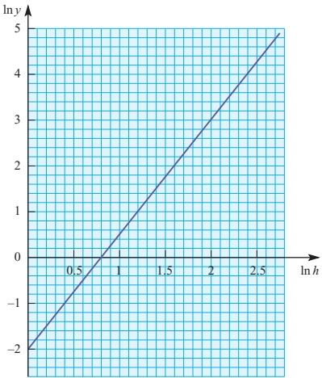

(iii) Use the graph to calculate the values of a and b.

(iv) Calculate how long it takes to grow trees worth $100.

[MEI, adapted]

8 It is given that  $ \ln(y+5)-\ln y=2\ln x $. Express y in terms of x, in a form not involving logarithms.

[Cambridge International AS & A Level Mathematics 9709, Paper 2 Q2 November 2009]

9 Given that  $ (1.25)^x = (2.5)^y $, use logarithms to find the value of  $ \frac{x}{y} $ correct to 3 significant figures.

[Cambridge International AS & A Level Mathematics 9709, Paper 2 Q1 June 2009]

10 Solve, correct to 3 significant figures, the equation

 $$ \mathrm{e}^{x}+\mathrm{e}^{2x}=\mathrm{e}^{3x}. $$ 

[Cambridge International AS & A Level Mathematics 9709, Paper 3 Q2 June 2008]

<!-- page 58 -->

11 The variables $x$ and $y$ satisfy the equation $y = A(b^{-x})$, where $A$ and $b$ are constants. The graph of $\ln y$ against $x$ is a straight line passing through the points $(0, 1.3)$ and $(1.6, 0.9)$, as shown in the diagram. Find the values of $A$ and $b$, correct to 2 decimal places.

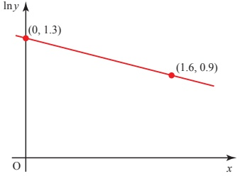

[Cambridge International AS & A Level Mathematics 9709, Paper 2 Q3 November 2008]

12 Solve the equation  $ \ln(2 + e^{-x}) = 2 $, giving your answer correct to 2 decimal places.

[Cambridge International AS & A Level Mathematics 9709, Paper 3 Q1 June 2009]

13 Two variable quantities x and y are related by the equation  $ y = A x^{n} $, where A and n are constants. The diagram shows the result of plotting  $ \ln y $ against  $ \ln x $ for four pairs of values of x and y. Use the diagram to estimate the values of A and n.

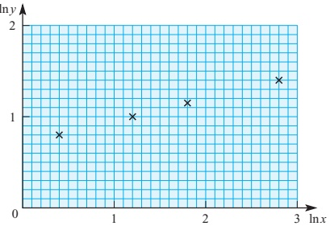

[Cambridge International AS & A Level Mathematics 9709, Paper 3 Q2 November 2005]

<!-- page 59 -->

1 A function of the form  $ a^{x} $ is described as exponential.

2  $ y = \log_{a} x \Leftrightarrow a^{y} = x $.

## 3 Logarithms to any base

Multiplication:

 $ \log xy = \log x + \log y $

Division:

 $$ \log\left(\frac{x}{y}\right)=\log x-\log y $$ 

Logarithm of 1:

 $ \log 1 = 0 $

Powers:

 $ \log x^n = n \log x $

Reciprocals:

 $$ \log\left(\frac{1}{y}\right)=-\log y $$ 

Roots:

 $ \log \sqrt[n]{x} = \frac{1}{n} \log x $

Logarithm to its own base:  $ \log_{a}a=1 $

4 Logarithms may be used to discover the relationship between the variables in two types of situation.

 $ y = kx^n \iff \log y = \log k + n \log x $

Plot  $ \log y $ against  $ \log x $: this relationship gives a straight line where n is the gradient and  $ \log k $ is the intercept.

 $ y = ka^x \iff \log y = \log k + x \log a $

Plot  $ \log y $ against x: this relationship gives a straight line where  $ \log a $ is the gradient and  $ \log k $ is the intercept.

5  $ \int \frac{1}{x} \, dx = \log_e |x| + c. $

6  $ \log_{e}x $ is called the natural logarithm of x and denoted by  $ \ln x $.

7 e = 2.7182818284... is the base of natural logarithms.

8  $ e^x $ and  $ \ln x $ are inverse functions:  $ e^{\ln x} = x $ and  $ \ln(e^x) = x $.

