# Chapter 3 Trigonometry

<!-- Pure Mathematics 2 and 3 Cambridge International AS and A Level Mathematics (Sophie Goldie, Roger Porkess) .pdf p60-86 -->

<!-- page 60 -->

## 3 Trigonometry

Music, when soft voices die, Vibrates in the memory -

P.B. Shelley

Both of these photographs show forms of waves. In each case, estimate the wavelength and the amplitude in metres (see figure 3.1).

Use your measurements to suggest, for each curve, values of a and b which would make y =  $ a \sin bx $ a suitable model for the curve.

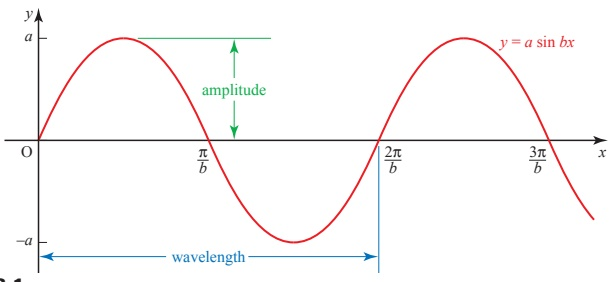

Figure 3.1

<!-- page 61 -->

## Reciprocal trigonometrical functions

As well as the three main trigonometrical functions, there are three more which are commonly used. These are their reciprocals – cosecant (cosec), secant (sec) and cotangent (cot), defined by

 $$ \mathrm{c o s e c}\theta=\frac{1}{\sin\theta};\qquad\mathrm{s e c}\theta=\frac{1}{\cos\theta};\qquad\mathrm{c o t}\theta=\frac{1}{\tan\theta}\left(=\frac{\cos\theta}{\sin\theta}\right). $$ 

Each of these is undefined for certain values of $\theta$. For example, cosec $\theta$ is undefined for $\theta = 0^{\circ}, 180^{\circ}, 360^{\circ}, \ldots$ since $\sin \theta$ is zero for these values of $\theta$.

Figure 3.2 shows the graphs of these functions. Notice how all three of the functions have asymptotes at intervals of  $ 180^{\circ} $. Each of the graphs shows one of the main trigonometrical functions as a red line and the related reciprocal function as a blue line.

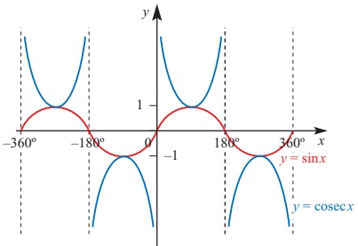

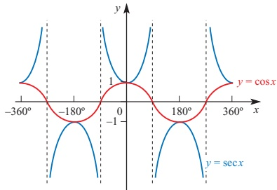

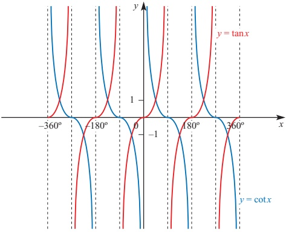

Figure 3.2

<!-- page 62 -->

Using the definitions of the reciprocal functions two alternative trigonometrical forms of Pythagoras' theorem can be obtained.

(i)  $ \sin^{2}\theta + \cos^{2}\theta \equiv 1 $

 $$ \begin{aligned}Dividing both sides by\cos^{2}\theta:\frac{\sin^{2}\theta}{\cos^{2}\theta}+\frac{\cos^{2}\theta}{\cos^{2}\theta}\equiv\frac{1}{\cos^{2}\theta}\\ \Longrightarrow\tan^{2}\theta+1\equiv\sec^{2}\theta.\end{aligned} $$ 

This identity is sometimes used in mechanics.

(ii)  $ \sin^{2}\theta + \cos^{2}\theta \equiv 1 $

 $$ \begin{aligned}Dividing both sides by\sin^{2}\theta:\frac{\sin^{2}\theta}{\sin^{2}\theta}+\frac{\cos^{2}\theta}{\sin^{2}\theta}&\equiv\frac{1}{\sin^{2}\theta}\\&\Longrightarrow1+\cot^{2}\theta\equiv\mathrm{cosec}^{2}\theta.\end{aligned} $$ 

Questions concerning reciprocal functions are usually most easily solved by considering the related function, as in the following examples.

### EXAMPLE 3.1

Find cosec  $ 120^{\circ} $ leaving your answer in surd form.

## SOLUTION

 $$ \begin{aligned}\mathrm{cosec}120^{\circ}&=\frac{1}{\sin120^{\circ}}\\&=1\div\frac{\sqrt{3}}{2}\\&=\frac{2}{\sqrt{3}}\end{aligned} $$ 

### EXAMPLE 3.2

Find values of  $ \theta $ in the interval  $ 0^\circ \leq \theta \leq 360^\circ $ for which  $ \sec^2\theta = 4 + 2\tan\theta $.

## SOLUTION

First you need to obtain an equation containing only one trigonometrical function.

 $$ \begin{aligned}&sec^{2}\theta=4+2\tan\theta\\\Rightarrow\quad&\tan^{2}\theta+1=4+2\tan\theta\\\Rightarrow\quad\tan^{2}\theta-2\tan\theta-3=0\\\Rightarrow\quad(tan\theta-3)(tan\theta+1)=0\\\Rightarrow\quad tan\theta=3or\tan\theta=-1\\\tan\theta=3\quad\Rightarrow\quad\theta=71.6^{\circ}\quad(calculator)\\ or\quad\theta=71.6^{\circ}+180^{\circ}=251.6^{\circ}\quad(see~figure~3.3,overleaf)\end{aligned} $$

<!-- page 63 -->

$ \tan\theta = -1 \quad \Rightarrow \quad \theta = -45^\circ $ (not in the required range)

or  $ \theta = -45^{\circ} + 180^{\circ} = 135^{\circ} $

(see figure 3.3)

or  $ \theta=135^{\circ}+180^{\circ}=315^{\circ} $

## EXERCISE 3A

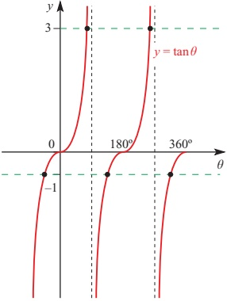

### Figure 3.3

The values of  $ \theta $ are  $ 71.6^{\circ} $,  $ 135^{\circ} $,  $ 251.6^{\circ} $,  $ 315^{\circ} $.

1 Solve the following equations for  $ 0^\circ \leq x \leq 360^\circ $.

(i)  $ \csc x = 1 $

(iv)  $ \sec x = -3 $

(ii)  $ \sec x = 2 $

(v)  $ \cot x = -1 $

(iii)  $ \cot x = 4 $

(vi)  $ \cos \epsilon x = -2 $

2 Find the following giving your answers as fractions or in surd form. You should not need your calculator.

(i) cot  $ 135^{\circ} $

(iv) sec $ 210^{\circ} $

(ii) sec  $ 150^{\circ} $

(iii) cosec $ 240^{\circ} $

(v) cot270°

(vi) cosec $ 225^{\circ} $

3 In triangle ABC, angle A =  $ 90^{\circ} $ and sec B = 2.

(i) Find the angles B and C.

(ii) Find  $ \tan B $.

(iii) Show that  $ 1 + \tan^{2} B = \sec^{2} B $.

4 In triangle LMN, angle  $ M = 90^{\circ} $ and cot  $ N = 1 $.

(i) Find the angles L and N.

(ii) Find  $ \sec L $,  $ \csc L $, and  $ \tan L $.

(iii) Show that  $ 1 + \tan^{2}L = \sec^{2}L $.

<!-- page 64 -->

5 Malini is 1.5 m tall.

At 8 pm one evening her shadow is 6 m long.

Given that the angle of elevation of the sun at that moment is  $ \alpha $

(i) show that  $ \cot\alpha = 4 $

(ii) find  $ \alpha $.

6 (i) For what values of $\alpha$, where $0^\circ \leq \alpha \leq 360^\circ$, are sec $\alpha$, cose $\alpha$ and cot $\alpha$ all positive?

(ii) Are there any values of  $ \alpha $ for which sec $ \alpha $, cose $ \alpha $ and cot $ \alpha $ are all negative? Explain your answer.

(iii) Are there any values of  $ \alpha $ for which  $ \sec\alpha $,  $ \csc\alpha $ and  $ \cot\alpha $ are all equal? Explain your answer.

7 Solve the following equations for  $ 0^\circ \leq x \leq 360^\circ $.

(i)  $ \cos x = \sec x $

(ii)  $ \cos\sec x = \sec x $

(iii)  $ 2 \sin x = 3 \cot x $

(iv)  $ \mathrm{cosec^{2}x + cot^{2}x = 2} $

(v)  $ 3 \sec^{2} x - 10 \tan x = 0 $

(vi)  $ 1 + \cot^2 x = 2 \tan^2 x $

## Compound-angle formulae

The photographs at the start of this chapter show just two of the countless examples of waves and oscillations that are part of the world around us.

Because such phenomena are modelled by trigonometrical (and especially sine and cosine) functions, trigonometry has an importance in mathematics far beyond its origins in right-angled triangles.

### ACTIVITY 3.1 Find an acute angle  $ \theta $ so that  $ \sin(\theta + 60^\circ) = \cos(\theta - 60^\circ) $

Hint: Try drawing graphs and searching for a numerical solution.

You should be able to find the solution using either of these methods, but replacing  $ 60^{\circ} $ by, for example,  $ 35^{\circ} $ would make both of these methods rather tedious. In this chapter you will meet some formulae which help you to solve such equations more efficiently.

It is tempting to think that  $ \sin(\theta + 60^\circ) $ should equal  $ \sin\theta + \sin60^\circ $, but this is not so, as you can see by substituting a numerical value of  $ \theta $. For example, putting  $ \theta = 30^\circ $ gives  $ \sin(\theta + 60^\circ) = 1 $, but  $ \sin\theta + \sin60^\circ \approx 1.366 $.

<!-- page 65 -->

To find an expression for  $ \sin(\theta + 60^\circ) $, you would use the compound-angle formula

 $$ \sin(\theta+\phi)=\sin\theta\cos\phi+\cos\theta\sin\phi. $$ 

This is proved below in the case when  $ \theta $ and  $ \phi $ are acute angles. It is, however, true for all values of the angles. It is an identity.

## p As you work through this proof make a list of all the results you are assuming

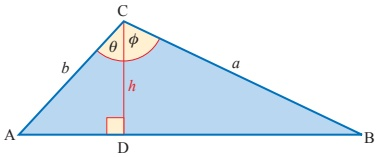

### Figure 3.4

Using the trigonometrical formula for the area of a triangle (see figure 3.4):

 $$  area~ABC=area~ADC+area~DBC $$ 

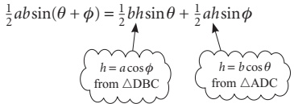

 $$ \Rightarrow\qquad a b\sin(\theta+\phi)=a b\sin\theta\cos\phi+a b\cos\theta\sin\phi $$ 

which gives

 $$ \sin(\theta+\phi)=\sin\theta\cos\phi+\cos\theta\sin\phi $$ 

This is the first of the compound-angle formulae (or expansions), and it can be used to prove several more. These are true for all values of  $ \theta $ and  $ \phi $.

Replacing  $ \phi $ by  $ -\phi $ in ① gives

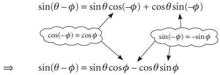

<!-- page 66 -->

ACTIVITY 3.2 Derive the rest of these formulae.

(i) To find an expansion for $\cos(\theta-\phi)$ replace $\theta$ by $(90^{\circ}-\theta)$ in the expansion of $\sin(\theta+\phi)$.

 $$ \mathbf{H}\mathbf{i}\mathbf{n}\mathbf{t}\mathbf{:}\sin(90^{\circ}-\theta)=\cos\theta\text{and}\cos(90^{\circ}-\theta)=\sin\theta $$ 

(ii) To find an expansion for  $ \cos(\theta + \phi) $ replace  $ \phi $ by  $ (-\phi) $ in the expansion of  $ \cos(\theta - \phi) $.

(iii) To find an expansion for  $ \tan(\theta + \phi) $, write  $ \tan(\theta + \phi) = \frac{\sin(\theta + \phi)}{\cos(\theta + \phi)} $.

Hint: After using the expansions of $\sin(\theta + \phi)$ and $\cos(\theta + \phi)$, divide the numerator and the denominator of the resulting fraction by $\cos\theta\cos\phi$ to give an expansion in terms of $\tan\theta$ and $\tan\phi$.

(iv) To find an expansion for  $ \tan(\theta-\phi) $ in terms of  $ \tan\theta $ and  $ \tan\phi $, replace  $ \phi $ by  $ (-\phi) $ in the expansion of  $ \tan(\theta+\phi) $.

## p Are your results valid for all values of $\theta$ and $\phi$?

Test your results with  $ \theta = 60^{\circ}, \phi = 30^{\circ} $.

The four results obtained in Activity 3.2, together with the two previous results, form the set of compound-angle formulae.

 $$ \sin(\theta+\phi)=\sin\theta\cos\phi+\cos\theta\sin\phi $$ 

 $$ \sin(\theta-\phi)=\sin\theta\cos\phi-\cos\theta\sin\phi $$ 

 $$ \cos(\theta+\phi)=\cos\theta\cos\phi-\sin\theta\sin\phi $$ 

 $$ \cos(\theta-\phi)=\cos\theta\cos\phi+\sin\theta\sin\phi $$ 

 $$ \tan(\theta+\phi)=\frac{\tan\theta+\tan\phi}{1-\tan\theta\tan\phi}\quad(\theta+\phi)\neq90^{\circ},270^{\circ},\ldots $$ 

 $$ \tan(\theta-\phi)=\frac{\tan\theta-\tan\phi}{1+\tan\theta\tan\phi}\quad(\theta-\phi)\neq90^{\circ},270^{\circ},\ldots $$ 

You are now in a position to solve the earlier problem more easily. To find an acute angle  $ \theta $ such that  $ \sin(\theta + 60^\circ) = \cos(\theta - 60^\circ) $, you expand each side using the compound-angle formulae.

 $$ \begin{aligned}\sin(\theta+60^{\circ})&=\sin\theta\cos60^{\circ}+\cos\theta\sin60^{\circ}\\&=\frac{1}{2}\sin\theta+\frac{\sqrt{3}}{2}\cos\theta\end{aligned} $$ 

 $$ \begin{aligned}\cos(\theta-60^{\circ})&=\cos\theta\cos60^{\circ}+\sin\theta\sin60^{\circ}\\&=\frac{1}{2}\cos\theta+\frac{\sqrt{3}}{2}\sin\theta\end{aligned} $$

<!-- page 67 -->

From ① and ②

 $$ \frac{1}{2}\sin\theta+\frac{\sqrt{3}}{2}\cos\theta=\frac{1}{2}\cos\theta+\frac{\sqrt{3}}{2}\sin\theta $$ 

 $$ \sin\theta+\sqrt{3}\cos\theta=\cos\theta+\sqrt{3}\sin\theta $$ 

Collect like terms:

 $$ \begin{aligned}\Rightarrow\left(\sqrt{3}-1\right)\cos\theta&=\left(\sqrt{3}-1\right)\sin\theta\\\cos\theta&=\sin\theta\end{aligned} $$ 

Divide by  $ \cos\theta $:

 $$ \begin{array}{l}1=\tan\theta\\\theta=45^{\circ}\end{array} $$ 

This gives an equation in one trigonometrical ratio.

Since an acute angle was required, this is the only root.

## Uses of the compound-angle formulae

You have already seen compound-angle formulae used in solving a trigonometrical equation and this is quite a common application of them. However, their significance goes well beyond that since they form the basis for a number of important techniques. Those covered in this book are as follows.

## The derivation of double-angle formulae

The derivation and uses of these are covered on pages 61 to 63.

## The addition of different sine and cosine functions

This is covered on pages 66 to 70. It is included here because the basic wave form is a sine curve. It has many applications, for example in applied mathematics, physics and chemistry.

## Calculus of trigonometrical functions

This is covered in Chapters 4 and 5 and also in Chapter 8 if you are studying Pure Mathematics 3. Proofs of the results depend on using either the compound-angle formulae or the factor formulae which are derived from them.

You will see from this that the compound-angle formulae are important in the development of the subject. Some people learn them by heart, others think it is safer to look them up when they are needed. Whichever policy you adopt, you should understand these formulae and recognise their form. Without that you will be unable to do the next example, which uses one of them in reverse.

<!-- page 68 -->

### EXAMPLE 3.3

Simplify  $ \cos\theta\cos3\theta-\sin\theta\sin3\theta $

## SOLUTION

The formula which has the same pattern of cos cos - sin sin is

 $$ \cos(\theta+\phi)=\cos\theta\cos\phi-\sin\theta\sin\phi $$ 

Using this, and replacing  $ \phi $ by  $ 3\theta $, gives

 $$ \begin{aligned}\cos\theta\cos3\theta-\sin\theta\sin3\theta&=\cos(\theta+3\theta)\\&=\cos4\theta\end{aligned} $$ 

## EXERCISE 3B

1 Use the compound-angle formulae to write the following as surds.

 $$ \sin75^{\circ}=\sin(45^{\circ}+30^{\circ}) $$ 

 $$ \cos135^{\circ}=\cos(90^{\circ}+45^{\circ}) $$ 

 $$ \tan15^{\circ}=\tan(45^{\circ}-30^{\circ}) $$ 

 $$ \tan75^{\circ}=\tan(45^{\circ}+30^{\circ}) $$ 

2 Expand each of the following expressions.

 $$ \sin(\theta+45^{\circ}) $$ 

 $$ (ii)\cos(\theta-30^{\circ}) $$ 

 $$ \sin(60^{\circ}-\theta) $$ 

 $$ \mathrm{(iv)}\cos(2\theta+45^{\circ}) $$ 

 $$ \left(\mathbf{v}\right)\tan(\theta+45^{\circ}) $$ 

(vi)  $ \tan(\theta - 45^\circ) $

3 Simplify each of the following expressions.

(i)  $ \sin 2\theta \cos \phi - \cos 2\theta \sin \theta $

(ii)  $ \cos \phi \cos 7\phi - \sin \phi \sin 7\phi $

(iii)  $ \sin 120^\circ \cos 60^\circ + \cos 120^\circ \sin 60^\circ $

(iv)  $ \cos \theta \cos \theta - \sin \theta \sin \theta $

4 Solve the following equations for values of $\theta$ in the range $0^\circ \leq \theta \leq 180^\circ$.

(i) $\cos(60^\circ + \theta) = \sin\theta$

(ii) $\sin(45^\circ - \theta) = \cos\theta$

(iii) $\tan(45^\circ + \theta) = \tan(45^\circ - \theta)$

(iv) $2\sin\theta = 3\cos(\theta - 60^\circ)$

(v) $\sin\theta = \cos(\theta + 120^\circ)$

5 Solve the following equations for values of $\theta$ in the range $0 \leq \theta \leq \pi$.

(When the range is given in radians, the solutions should be in radians, using multiples of $\pi$ where appropriate.)

(i) $\sin\left(\theta+\frac{\pi}{4}\right)=\cos\theta$

(ii) $2\cos\left(\theta-\frac{\pi}{3}\right)=\cos\left(\theta+\frac{\pi}{2}\right)$

<!-- page 69 -->

6 Calculators are not to be used in this question.

The diagram shows three points L(-2, 1), M(0, 2) and N(3, -2) joined to form a triangle. The angles $\alpha$ and $\beta$ and the point P are shown in the diagram.

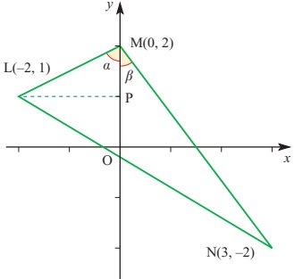

(i) Show that  $ \sin\alpha=\frac{2}{\sqrt{5}} $ and write down the value of  $ \cos\alpha $.

(ii) Find the values of  $ \sin\beta $ and  $ \cos\beta $.

(iii) Show that  $ \sin \angle LMN = \frac{11}{5\sqrt{5}} $.

(iv) Show that  $ \tan \angle LNM = \frac{11}{27} $.

[MEI]

7 (i) Show that the equation

 $$ \sin(x+30^{\circ})=2\cos(x+60^{\circ}) $$ 

can be written in the form

 $$ (3\sqrt{3})\sin x=\cos x. $$ 

(ii) Hence solve the equation

 $$ \sin(x+30^{\circ})=2\cos(x+60^{\circ}), $$ 

 $$  for-180^{\circ}\leq x\leq180^{\circ}. $$ 

[Cambridge International AS & A Level Mathematics 9709, Paper 2 Q4 November 2008]

<!-- page 70 -->

8 (i) Show that the equation
 $ \tan(45^{\circ}+x)-\tan x=2 $

can be written in the form
 $ \tan^{2}x+2\tan x-1=0 $

(ii) Hence solve the equation
 $ \tan(45^{\circ}+x)-\tan x=2 $

giving all solutions in the interval  $ 0^{\circ}\leq x\leq180^{\circ} $.

[Cambridge International AS & A Level Mathematics 9709, Paper 3 Q5 November 2007]

9 The angles  $ \alpha $ and  $ \beta $ lie in the interval  $ 0^{\circ}<x<180^{\circ} $, and are such that
 $ \tan\alpha=2\tan\beta $ and  $ \tan(\alpha+\beta)=3 $

Find the possible values of  $ \alpha $ and  $ \beta $.

[Cambridge International AS & A Level Mathematics 9709, Paper 32 Q4 November 2009]

10 (i) Show that the equation  $ \tan(30^{\circ}+\theta)=2\tan(60^{\circ}-\theta) $ can be written in
the form
 $ \tan^{2}\theta+(6\sqrt{3})\tan\theta-5=0 $

(ii) Hence, or otherwise, solve the equation
 $ \tan(30^{\circ}+\theta)=2\tan(60^{\circ}-\theta) $

for  $ 0^{\circ}\leq\theta\leq180^{\circ} $.

[Cambridge International AS & A Level Mathematics 9709, Paper 3 Q4 June 2008]

## Double-angle formulae

## p As you work through these proofs, think how you can check the results

Is a check the same as a proof?

Substituting  $ \phi = \theta $ in the relevant compound-angle formulae leads immediately to expressions for  $ \sin 2\theta $,  $ \cos 2\theta $ and  $ \tan 2\theta $, as follows.

(i)  $ \sin(\theta + \phi) = \sin\theta\cos\phi + \cos\theta\sin\phi $

When  $ \phi = \theta $, this becomes

 $ \sin(\theta + \theta) = \sin\theta\cos\theta + \cos\theta\sin\theta $

giving  $ \sin2\theta = 2\sin\theta\cos\theta $.

<!-- page 71 -->

(ii)  $ \cos(\theta + \phi) = \cos\theta\cos\phi - \sin\theta\sin\phi $

When  $ \phi = \theta $, this becomes

 $$ \cos(\theta+\theta)=\cos\theta\cos\theta-\sin\theta\sin\theta $$ 

 $$ \begin{array}{l} \text{giving} \cos 2\theta = \cos^2\theta - \sin^2\theta. \end{array} $$ 

Using the Pythagorean identity  $ \cos^2\theta + \sin^2\theta = 1 $, two other forms for  $ \cos 2\theta $ can be obtained.

 $$ \cos2\theta=(1-\sin^{2}\theta)-\sin^{2}\theta\quad\Rightarrow\quad\cos2\theta=1-2\sin^{2}\theta $$ 

 $$ \cos2\theta=\cos^{2}\theta-(1-\cos^{2}\theta)\quad\Rightarrow\quad\cos2\theta=2\cos^{2}\theta-1 $$ 

These alternative forms are often more useful since they contain only one trigonometrical function.

(iii)

 $$ \tan(\theta+\phi)=\frac{\tan\theta+\tan\phi}{1-\tan\theta\tan\phi}\quad(\theta+\phi)\neq90^{\circ},270^{\circ},\ldots $$ 

When  $ \phi = \theta $, this becomes

 $$ \tan(\theta+\theta)=\frac{\tan\theta+\tan\theta}{1-\tan\theta\tan\theta} $$ 

 $$  giving\quad\tan2\theta=\frac{2\tan\theta}{1-\tan^{2}\theta}\quad\theta\neq45^{\circ},135^{\circ},\ldots. $$ 

## Uses of the double-angle formulae

## e In modelling situations

You will meet situations, such as that below, where using a double-angle formula not only allows you to write an expression more neatly but also thereby allows you to interpret its meaning more clearly.

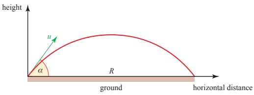

Figure 3.5

<!-- page 72 -->

When an object is projected, such as a golf ball being hit as in figure 3.5, with speed $u$ at an angle $\alpha$ to the horizontal over level ground, the horizontal distance it travels before striking the ground, called its range, $R$, is given by the product of the horizontal component of the velocity $u\cos\alpha$ and its time of flight $\frac{2u\sin\alpha}{g}$.

 $$ R=\frac{2u^{2}\sin\alpha\cos\alpha}{g} $$ 

Using the double-angle formula,  $ \sin 2\alpha = 2 \sin \alpha \cos \alpha $ allows this to be written as

 $$ R=\frac{u^{2}\sin2\alpha}{g}. $$ 

Since the maximum value of $\sin 2\alpha$ is 1, it follows that the greatest value of the range $R$ is $\frac{u^2}{g}$ and that this occurs when $2\alpha = 90^\circ$ and so $\alpha = 45^\circ$. Thus an angle of projection of $45^\circ$ will give the maximum range of the projectile over level ground. (This assumes that air resistance may be ignored.)

In this example, the double-angle formula enabled the expression for R to be written tidily. However, it did more than that because it made it possible to find the maximum value of R by inspection and without using calculus.

## In calculus

The double-angle formulae allow a number of functions to be integrated and you will meet some of these later (see page 125).

The formulae for cos  $ 2\theta $ are particularly useful in this respect since

 $$ \cos2\theta=1-2\sin^{2}\theta\quad\Rightarrow\quad\sin^{2}\theta=\tfrac{1}{2}(1-\cos2\theta) $$ 

and

 $$ \cos2\theta=2\cos^{2}\theta-1\quad\Rightarrow\quad\cos^{2}\theta=\frac{1}{2}(1+\cos2\theta) $$ 

and these identities allow you to integrate  $ \sin^{2}\theta $ and  $ \cos^{2}\theta $.

## In solving equations

You will sometimes need to solve equations involving both single and double angles as shown by the next two examples.

### EXAMPLE 3.4

Solve the equation  $ \sin 2\theta = \sin\theta $ for  $ 0^\circ \leq \theta \leq 360^\circ $.

SOLUTION

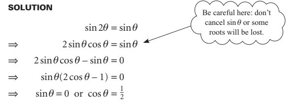

P2

<!-- page 73 -->

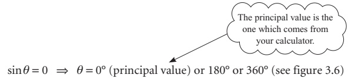

 $ \sin\theta = 0 \Rightarrow \theta = 0^{\circ} $ (principal value) or  $ 180^{\circ} $ or  $ 360^{\circ} $ (see figure 3.6)

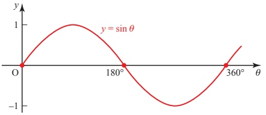

Figure 3.6

$$\cos\theta=\frac{1}{2}\ \Rightarrow\ \theta=60^{\circ}\ (principal\ value)\ or\ 300^{\circ}\ (see\ figure\ 3.7)$$

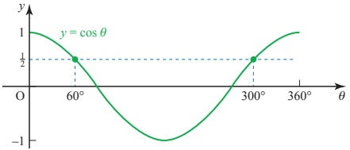

Figure 3.7

The full set of roots for  $ 0^{\circ} \leqslant \theta \leqslant 360^{\circ} $ is  $ \theta = 0^{\circ}, 60^{\circ}, 180^{\circ}, 300^{\circ}, 360^{\circ} $.

When an equation contains  $ \cos 2\theta $, you will save time if you take care to choose the most suitable expansion.

EXAMPLE 3.5

Solve $2 + \cos 2\theta = \sin\theta$ for $0 \leqslant \theta \leqslant 2\pi$. (Notice that the request for $0 \leqslant \theta \leqslant 2\pi$, i.e. in radians, is an invitation to give the answer in radians.)

SOLUTION

Using $\cos 2\theta = 1 - 2 \sin^{2}\theta$ gives

1 his is the most

suitable expansion since

the right-hand side

7 contains $\sin\theta$.

 $$ 2+(1-2\sin^{2}\theta)=\sin\theta $$ 

 $$ \Rightarrow\quad2\sin^{2}\theta+\sin\theta-3=0 $$ 

 $$ \Rightarrow\quad(2\sin\theta+3)(\sin\theta-1)=0 $$ 

 $$ \Rightarrow\ \sin\theta=-\frac{3}{2}\ (not\ valid\ since-1\leq\sin\theta\leq1) $$

<!-- page 74 -->

Figure 3.8 shows that the principal value  $ \theta = \frac{\pi}{2} $ is the only root for  $ 0 \leq \theta \leq 2\pi $.

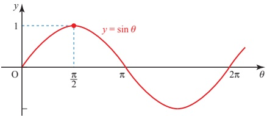

Figure 3.8

## EXERCISE 3C

1 Solve the following equations for $0^{\circ} \leq \theta \leq 360^{\circ}$.

(i) $2\sin2\theta=\cos\theta$ (ii) $\tan2\theta=4\tan\theta$

(iii) $\cos2\theta+\sin\theta=0$ (iv) $\tan\theta\tan2\theta=1$

(v) $2\cos2\theta=1+\cos\theta$

2 Solve the following equations for $-\pi \leq \theta \leq \pi$.

(i) $\sin 2\theta = 2 \sin \theta$

(ii) $\tan 2\theta = 2 \tan \theta$

(iii) $\cos 2\theta - \cos \theta = 0$

(iv) $1 + \cos 2\theta = 2 \sin^2 \theta$

(v) $\sin 4\theta = \cos 2\theta$

Hint: Write the expression in part  $ (v) $ as an equation in  $ 2\theta $.

3 By first writing $\sin 3\theta$ as $\sin(2\theta + \theta)$, express $\sin 3\theta$ in terms of $\sin\theta$. Hence solve the equation $\sin 3\theta = \sin\theta$ for $0 \leqslant \theta \leqslant 2\pi$.

4 Solve  $ \cos 3\theta = 1 - 3\cos\theta $ for  $ 0^\circ \leq \theta \leq 360^\circ $.

5 Simplify $\frac{1+\cos 2\theta}{\sin 2\theta}$.

6 Express  $ \tan 3\theta $ in terms of  $ \tan\theta $.

7 Show that  $ \frac{1-\tan^{2}\theta}{1+\tan^{2}\theta}=\cos2\theta $.

8 (i) Show that  $ \tan\left(\frac{\pi}{4}+\theta\right)\tan\left(\frac{\pi}{4}-\theta\right)=1 $.

(ii) Given that  $ \tan 26.6^\circ = 0.5 $, solve  $ \tan \theta = 2 $ without using your calculator.

Give  $ \theta $ to 1 decimal place, where  $ 0^\circ < \theta < 90^\circ $.

9 (i) Sketch on the same axes the graphs of

 $$ y=\cos2x\quad and\quad y=3\sin x-1\quad for\quad0\leq x\leq2\pi. $$ 

(ii) Show that these curves meet at points whose x co-ordinates are solutions of the equation  $ 2\sin^{2}x + 3\sin x - 2 = 0 $.

(iii) Solve this equation to find the values of x in terms of  $ \pi $ for  $ 0 \leq x \leq 2\pi $.

<!-- page 75 -->

0 (i) Prove the identity
 $ \cos4\theta+4\cos2\theta\equiv8\cos^{4}\theta-3. $
(ii) Hence solve the equation
 $ \cos4\theta+4\cos2\theta=2 $
for  $ 0^{\circ} \leq \theta \leq 360^{\circ} $.
[Cambridge International AS & A Level Mathematics 9709, Paper 3 Q6 June 2005]

11 (i) Prove the identity  $ \text{cosec}2\theta + \cot2\theta \equiv \cot\theta $.

(ii) Hence solve the equation  $ \text{cosec}2\theta + \cot2\theta = 2 $, for  $ 0^\circ \leq \theta \leq 360^\circ $.

[Cambridge International AS & A Level Mathematics 9709, Paper 3 Q3 June 2009]

12 It is given that  $ \cos a = \frac{3}{5} $, where  $ 0^\circ \leq a \leq 90^\circ $. Showing your working and without using a calculator to evaluate  $ a $,

(i) find the exact value of  $ \sin(a-30)^{\circ} $,

(ii) find the exact value of  $ \tan 2a $, and hence find the exact value of  $ \tan 3a $.

[Cambridge International AS & A Level Mathematics 9709, Paper 32 Q3 June 2010]

## The forms  $ r \cos(\theta \pm \alpha) $,  $ r \sin(\theta \pm \alpha) $

Another modification of the compound-angle formulae allows you to simplify expressions such as  $ 4\sin\theta + 3\cos\theta $ and hence solve equations of the form

 $$ a\sin\theta+b\cos\theta=c. $$ 

To find a single expression for  $ 4\sin\theta + 3\cos\theta $, you match it to the expression

 $$ r\sin(\theta+\alpha)=r(\sin\theta\cos\alpha+\cos\theta\sin\alpha). $$ 

This is because the expansion of $r\sin(\theta + \alpha)$ has $\sin\theta$ in the first term, $\cos\theta$ in the second term and a plus sign in between them. It is then possible to choose appropriate values of $r$ and $\alpha$.

 $$ 4\sin\theta+3\cos\theta\equiv r(\sin\theta\cos\alpha+\cos\theta\sin\alpha) $$ 

Coefficients of sin $ \theta $: 4 = r  $ \cos\alpha $

Coefficients of  $ \cos\theta $: 3 = r  $ \sin\alpha $.

Looking at the right-angled triangle in figure 3.9 gives the values for r and  $ \alpha $.

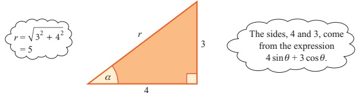

The sides, 4 and 3, come from the expression  $ 4 \sin \theta + 3 \cos \theta $.

Figure 3.9

<!-- page 76 -->

In this triangle, the hypotenuse is  $ \sqrt{4^2 + 3^2} = 5 $, which corresponds to  $ r $ in the expression above.

The angle  $ \alpha $ is given by

 $$ \sin\alpha=\frac{3}{5}\quad\text{and}\quad\cos\alpha=\frac{4}{5}\quad\Rightarrow\quad\alpha=36.9^{\circ}. $$ 

So the expression becomes

 $$ 4\sin\theta+3\cos\theta=5\sin(\theta+36.9^{\circ}). $$ 

The steps involved in this procedure can be generalised to write

 $$ a\sin\theta+b\cos\theta=r\sin(\theta+\alpha) $$ 

where

 $$ r=\sqrt{a^{2}+b^{2}}\quad\sin\alpha=\frac{b}{\sqrt{a^{2}+b^{2}}}=\frac{b}{r}\quad\cos\alpha=\frac{a}{\sqrt{a^{2}+b^{2}}}=\frac{a}{r} $$ 

The same expression may also be written as a cosine function. In this case, rewrite  $ 4\sin\theta + 3\cos\theta $ as  $ 3\cos\theta + 4\sin\theta $ and notice that:

(i) The expansion of  $ \cos(\theta-\beta) $ starts with  $ \cos\theta $... just like the expression  $ 3\cos\theta+4\sin\theta $.

(ii) The expansion of  $ \cos(\theta-\beta) $ has + in the middle, just like the expression  $ 3\cos\theta+4\sin\theta $.

The expansion of  $ r \cos(\theta - \beta) $ is given by

 $$ r\cos(\theta-\beta)=r(\cos\theta\cos\beta+\sin\theta\sin\beta). $$ 

To compare this with  $ 3\cos\theta + 4\sin\theta $, look at the triangle in figure 3.10 in which

 $$ r=\sqrt{3^{2}+4^{2}}=5\qquad\cos\beta=\frac{3}{5}\qquad\sin\beta=\frac{4}{5}\qquad\Rightarrow\qquad\beta=53.1^{\circ}. $$ 

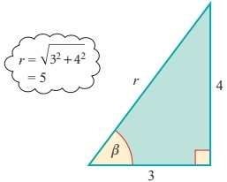

Figure 3.10

This means that you can write  $ 3\cos\theta + 4\sin\theta $ in the form

 $$ r\cos(\theta-\beta)=5\cos(\theta-53.1^{\circ}). $$

<!-- page 77 -->

The procedure used here can be generalised to give the result

 $$ a\cos\theta+b\sin\theta=r\cos(\theta-\alpha) $$ 

where

 $$ r=\sqrt{a^{2}+b^{2}}\qquad\cos\alpha=\frac{a}{r}\qquad\sin\alpha=\frac{b}{r}. $$ 

Note

The value of $r$ will always be positive, but $\cos \alpha$ and $\sin \alpha$ may be positive or negative, depending on the values of $a$ and $b$. In all cases, it is possible to find an angle $\alpha$ for which $-180^\circ < \alpha < 180^\circ$.

You can derive alternative expressions of this type based on other compound-angle formulae if you wish  $ \alpha $ to be an acute angle, as is done in the next example.

### EXAMPLE 3.6

(i) Express  $ \sqrt{3}\sin\theta - \cos\theta $ in the form  $ r\sin(\theta - \alpha) $, where  $ r > 0 $ and  $ 0 < \alpha < \frac{\pi}{2} $.

(ii) State the maximum and minimum values of  $ \sqrt{3}\sin\theta - \cos\theta $.

(iii) Sketch the graph of  $ y = \sqrt{3} \sin \theta - \cos \theta $ for  $ 0 \leq \theta \leq 2\pi $.

(iv) Solve the equation  $ \sqrt{3}\sin\theta - \cos\theta = 1 $ for  $ 0 \leq \theta \leq 2\pi $.

## SOLUTION

(i)

 $$ \begin{aligned}r\sin(\theta-\alpha)&=r(\sin\theta\cos\alpha-\cos\theta\sin\alpha)\\&=(r\cos\alpha)\sin\theta-(r\sin\alpha)\cos\theta\end{aligned} $$ 

Comparing this with  $ \sqrt{3}\sin\theta - \cos\theta $, the two expressions are identical if

 $$ r\cos\alpha=\sqrt{3}\qquad\mathrm{a n d}\qquad r\sin\alpha=1. $$ 

From the triangle in figure 3.11

 $$ r=\sqrt{1+3}=2\quad and\quad\tan\alpha=\frac{1}{\sqrt{3}}\implies\alpha=\frac{\pi}{6} $$ 

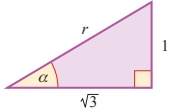

 $$ \sqrt{3}\sin\theta-\cos\theta=2\sin\left(\theta-\frac{\pi}{6}\right). $$ 

Figure 3.11

SO

(ii) The sine function oscillates between 1 and -1, so  $ 2\sin\left(\theta-\frac{\pi}{6}\right) $ oscillates between 2 and -2.

Maximum value = 2

Minimum value = -2.

<!-- page 78 -->

(iii) To sketch the curve  $ y = 2 \sin\left(\theta - \frac{\pi}{6}\right) $, notice that

it is a sine curve

its y values go from -2 to 2

it crosses the horizontal axis where  $ \theta = \frac{\pi}{6}, \frac{7\pi}{6}, \frac{13\pi}{6} $

The curve is shown in Figure 3.12.

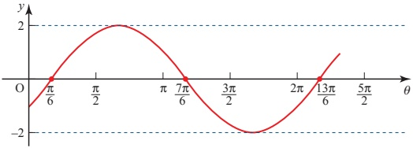

Figure 3.12

(iv) The equation  $ \sqrt{3}\sin\theta - \cos\theta = 1 $ is equivalent to

 $$ \begin{aligned}2\sin\left(\theta-\frac{\pi}{6}\right)=1\\\Longrightarrow\quad\sin\left(\theta-\frac{\pi}{6}\right)=\frac{1}{2}\end{aligned} $$ 

Let  $ x = \left( \theta - \frac{\pi}{6} \right) $ and solve  $ \sin x = \frac{1}{2} $.

Solving $\sin x = \frac{1}{2}$ gives $x = \frac{\pi}{6}$ (principal value)

or

 $ x=\pi-\frac{\pi}{6}=\frac{5\pi}{6} $ (from the graph in figure 3.13)

giving

 $ \theta = \frac{\pi}{6} + \frac{\pi}{6} = \frac{\pi}{3} $ or  $ \theta = \frac{5\pi}{6} + \frac{\pi}{6} = \pi $.

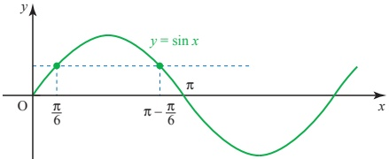

Figure 3.13

The roots in  $ 0 \leq \theta \leq 2\pi $ are  $ \theta = \frac{\pi}{3} $ and  $ \pi $.

<!-- page 79 -->

Always check (for example by reference to a sketch graph) that the number of roots you have found is consistent with the number you are expecting. When solving equations of the form  $ \sin(\theta - \alpha) = c $ by considering  $ \sin x = c $, it is sometimes necessary to go outside the range specified for  $ \theta $ since, for example,  $ 0 \leq \theta \leq 2\pi $ is the same as  $ -\alpha \leq x \leq 2\pi - \alpha $.

## Using these forms

There are many situations which produce expressions which can be tidied up using these forms. They are also particularly useful for solving equations involving both the sine and cosine of the same angle.

The fact that $a\cos\theta + b\sin\theta$ can be written as $r\cos(\theta - \alpha)$ is an illustration of the fact that any two waves of the same frequency, whatever their amplitudes, can be added together to give a single combined wave, also of the same frequency.

## EXERCISE 3D

1 Express each of the following in the form $r\cos(\theta-\alpha)$, where $r>0$ and $0^{\circ}<\alpha<90^{\circ}$.

(i) $\cos\theta+\sin\theta$ (ii) $20\cos\theta+21\sin\theta$

(iii) $\cos\theta+\sqrt{3}\sin\theta$ (iv) $\sqrt{5}\cos\theta+2\sin\theta$

2 Express each of the following in the form  $ r\cos(\theta + \alpha) $, where r > 0 and  $ 0 < \alpha < \frac{\pi}{2} $.

(ii)  $ \cos\theta - \sin\theta $ (ii)  $ \sqrt{3}\cos\theta - \sin\theta $

3 Express each of the following in the form $r\sin(\theta + \alpha)$, where $r > 0$ and $0^\circ < \alpha < 90^\circ$.

(i) $\sin\theta + 2\cos\theta$ (ii) $2\sin\theta + \sqrt{5}\cos\theta$

4 Express each of the following in the form  $ r\sin(\theta - \alpha) $, where r > 0 and  $ 0 < \alpha < \frac{\pi}{2} $.

(i)  $ \sin\theta - \cos\theta $ (ii)  $ \sqrt{7}\sin\theta - \sqrt{2}\cos\theta $

5 Express each of the following in the form  $ r\cos(\theta - \alpha) $, where  $ r > 0 $ and  $ -180^\circ < \alpha < 180^\circ $.

(i)  $ \cos\theta - \sqrt{3}\sin\theta $

(ii)  $ 2\sqrt{2}\cos\theta - 2\sqrt{2}\sin\theta $

(iii)  $ \sin\theta + \sqrt{3}\cos\theta $

(iv)  $ 5\sin\theta + 12\cos\theta $

(v)  $ \sin\theta - \sqrt{3}\cos\theta $

(vi)  $ \sqrt{2}\sin\theta - \sqrt{2}\cos\theta $

<!-- page 80 -->

6 (i) Express $5\cos\theta - 12\sin\theta$ in the form $r\cos(\theta + \alpha)$, where $r > 0$ and $0^\circ < \alpha < 90^\circ$.

(ii) State the maximum and minimum values of  $ 5\cos\theta - 12\sin\theta $.

(iii) Sketch the graph of  $ y = 5\cos\theta - 12\sin\theta $ for  $ 0^\circ \leq \theta \leq 360^\circ $.

(iv) Solve the equation  $ 5\cos\theta - 12\sin\theta = 4 $ for  $ 0^\circ \leq \theta \leq 360^\circ $.

7 (i) Express  $ 3 \sin \theta - \sqrt{3} \cos \theta $ in the form  $ r \sin (\theta - \alpha) $, where r > 0 and  $ 0 < \alpha < \frac{\pi}{2} $.

(ii) State the maximum and minimum values of  $ 3\sin\theta - \sqrt{3}\cos\theta $ and the smallest positive values of  $ \theta $ for which they occur.

(iii) Sketch the graph of  $ y = 3 \sin \theta - \sqrt{3} \cos \theta $ for  $ 0 \leq \theta \leq 2\pi $.

(iv) Solve the equation  $ 3 \sin \theta - \sqrt{3} \cos \theta = \sqrt{3} $ for  $ 0 \leq \theta \leq 2\pi $.

8 (i) Express $2\sin2\theta + 3\cos2\theta$ in the form $r\sin(2\theta + \alpha)$, where $r > 0$ and $0^\circ < \alpha < 90^\circ$.

(ii) State the maximum and minimum values of  $ 2\sin 2\theta + 3\cos 2\theta $ and the smallest positive values of  $ \theta $ for which they occur.

(iii) Sketch the graph of  $ y = 2\sin 2\theta + 3\cos 2\theta $ for  $ 0^\circ \leq \theta \leq 360^\circ $.

(iv) Solve the equation  $ 2\sin 2\theta + 3\cos 2\theta = 1 $ for  $ 0^\circ \leq \theta \leq 360^\circ $.

9 (i) Express $\cos\theta + \sqrt{2}\sin\theta$ in the form $r\cos(\theta - \alpha)$, where $r > 0$ and $0^\circ < \alpha < 90^\circ$.

(ii) State the maximum and minimum values of  $ \cos\theta + \sqrt{2}\sin\theta $ and the smallest positive values of  $ \theta $ for which they occur.

(iii) Sketch the graph of  $ y = \cos\theta + \sqrt{2}\sin\theta $ for  $ 0^\circ \leq \theta \leq 360^\circ $.

(iv) State the maximum and minimum values of

 $$ \frac{1}{3+\cos\theta+\sqrt{2}\sin\theta} $$ 

and the smallest positive values of  $ \theta $ for which they occur.

10 The diagram shows a table jammed in a corridor. The table is 120 cm long and 80 cm wide, and the width of the corridor is 130 cm.

(i) Show that  $ 12\sin\theta + 8\cos\theta = 13 $.

(ii) Hence find the angle  $ \theta $. (There are two answers.)

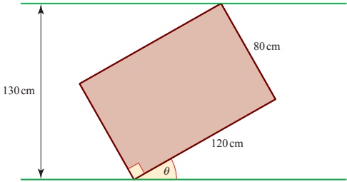

<!-- page 81 -->

11 (i) Use a trigonometrical formula to expand  $ \cos(x + \alpha) $.
(ii) Express  $ y = 2\cos x - 5\sin x $ in the form  $ r\cos(x + \alpha) $, giving the positive value of r and the smallest positive value of  $ \alpha $.
(iii) State the maximum and minimum values of y and the corresponding values of x for  $ 0^{\circ} \leq x \leq 360^{\circ} $.
(iv) Solve the equation
2  $ \cos x - 5\sin x = 3 $, for  $ 0^{\circ} \leq x \leq 360^{\circ} $.
[MEI]
12 (i) Find the value of the acute angle  $ \alpha $ for which
5  $ \cos x - 3\sin x = \sqrt{34}\cos(x + \alpha) $
for all x.
Giving your answers correct to 1 decimal place,
(ii) solve the equation  $ 5\cos x - 3\sin x = 4 $ for  $ 0^{\circ} \leq x \leq 360^{\circ} $
(iii) solve the equation  $ 5\cos 2x - 3\sin 2x = 4 $ for  $ 0^{\circ} \leq x \leq 360^{\circ} $.
[MEI]
13 (i) Find the positive value of R and the acute angle  $ \alpha $ for which
6  $ \cos x + 8\sin x = R\cos(x - \alpha) $.
(ii) Sketch the curve with equation
 $ y = 6\cos x + 8\sin x $, for  $ 0^{\circ} \leq x \leq 360^{\circ} $.
Mark your axes carefully and indicate the angle  $ \alpha $ on the x axis.
(iii) Solve the equation
 $ 6\cos x + 8\sin x = 4 $, for  $ 0^{\circ} \leq x \leq 360^{\circ} $.
(iv) Solve the equation
 $ 8\cos\theta + 6\sin\theta = 4 $, for  $ 0^{\circ} \leq \theta \leq 360^{\circ} $.
[MEI]
14 In the diagram below, angle QPT = angle SQR =  $ \theta $, angle QPR =  $ \alpha $, PQ = a, QR = b, PR = c, angle QSR = angle QTP = 90°, SR = TU.

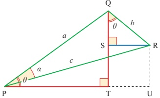

(i) Show that angle PQR =  $ 90^{\circ} $, and write down the length of c in terms of a and b.

(ii) Show that PU may be written as  $ a\cos\theta + b\sin\theta $ and as  $ c\cos(\theta - \alpha) $. Write down the value of  $ \tan\alpha $ in terms of a and b.

<!-- page 82 -->

(iii) In the case when a = 4, b = 3, find the acute angle  $ \alpha $.

(iv) Solve the equation

 $ 4\cos\theta + 3\sin\theta = 2 $ for  $ 0^\circ \leq \theta \leq 360^\circ $.

[MEI]

15 (i) Express  $ 3\cos x + 4\sin x $ in the form  $ R\cos(x - \alpha) $, where  $ R > 0 $ and  $ 0^\circ < \alpha < 90^\circ $, stating the exact value of R and giving the value of  $ \alpha $ correct to 2 decimal places.

(ii) Hence solve the equation

 $ 3\cos x + 4\sin x = 4.5 $,

giving all solutions in the interval  $ 0^\circ < x < 360^\circ $.

[Cambridge International AS & A Level Mathematics 9709, Paper 22 Q6 November 2009]

16 (i) Express  $ 5\cos\theta - \sin\theta $ in the form  $ R\cos(\theta + \alpha) $, where  $ R > 0 $ and  $ 0^\circ < \alpha < 90^\circ $, giving the exact value of R and the value of  $ \alpha $ correct to 2 decimal places.

(ii) Hence solve the equation

 $ 5\cos\theta - \sin\theta = 4 $,

giving all solutions in the interval  $ 0^\circ \leq \theta \leq 360^\circ $.

[Cambridge International AS & A Level Mathematics 9709, Paper 2 Q5 June 2008]

17 (i) Express  $ 7\cos\theta + 24\sin\theta $ in the form  $ R\cos(\theta - \alpha) $, where  $ R > 0 $ and  $ 0^\circ < \alpha < 90^\circ $, giving the exact value of R and the value of  $ \alpha $ correct to 2 decimal places.

(ii) Hence solve the equation

 $ 7\cos\theta + 24\sin\theta = 15 $,

giving all solutions in the interval  $ 0^\circ \leq \theta \leq 360^\circ $.

[Cambridge International AS & A Level Mathematics 9709, Paper 3 Q4 June 2006]

18 By expressing  $ 8\sin\theta - 6\cos\theta $ in the form  $ R\sin(\theta - \alpha) $, solve the equation

 $ 8\sin\theta - 6\cos\theta = 7 $,

for  $ 0^\circ \leq \theta \leq 360^\circ $.

[Cambridge International AS & A Level Mathematics 9709, Paper 3 Q5 November 2005]

<!-- page 83 -->

The simplest alternating current is one which varies with time t according to

 $$ I=A\sin2\pi f t, $$ 

where  $ f_{is} $ is the frequency and A is the maximum value. The frequency of the public AC supply is 50 hertz (cycles per second).

Investigate what happens when

two alternating currents

 $ A_{1}\sin2\pi ft $ and  $ A_{2}\sin(2\pi ft+\alpha) $ with

the same frequency f but a phase

difference of  $ \alpha $ are added together.

The previous exercises have each concentrated on just one of the many trigonometrical techniques which you will need to apply confidently. The following exercise requires you to identify which technique is the correct one.

## EXERCISE 3E

1 Simplify the following.

(i)

 $$ 2\sin3\theta\cos3\theta $$ 

(ii)

 $$ \cos^{2}3\theta-\sin^{2}3\theta $$ 

(iii)

 $$ \cos^{2}3\theta+\sin^{2}3\theta $$ 

(iv)

 $$ 1-2\sin^{2}\left(\frac{\theta}{2}\right) $$ 

(v)

(vi)  $ 3 \sin \theta \cos \theta $

(vii)

 $$ \frac{\sin2\theta}{2\sin\theta} $$ 

(viii)  $ \cos 2\theta - 2\cos^{2}\theta $

2 Express

(i)  $ (\cos x - \sin x)^{2} $ in terms of  $ \sin 2x $

(ii)  $ \cos^{4}x - \sin^{4}x $ in terms of  $ \cos 2x $

(iii)  $ 2\cos^{2}x - 3\sin^{2}x $ in terms of  $ \cos2x $.

3 Prove that

(i)

 $$ \frac{1-\cos2\theta}{1+\cos2\theta}\equiv\tan^{2}\theta $$ 

(ii)  $ \csc 2\theta + \cot 2\theta \equiv \cot\theta $

(iii)  $ \tan 4\theta \equiv \frac{4t(1-t^2)}{1-6t^2+t^4} $ where  $ t = \tan\theta $.

<!-- page 84 -->

4 Solve the following equations.

 $$ \textcircled{i}↳\sin(\theta+40^{\circ})=0.7\quad\textcircled{0}\theta\leqslant\theta\leqslant360^{\circ} $$ 

(ii)

 $$ 3\cos^{2}\theta+5\sin\theta-1=0\qquad0^{\circ}\leq\theta\leq360^{\circ} $$ 

(iii)

 $$ 2\cos\left(\theta-\frac{\pi}{6}\right)=1 $$ 

 $$ -\pi\leq\theta\leq\pi $$ 

(iv)

 $$ \cos(45^{\circ}-\theta)=2\sin(30^{\circ}+\theta)\quad-180^{\circ}\leq\theta\leq180^{\circ} $$ 

(v)

 $$ \cos2\theta+3\sin\theta=2 $$ 

 $$ 0\leq\theta\leq2\pi $$ 

 $$ \cos\theta+3\sin\theta=2 $$ 

 $$ 0^{\circ}\leq\theta\leq360^{\circ} $$ 

 $$ \tan^{2}\theta-3\tan\theta-4=0 $$ 

 $$ 0^{\circ}\leq\theta\leq180^{\circ} $$ 

## e The general solutions of trigonometrical equations

The equation  $ \tan\theta = 1 $ has infinitely many roots:

 $$ \begin{aligned}&...,{-315^{\circ},-135^{\circ},45^{\circ},225^{\circ},405^{\circ},...(in degrees)}\\&...,-\frac{7\pi}{4},-\frac{3\pi}{4},-\frac{\pi}{4},\quad\frac{5\pi}{4},\quad\frac{9\pi}{4},\ldots\quad(in radians).\end{aligned} $$ 

Only one of these roots, namely $45^{\circ}$ or $\frac{\pi}{4}$, is denoted by the function $\tan^{-1}1$. This is the value which your calculator will give you. It is called the principal value.

The principal value for any inverse trigonometrical function is unique and lies within a specified range:

 $$ -\frac{\pi}{2}<\tan^{-1}x<\frac{\pi}{2} $$ 

 $$ -\frac{\pi}{2}\leq\sin^{-1}x\leq\frac{\pi}{2} $$ 

 $$ 0\leq\cos^{-1}x\leq\pi. $$ 

It is possible to deduce all other roots from the principal value and this is shown below.

To solve the equation  $ \tan\theta = c $, notice how all possible values of  $ \theta $ occur at intervals of  $ 180^\circ $ or  $ \pi $ radians (see figure 3.14). So the general solution is

 $$ \theta=\tan^{-1}c+n\pi\quad n\in\mathbb{Z} $$ 

(in radians).

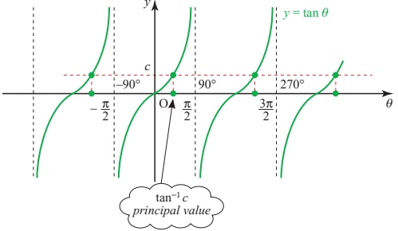

Figure 3.14

<!-- page 85 -->

The cosine graph (see figure 3.15) has the y axis as a line of symmetry. Notice how the values  $ \pm\cos^{-1}c $ generate all the other roots at intervals of  $ 360^{\circ} $ or  $ 2\pi $. So the general solution is

 $$ \theta=\pm\cos^{-1}c+2n\pi\qquad n\in\mathbb{Z}\quad(\mathrm{i n~r a d i a n s}). $$ 

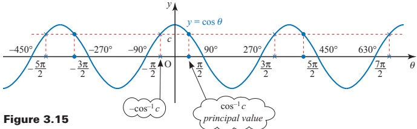

Figure 3.15

Now look at the sine graph (see figure 3.16). As for the cosine graph, there are two roots located symmetrically. The line of symmetry for the sine graph is  $ \theta = \frac{\pi}{2} $, which generates all the other possible roots. This gives rise to the slightly more complicated expressions

 $$ \theta=\frac{\pi}{2}\pm\left(\frac{\pi}{2}-\sin^{-1}c\right)+2n\pi $$ 

 $$ \mathrm{o r}\qquad\theta=\Big(2n+\frac{1}{2}\Big)\pi\pm\Big(\frac{\pi}{2}-\sin^{-1}c\Big)\quad n\in\mathbb{Z}. $$ 

You may, however, find it easier to remember these as two separate formulae:

 $$ \theta=2n\pi+\sin^{-1}c\qquad{\mathrm{o r}}\qquad\theta=(2n+1)\pi-\sin^{-1}c. $$ 

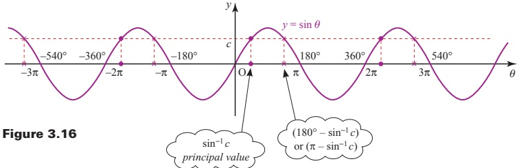

Figure 3.16

ACTIVITY 3.3 Show that the general solution of the equation  $ \sin\theta = c $ may also be written

 $$ \theta=n\pi+(-1)^{n}\sin^{-1}c. $$

<!-- page 86 -->

1  $ \sec\theta = \frac{1}{\cos\theta} $;  $ \csc\theta = \frac{1}{\sin\theta} $;  $ \cot\theta = \frac{1}{\tan\theta} $

 $$ \tan^{2}\theta+1=\sec^{2}\theta;\quad1+\cot^{2}\theta=\operatorname{c o s e c}^{2}\theta $$ 

## 3 Compound-angle formulae

 $ \sin(\theta + \phi) = \sin\theta\cos\phi + \cos\theta\sin\phi $

 $$ \sin(\theta-\phi)=\sin\theta\cos\phi-\cos\theta\sin\phi $$ 

 $ \cos(\theta + \phi) = \cos\theta\cos\phi - \sin\theta\sin\phi $

 $$ \cos(\theta-\phi)=\cos\theta\cos\phi+\sin\theta\sin\phi $$ 

 $$ \tan(\theta+\phi)=\frac{\tan\theta+\tan\phi}{1-\tan\theta\tan\phi}\quad(\theta+\phi)\neq90^{\circ},270^{\circ},\ldots $$ 

## 4 Double-angle and related formulae

 $$ \tan(\theta-\phi)=\frac{\tan\theta-\tan\phi}{1+\tan\theta\tan\phi}\quad(\theta-\phi)\neq90^{\circ},270^{\circ},\ldots $$ 

 $ \sin 2\theta = 2\sin\theta\cos\theta $

 $ \cos 2\theta = \cos^2\theta - \sin^2\theta = 1 - 2\sin^2\theta = 2\cos^2\theta - 1 $

 $ \tan 2\theta = \frac{2\tan\theta}{1 - \tan^2\theta} \quad \theta \neq 45^\circ, 135^\circ, \ldots $

 $ \sin^2\theta = \frac{1}{2}(1 - \cos 2\theta) $

$$\cos^{2}\theta=\frac{1}{2}(1+\cos2\theta)$$

## 5 The  $ r, \alpha $ formulae

$$\begin{array}{ll}\bullet a\sin\theta+b\cos\theta=r\sin(\theta+\alpha)\\\bullet a\sin\theta-b\cos\theta=r\sin(\theta-\alpha)\\\bullet a\cos\theta+b\sin\theta=r\cos(\theta-\alpha)\\\bullet a\cos\theta-b\sin\theta=r\cos(\theta+\alpha)\end{array}\quad\text{where }\quad r=\sqrt{a^{2}+b^{2}}\quad\cos\alpha=\frac{a}{r}\quad\sin\alpha=\frac{b}{r}$$

