# Chapter 4 Differentiation

<!-- Pure Mathematics 2 and 3 Cambridge International AS and A Level Mathematics (Sophie Goldie, Roger Porkess) .pdf p87-125 -->

<!-- page 87 -->

# Differentiation

A mathematician, like a painter or poet, is a maker of patterns. If his patterns are more permanent than theirs it is because they are made with ideas.

G.H. Hardy

## The product rule

Figure 4.1 shows a sketch of the curve of  $ y = 20x(x - 1)^6 $.

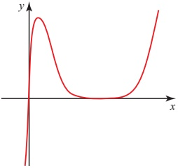

Figure 4.1

If you wanted to find the gradient function,  $ \frac{dy}{dx} $, for the curve, you could expand the right-hand side then differentiate it term by term – a long and cumbersome process!

There are other functions like this, made up of the product of two or more simpler functions, which are not just time-consuming to expand – they are impossible to expand. One such function is

 $$ y=(x-1)^{\frac{1}{2}}(x+1)^{6}\qquad(\mathrm{f o r}\;x>1). $$ 

Clearly you need a technique for differentiating functions that are products of simpler ones, and a suitable notation with which to express it.

The most commonly used notation involves writing

 $$ y=u\nu, $$ 

where the variables u and v are both functions of x. Using this notation,  $ \frac{dy}{dx} $ is given by

 $$ \frac{\mathrm{d}y}{\mathrm{d}x}=u\frac{\mathrm{d}\nu}{\mathrm{d}x}+\nu\frac{\mathrm{d}u}{\mathrm{d}x}. $$ 

This is called the product rule and it is derived from first principles in the next section.

<!-- page 88 -->

## The product rule from first principles

A small increase  $ \delta x $ in x leads to corresponding small increases  $ \delta u $,  $ \delta v $ and  $ \delta y $ in u, v and y. And so

 $$ \begin{align*}y+\delta y&=(u+\delta u)(\nu+\delta\nu)\\&=u\nu+\nu\delta u+u\delta\nu+\delta u\delta\nu.\end{align*} $$ 

Since $y = uv$, the increase in $y$ is given by

 $$ \delta y=\nu\delta u+u\delta\nu+\delta u\delta\nu. $$ 

Dividing both sides by  $ \delta x $,

 $$ \frac{\delta y}{\delta x}=\nu\frac{\delta u}{\delta x}+u\frac{\delta\nu}{\delta x}+\delta u\frac{\delta\nu}{\delta x}. $$ 

In the limit, as  $ \delta x \to 0 $, so do  $ \delta u $,  $ \delta\nu $ and  $ \delta y $, and

 $$ \frac{\delta u}{\delta x}\to\frac{\mathrm{d}u}{\mathrm{d}x},\quad\frac{\delta\nu}{\delta x}\to\frac{\mathrm{d}\nu}{\mathrm{d}x}\quad\mathrm{a n d}\quad\frac{\delta y}{\delta x}\to\frac{\mathrm{d}y}{\mathrm{d}x}. $$ 

The expression becomes

 $$ \frac{\mathrm{d}y}{\mathrm{d}x}=\nu\frac{\mathrm{d}u}{\mathrm{d}x}+u\frac{\mathrm{d}\nu}{\mathrm{d}x}. $$ 

Notice that since  $ \delta u \to 0 $ the last term on the right-hand side has disappeared.

### EXAMPLE 4.1

Given that  $ y = (2x + 3)(x^2 - 5) $, find  $ \frac{dy}{dx} $ using the product rule.

## SOLUTION

 $$ y=(2x+3)(x^{2}-5) $$ 

Let  $ u = 2x + 3 $ and  $ \nu = x^{2} - 5 $.

Then  $ \frac{du}{dx}=2 $ and  $ \frac{dv}{dx}=2x $.

 $$ \begin{aligned}Using the product rule,\frac{\mathrm{d}y}{\mathrm{d}x}&=\nu\frac{\mathrm{d}u}{\mathrm{d}x}+u\frac{\mathrm{d}\nu}{\mathrm{d}x}\\&=(x^{2}-5)\times2+(2x+3)\times2x\\&=2(x^{2}-5+2x^{2}+3x)\\&=2(3x^{2}+3x-5)\end{aligned} $$ 

Note

In this case you could have multiplied out the expression for y.

 $$ \begin{aligned}y&=2x^{3}+3x^{2}-10x-15\\\frac{\mathrm{d}y}{\mathrm{d}x}&=6x^{2}+6x-10\\&=2(3x^{2}+3x-5)\end{aligned} $$

<!-- page 89 -->

Differentiate  $ y = 20x(x - 1)^6 $.

## SOLUTION

Let u = 20x and  $ \nu = (x - 1)^6 $.

Then  $ \frac{du}{dx}=20 $ and  $ \frac{dv}{dx}=6(x-1)^{5} $ (using the chain rule).

 $$ \begin{aligned}Using~the~product~rule,\frac{\mathrm{d}\gamma}{\mathrm{d}x}&=\nu\frac{\mathrm{d}u}{\mathrm{d}x}+u\frac{\mathrm{d}\nu}{\mathrm{d}x}\\&=(x-1)^{6}\times20+20x\times6(x-1)^{5}\\&=20(x-1)^{5}\times(x-1)+20(x-1)^{5}\times6x\\&=20(x-1)^{5}[(x-1)+6x]\\&=20(x-1)^{5}(7x-1)\\&\underbrace{20(x-1)^{5}is~a~common~factor.}_{}\end{aligned} $$ 

The factorised result is the most useful form for the solution, as it allows you to find stationary points easily. You should always try to factorise your answer as much as possible. Once you have used the product rule, look for factors straight away and do not be tempted to multiply out.

## The quotient rule

In the last section, you met a technique for differentiating the product of two functions. In this section you will see how to differentiate a function which is the quotient of two simpler functions.

As before, you start by identifying the simpler functions. For example, the function

 $$ y=\frac{3x+1}{x-2}\quad\left(\text{for}x\neq2\right) $$ 

can be written as  $ y=\frac{u}{\nu} $ where  $ u=3x+1 $ and  $ \nu=x-2 $. Using this notation,  $ \frac{dy}{dx} $ is given by

 $$ \frac{\mathrm{d}y}{\mathrm{d}x}=\frac{\nu\frac{\mathrm{d}u}{\mathrm{d}x}-u\frac{\mathrm{d}\nu}{\mathrm{d}x}}{\nu^{2}} $$ 

This is called the quotient rule and it is derived from first principles in the next section.

<!-- page 90 -->

## The quotient rule from first principles

A small increase,  $ \delta x $ in x results in corresponding small increases  $ \delta u $,  $ \delta v $ and  $ \delta y $ in u, v and y. The new value of y is given by

 $$ y+\delta y=\frac{u+\delta u}{\nu+\delta\nu} $$ 

and since  $ y=\frac{u}{v} $, you can rearrange this to obtain an expression for  $ \delta y $ in terms of u and v.

 $$ \begin{aligned}\delta y&=\frac{u+\delta u}{\nu+\delta\nu}-\frac{u}{\nu}\\&=\frac{\nu(u+\delta u)-u(\nu+\delta\nu)}{\nu(\nu+\delta\nu)}\\&=\frac{u\nu+\nu\delta u-u\nu-u\delta\nu}{\nu(\nu+\delta\nu)}\\&=\frac{\nu\delta u-u\delta\nu}{\nu(\nu+\delta\nu)}\end{aligned} $$ 

Dividing both sides by  $ \delta x $ gives

 $$ \frac{\delta y}{\delta x}=\frac{\nu\frac{\delta u}{\delta x}-u\frac{\delta\nu}{\delta x}}{\nu(\nu+\delta\nu)} $$ 

To divide the right-hand side by $\delta x$ you only divide the numerator by $\delta x$.

In the limit as  $ \delta x \to 0 $, this is written in the form you met on the previous page.

 $$ \frac{\mathrm{d}y}{\mathrm{d}x}=\frac{\nu\frac{\mathrm{d}u}{\mathrm{d}x}-u\frac{\mathrm{d}\nu}{\mathrm{d}x}}{\nu^{2}} $$ 

ACTIVITY 4.1 Verify that the quotient rule gives  $ \frac{\mathrm{d}y}{\mathrm{d}x} $ correctly when  $ u = x^{10} $ and  $ \nu = x^{7} $.

### EXAMPLE 4.3

Given that  $ y = \frac{3x + 1}{x - 2} $, find  $ \frac{dy}{dx} $ using the quotient rule.

## SOLUTION

Letting  $ u = 3x + 1 $ and  $ \nu = x - 2 $ gives

 $$ \frac{\mathrm{d}u}{\mathrm{d}x}=3\quad and\quad\frac{\mathrm{d}\nu}{\mathrm{d}x}=1. $$ 

 $$ \begin{array}{l} \text{Using the quotient rule,}\frac{\mathrm{d}y}{\mathrm{d}x}=\frac{\nu\frac{\mathrm{d}u}{\mathrm{d}x}-u\frac{\mathrm{d}\nu}{\mathrm{d}x}}{\nu^{2}} \\\qquad = \frac{(x - 2) \times 3 - (3x + 1) \times 1}{(x - 2)^{2}} \\ \qquad =  \frac{3x - 6 - 3x - 1}{(x - 2)^{2}} \\ \qquad =  \frac{-7}{(x - 2)^{2}} \end{array} $$

<!-- page 91 -->

Given that  $ y=\frac{x^{2}+1}{3x-1} $, find  $ \frac{\mathrm{d}y}{\mathrm{d}x} $ using the quotient rule.

## SOLUTION

Letting  $ u = x^2 + 1 $ and  $ \nu = 3x - 1 $ gives

 $ \frac{\mathrm{d}u}{\mathrm{d}x}=2x $ and  $ \frac{\mathrm{d}v}{\mathrm{d}x}=3 $.

Using the quotient rule,  $ \frac{\mathrm{d}y}{\mathrm{d}x} = \frac{\nu \frac{\mathrm{d}u}{\mathrm{d}x} - u \frac{\mathrm{d}\nu}{\mathrm{d}x}}{\nu^2} $

 $ \quad = \frac{(3x-1) \times 2x - (x^2+1) \times 3}{(3x-1)^2} $

 $ \quad = \frac{6x^2 - 2x - 3x^2 - 3}{(3x-1)^2} $

 $ \quad = \frac{3x^2 - 2x - 3}{(3x-1)^2} $

## EXERCISE 4A

1 Differentiate the following using the product rule or the quotient rule.

(i)  $  y = (x^{2} - 1)(x^{3} + 3)  $

(ii)  $ y = x^{5}(3x^{2} + 4x - 7) $

(iii)  $  y = x^{2} (2x + 1)^{4}  $

(iv)  $ y = \frac{2x}{3x - 1} $

(v)  $ y = \frac{x^{3}}{x^{2} + 1} $

(vi)  $  y = (2x + 1)^2 (3x^2 - 4)  $

(vii)  $ y = \frac{2x - 3}{2x^{2} + 1} $

(viii)  $  y = \frac{x - 2}{(x + 3)^2}  $

(ix)  $  y = (x + 1) \sqrt{x - 1}  $

2 The diagram shows the graph of  $ y = \frac{x}{x - 1} $.

(i) Find  $ \frac{dy}{dx} $.

(ii) Find the gradient of the curve at  $ (0, 0) $, and the equation of the tangent at  $ (0, 0) $.

(iii) Find the gradient of the curve at (2, 2), and the equation of the tangent at (2, 2).

(iv) What can you deduce about the two tangents?

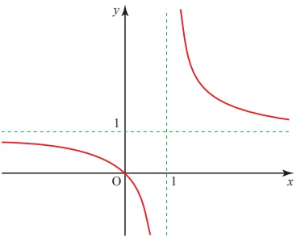

<!-- page 92 -->

3 Given that  $ y = (x + 1)(x - 2)^{2} $

(i) find  $ \frac{dy}{dx} $

(ii) find any stationary points and determine their nature

(iii) sketch the curve.

4 Given that  $ y=\frac{x-3}{x-4} $

(i) find  $ \frac{dy}{dx} $

(ii) find the equation of the tangent to the curve at the point (6, 1.5)

(iii) find the equation of the normal to the curve at the point (5, 2)

(iv) use your answer from part (i) to deduce that the curve has no stationary points, and sketch the graph.

5 The diagram shows the graph of  $ y = \frac{2x}{\sqrt{x-1}} $, which is undefined for x < 0 and x = 1. P is a minimum point.

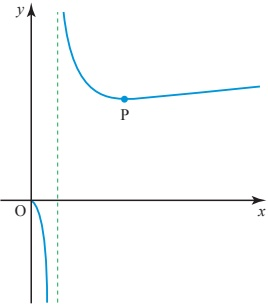

(i) Find  $ \frac{dy}{dx} $.

(ii) Find the gradient of the curve at  $ (9, 9) $, and show that the equation of the normal at  $ (9, 9) $ is  $ y = -4x + 45 $.

(iii) Find the co-ordinates of P and verify that it is a minimum point.

(iv) Write down the equation of the tangent and the normal to the curve at P.

(v) Write down the point of intersection of the normal found in part (ii) and (a) the tangent found in part (iv), call it Q

(b) the normal found in part (iv), call it R.

(vi) Show that the area of the triangle PQR is  $ \frac{441}{8} $.

<!-- page 93 -->

6 The diagram shows the graph of  $ y=\frac{x^{2}-2x-5}{2x+3} $.

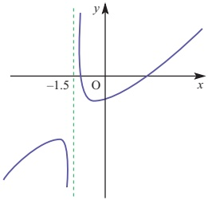

(i) Find  $ \frac{dy}{dx} $.

(ii) Use your answer from part (i) to find any stationary points of the curve.

(iii) Classify each of the stationary points and use calculus to justify your answer.

7 A curve has the equation  $ y=\frac{x^{2}}{2x+1} $.

(i) Find  $ \frac{dy}{dx} $.

Hence find the co-ordinates of the stationary points on the curve.

(ii) You are given that  $ \frac{\mathrm{d}^{2}y}{\mathrm{d}x^{2}}=\frac{2}{(2x+1)^{3}} $.

Use this information to determine the nature of the stationary points in part (i).

[MEI]

8 The diagram shows part of the graph with the equation  $ y = x\sqrt{9 - 2x^2} $. It crosses the x axis at  $ (a, 0) $.

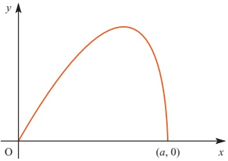

(i) Find the value of a, giving your answer as a multiple of  $ \sqrt{2} $.

<!-- page 94 -->

(ii) Show that the result of differentiating  $ \sqrt{9-2x^{2}} $ is  $ \frac{-2x}{\sqrt{9-2x^{2}}} $.

Hence show that if  $ y = x \sqrt{9 - 2x^{2}} $ then

 $$ \frac{\mathrm{d}y}{\mathrm{d}x}=\frac{9-4x^{2}}{\sqrt{9-2x^{2}}}. $$ 

(iii) Find the $x$ co-ordinate of the maximum point on the graph of $y = x\sqrt{9 - 2x^2}$. Write down the gradient of the curve at the origin.

What can you say about the gradient at the point $(a,0)?$

## Differentiating natural logarithms and exponentials

In Chapter 2 you learnt that the integral of  $ \frac{1}{x} $ is  $ \ln x $. It follows, therefore, that the differential of  $ \ln x $ is  $ \frac{1}{x} $.

So  $ y=\ln x \Rightarrow \frac{dy}{dx}=\frac{1}{x} $

The differential of the inverse function, $y = e^{x}$, may be found by interchanging $y$ and $x$.

 $$ \begin{align*}x=\ln y\quad&\Longrightarrow\quad\frac{\mathrm{d}x}{\mathrm{d}y}=\frac{1}{y}\\&\Longrightarrow\quad\frac{\mathrm{d}y}{\mathrm{d}x}=\frac{1}{\frac{\mathrm{d}x}{\mathrm{d}y}}=y=\mathrm{e}^{x}.\end{align*} $$ 

Therefore  $ \frac{d}{dx}e^x = e^x $

The differential of  $ e^{x} $ is itself  $ e^{x} $. This may at first seem rather surprising.

## p The function  $ f(x) \, (x \in \mathbb{R}) $ is a polynomial in  $ x $ of order  $ n $

So

 $$ \mathrm{f}(x)=a_{n}x^{n}+a_{n-1}x^{n-1}+\ldots+a_{1}x+a_{0} $$ 

where  $ a_{n}, a_{n-1}, \ldots, a_{0} $ are all constants and at least  $ a_{n} $ is not zero.

How can you prove that  $ \frac{\mathrm{d}}{\mathrm{d}x}f(x) $ cannot equal  $ f(x) $?

Since the differential of  $ e^x $ is  $ e^x $, it follows that the integral of  $ e^x $ is also  $ e^x $.

 $$ \int\mathrm{e}^{x}\mathrm{d}x=\mathrm{e}^{x}+c. $$ 

This may be summarised as in the following table.

<!-- page 95 -->

<table border=1 style='margin: auto; word-wrap: break-word;'><tr><td style='text-align: center; word-wrap: break-word;'>Differentiation</td><td style='text-align: center; word-wrap: break-word;'>Integration</td></tr><tr><td style='text-align: center; word-wrap: break-word;'>$ y \longrightarrow \frac{dy}{dx} $</td><td style='text-align: center; word-wrap: break-word;'>$ y \longrightarrow \int y dx $</td></tr><tr><td style='text-align: center; word-wrap: break-word;'>$ \ln x \longrightarrow \frac{1}{x} $</td><td style='text-align: center; word-wrap: break-word;'>$ \frac{1}{x} \longrightarrow \ln x + c $</td></tr><tr><td style='text-align: center; word-wrap: break-word;'>$ e^{x} \longrightarrow e^{x} $</td><td style='text-align: center; word-wrap: break-word;'>$ e^{x} \longrightarrow e^{x} + c $</td></tr></table>

These results allow you to extend very considerably the range of functions which you are able to differentiate and integrate.

### EXAMPLE 4.5

Differentiate  $ y = e^{5x} $.

## SOLUTION

Make the substitution $u = 5x$ to give $y = e^{u}$.

Now  $ \frac{dy}{du} = e^u = e^{5x} $ and  $ \frac{du}{dx} = 5 $.

By the chain rule,

 $$ \begin{aligned}\frac{\mathrm{d}y}{\mathrm{d}x}&=\frac{\mathrm{d}y}{\mathrm{d}u}\times\frac{\mathrm{d}u}{\mathrm{d}x}\\&=\mathrm{e}^{5x}\times5\\&=5\mathrm{e}^{5x}\end{aligned} $$ 

This result can be generalised as follows.

 $ y = e^{ax} \quad \Rightarrow \quad \frac{dy}{dx} = ae^{ax} $ where a is any constant.

This is an important standard result, and you would normally use it automatically, without recourse to the chain rule.

### EXAMPLE 4.6

Differentiate  $ y = \frac{4}{e^{2x}} $.

## SOLUTION

 $$ \begin{aligned}y&=\frac{4}{\mathrm{e}^{2x}}=4\mathrm{e}^{-2x}\\\Longrightarrow\quad\frac{\mathrm{d}y}{\mathrm{d}x}&=4\times\left(-2\mathrm{e}^{-2x}\right)\\&=-8\mathrm{e}^{-2x}\end{aligned} $$

<!-- page 96 -->

Differentiate  $  y = 3e^{(x^2+1)}  $.

## SOLUTION

Let  $ u = x^2 + 1 $, then  $ y = 3e^u $.

 $$ \Rightarrow\quad\frac{\mathrm{d}y}{\mathrm{d}u}=3\mathrm{e}^{u}=3\mathrm{e}^{(x^{2}+1)}\text{and}\frac{\mathrm{d}u}{\mathrm{d}x}=2x $$ 

By the chain rule,

 $$ \begin{aligned}\frac{\mathrm{d}y}{\mathrm{d}x}&=\frac{\mathrm{d}y}{\mathrm{d}u}\times\frac{\mathrm{d}u}{\mathrm{d}x}\\&=3\mathrm{e}^{(x^{2}+1)}\times2x\\&=6x\mathrm{e}^{(x^{2}+1)}\end{aligned} $$ 

### EXAMPLE 4.8

Differentiate the following.

(i)  $ y = 2 \ln x $ (ii)  $ y = \ln(3x) $

## SOLUTION

(i)

 $$ \begin{aligned}\frac{\mathrm{d}y}{\mathrm{d}x}&=2\times\frac{1}{x}\\&=\frac{2}{x}\end{aligned} $$ 

(ii) Let u = 3x, then  $ y = \ln u $

 $$ \Longrightarrow\quad\frac{\mathrm{d}y}{\mathrm{d}u}=\frac{1}{u}=\frac{1}{3x}\quad\mathrm{a n d}\quad\frac{\mathrm{d}u}{\mathrm{d}x}=3 $$ 

By the chain rule,

 $$ \begin{aligned}\frac{\mathrm{d}y}{\mathrm{d}x}&=\frac{\mathrm{d}y}{\mathrm{d}u}\times\frac{\mathrm{d}u}{\mathrm{d}x}\\&=\frac{1}{3x}\times3\\&=\frac{1}{x}\end{aligned} $$ 

Note

An alternative solution to part (ii) is

 $$ y=\ln(3x)=\ln3+\ln x\quad\Longrightarrow\quad\frac{\mathrm{d}y}{\mathrm{d}x}=0+\frac{1}{x}=\frac{1}{x}. $$ 

The gradient function found in part (ii) above for $y=\ln(3x)$ is the same as that for $y=\ln(x)$. What does this tell you about the shapes of the two curves? For what values of $x$ is it valid?

<!-- page 97 -->

Differentiate the following.

 $$ y=\ln(x^{4}) $$ 

 $$ y=\ln(x^{2}+1) $$ 

## SOLUTION

(i) By the properties of logarithms

 $$ \begin{aligned}y&=\ln(x^{4})\\&=4\ln(x)\\\Longrightarrow\quad\frac{\mathrm{d}y}{\mathrm{d}x}&=\frac{4}{x}\end{aligned} $$ 

 $$ \begin{aligned}(ii)\left&Let\quad&u&=x^{2}+1,then&y&=\ln u\\ &\Longrightarrow\quad&\frac{\mathrm{d}y}{\mathrm{d}u}&=\frac{1}{u}=\frac{1}{x^{2}+1}\quad and\quad\frac{\mathrm{d}u}{\mathrm{d}x}&=2x\end{aligned} $$ 

By the chain rule,

 $$ \begin{aligned}\frac{\mathrm{d}y}{\mathrm{d}x}&=\frac{\mathrm{d}y}{\mathrm{d}u}\times\frac{\mathrm{d}u}{\mathrm{d}x}\\&=\frac{1}{x^{2}+1}\times2x\\&=\frac{2x}{x^{2}+1}\end{aligned} $$ 

If you need to differentiate expressions similar to those in the examples above, follow exactly the same steps. The results can be generalised as follows.

 $$ y=a\ln x\Rightarrow\frac{\mathrm{d}y}{\mathrm{d}x}=\frac{a}{x} $$ 

 $$ y=a\mathrm{e}^{x}\Rightarrow\frac{\mathrm{d}y}{\mathrm{d}x}=a\mathrm{e}^{x} $$ 

 $$ y=\ln(ax)\Rightarrow\frac{\mathrm{d}y}{\mathrm{d}x}=\frac{1}{x} $$ 

 $$ y=e^{ax}\Rightarrow\frac{d y}{d x}=a e^{ax} $$ 

 $$ y=\ln(f(x))\Rightarrow\frac{d y}{d x}=\frac{f^{\prime}(x)}{f(x)} $$ 

 $$ y=\mathrm{e}^{\mathrm{f}(x)}\Longrightarrow\frac{\mathrm{d}y}{\mathrm{d}x}=\mathrm{f}^{\prime}(x)\mathrm{e}^{\mathrm{f}(x)} $$ 

### EXAMPLE 4.10

Differentiate  $ y = \frac{\ln x}{x} $.

## SOLUTION

Here y is of the form  $ \frac{u}{\nu} $ where  $ u = \ln x $ and  $ \nu = x $

 $$ \Longrightarrow\quad\frac{\mathrm{d}u}{\mathrm{d}x}=\frac{1}{x}\mathrm{a n d}\frac{\mathrm{d}\nu}{\mathrm{d}x}=1. $$

<!-- page 98 -->

By the quotient rule,

 $$ \begin{aligned}\frac{\mathrm{d}y}{\mathrm{d}x}&=\frac{\nu\frac{\mathrm{d}u}{\mathrm{d}x}-u\frac{\mathrm{d}\nu}{\mathrm{d}x}}{\nu^{2}}\\&=\frac{x\times\frac{1}{x}-1\times\ln x}{x^{2}}\\&=\frac{1-\ln x}{x^{2}}\end{aligned} $$ 

## EXERCISE 4B

1 Differentiate the following.

(i)  $ y = 3 \ln x $

(ii)  $  y = \ln(4x)  $

(iii)  $  y = \ln(x^2)  $

(iv)

 $$ y=\ln(x^{2}+1) $$ 

(v)

 $$ y=\ln\left(\frac{1}{x}\right) $$ 

(vi)  $ y = x \ln x $

(vii)  $  y = x^{2} \ln(4x)  $

(viii)

 $$ y=\ln\left(\frac{x+1}{x}\right) $$ 

(ix)

 $$ y=\ln\sqrt{x^{2}-1} $$ 

(x)

 $$ y=\frac{\ln x}{x^{2}} $$ 

2 Differentiate the following.

(i)

 $$ y=3e^{x} $$ 

(ii)

 $$ y=e^{2x} $$ 

(iii)

 $$ y=e^{x^{2}} $$ 

(iv)

 $$ y=e^{(x+1)^2} $$ 

(v)

 $$ y=x\mathrm{e}^{4x} $$ 

(vi)

 $$ y=2x^{3}\mathrm{e}^{-x} $$ 

(vii)

 $$ y=\frac{x}{\mathrm{e}^{x}} $$ 

(viii)  $  y = (e^{2x} + 1)^3  $

3 Knowing how much rain has fallen in a river basin, hydrologists are often able to give forecasts of what will happen to a river level over the next few hours. In one case it is predicted that the height  $ h $, in metres, of a river above its normal level during the next 3 hours will be  $ 0.12e^{0.9t} $, where  $ t $ is the time elapsed, in hours, after the prediction.

(i) Find  $ \frac{dh}{dt} $, the rate at which the river is rising.

(ii) At what rate will the river be rising after 0, 1, 2 and 3 hours?

4 The graph of $y = x\mathrm{e}^{x}$ is shown below.

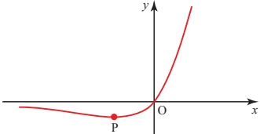

(i) Find  $ \frac{dy}{dx} $ and  $ \frac{d^2y}{dx^2} $.

(ii) Find the co-ordinates of the minimum point P.

<!-- page 99 -->

5 The graph of $f(x) = x \ln(x^{2})$ is shown below.

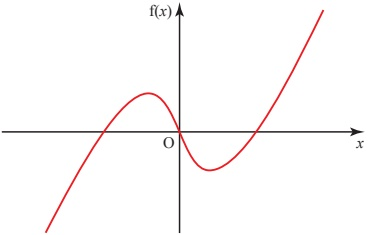

(i) Describe, giving a reason, any symmetries of the graph.

(ii) Find  $ f'(x) $ and  $ f''(x) $.

(iii) Find the co-ordinates of any stationary points.

6 Given that  $ y = \frac{e^{x}}{x} $

(i) find  $ \frac{dy}{dx} $

(ii) find the co-ordinates of any stationary points on the curve

(iii) sketch the curve.

7 (i) Differentiate  $ \ln x $ and  $ x\ln x $ with respect to x.

The sketch shows the graph of  $ y = x \ln x $ for  $ 0 \leq x \leq 3 $.

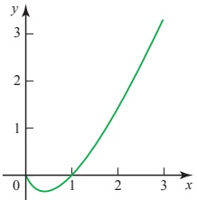

(ii) Show that the curve has a stationary point  $ \left(\frac{1}{e}, -\frac{1}{e}\right) $.

8 The diagram shows the graph of  $ y = xe^{-x} $.

(i) Differentiate  $ xe^{-x} $.

(ii) Find the co-ordinates of the point A, the maximum point on the curve.

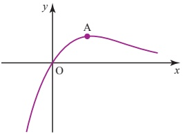

[MEI]

<!-- page 100 -->

9 The diagram shows a sketch of the graph of  $ y = f(x) $, where

 $$ \mathrm{f}(x)=\frac{\ln x}{x}\mid(x>0). $$ 

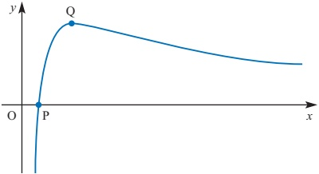

The graph crosses the x axis at the point P and has a turning point at Q.

(i) Write down the x co-ordinate of P.

(ii) Find the first and second derivatives,  $ f'(x) $ and  $ f''(x) $, simplifying your answers as far as possible.

(iii) Hence show that the $x$ co-ordinate of $Q$ is $e$.

Find the $y$ co-ordinate of Q in terms of e.

Find $f''(e)$, and use this result to verify that Q is a maximum point.

[MEI, part]

10 Find the exact co-ordinates of the point on the curve  $ y = xe^{-\frac{-1}{2}x} $ at which  $ \frac{\mathrm{d}^2y}{\mathrm{d}x^2} = 0 $.

[Cambridge International AS & A Level Mathematics 9709, Paper 2 Q6 Novem]

11 It is given that the curve  $ y=(x-2)e^{x} $ has one stationary point.

(i) Find the exact co-ordinates of this point.

(ii) Determine whether this point is a maximum or a minimum point.

[Cambridge International AS & A Level Mathematics 9709, Paper 2 Q6 June 2008]

12 The equation of a curve is  $ y = x^{3}e^{-x} $.

(i) Show that the curve has a stationary point where x = 3.

(ii) Find the equation of the tangent to the curve at the point where x = 1.

[Cambridge International AS & A Level Mathematics 9709, Paper 22 Q5 June 2010]

<!-- page 101 -->

## Differentiating trigonometrical functions

ACTIVITY 4.2 Figure 4.2 shows the graph of  $ y = \sin x $, with  $ x $ measured in radians, together with the graph of  $ y = x $. You are going to sketch the graph of the gradient function for the graph of  $ y = \sin x $.

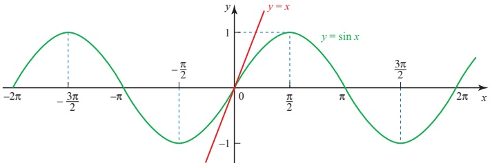

Figure 4.2

Draw a horizontal axis for the angles, marked from  $ -2\pi $ to  $ 2\pi $, and a vertical axis for the gradient, marked from -1 to 1, as shown in Figure 4.3.

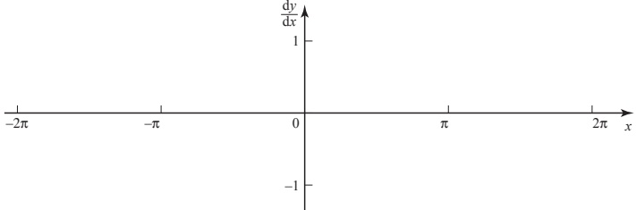

Figure 4.3

First, look for the angles for which the gradient of  $ y = \sin x $ is zero. Mark zeros at these angles on your gradient graph.

Decide which parts of $y=\sin x$ have a positive gradient and which have a negative gradient. This will tell you whether your gradient graph should be above or below the $x$ axis at any point.

Look at the part of the graph of $y=\sin x$ near $x=0$ and compare it with the graph of $y=x$. What do you think the gradient of $y=\sin x$ is at this point? Mark this point on your gradient graph. Also mark on any other points with plus or minus the same gradient.

Now, by considering whether the gradient of $y = \sin x$ is increasing or decreasing at any particular point, sketch in the rest of the gradient graph.

<!-- page 102 -->

The gradient graph that you have drawn should look like a familiar graph. What graph do you think it is?

Sketch the graph of $y=\cos x$, with $x$ measured in radians, and use it as above to obtain a sketch of the graph of the gradient function of $y=\cos x$.

## ? Is $y=x$ still a tangent of $y=\sin x$ if $x$ is measured in degrees?

Activity 4.2 showed you that the graph of the gradient function of $y=\sin x$ resembled the graph of $y=\cos x$. You will also have found that the graph of the gradient function of $y=\cos x$ looks like the graph of $y=\sin x$ reflected in the $x$ axis to become $y=-\sin x$.

Both of these results are in fact true but the work above does not amount to a proof. Explain why.

## Summary of results

 $$ \frac{\mathrm{d}}{\mathrm{d}x}(\sin x)=\cos x\qquad\quad\frac{\mathrm{d}}{\mathrm{d}x}(\cos x)=-\sin x $$ 

Remember that these results are only valid when the angle is measured in radians, so when you are using any of the derivatives of trigonometrical functions you need to work in radians.

ACTIVITY 4.3 By writing  $ \tan x = \frac{\sin x}{\cos x} $, use the quotient rule to show that

 $$ \frac{\mathrm{d}}{\mathrm{d}x}(\tan x)=sec^{2}x\ where\ x is measured in radians. $$ 

You can use the three results met so far to differentiate a variety of functions involving trigonometrical functions, by using the chain rule, product rule or quotient rule, as in the following examples.

<!-- page 103 -->

Differentiate  $ y = \cos 2x $.

## SOLUTION

As  $ \cos 2x $ is a function of a function, you may use the chain rule.

Let

 $$ u=2x\quad\Rightarrow\quad\frac{\mathrm{d}u}{\mathrm{d}x}=2 $$ 

 $$ \begin{aligned}y&=\cos u\Rightarrow&\frac{\mathrm{d}y}{\mathrm{d}u}&=-\sin u\\\frac{\mathrm{d}y}{\mathrm{d}x}&=\frac{\mathrm{d}y}{\mathrm{d}u}\times\frac{\mathrm{d}u}{\mathrm{d}x}\\&=-\sin u\times2\\&=-2\sin2x\end{aligned} $$ 

With practice it should be possible to do this in your head, without needing to write down the substitution.

This result may be generalised.

 $$ y=\cos kx\ \Rightarrow\ \frac{\mathrm{d}y}{\mathrm{d}x}=-k\sin kx. $$ 

Similarly

 $$ y=\sin kx\ \Rightarrow\ \frac{\mathrm{d}y}{\mathrm{d}x}=k\cos kx $$ 

and

 $$ y=\tan kx\implies\frac{\mathrm{d}y}{\mathrm{d}x}=k\sec^{2}kx. $$ 

### EXAMPLE 4.12

Differentiate  $ y = x^{2} \sin x $.

## SOLUTION

 $ x^2 \sin x $ is of the form  $ uv $, so the product rule can be used with  $ u = x^2 $ and  $ v = \sin x $.

 $$ \frac{\mathrm{d}u}{\mathrm{d}x}=2x\qquad\frac{\mathrm{d}\nu}{\mathrm{d}x}=\cos x $$ 

Using the product rule

 $$ \frac{\mathrm{d}y}{\mathrm{d}x}=\nu\frac{\mathrm{d}u}{\mathrm{d}x}+u\frac{\mathrm{d}\nu}{\mathrm{d}x} $$ 

 $$ \Rightarrow\qquad\frac{\mathrm{d}y}{\mathrm{d}x}=2x\sin x+x^{2}\cos x $$

<!-- page 104 -->

Differentiate  $ y = e^{\tan x} $

## SOLUTION

 $ e^{\tan x} $ is a function of a function, so the chain rule may be used.

Let

 $$ u=\tan x\quad\Rightarrow\quad\frac{\mathrm{d}u}{\mathrm{d}x}=\sec^{2}x $$ 

 $$ y=e^{u}\qquad\Rightarrow\quad\frac{\mathrm{d}y}{\mathrm{d}u}=e^{u} $$ 

Using the chain rule

 $$ \begin{aligned}\frac{\mathrm{d}y}{\mathrm{d}x}&=\frac{\mathrm{d}y}{\mathrm{d}u}\times\frac{\mathrm{d}u}{\mathrm{d}x}\\&=\mathrm{e}^{u}\sec^{2}x\\&=\mathrm{e}^{\tan x}\sec^{2}x\end{aligned} $$ 

### EXAMPLE 4.14

Differentiate  $ y=\frac{1+\sin x}{\cos x} $.

## SOLUTION

 $ \frac{1+\sin x}{\cos x} $ is of the form  $ \frac{u}{v} $ so the quotient rule can be used, with

 $$ u=1+\sin x\qquad\text{and}\qquad\nu=\cos x $$ 

 $$ \Rightarrow\quad\frac{\mathrm{d}u}{\mathrm{d}x}=\cos x\qquad\quad\mathrm{and}\qquad\frac{\mathrm{d}\nu}{\mathrm{d}x}=-\sin x $$ 

The quotient rule is

 $$ \frac{\mathrm{d}y}{\mathrm{d}x}=\frac{\nu\frac{\mathrm{d}u}{\mathrm{d}x}-u\frac{\mathrm{d}\nu}{\mathrm{d}x}}{\nu^{2}} $$ 

Substituting for u and v and their derivatives gives

 $$ \begin{aligned}\frac{\mathrm{d}y}{\mathrm{d}x}&=\frac{(\cos x)(\cos x)-(1+\sin x)(-\sin x)}{(\cos x)^{2}}\\&=\frac{\cos^{2}x+\sin x+\sin^{2}x}{\cos^{2}x}\\&=\frac{1+\sin x}{\cos^{2}x}\quad(using\sin^{2}x+\cos^{2}x=1)\\&=(\sec^{2}x)(1+\sin x)\end{aligned} $$

<!-- page 105 -->

## EXERCISE 4C

1 Differentiate each of the following.

(i)  $ 2\cos x + \sin x $ (ii)  $ \tan x + 5 $ (iii)  $ \sin x - \cos x $

2 Use the product rule to differentiate each of the following.

(i)  $ x \tan x $ (ii)  $ \sin x \cos x $ (iii)  $ e^{x} \sin x $

3 Use the quotient rule to differentiate each of the following.

(i)  $ \frac{\sin x}{x} $ (ii)  $ \frac{e^{x}}{\cos x} $ (iii)  $ \frac{x + \cos x}{\sin x} $

4 Use the chain rule to differentiate each of the following.

(i)  $ \tan(x^{2}+1) $ (ii)  $ \sin 2x $ (iii)  $ \ln(\sin x) $

5 Use an appropriate method to differentiate each of the following.

(i)  $ \sqrt{\cos x} $ (ii)  $ e^{x}\tan x $ (iii)  $ \sin 4x^{2} $

(iv)  $ e^{\cos 2x} $ (v)  $ \frac{\sin x}{1+\cos x} $ (vi)  $ \ln(\tan x) $

6 (i) Differentiate  $ y = x \cos x $.

(ii) Find the gradient of the curve  $ y = x \cos x $ at the point where  $ x = \pi $.

(iii) Find the equation of the tangent to the curve $y = x\cos x$ at the point where $x = \pi$.

(iv) Find the equation of the normal to the curve $y = x \cos x$ at the point where $x = \pi$.

7 If $y = e^{x} \cos 3x$, find $\frac{\mathrm{d}y}{\mathrm{d}x}$ and $\frac{\mathrm{d}^{2}y}{\mathrm{d}x^{2}}$ and hence show that

 $$ \frac{\mathrm{d}^{2}y}{\mathrm{d}x^{2}}-2\frac{\mathrm{d}y}{\mathrm{d}x}+10y=0. $$ 

[MEI]

8 Consider the function  $ y = e^{-x} \sin x $, where  $ -\pi \leq x \leq \pi $.

(i) Find  $ \frac{dy}{dx} $.

(ii) Show that, at stationary points,  $ \tan x = 1 $.

(iii) Determine the co-ordinates of the stationary points, correct to 2 significant figures.

(iv) Explain how you could determine whether your stationary points are maxima or minima. You are not required to do any calculations.

9 The equation of a curve is  $ y = x + 2\cos x $. Find the x co-ordinates of the stationary points of the curve for  $ 0 \leq x \leq 2\pi $, and determine the nature of each of these stationary points.

[Cambridge International AS & A Level Mathematics 9709, Paper 2 Q3 June 2006]

<!-- page 106 -->

10 The equation of a curve is  $ y = x + \cos 2x $. Find the  $ x $ co-ordinates of the stationary points of the curve for which  $ 0 \leq x \leq \pi $, and determine the nature of each of these stationary points.

[Cambridge International AS & A Level Mathematics 9709, Paper 3 Q3 November 2005]

11 The curve with equation  $ y = e^{-x} \sin x $ has one stationary point for which  $ 0 \leq x \leq \pi $.

(i) Find the x co-ordinate of this point.

(ii) Determine whether this point is a maximum or a minimum point.

[Cambridge International AS & A Level Mathematics 9709, Paper 3 Q4 November 2007]

12 The curve  $ y=\frac{e^{x}}{\cos x} $, for  $ -\frac{1}{2}\pi<x<\frac{1}{2}\pi $, has one stationary point. Find the x co-ordinate of this point.

[Cambridge International AS & A Level Mathematics 9709, Paper 3 Q3 November 2008]

## Differentiating functions defined implicitly

All the functions you have differentiated so far have been of the form $y=f(x)$. However, many functions cannot be arranged in this way at all, for example $x^{3}+y^{3}=xy$, and others can look clumsy when you try to make $y$ the subject.

An example of this is the semi-circle  $ x^2 + y^2 = 4 $,  $ y \geq 0 $, illustrated in figure 4.4.

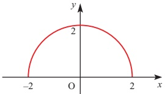

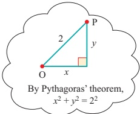

Figure 4.4

Because of Pythagoras’ theorem, the curve is much more easily recognised in this form than in the equivalent  $ y = \sqrt{4 - x^2} $.

When a function is specified by an equation connecting x and y which does not have y as the subject it is called an implicit function.

The chain rule $\frac{\mathrm{d}y}{\mathrm{d}x}=\frac{\mathrm{d}y}{\mathrm{d}u}\times\frac{\mathrm{d}u}{\mathrm{d}x}$ and the product rule $\frac{\mathrm{d}}{\mathrm{d}x}(uv)=u\frac{\mathrm{d}v}{\mathrm{d}x}+\nu\frac{\mathrm{d}u}{\mathrm{d}x}$ are used extensively to help in the differentiation of implicit functions.

<!-- page 107 -->

Differentiate each of the following with respect to x.

(i)  $ y^{2} $ (ii) xy (iii)  $ 3x^{2}y^{3} $ (iv)  $ \sin y $

## SOLUTION

(i)

 $$ \begin{aligned}\frac{\mathrm{d}}{\mathrm{d}x}(y^{2})&=\frac{\mathrm{d}}{\mathrm{d}y}\big(y^{2}\big)\times\frac{\mathrm{d}y}{\mathrm{d}x}\\&=2y\frac{\mathrm{d}y}{\mathrm{d}x}\end{aligned} $$ 

(chain rule)

(ii)

 $$ \frac{\mathrm{d}}{\mathrm{d}x}(xy)=x\frac{\mathrm{d}y}{\mathrm{d}x}+y $$ 

(product rule)

(iii)

(product rule)

 $$ \begin{align*}\frac{\mathrm{d}}{\mathrm{d}x}(3x^{2}y^{3})&=3\Biggl(x^{2}\frac{\mathrm{d}}{\mathrm{d}x}(y^{3})+y^{3}\frac{\mathrm{d}}{\mathrm{d}x}(x^{2})\Biggr)\\&=3\Biggl(x^{2}\times3y^{2}\frac{\mathrm{d}y}{\mathrm{d}x}+y^{3}\times2x\Biggr)\\&=3xy^{2}\Biggl(3x\frac{\mathrm{d}y}{\mathrm{d}x}+2y\Biggr)\end{align*} $$ 

(chain rule)

(iv)

 $$ \begin{aligned}\frac{\mathrm{d}}{\mathrm{d}x}(\sin y)&=\frac{\mathrm{d}}{\mathrm{d}y}(\sin y)\times\frac{\mathrm{d}y}{\mathrm{d}x}\\&=(\cos y)\frac{\mathrm{d}y}{\mathrm{d}x}\end{aligned} $$ 

(chain rule)

### EXAMPLE 4.16

The equation of a curve is given by  $ y^{3} + xy = 2 $.

(i) Find an expression for  $ \frac{dy}{dx} $ in terms of x and y.

(ii) Hence find the gradient of the curve at  $ (1, 1) $ and the equation of the tangent to the curve at that point.

## SOLUTION

(i)

 $$ \begin{aligned}&y^{3}+xy=2\\ &\Rightarrow\quad3y^{2}\frac{\mathrm{d}y}{\mathrm{d}x}+(x\frac{\mathrm{d}y}{\mathrm{d}x}+y)=0\\ &\Rightarrow\quad(3y^{2}+x)\frac{\mathrm{d}y}{\mathrm{d}x}=-y\\ &\Rightarrow\quad\frac{\mathrm{d}y}{\mathrm{d}x}=\frac{-y}{3y^{2}+}\\ \end{aligned} $$ 

(ii) At (1, 1),  $ \frac{\mathrm{d}y}{\mathrm{d}x} = -\frac{1}{4} $

Substitute  $ x = 1 $,  $ y = 1 $ into the expression for  $ \frac{\mathrm{d}y}{\mathrm{d}x} $.

 $ \Rightarrow $ Using  $ y - y_1 = m(x - x_1) $ the equation of the tangent is  $ (y - 1) = -\frac{1}{4}(x - 1) $

 $ \Rightarrow $  $ x + 4y - 5 = 0 $

<!-- page 108 -->

Figure 4.5 shows the graph of the curve with the equation  $ y^{3} + xy = 2 $.

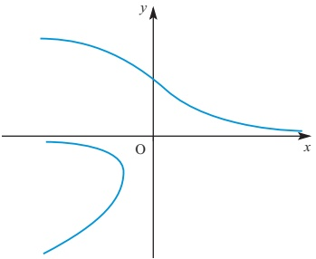

Figure 4.5

Why is this not a function?

## Stationary points

As before these occur where  $ \frac{dy}{dx}=0 $.

Putting  $ \frac{dy}{dx}=0 $ will not usually give values of  $ x $ directly, but will give a relationship between  $ x $ and  $ y $. This needs to be solved simultaneously with the equation of the curve to find the co-ordinates.

EXAMPLE 4.17

(i) Differentiate  $ x^{3} + y^{3} = 3xy $ with respect to x.

(ii) Hence find the co-ordinates of any stationary points.

SOLUTION

 $$ \begin{aligned}&\frac{\mathrm{d}}{\mathrm{d}x}(x^{3})+\frac{\mathrm{d}}{\mathrm{d}x}(y^{3})=\frac{\mathrm{d}}{\mathrm{d}x}(3xy)\\ &\Rightarrow3x^{2}+3y^{2}\frac{\mathrm{d}y}{\mathrm{d}x}=3\Big(x\frac{\mathrm{d}y}{\mathrm{d}x}+y\Big)\\ \end{aligned} $$ 

 $$ \begin{align*}(ii)\quad&\text{At stationary points,}\frac{\mathrm{d}y}{\mathrm{d}x}=0\\&\Rightarrow\quad3x^2=3y\quad\swarrow\\&\Rightarrow\quad x^2=y\quad\swarrow\end{align*}\begin{align*}\begin{cases}Notice~how~it~is~not\\necessary~to~find~an\\expression~for~\frac{dy}{dx}~unless\\you~are~told~to.\end{cases}\end{align*} $$

<!-- page 109 -->

To find the co-ordinates of the stationary points, solve

 $$ \begin{array}{l}x^{2}=y\\x^{3}+y^{3}=3xy\end{array}\left\{\right\}\quad simultaneously $$ 

Substituting for y gives

 $$ \begin{aligned}&x^{3}+(x^{2})^{3}=3x(x^{2})\\\Longrightarrow\quad&x^{3}+x^{6}=3x^{3}\\\Longrightarrow\quad&x^{6}=2x^{3}\\\Longrightarrow\quad&x^{3}(x^{3}-2)=0\\\Longrightarrow\quad&x=0\quad or\quad x=\sqrt[3]{2}\end{aligned} $$ 

 $ y = x^2 $ so the stationary points are  $ (0, 0) $ and  $ (\sqrt[3]{2}, \sqrt[3]{4}) $.

The stationary points are A and B in figure 4.6.

Figure 4.6

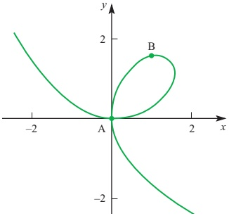

## Types of stationary points

As with explicit functions, the nature of a stationary point can be determined by considering the sign of  $ \frac{d^2y}{dx^2} $ either side of the stationary point.

### EXAMPLE 4.18

The curve with equation  $ \sin x + \sin y = 1 $ for  $ 0 \leq x \leq \pi $,  $ 0 \leq y \leq \pi $ is shown in figure 4.7.

Figure 4.7

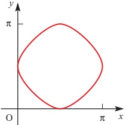

<!-- page 110 -->

(i) Differentiate the equation of the curve with respect to x and hence find the co-ordinates of any stationary points.

(ii) Show that the points  $ \left(\frac{\pi}{6}, \frac{\pi}{6}\right) $,  $ \left(\frac{\pi}{6}, \frac{5\pi}{6}\right) $,  $ \left(\frac{5\pi}{6}, \frac{\pi}{6}\right) $ and  $ \left(\frac{5\pi}{6}, \frac{5\pi}{6}\right) $ all lie on the curve.

Find the gradient at each of these points.

What can you conclude about the natures of the stationary points?

## SOLUTION

(i)

 $ \sin x + \sin y = 1 $

 $ \Rightarrow \cos x + (\cos y)\frac{\mathrm{d}y}{\mathrm{d}x} = 0 $

 $ \Rightarrow \frac{\mathrm{d}y}{\mathrm{d}x} = -\frac{\cos x}{\cos y} $

At any stationary point  $ \frac{\mathrm{d}y}{\mathrm{d}x} = 0 \Rightarrow \cos x = 0 $

 $ \Rightarrow x = \frac{\pi}{2} $ (only solution in range)

Substitute in  $ \sin x + \sin y = 1 $.

When  $ x = \frac{\pi}{2} $,  $ \sin x = 1 \Rightarrow \sin y = 0 $

 $ \Rightarrow y = 0 $ or  $ y = \pi $

 $ \Rightarrow $ stationary points at  $ \left(\frac{\pi}{2}, 0\right) $ and  $ \left(\frac{\pi}{2}, \pi\right) $.

(ii)

 $ \sin \frac{\pi}{6} = \frac{1}{2} $,  $ \sin \frac{5\pi}{6} = \frac{1}{2} $

So, for each of the four given points,  $ \sin x + \sin y = \frac{1}{2} + \frac{1}{2} = 1 $.

Therefore they all lie on the curve.

The gradient of the curve is given by

 $ \frac{\mathrm{d}y}{\mathrm{d}x} = -\frac{\cos x}{\cos y} $

 $ \cos \frac{\pi}{6} = \frac{\sqrt{3}}{2} $,  $ \cos \frac{5\pi}{6} = -\frac{\sqrt{3}}{2} $

At  $ \left(\frac{\pi}{6}, \frac{\pi}{6}\right) $,  $ \frac{\mathrm{d}y}{\mathrm{d}x} = -\frac{\frac{\sqrt{3}}{2}}{\frac{\sqrt{3}}{2}} = -1 $

At  $ \left(\frac{\pi}{6}, \frac{5\pi}{6}\right) $,  $ \frac{\mathrm{d}y}{\mathrm{d}x} = -\frac{\frac{\sqrt{3}}{2}}{-\frac{\sqrt{3}}{2}} = 1 $

At  $ \left(\frac{5\pi}{6}, \frac{\pi}{6}\right) $,  $ \frac{\mathrm{d}y}{\mathrm{d}x} = -\frac{\frac{\sqrt{3}}{2}}{-\frac{\sqrt{3}}{2}} = 1 $

At  $ \left(\frac{5\pi}{6}, \frac{5\pi}{6}\right) $,  $ \frac{\mathrm{d}y}{\mathrm{d}x} = -\frac{\frac{\sqrt{3}}{2}}{-\frac{\sqrt{3}}{2}} = -1 $

<!-- page 111 -->

$ \left(\frac{\pi}{2},0\right) $ is a minimum

These results show that

 $ \left(\frac{\pi}{2},\pi\right) $ is a maximum

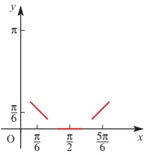

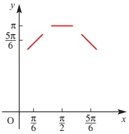

## EXERCISE 4D

These points are confirmed by considering the sketch in figure 4.7 on page 100.

1 Differentiate each of the following with respect to x.

(ii)

 $$ \gamma^{4} $$ 

 $$ x^{2}+y^{3}-5 $$ 

 $$ xy+x+y $$ 

(v)

 $$ e^{(y+2)} $$ 

 $$ xy^{3} $$ 

 $$ 2x^{2}y^{5} $$ 

(viii)  $ x + \ln y - 3 $

 $$ x\mathrm{e}^{y}-\cos y $$ 

(xi)

 $$ x^{2}\ln y $$ 

 $$ x e^{\sin y} $$ 

2 Find the gradient of the curve  $ xy^{3} = 5\ln y $ at the point  $ (0, 1) $.

3 Find the gradient of the curve  $ \mathrm{e}^{\sin x} + \mathrm{e}^{\cos y} = \mathrm{e} + 1 $ at the point  $ \left(\frac{\pi}{2}, \frac{\pi}{2}\right) $.

4 (i) Find the gradient of the curve  $ x^{2} + 3xy + y^{2} = x + 3y $ at the point  $ (2, -1) $.

(ii) Hence find the equation of the tangent to the curve at this point.

5 Find the co-ordinates of all the stationary points on the curve  $ x^{2} + y^{2} + xy = 3 $.

6 A curve has the equation  $ (x-6)(y+4)=2 $.

(i) Find an expression for  $ \frac{dy}{dx} $ in terms of x and y.

(ii) Find the equation of the normal to the curve at the point  $ (7,-2) $.

(iii) Find the co-ordinates of the point where the normal meets the curve again.

(iv) By rewriting the equation in the form $y - a = \frac{b}{x - c}$ identify any asymptotes and sketch the curve.

<!-- page 112 -->

7 A curve has the equation  $ y = x^{x} $ for x > 0

(i) Take logarithms to base e of both sides of the equation.

(ii) Differentiate the resulting equation with respect to x.

(iii) Find the co-ordinates of the stationary point, giving your answer to 3 decimal places.

(iv) Sketch the curve for x > 0.

8 The equation of a curve is  $ 3x^{2} + 2xy + y^{2} = 6 $. It is given that there are two points on the curve where the tangent is parallel to the x axis.

(i) Show by differentiation that, at these points, y = -3x.

(ii) Hence find the co-ordinates of the two points.

[Cambridge International AS & A Level Mathematics 9709, Paper 2 Q5 June 2006]

9 The equation of a curve is  $ x^{3} + y^{3} = 9xy $.

(i) Show that  $ \frac{dy}{dx} = \frac{3y - x^{2}}{y^{2} - 3x} $.

(ii) Find the equation of the tangent to the curve at the point (2, 4), giving your answer in the form  $ ax + by = c $.

[Cambridge International AS & A Level Mathematics 9709, Paper 2 Q4 November 2005]

10 The equation of a curve is  $ x^{2} + y^{2} - 4xy + 3 = 0 $.

(i) Show that  $ \frac{dy}{dx} = \frac{2y - x}{y - 2x} $.

(ii) Find the co-ordinates of each of the points on the curve where the tangent is parallel to the x axis.

[Cambridge International AS & A Level Mathematics 9709, Paper 2 Q7 June 2008]

11 The equation of a curve is  $ x^{3}-x^{2}y-y^{3}=3 $.

(i) Find  $ \frac{dy}{dx} $ in terms of x and y.

(ii) Find the equation of the tangent to the curve at the point (2, 1), giving your answer in the form  $ ax + by + c = 0 $.

[Cambridge International AS & A Level Mathematics 9709, Paper 32 Q3 November 2009]

12 The equation of a curve is $xy(x+y)=2a^{3}$, where $a$ is a non-zero constant. Show that there is only one point on the curve at which the tangent is parallel to the $x$ axis, and find the co-ordinates of this point.

[Cambridge International AS & A Level Mathematics 9709, Paper 3 Q6 June 2008]

<!-- page 113 -->

You are accustomed to expressing curves as mathematical equations. How would you do so in a case like this?

When you go on a ride like the one in the picture, your body follows a very unnatural path and this gives rise to sensations which you may find exhilarating or frightening.

Figure 4.8 shows a simplified version of such a ride.

(a)

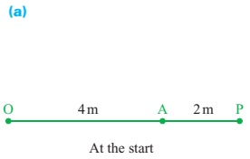

(b)

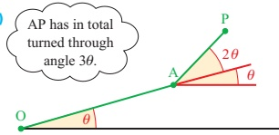

Figure 4.8

Some time later

The passenger’s chair is on the end of a rod AP of length 2 m which is rotating about A. The rod OA is 4 m long and is itself rotating about O. The gearing of the mechanism ensures that the rod AP rotates twice as fast relative to OA as the rod OA does. This is illustrated by the angles marked on figure 4.8(b), at a time when OA has rotated through an angle  $ \theta $.

At this time, the co-ordinates of the point P, taking O as the origin, are given by

 $$ \begin{aligned}&x=4\cos\theta+2\cos3\theta\\&y=4\sin\theta+2\sin3\theta\\ \end{aligned} $$ 

(see figure 4.9).

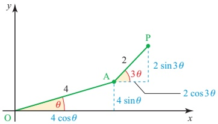

Figure 4.9

<!-- page 114 -->

These two equations are called parametric equations of the curve. They do not give the relationship between x and y directly in the form $y=f(x)$ but use a third variable, $\theta$, to do so. This third variable is called the parameter.

To plot the curve, you need to substitute values of  $ \theta $ and find the corresponding values of x and y.

Thus

 $$ \begin{array}{ccc}\theta=0^{\circ}&\Longrightarrow&x=4+2=6\\&&y=0+0=0\end{array} $$ 

Point (6, 0)

 $$ \begin{array}{l}\theta=30^{\circ} \quad \Rightarrow \quad x=4\times0.866+0=3.464\\y=4\times0.5+2\times1=4\end{array} $$ 

Point (3.46, 4)

and so on.

Joining points found in this way reveals the curve to have the shape shown in figure 4.10.

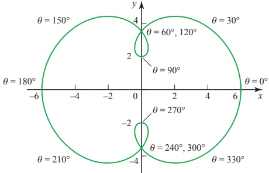

Figure 4.10

## At what points of the curve would you feel the greatest sensations?

## Graphs from parametric equations

Parametric equations are very useful in situations such as this, where an otherwise complicated equation may be expressed reasonably simply in terms of a parameter. Indeed, there are some curves which can be given by parametric equations but cannot be written as cartesian equations (in terms of x and y only).

The next example is based on a simpler curve. Make sure that you can follow the solution completely before going on to the rest of the chapter.

<!-- page 115 -->

### EXAMPLE 4.19

A curve has the parametric equations  $ x = 2t $,  $ y = \frac{36}{t^2} $.

(i) Find the co-ordinates of the points corresponding to $t=1,2,3,-1,-2$ and $-3$.

(ii) Plot the points you have found and join them to give the curve.

(iii) Explain what happens as  $ t \to 0 $.

## SOLUTION

(i)

<table border=1 style='margin: auto; word-wrap: break-word;'><tr><td style='text-align: center; word-wrap: break-word;'>t</td><td style='text-align: center; word-wrap: break-word;'>-3</td><td style='text-align: center; word-wrap: break-word;'>-2</td><td style='text-align: center; word-wrap: break-word;'>-1</td><td style='text-align: center; word-wrap: break-word;'>1</td><td style='text-align: center; word-wrap: break-word;'>2</td><td style='text-align: center; word-wrap: break-word;'>3</td></tr><tr><td style='text-align: center; word-wrap: break-word;'>x</td><td style='text-align: center; word-wrap: break-word;'>-6</td><td style='text-align: center; word-wrap: break-word;'>-4</td><td style='text-align: center; word-wrap: break-word;'>-2</td><td style='text-align: center; word-wrap: break-word;'>2</td><td style='text-align: center; word-wrap: break-word;'>4</td><td style='text-align: center; word-wrap: break-word;'>6</td></tr><tr><td style='text-align: center; word-wrap: break-word;'>y</td><td style='text-align: center; word-wrap: break-word;'>4</td><td style='text-align: center; word-wrap: break-word;'>9</td><td style='text-align: center; word-wrap: break-word;'>36</td><td style='text-align: center; word-wrap: break-word;'>36</td><td style='text-align: center; word-wrap: break-word;'>9</td><td style='text-align: center; word-wrap: break-word;'>4</td></tr></table>

The points required are  $ (-6, 4) $,  $ (-4, 9) $,  $ (-2, 36) $,  $ (2, 36) $,  $ (4, 9) $ and  $ (6, 4) $.

(ii) The curve is shown in figure 4.11.

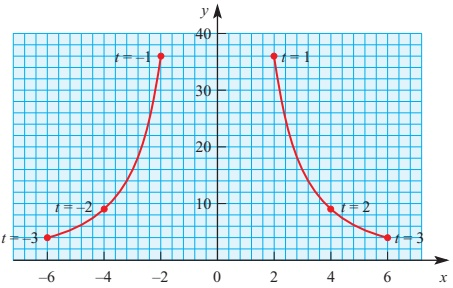

Figure 4.11

(iii) As $t \to 0$, $x \to 0$ and $y \to \infty$. The $y$ axis is an asymptote for the curve.

### EXAMPLE 4.20

A curve has the parametric equations  $ x = t^{2} $,  $ y = t^{3} - t $.

(i) Find the co-ordinates of the points corresponding to values of t from -2 to +2 at half-unit intervals.

(ii) Sketch the curve for  $ -2 \leq t \leq 2 $.

(iii) Are there any values of x for which the curve is undefined?

SOLUTION

(i)

<table border=1 style='margin: auto; word-wrap: break-word;'><tr><td style='text-align: center; word-wrap: break-word;'>t</td><td style='text-align: center; word-wrap: break-word;'>-2</td><td style='text-align: center; word-wrap: break-word;'>-1.5</td><td style='text-align: center; word-wrap: break-word;'>-1</td><td style='text-align: center; word-wrap: break-word;'>-0.5</td><td style='text-align: center; word-wrap: break-word;'>0</td><td style='text-align: center; word-wrap: break-word;'>0.5</td><td style='text-align: center; word-wrap: break-word;'>1</td><td style='text-align: center; word-wrap: break-word;'>1.5</td><td style='text-align: center; word-wrap: break-word;'>2</td></tr><tr><td style='text-align: center; word-wrap: break-word;'>x</td><td style='text-align: center; word-wrap: break-word;'>4</td><td style='text-align: center; word-wrap: break-word;'>2.25</td><td style='text-align: center; word-wrap: break-word;'>1</td><td style='text-align: center; word-wrap: break-word;'>0.25</td><td style='text-align: center; word-wrap: break-word;'>0</td><td style='text-align: center; word-wrap: break-word;'>0.25</td><td style='text-align: center; word-wrap: break-word;'>1</td><td style='text-align: center; word-wrap: break-word;'>2.25</td><td style='text-align: center; word-wrap: break-word;'>4</td></tr><tr><td style='text-align: center; word-wrap: break-word;'>y</td><td style='text-align: center; word-wrap: break-word;'>-6</td><td style='text-align: center; word-wrap: break-word;'>-1.875</td><td style='text-align: center; word-wrap: break-word;'>0</td><td style='text-align: center; word-wrap: break-word;'>0.375</td><td style='text-align: center; word-wrap: break-word;'>0</td><td style='text-align: center; word-wrap: break-word;'>-0.375</td><td style='text-align: center; word-wrap: break-word;'>0</td><td style='text-align: center; word-wrap: break-word;'>1.875</td><td style='text-align: center; word-wrap: break-word;'>6</td></tr></table>

<!-- page 116 -->

(ii)

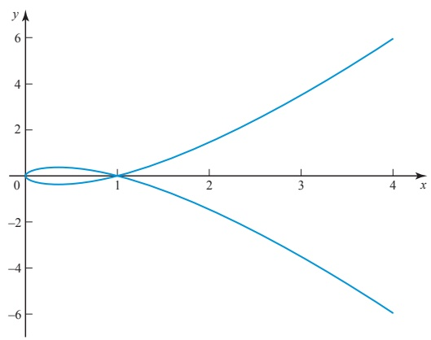

Figure 4.12

(iii) The curve in figure 4.12 is undefined for x < 0.

Graphic calculators can be used to sketch parametric curves but, as with cartesian curves, you need to be careful when choosing the range.

## Finding the equation by eliminating the parameter

For some pairs of parametric equations, it is possible to eliminate the parameter and obtain the cartesian equation for the curve. This is usually done by making the parameter the subject of one of the equations, and substituting this expression into the other.

### EXAMPLE 4.21

Eliminate $t$ from the equations $x = t^{3} - 2t^{2}$, $y = \frac{t}{2}$.

## SOLUTION

 $$ y=\frac{t}{2}\quad\Rightarrow\quad t=2y. $$ 

Substituting this in the equation  $ x = t^{3} - 2t^{2} $ gives

 $$ x=(2y)^{3}-2(2y)^{2}\qquad\mathrm{o r}\qquad x=8y^{3}-8y^{2}. $$

<!-- page 117 -->

## Parametric differentiation

To differentiate a function which is defined in terms of a parameter t, you need to use the chain rule:

 $$ \frac{\mathrm{d}y}{\mathrm{d}x}=\frac{\mathrm{d}y}{\mathrm{d}t}\times\frac{\mathrm{d}t}{\mathrm{d}x}. $$ 

Since

 $$ \frac{\mathrm{d}t}{\mathrm{d}x}=\frac{1}{\frac{\mathrm{d}x}{\mathrm{d}t}} $$ 

it follows that

 $$ \frac{\mathrm{d}y}{\mathrm{d}x}=\frac{\frac{\mathrm{d}y}{\mathrm{d}t}}{\frac{\mathrm{d}x}{\mathrm{d}t}} $$ 

provided that  $ \frac{dx}{dt} \neq 0 $.

### EXAMPLE 4.22

A curve has the parametric equations  $ x = t^{2} $, y = 2t.

(i) Find  $ \frac{dy}{dx} $ in terms of the parameter t.

(ii) Find the equation of the tangent to the curve at the general point  $ (t^{2}, 2t) $.

(iii) Find the equation of the tangent at the point where t = 3.

(iv) Eliminate the parameter, and hence sketch the curve and the tangent at the point where t=3.

## SOLUTION

(i)

 $$ x=t^{2}\quad\Rightarrow\quad\frac{\mathrm{d}x}{\mathrm{d}t}=2t $$ 

 $$ y=2t\quad\Rightarrow\quad\frac{\mathrm{d}y}{\mathrm{d}t}=2 $$ 

 $$ \frac{\mathrm{d}y}{\mathrm{d}x}=\frac{\frac{\mathrm{d}y}{\mathrm{d}t}}{\frac{\mathrm{d}x}{\mathrm{d}t}}=\frac{2}{2t}=\frac{1}{t} $$ 

(ii) Using $y - y_{1} = m(x - x_{1})$ and taking the point $(x_{1}, y_{1})$ as $(t^{2}, 2t)$, the equation of the tangent at the point $(t^{2}, 2t)$ is

 $$ \begin{array}{r} y-2t=\frac{1}{t}\left(x-t^{2}\right) \\ \Rightarrow\quad\quad\quad\quad ty-2t^{2}=x-t^{2} \\ \Rightarrow\quad\quad\quad\quad x-ty+t^{2}=0 \end{array} $$ 

This equation still contains the parameter, and is called the equation of the tangent at the general point.

(iii) Substituting $t=3$ into this equation gives the equation of the tangent at the point where $t=3$.

The tangent is  $ x - 3y + 9 = 0 $.

<!-- page 118 -->

(iv) Eliminating t from  $ x = t^{2} $, y = 2t gives

 $$ x=\left(\frac{y}{2}\right)^{2}\qquad\quad\mathrm{o r}\qquad\quad y^{2}=4x. $$ 

This is a parabola with the x axis as its line of symmetry.

The point where t = 3 has co-ordinates (9, 6).

The tangent  $ x - 3y + 9 = 0 $ crosses the axes at  $ (0, 3) $ and  $ (-9, 0) $.

The curve is shown in figure 4.13.

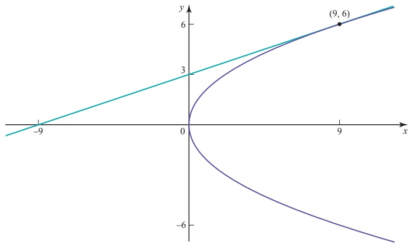

### Figure 4.13

### EXAMPLE 4.23

A curve has parametric equations  $ x = 4 \cos \theta $,  $ y = 3 \sin \theta $.

(i) Find  $ \frac{dy}{dx} $ at the point with parameter  $ \theta $.

(ii) Find the equation of the normal at the general point  $ (4\cos\theta, 3\sin\theta) $.

(iii) Find the equation of the normal at the point where  $ \theta = \frac{\pi}{4} $.

(iv) Find the co-ordinates of the point where  $ \theta = \frac{\pi}{4} $.

(v) Show the curve and the normal on a sketch.

## SOLUTION

 $$ x=4\cos\theta\quad\Rightarrow\quad\frac{\mathrm{d}x}{\mathrm{d}\theta}=-4\sin\theta $$ 

 $$ y=3\sin\theta\quad\Rightarrow\quad\frac{\mathrm{d}y}{\mathrm{d}\theta}=3\cos\theta $$ 

 $$ \begin{aligned}\frac{\mathrm{d}y}{\mathrm{d}x}=\frac{\frac{\mathrm{d}y}{\mathrm{d}\theta}}{\frac{\mathrm{d}x}{\mathrm{d}\theta}}&=\frac{3\cos\theta}{-4\sin\theta}\\&=-\frac{3\cos\theta}{4\sin\theta}\end{aligned} $$

<!-- page 119 -->

(ii) The tangent and normal are perpendicular, so the gradient of the normal is

 $$ -\frac{1}{\frac{\mathrm{d}y}{\mathrm{d}x}}\qquad\mathrm{w h i c h~i s}\qquad+\frac{4\sin\theta}{3\cos\theta}.\quad\overbrace{m_{1}m_{2}=-1\mathrm{f o r\quad~p e r p e n d i c u l a r~l i n e s}}^{} $$ 

Using $y - y_1 = m(x - x_1)$ and taking the point $(x_1, y_1)$ as $(4\cos\theta, 3\sin\theta)$, the equation of the normal at the point $(4\cos\theta, 3\sin\theta)$ is

 $$ \begin{aligned}y-3\sin\theta&=\frac{4\sin\theta}{3\cos\theta}(x-4\cos\theta)\\\Rightarrow\quad3y\cos\theta-9\sin\theta\cos\theta&=4x\sin\theta-16\sin\theta\cos\theta\\\Rightarrow\quad4x\sin\theta-3y\cos\theta-7\sin\theta\cos\theta&=0\end{aligned} $$ 

(iii) When $\theta=\frac{\pi}{4}$, $\cos\theta=\frac{1}{\sqrt{2}}$ and $\sin\theta=\frac{1}{\sqrt{2}}$, so the equation of the normal is $4x\times\frac{1}{\sqrt{2}}-3y\times\frac{1}{\sqrt{2}}-7\times\frac{1}{\sqrt{2}}\times\frac{1}{\sqrt{2}}=0$

$\Rightarrow 4\sqrt{2}x-3\sqrt{2}y-7=0$

$\Rightarrow 4x-3y-4.95=0$ (to 2 decimal places)

(iv) The co-ordinates of the point where  $ \theta = \frac{\pi}{4} $ are

 $$ \begin{aligned}\left(4\cos\frac{\pi}{4},3\sin\frac{\pi}{4}\right)&=\left(4\times\frac{1}{\sqrt{2}},3\times\frac{1}{\sqrt{2}}\right)\\&\approx(2.83,2.12)\end{aligned} $$ 

(v)

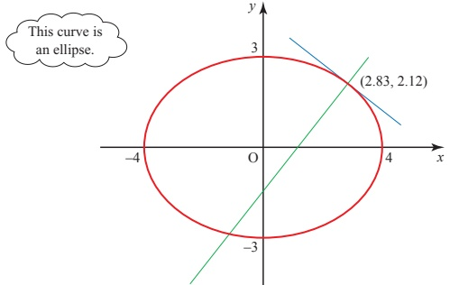

Figure 4.14

<!-- page 120 -->

## Stationary points

When the equation of a curve is given parametrically, the easiest way to distinguish between stationary points is usually to consider the sign of  $ \frac{dy}{dx} $. If you use this method, you must be careful to ensure that you take points which are to the left and right of the stationary point, i.e. have x co-ordinates smaller and larger than those at the stationary point. These will not necessarily be points whose parameters are smaller and larger than those at the stationary point.

EXAMPLE 4.24

Find the stationary points of the curve with parametric equations  $ x=2t+1 $,  $ y=3t-t^{3} $, and distinguish between them.

## SOLUTION

$$
\begin{aligned}
x &= 2t + 1 \quad \Rightarrow \quad \frac{dx}{dt} = 2 \\
y &= 3t - t^3 \quad \Rightarrow \quad \frac{dy}{dt} = 3 - 3t^2 \\
\frac{dy}{dx} &= \frac{\frac{dy}{dt}}{\frac{dx}{dt}} = \frac{3 - 3t^2}{2} = \frac{3(1 - t^2)}{2} \\
& \text{Stationary points occur when } \frac{dy}{dx} = 0: \\
\Rightarrow \quad t^2 = 1 \quad \Rightarrow \quad t = 1 \quad \text{or} \quad t = -1 \\
& \text{At } t = 1: \quad x = 3, y = 2 \\
& \text{At } t = 0.9: \quad x = 2.8 \text{ (to the left); } \frac{dy}{dx} = 0.285 \text{ (positive)} \\
& \text{At } t = 1.1: \quad x = 3.2 \text{ (to the right); } \frac{dy}{dx} = -0.315 \text{ (negative)} \\
& \text{There is a maximum at } (3, 2). \\
& \text{At } t = -1: \quad x = -1, y = 2 \\
& \text{At } t = -1.1: \quad x = -1.2 \text{ (to the left); } \frac{dy}{dx} = -0.315 \text{ (negative)} \\
& \text{At } t = -0.9: \quad x = -0.8 \text{ (to the right); } \frac{dy}{dx} = 0.285 \text{ (positive)} \\
& \text{There is a minimum at } (-1, -2).
\end{aligned}
\quad \not\equiv \quad \text{—} \quad \text{—} \quad \text{—} \quad \text{—} \quad \text{—} \quad \text{—} \quad \text{—} \quad \text{—} \quad \text{—} \quad \text{—} \quad \text{—} \quad \text{—} \quad \text{—} \quad \text{—} \quad \text{—} \quad \text{—} \quad \text{—} \quad \text{—} \quad \text{—} \quad \text{—} \quad \text{—} \quad \text{—} \quad \text{—} \quad \text{—} \quad \text{—} \quad \text{—} \quad \text{—} \quad \text{—} \quad \text{—} \quad \text{—} \quad \text{—} \quad \text{—} \quad \text{—} \quad \text{—} \quad \text{—} \quad \text{—} \quad \text{—} \quad \text{—} \quad \text{—} \quad \text{—} \quad \text{—} \quad \text{—} \quad \text{—} \quad \text{—} \quad \text{—} \quad \text{—} \quad \text{—} \quad \text{—} \quad \text{—} \quad \text{—} \quad \text{—} \quad \text{—} \quad \text{—} \quad \text{—} \quad \text{—} \quad \text{—} \quad \text{—} \quad \text{—} \quad \text{—} \quad \text{—} \quad \text{—} \quad \text{—} \quad \text{—} \quad \text{—} \quad \text{—} \quad \text{—} \quad \text{—} \quad \text{—} \quad \text{—} \quad \text{—} \quad \text{—} \quad \text{—} \quad \text{—} \quad \text{—} \quad \text{—} \quad \text{—} \quad \text{—} \quad \text{—} \quad \text{—} \quad \text{—} \quad \text{—} \quad \text{—} \quad \text{—} \quad \text{—} \quad \text{—} \quad \text{—} \quad \text{—} \quad \text{—} \quad \text{—} \quad \text{—} \quad \text{—} \quad \text{—} \quad \text{—} \quad \text{—} \quad \text{—} \quad \text{—} \quad \text{—} \quad \text{—} \quad \text{—} \quad \text{—} \quad \text{—} \quad \text{—} \quad \text{—} \quad \text{—} \quad \text{—} \quad \text{—} \quad \text{—} \quad \text{—} \quad \text{—} \quad \text{—} \quad \text{—} \quad \text{—} \quad \text{—} \quad \text{—} \quad \text{—} \quad \text{—} \quad \text{—} \quad \text{—} \quad \text{—} \quad \text{—} \quad \text{—} \quad \text{—} \quad \text{—} \quad \text{—} \quad \text{—} \quad \text{—} \quad \text{—} \quad \text{—} \quad \text{—} \quad \text{—} \quad \text{—} \quad \text{—} \quad \text{—} \quad \text{—} \quad \text{—} \quad \text{—} \quad \text{—} \quad \text{—} \quad \text{—} \quad \text{—} \quad \text{—} \quad \text{—} \quad \text{—} \quad \text{—} \quad \text{—} \quad \text{—} \quad \text{—} \quad \text{—} \quad \text{—} \quad \text{—} \quad \text{—} \quad \text{—} \quad \text{—} \quad \text{—} \quad \text{—} \quad \text{—} \quad \text{—} \quad \text{—} \quad \text{—} \quad \text{—} \quad \text{—} \quad \text{—} \quad \text{—} \quad \text{—} \quad \text{—} \quad \text{—} \quad \text{—} \quad \text{—} \quad \text{—} \quad \text{—} \quad \text{—} \quad \text{—} \quad \text{—} \quad \text{—} \quad \text{—} \quad \text{—} \quad \text{—} \quad \text{—} \quad \text{—} \quad \text{—} \quad \text{—} \quad \text{—} \quad \text{—} \quad \text{—} \quad \text{—} \quad \text{—} \quad \text{—} \quad \text{—} \quad \text{—} \quad \text{—} \quad \text{—} \quad \text{—} \quad \text{—} \quad \text{—} \quad \text{—} \quad \text{—} \quad \text{—} \quad \text{—} \quad \text{—} \quad \text{—} \quad \text{—} \quad \text{—} \quad \text{—} \quad \text{—} \quad \text{—} \quad \text{—} \quad \text{—} \quad \text{—} \quad \text{—} \quad \text{—} \quad \text{—} \quad \text{—} \quad \text{—} \quad \text{—} \quad \text{—} \quad \text{—} \quad \text{—} \quad \text{—} \quad \text{—} \quad \text{—} \quad \text{—} \quad \text{—} \quad \text{—} \quad \text{—} \quad \text{—} \quad \text{—} \quad \text{—} \quad \text{—} \quad \text{—} \quad \text{—} \quad \text{—} \quad \text{—} \quad \text{—} \quad \text{—} \quad \text{—} \quad \text{—} \quad \text{—} \quad \text{—} \quad \text{—} \quad \text{—} \quad \text{—} \quad \text{—} \quad \text{—} \quad \text{—} \quad \text{—} \quad \text{—} \quad \text{—} \quad \text{—} \quad \text{—} \quad \text{—} \quad \text{—} \quad \text{—} \quad \text{—} \quad \text{—} \quad \text{—} \quad \text{—} \quad \text{—} \quad \text{—} \quad \text{—} \quad \text{—} \quad \text{—} \quad \text{—} \quad \text{—} \quad \text{—} \quad \text{—} \quad \text{—} \quad \text{—} \quad \text{—} \quad \text{—} \quad \text{—} \quad \text{—} \quad \text{—} \quad \text{—} \quad \text{—} \quad \text{—} \quad \text{—} \quad \text{—} \quad \text{—} \quad \text{—} \quad \text{—} \quad \text{—} \quad \text{—} \quad \text{—} \quad \text{—} \quad \text{—} \quad \text{—} \quad \text{—} \quad \text{—} \quad \text{—} \quad \text{—} \quad \text{—} \quad \text{—} \quad \text{—} \quad \text{—} \quad \text{—} \quad \text{—} \quad \text{—} \quad \text{—} \quad \text{—} \quad \text{—} \quad \text{—} \quad \text{—} \quad \text{—} \quad \text{—} \quad \text{—} \quad \text{—} \quad \text{—} \quad \text{—} \quad \text{—} \quad \text{—} \quad \text{—} \quad \text{—} \quad \text{—} \quad \text{—} \quad \text{—} \quad \text{—} \quad \text{—} \quad \text{—} \quad \text{—} \quad \text{—} \quad \text{—} \quad \text{—} \quad \text{—} \quad \text{—} \quad \text{—} \quad \text{—} \quad \text{—} \quad \text{—} \quad \text{—} \quad \text{—} \quad \text{—} \quad \text{—} \quad \text{—} \quad \text{—} \quad \text{—} \quad \text{—} \quad \text{—} \quad \text{—} \quad \text{—} \quad \text{—} \quad \text{—} \quad \text{—} \quad \text{—} \quad \text{—} \quad \text{—} \quad \text{—} \quad \text{—} \quad \text{—} \quad \text{—} \quad \text{—} \quad \text{—} \quad \text{—} \quad \text{—} \quad \text{—} \quad \text{—} \quad \text{—} \quad \text{—} \quad \text{—} \quad \text{—} \quad \text{—} \quad \text{—} \quad \text{—} \quad \text{—} \quad \text{—} \quad \text{—} \quad \text{—} \quad \text{—} \quad \text{—} \quad \text{—} \quad \text{—} \quad \text{—} \quad \text{—} \quad \text{—} \quad \text{—} \quad \text{—} \quad \text{—} \quad \text{—} \quad \text{—} \quad \text{—} \quad \text{—} \quad \text{—} \quad \text{—} \quad \text{—} \quad \text{—} \quad \text{—} \quad \text{—} \quad \text{—} \quad \text{—} \quad \text{—} \quad \text{—} \quad \text{—} \quad \text{—} \quad \text{—} \quad \text{—} \quad \text{—} \quad \text{—} \quad \text{—} \quad \text{—} \quad \text{—} \quad \text{—} \quad \text{—} \quad \text{—} \quad \text{—} \quad \text{—} \quad \text{—} \quad \text{—} \quad \text{—} \quad \text{—} \quad \text{—} \quad \text{—} \quad \text{—} \quad \text{—} \quad \text{—} \quad \text{—} \quad \text{—} \quad \text{—} \quad \text{—} \quad \text{—} \quad \text{—} \quad \text{—} \quad \text{—} \quad \text{—} \quad \text{—} \quad \text{—} \quad \text{—} \quad \text{—} \quad \text{—} \quad \text{—} \quad \text{—} \quad \text{—} \quad \text{—} \quad \text{—} \quad \text{—} \quad \text{—} \quad \text{—} \quad \text{—} \quad \text{—} \quad \text{—} \quad \text{—} \quad \text{—} \quad \text{—} \quad \text{—} \quad \text{—} \quad \text{—} \quad \text{—} \quad \text{—} \quad \text{—} \quad \text{—} \quad \text{—} \quad \text{—} \quad \text{—} \quad \text{—} \quad \text{—} \quad \text{—} \quad \text{—} \quad \text{—} \quad \text{—} \quad \text{—} \quad \text{—} \quad \text{—} \quad \text{—} \quad \text{—} \quad \text{—} \quad \text{—} \quad \text{—} \quad \text{—} \quad \text{—} \quad \text{—} \quad \text{—} \quad \text{—} \quad \text{—} \quad \text{—} \quad \text{—} \quad \text{—} \quad \text{—} \quad \text{—} \quad \text{—} \quad \text{—} \quad \text{—} \quad \text{—} \quad \text{—} \quad \text{—} \quad \text{—} \quad \text{—} \quad \text{—} \quad \text{—} \quad \text{—} \quad \text{—} \quad \text{—} \quad \text{—} \quad \text{—} \quad \text{—} \quad \text{—} \quad \text{—} \quad \text{—} \quad \text{—} \quad \text{—} \quad \text{—} \quad \text{—} \quad \text{—} \quad \text{—} \quad \text{—} \quad \text{—} \quad \text{—} \quad \text{—} \quad \text{—} \quad \text{—} \quad \text{—} \quad \text{—} \quad \text{—} \quad \text{—} \quad \text{—} \quad \text{—} \quad \text{—} \quad \text{—} \quad \text{—} \quad \

## e An alternative method

Alternatively, to find  $ \frac{d^2y}{dx^2} $ when  $ \frac{dy}{dx} $ is expressed in terms of a parameter requires a further use of the chain rule:

 $$ \frac{\mathrm{d}^{2}y}{\mathrm{d}x^{2}}=\frac{\mathrm{d}}{\mathrm{d}x}\bigg(\frac{\mathrm{d}y}{\mathrm{d}x}\bigg)=\frac{\mathrm{d}}{\mathrm{d}t}\bigg(\frac{\mathrm{d}y}{\mathrm{d}x}\bigg)\times\frac{\mathrm{d}t}{\mathrm{d}x}. $$

<!-- page 121 -->

## EXERCISE 4E

1 For each of the following curves, find  $ \frac{dy}{dx} $ in terms of the parameter.

(i) x = 3t^{2}

(ii)  $ x = \theta - \cos\theta $

 $$ y=2t^{3} $$ 

(iii)  $ x = t + \frac{1}{t} $

 $$ y=\theta+\sin\theta $$ 

(iv)  $ x = 3 \cos \theta $

 $ y = t - \frac{1}{t} $

 $$ y=2\sin\theta $$ 

(v)  $ x = (t + 1)^2 $

(vi)  $ x = \theta \sin \theta + \cos \theta $

 $$ y=(t-1)^{2} $$ 

 $ y = \theta \cos \theta - \sin \theta $

(vii)  $ x = e^{2t} + 1 $

(viii)  $ x = \frac{t}{1 + t} $

 $$ y=\frac{t}{1-t} $$ 

2 A curve has the parametric equations  $ x = \tan \theta $,  $ y = \tan 2\theta $. Find

(i) the value of  $ \frac{dy}{dx} $ when  $ \theta = \frac{\pi}{6} $

(ii) the equation of the tangent to the curve at the point where  $ \theta = \frac{\pi}{6} $

(iii) the equation of the normal to the curve at the point where  $ \theta = \frac{\pi}{6} $.

3 A curve has the parametric equations  $ x = t^{2} $,  $ y = 1 - \frac{1}{2t} $ for t > 0. Find

(i) the co-ordinates of the point P where the curve cuts the x axis

(ii) the gradient of the curve at this point

(iii) the equation of the tangent to the curve at P

(iv) the co-ordinates of the point where the tangent cuts the y axis.

4 A curve has parametric equations $x=at^{2}$, $y=2at$, where $a$ is constant. Find

(i) the equation of the tangent to the curve at the point with parameter $t$

(ii) the equation of the normal to the curve at the point with parameter $t$

(iii) the co-ordinates of the points where the normal cuts the $x$ and $y$ axes.

5 A curve has parametric equations  $ x = \cos\theta $,  $ y = \cos2\theta $.

(i) Show that  $ \frac{dy}{dx} = 4\cos\theta $.

(ii) By writing  $ \frac{dy}{dx} $ in terms of x, show that  $ \frac{d^2y}{dx^2} - 4 = 0 $.

6 The parametric equations of a curve are $x=at$, $y=\frac{b}{t}$, where $a$ and $b$ are constant. Find in terms of $a$, $b$ and $t$

(i)  $ \frac{dy}{dx} $

(ii) the equation of the tangent to the curve at the general point  $ (at,\frac{b}{t}) $

(iii) the co-ordinates of the points X and Y where the tangent cuts the x and y axes.

(iv) Show that the area of triangle OXY is constant, where O is the origin.

<!-- page 122 -->

7 The diagram shows a sketch of the curve given parametrically in terms of t by the equations  $ x = 4t $ and  $ y = 2t^{2} $ where t takes positive and negative values.

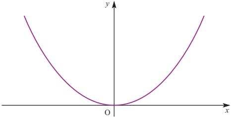

P is the point on the curve with parameter t.

(i) Show that the gradient at P is t.

(ii) Find and simplify the equation of the tangent at P.

The tangents at two points Q (with parameter  $ t_{1} $) and R (with parameter  $ t_{2} $) meet at S.

(iii) Find the co-ordinates of S.

(iv) In the case when  $ t_{1} + t_{2} = 2 $ show that S lies on a straight line.

Give the equation of the line.

[MEI, adapted]

8 The diagram shows a sketch of the curve given parametrically in terms of t by the equations  $ x = 1 - t^{2} $,  $ y = 2t + 1 $.

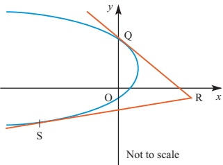

(i) Show that the point Q(0, 3) lies on the curve, stating the value of t corresponding to this point.

(ii) Show that, at the point with parameter t,

 $$ \frac{\mathrm{d}y}{\mathrm{d}x}=-\frac{1}{t}. $$ 

(iii) Find the equation of the tangent at Q.

(iv) Verify that the tangent at Q passes through the point R(4,-1).

(v) The other tangent from R to the curve touches the curve at the point S and has equation  $ 3y - x + 7 = 0 $. Find the co-ordinates of S.

<!-- page 123 -->

9 The diagram shows a sketch of the curve with parametric equations  $ x = 1 - 2t $,  $ y = t^2 $. The tangent and normal at P are also shown.

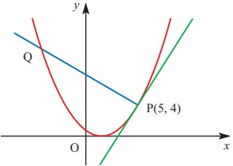

(i) Show that the point P(5, 4) lies on the curve by stating the value of t corresponding to this point.

(ii) Show that, at the point with parameter $t$, $\frac{\mathrm{d}y}{\mathrm{d}x} = -t$.

(iii) Find the equation of the tangent at P.

(iv) The normal at P cuts the curve again at Q. Find the co-ordinates of Q.

10 A particle P moves in a plane so that at time t its co-ordinates are given by  $ x = 4\cos t $,  $ y = 3\sin t $. Find

(i)  $ \frac{dy}{dx} $ in terms of t

(ii) the equation of the tangent to its path at time t

(iii) the values of t for which the particle is travelling parallel to the line  $ x + y = 0 $.

11 (i) By differentiating  $ \frac{1}{\cos\theta} $, show that if  $ y = \sec\theta $ then  $ \frac{dy}{d\theta} = \sec\theta\tan\theta $.

(ii) The parametric equations of a curve are

 $$ x=1+\tan\theta,\quad y=\sec\theta, $$ 

for  $ -\frac{1}{2}\pi < \theta < \frac{1}{2}\pi $. Show that  $ \frac{dy}{dx} = \sin\theta $.

(iii) Find the co-ordinates of the point on the curve at which the gradient of the curve is  $ \frac{1}{2} $.

[Cambridge International AS & A Level Mathematics 9709, Paper 2 Q5 June 2005]

12 The parametric equations of a curve are

 $$ x=3t+\ln(t-1),\quad y=t^{2}+1,\quad\mathrm{f o r}t>1. $$ 

(i) Express  $ \frac{dy}{dx} $ in terms of t.

(ii) Find the co-ordinates of the only point on the curve at which the gradient of the curve is equal to 1.

[Cambridge International AS & A Level Mathematics 9709, Paper 2 Q3 June 2007]

<!-- page 124 -->

13 The parametric equations of a curve are

 $ x = 4 \sin \theta $,  $ y = 3 - 2 \cos 2\theta $,

where  $ -\frac{1}{2}\pi < \theta < \frac{1}{2}\pi $. Express  $ \frac{dy}{dx} $ in terms of  $ \theta $, simplifying your answer as far as possible.

| Cambridge International AS & A Level Mathematics 9709. Paper 2 O4 June 2009

[Cambridge International AS & A Level Mathematics 9709, Paper 2 Q4 June 2009]

14 The parametric equations of a curve are

 $$ x=1-\mathrm{e}^{-t},\quad y=\mathrm{e}^{t}+\mathrm{e}^{-t}. $$ 

(i) Show that  $ \frac{dy}{dx} = e^{2t} - 1 $.

(ii) Hence find the exact value of $t$ at the point on the curve at which the gradient is 2.

[Cambridge International AS & A Level Mathematics 9709, Paper 22 Q4 November 2009]

15 The parametric equations of a curve are

 $$ x=2\theta+\sin2\theta,\quad y=1-\cos2\theta. $$ 

Show that  $ \frac{dy}{dx} = \tan\theta $.

[Cambridge International AS & A Level Mathematics 9709, Paper 3 Q3 June 2006]

16 The parametric equations of a curve are

 $$ x=a\cos^{3}t,\quad y=a\sin^{3}t, $$ 

where a is a positive constant and  $ 0 < t < \frac{1}{2}\pi $.

(i) Express  $ \frac{dy}{dx} $ in terms of t.

(ii) Show that the equation of the tangent to the curve at the point with parameter $t$ is

$x\sin t + y\cos t = a\sin t\cos t$

(iii) Hence show that, if this tangent meets the $x$ axis at X and the $y$ axis at Y, then the length of XY is always equal to $a$.

[Cambridge International AS & A Level Mathematics 9709, Paper 3 Q6 June 2009]

<!-- page 125 -->

1  $ y = kx^n \Rightarrow \frac{dy}{dx} = knx^{n-1} $ where  $ k $ and  $ n $ are real constants.

2 Chain rule:  $ \frac{\mathrm{d}y}{\mathrm{d}x} = \frac{\mathrm{d}y}{\mathrm{d}u} \times \frac{\mathrm{d}u}{\mathrm{d}x} $

3 Product rule (for $y = uv$): $\frac{\mathrm{d}y}{\mathrm{d}x} = \nu\frac{\mathrm{d}u}{\mathrm{d}x} + u\frac{\mathrm{d}\nu}{\mathrm{d}x}$.

4 Quotient rule (for  $ y = \frac{u}{\nu} $):  $ \frac{dy}{dx} = \frac{\nu \frac{du}{dx} - u \frac{dv}{dx}}{\nu^2} $.

5  $ \frac{\mathrm{d}y}{\mathrm{d}x} = \frac{1}{\frac{\mathrm{d}x}{\mathrm{d}y}}. $

6  $ \frac{\mathrm{d}}{\mathrm{d}x}(\ln x)=\frac{1}{x} $

7  $ \frac{\mathrm{d}}{\mathrm{d}x}(\mathrm{e}^{x})=\mathrm{e}^{x} $

8 $\frac{\mathrm{d}}{\mathrm{d}x}(\sin kx)=k\cos kx$

 $$ \frac{\mathrm{d}}{\mathrm{d}x}(\cosh x)=-k\sinh x $$ 

 $$ \frac{\mathrm{d}}{\mathrm{d}x}(\mathrm{tank}x)=k\sec^{2}kx $$ 

9 An implicit function is one connecting x and y where y is not the subject. When you differentiate an implicit function:

differentiating  $ y^{2} $ with respect to x gives  $ 2y\frac{dy}{dx} $

- differentiating $4x^3y^2$ with respect to $x$ gives $12x^2 \times y^2 + 4x^3 \times 2y\frac{dy}{dx}$. The derivative of any constant is 0.

10 In parametric equations the relationship between two variables is expressed by writing both of them in terms of a third variable or parameter.

11 To draw a graph from parametric equations, plot the points on the curve given by different values of the parameter.

12  $ \frac{dy}{dx} = \frac{\frac{dy}{dt}}{\frac{dx}{dt}} $ provided that  $ \frac{dx}{dt} \neq 0 $.

