# Chapter 5 Integration

<!-- Pure Mathematics 2 and 3 Cambridge International AS and A Level Mathematics (Sophie Goldie, Roger Porkess) .pdf p126-144 -->

<!-- page 126 -->

Every picture is worth a thousand words.

Traditional Chinese proverb

## Integrals involving the exponential function

Since you know that

 $$ \frac{\mathrm{d}}{\mathrm{d}x}(\mathrm{e}^{ax+b})=a\mathrm{e}^{ax+b}, $$ 

you can see that

 $$ \int\mathrm{e}^{ax+b}\mathrm{d}x=\frac{1}{a}\mathrm{e}^{ax+b}+c. $$ 

This increases the number of functions which you are able to integrate, as in the following example.

### EXAMPLE 5.1

Find the following integrals.

(i)

 $$ \int\mathrm{e}^{2x-3}\mathrm{d}x $$ 

(ii)

 $$ \int_{1}^{5}6\mathrm{e}^{3x}\mathrm{d}x $$ 

SOLUTION

(i)

 $$ \int\mathrm{e}^{2x-3}\mathrm{d}x=\frac{1}{2}\mathrm{e}^{2x-3}+c $$ 

(ii)

 $$ \begin{aligned}\int_{1}^{5}6\mathrm{e}^{3x}\mathrm{d}x&=\left[\frac{6\mathrm{e}^{3x}}{3}\right]_{1}^{5}\\&=\left[2\mathrm{e}^{3x}\right]_{1}^{5}\\&=2(\mathrm{e}^{15}-\mathrm{e}^{3})\\&=6.54\times10^{6}\end{aligned} $$ 

(to 3 significant figures)

## Integrals involving the natural logarithm function

You have already seen that

 $$ \int\frac{1}{x}\mathrm{d}x=\ln x+c. $$ 

There are many other integrals that can be reduced to this form.

<!-- page 127 -->

### EXAMPLE 5.2

Evaluate  $ \int_{2}^{5}\frac{1}{2x}dx $.

SOLUTION

 $$ \begin{aligned}\frac{1}{2}\int_{2}^{5}\frac{1}{x}\mathrm{d}x&=\frac{1}{2}\Big[\ln x\Big]_{2}^{5}\\&=\frac{1}{2}(\ln5-\ln2)\\&=0.458\qquad\quad(to3\ significant\ figures)\end{aligned} $$ 

In this example the  $ \frac{1}{2} $ was taken outside the integral, allowing the standard result for  $ \frac{1}{x} $ to be used.

Since

 $$ y=\ln(ax+b)\Rightarrow\frac{\mathrm{d}y}{\mathrm{d}x}=\frac{a}{ax+b} $$ 

So

 $$ \int\frac{a}{ax+b}\mathrm{d}x=\ln(ax+b)+c\quad\leftarrow $$ 

and

c mean ‘an arbitrary constant’ and so does not necessarily have the same value from one equation to another.

 $$ \int\frac{1}{ax+b}\mathrm{d}x=\frac{1}{a}\ln(ax+b)+c $$ 

### EXAMPLE 5.3

Find $ \int_{0}^{2}\frac{1}{5x+3}dx $.

SOLUTION

 $$ \begin{aligned}\int_{0}^{2}\frac{1}{5x+3}\mathrm{d}x&=\left[\frac{1}{5}\ln(5x+3)\right]_{0}^{2}\\&=\frac{1}{5}\ln13-\frac{1}{5}\ln3\\&=0.293\end{aligned} $$ 

(to 3 significant figures)

## Extending the domain for logarithmic integrals

The use of  $ \int\frac{1}{x}dx=\ln x+c $ has so far been restricted to cases where x>0, since logarithms are undefined for negative numbers.

Look, however, at the area between -b and -a on the left-hand branch

of the curve  $ y=\frac{1}{x} $ in figure 5.1. You can see that it is a real area, and that it must

be possible to evaluate it.

<!-- page 128 -->

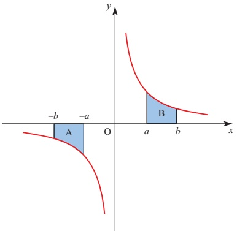

Figure 5.1

ACTIVITY 5.1 1 What can you say about the areas of the two shaded regions?

p 2 Try to prove your answer to part 1 before reading on.

## Proof

Let  $ A = \int_{-b}^{-a} \frac{1}{x} \, dx $.

Now write the integral in terms of a new variable, u, where u = -x.

This gives new limits: x = -b  $ \Rightarrow $ u = b

 $$ x=-a\quad\Rightarrow\quad u=a. $$ 

 $$ \frac{\mathrm{d}u}{\mathrm{d}x}=-1\Longrightarrow\mathrm{d}x=-\mathrm{d}u. $$ 

So the integral becomes

 $$ \begin{aligned}A&=\int_{b}^{a}\frac{1}{-u}\left(-\mathrm{d}u\right)\\&=\int_{b}^{a}\frac{1}{u}\mathrm{d}u\\&=\left[\ln a-\ln b\right]\\&=-[\ln b-\ln a]=-area B\end{aligned} $$ 

So the area has the same size as that obtained if no notice is taken of the fact that the limits a and b have minus signs. However it has the opposite sign, as you would expect because the area is below the axis.

Consequently the restriction that x > 0 may be dropped, and the integral is written

 $$ \int\frac{1}{x}\mathrm{d}x=\ln|x|+c. $$ 

Similarly,  $ \int\frac{f'(x)}{f(x)}dx = \ln|f(x)| + c $.

<!-- page 129 -->

### EXAMPLE 5.4

Find the value of  $ \int_{5}^{7}\frac{1}{4-x}dx $.

## SOLUTION

To make the top line into the differential of the bottom line, you write the integral in one of two ways.

 $$ \begin{aligned}-\int_{5}^{7}\frac{-1}{4-x}\mathrm{d}x&=-\left[\ln|4-x|\right]_{5}^{7}\\&=-\left[\left(\ln|-3|\right)-\left(\ln|-1|\right)\right]\\&=-\left[\ln3-\ln1\right]\\&=-1.10(to3s.f.)\\ \end{aligned}\quad\begin{aligned}-\int_{5}^{7}\frac{1}{x-4}\mathrm{d}x&=-\left[\ln|x-4|\right]_{5}^{7}\\&=-\left[\ln3-\ln1\right]\\&=-1.10(to3s.f.)\\\end{aligned} $$ 

Since the curve  $ y=\frac{1}{x} $ is not defined at the discontinuity at x=0 (see figure 5.2), it is not possible to integrate across this point.

Consequently in the integral  $ \int_{p}^{q}\frac{1}{x}dx $ both the limits  $ p $ and  $ q $ must have the same sign, either + or -. The integral is invalid otherwise.

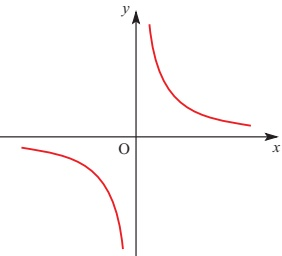

Figure 5.2

p The equation of a curve is $y=\frac{p_{1}(x)}{p_{2}(x)}$ where $p_{1}(x)$ and $p_{2}(x)$ are polynomials.

How can you tell from the equation whether the curve has a discontinuity?

How can you prove $y=x^{2}-2x+3$ has no discontinuities?

## EXERCISE 5A

1 Find the following indefinite integrals.

(i)  $ \int \frac{3}{x} \, dx $

(ii)

 $$ \int\frac{1}{4x}\mathrm{d}x $$ 

(iii)

 $$ \int\frac{1}{x-5}\mathrm{d}x $$ 

(iv)  $ \int \frac{1}{2x-9} \mathrm{d}x $

2 Find the following indefinite integrals.

(i)

 $$ \int\mathrm{e}^{3x}\mathrm{d}x $$ 

(ii)

(iv)  $ \int \frac{10}{e^{5x}} \, dx $

 $$ \int\mathrm{e}^{-4x}\mathrm{d}x $$ 

 $$ \int e^{-\frac{x}{3}}\mathrm{d}x $$ 

(v)

 $$ \int\frac{e^{3x}+4}{e^{2x}}dx $$

<!-- page 130 -->

3 Find the following definite integrals.

Where appropriate give your answers to 3 significant figures.

(i)  $ \int_{0}^{4}4\mathrm{e}^{2x}\mathrm{d}x $

(ii)  $ \int_{1}^{3}\frac{4}{2x+1}dx $

(iii)  $ \int_{-1}^{1}\left(e^{x}+e^{-x}\right)dx $

(iv)  $ \int_{-2}^{1}e^{3x-2}dx $

4 The graph of $y = x + \frac{4}{x}$ is shown below.

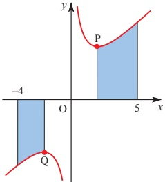

(i) Find the co-ordinates of the minimum point, P, and the maximum point, Q.

(ii) Find the area of each shaded region.

5 The diagram illustrates the graph of $y = e^{x}$. The point A has co-ordinates $(\ln 5, 0)$, B has co-ordinates $(\ln 5, 5)$ and C has co-ordinates $(0, 5)$.

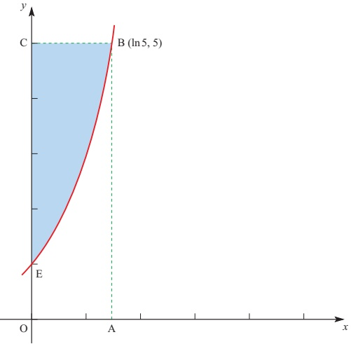

(i) Find the area of the region OABE enclosed by the curve  $ y = e^{x} $, the x axis, the y axis and the line AB. Hence find the area of the shaded region EBC.

<!-- page 131 -->

(ii) The graph of $y = e^{x}$ is transformed into the graph of $y = \ln x$. Describe this transformation geometrically.

(iii) Using your answers to parts (i) and (ii), or otherwise, show that

 $$ \int_{1}^{5}\ln x\mathrm{d}x=5\ln5-4. $$ 

(iv) Deduce the values of

(a)  $ \int_{1}^{5}\ln(x^{3})\,dx $

(b)  $ \int_{1}^{5}\ln(3x)dx. $

[MEI, adapted]

6 (i) Differentiate  $ \ln(2x+3) $.

(ii) Hence, or otherwise, show that

 $$ \int_{-1}^{3}\frac{1}{2x+3}\mathrm{d}x=\ln3. $$ 

(iii) Find the quotient and remainder when $4x^{2}+8x$ is divided by $2x+3$.

(iv) Hence show that

 $$ \int_{-1}^{3}\frac{4x^{2}+8x}{2x+3}\mathrm{d}x=12-3\ln3. $$ 

[Cambridge International AS & A Level Mathematics 9709, Paper 2 Q7 June 2006]

7 A curve is such that  $ \frac{dy}{dx} = e^{2x} - 2e^{-x} $. The point  $ (0, 1) $ lies on the curve.

(i) Find the equation of the curve.

(ii) The curve has one stationary point. Find the x co-ordinate of this point and determine whether it is a maximum or a minimum point.

[Cambridge International AS & A Level Mathematics 9709, Paper 2 Q6 November 2005]

8 (i) Find the equation of the tangent to the curve  $ y = \ln(3x - 2) $ at the point where x = 1.

(ii) (a) Find the value of the constant A such that

 $$ \frac{6x}{3x-2}\equiv2+\frac{A}{3x-2}. $$ 

(b) Hence show that  $ \int_{2}^{6}\frac{6x}{3x-2}dx=8+\frac{8}{3}\ln2 $.

[Cambridge International AS & A Level Mathematics 9709, Paper 2 Q8 June 2009]

9 Find the exact value of the constant k for which  $ \int_{1}^{k}\frac{1}{2x-1}dx=1 $.

[Cambridge International AS & A Level Mathematics 9709, Paper 3 Q1 November 2007]

<!-- page 132 -->

## e A series for e $ ^{x} $

The exponential function can be written as the infinite series

 $$ \mathbf{e}^{x}=a_{0}+a_{1}x+a_{2}x^{2}+a_{3}x^{3}+a_{4}x^{4}+\ldots\qquad\mathrm{(f o r~}x\in\mathbb{R}) $$ 

where  $ a_{0}, a_{1}, a_{2}, \ldots $ are numbers.

You can find the value of  $ a_{0} $ by substituting the value zero for x.

Since  $ e^0 = 1 $, it follows that  $ 1 = a_0 + 0 + 0 + \ldots $, and so  $ a_0 = 1 $.

You can now write:  $  \mathrm{e}^{x} = 1 + a_{1}x + a_{2}x^{2} + a_{3}x^{3} + a_{4}x^{4} + \cdots  $.

Now differentiate both sides:  $ \mathrm{e}^{x}=a_{1}+2a_{2}x+3a_{3}x^{2}+4a_{4}x^{3}+\ldots $

and substitute $x=0$ again: $1=a_{1}+0+0+0+\ldots$, and so $a_{1}=1$ also.

Now differentiate a second time, and again substitute $x=0$. This time you find $a_2$. Continue this procedure until you can see the pattern in the values of $a_{0}$, $a_1$, $a_2$, $a_3$, $\ldots$.

When you have the series for  $ e^x $, substitute  $ x = 1 $. The left-hand side is  $ e^1 $ or  $ e $, and so by adding the terms on the right-hand side you obtain the value of  $ e $. You will find that the terms become small quite quickly, so you will not need to use very many to obtain the value of  $ e $ correct to several decimal places.

If you are also studying statistics you will meet this series expansion of  $ e^{x} $ in connection with the Poisson distribution.

## e Compound interest

You win $100,000 in a prize draw and are offered two investment options.

A You are paid 100% interest at the end of 10 years, or

B You are paid 10% compound interest year by year for 10 years.

Under which scheme are you better off?

Clearly in scheme A, the ratio  $ R = \frac{\text{final money}}{\text{original money}} $ is  $ \frac{\200\,000}{\100\,000} = 2 $.

What is the value of the ratio R in scheme B?

Suppose that you asked for the interest to be paid in 20 half-yearly instalments of 5% each (scheme C). What would be the value of R in this case?

Continue this process, investigating what happens to the ratio R when the interest is paid at increasingly frequent intervals.

Is there a limit to R as the time interval between interest payments tends to zero?

<!-- page 133 -->

## Integrals involving trigonometrical functions

Since

 $$ \frac{\mathrm{d}}{\mathrm{d}x}(\sin(ax+b))=a\cos(ax+b)^{\left\{\int a\cos(ax+b)\mathrm{d}x=\sin(ax+b)+c\right\}} $$ 

it follows that

 $$ \int\cos(ax+b)\mathrm{d}x=\frac{1}{a}\sin(ax+b)+c $$ 

$$\frac{\mathrm{d}}{\mathrm{d}x}(\cos(ax + b)) = -a\sin(ax + b) \quad \text{(for } a\sin(ax + b)\text{ for } b > 0\text)}$$

Similarly, since

it also follows that  $ \int\sin(ax+b)\mathrm{d}x=-\frac{1}{a}\cos(ax+b)+c $

Also

$$\frac{\mathrm{d}}{\mathrm{d}x}(\tan(ax+b))=a\sec^{2}(ax+b)$$

and so

$$\int \sec^{2}(ax+b)dx = \frac{1}{a} \tan(ax+b) + c$$

### EXAMPLE 5.5

Find

(i)  $ \int \sec^{2} x \, dx $ (ii)  $ \int \sin 2x \, dx $ (iii)  $ \int \cos(3x - \pi) \, dx $.

## SOLUTION

(i)  $ \int \sec^{2} x \, dx = \tan x + c $

(ii)  $ \int \sin 2x \, dx = -\frac{1}{2} \cos 2x + c $

(iii)  $ \int \cos(3x - \pi) \, dx = \frac{1}{3} \sin(3x - \pi) + c $

### EXAMPLE 5.6

Find the exact value of  $ \int_{0}^{\frac{\pi}{3}}(\sin 2x - \cos 4x)\,dx $.

## SOLUTION

 $$ \begin{aligned}\int_{0}^{\frac{\pi}{3}}(\sin2x-\cos4x)\mathrm{d}x&=\left[-\frac{1}{2}\cos2x-\frac{1}{4}\sin4x\right]_{0}^{\frac{\pi}{3}}\\&=\left[-\frac{1}{2}\cos\frac{2\pi}{3}-\frac{1}{4}\sin\frac{4\pi}{3}\right]-\left[-\frac{1}{2}\cos0-\frac{1}{4}\sin0=0\right]\\&=\left[-\frac{1}{2}\times\left(-\frac{1}{2}\right)-\frac{1}{4}\times\left(-\frac{\sqrt{3}}{2}\right)\right]-\left[-\frac{1}{2}\times1\right]\\&=\frac{1}{4}+\frac{\sqrt{3}}{8}+\frac{1}{2}\\&=\frac{\sqrt{3}}{8}+\frac{3}{4}\\&=\frac{6+\sqrt{3}}{8}\end{aligned} $$

<!-- page 134 -->

## Using trigonometrical identities in integration

Sometimes, when it is not immediately obvious how to integrate a function involving trigonometrical functions, it may help to rewrite the function using one of the trigonometrical identities.

### EXAMPLE 5.7

Find $ \int\sin^{2}x\,dx $.

## SOLUTION

Use the identity

 $$ \cos2x=1-2\sin^{2}x. $$ 

(Remember that this is just one of the three expressions for  $ \cos 2x $.)

This identity may be rewritten as

 $$ \sin^{2}x=\frac{1}{2}(1-\cos2x). $$ 

By putting  $ \sin^{2}x $ in this form, you will be able to perform the integration.

 $$ \begin{aligned}\int\sin^{2}x\mathrm{d}x&=\frac{1}{2}\int\left(1-\cos2x\right)\mathrm{d}x\\&=\frac{1}{2}\Big(x-\frac{1}{2}\sin2x\Big)+c\\&=\frac{1}{2}x-\frac{1}{4}\sin2x+c\end{aligned} $$ 

You can integrate  $ \cos^{2}x $ in the same way, by using  $ \cos^{2}x=\frac{1}{2}(\cos2x+1) $. Other even powers of  $ \sin x $ or  $ \cos x $ can also be integrated in a similar way, but you have to use the identity twice or more.

### EXAMPLE 5.8

Find $ \int\cos^{4}x\,dx $.

## SOLUTION

First express  $ \cos^{4}x $ as  $ (\cos^{2}x)^{2} $:

 $$ \begin{aligned}\cos^{4}x&=\left[\frac{1}{2}\Big(\cos2x+1\Big)\right]^{2}\\&=\frac{1}{4}\Big(\cos^{2}2x+2\cos2x+1\Big)\end{aligned} $$ 

Next, apply the same identity to  $ \cos^{2}2x $:

 $$ \cos^{2}2x=\frac{1}{2}\Big(\cos4x+1\Big) $$ 

Hence

 $$ \begin{aligned}\cos^{4}x&=\frac{1}{4}\Big(\frac{1}{2}\cos4x+\frac{1}{2}+2\cos2x+1\Big)\\&=\frac{1}{4}\Big(\frac{1}{2}\cos4x+2\cos2x+\frac{3}{2}\Big)\\&=\frac{1}{8}\cos4x+\frac{1}{2}\cos2x+\frac{3}{8}\end{aligned} $$

<!-- page 135 -->

This can now be integrated.

 $$ \begin{aligned}\int\cos^{4}x\mathrm{d}x=&\int\left(\frac{1}{8}\cos4x+\frac{1}{2}\cos2x+\frac{3}{8}\right)\mathrm{d}x\\ =&\frac{1}{32}\sin4x+\frac{1}{4}\sin2x+\frac{3}{8}x+c\end{aligned} $$ 

## EXERCISE 5B

1 Integrate the following with respect to x.

(i)  $ \sin x - 2\cos x $

 $$ 3\cos x+2\sin x $$ 

(iii)  $ 5 \sin x + 4 \cos x $

(iv)  $ 4sec^{2}x $

(v)  $ \sin(2x+1) $

(vi)  $ \cos(5x - \pi) $

(vii)  $ 6 \sec^{2} 2x $

 $$ 3\sec^{2}3x-\sin2x $$ 

(ix)  $ 4 \sec^{2} x - \cos 2x $

2 Find the exact value of the following.

(i)  $ \int_{0}^{\frac{\pi}{3}}\sin x \, dx $

$$\int_{0}^{\frac{\pi}{4}}\sec^{2}x\,\mathrm{d}x$$

(iii)  $ \int_{\frac{\pi}{6}}^{\frac{\pi}{3}} \cos x \, dx $

(iv)  $ \int_{0}^{\frac{2\pi}{3}}\sin 2x \, dx $

(v)  $ \int_{0}^{\frac{5\pi}{6}}\cos 3x \, dx $

(vi)  $ \int_{\frac{\pi}{8}}^{\frac{\pi}{6}} \sec^{2} 2x \, dx $

(vii)  $ \int_{0}^{\pi}\cos\left(2x+\frac{\pi}{2}\right)\mathrm{d}x $

(viii)  $ \int_{0}^{\frac{\pi}{4}}(\sec^{2}x + \cos 4x) \, dx $

(ix)  $ \int_{0}^{\frac{\pi}{6}}(\cos x + \sin 2x) \, dx $

3 (i) Show that  $ \sin x \cos x = \frac{1}{2} \sin 2x $.

(ii) Hence find the exact value of  $ \int_{0}^{\frac{\pi}{3}}\sin x\cos x\,dx $.

4 Use a suitable trigonometric identity to help you find these.

(i) (a)  $ \int \cos^{2} x \, dx $

(b)  $ \int_{0}^{\frac{\pi}{2}}\cos^{2}x\,dx $

(ii) (a)  $ \int \sin^{2} x \, dx $

(b)  $ \int_{0}^{\frac{\pi}{3}}\sin^{2}x\,dx $

5 (ii) By expanding  $ \sin(2x+x) $ and using double-angle formulae, show that

 $ \sin 3x = 3 \sin x - 4 \sin^{3} x $

(ii) Hence show that

 $$ \int_{0}^{\frac{1}{3}\pi}\sin^{3}x\mathrm{d}x=\frac{5}{24}. $$

<!-- page 136 -->

6 The diagram shows the part of the curve  $ y = \sin^2 x $ for  $ 0 \leq x \leq \pi $.

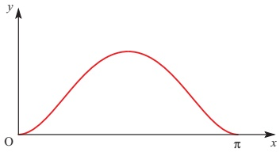

(i) Show that  $ \frac{dy}{dx} = \sin 2x $.

(ii) Hence find the x co-ordinates of the points on the curve at which the gradient of the curve is 0.5.

(iii) By expressing $\sin^{2}x$ in terms of $\cos 2x$, find the area of the region bounded by the curve and the $x$ axis between $0$ and $\pi$.

[Cambridge International AS & A Level Mathematics 9709, Paper 2 Q7 November 2005]

7 (i) Express  $ \cos^{2}x $ in terms of  $ \cos 2x $.

(ii) Hence show that

 $$ \int_{0}^{\frac{1}{3}\pi}\cos^{2}x\mathrm{d}x=\frac{1}{6}\pi+\frac{1}{8}\sqrt{3}. $$ 

(iii) By using an appropriate trigonometrical identity, deduce the exact value of

 $$ \int_{0}^{\frac{1}{3}\pi}\sin^{2}x d x. $$ 

[Cambridge International AS & A Level Mathematics 9709, Paper 2 Q6 June 2007]

8 (i) Prove the identity

 $$ (\cos x+3\sin x)^{2}\equiv5-4\cos2x+3\sin2x. $$ 

(ii) Using the identity, or otherwise, find the exact value of

 $$ \int_{0}^{\frac{1}{4}\pi}(\cos x+3\sin x)^{2}\mathrm{d}x. $$ 

[Cambridge International AS & A Level Mathematics 9709, Paper 2 Q7 November 2007]

9 (i) Show that  $ \int_{0}^{\frac{1}{4}\pi}\cos2x\,dx = \frac{1}{2} $.

(ii) By using an appropriate trigonometrical identity, find the exact value of

 $$ \int_{\frac{1}{6}\pi}^{\frac{1}{3}\pi}3\tan^{2}x\mathrm{d}x. $$ 

[Cambridge International AS & A Level Mathematics 9709, Paper 22 Q4 June 2010]

<!-- page 137 -->

## Numerical integration

There are times when you need to find the area under a graph but cannot do this by the integration methods you have met so far.

The function may be one that cannot be integrated algebraically. (There are many such functions.)

The function may be one that can be integrated algebraically but which requires a technique with which you are unfamiliar.

It may be that you do not know the function in algebraic form, but just have a set of points (perhaps derived from an experiment).

In these circumstances you can always find an approximate answer using a numerical method, but you must:

(i) have a clear picture in your mind of the graph of the function, and how your method estimates the area beneath it

(ii) understand that a numerical answer without any estimate of its accuracy, or error bounds, is valueless.

## The trapezium rule

In this chapter just one numerical method of integration is introduced, namely the trapezium rule. As an illustration of the rule, it is used to find the area under the curve  $ y=\sqrt{5x-x^{2}} $ for values of x between 0 and 4.

It is in fact possible to integrate this function algebraically, but not using the techniques that you have met so far.

## Note

You should not use a numerical method when an algebraic (sometimes called analytic) technique is available to you. Numerical methods should be used only when other methods fail.

Figure 5.3 shows the area approximated by two trapezia of equal width.

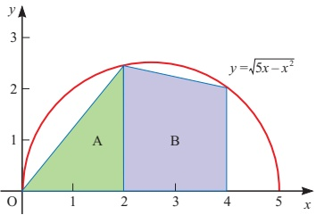

Figure 5.3

<!-- page 138 -->

Remember the formula for the area of a trapezium,  $ \text{Area} = \frac{1}{2}h(a + b) $, where  $ a $ and  $ b $ are the lengths of the parallel sides and  $ h $ the distance between them.

In the cases of the trapezia A and B, the parallel sides are vertical. The left-hand side of trapeziam A has zero height, and so the trapeziam is also a triangle.

When x=0  $ \Rightarrow $  $ y=\sqrt{0}=0 $

When  $ x=2 \Rightarrow y=\sqrt{6}=2.4495 $ (to 4 d.p.)

When x=4,  $ \Rightarrow $ y= $ \sqrt{4}=2 $

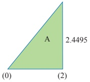

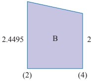

Figure 5.4

The area of trapezium  $ A = \frac{1}{2} \times 2 \times (0 + 2.4495) = 2.4495 $

The area of trapezium  $ B = \frac{1}{2} \times 2 \times (2.4495 + 2) = \frac{4.4495}{6.8990} $

Total 6.8990

For greater accuracy you can use four trapezia, P, Q, R and S, each of width 1 unit as in figure 5.5. The area is estimated in just the same way.

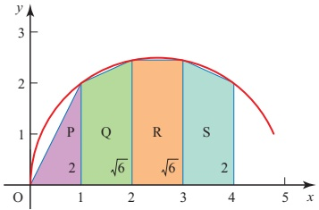

Figure 5.5

Trapezium P:  $ \frac{1}{2} \times 1 \times (0 + 2) = 1.0000 $

Trapezium Q:  $ \frac{1}{2} \times 1 \times (2 + 2.4495) = 2.2247 $

Trapezium R:  $ \frac{1}{2} \times 1 \times (2.4495 + 2.4495) = 2.4495 $

Trapezium S:  $ \frac{1}{2} \times 1 \times (2.4495 + 2) = \underline{2.2247} $

Total  $ \underline{7.8990} $

 $ \left\{\begin{array}{l} These figures are  \\  given to 4 decimal  \\  places but the  \\  calculation has been  \\  done to more places  \\  on a calculator.\end{array}\right. $

<!-- page 139 -->

## Accuracy

In this example, the first two estimates are 6.8989... and 7.8989.... You can see from figure 5.5 that the trapezia all lie underneath the curve, and so in this case the trapezium rule estimate of 7.8989... must be too small. You cannot, however, say by how much. To find that out you will need to take progressively more strips to find the value to which the estimate converges. Using 8 strips gives an estimate of 8.2407..., and 16 strips gives 8.3578.... The first figure, 8, looks reasonably certain but it is still not clear whether the second is 3, 4 or even 5. You need to take even more strips to be able to decide. In this example, the convergence is unusually slow because of the high curvature of the curve.

5.2 Use a graph-drawing program with the capability to calculate areas using trapezia. Calculate the area using progressively more strips and observe the convergence.

## It is possible to find this area without using calculus at all

How can this be done? How close is the 16-strip estimate?

## The procedure

In the previous example, the answer of 7.8990 from four strips came from adding the areas of the four trapezia P, Q, R and S:

 $$ \frac{1}{2}\times1\times(0+2)+\frac{1}{2}\times1\times(2+2.4495)+\frac{1}{2}\times1\times(2.4495+2.4495)+\frac{1}{2}\times1\times(2.4495+2) $$ 

and this can be written as

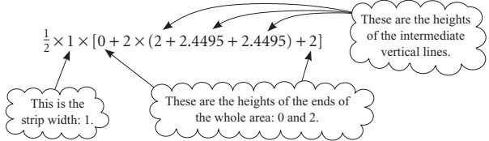

This is often stated in words as

 $$  Area\approx\frac{1}{2}\times strip~width\times[ends+twice~middles] $$ 

or in symbols, for n strips of width h

 $$ \mathrm{A}\approx\frac{1}{2}\times h\times[y_{0}+y_{n}+2(y_{1}+y_{2}+\ldots+y_{n-1})]. $$

<!-- page 140 -->

This is called the trapezium rule for width h (see figure 5.6).

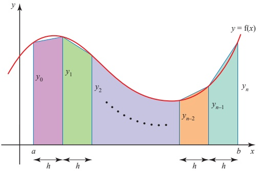

Figure 5.6

Look at the three graphs in figure 5.7, and in each case state whether the trapezium rule would underestimate or overestimate the area, or whether you cannot tell.

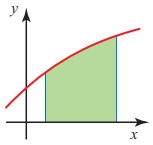

(i)

Figure 5.7

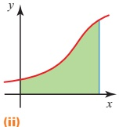

(ii)

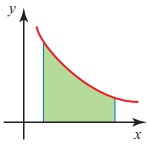

(iii)

## EXERCISE 5C

1 The speed  $ v $ in  $ ms^{-1} $ of a train is given at time  $ t $ seconds in the following table.

<table border=1 style='margin: auto; word-wrap: break-word;'><tr><td style='text-align: center; word-wrap: break-word;'>t</td><td style='text-align: center; word-wrap: break-word;'>0</td><td style='text-align: center; word-wrap: break-word;'>10</td><td style='text-align: center; word-wrap: break-word;'>20</td><td style='text-align: center; word-wrap: break-word;'>30</td><td style='text-align: center; word-wrap: break-word;'>40</td><td style='text-align: center; word-wrap: break-word;'>50</td><td style='text-align: center; word-wrap: break-word;'>60</td></tr><tr><td style='text-align: center; word-wrap: break-word;'>v</td><td style='text-align: center; word-wrap: break-word;'>0</td><td style='text-align: center; word-wrap: break-word;'>5.0</td><td style='text-align: center; word-wrap: break-word;'>6.7</td><td style='text-align: center; word-wrap: break-word;'>8.2</td><td style='text-align: center; word-wrap: break-word;'>9.5</td><td style='text-align: center; word-wrap: break-word;'>10.6</td><td style='text-align: center; word-wrap: break-word;'>11.6</td></tr></table>

The distance that the train has travelled is given by the area under the graph of the speed (vertical axis) against time (horizontal axis).

(i) Estimate the distance the train travels in this 1-minute period.

(ii) Give two reasons why your method cannot give a very accurate answer.

<!-- page 141 -->

2 The definite integral  $ \int_{0}^{1}\frac{1}{1+x^{2}}dx $ is known to equal  $ \frac{\pi}{4} $.

(i) Using the trapezium rule for four strips, find an approximation for  $ \pi $.

(ii) Repeat your calculation with 10 and 20 strips to obtain closer estimates.

(iii) If you did not know the value of  $ \pi $, what value would you give it with confidence on the basis of your estimates in parts (i) and (ii)?

3 The table below gives the values of a function  $ f(x) $ for different values of x.

<table border=1 style='margin: auto; word-wrap: break-word;'><tr><td style='text-align: center; word-wrap: break-word;'>x</td><td style='text-align: center; word-wrap: break-word;'>0</td><td style='text-align: center; word-wrap: break-word;'>0.5</td><td style='text-align: center; word-wrap: break-word;'>1.0</td><td style='text-align: center; word-wrap: break-word;'>1.5</td><td style='text-align: center; word-wrap: break-word;'>2.0</td><td style='text-align: center; word-wrap: break-word;'>2.5</td><td style='text-align: center; word-wrap: break-word;'>3.0</td></tr><tr><td style='text-align: center; word-wrap: break-word;'>f(x)</td><td style='text-align: center; word-wrap: break-word;'>1.000</td><td style='text-align: center; word-wrap: break-word;'>1.225</td><td style='text-align: center; word-wrap: break-word;'>1.732</td><td style='text-align: center; word-wrap: break-word;'>2.345</td><td style='text-align: center; word-wrap: break-word;'>3.000</td><td style='text-align: center; word-wrap: break-word;'>3.674</td><td style='text-align: center; word-wrap: break-word;'>4.359</td></tr></table>

(i) Apply the trapezium rule to the values in this table to obtain an approximation for  $ \int_{0}^{3} f(x) \, dx $.

(ii) By considering the shape of the curve $y=f(x)$, explain whether the approximation calculated in part (i) is likely to be an overestimate or an underestimate of the true area under the curve $y=f(x)$ between $x=0$ and $x=3$.

4 The graph of the function  $ y=\sqrt{2+x} $ (for  $ x \geq -2 $) is given in the diagram. The area of the shaded region ABCD is to be found.

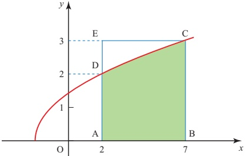

(i) Make a table of values for $y$, for integer values of $x$ from $x=2$ to $x=7$, giving each value of $y$ correct to 4 decimal places.

(ii) Use the trapezium rule with five strips, each 1 unit wide, to calculate an estimate for the area ABCD.

State, giving a reason, whether your estimate is too large or too small.

Another method is to consider the area ABCD as the area of the rectangle ABCE minus the area of the region CDE.

(iii) Show that the area CDE is given by  $ \int_{2}^{3}(y^{2}-4) $ dy. Calculate the exact value of this integral.

(iv) Find the exact value of the area ABCD.

Hence find the percentage error in using the trapezium rule.

<!-- page 142 -->

5 The trapezium rule is used to estimate the value of  $ I=\int_{0}^{1.6}\sqrt{1+x^{2}}dx $.

(i) Draw the graph of  $ y = \sqrt{1 + x^2} $ for  $ 0 \leq x \leq 1.6 $.

(ii) Use strip widths of 0.8, 0.4, 0.2 and 0.1 to find approximations to the value of the integral.

(iii) State the value of the integral to as many decimal places as you can justify.

6 The trapezium rule is used to estimate the value of  $ \int_{0}^{1}\sqrt{\sin x}\,dx $.

(i) Draw the graph of  $ y = \sqrt{\sin x} $ for  $ 0 \leq x \leq 1 $.

(ii) Use 1, 2, 4, 8 and 16 strips to find approximations to the value of the integral.

(iii) State the value of the integral to as many decimal places as you can justify.

7 The trapezium rule is used to estimate the value of  $ \int_{0}^{1}\frac{4}{1+x^{2}}dx $.

(i) Draw the graph of  $ y = \frac{4}{1 + x^2} $ for  $ 0 \leq x \leq 1 $.

(ii) Use strip widths of 1, 0.5, 0.25 and 0.125 to find approximations to the value of the integral.

(iii) State the value of the integral to as many decimal places as you can justify.

8 A student uses the trapezium rule to estimate the value of  $ \int_{0}^{2}(2-\cos2\pi x)\,dx $.

(i) Find approximations to the value of the integral by applying the trapezium rule using strip widths of 2, 1, 0.5 and 0.25.

(ii) Sketch the graph of $y=2-\cos2\pi x$ for $0\leq x\leq2$.

On copies of your graph shade the areas you have found in parts (i)(a) to (d).

(iii) Use integration to find the exact value of this integral.

9 The diagram shows the part of the curve  $ y=\frac{\ln x}{x} $ for  $ 0<x\leq4 $. The curve cuts the x-axis at A and its maximum point is M.

(i) Write down the co-ordinates of A.

(ii) Show that the x co-ordinate of M is e, and write down the y co-ordinate of M in terms of e.

(iii) Use the trapezium rule with three intervals to estimate the value of

 $ \int_{1}^{4}\frac{\ln x}{x}dx, $

correct to 2 decimal places.

(iv) State, with a reason, whether the trapezium rule gives an underestimate or an overestimate of the true value of the integral in part (iii).

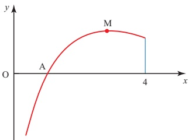

<!-- page 143 -->

10 The diagram shows the part of the curve  $ y = e^x \cos x $ for  $ 0 \leq x \leq \frac{1}{2}\pi $. The curve meets the  $ y $ axis at the point A. The point M is a maximum point.

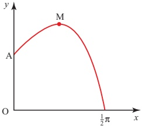

(i) Write down the co-ordinates of A.

(ii) Find the x co-ordinate of M.

iii) Use the trapezium rule with three intervals to estimate the value of  $ \int_{0}^{\frac{1}{2}\pi} e^{x}\cos x\,dx $,

giving your answer correct to 2 decimal places.

(iv) State, with a reason, whether the trapezium rule gives an underestimate or an overestimate of the true value of the integral in part (iii).

[Cambridge International AS & A Level Mathematics 9709, Paper 2 Q7 June 2007]

11 The diagram shows the curve  $ y = x^{2} e^{-x} $ and its maximum point M.

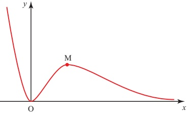

(i) Find the x co-ordinate of M.

(ii) Show that the tangent to the curve at the point where x=1 passes through the origin.

(iii) Use the trapezium rule, with two intervals, to estimate the value of

 $$ \int_{1}^{3}x^{2}\mathrm{e}^{-x}\mathrm{d}x, $$ 

giving your answer correct to 2 decimal places.

[Cambridge International AS & A Level Mathematics 9709, Paper 2 Q8 November 2007]

<!-- page 144 -->

12 The diagram shows a sketch of the curve  $ y = \frac{1}{1 + x^3} $ for values of  $ x $ from -0.6 to 0.6.

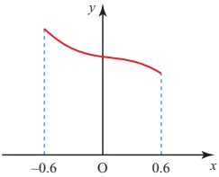

(i) Use the trapezium rule, with two intervals, to estimate the value of

 $ \int_{-0.6}^{0.6}\frac{1}{1+x^{3}}dx, $

giving your answer correct to 2 decimal places.

(ii) Explain, with reference to the diagram, why the trapezium rule may be expected to give a good approximation to the true value of the integral in this case.

[Cambridge International AS & A Level Mathematics 9709, Paper 3 Q2 June 2005]

KEY POINTS

 $$ \begin{aligned}&1\int kx^{n}\mathrm{d}x=\frac{kx^{n+1}}{n+1}+c\\ &2\int\mathrm{e}^{x}\mathrm{d}x=\mathrm{e}^{x}+c\\ &\int\mathrm{e}^{ax+b}\mathrm{d}x=\frac{1}{a}\mathrm{e}^{ax+b}+c\\ &3\int\frac{1}{x}\mathrm{d}x=\ln|x|+c\\ &\int\frac{1}{ax+b}\mathrm{d}x=\frac{1}{a}\ln|ax+b|+c\\ &4\int\cos(ax+b)\mathrm{d}x=\frac{1}{a}\sin(ax+b)+c\\ &\int\sin(ax+b)\mathrm{d}x=-\frac{1}{a}\cos(ax+b)+c\\ &\int\sec^{2}(ax+b)\mathrm{d}x=\frac{1}{a}\tan(ax+b)+c\\ \end{aligned} $$ 

5 You can use the trapezium rule, with n strips of width h, to find an approximate value for a definite integral as

 $$ A\approx\frac{h}{2}\big[y_{0}+2(y_{1}+y_{2}+...+y_{n-1})+y_{n}\big] $$ 

In words this is

 $$  Area\approx\frac{1}{2}\times strip width\times[ends+twice middles] $$

