# Chapter 6 Numerical solution of equations

<!-- Pure Mathematics 2 and 3 Cambridge International AS and A Level Mathematics (Sophie Goldie, Roger Porkess) .pdf p145-162 -->

<!-- page 145 -->

# Numerical solution of equations

It is the true nature of mankind to learn from his mistakes.

Fred Hoyle

Which of the following equations can be solved algebraically, and which cannot? For each equation find a solution, accurate or approximate.

 $$ \begin{aligned}&x^{2}-4x+3=0\\&x^{3}-x=0\end{aligned} $$ 

(ii)  $ x^{2} + 10x + 8 = 0 $

(v)  $ e^{x} = 4x $

(iii)  $ x^{5}-5x+3=0 $

You probably realised that the equations  $ x^5 - 5x + 3 = 0 $ and  $ e^x = 4x $ cannot be solved algebraically. You may have decided to draw their graphs, either manually or using a graphic calculator or computer package, as in figure 6.1.

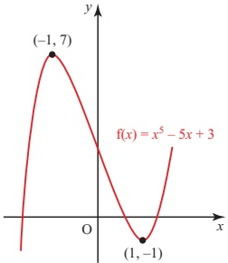

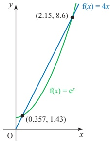

### Figure 6.1

The graphs show you that

 $ x^5 - 5x + 3 = 0 $ has three roots, lying in the intervals  $ [-2, -1] $,  $ [0, 1] $ and  $ [1, 2] $.

 $ e^{x} = 4x $ has two roots, lying in the intervals  $ [0, 1] $ and  $ [2, 3] $.

Note

An interval written as [a, b] means the interval between a and b, including a and b. This notation is used in this chapter. If a and b are not included, the interval is written (a, b). You may also elsewhere meet the notation ]a, b[, indicating that a and b are not included.

<!-- page 146 -->

The problem now is how to find the roots to any required degree of accuracy, and as efficiently as possible.

In many real problems, equations are obtained for which solutions using algebraic or analytic methods are not possible, but for which you nonetheless want to know the answers. In this chapter you will be introduced to numerical methods for solving such equations. In applying these methods, keep the following points in mind.

Only use numerical methods when algebraic ones are not available. If you can solve an equation algebraically (e.g. a quadratic equation), that is the right method to use.

Before starting to use a calculator or computer program, always start by drawing a sketch graph of the function whose equation you are trying to solve. This will show you how many roots the equation has and their approximate positions. It will also warn you of possible difficulties with particular methods. When using a graphic calculator or computer package ensure that the range of values of x is sufficiently large to, hopefully, find all the roots.

Always give a statement about the accuracy of an answer (e.g. to 5 decimal places, or  $ \pm 0.000005 $). An answer obtained by a numerical method is worthless without this; the fact that at some point your calculator display reads, say, 1.6764705882 does not mean that all these figures are valid.

Your statement about the accuracy must be obtained from within the numerical method itself. Usually you find a sequence of estimates of ever-increasing accuracy.

Remember that the most suitable method for one equation may not be that for another.

## Interval estimation – change-of-sign methods

Assume that you are looking for the roots of the equation  $ f(x) = 0 $. This means that you want the values of x for which the graph of  $ y = f(x) $ crosses the x axis. As the curve crosses the x axis,  $ f(x) $ changes sign, so provided that  $ f(x) $ is a continuous function (its graph has no asymptotes or other breaks in it), once you have located an interval in which  $ f(x) $ changes sign, you know that that interval must contain a root. In both of the graphs in figure 6.2 (overleaf), there is a root lying between a and b.

<!-- page 147 -->

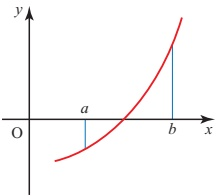

Figure 6.2

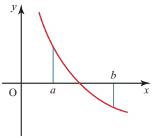

You have seen that  $ x^{5}-5x+3=0 $ has roots in the intervals  $ [-2,-1] $,  $ [0,1] $ and  $ [1,2] $. There are several ways of homing in on such roots systematically. Two of these are now described, using the search for the root in the interval  $ [0,1] $ as an example.

## e Decimal search

In this method you first take increments in x of size 0.1 within the interval [0, 1], working out the value of  $ f(x) = x^{5} - 5x + 3 $ for each one. You do this until you find a change of sign.

<table border=1 style='margin: auto; word-wrap: break-word;'><tr><td style='text-align: center; word-wrap: break-word;'>x</td><td style='text-align: center; word-wrap: break-word;'>0.0</td><td style='text-align: center; word-wrap: break-word;'>0.1</td><td style='text-align: center; word-wrap: break-word;'>0.2</td><td style='text-align: center; word-wrap: break-word;'>0.3</td><td style='text-align: center; word-wrap: break-word;'>0.4</td><td style='text-align: center; word-wrap: break-word;'>0.5</td><td style='text-align: center; word-wrap: break-word;'>0.6</td><td style='text-align: center; word-wrap: break-word;'>0.7</td></tr><tr><td style='text-align: center; word-wrap: break-word;'>f(x)</td><td style='text-align: center; word-wrap: break-word;'>3.00</td><td style='text-align: center; word-wrap: break-word;'>2.50</td><td style='text-align: center; word-wrap: break-word;'>2.00</td><td style='text-align: center; word-wrap: break-word;'>1.50</td><td style='text-align: center; word-wrap: break-word;'>1.01</td><td style='text-align: center; word-wrap: break-word;'>0.53</td><td style='text-align: center; word-wrap: break-word;'>0.08</td><td style='text-align: center; word-wrap: break-word;'>-0.33</td></tr></table>

There is a sign change, and therefore a root, in the interval [0.6, 0.7] since the function is continuous. Having narrowed down the interval, you can now continue with increments of 0.01 within the interval [0.6, 0.7].

<table border=1 style='margin: auto; word-wrap: break-word;'><tr><td style='text-align: center; word-wrap: break-word;'>x</td><td style='text-align: center; word-wrap: break-word;'>0.60</td><td style='text-align: center; word-wrap: break-word;'>0.61</td><td style='text-align: center; word-wrap: break-word;'>0.62</td></tr><tr><td style='text-align: center; word-wrap: break-word;'>f(x)</td><td style='text-align: center; word-wrap: break-word;'>0.08</td><td style='text-align: center; word-wrap: break-word;'>0.03</td><td style='text-align: center; word-wrap: break-word;'>-0.01</td></tr></table>

This shows that the root lies in the interval [0.61, 0.62].

Alternative ways of expressing this information are that the root can be taken as 0.615 with a maximum error of  $ \pm 0.005 $, or the root is 0.6 (to 1 decimal place).

This process can be continued by considering x = 0.611, x = 0.612, ... to obtain the root to any required number of decimal places.

How many steps of decimal search would be necessary to find each of the values 0.012, 0.385 and 0.989, using x = 0 as a starting point?

<!-- page 148 -->

When you use this procedure on a computer or calculator you should be aware that the machine is working in base 2, and that the conversion of many simple numbers from base 10 to base 2 introduces small rounding errors. This can lead to simple roots such as 2.7 being missed and only being found as 2.699999.

## e Interval bisection

This method is similar to the decimal search, but instead of dividing each interval into ten parts and looking for a sign change, in this case the interval is divided into two parts – it is bisected.

Looking as before for the root in the interval  $ [0,1] $, you start by taking the mid-point of the interval, 0.5.

f(0.5) = 0.53, so f(0.5) > 0. Since f(1) < 0, the root is in [0.5, 1].

Now take the mid-point of this second interval, 0.75.

f(0.75) = -0.51, so f(0.75) < 0. Since f(0.5) > 0, the root is in [0.5, 0.75].

The mid-point of this further reduced interval is 0.625.

f(0.625) = -0.03, so the root is in the interval [0.5, 0.625].

The method continues in this manner until any required degree of accuracy is obtained. However, the interval bisection method is quite slow to converge to the root, and is cumbersome when performed manually.

ACTIVITY 6.1 Investigate how many steps of this method you need to achieve an accuracy of 1, 2, 3 and n decimal places, having started with an interval of length 1.

## Error (or solution) bounds

Change-of-sign methods have the great advantage that they automatically provide bounds (the two ends of the interval) within which a root lies, so the maximum possible error in a result is known. Knowing that a root lies in the interval [0.61, 0.62] means that you can take the root as 0.615 with a maximum error of  $ \pm 0.005 $.

## Problems with change-of-sign methods

There are a number of situations which can cause problems for change-of-sign methods if they are applied blindly, for example by entering the equation into a computer program without prior thought. In all cases you can avoid problems by first drawing a sketch graph, provided that you know what dangers to look out for.

P2

<!-- page 149 -->

## The curve touches the x axis

In this case there is no change of sign, so change-of-sign methods are doomed to failure (see figure 6.3).

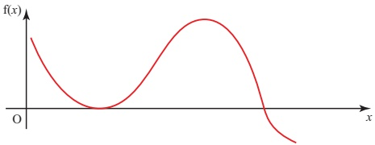

Figure 6.3

## There are several roots close together

Where there are several roots close together, it is easy to miss a pair of them. The equation

 $$  f(x)=x^{3}-1.9x^{2}+1.11x-0.189=0 $$ 

has roots at 0.3, 0.7 and 0.9. A sketch of the curve of  $ f(x) $ is shown in figure 6.4.

In this case  $ f(0) < 0 $ and  $ f(1) > 0 $, so you know there is a root between 0 and 1.

A decimal search would show that  $ f(0.3) = 0 $, so that 0.3 is a root. You would be unlikely to search further in this interval.

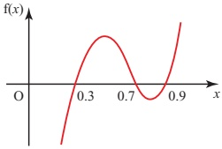

Figure 6.4

Interval bisection gives  $ f(0.5) > 0 $, so you would search the interval  $ [0, 0.5] $ and eventually arrive at the root 0.3, unaware of the existence of those at 0.7 and 0.9.

## There is a discontinuity in  $ f(x) $

The curve  $ y=\frac{1}{x-2.7} $ has a discontinuity at x=2.7, as shown by the asymptote in figure 6.5.

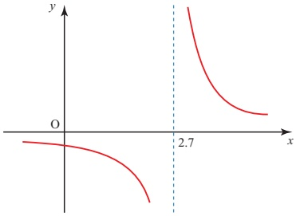

Figure 6.5

<!-- page 150 -->

The equation  $ \frac{1}{x-2.7}=0 $ has no root, but all change-of-sign methods will converge on a false root at x=2.7.

None of these problems will arise if you start by drawing a sketch graph.

## Note: Use of technology

It is important that you understand how each method works and are able, if necessary, to perform the calculations using only a scientific calculator. However, these repeated operations lend themselves to the use of a spreadsheet or a programmable calculator. Many packages, such as Autograph, will both perform the methods and illustrate them graphically.

## EXERCISE 6A

1 (i) Show that the equation  $ x^{3} + 3x - 5 = 0 $ has no turning (stationary) points.

(ii) Show with the aid of a sketch that the equation can have only one root, and that this root must be positive.

(iii) Find the root, correct to 3 decimal places.

2 (i) How many roots has the equation  $ e^{x} - 3x = 0 $?

(ii) Find an interval of unit length containing each of the roots.

(iii) Find each root correct to 2 decimal places.

3 (i) Sketch  $ y = 2^{x} $ and y = x + 2 on the same axes.

(ii) Use your sketch to deduce the number of roots of the equation  $ 2^{x} = x + 2 $.

(iii) Find each root, correct to 3 decimal places if appropriate.

4 Find all the roots of  $ x^{3}-3x+1=0 $, giving your answers correct to 2 decimal places.

5 Find the roots of  $ x^{5}-5x+3=0 $ in the intervals  $ [-2,-1] $ and  $ [1,2] $, correct to 2 decimal places, using

(i) decimal search

(ii) interval bisection.

Comment on the ease and efficiency with which the roots are approached by each method.

6 (i) Use a systematic search for a change of sign, starting with x = -2, to locate intervals of unit length containing each of the three roots of

 $$ x^{3}-4x^{2}-3x+8=0. $$ 

(ii) Sketch the graph of  $ f(x) = x^{3} - 4x^{2} - 3x + 8 $.

(iii) Use the method of interval bisection to obtain each of the roots correct to 2 decimal places.

(iv) Use your last intervals in part (iii) to give each of the roots in the form  $ a \pm (0.5)^n $ where a and n are to be determined.

<!-- page 151 -->

7 The diagram shows a sketch of the graph of $f(x) = e^{x} - x^{3}$ without scales.

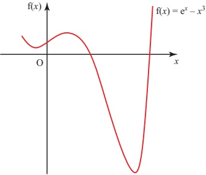

(i) Use a systematic search for a change of sign to locate intervals of unit length containing each of the roots.

(ii) Use a change-of-sign method to find each of the roots correct to 3 decimal places.

8 For each of the equations below

(a) sketch the curve

(b) write down any roots

(c) investigate what happens when you use a change-of-sign method with a starting interval of [-0.3, 0.7].

(i)  $  y = \frac{1}{x}  $

 $$ y=\frac{x}{x^{2}+1} $$ 

(iii)

 $$ y=\frac{x^{2}}{x^{2}+1} $$ 

## Fixed-point iteration

In fixed-point iteration you find a single value or point as your estimate for the value of x, rather than establishing an interval within which it must lie. This involves an iterative process, a method of generating a sequence of numbers by continued repetition of the same procedure. If the numbers obtained in this manner approach some limiting value, then they are said to converge to this value.

## INVESTIGATION

Notice what happens in each of the following cases, and try to find some explanation for it.

(i) Set your calculator to the radian mode, enter zero if not automatically displayed and press the cosine key repeatedly.

(ii) Enter any positive number into your calculator and press the square root key repeatedly. Try this for both large and small numbers.

<!-- page 152 -->

[iii] Enter any positive number into your calculator and press the sequence  $ \bigcirc $ repeatedly. Write down the number which appears each time you press  $ \circlearrowleft $. The sequence generated appears to converge. You may recognise the number to which it appears to converge: it is called the Golden Ratio.

## Rearranging the equation  $ f(x) = 0 $ into the form  $ x = F(x) $

The first step, with an equation  $ f(x) = 0 $, is to rearrange it into the form  $ x = F(x) $. Any value of x for which  $ x = F(x) $ is a root of the original equation, as shown in figure 6.6.

When  $ f(x) = x^{2} - x - 2 $,  $ f(x) = 0 $ is the same as  $ x = x^{2} - 2 $.

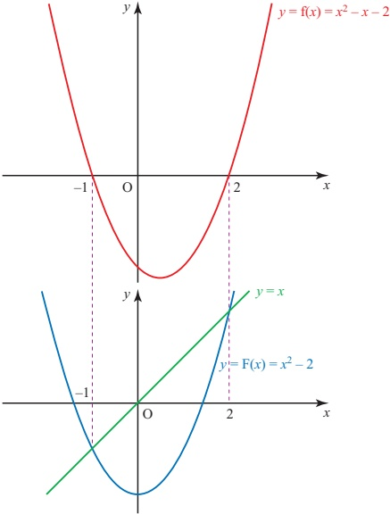

Figure 6.6

The equation  $ x^{5}-5x+3=0 $ which you met earlier can be rewritten in a number of ways. One of these is  $ 5x=x^{5}+3 $, giving

 $$ x=\mathrm{F}(x)=\frac{x^{5}+3}{5}. $$

<!-- page 153 -->

Figure 6.7 shows the graphs of y = x and y = F(x) in this case.

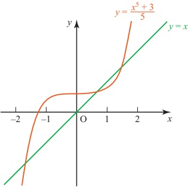

Figure 6.7

This provides the basis for the iterative formula

 $$ x_{n+1}=\frac{x_{n}^{5}+3}{5}. $$ 

Taking x=1 as a starting point to find the root in the interval [0,1], successive approximations are:

 $$ x_{1}=1,\quad x_{2}=0.8,\quad x_{3}=0.6655,\quad x_{4}=0.6261,\quad x_{5}=0.6192, $$ 

 $$ x_{6}=0.6182,\quad x_{7}=0.6181,\quad x_{8}=0.6180,\quad x_{9}=0.6180. $$ 

In this case the iteration has converged quite rapidly to the root for which you were looking.

Another way of arranging  $ x^5 - 5x + 3 = 0 $ is  $ x = \sqrt[5]{5x - 3} $. What other possible rearrangements can you find? How many are there altogether?

The iteration process is easiest to understand if you consider the graph. Rewriting the equation  $ f(x) = 0 $ in the form  $ x = F(x) $ means that instead of looking for points where the graph of  $ y = f(x) $ crosses the x axis, you are now finding the points of intersection of the curve  $ y = F(x) $ and the line y = x.

What you do

Choose a value,  $ x_{1} $, of x

• Find the corresponding value of  $ F(x_{1}) $

Take this value  $ F(x_{1}) $ as the new value of x, i.e.  $ x_{2} = F(x_{1}) $

Find the value of  $ F(x_{2}) $ and so on.

What it looks like on the graph

Take a starting point on the x axis

Move vertically to the curve  $ y = F(x) $

Move horizontally to the line y=x

Move vertically to the curve

<!-- page 154 -->

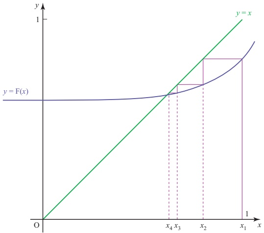

Figure 6.8

The effect of several repeats of this procedure is shown in figure 6.8. The successive steps look like a staircase approaching the root: this type of diagram is called a staircase diagram. In other examples, a cobweb diagram may be produced, as shown in figure 6.9.

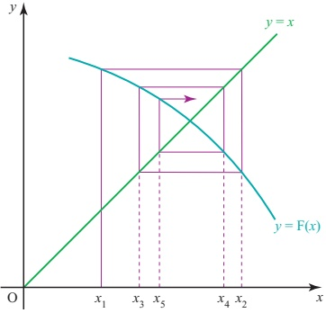

Figure 6.9

Successive approximations to the root are found by using the formula

 $$ x_{n+1}=\mathrm{F}(x_{n}). $$ 

This is an example of an iterative formula. If the resulting values of $x_{n}$ approach some limit, $a$, then $a = \mathrm{F}(a)$, and so $a$ is a fixed point of the iteration. It is also a root of the original equation $f(x) = 0$.

<!-- page 155 -->

## Note

In the staircase diagram, the values of $x_{n}$ approach the root from one side, but in a cobweb diagram they oscillate about the root. From figures 6.8 and 6.9 it is clear that the error (the difference between $a$ and $x_{n}$) is decreasing in both diagrams.

## Accuracy of the method of rearranging the equation

Iterative procedures give you a sequence of point estimates. A staircase diagram, for example, might give the following.

1,0.8,0.6655,0.6261,0.6192

What can you say at this stage?

Looking at the pattern of convergence it seems as though the root lies between 0.61 and 0.62, but you cannot be absolutely certain from the available evidence. To be certain you must look for a change of sign.

 $$  f(0.61)=+0.034\ldots\quad f(0.62)=-0.0083\ldots $$ 

## p Explain why you can now be quite certain that your judgement is correct

Note

Estimates from a cobweb diagram oscillate above and below the root and so naturally provide you with bounds.

## Using different arrangements of the equation

So far only one possible arrangement of the equation  $ x^5 - 5x + 3 = 0 $ has been used. What happens when you use a different arrangement, for example  $ x = \sqrt[5]{5x - 3} $, which leads to the iterative formula

 $$ x_{n+1}=\sqrt[5]{5x_{n}-3}? $$ 

The resulting sequence of approximations is:

 $$ x_{1}=1,\quad x_{2}=1.1486...,\quad x_{3}=1.2236...,\quad x_{4}=1.2554..., $$ 

 $$ x_{5}=1.2679...,\qquad x_{6}=1.2727...,\qquad x_{7}=1.2745...,\qquad x_{8}=1.2752..., $$ 

 $$ x_{9}=1.2755...,\qquad x_{10}=1.2756...,\qquad x_{11}=1.2756...,\qquad x_{12}=1.2756.... $$ 

## In the calculations the full calculator values of  $ x_{n} $ were used, but only the first 4 decimal places have been written down

<!-- page 156 -->

The process has clearly converged, but in this case not to the root for which you were looking: you have identified the root in the interval [1, 2]. If instead you had taken  $ x_{1}=0 $ as your starting point and applied the second formula, you would have obtained a sequence converging to the value -1.6180, the root in the interval [-2,-1].

## e The choice of F(x)

A particular rearrangement of the equation $f(x) = 0$ into the form $x = F(x)$ will allow convergence to a root $a$ of the equation, provided that $-1 < F'(a) < 1$ for values of $x$ close to the root.

Look again at the two rearrangements of  $ x^5 - 5x + 3 = 0 $ which were suggested. When you look at the graph of  $ y = F(x) = \sqrt[5]{5x - 3} $, as shown in figure 6.10, you can see that its gradient near A, the root you were seeking, is greater than 1.

This makes  $ x_{n+1} = \sqrt[5]{5x_n - 3} $ an unsuitable iterative formula for finding the root in the interval  $ [0, 1] $, as you saw earlier.

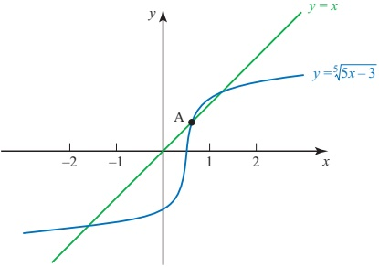

Figure 6.10

When an equation has two or more roots, a single rearrangement will not usually find all of them. This is demonstrated in figure 6.11.

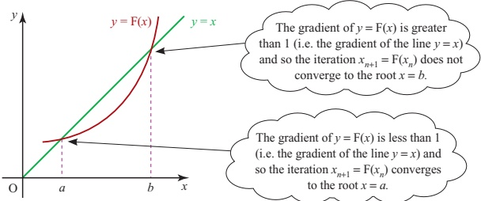

Figure 6.11

<!-- page 157 -->

### ACTIVITY 6.2

Try using the iterative formula  $ x_{n+1} = \frac{x_n^5 + 3}{5} $ to find the roots in the intervals  $ [-2, -1] $ and  $ [1, 2] $. In both cases use each end point of the interval as a starting point. What happens?

Explain what you find by referring to a sketch of the curve  $ y=\frac{x^{5}+3}{5} $.

## EXERCISE 6B

1 (i) Show that the equation  $ x^{3} - x - 2 = 0 $ has a root between 1 and 2.

(ii) The equation is rearranged into the form $x = F(x)$, where

 $$  F(x)=\sqrt[3]{x+2}. $$ 

Use the iterative formula suggested by this rearrangement to find the value of the root to 3 decimal places.

2 (i) Show that the equation  $ e^{-x} - x + 2 = 0 $ has a root in the interval [2, 3].

(ii) The equation is rearranged into the form =  $ e^{-x} + 2 $.

Use the iterative formula suggested by this rearrangement to find the value of the root to 3 decimal places.

3 (i) Show that the equation  $ e^{x} + x - 6 = 0 $ has a root in the interval [1, 2].

(ii) Show that this equation may be written in the form  $ x = \ln(6 - x) $.

(iii) Use an iterative formula based on the equation  $ x = \ln(6 - x) $ to calculate the root correct to 3 decimal places.

4 (i) Sketch the curves  $ y = e^{x} $ and  $ y = x^{2} + 2 $ on the same graph.

(ii) Use your sketch to explain why the equation  $ e^{x} - x^{2} - 2 = 0 $ has only one root.

(iii) Rearrange this equation in the form  $ x = F(x) $.

(iv) Use an iterative formula based on the equation found in part (iii) to calculate the root correct to 3 decimal places

5 (i) Show that  $ x^{2} = \ln(x + 1) $ for x = 0 and for one other value of x.

(ii) Use the method of fixed point iteration to find the second value to 3 decimal places.

6 (i) Sketch the graphs of $y = x$ and $y = \cos x$ on the same axes, for $0 \leq x \leq \frac{\pi}{2}$. (ii) Find the solution of the equation $x = \cos x$ to 5 decimal places.

7 The sequence of values given by the iterative formula

 $$ x_{n+1}=\frac{3x_{n}}{4}+\frac{2}{x_{n}^{3}}, $$ 

with initial value  $ x_{1}=2 $, converges to  $ \alpha $.

(i) Use this iteration to calculate  $ \alpha $ correct to 2 decimal places, showing the result of each iteration to 4 decimal places.

(ii) State an equation which is satisfied by  $ \alpha $ and hence find the exact value of  $ \alpha $.

[Cambridge International AS & A Level Mathematics 9709, Paper 2 Q3 June 2005]

<!-- page 158 -->

8 The sequence of values given by the iterative formula

 $$ x_{n+1}=\frac{2x_{n}}{3}+\frac{4}{x_{n}^{2}}, $$ 

with initial value  $ x_{1}=2 $, converges to  $ \alpha $.

(i) Use this iterative formula to determine $\alpha$ correct to 2 decimal places, giving the result of each iteration to 4 decimal places.

(ii) State an equation that is satisfied by  $ \alpha $ and hence find the exact value of  $ \alpha $.

[Cambridge International AS & A Level Mathematics 9709, Paper 2 Q2 November 2007]

9 (i) By sketching a suitable pair of graphs, show that the equation  $ \cos x = 2 - 2x $, where x is in radians, has only one root for  $ 0 \leq x \leq \frac{1}{2}\pi $.

(ii) Verify by calculation that this root lies between 0.5 and 1.

(iii) Show that, if a sequence of values given by the iterative formula

 $$ x_{n+1}=1-\tfrac{1}{2}\cos x_{n} $$ 

converges, then it converges to the root of the equation in part (i).

(iv) Use this iterative formula, with initial value  $ x_{1}=0.6 $, to determine this root correct to 2 decimal places. Give the result of each iteration to 4 decimal places.

[Cambridge International AS & A Level Mathematics 9709, Paper 2 Q7 November 2008]

10 The diagram shows the curve  $ y = x^2 \cos x $, for  $ 0 \leq x \leq \frac{1}{2}\pi $, and its maximum point M.

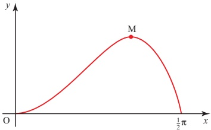

(i) Show by differentiation that the x co-ordinate of M satisfies the equation  $ \tan x = \frac{2}{x} $.

(ii) Verify by calculation that this equation has a root (in radians) between 1 and 1.2.

(iii) Use the iterative formula  $ x_{n+1} = \tan^{-1}\left(\frac{2}{x_n}\right) $ to determine this root correct to 2 decimal places. Give the result of each iteration to 4 decimal places.

[Cambridge International AS & A Level Mathematics 9709, Paper 22 Q7 November 2009]

<!-- page 159 -->

11 The diagram shows the curve  $ y = xe^{2x} $ and its minimum point M.

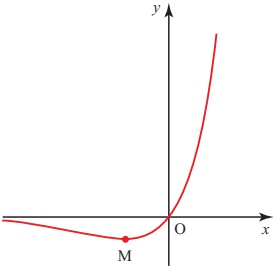

(i) Find the exact co-ordinates of M.

(ii) Show that the curve intersects the line y=20 at the point whose x-coordinate is the root of the equation

 $$ x=\tfrac{1}{2}\ln\left(\tfrac{20}{x}\right). $$ 

(iii) Use the iterative formula

 $$ x_{n+1}=\tfrac{1}{2}\ln\left(\tfrac{20}{x_{n}}\right), $$ 

with initial value  $ x_{1}=1.3 $, to calculate the root correct to 2 decimal places, giving the result of each iteration to 4 decimal places.

[Cambridge International AS & A Level Mathematics 9709, Paper 2 Q7 June 2009]

12 (i) By sketching a suitable pair of graphs, show that the equation

 $$ x=2-x^{2} $$ 

has only one root.

(ii) Verify by calculation that this root lies between x=1.3 and x=1.4.

(iii) Show that, if a sequence of values given by the iterative formula

 $$ x_{n+1}=\sqrt{(2-\ln x_{n})} $$ 

converges, then it converges to the root of the equation in part (i).

(iv) Use the iterative formula  $ x_{n+1} = \sqrt{(2 - \ln x_n)} $ to determine the root correct to 2 decimal places. Give the result of each iteration to 4 decimal places.

[Cambridge International AS & A Level Mathematics 9709, Paper 22 Q6 June 2010]

<!-- page 160 -->

13 The equation  $ x^{3}-8x-13=0 $ has one real root.

(i) Find the two consecutive integers between which this root lies.

(ii) Use the iterative formula

 $$ x_{n+1}=(8x_{n}+13)^{\frac{1}{3}} $$ 

to determine this root correct to 2 decimal places. Give the result of each iteration to 4 decimal places.

[Cambridge International AS & A Level Mathematics 9709, Paper 32 Q2 November 2009]

14 The equation  $ x^{3}-2x-2=0 $ has one real root.

(i) Show by calculation that this root lies between x=1 and x=2.

(ii) Prove that, if a sequence of values given by the iterative formula

 $$ x_{n+1}=\frac{2x_{n}^{3}+2}{3x_{n}^{2}-2} $$ 

converges, then it converges to this root.

(iii) Use this iterative formula to calculate the root correct to 2 decimal places. Give the result of each iteration to 4 decimal places.

[Cambridge International AS & A Level Mathematics 9709, Paper 3 Q4 June 2009]

## KEY POINTS

1 When  $ f(x) $ is a continuous function, if  $ f(a) $ and  $ f(b) $ have opposite signs, there will be at least one root of  $ f(x) = 0 $ in the interval  $ [a, b] $.

2 When an interval  $ [a, b] $ containing a root has been found, this interval may be reduced systematically by decimal search or interval bisection.

3 Fixed-point iteration may be used to solve an equation  $ f(x) = 0 $. You can sometimes find a root by rearranging the equation  $ f(x) = 0 $ into the form  $ x = \mathrm{F}(x) $ and using the iteration  $ x_{n+1} = \mathrm{F}(x_n) $.

e 4 Successive iterations will converge to the root $a$ provided that $-1 < F'(a) < 1$ for values of $x$ close to the root.

<!-- page 161 -->

This page intentionally left blank

<!-- page 162 -->

Pure Mathematics 3

