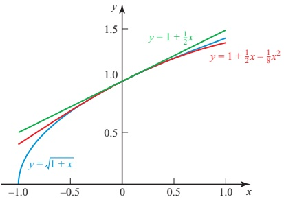
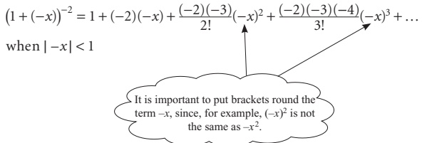
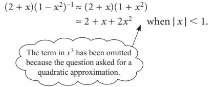
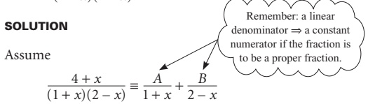
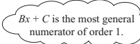

# Chapter 7 Further algebra

<!-- Pure Mathematics 2 and 3 Cambridge International AS and A Level Mathematics (Sophie Goldie, Roger Porkess) .pdf p163-185 -->

<!-- page 163 -->

# Further algebra

At the age of twenty-one he wrote a treatise upon the Binomial Theorem. ... On the strength of it, he won the Mathematical Chair at one of our smaller Universities.

Sherlock Holmes on Professor Moriarty in 'The Final Problem' by Sir Arthur Conan Doyle

How would you find √101 correct to 3 decimal places, without using a calculator?

Many people are able to develop a very high degree of skill in mental arithmetic, particularly those whose work calls for quick reckoning. There are also those who have quite exceptional innate skills. Shakuntala Devi, pictured right, is famous for her mathematical speed. On one occasion she found the 23rd root of a 201-digit number in her head, beating a computer by 12 seconds. On another occasion she multiplied 768369774870 by 2465099745779 in just 28 seconds.

While most mathematicians do not have Shakuntala Devi's high level of talent with

numbers, they do acquire a sense of when something looks right or wrong. This often involves finding approximate values of numbers, such as  $ \sqrt{101} $, using methods that are based on series expansions, and these are the subject of the first part of this chapter.

## INVESTIGATION

Using your calculator, write down the values of  $ \sqrt{1.02} $,  $ \sqrt{1.04} $,  $ \sqrt{1.06} $, ..., giving your answers correct to 2 decimal places. What do you notice?

Use your results to complete the following, giving the value of the constant k.

 $$ \sqrt{1.02}=(1+0.02)^{\frac{1}{2}}\approx1+0.02k $$ 

 $$ \sqrt{1.04}=(1+0.04)^{\frac{1}{2}}\approx1+0.04k $$ 

What is the largest value of x such that  $ \sqrt{1 + x} \approx 1 + kx $ is true for the same value of k?

<!-- page 164 -->

## The general binomial expansion

In Pure Mathematics 1 Chapter 3 you met the binomial expansion in the form

 $$ (1+x)^{n}=1+\binom{n}{1}x+\binom{n}{2}x^{2}+\binom{n}{3}x^{3}+\cdots+\binom{n}{r}x^{r}+\cdots $$ 

which holds when $n$ is any positive integer (or zero), that is $n \in \mathbb{N}$.

This may also be written as

 $$ \begin{aligned}(1+x)^{n}=1+nx+\frac{n(n-1)}{2!}x^{2}+\frac{n(n-1)(n-2)}{3!}x^{3}+\cdots\\+\frac{n(n-1)(n-2)\cdots(n-r+1)}{r!}x^{r}+\cdots\end{aligned}\begin{aligned}&\text{This is a short way of}\\&\text{writing}\text{‘}n\text{is a natural}\\&\text{number}!\text{. A natural is any}\\&\text{positive integer or zero.}\end{aligned} $$ 

which, being the same expansion as above, also holds when  $ n \in \mathbb{N} $.

The general binomial theorem states that this second form, that is

 $$ \begin{aligned}(1+x)^{n}=1+nx+\frac{n(n-1)}{2!}x^{2}+\frac{n(n-1)(n-2)}{3!}x^{3}+\cdots\\+\frac{n(n-1(n-2)\ldots(n-r+1)}{r!}x^{r}+\cdots\end{aligned} $$ 

is true when n is any real number, but there are two important differences to

 $$ n\notin\mathbb{N}. $$ 

● The series is infinite (or non-terminating).

This is a short way of writing 'n is not a natural number'.

The expansion of  $ (1 + x)^n $ is valid only if  $ |x| < 1 $.

Proving this result is beyond the scope of an A-level course but you can assume that it is true.

Consider now the coefficients in the binomial expansion:

 $$ 1,\quad n,\quad\frac{n(n-1)}{2!},\quad\frac{n(n-1(n-2)}{3!},\quad\frac{n(n-1)(n-2)(n-3)}{4!},\quad\ldots $$ 

 $$ \begin{aligned}&n=0,we~get&1&0&0&0&0&\cdots\quad(infinitely~many)\\&n=1&1&1&0&0&0&\cdots\quad&ditto\\&n=2&1&2&1&0&0&\cdots\quad&ditto\\&n=3&1&3&3&1&0&\cdots\quad&ditto\\&n=4&1&4&6&4&1&\cdots\quad&ditto\\\end{aligned} $$ 

so that, for example

 $$ (1+x)^{2}=1+2x+x^{2}+0x^{3}+0x^{4}+0x^{5}+\cdots $$ 

 $$ (1+x)^{3}=1+3x+3x^{2}+x^{3}+0x^{4}+0x^{5}+\cdots $$ 

 $$ (1+x)^{4}=1+4x+6x^{2}+4x^{3}+x^{4}+0x^{5}+\cdots $$

<!-- page 165 -->

Of course, it is usual to discard all the zeros and write these binomial coefficients in the familiar form of Pascal's triangle:

 $$ \begin{array}{cc}{{{1}}} \\{{{1}}}&{{{1}}} \\{{{1}}}&{{{2}}}&{{{1}}} \\{{{1}}}&{{{3}}}&{{{3}}}&{{{1}}} \\{{{1}}}&{{{4}}}&{{{6}}}&{{{4}}}&{{{1}}} \\\end{array} $$ 

and the expansions as

 $$ \begin{aligned}&(1+x)^{2}=1+2x+x^{2}\\&(1+x)^{3}=1+3x+3x^{2}+x^{3}\\&(1+x)^{4}=1+4x+6x^{2}+4x^{3}+x^{4}\end{aligned} $$ 

However, for other values of  $ n $ (where  $ n \notin \mathbb{N} $) there are no zeros in the row of binomial coefficients and so we obtain an infinite sequence of non-zero terms. For example:

 $$ \begin{align*}n&=-3\quad gives\quad1\quad-3\quad\frac{(-3)(-4)}{2!}\quad\frac{(-3)(-4)(-5)}{3!}\quad\frac{(-3)(-4)(-5)(-6)}{4!}\\&\quad that~is\quad1\quad-3\quad6\quad-10\quad15\\n&=\frac{1}{2}\quad gives\quad1\quad\frac{1}{2}\quad\frac{\left(\frac{1}{2}\right)\left(-\frac{1}{2}\right)}{2!}\quad\frac{\left(\frac{1}{2}\right)\left(-\frac{1}{2}\right)\left(-\frac{3}{2}\right)}{3!}\quad\frac{\left(\frac{1}{2}\right)\left(-\frac{1}{2}\right)\left(-\frac{3}{2}\right)\left(-\frac{5}{2}\right)}{4!}\quad\cdots\\&\quad that~is\quad1\quad\frac{1}{2}\quad-\frac{1}{8}\quad\frac{1}{16}\quad-\frac{5}{128}\quad\cdots\end{align*} $$ 

 $$ (1+x)^{-3}=1-3x+6x^{2}-10x^{3}+15x^{4}+\ldots $$ 

 $$ (1+x)^{\frac{1}{2}}=1+\frac{1}{2}x-\frac{1}{8}x^{2}+\frac{1}{16}x^{3}-\frac{5}{128}x^{4}+\cdots $$ 

## But remember: these two expansions are valid only if |x|<1

## p Show that the expansion of  $ (1 + x)^{\frac{1}{2}} $ is not valid when x = 8

These examples confirm that there will be an infinite sequence of non-zero coefficients when  $ n \notin \mathbb{N} $.

In the investigation at the beginning of this chapter you showed that

 $$ \sqrt{1+x}\approx1+\frac{1}{2}x $$ 

is a good approximation for small values of $x$. Notice that these are the first two terms of the binomial expansion for $n=\frac{1}{2}$. If you include the third term, the approximation is

 $$ \sqrt{1+x}\approx1+\frac{1}{2}x-\frac{1}{8}x^{2}. $$

<!-- page 166 -->

Take  $ y = 1 + \frac{1}{2}x $,  $ y = 1 + \frac{1}{2}x - \frac{1}{8}x^2 $ and  $ y = \sqrt{1 + x} $.

They are shown in the graph in figure 7.1 for values of x between -1 and 1.

Figure 7.1

## INVESTIGATION

For $n=\frac{1}{2}$ the first three terms of the binomial expansion are $1+\frac{1}{2}x-\frac{1}{8}x^{2}$. Use your calculator to verify the approximate result

 $$ \sqrt{1+x}\approx1+\frac{1}{2}x-\frac{1}{8}x^{2} $$ 

for ‘small’ values of x.

What values of x can be considered as ‘small’ if you want the result to be correct to 2 decimal places?

Now take n = -3. Using the coefficients found earlier suggests the approximate result

 $$ (1+x)^{-3}\approx1-3x+6x^{2}. $$ 

Comment on values of x for which this approximation is correct to 2 decimal places.

When  $ |x| < 1 $, the magnitudes of  $ x^2, x^3, x^4, x^5, \ldots $ form a decreasing geometric sequence. In this case, the binomial expansion converges (just as a geometric progression converges for  $ -1 < r < 1 $, where  $ r $ is the common ratio) and has a sum to infinity.

ACTIVITY 7.1 Compare the geometric progression  $ 1 - x + x^{2} - x^{3} + \ldots $ with the series obtained by putting n = -1 in the binomial expansion. What do you notice?

To summarise: when $n$ is not a positive integer or zero, the binomial expansion of $(1 + x)^n$ becomes an infinite series, and is only valid when some restriction is placed on the values of $x$.

<!-- page 167 -->

The binomial theorem states that for any value of n:

 $$ (1+x)^{n}=1+nx+\frac{n(n-1)}{2!}x^{2}+\frac{n(n-1)(n-2)}{3!}x^{3}+\cdots $$ 

where

if  $ n \in \mathbb{N} $,  $ x $ may take any value;

• if  $ n \notin \mathbb{N} $,  $ |x| < 1 $.

Note

The full statement is the binomial theorem, and the right-hand side is referred to as the binomial expansion.

### EXAMPLE 7.1

Expand  $ (1-x)^{-2} $ as a series of ascending powers of x up to and including the term in  $ x^{3} $, stating the set of values of x for which the expansion is valid.

## SOLUTION

 $$ (1+x)^{n}=1+nx+\frac{n(n-1)}{2!}x^{2}+\frac{n(n-1)(n-2)}{3!}x^{3}+\cdots $$ 

Replacing n by -2, and x by  $ (-x) $ gives

which leads to

 $$ (1-x)^{-2}\approx1+2x+3x^{2}+4x^{3}\quad when|x|<1. $$ 

Note

In this example the coefficients of the powers of x form a recognisable sequence, and it would be possible to write down a general term in the expansion. The coefficient is always one more than the power, so the rth term would be  $ rx^{r-1} $. Using sigma notation, the infinite series could be written as

 $$ \sum_{r=1}^{\infty}rx^{r-1} $$

<!-- page 168 -->

### EXAMPLE 7.2

Find a quadratic approximation for  $ \frac{1}{\sqrt{1+2t}} $ and state for which values of t the expansion is valid.

## SOLUTION

 $$ \frac{1}{\sqrt{1+2t}}=\frac{1}{(1+2t)^{\frac{1}{2}}}=(1+2t)^{-\frac{1}{2}} $$ 

The binomial theorem states that

 $$ (a+x)^{n}=1+nx+\frac{n(n-1)}{2!}x^{2}+\frac{n(n-1)(n-2)}{3!}x^{3}+\cdots $$ 

Replacing $n$ by $-\frac{1}{2}$ and $x$ by $2t$ gives

Remember to put brackets round the term $2t$, since $(2t)^{2}$ is not the same as $2t^{2}$.

 $$ (1+2t)^{-\frac{1}{2}}=1+\left(-\frac{1}{2}\right)(2t)+\frac{\left(-\frac{1}{2}\right)\left(-\frac{3}{2}\right)}{2!}(2t)^2+\cdots\text{when}|2t|<1 $$ 

 $$ \Rightarrow\quad(1+2t)^{-\frac{1}{2}}\approx1-t+\frac{3}{2}t^{2}\quad\text{when}|t|<\frac{1}{2} $$ 

## INVESTIGATION

Example 7.1 showed how using the binomial expansion for  $ (1 - x)^{-2} $ gave a sequence of coefficients of powers of x which was easily recognisable, so that the particular binomial expansion could be written using sigma notation.

Investigate whether a recognisable pattern is formed by the coefficients in the expansions of  $ (1 - x)^n $ for any other negative integers  $ n $.

The equivalent binomial expansion of  $ (a + x)^n $ when  $ n $ is not a positive integer is rather unwieldy. It is easier to start by taking  $ a $ outside the brackets:

 $$ (a+x)^{n}=a^{n}\bigg(1+\frac{x}{a}\bigg)^{n} $$ 

The first entry inside the bracket is now 1 and so the first few terms of the expansion are

 $$ \begin{align*}(a+x)^{n}&=a^{n}\Biggl[1+n\biggl(\frac{x}{a}\biggr)+\frac{n(n-1)}{2!}\biggl(\frac{x}{a}\biggr)^{2}+\frac{n(n-1)(n-2)}{3!}\biggl(\frac{x}{a}\biggr)^{3}+\ldots\Biggr]\\ for\left|\frac{x}{a}\right|&<1.\end{align*} $$ 

## Note

Since the bracket is raised to the power n, any quantity you take out must be raised to the power n too, as in the following example.

<!-- page 169 -->

### EXAMPLE 7.3

Expand  $ (2 + x)^{-3} $ as a series of ascending powers of x up to and including the term in  $ x^{2} $, stating the values of x for which the expansion is valid.

## SOLUTION

 $$ \begin{aligned}(2+x)^{-3}&=\frac{1}{(2+x)^{3}}\\&=\frac{1}{2^{3}\left(1+\frac{x}{2}\right)^{3}}\\&=\frac{1}{8}\left(1+\frac{x}{2}\right)^{-3}\end{aligned} $$ 

Notice that this is the same as  $ 2^{-3}\left(1 + \frac{x}{2}\right)^{-3} $.

Take the binomial expansion

 $$ (1+x)^{n}=1+nx+\frac{n(n-1)}{2!}x^{2}+\frac{n(n-1)(n-2)}{3!}x^{3}+\cdots $$ 

and replace n by -3 and x by  $ \frac{x}{2} $ to give

 $$ \begin{aligned}\frac{1}{8}\Big(1+\frac{x}{2}\Big)^{-3}&=\frac{1}{8}\Bigg[1+(-3)\Big(\frac{x}{2}\Big)+\frac{(-3)(-4)}{2!}\Big(\frac{x}{2}\Big)^{2}+\cdots\Bigg]\quad&when\left|\frac{x}{2}\right|<1\\ &\approx\frac{1}{8}-\frac{3x}{16}+\frac{3x^{2}}{16}\quad&when|x|<2\\ \end{aligned} $$ 

The chapter began by asking how you would find  $ \sqrt{101} $ to 3 decimal places without using a calculator. How would you find it?

### EXAMPLE 7.4

Find a quadratic approximation for  $ \frac{(2+x)}{(1-x^{2})} $, stating the values of x for which the expansion is valid.

## SOLUTION

 $$ \frac{(2+x)}{(1-x^{2})}=(2+x)(1-x^{2})^{-1} $$ 

Take the binomial expansion

 $$ (1+x)^{n}=1+nx+\frac{n(n-1)}{2!}x^{2}+\frac{n(n-1)(n-2)}{3!}x^{3}+\cdots $$ 

and replace n by -1 and x by  $ (-x^{2}) $ to give

 $$ \left(1+\left(-x^{2}\right)\right)^{-1}=1+\left(-1\right)\left(-x^{2}\right)+\frac{\left(-1\right)\left(-2\right)\left(-x^{2}\right)^{2}}{2!}+\cdots\quad when|-x^{2}|<1 $$ 

 $$ (1-x^{2})^{-1}=1+x^{2}+\cdots\quad when|x^{2}|<1,i.e.when|x|<1. $$

<!-- page 170 -->

Multiply both sides by  $ (2 + x) $ to obtain  $ (2 + x)(1 - x^2)^{-1} $:

 $$ \begin{aligned}(2+x)(1-x^{2})^{-1}&\approx(2+x)(1+x^{2})\\&\approx2+x+2x^{2}\quad when|x|<1.\end{aligned} $$ 

The term in $x^{3}$ has been omitted because the question asked for a quadratic approximation.

Sometimes two or more binomial expansions may be used together. If these impose different restrictions on the values of x, you need to decide which is the strictest.

### EXAMPLE 7.5

Find a and b such that

 $$ \frac{1}{(1-2x)(1+3x)}\approx a+bx $$ 

and state the values of x for which the expansions you use are valid.

## SOLUTION

 $$ \frac{1}{(1-2x)(1+3x)}=(1-2x)^{-1}(1+3x)^{-1} $$ 

Using the binomial expansion:

 $$ \begin{aligned}&(1-2x)^{-1}\approx1+(-1)(-2x)\quad&for|-2x|<1\\ and\quad&(1+3x)^{-1}\approx1+(-1)(3x)\quad&for|3x|<1\end{aligned} $$ 

 $$ \Rightarrow\quad(1-2x)^{-1}(1+3x)^{-1}\approx(1+2x)(1-3x) $$ 

 $ \approx 1 - x $ (ignoring higher powers of x)

giving a = 1 and b = -1.

For the result to be valid, both  $ |2x| < 1 $ and  $ |3x| < 1 $ need to be satisfied.

 $$ \begin{aligned}&|2x|<1\quad\Rightarrow\quad-\frac{1}{2}<x<\frac{1}{2}\end{aligned} $$ 

and

 $$ \begin{aligned}&|3x|<1\quad\Rightarrow\quad-\frac{1}{3}<x<\frac{1}{3}\end{aligned} $$ 

Both of these restrictions are satisfied if $-\frac{1}{3}<x<\frac{1}{3}$. This is the stricter restriction.

## Note

The binomial expansion may also be used when the first term is the variable. For example:

 $$ (x+2)^{-1}\text{may be written as}(2+x)^{-1}=2^{-1}\left(1+\frac{x}{2}\right)^{-1} $$ 

 $$ \begin{aligned}and\qquad(2x-1)^{-3}&=[(-1)(1-2x)]^{-3}\\&=(-1)^{-3}(1-2x)^{-3}\\&=-(1-2x)^{-3}\end{aligned} $$

<!-- page 171 -->

What happens when you try to rearrange  $ \sqrt{x-1} $ so that the binomial expansion can be used?

## EXERCISE 7A

1 For each of the expressions below

(a) write down the first three non-zero terms in their expansions as a series of ascending powers of x

(b) state the values of x for which the expansion is valid

(c) substitute x = 0.1 in both the expression and its expansion and calculate the percentage error, where

 $$  percentage~error=\frac{absolute~error\times100}{true~value}\% $$ 

(i)

 $$ (1+x)^{-2} $$ 

(ii)

 $$ \frac{1}{1+2x} $$ 

(iii)

 $$ \sqrt{1-x^{2}} $$ 

(iv)

 $$ \frac{1+2x}{1-2x} $$ 

(v)

 $$ (3+x)^{-1} $$ 

(vi)

 $$ (1-x)\sqrt{4+x} $$ 

(vii)

 $$ \frac{x+2}{x-3} $$ 

(viii)

 $$ \frac{1}{\sqrt{3x+4}} $$ 

(ix)

 $$ \frac{1+2x}{(2x-1)^{2}} $$ 

(x)

 $$ \frac{1+x^{2}}{1-x^{2}} $$ 

(xi)

 $$ \sqrt[3]{1+2x^{2}} $$ 

 $$ \frac{1}{(1+2x)(1+x)} $$ 

(xii)

2 (i) Write down the expansion of  $ (1 + x)^{3} $.

(ii) Find the first four terms in the expansion of  $ (1 - x)^{-4} $ in ascending powers of x. For what values of x is this expansion valid?

(iii) When the expansion is valid

 $$ \frac{(1+x)^{3}}{(1-x)^{4}}=1+7x+ax^{2}+bx^{3}+\cdots. $$ 

Find the values of a and b.

3 (i) Write down the expansion of  $ (2 - x)^{4} $.

(ii) Find the first four terms in the expansion of  $ (1 + 2x)^{-3} $ in ascending powers of x. For what range of values of x is this expansion valid?

(iii) When the expansion is valid

 $$ \frac{(2-x)^{4}}{(1+2x)^{3}}=16+ax+bx^{2}+\cdots. $$ 

Find the values of a and b.

4 Write down the expansions of the following expressions in ascending powers of $x$, as far as the term containing $x^{3}$. In each case state the values of $x$ for which the expansion is valid.

(i)

 $$ (1-x)^{-1} $$ 

 $$ (1+2x)^{-2} $$ 

(ii)

(iii)

 $$ \frac{1}{(1-x)(1+2x)^{2}} $$

<!-- page 172 -->

5 (i) Show that  $ \frac{1}{\sqrt{4-x}} = \frac{1}{2}\left(1 - \frac{x}{4}\right)^{-\frac{1}{2}} $.

(ii) Write down the first three terms in the binomial expansion of  $ \left(1-\frac{x}{4}\right)^{-\frac{1}{2}} $ in ascending powers of x, stating the range of values of x for which this expansion is valid.

(iii) Find the first three terms in the expansion of  $ \frac{2(1+x)}{\sqrt{4-x}} $ in ascending powers of x, for small values of x.

6 (i) Expand  $ (1 + y)^{-1} $, where -1 < y < 1, as a series in powers of y, giving the first four terms.

(ii) Hence find the first four terms of the expansion of  $ \left(1+\frac{2}{x}\right)^{-1} $ where  $ -1<\frac{2}{x}<1 $.

(iii) Show that  $ \left(1+\frac{2}{x}\right)^{-1}=\frac{x}{x+2}=\frac{x}{2}\left(1+\frac{x}{2}\right)^{-1} $.

(iv) Find the first four terms of the expansion of  $ \frac{x}{2}\left(1 + \frac{x}{2}\right)^{-1} $ where  $ -1 < \frac{x}{2} < 1 $.

(v) State the conditions on x under which your expansions for  $ \left(1+\frac{2}{x}\right)^{-1} $ and  $ \frac{x}{2}\left(1+\frac{x}{2}\right)^{-1} $ are valid and explain briefly why your expansions are different.

7 Expand  $ (2 + 3x)^{-2} $ in ascending powers of x, up to and including the term in  $ x^{2} $, simplifying the coefficients.

[Cambridge International AS & A Level Mathematics 9709, Paper 3 Q1 June 2007]

8 Expand  $ (1 + x)\sqrt{(1 - 2x)} $ in ascending powers of x, up to and including the term in  $ x^{2} $, simplifying the coefficients.

[Cambridge International AS & A Level Mathematics 9709, Paper 3 Q2 November 2008]

9 When  $ (1 + 2x)(1 + ax)^{\frac{5}{3}} $, where a is a constant, is expanded in ascending powers of x, the coefficient of the term in x is zero.

(i) Find the value of a.

(ii) When $a$ has this value, find the term in $x^3$ in the expansion of $(1 + 2x)(1 + ax)^{\frac{2}{3}}$, simplifying the coefficient.

[Cambridge International AS & A Level Mathematics 9709, Paper 3 Q5 June 2009]

<!-- page 173 -->

## b Review of algebraic fractions

If $f(x)$ and $g(x)$ are polynomials, the expression $\frac{f(x)}{g(x)}$ is an algebraic fraction or rational function. It may also be called a rational expression. There are many occasions in mathematics when a problem reduces to the manipulation of algebraic fractions, and the rules for this are exactly the same as those for numerical fractions.

## Simplifying fractions

To simplify a fraction, you look for a factor common to both the numerator (top line) and the denominator (bottom line) and cancel by it.

For example, in arithmetic

 $$ \frac{15}{20}=\frac{5\times3}{5\times4}=\frac{3}{4} $$ 

and in algebra

 $$ \frac{6a}{9a^{2}}=\frac{2\times3\times a}{3\times3\times a\times a}=\frac{2}{3a} $$ 

Notice how you must factorise both the numerator and denominator before cancelling, since it is only possible to cancel by a common factor. In some cases this involves putting brackets in.

 $$ \frac{2a+4}{a^{2}-4}=\frac{2(a+2)}{(a+2)(a-2)}=\frac{2}{(a-2)} $$ 

## Multiplying and dividing fractions

Multiplying fractions involves cancelling any factors common to the numerator and denominator. For example:

As with simplifying, it is often necessary to factorise any algebraic expressions first.

 $$ \frac{10a}{3b^{2}}\times\frac{9ab}{25}=\frac{2\times5\times a}{3\times b\times b}\times\frac{3\times3\times a\times b}{5\times5}=\frac{6a^{2}}{5b} $$ 

 $$ \begin{aligned}\frac{a^{2}+3a+2}{9}\times\frac{12}{a+1}&=\frac{(a+1)(a+2)}{3\times3}\times\frac{3\times4}{(a+1)}\\&=\frac{(a+2)}{3}\times\frac{4}{1}\\&=\frac{4(a+2)}{3}\end{aligned} $$ 

Remember that when one fraction is divided by another, you change  $ \div $ to  $ \times $ and invert the fraction which follows the  $ \div $ symbol. For example:

 $$ \begin{aligned}\frac{12}{x^{2}-1}\div\frac{4}{x+1}&=\frac{12}{(x+1)(x-1)}\times\frac{(x+1)}{4}\\&=\frac{3}{(x-1)}\end{aligned} $$

<!-- page 174 -->

## Addition and subtraction of fractions

To add or subtract two fractions they must be replaced by equivalent fractions, both of which have the same denominator.

For example:

 $$ \frac{2}{3}+\frac{1}{4}=\frac{8}{12}+\frac{3}{12}=\frac{11}{12} $$ 

Similarly, in algebra:

 $$ \frac{2x}{3}+\frac{x}{4}=\frac{8x}{12}+\frac{3x}{12}=\frac{11x}{12} $$ 

and

 $$ \frac{2}{3x}+\frac{1}{4x}=\frac{8}{12x}+\frac{3}{12x}=\frac{11}{12x} $$ 

Notice how you only need 12x here, not $12x^{2}$.

You must take particular care when the subtraction of fractions introduces a sign change. For example:

 $$ \begin{aligned}\frac{4x-3}{6}-\frac{2x+1}{4}&=\frac{2(4x-3)-3(2x+1)}{12}\\&=\frac{8x-6-6x-3}{12}\\&=\frac{2x-9}{12}\end{aligned} $$ 

Notice how in addition and subtraction, the new denominator is the lowest common multiple of the original denominators. When two denominators have no common factor, their product gives the new denominator. For example:

 $$ \begin{array}{l}\frac{2}{y+3}+\frac{3}{y-2}=\frac{2(y-2)+3(y+3)}{(y+3)(y-2)} \\ =\frac{2y-4+3y+9}{(y+3)(y-2)} \\ =\frac{5y+5}{(y+3)(y-2)} \\ =\frac{5(y+1)}{(y+3)(y-2)}\end{array} $$ 

It may be necessary to factorise denominators in order to identify common factors, as shown here.

 $$ \begin{aligned}\frac{2b}{a^{2}-b^{2}}-\frac{3}{a+b}&=\frac{2b}{(a+b)(a-b)}-\frac{3}{(a+b)}\\&=\frac{2b-3(a-b)}{(a+b)(a-b)}\quad\text{if}\underbrace{(a+b)\text{is a common factor.}}_{}\\&=\frac{5b-3a}{(a+b)(a-b)}\end{aligned} $$

<!-- page 175 -->

## EXERCISE 7B

Simplify the expressions in questions 1 to 10.

1

2

 $$ \frac{6a}{b}\times\frac{a}{9b^{2}} $$ 

 $$ \frac{5xy}{3}\div15xy^{2} $$ 

3  $ \frac{x^{2}-9}{x^{2}-9x+18} $

4  $ \frac{5x-1}{x+3} \times \frac{x^{2}+6x+9}{5x^{2}+4x-1} $

5 $\frac{4x^{2}-25}{4x^{2}+20x+25}$

6  $ \frac{a^{2}+a-12}{5}\times\frac{3}{4a-12} $

7  $ \frac{4x^{2}-9}{x^{2}+2x+1}\div\frac{2x-3}{x^{2}+x} $

8  $ \frac{2p+4}{5}\div(p^{2}-4) $

9

 $$ \frac{a^{2}-b^{2}}{2a^{2}+ab-b^{2}} $$ 

10

 $$ \frac{x^{2}+8x+16}{x^{2}+6x+9}\times\frac{x^{2}+2x-3}{x^{2}+4x} $$ 

In questions 11 to 24 write each of the expressions as a single fraction in its simplest form.

11

 $$ \frac{1}{4x}+\frac{1}{5x} $$ 

12

 $$ \frac{x}{3}-\frac{(x+1)}{4} $$ 

13

 $$ \frac{a}{a+1}+\frac{1}{a-1} $$ 

14

 $$ \frac{2}{x-3}+\frac{3}{x-2} $$ 

15

 $$ \frac{x}{x^{2}-4}-\frac{1}{x+2} $$ 

16

 $$ \frac{p^{2}}{p^{2}-1}-\frac{p^{2}}{p^{2}+1} $$ 

17

 $$ \frac{2}{a+1}-\frac{a}{a^{2}+1} $$ 

18

 $$ \frac{2y}{(y+2)^{2}}-\frac{4}{y+4} $$ 

19

 $$ x+\frac{1}{x+1} $$ 

20

 $$ \frac{2}{b^{2}+2b+1}-\frac{3}{b+1} $$ 

21

 $$ \frac{2}{3(x-1)}+\frac{3}{2(x+1)} $$ 

22

 $$ \frac{6}{5(x+2)}+\frac{2x}{(x+2)^{2}} $$ 

23

 $$ \frac{2}{a+2}-\frac{a-2}{2a^{2}+a-6} $$ 

24

 $$ \frac{1}{x-2}+\frac{1}{x}+\frac{1}{x+2} $$ 

## Partial fractions

Sometimes, it is easier to deal with two or three simple separate fractions than it is to handle one more complicated one.

For example:

 $$ \frac{1}{(1+2x)(1+x)} $$ 

may be written as

 $$ \frac{2}{\left(1+2x\right)}-\frac{1}{\left(1+x\right)}. $$

<!-- page 176 -->

When  $ \frac{1}{(1+2x)(1+x)} $ is written as  $ \frac{2}{(1+2x)} - \frac{1}{(1+x)} $ you can then do binomial expansions on the two fractions, and so find an expansion for the original fraction.

● When integrating, it is easier to work with a number of simple fractions than a combined one. For example, the only analytic method for integrating  $ \frac{1}{(1+2x)(1+x)} $ involves first writing it as  $ \frac{2}{(1+2x)} - \frac{1}{(1+x)} $. You will meet this application in Chapter 8.

This process of taking an expression such as  $ \frac{1}{(1+2x)(1+x)} $ and writing it in the form  $ \frac{2}{(1+2x)} - \frac{1}{(1+x)} $ is called expressing the algebraic fraction in partial fractions.

When finding partial fractions you must always assume the most general numerator possible, and the method for doing this is illustrated in the following examples.

## Type 1: Denominators of the form  $ (ax + b)(cx + d)(ex + f) $

Express  $ \frac{4+x}{(1+x)(2-x)} $ as a sum of partial fractions.

Multiplying both sides by  $ (1 + x)(2 - x) $ gives

 $$ 4+x\equiv A(2-x)+B(1+x). $$ 

This is an identity; it is true for all values of x.

There are two possible ways in which you can find the constants A and B. You can either

- substitute any two values of x in ① (two values are needed to give two equations to solve for the two unknowns A and B); or

- equate the constant terms to give one equation (this is the same as putting $x=0$) and the coefficients of $x$ to give another.

Sometimes one method is easier than the other, and in practice you will often want to use a combination of the two.

<!-- page 177 -->

## Method 1: Substitution

Although you can substitute any two values of x, the easiest to use are x=2 and x=-1, since each makes the value of one bracket zero in the identity.

 $$ 4+x\equiv A(2-x)+B(1+x) $$ 

 $$ x=2\quad\Rightarrow\quad4+2=A(2-2)+B(1+2) $$ 

 $$ 6=3B\quad\Rightarrow\quad B=2 $$ 

 $$ x=-1\quad\Rightarrow\quad4-1=A(2+1)+B(1-1) $$ 

 $$ 3=3\boldsymbol{A}\quad\Rightarrow\quad\boldsymbol{A}=1 $$ 

Substituting these values for A and B gives

 $$ \frac{4+x}{(1+x)(2-x)}\equiv\frac{1}{1+x}+\frac{2}{2-x} $$ 

## Method 2: Equating coefficients

In this method, you write the right-hand side of

 $$ 4+x\equiv A(2-x)+B(1+x) $$ 

as a polynomial in x, and then compare the coefficients of the various terms.

 $$ 4+x\equiv2A-Ax+B+Bx $$ 

 $$ 4+1x\equiv(2A+B)+(-A+B)x $$ 

Equating the constant terms:  $ 4 = 2A + B $

Equating the coefficients of $x$: $1 = -A + B$

These are simultaneous equations in $A$ and $B$.

Solving these simultaneous equations gives A = 1 and B = 2 as before.

In each of these methods the identity ( $ \equiv $) was later replaced by equality (=). Why was this done?

In some cases it is necessary to factorise the denominator before finding the partial fractions.

### EXAMPLE 7.7

Express  $ \frac{x(5x+7)}{(2x+1)(x^{2}-1)} $ as a sum of partial fractions.

SOLUTION

 $$ \frac{x(5x+7)}{(2x+1)(x^{2}-1)}=\frac{x(5x+7)}{(2x+1)(x+1)(x-1)} $$ 

Start by factorising the denominator fully, replacing  $ (x^{2}-1) $ with  $ (x+1)(x-1) $.

<!-- page 178 -->

There are three factors in the denominator, so write

 $$ \frac{x(5x+7)}{(2x+1)(x+1)(x-1)}\equiv\frac{A}{2x+1}+\frac{B}{x+1}+\frac{C}{x-1} $$ 

Multiplying both sides by  $ (2x+1)(x+1)(x-1) $ gives

 $$ x(5x+7)\equiv A(x+1)(x-1)+B(2x+1)(x-1)+C(2x+1)(x+1) $$ 

Substituting x = 1 gives: 12 = 6C

 $$ \begin{aligned}12&=6C\leftarrow\\C&=2\end{aligned} $$ 

 $$ \implies $$ 

Notice how a combination of the two methods is used.

Substituting $x = -1$ gives: $-2 = 2B$

 $$ \boldsymbol{B}=-1 $$ 

 $$ \implies $$ 

Equating coefficients of  $ x^{2} $ gives:  $ 5 = A + 2B + 2C $

As $B = -1$ and $C = 2$:

 $$ 5=A-2+4 $$ 

 $$ \implies $$ 

 $$ A=3 $$ 

 $$ \mathrm{Hence}\ \frac{x(5x+7)}{(2x+1)(x+1)(x-1)}\equiv\frac{3}{2x+1}-\frac{1}{x+1}+\frac{2}{x-1} $$ 

In the next example the orders of the numerator (top line) and the denominator (bottom line) are the same.

### EXAMPLE 7.8

Express  $ \frac{6-x^{2}}{4-x^{2}} $ as a sum of partial fractions.

## SOLUTION

Start by dividing the numerator by the denominator. In this case the quotient is 1 and the remainder is 2.

So

 $$ \frac{6-x^{2}}{4-x^{2}}=1+\frac{2}{4-x^{2}} $$ 

Now find  $ \frac{2}{4-x^{2}} $.

You can also use this method when the order of the numerator is greater than that of the denominator.

 $$ \frac{2}{4-x^{2}}\equiv\frac{2}{(2+x)(2-x)}\equiv\frac{A}{2+x}+\frac{B}{2-x} $$ 

Multiplying both sides by  $ (2 + x)(2 - x) $ gives

 $$ 2\equiv A(2-x)+B(2+x) $$ 

 $$ 2\equiv(2\boldsymbol{A}+2\boldsymbol{B})+\boldsymbol{x}(\boldsymbol{B}-\boldsymbol{A}) $$ 

Equating constant terms:

 $$ \begin{aligned}2&=2\boldsymbol{A}+2\boldsymbol{B}\\\boldsymbol{A}+\boldsymbol{B}&=1\end{aligned} $$ 

SO

Equating coefficients of x: 0 = B - A, so B = A

Substituting in ① gives

 $$ A=B=\frac{1}{2} $$

<!-- page 179 -->

Using these values

 $$ \frac{2}{(2+x)(2-x)}\equiv\frac{\frac{1}{2}}{2+x}+\frac{\frac{1}{2}}{2-x}\equiv\frac{1}{2(2+x)}+\frac{1}{2(2-x)} $$ 

So

 $$ \frac{6-x^{2}}{4-x^{2}}\equiv1+\frac{1}{2(2+x)}+\frac{1}{2(2-x)} $$ 

## EXERCISE 7C

Write the expressions in questions 1 to 15 as a sum of partial fractions.

 $$ \frac{5}{(x-2)(x+3)} $$ 

2

 $$ \frac{1}{x(x+1)} $$ 

3

 $$ \frac{6}{(x-1)(x-4)} $$ 

 $$ \frac{x+5}{(x-1)(x+2)} $$ 

5

 $$ \frac{3x}{(2x-1)(x+1)} $$ 

6

 $$ \frac{4}{x^{2}-2x} $$ 

7

 $$ \frac{2}{(x-1)(3x-1)} $$ 

8

 $$ \frac{x-1}{x^{2}-3x-4} $$ 

9

 $$ \frac{x+2}{2x^{2}-x} $$ 

10

 $$ \frac{7}{2x^{2}+x-6} $$ 

11

12

 $$ \frac{2x-1}{2x^{2}+3x-20} $$ 

 $$ \frac{2x+5}{18x^{2}-8} $$ 

13

 $$ \frac{6x^{2}+22x+18}{(x+1)(x+2)(x+3)} $$ 

14

 $$ \frac{4x^{2}-25x-3}{(2x+1)(x-1)(x-3)} $$ 

15

 $$ \frac{5x^{2}+13x+10}{(2x+3)(x^{2}-4)} $$ 

### EXAMPLE 7.9

## Type 2: Denominators of the form  $ (ax + b)(cx^{2} + d) $

Express  $ \frac{2x+3}{(x-1)(x^{2}+4)} $ as a sum of partial fractions.

## SOLUTION

You need to assume a numerator of order 1 for the partial fraction with a denominator of  $ x^{2} + 4 $, which is of order 2.

 $$ \frac{2x+3}{(x-1)(x^{2}+4)}\equiv\frac{A}{x-1}+\frac{Bx+C}{x^{2}+4} $$ 

Multiplying both sides by  $ (x-1)(x^{2}+4) $ gives

 $$ \begin{aligned}2x+3&\equiv A(x^{2}+4)+(Bx+C)(x-1)\\x=1\quad&\Rightarrow\quad5=5A\quad\Rightarrow\quad A=1\end{aligned} $$ 

The other two unknowns, B and C, are most easily found by equating coefficients.

Identity ① may be rewritten as

 $$ 2x+3\equiv(A+B)x^{2}+(-B+C)x+(4A-C) $$ 

Equating coefficients of  $ x^{2} $: 0 = A + B  $ \Rightarrow $ B = -1

Equating constant terms:

 $$ 3=4A-C\quad\Rightarrow\quad C=1 $$ 

This gives

 $$ \frac{2x+3}{(x-1)(x^{2}+4)}\equiv\frac{1}{x-1}+\frac{1-x}{x^{2}+4} $$

<!-- page 180 -->

## Type 3: Denominators of the form  $ (ax + b)(cx + d)^{2} $

The factor  $ (cx + d)^{2} $ is of order 2, so it would have an order 1 numerator in the partial fractions. However, in the case of a repeated factor there is a simpler form.

Consider

 $$ \frac{4x+5}{(2x+1)^{2}} $$ 

This can be written as

 $$ \begin{aligned}&\frac{2(2x+1)+3}{(2x+1)^{2}}\\ \equiv&\frac{2(2x+1)}{(2x+1)^{2}}+\frac{3}{(2x+1)^{2}}\\ \equiv&\frac{2}{(2x+1)}+\frac{3}{(2x+1)^{2}}\end{aligned} $$ 

Note

In this form, both the numerators are constant.

In a similar way, any fraction of the form  $ \frac{px+q}{(cx+d)^2} $ can be written as

 $$ \frac{A}{(cx+d)}+\frac{B}{(cx+d)^{2}} $$ 

When expressing an algebraic fraction in partial fractions, you are aiming to find the simplest partial fractions possible, so you would want the form where the numerators are constant.

### EXAMPLE 7.10

Express  $ \frac{x+1}{(x-1)(x-2)^{2}} $ as a sum of partial fractions.

## SOLUTION

Let

 $$ \frac{x+1}{(x-1)(x-2)^{2}}\equiv\frac{A}{(x-1)}+\frac{B}{(x-2)}+\frac{C}{(x-2)^{2}} $$ 

Notice that you only need  $ (x-2)^{2} $ here and not  $ (x-2)^{3} $.

Multiplying both sides by  $ (x-1)(x-2)^{2} $ gives

 $$ x+1\equiv A(x-2)^{2}+B(x-1)(x-2)+C(x-1) $$ 

 $$ x=1(so that x-1=0)\Rightarrow\quad2=A(-1)^{2}\Rightarrow A=2 $$ 

 $$ x=2(so that x-2=0)\Rightarrow\quad3=C $$ 

Equating coefficients of  $ x^{2} $:  $ \Rightarrow $ 0 = A + B  $ \Rightarrow $ B = -2

This gives

 $$ \frac{x+1}{(x-1)(x-2)^{2}}\equiv\frac{2}{x-1}-\frac{2}{x-2}+\frac{3}{(x-2)^{2}} $$

<!-- page 181 -->

### EXAMPLE 7.11

Express  $ \frac{5x^{2}-3}{x^{2}(x+1)} $ as a sum of partial fractions.

## SOLUTION

Let

 $$ \frac{5x^{2}-3}{x^{2}(x+1)}\equiv\frac{A}{x}+\frac{B}{x^{2}}+\frac{C}{x+1} $$ 

Multiplying both sides by  $ x^{2}(x+1) $ gives

 $$ 5x^{2}-3\equiv Ax(x+1)+B(x+1)+Cx^{2} $$ 

 $$ x=0\quad\Rightarrow\quad-3=B $$ 

 $$ x=-1\quad\Rightarrow\quad+2=C $$ 

Equating coefficients of  $ x^{2} $: +5 = A + C  $ \Rightarrow $ A = 3

This gives

 $$ \frac{5x^{2}-3}{x^{2}(x+1)}\equiv\frac{3}{x}-\frac{3}{x^{2}}+\frac{2}{x+1} $$ 

## EXERCISE 7D

1 Express each of the following fractions as a sum of partial fractions.

(i)

 $$ \frac{4}{(1-3x)(1-x)^{2}} $$ 

(ii)

 $$ \frac{4+2x}{(2x-1)(x^{2}+1)} $$ 

(iii)

 $$ \frac{5-2x}{(x-1)^{2}(x+2)} $$ 

(iv)

 $$ \frac{2x+1}{(x-2)(x^{2}+4)} $$ 

(v)

 $$ \frac{2x^{2}+x+4}{(2x^{2}-3)(x+2)} $$ 

(vi)

 $$ \frac{x^{2}-1}{x^{2}(2x+1)} $$ 

(vii)

 $$ \frac{x^{2}+3}{x(3x^{2}-1)} $$ 

(viii)

 $$ \frac{2x^{2}+x+2}{(2x^{2}+1)(x+1)} $$ 

 $$ \frac{4x^{2}-3}{x(2x-1)^{2}} $$ 

2 Given that

 $$ \frac{x^{2}+2x+7}{(2x+3)(x^{2}+4)}\equiv\frac{A}{(2x+3)}+\frac{Bx+C}{(x^{2}+4)} $$ 

find the values of the constants A, B and C.

[MEI, part]

3 Calculate the values of the constants A, B and C for which

 $$ \frac{x^{2}-4x+23}{(x-5)(x^{2}+3)}\equiv\frac{A}{(x-5)}+\frac{Bx+C}{(x^{2}+3)} $$ 

[MEI, part]

<!-- page 182 -->

## Using partial fractions with the binomial expansion

One of the most common reasons for writing an expression in partial fractions is to enable binomial expansions to be applied, as in the following example.

### EXAMPLE 7.12

Express  $ \frac{2x+7}{(x-1)(x+2)} $ in partial fractions and hence find the first three terms of its binomial expansion, stating the values of x for which this is valid.

## SOLUTION

 $$ \frac{2x+7}{(x-1)(x+2)}\equiv\frac{A}{(x-1)}+\frac{B}{(x+2)} $$ 

Multiplying both sides by  $ (x-1)(x+2) $ gives

 $$ 2x+7\equiv A(x+2)+B(x-1) $$ 

 $$ x\quad=1\quad\Rightarrow\quad9=3A\quad\Rightarrow\quad A=3 $$ 

 $$ x=-2\quad\Rightarrow\quad3=-3B\quad\Rightarrow\quad B=-1 $$ 

This gives

 $$ \frac{2x+7}{(x-1)(x+2)}\equiv\frac{3}{(x-1)}-\frac{1}{(x+2)} $$ 

In order to obtain the binomial expansion, each bracket must be of the form  $ (1 \pm \ldots) $, giving

 $$ \begin{aligned}\frac{2x+7}{(x-1)(x+2)}&\equiv\frac{-3}{(1-x)}-\frac{1}{2\left(1+\frac{x}{2}\right)}\\&\equiv-3(1-x)^{-1}-\frac{1}{2}\Big(1+\frac{x}{2}\Big)^{-1}\end{aligned} $$ 

The two binomial expansions are

 $$ \begin{aligned}(1-x)^{-1}&=1+(-1)(-x)+\frac{(-1)(-2)}{2!}(-x)^{2}+\cdots&for|x|<1\\ &\approx1+x+x^{2}\\ \end{aligned} $$ 

and

 $$ \begin{aligned}\left(1+\frac{x}{2}\right)^{-1}&=1+(-1)\left(\frac{x}{2}\right)+\frac{(-1)(-2)}{2!}\left(\frac{x}{2}\right)^{2}+\cdots\quad for\left|\frac{x}{2}\right|<1\\&\approx1-\frac{\pmb{x}}{2}+\frac{x^{2}}{4}\end{aligned} $$ 

Substituting these in ① gives

 $$ \begin{aligned}\frac{2x+7}{(x-1)(x+2)}&\approx-3(1+x+x^{2})-\frac{1}{2}\binom{1}{1}-\frac{x}{2}+\frac{x^{2}}{4}\\&=-\frac{7}{2}-\frac{11x}{4}-\frac{25x^{2}}{8}\end{aligned} $$ 

The expansion is valid when  $ |x| < 1 $ and  $ \left| \frac{x}{2} \right| < 1 $. The stricter of these is  $ |x| < 1 $.

<!-- page 183 -->

Find a binomial expansion for the function

 $$  f(x)=\frac{1}{(1+2x)(1-x)} $$ 

and state the values of x for which it is valid

(i) by writing it as  $ (1 + 2x)^{-1}(1 - x)^{-1} $

(ii) by writing it as  $ [1+(x-2x^2)]^{-1} $ and treating  $ (x-2x^2) $ as one term

(iii) by first expressing  $ f(x) $ as a sum of partial fractions.

Decide which method you find simplest for the following cases.

(a) When a linear approximation for  $ f(x) $ is required.

(b) When a quadratic approximation for  $ f(x) $ is required.

(c) When the coefficient of  $ x^{n} $ is required.

## EXERCISE 7E

1 Find the first three terms in ascending powers of x in the binomial expansion of the following fractions.

(i)

 $$ \frac{4}{(1-3x)(1-x)^{2}} $$ 

(ii)

 $$ \frac{4+2x}{(2x-1)(x^{2}+1)} $$ 

(iii)  $ \frac{5-2x}{(x-1)^{2}(x+2)} $

(iv)  $ \frac{2x+1}{(x-2)(x^{2}+4)} $

2 (i) Express  $ \frac{7-4x}{(2x-1)(x+2)} $ in partial fractions as  $ \frac{A}{(2x-1)}+\frac{B}{(x+2)} $ where A and B are to be found.

(ii) Find the expansion of  $ \frac{1}{(1-2x)} $ in the form  $ a + bx + cx^{2} + \ldots $ where a, b and c are to be found.

Give the range of values of x for which this expansion is valid.

(iii) Find the expansion of  $ \frac{1}{(2+x)} $ as far as the term containing  $ x^{2} $. Give the range of values of x for which this expansion is valid.

(iv) Hence find a quadratic approximation for  $ \frac{7-4x}{(2x-1)(x+2)} $ when  $ |x| $ is small.

Find the percentage error in this approximation when x = 0.1.

[MEI]

3 (i) Expand  $ (2 - x)(1 + x) $.

Hence express  $ \frac{3x}{2+x-x^{2}} $ in partial fractions.

(ii) Use the binomial expansion of the partial fractions in part (i) to show that

 $$ \frac{3x}{2+x-x^{2}}=\frac{3}{2}x-\frac{3}{4}x^{2}+\cdots. $$ 

State the range of values of x for which this result is valid.

<!-- page 184 -->

4 (i) Given that  $ f(x) = \frac{8x - 6}{(1 - x)(3 - x)} $, express  $ f(x) $ in partial fractions.

Hence show that

 $$ \mathrm{f}^{\prime}(x)=(1-x)^{-2}-\left(1-\frac{x}{3}\right)^{-2}. $$ 

(ii) Using the results in part (i), or otherwise, find the x co-ordinates of the stationary points on the graph of  $ y = f(x) $.

(iii) Use the binomial expansion, together with the result in part (i), to expand  $ f'(x) $ in powers of x up to and including the term in  $ x^{2} $.

(iv) Show that, when  $ f'(x) $ is expanded in powers of x, the coefficients of all the powers of x are positive.

5 (i) Express  $ \frac{10}{(2-x)(1+x^{2})} $ in partial fractions.

(ii) Hence, given that |x|<1, obtain the expansion of  $ \frac{10}{(2-x)(1+x^2)} $ in ascending powers of x, up to and including the term in  $ x^3 $, simplifying the coefficients.

[Cambridge International AS & A Level Mathematics 9709, Paper 3 Q9 June 2006]

6 (i) Express  $ \frac{3x^{2}+x}{(x+2)(x^{2}+1)} $ in partial fractions.

(ii) Hence obtain the expansion of  $ \frac{3x^{2}+x}{(x+2)(x^{2}+1)} $ in ascending powers of x, up to and including the term in  $ x^{3} $.

[Cambridge International AS & A Level Mathematics 9709, Paper 3 Q9 November 2005]

7 (i) Express  $ \frac{2-x+8x^{2}}{(1-x)(1+2x)(2+x)} $ in partial fractions.

(ii) Hence obtain the expansion of  $ \frac{2-x+8x^2}{(1-x)(1+2x)(2+x)} $ in ascending powers of x, up to and including the term in  $ x^2 $.

[Cambridge International AS & A Level Mathematics 9709, Paper 3 Q9 November 2007]

<!-- page 185 -->

1 The general binomial expansion for  $ n \in \mathbb{R} $ is

 $$ (1+x)^{n}=1+nx+\frac{n(n-1)}{2!}x^{2}+\frac{n(n-1)(n-2)}{3!}x^{3}+\cdots. $$ 

In the special case when  $ n \in \mathbb{N} $, the series expansion is finite and valid for all x.

When  $ n \notin \mathbb{N} $, the series expansion is non-terminating (infinite) and valid only if  $ |x| < 1 $.

2 When  $ n \notin \mathbb{N} $,  $ (a + x)^n $ should be written as  $ a^n\left(1 + \frac{x}{a}\right)^n $ before obtaining the binomial expansion.

3 When multiplying algebraic fractions, you can only cancel when the same factor occurs in both the numerator and the denominator.

4 When adding or subtracting algebraic fractions, you first need to find a common denominator.

5 The easiest way to solve any equation involving fractions is usually to multiply both sides by a quantity which will eliminate the fractions.

6 A proper algebraic fraction with a denominator which factorises can be decomposed into a sum of proper partial fractions.

7 The following forms of partial fraction should be used.

 $$ \begin{aligned}&\frac{px+q}{(ax+b)(cx+d)(ex+f)}\equiv\frac{A}{ax+b}+\frac{B}{cx+d}+\frac{C}{ex+f}\\&\frac{px^{2}+qr+r}{(ax+b)(cx^{2}+d)}\equiv\frac{A}{ax+b}+\frac{Bx+C}{cx^{2}+d}\\&\frac{px^{2}+qx+r}{(ax+b)(cx+d)^{2}}\equiv\frac{A}{ax+b}+\frac{B}{cx+d}+\frac{C}{(cx+d)^{2}}\end{aligned} $$

