# Chapter 8 Further integration

<!-- Pure Mathematics 2 and 3 Cambridge International AS and A Level Mathematics (Sophie Goldie, Roger Porkess) .pdf p186-216 -->

<!-- page 186 -->

## Further integration

The mathematical process has a reality and virtue in itself, and once discovered it constitutes a new and independent factor.

Winston Churchill (1876–1965)

Figure 8.1 shows the graph of  $ y = \sqrt{x} $.

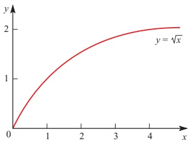

Figure 8.1

How does it allow you to find the shaded area in the graph in figure 8.2?

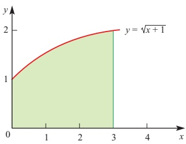

Figure 8.2

<!-- page 187 -->

## Integration by substitution

The graph of $y = \sqrt{x - 1}$ is shown in figure 8.3.

The shaded area is given by

 $$ \int_{1}^{5}\sqrt{x-1}\mathrm{d}x=\int_{1}^{5}(x-1)^{\frac{1}{2}}\mathrm{d}x. $$ 

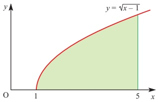

Figure 8.3

You may remember how to investigate this by inspection. However, you can also transform the integral into a simpler one by using the substitution  $ u = x - 1 $ to get  $ \int_{a}^{b} u^{\frac{1}{2}} du $.

When you make this substitution it means that you are now integrating with respect to a new variable, namely u. The limits of the integral, and the ‘dx’, must be written in terms of u.

The new limits are given by $x=1 \Rightarrow u=1-1=0$ and $x=5 \Rightarrow u=5-1=4$.

Since  $ u = x - 1 $,  $ \frac{du}{dx} = 1 $.

Even though  $ \frac{du}{dx} $ is not a fraction, it is usual to treat it as one in this situation (see the warning below), and to write the next step as  $ du = dx' $.

The integral now becomes:

 $$ \begin{aligned}\int_{u=0}^{u=4}u^{\frac{1}{2}}\mathrm{d}u&=\left[\frac{u^{\frac{3}{2}}}{\frac{3}{2}}\right]_{0}^{4}\\ &=\left[\frac{2u^{\frac{3}{2}}}{3}\right]_{0}^{4}\\ &=5\frac{1}{3}\\ \end{aligned} $$

<!-- page 188 -->

This method of integration is known as integration by substitution. It is a very powerful method which allows you to integrate many more functions. Since you are changing the variable from x to u, the method is also referred to as integration by change of variable.

The last example included the statement ‘$du = dx$. Some mathematicians are reluctant to write such statements on the grounds that $du$ and $dx$ may only be used in the form $\frac{du}{dx}$, i.e. as a gradient. This is not in fact true; there is a well-defined branch of mathematics which justifies such statements but it is well beyond the scope of this book. In the meantime it may help you to think of it as shorthand for ‘in the limit as $\delta x \to 0$, $\frac{\delta u}{\delta x} \to 1$, and so $\delta u = \delta x$.

### EXAMPLE 8.1

Evaluate  $ \int_{1}^{3}(x+1)^{3} $ dx by making a suitable substitution.

## SOLUTION

Let u = x + 1.

Converting the limits:

 $$ \begin{array}{ccc}x=1&\Longrightarrow&u=1+1=2\\x=3&\Longrightarrow&u=3+1=4\end{array} $$ 

Converting dx to du:

 $$ \frac{\mathrm{d}u}{\mathrm{d}x}=1\implies\mathrm{d}u=\mathrm{d}x. $$ 

 $$ \begin{aligned}\int_{1}^{3}(x+1)^{3}\mathrm{d}x&=\int_{2}^{4}u^{3}\mathrm{d}u\\&=\left[\frac{u^{4}}{4}\right]_{2}^{4}\\&=\frac{4^{4}}{4}-\frac{2^{4}}{4}\\&=60\end{aligned} $$ 

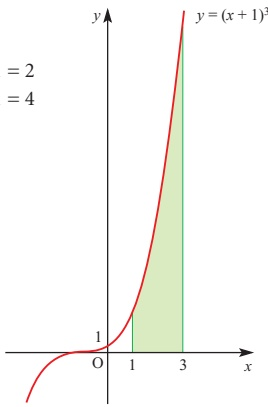

Figure 8.4

## Can integration by substitution be described as the reverse of the chain rule?

<!-- page 189 -->

### EXAMPLE 8.2

Evaluate  $ \int_{3}^{4}2x(x^{2}-4)^{\frac{1}{2}}dx $ by making a suitable substitution.

## SOLUTION

Notice that 2x is the derivative of the expression in the brackets,  $ x^{2} - 4 $, and so  $ u = x^{2} - 4 $ is a natural substitution to try.

This gives  $ \frac{\mathrm{d}u}{\mathrm{d}x}=2x\quad\Rightarrow\quad\mathrm{d}u=2x\mathrm{d}x $

Converting the limits:

 $$ \begin{array}{ccc}x=3&\Longrightarrow&u=9-4\quad=5\\x=4&\Longrightarrow&u=16-4=12\end{array} $$ 

So the integral becomes:

 $$ \begin{array}{r l}{\displaystyle\int_{3}^{4}(x^{2}-4)^{\frac{1}{2}}2x\mathrm{d}x}&{{}=\displaystyle\int_{5}^{12}u^{\frac{1}{2}}\mathrm{d}u}\\ {}&{{}=\displaystyle\left[\frac{2u^{\frac{3}{2}}}{3}\right]_{5}^{12}}\\ {}&{{}=20.3\quad(\mathrm{t o~3~s i g n i f i c a n t~f i g u r e s})}\end{array} $$ 

Note

In the last example there were two expressions multiplied together; the second expression is raised to a power. The two expressions are in this case related, since the first expression, $2x$, is the derivative of the expression in brackets, $x^{2}-4$. It was this relationship that made the integration possible.

### EXAMPLE 8.3

Find  $ \int x(x^{2}+2)^{3}dx $ by making an appropriate substitution.

## SOLUTION

Since this is an indefinite integral there are no limits to change, and the final answer will be a function of x.

Let  $ u = x^{2} + 2 $, then:

 $$ \begin{aligned}\frac{\mathrm{d}u}{\mathrm{d}x}&=2x\Rightarrow\frac{1}{2}\mathrm{d}u=x\mathrm{d}x\xleftarrow{\quad\text{(You only have}x\mathrm{d}x\text{in the integral, not}2x\mathrm{d}x\text{)}}\\ So\int x(x^{2}+2)^{3}\mathrm{d}x&=\int(x^{2}+2)^{3}x\mathrm{d}x\\&=\int u^{3}\times\frac{1}{2}\mathrm{d}u\\&=\frac{u^{4}}{8}+c\\&=\frac{(x^{2}+2)^{4}}{8}+c\end{aligned} $$

<!-- page 190 -->

Always remember, when finding an indefinite integral by substitution, to substitute back at the end. The original integral was in terms of x, so your final answer must be too.

### EXAMPLE 8.4

By making a suitable substitution, find  $ \int x\sqrt{x-2}\,dx $.

## SOLUTION

This question is not of the same type as the previous ones since x is not the derivative of  $ (x-2) $. However, by making the substitution u = x - 2 you can still make the integral into one you can do.

Let u = x - 2, then:

 $$ \frac{\mathrm{d}u}{\mathrm{d}x}=1\quad\Longrightarrow\quad\mathrm{d}u=\mathrm{d}x $$ 

There is also an $x$ in the integral so you need to write down an expression for $x$ in terms of $u$. Since $u = x - 2$ it follows that $x = u + 2$.

In the original integral you can now replace  $ \sqrt{x} - 2 $ by  $ u^{\frac{1}{2}} $, dx by du and x by  $ u + 2 $.

 $$ \begin{aligned}\int x\sqrt{x-2}\mathrm{d}x&=\int(u+2)u^{\frac{1}{2}}\mathrm{d}u\\&=\int\left(u^{\frac{3}{2}}+2u^{\frac{1}{2}}\right)\mathrm{d}u\\&=\frac{2}{5}u^{\frac{5}{2}}+\frac{4}{3}u^{\frac{3}{2}}+c\end{aligned} $$ 

Replacing u by x - 2 and tidying up gives  $ \frac{2}{15}(3x + 4)(x - 2)^{\frac{3}{2}} + c $.

ACTIVITY 8.1 Complete the algebraic steps involved in tidying up the answer above.

## EXERCISE 8A

1 Find the following indefinite integrals by making the suggested substitution. Remember to give your final answer in terms of x.

(i)

 $$ \int3x^{2}(x^{3}+1)^{7}\mathrm{d}x,u=x^{3}+1 $$ 

(ii)

 $$ \int2x(x^{2}+1)^{5}\mathrm{d}x,u=x^{2}+1 $$ 

(iii)

 $$ \int3x^{2}(x^{3}-2)^{4}\mathrm{d}x,u=x^{3}-2 $$ 

(iv)

 $$ \int x\sqrt{2x^{2}-5}\mathrm{d}x,u=2x^{2}-5 $$ 

(v)

 $$ \int x\sqrt{2x+1}\mathrm{d}x,u=2x+1 $$ 

(vi)

 $$ \int\frac{x}{\sqrt{x+9}}\mathrm{d}x,u=x+9 $$ 

2 Evaluate each of the following definite integrals by using a suitable substitution. Give your answer to 3 significant figures where appropriate.

(i)

 $$ \int_{1}^{5}x^{2}(x^{3}+1)^{2}\mathrm{d}x $$ 

(ii)

 $$ \int_{-1}^{2}2x(x-3)^{5}\mathrm{d}x $$ 

(iii)

 $$ \int_{1}^{5}x\sqrt{x-1}\mathrm{d}x $$

<!-- page 191 -->

3 Find the area of the shaded region for each of the following graphs.

(i)

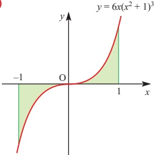

(ii)

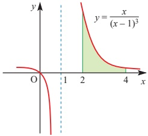

4 The sketch shows part of the graph of  $ y = x\sqrt{1 + x} $.

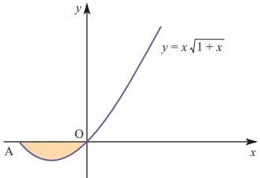

(i) Find the co-ordinates of point A and the range of values of x for which the function is defined.

(ii) Show that the area of the shaded region is  $ \frac{4}{15} $.

You may find the substitution u = 1 + x useful.

5 (i) By substituting $u=1+x$ or otherwise, find

(a) $\int(1+x)^{3} \mathrm{d}x$

(b) $\int_{-1}^{1} x(1+x)^{3} \mathrm{d}x$.

(ii) By substituting $t=1+x^{2}$ or otherwise, evaluate $\int_{0}^{1}x\sqrt{1+x^{2}} \mathrm{d}x$.

6 (i) Integrate with respect to x.

(a)  $ \frac{4}{\sqrt{x}} + \frac{3}{x^3} $ (b)  $ 6x(1 + x^2)^{\frac{1}{2}} $

(ii) Show that the substitution  $ x = u^2 $ transforms  $ \int_1^4 \frac{(1 + \sqrt{x})^3}{\sqrt{x}} \, dx $ into an integral of the form  $ \int_a^b k(1 + u)^3 \, du $.

State the values of  $ k $,  $ a $ and  $ b $.

Evaluate this integral.

<!-- page 192 -->

## Integrals involving exponentials and natural logarithms

In Chapter 5 you met integrals involving logarithms and exponentials. That work is extended here using integration by substitution.

### EXAMPLE 8.5

By making a suitable substitution, find  $ \int_{0}^{4}2xe^{x^2}\,dx $.

## SOLUTION

 $$ \int_{0}^{4}2x\mathrm{e}^{x^{2}}\mathrm{d}x=\int_{0}^{4}\mathrm{e}^{x^{2}}2x\mathrm{d}x $$ 

Since 2x is the derivative of  $ x^{2} $, let u =  $ x^{2} $.

 $$ \frac{\mathrm{d}u}{\mathrm{d}x}=2x\quad\Longrightarrow\quad\mathrm{d}u=2x\mathrm{d}x $$ 

The new limits are given by  $ x=0 \Rightarrow u=0 $

 $$ \mathrm{and}\qquad x=4\quad\Longrightarrow\quad u=16 $$ 

The integral can now be written as

 $$ \begin{array}{rl} \displaystyle \int_{0}^{16} e^{u} \mathrm{d}u & = \left[\mathrm{e}^{u}\right]_{0}^{16} \\ & = \mathrm{e}^{16} - \mathrm{e}^{0} \\ & = 8.89 \times 10^{6} \end{array} $$ 

(to 3 significant figures)

### EXAMPLE 8.6

Evaluate $ \int_{1}^{5}\frac{2x}{x^{2}+3}dx $

## SOLUTION

In this case, substitute

 $ u = x^{2} + 3 $, so that

 $$ \frac{\mathrm{d}u}{\mathrm{d}x}=2x\Longrightarrow\mathrm{d}u=2x\mathrm{d}x $$ 

The new limits are given by

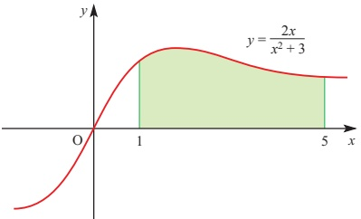

 $ x=1 \Rightarrow u=4 $

and x=5  $ \Rightarrow $ u=28

Figure 8.5

 $$ \begin{aligned}\int_{1}^{5}\frac{2x}{x^{2}+3}\mathrm{d}x=&\int_{4}^{28}\frac{1}{u}\mathrm{d}u\\=&\left[\ln u\right]_{4}^{28}\\=&\ln28-\ln4\\=&1.95\qquad(to~3\text{significant figures})\end{aligned} $$

<!-- page 193 -->

The last example is of the form  $ \int \frac{f'(x)}{f(x)} \, dx $, where  $ f(x) = x^2 + 3 $. In such cases the substitution  $ u = f(x) $ transforms the integral into  $ \int \frac{1}{u} \, du $. The answer is then  $ \ln u + c $ or  $ \ln(f(x)) + c $ (assuming that  $ u = f(x) $ is positive). This result may be stated as the working rule below.

If you obtain the top line when you differentiate the bottom line, the integral is the natural logarithm of the bottom line. So,

 $$ \int\frac{\mathrm{f}^{\prime}(x)}{\mathrm{f}(x)}\mathrm{d}x=\ln|\mathrm{f}(x)|+c. $$ 

### EXAMPLE 8.7

Evaluate  $ \int_{1}^{2}\frac{5x^{4}+2x}{x^{5}+x^{2}+4}dx $.

## SOLUTION

You can work this out by substituting  $ u = x^5 + x^2 + 4 $ but, since differentiating the bottom line gives the top line, you could apply the rule above and just write:

 $$ \begin{aligned}\int_{1}^{2}\frac{5x^{4}+2x}{x^{5}+x^{2}+4}\mathrm{d}x&=\left[\ln(x^{5}+x^{2}+4)\right]_{1}^{2}\\&=\ln40-\ln6\\&=1.90\qquad(to2\ significant\ figures)\end{aligned} $$ 

In the next example some adjustment is needed to get the top line into the required form.

### EXAMPLE 8.8

Evaluate $ \int_{0}^{1}\frac{x^{5}}{x^{6}+7}dx $.

## SOLUTION

The differential of  $ x^6 + 7 $ is  $ 6x^5 $, so the integral is rewritten as  $ \frac{1}{6} \int_0^1 \frac{6x^5}{x^6 + 7} \, dx $.

Integrating this gives  $ \frac{1}{6} \left[ \ln(x^6 + 7) \right]_0^1 $ or 0.022 (to 2 significant figures).

## EXERCISE 8B

1 Find the following indefinite integrals.

(i)

 $$ \int\frac{2x}{x^{2}+1}\mathrm{d}x $$ 

(ii)

 $$ \int\frac{2x+3}{3x^{2}+9x-1}\mathrm{d}x $$ 

 $$ \int12x^{2}\mathrm{e}^{x^{3}}\mathrm{d}x $$ 

2 Find the following definite integrals.

Where appropriate give your answers to 3 significant figures.

(i)

 $$ \int_{2}^{3}2x\mathrm{e}^{-x^{2}}\mathrm{d}x $$ 

(ii)

 $$ \int_{2}^{4}\frac{x-3}{x^{2}-6x+9}\mathrm{d}x $$

<!-- page 194 -->

3 The sketch shows the graph of $y = x e^{x^{2}}$.

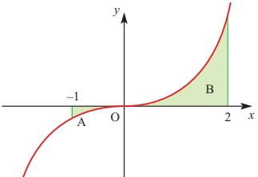

(i) Find the area of region A.

(ii) Find the area of region B.

(iii) Hence write down the total area of the shaded region.

4 The graph of  $ y=\frac{x+2}{x^{2}+4x+3} $ is shown below.

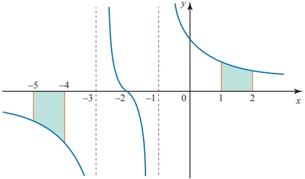

Find the area of each shaded region.

5 A curve has the equation  $ y=(x+3)e^{-x} $.

(i) Find  $ \frac{dy}{dx} $.

(ii) Hence find  $ \int \frac{x + 2}{e^x} \, dx $.

(iii) Find the x and y co-ordinates of the stationary point S on the curve.

(iv) Calculate  $ \frac{\mathrm{d}^{2}y}{\mathrm{d}x^{2}} $ at the point S.

What does its value indicate about the stationary point?

(v) Show that the substitution $u = e^{x}$ converts $\int \frac{2 + \ln u}{u^{2}} \mathrm{d}u$ into $\int \frac{2 + x}{e^{x}} \mathrm{d}x$.

(vi) Hence evaluate  $ \int_{1}^{e}\frac{2+\ln u}{u^{2}}du $.

<!-- page 195 -->

6 (i) Use a substitution, such as  $ u^2 = 2x - 3 $, to find  $ \int 2x\sqrt{2x - 3}\,dx $.

(ii) Differentiate  $ x^{\frac{1}{2}}\ln x $ with respect to  $ x $. Hence find  $ \int \frac{2 + \ln x}{\sqrt{x}}\,dx $.

(iii) The function  $ f(x) $ has the property  $ f'(x) = \mathrm{e}^{-x^2} $.

(a) Find  $ f''(x) $.

(b) Differentiate  $ f(x^{3}) $ with respect to x.

[MEI]

7 (i) Find the following integrals.

(a)  $ \int_{1}^{6}\frac{1}{2x+3}dx $

(b)  $ \int \frac{x}{\sqrt{9+x^{2}}} \, dx $ (Use the substitution  $ \nu = \sqrt{9+x^{2}} $, or otherwise.)

(ii) (a) Show that  $ \frac{\mathrm{d}}{\mathrm{d}x}(\mathrm{e}^{-x^2})=-2x\mathrm{e}^{-x^2} $.

The sketch below shows the curve with equation  $ y = xe^{-x^2} $.

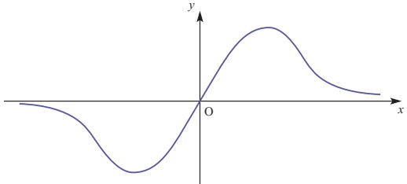

(b) Differentiate  $ xe^{-x^2} $ and find the co-ordinates of the two stationary points on the curve.

(c) Find the area of the region between the curve and the x axis for  $ 0 \leq x \leq 0.4 $.

8 (i) Sketch the curve with equation  $ y = \frac{e^x}{e^x + 1} $ for values of x between 0 and 2.

(ii) Find the area of the region enclosed by this curve, the axes and the line x=2.

(iii) Find the value of  $ \int_{1}^{e}\frac{2t}{t^{2}+1}dt $.

(iv) Compare your answers to parts (ii) and (iii). Explain this result.

9 (i) Differentiate with respect to x

(a)  $ e^{-2x^{2}} $ (b)  $ xe^{-2x^{2}} $

You are given that  $ f(x) = xe^{-2x^2} $.

(ii) Find  $ \int_{0}^{k} f(x) \, dx $ in terms of k.

(iii) Show that  $ f''(x) = 4xe^{-2x^2}(4x^2 - 3) $.

(iv) Show that there is just one stationary point on the curve  $ y = f(x) $ for positive x. State its co-ordinates and determine its nature.

<!-- page 196 -->

10 The diagram shows part of the curve  $ y = \frac{x}{x^2 + 1} $ and its maximum point M. The shaded region R is bounded by the curve and by the lines y = 0 and x = p.

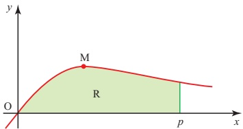

(i) Calculate the x co-ordinate of M.

(ii) Find the area of R in terms of p.

(iii) Hence calculate the value of $p$ for which the area of R is 1, giving your answer correct to 3 significant figures.

[Cambridge International AS & A Level Mathematics 9709, Paper 3 Q9 June 2005]

11 Let  $ I=\int_{1}^{4}\frac{1}{x(4-\sqrt{x})}dx $.

(i) Use the substitution  $ u = \sqrt{x} $ to show that  $ I = \int_{1}^{2} \frac{2}{u(4-u)} \, du $.

(ii) Hence show that  $ I = \frac{1}{2}\ln 3 $.

[Cambridge International AS & A Level Mathematics 9709, Paper 3 Q7 June 2007]

## Integrals involving trigonometrical functions

In Chapter 5 you met integrals involving trigonometrical functions. That work is extended here using integration by substitution.

### EXAMPLE 8.9

Find  $ \int 2x\cos(x^{2}+1) $ dx.

## SOLUTION

Make the substitution  $ u = x^{2} + 1 $. Then differentiate.

 $$ \frac{\mathrm{d}u}{\mathrm{d}x}=2x\quad\Rightarrow\quad2x\mathrm{d}x=\mathrm{d}u $$ 

 $$ \begin{aligned}\int2x\cos(x^{2}+1)\mathrm{d}x&=\int\cos u\mathrm{d}u\\&=\sin u+c\\&=\sin(x^{2}+1)+c\end{aligned} $$ 

Notice that the last example involves two expressions multiplied together, namely  $ 2x $ and  $ \cos(x^2 + 1) $. These two expressions are related by the fact that  $ 2x $ is the derivative of  $ x^2 + 1 $. Because of this relationship, the substitution  $ u = x^2 + 1 $ may be used to perform the integration. You can apply this method to other integrals involving trigonometrical functions, as in the next example.

<!-- page 197 -->

### EXAMPLE 8.10

Find  $ \int_{0}^{\frac{\pi}{2}}\cos x\sin^{2}x\,dx $.

Remember that $\sin^{2}x$ means the same as $(\sin x)^{2}$.

## SOLUTION

This integral is the product of two expressions,  $ \cos x $ and  $ (\sin x)^{2} $.

Now $(\sin x)^{2}$ is a function of $\sin x$, and $\cos x$ is the derivative of $\sin x$, so you should use the substitution $u=\sin x$.

Differentiating:

 $$ \frac{\mathrm{d}u}{\mathrm{d}x}=\cos x\quad\Rightarrow\quad\mathrm{d}u=\cos x\mathrm{d}x. $$ 

The limits of integration need to be changed as well:

 $$ \begin{array}{ccc}x=0\quad&\Longrightarrow\quad&u=0\\x=\frac{\pi}{2}\quad&\Longrightarrow\quad&u=1\end{array} $$ 

Therefore

 $$ \begin{aligned}\int_{0}^{\frac{\pi}{2}}\cos x\sin^{2}x\mathrm{d}x=&\int_{0}^{1}u^{2}\mathrm{d}u\\=&\left[\frac{u^{3}}{3}\right]_{0}^{1}\\=&\frac{1}{3}\end{aligned} $$ 

### EXAMPLE 8.11

Find $ \int\cos^{3}x\,dx $.

## SOLUTION

First write  $ \cos^{3}x = \cos x \cos^{2}x $.

Now remember that

 $$ \cos^{2}x+\sin^{2}x=1\quad\Rightarrow\quad\cos^{2}x=1-\sin^{2}x. $$ 

This gives

 $$ \begin{aligned}\cos^{3}x&=\cos x(1-\sin^{2}x)\\&=\cos x-\cos x\sin^{2}x\end{aligned} $$ 

The first part of this expression,  $ \cos x $, is easily integrated to give  $ \sin x $.

The second part is more complicated, but you can see that it is of a type that you have met already, as it is a product of two expressions, one of which is a function of  $ \sin x $ and the other of which is the derivative of  $ \sin x $. This can be integrated either by making the substitution  $ u = \sin x $ or simply in your head (by inspection).

 $$ \begin{aligned}\int\cos^{3}x\mathrm{d}x=&\int\left(\cos x-\cos x\sin^{2}x\right)\mathrm{d}x\\=&\sin x-\frac{1}{3}\sin^{3}x+c\end{aligned} $$ 

### EXAMPLE 8.12

Find

(i)  $ \int \cot x \, dx $

(ii)  $ \int_{\frac{\pi}{6}}^{\frac{\pi}{3}} \tan x \, dx $

<!-- page 198 -->

## SOLUTION

The ‘top line’ is the derivative of the ‘bottom line’.

(i) Rewrite cot x as  $ \frac{\cos x}{\sin x} $.

 $$ \int\cot x dx=\int\frac{\cos x}{\sin x}dx $$ 

Now you can use the substitution  $ u=\sin x $.

 $$ \frac{\mathrm{d}u}{\mathrm{d}x}=\cos x\Longrightarrow\mathrm{d}u=\cos x\mathrm{d}x $$ 

 $$ \begin{aligned}\int\frac{\cos x}{\sin x}\mathrm{d}x&=\int\frac{1}{\sin x}\times\cos x\mathrm{d}x=\int\frac{1}{u}\mathrm{d}u\\&=\ln|u|+c=\ln|\sin x|+c\end{aligned} $$ 

You may have noticed that the integral  $ \int\frac{\cos x}{\sin x}dx $ is in the form

 $$ \int\frac{f^{\prime}(x)}{f(x)} $$ 

 $ dx = \ln |f(x)| + c $, and so you could have written the answer down directly.

(ii)  $ \int_{\pi}^{3} \tan x \, dx = \int_{\pi}^{3} \frac{\sin x}{\cos x} \, dx $

Adjusting the numerator to make it the derivative of the denominator gives:

 $$ \begin{aligned}\int_{-\frac{\pi}{6}}^{\frac{\pi}{3}}\cos x dx&=-\int_{-\frac{\pi}{6}}^{\frac{\pi}{3}}\frac{-\sin x}{\cos x}\ dx\\&=\left[-\ln|\cos x|\right]_{\frac{\pi}{6}}^{\frac{\pi}{3}}\\&=\left[-\ln\frac{1}{2}\right]-\left[-\ln\frac{\sqrt{3}}{2}\right]\leftarrow\\&=-\ln\frac{1}{2}+\ln\frac{\sqrt{3}}{2}\\&=\ln\sqrt{3}\leftarrow\\&=\frac{1}{2}\ln3\leftarrow\end{aligned}\begin{aligned} Use~the~laws~of~logs:\\\ln\frac{\sqrt{3}}{2}-\ln\frac{1}{2}=\ln\left(\frac{\sqrt{3}}{2}\div\frac{1}{2}\right)\\\ln\sqrt{3}=\ln3^{\frac{1}{2}}=\frac{1}{2}\ln3\end{aligned} $$ 

Note

You may find that as you gain practice in this type of integration you become able to work out the integral without writing down the substitution. However, if you are unsure, it is best to write down the whole process.

## EXERCISE 8C

1 Integrate the following by using the substitution given, or otherwise.

(i)  $ \cos3x $

 $$ u=3x $$ 

(ii)

 $$ \sin(1-x) $$ 

 $$ u=1-x $$ 

(iii)

 $$ \sin x\cos^{3}x $$ 

 $$ u=cos x $$ 

(iv)

 $$ \frac{\sin x}{2-\cos x} $$ 

 $$ u=2-\cos x $$ 

(v)  $ \tan x $

 $$ u=\cos x\qquad\left(write\tan x as\frac{\sin x}{\cos x}\right) $$ 

(vi)  $ \sin 2x(1 + \cos 2x)^2 $ \quad u = 1 + \cos 2x

<!-- page 199 -->

2 Use a suitable substitution to integrate the following.

(i)  $ 2x \sin(x^{2}) $

(ii)  $ \cos xe^{\sin x} $

(iii)  $ \frac{\tan x}{\cos^{2}x} $

(iv)  $ \frac{\cos x}{\sin^{2}x} $

3 Evaluate the following definite integrals by using suitable substitutions.

(i)  $ \int_{0}^{\frac{\pi}{2}}\cos\left(2x-\frac{\pi}{2}\right)dx $

(ii)  $ \int_{0}^{\frac{\pi}{4}}\cos x\sin^{3}x\,dx $

(iii)  $ \int_{0}^{\sqrt{\pi}} x \sin(x^{2}) \, dx $

(iv)  $ \int_{0}^{\frac{\pi}{4}}\frac{e^{\tan x}}{\cos^{2}x}dx $

(v)  $ \int_{0}^{\frac{\pi}{4}}\frac{1}{\cos^{2}x(1+\tan x)}\,\mathrm{d}x $

4 (i) Use the substitution  $ x = \tan \theta $ to show that

 $$ \int\frac{1-x^{2}}{(1+x^{2})^{2}}\mathrm{d}x=\int\cos2\theta\mathrm{d}\theta. $$ 

(ii) Hence find the value of

 $$ \int_{0}^{1}\frac{1-x^{2}}{(1+x^{2})^{2}}\mathrm{d}x. $$ 

[Cambridge International AS & A Level Mathematics 9709, Paper 3 Q4 June 2005]

5 (i) Express $\cos\theta+(\sqrt{3})\sin\theta$ in the form $R\cos(\theta-\alpha)$, where $R>0$ and $0<\alpha<\frac{1}{2}\pi$, giving the exact values of $R$ and $\alpha$.

(ii) Hence show that  $ \int_{0}^{\frac{1}{2}\pi}\frac{1}{(\cos\theta+(\sqrt{3})\sin\theta)^{2}}\,\mathrm{d}\theta=\frac{1}{\sqrt{3}}. $

[Cambridge International AS & A Level Mathematics 9709, Paper 3 Q5 June 2007]

6 (i) Use the substitution  $ x = \sin^{2}\theta $ to show that

 $$ \int\sqrt{\left(\frac{x}{1-x}\right)}\mathrm{d}x=\int2\sin^{2}\theta\mathrm{d}\theta. $$ 

(ii) Hence find the exact value of

 $$ \int_{0}^{\frac{1}{4}}\sqrt{\left(\frac{x}{1-x}\right)}\mathrm{d}x. $$ 

[Cambridge International AS & A Level Mathematics 9709, Paper 3 Q6 November 2005]

## The use of partial fractions in integration

? Why is it not possible to use any of the integration techniques you have learnt so far to find  $ \int \frac{2}{x^{2}-1} \, dx $?

<!-- page 200 -->

## Partial fractions reminder

In Chapter 7 you met partial fractions. Here is a reminder of the work you did there.

Since  $ x^{2}-1 $ can be factorised to give  $ (x+1)(x-1) $, you can write the expression to be integrated as partial fractions.

 $$ \begin{aligned}\frac{2}{x^{2}-1}&=\frac{A}{x-1}+\frac{B}{x+1}\\2&\stackrel{ Ⅲ }{\equiv}A(x+1)+B(x-1)\end{aligned} $$ 

This is true for all values of $x$. It is an identity and to emphasise this point we use the identity symbol $\equiv$.

 $$ \begin{aligned}&Let x=1\quad&2&=2A\quad&\Rightarrow\quad&A=1\\&Let x=-1\quad&2&=-2B\quad&\Rightarrow\quad&B=-1\end{aligned} $$ 

Substituting these values for A and B gives

 $$ \frac{2}{x^{2}-1}=\frac{1}{x-1}-\frac{1}{x+1}. $$ 

The integral then becomes

 $$ \int\frac{2}{x^{2}-1}\mathrm{d}x=\int\frac{1}{x-1}\mathrm{d}x-\int\frac{1}{x+1}\mathrm{d}x. $$ 

Now the two integrals on the right can be recognised as logarithms.

 $$ \begin{aligned}\int\frac{2}{x^{2}-1}\mathrm{d}x=&\ln|x-1|-\ln|x+1|+c\\=&\ln\left|\frac{x-1}{x+1}\right|+c\end{aligned} $$ 

Here you worked with the simplest type of partial fraction, in which there are two different linear factors in the denominator. This type will always result in two fractions both of which can be integrated to give logarithmic expressions. Now look at the other types of partial fraction.

## A repeated factor in the denominator

### EXAMPLE 8.13

 $$ \mathrm{Find}\int\frac{x+4}{(2x-1)(x+1)^{2}}\mathrm{d}x. $$ 

## SOLUTION

First write the expression as partial fractions:

 $$ \frac{x+4}{\left(2x-1\right)\left(x+1\right)^{2}}=\frac{A}{\left(2x-1\right)}+\frac{B}{\left(x+1\right)}+\frac{C}{\left(x+1\right)^{2}} $$ 

where

 $$ x+4\equiv A(x+1)^{2}+B(2x-1)(x+1)+C(2x-1). $$ 

 $$ \operatorname{Let}x=-1\quad3=-3C\quad\Rightarrow\quad C=-1 $$ 

 $$  Let x=\frac{1}{2}\quad\frac{9}{2}=A\left(\frac{3}{2}\right)^{2}\quad\implies\quad\frac{9}{2}=\frac{9}{4}A\quad\implies\quad A=2 $$ 

 $$ \begin{array}{ccc}Let~x=0&4=A-B-C&\Longrightarrow\quad B=A-C-4=2+1-4=-1\end{array} $$

<!-- page 201 -->

Substituting these values for A, B and C gives

 $$ \frac{x+4}{(2x-1)(x+1)^{2}}=\frac{2}{(2x-1)}-\frac{1}{(x+1)}-\frac{1}{(x+1)^{2}} $$ 

Now that the expression is in partial fractions, each part can be integrated separately.

 $$ \int\frac{x+4}{(2x-1)(x+1)^{2}}\mathrm{d}x=\int\frac{2}{(2x-1)}\mathrm{d}x-\int\frac{1}{(x+1)}\mathrm{d}x-\int\frac{1}{(x+1)^{2}}\mathrm{d}x $$ 

The first two integrals give logarithmic expressions as you saw above. The third, however, is of the form  $ u^{-2} $ and therefore can be integrated by using the substitution  $ u = x + 1 $, or by inspection (i.e. in your head).

 $$ \begin{aligned}\int\frac{x+4}{(2x-1)(x+1)^{2}}\mathrm{d}x=&\ln|2x-1|-\ln|x+1|+\frac{1}{x+1}+c\\=&\ln\left|\frac{2x-1}{x+1}\right|+\frac{1}{x+1}+c\end{aligned} $$ 

## A quadratic factor in the denominator

### EXAMPLE 8.14

 $$ \mathrm{Find}\frac{x-2}{(x^{2}+2)(x+1)}\mathrm{d}x. $$ 

## SOLUTION

First write the expression as partial fractions:

 $$ \frac{x-2}{(x^{2}+2)(x+1)}=\frac{Ax+B}{(x^{2}+2)}+\frac{C}{(x+1)} $$ 

where

 $$ x-2\equiv(Ax+B)(x+1)+C(x^{2}+2) $$ 

Rearranging gives

 $$ x-2\equiv(A+C)x^{2}+(A+B)x+(B+2C) $$ 

Equating coefficients:

 $$ x^{2}\quad\Rightarrow\quad A+C=0 $$ 

 $$ x\quad\Rightarrow\quad A+B=1 $$ 

constant terms  $ \Rightarrow $  $ B+2C=-2 $

Solving these gives A = 1, B = 0, C = -1.

Hence

 $$ \frac{x-2}{(x^{2}+2)(x+1)}=\frac{x}{(x^{2}+2)}-\frac{1}{(x+1)} $$

<!-- page 202 -->

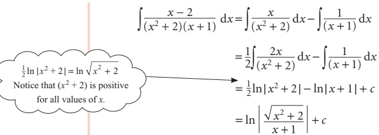

 $ \frac{1}{2}\ln|x^2+2|=\ln\sqrt{x^2+2} $

Notice that  $ (x^2+2) $ is positive for all values of x.

 $$ \begin{aligned}\int\frac{x-2}{(x^{2}+2)(x+1)}\mathrm{d}x=&\int\frac{x}{(x^{2}+2)}\mathrm{d}x-\int\frac{1}{(x+1)}\mathrm{d}x\\=&\frac{1}{2}\int\frac{2x}{(x^{2}+2)}\mathrm{d}x-\int\frac{1}{(x+1)}\mathrm{d}x\\=&\frac{1}{2}\ln|x^{2}+2|-\ln|x+1|+c\\=&\ln\left|\frac{\sqrt{x^{2}+2}}{x+1}\right|+c\end{aligned} $$ 

e

## Note

If $B$ had not been zero, you would have had an expression of the form $\frac{Ax + B}{x^2 + 2}$ to integrate. This can be split into $\frac{Ax}{x^2 + 2} + \frac{B}{x^2 + 2}$.

The first part of this can be integrated as in Example 8.13, but the second part cannot be integrated by any method you have met so far. If you come across a situation where you need to find such an integral, you may choose to use the standard result:

 $$ \int\frac{1}{(x^{2}+a^{2})}\ d x=\frac{1}{a}\tan^{-1}\left(\frac{x}{a}\right)+c. $$ 

## EXERCISE 8D

1 Express the fractions in each of the following integrals as partial fractions, and hence perform the integration.

 $$ \int\frac{1}{(1-x)(3x-2)}\mathrm{d}x $$ 

(ii)

 $$ \int\frac{7x-2}{(x-1)^{2}(2x+3)}\mathrm{d}x $$ 

(iii)

 $$ \int\frac{x+1}{(x^2+1)(x-1)}\mathrm{d}x $$ 

(iv)

 $$ \int\frac{3x+3}{(x-1)(2x+1)}\mathrm{d}x $$ 

(v)

 $$ \int\frac{1}{x^{2}(1-x)}\ \mathrm{d}x $$ 

(vi)

 $$ \int\frac{1}{(x+1)(x+3)}\mathrm{d}x $$ 

(vii)

 $$ \int\frac{2x-4}{(x^{2}+4)(x+2)}\mathrm{d}x $$ 

(viii)

 $$ \int\frac{5x+1}{(x+2)(2x+1)^{2}}\mathrm{d}x $$ 

2 Express in partial fractions

 $$  f(x)=\frac{3x+4}{(x^{2}+4)(x-3)} $$ 

and hence find  $ \int_{0}^{2} f(x) \, dx $.

[MEI, adapted]

3 Express  $ \frac{1}{x^{2}(2x+1)} $ in partial fractions. Hence show that

 $$ \int_{1}^{2}\frac{\mathrm{d}x}{x^{2}(2x+1)}=\frac{1}{2}+2\ln\frac{5}{6}. $$ 

4 (i) (a) Express  $ \frac{3}{(1+x)(1-2x)} $ in partial fractions.

(b) Hence find

[MEI]

 $$ \int_{0}^{0.1}\frac{3}{(1+x)(1-2x)}\mathrm{d}x $$ 

giving your answer to 5 decimal places.

<!-- page 203 -->

(ii) (a) Find the first three terms in the binomial expansion of

 $$ 3(1+x)^{-1}(1-2x)^{-1}. $$ 

(b) Use the first three terms of this expansion to find an approximation for

 $$ \int_{0}^{0.1}\frac{3}{(1+x)(1-2x)}\mathrm{d}x. $$ 

(c) What is the percentage error in your answer to part (b)?

5(i) Given that

 $$ \frac{x^{2}-x-24}{(x+2)(x-4)}\equiv A+\frac{B}{(x+2)}+\frac{C}{(x-4)}, $$ 

find the values of the constants A, B and C.

(ii) Find  $ \int_{1}^{3}\frac{x^{2}-x-24}{(x+2)(x-4)} $ dx.

6 (i) Given that  $ f(x) = \frac{16 + 2x + 15x^{2}}{(1 + x^{2})(2 - x)} \equiv \frac{A + Bx}{1 + x^{2}} + \frac{C}{2 - x} $, find the values of B and C and show that A = 0.

(ii) Find  $ \int_0^1 f(x) \, dx $ in an exact form.

(iii) Express  $ f(x) $ as a sum of powers of x up to and including the term in  $ x^{4} $.

Determine the range of values of x for which this expansion of  $ f(x) $ is valid.

7 (i) Find the values of the constants A, B, C and D such that

 $$ \frac{2x^{3}-1}{x^{2}(2x-1)}\equiv A+\frac{B}{x}+\frac{C}{x^{2}}+\frac{D}{2x-1}. $$ 

(ii) Hence show that

 $$ \int_{1}^{2}\frac{2x^{3}-1}{x^{2}(2x-1)}\mathrm{d}x=\frac{3}{2}+\frac{1}{2}\ln\left(\frac{16}{27}\right). $$ 

[Cambridge International AS & A Level Mathematics 9709, Paper 32 Q10 June 2010]

8 Let  $ f(x) \equiv \frac{x^{2} + 3x + 3}{(x+1)(x+3)} $.

(i) Express $f(x)$ in partial fractions.

(ii) Hence show that  $ \int_{0}^{3} f(x) \, dx = 3 - \frac{1}{2} \ln 2 $.

[Cambridge International AS & A Level Mathematics 9709, Paper 3 Q7 June 2008]

## Integration by parts

There are still many integrations which you cannot yet do. In fact, many functions cannot be integrated at all, although virtually all functions can be differentiated. However, some functions can be integrated by techniques which you have not yet met. Integration by parts is one of those techniques.

<!-- page 204 -->

Find  $ \int x \cos x \, dx $.

## SOLUTION

The expression to be integrated is clearly a product of two simpler expressions, x and  $ \cos x $, so your first thought may be to look for a substitution to enable you to perform the integration. However, there are some expressions which are products but which cannot be integrated by substitution. This is one of them. You need a new technique to integrate such expressions.

Take the expression  $ x \sin x $ and differentiate it, using the product rule.

 $$ \frac{\mathrm{d}}{\mathrm{d}x}(x\sin x)=x\cos x+\sin x $$ 

Now integrate both sides. This has the effect of ‘undoing’ the differentiation, so

 $$ x\sin x=\int x\cos x\mathrm{d}x+\int\sin x\mathrm{d}x $$ 

Rearranging this gives

 $$ \begin{aligned}\int x\cos x\mathrm{d}x&=x\sin x-\int\sin x\mathrm{d}x\\&=x\sin x-\left(-\cos x\right)+c\\&=x\sin x+\cos x+c\end{aligned} $$ 

This has enabled you to find the integral of  $ x \cos x $.

The work in this example can be generalised into the method of integration by parts. Before coming on to that, do the following activity.

### ACTIVITY 8.2 For each of the following

(a) differentiate using the product rule

(b) rearrange your expression to find an expression for the given integral I

(c) use this expression to find the given integral.

(i)

 $$ I=\int x\sin x\mathrm{d}x $$ 

(ii)

 $$ y=x\mathrm{e}^{2x} $$ 

 $$ I=\int2x\mathrm{e}^{2x}\mathrm{d}x $$ 

The work in Activity 8.2 has enabled you to work out some integrals which you could not previously have done, but you needed to be given the expressions to be differentiated first. Effectively you were given the answers.

Look at the expressions you found in part (b) of Activity 8.2.

Can you see any way of working out these expressions without starting by differentiating a given product?

<!-- page 205 -->

## The general result for integration by parts

The method just investigated can be generalised.

Look back at Example 8.14. Use u to stand for the function x, and v to stand for the function  $ \sin x $.

Using the product rule to differentiate the function  $ uv $,

 $$ \frac{\mathrm{d}}{\mathrm{d}x}(u\nu)=\nu\frac{\mathrm{d}u}{\mathrm{d}x}+u\frac{\mathrm{d}\nu}{\mathrm{d}x}. $$ 

Integrating gives

 $$ u\nu=\int\nu\frac{\mathrm{d}u}{\mathrm{d}x}\mathrm{d}x+\int u\frac{\mathrm{d}\nu}{\mathrm{d}x}\mathrm{d}x. $$ 

Rearranging gives

 $$ \int u\frac{\mathrm{d}\nu}{\mathrm{d}x}\mathrm{d}x=u\nu-\int\nu\frac{\mathrm{d}u}{\mathrm{d}x}\mathrm{d}x. $$ 

This is the formula you use when you need to integrate by parts.

In order to use it, you have to split the function you want to integrate into two simpler functions. In Example 8.15 you split $x \cos x$ into the two functions $x$ and $\cos x$. One of these functions will be called $u$ and the other $\frac{dy}{dx}$, to fit the left-hand side of the expression. You will need to decide which will be which. Two considerations will help you.

As you want to use  $ \frac{du}{dx} $ on the right-hand side of the expression, u should be a function which becomes a simpler function after differentiation. So in this case, u will be the function x.

As you need v to work out the right-hand side of the expression, it must be possible to integrate the function  $ \frac{dv}{dx} $ to obtain v. In this case,  $ \frac{dv}{dx} $ will be the function  $ \cos x $.

So now you can find  $ \int x \cos x \, dx $.

Put

 $$ u=x\quad\Rightarrow\quad\frac{\mathrm{d}u}{\mathrm{d}x}=1 $$ 

and  $ \frac{d\nu}{dx}=\cos x\quad\Rightarrow\quad\nu=\sin x $

Substituting in

 $$ \int u\frac{\mathrm{d}\nu}{\mathrm{d}x}\mathrm{d}x=u\nu-\int\nu\frac{\mathrm{d}u}{\mathrm{d}x}\mathrm{d}x $$ 

gives

 $$ \begin{aligned}\int x\cos x\mathrm{d}x&=x\sin x-\int1\times\sin x\mathrm{d}x\\&=x\sin x-\left(-\cos x\right)+c\\&=x\sin x+\cos x+c\end{aligned} $$

<!-- page 206 -->

Find $ \int2xe^x\,dx $.

## SOLUTION

First split  $ 2x e^x $ into the two simpler expressions, 2x and  $ e^x $. Both can be integrated easily but, as 2x becomes a simpler expression after differentiation and  $ e^x $ does not, take u to be 2x.

 $$ u=2x\quad\Rightarrow\quad\frac{\mathrm{d}u}{\mathrm{d}x}=2 $$ 

 $$ \mathrm{\frac{dv}{dx}} = e^{x}\quad\Rightarrow\quad\nu = e^{x} $$ 

Substituting in

 $$ \int u\frac{\mathrm{d}\nu}{\mathrm{d}x}\mathrm{d}x=u\nu-\int\nu\frac{\mathrm{d}u}{\mathrm{d}x}\mathrm{d}x $$ 

gives

 $$ \begin{aligned}\int2x\mathrm{e}^{x}\mathrm{d}x&=2x\mathrm{e}^{x}-\int2\mathrm{e}^{x}\mathrm{d}x\\&=2x\mathrm{e}^{x}-2\mathrm{e}^{x}+c\end{aligned} $$ 

In some cases, the choices of u and v may be less obvious.

### EXAMPLE 8.17

## Find  $ \int x \ln x \, dx $

## SOLUTION

It might seem at first that u should be taken as x, because it becomes a simpler expression after differentiation.

 $$ \begin{array}{l}u=x\quad\Rightarrow\quad\frac{\mathrm{d}u}{\mathrm{d}x}=1\\\frac{\mathrm{d}\nu}{\mathrm{d}x}=\ln x\end{array} $$ 

Now you need to integrate  $ \ln x $ to obtain  $ \nu $. Although it is possible to integrate  $ \ln x $, it has to be done by parts, as you will see in the next example. The wrong choice has been made for u and  $ \nu $, resulting in a more complicated integral.

So instead, let  $ u = \ln x $.

 $$ u=\ln x\quad\Rightarrow\quad\frac{\mathrm{d}u}{\mathrm{d}x}=\frac{1}{x} $$ 

 $$ \mathrm{\frac{dv}{dx}}=x\quad \quad\Rightarrow\quad \quad\nu=\tfrac{1}{2}x^{2} $$ 

Substituting in

 $$ \int u\frac{\mathrm{d}\nu}{\mathrm{d}x}\mathrm{d}x=u\nu-\int\nu\frac{\mathrm{d}u}{\mathrm{d}x}\mathrm{d}x $$ 

gives

 $$ \begin{aligned}\int x\ln x\mathrm{d}x&=\frac{1}{2}x^{2}\ln x-\int\frac{\frac{1}{2}x^{2}}{x}\mathrm{d}x\\&=\frac{1}{2}x^{2}\ln x-\int\frac{1}{2}x\mathrm{d}x\\&=\frac{1}{2}x^{2}\ln x-\frac{1}{4}x^{2}+c\end{aligned} $$

<!-- page 207 -->

Find $ \int\ln x\,dx $.

## SOLUTION

You need to start by writing  $ \ln x $ as  $ 1\ln x $ and then use integration by parts.

As in the last example, let  $ u = \ln x $.

 $$ u=\ln x\quad\Rightarrow\quad\frac{\mathrm{d}u}{\mathrm{d}x}=\frac{1}{x} $$ 

 $$ \mathrm{\frac{dv}{dx}}=1\quad\Rightarrow\quad\nu=x $$ 

Substituting in

 $$ \int u\frac{\mathrm{d}\nu}{\mathrm{d}x}\mathrm{d}x=u\nu-\int\nu\frac{\mathrm{d}u}{\mathrm{d}x}\mathrm{d}x $$ 

gives

 $$ \begin{aligned}\int1\ln x\mathrm{d}x&=x\ln x-\int x\times\frac{1}{x}\mathrm{d}x\\&=x\ln x-\int1\mathrm{d}x\\&=x\ln x-x+c\end{aligned} $$ 

## Using integration by parts twice

Sometimes it is necessary to use integration by parts twice or more to complete the integration successfully.

### EXAMPLE 8.19

Find $ \int x^{2}\sin x\,dx $.

## SOLUTION

First split  $ x^2 \sin x $ into two:  $ x^2 $ and  $ \sin x $. As  $ x^2 $ becomes a simpler expression after differentiation, take u to be  $ x^2 $.

 $$ u=x^{2}\quad\Rightarrow\quad\frac{\mathrm{d}u}{\mathrm{d}x}=2x $$ 

 $$ \mathrm{\frac{dv}{dx}} = \sin x \quad \Rightarrow \quad \nu = -\cos x $$ 

Substituting in

 $$ \int u\frac{\mathrm{d}\nu}{\mathrm{d}x}\mathrm{d}x=u\nu-\int\nu\frac{\mathrm{d}u}{\mathrm{d}x}\mathrm{d}x $$ 

gives

 $$ \begin{aligned}\int x^{2}\sin x\mathrm{d}x&=-x^{2}\cos x-\int-2x\cos x\mathrm{d}x\\&=-x^{2}\cos x+\int2x\cos x\mathrm{d}x\end{aligned} $$

<!-- page 208 -->

Now the integral of $2x\cos x$ cannot be found without using integration by parts again. It has to be split into the expressions $2x$ and $\cos x$ and, as $2x$ becomes a simpler expression after differentiation, take $u$ to be $2x$.

 $$ u=2x\quad\Rightarrow\quad\frac{\mathrm{d}u}{\mathrm{d}x}=2 $$ 

 $$ \frac{\mathrm{d}\nu}{\mathrm{d}x}=\cos x\quad\Rightarrow\quad\nu=\sin x $$ 

Substituting in

 $$ \int u\frac{\mathrm{d}\nu}{\mathrm{d}x}\mathrm{d}x=u\nu-\int\nu\frac{\mathrm{d}u}{\mathrm{d}x}\mathrm{d}x $$ 

gives

 $$ \begin{aligned}\int2x\cos x\mathrm{d}x&=2x\sin x-\int2\sin x\mathrm{d}x\\&=2x\sin x-(-2\cos x)+c\\&=2x\sin x+2\cos x+c\end{aligned} $$ 

So in ①  $ \int x^{2}\sin x\,dx = -x^{2}\cos x + 2x\sin x + 2\cos x + c $.

The technique of integration by parts is usually used when the two functions are of different types: polynomials, trigonometrical functions, exponentials, logarithms. There are, however, some exceptions, as in questions 3 and 4 of Exercise 8E.

Integration by parts is a very important technique which is needed in many other branches of mathematics. For example, integrals of the form  $ \int x\,f(x)\,dx $ are used in statistics to find the mean of a probability density function, and in mechanics to find the centre of mass of a shape. Integrals of the form  $ \int x^2\,f(x)\,dx $ are used in statistics to find variance and in mechanics to find moments of inertia.

## EXERCISE 8E

1 For each of these integrals

(a) write down the expression to be taken as $u$ and the expression to be taken as $\frac{\mathrm{d}v}{\mathrm{d}x}$

(b) use the formula for integration by parts to complete the integration.

(i)

(ii)

 $$ \int x\mathrm{e}^{x}\mathrm{d}x $$ 

 $$ \int x\cos3x\mathrm{d}x $$ 

(iii)

 $$ \int(2x+1)\cos x\mathrm{d}x $$ 

(iv)

 $$ \int x\mathrm{e}^{-2x}\mathrm{d}x $$ 

(v)

 $$ \int x\mathrm{e}^{-x}\mathrm{d}x $$ 

(vi)  $ \int x \sin 2x \, dx $

2 Use integraton by parts to integrate

(i)

(ii)  $ 3x e^{3x} $

 $$ x^{3}\ln x $$ 

(iii)  $ 2x \cos 2x $

(iv)  $ x^{2}\ln2x $

3 Find  $ \int x \sqrt{1 + x} \, dx $

(i) by using integration by parts

(ii) by using the substitution u = 1 + x.

<!-- page 209 -->

4 Find  $ \int 2x(x-2)^{4}dx $

(i) by using integration by parts

(ii) by using the substitution u = x - 2.

5 (i) By writing  $ \ln x $ as the product of  $ \ln x $ and 1, use integration by parts to find  $ \int \ln x \, dx $.

(ii) Use the same method to find  $ \int \ln 3x \, dx $.

(iii) Write down  $ \int \ln px \, dx $ where  $ p > 0 $.

6 Find  $ \int x^{2} e^{x} dx $.

7 Find  $ \int(2 - x)^{2} \cos x \, dx $.

## Definite integration by parts

When you use the method of integration by parts on a definite integral, it is important to remember that the term  $ uv $ on the right-hand side of the expression has already been integrated and so should be written in square brackets with the limits indicated.

 $$ \int_{a}^{b}u\frac{\mathrm{d}\nu}{\mathrm{d}x}\mathrm{d}x=\left[u\nu\right]_{a}^{b}-\int_{a}^{b}\nu\frac{\mathrm{d}u}{\mathrm{d}x}\mathrm{d}x $$ 

### EXAMPLE 8.20

Evaluate $ \int_{0}^{2}xe^{x}dx $

## SOLUTION

Put

 $$ u=x\quad\Rightarrow\quad\frac{\mathrm{d}u}{\mathrm{d}x}=1 $$ 

and

 $$ \mathrm{\frac{dv}{dx}} = e^{x} \quad \Rightarrow \quad \nu = e^{x} $$ 

Substituting in

 $$ \int_{a}^{b}u\frac{\mathrm{d}\nu}{\mathrm{d}x}\mathrm{d}x=\left[u\nu\right]_{a}^{b}-\int_{a}^{b}\nu\frac{\mathrm{d}u}{\mathrm{d}x}\mathrm{d}x $$ 

gives

 $$ \begin{array}{r l}{\displaystyle\int_{0}^{2}x\mathrm{e}^{x}\mathrm{d}x}&{=\left[x\mathrm{e}^{x}\right]_{0}^{2}-\int_{0}^{2}\mathrm{e}^{x}\mathrm{d}x}\\ &{=\left[x\mathrm{e}^{x}\right]_{0}^{2}-\left[\mathrm{e}^{x}\right]_{0}^{2}}\\ &{=(2\mathrm{e}^{2}-0)-(\mathrm{e}^{2}-\mathrm{e}^{0})}\\ &{=2\mathrm{e}^{2}-\mathrm{e}^{2}+1}\\ &{=\mathrm{e}^{2}+1}\end{array} $$

<!-- page 210 -->

Find the area of the region between the curves  $ y = x \cos x $ and the x axis, between  $ x = 0 $ and  $ x = \frac{\pi}{2} $.

## SOLUTION

Figure 8.6 shows the region whose area is to be found.

To find the required area, you need to integrate the function  $ x \cos x $ between the limits 0 and  $ \frac{\pi}{2} $. You therefore need to work out

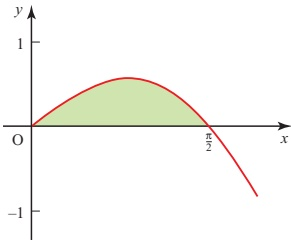

 $$ \int_{0}^{\frac{\pi}{2}}x\cos x d x. $$ 

Put

 $$ u=x\quad\Rightarrow\quad\frac{\mathrm{d}u}{\mathrm{d}x}=1 $$ 

Figure 8.6

and

 $$ \frac{\mathrm{d}\nu}{\mathrm{d}x}=\cos x\quad\Rightarrow\quad\nu=\sin x $$ 

Substituting in

 $$ \int_{a}^{b}u\frac{\mathrm{d}\nu}{\mathrm{d}x}\mathrm{d}x=\left[u\nu\right]_{a}^{b}-\int_{a}^{b}\nu\frac{\mathrm{d}u}{\mathrm{d}x}\mathrm{d}x. $$ 

gives

 $$ \begin{aligned}\int_{0}^{\frac{\pi}{2}}x\cos x\mathrm{d}x&=\left[x\sin x\right]_{0}^{\frac{\pi}{2}}-\int_{0}^{\frac{\pi}{2}}\sin x\mathrm{d}x\\&=\left[x\sin x\right]_{0}^{\frac{\pi}{2}}-\left[-\cos x\right]_{0}^{\frac{\pi}{2}}\\&=\left[x\sin x+\cos x\right]_{0}^{\frac{\pi}{2}}\\&=\left(\frac{\pi}{2}+0\right)-\left(0+1\right)\\&=\frac{\pi}{2}-1\end{aligned} $$ 

So the required area is  $ \left(\frac{\pi}{2}-1\right) $ square units.

## EXERCISE 8F

1 Evaluate these definite integrals.

(i)

 $$ \int_{0}^{1}x\mathrm{e}^{3x}\mathrm{d}x $$ 

(ii)

 $$ \int_{0}^{\pi}(x-1)\cos x\mathrm{d}x $$ 

(iii)

 $$ \int_{0}^{2}(x+1)\mathrm{e}^{x}\mathrm{d}x $$ 

(iv)

 $$ \int_{1}^{2}\ln2x\mathrm{d}x $$ 

(v)

 $$ \int_{0}^{\frac{\pi}{2}}x\sin2x\mathrm{d}x $$ 

(vi)

 $$ \int_{1}^{4}x^{2}\ln x\mathrm{d}x $$

<!-- page 211 -->

2 (i) Find the co-ordinates of the points where the graph of  $ y = (2 - x)e^{-x} $ cuts the x and y axes.

(ii) Hence sketch the graph of  $ y = (2 - x)e^{-x} $.

(iii) Use integration by parts to find the area of the region between the x axis, the y axis and the graph  $ y=(2-x)e^{-x} $.

3 (i) Sketch the graph of $y = x \sin x$ from $x = 0$ to $x = \pi$ and shade the region between the curve and the $x$ axis.

(ii) Find the area of this region using integration by parts.

4 Find the area of the region between the x axis, the line x = 5 and the graph  $ y = \ln x $.

5 Find the area of the region between the x axis and the graph  $ y = x \cos x $ from x = 0 to  $ x = \frac{\pi}{2} $.

6 Find the area of the region between the negative x axis and the graph  $ y = x\sqrt{x+1} $

(i) using integration by parts

(ii) using the substitution  $ u = x + 1 $.

7 The sketch shows the curve with equation  $ y = x^{2} \ln 2x $.

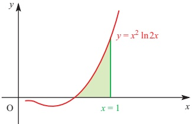

Find the x co-ordinate of the point where the curve cuts the x axis.

Hence calculate the area of the shaded region using the method of integration by parts applied to the product of  $ \ln 2x $ and  $ x^{2} $.

Give your answer correct to 3 decimal places.

8 Show that  $ \int_{0}^{1} x^{2} e^{x} \, dx = e - 2 $.

Show that the use of the trapezium rule with five strips (six ordinates) gives an estimate that is about 3.8% too high.

Explain why approximate evaluation of this integral using the trapezium rule will always result in an overestimate, however many strips are used.

<!-- page 212 -->

9 (ii) Find  $ \int x \cos kx \, dx $, where k is a non-zero constant.

(ii) Show that

 $ \cos(A-B)-\cos(A+B)=2\sin A\sin B. $

Hence express $2\sin5x\sin3x$ as the difference of two cosines.

(iii) Use the results in parts (i) and (ii) to show that

 $$ \int_{0}^{\frac{\pi}{4}}x\sin5x\sin3x\mathrm{d}x=\frac{\pi-2}{16}. $$ 

10 Use integration by parts to show that

 $$ \int_{2}^{4}\ln x\mathrm{d}x=6\ln2-2. $$ 

[Cambridge International AS & A Level Mathematics 9709, Paper 3 Q3 November 2007]

11 The constant $a$ is such that $\int_{0}^{a} x e^{\frac{1}{2}x} \, dx = 6$.

(i) Show that a satisfies the equation

 $$ x=2+e^{-\frac{1}{2}x}. $$ 

(ii) By sketching a suitable pair of graphs, show that this equation has only one root.

(iii) Verify by calculation that this root lies between 2 and 2.5.

(iv) Use an iterative formula based on the equation in part (i) to calculate the value of $a$ correct to 2 decimal places. Give the result of each iteration to 4 decimal places.

[Cambridge International AS & A Level Mathematics 9709, Paper 3 Q9 November 2008]

12 The diagram shows the curve  $ y = e^{-\frac{1}{2}x} \sqrt{(1 + 2x)} $ and its maximum point M. The shaded region between the curve and the axes is denoted by R.

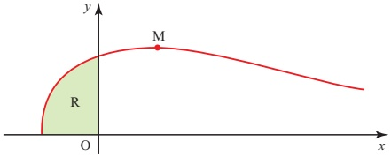

(i) Find the x co-ordinate of M.

(ii) Find by integration the volume of the solid obtained when R is rotated completely about the x axis. Give your answer in terms of  $ \pi $ and e.

[Cambridge International AS & A Level Mathematics 9709, Paper 3 Q9 June 2008]

<!-- page 213 -->

## General integration

You now know several techniques for integration which can be used to integrate a wide variety of functions. One of the difficulties which you may now experience when faced with an integration is deciding which technique is appropriate! This section gives you some guidelines on this, as well as revising all the work on integration that you have done so far.

Look at the integrals below and try to decide which technique you would use and, in the case of a substitution, which expression you would write as u. Do not attempt actually to carry out the integrations. Make a note of your decisions – you will return to these integrals later.

(i)

 $$ \int\frac{x-5}{x^{2}+2x-3}\mathrm{d}x $$ 

(ii)

 $$ \int\frac{x+1}{x^{2}+2x-3}\mathrm{d}x $$ 

(iii)

 $$ \int x\mathrm{e}^{x}\mathrm{d}x $$ 

(iv)

 $$ \int x\mathrm{e}^{x^{2}}\mathrm{d}x $$ 

(v)

 $$ \int\frac{2x+\cos x}{x^{2}+\sin x}\mathrm{d}x $$ 

(vi)

 $$ \int\cos x\sin^{2}x\mathrm{d}x $$ 

## Choosing an appropriate method of integration

You have now met the following standard integrals.

<table border=1 style='margin: auto; word-wrap: break-word;'><tr><td style='text-align: center; word-wrap: break-word;'>$ f(x) $</td><td style='text-align: center; word-wrap: break-word;'>$ \int f(x) \, dx $</td></tr><tr><td style='text-align: center; word-wrap: break-word;'>$ x^{n} $ (n $ \neq -1 $)</td><td style='text-align: center; word-wrap: break-word;'>$ \frac{x^{n+1}}{n+1} $</td></tr><tr><td style='text-align: center; word-wrap: break-word;'>$ \frac{1}{x} $ (x $ \neq 0 $)</td><td style='text-align: center; word-wrap: break-word;'>$ \ln |x| $</td></tr><tr><td style='text-align: center; word-wrap: break-word;'>$ e^{x} $ (x $ \in \mathbb{R} $)</td><td style='text-align: center; word-wrap: break-word;'>$ e^{x} $</td></tr><tr><td style='text-align: center; word-wrap: break-word;'>$ \sin x $ (x $ \in \mathbb{R} $)</td><td style='text-align: center; word-wrap: break-word;'>$ -\cos x $</td></tr><tr><td style='text-align: center; word-wrap: break-word;'>$ \cos x $ (x $ \in \mathbb{R} $)</td><td style='text-align: center; word-wrap: break-word;'>$ \sin x $</td></tr></table>

If you are asked to integrate any of these standard functions, you may simply write down the answer.

For other integrations, the following table may help.

<!-- page 214 -->

<table border=1 style='margin: auto; word-wrap: break-word;'><tr><td style='text-align: center; word-wrap: break-word;'>Type of expression to be integrated</td><td style='text-align: center; word-wrap: break-word;'>Examples</td><td style='text-align: center; word-wrap: break-word;'>Method of integration</td></tr><tr><td style='text-align: center; word-wrap: break-word;'>Simple variations of any of the standard functions</td><td style='text-align: center; word-wrap: break-word;'>$ \cos(2x+1) $\n $ e^{3x} $</td><td style='text-align: center; word-wrap: break-word;'>Substitution may be used, but it should be possible to do these by inspection.</td></tr><tr><td style='text-align: center; word-wrap: break-word;'>Product of two expressions of the form  $ f&#x27;(x)g[f(x)] $\nNote that  $ f&#x27;(x) $ means  $ \frac{d}{dx}[f(x)] $</td><td style='text-align: center; word-wrap: break-word;'>$ 2xe^{x^2} $\n $ x^2(x^3+1)^6 $</td><td style='text-align: center; word-wrap: break-word;'>Substitution  $ u = f(x) $</td></tr><tr><td style='text-align: center; word-wrap: break-word;'>Other products, particularly when one expression is a small positive integer power of x or a polynomial in x</td><td style='text-align: center; word-wrap: break-word;'>$ xe^x $\n $ x^2\sin x $</td><td style='text-align: center; word-wrap: break-word;'>Integration by parts</td></tr><tr><td style='text-align: center; word-wrap: break-word;'>Quotients of the form  $ \frac{f&#x27;(x)}{f(x)} $ or expressions which can easily be converted to this form</td><td style='text-align: center; word-wrap: break-word;'>$ \frac{x}{x^2+1} $\n $ \frac{\sin x}{\cos x} $</td><td style='text-align: center; word-wrap: break-word;'>Substitution  $ u = f(x) $ or by inspection:\n $ k\ln|f(x)| + c $, where k is known</td></tr><tr><td style='text-align: center; word-wrap: break-word;'>Polynomial quotients which may be split into partial fractions</td><td style='text-align: center; word-wrap: break-word;'>$ \frac{x+1}{x(x-1)} $\n $ \frac{x-4}{x^2-x-2} $</td><td style='text-align: center; word-wrap: break-word;'>Split into partial fractions and integrate term by term</td></tr><tr><td style='text-align: center; word-wrap: break-word;'>Odd powers of  $ \sin x $ or  $ \cos x $</td><td style='text-align: center; word-wrap: break-word;'>$ \cos^3x $</td><td style='text-align: center; word-wrap: break-word;'>Use  $ \cos^2x + \sin^2x = 1 $ and write in form  $ f&#x27;(x)g[f(x)] $</td></tr><tr><td style='text-align: center; word-wrap: break-word;'>Even powers of  $ \sin x $ or  $ \cos x $</td><td style='text-align: center; word-wrap: break-word;'>$ \sin^2x $\n $ \cos^4x $</td><td style='text-align: center; word-wrap: break-word;'>Use the double-angle formulae to transform the expression before integrating.</td></tr></table>

It is impossible to give an exhaustive list of possible types of integration, but the table above and that on the previous page cover the most common situations that you will meet.

ACTIVITY 8.3 Now look back at the integrals in the discussion point on the previous page and the decisions you made about which method of integration should be used for each one. Now find these integrals.

(i)

 $$ \int\frac{x-5}{x^{2}+2x-3}\mathrm{d}x $$ 

(ii)

(iii)

 $$ \int\frac{x+1}{x^{2}+2x-3}\mathrm{d}x $$ 

 $$ \int x\mathrm{e}^{x}\mathrm{d}x $$ 

(v)

(iv)

 $$ \int x\mathrm{e}^{x^{2}}\mathrm{d}x $$ 

 $$ \int\frac{2x+\cos x}{x^{2}+\sin x}\mathrm{d}x $$ 

(vi)

 $$ \int\cos x\sin^{2}x\mathrm{d}x $$

<!-- page 215 -->

EXERCISE 8G

1 Choose an appropriate method and integrate the following.

You may find it helpful to discuss in class first which method to use.

(i)

 $$ \int\cos(3x-1)\mathrm{d}x $$ 

(ii)

 $$ \int\frac{2x+1}{(x^{2}+x-1)^{2}}\mathrm{d}x $$ 

(iii)

 $$ \int\mathrm{e}^{1-x}\mathrm{d}x $$ 

(iv)

 $$ \int\cos2x\mathrm{d}x $$ 

(v)

 $$ \int\ln2x\mathrm{d}x $$ 

(vi)

 $$ \int\frac{x}{(x^{2}-1)^{3}}\mathrm{d}x $$ 

 $$ (vii)\int\sqrt{2x-3}\ d x $$ 

(viii)  $ \int \frac{4x - 1}{(x - 1)^2 (x + 2)} \, dx $

(ix)  $ \int x^{3} \ln x \, dx $

(x)

 $$ \int\frac{5}{2x^{2}-7x+3}\mathrm{d}x $$ 

(xi)

 $$ \int(x+1)\mathrm{e}^{x^{2}+2x}\mathrm{d}x $$ 

(xii)

 $$ \int\frac{\sin x-\cos x}{\sin x+\cos x}\mathrm{d}x $$ 

 $$ (xiii)\int x^{2}\sin2x\ dx $$ 

 $$ \int\sin^{3}2x\mathrm{d}x $$ 

2 Evaluate the following definite integrals.

(i)

 $$ \int_{8}^{24}\frac{\mathrm{d}x}{\sqrt{3x-8}} $$ 

(ii)  $ \int_{8}^{24}\frac{\mathrm{d}x}{3x-8} $

(iii)  $ \int_{8}^{24}\frac{9x}{3x-8}dx $

(iv)  $ \int_{0}^{\frac{\pi}{2}}\sin^{3}x\,dx $

(v)  $ \int_{1}^{2} x^{2} \ln x \, dx $

3 Evaluate  $ \int_{0}^{2}\frac{x^{2}}{\sqrt{1+x^{3}}}dx $, using the substitution  $ u=1+x^{3} $, or otherwise.

4 Find  $ \int_{0}^{\frac{\pi}{2}}\frac{\sin\theta}{\cos^{4}\theta} $ d $ \theta $ in terms of  $ \sqrt{2} $.

5 Using the substitution $u=\ln x$, or otherwise, find $\int_{1}^{2}\frac{\ln x}{x}dx$, giving your answer to 2 decimal places.

[MEI, part]

6 Find  $ \int_{0}^{\frac{\pi}{2}} x \cos 2x \, dx $, expressing your answer in terms of  $ \pi $.

7 (i) Find  $ \int x e^{-2x} \, dx $.

(ii) Evaluate  $ \int_{0}^{1}\frac{x}{(4+x^{2})}\,dx $, giving your answer correct to 3 significant figures.

8 (i) Find  $ \int \sin(2x - 3) \, dx $.

(ii) Use the method of integration by parts to evaluate  $ \int_{0}^{2}xe^{2x}\,dx $.

(iii) Using the substitution  $ t = x^2 - 9 $, or otherwise, find  $ \int \frac{x}{x^2 - 9} \, dx $.

<!-- page 216 -->

9 Evaluate

(i)

 $$ \int_{0}^{1}(2x^{2}+1)(2x^{3}+3x+4)^{\frac{1}{2}}\mathrm{d}x $$ 

(ii)  $ \int_{1}^{e}\frac{\ln x}{x^{3}}dx. $

10 Find  $ \int_{0}^{\frac{\pi}{2}}\sin x\cos^{3}x\,dx $ and  $ \int_{0}^{1}te^{-2t}\,dt $.

## KEY POINTS

1  $ \int kx^{n} \, dx = \frac{kx^{n+1}}{n+1} + c $ where k and n are constants but  $ n \neq -1 $.

2 Substitution is often used to change a non-standard integral into a standard one.

3  $ \int e^{x} \, \mathrm{d}x = e^{x} + c $

 $ \int e^{ax+b} \, \mathrm{d}x = \frac{1}{a} e^{ax+b} + c $

4  $ \int \frac{1}{x} \, \mathrm{d}x = \ln |x| + c $

 $$ \int\frac{1}{ax+b}\mathrm{d}x=\frac{1}{a}\ln|ax+b|+c $$ 

 $$ \textcircled{5}\int\frac{\mathrm{f}^{\prime}(x)}{\mathrm{f}(x)}\mathrm{d}x=\ln|\mathrm{f}(x)|+c $$ 

 $$ \begin{aligned}&\int\cos(ax+b)\mathrm{d}x=\frac{1}{a}\sin(ax+b)+c\\&\int\sin(ax+b)\mathrm{d}x=-\frac{1}{a}\cos(ax+b)+c\\&\int\sec^{2}(ax+b)\mathrm{d}x=\frac{1}{a}\tan(ax+b)+c\end{aligned} $$ 

7 Using partial fractions often makes it possible to use logarithms to integrate the quotient of two polynomials.

8 Some products may be integrated by parts using the formulae

 $$ \int u\frac{\mathrm{d}\nu}{\mathrm{d}x}\mathrm{d}x=u\nu-\int\nu\frac{\mathrm{d}u}{\mathrm{d}x}\mathrm{d}x $$ 

 $$ \int_{a}^{b}u\frac{\mathrm{d}\nu}{\mathrm{d}x}\mathrm{d}x=\left[u\nu\right]_{a}^{b}-\int_{a}^{b}\nu\frac{\mathrm{d}u}{\mathrm{d}x}\mathrm{d}x. $$

