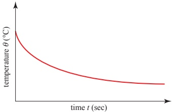
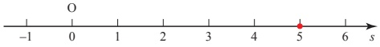
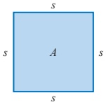
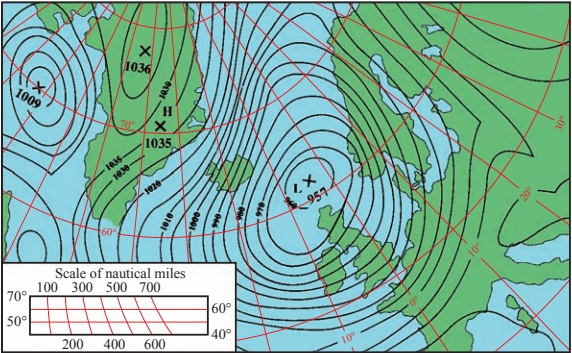
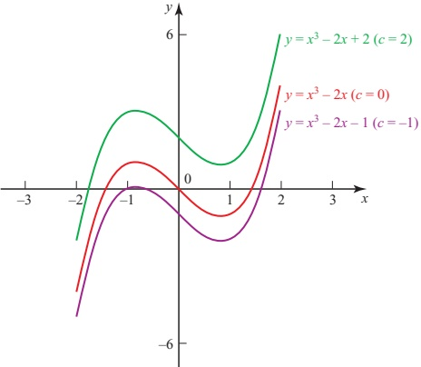
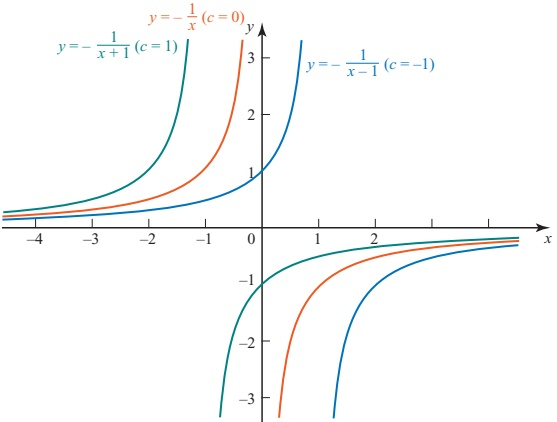
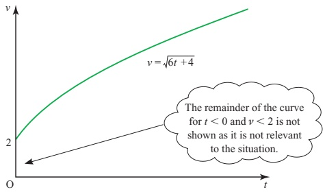
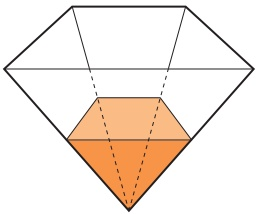

# Chapter 9 Differential equations

<!-- Pure Mathematics 2 and 3 Cambridge International AS and A Level Mathematics (Sophie Goldie, Roger Porkess) .pdf p217-235 -->

<!-- page 217 -->

# Differential equations

The greater our knowledge increases, the more our ignorance unfolds.

John F. Kennedy

Suppose you are in a hurry to go out and want to drink a cup of hot tea before you go.

How long will you have to wait until it is cool enough to drink?

To solve this problem, you would need to know something about the rate at which liquids cool at different temperatures.

Figure 9.1 shows an example of the temperature of a liquid plotted against time.

Figure 9.1

Notice that the graph is steepest at high temperatures and becomes less steep as the liquid cools. In other words, the rate of change of temperature is numerically greatest at high temperatures and gets numerically less as the temperature drops. The rate of change is always negative since the temperature is decreasing.

If you study physics, you may have come across Newton's law of cooling: The rate of cooling of a body is proportional to the difference in temperature of the body and that of the surrounding air.

The gradient of the temperature graph may be written as  $ \frac{\mathrm{d}\theta}{\mathrm{d}t} $, where  $ \theta $ is the temperature of the liquid and  $ t $ is the time. The quantity  $ \frac{\mathrm{d}\theta}{\mathrm{d}t} $ tells us the rate at which the temperature of the liquid is increasing. As the liquid is cooling,  $ \frac{\mathrm{d}\theta}{\mathrm{d}t} $ will be negative, so the rate of cooling may be written as  $ -\frac{\mathrm{d}\theta}{\mathrm{d}t} $.

<!-- page 218 -->

The difference in temperature of the liquid and that of the surrounding air may be written as  $ \theta - \theta_{0} $, where  $ \theta_{0} $ is the temperature of the surrounding air. So Newton's law of cooling may be expressed mathematically as:

 $$ -\frac{\mathrm{d}\theta}{\mathrm{d}t}\propto(\theta-\theta_{0}) $$ 

or

 $$ \frac{\mathrm{d}\theta}{\mathrm{d}t}=-k(\theta-\theta_{0}) $$ 

where k is a positive constant.

Any equation, like this one, which involves a derivative, such as  $ \frac{d\theta}{dt} $,  $ \frac{dy}{dx} $ or  $ \frac{d^2y}{dx^2} $, is known as a differential equation. A differential equation which only involves a first derivative such as  $ \frac{dy}{dx} $ is called a first-order differential equation. One which involves a second derivative such as  $ \frac{d^2y}{dx^2} $ is called a second-order differential equation. A third-order differential equation involves a third derivative and so on.

In this chapter, you will be looking only at first-order differential equations such as the one above for Newton's law of cooling.

By the end of this chapter, you will be able to solve problems such as the tea cooling problem given at the beginning of this chapter, by using first-order differential equations.

## Forming differential equations from rates of change

If you are given sufficient information about the rate of change of a quantity, such as temperature or velocity, you can work out a differential equation to model the situation, like the one above for Newton’s law of cooling. It is important to look carefully at the wording of the problem which you are studying in order to write an equivalent mathematical statement. For example, if the altitude of an aircraft is being considered, the phrase ‘the rate of change of height’ might be used. This actually means ‘the rate of change of height with respect to time’ and could be written as  $ \frac{dh}{dt} $. However, you might be more interested in how the height of the aircraft changes according to the horizontal distance it has travelled. In this case, you would talk about ‘the rate of change of height with respect to horizontal distance’ and could write this as  $ \frac{dh}{dx} $, where x is the horizontal distance travelled.

Some of the situations you meet in this chapter involve motion along a straight line, and so you will need to know the meanings of the associated terms.

The position of an object (+5 in figure 9.2, overleaf) is its distance from the origin O in the direction you have chosen to define as being positive.

<!-- page 219 -->

### Figure 9.2

The rate of change of position of the object with respect to time is its velocity, and this can take positive or negative values according to whether the object is moving away from the origin or towards it.

 $$ \nu=\frac{\mathrm{d}s}{\mathrm{d}t} $$ 

The rate of change of an object's velocity with respect to time is called its acceleration, a.

 $$ a=\frac{\mathrm{d}\nu}{\mathrm{d}t} $$ 

### EXAMPLE 9.1

Velocity and acceleration are vector quantities but in one-dimensional motion there is no choice in direction, only in sense (i.e. whether positive or negative). Consequently, as you may already have noticed, the conventional bold type for vectors is not used in this chapter.

An object is moving through a liquid so that the rate at which its velocity decreases is proportional to its velocity at any given instant. When it enters the liquid, it has a velocity of  $ 5 \, m s^{-1} $ and the velocity is decreasing at a rate of  $ 1 \, m s^{-2} $. Find the differential equation to model this situation.

## SOLUTION

The rate of change of velocity means the rate of change of velocity with respect to time and so can be written as $\frac{\mathrm{d}\gamma}{\mathrm{d}t}$. As it is decreasing, the rate of change must be negative, so

 $$ -\frac{\mathrm{d}\nu}{\mathrm{d}t}\propto\nu $$ 

 $$ \mathrm{or}\qquad\frac{\mathrm{d}\nu}{\mathrm{d}t}=-k\nu $$ 

where k is a positive constant.

When the object enters the liquid its velocity is  $ 5 \, m s^{-1} $, so  $ \nu = 5 $, and the velocity is decreasing at the rate of  $ 1 \, m s^{-2} $, so

 $$ \frac{\mathrm{d}\nu}{\mathrm{d}t}=-1 $$ 

Putting this information into the equation  $ \frac{dv}{dt} = -kv $ gives

 $$ -1=-k\times5\quad\Rightarrow\quad k=\frac{1}{5}. $$ 

So the situation is modelled by the differential equation

 $$ \frac{\mathrm{d}\nu}{\mathrm{d}t}=-\frac{\nu}{5} $$

<!-- page 220 -->

### EXAMPLE 9.2

A model is proposed for the temperature gradient within a star, in which the temperature decreases with respect to the distance from the centre of the star at a rate which is inversely proportional to the square of the distance from the centre. Express this model as a differential equation.

## SOLUTION

In this example the rate of change of temperature is not with respect to time but with respect to distance. If $\theta$ represents the temperature at a point in the star and $r$ the distance from the centre of the star, the rate of change of temperature with respect to distance may be written as $-\frac{\mathrm{d}\theta}{\mathrm{d}r}$, so

 $$ -\frac{\mathrm{d}\theta}{\mathrm{d}r}\propto\frac{1}{r^{2}}\mathrm{o r}\frac{\mathrm{d}\theta}{\mathrm{d}r}=-\frac{k}{r^{2}} $$ 

where k is a positive constant.

Note

### EXAMPLE 9.3

This model must break down near the centre of the star, otherwise it would be infinitely hot there.

The area A of a square is increasing at a rate proportional to the length of its side s. The constant of proportionality is k. Find an expression for  $ \frac{ds}{dt} $.

### Figure 9.3

## SOLUTION

The rate of increase of A with respect to time may be written as  $ \frac{dA}{dt} $.

As this is proportional to s, it may be written as

 $$ \frac{\mathrm{d}A}{\mathrm{d}t}=ks $$ 

where k is a positive constant.

You can use the chain rule to write down an expression for  $ \frac{ds}{dt} $ in terms of  $ \frac{dA}{dt} $.

 $$ \frac{\mathrm{d}s}{\mathrm{d}t}=\frac{\mathrm{d}s}{\mathrm{d}A}\times\frac{\mathrm{d}A}{\mathrm{d}t} $$

<!-- page 221 -->

You now need an expression for  $ \frac{ds}{dA} $. Because A is a square

 $$ \begin{aligned}A&=s^{2}\\\Rightarrow\quad\frac{\mathrm{d}A}{\mathrm{d}s}&=2s\\\Rightarrow\quad\frac{\mathrm{d}s}{\mathrm{d}A}&=\frac{1}{2s}\end{aligned} $$ 

Substituting the expressions for $\frac{ds}{dA}$ and $\frac{dA}{dt}$ into the expression for $\frac{ds}{dt}$

$\Rightarrow \quad \frac{ds}{dt} = \frac{1}{2s} \times ks$

$\Rightarrow \quad \frac{ds}{dt} = \frac{1}{2}k$

## EXERCISE 9A

## 1 The differential equation

 $$ \frac{\mathrm{d}\nu}{\mathrm{d}t}=5\nu^{2} $$ 

models the motion of a particle, where  $ \nu $ is the velocity of the particle in m s $ ^{-1} $ and t is the time in seconds. Explain the meaning of  $ \frac{d\nu}{dt} $ and what the differential equation tells you about the motion of the particle.

2 A spark from a firework is moving in a straight line at a speed which is inversely proportional to the square of the distance which the spark has travelled from the firework. Find an expression for the speed (i.e. the rate of change of distance travelled) of the spark.

3 The rate at which a sunflower increases in height is proportional to the natural logarithm of the difference between its final height  $ H $ and its height  $ h $ at a particular time. Find a differential equation to model this situation.

4 In a chemical reaction in which substance A is converted into substance B, the rate of increase of the mass of substance B is inversely proportional to the mass of substance B present. Find a differential equation to model this situation.

5 After a major advertising campaign, an engineering company finds that its profits are increasing at a rate proportional to the square root of the profits at any given time. Find an expression to model this situation.

6 The coefficient of restitution  $ e $ of a squash ball increases with respect to the ball's temperature  $ \theta $ at a rate proportional to the temperature, for typical playing temperatures. (The coefficient of restitution is a measure of how elastic, or bouncy, the ball is. Its value lies between zero and one, zero meaning that the ball is not at all elastic and one meaning that it is perfectly elastic.) Find a differential equation to model this situation.

<!-- page 222 -->

7 A cup of tea cools at a rate proportional to the temperature of the tea above that of the surrounding air. Initially, the tea is at a temperature of  $ 95^{\circ} $C and is cooling at a rate of  $ 0.5^{\circ} $C  $ s^{-1} $. The surrounding air is at  $ 15^{\circ} $C.

Find a differential equation to model this situation.

8 The rate of increase of bacteria is modelled as being proportional to the number of bacteria at any time during their initial growth phase.

When the bacteria number  $ 2 \times 10^{6} $ they are increasing at a rate of  $ 10^{5} $ per day. Find a differential equation to model this situation.

9 The acceleration (i.e. the rate of change of velocity) of a moving object under a particular force is inversely proportional to the square root of its velocity. When the speed is  $ 4 \, m \, s^{-1} $ the acceleration is  $ 2 \, m \, s^{-2} $. Find a differential equation to model this situation.

10 The radius of a circular patch of oil is increasing at a rate inversely proportional to its area A. Find an expression for  $ \frac{dA}{dt} $.

11 A poker, 80cm long, has one end in a fire. The temperature of the poker decreases with respect to the distance from that end at a rate proportional to that distance. Halfway along the poker, the temperature is decreasing at a rate of  $ 10^{\circ} $C cm $ ^{-1} $. Find a differential equation to model this situation.

12 A spherical balloon is allowed to deflate. The rate at which air is leaving the balloon is proportional to the volume V of air left in the balloon. When the radius of the balloon is 15 cm, air is leaving at a rate of 8 cm³s⁻¹. Find an expression for  $ \frac{dV}{dt} $.

13 A tank is shaped as a cuboid with a square base of side 10 cm. Water runs out through a hole in the base at a rate proportional to the square root of the height, h cm, of water in the tank. At the same time, water is pumped into the tank at a constant rate of  $ 2 cm^3 s^{-1} $. Find an expression for  $ \frac{dh}{dt} $.

<!-- page 223 -->

Figure 9.4 shows the isobars (lines of equal pressure) on a weather map featuring a storm. The wind direction is almost parallel to the isobars and its speed is proportional to the pressure gradient.

Figure 9.4

Draw a line from the point H to the point L. This runs approximately perpendicular to the isobars. It is suggested that along this line the pressure gradient (and so the wind speed) may be modelled by the differential equation

 $$ \frac{\mathrm{d}p}{\mathrm{d}x}=-a\sin bx $$ 

Suggest values for a and b, and comment on the suitability of this model.

## Solving differential equations

## The general solution of a differential equation

Finding an expression for  $ f(x) $ from a differential equation involving derivatives of  $ f(x) $ is called solving the equation.

Some differential equations may be solved simply by integration.

### EXAMPLE 9.4

Solve the differential equation  $ \frac{dy}{dx}=3x^{2}-2 $.

## SOLUTION

Integrating gives

 $$ y=\int\left(3x^{2}-2\right)\mathrm{d}x $$ 

 $$ y=x^{3}-2x+c $$

<!-- page 224 -->

Notice that when you solve a differential equation, you get not just one solution, but a whole family of solutions, as $c$ can take any value. This is called the general solution of the differential equation. The family of solutions for the differential equation in the example above would be translations in the $y$ direction of the curve $y = x^3 - 2x$. Graphs of members of the family of curves can be found in figure 9.5 on page 217.

## The method of separation of variables

It is not difficult to solve a differential equation like the one in Example 9.4, because the right-hand side is a function of x only. So long as the function can be integrated, the equation can be solved.

Now look at the differential equation  $ \frac{dy}{dx}=xy $.

This cannot be solved directly by integration, because the right-hand side is a function of both x and y. However, as you will see in the next example, you can solve this and similar differential equations where the right-hand side consists of a function of x and a function of y multiplied together.

### EXAMPLE 9.5

Find, for y > 0, the general solution of the differential equation  $ \frac{dy}{dx} = xy $.

## SOLUTION

The equation may be rewritten as

 $$ \frac{1}{y}\frac{\mathrm{d}y}{\mathrm{d}x}=x $$ 

so that the right-hand side is now a function of x only.

Integrating both sides with respect to x gives

 $$ \int\frac{1}{y}\frac{\mathrm{d}y}{\mathrm{d}x}\mathrm{d}x=\int x\mathrm{d}x $$ 

As  $ \frac{dy}{dx} $ dx can be written as dy

 $$ \int\frac{1}{y}\mathrm{d}y=\int x\mathrm{d}x $$ 

Both sides may now be integrated separately.

 $$ \ln|y|=\frac{1}{2}x^{2}+c $$ 

Since you have been told

y > 0, you may drop the modulus

symbol. In this case,  $ |y| = y $.

Explain why there is no need to put a constant of integration on both sides of the equation.

<!-- page 225 -->

You now need to rearrange the solution above to give y in terms of x. Making both sides powers of e gives

 $$ \begin{array}{r l}&{\mathrm{e}^{\ln y}=\mathrm{e}^{\frac{1}{2}x^{2}+c}\xleftarrow{\mathrm{~s~o~n~}}\left\{\begin{array}{l l}{\mathrm{N o t i c e~t h a t~t h e~r i g h t-h a n d}}\\ {\mathrm{s i d e~i s~}\mathrm{e}^{\frac{1}{2}x^{2}+c}}\\ {\mathrm{a n d~n o t~}\mathrm{e}^{\frac{1}{2}x^{2}}+\mathrm{e}^{c}.}\end{array}\right\}}\\ {\Rightarrow\quad y=\mathrm{e}^{\frac{1}{2}x^{2}+c}}\\ {\Rightarrow\quad y=\mathrm{e}^{\frac{1}{2}x^{2}}\mathrm{e}^{c}}\end{array} $$ 

This expression can be simplified by replacing  $ e^{c} $ with a new constant A.

 $$ y=A\mathrm{e}^{\frac{1}{2}x^{2}} $$ 

Note

Usually the first part of this process is carried out in just one step.

 $$ \frac{\mathrm{d}y}{\mathrm{d}x}=xy $$ 

can immediately be rewritten as

 $$ \int\frac{1}{y}\mathrm{d}y=\int x\mathrm{d}x $$ 

This method is called separation of variables. It can be helpful to do this by thinking of the differential equation as though  $ \frac{dy}{dx} $ were a fraction and trying to rearrange the equation to obtain all the x terms on one side and all the y terms on the other. Then just insert an integration sign on each side. Remember that dy and dx must both end up in the numerator (top line).

### EXAMPLE 9.6

Find the general solution of the differential equation  $ \frac{dy}{dx} = e^{-y} $.

## SOLUTION

Separating the variables gives

 $$ \begin{array}{c}\int\frac{1}{e^{-y}}d y=\int d x\\\Rightarrow\quad\int e^{y}d y=\int d x\end{array} $$ 

The right-hand side can be thought of as integrating 1 with respect to x.

 $$ e^{\gamma}=x+c $$ 

Taking logarithms of both sides gives

 $$ y=\ln|x+c| $$ 

 $ \ln|x+c| $ is not the same as  $ \ln|x|+c $.

<!-- page 226 -->

## EXERCISE 9B

1 Solve the following differential equations by integration

(i)  $ \frac{dy}{dx} = x^2 $ (ii)  $ \frac{dy}{dx} = \cos x $

(iii)  $ \frac{dy}{dx} = e^x $ (iv)  $ \frac{dy}{dx} = \sqrt{x} $

2 Find the general solutions of the following differential equations by separating the variables.

(i)  $ \frac{dy}{dx} = xy^{2} $

(ii)  $ \frac{\mathrm{d}y}{\mathrm{d}x} = \frac{x^{2}}{y} $

(iii)  $ \frac{\mathrm{d}y}{\mathrm{d}x} = y $

(iv)  $ \frac{dy}{dx} = e^{x-y} $

(v)  $ \frac{dy}{dx} = \frac{y}{x} $

(vi)  $ \frac{\mathrm{d}y}{\mathrm{d}x}=x\sqrt{y} $

(vii)  $ \frac{\mathrm{d}y}{\mathrm{d}x} = y^{2} \cos x $

(viii)  $ \frac{\mathrm{d}y}{\mathrm{d}x} = \frac{x(y^{2} + 1)}{y(x^{2} + 1)} $

(ix)  $ \frac{\mathrm{d}y}{\mathrm{d}x} = xe^{y} $

(x)  $ \frac{\mathrm{d}y}{\mathrm{d}x} = \frac{x \ln x}{y^{2}} $

## The particular solution of a differential equation

You have already seen that a differential equation has an infinite number of different solutions corresponding to different values of the constant of integration. In Example 9.4, you found that  $ \frac{dy}{dx} = 3x^2 - 2 $ had a general solution of  $ y = x^3 - 2x + c $.

Figure 9.5 shows the curves of the solutions corresponding to some different values of c.

Figure 9.5

<!-- page 227 -->

If you are given some more information, you can find out which of the possible solutions is the one that matches the situation in question. For example, you might be told that when x = 1, y = 0. This tells you that the correct solution is the one with the curve that passes through the point (1, 0). You can use this information to find out the value of c for this particular solution by substituting the values x = 1 and y = 0 into the general solution.

 $$ y=x^{3}-2x+c $$ 

 $$ 0=1-2+c $$ 

 $$ \Rightarrow\quad c=1 $$ 

So the solution in this case is  $ y = x^{3} - 2x + 1 $.

### EXAMPLE 9.7

This is called the particular solution.

(i) Find the general solution of the differential equation  $ \frac{dy}{dx} = y^{2} $.

(ii) Find the particular solution for which y=1 when x=0.

## SOLUTION

(i) Separating the variables gives  $ \int \frac{1}{y^{2}} \, \mathrm{d}y = \int \mathrm{d}x $

 $$ -\frac{1}{y}=x+c $$ 

The general solution is  $ y = -\frac{1}{x + c} $.

Figure 9.6 shows a set of solution curves.

Figure 9.6

<!-- page 228 -->

(ii) When x=0, y=1, which gives

 $$ 1=-\frac{1}{c}\quad\Rightarrow\quad c=-1. $$ 

So the particular solution is

 $$ y=-\frac{1}{x-1}\quad\text{or}\quad y=\frac{1}{1-x} $$ 

This is the blue curve illustrated in figure 9.6.

### EXAMPLE 9.8

The acceleration of an object is inversely proportional to its velocity at any given time and the direction of motion is taken to be positive.

When the velocity is  $ 1 \, m s^{-1} $, the acceleration is  $ 3 \, m s^{-2} $.

(i) Find a differential equation to model this situation.

(ii) Find the particular solution to this differential equation for which the initial velocity is  $ 2 \, m s^{-1} $.

(iii) In this case, how long does the object take to reach a velocity of 8 m s $ ^{-1} $?

## SOLUTION

 $$ \frac{\mathrm{d}\nu}{\mathrm{d}t}=\frac{k}{\nu} $$ 

When  $ \nu=1 $,  $ \frac{d\nu}{dt}=3 $ so k=3, which gives  $ \frac{d\nu}{dt}=\frac{3}{\nu} $.

(ii) Separating the variables:

 $$ \int\nu\mathrm{d}\nu=\int3\mathrm{d}t $$ 

 $$ \frac{1}{2}\nu^{2}=3t+c $$ 

When t = 0,  $ \nu = 2 $ so c = 2, which gives

 $$ \frac{1}{2}\nu^{2}=3t+2 $$ 

 $$ \nu^{2}=6t+4 $$ 

Since the direction of motion is positive

 $$ \nu=\sqrt{6t+4} $$ 

(iii) When  $ \nu=8 $ 64=6t+4

 $$ 60=6t\quad\implies\quad t=10 $$ 

The object takes 10 seconds to reach a velocity of 8 m s $ ^{-1} $.

<!-- page 229 -->

The graph of the particular solution is shown in figure 9.7.

Figure 9.7

Sometimes you will be asked to verify the solution of a differential equation. In that case you are expected to do two things:

### EXAMPLE 9.9

- substitute the solution in the differential equation and show that it works

show that the solution fits the conditions you have been given.

Show that  $ \sin y = x $ is a solution of the differential equation

 $$ \frac{\mathrm{d}y}{\mathrm{d}x}=\frac{1}{\sqrt{1-x^{2}}} $$ 

given that y=0 when x=0.

SOLUTION

 $$ \begin{aligned}\sin y&=x\\\Rightarrow\quad\cos y\frac{\mathrm{d}y}{\mathrm{d}x}&=1\\\Rightarrow\quad\frac{\mathrm{d}y}{\mathrm{d}x}&=\frac{1}{\cos y}\end{aligned} $$ 

Substituting into the differential equation  $ \frac{dy}{dx} = \frac{1}{\sqrt{1 - x^2}} $:

 $$ \frac{1}{\cos y} $$ 

 $$ \mathrm{RHS}:\ \frac{1}{\sqrt{1-x^{2}}}=\frac{1}{\sqrt{1-\sin^{2}y}}=\frac{1}{\cos y} $$ 

So the solution fits the differential equation.

Substituting x=0 into the solution  $ \sin y=x $ gives  $ \sin y=0 $ and this is satisfied by y=0.

So the solution also fits the particular conditions.

<!-- page 230 -->

1 Find the particular solution of each of the following differential equations.

(i)  $ \frac{dy}{dx} = x^2 - 1 $ y = 2 when x = 3

(ii)  $ \frac{dy}{dx} = x^2y $ y = 1 when x = 0

(iii)  $ \frac{dy}{dx} = xe^{-y} $ y = 0 when x = 0

(iv)  $ \frac{dy}{dx} = y^2 $ y = 1 when x = 1

(v)  $ \frac{dy}{dx} = x(y + 1) $ y = 0 when x = 1

(vi)  $ \frac{dy}{dx} = y^2\sin x $ y = 1 when x = 0

2 A cold liquid at temperature \theta^{\circ}\mathrm{C}, where \theta<20, is standing in a warm room. The temperature of the liquid obeys the differential equation \frac{\mathrm{d}\theta}{\mathrm{d}t}=2(20-\theta)

where the time t is measured in hours.

(i) Find the general solution of this differential equation.

(ii) Find the particular solution for which \theta=5 when t=0.

(iii) In this case, how long does the liquid take to reach a temperature of  $ 18^{\circ}C $?

3 A population of rabbits increases so that the number of rabbits N (in hundreds), after t years is modelled by the differential equation

 $ \frac{dN}{dt}=N $

(ii) Find the general solution for N in terms of t.

(ii) Find the particular solution for which N = 10 when t = 0.

(iii) What will happen to the number of rabbits when t becomes very large? Why is this not a realistic model for an actual population of rabbits?

4 An object is moving so that its velocity  $ v\left(=\frac{\mathrm{d}s}{\mathrm{d}t}\right) $ is inversely proportional to its displacement s from a fixed point.

If its velocity is  $ 1 \, m \, s^{-1} $ when its displacement is 2 m, find a differential equation to model the situation.

Find the general solution of your differential equation.

5 (i) Write  $ \frac{1}{y(3-y)} $ in partial fractions.

(ii) Find  $ \int\frac{1}{y(3-y)} $ dy.

(iii) Solve the differential equation

where x=2 when y=2, giving y as a function of x.

<!-- page 231 -->

6 Given that k is a constant, find the solution of the differential equation

 $ \frac{dy}{dt} + ky = 2k $

for which y = 3 when t = 0.

Sketch the graph of y against |kt| , making clear how it behaves for large values of |kt|.

7 A colony of bacteria which is initially of size 1500 increases at a rate proportional to its size so that, after $t$ hours, its population $N$ satisfies the equation $\frac{\mathrm{d}N}{\mathrm{d}t}=kN$.

(i) If the size of the colony increases to 3000 in 20 hours, solve the differential equation to find N in terms of t.

(ii) What size is the colony when $t=80$?

(iii) How long did it take, to the nearest minute, for the population to increase from 2000 to 3000?

8 (i) Show that  $ \frac{x^{2}+1}{x^{2}-1}=1+\frac{2}{x^{2}-1} $.

(ii) Find the partial fractions for  $ \frac{2}{(x-1)(x+1)} $.

(iii) Solve the differential equation

 $$ (x^{2}-1)\frac{\mathrm{d}y}{\mathrm{d}x}=-(x^{2}+1)y\qquad(\text{where}x>1) $$ 

given that $y=1$ when $x=3$. Express $y$ as a function of $x$.

9 A patch of oil pollution in the sea is approximately circular in shape. When first seen its radius was 100 m and its radius was increasing at a rate of 0.5 m per minute. At a time t minutes later, its radius is r metres. An expert believes that, if the patch is untreated, its radius will increase at a rate which is proportional to  $ \frac{1}{r^{2}} $.

(i) Write down a differential equation for this situation, using a constant of proportionality, k.

(ii) Using the initial conditions, find the value of k. Hence calculate the expert's prediction of the radius of the oil patch after 2 hours.

The expert thinks that if the oil patch is treated with chemicals then its radius will increase at a rate which is proportional to  $ \frac{1}{r^{2}(2+t)} $.

(iii) Write down a differential equation for this new situation and, using the same initial conditions as before, find the value of the new constant of proportionality.

(iv) Calculate the expert's prediction of the radius of the treated oil patch after 2 hours.

<!-- page 232 -->

10 (i) Express  $ \frac{1}{(2-x)(1+x)} $ in partial fractions.

An industrial process creates a chemical C. At time t hours after the start of the process the amount of C produced is x kg. The rate at which C is produced is given by the differential equation

 $$ \frac{\mathrm{d}x}{\mathrm{d}t}=k(2-x)(1+x)\mathrm{e}^{-t}, $$ 

where k is a constant.

(ii) When $t=0, x=0$ and the rate of production of C is $\frac{2}{3}$ kg per hour. Calculate the value of $k$.

(iii) Show that  $ \ln\left(\frac{1+x}{2-x}\right) = -e^{-t} + 1 - \ln 2 $, provided that  $ x < 2 $.

(iv) Find, in hours, the time taken to produce 0.5kg of C, giving your answer correct to 2 decimal places.

(v) Show that there is a finite limit to the amount of C which this process can produce, however long it runs, and determine the value of this limit.

11 (i) Use integration by parts to evaluate  $ \int 4x \cos 2x \, dx $.

(ii) Use part (i), together with a suitable expression for  $ \cos^{2}x $, to show that

 $ \int 8x \cos^{2} x \, dx = 2x^{2} + 2x \sin 2x + \cos 2x + c. $

(iii) Find the solution of the differential equation

 $ \frac{dy}{dx}=\frac{8x\cos^{2}x}{y} $

which satisfies  $ y=\sqrt{3} $ when x=0.

(iv) Show that any point  $ (x, y) $ on the graph of this solution which satisfies  $ \sin 2x = 1 $ also lies on one of the lines  $ y = 2x + 1 $ or  $ y = -2x - 1 $.

12 (i) Express  $ \frac{1-x}{(1+x)(1+x^2)} $ in the form  $ \frac{A}{1+x} + \frac{Bx+C}{1+x^2} $.

(ii) Hence show that the solution of the differential equation

 $$ \frac{\mathrm{d}y}{\mathrm{d}x}=\frac{y(1-x)}{(1+x)(1+x^{2})}, $$ 

given that y=1 when x=0, is

 $$ y=\frac{1+x}{\sqrt{1+x^{2}}}. $$ 

(iii) Find the first three terms of the binomial expansion of  $ \frac{1}{\sqrt{1+x^2}} $.

Hence find a polynomial approximation for $y=\frac{1+x}{\sqrt{1+x^{2}}}$ up to the term in $x^{5}$.

[MEI]

<!-- page 233 -->

13 (i) Express  $ \frac{1}{(3x-1)x} $ in partial fractions.

A model for the way in which a population of animals in a closed environment varies with time is given, for $P > \frac{1}{3}$, by

 $$ \frac{\mathrm{d}P}{\mathrm{d}t}=\frac{1}{2}(3P^{2}-P)\sin t $$ 

where P is the size of the population in thousands at time t.

(ii) Given that  $ P=\frac{1}{2} $ when t=0, use the method of separation of variables to show that

 $$ \ln\left(\frac{3P-1}{P}\right)=\frac{1}{2}(1-\cos t). $$ 

(iii) Calculate the smallest positive value of $t$ for which $P=1$.

(iv) Rearrange the equation at the end of part (ii) to show that

 $$ P=\frac{1}{3-e^{\frac{1}{2}(1-cost)}}. $$ 

Hence find the two values between which the number of animals in the population oscillates.

14 (i) Use integration by parts to show that

 $$ \int\ln x\mathrm{d}x=x\ln x-x+c. $$ 

(ii) Differentiate  $ \ln(\sin x) $ with respect to x, for  $ 0 < x < \frac{\pi}{2} $. Hence write down  $ \int \cot x \, dx $, for  $ 0 < x < \frac{\pi}{2} $.

(iii) For $x>0$ and $0<y<\frac{\pi}{2}$, the variables $y$ and $x$ are connected by the differential equation

 $$ \frac{\mathrm{d}y}{\mathrm{d}x}=\frac{\ln x}{\cot y}, $$ 

and  $ y=\frac{\pi}{6} $ when x=e.

Find the value of y when x=1, giving your answer correct to 3 significant figures.

Use the differential equation to show that this value of $y$ is a stationary value, and determine its nature.

<!-- page 234 -->

15 (i) Using partial fractions, find

 $$ \int\frac{1}{y(4-y)}\mathrm{d}y. $$ 

(ii) Given that y = 1 when x = 0, solve the differential equation

 $$ \frac{\mathrm{d}y}{\mathrm{d}x}=y(4-y), $$ 

obtaining an expression for y in terms of x.

(iii) State what happens to the value of $y$ if $x$ becomes very large and positive.

[Cambridge International AS & A Level Mathematics 9709, Paper 3 Q8 June 2005]

16 The temperature of a quantity of liquid at time $t$ is $\theta$. The liquid is cooling in an atmosphere whose temperature is constant and equal to $A$. The rate of decrease of $\theta$ is proportional to the temperature difference $(\theta - A)$. Thus $\theta$ and $t$ satisfy the differential equation

 $$ \frac{\mathrm{d}\theta}{\mathrm{d}t}=-k(\theta-A), $$ 

where k is a positive constant.

(i) Find, in any form, the solution of this differential equation, given that  $ \theta = 4A $ when t = 0.

(ii) Given also that  $ \theta = 3A $ when  $ t = 1 $, show that  $ k = \ln \frac{3}{2} $.

(iii) Find  $ \theta $ in terms of A when t=2, expressing your answer in its simplest form.

[Cambridge International AS & A Level Mathematics 9709, Paper 32 Q9 November 2009]

17 The variables x and t are related by the differential equation

 $$ \mathrm{e}^{2t}\frac{\mathrm{d}x}{\mathrm{d}t}=\cos^{2}x, $$ 

where  $ t \geqslant 0 $. When t = 0, x = 0.

(i) Solve the differential equation, obtaining an expression for x in terms of t.

(ii) State what happens to the value of x when t becomes very large.

(iii) Explain why x increases as t increases.

[Cambridge International AS & A Level Mathematics 9709, Paper 32 Q7 June 2010]

18 An underground storage tank is being filled with liquid as shown in the diagram (overleaf). Initially the tank is empty. At time  $ t $ hours after filling begins, the volume of liquid is  $ V_m^3 $ and the depth of liquid is  $ h_m $. It is given that  $ V = \frac{4}{3}h^3 $.

The liquid is poured in at a rate of  $ 20 \, m^3 $ per hour, but owing to leakage, liquid is lost at a rate proportional to  $ h^2 $. When  $ h = 1 $,  $ \frac{dh}{dt} = 4.95 $.

<!-- page 235 -->

(i) Show that h satisfies the differential equation

 $$ \frac{\mathrm{d}h}{\mathrm{d}t}=\frac{5}{h^{2}}-\frac{1}{20}. $$ 

(ii) Verify that  $ \frac{20h^{2}}{100-h^{2}} \equiv -20 + \frac{2000}{(10-h)(10+h)} $.

(iii) Hence solve the differential equation in part (i), obtaining an expression for t in terms of h.

[Cambridge International AS & A Level Mathematics 9709, Paper 3 Q8 November 2008]

## INVESTIGATION

Investigate the tea cooling problem introduced on page 208. You will need to make some assumptions about the initial temperature of the tea and the temperature of the room.

What difference would it make if you were to add some cold milk to the tea and then leave it to cool?

Would it be better to allow the tea to cool first before adding the milk?

## KEY POINTS

1 A differential equation is an equation involving derivatives such as

 $$ \frac{\mathrm{d}y}{\mathrm{d}x}\text{and}\frac{\mathrm{d}^{2}y}{\mathrm{d}x^{2}} $$ 

2 A first-order differential equation involves a first derivative only.

3 Some first-order differential equations may be solved by separating the variables.

4 A general solution is one in which the constant of integration is left in the solution, and a particular solution is one in which additional information is used to calculate the constant of integration.

5 A general solution may be represented by a family of curves, a particular solution by a particular member of that family.

