# Chapter 10 Vectors

<!-- Pure Mathematics 2 and 3 Cambridge International AS and A Level Mathematics (Sophie Goldie, Roger Porkess) .pdf p236-279 -->

<!-- page 236 -->

By relieving the brain of all unnecessary work, a good notation sets it free to concentrate on more advanced problems.

A.N. Whitehead, 1861–1947

## The vector equation of a line

Two-dimensional co-ordinate geometry involves the study of points, given as co-ordinates, and lines, given as cartesian equations. The same work may also be treated using vectors.

The co-ordinates of a point, say  $ (3, 4) $, are replaced by its position vector  $ \begin{pmatrix} 3 \\ 4 \end{pmatrix} $ or  $ 3\mathbf{i} + 4\mathbf{j} $. The cartesian equation of a line is replaced by its vector form, and this is introduced on page 231.

Since most two-dimensional problems are readily solved using the methods of cartesian co-ordinate geometry, as introduced in Pure Mathematics 1, Chapter 2, why go to the trouble of relearning it all in vectors? The answer is that vector methods are very much easier to use in many three-dimensional situations than cartesian methods are. In preparation for that, we review some familiar two-dimensional work in this section, comparing cartesian and vector methods.

## The vector joining two points

In figure 10.1, start by looking at two points A(2, -1) and B(4, 3); that is the points with position vectors  $ \overrightarrow{OA} = \begin{pmatrix} 2 \\ -1 \end{pmatrix} $ and  $ \overrightarrow{OB} = \begin{pmatrix} 4 \\ 3 \end{pmatrix} $, alternatively 2i-j and 4i+3j.

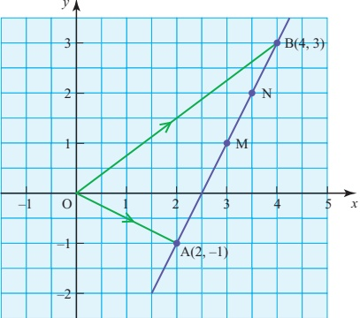

<!-- page 237 -->

The vector joining A to B is  $ \overrightarrow{AB} $ and this is given by

 $$ \begin{aligned}\overrightarrow{AB}&=\overrightarrow{AO}+\overrightarrow{OB}\\&=-\overrightarrow{OA}+\overrightarrow{OB}\\&=\overrightarrow{OB}-\overrightarrow{OA}\\&=\binom{4}{3}-\binom{2}{-1}=\binom{2}{4}\end{aligned} $$ 

Since  $ \overrightarrow{AB} = \begin{pmatrix} 2 \\ 4 \end{pmatrix} $, then it follows that the length of AB is given by

 $$ \begin{aligned}\left|\overrightarrow{AB}\right|&=\sqrt{2^{2}+4^{2}}\\&=\sqrt{20}.\end{aligned} $$ 

You can find the position vectors of points along AB as follows.

The mid-point, M, has position vector  $ \overrightarrow{OM} $, given by

 $$ \begin{aligned}\overrightarrow{OM}&=\overrightarrow{OA}+\frac{1}{2}\overrightarrow{AB}\\&=\binom{2}{-1}+\frac{1}{2}\binom{2}{4}\\&=\binom{3}{1}.\end{aligned} $$ 

In the same way, the position vector of the point N, three-quarters of the distance from A to B, is given by

 $$ \begin{aligned}\overrightarrow{ON}&=\begin{pmatrix}2\\ -1\end{pmatrix}+\frac{3}{4}\binom{2}{4}\\&=\begin{pmatrix}3\frac{1}{2}\\ 2\end{pmatrix}\end{aligned} $$ 

and it is possible to find the position vector of any other point of subdivision of the line AB in the same way.

## p A point P has position vector  $ \overrightarrow{OP} = \overrightarrow{OA} + \lambda \overrightarrow{AB} $ where  $ \lambda $ is a fraction

Show that this can be expressed as

 $$ \overrightarrow{OP}=(1-\lambda)\overrightarrow{OA}+\lambda\overrightarrow{OB}. $$ 

## The vector equation of a line

It is now a small step to go from finding the position vector of any point on the line AB to finding the vector form of the equation of the line AB. To take this step, you will find it helpful to carry out the following activity.

<!-- page 238 -->

ACTIVITY 10.1 The position vectors of a set of points are given by

 $$ \mathbf{r}=\binom{2}{-1}+\lambda\binom{2}{4} $$ 

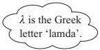

where  $ \lambda $ is a parameter which may take any value.

(i) Show that  $ \lambda = 2 $ corresponds to the point with position vector  $ \begin{pmatrix}6\\7\end{pmatrix} $.

(ii) Find the position vectors of points corresponding to values of $\lambda$ of $-2, -1$, $0, \frac{1}{2}, \frac{3}{4}, 1$, 3.

(iii) Mark all your points on a sheet of squared paper and show that when they are joined up they give the line AB in figure 10.2.

(iv) State what values of  $ \lambda $ correspond to the points A, B, M and N.

(v) What can you say about the position of the point if

(a)  $ 0 < \lambda < 1 $?

(b)  $ \lambda > 1 $?

(c)  $ \lambda < 0 $?

This activity should have convinced you that

 $$ \mathbf{r}=\binom{2}{-1}+\lambda\binom{2}{4} $$ 

The number $\lambda$ is called a parameter and it can take any value. Of course, you can use other letters for the parameter such as $\mu$, $s$ and $t$.

is the equation of the line passing through  $ (2,-1) $ and  $ (4,3) $, written in vector form.

You may find it helpful to think of this in these terms.

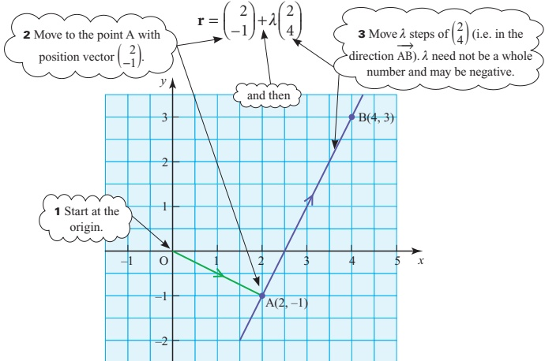

Figure 10.2

<!-- page 239 -->

You should also have noticed that when:

 $ \lambda = 0 $ the point corresponds to the point A
 $ \lambda = 1 $ the point corresponds to the point B
 $ 0 < \lambda < 1 $ the point lies between A and B
 $ \lambda > 1 $ the point lies beyond B
 $ \lambda < 0 $ the point lies beyond A.

The vector form of the equation is not unique; there are many (in fact infinitely many) different ways in which the equation of any particular line may be expressed. There are two reasons for this: direction and location.

## Direction

The direction of the line in the example is  $ \binom{2}{4} $. That means that for every 2 units along (in the  $ \mathbf{i} $ direction), the line goes up 4 units (in the  $ \mathbf{j} $ direction). This is equivalent to stating that for every 1 unit along, the line goes up 2 units, corresponding to the equation

 $$ \mathbf{r}=\binom{2}{-1}+\lambda\binom{1}{2}. $$ 

The only difference is that the two equations have different values of $\lambda$ for

particular points. In the first equation, point B, with position vector $\begin{pmatrix} 4 \\ 3 \end{pmatrix}$,

corresponds to a value of $\lambda$ of 1. In the second equation, the value of $\lambda$ for B is 2.

The direction $\begin{pmatrix} 2 \\ 4 \end{pmatrix}$ is the same as $\begin{pmatrix} 1 \\ 2 \end{pmatrix}$, or as any multiple of $\begin{pmatrix} 1 \\ 2 \end{pmatrix}$ such as $\begin{pmatrix} 3 \\ 6 \end{pmatrix}$,

$\begin{pmatrix} -5 \\ -10 \end{pmatrix}$ or $\begin{pmatrix} 100.5 \\ 201 \end{pmatrix}$. Any of these could be used in the vector equation of the line.

## Location

In the equation

 $$ \mathbf{r}=\binom{2}{-1}+\lambda\binom{2}{4} $$ 

 $ \binom{2}{-1} $ is the position vector of the point A on the line, and represents the point at which the line was joined. However, this could have been any other point on the line, such as  $ \mathrm{M}(3,1) $,  $ \mathrm{B}(4,3) $, etc. Consequently

 $$ \mathbf{r}=\binom{3}{1}+\lambda\binom{2}{4} $$ 

and

 $$ \mathbf{r}=\binom{4}{3}+\lambda\binom{2}{4} $$

<!-- page 240 -->

are also equations of the same line, and there are infinitely many other possibilities, one corresponding to each point on the line.

Notes

It is usual to refer to any valid vector form of the equation as the vector equation of the line even though it is not unique.

2 It is often a good idea to give the direction vector in its simplest integer form: for example, replacing  $ \begin{pmatrix} 2 \\ 4 \end{pmatrix} $ with  $ \begin{pmatrix} 1 \\ 2 \end{pmatrix} $.

## The general vector form of the equation of a line

If A and B are points with position a and b, then the equation

 $$ \mathbf{r}=\overrightarrow{OA}+\lambda\overrightarrow{AB} $$ 

may be written as

 $$ \mathbf{r}=\mathbf{a}+\lambda(\mathbf{b}-\mathbf{a}) $$ 

which implies

 $$ \mathbf{r}=(1-\lambda)\mathbf{a}+\lambda\mathbf{b}. $$ 

This is the general vector form of the equation of the line joining two points.

### ACTIVITY 10.2

Plot the following lines on the same sheet of squared paper. When you have done so, explain why certain among them are the same as each other, others are parallel to each other, and others are in different directions.

(i)

 $$ \mathbf{r}=\binom{2}{-1}+\lambda\binom{1}{2} $$ 

 $$ \left(\mathrm{i i}\right)\mathbf{r}=\binom{2}{-1}+\lambda\binom{-1}{2}\quad\left(\mathrm{i i i}\right)\mathbf{r}=\binom{0}{2}+\lambda\binom{1}{2} $$ 

 $$ \left(\mathbf{iv}\right)\mathbf{r}=\binom{1}{-3}+\lambda\binom{3}{6} $$ 

(v)

 $$ \mathbf{r}=\binom{4}{3}+\lambda\binom{1}{-2} $$ 

The same methods can be used to find the vector equation of a line in three dimensions, as shown in this example.

### EXAMPLE 10.1

The co-ordinates of A and B are  $ (-2, 4, 1) $ and  $ (2, 1, 3) $ respectively.

(i) Find the vector equation of the line AB.

(ii) Does the point P(6, -2, 7) lie on the line AB?

(iii) The point N lies on the line AB.

Given that $3\big|\overrightarrow{AN}\big|=\big|\overrightarrow{NB}\big|$ find the co-ordinates of N.

## SOLUTION

(i)

 $$ \mathbf{a}=\overrightarrow{OA}=\begin{pmatrix}-2\\ 4\\ 1\end{pmatrix}and\mathbf{b}=\overrightarrow{OB}=\begin{pmatrix}2\\ 1\\ 3\end{pmatrix} $$ 

 $$ \overrightarrow{AB}=\mathbf{b}-\mathbf{a}=\begin{pmatrix}2\\ 1\\ 3\end{pmatrix}-\begin{pmatrix}-2\\ 4\\ 1\end{pmatrix}=\begin{pmatrix}4\\ -3\\ 2\end{pmatrix} $$

<!-- page 241 -->

The vector equation of a line can be written as

 $$ \begin{align*}\mathbf{r}&=\overrightarrow{OA}+\lambda\overrightarrow{AB}\\ \Rightarrow\qquad\mathbf{r}&=\begin{pmatrix}-2\\ 4\\ 1\end{pmatrix}+\lambda\begin{pmatrix}4\\ -3\\ 2\end{pmatrix}\iff\begin{cases}&\text{There are other ways of writing this equation, for example}\\&\mathbf{r}=\begin{pmatrix}2\\ 1\\ 3\end{pmatrix}+\lambda\begin{pmatrix}4\\ -3\\ 2\end{pmatrix}\text{or}\mathbf{r}=\begin{pmatrix}-6\\ 7\\ -1\end{pmatrix}+\lambda\begin{pmatrix}4\\ -3\\ 2\end{pmatrix}\\&\text{but they are all equivalent to each other.}\end{cases}\end{align*} $$ 

(ii) If P lies on the line AB then for some value of  $ \lambda $

 $$ \begin{pmatrix}x\\y\\z\end{pmatrix}=\begin{pmatrix}6\\-2\\7\end{pmatrix}=\begin{pmatrix}-2\\4\\1\end{pmatrix}+\lambda\begin{pmatrix}4\\-3\\2\end{pmatrix} $$ 

Find the value of  $ \lambda $ for the x co-ordinate.

 $$ x：\begin{aligned}6&=-2+4\lambda\quad\Rightarrow\quad\lambda=2\end{aligned} $$ 

Then check whether this value of  $ \lambda $ gives a y co-ordinate of -2 and a z co-ordinate of 7.

 $$ y\text{：}-2=4-3\times2 $$ 

 $$ z：\quad7\neq1+2\times2 $$ 

So the point P(6,-2,7) does not lie on the line.

(iii) Since  $ 3\left|\overrightarrow{AN}\right|=\left|\overrightarrow{NB}\right| $, N must lie  $ \frac{1}{4} $ of the way along the line AB so the value of  $ \lambda $ is  $ \frac{1}{4} $.

 $$ \overrightarrow{ON}=\overrightarrow{OA}+\frac{1}{4}\overrightarrow{AB} $$ 

 $$ \overrightarrow{ON}=\begin{pmatrix}-2\\ 4\\ 1\end{pmatrix}+\frac{1}{4}\begin{pmatrix}4\\ -3\\ 2\end{pmatrix}=\begin{pmatrix}-1\\ 3\frac{1}{4}\\ 1\frac{1}{2}\end{pmatrix} $$ 

So the co-ordinates of N are  $ (-1, 3.25, 1.5) $.

## EXERCISE 10A

1 For each of these pairs of points, A and B, write down:

(a) the vector  $ \overrightarrow{AB} $

(b)  $ \left|\overrightarrow{AB}\right| $

(c) the position vector of the mid-point of AB.

(i) A is (2,3), B is (4,11).

(ii) A is (4,3), B is (0,0).

(iii) A is  $ (-2, -1) $, B is  $ (4, 7) $.

(iv) A is  $ (-3, 4) $, B is  $ (3, -4) $.

(v) A is  $ (-10, -8) $, B is  $ (-5, 4) $.

<!-- page 242 -->

2 Find the equation of each of these lines in vector form.

(i) Joining (2, 1) to (4, 5).

(ii) Joining (3, 5) to (0, 8).

(iii) Joining  $ (-6, -6) $ to  $ (4, 4) $.

(iv) Through (5, 3) in the same direction as  $ \mathbf{i} + \mathbf{j} $.

(v) Through (2, 1) parallel to  $ 6i + 3j $.

(vi) Through (0, 0) parallel to  $ \begin{pmatrix} -1 \\ 4 \end{pmatrix} $.

(vii) Joining (0, 0) to (-2, 8).

(viii) Joining (3, -12) to (-1, 4).

3 Find the equation of each of these lines in vector form.

(i) Through  $ (2,4,-1) $ in the direction  $ \begin{pmatrix}3\\6\\4\end{pmatrix} $

(ii) Through  $ (1,0,-1) $ in the direction  $ \begin{pmatrix}1\\0\\0\end{pmatrix} $

(iii) Through  $ (1,0,4) $ and  $ (6,3,-2) $

(iv) Through  $ (0,0,1) $ and  $ (2,1,4) $

(v) Through (1, 2, 3) and (-2, -4, -6)

4 Determine whether the given point P lies on the line.

(i) P(5, 1, 4) and the line  $ \mathbf{r} = \begin{pmatrix} 1 \\ 3 \\ 4 \end{pmatrix} + \lambda \begin{pmatrix} 2 \\ -1 \\ 0 \end{pmatrix} $

(ii) P(-1, 5, 1) and the line  $ \mathbf{r} = \begin{pmatrix} 1 \\ 3 \\ 4 \end{pmatrix} + \lambda \begin{pmatrix} 2 \\ -2 \\ 3 \end{pmatrix} $

(iii) P(-5, 3, 12) and the line  $ \mathbf{r} = \begin{pmatrix} 1 \\ 0 \\ -2 \end{pmatrix} + \lambda \begin{pmatrix} -2 \\ 1 \\ 5 \end{pmatrix} $

(iv) P(9, 0, -6) and the line  $ \mathbf{r} = \begin{pmatrix} 1 \\ 2 \\ 0 \end{pmatrix} + \lambda \begin{pmatrix} 4 \\ -1 \\ -2 \end{pmatrix} $

(v) P(-9, -2, -17) and the line  $ \mathbf{r} = \begin{pmatrix} 1 \\ 3 \\ -2 \end{pmatrix} + \lambda \begin{pmatrix} 2 \\ 1 \\ 3 \end{pmatrix} $

5 The co-ordinates of three points are A(-1,-2,1), B(-3,4,-5) and C(0,-2,4).

(i) Find a vector equation of the line AB.

(ii) Find the co-ordinates of the mid-point M of AB.

(iii) The point N lies on BC.

Given that  $ 2\left|\overrightarrow{BN}\right|=\left|\overrightarrow{NC}\right| $, find the equation of the line MN.

<!-- page 243 -->

## The intersection of two lines

Hold a pen and a pencil to represent two distinct straight lines as follows:

hold them to represent parallel lines;

hold them to represent intersecting lines;

hold them to represent lines which are not parallel and which do not intersect (even if you extend them).

In three-dimensional space two or more straight lines which are not parallel and which do not meet are known as skew lines. In a plane two distinct lines are either parallel or intersecting, but in three dimensions there are three possibilities: the lines may be parallel, or intersecting, or skew. The next example illustrates a method of finding whether two lines meet, and, if they do meet, the co-ordinates of the point of intersection.

### EXAMPLE 10.2

Find the position vector of the point where the following lines intersect.

 $$ \mathbf{r}=\binom{2}{3}+\lambda\binom{1}{2}\quad\text{and}\quad\mathbf{r}=\binom{6}{1}+\mu\binom{1}{-3} $$ 

Note here that different letters are used for the parameters in the two equations to avoid confusion.

## SOLUTION

When the lines intersect, the position vector is the same for each of them.

 $$ \mathbf{r}=\binom{x}{y}=\binom{2}{3}+\lambda\binom{1}{2}=\binom{6}{1}+\mu\binom{1}{-3} $$ 

This gives two simultaneous equations for $\lambda$ and $\mu$.

 $$ \begin{array}{l}x\colon\quad2+\lambda=6+\mu\quad\Rightarrow\quad\lambda-\mu=4\\ y\colon\quad3+2\lambda=1-3\mu\quad\Rightarrow\quad2\lambda+3\mu=-2\end{array} $$ 

Solving these gives  $ \lambda = 2 $ and  $ \mu = -2 $. Substituting in either equation gives

 $$ \mathbf{r}=\begin{pmatrix}4\\ 7\end{pmatrix} $$ 

which is the position vector of the point of intersection.

<!-- page 244 -->

Find the co-ordinates of the point of intersection of the lines joining A(1, 6) to B(4, 0), and C(1, 1) to D(5, 3).

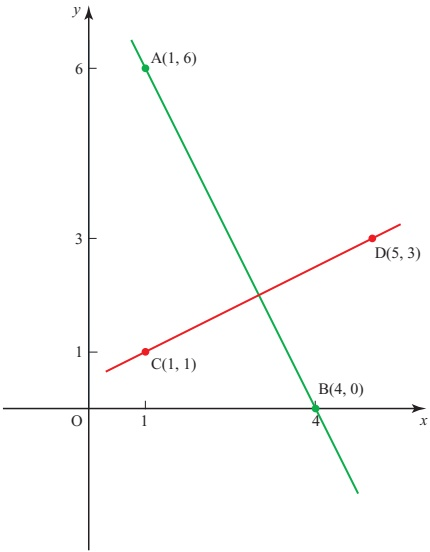

### Figure 10.3

## SOLUTION

 $$ \overrightarrow{AB}=\begin{pmatrix}4\\ 0\end{pmatrix}-\begin{pmatrix}1\\ 6\end{pmatrix}=\begin{pmatrix}3\\ -6\end{pmatrix} $$ 

and so the vector equation of line AB is

 $$ \mathbf{r}=\overrightarrow{OA}+\lambda\overrightarrow{AB} $$ 

 $$ \mathbf{r}=\binom{1}{6}+\lambda\binom{3}{-6} $$ 

 $$ \overrightarrow{CD}=\begin{pmatrix}5\\ 3\end{pmatrix}-\begin{pmatrix}1\\ 1\end{pmatrix}=\begin{pmatrix}4\\ 2\end{pmatrix} $$ 

and so the vector equation of line CD is

 $$ \mathbf{r}=\overrightarrow{OC}+\mu\overrightarrow{CD} $$ 

 $$ \mathbf{r}=\binom{1}{1}+\mu\binom{4}{2} $$ 

The intersection of these lines is at

 $$ \mathbf{r}=\binom{1}{6}+\lambda\binom{3}{-6}=\binom{1}{1}+\mu\binom{4}{2} $$

<!-- page 245 -->

$$ x：\quad1+3\lambda=1+4\mu\quad\Rightarrow\quad3\lambda-4\mu=0 $$ 

 $$ y：\quad6-6\lambda=1+2\mu\quad\Rightarrow\quad6\lambda+2\mu=5 $$ 

Solve  $ ① $ and  $ ② $ simultaneously:

 $$ \begin{aligned}&\textcircled{1}：\quad3\lambda-4\mu=0\\&\textcircled{2} \times2：\quad\frac{12\lambda+4\mu=10}{}\\&Add：\quad\frac{15\lambda-10}{}\\&\Rightarrow\quad\lambda=\frac{2}{3}\end{aligned} $$ 

Substitute  $ \lambda = \frac{2}{3} $ in the equation for AB:

 $$ \Rightarrow\mathbf{r}=\binom{1}{6}+\frac{2}{3}\binom{3}{-6} $$ 

 $$ \Rightarrow\mathbf{r}=\binom{3}{2} $$ 

The point of intersection has co-ordinates  $ (3, 2) $.

Note

Alternatively, you could have found  $ \mu=\frac{1}{2} $ and substituted in the equation for CD.

In three dimensions, lines may be parallel, they may intersect or they may be skew.

### EXAMPLE 10.4

Determine whether each pair of lines are parallel, intersect or are skew.

(i)

 $$ \mathbf{r}=\begin{pmatrix}1\\ -2\\ 1\end{pmatrix}+\lambda\begin{pmatrix}-3\\ 2\\ 1\end{pmatrix}and\mathbf{r}=\begin{pmatrix}1\\ 3\\ -2\end{pmatrix}+\mu\begin{pmatrix}6\\ -4\\ -2\end{pmatrix} $$ 

(ii)

 $$ \mathbf{r}=\begin{pmatrix}1\\ 2\\ -1\end{pmatrix}+\lambda\begin{pmatrix}2\\ -3\\ 4\end{pmatrix}and\mathbf{r}=\begin{pmatrix}4\\ -2\\ -5\end{pmatrix}+\mu\begin{pmatrix}-1\\ 2\\ 1\end{pmatrix} $$ 

## SOLUTION

(i) The vectors  $ \begin{pmatrix} -3 \\ 2 \\ 1 \end{pmatrix} $ and  $ \begin{pmatrix} 6 \\ -4 \\ -2 \end{pmatrix} $ are in the same direction as

 $$ \begin{pmatrix}6\\-4\\-2\end{pmatrix}=-2\begin{pmatrix}-3\\2\\1\end{pmatrix}\xleftarrow{\quad\mathrm{Note~the~lines~are~different~as~one~\underbrace{~}_{\mathrm{~line~passes~through~}(1,-2,1)~and~\underbrace{~}_{\mathrm{~the~other~through~}(1,3,-2).~}}}}\ . $$ 

So the lines are parallel.

<!-- page 246 -->

(ii) These lines are not parallel, so either they intersect or they are skew.

If the two lines intersect then there is a point $(x, y, z)$ that lies on both lines.

 $$ \begin{pmatrix}x\\y\\z\end{pmatrix}=\begin{pmatrix}1\\2\\-1\end{pmatrix}+\lambda\begin{pmatrix}2\\-3\\4\end{pmatrix}and\begin{pmatrix}x\\y\\z\end{pmatrix}=\begin{pmatrix}4\\-2\\-5\end{pmatrix}+\mu\begin{pmatrix}-1\\2\\1\end{pmatrix} $$ 

This gives three simultaneous equations for  $ \lambda $ and  $ \mu $.

 $$ x：\quad1+2\lambda=4-\mu\qquad\implies\quad2\lambda+\mu=3 $$ 

 $$ y：\quad2-3\lambda=-2+2\mu\quad\Rightarrow\quad3\lambda+2\mu=4 $$ 

 $$ z:\quad-1+4\lambda=-5+\mu\quad\Rightarrow\quad4\lambda-\mu=-4 $$ 

Now solve any two of the three equations above simultaneously.

Using ① and ②:

 $$ \left\{\begin{aligned}2\lambda+\mu&=3\\ 3\lambda+2\mu&=4\end{aligned}\right\}\quad\Rightarrow\quad\left\{\begin{aligned}4\lambda+2\mu&=6\\ 3\lambda+2\mu&=4\end{aligned}\right\}\quad\Rightarrow\quad\lambda=2,\mu=-1 $$ 

If these solutions satisfy the previously unused equation (equation  $ \textcircled{3} $ here) then the lines meet, and you can substitute the value of  $ \lambda $ (or  $ \mu $) into equations  $ \textcircled{1} $,  $ \textcircled{2} $ and  $ \textcircled{3} $ to find the co-ordinates of the point of intersection.

If these solutions do not satisfy equation  $ \textcircled{3} $ then the lines are skew.

 $$ 4\lambda-\mu=-4 $$ 

When  $ \lambda = 2 $ and  $ \mu = -1 $

 $$ 4\lambda-\mu=9\neq-4 $$ 

As there are no values for $\lambda$ and $\mu$ that satisfy all three equations, the lines do not meet and so are skew; you have already seen that they are not parallel.

Note

If the equation of the second line was

 $$ \begin{pmatrix}x\\y\\z\end{pmatrix}=\begin{pmatrix}4\\-2\\8\end{pmatrix}+\mu\begin{pmatrix}-1\\2\\1\end{pmatrix} $$ 

then the values of  $ \lambda = 2 $ and  $ \mu = -1 $ would produce the same point for both lines:

 $$ \begin{pmatrix}x\\ y\\ z\end{pmatrix}=\begin{pmatrix}1\\ 2\\ -1\end{pmatrix}+2\begin{pmatrix}2\\ -3\\ 4\end{pmatrix}=\begin{pmatrix}5\\ -4\\ 7\end{pmatrix} $$ 

and

 $$ \begin{pmatrix}x\\y\\z\end{pmatrix}=\begin{pmatrix}4\\-2\\8\end{pmatrix}-1\begin{pmatrix}-1\\2\\1\end{pmatrix}=\begin{pmatrix}5\\-4\\7\end{pmatrix}. $$ 

So the lines would intersect at  $ (5, -4, 7) $.

<!-- page 247 -->

## EXERCISE 10B

1 Find the position vector of the point of intersection of each of these pairs of lines.

(i)

 $$ \mathbf{i})\quad\mathbf{r}=\binom{2}{1}+\lambda\binom{1}{0}\qquad\text{and}\quad\mathbf{r}=\binom{3}{0}+\mu\binom{1}{1} $$ 

(ii)

 $$ \mathbf{i})\mathbf{r}=\binom{2}{-1}+\lambda\binom{1}{2}\quad\text{and}\quad\mathbf{r}=\mu\binom{1}{1} $$ 

 $$ \mathrm{(iii)}\mathbf{r}=\binom{0}{5}+\lambda\binom{-2}{-2}\qquad\mathrm{and}\quad\mathbf{r}=\binom{0}{-7}+\mu\binom{1}{2} $$ 

 $$ \left(\mathbf{i}\mathbf{v}\right)\mathbf{r}=\binom{-2}{-3}+\lambda\binom{-1}{3}\quad\mathrm{a n d}\quad\mathbf{r}=\binom{1}{3}+\mu\binom{2}{-1} $$ 

(v)

 $$ \mathbf{r}=\binom{2}{7}+\lambda\binom{1}{-1}\qquad\text{and}\quad\mathbf{r}=\binom{5}{1}+\mu\binom{1}{2} $$ 

2 Decide whether each of these pairs of lines intersect, are parallel or are skew. If the lines intersect, find the co-ordinates of the point of intersection.

 $$ \mathbf{(i)}\quad\mathbf{r}=\begin{pmatrix}1\\ -6\\ -1\end{pmatrix}+\lambda\begin{pmatrix}1\\ 2\\ 3\end{pmatrix}\quad\text{and}\quad\mathbf{r}=\begin{pmatrix}9\\ 7\\ 2\end{pmatrix}+\mu\begin{pmatrix}2\\ 3\\ -1\end{pmatrix} $$ 

 $$ \left(\mathbf{i}\mathbf{i}\right)\mathbf{r}=\begin{pmatrix}1\\ -6\\ 0\end{pmatrix}+\lambda\begin{pmatrix}6\\ -9\\ -3\end{pmatrix}\quad and\quad\mathbf{r}=\begin{pmatrix}-5\\ 3\\ 0\end{pmatrix}+\mu\begin{pmatrix}2\\ -3\\ -1\end{pmatrix} $$ 

 $$ \mathrm{(iii)}\mathbf{r}=\begin{pmatrix}6\\ -4\\ 2\end{pmatrix}+\lambda\begin{pmatrix}1\\ -2\\ 5\end{pmatrix}\quad and\quad\mathbf{r}=\begin{pmatrix}1\\ 4\\ -17\end{pmatrix}+\mu\begin{pmatrix}1\\ -1\\ 2\end{pmatrix} $$ 

 $$ \left(\mathbf{i v}\right)\mathbf{r}=\begin{pmatrix}-1\\ 2\\ 4\end{pmatrix}+\lambda\begin{pmatrix}2\\ 0\\ 3\end{pmatrix}\quad\text{and}\quad\mathbf{r}=\begin{pmatrix}-4\\ 4\\ 6\end{pmatrix}+\mu\begin{pmatrix}5\\ -2\\ 1\end{pmatrix} $$ 

 $$ \mathbf{\left(v\right)}\quad\mathbf{r}=\begin{pmatrix}0\\ -1\\ 4\end{pmatrix}+\lambda\begin{pmatrix}5\\ 3\\ -3\end{pmatrix}\quad and\quad\mathbf{r}=\begin{pmatrix}2\\ 5\\ -1\end{pmatrix}+\mu\begin{pmatrix}4\\ -3\\ 2\end{pmatrix} $$ 

 $$ \left(\mathbf{v}\mathbf{i}\right)\mathbf{r}=\begin{pmatrix}9\\ 3\\ -4\end{pmatrix}+\lambda\begin{pmatrix}1\\ 2\\ -3\end{pmatrix}\quad and\quad\mathbf{r}=\begin{pmatrix}1\\ -4\\ 5\end{pmatrix}+\mu\begin{pmatrix}1\\ -1\\ 2\end{pmatrix} $$ 

 $$ \left(\mathbf{v}\mathbf{i}\mathbf{i}\right)\mathbf{r}=\begin{pmatrix}2\\ 3\\ 1\end{pmatrix}+\lambda\begin{pmatrix}1\\ 1\\ -2\end{pmatrix}\quad and\quad\mathbf{r}=\begin{pmatrix}-1\\ -3\\ -1\end{pmatrix}+\mu\begin{pmatrix}1\\ 3\\ 2\end{pmatrix} $$ 

3 In this question the origin is taken to be at a harbour and the unit vectors i and j to have lengths of 1 km in the directions E and N.

A cargo vessel leaves the harbour and its position vector t hours later is given by

 $ \mathbf{r}_{1}=12\mathbf{t}\mathbf{i}+16\mathbf{t}\mathbf{j} $.

A fishing boat is trawling nearby and its position at time t is given by

 $$ \mathbf{r}_{2}=(10-3t)\mathbf{i}+(8+4t)\mathbf{j}. $$

<!-- page 248 -->

(i) How far apart are the two boats when the cargo vessel leaves harbour?

(ii) How fast is each boat travelling?

(iii) What happens?

4 The points A(1, 0), B(7, 2) and C(13, 7) are the vertices of a triangle. The mid-points of the sides BC, CA and AB are L, M and N.

(i) Write down the position vectors of L, M and N.

(ii) Find the vector equations of the lines AL, BM and CN.

(iii) Find the intersections of these pairs of lines.

(a) AL and BM (b) BM and CN

(iv) What do you notice?

5 The line  $ \mathbf{r} = \begin{pmatrix} -4 \\ 4 \\ -12 \end{pmatrix} + q\begin{pmatrix} 2 \\ -10 \\ 11 \end{pmatrix} $ meets  $ \mathbf{r} = \begin{pmatrix} 4 \\ -15 \\ -16 \end{pmatrix} + s\begin{pmatrix} 2 \\ -3 \\ -5 \end{pmatrix} $ at A and meets

 $ \mathbf{r} = \begin{pmatrix} -1 \\ -29 \\ -3 \end{pmatrix} + t\begin{pmatrix} 1 \\ 1 \\ 8 \end{pmatrix} $ at B. Find the co-ordinates of A and the length of AB.

6 To support a tree damaged in a gale a tree surgeon attaches wire guys to four of the branches (see the diagram). He joins (2, 0, 3) to (-1, 2, 6) and (0, 3, 5) to (-2, -2, 4). Do the guys, assumed straight, meet?

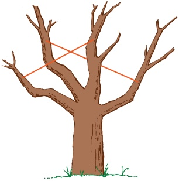

7 Show that the three lines  $ \mathbf{r} = \begin{pmatrix} -7 \\ 24 \\ -4 \end{pmatrix} + q\begin{pmatrix} 4 \\ -7 \\ 4 \end{pmatrix} $,  $ \mathbf{r} = \begin{pmatrix} 3 \\ -10 \\ 15 \end{pmatrix} + s\begin{pmatrix} 2 \\ 2 \\ -1 \end{pmatrix} $ and  $ \mathbf{r} = \begin{pmatrix} -3 \\ 6 \\ 6 \end{pmatrix} + t\begin{pmatrix} 8 \\ -3 \\ 2 \end{pmatrix} $ form a triangle and find the lengths of its sides.

<!-- page 249 -->

8 The drawing shows an ordinary music stand, which consists of a rectangle DEFG with a vertical support OA.

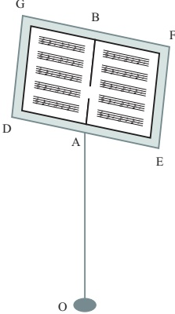

Relative to axes through the origin O, which is on the floor, the co-ordinates of various points are given (with dimensions in metres) as:

A is  $ (0, 0, 1) $    D is  $ (-0.25, 0, 1) $    F is  $ (0.25, 0.15, 1.3) $.

DE and GF are horizontal, A is the mid-point of DE and B is the mid-point of GF. C is on AB so that  $ AC = \frac{1}{3}AB $.

(i) Write down the vector  $ \overrightarrow{AD} $ and show that  $ \overrightarrow{EF} $ is  $ \begin{pmatrix} 0 \\ 0.15 \\ 0.3 \end{pmatrix} $.

(ii) Calculate the co-ordinates of C.

(iii) Find the equations of the lines DE and EF in vector form.

## The angle between two lines

In Pure Mathematics 1, Chapter 8 you learnt that the angle, $\theta$, between two vectors $\mathbf{a} = \begin{pmatrix} a_{1} \\ a_{2} \\ a_{3} \end{pmatrix}$ and $\mathbf{b} = \begin{pmatrix} b_{1} \\ b_{2} \\ b_{3} \end{pmatrix}$ can be found using the formula:

 $$ \cos\theta=\frac{\mathbf{a}.\mathbf{b}}{\left|\mathbf{a}\right|\left|\mathbf{b}\right|} $$ 

where  $ \mathbf{a} $.  $ \mathbf{b} $ is the scalar product and  $ \mathbf{a} $.  $ \mathbf{b} = a_1 b_1 + a_2 b_2 + a_3 b_3 $.

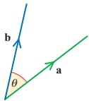

Figure 10.4

<!-- page 250 -->

EXAMPLE 10.5

(i) Find the angle between the vectors  $ \begin{pmatrix}-4\\3\\0\end{pmatrix} $ and  $ \begin{pmatrix}2\\-1\\3\end{pmatrix} $.

(ii) Verify that the vectors  $ \begin{pmatrix}-9\\-2\\4\end{pmatrix} $ and  $ \begin{pmatrix}2\\-3\\3\end{pmatrix} $ are perpendicular.

## SOLUTION

 $$ \mathbf{a}=\begin{pmatrix}-4\\ 3\\ 0\end{pmatrix}\quad\Rightarrow\quad\left|\mathbf{a}\right|=\sqrt{(-4)^{2}+3^{2}+0^{2}}=5 $$ 

 $$ \mathbf{b}=\begin{pmatrix}2\\ -1\\ 3\end{pmatrix}\quad\Rightarrow\quad\left|\mathbf{b}\right|=\sqrt{2^{2}+(-1)^{2}+3^{2}}=\sqrt{14} $$ 

The scalar product a.b is

 $$ \begin{pmatrix}-4\\3\\0\end{pmatrix}.\begin{pmatrix}2\\-1\\3\end{pmatrix}=(-4)\times2+3\times(-1)+0\times3=-11 $$ 

Substituting into $\theta = \frac{\mathbf{a} \cdot \mathbf{b}}{|\mathbf{a}||\mathbf{b}|}$ gives:

 $$ \cos\theta=\frac{-11}{5\sqrt{14}} $$ 

 $$ \Rightarrow\quad\theta=126.0^{\circ} $$ 

(ii) When two vectors are perpendicular, the angle between them is $90^{\circ}$. Since $\cos 90^{\circ} = 0$ then $\mathbf{a} \cdot \mathbf{b} = 0$.

So if the scalar product of two non-zero vectors is zero then the vectors are perpendicular.

 $$ \begin{aligned}\begin{pmatrix}-9\\ -2\\ 4\end{pmatrix}\cdot\begin{pmatrix}2\\ -3\\ 3\end{pmatrix}&=(-9)\times2+(-2)\times(-3)+4\times3\\&=(-18)+6+12\\&=0\end{aligned} $$ 

Therefore, the two vectors are perpendicular.

Even if two lines do not meet, it is still possible to specify the angle between them. The lines l and m shown in figure 10.5 do not meet; they are described as skew.

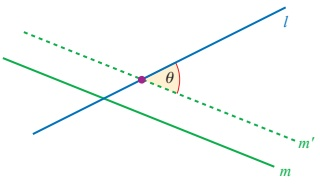

<!-- page 251 -->

The angle between them is that between their directions; it is shown in figure 10.5 as the angle  $ \theta $ between the lines l and  $ m' $, where  $ m' $ is a translation of the line m to a position where it does intersect the line l.

### EXAMPLE 10.6

Find the angle between the lines

 $$ \mathbf{r}=\begin{pmatrix}1\\ 0\\ 4\end{pmatrix}+\lambda\begin{pmatrix}2\\ -1\\ -1\end{pmatrix}\qquad and\quad\mathbf{r}=\begin{pmatrix}2\\ -1\\ 3\end{pmatrix}+\mu\begin{pmatrix}3\\ 0\\ 1\end{pmatrix}. $$ 

## SOLUTION

The angle between the lines is the angle between their directions  $ \begin{pmatrix}2\\-1\\-1\end{pmatrix} $ and  $ \begin{pmatrix}3\\0\\1\end{pmatrix} $.

Using  $ \cos\theta = \frac{\mathbf{a} \cdot \mathbf{b}}{|\mathbf{a}||\mathbf{b}|} $

 $$ \cos\theta=\frac{2\times3+(-1)\times0+(-1)\times1}{\sqrt{2^{2}+\left(-1\right)^{2}+\left(-1\right)^{2}}\times\sqrt{3^{2}+0^{2}+1^{2}}} $$ 

 $$ \cos\theta=\frac{5}{\sqrt{6}\times\sqrt{10}} $$ 

 $$ \begin{array}{r} \text{≥} \quad \theta=49.8^{\circ} \end{array} $$ 

## EXERCISE 10C

 $$ \operatorname{Remember}\mathbf{i}=\begin{pmatrix}1\\ 0\\ 0\end{pmatrix},\mathbf{j}=\begin{pmatrix}0\\ 1\\ 0\end{pmatrix}and\mathbf{k}=\begin{pmatrix}0\\ 0\\ 1\end{pmatrix}. $$ 

In questions 1 to 5, find the angle between each pair of lines.

 $$ \mathbf{1}\quad\mathbf{r}=\begin{pmatrix}2\\ 1\\ 3\end{pmatrix}+s\begin{pmatrix}1\\ 4\\ 0\end{pmatrix}\qquad\text{and}\quad\mathbf{r}=\begin{pmatrix}6\\ 10\\ 4\end{pmatrix}+t\begin{pmatrix}2\\ 1\\ 1\end{pmatrix} $$ 

 $$ \mathbf{2}\ \mathbf{r}=s\begin{pmatrix}4\\ 1\\ 4\end{pmatrix}\qquad\qquad\text{and}\quad\mathbf{r}=\begin{pmatrix}7\\ 0\\ -3\end{pmatrix}+t\begin{pmatrix}1\\ 2\\ -1\end{pmatrix} $$ 

 $$ \mathbf{3}\quad\mathbf{r}=\begin{pmatrix}4\\ 2\\ -1\end{pmatrix}+s\begin{pmatrix}3\\ 7\\ -4\end{pmatrix}\quad\text{and}\quad\mathbf{r}=\begin{pmatrix}5\\ 1\\ 0\end{pmatrix}+t\begin{pmatrix}2\\ 8\\ -5\end{pmatrix} $$ 

 $$ \mathbf{4}\ \mathbf{r}=2\mathbf{i}+3\mathbf{j}+4\mathbf{k}+s(\mathbf{i}+\mathbf{j}-\mathbf{k})\qquadand\quad\mathbf{r}=t(\mathbf{i}-\mathbf{k}) $$ 

 $$ \mathbf{5}\ \mathbf{r}=\mathbf{i}-2\mathbf{j}-\mathbf{k}+s(2\mathbf{i}+3\mathbf{j}+2\mathbf{k})\quad and\quad\mathbf{r}=2\mathbf{i}+\mathbf{j}+t\mathbf{k} $$

<!-- page 252 -->

6 The diagram shows an extension to a house. Its base and walls are rectangular and the end of its roof, EPF, is sloping, as illustrated.

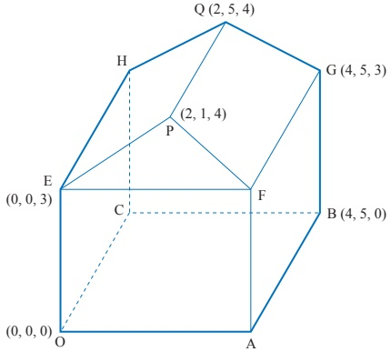

(i) Write down the co-ordinates of A and F.

(ii) Find, using vector methods, the angles FPQ and EPF.

The owner decorates the room with two streamers which are pulled taut. One goes from O to G, the other from A to H. She says that they touch each other and that they are perpendicular to each other.

(iii) Is she right?

7 The points A and B have position vectors, relative to the origin O, given by

 $$ \overrightarrow{OA}=\mathbf{i}+2\mathbf{j}+3\mathbf{k}\quad and\quad\overrightarrow{OB}=2\mathbf{i}+\mathbf{j}+3\mathbf{k}. $$ 

The line l has vector equation

 $$ \mathbf{r}=(1-2t)\mathbf{i}+(5+t)\mathbf{j}+(2-t)\mathbf{k}. $$ 

(i) Show that l does not intersect the line passing through A and B.

(ii) The point P lies on l and is such that angle PAB is equal to  $ 60^{\circ} $. Given that the position vector of P is  $ (1 - 2t)\mathbf{i} + (5 + t)\mathbf{j} + (2 - t)\mathbf{k} $, show that  $ 3t^{2} + 7t + 2 = 0 $. Hence find the only possible position vector of P.

[Cambridge International AS & A Level Mathematics 9709, Paper 3 Q10 June 2008]

<!-- page 253 -->

## The perpendicular distance from a point to a line

The scalar product is also useful when determining the distance between a point and a line.

### EXAMPLE 10.7

Find the shortest distance from point P(11, -5, -3) to the line l with equation

 $$ \mathbf{r}=\begin{pmatrix}1\\ 5\\ 0\end{pmatrix}+\lambda\begin{pmatrix}-3\\ 1\\ 4\end{pmatrix}. $$ 

## SOLUTION

The shortest distance from P to the line $l$ is $|\overrightarrow{\mathrm{NP}}|$ where N is a point on the line $l$ and PN is perpendicular to the line $l$.

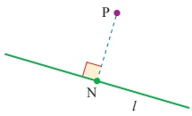

### Figure 10.6

You need to find the co-ordinates of N and then you can find  $ |\overrightarrow{NP}| $. N lies on the line l. Let the value of  $ \lambda $ at N be t.

So, relative to the origin O

 $$ \overrightarrow{ON}=\begin{pmatrix}1\\ 5\\ 0\end{pmatrix}+t\begin{pmatrix}-3\\ 1\\ 4\end{pmatrix}=\begin{pmatrix}1-3t\\ 5+t\\ 4t\end{pmatrix} $$ 

and

 $$ \begin{aligned}\overrightarrow{NP}&=\overrightarrow{OP}-\overrightarrow{ON}\\&=\begin{pmatrix}11\\-5\\-3\end{pmatrix}-\begin{pmatrix}1-3t\\5+t\\4t\end{pmatrix}\\&=\begin{pmatrix}10+3t\\-10-t\\-3-4t\end{pmatrix}\end{aligned} $$ 

As  $ \overrightarrow{NP} $ is perpendicular to the line l,

When two vectors are

perpendicular, their

 $ \overrightarrow{scalar} $ product is 0.

 $$ \overrightarrow{NP}\cdot\begin{pmatrix}-3\\ 1\\ 4\end{pmatrix}=0\xleftarrow{\blacktriangle} $$ 

The direction of the line $l$

<!-- page 254 -->

$$ \begin{aligned}\overrightarrow{\mathrm{NP}}.\begin{pmatrix}-3\\ 1\\ 4\end{pmatrix}&=\begin{pmatrix}10+3t\\ -10-t\\ -3-4t\end{pmatrix}.\begin{pmatrix}-3\\ 1\\ 4\end{pmatrix}\\&=(10+3t)\times(-3)+(-10-t)\times1+(-3-4t)\times4\\&=-30-9t-10-t-12-16t\\&=-52-26t\end{aligned} $$ 

The scalar product is 0, so

 $$ -52-26t=0\quad\Rightarrow\quad t=-2 $$ 

Substituting  $ t = -2 $ into  $ \overrightarrow{ON} $ and  $ \overrightarrow{NP} $ gives

 $$ \overrightarrow{ON}=\begin{pmatrix}1\\ 5\\ 0\end{pmatrix}-2\begin{pmatrix}-3\\ 1\\ 4\end{pmatrix}=\begin{pmatrix}7\\ 3\\ -8\end{pmatrix} $$ 

and

 $$ \overrightarrow{NP}=\begin{pmatrix}10+3\times(-2)\\ -10-(-2)\\ -3-4\times(-2)\end{pmatrix}=\begin{pmatrix}4\\ -8\\ 5\end{pmatrix} $$ 

So

 $$ \begin{aligned}\left|\overrightarrow{NP}\right|&=\sqrt{4^{2}+(-8)^{2}+5^{2}}\\&=\sqrt{105}\\&=10.25units\end{aligned} $$ 

## EXERCISE 10D

1 For each point P and line l find

(a) the co-ordinates of the point N on the line such that PN is perpendicular to the line

(b) the distance PN.

 $$ \mathbf{(i)}\quad\mathrm{P}(-2,11,5)\qquad\text{and}\qquad\mathbf{r}=\begin{pmatrix}0\\ 2\\ -3\end{pmatrix}+t\begin{pmatrix}-1\\ 2\\ 5\end{pmatrix} $$ 

 $$ \textcircled{i i}\quad\mathrm{P}(7,-1,6)\qquad\quad\mathrm{a n d}\qquad\quad\mathbf{r}=\left(\begin{matrix}2\\ 1\\ 3\end{matrix}\right)+t\left(\begin{matrix}1\\ -2\\ 4\end{matrix}\right) $$ 

 $$ \text{(iii)}\mathrm{P}(8,4,-1)\qquad\text{and}\qquad\mathbf{r}=\begin{pmatrix}1\\5\\-3\end{pmatrix}+t\begin{pmatrix}-1\\-2\\0\end{pmatrix} $$ 

2 Find the perpendicular distance of the point P $ (-7, -2, 13) $ to the line

 $$ \mathbf{r}=\begin{pmatrix}1\\ 2\\ 5\end{pmatrix}+\lambda\begin{pmatrix}1\\ 3\\ -4\end{pmatrix}. $$ 

3 Find the distance of the point C(0, 6, 0) to the line joining the points A(-4, 2, -3) and B(-2, 0, 1).

<!-- page 255 -->

4 The room illustrated in the diagram has rectangular walls, floor and ceiling. A string has been stretched in a straight line between the corners A and G.

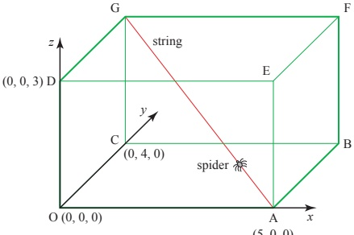

(5,0,0)

The corner O is taken as the origin. A is  $ (5,0,0) $, C is  $ (0,4,0) $ and D is  $ (0,0,3) $, where the lengths are in metres.

(i) Write down the co-ordinates of G.

(ii) Find the vector  $ \overrightarrow{AG} $ and the length of the string  $ |\overrightarrow{AG}| $.

(iii) Write down the equation of the line AG in vector form.

A spider walks up the string, starting from A.

(iv) Find the position vector of the spider when it is at Q, one quarter of the way from A to G, and find the angle OQG.

(v) Show that when the spider is 1.5 m above the floor it is at its closest point to O, and find how far it is then from O.

5 The diagram illustrates the flight path of a helicopter H taking off from an airport.

Co-ordinate axes Oxyz are set up with the origin O at the base of the airport control tower. The x axis is due east, the y axis due north and the z axis vertical.

The units of distance are kilometres throughout.

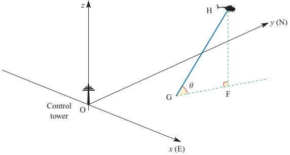

<!-- page 256 -->

The helicopter takes off from the point G.

The position vector  $ \mathbf{r} $ of the helicopter  $ t $ minutes after take-off is given by

 $$ \mathbf{r}=(1+t)\mathbf{i}+(0.5+2t)\mathbf{j}+2t\mathbf{k}. $$ 

(i) Write down the co-ordinates of G.

(ii) Find the angle the flight path makes with the horizontal.

(This angle is shown as  $ \theta $ in the diagram.)

(iii) Find the bearing of the flight path.

(This is the bearing of the line GF shown in the diagram.)

(iv) The helicopter enters a cloud at a height of 2 km.

Find the co-ordinates of the point where the helicopter enters the cloud.

(v) A mountain top is situated at M(5, 4.5, 3).

Find the value of $t$ when HM is perpendicular to the flight path GH.

Find the distance from the helicopter to the mountain top at this time.

## The vector equation of a plane

Which balances better, a three-legged stool or a four-legged stool? Why?

What information do you need to specify a particular plane?

There are various ways of finding the equation of a plane and these are given in this book. Your choice of which one to use will depend on the information you are given.

<!-- page 257 -->

## e Finding the equation of a plane given three points on it

There are several methods used to find the equation of a plane through three given points. The shortest method involves the use of vector product which is beyond the scope of this book. The method given here develops the same ideas as were used for the equation of a line. It will help you to understand the extra concepts involved, but it is not a requirement of the Cambridge syllabus.

## Vector form

To find the vector form of the equation of the plane through the points A, B and C (with position vectors  $ \overrightarrow{OA} = \mathbf{a} $,  $ \overrightarrow{OB} = \mathbf{b} $,  $ \overrightarrow{OC} = \mathbf{c} $), think of starting at the origin, travelling along OA to join the plane at A, and then any distance in each of the directions AB and  $ \overrightarrow{AC} $ to reach a general point R with position vector  $ \mathbf{r} $, where

 $$ \mathbf{r}=\overrightarrow{OA}+\lambda\overrightarrow{AB}+\mu\overrightarrow{AC}. $$ 

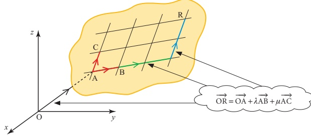

### Figure 10.7

This is a vector form of the equation of the plane. Since  $ \overrightarrow{OA} = \mathbf{a} $,  $ \overrightarrow{AB} = \mathbf{b} - \mathbf{a} $ and  $ \overrightarrow{AC} = \mathbf{c} - \mathbf{a} $, it may also be written as

 $$ \mathbf{r}=\mathbf{a}+\lambda(\mathbf{b}-\mathbf{a})+\mu(\mathbf{c}-\mathbf{a}). $$ 

### EXAMPLE 10.8

Find the equation of the plane through A(4,2,0), B(3,1,1) and C(4,-1,1).

## SOLUTION

 $$ \overrightarrow{OA}=\begin{pmatrix}4\\ 2\\ 0\end{pmatrix} $$ 

 $$ \overrightarrow{AB}=\overrightarrow{OB}-\overrightarrow{OA}=\begin{pmatrix}3\\ 1\\ 1\end{pmatrix}-\begin{pmatrix}4\\ 2\\ 0\end{pmatrix}=\begin{pmatrix}-1\\ -1\\ 1\end{pmatrix} $$

<!-- page 258 -->

$$ \overrightarrow{AC}=\overrightarrow{OC}-\overrightarrow{OA}=\begin{pmatrix}4\\ -1\\ 1\end{pmatrix}-\begin{pmatrix}4\\ 2\\ 0\end{pmatrix}=\begin{pmatrix}0\\ -3\\ 1\end{pmatrix} $$ 

So the equation  $ \mathbf{r} = \overrightarrow{OA} + \lambda \overrightarrow{AB} + \mu \overrightarrow{AC} $ becomes

 $$ \mathbf{r}=\begin{pmatrix}4\\ 2\\ 0\end{pmatrix}+\lambda\begin{pmatrix}-1\\ -1\\ 1\end{pmatrix}+\mu\begin{pmatrix}0\\ -3\\ 1\end{pmatrix}. $$ 

This is the vector form of the equation, written using components.

## Cartesian form

You can convert this equation into cartesian form by writing it as

 $$ \begin{pmatrix}x\\y\\z\end{pmatrix}=\begin{pmatrix}4\\2\\0\end{pmatrix}+\lambda\begin{pmatrix}-1\\-1\\1\end{pmatrix}+\mu\begin{pmatrix}0\\-3\\1\end{pmatrix} $$ 

and eliminating $\lambda$ and $\mu$. The three equations contained in this vector equation may be simplified to give

 $$ \begin{array}{r l r}{\lambda}&{{}}&{=-x+4}\end{array} $$ 

 $$ \lambda+3\mu=-y+2 $$ 

 $$ \lambda+\mu\ =z $$ 

Substituting ① into ② gives

 $$ -x+4+3\mu=-y+2 $$ 

 $$ 3\mu=x-y-2 $$ 

 $$ \mu=\frac{1}{3}(x-y-2) $$ 

Substituting this and  $ ^{①} $ into  $ ^{③} $ gives

 $$ -x+4+\frac{1}{3}(x-y-2)=z $$ 

 $$ -3x+12+x-y-2=3z $$ 

 $$ 2x+y+3z=10 $$ 

and this is the cartesian equation of the plane through A, B and C.

## Note

In contrast to the equation of a line, the equation of a plane is more neatly expressed in cartesian form. The general cartesian equation of a plane is often written as either

 $$ a x+b y+c z=d\quad\mathrm{~o r~}\quad n_{1}x+n_{2}y+n_{3}z=d. $$

<!-- page 259 -->

## Finding the equation of a plane using the direction perpendicular to it

Lay a sheet of paper on a flat horizontal table and mark several straight lines on it. Now take a pencil and stand it upright on the sheet of paper (see figure 10.8).

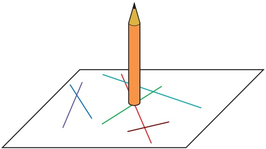

### Figure 10.8

(i) What angle does the pencil make with any individual line?

(ii) Would it make any difference if the table were tilted at an angle (apart from the fact that you could no longer balance the pencil)?

The discussion above shows you that there is a direction (that of the pencil) which is at right angles to every straight line in the plane. A line in that direction is said to be perpendicular to the plane or normal to the plane.

This allows you to find a different vector form of the equation of a plane which you use when you know the position vector  $ \mathbf{a} $ of one point A in the plane and the direction  $ \mathbf{n} = n_1\mathbf{i} + n_2\mathbf{j} + n_3\mathbf{k} $ perpendicular to the plane.

What you want to find is an expression for the position vector  $ \mathbf{r} $ of a general point R in the plane (see figure 10.9). Since AR is a line in the plane, it follows that AR is at right angles to the direction  $ \mathbf{n} $.

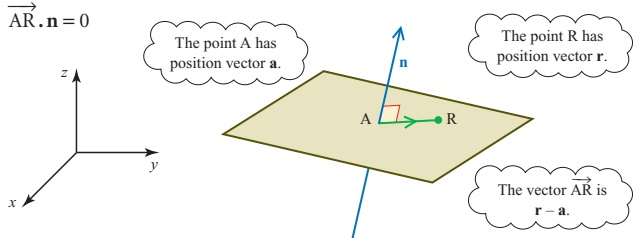

Figure 10.9

<!-- page 260 -->

The vector  $ \overrightarrow{AR} $ is given by

 $$ \overset{\longrightarrow}{\mathrm{A R}}=\mathbf{r}-\mathbf{a} $$ 

and so

 $$ \left(\mathbf{r}-\mathbf{a}\right),\mathbf{n}=0. $$ 

For example, the plane through A(2, 0, 0) perpendicular to  $ \mathbf{n} = (3\mathbf{i} - 4\mathbf{j} + \mathbf{k}) $ can be written as  $ (\mathbf{r} - 2\mathbf{i}) \cdot (3\mathbf{i} - 4\mathbf{j} + \mathbf{k}) = 0 $ which simplifies to  $ 3x - 4y + z = 6 $.

This can also be written as

 $$ \mathbf{r},\mathbf{n}-\mathbf{a},\mathbf{n}=0 $$ 

or

 $$ \begin{pmatrix}x\\y\\z\end{pmatrix}.\begin{pmatrix}n_{1}\\n_{2}\\n_{3}\end{pmatrix}-\mathbf{a}.\mathbf{n}=0 $$ 

 $$ \begin{align*}\Rightarrow\quad&\begin{pmatrix}x\\ y\\ z\end{pmatrix}.\begin{pmatrix}n_1\\ n_2\\ n_3\end{pmatrix}=\mathbf{a}.\mathbf{n}\end{align*} $$ 

 $$ \begin{array}{l}\Rightarrow\quad n_{1}x+n_{2}y+n_{3}z=d\end{array} $$ 

where $d=\mathbf{a}.\mathbf{n}$.

Notice that d is a constant scalar.

### EXAMPLE 10.9

Write down the equation of the plane through the point (2, 1, 3) given that the vector  $ \begin{pmatrix} 4 \\ 5 \\ 6 \end{pmatrix} $ is perpendicular to the plane.

## SOLUTION

In this case, the position vector  $ \mathbf{a} $ of the point  $ (2, 1, 3) $ is given by  $ \mathbf{a} = \begin{pmatrix} 2 \\ 1 \\ 3 \end{pmatrix} $.

The vector perpendicular to the plane is

 $$ \mathbf{n}=\begin{pmatrix}n_{1}\\ n_{2}\\ n_{3}\end{pmatrix}=\begin{pmatrix}4\\ 5\\ 6\end{pmatrix}. $$ 

The equation of the plane is

 $$ n_{1}x+n_{2}y+n_{3}z=\mathbf{a}.\mathbf{n} $$ 

 $$ 4x+5y+6z=2\times4+1\times5+3\times6 $$ 

 $$ 4x+5y+6z=31 $$ 

Look carefully at the equation of the plane in Example 10.9. You can see at once that the vector  $ \begin{pmatrix} 4 \\ 5 \\ 6 \end{pmatrix} $, formed from the coefficients of x, y and z, is perpendicular to the plane.

<!-- page 261 -->

The vector  $ \begin{pmatrix} n_{1} \\ n_{2} \\ n_{3} \end{pmatrix} $ is perpendicular to all planes of the form

 $$ n_{1}x+n_{2}y+n_{3}z=d $$ 

whatever the value of $d$ (see figure 10.10). Consequently, all planes of that form are parallel; the coefficients of $x$, $y$ and $z$ determine the direction of the plane, the value of $d$ its location.

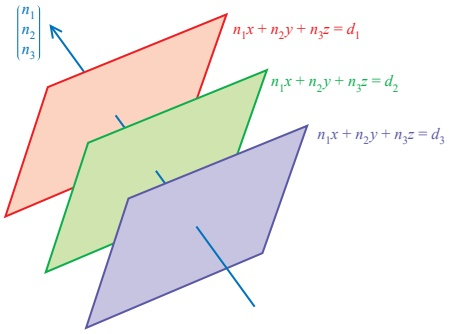

Figure 10.10

## The intersection of a line and a plane

There are three possibilities for the intersection of a line and a plane.

1 The line and plane are not parallel and so they intersect in one point

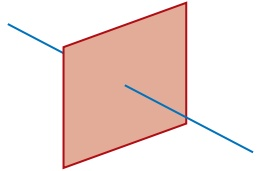

2 The line and plane are parallel and so do not intersect

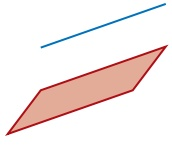

Figure 10.11

3 The line and plane are parallel and the line lies in the plane

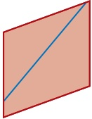

The point of intersection of a line and a plane is found by following the procedure in the next example.

<!-- page 262 -->

Find the point of intersection of the line  $ \mathbf{r} = \begin{pmatrix} 2 \\ 3 \\ 4 \end{pmatrix} + \lambda \begin{pmatrix} 1 \\ 2 \\ -1 \end{pmatrix} $ with the plane  $ 5x + y - z = 1 $.

Find the point of intersection of the line  $ r = \left( \frac{5}{4} \right)^2 + x\left( \frac{2}{-1} \right) $ with the plane  $ 5x + y - z = 1 $.

SOLUTION

The line is

 $  \mathbf{r} = \begin{pmatrix} x \\ y \\ z \end{pmatrix} = \begin{pmatrix} 2 \\ 3 \\ 4 \end{pmatrix} + \lambda \begin{pmatrix} 1 \\ 2 \\ -1 \end{pmatrix}  $

and so for any point on the line

 $  x = 2 + \lambda \quad y = 3 + 2\lambda \quad \text{and} \quad z = 4 - \lambda  $.

Substituting these into the equation of the plane  $ 5x + y - z = 1 $ gives

 $  5(2 + \lambda) + (3 + 2\lambda) - (4 - \lambda) = 1  $

 $  8\lambda = -8  $

 $  \lambda = -1  $.

Substituting  $ \lambda = -1 $ in the equation of the line gives

 $  \mathbf{r} = \begin{pmatrix} x \\ y \\ z \end{pmatrix} = \begin{pmatrix} 2 \\ 3 \\ 4 \end{pmatrix} - \begin{pmatrix} 1 \\ 2 \\ -1 \end{pmatrix} = \begin{pmatrix} 1 \\ 1 \\ 5 \end{pmatrix}  $

so the point of intersection is (1, 1, 5).

As a check, substitute (1, 1, 5) into the equation of the plane:

 $  5x + y - z = 5 + 1 - 5  $

 $  = 1  $ as required.

When a line is parallel to a plane, its direction vector is perpendicular to the plane's normal vector.

Show that the line  $ \mathbf{r} = \begin{pmatrix} 2 \\ 1 \\ 0 \end{pmatrix} + t \begin{pmatrix} 3 \\ 1 \\ -2 \end{pmatrix} $ is parallel to the plane  $ 2x + 4y + 5z = 8 $.

SOLUTION

The direction of the line is  $ \begin{pmatrix} 3 \\ 1 \\ -2 \end{pmatrix} $ and of the normal to the plane is  $ \begin{pmatrix} 2 \\ 4 \\ 5 \end{pmatrix} $.

If these two vectors are perpendicular, then the line and plane are parallel.

To prove that two vectors are perpendicular, you need to show that their scalar product is 0.

 $  \begin{pmatrix} 3 \\ 1 \\ -2 \end{pmatrix} \cdot \begin{pmatrix} 2 \\ 4 \\ 5 \end{pmatrix} = 3 \times 2 + 1 \times 4 + (-2) \times 5 = 0  $

### EXAMPLE 10.11

So the line and plane are parallel as required.

<!-- page 263 -->

To prove that a line lies in a plane, you need to show the line and the plane are parallel and that any point on the line also lies in the plane.

### EXAMPLE 10.12

Does the line  $ \mathbf{r} = \begin{pmatrix} 2 \\ 1 \\ 0 \end{pmatrix} + t \begin{pmatrix} 3 \\ 1 \\ -2 \end{pmatrix} $ lie in the plane  $ 2x + 4y + 5z = 8 $?

## SOLUTION

You have already seen that this line and plane are parallel in Example 10.11.

Find a point on the line  $ \mathbf{r} = \begin{pmatrix} 2 \\ 1 \\ 0 \end{pmatrix} + t \begin{pmatrix} 3 \\ 1 \\ -2 \end{pmatrix} $ by setting t = 1.

So the point  $ (5, 2, -2) $ lies on the line.

Now check that this point satisfies the equation of the plane,  $ 2x + 4y + 5z = 8 $.

 $$ 2\times5+4\times2+5\left(-2\right)=8\checkmark $$ 

The line and the plane are parallel and the point  $ (5, 2, -2) $ lies both on the line and in the plane. Therefore the line must lie in the plane.

Note

The previous two examples showed you that the line  $ \mathbf{r} = \begin{pmatrix} 2 \\ 1 \\ 0 \end{pmatrix} + t\begin{pmatrix} 3 \\ 1 \\ -2 \end{pmatrix} $ lies in the plane  $ 2x + 4y + 5z = 8 $. This line is parallel to all the planes in the form  $ 2x + 4y + 5z = d $ but in the case when d = 8 it lies in the plane; for other values of d the line and the plane never meet.

## The distance of a point from a plane

The shortest distance of a point, A, from a plane is the distance AP, where P is the point where the line through A perpendicular to the plane intersects the plane (see figure 10.12). This is usually just called the distance of the point from the plane. The process of finding this distance is shown in the next example.

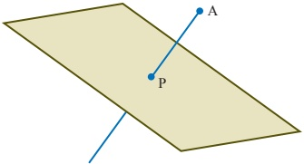

Figure 10.12

<!-- page 264 -->

A is the point  $ (7, 5, 3) $ and the plane  $ \pi $ has the equation  $ 3x + 2y + z = 6 $. Find

(i) the equation of the line through A perpendicular to the plane  $ \pi $

(ii) the point of intersection, P, of this line with the plane

(iii) the distance AP.

## SOLUTION

(i) The direction perpendicular to the plane $3x+2y+z=6$ is $\begin{pmatrix}3\\2\\1\end{pmatrix}$ so the line through $(7,5,3)$ perpendicular to the plane is given by

 $$ \mathbf{r}=\begin{pmatrix}7\\ 5\\ 3\end{pmatrix}+\lambda\begin{pmatrix}3\\ 2\\ 1\end{pmatrix}. $$ 

(ii) For any point on the line

 $$ x=7+3\lambda\qquad y=5+2\lambda\qquad and\qquad z=3+\lambda. $$ 

Substituting these expressions into the equation of the plane  $ 3x + 2y + z = 6 $ gives

 $$ \begin{align*}3(7+3\lambda)+2(5+2\lambda)+(3+\lambda)&=6\\14\lambda&=-28\\\lambda&=-2.\end{align*} $$ 

So the point P has co-ordinates  $ (1, 1, 1) $.

(iii) The vector  $ \overrightarrow{AP} $ is given by

 $$ \begin{pmatrix}1\\1\\1\end{pmatrix}-\begin{pmatrix}7\\5\\3\end{pmatrix}=\begin{pmatrix}-6\\-4\\-2\end{pmatrix} $$ 

and so the length AP is  $ \sqrt{(-6)^2 + (-4)^2 + (-2)^2} = \sqrt{56} $.

## Note

In practice, you would not usually follow the procedure in Example 10.13 because there is a well-known formula for the distance of a point from a plane. You are invited to derive this in the following activity.

ACTIVITY 10.3 Generalise the work in Example 10.13 to show that the distance of the point $(\alpha,\beta,\gamma)$ from the plane $n_1x + n_2y + n_3z = d$ is given by

 $$ \frac{\left|n_{1}\alpha+n_{2}\beta+n_{3}\gamma-d\right|}{\sqrt{n_{1}^{2}+n_{2}^{2}+n_{3}^{2}}}. $$

<!-- page 265 -->

## The angle between a line and a plane

You can find the angle between a line and a plane by first finding the angle between the normal to the plane and the direction of the line. A normal to a plane is a line perpendicular to it.

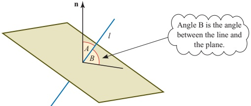

### Figure 10.13

The angle between the normal, n, and the plane is  $ 90^{\circ} $.

Angle A is the angle between the line l and the normal to the plane, so the angle between the line and the plane, angle B, is  $ 90^{\circ} - A $.

EXAMPLE 10.14

Find the angle between the line  $ \mathbf{r} = \begin{pmatrix} -1 \\ 2 \\ -3 \end{pmatrix} + t\begin{pmatrix} -1 \\ 2 \\ 5 \end{pmatrix} $ and the plane  $ 2x + 3y + z = 4 $.

## SOLUTION

The normal,  $ \mathbf{n} $, to the plane is  $ \begin{pmatrix}2\\3\\1\end{pmatrix} $. The direction,  $ \mathbf{d} $, of the line is  $ \begin{pmatrix}-1\\2\\5\end{pmatrix} $.

The angle between the normal to the plane and the direction of the line is given by:

 $$ \cos A=\frac{\mathbf{n}.\mathbf{d}}{|\mathbf{n}||\mathbf{d}|}\xleftarrow{\mathbf{n}.\mathbf{d}}=2\times(-1)+3\times2+1\times5=9 $$ 

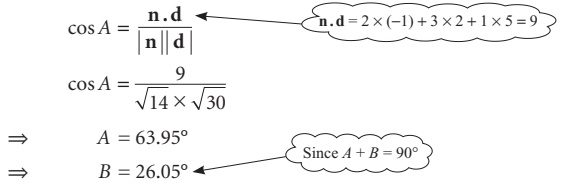

 $$ \cos A=\frac{9}{\sqrt{14}\times\sqrt{30}} $$ 

So the angle between the line and the plane is  $ 26^{\circ} $ to the nearest degree.

<!-- page 266 -->

EXERCISE 10E

1 Determine whether the following planes and lines are parallel. If they are parallel, show whether the line lies in the plane.

(i)

 $$ \mathbf{r}=\begin{pmatrix}3\\ 1\\ 2\end{pmatrix}+t\begin{pmatrix}1\\ -1\\ 2\end{pmatrix}\qquad\quad and\qquad3x+y-z=8 $$ 

(ii)

 $$ \mathbf{r}={\left(\begin{array}{c}{2}\\ {1}\\ {-5}\end{array}\right)}+t{\left(\begin{array}{c}{1}\\ {-4}\\ {3}\end{array}\right)}\qquad{\mathrm{a n d}}\qquad x-2y-3z=2 $$ 

(iii)

 $$ \mathbf{r}={\left(\begin{matrix}{2}\\ {0}\\ {7} \end{matrix}\right)}+t{\left(\begin{matrix}{-3}\\ {2}\\ {-5} \end{matrix}\right)}\qquad{\mathrm{a n d}}\qquad2x-3y+z=5 $$ 

(iv)

 $$ \mathbf{v})\mathbf{r}=\begin{pmatrix}-2\\ 1\\ 4\end{pmatrix}+t\begin{pmatrix}3\\ -4\\ 0\end{pmatrix}\qquad and\qquad4x+3y+z=-1 $$ 

(v)

 $$ \mathbf{r}=\begin{pmatrix}2\\ 1\\ 0\end{pmatrix}+t\begin{pmatrix}-5\\ 4\\ 7\end{pmatrix}\qquad\text{and}\qquad x+2y-6z=0 $$ 

 $$ \mathrm{（vi）~r}=\begin{pmatrix}2\\ 3\\ 5\end{pmatrix}+t\begin{pmatrix}-1\\ 2\\ 5\end{pmatrix} \quad and \quad 3x+4y-z=7 $$ 

2 The points L, M and N have co-ordinates  $ (0, -1, 2) $,  $ (2, 1, 0) $ and  $ (5, 1, 1) $.

(i) Write down the vectors  $ \overrightarrow{LM} $ and  $ \overrightarrow{LN} $.

 $$  Show that\overrightarrow{LM}\cdot\begin{pmatrix}1\\ -4\\ -3\end{pmatrix}=\overrightarrow{LN}\cdot\begin{pmatrix}1\\ -4\\ -3\end{pmatrix}=0. $$ 

(iii) Find the equation of the plane LMN.

3 (i) Show that the points A(1, 1, 1), B(3, 0, 0) and C(2, 0, 2) all lie in the plane  $ 2x + 3y + z = 6 $.

(ii) Show that  $ \overrightarrow{AB} \cdot \begin{pmatrix} 2 \\ 3 \\ 1 \end{pmatrix} = \overrightarrow{AC} \cdot \begin{pmatrix} 2 \\ 3 \\ 1 \end{pmatrix} = 0 $

(iii) The point D has co-ordinates (7, 6, 2). D lies on a line perpendicular to the plane through one of the points A, B or C.

Through which of these points does the line pass?

4 The lines $l, \mathbf{r} = \begin{pmatrix} 2 \\ 1 \\ 0 \end{pmatrix} + \lambda \begin{pmatrix} 1 \\ 1 \\ 1 \end{pmatrix}$, and $m, \mathbf{r} = \begin{pmatrix} 4 \\ 0 \\ 2 \end{pmatrix} + \mu \begin{pmatrix} 1 \\ 0 \\ 1 \end{pmatrix}$, lie in the same plane $\pi$.

(i) Find the co-ordinates of any two points on each of the lines.

(ii) Show that all the four points you found in part (i) lie on the plane x-z=2.

(iii) Explain why you now have more than sufficient evidence to show that the plane $\pi$ has equation $x-z=2$.

(iv) Find the co-ordinates of the point where the lines l and m intersect.

<!-- page 267 -->

5 Find the points of intersection of the following planes and lines.

 $$ \mathbf{(i)}\quad x+2y+3z=11\qquad\text{and}\qquad\mathbf{r}=\begin{pmatrix}1\\ 2\\ 4\end{pmatrix}+\lambda\begin{pmatrix}1\\ 1\\ 1\end{pmatrix} $$ 

 $$ \textcircled{i i}\quad2x+3y-4z=1\qquad\mathrm{a n d}\qquad\mathbf{r}=\begin{pmatrix}-2\\ -3\\ -4\end{pmatrix}+\lambda\begin{pmatrix}3\\ 4\\ 5\end{pmatrix} $$ 

 $$ \text{(iii)}3x-2y-z=14\qquad\text{and}\qquad\mathbf{r}=\begin{pmatrix}8\\ 4\\ 2\end{pmatrix}+\lambda\begin{pmatrix}1\\ 2\\ 1\end{pmatrix} $$ 

 $$ \left(\mathbf{i v}\right)x+y+z=0\qquad\qquad\mathrm{a n d}\qquad\mathbf{r}=\lambda\left(\begin{matrix}1\\ 1\\ 2\end{matrix}\right) $$ 

 $$ \mathbf{r}=\begin{pmatrix}3\\ -1\\ 2\end{pmatrix}+\lambda\begin{pmatrix}2\\ 5\\ -3\end{pmatrix} $$ 

6 In each of the following examples you are given a point A and a plane  $ \pi $. Find

(a) the equation of the line through A perpendicular to  $ \pi $

(b) the point of intersection, P, of this line with  $ \pi $

(c) the distance AP.

(i) A is $(2,2,3);\ \pi$ is $x-y+2z=0$

(ii) A is $(2,3,0);\ \pi$ is $2x+5y+3z=0$

(iii) A is (3, 1, 3);  $ \pi $ is x = 0

(iv) A is (2, 1, 0);  $ \pi $ is 3x - 4y + z = 2

(v) A is $(0,0,0);\ \pi$ is $x+y+z=6$

7 The points U and V have co-ordinates (4, 0, 7) and (6, 4, 13).

The line UV is perpendicular to a plane and the point U lies in the plane.

(i) Find the equation of the plane in cartesian form.

(ii) The point W has co-ordinates  $ (-1, 10, 2) $.

Show that  $ WV^{2}=WU^{2}+UV^{2} $.

(iii) What information does this give you about the position of W?

Confirm this information by a different method.

8 (i) Find the equation of the line through  $ (13, 5, 0) $ parallel to the line

 $$ \mathbf{r}=\begin{pmatrix}2\\ -1\\ 4\end{pmatrix}+\lambda\begin{pmatrix}3\\ 1\\ -2\end{pmatrix}. $$ 

(ii) Where does this line meet the plane  $ 3x + y - 2z = 2 $?

(iii) How far is the point of intersection from (13, 5, 0)?

<!-- page 268 -->

9 (i) Find the angle between the line  $ \mathbf{r} = \mathbf{i} + 2\mathbf{j} + t(3\mathbf{i} + 2\mathbf{j} - \mathbf{k}) $ and the plane  $ 2x - 3y - z = 1 $.

(ii) Find the angle between the line  $ \mathbf{r} = \begin{pmatrix} -1 \\ 0 \\ 2 \end{pmatrix} + t\begin{pmatrix} 1 \\ 3 \\ -2 \end{pmatrix} $ and the plane  $ 4x - 3z = -2 $.

(iii) Find the angle between the line  $ \mathbf{r} = \mathbf{i} + 2\mathbf{j} + t(3\mathbf{i} + 2\mathbf{j} - \mathbf{k}) $ and the plane  $ 7x - 2y + z = 1 $.

10 A is the point  $ (1, 2, 0) $, B is  $ (0, 4, 1) $ and C is  $ (9, -2, 1) $.

(i) Show that A, B and C lie in the plane  $ 2x + 3y - 4z = 8 $.

(ii) Write down the vectors AB and AC and verify that they are at right angles to  $ \begin{pmatrix} 2 \\ 3 \\ -4 \end{pmatrix} $.

(iii) Find the angle BAC.

(iv) Find the area of triangle ABC (using area =\frac{1}{2}bc\sin A).

11 P is the point (2, -1, 3), Q is (5, -5, 3) and R is (7, 2, -3). Find

(i) the lengths of PQ and QR

(ii) the angle PQR

(iii) the area of triangle PQR

(iv) the point S such that PQRS is a parallelogram.

12 P is the point  $ (2,2,4) $, Q is  $ (0,6,8) $, X is  $ (-2,-2,-3) $ and Y is  $ (2,6,9) $.

(i) Write in vector form the equations of the lines PQ and XY.

(ii) Verify that the equation of the plane PQX is  $ 2x + 5y - 4z = -2 $.

(iii) Does the point Y lie in the plane PQX?

(iv) Does any point on PQ lie on XY? (That is, do the lines intersect?

13 You are given the four points O(0, 0, 0), A(5, -12, 16), B(8, 3, 19) and C(-23, -80, 12).

(i) Show that the three points A, B and C all lie in the plane with equation  $ 2x - y + 3z = 70 $.

(ii) Write down a vector which is normal to this plane.

(iii) The line from the origin O perpendicular to this plane meets the plane at D. Find the co-ordinates of D.

(iv) Write down the equations of the two lines OA and AB in vector form.

(v) Hence find the angle OAB, correct to the nearest degree.

<!-- page 269 -->

14 A pyramid in the shape of a tetrahedron has base ABC and vertex P as shown in the diagram. The vertices A, B, C, P have position vectors

 $$ \mathbf{a}=-4\mathbf{j}+2\mathbf{k}, $$ 

respectively.

The equation of the plane of the base is

 $$ \mathbf{r}.\left(\begin{array}{r}2\\ -3\\ 4\end{array}\right)=20. $$ 

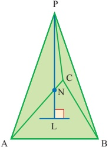

(i) Write down a vector which is normal to the base ABC.

The line through P, perpendicular to the base, cuts the base at L.

(ii) Find the equation of the line PL in vector form and use it to find the co-ordinates of L.

(iii) Find the co-ordinates of the point N on LP, such that  $ \overrightarrow{LN} = \frac{1}{4}LP $.

(iv) Find the angle between PA and PL.

15 The position vectors of three points A, B, C on a plane ski-slope are

 $ \mathbf{a} = 4\mathbf{i} + 2\mathbf{j} - \mathbf{k} $,  $ \mathbf{b} = -2\mathbf{i} + 26\mathbf{j} + 11\mathbf{k} $,  $ \mathbf{c} = 16\mathbf{i} + 17\mathbf{j} + 2\mathbf{k} $,

where the units are metres.

(i) Show that the vector  $ 2\mathbf{i} - 3\mathbf{j} + 7\mathbf{k} $ is perpendicular to  $ \overrightarrow{AB} $ and also perpendicular to  $ \overrightarrow{AC} $.

Hence find the equation of the plane of the ski-slope.

The track for an overhead railway lies along DEF, where D and E have position vectors  $ \mathbf{d} = 130\mathbf{i} - 40\mathbf{j} + 20\mathbf{k} $ and  $ \mathbf{e} = 90\mathbf{i} - 20\mathbf{j} + 15\mathbf{k} $, and F is a point on the ski-slope.

(ii) Find the equation of the straight line DE.

(iii) Find the position vector of the point F.

(iv) Find the length of the track DF.

16 A tunnel is to be excavated through a hill. In order to define position, co-ordinates  $ (x, y, z) $ are taken relative to an origin O such that x is the distance east from O, y is the distance north and z is the vertical distance upwards, with one unit equal to 100 m.

The tunnel starts at point A(2, 3, 5) and runs in the direction  $ \begin{pmatrix} 1 \\ 1 \\ -0.5 \end{pmatrix} $.

<!-- page 270 -->

It meets the hillside again at B. At B the side of the hill forms a plane with equation  $ x + 5y + 2z = 77 $.

(i) Write down the equation of the line AB in the form  $ \mathbf{r} = \mathbf{u} + \lambda \mathbf{t} $.

(ii) Find the co-ordinates of B.

(iii) Find the angle which AB makes with the upward vertical.

(iv) An old tunnel through the hill has equation  $ \mathbf{r} = \begin{pmatrix} 4 \\ 1 \\ 2 \end{pmatrix} + \mu \begin{pmatrix} 7 \\ 15 \\ 0 \end{pmatrix} $.

Show that the point P on AB where  $ x = 7\frac{1}{2} $ is directly above a point Q in the old tunnel. Find the vertical separation PQ of the tunnels at this point. [MEI]

17 ABCD is a parallelogram. The co-ordinates of A, B and D are  $ (-1, 1, 2) $,  $ (1, 2, 0) $ and  $ (1, 0, 2) $ respectively.

(i) Find the co-ordinates of C.

(ii) Use a scalar product to find the size of angle BAD.

(iii) Show that the vector  $ \mathbf{i} + 2\mathbf{j} + 2\mathbf{k} $ is perpendicular to the plane ABCD.

(iv) The diagonals AC and BD intersect at the point E.

Find a vector equation of the straight line l through E perpendicular to the plane ABCD.

(v) A point F lies on l and is 3 units from A.

Find the co-ordinates of the two possible positions of F.

[MEI]

18 The line $l$ has equation $\mathbf{r} = 4\mathbf{i} + 2\mathbf{j} - \mathbf{k} + t(2\mathbf{i} - \mathbf{j} - 2\mathbf{k})$. It is given that $l$ lies in the plane with equation $2x + by + cz = 1$, where $b$ and $c$ are constants.

(i) Find the values of b and c.

(ii) The point P has position vector  $ 2\mathbf{j} + 4\mathbf{k} $. Show that the perpendicular distance from P to l is  $ \sqrt{5} $.

[Cambridge International AS & A Level Mathematics 9709, Paper 3 Q9 June 2009]

19 With respect to the origin O, the points A and B have position vectors given by

 $$ \overrightarrow{OA}=2\mathbf{i}+2\mathbf{j}+\mathbf{k}\qquad and\qquad\overrightarrow{OB}=\mathbf{i}+4\mathbf{j}+3\mathbf{k}. $$ 

The line $l$ has vector equation $\mathbf{r} = 4\mathbf{i} - 2\mathbf{j} + 2\mathbf{k} + s(\mathbf{i} + 2\mathbf{j} + \mathbf{k})$.

(i) Prove that the line $l$ does not intersect the line through $A$ and $B$.

(ii) Find the equation of the plane containing l and the point A, giving your answer in the form  $ ax + by + cz = d $.

[Cambridge International AS & A Level Mathematics 9709, Paper 3 Q10 June 2005]

<!-- page 271 -->

20 The points A and B have position vectors, relative to the origin O, given by

 $$ \overrightarrow{OA}=\begin{pmatrix}-1\\ 3\\ 5\end{pmatrix}\qquad and\qquad\overrightarrow{OB}=\begin{pmatrix}3\\ -1\\ -4\end{pmatrix}. $$ 

The line l passes through A and is parallel to OB. The point N is the foot of the perpendicular from B to l.

(i) State a vector equation for the line $l$.

(ii) Find the position vector of N and show that BN = 3.

(iii) Find the equation of the plane containing A, B and N, giving your answer in the form  $ ax + by + cz = d $.

[Cambridge International AS & A Level Mathematics 9709, Paper 3 Q10 June 2006]

21 The straight line $l$ has equation $\mathbf{r} = \mathbf{i} + 6\mathbf{j} - 3\mathbf{k} + s(\mathbf{i} - 2\mathbf{j} + 2\mathbf{k})$. The plane $p$ has equation $(\mathbf{r} - 3\mathbf{i}) \cdot (2\mathbf{i} - 3\mathbf{j} + 6\mathbf{k}) = 0$. The line $l$ intersects the plane $p$ at the point A.

(i) Find the position vector of A.

(ii) Find the acute angle between l and p.

(iii) Find a vector equation for the line which lies in p, passes through A and is perpendicular to l.

[Cambridge International AS & A Level Mathematics 9709, Paper 3 Q10 November 2007]

## The intersection of two planes

If you look around you, you will find objects which can be used to represent planes – walls, floors, ceilings, doors, roofs, and so on. You will see that the intersection of two planes is a straight line.

### EXAMPLE 10.15

Find l, the line of intersection of the two planes

 $$ 3x+2y-3z=-18\quad and\quad x-2y+z=12. $$ 

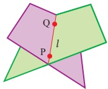

Figure 10.14

## SOLUTION 1

This solution depends on finding two points on l.

You can find one point by arbitrarily choosing to put y=0 into the equations of the planes and solving simultaneously:

 $$ \left.\begin{array}{r}3x-3z=-18\\ x+z=12\end{array}\right\}\Longleftrightarrow\left\{\begin{aligned}x-z&=-6\\ x+z&=12\end{aligned}\right\}\Longleftrightarrow x=3,z=9. $$

<!-- page 272 -->

So P with co-ordinates  $ (3,0,9) $ is a point on l.

(You could run into difficulties putting y=0 as it is possible that the line has no points where y=0. In this case your simultaneous equations for x and z would be inconsistent; you would then choose a value for x or z instead.)

In the same way, arbitrarily choosing to put z=1 into the equations gives

 $$ \left.\begin{array}{c}3x+2y=-15\\ x-2y=11\end{array}\right\}\Longleftrightarrow\left\{\begin{matrix}4x=-4\\ 2y=x-11\end{matrix}\right\}\Longleftrightarrow x=-1,y=-6 $$ 

so Q with co-ordinates  $ (-1, -6, 1) $ is a point on l.

 $$ \overrightarrow{PQ}=\begin{pmatrix}-1\\ -6\\ 1\end{pmatrix}-\begin{pmatrix}3\\ 0\\ 9\end{pmatrix}=\begin{pmatrix}-4\\ -6\\ -8\end{pmatrix}=-2\begin{pmatrix}2\\ 3\\ 4\end{pmatrix}. $$ 

Removing factor -2 makes the arithmetic simpler.

Use  $ \begin{pmatrix} 2 \\ 3 \\ 4 \end{pmatrix} $ as the direction vector for l.

The vector equation for $l$ is $\mathbf{r} = \begin{pmatrix} -1 \\ -6 \\ 1 \end{pmatrix} + t\begin{pmatrix} 2 \\ 3 \\ 4 \end{pmatrix}$.

## SOLUTION 2

In this solution the original two equations in x, y and z are solved, expressing each of x, y and z in terms of some parameter.

Put $x=\lambda$ into $\left\{\begin{array}{l}3x+2y-3z=-18\\x-2y+z=12\end{array}\right.$ and solve simultaneously for $y$ and $z$:

 $$ \left\{\begin{aligned}2y-3z&=-18-3\lambda\\ -2y+z&=12-\lambda\end{aligned}\right\}\Longrightarrow-2z=-6-4\lambda\Longrightarrow z=2\lambda+3 $$ 

so that  $ 2y = 3z - 18 - 3\lambda \Rightarrow 2y = 3(2\lambda + 3) - 18 - 3\lambda \Rightarrow 2y = 3\lambda - 9 \Rightarrow y = \frac{3}{2}\lambda = \frac{9}{2} $.

Thus the equations for l are

 $$ \left\{\begin{aligned}x&=\lambda\\ y&=\frac{3}{2}\lambda-\frac{9}{2}\\ z&=2\lambda+3\end{aligned}\right.\quad or\quad\left(\begin{aligned}x\\ y\\ z\end{aligned}\right)=\left(\begin{aligned}0\\ -\frac{9}{2}\\ 3\end{aligned}\right)+\lambda\left(\begin{aligned}1\\ \frac{3}{2}\\ 0\end{aligned}\right). $$ 

Note

This set of equations is different from but equivalent to the equations in Solution 1. The equivalence is most easily seen by substituting  $ 2\mu - 1 $ for  $ \lambda $, obtaining

 $$ \left\{\begin{aligned}x&=2\mu-1\\ y&=\frac{3}{2}(2\mu-1)-\frac{9}{2}=3\mu-6\\ z&=2(2\mu-1)+3=4\mu+1\end{aligned}\right. $$

<!-- page 273 -->

## The angle between two planes

The angle between two planes can be found by using the scalar product. As figures 10.15 and 10.16 make clear, the angle between planes  $ \pi_1 $ and  $ \pi_2 $ is the same as the angle between their normals,  $ \mathbf{n}_1 $ and  $ \mathbf{n}_2 $.

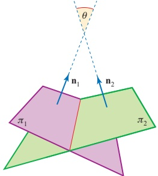

Figure 10.15

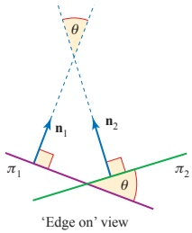

Figure 10.16

EXAMPLE 10.16

Find the acute angle between the planes  $ \pi_1: 2x + 3y + 5z = 8 $ and  $ \pi_2: 5x + y - 4z = 12 $.

SOLUTION

The planes have normals  $ \mathbf{n}_1 = \begin{pmatrix} 2 \\ 3 \\ 5 \end{pmatrix} $ and  $ \mathbf{n}_2 = \begin{pmatrix} 5 \\ 1 \\ -4 \end{pmatrix} $, so  $ \mathbf{n}_1 \cdot \mathbf{n}_2 = 10 + 3 - 20 = -7 $.

The angle between the normals is  $ \theta $, where

 $$ \cos\theta=\frac{\mathbf{n}_{1}\cdot\mathbf{n}_{2}}{\left|\mathbf{n}_{1}\right|\left|\mathbf{n}_{2}\right|}=\frac{-7}{\sqrt{38}\times\sqrt{42}} $$ 

 $$ \implies\phantom{a a a a}\theta=100.1^{\circ}\quad\mathrm{~(t o~1~d e c i m a l~p l a c e)~} $$ 

Therefore the acute angle between the planes is  $ 79.9^{\circ} $.

## Sheaf of planes

When several planes share a common line the arrangement is known as a sheaf of planes (figure 10.17). The next example shows how you can find the equation of a plane which contains the line $l$ common to two given planes, $\pi_{1}$ and $\pi_{2}$, without having to find the equation of $l$ itself, or any points on $l$.

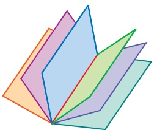

Figure 10.17

<!-- page 274 -->

Find the equation of the plane which passes through the point (1,2,3) and contains the common line of the planes  $ \pi_1: 2x + 2y + z + 3 = 0 $ and  $ \pi_2: 2x + 3y + z + 13 = 0 $.

## SOLUTION

The equation

 $$ p(2x+2y+z+3)+q(2x+3y+z+13)=0 $$ 

can be rearranged in the form $n_{1}x+n_{2}y+n_{3}z=d$, where not all of $a$, $b$, $c$, $d$ are zero provided $p$ and $q$ are not both zero. Therefore equation ① represents a plane. Further, any point $(x,y,z)$ which satisfies both $\pi_{1}$ and $\pi_{2}$ will also satisfy equation ①. Thus equation ① represents a plane containing the common line of planes $\pi_{1}$ and $\pi_{2}$. Substituting $(1,2,3)$ into ① gives

 $$ 12p+24q=0\quad\Longleftrightarrow\quad p=-2q. $$ 

The required equation is

 $$ \begin{array}{r}-2q(2x+2y+z+3)+q(2x+3y+z+13)=0\\ \Leftrightarrow \quad -q(2x+y+z-7)=0 \end{array} $$ 

so that the required plane has equation  $ 2x + y + z = 7 $.

? Planes  $ \pi_{1} $ and  $ \pi_{2} $ have equations  $ a_{1}x + b_{1}y + c_{1}z - d_{1} = 0 $ and  $ a_{2}x + b_{2}y + c_{2}z - d_{2} = 0 $ respectively. Plane  $ \pi_{3} $ has equation

 $$ p(a_{1}x+b_{1}y+c_{1}z-d_{1})+q(a_{2}x+b_{2}y+c_{2}z-d_{2})=0. $$ 

How is  $ \pi_{3} $ related to  $ \pi_{1} $ and  $ \pi_{2} $ if  $ \pi_{1} $ and  $ \pi_{2} $ are parallel?

## EXERCISE 10F

1 Find the vector equation of the line of intersection of each of these pairs of planes.

 $$ \textcircled{i}\quad x+y-6z=4,\quad\textcircled{5}5x-2y-3z=13 $$ 

 $$ \textcircled{i i}\quad5x-y+z=8,\quad x+3y+z=-4 $$ 

(iii)  $ 3x + 2y - 6z = 4 $,  $ x + 5y - 7z = 2 $

(iv)  $ 5x + 2y - 3z = -2 $,  $ 3x - 3y - z = 2 $

2 Find the acute angle between each pair of planes in question 1.

3 Find the vector equation of the line which passes through the given point and which is parallel to the line of intersection of the two planes.

(i)  $ (-2,3,5) $,  $ 4x-y+3z=5 $,  $ 3x-y+2z=7 $

(ii)  $ (4,-3,2) $,  $ 2x+3y+2z=6 $,  $ 4x-3y+z=11 $

<!-- page 275 -->

4 Find the equation of the plane which goes through  $ (3,2,-2) $ and which contains the common line of  $ x+7y-2z=3 $ and  $ 2x-3y+2z=1 $.

5 Find the equation of the plane which contains the point  $ (1,-2,3) $ and which is perpendicular to the common line of  $ 5x-3y-4z=2 $ and  $ 2x+y+5z=7 $.

6 Find the equation of the line which goes through  $ (4,-2,-7) $ and which is parallel to both  $ 2x-5y-2z=8 $ and  $ x+3y-3z=12 $.

7 The diagram shows the co-ordinates of the corners of parts of the roof of a warehouse.

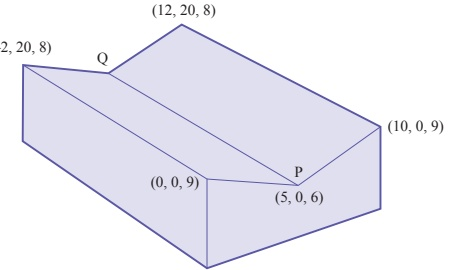

Find the equations of both roof sections, and the vector equation of the line PQ. Assuming that the z axis is vertical, what angle does PQ make with the horizontal?

Test drilling in the Namibian desert has shown the existence of gold deposits at (400, 0, -400), (-50, 500, -250), (-200, -100, -200), where the units are in metres, the x axis points east, the y axis points north, and the z axis points up. Assume that these deposits are part of the same seam, contained in plane  $ \pi $.

(i) Find the equation of plane  $ \pi $.

(ii) Find the angle at which  $ \pi $ is tilted to the horizontal.

The drilling positions (400, 0, 3), (-50, 500, 7), (-200, -100, 5) are on the desert floor. Take the desert floor as a plane,  $ \Pi $.

(iii) Find the equation of  $ \Pi $.

(iv) Find the equation of the line where the plane containing the gold seam intersects the desert floor.

(v) How far south of the origin does the line found in part (iv) pass?

<!-- page 276 -->

9 The diagram shows an arrow embedded in a target. The line of the arrow passes through the point A(2, 3, 5) and has direction vector  $ \mathbf{3i} + \mathbf{j} - 2\mathbf{k} $. The arrow intersects the target at the point B. The plane of the target has equation  $ x + 2y - 3z = 4 $. The units are metres.

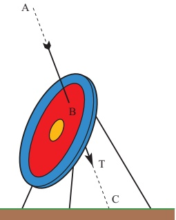

(i) Write down the vector equation of the line of the arrow in the form  $ \mathbf{r} = \mathbf{p} + \lambda \mathbf{q} $.

(ii) Find the value of  $ \lambda $ which corresponds to B. Hence write down the co-ordinates of B.

(iii) The point C is where the line of the arrow meets the ground, which is the plane z=0. Find the co-ordinates of C.

(iv) The tip, T, of the arrow is one-third of the way from B to C. Find the co-ordinates of T and the length of BT.

(v) Write down a normal vector to the plane of the target. Find the acute angle between the arrow and this normal.

## 10 A plane  $ \pi $ has equation  $ ax + by + z = d $

(i) Write down, in terms of $a$ and $b$, a vector which is perpendicular to $\pi$.

Points A(2,-1,2), B(4,-4,2), C(5,-6,3) lie on  $ \pi $.

(ii) Write down the vectors  $ \overrightarrow{AB} $ and  $ \overrightarrow{AC} $.

(iii) Use scalar products to obtain two equations for a and b.

(iv) Find the equation of the plane  $ \pi $.

(v) Find the angle which the plane  $ \pi $ makes with the plane x = 0.

(vi) Point D is the mid-point of AC. Point E is on the line between D and B such that DE : EB = 1 : 2. Find the co-ordinates of E.

<!-- page 277 -->

11 The diagram, which is not to scale, illustrates part of the roof of a building. Lines OA and OD are horizontal and at right angles. Lines BC and BE are also horizontal and at right angles. Line BC is parallel to OA and BE is parallel to OD.

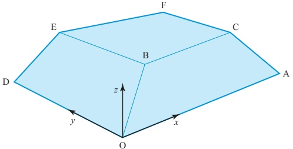

Axes are taken with O as origin, the x axis along OA, the y axis along OD and the z axis vertically upwards. The units are metres.

Point A has the co-ordinates  $ (50, 0, 0) $ and point D has the co-ordinates  $ (0, 20, 0) $.

The equation of line OB is  $ \begin{pmatrix} x \\ y \\ z \end{pmatrix} = \lambda \begin{pmatrix} 4 \\ 3 \\ 2 \end{pmatrix} $. The equation of plane CBEF is z = 3.

(i) Find the co-ordinates of B.

(ii) Verify that the equation of plane AOBC is  $ 2y - 3z = 0 $.

(iii) Find the equation of plane DOBE.

(iv) Write down normal vectors for planes AOBC and DOBE. Find the angle between these normal vectors. Hence write down the internal angle between the two roof surfaces AOBC and DOBE.

[MEI, adapted]

12 The plane $p$ has equation $3x + 2y + 4z = 13$. A second plane $q$ is perpendicular to $p$ and has equation $ax + y + z = 4$, where $a$ is a constant.

(i) Find the value of a.

(ii) The line with equation  $ \mathbf{r} = \mathbf{j} - \mathbf{k} + \lambda (\mathbf{i} + 2\mathbf{j} + 2\mathbf{k}) $ meets the plane  $ p $ at the point  $ A $ and the plane  $ q $ at the point  $ B $. Find the length of  $ AB $.

[Cambridge International AS & A Level Mathematics 9709, Paper 32 Q9 June 2010]

<!-- page 278 -->

13 The diagram shows a set of rectangular axes Ox, Oy and Oz, and three points A, B and C with position vectors  $ \overrightarrow{OA}=\begin{pmatrix}2\\0\\0\end{pmatrix} $,  $ \overrightarrow{OB}=\begin{pmatrix}1\\2\\0\end{pmatrix} $ and  $ \overrightarrow{OC}=\begin{pmatrix}1\\1\\2\end{pmatrix} $.

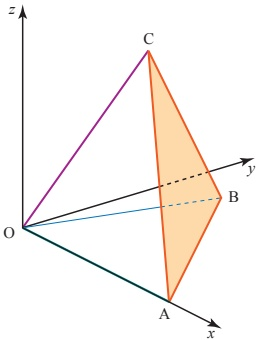

(i) Find the equation of the plane ABC, giving your answer in the form  $ ax + by + cz = d $.

(ii) Calculate the acute angle between the planes ABC and OAB.

[Cambridge International AS & A Level Mathematics 9709, Paper 3 Q9 June 2007]

14 Two planes have equations  $ 2x - y - 3z = 7 $ and  $ x + 2y + 2z = 0 $.

(i) Find the acute angle between the planes.

(ii) Find a vector equation for their line of intersection.

[Cambridge International AS & A Level Mathematics 9709, Paper 3 Q7 November 2008]

15 The plane $p$ has equation $2x - 3y + 6z = 16$. The plane $q$ is parallel to $p$ and contains the point with position vector $\mathbf{i} + 4\mathbf{j} + 2\mathbf{k}$.

(i) Find the equation of q, giving your answer in the form  $ ax + by + cz = d $.

(ii) Calculate the perpendicular distance between p and

(iii) The line $l$ is parallel to the plane $p$ and also parallel to the plane with equation $x - 2y + 2z = 5$. Given that $l$ passes through the origin, find a vector equation for $l$.

[Cambridge International AS & A Level Mathematics 9709, Paper 32 Q10 November 2009]

## KEY POINTS

1 The position vector  $ \overrightarrow{OP} $ of a point P is the vector joining the origin to P.

2 The vector  $ \overrightarrow{AB} $ is  $ \mathbf{b}-\mathbf{a} $, where  $ \mathbf{a} $ and  $ \mathbf{b} $ are the position vectors of A and B.

3 The vector r often denotes the position vector of a general point.

4 The vector equation of the line through A with direction vector  $ \mathbf{u} $ is given by  $ \mathbf{r} = \mathbf{a} + \lambda \mathbf{u} $.

<!-- page 279 -->

5 The vector equation of the line through points A and B is given by

 $$ \begin{aligned}\mathbf{r}&=\overrightarrow{OA}+\lambda\overrightarrow{AB}\\&=\mathbf{a}+\lambda(\mathbf{b}-\mathbf{a})\\&=(1-\lambda)\mathbf{a}+\lambda\mathbf{b}\end{aligned} $$ 

6 The vector equation of the line through  $ (a_{1}, a_{2}, a_{3}) $ in the direction  $ \begin{pmatrix} u_{1} \\ u_{2} \\ u_{3} \end{pmatrix} $ is

 $$ \mathbf{r}=\begin{pmatrix}a_{1}\\ a_{2}\\ a_{3}\end{pmatrix}+\lambda\begin{pmatrix}u_{1}\\ u_{2}\\ u_{3}\end{pmatrix}. $$ 

7 The angle between two vectors, a and b, is given by  $ \theta $ in

 $$ \cos\theta=\frac{\mathbf{a}.\mathbf{b}}{\left|\mathbf{a}\right|\left|\mathbf{b}\right|} $$ 

where  $ \mathbf{a}.\mathbf{b}=a_{1}b_{1}+a_{2}b_{2} $ (in two dimensions)

 $ =a_{1}b_{1}+a_{2}b_{2}+a_{3}b_{3} $ (in three dimensions).

8 The cartesian equation of a plane perpendicular to the vector  $ \mathbf{n} = \begin{pmatrix} n_1 \\ n_2 \\ n_3 \end{pmatrix} $ is

 $ n_1x + n_2y + n_3z = d $.

e 9 The vector equation of the plane through the points A, B and C is  $ \mathbf{r} = \overrightarrow{OA} + \lambda \overrightarrow{AB} + \mu \overrightarrow{AC} $.

10 The equation of the plane through the point with position vector  $ \mathbf{a} $, and perpendicular to  $ \mathbf{n} $, is given by  $ (\mathbf{r} - \mathbf{a}) \cdot \mathbf{n} = 0 $.

11 The distance of the point $(\alpha,\beta,\gamma)$ from the plane $n_1x+n_2y+n_3z=d$ is

 $$ \frac{\left|n_{1}\alpha+n_{2}\beta+n_{3}\gamma-d\right|}{\sqrt{n_{1}^{2}+n_{2}^{2}+n_{3}^{2}}}. $$ 

If the plane is written $ax + by + cz = d$, the formula for the distance is $\frac{|a\alpha + b\beta + c\gamma - d|}{\sqrt{a^{2} + b^{2} + c^{2}}}$

12 The angle between a line and a plane is found by first considering the angle between the line and a normal to the plane.

13 To find the equation of l, the line of intersection of the planes

 $$ a_{1}x+b_{1}y+c_{1}z=d_{1}\quad and\quad a_{2}x+b_{2}y+c_{2}z=d_{2} $$ 

find a point P on l by choosing a value for one of x, y, or z, substituting this into both equations, and then solving simultaneously to find the other two variables;

then write down the vector equation of l.

14 The angle between two planes is the same as the angle between their normals.

